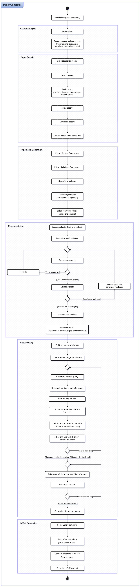

# Paper Generator

Automatic academic paper generator using local language and embedding models.

## Requirements

- #### Python 3.10+

- #### Python Packages
    - `lmstudio`
    - `numpy`
    - `matplotlib`
    - `seaborn`
    - `pymupdf4llm`
    - `feedparser`
    - `requests`

- #### LaTeX (MacTeX or BasicTeX, TeX Live, MikTeX...)

### LM Studio

The LM Studio App must be installed and a local server must be running.

You need at least:
- one LLM capable of tool use
- one VLM or multimodal model
- one embedding model

You could also run the code with just two local models:
- one multimodal language model that supports tool use
- one embedding model


**Recommendations:**

Under Developer → Server Settings:\
**Enable** "Only keep last JIT loaded models"

Under App Settings → Developer → Local LLM Service (headless):\
**Enable** "Enable Local LLM Service"

## Installation Commands for macOS

```bash
# Install Xcode Command Line Tools (for tools like make)
xcode-select --install

# Install Python packages
python3 -m pip install lmstudio numpy matplotlib seaborn pymupdf4llm feedparser requests

# Install LaTeX
# MacTeX (full distribution, ~4GB)
brew install --cask mactex
```

## Usage

First, put your files (notes, code, ...) related to the paper/topic into the `user_files/` folder.

Adjust `settings.py`, then run:\
`python3 paper_generator.py`

All generated files are saved to output/


## TODOs

- Switch from Arxiv API to SemanticScholar API (more papers, more metadata, embeddings of abstracts, ...)
- Add review/improvement loop to the paper writing process


## Algorithm

The simplified algorithm as an UML-like diagram.
A more detailed explanation of the paper writing process is in `phases/paper_writing/`


