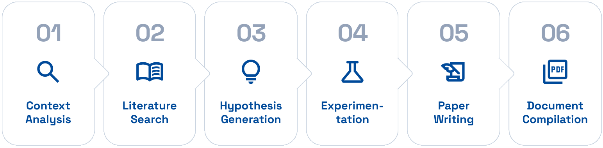
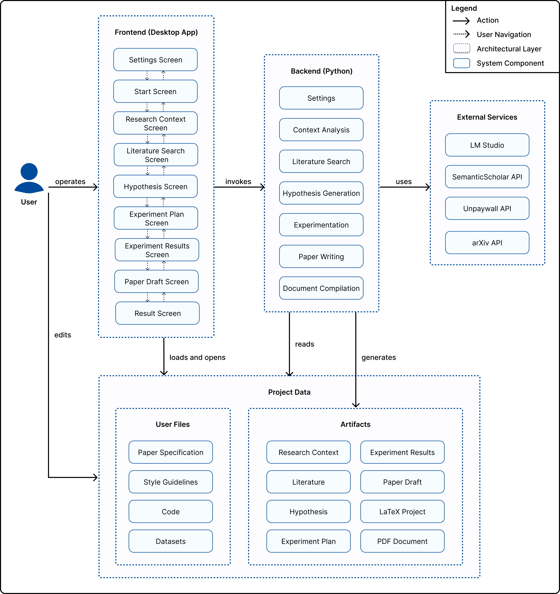

This system builds complete research papers locally and privately. Zero API costs. A GUI app uses local language and embedding models via LM Studio to search literature, formulate hypotheses, execute code for live experiments, draft text sections and compile the final LaTeX document. It uses a Human-in-the-Loop approach to always keep you in control of the research process.

## Generation Process



The entire process consists of 6 phases:
1. **Context Analysis** - Analyzes user's specification and code to define the context of the research
2. **Literature Search** - Automated literature search: searches (via [Semantic Scholar](https://www.semanticscholar.org/), [arXiv](https://arxiv.org/), [Unpaywall](https://unpaywall.org/)), ranks, filters, and downloads relevant papers
3. **Hypothesis Generation** - Generates testable research hypotheses
4. **Experimentation** - Automated experimentation: generates, executes, debugs, and validates experiments
5. **Section Writing** - Drafts, critiques, searches for evidence, and improves each section
6. **Document Compilation** - Converts the draft to LaTeX and compiles it to a PDF document

## Requirements

- **Python 3.11+**
- **LaTeX Distribution** (e.g., MacTeX, TeX Live, MikTeX...)
- **LM Studio** running in the background with at least 3 downloaded models:
  - One LLM capable of tool use
  - One vision-language model
  - One embedding model
- Optional: Semantic Scholar API key for better rate limits

## Installation

Install [LM Studio](https://lmstudio.ai/) first.

### macOS

```bash
# Xcode tools
xcode-select --install

# Homebrew
/bin/bash -c "$(curl -fsSL https://raw.githubusercontent.com/Homebrew/install/HEAD/install.sh)"

# LaTeX distribution
brew install --cask mactex

# Python dependencies
pip install -r requirements.txt
```

### Windows

1. Install the LaTeX distribution of your choice (e.g., [MikTeX](https://miktex.org/download) or [TeX Live](https://tug.org/texlive/))
2. Install Python dependencies:
   ```bash
   pip install -r requirements.txt
   ```

## Usage

After the dependencies are installed, run:

```bash
python main.py  # or ./main.py
```

## LM Studio Settings

**Recommended:**

- Developer → Server Settings → **Enable** "Only keep last JIT loaded models"
- App Settings → Developer → Local LLM Service → **Enable** "Enable Local LLM Service"

## Architecture Overview

