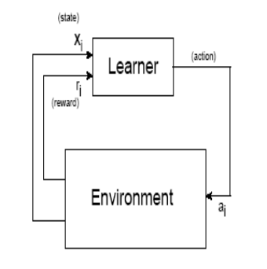
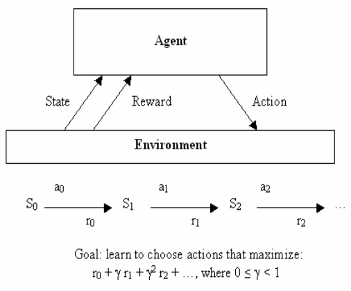
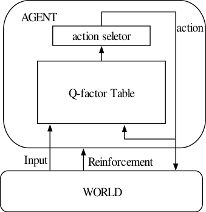
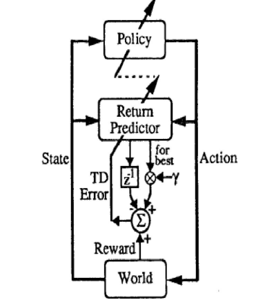
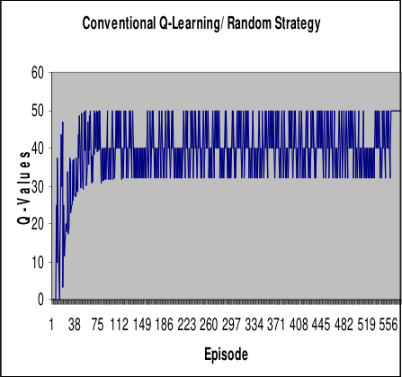
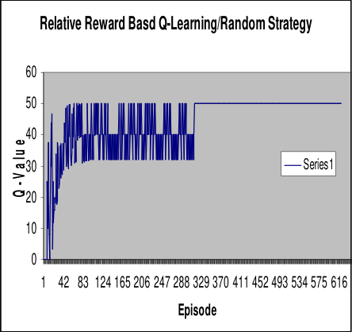

_(IJCSIS) International Journal of Computer Science and Information Security,_

_Vol. 8, No. 5, August 2010_
# Reinforcement Learning by Comparing Immediate Reward

Punit Pandey
Department Of Computer Science and Engineering,
Jaypee University Of Engineering And Technology

Dr. Shishir Kumar

Department Of Computer Science and Engineering,
Jaypee University Of Engineering And Technology

_**Abstract**_ **— This paper introduces an approach to Reinforcement**
**Learning Algorithm by comparing their immediate rewards**
**using a variation of Q-Learning algorithm. Unlike the**
**conventional Q-Learning, the proposed algorithm compares**
**current reward with immediate reward of past move and work**
**accordingly. Relative reward based Q-learning is an approach**
**towards interactive learning. Q-Learning is a model free**
**reinforcement learning method that used to learn the agents. It is**
**observed that under normal circumstances algorithm take more**
**episodes to reach optimal Q-value due to its normal reward or**
**sometime negative reward. In this new form of algorithm agents**
**select only those actions which have a higher immediate reward**
**signal in comparison to previous one. The contribution of this**
**article is the presentation of new Q-Learning Algorithm in order**
**to maximize the performance of algorithm and reduce the**
**number of episode required to reach optimal Q-value.**
**Effectiveness of proposed algorithm is simulated in a 20 x20 Grid**
**world deterministic environment and the result for the two forms**
**of Q-Learning Algorithms is given.**

_**Keywords-component; Reinforcement Learning, Q-Learning**_
_**Method, Relative Reward, Relative Q-Learning Method.**_

I. I NTRODUCTION

Q-Learning algorithm proposed by Watkins [2,4] is a model
free and online reinforcement learning algorithm. In
reinforcement learning selection of an action is based on the
value of its state using some form of updating rule. There is an
interaction between agent and environment where the agent has
to go through numerous trials in order to find out the best
action. An agent chooses that action which has maximum
reward obtained from its environment. The reward signal may
be positive or negative depends on the environment.

Q-learning has been used in many applications because it
does not require the model of environment and is easy to
implement. State-action value, a value for each action from
each state, converges to the optimal value as state-action pairs
are visited many times by the agent.

In this article we propose a new relative reward strategy for
agent learning. Two different form of Q-Learning method is
considered here as a part of study. First form of Q-Learning
method uses a normal reward signal. In this algorithm Q-value
evaluates whether things have gotten better or worse than

DeepshikhaPandey
Department Of Computer Science and Engineering,
Jaypee University Of Engineering And Technology

expected as a result of an action selection in the previous state.
The action selected by agents is most favorable which has
lower TD error. Temporal difference is computed on the basis
of normal reward gain by agents from its surroundings. An
estimated Q-value in the current state is than determined using
Temporal Difference. Agent actions are generated using the
maximum Q-values. The second form of  Q-Learning
algorithm is an extension towards a relative reward. This form
of Q-Learning method utilizes the relative reward approach to
improve the learning capability of algorithm and decreases the
number of iteration. In this algorithm only those action is
selected which has a better reward from its previous one.

This idea comes from psychological point of views that
human beings tend to select only those action which has higher
reward value. However, this algorithm is not suitable for multi
agent problems. To demonstrate effectiveness of the proposed
Q-Learning algorithm, java applet is utilized to simulate a robot
that reaches to a fixed goal. Simulation result confirms that the
performance of proposed algorithm is convincingly better than
conventional Q-learning.

This paper is organized as follows: Basic concept of
reinforcement learning is presented in section 2. Section 3
describes about the conventional Q-Learning method. Section 4
presents a new Relative Q-Learning in context of relative
immediate reward. Section 5 describes Experimental setup &
results and concluding remarks follow in Section 6.

II. R EINFORCEMENT L EARNING

Reinforcement learning (RL) is a goal directed learning
methodology that is used to learn the agents. In Reinforcement
learning [1,5,6,7,8,9] the algorithm decide what to do and how
to map situations to actions so that we maximize a numerical
reward signal. The learner is not advised which actions to take,
but instead it discover which actions provide the maximum
reward signal by trying them. Reinforcement learning is
defined by characterizing a learning problem. Any algorithm
that can able to solve the defined problem, we consider to be a
reinforcement learning algorithm. The key feature of
reinforcement learning is that it explicitly considers the whole
problem of a goal-directed agent interacting with an uncertain
environment. All reinforcement learning agents [3,10,11,12]
have explicit goals, can sense aspects of their environments,
and can choose actions to influence their environments. In

_(IJCSIS) International Journal of Computer Science and Information Security,_

_Vol. 8, No. 5, August 2010_

reinforcement learning agent prefer to choose actions that it has
tried in the past and found to be effective in producing
maximum reward. The agent has to exploit based on what it
already knows in order to obtain reward and at the same time it
also has to explore in order to make better action selections in
the future. Reinforcement learning has four elements policy,
reward function, value function and model of environment.

Figure 1.1:.Reinforcement learning

Figure 1.2:Reinforcement learning

Model of the environment is an optional element because
reinforcement learning also supports the model free algorithms
like Q-learning.

A policy for our agent is a specification of what action to take
for every Input. In some cases policy may be a simple function
or look-up table or sometime it can be an extensive
computation. The policy is the core of reinforcement learning

agent because it alone is sufficient to take the decision on
further action.

III. Q-L EARNING

Q-learning is a form of model-free reinforcement learning [2]
(i.e. agent does not need an internal model of environment to
work with it). Since Q-learning is an active reinforcement
technique, it generates and improves the agent’s policy on the
fly. The Q-learning algorithm works by estimating the values
of state-action pairs.
The purpose of Q-learning is to generate the Q-table, Q(s,a),
which uses state-action pairs to index a Q-value, or expected
utility of that pair. The Q-value is defined as the expected
discounted future reward of taking action a in state s, assuming
the agent continues to follow the optimal policy. For every
possible state, every possible action is assigned a value which
is a function of both the immediate reward for taking that
action and the expected reward in the future based on the new
state that is the result of taking that action. This is expressed by
the one-step Q-update equation [2,4,10,13,14].

Q(s, a)  ←  Q(s, a) + α [r+ γ * max a’ Q(s’, a’) - Q(s, a)] (1)

Figure 2: Structure of the Q-Learning agent

Where α is the learning factor and γ is the discount factor.
These values are positive decimals less than 1 and are set
through experimentation to affect the rate at which the agent
attempts to learn the environment. The variables s and a
represent the current state and action of the agent, r is the
reward from performing s’ and a’, the previous state and
action, respectively.
The discount factor makes rewards earned earlier more

valuable than those received later. This method learns the
values of all actions, rather than just finding the optimal
policy. This knowledge is expensive in terms of the amount of
information that has to be stored, but it does bring benefits. Qlearning is exploration insensitive, any action can be carried
out at any time and information is gained from this experience.
The agent receives reinforcement or reward from the world,

_(IJCSIS) International Journal of Computer Science and Information Security,_

_Vol. 8, No. 5, August 2010_

and returns an action to the world round and round as shown

below:

_A._ _Elementary parts of Q-learning:_

_Environment:_

Q-learning based on model-free mode of behavior i.e the
environment is continuously changing. Agent does need to
predict future state. Environment can be either deterministic or
non-deterministic. In deterministic environment application of
single state lead to a single state where as in nondeterministic
environment application of a single action may lead to a
number of possible successor states. In case of nondeterministic environment, each action not only labeled with
expected immediate reward but also with the probability of
performing that action. For the sake of simplicity we are
considering deterministic environment in this thesis work.

_Reward Function:_

A reward function defines the goal in a reinforcement learning
problem. it maps each perceived state (or state-action pair) of
the environment to a single number, a reward, indicating the
intrinsic desirability of that state. A reinforcement learning
agent's sole objective is to maximize the total reward it
receives in the long run. The reward function defines what the
good and bad events are for the agent.

_Action-value function:_

The Q-learning learning is based upon Quality-values (Qvalues) Q(s,a) for each pair (s,a). The agent must cease
interacting with the world while it runs through this loop until
a satisfactory policy is found. Fortunately, we can still learn
from this. In Q-learning we cannot update directly from the
transition probabilities-we can only update from individual
experiences. In 1 step Q-learning, after each experience, we
observe state s’, receive reward r, and update:

Q(s, a) = r+ γ maxa’ Q(s’, a’)                    (2)

_B._ _Q-learning Algorithm:_

Initialize Q(s, a) arbitrarily

Repeat (for each episode)

Choose a starting state, s

Repeat (for each step of episode):

Choose a from s using policy derived from Q

Take action a, observe a immediate reward r, next state s’

Q(s, a)  ←  Q(s, a) + α [r+ γ * maxa’ Q(s’, a’) - Q(s, a)]

s← s’ ;

Until state s’ match with the Goal State

Until a desired number of episodes terminated

Figure 3: Q-Learning Architecture

IV. R ELATIVE Q-L EARNING

This section introduces a new approach Relative reward to
conventional Q-learning that makes Relative Q-Learning.
Conventional Q-learning has been shown to converge to the
optimal policy if the environment is sampled infinitely by
performing a set of actions in the states of the environment
under a set of constraints on the learning rate α. No bounds
have been proven on the time of convergence of the Q-learning
algorithm and the selection of the next action is done randomly
when performing the update. This simply mean that the
algorithm would take a longer time to converge as a random set
of states are observed which may or may not bring the state
closer to the goal state. Furthermore, it means that this function
cannot be used for actually performing the actions until it has
converged as it has a high chance of not having the right value
as it may not have explored the correct states. This is especially
a problem for environments with larger state spaces. It is
difficult to explore the entire space in a random fashion in a
computationally feasible manner. So by applying below
mention method and algorithm we try to keep the Q-learning
algorithm near to its goal in less time and less number of
Episode.

_A._ _Relative Reward_

Relative reward is a concept that compares (current reward
with the previous received reward) two immediate rewards.
The objective of the learner is to choose actions maximizing
discounted cumulative rewards over time. Let there is an agent
in state st at time t, and assume that he chooses action at. The
immediate result is a reward rt received by the agent and the
state changes to st+1. The total discounted reward [2,4]
received by the agent starting at time t is given by:

r(t)=r t +γr t+1 +γ [2] r t+2 +……….+γ [n] r t+n +…………      (3)

Where γ is discount factor in the range of (0:1).

_(IJCSIS) International Journal of Computer Science and Information Security,_

_Vol. 8, No. 5, August 2010_

The immediate reward is based upon the action or move
taken by an agent to reach the defined goal in each episode.
The total discounted reward can maximize in less number of
episode if we select the higher immediate reward signal from
previous.

_B._ _Relative Reward based Q-Learning Algorithm_

Relative reward based Q-learning is an approach towards
maximizing the total discounted rewards. In this form of Qlearning we selected the maximum immediate reward signal by
comparing it with previous one. This is expressed by the new
Q-update equation.

Q(s, a) = Q(s, a) + α [max(r(s,a),r(s’,a’))+ γ maxa’ Q(s’, a’)

- Q(s, a)]

Algorithm:

Initialize Q(s, a) arbitrarily

Repeat (for each episode)

Choose a starting state, s

Repeat (for each step of episode):

Choose a from s using policy derived from Q

Take action a, observe a immediate reward r, and next state
s’

Q(s, a) = Q(s, a) + α [max(r(s,a),r(s’,a’))+ γ maxa’ Q(s’, a’)

  - Q(s, a)]

s← s’ ;

Until state s’ match with the Goal State

Until a desired number of episodes terminated

V. E XPERIMENTS & R ESULTS

The Proposed Relative Q-Learning was tested on 10 x 10
and 20 x 20 grid world environment. In the Grid World Square
There are four possible actions for the agent as it is a
deterministic environment given in figure 4.

Figure4: A 10 x 10 Grid World Environment

In order to consider the situation of encountering a wall, the
agent has no possibility of moving all the way in the given
direction. When the agent enters into goal states, it receives 50
as a reward. We are also providing the immediate reward value
by incrementing or decrementing the Q-value marked with S
represent the start state and G represent the goal state. The
purpose of the agent is to find out the optimum path to arrive at
the goal state starting from the start state, and to maximize the
reward it receives.

Figure5: Conventional Q-Learning.

Figure6: Relative Q-Learning

We have executed 500 episodes to converge the Q-value.
The grid world is a deterministic environment so the value of
learning α and discount rate Y were set to 0.8. Figure 5 &

_(IJCSIS) International Journal of Computer Science and Information Security,_

_Vol. 8, No. 5, August 2010_

Figure 6 shows the relationship between Q-Values and the
number of episode where x axis represents the number of
episode and y axis represents the Q-values. Figure 5 represents
the result of conventional Q-Learning where we can see that Qvalue converges after executing 500 episodes but in figure 6
Relative Q-learning takes 300 episode

So we can say that convergence rate of relative Q-learning
is faster than conventional Q-learning.

VI. C ONCLUSION & FUTURE WORK

This paper proposed an algorithm which compares the
immediate reward signal with its previous one. The agent will
immediately return back to previous state if it will receive the
lower reward signal for that particular move. If conventional
Q-learning was applied in the real experiment, a lot of
iterations were required to reach the optimal Q values. The
Relative Q-learning algorithm was proposed for environment
which used small amount of episodes to reach the convergence
of Q-values. This new concept allows the agent to learn
uniformly and helps in such a way so that it will not deviate
from its goal. Part of future work may be included to verify the
proposed algorithm in nondeterministic environment.

R EFERENCES

[1] J.F. Peters, C. Henry, S. Ramanna, Reinforcement learning with patternbased rewards. in proceding of forth International IASTED Conference.
Computational Intelligence (CI 2005) Calgary, Alberta,Canada, 4-6 July
2005, 267-272

[2] Technical Note Q,-Learning Christopher J.C.H. Watkins and Peter
Dayan Centre for Cognitive Science, University of Edinburgh, Scotland
Machine Learning, 8, 279-292 (1992)

[3] J.F. Peters, C. Henry, S. Ramanna, Rough Ethograms: Study of
Intelligent System Behavior. In:M.A.Klopotek, S. Wierzchori,
K.Trojanowski(Eds), New Trends in Intelligent Information Processing
and Web Mining (IIS05), Gda´nsk, Poland, June 13-16 (2005),117-126.

[4] C. Watkins, "Learning from Delayed Rewards", PhD thesis, Cambridge
University, Cambridge, England, 1989

[5] J.F.Peters,K.S.Patnaik,P.K.Pandey,D.Tiwari, ”Effetc of temperature on
swarms that learn”, In Proceeding of IASCIT-2007,Hyderabad,INDIA

[6] P.K.Pandey,D.Tiwari, “ Temperature variation on Q-Learning”,In
Proceeding of RAIT in FEB 2008,ISM Dganbad

[7] P.K.Pandey,D.Tiwari, “ Temperature variation on Rough Actor-Critic
Algorithm”, Global Journal Computer Science and Technology, Vol 9,
No 4 (2009), Pennsylvania Digital Library

[8] L.P. Kaelbling, M.L. Littman, A.W. Moore, Reinforcement learning: A
survey Journal of Artificial Intelligence Research, 4, 1996, 237-285.

[9] R.S. Sutton, A.G. Barto, and Reinforcement Learning: An Introduction
(Cambridge, MA: The MIT Press, 1998).

[10] C. Gaskett, Q-Learning for Robot Control. Ph.D.Thesis, Supervisor:

A.Zelinsky, Department of Systems Engineering, The Australian
National University, 2002.

[11] Thrun. S.and Schwartz.A.(1993),Issues in using function approximation

for reinforcement learning, in Proceeding of the 1993 Connectionist
Models Summer School,Erblaum Associates.Nj.

[12] Richard S. Sutton, Reinforcement Learning Architectures, GTE

Laboratories Incorporated, Waltham, MA 02254.

[13] Tom O'Neill,Leland Aldridge,Harry Glaser, Q-Learning and Collection

Agents, Dept. of Computer Science, University of Rochester

[14] Vanden Berghen Frank, Q-Learning, IRIDIA, Universit Libre de

Bruxelles

