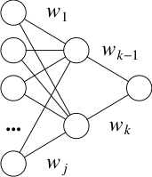
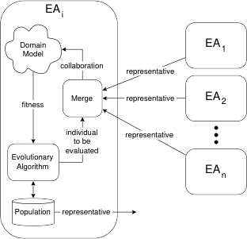
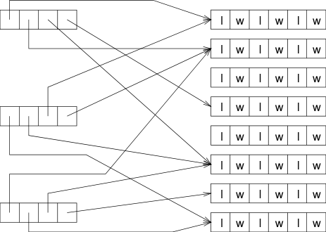
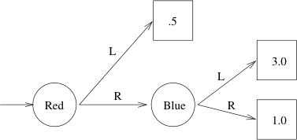
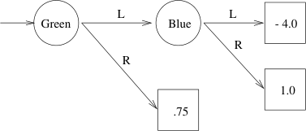
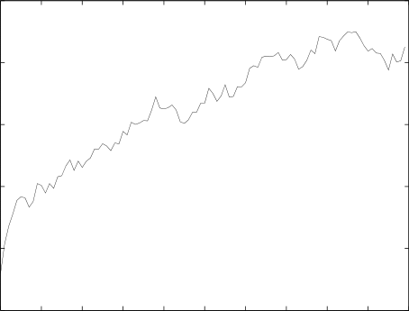

Journal of Arti�cial Intelligence Research  (  ) - Submitted / ; published /

Evolutionary Algorithms for Reinforcement Learning

David E. Moriarty moriarty@isi.edu

University of Southern California, Information Sciences Institute

 Admiralty Way, Marina del Rey, CA 0 

Alan C. Schultz schultz@aic.nrl.navy .mil

Navy Center for Applied Research in Arti�cial Intel ligence

Naval Research Laboratory, Washington DC 0-

John J. Grefenstette gref@ib.gmu.edu

Institute for Biosciences, Bioinformatics and Biotechnology

George Mason University, Manassas, VA 00

Abstract

There are two distinct approaches to solving reinforcement learning problems, namely,

searching in value function space and searching in p olicy space. Temp oral di�erence meth
o ds and evolutionary algorithms are well-known examples of these approaches. Kaelbling,

Littman and Mo ore recently provided an informative survey of temp oral di�erence meth
o ds. This article fo cuses on the application of evolutionary algorithms to the reinforcement

learning problem, emphasizing alternative p olicy representations, credit assignment meth
o ds, and problem-sp eci�c genetic op erators. Strengths and weaknesses of the evolutionary

approach to reinforcement learning are presented, along with a survey of representative

applications.

. Intro duction

Kaelbling, Littman, and Mo ore ( ) and more recently Sutton and Barto ( ) pro
vide informative surveys of the �eld of reinforcement learning (RL). They characterize two

classes of metho ds for reinforcement learning: metho ds that search the space of value func
tions and metho ds that search the space of p olicies. The former class is exempli�ed by

the temp oral di�erence (TD) metho d and the latter by the evolutionary algorithm (EA)

approach. Kaelbling et al. fo cus entirely on the �rst set of metho ds and they provide an

excellent account of the state of the art in TD learning. This article is intended to round

out the picture by addressing evolutionary metho ds for solving the reinforcement learning

problem.

As Kaelbling et al. clearly illustrate, reinforcement learning presents a challenging array

of di�culties in the pro cess of scaling up to realistic tasks, including problems asso ciated

with very large state spaces, partially observable states, rarely o ccurring states, and non
stationary environments. At this p oint, which approach is b est remains an op en question, so

it is sensible to pursue parallel lines of research on alternative metho ds. While it is b eyond

the scop e of this article to address whether it is b etter in general to search value function

space or p olicy space, we do hop e to highlight some of the strengths of the evolutionary

approach to the reinforcement learning problem. The reader is advised not to view this

�  c AI Access Foundation and Morgan Kaufmann Publishers. All rights reserved.

Moriarty, Schultz, & Grefenstette

article as an EA vs. TD discussion. In some cases, the two metho ds provide complementary

strengths, so hybrid approaches are advisable; in fact, our survey of implemented systems

illustrates that many EA-based reinforcement learning systems include elements of TD
learning as well.

The next section sp ells out the reinforcement learning problem. In order to provide a

sp eci�c anchor for the later discussion, Section  presents a particular TD metho d. Sec
tion  outlines the approach we call Evolutionary Algorithms for Reinforcement Learning

(EARL), and provides a simple example of a particular EARL system. The following three

sections fo cus on features that distinguish EAs for RL from EAs for general function op
timization, including alternative p olicy representations, credit assignment metho ds, and

RL-sp eci�c genetic op erators. Sections  and highlight some strengths and weaknesses

of the EA approach. Section 0 brie�y surveys some successful applications of EA systems

on challenging RL tasks. The �nal section summarizes our presentation and p oints out

directions for further research.

. Reinforcement Learning

All reinforcement learning metho ds share the same goal: to solve sequential decision tasks

through trial and error interactions with the environment (Barto, Sutton, & Watkins,  0;

Grefenstette, Ramsey, & Schultz,  0). In a sequential decision task, an agent interacts

with a dynamic system by selecting actions that a�ect state transitions to optimize some

reward function. More formally, at any given time step t, an agent p erceives its state

st

and selects an action at . The system resp onds by giving the agent some (p ossibly zero)

numerical reward r (st

) and changing into state st+

) and changing into state s

= � (s

t ; a

t

). The state transition may b e

determined solely by the current state and the agent's action or may also involve sto chastic

pro cesses.

The agent's goal is to learn a policy, � : S ! A, which maps states to actions. The

optimal policy, �

�

, can b e de�ned in many ways, but is typically de�ned as the p olicy that

pro duces the greatest cumulative reward over all states s:

= argmax

�

� (s); (s) ()

V

�

�

where V

� (s) is the cumulative reward received from state s using p olicy � . There are also

many ways to compute V �

(s). One approach uses a discount rate � to discount rewards

over time. The sum is then computed over an in�nite horizon:



i

t ) =

X

i=0

(s

�

V

�

r

t+i

where rt

is the reward received at time step t. Alternatively, V

�

()

(s) could b e computed by

()

summing the rewards over a �nite horizon h:

=
)

h

X

i=0

(st

rt+i

r

V

�

The agent's state descriptions are usually identi�ed with the values returned by its

sensors, which provide a description of b oth the agent's current state and the state of the



Evolutionary Algorithms for Reinforcement Learning

world. Often the sensors do not give the agent complete state information and thus the

state is only partial ly observable.

Besides reinforcement learning, intelligent agents can b e designed by other paradigms,

notably planning and supervised learning. We brie�y note some of the ma jor di�erences

among these approaches. In general, planning metho ds require an explicit mo del of the

state transition function � (s; a). Given such a mo del, a planning algorithm can search

through p ossible action choices to �nd an action sequence that will guide the agent from

an initial state to a goal state. Since planning algorithms op erate using a mo del of the

environment, they can backtrack or \undo" state transitions that enter undesirable states.

In contrast, RL is intended to apply to situations in which a su�ciently tractable action

mo del do es not exist. Consequently, an agent in the RL paradigm must actively explore

its environment in order to observe the e�ects of its actions. Unlike planning, RL agents

cannot normally undo state transitions. Of course, in some cases it may b e p ossible to

build up an action mo del through exp erience (Sutton,  0), enabling more planning as

exp erience accumulates. However, RL research fo cuses on the b ehavior of an agent when it

has insu�cient knowledge to p erform planning.

Agents can also b e trained through sup ervised learning. In sup ervised learning, the agent

is presented with examples of state-action pairs, along with an indication that the action

was either correct or incorrect. The goal in sup ervised learning is to induce a general p olicy

from the training examples. Thus, sup ervised learning requires an oracle that can supply

correctly lab eled examples. In contrast, RL do es not require prior knowledge of correct

and incorrect decisions. RL can b e applied to situations in which rewards are sparse; for

example, rewards may b e asso ciated only with certain states. In such cases, it may b e

imp ossible to asso ciate a lab el of \correct" or \incorrect" on particular decisions without

reference to the agent's subsequent decisions, making sup ervised learning infeasible.

In summary, RL provides a �exible approach to the design of intelligent agents in situ
ations for which b oth planning and sup ervised learning are impractical. RL can b e applied

to problems for which signi�cant domain knowledge is either unavailable or costly to obtain.

For example, a common RL task is rob ot control. Designers of autonomous rob ots often

lack su�cient knowledge of the intended op erational environment to use either the planning

or the sup ervised learning regime to design a control p olicy for the rob ot. In this case, the

goal of RL would b e to enable the rob ot to generate e�ective decision p olicies as it explores

its environment.

Figure  shows a simple sequential decision task that will b e used as an example later

in this pap er. The task of the agent in this grid world is to move from state to state by

selecting among two actions: right (R) or down (D ). The sensor of the agent returns the

identity of the current state. The agent always starts in state a and receives the reward

indicated up on visiting each state. The task continues until the agent moves o� the grid

world (e.g., by taking action D from state a). The goal is to learn a p olicy that returns

the highest cumulative rewards. For example, a p olicy which results in the sequences of

actions R; D ; R; D ; D; R; R; D starting from from state a gives the optimal score of .



Moriarty, Schultz, & Grefenstette

|a b c d e|Col2|Col3|Col4|Col5|Col6|
|---|---|---|---|---|---|
|-2 3 1 1 2 4 1 2 1 1 3 2 0 2 -1 1 2 0 1 1 -5 1 4 1 1      1 2 3 4 5|-2 3 1 1 2 4 1 2 1 1 3 2 0 2 -1 1 2 0 1 1 -5 1 4 1 1      1 2 3 4 5|-2 3 1 1 2 4 1 2 1 1 3 2 0 2 -1 1 2 0 1 1 -5 1 4 1 1      1 2 3 4 5|-2 3 1 1 2 4 1 2 1 1 3 2 0 2 -1 1 2 0 1 1 -5 1 4 1 1      1 2 3 4 5|-2 3 1 1 2 4 1 2 1 1 3 2 0 2 -1 1 2 0 1 1 -5 1 4 1 1      1 2 3 4 5|-2 3 1 1 2 4 1 2 1 1 3 2 0 2 -1 1 2 0 1 1 -5 1 4 1 1      1 2 3 4 5|
|-2 3 1 1 2 4 1 2 1 1 3 2 0 2 -1 1 2 0 1 1 -5 1 4 1 1      1 2 3 4 5|0|2|1|-1|1|
|-2 3 1 1 2 4 1 2 1 1 3 2 0 2 -1 1 2 0 1 1 -5 1 4 1 1      1 2 3 4 5|1|1|2|0|2|
|-2 3 1 1 2 4 1 2 1 1 3 2 0 2 -1 1 2 0 1 1 -5 1 4 1 1      1 2 3 4 5|3|-5|4|3|1|
|-2 3 1 1 2 4 1 2 1 1 3 2 0 2 -1 1 2 0 1 1 -5 1 4 1 1      1 2 3 4 5|1|-2|4|1|2|
|-2 3 1 1 2 4 1 2 1 1 3 2 0 2 -1 1 2 0 1 1 -5 1 4 1 1      1 2 3 4 5|1|1|2|1|1|

Figure : A simple grid-world sequential decision task. The agent starts in state a and

receives the row and column of the current b ox as sensory input. The agent moves

from one b ox to another by selecting b etween two moves (right or down), and the

agent's score is increased by the payo� indicated in each b ox. The goal is to �nd

a p olicy that maximizes the cumulative score.

. Policy Space vs. Value-Function Space

Given the reinforcement learning problem as describ ed in the previous section, we now

address the main topic: how to �nd an optimal p olicy, �

�

. We consider two main approaches,

one involves search in policy space and the other involves search in value function space.

Policy-space search metho ds maintain explicit representations of p olicies and mo dify

them through a variety of search op erators. Many search metho ds have b een considered,

including dynamic programming, value iteration, simulated annealing, and evolutionary

algorithms. This pap er fo cuses on evolutionary algorithms that have b een sp ecialized for

the reinforcement learning task.

In contrast, value function metho ds do not maintain an explicit representation of a

, which returns the exp ected

p olicy. Instead, they attempt learn the value function V

�

�

cumulative reward for the optimal p olicy from any state. The fo cus of research on value

function approaches to RL is to design algorithms that learn these value functions through

exp erience. The most common approach to learning value functions is the temp oral di�er
ence (TD) metho d, which is describ ed in the next section.

. Temp oral Di�erence Algorithms for Reinforcement Learning

As stated in the Intro duction, a comprehensive comparison of value function search and

direct p olicy-space search is b eyond the scop e of this pap er. Nevertheless, it will b e useful

to p oint out key conceptual di�erences b etween typical value function metho ds and typical

evolutionary algorithms for searching p olicy space. The most common approach for learning

a value function V for RL problems is the temp oral di�erence (TD) metho d (Sutton,  ).



Evolutionary Algorithms for Reinforcement Learning

The TD learning algorithm uses observations of prediction di�erences from consecutive

states to up date value predictions. For example, if two consecutive states i and j return

payo� prediction values of  and , resp ectively, then the di�erence suggests that the payo�

from state i may b e overestimated and should b e reduced to agree with predictions from

state j . Up dates to the value function V are achieved using the following up date rule:

V (st

) = V (s

) � V (s

) ()

t

t

) + �(V (st+

) + �(V (s

t

) + r

t

where � represents the learning rate and rt

any immediate reward. Thus, the di�erence in

predictions (V (s

t+ ) � V (s

t

)) from consecutive states is used as a measure of prediction error.

Consider a chain of value predictions V (s0

Consider a chain of value predictions V (s

)::V (sn

)::V (s

) from consecutive state transitions with

the last prediction V (s

n

) containing the only non-zero reward from the environment. Over

many iterations of this sequence, the up date rule will adjust the values of each state so that

they agree with their successors and eventually with the reward received in V (sn

). In other

words, the single reward is propagated backwards through the chain of value predictions.

The net result is an accurate value function that can b e used to predict the exp ected reward

from any state of the system.

As mentioned earlier, the goal of TD metho ds is to learn the value function for the

. Given V

�

optimal p olicy, V

� �

�

, the optimal action, � (s), can b e computed using the

following equation:

� (s) = argmax

a

� (� (s; a)) ()

V

�

Of course, we have already stated that in RL the state transition function � (s; a) is unknown

to the agent. Without this knowledge, we have no way of evaluating (). An alternative

value function that can b e used to compute �

�

(s) is called a Q-function, Q(s; a) (Watkins,

  ; Watkins & Dayan,  ). The Q-function is a value function that represents the

exp ected value of taking action a in state s and acting optimally thereafter:

Q(s; a) = r (s) + V

� (� (s; a)) ()

where r (s) represents any immediate reward received in state s. Given the Q-function,

actions from the optimal p olicy can b e directly computed using the following equation:

Q(s; a) ()

(s) = argmax

a

�

�

Table  shows the Q-function for the grid world problem of Figure . This table-based

representation of the Q-function asso ciates cumulative future payo�s for each state-action

pair in the system. (The letter-numb er pairs at the top represent the state given by the row

and column in Figure , and R and D represent the actions right and down, resp ectively.)

The TD metho d adjusts the Q-values after each decision. When selecting the next action,

the agent considers the e�ect of that action by examining the exp ected value of the state

transition caused by the action.

The Q-function is learned through the following TD up date equation:

Q(s

a

t ; a

) + �(max

t+

�
) Q(s

t ; a

t

) = Q(st

; a

t

; a

t

) + r (s

t

)) ()

t+

t+

Q(s



Moriarty, Schultz, & Grefenstette

a a a a a b b b b b c c c c c d d d d d e e e e e

R   0                     

D   0                      

Table : A Q-function for the simple grid world. A value is asso ciated with each state-action

pair.

Essentially, this equation up dates Q(s

t

; a

t

) based on the current reward and the predicted

reward if all future actions are selected optimally. Watkins and Dayan ( ) proved that

if up dates are p erformed in this fashion and if every Q-value is explicitly represented,

the estimates will asymptotically converge to the correct values. A reinforcement learning

system can thus use the Q values to select the optimal action in any state. Because Q
learning is the most widely known implementation of temp oral di�erence learning, we will

use it in our qualitative comparisons with evolutionary approaches in later sections.

. Evolutionary Algorithms for Reinforcement Learning (EARL)

The p olicy-space approach to RL searches for p olicies that optimize an appropriate ob jective

function. While many search algorithms might b e used, this survey fo cuses on evolutionary

algorithms. We b egin with a brief overview of a simple EA for RL, followed by a detailed

discussion of features that characterize the general class of EAs for RL.

. Design Considerations for Evolutionary Algorithms

Evolutionary algorithms (EAs) are global search techniques derived from Darwin's theory

of evolution by natural selection. An EA iteratively up dates a p opulation of p otential

solutions, which are often enco ded in structures called chromosomes. During each iteration,

called a generation, the EA evaluates solutions and generates o�spring based on the �tness

of each solution in the task environment. Substructures, or genes, of the solutions are then

mo di�ed through genetic op erators such as mutation and recombination. The idea is that

structures that are asso ciated with go o d solutions can b e mutated or combined to form

even b etter solutions in subsequent generations. The canonical evolutionary algorithm is

shown in Figure . There have b een a wide variety of EAs develop ed, including genetic

algorithms (Holland,  ; Goldb erg,   ), evolutionary programming (Fogel, Owens, &

Walsh,  ), genetic programming (Koza,  ), and evolutionary strategies (Rechenb erg,

 ).

EAs are general purp ose search metho ds and have b een applied in a variety of domains

including numerical function optimization, combinatorial optimization, adaptive control,

adaptive testing, and machine learning. One reason for the widespread success of EAs is

that there are relatively few requirements for their application, namely,

. An appropriate mapping b etween the search space and the space of chromosomes, and

. An appropriate �tness function.



Evolutionary Algorithms for Reinforcement Learning

pro cedure EA

b egin

t = 0;

initialize P(t);

evaluate structures in P(t);

while termination condition not satis�ed do

b egin

t = t + ;

select P(t) from P(t-);

alter structures in P(t);

evaluate structures in P(t);

end

end.

Figure : Pseudo-co de Evolutionary Algorithm.

For example, in the case of parameter optimization, it is common to represent the list of

parameters as either a vector of real numb ers or a bit string that enco des the parameters.

With either of these representations, the \standard" genetic op erators of mutation and

cut-and-splice crossover can b e applied in a straightforward manner to pro duce the genetic

variations required (see Figure ). The user must still decide on a (rather large) numb er

of control parameters for the EA, including p opulation size, mutation rates, recombination

rates, parent selection rules, but there is an extensive literature of studies which suggest

that EAs are relatively robust over a wide range of control parameter settings (Grefenstette,

 ; Scha�er, Caruana, Eshelman, & Das,   ). Thus, for many problems, EAs can b e

applied in a relatively straightforward manner.

However, for many other applications, EAs need to b e sp ecialized for the problem do
main (Grefenstette,  ). The most critical design choice facing the user is the repre
sentation, that is, the mapping b etween the search space of knowledge structures (or, the

phenotype space) and the space of chromosomes (the genotype space). Many studies have

shown that the e�ectiveness of EAs is sensitive to the choice of representations. It is not

su�cient, for example, to cho ose an arbitrary mapping from the search space into the space

of chromosomes, apply the standard genetic op erators and hop e for the b est. What makes a

go o d mapping is a sub ject for continuing research, but the general consensus is that candi
date solutions that share imp ortant phenotypic similarities must also exhibit similar forms

of \building blo cks" when represented as chromosomes (Holland,  ). It follows that the

user of an EA must carefully consider the most natural way to represent the elements of

the search space as chromosomes. Moreover, it is often necessary to design appropriate

mutation and recombination op erators that are sp eci�c to the chosen representation. The

end result of this design pro cess is that the representation and genetic op erators selected

for the EA comprise a form of search bias similar to biases in other machine learning meth



Moriarty, Schultz, & Grefenstette

**Parent 1:** **A** **B** **C** **D** **E** **F** **G**

**Parent 2:** **a** **b** **c** **d** **e** **f** **g**

**Offspring 1:** **A** **B** **C** **d** **e** **f** **g**

**Offspring 2:** **a** **b** **c** **D** _E_ **F** **G**

Figure : Genetic op erators on �xed-p osition representation. The two o�spring are gener
ated by crossing over the selected parents. The op eration shown is called one-point

crossover. The �rst o�spring inherits the initial segment of one parent and the

�nal segment of the other parent. The second o�spring inherits the same pattern

of genes from the opp osite parents. The crossover p oint is p osition , chosen at

random. The second o�spring has also incurred a mutation in the shaded gene.

o ds. Given the prop er bias, the EA can quickly identify useful \building blo cks" within the

p opulation, and converge on the most promising areas of the search space.



In the case of RL, the user needs to make two ma jor design decisions. First, how will the

space of p olicies b e represented by chromosomes in the EA? Second, how will the �tness of

p opulation elements b e assessed? The answers to these questions dep end on how the user

cho oses to bias the EA. The next section presents a simple EARL that adopts the most

straightforward set of design decisions. This example is meant only to provide a baseline

for comparison with more elab orate designs.

. A Simple EARL

As the remainder of this pap er shows, there are many ways to use EAs to search the space

of RL p olicies. This section provides a concrete example of a simple EARL, which we call

Earl



. The pseudo-co de is shown in Figure . This system provides the EA counterpart

to the simple table-based TD system describ ed in Section .

The most straightforward way to represent a p olicy in an EA is to use a single chro

mosome p er p olicy with a single gene asso ciated with each observed state. In Earl



, each

gene's value (or al lele in biological terminology) represents the action value asso ciated with

the corresp onding state, as shown in Figure . Table  shows part of an Earl



p opulation

of p olicies for the sample grid world problem. The numb er of p olicies in a p opulation is

usually on the order of 00 to 000.

The �tness of each p olicy in the p opulation must re�ect the exp ected accumulated �tness

for an agent that uses the given p olicy. There are no �xed constraints on how the �tness of

an individual p olicy is evaluated. If the world is deterministic, like the sample grid-world,

. Other ways to exploit problem sp eci�c knowledge in EAs include the use of heuristics to initiali ze the

p opulation and the hybridizatio n with problem sp eci�c search algorithms. See (Grefenstette,  ) for

further discussions of these metho ds.



Evolutionary Algorithms for Reinforcement Learning

pro cedure EARL-

b egin

t = 0;

initialize a p opulation of p olicies, P(t);

evaluate p olicies in P(t);

while termination condition not satis�ed do

b egin

t = t + ;

select high-payo� p olicies, P(t), from p olicies in P(t-);

update p olicies in P(t);

evaluate p olicies in P(t);

end

end.

Figure : Pseudo-co de for Evolutionary Algorithm Reinforcement Learning system.

_s_ 1 _s_ 1 _s_ 3 _s_ _N_

**Policy** _i_ **:** _a_ 1 _a_ 1 _a_ 3 **...** _a_ _N_

Figure : Table-based p olicy representation. Each observed state has a gene which indicates

the preferred action for that state. With this representation, standard genetic

op erators such as mutation and crossover can b e applied.

the �tness of a p olicy can b e evaluated during a single trial that starts with the agent in the

initial state and terminates when the agent reaches a terminal state (e.g., falls o� the grid

in the grid-world). In non-deterministic worlds, the �tness of a p olicy is usually averaged

over a sample of trials. Other options include measuring the total payo� achieved by the

agent after a �xed numb er of steps, or measuring the numb er of steps required to achieve

a �xed level of payo�.

Once the �tness of all p olicies in the p opulation has b een determined, a new p opulation

is generated according to the steps in the usual EA (Figure ). First, parents are selected

for repro duction. A typical selection metho d is to probabilisticall y select individuals based

on relative �tness:

)

Pr(pi

=
)

P

F itness(pi

j

( )

F itness(p

n

j =

)

where pi

represents individual i and n is the total numb er of individual s. Using this selection

rule, the exp ected numb er of o�spring for a given p olicy is prop ortional to that p olicy's

�tness. For example, a p olicy with average �tness might have a single o�spring, whereas



Moriarty, Schultz, & Grefenstette

Policy a a a a a b b b b b c c c c c d d d d d e e e e e Fitness

 D R D D R R R R R R D R D D R R D R R R D R R D R 

 D D D D R R R R R R D D R R D R D R R R D R D D R

 R D D R R D R D R R D D D R D R D R R R D R D D D 

 D D D D R D R R R R R D R R R D R R D R D R D D R 

 R D D D R D R R D R R D R R D R D R R D D R D D D 

Table : An EA p opulation of �ve decision p olicies for the sample grid world. This simple

p olicy representation sp eci�es an action for each state of the world. The �tness

corresp onds to the payo�s that are accumulated using each p olicy in the grid

world.



a p olicy with twice the average �tness would have two o�spring.

O�spring are formed

by cloning the selected parents. Then new p olicies are generated by applying the standard

genetic op erators of crossover and mutation to the clones, as shown in Figure . The pro cess

of generating new p opulations of strategies can continue inde�nitely or can b e terminated

after a �xed numb er of generations or once an acceptable level of p erformance is achieved.

For simple RL problems such as the grid-world, Earl



may provide an adequate ap

proach. In later sections, we will p oint out some ways in which even Earl



exhibits

strengths that are complementary to TD metho ds for RL. However, as in the case of TD

metho ds, EARL metho ds have b een extended to handle the many challenges inherent in

more realistic RL problems. The following sections survey some of these extensions, orga
nized around three sp eci�c biases that distinguish EAs for Reinforcement Learning (EARL)

from more generic EAs: p olicy representations, �tness/credit-assignment mo dels, and RL
sp eci�c genetic op erators.

. Policy Representations in EARL

Perhaps the most critical feature that distinguishes classes of EAs from one another is the

representation used. For example, EAs for function optimization use a simple string or

vector representation, whereas EAs for combinatorial optimization use distinctive repre
sentations for p ermutations, trees or other graph structures. Likewise, EAs for RL use a

distinctive set of representations for p olicies. While the range of p otential p olicy repre
sentations is unlimited, the representations used in most EARL systems to date can b e

largely categorized along two discrete dimensions. First, p olicies may b e represented ei
ther by condition-action rules or by neural networks. Second, p olicies may b e represented

by a single chromosome or the representation may b e distributed through one or more

p opulations.

. Single-Chromosome Representation of Policies

.. Rule-based Policies

For most RL problems of practical interest, the numb er of observable states is very large,

and the simple table-based representation in Earl



is impractical. For large scale state

. Many other parent selection rules have b een explored (Grefenstette,  a,  b).

0

Evolutionary Algorithms for Reinforcement Learning

**Policy** _i_ **:** _c_ _i_ 1 → _a_ _i_ 1 _c_ _i_ 2 → _a_ _i_ 2 _c_ _i_ 3 → _a_ _i_ 3 **...** _c_ _ik_ → _a_ _ik_

Figure : Rule-based p olicy representation. Each gene represents a condition-action rule

that maps a set of states to an action. In general, such rules are indep endent

of the p osition along the chromosome. Con�ict resolution mechanisms may b e

needed if the conditions of rules are allowed to intersect.

**Policy** _i_ **:** _w_ 1 _w_ 2 _w_ 3 **...** _w_ _k_ **=>**

Figure : A simple parameter representation of weights for a neural network. The �tness

of the p olicy is the payo� when the agent uses the corresp onding neural net as

its decision p olicy.

spaces, it is more reasonable to represent a p olicy as a set of condition-action rules in which

the condition expresses a predicate that matches a set of states, as shown in Figure . Early

examples of this representation include the systems LS- (Smith,  ) and LS- (Scha�er

& Grefenstette,  ), followed later by Samuel (Grefenstette et al.,  0).

.. Neural Net Representation of Policies

As in TD-based RL systems, EARL systems often employ neural net representations as

function approximators. In the simplest case (see Figure ), a neural network for the

agent's decision p olicy is represented as a sequence of real-valued connection weights. A

straightforward EA for parameter optimization can b e used to optimize the weights of

the neural network (Belew, McInerney, & Schraudolph,  ; Whitley, Dominic, Das, &

Anderson,  ; Yamauchi & Beer,  ). This representation thus requires the least

mo di�cation of the standard EA. We now turn to distributed representations of p olicies in

EARL systems.

. Distributed Representation of Policies

In the previous section we outlined EARL approaches that treat the agent's decision p olicy

as a single genetic structure that evolves over time. This section addresses EARL approaches

that decomp ose a decision p olicy into smaller comp onents. Such approaches have two

p otential advantages. First, they allow evolution to work at a more detailed level of the task,

e.g., on sp eci�c subtasks. Presumably, evolving a solution to a restricted subtask should b e



Moriarty, Schultz, & Grefenstette

Sensors Message List

Decision

Rewards

Classifiers

Evolutionary

Algorithm

Figure : Holland's Learning Classi�er System.

easier than evolving a monolithic p olicy for a complex task. Second, decomp osition p ermits

the user to exploit background knowledge. The user might base the decomp osition into

subtasks on a prior analysis of the overall p erformance task; for example, it might b e known

that certain subtasks are mutually exclusive and can therefore b e learned indep endently.

The user might also decomp ose a complex task into subtasks such that certain comp onents

can b e explicitly programmed while other comp onents are learned.

In terms of knowledge representation in EARL, the alternative to the single chromosome

representation is to distribute the p olicy over several p opulation elements. By assigning a

�tness to these individual elements of the p olicy, evolutionary selection pressure can b e

brought to b ear on more detailed asp ects of the learning task. That is, �tness is now a

function of individual subp olicies or individual rules or even individual neurons. This general

approach is analogous to the classic TD metho ds that take this approach to the extreme of

learning statistics concerning each state-action pair. As in the case of single-chromosome

representations, we can partition distributed EARL representations into rule-based and

neural-net-based classes.

.. Distributed Rule-based Policies

The most well-known example of a distributed rule-based approach to EARL is the Learn
ing Classi�er Systems (LCS) mo del (Holland & Reitman,  ; Holland,  ; Wilson,

 ). An LCS uses an evolutionary algorithm to evolve if-then rules called classi�ers that

map sensory input to an appropriate action. Figure  outlines Holland's LCS framework

(Holland,  ). When sensory input is received, it is p osted on the message list. If the left

hand side of a classi�er matches a message on the message list, its right hand side is p osted

on the message list. These new messages may subsequently trigger other classi�ers to p ost

messages or invoke a decision from the LCS, as in the traditional forward-chaining mo del

of rule-based systems.

In an LCS, each chromosome represents a single decision rule and the entire p opulation

represents the agent's p olicy. In general, classi�ers map a set of observed states to a set of

messages, which may b e interpreted as either internal state changes or actions. For example,



Evolutionary Algorithms for Reinforcement Learning

condition action strength

a# ! R 0.

# ! D 0.

: : :

d ! D 0.0

Table : LCS p opulation for grid world. The # is a don't care symb ol which allows for

generality in conditions. For example, the �rst rule says \Turn right in column

a." The strength of a rule is used for con�ict resolution and for parent selection in

the genetic algorithm.

|LCS LCS LCS|Col2|Col3|Col4|
|---|---|---|---|
|||||
|Environment|Environment|Environment|Environment|

Figure : A two-level hierarchical Alecsys system. Each LCS learns a sp eci�c b ehavior.

The interactions among the rule sets are pre-programmed.

if the learning agent for the grid world in Figure  has two sensors, one for the column and

one for the row, then the p opulation in an LCS might app ear as shown in Table . The

�rst classi�er matches any state in the column a and recommends action R. Each classi�er

has a statistic called strength that estimates the utility of the rule. The strength statistics

are used in b oth con�ict resolution (when more than one action is recommended) and as

�tness for the genetic algorithm. Genetic op erators are applied to highly �t classi�ers to

generate new rules. Generally, the p opulation size (i.e., the numb er of rules in the p olicy)

is kept constant. Thus classi�ers comp ete for space in the p olicy.

Another way that EARL systems distribute the representation of p olicies is to partition

the p olicy into separate mo dules, with each mo dule up dated by its own EA. Dorigo and

Colomb etti ( ) describ e an architecture called Alecsys in which a complex reinforce
ment learning task is decomp osed into subtasks, each of which is learned via a separate

LCS, as shown in Figure . They provide a metho d called behavior analysis and training

(BAT) to manage the incremental training of agents using the distributed LCS architecture.

The single-chromosome representation can also b e extended by partitioning the p ol
icy across multiple co-evolving p opulations. For example, in the co op erative co-evolution

mo del (Potter,  ), the agent's p olicy is formed by combining chromosomes from sev
eral indep endentl y evolving p opulations. Each chromosome represents a set of rules, as

in Figure , but these rules address only a subset of the p erformance task. For example,

separate p opulations might evolve p olicies for di�erent comp onents of a complex task, or



Moriarty, Schultz, & Grefenstette

Figure 0: Co op erative co evolutionary architecture from the p ersp ective of the i

th

EA in

stance. Each EA contributes a representative, which is merged with the others'

representatives to form a col laboration, or p olicy for the agent. The �tness of

each representative re�ects the average �tness of its collab orations.

might address mutually exclusive sets of observed states. The �tness of each chromosome is

computed based on the overall �tness of the agents that employ that chromosome as part of

its combined chromosomes. The combined chromosomes represent the decision p olicy and

are called a col laboration (Figure 0).

.. Distributed Network-based Policies

Distributed EARL systems using neural net representations have also b een designed. In

(Potter & De Jong,  ), separate p opulations of neurons evolve, with the evaluation of

each neuron based on the �tness of a collab oration of neurons selected from each p opulation.

In SANE (Moriarty & Miikkulainen,  a,  ), two separate p opulations are maintained

and evolved: a p opulation of neurons and a p opulation of network blueprints. The motiva
tion for SANE comes from our a priori knowledge that individual neurons are fundamental

building blo cks in neural networks. SANE explicitly decomp oses the neural network search

problem into several parallel searches for e�ective single neurons. The neuron-level evolu
tion provides evaluation and recombination of the neural network building blo cks, while the

p opulation of blueprints search for e�ective combinations of these building blo cks. Figure 

gives an overview of the interaction of the two p opulations.

Each individual in the blueprint p opulation consists of a set of p ointers to individuals

in the neuron p opulation. During each generation, neural networks are constructed by

combining the hidden neurons sp eci�ed in each blueprint. Each blueprint receives a �tness

according to how well the corresp onding network p erforms in the task. Each neuron receives

a �tness according to how well the top networks in which it participates p erform in the

task. An aggressive genetic selection and recombination strategy is used to quickly build

and propagate highly �t structures in b oth the neuron and blueprint p opulations.



Evolutionary Algorithms for Reinforcement Learning

Network Blueprint Population

Neuron Population

Figure : An overview of the two p opulations in SANE. Each memb er of the neuron p op
ulation sp eci�es a series of connections (connection lab els and weights) to b e

made within a neural network. Each memb er of the network blueprint p opula
tion sp eci�es a series of p ointers to sp eci�c neurons which are used to build a

neural network.

. Fitness and Credit Assignment in EARL

Evolutionary algorithms are all driven by the concept of natural selection: p opulation

elements that have higher �tness leave more o�spring to later generations, thus in�uencing

the direction of search in favor of high p erformance regions of the search space. The concept

of �tness is central to any EA. In this section, we discuss features of the �tness mo del that

are common across most EARL systems. We sp eci�cally fo cus on ways in which the �tness

function re�ects the distinctive structure of the RL problem.

. The Agent Mo del

The �rst common features of all EARL �tness mo dels is that �tness is computed with

resp ect to an RL agent. That is, however the p olicy is represented in the EA, it must b e

converted to a decision p olicy for an agent op erating in a RL environment. The agent is

assumed to observe a description of the current state, select its next action by consulting

its current p olicy, and collect whatever reward is provided by the environment. In EARL

systems, as in TD systems, the agent is generally assumed to p erform very little additional

computation when selecting its next action. While neither approach limits the agent to

strict stimulus-resp onse b ehavior, it is usually assumed that the agent do es not p erform

extensive planning or other reasoning b efore acting. This assumption re�ects the fact that

RL tasks involve some sort of control activity in which the agent must resp ond to a dynamic

environment within a limited time frame.



Moriarty, Schultz, & Grefenstette

. Policy Level Credit Assignment

As shown in the previous section, the meaning of �tness in EARL systems may vary de
p ending on what the p opulation elements represent. In a single-chromosome representation,

�tness is asso ciated with entire p olicies; in a distributed representation, �tness may b e as
so ciated with individual decision rules. In any case, �tness always re�ects accumulated

rewards received by the agent during the course of interaction with the environment, as

sp eci�ed in the RL mo del. Fitness may also re�ect e�ort exp ended, or amount of delay.

It is worthwhile considering the di�erent approaches to credit assignment in the TD

and EA metho ds. In a reinforcement learning problem, payo�s may b e sparse, that is,

asso ciated only with certain states. Consequently, a payo� may re�ect the quality of an

extended sequence of decisions, rather than any individual decision. For example, a rob ot

may receive a reward after a movement that places it in a \goal" p osition within a ro om.

The rob ot's reward, however, dep ends on many of its previous movements leading it to

that p oint. A di�cult credit assignment problem therefore exists in how to app ortion the

rewards of a sequence of decisions to individual decisions.

In general, EA and TD metho ds address the credit assignment problem in very dif
ferent ways. In TD approaches, credit from the reward signal is explicitly propagated to

each decision made by the agent. Over many iterations, payo�s are distributed across a

sequence of decisions so that an appropriately discounted reward value is asso ciated with

each individual state and decision pair.

In simple EARL systems such as Earl



, rewards are asso ciated only with sequences

of decisions and are not distributed to the individual decisions. Credit assignment for an

individual decision is made implicitly, since p olicies that prescrib e p o or individual decisions

will have fewer o�spring in future generations. By selecting against p o or p olicies, evolution

automatically selects against p o or individual decisions. That is, building blo cks consisting

of particular state-action pairs that are highly correlated with go o d p olicies are propagated

through the p opulation, replacing state-action pairs asso ciated with p o orer p olicies.

Figure  illustrates the di�erences in credit assignment b etween TD and Earl



in the

grid world of Figure . The Q-learning TD metho d explicitly assigns credit or blame to each

individual state-action pair by passing back the immediate reward and the estimated payo�

from the new state. Thus, an error term b ecomes asso ciated with each action p erformed by

the agent. The EA approach do es not explicitly propagate credit to each action but rather

asso ciates an overall �tness with the entire p olicy. Credit is assigned implicitly, based on the

�tness evaluations of entire sequences of decisions. Consequently, the EA will tend to select

against p olicies that generate the �rst and third sequences b ecause they achieve lower �tness

scores. The EA thus implicitly selects against action D in state b, for example, which is

present in the bad sequences but not present in the go o d sequences.

. Subp olicy Credit Assignment

Besides the implicit credit assignment p erformed on building blo cks, EARL systems have

also addressed the credit assignment problem more directly. As shown in Section , the

individuals in an EARL system might represent either entire p olicies or comp onents of

a p olicy (e.g., comp onent rule-sets, individual decision rules, or individual neurons). For

distributed-representation EARLs, �tness is explicitly assigned to individual comp onents.



Evolutionary Algorithms for Reinforcement Learning

TD Explicit Credit Assignment EA Implicit Credit Assignment

Fitness

2

9

1

8

2+Max(Q(b1,a))

2+Max(Q(b1,a))

2+Max(Q(a2,a))

2+Max(Q(a2,a))

1+Max(Q(b2,a)) -5+Max(Q(b3,a)) 4+Max(Q(c3,a))

1+Max(Q(b2,a)) -5+Max(Q(c2,a)) 4+Max(Q(c3,a))

1+Max(Q(b2,a)) -5+Max(Q(b3,a)) 4+Max(Q(c3,a))

1+Max(Q(b2,a)) -5+Max(Q(c2,a)) 4+Max(Q(d2,a))

Figure : Explicit vs. implicit credit assignment. The Q-learning TD metho d assigns credit

to each state-action pair based on the immediate reward and the predicted future

rewards. The EA metho d assigns credit implicitl y by asso ciating �tness values

with entire sequences of decisions.

In cases in which a p olicy is represented by explicit comp onents, di�erent �tness functions

can b e asso ciated with di�erent evolving p opulations, allowing the implementer to \shap e"

the overall p olicy by evolving subp olicies for sp eci�c subtasks (Dorigo & Colomb etti,  ;

Potter, De Jong, & Grefenstette,  ). The most ambitious goal is to allow the system to

manage the numb er of co-evolving sp ecies as well as the form of interactions (Potter,  ).

This exciting research is still at an early stage.

For example, in the LCS mo del, each classi�er (decision rule) has a strength which is

up dated using a TD-like metho d called the bucket brigade algorithm (Holland,  ). In the

bucket brigade algorithm, the strength of a classi�er is used to bid against other classi�ers

for the right to p ost messages. Bids are subtracted from winning classi�ers and passed back

to the classi�ers that p osted the enabling message on the previous step. Classi�er strengths

are thus reinforced if the classi�er p osts a message that triggers another classi�er. The

classi�er that invokes a decision from the LCS receives a strength reinforcement directly

from the environment. The bucket brigade bid passing mechanism clearly b ears a strong

relation to the metho d of temp oral di�erences (Sutton,  ). The bucket brigade up dates

a given classi�er's strength based on the strength of the classi�ers that �re as a direct result

of its activation. The TD metho ds di�er slightly in this resp ect b ecause they assign credit

based strictly on temp oral succession and do not take into account causal relations of steps.

It remains unclear which is more appropriate for distributing credit.

Even for single chromosome representations, TD-like metho ds have b een adopted in

some EARL systems. In Samuel, each gene (decision rule) also maintains a quantity called

strength that is used to resolve con�ict when more than one rule matches the agent's current

sensor readings. When payo� is obtained (thereby terminating the trial), the strengths of



Moriarty, Schultz, & Grefenstette

all rules that �red during the trial are up dated (Grefenstette,  ). In addition to resolving

con�icts, a rule's strength also plays a role in triggering mutation op erations, as describ ed

in the next section.

. RL-Sp eci�c Genetic Op erators

The creation of sp ecial genetic op erators provides another avenue for imp osing an RL
sp eci�c bias on EAs. Sp ecialized op erators in EARL systems �rst app eared in (Holland,

 ), in which so-called triggered operators were resp onsible for creating new classi�ers

when the learning agent found that no classi�er in its existing p opulation matched the

agent's current sensor readings. In this case, a high-strength rule was explicitly generalized

to cover the new set of sensor readings. A similar rule-creation op erator was included in

early versions of Samuel (Grefenstette et al.,  0). Later versions of Samuel included

a numb er of mutation op erators which created altered rules based on an agent's early

exp eriences. For example, Samuel's Specialization mutation op erator is triggered when

a low-strength, general rule �res during an episo de that results in high payo�. In such a

case, the rule's conditions are reduced in generality to more closely match the agent's sensor

readings. For example, if the agent has a sensor readings (r ang e = 0; bear ing = 00)

and the original rule is:

IF r ang e = [; ] AND bear ing = [0; 0] THEN SET tur n =  (str eng th

0.)

then the new rule would b e:

IF r ang e = [; ] AND bear ing = [0; 0] THEN SET tur n =  (str eng th

0.)

Since the episo de triggering the op erator resulted in high payo�, one might susp ect that

the original rule was over-generalized, and that the new, more sp eci�c version might lead

to b etter results. (The strength of the new rule is initialized to the payo� received during

the triggering episo de.) This is considered a Lamarckian op erator b ecause the agent's

exp erience is causing a genetic change which is passed on to later o�spring.



Samuel also uses an RL-sp eci�c crossover op erator to recombine p olicies. In particular,

crossover in Samuel attempts to cluster decision rules b efore assigning them to o�spring.

For example, supp ose that the traces of the most previous evaluations of the parent strate

decision rule in p olicy i):

High Payo�

Low Payo�

gies are as follows (Ri;j

Trace for parent #:

Episo de:

.

.

.

denotes the j

th

. R;

. R;

! R;

! R;

! R

! R

;

;

! R;

. Jean Baptiste Lamarck develop ed an evolutionary theory that stressed the inheritance of acquired char
acteristics, in particular acquired characteristics that are well adapted to the surrounding environment.

Of course, Lamarck's theory was sup erseded by Darwin's emphasis on two-stage adaptation: undirected

variation followed by selection. Research has generally failed to substantiate any Lamarckian mechanisms

in biological systems (Gould,  0).



Evolutionary Algorithms for Reinforcement Learning

.

.

.

Trace for parent #:

.

.

.

. R;

. R;

.

.

.

! R;

! R;

! R;

Low Payo�

High Payo�

Then one p ossible o�spring would b e:

fR;

; : : : ; R

;

; R;

; R

; R;

; : : : ; R

;

;

;

;g

; R;

; R

; R

; R

; : : : ; R

The motivation here is that rules that �re in sequence to achieve a high payo� should b e

treated as a group during recombination, in order to increase the likeliho o d that the o�spring

p olicy will inherit some of the b etter b ehavior patterns of its parents. Rules that do not

�re in successful episo des (e.g., R

) are randomly assigned to one of the two o�spring.

;

This form of crossover is not only Lamarckian (since it is triggered by the exp eriences

of the agent), but is directly related to the structure of the RL problem, since it groups

comp onents of p olicies according to the temp oral asso ciation among the decision rules.

. Strengths of EARL

The EA approach represents an interesting alternative for solving RL problems, o�ering

several p otential advantages for scaling up to realistic applications. In particular, EARL

systems have b een develop ed that address di�cult challenges in RL problems, including:

� Large state spaces;

� Incomplete state information; and

� Non-stationary environments.

This section fo cuses on ways that EARL address these challenges.

. Scaling Up to Large State Spaces

Many early pap ers in the RL literature analyze the e�ciency of alternative learning metho ds

on toy problems similar to the grid world shown in Figure . While such studies are useful

as academic exercises, the numb er of observed states in realistic applications of RL is likely

to preclude any approach that requires the explicit storage and manipulation of statistics

asso ciated with each observable state-action pair. There are two ways that EARL p olicy

representations help address the problem of large state spaces: generalization and selectivity.

.. Policy Generalization

Most EARL p olicy representations sp ecify the p olicy at a level of abstraction higher than an

explicit mapping from observed states to actions. In the case of rule-based representations,

the rule language allows conditions to match sets of states, thus greatly reducing the storage



Moriarty, Schultz, & Grefenstette

a a a a a b b b b b c c c c c d d d d d e e e e e

R   ?                 ?   ?

L    ?  ?   ?        ?    ?   

Table : An approximated value function from the p opulation in Table . The table dis
plays the average �tness for p olicies that select each state-action pair and re�ects

the estimated impact each action has on overall �tness. Given the tiny p opulation

size in this example, the estimates are not particularly accurate. Note the question

marks in states where actions have converged. Since no p olicies select the alter
native action, the p opulation has no statistics on the impact of these actions on

�tness. This is di�erent from simple TD metho ds, where statistics on all actions

are maintained.

required to sp ecify a p olicy. It should b e noted, however, that the generality of the rules

within a p olicy may vary considerably, from the level of rules that sp ecify an action for

a single observed state all the way to completely general rules that recommend an action

regardless of the current state. Likewise, in neural net representations, the mapping function

is stored implicitly in the weights on the connections of the neural net. In either case, a

generalized p olicy representation facilitates the search for go o d p olicies by grouping together

states for which the same action is required.

.. Policy Selectivity

Most EARL systems have selective representations of p olicies. That is, the EA learns map
pings from observed states to recommended actions, usually eliminating explicit information

concerning less desirable actions. Knowledge ab out bad decisions is not explicitly preserved,

since p olicies that make such decisions are selected against by the evolutionary algorithm

and are eventually eliminated from the p opulation. The advantage of selective representa
tions is that attention is fo cused on pro�table actions only, reducing space requirements for

p olicies.

Consider our example of the simple EARL op erating on the grid world. As the p opula
tion evolves, p olicies normally converge to the b est actions from a sp eci�c state, b ecause of

the selective pressure to achieve high �tness levels. For example, the p opulation shown in

Table  has converged alleles (actions) in states a; a; b; b; d; e; and e. Each of these

converged state-action pairs is highly correlated with �tness. For example, all p olicies have

converged to action R in state b. Taking action R in state b achieves a much higher

exp ected return than action D ( vs.  from Table ). Policies that select action D from

state b achieve lower �tness scores and are selected against. For this simple EARL, a snap
shot of the p opulation (Table ) provides an implicit estimate of a corresp onding TD value

function (Table ), but the distribution is biased toward the more pro�table state-actions

pairs.

0

Evolutionary Algorithms for Reinforcement Learning

Figure : An environment with incomplete state information. The circles represent the

states of the world and the colors represent the agent's sensory input. The agent

is equally likely to start in the r ed state or the g r een state

. Dealing with Incomplete State Information

Clearly, the most favorable condition for reinforcement learning o ccurs when the agent can

observe the true state of the dynamic system with which it interacts. When complete state

information is available, TD metho ds make e�cient use of available feedback by asso ciating

reward directly with individual decisions. In real world situations, however, the agent's

sensors are more likely to provide only a partial view that may fail to disambiguate many

states. Consequently, the agent will often b e unable to completely distinguish its current

state. This problem has b een termed perceptual aliasing or the hidden state problem. In

the case of limited sensory information, it may b e more useful to asso ciate rewards with

larger blo cks of decisions. Consider the situation in Figure , in which the agent must

act without complete state information. Circles represent the sp eci�c states of the world,

and the colors represent the sensor information the agent receives within the state. Square

no des represent goal states with the corresp onding reward shown inside. In each state, the

agent has a choice of two actions (L or R). We further assume that the state transitions

are deterministic and that the agent is equally likely to start in either the state with the

red or green sensor readings.

In this example, there are two di�erent states that return a sensor reading of bl ue,

and the agent is unable to distinguish b etween them. Moreover, the actions for each bl ue

state return very di�erent rewards. A Q function applied to this problem treats the sensor

reading of bl ue as one observable state, and the rewards for each action are averaged over

b oth bl ue states. Thus, Q(bl ue; L) and Q(bl ue; R) will converge to -0. and , resp ectively.

Since the reward from Q(bl ue; R) is higher than the alternatives from observable states r ed

and g r een, the agent's p olicy under Q-learning will cho ose to enter observable state bl ue

each time. The �nal decision p olicy under Q-learning is shown in Table . This table also

shows the optimal p olicy with resp ect to the agent's limited view of its world. In other



Moriarty, Schultz, & Grefenstette

Value Function Policy Optimal Policy

Red R R

Gr een L R

B l ue R L

Exp ected Reward .0 .

Table : The p olicy and exp ected reward returned by a converged Q function compared to

the optimal p olicy given the same sensory information.

words, the p olicy re�ects the optimal choices if the agent cannot distinguish the two blue

states.

By asso ciating values with individual observable states, the simple TD metho ds are

vulnerable to hidden state problems. In this example, the ambiguous state information

misleads the TD metho d, and it mistakenly combines the rewards from two di�erent states

of the system. By confounding information from multiple states, TD cannot recognize that

advantages might b e asso ciated with sp eci�c actions from sp eci�c states, for example, that

action L from the top bl ue state achieves a very high reward.

In contrast, since EA metho ds asso ciate credit with entire p olicies, they rely more on

the net results of decision sequences than on sensor information, that may, after all, b e

ambiguous. In this example, the evolutionary algorithm exploits the disparity in rewards

from the di�erent bl ue states and evolves p olicies that enter the go o d bl ue state and avoid

the bad one. The agent itself remains unable to distinguish the two bl ue states, but the evo
lutionary algorithm implicitly distinguishes among ambiguous states by rewarding p olicies

that avoid the bad states.

For example, an EA metho d can b e exp ected to evolve an optimal p olicy in the current

example given the existing, ambiguous state information. Policies that cho ose the action

sequence R,L when starting in the r ed state will achieve the highest levels of �tness, and

will therefore b e selected for repro duction by the EA. If agents using these p olicies are

placed in the g r een state and select action L, they receive the lowest �tness score, since

their subsequent action, L from the bl ue sensors, returns a negative reward. Thus, many of

the p olicies that achieve high �tness when started in the r ed state will b e selected against if

they cho ose L from the g r een state. Over the course of many generations, the p olicies must

cho ose action R from the g r een state to maximize their �tness and ensure their survival.

We con�rmed these hyp otheses in empirical tests. A Q-learner using single-step up dates

and a table-based representation converged to the values in Table  in every run. An

consistently converged 0% of its p opulation on the optimal p olicy.

evolutionary algorithm



Figure  shows the average p ercentage of the optimal p olicy in the p opulation as a function

of time, averaged over 00 indep endent runs.

Thus even simple EA metho ds such as Earl



app ear to b e more robust in the presence

of hidden states than simple TD metho ds. However, more re�ned sensor information could

still b e helpful. In the previous example, although the EA p olicies achieve a b etter average

reward than the TD p olicy, the evolved p olicy remains unable to pro cure b oth the .0

. We used a binary tournament selection, a 0 p olicy p opulation, 0. crossover probabili ty, and 0.0

mutation rate.



Evolutionary Algorithms for Reinforcement Learning

100

80

60

40

20

0

0 10 20 30 40 50 60 70 80 90 100

Generation

Figure : The optimal p olicy distribution in the hidden state problem for an evolutionary

algorithm. The graph plots the p ercentage of optimal p olicies in the p opulation,

averaged over 00 runs.

and .0 rewards from the two bl ue states. These rewards could b e realized, however, if

the agent could separate the two bl ue states. Thus, any metho d that generates additional

features to disambiguate states presents an imp ortant asset to EA metho ds. Kaelbling

et al. ( ) describ e several promising solutions to the hidden state problem, in which

additional features such as the agent's previous decisions and observations are automatically

generated and included in the agent's sensory information (Chrisman,  ; Lin & Mitchell,

 ; McCallum,  ; Ring,  ). These metho ds have b een e�ective at disambiguating

states for TD metho ds in initial studies, but further research is required to determine the

extent to which similar metho ds can resolve signi�cant hidden state information in realistic

applications. It would b e useful to develop ways to use such metho ds to augment the sensory

data available in EA metho ds as well.

. Non-Stationary Environments

If the agent's environment changes over time, the RL problem b ecomes even more di�cult,

since the optimal p olicy b ecomes a moving target. The classic trade-o� b etween exploration

and exploitation b ecomes even more pronounced. Techniques for encouraging exploration

in TD-based RL include adding an exploration bonus to the estimated value of state-action

pairs that re�ects how long it has b een since the agent has tried that action (Sutton,  0),

and building a statistical mo del of the agent's uncertainty (Dayan & Sejnowski,  ).

Simple mo di�cations of standard evolutionary algorithms o�er an ability to track non
stationary environments, and thus provide a promising approach to RL for these di�cult

cases.

The fact that evolutionary search is based on comp etition within a p opulation of p olicies

suggest some immediate b ene�ts for tracking non-stationary environments. To the extent

that the p opulation maintains a diverse set of p olicies, changes in the environment will bias



Moriarty, Schultz, & Grefenstette

selective pressure in favor of the p olicies that are most �t for the current environment. As

long as the environment changes slowly with resp ect to the time required to evaluate a

p opulation of p olicies, the p opulation should b e able to track a changing �tness landscap e

without any alteration of the algorithm. Empirical studies show that maintaining the

diversity within the p opulation may require a higher mutation rate than those usually

adopted for stationary environments (Cobb & Grefenstette,  ).

In addition, sp ecial mechanisms have b een explored in order to make EAs more re
sp onsive to rapidly changing environments. For example, (Grefenstette,  ) suggests

maintaining a random search within a restricted p ortion of the p opulation. The random

p opulation elements are analogous to immigrants from other p opulations with uncorrelated

�tness landscap es. Maintaining this source of diversity p ermits the EA to resp ond rapidly

to large, sudden changes in the �tness landscap e. By keeping the randomized p ortion of

the p opulation to less than ab out 0% of the p opulation, the impact on search e�ciency in

stationary environments is minimized. This is a general approach that can easily b e applied

in EARL systems.

Other useful algorithms that have b een develop ed to ensure diversity in evolving p op
ultions include �tness sharing (Goldb erg & Richardson,  ), crowding (De Jong,  ),

and lo cal mating (Collins & Je�erson,  ). In Goldb erg's �tness sharing mo del, for ex
ample, similar individuals are forced to share a large p ortion of a single �tness value from

the shared solution p oint. Sharing decreases the �tness of similar individuals and causes

evolution to select against individual s in overp opulated niches.

EARL metho ds that employ distributed p olicy representations achieve diversity auto
matically and are well-suited for adaptation in dynamic environments. In a distributed

representation, each individual represents only a partial solution. Complete solutions are

built by combining individuals. Because no individual can solve the task on its own, the

evolutionary algorithm will search for several complementary individuals that together can

solve the task. Evolutionary pressures are therefore present to prevent convergence of the

p opulation. Moriarty and Miikkulainen ( ) showed how the inherent diversity and sp e
cialization in SANE allow it to adapt much more quickly to changes in the environment

than standard, convergent evolutionary algorithms.

Finally, if the learning system can detect changes in the environment, even more direct

resp onse is p ossible. In the anytime learning mo del (Grefenstette & Ramsey,  ), an

EARL system maintains a case-base of p olicies, indexed by the values of the environmental

detectors corresp onding to the environment in which a given p olicy was evolved. When

an environmental change is detected, the p opulation of p olicies is partially reinitialized,

using previously learned p olicies selected on the basis of similarity b etween the previously

encountered environment and the current environment. As a result, if the environment

changes are cyclic, then the p opulation can b e immediately seeded with those p olicies in

e�ect during the last o ccurrence of the current environment. By having a p opulation of

p olicies, this approach is protected against some kinds of errors in detecting environmental

changes. For example, even if a spurious environmental change is mistakenly detected,

learning is not unduly a�ected, since only a part of the current p opulation of p olicies is

replaced by previously learned p olicies. Zhou ( 0) explored a similar approach based on

LCS.



Evolutionary Algorithms for Reinforcement Learning

In summary, EARL systems can resp ond to non-stationary environments, b oth by tech
niques that are generic to evolutionary algorithms and by techniques that have b een sp ecif
ically designed with RL in mind.

. Limitations of EARL

Although the EA approach to RL is promising and has a growing list of successful applica
tions (as outlined in the following section), a numb er of challenges remain.

. Online Learning

We can distinguish two broad approaches to reinforcement learning |online learning and

o�ine learning. In online learning, an agent learns directly from its exp eriences in its

op erational environment. For example, a rob ot might learn to navigate in a warehouse by

actually moving ab out its physical environment. There are two problems with using EARL

in this situation. First, it is likely to require a large numb er of exp eriences in order to

evaluate a large p opulation of p olicies. Dep ending on how quickly the agent p erforms tasks

that result in some environmental feedback, it may take an unacceptable amount of time

to run hundreds of generations of an EA that evaluates hundreds or thousands of p olicies.

Second, it may b e dangerous or exp ensive to p ermit an agent to p erform some actions in

its actual op erational environment that might cause harm to itself or its environment. Yet

it is very likely that at least some p olicies that the EA generates will b e very bad p olicies.

Both of these ob jections apply to TD metho ds as well. For example, the theoretical results

that prove the optimality of Q-learning require that every state b e visited in�nitely often,

which is obviously imp ossible in practice. Likewise, TD metho ds may explore some very

undesirable states b efore an acceptable value-function is found.

For b oth TD and EARL, practical considerations p oint toward the use of o�ine learning,

in which the RL system p erforms its exploration on simulation mo dels of the environment.

Simulation mo dels provide a numb er of advantages for EARL, including the ability to

p erform parallel evaluations of all the p olicies in a p opulation simultaneously (Grefenstette,

 ).

. Rare States

The memory or record of observed states and rewards di�ers greatly b etween EA and TD

metho ds. Temp oral di�erence metho ds normally maintain statistics concerning every state
action pair. As states are revisited, the new reinforcement is combined with the previous

value. New information thus supplements previous information, and the information con
tent of the agent's reinforcement mo del increases during exploration. In this manner, TD

metho ds sustain knowledge of b oth go o d and bad state-action pairs.

As p ointed out previously, EA metho ds normally maintain information only ab out go o d

p olicies or p olicy comp onents. Knowledge of bad decisions is not explicitly preserved, since

p olicies that make such decisions are selected against by the evolutionary algorithm and

are eventually eliminated from the p opulation. For example, refer once again to Table ,

which shows the implicit statistics of the p opulation from Table . Note the question



Moriarty, Schultz, & Grefenstette

marks in states where actions have converged. Since no p olicies in the p opulation select the

alternative action, the EA has no statistics on the impact of these actions on �tness.

This reduction in information content within the evolving p opulation can b e a disadvan
tage with resp ect to states that are rarely visited. In any evolutionary algorithm, the value

of genes that have no real impact on the �tness of the individual tends to drift to random

values, since mutations tend to accumulate in these genes. If a state is rarely encountered,

mutations may freely accumulate in the gene that describ es the b est action for that state.

As a result, even if the evolutionary algorithm learns the correct action for a rare state, that

information may eventually b e lost due to mutations. In contrast, since table-based TD

metho ds p ermanently record information ab out all state-action pairs, they may b e more

robust when the learning agent do es encounter a rare state. Of course, if a TD metho d

uses a function approximator such as a neural network as its value function, then it to o

can su�er from memory loss concerning rare states, since many up dates from frequently

o ccurring states can dominate the few up dates from the rare states.

. Pro ofs of Optimality

One of the attractive features of TD metho ds is that the Q-learning algorithm has a pro of

of optimality (Watkins & Dayan,  ). However, the practical imp ortance of this result is

limited, since the assumptions underlying the pro of (e.g., no hidden states, all state visited

in�nitely often) are not satis�ed in realistic applications. The current theory of evolutionary

algorithms provide a similar level of optimality pro ofs for restricted classes of search spaces

(Vose & Wright,  ). However, no general theoretical to ols are available that can b e

applied to realistic RL problems. In any case, ultimate convergence to an optimal p olicy

may b e less imp ortant in practice than e�ciently �nding a reasonable approximation.

A more pragmatic approach may b e to ask how e�cient alternative RL algorithms are,

in terms of the numb er of reinforcements received b efore developing a p olicy that is within

some tolerance level of an optimal p olicy. In the mo del of probably approximately correct

(PAC) learning (Valiant,  ), the p erformance of a learner is measured by how many

learning exp eriences (e.g., samples in sup ervised learning) are required b efore converging

to a correct hyp othesis within sp eci�ed error b ounds. Although develop ed initially for

sup ervised learning, the PAC approach has b een extended recently to b oth TD metho ds

(Fiechter,  ) and to general EA metho ds (Ros,  ). These analytic metho ds are

still in an early stage of development, but further research along these lines may one day

provide useful to ols for understanding the theoretical and practical advantages of alternative

approaches to RL. Until that time, exp erimental studies will provide valuable evidence for

the utility of an approach.

0. Examples of EARL Metho ds

Finally, we take a lo ok at a few signi�cant examples of the EARL approach and results

on RL problems. Rather than attempt an exhaustive survey, we have selected four EARL

systems that are representative of the diverse p olicies representations outlined in Section .

Samuel represents the class of single-chromosome rule-based EARL systems. Alecsys is

an example of a distributed rule-based EARL metho d. Genitor is a single chromosome

neural-net system, and Sane is a distributed neural net system. This brief survey should



Evolutionary Algorithms for Reinforcement Learning

provide a starting p oint for those interested in investigating the evolutionary approach to

reinforcement learning.

0. Samuel

Samuel (Grefenstette et al.,  0) is an EARL system that combines Darwinian and Lamar
ckian evolution with asp ects of temp oral di�erence reinforcement learning. Samuel has

b een used to learn b ehaviors such as navigation and collision avoidance, tracking, and herd
ing, for rob ots and other autonomous vehicles.

Samuel uses a single-chromosome, rule-based representation for p olicies, that is, each

memb er of the p opulation is a p olicy represented as a rule set and each gene is a rule that

maps the state of the world to actions to b e p erformed. An example rule might b e:

IF r ang e = [; ] AND bear ing = [0; ] THEN SET tur n =  (str eng th

0.)

The use of a high-level language for rules o�ers several advantages over low-level binary

pattern languages typically adopted in genetic learning systems. First, it makes it easier to

incorp orate existing knowledge, whether acquired from exp erts or by symb olic learning pro
grams. Second, it is easier to transfer the knowledge learned to human op erators. Samuel

also includes mechanisms to allow co evolution of multiple b ehaviors simultaneously. In

addition to the usual genetic op erators of crossover and mutation, Samuel uses more tra
ditional machine learning techniques in the form of Lamarckian op erators. Samuel keeps a

record of recent exp eriences and will allow op erators such as generalization, sp ecialization,

covering, and deletion to make informed changes to the individual genes (rules) based on

these exp eriences.

Samuel has b een used successfully in many reinforcement learning applications. Here

we will brie�y describ e three examples of learning complex b ehaviors for real rob ots. In

these applications of Samuel, learning is p erformed under simulation, re�ecting the fact

that during the initial phases of learning, controlling a real system can b e exp ensive or

dangerous. Learned b ehaviors are then tested on the on-line system.

In (Schultz & Grefenstette,  ; Schultz,  ; Schultz & Grefenstette,  ), Samuel

is used to learn collision avoidance and lo cal navigation b ehaviors for a Nomad 00 mobile

rob ot. The sensors available to the learning task were �ve sonars, �ve infrared sensors,

and the range and b earing to the goal, and the current sp eed of the vehicle. Samuel

learned a mapping from those sensors to the controllable actions { a turning rate and a

translation rate for the wheels. Samuel to ok a human-written rule set that could reach

the goal within a limited time without hitting an obstacle only 0 p ercent of the time, and

after 0 generations was able to obtain a . p ercent success rate.

In (Schultz & Grefenstette,  ), the rob ot learned to herd a second rob ot to a \pas
ture". In this task, the learning system used the range and b earing to the second rob ot, the

heading of the second rob ot, and the range and b earing to the goal, as its input sensors.

The system learned a mapping from these sensors to a turning rate and steering rate. In

these exp eriments, success was measured as the p ercentage of times that the rob ot could

maneuver the second rob ot to the goal within a limited amount of time. The second rob ot

implemented a random walk, plus a b ehavior that made it avoid any nearby obstacles. The

�rst rob ot learned to exploit this to achieve its goal of moving the second rob ot to the goal.



Moriarty, Schultz, & Grefenstette

Samuel was given an initial, human-designed rule set with a p erformance of  p ercent,

and after 0 generations was able to move the second rob ot to the goal  p ercent of the

time.

In (Grefenstette,  ) the Samuel EA system is combined with case-based learning to

address the adaptation problem. In this approach, called anytime learning (Grefenstette &

Ramsey,  ), the learning agent interacts b oth with the external environment and with

an internal simulation. The anytime learning approach involves two continuously running

and interacting mo dules: an execution mo dule and a learning mo dule. The execution

mo dule controls the agent's interaction with the environment and includes a monitor that

dynamically mo di�es the internal simulation mo del based on observations of the actual agent

and the environment. The learning mo dule continuously tests new strategies for the agent

against the simulation mo del, using a genetic algorithm to evolve improved strategies, and

up dates the knowledge base used by the execution mo dule with the b est available results.

Whenever the simulation mo del is mo di�ed due to some observed change in the agent or the

environment, the genetic algorithm is restarted on the mo di�ed mo del. The learning system

op erates inde�nitely, and the execution system uses the results of learning as they b ecome

available. The work with Samuel shows that the EA metho d is particularly well-suited

for anytime learning. Previously learned strategies can b e treated as cases, indexed by the

set of conditions under which they were learned. When a new situation is encountered, a

nearest neighb or algorithm is used to �nd the most similar previously learned cases. These

nearest neighb ors are used to re-initialize the genetic p opulation of p olicies for the new case.

Grefenstette ( ) rep orts on exp eriments in which a mobile rob ot learns to track another

rob ot, and dynamically adapts its p olicies using anytime learning as its encounters a series

of partial system failures. This approach blurs the line b etween online and o�ine learning,

since the online system is b eing up dated whenever the o�ine learning system develops an

improved p olicy. In fact, the o�ine learning system can even b e executed on-b oard the

op erating mobile rob ot.

0. Alecsys

As describ ed previously, Alecsys (Dorigo & Colomb etti,  ) is a distributed rule-based

EA that supp orts an approach to the design of autonomous systems called behavioral engi
neering. In this approach, the tasks to b e p erformed by a complex autonomous systems are

decomp osed into individual b ehaviors, each of which is learned via a learning classi�er sys
tems mo dule, as shown in Figure . The decomp osition is p erformed by the human designer,

so the �tness function asso ciated with each LCS can b e carefully designed to re�ect the role

of the asso ciated comp onent b ehavior within the overall autonomous system. Furthermore,

the interactions among the mo dules is also preprogrammed. For example, the designer may

decide that the rob ot should learn to approach a goal except when a threatening predator

is near, in which case the rob ot should evade the predator. The overall architecture of the

set of b ehaviors can then b e set such that the evasion b ehavior has higher priority than

the goal-seeking b ehavior, but the individual LCS mo dules can evolve decision rules for

optimally p erforming the subtasks.

Alecsys has b een used to develop b ehavioral rules for a numb er of b ehaviors for

autonomous rob ots, including complex b ehavior groups such as Chase/Feed/Escape



Evolutionary Algorithms for Reinforcement Learning

(Dorigo & Colomb etti,  ). The approach has b een implemented and tested on b oth

simulated rob ots and on real rob ots. Because it exploits b oth human design and EARL

metho ds to optimize system p erformance, this metho d shows much promise for scaling up

to realistic tasks.

0. Genitor

Genitor (Whitley & Kauth,  ; Whitley,   ) is an aggressive, general purp ose genetic

algorithm that has b een shown e�ective when sp ecialized for use on reinforcement-learning

problems. Whitley et al. ( ) demonstrated how Genitor can e�ciently evolve decision

p olicies represented as neural networks using only limited reinforcement from the domain.

Genitor relies solely on its evolutionary algorithm to adjust the weights in neural

networks. In solving RL problems, each memb er of the p opulation in Genitor represents a

neural network as a sequence of connection weights. The weights are concatenated in a real
valued chromosome along with a gene that represents a crossover probability. The crossover

gene determines whether the network is to b e mutated (randomly p erturb ed) or whether a

crossover op eration (recombination with another network) is to b e p erformed. The crossover

gene is mo di�ed and passed to the o�spring based on the o�spring's p erformance compared

to the parent. If the o�spring outp erforms the parent, the crossover probability is decreased.

Otherwise, it is increased. Whitley et al. refer to this technique as adaptive mutation,

which tends to increase the mutation rate as p opulations converge. Essentially, this metho d

promotes diversity within the p opulation to encourage continual exploration of the solution

space.

Genitor also uses a so-called \steady-state" genetic algorithm in which new parents are

selected and genetic op erators are applied after each individual is evaluated. This approach

contrasts with \generational" GAs in which the entire p opulation is evaluated and replaced

during each generation. In a steady-state GA, each p olicy is evaluated just once and retains

this same �tness value inde�nitely. Since p olicies with lower �tness are more likely to b e

replaced, it is p ossible that a �tness based on a noisy evaluation function may have an

undesirable in�uence on the direction of the search. In the case of the p ole-balancing RL

application, the �tness value dep ends on the length of time that the p olicy can maintain

a go o d balance, given a randomly chosen initial state. The �tness is therefore a random

variable that dep ends on the initial state. The authors b elieve that noise in the �tness

function had little negative impact on learning go o d p olicies, p erhaps b ecause it was more

di�cult for p o or networks to obtain a go o d �tness than for go o d networks (of which there

were many copies in the p opulation) to survive an o ccasional bad �tness evaluation. This

is an interesting general issue in EARL that needs further analysis.

Genitor adopts some sp eci�c mo di�cation for its RL applications. First, the represen
tation uses a real-valued chromosome rather than a bit-string representation for the weights.

Consequently, Genitor always recombines p olicies b etween weight de�nitions, thus reduc
ing p otentially random disruption of neural network weights that might result if crossover

op erations o ccurred in the middle of a weight de�nition. The second mo di�cation is a very

high mutation rate which helps to maintain diversity and promote rapid exploration of the

p olicy space. Finally, Genitor uses unusually small p opulations in order to discourage

di�erent, comp eting neural network \sp ecies" from forming within the p opulation. Whit



Moriarty, Schultz, & Grefenstette

ley et al. ( ) argue that sp eciation leads to comp eting conventions and pro duces p o or

o�spring when two dissimilar networks are recombined.

Whitley et al. ( ) compare Genitor to the Adaptive Heuristic Critic (Anderson,

 , AHC), which uses the TD metho d of reinforcement learning. In several di�erent

versions of the common p ole-balancing b enchmark task, Genitor was found to b e com
parable to the AHC in b oth learning rate and generalization. One interesting di�erence

Whitley et al. found was that Genitor was more consistent than the AHC in solving the

p ole-balancing problem when the failure signals o ccurs at wider p ole b ounds (make the

problem much harder). For AHC, the prep onderance of failures app ears to cause all states

to overpredict failure. In contrast, the EA metho d app ears more e�ective in �nding p olicies

that obtain b etter overall p erformance, even if success is uncommon. The di�erence seems

to b e that the EA tends to ignore those cases where the p ole cannot b e balanced, and con
centrate on successful cases. This serves as another example of the advantages asso ciated

with search in p olicy space, based on overall p olicy p erformance, rather than paying to o

much attention to the value asso ciated with individual states.

0. Sane

The Sane (Symbiotic, Adaptive Neuro-Evolution) system was designed as a e�cient metho d

for building arti�cial neural networks in RL domains where it is not p ossible to generate

training data for normal sup ervised learning (Moriarty & Miikkulainen,  a,  ). The

Sane system uses an evolutionary algorithm to form the hidden layer connections and

weights in a neural network. The neural network forms a direct mapping from sensors to

actions and provides e�ective generalization over the state space. Sane's only metho d of

credit assignment is through the EA, which allows it to apply to many problems where

reinforcement is sparse and covers a sequence of decisions. As describ ed previously, Sane

uses a distributed representation for p olicies.

Sane o�ers two imp ortant advantages for reinforcement learning that are normally not

present in other implementations of neuro-evolution. First, it maintains diverse p opulations.

Unlike the canonical function optimization EA that converge the p opulation on a single so
lution, Sane forms solutions in an unconverged p opulation. Because several di�erent typ es

of neurons are necessary to build an e�ective neural network, there is inherent evolutionary

pressure to develop neurons that p erform di�erent functions and thus maintain several dif
ferent typ es of individual s within the p opulation. Diversity allows recombination op erators

such as crossover to continue to generate new neural structures even in prolonged evolution.

This feature helps ensure that the solution space will b e explored e�ciently throughout the

learning pro cess. Sane is therefore more resilient to sub optimal convergence and more

adaptive to changes in the domain.

The second feature of Sane is that it explicitly decomp oses the search for complete so
lutions into a search for partial solutions. Instead of searching for complete neural networks

all at once, solutions to smaller problems (go o d neurons) are evolved, which can b e com
bined to form an e�ective full solution (a neural network). In other words, Sane e�ectively

p erforms a problem reduction search on the space of neural networks.

Sane has b een shown e�ective in several di�erent large scale problems. In one problem,

Sane evolved neural networks to direct or fo cus a minimax game-tree search (Moriarty

0

Evolutionary Algorithms for Reinforcement Learning

& Miikkulainen,  ). By selecting which moves should b e evaluated from a given game

situation, Sane guides the search away from misinformation in the search tree and towards

the most e�ective moves. Sane was tested in a game tree search in Othello using the

evaluation function from the former world champion program Bill (Lee & Maha jan,  0).

Tested against a full-width minimax search, Sane signi�cantly improved the play of Bill,

while examining only a subset of the b oard p ositions.

In a second application, SANE was used to learn obstacle avoidance b ehaviors in a

rob ot arm (Moriarty & Miikkulainen,  b). Most approaches for learning rob ot arm

control learn hand-eye co ordination through sup ervised training metho ds where examples

of correct b ehavior are explicitly given. Unfortunately in domains with obstacles where the

arm must make several intermediate joint rotations b efore reaching the target, generating

training examples is extremely di�cult. A reinforcement learning approach, however, do es

not require examples of correct b ehavior and can learn the intermediate movements from

general reinforcements. Sane was implemented to form neuro-control networks capable of

maneuvering the OSCAR- rob ot arm among obstacles to reach random target lo cations.

Given b oth camera-based visual and infrared sensory input, the neural networks learned to

e�ectively combine b oth target reaching and obstacle avoidance strategies.

For further related examples of evolutionary metho ds for learning neural-net control

systems for rob otics, the reader should see (Cli�, Harvey, & Husbands,  ; Husbands,

Harvey, & Cli�,  ; Yamauchi & Beer,  ).

. Summary

This article b egan by suggesting two distinct approaches to solving reinforcement learning

problems; one can search in value function space or one can search in p olicy space. TD

and EARL are examples of these two complementary approaches. Both approaches assume

limited knowledge of the underlying system and learn by exp erimenting with di�erent p oli
cies and using reinforcement to alter those p olicies. Neither approach requires a precise

mathematical mo del of the domain, and b oth may learn through direct interactions with

the op erational environment.

Unlike TD metho ds, EARL metho ds generally base �tness on the overall p erformance

of a p olicy. In this sense, EA metho ds pay less attention to individual decisions than TD

metho ds do. While at �rst glance, this approach app ears to make less e�cient use of

information, it may in fact provide a robust path toward learning go o d p olicies, esp ecially

in situations where the sensors are inadequate to observe the true state of the world.

It is not useful to view the path toward practical RL systems as a choice b etween EA

and TD metho ds. We have tried to highlight some of the strengths of the evolutionary

approach, but we have also shown that EARL and TD, while complementary approaches,

are by no means mutually exclusive. We have cited examples of successful EARL systems

such as Samuel and Alecsys that explicitly incorp orate TD elements into their multi
level credit assignment metho ds. It is likely that many practical applications will dep end

on these kinds of multi-strategy approaches to machine learning.

We have also listed a numb er of areas that need further work, particularly on the the
oretical side. In RL, it would b e highly desirable to have a b etter to ols for predicting the

amount of exp erience needed by a learning agent b efore reaching a sp eci�ed level of p er



Moriarty, Schultz, & Grefenstette

formance. The existing pro ofs of optimality for b oth Q-learning and EA are of extremely

limited practical use in predicting how well either approach will p erform on realistic prob
lems. Preliminary results have shown that the to ols of PAC analysis can b e applied to b oth

EA an TD metho ds, but much more e�ort is needed in this direction.

Many serious challenges remain in scaling up reinforcement learning metho ds to real
istic applications. By p ointing out the shared goals and concerns of two complementary

approaches, we hop e to motivate further collab oration and progress in this �eld.

References

Anderson, C. W. (  ). Learning to control an inverted p endulum using neural networks.

IEEE Control Systems Magazine,, {.

Barto, A. G., Sutton, R. S., & Watkins, C. J. C. H. ( 0). Learning and sequential

decision making. In Gabriel, M., & Mo ore, J. W. (Eds.), Learning and Computational

Neuroscience. MIT Press, Cambridge, MA.

Belew, R. K., McInerney, J., & Schraudolph, N. N. ( ). Evolving networks: Using

the genetic algorithm with connectionist learning. In Farmer, J. D., Langton, C.,

Rasmussen, S., & Taylor, C. (Eds.), Arti�cial Life II Reading, MA. Addison-Wesley.

Chrisman, L. ( ). Reinforcement learning with p erceptual aliasing: The p erceptual

distinctions approach. In Proceedings of the Tenth National Conference on Arti�cial

Intel ligence, pp. { San Jose, CA.

Cli�, D., Harvey, I., & Husbands, P. ( ). Explorations in evolutionary rob otics. Adaptive

Behavior, , {0.

Cobb, H. G., & Grefenstette, J. J. ( ). Genetic algorithms for tracking changing environ
ments. In Proc. Fifth International Conference on Genetic Algorithms, pp. {0.

Collins, R. J., & Je�erson, D. R. ( ). Selection in massively parallel genetic algorithms.

In Proceedings of the Fourth International Conference on Genetic Algorithms, pp.

 { San Mateo, CA. Morgan Kaufmann.

Dayan, P., & Sejnowski, T. J. ( ). Exploration b onuses and dual control. Machine

Learning,  (), {.

De Jong, K. A. ( ). An Analysis of the Behavior of a Class of Genetic Adaptive Systems.

Ph.D. thesis, The University of Michigan, Ann Arb or, MI.

Dorigo, M., & Colomb etti, M. ( ). Robot Shaping: An Experiment in Behavioral Engi
neering. MIT Press, Cambridge, MA.

Fiechter, C.-N. ( ). E�cient reinforcement learning. In Proceedings of the Seventh

Annual ACM Conference on Computational Learning Theory, pp. { . Asso ciation

for Computing Machinery.

Fogel, L. J., Owens, A. J., & Walsh, M. J. ( ). Arti�cial Intel ligence through Simulated

Evolution. Wiley Publishing, New York.



Evolutionary Algorithms for Reinforcement Learning

Goldb erg, D. E. (  ). Genetic Algorithms in Search, Optimization, and Machine Learn
ing. Addison-Wesley, Reading, MA.

Goldb erg, D. E., & Richardson, J. ( ). Genetic algorithms with sharing for multimo dal

function optimization. In Proceedings of the Second International Conference on Ge
netic Algorithms, pp. { San Mateo, CA. Morgan Kaufmann.

Grefenstette, J. J. ( ). Optimization of control parameters for genetic algorithms. IEEE

Transactions on Systems, Man & Cybernetics, SMC- (), {.

Grefenstette, J. J. ( ). Incorp orating problem sp eci�c knowledge into genetic algorithms.

In Davis, L. (Ed.), Genetic Algorithms and Simulated Annealing, pp. {0 San Mateo,

CA. Morgan Kaufmann.

Grefenstette, J. J. ( ). Credit assignment in rule discovery system based on genetic

algorithms. Machine Learning,  (/), {.

Grefenstette, J. J. ( ). Genetic algorithms for changing environments. In M�anner, R.,

& Manderick, B. (Eds.), Paral lel Problem Solving from Nature, , pp. {.

Grefenstette, J. J. ( ). Rob ot learning with parallel genetic algorithms on networked

computers. In Proceedings of the   Summer Computer Simulation Conference

(SCSC ' ), pp. {.

Grefenstette, J. J. ( ). Genetic learning for adaptation in autonomous rob ots. In Robotics

and Manufacturing: Recent Trends in Research and Applications, Volume , pp. {

0. ASME Press, New York.

Grefenstette, J. J. ( a). Prop ortional selection and sampling algorithms. In Handbook of

Evolutionary Computation, chap. C.. IOP Publishing and Oxford University Press.

Grefenstette, J. J. ( b). Rank-based selection. In Handbook of Evolutionary Computa
tion, chap. C.. IOP Publishing and Oxford University Press.

Grefenstette, J. J., & Ramsey, C. L. ( ). An approach to anytime learning. In Proc.

Ninth International Conference on Machine Learning, pp.  {  San Mateo, CA.

Morgan Kaufmann.

Grefenstette, J. J., Ramsey, C. L., & Schultz, A. C. ( 0). Learning sequential decision

rules using simulation mo dels and comp etition. Machine Learning, , {.

Holland, J. H. ( ). Adaptation in Natural and Arti�cial Systems: An Introductory

Analysis with Applications to Biology, Control and Arti�cial Intel ligence. University

of Michigan Press, Ann Arb or, MI.

Holland, J. H. ( ). Escaping brittleness: The p ossibilities of general-purp ose learning

algorithms applied to parallel rule-based systems. In Machine Learning: An Arti�cial

Intel ligence Approach, Vol. . Morgan Kaufmann, Los Altos, CA.



Moriarty, Schultz, & Grefenstette

Holland, J. H. ( ). Genetic algorithms and classi�er systems: Foundations and future

directions. In Proceedings of the Second International Conference on Genetic Algo
rithms, pp. { Hillsdale, New Jersey.

Holland, J. H., & Reitman, J. S. ( ). Cognitive systems based on adaptive algorithms.

In Pattern-Directed Inference Systems. Academic Press, New York.

Husbands, P., Harvey, I., & Cli�, D. ( ). Circle in the round: state space attractors for

evolved sighted rob ots. Robot. Autonomous Systems, , {0.

Kaelbling, L. P., Littman, M. L., & Mo ore, A. W. ( ). Reinforcement learning: A survey.

Journal of Arti�cial Intel ligence Research, , {.

Koza, J. R. ( ). Genetic Programming: On the Programming of Computers by Means

of Natural Selection. MIT Press, Cambridge, MA.

Lee, K.-F., & Maha jan, S. ( 0). The development of a world class Othello program.

Arti�cial Intel ligence, , {.

Lin, L.-J., & Mitchell, T. M. ( ). Memory approaches to reinforcement learning in non
Markovian domains. Tech. rep. CMU-CS- -, Carnegie Mellon University, Scho ol

of Computer Science.

McCallum, A. K. ( ). Reinforcement Learning with Selective Perception and Hidden

State. Ph.D. thesis, The University of Ro chester.

Moriarty, D. E., & Miikkulainen, R. ( ). Evolving neural networks to fo cus minimax

search. In Proceedings of the Twelfth National Conference on Arti�cial Intel ligence

(AAAI- ), pp. { Seattle, WA. MIT Press.

Moriarty, D. E., & Miikkulainen, R. ( a). E�cient reinforcement learning through

symbiotic evolution. Machine Learning, , {.

Moriarty, D. E., & Miikkulainen, R. ( b). Evolving obstacle avoidance b ehavior in a

rob ot arm. In From Animals to Animats: Proceedings of the Fourth International

Conference on Simulation of Adaptive Behavior (SAB- ), pp. { Cap e Co d,

MA.

Moriarty, D. E., & Miikkulainen, R. ( ). Forming neural networks through e�cient and

adaptive co-evolution. Evolutionary Computation,  (), { .

Potter, M. A. ( ). The Design and Analysis of a Computational Model of Cooperative

Coevolution. Ph.D. thesis, George Mason University.

Potter, M. A., & De Jong, K. A. ( ). Evolving neural networks with collab orative

sp ecies. In Proceedings of the   Summer Computer Simulation Conference Ottawa,

Canada.

Potter, M. A., De Jong, K. A., & Grefenstette, J. ( ). A co evolutionary approach to

learning sequential decision rules. In Eshelman, L. (Ed.), Proceedings of the Sixth

International Conference on Genetic Algorithms Pittsburgh, PA.



Evolutionary Algorithms for Reinforcement Learning

Rechenb erg, I. ( ). Cyb ernetic solution path of an exp erimental problem. In Library

Translation . Royal Aircraft Establishment, Farnb orough, Hants, Aug.  .

Ring, M. B. ( ). Continual Learning in Reinforcement Environments. Ph.D. thesis, The

University of Texas at Austin.

Ros, J. P. ( ). Probably approximately correct (PAC) learning analysis. In Handbook of

Evolutionary Computation, chap. B.. IOP Publishing and Oxford University Press.

Scha�er, J. D., Caruana, R. A., Eshelman, L. J., & Das, R. (  ). A study of control

parameters a�ecting online p erformance of genetic algorithms for function optimiza
tion. In Proceedings of the Third International Conference on Genetic Algorithms,

pp. {0. Morgan Kaufmann.

Scha�er, J. D., & Grefenstette, J. J. ( ). Multi-ob jective learning via genetic algorithms.

In Proceedings of the Ninth International Joint Conference on Arti�cial Intel ligence,

pp.  { . Morgan Kaufmann.

Schultz, A. C. ( ). Learning rob ot b ehaviors using genetic algorithms. In Intel ligent

Automation and Soft Computing: Trends in Research, Development, and Applications,

pp. 0{. TSI Press, Albuquerque.

Schultz, A. C., & Grefenstette, J. J. ( ). Using a genetic algorithm to learn b ehaviors for

autonomous vehicles. In Proceedings of the AiAA Guidance, Navigation, and Control

Conference Hilton Head, SC.

Schultz, A. C., & Grefenstette, J. J. ( ). Rob o-shepherd: Learning complex rob otic b e
haviors. In Robotics and Manufacturing: Recent Trends in Research and Applications,

Volume , pp. {. ASME Press, New York.

Smith, S. F. ( ). Flexible learning of problem solving heuristics through adaptive search.

In Proceedings of the Eighth International Joint Conference on Arti�cial Intel ligence,

pp. {. Morgan Kaufmann.

Sutton, R. ( 0). Integrated architectures for learning, planning, and reacting based on

approximate dynamic programming. In Machine Learning: Proceedings of the Seventh

International Conference, pp. {.

Sutton, R. S. ( ). Learning to predict by the metho ds of temp oral di�erences. Machine

Learning, , {.

Sutton, R. S., & Barto, A. ( ). Reinforcement Learning: An Introduction. MIT Press,

Cambridge, MA.

Valiant, L. G. ( ). A theory of the learnable. Communications of the ACM, , {

.

Vose, M. D., & Wright, A. H. ( ). Simple genetic algorithms with linear �tness. Evolu
tionary Computation, , {.



Moriarty, Schultz, & Grefenstette

Watkins, C. J. C. H. (  ). Learning from Delayed Rewards. Ph.D. thesis, University of

Cambridge, England.

Watkins, C. J. C. H., & Dayan, P. ( ). Q-learning. Machine Learning,  (),  { .

Whitley, D. (  ). The GENITOR algorithm and selective pressure. In Proceedings of the

Third International Conference on Genetic Algorithms, pp. { San Mateo, CA.

Morgan Kaufman.

Whitley, D., & Kauth, J. ( ). GENITOR: A di�erent genetic algorithm. In Proceedings

of the Rocky Mountain Conference on Arti�cial Intel ligence, pp. {0 Denver, CO.

Whitley, D., Dominic, S., Das, R., & Anderson, C. W. ( ). Genetic reinforcement

learning for neuro control problems. Machine Learning, ,  {.

Wilson, S. W. ( ). ZCS: A zeroth level classi�er system. Evolutionary Computation,

 (), {.

Yamauchi, B. M., & Beer, R. D. ( ). Sequential b ehavior and learning in evolved

dynamical neural networks. Adaptive Behavior, ,  {.

Zhou, H. ( 0). CSM: A computational mo del of cumulative learning. Machine Learning,

 (), {0.



