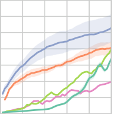
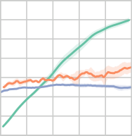
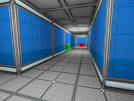

### **Model-Free Episodic Control**


**Charles Blundell**
Google DeepMind
```
cblundell@google.com

```


**Benigno Uria**
Google DeepMind
```
buria@google.com

```


**Alexander Pritzel**
Google DeepMind
```
apritzel@google.com

```


**Yazhe Li**
Google DeepMind
```
yazhe@google.com

```


**Avraham Ruderman**
Google DeepMind
```
aruderman@google.com

```


**Jack Rae**
Google DeepMind
```
jwrae@google.com

```


**Joel Z Leibo**
Google DeepMind
```
jzl@google.com

```


**Daan Wierstra**
Google DeepMind
```
wierstra@google.com

```


**Demis Hassabis**
Google DeepMind
```
demishassabis@google.com

```


**Abstract**


State of the art deep reinforcement learning algorithms take many millions of interactions to attain human-level performance. Humans, on the other hand, can very
quickly exploit highly rewarding nuances of an environment upon first discovery.
In the brain, such rapid learning is thought to depend on the hippocampus and
its capacity for episodic memory. Here we investigate whether a simple model
of hippocampal _episodic control_ can learn to solve difficult sequential decisionmaking tasks. We demonstrate that it not only attains a highly rewarding strategy
significantly faster than state-of-the-art deep reinforcement learning algorithms, but
also achieves a higher overall reward on some of the more challenging domains.


**1** **Introduction**


Deep reinforcement learning has recently achieved notable successes in a variety of domains [23,
32]. However, it is very data inefficient. For example, in the domain of Atari games [2], deep
Reinforcement Learning (RL) systems typically require tens of millions of interactions with the
game emulator, amounting to hundreds of hours of game play, to achieve human-level performance.
As pointed out by [13], humans learn to play these games much faster. This paper addresses the
question of how to emulate such fast learning abilities in a machine—without any domain-specific
prior knowledge.


Current deep RL algorithms may happen upon, or be shown, highly rewarding sequences of actions.
Unfortunately, due to their slow gradient-based updates of underlying policy or value functions,
these algorithms require large numbers of steps to assimilate such information and translate it into
policy improvement. Thus these algorithms lack the ability to rapidly latch onto successful strategies.
Episodic control, introduced by [16], is a complementary approach that can rapidly re-enact observed,
successful policies. Episodic control records highly rewarding experiences and follows a policy that
replays sequences of actions that previously yielded high returns.


In the brain, this form of very fast learning is critically supported by the hippocampus and related
medial temporal lobe structures [1, 34]. For example, a rat’s performance on a task requiring
navigation to a hidden platform is impaired by lesions to these structures [24, 36]. Hippocampal
learning is thought to be instance-based [18, 35], in contrast to the cortical system which represents
generalised statistical summaries of the input distribution [20, 27, 41]. The hippocampal system may
be used to guide sequential decision-making by co-representing environment states with the returns


achieved from the various possible actions. After such encoding, at a given probe state, the return
associated to each possible action could be retrieved by pattern completion in the CA3 subregion

[9, 21, 26, 40]. The final value achieved by a sequence of actions could quickly become associated
with each of its component state-action pairs by the reverse-ordered replay of hippocampal place cell
activations that occurs after a rewarding event [7].


Humans and animals utilise multiple learning, memory, and decision systems each best suited to
different settings [5, 33]. For example, when an accurate model of the environment is available, and
there are sufficient time and working memory resources, the best strategy is model-based planning
associated with prefrontal cortex [5]. However, when there is no time or no resources available
for planning, the less compute-intensive immediate decision systems must be employed [29]. This
presents a problem early on in the learning of a new environment as the model-free decision system
will be even less accurate in this case since it has not yet had enough repeated experience to learn
an accurate value function. In contrast, this is the situation where model-free episodic control may
be most useful. Thus the argument for hippocampal involvement in model-free control parallels the
argument for its involvement in model-based control. In both cases quick-to-learn instance-based
control policies serve as a rough approximation while a slower more generalisable decision system is
trained up [16].


The domain of applicability of episodic control may be hopelessly limited by the complexity of the
world. In real environments the same exact situation is rarely, if ever, revisited. In RL terms, repeated
visits to the exactly the same state are also extremely rare. Here we show that the commonly used
Atari environments do not have this property. In fact, we show that the agents developed in this work
re-encounter exactly the same Atari states between 10-60% of the time. As expected, the episodic
controller works well in such a setting. The key test for this approach is whether it can also work in
more realistic environments where states are never repeated and generalisation over similar states is
essential. Critically, we also show that our episodic control model still performs well in such (3D)
environments where the same state is essentially never re-visited.


**2** **The episodic controller**


In reinforcement learning [e.g. 37], an agent interacts with an environment through a sequence of
states, _st ∈S_ ; actions, _at ∈A_ ; and rewards _rt_ +1 _∈_ R. Actions are determined by the agent’s policy
_π_ ( _at|st_ ), a probability distribution over the action _at_ . The goal of the agent is to learn a policy that
maximises the expected discounted return _Rt_ = [�] _τ_ _[T]_ =1 _[ −][t]_ _[γ][τ]_ _[−]_ [1] _[r][t]_ [+] _[τ]_ [ where] _[ T]_ [ is the time step at which]
each episode ends, and _γ ∈_ (0 _,_ 1] the discount rate. Upon executing an action _at_ the agent transitions
from state _st_ to state _st_ +1.


Environments with deterministic state transitions and rewards are common in daily experience. For
example, in navigation, when you exit a room and then return back, you usually end up in the room
where you started. This property of natural environments can be exploited by RL algorithms or brains.
However, most existing scalable deep RL algorithms (such as DQN [23] and A3C [22]) do not do so.
They were designed with more general environments in mind. Thus, in principle, they could operate
in regimes with high degrees of stochasticity in both transitions and rewards. This generality comes at
the cost of longer learning times. DQN and A3C both attempt to find a policy with maximal _expected_
return. Evaluating the expected return requires many examples in order to get accurate estimates.
Additionally, these algorithms are further slowed down by gradient descent learning, typically in
lock-step with the rate at which actions are taken in the environment.


Given the ubiquity of such near-deterministic situations in the real world, it would be surprising if the
brain did not employ specialised learning mechanisms to exploit this structure and thereby learn more
quickly in such cases. The episodic controller model of hippocampal instance-based learning we
propose here is just such a mechanism. It is a non-parametric model that rapidly records and replays
the sequence of actions that so far yielded the highest return from a given start state. In its simplest
form, it is a growing table, indexed by states and actions. By analogy with RL value functions, we
denote this table _Q_ [EC] ( _s, a_ ). Each entry contains the highest return ever obtained by taking action _a_
from state _s_ .


2


The episodic control policy picks the action with the highest value in _Q_ [EC] for the given state. At the
end of each episode, _Q_ [EC] is updated according to the return received as follows:


_Rt_ if ( _st, at_ ) _̸∈_ _Q_ [EC],
_Q_ [EC] ( _st, at_ ) _←_ (1)
�max � _Q_ [EC] ( _st, at_ ) _, Rt_ � otherwise,


where _Rt_ is the discounted return received after taking action _at_ in state _st_ . Note that (1) is not a
general purpose RL learning update: since the stored value can never decrease, it is not suited to
rational action selection in stochastic environments. [1]


Tabular RL methods suffer from two key deficiencies: firstly, for large problems they consume a large
amount of memory, and secondly, they lack a way to generalise across similar states. To address
the first problem, we limit the size of the table by removing the least recently updated entry once a
maximum size has been reached. Such forgetting of older, less frequently accessed memories also
occurs in the brain [8].


In large scale RL problems (such as real life) novel states are common; the real world, in general,
also has this property. We address the problem of what to do in novel states and how to generalise
values across common experiences by taking _Q_ [EC] to be a non-parametric nearest-neighbours model.
Let us assume that the state space _S_ is imbued with a metric distance. For states that have never been
visited, _Q_ [EC] is approximated by averaging the value of the _k_ nearest states. Thus if _s_ is a novel state
then _Q_ [EC] is estimated as


�
_Q_ [EC] ( _s, a_ ) =


_k_ 1 � _ki_ =1 _[Q]_ [EC][(] _[s]_ [(] _[i]_ [)] _[, a]_ [)] if ( _s, a_ ) _̸∈_ _Q_ [EC], (2)
� _Q_ [EC] ( _s, a_ ) otherwise,


where _s_ [(] _[i]_ [)], _i_ = 1 _, . . ., k_ are the _k_ states with the smallest distance to state _s_ . [2]


Algorithm 1 describes the most basic form of the model-free episodic control. The algorithm has
two phases. First, the policy implied by _Q_ [EC] is executed for a full episode, recording the rewards
received at each step. This is done by projecting each observation from the environment _ot_ via an
embedding function _φ_ to a state in an appropriate state space: _st_ = _φ_ ( _ot_ ), then selecting the action
with the highest estimated return according to _Q_ [EC] . In the second phase, the rewards, actions and
states from an episode are associated via a backward replay process into _Q_ [EC] to improve the policy.
Interestingly, this backward replay process is a potential algorithmic instance of the awake reverse
replay of hippocampal states shown by [7], although as yet, we are unaware of any experiments
testing this interesting use of hippocampus.


**Algorithm 1** Model-Free Episodic Control.


1: **for** each episode **do**
2: **for** _t_ = 1 _,_ 2 _,_ 3 _, . . ., T_ **do**
3: Receive observation _ot_ from environment.
4: Let _st_ = _φ_ ( _ot_ ).
5: Estimate return for each action _a_ via (2)

6: Let _at_ = arg max _a_ _Q_ [�][EC] ( _st, a_ )
7: Take action _at_, receive reward _rt_ +1
8: **end for**
9: **for** _t_ = _T, T −_ 1 _, . . .,_ 1 **do**
10: Update _Q_ [EC] ( _st, at_ ) using _Rt_ according to (1).
11: **end for**

12: **end for**


The episodic controller acts according to the returns recorded in _Q_ [EC], in an attempt to replay
successful sequences of actions and recreate past successes. The values stored in _Q_ [EC] ( _s, a_ ) thus do


1Following a policy that picks the action with the highest _Q_ EC value would yield a strong risk seeking
behaviour in stochastic environments. It is also possible to, instead, remove the max operator and store _Rt_
directly. This yields a less optimistic estimate and performed worse in preliminary experiments.
2 In practice, we implemented this by having one _k_ NN buffer for each action _a ∈A_ and finding the _k_ closest
states in each buffer to state _s_ .


3


not correspond to estimates of the expected return, rather they are estimates of the highest potential
return for a given state and action, based upon the states, rewards and actions seen. Computing and
behaving according to such a value function is useful in regimes where exploitation is more important
than exploration, and where there is relatively little noise in the environment.


**3** **Representations**


In the brain, the hippocampus operates on a representation which notably includes the output of the
ventral stream [3, 15, 38]. Thus it is expected to generalise along the dimensions of that representation
space [19]. Similarly, the feature mapping, _φ_, can play a critical role in how our episodic control
algorithm performs when it encounters novel states [3] .


Whilst the original observation space could be used, this may not work in practice. For example, each
frame in the environments we consider in Section 4 would occupy around 28 KBytes of memory and
would require more than 300 gigabytes of memory for our experiments. Instead we consider two
different embeddings of observations into a state space, _φ_, each having quite distinctive properties in
setting the inductive bias of the _Q_ [EC] estimator.


One way of decreasing memory and computation requirements is to utilise a random projection of
the original observations into a smaller-dimensional space, i.e. _φ_ : _x →_ **A** _x_, where **A** _∈_ R _[F][ ×][D]_
and _F ≪_ _D_ where _D_ is the dimensionality of the observation. For a random matrix **A** with entries
drawn from a standard Gaussian, the Johnson-Lindenstrauss lemma implies that this transformation
approximately preserves relative distances in the original space [10]. We expect this representation to
be sufficient when small changes in the original observation space correspond to small changes in the
underlying return.


For some environments, many aspects of the observation space are irrelevant for value prediction.
For example, illumination and textured surfaces in 3D environments (e.g. _Labyrinth_ in Section 4),
and scrolling backgrounds in 2D environments (e.g. _River Raid_ in Section 4) may often be irrelevant. In these cases, small distances in the original observation space may not be correlated with
small distances in action-value. A feature extraction method capable of extracting a more abstract
representation of the state space (e.g. 3D geometry or the position of sprites in the case of 2D
video-games) could result in a more suitable distance calculation. Abstract features can be obtained
by using latent-variable probabilistic models. Variational autoencoders (VAE; [12, 30]), further
described in the supplementary material, have shown a great deal of promise across a wide range
of unsupervised learning problems on images. Interestingly, the latent representations learnt by
VAEs in an unsupervised fashion can lie on well structured manifolds capturing salient factors of
variation [12, Figures 4(a) and (b)]; [30, Figure 3(b)]. In our experiments, we train the VAEs on
frames from an agent acting randomly. Using a different data source will yield different VAE features,
and in principle features from one task can be used in another. Furthermore, the distance metric
for comparing embeddings could also be learnt. We leave these two interesting extensions to future
work.


**4** **Experimental results**


We tested our algorithm on two environments: the Arcade Learning Environment (Atari) [2], and
a first-person 3-dimensional environment called Labyrinth [22]. Videos of the trained agents are
available online [4] .


The Arcade Learning Environment is a suite of arcade games originally developed for the Atari-2600
console. These games are relatively simple visually but require complex and precise policies to
achieve high expected reward [23].


Labyrinth provides a more complex visual experience, but requires relatively simple policies e.g.
turning when in the presence of a particular visual cue. The three Labyrinth environments are foraging
tasks with appetitive, adversive and sparse appetitive reward structures, respectively.


3One way to understand this is that this feature mapping _φ_ determines the dynamic discretization of the
state-space into Voronoi cells implied by the _k_ -nearest neighbours algorithm underlying the episodic controller.
4 `[https://sites.google.com/site/episodiccontrol/](https://sites.google.com/site/episodiccontrol/)`


4


For each environment, we tested the performance of the episodic controller using two embeddings of
the observations _φ_ : (1) 64 random-projections of the pixel observations and (2) the 64 parameters of
a Gaussian approximation to the posterior over the latent dimensions in a VAE.


For the experiments that use latent features from a VAE, a random policy was used for one million
frames at the beginning of training, these one million observations were used to train the VAE. The
episodic controller is started after these one million frames, and uses the features obtained from the
VAE. Both mean and log-standard-deviation parameters were used as dimensions in the calculation
of Euclidean distances. To account for the initial phase of training we displaced performance curves
for agents that use VAE features by one million frames.


**4.1** **Atari**


For the Atari experiments we considered a set of five games, namely: _Ms. PAC-MAN_, _Q*bert_, _River_
_Raid_, _Frostbite_, and _Space Invaders_ . We compared our algorithm to the original DQN algorithm [23],
to DQN with prioritised replay [31], and to the asynchronous advantage actor-critic [22] (A3C),
a state-of-the-art policy gradient method [5] . Following [23], observations were rescaled to 84 by
84 pixels and converted to gray-scale. The Atari simulator produces 60 observations (frames) per
second of game play. The agents interact with the environment 15 times per second, as actions are
repeated 4 times to decrease the computational requirements. An hour of game play corresponds to
approximately 200 _,_ 000 frames.


In the episodic controller, the size of each buffer (one per action) of state-value pairs was limited
to one million entries. If the buffer is full and a new state-value pair has to be introduced, the least
recently used state is discarded. The _k_ -nearest-neighbour lookups used _k_ = 11. The discount rate
was set to _γ_ = 1. Exploration is achieved by using an _ϵ_ -greedy policy with _ϵ_ = 0 _._ 005. We found that
higher exploration rates were not as beneficial, as more exploration makes exploiting what is known
harder. Note that previously published exploration rates (e.g., [22, 23]) are at least a factor of ten
higher. Thus interestingly, our method attains good performance on a wide range of domains with
relatively little random exploration.


Results are shown in the top two rows of Figure 1. In terms of data efficiency the episodic controller
outperformed all other algorithms during the initial learning phase of all games. On _Q*bert_ and _River_
_Raid_, the episodic controller is eventually overtaken by some of the parametric controllers (not shown
in Figure 1). After an initial phase of fast learning the episodic controller was limited by the decrease
in the relative amount of new experience that could be obtained in each episode as these become
longer. In contrast the parametric controllers could utilise their non-local generalisation capabilities
to handle the later stages of the games.


The two different embeddings (random projections and VAE) did not have a notable effect on the
performance of the episodic control policies. Both representations proved more data efficient than
the parametric policies. The only exception is _Frostbite_ where the VAE features perform noticeably
worse. This may be due to the inability of a random policy to reach very far in the game, which
results in a very poor training-set for the VAE.


Deep Q-networks and A3C exhibited a slow pace of policy improvement in Atari. For _Frostbite_ and
_Ms. PAC-MAN_, this has, sometimes, been attributed to naive exploration techniques [13, 28]. Our
results demonstrate that a simple exploration technique like _ϵ_ -greedy can result in much faster policy
improvements when combined with a system that is able to learn in a one-shot fashion.


The Atari environment has deterministic transitions and rewards. Each episode starts at one of thirty
possible initial states. Therefore a sizeable percentage of states-action pairs are exactly matched in
the buffers of _Q_ -values: about 10% for _Frostbite_, 60% for _Q*bert_, 50% for _Ms. PAC-MAN_, 45% for
_Space Invaders_, and 10% for _River Raid_ . In the next section we report experiments on a set of more
realistic environments where the same exact experience is seldom encountered twice.


5We are forever indebted to Tom Schaul for the prioritised replay baseline and Andrei Rusu for the A3C
baseline.


5


Frostbite
4.0

3.5

3.0

2.5

2.0

1.5

1.0

0.5

0.0

0 10 20 30 40 50


Double T-Maze
5


4


3


2


1


0


−1


0 10 20 30 40 50


Millions of Frames


Ms. Pac-Man

6


5


4


3


2


1


0

0 10 20 30 40 50


Q*bert

14


12


10


8


6


4


2


0

0 10 20 30 40 50


Space Invaders
2.5


2.0


1.5


1.0


0.5


0.0

0 10 20 30 40 50


River Raid
12


10


8


6


4


2


0

0 10 20 30 40 50


Forage & Avoid
14


12


10


8


6


4


2


0


0 10 20 30 40 50


Millions of Frames


35


30


25


20


15


10


5


0




Forage


0 10 20 30 40 50


Millions of Frames





DQN 3riRritiVed DQN A3C EC-VAE EC-R3


Figure 1: Average reward _vs._ number of frames (in millions) experienced for five Atari games and
three Labyrinth environments. Dark curves show the mean of five runs (results from only one run
were available for DQN baselines) initialised with different random number seeds. Light shading
shows the standard error of the mean across runs. Episodic controllers (orange and blue curves)
outperform parametric _Q_ -function estimators (light green and pink curves) and A3C (dark green
curve) in the initial phase of learning. VAE curves start after one million frames to account for their
training using a random policy.


**4.2** **Labyrinth**


The Labyrinth experiments involved three levels (screenshots are shown in Figure 2). The environment
runs at 60 observations (frames) per simulated second of physical time. Observations are gray-scale
images of 84 by 84 pixels. The agent interacts with the environment 15 times per second; actions
are automatically repeated for 4 frames (to reduce computational requirements). The agent has eight
different actions available to it (move-left, move-right, turn-left, turn-right, move-forward, movebackwards, move-forward and turn-left, move-forward and turn-right). In the episodic controller, the
size of each buffer (one per action) of state-value pairs was limited to one hundred thousand entries.
When the buffer was full and a new state-value pair had to be introduced, the least recently used


6




(a) (b) (c)


Figure 2: High-resolution screenshots of the Labyrinth environments. **(a)** _Forage and Avoid_ showing
the apples (positive rewards) and lemons (negative rewards). **(b)** _Double T-maze_ showing cues at
the turning points. **(c)** Top view of a _Double T-maze_ configuration. The cues indicate the reward is
located at the top left.


state was discarded. The _k_ -nearest-neighbour lookups used _k_ = 50. The discount rate was set to
_γ_ = 0 _._ 99. Exploration is achieved by using an _ϵ_ -greedy policy with _ϵ_ = 0 _._ 005. As a baseline, we
used A3C [22]. Labyrinth levels have deterministic transitions and rewards, but the initial location
and facing direction are randomised, and the environment is much richer, being 3-dimensional. For
this reason, unlike Atari, experiments on Labyrinth encounter very few exact matches in the buffers
of _Q_ [EC] -values; less than 0 _._ 1% in all three levels.


Each level is progressively more difficult. The first level, called _Forage_, requires the agent to collect
apples as quickly as possible by walking through them. Each apple provides a reward of 1. A simple
policy of turning until an apple is seen and then moving towards it suffices here. Figure 1 shows that
the episodic controller found an apple seeking policy very quickly. Eventually A3C caught up, and
final outperforms the episodic controller with a more efficient strategy for picking up apples.


The second level, called _Forage and Avoid_ involves collecting apples, which provide a reward of 1,
while avoiding lemons which incur a reward of _−_ 1. The level is depicted in Figure 2(a). This level
requires only a slightly more complicated policy then _Forage_ (same policy plus avoid lemons) yet
A3C took over 40 million steps to the same performance that episodic control attained in fewer than
3 million frames.


The third level, called _Double-T-Maze_, requires the agent to walk in a maze with four ends (a map
is shown in Figure 2(c)) one of the ends contains an apple, while the other three contain lemons.
At each intersection the agent is presented with a colour cue that indicates the direction in which
the apple is located (see Figure 2(b)): left, if red, or right, if green. If the agent walks through a
lemon it incurs a reward of _−_ 1. However, if it walks through the apple, it receives a reward of 1, is
teleported back to the starting position and the location of the apple is resampled. The duration of an
episode is limited to 1 minute in which it can reach the apple multiple times if it solves the task fast
enough. _Double-T-Maze_ is a difficult RL problem: rewards are sparse. In fact, A3C never achieved
an expected reward above zero. Due to the sparse reward nature of the _Double T-Maze_ level, A3C did
not update the policy strongly enough in the few instances in which a reward is encountered through
random diffusion in the state space. In contrast, the episodic controller exhibited behaviour akin to
one-shot learning on these instances, and was able to learn from the very few episodes that contain
any rewards different from zero. This allowed the episodic controller to observe between 20 and 30
million frames to learn a policy with positive expected reward, while the parametric policies never
learnt a policy with expected reward higher than zero. In this case, episodic control thrived in sparse
reward environment as it rapidly latched onto an effective strategy.


**4.3** **Effect of number of nearest neighbours on final score**


Finally, we compared the effect of varying _k_ (the number of nearest neighbours) on both Labyrinth
and Atari tasks using VAE features. In our experiments above, we noticed that on Atari re-visiting
the same state was common, and that random projections typically performed the same or better
than VAE features. One further interesting feature is that the learnt VAEs on Atari games do not
yield a higher score as the number of neighbours increases, except on one game, _Q*bert_, where
VAEs perform reasonably well (see Figure 3a). On Labyrinth levels, we observed that the VAEs
outperformed random projections and the agent rarely encountered the same state more than once.
Interestingly for this case, Figure 3b shows that increasing the number of nearest neighbours has a


7


10000


8000


6000


4000


2000


0


|Col1|k = 5<br>k = 11|
|---|---|
|||
|||
|||
|||


|Col1|k = 10<br>k = 50|
|---|---|
|||


(a) Atari games.


20


15


10


5


0


(b) Labyrinth levels.


Figure 3: Effect of number of neighbours, _k_, on on final score (y axis).


significant effect on the final performance of the agent in Labyrinth levels. This strongly suggests
that VAE features provide the episodic control agent with generalisation in Labyrinth.


**5** **Discussion**


This work tackles a critical deficiency in current reinforcement learning systems, namely their inability
to learn in a one-shot fashion. We have presented a fast-learning system based on non-parametric
memorisation of experience. We showed that it can learn good policies faster than parametric function
approximators. However, it may be overtaken by them at later stages of training. It is our hope that
these ideas will find application in practical systems, and result in data-efficient model-free methods.
These results also provide support for the hypothesis that episodic control could be used by the brain,
especially in the early stages of learning in a new environment. Note also that there are situations in
which the episodic controller is always expected to outperform. For example, when hiding food for
later consumption, some birds (e.g., scrub jays) are better off remembering their hiding spot exactly
than searching according to a distribution of likely locations [4]. These considerations support models
in which the brain uses multiple control systems and an arbitration mechanism to determine which to
act according to at each point in time [5, 16].


We have referred to this approach as model-free episodic control to distinguish it from model-based
episodic planning. We conjecture that both such strategies may be used by the brain in addition to the
better-known habitual and goal-directed systems associated with dorsolateral striatum and prefrontal
cortex respectively [5]. The tentative picture to emerge from this work is one in which the amount
of time and working memory resources available for decision making is a key determiner of which
control strategies are available. When decisions must be made quickly, planning-based approaches
are simply not an option. In such cases, the only choice is between the habitual model-free system and
the episodic model-free system. When decisions are not so rushed, the planning-based approaches
become available and the brain must then arbitrate between planning using semantic (neocortical)
information or episodic (hippocampal) information. In both timing regimes, the key determiner
of whether to use episodic information or not is how much uncertainty remains in the estimates
provided by the slower-to-learn system. This prediction agrees with those of [5, 16] with respect to
the statistical trade-offs between systems. It builds on their work by highlighting the potential impact
of rushed decisions and insufficient working memory resources in accord with [29]. These ideas
could be tested experimentally by manipulations of decision timing or working memory, perhaps
by orthogonal tasks, and fast measurements of coherence between medial temporal lobe and output
structures under different statistical conditions.


8


**Acknowledgements**


We are grateful to Dharshan Kumaran and Koray Kavukcuoglu for their detailed feedback on this
manuscript. We are indebted to Marcus Wainwright and Max Cant for generating the images in
Figure 2. We would also like to thank Peter Dayan, Shane Legg, Ian Osband, Joel Veness, Tim
Lillicrap, Theophane Weber, Remi Munos, Alvin Chua, Yori Zwols and many others at Google
DeepMind for fruitful discussions.


**References**


[1] Per Andersen, Richard Morris, David Amaral, Tim Bliss, and John OKeefe. _The hippocampus_
_book_ . Oxford University Press, 2006.


[2] M. G. Bellemare, Y. Naddaf, J. Veness, and M. Bowling. The arcade learning environment: An
evaluation platform for general agents. _Journal of Artificial Intelligence Research_, 47:253–279,
06 2013.


[3] Malcolm W Brown and John P Aggleton. Recognition memory: what are the roles of the
perirhinal cortex and hippocampus? _Nature Reviews Neuroscience_, 2(1):51–61, 2001.


[4] Nicola S Clayton and Anthony Dickinson. Episodic-like memory during cache recovery by
scrub jays. _Nature_, 395(6699):272–274, 1998.


[5] Nathaniel D Daw, Yael Niv, and Peter Dayan. Uncertainty-based competition between prefrontal
and dorsolateral striatal systems for behavioral control. _Nature neuroscience_, 8(12):1704–1711,
2005.


[6] Alexey Dosovitskiy, Jost Tobias Springenberg, and Thomas Brox. Learning to generate chairs
with convolutional neural networks. In _Proceedings of the IEEE Conference on Computer_
_Vision and Pattern Recognition_, pages 1538–1546, 2015.


[7] David J Foster and Matthew A Wilson. Reverse replay of behavioural sequences in hippocampal
place cells during the awake state. _Nature_, 440(7084):680–683, 2006.


[8] Oliver Hardt, Karim Nader, and Lynn Nadel. Decay happens: the role of active forgetting in
memory. _Trends in cognitive sciences_, 17(3):111–120, 2013.


[9] John J Hopfield. Neural networks and physical systems with emergent collective computational
abilities. _Proceedings of the national academy of sciences_, 79(8):2554–2558, 1982.


[10] William B Johnson and Joram Lindenstrauss. Extensions of lipschitz mappings into a hilbert
space. _Contemporary mathematics_, 26(189-206):1, 1984.


[11] Diederik P Kingma, Shakir Mohamed, Danilo Jimenez Rezende, and Max Welling. Semisupervised learning with deep generative models. In _Advances in Neural Information Processing_
_Systems_, pages 3581–3589, 2014.


[12] Diederik P Kingma and Max Welling. Auto-encoding variational bayes. _arXiv preprint_
_arXiv:1312.6114_, 2013.


[13] Brenden M Lake, Tomer D Ullman, Joshua B Tenenbaum, and Samuel J Gershman. Building
machines that learn and think like people. _arXiv preprint arXiv:1604.00289_, 2016.


[14] Yann LeCun, Léon Bottou, Yoshua Bengio, and Patrick Haffner. Gradient-based learning
applied to document recognition. _Proceedings of the IEEE_, 86(11):2278–2324, 1998.


[15] Joel Z. Leibo, Julien Cornebise, Sergio Gomez, and Demis Hassabis. Approximate hubel-wiesel
modules and the data structures of neural computation. _arxiv:1512.08457 [cs.NE]_, 2015.


[16] M. Lengyel and P. Dayan. Hippocampal contributions to control: The third way. In _NIPS_,
volume 20, pages 889–896, 2007.


[17] David JC MacKay. _Information theory, inference and learning algorithms_ . Cambridge university
press, 2003.


9


[18] D Marr. Simple memory: A theory for archicortex. _Philosophical Transactions of the Royal_
_Society of London. Series B, Biological Sciences_, pages 23–81, 1971.


[19] James L McClelland and Nigel H Goddard. Considerations arising from a complementary
learning systems perspective on hippocampus and neocortex. _Hippocampus_, 6(6):654–665,
1996.


[20] James L McClelland, Bruce L McNaughton, and Randall C O’Reilly. Why there are complementary learning systems in the hippocampus and neocortex: insights from the successes and
failures of connectionist models of learning and memory. _Psychological review_, 102(3):419,
1995.


[21] Bruce L McNaughton and Richard GM Morris. Hippocampal synaptic enhancement and
information storage within a distributed memory system. _Trends in neurosciences_, 10(10):408–
415, 1987.


[22] Volodymyr Mnih, Adrià Puigdomènech Badia, Mehdi Mirza, Alex Graves, Timothy P. Lillicrap, Tim Harley, David Silver, and Koray Kavukcuoglu. Asynchronous methods for deep
reinforcement learning. _CoRR_, abs/1602.01783, 2016.


[23] Volodymyr Mnih, Koray Kavukcuoglu, David Silver, Andrei A Rusu, Joel Veness, Marc G
Bellemare, Alex Graves, Martin Riedmiller, Andreas K Fidjeland, Georg Ostrovski, et al.
Human-level control through deep reinforcement learning. _Nature_, 518(7540):529–533, 2015.


[24] RGM Morris, P Garrud, and JNP Rawlinst. Place navigation impaired in rats with hippocampal
lesions. _Nature_, 297:681, 1982.


[25] Vinod Nair and Geoffrey E Hinton. Rectified linear units improve restricted boltzmann machines.
In _Proceedings of the 27th International Conference on Machine Learning (ICML-10)_, pages
807–814, 2010.


[26] Kazu Nakazawa, Michael C Quirk, Raymond A Chitwood, Masahiko Watanabe, Mark F
Yeckel, Linus D Sun, Akira Kato, Candice A Carr, Daniel Johnston, Matthew A Wilson, et al.
Requirement for hippocampal ca3 nmda receptors in associative memory recall. _Science_,
297(5579):211–218, 2002.


[27] Kenneth A Norman and Randall C O’Reilly. Modeling hippocampal and neocortical contributions to recognition memory: a complementary-learning-systems approach. _Psychological_
_review_, 110(4):611, 2003.


[28] Junhyuk Oh, Xiaoxiao Guo, Honglak Lee, Richard L Lewis, and Satinder Singh. Actionconditional video prediction using deep networks in atari games. In _Advances in Neural_
_Information Processing Systems_, pages 2845–2853, 2015.


[29] A Ross Otto, Samuel J Gershman, Arthur B Markman, and Nathaniel D Daw. The curse of
planning dissecting multiple reinforcement-learning systems by taxing the central executive.
_Psychological science_, page 0956797612463080, 2013.


[30] Danilo Jimenez Rezende, Shakir Mohamed, and Daan Wierstra. Stochastic backpropagation
and approximate inference in deep generative models. In _Proceedings of The 31st International_
_Conference on Machine Learning_, pages 1278–1286, 2014.


[31] Tom Schaul, John Quan, Ioannis Antonoglou, and David Silver. Prioritized experience replay.
_CoRR_, abs/1511.05952, 2015.


[32] David Silver, Aja Huang, Chris J Maddison, Arthur Guez, Laurent Sifre, George Van Den Driessche, Julian Schrittwieser, Ioannis Antonoglou, Veda Panneershelvam, Marc Lanctot, et al. Mastering the game of go with deep neural networks and tree search. _Nature_, 529(7587):484–489,
2016.


[33] Larry R Squire. Memory and the hippocampus: a synthesis from findings with rats, monkeys,
and humans. _Psychological review_, 99(2):195, 1992.


10


[34] Larry R Squire. Memory systems of the brain: a brief history and current perspective. _Neurobi-_
_ology of learning and memory_, 82(3):171–177, 2004.


[35] Robert J Sutherland and Jerry W Rudy. Configural association theory: The role of the hippocampal formation in learning, memory, and amnesia. _Psychobiology_, 17(2):129–144, 1989.


[36] Robert J Sutherland, Ian Q Whishaw, and Bob Kolb. A behavioural analysis of spatial localization following electrolytic, kainate-or colchicine-induced damage to the hippocampal formation
in the rat. _Behavioural brain research_, 7(2):133–153, 1983.


[37] Richard S Sutton and Andrew G Barto. _Reinforcement learning: An introduction_ . MIT press,
1998.


[38] Wendy L Suzuki and David G Amaral. Perirhinal and parahippocampal cortices of the macaque
monkey: cortical afferents. _Journal of comparative neurology_, 350(4):497–533, 1994.


[39] Tijmen Tieleman and Geoffrey Hinton. Lecture 6.5-rmsprop: Divide the gradient by a running
average of its recent magnitude. _COURSERA: Neural Networks for Machine Learning_, 4:2,
2012.


[40] Alessandro Treves and Edmund T Rolls. Computational analysis of the role of the hippocampus
in memory. _Hippocampus_, 4(3):374–391, 1994.


[41] Endel Tulving, CA Hayman, and Carol A Macdonald. Long-lasting perceptual priming and
semantic learning in amnesia: a case experiment. _Journal of Experimental Psychology: Learning,_
_Memory, and Cognition_, 17(4):595, 1991.


**A** **Variational autoencoders for representation learning**


Variational autoencoders (VAE; [12, 30]) are latent-variable probabilistic models inspired by compression theory. A VAE (shown in Figure 4) is composed of two artificial neural networks: the encoder,
which takes observations and maps them into messages; and a decoder, that receives messages and
approximately recovers the observations. VAEs are designed to minimise the cost of transmitting
observations from the encoder to the decoder through the communication channel. In order to
minimise the transmission cost, a VAE must learn to capture the statistics of the distribution of
observations [e.g. 17]. For our representation learning purposes, we use the encoder network as our
feature mapping, _φ_ . for several data sets, representations learned by a VAE encoder have been shown
to capture the independent factors of variation in the underlying generative process of the data [11].


In more detail, the encoder receives an observation, **x**, and outputs the parameter-values for a
distribution of messages, _q_ ( _z|x_ = **x** ). The communication channel determines the cost of a message
by a prior distribution over messages _p_ ( _z_ ). The decoder receives a message, **z**, drawn at random
from _q_ ( _z|x_ = **x** ) and decodes it by outputting the parameters of a distribution over observations
_p_ ( _x|z_ = **z** ). VAEs are trained to minimise cost of exactly recovering the original observation,
given by the sum of expected communication cost _KL_ ( _q_ ( _z|_ **x** ) _|| p_ ( _z_ )) and expected correction cost
E [ _p_ ( _x_ = **x** _|z_ )].


In all our experiments, _x ∈_ R [7056] (84 by 84 gray-scale pixels, with range [0, 1]), and _z ∈_ R [32] .
We chose distributions _q_ ( _z|x_ ), _p_ ( _z_ ), and _p_ ( _x|z_ ) to be Gaussians with diagonal covariance matrices.
In all experiments the encoder network has four convolutional [14] layers using {32, 32, 64, 64}
kernels respectively, kernel sizes {4, 5, 5, 4}, kernel strides {2, 2, 2, 2}, no padding, and ReLU [25]
non-linearity. The convolutional layer are followed by a fully connected layer of 512 ReLU units,
from which a linear layer outputs the means and log-standard-deviations of the approximate posterior
_q_ ( **z** _|_ **x** ). The decoder is setup mirroring the encoder, with a fully connected layer of 512 ReLU units
followed by four reverse convolutions [6] with {64, 64, 32, 32} kernels respectively, kernel sizes
{4, 5, 5, 4}, kernel strides {2, 2, 2, 2}, no padding, followed by a reverse convolution with two
output kernels –one for the mean and one for the log-standard-deviation of _p_ ( _x|z_ ). The standard
deviation of each dimension in _p_ ( _x|z_ ) is not set to 0.05 if the value output by the network is smaller.
The VAEs were trained to model a million observations obtained by executing a random policy
on each environment. The parameters of the VAEs were optimised by running 400 _,_ 000 steps of
stochastic-gradient descent using the RmsProp optimiser [39], step size of 1e _−_ 5, and minibatches of
size 100.


11


Encoder Decoder

## _x x_


Figure 4: Diagram of a variational autoencoder.


12


