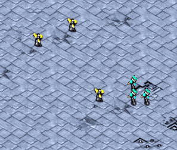
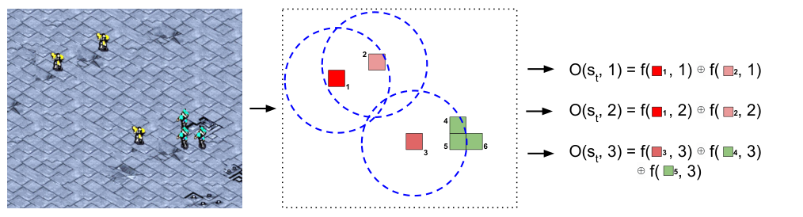
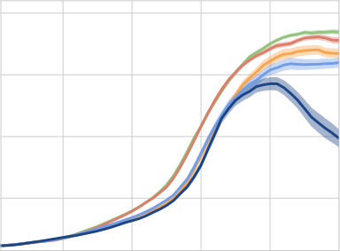
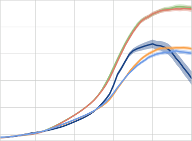
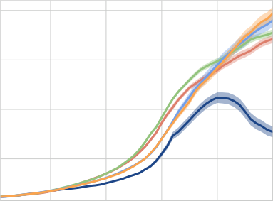
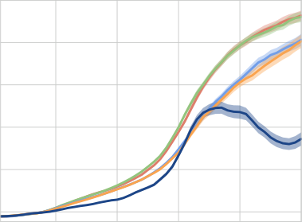
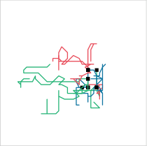
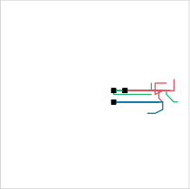
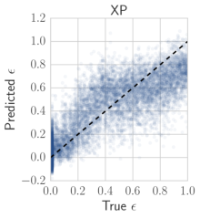
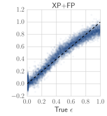

## **Stabilising Experience Replay for Deep Multi-Agent Reinforcement Learning**

**Jakob Foerster** [* 1] **Nantas Nardelli** [* 1] **Gregory Farquhar** [1] **Triantafyllos Afouras** [1]

**Philip. H. S. Torr** [1] **Pushmeet Kohli** [2] **Shimon Whiteson** [1]

**Abstract**

Many real-world problems, such as network
packet routing and urban traffic control, are
naturally modeled as multi-agent _reinforcement_
_learning_ (RL) problems. However, existing
multi-agent RL methods typically scale poorly in
the problem size. Therefore, a key challenge is to
translate the success of deep learning on singleagent RL to the multi-agent setting. A major
stumbling block is that _independent Q-learning_,
the most popular multi-agent RL method, introduces nonstationarity that makes it incompatible with the _experience replay memory_ on which
deep Q-learning relies. This paper proposes two
methods that address this problem: 1) using a
multi-agent variant of importance sampling to
naturally decay obsolete data and 2) conditioning each agent’s value function on a _fingerprint_
that disambiguates the age of the data sampled
from the replay memory. Results on a challenging decentralised variant of _StarCraft unit micro-_
_management_ confirm that these methods enable
the successful combination of experience replay
with multi-agent RL.

**1. Introduction**

_Reinforcement learning_ (RL), which enables an agent to
learn control policies on-line given only sequences of
observations and rewards, has emerged as a dominant
paradigm for training autonomous systems. However,
many real-world problems, such as network packet delivery (Ye et al., 2015), rubbish removal (Makar et al., 2001),
and urban traffic control (Kuyer et al., 2008; Van der Pol
& Oliehoek, 2016), are naturally modeled as cooperative

  - Equal contribution 1 University of Oxford, Oxford, United
Kingdom 2 Microsoft Research, Redmond, USA. Correspondence to: Jakob Foerster _<_ jakob.foerster@cs.ox.ac.uk _>_, Nantas
Nardelli _<_ nantas@robots.ox.ac.uk _>_ .

_Proceedings of the 34_ _[th]_ _International Conference on Machine_
_Learning_, Sydney, Australia, PMLR 70, 2017. Copyright 2017
by the author(s).

multi-agent systems. Unfortunately, tackling such problems with traditional RL is not straightforward.

If all agents observe the true state, then we can model a cooperative multi-agent system as a single meta-agent. However, the size of this meta-agent’s action space grows exponentially in the number of agents. Furthermore, it is not
applicable when each agent receives different observations
that may not disambiguate the state, in which case decentralised policies must be learned.

A popular alternative is _independent Q-learning_ (IQL)
(Tan, 1993), in which each agent independently learns its
own policy, treating other agents as part of the environment. While IQL avoids the scalability problems of centralised learning, it introduces a new problem: the environment becomes nonstationary from the point of view of each
agent, as it contains other agents who are themselves learning, ruling out any convergence guarantees. Fortunately,
substantial empirical evidence has shown that IQL often
works well in practice (Matignon et al., 2012).

Recently, the use of deep neural networks has dramatically
improved the scalability of single-agent RL (Mnih et al.,
2015). However, one element key to the success of such
approaches is the reliance on an _experience replay mem-_
_ory_, which stores experience tuples that are sampled during
training. Experience replay not only helps to stabilise the
training of a deep neural network, it also improves sample
efficiency by repeatedly reusing experience tuples. Unfortunately, the combination of experience replay with IQL
appears to be problematic: the nonstationarity introduced
by IQL means that the dynamics that generated the data in
the agent’s replay memory no longer reflect the current dynamics in which it is learning. While IQL without a replay
memory can learn well despite nonstationarity so long as
each agent is able to gradually track the other agents’ policies, that seems hopeless with a replay memory constantly
confusing the agent with obsolete experience.

To avoid this problem, previous work on deep multi-agent
RL has limited the use of experience replay to short, recent
buffers (Leibo et al., 2017) or simply disabled replay altogether (Foerster et al., 2016). However, these workarounds
limit the sample efficiency and threaten the stability of
multi-agent RL. Consequently, the incompatibility of ex

**Stabilising Experience Replay for Deep Multi-Agent Reinforcement Learning**

perience replay with IQL is emerging as a key stumbling
block to scaling deep multi-agent RL to complex tasks.

In this paper, we propose two approaches for effectively
incorporating experience replay into multi-agent RL. The
first approach interprets the experience in the replay memory as _off-environment_ data (Ciosek & Whiteson, 2017).
By augmenting each tuple in the replay memory with the
probability of the joint action in that tuple, according to
the policies in use at that time, we can compute an importance sampling correction when the tuple is later sampled
for training. Since older data tends to generate lower importance weights, this approach naturally decays data as it
becomes obsolete, preventing the confusion that a nonstationary replay memory would otherwise create.

The second approach is inspired by _hyper Q-learning_
(Tesauro, 2003), which avoids the nonstationarity of IQL
by having each agent learn a policy that conditions on an
estimate of the other agents’ policies inferred from observing their behaviour. While it may seem hopeless to learn Qfunctions in this much larger space, especially when each
agent’s policy is a deep neural network, we show that doing
so is feasible as each agent need only condition on a lowdimensional _fingerprint_ that is sufficient to disambiguate
where in the replay memory an experience tuple was sampled from.

We evaluate these methods on a decentralised variant of _StarCraft unit micromanagement_, [1] a challenging
multi-agent benchmark problem with a high dimensional,
stochastic environment that exceeds the complexity of
many commonly used multi-agent testbeds. Our results
confirm that, thanks to our proposed methods, experience
replay can indeed be successfully combined with multiagent _Q_ -learning to allow for stable training of deep multiagent value functions.

**2. Related Work**

Multi-agent RL has a rich history (Busoniu et al., 2008;
Yang & Gu, 2004) but has mostly focused on tabular settings and simple environments. The most commonly used
method is independent Q-learning (Tan, 1993; Shoham &
Leyton-Brown, 2009; Zawadzki et al., 2014), which we discuss further in Section 3.2.

Methods like hyper Q-learning (Tesauro, 2003), also discussed in Section 3.2, and AWESOME (Conitzer & Sandholm, 2007) try to tackle nonstationarity by tracking and
conditioning each agent’s learning process on their teammates’ current policy, while Da Silva et al. (2006) propose detecting and tracking different classes of traces

1 StarCraft and its expansion StarCraft: Brood War are trademarks of Blizzard Entertainment [TM] .

on which to condition policy learning. Kok & Vlassis
(2006) show that coordination can be learnt by estimating a global Q-function in the classical distributed setting
supplemented with a coordination graph. In general, these
techniques have so far not successfully been scaled to highdimensional state spaces.

Lauer & Riedmiller (2000) propose a variation of distributed Q-learning, a coordination-free method. However,
they also argue that the simple estimation of the value
function in the standard model-free fashion is not enough
to solve multi-agent problems, and coordination through
means such as communication (Mataric, 1998) is required
to ground separate observations to the full state function.

More recent work tries to leverage deep learning in multiagent RL, mostly as a means to reason about the emergence
of inter-agent communication. Tampuu et al. (2015) apply a framework that combines DQN with independent Qlearning to two-player pong. Foerster et al. (2016) propose
DIAL, an end-to-end differentiable architecture that allows
agents to learn to communicate and has since been used by
Jorge et al. (2016) in a similar setting. Sukhbaatar et al.
(2016) also show that it is possible to learn to communicate by backpropagation. Leibo et al. (2017) analyse the
emergence of cooperation and defection when using multiagent RL in mixed-cooperation environments such as the
wolfpack problem. He et al. (2016) address multi-agent
learning by explicitly marginalising the opponents’ strategy
using a mixture of experts in the DQN. Unlike our contributions, none of these papers directly aim to address the
nonstationarity arising in multi-agent learning.

Our work is also broadly related to methods that attempt to
allow for faster convergence of policy networks such as prioritized experience replay (Schaul et al., 2015), a version of
the standard replay memory that biases the sampling distribution based on the TD error. However, this method does
not account for nonstationary environments and does not
take into account the unique properties of the multi-agent
setting.

Wang et al. (2016) describe an importance sampling
method for using off-policy experience in a single-agent
actor-critic algorithm. However, to calculate policygradients, the importance ratios become products over potentially lengthy trajectories, introducing high variance that
must be partially compensated for by truncation. By contrast, we address _off-environment_ learning and show that
the multi-agent structure results in importance ratios that
are simply products over the agents’ policies.

Finally, in the context of StarCraft micromanagement,
Usunier et al. (2016) learn a centralised policy using standard single-agent RL. Their agent controls all the units
owned by the player and observes the full state of the game.

**Stabilising Experience Replay for Deep Multi-Agent Reinforcement Learning**

By contrast, we consider a decentralised task in which each
unit has only partial observability.

**3. Background**

We begin with background on single-agent and multi-agent
reinforcement learning.

**3.1. Single-Agent Reinforcement Learning**

In a traditional RL problem, the agent aims to maximise
its expected discounted return _R_ _t_ = [�] _[∞]_ _t_ =0 _[γ]_ _[t]_ _[r]_ _[t]_ [, where] _[ r]_ _[t]_
is the reward the agent receives at time _t_ and _γ ∈_ [0 _,_ 1)
is the discount factor (Sutton & Barto, 1998). In a fully
observable setting, the agent observes the true state of the
environment _s_ _t_ _∈_ _S_, and chooses an action _u_ _t_ _∈_ _U_ according to a policy _π_ ( _u|s_ ).

The action-value function _Q_ of a policy _π_ is _Q_ _[π]_ ( _s, u_ ) =
E [ _R_ _t_ _|s_ _t_ = _s, u_ _t_ = _u_ ]. The Bellman optimality equation,

_Q_ _[∗]_ ( _s, u_ ) = _T Q_ _[∗]_ ( _s, u_ )

= _r_ ( _s, u_ ) + _γ_ � _P_ ( _s_ _[′]_ _|s, u_ ) max _u_ _[′]_ _[ Q]_ _[∗]_ [(] _[s]_ _[′]_ _[, u]_ _[′]_ [)] _[,]_

_s_ _[′]_

(1)

recursively represents the optimal _Q_ -function _Q_ _[∗]_ ( _s, u_ ) =
max _π_ _Q_ _[π]_ ( _s, u_ ) as a function of the expected immediate reward _r_ ( _s, u_ ) and the transition function _P_ ( _s_ _[′]_ _|s, u_ ),
which in turn yields an optimal greedy policy _π_ _[∗]_ ( _u|s_ ) =
_δ_ (arg max _u_ _′_ _Q_ ( _s, u_ _[′]_ ) _−_ _u_ ). _Q_ -learning (Watkins, 1989)
uses a sample-based approximation of _T_ to iteratively improve the _Q_ -function. In deep _Q_ -learning (Mnih et al.,
2015), the _Q_ -function is represented by a neural network
parameterised by _θ_ . During training, actions are chosen at
each timestep according to an exploration policy, such as
an _ϵ_ -greedy policy that selects the currently estimated best
action arg max _u_ _Q_ ( _s, u_ ) with probability 1 _−_ _ϵ_, and takes
a random exploratory action with probability _ϵ_ . The reward and next state are observed, and the tuple _⟨s, u, r, s_ _[′]_ _⟩_
is stored in a _replay memory_ . The parameters _θ_ are learned
by sampling batches of _b_ transitions from the replay memory, and minimising the squared TD-error:

accomplished by modelling the _Q_ -function with a recurrent neural network (Hausknecht & Stone, 2015), utilising
a gated architecture such as LSTM (Hochreiter & Schmidhuber, 1997) or GRU (Chung et al., 2014).

**3.2. Multi-Agent Reinforcement Learning**

We consider a fully cooperative multi-agent setting in
which _n_ agents identified by _a ∈_ _A ≡{_ 1 _, ..., n}_ participate in a stochastic game, _G_, described by a tuple
_G_ = _⟨S, U, P, r, Z, O, n, γ⟩_ . The environment occupies
states _s ∈_ _S_, in which, at every time step, each agent takes
an action _u_ _a_ _∈_ _U_, forming a joint action **u** _∈_ **U** _≡_ _U_ _[n]_ .
State transition probabilities are defined by _P_ ( _s_ _[′]_ _|s,_ **u** ) :
_S ×_ **U** _× S →_ [0 _,_ 1]. As the agents are fully cooperative,
they share the same reward function _r_ ( _s,_ **u** ) : _S ×_ **U** _→_ R.

Each agent’s observations _z ∈_ _Z_ are governed by an observation function _O_ ( _s, a_ ) : _S × A →_ _Z_ . For notational
simplicity, this observation function is deterministic, i.e.,
we model only perceptual aliasing and not noise. However, extending our methods to noisy observation functions
is straightforward. Each agent _a_ conditions its behaviour
on its own action-observation history _τ_ _a_ _∈_ _T ≡_ ( _Z × U_ ) _[∗]_,
according to its policy _π_ _a_ ( _u_ _a_ _|τ_ _a_ ) : _T × U →_ [0 _,_ 1]. After
each transition, the action _u_ _a_ and new observation _O_ ( _s, a_ )
are added to _τ_ _a_, forming _τ_ _a_ _[′]_ [. We denote joint quantities over]
agents in bold, and joint quantities over agents other than _a_
with the subscript _−a_, so that, e.g., **u** = [ _u_ _a_ _,_ **u** _−a_ ].

In _independent Q-learning_ (IQL) (Tan, 1993), the simplest
and most popular approach to multi-agent RL, each agent
learns its own Q-function that conditions only on the state
and its own action. Since our setting is partially observable,
IQL can be implemented by having each agent condition on
its action-observation history, i.e., _Q_ _a_ ( _τ_ _a_ _, u_ _a_ ). In deep RL,
this can be achieved by having each agent perform DQN
using a recurrent neural network trained on its own observations and actions.

IQL is appealing because it avoids the scalability problems
of trying to learn a joint Q-function that conditions on **u**,
since _|_ **U** _|_ grows exponentially in the number of agents.
It is also naturally suited to partially observable settings,
since, by construction, it learns decentralised policies in
which each agent’s action conditions only on its own observations.

However, IQL introduces a key problem: the environment
becomes nonstationary from the point of view each agent,
as it contains other agents who are themselves learning,
ruling out any convergence guarantees. On the one hand,
the conventional wisdom is that this problem is not severe
in practice, and substantial empirical results have demonstrated success with IQL (Matignon et al., 2012). On the
other hand, such results do not involve deep learning.

_L_ ( _θ_ ) =

_b_
�[( _y_ _i_ _[DQN]_ _−_ _Q_ ( _s, u_ ; _θ_ )) [2] ] _,_ (2)

_i_ =1

with a target _y_ _i_ _[DQN]_ = _r_ _i_ + _γ_ max _u_ _[′]_ _i_ _[Q]_ [(] _[s]_ _i_ _[′]_ _[, u]_ _[′]_ _i_ [;] _[ θ]_ _[−]_ [)][, where]
_θ_ _[−]_ are the parameters of a target network periodically
copied from _θ_ and frozen for a number of iterations. The
replay memory stabilises learning, prevents the network
from overfitting to recent experiences, and improves sample efficiency. In partially observable settings, agents must
in general condition on their entire action-observation history, or a sufficient stastistic thereof. In deep RL, this is

**Stabilising Experience Replay for Deep Multi-Agent Reinforcement Learning**

As discussed earlier, deep RL relies heavily on experience
replay and the combination of experience replay with IQL
appears to be problematic: the nonstationarity introduced
by IQL means that the dynamics that generated the data in
the agent’s replay memory no longer reflect the current dynamics in which it is learning. While IQL without a replay
memory can learn well despite nonstationarity so long as
each agent is able to gradually track the other agents’ policies, that seems hopeless with a replay memory constantly
confusing the agent with obsolete experience. In the next
section, we propose methods to address this problem.

**4. Methods**

To avoid the difficulty of combining IQL with experience
replay, previous work on deep multi-agent RL has limited
the use of experience replay to short, recent buffers (Leibo
et al., 2017) or simply disabled replay altogether (Foerster
et al., 2016). However, these workarounds limit the sample efficiency and threaten the stability of multi-agent RL.
In this section, we propose two approaches for effectively
incorporating experience replay into multi-agent RL.

**4.1. Multi-Agent Importance Sampling**

We can address the non-stationarity present in IQL by developing an importance sampling scheme for the multiagent setting. Just as an RL agent can use importance sampling to learn _off-policy_ from data gathered when its own
policy was different, so too can it learn _off-environment_
(Ciosek & Whiteson, 2017) from data gathered in a different environment. Since IQL treats other agents’ policies as
part of the environment, off-environment importance sampling can be used to stabilise experience replay. In particular, since we know the policies of the agents at each stage
of training, we know exactly the manner in which the environment is changing, and can thereby correct for it with
importance weighting, as follows. We consider first a fullyobservable multi-agent setting. If the _Q_ -functions can condition directly on the true state _s_, we can write the Bellman
optimality equation for a single agent given the policies of
all other agents:

_Q_ _[∗]_ _a_ [(] _[s, u]_ _[a]_ _[|]_ _**[π]**_ _[−][a]_ [) =] � _**π**_ _−a_ ( **u** _−a_ _|s_ ) _r_ ( _s, u_ _a_ _,_ **u** _−a_ )+

**u** _−a_ �

_γ_ � _s_ _[′]_ _P_ ( _s_ _[′]_ _|s, u_ _a_ _,_ **u** _−a_ ) max _u_ _[′]_ _a_ _Q_ _[∗]_ _a_ [(] _[s]_ _[′]_ _[, u]_ _[′]_ _a_ [)] � _._ (3)

The nonstationary component of this equation is
_**π**_ _−a_ ( **u** _−a_ _|s_ ) = Π _i∈−a_ _π_ _i_ ( _u_ _i_ _|s_ ), which changes as
the other agents’ policies change over time. Therefore, to
enable importance sampling, at the time of collection _t_ _c_,
we record _**π**_ _[t]_ _−_ _[c]_ _a_ [(] **[u]** _[−][a]_ _[|][s]_ [)][ in the replay memory, forming an]
augmented transition tuple _⟨s, u_ _a_ _, r, π_ ( **u** _−a_ _|s_ ) _, s_ _[′]_ _⟩_ [(] _[t]_ _[c]_ [)] .

At the time of replay _t_ _r_, we train off-environment by minimising an importance weighted loss function:

_π_ ( _u_ _[′]_ _, τ_ _[′]_ ) _p_ ( _τ_ _[′]_ _|τ,_ ˆ _s_ _[′]_ _, u_ ) _Q_ ( _τ_ _[′]_ _, u_ _[′]_ ) _._ (7)
�

This construction simply allows us to demonstrate the dependence of the Bellman equation on the same nonstationary term _**π**_ _−a_ ( **u** _−a_ _|s_ ) in the partially-observable case.

_L_ ( _θ_ ) =

_b_
�

_i_ =1

_**π**_ _[t]_ _−_ _[r]_ _a_ [(] **[u]** _[−][a]_ _[|][s]_ [)] _i_ _−_ _Q_ ( _s, u_ ; _θ_ )) [2] ] _,_ (4)
_**π**_ _[t]_ _−_ _[i]_ _a_ [(] **[u]** _[−][a]_ _[|][s]_ [)[(] _[y]_ _[DQN]_

where _t_ _i_ is the time of collection of the _i_ -th sample.

The derivation of the non-stationary parts of the Bellman equation in the partially observable multi-agent setting is considerably more complex as the agents’ actionobservation histories are correlated in a complex fashion
that depends on the agents’ policies as well as the transition and observation functions.

To make progress, we can define an augmented state space

ˆ
_s_ = _{s,_ _**τ**_ _−a_ _} ∈_ _S_ [ˆ] = _S × T_ _[n][−]_ [1] . This state space includes
both the original state _s_ and the action-observation history
of the other agents _**τ**_ _−a_ . We also define a corresponding
observation function _O_ [ˆ] such that _O_ [ˆ] (ˆ _s, a_ ) = _O_ ( _s, a_ ). With
these definitions in place, we define a new reward function
_r_ ˆ(ˆ _s, u_ ) = [�] **u** _−a_ _**[π]**_ _[−][a]_ [(] **[u]** _[−][a]_ _[|]_ _**[τ]**_ _[ −][a]_ [)] _[r]_ [(] _[s,]_ **[ u]** [)][ and a new transi-]

tion function,

_P_ ˆ(ˆ _s_ _[′]_ _|s, u_ ˆ ) = _P_ ( _s_ _[′]_ _, τ_ _[′]_ _|s, τ, u_ ) =
� _**π**_ _−a_ ( **u** _−a_ _|_ _**τ**_ _−a_ ) _P_ ( _s_ _[′]_ _|s,_ **u** ) _p_ ( _**τ**_ _[′]_ _−a_ _[|]_ _**[τ]**_ _[ −][a]_ _[,]_ **[ u]** _[−][a]_ _[, s]_ _[′]_ [)] _[.]_ (5)

**u** _−a_

All other elements of the augmented game _G_ [ˆ] are adopted
from the original game _G_ . This also includes _T_, the space
of action-observation histories. The augmented game is
then specified by _G_ [ˆ] = _⟨S, U,_ [ˆ] _P,_ [ˆ] ˆ _r, Z,_ _O, n, γ_ [ˆ] _⟩_ . We can now
write a Bellman equation for _G_ [ˆ] :

_Q_ ( _τ, u_ ) = � _p_ (ˆ _s|τ_ ) _r_ ˆ(ˆ _s, u_ ) +

_s_ ˆ �

_γ_ � _P_ ˆ(ˆ _s_ _[′]_ _|s, u_ ˆ ) _π_ ( _u_ _[′]_ _, τ_ _[′]_ ) _p_ ( _τ_ _[′]_ _|τ,_ ˆ _s_ _[′]_ _, u_ ) _Q_ ( _τ_ _[′]_ _, u_ _[′]_ ) _._ (6)

_τ_ _[′]_ _,s_ ˆ _[′]_ _,u_ _[′]_ �

Substituting back in the definitions of the quantities in _G_ [ˆ],
we arrive at a Bellman equation of a form similar to (3),
where the righthand side is multiplied by _**π**_ _−a_ ( **u** _−a_ _|_ _**τ**_ _−a_ ):

_Q_ ( _τ, u_ ) = �

_p_ (ˆ _s|τ_ ) �

ˆ
_s_ **u** _−_

� _**π**_ _−a_ ( **u** _−a_ _|_ _**τ**_ _−a_ ) _r_ ( _s,_ **u** ) +

**u** _−a_ �

_γ_ � _P_ ( _s_ _[′]_ _|s,_ **u** ) _p_ ( _**τ**_ _[′]_ _−a_ _[|]_ _**[τ]**_ _[ −][a]_ _[,]_ **[ u]** _[−][a]_ _[, s]_ _[′]_ [)] _[ ·]_

_τ_ _[′]_ _,s_ ˆ _[′]_ _,u_ _[′]_

**Stabilising Experience Replay for Deep Multi-Agent Reinforcement Learning**

_Figure 1._ An example of the observations obtained by all agents at each time step _t_ . The function f provides a set of features for each
unit in the agent’s field of view, which are concatenated. The feature set is _{_ distance, relative x, relative y, health
points, weapon cooldown _}_ . Each quantity is normalised by its maximum possible value.

However, unlike in the fully observable case, the righthand
side contains several other terms that indirectly depend on
the policies of the other agents and are to the best of our
knowledge intractable. Consequently, the importance ratio

_**π**_ _[tr]_ _−a_ [(] **[u]** _[−][a]_ _[|][s]_ [)]
defined above, _**π**_ ~~_t_~~ _−ia_ [(] **[u]** _[−][a]_ _[|][s]_ [)] [, is only an approximation in the]

partially observable setting.

**4.2. Multi-Agent Fingerprints**

While importance sampling provides an unbiased estimate
of the true objective, it often yields importance ratios with
large and unbounded variance (Robert & Casella, 2004).
Truncating or adjusting the importance weights can reduce
the variance but introduces bias. Consequently, we propose
an alternative method that embraces the nonstationarity of
multi-agent problems, rather than correcting for it.

The weakness of IQL is that, by treating other agents
as part of the environment, it ignores the fact that such
agents’ policies are changing over time, rendering its own
Q-function nonstationary. This implies that the Q-function
could be made stationary if it conditioned on the policies
of the other agents. This is exactly the philosophy behind
_hyper Q-learning_ (Tesauro, 2003): each agent’s state space
is augmented with an estimate of the other agents’ policies
computed via Bayesian inference. Intuitively, this reduces
each agent’s learning problem to a standard, single-agent
problem in a stationary, but much larger, environment.

The practical difficulty of hyper Q-learning is that it increases the dimensionality of the Q-function, making it potentially infeasible to learn. This problem is exacerbated
in deep learning, when the other agents’ policies consist of
high dimensional deep neural networks. Consider a naive
approach to combining hyper Q-learning with deep RL that
includes the weights of the other agents’ networks, _**θ**_ _−a_, in
the observation function. The new observation function is
then _O_ _[′]_ ( _s_ ) = _{O_ ( _s_ ) _,_ _**θ**_ _−a_ _}_ . The agent could in principle

then learn a mapping from the weights _**θ**_ _−a_, and its own trajectory _τ_, into expected returns. Clearly, if the other agents
are using deep models, then _**θ**_ _−a_ is far too large to include
as input to the Q-function.

However, a key observation is that, to stabilise experience
replay, each agent does not need to be able to condition on
any possible _**θ**_ _−a_, but only those values of _**θ**_ _−a_ that actually occur in its replay memory. The sequence of policies
that generated the data in this buffer can be thought of as
following a single, one-dimensional trajectory through the
high-dimensional policy space. To stabilise experience replay, it should be sufficient if each agent’s observations disambiguate where along this trajectory the current training
sample originated from.

The question then, is how to design a low-dimensional _fin-_
_gerprint_ that contains this information. Clearly, such a
fingerprint must be correlated with the true value of stateaction pairs given the other agents’ policies. It should typically vary smoothly over training, to allow the model to
generalise across experiences in which the other agents execute policies of varying quality as they learn. An obvious
candidate for inclusion in the fingerprint is the training iteration number _e_ . One potential challenge is that after policies have converged, this requires the model to fit multiple
fingerprints to the same value, making the function somewhat harder to learn and more difficult to generalise from.

Another key factor in the performance of the other agents is
the rate of exploration _ϵ_ . Typically an annealing schedule
is set for _ϵ_ such that it varies smoothly throughout training and is quite closely correlated to performance. Therefore, we further augment the input to the Q-function with
_ϵ_, such that the observation function becomes _O_ _[′]_ ( _s_ ) =
_{O_ ( _s_ ) _, ϵ, e}_ . Our results in Section 6 show that even this
simple fingerprint is remarkably effective.

**5. Experiments**

**Stabilising Experience Replay for Deep Multi-Agent Reinforcement Learning**

**5.2. Architecture**

In this section, we describe our experiments applying experience replay with fingerprints (XP+FP), with importance
sampling (XP+IS), and with the combination (XP+IS+FP),
to the StarCraft domain. We run experiments with both
feedforward (FF) and recurrent (RNN) models, to test the
hypothesis that in StarCraft recurrent models can use trajectory information to more easily disambiguate experiences from different stages of training.

**5.1. Decentralised StarCraft Micromanagement**

StarCraft is an example of a complex, stochastic environment whose dynamics cannot easily be simulated.
This differs from standard multi-agent settings such as
Packet World (Weyns et al., 2005) and simulated RoboCup
(Hausknecht et al., 2016), where often entire episodes can
be fully replayed and analysed. This difficulty is typical
of real-world problems, and is well suited to the modelfree approaches common in deep RL. In StarCraft, _micro-_
_management_ refers to the subtask of controlling single or
grouped units to move them around the map and fight enemy units. In our multi-agent variant of StarCraft micromanagement, the centralised player is replaced by a set
of agents, each assigned to one unit on the map. Each
agent observes a subset of the map centred on the unit it
controls, as shown in Figure 1, and must select from a
restricted set of durative actions: move[direction],
attack[enemy ~~i~~ d], stop, and noop. During an
episode, each unit is identified by a positive integer initialised on the first time-step.

All units are _Terran Marines_, ground units with a fixed
range of fire about the length of four stacked units. Reward is the sum of the damage inflicted against opponent
units during that timestep, with an additional terminal reward equal to the sum of the health of all units on the team.
This is a variation of a naturally arising battle signal, comparable with the one used by Usunier et al. (2016). A few
timesteps after the agents are spawned, they are attacked by
opponent units of the same type. Opponents are controlled
by the game AI, which is set to attack all the time. We
consider two variations: 3 marines vs 3 marines (m3v3),
and 5 marines vs 5 marines (m5v5). Both of these require
the agents to coordinate their movements to get the opponents into their range of fire with good positioning, and to
focus their firing on each enemy unit so as to destroy them
more quickly. Skilled human StarCraft players can typically solve these tasks.

We build our models in Torch7 (Collobert et al., 2011), and
run our StarCraft experiments with TorchCraft (Synnaeve
et al., 2016), a library that provides the functionality to enact the standard reinforcement learning step in _StarCraft:_
_BroodWar_, which we extend to enable multi-agent control.

We use the recurrent DQN architecture described by
Foerster et al. (2016) with a few modifications. We do not
consider communicating agents, so there are no message
connections. As mentioned above, we use two different

different models: one with a feed-forward model with two

fully connected hidden layers, and another with a singlelayer GRU. For both models, every hidden layer has 128

neurons.

We linearly anneal _ϵ_ from 1.0 to 0.02 over 1500 episodes,
and train the network for _e_ _max_ = 2500 training episodes.
In the standard training loop, we collect a single episode
and add it to the replay memory at each training step. We
sample batches of [30] _n_ [episodes uniformly from the replay]

memory and train on fully unrolled episodes. In order to
reduce the variance of the multi-agent importance weights,
we clip them to the interval [0 _._ 01 _,_ 2]. We also normalise
the importance weights by the number of agents, by raising
1
them to the power of _n−_ 1 [. Lastly, we divide the impor-]
tance weights by their running average in order to keep the
overall learning rate constant. All other hyperparameters
are identical to Foerster et al. (2016).

**6. Results**

In this section, we present the results of our StarCraft experiments, summarised in Figure 2. Across all tasks and
models, the baseline without experience replay (NOXP)
performs poorly. Without the diversity in trajectories provided by experience replay, NOXP overfits to the greedy
policy once _ϵ_ becomes small. When exploratory actions do
occur, agents visit areas of the state space that have not had
their _Q_ -values updated for many iterations, and bootstrap
off of values which have become stale or distorted by updates to the _Q_ -function elsewhere. This effect can harm
or destabilise the policy. With a recurrent model, performance simply degrades, while in the feed-forward case, it
begins to drop significantly later in training. We hypothesise that full trajectories are inherently more diverse than
single observations, as they include compounding chances
for exploratory actions. Consequently, it is easier to overfit
to single observations, and experience replay is more essential for a feed-forward model.

With a naive application of experience replay (XP), the
model tries to simultaneously learn a best-response policy
to every historical policy of the other agents. Despite the
nonstationarity, the stability of experience replay enables
XP to outperform NOXP in each case. However, due to
limited disambiguating information, the model cannot appropriately account for the impact of any particular policy of the other agents, or keep track of their current policy. The experience replay is therefore used inefficiently,

**Stabilising Experience Replay for Deep Multi-Agent Reinforcement Learning**

XP+FP XP+IS+FP

500 1000 1500 2000 2500

# Episodes

(b) 3v3 with feed-forward networks

500 1000 1500 2000 2500

# Episodes

(d) 5v5 with feed-forward networks

15

10

5

0

20

15

10

5

0

_−_ 5

NOXP XP XP+IS

500 1000 1500 2000 2500

# Episodes

(a) 3v3 with recurrent networks

500 1000 1500 2000 2500

# Episodes

(c) 5v5 with recurrent networks

15

10

5

0

20

15

10

5

0

_−_ 5

_Figure 2._ Performance of our methods compared to the two baselines XP and NOXP, for both RNN and FF; (a) and (b) show the 3v3
setting, in which IS and FP are only required with feed-forward networks; (c) and (d) show the 5v5 setting, in which FP clearly improves
performance over the baselines, while IS shows a small improvement only in the feedforward setting. Overall, the FP is a more effective
method for resolving the nonstationarity and there is no additional benefit from combining IS with FP. Confidence intervals show one
standard deviation of the sample mean.

and the model cannot generalise properly from experiences
early in training.

**6.1. Importance Sampling**

The importance sampling approach (XP+IS) slightly outperforms XP when using feed-forward models. While
mathematically sound in the fully observable case, XP+IS
is only approximate for our partially observable problem,
and runs into practical obstacles. Early in training, the
importance weights are relatively well behaved and have
low variance. However, as _ϵ_ drops, the importance ratios
become multi-modal with increasing variance. The large
majority of importance weights are less than or equal to

_ϵ_ (1 _−_ _ϵ_ ) _≈_ _ϵ_, so few experiences contribute strongly to
learning. In a setting that does not require as strongly deterministic a policy as StarCraft, _ϵ_ could be kept higher and
the variance of the importance weights would be lower.

**6.2. Fingerprints**

Our results show that the simple fingerprint of adding _e_ and
_ϵ_ to the observation (XP+FP) dramatically improves performance for the feed-forward model. This fingerprint provides sufficient disambiguation for the model to track the
quality of the other agents’ policies over the course of training, and make proper use of the experience buffer. The network still sees a diverse array of input states across which

**Stabilising Experience Replay for Deep Multi-Agent Reinforcement Learning**

to generalise but is able to modify its predicted value in
accordance with the known stage of training.

Figure 2 also shows that there is no extra benefit from combining importance sampling with fingerprints (XP+IS+FP).
This makes sense given that the two approaches both address the same problem of nonstationarity, albeit in differ
ent ways.

Figure 3, which shows the estimated value for XP+FS of
a single initial state observation with different _ϵ_ inputs,
demonstrates that the network learns to smoothly vary its
value estimates across different stages of training, correctly
associating high values with the low _ϵ_ seen later in training.
This approach allows the model to generalise between best
responses to different policies of other agents. In effect,
a larger dataset is available in this case than when using
importance sampling, where most experiences are strongly
discounted during training. The fingerprint enables the
transfer of learning between diverse historical experiences,
which can significantly improve performance.

14

10

8

2

0

_−_ 2

|Col1|Col2|Col3|Episodes|
|---|---|---|---|
||||0|
||||500 |
||||~~1000~~ |
||||~~1500~~ |
||||~~2000~~|
|||||
|||||

0 _._ 0 0 _._ 2 0 _._ 4 0 _._ 6 0 _._ 8 1 _._ 0

_ϵ_

_Figure 3._ Estimated value of a single initial observation with different _ϵ_ in its fingerprint input, at different stages of training. The
network learns to smoothly vary its value estimates across different stages of training.

**6.3. Informative Trajectories**

When using recurrent networks, the performance gains of
XP+IS and XP+FP are not as large; in the 3v3 task, neither
method helps. The reason is that, in StarCraft, the observed
trajectories are significantly informative about the state of
training, as shown in Figurea 4a and 4b. For example, the
agent can observe that it or its allies have taken many seemingly random actions, and infer that the sampled experience
comes from early in training. This is a demonstration of
the power of recurrent architectures in sequential tasks with
partial observability: even without explicit additional information, the network is able to partially disambiguate experiences from different stages of training. To illustrate this,
we train a linear model to predict the training _ϵ_ from the

hidden state of the recurrent model. Figure 4c shows a reasonably strong predictive accuracy even for a model trained
with XP but no fingerprint, indicating that disambiguating
information is indeed kept in the hidden states. However,
the hidden states of a recurrent model trained with a fingerprint (Figure 4d) are even more informative.

(a) (b)

(c) (d)

_Figure 4._ (upper) Sampled trajectories of agents, from the beginning (a) and end (b) of training. Each agent is one colour and the
starting points are marked as black squares. (lower) Linear regression predictions of _ϵ_ from the hidden state halfway through each
episode in the replay buffer: (c) with only XP, the hidden state
still contains disambiguating information drawn from the trajectories, (d) with XP+FP, the hidden state is more informative about
the stage of training.

**7. Conclusion**

This paper proposed two methods for stabilising experience
replay in deep multi-agent reinforcement learning: 1) using
a multi-agent variant of importance sampling to naturally
decay obsolete data and 2) conditioning each agent’s value
function on a fingerprint that disambiguates the age of the
data sampled from the replay memory. Results on a challenging decentralised variant of StarCraft unit micromanagement confirmed that these methods enable the successful combination of experience replay with multiple agents.
In the future, we would like to apply these methods to a
broader range of nonstationary training problems, such as
classification on changing data, and extend them to multiagent actor-critic methods.

**Stabilising Experience Replay for Deep Multi-Agent Reinforcement Learning**

**Acknowledgements**

This project has received funding from the European Research Council (ERC) under the European Unions Horizon
2020 research and innovation programme (grant agreement
#637713). This work was also supported by the OxfordGoogle DeepMind Graduate Scholarship, the Microsoft
Research PhD Scholarship Program, EPSRC AIMS CDT
grant EP/L015987/1, ERC grant ERC-2012-AdG 321162HELIOS, EPSRC grant Seebibyte EP/M013774/1 and EPSRC/MURI grant EP/N019474/1. Cloud computing GPU
resources were provided through a Microsoft Azure for Research award. We thank Nando de Freitas, Yannis Assael,
and Brendan Shillingford for the helpful comments and discussion. We also thank Gabriel Synnaeve, Zeming Lin, and
the rest of the TorchCraft team at FAIR for all the help with
the interface.

**References**

Busoniu, Lucian, Babuska, Robert, and De Schutter, Bart.
A comprehensive survey of multiagent reinforcement
learning. _IEEE Transactions on Systems Man and Cy-_
_bernetics Part C Applications and Reviews_, 38(2):156,
2008.

Chung, Junyoung, Gulcehre, Caglar, Cho, KyungHyun,
and Bengio, Yoshua. Empirical evaluation of gated recurrent neural networks on sequence modeling. _arXiv_
_preprint arXiv:1412.3555_, 2014.

Ciosek, Kamil and Whiteson, Shimon. Offer: Offenvironment reinforcement learning. 2017.

Collobert, R., Kavukcuoglu, K., and Farabet, C. Torch7:
A matlab-like environment for machine learning. In
_BigLearn, NIPS Workshop_, 2011.

Conitzer, Vincent and Sandholm, Tuomas. Awesome: A
general multiagent learning algorithm that converges in
self-play and learns a best response against stationary
opponents. _Machine Learning_, 67(1-2):23–43, 2007.

Da Silva, Bruno C, Basso, Eduardo W, Bazzan, Ana LC,
and Engel, Paulo M. Dealing with non-stationary environments using context detection. In _Proceedings of the_
_23rd international conference on Machine learning_, pp.
217–224. ACM, 2006.

Foerster, Jakob, Assael, Yannis M, de Freitas, Nando,
and Whiteson, Shimon. Learning to communicate with
deep multi-agent reinforcement learning. In _Advances in_
_Neural Information Processing Systems_, pp. 2137–2145,
2016.

Hausknecht, Matthew and Stone, Peter. Deep recurrent qlearning for partially observable mdps. _arXiv preprint_
_arXiv:1507.06527_, 2015.

Hausknecht, Matthew, Mupparaju, Prannoy, Subramanian,
Sandeep, Kalyanakrishnan, S, and Stone, P. Half field
offense: an environment for multiagent learning and ad
hoc teamwork. In _AAMAS Adaptive Learning Agents_
_(ALA) Workshop_, 2016.

He, He, Boyd-Graber, Jordan, Kwok, Kevin, and
Daum´e III, Hal. Opponent modeling in deep reinforcement learning. In _Proceedings of The 33rd International_
_Conference on Machine Learning_, pp. 1804–1813, 2016.

Hochreiter, Sepp and Schmidhuber, J¨urgen. Long shortterm memory. _Neural computation_, 9(8):1735–1780,
1997.

Jorge, Emilio, K˚ageb¨ack, Mikael, and Gustavsson, Emil.
Learning to play guess who? and inventing a
grounded language as a consequence. _arXiv preprint_
_arXiv:1611.03218_, 2016.

Kok, Jelle R and Vlassis, Nikos. Collaborative multiagent
reinforcement learning by payoff propagation. _Jour-_
_nal of Machine Learning Research_, 7(Sep):1789–1828,
2006.

Kuyer, Lior, Whiteson, Shimon, Bakker, Bram, and Vlassis, Nikos. Multiagent reinforcement learning for urban traffic control using coordination graphs. In _ECML_
_2008: Proceedings of the Nineteenth European Con-_
_ference on Machine Learning_, pp. 656–671, September
2008.

Lauer, Martin and Riedmiller, Martin. An algorithm for
distributed reinforcement learning in cooperative multiagent systems. In _In Proceedings of the Seventeenth In-_
_ternational Conference on Machine Learning_ . Citeseer,
2000.

Leibo, Joel Z, Zambaldi, Vinicius, Lanctot, Marc, Marecki,
Janusz, and Graepel, Thore. Multi-agent reinforcement
learning in sequential social dilemmas. _arXiv preprint_
_arXiv:1702.03037_, 2017.

Makar, Rajbala, Mahadevan, Sridhar, and Ghavamzadeh,
Mohammad. Hierarchical multi-agent reinforcement
learning. In _Proceedings of the fifth international confer-_
_ence on Autonomous agents_, pp. 246–253. ACM, 2001.

Mataric, Maja J. Using communication to reduce locality
in distributed multiagent learning. _Journal of experimen-_
_tal & theoretical artificial intelligence_, 10(3):357–369,
1998.

Matignon, Laetitia, Laurent, Guillaume J, and Le Fort-Piat,
Nadine. Independent reinforcement learners in cooperative markov games: a survey regarding coordination
problems. _The Knowledge Engineering Review_, 27(01):
1–31, 2012.

**Stabilising Experience Replay for Deep Multi-Agent Reinforcement Learning**

Mnih, Volodymyr, Kavukcuoglu, Koray, Silver, David,
Rusu, Andrei A, Veness, Joel, Bellemare, Marc G,
Graves, Alex, Riedmiller, Martin, Fidjeland, Andreas K,
Ostrovski, Georg, et al. Human-level control through
deep reinforcement learning. _Nature_, 518(7540):529–
533, 2015.

Robert, CP and Casella, G. Monte carlo statistical methods
springer. _New York_, 2004.

Schaul, Tom, Quan, John, Antonoglou, Ioannis, and Silver, David. Prioritized experience replay. _CoRR_,
abs/1511.05952, 2015.

Shoham, Y. and Leyton-Brown, K. _Multiagent Systems:_
_Algorithmic, Game-Theoretic, and Logical Foundations_ .
Cambridge University Press, New York, 2009.

Sukhbaatar, Sainbayar, Fergus, Rob, et al. Learning multiagent communication with backpropagation. In _Ad-_
_vances in Neural Information Processing Systems_, pp.
2244–2252, 2016.

Sutton, Richard S and Barto, Andrew G. _Reinforcement_
_learning: An introduction_, volume 1. MIT press Cambridge, 1998.

Synnaeve, Gabriel, Nardelli, Nantas, Auvolat, Alex, Chintala, Soumith, Lacroix, Timoth´ee, Lin, Zeming, Richoux, Florian, and Usunier, Nicolas. Torchcraft: a library for machine learning research on real-time strategy
games. _arXiv preprint arXiv:1611.00625_, 2016.

Tampuu, Ardi, Matiisen, Tambet, Kodelja, Dorian, Kuzovkin, Ilya, Korjus, Kristjan, Aru, Juhan, Aru, Jaan,
and Vicente, Raul. Multiagent cooperation and competition with deep reinforcement learning. _arXiv preprint_
_arXiv:1511.08779_, 2015.

Tan, Ming. Multi-agent reinforcement learning: Independent vs. cooperative agents. In _Proceedings of the tenth_
_international conference on machine learning_, pp. 330–
337, 1993.

Tesauro, Gerald. Extending q-learning to general adaptive
multi-agent systems. In _NIPS_, volume 4, 2003.

Usunier, Nicolas, Synnaeve, Gabriel, Lin, Zeming, and
Chintala, Soumith. Episodic exploration for deep deterministic policies: An application to starcraft micromanagement tasks. _arXiv preprint arXiv:1609.02993_, 2016.

Van der Pol, Elise and Oliehoek, Frans A. Coordinated
deep reinforcement learners for traffic light control. In
_NIPS’16 Workshop on Learning, Inference and Control_
_of Multi-Agent Systems_, 2016.

Wang, Ziyu, Bapst, Victor, Heess, Nicolas, Mnih,
Volodymyr, Munos, Remi, Kavukcuoglu, Koray, and
de Freitas, Nando. Sample efficient actor-critic with experience replay. _arXiv preprint arXiv:1611.01224_, 2016.

Watkins, Christopher John Cornish Hellaby. _Learning from_
_delayed rewards_ . PhD thesis, University of Cambridge
England, 1989.

Weyns, Danny, Helleboogh, Alexander, and Holvoet, Tom.
The packet-world: A test bed for investigating situated
multi-agent systems. In _Software Agent-Based Appli-_
_cations, Platforms and Development Kits_, pp. 383–408.
Springer, 2005.

Yang, Erfu and Gu, Dongbing. Multiagent reinforcement
learning for multi-robot systems: A survey. Technical
report, tech. rep, 2004.

Ye, Dayong, Zhang, Minjie, and Yang, Yun. A multiagent framework for packet routing in wireless sensor
networks. _sensors_, 15(5):10026–10047, 2015.

Zawadzki, E., Lipson, A., and Leyton-Brown, K. Empirically evaluating multiagent learning algorithms. _arXiv_
_preprint 1401.8074_, 2014.

