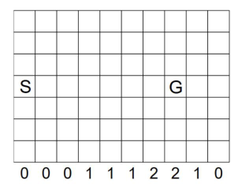

## Double Q( σ ) and Q( σ, λ ) **Unifying Reinforcement Learning Control Algorithms**

**Markus Dumke**
Department of Statistics
Ludwig-Maximilians-Universit¨at M¨unchen
markus.dumke@campus.lmu.de

**Abstract**

Temporal-difference (TD) learning is an important field in reinforcement learning.
Sarsa and Q-Learning are among the most used TD algorithms. The Q( _σ_ ) algorithm
(Sutton and Barto (2017)) unifies both. This paper extends the Q( _σ_ ) algorithm to an online multi-step algorithm Q( _σ, λ_ ) using eligibility traces and introduces Double Q( _σ_ )
as the extension of Q( _σ_ ) to double learning. Experiments suggest that the new Q( _σ, λ_ )
algorithm can outperform the classical TD control methods Sarsa( _λ_ ), Q( _λ_ ) and Q( _σ_ ).

**1** **Introduction**

Reinforcement Learning is a field of machine learning addressing the problem of sequential decision
making. It is formulated as an interaction of an agent and an environment over a number of discrete
time steps _t_ . At each time step the agent chooses an action _A_ _t_ based on the environment’s state _S_ _t_ . The
environment takes _A_ _t_ as an input and returns the next state observation _S_ _t_ +1 and reward _R_ _t_ +1, a scalar
numeric feedback signal.

The agent is thereby following a policy _π_, which is the behavior function mapping a state to action
probabilities

_π_ ( _a|s_ ) = _P_ ( _A_ _t_ = _a|S_ _t_ = _s_ ) _._ (1)

The agent’s goal is to maximize the return _G_ _t_ which is the sum of discounted rewards,

_G_ _t_ = _R_ _t_ +1 + _γR_ _t_ +2 + _γ_ [2] _R_ _t_ +3 + _..._ =

_T −_ 1
� _γ_ _[k]_ _R_ _t_ +1+ _k_ _,_ (2)

_k_ =0

where _γ ∈_ [0 _,_ 1] is the discount factor and _T_ is the length of the episode or infinity for a continuing task.

Double Q( _σ_ ) and Q( _σ, λ_ )
Unifying Reinforcement Learning Control Algorithms

While rewards are short-term signals about the goodness of an action, values represent the long-term
value of a state or state-action pair. The action value function _q_ _π_ ( _s, a_ ) is defined as the expected return
taking action _a_ from state _s_ and thereafter following policy _π_ :

_q_ _π_ ( _s, a_ ) = E _π_ [ _G_ _t_ _|S_ _t_ = _s, A_ _t_ = _a_ ] _._ (3)

Value-based reinforcement learning is concerned with finding the optimal action value function _q_ _∗_ =
max _π_ _q_ _π_ . Temporal-difference learning is a class of model-free methods which estimates _q_ _π_ from sample
transitions and iteratively updates the estimated values using observed rewards and estimated values of
successor actions. At each step an update of the following form is applied:

_Q_ ( _S_ _t_ _, A_ _t_ ) _←_ _Q_ ( _S_ _t_ _, A_ _t_ ) + _α δ_ _t_ _,_ (4)

where _Q_ is an estimate of _q_ _π_, _α_ is the step size and _δ_ _t_ is the TD error, the difference between our
current estimate and a newly computed target value. The following TD control algorithms can all be
characterized by their different TD errors.

When the action values _Q_ are represented as a table we call this tabular reinforcement learning, else we
speak of approximate reinforcement learning, e.g. when using a neural network to compute the action
values. For sake of simplicity the following analysis is done for tabular reinforcement learning but can
be easily extended to function approximation.

**2** **TD control algorithms: From Sarsa to Q(** _σ_ **)**

Sarsa (Rummery and Niranjan (1994)) is a temporal-difference learning algorithm which samples states
and actions using an _ϵ_ -greedy policy and then updates the _Q_ values using Equation 4 with the following
TD error

_δ_ _t_ = _R_ _t_ +1 + _γQ_ ( _S_ _t_ +1 _, A_ _t_ +1 ) _−_ _Q_ ( _S_ _t_ _, A_ _t_ ) _._ (5)

The term _R_ _t_ +1 + _γQ_ ( _S_ _t_ +1 _, A_ _t_ +1 ) is called the TD target and consists of the reward plus the discounted
value of the next state and next action.

Sarsa is an on-policy method, i.e. the TD target consists of _Q_ ( _S_ _t_ +1 _, A_ _t_ +1 ), where _A_ _t_ +1 is sampled using
the current policy. In general the policy used to sample the state and actions - the so called behaviourpolicy _µ_ - can be different from the target policy _π_, which is used to compute the TD target. If behaviour
and target policy are different we call this off-policy learning. An example for an off-policy TD control
algorithm is the well known Q-Learning algorithm proposed by Watkins (1989). As in Sarsa states and
actions are sampled using an exploratory behaviour policy, e.g. an _ϵ_ -greedy policy, but the TD target is
computed using the greedy policy with respect to the current Q values. The TD error of Q-Learning is

_δ_ _t_ = _R_ _t_ +1 + _γ_ max (6)
_a_ _[′]_ _[ Q]_ [(] _[S]_ _[t]_ [+1] _[, a]_ _[′]_ [)] _[ −]_ _[Q]_ [(] _[S]_ _[t]_ _[, A]_ _[t]_ [)] _[.]_

Expected Sarsa generalizes Q-Learning to arbitrary target policies. The TD error is

_δ_ _t_ = _R_ _t_ +1 + _γ_ � _π_ ( _a_ _[′]_ _|S_ _t_ +1 ) _Q_ ( _S_ _t_ +1 _, a_ _[′]_ ) _−_ _Q_ ( _S_ _t_ _, A_ _t_ ) _._ (7)

_a_ _[′]_

The current state-action pair is updated using the expectation of all subsequent action values with respect
to the action value. Q-Learning is a special case of Expected Sarsa if _π_ is the greedy policy with respect

Double Q( _σ_ ) and Q( _σ, λ_ )
Unifying Reinforcement Learning Control Algorithms

to _Q_ (Sutton and Barto (2017)). Of course Expected Sarsa could also be used as an on-policy algorithm
if the target policy is chosen to be the same as the behaviour policy (Van Seijen et al. (2009)).

Sutton and Barto (2017) propose a new TD control algorithm called Q( _σ_ ) which unifies Sarsa and Expected Sarsa. The TD target of this new algorithm is a weighted mean of the Sarsa and Expected Sarsa
TD targets, where the parameter _σ_ controls the weighting. Q(1) is equal to Sarsa and Q(0) is equal to
Expected Sarsa. For intermediate values of _σ_ new algorithms are obtained, which can achieve better
performance (Asis et al. (2017)).

The TD error of Q( _σ_ ) is

_δ_ _t_ = _R_ _t_ +1 + _γ_ ( _σQ_ ( _S_ _t_ +1 _, A_ _t_ +1 ) + (1 _−_ _σ_ ) � _π_ ( _a_ _[′]_ _|S_ _t_ +1 ) _Q_ ( _S_ _t_ +1 _, a_ _[′]_ )) _−_ _Q_ ( _S_ _t_ _, A_ _t_ ) _._ (8)

_a_ _[′]_

**3** **Q(** _σ, λ_ **): An on-line multi-step algorithm**

The TD methods presented so far are one-step methods, which use only rewards and values from the
next step _t_ + 1. These can be extended to use eligibility traces to incorporate data of multiple time steps.

An eligibility trace is a scalar numeric value for each state-action pair. Whenever a state-action pair is
visited its eligibility is increased, if not, the eligibility fades away over time. State-action pairs visited
often will have a higher eligibility than those visited less frequently and state-action pairs visited recently
will have a higher eligibility than those visited long time ago.

The accumulating eligibility trace (Singh and Sutton (1996)) uses an update of the form

_γλE_ _t_ ( _s, a_ ) + 1 _,_ if _A_ _t_ = _a, S_ _t_ = _s_
_E_ _t_ +1 ( _s, a_ ) = (9)
� _γλE_ _t_ ( _s, a_ ) _,_ otherwise.

Whenever taking action _A_ _t_ in state _S_ _t_ the eligibility of this pair is increased by 1 and for all states and
actions decreased by a factor _γλ_, where _λ_ is the trace decay parameter.

Then all state-action pairs are updated according to their eligibility trace

_Q_ ( _s, a_ ) _←_ _Q_ ( _s, a_ ) + _αδ_ _t_ _E_ _t_ ( _s, a_ ) (10)

The corresponding algorithm using the one-step Sarsa TD error and an update using eligibility traces is
called Sarsa( _λ_ ). Though it looks like a one-step algorithm, it is in fact a multi-step algorithm, because the
current TD error is assigned back to all previously visited states and actions weighted by their eligibility.

For off-policy algorithms like Q-Learning different eligibility updates have been proposed. Watkin’s
Q( _λ_ ) uses the same updates as long as the greedy action is chosen by the behaviour policy, but sets the _Q_
values to 0, whenever a non-greedy action is chosen assigning credit only to state-action pairs we would
actually have visited if following the target policy _π_ and not the behaviour policy _µ_ . More generally the
eligibility is weighted by the target policy’s probability of the next action. The update rule is then

_γλE_ _t_ ( _s, a_ ) _π_ ( _A_ _t_ +1 _|S_ _t_ +1 ) + 1 _,_ if _A_ _t_ = _a, S_ _t_ = _s_
_E_ _t_ +1 ( _s, a_ ) = (11)
� _γλE_ _t_ ( _s, a_ ) _π_ ( _A_ _t_ +1 _|S_ _t_ +1 ) _,_ otherwise.

Whenever an action occurs, which is unlikely in the target policy, the eligibility of all previous states is
decreased sharply. If the target policy is the greedy policy, the eligibility will be set to 0 for the complete
history.

Double Q( _σ_ ) and Q( _σ, λ_ )
Unifying Reinforcement Learning Control Algorithms

In this paper we introduce a new kind of eligibility trace update to extend the Q( _σ_ ) algorithm to an on-line
multi-step algorithm, which we will call Q( _σ, λ_ ). Recall that the one-step target of Q( _σ_ ) is a weighted
average between the on-policy Sarsa and off-policy Expected Sarsa targets weighted by the factor _σ_ :

_δ_ _t_ = _R_ _t_ +1 + _γ_ ( _σQ_ ( _S_ _t_ +1 _, A_ _t_ +1 ) + (1 _−_ _σ_ ) � _π_ ( _a_ _[′]_ _|S_ _t_ +1 ) _Q_ ( _S_ _t_ +1 _, a_ _[′]_ )) _−_ _Q_ ( _S_ _t_ _, A_ _t_ ) (12)

_a_ _[′]_

In this paper we propose to weight the eligibility accordingly with the same factor _σ_ . The eligibility is
then a weighted average between the on-policy eligibility used in Sarsa( _λ_ ) and the off-policy eligibility
used in _Q_ ( _λ_ ). The eligibility trace is updated at each step by

_γλE_ _t_ ( _s, a_ )( _σ_ + (1 _−_ _σ_ ) _π_ ( _A_ _t_ +1 _|S_ _t_ +1 )) + 1 _,_ if _A_ _t_ = _a, S_ _t_ = _s_
_E_ _t_ +1 ( _s, a_ ) = (13)
� _γλE_ _t_ ( _s, a_ )( _σ_ + (1 _−_ _σ_ ) _π_ ( _A_ _t_ +1 _|S_ _t_ +1 )) _,_ otherwise.

When _σ_ = 0 the one-step target of Q( _σ_ ) is equal to the Sarsa one-step target and therefore the eligibility
update reduces to the standard accumulate eligibility trace update. When _σ_ = 1 the one-step target
of Q( _σ_ ) is equal to the Expected Sarsa target and accordingly the eligibility is weighted by the target
policy’s probability of the current action. For intermediate values of _σ_ the eligibility is weighted in
the same way as the TD target. Asis et al. (2017) showed that n-step Q( _σ_ ) with an intermediate or
dynamic value of _σ_ can outperform Q-Learning and Sarsa. By extending this algorithm to an on-line
multi-step algorithm we can make use of the good initial performance of Sarsa( _λ_ ) combined with the
good asymptotic performance of Q( _λ_ ). In comparison to the n-step Q( _σ_ ) algorithm (Asis et al. (2017))
the new Q( _σ_, _λ_ ) algorithm can learn on-line and is therefore likely to learn faster.

Pseudocode for tabular episodic Q( _σ, λ_ ) is given in Algorithm 1. This can be easily extended to continuing tasks and to function approximation using one eligibility per weight of the function approximator.

**Algorithm 1** Q( _σ, λ_ )

Initialize _Q_ ( _s, a_ ) _∀s ∈S, a ∈A_

Repeat for each episode:

_E_ ( _s, a_ ) _←_ 0 _∀s ∈S, a ∈A_
Initialize _S_ 0 _̸_ = terminal
Choose _A_ 0, e.g. _ϵ_ -greedy from _Q_ ( _S_ 0 _, ._ )
Loop for each step of episode:

Take action _A_ _t_, observe reward _R_ _t_ +1 and next state _S_ _t_ +1
Choose next action _A_ _t_ +1, e.g. _ϵ_ -greedy from _Q_ ( _S_ _t_ +1 _, ._ )
_δ_ = _R_ _t_ +1 + _γ_ ( _σ Q_ ( _S_ _t_ +1 _, A_ _t_ +1 )+(1 _−_ _σ_ ) [�] _a_ _[′]_ _[ π]_ [(] _[a]_ _[′]_ _[|][S]_ _[t]_ [+1] [)] _[ Q]_ [(] _[S]_ _[t]_ [+1] _[, a]_ _[′]_ [))] _[−]_ _[Q]_ [(] _[S]_ _[t]_ _[, A]_ _[t]_ [)]

_E_ ( _S_ _t_ _, A_ _t_ ) _←_ _E_ ( _S_ _t_ _, A_ _t_ ) + 1
_Q_ ( _s, a_ ) _←_ _Q_ ( _s, a_ ) + _α δ E_ ( _s, a_ ) _∀s ∈S, a ∈A_
_E_ ( _s, a_ ) _←_ _γλE_ ( _s, a_ )( _σ_ + (1 _−_ _σ_ ) _π_ ( _A_ _t_ +1 _|S_ _t_ +1 )) _∀s ∈S, a ∈A_
_A_ _t_ _←_ _A_ _t_ +1, _S_ _t_ _←_ _S_ _t_ +1
If _S_ _t_ is terminal: Break

**4** **Double Q(** _σ_ **) Algorithm**

Double learning is another extension of the basic algorithms. It has been mostly studied with Q-Learning
Hasselt (2010) and prevents the overestimation of action values when using Q-Learning in stochastic

Double Q( _σ_ ) and Q( _σ, λ_ )
Unifying Reinforcement Learning Control Algorithms

environments. The idea is to use decouple action selection (which action is the best one?) and action
evaluation (what is the value of this action?). The implementation is simple, instead of using only one
value function we will use two value functions _Q_ _A_ and _Q_ _B_ . Actions are sampled due to an _ϵ_ -greedy
policy with respect to _Q_ _A_ + _Q_ _B_ . Then at each step either _Q_ _A_ or _Q_ _B_ is updated, e.g. if _Q_ _A_ is selected
by

_Q_ _A_ ( _S_ _t_ _, A_ _t_ ) _←_ _Q_ _A_ ( _S_ _t_ _, A_ _t_ ) + _α_ ( _R_ _t_ +1 + _γQ_ _B_ (argmax _Q_ _A_ ( _S_ _t_ +1 _, a_ )) _−_ _Q_ _A_ ( _S_ _t_ _, A_ _t_ )) (14)
_a∈A_

_Q_ _B_ ( _S_ _t_ _, A_ _t_ ) _←_ _Q_ _B_ ( _S_ _t_ _, A_ _t_ ) + _α_ ( _R_ _t_ +1 + _γQ_ _A_ (argmax _Q_ _B_ ( _S_ _t_ +1 _, a_ )) _−_ _Q_ _B_ ( _S_ _t_ _, A_ _t_ )) (15)
_a∈A_

Double learning can also be used with Sarsa and Expected Sarsa as proposed by Michael Ganger and
Hu (2016). Using double learning these algorithms can be more robust and perform better in stochastic
environments. The decoupling of action selection and action evaluation is weaker than in Double QLearning because the next action _A_ _t_ +1 is selected according to an _ϵ_ -greedy behavior policy using _Q_ _A_ +
_Q_ _B_ and evaluated either with _Q_ _A_ or _Q_ _B_ . For Expected Sarsa the policy used for the target in Equation 7
could be the _ϵ_ -greedy behavior policy as proposed by Michael Ganger and Hu (2016), but it is probably
better to use a policy according to _Q_ _A_ (if updating _Q_ _A_ ), because then it can also be used off-policy with
Double Q-Learning as a special case, if _π_ is the greedy policy with respect to _Q_ _A_ .

In this paper we propose the extension of double learning to Q( _σ_ ) - Double Q( _σ_ ) - to obtain a new
algorithm with the good learning properties of double learning, which generalizes (Double) Q-Learning,
(Double) Expected Sarsa and (Double) Sarsa. Of course Double Q( _σ_ ) can also be used with eligibility

traces.

Double Q( _σ_ ) has the following TD error when _Q_ _A_ is selected,

�

�

�

_σQ_ _B_ ( _S_ _t_ +1 _, A_ _t_ +1 ) + (1 _−_ _σ_ ) �

_σQ_ _A_ ( _S_ _t_ +1 _, A_ _t_ +1 ) + (1 _−_ _σ_ ) �

_π_ ( _a|S_ _t_ +1 ) _Q_ _B_ ( _S_ _t_ +1 _, a_ )

_a_

_π_ ( _a|S_ _t_ +1 ) _Q_ _A_ ( _S_ _t_ +1 _, a_ )

_a_

and

_δ_ _t_ = _R_ _t_ +1 + _γ_

_δ_ _t_ = _R_ _t_ +1 + _γ_

_−_ _Q_ _A_ ( _S_ _t_ _, A_ _t_ ) (16)

_−_ _Q_ _B_ ( _S_ _t_ _, A_ _t_ ) (17)

�

if _Q_ _B_ is selected. The target policy _π_ is computed with respect to the value function which is updated,
i.e. with respect to _Q_ _A_ in Equation 16 and with respect to _Q_ _B_ in Equation 17.

Pseudocode for Double Q( _σ_ ) is given in Algorithm 2.

**5** **Experiments**

In this section the performance of the newly proposed Q( _σ, λ_ ) algorithm will be tested on a gridworld
navigation task compared with the performance of classical TD control algorithms like Sarsa and QLearning as well as Q( _σ_ ).

The windy gridworld is a simple navigation task described by Sutton and Barto (1998). The goal is to
get as fast as possible from a start state to a goal state using the actions left, right, up or down. In each

Double Q( _σ_ ) and Q( _σ, λ_ )
Unifying Reinforcement Learning Control Algorithms

**Algorithm 2** Double Q( _σ_ )

Initialize _Q_ _A_ ( _s, a_ ) and _Q_ _B_ ( _s, a_ ) _∀s ∈S, a ∈A_

Repeat for each episode:

Initialize _S_ 0 _̸_ = terminal
Choose _A_ 0, e.g. _ϵ_ -greedy from _Q_ _A_ ( _S_ 0 _, ._ ) + _Q_ _B_ ( _S_ 0 _, ._ )
Loop for each step of episode:

Take action _A_ _t_, observe reward _R_ _t_ +1 and next state _S_ _t_ +1
Choose next action _A_ _t_ +1, e.g. _ϵ_ -greedy from _Q_ _A_ ( _S_ _t_ +1 _, ._ ) + _Q_ _B_ ( _S_ _t_ +1 _, ._ )
Randomly update either _Q_ _A_ :

_δ_ = _R_ _t_ +1 + _γ_ ( _σQ_ _B_ ( _S_ _t_ +1 _, A_ _t_ +1 )+

(1 _−_ _σ_ ) � _π_ ( _a|S_ _t_ +1 ) _Q_ _B_ ( _S_ _t_ +1 _, a_ )) _−_ _Q_ _A_ ( _S_ _t_ _, A_ _t_ )

_a_

_Q_ _A_ ( _S_ _t_ _, A_ _t_ ) _←_ _Q_ _A_ ( _S_ _t_ _, A_ _t_ ) + _α δ_

or update _Q_ _B_ :

_δ_ = _R_ _t_ +1 + _γ_ ( _σQ_ _A_ ( _S_ _t_ +1 _, A_ _t_ +1 )+

(1 _−_ _σ_ ) � _π_ ( _a|S_ _t_ +1 ) _Q_ _A_ ( _S_ _t_ +1 _, a_ )) _−_ _Q_ _B_ ( _S_ _t_ _, A_ _t_ )

_a_

_Q_ _B_ ( _S_ _t_ _, A_ _t_ ) _←_ _Q_ _B_ ( _S_ _t_ _, A_ _t_ ) + _α δ_
_A_ _t_ _←_ _A_ _t_ +1, _S_ _t_ _←_ _S_ _t_ +1
If _S_ _t_ is terminal: Break

column of the grid the agent is pushed upward by a wind. When an action would take the agent outside
the grid, the agent is placed in the nearest cell inside the grid. The stochastic windy gridworld (Asis et al.
(2017)) is a variant where state transitions are random, with a probability of 0.1 the agent will transition
to one of the surrounding eight states independent of the action. The task is treated as an undiscounted
episodic task with a reward of -1 for each transition. Figure 1 visualizes the gridworld.

Experiments were conducted using an _ϵ_ -greedy behaviour policy with _ϵ_ = 0 _._ 1. The performance in
terms of the average return over the first 100 episodes was measured for different values of _σ_ and _λ_ as a
function of the step size _α_ . For the Expected Sarsa part of the update a greedy target policy was chosen,
i.e. _Q_ (0) is exactly Q-Learning. Results were averaged over 200 independent runs.

Figure 2 shows that an intermediate value of _σ_ = 0 _._ 5 performed better than Sarsa (Q(1)) and Q-Learning
(Q(0)). The best performance was found by dynamically varying _σ_ over time, i.e. decreasing _σ_ by
a factor of 0.99 after each episode. Multi-step bootstrapping with a trace decay parameter _λ_ = 0 _._ 7
performed better than the one-step algorithms ( _λ_ = 0). Dynamically varying the value of _σ_ allows to
combine the good initial performance of Sarsa with the good asymptotic performance of Expected Sarsa.
This confirms the results observed by Asis et al. (2017) for n-step algorithms.

**6** **Conclusions**

This paper has presented two extensions to the Q( _σ_ ) algorithm, which unify Q-Learning, Expected Sarsa
and Sarsa. Q( _σ, λ_ ) extends the algorithm to an on-line multi-step algorithm using eligibility traces and
Double Q( _σ_ ) extends the algorithm to double learning. Empirical results suggest that Q( _σ, λ_ ) can outperform classic TD control algorithms like Sarsa( _λ_ ), Q( _λ_ ) and Q( _σ_ ). Dynamically varying _σ_ obtains the
best results.

Double Q( _σ_ ) and Q( _σ, λ_ )
Unifying Reinforcement Learning Control Algorithms

|40 Windy Gridworld|Col2|Wind|dy Gridw|world|Col6|Col7|
|---|---|---|---|---|---|---|
|0.2 0.4 0.6 0.8 Step size  100 90 80 70 60 50 40   = 0  = 0.5  = 1 Dynamic   = 0  = 0.7|||||||
|0.2 0.4 0.6 0.8 Step size  100 90 80 70 60 50 40   = 0  = 0.5  = 1 Dynamic   = 0  = 0.7||||||= 0  = 0.5  = 1 Dynamic|
|0.2 0.4 0.6 0.8 Step size  100 90 80 70 60 50 40   = 0  = 0.5  = 1 Dynamic   = 0  = 0.7|||||||
|0.2 0.4 0.6 0.8 Step size  100 90 80 70 60 50 40   = 0  = 0.5  = 1 Dynamic   = 0  = 0.7|||||||
|0.2 0.4 0.6 0.8 Step size  100 90 80 70 60 50 40   = 0  = 0.5  = 1 Dynamic   = 0  = 0.7|||||||
|0.2 0.4 0.6 0.8 Step size  100 90 80 70 60 50 40   = 0  = 0.5  = 1 Dynamic   = 0  = 0.7|||||||
|0.2 0.4 0.6 0.8 Step size  100 90 80 70 60 50 40   = 0  = 0.5  = 1 Dynamic   = 0  = 0.7|||||||

Figure 1: The windy gridworld task.
The goal is to move from the start
state S to the goal state G while facing an upward wind in the middle
of the grid, which is denoted in the
numbers below the grid. Described
by Sutton and Barto (1998).

Figure 2: Stochastic windy gridworld results averaged over
100 episodes and 200 independent runs. Performance of
Q( _σ, λ_ ) for different values of _σ_ as a function of the step size
_α_ . For the trace decay parameter _λ_ = [0 _,_ 0 _._ 7] were used. The
best performance was found when using a dynamic value of _σ_
by multiplying _σ_ with a factor 0.99 after each episode.

Future research might focus on performance of Q( _σ, λ_ ) when used with non-linear function approximation and different schemes to update _σ_ over time.

**References**

Asis, K. D., Hernandez-Garcia, J. F., Holland, G. Z. and Sutton, R. S. (2017). Multi-step reinforcement
learning: A unifying algorithm, _CoRR_ **abs/1703.01327** .
**URL:** _http://arxiv.org/abs/1703.01327_

Hasselt, H. V. (2010). Double q-learning, _in_ J. D. Lafferty, C. K. I. Williams, J. Shawe-Taylor, R. S.
Zemel and A. Culotta (eds), _Advances in Neural Information Processing Systems 23_, Curran Associates, Inc., pp. 2613–2621.
**URL:** _http://papers.nips.cc/paper/3964-double-q-learning.pdf_

Michael Ganger, E. D. and Hu, W. (2016). Double sarsa and double expected sarsa with shallow and
deep learning, _Journal of Data Analysis and Information Processing_ **4** : 159–176.

Rummery, G. A. and Niranjan, M. (1994). On-line q-learning using connectionist systems, _Technical_
_report_ .

Singh, S. P. and Sutton, R. S. (1996). Reinforcement learning with replacing eligibility traces, _Machine_
_Learning_ **22** (1): 123–158.

Sutton, R. S. and Barto, A. G. (1998). _Introduction to Reinforcement Learning_, 1st edn, MIT Press,
Cambridge, MA, USA.

Sutton, R. S. and Barto, A. G. (2017). Reinforcement learning : An introduction. Accessed: 2017-08-01.

Double Q( _σ_ ) and Q( _σ, λ_ )
Unifying Reinforcement Learning Control Algorithms

Van Seijen, H., Van Hasselt, H., Whiteson, S. and Wiering, M. (2009). A theoretical and empirical
analysis of expected sarsa, _Adaptive Dynamic Programming and Reinforcement Learning, 2009. AD-_
_PRL’09. IEEE Symposium on_, IEEE, pp. 177–184.

Watkins, C. J. C. H. (1989). _Learning from delayed rewards_, PhD thesis, King’s College, Cambridge.

