Published as a conference paper at ICLR 2019

## HINDSIGHT POLICY GRADIENTS

**Paulo Rauber**

IDSIA, USI, SUPSI
Lugano, Switzerland
paulo@idsia.ch

**Filipe Mutz** _[∗]_
IFES, UFES
Serra, Brazil
filipe.mutz@ifes.edu.br

ABSTRACT

**Avinash Ummadisingu**
USI
Lugano, Switzerland
avinash.ummadisingu@usi.ch

**Jürgen Schmidhuber**
IDSIA, USI, SUPSI, NNAISENSE
Lugano, Switzerland
juergen@idsia.ch

A reinforcement learning agent that needs to pursue different goals across episodes
requires a goal-conditional policy. In addition to their potential to generalize desirable behavior to unseen goals, such policies may also enable higher-level planning
based on subgoals. In sparse-reward environments, the capacity to exploit information about the degree to which an arbitrary goal has been achieved while another
goal was intended appears crucial to enable sample efficient learning. However,
reinforcement learning agents have only recently been endowed with such capacity
for hindsight. In this paper, we demonstrate how hindsight can be introduced
to policy gradient methods, generalizing this idea to a broad class of successful
algorithms. Our experiments on a diverse selection of sparse-reward environments
show that hindsight leads to a remarkable increase in sample efficiency.

1 INTRODUCTION

In a traditional reinforcement learning setting, an agent interacts with an environment in a sequence of
episodes, observing states and acting according to a policy that ideally maximizes expected cumulative
reward. If an agent is required to pursue different _goals_ across episodes, its _goal-conditional policy_
may be represented by a probability distribution over actions for every combination of state and
goal. This distinction between states and goals is particularly useful when the probability of a state
transition given an action is independent of the goal pursued by the agent.

Learning such goal-conditional behavior has received significant attention in machine learning and
robotics, especially because a goal-conditional policy may generalize desirable behavior to goals that
were never encountered by the agent (Schmidhuber & Huber, 1990; Da Silva et al., 2012; Kupcsik
et al., 2013; Deisenroth et al., 2014; Schaul et al., 2015; Zhu et al., 2017; Kober et al., 2012; Ghosh
et al., 2018; Mankowitz et al., 2018; Pathak et al., 2018). Consequently, developing goal-based
curricula to facilitate learning has also attracted considerable interest (Fabisch & Metzen, 2014;
Florensa et al., 2017; Sukhbaatar et al., 2018; Srivastava et al., 2013). In hierarchical reinforcement
learning, goal-conditional policies may enable agents to plan using subgoals, which abstracts the
details involved in lower-level decisions (Oh et al., 2017; Vezhnevets et al., 2017; Kulkarni et al.,
2016; Levy et al., 2017).

In a typical _sparse-reward environment_, an agent receives a non-zero reward only upon reaching a
_goal state_ . Besides being natural, this task formulation avoids the potentially difficult problem of
_reward shaping_, which often biases the learning process towards suboptimal behavior (Ng et al.,
1999). Unfortunately, sparse-reward environments remain particularly challenging for traditional
reinforcement learning algorithms (Andrychowicz et al., 2017; Florensa et al., 2017). For example,
consider an agent tasked with traveling between cities. In a sparse-reward formulation, if reaching
a desired destination by chance is unlikely, a learning agent will rarely obtain reward signals. At

_∗_ Work performed while at IDSIA.

1

Published as a conference paper at ICLR 2019

the same time, it seems natural to expect that an agent will learn how to reach the cities it visited
regardless of its desired destinations.

In this context, the capacity to exploit information about the degree to which an arbitrary goal has been
achieved while another goal was intended is called _hindsight_ . This capacity was recently introduced
by Andrychowicz et al. (2017) to off-policy reinforcement learning algorithms that rely on experience
replay (Lin, 1992). In earlier work, Karkus et al. (2016) introduced hindsight to policy search based
on Bayesian optimization (Metzen et al., 2015).

In this paper, we demonstrate how hindsight can be introduced to policy gradient methods (Williams,
1986; 1992; Sutton et al., 1999a), generalizing this idea to a successful class of reinforcement learning
algorithms (Peters & Schaal, 2008; Duan et al., 2016).

In contrast to previous work on hindsight, our approach relies on _importance sampling_ (Bishop,
2013). In reinforcement learning, importance sampling has been traditionally employed in order to
efficiently reuse information obtained by earlier policies during learning (Precup et al., 2000; Peshkin
& Shelton, 2002; Jie & Abbeel, 2010; Thomas et al., 2015; Munos et al., 2016). In comparison, our
approach attempts to efficiently learn about different goals using information obtained by the current
policy for a specific goal. This approach leads to multiple formulations of a _hindsight policy gradient_
that relate to well-known policy gradient results.

In comparison to conventional (goal-conditional) policy gradient estimators, our proposed estimators
lead to remarkable sample efficiency on a diverse selection of sparse-reward environments.

2 PRELIMINARIES

We denote random variables by upper case letters and assignments to these variables by corresponding
lower case letters. We let Val( _X_ ) denote the set of valid assignments to a random variable _X_ . We
also omit the subscript that typically relates a probability function to random variables when there is
no risk of ambiguity. For instance, we may use _p_ ( _x_ ) to denote _pX_ ( _x_ ) and _p_ ( _y_ ) to denote _pY_ ( _y_ ).

Consider an agent that interacts with its environment in a sequence of episodes, each of which lasts
for exactly _T_ time steps. The agent receives a goal _g ∈_ Val( _G_ ) at the beginning of each episode.
At every time step _t_, the agent observes a state _st ∈_ Val( _St_ ), receives a reward _r_ ( _st, g_ ) _∈_ R, and
chooses an action _at ∈_ Val( _At_ ). For simplicity of notation, suppose that Val( _G_ ) _,_ Val( _St_ ), and
Val( _At_ ) are finite for every _t_ .

In our setting, a goal-conditional policy defines a probability distribution over actions for every
combination of state and goal. The same policy is used to make decisions at every time step.

Let _**τ**_ = _s_ 1 _, a_ 1 _, s_ 2 _, a_ 2 _, . . ., sT −_ 1 _, aT −_ 1 _, sT_ denote a trajectory. We assume that the probability
_p_ ( _**τ**_ _| g,_ _**θ**_ ) of trajectory _**τ**_ given goal _g_ and a policy parameterized by _**θ**_ _∈_ Val( **Θ** ) is given by

_p_ ( _**τ**_ _| g,_ _**θ**_ ) = _p_ ( _s_ 1)

_T −_ 1
� _p_ ( _at | st, g,_ _**θ**_ ) _p_ ( _st_ +1 _| st, at_ ) _._ (1)

_t_ =1

In contrast to a Markov decision process, this formulation allows the probability of a state transition
given an action to change across time steps within an episode. More importantly, it implicitly states
that the probability of a state transition given an action is independent of the goal pursued by the
agent, which we denote by _St_ +1 _⊥⊥_ _G | St, At_ . For every _**τ**_ _, g,_ and _**θ**_, we also assume that _p_ ( _**τ**_ _| g,_ _**θ**_ )
is non-zero and differentiable with respect to _**θ**_ .

Assuming that _G ⊥⊥_ **Θ**, the expected return _η_ ( _**θ**_ ) of a policy parameterized by _**θ**_ is given by

_p_ ( _g_ ) �

_g_ _**τ**_

_p_ ( _**τ**_ _| g,_ _**θ**_ )

_**τ**_

_η_ ( _**θ**_ ) = E

_T_
� _r_ ( _St, G_ ) _|_ _**θ**_
� _t_ =1 �

=
�

_T_
� _r_ ( _st, g_ ) _._ (2)

_t_ =1

_T_
The action-value function is given by _Q_ _**[θ]**_ _t_ [(] _[s, a, g]_ [) =][ E] �� _t_ _[′]_ = _t_ +1 _[r]_ [(] _[S][t][′][, g]_ [)] _[ |][ S][t]_ [ =] _[ s, A][t]_ [ =] _[ a, g,]_ _**[ θ]**_ �,

the value function by _Vt_ _**[θ]**_ [(] _[s, g]_ [) =][ E] � _Q_ _**[θ]**_ _t_ [(] _[s, A][t][, g]_ [)] _[ |][ S][t]_ [=] _[ s, g,]_ _**[ θ]**_ �, and the advantage function by
_A_ _**[θ]**_ _t_ [(] _[s, a, g]_ [) =] _[ Q]_ _**[θ]**_ _t_ [(] _[s, a, g]_ [)] _[ −]_ _[V]_ _**[ θ]**_ _t_ [(] _[s, g]_ [)][.]

2

Published as a conference paper at ICLR 2019

3 GOAL-CONDITIONAL POLICY GRADIENTS

This section presents results for goal-conditional policies that are analogous to well-known results for
conventional policies (Peters & Schaal, 2008). They establish the foundation for the results presented
in the next section. The corresponding proofs are included in Appendix A for completeness.

The objective of policy gradient methods is finding policy parameters that achieve maximum expected
return. When combined with Monte Carlo techniques (Bishop, 2013), the following result allows
pursuing this objective using gradient-based optimization.
**Theorem 3.1** (Goal-conditional policy gradient) **.** _The gradient ∇η_ ( _**θ**_ ) _of the expected return with_
_respect to_ _**θ**_ _is given by_

_T_
� _r_ ( _st′, g_ ) _._ (3)

_t_ _[′]_ = _t_ +1

_∇η_ ( _**θ**_ ) = �

_p_ ( _g_ ) �

_g_ _**τ**_

_p_ ( _**τ**_ _| g,_ _**θ**_ )

_**τ**_

_T −_ 1
� _∇_ log _p_ ( _at | st, g,_ _**θ**_ )

_t_ =1

The following result allows employing a _baseline_ to reduce the variance of the gradient estimator.
**Theorem 3.2** (Goal-conditional policy gradient, baseline formulation) **.** _For every t,_ _**θ**_ _, and associated_
_real-valued (baseline) function b_ _**[θ]**_ _t_ _[, the gradient][ ∇][η]_ [(] _**[θ]**_ [)] _[ of the expected return with respect to]_ _**[ θ]**_ _[ is]_
_given by_

�

_−_ _b_ _**[θ]**_ _t_ [(] _[s][t][, g]_ [)]

�

_T_
�
�� _t_ _[′]_ = _t_

� _r_ ( _st′, g_ )

_t_ _[′]_ = _t_ +1

_∇η_ ( _**θ**_ ) = �

� _p_ ( _g_ ) �

_g_ _**τ**_

_p_ ( _**τ**_ _| g,_ _**θ**_ )

_**τ**_

_T −_ 1
� _∇_ log _p_ ( _at | st, g,_ _**θ**_ )

_t_ =1

_T −_ 1
�

_._ (4)

Appendix A.7 presents the constant baselines that minimize the (elementwise) variance of the
corresponding estimator. However, such baselines are usually impractical to compute (or estimate),
and the variance of the estimator may be reduced further by a baseline function that depends on state
and goal. Although generally suboptimal, it is typical to let the baseline function _b_ _**[θ]**_ _t_ [approximate the]
value function _Vt_ _**[θ]**_ [(][Greensmith et al.][,][ 2004][).]

Lastly, actor-critic methods may rely on the following result for goal-conditional policies.
**Theorem 3.3** (Goal-conditional policy gradient, advantage formulation) **.** _The gradient ∇η_ ( _**θ**_ ) _of the_
_expected return with respect to_ _**θ**_ _is given by_

_∇η_ ( _**θ**_ ) = �

_p_ ( _g_ ) �

_g_ _**τ**_

_p_ ( _**τ**_ _| g,_ _**θ**_ )

_**τ**_

_T −_ 1
� _∇_ log _p_ ( _at | st, g,_ _**θ**_ ) _A_ _**[θ]**_ _t_ [(] _[s][t][, a][t][, g]_ [)] _[.]_ (5)

_t_ =1

4 HINDSIGHT POLICY GRADIENTS

This section presents the novel ideas that introduce hindsight to policy gradient methods. The
corresponding proofs can be found in Appendix B.

Suppose that the reward _r_ ( _s, g_ ) is known for every combination of state _s_ and goal _g_, as in previous
work on hindsight (Andrychowicz et al., 2017; Karkus et al., 2016). In that case, it is possible to
evaluate a trajectory obtained while trying to achieve an original goal _g_ _[′]_ for an alternative goal _g_ .
Using importance sampling, this information can be exploited using the following central result.
**Theorem 4.1** (Every-decision hindsight policy gradient) **.** _For an arbitrary (original) goal g_ _[′]_ _, the_
_gradient ∇η_ ( _**θ**_ ) _of the expected return with respect to_ _**θ**_ _is given by_

_T_
�

_t_ _[′]_ = _t_ +1

_T −_ 1
�
� _k_ =1

�

_∇η_ ( _**θ**_ ) = �

_p_ ( _**τ**_ _| g_ _[′]_ _,_ _**θ**_ ) �

_**τ**_

_p_ ( _g_ )

_g_

_T −_ 1
� _∇_ log _p_ ( _at | st, g,_ _**θ**_ )

_t_ =1

_p_ ( _ak_ _| sk,_ _g,_ _**θ**_ )
_p_ ( _ak | sk, g_ _[′]_ _,_ _**θ**_ )

_r_ ( _st′_ _, g_ ) _._ (6)

In the formulation presented above, every reward is multiplied by the ratio between the likelihood
of the corresponding trajectory under an alternative goal and the likelihood under the original goal
(see Eq. 1). Intuitively, every reward should instead be multiplied by a _likelihood ratio_ that only
considers the corresponding trajectory up to the previous action. This intuition underlies the following
important result, named after an analogous result for action-value functions by Precup et al. (2000).

3

Published as a conference paper at ICLR 2019

**Theorem 4.2** (Per-decision hindsight policy gradient) **.** _For an arbitrary (original) goal g_ _[′]_ _, the_
_gradient ∇η_ ( _**θ**_ ) _of the expected return with respect to_ _**θ**_ _is given by_

_T_
�

_t_ _[′]_ = _t_ +1





_t_ _[′]_ _−_ 1
�

_k_ =1

 _r_ ( _st′_ _, g_ ) _._ (7)



_∇η_ ( _**θ**_ ) = �

_p_ ( _**τ**_ _| g_ _[′]_ _,_ _**θ**_ ) �

_**τ**_

_p_ ( _g_ )

_g_

_T −_ 1
� _∇_ log _p_ ( _at | st, g,_ _**θ**_ )

_t_ =1

_p_ ( _ak_ _| sk,_ _g,_ _**θ**_ )
_p_ ( _ak | sk, g_ _[′]_ _,_ _**θ**_ )

The following lemma allows introducing baselines to hindsight policy gradients (see App. B.4).
**Lemma 4.1.** _For every g_ _[′]_ _, t,_ _**θ**_ _, and associated real-valued (baseline) function b_ _**[θ]**_ _t_ _[,]_

_t_
�
� _k_ =1

�

�

_p_ ( _**τ**_ _| g_ _[′]_ _,_ _**θ**_ ) �

_**τ**_

_p_ ( _g_ )

_g_

_T −_ 1
� _∇_ log _p_ ( _at | st, g,_ _**θ**_ )

_t_ =1

_p_ ( _ak_ _| sk,_ _g,_ _**θ**_ )
_p_ ( _ak | sk, g_ _[′]_ _,_ _**θ**_ )

_b_ _**[θ]**_ _t_ [(] _[s]_ _t_ _[, g]_ [) =] **[ 0]** _[.]_ (8)

Appendix B.7 presents the constant baselines that minimize the (elementwise) variance of the
corresponding gradient estimator. By analogy with the conventional practice, we suggest letting the
baseline function _b_ _**[θ]**_ _t_ [approximate the value function] _[ V]_ _**[ θ]**_ _t_ [instead.]

Importantly, the choice of likelihood ratio in Lemma 4.1 is far from unique. However, besides leading
to straightforward estimation, it also underlies the advantage formulation presented below.
**Theorem 4.3** (Hindsight policy gradient, advantage formulation) **.** _For an arbitrary (original) goal_
_g_ _[′]_ _, the gradient ∇η_ ( _**θ**_ ) _of the expected return with respect to_ _**θ**_ _is given by_

_t_
�
� _k_ =1

_p_ ( _ak_ _| sk,_ _g,_ _**θ**_ )
_p_ ( _ak | sk, g_ _[′]_ _,_ _**θ**_ )

_A_ _**[θ]**_ _t_ [(] _[s]_ _t_ _[, a]_ _t_ _[, g]_ [)] _[.]_ (9)

�

_∇η_ ( _**θ**_ ) = �

_p_ ( _**τ**_ _| g_ _[′]_ _,_ _**θ**_ ) �

_**τ**_

_p_ ( _g_ )

_g_

_T −_ 1
� _∇_ log _p_ ( _at | st, g,_ _**θ**_ )

_t_ =1

_T −_ 1
�

Fortunately, the following result allows approximating the advantage under a goal using a state
transition collected while pursuing another goal (see App. D.4).
**Theorem 4.4.** _For every t and_ _**θ**_ _, the advantage function A_ _**[θ]**_ _t_ _[is given by]_

_A_ _**[θ]**_ _t_ [(] _[s, a, g]_ [) =][ E] � _r_ ( _St_ +1 _, g_ ) + _Vt_ _**[θ]**_ +1 [(] _[S][t]_ [+1] _[, g]_ [)] _[ −]_ _[V]_ _**[ θ]**_ _t_ [(] _[s, g]_ [)] _[ |][ S][t]_ [=] _[ s, A][t]_ [=] _[ a]_ � _._ (10)

5 HINDSIGHT GRADIENT ESTIMATORS

This section details gradient estimation based on the results presented in the previous section. The
corresponding proofs can be found in Appendix C.

Consider a dataset (batch) _D_ = _{_ ( _**τ**_ [(] _[i]_ [)] _, g_ [(] _[i]_ [)] ) _}_ _[N]_ _i_ =1 [where each trajectory] _**[ τ]**_ [ (] _[i]_ [)][ is obtained using a policy]
parameterized by _**θ**_ in an attempt to achieve a goal _g_ [(] _[i]_ [)] chosen by the environment.

The following result points to a straightforward estimator based on Theorem 4.2.
**Theorem 5.1.** _The per-decision hindsight policy gradient estimator, given by_

� _p_ ( _g_ )

_g_

_T_
�

_t_ _[′]_ = _t_ +1

_p_ ( _A_ [(] _k_ _[i]_ [)] _| Sk_ [(] _[i]_ [)] _[,][ G]_ [(] _[i]_ [)][ =] _[g,]_ _**[ θ]**_ [)]

_p_ ( _A_ [(] _k_ _[i]_ [)] _| Sk_ [(] _[i]_ [)] _[, G]_ [(] _[i]_ [)] _[,]_ _**[ θ]**_ [)]

 _t_ _[′]_ _−_ 1

�

_k_ =1



 _r_ ( _St_ [(] _[′][i][, g]_ [)] [)] _[,]_

1

_N_

_N_
�

_i_ =1

_T −_ 1
� _∇_ log _p_ ( _A_ [(] _t_ _[i]_ [)] _| St_ [(] _[i]_ [)] _[, G]_ [(] _[i]_ [)][ =] _[ g,]_ _**[ θ]**_ [)]

_t_ =1

(11)
_is a consistent and unbiased estimator of the gradient ∇η_ ( _**θ**_ ) _of the expected return._

In preliminary experiments, we found that this estimator leads to unstable learning progress, which is
probably due to its potential high variance. The following result, inspired by weighted importance
sampling (Bishop, 2013), represents our attempt to trade variance for bias.
**Theorem 5.2.** _The weighted per-decision hindsight policy gradient estimator, given by_

_N_
�

_i_ =1

� _p_ ( _g_ )

_g_

_T_
�

_t_ _[′]_ = _t_ +1

_t′−_ 1 _p_ ( _A_ [(] _k_ _[i]_ [)] _[|][S]_ _k_ [(] _[i]_ [)] _,G_ [(] _[i]_ [)] = _g,_ _**θ**_ )
�� _k_ =1 _p_ ( _A_ [(] _k_ _[i]_ [)] _[|][S]_ _k_ [(] _[i]_ [)] _,G_ [(] _[i]_ [)] _,_ _**θ**_ )

� _Nj_ =1

_r_ ( _St_ [(] _[′][i][, g]_ [)] [)]
�

_T −_ 1
� _∇_ log _p_ ( _A_ [(] _t_ _[i]_ [)] _| St_ [(] _[i]_ [)] _[, G]_ [(] _[i]_ [)][ =] _[ g,]_ _**[ θ]**_ [)]

_t_ =1

~~�~~ _,_ (12)

~~�~~ � _tk′_ =1 _−_ 1 _p_ ( _pA_ ( _A_ [(] _k_ _[j]_ [(] _k_ [)] _[j]_ _|_ [)] _S|kS_ [(] _[j]_ _k_ [(][)] _[j]_ _,G_ [)] _,G_ [(] _[j]_ [(][)] _[j]_ = [)] _,g,_ _**θ**_ ) _**θ**_ )

_is a consistent estimator of the gradient ∇η_ ( _**θ**_ ) _of the expected return._

4

Published as a conference paper at ICLR 2019

In simple terms, the likelihood ratio for every combination of trajectory, (alternative) goal, and time
step is normalized across trajectories by this estimator. In Appendix C.3, we present a result that
enables the corresponding consistency-preserving _weighted baseline_ .

Consider a set _G_ [(] _[i]_ [)] = _{g ∈_ Val( _G_ ) _|_ exists a _t_ such that _r_ ( _s_ [(] _t_ _[i]_ [)] _[, g]_ [)] _[ ̸]_ [= 0] _[}]_ [ composed of so-called]
_active goals_ during the _i_ -th episode. The feasibility of the proposed estimators relies on the fact
that only active goals correspond to non-zero terms inside the expectation over goals in Expressions
11 and 12. In many natural sparse-reward environments, active goals will correspond directly to
states visited during episodes (for instance, the cities visited while trying to reach other cities), which
enables computing said expectation exactly when the goal distribution is known.

The proposed estimators have remarkable properties that differentiate them from previous (weighted)
importance sampling estimators for off-policy learning. For instance, although a trajectory is often
more likely under the original goal than under an alternative goal, in policies with strong optimal
substructure, a high probability of a trajectory between the state _a_ and the goal (state) _c_ that goes
through the state _b_ may naturally allow for a high probability of the corresponding (sub)trajectory
between the state _a_ and the goal (state) _b_ . In other cases, the (unnormalized) likelihood ratios may
become very small for some (alternative) goals after a few time steps across all trajectories. After
normalization, in the worst case, this may even lead to equivalent ratios for such goals for a given time
step across all trajectories. In any case, it is important to note that only likelihood ratios associated to
active goals for a given episode will affect the gradient estimate. Additionally, an original goal will
always have (unnormalized) likelihood ratios equal to one for the corresponding episode.

Under mild additional assumptions, the proposed estimators also allow using a dataset containing
goals chosen arbitrarily (instead of goals drawn from the goal distribution). Although this feature
is not required by our experiments, we believe that it may be useful to circumvent _catastrophic_
_forgetting_ during curriculum learning (McCloskey & Cohen, 1989; Kirkpatrick et al., 2017).

6 EXPERIMENTS

This section reports results of an empirical comparison between goal-conditional policy gradient
estimators and hindsight policy gradient estimators. [1] Because there are no well-established sparsereward environments intended to test agents under multiple goals, this comparison focuses on our
own selection of environments. These environments are diverse in terms of stochasticity, state space
dimensionality and size, relationship between goals and states, and number of actions. In every one
of these environments, the agent receives the remaining number of time steps plus one as a reward for
reaching the goal state, which also ends the episode. In every other situation, the agent receives no
reward.

Figure 1: Four rooms. Figure 2: Ms. Pac-man. Figure 3: FetchPush.

Importantly, the weighted per-decision hindsight policy gradient estimator used in our experiments
( _HPG_ ) does not precisely correspond to Expression 12. Firstly, the original estimator requires a
constant number of time steps _T_, which would often require the agent to act _after_ the end of an
episode in the environments that we consider. Secondly, although it is feasible to compute Expression

1
[An open-source implementation of these estimators is available on http://paulorauber.com/hpg.](http://paulorauber.com/hpg)

5

Published as a conference paper at ICLR 2019

12 exactly when the goal distribution is known (as explained in Sec. 5), we sometimes subsample the
sets of active goals per episode. Furthermore, when including a baseline that approximates the value
function, we again consider only active goals, which by itself generally results in an inconsistent
estimator ( _HPG+B_ ). As will become evident in the following sections, these _compromised_ estimators
still lead to remarkable sample efficiency.

We assess sample efficiency through _learning curves_ and _average performance_ scores, which are
obtained as follows. After collecting a number of batches (composed of trajectories and goals), each
of which enables one step of gradient ascent, an agent undergoes _evaluation_ . During evaluation,
the agent interacts with the environment for a number of episodes, selecting actions with maximum
probability according to its policy. A learning curve shows the average return obtained during
each evaluation step, averaged across multiple _runs_ (independent learning procedures). The curves
presented in this text also include a 95% bootstrapped confidence interval. The average performance
is given by the average return across evaluation steps, averaged across runs. During both training
and evaluation, goals are drawn uniformly at random. Note that there is no held-out set of goals for
evaluation, since we are interested in evaluating sample efficiency instead of generalization.

For every combination of environment and batch size, grid search is used to select hyperparameters for
each estimator according to average performance scores (after the corresponding standard deviation
across runs is subtracted, as suggested by Duan et al. (2016)). _Definitive results_ are obtained by using
the best hyperparameters found for each estimator in additional runs. In this section, we discuss
definitive results for small (2) and medium (16) batch sizes.

More details about our experiments can be found in Appendices E.1 and E.2. Appendix E.3 contains
unabridged results, a supplementary empirical study of likelihood ratios (Appendix E.3.6), and an
empirical comparison with hindsight experience replay (Appendix E.3.7).

6.1 BIT FLIPPING ENVIRONMENTS

In a _bit flipping_ environment, the agent starts every episode in the same state ( **0**, represented by _k_
bits), and its goal is to reach a randomly chosen state. The actions allow the agent to toggle (flip) each
bit individually. The maximum number of time steps is _k_ + 1. Despite its apparent simplicity, this
environment is an ideal testbed for reinforcement learning algorithms intended to deal with sparse
rewards, since obtaining a reward by chance is unlikely even for a relatively small _k_ . Andrychowicz
et al. (2017) employed a similar environment to evaluate their hindsight approach.

Figure 4 presents the learning curves for _k_ = 8. Goal-conditional policy gradient estimators with and
without an approximate value function baseline ( _GCPG+B_ and _GCPG_, respectively) obtain excellent
policies and lead to comparable sample efficiency. HPG+B obtains excellent policies more than 400
batches earlier than these estimators, but its policies degrade upon additional training. Additional
experiments strongly suggest that the main cause of this issue is the fact that the value function
baseline is still very poorly fit by the time that the policy exhibits desirable behavior. In comparison,
_HPG_ obtains excellent policies as early as HPG+B, but its policies remain remarkably stable upon
additional training.

5

8

4

6

3

4

2

1

0

2

|Col1|Col2|Col3|
|---|---|---|
||||
||||
||||
||||
|||~~HPG~~ GCPG HPG+B GCPG+B|
||||

|Col1|Col2|Col3|Col4|Col5|
|---|---|---|---|---|
||||||
||||||
|||||HPG|
|||||GCP HPG GCP|
||||||

20 40 60 80 100

evaluation step

Figure 4: Bit flipping ( _k_ = 8, batch size 16).

0

20 40 60 80 100

evaluation step

Figure 5: Bit flipping ( _k_ = 16, batch size 16).

6

Published as a conference paper at ICLR 2019

The learning curves for _k_ = 16 are presented in Figure 5. Clearly, both GCPG and GCPG+B are
unable to obtain policies that perform better than chance, which is explained by the fact that they
rarely incorporate reward signals during training. Confirming the importance of hindsight, HPG
leads to stable and sample efficient learning. Although HPG+B also obtains excellent policies, they
deteriorate upon additional training.

Similar results can be observed for a small batch size (see App. E.3.3). The average performance
results documented in Appendix E.3.5 confirm that HPG leads to remarkable sample efficiency.
Importantly, Appendices E.3.1 and E.3.2 present hyperparameter sensitivity graphs suggesting that
HPG is less sensitive to hyperparameter settings than the other estimators. The same two appendices
also document an ablation study where the likelihood ratios are removed from HPG, which notably
promotes increased hyperparameter sensitivity. This study confirms the usefulness of the correction
prescribed by importance sampling.

6.2 GRID WORLD ENVIRONMENTS

In the _grid world_ environments that we consider, the agent starts every episode in a (possibly random)
position on an 11 _×_ 11 grid, and its goal is to reach a randomly chosen (non-initial) position. Some
of the positions on the grid may contain impassable obstacles (walls). The actions allow the agent to
move in the four cardinal directions. Moving towards walls causes the agent to remain in its current
position. A state or goal is represented by a pair of integers between 0 and 10. The maximum number
of time steps is 32. In the _empty room_ environment, the agent starts every episode in the upper left
corner of the grid, and there are no walls. In the _four rooms_ environment (Sutton et al., 1999b), the
agent starts every episode in one of the four corners of the grid (see Fig. 1). There are walls that
partition the grid into four rooms, such that each room provides access to two other rooms through
single openings (doors). With probability 0 _._ 2, the action chosen by the agent is ignored and replaced
by a random action.

Figure 6 shows the learning curves for the empty room environment. Clearly, every estimator obtains
excellent policies, although HPG and HPG+B improve sample efficiency by at least 200 batches.
The learning curves for the four rooms environment are presented in Figure 7. In this surprisingly
challenging environment, every estimator obtains unsatisfactory policies. However, it is still clear
that HPG and HPG+B improve sample efficiency. In contrast to the experiments presented in the
previous section, HPG+B does not give rise to instability, which we attribute to easier value function
estimation. Similar results can be observed for a small batch size (see App. E.3.3). HPG achieves
the best average performance in every grid world experiment except for a single case, where the
best average performance is achieved by HPG+B (see App. E.3.5). The hyperparameter sensitivity
graphs presented in Appendices E.3.1 and E.3.2 once again suggest that HPG is less sensitive to
hyperparameter choices, and that ignoring likelihood ratios promotes increased sensitivity (at least in
the four rooms environment).

10

20

8

15

6

10

4

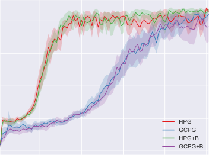

5 HPG HPG

0

20 40 60 80 100

evaluation step

Figure 6: Empty room (batch size 16).

20 40 60 80 100

evaluation step

Figure 7: Four rooms (batch size 16).

7

Published as a conference paper at ICLR 2019

6.3 MS. PAC-MAN ENVIRONMENT

The _Ms. Pac-man_ environment is a variant of the homonymous game for ATARI 2600 (see Fig. 2).
The agent starts every episode close to the center of the map, and its goal is to reach a randomly
chosen (non-initial) position on a 14 _×_ 19 grid defined on the game screen. The actions allow
the agent to move in the four cardinal directions for 13 game ticks. A state is represented by the
result of preprocessing a sequence of game screens (images) as described in Appendix E.1. A
goal is represented by a pair of integers. The maximum number of time steps is 28, although
an episode will also end if the agent is captured by an enemy. In comparison to the grid world
environments considered in the previous section, this environment is additionally challenging due to
its high-dimensional states and the presence of enemies.

Figure 8 presents the learning curves for a medium batch size. Approximate value function baselines
are excluded from this experiment due to the significant cost of systematic hyperparameter search.
Although HPG obtains better policies during early training, GCPG obtains better final policies.
However, for such a medium batch size, only 3 active goals per episode (out of potentially 28)
are subsampled for HPG. Although this harsh subsampling brings computational efficiency, it also
appears to handicap the estimator. This hypothesis is supported by the fact that HPG outperforms
GCPG for a small batch size, when all active goals are used (see Apps. E.3.3 and E.3.5). Policies
obtained using each estimator are illustrated by videos included on the project website.

18

10

16

GCPG

|Col1|Col2|
|---|---|
|||
|||
|||
|||
|||
|||
|||
||~~H~~ GC|

20 40 60 80 100

evaluation step

Figure 9: FetchPush (batch size 16).

8

6

4

2

GCPG

0

|Col1|Col2|Col3|Col4|
|---|---|---|---|
|||||
|||||
|||||
|||||
||||HP GC|

20 40 60 80 100

evaluation step

Figure 8: Ms. Pac-man (batch size 16).

6.4 FETCHPUSH ENVIRONMENT

14

12

10

8

6

4

2

The _FetchPush_ environment is a variant of the environment recently proposed by Plappert et al. (2018)
to assess goal-conditional policy learning algorithms in a challenging task of practical interest (see
Fig. 3). In a simulation, a robotic arm with seven degrees of freedom is required to push a randomly
placed object (block) towards a randomly chosen position. The arm starts every episode in the same
configuration. In contrast to the original environment, the actions in our variant allow increasing
the desired velocity of the gripper along each of two orthogonal directions by _±_ 0 _._ 1 or _±_ 1, leading
to a total of eight actions. A state is represented by a 28-dimensional real vector that contains the
following information: positions of the gripper and block; rotational and positional velocities of the
gripper and block; relative position of the block with respect to the gripper; state of the gripper; and
current desired velocity of the gripper along each direction. A goal is represented by three coordinates.
The maximum number of time steps is 50.

Figure 9 presents the learning curves for a medium batch size. HPG obtains good policies after a
reasonable number of batches, in sharp contrast to GCPG. For such a medium batch size, only 3
active goals per episode (out of potentially 50) are subsampled for HPG, showing that subsampling is
a viable alternative to reduce the computational cost of hindsight. Similar results are observed for a
small batch size, when all active goals are used (see Apps. E.3.3 and E.3.5). Policies obtained using
each estimator are illustrated by videos included on the project website.

8

Published as a conference paper at ICLR 2019

7 CONCLUSION

We introduced techniques that enable learning goal-conditional policies using hindsight. In this
context, hindsight refers to the capacity to exploit information about the degree to which an arbitrary
goal has been achieved while another goal was intended. Prior to our work, hindsight has been limited
to off-policy reinforcement learning algorithms that rely on experience replay (Andrychowicz et al.,
2017) and policy search based on Bayesian optimization (Karkus et al., 2016).

In addition to the fundamental hindsight policy gradient, our technical results include its baseline
and advantage formulations. These results are based on a self-contained goal-conditional policy
framework that is also introduced in this text. Besides the straightforward estimator built upon
the per-decision hindsight policy gradient, we also presented a consistent estimator inspired by
weighted importance sampling, together with the corresponding baseline formulation. A variant of
this estimator leads to remarkable comparative sample efficiency on a diverse selection of sparsereward environments, especially in cases where direct reward signals are extremely difficult to obtain.
This crucial feature allows natural task formulations that require just trivial reward shaping.

The main drawback of hindsight policy gradient estimators appears to be their computational cost,
which is directly related to the number of active goals in a batch. This issue may be mitigated
by subsampling active goals, which generally leads to inconsistent estimators. Fortunately, our
experiments suggest that this is a viable alternative. Note that the success of hindsight experience
replay also depends on an active goal subsampling heuristic (Andrychowicz et al., 2017, Sec. 4.5).
The inconsistent hindsight policy gradient estimator with a value function baseline employed in
our experiments sometimes leads to unstable learning, which is likely related to the difficulty of
fitting such a value function without hindsight. This hypothesis is consistent with the fact that such
instability is observed only in the most extreme examples of sparse-reward environments. Although
our preliminary experiments in using hindsight to fit a value function baseline have been successful,
this may be accomplished in several ways, and requires a careful study of its own. Further experiments
are also required to evaluate hindsight on dense-reward environments.

There are many possibilities for future work besides integrating hindsight policy gradients into
systems that rely on goal-conditional policies: deriving additional estimators; implementing and
evaluating hindsight (advantage) actor-critic methods; assessing whether hindsight policy gradients
can successfully circumvent catastrophic forgetting during curriculum learning of goal-conditional
policies; approximating the reward function to reduce required supervision; analysing the variance
of the proposed estimators; studying the impact of active goal subsampling; and evaluating every
technique on continuous action spaces.

ACKNOWLEDGMENTS

We thank Sjoerd van Steenkiste, Klaus Greff, Imanol Schlag, and the anonymous reviewers for their
valuable feedback. This research was supported by the Swiss National Science Foundation (grant
200021_165675/1) and CAPES (Filipe Mutz, PDSE, 88881.133206/2016-01). We are grateful to
Nvidia Corporation for donating a _DGX-1_ machine and to IBM for donating a _Minsky_ machine.

REFERENCES

M. Andrychowicz, F. Wolski, A. Ray, J. Schneider, R. Fong, P. Welinder, B. McGrew, J. Tobin,
P. Abbeel, and W. Zaremba. Hindsight experience replay. In _Advances in Neural Information_
_Processing Systems_, pp. 5048–5058, 2017.

M. G. Bellemare, Y. Naddaf, J. Veness, and M. Bowling. The arcade learning environment: An
evaluation platform for general agents. _Journal of Artificial Intelligence Research_, 47:253–279,
jun 2013.

C. M. Bishop. _Pattern Recognition and Machine Learning_ . Information science and statistics.
Springer, 2013. ISBN 9788132209065.

B. C. Da Silva, G. Konidaris, and A. G. Barto. Learning parameterized skills. In _Proceedings of_
_International Conference of Machine Learning_, 2012.

9

Published as a conference paper at ICLR 2019

M. P. Deisenroth, P. Englert, J. Peters, and D. Fox. Multi-task policy search for robotics. In _IEEE_
_International Conference on Robotics and Automation, 2014_, pp. 3876–3881, 2014.

P. Dhariwal, C. Hesse, O. Klimov, A. Nichol, M. Plappert, A. Radford, J. Schulman, S. Sidor, Y. Wu,
[and P. Zhokhov. Openai baselines. https://github.com/openai/baselines, 2017.](https://github.com/openai/baselines)

Y. Duan, X. Chen, R. Houthooft, J. Schulman, and P. Abbeel. Benchmarking deep reinforcement
learning for continuous control. In _Proceedings of International Conference on Machine Learning_,
pp. 1329–1338, 2016.

A. Fabisch and J. H. Metzen. Active contextual policy search. _The Journal of Machine Learning_
_Research_, 15(1):3371–3399, 2014.

C. Florensa, D. Held, M. Wulfmeier, M. Zhang, and P. Abbeel. Reverse curriculum generation for
reinforcement learning. In _Proceedings of the 1st Annual Conference on Robot Learning_, pp.
482–495, 13–15 Nov 2017.

D. Ghosh, A. Singh, A. Rajeswaran, V. Kumar, and S. Levine. Divide-and-conquer reinforcement
learning. In _International Conference on Learning Representations_, 2018.

X. Glorot and Y. Bengio. Understanding the difficulty of training deep feedforward neural networks.
In _Proceedings of the thirteenth international conference on artificial intelligence and statistics_,
pp. 249–256, 2010.

E. Greensmith, P. L. Bartlett, and J. Baxter. Variance reduction techniques for gradient estimates in
reinforcement learning. _Journal of Machine Learning Research_, 5(Nov):1471–1530, 2004.

T. Jie and P. Abbeel. On a connection between importance sampling and the likelihood ratio policy
gradient. In _Advances in Neural Information Processing Systems_, pp. 1000–1008, 2010.

P. Karkus, A. Kupcsik, D. Hsu, and W. S. Lee. Factored contextual policy search with bayesian
optimization. _arXiv preprint arXiv:1612.01746_, 2016.

D. P. Kingma and J. Ba. Adam: A method for stochastic optimization. In _Proceedings of the 3rd_
_International Conference on Learning Representations_, 2014.

J. Kirkpatrick, R. Pascanu, N. Rabinowitz, J. Veness, G. Desjardins, A. A. Rusu, K. Milan, J. Quan,
T. Ramalho, A. Grabska-Barwinska, et al. Overcoming catastrophic forgetting in neural networks.
_Proceedings of the National Academy of Sciences_, 114(13):3521–3526, 2017.

J. Kober, A. Wilhelm, E. Oztop, and J. Peters. Reinforcement learning to adjust parametrized motor
primitives to new situations. _Autonomous Robots_, 33(4):361–379, 2012.

T. D. Kulkarni, K. Narasimhan, A. Saeedi, and J. Tenenbaum. Hierarchical deep reinforcement learning: Integrating temporal abstraction and intrinsic motivation. In _Advances in Neural Information_
_Processing Systems_, pp. 3675–3683, 2016.

A. G. Kupcsik, M. P. Deisenroth, J. Peters, and G. Neumann. Data-efficient generalization of robot
skills with contextual policy search. In _Proceedings of the 27th AAAI Conference on Artificial_
_Intelligence, AAAI 2013_, pp. 1401–1407, 2013.

A. Levy, R. Platt, and K. Saenko. Hierarchical actor-critic. _arXiv preprint arXiv:1712.00948_, 2017.

T. P. Lillicrap, J. J. Hunt, A. Pritzel, N. Heess, T. Erez, Y. Tassa, D. Silver, and D. Wierstra. Continuous
control with deep reinforcement learning. _ICLR_, 2016.

L. Lin. Self-improving reactive agents based on reinforcement learning, planning and teaching.
_Machine learning_, 8(3/4):69–97, 1992.

D. J. Mankowitz, A. Žídek, A. Barreto, D. Horgan, M. Hessel, J. Quan, J. Oh, H. van Hasselt,
D. Silver, and T. Schaul. Unicorn: Continual learning with a universal, off-policy agent. _arXiv_
_preprint arXiv:1802.08294_, 2018.

10

Published as a conference paper at ICLR 2019

M. McCloskey and N. J. Cohen. Catastrophic interference in connectionist networks: The sequential
learning problem. _Psychology of Learning and Motivation-Advances in Research and Theory_, 24
(C):109–165, 1989.

J. H. Metzen, A. Fabisch, and J. Hansen. Bayesian optimization for contextual policy search. In
_Proceedings of the Second Machine Learning in Planning and Control of Robot Motion Workshop.,_
_Hamburg_, 2015.

V. Mnih, K. Kavukcuoglu, D. Silver, A. A. Rusu, J. Veness, M. G. Bellemare, A. Graves, M. Riedmiller, A. K. Fidjeland, G. Ostrovski, et al. Human-level control through deep reinforcement
learning. _Nature_, 518(7540):529, 2015.

R. Munos, T. Stepleton, A. Harutyunyan, and M. Bellemare. Safe and efficient off-policy reinforcement learning. In _Advances in Neural Information Processing Systems_, pp. 1054–1062,
2016.

V. Nair and G. E. Hinton. Rectified linear units improve restricted boltzmann machines. In _ICML_,
2010.

A. Y. Ng, D. Harada, and S. Russell. Policy invariance under reward transformations: Theory and
application to reward shaping. In _International Conference on Machine Learning_, volume 99, pp.
278–287, 1999.

J. Oh, S. Singh, H. Lee, and P. Kohli. Zero-shot task generalization with multi-task deep reinforcement
learning. In _Proceedings of the 34th International Conference on Machine Learning_, 06–11 Aug
2017.

D. Pathak, P. Mahmoudieh, M. Luo, P. Agrawal, D. Chen, F. Shentu, E. Shelhamer, J. Malik, A. A.
Efros, and T. Darrell. Zero-shot visual imitation. In _International Conference on Learning_
_Representations_, 2018.

L. Peshkin and C. R. Shelton. Learning from scarce experience. In _Proceedings of the Nineteenth_
_International Conference on Machine Learning_, pp. 498–505, 2002.

J. Peters and S. Schaal. Reinforcement learning of motor skills with policy gradients. _Neural networks_,
21(4):682–697, 2008.

M. Plappert, M. Andrychowicz, A. Ray, B. McGrew, B. Baker, G. Powell, J. Schneider, J. Tobin, M. Chociej, P. Welinder, et al. Multi-goal reinforcement learning: Challenging robotics
environments and request for research. _arXiv preprint arXiv:1802.09464_, 2018.

D. Precup, R. S. Sutton, and S. P. Singh. Eligibility traces for off-policy policy evaluation. In
_International Conference on Machine Learning_, pp. 759–766, 2000.

T. Schaul, D. Horgan, K. Gregor, and D. Silver. Universal value function approximators. In
_Proceedings of the International Conference on Machine Learning_, pp. 1312–1320, 2015.

J. Schmidhuber and R. Huber. _Learning to Generate Focus Trajectories for Attentive Vision_ . Institut
für Informatik, 1990.

P. Sen and J. Singer. _Large Sample Methods in Statistics: An Introduction with Applications_ . Chapman
& Hall/CRC Texts in Statistical Science. Taylor & Francis, 1994. ISBN 9780412042218.

R. K. Srivastava, B. R. Steunebrink, and J. Schmidhuber. First experiments with PowerPlay. _Neural_
_Networks_, 41(0):130 – 136, 2013. Special Issue on Autonomous Learning.

S. Sukhbaatar, Z. Lin, I. Kostrikov, G. Synnaeve, A. Szlam, and R. Fergus. Intrinsic motivation
and automatic curricula via asymmetric self-play. In _International Conference on Learning_
_Representations_, 2018.

R. S. Sutton and A. G. Barto. _Reinforcement Learning: An Introduction_ . Bradford Book, 1998. ISBN
9780262193986.

11

Published as a conference paper at ICLR 2019

R. S. Sutton, D. A. McAllester, S. P. Singh, and Y. Mansour. Policy gradient methods for reinforcement
learning with function approximation. In _Advances in Neural Information Processing Systems 12_,
pp. 1057–1063, 1999a.

R. S. Sutton, D. Precup, and S. Singh. Between MDPs and semi-MDPs: A framework for temporal
abstraction in reinforcement learning. _Artificial intelligence_, 112(1-2):181–211, 1999b.

P. Thomas. _Safe reinforcement learning_ . PhD thesis, University of Massachusetts Amherst, 2015.

P. Thomas, G. Theocharous, and M. Ghavamzadeh. High confidence policy improvement. In
_International Conference on Machine Learning_, pp. 2380–2388, 2015.

A. S. Vezhnevets, S. Osindero, T. Schaul, N. Heess, M. Jaderberg, D. Silver, and K. Kavukcuoglu.
FeUdal networks for hierarchical reinforcement learning. In _Proceedings of the 34th International_
_Conference on Machine Learning_, pp. 3540–3549, 06–11 Aug 2017.

R. J. Williams. Reinforcement-learning in connectionist networks: A mathematical analysis. Technical Report 8605, Institute for Cognitive Science, University of California, San Diego, 1986.

R. J. Williams. Simple statistical gradient-following algorithms for connectionist reinforcement
learning. _Machine learning_, 8(3-4):229–256, 1992.

Y. Zhu, R. Mottaghi, E. Kolve, J. J. Lim, A. Gupta, L. Fei-Fei, and A. Farhadi. Target-driven visual
navigation in indoor scenes using deep reinforcement learning. In _IEEE International Conference_
_on Robotics and Automation_, pp. 3357–3364, 2017.

12

Published as a conference paper at ICLR 2019

A GOAL-CONDITIONAL POLICY GRADIENTS

This appendix contains proofs related to the results presented in Section 3: Theorem 3.1 (App. A.2),
Theorem 3.2 (App. A.4), and Theorem 3.3 (App. A.6). Appendix A.7 presents optimal constant
baselines for goal-conditional policies. The remaining subsections contain auxiliary results.

A.1 THEOREM A.1

**Theorem A.1.** _The gradient ∇η_ ( _**θ**_ ) _of the expected return with respect to_ _**θ**_ _is given by_

_T_
�
�� _t_ =1

�

_∇η_ ( _**θ**_ ) = �

_p_ ( _g_ ) �

_g_ _**τ**_

_p_ ( _**τ**_ _| g,_ _**θ**_ )

_**τ**_

_T −_ 1
�
� _t_ =1

� _∇_ log _p_ ( _at | st, g,_ _**θ**_ )

_t_ =1

� _r_ ( _st, g_ )

_t_ =1

_._ (13)

_Proof._ The partial derivative _∂η_ ( _**θ**_ ) _/∂θj_ of the expected return _η_ ( _**θ**_ ) with respect to _θj_ is given by

_T_
� _r_ ( _st, g_ ) _._ (14)

_t_ =1

_∂_
_∂θj_ _η_ ( _**θ**_ ) = �

_**τ**_

_p_ ( _g_ ) �

_g_ _**τ**_

_∂_
_p_ ( _**τ**_ _| g,_ _**θ**_ )
_∂θj_

The _likelihood-ratio trick_ allows rewriting the previous equation as

_T_
� _r_ ( _st, g_ ) _._ (15)

_t_ =1

_T_
�

_∂_
_∂θj_ _η_ ( _**θ**_ ) = �

_p_ ( _**τ**_ _| g,_ _**θ**_ ) _[∂]_

_∂θ_

_**τ**_

log _p_ ( _**τ**_ _| g,_ _**θ**_ )
_∂θj_

� _p_ ( _g_ ) �

_g_ _**τ**_

Note that

log _p_ ( _**τ**_ _| g,_ _**θ**_ ) = log _p_ ( _s_ 1) +

Therefore,

_T −_ 1
� log _p_ ( _at | st, g,_ _**θ**_ ) +

_t_ =1

_T −_ 1
� log _p_ ( _st_ +1 _| st, at_ ) _._ (16)

_t_ =1

_T_
�
�� _t_ =1

�

_∂_
_∂θj_ _η_ ( _**θ**_ ) = �

_p_ ( _**τ**_ _| g,_ _**θ**_ )

_**τ**_

� _r_ ( _st, g_ )

_t_ =1

_p_ ( _g_ ) �

_g_ _**τ**_

_T −_ 1
�
� _t_ =1

_∂_
log _p_ ( _at | st, g,_ _**θ**_ )
_∂θj_

_._ (17)

A.2 THEOREM 3.1

**Theorem 3.1** (Goal-conditional policy gradient) **.** _The gradient ∇η_ ( _**θ**_ ) _of the expected return with_
_respect to_ _**θ**_ _is given by_

_T_
�

_∇η_ ( _**θ**_ ) = �

_p_ ( _g_ ) �

_g_ _**τ**_

_p_ ( _**τ**_ _| g,_ _**θ**_ )

_**τ**_

_T −_ 1
� _∇_ log _p_ ( _at | st, g,_ _**θ**_ )

_t_ =1

_T_
� _r_ ( _st′, g_ ) _._ (3)

_t_ _[′]_ = _t_ +1

_Proof._ Starting from Eq. 17, the partial derivative _∂η_ ( _**θ**_ ) _/∂θj_ of _η_ ( _**θ**_ ) with respect to _θj_ is given by

_T −_ 1
�

_t_ _[′]_ =1

_∂_
_∂θj_ _η_ ( _**θ**_ ) = �

_p_ ( _**τ**_ _| g,_ _**θ**_ )

_**τ**_

� _p_ ( _g |_ _**θ**_ ) �

_g_ _**τ**_

_T_
� _r_ ( _st, g_ )

_t_ =1

_∂_
log _p_ ( _at′ | st′, g,_ _**θ**_ ) _._ (18)
_∂θj_

The previous equation can be rewritten as

_T −_ 1
�

_−_

_t_ � _[′]_ =1 E � _r_ ( _St, G_ ) _∂θ_ _[∂]_

_[∂]_ log _p_ ( _At′ | St′, G,_ _**θ**_ ) _|_ _**θ**_ _._ (19)

_∂θj_ �

_∂_
_η_ ( _**θ**_ ) =
_∂θj_

_T_
�

_t_ =1

13

Published as a conference paper at ICLR 2019

Let _c_ denote an expectation inside Eq. 19 for _t_ _[′]_ _≥_ _t_ . In that case, _At′ ⊥⊥_ _St | St′, G,_ **Θ**, and so

�

_g_

�

� _p_ ( _at′ | st′, g,_ _**θ**_ ) _p_ ( _st, st′, g |_ _**θ**_ ) _r_ ( _st, g_ ) _∂θ_ _[∂]_

_at′_

log _p_ ( _at′ | st′, g,_ _**θ**_ ) _._ (20)
_∂θj_

_c_ =
�

_st_

�

_st′_

Reversing the likelihood-ratio trick,

_c_ =
�

_st_

�

_st′_

�

_p_ ( _st, st_ _[′]_ _, g |_ _**θ**_ ) _r_ ( _st, g_ ) _[∂]_

_∂θ_

_g_

_∂θj_

� _p_ ( _at_ _[′]_ _| st_ _[′]_ _, g,_ _**θ**_ ) = 0 _._ (21)

_at′_

Therefore, the terms where _t_ _[′]_ _≥_ _t_ can be dismissed from Eq. 19, leading to

�

_∂_
_η_ ( _**θ**_ ) = E
_∂θj_

_T_
� _r_ ( _St, G_ )
� _t_ =1

_t−_ 1
�

_t_ _[′]_ =1

_∂_
log _p_ ( _At′ | St′, G,_ _**θ**_ ) _|_ _**θ**_
_∂θj_

_._ (22)

The previous equation can be conveniently rewritten as

�

_∂_
_η_ ( _**θ**_ ) = E
_∂θj_

A.3 LEMMA A.1

_T −_ 1
�
� _t_ =1

_∂_
log _p_ ( _At | St, G,_ _**θ**_ )
_∂θj_

_T_
� _r_ ( _St′, G_ ) _|_ _**θ**_

_t_ _[′]_ = _t_ +1

_T_
�

_._ (23)

**Lemma A.1.** _For every j, t,_ _**θ**_ _, and associated real-valued (baseline) function b_ _**[θ]**_ _t_ _[,]_

_T −_ 1
�

_∂_

_∂θj_ log _p_ ( _At | St, G,_ _**θ**_ ) _b_ _**[θ]**_ _t_ [(] _[S][t][, G]_ [)] _[ |]_ _**[ θ]**_ � = 0 _._ (24)

_−_ _∂_
� _t_ =1 E � _∂θ_

_Proof._ Letting _c_ denote an expectation inside Eq. 24,

_c_ =
�

_st_

�

_g_

�

_p_ ( _at | st, g,_ _**θ**_ ) _p_ ( _st, g |_ _**θ**_ ) _[∂]_

_∂θ_

_at_

_∂θj_ log _p_ ( _at | st, g,_ _**θ**_ ) _b_ _**[θ]**_ _t_ [(] _[s][t][, g]_ [)] _[.]_ (25)

Reversing the likelihood-ratio trick,

_c_ =
�

_st_

A.4 THEOREM 3.2

�

_p_ ( _st, g |_ _**θ**_ ) _b_ _**[θ]**_ _t_ [(] _[s][t][, g]_ [)] _∂θ_ _[∂]_
_g_

_∂θj_

� _p_ ( _at | st, g,_ _**θ**_ ) = 0 _._ (26)

_at_

**Theorem 3.2** (Goal-conditional policy gradient, baseline formulation) **.** _For every t,_ _**θ**_ _, and associated_
_real-valued (baseline) function b_ _**[θ]**_ _t_ _[, the gradient][ ∇][η]_ [(] _**[θ]**_ [)] _[ of the expected return with respect to]_ _**[ θ]**_ _[ is]_
_given by_

�

_−_ _b_ _**[θ]**_ _t_ [(] _[s][t][, g]_ [)]

�

_T_
�
�� _t_ _[′]_ = _t_

� _r_ ( _st′, g_ )

_t_ _[′]_ = _t_ +1

_∇η_ ( _**θ**_ ) = �

_p_ ( _g_ ) �

_g_ _**τ**_

_p_ ( _**τ**_ _| g,_ _**θ**_ )

_**τ**_

_T −_ 1
� _∇_ log _p_ ( _at | st, g,_ _**θ**_ )

_t_ =1

_T −_ 1
�

_._ (4)

_Proof._ The result is obtained by subtracting Eq. 24 from Eq. 23. Importantly, for every combination
of _**θ**_ and _t_, it would also be possible to have a distinct baseline function for each parameter in _**θ**_ .

14

Published as a conference paper at ICLR 2019

A.5 LEMMA A.2

**Lemma A.2.** _The gradient ∇η_ ( _**θ**_ ) _of the expected return with respect to_ _**θ**_ _is given by_

_∇η_ ( _**θ**_ ) = �

_p_ ( _**τ**_ _| g,_ _**θ**_ )

_**τ**_

_p_ ( _g_ ) �

_g_ _**τ**_

_T −_ 1
� _∇_ log _p_ ( _at | st, g,_ _**θ**_ ) _Q_ _**[θ]**_ _t_ [(] _[s][t][, a][t][, g]_ [)] _[.]_ (27)

_t_ =1

_Proof._ Starting from Eq. 23 and rearranging terms,

�

_g_

� _p_ ( _st_ +1: _T | st, at, g,_ _**θ**_ )

_st_ +1: _T_

_∂_
_η_ ( _**θ**_ ) =
_∂θj_

_T −_ 1
�

_t_ =1

�

_st_

� _p_ ( _st, at, g |_ _**θ**_ ) _∂θ_ _[∂]_

_at_

�

_∂θj_ log _p_ ( _at | st, g,_ _**θ**_ ) �

By the definition of action-value function,

_T_
� _r_ ( _st′_ _, g_ ) _._ (28)

_t_ _[′]_ = _t_ +1

_._ (29)

�

_∂_
_η_ ( _**θ**_ ) = E
_∂θj_

A.6 THEOREM 3.3

_T −_ 1
�
� _t_ =1

_∂_
_∂θj_ log _p_ ( _At | St, G,_ _**θ**_ ) _Q_ _**[θ]**_ _t_ [(] _[S][t][, A][t][, G]_ [)] _[ |]_ _**[ θ]**_

**Theorem 3.3** (Goal-conditional policy gradient, advantage formulation) **.** _The gradient ∇η_ ( _**θ**_ ) _of the_
_expected return with respect to_ _**θ**_ _is given by_

_∇η_ ( _**θ**_ ) = �

_p_ ( _g_ ) �

_g_ _**τ**_

_p_ ( _**τ**_ _| g,_ _**θ**_ )

_**τ**_

_T −_ 1
� _∇_ log _p_ ( _at | st, g,_ _**θ**_ ) _A_ _**[θ]**_ _t_ [(] _[s][t][, a][t][, g]_ [)] _[.]_ (5)

_t_ =1

_Proof._ The result is obtained by choosing _b_ _**[θ]**_ _t_ [=] _[ V]_ _**[ θ]**_ _t_ [and subtracting Eq.][ 24][ from Eq.][ 29][.]

A.7 THEOREM A.2

For arbitrary _j_ and _**θ**_, consider the following definitions of _f_ and _h_ .

_T_
� _r_ ( _st′, g_ ) _,_ (30)

_t_ _[′]_ = _t_ +1

_f_ ( _**τ**_ _, g_ ) =

_h_ ( _**τ**_ _, g_ ) =

_T −_ 1
�

_t_ =1

_T −_ 1
�

_t_ =1

_∂_
log _p_ ( _at | st, g,_ _**θ**_ )
_∂θj_

_∂_
log _p_ ( _at | st, g,_ _**θ**_ ) _._ (31)
_∂θj_

For every _bj ∈_ R, using Theorem 3.1 and the fact that E [ _h_ ( _**T**_ _, G_ ) _|_ _**θ**_ ] = 0 by Lemma _A._ 1,

_∂_
_∂θj_ _η_ ( _**θ**_ ) = E [ _f_ ( _**T**_ _, G_ ) _|_ _**θ**_ ] = E [ _f_ ( _**T**_ _, G_ ) _−_ _bjh_ ( _**T**_ _, G_ ) _|_ _**θ**_ ] _._ (32)

**Theorem A.2.** _Assuming_ Var [ _h_ ( _**T**_ _, G_ ) _|_ _**θ**_ ] _>_ 0 _, the (optimal constant baseline) bj that minimizes_
Var [ _f_ ( _**T**_ _, G_ ) _−_ _bjh_ ( _**T**_ _, G_ ) _|_ _**θ**_ ] _is given by_

_bj_ = [E] [[] _[f]_ [(] _**[T]**_ _[,][ G]_ [)] _[h]_ [(] _**[T]**_ _[,][ G]_ [)] _[|]_ _**[ θ]**_ []] _._ (33)

E [ _h_ ( _**T**_ _, G_ ) [2] _|_ _**θ**_ ]

_Proof._ The result is an application of Lemma D.4.

15

Published as a conference paper at ICLR 2019

B HINDSIGHT POLICY GRADIENTS

This appendix contains proofs related to the results presented in Section 4: Theorem 4.1 (App. B.1),
Theorem 4.2 (App. B.2), Lemma 4.1 (App. B.3), Theorem B.1 (App. B.4), and Theorem 4.3 (App.
B.6). Appendix B.7 presents optimal constant baselines for hindsight policy gradients. Appendix B.5
contains an auxiliary result.

B.1 THEOREM 4.1

The following theorem relies on importance sampling, a traditional technique used to obtain estimates
related to a random variable _X ∼_ _p_ using samples from an arbitrary positive distribution _q_ . This
technique relies on the following equalities:

_p_ ( _X_ )

_._ (34)

� _q_ ( _X_ ) _[f]_ [(] _[X]_ [)] �

E _p_ ( _X_ ) [ _f_ ( _X_ )] = �

_p_ ( _x_ ) _f_ ( _x_ ) = �

_x_ _x_

_q_ ( _x_ )
_q_ ( _x_ ) _[p]_ [(] _[x]_ [)] _[f]_ [(] _[x]_ [) =][ E] _[q]_ [(] _[X]_ [)]

_x_

**Theorem 4.1** (Every-decision hindsight policy gradient) **.** _For an arbitrary (original) goal g_ _[′]_ _, the_
_gradient ∇η_ ( _**θ**_ ) _of the expected return with respect to_ _**θ**_ _is given by_

_T_
�

_t_ _[′]_ = _t_ +1

_p_ ( _ak_ _| sk,_ _g,_ _**θ**_ )
_p_ ( _ak | sk, g_ _[′]_ _,_ _**θ**_ )

_T −_ 1
�
� _k_ =1

�

_p_ ( _**τ**_ _| g_ _[′]_ _,_ _**θ**_ ) �

_**τ**_

_∇η_ ( _**θ**_ ) = �

_p_ ( _g_ )

_g_

_T −_ 1
� _∇_ log _p_ ( _at | st, g,_ _**θ**_ )

_t_ =1

_T −_ 1
�

_r_ ( _st′_ _, g_ ) _._ (6)

_Proof._ Starting from Theorem 3.1, importance sampling allows rewriting the partial derivative
_∂η_ ( _**θ**_ ) _/∂θj_ as

_T_
� _r_ ( _st′, g_ ) _._ (35)

_t_ _[′]_ = _t_ +1

_T −_ 1

_∂_

� _t_ =1 _∂θj_ log _p_ ( _at | st, g,_ _**θ**_ )

_∂_
_∂θj_ _η_ ( _**θ**_ ) = �

_**τ**_

_p_ ( _g_ ) �

_g_ _**τ**_

_p_ ( _**τ**_ _|_ _g_ _[′]_ _,_ _**θ**_ )
_p_ ( _**τ**_ _| g_ _[′]_ _,_ _**θ**_ ) _[p]_ [(] _**[τ]**_ _[ |][ g,]_ _**[ θ]**_ [)]

Using Equation 1,

_T −_ 1
�
� _t_ =1

_∂_
_∂θj_ _[η]_ [(] _**[θ]**_ [) =] �

_p_ ( _**τ**_ _| g_ _[′]_ _,_ _**θ**_ )

_**τ**_

_T_
� _r_ ( _st′_ _, g_ ) _._

_t_ _[′]_ = _t_ +1

� _p_ ( _g_ ) �

_g_ _**τ**_

_T −_ 1
�
� _k_ =1

_p_ ( _ak_ _| sk,_ _g,_ _**θ**_ )
_p_ ( _ak | sk, g_ _[′]_ _,_ _**θ**_ )

_∂_
_∂θj_ [log] _[ p]_ [(] _[a][t][ |][ s][t][, g,]_ _**[ θ]**_ [)]

(36)

B.2 THEOREM 4.2

**Theorem 4.2** (Per-decision hindsight policy gradient) **.** _For an arbitrary (original) goal g_ _[′]_ _, the_
_gradient ∇η_ ( _**θ**_ ) _of the expected return with respect to_ _**θ**_ _is given by_

_T_
�

_t_ _[′]_ = _t_ +1

_p_ ( _ak_ _| sk,_ _g,_ _**θ**_ )
_p_ ( _ak | sk, g_ _[′]_ _,_ _**θ**_ )





_t_ _[′]_ _−_ 1
�

_k_ =1

 _r_ ( _st′_ _, g_ ) _._ (7)



_∇η_ ( _**θ**_ ) = �

_p_ ( _**τ**_ _| g_ _[′]_ _,_ _**θ**_ ) �

_**τ**_

_p_ ( _g_ )

_g_

_T −_ 1
� _∇_ log _p_ ( _at | st, g,_ _**θ**_ )

_t_ =1

_T −_ 1
�

_Proof._ Starting from Eq. 36, the partial derivative _∂η_ ( _**θ**_ ) _/∂θj_ can be rewritten as

� _p_ ( _**τ**_ _| g_ _[′]_ _,_ _**θ**_ )

_**τ**_

_∂_
� _∂θj_ [log] _[ p]_ [(] _[a][t][ |][ s][t][, g,]_ _**[ θ]**_ [)] _[r]_ [(] _[s][t][′]_ _[, g]_ [)] _[.]_

(37)

_∂_
_∂θj_ _[η]_ [(] _**[θ]**_ [) =] � _p_ ( _g_ )

_g_

_T −_ 1
�

_t_ =1

_T_
�

_t_ _[′]_ = _t_ +1

�

_T −_ 1
�
� _k_ =1

_p_ ( _ak_ _| sk,_ _g,_ _**θ**_ )
_p_ ( _ak | sk, g_ _[′]_ _,_ _**θ**_ )

If we split every trajectory into states and actions before and after _t_ _[′]_, then _∂η_ ( _**θ**_ ) _/∂θj_ is given by

_∂_

 log _p_ ( _at | st, g,_ _**θ**_ ) _z,_ (38)

_∂θj_




_T_
�

_t_ _[′]_ = _t_ +1

�

_s_ 1: _t′−_ 1

�

_a_ 1: _t′−_ 1

� _p_ ( _g_ )

_g_

_T −_ 1
�

_t_ =1

_p_ ( _s_ 1: _t′−_ 1 _, a_ 1: _t′−_ 1 _| g_ _[′]_ _,_ _**θ**_ )

16

 _t_ _[′]_ _−_ 1

�

 _k_ =1

_p_ ( _ak_ _| sk, g,_ _**θ**_ )
_p_ ( _ak | sk, g_ _[′]_ _,_ _**θ**_ )

Published as a conference paper at ICLR 2019

where _z_ is defined by

�

_z_ =
�

_st′_ : _T_

� _p_ ( _st′_ : _T, at′_ : _T −_ 1 _| s_ 1: _t′−_ 1 _, a_ 1: _t′−_ 1 _, g_ _[′]_ _,_ _**θ**_ )

_at′_ : _T −_ 1

_T −_ 1
�
� _k_ = _t_ _[′]_

_p_ ( _ak_ _| sk,_ _g,_ _**θ**_ )
_p_ ( _ak | sk, g_ _[′]_ _,_ _**θ**_ )

_r_ ( _st′, g_ ) _._ (39)

Using Lemma D.2 and canceling terms,

�

_T −_ 1
�
� _k_ = _t_ _[′]_

_z_ =
�

_st′_ : _T_

� _p_ ( _st′ | st′−_ 1 _, at′−_ 1)

_at′_ : _T −_ 1

� _p_ ( _ak | sk, g,_ _**θ**_ ) _p_ ( _sk_ +1 _| sk, ak_ )

_k_ = _t_ _[′]_

_r_ ( _st′, g_ ) _._ (40)

Using Lemma D.2 once again,

_z_ =
�

_st′_ : _T_

� _p_ ( _st′_ : _T, at′_ : _T −_ 1 _| s_ 1: _t′−_ 1 _, a_ 1: _t′−_ 1 _, g,_ _**θ**_ ) _r_ ( _st′, g_ ) _._ (41)

_at′_ : _T −_ 1

Using the fact that _St′ ⊥⊥_ _G | S_ 1: _t′−_ 1 _, A_ 1: _t′−_ 1 _,_ **Θ**,

� _r_ ( _st′, g_ ) _p_ ( _st′ | s_ 1: _t′−_ 1 _, a_ 1: _t′−_ 1 _, g,_ _**θ**_ ) = �

_st′_ _st′_

_z_ =
�

_r_ ( _st′, g_ ) _p_ ( _st′ | s_ 1: _t′−_ 1 _, a_ 1: _t′−_ 1 _, g_ _[′]_ _,_ _**θ**_ ) _._ (42)

_st′_

Substituting _z_ into Expression 38 and returning to an expectation over trajectories,





_t_ _[′]_ _−_ 1
�

_k_ =1

 _r_ ( _st′_ _, g_ ) _._



(43)

_∂_
_∂θj_ _[η]_ [(] _**[θ]**_ [) =] �

_p_ ( _g_ )

_g_

_T_
�

_t_ _[′]_ = _t_ +1

_p_ ( _ak_ _| sk,_ _g,_ _**θ**_ )
_p_ ( _ak | sk, g_ _[′]_ _,_ _**θ**_ )

_p_ ( _**τ**_ _| g_ _[′]_ _,_ _**θ**_ ) �

_**τ**_

_T −_ 1
�

_t_ =1

_∂_
_∂θj_ [log] _[ p]_ [(] _[a][t][ |][ s][t][, g,]_ _**[ θ]**_ [)]

B.3 LEMMA 4.1

**Lemma 4.1.** _For every g_ _[′]_ _, t,_ _**θ**_ _, and associated real-valued (baseline) function b_ _**[θ]**_ _t_ _[,]_

_t_
�
� _k_ =1

_p_ ( _ak_ _| sk,_ _g,_ _**θ**_ )
_p_ ( _ak | sk, g_ _[′]_ _,_ _**θ**_ )

�

_p_ ( _**τ**_ _| g_ _[′]_ _,_ _**θ**_ ) �

_**τ**_

�

_p_ ( _g_ )

_g_

_T −_ 1
� _∇_ log _p_ ( _at | st, g,_ _**θ**_ )

_t_ =1

_T −_ 1
�

_b_ _**[θ]**_ _t_ [(] _[s]_ _t_ _[, g]_ [) =] **[ 0]** _[.]_ (8)

_Proof._ Let _c_ denote the _j_ -th element of the vector in the left-hand side of Eq. 8, such that

�

_∂_
log _p_ ( _At | St, g,_ _**θ**_ )
� _∂θj_

_t_
�
� _k_ =1

_t_
�
� _k_ =1

_p_ ( _Ak_ _| Sk,_ _g,_ _**θ**_ )
_p_ ( _Ak | Sk, g_ _[′]_ _,_ _**θ**_ )

�

_c_ = � _p_ ( _g_ )

_g_

_T −_ 1
� E

_t_ =1

_T −_ 1
�

_b_ _**[θ]**_ _t_ [(] _[S][t][, g]_ [)] _[ |][ g][′][,]_ _**[ θ]**_

_._ (44)

Using Lemma D.1 and writing the expectations explicitly,

_c_ = � _p_ ( _g_ )

_g_

_T −_ 1
�

_t_ =1

�

_s_ 1: _t_

�

� _p_ ( _s_ 1: _t, a_ 1: _t | g_ _[′]_ _,_ _**θ**_ ) _∂θ_ _[∂]_

_a_ 1: _t_

_[∂]_ log _p_ ( _at | st, g,_ _**θ**_ ) _[p]_ [(] _[s]_ [1:] _[t][,][ a]_ [1:] _[t]_ _[|]_ _[g,]_ _**[ θ]**_ [)]

_∂θj_ _p_ ( _s_ 1: _t, a_ 1: _t | g_ _[′]_ _,_ _**θ**_ )

_p_ ( _s_ 1: [1:] _t_ _[t]_ _, a_ _[,]_ 1: [1:] _t_ _[t]_ _| g_ _[′]_ _,_ _**θ**_ ) _[b]_ _t_ _**[θ]**_ [(] _[s][t][, g]_ [)] _[.]_

(45)

Canceling terms, using Lemma D.1 once again, and reversing the likelihood-ratio trick,

�

_a_ 1: _t_

�

_c_ = � _p_ ( _g_ )

_g_

_T −_ 1
� �

_t_ =1 _s_ 1: _t_

_∂_

_p_ ( _s_ 1)

_∂θj_ _[p]_ [(] _[a][t][ |][ s][t][, g,]_ _**[ θ]**_ [)] �

_t−_ 1
�

� _p_ ( _ak | sk, g,_ _**θ**_ ) _p_ ( _sk_ +1 _| sk, ak_ )

_k_ =1

_b_ _**[θ]**_ _t_ [(] _[s]_ _t_ _[, g]_ [)] _[.]_ (46)

Pushing constants outside the summation over actions at time step _t_,

� �

_s_ 1: _t_ _a_ 1: _t−_ 1

�

_b_ _**[θ]**_ _t_ [(] _[s][t][, g]_ [)] _∂θ_ _[∂]_ _j_

_t−_ 1
� _p_ ( _ak | sk, g,_ _**θ**_ ) _p_ ( _sk_ +1 _| sk, ak_ )

_k_ =1

_t−_ 1
�

� _p_ ( _at | st, g,_ _**θ**_ ) = 0 _._ (47)

_at_

_c_ = � _p_ ( _g_ )

_g_

_T −_ 1
�

_t_ =1

_p_ ( _s_ 1)

�

�

17

Published as a conference paper at ICLR 2019

B.4 THEOREM B.1

**Theorem B.1** (Hindsight policy gradient, baseline formulation) **.** _For every g_ _[′]_ _, t,_ _**θ**_ _, and associated_
_real-valued (baseline) function b_ _**[θ]**_ _t_ _[, the gradient][ ∇][η]_ [(] _**[θ]**_ [)] _[ of the expected return with respect to]_ _**[ θ]**_ _[ is]_
_given by_

_∇η_ ( _**θ**_ ) = �

_p_ ( _**τ**_ _| g_ _[′]_ _,_ _**θ**_ ) �

_**τ**_

_p_ ( _g_ )

_g_

_T −_ 1
� _∇_ log _p_ ( _at | st, g,_ _**θ**_ ) _z,_ (48)

_t_ =1

_where_

_z_ =

_T_



�

_t_ _[′]_ = _t_





 _−_



�





_r_ ( _st′, g_ )


_t_
�
� _k_ =1

_p_ ( _ak_ _| sk,_ _g,_ _**θ**_ )
_p_ ( _ak | sk, g_ _[′]_ _,_ _**θ**_ )

_b_ _**[θ]**_ _t_ [(] _[s][t][, g]_ [)] _[.]_ (49)

_t_ _[′]_ = _t_ +1

 _t_ _[′]_ _−_ 1

�

_k_ =1



_k_ =1

_p_ ( _ak_ _| sk,_ _g,_ _**θ**_ )
_p_ ( _ak | sk, g_ _[′]_ _,_ _**θ**_ )

_Proof._ The result is obtained by subtracting Eq. 8 from Eq. 7. Importantly, for every combination of
_**θ**_ and _t_, it would also be possible to have a distinct baseline function for each parameter in _**θ**_ .

B.5 LEMMA B.1

**Lemma B.1** (Hindsight policy gradient, action-value formulation) **.** _For an arbitrary goal g_ _[′]_ _, the_
_gradient ∇η_ ( _**θ**_ ) _of the expected return with respect to_ _**θ**_ _is given by_

�

_t_
�
� _k_ =1

_p_ ( _ak_ _| sk,_ _g,_ _**θ**_ )
_p_ ( _ak | sk, g_ _[′]_ _,_ _**θ**_ )

_∇η_ ( _**θ**_ ) = �

_p_ ( _**τ**_ _| g_ _[′]_ _,_ _**θ**_ ) �

_**τ**_

_p_ ( _g_ )

_g_

_T −_ 1
� _∇_ log _p_ ( _at | st, g,_ _**θ**_ )

_t_ =1

_T −_ 1
�

_Qt_ _**[θ]**_ [(] _[s]_ _t_ _[, a]_ _t_ _[, g]_ [)] _[.]_ (50)

_Proof._ Starting from Eq. 29, the partial derivative _∂η_ ( _**θ**_ ) _/∂θj_ can be written as

_p_ ( _g_ ) �

_g_ _s_ 1: _t_

_s_ 1: _t_

_∂_
_η_ ( _**θ**_ ) =
_∂θj_

_T −_ 1
�

_t_ =1

�

�

_∂θj_ log _p_ ( _at | st, g,_ _**θ**_ ) _Q_ _**[θ]**_ _t_ [(] _[s][t][, a][t][, g]_ [)] _[.]_ (51)

� _p_ ( _s_ 1: _t, a_ 1: _t | g,_ _**θ**_ ) _∂θ_ _[∂]_

_a_ 1: _t_

Using importance sampling, for an arbitrary goal _g_ _[′]_,

_∂_
_∂θj_ _η_ ( _**θ**_ ) = � _g_ _p_ ( _g_ )

_T −_ 1
� �

_t_ =1 _s_ 1: _t_

_a_ �1: _t_ _p_ ( _s_ 1: _t, a_ 1: _t | g_ _[′]_ _,_ _**θ**_ ) _p_ _[p]_ ( [(] _s_ _[s]_ 1: [1:] _t_ _[t]_ _, a_ _[, a]_ 1: [1:] _t_ _[t]_ _|_ _[|]_ _g_ _[ g,][′]_ _,_ _**[ θ]**_ _**θ**_ [)]

�

_p_ _[p]_ ( [(] _s_ _[s]_ 1: [1:] _t_ _[t]_ _, a_ _[, a]_ 1: [1:] _t_ _[t]_ _|_ _[|]_ _g_ _[ g,][′]_ _,_ _**[ θ]**_ _**θ**_ [)] ) _∂θ∂j_ log _p_ ( _at | st, g,_ _**θ**_ ) _Q_ _**[θ]**_ _t_ [(] _[s][t][, a][t][, g]_ [)] _[.]_ (52)

Using Lemma D.1 and rewriting the previous equation using expectations,

_∂_ _t_
_∂θj_ [log] _[ p]_ [(] _[A][t][ |][ S][t][, g,]_ _**[ θ]**_ [)] � _k_ �=1

_._

(53)

�

_∂_
_∂θj_ _[η]_ [(] _**[θ]**_ [) =] � _p_ ( _g_ )E

_g_

_∂_
_∂θj_ _[η]_ [(] _**[θ]**_ [) =] �

_T −_ 1
�
� _t_ =1

_p_ ( _Ak_ _| Sk,_ _g,_ _**θ**_ )
_p_ ( _Ak | Sk, g_ _[′]_ _,_ _**θ**_ )

_Qt_ _**[θ]**_ [(] _[S]_ _t_ _[, A]_ _t_ _[, g]_ [)] _[ |][ g][′][,]_ _**[ θ]**_

�

B.6 THEOREM 4.3

**Theorem 4.3** (Hindsight policy gradient, advantage formulation) **.** _For an arbitrary (original) goal_
_g_ _[′]_ _, the gradient ∇η_ ( _**θ**_ ) _of the expected return with respect to_ _**θ**_ _is given by_

_t_
�
� _k_ =1

_p_ ( _ak_ _| sk,_ _g,_ _**θ**_ )
_p_ ( _ak | sk, g_ _[′]_ _,_ _**θ**_ )

_A_ _**[θ]**_ _t_ [(] _[s]_ _t_ _[, a]_ _t_ _[, g]_ [)] _[.]_ (9)

�

_∇η_ ( _**θ**_ ) = �

� _p_ ( _**τ**_ _| g_ _[′]_ _,_ _**θ**_ ) �

_**τ**_

_p_ ( _g_ )

_g_

_T −_ 1
� _∇_ log _p_ ( _at | st, g,_ _**θ**_ )

_t_ =1

_T −_ 1
�

_Proof._ The result is obtained by choosing _b_ _**[θ]**_ _t_ [=] _[ V]_ _**[ θ]**_ _t_ [and subtracting Eq.][ 44][ from Eq.][ 53][.]

18

Published as a conference paper at ICLR 2019

B.7 THEOREM B.2

For arbitrary _g_ _[′]_ _, j,_ and _**θ**_, consider the following definitions of _f_ and _h_ .



 _t_ _[′]_ _−_ 1

�

_k_ =1



 _r_ ( _st′, g_ ) _,_ (54)



_T_
�

_t_ _[′]_ = _t_ +1

_t_
�

_k_ =1

_f_ ( _**τ**_ ) = � _p_ ( _g_ )

_g_

_k_ =1

_p_ ( _ak_ _| sk,_ _g,_ _**θ**_ )
_p_ ( _ak | sk, g_ _[′]_ _,_ _**θ**_ )

_h_ ( _**τ**_ ) = � _p_ ( _g_ )

_g_

_T −_ 1
�

_t_ =1

_T −_ 1
�

_t_ =1

_∂_
log _p_ ( _at | st, g,_ _**θ**_ )
_∂θj_

_∂_
log _p_ ( _at | st, g,_ _**θ**_ )
_∂θj_

_p_ ( _ak_ _| sk,_ _g,_ _**θ**_ )
(55)
_p_ ( _ak | sk, g_ _[′]_ _,_ _**θ**_ ) _[.]_

For every _bj ∈_ R, using Theorem 4.2 and the fact that E [ _h_ ( _**T**_ ) _| g_ _[′]_ _,_ _**θ**_ ] = 0 by Lemma 4.1,

_∂_
_∂θj_ _η_ ( _**θ**_ ) = E [ _f_ ( _**T**_ ) _| g_ _[′]_ _,_ _**θ**_ ] = E [ _f_ ( _**T**_ ) _−_ _bjh_ ( _**T**_ ) _| g_ _[′]_ _,_ _**θ**_ ] _._ (56)

**Theorem B.2.** _Assuming_ Var [ _h_ ( _**T**_ ) _| g_ _[′]_ _,_ _**θ**_ ] _>_ 0 _, the (optimal constant baseline) bj that minimizes_
Var [ _f_ ( _**T**_ ) _−_ _bjh_ ( _**T**_ ) _| g_ _[′]_ _,_ _**θ**_ ] _is given by_

[[] _[f]_ [(] _**[T]**_ [)] _[h]_ [(] _**[T]**_ [)] _[|]_ _[g][′][,]_ _**[ θ]**_ []]
_bj_ = [E] _._ (57)

E [ _h_ ( _**T**_ ) [2] _| g_ _[′]_ _,_ _**θ**_ ]

_Proof._ The result is an application of Lemma D.4.

19

Published as a conference paper at ICLR 2019

C HINDSIGHT GRADIENT ESTIMATORS

This appendix contains proofs related to the estimators presented in Section 5: Theorem 5.1 (App. C.1)
and Theorem 5.2 (App. C.2). Appendix C.3 presents a result that enables a consistency-preserving
_weighted baseline_ .

In this appendix, we will consider a dataset _D_ = _{_ ( _**τ**_ [(] _[i]_ [)] _, g_ [(] _[i]_ [)] ) _}_ _[N]_ _i_ =1 [where each trajectory] _**[ τ]**_ [ (] _[i]_ [)][ is]
obtained using a policy parameterized by _**θ**_ in an attempt to achieve a goal _g_ [(] _[i]_ [)] chosen by the
environment. Because _D_ is an _iid_ dataset given **Θ**,

_N_
� _p_ ( _g_ [(] _[i]_ [)] ) _p_ ( _**τ**_ [(] _[i]_ [)] _| g_ [(] _[i]_ [)] _,_ _**θ**_ ) _._ (58)

_i_ =1

_p_ ( _D |_ _**θ**_ ) = _p_ ( _**τ**_ [(1:] _[N]_ [)] _, g_ [(1:] _[N]_ [)] _|_ _**θ**_ ) =

C.1 THEOREM 5.1

_N_
� _p_ ( _**τ**_ [(] _[i]_ [)] _, g_ [(] _[i]_ [)] _|_ _**θ**_ ) =

_i_ =1

**Theorem 5.1.** _The per-decision hindsight policy gradient estimator, given by_

 _r_ ( _St_ [(] _[′][i][, g]_ [)] [)] _[,]_

� _p_ ( _g_ )

_g_

_T_
�

_t_ _[′]_ = _t_ +1





_t_ _[′]_ _−_ 1
� _p_ ( _A_ [(] _k_ _[i]_ [)] _| Sk_ [(] _[i]_ [)] _[,][ G]_ [(] _[i]_ [)][ =] _[g,]_ _**[ θ]**_ [)]

_k_ =1 _p_ ( _A_ [(] _k_ _[i]_ [)] _| Sk_ [(] _[i]_ [)] _[, G]_ [(] _[i]_ [)] _[,]_ _**[ θ]**_ [)]

1

_N_

_N_
�

_i_ =1

_T −_ 1
� _∇_ log _p_ ( _A_ [(] _t_ _[i]_ [)] _| St_ [(] _[i]_ [)] _[, G]_ [(] _[i]_ [)][ =] _[ g,]_ _**[ θ]**_ [)]

_t_ =1

(11)
_is a consistent and unbiased estimator of the gradient ∇η_ ( _**θ**_ ) _of the expected return._

_Proof._ Let _Ij_ [(] _[N]_ [)] denote the _j_ -th element of the estimator, which can be written as

_I_ [(] _[N]_ [)] = [1]
_j_ _N_

_N_
� _I_ ( _**T**_ [(] _[i]_ [)] _, G_ [(] _[i]_ [)] _,_ _**θ**_ ) _j,_ (59)

_i_ =1

where

_I_ ( _**τ**_ _, g_ _[′]_ _,_ _**θ**_ ) _j_ = � _p_ ( _g_ )

_g_



 _t_ _[′]_ _−_ 1

�

_k_ =1



_T −_ 1
�

_t_ =1

 _r_ ( _st′, g_ ) _._ (60)



_∂_
log _p_ ( _at | st, g,_ _**θ**_ )
_∂θj_

_T_
�

_t_ _[′]_ = _t_ +1

_k_ =1

_p_ ( _ak_ _| sk,_ _g,_ _**θ**_ )
_p_ ( _ak | sk, g_ _[′]_ _,_ _**θ**_ )

Using Theorem 4.2, the expected value E � _Ij_ [(] _[N]_ [)] _|_ _**θ**_ � is given by

� _p_ ( _g_ [(] _[i]_ [)] )E � _I_ ( _**T**_ [(] _[i]_ [)] _, g_ [(] _[i]_ [)] _,_ _**θ**_ ) _j | g_ [(] _[i]_ [)] _,_ _**θ**_ � = _N_ [1]

_g_ [(] _[i]_ [)]

� _p_ ( _g_ [(] _[i]_ [)] ) _∂θ_ _[∂]_

_g_ [(] _[i]_ [)]

E � _Ij_ [(] _[N]_ [)] _|_ _**θ**_ � = _N_ [1]

_N_
�

_i_ =1

�

_N_

_[∂]_ _∂_

_∂θj_ _[η]_ [(] _**[θ]**_ [) =] _∂θj_ _[η]_ [(] _**[θ]**_ [)] _[.]_

_N_
�

_i_ =1

�

(61)

Therefore, _Ij_ [(] _[N]_ [)] is an unbiased estimator of _∂η_ ( _**θ**_ ) _/∂θj_ .

Conditionally on **Θ**, the random variable _Ij_ [(] _[N]_ [)] is an average of iid random variables with expected
value _∂η_ ( _**θ**_ ) _/∂θj_ (see Eq. 61). By the strong law of large numbers (Sen & Singer, 1994, Theorem
2.3.13),

a.s. _∂_
_Ij_ [(] _[N]_ [)] _−−→_ _∂θj_ _η_ ( _**θ**_ ) _._ (62)

Therefore, _Ij_ [(] _[N]_ [)] is a consistent estimator of _∂η_ ( _**θ**_ ) _/∂θj_ .

C.2 THEOREM 5.2

**Theorem 5.2.** _The weighted per-decision hindsight policy gradient estimator, given by_

_r_ ( _St_ [(] _[′][i][, g]_ [)] [)]
�

_N_
�

_i_ =1

� _p_ ( _g_ )

_g_

_T_
�

_t_ _[′]_ = _t_ +1

_t′−_ 1 _p_ ( _A_ [(] _k_ _[i]_ [)] _[|][S]_ _k_ [(] _[i]_ [)] _,G_ [(] _[i]_ [)] = _g,_ _**θ**_ )
�� _k_ =1 _p_ ( _A_ [(] _k_ _[i]_ [)] _[|][S]_ _k_ [(] _[i]_ [)] _,G_ [(] _[i]_ [)] _,_ _**θ**_ )

� _Nj_ =1

_T −_ 1
� _∇_ log _p_ ( _A_ [(] _t_ _[i]_ [)] _| St_ [(] _[i]_ [)] _[, G]_ [(] _[i]_ [)][ =] _[ g,]_ _**[ θ]**_ [)]

_t_ =1

_T −_ 1
�

~~�~~ _,_ (12)

~~�~~ � _tk′_ =1 _−_ 1 _p_ ( _pA_ ( _A_ [(] _k_ _[j]_ [(] _k_ [)] _[j]_ _|_ [)] _S|kS_ [(] _[j]_ _k_ [(][)] _[j]_ _,G_ [)] _,G_ [(] _[j]_ [(][)] _[j]_ = [)] _,g,_ _**θ**_ ) _**θ**_ )

20

Published as a conference paper at ICLR 2019

_is a consistent estimator of the gradient ∇η_ ( _**θ**_ ) _of the expected return._

_Proof._ Let _Wj_ [(] _[N]_ [)] denote the _j_ -th element of the estimator, which can be written as

_T_
�

_t_ _[′]_ = _t_ +1

_X_ ( _g, t, t_ _[′]_ ) [(] _j_ _[N]_ [)]
_,_ (63)
_Y_ ( _g, t, t_ _[′]_ ) [(] _j_ _[N]_ [)]

_Wj_ [(] _[N]_ [)] = � _p_ ( _g_ )

_g_

_T −_ 1
�

_t_ =1

where

_X_ ( _g, t, t_ _[′]_ ) [(] _j_ _[N]_ [)] = _N_ [1]

_N_
� _X_ ( _**T**_ [(] _[i]_ [)] _, G_ [(] _[i]_ [)] _, g, t, t_ _[′]_ _,_ _**θ**_ ) _j,_ (64)

_i_ =1

_Y_ ( _g, t, t_ _[′]_ ) [(] _j_ _[N]_ [)] = _N_ [1]

_N_
� _Y_ ( _**T**_ [(] _[i]_ [)] _, G_ [(] _[i]_ [)] _, g, t, t_ _[′]_ _,_ _**θ**_ ) _j,_ (65)

_i_ =1

log _p_ ( _at | st, g,_ _**θ**_ ) _r_ ( _st′, g_ ) _,_ (66)
_∂θj_



 _._ (67)



_X_ ( _**τ**_ _, g_ _[′]_ _, g, t, t_ _[′]_ _,_ _**θ**_ ) _j_ =

_Y_ ( _**τ**_ _, g_ _[′]_ _, g, t, t_ _[′]_ _,_ _**θ**_ ) _j_ =

_t_



 _t_ _[′]_ _−_ 1

�

_k_ =1



 _t_ _[′]_ _−_ 1

�

_k_ =1



_k_ =1

 _∂θ_ _[∂]_

_t_



_k_ =1

_p_ ( _ak_ _| sk,_ _g,_ _**θ**_ )
_p_ ( _ak | sk, g_ _[′]_ _,_ _**θ**_ )

_p_ ( _ak_ _| sk,_ _g,_ _**θ**_ )
_p_ ( _ak | sk, g_ _[′]_ _,_ _**θ**_ )

Consider the expected value _EXi_ = E _X_ ( _**T**_ [(] _[i]_ [)] _, G_ [(] _[i]_ [)] _, g, t, t_ _[′]_ _,_ _**θ**_ ) _j |_ _**θ**_, which is given by
� �





_∂θj_ [log] _[ p]_ [(] _[A][t][ |][ S][t][, g,]_ _**[ θ]**_ [)] _[r]_ [(] _[S][t][′]_ _[, g]_ [)] _[ |][ G]_ [ =] _[ g]_ [(] _[i]_ [)] _[,]_ _**[ θ]**_



 _∂θ_ _[∂]_

 _._

(68)

_EXi_ = � _p_ ( _g_ [(] _[i]_ [)] )E

_g_ [(] _[i]_ [)]





_t_ _[′]_ _−_ 1
�

_k_ =1

_p_ ( _Ak_ _| Sk,_ _g,_ _**θ**_ )
_p_ ( _Ak | Sk, G_ = _g_ [(] _[i]_ [)] _,_ _**θ**_ )

Using the fact that _t_ _[′]_ _> t_, Lemma D.1, and canceling terms, _EXi_ can be written as

� _p_ ( _g_ [(] _[i]_ [)] ) �

_g_ [(] _[i]_ [)] _s_ 1: _t′_

�

_p_ ( _st′ | s_ 1: _t′−_ 1 _, a_ 1: _t′−_ 1 _, G_ = _g_ [(] _[i]_ [)] _,_ _**θ**_ ) _p_ ( _s_ 1: _t′−_ 1 _, a_ 1: _t′−_ 1 _| g,_ _**θ**_ ) _∂θ_ _[∂]_ _j_ log _p_ ( _at | st, g,_ _**θ**_ ) _r_ ( _st′_ _, g_ ) _._

(69)

_s_ 1: _t′_

�

_a_ 1: _t′−_ 1

Because _St′ ⊥⊥_ _G | S_ 1: _t′−_ 1 _, A_ 1: _t′−_ 1 _,_ **Θ**,

_∂_
_EXi_ = E � _∂θj_ log _p_ ( _At | St, g,_ _**θ**_ ) _r_ ( _St′, g_ ) _| g,_ _**θ**_ � _._ (70)

Conditionally on **Θ**, the variable _X_ ( _g, t, t_ _[′]_ ) [(] _j_ _[N]_ [)] is an average of iid random variables with expected value _EXi_ . By the strong law of large numbers (Sen & Singer, 1994, Theorem 2.3.13),
_X_ ( _g, t, t_ _[′]_ ) [(] _j_ _[N]_ [)] _−−→_ a.s. _EXi_ .

Using Lemma D.1, the expected value _EYi_ = E _Y_ ( _**T**_ [(] _[i]_ [)] _, G_ [(] _[i]_ [)] _, g, t, t_ _[′]_ _,_ _**θ**_ ) _j |_ _**θ**_ is given by
� �

�

_EYi_ = � _p_ ( _g_ [(] _[i]_ [)] )E

_g_ [(] _[i]_ [)]

_p_ ( _S_ 1: [(] _[i]_ _t_ [)] _[′]_ _−_ 1 _[, A]_ [(] 1: _[i]_ [)] _t_ _[′]_ _−_ 1 _[|][ G]_ [(] _[i]_ [)][ =] _[ g,]_ _**[ θ]**_ [)] _| g_ [(] _[i]_ [)] _,_ _**θ**_
� _p_ ( _S_ 1: [(] _[i]_ _t_ [)] _[′]_ _−_ 1 _[, A]_ [(] 1: _[i]_ [)] _t_ _[′]_ _−_ 1 _[|][ g]_ [(] _[i]_ [)] _[,]_ _**[ θ]**_ [)]

= 1 _._ (71)

Conditionally on **Θ**, the variable _Y_ ( _g, t, t_ _[′]_ ) [(] _j_ _[N]_ [)] is an average of iid random variables with expected

value 1. By the strong law of large numbers, _Y_ ( _g, t, t_ _[′]_ ) [(] _j_ _[N]_ [)] _−−→_ a.s. 1.

Because both _X_ ( _g, t, t_ _[′]_ ) [(] _j_ _[N]_ [)] and _Y_ ( _g, t, t_ _[′]_ ) [(] _j_ _[N]_ [)] converge almost surely to real numbers (Thomas,
2015, Ch. 3, Property 2),

_X_ ( _g, t, t_ _[′]_ ) [(] _j_ _[N]_ [)]
_Y_ ( _g, t, t_ _[′]_ ) [(] _j_ _[N]_ [)]

a.s. _∂_
_−−→_ E log _p_ ( _At | St, g,_ _**θ**_ ) _r_ ( _St′, g_ ) _| g,_ _**θ**_ _._ (72)
� _∂θj_ �

21

Published as a conference paper at ICLR 2019

By Theorem 3.1 and the fact that _Wj_ [(] _[N]_ [)] is a linear combination of terms _X_ ( _g, t, t_ _[′]_ ) [(] _j_ _[N]_ [)] _/Y_ ( _g, t, t_ _[′]_ ) [(] _j_ _[N]_ [)],

_∂_
_t_ _[′]_ �= _t_ +1 E � _∂θ_

_T_
�

_∂_ _∂_

log _p_ ( _At | St, g,_ _**θ**_ ) _r_ ( _St′, g_ ) _| g,_ _**θ**_ = _η_ ( _**θ**_ ) _._ (73)
_∂θj_ � _∂θj_

_Wj_ [(] _[N]_ [)] _−−→_ a.s. � _p_ ( _g_ )

_g_

_T −_ 1
�

_t_ =1

C.3 THEOREM C.1

**Theorem C.1.** _The weighted baseline estimator, given by_

_b_ _**[θ]**_ _t_ [(] _[S]_ _t_ [(] _[i]_ [)] _[, g]_ [)]
�

_N_
�

_i_ =1

� _p_ ( _g_ )

_g_

_t_ _p_ ( _A_ [(] _k_ _[i]_ [)] _[|][S]_ _k_ [(] _[i]_ [)] _[,][G]_ [(] _[i]_ [)][=] _[g,]_ _**[θ]**_ [)]
�� _k_ =1 _p_ ( _A_ [(] _k_ _[i]_ [)] _[|][S]_ _k_ [(] _[i]_ [)] _[,G]_ [(] _[i]_ [)] _[,]_ _**[θ]**_ [)]

� _Nj_ =1

_T −_ 1
� _∇_ log _p_ ( _A_ [(] _t_ _[i]_ [)] _| St_ [(] _[i]_ [)] _[, G]_ [(] _[i]_ [)][ =] _[ g,]_ _**[ θ]**_ [)]

_t_ =1

~~�~~ _,_ (74)

~~�~~ � _tk_ =1 _p_ ( _pA_ ( _A_ [(] _k_ _[j]_ [(] _k_ [)] _[j][|]_ [)] _[S][|]_ _k_ _[S]_ [(] _[j]_ _k_ [(][)] _[j]_ _,_ [)] _G,G_ [(] _[j]_ [(][)] _[j]_ = [)] _,g,_ _**θ**_ ) _**θ**_ )

_converges almost surely to zero._

_Proof._ Let _Bj_ [(] _[N]_ [)] denote the _j_ -th element of the estimator, which can be written as

_X_ ( _g, t_ ) [(] _j_ _[N]_ [)]
_,_ (75)
_Y_ ( _g, t_ ) [(] _j_ _[N]_ [)]

_Bj_ [(] _[N]_ [)] = � _p_ ( _g_ )

_g_

_T −_ 1
�

_t_ =1

where

_X_ ( _g, t_ ) [(] _j_ _[N]_ [)] = _N_ [1]

_N_
� _X_ ( _**T**_ [(] _[i]_ [)] _, G_ [(] _[i]_ [)] _, g, t,_ _**θ**_ ) _j,_ (76)

_i_ =1

_Y_ ( _g, t_ ) [(] _j_ _[N]_ [)] = _N_ [1]

_N_
� _Y_ ( _**T**_ [(] _[i]_ [)] _, G_ [(] _[i]_ [)] _, g, t,_ _**θ**_ ) _j,_ (77)

_i_ =1

_p_ ( _ak_ _| sk,_ _g,_ _**θ**_ ) _∂_
_p_ ( _ak | sk, g_ _[′]_ _,_ _**θ**_ ) � _∂θj_ log _p_ ( _at | st, g,_ _**θ**_ ) _b_ _**[θ]**_ _t_ [(] _[s][t][, g]_ [)] _[,]_ (78)

_X_ ( _**τ**_ _, g_ _[′]_ _, g, t,_ _**θ**_ ) _j_ =

_Y_ ( _**τ**_ _, g_ _[′]_ _, g, t,_ _**θ**_ ) _j_ =

_t_
�
� _k_ =1

_t_
�

_k_ =1

_p_ ( _ak_ _| sk,_ _g,_ _**θ**_ )
(79)
_p_ ( _ak | sk, g_ _[′]_ _,_ _**θ**_ ) _[.]_

Using Eqs. 44 and 47, the expected value _EXi_ = E _X_ ( _**T**_ [(] _[i]_ [)] _, G_ [(] _[i]_ [)] _, g, t,_ _**θ**_ ) _j |_ _**θ**_ is given by
� �

_EXi_ = � _p_ ( _g_ [(] _[i]_ [)] )E � _X_ ( _**T**_ [(] _[i]_ [)] _, g_ [(] _[i]_ [)] _, g, t,_ _**θ**_ ) _j | g_ [(] _[i]_ [)] _,_ _**θ**_ � = 0 _._ (80)

_g_ [(] _[i]_ [)]

Conditionally on **Θ**, the variable _X_ ( _g, t_ ) [(] _j_ _[N]_ [)] is an average of iid random variables with expected value

zero. By the strong law of large numbers (Sen & Singer, 1994, Theorem 2.3.13), _X_ ( _g, t_ ) [(] _j_ _[N]_ [)] _−−→_ a.s. 0.

The fact that _Y_ ( _g, t_ ) [(] _j_ _[N]_ [)] _−−→_ a.s. 1 is already established in the proof of Theorem 5.2. Because both

_X_ ( _g, t_ ) [(] _j_ _[N]_ [)] and _Y_ ( _g, t_ ) [(] _j_ _[N]_ [)] converge almost surely to real numbers (Thomas, 2015, Ch. 3, Property
2),

_X_ ( _g, t_ ) [(] _j_ _[N]_ [)]
_Y_ ( _g, t_ ) [(] _j_ _[N]_ [)]

a.s.
_−−→_ 0 _._ (81)

Because _Bj_ [(] _[N]_ [)] is a linear combination of terms _X_ ( _g, t_ ) [(] _j_ _[N]_ [)] _/Y_ ( _g, t_ ) [(] _j_ _[N]_ [)], _Bj_ [(] _[N]_ [)] _−−→_ a.s. 0.

Clearly, if _E_ [(] _[N]_ [)] is a consistent estimator of a some quantity given _**θ**_, then so is _E_ [(] _[N]_ [)] _−_ _Bj_ [(] _[N]_ [)], which
allows using this result in combination with Theorem 5.2.

22

Published as a conference paper at ICLR 2019

D FUNDAMENTAL RESULTS

This appendix presents results required by previous sections: Lemma D.1 (App. D.1), Lemma D.2
(App. D.2), Theorem 4.4 (App. D.4), and Lemma D.4 (App. D.5). Appendix D.3 contains an
auxiliary result.

D.1 LEMMA D.1

**Lemma D.1.** _For every_ _**τ**_ _, g,_ _**θ**_ _, and_ 1 _≤_ _t ≤_ _T −_ 1 _,_

_p_ ( _s_ 1: _t, a_ 1: _t | g,_ _**θ**_ ) = _p_ ( _s_ 1) _p_ ( _at | st, g,_ _**θ**_ )

_t−_ 1
� _p_ ( _ak | sk, g,_ _**θ**_ ) _p_ ( _sk_ +1 _| sk, ak_ ) _._ (82)

_k_ =1

_Proof._ In order to employ backward induction, consider the case _t_ = _T −_ 1. By marginalization,

_p_ ( _s_ 1: _T −_ 1 _, a_ 1: _T −_ 1 _| g,_ _**θ**_ ) = �

� _p_ ( _**τ**_ _| g,_ _**θ**_ ) = �

_sT_ _sT_

_p_ ( _s_ 1)

_sT_

_T −_ 1
� _p_ ( _ak | sk, g,_ _**θ**_ ) _p_ ( _sk_ +1 _| sk, ak_ ) (83)

_k_ =1

= _p_ ( _s_ 1) _p_ ( _aT −_ 1 _| sT −_ 1 _, g,_ _**θ**_ )

which completes the proof of the base case.

_T −_ 2
� _p_ ( _ak | sk, g,_ _**θ**_ ) _p_ ( _sk_ +1 _| sk, ak_ ) _,_ (84)

_k_ =1

Assuming the inductive hypothesis is true for a given 2 _≤_ _t ≤_ _T −_ 1 and considering the case _t −_ 1,

_p_ ( _s_ 1: _t−_ 1 _, a_ 1: _t−_ 1 _| g,_ _**θ**_ ) = �

_st_

� _p_ ( _s_ 1) _p_ ( _at | st, g,_ _**θ**_ )

_at_

�

_t−_ 1
� _p_ ( _ak | sk, g,_ _**θ**_ ) _p_ ( _sk_ +1 _| sk, ak_ ) (85)

_k_ =1

= _p_ ( _s_ 1) _p_ ( _at−_ 1 _| st−_ 1 _, g,_ _**θ**_ )

_t−_ 2
� _p_ ( _ak | sk, g,_ _**θ**_ ) _p_ ( _sk_ +1 _| sk, ak_ ) _._ (86)

_k_ =1

D.2 LEMMA D.2

**Lemma D.2.** _For every_ _**τ**_ _, g,_ _**θ**_ _, and_ 1 _≤_ _t ≤_ _T_ _,_

_p_ ( _st_ : _T, at_ : _T −_ 1 _| s_ 1: _t−_ 1 _, a_ 1: _t−_ 1 _, g,_ _**θ**_ ) = _p_ ( _st | st−_ 1 _, at−_ 1)

_T −_ 1
� _p_ ( _ak | sk, g,_ _**θ**_ ) _p_ ( _sk_ +1 _| sk, ak_ ) _._

_k_ = _t_

_T −_ 1
�

(87)

_Proof._ The case _t_ = 1 can be inspected easily. Consider 2 _≤_ _t ≤_ _T_ . By definition,

_[,][ a]_ [1:] _[T][ −]_ [1] _[|]_ _[g,]_ _**[ θ]**_ [)]
_p_ ( _st_ : _T, at_ : _T −_ 1 _| s_ 1: _t−_ 1 _, a_ 1: _t−_ 1 _, g,_ _**θ**_ ) = _[p]_ [(] _[s]_ [1:] _[T]_ (88)

_p_ ( _s_ 1: _t−_ 1 _, a_ 1: _t−_ 1 _| g,_ _**θ**_ ) _[.]_

Using Lemma D.1,

_p_ ( _s_ 1) [�] _k_ _[T]_ = _[ −]_ 1 [1] _[p]_ [(] _[a][k]_ _[|][ s][k][, ][g][,]_ _**[ θ]**_ [)] _[p]_ [(] _[s][k]_ [+1] _[|][ s][k][, a][k]_ [)]
_p_ ( _st_ : _T, at_ : _T −_ 1 _| s_ 1: _t−_ 1 _, a_ 1: _t−_ 1 _, g,_ _**θ**_ ) =

_p_ ( _s_ 1) _p_ ( _at−_ 1 _| st−_ 1 _, g,_ _**θ**_ ) ~~[�]~~ _[t]_ _k_ _[−]_ =1 [2] _[p]_ [(] _[a][k][ |][ s][k][, g,]_ _**[ θ]**_ [)] _[p]_ [(] _[s][k]_ [+1] _[ |][ s][k][, a][k]_ [)]
(89)

=

_T −_ 1
� _k_ = _t−_ 1 _[p]_ [(] _[a][k][ |][ s][k][, g,]_ _**[ θ]**_ [)] _[p]_ [(] _[s][k]_ [+1] _[ |][ s][k][, a][k]_ [)]

_._ (90)
_p_ ( _at−_ 1 _| st−_ 1 _, g,_ _**θ**_ )

23

Published as a conference paper at ICLR 2019

D.3 LEMMA D.3

**Lemma D.3.** _For every t and_ _**θ**_ _, the action-value function Q_ _**[θ]**_ _t_ _[is given by]_

_Q_ _**[θ]**_ _t_ [(] _[s, a, g]_ [) =][ E] � _r_ ( _St_ +1 _, g_ ) + _Vt_ _**[θ]**_ +1 [(] _[S][t]_ [+1] _[, g]_ [)] _[ |][ S][t]_ [=] _[ s, A][t]_ [=] _[ a]_ � _._ (91)

_Proof._ From the definition of action-value function and using the fact that _St_ +1 _⊥⊥_ _G,_ **Θ** _| St, At_,

�

_._

(92)

_Q_ _**[θ]**_ _t_ [(] _[s, a, g]_ [) =][ E][ [] _[r]_ [(] _[S][t]_ [+1] _[, g]_ [)] _[ |][ S][t]_ [=] _[ s, A][t]_ [=] _[ a]_ [] +][ E]

_T_
� _r_ ( _St′, g_ ) _| St_ = _s, At_ = _a, g,_ _**θ**_
� _t_ _[′]_ = _t_ +2

Let _z_ denote the second term in the right-hand side of the previous equation, which can also be
written as

_z_ =
�

_st_ +1

�

_at_ +1

� _p_ ( _st_ +1 _, at_ +1 _, st_ +2: _T | St_ = _s, At_ = _a, g,_ _**θ**_ )

_st_ +2: _T_

_T_
� _r_ ( _st′, g_ ) _._ (93)

_t_ _[′]_ = _t_ +2

Consider the following three independence properties:

_St_ +1 _⊥⊥_ _G,_ **Θ** _| St, At,_ (94)
_At_ +1 _⊥⊥_ _St, At | St_ +1 _, G,_ **Θ** _,_ (95)
_St_ +2: _T ⊥⊥_ _St, At | St_ +1 _, At_ +1 _, G,_ **Θ** _._ (96)

Together, these properties can be used to demonstrate that

_z_ =
�

� _p_ ( _st_ +1 _| St_ = _s, At_ = _a_ ) �

_st_ +1 _at_ +1

� _p_ ( _at_ +1 _| st_ +1 _, g,_ _**θ**_ ) �

_at_ +1 _st_ +2:

� _p_ ( _st_ +2: _T | st_ +1 _, at_ +1 _, g,_ _**θ**_ )

_st_ +2: _T_

_T_
� _r_ ( _st′_ _, g_ ) _._ (97)

_t_ _[′]_ = _t_ +2

From the definition of value function, _z_ = E � _Vt_ _**[θ]**_ +1 [(] _[S][t]_ [+1] _[, g]_ [)] _[ |][ S][t]_ [=] _[ s, A][t]_ [=] _[ a]_ �.

D.4 THEOREM 4.4

**Theorem 4.4.** _For every t and_ _**θ**_ _, the advantage function A_ _**[θ]**_ _t_ _[is given by]_

_A_ _**[θ]**_ _t_ [(] _[s, a, g]_ [) =][ E] � _r_ ( _St_ +1 _, g_ ) + _Vt_ _**[θ]**_ +1 [(] _[S][t]_ [+1] _[, g]_ [)] _[ −]_ _[V]_ _**[ θ]**_ _t_ [(] _[s, g]_ [)] _[ |][ S][t]_ [=] _[ s, A][t]_ [=] _[ a]_ � _._ (10)

_Proof._ The result follows from the definition of advantage function and Lemma D.3.

D.5 LEMMA D.4

Consider a discrete random variable _X_ and real-valued functions _f_ and _h_ . Suppose also that
E [ _h_ ( _X_ )] = 0 and Var [ _h_ ( _X_ )] _>_ 0. Clearly, for every _b ∈_ R, we have E [ _f_ ( _X_ ) _−_ _bh_ ( _X_ )] =
E [ _f_ ( _X_ )].
**Lemma D.4.** _The constant b ∈_ R _that minimizes_ Var [ _f_ ( _X_ ) _−_ _bh_ ( _X_ )] _is given by_

[[] _[f]_ [(] _[X]_ [)] _[h]_ [(] _[X]_ [)]]
_b_ = [E] _._ (98)

E [ _h_ ( _X_ ) [2] ]

_Proof._ Let _v_ = Var [ _f_ ( _X_ ) _−_ _bh_ ( _X_ )]. Using our assumptions and the definition of variance,

_v_ = E �( _f_ ( _X_ ) _−_ _bh_ ( _X_ )) [2][�] _−_ E [ _f_ ( _X_ ) _−_ _bh_ ( _X_ )] [2] = E �( _f_ ( _X_ ) _−_ _bh_ ( _X_ )) [2][�] _−_ E [ _f_ ( _X_ )] [2] (99)

= E � _f_ ( _X_ ) [2][�] _−_ 2 _b_ E [ _f_ ( _X_ ) _h_ ( _X_ )] + _b_ [2] E � _h_ ( _X_ ) [2][�] _−_ E [ _f_ ( _X_ )] [2] _._ (100)

24

Published as a conference paper at ICLR 2019

The first and second derivatives of _v_ with respect to _b_ are given by _dv/db_ = _−_ 2E [ _f_ ( _X_ ) _h_ ( _X_ )] +
2 _b_ E � _h_ ( _X_ ) [2][�] and _d_ [2] _v/db_ [2] = 2E � _h_ ( _X_ ) [2][�] . Our assumptions guarantee that E � _h_ ( _X_ ) [2][�] _>_ 0. Therefore, by Fermat’s theorem, if _b_ is a local minimum, then _dv/db_ = 0, leading to the desired equality.
By the second derivative test, _b_ must be a local minimum.

25

Published as a conference paper at ICLR 2019

E EXPERIMENTS

This appendix contains additional information about the experiments introduced in Section 6. Appendix E.1 details policy and baseline representations. Appendix E.2 documents experimental settings.
Appendix E.3 presents unabridged results.

E.1 POLICY AND BASELINE REPRESENTATIONS

In every experiment, a policy is represented by a feedforward neural network with a _softmax_ output
layer. The input to such a policy is a pair composed of state and goal. A baseline function is
represented by a feedforward neural network with a single (linear) output neuron. The input to such a
baseline function is a triple composed of state, goal, and time step. The baseline function is trained to
approximate the value function using the mean squared (one-step) temporal difference error (Sutton
& Barto, 1998). Parameters are updated using Adam (Kingma & Ba, 2014). The networks are given
by the following.

**Bit flipping environments and grid world environments.** Both policy and baseline networks
have two hidden layers, each with 256 hyperbolic tangent units. Every weight is initially drawn from
a Gaussian distribution with mean 0 and standard deviation 0 _._ 01 (and redrawn if far from the mean
by two standard deviations), and every bias is initially zero.

**Ms. Pac-man environment.** The policy network is represented by a convolutional neural network.
The network architecture is given by a convolutional layer with 32 filters (8 _×_ 8, stride 4); convolutional
layer with 64 filters (4 _×_ 4, stride 2); convolutional layer with 64 filters (3 _×_ 3, stride 1); and three
fully-connected layers, each with 256 units. Every unit uses a hyperbolic tangent activation function.
Every weight is initially set using variance scaling (Glorot & Bengio, 2010), and every bias is initially
zero. These design decisions are similar to the ones made by Mnih et al. (2015).

A sequence of images obtained from the Arcade Learning Environment (Bellemare et al., 2013) is
preprocessed as follows. Individually for each color channel, an elementwise maximum operation
is employed between two consecutive images to reduce rendering artifacts. Such 210 _×_ 160 _×_ 3
preprocessed image is converted to grayscale, cropped, and rescaled into an 84 _×_ 84 image _xt_ . A
sequence of images _xt−_ 12 _, xt−_ 8 _, xt−_ 4 _, xt_ obtained in this way is _stacked_ into an 84 _×_ 84 _×_ 4 image,
which is an input to the policy network (recall that each action is repeated for 13 game ticks). The
goal information is concatenated with the _flattened_ output of the last convolutional layer.

**FetchPush environment.** The policy network has three hidden layers, each with 256 hyperbolic
tangent units. Every weight is initially set using variance scaling (Glorot & Bengio, 2010), and every
bias is initially zero.

E.2 EXPERIMENTAL SETTINGS

Tables 1 and 2 document the experimental settings. The number of runs, training batches, and
batches between evaluations are reported separately for hyperparameter search and definitive runs.
The number of training batches is adapted according to how soon each estimator leads to apparent
convergence. Note that it is very difficult to establish this setting before hyperparameter search. The
number of batches between evaluations is adapted so that there are 100 evaluation steps in total.

Other settings include the sets of policy and baseline learning rates under consideration for hyperparameter search, and the number of active goals subsampled per episode. In Tables 1 and 2,
_R_ 1 = _{α×_ 10 _[−][k]_ _| α ∈{_ 1 _,_ 5 _}_ and _k ∈{_ 2 _,_ 3 _,_ 4 _,_ 5 _}}_ and _R_ 2 = _{β_ _×_ 10 _[−]_ [5] _| β ∈{_ 1 _,_ 2 _._ 5 _,_ 5 _,_ 7 _._ 5 _,_ 10 _}}_ .

As already mentioned in Section 6, the definitive runs use the best combination of hyperparameters
(learning rates) found for each estimator. Every setting was carefully chosen during preliminary
experiments to ensure that the best result for each estimator is representative. In particular, the best
performing learning rates rarely lie on the extrema of the corresponding search range. In the single
case where the best performing learning rate found by hyperparameter search for a goal-conditional
policy gradient estimator was such an extreme value (FetchPush, for a small batch size), evaluating
one additional learning rate lead to decreased average performance.

26

Published as a conference paper at ICLR 2019

27

Published as a conference paper at ICLR 2019

28

Published as a conference paper at ICLR 2019

E.3 RESULTS

This appendix contains unabridged experimental results. Appendices E.3.1 and E.3.2 present hyperparameter sensitivity plots for every combination of environment and batch size. A hyperparameter
sensitivity plot displays the average performance achieved by each hyperparameter setting (sorted
from best to worst along the horizontal axis). Appendices E.3.3 and E.3.4 present learning curves for
every combination of environment and batch size. Appendix E.3.5 presents average performance
results. Appendix E.3.6 presents an empirical study of likelihood ratios. Appendix E.3.7 presents an
empirical comparison with hindsight experience replay (Andrychowicz et al., 2017).

E.3.1 HYPERPARAMETER SENSITIVITY PLOTS (BATCH SIZE 2)

6

5

4

3

2

1

0

9

8

7

6

5

4

3

2

1

|Col1|HPG|Col3|
|---|---|---|
||HPG|HPG|
||GCPG HPG+B ~~GCPG+B~~|GCPG HPG+B ~~GCPG+B~~|
||HPG (ablated LR) HPG+B (ablated LR)|HPG (ablated LR) HPG+B (ablated LR)|
||||
||||
||||
||||

|Col1|HPG GCPG|Col3|Col4|
|---|---|---|---|
||~~HPG+B~~ GCPG+B ~~HPG (ablated LR)~~|~~HPG+B~~ GCPG+B ~~HPG (ablated LR)~~|~~HPG+B~~ GCPG+B ~~HPG (ablated LR)~~|
|| HPG+B (ablated LR)| HPG+B (ablated LR)| HPG+B (ablated LR)|
|||||
|||||
|||||
|||||
|||||

7.0

6.5

6.0

5.5

5.0

4.5

4.0

3.5

hyperparameter setting (best to worst)

Figure 11: Bit flipping ( _k_ = 16).

hyperparameter setting (best to worst)

Figure 13: Four rooms.

hyperparameter setting (best to worst)

Figure 15: FetchPush.

4

3

2

1

0

|Col1|HPG GCPG HPG+B|
|---|---|
||GCPG+B HPG (ablated LR) HPG+B (ablated LR)|
|||
|||
|||

20.0

17.5

15.0

12.5

10.0

7.5

5.0

2.5

hyperparameter setting (best to worst)

Figure 10: Bit flipping ( _k_ = 8).

|HPG|Col2|Col3|
|---|---|---|
|HPG|HPG|HPG|
|GCPG HPG+B|GCPG HPG+B|GCPG HPG+B|
|GCPG+B HPG (ablated LR)|GCPG+B HPG (ablated LR)|GCPG+B HPG (ablated LR)|
| HPG+B (ablated LR)| HPG+B (ablated LR)| HPG+B (ablated LR)|
||||
||||
||||
||||
||||

0.0

hyperparameter setting (best to worst)

Figure 12: Empty room.

7

6

5

4

3

2

1

hyperparameter setting (best to worst)

Figure 14: Ms. Pac-man.

29

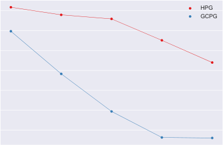

Published as a conference paper at ICLR 2019

E.3.2 HYPERPARAMETER SENSITIVITY PLOTS (BATCH SIZE 16)

7

6

5

4

3

2

1

0

9

8

7

6

5

4

3

2

1

|Col1|HPG|Col3|
|---|---|---|
||HPG |HPG |
||~~GCPG~~ HPG+B |~~GCPG~~ HPG+B |
||~~GCPG+B~~|~~GCPG+B~~|
||||
||||
||||
||||
||||

|Col1|GCPG HPG+B|Col3|Col4|
|---|---|---|---|
|GCPG+B|GCPG+B|GCPG+B|GCPG+B|
|||||
|||||
|||||
|||||
|||||
|||||

14

12

10

8

6

4

|HPG GCPG HPG+B|Col2|
|---|---|
|GCPG+B|GCPG+B|
|||
|||
|||

hyperparameter setting (best to worst)

Figure 17: Bit flipping ( _k_ = 16).

hyperparameter setting (best to worst)

Figure 19: Four rooms.

hyperparameter setting (best to worst)

Figure 21: FetchPush.

4

3

2

1

0

20.0

17.5

15.0

12.5

10.0

7.5

5.0

2.5

hyperparameter setting (best to worst)

Figure 16: Bit flipping ( _k_ = 8).

~~HPG~~

0.0
hyperparameter setting (best to worst)

Figure 18: Empty room.

6.5

6.0

5.5

5.0

4.5

4.0

3.5

hyperparameter setting (best to worst)

Figure 20: Ms. Pac-man.

30

Published as a conference paper at ICLR 2019

E.3.3 LEARNING CURVES (BATCH SIZE 2)

5

4

3

2

20 40 60 80 100

evaluation step

Figure 22: Bit flipping ( _k_ = 8).

20

15

10

5

20 40 60 80 100

evaluation step

Figure 24: Empty room.

10

8

6

4

2

20 40 60 80 100

evaluation step

Figure 26: Ms. Pac-man.

8

6

4

2

0

10

8

6

4

2

12

10

8

6

4

20 40 60 80 100

evaluation step

Figure 23: Bit flipping ( _k_ = 16).

20 40 60 80 100

evaluation step

Figure 25: Four rooms.

20 40 60 80 100

evaluation step

Figure 27: FetchPush.

31

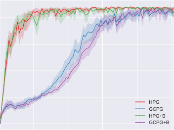

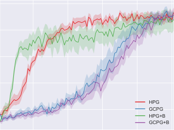

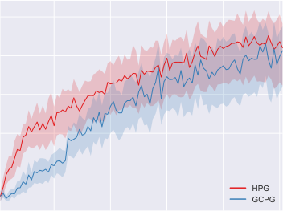

Published as a conference paper at ICLR 2019

E.3.4 LEARNING CURVES (BATCH SIZE 16)

5

4

3

2

20 40 60 80 100

evaluation step

Figure 28: Bit flipping ( _k_ = 8).

20

15

10

0

20 40 60 80 100

evaluation step

Figure 30: Empty room.

10

8

6

4

2

0

20 40 60 80 100

evaluation step

Figure 32: Ms. Pac-man.

E.3.5 AVERAGE PERFORMANCE RESULTS

8

6

4

2

0

10

8

6

4

2

18

16

14

12

10

8

6

4

2

20 40 60 80 100

evaluation step

Figure 29: Bit flipping ( _k_ = 16).

20 40 60 80 100

evaluation step

Figure 31: Four rooms.

20 40 60 80 100

evaluation step

Figure 33: FetchPush.

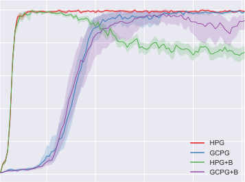

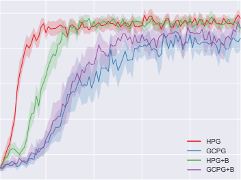

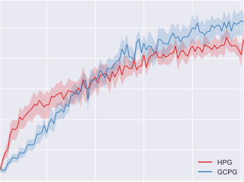

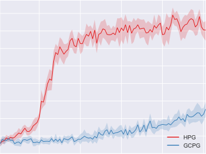

Table 3 presents average performance results for every combination of environment and batch size.

32

Published as a conference paper at ICLR 2019

Table 3: Definitive average performance results

Bit flipping (8 bits) Bit flipping (16 bits)

Batch size 2 Batch size 16 Batch size 2 Batch size 16

HPG **4** _._ **60** _±_ **0** _._ **06** **4** _._ **72** _±_ **0** _._ **02** **7** _._ **11** _±_ **0** _._ **12** **7** _._ **39** _±_ **0** _._ **24**

GCPG 1 _._ 81 _±_ 0 _._ 61 3 _._ 44 _±_ 0 _._ 30 0 _._ 00 _±_ 0 _._ 00 0 _._ 00 _±_ 0 _._ 00

HPG+B 3 _._ 40 _±_ 0 _._ 46 4 _._ 04 _±_ 0 _._ 10 5 _._ 35 _±_ 0 _._ 40 6 _._ 09 _±_ 0 _._ 29

GCPG+B 0 _._ 64 _±_ 0 _._ 58 3 _._ 31 _±_ 0 _._ 58 0 _._ 00 _±_ 0 _._ 00 0 _._ 00 _±_ 0 _._ 00

Empty room Four rooms

Batch size 2 Batch size 16 Batch size 2 Batch size 16

HPG **20** _._ **22** _±_ **0** _._ **37** 16 _._ 83 _±_ 0 _._ 84 **7** _._ **38** _±_ **0** _._ **16** **8** _._ **75** _±_ **0** _._ **12**

GCPG 12 _._ 54 _±_ 1 _._ 01 10 _._ 96 _±_ 1 _._ 24 4 _._ 64 _±_ 0 _._ 57 6 _._ 12 _±_ 0 _._ 54

HPG+B 19 _._ 90 _±_ 0 _._ 29 **17** _._ **12** _±_ **0** _._ **44** 7 _._ 28 _±_ 1 _._ 28 8 _._ 08 _±_ 0 _._ 18

GCPG+B 12 _._ 69 _±_ 1 _._ 16 10 _._ 68 _±_ 1 _._ 36 4 _._ 26 _±_ 0 _._ 55 6 _._ 61 _±_ 0 _._ 49

Ms. Pac-man FetchPush

Batch size 2 Batch size 16 Batch size 2 Batch size 16

HPG **6** _._ **58** _±_ **1** _._ **96** 6 _._ 80 _±_ 0 _._ 64 **6** _._ **10** _±_ **0** _._ **34** **13** _._ **15** _±_ **0** _._ **40**

GCPG 5 _._ 29 _±_ 1 _._ 67 **6** _._ **92** _±_ **0** _._ **58** 3 _._ 48 _±_ 0 _._ 15 4 _._ 42 _±_ 0 _._ 28

33

Published as a conference paper at ICLR 2019

E.3.6 LIKELIHOOD RATIO PLOTS

This appendix presents a study of the _active_ (normalized) likelihood ratios computed by agents during
training. A likelihood ratio is considered active if and only if it multiplies a non-zero reward (see
Expression 12). Note that only these likelihood ratios affect gradient estimates based on HPG.

This study is conveyed through plots that encode the distribution of active likelihood ratios computed
during training, individually for each time step within an episode. Each plot corresponds to an agent
that employs HPG and obtains the highest definitive average performance for a given environment
(Figs. 34-39). Note that the length of the largest bar for a given time step is fixed to aid visualization.

The most important insight provided by these plots is that likelihood ratios behave very differently
across environments, even for equivalent time steps (for instance, compare bit flipping environments
to grid world environments). In contrast, after the first time step, the behavior of likelihood ratios
changes slowly across time steps within the same environment. In any case, alternative goals have a
significant effect on gradient estimates, which agrees with the results presented in Section 6.

1.0

0.8

0.6

0.4

0.2

0.0

1 2 3 4 5 6 7 8
time step

Figure 34: Bit flipping ( _k_ = 8, batch size 16).

1.0

0.8

0.6

0.4

0.2

0.0

1 3 5 7 9 11 13 16
time step

Figure 35: Bit flipping ( _k_ = 16, batch size 16).

1.0

0.8

0.6

0.4

0.2

0.0

1 5 9 13 18 22 26 31
time step

Figure 36: Empty room (batch size 16).

34

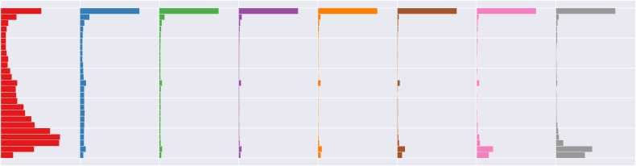

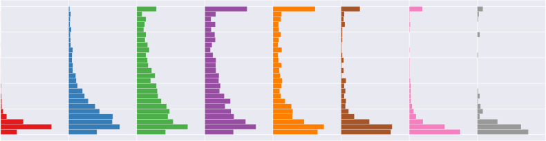

Published as a conference paper at ICLR 2019

1.0

0.8

0.6

0.4

0.2

0.0

1 5 9 13 18 22 26 31
time step

Figure 37: Four rooms (batch size 16).

1.0

0.8

0.6

0.4

0.2

0.0

1 4 8 12 15 19 23 27
time step

Figure 38: Ms. Pac-man (batch size 16).

1.0

0.8

0.6

0.4

0.2

0.0

1 7 14 21 28 35 42 49
time step

Figure 39: FetchPush (batch size 16).

35

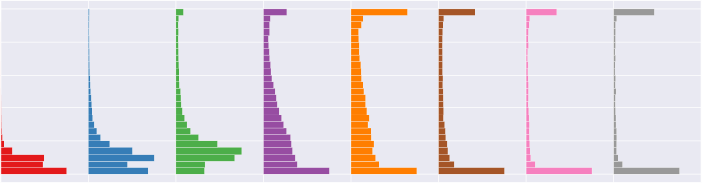

Published as a conference paper at ICLR 2019

E.3.7 HINDSIGHT EXPERIENCE REPLAY

This appendix documents an empirical comparison between goal-conditional policy gradients
(GCPG), hindsight policy gradients (HPG), deep Q-networks (Mnih et al., 2015, DQN), and a
combination of DQN and hindsight experience replay (Andrychowicz et al., 2017, DQN+HER).

**Experience replay.** Our implementations of both DQN and DQN+HER are based on OpenAI
Baselines (Dhariwal et al., 2017), and use mostly the same hyperparameters that Andrychowicz et al.
(2017) used in their experiments on environments with discrete action spaces, all of which resemble
our bit flipping environments. The only notable differences in our implementations are the lack of
both Polyak-averaging and temporal difference target clipping.

Concretely, a _cycle_ begins when an agent collects a number of episodes (16) by following an _ϵ_ -greedy
policy derived from its deep Q-network ( _ϵ_ = 0 _._ 2). The corresponding transitions are included in a
replay buffer, which contains at most 10 [6] transitions. In the case of DQN+HER, hindsight transitions
derived from a _final_ strategy are also included in this replay buffer. Completing the cycle, for a total of
40 different batches, a batch composed of 128 transitions chosen at random from the replay buffer is
used to define a loss function and allow one step of gradient-based minimization. The targets required
to define these loss functions are computed using a copy of the deep Q-network from the start of the
corresponding cycle. Parameters are updated using Adam (Kingma & Ba, 2014). A discount factor
of _γ_ = 0 _._ 98 is used, and seems necessary to improve the stability of both DQN and DQN+HER.

**Network architectures.** In every experiment, the deep Q-network is implemented by a feedforward
neural network with a linear output neuron corresponding to each action. The input to such a network
is a triple composed of state, goal, and time step. The network architectures are the same as those
described in Appendix E.1, except that every weight is initially set using variance scaling (Glorot &
Bengio, 2010), and all hidden layers use rectified linear units (Nair & Hinton, 2010). For the Ms.
Pac-man environment, the time step information is concatenated with the flattened output of the last
convolutional layer (together with the goal information). In comparison to the architecture employed
by Andrychowicz et al. (2017) for environments with discrete action spaces, our architectures have
one or two additional hidden layers (besides the convolutional architecture used for Ms. Pac-man).

**Experimental protocol.** The experimental protocol employed in our comparison is very similar to
the one described in Section 6. Each agent is evaluated periodically, after a number of cycles that
depends on the environment. During this evaluation, the agent collects a number of episodes by
following a greedy policy derived from its deep Q-network.

For each environment, grid search is used to select the learning rates for both DQN and DQN+HER
according to average performance scores (after the corresponding standard deviation across runs
is subtracted, as in Section 6). The candidate sets of learning rates are the following. Bit flipping
and grid world environments: _{α ×_ 10 _[−][k]_ _| α ∈{_ 1 _,_ 5 _}_ and _k ∈{_ 2 _,_ 3 _,_ 4 _,_ 5 _}}_, FetchPush: _{_ 10 _[−]_ [2] _,_ 5 _×_
10 _[−]_ [3] _,_ 10 _[−]_ [3] _,_ 5 _×_ 10 _[−]_ [4] _,_ 10 _[−]_ [4] _}_, Ms. Pac-man: _{_ 10 _[−]_ [3] _,_ 5 _×_ 10 _[−]_ [4] _,_ 10 _[−]_ [4] _,_ 5 _×_ 10 _[−]_ [5] _,_ 10 _[−]_ [5] _}_ . These sets
were carefully chosen such that the best performing learning rates do not lie on their extrema.

Definitive results for a given environment are obtained by using the best hyperparameters found for
each method in additional runs. These definitive results are directly comparable to our previous results
for GCPG and HPG (batch size 16), since every method will have interacted with the environment
for the same number of episodes before each evaluation step. For each environment, the number of
runs, the number of training batches (cycles), the number of batches (cycles) between evaluations,
and the number of episodes per evaluation step are the same as those listed in Tables 1 and 2.

**Results.** The definitive results for the different environments are represented by learning curves
(Figs. 40-45, Pg. 38). In the bit flipping environment for _k_ = 8 (Figure 40), HPG and DQN+HER
lead to equivalent sample efficiency, while GCPG lags far behind and DQN is completely unable
to learn. In the bit flipping environment for _k_ = 16 (Figure 41), HPG surpasses DQN+HER in
sample efficiency by a small margin, while both GCPG and DQN are completely unable to learn.
In the empty room environment (Figure 42), HPG is arguably the most sample efficient method,
although DQN+HER is more stable upon obtaining a good policy. GCPG eventually obtains a good
policy, whereas DQN exhibits instability. In the four rooms environment (Figure 43), DQN+HER
outperforms all other methods by a large margin. Although DQN takes much longer to obtain good

36

Published as a conference paper at ICLR 2019

policies, it would likely surpass both HPG and GCPG given additional training cycles. In the Ms.
Pac-man environment (Figure 44), DQN+HER once again outperforms all other methods, which
achieve equivalent sample efficiency (although DQN appears unstable by the end of training). In
the FetchPush environment (Figure 45), HPG dramatically outperforms all other methods. Both
DQN+HER and DQN are completely unable to learn, while GCPG appears to start learning by the end
of the training process. Note that active goals are harshly subsampled to increase the computational
efficiency of HPG for both Ms. Pac-man and FetchPush (see Sec. 6.3 and Sec. 6.4).

**Discussion.** Our results suggest that the decision between applying HPG or DQN+HER in a
particular sparse-reward environment requires experimentation. In contrast, the decision to apply
hindsight was always successful.

Note that we have not employed heuristics that are known to sometimes increase the performance of
policy gradient methods (such as entropy bonuses, reward scaling, learning rate annealing, and simple
statistical baselines) to avoid introducing confounding factors. We believe that such heuristics would
allow both GCPG and HPG to achieve good results in both the four rooms environment and Ms.
Pac-man. Furthermore, whereas hindsight experience replay is directly applicable to state-of-the-art
techniques, our work can probably benefit from being extended to state-of-the-art policy gradient
approaches, which we intend to explore in future work. Similarly, we believe that additional heuristics
and careful hyperparameter settings would allow DQN+HER to achieve good results in the FetchPush
environment. This is evidenced by the fact that Andrychowicz et al. (2017) achieve good results using
the deep deterministic policy gradient (Lillicrap et al., 2016, DDPG) in a similar environment (with a
continuous action space and a different reward function). The empirical comparisons between either
GCPG and HPG or DQN and DQN+HER are comparatively more conclusive, since the similarities
between the methods minimize confounding factors.

Regardless of these empirical results, policy gradient approaches constitute one of the most important
classes of model-free reinforcement learning methods, which by itself warrants studying how they
can benefit from hindsight. Our approach is also complementary to previous work, since it is entirely
possible to combine a critic trained by hindsight experience replay with an actor that employs
hindsight policy gradients. Although hindsight experience replay does not require a correction
analogous to importance sampling, indiscriminately adding hindsight transitions to the replay buffer
is problematic, which has mostly been tackled by heuristics (Andrychowicz et al., 2017, Sec. 4.5). In
contrast, our approach seems to benefit from incorporating all available information about goals at
every update, which also avoids the need for a replay buffer.

37

Published as a conference paper at ICLR 2019

5

4

3

2

0

20 40 60 80 100

evaluation step

Figure 40: Bit flipping ( _k_ = 8).

20

15

10

0

20 40 60 80 100

evaluation step

Figure 42: Empty room.

16

14

12

10

8

6

2

0

20 40 60 80 100

evaluation step

Figure 44: Ms. Pac-man.

8

6

4

2

0

16

14

12

10

8

6

4

2

18

16

14

12

10

8

6

4

2

20 40 60 80 100

evaluation step

Figure 41: Bit flipping ( _k_ = 16).

20 40 60 80 100

evaluation step

Figure 43: Four rooms.

20 40 60 80 100

evaluation step

Figure 45: FetchPush.

38

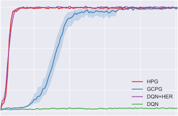

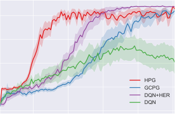

