Published as a conference paper at ICLR 2018

## T EMPORAL D IFFERENCE M ODELS :

### M ODEL -F REE D EEP RL FOR M ODEL -B ASED C ONTROL

**Vitchyr Pong** _[∗]_
University of California, Berkeley
vitchyr@berkeley.edu

**Murtaza Dalal**
University of California, Berkeley
mdalal@berkeley.edu

**Shixiang Gu** _[∗]_
University of Cambridge
Max Planck Institute
Google Brain
sg717@cam.ac.uk

**Sergey Levine**
University of California, Berkeley
svlevine@eecs.berkeley.edu

A BSTRACT

Model-free reinforcement learning (RL) is a powerful, general tool for learning
complex behaviors. However, its sample efficiency is often impractically large for
solving challenging real-world problems, even with off-policy algorithms such as
Q-learning. A limiting factor in classic model-free RL is that the learning signal
consists only of scalar rewards, ignoring much of the rich information contained
in state transition tuples. Model-based RL uses this information, by training a
predictive model, but often does not achieve the same asymptotic performance
as model-free RL due to model bias. We introduce temporal difference models
(TDMs), a family of goal-conditioned value functions that can be trained with
model-free learning and used for model-based control. TDMs combine the benefits of model-free and model-based RL: they leverage the rich information in state
transitions to learn very efficiently, while still attaining asymptotic performance
that exceeds that of direct model-based RL methods. Our experimental results
show that, on a range of continuous control tasks, TDMs provide a substantial improvement in efficiency compared to state-of-the-art model-based and model-free
methods.

1 I NTRODUCTION

Reinforcement learning (RL) algorithms provide a formalism for autonomous learning of complex behaviors. When combined with rich function approximators such as deep neural networks,
RL can provide impressive results on tasks ranging from playing games (Mnih et al., 2015; Silver
et al., 2016), to flying and driving (Lillicrap et al., 2015; Zhang et al., 2016), to controlling robotic
arms (Levine et al., 2016; Gu et al., 2017). However, these deep RL algorithms often require a large
amount of experience to arrive at an effective solution, which can severely limit their application to
real-world problems where this experience might need to be gathered directly on a real physical system. Part of the reason for this is that direct, model-free RL learns only from the reward: experience
that receives no reward provides minimal supervision to the learner.

In contrast, model-based RL algorithms obtain a large amount of supervision from every sample,
since they can use each sample to better learn how to predict the system dynamics – that is, to
learn the “physics” of the problem. Once the dynamics are learned, near-optimal behavior can
in principle be obtained by planning through these dynamics. Model-based algorithms tend to be
substantially more efficient (Deisenroth et al., 2013; Nagabandi et al., 2017), but often at the cost
of larger asymptotic bias: when the dynamics cannot be learned perfectly, as is the case for most
complex problems, the final policy can be highly suboptimal. Therefore, conventional wisdom
holds that model-free methods are less efficient but achieve the best asymptotic performance, while
model-based methods are more efficient but do not produce policies that are as optimal.

_∗_ denotes equal contribution

1

Published as a conference paper at ICLR 2018

Can we devise methods that retain the efficiency of model-based learning while still achieving the
asymptotic performance of model-free learning? This is the question that we study in this paper. The
search for methods that combine the best of model-based and model-free learning has been ongoing
for decades, with techniques such as synthetic experience generation (Sutton, 1990), partial modelbased backpropagation (Nguyen & Widrow, 1990; Heess et al., 2015), and layering model-free
learning on the residuals of model-based estimation (Chebotar et al., 2017) being a few examples.
However, a direct connection between model-free and model-based RL has remained elusive. By
effectively bridging the gap between model-free and model-based RL, we should be able to smoothly
transition from learning models to learning policies, obtaining rich supervision from every sample
to quickly gain a moderate level of proficiency, while still converging to an unbiased solution.

To arrive at a method that combines the strengths of model-free and model-based RL, we study a
variant of goal-conditioned value functions (Sutton et al., 2011; Schaul et al., 2015; Andrychowicz
et al., 2017). Goal-conditioned value functions learn to predict the value function for every possible
goal state. That is, they answer the following question: what is the expected reward for reaching
a particular state, given that the agent is attempting (as optimally as possible) to reach it? The
particular choice of reward function determines what such a method actually does, but rewards based
on distances to a goal hint at a connection to model-based learning: if we can predict how easy it is
to reach any state from any current state, we must have some kind of understanding of the underlying
“physics.” In this work, we show that we can develop a method for learning variable-horizon goalconditioned value functions where, for a specific choice of reward and horizon, the value function
corresponds directly to a model, while for larger horizons, it more closely resembles model-free
approaches. Extension toward more model-free learning is thus achieved by acquiring “multi-step
models” that can be used to plan over progressively coarser temporal resolutions, eventually arriving
at a fully model-free formulation.

The principle contribution of our work is a new RL algorithm that makes use of this connection
between model-based and model-free learning to learn a specific type of goal-conditioned value
function, which we call a temporal difference model (TDM). This value function can be learned
very efficiently, with sample complexities that are competitive with model-based RL, and can then be
used with an MPC-like method to accomplish desired tasks. Our empirical experiments demonstrate
that this method achieves substantially better sample complexity than fully model-free learning on
a range of challenging continuous control tasks, while outperforming purely model-based methods
in terms of final performance. Furthermore, the connection that our method elucidates between
model-based and model-free learning may lead to a range of interesting future methods.

2 P RELIMINARIES

In this section, we introduce the reinforcement learning (RL) formalism, temporal difference Qlearning methods, model-based RL methods, and goal-conditioned value functions. We will build
on these components to develop temporal difference models (TDMs) in the next section. RL deals
with decision making problems that consist of a state space _S_, action space _A_, transition dynamics
_P_ ( _s_ _[′]_ _| s, a_ ), and an initial state distribution _p_ 0 . The goal of the learner is encapsulated by a reward
function _r_ ( _s, a, s_ _[′]_ ). Typically, long or infinite horizon tasks also employ a discount factor _γ_, and
the standard objective is to find a policy _π_ ( _a | s_ ) that maximizes the expected discounted sum of
rewards, E _π_ [ [�] _t_ _[γ]_ _[t]_ _[r]_ [(] _[s]_ _[t]_ _[, a]_ _[t]_ _[, s]_ _[t]_ [+1] [)]][, where] _[ s]_ [0] _[ ∼]_ _[p]_ [0] [,] _[ a]_ _[t]_ _[ ∼]_ _[π]_ [(] _[a]_ _[t]_ _[|][s]_ _[t]_ [)][, and] _[ s]_ _[t]_ [+1] _[ ∼]_ _[P]_ [(] _[s]_ _[′]_ _[ |][ s, a]_ [)][.]

**Q-functions.** We will focus on RL algorithms that learn a Q-function. The Q-function represents
the expected total (discounted) reward that can be obtained by the optimal policy after taking action
_a_ _t_ in state _s_ _t_, and can be defined recursively as following:

_Q_ ( _s_ _t_ _, a_ _t_ ) = E _p_ ( _s_ _t_ +1 _|s_ _t_ _,a_ _t_ ) [ _r_ ( _s_ _t_ _, a_ _t_ _, s_ _t_ +1 ) + _γ_ max _a_ _Q_ ( _s_ _t_ +1 _, a_ )] _._ (1)

The optimal policy can then recovered according to _π_ ( _a_ _t_ _|s_ _t_ ) = _δ_ ( _a_ _t_ = arg max _a_ _Q_ ( _s_ _t_ _, a_ )). Qlearning algorithms (Watkins & Dayan, 1992; Riedmiller, 2005) learn the Q-function via an offpolicy stochastic gradient descent algorithm, estimating the expectation in the above equation with
samples collected from the environment and computing its gradient. Q-learning methods can use
transition tuples ( _s_ _t_ _, a_ _t_ _, s_ _t_ +1 _, r_ _t_ ) collected from any exploration policy, which generally makes them
more efficient than direct policy search, though still less efficient than purely model-based methods.

2

Published as a conference paper at ICLR 2018

**Model-based RL and optimal control.** Model-based RL takes a different approach to maximize
the expected reward. In model-based RL, the aim is to train a model of the form _f_ ( _s_ _t_ _, a_ _t_ ) to predict
the next state _s_ _t_ +1 . Once trained, this model can be used to choose actions, either by backpropagating reward gradients into a policy, or planning directly through the model. In the latter case,
a particularly effective method for employing a learned model is model-predictive control (MPC),
where a new action plan is generated at each time step, and the first action of that plan is executed,
before replanning begins from scratch. MPC can be formalized as the following optimization problem:

_a_ _t_ = argmax

_a_ _t_ : _t_ + _T_

_t_ + _T_
� _r_ ( _s_ _i_ _, a_ _i_ ) where _s_ _i_ +1 = _f_ ( _s_ _i_ _, a_ _i_ ) _∀_ _i ∈{t, ..., t_ + _T −_ 1 _}._ (2)

_i_ = _t_

We can also write the dynamics constraint in the above equation in terms of an implicit dynamics,
according to

_a_ _t_ = argmax

_a_ _t_ : _t_ + _T_ _,s_ _t_ +1: _t_ + _T_

_t_ + _T_
� _r_ ( _s_ _i_ _, a_ _i_ ) such that _C_ ( _s_ _i_ _, a_ _i_ _, s_ _i_ +1 ) = 0 _∀_ _i ∈{t, ..., t_ + _T −_ 1 _},_ (3)

_i_ = _t_

where _C_ ( _s_ _i_ _, a_ _i_ _, s_ _i_ +1 ) = 0 if and only if _s_ _i_ +1 = _f_ ( _s_ _i_ _, a_ _i_ ). This implicit version will be important in
understanding the connection between model-based and model-free RL.

**Goal-conditioned value functions.** Q-functions trained for a specific reward are specific to the
corresponding task, and learning a new task requires optimizing an entirely new Q-function. Goalconditioned value functions address this limitation by conditioning the Q-value on some task description vector _s_ _g_ _∈G_ in a goal space _G_ . This goal vector induces a parameterized reward
_r_ ( _s_ _t_ _, a_ _t_ _, s_ _t_ +1 _, s_ _g_ ), which in turn gives rise to parameterized Q-functions of the form _Q_ ( _s, a, s_ _g_ ).
A number of goal-conditioned value function methods have been proposed in the literature, such as
universal value functions (Schaul et al., 2015) and Horde (Sutton et al., 2011). When the goal corresponds to an entire state, such goal-conditioned value functions usually predict how well an agent
can reach a particular state, _when it is trying to reach it_ . The knowledge contained in such a value
function is intriguingly close to a model: knowing how well you can reach any state is closely related to understanding the physics of the environment. With Q-learning, these value functions can be
learned for any goal _s_ _g_ using the same off-policy ( _s_ _t_ _, a_ _t_ _, s_ _t_ +1 ) tuples. Relabeling previously visited
states with the reward for any goal leads to a natural data augmentation strategy, since each tuple can
be replicated many times for many different goals without additional data collection. Andrychowicz et al. (2017) used this property to produce an effective curriculum for solving multi-goal task
with delayed rewards. As we discuss below, relabeling past experience with different goals enables
goal-conditioned value functions to learn much more quickly from the same amount of data.

3 T EMPORAL D IFFERENCE M ODEL L EARNING

In this section, we introduce a type of goal-conditioned value functions called temporal difference
models (TDMs) that provide a direct connection to model-based RL. We will first motivate this connection by relating the model-based MPC optimizations in Equations (2) and (3) to goal-conditioned
value functions, and then present our temporal difference model derivation, which extends this connection from a purely model-based setting into one that becomes increasingly model-free.

3.1 F ROM G OAL -C ONDITIONED V ALUE F UNCTIONS TO M ODELS

Let us consider the choice of reward function for the goal conditioned value function. Although
a variety of options have been explored in the literature (Sutton et al., 2011; Schaul et al., 2015;
Andrychowicz et al., 2017), a particularly intriguing connection to model-based RL emerges if we
set _G_ = _S_, such that _g ∈G_ corresponds to a _goal state s_ _g_ _∈S_, and we consider distance-based
reward functions _r_ _d_ of the following form:

_r_ _d_ ( _s_ _t_ _, a_ _t_ _, s_ _t_ +1 _, s_ _g_ ) = _−D_ ( _s_ _t_ +1 _, s_ _g_ ) _,_

where _D_ ( _s_ _t_ +1 _, s_ _g_ ) is a distance, such as the Euclidean distance _D_ ( _s_ _t_ +1 _, s_ _g_ ) = _∥s_ _t_ +1 _−_ _s_ _g_ _∥_ 2 . If
_γ_ = 0, we have _Q_ ( _s_ _t_ _, a_ _t_ _, s_ _g_ ) = _−D_ ( _s_ _t_ +1 _, s_ _g_ ) at convergence of Q-learning, which means that

3

Published as a conference paper at ICLR 2018

_Q_ ( _s_ _t_ _, a_ _t_ _, s_ _g_ ) = 0 implies that _s_ _t_ +1 = _s_ _g_ . Plug this Q-function into the model-based planning
optimization in Equation (3), denoting the task control reward as _r_ _c_, such that the solution to

_a_ _t_ = argmax

_a_ _t_ : _t_ + _T_ _,s_ _t_ +1: _t_ + _T_

_t_ + _T_
� _r_ _c_ ( _s_ _i_ _, a_ _i_ ) such that _Q_ ( _s_ _i_ _, a_ _i_ _, s_ _i_ +1 ) = 0 _∀_ _i ∈{t, ..., t_ + _T −_ 1 _}_ (4)

_i_ = _t_

yields a model-based plan. We have now derived a precise connection between model-free and
model-based RL, in that model-free learning of goal-conditioned value functions can be used to
directly produce an implicit model that can be used with MPC-based planning. However, this connection by itself is not very useful: the resulting implicit model is fully model-based, and does
not provide any kind of long-horizon capability. In the next section, we show how to extend this
connection into the long-horizon setting by introducing the temporal difference model (TDM).

3.2 L ONG -H ORIZON L EARNING WITH T EMPORAL D IFFERENCE M ODELS

If we consider the case where _γ >_ 0, the optimization in Equation (4) no longer corresponds to any
optimal control method. In fact, when _γ_ = 0, Q-values have well-defined units: units of distance
between states. For _γ >_ 0, no such interpretation is possible. The key insight in temporal difference models is to introduce a different mechanism for aggregating long-horizon rewards. Instead
of evaluating Q-values as discounted sums of rewards, we introduce an additional input _τ_, which
represents the planning horizon, and define the Q-learning recursion as
_Q_ ( _s_ _t_ _, a_ _t_ _, s_ _g_ _, τ_ ) = E _p_ ( _s_ _t_ +1 _|s_ _t_ _,a_ _t_ ) [ _−D_ ( _s_ _t_ +1 _, s_ _g_ ) 1 [ _τ_ =0] + max _a_ _Q_ ( _s_ _t_ +1 _, a, s_ _g_ _, τ −_ 1) 1 [ _τ ̸_ =0]] _._ (5)

The Q-function uses a reward of _−D_ ( _s_ _t_ +1 _, s_ _g_ ) when _τ_ = 0 (at which point the episode terminates),
and decrements _τ_ by one at every other step. Since this is still a well-defined Q-learning recursion,
it can be optimized with off-policy data and, just as with goal-conditioned value functions, we can
resample new goals _s_ _g_ and new horizons _τ_ for each tuple ( _s_ _t_ _, a_ _t_ _, s_ _t_ +1 ), even ones that were not
actually used when the data was collected. In this way, the TDM can be trained very efficiently,
since every tuple provides supervision for every possible goal and every possible horizon.

The intuitive interpretation of the TDM is that it tells us how close the agent will get to a given
goal state _s_ _g_ after _τ_ time steps, _when it is attempting to reach that state in τ steps_ . Alternatively,
TDMs can be interpreted as Q-values in a finite-horizon MDP, where the horizon is determined by
_τ_ . For the case where _τ_ = 0, TDMs effectively learn a model, allowing TDMs to be incorporated
into a variety of planning and optimal control schemes at test time as in Equation (4). Thus, we can
view TDM learning as an interpolation between model-based and model-free learning, where _τ_ = 0
corresponds to the single-step prediction made in model-based learning and _τ >_ 0 corresponds
to the long-term prediction made by typical Q-functions. While the correspondence to models is
not the same for _τ >_ 0, if we only care about the reward at every _K_ step, then we can recover a
correspondence by replace Equation (4) with

� _r_ _c_ ( _s_ _i_ _, a_ _i_ )

_i_ = _t,t_ + _K,...,t_ + _T_

_a_ _t_ = argmax

_a_ _t_ : _K_ : _t_ + _T_ _,s_ _t_ + _K_ : _K_ : _t_ + _T_

�

_a_ _t_ : _K_ : _t_ + _T_ _,s_ _t_ + _K_ : _K_ : _t_ + _T_ _i_ = _t,t_ + _K,...,t_ + _T_ (6)

such that _Q_ ( _s_ _i_ _, a_ _i_ _, s_ _i_ + _K_ _, K −_ 1) = 0 _∀_ _i ∈{t, t_ + _K, ..., t_ + _T −_ _K},_

where we only optimize over every _K_ [th] state and action. As the TDM becomes effective for longer
horizons, we can increase _K_ until _K_ = _T_, and plan over only a single effective time step:
_a_ _t_ = argmax _r_ _c_ ( _s_ _t_ + _T_ _, a_ _t_ + _T_ ) such that _Q_ ( _s_ _t_ _, a_ _t_ _, s_ _t_ + _T_ _, T −_ 1) = 0 _._ (7)
_a_ _t_ _,a_ _t_ + _T_ _,s_ _t_ + _T_

This formulation does result in some loss of generality, since we no longer optimize the reward at
the intermediate steps. This limits the multi-step formulation to terminal reward problems, but does
allow us to accommodate arbitrary reward functions on the terminal state _s_ _t_ + _T_, which still describes
a broad range of practically relevant tasks. In the next section, we describe how TDMs can be
implemented and used in practice for continuous state and action spaces.

4 T RAINING AND U SING T EMPORAL D IFFERENCE M ODELS

The TDM can be trained with any off-policy Q-learning algorithm, such as DQN (Mnih et al.,
2015), DDPG (Lillicrap et al., 2015), NAF (Gu et al., 2016), and SDQN (Metz et al., 2017). During off-policy Q-learning, TDMs can benefit from arbitrary relabeling of the goal states _g_ and the

4

Published as a conference paper at ICLR 2018

horizon _τ_, given the same ( _s_ _t_ _, a_ _t_ _, s_ _t_ +1 ) tuples from the behavioral policy as done in (Andrychowicz et al., 2017). This relabeling enables simultaneous, data-efficient learning of short-horizon and
long-horizon behaviors for arbitrary goal states, unlike previously proposed goal-conditioned value
functions that only learn for a single time scale, typically determined by a discount factor (Schaul
et al., 2015; Andrychowicz et al., 2017). In this section, we describe the design decisions needed to
make practical a TDM algorithm.

4.1 R EWARD F UNCTION S PECIFICATION

Q-learning typically optimizes scalar rewards, but TDMs enable us to increase the amount of supervision available to the Q-function by using a vector-valued reward. Specifically, if the distance
_D_ ( _s, s_ _g_ ) factors additively over the dimensions, we can train a vector-valued Q-function that predicts per-dimension distance, with the reward function for dimension _j_ given by _−D_ _j_ ( _s_ _j_ _, s_ _g,j_ ). We
use the _ℓ_ 1 norm in our implementation, which corresponds to absolute value reward _−|s_ _j_ _−_ _s_ _g,j_ _|_ .
The resulting vector-valued Q-function can learn distances along each dimension separately, providing it with more supervision from each training point. Empirically, we found that this modifications
provides a substantial boost in sample efficiency.

We can optionally make an improvement to TDMs if we know that the task reward _r_ _c_ depends only
on some subset of the state or, more generally, state features. In that case, we can train the TDM to
predict distances along only those dimensions or features that are used by _r_ _c_, which in practice can
substantially simplify the corresponding prediction problem. In our experiments, we illustrate this
property by training TDMs for pushing tasks that predict distances from an end-effector and pushed
object, without accounting for internal joints of the arm, and similarly for various locomotion tasks.

4.2 P OLICY E XTRACTION WITH TDM S

While the TDM optimal control formulation Equation (7) drastically reduces the number of states
and actions to be optimized for long-term planning, it requires solving a constrained optimization problem, which is more computationally expensive than unconstrained problems. We can
remove the need for a constrained optimization through a specific architectural decision in the design of the function approximator for _Q_ ( _s, a, s_ _g_ _, τ_ ). We define the Q-function as _Q_ ( _s, a, s_ _g_ _, τ_ ) =
_−∥f_ ( _s, a, s_ _g_ _, τ_ ) _−_ _s_ _g_ _∥_, where _f_ ( _s, a, s_ _g_ _, τ_ ) outputs a state vector. By training the TDM with a standard Q-learning method, _f_ ( _s, a, s_ _g_ _, τ_ ) is trained to explicitly predict the state that will be reached
by a policy attempting to reach _s_ _g_ in _τ_ steps. This model can then be used to choose the action with
fully explicit MPC as below, which also allows straightforward derivation of a multi-step version as
in Equation (6).
_a_ _t_ = argmax _r_ _c_ ( _f_ ( _s_ _t_ _, a_ _t_ _, s_ _t_ + _T_ _, T −_ 1) _, a_ _t_ + _T_ ) (8)
_a_ _t_ _,a_ _t_ + _T_ _,s_ _t_ + _T_

In the case where the task is to reach a goal state _s_ _g_, a simpler approach to extract a policy is to use
the TDM directly:
_a_ _t_ = argmax _Q_ ( _s_ _t_ _, a, s_ _g_ _, T_ ) (9)

_a_

In our experiments, we use Equations (8) and (9) to extract a policy.

4.3 A LGORITHM S UMMARY

The algorithm is summarized as Algorithm 1. A crucial difference from prior goal-conditioned value
function methods (Schaul et al., 2015; Andrychowicz et al., 2017) is that our algorithm can be used
to act according to an arbitrary terminal reward function _r_ _c_, both during exploration and at test time.
Like other off-policy algorithms (Mnih et al., 2015; Lillicrap et al., 2015), it consists of exploration
and Q-function fitting. Noise is injected for exploration, and Q-function fitting uses standard Qlearning techniques, with target networks _Q_ _[′]_ and experience replay (Mnih et al., 2015; Lillicrap
et al., 2015). If we view the Q-function fitting as model fitting, the algorithm also resembles iterative
model-based RL, which alternates between collecting data using the learned dynamics model for
planning (Deisenroth & Rasmussen, 2011) and fitting the model. Since we focus on continuous
tasks, we use DDPG (Lillicrap et al., 2015), though any Q-learning method could be used.

The computation cost of the algorithm is mostly determined by the number of updates to fit the
Q-function per transition, _I_ . In general, TDMs can benefit from substantially larger _I_ than classic

5

Published as a conference paper at ICLR 2018

**Algorithm 1** Temporal Difference Model Learning

**Require:** Task reward function _r_ _c_ ( _s, a_ ), parameterized TDM _Q_ _w_ ( _s, a, s_ _g_ _, τ_ ), replay buffer _B_

1: **for** _n_ = 0 _, ..., N −_ 1 episodes **do**
2: _s_ 0 _∼_ _p_ ( _s_ 0 )
3: **for** _t_ = 0 _, ..., T −_ 1 time steps **do**
4: _a_ _[∗]_ _t_ [=][ MPC][(] _[r]_ _c_ _[, s]_ _t_ _[, Q]_ _w_ _[, T][ −]_ _[t]_ [)] // Eq. 6, Eq. 7, Eq. 8, or Eq. 9
5: _a_ _t_ = AddNoise( _a_ _[∗]_ _t_ [)] // Noisy exploration
6: _s_ _t_ +1 _∼_ _p_ ( _s_ _t_ _, a_ _t_ ), and store _{s_ _t_ _, a_ _t_ _, s_ _t_ +1 _}_ in the replay buffer _B_ // Step environment
7: **for** _i_ = 0 _, I −_ 1 iterations **do**
8: Sample _M_ transitions _{s_ _m_ _, a_ _m_ _, s_ _m_ _[′]_ _[}]_ [ from the replay] _[ B]_ [.]
9: Relabel time horizons and goal states _τ_ _m_ _, s_ _g,m_ // Section A.1
10: _y_ _m_ = _−∥s_ _[′]_ _m_ _[−]_ _[s]_ _g,m_ _[∥]_ [1] [[] _[τ]_ _m_ [= 0] + max] _a_ _[Q]_ _[′]_ [(] _[s]_ _[′]_ _m_ _[, a, s]_ _g,m_ _[, τ]_ _m_ _[−]_ [1)] [1] [[] _[τ]_ _m_ _[̸]_ [= 0]]
11: _L_ ( _w_ ) = [�] _m_ [(] _[Q]_ _[w]_ [(] _[s]_ _[m]_ _[, a]_ _[m]_ _[, s]_ _[g,m]_ _[, τ]_ _[m]_ [)] _[ −]_ _[y]_ _[m]_ [)] [2] _[/M]_ // Compute the loss

12: Minimize( _w, L_ ( _w_ )) // Optimize
13: **end for**

14: **end for**

15: **end for**

model-free methods such as DDPG due to relabeling increasing the amount of supervision signals.
In real-world applications such as robotics where we care most of the sample efficiency (Gu et al.,
2017), the learning is often bottlenecked by the data collection rather than the computation, and
therefore large _I_ values are usually not a significant problem and can continuously benefit from the
acceleration in computation.

5 R ELATED W ORK

Combining model-based and model-free reinforcement learning techniques is a well-studied problem, though no single solution has demonstrated all of the benefits of model-based and model-free
learning. Some methods first learn a model and use this model to simulate experience (Sutton, 1990;
Gu et al., 2016) or compute better gradients for model-free updates (Heess et al., 2015; Nguyen &
Widrow, 1990). Other methods use model-free algorithms to correct for the local errors made by the
model (Chebotar et al., 2017; Bansal et al., 2017). While these prior methods focused on combining
different model-based and model-free RL techniques, our method proposes an equivalence between
these two branches of RL through a specific generalization of goal-conditioned value function. As
a result, our approach achieves much better sample efficiency in practice on a variety of challenging reinforcement learning tasks than model-free alternatives, while exceeding the performance of
purely model-based approaches.

We are not the first to study the connection between model-free and model-based methods, with
Boyan (1999) and Parr et al. (2008) being two notable examples. Boyan (1999) shows that one can
extract a model from a value function when using a tabular representation of the transition function.
Parr et al. (2008) shows that, for linear function approximators, the model-free and model-based RL
approaches produce the same value function at convergence. Our contribution differs substantially
from these: we are not aiming to show that model-free RL performs similarly to model-based RL
at convergence, but rather how we can achieve sample complexity comparable to model-based RL
while retaining the favorable asymptotic performance of model-free RL in complex tasks with nonlinear function approximation.

A central component of our method is to train goal-conditioned value functions. Many variants
of goal-conditioned value functions have been proposed in the literature Foster & Dayan (2002);
Sutton et al. (2011); Schaul et al. (2015); Dosovitskiy & Koltun (2016). Critically, unlike the works
on contextual policies (Caruana, 1998; Da Silva et al., 2012; Kober et al., 2012) which require onpolicy trajectories with each new goal, the value function approaches such as Horde (Sutton et al.,
2011) and UVF (Schaul et al., 2015) can reuse off-policy data to learn rich contextual value functions
using the same data.

TDMs condition on a policy trying to reach a goal and must predict _τ_ steps into the future. This type
of prediction is similar to the prediction made by prior work on multi-step models (Mishra et al.,
2017; Venkatraman et al., 2016): predict the state after _τ_ actions. An important difference is that

6

Published as a conference paper at ICLR 2018

multi-step models do not condition on a policy reaching a goal, and so they require optimizing over
a sequence of actions, making the input space grow linearly with the planning horizon.

A particularly related UVF extension is hindsight experience replay (HER) Andrychowicz et al.
(2017). Both HER and our method retroactively relabel past experience with goal states that are
different from the goal aimed for during data collection. However, unlike our method, the standard
UVF in HER uses a single temporal scale when learning, and does not explicitly provide for a
connection between model-based and model-free learning. The practical result of these differences
is that our approach empirically achieves substantially better sample complexity than HER on a
wide range of complex continuous control tasks, while the theoretical connection between modelbased and model-free learning suggests a much more flexible use of the learned Q-function inside a
planning or optimal control framework.

Lastly, our motivation is shared by other lines of work besides goal-conditioned value functions
that aim to enhance supervision signals for model-free RL (Silver et al., 2017; Jaderberg et al.,
2017; Bellemare et al., 2017). Predictions (Silver et al., 2017) augment classic RL with multi-step
reward predictions, while UNREAL (Jaderberg et al., 2017) also augments it with pixel control as a
secondary reward objective. These are substantially different methods from our work, but share the
motivation to achieve efficient RL by increasing the amount of learning signals from finite data.

6 E XPERIMENTS

Our experiments examine how the sample efficiency and performance of TDMs compare to both
model-based and model-free RL algorithms. We expect to have the efficiency of model-based RL
but with less model bias. We also aim to study the importance of several key design decisions
in TDMs, and evaluate the algorithm on a real-world robotic platform. For the model-free comparison, we compare to DDPG (Lillicrap et al., 2015), which typically achieves the best sample
efficiency on benchmark tasks (Duan et al., 2016); HER, which uses goal-conditioned value functions (Andrychowicz et al., 2017); and DDPG with the same sparse rewards of HER. For the modelbased comparison, we compare to the model-based component in Nagabandi et al. (2017), a recent
work that reports highly efficient learning with neural network dynamics models. Details of the
baseline implementations are in the Appendix. We perform the comparison on five simulated tasks:
(1) a 7 DoF arm reaching various random end-effector targets, (2) an arm pushing a puck to a target
location, (3) a planar cheetah attempting to reach a goal velocity (either forward or backward), (4) a
quadrupedal ant attempting to reach a goal position, and (5) an ant attempting to reach a goal position and velocity. The tasks are shown in Figure 1 and terminate when either the goal is reached or
the time horizon is reached. The pushing task requires long-horizon reasoning to reach and push the
puck. The cheetah and ant tasks require handling many contact discontinuities which is challenging
for model-based methods, with the ant environment having particularly difficult dynamics given the
larger state and action space. The ant position and velocity task presents a scenario where reward
shaping as in traditional RL methods may not lead to optimal behavior, since one cannot maintain
both a desired position and velocity. However, such a task can be very valuable in realistic settings.
For example, if we want the ant to jump, we might instruct it to achieve a particular velocity at a
particular location. We also tested TDMs on a real-world robot arm reaching end-effector positions,
to study its applicability to real-world tasks.

For the simulated and real-world 7-DoF arm, our TDM is trained on all state components. For the
pushing task, our TDM is trained on the hand and puck XY-position. For the half cheetah task, our
TDM is trained on the velocity of the cheetah. For the ant tasks, our TDM is trained on either the
position or the position and velocity for the respective task. Full details are in the Appendix.

6.1 TDM S VS M ODEL -F REE, M ODE -B ASED, AND D IRECT G OAL -C ONDITIONED RL

The results are shown in Figure 2. When compared to the model-free baselines, the pure modelbased method learns learns much faster on all the tasks. However, on the harder cheetah and ant
tasks, its final performance is worse due to model bias. TDMs learn as quickly or faster than the
model-based method, but also always learn policies that are as good as if not better than the modelfree policies. Furthermore, TDMs requires fewer samples than the model-free baselines on ant tasks
and drastically fewer samples on the other tasks. We also see that using HER does not lead to

7

Published as a conference paper at ICLR 2018

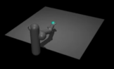

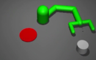

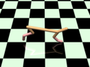

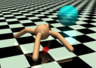

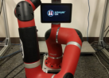

(a) 7-DoF Reacher (b) Pusher (c) Half Cheetah (d) Ant (e) Sawyer Robot

Figure 1: The tasks in our experiments: (a) reaching target locations, (b) pushing a puck to a random
target, (c) training the cheetah to run at target velocities, (d) training an ant to run to a target position
or a target position and velocity, and (e) reaching target locations (real-world Sawyer robot).

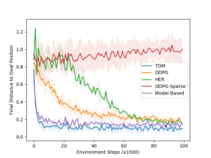

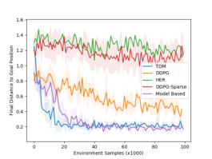

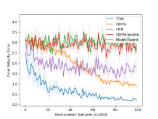

(a) 7-Dof Reacher (b) Pusher (c) Half Cheetah

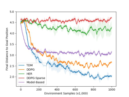

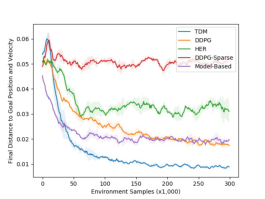

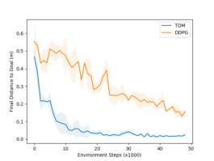

(d) Ant: Position (e) Ant: Position and Velocity (f) Sawyer Robot (Real-world)

Figure 2: The comparison of TDM with model-free (DDPG, both with sparse and dense rewards),
model-based, and goal-conditioned value functions (HER with sparse rewards) methods on various
tasks. All plots show the final distance to the goal versus 1000 environment steps (not rollouts). The
bold line shows the mean across 3 random seeds, and the shaded region show one standard deviation.
Our method, which uses model-free learning, is generally more sample-efficient than model-free
alternatives including DDPG and HER and improves upon the best model-based performance.

an improvement over DDPG. While we were initially surprised, we realized that a selling point of
HER is that it can solve sparse tasks that would otherwise be unsolvable. In this paper, we were
interested in improving the sample efficiency and not the feasibility of model-free reinforcement
learning algorithms, and so we focused on tasks that DDPG could already solve. In these sorts of
tasks, the advantage of HER over DDPG with a dense reward is not expected. To evaluate HER
as a method to solve sparse tasks, we included the DDPG-Sparse baseline and we see that HER
significantly outperforms it as expected. In summary, TDMs converge as fast or faster than modelbased learning (which learns faster than the model-free baselines), while achieving final performance
that is as good or better that the model-free methods on all tasks.

Lastly, we ran the algorithm on a 7-DoF Sawyer robotic arm to learn a real-world analogue of the
reaching task. Figure 2f shows that the algorithm outperforms and learns with fewer samples than
DDPG, our model-free baseline. These results show that TDMs can scale to real-world tasks.

6.2 A BLATION S TUDIES

In this section, we discuss two key design choices for TDMs that provide substantially improved
performance. First, Figure 3a examines the tradeoffs between the vectorized and scalar rewards. The
results show that the vectorized formulation learns substantially faster than the na¨ıve scalar variant.
Second, Figure 3b compares the learning speed for different horizon values _τ_ _max_ . Performance
degrades when the horizon is too low, and learning becomes slower when the horizon is too high.

8

Published as a conference paper at ICLR 2018

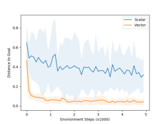

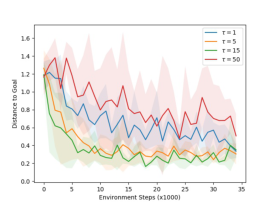

(a) Scalar vs Vectorized TDMs (b) TDMs with different _τ_ _max_

Figure 3: Ablation experiments for (a) scalar vs. vectorized TDMs on 7-DoF simulated reacher task
and (b) different _τ_ _max_ on pusher task. The vectorized variant performs substantially better, while
the horizon effectively interpolates between model-based and model-free learning.

7 C ONCLUSION

In this paper, we derive a connection between model-based and model-free reinforcement learning,
and present a novel RL algorithm that exploits this connection to greatly improve on the sample
efficiency of state-of-the-art model-free deep RL algorithms. Our temporal difference models can
be viewed both as goal-conditioned value functions and implicit dynamics models, which enables
them to be trained efficiently on off-policy data while still minimizing the effects of model bias. As
a result, they achieve asymptotic performance that compares favorably with model-free algorithms,
but with a sample complexity that is comparable to purely model-based methods.

While the experiments focus primarily on the new RL algorithm, the relationship between modelbased and model-free RL explored in this paper provides a number of avenues for future work.
We demonstrated the use of TDMs with a very basic planning approach, but further exploring how
TDMs can be incorporated into powerful constrained optimization methods for model-predictive
control or trajectory optimization is an exciting avenue for future work. Another direction for future
is to further explore how TDMs can be applied to complex state representations, such as images,
where simple distance metrics may no longer be effective. Although direct application of TDMs
to these domains is not straightforward, a number of works have studied how to construct metric
embeddings of images that could in principle provide viable distance functions. We also note that
while the presentation of TDMs have been in the context of deterministic environments, the extension to stochastic environments is straightforward: TDMs would learn to predict the _expected_
distance between the future state and a goal state. Finally, the promise of enabling sample-efficient
learning with the performance of model-free RL and the efficiency of model-based RL is to enable widespread RL application on real-world systems. Many applications in robotics, autonomous
driving and flight, and other control domains could be explored in future work.

8 A CKNOWLEDGMENT

This research was supported by the Office of Naval Research and the National Science Foundation
through IIS-1614653 and IIS-1651843.

R EFERENCES

Marcin Andrychowicz, Filip Wolski, Alex Ray, Jonas Schneider, Rachel Fong, Peter Welinder, Bob
McGrew, Josh Tobin, Pieter Abbeel, and Wojciech Zaremba. Hindsight experience replay. _arXiv_
_preprint arXiv:1707.01495_, 2017.

Somil Bansal, Roberto Calandra, Ted Xiao, Sergey Levine, and Claire J Tomlin. Goal-driven dynamics learning via bayesian optimization. _arXiv preprint arXiv:1703.09260_, 2017.

Marc G Bellemare, Will Dabney, and R´emi Munos. A distributional perspective on reinforcement
learning. _arXiv preprint arXiv:1707.06887_, 2017.

Justin A Boyan. Least-squares temporal difference learning. In _Proceedings of the 16th International_
_Conference on Machine Learning_, pp. 49–56, 1999.

9

Published as a conference paper at ICLR 2018

Greg Brockman, Vicki Cheung, Ludwig Pettersson, Jonas Schneider, John Schulman, Jie Tang, and
Wojciech Zaremba. Openai gym. _arXiv preprint arXiv:1606.01540_, 2016.

Rich Caruana. Multitask learning. In _Learning to learn_, pp. 95–133. Springer, 1998.

Yevgen Chebotar, Karol Hausman, Marvin Zhang, Gaurav Sukhatme, Stefan Schaal, and Sergey
Levine. Combining model-based and model-free updates for trajectory-centric reinforcement
learning. _arXiv preprint arXiv:1703.03078_, 2017.

Bruno Da Silva, George Konidaris, and Andrew Barto. Learning parameterized skills. _arXiv preprint_
_arXiv:1206.6398_, 2012.

Marc Deisenroth and Carl E Rasmussen. Pilco: A model-based and data-efficient approach to policy
search. In _Proceedings of the 28th International Conference on machine learning (ICML-11)_, pp.
465–472, 2011.

Marc Peter Deisenroth, Gerhard Neumann, Jan Peters, et al. A survey on policy search for robotics.
_Foundations and Trends⃝_ R _in Robotics_, 2(1–2):1–142, 2013.

Alexey Dosovitskiy and Vladlen Koltun. Learning to act by predicting the future. _arXiv preprint_
_arXiv:1611.01779_, 2016.

Y. Duan, R. Chen, X. Houthooft, J. Schulman, and P. Abbeel. Benchmarking deep reinforcement
learning for continuous control. In _Proceedings of the 33rd International Conference on Machine_
_Learning (ICML)_, 2016.

David Foster and Peter Dayan. Structure in the space of value functions. _Machine Learning_, 49(2):
325–346, 2002.

Shixiang Gu, Timothy Lillicrap, Ilya Sutskever, and Sergey Levine. Continuous deep q-learning
with model-based acceleration. In _International Conference on Machine Learning_, pp. 2829–
2838, 2016.

Shixiang Gu, Ethan Holly, Timothy Lillicrap, and Sergey Levine. Deep reinforcement learning for
robotic manipulation with asynchronous off-policy updates. In _Robotics and Automation (ICRA),_
_2017 IEEE International Conference on_, pp. 3389–3396. IEEE, 2017.

Nicolas Heess, Greg Wayne, David Silver, Timothy Lillicrap, Yuval Tassa, and Tom Erez. Learning Continuous Control Policies by Stochastic Value Gradients. _arXiv_, pp. 1–13, 2015. ISSN
[10495258. URL http://arxiv.org/abs/1510.09142.](http://arxiv.org/abs/1510.09142)

Max Jaderberg, Volodymyr Mnih, Wojciech Marian Czarnecki, Tom Schaul, Joel Z Leibo, David
Silver, and Koray Kavukcuoglu. Reinforcement learning with unsupervised auxiliary tasks. _In-_
_ternational Conference on Learning Representations_, 2017.

Diederik Kingma and Jimmy Ba. Adam: A method for stochastic optimization. _arXiv preprint_
_arXiv:1412.6980_, 2014.

Jens Kober, Andreas Wilhelm, Erhan Oztop, and Jan Peters. Reinforcement learning to adjust
parametrized motor primitives to new situations. _Autonomous Robots_, 33(4):361–379, 2012.

Sergey Levine, Chelsea Finn, Trevor Darrell, and Pieter Abbeel. End-to-end training of deep visuomotor policies. _Journal of Machine Learning Research_, 17(39):1–40, 2016.

Timothy P Lillicrap, Jonathan J Hunt, Alexander Pritzel, Nicolas Heess, Tom Erez, Yuval Tassa,
David Silver, and Daan Wierstra. Continuous control with deep reinforcement learning. _arXiv_
_preprint arXiv:1509.02971_, 2015.

Luke Metz, Julian Ibarz, Navdeep Jaitly, and James Davidson. Discrete sequential prediction of
continuous actions for deep rl. _arXiv preprint arXiv:1705.05035_, 2017.

Nikhil Mishra, Pieter Abbeel, and Igor Mordatch. Prediction and control with temporal segment
models. 2017.

10

Published as a conference paper at ICLR 2018

Volodymyr Mnih, Koray Kavukcuoglu, David Silver, Andrei A Rusu, Joel Veness, Marc G Bellemare, Alex Graves, Martin Riedmiller, Andreas K Fidjeland, Georg Ostrovski, et al. Human-level
control through deep reinforcement learning. _Nature_, 518(7540):529–533, 2015.

Anusha Nagabandi, Gregory Kahn, Ronald S Fearing, and Sergey Levine. Neural network dynamics for model-based deep reinforcement learning with model-free fine-tuning. _arXiv preprint_
_arXiv:1708.02596_, 2017.

Derrick H Nguyen and Bernard Widrow. Neural networks for self-learning control systems. _IEEE_
_Control systems magazine_, 10(3):18–23, 1990.

Ronald Parr, Lihong Li, Gavin Taylor, Christopher Painter-Wakefield, and Michael L Littman. An
analysis of linear models, linear value-function approximation, and feature selection for reinforcement learning. In _International Conference on Machine learning_, 2008.

Martin Riedmiller. Neural fitted q iteration-first experiences with a data efficient neural reinforcement learning method. In _ECML_, volume 3720, pp. 317–328. Springer, 2005.

Tom Schaul, Daniel Horgan, Karol Gregor, and David Silver. Universal value function approximators. In _Proceedings of the 32nd International Conference on Machine Learning_, pp. 1312–1320,
2015.

David Silver, Aja Huang, Chris J Maddison, Arthur Guez, Laurent Sifre, George Van Den Driessche,
Julian Schrittwieser, Ioannis Antonoglou, Veda Panneershelvam, Marc Lanctot, et al. Mastering
the game of go with deep neural networks and tree search. _Nature_, 529(7587):484–489, 2016.

David Silver, Hado van Hasselt, Matteo Hessel, Tom Schaul, Arthur Guez, Tim Harley, Gabriel
Dulac-Arnold, David Reichert, Neil Rabinowitz, Andre Barreto, et al. The predictron: End-toend learning and planning. _International Conference on Machine Learning_, 2017.

Richard S Sutton. Integrated architectures for learning, planning, and reacting based on approximating dynamic programming. In _Proceedings of the seventh international conference on machine_
_learning_, pp. 216–224, 1990.

Richard S Sutton, Joseph Modayil, Michael Delp, Thomas Degris, Patrick M Pilarski, Adam White,
and Doina Precup. Horde: A scalable real-time architecture for learning knowledge from unsupervised sensorimotor interaction. In _The 10th International Conference on Autonomous Agents and_
_Multiagent Systems-Volume 2_, pp. 761–768. International Foundation for Autonomous Agents
and Multiagent Systems, 2011.

Emanuel Todorov, Tom Erez, and Yuval Tassa. Mujoco: A physics engine for model-based control.
In _Intelligent Robots and Systems (IROS), 2012 IEEE/RSJ International Conference on_, pp. 5026–
5033. IEEE, 2012.

Arun Venkatraman, Roberto Capobianco, Lerrel Pinto, Martial Hebert, Daniele Nardi, and J Andrew
Bagnell. Improved learning of dynamics models for control. In _International Symposium on_
_Experimental Robotics_, 2016.

Christopher JCH Watkins and Peter Dayan. Q-learning. _Machine learning_, 8(3-4):279–292, 1992.

Tianhao Zhang, Gregory Kahn, Sergey Levine, and Pieter Abbeel. Learning deep control policies for
autonomous aerial vehicles with mpc-guided policy search. In _Robotics and Automation (ICRA),_
_2016 IEEE International Conference on_, pp. 528–535. IEEE, 2016.

A E XPERIMENT D ETAILS

In this section, we detail the experimental setups used in our results.

11

Published as a conference paper at ICLR 2018

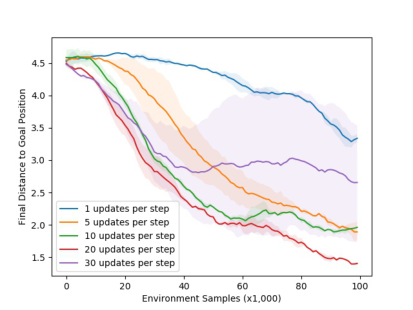

Figure 4: TDMs with different number of updates per step _I_ on ant target position task. The maximum distance was set to 5 rather than 6 for this experiment, so the numbers should be lower than
the ones reported in the paper.

A.1 G OAL S TATE AND _τ_ S AMPLING S TRATEGY

While Q-learning is valid for any value of _s_ _g_ and _τ_ for each transition tuple ( _s_ _t_ _, a_ _t_ _, s_ _t_ +1 ), the way
in which these values are sampled during training can affect learning efficiency. Some potential
strategies for sampling _s_ _g_ are: (1) uniformly sample future states along the actual trajectory in the
buffer (i.e., for _s_ _t_, choose _s_ _g_ = _s_ _t_ + _k_ for a random _k >_ 0) as in (Andrychowicz et al., 2017);
(2) uniformly sample goal states from the replay buffer; (3) uniformly sample goals from a uniform
range of valid states. We found that the first strategy performed slightly better than the others, though
not by much. In our experiments, we use the first strategy. The horizon _τ_ is sampled uniformly at
random between 0 and the maximum horizon _τ_ max .

A.2 M ODEL - FREE SETUP

In all our experiments, we used DDPG (Lillicrap et al., 2015) as the base off-policy model-free RL
algorithm for learning the TDMs _Q_ ( _s, a, g, s_ _τ_ ). Experience replay (Mnih et al., 2015) has size of
1 million transitions, and the soft target networks (Lillicrap et al., 2015) are used with a polyak
averaging coefficient of 0 _._ 999 for DDPG and TDM and 0 _._ 95 for HER and DDPG-Sparse. For HER
and DDPG-Sparse, we also added a penalty on the tanh pre-activation, as in Andrychowicz et al.
(2017). Learning rates of the critic and the actor are chosen from _{_ 1e-4, 1e-3 _}_ and _{_ 1e-4, 1e-3 _}_
respectively. Adam (Kingma & Ba, 2014) is used as the base optimizer with default parameters
except the learning rate. The batch size was 128. The policies and networks are parmaeterized
with neural networks with ReLU hidden activation and two hidden layers of size 300 and 300. The
policies have a tanh output activation, while the critic has no output activation (except for TDM,
see A.5). For the TDM, the goal was concatenated to the observation. The planning horizon _τ_
is also concatenated as an observation and represented as a single integer. While we tried various
representations for _τ_ such as one-hot encodings and binary-string encodings, we found that simply
providing the integer was sufficient.

While any distance metric for the TDM reward function can be used, we chose L1 norm _−∥s_ _t_ +1 _−_
_s_ _g_ _∥_ 1 to ensure that the scalar and vectorized TDMs are consistent.

A.3 M ODEL - BASED SETUP

For the model-based comparison, we trained a neural network dynamics model with ReLU activation, no output activation, and two hidden units of size 300 and 300. The model was trained to
predict the difference in state, rather than the full state. The dynamics model is trained to minimize
the mean squared error between the predicted difference and the actual difference. After each state is
observed, we sample a minibatch of size 128 from the replay buffer (size 1 million) and perform one
step of gradient descent on this mean squared error loss. Twenty rollouts were performed to compute the (per-dimension) mean and standard deviation of the states, actions, and state differences.

12

Published as a conference paper at ICLR 2018

We used these statistics to normalize the states and actions before giving them to the model, and
to normalize the state differences before computing the loss. For MPC, we simulated 512 random
action sequences of length 15 through the learned dynamics model and chose the first action of the
sequence with the highest reward.

A.4 T UNED H YPERPARAMETERS

For TDMs, we found the most important hyperparameters to be the reward scale, _τ_ max, and the
number of updates per observations, _I_ . As shown in Figure 4, TDMs can greatly benefit from larger
values of _I_, though eventually there are diminishing returns and potentially negative impact, mostly
likely due to over-fitting. We found that the baselines did not benefit, except for HER which did
benefit from larger _I_ values. For all the model-free algorithms (DDPG, DDPG-Sparse, HER, and
TDMs), we performed a grid search over the reward scale in the range _{_ 0 _._ 01 _,_ 1 _,_ 100 _,_ 10000 _}_ and the
number of updates per observations in the range _{_ 1 _,_ 5 _,_ 10 _}_ . For HER, we also tuned the weight given
to the policy pre-tanh-activation _{_ 0 _,_ 0 _._ 01 _,_ 1 _}_, which is described in Andrychowicz et al. (2017). For
TDMs, we also tuned the best _τ_ max in the range _{_ 15 _,_ 25 _,_ Horizon _−_ 1 _}_ . For the half cheetah task, we
performed extra searches over _τ_ max and found _τ_ max = 9 to be effective.

A.5 TDM N ETWORK A RCHITECTURE AND V ECTOR - BASED S UPERVISION

For TDMs, since we know that the true Q-function must learn to predict (negative) distances,
we incorporate this prior knowledge into the Q-function by parameterizing it as _Q_ ( _s, a, s_ _g_ _, τ_ ) =
_−∥f_ ( _s, a, s_ _g_ _, τ_ ) _−_ _s_ _g_ _∥_ 1 . Here, _f_ is a vector outputted by a feed-forward neural network and has the
same dimension as the goal. This parameterization ensures that the Q-function outputs non-positive
values, while encouraging the Q-function to learn what we call a goal-conditioned model: _f_ is encouraged to predict what state will be reached after _τ_, when the policy is trying to reach goal _s_ _g_ in
_τ_ time steps.

For the _ℓ_ 1 norm, the scalar supervision regresses

onto

_Q_ ( _s_ _t_ _, a_ _t_ _, s_ _g_ _, τ_ ) = _−_ � _|f_ _j_ ( _s_ _t_ _, a_ _t_ _, s_ _g_ _, τ_ ) _−_ _s_ _g,j_ _|_

_j_

_r_ ( _s_ _t_ _, a_ _t_ _, s_ _t_ +1 _, s_ _g_ ) + 1 [ _τ_ = 0] + _Q_ ( _s_ _t_ +1 _, a_ _[∗]_ _, s_ _g_ _, τ −_ 1) 1 [ _τ ̸_ = 0]

= _−_ � _{|s_ _t_ +1 _,j_ _−_ _s_ _g,j_ _|_ 1 [ _τ_ = 0] + _|f_ _j_ ( _s_ _t_ _, a_ _[∗]_ _, s_ _g_ _, τ −_ 1) _−_ _s_ _g,j_ _|_ 1 [ _τ ̸_ = 0] _}_

_j_

where _a_ _[∗]_ = argmax _a_ _Q_ ( _s_ _t_ +1 _, a, s_ _g_ _, τ −_ 1). The vectorized supervision instead supervises each
components of _f_, so that
_|f_ _j_ ( _s_ _t_ _, a_ _t_ _, s_ _g_ _, τ_ ) _−_ _s_ _g,j_ _|_

regresses onto

_|s_ _t_ +1 _,j_ _−_ _s_ _g,j_ _|_ 1 [ _τ_ = 0] + _|f_ _j_ ( _s_ _t_ _, a_ _[∗]_ _, s_ _g_ _, τ −_ 1) _−_ _s_ _g,j_ _|_ 1 [ _τ ̸_ = 0]

for each dimension _j_ of the state.

A.6 T ASK AND R EWARD D ESCRIPTIONS

Benchmark tasks are designed on MuJoCo physics simulator (Todorov et al., 2012) and OpenAI
Gym environments (Brockman et al., 2016). For the simulated reaching and pushing tasks, we use
(8) and for the other tasks we use (9) for policy extraction. The horizon (length of episode) for the
pusher and ant tasks are 50. The reaching tasks has a horizon of 100. The half-cheetah task has a
horizon of 99.

_7-DoF reacher._ : The state consists of 7 joint angles, 7 joint angular velocities, and 3 XYZ observation of the tip of the arm, making it 17 dimensional. The action controls torques for each joint,
totally 7 dimensional. The reward function during optimization control and for the model-free baseline is the negative Euclidean distance between the XYZ of the tip and the target XYZ. The targets
are sampled randomly from all reachable locations of the arm at the beginning of each episode.

13

Published as a conference paper at ICLR 2018

The robot model is taken from the striker and pusher environments in OpenAI Gym MuJoCo domains (Brockman et al., 2016) and has the same joint limits and physical parameters.

Many tasks can be solved by expressing a desired goal state or desired goal state components. For
example, the 7-Dof reacher solves the task when the end effector XYZ component of its state is
equal to the goal location, ( _x_ _[∗]_ _, y_ _[∗]_ _, z_ _[∗]_ ). One advantage of using a goal-conditioned model _f_ as in
Equation (8) is that this desire can be accounted for directly: if we already know the desired values
of some components in _s_ _t_ + _T_, then wen can simply fix those components of _s_ _t_ + _T_ and optimize over
the other dimensions. For example for the 7-Dof reacher, the optimization problem in Equation (8)
needed to choose an action becomes

_a_ _t_ = argmax _r_ _c_ ( _f_ ( _s_ _t_ _, a_ _t_ _, s_ _t_ + _T_ [0 : 14] _||_ [ _x_ _[∗]_ _, y_ _[∗]_ _, z_ _[∗]_ ]))
_a_ _t_ _,s_ _t_ + _T_ [0:14]

where _||_ denotes concatenation; _s_ _t_ + _T_ [0 : 14] denotes that we only optimize over the first 14 dimensions (the joint angles and velocities), and we omit _a_ _t_ + _T_ since the reward is only a function of the
state. Intuitively, this optimization chooses whatever goal joint angles and joint velocities make it
easiest to reach ( _x_ _[∗]_ _, y_ _[∗]_ _, z_ _[∗]_ ). It then chooses the corresponding action to get to that goal state in
_T_ time steps. We implement the optimization over _s_ [0 : 14] with stochastic optimization: sample
10,000 different vectors and choose the best value. Lastly, instead of optimizing over the actions,
we use the policy trained in DDPG to choose the action, since the policy is already trained to choose
an action with maximum Q-value for a given state, goal state, and planning horizon. We found this
optimization scheme to be reliable, but any optimizer can be used to solve Equation (8),(7), or (6).

_Pusher_ : The state consists of 3 joint angles, 3 joint angular velocities, the XY location of the hand,
and the XY location of the puck. The action controls torques for each of the 3 joints. The reward
function is the negative Euclidean distance between the puck and the puck. Once the hand is near
(with 0 _._ 1) of the puck, the reward is increased by 2 minus the Euclidean distance between the puck
and the goal location. This reward function encourages the arm to reach the puck. Once the arm
reaches the puck, bonus reward begins to have affect, and the arm is encouraged to bring the puck
to the target.

As in the 7-DoF reacher, we set components of the goal state for the optimal control formulation.
Specifically, we set the goal hand position to be the puck location. To copy the two-stage reward
shaping used by our baselines, the goal XY location for the puck is initially its current location until
the hand reaches the puck, at which point the goal position for the puck is the target location. There
are no other state dimensions to optimize over, so the optimal control problem is trivial.

_Half-Cheetah_ : The environment is the same as in Brockman et al. (2016). The only difference is
that the reward is the _ℓ_ -1 norm between the velocity and desired velocity _v_ _[∗]_ . Our optimal control
formulation is again trivial since we set the goal velocity to be _v_ _[∗]_ . The goal velocity for rollout was
sampled uniformly in the range [ _−_ 6 _,_ 6]. We found that the resulting TDM policy tends to “jump” at
the last time step, which is the type of behavior we would expect to come out of this finite-horizon
formulation but not of the infinite-time horizon of standard model-free deep RL techniques.

_Ant_ : The environment is the same as in Brockman et al. (2016), except that we lowered the gear
ratio to 30 for all joints. We found that this prevents the ant from flipping over frequently during the
initially phase of training, allowing us to run all the experiments faster. The reward is the _ℓ_ -1 norm
between the actual and desired xy-position and xy-velocity (for the position and velocity task) of the
torso center of mass. For the target-position task, the target position was any position within a 6-by-6
square. For the target-position-and-velocity task, the target position was any position within a 1-by1 square and any velocity within a 0.05-by-0.05 velocity-box. When computing the distance for the
position-and-velocity task, the velocity distance was weighted by 0 _._ 9 and the position distance was
weighted by 0 _._ 1.

_Sawyer Robot_ : The state and action spaces are the same as in the 7-DoF simulated robot except that
we also included the measured torques as part of the state space since these can different from the
applied torques. The reward function used is also the _ℓ_ 1 norm to the desired XYZ position.

14

