ACCEPTED FOR PUBLICATION IN IEEE COMMUNICATIONS SURVEYS & TUTORIALS 1

## 50 Years of Permutation, Spatial and Index Modulation: From Classic RF to Visible Light Communications and Data Storage

Naoki Ishikawa, _Member, IEEE_, Shinya Sugiura, _Senior Member, IEEE_, and Lajos Hanzo, _Fellow, IEEE_

_**Abstract**_ **—In this treatise, we provide an interdisciplinary sur-**
**vey on spatial modulation (SM), where multiple-input multiple-**
**output microwave and visible light, as well as single and mul-**
**ticarrier communications are considered. Specifically, we first**
**review the permutation modulation (PM) concept, which was**
**originally proposed by Slepian in 1965. The PM concept has**
**been applied to a wide range of applications, including wired**
**and wireless communications and data storage. By introducing a**
**three-dimensional signal representation, which consists of spatial,**
**temporal and frequency axes, the hybrid PM concept is shown to**
**be equivalent to the recently proposed SM family. In contrast to**
**other survey papers, this treatise aims for celebrating the hitherto**
**overlooked studies, including papers and patents that date back**
**to the 1960s, before the invention of SM. We also provide**
**simulation results that demonstrate the pros and cons of PM-**
**aided low-complexity schemes over conventional multiplexing**
**schemes.**

_**Index Terms**_ **—spatial modulation, permutation modulation,**
**subcarrier index modulation, parallel combinatory, index mod-**
**ulation, differential modulation, mutual information, millimeter-**
**wave, optical wireless, MIMO, OFDM.**

I. I NTRODUCTION
# S PATIAL modulation (SM) has attracted tremendous at-tention in the multiple-input multiple-output (MIMO)

literature due to its reduced-complexity structure both at
the transmitter and the receiver [1–8]. Specifically, the SM
scheme allocates additional information bits for selecting a
single antenna out of multiple transmit antennas. Because the
SM architecture reduces the number of data streams to be

transmitted, attractive reduced-complexity detectors have been
proposed for the SM scheme [9–14].
The wide range of SM studies has demonstrated the performance or hardware complexity advantages of SM over

Manuscript received August 5, 2017; accepted March 10, 2018.
N. Ishikawa is with the Graduate School of Information Sciences, Hiroshima City University, Hiroshima 731-3194, Japan (e-mail:
naoki@ishikawa.cc).
S. Sugiura is with the Department of Computer and Information Sciences,
Tokyo University of Agriculture and Technology, Koganei, Tokyo 184-8588,
Japan. (sugiura@ieee.org)
L. Hanzo is with the School of Electronics and Computer Science, University of Southampton, Southampton SO17 1BJ, UK (e-mail:
lh@ecs.soton.ac.uk).
The work of N. Ishikawa was partially supported by the Japan Society
for the Promotion of Science (JSPS) KAKENHI (Grant Numbers 16J05344,
17H07036). The work of S. Sugiura was supported in part by the JSPS
KAKENHI (Grant Numbers 26709028, 16KK0120). The work of L. Hanzo
was supported by the EPSRC projects EP/N004558/1 and EP/L018659/1, as
well as of the European Research Councils Advanced Fellow Grant under
the Beam-Me-Up project and of the Royal Societys Wolfson Research Merit
Award.

conventional MIMO schemes in specific scenarios. For example, the performance advantages have been observed and
verified in a range of fields: space-time block codes (STBCs)

[15–18], differential MIMO communications [11], [19–23],
millimeter-wave communications (MWCs) [24–26], visible
light communications (VLCs) [27–30], and classic multicarrier
communications [31–37].
Fig. 1 shows milestones of the SM-related schemes. The
SM concept was first proposed in 2001 [38], and its theoretical
analysis by Mesleh _et al._ [39], [40] sparked off a paradigmshift both in the coherent and non-coherent MIMO literature.

In addition, the SM concept was exported to orthogonal
frequency-division multiplexing (OFDM) [31], which was
later termed as subcarrier index modulation (SIM). Before the
invention of SM [38], permutation modulation (PM) [41] and
parallel combinatory (PC) modulation [42] were independently
developed in 1965 and 1991, respectively. In contrast to the
SM studies, PM research has flourished in the data storage
research area, which includes steganography [43], holographic
memories [44], flash memories [45] and solid-state storage

[46], due to the inherent sparsity in data symbols. More specifically, the PM scheme compresses the input bits by selecting
a permutation of a set of sequences, where the sequences
consist of “on” and “off” states for example. By reducing
the number of “on” states recorded in a physical material,
the PM scheme succeeded in increasing the storage capacity,
while maintaining low-latency low-complexity reading and
writing [44]. Most recently, the time-domain IM counterpart
of SIM was proposed in [47], [48], which is capable of
attaining benefits of SIM, while maintaining a low peak-toaverage power ratio (PAPR). Furthermore, the time-domain IM
scheme was extended to the scenarios of faster-than-Nyquist
signaling [49] and of dual-mode IM [50].
All of the conventional PM, PC, SM, and SIM schemes
rely on the same permutation philosophy. The SM and SIM
schemes have been termed as _index modulation (IM)_ [33], [51–
53] since 2016. For example, in [52], the SM and SIM schemes
were referred to as _space domain IM_ and _frequency domain_
_IM_, respectively. In this treatise, we use the term _permutation_
_modulation_, because the PM concept can be regarded as the
origin of the current SM, PC, and SIM schemes. Hence, the
novel contributions of this treatise interpreted in the spirit of
a survey paper are as follows:

_•_ Against the backcloth of the existing valuable surveys on
the popular PM-derivatives of SM and IM schemes [33],

[51–53], we survey the broad spectrum of historic con

ACCEPTED FOR PUBLICATION IN IEEE COMMUNICATIONS SURVEYS & TUTORIALS 2

**Permutation modulation (PM)**

|Parallel combinatory (PC) mod. Slepian 1965 Conceived PM Sasaki et al. 1991 Conceived PC modulation Spatial modulation (SM) Frenger et al. 1999 King et al. 2000 PC-OFDM Chau et al. 2001 Holographic memory Conceived SM Kitamoto et al. 2005 Optical wireless Mesleh et al. 2008 Subcarrier index modulation (SIM) Theoretical analysis Jiang et al. 2009 Hou et al. 2009 Abu-Alhiga et al. 2009 Flash memory Precoded PC-OFDM Conceived SIM Sugiura et al. 2010 Generalization Tsonev et al. 2011 Yang et al. 2012 Improved SIM Capacity analysis Mittelholzer et al. 2013 Bian et al. 2013 Basar et al. 2013 Solid-state drive Differential SM Theoretical analysis Ishimaru et al. 2015 Xiaojie et al. 2015 Basnayaka et al. 2015 Wen et al. 2015 Coherent optical Secret communications Massive MIMO analysis Theoretical analysis Wu et al. 2016 Zhang et al. 2016 Secret communications Compressed sensing|Col2|Col3|Col4|Col5|Col6|Col7|Col8|Col9|
|---|---|---|---|---|---|---|---|---|
|Slepian 1965 Conceived PM King_et al._ 2000 Holographic memory Jiang_et al._ 2009 Flash memory Mittelholzer_ et al._ 2013 Solid-state drive Ishimaru_ et al._ 2015 Coherent optical|Slepian 1965 Conceived PM King_et al._ 2000 Holographic memory Jiang_et al._ 2009 Flash memory Mittelholzer_ et al._ 2013 Solid-state drive Ishimaru_ et al._ 2015 Coherent optical|Slepian 1965 Conceived PM King_et al._ 2000 Holographic memory Jiang_et al._ 2009 Flash memory Mittelholzer_ et al._ 2013 Solid-state drive Ishimaru_ et al._ 2015 Coherent optical|Slepian 1965 Conceived PM King_et al._ 2000 Holographic memory Jiang_et al._ 2009 Flash memory Mittelholzer_ et al._ 2013 Solid-state drive Ishimaru_ et al._ 2015 Coherent optical|Slepian 1965 Conceived PM King_et al._ 2000 Holographic memory Jiang_et al._ 2009 Flash memory Mittelholzer_ et al._ 2013 Solid-state drive Ishimaru_ et al._ 2015 Coherent optical|Slepian 1965 Conceived PM King_et al._ 2000 Holographic memory Jiang_et al._ 2009 Flash memory Mittelholzer_ et al._ 2013 Solid-state drive Ishimaru_ et al._ 2015 Coherent optical|Slepian 1965 Conceived PM King_et al._ 2000 Holographic memory Jiang_et al._ 2009 Flash memory Mittelholzer_ et al._ 2013 Solid-state drive Ishimaru_ et al._ 2015 Coherent optical|Slepian 1965 Conceived PM King_et al._ 2000 Holographic memory Jiang_et al._ 2009 Flash memory Mittelholzer_ et al._ 2013 Solid-state drive Ishimaru_ et al._ 2015 Coherent optical|Slepian 1965 Conceived PM King_et al._ 2000 Holographic memory Jiang_et al._ 2009 Flash memory Mittelholzer_ et al._ 2013 Solid-state drive Ishimaru_ et al._ 2015 Coherent optical|
|Slepian 1965 Conceived PM King_et al._ 2000 Holographic memory Jiang_et al._ 2009 Flash memory Mittelholzer_ et al._ 2013 Solid-state drive Ishimaru_ et al._ 2015 Coherent optical|Slepian 1965 Conceived PM King_et al._ 2000 Holographic memory Jiang_et al._ 2009 Flash memory Mittelholzer_ et al._ 2013 Solid-state drive Ishimaru_ et al._ 2015 Coherent optical|Sasaki_et al._ 1991 Conceived PC modulation Frenger_ et al._ 1999 PC-OFDM Kitamoto_ et al._ 2005 Optical wireless Hou_ et al._ 2009 Precoded PC-OFDM Xiaojie_ et al._ 2015 Secret communications|Sasaki_et al._ 1991 Conceived PC modulation Frenger_ et al._ 1999 PC-OFDM Kitamoto_ et al._ 2005 Optical wireless Hou_ et al._ 2009 Precoded PC-OFDM Xiaojie_ et al._ 2015 Secret communications|Sasaki_et al._ 1991 Conceived PC modulation Frenger_ et al._ 1999 PC-OFDM Kitamoto_ et al._ 2005 Optical wireless Hou_ et al._ 2009 Precoded PC-OFDM Xiaojie_ et al._ 2015 Secret communications|Sasaki_et al._ 1991 Conceived PC modulation Frenger_ et al._ 1999 PC-OFDM Kitamoto_ et al._ 2005 Optical wireless Hou_ et al._ 2009 Precoded PC-OFDM Xiaojie_ et al._ 2015 Secret communications|Sasaki_et al._ 1991 Conceived PC modulation Frenger_ et al._ 1999 PC-OFDM Kitamoto_ et al._ 2005 Optical wireless Hou_ et al._ 2009 Precoded PC-OFDM Xiaojie_ et al._ 2015 Secret communications|Sasaki_et al._ 1991 Conceived PC modulation Frenger_ et al._ 1999 PC-OFDM Kitamoto_ et al._ 2005 Optical wireless Hou_ et al._ 2009 Precoded PC-OFDM Xiaojie_ et al._ 2015 Secret communications|Sasaki_et al._ 1991 Conceived PC modulation Frenger_ et al._ 1999 PC-OFDM Kitamoto_ et al._ 2005 Optical wireless Hou_ et al._ 2009 Precoded PC-OFDM Xiaojie_ et al._ 2015 Secret communications|
|Slepian 1965 Conceived PM King_et al._ 2000 Holographic memory Jiang_et al._ 2009 Flash memory Mittelholzer_ et al._ 2013 Solid-state drive Ishimaru_ et al._ 2015 Coherent optical|Slepian 1965 Conceived PM King_et al._ 2000 Holographic memory Jiang_et al._ 2009 Flash memory Mittelholzer_ et al._ 2013 Solid-state drive Ishimaru_ et al._ 2015 Coherent optical|Sasaki_et al._ 1991 Conceived PC modulation Frenger_ et al._ 1999 PC-OFDM Kitamoto_ et al._ 2005 Optical wireless Hou_ et al._ 2009 Precoded PC-OFDM Xiaojie_ et al._ 2015 Secret communications|Sasaki_et al._ 1991 Conceived PC modulation Frenger_ et al._ 1999 PC-OFDM Kitamoto_ et al._ 2005 Optical wireless Hou_ et al._ 2009 Precoded PC-OFDM Xiaojie_ et al._ 2015 Secret communications|Chau_et al._ 2001 Conceived SM Mesleh_ et al._ 2008 Theoretical analysis Sugiura_et al._ 2010 Generalization Basnayaka_ et al._ 2015 Massive MIMO analysis Yang_et al._ 2012 Capacity analysis Bian_ et al._ 2013 Differential SM Wu_et al._ 2016 Secret communications|Chau_et al._ 2001 Conceived SM Mesleh_ et al._ 2008 Theoretical analysis Sugiura_et al._ 2010 Generalization Basnayaka_ et al._ 2015 Massive MIMO analysis Yang_et al._ 2012 Capacity analysis Bian_ et al._ 2013 Differential SM Wu_et al._ 2016 Secret communications|Chau_et al._ 2001 Conceived SM Mesleh_ et al._ 2008 Theoretical analysis Sugiura_et al._ 2010 Generalization Basnayaka_ et al._ 2015 Massive MIMO analysis Yang_et al._ 2012 Capacity analysis Bian_ et al._ 2013 Differential SM Wu_et al._ 2016 Secret communications|Chau_et al._ 2001 Conceived SM Mesleh_ et al._ 2008 Theoretical analysis Sugiura_et al._ 2010 Generalization Basnayaka_ et al._ 2015 Massive MIMO analysis Yang_et al._ 2012 Capacity analysis Bian_ et al._ 2013 Differential SM Wu_et al._ 2016 Secret communications|Chau_et al._ 2001 Conceived SM Mesleh_ et al._ 2008 Theoretical analysis Sugiura_et al._ 2010 Generalization Basnayaka_ et al._ 2015 Massive MIMO analysis Yang_et al._ 2012 Capacity analysis Bian_ et al._ 2013 Differential SM Wu_et al._ 2016 Secret communications|
|Slepian 1965 Conceived PM King_et al._ 2000 Holographic memory Jiang_et al._ 2009 Flash memory Mittelholzer_ et al._ 2013 Solid-state drive Ishimaru_ et al._ 2015 Coherent optical|Slepian 1965 Conceived PM King_et al._ 2000 Holographic memory Jiang_et al._ 2009 Flash memory Mittelholzer_ et al._ 2013 Solid-state drive Ishimaru_ et al._ 2015 Coherent optical|Sasaki_et al._ 1991 Conceived PC modulation Frenger_ et al._ 1999 PC-OFDM Kitamoto_ et al._ 2005 Optical wireless Hou_ et al._ 2009 Precoded PC-OFDM Xiaojie_ et al._ 2015 Secret communications|Sasaki_et al._ 1991 Conceived PC modulation Frenger_ et al._ 1999 PC-OFDM Kitamoto_ et al._ 2005 Optical wireless Hou_ et al._ 2009 Precoded PC-OFDM Xiaojie_ et al._ 2015 Secret communications|Chau_et al._ 2001 Conceived SM Mesleh_ et al._ 2008 Theoretical analysis Sugiura_et al._ 2010 Generalization Basnayaka_ et al._ 2015 Massive MIMO analysis Yang_et al._ 2012 Capacity analysis Bian_ et al._ 2013 Differential SM Wu_et al._ 2016 Secret communications|Chau_et al._ 2001 Conceived SM Mesleh_ et al._ 2008 Theoretical analysis Sugiura_et al._ 2010 Generalization Basnayaka_ et al._ 2015 Massive MIMO analysis Yang_et al._ 2012 Capacity analysis Bian_ et al._ 2013 Differential SM Wu_et al._ 2016 Secret communications||Abu-Alhiga_ et al._ 2009 Conceived SIM Basar_ et al._ 2013 Theoretical analysis Wen_et al._ 2015 Theoretical analysis Tsonev_ et al._ 2011 Improved SIM Zhang_et al._ 2016 Compressed sensing|Abu-Alhiga_ et al._ 2009 Conceived SIM Basar_ et al._ 2013 Theoretical analysis Wen_et al._ 2015 Theoretical analysis Tsonev_ et al._ 2011 Improved SIM Zhang_et al._ 2016 Compressed sensing|
|Slepian 1965 Conceived PM King_et al._ 2000 Holographic memory Jiang_et al._ 2009 Flash memory Mittelholzer_ et al._ 2013 Solid-state drive Ishimaru_ et al._ 2015 Coherent optical|Slepian 1965 Conceived PM King_et al._ 2000 Holographic memory Jiang_et al._ 2009 Flash memory Mittelholzer_ et al._ 2013 Solid-state drive Ishimaru_ et al._ 2015 Coherent optical|Sasaki_et al._ 1991 Conceived PC modulation Frenger_ et al._ 1999 PC-OFDM Kitamoto_ et al._ 2005 Optical wireless Hou_ et al._ 2009 Precoded PC-OFDM Xiaojie_ et al._ 2015 Secret communications|Sasaki_et al._ 1991 Conceived PC modulation Frenger_ et al._ 1999 PC-OFDM Kitamoto_ et al._ 2005 Optical wireless Hou_ et al._ 2009 Precoded PC-OFDM Xiaojie_ et al._ 2015 Secret communications|Chau_et al._ 2001 Conceived SM Mesleh_ et al._ 2008 Theoretical analysis Sugiura_et al._ 2010 Generalization Basnayaka_ et al._ 2015 Massive MIMO analysis Yang_et al._ 2012 Capacity analysis Bian_ et al._ 2013 Differential SM Wu_et al._ 2016 Secret communications|||||
|Slepian 1965 Conceived PM King_et al._ 2000 Holographic memory Jiang_et al._ 2009 Flash memory Mittelholzer_ et al._ 2013 Solid-state drive Ishimaru_ et al._ 2015 Coherent optical|||||||||
|Slepian 1965 Conceived PM King_et al._ 2000 Holographic memory Jiang_et al._ 2009 Flash memory Mittelholzer_ et al._ 2013 Solid-state drive Ishimaru_ et al._ 2015 Coherent optical|||||||||
|Slepian 1965 Conceived PM King_et al._ 2000 Holographic memory Jiang_et al._ 2009 Flash memory Mittelholzer_ et al._ 2013 Solid-state drive Ishimaru_ et al._ 2015 Coherent optical|||||||||
|Slepian 1965 Conceived PM King_et al._ 2000 Holographic memory Jiang_et al._ 2009 Flash memory Mittelholzer_ et al._ 2013 Solid-state drive Ishimaru_ et al._ 2015 Coherent optical|||||||||

Fig. 1. Milestones of the permutation modulation family including parallel combinatory, spatial modulation, and subcarrier index modulation.

TABLE I

C OMPARISONS OF THIS SURVEY WITH OTHER VALUABLE SURVEYS .

|Col1|Published in|Dates back to|SM concept Coherent Differential MWC VLC OFDM|PC concept|PM concept|
|---|---|---|---|---|---|
|Sugiura_ et al._ [16] Renzo_ et al._ [3] Yang_ et al._ [4] Kadir_ et al._ [6] Yang_ et al._ [5] Ishikawa_ et al._ [37] Wen_ et al._ [52] Shamasundar_ et al._ [53] This survey|2012 2013 2014 2014 2016 2016 2017 2017|2006 2001 2001 2001 1980 1991 1986 2001 1965|✓ ✓ ✓ ✓ ✓ ✓ ✓ ✓ ✓ ✓ ✓ ✓ ✓ ✓ ✓ ✓ ✓ ✓ ✓ ✓ ✓ ✓ ✓|✓ ✓|✓|

tributions on the general PM and PC concepts, which
have been hitherto somewhat overlooked in the SM and

SIM literature. Thus, this treatise has been conceived
for celebrating the tremendous contributions of the past
five decades since 1965, when Slepian coined the term
of _permutation modulation_ [41], [54]. These historic
contributions have inspired a spate of sophisticated recent
developments in SM and SIM. The novel contributions of
this survey over other surveys are summarized in Table I. [1]

_•_ Explicitly, we adopt a broad interdisciplinary perspective
on PM-related schemes by including both microwave and
visible light as well as single and multicarrier communications.

_•_ In more technical terms, the intricate interplay between the classic modulation constellation and the spatial
antenna-domain as well as frequency index-domain is
detailed. Several metrics are considered in the context

of the coherent vs. non-coherent as well as single-versus
multiple-RF design-dilemma, including the mutual infor

1 Magazine papers were excluded from this table for fair comparisons, such
as [2], [33], [51]. In addition, the survey papers focused on the state-of-the-art
technologies were also excluded, such as [8], [48].

mation, the Eucledian distance and the error probability.

_•_ This treatise is designed to enable readers to reproduce
the simulation results, since the associated channel models are defined in a unified manner for coherent MIMO,
differential MIMO, MIMO-MWC, MIMO-VLC and multicarrier communications. This would help readers to
understand the state-of-the-art in the IM concept.

The remainder of this treatise is organized as follows.
Section II reviews the original PM philosophy. Section III
defines our system model, while Section IV introduces the
family of PM schemes proposed for single and multicarrier
microwave as well as visible light communications. Section V
describes our performance metrics, while Section VI provides
performance comparisons between the PM-based schemes and
conventional schemes in terms of the metrics described in

Section V. Section VII concludes this treatise. The structure

of this contribution is detailed in Fig. 2. Fig. 3 shows the
three-dimensional signal representation used in this treatise.
In Fig. 3(a), a complex-valued data symbol is represented
as a colored cube with space, time, and frequency axes. As
shown in Figs. 3(b) and (c), the space axis corresponds to the
independent transmit antennas, and the time axis represents

ACCEPTED FOR PUBLICATION IN IEEE COMMUNICATIONS SURVEYS & TUTORIALS 3

the discrete transmission index. The frequency axis represents
the subcarrier index of the OFDM signal, where the frequency

**Section I. Introduction** domain symbols are transformed to the time domain by the

inverse fast Fourier transform (IFFT).
We use the following notations throughout this treatise.

**Section II. PM Philosophy** Italicized symbols represent scalar values, and bold symbols
B. Invention of PC in 1991 **Section III. System Model** represent vectors/matrices. ( ) [T] denotes the transpose of a
C. Invention of SM in 2001 A. Coherent MIMO matrix and ( _·_ ) [H] denotes the Hermitian transpose of a matrix.

B. Differential MIMO Furthermore, � _··_ � denotes the binomial coefficient. _CN_ ( _µ, σ_ [2] )
**Section IV. Applications of PM Concept** A. PM-Based Coherent MIMO C. MIMO-MWCD. MIMO-VLCE. Multicarrier Communications denotes the complex normal distribution of a random variablehaving mean _µ_ and variance _σ_ [2] . C _[m][×][n]_ represents a set of
B. PM-Based Differential MIMO complex-valued matrices with _m_ rows and _n_ columns. R
C. PM-Based MIMO-MWC **Section V. Performance Metrics** denotes the field of real numbers, while Z and B represent
D. PM-Based MIMO-VLCE. PM-Based Multicarrier Comms. A. Average Mutual InformationB. Reliability the ring of integers and binary numbers [0 _,_ 1], respectively.

**I** _m_ represents the ( _m × m_ )-sized identity matrix. _⌊·⌋_ denotes
the floor function.

**Section VI. Performance Comparisons** II. PM P HILOSOPHY AND I TS R ELATED F AMILY

D. PM-Based MIMO-VLC In 1965, Slepian proposed the PM concept [41], which was
E. PM-Based Multicarrier Communications published in the _Proceedings of the IEEE_ [2] . The transmission

codewords of the PM scheme are generated by permuting

**Section VII. Conclusions** the order of a set of numbers. In the original PM, the initial
A. Summary and Design Guidelines codeword **s** [(1)] _∈_ R _[M]_ _[×]_ [1] is defined by [41]:

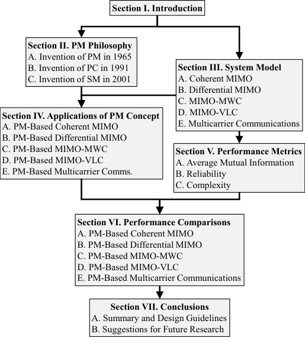

Fig. 2. The structure of this treatise.

Space

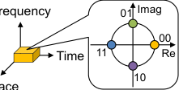

(a) A data symbol

Frequency

Time

Space

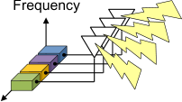

Space

(b) Spatial domain

_M_ rows
~~�~~ ~~�~~ � ~~�~~

**s** [(1)] = [ _µ_ 1 _· · · µ_ 1 _µ_ 2 _· · · µ_ 2 _· · ·_ _µ_ _k_ _· · · µ_ _k_ ] [T] _,_ (1)

~~�~~ ~~��~~ ~~�~~ ~~�~~ ~~��~~ ~~�~~ ~~�~~ ~~�~~ � ~~�~~
_M_ 1 rows _M_ 2 rows _M_ _k_ rows

where we have an integer _M_ = _M_ 1 + _M_ 2 + _· · ·_ + _M_ _k_ and real
values _µ_ 1 _< µ_ 2 _< · · · < µ_ _k_ . In Eq. (1), _µ_ 1 is repeated _M_ 1
times. Then, the other codewords are generated by permuting
the order of **s** [(1)] . The cardinality of possible codewords _N_ _c_ is
calculated by [41]:

_M_ !
_N_ _c_ = (2)
_M_ 1 ! _M_ 2 ! _· · · M_ _k_ ! _[,]_

which increases with the factorial order. The pulse position
modulation (PPM) and pulse code modulation (PCM) are
subsumed by the PM scheme [41]. Specifically, the PPM
codewords are generated by the following initial codeword:

**s** [(1)] = [ ~~�~~ 0 ~~�~~ 0� 0 ~~�~~ ����1 ] [T] _∈_ R [4] _,_
_M_ 1 =3 _M_ 2 =1

where _M_ = _M_ 1 + _M_ 2 = 4 and ( _µ_ 1 _, µ_ 2 ) = (0 _,_ 1). The
total _N_ _c_ = _M_ ! _/_ ( _M_ 1 ! _· M_ 2 !) = 4! _/_ (3! _·_ 1!) = 4 number of
codewords are generated by the permutation of four numbers
as follows:

**s** [(1)] = [0 0 0 1] [T] _,_ **s** [(2)] = [0 0 1 0] [T] _,_

**s** [(3)] = [0 1 0 0] [T] _,_ **s** [(4)] = [1 0 0 0] [T] _._ (3)

Observe that the codewords in Eq. (3) are the same as those
of the space shift keying (SSK) scheme, which uses only a
single antenna at any transmission time instant. Similarly, the
well-known PPM scheme conveys the input bits by selecting a
single time index. Thus, the SSK scheme is the spatial domain
counterpart of the PPM scheme, which maps the information

2 Note that the PM concept was patented in [54].

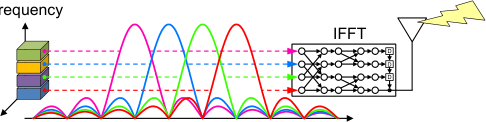

Space

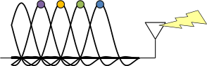

(c) Temporal domain

Frequency [Hz]

(d) Frequency domain

Fig. 3. Three-dimensional signal representation.

ACCEPTED FOR PUBLICATION IN IEEE COMMUNICATIONS SURVEYS & TUTORIALS 4

0

1

|Frequency ce|uency|
|---|---|
|0 → 1 → Conventional modulation||
|0 → 1 → Conventional modulation||

Space

(a) Conventional signaling

Space

|Source bits 0 Permutation modulation 0 → 1 →|ce s P|Permutation modulation 0 → 1 →|Col4|Col5|n|
|---|---|---|---|---|---|
|0 1 0 → 1 → Conventional modulatio 0 → 1 →|C|0 → 1 → onventional modulatio|0 → 1 → onventional modulatio|0 → 1 → onventional modulatio|n|
|0 1 0 → 1 → Conventional modulatio 0 → 1 →|C|0 → 1 → onventional modulatio|0 → 1 → onventional modulatio|1 →|1 →|
|0 1 0 → 1 → Conventional modulatio 0 → 1 →|C|0 → 1 → onventional modulatio||||

(b) Hybrid PM-based signaling [55], [56]

Fig. 4. Comparison of conventional and PM signaling.

Time

Time

following combination matrix [58]:

**C** _M,P_ = � **10** **CC** _MM−−_ 1 _,P_ 1 _,P −_ 1 � _∈_ B [(] _MP_ [)] _[×][M]_ _,_ (5)

where _P_ arbitrary elements are selected out of _M_ candidates.
In Eq. (5), **0** denotes a zero vector of length � _MP−_ 1 �. Similarly,
**1** denotes a one vector of length � _MP −−_ 11 �. Thus, the combination
matrix of Eq. (5) represents the on-off state of arbitrary
elements, such as transmit antennas and subcarrier indices.
For example, if we consider the ( _M, P_ ) = (4 _,_ 1) case, the
combination matrix is given by



_∈_ B 4 _×_ 1 _,_ (6)




**C** 4 _,_ 1 =





1 0 0 0

0 1 0 0

0 0 1 0

0 0 0 1

bits to the temporal domain. Let us examine another example.
If we have the initial codeword of **a** 1 = [1 _,_ 2] _∈_ Z [2], all the
_N_ _c_ = 2! _/_ (1! _·_ 1!) = 2 number of PM codewords are given by
**a** 1 = [1 _,_ 2] and **a** 2 = [2 _,_ 1]. Suppose that we map the vectors
**a** 1 and **a** 2 onto space-time matrices, then an example set of
codewords is given by

where each row corresponds to the SSK codewords given
in Eq. (3). Furthermore, for the ( _M, P_ ) = (4 _,_ 2) case, the
combination matrix is given by

**C** 4 _,_ 2 =









1 1 0 0

1 0 1 0

1 0 0 1

0 1 1 0

0 1 0 1

0 0 1 1

_∈_ B [6] _[×]_ [4] _,_ (7)

1 0
**A** 1 = 0 1
�

0 1
_,_ **A** 2 = 1 0
� �

_,_ (4)
�

each of which is known as a _permutation matrix_ in linear
algebra [3] . We will show that the permutation matrices of Eq. (4)
are the basis of the SM-aided STBC [16] and its differential
counterpart [19].
_Hybrid PM Signaling:_ The original PM scheme [41] processes the input bits by outputting a permuted sequence,
whereas the hybrid PM scheme [55], [56] divides the input
bits into two parts. Here, the first bits are used for selecting
a set of frequencies, while the remaining bits are used for
generating the conventional amplitude and phase-shift keying
(APSK) symbols that are carried by the selected frequencies.
Fig. 4 exemplifies the concept of hybrid PM. In contrast
to conventional signaling, the hybrid PM scheme maps the
permuted sequence to the frequency domain [55], which is
based on the original PM concept of [41]. Let us assume
that we map the sequence to the spatial domain. Then, the
hybrid PM scheme becomes equivalent to the generalized
spatial modulation (GSM) of [57], which is a coherent MIMO
scheme.

In this treatise, we interpret the above PM concept in a generalized context. The diverse PC-, SM-, or SIM-aided schemes
convey additional bits by selecting a spreading sequence [42],
a subcarrier-index [58], a transmit antenna [38], a transmit
light emitting diode (LED) [27], a dispersion matrix [16],
a permutation matrix [19], and/or a transmission subarray

[24]. These schemes commonly rely on the basic permutation
structure of [41], [55]. Hence, we regard these schemes as
families of the PM concept. Specifically, we regard an arbitrary
modulation scheme as a PM-aided scheme, if it relies on the

3 The relationship between PM codewords and permutation matrices is also
detailed in [41].

where each row is the same as the PM codewords generated
from **s** [(1)] = [0 0 1 1] [T] having ( _M_ 1 _, M_ 2 ) = (2 _,_ 2).
Because the number of PM codewords increases with the

factorial order, as given in Eq. (2), PM has been applied to
physical data storage systems to increase the storage capacity.
For example, PM and its relatives have been proposed for
steganography [43], volume holographic storage [44], flash
memory [45] and solid-state storage [46]. The contributions
to the development of the PM concept detailed in this section
are summarized in Table II.

_B. Invention of PC in 1991_

Apart from the PM concept [41], in 1991 another PM
concept was independently proposed for spread spectrum
communications [42]. The PM-based spread spectrum scheme
of [42] conveys the additional bits by selecting _P_ out of _M_
spread sequences, which is referred to as _parallel combinatory_
_(PC)_ concept. This concept subsumes the conventional _M_ -ary
spread spectrum communications [67], [68], where only _P_ = 1
is selected out of _M_ sequences. Based on the PC concept of

[42], the PC-aided OFDM scheme was proposed in [58], where
a set of subcarriers were selected out of all the subcarrier
activation patterns. Because the subcarrier-activation process
of [58] is based on the combination matrix of Eq. (5), the
PC-aided scheme is considered as one of the PM families in

this treatise.

The PC concept has been researched in the wideband wireless context. For example, a phase-rotation based PC-OFDM
system is proposed in [69], and its secret communication
method is proposed in [70]. Note that the modulation principle
of the conventional PC-aided OFDM scheme [58] is the same
as that of the newly proposed GSM scheme [57]. Since 2009,

ACCEPTED FOR PUBLICATION IN IEEE COMMUNICATIONS SURVEYS & TUTORIALS 5

TABLE II

C ONTRIBUTIONS TO PM AS WELL AS ITS BACKGROUND AND APPLICATIONS .

|Year|Authors|Contribution|
|---|---|---|
|1960|Lehmer [59]|Conceived an algorithm that generates a permutation of a sequence, which was later called_ Lehmer_ _code_.|
|1965|Slepian [41]|Proposed a PM concept, which generates codewords by permuting an initial sequence.|
|1972|Berger_ et al._ [60]|Proposed a channel coding scheme based on the PM concept.|
|1989|Atkin and Corrales [61]|Proposed a PM-based frequency shift keying (FSK) scheme that selects a group of elements, with the aim to achieve higher bandwidth efficiency.|
|1996|Li [55]|Proposed a hybrid permutation scheme that combines the PSK-aided FSK with the PM concept.|
|1997|Savage [62]|Surveyed the combinatorial Gray codes consisting of bits or integers.|
|1999|Mittelholzer [43]|Applied the PM concept to steganography, which has robustness against attacks.|
|2000|King and Neifeld [44]|Applied the PM concept to volume holographic memories to decrease the number of “on” states. This decrease resulted in mitigating interpixel crosstalk and improving capacity. Later, the research of [44] was generalized to support multi-levels [63].|
|2005|Silva and Finamore [64]|Generalized the PM concept to support vectors.|
|2009|Jiang_ et al._ [45]|Applied the PM concept to the flash memory system to decrease the number of charged cells.|
|2010|Shi_ et al._ [65]|Proposed a PM-based MIMO-CDMA system.|
|2013|Mittelholzer_ et al._ [46]|Patented a PM concept applied to a solid-state storage device to mitigate the effects of drift noise.|
|2015|Ishimura and Kikuchi [66]|Applied the PM concept to coherent optical communications.|

the PM-aided OFDM scheme has been gaining increased
attention because it improves both the frequency diversity and
the coding gain in comparison to the conventional OFDM
scheme [31], [35–37]. In 2015, the code index modulation was
proposed [71], which can be subsumed by the PC concept. The
BER and complexity of the generalized code index modulation
were analyzed in [72].

_C. Invention of SM in 2001_

The hardware complexity of MIMO systems is typically
high due to the multiple radio frequency (RF) chains, which
process high-frequency signals. For massive MIMO systems,
a huge number of transmit antennas are used for achieving a
competitive performance gain, which leads to a high energy
consumption. To address this limitation, the SM concept was
proposed for reducing the complexity both at the transmitter
and the receiver, without decreasing the spectrum efficiency
of conventional systems. Note that the invention of SM [38],

[39] was independent of the classic PM and PC concepts.
Again, SM-based research has captured the imagination of
scientists on a benefit of its reduced number of transmit RF
chains. A transmit RF chain per antenna is typically composed
of digital-to-analog converters, low-pass filters, bandpass filters, synchronizers, and an amplifier. Together, these lead to
a high-complexity and high-cost implementation. The SM
scheme has been shown to be capable of operating singleRF-aided transmissions [2–4], [73] with the aid of antenna
switching. However, antenna switching at high frequencies
is a challenging task [5]. It was shown in [74] that the
single-RF SM transmitter has to transmit each time-domain
symbol relying on symbol-wise antenna switching. Hence, the
bandwidth-efficient raised cosine filter is unsuitable for the
single-RF SM transmitter. To this end, increasing the number
of transmit RF chains at the SM transmitter was proposed for
solving this problem [74], while maintaining a low transmitter
cost. It is worth noting that the number of required receive
RF chains is identical for both the classic MIMO and the SM

schemes, where a receive RF chain per antenna is composed
of sophisticated filters and amplifiers.
The full-RF-aided SM transmitter, which is equipped with
_M_ transmit RF chains for _M_ antennas, still has advantages
over the spatial multiplexing (SMX) scheme in terms of both
its higher minimum Euclidean distance (MED) [40] and its
lower computational complexity [9], [13], [75], [76]. Hence,
it is suitable for open-loop large-scale MIMO scenarios [77].
Similar advantages were also observed in MWC and VLC
channels [25], [78], where the associated channel matrices
contain strong line-of-sight (LoS) elements due to their specific propagation properties. In such channels, the rank of
channel matrices tends to be low, and the performance gain
of MIMO systems is eroded. The SM scheme circumvented
this issue [25], [78] as a benefit of its reduced number of data
streams. Hence, the SM scheme is capable of operation in
low-rank channels.

III. S YSTEM M ODEL

In this treatise, we assume narrowband statistical channel
models, such as the Rayleigh, the Rician, and the Jakes
channels, where the delay spread is much lower than the
reciprocal of the bandwidth. The numbers of transmit and
receive antennas are denoted by _M_ and _N_, respectively.
At the transmission index _i_ ( _i ≥_ 0), based on an input
bit segment of length _B_, a specific space-time codeword
**S** ( _i_ ) _∈_ C _[M]_ _[×][T]_ is generated out of the _N_ _c_ = 2 _[B]_ number of
legitimate codewords. Basically, the codeword **S** ( _i_ ) contains
the complex-valued APSK symbols, such as BPSK, QPSK
and quadrature amplitude modulation (QAM). Then, codeword
**S** ( _i_ ) is transmitted through the _M_ antennas. The discrete-time
and baseband representation of the received block is given by

**Y** ( _i_ ) = **H** ( _i_ ) **S** ( _i_ ) + **V** ( _i_ ) _,_ (8)

where

**Y** ( _i_ ) _∈_ C _[N]_ _[×][T]_ is the _i_ th received block,
**H** ( _i_ ) _∈_ C _[N]_ _[×][M]_ is the _i_ th channel matrix,

ACCEPTED FOR PUBLICATION IN IEEE COMMUNICATIONS SURVEYS & TUTORIALS 6

**S** ( _i_ ) _∈_ C _[M]_ _[×][T]_ is the _i_ th space-time codeword, and
**V** ( _i_ ) _∈_ C _[N]_ _[×][T]_ is the _i_ th additive noise.
In Eq. (8), the channel coefficient **H** ( _i_ ) denotes the amplitude
and phase fluctuation between the _m_ th transmit and the _n_ th
receive antennas, where 1 _≤_ _m ≤_ _M_ and 1 _≤_ _n ≤_ _N_ .
Each symbol in **S** ( _i_ ) is transmitted through the _m_ th antenna
at the time index _t_ (1 _≤_ _t ≤_ _T_ ), which ranges from
( _i · T · T_ _s_ + ( _t −_ 1) _T_ _s_ ) to ( _i · T · T_ _s_ + _tT_ _s_ ) [sec], [4] where _T_ _s_
represents a symbol duration. We assume that the noise element in **V** ( _i_ ) obeys the independent and identically distributed
(i.i.d.) [5] additive white Gaussian noise (AWGN) with the variance of _σ_ _v_ [2] [, i.e.,] _[ CN]_ [(0] _[, σ]_ _v_ [2] [)][. Note that the variance-covariance]
matrix of **V** ( _i_ ) is calculated by E �vec( **V** ( _i_ )) _·_ vec( **V** ( _i_ )) [H] [�],
which converges to _σ_ _v_ [2] _[·]_ **[I]** _[NT]_ [on average. We omit the transmis-]
sion index _i_ if it is not needed. The received signal-to-noise
ratio (SNR) _γ_ is defined by

with the aid of the unitary nature of OSTBC codewords. Note
that the conventional BLAST and OSTBC schemes have been

subsumed by the general MIMO schemes of [16], [89], hence
we can analyze the pros and cons in a comprehensive manner.

Many transmit antennas are also capable of realizing beamforming (BF). The BF scheme improves the received SNR and
the spectrum efficiency, as well as the inter-user interference,
which is known as BF gain [90], [91]. One of the simplest
schemes is the conjugate BF, where the codewords are multiplied by the Hermitian transpose of the estimated channel
matrix [92]. Specifically, when assuming a large number of
transmit antennas at the base station, **HH** [H] converges to a
diagonal form on average, and this leads to interference-free
detections at the user terminal. Thus, this structure facilitates
low-complexity transmission and reception, even though a
large number of antennas are employed.

_Channel Model:_ Radio waves are propagated at the speed
of light, attenuated by distance, and reflected by clusters of
scatterers. The scatterers create independent paths and delay
the radio waves due to the difference in propagation distances
of each path. The resultant _delay spread T_ _t_ [sec] is an
important metric, which is defined by the duration between
the first and the last arrivals of the radio propagation. If the
delay spread is larger than the reciprocal of the bandwidth
_B_ _w_ _[−]_ [1] [, then the received signals are significantly distorted. The]
independent multi-path components may cause amplitude and
phase fluctuations destructively, which is called fading. In
addition, when the mobile terminal moves faster, the received
radio waves experience Doppler shift, which is typically severe
in high-speed trains and airplanes. The random time-varying
behavior of radio waves makes the wireless channel unreliable.

Again, in this treatise, we assume narrowband statistical
channel models, such as the Rayleigh and the Rician channels.
The Rayleigh fading channel model is a basic statistical model
that assumes a large number of scatterers. If the scatterers
are uniformly distributed, the channel coefficients are approximated by a Gaussian random process [93] on the basis of
the central limit theorem. Furthermore, if the transmit and
receive antennas are sufficiently separated, for example, if
the spacing is over ten times as large as the wavelength, the
correlation between the adjacent channel coefficients can be
ignored. Then, each coefficient of the channel matrix **H** can be
approximated by the i.i.d. complex-valued Gaussian symbol
having a mean of zero and a variance of 1, i.e., _CN_ (0 _,_ 1).
Other MIMO channels models were reported in [93], [94].

_Detection:_ In this contribution, we assume maximumlikelihood (ML) detection at the receiver, which achieves
the lowest possible error rate at the cost of a high system
complexity [95]. Here, we review a hard detector for the
general MIMO scheme. The maximum _a posteriori_ (MAP)
detector searches the best **S** [ˆ] that maximizes the _a posteriori_
probability of p( **S** _|_ **Y** ), where the received symbol of **Y** is
given in advance. Based on Bayes’ theorem [6], the relationship
between the _a priori_ and the _a posteriori_ probabilities is given

6 Bayes’ theorem [96] is given by p( _X|Y_ ) = p( _Y |X_ ) _·_ p( _X_ ) _/_ p( _Y_ ), where
_X_ and _Y_ are random variables.

_γ_ =

� _M_ _Nk_ =1 _c_ _· T_ �� **S** _·_ ( _σ_ _k_ ) _v_ [2] �� 2F _,_ (9)

where **S** [(] _[k]_ [)] (1 _≤_ _k ≤_ _N_ _c_ = 2 _[B]_ ) denotes the space-time
codeword associated with the _B_ input bits. Throughout our
simulations, we adjust the mean power [�] _[N]_ _k_ =1 _[c]_ �� **S** ( _k_ ) �� 2F [to] _[ M]_ _[·][T]_
for all the schemes. The random channel matrix **H** ( _i_ ) depends
on the channel setup, such as the uncorrelated/correlated
Rayleigh, the Rician and the Jakes fading channels.

_A. Coherent MIMO_

In 1942, Peterson patented a diversity receiver concept,
which exploits the diversity of the channel coefficients [79].
In 1973, Schmidt _et al._ patented the space-division multiple
access concept, where the received signals are spatially separable [80], [81]. In 1987, Winters derived the ergodic capacity
of MIMO channels [82]. This analysis was inspired by the
dually polarized single-input single-output (SISO) channel

[83], which is equivalent to a 2 _×_ 2 MIMO channel. With
the aid of virtual independent paths, the SMX scheme of

[84–86] performs well in rich-scattering scenarios. The SMX
scheme is also known as Bell Laboratories layered spacetime (BLAST) architecture. The _M_ independent symbols are
transmitted through the _M_ antennas and then received by the
_M_ antennas. The key contribution of [84] was the successive
nulling concept, where the transmitted symbols are copied
or spread over _M_ time slots. This redundancy mitigates the
inter-channel interference at the receiver and improves the
communications reliability. The SMX scheme maximizes the
multiplexing gain, whereas the orthogonal space-time block
code (OSTBC) [87] maximizes the diversity gain. The simple
OSTBC scheme of [87] embeds two APSK symbols in a 2 _×_ 2
space-time codeword. The embedded symbols are spread over
the two time slots. As proved in [88], all systems have to obey
the diversity-multiplexing tradeoff due to the limited number
of independent channel paths. The OSTBC scheme is also
capable of avoiding inter-channel interference at the receiver

4 [ _·_ ] denotes a unit.
5 The i.i.d. assumption implies that each random variable is mutually
independent and follows an identical distribution.

ACCEPTED FOR PUBLICATION IN IEEE COMMUNICATIONS SURVEYS & TUTORIALS 7

by

p( **S** _|_ **Y** ) = [p(] **[Y]** _[|]_ **[S]** [)p(] **[S]** [)] _._ (10)

p( **Y** )

We assume that p( **S** ) is constant because the input bits are
randomly generated and that the associated codeword **S** is
transmitted at the equal probability of 1 _/_ 2 _[N]_ _[c]_ . In addition, the
_a priori_ probability p( **Y** ) is unknown in the hard decision process. Hence, maximizing the _a posteriori_ probability p( **S** _|_ **Y** )
is equivalent to maximizing the likelihood p( **Y** _|_ **S** ), which is
defined as follows:

p( **Y** _|_ **S** ) = 1 [exp] _−_ _[∥]_ **[Y]** _[ −]_ **[HS]** _[∥]_ F [2]

( _πσ_ _v_ [2] ) _[NT]_ � _σ_ _v_ [2]

_._ (11)
�

a data-carrying matrix. At the receiver, the previously received
symbol **Y** ( _i −_ 1) acts as the _pilot symbol_ of the coherent
MIMO scenario. Hence, the major benefit of the DSTBC
scheme is its capability of operating without the estimated
channel matrix **H** [ˆ] ( _i_ ). Basically, most DSTBC schemes rely
on the unitary matrix [98–100], [102–104]. By contrast, some
DSTBC schemes use the non-unitary matrix to increase the
transmission rate [105–107]. However, the differential MIMO
scheme cannot be readily combined with a large number
of transmit antennas due to the unitary constraint; the only
exception is the solution found in [108].
_Channel Model:_ The channel model of differential MIMO

communications is the same as that of its coherent MIMO

counterpart. The narrowband Rayleigh fading channel having
no delayed taps is typically assumed [98–100], [102–108].
_Detection:_ Let us now introduce the hard ML detector for

general DSTBC schemes. The following detector is suitable
for any DSTBC scheme, if and only if the data matrix **X** ( _i_ ) is
unitary. Here, we assume that the successive channel matrices
**H** ( _i_ ) and **H** ( _i −_ 1) are the same, i.e., **H** ( _i_ ) = **H** ( _i −_ 1). We
define this assumption as the quasi-static channel. Because we
have the relationships of **S** ( _i_ ) = **S** ( _i_ _−_ 1) **X** ( _i_ ) and **Y** ( _i_ _−_ 1) =
**H** ( _i −_ 1) **S** ( _i −_ 1) + **V** ( _i −_ 1), the ML detector of general
DSTBC schemes is given by

**X** ˆ ( _i_ ) = arg min F _[.]_ (13)
**X** _[∥]_ **[Y]** [(] _[i]_ [)] _[ −]_ **[Y]** [(] _[i][ −]_ [1)] **[X]** _[∥]_ [2]

We observe that Eq. (13) does not contain the channel matrix
**H** ( _i_ ), which implies that the receiver can dispense with the
high-complexity channel estimation process. However, the
total noise variance is doubled compared to the coherent case
given in Eq. (12), because both the received symbols **Y** ( _i_ ) and
**Y** ( _i −_ 1) contain AWGN. This limitation imposes the wellknown 3 [dB] SNR loss [7] in the differential scheme. Hence,
the BER curve of the differential scheme is shifted by 3 [dB]
as compared to that of the idealized coherent scheme that has
perfect estimates of the channel matrix.

_C. MIMO-Aided Millimeter-Wave Communications_

The capacity of wireless communications linearly increases
with the bandwidth [94], [109]. In MWCs [110–112], relatively large bandwidths are available, as compared to current
mobile networks operated within the 2 to 5 [GHz] spectrum.
Millimeter waves have wavelengths ranging from 1 to 10 mm,
and the associated frequency ranges from 30 to 300 [GHz].
Hence, in MWCs, the resultant capacity is higher than the
current networks due to the wider bandwidth of MWCs.

Typically, MWCs suffer from high propagation losses imposed by the nature of the short wavelength. For example, if
we consider the free-space path loss model, the path loss increases with the square of the wavelength _λ_, i.e., 10 log 10 � _λ_ [2] [�]

[dB] [93]. To circumvent the path loss problem [110], [113],
millimeter wave transmitters and receivers have to obtain BF

gain with the aid of a large number of antenna elements [114].
It is unrealistic for commercial devices to use a large number
of RF circuits connected to each antenna element, because

7 10 log 10 2 = 3 _._ 01029 _· · · ≈_ 3 _._ 0 [dB]

According to Eq. (11), the decision metric is given by

**S** ˆ = arg max **S** p( **Y** _|_ **S** ) = arg min **S** _[∥]_ **[Y]** _[ −]_ **[HS]** _[∥]_ F [2] _[.]_ (12)

Note that the Frobenius norm calculation of Eq. (12) is
carried out over _N_ _c_ = 2 _[B]_ number of trials, and its detection
complexity exponentially grows with the input bit segment of
length _B_ . The estimated bit sequence might contain errors. The
number of errors between the original bits from the transmitter
and the estimated bits at the receiver is referred to as bit error

ratio (BER), which is detailed in Section V-B.

_B. Differential MIMO_

The family of coherent MIMO schemes [16], [84–87], [89]
relies on estimating the channel matrix **H** at the receiver.
Here, the pilot symbols are transmitted in order to estimate
the channel coefficients, which are also known as channel
state information (CSI). For example, the simplest scheme
transmits the pilot symbols of **I** _M_ through _M_ antennas over
_M_ time slots. At the receiver, based on the received symbols
of **Y** = **HI** _M_ + **V** = **H** + **V**, the channel matrix is estimated
to be **H** [ˆ] = **H** + **V** . Because the estimated channel matrix
**H** ˆ contains the AWGN of **V**, the accuracy of the channel
estimation is degraded. The inaccuracy of **H** [ˆ] degrades the
reliability of the coherent MIMO scheme, which typically
exhibits an error floor in uncoded scenarios [97]. In addition,
the inserted pilot symbols reduce the effective transmission
rate. For example, the pilot symbol of **I** _M_ may occupy _M_
time slots, and thus it increases linearly with the number of
transmit antennas. If we consider fast-fading scenarios having
a large normalized Doppler frequency _F_ _d_ _T_ _s_, it is a challenging
task to accurately track the channel coefficients at the receiver,
because they change rapidly. Furthermore, the number of
channel coefficients that have to be estimated is calculated by
_N_ _·M_, which increases with the number of transmit and receive
antennas. Hence, the channel estimation problem is especially
severe for large-scale MIMO systems in fast-moving scenarios.
To circumvent the channel estimation problem, differential space-time block code (DSTBC) was proposed in 2000

[98–101]. The DSTBC scheme circumvents the pilot insertion
and the channel estimation process with the aid of unitary
matrices. The successive space-time codewords **S** ( _i −_ 1) and
**S** ( _i_ ) have a certain relationship, i.e., **S** ( _i_ ) = **S** ( _i −_ 1) **X** ( _i_ ),
which is termed as differential encoding. Here, **X** ( _i_ ) represents

ACCEPTED FOR PUBLICATION IN IEEE COMMUNICATIONS SURVEYS & TUTORIALS 8

D T

Transmitter

|Col1|Subarray M|Col3|
|---|---|---|
|Receiver|Receiver|Receiver|

Fig. 5. Physical arrangement of the transmitter and the receiver. c _⃝_ IEEE [24]

the RF circuits of MWC are complex, expensive and powerthirsty [115]. In the microwave MIMO context, the hybrid
BF scheme that combines analog beamforming (ABF) and
digital beamforming (DBF) has been proposed [116], [117].
Specifically, the hybrid scheme divides large antenna array
into subarrays, where each subarray is connected to a single
RF circuit. This structure reduces the number of RF chains

both at the transmitter and the receiver. It was demonstrated

in [115], [118–122] that this hybrid BF approach is efficient
for MIMO-MWC.

_Channel Model:_ The channel models of indoor and outdoor

MWCs have been extensively studied [110], [113], [123].
Shoji _et al._ [123] proposed the indoor MWC channel model
based on the Saleh-Valenzuela model [124], where the LoS
components have a dominant effect on the channel coefficients.
Bøhagen _et al._ [125] proposed the optimal antenna alignment
technique for the uniform linear array. This technique combats the detrimental effects of LoS MWC channels. Cluster
based ray-tracing channel models were investigated in [121],

[126], [127], although some studies [24], [25], [118], [128]
assumed having Rician fading for MWC channels. Rappaport
_et al._ [110] investigated the potential of cellular MWCs in
the 5G context, where the basic propagation characteristics
were measured in urban areas. Sridhar _et al._ [129] proposed
a parametric channel model for the 5G MWCs, which is
applicable to general RF communications. The parametric
model of [129] enables us to estimate the channel coefficients
accurately and to obtain a massive array gain with the aid
of superresolution BF. We consider indoor and LoS MWCs

[25], [118], [123], [128], [130] instead of outdoor or nonline-of-sight (NLoS) channel environments. Throughout our
simulations, we employ the frequency-flat Rician channel
model. Fig. 5 shows the arrangement of the transmitter and
the receiver, including _M_ _e_ antenna elements at the transmitter
and _N_ _e_ antenna elements at the receiver. Each ABF array
is separated by a spacing of _D_ T [m] at the transmitter and
_D_ R [m] at the receiver. The spacing of each antenna element
embedded in an ABF array is _d_ [m]. The transmitter and
the receiver are separated by a length of _D_ H [m], where the
receiver is tilted at angle _θ_ . The channel matrices that follow
the Rician fading channels are given by [25], [118], [125]:

where _K_ is the Rician factor, which represents the power
ratio of LoS elements over NLoS elements. It was reported
in [128] that the Rician _K_ factor was in the range between
8.34 and 12.04 [dB] in 60 [GHz] indoor communications
scenarios. In Eq. (14), the LoS elements are defined by
**H** LoS [ _n, m_ ] = exp ( _−j ·_ (2 _π/λ_ ) _· r_ [ _n, m_ ]), where _r_ [ _n, m_ ] is
the distance between the _m_ th transmit antenna element and
the _n_ th receive antenna element. [8] Here, _λ_ represents the
wavelength of the transmitted signal. Furthermore, the NLoS
element **H** NLoS [ _n, m_ ] obeys the complex-valued Gaussian
distribution of _CN_ (0 _,_ 1).
At the transmitter, the codeword **S** ( _i_ ) is precoded by an
ABF **P** = bdiag( **p** 1 _, · · ·,_ **p** _M_ ) _∈_ C _[M]_ _[e]_ _[×][M]_ [118], [130], where

_·_
bdiag( ) represents the block diagonalization. A weight vector
**p** _k_ _∈_ C [(] _[M]_ _[e]_ _[/M]_ [)] _[×]_ [1] (1 _≤_ _i ≤_ _M_ ) corresponds to the _k_ th ABF
array at the transmitter, which has the constraint of _∥_ **p** _k_ _∥_ [2] = 1.
Similarly, at the receiver, the ABF weights are represented
by **W** = diag( **w** 1 _, · · ·,_ **w** _N_ ) _∈_ C _[N]_ _[e]_ _[×][N]_ [118], [130], where
**w** _k_ _∈_ C [(] _[N]_ _[e]_ _[/N]_ [)] _[×]_ [1] (1 _≤_ _k ≤_ _N_ ) represents a weight vector
of the _k_ th ABF at the receiver, and each weight **w** _k_ has the
constraint of _∥_ **w** _k_ _∥_ [2] = 1. Based on the general model of
Eq. (8), the channel matrix **H** for MIMO-MWC is represented

as

**H** = **W** [H] **H** MWC **P** _∈_ C _[N]_ _[×][M]_ _._ (15)

In MWCs, a large number of antenna elements are packed
in a small space in order to achieve a BF gain. Typically, the
rank of the channel matrix of indoor MWCs is low due to

the similarity between adjacent channel coefficients. In such
a low-rank scenario, the performance gains offered by the
MIMO techniques are typically reduced. The optimum antenna
alignment scheme that mitigates the above low-rank problem
was proposed [125]. The alignment criterion of [125] recovers
the rank of the channel matrix in MIMO-MWCs. To attain

the optimum performance that maximizes the channel rank,
the separations of _D_ T and _D_ R of ABFs have to satisfy the
following relationship [118], [125] :

_λR_
_D_ T _D_ R = (16)
max( _M, N_ ) cos( _θ_ ) _[.]_

With the aid of Eq. (16), the channel rank is increased to
rank( **H** ) = min( _M, N_ ) for pure LoS scenarios. For example,
if we have a transmitter height of _D_ H = 5 [m], receiver tilt
of _θ_ = 0 _[◦]_, and carrier frequency of 60 [GHz], its wavelength
becomes _λ_ = 0 _._ 5 [cm]. Here, the spacing between antenna
elements embedded in each subarray is _d_ = _λ/_ 2 = 0 _._ 25 [cm].
Furthermore, we consider _M_ _e_ = _N_ _e_ = 16, _M_ = _N_ = 4, and
_D_ T = _D_ R . Then, based on Eq. (16), the spacing between the
subarrays is calculated by

_D_ T = _D_ R =

=

~~�~~

~~�~~

_λD_ H
(17)
max( _M, N_ ) cos( _θ_ )

0 _._ 005 _×_ 5
max(4 _,_ 4) cos(0) _[≈]_ [7] _[.]_ [91 [cm]] _[.]_

1
_K_ + 1 **[H]** [NLoS] _[ ∈]_ [C] _[N]_ _[e]_ _[×][M]_ _[e]_ _[,]_

(14)

�

8 The element at row _n_ and column _m_ of a matrix **A** is denoted by **A** [ _n, m_ ],
which are row-column indices.

**H** MWC =

�

_K_
_K_ + 1 **[H]** [LoS] [ +]

ACCEPTED FOR PUBLICATION IN IEEE COMMUNICATIONS SURVEYS & TUTORIALS 9

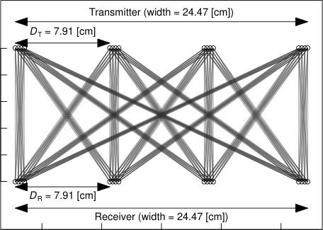

400

300

200

100

−10 −5 0 5 10

Horizontal direction [cm]

Fig. 6. Examples of ABF arrangements, where ( _M_ _e_ _, M, N_ _e_ _, N_ ) =
(16 _,_ 4 _,_ 16 _,_ 4) and ( _D_ H _, λ, d_ ) = (500 _,_ 0 _._ 50 _,_ 0 _._ 25) [cm].

Fig. 6 illustrates the above _D_ T = _D_ R = 7 _._ 91 [cm] case,
where ( _M_ _e_ _, M, N_ _e_ _, N_ ) = (16 _,_ 4 _,_ 16 _,_ 4). In this case, the
mean rank of the channel matrices is equal to E[rank( **H** )] =
min( _M, N_ ) = 4.

_D. MIMO-Aided Visible Light Communications_

In 1880, Alexander Graham Bell invented a phone system
that conveyed audio signals by means of sunlight [131]. With
the rapid development of LEDs, the brightness, production cost
and response time have all been improved by the invention
of semiconductor materials such as indium gallium nitride.
In 2002, Kamiya, who worked at a chemical engineering
company, patented the indoor VLC system that uses energyefficient white LEDs [132]. In contrast to conventional infrared
communications, the proposed system [132] used LED illumination as a data-conveying optical wireless channel. Based on
the high brightness and energy efficiency of LEDs, LED-aided
VLC research was initiated in [133–135], where the LEDs

were used as an illumination bulb as well as a wireless data

transmitter. In VLC, the transmitter modulates the intensity
of an LED by the information bits, and the receiver directly
detects its change in intensity.
Visible light waves, which are electromagnetic waves that
humans can perceive, have a frequency ranging from 430 to
770 [THz]. The available VLC bandwidth is on the THz order,
but the practically attainable VLC bandwidth is determined by
the modulator and the LED specifications, which are typically
limited to the MHz range [136], [137]. However, license-free
and security-aware bandwidths of several dozen MHz are still
attractive for our daily lives from the viewpoint of the spectrum
shortage in the current networks.
In contrast to microwave communications, the VLC constellation symbols have to be positive and real-valued. If we
consider using OFDM, it has to satisfy the Hermitian symmetry in the frequency-domain [138], which results in having
only positive signals. LED nonlinearity is a major problem in
VLCs [139] because it may distort the OFDM signals. The

output signal has to satisfy the amplitude constraint in order
to avoid clipping distortions [140].
_Channel Model:_ The VLC channel model, which is basically the same as the LED-aided infrared wireless communication model, has been investigated since 1952 [141–143].
The VLC channel coefficients are positive, real-valued and
quasi-static for both the outdoor and indoor scenarios [135],

[144]. The white LED- and photodetector (PD)-aided VLC
channel was analyzed in [133–135], and the employment of the
complementary metal oxide semiconductor (CMOS) imaging
sensor was considered in [145]. The rank of the channel
matrix in the CMOS-aided VLC is generally high due to the
additional receiver complexity.
In this treatise, we assume the simplified path loss channel
model of [29], [143] in our simulations, where intensity
modulation and direct detection are employed. We use the
general MIMO system model of Eq. (8), but the channel matrix
**H** is replaced by [29], [30]

**H** = _R_ PD **H** VLC _∈_ R _[N]_ _[×][M]_ _,_ (18)

where _R_ PD _∈_ R [A/W] denotes the response of the PD. Each
element of the matrix **H** VLC is given by [29]

where _σ_ _r_ [(] _[n]_ [)] is the received optical power at the _n_ th PD.

_E. Multicarrier Communications_

OFDM [93], [146], [147] is an established multicarrier
communication technology that has played a key role in numerous communication standards, such as wireless local area
network, cellular network, and digital television broadcasting.
The OFDM scheme is capable of exploiting the limited
bandwidth, where a number of symbols are simultaneously
transmitted via orthogonal subcarriers. Specifically, the OFDM
transmitter multiplexes symbols in the frequency domain, and
these symbols are projected onto the time domain by the
efficient butterfly-algorithm-aided IDFT. Then, a redundant
signal, which is called guard interval, is added in the time
domain. The received signals are decoded in the frequency
domain, which mitigates the inter-carrier interference caused
by delayed taps.

( _ξ_ + 1) _A_ PD

�

2

**H** VLC [ _n, m_ ] =



2 _πd_ [ _n, m_ PD ] [2] [cos] _[ξ]_ [+1] _[ φ]_ [[] _[n, m]_ []] �0 _≤_ _φ_ [ _n, m_ ] _≤_ Ψ 12

0 _φ_ [ _n, m_ ] _>_ Ψ 1
� 2

2

� _,_

(19)

where _ξ_ = _−_ ln(2) _/_ ln �cos Φ 12 �. In Eq. (19), _A_ PD denotes

the physical area of the PD at the receiver, _d_ [ _n, m_ ] represents
the distance between the _m_ th light source and the _n_ th PD,
while _φ_ [ _n, m_ ] denotes the angle of incidence from the _m_ th
light source to the _n_ th PD. Still referring to Eq. (19), Φ 1

where _ξ_ = _−_ ln(2) _/_ ln �cos Φ 12

2

2
represents the transmitter semi-angle, and Ψ 12 [represents the]

field-of-view semi-angle of the receiver. The received SNR is
defined as follows: [27]

2

_N_

1
_N_ � _σ_ _r_ [(] _[n]_ [)] _/σ_ _v_ [2] _[,]_ (20)
� _n_ =1 �

_N_
�

� _σ_ _r_ [(] _[n]_ [)]

_n_ =1

� 2

_/σ_ _v_ [2] _[,]_ (20)

ACCEPTED FOR PUBLICATION IN IEEE COMMUNICATIONS SURVEYS & TUTORIALS 10

Frequency

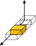

Space

(a) SM [38]

Frequency

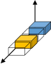

Space

(b) GSM [57]

Frequency

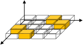

Space

(c) ASTSK [16]

Time

Fig. 7. PM-based coherent MIMO schemes, where we have _M_ = 4 transmit

antennas.

Concepts similar to OFDM have been proposed since the
1950s. In 1958, Mosier and Clabaugh developed a bandwidthefficient and high-capacity communication system that multiplexes a number of symbols in the frequency domain [148].
In 1966, Chang proposed the basic principle of orthogonal
multiplexing, where a number of data symbols are transmitted
through a band-limited channel without inter-carrier interference [149]. [9] Then, Weinstein and Ebert introduced the use
of IDFT and “guard space” [151], or guard interval, OFDM
was shown to be effective in mobile wireless communications

[152].
However, the OFDM scheme still has some open issues.
In the frequency domain, OFDM suffers from out-of-band
radiation, which may be suppressed by adding null symbols at
the spectrum edge. In the time domain, the OFDM signal has
a high PAPR [153], [154], which requires a high dynamic
range amplifier per transmit antenna. Hence, single-carrier
transmission combined with frequency-domain equalization
may be used for uplink channels [155], [156]. About 60
years have passed since 1958, OFDM still inspires academic
attention and many attractive alternatives have been proposed

[157].
_Channel Model:_ The wideband multipath channel results
in delayed paths. The received symbols are represented by a
linear convolution of the transmitted symbols and the channel
impulse response. This convolution leads to interference between independent symbols. The OFDM scheme mitigates this
interference problem by concatenating a guard interval, which
converts the linear convolution into a circular convolution. In

this treatise, we assume that the guard interval is longer than
the maximum delay spread. Also, carrier-frequency offsets
are assumed to be perfectly estimated at the receiver. Based
on the general model of Eq. (8), the channel matrix **H**
is represented as **H** = diag( _h_ 1 _, · · ·, h_ _M_ ) _∈_ C _[M]_ _[×][M]_ [35],
where the coefficients _h_ 1 _, · · ·, h_ _M_ obey the complex-valued
Gaussian distribution of _CN_ (0 _,_ 1).

IV. A PPLICATIONS OF THE PM C ONCEPT

_A. PM-Based Coherent MIMO_

In this section, we introduce the PM concept proposed in the
coherent MIMO literature [38]. The first PM-based coherent
MIMO scheme known as SSK was proposed by Chau and
Yu in 2001 [38]. The contributions to the PM-based coherent
MIMO schemes are summarized in Table III. Fig. 7 shows the
codewords of the SM-related schemes, which are discussed in

9 At the same time the proposed principle was patented in [150].

this subsection. As shown in Fig. 7, each of the codewords
has zero and non-zero symbols based on the on-off structure
of Eq. (5).
In the following, we introduce the generalized space-time
shift keying (GSTSK) scheme, which is capable of representing conventional MIMO schemes, such as the SM, SSK, GSM,
and BLAST schemes, with the aid of its flexible dispersion
matrix (DM) architecture [162]. The GSTSK framework allows us to analyze STBC-based MIMO encoding schemes in
a comprehensive manner. In advance of signal transmissions,
the GSTSK scheme requires carefully designed DMs **A** _q_ _∈_
C _[M]_ _[×][T]_ (1 _≤_ _q ≤_ _Q_ ), which are obtained off-line. The DMs
are designed to maximize the specific criterion considered,
such as the constrained average mutual information (AMI)
of Section V-A as well as the rank and determinant criterion

of Section V-B. A systematic DM construction method was
proposed in [167]. Each DM **A** _q_ has the following energy
constraint:

tr � **A** _q_ **A** _[H]_ _q_ � = _P_ _[T]_ [(1] _[ ≤]_ _[q][ ≤]_ _[Q]_ [)] _[.]_ (21)

The additional information bits are allocated by selecting _P_
DMs out of the set of _Q_ DMs **A** 1 _, · · ·,_ **A** _Q_ . We represent the
_Q_
number of DM selection patterns as _N_ a = 2 _[⌊]_ [log] [2] [ (] _P_ [)] _[⌋]_ . The
selected DM indices are denoted by **a** _k_ _∈_ Z _[P]_ for 1 _≤_ _k ≤_ _N_ a,
as determined by the on-off combination matrix of **C** _Q,P_ . The
vector **a** _k_ consists of the _P_ number of sorted integers ranging
from 1 to _Q_ ; these integers represent the activated DM indices.
For example, **a** 1 = [1 _,_ 2] implies that the first and second
DMs **A** 1 _,_ **A** 2 are activated. The natural binary code (NBC)

[58] maps **a** _k_ to the _k_ th row of **C** _Q,P_ . By contrast, the lookup table (LUT) method [35], [58] maps **a** _k_ to the manually
selected row of **C** _Q,P_ .
The _B_ = _B_ 1 + _B_ 2 input bits are partitioned into two
sequences: _B_ 1 = log 2 ( _N_ a ) bits and _B_ 2 = _P_ log 2 ( _L_ ) bits,
where _L_ denotes a constellation size. Based on the first _B_ 1
bits, the _k_ th index vector of **a** _k_ is selected out of the _N_ a
combinations, i.e., 1 _≤_ _k ≤_ _N_ a . Then, based on the second
_B_ 2 bits, the _P_ number of APSK symbols _s_ 1 _, · · ·, s_ _P_ _∈_ C are
generated. Finally, the space-time codeword of the GSTSK
scheme is generated by

In this treatise, we use the notation of GSTSK( _M, N, T, Q, P_ )
for simplicity.
Let us examine a detailed example. Fig. 8 shows the
transmitter example of the GSTSK scheme, where _P_ = 2
DMs are selected out of _Q_ = 4 DMs **A** 1 _, · · ·,_ **A** 4 _∈_ C _[M]_ _[×][T]_ .
4
Here, we have _N_ a = 2 _[⌊]_ [log] [2] [ (] 2 [)] _[⌋]_ = 2 [2] = 4 number of DMactivation patterns **a** 1 _, · · ·,_ **a** 4 _∈_ Z _[P]_ . The combination matrix

**S** =

_P_
� _s_ _p_ **A** **a** _k_ ( _p_ ) _._ (22)

_p_ =1

The bit per channel-use throughput of the GSTSK scheme is
given by

_R_ = _[B]_

=
_T_

_[B]_

_T_ [=] _[ B]_ [1] [ +] _T_ _[ B]_ [2]

�log 2 � _QP_ � [�] + _P_ log 2 _L_

[bits _/_ symbol] _._
_T_

(23)

ACCEPTED FOR PUBLICATION IN IEEE COMMUNICATIONS SURVEYS & TUTORIALS 11

TABLE III

C ONTRIBUTIONS TO PM- BASED COHERENT MIMO SCHEMES .

|Year|Authors|Contribution|
|---|---|---|
|1990|Baghdady [158]|Proposed a modulation system based on antenna hopping, where antenna switching results in a phase shift that conveys data.|
|2001|Chau and Yu [38]|Invented an SSK scheme for coherent MIMO communications.|
|2006|Mesleh_ et al._ [39]|Proposed an SM scheme that activates a single antenna out of multiple transmit antennas.|
|2008|Yang_ et al._ [159]|Proposed a channel-hopping-based MIMO scheme for high-rate communications and derived its ergodic capacity.|
|2008|Jeganathan_ et al._ [160]|Proposed an optimum detector for the SM scheme of [40].|
|2008|Jeganathan_ et al._ [57]|Extended the SSK concept to one using multiple transmit antennas at the same time.|
|2010|Sugiura_ et al._ [97]|Generalized the SM concept and proposed its differential counterpart.|
|2011|Ngo_ et al._ [161]|Applied the SM concept to the space-time-frequency domain.|
|2011|Sugiura_ et al._ [162]|Proposed a generalization concept for the SM scheme that subsumes conventional SM-related schemes within the STBC context.|
|2012|Yang and A´ıssa [163]|Derived the ergodic capacity for the GSM system.|
|2013|Rajashekar_ et al._ [164]|Conceived a transmit antenna selection scheme for SM systems that maximized its MED of codewords or its capacity.|
|2013|Rajashekar_ et al._ [9]|Proposed a reduced-complexity detector for the SM scheme, where its complexity is free from the constellation size.|
|2014|Ishibashi and Sugiura [74]|Clarified that the single-RF SM transmitter has to transmit each symbol during each symbol interval due to symbol-wise antenna switching. Hence, the bandwidth-efficient raised cosine filter is unavailable for the single-RF SM transmitter.|
|2015|Wu_ et al._ [165]|Proposed a precoding-aided spatial modulation system for secret communications, which reduced the detection complexity at the receiver.|
|2015|Basnayaka_ et al._ [77]|Proved that the SM scheme is effective for large-scale MIMO scenarios in terms of its ergodic capacity.|
|2017|Wang and Zhang [166]|Proposed a Huffman coding based adaptive spatial modulation, where the transmitter was assumed to have perfect channel estimates. The antenna activation probability was determined so as to maximize its capacity.|

N a = 4 combinations are prepared
based on the combination matrix C 4,2

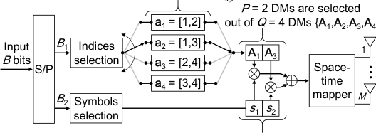

P = 2 symbols are generated

Fig. 8. Transmitter example of the GSTSK scheme for _Q_ = 4 and _P_ = 2,
where LUT-based DM activation is considered. By changing the DMs, the
GSTSK scheme becomes equivalent to BLAST, SM, GSM and ASTSK.

**C** _Q,P_ = **C** 4 _,_ 2 is given by Eq. (7) as follows:

performance. Specifically, the coding gain is maximized when
each index is selected with equal probability [168]. Some
beneficial LUT construction algorithms are detailed in [62],

[168].
In the following, we introduce the conventional schemes,
including SM, SSK, GSM, generalized space shift keying
(GSSK) and asynchronous space-time shift keying (ASTSK),
by invoking the GSTSK( _M, N, T, Q, P_ ) framework.
_SM/SSK [38], [40], [160]:_ The SM scheme is a member
of the PM family, where the PM codeword is expanded into
the spatial axis. The SM scheme activates a single antenna
out of multiple transmit antennas at any transmission time
instant. Similarly, the SSK scheme is a special form of SM,
where no modulation constellation is used. The SM encoding
principle is represented by the GSTSK( _M, N,_ 1 _, M,_ 1) having
the following DMs **A** _m_ _∈_ C _[M]_ _[×]_ [1] (1 _≤_ _m ≤_ _M_ ):



_, · · ·,_








_,_








_→_ **a** 1 = [1 _,_ 2]
_→_ **a** 2 = [1 _,_ 3]

_→_ **a** 3 = [2 _,_ 4]
_→_ **a** 4 = [3 _,_ 4]





0

1

...

0





0

0

...

1







1

0

...

0

_,_ (25)

**C** 4 _,_ 2 =





1 1 0 0

1 0 1 0

1 0 0 1

0 1 1 0

0 1 0 1

0 0 1 1

(24)

_{_ **A** 1 _,_ **A** 2 _, · · ·,_ **A** _M_ _}_ =

Here, if we use the NBC method [58], the DM-activation
vectors are given by **a** 1 = [1 _,_ 2] _,_ **a** 2 = [1 _,_ 3] _,_ **a** 3 = [1 _,_ 4],
and **a** 4 = [2 _,_ 3] based on the first, second, third, and fourth
rows of **C** 4 _,_ 2 . By contrast, if we use the LUT method, the DMactivation vectors are given by **a** 1 = [1 _,_ 2] _,_ **a** 2 = [1 _,_ 3] _,_ **a** 3 =

[2 _,_ 4], and **a** 4 = [3 _,_ 4] based on the first, second, fifth, and sixth
rows of **C** 4 _,_ 2 . These activation patterns affect the achievable

where each DM is also calculated by the combination matrix
**C** _M,_ 1 = **I** _M_ . The _m_ th index vector **a** _m_ is defined by the
length-one vector of **a** _m_ = [ _m_ ] _∈_ Z [1] . Finally, the SM
codeword is given by

**S** = _s_ 1 **A** **a** _m_ (1) = _s_ 1 **A** _m_ = [0 _· · ·_ 0 ���� _s_ 0 _· · ·_ 0] [T] _._
_m_ th row

_GSM/GSSK [57], [169]:_ The GSM and GSSK schemes
are extensions of the SM and SSK schemes, where an arbitrary

ACCEPTED FOR PUBLICATION IN IEEE COMMUNICATIONS SURVEYS & TUTORIALS 12

TABLE IV

B IT MAPPING EXAMPLE OF THE BPSK- AIDED GSM(4,2).

|Source (4 bits)|Indices a i|Symbols s, s 1 2|GSM codeword S √|
|---|---|---|---|
|0 0 0 0 0 0 0 1 0 0 1 0 0 0 1 1 0 1 0 0 0 1 0 1 0 1 1 0 0 1 1 1 1 0 0 0 1 0 0 1 1 0 1 0 1 0 1 1 1 1 0 0 1 1 0 1 1 1 1 0 1 1 1 1|**a**1 = [1_,_ 2] **a**1 = [1_,_ 2] **a**1 = [1_,_ 2] **a**1 = [1_,_ 2] **a**2 = [1_,_ 3] **a**2 = [1_,_ 3] **a**2 = [1_,_ 3] **a**2 = [1_,_ 3] **a**3 = [2_,_ 4] **a**3 = [2_,_ 4] **a**3 = [2_,_ 4] **a**3 = [2_,_ 4] **a**4 = [3_,_ 4] **a**4 = [3_,_ 4] **a**4 = [3_,_ 4] **a**4 = [3_,_ 4]|+1_,_ +1 +1_, −_1 _−_1_,_ +1 _−_1_, −_1 +1_,_ +1 +1_, −_1 _−_1_,_ +1 _−_1_, −_1 +1_,_ +1 +1_, −_1 _−_1_,_ +1 _−_1_, −_1 +1_,_ +1 +1_, −_1 _−_1_,_ +1 _−_1_, −_1|[+1_,_ +1_,_ 0_,_ 0]T_/_  2 [+1_, −_1_,_ 0_,_ 0]T_/_ ~~_√_~~ 2 [_−_1_,_ +1_,_ 0_,_ 0]T_/_ ~~_√_~~ 2 [_−_1_, −_1_,_ 0_,_ 0]T_/_ ~~_√_~~ 2 [+1_,_ 0_,_ +1_,_ 0]T_/_ ~~_√_~~ 2 [+1_,_ 0_, −_1_,_ 0]T_/_ ~~_√_~~ 2 [_−_1_,_ 0_,_ +1_,_ 0]T_/_ ~~_√_~~ 2 [_−_1_,_ 0_, −_1_,_ 0]T_/_ ~~_√_~~ 2 [ 0_,_ +1_,_ 0_,_ +1]T_/_ ~~_√_~~ 2 [ 0_,_ +1_,_ 0_, −_1]T_/_ ~~_√_~~ 2 [ 0_, −_1_,_ 0_,_ +1]T_/_ ~~_√_~~ 2 [ 0_, −_1_,_ 0_, −_1]T_/_ ~~_√_~~ 2 [ 0_,_ 0_,_ +1_,_ +1]T_/_ ~~_√_~~ 2 [ 0_,_ 0_,_ +1_, −_1]T_/_ ~~_√_~~ 2 [ 0_,_ 0_, −_1_,_ +1]T_/_ ~~_√_~~ 2 [ 0_,_ 0_, −_1_, −_1]T_/_ ~~_√_~~ 2|

number of transmit antennas are activated simultaneously

[57], [169]. The GSM encoding principle is represented by
GSTSK( _M, N,_ 1 _, M, P_ ), where we have _Q_ = _M_ number of

_M_

DMs given by Eq. (25) divided by _√P_ and _N_ a = 2 _[⌊]_ [log] [2] [ (] _P_ [)] _[⌋]_

number of DM-activation patterns **a** 1 _, · · ·,_ **a** _N_ a _∈_ Z _[P]_ defined
by the combination matrix **C** _M,P_ . In the rest of this paper, we
use the notation of GSM( _M, P_ ), where _M_ is the number of
transmit antennas and _P_ is the number of activated antennas.

Note that the GSM( _M, P_ ) scheme having _L_ = 1 is equivalent
to the GSSK scheme. Table IV shows the bit mapping example
for the LUT method. Note that GSM( _M, M_ ) is equivalent
to the conventional BLAST scheme, where _M_ number of
independent symbols are embedded in a codeword.

In 2013, Khandani proposed a media-based modulation
(MBM) concept [170], [171], which conveys data by changing
radio propagation. In a theoretical system model, the MBM
scheme is similar to the SSK signaling. The key contribution
of MBM is the higher capacity achieved by RF mirrors. As
we reviewed in this section, the transmission rate _R_ of the
SSK scheme is limited by the number of transmit antennas. In
contrast, the transmission rate of the MBM scheme increases
with the number of scattering patterns, where its capacity is
equivalent to the AWGN channel while assuming the Rayleigh
fading channel. Motivated by this attractive nature, the MBM
has gained attention in the wireless community [170–177].

_ASTSK [16]:_ The ASTSK scheme is an extension of
the SM scheme. In the ASTSK scheme, the number of
symbol intervals per block is increased to _T_ _≥_ 2 [16],
which is represented by GSTSK( _M, N, T, Q,_ 1). Each DM
**A** _q_ _∈_ C _[M]_ _[×][T]_ (1 _≤_ _q ≤_ _Q_ ) has a single non-zero element
in its column as well as row, and has the constraint of
rank( **A** _q_ ) = min( _M, T_ ). For example, if we consider the

( _M, T, Q_ ) = (3 _,_ 3 _,_ 4) case, the DMs are given by

_{_ **A** 1 _,_ **A** 2 _,_ **A** 3 _,_ **A** 4 _}_

Because the _P_ = 1 modulated APSK symbol is spread over _T_
time slots, the ASTSK scheme at most achieves the diversity
order of _T_ .

_B. PM-Based Differential MIMO_

In Section IV-A, we reviewed the PM schemes proposed
for coherent MIMO systems, which require accurate estimates
of the channel matrix **H** at the receiver. In this section, we
continue by reviewing the differentially encoded and noncoherently detected counterparts of the coherent PM schemes,
which dispense with the channel estimation overhead. The major contributions to the PM-based differential MIMO schemes
are summarized in Table V. We introduce two types of unitary
matrix construction methods: the permutation-matrix-based
method and the Cayley-transform-based method.
_1) Differential Spatial Modulation:_ Motivated by the SM
concept [38], [40], the differential counterpart of the SM
scheme was proposed [10], [97], which includes the socalled differential spatial modulation (DSM) family [19], [22].
The DSM scheme was generalized to strike a diversity vs
multiplexing gain tradeoff [21], [23], [183], and later it was
extended to support the large-scale MIMO system concept

[108]. The space-time codeword of the DSM scheme has
a single non-zero element in its column and row. Hence,
the DSM scheme is capable of enabling single-RF operation,
as well as dispensing with the channel estimation overhead.
Furthermore, because the number of non-zero elements in
each column is limited in the DSM codewords, the transmitter
complexity can be further improved by limiting the phase of
non-zero elements [181], [182], [184]. Note that the concept
of sparse space-time codewords was proposed in [16], [178]
before the invention of the DSM concept.
Let us review the DSM encoding principle of [21]. The
DSM transmitter maps an input bit sequence of length _B_
onto an output space-time matrix **S** ( _i_ ), where _i_ represents
the transmission index. In advance of the transmissions, _Q_
number of DMs **A** _q_ _∈_ C _[M]_ _[×][M]_ ( _q_ = 1 _, · · ·, Q_ ) have to be
prepared. Each DM **A** _q_ has a single non-zero-unit-absolutevalue element in its column and row. Here, we represent the
non-zero element as _a_ _q,m_ (1 _≤_ _q ≤_ _Q,_ 1 _≤_ _m ≤_ _M_ ), where

 _[,]_

_a_ 21 0 0

 0 0 _a_ 23

 0 _a_ 22 0

0 0 _a_ 43

 0 _a_ 42 0

 _a_ 41 0 0



 _,_

=








_a_ 11 0 0

 0 _a_ 12 0

 0 0 _a_ 13

0 _a_ 32 0

 _a_ 31 0 0

 0 0 _a_ 33





 _,_



 _,_








where _a_ _qm_ represents a complex value. Furthermore, for the
( _M, T, Q_ ) = (4 _,_ 2 _,_ 4) case, we have

_{_ **A** 1 _,_ **A** 2 _,_ **A** 3 _,_ **A** 4 _}_







_,_




 00 00

_a_ 31 0

 0 _a_ 32



_,_


 00 00

0 _a_ 42

 _a_ 41 0







_._




_,_


0 _a_ 22
_a_ 21 0

0 0

0 0

=







_a_ 11 0
0 _a_ 12

0 0

0 0

ACCEPTED FOR PUBLICATION IN IEEE COMMUNICATIONS SURVEYS & TUTORIALS 13

TABLE V

C ONTRIBUTIONS TO THE PM- BASED DIFFERENTIAL MIMO SCHEMES .

|Year|Authors|Contribution|
|---|---|---|
|2000|Hughes [100]|Proposed a differential MIMO scheme relying on diagonal and anti-diagonal matrices to support an arbitrary number of transmit antennas. If we limit the matrix “_D_” in [100] to the identity matrix, the space-time codewords result is sparse, which was not clearly mentioned.|
|2000|Hochwald and Sweldens [103]|Proposed a differential MIMO scheme relying on diagonal matrices to support an arbitrary number of transmit antennas. The proposed scheme achieves full diversity and enables single- RF transmission.|
|2007|Oggier [178]|Proposed a permutation-matrix-based differential MIMO scheme relying on cyclic division algebra. This scheme has similar advantages to that of [103].|
|2010|Sugiura_ et al._ [97]|Proposed a differential counterpart of the coherent space-time shift keying (STSK) scheme. This scheme conveys information bits by selecting a single out of multiple DMs. The encoding principle is based on the differential linear dispersion code (LDC) scheme of [104].|
|2011|Sugiura_ et al._ [10]|Proposed a differential counterpart of the SM scheme, based on the unitary matrices, which subsumes most of the unitary-matrix-based DSM schemes [19], [21], [23] shown below.|
|2013|Bian_ et al._ [19]|Designed the space-time codewords of the DSM scheme, which are generated from the diagonal and anti-diagonal matrices.|
|2014|Wen_ et al._ [20]|Derived a tight BER bound for the DSM scheme having_ M_ = 2.|
|2014|Ishikawa and Sugiura [21]|Proposed a DM-based counterpart of [19] with the aim of striking the tradeoff between diversity and rate.|
|2014|Bian_ et al._ [22]|Proposed a generalized DSM scheme based on [19] to support an arbitrary number of transmit antennas. The space-time codewords are generated from permutation matrices.|
|2015|Wen_ et al._ [11]|Proposed a low-complexity detector for the DSM scheme of [19]. The proposed scheme with this detector achieved near-optimal performance at high SNRs.|
|2016|Rajashekar_ et al._ [23]|Proposed a field-extension-based DSM scheme, which alleviated the DM optimization problem of [21]. The proposed scheme can adjust the diversity and rate tradeoff.|
|2016|Li_ et al._ [179]|Proposed a general method to determine the non-zero positions in the DMs of the DSM scheme. This method adopted Trotter-Johnson ranking and unranking algorithms.|
|2016|Zhang_ et al._ [12]|Applied the precoding-aided SM and DSM schemes to dual-hop virtual-MIMO relaying networks. They proposed two low-complexity detectors.|
|2017|Ishikawa and Sugiura [108]|Proposed a rectangular-matrix-based DSM concept, which can support the massive MIMO, e.g., the scenario of_ M_ = 1024 antennas. The transmission rate linearly increases as the number of transmit antennas increases.|
|2017|Xiao_ et al._ [180]|Combined the DSM scheme with the space-time block coded SM [15] to replace non-zero elements in SM symbols with OSTBCs. The proposed scheme was applied to large-scale MIMO scenarios by reducing the detection complexity at the receiver. The authors assumed _M_ = 32 transmit antennas as a maximum with the corresponding transmission rate_ R_ = 2_._62 [bits/symbol]. Note that this scheme is different from that of [108] because it depends on square matrices instead of rectangular matrices.|
|2017|Rajashekar_ et al._ [181]|Proposed an enhanced DSM scheme based on [23], which is capable of avoiding the issue raised in [182]. Two novel buffer-based low-complexity detectors were conceived, where the successive codewords were used to improve the error rate. The proposed schemes were shown to achieve the near-coherent performance.|
|2017|Xu_ et al._ [182]|Raised a novel issue concerning the cardinality of the resultant constellation after differential encoding, and proposed a solution for this issue. The conventional differential MIMO may result in an infinite cardinality of constellation, which requires high-resolution analog-to- digital converters. Additionally, the constrained AMI for arbitrary differential MIMO was firstly derived. The proposed scheme was shown to achieve a high diversity order at a reduced complexity.|

_q_ denotes the DM index and _m_ denotes the activated antenna
index. The norm of the non-zero element is constrained to be
_|a_ _q,m_ _|_ = 1 to maintain the unitary constraint. The following
examples are _Q_ = 2 DMs for the _M_ = 2 transmit antenna
scenario:

_{_ **A** 1 _,_ **A** 2 _}_

_e_ _[−][j]_ [0] _[.]_ [82] _[π]_ 0 _._ 00

=
0 _._ 00 _e_ [+] _[j]_ [0] _[.]_ [42] _[π]_
��

0 _._ 00 _e_ _[−][j]_ [0] _[.]_ [01] _[π]_

_,_

_e_ [+] _[j]_ [0] _[.]_ [10] _[π]_ 0 _._ 00

� �

_._ (26)
��

Differential encoding

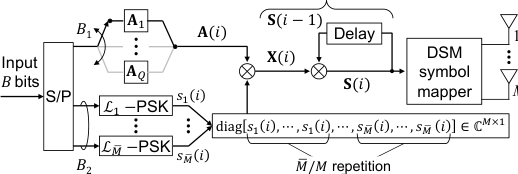

Fig. 9. Schematic of the DSM transmitter. c _⃝_ IEEE [21]

Fig. 9 shows the transmitter structure of the DSM scheme.

The 2 _×_ 2 permutation matrices are multiplied by complexvalued phase shifters. As seen in Eq. (26), the norm of each
non-zero element is constrained to be 1. Hence, each DM
**A** 1 _, · · ·,_ **A** _Q_ is kept as a unitary matrix.

ACCEPTED FOR PUBLICATION IN IEEE COMMUNICATIONS SURVEYS & TUTORIALS 14

In Fig. 9, the input bits are S/P converted to _B_ 1 = log 2 ( _Q_ )
bits and _B_ 2 = log 2 ( _L_ 1 _· L_ 2 _· · · · · L_ _M_ ¯ [)][ bits, where each of]
_L_ 1 _, · · ·, L_ _M_ ¯ [represents the constellation size. The first] _[ B]_ [1] [bits]
are used for selecting a DM **A** _q_ ( _i_ ) out of _Q_ number of DMs.
The second _B_ 2 bits are mapped to _M_ [¯] number of PSK symbols
_s_ 1 ( _i_ ) _, s_ 2 ( _i_ ) _, · · ·, s_ _M_ ¯ [(] _[i]_ [)][, which are packed into an] _[ M]_ _[×]_ [1][ vector]
as follows:

_, · · ·, s_ _M_ ¯ [(] _[i]_ [)] _[,][ · · ·][, s]_ _M_ [ ¯] [(] _[i]_ [)]
~~�~~ � ~~�~~ �
_M/M_ [¯] repetition

**s** ( _i_ ) = [ _s_ 1 ( _i_ ) _, · · ·, s_ 1 ( _i_ )
~~�~~ ~~�~~ � ~~�~~
_M/M_ [¯] repetition

] _∈_ C _[M]_ _[×]_ [1] _._

(27)

Here, _M_ ¯ for 1 _≤_ _M_ ¯ _≤_ _M_ represents the number of PSK
symbols embedded into a space-time matrix, which determines
the rate vs diversity factor. For example, if we embed _M_ [¯] = _M_
symbols, then the maximum diversity order is _M/M_ [¯] = 1,
while the transmission rate is maximized. Hence, the DSM
scheme strikes a flexible tradeoff between the transmission rate
and the achievable diversity order, which is often referred to
as diversity vs multiplexing tradeoff. A unitary matrix **X** ( _i_ ) _∈_
C _[M]_ _[×][M]_ is calculated as follows:

**X** ( _i_ ) = diag [ **s** ( _i_ )] **A** _q_ ( _i_ ) _,_ (28)

which is associated with the input _B_ bits. In Eq. (28), diag[ _·_ ]
denotes the diagonal operation that maps a vector to a diagonal
matrix. The data matrix **X** ( _i_ ) is a sparse matrix, where each
column and row has a single non-zero element. The norm
of each non-zero element in **X** ( _i_ ) is also constrained to be 1,
which is similar to the DM construction of _|a_ _q,m_ _|_ = 1. Finally,
a space-time codeword **S** ( _i_ ) _∈_ C _[M]_ _[×][M]_ is differentially encoded, as given in Section III-B. The normalized transmission
rate is given by

_R_ = _[B]_ [lo][g] [2] [(] _[Q][ · L]_ [1] _[ · · · L]_ _M_ [ ¯] [)] _._ (29)

_M_ [=] _M_

2 [4]

2 [3]

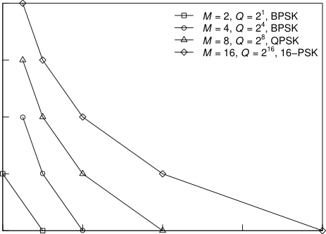

1 2 3 4 5

Transmission rate _R_ [bits/symbol]

Fig. 10. Tradeoff between transmission rate _R_ and maximum diversity order
_D_ of the scheme of Fig. 9, where the number of transmit antennas was
_M_ = 2 _,_ 4 _,_ 8 _,_ 16.

is equivalent to the DSM scheme having _M_ [¯] = 1. Here, the
DSM scheme has no limitation in terms of _M_ [¯] and therefore

achieves a flexible rate vs diversity tradeoff. Furthermore,
the DSM scheme may be considered as a generalization of
the conventional BDSM scheme proposed in [22]. The DMs
of the BDSM have non-zero elements of one, formulated as
_a_ _q,m_ = 1 (1 _≤_ _q ≤_ _Q,_ 1 _≤_ _m ≤_ _M_ ). Due to the _a_ _q,m_ = 1
limitation, the number of DMs _Q_ is limited to 2 _[⌊]_ [log] [2] [(] _[M]_ [!)] _[⌋]_,
where we have _M_ ! = _M ·_ ( _M −_ 1) _· · ·_ 1. For example, if we
consider the _M_ = 3 case, the number of DMs is defined by
_Q_ = 2 _[⌊]_ [log] [2] [(3!)] _[⌋]_ = 2 _[⌊]_ [2] _[.]_ [58] _[...][⌋]_ = 2 [2] = 4 and the DMs are given
as follows:

_{_ **A** 1 _,_ **A** 2 _,_ **A** 3 _,_ **A** 4 _}_

For example, if we consider thethe embedded _M_ ¯ = 2 BPSK symbols are represented as _M_ = 4 and _M_ [¯] = 2 scenarios,
follows:

diag [ **s** ( _i_ )] = diag [ _s_ 1 ( _i_ ) _, s_ 1 ( _i_ ) _, s_ 2 ( _i_ ) _, s_ 2 ( _i_ )] _._ (30)

The constellations are denoted by **L** = [( _L_ 1 _, L_ 1 ) _,_ ( _L_ 2 _, L_ 2 )] =

[(2 _,_ 2) _,_ (2 _,_ 2)]. In Eq. (30), the pair of two BPSK symbols
_s_ 1 ( _i_ ) and _s_ 2 ( _i_ ) are embedded into a space-time codeword.
The configuration in Eq. (30) achieves a diversity order of
_D_ = 2 because each symbol is spread over two successive
symbols’ transmissions.
Fig. 10 shows the flexible rate vs diversity tradeoff

=
of the DSM scheme. Here, the setups of ( _M, Q_ )
�2 _,_ 2 [1] [�] _,_ �4 _,_ 2 [4] [�] _,_ �8 _,_ 2 [8] [�] _,_ �16 _,_ 2 [16] [�] were considered. The num-¯
ber of embedded symbols was in the range of _M_ =
2 [0] _,_ 2 [1] _, · · ·,_ 2 [log] [2] [(] _[M]_ [)] . As shown in Fig. 10, the maximum
diversity order _D_ is reduced upon increasing the transmission
rate _R_ .

The DSM architecture of [21] subsumes the DSTSK [97]
and the binary differential spatial modulation (BDSM) [22]
schemes. It was also be readily shown that a specific form
of the DSM scheme is equivalent to DSTSK. Specifically,
the DSTSK modulation process embeds a single complexvalued symbol into a space-time codeword. This configuration

_2) Non-Coherent Generalized Spatial Modulation:_ The
non-coherent generalized spatial modulation (NCGSM) [185]
is the differential counterpart of the GSTSK scheme described
in Section IV-A. The encoding principle of the NCGSM
scheme is basically the same as that of the GSTSK scheme,
with the following two exceptions:




















 _[.]_

=








10 01 00

0 0 1


 _,_

10 00 01

0 1 0


 _,_

01 10 00

0 0 1


 _,_

00 01 10

1 0 0


Furthermore, in the BDSM codewords, the number of embedded symbols _M_ [¯] is limited to _M_ . This limitation imposes
the diversity order of _D_ = 1. The DSM scheme supports the
_Q >_ 2 _[⌊]_ [log] [2] [(] _[M]_ [!)] _[⌋]_ case, because _a_ _q,m_ is a complex value. As an
example, we consider the DSM scheme having two DMs, **A** 1
and **A** 2, where each DM has the same positions of non-zero
elements. At the receiver, the scheme can differentiate the pair
of DMs, if the phases of the non-zero elements are different,
as follows:



 _,_

 _[.]_

_π_
_e_ 4 _[j]_ 0 0

_π_

 0 0 _e_ 2 _[j]_

0 _e_ _[πj]_ 0





_{_ **A** 1 _,_ **A** 2 _}_ =






_π_
_e_ 2 _[j]_ 0 0

_π_

 0 0 _e_ 6 _[j]_

0 _e_ _π_ 3 _[j]_ 0





0 _e_ _π_ 3 _[j]_ 0

0 _e_ _[πj]_ 0








ACCEPTED FOR PUBLICATION IN IEEE COMMUNICATIONS SURVEYS & TUTORIALS 15

_•_ The embedded symbols _s_ 1 _, · · ·, s_ _P_ have to be realvalued, as is pulse amplitude modulation (PAM).

_•_ The DMs **A** 1 _, · · ·,_ **A** _Q_ _∈_ C _[M]_ _[×][M]_ are Hermitian matrices.
Thus, each DM satisfies **A** _q_ = **A** [H] _q_ [.]
The GSTSK space-time codewords **S** ( _i_ ) are generated by the
summation of the DMs, as given in Eq. (22). Similarly, the
NCGSM space-time codewords **X** [˜] ( _i_ ) _∈_ C _[M]_ _[×][M]_ are generated
as follows, when the _k_ th DM-activation vector is selected:

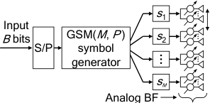

D T

P out of M

subarrays
are activated

Fig. 11. Schematic of the PM-based MIMO-MWC scheme.

Babakhani _et al._ [186] proposed an RF-switching-based
modulation technique that generates the conventional I/Q
symbols by changing the electromagnetic boundary conditions.
Although the relationship between RF switching and the PM
concept was not explicitly treated in [186], the concept behind

[186] is reminiscent of the PM philosophy. Based on [186], the
RF-switching concept was extended to MIMO-MWCs, where
the appropriate subarrays are switched on and off. Similar to

[186], the MWC scheme of Valliappan _et al._ [187] achieves
highly secured wireless communications.
Apart from the RF-switching-based schemes [186], [187],
the SSK-based MWCs were first proposed by Liu and Springer
in [25], which was the seminal research in this field. In

[25], the SSK modulation principle was directly applied in
a MIMO-MWC system. The SSK modulation principle was
also extended to the GSM scheme by Liu _et al._ [26] and
was combined with analog phase shifters [24], [189]. Fig. 11
illustrates the schematic of the GSM-aided MWC transmitter

of [24], where the analog BF is considered. The subarray
separation _D_ T is determined by the criterion of Eq. (16).
Quadrature SM, which becomes the family of GSM schemes,
was also applied to MIMO-MWCs by Mesleh and Younis

[188]. Hemadeh _et al._ have proposed the STSK-based MIMOMWC system [192–196], where the STSK scheme is a generalization of GSM. The achievable performance of PM-aided
MIMO-MWC schemes has been evaluated in terms of the BER

in uncoded scenarios [25], [26], [188–192] and the AMI in
coded scenarios [24], [26], [188]. The major limitation of the
PM-based MWC scheme is its reduced BF gain, where the
number of activated subarrays is lower than that of the BLAST
scheme [24].

Fig. 12 illustrates the absolute values of the array factor
with respect to the horizontal direction, where the optimal
array alignment of Eq. (16) was considered. Fig. 12(a) shows
the achievable directional gain of the full-RF-aided BLAST
scheme, while Figs. 12(b) and (c) show that of the GSMaided scheme. Figs. 12(a) – (c) demonstrate that the optimum
alignment of Eq. (16) changes the pattern of the directional BF
gains. We observe in Figs. 12(a) and (b) that the measured BF
gain of BLAST was 6.0 [dB], while that of GSM was 4.3 [dB].
This observation means that the GSM-based transmitter has a

BF gain reduction. We observe furthermore in Figs. 12(b) and
(c) that the beam pattern changes depending on the positions
of non-zero elements in the codeword: **x** = [ _s_ 1 _, s_ 2 _,_ 0 _,_ 0] [T]

and [ _s_ 1 _,_ 0 _, s_ 2 _,_ 0] [T] . Hence, the GSM-based scheme conveys the
additional information bits by selecting a beam pattern. The
contributions to the development of PM-based MWC schemes
are summarized in Table VI.

**X** ˜ ( _i_ ) =

_P_
� _s_ _p_ **A** **a** _k_ ( _p_ ) _._ (31)

_p_ =1

Because the DMs **A** **a** _k_ ( _p_ ) are Hermitian and the PAM symbols
_s_ _p_ are real-valued, the summation of Eq. (31) results in a
Hermitian matrix. Finally, a unitary matrix **X** ( _i_ ) _∈_ C _[M]_ _[×][M]_ is
calculated by

_−_ 1 ˜
**X** ( _i_ ) = **I** _M_ _−_ _j_ **X** [˜] ( _i_ ) **I** _M_ + _j_ **X** [˜] ( _i_ ) _≡_ _ζ_ **X** ( _i_ ) _,_
� �� � � �
(32)

which is referred to as the Cayley transform [104]. Explicitly, the Cayley transform is a mapping between a skewedHermitian matrix and a unitary matrix. In Eq. (32), the skewed
counterpart of **X** [˜] ( _i_ ), which is calculated by _j_ **X** [˜] ( _i_ ), is mapped
to the unitary matrix **X** ( _i_ ). The Cayley transform of Eq. (32) is
denoted by _ζ_ ( _·_ ). The transmission rate of the NCGSM scheme
is given by

_R_ =

�log 2 � _QP_ � [�] + _P_ log 2 ( _L_ )

[bits _/_ symbol] _._ (33)
_M_

As we mentioned in Section IV-A, the GSTSK scheme
subsumes the conventional GSM, ASTSK and LDC schemes.
Similar to the GSTSK scheme, the NCGSM architecture
subsumes the conventional DSTBC schemes, which rely on
the Cayley transform. More specifically, the NCGSM scheme
having _P_ = _Q_ is equivalent to the differential LDC [104],
which achieves a high transmission rate with the aid of
the multiplexed PAM symbols. Furethermore, the NCGSM
scheme having _P_ = 1 is equivalent to differential spacetime shift keying (DSTSK) [97], which is the differential
counterpart of the STSK scheme.

_C. PM-Based MIMO-MWC_

In Section III-C, we reviewed the hybrid BF technique
conceived for MIMO-MWCs. The hybrid technique reduces
the number of RF chains at the transmitter by using both
analog and digital BF. Although the hybrid BF technique
significantly reduces the complexity of the transmitter, the
complexity may still become excessive as the transmission
rate increases, because the number of independent data streams
also increases. To maintain a high rate for MIMO-MWCs under practical resource constraints, a straightforward approach
is to combine the PM concept with the MIMO-MWC concept.
Hence, PM-aided MIMO-MWC schemes have been proposed

[24–26], [186–192] for reducing the hardware complexity of
the transmitter, because the PM scheme transmits a reduced
number of data streams, as mentioned in Section II.

ACCEPTED FOR PUBLICATION IN IEEE COMMUNICATIONS SURVEYS & TUTORIALS 16

TABLE VI

C ONTRIBUTIONS TO THE PM- BASED MWC

|Year|Authors|Contribution|
|---|---|---|
|2008|Babakhani_ et al._ [186]|Proposed the near-field direct antenna modulation technique that generated an I/Q symbol by switching RF reflectors. The modulated I/Q symbol was scrambled for undesired directions. A proof- of-concept transmitter was implemented at 60 GHz to demonstrate the feasibility of the proposed technique.|
|2013|Valliappan_ et al._ [187]|Proposed the secure wireless communications scheme based on [186]. In the proposed scheme, transmit antenna subarrays were switched on and off, and large sidelobes were suppressed by the simulated annealing algorithm.|
|2014|Liu and Springer [25]|Proposed the SSK-based MWC scheme, where antenna elements were properly placed to maintain channel orthogonality. This contribution [25] is considered as a seminal research in the literature.|
|2016|Hemadeh_ et al._ [192]|Proposed the STSK-based MWC scheme, where the space-time codewords were used instead of the SSK-specific spatial codewords. In multiuser multicarrier downlink scenarios, the proposed scheme was shown to be capable of serving an increased number of users.|
|2016|Ishikawa_ et al._ [24]|Proposed the GSM-based MWC scheme with analog BF, where the constrained AMI was compared with both BLAST and GSM. The simulation results showed that the reduced-RF GSM scheme was equivalent to the full-RF-aided BLAST at the half-rate region.|
|2016|Liu_ et al._ [26]|Proposed the GSM-based MWC scheme, where the authors identified the channel conditions that minimize the error probability in uncoded scenarios. The unconstrained MI was derived for the GSM scheme. Also, the authors considered a practical hardware implementation of the proposed scheme. The simulation results showed that the GSM scheme performed better than the BLAST scheme for two RF cases.|
|2016|Perovic_ et al._ [190]|Applied the receive SM concept [197] to MIMO-MWCs. The authors identified the channel condition that minimizes the error probability of the proposed scheme.|
|2017|Mesleh and Younis [188]|Analyzed the constrained MI of the quadrature SM, where the channel coefficients were deterministic. The simulation results showed that the random alignment of antenna elements was effective in the overloaded scenario, i.e.,_ M > N_.|
|2017|Perovic_ et al._ [189]|Proposed phase-rotation-based precoding for the GSM-aided MWC. The proposed scheme was shown to be effective in the low modulation order scenario.|
|2017|Sacchi_ et al._ [198]|Proposed the STSK-based MWC scheme for the small-cell backhaul in a dense urban environment, where oxygen absorption, rain attenuation, and shadowing were considered.|
|2017|Ding_ et al._ [191]|Proposed spatial scattering modulation for the NLoS MWC-uplink, which was motivated by the SM concept. The proposed scheme conveyed additional bits by selecting a spatial direction for the scattering clusters.|
|2017|Hemadeh_ et al._ [195]|Proposed a reduced-RF-chain multi-set STSK-based MWC scheme, where OFDM and single-carrier frequency domain equalization were considered. The soft-decision single-carrier-based scheme with ABF was capable of achieving a near-capacity performance over dispersive MWC channels.|
|2017|He_ et al._ [199]|Proposed the phase-rotation-based precoding for GSM-aided MWCs. Different from [189], the authors derived the lower bound of the spectral efficiency with a closed form, and then designed phase shifters to maximize the derived bound.|
|2017|Botsinis_ et al._ [200]|Proposed a joint-alphabet STSK for uplink non-orthogonal multiple access MWCs. The proposed scheme achieved a higher capacity than the conventional STSK. The authors also conceived a quantum-assisted low-complexity detector.|

_D. PM-Based MIMO-VLC_

As introduced in Section III-C, in PD-aided MIMO-VLCs,
the channel relies on strong LoS elements. In such an environment, the rank of the channel matrices becomes typically
low. Accordingly, both the MIMO diversity gain and the SMX
gain are eroded, as described in Section III-A. To combat this
limitation, the PM concept was first applied to the MIMOVLCs by Mesleh _et al._ [27]. This scheme was referred to as
optical spatial modulation (OSM). The performance gain of
the OSM scheme over the conventional single-stream scheme
has been quantified in correlated channels [27], [27], [28],

[201], [202], because the OSM scheme relies on a reduced
number of data streams. The high-frequency LED switching
is feasible, and its bandwidth expansion is not a critical issue
in the unlicensed VLC spectral band [30]. Thus, the OSM
scheme is free from the SM antenna switching problem [74]
of the single-RF architecture.
In [203], [204], the OSM scheme was evaluated by Popoola

and Haas in a realistic LoS channel, where high correlations
were observed. It was shown by them in [203], [204] that it
is difficult for the OSM scheme to attain a performance gain
in these highly correlated channels. Careful power allocation
(PA) method was invoked for the OSM scheme. The new
scheme was referred to as power-imbalanced (PI) OSM [29].
The PA method of [29] mitigated the channel correlations with
real-valued precoding associated with light sources. In [29],
the PA parameters were determined for the case of four light

sources.

In most of the OSM studies [27–29], [78], [201], [202],

[204–208], the performance advantages have been demonstrated in terms of the BER in uncoded scenarios. The

information-theoretic analyses found in [30], [209–211] also
demonstrated the benefits of the OSM scheme in coded scenarios, where it achieved a higher constrained mutual information
(MI) in the low SNR region [30], [210], [212]. The important
contributions of the family of PM-based MIMO-VLCs are

ACCEPTED FOR PUBLICATION IN IEEE COMMUNICATIONS SURVEYS & TUTORIALS 17

TABLE VII

C ONTRIBUTIONS TO OSM

|Year|Authors|Contribution|
|---|---|---|
|2010|Mesleh_ et al._ [78]|Applied the SM concept [40] to MIMO-VLCs, and the new scheme was termed OSM. The OSM scheme of [78] relies only on spatial domain symbols, where no constellations are considered.|
|2010|Fath_ et al._ [201]|Studied the performance of the SSK-aided VLC scheme in measured channels, where the power imbalance technique was shown to be effective for improving error probability.|
|2011|Mesleh_ et al._ [27]|Analyzed the OSM scheme of [78] in terms of the channel alignment and the theoretical BER in uncoded and coded scenarios. The simulation results demonstrated the performance gain of the OSM scheme in the_ M_ = 4 case. The benchmarks were conventional single-stream on-off keying and PAM schemes.|
|2011|Fath_ et al._ [28]|Combined the OSM scheme of [27] with PAM, which improved the spectral efficiency of OSM.|
|2012|Popoola_ et al._ [202]|Combined the OSM scheme of [27] with PPM to improve energy efficiency. Measured channel gains were considered.|
|2012|Poves_ et al._ [206]|Investigated the achievable performance of the OSM scheme [27] in a real environment, where the numbers of light sources and PDs were (_M, N_) = (4_,_ 1). The transmission rate of 18 [Mbits/s] was achieved.|
|2012|Fath and Haas [29]|Compared the OSM scheme with the repetition coding and SMX schemes. In addition, they proposed a novel PI-OSM scheme, which allocated power imbalance factors to each transmit LED with the aim to combat highly correlated VLC channels.|
|2013|Popoola_ et al._ [205]|Applied the GSSK concept of [169] to MIMO-VLCs, where multiple light sources were simultaneously activated.|
|2013|Fath and Haas [207]|Combined the OSM scheme with color-shift keying.|
|2014|Popoola and Haas [204]|Demonstrated the positive and negative effects of the GSSK-aided VLC scheme in a real environment. The transmission rate of 40 [Mbits/s] was achieved.|
|2015|Ishikawa and Sugiura [30]|Proposed a flexible PA method for the PI-OSM scheme of [29], where PA parameters were designed to maximize the constrained MI. The constrained MI comparisons showed that the PI-OSM scheme was beneficial over the conventional repetition coding and OSM schemes.|
|2015|Ozbilgin and Koca [208]|Proposed a modulation scheme that combined OSM with both PPM and PAM for free space optical communications. The proposed scheme was shown to be capable of offering robustness against the scintillation effects of turbulence channels.|
|2015|Peppas and Mathiopoulos [209]|Analyzed the OSM scheme in terms of the average BER in uncoded and coded scenarios. The homodyned K distribution, which is a general free space optical channel model, was assumed in simulations. The analytical and numerical results verified the performance advantages of the OSM scheme over the conventional single-stream scheme.|
|2016|Cai and Jiang [210]|Proposed a PPM-aided OSM scheme for multiuser MIMO-VLCs. The simulation results showed that the proposed scheme had advantages over conventional schemes at low illu- mination levels.|
|2016|He_ et al._ [213]|Compared the OSM scheme with the BLAST scheme in terms of the BER in uncoded scenarios. In the simulations, asymmetrically clipped optical OFDM signaling was assumed with an effective modulation bandwidth of 2 [MHz]. The BLAST scheme was shown to perform better than the OSM scheme for the transmission rate of 8 [bits/symbol] scenario.|
|2016|Wang_ et al._ [211]|Analyzed the OSM scheme in terms of the constrained MI. The simulation results revealed that the MED between the received symbols had a strong impact on the MI lower bound. The precoding parameters were designed to maximize the MED, which led to a higher MI.|

summarized in Table VII.

Before we review the PM schemes applied to MIMO-VLC,
we revisit the simplest VLC scheme, which is referred to as
PAM repetition-code (RC). The conventional PAM-RC-based
transmitter emits the same PAM symbol from all of the light
sources. It was shown by Safari and Uysal in [214] that the
PAM-RC scheme is capable of outperforming the OSTBC
scheme in free-space optical wireless communications. The
_L_ –PAM-RC symbols are defined by [28]

_s_ = [2] _L −_ [(] _[l][ −]_ 1 [1][)] _>_ 0 _,_ (34)

where _l_ (1 _≤_ _l ≤L_ ) is the modulation index. Then, the PAMRC codeword is given by

**s** [PAM] _[−]_ [RC] = [ _s s_ _· · ·_ _s_ ] [T] _∈_ R _[M]_ _,_ (35)

which consists of _M_ identical PAM symbols _s_ . We introduce
two representative schemes each of which is the family of
OSM schemes.

_1) Equal-Power OSM Scheme:_ Again, the OSM concept in
MIMO-VLC was proposed by Mesleh _et al._ in [78], whose
modulation principle is the same as that of the SM scheme,
except for using multilevel modulation. Here, _B_ = _B_ 1 + _B_ 2 input bits are partitioned into _B_ 1 = log 2 ( _M_ ) and _B_ 2 = log 2 ( _L_ )
bits. The first _B_ 1 bits are used for selecting a single light
source _q_ out of _M_ number of lights. The second _B_ 2 bits are
mapped onto an _L_ –PAM symbol _s_ as follows: [28]

2 _l_
_s_ = _L_ + 1 [(1] _[ ≤]_ _[l][ ≤L]_ [)] _[.]_ (36)

ACCEPTED FOR PUBLICATION IN IEEE COMMUNICATIONS SURVEYS & TUTORIALS 18

0

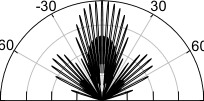

Frequency

by _L_ –PAM of (35), and then the symbols are multiplied by
the PA factors _a_ 1 _, · · ·, a_ _M_ . Thus, the time-domain PI-OSM
symbols are defined by [29]

**s** [PI] _[−]_ [OSM] = diag ( _a_ 1 _, · · ·, a_ _M_ ) **s** [OSM] _∈_ R _[M]_ _,_ (38)

where we have the constraint [�] _[M]_ _m_ =1 _[a]_ _[m]_ [ =] _[ M]_ [. The PA factors]
_a_ 1 _, · · ·, a_ _M_ are designed to maximize a specific criterion, such
as the constrained MI [30] or the maximum achievable rate

[212]. In [29], the PA factors are determined as follows:

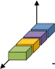

Space

-90 90

6 2 -2 -6 -10 -6 -2 2 6

|Array factor| [dB]

(a) Full-RF-aided BLAST [ _s_ 1 _, s_ 2 _, s_ 3 _, s_ 4 ] [T]

0

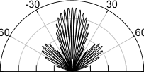

Frequency



_M_
~~�~~ _Mi_ =0 _−_ 1 _[α]_ _[i]_ ( _m_ = 1)

~~�~~ _i_ =0 _[α]_ _._ (39)

_αa_ _m−_ 1 (2 _≤_ _m ≤_ _M_ )

_a_ _m_ =

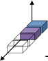

Space

-90 90

6 2 -2 -6 -10 -6 -2 2 6

|Array factor| [dB]

(b) Reduced-RF-aided GSM [ _s_ 1 _, s_ 2 _,_ 0 _,_ 0] [T]

0

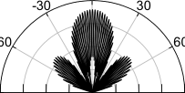

Frequency

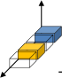

Space

-90 90

6 2 -2 -6 -10 -6 -2 2 6

|Array factor| [dB]

(c) Reduced-RF-aided GSM [ _s_ 1 _,_ 0 _, s_ 2 _,_ 0] [T]

Fig. 12. Directive gain of the conventional BLAST and the GSM-based
MIMO-MWC schemes. The associated spatial domain symbols are also
illustrated. The uniform linear array has 16 antenna elements that are separated
into four subarrays.

1

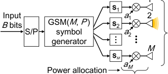

Fig. 13. Schematic of the PM-based MIMO-VLC scheme.

Then, the time-domain OSM symbols are generated by

**s** [OSM] = [0 _· · ·_ 0 _s_
~~����~~ ����
_q−_ 1 rows _↑_
_q_ th row

0 _· · ·_ 0 ] [T] _∈_ R _[M]_ _,_ (37)
~~����~~
_M_ _−q_ rows

Here, the single parameter _α_ determines the _M_ number of
_β_
PA factors, where we have _α_ = 10 10 . In [29], the single
parameter _β_ in dB was set to _β_ = 1, 3, and 4 [dB] for the
( _M, N_ ) = (4 _,_ 4) setup.

_E. PM-Based Multicarrier Communications_

The PM-aided multicarrier scheme, originally proposed by
Schneider in 1967 [215], simultaneously activated multiple frequencies. In 1986, Padovani and Wolf proposed a modulation
scheme that combined FSK and PSK [216]. Three years later,
the PC-aided spread-spectrum concept was independently proposed by Sasaki _et al._ [42]. The PC-based scheme of [42]
conveys additional bits onto a set of spreading sequences,
hence it achieves higher spectral efficiency while maintaining
a low transmitter complexity. This original concept was also
evaluated in a channel-coded system [217] and a multipleaccess system [218]. It was shown in [42], [217], [218] that the
PM concept applied to the spread-spectrum system achieved
a higher performance than the conventional direct sequence
spread-spectrum system.
Motivated by the PC concept of [42], [217], [218], the
PM concept was also exported to OFDM by Frenger and
Svensson [58], where only a fraction of the subcarriers was
activated. Specifically, the PM-aided OFDM scheme of [58]
conveyed the input bits with the same encoding principle as
that of GSM [169]. Note that the PM scheme of [58] was
proposed in 1999, while the GSM scheme was proposed in
2010. The PM-aided OFDM scheme of [58] was later termed
as subcarrier index modulation (SIM) [31]. In [58], it was
shown that the SIM scheme is capable of striking a flexible
tradeoff between the spectral efficiency, PAPR and reliability at
the receiver. The SIM scheme induces a loss in AMI [36], [37]
since the number of data streams is reduced. The compressedsensing-assisted SIM by Zhang _et al._ [219] mitigates this IMinduced loss by compressing a high-dimensional sparse SIM
into a low-dimensional dense codeword. Apart from SIM,
the subcarrier-hopping-based OFDM scheme was evaluated in
multiple access scenarios [220–222]. The contributions to the
development of SIM are summarized in Table VIII.
The key feature of the SIM symbols is the sparsity of the
frequency domain symbols, where _P_ number of subcarriers are
activated out of _M_ subcarriers. For simplicity, we represent the
SIM system having the parameters _M_ and _P_ as “SIM( _M, P_ )”.
Fig. 14 illustrates the schematic of the SIM scheme. The

with a single non-zero element. The original OSM scheme
proposed Mesleh _et al._ [27] conveys the input bits by selecting
the transmit light source, and the PAM constellation size is
constrained to be one, i.e., we have _s_ = 1.
_2) Power-Imbalanced_ _OSM_ _Scheme:_ The powerimbalanced OSM (PI-OSM) concept was proposed by
Fath and Haas [29], which is capable of communicating
over VLC-specific LoS channels with the aid of PA. It was
reported by Poves _et al._ [206] that the performance of the
OSM scheme depends on the power differences between
channel paths. Fig. 13 illustrates the schematic of the PI-OSM
transmitter. The encoding principle is basically the same as
the GSM transmitter. The transmitted symbols are generated

ACCEPTED FOR PUBLICATION IN IEEE COMMUNICATIONS SURVEYS & TUTORIALS 19

TABLE VIII

C ONTRIBUTIONS TO SIM. A PART OF THIS TABLE WAS IMPORTED FROM [37].

|Year|Authors|Contribution|
|---|---|---|
|1968|Schneider [215]|Combined the PM concept with FSK, where_ P_ out of_ M_ frequencies were simultaneously activated.|
|1991|Sasaki_ et al._ [42]|Proposed a PM-aided spread-spectrum scheme.|
|1994|Sasaki_ et al._ [217]|Evaluated the PM scheme of [42] in terms of symbol error rate, while combining it with the selection diversity method and Reed-Solomon coding.|
|1995|Sasaki_ et al._ [218]|Evaluated the PM scheme of [42] in a multiple-access scenario.|
|1999|Frenger and Svensson [58]|Proposed a subcarrier-based PM scheme in the OFDM context.|
|2005|Kitamoto and Ohtsuki [223]|Analyzed the SIM of [58] in a VLC scenario.|
|2007|Hou and Hamamura [224]|Developed a bandwidth-efficient SIM scheme by invoking a high-compaction multi-carrier concept.|
|2009|Abu-Alhiga and Haas [31]|Evaluated the BER performance of an OFDM scheme in uncoded and coded scenarios, where its modulation concept was motivated by SM [3]. Note that the authors firstly coined the term ‘subcarrier-index modulation (SIM)’.|
|2009|Hou and Hase [69]|Proposed a phase-rotation-based SIM scheme for reducing the PAPR.|
|2011|Tsonev_ et al._ [32]|Improved the SIM structure proposed in [31] and analyzed its PAPR.|
|2013|Basar_ et al._ [35]|Proposed an OFDM with IM scheme for both frequency-selective and time-varying fading channels, where the modulation principle was motivated by SM. In addition, the authors proposed a log-likelihood-ratio detector and provided a theoretical error performance analysis. The simulation results showed that the proposed scheme was capable of outperforming the classic OFDM scheme for ideal and realistic conditions. This paper [35] has been recognized as a worth- reading work in the literature, whose citation count is the largest among the SIM-related studies.|
|2014|Xiao_ et al._ [225]|Proposed a subcarrier level interleaving method for the SIM scheme.|
|2015|Basar [226]|Proposed an interleaving method for the SIM scheme combined with space-time block codes.|
|2015|Fan_ et al._ [227]|Proposed the SIM scheme that supports an arbitrary number of selected subcarriers, and performs independent PM on the in-phase and quadrature components per subcarrier.|
|2015|Zheng_ et al._ [228]|Proposed a low-complexity detector for the SIM scheme, and the detector performed independent PM on in-phase and quadrature components.|
|2015|Basar [229]|Proposed a SIM scheme combined with SMX MIMO transmission and developed its low- complexity detector.|
|2015|Datta_ et al._ [230]|Incorporated the PM concept with the space and frequency dimensions and developed a Gibbs- sampling-based detection algorithm.|
|2015|Wen_ et al._ [36]|Derived the maximum achievable rate of the SIM scheme and proposed an interleaved grouping method.|
|2016|Basar [34]|Investigated the performance of the SIM scheme combined with MIMO and proposed low- complexity detectors.|
|2016|Ma_ et al._ [231]|Proposed a subcarrier-activation method for the SIM scheme, where the MED was maximized by an exhaustive search.|
|2016|Ishikawa_ et al._ [37]|Analyzed the performance advantages of the SIM scheme over OFDM in terms of the MED and the constrained AMI. It was revealed that the SIM scheme is beneficial for a low rate region.|
|2016|Wen_ et al._ [51]|Proposed a hybrid modulation scheme for underwater acoustic communications, where SIM and OFDM blocks were concatenated within a single frame.|
|2016|Basar [33]|Provided a tutorial on the SM and SIM schemes.|
|2016|Wang_ et al._ [232]|Proposed an OSTBC-based PM scheme in the space and the frequency domains that achieved the diversity order of two.|
|2016|Mao_ et al._ [233]|Proposed a dual-mode IM scheme that used two types of constellation sets. The type of constellation set corresponds to the on and off state of the conventional SIM scheme and leads to higher spectral efficiency. Coincidentally, this structure was similar to the original PM concept [41]. The proposed scheme of [233] was generalized in [234].|
|2016|Zhang_ et al._ [219]|Proposed a compressed-sensing-assisted SIM system, which improved both spectral efficiency and energy efficiency at the same time.|

IFFT

|IFFT Input B bits GSM(M, P ) enc.|Col2|B bits|s GSM(M, P ) enc.|Col5|IFFT|Col7|Col8|Col9|
|---|---|---|---|---|---|---|---|---|
|S/P Input bits Cyclic Prefix B bits  P out of M subcarriers are activated GSM(M, P ) enc. GSM(M, P ) enc.|S/P||GSM(M, P ) enc.||||P/S||
|S/P Input bits Cyclic Prefix B bits  P out of M subcarriers are activated GSM(M, P ) enc. GSM(M, P ) enc.|S/P||GSM(M, P ) enc.||||||
|S/P Input bits Cyclic Prefix B bits  P out of M subcarriers are activated GSM(M, P ) enc. GSM(M, P ) enc.|S/P||GSM(M, P ) enc.||Cyclic Prefix||||

Fig. 14. Schematic of the PM-based OFDM scheme.

encoding principle of the SIM( _M, P_ ) scheme is the same as

that of the GSM( _M, P_ ) scheme described in Section IV-A.
Similar to the GSM( _M, P_ ) principle, we have _N_ a number
of subcarrier-activation patterns, which are denoted by **a** _i_ for
1 _≤_ _i ≤_ _N_ a . The encoded symbols are concatenated and
converted to time-domain symbols by IFFT. Finally, the cyclic
prefix is inserted into the time-domain sequence to avoid the
inter-channel interference. Fig. 15 illustrates the frequency
domain symbols of the conventional OFDM and the SIM-aided
OFDM schemes. The SIM scheme amplifies each symbol in
order to maintain the same transmission power as OFDM.

ACCEPTED FOR PUBLICATION IN IEEE COMMUNICATIONS SURVEYS & TUTORIALS 20

Frequency

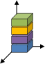

Space

Frequency

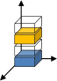

Space

Time

Frequency [Hz]

(a) Conventional OFDM

Time

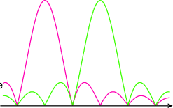

Frequency [Hz]

(b) SIM-based OFDM

Fig. 15. Power spectral density of the conventional OFDM and SIMaided OFDM schemes, where the associated frequency domain symbols are
illustrated.

V. P ERFORMANCE M ETRICS

In this section, we introduce the performance metrics for
the general MIMO communication model. We consider the
following three metrics: AMI, MED and the decoding complexity at the receiver, which are described in Sections V-A,
V-B, and V-C, respectively.

_A. Average Mutual Information (AMI)_

The mutual information between the transmitted and re
ceived signals represents the maximum achievable rate, which
is a maximum number of information bits that are successfully
conveyed from the transmitter to the receiver per channel
use. In the literature, two popular AMI metrics are used:
unconstrained AMI and constrained AMI. Unconstrained AMI

is derived by assuming continuous input symbols, where
the input signal obeys a Gaussian distribution. By contrast,
constrained AMI is derived by assuming a finite number of discrete symbols. The mutual information is averaged over each
channel realization. In the study of [30], the unconstrained and
the constrained AMI of the PM system were referred to as
the continuous-input continuous-output memoryless channel
and the discrete-input continuous-output memoryless channel
capacities, respectively. It remains to show whether the Gaussian input maximizes the AMI of the PM system [77]. Hence,
in this treatise, we use the terminology of _AMI_ instead of
_capacity_ .
_Unconstrained AMI:_ The unconstrained AMI _I_ _C_ of the
general MIMO system model of Eq. (8) is given by [82], [94]

with E **H** [ _·_ ] representing that the metric is averaged over the
random channel matrices **H** _∈_ C _[N]_ _[×][M]_ through a sufficiently
high number of trials. Here, _µ_ _i_ and _ρ_ represent the _i_ th
eigenvalue of the Hermitian matrix **Q** and the received SNR.
Hence, the unconstrained AMI _I_ _C_ only depends on the channel
matrix **H** and on the received SNR _ρ_ . Eq. (40) is derived under
the assumption that the input signals obey the complex-valued
Gaussian distribution, and the signals are sampled at discrete
intervals. Moreover, the number of parallel streams is equal to
rank( **Q** ). By replacing the channel matrix **H** with an arbitrary
channel matrix, Eq. (40) becomes directly applicable to various
channel models, such as the MWC channel. The unconstrained
AMI _I_ _C_ represents the upper bound of the constrained AMI,
which is later denoted by _I_ _D_ . The constrained AMI _I_ _D_ is
asymptotic to the unconstrained AMI _I_ _C_ at low SNRs, when
increasing the transmission rate _R_ .
_Constrained AMI:_ The constrained AMI represents the
effective upper bound of mutual information, where a finite
number of input codewords is considered. Here, we review
its derivation in detail to highlight its background in an
appropriate manner. We assume that we have _N_ _c_ = 2 _[B]_ number
of space-time codewords **S** [(1)] _, · · ·,_ **S** [(] _[N]_ _[c]_ [)] _∈_ C _[M]_ _[×][T]_, which are
associated with the input bits of length _B_ . The constrained
AMI of the general MIMO system model of Eq. (8) is given
by [94], [235]

Finally, we arrive at the AMI of

p **Y** _|_ **S** [(] _[f]_ [)] [�]
_−∞_ �

_I_ _D_ = [1] max

_T_ p ( **S** [(1)] ) _,···,_ p ( **S** [(] _[Nc]_ [)] )

_I_ _D_ = [1]

_N_ _c_
�

_f_ =1

� _−∞∞_

_∞_ _∞_

_· · ·_
_−∞_ � _−∞_

_·_ p **S** [(] _[f]_ [)] [�] log 2
�

p � **Y** _|_ **S** [(] _[f]_ [)] [�]
� ~~�~~ _Ng_ =1 _c_ [p] ~~�~~ **Y** _|_ **S** [(] _[g]_ [)] ~~[�]~~ p ~~�~~ **S** [(] _[g]_ [)] ~~[�]~~

d **Y** _._ (42)

�

Eq. (42) is maximized when the codewords **S** [(1)] _, · · ·,_ **S** [(] _[N]_ _[c]_ [)]

are selected with the equal probability of 1 _/N_ _c_ . This idealized
assumption of p � **S** [(1)] [�] = _· · ·_ = p � **S** [(] _[N]_ _[c]_ [)] [�] = 1 _/N_ _c_ simplifies
Eq. (42) as follows:

�

_._ (43)

� [] 

� [] 

_I_ _D_ = [1]

_T_



_B −_ [1]
 _N_

_N_ _c_

_N_ _c_
�

_g_ =1

p � **Y** _|_ **S** [(] _[f]_ [)] [�]

p ~~�~~ **Y** _|_ **S** [(] _[g]_ [)] ~~[�]~~

_N_ _c_
� E

_f_ =1

_N_ _c_
�

log 2

p ( **Y** _|_ **S** [(] _[f]_ [)] )
We calculate
p ( **Y** _|_ **S** [(] _[g]_ [)] ) [in Eq. (43) under the assumed relation-]

ship of **Y** = **HS** [(] _[f]_ [)] + **V** . Based on Eq. (11), the likelihood

p ( **Y** _|_ **S** [(] _[f]_ [)] )
ratio
p ( **Y** _|_ **S** [(] _[g]_ [)] ) [is given by]

p � **Y** _|_ **S** [(] _[f]_ [)] [�]

p ~~�~~ **Y** _|_ **S** [(] _[g]_ [)] ~~[�]~~ [= exp]

p � **Y** _|_ **S** [(] _[f]_ [)] [�]

2 2
_−_ � **Y** _−_ **HS** ( _g_ ) � � **Y** _−_ **HS** ( _f_ ) �
� � F [+] � � F
_σ_ _v_ [2]
�

2
_−_ �� **H** � **S** [(] _[f]_ [)] _−_ **S** [(] _[g]_ [)] [�] + **V** �� F [+] _[ ∥]_ **[V]** _[∥]_ F [2]
_σ_ _v_ [2]
�

= exp

�

�

_._



[bits/symbol], (40)


_N_ _c_
� _e_ _[η]_ [[] _[f,g]_ []]

_g_ =1 � [] 

�

_N_ _c_
�

 _,_ (44)



_B −_ [1]
 _N_

_N_ _c_

_I_ _C_ = E **H**





rank( **Q** )
�

� log 2 (1 + _µ_ _i_ _ρ_ )

_i_ =1

_I_ _D_ = [1]

_T_

_N_ _c_
� E **H** _,_ **V**

_f_ =1

log 2

where we have a Hermitian matrix of

where we have

2
�� **H** � **S** [(] _[f]_ [)] _−_ **S** [(] _[g]_ [)] [�] + **V** �� F [+] _[ ∥]_ **[V]** _[∥]_ F [2]
_η_ [ _f, g_ ] = _[−]_ _._ (45)
_σ_ _v_ [2]

**Q** =

**H** [H] **H** ( _N ≥_ _M_ )

(41)

� **HH** [H] ( _N < M_ ) _[,]_

ACCEPTED FOR PUBLICATION IN IEEE COMMUNICATIONS SURVEYS & TUTORIALS 21

_̸_

The constrained AMI of Eq. (44) is upper bounded by _I_ _D_ _≤_
_B/T_ = _R_ [bits/symbol]. Note that the general expression of
Eq. (44) is directly applicable to various channel models and
codewords. For example, Eq. (44) supports the SISO symbols
of **S** _∈_ C [1] _[×]_ [1] and the SM symbols of **S** _∈_ C _[M]_ _[×]_ [1] . The
constrained AMI of _I_ _D_ estimates the turbo-cliff SNR of a
channel-coded communication system, where the BER drops
to an infinitesimal value with the aid of powerful channel
coding schemes, such as turbo codes and low-density paritycheck codes [236]. This estimation procedure is described in
Section VI. Recently, the constrained AMI was derived for the
general differential MIMO [182], [237]. The numerical results
showed that the constrained AMI in a differential scenario

can be approximated by the 3-dB shifted counterpart of the
associated coherent scenario.

_B. Reliability_

A reliability evaluation between a transmitter and a receiver
was the most common performance metric in previous studies.
Due to its simple formulation, the powerful analytical framework by Goldsmith [93] enables us to estimate the tight bound
of error probabilities in uncoded scenarios, where no channel
coding scheme is considered. The pairwise-error probability
(PEP), where a transmitted symbol **S** [(] _[f]_ [)] is decoded as a wrong
symbol **S** [(] _[g]_ [)] at the receiver, is defined by [238]

PEP **S** [(] _[f]_ [)] _→_ **S** [(] _[g]_ [)] _|_ **H**
� �

_̸_

SNRs in uncoded scenarios. The higher the coding gain is, the
lower the achievable BER becomes for the communication

system. At high SNRs, Eq. (47) is upper bounded by [239],

[240]

_̸_

� _−_

_̸_

diversity gain
~~�~~ � ~~�~~ �
_m_ _[′]_ _N_

_,_ (49)

_̸_

1
PEP( **S** [(] _[f]_ [)] _→_ **S** [(] _[g]_ [)] ) _≤_ ~~�~~ _mm_ _′_ =1 _[µ]_ _m_ _[N]_
~~�~~ ~~��~~ ~~�~~
coding gain

_̸_

1
� 4 _σ_ _v_ [2]

_̸_

where _m_ _[′]_ represents the minimum rank of **D**, namely, _m_ _[′]_ =
min **S** ( _f_ ) _,_ **S** ( _g_ ) _|_ rank( **D** ) _|_ . In addition, _µ_ _m_ represents the _m_ th
eigenvalue of **D** . In Eq. (49), the diversity order is given by
_D_ = _m_ _[′]_ _N_ and the coding gain is given by [�] _[m]_ _m_ _[′]_ =1 _[µ]_ _m_ _[N]_ [. The]

_̸_

_D_ = _m_ _[′]_ _N_ and the coding gain is given by [�] _[m]_ _m_ =1 _[µ]_ _m_ _[N]_ [. The]

coding gain [�] _[m]_ _m_ _[′]_ =1 _[µ]_ _m_ _[N]_ [is determined by the MED between]

_̸_

coding gain [�] _[m]_ _m_ =1 _[µ]_ _m_ _[N]_ [is determined by the MED between]

the codewords **S** [(] _[f]_ [)] and **S** [(] _[g]_ [)] . Typically, the MIMO codewords
are designed by the rank and determinant criteria in uncoded
scenarios, where both the diversity and the coding gains are
maximized.

_̸_

2
=p **Y** _−_ **HS** ( _g_ )
���� ���

_̸_

2 2

**Y** _−_ **HS** ( _f_ )
F _[<]_ ��� ��� F

_̸_

F

_̸_

�

_̸_

_∥_ **HD** _∥_ [2] F
2 _σ_ _v_ [2]

~~�~~

_̸_

=Q

_̸_

� [�]

_̸_

_,_ (46)

_̸_

where we have the channel matrix **H** and **D** =
� **S** [(] _[f]_ [)] _−_ **S** [(] _[g]_ [)] [��] **S** [(] _[f]_ [)] _−_ **S** [(] _[g]_ [)] [�] [H] . Note that Q( _·_ ) denotes the Qfunction [10] . Then, averaging Eq. (46) over the legitimate channel matrices yields [238]

_̸_

_C. Complexity_

In this treatise, we characterize the PM family in terms
of the computational complexity at the receiver. Due to the
reduced number of data streams, the PM-based scheme has a
lower complexity than that of the conventional multiplexing
schemes. In this treatise, the computational complexity is
approximated by the number of real-valued multiplications of
the detection process, [11] which is nearly equal to the number
of multipliers in the receiver circuits. It was shown by Cavus
and Daneshrad in [242] that both the power consumption as
well as the hardware cost are increased as the number of

multipliers is increased. Specifically, if we have two complexvalued numbers ( _a_ + _bj_ ) _∈_ C and ( _c_ + _dj_ ) _∈_ C, the total of
the real-valued calculations of ( _a_ + _bj_ )( _c_ + _dj_ ) is four, because
we have ( _a_ + _bj_ )( _c_ + _dj_ ) = _ac −_ _bd_ + ( _ad_ + _bc_ ) _j_ .
For example, if we consider the SM scheme designed
for RF communications, as detailed in Section IV-A, the
computational complexity at the receiver is lower bounded
by Ω(2 _[R]_ _N_ ). [12] Here, the ML detection criterion of the SM
scheme is given by

**S** ˆ = arg min F _[.]_ (50)
**S** _[∥]_ **[Y]** _[ −]_ **[H]** _[ ·]_ **[ S]** _[∥]_ [2]

The receiver estimates the transmitted symbol **S** through
2 _[R]_ number of trials in Eq. (50). In each trial, the matrix

_̸_ multiplication of **H** _·_ **S** includes _N_ number of complex
valued multiplications, which is equivalent to 4 _N_ real-valued
multiplications. In addition, the Frobenius norm calculation
of _∥_ **Y** _−_ **H** _·_ **S** _∥_ [2] F [includes][ 2] _[N]_ [ real-valued multiplications.]
Hence, the computational complexity of the SM scheme is
given by 2 _[R]_ _·_ 6 _N_, which is lower bounded by Ω(2 _[R]_ _N_ ).
In the same manner, we derived the ML complexities for
the coherent and non-coherent schemes introduced in this

treatise, such as single-stream APSK, SM [40], GSM [57],

11 The complex addition cost is negligible against the multiplication cost

[241].
12 We use Donald Knuth’s big Omega Ω( _·_ ) notation [243].

_M_
�

_m_ =1

_̸_

_µ_ _m_
1 +
� 4 _σ_ _v_ [2] sin [2] _θ_

_̸_

_−N_

d _θ._
�

(47)

_̸_

PEP � **S** [(] _[f]_ [)] _→_ **S** [(] _[g]_ [)] [�] = _π_ [1]

_̸_

� 0 _π/_ 2

_̸_

Here, _µ_ _m_ represents the _m_ th eigenvalue of **D** . Based on
Eq. (47), the BER is upper bounded by [238]

_̸_

1
BER _≤_
_B_ 2 _[B]_ �

_f_ _̸_

� _d_ H � **b** [(] _[f]_ [)] _,_ **b** [(] _[g]_ [)] [�] PEP � **S** [(] _[f]_ [)] _→_ **S** [(] _[g]_ [)] [�] _,_

_f_ = _̸_ _g_

(48)

_̸_

where _d_ H � **b** [(] _[f]_ [)] _,_ **b** [(] _[g]_ [)] [�] represents the Hamming distance between the bit sequences **b** [(] _[f]_ [)] and **b** [(] _[g]_ [)], which are associated
with **S** [(] _[f]_ [)] and **S** [(] _[g]_ [)] . For example, d H ([0 0] _,_ [0 1]) is calculated
as 1.

The rank and determinant criteria maximize the coding gain,
while maintaining the maximum diversity order. The diversity
order represents the slope of the error probability curve at high

_̸_

10 More specifically, the Q-function is defined by Q( _·_ ) =
12 �1 _−_ erf � ~~_√_~~ _x_ 2 ��, where erf( _x_ ) = ~~_√_~~ 2 ~~_π_~~ � 0 _π_ _[e]_ _[−][t]_ [2] [d] _[t]_ [.]

_̸_

2

_̸_

2 _π_
��, where erf( _x_ ) = ~~_√π_~~ � 0 _[e]_ _[−][t]_ [2] [d] _[t]_ [.]

ACCEPTED FOR PUBLICATION IN IEEE COMMUNICATIONS SURVEYS & TUTORIALS 22

TABLE IX

D IVERSITY, TRANSMISSION RATE, AND COMPLEXITY COMPARISONS FOR THE COHERENT AND NON     - COHERENT SCHEMES .

|Scheme|Section|Diversity D|Rate R|ML complexity|
|---|---|---|---|---|
|Coherent APSK SM [40] GSM [57] Rectangular ASTSK [16] BLAST [84] Square GSTSK [16]|III-A IV-A IV-A IV-A III-A III-A|_N_ _N_ _N_ _T · N_ _N_ _M · N_|log2_ L_ log2_ L_ + log2_ M_ _P ·_ log2_ L_ + j log2 �_M_ _P_ k (log2_ L_ + log2_ Q_)_ /T_ _M ·_ log2_ L_  _P ·_ log2 _L_ + j log2 �_Q_ _P_ k _/M_|2~~_R_+1~~(2_N_ + 1) _≥_Ω(2~~_R_~~_N_) 2_R_+13_N_ _≥_Ω(2_RN_) 2_R_+1(2_P_ + 1)_N_ _≥_Ω(2_RPN_) 2_RT_ +13_N_ _≥_Ω(2_RT N_) 2_R_+1(2_M_ + 1)_N_ _≥_Ω(2_RMN_) 2_RM_+1(2_M_ + 1)_N_ _≥_Ω(2_RMMN_)|
|Differential APSK Rectangular DSM [108] Square DSM [21] Square NCGSM [185]|III-B VI-B VI-B III-B|_N_ _T · N_ _N ≤D ≤M · N_ _M · N_|log2_ L_ (log2_ L_ + log2_ Q_)_ /T_  _N·M_ _D_ _·_ log2_ L_ + log2_ Q_  _/M_  _P ·_ log2 _L_ + j log2 �_Q_ _P_ k _/M_|2~~_R_+2~~(_N_ + 1) + 8 _≥_Ω(2~~_R_~~_N_) 2_RT_ +13_N_ + 4_N_(_M/T_ + 1) _≥_Ω(2_RT N_) 2_RM_+13_N_ _≥_Ω(2_RMN_) 2_RM_+1(2_M_ + 1)_N_ _≥_Ω(2_RMMN_)|

rectangular ASTSK [16], BLAST [84], square GSTSK [16],
differential APSK, rectangular DSM [108] [13], square DSM

[21], and square NCGSM [185]. Here, the ML complexity
was divided by the codeword’s time slots _T_ . The derived 2.0
complexities are summarized in Table IX. In addition, the _M_ = 2 antennas
corresponding diversity and transmission rate are also summarized in Table IX. ~~1.5~~

VI. P ERFORMANCE C OMPARISONS

In this section, we provide performance comparisons between the PM-based schemes and the conventional multi
plexing schemes, where coherent MIMO, differential MIMO,
MIMO-MWC, MIMO-VLC and multicarrier systems are considered. We used the performance metrics described in Section V. In our comparisons, the total transmit power was fixed
to unity for all schemes.

_A. PM-Based Coherent MIMO_

First, we investigated the achievable performance of the PMbased coherent MIMO scheme in terms of its AMI, reliability
and complexity. We illustrate the relationship between the
AMI and reliability.
Fig. 16 compares the constrained AMI of the SM and of the
ASTSK schemes. The single-stream-based QAM scheme was
also included for reference. Fig. 16(a) characterizes a small
number of transmit antennas, namely _M_ = 2. By contrast,
Fig. 16(b) characterizes a large number of transmit antennas,
namely _M_ = 1024. The associated curves of the unconstrained
AMI were also plotted. Note that the unconstrained AMI
only depends on the transmit power and on the numbers of
transmit and receive antennas, as defined in Eq. (40). The
DMs of the ASTSK scheme were designed based on the
rank and determinant criteria described in Section IV-A. We

observe in Fig. 16(a) that the SM scheme exhibited a slight
performance loss as compared to the single-stream 4–QAM
scheme. Here, the ASTSK scheme of Fig. 8 alleviated the
performance gap and achieved 1.68 dB gain over the singlestream scheme at the 3/4 rate region. Next, in Fig. 16(b),
we compared the schemes used in Fig. 16(a) for large-scale
MIMO scenarios, where the number of transmit antennas was

13 The basic modulation concept is the same with the ASTSK scheme.

0.0

|2.0 M = 2 antennas 3/4 rate|Col2|Col3|Col4|Col5|Col6|Col7|Col8|
|---|---|---|---|---|---|---|---|
|2.0 3/4 rate _M_ = 2 antennas|3/4 rate _M_ = 2 antennas|3/4 rate _M_ = 2 antennas|3/4 rate _M_ = 2 antennas|3/4 rate _M_ = 2 antennas|3/4 rate _M_ = 2 antennas|3/4 rate _M_ = 2 antennas|3/4 rate _M_ = 2 antennas|
|/symbol]  ~~1.5~~|1/2 rate 1.68 dB gain|1/2 rate 1.68 dB gain|1/2 rate 1.68 dB gain|1/2 rate 1.68 dB gain|1/2 rate 1.68 dB gain|1/2 rate 1.68 dB gain|1/2 rate 1.68 dB gain|
|AMI [bits  0.5 ~~1.0~~|0.55 dB loss Unconstrained AMI Single−stream QAM SM [40] ASTSK (_T_ = 2) [16]|0.55 dB loss Unconstrained AMI Single−stream QAM SM [40] ASTSK (_T_ = 2) [16]|0.55 dB loss Unconstrained AMI Single−stream QAM SM [40] ASTSK (_T_ = 2) [16]|0.55 dB loss Unconstrained AMI Single−stream QAM SM [40] ASTSK (_T_ = 2) [16]|0.55 dB loss Unconstrained AMI Single−stream QAM SM [40] ASTSK (_T_ = 2) [16]|0.55 dB loss Unconstrained AMI Single−stream QAM SM [40] ASTSK (_T_ = 2) [16]|0.55 dB loss Unconstrained AMI Single−stream QAM SM [40] ASTSK (_T_ = 2) [16]|

−10 0 10 20 30 40 50

SNR [dB]

(a) Small-scale MIMO scenario ( _M_ = 2)

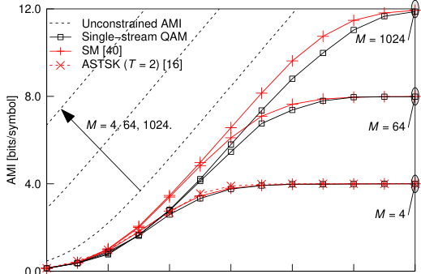

−10 0 10 20 30 40 50

SNR [dB]

(b) Large-scale MIMO scenario ( _M_ = 4 _,_ 64 _,_ 1024)

Fig. 16. Constrained AMI comparisons between the SM and ASTSK
arrangements of Fig. 8, where the number of transmit antennas was increased
from _M_ = 2 to 1024. The number of receive antennas was set to _N_ = 1.

ACCEPTED FOR PUBLICATION IN IEEE COMMUNICATIONS SURVEYS & TUTORIALS 23

10 [1]

10 [0]

10 [−1]

~~●~~

MED gain

~~**●**~~

**●**

    

- BLAST [84]
GSM [57]

MED gain

  

10 [−1]

~~GSTSK(2,1,2,2,1), BPSK [162]~~

10 [−2]

10 [−3]

0.40 0.45 0.50 0.55 0.60 0.65 0.70

Constrained AMI at SNR = 15 dB [bits/symbol]

Fig. 18. Relationship between the constrained AMI and the BER of the
BPSK-aided GSTSK(2 _,_ 1 _,_ 2 _,_ 2 _,_ 1) scheme of Fig. 8, where SNR was set to
15 dB, and 7187 DMs were randomly generated.

Transmission rate _R_ [bits/symbol]

3 4 5 6 7 8 9 10 11 12

10 [7]

                           

**●**

**●**

10 [−3]
2 4 6 8 10 12 14 16 18 20 22 24 26 28 30 32

Transmission rate _R_ [bits/symbol]

Fig. 17. MEDs of the BLAST and GSM schemes of Fig. 8, where the number
of transmit antennas was set to _M_ = 2 _,_ 4 _,_ 8 _,_ 16 _,_ 32, and the number of
activated antennas was _P_ = 1 _, · · ·, M_ . We used the constellation of _L_ = 2–
BPSK and _L_ = 4 _,_ 16 _,_ 64 _,_ 256 _,_ 1024–QAM.

set to _M_ = 4, 64, and 1024. Note that the ASTSK scheme

cannot be simulated for the _M_ = 64 and 1024 scenarios

due to its excessive complexity, which will be discussed later
in the context of Fig. 19. It was shown in Fig. 16(b) that
the SM, the ASTSK and the single-stream schemes exhibited
similar AMI for _M_ = 4 antennas. The performance gain of
SM over the single-stream scheme increased, as the number
of transmit antennas increased. This observation implies that
the SM scheme is beneficial for open-loop massive MIMO
scenarios. However, when we consider closed-loop massive
MIMO scenarios, the conjugate BF scheme of Marzetta [92]
achieves near-capacity performance and a large performance
gap exists between the BF and the SM schemes [108].
Fig. 17 shows an MED comparison for the BLAST and
GSM schemes of Fig. 8, where the number of transmit
antennas was varied from _M_ = 2 to 32, and the constellation
size was increased from _L_ = 2 to 1024. The transmission

power was set to a constant value for all the scenarios. As
shown in Fig. 17, the GSM scheme of Fig. 8 achieved MED
gains right across the whole transmission rate region, i.e.,
2 _≤_ _R ≤_ 32 [bits/symbol]. For example, for the _R_ = 16

[bits/symbol] case, the QPSK-aided BLAST scheme having
_M_ = 8 achieved the MED of 0 _._ 25, while the QPSK-aided
GSM scheme having ( _M, P_ ) = (8 _,_ 6) achieved the MED
of 0 _._ 33. [14] Fig. 17 demonstrates the scalability of differentthroughput PM-aided coherent MIMO schemes under diverse
practical constraints. Note that this scalability cannot be
achieved by the frequency- or temporal-domain PM scheme
because its MED gain typically diminishes as the effective
transmission rate increases [37].
Fig. 18 shows the relationship between the constrained AMI
and the BER at SNR = 15 [dB]. For our general discussions,
we have employed the GSTSK scheme, which is capable of
subsuming the family of conventional MIMO schemes. A total

14 Note that the MED comparison is valid only when the transmission rate
is the same.

which contains the MED of �� **H** � **S** [(] _[f]_ [)] _−_ **S** [(] _[g]_ [)] [���] [2] F [at the re-]
ceiver’s output. Thus, again, the constrained AMI and the
MED exhibit a correlation at high SNRs, due to Eq. (51).
Fig. 19 shows the decoding complexities for the coherent
MIMO schemes, including BLAST, square STBC, SM, GSM
and ASTSK schemes of Fig. 8. The single-stream APSK

10 [6]

10 [5]

10 [4]

10 [3]

10 [2]

  

Single−stream
BLAST [84]
Square STBC [89]
SM [40]
GSM ( _P_ = _M_ /2) [57]
ASTSK ( _T_ = 2) [16]

~~●~~

10 [1]
2 [1] 2 [2] 2 [3] 2 [4] 2 [5] 2 [6] 2 [7] 2 [8] 2 [9] 2 [10]

Number of transmit antennas _M_

Fig. 19. ML decoding complexities of the coherent MIMO schemes introduced in Section III-A. The number of transmit antennas was changed
from _M_ = 2 to 1024, and the associated transmission rate corresponded to
_R_ = 3 _, · · ·,_ 12 [bits/symbol]. The number of receive antennas was _N_ = 1.

of 7187 random DMs were generated, and then the associated
constrained AMI and BER were simulated for each DM set.

We observe in Fig. 18 that the BER and the constrained AMI
exhibited a certain relationship. Specifically, in the constrained
AMI calculation of Eq. (45), approximating **V** by **0** yields

_η_ [ _f, g_ ] = _−_ [1]

_σ_ _v_ [2]

2
**H** **S** [(] _[f]_ [)] _−_ **S** [(] _[g]_ [)] [���] (51)
��� � � F _[,]_

ACCEPTED FOR PUBLICATION IN IEEE COMMUNICATIONS SURVEYS & TUTORIALS 24

10 [0]

10 [−3]

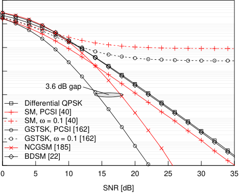

Fig. 20. BER comparisons of differential QPSK, BPSK-aided SM,
BPSK-aided GSTSK(2,2,2,4,2), 2–PAM-aided NCGSM(2,2,2,4,2), and
(BPSK,QPSK)-aided BDSM where the channel estimation errors were considered. The numbers of transmit and receive antennas were ( _M, N_ ) = (2 _,_ 2).
The transmission rate was _R_ = 2 _._ 0 [bits/symbol].

scheme was considered as a benchmark. In Fig. 19, the number
of transmit antennas was varied from _M_ = 2 to 1024, where
the transmission rate corresponding to the number of transmit
antennas _M_ ranged from _R_ = 3 to 12 [bits/symbol]. Here,
QPSK signaling was considered for the SM scheme, i.e.,
_L_ = 4, while the other schemes used the _N_ _c_ = ( _M · L_ ) _[T]_ =
(4 _M_ ) _[T]_ -element arbitrary constellation to maintain the same
transmission rate [15] . Note that state-of-the-art low-complexity
detectors were not considered in this comparison. As shown
in Fig. 19, the SM scheme exhibited the same complexity
as the single-stream APSK scheme [16] . The ASTSK scheme
was capable of achieving a lower complexity than the square
STBC scheme, while its complexity trend was similar to that
of the conventional BLAST scheme. The ML complexity of
the square STBC scheme was prohibitively high, especially for
_M >_ 5 scenarios, because the number of transmission symbol
intervals per block _T_ was the same as the number of transmit
antennas _M_ . For example, the ML decoding complexity of
square STBC was 3 _._ 74 _×_ 10 [13] for _M_ = 8 antennas and
5 _._ 23 _×_ 10 [30] for _M_ = 16 antennas.

_B. PM-Based Differential MIMO_

Next, we investigated the achievable performance of the
PM-based differential MIMO scheme in terms of its BER,
where we considered Rayleigh fading channels as well as the
effects of channel estimation errors. For simplicity, we represent the binary-valued-DM-aided and the complex-valuedDM-aided DSM schemes as BDSM [22] and UDSM [21],
respectively.
Fig. 20 shows the BER of the NCGSM(2,2,2,4,2) and
BDSM, both of which are introduced in Section IV-B2. The
BER curves of the coherent schemes and the differential QPSK

15 This arbitrary constellation setup does not affect the decoding complexity.
16 Single-stream APSK exhibits the lowest complexity in general, and the
gap between APSK and SM increases with increasing _N_ .

10 [0]

10 [−1]

10 [−2]

10 [−3]

10 [−4]

10 [−5]

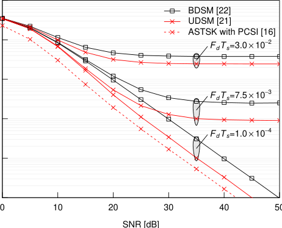

Fig. 21. Effects of Jakes channels on BPSK-aided BDSM and UDSM having
( _M, Q_ ) = (2 _,_ 2), where the number of scatterers was 8. The normalized
Doppler frequency was set to _F_ _d_ _T_ _s_ = 1 _._ 0 _×_ 10 _[−]_ [4], 7 _._ 5 _×_ 10 _[−]_ [3], and 3 _._ 0 _×_
10 _[−]_ [2] . The transmission rate was _R_ = 1 _._ 5 [bits/symbol].

were also plotted for reference. The transmission rate was
_R_ = 2 _._ 0 [bits/symbol]. Again, in Fig. 20, we considered the
effects of the channel estimation errors. Specifically, for the
perfect CSI (PCSI) scenario, we assumed that the receiver had
a perfect estimate of the channel matrix **H** ( _i_ ). By contrast, for
the imperfect CSI scenario we assumed that the receiver had
a realistic estimate of **H** ( _i_ ), where the channel matrix was
contaminated by the complex-valued AWGN of _CN_ (0 _, ω_ ).
We observe in Fig. 20 that the coherent GSTSK achieved
the best performance for PCSI scenario, but it exhibited an
error floor for the imperfect CSI scenario characterized by a
channel error variance of _ω_ = 10. We observed the same trend

for the SM scheme. Hence, it is difficult for coherent MIMO
schemes to attain a low BER, when the estimated channel

matrix is inaccurate. The differential MIMO schemes are free

from the channel estimation errors. It is shown in Fig. 20
that both the NCGSM and BDSM schemes were capable of
operating without an error floor. The performance gap between
the GSTSK and NCGSM was 3.5 [dB], which was higher than
3.0 [dB].

Fig. 21 shows the effects of Doppler frequency on the DSM
schemes, where we considered the Jakes channel model of the
Rayleigh fading to have 8 scatterers. In Fig. 21, the normalized
Doppler frequency was varied from _F_ _d_ _T_ _s_ = 1 _._ 0 _×_ 10 _[−]_ [4]

to 3 _._ 0 _×_ 10 _[−]_ [2] [244], [245]. As shown in Fig. 21, both the
BDSM and UDSM schemes of Fig. 9 exhibited error floors
for the _F_ _d_ _T_ _s_ _≥_ 7 _._ 5 _×_ 10 _[−]_ [3] scenarios. As the normalized
Doppler frequency increased, the performance advantages of
the UDSM scheme were maintained, as a benefit of its
appropriately designed DMs.
Fig. 22 shows the BER comparisons between UDSM and
single-RF NCGSM detailed in Section IV-B. Both the UDSM
and the single-RF NCGSM schemes were designed for a
reduced-RF-chain transmitter. The difference between both

these two schemes is highlighted by the structure of the
codewords in the diagonal and the permutation matrices, which

ACCEPTED FOR PUBLICATION IN IEEE COMMUNICATIONS SURVEYS & TUTORIALS 25

10 [0] 8.0   -   

~~**●**~~

10 [−2]

                    -                    
10 [−5]

10 [−6] ~~NCGSM,~~ ~~_M_~~ ~~= 2 [185]~~ ~~●~~ Unconstrained AMI

10 [−7] ~~NCGSM, UDSM,~~ ~~_MM_~~ ~~= 2 [21] = 4 [185]~~ ~~2.6 dB~~ ~~●~~ ~~2.1 dB~~ ~~0.6 dB~~ ~~●~~  - ~~●~~ BLAST (BLAST ( _PP_ = 2) [84] = 4) [84]

10 [−8] ~~●~~ ~~UDSM,~~ ~~_M_~~ ~~= 3 [21]~~ GSM ( _P_ = 1) [57]

10 [−9]

|● ●|Col2|
|---|---|
|~~**●**~~ ~~●~~ ~~●~~ ~~●~~ ~~●~~ ~~●~~ ||
|~~●~~ ● ~~●~~|~~●~~ ● ~~●~~|
|●|●|
|~~●~~ ~~●~~ ~~Differential BPSK~~ ~~NCGSM,~~~~_M_ = 2 [185]~~|~~●~~ ~~●~~ ~~Differential BPSK~~ ~~NCGSM,~~~~_M_ = 2 [185]~~|
|~~●~~ ~~●~~ ~~0.6 dB~~ ~~2.1 dB~~ ~~2.6 dB~~ ~~●~~ ~~NCGSM,~~~~_M_ = 3 [185]~~ ~~NCGSM,~~~~_M_ = 4 [185]~~ ~~UDSM,~~~~_M_ = 2 [21]~~ |~~●~~ ~~●~~ ~~0.6 dB~~ ~~2.1 dB~~ ~~2.6 dB~~ ~~●~~ ~~NCGSM,~~~~_M_ = 3 [185]~~ ~~NCGSM,~~~~_M_ = 4 [185]~~ ~~UDSM,~~~~_M_ = 2 [21]~~ |
|~~●~~ ~~●~~ ~~UDSM,~~~~_M_ = 3 [21]~~ ~~UDSM,~~~~_M_ = 4 [21]~~|~~●~~ ~~●~~ ~~UDSM,~~~~_M_ = 3 [21]~~ ~~UDSM,~~~~_M_ = 4 [21]~~|

0 10 20 30 40 50

SNR [dB]

Fig. 22. BER comparisons between the proposed UDSM and the conventional
single-RF NCGSM, where ( _M, Q_ ) = (2 _,_ 2) _,_ (3 _,_ 4) _,_ (4 _,_ 8). The BER curve
of differential BPSK was plotted for reference. The transmission rate was set
to _R_ = 1 _._ 0 [bits/symbol].

were described in Section IV-B. In Fig. 22, the number of
transmit antennas was set to _M_ = 2 _,_ 3 _,_ 4, and the number of
receive antennas was constrained to _N_ = 1. The BER curves

of the BDSM of Fig. 9 were not listed because its transmission
rate exceeds _R_ = 1 _._ 0 [bits/symbol]. It is shown in Fig. 22 that
the diversity orders of both UDSM and single-RF NCGSM
improved upon increasing the number of transmit antennas
_M_ . Furthermore, the performance gaps between UDSM and
single-RF NCGSM increased upon increasing _M_, where the
SNR gaps associated with _M_ = 2, 3, and 4 were 0 _._ 6, 2 _._ 1, and
2 _._ 6 [dB], respectively, at BER = 10 _[−]_ [8] .

_C. PM-Based MIMO-MWC_

Third, we investigated the achievable performance of the
PM-based MIMO-MWC scheme of Fig. 11 in terms of its
AMI, where we considered both perfect and imperfect BF
scenarios.

Fig. 23 shows the constrained AMI comparisons of GSM,
single-stream BF, and BLAST, where the number of antenna
elements was _M_ _e_ = _N_ _e_ = 16, and the number of subarrays
was _M_ = _N_ = 4. The separation between the ABFs
was set to _D_ T = _D_ R = 7 _._ 91 [cm] based on Eq. (16).
In this scenario, the mean rank of the channel matrix was
rank( **H** ) = min(4 _,_ 4) = 4. In Fig. 23, we considered 256–
QAM-aided BF and BLAST associated with _P_ = 2 or 4,
and GSM with _P_ = 1 or 2. It is shown in Fig. 23 that the
constrained AMI of the single-RF GSM scheme was nearly
the same as that of the BLAST scheme for _P_ = 2 at the half
rate point of 4.0 [bits/symbol]. Furthermore, the constrained
AMI of the GSM scheme associated with _P_ = 2 was similar

to that of the BLAST scheme associated with _P_ = 4. Hence,
the performances of both GSM and BLAST are equivalent, if
we assume the use of half-rate channel coding.
Fig. 24 shows the effects of receiver tilt, defined by _θ_
in Section III-C. In Fig. 24, the system parameters and the
considered schemes were the same as those used in Fig. 23.

0.0

|8.0 ● ● ● ● 6.0 ● symbol] equivalent ●|Col2|●|Col4|
|---|---|---|---|
|symbol] 6.0 8.0 ~~●~~ ● ● ● ● ●  equivalent|~~●~~ ● ● ●  equivalent|~~●~~ ● ● ●  equivalent|~~●~~ ● ● ●  equivalent|
|AMI [bits/  2.0 ~~4.0~~ ~~●~~ 1/2|~~●~~ ~~●~~ ~~●~~ ● ● ● ● rate equivalent ~~●~~ Unconstrained AMI BF BLAST (_P_ = 2) [84] BLAST (_P_ = 4) [84] GSM (_P_ = 1) [57] GSM (_P_ = 2) [57]|~~●~~ ~~●~~ ~~●~~ ● ● ● ● rate equivalent ~~●~~ Unconstrained AMI BF BLAST (_P_ = 2) [84] BLAST (_P_ = 4) [84] GSM (_P_ = 1) [57] GSM (_P_ = 2) [57]|~~●~~ ~~●~~ ~~●~~ ● ● ● ● rate equivalent ~~●~~ Unconstrained AMI BF BLAST (_P_ = 2) [84] BLAST (_P_ = 4) [84] GSM (_P_ = 1) [57] GSM (_P_ = 2) [57]|

−20 −10 0 10

SNR [dB]

Fig. 23. Constrained AMI comparisons between the GSM and the benchmark
schemes. The transmitter and the receiver had _M_ _e_ = _N_ _e_ = 16 antenna
elements and _M_ = _N_ = 4 separated ABFs. The transmission rate was
_R_ = 8 _._ 0 [bits/symbol]. c _⃝_ IEEE [24]

8

|● ● ● ● ● ● ● ● ● ● ● ● ● ● ● ● ● ● ● ● ● ● ● ● ● ● ● Steered ● ● ● ●|Col2|Col3|
|---|---|---|
||1/2 rate   ● ~~●~~ ~~●~~ ~~●~~ ~~●●●●●~~ ~~●~~ ~~●●~~ Missteered ● BF BLAST (_P_ = 4) [84 GSM (_P_ = 1) [57] GSM (_P_ = 2) [57]|●   ]|

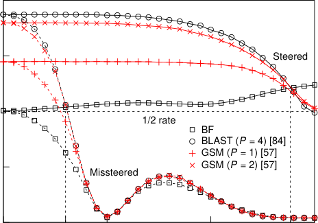

0 18 30 60 83 90

Receiver tilt angle θ [ ° ]

Fig. 24. Effects of receiver tilt on the constrained AMI at the SNR of _−_ 5

[dB]. The system parameters are the same as in Fig. 23. The constrained AMI
at _θ_ = 0 _[◦]_ corresponded to that shown in Fig. 23, where SNR = _−_ 5 [dB].
_⃝_ c IEEE [24]

The constrained AMI was calculated at SNR = _−_ 5 [dB].
As shown in Fig. 24, the constrained AMI of all schemes
decreased from _θ_ = 0 _[◦]_ to 30 _[◦]_, which corresponds to the main
lobe of the directional BF gain shown in Fig. 12. Fig. 24
also shows that the constrained AMI of the BLAST and

GSM schemes were higher than the half-rate 4 _._ 0 [bits/symbol]
within the range of 0 _[◦]_ _≤_ _θ ≤_ 18 _[◦]_ . For the steered case, _θ_ AoD
and _θ_ AoA were accurately adjusted based on perfect estimates
of _θ_ . As shown in Fig. 24, the constrained AMI of the BLAST
and of the GSM schemes remained high within the range of
0 _≤_ _θ <_ 83 _[◦]_ .

_D. PM-Based MIMO-VLC_

Fourth, we investigated the achievable performance of the
PM-based MIMO-VLC scheme of Fig. 13 in terms of its MI

ACCEPTED FOR PUBLICATION IN IEEE COMMUNICATIONS SURVEYS & TUTORIALS 26

PI-OSM ( 𝛽= 4 dB)

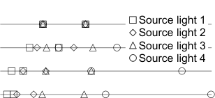

Unconstrained PI-OSM gain

0.0 1.0 2.0 3.0 ~~1.0~~

Transmit symbol value

Fig. 25. Constellation examples of the equal-power OSM, the PI-OSM having
a single parameter _β_ and the unconstrained PI-OSM. The number of transmit 0.5 Unconstrained
light sources was _M_ = 4. The size of the PAM constellation was _L_ = 2. PAM−RC, 4−PAM
Each mark corresponds to the emitted index of the light source. Equal−Power OSM, 2−PAM [27]

|2.0|Col2|
|---|---|
|on [bits/symbol]  1.5 2.0|1/2 rate 3.2 dB gain|
|Mutual informati 0.5 ~~1.0~~|Unconstrained PAM−RC, 4−PAM Equal−Power OSM, 2−PAM [27] PI−OSM, 4−PAM (10 dB) [30] PI−OSM, 4−PAM (20 dB) [30]|

0.0

and BER. We also illustrate constellation examples of the
OSM family. Because the channel coefficients are static, we
use the term _MI_ instead of _AMI_ .

Fig. 25 compares the constellations of the equal-power OSM
scheme [27], of the PI-OSM [29] having _β_ = 1 _,_ 3 _,_ 4 [dB] and
of the unconstrained PI-OSM [30], where the number of transmit light sources was _M_ = 4, and the size of PAM symbols
was _L_ = 2. We observe in Fig. 25 that the constellations of the
single-parameter PI-OSM scheme having _β_ = 3 and 4 [dB]
were biased. This is because Eq. (39) exponentially increased
power upon increasing the single parameter _β_ . By contrast,
the unconstrained PI-OSM scheme had a higher degree of
freedom for designing the PA parameters. As shown in Fig. 25,
the constellations of the unconstrained PI-OSM scheme were

uniformly distributed from 0.0 to 2.0, and the constellations
were designed to maximize the AMI at the received SNR of
25 [dB].
Fig. 26(a) shows the constrained MI of the _L_ = 4–PAMaided RC, of the _L_ = 2–PAM-aided equal-power OSM and of
the _L_ = 2–PAM-aided unconstrained PI-OSM schemes, where
( _M, N_ ) = (2 _,_ 1) and _R_ = 2 _._ 0 [bits/symbol]. We designed the
PA matrix of the PI-OSM scheme both at the low SNR of 10

[dB] and at the high SNR of 20 [dB] in order to investigate the
effects of the target SNR. It is shown in Fig. 26(a) that the PIOSM scheme designed at SNR = 10 [dB] achieved the best
constrained MI at the effective throughput of 1.0 [bits/symbol],
when using half-rate coding. Note that the PAM-RC scheme
achieved the best performance in the SNR region between 13
and 27 [dB], where the PI-OSM scheme designed to operate at
SNR = 20 [dB] performed worse than the PAM-RC scheme.
Due to the high correlations between the channel coefficients,
the conventional equal-power OSM scheme only achieved a
throughput of 1.0 [bits/symbol] at high SNRs. In Fig. 26(b),
we compared the BER of the schemes considered in Fig. 26(a).
The simulation parameters were the same as those used in
Fig. 26(a). We observe in Fig. 26(b) that the PAM-RC scheme
achieved the BER of 10 _[−]_ [4] at 20.97 [dB], whereas the PI-OSM
scheme designed for operation at SNR = 20 [dB] achieved it
at 27.05 [dB], where a 6.3 [dB] SNR gap existed. Furthermore,
the PI-OSM scheme designed for operation at SNR = 10

[dB] exhibited an error floor. Hence, the PAM-RC scheme
was superior to PI-OSM in this uncoded scenario. However,
as shown in the MI comparison of Fig. 26(a), the PI-OSM
scheme exhibited a 3.2 dB gain over PAM-RC, which implies

−10 0 10 20 30 40

SNR [dB]

(a) MI comparison c _⃝_ IEEE [30]

10 [0]

10 [−1]

10 [−2]

10 [−3]

10 [−5]

|error floors|Col2|
|---|---|
|||
|||
|||
|||
|~~6.3 dB~~|~~6.3 dB~~|
|~~gap~~|~~gap~~|
|PAM−RC, 4−PAM|PAM−RC, 4−PAM|
|~~Equal−power OSM, 2−PAM [27]~~ |~~Equal−power OSM, 2−PAM [27]~~ |
|~~PI−OSM, 4−PAM (10 dB) [30]~~ ~~PI−OSM, 4−PAM (20 dB) [30]~~|~~PI−OSM, 4−PAM (10 dB) [30]~~ ~~PI−OSM, 4−PAM (20 dB) [30]~~|
|||
|10 0 10 20 30 4 SNR [dB]|10 0 10 20 30 4 SNR [dB]|

(b) BER comparison in uncoded scenarios

Fig. 26. BER and MI comparisons of the PAM-RC and the OSM schemes of
Fig. 13, where the transmission rate was _R_ = 2 _._ 0 [bits/symbol]. The numbers
of light sources and receive PDs were ( _M, N_ ) = (2 _,_ 1). The distance between
the light sources and the PDs was _d_ Tx = _d_ Rx = 0 _._ 1 [m].

that the PI-OSM scheme is expected to be superior to PAMRC in the channel-coded scenarios.

_E. PM-Based Multicarrier Communications_

Finally, we investigated the achievable performance of the
PM-based OFDM scheme of Fig. 14 in terms of its AMI and
BER, where turbo coding was considered.
Fig. 27(a) shows the MED comparison of the QPSK-aided
SIM scheme having _M_ = 4 _,_ 8 _,_ and 16, where the number
of selected subcarriers was increased from _P_ = 1 to _M_ .

Fig. 27(b) shows the simulated BER of the SIM setups
considered in Fig. 27(a), where the received SNR was 30 [dB].
Figs. 27(a) and (b) show that a correlation existed between the
reciprocal of the MED and of the BER. Thus, the MED is a
useful metric for predicting the BER in uncoded scenarios.
Fig. 28(a) shows the unconstrained and constrained AMI
comparisons of the BPSK-aided OFDM and 4–QAM-aided
SIM(4,1) schemes in Rayleigh fading channels. Fig. 28(a)

ACCEPTED FOR PUBLICATION IN IEEE COMMUNICATIONS SURVEYS & TUTORIALS 27

0.50

0.20

0.10

0.05

10 [−3.5]

10 [−3.8]

10 [−4.5]

10 [−4.8]

|● ● M = 4 M = 8|Col2|
|---|---|
|● ~~●~~   ~~_M_ = 16~~|● ~~●~~   ~~_M_ = 16~~|
||~~●~~|
|||
|||
|●|●|
|||
|||
|||
|~~●~~|~~●~~|
|●|●|

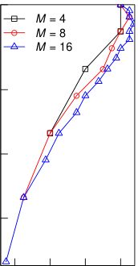

0.5 1.0 1.5 2.0

Rate [bits/s/Hz]

(a) The reciprocal of MED

0.5 1.0 1.5 2.0

Rate [bits/s/Hz]

(b) BER at 30 dB

Fig. 27. Correlation between MED and BER, where the constellation size
was _L_ = 4. The number of subcarriers was set to _M_ = 4 _,_ 8 _,_ 16, and the
number of selected subcarriers was changed from _P_ = 1 to _M_ .

0.8

0.4

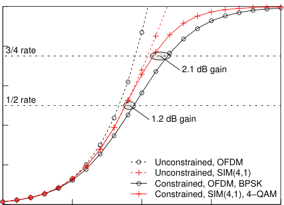

−20 −10 0 10 20

SNR [dB]

(a) AMI comparison c _⃝_ IEEE [37]

10 [0]

10 [−1]

10 [−3]

10 [−4]

10 [−5]

|● OFDM, BPSK ● ● ● ● ●|Col2|Col3|Col4|Col5|
|---|---|---|---|---|
|●●~~●●●●~~●●~~●~~   ~~●~~ ~~●~~ ~~●~~ ~~●~~ ~~●~~ ~~●~~ ● ● ● ~~●~~ ~~●~~ ~~SIM(4,1), 4−QAM~~|●●~~●●●●~~●●~~●~~   ~~●~~ ~~●~~ ~~●~~ ~~●~~ ~~●~~ ~~●~~ ● ● ● ~~●~~ ~~●~~ ~~SIM(4,1), 4−QAM~~|●●~~●●●●~~●●~~●~~   ~~●~~ ~~●~~ ~~●~~ ~~●~~ ~~●~~ ~~●~~ ● ● ● ~~●~~ ~~●~~ ~~SIM(4,1), 4−QAM~~|●●~~●●●●~~●●~~●~~   ~~●~~ ~~●~~ ~~●~~ ~~●~~ ~~●~~ ~~●~~ ● ● ● ~~●~~ ~~●~~ ~~SIM(4,1), 4−QAM~~|●●~~●●●●~~●●~~●~~   ~~●~~ ~~●~~ ~~●~~ ~~●~~ ~~●~~ ~~●~~ ● ● ● ~~●~~ ~~●~~ ~~SIM(4,1), 4−QAM~~|
|~~●~~   ~~●~~ ~~●~~ |~~●~~   ~~●~~ ~~●~~ |~~●~~   ~~●~~ ~~●~~ |~~●~~   ~~●~~ ~~●~~ |~~●~~   ~~●~~ ~~●~~ |
|~~●~~|~~●~~|~~●~~|~~●~~|~~●~~|
|●|●|●|●|●|
|● ~~●~~|● ~~●~~|● ~~●~~|● ~~●~~|● ~~●~~|
|~~●~~  ~~●~~|~~●~~  ~~●~~|~~●~~  ~~●~~|~~●~~  ~~●~~|~~●~~  ~~●~~|
||||||
||||||
|●|●|●|●|●|
|~~●~~ ~~1.1 dB gain~~ ~~4.1 dB gain~~|~~●~~ ~~1.1 dB gain~~ ~~4.1 dB gain~~|~~●~~ ~~1.1 dB gain~~ ~~4.1 dB gain~~|~~●~~ ~~1.1 dB gain~~ ~~4.1 dB gain~~|~~●~~ ~~1.1 dB gain~~ ~~4.1 dB gain~~|
||||||
|(1/2−rate coding) ~~(3/4−rate coding)~~|(1/2−rate coding) ~~(3/4−rate coding)~~|(1/2−rate coding) ~~(3/4−rate coding)~~|(1/2−rate coding) ~~(3/4−rate coding)~~|(1/2−rate coding) ~~(3/4−rate coding)~~|
|●  |●  |●  |●  |●  |
|~~●~~|~~●~~|~~●~~|~~●~~|~~●~~|
||||||
||~~●~~|~~●~~|~~●~~|~~●~~|
||||||
|2 0|2 4 6 8 SNR [dB]|2 4 6 8 SNR [dB]|2 4 6 8 SNR [dB]|2 4 6 8 SNR [dB]|

(b) BER comparison in coded scenarios

Fig. 28. BER and AMI comparisons of the SIM and the OFDM schemes of
Fig. 14.

TABLE X

S UMMARY OF OUR DISCUSSIONS .

Single-stream PM family Full-complexity

MED Fair **Best** Good

Unconstrained AMI Fair Good **Best**

Constrained AMI Fair **Best** Good
Transmitter complexity **Best** Good Fair
Detection complexity **Best** Good Fair
BF gain [17] **Best** Fair Good

shows that the unconstrained AMI of OFDM exceeded that

of SIM right across the entire SNR region. The reason for
this is that the SIM scheme transmitted a reduced number of

Gaussian streams compared to OFDM. However, as shown in
Fig. 28(a), the constrained AMI of SIM was higher than that of
OFDM. Specifically, the performance gains of 1.2 and 2.1 [dB]
were achieved at the coding rates of 1 _/_ 2 and 3 _/_ 4, respectively.
This observation implies that the performance gain of channelcoded scenarios increases with the increase of the coding rate.
Similarly, in Fig. 28(b), we investigated the BER performance
of the three-stage turbo-coded SIM and OFDM schemes. The
schemes considered in Fig. 28(b) were the same as those used
in Fig. 28(a). Fig. 28(b) shows that the SIM scheme achieved
lower turbo-cliff SNRs than the OFDM scheme, where gaps
of 1.1 and 4.1 [dB] existed for the 1/2- and 3/4-rate coding
cases, respectively. These performance gains were nearly the
same as those anticipated in Fig. 28(a).

VII. C ONCLUSIONS

_A. Summary and Design Guidelines_

In this treatise, we provided an interdisciplinary survey of
the PM family that has been proposed for coherent MIMO,
differential MIMO, MIMO-MWC, MIMO-VLC and multicarrier RF communications. The PM concept was originally
proposed by Slepian in 1965 and has since flourished in
data storage research. All of the conventional PM, PC, SM,
and SIM schemes rely on a common structure that maps
the input bits by selecting a permutation of an arbitrary
set, which consists of “on” and “off” states, for example.
In data storage studies, this unique structure has achieved a
storage capacity gain, while maintaining low-latency reading
and writing with the aid of the reduced number of “on” states.
In digital communication studies, this structure has achieved
low-complexity encoding and decoding with the aid of the
reduced number of data streams, where the transmission rate
is kept the same as that in the conventional schemes. Our
hope is that this interdisciplinary survey may inspire you new
colleagues to join us in this research field.
Our simulation results demonstrated the fundamental trade
offs of the PM-aided systems, which determine the design
guidelines, in terms of both the theoretical analyses and the
numerical simulations. Our discussions are summarised in

Table X. As described in Section II, the PM encoding process
selects _P_ number of elements out of a _Q_ -sized arbitrary set.
Here, the design of _P_ for 1 _≤_ _P ≤_ _Q_ provides additional
flexibilities that affect the system transmission rate, reliability,

17 This metric is only valid for coherent microwave communications.

ACCEPTED FOR PUBLICATION IN IEEE COMMUNICATIONS SURVEYS & TUTORIALS 28

AMI, hardware complexity at the transmitter and computational complexity at the receiver. The transmission rate of
the PM-aided coherent MIMO logarithmically increases upon
increasing the number of transmit antennas, while maintaining
a reduced complexity. Furthermore, the PM-aided coherent
MIMO achieves a higher coding gain than the conventional
SMX scheme in the entire transmission rate region. In any
scenario, the reduced number of data streams enables lowcomplexity detection at the receiver. However, since the number of Gaussian streams is reduced, the unconstrained AMI is
reduced. In our simulations, the constrained AMI of the PMaided family, in place of the unconstrained AMI, was shown
to have advantages over the conventional schemes.

_B. Suggestions for Future Research_

_1) Cross-Pollination of SM and Data Storage Research:_
The analogy between both the SM and PM schemes could
certainly attract researchers to these fields. Many attractive
low-complexity detectors have been proposed for the SM
scheme. These schemes may be exported to PM-aided data
storage systems to achieve low-latency reading. Furthermore,
the low-latency reading and writing algorithms of PM-aided
data storage may also be exported to SM-aided MIMO systems. This interaction would contribute to the development of
both data storage and digital communications.
_2) Large-Scale High-Rate PM-Based Differential MIMO:_
The PM-based differential MIMO communications have to

rely on sparse square matrices. This square constraint _M_ = _T_
limits the design of space-time codewords. It has been known
that the square-matrix-based differential schemes achieve bad
performances for large-scale high-rate scenarios. At the time of
writing, the only exception is found in [108], which proposed
a nonsquare-matrix-based differential MIMO. This nonsquare
scheme achieved a competitive performance for the _M_ = 1024
antennas and _R_ = 12 [bits/symbol] scenario. However, the
nonsquare scheme of [108] suffers from an error-propagation
issue when we consider a small number of receive antennas

or a high Doppler shift.
_3) Striking the Tradeoff between Sparsity and Capacity:_
The PM-based OFDM scheme transmits _P_ independent data
streams over _M_ orthogonal subcarriers. Thus, the unconstrained AMI of PM becomes inevitably smaller than the
classic OFDM scheme, which transmits _M_ Gaussian streams

over _M_ subcarriers. Our simulation results showed that the

constrained AMI of PM becomes better than OFDM for a

specific scenario, but this achievable AMI gain may vanish
for high-rate scenarios. The sparsity of PM codewords improves the computational complexity at the receiver, while it
also decreases the unconstrained AMI. Hence, the multiplemode IM [233], [246] and the compressed-sensing-assisted
IM [219] are promising for high-rate scenarios because these
construct a dense symbol in the frequency domain. This dense
construction improves the corresponding unconstrained AMI,
while it also induces a complexity issue at the same time.

A CKNOWLEDGMENT

The authors are indebted to Prof. H. Ochiai, Yokohama
National University, Japan for his comment on the parallel

combinatory concept. Thanks are also due to the anonymous
reviewers for their valuable suggestions and comments, which
improved this treatise.

G LOSSARY

ABF Analog BeamForming
AMI Average Mutual Information
APSK Amplitude and Phase-Shift Keying
ASTSK Asynchronous Space-Time Shift Keying
AWGN Additive White Gaussian Noise
BDSM Binary Differential Spatial Modulation
BER Bit Error Ratio
BF BeamForming
BLAST Bell-Laboratories Layered Space-Time
BPSK Binary Phase-Shift Keying
CDMA Code-Division Multiple Access
CMOS Complementary Metal Oxide Semiconductor
CSI Channel State Information
DBF Digital BeamForming
DM Dispersion Matrix
DSM Differential Spatial Modulation
DSTBC Differential Space-Time Block Code
DSTSK Differential Space-Time Shift Keying
FSK Frequency Shift Keying
GSM Generalized Spatial Modulation
GSSK Generalized Space Shift Keying
GSTSK Generalized Space-Time Shift Keying
IFFT Inverse Fast Fourier Transform
i.i.d. independent and identically distributed
IM Index Modulation
LDC Linear Dispersion Code
LED Light Emitting Diode
LoS Line-of-Sight
LUT Look-Up Table
MAP Maximum _a Posteriori_

MBM Media-Based Modulation

MED Minimum Euclidean Distance

MI Mutual Information
MIMO Multiple-Input Multiple-Output
ML Maximum-Likelihood

MWC Millimeter Wave Communication
NBC Natural Binary Code
NCGSM Non-Coherent Generalized Spatial Modulation
NLoS Non-Line-of-Sight
OFDM Orthogonal Frequency-Division Multiplexing
OSM Optical Spatial Modulation
OSTBC Orthogonal Space-Time Block Code
PAM-RC PAM Repetition-Code
PAM Pulse Amplitude Modulation
PA Power Allocation
PAPR Peak-to-Average Power Ratio
PC Parallel Combinatory
PCSI Perfect Channel State Information

PD PhotoDetector
PEP Pairwise-Error Probability
PI Power-Imbalanced

PM Permutation Modulation

PPM Pulse Position Modulation
QAM Quadrature Amplitude Modulation
QPSK Quaternary Phase-Shift Keying
RC Repetition Code
RF Radio Frequency
SIM Subcarrier Index Modulation
SISO Single-Input Single-Output
SM Spatial Modulation
SMX Spatial MultipleXing
SNR Signal-to-Noise Ratio
SSK Space Shift Keying

ACCEPTED FOR PUBLICATION IN IEEE COMMUNICATIONS SURVEYS & TUTORIALS 29

STBC Space-Time Block Code
STSK Space-Time Shift Keying
VLC Visible Light Communication

R EFERENCES

[1] N. Ishikawa, “Space-, time-, and frequency-domain permutation modulation designed for microwave and optical wireless communications,”
Ph.D. dissertation, Tokyo University of Agriculture and Technology,
2017.

[2] M. D. Renzo, H. Haas, and P. Grant, “Spatial modulation for multipleantenna wireless systems: A survey,” _IEEE Communications Magazine_,
vol. 49, no. 12, pp. 182–191, 2011.

[3] M. Di Renzo, H. Haas, A. Ghrayeb, S. Sugiura, and L. Hanzo,
“Spatial modulation for generalized MIMO: Challenges, opportunities,
and implementation,” _Proceedings of the IEEE_, vol. 102, no. 1, pp.
56–103, 2014.

[4] P. Yang, M. Di Renzo, Y. Xiao, S. Li, and L. Hanzo, “Design guidelines
for spatial modulation,” _IEEE Communications Surveys & Tutorials_,
vol. 17, no. 1, pp. 6–26, 2015.

[5] P. Yang, Y. Xiao, Y. L. Guan, K. V. Hari, A. Chockalingam, S. Sugiura,
H. Haas, M. Di Renzo, C. Masouros, Z. Liu, L. Xiao, S. Li, and
L. Hanzo, “Single-carrier SM-MIMO: A promising design for broadband large-scale antenna systems,” _IEEE Communications Surveys &_
_Tutorials_, vol. 18, no. 3, pp. 1687–1716, 2016.

[6] M. I. Kadir, S. Sugiura, S. Chen, and L. Hanzo, “Unified MIMOmulticarrier designs: A spacetime shift keying approach,” _IEEE Com-_
_munications Surveys & Tutorials_, vol. 17, no. 2, pp. 550–579, 2015.

[7] M. Di Renzo, H. Haas, A. Ghrayeb, L. Hanzo, and S. Sugiura,
_Spatial Modulation for Multiple-Antenna Communication_ . Wiley
Encyclopedia of Electrical and Electronics Engineering, 2016.

[8] E. Basar, M. Wen, R. Mesleh, M. Di Renzo, Y. Xiao, and H. Haas,
“Index modulation techniques for next-generation wireless networks,”
_IEEE Access_, vol. 5, pp. 16 693–16 746, 2017.

[9] R. Rajashekar, K. V. S. Hari, and L. Hanzo, “Reduced-complexity
ML detection and capacity-optimized training for spatial modulation
systems,” _IEEE Transactions on Communications_, vol. 62, no. 1, pp.
112–125, 2014.

[10] S. Sugiura, C. Xu, S. Ng, and L. Hanzo, “Reduced-complexity coherent
versus non-coherent QAM-aided space-time shift keying,” _IEEE Trans-_
_actions on Communications_, vol. 59, no. 11, pp. 3090–3101, 2011.

[11] M. Wen, X. Cheng, Y. Bian, and H. V. Poor, “A low-complexity nearML differential spatial modulation detector,” _IEEE Signal Processing_
_Letters_, vol. 22, no. 11, pp. 1834–1838, 2015.

[12] M. Zhang, M. Wen, X. Cheng, and L. Yang, “A dual-hop virtual
MIMO architecture based on hybrid differential spatial modulation,”
_IEEE Transactions on Wireless Communications_, vol. 15, no. 9, pp.
6356–6370, 2016.

[13] K. Lee, “Doubly ordered sphere decoding for spatial modulation,” _IEEE_
_Communications Letters_, vol. 19, no. 5, pp. 795–798, 2015.

[14] C. Xu, S. Sugiura, S. X. Ng, P. Zhang, L. Wang, and L. Hanzo, “Two
decades of MIMO design tradeoffs and reduced-complexity MIMO
detection in near-capacity systems,” _IEEE Access_, vol. 5, pp. 18 564–
18 632, 2017.

[15] E. Basar, U. Aygolu, E. Panayirci, and H. Poor, “Space-time block
coded spatial modulation,” _IEEE Trans. Communications_, vol. 59,
no. 3, pp. 823–832, 2011.

[16] S. Sugiura, S. Chen, and L. Hanzo, “A universal space-time architecture
for multiple-antenna aided systems,” _IEEE Communications Surveys &_
_Tutorials_, vol. 14, no. 2, pp. 401–420, 2012.

[17] A. Helmy, M. Renzo, and N. Al-Dhahir, “Enhanced-reliability cyclic
generalized spatial-and-temporal modulation,” _IEEE Communications_
_Letters_, vol. 20, no. 12, pp. 2374–2377, 2016.

[18] M. T. Le, V. D. Ngo, H. A. Mai, X. N. Tran, and M. Di Renzo, “Spatially modulated orthogonal space-time block codes with non-vanishing
determinants,” _IEEE Transactions on Communications_, vol. 62, no. 1,
pp. 85–99, 2014.

[19] Y. Bian, M. Wen, X. Cheng, H. Poor, and B. Jiao, “A differential
scheme for spatial modulation,” in _IEEE Global Communications_
_Conference_, Atlanta, GA, USA, Dec. 9-13, 2013.

[20] M. Wen, Z. Ding, X. Cheng, Y. Bian, H. Poor, and B. Jiao, “Performance analysis of differential spatial modulation with two transmit
antennas,” _IEEE Communications Letters_, vol. 18, no. 3, pp. 475–478,
2014.

[21] N. Ishikawa and S. Sugiura, “Unified differential spatial modulation,”
_IEEE Wireless Communications Letters_, vol. 3, no. 4, pp. 337–340,
2014.

[22] Y. Bian, X. Cheng, M. Wen, L. Yang, H. V. Poor, and B. Jiao,
“Differential spatial modulation,” _IEEE Transactions on Vehicular_
_Technology_, vol. 64, no. 7, pp. 3262–3268, 2015.

[23] R. Rajashekar, N. Ishikawa, S. Sugiura, K. V. S. Hari, and L. Hanzo,
“Full-diversity dispersion matrices from algebraic field extensions
for differential spatial modulation,” _IEEE Transactions on Vehicular_
_Technology_, vol. 66, no. 1, pp. 385–394, 2017.

[24] N. Ishikawa, R. Rajashekar, S. Sugiura, and L. Hanzo, “Generalizedspatial-modulation-based reduced-RF-chain millimeter-wave communications,” _IEEE Transactions on Vehicular Technology_, vol. 66, no. 1,
pp. 879–883, 2017.

[25] P. Liu and A. Springer, “Space shift keying for LOS communication at
mmWave frequencies,” _IEEE Wireless Communications Letters_, vol. 4,
no. 2, pp. 121–124, 2015.

[26] P. Liu, M. Di Renzo, and A. Springer, “Line-of-sight spatial modulation
for indoor mmWave communication at 60 GHz,” _IEEE Transactions_
_on Wireless Communications_, vol. 15, no. 11, pp. 7373–7389, 2016.

[27] R. Mesleh, H. Elgala, and H. Haas, “Optical spatial modulation,”
_IEEE/OSA Journal of Optical Communications and Networking_, vol. 3,
no. 3, pp. 234–244, 2011.

[28] T. Fath, H. Haas, M. Di Renzo, and R. Mesleh, “Spatial modulation
applied to optical wireless communications in indoor LOS environments,” in _IEEE Global Telecommunications Conference_, Kathmandu,
Nepal, 5-9 Dec., 2011.

[29] T. Fath and H. Haas, “Performance comparison of MIMO techniques
for optical wireless communications in indoor environments,” _IEEE_
_Transactions on Communications_, vol. 61, no. 2, pp. 733–742, 2013.

[30] N. Ishikawa and S. Sugiura, “Maximizing constrained capacity of
power-imbalanced optical wireless MIMO communications using spatial modulation,” _Journal of Lightwave Technology_, vol. 33, no. 2, pp.
519–527, 2015.

[31] R. Abu-Alhiga and H. Haas, “Subcarrier-index modulation OFDM,” in
_IEEE 20th International Symposium on Personal, Indoor and Mobile_
_Radio Communications_, Tokyo, Japan, Sept. 13-16, 2009.

[32] D. Tsonev, S. Sinanovic, and H. Haas, “Enhanced subcarrier index
modulation (SIM) OFDM,” in _IEEE GLOBECOM Workshops_, Texas,
USA, Dec. 5-9, 2011.

[33] E. Basar, “Index modulation techniques for 5G wireless networks,”
_IEEE Communications Magazine_, vol. 54, no. 7, pp. 168–175, 2016.

[34] ——, “On multiple-input multiple-output OFDM with index modulation for next generation wireless networks,” _IEEE Transactions on_
_Signal Processing_, vol. 64, no. 1, pp. 3868–3878, 2016.

[35] E. Basar, U. Aygolu, E. Panayirci, and H. V. Poor, “Orthogonal
frequency division multiplexing with index modulation,” _IEEE Trans-_
_actions of Signal Processing_, vol. 61, no. 22, pp. 5536–5549, 2013.

[36] M. Wen, X. Cheng, M. Ma, B. Jiao, and H. V. Poor, “On the achievable
rate of OFDM with index modulation,” _IEEE Transactions on Signal_
_Processing_, vol. 64, no. 8, pp. 1919–1932, 2015.

[37] N. Ishikawa, S. Sugiura, and L. Hanzo, “Subcarrier-index modulation
aided OFDM – will it work?” _IEEE Access_, vol. 4, pp. 2580–2593,
2016.

[38] Y. A. Chau and S.-H. Yu, “Space modulation on wireless fading
channels,” in _IEEE Vehicular Technology Conference_, Atlantic City,
NJ, USA, Oct. 7-11, 2001.

[39] R. Mesleh, H. Haas, C. W. Ahn, and S. Yun, “Spatial modulation

   - A new low complexity spectral efficiency enhancing technique,”
in _International Conference on Communications and Networking in_
_China_, Beijing, China, Oct. 25-27, 2006.

[40] R. Y. Mesleh, H. Haas, S. Sinanovic, C. Ahn, and S. Yun, “Spatial
modulation,” _IEEE Transactions on Vehicular Technology_, vol. 57,
no. 4, pp. 2228–2241, 2008.

[41] D. Slepian, “Permutation modulation,” _Proceedings of the IEEE_,
vol. 53, no. 3, pp. 228–236, 1965.

[42] S. Sasaki, J. Zhu, and G. Marubayashi, “Performance of parallel
combinatory spread spectrum multiple access communication systems,”
in _IEEE International Symposium on Personal, Indoor and Mobile_
_Radio Communications_, London, UK, Sept. 23-25, 1991.

[43] T. Mittelholzer, “An information-theoretic approach to steganography
and watermarking,” in _International Workshop on Information Hiding_,
Dresden, Germany, Sept. 29, 1999.

[44] B. M. King and M. A. Neifeld, “Sparse modulation coding for
increased capacity in volume holographic storage,” _Applied Optics_,
vol. 39, no. 35, pp. 6681–6688, 2000.

[45] A. Jiang, R. Mateescu, M. Schwarts, and J. Bruck, “Rank modulation
for flash memories,” _IEEE Transactions on Information Theory_, vol. 55,
no. 6, pp. 2659–2673, 2009.

ACCEPTED FOR PUBLICATION IN IEEE COMMUNICATIONS SURVEYS & TUTORIALS 30

[46] T. Mittelholzer, N. Papandreou, and C. Pozidis, “Data encoding in
solid-state storage devices,” U.S. Patent 8 578 246, 2013.

[47] M. Nakao, T. Ishihara, and S. Sugiura, “Single-carrier frequencydomain equalization with index modulation,” _IEEE Communications_
_Letters_, vol. 21, no. 2, pp. 298–301, 2017.

[48] S. Sugiura, T. Ishihara, and M. Nakao, “State-of-the-art design of index
modulation in the space, time, and frequency domains: Benefits and
fundamental limitations,” _IEEE Access_, vol. 5, pp. 21 774– 21 790,
2017.

[49] T. Ishihara and S. Sugiura, “Faster-than-nyquist signaling with index
modulation,” _IEEE Wireless Communications Letters_, vol. 6, no. 5, pp.
630–633, 2017.

[50] M. Nakao, T. Ishihara, and S. Sugiura, “Dual-mode time-domain index
modulation for nyquist-criterion and faster-than-nyquist single-carrier
transmissions,” _IEEE Access_, vol. 5, pp. 27 659–27 667, 2017.

[51] M. Wen, X. Cheng, L. Yang, Y. Li, X. Cheng, and F. Ji, “Index
modulated OFDM for underwater acoustic communications,” _IEEE_
_Communications Magazine_, vol. 54, no. 5, pp. 132–137, 2016.

[52] M. Wen, X. Cheng, and L. Yang, _Index modulation for 5G wireless_
_communications_ . Springer, 2017.

[53] B. Shamasundar, S. Jacob, S. Bhat, and A. Chockalingam,
“Multidimensional index modulation in wireless communications,”
_arXiv preprint_, 2017. [Online]. Available: http://arxiv.org/abs/1702.
03250

[54] D. Slepian, “Permutation code signaling,” U.S. Patent 3 196 351, 1965.

[55] W. Li, _Study of hybrid permutation frequency phase modulation_ .
Master Thesis, University of Ottawa, 1996.

[56] A. Yongacoglu and W. Li, “Hybrid permutation frequency phase modulation,” in _IEEE Canadian Conference on Electrical and Computer_
_Engineering_, Saint Johns, Newfoundland, Canada, May 25-28, 1997.

[57] J. Jeganathan, A. Ghrayeb, and L. Szczecinski, “Generalized space
shift keying modulation for MIMO channels,” in _IEEE International_
_Symposium on Personal, Indoor and Mobile Radio Communications_,
Cannes, France, Sept. 15-18, 2008.

[58] P. K. Frenger and N. A. B. Svensson, “Parallel combinatory OFDM
signaling,” _IEEE Transactions on Communications_, vol. 47, no. 4, pp.
558–567, 1999.

[59] D. H. Lehmer, “Teaching combinatorial tricks to a computer,” _Pro-_
_ceedings of Symposia in Applied Mathematics_, vol. 10, pp. 179–193,
1960.

[60] T. Berger, F. Jelinek, and J. K. Wolf, “Permutation codes for sources,”
_IEEE Transactions on Information Theory_, vol. 18, no. 1, pp. 160–169,
1972.

[61] G. E. Atkin and H. P. Corrales, “An efficient modulation/coding scheme
for MFSK systems on bandwidth constrained channels,” _IEEE Journal_
_on Selected Areas in Communications_, vol. 7, no. 9, pp. 1396–1401,
1989.

[62] C. Savage, “A survey of combinatorial Gray codes,” _SIAM Review_,
vol. 39, no. 4, pp. 605–629, 1997.

[63] B. M. King and M. A. Neifeld, “Low-complexity maximum-likelihood
decoding of shortened enumerative permutation codes for holographic
storage,” _IEEE Journal on Selected Areas in Communications_, vol. 19,
no. 4, pp. 783–790, 2001.

[64] D. Silva and W. A. Finamore, “Vector permutation modulation,” _IEEE_
_Communications Letters_, vol. 9, no. 8, pp. 673–675, 2005.

[65] M. Shi, C. D’Amours, and A. Yongacoglu, “Design of spreading
permutations for MIMO-CDMA based on space-time block codes,”
_IEEE Communications Letters_, vol. 14, no. 1, pp. 36–38, 2010.

[66] S. Ishimura and K. Kikuchi, “Multi-dimensional permutationmodulation format for coherent optical communications,” _Optics Ex-_
_press_, vol. 23, no. 12, pp. 15 587–15 597, 2015.

[67] S. Tachikawa, “Performance of M-ary/ spread spectrum multiple access
communication systems using co-channel interference cancellation
techniques,” in _IEEE International Symposium on Spread Spectrum_
_Techniques and Applications_, Yokohama, Japan, Nov. 29 - Dec. 2, 1992.

[68] G. M. Dillard, M. Reuter, J. Zeidler, and B. Zeidler, “Cyclic code shift
keying: A low probability of intercept communication technique,” _IEEE_
_Transactions on Aerospace and Electronic Systems_, vol. 39, no. 3, pp.
786–798, 2003.

[69] Y. Hou and T. Hase, “New OFDM structure with parallel combinatory
code,” _IEEE Transactions on Consumer Electronics_, vol. 55, no. 4, pp.
1854–1859, 2009.

[70] F. Xiaojie, S. Xuejun, and L. Yong, “Secret communication using parallel combinatory spreading WFRFT,” _IEEE Communications Letters_,
vol. 19, no. 1, pp. 62–65, 2015.

[71] G. Kaddoum, M. F. A. Ahmed, and Y. Nijsure, “Code index modulation: a high data rate and energy efficient communication system,”
_IEEE Communications Letters_, vol. 19, no. 2, pp. 175–178, 2015.

[72] G. Kaddoum, Y. Nijsure, and H. Tran, “Generalized code index modulation technique for high-data-rate communication systems,” _IEEE_
_Transactions on Vehicular Technology_, vol. 65, no. 9, pp. 7000–7009,
2016.

[73] R. Mesleh, O. Hiari, A. Younis, and S. Alouneh, “Transmitter design
and hardware considerations for different space modulation techniques,” _IEEE Transactions on Wireless Communications_, vol. 16,
no. 11, pp. 7512–7522, 2017.

[74] K. Ishibashi and S. Sugiura, “Effects of antenna switching on bandlimited spatial modulation,” _IEEE Wireless Communications Letters_,
vol. 3, no. 4, pp. 345–348, 2014.

[75] C. Xu, S. Sugiura, S. X. Ng, and L. Hanzo, “Spatial modulation and
space-time shift keying: Optimal performance at a reduced detection
complexity,” _IEEE Transactions on Communications_, vol. 61, no. 1,
pp. 206–216, 2013.

[76] A. Younis, S. Sinanovic, M. Di Renzo, R. Mesleh, and H. Haas, “Generalised sphere decoding for spatial modulation,” _IEEE Transactions_
_on Communications_, vol. 61, no. 7, pp. 2805–2815, 2013.

[77] D. A. Basnayaka, M. Di Renzo, and H. Haas, “Massive but few active
MIMO,” _IEEE Transactions on Vehicular Technology_, vol. 65, no. 9,
pp. 6861–6877, 2016.

[78] R. Mesleh, R. Mehmood, H. Elgala, and H. Haas, “Indoor MIMO
optical wireless communication using spatial modulation,” in _IEEE In-_
_ternational Conference on Communications_, Cape Town, South Africa,
May 23-27, 2010.

[79] H. O. Peterson, “Diversity receiving system,” U.S. Patent 2 290 992,
1942.

[80] R. G. Clark, “Communications system for simultaneous communications on a single channel,” U.S. Patent 3 384 894, 1968.

[81] W. Schmidt and N. Shimasaki, “Satellite on-board switching utilizing
space-division and spot beam antennas,” U.S. Patent 3 711 855, 1973.

[82] J. H. Winters, “On the capacity of radio communication systems with
diversity in a Rayleigh fading environment,” _IEEE Journal on Selected_
_Areas in Communications_, vol. SAC-5, no. 5, pp. 871–878, 1987.

[83] N. Amitay and J. Salz, “Linear equalization theory in digital data
transmission over dually polarized fading radio channels,” _AT&T Bell_
_Laboratories Technical Journal_, vol. 63, no. 10, pp. 2215–2259, 1984.

[84] G. Foschini, “Layered space-time architecture for wireless communication in a fading environment when using multi-element antennas,”
_Bell labs technical journal_, vol. 1, no. 2, pp. 41–59, 1996.

[85] G. Foschini and M. Gans, “On limits of wireless communications in a
fading environment when using multiple antennas,” _Wireless personal_
_communications_, vol. 6, no. 3, pp. 311–335, 1998.

[86] P. Wolniansky, G. Foschini, G. Golden, and R. Valenzuela, “V-BLAST:
an architecture for realizing very high data rates over the rich-scattering
wireless channel,” in _Proceedings of the International Symposium on_
_Signals, Systems, and Electronics_, Pisa, Italy, Oct. 2, 1998.

[87] S. Alamouti, “A simple transmit diversity technique for wireless
communications,” _IEEE Journal on Selected Areas in Communications_,
vol. 16, no. 8, pp. 1451–1458, 1998.

[88] L. Zheng and D. Tse, “Diversity and multiplexing: a fundamental tradeoff in multiple-antenna channels,” _IEEE Transactions on Information_
_Theory_, vol. 49, no. 5, pp. 1073–1096, 2003.

[89] B. Hassibi and B. Hochwald, “High-rate codes that are linear in space
and time,” _IEEE Transactions on Information Theory_, vol. 48, no. 7,
pp. 1804–1824, 2002.

[90] Q. H. Spencer, C. B. Peel, A. L. Swindlehurst, and M. Haardt, “An introduction to the multi-user MIMO downlink,” _IEEE Communications_
_Magazine_, vol. 42, no. 10, pp. 60–67, 2004.

[91] Q. Xu, C. Jiang, Y. Han, B. Wang, and K. J. R. Liu, “Waveforming:
An Overview with Beamforming,” _IEEE Communications Surveys &_
_Tutorials, in press_ .

[92] T. L. Marzetta, “Noncooperative cellular wireless with unlimited
numbers of base station antennas,” _IEEE Transactions on Wireless_
_Communications_, vol. 9, no. 11, pp. 3590–3600, 2010.

[93] A. Goldsmith, _Wireless Communications_ . Cambridge University Press,
2005.

[94] J. G. Proakis and M. Salehi, _Digital Communications_, 5th ed.
McGraw-Hill, 2008.

[95] S. Yang and L. Hanzo, “Fifty years of MIMO detection: The road
to large-scale MIMOs,” _IEEE Communications Surveys & Tutorials_,
vol. 17, no. 4, pp. 1941–1988, 2015.

ACCEPTED FOR PUBLICATION IN IEEE COMMUNICATIONS SURVEYS & TUTORIALS 31

[96] T. Bayes and R. Price, “An essay towards solving a problem in the
doctrine of chances. By the late rev. Mr. Bayes, communicated by Mr.
Price, in a letter to John Canton, M. A. and F. R. S.” _Philosophical_
_Transactions of the Royal Society of London_, vol. 53, pp. 370–418,
1763.

[97] S. Sugiura, S. Chen, and L. Hanzo, “Coherent and differential spacetime shift keying: a dispersion matrix approach,” _IEEE Transactions_
_on Communications_, vol. 58, no. 11, pp. 3219–3230, 2010.

[98] B. M. Hochwald and T. L. Marzetta, “Unitary space-time modulation
for multiple-antenna communications in Rayleigh flat fading,” _IEEE_
_Transactions on Information Theory_, vol. 46, no. 2, pp. 543–564, 2000.

[99] V. Tarokh and H. Jafarkhani, “A differential detection scheme for transmit diversity,” _IEEE Journal on Selected Areas in Communications_,
vol. 18, no. 7, pp. 1169–1174, 2000.

[100] B. L. Hughes, “Differential space-time modulation,” _IEEE Transactions_
_on Information Theory_, vol. 46, no. 7, pp. 2567–2578, 2000.

[101] L. Wang, L. Li, C. Xu, D. Liang, S. X. Ng, and L. Hanzo, “Multiplesymbol joint signal processing for differentially encoded single- and
multi-carrier communications: Principles, designs and applications,”
_IEEE Communications Surveys & Tutorials_, vol. 16, no. 2, pp. 689–
712, 2014.

[102] B. M. Hochwald, T. L. Marzetta, T. J. Richardson, W. Sweldens, and
R. Urbanke, “Systematic design of unitary space-time constellations,”
_IEEE Transactions on Information Theory_, vol. 46, no. 6, pp. 1962–
1973, 2000.

[103] B. M. Hochwald and W. Sweldens, “Differential unitary space-time
modulation,” _IEEE Transactions on Communications_, vol. 48, no. 12,
pp. 2041–2052, 2000.

[104] B. Hassibi and B. Hochwald, “Cayley differential unitary space-time
codes,” _IEEE Transactions on Information Theory_, vol. 48, no. 6, pp.
1485–1503, 2002.

[105] X. G. Xia, “Differentially en/decoded orthogonal space-time block
codes with APSK signals,” _IEEE Communications Letters_, vol. 6, no. 4,
pp. 150–152, 2002.

[106] Y. Zhu and H. Jafarkhani, “Differential modulation based on quasiorthogonal codes,” _IEEE Transactions on Wireless Communications_,
vol. 4, no. 6, pp. 3018–3030, 2005.

[107] M. Bhatnagar, A. Hjorungnes, and L. S. L. Song, “Differential coding
for non-orthogonal space-time block codes with non-unitary constellations over arbitrarily correlated rayleigh channels,” _IEEE Transactions_
_on Wireless Communications_, vol. 8, no. 8, pp. 3985–3995, 2009.

[108] N. Ishikawa and S. Sugiura, “Rectangular differential spatial modulation for open-loop noncoherent massive-MIMO downlink,” _IEEE_
_Transactions on Wireless Communications_, vol. 16, no. 3, pp. 1908–
1920, 2017.

[109] C. E. Shannon, “A mathematical theory of communication,” _Bell_
_System Technical Journal_, vol. 27, pp. 379–423, 623–656, 1948.

[110] T. S. Rappaport, R. Mayzus, Y. Azar, K. Wang, G. N. Wong, J. K.
Schulz, M. Samimi, and F. Gutierrez, “Millimeter wave mobile communications for 5G cellular: it will work!” _IEEE Access_, vol. 1, pp.
335–349, 2013.

[111] S. A. Busari, K. M. S. Huq, S. Mumtaz, L. Dai, and J. Rodriguez,
“Millimeter-wave massive MIMO communication for future wireless
systems: A survey,” _IEEE Communications Surveys & Tutorials, in_
_press_, 2017.

[112] I. A. Hemadeh, K. Satyanarayana, M. El-Hajjar, and L. Hanzo,
“Millimeter-wave communications: Physical channel models, design
considerations, antenna constructions and link-budget,” _IEEE Commu-_
_nications Surveys & Tutorials, in press_ .

[113] S. Rangan, T. S. Rappaport, and E. Erkip, “Millimeter-wave cellular
wireless networks: Potentials and challenges,” _Proceedings of the IEEE_,
vol. 102, no. 3, pp. 366–385, 2014.

[114] A. Van, “Electromagnetic reflector,” 1959.

[115] N. Celik, M. F. Iskander, R. Emrick, S. J. Franson, and J. Holmes,
“Implementation and experimental verification of a smart antenna
system operating at 60 GHz band,” _IEEE Transactions on Antennas_
_and Propagation_, vol. 56, no. 9, pp. 2790–2800, 2008.

[116] Z. Zhang, M. F. Iskander, Z. Yun, and A. Høst-Madsen, “Hybrid smart
antenna system using directional elements performance analysis in flat
Rayleigh fading,” _IEEE Transactions on Antennas and Propagation_,
vol. 51, no. 10, pp. 2926–2935, 2003.

[117] S. Sugiura, N. Kikuma, and H. Iizuka, “Eigenspace-based blind pattern
optimisations of steerable antenna array for interference cancellation,”
_IET Microwaves, Antennas & Propagation_, vol. 2, no. 4, pp. 358–366,
2008.

[118] E. Torkildson, U. Madhow, and M. Rodwell, “Indoor millimeter wave
MIMO: Feasibility and performance,” _IEEE Transactions on Wireless_
_Communications_, vol. 10, no. 12, pp. 4150–4160, 2011.

[119] Y. J. Guo, X. Huang, and V. Dyadyuk, “A hybrid adaptive antenna
array for long-range mm-wave communications,” _IEEE Antennas and_
_Propagation Magazine_, vol. 54, no. 2, pp. 271–282, 2012.

[120] A. Alkhateeb, O. El Ayach, G. Leus, and R. W. Heath, “Hybrid
precoding for millimeter wave cellular systems with partial channel
knowledge,” in _Information Theory and Applications Workshop_, San
Diego, CA, USA, Feb. 10-15, 2013.

[121] O. E. Ayach, S. Rajagopal, S. Abu-Surra, Z. Pi, and R. W. Heath,
“Spatially sparse precoding in millimeter wave MIMO systems,” _IEEE_
_Transactions on Wireless Communications_, vol. 13, no. 3, pp. 1499–
1513, 2014.

[122] S. Han, I. Chih-Lin, Z. Xu, and C. Rowell, “Large-scale antenna
systems with hybrid analog and digital beamforming for millimeter
wave 5G,” _IEEE Communications Magazine_, vol. 53, no. 1, pp. 186–
194, 2015.

[123] Y. Shoji, H. Sawada, C. S. Choi, and H. Ogawa, “A modified SV-model
suitable for line-of-sight desktop usage of millimeter-wave WPAN
systems,” _IEEE Transactions on Antennas and Propagation_, vol. 57,
no. 10, pp. 2940–2948, 2009.

[124] A. Saleh and R. Valenzuela, “A Statistical model for indoor multipath
propagation,” _IEEE Journal on Selected Areas in Communications_,
vol. 5, no. 2, pp. 128–137, 1987.

[125] F. Bøhagen, P. Orten, and G. E. Øien, “Design of optimal highrank line-of-sight MIMO channels,” _IEEE Transactions on Wireless_
_Communications_, vol. 6, no. 4, pp. 1420–1424, 2007.

[126] P. Smulders and L. Correia, “Characterisation of propagation in 60 GHz
radio channels,” _Electronics & Communications Engineering Journal_,
vol. 9, no. 2, pp. 73–80, 1997.

[127] H. Xu, V. Kukshya, and T. S. Rappaport, “Spatial and temporal
characteristics of 60-GHz indoor channels,” _IEEE Journal on Selected_
_Areas in Communications_, vol. 20, no. 3, pp. 620–630, 2002.

[128] I. Sarris and A. R. Nix, “Ricean K-factor measurements in a home
and an office environment in the 60 GHz band,” in _IST Mobile and_
_Wireless Communications Summit_, Budapest, Hungary, July 1-5, 2007.

[129] V. Sridhar, T. Gabillard, and A. Manikas, “Spatiotemporal-MIMO
channel estimator and beamformer for 5G,” _IEEE Transactions on_
_Wireless Communications_, vol. 15, no. 12, pp. 8025–8038, 2016.

[130] L. Zhou and Y. Ohashi, “Fast codebook-based beamforming training for
mmWave MIMO systems with subarray structures,” in _IEEE Vehicular_
_Technology Conference Fall_, Boston, MA, USA, Sept. 6-9, 2015.

[131] A. G. Bell, “The photophone,” _Science_, vol. 1, no. 11, pp. 130–134,
1880.

[132] K. Kamiya, “Optical data transmission system,” J.P. Patent
2 000 387 660, 2002.

[133] Y. Tanaka, T. Komine, S. Haruyama, and M. Nakagawa, “Indoor visible
light data transmission system utilizing white LED lights,” _IEICE_
_Transactions on Communications_, vol. E86-B, no. 8, pp. 2440–2454,
2003.

[134] T. Komine and M. Nakagawa, “Fundamental analysis for visiblelight communication system using LED lights,” _IEEE Transactions on_
_Consumer Electronics_, vol. 50, no. 1, pp. 100–107, 2004.

[135] T. Komine, S. Haruyama, and M. Nakagawa, “A study of shadowing
on indoor visible-light wireless communication utilizing plural white
LED lightings,” _Wireless Personal Communications_, vol. 34, no. 1, pp.
211–225, 2005.

[136] H. L. Minh, D. O. Brien, G. Faulkner, L. Zeng, K. Lee, D. Jung,
and Y. Oh, “High-speed visible light communications using multipleresonant equalization,” _IEEE Photonics Technology Letters_, vol. 20,
no. 14, pp. 1243–1245, 2008.

[137] D. Karunatilaka, F. Zafar, V. Kalavally, and R. Parthiban, “LED
based indoor visible light communications: state of the art,” _IEEE_
_Communications Surveys & Tutorials_, vol. 17, no. 3, pp. 1649–1678,
2015.

[138] Q. Wang, Z. Wang, and L. Dai, “Multiuser MIMO-OFDM for visible
light communications,” _IEEE Photonics Journal_, vol. 7, no. 6, 2015.

[139] H. Elgala, R. Mesleh, and H. Haas, “Indoor optical wireless communication: potential and state-of-the-art,” _IEEE Communications Maga-_
_zine_, vol. 49, no. 9, pp. 56–62, 2011.

[140] A. Mostafa and L. Lampe, “Physical-layer security for MISO visible
light communication channels,” _IEEE Journal on Selected Areas in_
_Communications_, vol. 33, no. 9, pp. 1806–1818, 2015.

[141] R. N. Hamme and E. A. Boettner, “Infrared communication and test
devices: final report,” _Department of the Navy_, 1955.

ACCEPTED FOR PUBLICATION IN IEEE COMMUNICATIONS SURVEYS & TUTORIALS 32

[142] F. Gfeller and U. Bapst, “Wireless in-house data communication via
diffuse infrared radiation,” _Proceedings of the IEEE_, vol. 67, no. 22,
pp. 1474–1486, 1979.

[143] J. Kahn and J. Barry, “Wireless infrared communications,” _Proceedings_
_of the IEEE_, vol. 85, no. 2, pp. 265–298, 1997.

[144] V. W. S. Chan, “Free-space optical communications,” _Journal of_
_Lightwave Technology_, vol. 24, no. 12, pp. 4750–4762, 2006.

[145] L. Zeng, D. C. O’Brien, H. Le Minh, G. E. Faulkner, K. Lee, D. Jung,
Y. Oh, and E. T. Won, “High data rate multiple input multiple output
(MIMO) optical wireless communications using white LED lighting,”
_IEEE Journal on Selected Areas in Communications_, vol. 27, no. 9,
pp. 1654–1662, 2009.

[146] L. Hanzo, M. M¨unster, B. J. Choi, and T. Keller, _OFDM and MC-_
_CDMA for broadband multi-user communications, WLANs and broad-_
_casting_ . Wiley-IEEE Press, 2003.

[147] L. Hanzo, Y. Akhtman, L. Wang, and M. Jiang, _MIMO-OFDM turbo-_
_transceivers for LTE, WIFI and WIMAX_ . Wiley-IEEE Press, 2010.

[148] R. R. Mosier and R. G. Clabaugh, “Kineplex, a bandwidth-efficient
binary transmission system,” _Transactions of the American Institute of_
_Electrical Engineers_, vol. 76, no. 6, pp. 723–728, 1958.

[149] R. W. Chang, “Synthesis of bandlimited orthogonal signals for multichannel data transmission,” _Bell System Technical Journal_, vol. 45,
no. 10, pp. 1775–1796, 1966.

[150] C. Chang, “Orthogonal frequency multplex data transmission system,”
U.S. Patent 3 488 445, 1970.

[151] S. B. Weinstein and P. M. Ebert, “Data transmission by frequencydivision multiplexing using the discrete Fourier transform,” _IEEE_
_Transactions on Communication Technology_, vol. 19, no. 5, pp. 628–
634, 1971.

[152] L. J. Cimini, “Analysis and simulation of a digital mobile channel
using orthogonal frequency division multiplexing,” _IEEE Transactions_
_on Communications_, vol. 33, no. 7, pp. 665–675, 1985.

[153] H. Ochiai and H. Imai, “On the distribution of the peak-to-average
power ratio in OFDM signals,” _IEEE Transactions on Communications_,
vol. 49, no. 2, pp. 282–289, 2001.

[154] H. Ochiai, “High-order moments and Gaussianity of single-carrier
and OFDM signals,” _IEEE Transactions on Communications_, vol. 63,
no. 12, pp. 4964–4976, 2015.

[155] H. Sari, G. Karam, and I. Jeanclaude, “Transmission techniques for
digital terrestrial TV broadcasting,” _IEEE Communications Magazine_,
vol. 33, no. 2, pp. 100–109, 1995.

[156] F. Pancaldi, G. Vitetta, R. Kalbasi, N. Al-Dhahir, M. Uysal, and
H. Mheidat, “Single-carrier frequency domain equalization,” _IEEE_
_Signal Processing Magazine_, vol. 25, no. 5, pp. 37–56, 2008.

[157] P. Banelli, S. Buzzi, G. Colavolpe, A. Modenini, F. Rusek, and
A. Ugolini, “Modulation formats and waveforms for 5G networks: Who
will be the heir of OFDM?: An overview of alternative modulation
schemes for improved spectral efficiency,” _IEEE Signal Processing_
_Magazine_, vol. 31, no. 6, pp. 80–93, 2014.

[158] E. J. Baghdady, “Directional signal modulation by means of switched
spaced antennas,” _IEEE Transactions on Communications_, vol. 38,
no. 4, pp. 399–403, 1990.

[159] Y. Yang and B. Jiao, “Information-guided channel-hopping for high
data rate wireless communication,” _IEEE Communications Letters_,
vol. 12, no. 4, pp. 225–227, 2008.

[160] J. Jeganathan, A. Ghrayeb, and L. Szczecinski, “Spatial modulation:
Optimal detection and performance analysis,” _IEEE Communications_
_Letters_, vol. 12, no. 8, pp. 545–547, 2008.

[161] H. Ngo, C. Xu, S. Sugiura, and L. Hanzo, “Space-time-frequency
shift keying for dispersive channels,” _IEEE Signal Processing Letters_,
vol. 18, no. 3, pp. 177–180, 2011.

[162] S. Sugiura, S. Chen, and L. Hanzo, “Generalized space-time shift
keying designed for flexible diversity-, multiplexing-and complexitytradeoffs,” _IEEE Transactions on Wireless Communications_, vol. 10,
no. 4, pp. 1144–1153, 2011.

[163] Y. Yang and S. A´ıssa, “Information guided channel hopping with an
arbitrary number of transmit antennas,” _IEEE Communications Letters_,
vol. 16, no. 10, pp. 1552–1555, 2012.

[164] R. Rajashekar, K. V. S. Hari, and L. Hanzo, “Antenna selection in
spatial modulation systems,” _IEEE Communications Letters_, vol. 17,
no. 3, pp. 521–524, 2013.

[165] F. Wu, R. Zhang, L. L. Yang, and W. Wang, “Transmitter precodingaided spatial modulation for secrecy communications,” _IEEE Transac-_
_tions on Vehicular Technology_, vol. 65, no. 1, pp. 467–471, 2016.

[166] W. Wang and W. Zhang, “Huffman coding-based adaptive spatial
modulation,” _IEEE Transactions on Wireless Communications_, vol. 16,
no. 8, pp. 5090–5101, 2017.

[167] R. Rajashekar, K. V. S. Hari, and L. Hanzo, “Structured dispersion
matrices from division algebra codes for space-time shift keying,” _IEEE_
_Signal Processing Letters_, vol. 20, no. 4, pp. 371–374, 2013.

[168] M. Wen, Y. Zhang, J. Li, E. Basar, and F. Chen, “Equiprobable
subcarrier activation method for OFDM with index modulation,” _IEEE_
_Communications Letters_, vol. 20, no. 12, pp. 2386–2389, 2016.

[169] A. Younis, N. Serafimovski, R. Mesleh, and H. Haas, “Generalised
spatial modulation,” in _Conference Record of the Forty Fourth Asilomar_
_Conference on Signals, Systems and Computers_, Pacific Grove, CA,
USA, Nov. 7-10, 2010.

[170] A. K. Khandani, “Media-based modulation: A new approach to wireless transmission,” in _IEEE International Symposium on Information_
_Theory_, Istanbul, Turkey, Jul. 7-12, 2013.

[171] ——, “Media-based modulation: Converting static Rayleigh fading to
AWGN,” in _IEEE International Symposium on Information Theory_,
Honolulu, HI, USA, Jun. 29-Jul. 4, 2014.

[172] Y. Naresh and A. Chockalingam, “On media-based modulation using
RF mirrors,” _IEEE Transactions on Vehicular Technology_, vol. 66,
no. 6, pp. 4967–4983, 2017.

[173] E. Seifi, M. Atamanesh, and A. K. Khandani, “Media-based MIMO:
Outperforming known limits in wireless,” in _IEEE International Con-_
_ference on Communications_, Kuala Lumpur, Malaysia, May 22-27,
2016.

[174] L. Yapeng, T. Cheng, L. Liu, and L. Yongzhi, “Novel reducedcomplexity channel state selection algorithms for media-based modulation,” in _IEEE International Conference on Signal Processing_,
Chengdu, China, Nov. 6-10, 2016.

[175] A. Bandi and C. R. Murthy, “Structured sparse recovery algorithms
for data decoding in media based modulation,” in _IEEE International_
_Conference on Communications_, Paris, France, May 21-25, 2017.

[176] I. Yildirim, E. Basar, and I. Altunbas, “Quadrature channel modulation,” _IEEE Wireless Communications Letters, in press_ .

[177] E. Basar and I. Altunbas, “Space-time channel modulation,” _IEEE_
_Transactions on Vehicular Technology_, vol. 66, no. 8, pp. 7609–7614,
2017.

[178] F. Oggier, “Cyclic algebras for noncoherent differential space-time
coding,” _IEEE Transactions on Information Theory_, vol. 53, no. 9,
pp. 3053–3065, 2007.

[179] J. Li, M. Wen, X. Cheng, Y. Yan, S. Song, and M. H. Lee, “Differential
spatial modulation with gray coded antenna activation order,” _IEEE_
_Communications Letters_, vol. 20, no. 6, pp. 1100–1103, 2016.

[180] L. Xiao, Y. Xiao, P. Yang, J. Liu, S. Li, and W. Xiang, “Space-time
block coded differential spatial modulation,” _IEEE Transactions on_
_Vehicular Technology_, vol. 66, no. 10, pp. 8821–8834, 2017.

[181] R. Rajashekar, C. Xu, N. Ishikawa, S. Sugiura, K. V. S. Hari, and
L. Hanzo, “Algebraic differential spatial modulation is capable of
approaching the performance of its coherent counterpart,” _IEEE Trans-_
_actions on Communications, in press_, vol. 65, no. 10, pp. 4260–4273,
2017.

[182] C. Xu, R. Rajashekar, N. Ishikawa, S. Sugiura, and L. Hanzo, “SingleRF index shift keying aided differential space-time block coding,” _IEEE_
_Transactions on Signal Processing_, vol. 66, no. 3, pp. 773–788, 2018.

[183] S. Sugiura and L. Hanzo, “Effects of channel estimation on spatial
modulation,” _IEEE Signal Processing Letters_, vol. 19, no. 12, pp. 805–
808, 2012.

[184] C. Xu, R. Rajashekar, N. Ishikawa, S. Sugiura, and L. Hanzo, “Finitecardinality single-rf differential space-time modulation: Improved performance at a reduced complexity,” _IEEE Transactions on Communi-_
_cations_, submitted.

[185] N. Ishikawa and S. Sugiura, “Single- and multiple-RF aided noncoherent generalized spatial modulation,” in _IEEE Vehicular Technol-_
_ogy Conference Spring_, Seoul, Korea, May 18-21, 2014.

[186] A. Babakhani, D. B. Rutledge, and A. Hajimiri, “Transmitter architectures based on near-field direct antenna modulation,” _IEEE Journal of_
_Solid-State Circuits_, vol. 43, no. 12, pp. 2674–2692, 2008.

[187] N. Valliappan, A. Lozano, and R. W. Heath, “Antenna subset modulation for secure millimeter-wave wireless communication,” _IEEE_
_Transactions on Communications_, vol. 61, no. 8, pp. 3231–3245, 2013.

[188] R. Mesleh and A. Younis, “Capacity analysis for LOS millimeter-wave
quadrature spatial modulation,” _Wireless Networks_, pp. 1–10, 2017.

[189] N. S. Perovic, P. Liu, and A. Springer, “Design of a simple phase
precoder for generalized spatial modulation in LOS millimeter wave
channels,” in _International ITG Conference on Systems, Communica-_
_tions and Coding_, Hamburg, Germany, Feb. 6-9, 2017.

[190] N. S. Perovic, P. Liu, M. D. Renzo, and A. Springer, “Receive
spatial modulation for LOS mmWave communications based on TX

ACCEPTED FOR PUBLICATION IN IEEE COMMUNICATIONS SURVEYS & TUTORIALS 33

beamforming,” _IEEE Communications Letters_, vol. 21, no. 4, pp. 1089–
7798, 2017.

[191] Y. Ding, K. J. Kim, T. Koike-Akino, M. Pajovic, P. Wang, and P. Orlik,
“Spatial Scattering Modulation for Uplink Millimeter-Wave Systems,”
_IEEE Communications Letters_, vol. 21, no. 7, pp. 1493–1496, jul 2017.

[Online]. Available: http://ieeexplore.ieee.org/document/7880654/

[192] I. A. Hemadeh, M. El-Hajjar, S. Won, and L. Hanzo, “Layered multigroup steered space-time shift-keying for millimeter-wave communications,” _IEEE Access_, vol. 4, pp. 3708–3718, 2016.

[193] ——, “Multi-set space-time shift-keying with reduced detection complexity,” _IEEE Access_, vol. 4, pp. 4234–4246, 2016.

[194] ——, “Multiuser steered multiset space-time shift keying for
millimeter-wave communications,” _IEEE Transactions on Vehicular_
_Technology_, vol. 66, no. 6, pp. 5494–5498, 2017.

[195] I. A. Hemadeh, P. Botsinis, M. El-Hajjar, S. Won, and L. Hanzo,
“Reduced-RF-chain aided soft-decision multi-set steered space-time
shift-keying for millimeter-wave communications,” _IEEE Access_,
vol. 5, pp. 7223–7243, 2017.

[196] I. A. Hemadeh, M. El-Hajjar, S. Won, and L. Hanzo, “Multi-set
space-time shift keying and space-frequency space-time shift keying
for millimeter-wave communications,” _IEEE Access_, vol. 5, pp. 8324–
8342, 2017.

[197] L. L. Yang, “Transmitter preprocessing aided spatial modulation for
multiple-input multiple-output systems,” in _IEEE Vehicular Technology_
_Conference_, Budapest, Hungary, May 15-18, 2011.

[198] C. Sacchi, T. Rahman, I. A. Hemadeh, and M. El-Hajjar, “Millimeterwave transmission for small-cell backhaul in dense urban environment: a solution based on MIMO-OFDM and space-time shift keying
(STSK),” _IEEE Access_, vol. 5, pp. 4000 – 4017, 2017.

[199] L. He, J. Wang, and J. Song, “Spectral-efficient analog precoding
for generalized spatial modulation aided mmWave MIMO,” _IEEE_
_Transactions on Vehicular Technology_, vol. 66, no. 10, pp. 9598–9602,
2017.

[200] P. Botsinis, I. Hemadeh, D. Alanis, Z. Babar, H. Nguyen, D. Chandra,
S. X. Ng, M. El-Hajjar, and L. Hanzo, “Joint-alphabet space time shift
keying in mm-wave non-orthogonal multiple access,” _IEEE Access, in_
_press_, 2017.

[201] T. Fath, M. D. Renzo, and H. Haas, “On the performance of space shift
keying for optical wireless communications,” in _IEEE GLOBECOM_
_Workshops_, Miami, FL, USA, Dec. 6-10, 2010.

[202] W. Popoola, E. Poves, and H. Haas, “Spatial pulse position modulation
for optical communications,” _Journal of Lightwave Technology_, vol. 30,
no. 18, pp. 2948–2954, 2012.

[203] W. Popoola, “Merits and limitations of spatial modulation for optical
wireless communications,” in _International Workshop on Optical Wire-_
_less Communications_, Newcastle upon Tyne, UK, Oct. 21, 2013.

[204] W. Popoola and H. Haas, “Demonstration of the merit and limitation of
generalised space shift keying for indoor visible light communications,”
_Journal of Lightwave Technology_, vol. 32, no. 10, pp. 1960–1965, 2014.

[205] W. Popoola, E. Poves, and H. Haas, “Error performance of generalised
space shift keying for indoor visible light communications,” _IEEE_
_Transactions on Communications_, vol. 61, no. 5, pp. 1968–1976, 2013.

[206] E. Poves, W. Popoola, H. Haas, J. Thompson, and D. C´ardenas,
“Experimental results on the performance of optical spatial modulation
systems,” in _IEEE Vehicular Technology Conference Fall_, Quebec City,
QC, Canada, Sept. 3-6, 2012.

[207] T. Fath and H. Haas, “Optical spatial modulation using colour LEDs,”
in _IEEE International Conference on Communications_, Budapest, Hungary, June 9-13, 2013.

[208] T. Ozbilgin and M. Koca, “Optical spatial modulation over atmospheric [¨]
turbulence channels,” _Journal of Lightwave Technology_, vol. 33, no. 11,
pp. 2313–2323, 2015.

[209] K. P. Peppas and P. T. Mathiopoulos, “Free-space optical communication with spatial modulation and coherent detection over H-K
atmospheric turbulence channels,” _Journal of Lightwave Technology_,
vol. 33, no. 20, pp. 4221–4232, 2015.

[210] K. Cai and M. Jiang, “SM/SPPM aided multiuser precoded visible light
communication systems,” _IEEE Photonics Journal_, vol. 8, no. 2, 2016.

[211] J. Y. Wang, Z. Yang, Y. Wang, and M. Chen, “On the performance
of spatial modulation-based optical wireless communications,” _IEEE_
_Photonics Technology Letters_, vol. 28, no. 19, pp. 2094–2097, 2016.

[212] N. Ishikawa and S. Sugiura, “EXIT-chart-based design of irregularprecoded power-imbalanced optical spatial modulation,” in _IEEE Ve-_
_hicular Technology Conference Fall_, Boston, USA, Sept. 6-9, 2015.

[213] C. He, T. Q. Wang, and J. Armstrong, “Performance comparison
between spatial multiplexing and spatial modulation in indoor MIMO

visible light communication systems,” in _IEEE International Confer-_
_ence on Communications_, Kuala Lumpur, Malaysia, May 22-27, 2016.

[214] M. Safari and M. Uysal, “Do we really need OSTBCs for free-space
optical communication with direct detection?” _IEEE Transactions on_
_Wireless Communications_, vol. 7, no. 11, pp. 4445–4448, 2008.

[215] H. L. Schneider, “Data transmission with FSK permutation modulation,” _Bell Labs Technical Journal_, vol. 47, pp. 1131–1138, 1968.

[216] R. Padovani and J. K. Wolf, “Coded phase/frequency modulation,”
_IEEE Transactions on Communications_, vol. 34, no. 5, pp. 446–453,
1986.

[217] S. Sasaki, H. Kikuchi, Z. Jinkang, and G. Marubayashi, “Performance
of parallel combinatory SS communication systems in Rayleigh fading
channel,” _IEICE Transactions on Fundamentals of Electronics, Com-_
_munications and Computer Sciences_, vol. 77, no. 6, pp. 1028–1032,
1994.

[218] S. Sasaki, H. Kikuchi, J. Zhu, and G. Marubayashi, “Multiple access
performance of parallel combinatory spread spectrum communication
systems in nonfading and Rayleigh fading channels,” _IEICE Transac-_
_tions on Communications_, vol. E78-B, no. 8, pp. 1152–1161, 1995.

[219] H. Zhang, L. Yang, and L. Hanzo, “Compressed sensing improves the
performance of subcarrier index-modulation assisted OFDM,” _IEEE_
_Access_, vol. 4, pp. 7859–7873, 2016.

[220] S. Hong, M. Sagong, C. Lim, S. Cho, K. Cheun, and K. Yang,
“Frequency and quadrature-amplitude modulation for downlink cellular
OFDMA networks,” _IEEE Journal on Selected Areas in Communica-_
_tions_, vol. 32, no. 6, pp. 1256–1267, 2014.

[221] Y. Hori and H. Ochiai, “A low PAPR subcarrier hopping multiple
access with coded OFDM for low latency wireless networks,” in _IEEE_
_Global Communications Conference_, San Diego, CA, Dec 6-10, 2015.

[222] ——, “A design of multiuser detection and decoding for subcarrier
hopping multiple access based on coded OFDM,” in _IEEE International_
_Conference on Communications_, Kuala Lumpur, Malaysia, May 22-27,
2016.

[223] N. Kitamoto and T. Ohtsuki, “Parallel combinatory multiple-subcarrier
optical wireless communication systems,” _International Journal of_
_Communication Systems_, vol. 18, no. 3, pp. 195–203, 2005.

[224] Y. Hou and M. Hamamura, “A novel modulation with parallel combinatory and high compaction multi-carrier modulation,” _IEICE Trans-_
_actions on Fundamentals_, vol. E90-A, no. 11, pp. 2556–2567, 2007.

[225] Y. Xiao, S. Wang, L. Dan, X. Lei, P. Yang, and W. Xiang, “OFDM
with interleaved subcarrier-index modulation,” _IEEE Communications_
_Letters_, vol. 18, no. 8, pp. 1447–1450, 2014.

[226] E. Basar, “OFDM with index modulation using coordinate interleaving,” _IEEE Wireless Communications Letters_, vol. 4, no. 4, pp. 381–
384, 2015.

[227] R. Fan, Y. J. Yu, and Y. L. Guan, “Generalization of orthogonal
frequency division multiplexing with index modulation,” _IEEE Trans-_
_actions on Wireless Communications_, vol. 14, no. 10, pp. 5350–5359,
2015.

[228] B. Zheng, F. Chen, M. Wen, F. Ji, H. Yu, and Y. Liu, “Lowcomplexity ML detector and performance analysis for OFDM with
in-phase/quadrature index modulation,” _IEEE Communications Letters_,
vol. 19, no. 11, pp. 1893–1896, 2015.

[229] E. Basar, “Multiple-input multiple-output OFDM with index modulation,” _IEEE Signal Processing Letters_, vol. 22, no. 12, pp. 2259–2263,
2015.

[230] T. Datta, H. Eshwaraiah, and A. Chockalingam, “Generalized spaceand-frequency index modulation,” _IEEE Transactions on Vehicular_
_Technology_, vol. 65, no. 7, pp. 4911–4924, 2015.

[231] Q. Ma, Y. Xiao, L. Dan, P. Yang, L. Peng, and S. Li, “Subcarrier
allocation for OFDM with index modulation,” _IEEE Communications_
_Letters_, vol. 20, no. 7, pp. 1469–1472, 2016.

[232] L. Wang, Z. Chen, Z. Gong, and M. Wu, “Space-frequency coded
index modulation with linear-complexity maximum likelihood receiver
in the MIMO-OFDM system,” _IEEE Signal Processing Letters_, vol. 23,
no. 10, pp. 1439–1443, 2016.

[233] T. Mao, Z. Wang, Q. Wang, S. Chen, and L. Hanzo, “Dual-mode index
modulation aided OFDM,” _IEEE Access_, vol. 5, pp. 50–60, 2016.

[234] T. Mao, Q. Wang, and Z. Wang, “Generalized dual-mode index
modulation aided OFDM,” _IEEE Communications Letters_, vol. 21,
no. 4, pp. 761–764, 2017.

[235] S. X. Ng and L. Hanzo, “On the MIMO channel capacity of multidimensional signal sets,” _IEEE Transactions on Vehicular Technology_,
vol. 55, no. 2, pp. 528–536, 2006.

[236] L. Hanzo, O. Alamri, M. El-Hajjar, and N. Wu, _Near-capacity multi-_
_functional MIMO systems_ . John Wiley & Sons, Ltd, 2009.

ACCEPTED FOR PUBLICATION IN IEEE COMMUNICATIONS SURVEYS & TUTORIALS 34

[237] H. V. Nguyen, C. Xu, S. X. Ng, and L. Hanzo, “Near-capacity wireless
system design principles,” _IEEE Communications Surveys & Tutorials_,
vol. 17, no. 4, pp. 1806–1833, 2015.

[238] S. Sugiura and L. Hanzo, “On the joint optimization of dispersion
matrices and constellations for near-capacity irregular precoded spacetime shift keying,” _IEEE Transactions on Wireless Communications_,
vol. 12, no. 1, pp. 380–387, 2013.

[239] V. Tarokh, N. Seshadri, and A. Calderbank, “Space-time codes for
high data rate wireless communication: performance criterion and code
construction,” _IEEE Transactions on Information Theory_, vol. 44, no. 2,
pp. 744–765, 1998.

[240] R. Heath and A. Paulraj, “Linear dispersion codes for MIMO systems
based on frame theory,” _IEEE Transactions on Signal Processing_,
vol. 50, no. 10, pp. 2429–2441, 2002.

[241] R. P. Brent and P. Zimmermann, _Modern Computer Arithmetic_ . Cambridge University Press, 2010.

[242] E. Cavus and B. Daneshrad, “A very low-complexity space-time block
decoder (STBD) ASIC for wireless systems,” _IEEE Transactions on_
_Circuits and Systems I: Regular Papers_, vol. 53, no. 1, pp. 60–69,
2006.

[243] D. E. Knuth, “Big Omicron and big Omega and big Theta,” _ACM_
_SIGACT News_, vol. 8, no. 2, pp. 18–24, 1976.

[244] R. Schober, S. Member, W. H. Gerstacker, and J. B. Huber, “Decisionfeedback differential detection of MDPSK for flat Rayleigh fading
channels,” _IEEE Transactions on Communications_, vol. 47, no. 7, pp.
1025–1035, 1999.

[245] C. S. Hwang, S. H. Nam, J. Chung, and V. Tarokh, “Differential space
time block codes using nonconstant modulus constellations,” _IEEE_
_Transactions on Signal Processing_, vol. 51, no. 11, pp. 2955–2964,
2003.

[246] M. Wen, E. Basar, Q. Li, B. Zheng, and M. Zhang, “Multiple-mode
orthogonal frequency division multiplexing with index modulation,”
_IEEE Transactions on Communications_, vol. 65, no. 9, pp. 3892–3906,
2017.

**Naoki Ishikawa** (S’13–M’17) https://ishikawa.cc
was born in Kanagawa, Japan, in 1991. He received the B.E., M.E., and Ph.D. degrees from the
Tokyo University of Agriculture and Technology,
Tokyo, Japan, in 2014, 2015, and 2017, respectively.
From June 2015 to September 2015, he was an
academic visitor with the School of Electronics and
Computer Science, University of Southampton, UK.
From April 2016 to March 2017, he was a research
fellow of the Japan Society for the Promotion of
Science. From April 2017, he has been an assistant

professor in the Graduate School of Information Sciences, Hiroshima City
University, Japan.
He received eight domestic awards, including the Yasujiro Niwa Outstanding Paper Award from Tokyo Denki University in 2018, the Telecom System
Technology student Award (honorable mention) from Telecommunications
Advancement Foundation of Japan in 2014, the Outstanding Paper Award
for Young C&C Researchers from NEC C&C Foundation in 2014, and the
Young Researcher’s Encouragement Award from the IEEE VTS Japan Chapter
in 2014.

**Shinya Sugiura** (M’06–SM’12) received the B.S.
and M.S. degrees in aeronautics and astronautics
from Kyoto University, Kyoto, Japan, in 2002 and
2004, respectively, and the Ph.D. degree in electronics and electrical engineering from the University of
Southampton, Southampton, U.K., in 2010.
From 2004 to 2012, he was a Research Scientist with Toyota Central Research and Development
Laboratories, Inc., Aichi, Japan. Since 2013, he has
been an Associate Professor with the Department
of Computer and Information Sciences, Tokyo Uni

versity of Agriculture and Technology, Tokyo, Japan, where he heads the
Wireless Communications Research Group. His research has covered a range
of areas in wireless communications, networking, signal processing, and
antenna technology. He has authored or coauthored over 50 IEEE journal
papers in these research fields.
Dr. Sugiura has been a recipient of a number of awards, including the RIEC
Award from the Foundation for the Promotion of Electrical Communication
in 2016, the Young Scientists’ Prize by the Minister of Education, Culture,
Sports, Science and Technology of Japan in 2016, the 14th Funai Information Technology Award (First Prize) from the Funai Foundation in 2015,
the 28th Telecom System Technology Award from the Telecommunications
Advancement Foundation in 2013, the Sixth IEEE Communications Society
Asia-Pacific Outstanding Young Researcher Award in 2011, the 13th Ericsson
Young Scientist Award in 2011, and the 2008 IEEE Antennas and Propagation
Society Japan Chapter Young Engineer Award. He was also certified as an
Exemplary Reviewer of IEEE C OMMUNICATIONS L ETTERS in 2013 and
2014.

**Lajos Hanzo** (http://www-mobile.ecs.soton.ac.uk)
FREng, FIEEE, FIET, Fellow of EURASIP, DSc
received his degree in electronics in 1976 and his
doctorate in 1983. In 2009 he was awarded an
honorary doctorate by the Technical University of
Budapest and in 2015 by the University of Edinburgh. In 2016 he was admitted to the Hungarian
Academy of Science. During his 40-year career in
telecommunications he has held various research
and academic posts in Hungary, Germany and the
UK. Since 1986 he has been with the School of

Electronics and Computer Science, University of Southampton, UK, where
he holds the chair in telecommunications. He has successfully supervised 111
PhD students, co-authored 18 John Wiley/IEEE Press books on mobile radio
communications totalling in excess of 10 000 pages, published 1700+ research
contributions at IEEE Xplore, acted both as TPC and General Chair of IEEE
conferences, presented keynote lectures and has been awarded a number of
distinctions. Currently he is directing a 60-strong academic research team,
working on a range of research projects in the field of wireless multimedia
communications sponsored by industry, the Engineering and Physical Sciences
Research Council (EPSRC) UK, the European Research Council’s Advanced
Fellow Grant and the Royal Society’s Wolfson Research Merit Award. He
is an enthusiastic supporter of industrial and academic liaison and he offers
a range of industrial courses. He is also a Governor of the IEEE ComSoc
and VTS. During 2008 - 2012 he was the Editor-in-Chief of the IEEE Press
and a Chaired Professor also at Tsinghua University, Beijing. For further
information on research in progress and associated publications please refer
to http://www-mobile.ecs.soton.ac.uk Lajos has 34 000+ citations.

