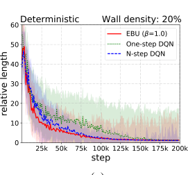
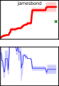
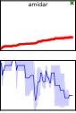
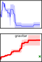
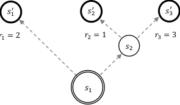

## **Sample-Efficient Deep Reinforcement Learning via** **Episodic Backward Update**

**Su Young Lee,** **Sungik Choi,** **Sae-Young Chung**
School of Electrical Engineering, KAIST, Republic of Korea
```
         {suyoung.l, si_choi, schung}@kaist.ac.kr

```

**Abstract**


We propose Episodic Backward Update (EBU) – a novel deep reinforcement learning algorithm with a direct value propagation. In contrast to the conventional
use of the experience replay with uniform random sampling, our agent samples
a whole episode and successively propagates the value of a state to its previous
states. Our computationally efficient recursive algorithm allows sparse and delayed rewards to propagate directly through all transitions of the sampled episode.
We theoretically prove the convergence of the EBU method and experimentally
demonstrate its performance in both deterministic and stochastic environments.
Especially in 49 games of Atari 2600 domain, EBU achieves the same mean and
median human normalized performance of DQN by using only 5% and 10% of
samples, respectively.


**1** **Introduction**


Deep reinforcement learning (DRL) has been successful in many complex environments such as
the Arcade Learning Environment [2] and Go [18]. Despite DRL’s impressive achievements, it is
still impractical in terms of sample efficiency. To achieve human-level performance in the Arcade
Learning Environment, Deep _Q_ -Network (DQN) [14] requires 200 million frames of experience for
training which corresponds to 39 days of gameplay in real-time. Clearly, there is still a tremendous
gap between the learning process of humans and that of deep reinforcement learning agents. This
problem is even more crucial for tasks such as autonomous driving, where we cannot risk many trials
and errors due to the high cost of samples.


One of the reasons why DQN suffers from such low sample efficiency is the sampling method from
the replay memory. In many practical problems, an RL agent observes sparse and delayed rewards.
There are two main problems when we sample one-step transitions uniformly at random. **(1)** We
have a low chance of sampling a transition with a reward for its sparsity. The transitions with rewards
should always be updated to assign credits for actions that maximize the expected return. **(2)** In the
early stages of training when all values are initialized to zero, there is no point in updating values
of one-step transitions with zero rewards if the values of future transitions with nonzero rewards
have not been updated yet. Without the future reward signals propagated, the sampled transition will
always be trained to return a zero value.


In this work, we propose Episodic Backward Update (EBU) to present solutions for the problems
raised above. When we observe an event, we scan through our memory and seek for the past event
that caused the later one. Such an episodic control method is how humans normally recognize the
cause and effect relationship [10]. Inspired by this, we can solve the first problem **(1)** by sampling
transitions in an episodic manner. Then, we can be assured that at least one transition with a non-zero
reward is used for the value update. We can solve the second problem **(2)** by updating the values of
transitions in a backward manner in which the transitions were made. Afterward, we can perform an


33rd Conference on Neural Information Processing Systems (NeurIPS 2019), Vancouver, Canada.


efficient reward propagation without any meaningless updates. This method faithfully follows the
principle of dynamic programming.


As mentioned by the authors of DQN, updating correlated samples in a sequence is vulnerable to
overestimation. In Section 3, we deal with this issue by adopting a diffusion factor to mediate
between the learned values from the future transitions and the current sample reward. In Section 4,
we theoretically prove the convergence of our method for both deterministic and stochastic MDPs. In
Section 5, we empirically show the superiority of our method on 2D MNIST Maze Environment and
the 49 games of Atari 2600 domain. Especially in 49 games of the Atari 2600 domain, our method
requires only 10M frames to achieve the same mean human-normalized score reported in Nature
DQN [14], and 20M frames to achieve the same median human-normalized score. Remarkably,
EBU achieves such improvements with a comparable amount of computation complexity by only
modifying the target generation procedure for the value update from the original DQN.


**2** **Background**


The goal of reinforcement learning (RL) is to learn the optimal policy that maximizes the expected
sum of rewards in the environment that is often modeled as a Markov decision process (MDP)
_M_ = ( _S, A, P, R_ ). _S_ denotes the state space, _A_ denotes the action space, _P_ : _S × A × S →_ R
denotes the transition probability distribution, and _R_ : _S × A →_ R denotes the reward function. _Q_ learning [22] is one of the most widely used methods to solve RL tasks. The objective of _Q_ -learning
is to estimate the state-action value function _Q_ ( _s, a_ ), or the _Q_ -function, which is characterized by the
Bellman optimality equation. _Q_ _[∗]_ ( _st, a_ ) = E[ _rt_ + _γ_ max _a′ Q_ _[∗]_ ( _st_ +1 _, a_ _[′]_ )] _._


There are two major inefficiencies of the traditional on-line _Q_ -learning. First, each experience is
used only once to update the _Q_ -function. Secondly, learning from experiences in a chronologically
forward order is much more inefficient than learning in a chronologically backward order, because the
value of _st_ +1 is required to update the value of _st_ . Experience replay [12] is proposed to overcome
these inefficiencies. After observing a transition ( _st, at, rt, st_ +1), the agent stores the transition into
its replay buffer. In order to learn the _Q_ -values, the agent samples transitions from the replay buffer.


In practice, the state space _S_ is extremely large, therefore it is impractical to tabularize the _Q_ -values
of all state-action pairs. Deep _Q_ -Network [14] overcomes this issue by using deep neural networks
to approximate the _Q_ -function. DQN adopts experience replay to use each transition for multiple
updates. Since DQN uses a function approximator, consecutive states output similar _Q_ -values. If
DQN updates transitions in a chronologically backward order, often overestimation errors cumulate
and degrade the performance. Therefore, DQN does not sample transitions in a backward order, but
uniformly at random. This process breaks down the correlations between consecutive transitions and
reduces the variance of updates.


There have been a variety of methods proposed to improve the performance of DQN in terms of
stability, sample efficiency, and runtime. Some methods propose new network architectures. The
dueling network architecture [21] contains two streams of separate _Q_ -networks to estimate the value
functions and the advantage functions. Neural episodic control [16] and model-free episodic control

[5] use episodic memory modules to estimate the state-action values. RUDDER [1] introduces an
LSTM network with contribution analysis for an efficient return decomposition. Ephemeral Value
Adjustments (EVA) [7] combines the values of two separate networks, where one is the standard
DQN and another is a trajectory-based value network.


Some methods tackle the uniform random sampling replay strategy of DQN. Prioritized experience
replay [17] assigns non-uniform probability to sample transitions, where greater probability is
assigned for transitions with higher temporal difference (TD) error. Inspired by Lin’s backward
use of replay memory, some methods try to aggregate TD values with Monte-Carlo (MC) returns.
_Q_ ( _λ_ ) [23], _Q_ _[∗]_ ( _λ_ ) [6] and Retrace( _λ_ ) [15] modify the target values to allow the on-policy samples
to be used interchangeably for on-policy and off-policy learning. Count-based exploration method
combined with intrinsic motivation [3] takes a mixture of one-step return and MC return to set up the
target value. Optimality Tightening [8] applies constraints on the target using the values of several
neighboring transitions. Simply by adding a few penalty terms to the loss, it efficiently propagates
reliable values to achieve fast convergence.


2


Environment Dynamics


𝑟= 1


Episode Experienced and Updated Values


② 𝑄𝑈 𝑠1 →𝑠2 = 0


① 𝑄𝑈 𝑠2 →𝑠3 = 0


⑤ 𝑄𝐸 𝑠1 →𝑠2 = 𝛾 [2] ④ 𝑄𝐸 𝑠2 →𝑠3 = 𝛾


② 𝑄𝐸 𝑠2 →𝑠3 = 𝛾 ① 𝑄𝐸 𝑠3 →𝑠4 = 1

(a)


# of sampled transitions

(b)


Figure 1: A motivating example where uniform sampling method fails but EBU does not. (a): A
simple navigation domain with 4 states and a single rewarded transition. Circled numbers indicate
the order of sample updates. _QU_ and _QE_ stand for the _Q_ -values learned by the uniform random
sampling method and the EBU method respectively. (b): The probability of learning the optimal path
( _s_ 1 _→_ _s_ 2 _→_ _s_ 3 _→_ _s_ 4) after updating the _Q_ -values with sample transitions.


Our goal is to improve the sample efficiency of deep reinforcement learning by making a simple
yet effective modification. Without a single change of the network structure, training schemes, and
hyperparameters of the original DQN, we only modify the target generation method. Instead of
using a limited number of transitions, our method samples a whole episode from the replay memory
and propagates the values sequentially throughout the entire transitions of the sampled episode in a
backward manner. By using a temporary backward _Q_ -table with a diffusion coefficient, our novel
algorithm effectively reduces the errors generated from the consecutive updates of correlated states.


**3** **Proposed Methods**


**3.1** **Episodic Backward Update for Tabular** _Q_ **-Learning**


Let us imagine a simple tabular MDP with a single rewarded transition (Figure 1, (a)), where an
agent can only take one of the two actions: _‘left’_ and _‘right’_ . In this example, _s_ 1 is the initial state,
and _s_ 4 is the terminal state. A reward of 1 is gained only when the agent reaches the terminal state
and a reward of 0 is gained from any other transitions. To make it simple, assume that we have only
one episode stored in the experience memory: ( _s_ 1 _→_ _s_ 2 _→_ _s_ 3 _→_ _s_ 2 _→_ _s_ 3 _→_ _s_ 4). The _Q_ -values
of all transitions are initialized to zero. With a discount _γ ∈_ (0 _,_ 1), the optimal policy is to take the
action _‘right’_ in all states. When sampling transitions uniformly at random as Nature DQN, the key
transitions ( _s_ 1 _→_ _s_ 2), ( _s_ 2 _→_ _s_ 3) and ( _s_ 3 _→_ _s_ 4) may not be sampled for updates. Even when those
transitions are sampled, there is no guarantee that the update of the transition ( _s_ 3 _→_ _s_ 4) is done
before the update of ( _s_ 2 _→_ _s_ 3). We can speed up the reward propagation by updating all transitions
within the episode in a backward manner. Such a recursive update is also computationally efficient.


We can calculate the probability of learning the optimal path ( _s_ 1 _→_ _s_ 2 _→_ _s_ 3 _→_ _s_ 4) as a function
of the number of sample transitions trained. With the tabular Episodic Backward Update stated in
Algorithm 1, which is a special case of Lin’s algorithm [11] with recency parameter _λ_ = 0, the agent
can figure out the optimal policy just after 5 updates of _Q_ -values. However, we see that the uniform
sampling method requires more than 40 transitions to learn the optimal path with probability close to
1 (Figure 1, (b)).


Note that this method differs from the standard _n_ -step _Q_ -learning [22]. In _n_ -step _Q_ -learning, the
number of future steps for the target generation is fixed as _n_ . However, our method considers _T_ future
values, where _T_ is the length of the sampled episode. _N_ -step _Q_ -learning takes a max operator at
the _n_ -th step only, whereas our method takes a max operator at every iterative backward step which
can propagate high values faster. To avoid exponential decay of the _Q_ -value, we set the learning rate
_α_ = 1 within the single episode update.


3


**Algorithm 1** Episodic Backward Update for Tabular _Q_ -Learning (single episode, tabular)


1: Initialize the _Q_ - table _Q ∈_ R _[S×A]_ with all-zero matrix.
_Q_ ( _s, a_ ) = 0 for all state action pairs ( _s, a_ ) _∈S × A_ .
2: Experience an episode _E_ = _{_ ( _s_ 1 _, a_ 1 _, r_ 1 _, s_ 2) _, . . .,_ ( _sT, aT, rT, sT_ +1) _}_
3: **for** _t_ = _T_ to 1 **do**
4: _Q_ ( _st, at_ ) _←_ _rt_ + _γ_ max _a′ Q_ ( _st_ +1 _, a_ _[′]_ )
5: **end for**


**Algorithm 2** Episodic Backward Update


1: **Initialize** : replay memory _D_ to capacity _N_, on-line action-value function _Q_ ( _·_ ; _**θ**_ ), target action-value
function _Q_ [ˆ] ( _·_ ; _**θ**_ _**[−]**_ )
2: **for** episode = 1 to _M_ **do**
3: **for** _t_ = 1 to Terminal **do**
4: With probability _ϵ_ select a random action _at_, otherwise select _at_ = argmax _a Q_ ( _st, a_ ; _**θ**_ )
5: Execute action _at_, observe reward _rt_ and next state _st_ +1
6: Store transition ( _st, at, rt, st_ +1) in _D_
7: Sample a random episode _E_ = _{_ _**S, A, R, S**_ _**[′]**_ _}_ from _D_, set _T_ = length( _E_ )
8: Generate a temporary target _Q_ -table, _Q_ [˜] = _Q_ [ˆ] � _**S**_ _**[′]**_ _,_ _**·**_ ; _**θ**_ _**[−]**_ [�]

9: Initialize the target vector _**y**_ = zeros( _T_ ), _**y**_ _T ←_ _**R**_ _T_
10:11: **for** _kQ_ ˜ = [ _**A**_ _Tk −_ +1 _, k_ 1 to 1] _←_ **do** _β_ _**y**_ _k_ +1 + (1 _−_ _β_ ) ˜ _Q_ [ _**A**_ _k_ +1 _, k_ ]
12: _**y**_ _k ←_ _**R**_ _k_ + _γ_ max _a_ _Q_ [˜] [ _a, k_ ]
13: **end for**
14: Perform a gradient descent step on ( _**y**_ _−_ _Q_ ( _**S**_ _,_ _**A**_ ; _**θ**_ )) [2] with respect to _**θ**_
15: Every _C_ steps reset _Q_ [ˆ] = _Q_
16: **end for**

17: **end for**


There are some other multi-step methods that converge to the optimal state-action value function,
such as _Q_ ( _λ_ ) and _Q_ _[∗]_ ( _λ_ ). However, our algorithm neither cuts trace of trajectories as _Q_ ( _λ_ ), nor
requires the parameter _λ_ to be small enough to guarantee convergence as _Q_ _[∗]_ ( _λ_ ). We present a
detailed discussion on the relationship between EBU and other multi-step methods in Appendix F.


**3.2** **Episodic Backward Update for Deep** _Q_ **-Learning** [1]


Directly applying the backward update algorithm to deep reinforcement learning is known to show
highly unstable results due to the high correlation of consecutive samples. We show that the
fundamental ideas of the tabular version of the backward update algorithm may be applied to its deep
version with just a few modifications. The full algorithm introduced in Algorithm 2 closely resembles
that of Nature DQN [14]. Our contributions lie in the recursive backward target generation with a
diffusion factor _β_ (starting from line number 7 of Algorithm 2), which prevents the overestimation
errors from correlated states cumulating.


Instead of sampling transitions uniformly at random, we make use of all transitions within the
sampled episode _E_ = _{_ _**S, A, R, S**_ _**[′]**_ _}_ . Let the sampled episode start with a state _S_ 1, and contain
T transitions. Then _E_ can be denoted as a set of four length- _T_ vectors: _**S**_ = _{S_ 1 _, S_ 2 _, . . ., ST }_ ;
_**A**_ = _{A_ 1 _, A_ 2 _, . . ., AT }_ ; _**R**_ = _{R_ 1 _, R_ 2 _, . . ., RT }_ and _**S**_ _**[′]**_ = _{S_ 2 _, S_ 3 _, . . ., ST_ +1 _}_ . The temporary
target _Q_ -table, _Q_ [˜] is an _|A| × T_ matrix which stores the target _Q_ -values of all states _**S**_ _**[′]**_ for all valid
actions, where _A_ is the action space of the MDP. Therefore, the _j_ -th column of _Q_ [˜] is a column
vector that contains _Q_ [ˆ] � _Sj_ +1 _, a_ ; _**θ**_ _**[−]**_ [�] for all valid actions _a ∈A_, where _Q_ [ˆ] is the target _Q_ -function
parametrized by _**θ**_ _**[−]**_ .


After the initialization of the temporary _Q_ -table, we perform a recursive backward update. Adopting
the backward update idea, one element _Q_ [˜] [ _**A**_ _k_ +1 _, k_ ] in the _k_ -th column of the _Q_ [˜] is replaced using the
next transition’s target _**y**_ _k_ +1. Then _**y**_ _k_ is estimated as the maximum value of the newly modified _k_ -th
column of _Q_ [˜] . Repeating this procedure in a recursive manner until the start of the episode, we can


1The code is available at `[https://github.com/suyoung-lee/Episodic-Backward-Update](https://github.com/suyoung-lee/Episodic-Backward-Update)`


4


successfully apply the backward update algorithm for a deep _Q_ -network. The process is described in
detail with a supplementary diagram in Appendix E.


We are using a function approximator, and updating correlated states in a sequence. As a result, we
observe overestimated values propagating and compounding through the recursive max operations.
We solve this problem by introducing the diffusion factor _β_ . By setting _β ∈_ (0 _,_ 1), we can take a
weighted sum of the new backpropagated value and the pre-existing value estimate. One can regard
_β_ as a learning rate for the temporary _Q_ -table, or as a level of _‘backwardness’_ of the update. This
process stabilizes the learning process by exponentially decreasing the overestimation error. Note
that Algorithm 2 with _β_ = 1 is identical to the tabular backward algorithm stated in Algorithm 1.
When _β_ = 0, the algorithm is identical to episodic one-step DQN. The role of _β_ is investigated in
detail with experiments in Section 5.3.


**3.3** **Adaptive Episodic Backward Update for Deep** _Q_ **-Learning**


The optimal diffusion factor _β_ varies depending on the type of the environment and the degree of how
much the network is trained. We may further improve EBU by developing an adaptive tuning scheme
for _β_ . Without increasing the sample complexity, we propose an adaptive, single actor and multiple
learner version of EBU. We generate _K_ learner networks with different diffusion factors, and a single
actor to output a policy. For each episode, the single actor selects one of the learner networks in a
regular sequence. Each learner is trained in parallel, using the same episode sampled from a shared
experience replay. Even with the same training data, all learners show different interpretations of the
sample based on the different levels of trust in backwardly propagated values. We record the episode
scores of each learner during training. After every fixed step, we synchronize all the learner networks
with the parameters of a learner network with the best training score. This adaptive version of EBU is
presented as a pseudo-code in Appendix A. In Section 5.2, we compare the two versions of EBU, one
with a constant _β_ and another with an adaptive _β_ .


**4** **Theoretical Convergence**


**4.1** **Deterministic MDPs**


We prove that Episodic Backward Update with _β ∈_ (0 _,_ 1) defines a contraction operator, and
converges to the optimal _Q_ -function in finite and deterministic MDPs.
**Theorem 1.** _Given a finite, deterministic and tabular MDP M_ = ( _S, A, P, R_ ) _, the Episodic Back-_
_ward Update algorithm in Algorithm 3 converges to the optimal Q-function w.p. 1 as long as_


_• The step size satisfies the Robbins-Monro condition;_


_• The sample trajectories are finite in lengths l:_ E[ _l_ ] _< ∞_ ;


_• Every (state, action) pair is visited infinitely often._


We state the proof of Theorem 1 in Appendix G. Furthermore, even in stochastic environments, we
can guarantee the convergence of the episodic backward algorithm for a sufficiently small _β_ .


**4.2** **Stochastic MDPs**


**Theorem 2.** _Given a finite, tabular and stochastic MDP M_ = ( _S, A, P, R_ ) _, define R_ max [sto] [(] _[s, a]_ [)] _[ as]_
_the maximal return of trajectory that starts from state s ∈S and action a ∈A. In a similar way,_
_define r_ min [sto] [(] _[s, a]_ [)] _[ and][ r]_ mean [sto] [(] _[s, a]_ [)] _[ as the minimum and mean of possible reward by selecting action]_
_a in state s. Define A_ sub( _s_ ) = _{a_ _[′]_ _∈A|Q_ _[∗]_ ( _s, a_ _[′]_ ) _<_ max _a∈A Q_ _[∗]_ ( _s, a_ ) _} as the set of suboptimal_
_actions in state s ∈S. Define A_ opt( _s_ ) = _A\A_ sub( _s_ ) _. Then, under the conditions of Theorem 1, and_


_Q_ _[∗]_ ( _s, a_ ) _−_ _Q_ _[∗]_ ( _s, a_ _[′]_ )
_β ≤_ inf inf inf (1)
_s∈S_ _a_ _[′]_ _∈A_ sub( _s_ ) _a∈A_ opt( _s_ ) _R_ max [sto] [(] _[s, a][′]_ [)] _[ −]_ _[Q][∗]_ [(] _[s, a][′]_ [)] _[,]_


_Q_ _[∗]_ ( _s, a_ ) _−_ _Q_ _[∗]_ ( _s, a_ _[′]_ )
_β ≤_ inf inf inf (2)
_s∈S_ _a_ _[′]_ _∈A_ sub( _s_ ) _a∈A_ opt( _s_ ) _r_ mean [sto] [(] _[s, a]_ [)] _[ −]_ _[r]_ min [sto] [(] _[s, a]_ [)] _[,]_


_the Episodic Backward Update algorithm in Algorithm 3 converges to the optimal Q-function w.p. 1._


5




(a)


(c)


Figure 2: (a) & (b): Median of 50 relative lengths of EBU and baselines. EBU outperforms other
baselines significantly in the low sample regime and for high wall density. (c): Median relative
lengths of EBU and other baseline algorithms in MNIST maze with stochastic transitions.


The main intuition of this theorem is that _β_ acts as a learning rate of the backward target therefore
mitigates the collision between the max operator and stochastic transitions.


**5** **Experimental Results**


**5.1** **2D MNIST Maze (Deterministic/Stochastic MDPs)** ⋮ ⋮


We test our algorithm in the 2D Maze Environment. Starting from the initial ⋯
position at (0 _,_ 0), the agent has to navigate through the maze to reach the
goal position at (9 _,_ 9). To minimize the correlation between neighboring Figure 3: 2D MNIST
states, we use the MNIST dataset [9] for the state representation. The agent Maze
receives the coordinates of the position in two MNIST images as the state representation. The training
environments are 10 by 10 mazes with randomly placed walls. We assign a reward of 1000 for
reaching the goal, and a reward of -1 for bumping into a wall. A wall density indicates the probability
of having a wall at each position. For each wall density, we generate 50 random mazes with different
wall locations. We train a total of 50 independent agents, one for each maze over 200,000 steps. The
performance metric, relative length is defined as _l_ rel = _l_ agent _/l_ oracle, which is the ratio between the
length of the agent’s path _l_ agent and the length of the ground truth shortest path _l_ oracle to reach the
goal. The details of the hyperparameters and the network structure are described in Appendix D.


We compare EBU to uniform random sampling one-step DQN and _n_ -step DQN. For _n_ -step DQN, we
set the value of _n_ as the length of the episode. Since all three algorithms eventually achieve median
relative lengths of 1 at the end of the training, we report the relative lengths at 100,000 steps in
Table 1. One-step DQN performs the worst in all configurations, implying the inefficiency of uniform
sampling update in environments with sparse and delayed rewards. As the wall density increases, it
becomes more important for the agent to learn the correct decisions at bottleneck positions. _N_ -step
DQN shows the best performance with a low wall density, but as the wall density increases, EBU
significantly outperforms _n_ -step DQN.


In addition, we run experiments with stochastic transitions. We assign 10% probability for each side
action for all four valid actions. For example, when an agent takes an action ‘ _up_ ’, there is a 10%
chance of transiting to the left state, and 10% chance of transiting to the right state. In Figure 9 (c),
we see that the EBU agent outperforms the baselines in the stochastic environment as well.


Table 1: Relative lengths (Mean & Median) of 50 deterministic MNIST Maze after 100,000 steps

|EBU (β = 1 .0)|One-step DQN|
|---|---|
|5.44<br>2.42<br>**8.14**<br>**3.03**<br>**8.61**<br>**2.52**<br>**5.51**<br>**2.34**|14.40<br>9.25<br>25.63<br>21.03<br>25.45<br>22.71<br>22.36<br>16.62|


6


parallel learners with diffusion factors 0 _._ 0 _,_ 0 _._ 1 _, . . ._, and 1 _._ 0. We synchronize the learners at the end
of each epoch (0.25M frames). We compare our algorithm to four baselines: Nature DQN [14],
Prioritized Experience Replay (PER) [17], Retrace( _λ_ ) [15] and Optimality Tightening (OT) [8]. We
train EBU and baselines for 10M frames (additional 20M frames for adaptive EBU) on 49 Atari
games with the same network structure, hyperparameters, and evaluation methods used in Nature
DQN. The choice of such a small number of training steps is made to investigate the sample efficiency
of each algorithm following [16, 8]. We report the mean result from 4 random seeds for adaptive EBU
and 8 random seeds for all other baselines. Detailed specifications for each baseline are described in
Appendix D.


First, we show the improvement of adaptive EBU over Nature DQN at 10M frames for all 49 games
in Figure 4. To compare the performance of an agent to its baseline’s, we use the following relative
score, max _{_ ScoreScoreHumanA _,_ g Scoreent _−_ ScoreBaselineBaseline _}−_ ScoreRandom [[][21][]. This measure shows how well an agent performs a]
task compared to the task’s level of difficulty. EBU ( _β_ = 0 _._ 5) and adaptive EBU outperform Nature
DQN in 33 and 39 games out of 49 games, respectively. The large amount of improvements in games
such as “Atlantis,” “Breakout,” and “Video Pinball” highly surpass minor failings in few games.

We use human-normalized score, _|_ ScoreScoreHumanAgent _−−_ ScoreScoreRandomRandom _|_ [[][20][], which is the most widely used metric to]
make an apple-to-apple comparison in the Atari domain. We report the mean and the median humannormalized scores of the 49 games in Table 2. The result signifies that our algorithm outperforms
the baselines in both the mean and median of the human-normalized scores. PER and Retrace( _λ_ )
do not show a lot of improvements for a small number of training steps as 10M frames. Since OT
has to calculate the _Q_ -values of neighboring states and compare them to generate the penalty term,
it requires about 3 times more training time than Nature DQN. However, EBU performs iterative
episodic updates using the temporary _Q_ -table that is shared by all transitions in the episode, EBU has
almost the same computational cost as that of Nature DQN.


7


|Gopher|Col2|Col3|Col4|Col5|Col6|Col7|
|---|---|---|---|---|---|---|
|Gopher|Gopher|Gopher|Gopher||||
||||||||
||||||||
||||||||
||||||||
||||||||
||||||||
||||||||


|Col1|Breakout|Col3|Col4|
|---|---|---|---|
||Breakout|Breakout|Breakout|
|||||
|||||
|||||
|||||
|||||
|||||
|||||


Figure 5: Episode scores and average _Q_ -values of all state-action pairs in “Gopher” and “Breakout”.


The most significant result is that EBU ( _β_ = 0 _._ 5) requires only 10M frames of training to achieve
the mean human-normalized score reported in Nature DQN, which is trained for 200M frames.
Although 10M frames are not enough to achieve the same median score, adaptive EBU trained for
20M frames achieves the median normalized score. These results signify the efficacy of backward
value propagation in the early stages of training. Raw scores for all 49 games are summarized in
Appendix B. Learning curves of adaptive EBU for all 49 games are reported in Appendix C.


Table 2: Summary of training time and human-normalized performance. Training time refers to the
total time required to train 49 games of 10M frames using a single NVIDIA TITAN Xp for a single
random seed. We use multi-GPUs to train learners of adaptive EBU in parallel. (*) The result of
OT differs from the result reported in [8] due to different evaluation methods (i.e. not limiting the
maximum number of steps for a test episode and taking maximum score from random seeds). (**)
We report the scores of Nature DQN (200M) from [14].

|Algorithm(frames)|TrainingTime(hours) M|ean(%) Median(%)|
|---|---|---|
|EBU (_β_ = 0_._5) (10M)<br>EBU (adaptive_ β_) (10M)<br>Nature DQN (10M)<br>PER (10M)<br>Retrace(_λ_) (10M)<br>OT(10M)*|152<br><br>203<br><br>138<br><br>146<br><br>154<br>407<br>|253.55<br>51.55<br>275.78<br>63.80<br>133.95<br>40.42<br>156.57<br>40.86<br>93.77<br>41.99<br>162.66<br>49.42|
|EBU (adaptive_ β_) (20M)<br>Nature DQN (200M)**|450<br><br>-<br>|347.99<br>92.50<br>241.06<br>93.52|


**5.3** **Analysis on the Role of the Diffusion Factor** _β_


In this section, we make comparisons between our own EBU algorithms. EBU ( _β_ = 1 _._ 0) works the
best in the MNIST Maze environment because we use MNIST images for the state representation to
allow consecutive states to exhibit little correlation. However, in the Atari domain, consecutive states
are often different in a scale of few pixels only. As a consequence, EBU ( _β_ = 1 _._ 0) underperforms
EBU ( _β_ = 0 _._ 5) in most of the Atari games. In order to analyze this phenomenon, we evaluate
the _Q_ -values learned at the end of each training epoch. We report the test episode score and the
corresponding mean _Q_ -values of all transitions within the test episode (Figure 5). We notice that the
EBU ( _β_ = 1 _._ 0) is trained to output highly overestimated _Q_ -values compared to its actual return. Since
the EBU method performs recursive max operations, EBU outputs higher (possibly overestimated)
_Q_ -values than Nature DQN. This result indicates that sequentially updating correlated states with


8


overestimated values may destabilize the learning process. However, this result clearly implies that
EBU ( _β_ = 0 _._ 5) is relatively free from the overestimation problem.


Next, we investigate the efficacy of using an adaptive diffusion factor. In Figure 6, we present how
adaptive EBU adapts its diffusion factor during the course of training in “Breakout”. In the early
stage of training, the agent barely succeeds in breaking a single brick. With a high _β_ close to 1, values
can be directly propagated from the rewarded state to the state where the agent has to bounce the
ball up. Note that the performance of adaptive EBU follows that of EBU ( _β_ = 1 _._ 0) up to about 5M
frames. As the training proceeds, the agent encounters more rewards and various trajectories that may
cause overestimation. As a consequence, we discover that the agent anneals the diffusion factor to a
lower value of 0.5. The trend of how the diffusion factor adapts differs from game to game. Refer to
the diffusion factor curves for all 49 games in Appendix C to check how adaptive EBU selects the
best diffusion factor.


|Breakout Raw Score|Breako|out Raw Score|es (mean/std of 4|Col5|
|---|---|---|---|---|
|0.0<br>2.5<br>5.0<br>7.5<br><br> <br>0<br>100<br>200<br>300<br>400<br>500<br>Breakout Raw Score<br>EBU (adaptive )<br>EBU ( =1.0)<br>~~DQN~~<br>DQN 200M|reak<br>|out Raw Score<br>|s (mean/std of|s (mean/std of|
|0.0<br>2.5<br>5.0<br>7.5<br><br> <br>0<br>100<br>200<br>300<br>400<br>500<br>Breakout Raw Score<br>EBU (adaptive )<br>EBU ( =1.0)<br>~~DQN~~<br>DQN 200M|E<br>EB<br>~~D~~<br>D|U (adaptive )<br>U ( =1.0)<br>~~QN~~<br>QN 200M|||
|0.0<br>2.5<br>5.0<br>7.5<br><br> <br>0<br>100<br>200<br>300<br>400<br>500<br>Breakout Raw Score<br>EBU (adaptive )<br>EBU ( =1.0)<br>~~DQN~~<br>DQN 200M|||||
|0.0<br>2.5<br>5.0<br>7.5<br><br> <br>0<br>100<br>200<br>300<br>400<br>500<br>Breakout Raw Score<br>EBU (adaptive )<br>EBU ( =1.0)<br>~~DQN~~<br>DQN 200M|||||


(a)


|ea<br>0<br>.<br>8<br>.|kout|adapt|ivediff|usion|factor|(mea|n/std|Col9|
|---|---|---|---|---|---|---|---|---|
|.8<br>.0<br>ea|||||||||
|.4<br>.6|||||||||
|0.0<br>2.5<br>5.0<br>7<br> <br>.0<br>.2|||||||||


(b)


Figure 6: (a) Test scores in “Breakout”. Mean and standard deviation from 4 random seeds are plotted.
(b) Adaptive diffusion factor of adaptive EBU in “Breakout”.


**6** **Conclusion**


In this work, we propose Episodic Backward Update, which samples transitions episode by episode,
and updates values recursively in a backward manner. Our algorithm achieves fast and stable learning
due to its efficient value propagation. We theoretically prove the convergence of our method, and
experimentally show that our algorithm outperforms other baselines in many complex domains,
requiring only about 10% of samples. Since our work differs from DQN only in terms of the target
generation, we hope that we can make further improvements by combining with other successful
deep reinforcement learning methods.


**Acknowledgments**


This work was supported by the ICT R&D program of MSIP/IITP. [2016-0-00563, Research on Adaptive Machine Learning Technology Development for Intelligent Autonomous Digital Companion]


**References**


[1] Arjona-Medina, J. A., Gillhofer, M., Widrich, M., Unterthiner, T., and Hochreiter, S. RUDDER:
[Return decomposition for delayed rewards. arXiv preprint arXiv:1806.07857, 2018.](http://arxiv.org/abs/1806.07857)


[2] Bellemare, M. G., Naddaf, Y., Veness, J., and Bowling, M. The arcade learning environment: An
evaluation platform for general agents. Journal of Artificial Intelligence Research, 47:253-279,
2013.


9


[3] Bellemare, M. G., Srinivasan, S., Ostrovski, G., Schaul, T., Saxton, D., and Munos, R. Unifying
count-based exploration and intrinsic motivation. In Advances in Neural Information Processing
Systems (NIPS), 1471-1479, 2016.

[4] Bertsekas, D. P., and Tsitsiklis, J. N. Neuro-Dynamic Programming. Athena Scientific, 1996.

[5] Blundell, C., Uria, B., Pritzel, A., Li, Y., Ruderman, A., Leibo, J. Z, Rae, J.,Wierstra, D., and
[Hassabis, D. Modelfree episodic control. arXiv preprint arXiv:1606.04460, 2016.](http://arxiv.org/abs/1606.04460)

[6] Harutyunyan, A., Bellemare, M. G., Stepleton, T., and Munos, R. Q( _λ_ ) with off-policy corrections.
In International Conference on Algorithmic Learning Theory (ALT), 305-320, 2016.

[7] Hansen, S., Pritzel, A., Sprechmann, P., Barreto, A., and Blundell, C. Fast deep reinforcement
learning using online adjustments from the past. In Advances in Neural Information Processing
Systems (NIPS), 10590–10600, 2018

[8] He, F. S., Liu, Y., Schwing, A. G., and Peng, J. Learning to play in a day: Faster deep reinforcement learning by optimality tightening. In International Conference on Learning Representations
(ICLR), 2017.

[9] LeCun, Y., Bottou, L., Bengio, Y., and Haffner, P. Gradient-based learning applied to document
recognition. In the Institute of Electrical and Electronics Engineers (IEEE), 86, 2278-2324, 1998.

[10] Lengyel, M., and Dayan, P. Hippocampal Contributions to Control: The Third Way. In Advances
in Neural Information Processing Systems (NIPS), 889-896, 2007.

[11] Lin, L-J. Programming Robots Using Reinforcement Learning and Teaching. In Association for
the Advancement of Artificial Intelligence (AAAI), 781-786, 1991.

[12] Lin, L-J. Self-improving reactive agents based on reinforcement learning, planning and teaching.
Machine Learning, 293-321, 1992.

[13] Melo, F. S. Convergence of Q-learning: A simple proof, Institute Of Systems and Robotics,
Tech. Rep, 2001.

[14] Mnih, V., Kavukcuoglu, K., Silver, D., Rusu, A. A., Veness, J., Bellemare, M. G., Graves, A.,
Riedmiller, M., Fidjeland, A. K., Ostrovski, G., Petersen, S., Beattie, C., Sadik, A., Antonoglou,
I., King, H., Kumaran, D., Wierstra, D., Legg, S., and Hassabis, D. Human-level control through
deep reinforcement learning. Nature, 518(7540):529-533, 2015.

[15] Munos, R., Stepleton, T., Harutyunyan, A., and Bellemare, M. G. Safe and efficient off-policy
reinforcement learning. In Advances in Neural Information Processing Systems (NIPS), 10461054, 2016.

[16] Pritzel, A., Uria, B., Srinivasan, S., Puig-’domenech, A., Vinyals, O., Hassabis, D., Wierstra,
D., and Blundell, C. Neural Episodic Control. In International Conference on Machine Learning
(ICML), 2827-2836, 2017.

[17] Schaul, T., Quan, J., Antonoglou, I., and Silver, D. Prioritized Experience Replay. In International Conference on Learning Representations (ICLR), 2016.

[18] Silver, D., Huang, A., Maddison C. J., Guez, A., Sifre, L., van den Driessche, G., Schrittwieser,
J., Antonoglou, I., Panneershelvam, V., Lanctot, M., Dieleman, S., Grewe, D., Nham, J., Kalchbrenner, N., Sutskever, I., Lillicrap, T., Leach, M., Kavukcuoglu, K., Graepel, T., and Hassabis,
D. Mastering the game of Go with deep neural networks and tree search. Nature, 529:484-489,
2016.

[19] Sutton, R. S., and Barto, A. G. Reinforcement Learning: An Introduction. MIT Press, 1998.

[20] van Hasselt, H., Guez, A., and Silver, D. Deep Reinforcement Learning with Double Q-learning.
In Association for the Advancement of Artificial Intelligence (AAAI), 2094-2100, 2016.

[21] Wang, Z., Schaul, T., Hessel, M., van Hasselt, H., Lanctot, M., and de Freitas, N. Dueling Network Architectures for Deep Reinforcement Learning. In International Conference on Machine
Learning (ICML), 1995-2003, 2016.

[22] Watkins., C. J. C. H. Learning from delayed rewards. Ph.D. thesis, University of Cambridge
England, 1989.

[23] Watkins., C. J. C. H., and Dayan, P. Q-learning. Machine Learning, 272-292, 1992.


10


**Appendix A** **Episodic Backward Update with an adaptive diffusion factor**


**Algorithm 3** Adaptive Episodic Backward Update


1: **Initialize** : replay memory _D_ to capacity _N_, _K_ on-line action-value function _Q_ 1( _·_ ; _**θ**_ **1** ) _, . . ., QK_ ( _·_ ; _**θK**_ ), _K_
target action-value function _Q_ [ˆ] 1( _·_ ; _**θ**_ **1** _**[−]**_ [)] _[, . . .,]_ [ ˆ] _[Q][K]_ [(] _[·]_ [;] _**[ θ]**_ _**K**_ _**[−]**_ [)][, training score recorder] _[ TS]_ [ = zeros(] _[K]_ [)][, diffusion]
factors _β_ 1 _, . . ., βK_ for each learner network
2: **for** episode = 1 to _M_ **do**
3: Select _Q_ actor = _Qi_ as the actor network for the current episode, where _i_ = (episode _−_ 1)% _K_ + 1
4: **for** _t_ = 1 to Terminal **do**
5: With probability _ϵ_ select a random action _at_
6: Otherwise select _at_ = argmax _a Q_ actor ( _st, a_ )
7: Execute action _at_, observe reward _rt_ and next state _st_ +1
8: Store transition ( _st, at, rt, st_ +1) in _D_
9: Add training score for the current learner _TS_ [ _i_ ]+ = _rt_
10: Sample a random episode _E_ = _{_ _**S, A, R, S**_ _**[′]**_ _}_ from _D_, set _T_ = length( _E_ )
11: **for** _j_ = 1 to _K_ (this loop is processed in parallel) **do**
12: Generate temporary target _Q_ -table, _Q_ [˜] _j_ = _Q_ [ˆ] _i_ � _**S**_ _**[′]**_ _,_ _**·**_ ; _**θj**_ _**[−]**_ �

13: Initialize target vector _**y**_ = zeros( _T_ ), _**y**_ _T ←_ _**R**_ _T_
14:15: **for** _kQ_ ˜ = _j_ [ _T_ _**A**_ _−k_ +11 _, k_ to 1] _←_ **do** _βj_ _**y**_ _k_ +1 + (1 _−_ _βj_ ) ˜ _Qj_ [ _**A**_ _k_ +1 _, k_ ]
16: _**y**_ _k ←_ _**R**_ _k_ + _γ_ max _a_ _Q_ [˜] _j_ [ _a, k_ ]
17: **end for**
18: Perform a gradient descent step on ( _**y**_ _−_ _Qj_ ( _**S**_ _,_ _**A**_ ; _**θj**_ )) [2] with respect to _**θj**_
19: **end for**
20: Every _C_ steps reset _Q_ [ˆ] 1 = _Q_ 1 _, . . .,_ _Q_ [ˆ] _K_ = _QK_
21: **end for**
22: Every _B_ steps synchronize all learners with the best training score, _b_ = argmax _k TS_ [ _k_ ].
_Q_ ˆ1( _·_ ; _**θ**_ **1** ) = _Qb_ ( _·_ ; _**θb**_ ) _, . . ., QK_ ( _·_ ; _**θK**_ ) = _Qb_ ( _·_ ; _**θb**_ ) and _Q_ [ˆ] 1( _·_ ; _**θ**_ **1** ) = _Q_ [ˆ] _b_ ( _·_ ; _**θb**_ _**[−]**_ [)] _[, . . .,]_ [ ˆ] _[Q][K]_ [(] _[·]_ [;] _**[ θ][K]**_ [) =]
_Qb_ ( _·_ ; _**θb**_ _**[−]**_ [)][. Reset the training score recorder] _[ TS]_ [ = zeros(] _[K]_ [)][.]
23: **end for**


11


**Appendix B** **Raw scores of all 49 games.**


Table 3: Raw scores after 10M frames of training. Mean scores from 4 random seeds are reported for
adaptive EBU. 8 random seeds are used for all other baselines. We use the results at Nature DQN paper
to report the scores at 200M frames. We run their code ( `[https://github.com/deepmind/dqn](https://github.com/deepmind/dqn)` ) to
report scores for 10M frames. Due to the use of different random seeds, the result of Nature DQN
at 10M frames may be better than that of Nature DQN at 200M frames in some games. Bold texts
indicate the best score out of the 5 results trained for 10M frames.


Training Frames 10M 20M 200M
EBU( _β_ =0.5) Adap. EBU DQN PER Retrace( _λ_ ) OT Adap. EBU Nature
DQN
Alien 708.08 894.15 690.32 1026.96 708.29 **1078.67** 1225.36 3069.00

Amidar 117.94 124.63 125.42 167.63 182.68 **220.00** 209.96 739.50

Assault **4109.18** 3676.95 2426.94 2720.69 2989.05 2499.23 3943.23 3359.00

Asterix 1898.12 2533.27 **2936.54** 2218.54 1798.54 2592.50 3221.25 6012.00

Asteroids 1002.17 **1402.43** 654.99 993.50 886.92 985.88 2378.84 1629.00

Atlantis 61708.75 87944.38 20666.84 35663.83 **98182.81** 57520.00 141226.00 85641.00

Bank heist 359.62 **459.42** 234.70 312.96 223.50 407.42 680.43 429.70

Battle zone 20627.73 24748.50 22468.75 20835.74 **30128.36** 20400.48 30502.53 26300.00

Beam rider 5628.99 4785.27 3682.92 4586.07 4093.76 **5889.54** 6634.43 6846.00
Bowling 52.02 **102.89** 65.23 42.74 42.62 53.45 113.75 42.40
Boxing 55.95 **72.69** 37.28 4.64 6.76 60.89 96.35 71.80
Breakout 174.76 **265.62** 28.36 164.22 171.86 75.00 443.34 401.20
Centipede 4651.28 **8389.16** 6207.30 4385.41 5986.16 5277.79 8389.16 8309.00
Chopper Command 1196.67 1294.45 1168.67 1344.24 1353.76 **1615.00** 1909.23 6687.00
Crazy Climber 65329.63 **94135.04** 74410.74 53166.47 64598.21 92972.08 103780.15 114103.00
Demon Attack 7924.14 **8368.16** 7772.39 4446.03 6450.84 6872.04 9099.16 9711.00

Double Dunk -16.19 **-14.12** -17.94 -15.62 -15.81 -15.92 -12.78 -18.10

Enduro 415.59 326.45 516.10 308.75 208.10 **615.05** 410.95 301.80
Fishing Derby -39.13 **-15.85** -65.53 -78.49 -75.74 -69.66 9.22 -0.80
Freeway 19.07 **23.71** 16.24 9.35 15.26 14.63 34.36 30.30
Frostbite 437.92 966.23 466.02 536.00 825.00 **2452.75** 1760.15 328.30
Gopher 3318.50 **3634.67** 1726.52 1833.67 3410.75 2869.08 5611.30 8520.00
Gravitar 294.58 **450.18** 193.55 319.79 272.08 263.54 611.99 306.70

H.E.R.O. 3089.90 3398.55 2767.97 3052.04 3079.43 **10698.25** 4308.23 19950.00
Ice Hockey -4.71 **-2.96** -4.79 -7.73 -6.13 -5.79 -2.96 -1.60
Jamesbond 391.67 **519.52** 183.35 421.46 436.25 325.21 1043.66 576.70
Kangaroo 535.83 731.13 709.88 **782.50** 538.33 708.33 2018.83 6740.00
Krull 7587.24 8733.52 **24109.14** 6642.58 6346.40 7468.70 10016.72 3805.00
Kung-Fu Master 20578.33 **26069.68** 21951.72 18212.89 18815.83 22211.25 30387.78 23270.00
Montezuma’s Revenge 0.00 0.00 **3.95** 0.43 0.00 0.00 0.00 0.00
Ms. Pacman 1249.79 1652.37 **1861.80** 1784.75 1310.62 1849.00 1920.25 2311.00

Name This Game 6960.46 7075.53 **7560.33** 5757.03 6094.08 7358.25 7565.67 7257.00
Pong 5.53 **16.49** -2.68 12.83 8.65 2.60 20.23 18.90
Private Eye 471.76 **3609.96** 1388.45 269.28 714.97 1277.53 7940.27 1788.00
Q*Bert 785.00 1074.77 2037.21 1215.42 3192.08 **3955.10** 2437.83 10596.00
River Raid 3460.62 4268.28 3636.72 **6005.62** 4178.92 4643.62 5671.51 8316.00

Road Runner 10086.74 15681.49 8978.17 17137.92 9390.83 **19081.55** 28286.88 18257.00

Robotank 11.65 15.34 **16.11** 6.46 9.90 12.17 20.73 51.60
Seaquest 1380.67 1926.10 762.10 1955.67 2275.83 **2710.33** 5313.43 5286.00
Space Invaders 797.29 **1058.25** 755.95 762.54 783.35 869.83 1148.21 1976.00
Star Gunner 2737.08 **3892.51** 708.66 2629.17 2856.67 1710.83 17462.88 57997.00

Tennis -3.41 -0.96 **0.00** -10.32 -2.50 -6.37 -0.93 -2.50

Time Pilot 3505.42 **4567.18** 3076.98 4434.17 3651.25 4012.50 4567.18 5947.00

Tutankham 204.83 239.51 165.27 255.74 156.16 **247.81** 299.11 186.70
Up and Down 6841.83 6754.11 **9468.04** 7397.29 7574.53 6706.83 10984.70 8456.00
Venture 105.10 **194.89** 96.70 60.40 50.85 106.67 242.56 380.00

Video Pinball **84859.24** 78405.27 17803.69 55646.66 18346.58 38528.58 84695.96 42684.00

Wizard of Wor 1249.89 **2030.63** 529.85 1175.24 1083.69 1177.08 4185.40 3393.00

Zaxxon 3221.67 3487.38 685.84 **3928.33** 596.67 2467.92 6548.52 4977.00


12


**Appendix C** **Learning curves and corresponding adaptive diffusion factor**










Figure 7: Test scores and diffusion factor of Adaptive EBU. We report the mean and the standard
deviation from 4 random seeds. We compare the performance of adaptive EBU with the result
reported in Nature DQN, trained for 200M frames. The blue curve below each test score plot shows
how adaptive EBU adapts its diffusion factor during the course of training.


13


**Appendix D** **Network structure and hyperparameters**


**2D MNIST Maze Environment**


Each state is given as a grey scale 28 _×_ 28 image. We apply 2 convolutional neural networks (CNNs)
and one fully connected layer to get the output _Q_ -values for 4 actions: up, down, left and right. The
first CNN uses 64 channels with 4 _×_ 4 kernels and stride of 3. The next CNN uses 64 channels with
3 _×_ 3 kernels and stride of 1. Then the layer is fully connected into a size of 512. Then we fully
connect the layer into a size of the action space 4. After each layer, we apply a rectified linear unit.


We train the agent for a total of 200,000 steps. The agent performs _ϵ_ -greedy exploration. _ϵ_ starts
1
from 1 and is annealed to 0 at 200,000 steps in a quadratic manner: _ϵ_ = (200 _,_ 000) [2] [(step] _[ −]_ [200] _[,]_ [ 000)][2][.]
We use RMSProp optimizer with a learning rate of 0.001. The online-network is updated every 50
steps, the target network is updated every 2000 steps. The replay memory size is 30000 and we use
minibatch size of 350. We use a discount factor _γ_ = 0 _._ 9 and a diffusion factor _β_ = 1 _._ 0. The agent
plays the game until it reaches the goal or it stays in the maze for more than 1000 time steps.


**49 Games of Atari 2600 Domain**


**Common specifications for all baselines**
Almost all specifications such as hyperparameters and network structures are identical for all baselines.
We use exactly the same network structure and hyperparameters of Nature DQN (Mnih et al., 2015).
The raw observation is preprocessed into a gray scale image of 84 _×_ 84. Then it passes through
three convolutional layers: 32 channels with 8 _×_ 8 kernels with a stride of 4; 64 channels with 4 _×_ 4
kernels with a stride of 2; 64 channels with 3 _×_ 3 kernels with a stride of 1. Then it is fully connected
into a size of 512. Then it is again fully connected into the size of the action space.


We train baselines for 10M frames each, which is equivalent to 2.5M steps with frameskip of 4. The
agent performs _ϵ_ -greedy exploration. _ϵ_ starts from 1 and is linearly annealed to reach the final value
0.1 at 4M frames of training. We adopt 30 no-op evaluation methods. We use 8 random seeds for
10M frames and 4 random seeds for 20M frames. The network is trained by RMSProp optimizer
with a learning rate of 0.00025. At each update (4 agent steps or 16 frames), we update transitions in
minibatch with size 32. The replay buffer size is 1 million steps (4M frames). The target network is
updated every 10,000 steps. The discount factor is _γ_ = 0 _._ 99.


We divide the training process into 40 epochs (80 epochs for 20M frames) of 250,000 frames each.
At the end of each epoch, the agent is tested for 30 episodes with _ϵ_ = 0 _._ 05. The agent plays the game
until it runs out of lives or time (18,000 frames, 5 minutes in real time).


Below are detailed specifications for each algorithm.


**1. Episodic Backward Update**
We used _β_ = 0 _._ 5 for the version EBU with constant diffusion factor. For adaptive EBU, we used 11
parallel learners ( _K_ = 11) with diffusion factors 0.0, 0.1, ..., 1.0. We synchronize the learners at
every 250,000 frames ( _B_ = 62 _,_ 500 steps).


**2. Prioritized Experience Replay**
We use the rank-based DQN version of Prioritized ER and use the hyperparameters chosen by the
authors (Schaul et al., 2016): _α_ = 0 _._ 5 _→_ 0 and _β_ = 0.


**3. Retrace** ( _λ_ )
Just as EBU, we sample a random episode and then generate the Retrace target for the transitions in
the sampled episode. We follow the same evaluation process as that of Munos et al., 2016. First, we
calculate the trace coefficients from _s_ = 1 to _s_ = _T_ (terminal).


_cs_ = _λ_ min 1 _,_ _[π]_ [(] _[a][s][|][x][s]_ [)]
� _µ_ ( _as|xs_ )


(3)
�


Where _µ_ is the behavior policy of the sampled transition and the evaluation policy _π_ is the current
policy. Then we generate a loss vector for transitions in the sample episode from _t_ = _T_ to _t_ = 1.
∆ _Q_ ( _xt−_ 1 _, at−_ 1) = _ctλ_ ∆ _Q_ ( _xt, at_ ) + [ _r_ ( _xt−_ 1 _, at−_ 1) + _γ_ E _πQ_ ( _xt,_ :) _−_ _Q_ ( _xt−_ 1 _, at−_ 1)] _._ (4)
**4. Optimality Tightening**
We use the source code ( `[https://github.com/ShibiHe/Q-Optimality-Tightening](https://github.com/ShibiHe/Q-Optimality-Tightening)` ), modify
the maximum test steps and test score calculation to match the evaluation policy of Nature DQN.


14


**Appendix E** **Supplementary figure: backward update algorithm**


𝑬

|𝑇 7 of Algorithm 2: Sample a random episode 𝑬.|Col2|Col3|Col4|Col5|Col6|Col7|
|---|---|---|---|---|---|---|
||||||||
|𝑆1|…|𝑆𝑇−2|𝑆𝑇−1|𝑆𝑇|𝑆𝑇|𝑆𝑇|
|𝐴1|…|𝐴𝑇−2|𝐴𝑇−1|𝐴𝑇|𝐴𝑇|𝐴𝑇|
|𝑅1|…|𝑅𝑇−2|𝑅𝑇−1||𝑅𝑇||
|𝑆2|…|𝑆𝑇−1|𝑆𝑇|𝑆𝑇+1|𝑆𝑇+1|𝑆𝑇+1|


|𝑄෠(𝑆 𝑎(1))<br>2,|…|𝑄෠(𝑆 𝑎(1))<br>𝑇−1,|𝑄෠(𝑆 𝑎(1) )<br>𝑇,|0|𝑛|
|---|---|---|---|---|---|
|෠𝑄(𝑆2, 𝑎(2))|…|෠𝑄(𝑆𝑇−1, 𝑎(2))|෠𝑄(𝑆𝑇, 𝑎(2))|0|0|
|⋮|⋮|⋮|⋮|⋮|⋮|
|෠𝑄(𝑆2, 𝑎(𝑛))|…|෠𝑄(𝑆𝑇−1, 𝑎(𝑛))|෠𝑄(𝑆𝑇, 𝑎(𝑛))|0|0|


Line # 10~12 **,** first iteration (k = T-1): Update 𝑸 [෩] and 𝒚. Let the T-th action in the replay memory be 𝐴𝑇 = 𝑎 [(2)] **.**

① line # 15: update 𝑄𝑨 [෨] 𝑘+1, 𝑘= 𝑄𝑨 [෨] 𝑇, 𝑇−1 = 𝑄𝑎 [෨] [(2)], 𝑇−1 ←𝛽𝑦𝑇 + 1 −𝛽 𝑄(𝑆 [෠] 𝑇, 𝑎 [(2)] )
② line # 16: update 𝑦𝑘 = 𝑦𝑇−1 ←𝑅𝑇−1 + 𝛾max 𝑸 [෩] [ **:**, T−1]


෩𝑸

|1 x|…|T-2|T-1|Col5|Col6|T|Col8|Col9|
|---|---|---|---|---|---|---|---|---|
|෠𝑄(𝑆2, 𝑎(1))|…|෠𝑄(𝑆𝑇−1, 𝑎(1))|෠𝑄(𝑆𝑇, 𝑎(1))|෠𝑄(𝑆𝑇, 𝑎(1))|෠𝑄(𝑆𝑇, 𝑎(1))|0|0|0|
|෠𝑄(𝑆2, 𝑎(2))|…|෠𝑄(𝑆𝑇−1, 𝑎(2))|𝛽𝑦𝑇+ 1 −𝛽෠𝑄(𝑆𝑇, 𝑎(2))|𝛽𝑦𝑇+ 1 −𝛽෠𝑄(𝑆𝑇, 𝑎(2))|𝛽𝑦𝑇+ 1 −𝛽෠𝑄(𝑆𝑇, 𝑎(2))|0|0|0|
|⋮|⋮|⋮|⋮|⋮|⋮|⋮|⋮|⋮|
|෠𝑄(𝑆2, 𝑎(𝑛))|…|෠𝑄(𝑆𝑇−1, 𝑎(𝑛))|෠𝑄(𝑆𝑇, 𝑎(𝑛))|෠𝑄(𝑆𝑇, 𝑎(𝑛))|෠𝑄(𝑆𝑇, 𝑎(𝑛))|0|0|0|
||||||||||
|0|…|0|𝑅𝑇−1 + 𝛾max|෩𝑸[**:**, T−1]|||𝑅𝑇||


Line # 10~12, second iteration (k = T-2): Update 𝑸 [෩] and 𝒚. Let the (T-1)-th action in the replay memory be 𝐴𝑇−1 = 𝑎 [(1)] **.**

① line # 15: update 𝑄𝑨 [෨] 𝑘+1, 𝑘= 𝑄𝑨 [෨] 𝑇−1, 𝑇−2 = 𝑄𝑎 [෨] [(1)], 𝑇−2 ←𝛽𝑦𝑇−1 + 1 −𝛽 𝑄(𝑆 [෠] 𝑇−1, 𝑎 [(1)] )
② line # 16: update 𝑦𝑘 = 𝑦𝑇−2 ←𝑅𝑇−2 + 𝛾max 𝑸 [෩] [ **:**, T−2]


෩𝑸


𝑎 [(2)]


⋮


𝑎 [(𝑛)]


|1 x|…|T-2|Col4|Col5|T-1|T|
|---|---|---|---|---|---|---|
|෠𝑄(𝑆2, 𝑎(1))|…|𝛽𝑦𝑇−1<br>+ 1 −𝛽෠𝑄(𝑆𝑇−1, 𝑎(1))|𝛽𝑦𝑇−1<br>+ 1 −𝛽෠𝑄(𝑆𝑇−1, 𝑎(1))|𝛽𝑦𝑇−1<br>+ 1 −𝛽෠𝑄(𝑆𝑇−1, 𝑎(1))|෠𝑄(𝑆𝑇, 𝑎(1))|0|
|෠𝑄(𝑆2, 𝑎(2))|…|෠𝑄(𝑆𝑇−1, 𝑎(2))|෠𝑄(𝑆𝑇−1, 𝑎(2))|෠𝑄(𝑆𝑇−1, 𝑎(2))|𝛽𝑦𝑇+ 1 −𝛽෠𝑄(𝑆𝑇, 𝑎(2))|0|
|⋮|⋮|⋮|⋮|⋮|⋮|⋮|
|෠𝑄(𝑆2, 𝑎(𝑛))|…|෠𝑄(𝑆𝑇−1, 𝑎(𝑛))|෠𝑄(𝑆𝑇−1, 𝑎(𝑛))|෠𝑄(𝑆𝑇−1, 𝑎(𝑛))|෠𝑄(𝑆𝑇, 𝑎(𝑛))|0|
|0|…|𝑅𝑇−2 + 𝛾max|෩𝑸[**:**, T−2]||𝑅𝑇−1 + 𝛾max෩𝑸[**:**, T−1]|𝑅𝑇|


Repeat this update until k =1.


Figure 8: Target generation process from the sampled episode E


15


**Appendix F** **Comparison to other multi-step methods.**





𝑠1′ 𝑠2′ 𝑠3′ 𝑠1′ 𝑠2′ 𝑠𝑛−1′ 𝑠𝑛 [′]


𝑟1 = 2 𝑟2 = 1 𝑟3 = 3 𝑟1 = 𝑛−1 𝑟2 = 𝑛−2 𝑟𝑛−1 = 1 𝑠𝑛−1 𝑟𝑛 = 𝑛


𝑠1 𝑠1

|𝑠𝑛′<br>−1|Col2|
|---|---|
|𝑠𝑛−1<br>′|𝑠𝑛−1|


Figure 9: A motivating example where _Q_ ( _λ_ ) underperforms Episodic Backward Update. **Left:** A
simple navigation domain with 3 possible episodes. _s_ 1 is the initial state. States with ’ signs are the
terminal states. **Right:** An extended example with _n_ possible episodes.


Imagine a toy navigation environment as in Figure 9, left. Assume that an agent has experienced all
_′_ _′_ _′_
possible trajectories: ( _s_ 1 _→_ _s_ 1 [)][;][ (] _[s]_ [1] _[→]_ _[s]_ [2] _[→]_ _[s]_ 2 [)][ and][ (] _[s]_ [1] _[→]_ _[s]_ [2] _[→]_ _[s]_ 3 [)][. Let the discount factor] _[ γ]_
_′_
be 1. Then optimal policy is ( _s_ 1 _→_ _s_ 2 _→_ _s_ 3 [)][. With a slight abuse of notation let] _[ Q]_ [(] _[s][i][, s][j]_ [)][ denote]
the value of the action that leads to the state _sj_ from the state _si_ . We will show that _Q_ ( _λ_ ) and _Q_ _[∗]_ ( _λ_ )
methods underperform Episodic Backward Update in such examples with many suboptimal branching
paths.


_Q_ ( _λ_ ) method cuts trace of the path when the path does not follow greedy actions given the current
_′_
_Q_ -value. For example, assume a _Q_ ( _λ_ ) agent has updated the value _Q_ ( _s_ 1 _, s_ 1 [)][ at first. When the agent]
_′_
tries to update the values of the episode ( _s_ 1 _→_ _s_ 2 _→_ _s_ 3 [)][, the greedy policy of the state] _[ s]_ [1] [heads to]
_′_
_s_ 1 [. Therefore the trace of the optimal path is cut and the reward signal] _[ r]_ [3] [is not passed to] _[ Q]_ [(] _[s]_ [1] _[, s]_ [2][)][.]
This problem becomes more severe if the number of suboptimal branches increases as illustrated in
Figure 9, right. Other variants of _Q_ ( _λ_ ) algorithm that cut traces, such as Retrace( _λ_ ), have the same
problem. EBU does not suffer from this issue, because EBU does not cut the trace, but performs max
operations at every branch to propagate the maximum value.


_Q_ _[∗]_ ( _λ_ ) is free from the issues mentioned above since it does not cut traces. However, to guarantee
convergence to the optimal value function, it requires the parameter _λ_ to be less than [1] 2 _[−]_ _γ_ _[γ]_ [. In]

convention, the discount factor _γ ≈_ 1. For a small value of _λ_ that satisfies the constraint, the update
of distant returns becomes nearly negligible. However, EBU does not have any constraint of the
diffusion factor _β_ to guarantee convergence.


16


**Appendix G** **Theoretical guarantees**


Now, we will prove that the episodic backward update algorithm converges to the true action-value
function _Q_ _[∗]_ in the case of finite and deterministic environment.

**Definition 1.** _(Deterministic MDP)_


_M_ = ( _S, A, P, R_ ) _is a_ _**deterministic MDP**_ _if ∃g_ : _S × A →S s.t._


1 _if s_ _[′]_ = _g_ ( _s, a_ )
_P_ ( _s_ _[′]_ _|s, a_ ) = _∀_ ( _s, a, s_ _[′]_ ) _∈S × A × S,_
�0 _else_


In the episodic backward update algorithm, a single (state, action) pair can be updated through
multiple episodes, where the evaluated targets of each episode can be different from each other.
Therefore, unlike the bellman operator, episodic backward operator depends on the exploration policy
for the MDP. Therefore, instead of expressing different policies in each state, we define a schedule to
represent the frequency of every distinct episode (which terminates or continues indefinitely) starting
from the target (state, action) pair.

**Definition 2.** _(Schedule)_


_Assume a MDP M_ = ( _S, A, P, R_ ) _, where R is a bounded function. Then, for each state_ ( _s, a_ ) _∈_
_S × A and j ∈_ [1 _, ∞_ ] _, we define j_ _**-length path set**_ _ps,a_ ( _j_ ) _and_ _**path set**_ _p_ ( _s, a_ ) _for_ ( _s, a_ ) _as_


_ps,a_ ( _j_ ) = ( _si, ai_ ) _[j]_ _i_ =0 _[|]_ [(] _[s]_ [0] _[, a]_ [0][) = (] _[s, a]_ [)] _[, P]_ [(] _[s][i]_ [+1] _[|][s][i][, a][i]_ [)] _[ >]_ [ 0] _∀i ∈_ [0 _, j −_ 1] _, sj_ _is_ _terminal_ _._
� �


_and ps,a_ = _∪_ _[∞]_ _j_ =1 _[p][s,a]_ [(] _[j]_ [)] _[.]_


_Also, we define a_ _**schedule set**_ _λs,a for (state action) pair_ ( _s, a_ ) _as_


_λs,a_ = ( _λi_ ) _[|]_ _i_ _[p]_ =1 _[s,a][|][|]_ [ �] _i_ _[|][p]_ =1 _[s,a][|]_ _λi_ = 1 _, λi >_ 0 _∀i ∈_ [1 _, |ps,a|_ ] _._
� �


_Finally, to express the varying schedule in time at the RL scenario, we define a_ _**time schedule set**_ _λ_
_for MDP M as_

_λ_ = � _{λs,a_ ( _t_ ) _}_ _[∞]_ ( _s,a_ ) _∈S×A,t_ =1 _[|][λ][s,a]_ [(] _[t]_ [)] _[ ∈]_ _[λ][s,a][,][ ∀]_ [(] _[s, a]_ [)] _[ ∈S × A][, t][ ∈]_ [[1] _[,][ ∞]_ []] � _._


Since no element of the path can be the prefix of the others, the path set corresponds to the enumeration
of all possible episodes starting from each (state, action) pair. Therefore, if we utilize multiple
episodes from any given policy, we can see the empirical frequency for each path in the path set
belongs to the schedule set. Finally, since the exploration policy can vary across time, we can group
independent schedules into the time schedule set.


For a given time schedule and MDP, now we define the episodic backward operator.

**Definition 3.** _(Episodic backward operator)_

_For an MDP M_ = ( _S, A, P, R_ ) _, and a time schedule {λs,a_ ( _t_ ) _}_ _[∞]_ _t_ =1 _,_ ( _s,a_ ) _∈S×A_ _[∈]_ _[λ][.]_


_Then, the_ _**episodic backward operator**_ _Ht_ _[β]_ _[is defined as]_


( _Ht_ _[β][Q]_ [)(] _[s, a]_ [)] (5)


_̸_


_|ps,a|_
� _i_ =1 ( _λ_ ( _s,a_ )( _t_ )) _i_ 1 ( _si_ 1 = _s_ _[′]_ ) �1 _≤j≤|_ max( _ps,a_ ) _i|_ _[T][ β,Q]_ ( _ps,a_ ) _i_ [(] _[j]_ [)] � []


_̸_


 _._


_̸_


= E _s′∈S,P_ ( _s′|s,a_ )


_̸_


 _r_ ( _s, a, s_ _[′]_ ) + _γ_




_̸_


_|ps,a|_
�


_̸_


_T_ ( _[β,Q]_ _ps,a_ ) _i_ [(] _[j]_ [)] (6)


_̸_


=

_̸_


_j−_ 1
� _β_ _[k][−]_ [1] _γ_ _[k][−]_ [1][ �] _βr_ ( _sik, aik, si_ ( _k_ +1)) + (1 _−_ _β_ ) _Q_ ( _sik, aik_ )� + _β_ _[j][−]_ [1] _γ_ _[j][−]_ [1] max _a_ = _̸_ _aj_ _[Q]_ [(] _[s][ij][, a][ij]_ [)] _[.]_

_k_ =1


17


_Where_ ( _ps,a_ ) _i is the i-th path of the path set, and_ ( _sij, aij_ ) _corresponds to the j-th (state, action) pair_
_of the i-th path._


Episodic backward operator consists of two parts. First, given the path that initiates from the target
(state, action) pair, the function _T_ ( _[β,Q]_ _ps,a_ ) _i_ [computes the maximum return of the path via backward]
update. Then, the return is averaged by every path in the path set. Now, if the MDP _M_ is deterministic,
we can prove that the episodic backward operator is a contraction in the sup-norm, and the fixed point
of the episodic backward operator is the optimal action-value function of the MDP regardless of the
time schedule.


**Theorem 3.** _(Contraction of the episodic backward operator and the fixed point)_


_Suppose M_ = ( _S, A, P, R_ ) _is a deterministic MDP. Then,_ _for any time schedule_
_{λs,a_ ( _t_ ) _}_ _[∞]_ _t_ =1 _,_ ( _s,a_ ) _∈S×A_ _[∈]_ _[λ][,][ H]_ _t_ _[β]_ _[is a contraction in the sup-norm for any][ t][, i.e]_


_∥_ ( _Ht_ _[β][Q]_ [1][)] _[ −]_ [(] _[H]_ _t_ _[β][Q]_ [2][)] _[∥][∞]_ _[≤]_ _[γ][∥][Q]_ [1] _[−]_ _[Q]_ [2] _[∥][∞][.]_ (7)


_Furthermore, for any time schedule {λs,a_ ( _t_ ) _}_ _[∞]_ _t_ =1 _,_ ( _s,a_ ) _∈S×A_ _[∈]_ _[λ][, the fixed point of][ H]_ _t_ _[β]_ _[is the optimal]_
_Q function Q_ _[∗]_ _._


_Proof._ First, we prove _T_ ( _[β,Q]_ _ps,a_ ) _i_ [(] _[j]_ [)][ is a contraction in the sup-norm for all] _[ j]_ [.]


Since _M_ is a deterministic MDP, we can reduce the return as


_̸_


_T_ _[β,Q]_
( _ps,a_ ) _i_ [(] _[j]_ [) =] _̸_


_j−_ 1
�

_̸_

� _k_ =1


� _β_ _[k][−]_ [1] _γ_ _[k][−]_ [1] _{βr_ ( _sik, aik_ ) + (1 _−_ _β_ ) _Q_ ( _sik, aik_ ) _}_ + _β_ _[j][−]_ [1] _γ_ _[j][−]_ [1] max _a_ = _̸_ _aj_ _[Q]_ [(] _[s][ij][, a][ij]_ [)]

_k_ =1


_̸_

�


_̸_ _._


_̸_


(8)


_̸_


_j−_ 1
� _β_ _[k][−]_ [1] _γ_ _[k][−]_ [1] + _β_ _[j][−]_ [1] _γ_ _[j][−]_ [1]

_k_ =1 �


_̸_


_∥T_ ( _[β,Q]_ _ps,a_ [1] ) _i_ [(] _[j]_ [)] _[ −]_ _[T][ β,Q]_ ( _ps,a_ [2] ) _i_ [(] _[j]_ [)] _[∥][∞]_ _[≤]_


_̸_


(1 _−_ _β_ )

�


_̸_


_∥Q_ 1 _−_ _Q_ 2 _∥∞_


_̸_


= (1 _−_ _β_ )(1 _−_ ( _βγ_ ) _j−_ 1) + _β_ _[j][−]_ [1] _γ_ _[j][−]_ [1] _∥Q_ 1 _−_ _Q_ 2 _∥∞_
� 1 _−_ _βγ_ �


_̸_


_[β][j][γ][j][−]_ [1] _[ −]_ _[β][j][γ][j]_
= [1] _[ −]_ _[β]_ [ +] _∥Q_ 1 _−_ _Q_ 2 _∥∞_

1 _−_ _βγ_


_̸_


= 1 + (1 _−_ _γ_ ) _[β][j][γ][j][−]_ [1] _[ −]_ _[β]_
� 1 _−_ _βγ_


_̸_


_∥Q_ 1 _−_ _Q_ 2 _∥∞_
�


_̸_


_≤∥Q_ 1 _−_ _Q_ 2 _∥∞_ (∵ _β ∈_ [0 _,_ 1] _, γ ∈_ [0 _,_ 1)) _._

(9)


Also, at the deterministic MDP, the episodic backward operator can be reduced to


_̸_


( _Ht_ _[β][Q]_ [)(] _[s, a]_ [) =] _[ r]_ [(] _[s, a]_ [) +] _[ γ]_


_̸_


_|ps,a|_
� _i_ =1 ( _λ_ ( _s,a_ )) _i_ ( _t_ ) �1 _≤j≤|_ max( _ps,a_ ) _i|_ _[T][ β,Q]_ ( _ps,a_ ) _i_ [(] _[j]_ [)] � _._ (10)


18


Therefore, we can finally conclude that


_∥_ ( _Ht_ _[β][Q]_ [1][)] _[ −]_ [(] _[H]_ _t_ _[β][Q]_ [2][)] _[∥][∞]_


_̸_


= max

_s,a_


_̸_


_Htβ_ _[Q]_ [1][(] _[s, a]_ [)] _[ −]_ _[H]_ _t_ _[β][Q]_ [2][(] _[s, a]_ [)]
��� ���


_̸_


max _−_ max
�1 _≤j≤|_ ( _ps,a_ ) _i|_ _[T][ β,Q]_ ( _ps,a_ [1] ) _i_ [(] _[j]_ [)] � �1 _≤j≤|_ ( _ps,a_ ) _i|_ _[T][ β,Q]_ ( _ps,a_ [2] ) _i_ [(] _[j]_ [)] �����


_̸_







_̸_


����


_̸_


_≤_ _γ_ max
_s,a_


_≤_ _γ_ max
_s,a_


_≤_ _γ_ max
_s,a_


_̸_







_̸_







_̸_


_|ps,a|_
�


_̸_


� ( _λ_ ( _s,a_ )( _t_ )) _i_


_i_ =1


_̸_


� ( _λ_ ( _s,a_ )( _t_ )) _i∥Q_ 1 _−_ _Q_ 2 _∥∞_


_i_ =1


_̸_







_̸_


_|ps,a|_
�


_̸_


� _i_ =1 ( _λ_ ( _s,a_ )( _t_ )) _i_ 1 _≤j≤|_ max( _ps,a_ ) _i|_


_̸_


_T β,Q_ 1 
���� ( _ps,a_ ) _i_ [(] _[j]_ [)] _[ −]_ _[T][ β,Q]_ ( _ps,a_ [2] ) _i_ [(] _[j]_ [)] ����




_̸_


_|ps,a|_
�


_̸_







_̸_


= _γ_ max
_s,a_ [[] _[∥][Q]_ [1] _[ −]_ _[Q]_ [2] _[∥][∞]_ []]


= _γ∥Q_ 1 _−_ _Q_ 2 _∥∞._

(11)


_̸_


Therefore, we have proved that the episodic backward operator is a contraction independent of the
schedule. Finally, we prove that the distinct episodic backward operators in terms of schedule have
the same fixed point, _Q_ _[∗]_ . A sufficient condition to prove this is given by
�max1 _≤j≤|_ ( _ps,a_ ) _i| T_ ( _[β,Q]_ _ps,a_ _[∗]_ ) _i_ [(] _[j]_ [)] � = _[Q][∗]_ [(] _[s][,][a]_ [)] _γ_ _[−][r]_ [(] _[s][,][a]_ [)] _∀_ 1 _≤_ _i ≤|ps,a|_ .


_̸_


_[β,Q][∗]_ = _[Q][∗]_ [(] _[s][,][a]_ [)] _[−][r]_ [(] _[s][,][a]_ [)]

( _ps,a_ ) _i_ [(] _[j]_ [)] � _γ_


_̸_


_γ_ _[−][r]_ _[s][,][a]_ _∀_ 1 _≤_ _i ≤|ps,a|_ .


_̸_


We will prove this by contradiction. Assume _∃i_ s.t. �max1 _≤j≤|_ ( _ps,a_ ) _i| T_ ( _[β,Q]_ _ps,a_ _[∗]_ _̸_


( _[β,Q]_ _ps,a_ _[∗]_ ) _i_ [(] _[j]_ [)] � = _̸_ _[Q][∗]_ [(] _[s][,][a]_ [)] _γ_ _[−][r]_ [(] _[s][,][a]_ [)]


_̸_ _γ_ _._


_̸_


First, by the definition of _Q_ _[∗]_ fuction, we can bound _Q_ _[∗]_ ( _sik, aik_ ) and _Q_ _[∗]_ ( _sik,_ :) for every _k ≥_ 1 as
follows.


_̸_


_Q_ _[∗]_ ( _sik, a_ ) _≤_ _γ_ _[−][k]_ _Q_ _[∗]_ ( _s, a_ ) _−_


_̸_


_k−_ 1
� _γ_ _[m][−][k]_ _r_ ( _sim, aim_ ) _._ (12)


_m_ =0


_̸_


Note that the equality holds if and only if the path ( _si, ai_ ) _i_ _[k]_ =0 _[−]_ [1] [is the optimal path among the ones that]
_∗_
start from ( _s_ 0 _, a_ 0). Therefore, _∀_ 1 _≤_ _j ≤_ ��( _ps,a_ ) _i_ ��, we can bound _T β,Q_ ( _ps,a_ ) _i_ [(] _[j]_ [)][.]


19


_T_ _[β,Q]_
( _ps,a_ ) _i_ [(] _[j]_ [)]


_̸_


=

_̸_


_≤_


_j−_ 1
� _β_ _[k][−]_ [1] _γ_ _[k][−]_ [1] _{βr_ ( _sik, aik_ ) + (1 _−_ _β_ ) _Q_ ( _sik, aik_ ) _}_ + _β_ _[j][−]_ [1] _γ_ _[j][−]_ [1] max _a_ = _̸_ _aj_ _[Q]_ [(] _[s][ij][, a][ij]_ [)]

_k_ =1


_̸_


�


_̸_


(


_̸_


_j−_ 1
�


_̸_


_j−_ 1
�(1 _−_ _β_ ) _β_ _[k][−]_ [1] ) + _β_ _[j][−]_ [1]

_k_ =1 �


_̸_


_γ_ _[−]_ [1] _Q_ _[∗]_ ( _s, a_ )


_̸_


_j−_ 1
�


_k_ =1


_̸_


_β_ _[k][−]_ [1] _γ_ _[k][−]_ [1]
�


_̸_


��


_̸_


_k−_ 1
�


_̸_


� (1 _−_ _β_ ) _γ_ _[m][−][k]_ _r_ ( _sim, aim_ )


_m_ =0


_̸_


+


_−_


_̸_


�


_̸_


_βr_ ( _sik, aik_ ) _−_


_̸_


_j−_ 1
� _β_ _[j][−]_ [1] _γ_ _[j][−]_ [1] _γ_ _[m][−][j]_ _r_ ( _sim, aim_ )


_m_ =0


_̸_


= _γ_ _[−]_ [1] _Q_ _[∗]_ ( _s, a_ ) +


_̸_


_j−_ 1
� _β_ _[k]_ _γ_ _[k][−]_ [1] _r_ ( _sik, aik_ )


_k_ =1


_̸_


_j−_ 2
�


_m_ =0


_̸_


� (1 _−_ _β_ ) _β_ _[k][−]_ [1] _γ_ _[m][−]_ [1] _r_ ( _sim, aim_ )

_k_ = _m_ +1


_̸_


�


_̸_


_−_


_̸_


_j−_ 1
�
� _k_ = _m_


_̸_


_−_


_̸_


_j−_ 1
� _β_ _[j][−]_ [1] _γ_ _[m][−]_ [1] _r_ ( _sim, aim_ )


_m_ =0


_̸_


= _γ_ _[−]_ [1] _Q_ _[∗]_ ( _s, a_ ) +


_̸_


_j−_ 1
� _β_ _[m]_ _γ_ _[m][−]_ [1] _r_ ( _sim, aim_ )


_m_ =1


_̸_


_j−_ 2

_−_ � ( _β_ _[m]_ _−_ _β_ _[j][−]_ [1] ) _γ_ _[m][−]_ [1] _r_ ( _sim, aim_ ) _−_


_m_ =0


_̸_


_j−_ 1
� _β_ _[j][−]_ [1] _γ_ _[m][−]_ [1] _r_ ( _sim, aim_ )


_m_ =0


_̸_


= _γ_ _[−]_ [1] _Q_ _[∗]_ ( _s, a_ ) _−_ _γ_ _[−]_ [1] _r_ ( _si_ 0 _, ai_ 0) = _[Q][∗]_ [(] _[s][,][ a]_ [)] _[ −]_ _[r]_ [(] _[s][,][ a]_ [)] _._

_γ_


_̸_


(13)


_̸_


Since this occurs for any arbitrary path, the only remaining case is when


_̸_


_∃i_ s.t. �max1 _≤j≤|_ ( _ps,a_ ) _i| T_ ( _[β,Q]_ _ps,a_ _[∗]_


_̸_


_[β,Q][∗]_ _<_ _[Q][∗]_ [(] _[s][,][a]_ [)] _[−][r]_ [(] _[s][,][a]_ [)]

( _ps,a_ ) _i_ [(] _[j]_ [)] � _γ_


_̸_


_γ_ .


_̸_


Now, let’s turn our attention to the path _s_ 0 _, s_ 1 _, s_ 2 _, ...., s|_ ( _ps,a_ ) _i_ ) _|_ . Let’s first prove the contradiction
when the length of the contradictory path is finite. If _Q_ _[∗]_ ( _si_ 1 _, ai_ 1) _< γ_ _[−]_ [1] ( _Q_ _[∗]_ ( _s, a_ ) _−_ _r_ ( _s, a_ )), then by
the Bellman equation, there exists an action _a ̸_ = _ai_ 1 s.t. _Q_ _[∗]_ ( _si_ 1 _, a_ ) = _γ_ _[−]_ [1] ( _Q_ _[∗]_ ( _s, a_ ) _−_ _r_ ( _s, a_ )). Then,
we can find that _T_ ( _[β,Q]_ _ps,a_ _[∗]_ )1 [(1) =] _[ γ][−]_ [1][(] _[Q][∗]_ [(] _[s, a]_ [)] _[ −]_ _[r]_ [(] _[s, a]_ [))][. It contradicts the assumption, therefore] _[ a][i]_ [1]

should be the optimal action in _si_ 1.


_̸_


Repeating the procedure, we conclude that _ai_ 1 _, ai_ 2 _, ..., a|_ ( _ps,a_ ) _i_ ) _|−_ 1 are optimal with respect to their
corresponding states.

Finally, _T_ ( _[β,Q]_ _ps,a_ _[∗]_ )1 [(] _[|]_ [(] _[p][s,a]_ [)] _[i]_ [)] _[|]_ [) =] _[ γ][−]_ [1][(] _[Q][∗]_ [(] _[s, a]_ [)] _[ −]_ _[r]_ [(] _[s, a]_ [))][ since all the actions satisfy the optimality]

condition of the inequality in equation 7. Therefore, it contradicts the assumption.


In the case of an infinite path, we will prove that for any _ϵ >_ 0, there is no path that satisfies
_Q_ _[∗]_ ( _s,a_ ) _−r_ ( _s,a_ ) _[β,Q][∗]_


_̸_


) _γ−r_ ( _s,a_ ) _−_ �max1 _≤j≤|_ ( _ps,a_ ) _i| T_ ( _[β,Q]_ _ps,a_ _[∗]_


_̸_


_[β,Q][∗]_ = _ϵ._

( _ps,a_ ) _i_ [(] _[j]_ [)] �


_̸_


20


Since the reward function is bounded, we can define _r_ max as the supremum norm of the reward
function. Define _q_ max = max _s,a |Q_ ( _s, a_ ) _|_ and _R_ max = max _{r_ max _, q_ max _}_ . We can assume _R_ max _>_
_ϵ_ (1 _−γ_ ) _γ_ _[nϵ]_
0. Then, let’s set _nϵ_ = _⌈_ log _γ_ _R_ max _[⌉]_ [+ 1][. Since] _[ γ][ ∈]_ [[0] _[,]_ [ 1)][,] _[ R]_ [max] 1 _−γ_ _[< ϵ]_ [. Therefore, by applying]

the procedure on the finite path case for 1 _≤_ _j ≤_ _nϵ_, we can conclude that the assumption leads to a
contradiction. Since the previous _nϵ_ trajectories are optimal, the rest trajectories can only generate a
return less than _ϵ_ .


Finally, we proved that �max1 _≤j≤|_ ( _ps,a_ ) _i| T_ ( _[β,Q]_ _ps,a_ _[∗]_


_[β,Q][∗]_ = _[Q][∗]_ [(] _[s][,][a]_ [)] _[−][r]_ [(] _[s][,][a]_ [)]

( _ps,a_ ) _i_ [(] _[j]_ [)] � _γ_


Finally, we proved that max1 _≤j≤|_ ( _ps,a_ ) _i| T_ ( _ps,a_ ) _i_ [(] _[j]_ [)] = _[s][,][a]_ _γ_ _[−][r]_ _[s][,][a]_ _∀_ 1 _≤_ _i ≤|ps,a|_ and there
fore, every episodic backward operator has _Q_ _[∗]_ as the fixed point.


Finally, we will show that the online episodic backward update algorithm converges to the optimal _Q_
function _Q_ _[∗]_ .

**Restatement of Theorem 1.** _Given a finite, deterministic, and tabular MDP M_ = ( _S, A, P, R_ ) _, the_
_episodic backward update algorithm, given by the update rule_


_Qt_ +1( _st, at_ )


= (1 _−_ _αt_ ) _Qt_ ( _st, at_ )+ _αt_


� _r_ ( _st, at_ ) + _γ_ [�] _[|]_ _i_ _[p]_ =1 _[st,at][|]_ ( _λ_ ( _st,at_ )) _i_ ( _t_ ) �max1 _≤j≤|_ ( _pst,at_ ) _i| T_ ( _[β,Q]_ _pst,at_ ) _i_ [(] _[j]_ [)] � [�]


_converges to the optimal Q-function w.p. 1 as long as_


_• The step size satisfies the Robbins-Monro condition;_


_• The sample trajectories are finite in lengths l:_ E[ _l_ ] _< ∞_ ;


_• Every (state, action) pair is visited infinitely often._


For the proof of Theorem 1, we follow the proof of Melo, 2001.

**Lemma 1.** _The random process_ ∆ _t taking values in_ R _[n]_ _and defined as_


∆ _t_ +1( _x_ ) = (1 _−_ _αt_ ( _x_ ))∆ _t_ ( _x_ ) + _αt_ ( _x_ ) _Ft_ ( _x_ )


_converges to zero w.p. 1 under the following assumptions:_


_•_ 0 _≤_ _αt ≤_ 1 _,_ [�]


_t_ _[α][t]_ [(] _[x]_ [) =] _[ ∞]_ _[and]_ [ �]


_t_ _[α]_ _t_ [2][(] _[x]_ [)] _[ <][ ∞]_ [;]


_• ∥_ E [ _Ft_ ( _x_ ) _|Ft_ ] _∥W ≤_ _γ∥_ ∆ _t∥W, with γ <_ 1 _;_


_•_ **var** [ _Ft_ ( _x_ ) _|Ft_ ] _≤_ _C_ �1 + _∥_ ∆ _t∥_ [2] _W_ � _, for C >_ 0 _._


By Lemma 1, we can prove that the online episodic backward update algorithm converges to the
optimal _Q_ _[∗]_ .


_Proof._ First, by assumption, the first condition of Lemma 1 is satisfied. Also,
we can see that by substituting ∆ _t_ ( _s, a_ ) = _Qt_ ( _s, a_ ) _−_ _Q_ _[∗]_ ( _s, a_ ), and _Ft_ ( _s, a_ ) =

_r_ ( _s, a_ ) + _γ_ [�] _[|]_ _i_ _[p]_ =1 _[s,a][|]_ [(] _[λ]_ [(] _[s,a]_ [)][)] _[i]_ [(] _[t]_ [)] �max1 _≤j≤|_ ( _ps,a_ ) _i| T_ ( _[β,Q]_ _ps,a_ ) _i_ [(] _[j]_ [)] � _−_ _Q_ _[∗]_ ( _s, a_ ). _∥_ E [ _Ft_ ( _s, a_ ) _|Ft_ ] _∥∞_ =

_∥_ ( _Ht_ _[β][Q][t]_ [)(] _[s, a]_ [)] _[ −]_ [(] _[H]_ _t_ _[β][Q][∗]_ [)(] _[s, a]_ [)] _[∥][∞]_ _[≤]_ _[γ][∥]_ [∆] _[t][∥][∞]_ [, where the inequality holds due to the contraction]
of the episodic backward operator.


Then, **var** [ _Ft_ ( _x_ ) _|Ft_ ] = **var** � _r_ ( _s, a_ ) + _γ_ [�] _i_ _[|][p]_ =1 _[s,a][|]_ [(] _[λ]_ [(] _[s,a]_ [)][)] _[i]_ [(] _[t]_ [)] �max1 _≤j≤|_ ( _ps,a_ ) _i| T_ ( _[β,Q]_ _ps,a_ ) _i_ [(] _[j]_ [)] � [�] ��� _Ft_


_._
�


Since the reward function is bounded, the third condition also holds as well. Finally, by Lemma 1,
_Qt_ converges to _Q_ _[∗]_ .


Although the episodic backward operator can accommodate infinite paths, the operator can be
practical when the maximum length of the episode is finite. This assumption holds for many RL
domains, such as the ALE.


21


