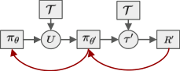
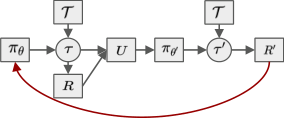
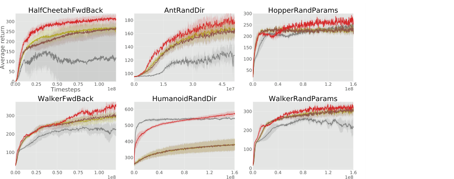
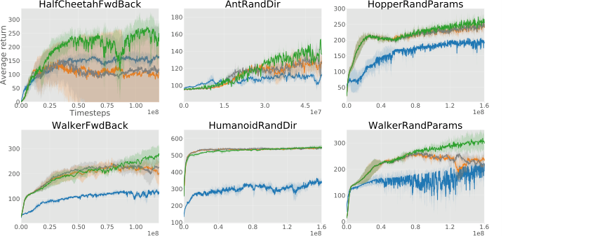
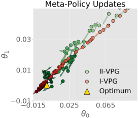
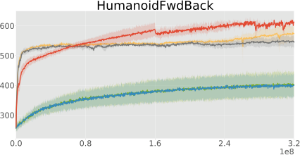
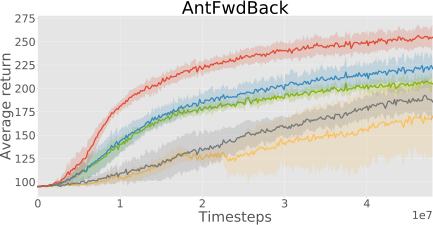
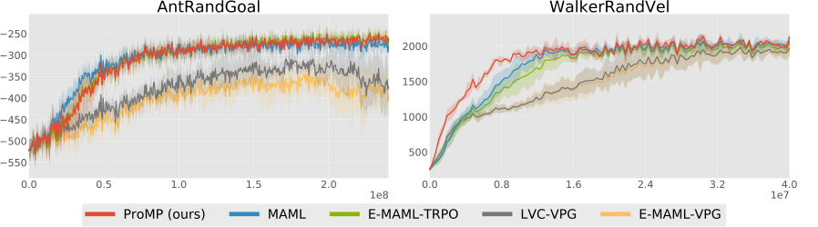

Published as a conference paper at ICLR 2019

## P RO MP: P ROXIMAL M ETA -P OLICY S EARCH

**Jonas Rothfuss** _[∗]_
UC Berkeley, KIT
jonas.rothfuss@gmail.com

**Tamim Asfour**
Karlsruhe Inst. of Technology (KIT)
asfour@kit.edu

**Dennis Lee** _[∗]_ **, Ignasi Clavera** _[∗]_
UC Berkeley
_{_ dennisl88,iclavera _}_ @berkeley.edu

**Pieter Abbeel**
UC Berkeley, Covariant.ai
pabbeel@cs.berkeley.edu

A BSTRACT

Credit assignment in Meta-reinforcement learning (Meta-RL) is still poorly understood. Existing methods either neglect credit assignment to pre-adaptation behavior or implement it naively. This leads to poor sample-efficiency during metatraining as well as ineffective task identification strategies. This paper provides
a theoretical analysis of credit assignment in gradient-based Meta-RL. Building
on the gained insights we develop a novel meta-learning algorithm that overcomes both the issue of poor credit assignment and previous difficulties in estimating meta-policy gradients. By controlling the statistical distance of both
pre-adaptation and adapted policies during meta-policy search, the proposed algorithm endows efficient and stable meta-learning. Our approach leads to superior
pre-adaptation policy behavior and consistently outperforms previous Meta-RL
algorithms in sample-efficiency, wall-clock time, and asymptotic performance.

1 I NTRODUCTION

A remarkable trait of human intelligence is the ability to adapt to new situations in the face of
limited experience. In contrast, our most successful artificial agents struggle in such scenarios.
While achieving impressive results, they suffer from high sample complexity in learning even a
single task, fail to generalize to new situations, and require large amounts of additional data to
successfully adapt to new environments. Meta-learning addresses these shortcomings by learning
how to learn. Its objective is to learn an algorithm that allows the artificial agent to succeed in an
unseen task when only limited experience is available, aiming to achieve the same fast adaptation
that humans possess (Schmidhuber, 1987; Thrun & Pratt, 1998).

Despite recent progress, deep reinforcement learning (RL) still relies heavily on hand-crafted features and reward functions as well as engineered problem specific inductive bias. Meta-RL aims
to forego such reliance by acquiring inductive bias in a data-driven manner. Recent work proves
this approach to be promising, demonstrating that Meta-RL allows agents to obtain a diverse set of
skills, attain better exploration strategies, and learn faster through meta-learned dynamics models or
synthetic returns (Duan et al., 2016; Xu et al., 2018; Gupta et al., 2018b; Saemundsson et al., 2018).

Meta-RL is a multi-stage process in which the agent, after a few sampled environment interactions,
adapts its behavior to the given task. Despite its wide utilization, little work has been done to promote theoretical understanding of this process, leaving Meta-RL grounded on unstable foundations.
Although the behavior prior to the adaptation step is instrumental for task identification, the interplay between pre-adaptation sampling and posterior performance of the policy remains poorly
understood. In fact, prior work in gradient-based Meta-RL has either entirely neglected credit assignment to the pre-update distribution (Finn et al., 2017) or implemented such credit assignment in
a naive way (Al-Shedivat et al., 2018; Stadie et al., 2018).

To our knowledge, we provide the first formal in-depth analysis of credit assignment w.r.t. preadaptation sampling distribution in Meta-RL. Based on our findings, we develop a novel Meta-RL
algorithm. First, we analyze two distinct methods for assigning credit to pre-adaptation behavior.

_∗_ authors contributed equally to this work

1

Published as a conference paper at ICLR 2019

We show that the recent formulation introduced by Al-Shedivat et al. (2018) and Stadie et al. (2018)
leads to poor credit assignment, while the MAML formulation (Finn et al., 2017) potentially yields
superior meta-policy updates. Second, based on insights from our formal analysis, we highlight both
the importance and difficulty of proper meta-policy gradient estimates. In light of this, we propose
the low variance curvature (LVC) surrogate objective which yields gradient estimates with a favorable bias-variance trade-off. Finally, building upon the LVC estimator we develop Proximal MetaPolicy Search (ProMP), an efficient and stable meta-learning algorithm for RL. In our experiments,
we show that ProMP consistently outperforms previous Meta-RL algorithms in sample-efficiency,
wall-clock time, and asymptotic performance.

2 R ELATED W ORK

Meta-Learning concerns the question of “learning to learn”, aiming to acquire inductive bias in a
data driven manner, so that the learning process in face of unseen data or new problem settings is
accelerated (Schmidhuber, 1987; Schmidhuber et al., 1997; Thrun & Pratt, 1998).

This can be achieved in various ways. One category of methods attempts to learn the “learning program” of an universal Turing machine in form of a recurrent / memory-augmented model that ingests
datasets and either outputs the parameters of the trained model (Hochreiter et al., 2001; Andrychowicz et al., 2016; Chen et al., 2017; Ravi & Larochelle, 2017) or directly outputs predictions for given
test inputs (Duan et al., 2016; Santoro et al., 2016; Mishra et al., 2018). Though very flexible and
capable of learning very efficient adaptations, such methods lack performance guarantees and are
difficult to train on long sequences that arise in Meta-RL.

Another set of methods embeds the structure of a classical learning algorithm in the meta-learning
procedure, and optimizes the parameters of the embedded learner during the meta-training (H¨usken
& Goerick, 2000; Finn et al., 2017; Nichol et al., 2018; Miconi et al., 2018). A particular instance of
the latter that has proven to be particularly successful in the context of RL is gradient-based metalearning (Finn et al., 2017; Al-Shedivat et al., 2018; Stadie et al., 2018). Its objective is to learn an
initialization such that after one or few steps of policy gradients the agent attains full performance
on a new task. A desirable property of this approach is that even if fast adaptation fails, the agent
just falls back on vanilla policy-gradients. However, as we show, previous gradient-based Meta-RL
methods either neglect or perform poor credit assignment w.r.t. the pre-update sampling distribution.

A diverse set of methods building on Meta-RL, has recently been introduced. This includes: learning exploration strategies (Gupta et al., 2018b), synthetic rewards (Sung et al., 2017; Xu et al.,
2018), unsupervised policy acquisition (Gupta et al., 2018a), model-based RL (Clavera et al., 2018;
Saemundsson et al., 2018), learning in competitive environments (Al-Shedivat et al., 2018) and
meta-learning modular policies (Frans et al., 2018; Alet et al., 2018). Many of the mentioned approaches build on previous gradient-based meta-learning methods that insufficiently account for the
pre-update distribution. ProMP overcomes these deficiencies, providing the necessary framework
for novel applications of Meta-RL in unsolved problems.

3 B ACKGROUND

**Reinforcement Learning.** A discrete-time finite Markov decision process (MDP), _T_, is defined
by the tuple ( _S, A, p, p_ 0 _, r, H_ ). Here, _S_ is the set of states, _A_ the action space, _p_ ( _s_ _t_ +1 _|s_ _t_ _, a_ _t_ )
the transition distribution, _p_ 0 represents the initial state distribution, _r_ : _S × A →_ R is a reward
function, and _H_ the time horizon. We omit the discount factor _γ_ in the following elaborations
for notational brevity. However, it is straightforward to include it by substituting the reward by
_r_ ( _s_ _t_ _, a_ _t_ ) := _γ_ _[t]_ _r_ ( _s_ _t_ _, a_ _t_ ). We define the return _R_ ( _τ_ ) as the sum of rewards along a trajectory _τ_ :=
( _s_ 0 _, a_ 0 _, ..., s_ _H−_ 1 _, a_ _H−_ 1 _, s_ _H_ ). The goal of reinforcement learning is to find a policy _π_ ( _a|s_ ) that
maximizes the expected return E _**τ**_ _∼P_ _T_ ( _**τ**_ _|π_ ) [ _R_ ( _**τ**_ )].

**Meta-Reinforcement Learning** goes one step further, aiming to learn a learning algorithm which is
able to quickly learn the optimal policy for a task _T_ drawn from a distribution of tasks _ρ_ ( _T_ ). Each
task _T_ corresponds to a different MDP. Typically, it is assumed that the distribution of tasks share
the action and state space, but may differ in their reward function or their dynamics.

**Gradient-based meta-learning** aims to solve this problem by learning the parameters _θ_ of a policy
_π_ _θ_ such that performing a single or few steps of vanilla policy gradient (VPG) with the given task
leads to the optimal policy for that task. This meta-learning formulation, also known under the name

2

Published as a conference paper at ICLR 2019

of MAML, was first introduced by Finn et al. (2017). We refer to it as formulation I which can be
expressed as maximizing the objective

_J_ _[I]_ ( _θ_ ) = E _T ∼ρ_ ( _T_ ) �E _**τ**_ _′_ _∼P_ _T_ ( _**τ**_ _′_ _|θ_ _′_ ) [ _R_ ( _**τ**_ _[′]_ )] � with _θ_ _[′]_ := _U_ ( _θ, T_ ) = _θ_ + _α∇_ _θ_ E _**τ**_ _∼P_ _T_ ( _**τ**_ _|θ_ ) [ _R_ ( _**τ**_ )]

In that _U_ denotes the update function which depends on the task _T_, and performs one VPG step
towards maximizing the performance of the policy in _T_ . For national brevity and conciseness we
assume a single policy gradient adaptation step. Nonetheless, all presented concepts can easily be
extended to multiple adaptation steps.

Later work proposes a slightly different notion of gradient-based Meta-RL, also known as E-MAML,
that attempts to circumvent issues with the meta-gradient estimation in MAML (Al-Shedivat et al.,
2018; Stadie et al., 2018):

_J_ _[II]_ ( _θ_ ) = E _T ∼ρ_ ( _T_ ) �E _**τ**_ 1: _N_ _∼P_ _T_ ( _**τ**_ 1: _N_ _|θ_ )
_**τ**_ _[′]_ _∼P_ _T_ ( _**τ**_ _[′]_ _|θ_ _[′]_ )

� _R_ ( _**τ**_ _[′]_ )�� with _θ_ _[′]_ := _U_ ( _θ,_ _**τ**_ [1:] _[N]_ ) = _θ_ + _α∇_ _θ_

_N_
�

_n_ =1

_R_ ( _**τ**_ [(] _[n]_ [)] )
� �

Formulation II views _U_ as a deterministic function that depends on _N_ sampled trajectories from a
specific task. In contrast to formulation I, the expectation over pre-update trajectories _**τ**_ is applied
outside of the update function. Throughout this paper we refer to _π_ _θ_ as pre-update policy, and _π_ _θ_ _[′]_
as post-update policy.

4 S AMPLING D ISTRIBUTION C REDIT A SSIGNMENT

This section analyzes the two gradient-based Meta-RL formulations introduced in Section 3. Figure 1 illustrates the stochastic computation graphs (Schulman et al., 2015b) of both formulations.
The red arrows depict how credit assignment w.r.t the pre-update sampling distribution _P_ _T_ ( _**τ**_ _|θ_ ) is
propagated. Formulation I (left) propagates the credit assignment through the update step, thereby
exploiting the full problem structure. In contrast, formulation II (right) neglects the inherent structure, directly assigning credit from post-update return _R_ _[′]_ to the pre-update policy _π_ _θ_ which leads to
noisier, less effective credit assignment.

Figure 1: Stochastic computation graphs of meta-learning formulation I (left) and formulation II (right). The
red arrows illustrate the credit assignment from the post-update returns _R_ _[′]_ to the pre-update policy _π_ _θ_ through
_∇_ _θ_ _J_ pre . (Deterministic nodes: Square; Stochastic nodes: Circle)

Both formulations optimize for the same objective, and are equivalent at the 0 _[th]_ order. However,
because of the difference in their formulation and stochastic computation graph, their gradients and
the resulting optimization step differs. In the following, we shed light on how and where formulation II loses signal by analyzing the gradients of both formulations, which can be written as (see
Appendix A for more details and derivations)

_∇_ _θ_ _J_ ( _θ_ ) = E _T ∼ρ_ ( _T_ )

�

E _**τ**_ _∼P_ _T_ ( _**τ**_ _|θ_ )
_**τ**_ _[′]_ _∼P_ _T_ ( _**τ**_ _[′]_ _|θ_ _[′]_ )

_∇_ _θ_ _J_ post ( _**τ**_ _,_ _**τ**_ _[′]_ ) + _∇_ _θ_ _J_ pre ( _**τ**_ _,_ _**τ**_ _[′]_ )
� � [�]

(1)

The first term _∇_ _θ_ _J_ post ( _**τ**_ _,_ _**τ**_ _[′]_ ) is equal in both formulations, but the second term, _∇_ _θ_ _J_ pre ( _**τ**_ _,_ _**τ**_ _[′]_ ),
differs between them. In particular, they correspond to

_∇_ _θ_ _J_ post ( _**τ**_ _,_ _**τ**_ _[′]_ ) = _∇_ _θ_ _[′]_ log _π_ _θ_ _[′]_ ( _**τ**_ _[′]_ ) _R_ ( _**τ**_ _[′]_ )
� ~~�~~ � ~~�~~
_∇_ _θ′_ _J_ [outer]

� _I_ + _αR_ ( _**τ**_ ) _∇_ [2] _θ_ [log] _[ π]_ _[θ]_ [(] _**[τ]**_ [))] �

~~�~~ ~~��~~ ~~�~~
transformation from _θ_ _[′]_ to _θ_

(2)

_∇_ _θ_ _J_ pre _[II]_ [(] _**[τ]**_ _[,]_ _**[ τ]**_ _[ ′]_ [) =] _[ α][∇]_ _[θ]_ [log] _[ π]_ _[θ]_ [(] _**[τ]**_ [)] _[R]_ [(] _**[τ]**_ _[ ′]_ [)] (3)

_∇_ _θ_ _J_ pre _[I]_ [(] _**[τ]**_ _[,]_ _**[ τ]**_ _[ ′]_ [) =] _[ α][∇]_ _[θ]_ [log] _[ π]_ _[θ]_ [(] _**[τ]**_ [)] � �( _∇_ _θ_ log _π_ _θ_ ~~��~~ ( _**τ**_ ) _R_ ( _**τ**_ )) _[⊤]_ � (� _∇_ _θ_ _′_ log _π_ _θ_ ~~��~~ _′_ ( _**τ**_ _[′]_ ) _R_ ( _**τ**_ _[′]_ )) ~~�~~
_∇_ _θ_ _J_ [inner] _∇_ _θ′_ _J_ [outer]

3

(4)
�

Published as a conference paper at ICLR 2019

_∇_ _θ_ _J_ post ( _**τ**_ _,_ _**τ**_ _[′]_ ) simply corresponds to a policy gradient step on the post-update policy _π_ _θ_ _′_ w.r.t _θ_ _[′]_,
followed by a linear transformation from post- to pre-update parameters. It corresponds to increasing
the likelihood of the trajectories _**τ**_ _[′]_ that led to higher returns. However, this term does not optimize
for the pre-update sampling distribution, i.e., which trajectories _**τ**_ led to better adaptation steps.

The credit assignment w.r.t. the pre-updated sampling distribution is carried out by the second term.
In formulation II, _∇_ _θ_ _J_ pre _[II]_ [can be viewed as standard reinforcement learning on] _[ π]_ _[θ]_ [with] _[ R]_ [(] _**[τ]**_ _[ ′]_ [)][ as]
reward signal, treating the update function _U_ as part of the unknown dynamics of the system. This
shifts the pre-update sampling distribution to better adaptation steps.

Formulation I takes the causal dependence of _P_ _T_ ( _**τ**_ _[′]_ _|θ_ _[′]_ ) on _P_ _T_ ( _**τ**_ _|θ_ ) into account. It does so by
maximizing the inner product of pre-update and post-update policy gradients (see Eq. 4). This steers
the pre-update policy towards 1) larger post-updates returns 2) larger adaptation steps _α∇_ _θ_ _J_ [inner], 3)
better alignment of pre- and post-update policy gradients (Li et al., 2017; Nichol et al., 2018). When
combined, these effects directly optimize for adaptation. As a result, we expect the first meta-policy
gradient formulation, _J_ _[I]_, to yield superior learning properties.

5 L OW V ARIANCE C URVATURE E STIMATOR

In the previous section we show that the formulation introduced by Finn et al. (2017) results in
superior meta-gradient updates, which should in principle lead to improved convergence properties. However, obtaining correct and low variance estimates of the respective meta-gradients proves
challenging. As discussed by Foerster et al. (2018), and shown in Appendix B.3, the score function surrogate objective approach is ill suited for calculating higher order derivatives via automatic
differentiation toolboxes. This important fact was overlooked in the original RL-MAML implementation (Finn et al., 2017) leading to incorrect meta-gradient estimates [1] . As a result, _∇_ _θ_ _J_ pre does
not appear in the gradients of the meta-objective (i.e. _∇_ _θ_ _J_ = _∇_ _θ_ _J_ post ). Hence, MAML does not
perform any credit assignment to pre-adaptation behavior.

But, even when properly implemented, we show that the meta-gradients exhibit high variance.
Specifically, the estimation of the hessian of the RL-objective, which is inherent in the metagradients, requires special consideration. In this section, we motivate and introduce the low variance
curvature estimator (LVC): an improved estimator for the hessian of the RL-objective which promotes better meta-policy gradient updates. As we show in Appendix A.1, we can write the gradient
of the meta-learning objective as

_∇_ _θ_ _J_ _[I]_ ( _θ_ ) = E _T ∼ρ_ ( _T_ ) �E _**τ**_ _′_ _∼P_ _T_ ( _**τ**_ _′_ _|θ_ _′_ ) � _∇_ _θ_ _′_ log _P_ _T_ ( _**τ**_ _[′]_ _|θ_ _[′]_ ) _R_ ( _**τ**_ _[′]_ ) _∇_ _θ_ _U_ ( _θ, T_ )� [�] (5)

Since the update function _U_ resembles a policy gradient step, its gradient _∇_ _θ_ _U_ ( _θ, T_ ) involves computing the hessian of the reinforcement learning objective, i.e., _∇_ [2] _θ_ [E] _**[τ]**_ _[∼][P]_ _T_ [(] _**[τ]**_ _[|][θ]_ [)] [ [] _[R]_ [(] _**[τ]**_ [)]][. Estimating]
this hessian has been discussed in Baxter & Bartlett (2001) and Furmston et al. (2016). In the infinite horizon MDP case, Baxter & Bartlett (2001) derived a decomposition of the hessian. We extend
their finding to the finite horizon case, showing that the hessian can be decomposed into three matrix
terms (see Appendix B.2 for proof):

_∇_ _θ_ _U_ ( _θ, T_ ) = _I_ + _α∇_ [2] _θ_ [E] _**τ**_ _∼P_ _T_ ( _**τ**_ _|θ_ ) [[] _[R]_ [(] _**[τ]**_ [)] =] _[ I]_ [ +] _[ α]_ � _H_ 1 + _H_ 2 + _H_ 12 + _H_ 12 _[⊤]_ � (6)

whereby

��

_H_ 1 = E _**τ**_ _∼P_ _T_ ( _**τ**_ _|θ_ )

_H_ 2 = E _**τ**_ _∼P_ _T_ ( _**τ**_ _|θ_ )

_H_ 12 = E _**τ**_ _∼P_ _T_ ( _**τ**_ _|θ_ )

_H−_ 1
�
� _t_ =0

_H−_ 1
� _∇_ _θ_ log _π_ _θ_ ( _**a**_ _t_ _,_ _**s**_ _t_ ) _∇_ _θ_ _Q_ _[π]_ _t_ _[θ]_ [(] _**[s]**_ _[t]_ _[,]_ _**[ a]**_ _[t]_ [)] _[⊤]_
� _t_ =0 �

_−_ 1 _H−_ 1
� _∇_ _θ_ log _π_ _θ_ ( _**a**_ _t_ _,_ _**s**_ _t_ ) _∇_ _θ_ log _π_ _θ_ ( _**a**_ _t_ _,_ _**s**_ _t_ ) _[⊤]_ �

_t_ =0 � _t_ _[′]_ = _t_

� _r_ ( _**s**_ _t_ _′_ _,_ _**a**_ _t_ _′_ )

_t_ _[′]_ = _t_

_H−_ 1
� _∇_ [2] _θ_ [log] _[ π]_ _[θ]_ [(] _**[a]**_ _[t]_ _[,]_ _**[ s]**_ _[t]_ [)]
� _t_ =0

_H−_ 1
�
� _t_ _[′]_ = _t_

��

� _r_ ( _**s**_ _t_ _′_ _,_ _**a**_ _t_ _′_ )

_t_ _[′]_ = _t_

1 Note that MAML is theoretically sound, but does not attend to correctly estimating the meta-policy gradients. As consequence, the gradients in the corresponding implementation do not comply with the theory.

4

Published as a conference paper at ICLR 2019

_H−_ 1
Here _Q_ _[π]_ _t_ _[θ]_ [(] _**[s]**_ _[t]_ _[,]_ _**[ a]**_ _[t]_ [) =][ E] _**τ**_ _[t]_ [+1:] _[H][−]_ [1] _∼P_ _T_ ( _·|θ_ ) �� _t_ _[′]_ = _t_ _[r]_ [(] _**[s]**_ _[t]_ _[′]_ _[,]_ _**[ a]**_ _[t]_ _[′]_ [)] _[|][s]_ _[t]_ _[, a]_ _[t]_ � denotes the expected state-action
value function under policy _π_ _θ_ at time _t_ .

Computing the expectation of the RL-objective is in general intractable. Typically, its gradients are
computed with a Monte Carlo estimate based on the policy gradient theorem (Eq. 82). In practical
implementations, such an estimate is obtained by automatically differentiating a surrogate objective (Schulman et al., 2015b). However, this results in a highly biased hessian estimate which just
computes _H_ 2, entirely dropping the terms _H_ 1 and _H_ 12 + _H_ 12 _[⊤]_ [. In the notation of the previous section,]
it leads to neglecting the _∇_ _θ_ _J_ pre term, ignoring the influence of the pre-update sampling distribution.

The issue can be overcome using the DiCE formulation, which allows to compute unbiased higherorder Monte Carlos estimates of arbitrary stochastic computation graphs (Foerster et al., 2018). The
DiCE-RL objective can be rewritten as follows

_H−_ 1
�

_t_ =0

�

_J_ [DiCE] ( _**τ**_ ) =

_t_
�
� _t_ _[′]_ =0

_t_
�
� _t_ _[′]_ =0

_π_ _θ_ ( _**a**_ _t_ _′_ _|_ _**s**_ _t_ _′_ )
_⊥_ ( _π_ _θ_ ( _**a**_ _t_ _[′]_ _|_ _**s**_ _t_ _[′]_ ))

_r_ ( _**s**_ _t_ _,_ _**a**_ _t_ ) _**τ**_ _∼_ _P_ _T_ ( _**τ**_ ) (7)

E _**τ**_ _∼P_ _T_ ( _**τ**_ _|θ_ ) � _∇_ [2] _θ_ _[J]_ [DiCE] [(] _**[τ]**_ [)] � = _H_ 1 + _H_ 2 + _H_ 12 + _H_ 12 _[⊤]_ (8)

In that, _⊥_ denotes the “stop ~~g~~ radient” operator, i.e., _⊥_ ( _f_ _θ_ ( _x_ )) _→_ _f_ _θ_ ( _x_ ) but _∇_ _θ_ _⊥_ ( _f_ _θ_ ( _x_ )) _→_ 0. The
sequential dependence of _π_ _θ_ ( _**a**_ _t_ _|_ _**s**_ _t_ ) within the trajectory, manifesting itself through the product of
importance weights in (7), results in high variance estimates of the hessian _∇_ [2] _θ_ [E] _**[τ]**_ _[∼][P]_ _T_ [(] _**[τ]**_ _[|][θ]_ [)] [ [] _[R]_ [(] _**[τ]**_ [)]][.]
As noted by Furmston et al. (2016), _H_ 12 is particularly difficult to estimate, since it involves three
nested sums along the trajectory. In section 7.2 we empirically show that the high variance estimates
of the DiCE objective lead to noisy meta-policy gradients and poor learning performance.

To facilitate a sample efficient meta-learning, we introduce the low variance curvature (LVC) esti
mator:

�

_H−_ 1
�

_t_ =0

_H−_ 1
�
� _t_ _[′]_ = _t_

� _r_ ( _**s**_ _t_ _′_ _,_ _**a**_ _t_ _′_ )

_t_ _[′]_ = _t_

_J_ [LVC] ( _**τ**_ ) =

_π_ _θ_ ( _**a**_ _t_ _|_ _**s**_ _t_ )
_⊥_ ( _π_ _θ_ ( _**a**_ _t_ _|_ _**s**_ _t_ ))

_**τ**_ _∼_ _P_ _T_ ( _**τ**_ ) (9)

E _**τ**_ _∼P_ _T_ ( _**τ**_ _|θ_ ) � _∇_ [2] _θ_ _[J]_ [LVC] [(] _**[τ]**_ [)] � = _H_ 1 + _H_ 2 (10)

By removing the sequential dependence of _π_ _θ_ ( _**a**_ _t_ _|_ _**s**_ _t_ ) within trajectories, the hessian estimate neglects the term _H_ 12 + _H_ 12 _[⊤]_ [which leads to a variance reduction, but makes the estimate biased. The]
choice of this objective function is motivated by findings in Furmston et al. (2016): under certain
conditions the term _H_ 12 + _H_ 12 _[⊤]_ [vanishes around local optima] _[ θ]_ _[∗]_ [, i.e.,][ E] _**[τ]**_ [[] _[∇]_ [2] _θ_ _[J]_ [LVC] []] _[ →]_ [E] _**[τ]**_ [[] _[∇]_ [2] _θ_ _[J]_ [DiCE] []]
as _θ →_ _θ_ _[∗]_ . Hence, the bias of the LVC estimator becomes negligible close to local optima. The
experiments in section 7.2 underpin the theoretical findings, showing that the low variance hessian
estimates obtained through _J_ [LVC] improve the sample-efficiency of meta-learning by a significant
margin when compared to _J_ [DiCE] . We refer the interested reader to Appendix B for derivations and a
more detailed discussion.

6 P RO MP: P ROXIMAL M ETA -P OLICY S EARCH

Building on the previous sections, we develop a novel meta-policy search method based on the low
variance curvature objective which aims to solve the following optimization problem:

max E _T ∼ρ_ ( _T_ ) �E _**τ**_ _′_ _∼P_ _T_ ( _**τ**_ _′_ _|θ_ _′_ ) [ _R_ ( _**τ**_ _[′]_ )]� with _θ_ _[′]_ := _θ_ + _α ∇_ _θ_ E _**τ**_ _∼P_ _T_ ( _**τ**_ _|θ_ ) � _J_ [LVC] ( _**τ**_ )� (11)
_θ_

Prior work has optimized this objective using either vanilla policy gradient (VPG) or TRPO (Schulman et al., 2015a). TRPO holds the promise to be more data efficient and stable during the learning
process when compared to VPG. However, it requires computing the Fisher information matrix
(FIM). Estimating the FIM is particularly problematic in the meta-learning set up. The meta-policy
gradients already involve second order derivatives; as a result, the time complexity of the FIM estimate is cubic in the number of policy parameters. Typically, the problem is circumvented using
finite difference methods, which introduce further approximation errors.

The recently introduced PPO algorithm (Schulman et al., 2017) achieves comparable results to
TRPO with the advantage of being a first order method. PPO uses a surrogate clipping objective
which allows it to safely take multiple gradient steps without re-sampling trajectories.

_J_ _T_ [CLIP] ( _θ_ ) = E _**τ**_ _∼P_ _T_ ( _**τ**_ _,θ_ _o_ ) �� _Ht_ =0 _−_ 1 [min] � _ππ_ _θoθ_ (( _**aa**_ _tt_ _||_ _**ss**_ _tt_ )) _[A]_ _[π]_ _[θo]_ [(] _**[s]**_ _[t]_ _[,]_ _**[ a]**_ _[t]_ [)] _[,]_ [ clip] 1 [1+] _−_ _[ϵ]_ _ϵ_ � _ππ_ _θoθ_ (( _**aa**_ _tt_ _||_ _**ss**_ _tt_ )) � _A_ _[π]_ _[θo]_ ( _**s**_ _t_ _,_ _**a**_ _t_ )��

5

Published as a conference paper at ICLR 2019

**Algorithm 1** Proximal Meta-Policy Search (ProMP)
**Require:** Task distribution _ρ_, step sizes _α_, _β_, KL-penalty coefficient _η_, clipping range _ϵ_

1: Randomly initialize _θ_
2: **while** _θ_ not converged **do**
3: Sample batch of tasks _T_ _i_ _∼_ _ρ_ ( _T_ )
4: **for** step _n_ = 0 _, ..., N −_ 1 **do**
5: **if** _n_ = 0 **then**
6: Set _θ_ _o_ _←_ _θ_
7: **for all** _T_ _i_ _∼_ _ρ_ ( _T_ ) **do**
8: Sample pre-update trajectories _D_ _i_ = _{τ_ _i_ _}_ from _T_ _i_ using _π_ _θ_
9: Compute adapted parameters _θ_ _o,i_ _[′]_ _[←]_ _[θ]_ [ +] _[ α][ ∇]_ _[θ]_ _[J]_ _T_ _[LR]_ _i_ [(] _[θ]_ [)][ with] _[ D]_ _[i]_ [ =] _[ {][τ]_ _[i]_ _[}]_
10: Sample post-update trajectories _D_ _[′]_ _i_ = _{τ_ _i_ _[′]_ _[}]_ [ from] _[ T]_ _[i]_ [ using] _[ π]_ _[θ]_ _o,i_ _[′]_
11: Update _θ ←_ _θ_ + _β_ [�] _T_ _i_ _[∇]_ _[θ]_ _[J]_ _T_ [ProMP] _i_ ( _θ_ ) using each _D_ _i_ _[′]_ [=] _[ {][τ]_ _[ ′]_ _i_ _[}]_

In case of Meta-RL, it does not suffice to just replace the post-update reward objective with _J_ _T_ [CLIP] . In
order to safely perform multiple meta-gradient steps based on the same sampled data from a recent
policy _π_ _θ_ _o_, we also need to 1) account for changes in the pre-update action distribution _π_ _θ_ ( _a_ _t_ _|s_ _t_ ),
and 2) bound changes in the pre-update state visitation distribution (Kakade & Langford, 2002).

We propose Proximal Meta-Policy Search (ProMP) which incorporates both the benefits of proximal
policy optimization and the low variance curvature objective (see Alg. 1.) In order to comply with
_π_ _θ_ ( _a_ _t_ _|s_ _t_ )
requirement 1), ProMP replaces the “stop gradient” importance weight _⊥_ ( _π_ _θ_ ( _a_ _t_ _|s_ _t_ )) [by the likelihood]

_π_ _θ_ ( _a_ _t_ _|s_ _t_ )
ratio
_π_ _θo_ ( _a_ _t_ _|s_ _t_ )) [, which results in the following objective]

_π_ _θ_ ( _**a**_ _t_ _|_ _**s**_ _t_ )
_π_ _θ_ _o_ ( _**a**_ _t_ _|_ _**s**_ _t_ ) _[A]_ _[π]_ _[θo]_ [(] _**[s]**_ _[t]_ _[,]_ _**[ a]**_ _[t]_ [)]

�

_J_ _T_ _[LR]_ ( _θ_ ) = E _**τ**_ _∼P_ _T_ ( _**τ**_ _,θ_ _o_ )

_H−_ 1
�
� _t_ =0

(12)

An important feature of this objective is that its derivatives w.r.t _θ_ evaluated at _θ_ _o_ are identical to
those of the LVC objective, and it additionally accounts for changes in the pre-update action distribution. To satisfy condition 2) we extend the clipped meta-objective with a KL-penalty term between
_π_ _θ_ and _π_ _θ_ _o_ . This KL-penalty term enforces a soft local “trust region” around _π_ _θ_ _o_, preventing the
shift in state visitation distribution to become large during optimization. This enables us to take
multiple meta-policy gradient steps without re-sampling. Altogether, ProMP optimizes

_J_ _T_ [ProMP] ( _θ_ ) = _J_ _T_ [CLIP] ( _θ_ _[′]_ ) _−_ _ηD_ [¯] _KL_ ( _π_ _θ_ _o_ _, π_ _θ_ ) s.t. _θ_ _[′]_ = _θ_ + _α ∇_ _θ_ _J_ _T_ _[LR]_ ( _θ_ ) _,_ _T ∼_ _ρ_ ( _T_ ) (13)

ProMP consolidates the insights developed throughout the course of this paper, while at the same
time making maximal use of recently developed policy gradients algorithms. First, its meta-learning
formulation exploits the full structural knowledge of gradient-based meta-learning. Second, it incorporates a low variance estimate of the RL-objective hessian. Third, ProMP controls the statistical
distance of both pre- and post-adaptation policies, promoting efficient and stable meta-learning.
All in all, ProMP consistently outperforms previous gradient-based meta-RL algorithms in sample
complexity, wall clock time, and asymptotic performance (see Section 7.1).

7 E XPERIMENTS

In order to empirically validate the theoretical arguments outlined above, this section provides a
detailed experimental analysis that aims to answer the following questions: (i) How does ProMP
perform against previous Meta-RL algorithms? (ii) How do the lower variance but biased LVC
gradient estimates compare to the high variance, unbiased DiCE estimates? (iii) Do the different
formulations result in different pre-update exploration properties? (iv) How do formulation I and
formulation II differ in their meta-gradient estimates and convergence properties?

To answer the posed questions, we evaluate our approach on six continuous control Meta-RL benchmark environments based on OpenAI Gym and the Mujoco simulator (Brockman et al., 2016;
Todorov et al., 2012). A description of the experimental setup is found in Appendix D. In all experiments, the reported curves are averaged over at least three random seeds. Returns are estimated

6

Published as a conference paper at ICLR 2019

Figure 2: Meta-learning curves of ProMP and previous gradient-based meta-learning algorithms in six different MuJoCo environments. ProMP outperforms previous work in all the the environments.

based on sampled trajectories from the adapted post-update policies and averaged over sampled
tasks. The source code and the experiment data are available on our supplementary website. [2]

7.1 M ETA -G RADIENT B ASED C OMPARISON

We compare our method, ProMP, in sample complexity and asymptotic performance to the gradientbased meta-learning approaches MAML-TRPO (Finn et al., 2017) and E-MAML-TRPO (see Fig.
2). Note that MAML corresponds to the original implementation of RL-MAML by (Finn et al.,
2017) where no credit assignment to the pre-adaptation policy is happening (see Appendix B.3
for details). Moreover, we provide a second study which focuses on the underlying meta-gradient
estimator. Specifically, we compare the LVC, DiCE, MAML and E-MAML estimators while optimizing meta-learning objective with vanilla policy gradient (VPG) ascent. This can be viewed as an
ablated version of the algorithms which tries to eliminate the influences of the outer optimizers on
the learning performance (see Fig. 3).

These algorithms are benchmarked on six different locomotion tasks that require adaptation: the
half-cheetah and walker must switch between running forward and backward, the high-dimensional
agents ant and humanoid must learn to adapt to run in different directions in the 2D-plane, and the
hopper and walker have to adapt to different configuration of their dynamics.

Figure 3: Meta-learning curves corresponding to different meta-gradient estimators in conjunction with VPG.
The introduced LVC approach consistently outperforms the other estimators.

2 https://sites.google.com/view/pro-mp

7

Published as a conference paper at ICLR 2019

40

20

0

250

200

150

100

**AntRandDir**

Gradient Variance

|Col1|Col2|
|---|---|
|||
|||

0.0 0.3 0.6 0.9 1.2
Time steps 1e8

Return

|Col1|Col2|
|---|---|
|||
|||
|||

0.0 0.3 0.6 0.9 1.2
Time steps 1e8

40

20

0

400

200

0

**HalfCheetahFwdBack**

|Gradient V|ariance|
|---|---|
|||
|||
|||

0.0 0.3 0.6 0.9 1.2
Time steps 1e8

Return

|Col1|Col2|
|---|---|
|||

0.0 0.3 0.6 0.9 1.2
Time steps 1e8

40

20

0

200

100

**WalkerRandParams**

|Gradient Va|riance|
|---|---|
|||
|||
|||

0.0 0.3 0.6 0.9 1.2
Time steps 1e8

Return

|Col1|Col2|
|---|---|
|||
|||

0.0 0.3 0.6 0.9 1.2
Time steps 1e8

LVC

DiCE

Figure 4: Top: Relative standard deviation of meta-policy gradients. Bottom: Returns in the respective
environments throughout the learning process. LVC exhibits less variance in its meta-gradients which may
explain its superior performance when compared to DiCE.

The results in Figure 2 highlight the strength of ProMP in terms of sample efficiency and asymptotic
performance. In the meta-gradient estimator study in Fig. 3, we demonstrate the positive effect
of the LVC objective, as it consistently outperforms the other estimators. In contrast, DiCE learns
only slowly when compared to the other approaches. As we have motivated mathematically and
substantiate empirically in the following experiment, the poor performance of DiCE may be ascribed
to the high variance of its meta-gradient estimates. The fact that the results of MAML and EMAML are comparable underpins the ineffectiveness of the naive pre-update credit assignment (i.e.
formulation II), as discussed in section 4.

Results for four additional environments are displayed in Appendix D along with hyperparameter
settings, environment specifications and a wall-clock time comparison of the algorithms.

7.2 G RADIENT E STIMATOR V ARIANCE AND I TS E FFECT ON M ETA -L EARNING

In Section 5 we discussed how the DiCE formulation yields unbiased but high variance estimates
of the RL-objective hessian and served as motivation for the low variance curvature (LVC) estimator. Here we investigate the meta-gradient variance of both estimators as well as its implication
on the learning performance. Specifically, we report the relative standard deviation of the metapolicy gradients as well as the average return throughout the learning process in three of the metaenvironments.

The results, depicted in Figure 4, highlight the advantage of the low variance curvature estimate.
The trajectory level dependencies inherent in the DiCE estimator leads to a meta-gradient standard
deviation that is on average 60% higher when compared to LVC. As the learning curves indicate,
the noisy gradients may be a driving factor for the poor performance of DiCE, impeding sample
efficient meta-learning. Meta-policy search based on the LVC estimator leads to substantially better
sample-efficiency and asymptotic performance.

In case of HalfCheetahFwdBack, we observe some unstable learning behavior of LVC-VPG which
is most likely caused by the bias of LVC in combination with the naive VPG optimizer. However, the
mechanisms in ProMP that ensure proximity w.r.t. to the policy’s KL-divergence seem to counteract
these instabilities during training, giving us a stable and efficient meta-learning algorithm.

7.3 C OMPARISON OF I NITIAL S AMPLING D ISTRIBUTIONS

Here we evaluate the effect of the different objectives on the learned pre-update sampling distribution. We compare the low variance curvature (LVC) estimator with TRPO (LVC-TRPO) against
MAML (Finn et al., 2017) and E-MAML-TRPO (Stadie et al., 2018) in a 2D environment on which
the exploration behavior can be visualized. Each task of this environment corresponds to reaching
a different corner location; however, the 2D agent only experiences reward when it is sufficiently
close to the corner (translucent regions of Figure 5). Thus, to successfully identify the task, the agent
must explore the different regions. We perform three inner adaptation steps on each task, allowing
the agent to fully change its behavior from exploration to exploitation.

8

Published as a conference paper at ICLR 2019

Figure 5: Exploration patterns of the pre-update policy and exploitation post-update with different update
functions. Through its superior credit assignment, the LVC objective learns a pre-update policy that is able to
identify the current task and respectively adapt its policy, successfully reaching the goal (dark green circle).

The different exploration-exploitation strategies are displayed in Figure 5. Since the MAML implementation does not assign credit to the pre-update sampling trajectory, it is unable to learn a sound
exploration strategy for task identification and thus fails to accomplish the task. On the other hand,
E-MAML, which corresponds to formulation II, learns to explore in long but random paths: because
it can only assign credit to batches of pre-update trajectories, there is no notion of which actions
in particular facilitate good task adaptation. As consequence the adapted policy slightly misses the
task-specific target. The LVC estimator, instead, learns a consistent pattern of exploration, visiting
each of the four regions, which it harnesses to fully solve the task.

7.4 G RADIENT U PDATE D IRECTIONS OF THE T WO M ETA -RL F ORMULATIONS

To shed more light on the differences of the gradients of formulation I and formulation II, we evaluate the meta-gradient updates and the corresponding convergence to the optimum of both
formulations in a simple 1D environment. In this environment,
the agent starts in a random position in the real line and has to
reach a goal located at the position 1 or -1. In order to visualize
the convergence, we parameterize the policy with only two parameters _θ_ 0 and _θ_ 1 . We employ formulation I by optimizing the
DiCE objective with VPG, and formulation II by optimizing its
(E-MAML) objective with VPG.

Figure 6 depicts meta-gradient updates of the parameters _θ_ _i_ for
both formulations. Formulation I (red) exploits the internal
structure of the adaptation update yielding faster and steadier
convergence to the optimum. Due to its inferior credit assignment, formulation II (green) produces noisier gradient estimates
leading to worse convergence properties.

8 C ONCLUSION

Figure 6: Meta-gradient updates of
policy parameters _θ_ 0 and _θ_ 1 in a
1D environment w.r.t Formulation I
(red) and Formulation II (green).

In this paper we propose a novel Meta-RL algorithm, proximal meta-policy search (ProMP), which
fully optimizes for the pre-update sampling distribution leading to effective task identification. Our
method is the result of a theoretical analysis of gradient-based Meta-RL formulations, based on
which we develop the low variance curvature (LVC) surrogate objective that produces low variance
meta-policy gradient estimates. Experimental results demonstrate that our approach surpasses previous meta-reinforcement learning approaches in a diverse set of continuous control tasks. Finally, we
underpin our theoretical contributions with illustrative examples which further justify the soundness
and effectiveness of our method.

A CKNOWLEDGMENTS

Ignasi Clavera was supported by the La Caixa Fellowship. The research leading to these results has
received funding from the German Research Foundation (DFG: Deutsche Forschungsgemeinschaft)
under Priority Program on Autonomous Learning (SPP 1527) and was supported by Berkeley Deep
Drive, Amazon Web Services, and Huawei. Also we thank Abhishek Gupta, Chelsea Finn, aand
Aviv Tamar for their valuable feedback.

9

Published as a conference paper at ICLR 2019

R EFERENCES

Joshua Achiam, David Held, Aviv Tamar, and Pieter Abbeel. Constrained Policy Optimization.
[Technical report, 2017. URL https://arxiv.org/pdf/1705.10528.pdf.](https://arxiv.org/pdf/1705.10528.pdf)

Maruan Al-Shedivat, Trapit Bansal, Umass Amherst, Yura Burda, Openai Ilya, Sutskever Openai,
Igor Mordatch Openai, and Pieter Abbeel. Continuous Adaptation via Meta-Learning in Nonstationary and Competitive Environments. In _ICLR_ [, 2018. URL https://goo.gl/tboqaN.](https://goo.gl/tboqaN.)

Ferran Alet, Tom´as Lozano-P´erez, and Leslie P. Kaelbling. Modular meta-learning. Technical
[report, 6 2018. URL http://arxiv.org/abs/1806.10166.](http://arxiv.org/abs/1806.10166)

Marcin Andrychowicz, Misha Denil, Sergio G´omez Colmenarejo, Matthew W Hoffman, David
Pfau, Tom Schaul, Brendan Shillingford, and Nando De Freitas. Learning to learn by gradient de[scent by gradient descent. Technical report, 2016. URL https://arxiv.org/pdf/1606.](https://arxiv.org/pdf/1606.04474.pdf)
[04474.pdf.](https://arxiv.org/pdf/1606.04474.pdf)

Jonathan Baxter and Peter L Bartlett. Infinite-Horizon Policy-Gradient Estimation. Technical report,
[2001. URL https://arxiv.org/pdf/1106.0665.pdf.](https://arxiv.org/pdf/1106.0665.pdf)

Greg Brockman, Vicki Cheung, Ludwig Pettersson, Jonas Schneider, John Schulman, Jie Tang, and
[Wojciech Zaremba. OpenAI Gym. Technical report, 6 2016. URL http://arxiv.org/](http://arxiv.org/abs/1606.01540)
[abs/1606.01540.](http://arxiv.org/abs/1606.01540)

Yutian Chen, Matthew W Hoffman, Sergio G´omez Colmenarejo, Misha Denil, Timothy P Lillicrap,
Matt Botvinick, and Nando De Freitas. Learning to Learn without Gradient Descent by Gradient
Descent. In _ICML_, 2017.

Ignasi Clavera, Jonas Rothfuss, John Schulman, Yasuhiro Fujita, Tamim Asfour, and Pieter Abbeel.
Model-Based Reinforcement Learning via Meta-Policy Optimization. In _CoRL_, 2018. URL
[http://arxiv.org/abs/1809.05214.](http://arxiv.org/abs/1809.05214)

Yan Duan, John Schulman, Xi Chen, Peter L. Bartlett, Ilya Sutskever, and Pieter Abbeel. RL$ˆ2$:
Fast Reinforcement Learning via Slow Reinforcement Learning. _CoRR_, abs/1611.0:1–14, 2016.
[ISSN 0004-6361. doi: 10.1051/0004-6361/201527329. URL http://arxiv.org/abs/](http://arxiv.org/abs/1611.02779)
[1611.02779.](http://arxiv.org/abs/1611.02779)

Chelsea Finn, Pieter Abbeel, and Sergey Levine. Model-Agnostic Meta-Learning for Fast Adaptation of Deep Networks. In _ICML_, 2017.

Jakob Foerster, Gregory Farquhar, Maruan Al-Shedivat, Tim Rockt¨aschel, Eric P Xing, and Shimon
Whiteson. DiCE: The Infinitely Differentiable Monte Carlo Estimator. In _ICML_, 2018. URL
[https://goo.gl/xkkGxN.](https://goo.gl/xkkGxN.)

Kevin Frans, Jonathan Ho, Xi Chen, Pieter Abbeel, and John Schulman. Meta Learning Shared
Hierarchies. In _ICLR_ [, 10 2018. URL http://arxiv.org/abs/1710.09767.](http://arxiv.org/abs/1710.09767)

Thomas Furmston, Guy Lever, David Barber, and Joelle Pineau. Approximate Newton Methods for
[Policy Search in Markov Decision Processes. Technical report, 2016. URL http://jmlr.](http://jmlr.org/papers/volume17/15-414/15-414.pdf)
[org/papers/volume17/15-414/15-414.pdf.](http://jmlr.org/papers/volume17/15-414/15-414.pdf)

Abhishek Gupta, Benjamin Eysenbach, Chelsea Finn, and Sergey Levine. Unsupervised MetaLearning for Reinforcement Learning. In _ICML_, 2018a.

Abhishek Gupta, Russell Mendonca, Yuxuan Liu, Pieter Abbeel, and Sergey Levine. MetaReinforcement Learning of Structured Exploration Strategies. In _ICML_ [, 2018b. URL https:](https://arxiv.org/pdf/1802.07245.pdf)
[//arxiv.org/pdf/1802.07245.pdf.](https://arxiv.org/pdf/1802.07245.pdf)

Sepp Hochreiter, A. Steven Younger, and Peter R. Conwell. Learning To Learn Using Gradient Descent. In _ICANN_ [, pp. 87–94, 2001. URL http://citeseerx.ist.psu.edu/viewdoc/](http://citeseerx.ist.psu.edu/viewdoc/summary?doi=10.1.1.5.323)
[summary?doi=10.1.1.5.323.](http://citeseerx.ist.psu.edu/viewdoc/summary?doi=10.1.1.5.323)

10

Published as a conference paper at ICLR 2019

Michael H¨usken and Christian Goerick. Fast learning for problem classes using knowledge based network initialization. In _IJCNN_ . IEEE Computer Society Press, 2000.
[URL http://citeseerx.ist.psu.edu/viewdoc/download?doi=10.1.1.31.](http://citeseerx.ist.psu.edu/viewdoc/download?doi=10.1.1.31.9720&rep=rep1&type=pdf)
[9720&rep=rep1&type=pdf.](http://citeseerx.ist.psu.edu/viewdoc/download?doi=10.1.1.31.9720&rep=rep1&type=pdf)

Sham Kakade and John Langford. Approximately Optimal Approximate Reinforcement Learning. In _ICML_, 2002. [URL https://people.eecs.berkeley.edu/˜pabbeel/](https://people.eecs.berkeley.edu/~pabbeel/cs287-fa09/readings/KakadeLangford-icml2002.pdf)
[cs287-fa09/readings/KakadeLangford-icml2002.pdf.](https://people.eecs.berkeley.edu/~pabbeel/cs287-fa09/readings/KakadeLangford-icml2002.pdf)

Da Li, Yongxin Yang, Yi-Zhe Song, and Timothy M Hospedales. Learning to Generalize: MetaLearning for Domain Generalization. In _AAAI_, 2017. URL www.aaai.org.

Thomas Miconi, Jeff Clune, and Kenneth O. Stanley. Differentiable plasticity: training plastic neural
networks with backpropagation. In _ICML_ [, 4 2018. URL https://arxiv.org/abs/1804.](https://arxiv.org/abs/1804.02464)
[02464.](https://arxiv.org/abs/1804.02464)

Nikhil Mishra, Mostafa Rohaninejad, Xi Chen, and Pieter Abbeel. A Simple Neural Attentive MetaLearner. In _ICLR_ [, 7 2018. URL http://arxiv.org/abs/1707.03141.](http://arxiv.org/abs/1707.03141)

Alex Nichol, Joshua Achiam, and John Schulman. On First-Order Meta-Learning Algorithms. Tech[nical report, 2018. URL http://arxiv.org/abs/1803.02999.](http://arxiv.org/abs/1803.02999)

Jan Peters and Stefan Schaal. Policy Gradient Methods for Robotics. In _2006 IEEE/RSJ Inter-_
_national Conference on Intelligent Robots and Systems_, pp. 2219–2225. IEEE, 10 2006. ISBN
[1-4244-0258-1. doi: 10.1109/IROS.2006.282564. URL http://ieeexplore.ieee.org/](http://ieeexplore.ieee.org/document/4058714/)
[document/4058714/.](http://ieeexplore.ieee.org/document/4058714/)

Sachin Ravi and Hugo Larochelle. Optimization as a Model for Few-Shot Learning. In _ICLR_, 11
[2017. URL https://openreview.net/forum?id=rJY0-Kcll.](https://openreview.net/forum?id=rJY0-Kcll)

Steind´or Saemundsson, Katja Hofmann, and Marc Peter Deisenroth. Meta Reinforcement Learning
with Latent Variable Gaussian Processes. In _UAI_ [, 2018. URL https://arxiv.org/pdf/](https://arxiv.org/pdf/1803.07551.pdf)
[1803.07551.pdf.](https://arxiv.org/pdf/1803.07551.pdf)

Adam Santoro, Sergey Bartunov, Matthew Botvinick, Daan Wierstra, Timothy Lillicrap, and Google
Deepmind. Meta-Learning with Memory-Augmented Neural Networks. In _ICML_, 2016. URL
[http://proceedings.mlr.press/v48/santoro16.pdf.](http://proceedings.mlr.press/v48/santoro16.pdf)

Juergen Schmidhuber. _Evolutionary principles in self-referential learning. On learning how to learn:_
_The meta-meta-... hook_ . PhD thesis, Technische Universitaet Munchen, 1987. [URL http:](http://people.idsia.ch/~juergen/diploma.html)
[//people.idsia.ch/˜juergen/diploma.html.](http://people.idsia.ch/~juergen/diploma.html)

J¨urgen Schmidhuber, Jieyu Zhao, and Marco Wiering. Shifting Inductive Bias with Success-Story
Algorithm, Adaptive Levin Search, and Incremental Self-Improvement. _Machine Learning_, 28
[(1):105–130, 1997. ISSN 08856125. doi: 10.1023/A:1007383707642. URL http://link.](http://link.springer.com/10.1023/A:1007383707642)
[springer.com/10.1023/A:1007383707642.](http://link.springer.com/10.1023/A:1007383707642)

John Schulman, Nicolas Heess, Theophane Weber, and Pieter Abbeel. Gradient Estimation Using
Stochastic Computation Graphs. In _NIPS_ [, 2015a. URL https://arxiv.org/pdf/1506.](https://arxiv.org/pdf/1506.05254.pdf)
[05254.pdf.](https://arxiv.org/pdf/1506.05254.pdf)

John Schulman, Sergey Levine, Philipp Moritz, Michael I. Jordan, and Pieter Abbeel. Trust Region
Policy Optimization. _ICML_ [, 2015b. ISSN 2158-3226. doi: 10.1063/1.4927398. URL http:](http://arxiv.org/abs/1502.05477)
[//arxiv.org/abs/1502.05477.](http://arxiv.org/abs/1502.05477)

John Schulman, Filip Wolski, Prafulla Dhariwal, Alec Radford, and Oleg Klimov Openai. Proximal
Policy Optimization Algorithms. _CoRR_ [, 2017. URL https://arxiv.org/pdf/1707.](https://arxiv.org/pdf/1707.06347.pdf)
[06347.pdf.](https://arxiv.org/pdf/1707.06347.pdf)

Bradly C Stadie, Ge Yang, Rein Houthooft, Xi Chen, Yan Duan, Yuhuai Wu, Pieter Abbeel, and
Ilya Sutskever. Some Considerations on Learning to Explore via Meta-Reinforcement Learning.
[Technical report, 2018. URL https://arxiv.org/pdf/1803.01118.pdf.](https://arxiv.org/pdf/1803.01118.pdf)

11

Published as a conference paper at ICLR 2019

Flood Sung, Li Zhang, Tao Xiang, Timothy Hospedales, and Yongxin Yang. Learning to Learn:
[Meta-Critic Networks for Sample Efficient Learning. Technical report, 6 2017. URL http:](http://arxiv.org/abs/1706.09529)
[//arxiv.org/abs/1706.09529.](http://arxiv.org/abs/1706.09529)

Richard S. Sutton, David Mcallester, Satinder Singh, and Yishay Mansour. Policy Gradient Methods
for Reinforcement Learning with Function Approximation. In _NIPS_, 2000. ISBN 0-262-19450-3.
doi: 10.1.1.37.9714.

Sebastian Thrun and Lorien Pratt. _Learning to learn_ [. 1998. ISBN 0792380479. URL https:](https://dl.acm.org/citation.cfm?id=296639)
[//dl.acm.org/citation.cfm?id=296639.](https://dl.acm.org/citation.cfm?id=296639)

Emanuel Todorov, Tom Erez, and Yuval Tassa. MuJoCo: A physics engine for model-based control.
In _IROS_, pp. 5026–5033. IEEE, 10 2012. ISBN 978-1-4673-1736-8. doi: 10.1109/IROS.2012.
[6386109. URL http://ieeexplore.ieee.org/document/6386109/.](http://ieeexplore.ieee.org/document/6386109/)

Zhongwen Xu, Hado van Hasselt, and David Silver. Meta-Gradient Reinforcement Learning. Tech[nical report, 5 2018. URL http://arxiv.org/abs/1805.09801.](http://arxiv.org/abs/1805.09801)

12

Published as a conference paper at ICLR 2019

A T WO M ETA -P OLICY G RADIENT F ORMULATIONS

In this section we discuss two different gradient-based meta-learning formulations, derive their gradients and analyze the differences between them.

A.1 M ETA -P OLICY G RADIENT F ORMULATION I

The first meta-learning formulation, known as MAML (Finn et al., 2017), views the inner update rule
_U_ ( _θ, T_ ) as a mapping from the pre-update parameter _θ_ and the task _T_ to an adapted policy parameter
_θ_ _[′]_ . The update function can be viewed as stand-alone procedure that encapsulates sampling from
the task-specific trajectory distribution _P_ _T_ ( _**τ**_ _|π_ _θ_ ) and updating the policy parameters. Building on
this concept, the meta-objective can be written as

_J_ _[I]_ ( _θ_ ) = E _T ∼ρ_ ( _T_ ) �E _**τ**_ _′_ _∼P_ _T_ ( _**τ**_ _′_ _|θ_ _′_ ) [ _R_ ( _**τ**_ _[′]_ )]� with _θ_ _[′]_ := _U_ ( _θ, T_ ) (14)

The task-specific gradients follow as

_∇_ _θ_ _J_ _T_ _[I]_ [(] _[θ]_ [) =] _[ ∇]_ _[θ]_ _[E]_ _**τ**_ _[ ′]_ _∼P_ _T_ ( _**τ**_ _[ ′]_ _|θ_ _[′]_ ) [[] _[R]_ [(] _**[τ]**_ _[ ′]_ [)]] (15)

= _E_ _**τ**_ _′_ _∼P_ _T_ ( _**τ**_ _′_ _|θ_ _′_ ) [ _∇_ _θ_ log _P_ _T_ ( _**τ**_ _[′]_ _|θ_ _[′]_ ) _R_ ( _**τ**_ _[′]_ )] (16)

= _E_ _**τ**_ _′_ _∼P_ _T_ ( _**τ**_ _′_ _|θ_ _′_ ) [ _∇_ _θ_ _′_ log _P_ _T_ ( _**τ**_ _[′]_ _|θ_ _[′]_ ) _R_ ( _**τ**_ _[′]_ ) _∇_ _θ_ _θ_ _[′]_ ] (17)

In order to derive the gradients of the inner update _∇_ _θ_ _θ_ _[′]_ = _∇_ _θ_ _U_ ( _θ, T_ ) it is necessary to know the
structure of _U_ . The main part of this paper assumes the inner update rule to be a policy gradient
descent step

_∇_ _θ_ _U_ ( _θ, T_ ) = _∇_ _θ_ � _θ_ + _α ∇_ _θ_ E _**τ**_ _∼P_ _T_ ( _**τ**_ _|θ_ ) [ _R_ ( _**τ**_ )]� (18)

= _I_ + _α∇_ [2] _θ_ [E] _**τ**_ _∼P_ _T_ ( _**τ**_ _|θ_ ) [[] _[R]_ [(] _**[τ]**_ [)]] (19)

Thereby the second term in (19) is the local curvature (hessian) of the inner adaptation objective
function. The correct hessian of the inner objective can be derived as follows:

_∇_ [2] _θ_ [E] _**τ**_ _∼P_ _T_ ( _**τ**_ _|θ_ ) [[] _[R]_ [(] _**[τ]**_ [)] =] _[ ∇]_ _[θ]_ [E] _**τ**_ _∼P_ _T_ ( _**τ**_ _|θ_ ) [[] _[∇]_ _[θ]_ [log] _[ π]_ _[θ]_ [(] _**[τ]**_ [)] _[R]_ [(] _**[τ]**_ [)]] (20)

= _∇_ _θ_

_P_ _T_ ( _**τ**_ _|θ_ ) _∇_ _θ_ log _π_ _θ_ ( _**τ**_ ) _R_ ( _**τ**_ ) _d_ _**τ**_ (21)
�

= _P_ _T_ ( _**τ**_ _|θ_ ) _∇_ _θ_ log _π_ _θ_ ( _**τ**_ ) _∇_ _θ_ log _π_ _θ_ ( _**τ**_ ) _[⊤]_ _R_ ( _**τ**_ )+ (22)
�

_P_ _T_ ( _**τ**_ _|θ_ ) _∇_ [2] _θ_ [log] _[ π]_ _[θ]_ [(] _**[τ]**_ [)] _[R]_ [(] _**[τ]**_ [)] _[d]_ _**[τ]**_ (23)

= E _**τ**_ _∼P_ _T_ ( _**τ**_ _|θ_ ) � _R_ ( _**τ**_ ) � _∇_ [2] _θ_ [log] _[ π]_ _[θ]_ [(] _**[τ]**_ [) +] _[ ∇]_ _[θ]_ [log] _[ π]_ _[θ]_ [(] _**[τ]**_ [)] _[∇]_ _[θ]_ [log] _[ π]_ _[θ]_ [(] _**[τ]**_ [)] _[⊤]_ [��]

(24)

A.2 M ETA -P OLICY G RADIENT F ORMULATION II

The second meta-reinforcement learning formulation views the the inner update _θ_ _[′]_ = _U_ ( _θ, τ_ [1:] _[N]_ )
as a deterministic function of the pre-update policy parameters _θ_ and _N_ trajectories _**τ**_ [1:] _[N]_ _∼_
_P_ _T_ ( _**τ**_ [1:] _[N]_ _|θ_ ) sampled from the pre-update trajectory distribution. This formulation was introduced
in Al-Shedivat et al. (2018) and further discussed with respect to its exploration properties in Stadie
et al. (2018).

Viewing _U_ as a function that adapts the policy parameters _θ_ to a specific task _T_ given policy rollouts
in this task, the corresponding meta-learning objective can be written as

_J_ _[II]_ ( _θ_ ) = E _T ∼ρ_ ( _T_ )

�E _**τ**_ 1: _N_ _∼P_ _T_ ( _**τ**_ 1: _N_ _|θ_ ) �E _**τ**_ _′_ _∼P_ _T_ ( _**τ**_ _′_ _|θ_ _′_ ) � _R_ ( _**τ**_ _[′]_ )� [��] with _θ_ _[′]_ := _U_ ( _θ,_ _**τ**_ [1:] _[N]_ ) (25)

Since the first part of the gradient derivation is agnostic to the inner update rule _U_ ( _θ, τ_ [1:] _[N]_ ), we only
assume that the inner update function _U_ is differentiable w.r.t. _θ_ . First we rewrite the meta-objective
_J_ ( _θ_ ) as expectation of task specific objectives _J_ _T_ _[II]_ [(] _[θ]_ [)][ under the task distribution. This allows us to]
express the meta-policy gradients as expectation of task-specific gradients:

_∇_ _θ_ _J_ _[II]_ ( _θ_ ) = E _T ∼ρ_ ( _T_ ) � _∇_ _θ_ _J_ _T_ _[II]_ [(] _[θ]_ [)] � (26)

13

Published as a conference paper at ICLR 2019

The task specific gradients can be calculated as follows

_∇_ _θ_ _J_ _T_ _[II]_ [(] _[θ]_ [) =] _∇_ _θ_ E _**τ**_ _∼P_ _T_ ( _**τ**_ 1: _N_ _|θ_ ) �E _**τ**_ _′_ _∼P_ _T_ ( _**τ**_ _′_ _|θ_ _′_ ) � _R_ ( _**τ**_ _[′]_ )� [�]

= _∇_ _θ_

_R_ ( _**τ**_ _[′]_ ) _P_ _T_ ( _**τ**_ _[′]_ _|θ_ _[′]_ ) _P_ _T_ ( _**τ**_ [1:] _[N]_ _|θ_ ) _d_ _**τ**_ _[′]_ _d_ _**τ**_
��

= _R_ ( _**τ**_ _[′]_ ) _P_ _T_ ( _**τ**_ _[′]_ _|θ_ _[′]_ ) _∇_ _θ_ log _P_ _T_ ( _**τ**_ [1:] _[N]_ _|θ_ ) _P_ _T_ ( _**τ**_ [1:] _[N]_ _|θ_ )+
��

_R_ ( _**τ**_ _[′]_ ) _∇_ _θ_ log _P_ _T_ ( _**τ**_ _[′]_ _|θ_ _[′]_ ) _P_ _T_ ( _**τ**_ _[′]_ _|θ_ _[′]_ ) _P_ _T_ ( _**τ**_ [1:] _[N]_ _|θ_ ) _d_ _**τ**_ _[′]_ _d_ _**τ**_

��

_∇_ _θ_ log _P_ _T_ ( _**τ**_ _[′]_ _|θ_ _[′]_ ) +

�

_∇_ _θ_ _′_ log _P_ _T_ ( _**τ**_ _[′]_ _|θ_ _[′]_ ) _∇_ _θ_ _θ_ _[′]_ +

�

_N_
�

� _∇_ _θ_ log _P_ _T_ ( _**τ**_ [(] _[n]_ [)] _|θ_ )

_n_ =1

= E _**τ**_ 1: _N_ _∼P_ _T_ ( _**τ**_ 1: _N_ _|θ_ )
_**τ**_ _[′]_ _∼P_ _T_ ( _**τ**_ _[′]_ _|θ_ _[′]_ )

= E _**τ**_ 1: _N_ _∼P_ _T_ ( _**τ**_ 1: _N_ _|θ_ )
_**τ**_ _[′]_ _∼P_ _T_ ( _**τ**_ _[′]_ _|θ_ _[′]_ )

_R_ ( _**τ**_ _[′]_ )
�

_R_ ( _**τ**_ _[′]_ )
�

� _∇_ _θ_ log _P_ _T_ ( _**τ**_ [(] _[n]_ [)] _|θ_ )

_i_ =1

_N_
�

��

As in A.1 the structure of _U_ ( _θ,_ _**τ**_ [1:] _[N]_ ) must be known in order to derive the gradient _∇_ _θ_ _θ_ _[′]_ . Since we
assume the inner update to be vanilla policy gradient, the respective gradient follows as

_H−_ 1
� _∇_ _θ_ log _π_ _θ_ ( _a_ _t_ _|s_ _t_ )

_t_ =0

_U_ ( _θ, τ_ [1:] _[N]_ ) = _θ_ + _α_ [1]

_N_

_N_
� _∇_ _θ_ log _π_ _θ_ ( _τ_ [(] _[n]_ [)] )) _R_ ( _τ_ [(] _[n]_ [)] ) with _∇_ _θ_ log _π_ _θ_ ( _τ_ ) =

_n_ =1

The respective gradient of _U_ ( _θ, τ_ [1:] _[N]_ ) follows as

�

_∇_ _θ_ _U_ ( _θ, τ_ [1:] _[N]_ ) = _∇_ _θ_

�

_θ_ + _α_ [1]

_N_

_N_
�

� _∇_ _θ_ log _π_ _θ_ ( _τ_ [(] _[n]_ [)] )) _R_ ( _τ_ [(] _[n]_ [)] )

_n_ =1

(27)

= _I_ + _α_ [1]

_N_

_N_
� _∇_ [2] _θ_ [log] _[ π]_ _[θ]_ [(] _[τ]_ [ (] _[n]_ [)] [))] _[R]_ [(] _[τ]_ [ (] _[n]_ [)] [)] (28)

_n_ =1

A.3 C OMPARING THE G RADIENTS OF THE T WO F ORMULATIONS

In the following we analyze the differences between the gradients derived for the two formulations.
To do so, we begin with _∇_ _θ_ _J_ _T_ _[I]_ [(] _[θ]_ [)][ by inserting the gradient of the inner adaptation step (19) into]
(17):

_∇_ _θ_ _J_ _T_ _[I]_ [(] _[θ]_ [) =] _[ E]_ _**τ**_ _[ ′]_ _∼P_ _T_ ( _**τ**_ _[ ′]_ _|θ_ _[′]_ ) � _∇_ _θ_ _′_ log _P_ _T_ ( _**τ**_ _[′]_ _|θ_ _[′]_ ) _R_ ( _**τ**_ _[′]_ ) � _I_ + _α∇_ [2] _θ_ [E] _**τ**_ _∼P_ _T_ ( _**τ**_ _|θ_ ) [[] _[R]_ [(] _**[τ]**_ [)]] �� (29)

We can substitute the hessian of the inner objective by its derived expression from (24) and then
rearrange the terms. Also note that _∇_ _θ_ log _P_ _T_ ( _**τ**_ _|θ_ ) = _∇_ _θ_ log _π_ _θ_ ( _**τ**_ ) = [�] _[H]_ _t_ =1 _[−]_ [1] [log] _[ π]_ _[θ]_ [(] _**[a]**_ _[t]_ _[|]_ _**[s]**_ _[t]_ [)][ where]
_H_ is the MDP horizon.

_∇_ _θ_ _J_ _T_ _[I]_ [(] _[θ]_ [) =] _[ E]_ _**τ**_ _[ ′]_ _∼P_ _T_ ( _**τ**_ _[ ′]_ _|θ_ _[′]_ )

= E _**τ**_ _∼P_ _T_ ( _**τ**_ _|θ_ )
_**τ**_ _[′]_ _∼P_ _T_ ( _**τ**_ _[′]_ _|θ_ _[′]_ )

_∇_ _θ_ _′_ log _P_ _T_ ( _**τ**_ _[′]_ _|θ_ _[′]_ ) _R_ ( _**τ**_ _[′]_ ) _I_ + _α_ E _**τ**_ _∼P_ _T_ ( _**τ**_ _|θ_ ) � _R_ ( _**τ**_ ) (30)
� �

� _∇_ [2] _θ_ [log] _[ π]_ _[θ]_ [(] _**[τ]**_ [) +] _[ ∇]_ _[θ]_ [log] _[ π]_ _[θ]_ [(] _**[τ]**_ [)] _[∇]_ _[θ]_ [log] _[ π]_ _[θ]_ [(] _**[τ]**_ [)] _[⊤]_ [����] (31)

_∇_ _θ_ _′_ log _π_ _θ_ _′_ ( _**τ**_ _′_ ) _R_ ( _**τ**_ _′_ ) _I_ + _αR_ ( _**τ**_ ) _∇_ [2] _θ_ [log] _[ π]_ _[θ]_ [(] _**[τ]**_ [)]
� �

~~�~~ ~~��~~ �

 _∇_ _θ_ _J_ post ( _**τ**_ _,_ _**τ**_ _[′]_ )

~~�~~ ~~��~~ �
_∇_ _θ_ _J_ post ( _**τ**_ _,_ _**τ**_ _[′]_ )



(32)



+ _α∇_ _θ_ _′_ log _π_ _θ_ _′_ ( _**τ**_ _[′]_ ) _R_ ( _**τ**_ _[′]_ ) _R_ ( _**τ**_ ) _∇_ _θ_ log _π_ _θ_ ( _**τ**_ ) _∇_ _θ_ log _π_ _θ_ ( _**τ**_ ) _[⊤]_
~~�~~ ~~��~~ ~~�~~
_∇_ _θ_ _J_ pre _[I]_ ( _**τ**_ _,_ _**τ**_ _[′]_ )

 (33)

14

Published as a conference paper at ICLR 2019

Next, we rearrange the gradient of _J_ _[II]_ into a similar form as _∇_ _θ_ _J_ _T_ _[I]_ [(] _[θ]_ [)][. For that, we start by inserting]
(28) for _∇_ _θ_ _θ_ _[′]_ and replacing the expectation over pre-update trajectories _**τ**_ [1:] _[N]_ by the expectation over
a single trajectory _**τ**_ .

_∇_ _θ_ _J_ _T_ _[I]_ [(] _[θ]_ [) =] E _**τ**_ _∼P_ _T_ ( _**τ**_ _|θ_ ) _R_ ( _**τ**_ _[′]_ ) _∇_ _θ_ _′_ log _π_ _θ_ ( _**τ**_ _[′]_ ) � _I_ + _αR_ ( _**τ**_ ) _∇_ [2] _θ_ [log] _[ π]_ _[θ]_ [(] _[τ]_ [))] �
_**τ**_ _[′]_ _∼P_ _T_ ( _**τ**_ _[′]_ _|θ_ _[′]_ ) � ~~�~~ ~~��~~ ~~�~~

_∇_ _θ_ _J_ post ( _**τ**_ _,_ _**τ**_ _[′]_ )

(34)

+ _R_ ( _**τ**_ _[′]_ ) _∇_ _θ_ log _π_ _θ_ ( _**τ**_ )
~~�~~ ~~�~~ � ~~�~~
_∇_ _θ_ _J_ pre _[I]_ [(] _**[τ]**_ _[,]_ _**[τ]**_ _[ ′]_ [)]

(35)
�

While the first part of the gradients match ((32) and (34)), the second part ((33) and (35)) differs.
Since the second gradient term can be viewed as responsible for shifting the pre-update sampling
distribution _P_ _T_ ( _**τ**_ _|θ_ ) towards higher post-update returns, we refer to it as _∇_ _θ_ _J_ pre ( _**τ**_ _,_ _**τ**_ _[′]_ ) . To further
analyze the difference between _∇_ _θ_ _J_ pre _[I]_ [and] _[ ∇]_ _[θ]_ _[J]_ pre _[II]_ [we slightly rearrange (33) and put both gradient]
terms next to each other:





 (36)


( _∇_ _θ_ log _π_ _θ_ ( _**τ**_ ) _R_ ( _**τ**_ )) _[⊤]_ ( _∇_ _θ_ _′_ log _π_ _θ_ _′_ ( _**τ**_ _[′]_ ) _R_ ( _**τ**_ _[′]_ ))
~~�~~ � ~~�~~ � ~~�~~ ~~�~~ � ~~�~~
 _∇_ _θ_ _J_ [inner] _∇_ _θ′_ _J_ [outer]

_∇_ _θ_ _J_ pre _[I]_ [(] _**[τ]**_ _[,]_ _**[ τ]**_ _[ ′]_ [) =] _[ α][∇]_ _[θ]_ [log] _[ π]_ _[θ]_ [(] _**[τ]**_ [)]

_∇_ _θ_ _J_ pre _[II]_ [(] _**[τ]**_ _[,]_ _**[ τ]**_ _[ ′]_ [) =] _[ α][∇]_ _[θ]_ [log] _[ π]_ _[θ]_ [(] _**[τ]**_ [)] _[R]_ [(] _**[τ]**_ _[ ′]_ [)] (37)

In the following we interpret and and compare of the derived gradient terms, aiming to provide
intuition for the differences between the formulations:

The first gradient term _J_ post that matches in both formulations corresponds to a policy gradient step
on the post-update policy _π_ _θ_ _′_ . Since _θ_ _[′]_ itself is a function of _θ_, the term � _I_ + _αR_ ( _**τ**_ ) _∇_ [2] _θ_ [log] _[ π]_ _[θ]_ [(] _[τ]_ [))] �

can be seen as linear transformation of the policy gradient update _R_ ( _**τ**_ _[′]_ ) _∇_ _θ_ _′_ log _π_ _θ_ ( _**τ**_ _[′]_ ) from the
post-update parameter _θ_ _[′]_ into _θ_ . Although _J_ post takes into account the functional relationship between _θ_ _[′]_ and _θ_, it does not take into account the pre-update sampling distribution _P_ _T_ ( _**τ**_ _|θ_ ).

This is where _∇_ _θ_ _J_ pre comes into play: _∇_ _θ_ _J_ pre _[I]_ [can be viewed as policy gradient update of the pre-]
update policy _π_ _θ_ w.r.t. to the post-update return _R_ ( _τ_ _[′]_ ). Hence this gradient term aims to shift the
pre-update sampling distribution so that higher post-update returns are achieved. However, _∇_ _θ_ _J_ pre _[II]_
does not take into account the causal dependence of the post-update policy on the pre-update policy.
Thus a change in _θ_ due to _∇_ _θ_ _J_ pre _[II]_ [may counteract the change due to] _[ ∇]_ _[θ]_ _[J]_ post _[II]_ [. In contrast,] _[ ∇]_ _[θ]_ _[J]_ pre _[I]_ [takes]
the dependence of the the post-update policy on the pre-update sampling distribution into account.
Instead of simply weighting the gradients of the pre-update policy _∇_ _θ_ log _π_ _θ_ ( _**τ**_ ) with _R_ ( _τ_ _[′]_ ) as in
_∇_ _θ_ _J_ post _[I]_ [,] _[ ∇]_ _[θ]_ _[J]_ post _[I]_ [weights the gradients with inner product of the pre-update and post-update policy]
gradients. This inner product can be written as

_∇_ _θ_ _J_ [inner] _[⊤]_ _∇_ _θ_ _′_ _J_ [outer] = _||∇_ _θ_ _J_ [inner] _||_ 2 _· ||∇_ _θ_ _′_ _J_ [outer] _||_ 2 _·_ cos( _δ_ ) (38)

wherein _δ_ denotes the angle between the the inner and outer pre-update and post-update policy
gradients. Hence, _∇_ _θ_ _J_ post _[I]_ [steers the pre-update policy towards not only towards larger post-updates]
returns but also towards larger adaptation steps _α∇_ _θ_ _J_ [inner], and better alignment of pre- and postupdate policy gradients. This directly optimizes for maximal improvement / adaptation for the
respective task. See Li et al. (2017); Nichol et al. (2018) for a comparable analysis in case of
domain generalization and supervised meta-learning. Also note that (38) allows formulation I to
perform credit assignment on the trajectory level whereas formulation II can only assign credit to
entire batches of _N_ pre-update trajectories _τ_ [1:] _[N]_ .

As a result, we expect the first meta-policy gradient formulation to learn faster and more stably since
the respective gradients take the dependence of the pre-update returns on the pre-update sampling
distribution into account while this causal link is neglected in the second formulation.

B E STIMATING THE M ETA -P OLICY G RADIENTS

When employing formulation I for gradient-based meta-learning, we aim maximize the loss
_J_ ( _θ_ ) = E _T ∼ρ_ ( _T_ ) �E _**τ**_ _′_ _∼P_ _T_ ( _**τ**_ _′_ _|θ_ _′_ ) [ _R_ ( _**τ**_ _[′]_ )]� with _θ_ _[′]_ := _θ_ + _α ∇_ _θ_ E _**τ**_ _∼P_ _T_ ( _**τ**_ _|θ_ ) [ _R_ ( _**τ**_ )] (39)

15

Published as a conference paper at ICLR 2019

by performing a form of gradient-descent on _J_ ( _θ_ ). Note that we, from now on, assume _J_ := _J_ _[I]_ and
thus omit the superscript indicating the respective meta-learning formulation. As shown in A.2 the
gradient can be derived as _∇_ _θ_ _J_ ( _θ_ ) = E ( _T_ ) _∼ρ_ ( _T_ ) [ _∇_ _θ_ _J_ _T_ ( _θ_ )] with

_∇_ _θ_ _J_ _T_ ( _θ_ ) = _E_ _**τ**_ _′_ _∼P_ _T_ ( _**τ**_ _′_ _|θ_ _′_ ) _∇_ _θ_ _[′]_ log _P_ _T_ ( _**τ**_ _[′]_ _|θ_ _[′]_ ) _R_ ( _**τ**_ _[′]_ ) _I_ + _α∇_ [2] _θ_ [E] _**τ**_ _∼P_ _T_ ( _**τ**_ _|θ_ ) [[] _[R]_ [(] _**[τ]**_ [)]] (40)

� � ��

where _∇_ [2] _θ_ _[J]_ [inner] [(] _[θ]_ [) :=] _[ ∇]_ [2] _θ_ [E] _**[τ]**_ _[∼][P]_ _T_ [(] _**[τ]**_ _[|][θ]_ [)] [ [] _[R]_ [(] _**[τ]**_ [)]][ denotes hessian of the inner adaptation objective w.r.t.]
_θ_ . This section concerns the question of how to properly estimate this hessian.

B.1 E STIMATING G RADIENTS OF THE RL R EWARD O BJECTIVE

Since the expectation over the trajectory distribution _P_ _T_ ( _**τ**_ _|θ_ ) is in general intractable, the score
function trick is typically used to used to produce a Monte Carlo estimate of the policy gradients.
Although the gradient estimate can be directly defined, when using a automatic-differentiation toolbox it is usually more convenient to use an objective function whose gradients correspond to the
policy gradient estimate. Due to the Policy Gradient Theorem (PGT) Sutton et al. (2000) such a
“surrogate” objective can be written as:

�

_H_
�
� _t_ _[′]_ = _t_

� _r_ ( _s_ _t_ _′_ _, a_ _t_ _′_ )

_t_ _[′]_ = _t_

ˆ
_J_ [PGT] = [1]

_K_

= [1]

_K_

�

_τ_ _k_

�

_τ_ _k_

_H−_ 1
�

_t_ =0

_H−_ 1
� log _π_ _θ_ ( _a_ _t_ _|s_ _t_ )

_t_ =0

_τ_ _k_ _∼_ _P_ _T_ ( _τ_ ) (41)

�

_t_
�
� _t_ _[′]_ =0

� log _π_ _θ_ ( _a_ _t_ _|s_ _t_ )

_t_ _[′]_ =0

_r_ ( _s_ _t_ _′_ _, a_ _t_ _′_ ) _τ_ _k_ _∼_ _P_ _T_ ( _τ_ ) (42)

While (41) and (42) are equivalent (Peters & Schaal, 2006), the more popular formulation formulation (41) can be seen as forward looking credit assignment while (42) can be interpreted as backward
looking credit assignment (Foerster et al., 2018). A generalized procedure for constructing “surrogate” objectives for arbitrary stochastic computation graphs can be found in Schulman et al. (2015a).

B.2 A DECOMPOSITION OF THE HESSIAN

Estimating the the hessian of the reinforcement learning objective has been discussed in Furmston
et al. (2016) and Baxter & Bartlett (2001) with focus on second order policy gradient methods. In
the infinite horizon MDP case, Baxter & Bartlett (2001) derive a decomposition of the hessian. In
the following, we extend their finding to the finite horizon case.

**Proposition.** The hessian of the RL objective can be decomposed into four matrix terms:

_∇_ [2] _θ_ _[J]_ [inner] [(] _[θ]_ [) =] _[ H]_ [1] [+] _[ H]_ [2] [+] _[ H]_ [12] [+] _[ H]_ 12 _[⊤]_ (43)

where

��

(44)

(45)

(46)

_H_ 1 = E _**τ**_ _∼P_ _T_ ( _**τ**_ _|θ_ )

_H_ 2 = E _**τ**_ _∼P_ _T_ ( _**τ**_ _|θ_ )

_H_ 12 = E _**τ**_ _∼P_ _T_ ( _**τ**_ _|θ_ )

_H−_ 1
�
� _t_ =0

_H−_ 1
� _∇_ _θ_ log _π_ _θ_ ( _**a**_ _t_ _,_ _**s**_ _t_ ) _∇_ _θ_ _Q_ _[π]_ _t_ _[θ]_ [(] _**[s]**_ _[t]_ _[,]_ _**[ a]**_ _[t]_ [)] _[⊤]_
� _t_ =0 �

_−_ 1 _H−_ 1
� _∇_ _θ_ log _π_ _θ_ ( _**a**_ _t_ _,_ _**s**_ _t_ ) _∇_ _θ_ log _π_ _θ_ ( _**a**_ _t_ _,_ _**s**_ _t_ ) _[⊤]_ �

_t_ =0 � _t_ _[′]_ = _t_

� _r_ ( _**s**_ _t_ _′_ _,_ _**a**_ _t_ _′_ )

_t_ _[′]_ = _t_

_H−_ 1
� _∇_ [2] _θ_ [log] _[ π]_ _[θ]_ [(] _**[a]**_ _[t]_ _[,]_ _**[ s]**_ _[t]_ [)]
� _t_ =0

_H−_ 1
�
� _t_ _[′]_ = _t_

��

� _r_ ( _**s**_ _t_ _′_ _,_ _**a**_ _t_ _′_ )

_t_ _[′]_ = _t_

_H−_ 1
Here _Q_ _[π]_ _t_ _[θ]_ [(] _**[s]**_ _[t]_ _[,]_ _**[ a]**_ _[t]_ [) =][ E] _**τ**_ _[t]_ [+1:] _[H][−]_ [1] _∼P_ _T_ ( _·|θ_ ) �� _t_ _[′]_ = _t_ _[r]_ [(] _**[s]**_ _[t]_ _[′]_ _[,]_ _**[ a]**_ _[t]_ _[′]_ [)] _[|][s]_ _[t]_ _[, a]_ _[t]_ � denotes the expected state-action
value function under policy _π_ _θ_ at time _t_ .

16

Published as a conference paper at ICLR 2019

**Proof.** As derived in (24), the hessian of _J_ inner ( _θ_ ) follows as:

_∇_ [2] _θ_ _[J]_ [inner] [=][ E] _**τ**_ _∼P_ _T_ ( _**τ**_ _|θ_ ) � _R_ ( _**τ**_ ) � _∇_ [2] _θ_ [log] _[ π]_ _[θ]_ [(] _**[τ]**_ [) +] _[ ∇]_ _[θ]_ [log] _[ π]_ _[θ]_ [(] _**[τ]**_ [)] _[∇]_ _[θ]_ [log] _[ π]_ _[θ]_ [(] _**[τ]**_ [)] _[⊤]_ [��] (47)

_H−_ 1
�
� _t_ =0

�

_r_ ( _**s**_ _t_ _,_ _**a**_ _t_ )

�

= E _**τ**_ _∼P_ _T_ ( _**τ**_ _|θ_ )

_t_
�
� _t_ _[′]_ =0

� _∇_ [2] _θ_ [log] _[ π]_ _[θ]_ [(] _**[a]**_ _[t]_ _[′]_ _[,]_ _**[ s]**_ _[t]_ _[′]_ [)]

_t_ _[′]_ =0



(48)

_r_ ( _**s**_ _t_ _,_ _**a**_ _t_ )



_t_
�
�� _t_ _[′]_ =0

� _⊤_

_H−_ 1



�

_t_ =0



� _∇_ _θ_ log _π_ _θ_ ( _**a**_ _t_ _′_ _,_ _**s**_ _t_ _′_ )

_t_ _[′]_ =0

+ E _**τ**_ _∼P_ _T_ ( _**τ**_ _|θ_ )

_t_ =0

_t_
�
� _t_ _[′]_ =0

� _∇_ _θ_ log _π_ _θ_ ( _**a**_ _t_ _′_ _,_ _**s**_ _t_ _′_ )

_t_ _[′]_ =0

_H−_ 1
� _∇_ [2] _θ_ [log] _[ π]_ _[θ]_ [(] _**[a]**_ _[t]_ _[,]_ _**[ s]**_ _[t]_ [)]
� _t_ =0

_H−_ 1
�
� _t_ =0

_H−_ 1
�
� _t_ _[′]_ = _t_

��

= E _**τ**_ _∼P_ _T_ ( _**τ**_ _|θ_ )

� _r_ ( _**s**_ _t_ _′_ _,_ _**a**_ _t_ _′_ )

_t_ _[′]_ = _t_

_H−_ 1
�
� _t_ =0

_t_
� _∇_ _θ_ log _π_ _θ_ ( _**a**_ _t_ _′_ _,_ _**s**_ _t_ _′_ ) _∇_ _θ_ log _π_ _θ_ ( _**a**_ _h_ _,_ _**s**_ _h_ ) _[⊤]_

_h_ =0 �

(49)

(50)

_r_ ( _**s**_ _t_ _,_ _**a**_ _t_ )

�

(51)

+ E _**τ**_ _∼P_ _T_ ( _**τ**_ _|θ_ )

_t_
�
� _t_ _[′]_ =0

_t_
�
� _t_ _[′]_ =0

The term in (50) is equal to _H_ 2 . We continue by showing that the remaining term in (51) is equivalent
to _H_ 1 + _H_ 12 + _H_ 12 _[⊤]_ [. For that, we split the inner double sum in (51) into three components:]

_t_
� _∇_ _θ_ log _π_ _θ_ ( _**a**_ _t_ _′_ _,_ _**s**_ _t_ _′_ ) _∇_ _θ_ log _π_ _θ_ ( _**a**_ _h_ _,_ _**s**_ _h_ ) _[⊤]_

_h_ =0 �

_r_ ( _**s**_ _t_ _,_ _**a**_ _t_ )

�

(52)

(53)

E _**τ**_ _∼P_ _T_ ( _**τ**_ _|θ_ )

= E _**τ**_ _∼P_ _T_ ( _**τ**_ _|θ_ )

_H−_ 1
�
� _t_ =0

_H−_ 1
�
� _t_ =0

_t_
�
� _t_ _[′]_ =0

_t_
�
� _t_ _[′]_ =0

_t_
� _∇_ _θ_ log _π_ _θ_ ( _**a**_ _t_ _′_ _,_ _**s**_ _t_ _′_ ) _∇_ _θ_ log _π_ _θ_ ( _**a**_ _t_ _′_ _,_ _**s**_ _t_ _′_ ) _[⊤]_
� _t_ _[′]_ =0 �

_t_
�
� _t_ _[′]_ =0

_r_ ( _**s**_ _t_ _,_ _**a**_ _t_ )

�



_t_



�

_t_ _[′]_ =0



_t_ _[′]_ _−_ 1
� _∇_ _θ_ log _π_ _θ_ ( _**a**_ _t_ _[′]_ _,_ _**s**_ _t_ _[′]_ ) _∇_ _θ_ log _π_ _θ_ ( _**a**_ _h_ _,_ _**s**_ _h_ ) _[⊤]_

_h_ =0

_t_ _[′]_ _−_ 1
�



(54)




_r_ ( _**s**_ _t_ _,_ _**a**_ _t_ )


_t_
� _∇_ _θ_ log _π_ _θ_ ( _**a**_ _t_ _′_ _,_ _**s**_ _t_ _′_ ) _∇_ _θ_ log _π_ _θ_ ( _**a**_ _h_ _,_ _**s**_ _h_ ) _[⊤]_

_h_ = _t_ _[′]_ +1 �

+ E _**τ**_ _∼P_ _T_ ( _**τ**_ _|θ_ )

+ E _**τ**_ _∼P_ _T_ ( _**τ**_ _|θ_ )



_H−_ 1



�

_t_ =0



_H−_ 1
�
� _t_ =0

_t_
�
� _t_ _[′]_ =0

_t_
�
� _t_ _[′]_ =0

_t_ =0

_t_ _[′]_ =0

�

_r_ ( _**s**_ _t_ _,_ _**a**_ _t_ )

�

(55)

By changing the backward looking summation over outer products into a forward looking summation of rewards, (53) can be shown to be equal to _H_ 1 :

�

(56)

(57)

_H−_ 1
�
� _t_ =0

_H−_ 1
�
� _t_ =0

_r_ ( _**s**_ _t_ _,_ _**a**_ _t_ )

�

E _**τ**_ _∼P_ _T_ ( _**τ**_ _|θ_ )

= E _**τ**_ _∼P_ _T_ ( _**τ**_ _|θ_ )

_H−_ 1 _H−_ 1
� _∇_ _θ_ log _π_ _θ_ ( _**a**_ _t_ _,_ _**s**_ _t_ ) _∇_ _θ_ log _π_ _θ_ ( _**a**_ _t_ _,_ _**s**_ _t_ ) _[⊤]_ �

_t_ =0 � _t_ _[′]_ = _t_

_t_
� _∇_ _θ_ log _π_ _θ_ ( _**a**_ _t_ _′_ _,_ _**s**_ _t_ _′_ ) _∇_ _θ_ log _π_ _θ_ ( _**a**_ _t_ _′_ _,_ _**s**_ _t_ _′_ ) _[⊤]_
� _t_ _[′]_ =0 �

� _r_ ( _**s**_ _t_ _′_ _,_ _**a**_ _t_ _′_ )

_t_ _[′]_ = _t_

��

= _H_ 1 (58)

By simply exchanging the summation indices _t_ _[′]_ and _h_ in (55) it is straightforward to show that (55)
is the transpose of (54). Hence it is sufficient to show that (54) is equivalent to _H_ 12 . However,
instead of following the direction of the previous proof we will now start with the definition of _H_ 12
and derive the expression in (54).

(59)

(60)

_H_ 12 = E _**τ**_ _∼P_ _T_ ( _**τ**_ _|θ_ )

_H−_ 1
� _∇_ _θ_ log _π_ _θ_ ( _**a**_ _t_ _,_ _**s**_ _t_ ) _∇_ _θ_ _Q_ _[π]_ _t_ _[θ]_ [(] _**[s]**_ _[t]_ _[,]_ _**[ a]**_ _[t]_ [)] _[⊤]_
� _t_ =0 �

The gradient of _Q_ _[π]_ _t_ _[θ]_ can be expressed recursively:

_∇_ _θ_ _Q_ _[π]_ _t_ _[θ]_ [(] _**[s]**_ _[t]_ _[,]_ _**[ a]**_ _[t]_ [) =] _[ ∇]_ _[θ]_ [E] _**a**_ _**[s]**_ _[t]_ _t_ [+1] +1 � _Q_ _[π]_ _t_ +1 _[θ]_ [(] _**[s]**_ _[t]_ [+1] _[,]_ _**[ a]**_ _[t]_ [+1] [)] � (61)

= E _**as**_ _tt_ +1+1 � _∇_ _θ_ log _π_ _θ_ ( _**a**_ _t_ +1 _,_ _**s**_ _t_ +1 ) _Q_ _[π]_ _t_ +1 _[θ]_ [(] _**[s]**_ _[t]_ [+1] _[,]_ _**[ a]**_ _[t]_ [+1] [) +] _[ ∇]_ _[θ]_ _[Q]_ _t_ _[π]_ +1 _[θ]_ [(] _**[s]**_ _[t]_ [+1] _[,]_ _**[ a]**_ _[t]_ [+1] [)] � (62)

17

Published as a conference paper at ICLR 2019

By induction, it follows that

_H−_ 1
�
� _h_ = _t_ _[′]_

��

_∇_ _θ_ _Q_ _[π]_ _t_ _[θ]_ [(] _**[s]**_ _[t]_ _[,]_ _**[ a]**_ _[t]_ [) =][ E] _**τ**_ _[t]_ [+1:] _[H][−]_ [1] _∼P_ _T_ ( _·|θ_ )

_H−_ 1
� _∇_ _θ_ log _π_ _θ_ ( _**a**_ _t_ _′_ _,_ _**s**_ _t_ _′_ )
� _t_ _[′]_ = _t_ +1

� _r_ ( _**s**_ _h_ _,_ _**a**_ _h_ )

_h_ = _t_ _[′]_

(63)

When inserting (63) into (59) and swapping the summation, we are able to show that _H_ 12 is equivalent to (54).

_H−_ 1 _H−_ 1
� _∇_ _θ_ log _π_ _θ_ ( _**a**_ _t_ _,_ _**s**_ _t_ ) _∇_ _θ_ log _π_ _θ_ ( _**a**_ _t_ _′_ _,_ _**s**_ _t_ _′_ ) _[⊤]_ �

_t_ _[′]_ = _t_ +1 � _h_ = _t_ _[′]_

��

� _r_ ( _**s**_ _h_ _,_ _**a**_ _h_ )

_h_ = _t_ _[′]_

_H_ 12 = E _**τ**_ _∼P_ _T_ ( _**τ**_ _|θ_ )

= E _**τ**_ _∼P_ _T_ ( _**τ**_ _|θ_ )

_H−_ 1
�
� _t_ =0

_H−_ 1



�

_t_ =0



_H−_ 1
�

(64)



_t_ _[′]_ _−_ 1
� _∇_ _θ_ log _π_ _θ_ ( _**a**_ _t_ _′_ _,_ _**s**_ _t_ _′_ ) _∇_ _θ_ log _π_ _θ_ ( _**a**_ _h_ _,_ _**s**_ _h_ ) _[⊤]_

_h_ =0

_t_ _[′]_ _−_ 1
�



(65)




_r_ ( _**s**_ _t_ _,_ _**a**_ _t_ )




_t_ =0

_t_



�

_t_ _[′]_ =0



_t_ _[′]_ =0

This concludes the proof that the hessian of the expected sum of rewards under policy _π_ _θ_ and an
MDP with finite time horizon _H_ can be decomposed into _H_ 1 + _H_ 2 + _H_ 12 + _H_ 12 _[⊤]_ [.]

                         

B.3 E STIMATING THE H ESSIAN OF THE RL R EWARD O BJECTIVE

As pointed out by Al-Shedivat et al. (2018); Stadie et al. (2018) and Foerster et al. (2018), simply differentiating through the gradient of surrogate objective _J_ [PGT] as done in the original MAML
version (Finn et al., 2017) leads to biased hessian estimates. Specifically, when compared with the
unbiased estimate, as derived in (24) and decomposed in Appendix B.2, both _H_ 1 and _H_ 12 + _H_ 12 _[⊤]_ [are]
missing. Thus, _∇_ _θ_ _J_ pre does not appear in the gradients of the meta-objective (i.e. _∇_ _θ_ _J_ = _∇_ _θ_ _J_ post ).
Only performing gradient descent with _∇_ _θ_ _J_ post entirely neglects influences of the pre-update sampling distribution. This issue was overseen in the RL-MAML implementation of Finn et al. (2017).
As discussed in Stadie et al. (2018) this leads to poor performance in meta-learning problems that
require exploration during the pre-update sampling.

B.3.1 T HE DICE M ONTE -C ARLO E STIMATOR

Addressing the issue of incorrect higher-order derivatives of monte-carlo estimators, Foerster et al.
(2018) propose DICE which mainly builds upon an newly introduced MagicBox(□) operator. This
operator allows to formulate monte-carlo estimators with correct higher-order derivatives. A DICE
formulation of a policy gradient estimator reads as:

_J_ [DICE] =

=

_H−_ 1
� - _θ_ ( _{a_ _[t]_ _[′]_ _[≤][t]_ _}_ ) _r_ ( _s_ _t_ _, a_ _t_ ) (66)

_t_ =0

_H−_ 1
� exp

_t_ =0

�

_t_
�
� _t_ _[′]_ =0

� log _π_ _θ_ ( _a_ _t_ _′_ _|s_ _t_ _′_ ) _−⊥_ (log _π_ _θ_ ( _a_ _t_ _′_ _|s_ _t_ _′_ )

_t_ _[′]_ =0

_r_ ( _s_ _t_ _, a_ _t_ ) (67)

In that, _⊥_ denotes a “stop ~~g~~ radient” operator (i.e. _⊥_ ( _f_ _θ_ ( _x_ )) _→_ _f_ _θ_ ( _x_ ) but _∇_ _θ_ _⊥_ ( _f_ _θ_ ( _x_ )) _→_ 0).
Note that _→_ denotes a “evaluates to” and does not necessarily imply equality w.r.t. to gradients.
Hence, _J_ [DICE] ( _θ_ ) evaluates to the sum of rewards at 0th order but produces the unbiased gradients
_∇_ _[n]_ _θ_ _[J]_ [DICE] [(] _[θ]_ [)][ when differentiated n-times (see Foerster et al. (2018) for proof). To shed more light]
on the maverick DICE formulation, we rewrite (67) as follows:

_t_
�
� _t_ _[′]_ =0

�

_J_ [DICE] =

_H−_ 1
�

_t_ =0

_π_ _θ_ ( _a_ _t_ _′_ _|s_ _t_ _′_ )
_⊥_ ( _π_ _θ_ ( _a_ _t_ _[′]_ _|s_ _t_ _[′]_ ))

_r_ ( _s_ _t_ _, a_ _t_ ) (68)

Interpreting this novel formulation, the MagicBox operator □ _θ_ ( _{a_ _[t]_ _[′]_ _[≤][t]_ _}_ ) can be understood as “dry”
importance sampling weight. At 0th order it evaluates to 1 and leaves the objective function unaffected, but when differentiated once it yields an estimator for the marginal rate of return due to a
change in the policy-implied trajectory distribution.

18

Published as a conference paper at ICLR 2019

In the following we show that on expectation 1) the gradients of (81) match standard policy gradients
and 2) its hessian estimate is equal to the hessian of inner RL objective, derived in B.2.

�

_H−_ 1
� _∇_ _θ_

_t_ =0

_H−_ 1
�

_t_
�
� _t_ _[′]_ =0

_π_ _θ_ ( _a_ _t_ _[′]_ _|s_ _t_ _[′]_ )
_⊥_ ( _π_ _θ_ ( _a_ _t_ _′_ _|s_ _t_ _′_ ))

_∇_ _θ_ _J_ [DICE] =

=

_→_

_H−_ 1
�

_t_ =0

_t_
�
� _t_ _[′]_ =0

_r_ ( _s_ _t_ _, a_ _t_ ) (69)

_t_
�
� _t_ _[′]_ =0

_t_
�
� _t_ _[′]_ =0

�

_H−_ 1
�

_t_ =0

_π_ _θ_ ( _a_ _t_ _′_ _|s_ _t_ _′_ )
_⊥_ ( _π_ _θ_ ( _a_ _t_ _[′]_ _|s_ _t_ _[′]_ ))

_t_
�
�� _t_ _[′]_ =0

� _∇_ _θ_ log _π_ _θ_ ( _a_ _t_ _′_ _|s_ _t_ _′_ )

_t_ _[′]_ =0

_r_ ( _s_ _t_ _, a_ _t_ ) (70)

�

� _∇_ _θ_ log _π_ _θ_ ( _a_ _t_ _′_ _|s_ _t_ _′_ )

_t_ _[′]_ =0

_r_ ( _s_ _t_ _, a_ _t_ ) (71)

Here, (71) corresponds to the backward looking credit assignment formulation of policy gradients
_∇_ _θ_ _J_ [PGT] as discussed in B.1. Once again we take the derivative in order to obtain the Hessian of
_J_ [DICE] :

�

_π_ _θ_ ( _a_ _t_ _[′]_ _|s_ _t_ _[′]_ )
_⊥_ ( _π_ _θ_ ( _a_ _t_ _′_ _|s_ _t_ _′_ ))

_π_ _θ_ ( _a_ _t_ _′_ _|s_ _t_ _′_ )
_⊥_ ( _π_ _θ_ ( _a_ _t_ _′_ _|s_ _t_ _′_ ))

_t_
�
�� _t_ _[′]_ =0

_t_
�
� _t_ _[′]_ =0

_t_
�
� _t_ _[′]_ =0

_t_
�
� _t_ _[′]_ =0

_t_
�
� _t_ _[′]_ =0

_∇_ _θ_

_∇_ [2] _θ_ _[J]_ [DICE] [ =]

_→_

_H−_ 1
� _∇_ _θ_

_t_ =0

+

_H−_ 1
�

_t_ =0

_t_
�
� _t_ _[′]_ =0

� _∇_ _θ_ log _π_ _θ_ ( _a_ _t_ _′_ _|s_ _t_ _′_ )

_t_ _[′]_ =0

_r_ ( _s_ _t_ _, a_ _t_ ) (72)

�

�

_r_ ( _s_ _t_ _, a_ _t_ ) (73)

_t_
�
� _t_ _[′]_ =0

� _∇_ _θ_ log _π_ _θ_ ( _a_ _t_ _[′]_ _|s_ _t_ _[′]_ )

_t_ _[′]_ =0

� _⊤_

_t_
�
�� _t_ _[′]_ =0

� _∇_ _θ_ log _π_ _θ_ ( _a_ _t_ _′_ _|s_ _t_ _′_ )

_t_ _[′]_ =0

_r_ ( _s_ _t_ _, a_ _t_ ) (74)

� _∇_ _θ_ log _π_ _θ_ ( _a_ _t_ _′_ _|s_ _t_ _′_ )

_t_ _[′]_ =0

�

+

_t_
�
� _t_ _[′]_ =0

� _∇_ [2] _θ_ [log] _[ π]_ _[θ]_ [(] _[a]_ _[t]_ _[′]_ _[|][s]_ _[t]_ _[′]_ [)]

_t_ _[′]_ =0

_r_ ( _s_ _t_ _, a_ _t_ ) (75)

In expectation, E _**τ**_ _∼P_ _T_ ( _**τ**_ _|θ_ ) [ _∇_ [2] _θ_ _[J]_ [DICE] []][ the DICE monte carlo estimate of the hessian is equivalent to]
the hessian of the inner objective. To show this, we use the expression of _∇_ [2] _θ_ _[J]_ [inner] [ (49):]

E _**τ**_ _∼P_ _T_ ( _**τ**_ _|θ_ ) [ _∇_ [2] _θ_ _[J]_ [DICE] []] (76)

� _⊤_

_t_
�
�� _t_ _[′]_ =0

_H−_ 1
�
� _t_ =0

_H−_ 1
�
�

_t_
�
� _t_ _[′]_ =0

� _∇_ _θ_ log _π_ _θ_ ( _a_ _t_ _′_ _|s_ _t_ _′_ )

_t_ _[′]_ =0

� _∇_ _θ_ log _π_ _θ_ ( _a_ _t_ _′_ _|s_ _t_ _′_ )

_t_ _[′]_ =0

= E _**τ**_ _∼P_ _T_ ( _**τ**_ _|θ_ )

(77)

�

_r_ ( _s_ _t_ _, a_ _t_ ) (78)
�

_r_ ( _s_ _t_ _, a_ _t_ ) +

_t_
�
� _t_ _[′]_ =0

� _∇_ [2] _θ_ [log] _[ π]_ _[θ]_ [(] _[a]_ _[t]_ _[′]_ _[|][s]_ _[t]_ _[′]_ [)]

_t_ _[′]_ =0

= _H_ 1 + _H_ 2 + _H_ 12 + _H_ 12 _[⊤]_ (79)

= _∇_ [2] _θ_ _[J]_ [inner] (80)

B.4 B IAS AND VARIANCE OF THE CURVATURE ESTIMATE

As shown in the previous section, _∇_ [2] _θ_ _[J]_ [DICE] [ provides an unbiased estimate of the hessian of the inner]
objective _J_ inner = E _**τ**_ _∼P_ _T_ ( _**τ**_ _|θ_ ) [ _R_ ( _**τ**_ )]. However, recall the DICE objective involves a product of
importance weights along the trajectory.

_t_
�
� _t_ _[′]_ =0

�

_J_ [DICE] =

_H−_ 1
�

_t_ =0

_π_ _θ_ ( _a_ _t_ _[′]_ _|s_ _t_ _[′]_ )
_⊥_ ( _π_ _θ_ ( _a_ _t_ _′_ _|s_ _t_ _′_ ))

_r_ ( _s_ _t_ _, a_ _t_ ) (81)

Taking the 2nd derivative of this product leads to the outer product of sums in (74) which is of high
variance w.r.t to _**τ**_ . Specifically, this outer product of sums can be decomposed into three terms
_H_ 1 + _H_ 12 + _H_ 12 _[⊤]_ [(see Appendix B.2). As noted by Furmston et al. (2016),] _[ H]_ [12] [+] _[H]_ 12 _[⊤]_ [is particularly]
difficult to estimate. In section 7.2 we empirically show that the high variance curvature estimates
obtained with the DICE objective require large batch sizes and impede sample efficient learning.

In the following we develop a low variance curvature (LVC) estimator _J_ [LVC] which matches _J_ [DICE]
at the gradient level and yields lower-variance estimates of the hessian by neglecting _H_ 12 + _H_ 12 _[⊤]_ [.]

19

Published as a conference paper at ICLR 2019

Before formally introducing _J_ [LVC], we motivate such estimator starting with the policy gradient
estimate that was originally derived in Sutton et al. (2000), followed by marginalizing the trajectory
level distribution _P_ _T_ ( _**τ**_ _|θ_ ) over states _s_ _t_ and actions _a_ _t_ . Note that we omit reward baselines for
notational simplicity.

_H−_ 1
� _∇_ _θ_ log _π_ _θ_ ( _a_ _t_ _|s_ _t_ )
� _t_ =0

_H−_ 1
�
� _t_ =0

_H−_ 1
�
� _t_ _[′]_ = _t_

��

_∇_ _θ_ _J_ inner = E _**τ**_ _∼P_ _T_ ( _**τ**_ _|θ_ )

� _r_ ( _s_ _t_ _′_ _, a_ _t_ _′_ )

_t_ _[′]_ = _t_

_H−_ 1
�
� _t_ _[′]_ = _t_

��

(82)

(83)

_H−_ 1
� E _**s**_ _t_ _∼p_ _πθt_ ( _s_ _t_ )

_t_ =0 _**a**_ _t_ _∼π_ _θ_ ( _**a**_ _t_ _|_ _**s**_ _t_ )

� _r_ ( _s_ _t_ _′_ _, a_ _t_ _′_ )

_t_ _[′]_ = _t_

=

�

_∇_ _θ_ log _π_ _θ_ ( _a_ _t_ _|s_ _t_ )

In that, _p_ _[π]_ _t_ _[θ]_ [(] _[s]_ _[t]_ [)][ denotes the state visitation frequency at time step] _[ t]_ [, i.e. the probability density of]
being in _s_ _t_ after _t_ steps under the policy _π_ _θ_ . In the general case _p_ _[π]_ _t_ _[θ]_ [(] _[s]_ _[t]_ [)][ is intractable but depends]
on the policy parameter _θ_ . We make the simplifying assumption that _p_ _[π]_ _t_ _[θ]_ [(] _[s]_ _[t]_ [)][ is fixed in a local]
region of _θ_ . Since we make this assumption at the gradient level, this corresponds to a 1st order
Taylor expansion of _p_ _[π]_ _t_ _[θ]_ [(] _[s]_ _[t]_ [)][ in] _[ θ]_ [. Note that this assumption is also used in the Monotonic Policy]
Improvement Theory (Kakade & Langford, 2002; Schulman et al., 2015a). Based on this condition,
the hessian follows as derivative of (83) whereby a “stop ~~g~~ radient” expression around the state
visitation frequency _p_ _[π]_ _t_ _[θ]_ [(] _[s]_ _[t]_ [)][ resembles the 1st order Taylor approximation:]

��

�

E _**τ**_ � _∇_ [2] _θ_ _[J]_ [LVC] [�] = _∇_ _θ_

_H−_ 1
� E _**s**_ _t_ _∼⊥_ ( _p_ _πθt_ ( _s_ _t_ ))

_t_ =0 _**a**_ _t_ _∼π_ _θ_ ( _**a**_ _t_ _|_ _**s**_ _t_ )

_∇_ _θ_ log _π_ _θ_ ( _a_ _t_ _|s_ _t_ )

_H−_ 1
�
� _t_ _[′]_ = _t_

� _r_ ( _s_ _t_ _′_ _, a_ _t_ _′_ )

_t_ _[′]_ = _t_

(84)

(85)

�

_H−_ 1
_∇_ _θ_ log _π_ _θ_ ( _a_ _t_ _|s_ _t_ ) _∇_ _θ_ log _π_ _θ_ ( _a_ _t_ _|s_ _t_ ) _[⊤]_ �
� � _t_ _[′]_ = _t_

� _r_ ( _s_ _t_ _′_ _, a_ _t_ _′_ )

_t_ _[′]_ = _t_

=

_H−_ 1
� E _**s**_ _t_ _∼⊥_ ( _p_ _πθt_ ( _s_ _t_ ))

_t_ =0 _**a**_ _t_ _∼π_ _θ_ ( _**a**_ _t_ _|_ _**s**_ _t_ )

_H−_ 1
�

_H−_ 1
�
� _t_ _[′]_ = _t_

(86)
��

+ _∇_ [2] _θ_ [log] _[ π]_ _[θ]_ [(] _[a]_ _[t]_ _[|][s]_ _[t]_ [)]

� _r_ ( _s_ _t_ _′_ _, a_ _t_ _′_ )

_t_ _[′]_ = _t_

Since the expectation in (84) is intractable it must be evaluated by a monte carlo estimate. However,
simply replacing the expectation with an average of samples trajectories induces a wrong hessian
that does not correspond to (86) since outer product of log-gradients would be missing when differentiated. To ensure that automatic differentiation still yields the correct hessian, we add a “dry”
importance weight comparable to DICE:

�

_H−_ 1
�
� _t_ _[′]_ = _t_

� _r_ ( _s_ _t_ _′_ _, a_ _t_ _′_ )

_t_ _[′]_ = _t_

_∇_ _θ_ _J_ [LVC] =

_H−_ 1
�

_t_ =0

_π_ _θ_ ( _a_ _t_ _|s_ _t_ )
_⊥_ ( _π_ _θ_ ( _a_ _t_ _|s_ _t_ )) _[∇]_ _[θ]_ [ log] _[ π]_ _[θ]_ [(] _[a]_ _[t]_ _[|][s]_ _[t]_ [)]

_**τ**_ _∼_ _P_ _T_ ( _**τ**_ _|θ_ ) (87)

When integrated this resembles the LVC “surrogate” objective _J_ [LVC] .

�

_H−_ 1

_J_ [LVC] = �

_t_ =0

_H−_ 1
�
� _t_ _[′]_ = _t_

_π_ _θ_ ( _a_ _t_ _|s_ _t_ )
_⊥_ ( _π_ _θ_ ( _a_ _t_ _|s_ _t_ ))

� _r_ ( _s_ _t_ _′_ _, a_ _t_ _′_ )

_t_ _[′]_ = _t_

_**τ**_ _∼_ _P_ _T_ ( _**τ**_ _|θ_ ) (88)

The gradients of _J_ [LVC] match _∇_ _θ_ _J_ [DICE] and resemble an unbiased policy gradient estimate:

�

_H−_ 1
�
� _t_ _[′]_ = _t_

_H−_ 1
�
� _t_ _[′]_ = _t_

� _r_ ( _s_ _t_ _′_ _, a_ _t_ _′_ )

_t_ _[′]_ = _t_

_∇_ _θ_ _J_ [LVC] =

=

_→_

_H−_ 1
�

_t_ =0

_H−_ 1
�

_t_ =0

_H−_ 1
� _∇_ _θ_ log _π_ _θ_ ( _a_ _t_ _|s_ _t_ )

_t_ =0

_∇_ _θ_ _π_ _θ_ ( _a_ _t_ _|s_ _t_ )
_⊥_ ( _π_ _θ_ ( _a_ _t_ _|s_ _t_ ))

_H−_ 1
�
� _t_ _[′]_ = _t_

�

(89)

(90)

(91)

_π_ _θ_ ( _a_ _t_ _|s_ _t_ )
_⊥_ ( _π_ _θ_ ( _a_ _t_ _|s_ _t_ )) _[∇]_ _[θ]_ [ log] _[ π]_ _[θ]_ [(] _[a]_ _[t]_ _[|][s]_ _[t]_ [)]

� _r_ ( _s_ _t_ _′_ _, a_ _t_ _′_ )

_t_ _[′]_ = _t_

�

� _r_ ( _s_ _t_ _[′]_ _, a_ _t_ _[′]_ )

_t_ _[′]_ = _t_

20

Published as a conference paper at ICLR 2019

The respective Hessian can be obtained by differentiating (90):

�

_H−_ 1
�
� _t_ _[′]_ = _t_

� _r_ ( _s_ _t_ _′_ _, a_ _t_ _′_ )

_t_ _[′]_ = _t_

_∇_ [2] _θ_ _[J]_ [LVC] [ =] _[ ∇]_ _[θ]_

_H−_ 1
�

_t_ =0

_π_ _θ_ ( _a_ _t_ _|s_ _t_ )
_⊥_ ( _π_ _θ_ ( _a_ _t_ _|s_ _t_ )) _[∇]_ _[θ]_ [ log] _[ π]_ _[θ]_ [(] _[a]_ _[t]_ _[|][s]_ _[t]_ [)]

�

(92)

(93)

(94)

(95)

(96)

� _r_ ( _s_ _t_ _′_ _, a_ _t_ _′_ )

_t_ _[′]_ = _t_

=

_→_

=

_H−_ 1
�

_t_ =0

_H−_ 1
�

_t_ =0

_H−_ 1
_π_ _θ_ ( _a_ _t_ _|s_ _t_ )
_⊥_ ( _π_ _θ_ ( _a_ _t_ _|s_ _t_ )) _[∇]_ _[θ]_ [ log] _[ π]_ _[θ]_ [(] _[a]_ _[t]_ _[|][s]_ _[t]_ [)] _[∇]_ _[θ]_ [ log] _[ π]_ _[θ]_ [(] _[a]_ _[t]_ _[|][s]_ _[t]_ [)] _[⊤]_ � _t_ � _[′]_ = _t_

_t_
� _∇_ _θ_ log _π_ _θ_ ( _a_ _t_ _[′]_ _|s_ _t_ _[′]_ ) _∇_ _θ_ log _π_ _θ_ ( _a_ _t_ _|s_ _t_ ) _[⊤]_
� _t_ _[′]_ =0 �

_r_ ( _s_ _t_ _, a_ _t_ ) (97)

�

_π_ _θ_ ( _a_ _t_ _|s_ _t_ )
+ _⊥_ ( _π_ _θ_ ( _a_ _t_ _|s_ _t_ )) _[∇]_ _θ_ [2] [log] _[ π]_ _[θ]_ [(] _[a]_ _[t]_ _[|][s]_ _[t]_ [)]

_H−_ 1
�
� _t_ _[′]_ = _t_

� _r_ ( _s_ _t_ _′_ _, a_ _t_ _′_ )

_t_ _[′]_ = _t_

_H−_ 1 _H−_ 1
� _∇_ _θ_ log _π_ _θ_ ( _a_ _t_ _|s_ _t_ ) _∇_ _θ_ log _π_ _θ_ ( _a_ _t_ _|s_ _t_ ) _[⊤]_ �

_t_ =0 � _t_ _[′]_ = _t_

�

_H−_ 1
�

� _r_ ( _s_ _t_ _′_ _, a_ _t_ _′_ )

_t_ _[′]_ = _t_

_H−_ 1
�
� _t_ _[′]_ = _t_

�

+ _∇_ [2] _θ_ [log] _[ π]_ _[θ]_ [(] _[a]_ _[t]_ _[|][s]_ _[t]_ [)]

� _r_ ( _s_ _t_ _′_ _, a_ _t_ _′_ )

_t_ _[′]_ = _t_

_t_
� _∇_ _θ_ log _π_ _θ_ ( _a_ _t_ _[′]_ _|s_ _t_ _[′]_ ) _∇_ _θ_ log _π_ _θ_ ( _a_ _t_ _|s_ _t_ ) _[⊤]_

_t_ _[′]_ =0 �

�

+

_t_
�
� _t_ _[′]_ =0

� _∇_ [2] _θ_ [log] _[ π]_ _[θ]_ [(] _[a]_ _[t]_ _[′]_ _[|][s]_ _[t]_ _[′]_ [)]

_t_ _[′]_ =0

_r_ ( _s_ _t_ _, a_ _t_ ) (98)

In expectation _∇_ [2] _θ_ _[J]_ [LVC] [ is equivalent to] _[ H]_ [1] [ +] _[ H]_ [2] [:]

�

_t_
� _∇_ _θ_ log _π_ _θ_ ( _**a**_ _t_ _′_ _|_ _**s**_ _t_ _′_ ) _∇_ _θ_ log _π_ _θ_ ( _**a**_ _t_ _|_ _**s**_ _t_ ) _[⊤]_
� _t_ _[′]_ =0 �

_r_ ( _**s**_ _t_ _,_ _**a**_ _t_ )

�

E _**τ**_ _∼P_ _T_ ( _**τ**_ _|θ_ ) � _J_ [LVC] [�] = E _**τ**_ _∼P_ _T_ ( _**τ**_ _|θ_ )

_H−_ 1
�
� _t_ =0

_r_ ( _**s**_ _t_ _,_ _**a**_ _t_ )

�

(99)

(100)

�

+ E _**τ**_ _∼P_ _T_ ( _**τ**_ _|θ_ )

_H−_ 1
�
� _t_ =0

_t_
�
� _t_ _[′]_ =0

� _∇_ [2] _θ_ [log] _[ π]_ _[θ]_ [(] _**[a]**_ _[t]_ _[′]_ _[|]_ _**[s]**_ _[t]_ _[′]_ [)]

_t_ _[′]_ =0

= _H_ 1 + _H_ 2 (101)

The Hessian _∇_ [2] _θ_ _[J]_ [LVC] [ no longer provides an unbiased estimate of] _[ ∇]_ [2] _θ_ _[J]_ [inner] [ since neglects the matrix]
term _H_ 12 + _H_ 12 _[⊤]_ [. This approximation is based on the assumption that the state visitation distribution]
is locally unaffected by marginal changes in _θ_ and leads to a substantial reduction of variance in
the hessian estimate. Furmston et al. (2016) show that under certain conditions (i.e. infinite horizon
MDP, sufficiently rich policy parameterisation) the term _H_ 12 + _H_ 12 _[⊤]_ [vanishes around a local optimum]
_θ_ _[∗]_ . Given that the conditions hold, this implies that E _**τ**_ [ _∇_ [2] _θ_ _[J]_ [LVC] []] _[ →]_ [E] _**[τ]**_ [[] _[∇]_ [2] _θ_ _[J]_ [DICE] []][ as] _[ θ][ →]_ _[θ]_ _[∗]_ [, i.e.]
the bias of the LCV estimator becomes negligible close to the local optimum. The experiments
in section 7.2 confirm this theoretical argument empirically and show that using the low variance
curvature estimates obtained through _J_ [LVC] improve the sample-efficiency of meta-learning by a
significant margin.

C P ROXIMAL P OLICY S EARCH M ETHODS

C.1 M ONOTONIC P OLICY I MPROVEMENT T HEORY

This section provides a brief introduction to policy performance bounds and the theory of monotonic
policy improvement in the setting of reinforcement learning. While Section 6 discusses the extension
of this theory to meta learning, the following explanations assume a standard RL setting where _T_
is exogenously given. Hence, we will omit mentioning the dependence on _T_ for notational brevity.
Since the monotonic policy improvement frameworks relies on infinite-time horizon MDPs, we
assume _H →∞_ for the remainder of this chapter.

21

Published as a conference paper at ICLR 2019

In addition to the expected reward _J_ ( _π_ ) under policy _π_, we will use the state value function _V_ _[π]_, the
state-action value function _Q_ _[π]_ as well as the advantage function _A_ _[π]_ :

�

_V_ _[π]_ ( _s_ ) = E _**a**_ 0 _,_ _**s**_ 1 _,..._

_Q_ _[π]_ ( _s, a_ ) = E _**s**_ 1 _,_ _**a**_ 1 _,..._

_∞_
�
� _t_ =0

_∞_
�
� _t_ =0

� _γ_ _[t]_ _r_ ( _**s**_ _t_ _,_ _**a**_ _t_ ) _**s**_ _t_ = _s_

_t_ =0 ����

� _γ_ _[t]_ _r_ ( _**s**_ _t_ _,_ _**a**_ _t_ ) _**s**_ _t_ = _s,_ _**a**_ 0 = _a_

_t_ =0 ����

�

= _r_ ( _s, a_ ) + _γ_ E _s_ _′_ _∼p_ ( _s_ _′_ _|s,a_ ) [ _V_ _π_ ( _s_ _[′]_ )]

_A_ _[π]_ ( _s, a_ ) = _Q_ _[π]_ ( _s, a_ ) _−_ _V_ _[π]_ ( _s_ )

with _**a**_ _t_ _∼_ _π_ ( _a_ _t_ _|s_ _t_ ) and _**s**_ _t_ +1 _∼_ _p_ ( _s_ _t_ +1 _|s_ _t_ _, a_ _t_ ).

The expected return under a policy ˜ _π_ can be expressed as the sum of the expected return of another
policy _π_ and the expected discounted advantage of ˜ _π_ over _π_ (see Schulman et al. (2015a) for proof).

�

_J_ (˜ _π_ ) = _J_ ( _π_ ) + E _**τ**_ _∼P_ ( _**τ**_ _,π_ ˜)

_∞_
�
� _t_ =0

� _γ_ _[t]_ _A_ _[π]_ ( _**s**_ _t_ _,_ _**a**_ _t_ )

_t_ =0

Let _d_ _π_ denote the discounted state visitation frequency:

_d_ _π_ ( _**s**_ ) = _γ_ _t_

_∞_
� _p_ ( _s_ _t_ = _**s**_ _|π_ )

_t_ =0

We can use _d_ _π_ to express the expectation over trajectories _**τ**_ _∼_ _p_ _[π]_ ( _τ_ ) in terms of states and actions:

_J_ (˜ _π_ ) = _J_ ( _π_ ) + E _**sa**_ _∼∼dπ_ ˜ _π_ ˜ ( _**a**_ ( _**s**_ _|_ ) _**s**_ ) [ _A_ _[π]_ ( _**s**_ _,_ _**a**_ )] (102)

maximized. SinceLocal policy search aims to find a policy update _J_ ( _π_ ) is not affected by the policy update _π →_ _π_ ˜ in the proximity of _π →_ _π_ ˜, it is sufficient to maximize _π_ so that _J_ (˜ _π_ ) is
the expected advantage under ˜ _π_ . However, the complex dependence of _d_ _π_ ˜ ( _**s**_ ) on ˜ _π_ makes it hard to
directly maximize the objective in (102). Using a local approximation of (102) where it is assumed
that the state visitation frequencies _d_ _π_ and _d_ _π_ ˜ are identical, the optimization can be phrased as

_J_ ˜ _π_ (˜ _π_ ) = _J_ ( _π_ ) + E _**sa**_ _∼∼dπ_ ˜ _π_ ( _**a**_ ( _**s**_ _|_ ) _**s**_ ) [ _A_ _[π]_ ( _**s**_ _,_ _**a**_ )] = _J_ ( _π_ ) + E _**sa**_ _∼∼dπ_ _π_ ( _**a**_ ( _**s**_ _|_ ) _**s**_ )

_π_ ˜( _**a**_ _|_ _**s**_ )

(103)

� _π_ ( _**a**_ _|_ _**s**_ ) _[A]_ _[π]_ [(] _**[s]**_ _[,]_ _**[ a]**_ [)] �

In the following we refer to˜ _J_ [˜] (˜ _π_ ) as surrogate objective. It can be shown that the surrogate objective
_J_ matches _J_ to first order when _π_ = ˜ _π_ (see Kakade & Langford (2002)). If _π_ _θ_ is a parametric and
differentiable function with parameter vector _θ_, this means that for any _θ_ _o_ :

_J_ ˜ _π_ _θo_ ( _π_ _θ_ _o_ ) = _J_ _π_ _θo_ ( _π_ _θ_ _o_ ) and _∇_ _θ_ ˜ _J_ _π_ _θo_ ( _π_ _θ_ )�� _θ_ _o_ [=] _[ ∇]_ _[θ]_ _[J]_ _[π]_ _[θ]_ _o_ [(] _[π]_ _[θ]_ [)] �� _θ_ o (104)

When _π ̸_ = ˜ _π_, an approximation error of the surrogate objective _J_ [˜] w.r.t. to the true objective _J_ is
introduced. Achiam et al. (2017) derive a lower bound for the true expected return of ˜ _π_ :

_J_ (˜ _π_ ) _≥_ _J_ _π_ (˜ _π_ ) _−_ _C_ �

E _**s**_ _∼d_ _π_ [ _D_ KL [˜ _π_ ( _·|_ _**s**_ ) _||π_ ( _·|_ _**s**_ )]] = _J_ _π_ (˜ _π_ ) _−_ _C_ � _D_ ¯ KL [˜ _π||π_ ] (105)

with _C_ = ~~_√_~~ 1 _−_ 2 _γγ_ [max] _[s]_ _[ |]_ [E] _**[a]**_ _[∼][π]_ [˜][(] _**[a]**_ _[,s]_ [)] [[] _[A]_ _[π]_ [(] _[s,]_ _**[ a]**_ [)]] _[|]_

C.2 T RUST R EGION P OLICY O PTIMIZATION (TRPO)

Trust region policy optimization (TPRO) (Schulman et al., 2015a) attempts to approximate the
bound in (105) by phrasing local policy search as a constrained optimization problem:

_π_ _θ_ ( _**a**_ _|_ _**s**_ ) ¯

arg max _θ_ E _**sa**_ _∼∼dπ_ _πθoθo_ ( ( _**as**_ _|_ ) _**s**_ ) � _π_ _θ_ _o_ ( _**a**_ _|_ _**s**_ ) _[A]_ _[π]_ _[θo]_ [(] _**[s]**_ _[,]_ _**[ a]**_ [)] � s.t. _D_ KL [ _π_ _θ_ _o_ _||π_ _θ_ ] _≤_ _δ_ (106)

22

Published as a conference paper at ICLR 2019

Thereby the KL-constraint _δ_ induces a local trust region around the current policy _π_ _θ_ _o_ . A practical
implementation of TPRO uses a quadratic approximation of the KL-constraint which leads to the
following update rule:

_θ ←_ _θ_ +

�

2 _δ_
_g_ _[⊤]_ _Fg_ _[F]_ _[ −]_ [1] _[g]_ (107)

with _g_ := _∇_ _θ_ E _**s**_ _∼d_ _πθo_ ( _**s**_ )
_**a**_ _∼π_ _θo_ ( _**a**_ _|_ _**s**_ )

_π_ _θ_ ( _**a**_ _|_ _**s**_ )
� _π_ _θo_ ( _**a**_ _|_ _**s**_ ) _[A]_ _[π]_ _[θo]_ [(] _**[s]**_ _[,]_ _**[ a]**_ [)] � being the gradient of the objective and _F_ =

_∇_ [2] _θ_ _[D]_ [¯] [KL] [[] _[π]_ _[θ]_ _o_ _[||][π]_ _[θ]_ []][ the Fisher information matrix of the current policy] _[ π]_ _[θ]_ _o_ [. In order to avoid the cubic]
time complexity that arise when inverting _F_, the Conjugate Gradient (CG) algorithm is typically
used to approximate the Hessian vector product _F_ _[−]_ [1] _g_ .

C.3 P ROXIMAL P OLICY O PTIMIZATION (PPO)

While TPRO is framed as constrained optimization, the theory discussed in Appendix C.1 suggest
to optimize the lower bound. Based on this insight, Schulman et al. (2017) propose adding a KL
penalty to the objective and solve the following unconstrained optimization problem:

arg max _θ_ E _**as**_ _∼∼dπ_ _πθoθo_ ( ( _**as**_ _|_ ) _**s**_ )

_π_ _θ_ ( _**a**_ _|_ _**s**_ )

(108)

� _π_ _θ_ _o_ ( _**a**_ _|_ _**s**_ ) _[A]_ _[π]_ _[θo]_ [(] _**[s]**_ _[,]_ _**[ a]**_ [)] _[ −]_ _[β][D]_ [KL] [[] _[π]_ _[θ]_ _[o]_ [(] _[·|]_ _**[s]**_ [)] _[||][π]_ _[θ]_ [(] _[·|]_ _**[s]**_ [)]] �

However, they also show that it is not sufficient to set a fixed penalty coefficient _β_ and propose two
alternative methods, known as Proximal Policy Optimization (PPO) that aim towards alleviating this
issue:

1) Adapting the KL coefficient _β_ so that a desired target KL-divergence _D_ [¯] KL [ _π_ _θ_ _o_ _||π_ _θ_ ] between the
policy before and after the parameter update is achieved

2) Clipping the likelihood ratio so that the optimization has no incentive to move the policy _π_ _θ_ too
far away from the original policy _π_ _θ_ _o_ . A corresponding optimization objective reads as:

_π_ _θ_ ( _**a**_ _|_ _**s**_ )
� _π_ _θ_ _o_ ( _**a**_ _|_ _**s**_ )

_A_ _[π]_ _[θo]_ ( _**s**_ _,_ _**a**_ ) (109)
� ��

_J_ [CLIP] = E _**s**_ _∼d_ _πθo_ ( _**s**_ )
_**a**_ _∼π_ _θo_ ( _**a**_ _|_ _**s**_ )

_π_ _θ_ ( _**a**_ _|_ _**s**_ )
�min � _π_ _θ_ _o_ ( _**a**_ _|_ _**s**_ ) _[A]_ _[π]_ _[θo]_ [(] _**[s]**_ _[,]_ _**[ a]**_ [)] _[,]_ [ clip] 1 [1+] _−_ _[ϵ]_ _ϵ_

Empirical results show that the latter approach leads to better learning performance (Schulman et al.,
2017).

Since PPO objective keeps _π_ _θ_ in proximity of _π_ _θ_ _o_, it allows to perform multiple gradient steps
without re-sampling trajectories from the updated policy. This property substantially improves the
data-efficiency of PPO over vanilla policy gradient methods which need to re-estimate the gradients
after each step.

D E XPERIMENTS

D.1 H YPERPARAMETER C HOICE

The optimal hyperparameter for each algorithm was determined using parameter sweeps. Table 1
contains the hyperparameter settings used for the different algorithms. Any environment specific
modifications are noted in the respective paragraph describing the environment.

D.2 E NVIRONMENT S PECIFICATIONS

**PointEnv** (used in the experiment in 7.3)

    - Trajectory Length : 100

   - Num Adapt Steps : 3

23

Published as a conference paper at ICLR 2019

|All Algorithms|Col2|
|---|---|
|Policy Hidden Layer Sizes Num Adapt Steps Inner Step Size_ α_ Tasks Per Iteration Trajectories Per Task|(64, 64) (128, 128) for Humanoid 1 0.01 40 20|
|**ProMP**||
|Outer Learning Rate_ β_ Grad Steps Per ProMP Iteration Outer Clip Ratio_ ϵ_ KL Penalty Coef._ η_|0.001 5 0.3 0.0005|
|**MAML-TRPO**||
|Trust Region Size|0.01|
|**MAML-VPG**||
|Outer Learning Rate_ β_|0.001|

Table 1: Hyperparameter settings used in each algorithm

In this environment, each task corresponds to one corner of the area. The point mass must reach
the goal by applying directional forces. The agent only experiences a reward when within a certain
radius of the goal, and the magnitude of the reward is equal to the distance to the goal.

**HalfCheetahFwdBack, AntFwdBack, WalkerFwdBack, HumanoidFwdBack**

   - Trajectory Length : 100 (HalfCheetah, Ant); 200 (Humanoid, Walker)

   - Num Adapt Steps: 1

The task is chosen between two directions - forward and backward. Each agent must run along the
goal direction as far as possible, with reward equal to average velocity minus control costs.

**AntRandDirec, HumanoidRandDirec**

   - Trajectory Length : 100 (Ant); 200 (Humanoid)

   - Num Adapt Steps: 1

Each task corresponds to a random direction in the XY plane. As above, each agent must learn to
run in that direction as far as possible, with reward equal to average velocity minus control costs.

**AntRandGoal**

    - Trajectory Length : 200

   - Num Adapt Steps: 2

In this environment, each task is a location randomly chosen from a circle in the XY plane. The goal
is not given to the agent - it must learn to locate, approach, and stop at the target. The agent receives
a penalty equal to the distance from the goal.

**HopperRandParams, WalkerRandParams**

    - Trajectory Length : 200

    - Inner LR : 0.05

   - Num Adapt Steps: 1

The agent must move forward as quickly as it can. Each task is a different randomization of the
simulation parameters, including friction, joint mass, and inertia. The agent receives a reward equal
to its velocity.

24

Published as a conference paper at ICLR 2019

D.3 F URTHER E XPERIMENTS R ESULTS

In addition to the six environments displayed in 2, we ran experiments on the other four continuous
control environments described above. The results are displayed in 7.

Figure 7: Meta-learning curves of ProMP and four other gradient-based meta-learning algorithms in
four new Mujoco environments

In addition to the improved sample complexity and better asymptotic performance, another advantage of ProMP is its computation time. Figure 8 shows the average time spent per iteration
throughout the learning process in the humanoid environment differences of ProMP, LVC-VPG,
and MAML-TRPO. Due to the expensive conjugate gradient steps used in TRPO, MAML takes far
longer than either first order method. Since ProMP takes multiple stochastic gradient descent steps
per iteration, it leads to longer outer update times compared to VPG, but in both cases the update
time is a fraction of the time spent sampling from the environment.

The difference in sampling time is due to the reset process: resetting the environment when the agent
“dies” is an expensive operation. ProMP acquires better performance quicker, and as a result the
agent experiences longer trajectories and the environment is reset less often. In our setup, instances
of the environment are run in parallel and performing a reset blocks all environments.

Figure 8: Comparison of wall clock time with different algorithms on HumanoidRandDirec, averaged over all iterations

25

