## Reconciling λ -Returns with Experience Replay


**Brett Daley**
Khoury College of Computer Sciences
Northeastern University
Boston, MA 02115
```
  b.daley@northeastern.edu

```


**Christopher Amato**
Khoury College of Computer Sciences
Northeastern University
Boston, MA 02115

```
 c.amato@northeastern.edu

```


**Abstract**


Modern deep reinforcement learning methods have departed from the incremental
learning required for eligibility traces, rendering the implementation of the _λ_ -return
difficult in this context. In particular, off-policy methods that utilize experience
replay remain problematic because their random sampling of minibatches is not
conducive to the efficient calculation of _λ_ -returns. Yet replay-based methods are
often the most sample efficient, and incorporating _λ_ -returns into them is a viable
way to achieve new state-of-the-art performance. Towards this, we propose the
first method to enable practical use of _λ_ -returns in arbitrary replay-based methods
without relying on other forms of decorrelation such as asynchronous gradient
updates. By promoting short sequences of past transitions into a small cache within
the replay memory, adjacent _λ_ -returns can be efficiently precomputed by sharing
Q-values. Computation is not wasted on experiences that are never sampled, and
stored _λ_ -returns behave as stable temporal-difference (TD) targets that replace the
target network. Additionally, our method grants the unique ability to observe TD
errors prior to sampling; for the first time, transitions can be prioritized by their
true significance rather than by a proxy to it. Furthermore, we propose the novel
use of the TD error to dynamically select _λ_ -values that facilitate faster learning. We
show that these innovations can enhance the performance of DQN when playing
Atari 2600 games, even under partial observability. While our work specifically
focuses on _λ_ -returns, these ideas are applicable to any multi-step return estimator.


**1** **Introduction**


Eligibility traces [ 1, 15, 36 ] have been a historically successful approach to the credit assignment
problem in reinforcement learning. By applying time-decaying 1 -step updates to recently visited
states, eligibility traces provide an efficient and online mechanism for generating the _λ_ -return at each
timestep [ 34 ]. The _λ_ -return (equivalent to an exponential average of all _n_ -step returns [ 39 ]) often
yields faster empirical convergence by interpolating between low-variance temporal-difference (TD)
returns [ 33 ] and low-bias Monte Carlo returns. Eligibility traces can be effective when the reward
signal is sparse or the environment is partially observable.


More recently, deep reinforcement learning has shown promise on a variety of high-dimensional
tasks such as Atari 2600 games [ 25 ], Go [ 32 ], 3D maze navigation [ 23 ], Doom [ 17 ], and robotic
locomotion [ 6, 11, 18, 19, 29 ]. While neural networks are theoretically compatible with eligibility
traces [ 34 ], training a non-linear function approximator online can cause divergence due to the
strong correlations between temporally successive states [ 37 ]. Circumventing this issue has required
unconventional solutions like experience replay [ 21 ], in which gradient updates are conducted using
randomly sampled past experience to decorrelate the training data. Experience replay is also important
for sample efficiency because environment transitions are reused multiple times rather than being
discarded immediately. For this reason, well-tuned algorithms using experience replay such as


33rd Conference on Neural Information Processing Systems (NeurIPS 2019), Vancouver, Canada.


Rainbow [ 12 ] and ACER [ 38 ] are still among the most sample-efficient deep reinforcement learning
methods today for playing Atari 2600 games.


The dependency of the _λ_ -return on many future Q-values makes it prohibitively expensive to combine directly with minibatched experience replay when the Q-function is a deep neural network.
Consequently, replay-based methods that use _λ_ -returns (or derivative estimators like Retrace( _λ_ )

[ 26 ]) have been limited to algorithms that can learn from long, sequential trajectories [ 8, 38 ] or
utilize asynchronous parameter updates [ 24 ] to decorrelate such trajectories [ 26 ]. A general method
for combining _λ_ -returns with minibatch sampling would be useful for a vast array of off-policy
algorithms including DQN [ 25 ], DRQN [ 10 ], SDQN [ 22 ], DDPG [ 20 ], NAF [ 7 ], and UVFA [ 30 ]
that cannot learn from sequential trajectories like these.


In this paper, we present a general strategy for rectifying _λ_ -returns and replayed minibatches of
experience. We propose the use of a cache within the replay memory to store precomputed _λ_ -returns
and replace the function of a target network. The cache is formed from short sequences of experience
that allow the _λ_ -returns to be computed efficiently via recursion while maintaining an acceptably low
degree of sampling bias. A unique benefit to this approach is that each transition’s TD error can be
observed before it is sampled, enabling novel sampling techniques that utilize this information. We
explore these opportunities by prioritizing samples according to their actual TD error magnitude —
rather than a proxy to it like in prior work [ 31 ] — and also dynamically selecting _λ_ -values to facilitate
faster learning. Together, these methods can significantly increase the sample efficiency of DQN
when playing Atari 2600 games, even when the complete environment state is obscured. The ideas
introduced here are general enough to be incorporated into any replay-based reinforcement learning
method, where similar performance improvements would be expected.


**2** **Background**


Reinforcement learning is the problem where an agent must interact with an unknown environment
through trial-and-error in order to maximize its cumulative reward [ 34 ]. We first consider the standard
setting where the environment can be formulated as a Markov Decision Process (MDP) defined by
the 4 -tuple ( _S, A, P, R_ ) . At a given timestep _t_, the environment exists in state _s_ _t_ _∈S_ . The agent
takes an action _a_ _t_ _∈A_ according to policy _π_ ( _a_ _t_ _|s_ _t_ ), causing the environment to transition to a new
state _s_ _t_ +1 _∼P_ ( _s_ _t_ _, a_ _t_ ) and yield a reward _r_ _t_ _∼R_ ( _s_ _t_ _, a_ _t_ _, s_ _t_ +1 ) . Hence, the agent’s goal can be
formalized as finding a policy that maximizes the expected discounted return E _π_ �� _Hi_ =0 _[γ]_ _[i]_ _[r]_ _[i]_ � up to
some horizon _H_ . The discount _γ ∈_ [0 _,_ 1] affects the relative importance of future rewards and allows
the sum to converge in the case where _H →∞_, _γ ̸_ = 1 . An important property of the MDP is that
every state _s ∈S_ satisfies the Markov property; that is, the agent needs to consider only the current
state _s_ _t_ when selecting an action in order to perform optimally.


In reality, most problems of interest violate the Markov property. Information presently accessible to
the agent may be incomplete or otherwise unreliable, and therefore is no longer a sufficient statistic for
the environment’s history [ 13 ]. We can extend our previous formulation to the more general case of the
Partially Observable Markov Decision Process (POMDP) defined by the 6 -tuple ( _S, A, P, R,_ Ω _, O_ ) .
At a given timestep _t_, the environment exists in state _s_ _t_ _∈S_ and reveals observation _o_ _t_ _∼O_ ( _s_ _t_ ) _, o_ _t_ _∈_
Ω . The agent takes an action _a_ _t_ _∈A_ according to policy _π_ ( _a_ _t_ _|o_ 0 _, . . ., o_ _t_ ) and receives a reward
_r_ _t_ _∼R_ ( _s_ _t_ _, a_ _t_ _, s_ _t_ +1 ), causing the environment to transition to a new state _s_ _t_ +1 _∼P_ ( _s_ _t_ _, a_ _t_ ) . In this
setting, the agent may need to consider arbitrarily long sequences of past observations when selecting
actions in order to perform well. [1]


We can mathematically unify MDPs and POMDPs by introducing the notion of an approximate
state ˆ _s_ _t_ = _φ_ ( _o_ 0 _, . . ., o_ _t_ ), where _φ_ defines an arbitrary transformation of the observation history. In
practice, _φ_ might consider only a subset of the history — even just the most recent observation. This
allows for the identical treatment of MDPs and POMDPs by generalizing the notion of a Bellman
backup, and greatly simplifies our following discussion. However, it is important to emphasize that

ˆ
_s_ _t_ _̸_ = _s_ _t_ in general, and that the choice of _φ_ can affect the solution quality.


1 To achieve optimality, the policy must additionally consider the action history in general.


2


**2.1** _λ_ **-returns**


In the control setting, value-based reinforcement learning algorithms seek to produce an accurate
estimate _Q_ (ˆ _s_ _t_ _, a_ _t_ ) of the expected discounted return achieved by following the optimal policy _π_ _[∗]_
after taking action _a_ _t_ in state ˆ _s_ _t_ . Suppose the agent acts according to the (possibly suboptimal) policy
_µ_ and experiences the finite trajectory ˆ _s_ _t_ _, a_ _t_ _, r_ _t_ _,_ ˆ _s_ _t_ +1 _, a_ _t_ +1 _, r_ _t_ +1 _, . . .,_ ˆ _s_ _T_ . The estimate at time _t_ can
be improved, for example, by using the _n_ -step TD update [34]:


_Q_ (ˆ _s_ _t_ _, a_ _t_ ) _←_ _Q_ (ˆ _s_ _t_ _, a_ _t_ ) + _α_ � _R_ _t_ [(] _[n]_ [)] _−_ _Q_ (ˆ _s_ _t_ _, a_ _t_ )� (1)


where _R_ _t_ [(] _[n]_ [)] is the _n_ -step return [2] and _α_ is the learning rate controlling the magnitude of the update.
When _n_ = 1, Equation (1) is equivalent to Q-Learning [ 39 ]. In practice, the 1 -step update suffers from
slow credit assignment and high estimation bias. Increasing _n_ enhances the immediate sensitivity to
future rewards and decreases the bias, but at the expense of greater variance which may require more
samples to converge to the true expectation. Any valid return estimator can be substituted for the
_n_ -step return in Equation (1), including weighted averages of multiple _n_ -step returns [ 34 ]. A popular
choice is the _λ_ -return, defined as the exponential average of every _n_ -step return [39]:


_R_ _t_ _[λ]_ [= (1] _[ −]_ _[λ]_ [)]


_N_ _−_ 1
� _λ_ _[n][−]_ [1] _R_ _t_ [(] _[n]_ [)] + _λ_ _[N]_ _[−]_ [1] _R_ _t_ [(] _[N]_ [)] (2)


_n_ =1


where _N_ = _T −_ _t_ and _λ ∈_ [0 _,_ 1] is a hyperparameter that controls the decay rate. When _λ_ = 0,
Equation (2) reduces to the 1 -step return. When _λ_ = 1 and ˆ _s_ _T_ is terminal, Equation (2) reduces to the
Monte Carlo return. The _λ_ -return can thus be seen a smooth interpolation between these methods. [3]
When learning offline, it is often the case that a full sequence of _λ_ -returns needs to be calculated.
Computing Equation (2) repeatedly for each state in an _N_ -step trajectory would require roughly
_N_ + ( _N −_ 1) + _· · ·_ + 1 = _O_ ( _N_ [2] ) operations, which is impractical. Alternatively, given the full
trajectory, the _λ_ -returns can be calculated efficiently with recursion:

_R_ _t_ _[λ]_ [=] _[ R]_ _t_ [(1)] + _γλ_ � _R_ _t_ _[λ]_ +1 _[−]_ _a_ [max] _[′]_ _∈A_ _[Q]_ [(ˆ] _[s]_ _[t]_ [+1] _[, a]_ _[′]_ [)] � (3)


We include a derivation in Appendix D for reference, but this formulation [4] has been commonly used
in prior work [ 5, 27 ]. Because _R_ _t_ _[λ]_ [can be computed given] _[ R]_ _t_ _[λ]_ +1 [in a constant number of operations,]
the entire sequence of _λ_ -returns can be generated with _O_ ( _N_ ) time complexity. Note that the _λ_ -return
presented here unconditionally conducts backups using the maximizing action for each _n_ -step return,
regardless of which actions were actually selected by the behavioral policy _µ_ . This is equivalent to
Peng’s Q( _λ_ ) [ 27 ]. Although Peng’s Q( _λ_ ) has been shown to perform well empirically, its mixture of
on- and off-policy data does not guarantee convergence [ 34 ]. One possible alternative is Watkin’s
Q( _λ_ ) [ 39 ], which terminates the _λ_ -return calculation by setting _λ_ = 0 whenever an exploratory
action is taken. Watkin’s Q( _λ_ ) provably converges to the optimal policy in the tabular case [ 26 ], but
terminating the returns in this manner can slow learning [34].


**2.2** **Deep Q-Network**


Deep Q-Network (DQN) was one of the first major successes of deep reinforcement learning,
achieving human-level performance on Atari 2600 games using only the screen pixels as input [ 25 ].
DQN is the deep-learning analog of Q-Learning. Because maintaining tabular information for every
state-action pair is not feasible for large state spaces, DQN instead learns a parameterized function
_Q_ (ˆ _s_ _t_ _, a_ _t_ ; _θ_ ) — implemented as a deep neural network — to generalize over states. Unfortunately,
directly updating _Q_ according to a gradient-based version of Equation (1) does not work well [ 25, 37 ].
To overcome this, transitions (ˆ _s_ _t_ _, a_ _t_ _, r_ _t_ _,_ ˆ _s_ _t_ +1 ) are stored in a replay memory _D_ and gradient descent
is performed on uniformly sampled minibatches of past experience. A target network with stale
parameters _θ_ _[−]_ copied from _θ_ every _F_ timesteps helps prevent oscillations of _Q_ . Hence, DQN
becomes a minimization problem where the following loss is iteratively approximated and reduced:


2 Defined as _R_ _t_ [(] _[n]_ [)] = _r_ _t_ + _γr_ _t_ +1 + _· · ·_ + _γ_ _[n][−]_ [1] _r_ _t_ + _n−_ 1 + _γ_ _[n]_ max _a_ _′_ _∈A_ _Q_ (ˆ _s_ _t_ + _n_ _, a_ _[′]_ ), _n ∈{_ 1 _,_ 2 _, . . ., T −_ _t}_ .
3 Additionally, the monotonically decreasing weights can be interpreted as the recency heuristic, which
assumes that recent states and actions are likelier to have contributed to a given reward [34].
4 _λ_
The equation is sometimes rewritten: _R_ _t_ [=] _[ r]_ _t_ [+] _[ γ]_ � _λR_ _t_ _[λ]_ +1 [+ (1] _[ −]_ _[λ]_ [) max] _a_ _[′]_ _∈A_ _[Q]_ [(ˆ] _[s]_ _t_ +1 _[, a]_ _[′]_ [)] �.


3


2 [�]
_L_ ( _θ_ ) = E (ˆ _s,a,r,s_ ˆ _′_ ) _∼U_ ( _D_ ) �� _r_ + _γ_ max _a_ _[′]_ _∈A_ _[Q]_ [(ˆ] _[s]_ _[′]_ _[, a]_ _[′]_ [;] _[ θ]_ _[−]_ [)] _[ −]_ _[Q]_ [(ˆ] _[s, a]_ [;] _[ θ]_ [)] �


DQN assumes Markovian inputs, but a single Atari 2600 game frame is partially observable. Hence,
the four most-recent observations were concatenated together to form an approximate state in [25].


**3** **Experience replay with** _λ_ **-returns**


Deep reinforcement learning invariably utilizes offline learning schemes, making the recursive _λ_ return in Equation (3) ideal for these methods. Nevertheless, combining _λ_ -returns with experience
replay remains challenging. This is because the _λ_ -return theoretically depends on all future Q-values.
Calculating Q-values is notoriously expensive for deep reinforcement learning due to the neural
network — an important distinction from tabular methods where Q-values can merely be retrieved
from a look-up table. Even if the _λ_ -return calculation were truncated after 10 timesteps, it would still
require 10 times the computation of a 1 -step method. This would be useful only in rare cases where
maximal sample efficiency is desired at all costs.


An ideal _λ_ -return algorithm using experience replay would more favorably balance computation and
sample efficiency, while simultaneously allowing for arbitrary function approximators and learning
methods. In this section, we propose several techniques to implement such an algorithm. For the
purposes of our discussion, we use DQN to exemplify the ideas in the following sections, but they are
applicable to any off-policy reinforcement learning method. We refer to this particular instantiation
of our methods as DQN( _λ_ ); the pseudocode is provided in Appendix B.


**3.1** **Refreshed** _λ_ **-returns**


Because the _λ_ -return is substantially more expensive than the 1 -step return, the ideal replay-based
method minimizes the number of times each return estimate is computed. Hence, our principal
modification of DQN is to store each return _R_ _t_ _[λ]_ [along with its corresponding transition in the replay]
memory _D_ . Training becomes a matter of sampling minibatches of precomputed _λ_ -returns from _D_
and reducing the squared error. Of course, the calculation of _R_ _t_ _[λ]_ [must be sufficiently deferred because]
of its dependency on future states and rewards; one choice might be to wait until a terminal state is
reached and then transfer the episode’s _λ_ -returns to _D_ . The new loss function becomes the following:


2 [�]
_L_ ( _θ_ ) = E (ˆ _s,a,R_ _λ_ ) _∼U_ ( _D_ ) �� _R_ _[λ]_ _−_ _Q_ (ˆ _s, a_ ; _θ_ )�


There are two major advantages to this strategy. First, no computation is repeated when a transition is
sampled more than once. Second, adjacent _λ_ -returns in the replay memory can be calculated very
efficiently with the recursive update in Equation (3). The latter point is crucial; while computing
randomly accessed _λ_ -returns may require 10 or more Q-values per _λ_ -return as discussed earlier,
computing them in reverse chronological order requires only one Q-value per _λ_ -return.


One remaining challenge is that the stored _λ_ -returns become outdated as the Q-function evolves,
slowing learning when the replay memory is large. Fortunately, this presents an opportunity to
eliminate the target network altogether. Rather than copying parameters _θ_ to _θ_ _[−]_ every _F_ timesteps,
we _refresh_ the _λ_ -returns in the replay memory using the present Q-function. This achieves the same
effect by providing stable TD targets, but eliminates the redundant target network.


**3.2** **Cache**


Refreshing all of the _λ_ -returns in the replay memory using the recursive formulation in Equation (3)
achieves maximum Q-value efficiency by exploiting adjacency, and removes the need for a target
network. However, this process is still prohibitively expensive for typical DQN implementations
that have a replay memory capacity on the order of millions of transitions. To make the runtime
invariant to the size of the replay memory, we propose a novel strategy where _B_ _[S]_ [contiguous "blocks"]

of _B_ transitions are randomly promoted from the replay memory to build a cache _C_ of size _S_ . By
refreshing only this small memory and sampling minibatches directly from it, calculations are not
wasted on _λ_ -returns that are ultimately never used. Furthermore, each block can still be efficiently
refreshed using Equation (3) as before. Every _F_ timesteps, the cache is regenerated from newly
sampled blocks (Figure 1), once again obviating the need for a target network.


4


n [�] ~−4 n [�] ~−3 n [�] ~−2 n [�] ~−1 n ~ [(1)] n [�] �−4 n [�] �−3 n [�] �−2 n [�] �−1 n � [(1)]

|y Memory|Col2|Col3|Col4|Col5|
|---|---|---|---|---|
|n<br>~−4|n<br>~−3|n<br>~−2|n<br>~−1|n(1)<br>~|
||||||


|n<br>−4|n<br>−3|n<br>−2|n<br>−1|n(1)<br>|
|---|---|---|---|---|
||||||


Figure 1: Our proposed cache-building process. For each randomly sampled index, a sequence
("block") of _λ_ -returns is efficiently generated backwards via recursion. Together, the blocks form the
new cache, which is treated as a surrogate for the replay memory for the following _F_ timesteps.


Caching is crucial to achieve practical runtime performance with _λ_ -returns, but it introduces minor
sample correlations that violate DQN’s theoretical requirement of independently and identically
distributed ( _i.i.d._ ) data. An important question to answer is how pernicious such correlations are in
practice; if performance is not adversely affected — or, at the very least, the benefits of _λ_ -returns
overcome such effects — then we argue that the violation of the _i.i.d._ assumption is justified. In
Figure 2, we compare cache-based DQN with standard target-network DQN on Seaquest and Space
Invaders using _n_ -step returns (all experimental procedures are detailed later in Section 5). Although
the sampling bias of the cache decreases performance on Seaquest, the loss can be mostly recovered
by increasing the cache size _S_ . On the other hand, Space Invaders provides an example of a game
where the cache actually outperforms the target network despite this bias. In our later experiments,
we find that the choice of the return estimator has a significantly larger impact on performance than
these sampling correlations do, and therefore the bias matters little in practice.


**3.3** **Directly prioritized replay**


To our knowledge, DQN( _λ_ ) is the first method with experience replay to compute returns before they
are sampled, meaning it is possible to observe the TD errors of transitions prior to replaying them.
This allows for the opportunity to specifically select samples that will facilitate the fastest learning.
While prioritized experience replay has been explored in prior work [ 31 ], these techniques rely on
the previously seen (and therefore outdated) TD error as a proxy for ranking samples. This is because
the standard target-network approach to DQN computes TD errors as transitions are sampled, only to
immediately render them inaccurate by the subsequent gradient update. Hence, we call our approach
_directly_ prioritized replay to emphasize that the true TD error is initially used. The tradeoff of our
method is that only samples within the cache — not the full replay memory — can be prioritized.


While any prioritization distribution is possible, we propose a mixture between a uniform distribution
over _C_ and a uniform distribution over the samples in _C_ whose absolute TD errors exceed some
quantile. An interesting case arises when the chosen quantile is the median; the distribution becomes
symmetric and has a simple analytic form. Letting _p ∈_ [0 _,_ 1] be our interpolation hyperparameter and
_δ_ _i_ represent the (unique) error of sample _x_ _i_ _∈_ _C_, we can write the sampling probability explicitly:


1
_S_ [(1 +] _[ p]_ [)] if _|δ_ _i_ _| >_ median( _|δ_ 0 _|, |δ_ 1 _|, . . ., |δ_ _S−_ 1 _|_ )
1
_S_ if _|δ_ _i_ _|_ = median( _|δ_ 0 _|, |δ_ 1 _|, . . ., |δ_ _S−_ 1 _|_ )
1
_S_ [(1] _[ −]_ _[p]_ [)] if _|δ_ _i_ _| <_ median( _|δ_ 0 _|, |δ_ 1 _|, . . ., |δ_ _S−_ 1 _|_ )


_P_ ( _x_ _i_ ) =








A distribution of this form is appealing because it is scale-invariant and insensitive to noisy TD errors,
helping it to perform consistently across a wide variety of reward functions. Following previous work

[31], we linearly anneal _p_ to 0 during training to alleviate the bias caused by prioritization.


**3.4** **Dynamic** _λ_ **selection**


The ability to analyze _λ_ -returns offline presents a unique opportunity to dynamically choose _λ_ values according to certain criteria. In previous work, tabular reinforcement learning methods have


5


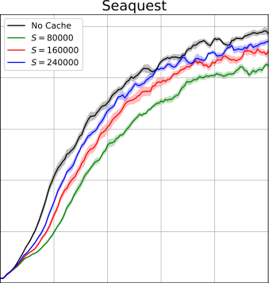


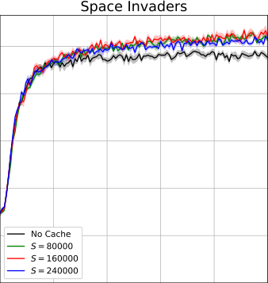


Figure 2: Ablation analysis of our caching method on Seaquest and Space Invaders. Using the
3 -step return with DQN for all experiments, we compared the scores obtained by caches of size
_S ∈{_ 80000 _,_ 160000 _,_ 240000 _}_ against a target-network baseline. As expected, the cache’s violation
of the _i.i.d._ assumption has a negative performance impact on Seaquest, but this can be mostly
recovered by increasing _S_ . Surprisingly, the trend is reversed for Space Invaders, indicating that
the cache’s sample correlations do not always harm performance. Because the target network is
impractical for computing _λ_ -returns, the cache is effective when _λ_ -returns outperform _n_ -step returns.


utilized variable _λ_ -values to adjust credit assignment according to the number of times a state has
been visited [ 34, 35 ] or a model of the _n_ -step return variance [ 16 ]. In our setting, where function
approximation is used to generalize across a high-dimensional state space, it is difficult to track
state-visitation frequencies and states might not be visited more than once. Alternatively, we propose
to select _λ_ -values based on their TD errors. One strategy we found to work well empirically is to
compute several different _λ_ -returns and then select the median return at each timestep. Formally, we
redefine _R_ _t_ _[λ]_ [= median(] _[R]_ _t_ _[λ]_ [=] [0] _[/]_ _[k]_ _, R_ _t_ _[λ]_ [=] [1] _[/]_ _[k]_ _, . . ., R_ _t_ _[λ]_ [=] _[k]_ _[/]_ _[k]_ ), where _k_ + 1 is the number of evenly spaced
candidate _λ_ -values. We used _k_ = 20 for all of our experiments; larger values yielded marginal
benefit. Median-based selection is appealing because it integrates multiple _λ_ -values in an intuitive
way and is robust to outliers that could cause destructive gradient updates. In Appendix C, we also
experimented with selecting _λ_ -values that bound the mean absolute error of each cache block, but we
found median-based selection to work better in practice.


**4** **Related work**


The _λ_ -return has been used in prior work to improve the sample efficiency of Deep Recurrent QNetwork (DRQN) for Atari 2600 games [ 8 ]. Because recurrent neural networks (RNNs) produce a
sequence of Q-values during truncated backpropagation through time, these precomputed values can
be exploited to calculate _λ_ -returns with little additional expense over standard DRQN. The problem
with this approach is its lack of generality; the Q-function is restricted to RNNs, and the length
_N_ over which the _λ_ -return is computed must be constrained to the length of the training sequence.
Consequently, increasing _N_ to improve credit assignment forces the training sequence length to be
increased as well, introducing undesirable side effects like exploding and vanishing gradients [ 3 ]
and a substantial runtime cost. Additionally, the use of a target network means _λ_ -returns must be
recalculated on every training step, even when the input sequence and Q-function do not change.
In contrast, our proposed caching mechanism only periodically updates stored _λ_ -returns, thereby
avoiding repeated calculations and eliminating the need for a target network altogether. This strategy
provides maximal flexibility by decoupling the training sequence length from the _λ_ -return length and
makes no assumptions about the function approximator. This allows it to be incorporated into any
replay-based algorithm and not just DRQN.


6


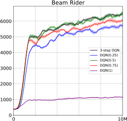


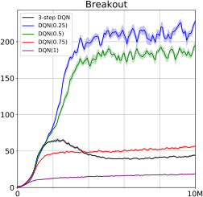


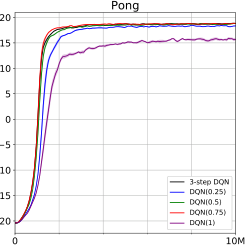


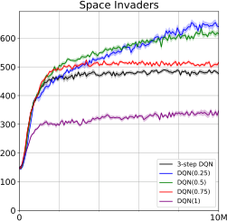


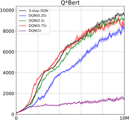

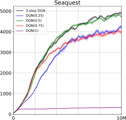

Figure 3: Sample efficiency comparison of DQN( _λ_ ) with _λ ∈{_ 0 _._ 25 _,_ 0 _._ 5 _,_ 0 _._ 75 _,_ 1 _}_ against 3 -step
DQN on six Atari games.


**5** **Experiments**


In order to characterize the performance of DQN( _λ_ ), we conducted numerous experiments on six
Atari 2600 games. We used the OpenAI Gym [ 4 ] to provide an interface to the Arcade Learning
Environment [ 2 ], where observations consisted of the raw frame pixels. We compared DQN( _λ_ )
against a standard target-network implementation of DQN using the 3 -step return, which was shown
to work well in [ 12 ]. We matched the hyperparameters and procedures in [ 25 ], except we trained the
neural networks with Adam [ 14 ]. Unless stated otherwise, _λ_ -returns were formulated as Peng’s Q( _λ_ ).


For all experiments in this paper, agents were trained for 10 million timesteps. An agent’s performance
at a given time was evaluated by averaging the earned scores of its past 100 completed episodes.
Each experiment was averaged over 10 random seeds with the standard error of the mean indicated.
Our complete experimental setup is discussed in Appendix A.


**Peng’s Q(** _λ_ **):** We compared DQN( _λ_ ) using Peng’s Q( _λ_ ) for _λ ∈{_ 0 _._ 25 _,_ 0 _._ 5 _,_ 0 _._ 75 _,_ 1 _}_ against the
baseline on each of the six Atari games (Figure 3). For every game, at least one _λ_ -value matched or
outperformed the 3 -step return. Notably, _λ ∈{_ 0 _._ 25 _,_ 0 _._ 5 _}_ yielded huge performance gains over the
baseline on Breakout and Space Invaders. This finding is quite interesting because _n_ -step returns have
been shown to perform poorly on Breakout [ 12 ], suggesting that _λ_ -returns can be a better alternative.


**Watkin’s Q(** _λ_ **):** Because Peng’s Q( _λ_ ) is a biased return estimator, we repeated the previous experiments using Watkin’s Q( _λ_ ). The results are included in Appendix E. Surprisingly, Watkin’s Q( _λ_ )
failed to outperform Peng’s Q( _λ_ ) on every environment we tested. The worse performance is likely
due to the cut traces, which slow credit assignment in spite of their bias correction.


**Directly prioritized replay and dynamic** _λ_ **selection:** We tested DQN( _λ_ ) with prioritization _p_ = 0 _._ 1
and median-based _λ_ selection on the six Atari games. The results are shown in Figure 4. In general,
we found that dynamic _λ_ selection did not improve performance over the best hand-picked _λ_ -value;
however, it always matched or outperformed the 3-step baseline without any manual _λ_ tuning.


**Partial observability:** In Appendix F, we repeated the experiments in Figure 4 but provided agents
with only a 1 -frame input to make the environments partially observable. We hypothesized that the
relative performance difference between DQN( _λ_ ) and the baseline would be greater under partial
observability, but we found that it was largely unchanged.


7


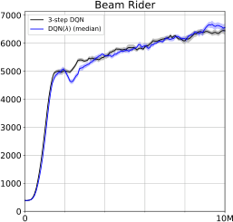


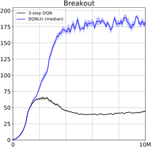


|20|Pong|
|---|---|
|5<br>0<br>5<br>10<br>15<br>20||
|5<br>0<br>5<br>10<br>15<br>20||
|5<br>0<br>5<br>10<br>15<br>20||
|5<br>0<br>5<br>10<br>15<br>20||
|5<br>0<br>5<br>10<br>15<br>20||
|15<br>10<br>||
|15<br>10<br>||
|~~0~~<br>20<br>3~~-~~step DQN<br>~~DQN( ) (med~~|3~~-~~step DQN<br>~~DQN( ) (med~~|


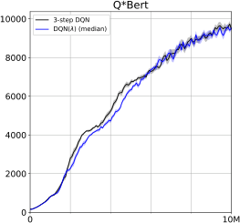

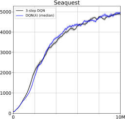

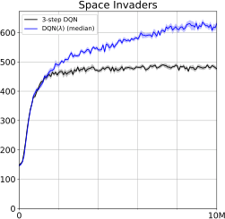

Figure 4: Sample efficiency comparison of DQN( _λ_ ) with prioritization _p_ = 0 _._ 1 and median-based
dynamic _λ_ selection against 3-step DQN on six Atari games.


**Real-time sample efficiency:** In certain scenarios, it may be desirable to train a model as quickly as
possible without regard to the number of environment samples. For the best _λ_ -value we tested on
each game in Figure 3, we plotted the score as a function of wall-clock time and compared it against
the target-network baseline in Appendix G. Significantly, DQN( _λ_ ) completed training faster than
DQN on five of the six games. This shows that the cache can be more computationally efficient than
a target network. We believe the speedup is attributed to greater GPU parallelization when computing
Q-values because the cache blocks are larger than a typical minibatch.


**6** **Conclusion**


We proposed a novel technique that allows for the efficient integration of _λ_ -returns into any offpolicy method with minibatched experience replay. By storing _λ_ -returns in a periodically refreshed
cache, we eliminate the need for a target network and enable offline analysis of the TD errors prior
to sampling. This latter feature is particularly important, making our method the first to directly
prioritize samples according to their actual loss contribution. To our knowledge, our method is also
the first to explore dynamically selected _λ_ -values for deep reinforcement learning. Our experiments
showed that these contributions can increase the sample efficiency of DQN by a large margin.


While our work focused specifically on _λ_ -returns, our proposed methods are equally applicable to any
multi-step return estimator. One avenue for future work is to utilize a lower-variance, bias-corrected
return such as Tree Backup [ 28 ], Q*( _λ_ ) [ 9 ], or Retrace( _λ_ ) [ 26 ] for potentially better performance.
Furthermore, although our method does not require asynchronous gradient updates, a multi-threaded
implementation of DQN( _λ_ ) could feasibly enhance both absolute and real-time sample efficiencies.
Our ideas presented here should prove useful to a wide range of off-policy reinforcement learning
methods by improving performance while limiting training duration.


**Acknowledgments**


We would like to thank the anonymous reviewers for their valuable feedback. We also gratefully
acknowledge NVIDIA Corporation for its GPU donation. This research was funded by NSF award
1734497 and an Amazon Research Award (ARA).


8


**References**


[1] Andrew G Barto, Richard S Sutton, and Charles W Anderson. Neuronlike adaptive elements that can solve
difficult learning control problems. _IEEE transactions on systems, man, and cybernetics_, 13(5):834–846,
1983.


[2] Marc G Bellemare, Yavar Naddaf, Joel Veness, and Michael Bowling. The arcade learning environment:
An evaluation platform for general agents. _Journal of Artificial Intelligence Research_, 47:253–279, 2013.


[3] Yoshua Bengio, Patrice Simard, and Paolo Frasconi. Learning long-term dependencies with gradient
descent is difficult. _IEEE transactions on neural networks_, 5(2):157–166, 1994.


[4] Greg Brockman, Vicki Cheung, Ludwig Pettersson, Jonas Schneider, John Schulman, Jie Tang, and
Wojciech Zaremba. OpenAI gym. _arXiv preprint arXiv:1606.01540_, 2016.


[5] Thomas Degris, Martha White, and Richard S Sutton. Off-policy actor-critic. _arXiv preprint_
_arXiv:1205.4839_, 2012.


[6] Yan Duan, Xi Chen, Rein Houthooft, John Schulman, and Pieter Abbeel. Benchmarking deep reinforcement
learning for continuous control. In _International Conference on Machine Learning_, pages 1329–1338,
2016.


[7] Shixiang Gu, Timothy Lillicrap, Ilya Sutskever, and Sergey Levine. Continuous deep q-learning with
model-based acceleration. In _International Conference on Machine Learning_, pages 2829–2838, 2016.


[8] Jean Harb and Doina Precup. Investigating recurrence and eligibility traces in deep Q-networks. _arXiv_
_preprint arXiv:1704.05495_, 2017.


[9] Anna Harutyunyan, Marc G Bellemare, Tom Stepleton, and Rémi Munos. Q( _λ_ ) with off-policy corrections.
In _International Conference on Algorithmic Learning Theory_, pages 305–320. Springer, 2016.


[10] Matthew Hausknecht and Peter Stone. Deep recurrent q-learning for partially observable mdps. In _2015_
_AAAI Fall Symposium Series_, 2015.


[11] Nicolas Heess, Srinivasan Sriram, Jay Lemmon, Josh Merel, Greg Wayne, Yuval Tassa, Tom Erez, Ziyu
Wang, Ali Eslami, Martin Riedmiller, et al. Emergence of locomotion behaviours in rich environments.
_arXiv preprint arXiv:1707.02286_, 2017.


[12] Matteo Hessel, Joseph Modayil, Hado Van Hasselt, Tom Schaul, Georg Ostrovski, Will Dabney, Dan
Horgan, Bilal Piot, Mohammad Azar, and David Silver. Rainbow: Combining improvements in deep
reinforcement learning. In _Thirty-Second AAAI Conference on Artificial Intelligence_, 2018.


[13] Leslie Pack Kaelbling, Michael L Littman, and Anthony R Cassandra. Planning and acting in partially
observable stochastic domains. _Artificial intelligence_, 101(1-2):99–134, 1998.


[14] Diederik P Kingma and Jimmy Ba. Adam: A method for stochastic optimization. _arXiv preprint_
_arXiv:1412.6980_, 2014.


[15] A Harry Klopf. Brain function and adaptive systems: a heterostatic theory. Technical report, AIR FORCE
CAMBRIDGE RESEARCH LABS HANSCOM AFB MA, 1972.


[16] George Konidaris, Scott Niekum, and Philip S Thomas. Td_gamma: Re-evaluating complex backups in
temporal difference learning. In _Advances in Neural Information Processing Systems_, pages 2402–2410,
2011.


[17] Guillaume Lample and Devendra Singh Chaplot. Playing FPS games with deep reinforcement learning. In
_AAAI_, pages 2140–2146, 2017.


[18] Sergey Levine, Chelsea Finn, Trevor Darrell, and Pieter Abbeel. End-to-end training of deep visuomotor
policies. _The Journal of Machine Learning Research_, 17(1):1334–1373, 2016.


[19] Sergey Levine, Peter Pastor, Alex Krizhevsky, Julian Ibarz, and Deirdre Quillen. Learning hand-eye
coordination for robotic grasping with deep learning and large-scale data collection. _The International_
_Journal of Robotics Research_, 37(4-5):421–436, 2018.


[20] Timothy P Lillicrap, Jonathan J Hunt, Alexander Pritzel, Nicolas Heess, Tom Erez, Yuval Tassa, David
Silver, and Daan Wierstra. Continuous control with deep reinforcement learning. _arXiv preprint_
_arXiv:1509.02971_, 2015.


[21] Long-Ji Lin. Self-improving reactive agents based on reinforcement learning, planning and teaching.
_Machine learning_, 8(3-4):293–321, 1992.


[22] Luke Metz, Julian Ibarz, Navdeep Jaitly, and James Davidson. Discrete sequential prediction of continuous
actions for deep rl. _arXiv preprint arXiv:1705.05035_, 2017.


[23] Piotr Mirowski, Razvan Pascanu, Fabio Viola, Hubert Soyer, Andrew J Ballard, Andrea Banino, Misha Denil, Ross Goroshin, Laurent Sifre, Koray Kavukcuoglu, et al. Learning to navigate in complex environments.
_arXiv preprint arXiv:1611.03673_, 2016.


9


[24] Volodymyr Mnih, Adria Puigdomenech Badia, Mehdi Mirza, Alex Graves, Timothy Lillicrap, Tim Harley,
David Silver, and Koray Kavukcuoglu. Asynchronous methods for deep reinforcement learning. In
_International Conference on Machine Learning_, pages 1928–1937, 2016.


[25] Volodymyr Mnih, Koray Kavukcuoglu, David Silver, Andrei A Rusu, Joel Veness, Marc G Bellemare,
Alex Graves, Martin Riedmiller, Andreas K Fidjeland, Georg Ostrovski, et al. Human-level control through
deep reinforcement learning. _Nature_, 518(7540):529, 2015.


[26] Rémi Munos, Tom Stepleton, Anna Harutyunyan, and Marc Bellemare. Safe and efficient off-policy
reinforcement learning. In _Advances in Neural Information Processing Systems_, pages 1054–1062, 2016.


[27] Jing Peng and Ronald J Williams. Incremental multi-step Q-learning. In _Machine Learning Proceedings_
_1994_, pages 226–232. Elsevier, 1994.


[28] Doina Precup. Eligibility traces for off-policy policy evaluation. _Computer Science Department Faculty_
_Publication Series_, page 80, 2000.


[29] Aravind Rajeswaran, Vikash Kumar, Abhishek Gupta, John Schulman, Emanuel Todorov, and Sergey
Levine. Learning complex dexterous manipulation with deep reinforcement learning and demonstrations.
_arXiv preprint arXiv:1709.10087_, 2017.


[30] Tom Schaul, Daniel Horgan, Karol Gregor, and David Silver. Universal value function approximators. In
_International conference on machine learning_, pages 1312–1320, 2015.


[31] Tom Schaul, John Quan, Ioannis Antonoglou, and David Silver. Prioritized experience replay. _arXiv_
_preprint arXiv:1511.05952_, 2015.


[32] David Silver, Aja Huang, Chris J Maddison, Arthur Guez, Laurent Sifre, George Van Den Driessche, Julian
Schrittwieser, Ioannis Antonoglou, Veda Panneershelvam, Marc Lanctot, et al. Mastering the game of go
with deep neural networks and tree search. _nature_, 529(7587):484–489, 2016.


[33] Richard S Sutton. Learning to predict by the methods of temporal differences. _Machine learning_, 3(1):9–44,
1988.


[34] Richard S Sutton and Andrew G Barto. _Reinforcement learning: An introduction_ . MIT press, 2nd edition,
2018.


[35] Richard S Sutton and Satinder P Singh. On step-size and bias in temporal-difference learning. In
_Proceedings of the Eighth Yale Workshop on Adaptive and Learning Systems_, pages 91–96. Citeseer, 1994.


[36] Richard Stuart Sutton. _Temporal credit assignment in reinforcement learning_ . PhD thesis, University of
Massachussetts, Amherst, 1984.


[37] John N Tsitsiklis and Benjamin Van Roy. Analysis of temporal-diffference learning with function approximation. In _Advances in neural information processing systems_, pages 1075–1081, 1997.


[38] Ziyu Wang, Victor Bapst, Nicolas Heess, Volodymyr Mnih, Remi Munos, Koray Kavukcuoglu, and Nando
de Freitas. Sample efficient actor-critic with experience replay. _arXiv preprint arXiv:1611.01224_, 2016.


[39] Christopher John Cornish Hellaby Watkins. _Learning from delayed rewards_ . PhD thesis, King’s College,
Cambridge, 1989.


10


**A** **Experimental setup**


All game frames were subjected to the same preprocessing steps described in [ 25 ]. We converted images to
grayscale and downsized them to 84 _×_ 84 pixels. Rewards were clipped to _{−_ 1 _,_ 0 _,_ +1 _}_ . For equal comparison,
we used the same convolutional neural network from [ 25 ] for all agents: three convolutional layers followed
by two fully connected layers. During training, _ϵ_ -greedy exploration was linearly annealed from 1 to 0.1 over
the first one million timesteps and then held constant. We trained the neural networks using Adam [ 14 ] with
_α_ = 10 _[−]_ [4], _β_ 1 = 0 _._ 9, _β_ 2 = 0 _._ 999, and _ϵ_ = 10 _[−]_ [4] .


Our chosen hyperparameters are shown in Table 1. The table is divided into two portions; the upper section
contains hyperparameters that are identical to those in [ 25 ] (although possibly denoted by a different symbol),
while the lower section contains new hyperparameters introduced in our work.


Table 1: Hyperparameters for DQN( _λ_ )


**Hyperparameter** **Symbol** **Value** **Description**


minibatch size M 32 Number of samples used to compute a single gradient descent step.


replay memory size 1000000 Maximum number of samples that can be stored in the replay
memory before old samples are discarded.


agent history length 4 Number of recent observations (game frames) simultaneously fed as input to the neural network.


refresh frequency _F_ 10000 Frequency, measured in timesteps, at which the target network is updated for DQN or the cache is rebuilt for DQN( _λ_ ).


discount factor _γ_ 0.99 Weighting coefficient that influences the importance of future
rewards.


replay start size _N_ 50000 Number of timesteps for which to initially execute a uniform
random policy and pre-populate the replay memory.


cache size _S_ 80000 Number of samples used to build the cache upon refresh.


block size _B_ 100 Atomic length of the sampled sequences that are promoted
into the cache upon refresh.


When sizing the cache for DQN( _λ_ ), we made sure that the number of minibatches per timestep (1:4 ratio) was
preserved for fair comparison. Specifically,


ps

_×_ [1 minibatch]
1 refresh


[32 sam][p][les]

1 minibatch [= 80000 sam] 1 refresh [p][les]


1 refresh


10000 timesteps


[1 minibatch] [32 sam][p][les]

4 timesteps _[×]_ 1 minibatch


Hence, we used _S_ = 80000 for all experiments. To help reduce bias when building the cache, we permitted
overlapping blocks. That is, we did not check for boundary constraints of nearby blocks, nor did we align
blocks to a fixed grid (in contrast to a real CPU cache). This meant that multiple copies of the same experience
might have existed in the cache simultaneously, but each experience therefore had the same probability of being
promoted.


11


**B** **Algorithm**


The standard implementation of DQN( _λ_ ) is given below in Algorithm 1. For clarity, enhancements such as
prioritized experience replay and dynamic _λ_ selection are not shown.


**Algorithm 1** DQN( _λ_ )


**function** BUILD  - CACHE ( _D_ )
Initialize empty list _C_
**for** 1 _,_ 2 _, . . .,_ _B_ _[S]_ **[do]**

Sample block (ˆ _s_ _k_ _, a_ _k_ _, r_ _k_ _,_ ˆ _s_ _k_ +1 ) _, . . .,_ (ˆ _s_ _k_ + _B−_ 1 _, a_ _k_ + _B−_ 1 _, r_ _k_ + _B−_ 1 _,_ ˆ _s_ _k_ + _B_ ) from _D_
_R_ _[λ]_ _←_ max _a_ _′_ _∈A_ _Q_ (ˆ _s_ _k_ + _B_ _, a_ _[′]_ ; _θ_ )
**for** _i ∈{k_ + _B −_ 1 _, k_ + _B −_ 2 _, . . ., k}_ **do**

_r_ _i_ if terminal(ˆ _s_ _i_ +1 )
_R_ _[λ]_ _←_
� _r_ _i_ + _γ_ [ _λR_ _[λ]_ + (1 _−_ _λ_ ) max _a_ _′_ _∈A_ _Q_ (ˆ _s_ _i_ +1 _, a_ _[′]_ ; _θ_ )] otherwise
Append tuple (ˆ _s_ _i_ _, a_ _i_ _, R_ _[λ]_ ) to _C_
**end for**

**end for**

**return** _C_

**end function**


Initialize replay memory _D_ with _N_ experiences
Initialize parameter vector _θ_ randomly
Initialize state ˆ _s_ 0 = _φ_ ( _o_ 0 )


**for** _t ∈{_ 0 _,_ 1 _, . . ., T −_ 1 _}_ **do**
**if** _t ≡_ 0 mod _F_ **then**
_C ←_ BUILD    - CACHE ( _D_ )
**for** 1 _,_ 2 _, . . .,_ _M_ _[S]_ **[do]**

Sample minibatch (ˆ _s_ _j_ _, a_ _j_ _, R_ _j_ _[λ]_ [) from] _[ C]_

2
Perform gradient descent step on � _R_ _j_ _[λ]_ _[−]_ _[Q]_ [(ˆ] _[s]_ _[j]_ _[, a]_ _[j]_ [;] _[ θ]_ [)] � with respect to _θ_
**end for**

**end if**

_a ∼_ _U_ ( _A_ ) with probability _ϵ_
Execute _a_ _t_ =
� argmax _a_ _′_ _∈A_ _Q_ (ˆ _s_ _t_ _, a_ _[′]_ ; _θ_ ) otherwise
Receive reward _r_ _t_ and new observation _o_ _t_ +1
Approximate state ˆ _s_ _t_ +1 = _φ_ ( _o_ 0 _, . . ., o_ _t_ +1 )
Store transition (ˆ _s_ _t_ _, a_ _t_ _, r_ _t_ _,_ ˆ _s_ _t_ +1 ) in _D_
**end for**


12


**C** **Dynamic** _λ_ **selection with bounded TD error**


We experimented with an alternative dynamic _λ_ selection method that bounds the mean absolute TD error of
each block when refreshing the cache. The squared error loss of DQN is known to be susceptible to large and
potentially destructive gradients; this originally motivated reward clipping when playing Atari 2600 games in

[ 25 ]. We hypothesized that bounding the error with dynamically selected _λ_ -values would help prevent learning
instability and improve sample efficiency.


Let _δ_ [¯] be our error bound (a hyperparameter), and let _L_ ( _λ_ ) = _B_ 1 � _Bi_ =0 _−_ 1 _[|][R]_ _i_ _[λ]_ _[−]_ _[Q]_ [(ˆ] _[s]_ _[i]_ _[, a]_ _[i]_ [;] _[ θ]_ [)] _[|]_ [ be the mean absolute]
TD error of the cache block being refreshed. Assuming that _L_ ( _λ_ ) increases monotonically with _λ_, our target
_λ_ -value can be defined as the following:


_λ_ _[∗]_ = argmax _L_ ( _λ_ ) subject to _L_ ( _λ_ ) _≤_ _δ_ [¯] and 0 _≤_ _λ ≤_ 1
_λ_


In practice, to efficiently find a _λ_ -value that approximately solves this equation, we conducted a binary search
with a maximum depth of 7. We also tested the extreme _λ_ -values ( _i.e._ _λ_ = 0 and _λ_ = 1 ) prior to the binary
search because we found that these often exceeded or satisfied the _δ_ [¯] constraint, respectively. This allowed our
procedure to sometimes return early and reduce the average runtime.


The results are given in Figure 5. While the final scores on Breakout and Space Invaders were improved over the
3 -step baseline, performance also decreased significantly on Beam Rider, Q*Bert, and Seaquest. For this reason,
we recommend the use of median-based dynamic _λ_ selection instead.


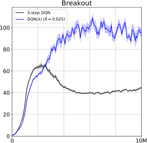


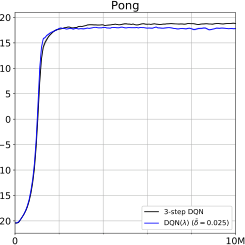


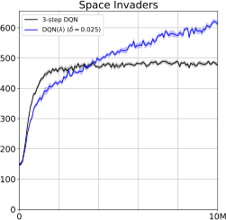


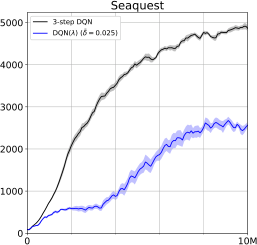

Figure 5: Sample efficiency comparison of DQN( _λ_ ) with prioritization _p_ = 0 _._ 1 and error-based
dynamic _λ_ selection against 3-step DQN on six Atari games. The mean absolute TD error of each
block was roughly bounded by _δ_ [¯] = 0 _._ 025 during the refresh procedure.


13


**D** **Derivation of recursive** _λ_ **-return calculation**


Suppose the agent experiences the finite trajectory ˆ _s_ _t_ _, a_ _t_ _, r_ _t_ _, . . .,_ ˆ _s_ _T −_ 1 _, a_ _T −_ 1 _, r_ _T −_ 1 _,_ ˆ _s_ _T_ . We wish to write _R_ _t_ _[λ]_
as a function of _R_ _t_ _[λ]_ +1 [. First, note the general recursive relationship between] _[ n]_ [-step returns:]


_R_ _k_ [(] _[n]_ [)] = _r_ _k_ + _γR_ _k_ [(] _[n]_ +1 _[−]_ [1)] (4)


Let _N_ = _T −_ _t_ . Starting with the definition of the _λ_ -return,


_R_ _t_ _[λ]_ [=] (1 _−_ _λ_ )
�


_N_ _−_ 1
� _λ_ _[n][−]_ [1] _R_ _t_ [(] _[n]_ [)] + _λ_ _[N]_ _[−]_ [1] _R_ _t_ [(] _[N]_ [)]


_n_ =1


�


= (1 _−_ _λ_ ) _R_ _t_ [(1)] + (1 _−_ _λ_ )
�


= (1 _−_ _λ_ ) _R_ _t_ [(1)] + (1 _−_ _λ_ )
�


_N_ _−_ 1
� _λ_ _[n][−]_ [1] _R_ _t_ [(] _[n]_ [)] + _λ_ _[N]_ _[−]_ [1] _R_ _t_ [(] _[N]_ [)]


_n_ =2


_N_ _−_ 1
� _λ_ _[n][−]_ [1] [�] _r_ _t_ + _γR_ _t_ [(] +1 _[n][−]_ [1)] � + _λ_ _[N]_ _[−]_ [1] [�] _r_ _t_ + _γR_ _t_ [(] +1 _[N]_ _[−]_ [1)] � [�] (5)

_n_ =2


�


= (1 _−_ _λ_ ) _R_ _t_ [(1)] + _λr_ _t_ + _γλ_ (1 _−_ _λ_ )
�


= (1 _−_ _λ_ ) _R_ _t_ [(1)] + _λr_ _t_ + _γλ_ (1 _−_ _λ_ )
�


= (1 _−_ _λ_ ) _R_ _t_ [(1)] + _λr_ _t_ + _γλR_ _t_ _[λ]_ +1

= _R_ _t_ [(1)] _−_ _λR_ _t_ [(1)] + _λr_ _t_ + _γλR_ _t_ _[λ]_ +1


_N_ _−_ 1
� _λ_ _[n][−]_ [2] _R_ _t_ [(] +1 _[n][−]_ [1)] + _λ_ _[N]_ _[−]_ [2] _R_ _t_ [(] +1 _[N]_ _[−]_ [1)]


_n_ =2


(6)
�


_N_ _−_ 2
� _λ_ _[n]_ _[′]_ _[−]_ [1] _R_ _t_ [(] +1 _[n]_ _[′]_ [)] [+] _[ λ]_ _[N]_ _[−]_ [2] _[R]_ _t_ [(] +1 _[N]_ _[−]_ [1)]


_n_ _[′]_ =1


(7)
�


= _R_ _t_ [(1)] _−_ _λ_ � _r_ _t_ + _γ_ max _a_ _[′]_ _∈A_ _[Q]_ [(ˆ] _[s]_ _[t]_ [+1] _[, a]_ _[′]_ [)] � + _λr_ _t_ + _γλR_ _t_ _[λ]_ +1

= _R_ _t_ [(1)] + _γλ_ � _R_ _t_ _[λ]_ +1 _[−]_ _a_ [max] _[′]_ _∈A_ _[Q]_ [(ˆ] _[s]_ _[t]_ [+1] _[, a]_ _[′]_ [)] � (8)


Equation (5) follows from the recursive relationship in Equation (4). Equation (6) follows from the telescoping
identity _λ_ = (1 _−_ _λ_ ) _λ_ + (1 _−_ _λ_ ) _λ_ [2] + _· · ·_ + (1 _−_ _λ_ ) _λ_ _[N]_ _[−]_ [2] + _λ_ _[N]_ _[−]_ [1] . In Equation (7), we let _n_ _[′]_ = _n −_ 1 to
obtain an expression for _R_ _t_ _[λ]_ +1 [. A sequence of] _[ λ]_ [-returns can be generated efficiently by repeatedly applying]
Equation (8). The recursion can be initialized using the fact that _R_ _T_ _[λ]_ [= max] _a_ _[′]_ _∈A_ _[Q]_ [(ˆ] _[s]_ _[T]_ _[, a]_ _[′]_ [)] [. If] [ ˆ] _[s]_ _[T]_ [is terminal,]
then max _a_ _′_ _∈A_ _Q_ (ˆ _s_ _T_ _, a_ _[′]_ ) = 0 by definition.


14


**E** **Watkin’s Q(** _λ_ **)**


Watkin’s Q( _λ_ ) is the simplest form of bias correction for Q-Learning with _λ_ -returns. Whenever a non-greedy
action is taken, _λ_ is set to 0, effectively performing a standard 1-step backup at the current timestep. This is
apparent from substituting _λ_ = 0 into Equation (3).


Watkin’s Q( _λ_ ) ensures that backups are conducted using greedy actions with respect to the Q-function, and
therefore all updates are on-policy. In theory, we would expect this to improve performance by increasing the
accuracy of return estimation, but our experiments in Figure 6 indicated otherwise. Although cutting traces to
correct bias is well motivated, the overall performance was still significantly hampered compared to Peng’s Q( _λ_ )
(which ignores bias correction). This suggests that long-term credit assignment is more important than bias
correction for the six games we tested.


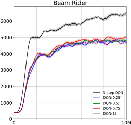


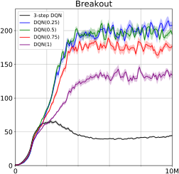


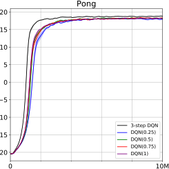


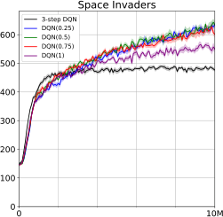


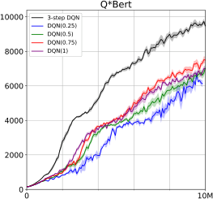

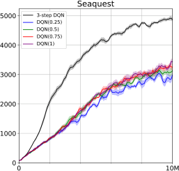

Figure 6: Comparison of DQN( _λ_ ) with _λ ∈{_ 0 _._ 25 _,_ 0 _._ 5 _,_ 0 _._ 75 _,_ 1 _}_ against 3 -step DQN on six Atari
games. The _λ_ -returns were formulated as Watkin’s Q( _λ_ ).


15


**F** **Partial observability**


Atari 2600 games are partially observable given a single game frame because the velocities of moving objects
cannot be deduced. We repeated our median-based dynamic _λ_ experiments under this condition (Figure 7). In
this case, _λ_ -returns can theoretically help resolve state uncertainty by integrating information across multiple
_n_ -step returns. The agents performed worse, as expected, but the relative results were qualitatively similar to
those of the fully observed experiments.


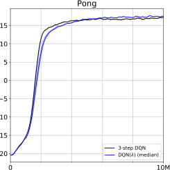

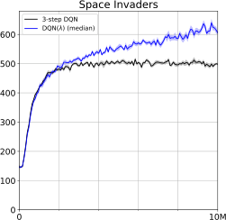


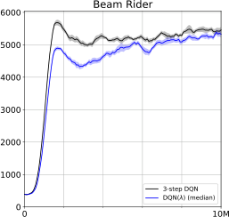


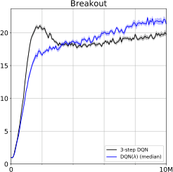


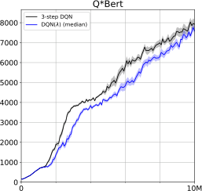

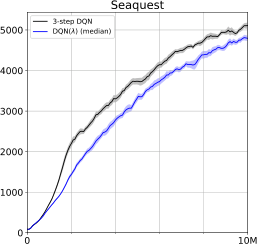

Figure 7: Sample efficiency comparison of DQN( _λ_ ) with prioritization _p_ = 0 _._ 1 and median-based
dynamic _λ_ selection against 3 -step DQN on six Atari games. Only a single frame at a time was
presented to the agent to make the games partially observable.


16


**G** **Real-time sample efficiency**


We compared DQN( _λ_ ) using each game’s best tested _λ_ -value against the 3 -step DQN baseline and plotted
the results as a function of elapsed time in hours (Figure 8). DQN( _λ_ ) and its cache-based sampling method
completed training faster than DQN on five of the six games, likely because the block size _B_ = 100 is larger
than the minibatch size _M_ = 32 and can be more efficiently executed on a GPU.


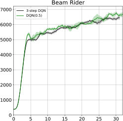


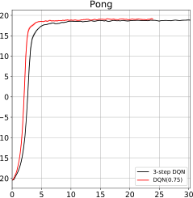


|3-step DQN|Breakout|
|---|---|
|0<br>50<br>100<br>150<br>200<br>3~~-~~step DQN<br>DQN(0.25)||
|0<br>50<br>100<br>150<br>200<br>3~~-~~step DQN<br>DQN(0.25)||
|0<br>50<br>100<br>150<br>200<br>3~~-~~step DQN<br>DQN(0.25)||
|0<br>50<br>100<br>150<br>200<br>3~~-~~step DQN<br>DQN(0.25)||
|0<br>50<br>100<br>150<br>200<br>3~~-~~step DQN<br>DQN(0.25)||


|3-step DQN<br>000 DQN(0.5)<br>000<br>000<br>000<br>000<br>0|Col2|
|---|---|
|0<br>000<br>000<br>000<br>000<br>000<br><br>3~~-~~step DQN<br>DQN(0.5)||
|0<br>000<br>000<br>000<br>000<br>000<br><br>3~~-~~step DQN<br>DQN(0.5)||
|0<br>000<br>000<br>000<br>000<br>000<br><br>3~~-~~step DQN<br>DQN(0.5)||
|0<br>000<br>000<br>000<br>000<br>000<br><br>3~~-~~step DQN<br>DQN(0.5)||
|0<br>000<br>000<br>000<br>000<br>000<br><br>3~~-~~step DQN<br>DQN(0.5)||


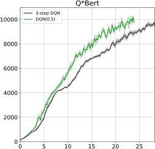

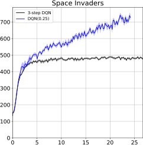

Figure 8: Real-time sample efficiency comparison of DQN( _λ_ ) with the best _λ_ -value in
_{_ 0 _._ 25 _,_ 0 _._ 5 _,_ 0 _._ 75 _,_ 1 _}_ against 3 -step DQN on six Atari games. The horizontal axis indicates wallclock time in hours.


17


