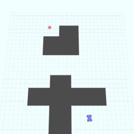
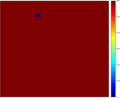
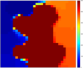
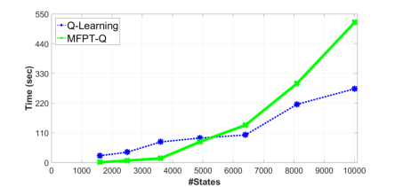
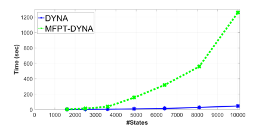
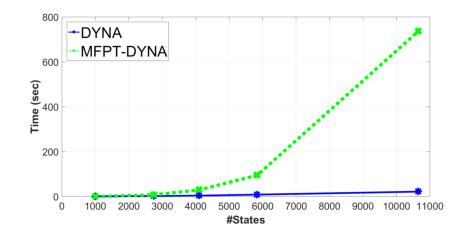
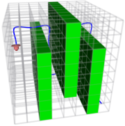
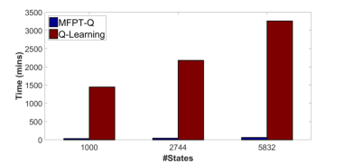

## **Accelerating Goal-Directed Reinforcement Learning by Model** **Characterization**

Shoubhik Debnath [1], Gaurav Sukhatme [2], Lantao Liu [3]

_**Abstract**_ **— We propose a hybrid approach aimed at im-**
**proving the sample efficiency in goal-directed reinforcement**
**learning. We do this via a two-step mechanism where firstly, we**
**approximate a model from Model-Free reinforcement learning.**
**Then, we leverage this approximate model along with a notion**
**of reachability using Mean First Passage Times to perform**
**Model-Based reinforcement learning. Built on such a novel**
**observation, we design two new algorithms - Mean First**
**Passage Time based Q-Learning (MFPT-Q) and Mean First**
**Passage Time based DYNA (MFPT-DYNA), that have been**
**fundamentally modified from the state-of-the-art reinforcement**
**learning techniques. Preliminary results have shown that our**
**hybrid approaches converge with much fewer iterations than**
**their corresponding state-of-the-art counterparts and therefore**
**requiring much fewer samples and much fewer training trials**
**to converge.**

I. INTRODUCTION

Reinforcement Learning (RL) has been successfully applied
to numerous challenging problems for autonomous agents to
behave intelligently in unstructured real-world environment.
One interesting area of research in RL which motivates
this work is goal-directed reinforcement learning problem
(GDRLP) [1] [2]. In GDRLP, the learning process takes place
in two stages. The first stage focuses on solving the goaldirected exploration problem (GDEP) which allows an agent
to determine a viable path from an initial state to a goal state
in an unknown or only partially known state space. The path
found in this stage need not be the optimal one. In the second
stage, the agent takes advantage of the previously learned
knowledge to optimize the path to the goal state. The two
stages iterate in order to converge to the action policy.
RL methods are generally divided into Model-Free (MF)
and Model-Based (MB) approaches. MF methods can learn
complex policies with minimal feature and policy engineering
work. However, the convergence of such methods might
require millions of trials and hence they are sample inefficient

[3] [4]. MB methods require much smaller number of realworld trials to converge but need an accurate model of realworld physical system and the environment which might be
challenging to obtain [5]. Also, relying on an accurate model

1Shoubhik Debnath is with NVIDIA Corporation, Santa Clara, CA 95051,
USA. E-mail: sdebnath@nvidia.com
2Gaurav Sukhatme is with the Department of Computer Science at the
University of Southern California, Los Angeles, CA 90089, USA. E-mail:
gaurav@usc.edu
3Lantao Liu is with the Intelligent Systems Engineering Department at
Indiana University - Bloomington, Bloomington, IN 47408, USA. E-mail:
lantao@iu.edu
The paper was published in 2018 IEEE/RSJ International Conference on
Intelligent Robots and Systems (IROS).

can be problematic because small glitches on the model may
lead to catastrophic consequences.
In this paper, we leverage the benefits of both approaches

- MB and MF, with an aim to improve the sample efficiency
during the training process. We achieve this via a two-step
iterative learning mechanism. In the first step, we learn an
approximate model of the physical system using an MF
scheme. Note that, our approach does not need to construct
an accurate model, instead a rough model with little cost is
sufficient which is used to characterize the structure of the
problem. In the second step, we leverage this approximate
model along with the notion of reachability using Mean First
Passage Times (MFPT) where the result is used to guide
following MF exploration and learning.
**Contribution:** The main contributions of our work are:

_•_ We propose a hybrid RL approach that introduces a
model-based characterization into the state-of-the-art RL

algorithms to improve sample-efficiency.

_•_ The model-based characterization is achieved via a

model-based RL algorithm that is robust to an approximate model for learning complex policies.

We demonstrate our proposed method on two tasks related
to the path-planning domain in 2D and 3D simulation
environments respectively. The goal of the agent in both
tasks is to learn an optimal policy to reach a goal state from
a given start location. Our results show that the proposed
hybrid algorithms with model-based characterization were
able to learn the optimal policy in very few trials, thereby
improving the sample efficiency and accelerating the learning

process.

II. RELATED WORK

Earlier works have demonstrated various approaches to
solve goal-directed reinforcement learning problem. Braga
et al. presented a solution to solve GDRLP for an indoor
unknown environment. Firstly, using temporal difference
learning method, they find an initial solution to reach the goal
and then improve upon the initial solution by employing a
variable learning rate [1]. Several earlier works also focused
on goal-directed exploration as it provides insight into the
corresponding RL problems. It has been proved that goaldirected exploration with RL methods can be intractable,
therefore demonstrating that solving RL problems can be
intractable as well [6]. This work also presented that the
behavior of an agent followed a random walk until it reached
the goal for the first time. Koenig et al. also studied the
effect of representation and knowledge on the tractability of
goal-directed exploration with RL algorithms [2]. However,

in our work, the primary focus is on the second stage of
GDRLP, where the aim is to accelerate the convergence to
optimal policy via model characeterization.

MF approaches in reinforcement learning can learn complex
policies but requires many trials to converge. The most
widely used model-free reinforcement learning might be
the Q-Learning [7] which is detailed in the next section.
Another model-free learning algorithm similar to Q-Learning
is SARSA [8]. The main difference between SARSA and QLearning is that SARSA agent learns the action-value function
by following the policy it learned, while Q-Learning agent
learns the action-value function by following an exploitation
policy owing to the exploration/exploitation trade-off. On the
other hand, MB approaches can generalize to new tasks and
environments in fewer trials, however, an accurate model is
necessary. We recently also investigated reachability heuristics
and showed that computational performance for standard and
accurate MDP models can be improved [9].

Another interesting research direction focused on reducing
the size of problem space in MB approaches. Boutilier et al.
proposed structured reachability analysis of MDPs in order to
remove variables from problem description, thereby reducing
the size of MDP and eventually making it easier to solve [10].
It is therefore very intuitive to investigate approaches that
combine the advantages of MF and MB methods [11] [12].
There have also been multiple previous works that combined
the two paradigms. The primary objective of such methods
were to speed-up the learning process for MF reinforcement
learning approaches. A broad area of research including the
DYNA framework [13] [14] leveraged a learned model to
generate synthetic experience for MF learning.

Along similar direction, several prior works focused on
devising a model as an initialization for MF component

[15] [16]. One of the challenges that this leads to is the
inaccuracies in the model which cause the issue of model

bias. A suggested solution to overcome model bias is to
directly train the dynamics in a goal-oriented manner [17]

[18]. Our work is also motivated from this approach in order
to deal with model bias.

Unlike prior works on combining MB and MF reinforcement learning methods, we integrate the benefits of both
approaches - MB and MF, with an aim to improve the sample
efficiency during the training process. The primary objective
in this work is to incorporate a model-based characterization
using MFPT into a reinforcement learning algorithm (modelfree approaches like Q-Learning or RL frameworks like
DYNA), so that the characterization result can be used to
guide following MF exploration and learning. Our approach
differs from existing hybrid models in that, the method does
not need to construct an accurate model, and a rough model
with little cost is enough for capturing high-level features.
By comparing with state-of-the-art baseline approaches, our
evaluations reveal that the proposed hybrid algorithms are able
to learn optimal policy in very few trials with high sample
efficiency, and have significantly accelerated the practical
learning process.

where _γ_ is a reward discounting parameter. The stopping
criteria for the algorithm is when the values calculated on two
consecutive iterations are close enough, i.e., max _s∈S |V_ ( _s_ ) _−_
_V_ _[′]_ ( _s_ ) _| ≤_ _ϵ_, where _ϵ_ is an optimization tolerance/threshold
value, which determines the level of convergence accuracy.
Relevant to this work, the _prioritized sweeping_ mechanism
is an important heuristic-based approach for efficiently solving
MDPs in order to further speed up the value iteration process

[20]. This heuristic evaluates each state and obtains a score
based on the state’s contribution to the convergence, and then
prioritizes/sorts all states based on their scores (e.g., those
states with larger difference in value between two consecutive
iterations will get higher scores) [21], [22]. Then immediately
in the next dynamic programming iteration, evaluating the
value of states follow the newly prioritized order.
Given a model, methods proposed for solving MDPs can be
easily extended to the context of MB learning methods [23].
The model-based characterization in our proposed approach
is also built on top of this notion.

_B. Model-Free Reinforcement Learning_

Model-free reinforcement learning aims at learning a policy
without learning a model. The most widely used modelfree reinforcement learning might be the Q-Learning [7],
which is a special algorithm of the Temporal Difference
(TD) learning [24]. This approach is able to compare the
expected utility of the available actions at a given state without
requiring a model of the environment. To learn the expected
utility of taking a given action _a_ in a given state _s_, it learns

III. PRELIMINARIES

_A. Model-Based Reinforcement Learning_

Model-Based reinforcement learning needs to first build
a model, and then use it to derive a policy. The underlying
mechanism is Markov Decision Process (MDP), which is a
tuple _M_ = ( _S, A, T, R_ ), where _S_ = _{s_ 1 _, · · ·, sn}_ is a set of
states and _A_ = _{a_ 1 _, · · ·, an}_ is a set of actions. The state
transition function _T_ : _S × A × S →_ [0 _,_ 1] is a probability
function such that _Ta_ ( _s_ 1 _, s_ 2) is the probability that action
_a_ in state _s_ 1 will lead to state _s_ 2, and _R_ : _S × A →_ R
is a reward function where _Ra_ ( _s, s_ _[′]_ ) returns the immediate
reward received on taking action _a_ in state _s_ that will lead
to state _s_ _[′]_ . A _policy_ is of the form _π_ = _{s_ 1 _→_ _a_ 1 _, s_ 2 _→_
_a_ 2 _, · · ·, sn →_ _an}_ . We denote _π_ [ _s_ ] as the action associated
to state _s_ . If the policy of a MDP is fixed, then the MDP
behaves as a Markov chain [19].
To solve an MDP, the most widely used approach should
be value iteration (VI). The VI is an iterative procedure that
calculates the value (or utility in some literature) of each
state _s_ based on the values of the neighbouring states that
_s_ can directly transit to. The value _V_ ( _s_ ) of state _s_ at each
iteration can be calculated by the Bellman equation shown
below

_V_ ( _s_ ) = max
_a∈A_

� _Ta_ ( _s, s_ _[′]_ )� _Ra_ ( _s, s_ _[′]_ ) + _γV_ ( _s_ _[′]_ )� _,_ (1)

_s_ _[′]_ _∈S_

(a) (b)

(c) (d) (e) (f)

Fig. 1. (a) Demonstration of simulation environment, with the agent’s
initial state (blue) and the goal state (red). Grey blocks are obstacles; _̸_
(b) Converged optimal policy (red arrows) and a trajectory completed
by the agent to reach the goal.; (c)-(f) Evolution of reachability
landscapes.

_̸_ _̸_

a action-value function _Q_ ( _s, a_ ). The Q-Learning rule is

_Q_ ( _s, a_ ) = _Q_ ( _s, a_ ) + _α_ ( _r_ + _γ_ max
_a_ _[′]_ _∈A_ _[Q]_ [(] _[s][′][, a][′]_ [)] _[ −]_ _[Q]_ [(] _[s, a]_ [))] _[,]_ [ (2)]

where, < _s, a, r, s_ _[′]_ - is an experience tuple, _α_ is the learning
rate, and _γ_ is the discount factor. After the action-value
function is learned, the optimal policy can be constructed by
greedily selecting the action with the highest action-value in
each state.

_C. Synthesis of Model-based and Model-free_

There are several frameworks that integrate the modelbased and model-free paradigms, with the most well known
architecture probably being DYNA [13], [14]. DYNA exploits
a middle ground, yielding strategies that are both more
effective than model-free learning and more computationally
efficient than the certainty-equivalence approach. DYNA
architecture comprises of two phases. In the first phase, the
agent carries out actions in the environment and performs
regular reinforcement learning to learn value function and
adjust the policy. It also uses the real experience to explicitly
build up the transition model _T_ and/or the reward function _R_
associated with the environment. The second phase involves
planning updates where simulated experiences are used to
update policy and value function.

_D. Mean First Passage Times_

Before we elaborate on what we mean by model characterization in our work, we will describe a key concept called
Mean First Passage Times (MFPT).
The _first passage time (FPT)_, _Tij_, is defined as the number
of state transitions involved in reaching states _sj_ when started
in state _si_ for the first time. The _mean first passage time_
_(MFPT)_, _µij_ from state _si_ to _sj_ is the expected number of
hopping steps for reaching state _sj_ given initially it was in

state _si_ [25]. The MFPT analysis is built on the Markov chain,
and has nothing to do with the agent’s actions. Remember
that, when a MDP is associated to a fixed policy, it then
behaves as a Markov chain [19].
Formally, let us define a Markov chain with _n_ states and
transition probability matrix, _p ∈_ IR _[n,n]_ . If the transition
probability matrix is regular, then each MFPT, _µij_ = _E_ ( _Tij_ ),
satisfies the below conditional expectation formula:

_E_ ( _Tij_ ) = � _E_ ( _Tij|Bk_ ) _pik,_ (3)

_k_

where, _pik_ represents the transition probability from state
_si_ to _sk_, and _Bk_ is an event where the first state transition
happens from state _si_ to _sk_ . From the definition of mean first
passage times, we have, _E_ ( _Tij|Bk_ ) = 1 + _E_ ( _Tkj_ ). So, we
can rewrite Eq. (3) as follows

_̸_

_̸_ _̸_

_pik_ + �

_k_ _k_ = _̸_

_̸_ _̸_

_E_ ( _Tij_ ) = �

_̸_

_̸_ _̸_

� _E_ ( _Tkj_ ) _pik._ (4)

_k_ = _̸_ _j_

_̸_ _̸_

_̸_

Since, [�] _k_ _[p][ik]_ [ = 1, Eq.][ (4)][ can be formulated as per the]

below equation:

_̸_ _̸_

_̸_

_µij_ = 1+�

_̸_ _̸_

_̸_

� _pik∗µkj_ _⇒_ �

_k_ = _̸_ _j_ _k_ = _̸_ _j_

_̸_

� _pik∗µkj_ _−µij_ = _−_ 1 _,_ (5)
_̸_ _k_ = _̸_ _j_

_̸_

_̸_ _̸_

Solving all MFPT variables can be viewed as solving a system
of linear equations

_p_ 11 _−_ 1 _p_ 12 _.._ _.._ _p_ 1 _n_ _µ_ 1 _j_ _−_ 1

     _−_ 

_̸_

_̸_ _̸_









_̸_

_̸_ _̸_



_̸_

_̸_ _̸_


 _._



_̸_

_̸_ _̸_









_̸_

_̸_ _̸_

_µ_ 1 _j_

_µ_ 2 _j_

_.._

_.._

_µnj_

_̸_

_̸_ _̸_



_̸_

_̸_ _̸_


 =



_̸_

_̸_ _̸_









_̸_

_̸_ _̸_

_−_ 1

_−_ 1

_.._

_.._

_−_ 1

_̸_

_̸_ _̸_







_̸_

_̸_ _̸_

_p_ 11 _−_ 1 _p_ 12 _.._ _.._ _p_ 1 _n_
_p_ 21 _p_ 22 _−_ 1 _.._ _.._ _p_ 2 _n_

_.._ _.._ _.._ _.._ _.._

_.._ _.._ _.._ _.._ _.._

_pn_ 1 _pn_ 2 _.._ _.._ _pnn −_ 1

_̸_

_̸_ _̸_

(6)
The values _µ_ 1 _j_, _µ_ 2 _j_, _...._, _µnj_ represents the MFPTs calculated
for state transitions from states _s_ 1, _s_ 2, _...._, _sn_ to _sj_ and
_µjj_ = 0. To solve above equation, efficient decomposition
methods [26] may help to avoid a direct matrix inversion.

IV. TECHNICAL APPROACH

In this work, we are interested in goal-directed autonomy,
where the agent is specified with a goal or terminal state to
arrive. Note, a Markov system is defined as _absorbing_ if from
every non-terminal state it is possible to eventually enter a
goal state [27]. We restrict our attention to absorbing Markov
systems so that the agent finally terminates at a goal.

_A. Reachability Characterization using Mean First Passage_

_Times_

The notion of MFPT allows us to define the _reachability_
of a state. By “reachability of a state" we mean that based
on current fixed policy, how hard it is for the agent to transit
from the current state to the given goal/absorbing state. With
all MFPT values _µij_ obtained, we can construct a _reachability_
_landscape_ which is essentially a “map" measuring the _degree_
_of difficulty_ of all states transiting to the goal.
Fig. 1 shows a series of landscapes represented in heatmap
in our simulated environment. The values in the heatmap

range from 0 (cold color) to 600 (warm color). In order to
better visualize the low MFPT spectrum that we are most
interested, any value greater than 600 has been clipped to 600.
Fig. 1(c)-1(f) show the change of landscapes as the learning
algorithm proceeds. Initially, all states except the goal state
are initialized as unreachable, as shown by the high MFPT
color in Fig. 1(c).
We observe that the reachability landscape conveys very
useful information on potential impacts of different states.
More specifically, **a state with a better reachability**
**(smaller MFPT value) is more likely to make a larger**
**change during the MDP convergence procedure, leading**
**to a bigger convergence step.** With such observation and
the new metric, we can design state prioritization schemes for
Value Iteration that we will use in our proposed approaches.

**Algorithm 1:** Mean First Passage Time based Q-Learning
(MFPT-Q)

**1** Given states _S_, actions _A_, discount factor _γ_, learning rate _α_
and goal state _s_ _[∗]_, calculate the optimal policy _π_

**2 while** _true_ **do**

**3** Select state _s_ at random

**4** Choose action _a_ based on _ϵ_ -greedy

**5** Execute _a_ at state _s_ and get _s_ _[′]_, _r_

**6** Perform one-step tabular Q-Learning:
_Q_ ( _s, a_ ) = _Q_ ( _s, a_ ) + _α_ [ _r_ + _γ_ max _a′ Q_ ( _s_ _[′]_ _, a_ _[′]_ ) _−_ _Q_ ( _s, a_ )]

**7** Update model details: transition probability _Ta_ ( _s, s_ _[′]_ ) and
reward _Ra_ ( _s, s_ _[′]_ ) based on count statistics

**8** **while** _true_ **do**

**9** _V_ = _V_ _[′]_

**10** Calculate MFPT values _µ_ 1 _s_ _[∗]_, _µ_ 2 _s_ _[∗]_, _· · ·_, _µ|S|s∗_ by
solving the linear system as shown in Eq. (6)

**11** List _L_ := Sorted states with increasing order of MFPT
values

**12** **foreach** _state s in L_ **do**

**13** Compute value update at each state _s_ given policy
_π_ : _Q_ ( _s, a_ ) =
� _∀_ _[′]_ _S_ _[T][a]_ [(] _[s, s][′]_ [)] _Ra_ ( _s, s_ _[′]_ ) + _γV_ ( _s_ _[′]_ )

_∀s_ _[′]_ _∈S_ _[T][a]_ [(] _[s, s][′]_ [)] � _Ra_ ( _s, s_ _[′]_ ) + _γV_ ( _s_ _[′]_ )�

_V_ _[′]_ ( _s_ ) = max _a∈A Q_ ( _s, a_ )

**14** **if** max _si |V_ ( _si_ ) _−_ _V_ _[′]_ ( _si_ ) _| ≤_ _ϵ_ **then**

**15** break

_B. Mean First Passage Time based Q-Learning (MFPT-Q)_

Classic Q-Learning converges to the optimal solution
through the Q-Learning rule as shown in Eq. (2), which
essentially learns the state-action value function _Q_ ( _s, a_ ) that
represents the expected utility of the available actions at a
given state.
Our proposed hybrid algorithm, MFPT-Q, performs two
main operations involving a model-free and a model-based update every iteration. Firstly, given an experience < _s, a, r, s_ _[′]_ >,
it builds an approximate model by updating the transition
function _Ta_ ( _s, s_ _[′]_ ) and reward function _Ra_ ( _s, s_ _[′]_ ). To update
_Ta_ ( _s, s_ _[′]_ ), it uses the _count statistics_ which basically refers to
the count of transitions occurring from state _s_ to _s_ _[′]_ followed
by normalization between 0 and 1.

The second step leverages the approximate model computed
earlier to perform a model-based update using MFPT-VI
algorithm (See lines 8-15 of Alg. 1). The MFPT-VI method
is built on a metric using the reachability (MFPT values)
since, the reachability characterization of each state reflects
the potential impact/contribution of this state. Hence, such
characterization provides a natural basis for state prioritization
while performing a version of value-iteration for Q values
during model-based update.
Note that, since the MFPT computation is relatively
expensive, and the purpose of using MFPT is to characterize
global and general (instead of fine) features of all states, thus
it is not necessary to compute the MFPT at every iteration, but
rather after every few iterations. For those iterations between
two adjacent MFPT updates, the value of all states converge
from a “local refinement" perspective. The computational
process of MFPT-Q is pseudo-coded in Alg. 1.

**Algorithm 2:** Mean First Passage Time based DYNA
(MFPT-DYNA)

**1** Given states _S_, actions _A_, discount factor _γ_, learning rate _α_
and goal state _s_ _[∗]_, calculate the optimal policy _π_

**2 while** _true_ **do**

**3** Select state _s_ at random

**4** Choose action _a_ based on _ϵ_ -greedy

**5** Execute _a_ at state _s_ and get _s_ _[′]_, _r_ (real experience)

**6** Perform one-step tabular Q-Learning:
_Q_ ( _s, a_ ) = _Q_ ( _s, a_ ) + _α_ [ _r_ + _γ_ max _a′ Q_ ( _s_ _[′]_ _, a_ _[′]_ ) _−_ _Q_ ( _s, a_ )]

**7** Update model details: transition probability _Ta_ ( _s, s_ _[′]_ ) and
reward _Ra_ ( _s, s_ _[′]_ ) based on count statistics

**8** i _→_ 0

**9** **while** _i < N_ **do**

**10** _s_ is a randomly allocated previously observed state

**11** _a_ is a random action previously carried out in s

**12** Produce simulated experience to get _s_ _[′]_, _r_

**13** _Q_ ( _s, a_ ) = _Q_ ( _s, a_ )+ _α_ [ _r_ + _γ_ max _a′ Q_ ( _s_ _[′]_ _, a_ _[′]_ ) _−Q_ ( _s, a_ )]

**14** **while** _true_ **do**

**15** _V_ = _V_ _[′]_

**16** Calculate MFPT values _µ_ 1 _s_ _[∗]_, _µ_ 2 _s_ _[∗]_, _· · ·_, _µ|S|s∗_ by
solving the linear system as shown in Eq. (6)

**17** List _L_ := Sorted states with increasing order of MFPT
values

**18** **foreach** _state s in L_ **do**

**20** **if** max _si |V_ ( _si_ ) _−_ _V_ _[′]_ ( _si_ ) _| ≤_ _ϵ_ **then**

**21** break

_C. Mean First Passage Time based DYNA (MFPT-DYNA)_

Classic DYNA architecture balances between real and

simulated experience to speed up the training process. As
mentioned earlier, the agent learns a value function and
updates the policy using both sets of experiences. In addition,
the agent also learns a model of the environment using real
experiences. This notion of learned model in DYNA makes
it intuitive and easier to integrate our proposed model-based

**19** Compute value update at each state _s_ given policy
_π_ : _Q_ ( _s, a_ ) =
� _∀_ _[′]_ _S_ _[T][a]_ [(] _[s, s][′]_ [)] _Ra_ ( _s, s_ _[′]_ ) + _γV_ ( _s_ _[′]_ )

_∀s_ _[′]_ _∈S_ _[T][a]_ [(] _[s, s][′]_ [)] � _Ra_ ( _s, s_ _[′]_ ) + _γV_ ( _s_ _[′]_ )�

_V_ _[′]_ ( _s_ ) = max _a∈A Q_ ( _s, a_ )

characterization. Here we further extend this framework and

propose an upgraded hybrid algorithm - Mean First Passage
Time based DYNA (MFPT-DYNA).
Remember that the classic DYNA algorithm includes two
steps involving real experience and simulated experience.
For the simulated experience, we employ the classic DYNA
procedure where the simulation performs _N_ additional
updates, i.e., it chooses _N_ state-action pairs at random and
update state-action values according to the rule mentioned in
Eq. (2). (See lines 9-13 of Alg. 2.)
Different from the standard DYNA mechanism, our MFPTDYNA utilizes the real experience < _s, a, r, s_ _[′]_ - to build the
approximate model by updating state-action values according
to the rule mentioned in Eq. (2). Again, for updating _Ta_ ( _s, s_ _[′]_ ),
it increments the _count statistics_ for the transitions occurring
from state _s_ to _s_ _[′]_ followed by normalization between 0 and
1. It updates the _Ra_ ( _s, s_ _[′]_ ) based on the reward _r_ received
for taking action _a_ in state _s_ .
Analogous to the one mentioned in case of MFPT-Q, we
propose a model-based update using MFPT-VI algorithm.
The MFPT-VI algorithm leverages the approximate model
(represented by the transition and reward function) computed
earlier to perform a version of the value-iteration update for
_Q_ values as shown in lines 14-21 of Alg. 2.
One advantage of this framework is the introduction of
model-based characterization by MFPT-VI. MFPT-VI very
well assesses the importance of states based on their MFPT
values and thus provides a natural basis for effectively
prioritizing states while updating state-action _Q_ values. This
mechanism towards updating state-action _Q_ values allow the
algorithm to converge with a very small number of iterations,
which practically decrease the overall training time by a
significant margin. The evaluation details are presented in
Section V.

_D. Time Complexity Analysis_

Q-Learning and DYNA have a sample complexity
_O_ ( _|S|_ log _|S|_ ), where _|S|_ denotes the number of states in
order to obtain a policy arbitrarily close to the optimal one
with high probability [28] [29]. Calculation of the MFPT
needs to solve a linear system that involves matrix inversion
(the matrix decomposition has a time complexity of _O_ ( _|S|_ [2] _[.]_ [3] )
if state-of-the-art algorithms are employed [26], given that
the size of matrix is the number of states _|S|_ ). Therefore, for
each iteration, the worst-case time complexity for both the
MFPT-Q and MFPT-DYNA algorithms is _O_ ( _|S|_ [2] _[.]_ [3] ). Note,
in practical applications, since the expensive MFPT is used
for summerizing global features, this part is usually used
sparsely (less frequently) which also saves much time for
computation.

V. EXPERIMENTAL RESULTS

In this section, we compare the performance of our proposed MFPT-Q and MFPT-DYNA with their corresponding
baseline methods - Q-Learning and DYNA respectively. More
importantly, through the comparison, we wish to demonstrate
that our proposed feature characterization mechanism can be

(a) (b)

Fig. 2. (a) Demonstration of simulation environment, with the
agent’s initial state (pink) and the goal state (red). Green blocks are
obstacles; (b) A trajectory (blue) completed by the agent to reach
the goal.

used as a module to existing other popular frameworks (not
limited to Q or DYNA) in order to further speed up their
practical learning processes.

_A. Experimental Setting_

_**Task Details**_ _:_ We validated our method through numerical
evaluations with two types of simulation suites running on a
Linux machine.

For the first task, we developed a simulator in C++ using
OpenGL. To obtain the discrete MDP states, we tessellate
the agent’s workspace into a 2D grid map, and represent
the center of each grid as a state. In this way, the state
hopping between two states represents the corresponding
motion in the workspace. Each non-boundary state has a total
of nine actions, i.e., a non-boundary state can move in the
directions of N, NE, E, SE, S, SW, W, NW, plus an idle
action returning to itself. A demonstration is shown in Fig. 1.
Such environmental setting allows us to better visualize the
characterized reachability landscape, with a small number of
states in 2D space.
For the second task, we developed a simulator in C++ using
ROS and Rviz [30]. The agent’s workspace is partitioned into
a 3D voxel map where the center of each voxel denotes a MDP
state. Each non-boundary state has a total of seven actions, i.e.,
a non-boundary state can move in the directions of N, E, S, W,
TOP, BOTTOM plus an idle action returning to itself. Such
a 3D environment setting is more complex compared to the
2D setting. Moreover, it can be leveraged to simulate various
robotic path-planning application scenarios like quadrotor
trajectory planning and demonstrate the practicality of our
proposed algorithms for such tasks. A demonstration of the
agent flying in the 3D simulation environment is shown in
Fig. 2.
In both tasks, the objective of the agent is to reach a goal
state from an initial start location in the presence of obstacles.
The reward function for both setups is represented as high
positive reward at the goal state and -1 for other states. All
experiments were performed on a laptop computer with 8GB
RAM and 2.6 GHz quad-core Intel i7 processor.

(a) (b)

(c) (d)

Fig. 3. Statistics of computational time and number of iterations required to converge between the baseline methods and our proposed
algorithms, with changing numbers of states ( _x_ -axis) in the 2D simulation environment. (a) and (c) Variants of Q-Learning methods. (b)
and (d) DYNA variants. The thick green curve in two figures is the result of MFPT-based hybrid models.

_**Evaluation Methods**_ _:_ We are concerned about both com
putational performance and real-world training performance.
Thus, we designed two evaluation metrics:

_•_ For the first metric, we look into the _computational_
_costs_ of the proposed and baseline approaches where we
investigate the number of iterations required to converge
as well as the computational runtime used to generate
the result.

_•_ For the second evaluation metric, we evaluate and
compare the _actual time used for training and completing_
_a task_ . We do this because the robot needs to interact

with the real world, and the time spent on training
with the real world experience can be much more than
computational time cost. Unsurprisingly, such saving
also extends to other costs such as energy if the task
can be done more quickly.

_B. 2D Grid Setup_

In this setup, we compare our proposed algorithms with
their corresponding baseline algorithms in terms of their
computational runtimes as well as the numbers of iterations
required to converge.
**Computational Time Cost:** We compare the computational time taken by the algorithms as the number of
states change. The time taken by Q-Learning and MFPTQ algorithms to converge to the optimal solution (with the
same convergence error threshold) are shown in Fig. 3(a).
The results reveal that time taken by our proposed MFPT-Q to
converge is faster than Q-Learning when the number of states
are less than 5000. When the number of states exceed 5000,
Q-Learning takes lesser time to converge than our proposed

MFPT-Q. Fig. 3(b) compares the time taken by DYNA and
MFPT-DYNA. Here, we observe that our proposed MFPTDYNA takes more time to converge in comparison to DYNA.
The reason is due to the increased time taken for MFPT

calculation which dominates the time taken to converge in
the execution of MFPT-DYNA.

**Number of Iterations:** We then evaluate the number of

iterations taken by the algorithms to converge to the optimal
policy since it very well reflects the sample efficiency.
Fig. 3(c) compares the number of iterations taken by QLearning and MFPT-Q, respectively. The plot clearly shows
that MFPT-Q takes much fewer iterations to converge in
comparison to the standard Q-Learning. Fig. 3(d) compares
the number of iterations taken by DYNA and MFPT-DYNA,
from which we can observe that MFPT-DYNA takes much

fewer itertations to converge than DYNA.
This also implies the remarkable merit of model-based
characterization via MFPT as means for faster convergence
in significantly fewer iterations.

_C. 3D Grid Setup_

To evaluate with larger number of states as well as more
complex environments, we compare our proposed algorithms:
MFPT-Q and MFPT-DYNA in the 3D simulation environment.
**Computational Time Cost:** Fig. 4(a) presents the computational time taken by Q-Learning and MFPT-Q algorithms
to converge to the optimal solution. We can see that the
computational time cost trends are very similar to that of
the 2D case, where for a large number of states, the MFPT
variants take longer time than the baseline methods. We
attribute this to the fact that as the number of states increase,

(a) (b)

(c) (d)

Fig. 4. Comparisons of computational time and number of iterations required to converge between the baseline methods and our proposed
algorithms in the 3D simulation environments. (a) and (c) Variants of Q-Learning methods. (b) and (d) DYNA variants.

(a) (b) (c) (d)

Fig. 5. Agents progress during the training process via qlearning. (a) Policy learned after 500 trials; (b) Policy learned after 5000 trials;
(c) Policy learned after 50000 trials; (d) Optimal policy learned by the agent. A trajectory (blue) completed by the agent to reach the goal.

the time taken for MFPT calculation also increase which

dominates the computational time cost in the MFPT variants.
**Number of Iterations:** Similarly, we also compare the
number of iterations taken by Q-Learning and MFPT-Q, respectively. As shown in Fig. 4(c), our proposed MFPT variant
converges in fewer trials compared to Q-Learning. Next, we
compare the number of iterations taken by DYNA and MFPTDYNA. Again, the advantage of our proposed hybrid RL
approach that introduces a model-based characterization into
DYNA, is clearly visible in Fig. 4(d), as the results show that
the MFPT-DYNA requires much smaller number of iterations
to converge compared to DYNA.

_D. Training Runtime Performance_

As previously discussed, the objective of RL for an agent
is to learn an optimal policy in a given environment in order
to reach a goal state from a given starting location. Here
we present our second evaluation metric that considers the
total time involved during the agent’s training process in the

simulation environment.

Fig. 5 shows the progress of an agent in the 3D environment
using Q-Learning. During the initial stages of the learning
process, the agent could hardly overcome the first obstacle
as shown in Fig. 5(a). After 5000 trials, the agent could
overcome the first obstacle, however was unable to overcome
the next one. At the end of the training process, the agent
learned the optimal policy using which it could overcome all
obstacles and reach the goal as shown in Fig. 5(d).
We trained an agent in the 3D environment under varying
voxel sizes. Fig. 6(a) shows that the agent takes much less
overall time to learn the optimal policy when MFPT-Q was
employed in comparison to classical Q-Learning. Similarly,
the agent takes much less time to learn and complete the task
using MFPT-DYNA in comparison to DYNA algorithm as
shown in Fig. 6(b).
Since, practically the training and learning efforts are
much more expensive and important than the computational
time cost, thus, these results reestablish the benefits of our

(a)

(b)

Fig. 6. Time required for agent’s training in the 3D environment.
(a) Variants of Q-Learning methods. (b) DYNA variants. The dark
blue bar in two figures is the result of MFPT-based hybrid models.

hybrid algorithms towards improving sample efficiency in
goal-directed reinforcement learning. Such faster convergence
and lesser training time is owing to the underlying mechanism
of model-based characterization via MFPT introduced to the

existing reinforcement learning schemes.

VI. CONCLUSIONS

In this paper, we propose a hybrid approach where we
introduced a new model-based characterization that can be

extended to reinforcement learning techniques in order to improve its sample efficiency. We achieved this by synthesizing
the advantages of both model-free and model-based reinforcement learning paradigms. The proposed hybrid framework can
further accelerate reinforcement learning approaches, via an
integration of the MFPT feature characterization mechanism.
The experimental results show the remarkable merit of modelbased characterization in our hybrid algorithms which learn
much faster with fewer samples in comparison to their stateof-the-art reinforcement learning counterparts.

REFERENCES

[1] Arthur P. de S. Braga and Aluizio F. R. Araújo. Goal-directed
reinforcement learning using variable learning rate. In Flávio Moreira
de Oliveira, editor, _Advances in Artificial Intelligence_, pages 131–140,
Berlin, Heidelberg, 1998. Springer Berlin Heidelberg.

[2] Sven Koenig and Reid G. Simmons. The effect of representation and
knowledge on goal-directed exploration with reinforcement-learning
algorithms. _Machine Learning_, 22(1):227–250, Mar 1996.

[3] Jens Kober, J. Andrew Bagnell, and Jan Peters. Reinforcement learning
in robotics: A survey. _The International Journal of Robotics Research_,
32(11):1238–1274, 2013.

[4] J. Schulman, S. Levine, P. Moritz, M. I. Jordan, and P. Abbeel. Trust
Region Policy Optimization. _ArXiv e-prints_, February 2015.

[5] Marc Peter Deisenroth, Gerhard Neumann, and Jan Peters. A survey on
policy search for robotics. _Found. Trends Robot_, 2(1&#8211;2):1–142,
August 2013.

[6] Steven D. Whitehead and Dana H. Ballard. Learning to perceive and
act by trial and error. _Machine Learning_, 7(1):45–83, Jul 1991.

[7] Christopher J. C. H. Watkins and Peter Dayan. Q-learning. In _Machine_
_Learning_, pages 279–292, 1992.

[8] G. A. Rummery and M. Niranjan. On-line q-learning using connectionist systems. Technical report, 1994.

[9] Shoubhik Debnath, Lantao Liu, and Gaurav Sukhatme. Reachability
and differential based heuristics for solving markov decision processes.
In _Proceedings of 2017 International Symposium on Robotics Research_ .
forthcoming.

[10] Craig Boutilier, Ronen I. Brafman, and Christopher Geib. Structured
reachability analysis for markov decision processes. In _Proceedings_
_of the Fourteenth Conference on Uncertainty in Artificial Intelligence_,
UAI’98, pages 24–32, San Francisco, CA, USA, 1998. Morgan
Kaufmann Publishers Inc.

[11] Y. Chebotar, K. Hausman, M. Zhang, G. Sukhatme, S. Schaal, and
S. Levine. Combining Model-Based and Model-Free Updates for
Trajectory-Centric Reinforcement Learning. _ArXiv e-prints_, March
2017.

[12] S. Bansal, R. Calandra, K. Chua, S. Levine, and C. Tomlin. MBMF:
Model-Based Priors for Model-Free Reinforcement Learning. _ArXiv_
_e-prints_, September 2017.

[13] Richard S. Sutton. Integrated architectures for learning, planning,
and reacting based on approximating dynamic programming. In _In_
_Proceedings of the Seventh International Conference on Machine_
_Learning_, pages 216–224. Morgan Kaufmann, 1990.

[14] Richard S. Sutton. Planning by incremental dynamic programming.
In _In Proceedings of the Eighth International Workshop on Machine_
_Learning_, pages 353–357. Morgan Kaufmann, 1991.

[15] F. Farshidian, M. Neunert, and J. Buchli. Learning of closed-loop
motion control. In _2014 IEEE/RSJ International Conference on_
_Intelligent Robots and Systems_, pages 1441–1446, Sept 2014.

[16] A. Nagabandi, G. Kahn, R. S. Fearing, and S. Levine. Neural Network
Dynamics for Model-Based Deep Reinforcement Learning with ModelFree Fine-Tuning. _ArXiv e-prints_, August 2017.

[17] P. L. Donti, B. Amos, and J. Zico Kolter. Task-based End-to-end
Model Learning in Stochastic Optimization. _ArXiv e-prints_, March
2017.

[18] S. Bansal, R. Calandra, T. Xiao, S. Levine, and C. J. Tomlin. GoalDriven Dynamics Learning via Bayesian Optimization. _ArXiv e-prints_,
March 2017.

[19] John G Kemeny, Hazleton Mirkill, J Laurie Snell, and Gerald L
Thompson. _Finite mathematical structures_ . Prentice-Hall, 1959.

[20] Andrew W. Moore and Christopher G. Atkeson. Prioritized sweeping:
Reinforcement learning with less data and less time. In _Machine_
_Learning_, pages 103–130, 1993.

[21] David Andre, Nir Friedman, and Ronald Parr. Generalized prioritized
sweeping. _Advances in Neural Information Processing Systems_, 1998.

[22] David Wingate and Kevin D Seppi. Prioritization methods for
accelerating mdp solvers. _Journal of Machine Learning Research_,
6(May):851–881, 2005.

[23] Leslie Pack Kaelbling, Michael L. Littman, and Andrew W. Moore.
Reinforcement learning: A survey. _J. Artif. Int. Res._, 4(1):237–285,
May 1996.

[24] Richard S. Sutton. Learning to predict by the methods of temporal
differences. _Machine Learning_, 3(1):9–44, Aug 1988.

[25] David Assaf, Moshe Shared, and J. George Shanthikumar. First-passage
times with pfr densities. _Journal of Applied Probability_, 22(1):185–196,
1985.

[26] Gene H. Golub and Charles F. Van Loan. _Matrix Computations (3rd_
_Ed.)_ . Johns Hopkins University Press, Baltimore, MD, USA, 1996.

[27] Craig Boutilier, Richard Dearden, and Moisés Goldszmidt. Stochastic dynamic programming with factored representations. _Artificial_
_intelligence_, 121(1):49–107, 2000.

[28] Michael Kearns and Satinder Singh. Finite-sample convergence rates
for q-learning and indirect algorithms. In _Proceedings of the 1998_
_Conference on Advances in Neural Information Processing Systems II_,
pages 996–1002, Cambridge, MA, USA, 1999. MIT Press.

[29] Luis C. Cobo, Charles L. Isbell, and Andrea L. Thomaz. Object
focused q-learning for autonomous agents. In _Proceedings of the_
_2013 International Conference on Autonomous Agents and Multi-_
_agent Systems_, AAMAS ’13, pages 1061–1068, Richland, SC, 2013.
International Foundation for Autonomous Agents and Multiagent
Systems.

[[30] Rviz: 3d visualization tool for ros. http://wiki.ros.org/rviz.](http://wiki.ros.org/rviz)
Accessed: 2018-02-27.

