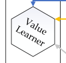
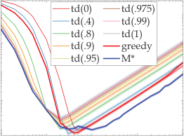
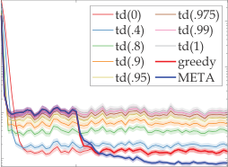
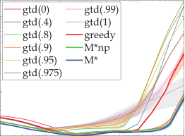
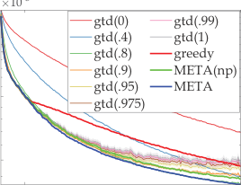
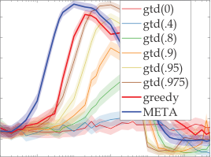
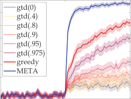

## **META-Learning State-based Eligibility Traces for More** **Sample-Efficient Policy Evaluation [∗]**

Mingde Zhao [∗]

Mila, McGill University
mingde.zhao@mail.mcgill.ca

Sitao Luan [∗]

Mila, McGill University
sitao.luan@mail.mcgill.ca

Ian Porada [∗]

Mila, McGill University
ian.porada@mail.mcgill.ca

Xiao-Wen Chang
McGill University
chang@cs.mcgill.ca

**ABSTRACT**

Temporal-Difference (TD) learning is a standard and very successful reinforcement learning approach, at the core of both algorithms
that learn the value of a given policy, as well as algorithms which
learn how to improve policies. TD-learning with eligibility traces
provides a way to boost sample efficiency by temporal credit assignment, _i.e._ deciding which portion of a reward should be assigned to
predecessor states that occurred at different previous times, controlled by a parameter _λ_ . However, tuning this parameter can be
time-consuming, and not tuning it can lead to inefficient learning.
For better sample efficiency of TD-learning, we propose a metalearning method for adjusting the eligibility trace parameter, in a
state-dependent manner. The adaptation is achieved with the help
of auxiliary learners that learn distributional information about the
update targets online, incurring roughly the same computational
complexity per step as the usual value learner. Our approach can be
used both in on-policy and off-policy learning. We prove that, under
some assumptions, the proposed method improves the overall quality of the update targets, by minimizing the overall target error. This
method can be viewed as a plugin to assist prediction with function approximation by meta-learning feature (observation)-based
_λ_ online, or even in the control case to assist policy improvement.
Our empirical evaluation demonstrates significant performance
improvements, as well as improved robustness of the proposed
algorithm to learning rate variation.

**KEYWORDS**

Reinforcement Learning; Meta Learning; Hyperparameter Adaptation; Machine Learning; Temporal Difference Learning

**1** **INTRODUCTION**

Eligibility trace-based policy evaluation (prediction) methods, _e.g._,
TD( _λ_ ), use geometric sequences, controlled by a parameter _λ_, to
weight multi-step returns and assemble compound update targets

[ 10 ]. Given a properly set _λ_, using _λ_ -returns as update targets lowers the sample complexity ( _e.g._, the number of steps to achieve

∗ The first three authors contributed equally to this paper. This paper has a description
[video at: https://www.youtube.com/watch?v=3Ud8Ils1_mo](https://www.youtube.com/watch?v=3Ud8Ils1_mo)

_Proc. of the 19th International Conference on Autonomous Agents and Multiagent Systems_
_(AAMAS 2020), B. An, N. Yorke-Smith, A. El Fallah Seghrouchni, G. Sukthankar (eds.), May_
_9–13, 2020, Auckland, New Zealand_ . © 2020 International Foundation for Autonomous
Agents and Multiagent Systems (www.ifaamas.org). All rights reserved.

Doina Precup
DeepMind, Mila, McGill University
dprecup@cs.mcgill.ca

certain precision of policy evaluation) or equivalently, improves
the learning speed and accuracy.
Sample complexity in Reinforcement Learning (RL) is sensitive
to the choice of the hyperparameters [ 10, 14 ]. To address this, metalearning has been proposed as an approach for adapting the learning
rates [ 1 ]. However, the design of principle approaches and maintenance of low computational complexity yield difficulties to tackle
the problem [ 3, 6 ]. Some Bayesian offline method has been proposed
to address this problem [ 2 ]. Some methods have been proposed for
online meta-learning, with high extra computational complexities
that are intolerable for practical use [ 4 ]. Some methods seek to
create replacements of TD( _λ_ ) with better properties, mixing only
the Monte-Carlo return and 1-step TD return [ 5 ]. To summarize, a
principled method for adapting _λ_ s online and efficiently is in need.
TD( _λ_ ) with different _λ_ values for different states has been proposed as a more general formulation of trace-based prediction
methods. While preserving good mathematical properties such
as convergence to fixed points, this generalization also unlocks
significantly more degrees of freedom than only adapting a constant _λ_ for every state. It is intuitively clear that using state-based
values of _λ_ provides more flexibility than using a constant for all
states. [ 14 ] investigated the use of state-based _λ_ s, while outperforming constant _λ_ values on some prediction tasks. The authors
implicitly conveyed the idea that better update targets lead to better
sample efficiency, _i.e._, update targets with smaller Mean Squared
Error (MSE) lead to smaller MSE in learned values. Their proposed
online adaptation is achieved via efficient incremental estimation
of statistics about the return targets, gathered by some auxiliary
learners. Yet, such method does not seek to improve the overall
sample efficiency, because the meta-objectives does not align with
the overall target quality.
The contribution of this paper is a principled method for metalearning state- or feature-based parametric _λ_ s [1] which aims directly
at the sample efficiency. Under some assumptions, the method has
the following properties:

(1) Meta-learns online and uses only incremental computations,
incurring the same computational complexity as usual valuebased eligibility-trace algorithms, such as TD( _λ_ ).
(2) Optimizes the overall quality of the update targets.
(3) Works in off-policy cases.
(4) Works with function approximation.
(5) Works with adaptive learning rate.

1 State-based for tabular case, and feature-based for function approximation case.

**2** **PRELIMINARIES**

TD( _λ_ ) [9] uses geometric sequences of weights controlled by a parameter _λ_ ∈[ 0, 1 ] to compose a compound return as the update
target, which is called the _λ_ -return. When used online, the updates
towards the _λ_ -return can be _approximated_ with incremental updates using buffer vectors called the “eligibility traces” with linear
spacetime complexity.

**2.1** **The Trace Adaptation Problem**

We aim to find an online meta-learning method for the adaptation
of state- or feature-based _λ_ s to achieve higher sample efficiency
(faster and more accurate prediction in terms of MSE of the value
estimate) in unknown environments.

**2.2** **Background Knowledge**

Before everything, we first present all the notations in Table 1.

_Definition 2.1 (Update Target)._ When an agent is conducting policy evaluation, the **update target** (or **target** ) is a random variable
towards whose observed value the agent updates its value estimates.

Fixed-step update targets are also random variables. For example,
the update target for 1-step TD is _r_ _t_ +1 + _γ_ _t_ +1 _V_ ( _s_ _t_ +1 ) and the update
target for TD( _λ_ ) with state-based _λ_ s is the (generalized) _λ_ -return,
as defined below.

_Definition 2.2 (_ _λ_ _-return)._ The **generalized state-based** _λ_ **-return**
_G_ _t_ _[λ]_ [, where] _[ λ]_ [ ≡[] _[λ]_ [1] [, . . .,] _[ λ]_ _[i]_ [ ≡] _[λ]_ [(] _[s]_ _[i]_ [)][, . . .,] _[ λ]_ [|S|] []] _[T]_ [, for one state] _[ s]_ _[t]_ [ in a]
trajectory _τ_ is recursively defined as

_G_ _t_ _[λ]_ [≡] _[G]_ _[λ]_ [(] _[s]_ _[t]_ [ )][ =] _[ r]_ _[t]_ [+][1] [ +] _[ γ]_ _[t]_ [+][1] [[(][1][ −] _[λ]_ _[t]_ [+][1] [)] _[V]_ [ (] _[s]_ _[t]_ [+][1] [)][ +] _[ λ]_ _[t]_ [+][1] _[G]_ _t_ _[λ]_ +1 []]

where _G_ _t_ _[λ]_ [=][ 0 for] _[ t]_ [ >][ |] _[τ]_ [ |][.]

Prediction using the generalized _λ_ -return has well-defined fixed
points [ 14 ]. However, when using trace-based updates online, such
convergence can only be achieved with the true online algorithms

[ 12, 13 ]. With the equivalence provided by the true online methods,
we will also have the full control of the bias-variance tradeoff of

the update targets via _λ_ even if learning online.
The quality of the update targets, which we aim to enhance, has
important connections to the quality of the learned value function

[8], which we ultimately pursue in policy evaluation tasks.

_Definition 2.3 (Overall Value Error & State Value Error)._ Given
the true value v and an estimate _V_ of target policy _π_, the **overall**
**value error** for _V_ is defined as:

2
_J_ ( _V_ ) ≡ 1/2 · ∥ _D_ [1][/][2]            - ( _V_ − v)∥ 2

where

_D_ ≡ _diaд_ ( _d_ _π_ ( _s_ 1 ), _d_ _π_ ( _s_ 2 ), · · ·, _d_ _π_ ( _s_ | _S_ | )) (1)

For a particular state _s_, the **state value error** is defined as

_J_ ( _V_ ( _s_ )) ≡ 1/2 · ( _V_ ( _s_ ) − _v_ ( _s_ )) [2]

The weights favor the states that will be met with higher frequency under policy _π_ . We often use the overall value error to
evaluate the performance of value learners in prediction tasks [8].

_Definition 2.4 (Overall Target Error & State Target Error)._ Given
v and the collection of the update targets _G_ [ˆ] for all states, the **over-**
**all mean squared target error** or **overall target error** for _G_ [ˆ] is
defined as:
_J_ ( _G_ [ˆ] ) ≡ 1/2 · ∥ _D_ [1][/][2]           - (E[ _G_ [ˆ] ] − v)∥ 22

where _D_ is defined in (1) . For a particular state _s_, the **state target**
**error** or **target error** is defined as

_J_ ( _G_ [ˆ] ( _s_ )) ≡ 1/2 · ( _G_ [ˆ] ( _s_ ) − _v_ ( _s_ )) [2]

Updates are never conducted for the terminal states. Thus, the
target error and value error for terminal states should be set 0, as
these states are always identifiable from the terminal signals. The
errors of the values and the targets are strongly connected.

Proposition 2.5. _Given suitable learning rates, value estimates_
_using targets with lower overall target error asymptotically achieve_
_lower overall value error._

Though it can easily be proved, the conclusion is very powerful:
sample efficiency can be enhanced by using better update targets,
which in the trace-based prediction means optimizing the difference
between the update target and the true value function. This is the
basis for the _λ_ -greedy algorithm which we are about to discuss as
well as our proposed method.

**2.3** _λ_ **-Greedy [14]: An Existing Work**

_λ_ -greedy is a meta-learning method that can achieve online adaptation of state-based _λ_ s with the help of auxiliary learners that learn
additional statistics about the returns. The idea is to minimize the
error between a pseudo target _G_ [˜] ( _s_ _t_ ) and the true value v( _s_ _t_ ), where
the pseudo target is defined as:

˜ ˜
_G_ ( _s_ _t_ ) ≡ _G_ _t_ ≡ _r_ _t_ +1 + _γ_ _t_ +1 [(1 − _λ_ _t_ +1 ) _V_ ( _s_ _t_ +1 ) + _λ_ _t_ +1 _G_ _t_ +1 ]

where _λ_ _t_ +1 ∈[ 0, 1 ] and _λ_ _k_ = 1, ∀ _k_ ≥ _t_ + 2. With this we can
find that _J_ [˜] ( _s_ _t_ ) ≡ E[( _G_ [˜] _t_ − E[ _G_ _t_ ]) [2] ] is a function of only _λ_ _t_ +1 (given
the value estimate _V_ ( _s_ _t_ +1 ) ). The greedy objective corresponds to
minimizing the error of the pseudo target _G_ [˜] _t_ :

Fact 1 ([ 14 ]). _Let_ _t_ _be the current timestep and_ _s_ _t_ _be the current_
_state. If the agent takes action at_ _s_ _t_ _s.t. it will transition into_ _s_ _t_ +1 _at_
_t_ + 1 _. Given the pseudo update target_ _G_ [˜] _t_ _of_ _s_ _t_ _, the minimizer_ _λ_ _t_ [∗] +1 _[of]_

_the target error of the state_ _J_ [˜] ( _s_ _t_ ) ≡ E[( _G_ [˜] _t_ − E[ _G_ _t_ ]) [2] ] _w.r.t. λ_ _t_ +1 _is:_

( _V_ ( _s_ _t_ +1 ) − E[ _G_ _t_ +1 ]) [2]
_λ_ _t_ [∗] +1 [=] (2)

(E[ _V_ ( _s_ _t_ +1 ) − _G_ _t_ +1 ]) [2] + _Var_ [ _G_ _t_ +1 ]

_where G_ _t_ +1 _is the Monte Carlo return._

The adaptation of _λ_ in _λ_ -greedy needs auxiliary learners, that
run in parallel with the value learner, for the additional distributional information needed, more specifically the expectation and
the variance of the MC return, preferably in an incremental manner.
The solutions for learning these have been contributed in [ 7, 14 ].
These methods learn the variance of _λ_ -return in the same way TD
methods learn the value function, however with different “rewards”
and “discount factors” for each state, that can be easily obtained
from the known information without incurring new interactions
with the environment.

_λ_ -greedy gives strong boost for sample efficiency in some prediction tasks. However, there are two reasons that _λ_ -greedy has much

**Table 1: Notations**

Notation Meaning

_x_ _t_ Feature vector or observation for the state _s_ _t_ met at time-step _t_ .
_V_ _π_ ( _s_ _t_ ) or _V_ ( _s_ _t_ ) Estimated value function or estimated values for _s_ _t_ .
_v_ _π_ ( _s_ _t_ ), _v_ ( _s_ _t_ ) or E[ _G_ _t_ ] True expectation of _G_ _t_ for _s_ _t_, also recognized as the true value.
_λ_ Enumeration vector of _λ_ ’s for all states.

_G_ _t_ Cumulative discounted return since time-step _t_ .
_ρ_ _t_ Importance sampling ratio for the action _a_ _t_ taken at time-step _t_ .
_γ_ _t_ Discount factor for returns after meeting the state _s_ _t_ at time-step _t_ [11].
_d_ _π_ ( _s_ ) The frequency of meeting the state _s_ among all states, when carrying out policy _π_ infinitely in the environment.

space to be improved. The first is that the pseudo target _G_ [˜] _t_ used for
optimization is not actually the target used in TD( _λ_ ) algorithms: we
will show that it is rather a compromise for a harder optimization
problem; The second is that setting the _λ_ s to the minimizers does
not help the overall quality of the update target: the update targets for every state is controlled by the whole _λ_, thus unbounded
changes of _λ_ for one state will inevitably affect the other states as
well as the overall target error.
From the next section, we build upon the mindset provided in

[14] to propose our method META.

**3** **META ELIGIBILITY TRACE ADAPTATION**

In this section, we propose our method META, whose goal is to
find an off-policy compatible way for optimizing the overall target
error while keeping all the computations online and incremental.
Our approach is intuitively straight-forward: optimizing overall
target error via optimizing the “true” target error for every state,
_i.e._, the errors of _λ_ -returns, properly.
We first investigate how the goal of optimizing overall target
error can be achieved online. A key to solving this problem is to
acknowledge that the states that the agent meets when carrying out
the policy _π_ follows the distribution of _d_ _π_ . Since the overall target
error is a weighted mix of the state target errors according to _d_ _π_,
this infers the possibility of decomposing the optimization of the
overall target error to the optimizations of the state target errors,
for which we optimize each state target error to the same extent
and then the state distribution could mix our sub-optimizations
together to form a joint optimization of the overall target error. We
develop the following theorem to construct this process.

Theorem 3.1. _Given an MDP, target and behavior policies_ _π_ _and_
_b_ ˆ _, let_ _D_ _be diagonalized state frequencies_ _d_ _π_ ( _s_ 1 ), · · ·, _d_ _π_ ( _s_ |S| ) _and_
_G_ ≡[ _G_ _s_ 1 ( _λ_ ), · · ·, _G_ _s_ |S| ( _λ_ )] _[T]_ _be the vector assembling the state up-_
_date targets, in which the targets are all parameterized by a shared_
_parameter vector_ _λ_ _. The gradient of the overall target error_ _J_ ( _G_ [ˆ], S) ≡

1 / 2 - E _π_ ∥ _D_ [1][/][2] - ( _G_ [ˆ] − v)]∥ [2] 2 _can be assembled from_ 1 _-step gradients_
� �

_G_ _on the target error_ ˆ _s_ _for every state_ _s J_ _the agent is in when acting upon behavior pol-_ ( _G_ [ˆ] _s_, _s_ ) ≡ 1 / 2 - ( _G_ [ˆ] _s_ ( _λ_ ) − _v_ _s_ ) [2] _of update target_
_icy_ _b_ _, where weights are the cumulative product_ _ρ_ _acc_ _of importance_
_sampling ratios from the beginning of the episode until_ _s_ _. Specifically:_

∇ _λ_ _J_ ( _G_ [ˆ], S) ∝ � _ρ_ _acc_      - ∇ _λ_ _J_ ( _G_ [ˆ] _s_, _s_ )

_s_ ∼ _b_

_where b is the behavior policy._

Proof. According to the definition of overall target error,

_J_ ( _λ_ ) ≡ �

� _d_ _π_ ( _s_ ) · _J_ _s_ ( _λ_ )) = �

_s_ ∈S _s_ ∈S

� _d_ _π_ ( _s_ ) · E[ _G_ _[λ]_ ( _s_ ) − _v_ ( _s_ )] [2]

_s_ ∈S

If we take the gradient _w.r.t. λ_ [(] _[t]_ [+][1][)] we can see that:

∇ _J_ ( _G_ [ˆ], S) = � _d_ _π_ ( _s_ ) · ∇ _J_ ( _G_ [ˆ] _s_, _s_ )

_s_ ∈S

push the gradient inside

∞

= � � P{ _s_ 0 → _s_, _k_, _π_, _s_ 0 ∼ _d_ ( _s_ 0 )} · ∇ _J_ ( _G_ [ˆ] _s_, _s_ )

_s_ ∈S _k_ =0

P{· · · } is the prob. of _s_ 0 →· · · → _s_ in _k_ steps,

_s_ 0 is sampled from the starting distribution _d_ ( _s_ 0 ).

∞

=
� �

_s_ ∈S _k_ =0

_τ_

� P{ _s_ 0 −→ _s_, _k_, _π_, _s_ 0 ∼ _d_ ( _s_ 0 )} · ∇ _J_ ( _G_ ˆ _s_, _s_ )

_τ_

_τ_ = _s_ 0, _a_ 0, _s_ 1, _a_ 1, . . ., _a_ _k_ −1, _s_ _k_ = _s_ is a trajectory starting from _s_ 0,

following _π_ and transitioning to _s_ in _k_ steps.

∞

=
� �

_s_ ∈S _k_ =0

� _d_ ( _s_ 0 ) · · · _p_ ( _τ_ _k_ −1, _a_ _k_ −1, _s_ ) _π_ ( _a_ _k_ −1 | _τ_ _k_ −1 ) · ∇ _J_ ( _G_ [ˆ] _s_, _s_ )

_τ_

′ _a_ ′
_τ_ _i_ is the _i_ + 1-th state of _τ_ and _p_ ( _s_, _a_, _s_ ) is the prob. of _s_ −→ _s_ in the MDP

∞

=
� �

_s_ ∈S _k_ =0

_d_ ( _s_ 0 ) · · · _p_ ( _τ_ _k_ −1, _a_ _k_ −1, _s_ ) _[π]_ [(] _[a]_ _[k]_ [−][1] [ |] _[τ]_ _[k]_ [−][1] [)]
_τ_ _b_ ( _a_ _k_ −1 | _τ_ _k_ −1 )

�

_b_ ( _a_ _k_ − [−] 1 [1] | _τ_ _k_ − [−] 1 [1] ) _[b]_ [(] _[a]_ _[k]_ [−][1] [ |] _[τ]_ _[k]_ [−][1] [) · ∇] _[J]_ [(] _[G]_ [ ˆ] _[s]_ [,] _[ s]_ [)]

for the convenience of injecting importance sampling ratios

∞

=
� �

_s_ ∈S _k_ =0

� _d_ ( _s_ 0 ) · · · _p_ ( _τ_ _k_ −1, _a_ _k_ −1, _s_ ) _ρ_ _k_ −1 _b_ ( _a_ _k_ −1 | _τ_ _k_ −1 ) · ∇ _λ_ _J_ _s_ ( _λ_ ))

_τ_

[|] _[τ]_ _[i]_ [)]
_ρ_ _i_ ≡ _[π]_ _b_ ( [(] _a_ _[a]_ _i_ _[i]_ | _τ_ _i_ ) [is the importance sampling (IS) ratio]

∞
�

_k_ =0

=
�

_s_ ∈S

_ρ_ 0: _i_ ≡

� _ρ_ 0: _k_ −1 - _d_ ( _s_ 0 ) · · · _p_ ( _τ_ _k_ −1, _a_ _k_ −1, _s_ ) _b_ ( _a_ _k_ −1 | _τ_ _k_ −1 ) · ∇ _J_ ( _G_ [ˆ] _s_, _s_ )

_τ_

_i_
� _ρ_ _v_ is the product of IS ratios of _τ_ from _τ_ 0 to _τ_ _i_

_v_ =0

� - _d_ ( _s_ 0 ) · · · _p_ ( _τ_ _k_ −1, _a_ _k_ −1, _s_ ) _b_ ( _a_ _k_ −1 | _τ_ _k_ −1 ) · ∇ _J_ ( _G_ [ˆ] _s_, _s_ )

_s_ ∈S

=

∞
�

_k_ =0

�

_ρ_ 0: _k_ −1 �

_τ_

= E _τ_ ∼ _b_ �] _ρ_ _τ_ ∇ _J_ ( _G_ [ˆ] _s_, _s_ )� ≈ � _ρ_ _acc_ - ∇ _J_ ( _G_ [ˆ] _s_, _s_ )

_s_ ∼ _b_

equivalent to summing over the experienced states under _b_

The on-policy case is easily proved with _b_ = _π_ . The theorem
applies for general parametric update targets including _λ_ -return.
Optimizing _λ_ for each state will inevitably affect the other states,
_i.e._, decreasing target error for one state may increase the others.
The theorem shows if we can do gradient descent on the target error
of the states according to _d_ _π_, we can achieve optimization on the
overall target error, assuming the value function is changing slowly.
The problem left for us is to find a way to calculate or approximate
the gradients of _λ_ for the state target errors.
The exact computation of this gradient is infeasible in the online
setting: in the state-based _λ_ setting, the _λ_ -return for every state is
interdependent on every _λ_ of every state. These states are unknown
before observation. However, we propose a method to estimate this
gradient by estimating the partial derivatives in the dimensions
of the gradient vector, which are further estimated online using
auxiliary learners that estimates the distributional information of
the update targets. The method can be interpreted as optimizing a
bias-variance tradeoff.

Proposition 3.2. _Let_ _t_ _be the current timestep and_ _s_ _t_ _be the cur-_
_rent state. The agent takes action_ _a_ _t_ _at_ _s_ _t_ _and will transition into_
_s_ _t_ +1 _at_ _t_ + 1 _while receiving reward_ _r_ _t_ +1 _. Suppose that_ _r_ _t_ +1 _and_ _G_ _t_ _[λ]_ +1
_are uncorrelated, given the update target_ _G_ _t_ _[λ]_ _[for state]_ _[ s]_ _[t]_ _[, the (semi)-]_
_partial derivative of the target error_ _J_ _s_ _t_ ( _λ_ ) ≡ E[( _G_ _t_ _[λ]_ [−] [E][[] _[G]_ _[t]_ [ ])] [2] []] _[ of]_
_the state s_ _t_ _w.r.t. λ_ _t_ +1 ≡ _λ_ ( _s_ _t_ +1 ) _is:_

∂∂ _Jλ_ _s_ _t_ _t_ ( + _λ_ 1 ) = _γ_ _t_ [2] +1 [[] _[λ]_ _[t]_ [+][1] �( _V_ ( _s_ _t_ +1 ) − E[ _G_ _t_ _[λ]_ +1 [])] [2] [ +] _[ Var]_ [[] _[G]_ _t_ _[λ]_ +1 []] �

+ (E[ _G_ _t_ _[λ]_ +1 [] −] _[V]_ [ (] _[s]_ _[t]_ [+][1] [))(][E][[] _[G]_ _[t]_ [+][1] [] −] _[V]_ [ (] _[s]_ _[t]_ [+][1] [))]]

_And its minimizer w.r.t. λ_ _t_ +1 _is:_

( _V_ ( _s_ _t_ +1 ) − E[ _G_ _t_ _[λ]_ +1 [])(] _[V]_ [ (] _[s]_ _[t]_ [+][1] [) −] [E][[] _[G]_ _[t]_ [+][1] [])]
argmin _λ_ _t_ +1 _J_ _s_ _t_ ( _λ_ ) = ( _V_ ( _s_ _t_ +1 ) − E[ _G_ _t_ _[λ]_ +1 [])] [2] [ +] _[ Var]_ [[] _[G]_ _t_ _[λ]_ +1 []]

Proof.

_J_ _s_ _t_ ( _λ_ ) ≡ E[( _G_ _t_ _[λ]_ [−] [E][[] _[G]_ _[t]_ [ ])] [2] []][ =][ E] [2] [[] _[G]_ _t_ _[λ]_ [−] _[G]_ _[t]_ [ ]][ +] _[ Var]_ [[] _[G]_ _t_ _[λ]_ []]

E[ _G_ _t_ _[λ]_ [−] _[G]_ _[t]_ [ ]]

= E[ _r_ _t_ +1 + _γ_ _t_ +1 ((1 − _λ_ _t_ +1 ) _V_ ( _s_ _t_ +1 ) + _λ_ _t_ +1 _G_ _t_ _[λ]_ +1 [)]

−( _r_ _t_ +1 + _γ_ _t_ +1 _G_ _t_ +1 )]

= _γ_ _t_ +1 (1 − _λ_ _t_ +1 ) _V_ ( _s_ _t_ +1 ) + _γ_ _t_ +1 _λ_ _t_ +1 E[ _G_ _t_ _[λ]_ +1 [] −] _[γ]_ _[t]_ [+][1] [E][[] _[G]_ _[t]_ [+][1] []]

_Var_ [ _G_ _t_ _[λ]_ []][ =] _[ Var]_ [[] _[r]_ _[t]_ [+][1] [ +] _[ γ]_ _[t]_ [+][1] [[(][1][ −] _[λ]_ _[t]_ [+][1] [)] _[V]_ [ (] _[s]_ _[t]_ [+][1] [)][ +] _[ λ]_ _[t]_ [+][1] _[G]_ _t_ _[λ]_ +1 []]]

= _Var_ [ _r_ _t_ +1 ] + _γ_ _t_ [2] +1 _[λ]_ _t_ [2] +1 _[Var]_ [[] _[G]_ _t_ _[λ]_ +1 []]

(assuming _r_ _t_ +1 & _G_ _t_ _[λ]_ +1 [uncorrelated)]

Assuming negligible effects of _λ_ _t_ +1 on the statistics, _i.e._ not
taking the partial derivatives of the expectation or the variance, we
can obtain the semi-partial derivative

+ _γ_ _t_ +1 _λ_ _t_ +1 E[ _G_ _t_ _[λ]_ +1 [] −] _[γ]_ _[t]_ [+][1] [E][[] _[G]_ _[t]_ [+][1] [])] [2]

+ _Var_ [ _r_ _t_ +1 ] + _γ_ _t_ [2] +1 _[λ]_ _t_ [2] +1 _[Var]_ [[] _[G]_ _t_ _[λ]_ +1 [])]

= _γ_ _t_ [2] +1 [[] _[λ]_ _[t]_ [+][1] �( _V_ ( _s_ _t_ +1 ) − E[ _G_ _t_ _[λ]_ +1 [])] [2] [ +] _[ Var]_ [[] _[G]_ _t_ _[λ]_ +1 []] �

+ (E[ _G_ _t_ _[λ]_ +1 [] −] _[V]_ [ (] _[s]_ _[t]_ [+][1] [))(][E][[] _[G]_ _[t]_ [+][1] [] −] _[V]_ [ (] _[s]_ _[t]_ [+][1] [))]]

The minimizer is achieved by setting the partial derivative 0.  

This proposition constructs a way to estimate the partial derivative that corresponds to the dimension of _λ_ _t_ +1 in ∇ _λ_, if we know
or can effectively estimate the statistics of E[ _G_ _t_ +1 ], E[ _G_ _t_ _[λ]_ +1 []] [ and]
_Var_ [ _G_ _t_ _[λ]_ +1 []] [. This proposition also provides the way for finding a]
whole series of partial derivatives and also naturally yields a multistep method of approximating the full gradient ∇ _λ_ E[( _G_ _t_ _[λ]_ [−][E][[] _[G]_ _[t]_ [ ])] [2] []] [.]
The partial derivative in the proposition is achieved by looking 1step into the future. We can also look more steps ahead, and get the
partial derivatives _w.r.t._ _λ_ [(] _[t]_ [+][2][)], · · · . These partial derivatives can be
computed with the help of the auxiliary tasks as well. The more we
assemble the partial derivatives, the closer we get to the full gradient. However, in our opinion, 1-step is still the most preferred not
only because it can be obtained online every step without the need
of buffers but also for its dominance over other dimensions of _λ_ :

the more steps we look into the future, the more the corresponding
_λ_ s of the states are discounted by the earlier _γ_ s and _λ_ s. This also
enables the computation of the whole gradient if we were to do
the adaptations offline, in which case everything would be more
precise and easier, though more computationally costly.
It is interesting to observe that the minimizer is a generalization
of (2): the minimizer of the greedy target error can be achieved
by setting _G_ _t_ _[λ]_ +1 [=] _[ G]_ _[t]_ [+][1] [. In practice, given an unknown MDP, the]
distributional information of the targets, _e.g._ E[ _G_ _t_ +1 ], E[ _G_ _t_ _[λ]_ +1 []] [ and]
_Var_ [ _G_ _t_ _[λ]_ +1 []] [, can only be estimated. However, such estimation has]
been proved viable in both offline and online settings of TD( _λ_ ) and
the variants, using supervised learning and auxiliary tasks using
the direct VTD method [ 7 ], respectively. This means the optimization for the “true” target error is as viable as the _λ_ -greedy method
proposed in [ 14 ], while it requires more complicated estimations
than that for the “greedy” target error: we need the estimates of
E[ _G_ _t_ +1 ], E[ _G_ _t_ _[λ]_ +1 []] [ and] _[ Var]_ [[] _[G]_ _t_ _[λ]_ +1 []] [, while for (2) we only need the]
estimation of E[ _G_ _t_ +1 ] and _Var_ [ _G_ _t_ +1 ].
The optimization of the true state target error, _i.e._ the MSE between _λ_ -return and the true value, together with the auxiliary estimation, brings new challenges: the auxiliary estimates are learnt
online and requires the stationarity of the update targets. This
means if a _λ_ for one state is changed dramatically, the auxiliary
estimates of E[ _G_ _t_ _[λ]_ +1 []] [ and] _[ Var]_ [[] _[G]_ _t_ _[λ]_ +1 []] [ will be destroyed, since they]
depend on each element in _λ_ (whereas in _λ_ -greedy, the pseudo
targets require no _λ_ -controlled distributional information). If we
cannot handle such challenge, either we end up with a method that
have to wait for some time after some change of _λ_ or we end up
with _λ_ -greedy, bearing the high bias towards the MC return and
disconnection from the overall target error.
Adjusting _λ_ without destroying the auxiliary estimates is a core
problem. We tackle such optimization by noticing that the expectation and variance of the update targets are continuous and differentiable _w.r.t._ _λ_ . Thus, a small change on _λ_ _t_ +1 only yields a bounded

∂ _J_ _s_ _t_ ( _λ_ ) ∂

≡
∂ _λ_ _t_ +1 ∂ _λ_ _t_ +1

E[( _G_ _t_ _[λ]_ [−] [E][[] _[G]_ _[t]_ [ ])] [2] []]
� �

∂
= (( _γ_ _t_ +1 (1 − _λ_ _t_ +1 ) _V_ ( _s_ _t_ +1 )
∂ _λ_ _t_ +1

action

action

|Col1|Col2|Col3|Col4|Col5|Col6|
|---|---|---|---|---|---|
|||||||
|||||||
|||vation  ount|vation  ount|vation  ount|vation  ount|
|||vation  ount|vation  ount|||
|||||||
|||||||

|reward Environment observation & discount ion λ Fixed λ Policy|Col2|Col3|reward|
|---|---|---|---|
|Environment ion Fixed λ Policy λ observation & discount reward|Policy|Policy|Policy|
|Environment ion Fixed λ Policy λ observation & discount reward|Policy|Fixed λ λ|Fixed λ λ|
|||||

|reward Environment observation & discount ion λ Feature- based λ ∇ Policy λ|Col2|Col3|Col4|
|---|---|---|---|
|Environment ion Feature- based λ Policy λ λ observation & discount reward ∇|Environment ion Feature- based λ Policy λ λ observation & discount reward ∇|||
|Environment ion Feature- based λ Policy λ λ observation & discount reward ∇|Policy|Policy|Policy|
|Environment ion Feature- based λ Policy λ λ observation & discount reward ∇|Policy|Policy||
|Environment ion Feature- based λ Policy λ λ observation & discount reward ∇|Policy|Policy||
|||||

**Figure 1: Mechanisms for META-assisted trace-based policy evaluation: the auxiliary learners learn the distributional infor-**
**mation in parallel to the value learner and provide the approximated gradient for the adjustments of** _λ_ **.**

shift of the estimates of the auxiliary tasks. If we use small enough
steps of the estimated gradients to change _λ_, we can stabilize the
auxiliary estimates since they will not deviate far and will be corrected by the TD updates quickly. This method inherits the ideas
of trust region methods used in optimizing the dynamic systems.
Combining the approximation of gradient and the decomposed
1-step optimization method, we now have an online method to
optimize _λ_ to achieve approximate optimization of the overall target
error, which we name META. This method can be jointly used with
value learning, serving as a plugin, to adapt _λ_ in real-time. Before
we present the whole algorithm, we would like to first discuss the
properties, potentials as well as limitations of META.

**4** **DISCUSSIONS AND INSIGHTS**

**4.1** **Hyperparameter Search**

META trades the search for _λ_ with _κ_, the step size of METAoptimization. However, _κ_ gives the algorithm the ability to have
state-based _λ_ s: state or feature (observation) based _λ_ can lead to
better convergence compared to fixing _λ_ for all states. Such potential may never be achieved by searching a fixed _λ_ . Let us consider
the tabular case, where the search for constant _λ_ = _λ_ 1 is equivalent
to searching along the diagonal direction inside a |S| -dimensional
unit box [0, 1] [|S|] . By replacing _λ_ with _κ_, we extend the search direction of _λ_ into the whole unit box. The new degrees of freedom
are crucial to the performance.

**4.2** **Reliance on Auxiliary Tasks**

META updates assume that E [ˆ] [ _G_ _t_ ], E [ˆ] [ _G_ _t_ _[λ]_ []] [ and] [ ˆ] _[Var]_ [[] _[G]_ _t_ _[λ]_ []] [ can be well]
estimated by the auxiliary tasks. This is very similar to the idea
of actor changing the policy upon the estimation of the values of
the critic in the actor-critic methods. To implement this, we can
add a buffer period for the estimates to be stable before doing any
adaptation; Additionally, we should set the learning rates of the
auxiliary learners higher than the value learner _s.t._ the auxiliary
tasks are learnt faster, resembling the guidelines for setting learning

rates of actor-critic. With the buffer period, we can also view META
as approximately equivalent to offline hyperparameter search of _λ_,
where with META we first reach a relatively stable accuracy and
then adjust _λ_ to slowly slide to fixed points with lower errors. Also,
META is compatible with fancier settings of learning rate, since
the meta-adaptation is independent of its values.

**4.3** **Function Approximation**

With function approximation, the meta-learning of _λ_ -greedy cannot
make use of the state features directly but through the bottlenecks
of the estimates. Whereas in META, _λ_ can be parameterized and
optimized with gradient descent. This enables better generalization
and can be effective when the state features contain rich information

(good potential to be used with deep neural networks). This is to
be demonstrated in the experiments.

**4.4** **From Prediction to Control**

Within the control tasks where the quality of prediction is crucial to
the policy improvement, it is viable to apply META to enhance the
policy evaluation process. META is a trust region method, which
requires the policy to be also changing smoothly, _s.t._ the shift of
values can be bounded. This constraint leads us naturally to the
actor-critic architectures, where the value estimates can be used to
improve a continuously changed parametric policy. We provide the
pseudocode of META-assisted actor-critic control in Algorithm 2.

**4.5** **Overview & Limitations**

META can be injected as a plugin for accelerating (improving the
sample efficiency of) TD-based policy evaluation processes. This is
illustrated in Figure 1: by adding 3 auxiliary learners to the system,
better feature-based _λ_ can be achieved using only the existing information. In Algorithm 1, META is injected to a TD-based baseline
as the additional two lines that are with purple comments. The first
is for the 3 auxiliary learners estimating the statistics with tracebased online updates, using either VTD [ 14 ] or DVTD [ 7 ] methods.

**Algorithm 1:** META-assisted Online Policy Evaluation

Initialize weights for the value learner and those for the auxiliary learners that learns E [ˆ] [ _G_ _t_ ], E [ˆ] [ _G_ _t_ _[λ]_ []][ and ˆ] _[Var]_ [[] _[G]_ _t_ _[λ]_ []]
**for** _episodes_ **do**

_ρ_ _acc_ = 1; //initialize cumulative product of importance sampling ratios
Set traces for value learner and auxiliary learners to be 0;
_x_ 0 = initialize(E); //Initialize the environment E and get the initial feature (observation) _x_ 0
**while** _t_ ∈{0, 1, . . . } _until terminated_ **do**

//INTERACT WITH ENVIRONMENT
_a_ _t_ ∼ _b_ ( _x_ _t_ ); //sample _a_ _t_ from behavior policy _b_
_ρ_ _t_ = _π_ ( _a_ _t_, _x_ _t_ )/ _b_ ( _a_ _t_, _x_ _t_ ); _ρ_ _acc_ = _ρ_ _acc_     - _ρ_ _t_ ; //get and accumulate importance sampling ratios
_x_ _t_ +1, _γ_ _t_ +1 = step( _a_ _t_ ); //take action _a_ _t_, get feature (observation) _x_ _t_ +1 and discount factor _γ_ _t_ +1
//AUXILIARY TASKS
learn E [ˆ] [ _G_ _t_ ], E [ˆ] [ _G_ _t_ _[λ]_ []][ and ˆ] _[Var]_ [[] _[G]_ _t_ _[λ]_ []][;][ //using direct VTD [7] with trace-based TD methods,] _[ e.g.]_ [, true online GTD(] _[λ]_ [) [12]]
//APPROXIMATE SGD ON OVERALL TARGET ERROR
_λ_ _t_ +1 = _λ_ _t_ +1 − _κγ_ _t_ [2] +1 _[ρ]_ _[acc]_ � _λ_ _t_ +1 �( _V_ ( _x_ _t_ +1 ) − E [ˆ] [ _G_ _t_ _[λ]_ +1 [])] [2] [ +][ ˆ] _[Var]_ [[] _[G]_ _t_ _[λ]_ +1 []] � + (E [ˆ] [ _G_ _t_ _[λ]_ +1 [] −] _[V]_ [ (] _[x]_ _[t]_ [+][1] [))(][E][ˆ] [[] _[G]_ _[t]_ [+][1] [] −] _[V]_ [ (] _[x]_ _[t]_ [+][1] [))] �; // change
_λ_ _t_ +2, · · · when using multi-step approximation of the gradient
//LEARN VALUE
learn _V_ ( _x_ _t_ ) using a trace-based TD method;

**Algorithm 2:** META-assisted Online Actor-Critic

Initialize weights for the value learner and those for the auxiliary learners that learns E [ˆ] [ _G_ _t_ ], E [ˆ] [ _G_ _t_ _[λ]_ []][ and ˆ] _[Var]_ [[] _[G]_ _t_ _[λ]_ []]
Initialize parameterized policies _π_ (·| _θ_ _π_ ) and _b_ (·| _θ_ _b_ );
**for** _episodes_ **do**

Set traces for value learner and auxiliary learners to be 0;
_x_ 0 = initialize(E);
**while** _t_ ∈{0, 1, . . . } _until terminated_ **do**

_a_ _t_ ∼ _b_ ( _x_ _t_ ); _ρ_ _t_ = _π_ ( _a_ _t_, _x_ _t_ )/ _b_ ( _a_ _t_, _x_ _t_ ); _ρ_ _acc_ = _ρ_ _acc_     - _ρ_ _t_ ;
_x_ _t_ +1, _γ_ _t_ +1 = step( _a_ _t_ );
//AUXILIARY TASKS and SGD ON OVERALL TARGET ERROR
learn E [ˆ] [ _G_ _t_ ], E [ˆ] [ _G_ _t_ _[λ]_ []][ and ˆ] _[Var]_ [[] _[G]_ _t_ _[λ]_ []][;]

_λ_ _t_ +1 = _λ_ _t_ +1 − _κγ_ _t_ [2] +1 _[ρ]_ _[acc]_ � _λ_ _t_ +1 �( _V_ ( _x_ _t_ +1 ) − E[ _G_ _t_ _[λ]_ +1 [])] [2] [ +] _[ Var]_ [[] _[G]_ _t_ _[λ]_ +1 []] � + (E[ _G_ _t_ _[λ]_ +1 [] −] _[V]_ [ (] _[x]_ _[t]_ [+][1] [))(][E][[] _[G]_ _[t]_ [+][1] [] −] _[V]_ [ (] _[x]_ _[t]_ [+][1] [))] �;
learn _V_ ( _x_ _t_ ) using a trace-based TD method;
//LEARN POLICY
One (small) step of policy gradient (actor-critic) on _θ_ _π_ ;

The second is the 1-step update approximating the 1-step gradient
descent. The injected process uses additional computational costs
approximately 3 times that of the baseline yet incurring no higher
order complexities. In Algorithm 2, META is injected to assist the
critic update for value estimation with the same mechanisms.
Meaningful as it is, META has its limitations. First, though the
trust region optimization enabled the optimization of joint error,
it also brought trouble: the adaptation is bound to be slow. In prediction, given the changing _V_, the “optimal” _λ_ also changes, presumably fast. Therefore, META may not able to catch up with the
need for fast adaptation, even if it is always chasing the “optimal”
_λ_ ; Second, being a gradient method, the stepsize parameter _κ_ is
inevitably sensitive to the feature structures. For example, if the
features are large in norm then _κ_ must be set tiny; Third, when used
with actor-critic control, it further requires that the policy to be
changing slowly. We will leave these problems for future research.

**5** **EXPERIMENTS**

We examine the empirical behavior of META by comparing it to the
baselines true online TD( _λ_ ) [ 13 ] or true online GTD( _λ_ ) [ 12 ] as well
as the _λ_ -greedy method [ 14 ] [2] . For all sets of tests, _λ_ start adapting
from 1 [3], which is the same as _λ_ -greedy [14].

**5.1** **RingWorld: Tabular-Case Prediction**

This set of experiments focuses on a low-variance environment,
the 11-state “ringworld” [ 14 ], in which the agent move either left
or right in a ring of states. The state transitions are deterministic
and rewards only appear in the terminal states. In this set of experiments, we stick to the tabular setting and use true online TD( _λ_ ) [ 12 ]

2 [Source code is available at: https://github.com/PwnerHarry/META](https://github.com/PwnerHarry/META)
3 Such setting is enabled by using _λ_ ( _x_ ) = 1 − _w_ _λT_ _[x]_ [ as the function approximator of]
the parametric _λ_ and the weights initialized as 0 .

-150

-200

-250

-300

-350

-400

-450

-150

-200

-250

-300

-350

-400

-450

10 [-4]

10 [-5] 10 [-4] 10 [-3] 10 [-2] 10 [-1]

learning rate

**(a) RingWorld,** _γ_ = 0.95

10 [-3]

10 [-4]

10 [5] 3 10 [5]

steps

**(d) RingWorld,** _α_ = 0.01 **,** _κ_ = 0.01

10 [0]

10 [-2]

10 [-5] 10 [-4] 10 [-3] 10 [-2] 10 [-1]

learning rate

**(b) FrozenLake,** _γ_ = 0.95

10 [-3]

1

10 [5] 10 [6]

steps

**(e) FrozenLake,** _α_ = _β_ = 0.0001 **,** _κ_ = 10 [−][5] **,** _κ_ **np** = 10 [−][4]

25000 50000

steps

**(f) MountainCar,** _α_ = _β_ = 10 [−][5] **,** _η_ = 1 **,** _κ_ = 10 [−][5]

10 [-6] 10 [-4] 10 [-2]

**(c) MountainCar,** _γ_ = 1 **,** _η_ = 1

**Figure 2: U-shaped curves and learning curves for META,** _λ_ **-greedy and the baselines on RingWorld, FrozenLake and Mountain-**
**Car. For (a), (b) and (c),** _x_ **-axes represent the values of the learning rate** _α_ **for prediction (or the critic), while** _y_ **-axes represent**
**the overall value error for RingWorld and FrozenLake, or the cumulative discounted return for MountainCar. Each point in**
**the graphs is featured with the mean (solid) and standard deviation (shaded) collected from** 240 **independent runs, with** 10 [6]

**steps for prediction and** 50000 **steps for control. The blue curves, either with legend “META” or “M*”, represent the results of**
**META; For (d), (e), and (f), the** _x_ **-axes represent the steps. We choose one representative case for each of the corresponding**
**U-shaped curve for better demonstration of the empirical performance of META. In these learning curves, the best known**
**hyperparameters are used. The buffer periods are** 10 [5] **steps (** 10% **) for prediction and** 25000 **steps (** 50% **) for control, respectively.**

as the learner [4], for the value estimate as well as all the auxiliary estimates. As discussed in 4.2, for the accuracy of the auxiliary learners,
we double their learning rate _s.t._ they can adapt to the changes of
the estimates faster. We select a pair of behavior-target policies:
the behavior policy goes left with 0 . 4 probability while the target
policy goes with 0 . 35. The baseline true online TD has 2 hyperparameters ( _α_ & _λ_ ) and so does META ( _α_ & _κ_ ), excluding those for the
auxiliary learners. For these two methods, we test them on grids
of hyperparameter pairs. More specifically, for the baseline true
online TD, we test it on ⟨ _α_, _λ_ ⟩∈{ 10 [−][5], . . ., 5 × 10 [−][5], 10 [−][4], . . ., 5 ×
10 [−][4], . . ., 5 × 10 [−][2], 10 [−][1] }×{ 0, 0 . 4, 0 . 8, 0 . 9, 0 . 95, 0 . 975, 0 . 99, 1 } while
for META, ⟨ _α_, _κ_ ⟩∈{ 10 [−][5], . . ., 5 × 10 [−][5], 10 [−][4], . . ., 5 × 10 [−][4], . . ., 5 ×
10 [−][2], 10 [−][1] } × { 10 [−][7], . . ., 10 [−][1] } . The results are presented as the Ushaped curves in Figure 2 (a), in which we demonstrate the curves
of the baseline under different _λ_ s and the best performance that
META could get under each learning rate.
The best performance of fine-tuned baselines can be extracted
from the figures by combining the lowest points of the set of the

4 We prefer true online algorithms since they achieve the exact equivalence of the
bi-directional view of _λ_ -returns.

baseline curves under different _λ_ s. Fine-tuned META provides better
performance, especially when the learning rate is relatively high.
We can say that once META is fine-tuned, it provides significantly
better performance that the baseline algorithm cannot possibly
achieve since it meta-learns state-based _λ_ that goes beyond the
scope of the optimization of the baseline. Such results can also be
interpreted as META being less sensitive to the learning rate than
the baseline true online TD.

**5.2** **FrozenLake: Feature-based Prediction**

This set of experiments features on a high-variance environment,
the “4x4” FrozenLake, in which the agent seeks to fetch the frisbee
back on a frozen lake surface with holes from the northwest to the

southeast and the transitions are noisy. There are 4 actions, each
representing taking 1-step towards 1 of the 4 directions. We craft
a behavior policy that takes 4 actions with equal probabilities and
a target policy that has 0 . 3 probability for going south or east, 0 . 2
for going north or west. We use the linear function approximation based true online GTD( _λ_ ), with a discrete tile coding (4 tiles,
4 offsets). For the 2nd learning rate _β_ introduced in true online

GTD( _λ_ ), we set them to be the same as _α_ (for the value learners as
well as the auxiliary learners in all the compared algorithms). Additionally, we remove the parametric setting of _λ_ to get a method as
“META(np)” to demonstrate the potentials of a parametric feature
(observation) based _λ_ . The U-shaped curves, obtained using the
exact same settings as in RingWorld, are provided in Figure 2 (b).
We observe similar patterns as the 1st set of experiments. We
can see that the generalization provided by the parametric _λ_ is
beneficial, as in (b) we observe generally better performance and
in (e) we see that a parametric _λ_ has better sample efficiency, comparing with “META(np)”. This suggests that using parametric _λ_ in
environments with relatively smooth dynamics would be generally
beneficial for sample efficiency.

**5.3** **MountainCar: Actor-Critic Control**

In this set of experiments we investigate the use of META to assist
on-policy actor-critic control on a noisy version of the environment
MountainCar with tile-coded state features. We use a softmax policy
parameterized by a | _A_ | × _D_ matrix, where _D_ is the dimension of
the state features with also true online GTD( _λ_ ) as the learners
(critics). This time, the U-shaped curves presented in Figure 2(c)
show performance better than the baselines yet significantly better
than _λ_ -greedy assisted actor-critic.
In this set of experiments we intentionally set the stepsize of the
gradient ascent of the policy to be high ( _η_ = 1) to emphasize the
quality of policy evaluation. However, typically in actor-critic we
keep _η_ small. In these cases, the assistance of META is expected to be
greatly undermined: the maximization of returns cares more about
the actions chosen rather than the accuracy of the value estimates.
Enhancing the policy evaluation quality may not be sufficient for
increasing the sample efficiency of control problems.
From the curves we can see the most significant improvements
are shown when the learning rate of the critic is small. Typically in
actor-critic, we set the learning rate of the critic to be higher than
the actor to improve the quality of the update of the actor. META
alleviates the requirement for such setting (or we could say a kind
of sensitivity) by boosting the sample efficiency of the critic.

**5.4** **Technical Details**

_5.4.1_ _Environments._ The RingWorld environment is reproduced
as described in [ 14 ]. Due to limitations of understanding, we cannot
see the difference between it and a random walk environment with

the rewards on the two tails. RingWorld is described as a symmetric
ring of the states with the starting state at the top-middle, for which
we think the number of states should be odd. However, the authors
claimed that they experimented with 10-state and 50-state instances.
We instead used the 11-state instance.

We removed the episode length limit of the FrozenLake environment (for the environment to be solvable by dynamic programming).
It is modified based on the Gym environment with the same name.
We have used the instance of “4x4”, _i.e._ with 16 states.
The episode length limit of MountainCar is also removed. We
also added noise to the state transitions: actions will be randomized

at 20% probability. The noise is to prevent the cases in which _λ_ = 1
yields the best performance (to prevent META from using extremely
small _κ_ ’s to get good performance). Additionally, due to the poor

exploration of the softmax policy, we extended the starting location
to be uniformly anywhere from the left to right on the slopes.

_5.4.2_ _State Features._ For RingWorld, we used onehot encoding
to get equivalence to tabular case; For FrozenLake, we used a discrete variant of tile coding, for which there are 4 tilings, with each
tile covering one grid as well as symmetric and even offset; For
MountainCar, we adopted the roughly the same setting as Chap.
10.1 pp. 245 in [ 10 ], except that we used ordinary symmetric and
even offset instead of the asymmetric offset.

_5.4.3_ _About_ _λ_ _-greedy._ We have replaced VTD [ 14 ] with direct
VTD [ 7 ]. This modification is expected only to improve the stability,
without touching the core mechanisms of _λ_ -greedy [14].
The target used in Whites’ [ 14 ] is biased toward _λ_ = 1, as the
_λ_ ’s into the future are assumed to be 1. Thus we do not think it is

helpful to conduct tests on environments with very low variance.
This is the reason why we have changed the policies to less greedy.

_5.4.4_ _Learning Rate and Buffer Period._ The learning rates of the
auxiliary learners are set to be twice of the value learner. These
settings were not considered in [ 14 ], in which there were no buffer
period and identical learning rates were used for all learners; For
the control task of MountainCar, _λ_ -greedy and META will both
perform badly without these additional settings, since they are
adapting _λ_ based on untrustworthy estimates.

_5.4.5_ _Details for Non-Parametric_ _λ_ (·) _._ To disable the generalization of the parametric _λ_ for “META(np)”, we replaced the feature
vectors for each state with onehot-encoded features.

_5.4.6_ _More Policies for Prediction._ For RingWorld, we have done
6 different behavior-target policy pairs (3 on-policy & 3 off-policy).
The off-policy pair that we have shown in the manuscript shares the
same patterns as the rest of the pairs. The accuracy improvement
brought by META is significant across these pairs of policies; For
FrozenLake, we have done two pairs of policies (on- and off-policy).
We observe the same pattern as in the RingWorld tests.

_5.4.7_ _Implementation of META._ Due to the estimation instability, updates could bring state _λ_ values outside [ 0, 1 ] . Whenever such
kind of update is detected, it will be canceled.

**6** **CONCLUSION AND FUTURE WORK**

In this paper, we derived a general method META for boosting the
sample efficiency of TD prediction, by approximately optimizing
the overall target error, using meta-learning of state dependent _λ_ s.
In the experiments, META demonstrates promising performance
as a way to accelerate learning.
In the future, we aim to benchmark the approach in more environments, and in general. We would also like to study further the
issue of improving optimizers for RL specifically.

**Acknowledgements**

Funding for this research was provided in part by NSERC, through
Discovery grants for Prof. Chang and Precup, and CIFAR, through
a CCAI chair to Prof. Precup. We are grateful to Compute Canada
for providing a shared cluster for experimentation.

**REFERENCES**

[1] William Dabney and Andrew Barto. 2012. Adaptive Step-Size for Online Temporal
Difference Learning. In _AAAI Conference on Artificial Intelligence_ [. https://www.](https://www.aaai.org/ocs/index.php/AAAI/AAAI12/paper/view/5092)
[aaai.org/ocs/index.php/AAAI/AAAI12/paper/view/5092](https://www.aaai.org/ocs/index.php/AAAI/AAAI12/paper/view/5092)

[2] Carlton Downey and Scott Sanner. 2010. Temporal Difference Bayesian Model
Averaging: A Bayesian Perspective on Adapting Lambda. In _ICML_ . 311–318.
[https://icml.cc/Conferences/2010/papers/295.pdf](https://icml.cc/Conferences/2010/papers/295.pdf)

[3] Michael J. Kearns and Satinder P. Singh. 2000. Bias-Variance Error Bounds for
Temporal Difference Updates. In _Conference on Computational Learning Theory_
_(COLT ’00)_ [. 142–147. http://dl.acm.org/citation.cfm?id=648299.755183](http://dl.acm.org/citation.cfm?id=648299.755183)

[4] Timothy A. Mann, Hugo Penedones, Shie Mannor, and Todd Hester. 2016. Adaptive Lambda Least-Squares Temporal Difference Learning. _CoRR_ abs/1612.09465
[(2016). arXiv:1612.09465 http://arxiv.org/abs/1612.09465](http://arxiv.org/abs/1612.09465)

[5] Hugo Penedones, Carlos Riquelme, Damien Vincent, Hartmut Maennel, Timothy A. Mann, André Barreto, Sylvain Gelly, and Gergely Neu. 2019. Adaptive
Temporal-Difference Learning for Policy Evaluation with Per-State Uncertainty
Estimates. _CoRR_ [abs/1906.07987 (2019). arXiv:1906.07987 http://arxiv.org/abs/](http://arxiv.org/abs/1906.07987)
[1906.07987](http://arxiv.org/abs/1906.07987)

[6] Robert E. Schapire and Manfred K. Warmuth. 1996. On the worst-case analysis of
temporal-difference learning algorithms. _Machine Learning_ 22, 1 (1996), 95–121.
[https://doi.org/10.1007/BF00114725](https://doi.org/10.1007/BF00114725)

[7] Craig Sherstan, Brendan Bennett, Kenny Young, Dylan Ashley, Adam White,
Martha White, and Richard Sutton. 2018. Directly Estimating the Variance of the
_λ_ -Return Using Temporal-Difference Methods. _arXiv_ abs/1801.08287 (2018).

[8] Satinder Singh and Peter Dayan. 1998. Analytical Mean Squared Error Curves
for Temporal Difference Learning. _Machine Learning_ [32, 1 (1998), 5–40. https:](https://doi.org/10.1023/A:1007495401240)
[//doi.org/10.1023/A:1007495401240](https://doi.org/10.1023/A:1007495401240)

[9] Satinder Singh and Richard Sutton. 1996. Reinforcement learning with replacing
eligibility traces. _Machine Learning_ 22, 1 (01 Mar 1996), 123–158.

[10] Richard Sutton and Andrew Barto. 2018. _Reinforcement learning - An Introduction_ .
[MIT Press. http://www.worldcat.org/oclc/37293240](http://www.worldcat.org/oclc/37293240)

[11] Richard Sutton, Joseph Modayil, Michael Delp, Thomas Degris, Patrick M. Pilarski,
Adam White, and Doina Precup. 2011. Horde: A Scalable Real-time Architecture for Learning Knowledge from Unsupervised Sensorimotor Interaction. In
_International Conference on Autonomous Agents and Multiagent Systems_ . 761–768.

[12] Hado van Hasselt, A Rupam Mahmood, and Richard Sutton. 2014. Off-policy
TD( _λ_ ) with a true online equivalence. In _Conference on Uncertainty in Artificial_
_Intelligence_ . 330–339.

[13] Harm Van Seijen, A. Rupam Mahmood, Patrick M. Pilarski, Marlos C. Machado,
and Richard S. Sutton. 2016. True Online Temporal-difference Learning. _Journal_
_of Machine Learning Research_ [17, 1 (2016), 5057–5096. http://dl.acm.org/citation.](http://dl.acm.org/citation.cfm?id=2946645.3007098)
[cfm?id=2946645.3007098](http://dl.acm.org/citation.cfm?id=2946645.3007098)

[14] Martha White and Adam White. 2016. A Greedy Approach to Adapting the
Trace Parameter for Temporal Difference Learning. In _International Confer-_
_ence on Autonomous Agents and Multiagent Systems (AAMAS ’16)_ . International Foundation for Autonomous Agents and Multiagent Systems, 557–565.
[http://dl.acm.org/citation.cfm?id=2936924.2937006](http://dl.acm.org/citation.cfm?id=2936924.2937006)

