1

# Sensing, Computing, and Communications for Energy Harvesting IoTs: A Survey

Dong Ma, _Student Member, IEEE,_ Guohao Lan, _Member, IEEE,_ Mahbub Hassan, _Senior Member, IEEE,_
Wen Hu, _Senior Member, IEEE,_ and Sajal K. Das, _Fellow, IEEE_

_**Abstract**_ **—With the growing number of deployments of In-**
**ternet of Things (IoT) infrastructure for a wide variety of**
**applications, the battery maintenance has become a major limi-**
**tation for the sustainability of such infrastructure. To overcome**
**this problem, energy harvesting offers a viable alternative to**
**autonomously power IoT devices, resulting in a number of**
**battery-less energy harvesting IoTs (or EH-IoTs) appearing in the**
**market in recent years. Standards activities are also underway,**
**which involve wireless protocol design suitable for EH-IoTs**
**as well as testing procedures for various energy harvesting**
**methods. Despite the early commercial and standards activities,**
**IoT sensing, computing and communications under unpredictable**
**power supply still face significant research challenges. This paper**
**systematically surveys recent advances in EH-IoTs from several**
**perspectives. First, it reviews the recent commercial developments**
**for EH-IoT in terms of both products and services, followed by**
**initial standards activities in this space. Then it surveys methods**
**that enable the use of energy harvesting hardware as a proxy for**
**conventional sensors to detect contexts in energy efficient manner.**
**Next it reviews the advancements in efficient checkpointing and**
**timekeeping for intermittently powered IoT devices. We also sur-**
**vey recent research in novel wireless communication techniques**
**for EH-IoTs, such as the applications of reinforcement learning**
**to optimize power allocations on-the-fly under unpredictable**
**energy productions, and packet-less IoT communications and**
**backscatter communication techniques for energy impoverished**
**environments. The paper is concluded with a discussion of future**
**research directions.**

_**Index Terms**_ **—Energy Harvesting, Internet of Things, Sensing,**
**Intermittent Computing, Energy Harvesting Communications.**

I. I NTRODUCTION

With the advancements in low-power and miniature electronics, recent years have witnessed a dramatic increase of
Internet of Things (IoTs) applications covering a wide range
of application areas, such as civil infrastructure, home automation, consumer electronics, wearable devices, and industrial

Dong Ma is with the School of Computer Science and Engineering,
University of New South Wales (UNSW), Sydney, Australia, and also with
the Data61, CSIRO, Eveleigh, Australia (E-mail: dong.ma1@unsw.edu.au).
Guohao Lan is with the Department of Electrical and Computer Engineering, Duke University, Durham, NC 27708, USA (E-mail: guohao.lan@duke.edu). Most of the work was done while the author was with
the University of New South Wales, Sydney, Australia.
Mahbub Hassan is with the School of Computer Science and Engineering,
University of New South Wales (UNSW), Sydney, Australia (E-mail: mahbub.hassan@unsw.edu.au).
Wen Hu is with the School of Computer Science and Engineering,
University of New South Wales (UNSW), Sydney, Australia (E-mail:
wen.hu@unsw.edu.au).
Sajal K. Das is with the Department of Computer Science, Missouri
University of Science and Technology, Rolla, MO 65409 USA. He is also
an International Visiting Professor and SERB-sponsored VAJRA Faculty at
Indian Institute of Technology, Kharagpur, India (e-mail: sdas@mst.edu).

or agricultural monitoring, to name a few. This trend is
unstoppable as we continue to automate processes in every
sector of our economy and daily life. Forecasts suggest that
by 2020, a massive 5.8 billion of IoT devices will be deployed
worldwide [1].
As most of the IoT devices are designed as small, wireless
portable consumer electronics, they are expected to be powered
by _on-device power supply_, which is currently realized by various types and sizes of batteries depending on the application
requirements. Unfortunately, for large scale IoT deployments,
the battery technology suffers from major limitations. Because
batteries store a finite amount of energy, they either need to
be recharged or replaced, which is not only inconvenient and
costly, but also not possible in certain deployments. To prolong
battery life, the IoT devices could be configured or scheduled
to be active less frequently, at the cost of reduced utility. In
some deployments, batteries may also pose huge safety risks.
Finally, dumping billions of toxic batteries is not environmentfriendly. Due to these reasons, powering a massive number of
sensors is now recognized as one of the grand challenges of
the IoT revolution [2], [3].
Harvesting energy from the ambient environment to perpetually power electronic sensors is a promising solution to
eliminate dependency on batteries and thus accelerate the
deployments of IoTs. Indeed, recent advancements in energy
harvesting materials, devices, and processes have made it
possible to realize certain IoT circuits that can operate without
batteries. Examples of such energy harvesting IoTs (or EHIoTs) include wireless switches [4], which harvest kinetic
energy from each push of the switch button to transmit a
low-power wireless message to an actuator to turn on/off a
globe or pull down/up a curtain, and so on. Other examples include smart shoes [5]–[7] harvesting energy from foot
strikes, smartwatches powered by kinetic [8], solar [9], or
thermal [10] energy harvesting, energy meters [11] powered
by electromagnetic energy harvesting, and so on. To promote
interoperability between products from different manufacturers, the International Organization for Standardization (ISO)
and the International Electrotechnical Commission (IEC) have
initiated standardization of EH-IoTs, which involve suitable
wireless protocol design as well as testing procedures for various types of energy harvesting methods. Such standardization
activities are expected to further accelerate the development
and deployment of EH-IoTs in the coming years.
Despite the early commercial and standards activities, there
remain significant research challenges to realize efficient and
reliable EH-IoTs. For small form factor devices, current energy

5000

4000

3000

2000

1000

0

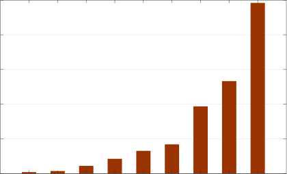

Year

Fig. 1: The exponential growth of the number of publications
per year containing the following keywords: _energy harvesting_
_IoT, self-powered IoT, batteryless IoT, and battery-free IoT_
(numbers are retrieved from _Dimensions_ [1] ).

harvesting technology can produce only small amounts of
power, which is also very dynamic and unpredictable. Continuously powering various sensors for 24/7 context monitoring
using tiny amounts of harvested power is fundamentally challenging. Unpredictability of power generation causes further
challenges for reliably completing various computing tasks
and optimizing power allocation for wireless communications.
How to optimize sensing, computing and communications for
EH-IoTs has therefore become a topic of intense research.
Figure 1 shows that the number of publications dealing with
challenges in EH-IoTs have grown exponentially in recent
years, confirming the popularity of the topic.
The concept of energy harvesting is not new and there
exist recent literature surveying recent advances in EH-related
research. These surveys, however, do not capture many recent
advances in EH-IoTs, such as those related to commercialization, standardization, context sensing from EH patterns,
intermittent computing, or some emerging communication
techniques. Our survey aims to fill this gap in the current
literature. Table I compares the coverage of our survey against
previously published ones, while Figure 2 shows a more
detailed taxonomy of our survey. For topics extensively covered in the previous surveys, such as the energy harvesting
techniques and transmission optimization solutions, we only
provide a brief summary in this paper for the benefit of the
readers and for the sake of completeness, while the details are
referred to those references for additional information.

The survey is organized as follows. After a brief introduction to the basic architecture of an EH-IoT device, Section
II surveys the recent commercial and standards developments
in this area. Section III surveys methods that enable use of
energy harvesting hardware as a proxy for conventional sensors to detect contexts more efficiently in terms of energy. The
advancements on energy harvesting computing, including efficient checkpointing and timekeeping for intermittently powered scenarios are reviewed in Section IV. Section V surveys
recent research in novel wireless communication techniques

1 https://app.dimensions.ai/discover/publication

2

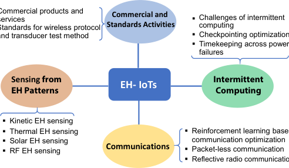

Fig. 2: Taxonomy of our survey covering recent advances
in commercialization, standardization, sensing, intermittent
computing and communications for EH-IoTs.

for EH-IoTs, including applications of reinforcement learning
to optimize power allocations on-the-fly under unpredictable
energy productions as well as packet-less and backscatter
communication of basic IoT notifications. Future research
directions are envisaged in Section VI, before we conclude
the survey in Section VII.

II. C OMMERCIAL AND S TANDARDS D EVELOPMENTS IN

EH-I O TS

Although large scale pervasive deployments of EH-IoTs
are yet to come, we are beginning to witness some early
commercial successes in this area. There also exist fully
working prototypes of EH-IoTs demonstrated in various research laboratories. Moreover, as summarized in Table II,
there is an upward trend in the number of third party vendors
specializing in energy harvesting components and solutions
suitable for IoTs. Collectively, these developments provide
compelling evidence supporting the feasibility and promise
of using renewable energy to self-power the next generation
of IoTs. This section reviews recent developments in EHIoTs including initial efforts for standardizing wireless communications suitable for EH-IoTs. To gain an insight to the
working principle, we start this section by examining the
system architecture of such devices.

_A. System Architecture of Emerging EH-IoTs_

It is important to design the architecture of EH-IoT to
ensure existing electronic components (e.g., microprocessors,
sensors, and radios) can be seamlessly reused in these new
breed of devices. Although the actual details of the device
architecture will vary from vendor to vendor, we capture the
basic components and connectivity in Figure 3. As can be seen,
the current design of EH-IoT allows us to simply replace the
battery by an energy harvesting module, and the remaining
IoT electronic components can be seamlessly integrated and
powered by the module. This design simplicity is achieved
by breaking the energy harvesting component into two subcomponents: an energy harvesting _transducer_ followed by a
_power management module_, which includes storage element,

3

TABLE I: Comparison of existing EH surveys/reviews with this survey.

**EH Communication**
**Energy Source** **RF EH** **Commercial** **Sensing from** **Intermittent**

**Paper** **/Techniques** **WPT&SWIPT) Standards/Activities** **EH Patterns** **Computing** **EH-Optimized** **Packet-less** **Reflective**
**Transmission Communication** **Communication**

[12] Comprehensive Comprehensive None None None None None None

[13] Comprehensive None None None Brief Summary Brief Summary None None

[14] Moderate Comprehensive None None None Moderate None None

[15] Brief Summary None None None None Moderate None None

[16] Comprehensive Moderate None None None Comprehensive None None

[17] Brief Summary None None None None Comprehensive None None

[18] Brief Summary Moderate None None None Comprehensive None None

[19] Moderate Comprehensive None None None None None None

[20] Brief Summary None None None Moderate None None None

[21] None Brief Summary None None None None None RFID

[22] None Moderate Brief Summary None None Moderate None Ambient Backscatter

**Ours Brief Summary** **None** **Comprehensive** **Comprehensive Comprehensive** **RL-based** **Comprehensive** **IRS**

*RL-based refers to Reinforcement Learning based online communication optimization, IRS refers to Intelligent Reflective Surface.

(a)

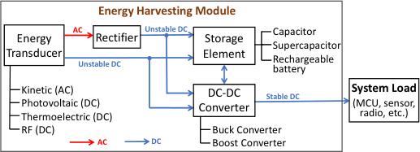

(b)

Fig. 3: Generic system architecture for (a) conventional IoT
powered by battery and (b) emerging EH-IoT, which simply
replaces the battery with an energy harvesting module.

DC-to-DC converter, and rectifier if the power source produces
alternating current (AC).

The fundamental purpose of the transducer is to convert
ambient energy available in the environment in various forms
into usable electricity that can be used to power the IoT
electronics. Different transduction techniques and materials
can be used to harvest energy from different sources. There are
four main sources of ambient energy suitable for IoTs. They
are kinetic (a.k.a motion, vibration, and mechanical), solar,
radio frequency (RF), and thermal. Different sources produce
energy under different contexts. For example, kinetic energy
harvesting is only possible if the object moves, vibrates, bends,
or experiences some type of motion. In contrast, a solar cell
can produce electricity even for static objects, but it cannot
work in the dark. A thermal source can generate electricity
even for static objects in the dark as long as the temperature
differences in space or time are present. Finally, the RF
energy harvesting can convert ambient radio waves into usable
electricity and would work for all type of objects as long as it
is within the coverage of some type of radio transmitters. More
details about the mechanisms, characteristics, and applications

of these energy sources and the corresponding transduction
techniques can be found in [23], [24]; we compare and contrast
them in Table III from the perspective of their use in EHIoTs. As can be observed, given different application scenarios
and requirements of EH-IoTs, we need to select the proper
energy harvesting transduction techniques. For example, there
is no point to employ solar energy harvesting if the object is
expected to operate mostly in dark environments.
The transducer, however, can only generate electricity as
energies become available in the environment, which means
that the transducer output is highly unstable and cannot be
used directly to power conventional electronic components that
are designed for stable direct current (DC) supply. A power
management module is therefore required to further regulate
the electricity generated by the transducer in order to produce
stable power supply for the IoT electronics. Such regulation
may involve simple DC-to-DC conversion, or if the transducer
produces AC, it may also require AC-to-DC conversion (i.e.,
rectifier) as part of the energy harvesting regulation. Finally, as
electricity generation can be very dynamic and intermittent, it
is often necessary to store the harvested electricity for a while
before using it. Therefore, the power management module also
often includes a capacitor or a rechargeable battery.

_B. Commercial and Academic EH-IoTs_

With the efforts of researchers and engineers, there exits a
wide range of self-powered IoT devices in the academia and
commercial sectors. These devices achieve energy autonomous
operation merely relying on the energy harvested from the
environment. The application domain varies from smart building and transportation, to wearable and implantable medical
devices. In this subsection, we review the existing battery-free
prototypes or products in different application domains.
_1)_ _**Smart building**_ _:_ A smart building deploys many different IoT devices, such as temperature or humidity sensors,
smoke detectors, camera sensors (for surveillance) and wireless switches, to enable a smart and convenient control of the
environment. However, the deployment and maintenance of

4

TABLE II: Vendors specializing in energy harvesting components and solutions suitable for IoTs.

**Company** **Source** **Energy Harvester** **EH Solution** **Application** **Foundation Year**

Piezo Systems Kinetic ✓ _×_ piezoelectric energy harvesting 1988

MIDE Technology Kinetic ✓ _×_ piezoelectric energy harvesting 1989

EnOcean Kinetic/Solar ✓ ✓ Building 2001

Perpetuum Kinetic _×_ ✓ Transportation 2004

Bionic Power Kinetic ✓ _×_ Wearables /Military 2007

PaveGen Kinetic ✓ ✓ Infrastructure /Entertainment 2009

Eight19 Solar ✓ ✓ Health care/Retail /Infrastructure 2010

SolePower Kinetic _×_ ✓ Wearables 2012

PsiKick Kinetic/Solar/Thermal _×_ ✓ Industry 2012

Greengineering Thermal _×_ ✓ Building/Industry/Transportation 2012

ReVibe Energy Kinetic ✓ ✓ Industry/Transportation 2013

Enerbee Kinetic _×_ ✓ Building/Industry 2014

AMPY Kinetic ✓ _×_ Wearables 2014

8power Kinetic _×_ ✓ Industry 2015

Freevolt RF ✓ _×_ Building/Wearables 2015

Nowi Energy RF ✓ ✓ Industry/Wearables/Transportation 2015

ParkHere Kinetic ✓ ✓ Infrastructure 2015

Aqua Robur Kinetic ✓ ✓ Industry/Irrigation 2015

Kinergizer Kinetic ✓ ✓ Industry/Wearables/Transportation 2016

Trameto Multiple _×_ _×_ Power management integrated circuits 2016

Otego Thermal ✓ ✓ Industry 2016

Zolitron Technology Solar ✓ ✓ Industry/Transportation 2016

Lightricity Solar ✓ _×_ Industry/Wearables/Building 2017

EnergIoT Kinetic ✓ ✓ Industry/Transportation 2017

TABLE III: Typical energy harvesting sources and techniques used in EH-IoTs.

**Source** **Transduction** **Signal** **Principle** **Requirement** **Energy Density**

Piezoelectric AC Apply compression on crystalline materials

Walking: 49 _µW/cm_ [2] @3 _km/h_,

Kinetic

Electromagnetic AC Change of magnetic field under movement piezoelectric EH, knee bending [25]

Motions or vibrations

Electrostatic AC Change of electrical field under movement Wind: 370 _µW/cm_ [2] @15 _m/s_,

Triboelectric AC Frictional contact of two different materials triboelectric EH [26]

Thermoelectric DC Spatial temperature gradient 14 _uW/cm_ [2] on human wrist,
Thermal Temperature difference

Pyroelectric AC Temporal temperature difference thermoelectric EH [27]

Transparent:7 _mW/cm_ [2] @128klux [28]
Solar Photovoltaic DC Convert light into electricity Bright environment Opaque: 26 _._ 7 _mW/cm_ [2] @128klux [29]
Opaque: 16 _µW/cm_ [2] @400lux [30]

TV tower:60 _µW_ @distance 4.1km [31]
RF RF radiation AC Convert electromagnetic wave into electricity Radio coverage
Wi-Fi: 100 _µW_ @distance 2 feet [32]

large number of IoT devices incur high cost including labor.
Meanwhile, indoor environment provides a variety of energy
sources like light, radio frequency (e.g., Wi-Fi), and kinetic
energy from interaction with human beings. Therefore, collecting such energy to power IoT devices would be possible to
reduce the cost due to deployment (by eliminating wires) and
maintenance (by eliminating the replacement of battery). Many
prototypes and products in this category exist in academia and
commercial arena.

In [35], the authors presented a self-powered airflow sensing
and control system. By mounting the piezoelectric energy
harvester to the outlets of the air conditioning system, it can
harvest energy from the airflow and power the sensor nodes

which report the airflow speed to a server, thereby achieving real-time monitoring and control. In [11], a batteryless
power meter named Monjolo was developed. By attaching an
electromagnetic energy harvester to the power line, based on
the Faraday’s law, electricity was generated when the current
flows through. Once the harvested energy reaches a certain
value, it was used to transmit a pulse, and eventually, the
power load can be estimated based on the pulse reception
frequency/rate. Using the electromagnetic energy harvester,
the authors in [48] also designed a batteryless sensor, called
Tethys, which harvests energy from water flows. The harvested
energy was leveraged to transmit the time stamp of the start
and end of a shower process, thereby estimating the amount

5

TABLE IV: Examples of self-powered IoTs: commercial products and research prototypes.

**EH** **Release Energy** **Energy Harvesting Capability**
**Domain** **Product** **A/C** **Radio** **Function**
**Technique** **Year** **Storage** **(Form Factor)**

Sensors [33] Solar/Photovoltaic C 863MHz      - Capacitor [Temperature] 5min @400lux to send the first telegram
monitoring from cold start (solar cell: 50 _×_ 20mm)
Wireless Kinetic/Piezoelectric C 868MHz      -      - Dimming/shutter Each push and release of button can actuate
Switch [4] control a telegram transmission
Smart CleanSpace Radio frequency C BLE 2015 - Air quality Tag [34] monitoring
Building Air conditioning Generate 667 _µ_ W at 5.5m/s airflow speed

[35] Kinetic/Piezoelectric A Zigbee 2013 Battery
monitoring (piezoelectric EH: 20cm [2] )
Monjolo [11] Electromagnetic A Zigbee 2013 Capacitor Energy metering Generated 4mW at 60W load
WISP [36] Radio frequency A 928MHz 2008 Capacitor Context monitor Generate 310 _µ_ W with 0dBm input power
EnHANT [37] Solar/Photovoltaic A UWB-IR 2013 Battery Object tracking Generated 70 _µ_ W/cm2 at lab environment
Lunar Step counting, Exposure at _>_ 10K lux for 1 hour can
Solar/Photovoltaic C BLE 2017 Battery
Watch [9] Sleep tracking support 24 hours operation
Sequent Kinetic/ Activity, heart      C BLE 2017 Battery
Watch [8] Electromagnetic rate tracking

Thermal/ Step counting, Can operate using the energy converted
PowerWatch [10] C BLE 2017 Battery
Thermoelectric sleep tracking from body heat

Kinetic/ Wi-Fi/ Wearable and Generate 100mW
Smartboots [5] C 2012      Electromagnetic Cellular military motoring (form factor: shoe)
Wearable INSTEP [6] Kinetic C BLE 2011 Battery Activity tracking, Generate 1W@walking (form factor: shoe)

PowerWalk [7] Kinetic/Piezoelectric C      - 2007      - Wearable and Generate 11W from knee bending
military motoring (form factor: knee brace)

Kinetic/ Generate milliwatts from activity
AMPY [38] C BLE 2014 Battery Power charger
Electromagnetic (form factor: power bank)

Sunglasses [39] Solar/Photovoltaic A      - 2017 Capacitor [Temperature and] Generate 400 _µ_ W at 500lux
light monitoring (form factor: glass lens, solar cell 31cm [2] )

[40] Kinetic/Piezoelectric A BLE 2016 Capacitor Activity tracking Generate 1-2mW (piezoelectric EH: 50cm [2] )

HiPER-D [41] Kinetic/ C     - 2016 Energy harvesters tha Generate 3mW at vibration of 1g and 20Hz
Electromagnetic support customized (cylinder: height 75mm and diameter 35mm)
Industry Model Kinetic/ C - 2013 asset condition Generate 150mW at vibration of 1g and 60Hz
A/D/Q [42] Electromagnetic monitoring, tracking, etc. (form factor: power bank, cylinder battery)
Fenix Hub [43] Kinetic/turbine C LoRa 2015 Battery Irrigation Generate up to 4W (200 _×_ 160 _×_ 65mm)

BLE/ Asset tracking
Z-Node [44] Solar/Photovoltaic C 2016 Battery (form factor: 80 _×_ 90 _×_ 12mm)
NB-IoT Smart traffic
Pacemaker [45] Kinetic/Piezoelectric A      - 2014      - Drive pacemaker Generate 3 _µ_ J/cm [3] /heartbeat(Cylinder 21mm [3] )
IMD Heart monitor [46] Kinetic/Triboelectric A - 2016 Capacitor Heartbeat monitor Generate 19.5nW at heart beat of 80 bpm

Pacemaker [47] Biofuel/Glucose A      - 2013      - Drive pacemaker Generate 470mV voltage, 5mA current
(form factor: 10 _×_ 4 _×_ 0.3cm)

*A/C represents Academia prototype or Commercial product.

of water consumed. The authors in [49] proposed an in-home
living activity recognition system which utilizes passive infrared sensors and door sensors to detect different activities, like
eating, sleeping, cooking, working and so forth. The sensors
are equipped with solar panels to harvest energy from sunlight
or bulb light.
In the commercial market, there also exist some selfpowered IoTs for smart building. For example, the Wireless
Switch [4] from EnOcean is able to transmit a radio telegram
for remote monitoring of switch status when it is pushed every
time. It also provides convenient control of lighting, temperature and miscellaneous electric loads. Similarly, CleanSpace
Tag [34] is a batteryless air pollution monitor that harvests
energy from the ambient RF signals radiated by Wi-Fi access
points or cellular base stations. It can track air pollution
condition and record the users’ exposure to harmful carbon
monoxide so that it protects them from harmful air pollutions.
WISP [36] is a RF powered IoT device with capability
of environmental sensing, and has been widely used in aca

demic research. It has two descendant versions, Moo [50] and
SocWISP [51], which are upgraded in term of microcontroller,
flash memory, and software firmware. Another example is EnHANT Tags [52] which harvest energy from indoor light using
organic solar cells and exchange tag IDs with the neighboring
Tags through UltraWideband Impulse Radio (UWB-IR) for
object tracking, for example, locating a misplaced book in a
library [53].

_2)_ _**Wearable devices**_ _:_ Harvesting energy from human activities or body heat are viable solutions to power wearable
devices. In [40], the authors proposed a shoe based battery-free
wearable sensing platform where the power is generated from
the two feet when people walk. The designed piezoelectric
energy harvester achieved a power output of 1-2 _mW_, which
enables the operation of sensors, microcontroller unit (MCU),
and radio with reasonable duty-cycling. Similarly, the authors
in [54] presented a batteryless sensor platform which harvests
energy from human motions. The sensor node equipped with
an electromagnetic energy harvester was able to adjust its

6

sensing rate and data transmission rate according to the
jogger’s activity. In [55] was developed SensorTile, a selfpowered wristband, which is integrated with three photovoltaic
strips. Combining with the on-board sensors, the wristband
was able to detect human activities and communicate with

a smartphone using Bluetooth Low Energy (BLE). Similarly,
a sunglass that is able to measure the sunlight intensity
and ambient temperature without the need of battery was
developed in [39]. The two lenses of the sunglass were fitted
with semi-transparent solar cells, which harvests energy from
the sunlight.
Some self-powered wearable products are also available in
the market. A smart shoe from Instep NanoPower [6] enables
human activity recognition, where the energy is harvested from
daily walking and running. There are several smartwatches
which can operate batteryless by harvesting energy from
human body. The Sequent Watch [8] is equipped with an
electromagnetic energy harvester and relies on human wrist
motions to power the functions. Matrix PowerWatch [10]
harvests energy from body heat through a thermoelectric
energy harvester, while the Lunar Watch [9] equipped with
transparent solar cells harvests energy from the sunlight. All
such smartwatches support popular wearable applications like
step counting and health monitoring.
_3)_ _**Industry/transportation**_ _:_ Self-powered IoT devices have
also been deployed in transport and industrial domains. Different motion energy harvesters are designed to cater for a variety
of applications, such as process control, asset condition monitoring, tracking, and railway condition monitoring. Examples
like HiPER from Kinergizer [41] as well as modelA/modelD
from ReVibe Energy [42], have been adopted in practical
scenarios. For instance, when HiPER is mounted on the
lower flange of the track, it is able to harvest energy from
passing trains and power the integrated sensors for monitoring
services, like condition monitoring of wheels and bearings.
Similarly, in [56], the authors presented a batteryless wireless
sensor node equipped with a piezoelectric energy harvester
to collect energy from vibrations caused by passing vehicles.
The harvested energy was used to power the radio for data
transmission so that the remote server was able to analyze the
traffic flow.
_4)_ _**Implantable medical devices**_ _:_ In the past decades, implantable medical devices (IMDs) have been designed and
implemented to observe human physical actions, enhance the
functionality of some damaged or degraded organs, and deliver
drugs for the therapy of special diseases. Various medical
devices, such as cardiac pacemakers, cochlear implants, tissue
stimulator, and so on [57], [58] have been widely used to
provide physical treatment as well as assist healthcare tracking
services in clinical practices.
Given that reliability is a critical concern, IMDs typically
rely on batteries to maintain sustainable operations. However,
one major drawback of battery-powered IMDs is its limited
lifespan with only several years [59], which often require
battery replacement through surgery. Therefore, research exploring energy harvesting IMDs has been conducted in recent

years.
In [60], energy harvested from heart motions of a swine

TABLE V: Standardization activities for EH-IoTs.

**Aspect** **Type** **Standard** **Y** **Domain**

Amplitude ISO/IEC
2012
Wireless modulation 14543-3-10 [61] Home

Protocol Frequency ISO/IEC
2016 [electronic]
modulation 14543-3-11 [62]

IEC 62969-3 [63] 2018 Vehicle sensor

Piezoelectric

IEC 62830-4 [64] 2018

IEC 62830-1 [65] 2017

EH IEC 62830-3 [66] 2017
Consumer/
Electromagnetic

Transducer IEC 62407-28 [67] 2017

Military/

IEC 62830-2 [68] 2017
Industry
Thermoelectric
IEC 62830-5 [69] 2018

IEC 62830-6 [70] 2018

Triboelectric

IEC 62830-7 [71] 2018

*Y represents Release Year.

was collected using an implanted piezoelectric device and the
results showed the feasibility to drive artificial pacemakers.
A triboelectric generator with output voltage up to 14 _V_ and
output current up to 5 _µA_ was designed and fabricated in [46].
Implanting the generator into an adult swine for over 72 hours,
the results demonstrated that it can achieve self-powered wireless transmission for real-time heartbeat monitoring. In [47],
the authors used a single biofuel cell to harvest energy from
human body and designed a power management module to
activate a pacemaker. The results show that it is able to power
the pacemaker for at least 5 hours.
To conclude, self-powered IoTs have already started appearing in several application domains and new companies
continue to innovate, design, and market novel energy harvesting solutions for IoTs. From Table IV, we can observe that
kinetic energy gains most popularity for wearables, industry
and IMDs, while smart building has the opportunity to adopt
a wide range of energy sources.

_C. Standardization Activities for EH-IoTs_

To promote interoperability, the International Organization
for Standardization (ISO) and the International Electrotechnical Commission (IEC) have taken initial steps to standardize
two important aspects of EH-IoT, namely wireless communication protocols and transducer testing methods. In the
following we describe these activities, a summary of which
is provided in Table V.
_1)_ _**Standardization of wireless protocols**_ _:_ This activity seeks
to standardize new wireless protocols that are suitable for
energy harvesting devices, which have access to extremely
small amount of energy and may not have consistent supply of
energy. The ISO and IEC have jointly released a standard for
wireless short packet (WSP) protocol optimized for energy
harvesting. This protocol is targeted for smart home applications such as lighting, heating, energy management, blinds
control, different forms of security control and entertainment

fig

(a)

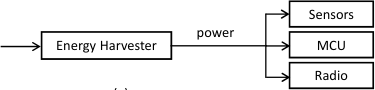

(b)

Fig. 4: Paradigm of (a) current EH-IoTs and (b) novel EH-IoTs
using energy harvesters as sensors.

(audio and video) where various sensors and switches transmit
very short command and control messages. The WSP is
designed to carry such short messages using minimal number
of bits to improve the chances of successful transmission even
if the amount of harvested energy is extremely small.
The OSI layers 1-3 have been specified and the medium
access control (MAC) does not enforce the conventional carrier
sensing or listen before talk (LBT) prior to transmission.
Instead, devices are allowed to transmit on the channel
straightaway whenever they want to, which is referred to
as _random access_ within the standard. The random access

mechanism serves two important functions. First, devices
equipped only with transmitters but no receivers, can still
effectively participate in the IoT eco-system. Second, even if
the device has a receiver, it can choose to turn it off when
transmitting if the harvested energy cannot power both the
transmitter and receiver at the same time. To avoid collisions,
the standard recommends such devices to operate at very low
duty cycling or implement retransmissions at higher layers.
Two different modulation schemes, amplitude modulation
(AM) and frequency modulation (FM), have been proposed
for WSP to deal with both energy efficiency and mobility of
IoTs. The AM is more energy efficient, but less effective for
mobile objects because the antenna impedance gets affected
when held in hand or placed on metal surfaces. It also affects
the amplitude linearity but not the frequency. Therefore, FM
is recommended for mobile devices. While low frequencies,
such as 315 MHz, can be used for AM, frequencies above
800 MHz is recommended for FM communications to achieve

a reasonably small size for the antenna which suits mobile
devices.

_2)_ _**Standardization of test methods for energy harvesting**_
_**transducers**_ _:_ This activity seeks to devise standard methods
for testing and evaluating specific types of transducers, such
as those used for vibration and thermal energy harvesting.
The IEC released nine standards so far that cover testing
methods for piezoelectric, electromagnetic, thermoelectric, and
triboelectric energy harvesting. The applications of these transducers involve consumer, military, and industrial electronics.
These initial standardization activities are expected to accelerate the development and deployment of energy harvesting
IoTs in the coming years. Despite such commercial and
standards activities, there remain plenty of opportunities to
further optimize the sensing, computing, and communications

7

Energy Energy Energy Energy
Transducer Storage Transducer Storage

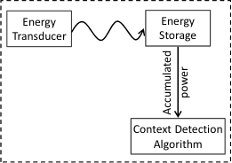

(a) (b)

Fig. 5: Illustration of using (a) Instantaneous and (b) Accumulated power signal for context sensing.

tasks of an EH-IoT, which has become a topic of intense
research in recent years. We survey these research works in
the rest of this paper.

III. C ONTEXT S ENSING FROM EH P ATTERNS

Sensing various user and environmental contexts is the main
application for many IoTs. Conventionally, context detection
tasks are achieved with the help of specialized sensors, such
as inertial sensor, microphone, GPS, light sensor, and so on.
These specialized sensors, however, require external power
supply to operate, making their extended use problematic
for EH-IoTs, especially during energy-starving periods. Fortunately, based on the observation that energy harvesting patterns
often reflect the context in which energy is being harvested,
many researchers have successfully demonstrated the detection
of a wide variety of contexts by reusing kinetic, thermoelectric,
solar, and RF energy harvesting patterns. This section surveys
these recent studies, a summary of which is presented in
Table VI.

_A. Energy Harvesters as Sensors_

As shown in Figure 4(a), to sense various contexts, current
EH-IoTs utilize the harvested energy to power sensor, MCU,
and radio. To maintain continuous monitoring services, the
energy consumption of sensors significantly affects the operation lifetime, especially in energy-constrained environment. As
shown in Figure 4(b), EH-IoTs also open up a new opportunity
for context sensing by reusing the energy harvesting signals.
For example, kinetic-powered wearable IoTs are able to detect
and count the user’s step, as the energy harvester generates
distinguishable peaks in the energy harvesting signal each time
the legs hit the ground [72]. Similarly, a thermoelectric energy
harvester is able to detect any changes in surface temperature
simply from the variations in the generated energy harvesting
signal [73], [74]. These examples encourage the use of energy
harvesters as _self-powered sensors_ for EH-IoTs, which yields
tangible power-saving opportunities as well as simpler and
more compact hardware.
In recent years, the EH patterns from kinetic, thermoelectric,
solar, and RF energy harvesters have been demonstrated to
detect a variety of contexts. Irrespective of the type of energy
source, there are two main approaches for sensing from energy
harvesting signals as illustrated in Figure 5. The first approach
analyzes the patterns of the _instantaneous power_ generated by

1 RunningWalking

~~0.~~ 8

~~0.~~ 6

~~0.~~ 4

~~0.~~ 2

~~0~~
0 2 4 6 8 10
Time (s)

(b)

1

0

-1

2

0

-2

EH Signal - Walking

EH Signal - Running

0 2 4 6 8
Time (s)

(a)

Fig. 6: Illustration of (a) instantaneous AC voltage and (b)
accumulated capacitor voltage when a subject is walking and
running wearing a piezoelectric energy harvester. The patterns
of the AC voltage and the slopes of the capacitor voltage are
different for walking and running.

the energy harvesting transducer, while the second approach
uses the amount of the _total energy accumulated_ in the storage
over a specific period of time. The first approach allows the
detection of a rich set of contexts at the expense of more
frequent sampling of the fluctuating power values. In contrast,
the second approach can offer more significant power saving
by sampling the stored energy only once in a while at the
expense of more coarse-grained context sensing. Next, we
review recent research works that apply these two approaches
for context sensing with different EH schemes.

_B. Context Sensing from Kinetic EH_

Because kinetic energy harvesting (KEH) methods harvest
energy from external kinetic contexts (e.g., human motion,
activities, mechanical vibrations) that strain or vibrate the
transducer, the generated energy signal contains patterns and
signatures of the external contexts. Thus, by using appropriate
signal processing and pattern recognition algorithms, the KEH
signal can be used as the proxy to sense and detect the
external kinetic context. Following this intuition, researchers
have attempted to detect a range of contexts directly from
the KEH without using any conventional motion sensors (e.g.,
accelerometer). In the following, we give an overview of
KEH-based sensing techniques for eight different contexts,
discuss their performances as well as any reported power
saving obtained when compared to the conventional sensorbased context sensing.
_1) Human Activity Recognition (HAR):_ For KEH-powered
wearable IoTs, such as fitness bands or smart shoes, the
harvested energy is significantly influenced by the activity
performed by the user. For two activities (e.g., walking and
running), Figure 6 illustrates both the AC voltage (instantaneous power) from the transducer as well as the capacitor
voltage (accumulated energy) collected from a KEH-powered
wearable worn by a test subject in our laboratory. In case
of the instantaneous power signal, the maximum of the AC
voltage signal generated by running is higher than that from
walking. Similar behavior can be observed in Figure 6(b, in
which the charging rate of the capacitor voltage (i.e., the slope

8

of the signal) is distinct between the two activities. It means
that human activity recognition (HAR) can be realized without
engaging any specialized sensors. An important question is
whether such KEH-based activity detection can scale beyond
just walking and running.

Using piezoelectric energy harvester inside shoes, the authors in [75] conducted an experiment with three subjects
performing six different activities – normal walking, strolling,
brisk walking, jogging, ascending stairs, and descending stairs.
By simply using the relationships between peak values, time
length, and slopes of the transducer AC waveforms, they were
able to classify all six activities with over 90% accuracy. This
experiment demonstrates that it is feasible to use KEH as a
self-powered sensor for HAR.

In [76], the authors (that includes some of the authors of
this paper) conducted further experiments to assess (a) how
well the KEH can detect human activities when worn on
other body parts, such as wrist, instead of in the foot [2], (b)
how accurately the KEH can detect activities compared to
the accelerometers, and (c) how much power can be saved
if KEH, which does not require a power supply, is used for
HAR instead of an accelerometer. The authors in [76] also
used piezoelectric KEH and conducted experiments with ten
subjects performing five different activities – standing, walking, running, ascending stairs, and descending stairs – while
holding the KEH device in the hand. To compare between
the KEH and accelerometer, the handheld device was also
instrumented with an accelerometer. Using machine learning,
the authors found that the accelerometer could classify these
five activities with an accuracy of 95%, while KEH could
achieve only 80%. This outcome revealed that although KEH
has the potential for HAR, it may be challenging to achieve
recognition accuracy comparable to the conventional sensorbased systems, especially when the wearable is worn in the
hand. On the positive side, a detailed power consumption
experiment revealed that the KEH-based detection consumed
79% less device power than the accelerometer-based system.
In fact, the power consumption for KEH-based HAR can
be saved even further when the accumulated energy in the
capacitor is used once in a while to detect different activities
instead of continuously sampling the transducer AC voltage to
detect patterns [77].

_2) Transportation Mode Detection:_ As noted in Table III,
KEH can harvest energy from vibrations. Given that a wearable device is subjected to different vibration patterns when the
user travels via different transportation modes, it is expected
that KEH can be used to sense the transportation mode of
an individual’s everyday travel. Applying machine learning
to KEH AC voltage time series data from a wearable piezoelectric energy harvesting device, Lan et al. [78] was able to
achieve 85% accuracy in determining whether the user was
traveling by car, bus, or train. A more detailed study further
revealed that KEH data can also identify the specific train
routes traveled by a user [79].

2 Note that it is relatively easier to detect human motions when the sensor
is worn in the foot, but the performance drops when worn in hands.

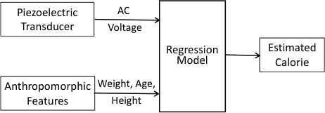

Fig. 7: Signal pipeline for calorie estimation from piezoelectric
energy harvesting voltage.

_3) Estimation of Calorie Expenditure:_ During physical activities, people produce kinetic energy by expending or burning
some calories. Since a wearable KEH harvests kinetic energy
produced during physical activities, the voltage output of a
wearable piezoelectric transducer should contain information
that can be used to estimate the amount of calorie expended by
the wearer. To prove this hypothesis, the authors in [80] conducted an experimental study with ten volunteers performing
two different physical activities, such as walking and running.
The expended calorie is estimated using the regression model
_C_ = _Xβ_ + _ϵ_ (the signal pipeline is shown in Figure 7),
where C indicates the estimated calorie expenditure at the _k_ _[th]_

minute; and _X_ denotes the vector of input signals, including
the anthropometric features of the volunteers (i.e., their weight,
height, and age), as well as the output AC voltage signals
from the transducer. The parameters _β_ and _ϵ_ are the vector
of coefficients and residual error, respectively. It was found
that, for most subjects, the calorie estimations obtained from
the output voltage of KEH were very close to those obtained
from a 3-axial accelerometer for both walking and running.
_4) Step Counting:_ Several efforts have been made on
investigating the possibility of counting steps from the kinetic
energy harvested from a wearable device. For example, in [81],
a ferroelectric energy harvesting device was designed in the
form factor of an insole to harvest energy from human
walking. The capacitor voltage waveform is leveraged for the
purpose of step-counting, as it exhibits a stair-like pattern
where each ‘stair’ corresponds to a single step of walking.
Experimental results showed an estimation error less than 4%
in step counting.
In [82], the authors also used KEH inside shoes, but the capacitor voltage was used in a different way to count the steps.
Once the capacitor voltage exceeds a pre-defined threshold,
the capacitor would be discharged to power a Bluetooth beacon transmission, which is received by a nearby smartphone
running the step counting app. When the capacitor voltage
decreases below the voltage threshold, Bluetooth transmission
would stop until the capacitor voltage reaches the threshold
again. Thus, by counting the number of Bluetooth packets
received, the smartphone app can estimate the number of steps
taken. The reported error for step counting ranged from 4%
to 20% for walking on a flat surface.
Finally, it was observed in [72] that the KEH power generation exhibits distinctive peaks for each step, which could be
accurately detected using existing peak detection algorithms.
They tested their peak detection based step counting algorithm
with four subjects under different walking scenarios including

9

stairs covering a total of 570 steps and were able to detect the
steps with 96% accuracy.
_5) Gait Recognition:_ It is well known that human gait
has distinctive motion patterns for different individuals, which
can be detected accurately using accelerometers for user
authentication [99], [100]. With 20 volunteers, the authors
in [85] set out an experiment to determine whether the KEH
AC voltage signal can also recognize human gait. They considered two different types of KEH, one based on piezoelectric
energy harvester and the other on electromagnetic energy
harvester. The authors found that both types of transducers
were able to detect gait, but with conventional classification
techniques, which operate over a single step, the KEH-Gait
achieves approximately 6% lower accuracy compared to the
accelerometer-based gait recognition. They proposed a novel
classification method, called Multi-Step Sparse Representation
Classification (MSSRC), which can match the performance
to that of accelerometer by intelligently fusing information
from multiple steps. They also showed that by eliminating
accelerometer from the processing pipeline, the KEH-based
gait recognition can reduce power consumption by 92%.
The experiments in [85] employed isolated transducers
without connecting them to a capacitor to store energy. Later, it
was discovered in [84] that when a capacitor is used to store
energy, the capacitor voltage interferes with the AC voltage
waveform of the transducer, which reduces gait recognition
accuracy. To address this problem, the authors in [84] proposed
a filter to minimize the influence of the capacitor voltage on
the instantaneous AC signal, thereby achieving simultaneous
energy harvesting and sensing for KEH.
_6) Hotword Detection:_ Human voice creates vibrations in
the air, which could potentially be picked up by the KEH
hardware inside a mobile device. Based on this observation,
in [86] the KEH’s feasibility and accuracy were studied for
detecting _hotwords_, such as “OK Google”, which are used by
voice control applications to delineate user commands from
background conversations. Using eight subjects, the authors
evaluated two types of hotword detection, susch as speakerindependent (which does not require speaker-specific training) and speaker-dependent (which relies on speaker-specific
training). They found that when spoken from 3cm, piezoelectric transducers can detect hotwords with accuracies of 73%

and 85%, respectively, for speaker-independent and speakerdependent detection. They also reported that the orientation of
the piezoelectric beam relative to the speaker has a significant
impact on the hotword detection accuracy.
_7) HVAC Airflow Monitoring:_ The IoTs can play a significant role in reducing energy consumption of heating,
ventilation and air conditioning (HVAC) systems by adaptively
controlling its output (e.g., air speed through the vents) to
the current population density of the serving area. To this
end, small IoT devices fitted with sensors have to be installed
near the vents to periodically measure the output air speed,
temperature, etc. and send them to a smart home control box.
For these IoTs to be self-powered with energy harvesting,
the sensing power consumption has to be minimal. However,
typical airflow sensors consume on the order of hundreds of
mWatts, which was a motivation in [35] to study the feasibility

10

TABLE VI: Summary of recent research on context sensing from energy harvesting signals.

**Source** **Application** **Method/Algorithm** **Performance**

Waveform analysis [75] 90% accuracy on 6 activities with 3 subjects

Activity recognition

80% accuracy on 5 activities with 10 subjects, save 79% power compared to
Machine learning [76], [83]
accelerometer based method

Transport mode detection Machine learning [78] 85% accuracy on 3 motorized modes

Calorie estimation Linear regression [80] Estimation accuracy close to that obtained from an accelerometer

Waveform analysis [81] Counting error less than 4%

Kinetic

Thermal

Solar

Gait recognition MSSRC [84], [85] 95% accuracy with 20 subjects, save 92% power compared to accelerometer

Hotword detection Machine learning [86] Up to 85% accuracy when spoken from 3cm with 8 subjects

Airflow speed monitoring Peak detection [35] Estimation error of 0.2m/s

Acoustic communication ON-OFF keying [87], [88] 5 bit/s data rate with a bit error rate of 1% at distance of 80cm

Water flow detection Binary indication [73] Extend the battery life of water flow sensors to 20 years

Heat appliance monitoring Packet interval [74] Successfully implemented to monitor stoves, radiators, and hot water flow

Chemical reaction detection Pulse amplitude [89], [90] A remote receiver can detect the reaction type from the received pulse energy

Localization Machine learning [91] Achieve a distance estimation accuracy of 21cm

Positioning Sunlight map [92] Infer the longitude and latitude of a location

Place recognition Machine learning [93] 86.2% accuracy with 9 places using 5 types of solar cell

Peak counting [94] Detect 3 different hand gestures
Gesture recognition

Machine learning [95], [96] 96% accuracy with 6 gestures, save 44% power compared to photodiode

Visible light communication OFDM [97] 11.84 Mbps data with a bit error rate of 1 _._ 6 _×_ 10 _[−]_ [3]

Step counting

Packet counting [82] Counting error ranges from 4% to 20% on flat surfaces

Peak detection [72] 96% accuracy with 570 steps under 4 surfaces including stairs

RF Environment sensing Impedance changing [98] Convert RFID tags into light sensor and temperature sensor

of HVAC airflow sensing using the voltage of piezoelectric
energy harvesters. Through experiments, the authors in [35]
demonstrated that the peak voltage of the piezoelectric harvester is a function of the airflow speed and the voltage value
under a given speed has a variation only up to 0.06V, which
suggests that using voltage to infer airflow speed has an error
of only 0.2m/s. They were able to ‘catch’ the peak voltage
by sampling the transducer output only once every 100 ms,
resulting in an overall power consumption of only 500 _µ_ W
when KEH was used as an airflow sensor.

For on-demand infrastructural sensing (i.e., only sense the
context when desired events occur), conventional approaches
usually adopt duty-cycling or adaptive sampling to save the
system power. However, using energy harvester as a passive
event detector further pushes the power consumption to zero.
In [101], the authors presented ECOVIBE, which exploits
a vibration energy harvester to detect the arrival of trains
and then activates the sensors for rail condition monitoring.
Meanwhile, the harvested energy was used to power the
sensors during the monitoring process.

_8) Acoustic Communication:_ In [87] the piezoelectric KEH
was leveraged as a communications receiver to receive data
packets transmitted by a nearby speaker by modulating sound
waves within the resonance frequency of the transducer using
simple ON-OFF keying. Experiments with a real KEH device

revealed that, at a distance of 80 cm, a laptop speaker with
the proposed modulation scheme can successfully transmit
information to the KEH device at 5 bps at a target bit error
rate of less than 1%. While this scheme would enable a KEH
powered IoT to receive commands from other speaker-enabled
devices, such as a laptop, TV, music player, etc., acoustic data
transmissions would be audible and could be annoying to some
users. A more advanced modulation scheme [88] was later
proposed that enables the transmitter to completely hide the
acoustic data transmission within background music so the
data transmission is not audible anymore.

_C. Context Sensing from Thermoelectric EH_

As discussed in Section II, thermoelectric energy harvesting
can convert any temperature difference in space or time into
usable electricity. Therefore, it is possible to use a thermoelectric energy harvester as a sensor to detect temperature-related
contexts. Indeed, researchers have successfully demonstrated
such potentials for detecting water flow, activities of various
heating appliances, as well as chemical reactions in a reactor.
_1) Water Flow Detection:_ Currently, wireless water flow
monitoring in residential water fixtures requires installing
sensors with access to electrical wiring or replacing batteries
frequently. In [73] was proposed a thermoelectric energy
harvesting solution, called DoubleDip, which harvests energy

from the pipe’s thermal gradient, i.e., the temperature difference between the pipe and the room temperature, when hot
water flows through the pipe. The harvested thermal energy is
used to wake up the sensor from deep sleep mode as well as
to compensate battery energy expenditure. Because the sensor
automatically wakes up only when needed, instead of duty
cycling at fixed intervals, it can save energy significantly. The
authors claimed that DoubleDip can extend the battery life of
water flow sensors to 20 years or even to perpetuity.
_2) Heat Appliance Monitoring:_ The authors in [74] proposed and demonstrated that thermoelectric generators (TEGs)
can be effectively used as sensors to remotely monitor any
heat-generating appliances. The key idea is to wake up the
sensing device when sufficient energy has been harvested and
force it to transmit small wireless packets as long as there
is energy available to harvest, which is basically the same
principle applied to [82] to sense human steps using KEH.
Since thermal energy is produced only when the appliance
becomes active, it is then possible to monitor the activity of
the appliance by simply monitoring the timing of the received
packets at a nearby receiver. The authors in [74] implemented
this idea to monitor stoves, toaster ovens, radiators, and hot
water flow through shower heads.
_3) Chemical Reaction Detection:_ In the context of Internet
of nano things, a self-powered sensing architecture, called
SEMON, was proposed in [89], [90] for remote detection of
chemical reactions. In particular, pyroelectric nanogenerators
that can harvest energy from the temperature variation in
time domain, are fitted with Graphene-based nano-antennas
radiating in the Terahertz band (0.1-10THz) and embedded in
the catalyst surface where different types of chemical reactions
take place. Each reaction consumes or dissipates some heat,
which causes temperature fluctuations on the catalyst surface.
When a particular reaction takes place on the catalyst surface,
a SEMON node harvests the energy consumed or dissipated
by the reaction and turns it into a Terahertz radio pulse.
Specifically, a pyroelectric nanogenerator harvests electrical
energy from each temperature fluctuation and uses the energy
to transmit a THz pulse with an amplitude proportional to the
harvested energy. Because different types of reactions dissipate
different amounts of energy, the authors were able to show via
simulation experiments that a remote receiver can detect the
reaction type from the received pulse energy.

_D. Context Sensing from Solar EH_

Similar to KEH revealing motion patterns or thermoelectric energy harvester recognizing temperature changes, the
solar energy harvesting provides information about lighting
conditions. A wide range of light-based sensing applications,
including localization, gesture recognition, and even data
transmission, have been proposed based on the characteristics
of solar energy harvesting. We survey these developments in
this section.

_1) Localization and Positioning:_ Because different locations experience different lighting conditions under the same
lighting infrastructure, it is possible to detect location by
analyzing the received lights. In [91], the authors proposed

11

and prototyped a wearable solar cell based indoor positioning
system called LuxTrace. In their prototype, solar cells are
attached to the shoulder of the user, which not only harvest
energy from the ambient indoor light, but also detect the
received light strength (RLS). By utilizing the RLS, a trained
model was exploited to estimate the relative distance between
the user’s location and the light sources. Experimental evaluation indicated that LuxTrace can achieve a distance estimation

accuracy of 21 cm (80% quantile).
In [93], different types of solar cells are exploited to identify
places in daily living spaces. The underlying principles are: (1)
the amount of energy generated by solar cells is almost linear
with the environment illuminance, and (2) solar cells manufactured with different materials, e.g., silicon and organic, show
distinct response to the wavelength of light. Using machine
learning with the data collected from five different types of
solar cells in nine different places, such as laboratory, toilet,
elevator, outdoor, etc., the authors demonstrated that a place
recognition accuracy of 86.2% can be achieved using two types
of solar cells.

The idea of using light to detect location can be extended
to a global scale. Every location on Earth has a unique
solar signature, like a unique sunrise and sunset time, which
can be used to create a _sunlight map_ of the Earth. Such
solar signatures were used in [92] to design a system, called
SunSpot, which is able to infer a location’s longitude and
latitude separately, based on the sunlight map.
_2) Gesture Recognition:_ Many IoT devices in the future are
likely to use solar panels for energy harvesting. By moving
a hand close to the solar panel, it is possible to influence
the solar energy harvesting, which in turn can be exploited to
realize gesture recognition capabilities in any solar-powered
IoT device. Motivated by this idea, gesture recognition capability of different types of solar cells have been investigated
in different conditions. For conventional opaque solar cells, a
thresholding circuit was designed in [94] to detect if the solar
energy falls below a given threshold. This allows to detect
when a hand is moved very close to the solar panel, which
causes the solar energy to drop below the threshold. By simply
counting the number of times the hand is moved near the solar
panel, the authors were able to detect three different hand

gestures.
The gesture recognition feasibility was investigated in [96]
for _transparent_ solar cells, an emerging solar energy harvesting
technology that allows us to see through those cells. This revolutionary discovery is creating unique opportunities to turn any
mobile device screen, such as that of a smartwatch (see Figure
8), into solar energy harvester. Transparency, however, means
that the absorption efficiency of the solar cell in the visible
light band is significantly lower compared to the opaque cells.
The lower absorption rate results in weaker responsiveness to
the visible light, thus making gesture recognition challenging.
To overcome this challenge, machine learning was considered
to analyze the solar photocurrent waveforms produced during
different gestures. As shown in Figure 9, the waveforms of
different gestures are different, which can be detected using
machine learning. Experimental results from [96] demonstrate
that five hand gestures can be detected by transparent solar

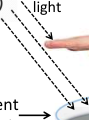

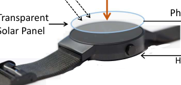

Photocurrent

Gesture
Recognition

12

**Up** **Up** **Down**

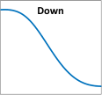

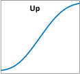

**UpDown** **DownUp**

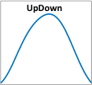

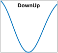

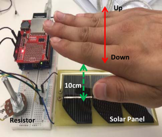

Fig. 9: Illustration of the potential for solar energy harvesting
to detect gestures. The left figure shows the experiment setup
and the right shows the distinct solar photocurrent waveforms
generated under four different hand gestures.

_E. Context Sensing from RF EH_

Passive radio frequency identification (RFID) tags are batteryless devices ubiquitously deployed today to monitor different types of events. These tags are powered by inductive
coupling with RF energy generated by a nearby transmitter
known as RFID reader. An RFID tag has an antenna which
harvests RF energy from the reader’s transmission and also
reflects the reader’s signal to encode the ID of the tag. With
conventional RFID, the reader is only able to read the ID of
the tag. These tags are often embedded in animals and objects
that are being monitored. If a reader can detect the presence
of a given ID at certain location and time, then the knowledge
can be used to monitor the activity or trajectory of the animal
or object.
In [98], embedding passive sensors, such as phototransistors
whose resistance depends on the amount of ambient light
received, was explored into RFID tags to alter the impedance
of the antenna and hence the amount of RF energy radiated
from its antenna. This would make the received signal strength
(RSS) at the reader dependent on the current lighting condition
of the RFID tag. The authors of [98] have demonstrated this
outcome for both light sensing (using phototransistor) and
temperature sensing (using thermistor) using batteryless RFID
tags. The authors claim that the idea is generic and can be
used to sense a range of other contexts including detecting
color, humidity, pressure, or even hand gestures.

_F. Lessons Learned_

Our survey shows that energy harvesters can definitely work
as a virtual sensor to detect a wide variety of contexts. Below
we highlight some important lessons learned from this study.

_•_ Out of the four typical EH sources, kinetic energy harvesting has been explored the most for context detection,
which suggests that EH-based context sensing is most
promising to replace conventional motion sensors, such
as accelerometers and gyroscopes, in active scenarios.
Because temperature usually changes gradually, thermal
EH is rather less sensitive to the context. Although Solar
and RF EH based context sensing is still in their infancy,
there is a great potential to develop novel applications in

Fig. 8: Illustration of a transparent solar powered smartwatch
with solar-based gesture recognition.

cells with an average accuracy of 95% and transparent solar
cells can recognize some of these gestures almost as good as
the opaque cells.

A key challenge for solar-based gesture recognition research
is the lack of access to many new types of solar cells,
such as transparent solar cells, which still remain in research
labs. This makes solar energy harvesting based sensing research out of reach. To facilitate gesture recognition research
with solar cells, the authors in [95] developed a simulator,
called SolarGest, which can be used to generate photocurrent
waveforms for any arbitrary solar cells and hand gestures
(the simulator code is released for public use [102]). They
validated the simulator through various gesture experiments
with both opaque and transparent solar cells. To further
improve the robustness of solar-based gesture recognition
under non-deterministic operating conditions, they combined
dynamic time warping with Z-score transformation in a signal
processing pipeline to pre-process each gesture waveform
before it was analyzed for classification. Their experiments
with 6,960 gesture samples for six different gestures revealed
that even with transparent cells, SolarGest can detect 96% of
the gestures while consuming 44% less power compared to
the light sensor based systems.

_3) Visible Light Communication:_ Visible light communications (VLC) is seen as a promising new alternative to
the conventional RF-based data communication. The VLC

harnesses a portion of the electromagnetic spectrum that is
currently license-exempt and offers a vast amount of bandwidth for high-speed wireless data communications without
any interference to existing radio communication systems.
The VLC uses light emitting diode (LED) as transmitter and
photodiode as receiver. However, these photodiodes require
a power supply to operate. In [97] is proposed the use of
standard solar panels as VLC receivers that can demodulate
VLC data signal without the need of an external power supply.
Using orthogonal frequency division multiplexing (OFDM),
the authors were able to achieve a data rate of 11.84 Mbps with
a bit error rate (BER) of 1 _._ 6 _×_ 10 _[−]_ [3] . This outcome suggests
that simultaneous communication and energy harvesting can
be realized with solar panels.

13

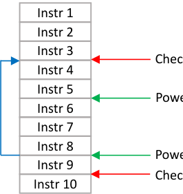

Checkpoint 1

Power failure 1

Power failure 2, 3, 4,…

Checkpoint 2

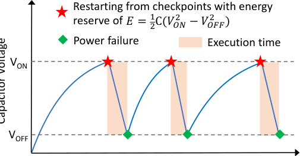

Time

(a)

(b)

Fig. 10: Illustration of (a) intermittent power supply and execution. (b) Sisyphean execution.

the future, as light and radio waves are ubiquitous and
change with context rapidly and dramatically.

_•_ Reusing energy harvesters as sensors can reduce the
EH-IoT system power consumption significantly, thereby
prolonging the device operation time.

_•_ While more significant power saving could be achieved
for context detection from the accumulated energy signal
(detecting user activity by reading the capacitor charge
level), its detection accuracy is expected to be lower than
that of instantaneous EH signals (e.g., AC voltage signal
from a piezo transducer).

_•_ Unlike specialized sensors that are designed to produce
very accurate measurements of physical phenomena, energy harvesters can only act as crude sensing hardware.
Consequently, recent studies have found that their context
detection performance is inferior to that of specialized
sensors. Clearly, further research and development are required before energy harvesters could replace specialized

sensors.

IV. I NTERMITTENT C OMPUTING FOR B ATTERYLESS

EH-I O T S

Unlike batteries, power supply from energy harvesting is
uncertain and often unpredictable. As a result, it is not unlikely
for an EH-IoT device to experience frequent power outages,
which can be as extreme as several times per second for certain
devices [103]. As all variables and registers stored in the
volatile memory during program execution are completely lost
when the power supply fails, the program execution on EHIoTs must rely on _checkpointing_, a technique to periodically
save volatile states in non-volatile memory, so that when the
power returns, the program execution can restart from a known
state. However, the unstable energy supply poses unique challenges on the operation of EH-IoTs and conventional checkpointing is unable or inefficient for intermittent computing.
In this section, we identify the challenges encountered for
intermittent computing of EH-IoTs, followed by the review
existing efforts on addressing such challenges.

3 The key is obtained by _p_ = 3 _, q_ = 5 _⇒_ _n_ = 3 _×_ 5 = 15 _, E_ = 3.

_A. Challenges of Intermittent Computing_

Although checkpointing can be effective to survive power
failures, it gives rise to the following performance issues for
an intermittently powered EH-IoT [20]:

_1) Energy Overhead of Checkpointing:_ During runtime, the
program has to copy all state variables from volatile memory to
non-volatile memory at each checkpoint, which will then have
to be reloaded to volatile memory when power returns. Thus,
the total energy overhead of checkpointing can be significant
if checkpointing is used frequently. In addition, the number
of state variables to be saved vary when the checkpointing
at different stages of a program. For example, less volatile
variables need to be copied to non-volatile memory if the
checkpointing process is executed right after a function call
rather than during the function call. Therefore, proper selection
of the stage/location for checkpointing is critical.

_2) Sisyphean Execution:_ As mentioned earlier, checkpointing allows a device to roll-back on the execution time-line
and start from a previously saved known state when power
returns following an earlier failure. Thus, at minimum, power
failures will cause some roll-back preventing smooth execution
of program on EH-IoT devices. A more serious problem can
occur when the accumulated energy since the previous power
cut-off is not enough to reach the next checkpoint. In that case,
the program makes a small progress each time it is powered on
only to roll-back to the same checkpoint repeatedly, making
the programming task impossible to complete [4] .
Figure 10 (a) illustrates intermittent power supply and
execution. Power fails and program execution stops when
capacitor voltage falls below a minimum threshold ( _V_ _OF F_ ).
Power comes back and execution restarts from the last check
point when capacitor voltage reaches to _V_ _ON_ . Figure 10 (b)
presents an example of Sisyphean execution. Specifically, the
first power failure occurs after completing the 5th instruction;
the execution restarts from instruction 4 (checkpoint 1), but
the energy reserve runs out just before reaching checkpoint 2.

4 This problem is referred to as Sisyphean because in Greek mythology,
Sisyphus, a king who annoyed the gods, was condemned for eternity to roll
a huge rock up a steep hill, only to watch it roll back down.

14

**Intermittent execution runtime with**
**Pseudocode**
**power failure & checkpointing**

**Checkpoint** **Checkpointing** // **save i = 0 to non-volatile**

**Repeat** **Reboot** // **i is set to checkpointed value of 0**

_**transmit**_ _(Encrypted_Glucose);_ _**transmit**_ _(1);_ // **Error: ‘1’ is transmitted instead of ‘8’!**

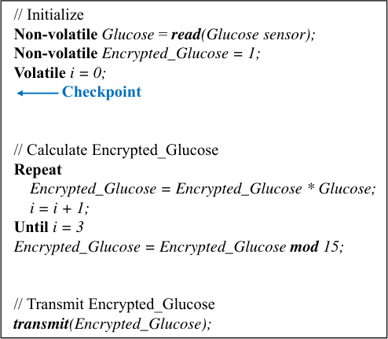

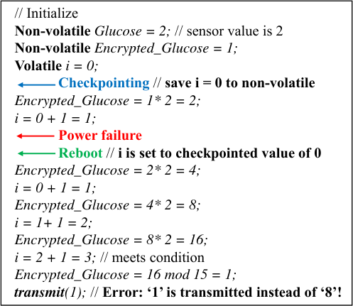

Fig. 11: An example of encrypting glucose reading using RSA public key (3,15) [3] . The original glucose reading, stored in
variable Glucose, represents one of the 15 different levels of glucose denoted as 0 to 14. The encrypted value is obtained as
_Glucose_ [3] _mod_ 15. (a) The source pseudocode showing that all variables except index _i_ are non-volatile. (b) Execution of the
code with a glucose reading of 2, encrypted as 2 [3] _mod_ 15 = 8. With the power failing after completing the loop once, the
index _i_ is reset to 0 and the loop is eventually executed 4 times producing the encrypted value of 1, instead of 8.

Thus, the execution reaches up to instruction 8 only to roll
back to instruction 4 repeatedly forming a ‘Sisyphean loop’.
_3) State inconsistency:_ Checkpointing can guarantee 100%
state preservation only if all variables are exclusively maintained either in volatile memory or in non-volatile memory,
but not split across both of them. When all variables are
maintained in volatile memory, they all are saved in nonvolatile memory at the same time at a given checkpoint, and
hence the system can roll back to a consistent global state
after power failure. This is also the same when all variables
are maintained in non-volatile memory. However, neither is
practical because volatile memory is fast but expensive, but
non-volatile memory is slow and less expensive. As a result,
to achieve fast execution at a reasonable cost, most commodity
hardware uses a small volatile memory to save the most
frequently used variables and stores the rest in non-volatile
memory. Thus the state of a program is split over volatile
and non-volatile memories. When the system rolls back to
the previous checkpoint, all variables in volatile memory
rolls back to their previous values, but those in the nonvolatile memory preserve their new values. As a result, data
inconsistencies can arise in certain cases as illustrated in the

RSA encryption example in Figure 11.
_4) Timing Inconsistency:_ A wearable IoT may be tasked
with monitoring a range of physiological data, such as blood
pressure, heart rate, glucose level, and so on, and reporting
them with timestamps to a cloud-based analytic for further
processing. However, if there is a power failure after collecting
data from a limited set of sensors, the device can only read
the remaining sensors when the power comes back. In this
case, the timestamps for different set of sensors should be

different, which could be reported accurately only if the device
had persistent timekeeping across power failures. In battery
powered devices, a real-time clock (RTK) is always maintained
to avoid this problem. However, the RTK requires a power
supply and hence persistent RTK cannot be supported in EHIoTs which experience frequent power failure [104]. As a
result, the device may report inconsistent time stamps for the
sensor data.

To address the aforementioned issues, many strategies have
been proposed to optimize checkpointing for batteryless EHIoTs as well as solutions to maintain timing across power
failures (see Table VII for a summary).

_B. Checkpointing Optimizations_

_1) Checkpoint Placement and Activation:_ refers to the
scheme of inserting potential checkpoints to the program at
compile-time and activate checkpointing processes at run-time.
Inserting checkpoints at different locations of the program
leads to distinct checkpointing overhead (including energy
and memory) as the number of variables to be saved varies.
In addition, checkpointing too early before a power failure
results in a waste of energy that can be used to perform more
computations; similarly the checkpointing process cannot be
completed if it is too late as the residual energy is not
enough. Thus, the checkpoint placement should take into
consideration the checkpointing overhead as well as device
residual energy. Due to unpredictable power failures, however,
optimal reasoning about the potential checkpoints is extremely
difficult and imposing a heavy burden on the programmer.
Momentos [105] is the first work that supports the execution
of long-running programs on intermittently powered devices,

15

TABLE VII: Summary of recent research on computing optimizations for batteryless EH-IoTs.

**Literature** **Technique** **Checkpoint overhead Sisyphean execution State inconsistency Time inconsistency**

CFG-based checkpoint placement,
Mementos [105] ✓ ✓ _×_ _×_
voltage polling checkpoint activation

CDFG-based checkpoint placement,
Idetic [106] ✓ ✓ _×_ _×_
voltage polling checkpoint activation

QUICKRECALL [107] Run time checkpointing and
_×_ ✓ ✓ _×_
Hibernus [108], [109] sleeping, advanced ADC interrupt

Task-based checkpointing-versioning,
DINO [110] ✓ _×_ ✓ _×_
manual idempotency analysis

Task-based checkpointing,
Ratchet [111] ✓ _×_ ✓ _×_
automatic idempotency analysis

Idempotency task programming,
Chain [112] ✓ ✓ ✓ _×_
channel-based data exchange

CFG-based checkpoint placement,
HarvOS [113] ✓ _×_ _×_ _×_
advanced ADC interrupt

Dynamic idempotency task decomposition,
Clank [114] ✓ ✓ ✓ _×_
checkpointing and versioning

Idempotency task programming,
Alpaca [115] ✓ ✓ ✓ _×_
privatization data exchange

Idempotency task programming,
Mayfly [116] ✓ ✓ ✓ ✓
remanence timekeeping

CleanCut [117] Automatic idempotency task decomposition ✓ ✓ ✓ _×_

TARDIS [118] SRAM decay timekeeping NA NA NA ✓

CusTARD [104] Capacitor voltage decay timekeeping NA NA NA ✓

‘✓’ represents the corresponding challenge was addressed in this work, while ‘ _×_ ’ means not. ‘NA’ means not applicable.

using checkpointing approach. It required the programmer to
manually place trigger points (i.e., potential checkpoints) in
the code. The authors proposed three checkpoint placement
strategies based on the Control Flow Graph (CFG), which
is a graphical representation of a program including basic
constructs (e.g., branching statements, loops, etc.) and the
edges connecting these constructs. Specifically, Mementos
placed a trigger point at each loop latch ( _loop-latch mode_ )
or after each call instruction ( _function-return mode_ ), which
allows an energy check after each loop iteration or at each
time a function returns, respectively. In the _timer-aided mode_,
a timer interrupt is triggered to periodically measure the supply
voltage and activate the checkpoint, if necessary. The underlying placement rationale is that the loop ends and function
returns are locations where one may expect the stack to store
fewer data, thereby less checkpointing overhead. Similarly,
HarvOS [113] located lightweight checkpoints based on the
information provided by the CFG of a program. The minor
difference is that HarvOS also exploited the memory allocation
pattern derived from static code analysis techniques [119] to
accurately calculate the amount of memory allocated during
the program.

However, placing checkpoints purely based on CFG may not
be energy efficient in some cases. For instance, when power
loss happens right before a function return, the program will
restart from the previous checkpoint that is located before the

function starts, therefore wasting the energy to re-execute the
whole function. To address this problem, Idetic [106] was
developed to optimally insert checkpoints, considering not
only the checkpointing overhead but also the re-computation
energy cost. This is achieved by leveraging the information
provided by the Control Data Flow Graph (CDFG), an intermediate representation of a program that lies between the highlevel behavioral specifications and the low-level Hardware
Description Language (HDL), which models the connections
and dependencies between processes. Different from CFG that
only represents the control flow of a program, CDFG can
present the data flow between different constructs as well.
Idetic then formulated an optimization problem and derived
optimal checkpoints using dynamic programming.

Actually, it is not necessary to initiate a checkpointing
process at each checkpoint inserted in advance. For example, if
the residual energy is enough to support the computations until
next checkpoint, then checkpointing of the current system state
is a waste of energy. Thus, energy-aware checkpoint activation
at run-time was proposed [105]–[107]. At each checkpoint,
currently available energy of the device is estimated by
measuring the storage capacitor voltage and calculating the
equation _E_ = 1 _/_ 2 _CV_ [2], where _C_ is the capacitance of the
capacitor and _V_ is the measured voltage. Then, a threshold
based strategy is used to determine whether to activate a
checkpoint. In detail, if the available energy is higher than a

pre-defined threshold, the current checkpoint would be skipped
and the execution continues; otherwise, the current system
state would be checkpointed.
However, since the number of computations between every
two successive checkpoints may be different, the determination of the pre-defined threshold is challenging. Usually, the
threshold is derived through complex offline emulation [105],

[108]. In HarvOS [113], the decision on whether to activate a
checkpoint depends not only on the currently available energy
but also on the worst-case estimation of the energy required
to reach the next checkpoints, where the worst-case assumes
that no energy will be harvested before the next checkpoint.
This strategy ensures that the checkpoints are activated much
closer to the last practical point where the system should take
a checkpointing process, thereby reducing the energy waste
on uncheckpointed work and unnecessary checkpointing.
_2) Checkpointing at Run Time:_ Some works like QUICKRECALL [107], Hibernus [108], and Hibernus++ [109] leveraged the concept of checkpointing to ensure progress of
a long-running program, but does not require insertion of
checkpoints in advance. The underlying idea is that it initiates
a checkpointing process only when a power failure is imminent, and then _sleeps immediately_ . Otherwise, it continuously
executes programs without interruption. Similarly to the basic
checkpointing method, the decision to take a checkpointing (or
the judgment that a power failure is about to happen) is based
on the measurement of currently available energy and the
threshold based activation. As there is no pre-inserted checkpoint, continuously polling the capacitor voltage is needed,
which incurs heavy energy consumption. As a result, Hibernus
and Hibernus++ exploited an advanced analog-to-digital converter (ADC) that has interrupt functionality to detect whether
the voltage reaches a certain threshold, thereby significantly
reducing the power consumption of voltage polling. However,
how to determine the threshold still remained a challenge and
offline emulation was conducted in Hibernus. To avoid the risk
of power failure when saving the system states, Hibernus++
implemented a decoupling capacitor that specially provides
power supply to the device during the checkpointing process.
Run-time checkpointing eliminates the burden on the
programmers to reason and insert potential checkpoints at
compile-time. Moreover, since it sleeps immediately after
checkpointing, data inconsistency issue does not exist. However, two drawbacks arise. First, it assumes that the closer
the checkpointing to a power failure, the better the program
executes, which may not be the fact as it ignores the energy
and memory overhead of checkpointing. For example, the last
moment before power loss may have a large amount of volatile
data to be saved, which consumes more power during the store
and restore process, and occupies more non-volatile memory.
Second, the size of the decoupling capacitor is limited and
fixed, so the stored energy may not be enough to complete a
checkpointing process.
_3) Task-based Checkpointing:_ To support intermittent program execution, there exist works that decompose a longrunning program into a sequence of short and atomic tasks,
such as sampling a sensor reading. Furthermore, the idea of
_idempotency_ [120], [121] was employed to address the data

16

Start Start

End End

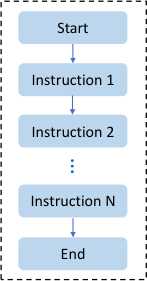

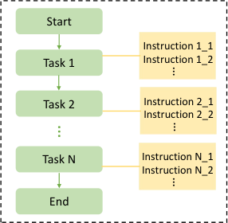

(a) (b)

Fig. 12: Comparison of (a) conventional line-based coding and
(b) task-based programming model.

inconsistency issue. Specifically, if a task is idempotent, it
can be executed multiple times without producing different
results. To ensure idempotency, the task should not contain any
_idempotency violation_, which is a write instruction to a nonvolatile memory that was first accessed by a read instruction,
termed as _write-after-read_ (WAR). Recall the example in
Figure 11, non-volatile variable _Encrypted Glucose_ is first
read after the checkpoint and there is another line of code
_Encrypted Glucose = 1*2_ assigning a new value to it before
the next checkpoint, i.e., a WAR. As long as a power failure
happens after the write instruction, a power failure before the
next checkpoint would result in data inconsistency.

Depending on how these tasks are connected, these works
can be further divided into two categories. First, the decomposed tasks are connected by lightweight checkpoints, such as
DINO [110], Clank [114] and Ratchet [111], in which a checkpointing process would be launched at the task boundaries.
DINO and Ratchet analyzed the idempotency and decomposed
a program at compile-time using static code analysis [119],
which imposes heavy burdens on the programmers. The tool
CleanCut [117] can automatically decompose programs into
efficient, idempotent tasks at compile-time. At run time, the
executions were performed task-by-task and a checkpointing
process is launched after a task. In contrast, Clank dynamically
and automatically decomposed program executions into a
stream of sections at run-time.

Second, the execution just follows a task flow and no
checkpointing is needed between tasks, such as Chain [112]
and Alpaca [115]. Instead of decomposing a long program that
is written line-by-line (or instruction-by-instruction), Chain
and Alpaca designed a new programming model where a
program is written at the granularity of a task, i.e., groups of
instructions, and these tasks are connected through a control
flow graph. Figure 12 illustrates the comparison of conventional line-based coding model and task-based programming
model. In addition, Chain and Alpaca proposed a judicious
data management scheme that eliminates checkpointing as
well as data inconsistency. In detail, the variables are defined
as either task-local or task-shared, where the former is limited
to use in individual tasks and stored in volatile memory, while

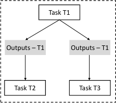

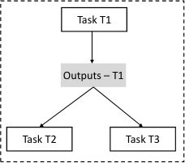

Non-volatile Memory

(a) (b)

Fig. 13: Comparison of data exchange mechanism in (a) Chain
and (b) Alpaca.

the latter is defined in the global scope and stored in nonvolatile memory. Since a task is idempotent and its inputs
are stored in non-volatile memory, it is expected to produce
the same results from power failures, thereby preserving data
consistency. For task-shared variables, Chain allocated a block
of non-volatile memory (termed as _channel_ ) to _each pair_ of
tasks, which is not memory efficient as it creates multiple
versions of a task’s inputs/outputs. Alpaca solved this problem
by discarding _channels_ and linking the memory blocks of
different tasks directly. Figure 13 presents the comparison of
these two data exchange mechanisms.
_4) Watchdog Checkpointing:_ In the checkpointing approach, if the maximum energy budget of the storage capacitor
is not enough to support the executions to reach the next
checkpoint, the instructions from the last checkpoint would
be executed repeatedly and never completed. This is also
applicable to the task-based method when the maximum
available energy is not enough to successfully accomplish a
task, e.g., when a task is too long. To deal with the ‘Sysiphean’
problem and guarantee program progress, a watchdog timer
has been widely adopted in the literature [105], [106], [111],

[113], [114]. Specifically, when the program re-executes from
a checkpoint or a task boundary, a watchdog timer is initiated.
Once the timer interrupt occurs, it launches a checkpointing
process to mandatorily split previously uncompleted code
group into two or multiple smaller groups. Although watchdog
checkpointing is not optimized in terms of the energy and
memory overhead, it is the most effective way to address the
‘Sysiphean’ problem.

_C. Timekeeping across Power Failures_

Maintaining a reliable sense of time in battery-powered devices can be easily achieved using an internal clock (e.g., RTC
or real-time clock). For the intermittently-powered devices,
however, it is very challenging as the system clock is turned
off when the power fails. Thus, to execute a meaningful task,
the first challenge is to track the time elapsed between power
failures. In [104], [118], the authors exploit _remanence decay_
of SRAM (Static Random-Access Memory, a type of volatile
memory) and capacitor for timekeeping, respectively.
The principle of remanence decay on SRAM is that the
SRAM cells lose their states (reset from 1 to 0) _gradually_
when the power is cut off. The next time the device is

17

powered on, the elapsed time can be roughly estimated based
on the percentage of cells remaining 1. Similarly, the idea
of remanence decay on capacitor is based on the fact that a
capacitor voltage dissipates slowly after being disconnected
from a power supply. Thus, the elapsed time can be estimated
by measuring the capacitor voltage after reboot. TARDIS [118]
is a timekeeper based on SRAM decay, which provides coarsegrained time tracking. CusTARD [104] is based on the capacitor voltage decay and allows finer-grained timekeeping, at the
cost of equipping an additional capacitor on the device. Either
of the timekeepers can accurately track time through power
failures up to 45 secs. A detailed comparison of TARDIS and
CusTARD can be found in [104].
After guaranteeing a sense of time, i.e., the time elapsed
between power failures is obtained, it is critical to efficiently
determine whether to execute from previous states or to
launch a new task. In [116], the authors presented Mayfly,
a programming language as well as a run-time system that
supports timely execution on intermittently-powered devices.
As a programming language, Mayfly programs consist of a
sequence of tasks, like Chain and Alpaca. The difference
is that, to take the timing information into consideration, it
designs additional attributes to each task, such as priority,
expire time, and the _collect_ (a command that assigns the
amount of data required). Mayfly exploits the CusTARD
timekeeper to track the time elapsed through power failures.
After reboot, the Mayfly runtime first estimates the elapsed
time from last power outage and updates the local system
time. Then, according to the current system time, the lifetime
of previous data can be calculated. If the data are expired, it
discards the data and rollback to the beginning of the task.
Otherwise, the execution continues.

_D. Lessons Learned_

From recent studies of EH powered IoT systems, we learn
the following key lessons:

_•_ Without a stable energy supply, the intermittent, unpredictable, and uncontrollable energy arrival poses unique
challenges for on-board program execution in EH-IoTs.
To guarantee program correctness and efficient execution,
novel program execution models that can adapt to intermittent computing are required.

_•_ Conventional checkpointing mechanism is unable or inefficient to deal with power failures for batteryless EHIoTs. Various techniques have veeb developed, such as
advanced ADC interrupt and idempotency analysis, to
optimize the checkpointing process. Most recently, specialized programming languages and execution models
for intermittent computing have been devised and shown
excellent energy utilization efficiency.

_•_ Timekeeping, i.e., maintaining the system clock during
power failures, is critical to ensure timing consistency
of computation (e.g., freshness of sensor data). However,
current timekeeping techniques can only track the elapsed
time within one minute. In case of energy-starving scenarios that may suffer from long time power failures, novel
timekeeping techniques are required.

V. C OMMUNICATIONS FOR EH-I O T S

There exist different approaches in the literature to design
efficient communication solutions that can cope with tiny
and unpredictable energy harvested in small form factor IoT
sensors. Although several articles [16]–[18] have surveyed
this well-investigated topic, some emerging approaches have
not been examined adequately. For the benefit of the readers,
in this section we first provide a comprehensive taxonomy
of energy harvesting communications research, and identify
topics that require further investigation (Section V-A). Then
we survey those less-explored topics. In particular, we survey
three communications approaches relevant for EH-IoTs: online optimization of transmission powers using reinforcement
learning (Section V-B); packet-less communication protocols
(Section V-C); and advanced reflective (backscattering) communication techniques (Section V-D).

_A. Taxonomy of Energy Harvesting Communications Research_

Figure 14 provides a taxonomy of energy harvesting communications research conducted in recent years. Fundamentally, all IoT wireless transmissions can be categorized into
two broad types based on how the signal waves are transmitted
by the device. The first type is _generative radio_, which
requires the transmitter to actively generate RF waves to carry
information. In contrast to generative radio, the _reflective radio_
transmits data by modulating and reflecting RF waves that
impinge on its surface.
Research in generative-radio-based communications have
two distinct flavors. The mainstream research, which we refer
to as **EH-optimized Transmission**, considers conventional
packet-based transmissions, but strives to optimize the transmission schedule and power of the packets as a function of the
current channel and energy harvesting states. The optimization
problem has been extensively studied and surveyed [16]–[18].
Table VIII summarizes these optimization studies under different networking contexts, which reveals that, irrespective of
the networking contexts, the researchers basically considered
two different optimization approaches – offline or online. The
offline method assumes that the transmitter has perfect _a priori_
knowledge of the communication channel as well as the energy
arrival process, which can be solved by convex optimization
techniques [16].
Offline optimization is less practical but provides insight
that can be used to design a good practical solution. Online
optimization, on the other hand, does not have to know the
channel or energy arrivals and can make the power allocation
decisions based only on the currently observed channel and
energy states. The optimization can be solved using dynamic
programming if the statistical knowledge of the underlying
system model is known. However, for many practical IoT
applications, it is difficult to gather statistics on energy harvesting prior to deployments. In such cases, _reinforcement_
_learning_ can be very effective to learn the system model
online and derive the optimal power allocation policy without
having to know the transition probabilities. Previous work published until 2016 [14]–[18] surveyed only a few reinforcement
learning based power allocation optimizations. Since then,

18

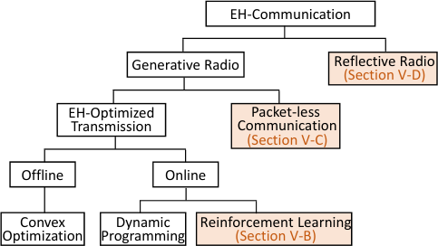

Fig. 14: Taxonomy of energy harvesting communications.

reinforcement learning has gained significant attention and
many more papers have been published since 2016. Therefore,
in Section V-B, we provide a brief survey of recently published
works on reinforcement learning applied to communication
optimization in EH-IoTs.
**Packet-less transmission** is another interesting design
paradigm to minimize energy consumption for generative radios. The basic idea is to convey the detection of certain events
by transmitting a single pulse (or bit) without using elaborate
packet headers. Works on packet-less communications are
reviewed in Section V-C.

Finally, there is a growing body of research related to
reflective radio, also known as backscattering. As backscattering does not have to generate an original signal from
scratch, it promises to dramatically reduce wireless transmission energy cost of EH-IoTs. Communication with reflective
radio, however, poses many challenges as it heavily depends
on the availability of impinging radio waves when it needs
to communicate. How to efficiently modulate an impinging
wave to achieve high data rate is another major focus of
research. Although such research started several decades ago
with the basic radio frequency identification (RFID) systems,
it has evolved significantly over the years. The most recent
trend is to use some type of meta-surface or Intelligent
Reflective Surface (IRS) containing high density of software
controlled tiny reflective units, which can be programmed to
dynamically control the amplitude, phase, and frequency of the
reflected wave. Although previous surveys have covered the
basic RFID backscattering [21] as well as the more ambient
form of backscattering [22], they did not survey the works
that involve IRS. Section V-D surveys the IRS-based radio
reflection research.

_B. Reinforcement Learning based Communication Optimiza-_

_tion in EH-IoTs_

Of late, application of reinforcement learning to communication optimization in EH-IoTs is receiving significant interest
as it requires minimal system state information and is suitable
to implement in practical scenarios. A variety of issues, e.g.,
transmission power allocation, transmission policy, and user
scheduling, under different network contexts have been investigated. Based on the number of considered system states, the
optimization problem can generally be modeled as continuous

19

TABLE VIII: Examples of EH-communication optimization problems.

**Network Context** **Problem/Objective** **Strategy**

Optimal power allocation to maximize throughput [122] Offline, Convex optimization

Point-to-point

Cooperative Network

Optimal energy management to minimize energy consumption [123] Online, MDP, Reinforcement learning

Optimal transmission policy to maximize throughput [124] Online, MDP, Reinforcement learning

Optimal power and rate allocation at Tx/relay to maximize throughput [125] Offline, Convex optimization

Optimal relay selection to minimize transmission power [126] Offline, Convex optimization

Optimal relay scheduling to maximize throughput [127] Online, PO MDP, Dynamic programming

Optimal SU channel access policy to maximize throughput [128] Offline, Convex optimization
Cognitive Network

Optimal power allocation for cognitive relay to maximize throughput [129] Offline, Convex optimization

Optimal SU channel access policy to maximize throughput [130] Online, MDP, Reinforcement learning

Optimal user scheduling to maximize throughput [131] Online, PO MDP, Dynamic programming

Cellular Network

Optimal BS ON/OFF decision to maximize its availability region [132] Offline, Convex optimization

Optimal transmission beamforming to minimize power consumption [133] Offline, Convex optimization

WIPT

Optimal power splitting scheme to maximize power transfer and throughput [134] Offline, Convex optimization

*MDP - Markov Decision Process, PO MDP - Partially Observed Markov Decision Process, WIPT - Wireless Information & Power Transfer.

Markov Decision Process (MDP) and discrete MDP depending
on if the system state is infinite and finite, respectively.
When solving the problems, the continuous MDP requires
one more step to handle the infinite states, and techniques
like linear approximation [135], [149], [152] and polynomial
approximation [138] are proposed. In the following, we survey
the reinforcement learning approaches proposed since 2016
under different networking contexts with a succinct summary
presented in Table IX.

**Point-to-point communications:** In the point-to-point EH
communications, reinforcement learning has been extensively
explored. Transmission power allocation was investigated
in [135]–[137]. Specifically, in [135], continuous MDP was
formulated by exploiting linear approximation and binary
functions to handle infinite states and state-action-rewardstate-action (SARSA) algorithm to learn the optimal policy.
In contrast, in [136] discrete MDP was used to propose the
linear program of sample means (LPSM) algorithm to learn the
optimal power allocation policy. The authors in [137] proposed
an action bounding deep Q-learning algorithm to accelerate
the learning process; while in [138] the transmission decision
problem was investigated to determine whether to transmit
a packet or not, followed by an after-state SARSA learning
algorithm. In [139], the authors considered a multiple input
and multiple output (MIMO) system where the transmitter
can change the number of antennas during transmission, and
employed Q-learning to learn the optimal transmission policy.
The SARSA algorithm was utilized in [140] to investigate the
exploration and exploitation balancing problem; it is demonstrated that the convergence-based algorithm outperforms the
epsilon-greedy algorithm.

**Wireless sensor network (WSN):** Some literature investigated the implementation of reinforcement learning in EH
WSN, using real-world experiment data. Wireless sensor nodes
equipped with a solar cell perform sensing tasks and transmit

the information to a remote server. Kosunalp et al. [141]
utilized Q-learning to predict the solar energy arrival and the
experimental results demonstrated that a prediction error ratio
of 0.3 was achieved. Chen et al. [142] considered the optimal
policy that schedules the state (active or sleep) of sensor nodes
to maintain effective area coverage. Q-learning algorithm was
implemented and the experiment results suggested that a
coverage ratio of 0.99 can be obtained. Paper [144], [143]
and [145] considered the power management policy at the
sensor nodes, i.e., how to schedule the energy for sensing,
transmission and sleeping. Hsu et al. [144] proposed and
implemented a fuzzy Q-learning algorithm, while Shresthamali
et al. [143] implemented the Q-learning algorithm. Without
real-world experiments, Aoudia et al. [145] modeled the problem as a discrete MDP and proposed an actor-critic learning
algorithm.

**Cellular networks with small cells:** To increase capacity
and spectral reuse, future cellular networks are expected to
deploy small cells controlled by small form factor base stations
(BSs). It is possible to power these small BSs as well as the
user equipments that connect to them with energy harvested
from the environment. However, due to the stochastic nature
of the energy source, incorporation of energy harvesting into
both BS and user equipment poses more challenges on managing the network, such as user access control [146], [147],
BS ON/OFF switching [148], and resource allocation [149].
In [146] a long short-term memory (LSTM) deep Q-learning
algorithm is proposed to learn the optimal multi-access control
policy at the BS. Using the proposed method, in a followup
work [147], the authors investigated joint access control and
battery prediction problem, and developed a two-layer reinforcement learning network to maximize the sum rate and
minimize the prediction loss. Assuming the traffic of small
cell BS can be offloaded to a macro BS, in [148] the optimal
ON/OFF switching policy of small cell BSs was investigated to

20

TABLE IX: Summary of recent advancements using reinforcement learning in EH-IoTs.

**Network** **Perform** **Methodology**
**Issue** **Reference**
**Context** **RL at**

[135] Tx Continuous MDP, linear approximation, binary functions, and SARSA
Power allocation

[136], [137] Tx Discrete MDP, LPSM, action-bounding deep Q-learning

Point-to-point Transmission decision [138] Tx Continuous MDP, polynomial approximation, after-state SARSA

Transmission policy [139] Tx Discrete MDP, Q-learning

Exploration & exploitation [140] Tx Discrete MDP, SARSA

Energy prediction [141] Nodes Q-learning with real solar data

WSN

Cellular

Sleep scheduling [142] Nodes Q-learning with real solar data

[143], [144] Nodes Q-learning [143], Fuzzy Q-learning [144] with real solar data
Power management

[145] Nodes Discrete MDP, actor-critic learning algorithm

Access control [146], [147] BS Discrete MDP, LSTM deep Q-learning

BS ON/OFF switching [148] BS Discrete MDP, distributed multi-agent Q-learning

Resource allocation [149] BS Continuous MDP, linear approximation, actor-critic learning algorithm

[150] Rx Discrete MDP, Q-learning

WIPT Transmission interval/rate

[151] Tx/Rx Discrete MDP, Q-learning

Cooperative Power allocation [152] Tx/Relay Continuous MDP, linear approximation, SARSA

Cognitive SU action decision [153] SU Discrete MDP, after-state, policy-based learning algorithm

[154] Edge Discrete MDP, post-decision state based learning
MEC Data offloading

[155], [156] IoTs Discrete MDP, post-decision state based learning, deep CNN

SU - Secondary User, MEC - Mobile Edge Computing.

improve energy efficiency of the overall network. Specifically,
distributed multi-agent Q-learning was proposed to learn the
energy income and traffic demand patterns at each small cell
BS and determine its ON/OFF state. Similarly, to improve
network energy efficiency, the authors in [149] utilized the
actor-critic algorithm to investigate the optimal policy for user
scheduling and resource allocation.
**Wireless information and power transfer (WIPT):** WIPT
allows the transmitter and receiver to exchange energy and
information in a time-devision manner. To achieve the optimal
system performance, time slot allocation for information and
energy transmission is critical. Recent works [150], [151]
attempted to solve this problem using reinforcement learning.
Specifically, the authors in [150] considered that the Tx
transmits energy to the Rx, and the Rx uses the harvested
energy to send data back to the Tx. The Q-learning algorithm
was exploited to find the optimal data transmission rate at
the receiver. The results domonstrated that the algorithm can
reduce packet loos rate by 60%, compared to the random
selection scheme. In contrast, in [151], it was considered
that the Tx transmits both information and power to the Rx.
To maximize the receiption rate at the Rx, the Q-learning
algorithm was utilized to learn the optimal data transmission
rate at the Tx and energy harvesting interval at the Rx.
**Cooperative and cognitive networks:** In [152], reinforcement learning is employed to find the optimal power allocation
policy for Tx and relay in cooperative EH networks, with
the purpose of maximizing the throughput at the receiver.

Specifically, two-hop communication was split into two pointto-point problems (the transmitter to the relay and the relay
to the receiver) and solved by the method individually [135].
In cognitive networks, the secondary user (SU) can perform
either spectrum sensing (to detect whether the spectrum is
free), channel probing (to acquire channel state information, or
data transmission (need to configure the transmission power)
at each time slot. Assuming the SU is powered by the energy
harvested from the ambient environment, in [153] a policybased learning algorithm is proposed to determine the SU’s
action with the goal of maximizing its throughput.

**Mobile edge computing (MEC):** In (MEC) systems, the
end IoT devices offload data to the edge servers, which
offload part of its workload or preprocessed data to a remote
cloud. Considering EH MEC where both the IoT devices
and edge servers can harvest energy from the environment,
reinforcement learning has been applied to optimize the offloading policy at IoT devices and edge servers. At the edge
servers, a post-decision state (PDS) based learning algorithm
is proposed in [154] to obtain the optimal workload offloading
(to the centralized cloud) policy, which minimizes the longterm system cost. Instead, at the IoT devices, the PDS based
learning and deep convolutional neural network (CNN) are
combined in [155], [156] to select the optimal edge device
and offloading rate.

21

TABLE X: Summary of methods for packet-less event notification using a single pulse in EH-IoTs.

**Ref** **Application** **Pulse medium** **Detectableof event types#** **Method of detection** **Energysource**

ultrasound through wing

[157] SHM for aeroplane metal substrate binary DoA for location, pulse for event vibrations

[90] IoNT for chemical re-action detection THz via air _>_ binary pulse amplitude for classification at AP, pulsewidth for location, pulse energy for event events

chemical

[158] IoNT event monitoring THz via air _>_ binary pulse energy for event (location cannot be detected) reactions

[159], [160] IoNT event monitoring THz via air _>_ binary DoA for location, derivative order for event anything

[161] IoNT event monitoring mmWave/THz via air _>_ binary DoA for location, central frequency for event anything

*SHM - Structure Health Monitoring.

_C. Packet-less Communication_

In many IoT applications, the deployed sensor nodes only
need to detect an event, such as normal vs. faulty operation
of the monitored structure, and transmit that information to a
nearby access point. Because the event information is either
just binary or event identification from a small set of possible
event types, a single pulse could be used to convey this
information, thus eliminating the need to transmit a packet
with its associated overhead, such as node identification address, preamble, synchronization, etc. In low energy harvesting
environments, this can help maintain the energy consumption
of the device below the energy production rate.
Such packet-less pulse-based event notification has been
investigated by different research groups. Without packet
header and payload, the main issues to solve is how to localize
the event and how to convey the event type from a single
pulse. For structural health monitoring of an airplane wing, the
authors in [157] proposed transmitting an ultrasonic pulse from
a sensor to a nearby access point through the metal substrate
to convey the detection of fault when vibration exceeds a given
threshold. The sensor nodes are placed in a carefully designed
cellular diagram, which allows the access point to detect the
position of the event by detecting the direction of arrival of
the pulse. The vibrations are also used to harvest energy and
power the pulse, thus eliminating the need for batteries.
The idea of using a single pulse to convey event information
is particularly attractive for nanoscale IoT, also known as
Internet of Nano Things (IoNT), where nanoscale sensors
must conserve transmission energy as much as possible to
maintain energy consumption below the extremely limited
amount of energy it can possibly harvest from the environment.
A detailed analysis in [162] revealed that even with 1 pJ energy
consumption per pulse, the transmission power would account
for 68% of the total device power consumption, suggesting
that the number of pulses must be minimized to achieve a
balance between power consumption and generation in IoNT.
In a recent work [158], we have shown that if the events to
be detected emit distinct amounts of energies, it is possible to
convey both event type and location information using a single
pulse. This is possible if all harvested energy from the event
is used to transmit the pulse with a carefully allocated pulse
width for each sensor node located at different locations. In

this case, the amplitude of the pulse is influenced by both the
type of event and its location, thus a classifier at the access
point can uniquely detect the event type and its location by
simply detecting the amplitude of the pulse.
The method proposed in [158] does not scale to large
number of sensor nodes as the number of classes to classify
using only the amplitude of the pulse increases. In [159]–

[161], we have further shown that if the access point can be
configured with necessary hardware for detecting the direction
of arrival (DoA) of the pulse, then a given pulse feature only
has to classify the event type as the location is already obtained
by DoA. We have demonstrated that as higher derivative of
Gaussian pulses are often used for IoNT, we can use a range of
pulse features for detecting event types, including the derivative order [159], [160] as well as the center frequency [161]
of the Gaussian pulse. Table X compares various methods of
conveying event notification using a single pulse.

_D. Reflective Radio Communications_

This section first discusses the evolution in reflective radio
technology and then surveys some of the very recent works
involving IRS.
_1) Reflective Radio Evolution:_ Power consumption of an
IoT sensor is typically dominated by wireless communications because conventional radio modules (e.g., Wi-Fi and
Bluetooth) are designed to actively generate new radio waves
(RF signals) each time some data needs to be transmitted.
Instead of generating RF signals, a reflective radio transmitter sends data by simply modulating and reflecting the
incident RF signals. By eliminating the power consuming
RF generation elements from the radio circuit, the reflective
radio enables small IoT sensors to operate even with a tiny
amount of harvested power. The principle of reflective radio
or backscattering was first commercialized in 1983 in the
form of batteryless RFID, which saw explosive adoption in
the subsequent years. Millions of RFID tags are currently in
operation to track goods, machines, animals, and many other
types of objects.
Although RFID is very popular, it has several drawbacks.
RFID tags require a carrier emitter (a reader) to transmit
electromagnetic waves from a short distance so that the tags
can reflect the waves back to the reader. The requirement of

**Incident EM waves**

**Reflected EM waves**

Fig. 15: Schematic of intelligent reflective radio surface (IRS).

TABLE XI: Comparison of three reflective radio techniques:
RFID, Ambient Backscattering, and Intelligent Reflective Surface (IRS).

**Reflective Use Ambient Programmability Communication Milestone**

**Radio** **EM Waves** **of Reflection** **Architecture** **Year**

RFID No No Centralized 1983

Ambient
Yes No Distributed 2013
Backscatter

IRS Yes Yes Distributed 2018

readers limits the pervasive deployments of RFID. Another
major limitation of the RFID technology is that the tags
can communicate only with the reader using the same radio
frequency used by the reader. To overcome these limitations,
in around 2013, the basic backscattering evolved into the so
called _ambient backscattering_ [22], [163], which is capable of
modulating and reflecting the surrounding RF signals that are
transmitted by ambient RF sources, such as TV towers, cellular
base stations, and Wi-Fi access points. Ambient backscattering thus enables direct communication between two nodes
allowing a distributed communication network. Another major
advantage of ambient backscattering is that it can piggyback
the IoT data on the licensed spectrum used by TV, cellular
etc., thus alleviating pressure on the spectrum.

Most recently, a novel reflective radio technology, referred
to as intelligent reflective surface (IRS), has gained massive attention [164], [165]. Unlike RFID and ambient backscattering
that have a pre-determined reflection property, the IRS is made
from an artificial structure of 2D elements (see Figure 15)
whose reflection properties, such as refraction, absorption, and
reflection can be adjusted independently and electronically
**electronically** in real time. As a result, when a beam of electromagnetic (EM) wave impinges on the surface, the _phase,_
_amplitude, or frequency_ of the reflected wave can be controlled
and **programmed** in a software-defined way using precise
mathematics [166], [167]. Figure 16 shows how IRS can
help reduce wireless transmission energy cost of IoTs. In the
first use case, the IRS can simply enhance the functionalities
and capabilities of ambient backscattering communication in
EH-IoTs. In the second use case, IRS can be deployed in
the environment, such as coated over a wall, to control the
wireless channel and achieve superior signal-to-noise ratio at
the receiver as a result. As such, the IoT transmitter, which
may still use the conventional generative radio, can afford to

22

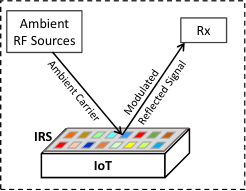

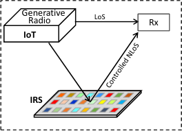

(a) (b)

Fig. 16: IRS use cases for IoT: (a) Enhanced ambient backscattering with programmable reflection and advanced modulation
of reflected signal (IRS deployed within the IoT), and (b)
IRS-assisted IoT communication with controlled multipath
propagation (IRS deployed in the environment).

use reduced transmission without sacrificing signal-to-noiseratio at the receiver. Table XI summarizes the three phases of
backscatter evolution, while we survey the recent achievements
of IRS-enabled wireless communications in the following
section.

_2) Recent Advancements in IRS-based Wireless Commu-_
_nications:_ The recent advancements in IRS-based wireless

communications can be classified into the following three
categories (they are summarized in Table XII):
**Modelling and analysis of IRS:** Using tools such as
ray-tracing, researchers have developed analytical models to
study the theoretical capacity bounds of IRS under different
deployment settings and constraints [168]–[170]. The derived
models can be used to gain insight to the capabilities of IRS for
many envisaged IoT communications scenarios under specified
power budget.
**Low complexity and low energy MIMO with IRS:**
Although multiple-input multiple-output (MIMO) technology
has significantly improved the spectrum and energy efficiency
of wireless communication systems, it suffers from high
hardware complexity and power consumption. Recently, researchers have shown [171]–[182] that using IRS, it is possible
to significantly improve the performance of MIMO, which
ultimately translates to reduced number of transmitting and
receiving antennas as well as reduced power consumption for
both transmitters and receivers. These solutions will help EHIoTs to achieve high MIMO gain under tight power constraints.
**Ambient backscattering with IRS:** Researchers have
successfully designed hardware circuits and control algorithms [167], [183], [184] to realize ambient backscattering
with IRS. These systems allow an IRS surface to realize
advanced modulations, e.g., Quadrature Phase Shift Keying
(QPSK) and 8PSK, over the reflected signals to realize video
transmissions at high data rates.

_E. Lessons Learned_

The key lessons learned from the recent studies in energy
harvesting communications are as follows:

_•_ Reinforcement learning-based transmission optimization
is proving very effective for practical scenarios where

23

TABLE XII: Recent advancements in IRS-assisted wireless communications.

**Context** **Problem/Objective** **Methods**

capacity upperbound study [168] Theoretical analysis of received signal model at IRS and achievable capacity.
Modeling

IRS potential study [169], [170] Simulation based on full 3D ray-tracing to demonstrate wireless and security potential.

maximize energy efficiency [171], [172] Joint optimization using gradient descent and sequential fractional programming.

maximize total received SNR [173] Proposed a distributed algorithm using alternating optimization.

maximize spectral efficiency [174] Proposed two algorithms based on fixed point iteration and manifold optimization.

maximize secrecy rate [175] Proposed two algorithms based on block coordinate descent and minorization maximization.

Low-energy

MIMO

using IRS

maximize secrecy rate [176] Proposed an algorithm based on alternating optimization and semidefinite relaxation.

interference canceling [177] Optimally adjusting the phase shifts of IRS to achieve high spectrum-spatial efficiency.

minimize Tx power at AP [178], [179] Proposed two algorithms based on successive refinement and ZF based linear precoding.

maximize weighted sum-rate [180] Joint optimization using fractional programming and other three proposed algorithms.

cascaded channel estimation [181] Proposed a two-stage algorithm including matrix factorization and matrix completion.

cascaded channel estimation [182] Proposed an approach based on compressive sensing and deep learning.

transceiver design [167] Implemented QPSK IRS backscattering achieving 2.048 Mbps video streaming.

IRS Backscattering transmitter design [183] Implemented 8PSK IRS backscattering achieving 6.144 Mbps at 4.25 GHz.

efficient control of meta-surface [184] Proposed to embed synchronous digital circuit to increase adaptability of meta-atoms.

prior knowledge of channel states and energy arrivals is
limited.

_•_ Packet-less communication has been shown to be effec
tive in detecting and monitoring certain types of events
with minimal power consumption. However, the current
applications of packet-less communication are limited and
most works are based only on theory. There exist future
research opportunities in this space to realize practical
packet-less communication systems.

_•_ The reflective radio technology, especially those based on
the emerging meta-surfaces, exhibits a huge potential in
dramatically cutting the transmission power cost of future
EH-IoTs. However, the IRS technology is in its infancy
at the moment and there exist significant future research
opportunities to pursue in this space.

_•_ For IRS-enabled wireless communications, the researchers have predominantly used simulations to solve
various optimization problems, while actual prototyping
and experiments were rare.

VI. F UTURE R ESEARCH D IRECTIONS

_A. Improving Context Sensing from EH Patterns_

The lesson that we have learned from Section III is that

energy harvesters could potentially replace specialized sensors
in EH-IoTs, thus saving significant power consumption, but at
the cost of reduced context detection performance. To improve
the sensing performance, novel research is required on both
algorithm and hardware design.
_Algorithm:_ From algorithms perspective, the application of
deep learning has shown great promise for many challenging
detection problems, such as speech detection, face recognition,
natural language processing, and so on. However, its application to context detection from energy harvesting signals have

not been explored yet. Once EH-IoTs are deployed widely,
they will generate a huge amount of data, which will create
the opportunity to apply deep learning to improve context
detection accuracy. In the meantime, simulations could be used
to generate the required data for training.

_Hardware:_ From hardware perspective, more advanced
and refined energy harvesters are required. Most EH-based
context sensing research to date used the very basic kinetic
energy harvester (KEH) or solar cell hardware, which have
certain limitations for context recognition. For example, the
frequency response band of most KEHs is narrow and welltuned to maximize their energy harvesting efficiencies for
target applications. As a result, such KEH hardware is more
sensitive to capture the signal within its resonance band, while
responding less to the signals outside their narrow response
band. On the contrary, specialized sensors like accelerometers
and microphones are engineered with a wide and flat response
curves ranging from 1Hz to several thousands of Hz over
the frequency of interests. Also, accelerometers can provide
measurements in three dimensions, while the popular KEH
devices only harvest energy from a single direction.

A new research direction would be to explore more advanced KEH hardware, such as those that can harvest energy from multiple axes [185], multiple elements within an
array [186], or multiple modes such as from both piezoelectric
and electromagnetic effects [187]. Similarly, the use of more
advanced solar cells which can harvest energy from a wider
range of optical frequencies [93] may help detect contexts
more accurately.

Currently, energy harvesting hardware is designed purely
with the objective of improving the energy harvesting density
or efficiency of the product without any consideration of
its context detection capability. A potential multidisciplinary

research direction would be to explore new materials and
processes that can jointly optimize both energy harvesting
capacity and context detection performance.
Finally, existing literature so far explored context sensing
using a single mode of energy harvesting. In future, IoTs
may combine multiple modes of energy harvesting, such as
combine both kinetic and solar, to boost the power supply.
Such multi-modal EH-IoTs would provide richer EH signals,
which could be exploited for more accurate context detection.
Designing algorithms that can effectively fuse information
from multiple EH signals would also be an interesting future
research direction.

_B. Context Sensing from RF EH_

Section III revealed that, compared to kinetic and solar EH
based context sensing, research on RF EH based sensing is
rare. Recently, the received signal strength (RSS) and channel
state information (CSI) of Wi-Fi signals have been extensively
exploited to perform a multitude of sensing applications,
such as activity recognition [188], heartbeat monitoring [189],
fall detection [190], occupancy counting [191], gait recognition [192] and many more. Since Wi-Fi signal is also a
potential source of energy in RF EH, sensing from the EH
patterns from Wi-Fi signal should be possible. However, this
branch of research is yet unexplored in the literature and
therefore new research is needed to integrate RF EH with
context sensing to reduce power consumption of RF sensing.

_C. Privacy Leakage of Energy Harvesting_

As energy harvesting patterns have been demonstrated to be
able to infer various private user contexts like gait and activity
(see Section III), a malware with access to power generation
data could cause serious privacy concerns for the user. Even
legitimate apps can pose such privacy risks by accessing power
data, which is possible because users often do not pay attention
to all types of sensor data access requests during the app
installation [193].
Techniques such as perturbation, encryption, anonymization, differential privacy, and information-aware privacy have
been extensively exploited to protect user privacy in various
scenarios [194], [195]. Most recently, deep learning based
privacy-preserving has been investigated as well [196]. In the
future, novel privacy preserving schemes should be explored
for energy harvesting data. For example, access control or
authentication towards power data and deep leaning based
energy harvesting data perturbation can be potential future
research directions.

_D. Hardware Assistance for Intermittent Computing_

During software development, program debugging is highly
recommended to ensure an IoT device can operate correctly
in real deployments. For example, a Devpack is needed
when debugging a TI SensorTag [197]. However, conventional
debugging cannot fully address the concerns of EH-IoTs.
First, it provides constant power to the target device, which
would treat an EH device as a grid- or battery-powered device. Therefore, bugs that may occur under energy harvesting

24

conditions may not be detected. Second, developers usually
insert some additional codes (e.g., _printf()_ ) to monitor the
state of the program during debugging. But the execution of
these codes consumes extra energy and may incorrectly lead
to the Sisyphean problem as discussed in Section IV. Work on
designing new debugging concepts and tools for EH-IoTs is
limited with the exception of [198], which attempts to actively
manipulate the amount of energy delivered to the target device
in order to account for any additional energy consumption
due to extra debugging codes. More research on energy-aware
debugging is required to realize highly efficient and reliable
debugging and development support for EH-IoTs.

_E. Secure Communication for EH-IoTs_

Due to low and unpredictable energy supply, EH-IoTs can
be more vulnerable to security attacks compared to the conventional battery-powered IoTs. For example, as an EH-IoT may
suspend in the middle of secure communication protocols, it
opens new attack horizons, e.g., DoS attack to the gateway
that communicates with the EH-IoT device. Due to low

power requirements, backscattering is considered an attractive
communication option for EH-IoTs. However, the passive
operation makes backscatter communications vulnerable to
various security threats like eavesdropping and jamming [22].
While most of the security attacks can be effectively addressed
by encryption, the overhead of sharing secret keys make
them challenging for EH-IoTs that must operate with minimal
energy supply. A future research direction could be to exploit
the energy harvesting signals for generating keys dynamically
with minimal power consumption. For example, in [199], it
has recently demonstrated that the tiny vibrations generated
by human heartbeats can be measured by piezoelectric-based
wearable KEH, which in turn can be used to generate symmetric keys for two IoTs worn by the same user (both devices are
subject to the same heartbeats). However, whether EH signals
like photocurrents from solar cells, can also be useful for key
generation for non-wearable IoTs remains to be explored.

_F. Wireless Protocols for EH Communications_

To cope with the limited amount of harvested energy, recent
developments in EH communications usually require the EH
devices to operate in duty-cycling mode and dynamically
adjust the duty cycles based on real-time energy arrivals.
Unlike battery-powered duty-cycling that can wake up a node
at any time, EH-IoTs cannot wake up unless a certain amount
of energy is accumulated, which poses challenges on the
design of MAC protocols. For example, the synchronization
between the transmitter and receiver becomes difficult as it
requires both devices to have enough energy at the same time,
and the utilization efficiency of the channel will be low.
In addition, such duty-cycling scheme introduces difficulties
in the design of routing protocol in multi-hop EH networks.
Due to the desynchrony of energy availability in the EH nodes,
the relay selection and routing overhead in terms of energy
utility [200], end-to-end delay, and overall throughput should
be incorporated in the routing protocol design.

_G. Intelligent Reflective Surface Communication for IoT_

Although the IRS-based ambient backscatter communication has been successfully realized to achieve data rates in
the order of several Mbps [167], [183], these works are just
initial attempts to verify the concept without exploiting the full
programmability of IRS. Specifically, the reflection property of
each IRS element can be controlled independently in principle,
while the current experiments merely controlled all elements
on the surface with the same voltage, thereby losing many
degrees of freedom for modulation. Thus, more advanced
circuits and algorithms are required for optimal control of all
the elements individually. Such optimizations are likely to be
very complex to solve, and hence reinforcement learning or
deep learning based IRS control designs can be promising
future directions. The concept of IRS allows manipulation of
the amplitude, frequency, and phase of the reflected signal,
while existing research modulates only the phase. As such, a
future direction would be to explore more advanced and highorder modulation schemes like QAM (Quadrature Amplitude
Modulation) and OFDM. Last but not the least, more large
scale deployments of IRS and data collection/analysis from
such deployments would be an important future direction to
gain real insights to the practical benefits of this emerging
technology.

_H. Integrated System Design for EH-IoTs_

As shown in Figure 3, current EH-IoT architecture simply
uses an EH module to replace the battery, which can enable
wide and rapid adoption of energy harvesting without requiring
significant hardware modification in the IoT design. However,
given the preciousness of harvested energy, this loose architecture fails to optimize the energy utilization efficiency. Thus, a
future research direction can be a more holistic design, where
the energy harvester, energy storage, microcontroller, as well
as the radio module can be integrated together. Moreover, to
connect these components tightly, an advanced power management circuit should be customized to avoid energy loss due
to hardware imperfections. For example, Texas Instruments
has released some power management modules and guidance
specifically for energy harvesting [201].
In addition, in RF energy harvesting communications, the
transceiver design that optimizes both data reception and energy harvesting remains an open research problem. Typically,
the energy conversion efficiency from RF signals to direct
current (DC) depends on the density of harvested energy and
such efficiency is low when the amount of harvested energy
is small. Thus, with the premise of satisfying communication,
more efforts are required to improve the energy conversion
efficiency from hardware perspective, e.g., more sophisticated
circuit design.

_I. Practical Implementations and Deployments of EH-IoTs_

While powering IoTs using energy harvesting has been
proposed for a while, most of the research efforts is based on
simulation or a single prototype. Several important challenges
arise in large-scale practical implementations and deployments

25

of EH-IoTs. First, most EH-IoTs are supposed to be manufactured with low-cost, small form factor, self-autonomy,
robust operation, and long-term lifetime. As a result, the
target applications can be achieved with high-efficiency while
involving minimum human intervention. Thus, compact EHIoT design and fabrication is required. Second, the amount
of harvested energy might not be adequate or stable enough
to support the operation of EH-IoTs. Thus, more advanced
techniques for energy harvesting should be explored. For
example, in RF energy harvesting, the popularity of using
multiple antennas for enhanced communication performance
also creates the opportunity to improve EH performance.
Multiple antenna technologies like beamforming, distributed
antennas, and massive MIMO can be employed to increase
the amount of harvested energy. In addition, heterogeneous
energy harvesting with multiple energy sources is another
way to compensate the energy scarcity. Third, a simulation
or testing stage is usually required before any large-scale field
deployment to avoid the overhead of re-deployment in case of
bugs. However, due to the uniqueness and dynamics of energy
arrival depending on different energy sources, it is difficult to
emulate actual EH conditions. Therefore, development tools
like Ekho [202], which can record physical EH condition and
recreate such condition in the lab environment, and systematic
testing methodology require further investigation in the future.

VII. C ONCLUSION

Energy harvesting is a promising new approach to perpetually power a growing number of IoT sensors. The key
challenge for EH-IoTs is to ensure smooth operation over
unpredictable power supply, which requires a holistic design
of sensing, computing, as well as communications. In recent
years, various approaches and solutions have been proposed
to optimize the use of harvested energy. In this paper we have
classified, compared, and analyzed such solutions, identified
the lessons learned, and discussed potential future directions
for research. We have also identified and summarized relevant
standards activities that are currently being undertaken to
promote interoperability and accelerate the deployment of
future EH-IoTs.

R EFERENCES

[1] J. Rivera and V. Rob, “Gartner says 5.8 billion enterprise and automotive iot endpoints will be in use in 2020,” _Gartner_, 2019.

[2] J. Hester and J. Sorber, “The future of sensing is batteryless, intermittent, and awesome,” in _Proceedings of the 15th ACM Conference on_
_Embedded Network Sensor Systems_ . ACM, 2017, p. 21.

[[3] “Psikick,” https://www.psikick.com/battery-problem/.](https://www.psikick.com/battery-problem/)

[4] “Wireless Switch,” [https://www.enocean.com/en/products/](https://www.enocean.com/en/products/product-finder/#1=For+Energy+Harvesting+Wireless+Switches)
[product-finder/#1=For+Energy+Harvesting+Wireless+Switches.](https://www.enocean.com/en/products/product-finder/#1=For+Energy+Harvesting+Wireless+Switches)

[[5] “SolePower Smartboots,” http://www.solepowertech.com/.](http://www.solepowertech.com/)

[[6] “Instep NanoPower,” http://www.instepnanopower.com/.](http://www.instepnanopower.com/)

[[7] “Bionic PowerWalk,” https://www.bionic-power.com/.](https://www.bionic-power.com/)

[[8] “Sequent Watch,” http://www.sequentwatch.com/.](http://www.sequentwatch.com/)

[[9] “Lunar Watch,” https://lunar-smartwatch.com/.](https://lunar-smartwatch.com/)

[[10] “Matrix PowerWatch,” https://www.matrixindustries.com/.](https://www.matrixindustries.com/)

[11] S. DeBruin, B. Campbell, and P. Dutta, “Monjolo: An energyharvesting energy meter architecture,” in _Proceedings of the 11th ACM_
_Conference on Embedded Networked Sensor Systems (SenSys)_ . ACM,
2013.

[12] N. A. Bhatti, M. H. Alizai, A. A. Syed, and L. Mottola, “Energy harvesting and wireless transfer in sensor network applications: Concepts
and experiences,” _ACM Transactions on Sensor Networks (TOSN)_,
vol. 12, no. 3, p. 24, 2016.

[13] S. Sudevalayam and P. Kulkarni, “Energy harvesting sensor nodes:
Survey and implications,” _IEEE Communications Surveys & Tutorials_,
vol. 13, no. 3, pp. 443–461, 2011.

[14] X. Lu, P. Wang, D. Niyato, D. I. Kim, and Z. Han, “Wireless
networks with rf energy harvesting: A contemporary survey,” _IEEE_
_Communications Surveys & Tutorials_, vol. 17, no. 2, pp. 757–789,
2015.

[15] Y. He, X. Cheng, W. Peng, and G. L. Stuber, “A survey of energy
harvesting communications: Models and offline optimal policies,” _IEEE_
_Communications Magazine_, vol. 53, no. 6, pp. 79–85, 2015.

[16] M.-L. Ku, W. Li, Y. Chen, and K. R. Liu, “Advances in energy
harvesting communications: Past, present, and future challenges,” _IEEE_
_Communications Surveys & Tutorials_, vol. 18, no. 2, pp. 1384–1412,
2016.

[17] I. Ahmed, M. M. Butt, C. Psomas, A. Mohamed, I. Krikidis, and
M. Guizani, “Survey on energy harvesting wireless communications:
Challenges and opportunities for radio resource allocation,” _Computer_
_Networks_, vol. 88, pp. 234–248, 2015.

[18] S. Ulukus, A. Yener, E. Erkip, O. Simeone, M. Zorzi, P. Grover, and
K. Huang, “Energy harvesting wireless communications: A review of
recent advances,” _IEEE Journal on Selected Areas in Communications_,
vol. 33, no. 3, pp. 360–381, 2015.

[19] P. Kamalinejad, C. Mahapatra, Z. Sheng, S. Mirabbasi, V. C. Leung,
and Y. L. Guan, “Wireless energy harvesting for the internet of things,”
_IEEE Communications Magazine_, vol. 53, no. 6, pp. 102–108, 2015.

[20] B. Lucia, V. Balaji, A. Colin, K. Maeng, and E. Ruppel, “Intermittent
computing: Challenges and opportunities,” in _2nd Summit on Advances_
_in Programming Languages (SNAPL 2017)_ . Schloss Dagstuhl-LeibnizZentrum fuer Informatik, 2017.

[21] M. A. Khan, M. Sharma, and B. R. Prabhu, “A survey of rfid tags,”
_International Journal of Recent Trends in Engineering_, vol. 1, no. 4,
p. 68, 2009.

[22] N. Van Huynh, D. T. Hoang, X. Lu, D. Niyato, P. Wang, and D. I. Kim,
“Ambient backscatter communications: A contemporary survey,” _IEEE_
_Communications Surveys & Tutorials_, vol. 20, no. 4, pp. 2889–2922,
2018.

[23] S. Chalasani and J. M. Conrad, “A survey of energy harvesting sources
for embedded systems,” in _IEEE SoutheastCon 2008_ . IEEE, 2008,
pp. 442–447.

[24] S. Priya and D. J. Inman, _Energy harvesting technologies_ . Springer,
2009, vol. 21.

[25] Y. Kuang, T. Ruan, Z. J. Chew, and M. Zhu, “Energy harvesting
during human walking to power a wireless sensor node,” _Sensors and_
_Actuators A: Physical_, vol. 254, pp. 69–77, 2017.

[26] A. Ahmed, I. Hassan, M. Hedaya, T. A. El-Yazid, J. Zu, and Z. L.
Wang, “Farms of triboelectric nanogenerators for harvesting wind
energy: A potential approach towards green energy,” _Nano Energy_,
vol. 36, pp. 21–29, 2017.

[27] M. Thielen, L. Sigrist, M. Magno, C. Hierold, and L. Benini, “Human
body heat for powering wearable devices: From thermal energy to
application,” _Energy conversion and management_, vol. 131, pp. 44–
54, 2017.

[28] M. B. Upama, M. Wright, N. K. Elumalai, M. A. Mahmud, D. Wang,
C. Xu, and A. Uddin, “High-efficiency semitransparent organic solar
cells with non-fullerene acceptor for window application,” _ACS Pho-_
_tonics_, vol. 4, no. 9, pp. 2327–2334, 2017.

[29] K. Yoshikawa, H. Kawasaki, W. Yoshida, T. Irie, K. Konishi,
K. Nakano, T. Uto, D. Adachi, M. Kanematsu, H. Uzu _et al._, “Silicon heterojunction solar cell with interdigitated back contacts for a
photoconversion efficiency over 26%,” _Nature Energy_, vol. 2, no. 5, p.
17032, 2017.

[30] G. Lucarelli, F. Di Giacomo, V. Zardetto, M. Creatore, and T. M.
Brown, “Efficient light harvesting from flexible perovskite solar cells
under indoor white light-emitting diode illumination,” _Nano Research_,
vol. 10, no. 6, pp. 2130–2145, 2017.

[31] A. Sample and J. R. Smith, “Experimental results with two wireless
power transfer systems,” in _Radio and Wireless Symposium, 2009._
_RWS’09. IEEE_ . IEEE, 2009, pp. 16–18.

[32] V. Talla, B. Kellogg, B. Ransford, S. Naderiparizi, S. Gollakota,
and J. R. Smith, “Powering the next billion devices with wi-fi,” in
_Proceedings of the 11th ACM Conference on Emerging Networking_
_Experiments and Technologies_ . ACM, 2015, p. 4.

[33] “EnOcean temperature/humidity sensors,” [https://www.](https://www.enocean-alliance.org/product/temperature-humidity-sensor-eths-oem/)
[enocean-alliance.org/product/temperature-humidity-sensor-eths-oem/.](https://www.enocean-alliance.org/product/temperature-humidity-sensor-eths-oem/)

26

[[34] “CleanSpace Tag,” https://our.clean.space/.](https://our.clean.space/)

[35] F. Li, Y. Yang, Z. Chi, L. Zhao, Y. Yang, and J. Luo, “Trinity: enabling
self-sustaining wsns indoors with energy-free sensing and networking,”
_ACM Transactions on Embedded Computing Systems (TECS)_, vol. 17,
no. 2, p. 57, 2018.

[36] A. P. Sample, D. J. Yeager, P. S. Powledge, A. V. Mamishev, and J. R.
Smith, “Design of an rfid-based battery-free programmable sensing
platform,” _IEEE transactions on instrumentation and measurement_,
vol. 57, no. 11, pp. 2608–2615, 2008.

[37] M. Gorlatova, A. Wallwater, and G. Zussman, “Networking lowpower energy harvesting devices: Measurements and algorithms,” _IEEE_
_Transactions on Mobile Computing_, vol. 12, no. 9, pp. 1853–1865,
2013.

[[38] “AMPY,” http://www.getampy.com/index.html.](http://www.getampy.com/index.html)

[39] D. Landerer, D. Bahro, H. R¨ohm, M. Koppitz, A. Mertens, F. Manger,
F. Denk, M. Heidinger, T. Windmann, and A. Colsmann, “Solar
Glasses: A Case Study on Semitransparent Organic Solar Cells for
Self-Powered, Smart Wearable Devices,” _Energy Technology_, 2017.

[40] Q. Huang, Y. Mei, W. Wang, and Q. Zhang, “Toward battery-free
wearable devices: The synergy between two feet,” _ACM Transactions_
_on Cyber-Physical Systems_, vol. 2, no. 3, p. 20, 2018.

[[41] “Kinergizer,” http://kinergizer.com/.](http://kinergizer.com/)

[[42] “Revibe Energy,” https://revibeenergy.com/.](https://revibeenergy.com/)

[[43] “Fenix Hub,” https://www.aquarobur.se/#product](https://www.aquarobur.se/#product_anchor) anchor.

[[44] “Z-Node,” https://zolitron.com/our-products/zolitron-z-node/.](https://zolitron.com/our-products/zolitron-z-node/)

[45] M. Deterre, E. Lefeuvre, Y. Zhu, M. Woytasik, B. Boutaud, and
R. Dal Molin, “Micro blood pressure energy harvester for intracardiac
pacemaker,” _Journal of Microelectromechanical Systems_, vol. 23, no. 3,
pp. 651–660, 2014.

[46] Q. Zheng, H. Zhang, B. Shi, X. Xue, Z. Liu, Y. Jin, Y. Ma, Y. Zou,
X. Wang, Z. An _et al._, “In vivo self-powered wireless cardiac monitoring via implantable triboelectric nanogenerator,” _ACS nano_, vol. 10,
no. 7, pp. 6510–6518, 2016.

[47] M. Southcott, K. MacVittie, J. Hal´amek, L. Hal´amkov´a, W. D. Jemison,
R. Lobel, and E. Katz, “A pacemaker powered by an implantable
biofuel cell operating under conditions mimicking the human blood
circulatory system–battery not included,” _Physical chemistry chemical_
_physics_, vol. 15, no. 17, pp. 6278–6283, 2013.

[48] H. Chiang, J. Hong, K. Kiningham, L. Riliskis, P. Levis, and
M. Horowitz, “Tethys: Collecting sensor data without infrastracture or
trust,” in _2018 IEEE/ACM Third International Conference on Internet-_
_of-Things Design and Implementation (IoTDI)_ . IEEE, 2018, pp. 249–
254.

[49] Y. Kashimoto, K. Hata, H. Suwa, M. Fujimoto, Y. Arakawa,
T. Shigezumi, K. Komiya, K. Konishi, and K. Yasumoto, “Low-cost
and device-free activity recognition system with energy harvesting pir
and door sensors,” in _Adjunct Proceedings of the 13th International_
_Conference on Mobile and Ubiquitous Systems: Computing Networking_
_and Services_ . ACM, 2016, pp. 6–11.

[50] H. Zhang, J. Gummeson, B. Ransford, and K. Fu, “Moo: A batteryless
computational rfid and sensing platform,” _University of Massachusetts_
_Computer Science Technical Report UM-CS-2011-020_, 2011.

[51] D. Yeager, F. Zhang, A. Zarrasvand, N. T. George, T. Daniel, and B. P.
Otis, “A 9 ua, addressable gen2 sensor tag for biosignal acquisition,”
_IEEE Journal of Solid-State Circuits_, vol. 45, no. 10, pp. 2198–2209,
2010.

[52] R. Margolies, M. Gorlatova, J. Sarik, G. Stanje, J. Zhu, P. Miller,
M. Szczodrak, B. Vigraham, L. Carloni, P. Kinget _et al._, “Energyharvesting active networked tags (enhants): Prototyping and experimentation,” _ACM Transactions on Sensor Networks (TOSN)_, vol. 11,
no. 4, p. 62, 2015.

[53] M. Gorlatova, P. Kinget, I. Kymissis, D. Rubenstein, X. Wang, and
G. Zussman, “Energy harvesting active networked tags (EnHANTs)
for ubiquitous object networking,” _IEEE Wireless Communications_,
vol. 17, no. 6, pp. 18–25, 2010.

[54] S. Chamanian, H. Ulus¸an, O. Zorlu, S. Baghaee, E. Uysal-Biyikoglu, [¨]
and H. K¨ulah, “Wearable battery-less wireless sensor network with
electromagnetic energy harvesting system,” _Sensors and Actuators A:_
_Physical_, vol. 249, pp. 77–84, 2016.

[55] A. Nicosia, D. Pau, D. Giacalone, E. Plebani, A. Bosco, and A. Iacchetti, “Efficient light harvesting for accurate neural classification of
human activities,” in _2018 IEEE International Conference on Consumer_
_Electronics (ICCE)_ . IEEE, 2018, pp. 1–4.

[56] K. Vijayaraghavan and R. Rajamani, “Novel batteryless wireless sensor
for traffic-flow measurement,” _IEEE Transactions on Vehicular Tech-_
_nology_, vol. 59, no. 7, pp. 3249–3260, 2010.

[57] M. N. Dakurah, C. Koo, W. Choi, and Y.-H. Joung, “Implantable
bladder sensors: a methodological review,” _International neurourology_
_journal_, vol. 19, no. 3, p. 133, 2015.

[58] S. Bhunia, S. Majerus, and M. Sawan, _Implantable biomedical mi-_
_crosystems: design principles and applications_ . Elsevier, 2015.

[59] D. C. Bock, A. C. Marschilok, K. J. Takeuchi, and E. S. Takeuchi, “Batteries used to power implantable biomedical devices,” _Electrochimica_
_acta_, vol. 84, pp. 155–164, 2012.

[60] B. Lu, Y. Chen, D. Ou, H. Chen, L. Diao, W. Zhang, J. Zheng, W. Ma,
L. Sun, and X. Feng, “Ultra-flexible piezoelectric devices integrated
with heart to harvest the biomechanical energy,” _Scientific reports_,
vol. 5, p. 16065, 2015.

[[61] “Standard-ISO/IEC 14543-3-10,” https://www.iso.org/standard/59865.](https://www.iso.org/standard/59865.html)
[html.](https://www.iso.org/standard/59865.html)

[[62] “Standard-ISO/IEC 14543-3-11,” https://www.iso.org/standard/66628.](https://www.iso.org/standard/66628.html)
[html.](https://www.iso.org/standard/66628.html)

[[63] “Standard-IEC 62969-3,” https://webstore.iec.ch/publication/30614.](https://webstore.iec.ch/publication/30614)

[[64] “Standard-IEC 62830-4,” https://webstore.iec.ch/publication/26798.](https://webstore.iec.ch/publication/26798)

[[65] “Standard-IEC 62830-1,” https://webstore.iec.ch/publication/27039.](https://webstore.iec.ch/publication/27039)

[[66] “Standard-IEC 62830-3,” https://webstore.iec.ch/publication/30924.](https://webstore.iec.ch/publication/30924)

[[67] “Standard-IEC 62407-28,” https://webstore.iec.ch/publication/30684.](https://webstore.iec.ch/publication/30684)

[[68] “Standard-IEC 62830-2,” https://webstore.iec.ch/publication/30355.](https://webstore.iec.ch/publication/30355)

[69] “Standard-IEC 62830-5,” [https://www.iec.ch/dyn/www/f?p=103:38:](https://www.iec.ch/dyn/www/f?p=103:38:2618310480066::::FSP_ORG_ID,FSP_APEX_PAGE,FSP_PROJECT_ID:1251,23,22768)
[2618310480066::::FSP ORG ID,FSP APEX PAGE,FSP](https://www.iec.ch/dyn/www/f?p=103:38:2618310480066::::FSP_ORG_ID,FSP_APEX_PAGE,FSP_PROJECT_ID:1251,23,22768) PROJECT
[ID:1251,23,22768.](https://www.iec.ch/dyn/www/f?p=103:38:2618310480066::::FSP_ORG_ID,FSP_APEX_PAGE,FSP_PROJECT_ID:1251,23,22768)

[[70] “Standard-IEC 62830-6,” https://webstore.iec.ch/publication/60105.](https://webstore.iec.ch/publication/60105)

[71] “Standard-IEC 62830-7,” [https://www.iec.ch/dyn/www/f?p=103:38:](https://www.iec.ch/dyn/www/f?p=103:38:2618310480066::::FSP_ORG_ID,FSP_APEX_PAGE,FSP_PROJECT_ID:1251,23,101806)
[2618310480066::::FSP ORG ID,FSP APEX PAGE,FSP](https://www.iec.ch/dyn/www/f?p=103:38:2618310480066::::FSP_ORG_ID,FSP_APEX_PAGE,FSP_PROJECT_ID:1251,23,101806) PROJECT
[ID:1251,23,101806.](https://www.iec.ch/dyn/www/f?p=103:38:2618310480066::::FSP_ORG_ID,FSP_APEX_PAGE,FSP_PROJECT_ID:1251,23,101806)

[72] S. Khalifa, M. Hassan, and A. Seneviratne, “Step detection from power
generation pattern in energy-harvesting wearable devices,” in _2015_
_IEEE International Conference on Data Science and Data Intensive_
_Systems_ . IEEE, 2015, pp. 604–610.

[73] P. Martin, Z. Charbiwala, and M. Srivastava, “DoubleDip: Leveraging
thermoelectric harvesting for low power monitoring of sporadic water
use,” in _Proceedings of the 10th ACM Conference on Embedded_
_Network Sensor Systems_ . ACM, 2012, pp. 225–238.

[74] B. Campbell, B. Ghena, and P. Dutta, “Energy-harvesting thermoelectric sensing for unobtrusive water and appliance metering,” in
_Proceedings of the 2nd International Workshop on Energy Neutral_
_Sensing Systems_ . ACM, 2014, pp. 7–12.

[75] Y. Han, Y. Cao, J. Zhao, Y. Yin, L. Ye, X. Wang, and Z. You, “A
self-powered insole for human motion recognition,” _Sensors_, vol. 16,
no. 9, p. 1502, 2016.

[76] S. Khalifa, G. Lan, M. Hassan, A. Seneviratne, and S. K. Das,
“HARKE: Human activity recognition from kinetic energy harvesting
data in wearable devices,” _IEEE Transactions on Mobile Computing_,
vol. 17, no. 6, pp. 1353–1368, 2018.

[77] G. Lan, D. Ma, W. Xu, M. Hassan, and W. Hu, “CapSense: Capacitorbased activity sensing for kinetic energy harvesting powered wearable
devices,” in _Proceedings of the 14th EAI International Conference on_
_Mobile and Ubiquitous Systems: Computing, Networking and Services_ .
ACM, 2017, pp. 106–115.

[78] G. Lan, W. Xu, D. Ma, S. Khalifa, M. Hassan, and W. Hu, “Entrans:
Leveraging kinetic energy harvesting signal for transportation mode
detection,” _IEEE Transactions on Intelligent Transportation Systems_,
2019.

[79] M. J. Abadi, S. Khalifa, S. S. Kanhere, and M. Hassan, “Energy
harvesting wearables can tell which train route you have taken,” in
_2016 IEEE 41st Conference on Local Computer Networks Workshops_
_(LCN Workshops)_ . IEEE, 2016, pp. 199–204.

[80] G. Lan, S. Khalifa, M. Hassan, and W. Hu, “Estimating calorie
expenditure from output voltage of piezoelectric energy harvester:
an experimental feasibility study,” in _Proceedings of the 10th EAI_
_International Conference on Body Area Networks_ . EAI, 2015, pp.
179–185.

[81] A. Rodriguez, D. Balsamo, Z. Luo, S. P. Beeby, G. V. Merrett, and
A. S. Weddel, “Intermittently-powered energy harvesting step counter
for fitness tracking,” in _Sensors Applications Symposium (SAS), 2017_
_IEEE_ . IEEE, 2017, pp. 1–6.

[82] H. Kalantarian and M. Sarrafzadeh, “Pedometers without batteries: An
energy harvesting shoe,” _IEEE Sensors Journal_, vol. 16, no. 23, pp.
8314–8321, 2016.

[83] S. Khalifa, M. Hassan, A. Seneviratne, and S. K. Das, “Energyharvesting wearables for activity-aware services,” _IEEE internet com-_
_puting_, vol. 19, no. 5, pp. 8–16, 2015.

27

[84] D. Ma, G. Lan, W. Xu, M. Hassan, and W. Hu, “SEHS: Simultaneous
energy harvesting and sensing using piezoelectric energy harvester,”
in _Proceedings of the Third International Conference on Internet-of-_
_Things Design and Implementation_ . ACM, 2018.

[85] W. Xu, G. Lan, Q. Lin, S. Khalifa, N. Bergmann, M. Hassan, and
W. Hu, “KEH-Gait: Using kinetic energy harvesting for gait-based
user authentication systems,” _IEEE Transactions on Mobile Computing_,
2018.

[86] S. Khalifa, M. Hassan, and A. Seneviratne, “Feasibility and accuracy
of hotword detection using vibration energy harvester,” in _2016 IEEE_
_17th International Symposium on A World of Wireless, Mobile and_
_Multimedia Networks (WoWMoM)_ . IEEE, 2016, pp. 1–9.

[87] G. Lan, W. Xu, S. Khalifa, M. Hassan, and W. Hu, “VEH-COM:
Demodulating vibration energy harvesting for short range communication,” in _2017 IEEE International Conference on Pervasive Computing_
_and Communications (PerCom)_ . IEEE, 2017, pp. 170–179.

[88] G. Lan, D. Ma, M. Hassan, and W. Hu, “HiddenCode: Hidden acoustic
signal capture with vibration energy harvesting,” in _2018 IEEE In-_
_ternational Conference on Pervasive Computing and Communications_
_(PerCom)_ . IEEE, 2018, pp. 1–10.

[89] E. Zarepour, M. Hassan, C. T. Chou, and A. A. Adesina, “Remote detection of chemical reactions using nanoscale terahertz communication
powered by pyroelectric energy harvesting,” p. 8, 2015.

[90] ——, “SEMON: Sensorless event monitoring in self-powered wireless
nanosensor networks,” _ACM Transactions on Sensor Networks (TOSN)_,
vol. 13, no. 2, p. 15, 2017.

[91] J. Randall, O. Amft, J. Bohn, and M. Burri, “LuxTrace: indoor positioning using building illumination,” _Personal and ubiquitous computing_,
vol. 11, no. 6, pp. 417–428, 2007.

[92] D. Chen, S. Iyengar, D. Irwin, and P. Shenoy, “SunSpot: Exposing
the location of anonymous solar-powered homes,” in _Proceedings of_
_the 3rd ACM International Conference on Systems for Energy-Efficient_
_Built Environments_ . ACM, 2016, pp. 85–94.

[93] Y. Umetsu, Y. Nakamura, Y. Arakawa, M. Fujimoto, and H. Suwa,
“EHAAS: Energy harvesters as a sensor for place recognition on
wearables,” in _2019 IEEE International Conference on Pervasive_
_Computing and Communications (PerCom)_ . IEEE, 2019 (to appear).

[94] A. Varshney, A. Soleiman, L. Mottola, and T. Voigt, “Battery-free
visible light sensing,” in _Proceedings of the 4th ACM Workshop on_
_Visible Light Communication Systems_ . ACM, 2017, pp. 3–8.

[95] D. Ma, G. Lan, M. Hassan, W. Hu, M. B. Upama, A. Uddin, and
M. Youssef, “Solargest: Ubiquitous and battery-free gesture recognition
using solar cells,” in _The 25th Annual International Conference on_
_Mobile Computing and Networking_ . ACM, 2019, pp. 1–15.

[96] ——, “Gesture recognition with transparent solar cells: A feasibility
study,” in _Proceedings of the 12th International Workshop on Wire-_
_less Network Testbeds, Experimental Evaluation & Characterization_ .
ACM, 2018, pp. 79–88.

[97] Z. Wang, D. Tsonev, S. Videv, and H. Haas, “On the design of a solarpanel receiver for optical wireless communications with simultaneous
energy harvesting,” _IEEE Journal on Selected Areas in Communica-_
_tions_, vol. 33, no. 8, pp. 1612–1623, 2015.

[98] J. Wang, O. Abari, and S. Keshav, “Challenge: RFID hacking for fun
and profit,” in _Proceedings of the 24th Annual International Conference_
_on Mobile Computing and Networking_ . ACM, 2018, pp. 461–470.

[99] D. Gafurov, K. Helkala, and T. Søndrol, “Biometric gait authentication
using accelerometer sensor,” _JOURNAL OF COMPUTERS_, vol. 1,
no. 7, p. 51, 2006.

[100] M. Muaaz and R. Mayrhofer, “Smartphone-based gait recognition:
From authentication to imitation,” _IEEE Transactions on Mobile Com-_
_puting_, vol. 16, no. 11, pp. 3209–3221, 2017.

[101] Y. Liu, T. Voigt, N. Wirstr¨om, and J. H¨oglund, “ECOVIBE: On-demand
sensing for railway bridge structural health monitoring,” _IEEE Internet_
_of Things Journal_, vol. 6, no. 1, pp. 1068–1078, 2019.

[102] “SolarGest simulator,” [https://github.com/dongma0a/SolarGest](https://github.com/dongma0a/SolarGest_Modelling)
[Modelling.](https://github.com/dongma0a/SolarGest_Modelling)

[[103] “WISP: Wireless identification and sensing platform,” https://sensor.cs.](https://sensor.cs.washington.edu/WISP.html)
[washington.edu/WISP.html.](https://sensor.cs.washington.edu/WISP.html)

[104] J. Hester, N. Tobias, A. Rahmati, L. Sitanayah, D. Holcomb, K. Fu,
W. P. Burleson, and J. Sorber, “Persistent clocks for batteryless sensing
devices,” _ACM Transactions on Embedded Computing Systems (TECS)_,
vol. 15, no. 4, p. 77, 2016.

[105] B. Ransford, J. Sorber, and K. Fu, “Mementos: system support for
long-running computation on rfid-scale devices,” in _ACM SIGARCH_
_Computer Architecture News_, vol. 39, no. 1. ACM, 2011, pp. 159–
170.

[106] A. Mirhoseini, E. M. Songhori, and F. Koushanfar, “Idetic: A highlevel synthesis approach for enabling long computations on transientlypowered asics,” in _2013 IEEE International Conference on Pervasive_
_Computing and Communications (PerCom)_ . IEEE, 2013, pp. 216–224.

[107] H. Jayakumar, A. Raha, and V. Raghunathan, “QUICKRECALL: A
low overhead hw/sw approach for enabling computations across power
cycles in transiently powered computers,” in _2014 27th International_
_Conference on VLSI Design and 2014 13th International Conference_
_on Embedded Systems_ . IEEE, 2014, pp. 330–335.

[108] D. Balsamo, A. S. Weddell, G. V. Merrett, B. M. Al-Hashimi,
D. Brunelli, and L. Benini, “Hibernus: Sustaining computation during
intermittent supply for energy-harvesting systems,” _IEEE Embedded_
_Systems Letters_, vol. 7, no. 1, pp. 15–18, 2015.

[109] D. Balsamo, A. S. Weddell, A. Das, A. R. Arreola, D. Brunelli,
B. M. Al-Hashimi, G. V. Merrett, and L. Benini, “Hibernus++: a
self-calibrating and adaptive system for transiently-powered embedded
devices,” _IEEE Transactions on Computer-Aided Design of Integrated_
_Circuits and Systems_, vol. 35, no. 12, pp. 1968–1980, 2016.

[110] B. Lucia and B. Ransford, “A simpler, safer programming and execution model for intermittent systems,” _ACM SIGPLAN Notices_, vol. 50,
no. 6, pp. 575–585, 2015.

[111] J. Van Der Woude and M. Hicks, “Intermittent computation without
hardware support or programmer intervention,” in _12th USENIX_
_Symposium on Operating Systems Design and Implementation (OSDI_
_16)_, 2016, pp. 17–32.

[112] A. Colin and B. Lucia, “Chain: tasks and channels for reliable
intermittent programs,” _ACM SIGPLAN Notices_, vol. 51, no. 10, pp.
514–530, 2016.

[113] N. A. Bhatti and L. Mottola, “HarvOS: Efficient code instrumentation
for transiently-powered embedded sensing,” in _Proceedings of the 16th_
_ACM/IEEE International Conference on Information Processing in_
_Sensor Networks_ . ACM, 2017, pp. 209–219.

[114] M. Hicks, “Clank: Architectural support for intermittent computation,”
in _Proceedings of the 44th Annual International Symposium on Com-_
_puter Architecture_ . ACM, 2017, pp. 228–240.

[115] K. Maeng, A. Colin, and B. Lucia, “Alpaca: intermittent execution
without checkpoints,” _Proceedings of the ACM on Programming Lan-_
_guages_, vol. 1, no. OOPSLA, p. 96, 2017.

[116] J. Hester, K. Storer, and J. Sorber, “Timely execution on intermittently
powered batteryless sensors,” in _Proceedings of the 15th ACM Confer-_
_ence on Embedded Network Sensor Systems_ . ACM, 2017, p. 17.

[117] A. Colin and B. Lucia, “Termination checking and task decomposition
for task-based intermittent programs,” in _Proceedings of the 27th_
_International Conference on Compiler Construction_ . ACM, 2018,
pp. 116–127.

[118] A. Rahmati, M. Salajegheh, D. Holcomb, J. Sorber, W. P. Burleson,
and K. Fu, “TARDIS: Time and remanence decay in sram to implement
secure protocols on embedded devices without clocks,” in _Proceedings_
_of the 21st USENIX conference on Security symposium_ . USENIX
Association, 2012, pp. 36–36.

[119] M. Hofmann and S. Jost, “Static prediction of heap space usage for
first-order functional programs,” in _ACM SIGPLAN Notices_, vol. 38,
no. 1. ACM, 2003, pp. 185–197.

[120] M. A. de Kruijf, K. Sankaralingam, and S. Jha, “Static analysis and
compiler design for idempotent processing,” in _ACM SIGPLAN Notices_,
vol. 47, no. 6. ACM, 2012, pp. 475–486.

[121] M. De Kruijf and K. Sankaralingam, “Idempotent code generation:
Implementation, analysis, and evaluation,” in _Proceedings of the 2013_
_IEEE/ACM International Symposium on Code Generation and Opti-_
_mization (CGO)_ . IEEE Computer Society, 2013, pp. 1–12.

[122] P. He, L. Zhao, S. Zhou, and Z. Niu, “Recursive waterfilling for
wireless links with energy harvesting transmitters,” _IEEE Transactions_
_on Vehicular Technology_, vol. 63, no. 3, pp. 1232–1241, 2014.

[123] K. Prabuchandran, S. K. Meena, and S. Bhatnagar, “Q-learning based
energy management policies for a single sensor node with finite buffer,”
_IEEE Wireless Communications Letters_, vol. 2, no. 1, pp. 82–85, 2013.

[124] P. Blasco, D. Gunduz, and M. Dohler, “A learning theoretic approach to
energy harvesting communication system optimization,” _IEEE Trans-_
_actions on Wireless Communications_, vol. 12, no. 4, pp. 1872–1882,
2013.

[125] C. Huang, R. Zhang, and S. Cui, “Throughput maximization for
the gaussian relay channel with energy harvesting constraints,” _IEEE_
_Journal on Selected Areas in Communications_, vol. 31, no. 8, pp. 1469–
1479, 2013.

[126] Y. Luo, J. Zhang, and K. B. Letaief, “Transmit power minimization for

28

wireless networks with energy harvesting relays,” _IEEE Transactions_
_on Communications_, vol. 64, no. 3, pp. 987–1000, 2016.

[127] H. Li, N. Jaggi, and B. Sikdar, “Relay scheduling for cooperative
communications in sensor networks with energy harvesting,” _IEEE_
_Transactions on Wireless Communications_, vol. 10, no. 9, pp. 2918–
2928, 2011.

[128] S. Yin, Z. Qu, and S. Li, “Achievable throughput optimization in energy
harvesting cognitive radio systems,” _IEEE Journal on Selected Areas_
_in Communications_, vol. 33, no. 3, pp. 407–422, 2015.

[129] S. Yin, E. Zhang, Z. Qu, L. Yin, and S. Li, “Optimal cooperation
strategy in cognitive radio systems with energy harvesting,” _IEEE_
_transactions on wireless communications_, vol. 13, no. 9, pp. 4693–
4707, 2014.

[130] D. T. Hoang, D. Niyato, P. Wang, and D. I. Kim, “Opportunistic
channel access and rf energy harvesting in cognitive radio networks,”
_IEEE Journal on Selected Areas in Communications_, vol. 32, no. 11,
pp. 2039–2052, 2014.

[131] Y. Cui, V. K. Lau, and Y. Wu, “Delay-aware bs discontinuous transmission control and user scheduling for energy harvesting downlink
coordinated mimo systems,” _IEEE Transactions on Signal Processing_,
vol. 60, no. 7, pp. 3786–3795, 2012.

[132] H. S. Dhillon, Y. Li, P. Nuggehalli, Z. Pi, and J. G. Andrews, “Fundamentals of heterogeneous cellular networks with energy harvesting,”
_IEEE Transactions on Wireless Communications_, vol. 13, no. 5, pp.
2782–2797, 2014.

[133] Q. Shi, L. Liu, W. Xu, and R. Zhang, “Joint transmit beamforming and
receive power splitting for miso swipt systems,” _IEEE Transactions on_
_Wireless Communications_, vol. 13, no. 6, pp. 3269–3280, 2014.

[134] L. Liu, R. Zhang, and K.-C. Chua, “Wireless information and power
transfer: A dynamic power splitting approach,” _IEEE Transactions on_
_Communications_, vol. 61, no. 9, pp. 3990–4001, 2013.

[135] A. Ortiz, H. Al-Shatri, X. Li, T. Weber, and A. Klein, “Reinforcement
learning for energy harvesting point-to-point communications,” in _2016_
_IEEE International Conference on Communications (ICC)_ . IEEE,
2016, pp. 1–6.

[136] P. Sakulkar and B. Krishnamachari, “Online learning schemes for
power allocation in energy harvesting communications,” _IEEE Trans-_
_actions on Information Theory_, vol. 64, no. 6, pp. 4610–4628, 2018.

[137] H. Kim, H. Yang, Y. Kim, and J. Lee, “Action-bounding for reinforcement learning in energy harvesting communication systems,” in _2018_
_IEEE Global Communications Conference (GLOBECOM)_ . IEEE,
2018, pp. 1–7.

[138] X. Wu, J. Yang, and J. Wu, “Optimal status update for age of
information minimization with an energy harvesting source,” _IEEE_
_Transactions on Green Communications and Networking_, vol. 2, no. 1,
pp. 193–204, 2018.

[139] H. Ayatollahi, C. Tapparello, and W. Heinzelman, “Reinforcement
learning in mimo wireless networks with energy harvesting,” in _2017_
_IEEE International Conference on Communications (ICC)_ . IEEE,
2017, pp. 1–6.

[140] A. Masadeh, Z. Wang, and A. E. Kamal, “Reinforcement learning
exploration algorithms for energy harvesting communications systems.”

[141] S. Kosunalp, “A new energy prediction algorithm for energy-harvesting
wireless sensor networks with q-learning,” _IEEE Access_, vol. 4, pp.
5755–5763, 2016.

[142] H. Chen, X. Li, and F. Zhao, “A reinforcement learning-based sleep
scheduling algorithm for desired area coverage in solar-powered wireless sensor networks,” _IEEE Sensors Journal_, vol. 16, no. 8, pp. 2763–
2774, 2016.

[143] S. Shresthamali, M. Kondo, and H. Nakamura, “Adaptive power
management in solar energy harvesting sensor node using reinforcement learning,” _ACM Transactions on Embedded Computing Systems_
_(TECS)_, vol. 16, no. 5s, p. 181, 2017.

[144] R. C. Hsu and T.-H. Lin, “A fuzzy q-learning based power management for energy harvest wireless sensor node,” in _2018 International_
_Conference on High Performance Computing & Simulation (HPCS)_ .
IEEE, 2018, pp. 957–961.

[145] F. A. Aoudia, M. Gautier, and O. Berder, “Learning to survive: Achieving energy neutrality in wireless sensor networks using reinforcement
learning,” in _2017 IEEE International Conference on Communications_
_(ICC)_ . IEEE, 2017, pp. 1–6.

[146] M. Chu, H. Li, X. Liao, and S. Cui, “Reinforcement learning based
multi-access control with energy harvesting,” in _2018 IEEE Global_
_Communications Conference (GLOBECOM)_ . IEEE, 2018, pp. 1–6.

[147] ——, “Reinforcement learning based multi-access control and battery
prediction with energy harvesting in iot systems,” _IEEE Internet of_
_Things Journal_, 2018.

[148] M. Miozzo, L. Giupponi, M. Rossi, and P. Dini, “Switch-on/off policies
for energy harvesting small cells through distributed q-learning,” in
_2017 IEEE Wireless Communications and Networking Conference_
_Workshops (WCNCW)_ . IEEE, 2017, pp. 1–6.

[149] Y. Wei, F. R. Yu, M. Song, and Z. Han, “User scheduling and
resource allocation in hetnets with hybrid energy supply: An actorcritic reinforcement learning approach,” _IEEE Transactions on Wireless_
_Communications_, vol. 17, no. 1, pp. 680–692, 2018.

[150] K. Li, W. Ni, M. Abolhasan, and E. Tovar, “Reinforcement learning
for scheduling wireless powered sensor communications,” _IEEE Trans-_
_actions on Green Communications and Networking_, 2018.

[151] C. Chun, J.-M. Kang, and I.-M. Kim, “Adaptive rate and energy
harvesting interval control based on reinforcement learning for swipt,”
_IEEE Communications Letters_, vol. 22, no. 12, pp. 2571–2574, 2018.

[152] A. Ortiz, H. Al-Shatri, X. Li, T. Weber, and A. Klein, “Reinforcement
learning for energy harvesting decode-and-forward two-hop communications,” _IEEE Transactions on Green Communications and Network-_
_ing_, vol. 1, no. 3, pp. 309–319, 2017.

[153] K. Wu, H. Jiang, and C. Tellambura, “Sensing, probing, and transmitting policy for energy harvesting cognitive radio with two-stage
after-state reinforcement learning,” _IEEE Transactions on Vehicular_
_Technology_, vol. 68, no. 2, pp. 1616–1630, 2019.

[154] J. Xu, L. Chen, and S. Ren, “Online learning for offloading and
autoscaling in energy harvesting mobile edge computing,” _IEEE Trans-_
_actions on Cognitive Communications and Networking_, vol. 3, no. 3,
pp. 361–373, 2017.

[155] M. Min, X. Wan, L. Xiao, Y. Chen, M. Xia, D. Wu, and H. Dai,
“Learning-based privacy-aware offloading for healthcare iot with energy harvesting,” _IEEE Internet of Things Journal_, 2018.

[156] M. Min, L. Xiao, Y. Chen, P. Cheng, D. Wu, and W. Zhuang,
“Learning-based computation offloading for iot devices with energy
harvesting,” _IEEE Transactions on Vehicular Technology_, vol. 68, no. 2,
pp. 1930–1941, 2019.

[157] S. Das, H. Salehi, Y. Shi, S. Chakrabartty, R. Burgueno, and S. Biswas,
“Towards packet-less ultrasonic sensor networks for energy-harvesting
structures,” _Computer Communications_, vol. 101, pp. 94–105, 2017.

[158] N. Hassan, C. T. Chou, and M. Hassan, “eNEUTRAL IoNT: Energyneutral event monitoring for internet of nano things,” _IEEE Internet of_
_Things Journal_, vol. 6, no. 2, pp. 2379–2389, 2019.

[159] P. M. Shree, T. Panigrahi, and M. Hassan, “Classifying the order of
higher derivative gaussian pulses in terahertz wireless communications,” in _2018 IEEE Globecom Workshops (GC Wkshps)_ . IEEE,
2018, pp. 1–6.

[160] S. Prasad M, T. Panigrahi, and M. Hassan, “Direction of arrival and
center frequency estimation for impulse radio millimeter wave communications,” in _Proceedings of the 2nd ACM Workshop on Millimeter_
_Wave Networks and Sensing Systems_ . ACM, 2018, pp. 63–68.

[161] S. Prasad, T. Panigrahi, and M. Hassan, “Energy efficient event
localization and classification for nano iot,” in _2018 IEEE Global_
_Communications Conference (GLOBECOM)_ . IEEE, 2018, pp. 1–6.

[162] S. Canovas-Carrasco, A.-J. Garcia-Sanchez, and J. Garcia-Haro, “On
the nature of energy-feasible wireless nanosensor networks,” _Sensors_,
vol. 18, no. 5, p. 1356, 2018.

[163] G. Wang, F. Gao, R. Fan, and C. Tellambura, “Ambient backscatter
communication systems: Detection and performance analysis,” _IEEE_
_Transactions on Communications_, vol. 64, no. 11, pp. 4836–4846,
2016.

[164] Y.-C. Liang, R. Long, Q. Zhang, J. Chen, H. V. Cheng, and H. Guo,
“Large intelligent surface/antennas (lisa): Making reflective radios
smart,” _arXiv preprint arXiv:1906.06578_, 2019.

[165] M. Di Renzo, M. Debbah, D.-T. Phan-Huy, A. Zappone, M.-S.
Alouini, C. Yuen, V. Sciancalepore, G. C. Alexandropoulos, J. Hoydis,
H. Gacanin _et al._, “Smart radio environments empowered by reconfigurable ai meta-surfaces: an idea whose time has come,” _EURASIP_
_Journal on Wireless Communications and Networking_, vol. 2019, no. 1,
p. 129, 2019.

[166] J. Chen, Y.-C. Liang, Y. Pei, and H. Guo, “Intelligent reflecting surface:
A programmable wireless environment for physical layer security,”
_arXiv preprint arXiv:1905.03689_, 2019.

[167] W. Tang, X. Li, J. Y. Dai, S. Jin, Y. Zeng, Q. Cheng, and
T. J. Cui, “Wireless communications with programmable metasurface:
Transceiver design and experimental results,” _China Communications_,
vol. 16, no. 5, pp. 46–61, 2019.

[168] S. Hu, F. Rusek, and O. Edfors, “Beyond massive mimo: The potential
of data transmission with large intelligent surfaces,” _IEEE Transactions_
_on Signal Processing_, vol. 66, no. 10, pp. 2746–2758, 2018.

29

[169] C. Liaskos, S. Nie, A. Tsioliaridou, A. Pitsillides, S. Ioannidis, and
I. Akyildiz, “A novel communication paradigm for high capacity
and security via programmable indoor wireless environments in next
generation wireless systems,” _Ad Hoc Networks_, vol. 87, pp. 1–16,
2019.

[170] ——, “Realizing wireless communication through software-defined
hypersurface environments,” in _2018 IEEE 19th International Sym-_
_posium on” A World of Wireless, Mobile and Multimedia Net-_
_works”(WoWMoM)_ . IEEE, 2018, pp. 14–15.

[171] C. Huang, G. C. Alexandropoulos, A. Zappone, M. Debbah, and
C. Yuen, “Energy efficient multi-user miso communication using
low resolution large intelligent surfaces,” in _2018 IEEE Globecom_
_Workshops (GC Wkshps)_ . IEEE, 2018, pp. 1–6.

[172] C. Huang, A. Zappone, G. C. Alexandropoulos, M. Debbah, and
C. Yuen, “Reconfigurable intelligent surfaces for energy efficiency in
wireless communication,” _IEEE Transactions on Wireless Communica-_
_tions_, 2019.

[173] Q. Wu and R. Zhang, “Intelligent reflecting surface enhanced wireless
network: Joint active and passive beamforming design,” in _2018 IEEE_
_Global Communications Conference (GLOBECOM)_ . IEEE, 2018, pp.
1–6.

[174] X. Yu, D. Xu, and R. Schober, “Miso wireless communication systems
via intelligent reflecting surfaces,” _arXiv preprint arXiv:1904.12199_,
2019.

[175] ——, “Enabling secure wireless communications via intelligent reflecting surfaces,” _arXiv preprint arXiv:1904.09573_, 2019.

[176] D. Xu, X. Yu, Y. Sun, D. W. K. Ng, and R. Schober, “Resource allocation for secure irs-assisted multiuser miso systems,” _arXiv preprint_
_arXiv:1907.03085_, 2019.

[177] X. Tan, Z. Sun, J. M. Jornet, and D. Pados, “Increasing indoor spectrum
sharing capacity using smart reflect-array,” in _2016 IEEE International_
_Conference on Communications (ICC)_ . IEEE, 2016, pp. 1–6.

[178] Q. Wu and R. Zhang, “Beamforming optimization for intelligent reflecting surface with discrete phase shifts,” in _ICASSP 2019-2019 IEEE_
_International Conference on Acoustics, Speech and Signal Processing_
_(ICASSP)_ . IEEE, 2019, pp. 7830–7833.

[179] ——, “Beamforming optimization for wireless network aided by intelligent reflecting surface with discrete phase shifts,” _arXiv preprint_
_arXiv:1906.03165_, 2019.

[180] H. Guo, Y.-C. Liang, J. Chen, and E. G. Larsson, “Weighted sumrate optimization for intelligent reflecting surface enhanced wireless
networks,” _arXiv preprint arXiv:1905.07920_, 2019.

[181] Z.-Q. He and X. Yuan, “Cascaded channel estimation for large
intelligent metasurface assisted massive mimo,” _arXiv_ _preprint_
_arXiv:1905.07948_, 2019.

[182] A. Taha, M. Alrabeiah, and A. Alkhateeb, “Enabling large intelligent
surfaces with compressive sensing and deep learning,” _arXiv preprint_
_arXiv:1904.10136_, 2019.

[183] W. Tang, J. Y. Dai, M. Chen, X. Li, Q. Cheng, S. Jin, K.-K. Wong,
and T. J. Cui, “Programmable metasurface-based rf chain-free 8psk
wireless transmitter,” _Electronics Letters_, vol. 55, no. 7, pp. 417–420,
2019.

[184] L. Petrou, P. Karousios, and J. Georgiou, “Asynchronous circuits as
an enabler of scalable and programmable metasurfaces,” in _2018 IEEE_
_International Symposium on Circuits and Systems (ISCAS)_ . IEEE,
2018, pp. 1–5.

[185] E. E. Aktakka and K. Najafi, “Three-axis piezoelectric vibration energy
harvester,” in _2015 28th IEEE International Conference on Micro_
_Electro Mechanical Systems (MEMS)_ . IEEE, 2015, pp. 1141–1144.

[186] H. Yu, J. Zhou, L. Deng, and Z. Wen, “A vibration-based MEMS
piezoelectric energy harvester and power conditioning circuit,” _Sensors_,
vol. 14, pp. 3323–3341, 2014.

[187] W. Chen, Y. Cao, and J. Xie, “Piezoelectric and electromagnetic hybrid
energy harvester for powering wireless sensor nodes in smart grid,”
_Journal of Mechanical Science and Technology_, vol. 10, no. 29, pp.
4313–4318, 2015.

[188] W. Wang, A. X. Liu, M. Shahzad, K. Ling, and S. Lu, “Devicefree human activity recognition using commercial wifi devices,” _IEEE_
_Journal on Selected Areas in Communications_, vol. 35, no. 5, pp. 1118–
1131, 2017.

[189] X. Wang, C. Yang, and S. Mao, “Tensorbeat: Tensor decomposition for
monitoring multiperson breathing beats with commodity wifi,” _ACM_
_Transactions on Intelligent Systems and Technology (TIST)_, vol. 9,
no. 1, p. 8, 2017.

[190] Y. Wang, K. Wu, and L. M. Ni, “WiFall: Device-free fall detection by
wireless networks,” _IEEE Transactions on Mobile Computing_, vol. 16,
no. 2, pp. 581–594, 2017.

[191] S. Depatla, A. Muralidharan, and Y. Mostofi, “Occupancy estimation
using only wifi power measurements,” _IEEE Journal on Selected Areas_
_in Communications_, vol. 33, no. 7, pp. 1381–1393, 2015.

[192] W. Wang, A. X. Liu, and M. Shahzad, “Gait recognition using
wifi signals,” in _Proceedings of the 2016 ACM International Joint_
_Conference on Pervasive and Ubiquitous Computing_ . ACM, 2016,
pp. 363–373.

[193] Y. Liang, Z. Cai, J. Yu, Q. Han, and Y. Li, “Deep learning based
inference of private information using embedded sensors in smart
devices,” _IEEE Network_, vol. 32, no. 4, pp. 8–14, 2018.

[194] F. Xiao, M. Lu, Y. Zhao, S. Menasria, D. Meng, S. Xie, J. Li, and
C. Li, “An information-aware visualization for privacy-preserving accelerometer data sharing,” _Human-centric Computing and Information_
_Sciences_, vol. 8, no. 1, p. 13, 2018.

[195] N. Raval, A. Machanavajjhala, and J. Pan, “Olympus: Sensor privacy
through utility aware obfuscation,” _Proceedings on Privacy Enhancing_
_Technologies_, vol. 2019, no. 1, pp. 5–25, 2019.

[196] M. Malekzadeh, R. G. Clegg, A. Cavallaro, and H. Haddadi, “Mobile sensor data anonymization,” in _Proceedings of the International_
_Conference on Internet of Things Design and Implementation_ . ACM,

30

2019, pp. 49–58.

[[197] “TI SensorTag,” http://www.ti.com/tools-software/sensortag.html.](http://www.ti.com/tools-software/sensortag.html)

[198] A. Colin, G. Harvey, B. Lucia, and A. P. Sample, “An energyinterference-free hardware-software debugger for intermittent energyharvesting systems,” _ACM SIGOPS Operating Systems Review_, vol. 50,
no. 2, pp. 577–589, 2016.

[199] Q. Lin, W. Xu, J. Liu, A. Khamis, W. Hu, M. Hassan, and A. Seneviratne, “H2B: heartbeat-based secret key generation using piezo vibration sensors,” in _Proceedings of the 18th International Conference on_
_Information Processing in Sensor Networks_ . ACM, 2019, pp. 265–
276.

[200] J. Jia, J. Chen, Y. Deng, X. Wang, and A.-H. Aghvami, “Joint
power charging and routing in wireless rechargeable sensor networks,”
_Sensors_, vol. 17, no. 10, p. 2290, 2017.

[[201] “Power management guide 2018 (rev. r), ti inc.” http://www.ti.com/lit/](http://www.ti.com/lit/sg/slvt145r/slvt145r.pdf)
[sg/slvt145r/slvt145r.pdf.](http://www.ti.com/lit/sg/slvt145r/slvt145r.pdf)

[202] J. Hester, T. Scott, and J. Sorber, “Ekho: realistic and repeatable
experimentation for tiny energy-harvesting sensors,” in _Proceedings_
_of the 12th ACM Conference on Embedded Network Sensor Systems_ .
ACM, 2014, pp. 330–331.

