## Joint Inference of Reward Machines and Policies for Reinforcement Learning

Zhe Xu [*], Ivan Gavran [*], Yousef Ahmad, Rupak Majumdar, Daniel Neider, Ufuk Topcu and Bo Wu

**Abstract**

Incorporating _high-level knowledge_ is an effective way to expedite reinforcement learning (RL), especially for
complex tasks with sparse rewards. We investigate an RL problem where the high-level knowledge is in the form of
_reward machines_, i.e., a type of Mealy machine that encodes the reward functions. We focus on a setting in which
this knowledge is _a priori_ not available to the learning agent. We develop an iterative algorithm that performs joint
inference of reward machines and policies for RL (more specifically, q-learning). In each iteration, the algorithm
maintains a _hypothesis_ reward machine and a _sample_ of RL episodes. It derives q-functions from the current hypothesis reward machine, and performs RL to update the q-functions. While performing RL, the algorithm updates
the sample by adding RL episodes along which the obtained rewards are inconsistent with the rewards based on the
current hypothesis reward machine. In the next iteration, the algorithm infers a new hypothesis reward machine from
the updated sample. Based on an _equivalence_ relationship we defined between states of reward machines, we transfer
the q-functions between the hypothesis reward machines in consecutive iterations. We prove that the proposed algorithm converges almost surely to an optimal policy in the limit if a _minimal_ reward machine can be inferred and the
maximal length of each RL episode is sufficiently long. The experiments show that learning high-level knowledge in
the form of reward machines can lead to fast convergence to optimal policies in RL, while standard RL methods such
as q-learning and hierarchical RL methods fail to converge to optimal policies after a substantial number of training
steps in many tasks.

#### **1 Introduction**

In many reinforcement learning (RL) tasks, agents only obtain sparse rewards for complex behaviors over a long
period of time. In such a setting, learning is very challenging and incorporating high-level knowledge can help the
agent explore the environment in a more efficient manner [1]. This high-level knowledge may be expressed as different
levels of temporal or behavioral abstractions, or a hierarchy of abstractions [2–4].
The existing RL work exploiting the hierarchy of abstractions often falls into the category of hierarchical RL

[5–7]. Generally speaking, hierarchical RL decomposes an RL problem into a hierarchy of subtasks, and uses a _meta-_
_controller_ to decide which subtask to perform and a _controller_ to decide which action to take within a subtask [8].
For many complex tasks with sparse rewards, there exist high-level structural relationships among the subtasks

[9–12]. Recently, the authors in [13] propose _reward machines_, i.e., a type of Mealy machines, to compactly encode
high-level structural relationships. They develop a method called _q-learning for reward machines_ (QRM) and show
that QRM can converge almost surely to an optimal policy in the tabular case. Furthermore, QRM outperforms both
q-learning and hierarchical RL for tasks where the high-level structural relationships can be encoded by a reward
machine.

Despite the attractive performance of QRM, the assumption that the reward machine is explicitly known by the
learning agent is unrealistic in many practical situations. The reward machines are not straightforward to encode, and
more importantly, the high-level structural relationships among the subtasks are often implicit and unknown to the
learning agent.

  - These two authors have contributed equally; the rest of the authors are ordered alphabetically.
_∗_ Zhe Xu and Bo Wu are with the Oden Institute for Computational Engineering and Sciences, University of Texas, Austin, Austin, TX 78712,
Ivan Gavran, Rupak Majumdar and Daniel Neider are with the Max Planck Institute for Software Systems, 67663 Kaiserslautern, Germany, Ufuk
Topcu is with the Department of Aerospace Engineering and Engineering Mechanics, and the Oden Institute for Computational Engineering and
Sciences, University of Texas, Austin, Austin, TX 78712, e-mail: zhexu@utexas.edu, gavran@mpi-sws.org, ysa6549@gmail.com, rupak@mpisws.org, neider@mpi-sws.org, utopcu@utexas.edu, bwu3@utexas.edu.

1

In this paper, we investigate the RL problem where the high-level knowledge in the form of reward machines
is _a priori_ not available to the learning agent. We develop an iterative algorithm that performs joint inference of
reward machines and policies (JIRP) for RL (more specifically, q-learning [14]). In each iteration, the JIRP algorithm
maintains a _hypothesis_ reward machine and a _sample_ of RL episodes. It derives q-functions from the current hypothesis
reward machine, and performs RL to update the q-functions. While performing RL, the algorithm updates the sample
by adding _counterexamples_ (i.e., RL episodes in which the obtained rewards are inconsistent with the rewards based
on the current hypothesis reward machine). The updated sample is used to infers a new hypothesis reward machine,
using automata learning techniques [15,16]. The algorithm converges almost surely to an optimal policy in the limit if
a _minimal_ reward machine can be inferred and the maximal length of each RL episode is sufficiently long.
We use three optimization techniques in the proposed algorithm for its practical and efficient implementation. First,
we periodically add _batches_ of counterexamples to the sample for inferring a new hypothesis reward machine. In this
way, we can adjust the frequency of inferring new hypothesis reward machines. Second, we utilize the experiences
from previous iterations by transferring the q-functions between _equivalent_ states of two hypothesis reward machines.
Lastly, we adopt a polynomial-time learning algorithm for inferring the hypothesis reward machines.
We implement the proposed approach and two baseline methods (q-learning in _augmented state space_ and deep hierarchical RL [17]) in three scenarios: an autonomous vehicle scenario, an office world scenario and a Minecraft world
scenario. In the autonomous vehicle scenario, the proposed approach converges to optimal policies within 100,000
training steps, while the baseline methods are stuck with near-zero average cumulative reward for up to two million
training steps. In each of the office world scenario and the Minecraft world scenario, over the number of training
steps within which the proposed approach converges to optimal policies, the baseline methods reach only 60% of the
optimal average cumulative reward.

**1.1** **Motivating Example**

As a motivating example, let us consider an autonomous vehicle navigating a residential area, as sketched in Figure 1.
As is common in many countries, some of the roads are priority roads. While traveling on a priority road, a car has the
right-of-way and does not need to stop at intersections. In the example of Figure 1, all the horizontal roads are priority
roads (indicated by gray shading), whereas the vertical roads are ordinary roads.

|Col1|Col2|Col3|
|---|---|---|
||||
||||

Figure 1: Map of a residential area.

Let us assume that the task of the autonomous vehicle is to drive from position “A” (a start position) on the map
to position “B” while obeying the traffic rules. To simplify matters, we are here only interested in the traffic rules
concerning the right-of-way and how the vehicle acts at intersections with respect to the traffic from the intersecting
roads. Moreover, we make the following two further simplifications: (1) the vehicle correctly senses whether it is on a
priority road and (2) the vehicle always stays in the road and goes straight forward while not at the intersections.
The vehicle is obeying the traffic rules if and only if

  - it is traveling on an ordinary road and stops for exactly one time unit at the intersections;

  - it is traveling on a priority road and does not stop at the intersections.

After a period of time (e.g., 100 time units), the vehicle receives a reward of 1 if it reaches B while obeying the traffic
rules, otherwise it receives a reward of 0.

2

#### **2 Preliminaries**

In this section we introduce necessary background on reinforcement learning and reward machines.

**2.1** **Markov Decision Processes and Reward Machines**

**Definition 1** _A labeled Markov decision process is a tuple M_ = ( _S, s_ _I_ _, A, p, R, γ, P, L_ ) _consisting of a finite state_
_space S, an agent’s initial state s_ _I_ _∈_ _S, a finite set of actions A, and a probabilistic transition function p_ : _S_ _×A×S →_

[0 _,_ 1] _. A reward function R_ : ( _S ×_ _A_ ) [+] _×_ _S →_ R _and a discount factor γ ∈_ [0 _,_ 1) _together specify payoffs to the agent._
_Finally, a finite set P of propositional variables, and a labeling function L_ : _S × A × S →_ 2 _[P]_ _determine the set of_
_relevant high-level events that the agent detects in the environment. We define the size of M, denoted as |M|, to be |S|_
_(i.e., the cardinality of the set S)._

A _policy_ is a function mapping states in _S_ to a probability distribution over actions in _A_ . At state _s ∈_ _S_, an agent
using policy _π_ picks an action _a_ with probability _π_ ( _s, a_ ), and the new state _s_ _[′]_ is chosen with probability _p_ ( _s, a, s_ _[′]_ ).
A policy _π_ and the initial state _s_ _I_ together determine a stochastic process and we write _S_ 0 _A_ 0 _S_ 1 _. . ._ for the random
trajectory of states and actions.
A _trajectory_ is a realization of this stochastic process: a sequence of states and actions _s_ 0 _a_ 0 _s_ 1 _. . . s_ _k_ _a_ _k_ _s_ _k_ +1, with
_s_ 0 = _s_ _I_ . Its corresponding _label sequence_ is _ℓ_ 0 _ℓ_ 1 _. . . ℓ_ _k_ where _L_ ( _s_ _i_ _, a_ _i_ _, s_ _i_ +1 ) = _ℓ_ _i_ for each _i ≤_ _k_ . Similarly, the
corresponding _reward sequence_ is _r_ 1 _. . . r_ _k_, where _r_ _i_ = _R_ ( _s_ 0 _a_ 0 _. . . s_ _i_ _a_ _i_ _s_ _i_ +1 ), for each _i ≤_ _k_ . We call the pair
( _λ, ρ_ ) := ( _ℓ_ 1 _. . . ℓ_ _k_ _, r_ 1 _. . . r_ _k_ ) a _trace_ .
A trajectory _s_ 0 _a_ 0 _s_ 1 _a_ 1 _. . . s_ _k_ _a_ _k_ _s_ _k_ +1 achieves a reward [�] _[k]_ _i_ =0 _[γ]_ _[i]_ _[R]_ [(] _[s]_ [0] _[a]_ [0] _[ . . . s]_ _[i]_ _[a]_ _[i]_ _[s]_ _[i]_ [+1] [)][. In reinforcement learning,]
the objective of the agent is to maximize the expected cumulative reward, E _π_ [ [�] _[∞]_ _i_ =0 _[γ]_ _[i]_ _[R]_ [(] _[S]_ [0] _[A]_ [0] _[ . . . S]_ _[i]_ [+1] [)]][.]
Note that the definition of the reward function assumes that the reward is a function of the whole trajectory. A
special, often used, case of this is a so-called _Markovian_ reward function, which depends only on the last transition
(i.e., _R_ ( _ζ ·_ ( _s, a_ ) _s_ _[′]_ ) = _R_ ( _ζ_ _[′]_ _·_ ( _s, a_ ) _s_ _[′]_ ) for all _ζ, ζ_ _[′]_ _∈_ ( _S × A_ ) _[∗]_, where we use _·_ to denote concatenation).
Our definition of MDPs corresponds to the “usual” definition of MDPs (e.g., [18]), except that we have introduced
a set of high-level propositions _P_ and a labeling function _L_ assigning sets of propositions ( _labels_ ) to each transition
( _s, a, s_ _[′]_ ) of an MDP. We use these labels to define (general) reward functions through _reward machines_ . Reward
machines [13,19] are a type of finite-state machines—when in one of its finitely many states, upon reading a symbol,
such a machine outputs a reward and transitions into a next state. [1]

**Definition 2** _A_ reward machine _A_ = ( _V, v_ _I_ _,_ 2 _[P]_ _,_ R _, δ, σ_ ) _consists of a finite, nonempty set V of states, an initial state_
_v_ _I_ _∈_ _V, an input alphabet_ 2 _[P]_ _, an output alphabet_ R _, a (deterministic) transition function δ_ : _V ×_ 2 _[P]_ _→_ _V, and an_
_output function σ_ : _V ×_ 2 _[P]_ _→_ R _. We define the size of A, denoted as |A|, to be |V | (i.e., the cardinality of the set V )._

Technically, a reward machine is a special instance of a Mealy machine [20]: the one that has real numbers as its
output alphabet and subsets of propositional variables (originating from an underlying MDP) as its input alphabet. (To
accentuate this connection, a defining tuple of a reward machine explicitly mentions both the input alphabet 2 _[P]_ and
the output alphabet R.)
The run of a reward machine _A_ on a sequence of labels _ℓ_ 1 _. . . ℓ_ _k_ _∈_ (2 _[P]_ ) _[∗]_ is a sequence _v_ 0 ( _ℓ_ 1 _, r_ 1 ) _v_ 1 ( _ℓ_ 2 _, r_ 2 ) _. . ._ ( _ℓ_ _k_ _, r_ _k_ ) _v_ _k_ +1
of states and label-reward pairs such that _v_ 0 = _v_ _I_ and for all _i ∈{_ 0 _, . . ., k}_, we have _δ_ ( _v_ _i_ _, ℓ_ _i_ ) = _v_ _i_ +1 and
_σ_ ( _v_ _i_ _, ℓ_ _i_ ) = _r_ _i_ . We write _A_ ( _ℓ_ 1 _. . . ℓ_ _k_ ) = _r_ 1 _. . . r_ _k_ to connect the input label sequence to the sequence of rewards
produced by the machine _A_ . We say that a reward machine _A encodes_ the reward function _R_ of an MDP if for every
trajectory _s_ 0 _a_ 0 _. . . s_ _k_ _a_ _k_ _s_ _k_ +1 and the corresponding label sequence _ℓ_ 1 _. . . ℓ_ _k_, the reward sequence equals _A_ ( _ℓ_ 1 _. . . ℓ_ _k_ ).
2

An interesting (and practically relevant) subclass of reward machines is given by Mealy machines with a specially
marked subset of _final states_, the output alphabet _{_ 0 _,_ 1 _}_, and the output function mapping a transition to 1 if and only
if the end-state is a final state and the transition is not a self-loop. Additionally, final states must not be a part of any

1 The reward machines we are using are the so-called _simple reward machines_ in the parlance of [13], where every output symbol is a real
number.
2 In general, there can be multiple reward machines that encode the reward function of an MDP: all such machines agree on the label sequences
that arise from trajectories of the underlying MDP, but they might differ on label sequences that the MDP does not permit. For clarity of exposition
and without loss of generality, we assume throughout this paper that there is a unique reward machine encoding the reward function of the MDP
under consideration. However, our algorithm also works in the general case.

3

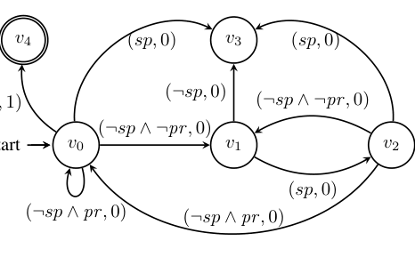

Figure 2: Reward machine for the autonomous vehicle. _sp_ : stop at an intersection; _¬sp_ : not stop at an intersection; _pr_ :
end in a priority road; _¬pr_ : end in an ordinary road. An edge ( _sp,_ 0) between _v_ 0 and _v_ 3 means that the reward machine
will transition from _v_ 0 to _v_ 3 if the proposition (label) _sp_ becomes true and output a reward equal to zero.

**Algorithm 1:** QRM episode

**1** **Hyperparameter** : episode length _eplength_

**2** **Input:** a reward machine ( _V, v_ _I_ _,_ 2 _[P]_ _,_ R _, δ, σ_ ), a set of q-functions _Q_ = _{q_ _[v]_ _|v ∈_ _V }_

**3** _s ←_ _InitialState_ (); _v ←_ _v_ _I_ ; _λ ←_ []; _ρ ←_ []

**4** **for** 0 _≤_ _t < eplength_ **do**

**5** _a ←_ GetEpsilonGreedyAction( _q_ _[v]_ _, s_ )

**6** _s_ _[′]_ _←_ ExecuteAction( _s, a_ )

**7** _v_ _[′]_ _←_ _δ_ ( _v, L_ ( _s, a, s_ _[′]_ ))

**8** _r ←_ _σ_ ( _v, L_ ( _s, a, s_ _[′]_ )) or observe reward in JIRP

**9** update _q_ _[v]_ ( _s, a_ ) using reward _r_

**10** **for** ˆ _v ∈_ _V \ {v}_ **do**

**11** _v_ ˆ _[′]_ _←_ _δ_ (ˆ _v, L_ ( _s, a, s_ _[′]_ ))

**12** _r_ ˆ _←_ _σ_ (ˆ _v, L_ ( _s, a, s_ _[′]_ ))

**13** update _q_ _[v]_ [ˆ] ( _s, a_ ) using reward ˆ _r_

**14** append _L_ ( _s, a, s_ _[′]_ ) to _λ_ ; append _r_ to _ρ_

**15** _s ←_ _s_ _[′]_ ; _v ←_ _v_ _[′]_

**16** **return** ( _λ, ρ, Q_ )

cycle, except for a self-loop. This special case can be used in reinforcement learning scenarios with _sparse_ reward
functions (e.g., see the reward machines used in the case studies in [13]).
For example, Figure 2 shows a reward machine for our motivating example. Intuitively, state _v_ 0 corresponds to the
vehicle traveling on a priority road, while _v_ 1 and _v_ 2 correspond to the vehicle traveling and stopped on an ordinary
road, respectively. While in _v_ 0, the vehicle ends up in a sink state _v_ 3 (representing violation of the traffic rules) if it
stops at an intersection ( _sp_ ). While in state _v_ 1, the vehicle gets to the sink state _v_ 3 if it does not stop at an intersection
( _¬sp_ ), and gets to state _v_ 2 if it stops at an intersection ( _sp_ ). While in state _v_ 2, the vehicle gets to the sink state _v_ 3 if
it stops again at the same intersection ( _sp_ ), gets back to state _v_ 0 if it turns left or turns right (thus ending in a priority
road, i.e., _¬sp ∧_ _pr_ ), and gets back to state _v_ 0 if it goes straight (thus ending in an ordinary road, i.e., _¬sp ∧¬pr_ ). The
reward machine switches among states _v_ 0, _v_ 1 and _v_ 2 if the vehicle is obeying the traffic rules. Finally, the reward 1 is
obtained if from _v_ 0 the goal position B is reached. (Transitions not shown in Figure 2 are self-loops with reward 0.)

**2.2** **Reinforcement Learning With Reward Machines**

In reinforcement learning, an agent explores the environment modeled by an MDP, receiving occasional rewards
according to the underlying reward function [21]. One possible way to learn an optimal policy is tabular q-learning

[14]. There, the value of the function _q_ ( _s, a_ ), that represents the expected future reward for the agent taking action _a_

4

in state _s_, is iteratively updated. Provided that all state-action pairs are seen infinitely often, q-learning converges to an
optimal policy in the limit, for MDPs with a Markovian reward function [14].
The q-learning algorithm can be modified to learn an optimal policy when the general reward function is encoded
by a reward machine [13]. Algorithm 1 shows one episode of the QRM algorithm. It maintains a set _Q_ of q-functions,
denoted as _q_ _[v]_ for each state _v_ of the reward machine.
The current state _v_ of the reward machine guides the exploration by determining which q-function is used to choose
the next action (line 5). However, in each single exploration step, the q-functions corresponding to all reward machine
states are updated (lines 9 and 13).
The modeling hypothesis of QRM is that the rewards are known, but the transition probabilities are unknown.
Later, we shall relax the assumption that rewards are known and we shall instead _observe_ the rewards (in line 8).
During the execution of the episode, traces ( _λ, ρ_ ) of the reward machine are collected (line 14) and returned in the
end. While not necessary for q-learning, the traces will be useful in our algorithm to check the consistency of an
_inferred_ reward machine with rewards received from the environment (see Section 3).

#### **3 Joint Inference of Reward Machines and Policies (JIRP)**

Given a reward machine, the QRM algorithm learns an optimal policy. However, in many situations, assuming the
knowledge of the reward function (and thus the reward machine) is unrealistic. Even if the reward function is known,
encoding it in terms of a reward machine can be non-trivial. In this section, we describe an RL algorithm that _iteratively_
infers (i.e., learns) the reward machine and the optimal policy for the reward machine.
Our algorithm combines an automaton learning algorithm to infer hypothesis reward machines and the QRM
algorithm for RL on the current candidate. Inconsistencies between the hypothesis machine and the observed traces
are used to trigger re-learning of the reward machine. We show that the resulting iterative algorithm converges in
the limit almost surely to the reward machine encoding the reward function and to an optimal policy for this reward
machine.

**3.1** **JIRP Algorithm**

Algorithm 2 describes our JIRP algorithm. It starts with an initial hypothesis reward machine _H_ and runs the QRM
algorithm to learn an optimal policy. The episodes of QRM are used to collect traces and update q-functions. As long
as the traces are consistent with the current hypothesis reward machine, QRM explores more of the environment using
the reward machine to guide the search. However, if a trace ( _λ, ρ_ ) is detected that is inconsistent with the hypothesis
reward machine (i.e., _H_ ( _λ_ ) _̸_ = _ρ_, Line 6), our algorithm stores it in a set _X_ (Line 7)—we call the trace ( _λ, ρ_ ) a
_counterexample_ and the set _X_ a _sample_ . Once the sample is updated, the algorithm re-learns a new hypothesis reward
machine (Line 8) and proceeds. Note that we require the new hypothesis reward machine to be minimal (we discuss
this requirement shortly).

**Algorithm 2:** JIRP

**1** Initialize the hypothesis reward machine _H_ with a set of states _V_

**2** Initialize a set of q-functions _Q_ = _{q_ _[v]_ _|v ∈_ _V }_

**3** Initialize _X_ = _∅_

**4** **for** _episode n_ = 1 _,_ 2 _, . . ._ **do**

**5** ( _λ, ρ, Q_ ) = QRM episode( _H, Q_ )

**6** **if** _H_ ( _λ_ ) _̸_ = _ρ_ **then**

**7** add ( _λ, ρ_ ) to _X_

**8** infer a new, minimal hypothesis reward machine _H_ based on the traces in _X_

**9** re-initialize _Q_

5

**3.2** **Passive Inference of Minimal Reward Machines**

Intuitively, a sample _X ⊂_ (2 _[P]_ ) [+] _×_ R [+] contains a finite number of counterexamples. Consequently, we would like to
construct a new reward machine _H_ that is (a) _consistent with X_ in the sense that _H_ ( _λ_ ) = _ρ_ for each ( _λ, ρ_ ) _∈_ _X_ and
(b) _minimal_ . We call this task _passive learning of reward machines_ . The phrase “passive” here refers to the fact that
the learning algorithm is not allowed to query for additional information, as opposed to Angluin’s famous “active”
learning framework [22].

**Task 1** _Given a finite set X ⊂_ (2 _[P]_ ) [+] _×_ R [+] _,_ passive learning of reward machines _refers to the task of constructing a_
_minimal reward machine H that is consistent with X (i.e., that satisfies H_ ( _λ_ ) = _ρ for each_ ( _λ, ρ_ ) _∈_ _X)._

Note that this learning task asks to infer not an arbitrary reward machine but a _minimal_ one (i.e., a consistent
reward machine with the fewest number of states among all consistent reward machines). This additional requirement
can be seen as an Occam’s razor strategy [23] and is crucial in that it guarantees JIRP to converge to the optimal policy
in the limit. Unfortunately, Task 1 is computationally hard in the sense that the corresponding decision problem

_“given a sample X and a natural number k >_ 0 _, does a consistent Mealy machine with at most k states_
_exist?”_

is NP-complete. This is a direct consequence of Gold’s (in)famous result for regular languages [24].
Since this problem is computationally hard, a promising approach is to learn minimal consistent reward machines
with the help of highly-optimized SAT solvers ( [25], [15], and [26] describe similar learning algorithms for inferring
minimal deterministic finite automata from examples). The underlying idea is to generate a sequence of formulas _ϕ_ _[X]_ _k_
in propositional logic for increasing values of _k ∈_ N (starting with _k_ = 1) that satisfy the following two properties:

   - _ϕ_ _[X]_ _k_ [is satisfiable if and only if there exists a reward machine with] _[ k]_ [ states that is consistent with] _[ X]_ [; and]

  - a satisfying assignment of the variables in _ϕ_ _[X]_ _k_ [contains sufficient information to derive such a reward machine.]

By increasing _k_ by one and stopping once _ϕ_ _[X]_ _k_ [becomes satisfiable (or by using a binary search), an algorithm that]
learns a minimal reward machine that is consistent with the given sample is obtained.
Despite the advances in the performance of SAT solvers, this approach still does not scale to large problems.
Therefore, one often must resort to polynomial-time heuristics.

**3.3** **Convergence in the Limit**

Tabular q-learning and QRM both eventually converge to a q-function defining an optimal policy almost surely. We
show that the same desirable property holds for JIRP. More specifically, in the following sequence of lemmas we show
that—given a long enough exploration—JIRP will converge to the reward machine that encodes the reward function
of the underlying MDP. We then use this fact to show that overall learning process converges to an optimal policy (see
Theorem 1).
We begin by defining _attainable trajectories_ —trajectories that can possibly appear in the exploration of an agent.

**Definition 3** _Let M_ = ( _S, s_ _I_ _, A, p, R, γ, P, L_ ) _be a labeled MDP and m ∈_ N _a natural number. We call a trajectory_
_ζ_ = _s_ 0 _a_ 0 _s_ 1 _. . . s_ _k_ _a_ _k_ _s_ _k_ +1 _∈_ ( _S×A_ ) _[∗]_ _×S m_ -attainable _if (i) k ≤_ _m and (ii) p_ ( _s_ _i_ _, a_ _i_ _, s_ _i_ +1 ) _>_ 0 _for each i ∈{_ 0 _, . . ., k}._
_Moreover, we say that a trajectory ζ is_ attainable _if there exists an m ∈_ N _such that ζ is m-attainable._

An induction shows that JIRP almost surely explores every attainable trajectory in the limit (i.e., with probability
1 when the number of episodes goes to infinity).

**Lemma 1** _Let m ∈_ N _be a natural number. Then, JIRP with eplength ≥_ _m almost surely explores every m-attainable_
_trajectory at least once in the limit._

Analogous to Definition 3, we call a label sequence _λ_ = _ℓ_ 0 _. . . ℓ_ _k_ ( _m_ -)attainable if there exists an ( _m_ -)attainable
trajectory _s_ 0 _a_ 0 _s_ 1 _. . . s_ _k_ _a_ _k_ _s_ _k_ +1 such that _ℓ_ _i_ = _L_ ( _s_ _i_ _, a_ _i_ _, s_ _i_ +1 ) for each _i ∈{_ 0 _, . . ., k}_ . An immediate consequence of
Lemma 1 is that JIRP almost surely explores every _m_ -attainable label sequence in the limit.

**Corollary 1** _JIRP with eplength ≥_ _m almost surely explores every m-attainable label sequence at least once in the_
_limit._

6

**Algorithm 3:** JIRP with algorithmic optimizations

**1** Initialize the hypothesis reward machine _H_ with a set of states _V_

**2** Initialize a set of q-functions _Q_ = _{q_ _[v]_ _|v ∈_ _V }_

**3** Initialize _X_ = _∅_ and _X_ new = _∅_

**4** **for** _episode n_ = 1 _,_ 2 _, . . ._ **do**

**5** ( _λ, ρ, Q_ ) = QRM episode( _H, Q_ )

**6** **if** _H_ ( _λ_ ) _̸_ = _ρ_ **then**

**7** add ( _λ, ρ_ ) to _X_ new

**8** **if** ~~�~~ _mod_ ( _n, N_ ) = 0 _and X_ _new_ _̸_ = _∅_ � **then**

**9** _X ←_ _X ∪_ _X_ new
**10** infer _H_ new using _X_

**11** _Q_ new _←_ Transfer _q_ ( _Q, H, H_ new )

**12** _H ←H_ new, _Q ←_ _Q_ new, _X_ new _←∅_

If JIRP explores sufficiently many _m_ -attainable label sequences for a large enough value of _m_, it is guaranteed
to infer a reward machine that is “good enough” in the sense that it is equivalent to the reward machine encoding the
reward function _R_ on all attainable label sequences. This is formalized in the next lemma.

**Lemma 2** _Let M be a labeled MDP and A the reward machine encoding the reward function of M. Then, JIRP with_
_eplength ≥_ 2 _[|M|]_ [+1] ( _|A|_ + 1) _−_ 1 _almost surely learns a reward machine in the limit that is equivalent to A on all_
_attainable label sequences._

Lemma 2 guarantees that JIRP will eventually learn the reward machine encoding the reward function of an underlying MDP. This is the key ingredient in proving that JIRP learns an optimal policy in the limit almost surely.

**Theorem 1** _Let M be a labeled MDP and A the reward machine encoding the reward function of M. Then, JIRP_
_with eplength ≥_ 2 _[|M|]_ [+1] ( _|A|_ + 1) _−_ 1 _almost surely converges to an optimal policy in the limit._

#### **4 Algorithmic Optimizations**

Section 3 provides the base algorithm with theoretical guarantees for convergence to an optimal policy. In this section,
we present an improved algorithm (Algorithm 3) that includes three _algorithmic optimizations_ :
Optimization 1: batching of counterexamples (Section 4.1);
Optimization 2: transfer of q-functions (Section 4.2);
Optimization 3: polynomial time learning algorithm for inferring the reward machines (Section 4.3).
The following theorem claims that Optimizations 1 and 2 retain the convergence guarantee of Theorem 1.

**Theorem 2** _Let M be a labeled MDP and A the reward machine encoding the rewards of M. Then, JIRP with_
_Optimizations 1 and 2 with eplength ≥_ 2 _[|M|]_ [+1] ( _|A|_ + 1) _−_ 1 _converges to an optimal policy in the limit._

It should be noted that although such guarantee fails for Optimization 3, in practice the policies usually still
converge to the optimal policies (see the case studies in Section 5).

**4.1** **Batching of Counterexamples**

Algorithm 2 infers a new hypothesis reward machine whenever a counterexample is encountered. This could incur a
high computational cost. In order to adjust the frequency of inferring new reward machines, Algorithm 3 stores each
counterexample in a set _X_ new . After each period of _N_ episodes (where _N ∈_ Z _>_ 0 is a user-defined hyperparameter),
if _X_ new is non-empty, we add _X_ new to the sample _X_ and infer a new hypothesis reward machine _H_ new (lines 8 to 10).
Then, Algorithm 3 proceeds with the QRM algorithm for _H_ new . The same procedure repeats until the policy converges.

7

**4.2** **Transfer of Q-functions**

In Algorithm 2, after a new hypothesis reward machine is inferred, the q-functions are re-initialized and the experiences
from the previous iteration of RL are not utilized. To utilize experiences in previous iterations, we provide a method to
transfer the q-functions from the previously inferred reward machine to the newly inferred reward machine (inspired
by the curriculum learning implementation in [13]). The transfer of q-functions is based on _equivalent_ states of two
reward machines as defined below.

**Definition 4** _For a reward machine A and a state v ∈_ _V, let A_ [ _v_ ] _be the machine with v as the initial state. Then,_
_for two reward machines A and_ _A_ [ˆ] _, two states v ∈_ _V and_ ˆ _v ∈_ _V_ [ˆ] _are equivalent, denoted by v ∼_ _v_ ˆ _, if and only if_
_A_ [ _v_ ]( _λ_ ) = _A_ [ˆ _v_ ]( _λ_ ) _for all label sequences λ._

With Definition 4, we provide the following theorem claiming equality of optimal q-functions for equivalent states
of two reward machines. We use _q_ _[∗][v]_ ( _s, a_ ) to denote the optimal q-function for state _v_ of the reward machine.

**Theorem 3** _Let A_ = ( _V, v_ _I_ _,_ 2 _[P]_ _,_ R _, δ, σ_ ) _and_ _A_ [ˆ] = ( _V,_ [ˆ] ˆ _v_ _I_ _,_ 2 _[P]_ _,_ R _,_ _δ,_ [ˆ] ˆ _σ_ ) _be two reward machines encoding the rewards_
_of a labeled MDP M_ = ( _S, s_ _I_ _, A, p, R, γ, P, L_ ) _. For states v ∈_ _V and_ ˆ _v ∈_ _V_ [ˆ] _, if v ∼_ _v_ ˆ _, then for every s ∈_ _S and_
_a ∈_ _A, q_ _[∗][v]_ ( _s, a_ ) = _q_ _[∗][v]_ [ˆ] ( _s, a_ ) _._

Algorithm 4 shows the procedure to transfer the q-functions between the hypothesis reward machines in consecutive iterations. For any state of the hypothesis reward machine in the current iteration, we check if there exists an
equivalent state of the hypothesis reward machine in the previous iteration. If so, the corresponding q-functions are
transferred (line 5). As shown in Theorem 3, the optimal q-functions for two equivalent states are the same.

**Algorithm 4:** Transfer _q_

**1** **Input:** a set of q-functions _Q_ = _{q_ _[v]_ _|v ∈_ _V }_, hypothesis reward machines _H_ = ( _V, v_ _I_ _,_ 2 _[P]_ _,_ R _, δ, σ_ ),
_H_ new = ( _V_ new _, v_ _I_ new _,_ 2 _[P]_ _,_ R _, δ_ new _, σ_ new )

**2** Initialize _Q_ new = _{q_ new _[v]_ [new] _[|][ q]_ new _[v]_ [new] _[∈]_ _[V]_ [new] _[}]_

**3** **for** _v_ _new_ _∈_ _V_ _new_ _, v ∈_ _V_ **do**

**4** **if** _v ∼_ _v_ _new_ **then**

**5** _q_ new _[v]_ [new] _[←]_ _[q]_ _[v]_

**6** Return _Q_ new

**4.3** **A Polynomial Time Learning Algorithm for Reward Machines**

In order to tackle scalability issues of the SAT-based machine learning algorithm, we propose to use a modification
of the popular Regular Positive Negative Inference (RPNI) algorithm [16] adapted for learning reward machines. This
algorithm, which we name RPNI-RM, proceeds in two steps.
In the first step, RPNI-RM constructs a partial, tree-like reward machine _A_ from a sample _X_ where

  - each prefix _ℓ_ 1 _. . . ℓ_ _i_ of a trace ( _ℓ_ 1 _. . . ℓ_ _k_ _, r_ 1 _. . . r_ _k_ ) _∈_ _X_ ( _i ≤_ _k_ ) corresponds to a unique state _v_ _ℓ_ 1 _...ℓ_ _i_ of _A_ ; and

  - for each trace ( _ℓ_ 1 _. . . ℓ_ _k_ _, r_ 1 _. . . r_ _k_ ) _∈_ _X_ and _i ∈{_ 0 _, . . ., k −_ 1 _}_, a transition leads from state _v_ _ℓ_ 1 _...ℓ_ _i_ to state
_v_ _ℓ_ 1 _...ℓ_ _i_ +1 with input _ℓ_ _i_ +1 and output _r_ _i_ +1 .

Note that _A_ fits the sample _X_ perfectly in that _A_ ( _λ_ ) = _ρ_ for each ( _λ, ρ_ ) _∈_ _X_ and the output of all other inputs is
undefined (since the reward machine is partial). In particular, this means that _A_ is consistent with _X_ .
In the second step, RPNI-RM successively tries to merge the states of _A_ . The overall goal is to construct a reward
machine with fewer states but more input-output behaviors. For every candidate merge (which might trigger additional
state merges to restore determinism), the algorithm checks whether the resulting machine is still consistent with _X_ .
Should the current merge result in an inconsistent reward machine, it is reverted and RPNI-RM proceeds with the next
candidate merge; otherwise, RPNI-RM keeps the current merge and proceeds with the merged reward machine. This
procedure stops if no more states can be merged. Once this is the case, any missing transition is directed to a sink state,
where the output is fixed but arbitrary.

8

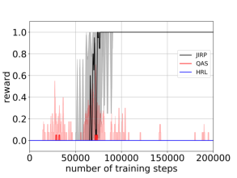

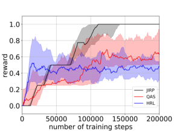

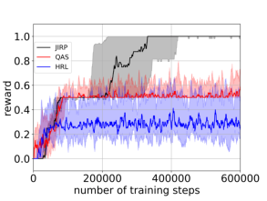

(a) (b) (c)

Figure 3: Cumulative rewards of 10 independent simulation runs averaged for every 10 training steps in (a) autonomous
vehicle scenario; (b) office world scenario (averaged for four tasks); and (c) Minecraft world scenario (averaged for
four tasks).

Since RPNI-RM starts with a consistent reward machine and keeps intermediate results only if they remain consistent, its final output is clearly consistent as well. Moreover, merging of states increases the input-output behaviors,
hence generalizing from the (finite) sample. Finally, let us note that the overall runtime of RPNI-RM is polynomial in
the number of symbols in the given sample because the size of the initial reward machine _A_ corresponds to the number
of symbols in the sample _X_ and each operation of RPNI-RM can be performed in polynomial time.

#### **5 Case Studies**

In this section, we apply the proposed approach to three different scenarios: 1) autonomous vehicle scenario; 2) office
world scenario adapted from [13], and 3) Minecraft world scenario adapted from [10]. We use the libalf [27] implementation of RPNI [16] as the algorithm to infer reward machines. The detailed description of the tasks in the three
different scenarios can be found in the supplementary material.
We compare JIRP (with algorithmic optimizations) with the two following baseline methods:

  - QAS (q-learning in augmented state space): to incorporate the extra information of the labels (i.e., high-level
events in the environment), we perform q-learning [14] in an augmented state space with an extra binary vector
representing whether each label has been encountered or not.

  - HRL (hierarchical reinforcement learning): we use a meta-controller for deciding the subtasks (represented by
encountering each label) and use the low-level controllers expressed by neural networks [17] for deciding the
actions at each state for each subtask.

**5.1** **Autonomous Vehicle Scenario**

We consider the autonomous vehicle scenario as introduced in the motivating example in Section 1.1. The set of
actions is _A_ = _{Straight, Left, Right, Stay}_, corresponding to going straight, turning left, turning right and staying
in place. For simplicity, we assume that the labeled MDP is deterministic (i.e, the slip rate is zero for each action). The
vehicle will make a U-turn if it reaches the end of any road.
The set of labels is _{sp, pr_ _,_ B _}_ and the labeling function _L_ is defined by

_sp ∈_ _L_ ( _s, a, s_ _[′]_ ) _⇔_ _a_ = _stay ∧_ _s ∈J,_

_pr ∈_ _L_ ( _s, a, s_ _[′]_ ) _⇔_ _s_ _[′]_ _.priority_ = _⊤∧_ _s ∈J,_

B _∈_ _L_ ( _s, a, s_ _[′]_ ) _⇔_ _s_ _[′]_ _.x_ = _x_ B _∧_ _s_ _[′]_ _.y_ = _y_ B _,_

where _s_ _[′]_ _.priority_ is a Boolean variable that is true ( _⊤_ ) if and only if _s_ _[′]_ is on the priority roads, _J_ represents the set of
locations where the vehicle is entering an intersection, _s_ _[′]_ _.x_ and _s_ _[′]_ _.y_ are the _x_ and _y_ coordinate values at state _s_, and
_x_ B and _y_ B are _x_ and _y_ coordinate values at B (see Figure 1).
We set _eplength_ = 100 and _N_ = 100. Figure 4 shows the inferred hypothesis reward machine in the last iteration
of JIRP in one typical run. The inferred hypothesis reward machine is different from the true reward machine in
Figure 2, but it can be shown that these two reward machines are equivalent on all attainable label sequences.

9

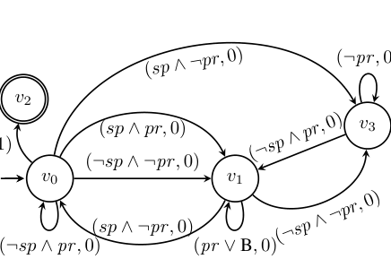

(B _,_ 1)

Figure 4: Inferred hypothesis reward machine in the last iteration of JIRP in one typical run in the autonomous vehicle
scenario.

Figure 3 (a) shows the cumulative rewards with the three different methods in the autonomous vehicle scenario.
The JIRP approach converges to optimal policies within 100,000 training steps, while QAS and HRL are stuck with
near-zero cumulative reward for up to two million training steps (with the first 200,000 training steps shown in Figure
3 (a)).

**5.2** **Office World Scenario**

We consider the office world scenario in the 9 _×_ 12 grid-world. The agent has four possible actions at each time step:
move north, move south, move east and move west. After each action, the robot may slip to each of the two adjacent
cells with probability of 0.05. We use four tasks with different high-level structural relationships among subtasks such
as getting the coffee, getting mails and going to the office (see Appendix G for details).
We set _eplength_ = 1000 and _N_ = 30. Figure 3 (b) shows the cumulative rewards with the three different methods
in the office world scenario. The JIRP approach converges to the optimal policy within 150,000 training steps, while
QAS and HRL reach only 60% of the optimal average cumulative reward within 200,000 training steps.

**5.3** **Minecraft World Scenario**

We consider the Minecraft example in a 21 _×_ 21 gridworld. The four actions and the slip rates are the same as in the
office world scenario. We use four tasks including making plank, making stick, making bow and making bridge (see
Appendix H for details).
We set _eplength_ = 400 and _N_ = 30. Figure 3 (c) shows the cumulative rewards with the three different methods
in the Minecraft world scenario. The JIRP approach converges to the optimal policy within 400,000 training steps,
while QAS and HRL reach only 50% of the optimal average cumulative reward within 600,000 training steps.

#### **6 Conclusion**

We proposed an iterative approach that alternates between reward machine inference and reinforcement learning (RL)
for the inferred reward machine. We have shown the improvement of RL performances using the proposed method.
This work opens the door for utilizing automata learning in RL. First, the same methodology can be applied to
other forms of RL, such as model-based RL, or actor-critic methods. Second, we will explore methods that can infer
the reward machines incrementally (based on inferred reward machines in the previous iteration). Finally, the method
to transfer the q-functions between equivalent states of reward machines can be also used for transfer learning between
different tasks where the reward functions are encoded by reward machines.

10

#### **References**

[1] M. E. Taylor and P. Stone, “Cross-domain transfer for reinforcement learning,” in _Proc. ICML’07_ . New York,
[NY, USA: ACM, 2007, pp. 879–886. [Online]. Available: http://doi.acm.org/10.1145/1273496.1273607](http://doi.acm.org/10.1145/1273496.1273607)

[2] O. Nachum, S. S. Gu, H. Lee, and S. Levine, “Data-efficient hierarchical reinforcement learning,” in
_Advances in Neural Information Processing Systems 31_, S. Bengio, H. Wallach, H. Larochelle, K. Grauman,
N. Cesa-Bianchi, and R. Garnett, Eds. Curran Associates, Inc., 2018, pp. 3303–3313. [Online]. Available:
[http://papers.nips.cc/paper/7591-data-efficient-hierarchical-reinforcement-learning.pdf](http://papers.nips.cc/paper/7591-data-efficient-hierarchical-reinforcement-learning.pdf)

[3] D. Abel, D. Arumugam, L. Lehnert, and M. Littman, “State abstractions for lifelong reinforcement learning,” in
_Proceedings of the 35th International Conference on Machine Learning_, ser. Proceedings of Machine Learning
Research, J. Dy and A. Krause, Eds., vol. 80. Stockholmsm¨assan, Stockholm Sweden: PMLR, 10–15 Jul 2018,
[pp. 10–19. [Online]. Available: http://proceedings.mlr.press/v80/abel18a.html](http://proceedings.mlr.press/v80/abel18a.html)

[4] R. Akrour, F. Veiga, J. Peters, and G. Neumann, “Regularizing reinforcement learning with state abstraction,” 10
2018, pp. 534–539.

[5] R. S. Sutton, D. Precup, and S. Singh, “Between mdps and semi-mdps: A framework for temporal abstraction in
reinforcement learning,” _Artificial intelligence_, vol. 112, no. 1-2, pp. 181–211, 1999.

[6] T. G. Dietterich, “Hierarchical reinforcement learning with the maxq value function decomposition,” _J. Artif. Int._
_Res._ [, vol. 13, no. 1, pp. 227–303, Nov. 2000. [Online]. Available: http://dl.acm.org/citation.cfm?id=1622262.](http://dl.acm.org/citation.cfm?id=1622262.1622268)
[1622268](http://dl.acm.org/citation.cfm?id=1622262.1622268)

[7] R. Parr and S. J. Russell, “Reinforcement learning with hierarchies of machines,” in _Advances in neural infor-_
_mation processing systems_, 1998, pp. 1043–1049.

[8] A. G. Barto and S. Mahadevan, “Recent advances in hierarchical reinforcement learning,” _Discrete event dynamic_
_systems_, vol. 13, no. 1-2, pp. 41–77, 2003.

[9] D. Aksaray, A. Jones, Z. Kong, M. Schwager, and C. Belta, “Q-learning for robust satisfaction of signal temporal
logic specifications,” in _2016 IEEE 55th Conference on Decision and Control (CDC)_ . IEEE, 2016, pp. 6565–
6570.

[10] J. Andreas, D. Klein, and S. Levine, “Modular multitask reinforcement learning with policy sketches,” in _Pro-_
_ceedings of the 34th International Conference on Machine Learning-Volume 70_ . JMLR. org, 2017, pp. 166–175.

[11] X. Li, C.-I. Vasile, and C. Belta, “Reinforcement learning with temporal logic rewards,” in _2017 IEEE/RSJ_
_International Conference on Intelligent Robots and Systems (IROS)_ . IEEE, 2017, pp. 3834–3839.

[12] Z. Xu and U. Topcu, “Transfer of temporal logic formulas in reinforcement learning,” in _IJCAI-19_ .
International Joint Conferences on Artificial Intelligence Organization, 7 2019, pp. 4010–4018. [Online].
[Available: https://doi.org/10.24963/ijcai.2019/557](https://doi.org/10.24963/ijcai.2019/557)

[13] R. T. Icarte, T. Q. Klassen, R. A. Valenzano, and S. A. McIlraith, “Using reward machines for high-level
task specification and decomposition in reinforcement learning,” in _Proceedings of the 35th International_
_Conference on Machine Learning, ICML 2018, Stockholmsm¨assan, Stockholm, Sweden, July 10-15, 2018_, 2018,
[pp. 2112–2121. [Online]. Available: http://proceedings.mlr.press/v80/icarte18a.html](http://proceedings.mlr.press/v80/icarte18a.html)

[14] C. J. C. H. Watkins and P. Dayan, “Q-learning,” _Machine Learning_, vol. 8, no. 3, pp. 279–292, May 1992.

[[Online]. Available: https://doi.org/10.1007/BF00992698](https://doi.org/10.1007/BF00992698)

[15] D. Neider and N. Jansen, “Regular model checking using solver technologies and automata learning,” in _NASA_
_Formal Methods, 5th International Symposium, NFM 2013, Moffett Field, CA, USA, May 14-16, 2013. Proceed-_
_ings_, ser. Lecture Notes in Computer Science, vol. 7871. Springer, 2013, pp. 16–31.

[16] J. Oncina and P. Garcia, “Inferring regular languages in polynomial updated time,” in _Pattern recognition and_
_image analysis: selected papers from the IVth Spanish Symposium_ . World Scientific, 1992, pp. 49–61.

11

[17] T. D. Kulkarni, K. Narasimhan, A. Saeedi, and J. Tenenbaum, “Hierarchical deep reinforcement learning: Integrating temporal abstraction and intrinsic motivation,” in _Advances in neural information processing systems_,
2016, pp. 3675–3683.

[18] M. L. Puterman, _Markov Decision Processes: Discrete Stochastic Dynamic Programming_, 1st ed. New York,
NY, USA: John Wiley & Sons, Inc., 1994.

[19] A. Camacho, R. Toro Icarte, T. Q. Klassen, R. Valenzano, and S. A. McIlraith, “LTL and beyond:
Formal languages for reward function specification in reinforcement learning,” in _IJCAI’19_ . International
Joint Conferences on Artificial Intelligence Organization, 7 2019, pp. 6065–6073. [Online]. Available:
[https://doi.org/10.24963/ijcai.2019/840](https://doi.org/10.24963/ijcai.2019/840)

[20] J. O. Shallit, _A Second Course in Formal Languages and Automata Theory_ . Cambridge University Press, 2008.

[[Online]. Available: http://www.cambridge.org/gb/knowledge/isbn/item1173872/?site](http://www.cambridge.org/gb/knowledge/isbn/item1173872/?site_locale=en_GB) ~~l~~ ocale=en ~~G~~ B

[21] R. S. Sutton and A. G. Barto, _Reinforcement learning: An introduction_ . MIT press, 2018.

[22] D. Angluin, “Learning regular sets from queries and counterexamples,” _Inf. Comput._, vol. 75, no. 2, pp. 87–106,
[1987. [Online]. Available: https://doi.org/10.1016/0890-5401(87)90052-6](https://doi.org/10.1016/0890-5401(87)90052-6)

[23] C. L¨oding, P. Madhusudan, and D. Neider, “Abstract learning frameworks for synthesis,” in _Tools and Algorithms_
_for the Construction and Analysis of Systems - 22nd International Conference, TACAS 2016, Held as Part of the_
_European Joint Conferences on Theory and Practice of Software, ETAPS 2016, Eindhoven, The Netherlands,_
_April 2-8, 2016, Proceedings_, ser. Lecture Notes in Computer Science, vol. 9636. Springer, 2016, pp. 167–185.

[24] E. M. Gold, “Complexity of automaton identification from given data,” _Information and Control_, vol. 37, no. 3,
pp. 302–320, 1978.

[25] M. Heule and S. Verwer, “Exact DFA identification using SAT solvers,” in _Grammatical Inference: Theoretical_
_Results and Applications, 10th International Colloquium, ICGI 2010, Valencia, Spain, September 13-16, 2010._
_Proceedings_, ser. Lecture Notes in Computer Science, vol. 6339. Springer, 2010, pp. 66–79.

[26] D. Neider, “Applications of automata learning in verification and synthesis,” Ph.D. dissertation, RWTH Aachen
[University, 2014. [Online]. Available: http://darwin.bth.rwth-aachen.de/opus3/volltexte/2014/5169](http://darwin.bth.rwth-aachen.de/opus3/volltexte/2014/5169)

[27] B. Bollig, J. Katoen, C. Kern, M. Leucker, D. Neider, and D. R. Piegdon, “libalf: The automata learning
framework,” in _Computer Aided Verification, 22nd International Conference, CAV 2010, Edinburgh, UK, July 15-_
_19, 2010. Proceedings_ [, 2010, pp. 360–364. [Online]. Available: https://doi.org/10.1007/978-3-642-14295-6](https://doi.org/10.1007/978-3-642-14295-6_32) ~~3~~ 2

[28] R. Givan, T. Dean, and M. Greig, “Equivalence notions and model minimization in markov decision processes,”
_Artificial Intelligence_, vol. 147, no. 1, pp. 163 – 223, 2003, planning with Uncertainty and Incomplete
[Information. [Online]. Available: http://www.sciencedirect.com/science/article/pii/S0004370202003764](http://www.sciencedirect.com/science/article/pii/S0004370202003764)

#### **A Proof of Lemma 1**

**Proof 1** _We first prove that JIRP with eplength ≥_ _m explores every m-attainable trajectory with a positive (non-zero)_
_probability. We show this claim by induction over the length i of trajectories._

**Base case:** _The only trajectory of length i_ = 0 _, s_ _I_ _, is always explored because it is the initial state of every exploration._

**Induction step:** _Let i_ = _i_ _[′]_ + 1 _and ζ_ = _s_ 0 _a_ 0 _s_ 1 _. . . s_ _i_ _′_ _a_ _i_ _′_ _s_ _i_ _be an m-attainable trajectory of length i ≤_ _m. Then, the_
_induction hypothesis yields that JIRP explores each m-attainable trajectory s_ 0 _a_ 0 _s_ 1 _. . . s_ _i_ _′_ _(of length i_ _[′]_ = _i_ _−_ 1 _)._
_Moreover JIRP continues its exploration because eplength ≥_ _m > i_ _[′]_ _. At this point, every action a_ _i_ _′_ _will be_
1
_chosen with probability at least ϵ ×_ _|A_ _si′_ _|_ _[, where][ A]_ _[s]_ _i_ _[′]_ _[ ⊆]_ _[A][ denotes the set of available actions in the state][ s]_ _[i]_ _[′]_

_(this lower bound is due to the ϵ-greedy strategy used in the exploration). Having chosen action a_ _i_ _′_ _, the state s_ _i_
_is reached with probability p_ ( _s_ _i_ _′_ _, a_ _i_ _′_ _, s_ _i_ ) _>_ 0 _because ζ is m-attainable. Thus, the trajectory ζ is explored with_
_a positive probability._

12

_Since JIRP with eplength ≥_ _m explores every m-attainable trajectory with a positive probability, the probability_
_of an m-attainable trajectory not being explored becomes_ 0 _in the limit (i.e., when the number of episodes goes to_
_infinity). Thus, JIRP almost surely (i.e., with probability_ 1 _) explores every m-attainable trajectory in the limit._

#### **B Proof of Lemma 2**

In order to prove Lemma 2, we require a few (basic) definitions from automata and formal language theory.
An _alphabet_ Σ is a nonempty, finite set of _symbols b ∈_ Σ. A _word ω_ = _b_ 0 _. . . b_ _n_ is a finite sequence of symbols.
The empty sequence is called _empty word_ and denoted by _ε_ . The _length_ of a word _ω_, denoted by _|ω|_ is the number of
its symbols. We denote the set of all words over the alphabet Σ by Σ _[∗]_ .
Next, we recapitulate the definition of deterministic finite automata.

**Definition 5** _A_ deterministic finite automaton (DFA) _is a five-tuple_ A = ( _V, v_ _I_ _,_ Σ _, δ, F_ ) _consisting of a nonempty,_
_finite set V of states, an initial state v_ _I_ _∈_ _V, an input alphabet_ Σ _, a transition function δ_ : _V ×_ Σ _→_ _V, and a set_
_F ⊆_ _V of final states. The size of a DFA, denoted by |_ A _|, is the number |V | of its states._

A _run_ of a DFA A = ( _V, v_ _I_ _,_ Σ _, δ, F_ ) on an input word _ω_ = _b_ 0 _. . . b_ _k_ is a sequence _v_ 0 _. . . v_ _k_ +1 of states such that
_v_ 0 = _v_ _I_ and _v_ _i_ +1 = _δ_ ( _v_ _i_ _, b_ _i_ ) for each _i ∈{_ 0 _, . . ., k}_ . A run _v_ 0 _. . . v_ _k_ +1 of A on a word _ω_ is _accepting_ if _v_ _k_ +1 _∈_ _F_, and
_ω_ is _accepted_ if there exists an accepting run. The _language_ of a DFA A is the set _L_ (A) = _{ω ∈_ Σ _[∗]_ _|_ A accepts _ω}_ .
As usual, we call two DFAs A 1 and A 2 _equivalent_ if _L_ (A 1 ) = _L_ (A 2 ). Moreover, let us recapitulate the well-known
fact that two non-equivalent DFAs have a “short” word that witnesses their non-equivalence.

**Theorem 4 ( [20], Theorem 3.10.5)** _Let_ A 1 _and_ A 2 _be two DFAs with L_ (A 1 ) _̸_ = _L_ (A 2 ) _. Then, there exists a word ω_
_of length at most |_ A 1 _|_ + _|_ A 2 _| −_ 1 _such that ω ∈_ _L_ (A 1 ) _if and only if ω /∈_ _L_ (A 2 ) _._

As the next step towards the proof of Lemma 2, we remark that every reward machine over the input alphabet
2 _[P]_ and output alphabet R can be translated into an “equivalent” DFA as defined below. This DFA operates over the
combined alphabet 2 _[P]_ _×_ R and accepts a word ( _ℓ_ 0 _, r_ 0 ) _. . ._ ( _ℓ_ _k_ _, r_ _k_ ) if and only if _A_ outputs the reward sequence
_r_ 0 _. . . r_ _k_ on reading the label sequence _ℓ_ 0 _. . . ℓ_ _k_ .

**Lemma 3** _Given a reward machine A_ = ( _V, v_ _I_ _,_ 2 _[P]_ _,_ R _, δ, σ_ ) _, one can construct a DFA_ A _A_ _with |A|_ + 1 _states such_
_that_
_L_ (A _A_ ) = �( _ℓ_ 0 _, r_ 0 ) _. . ._ ( _ℓ_ _k_ _, r_ _k_ ) _∈_ (2 _[P]_ _×_ R) _[∗]_ _| A_ ( _ℓ_ 0 _. . . ℓ_ _k_ ) = _r_ 0 _. . . r_ _k_ � _._ (1)

**Proof 2 (Proof of Lemma 3)** _Let A_ = ( _V_ _A_ _, v_ _I,A_ _,_ 2 _[P]_ _,_ R _, δ_ _A_ _, σ_ _A_ ) _be a reward machine. Then, we define a DFA_ A _A_ =
( _V, v_ _I_ _,_ Σ _, δ, F_ ) _over the combined alphabet_ 2 _[P]_ _×_ R _by_

   - _V_ = _V_ _A_ _∪{⊥} with ⊥_ _∈/_ _V_ _A_ _;_

   - _v_ _I_ = _v_ _I,A_ _;_

  - Σ = 2 _[P]_ _×_ R _;_

- _δ_ � _v,_ ( _ℓ, r_ )� =

- _F_ = _V_ _A_ _._

_v_ _[′]_ _if δ_ _A_ ( _v, ℓ_ ) = _v_ _[′]_ _and σ_ _A_ ( _v, ℓ_ ) = _r;_

_⊥_ _otherwise;_
�

_In this definition, ⊥_ _is a new sink state to which_ A _A_ _moves if its input does not correspond to a valid input-output_
_pair produced by A. A straightforward induction over the length of inputs to_ A _A_ _shows that it indeed accepts the_
_desired language. In total,_ A _A_ _has |A|_ + 1 _states._

Similarly, one can construct a DFA A _M_ that accepts exactly the attainable traces of an MDP _M_ . First, viewing
labels _L_ ( _s, a, s_ _[′]_ ) as input symbols, marking every state as an accepting state, and keeping only those transitions
for which _p_ ( _s, a, s_ _[′]_ ) _>_ 0, _M_ can be viewed as a non-deterministic finite automaton. Second, using the standard
determinization algorithm [20], one can create an equivalent DFA with an exponential blowup in the number of states.

13

**Remark 1** _Given a labeled MDP M, one can construct a DFA_ A _M_ _with at most_ 2 _[|M|]_ _states that accepts exactly the_
_admissible label sequences of M._

Next, we show that if two reward machines disagree on an attainable label sequence, then we can provide a bound
on the length of such a sequence.

**Lemma 4** _Let M_ = ( _S, s_ _I_ _, A, p, R, γ, P, L_ ) _be a labeled MDP and A_ 1 _, A_ 2 _two reward machines with input alphabet_
2 _[P]_ _. If there exists an attainable label sequence λ such that A_ 1 ( _λ_ ) _̸_ = _A_ 2 ( _λ_ ) _, then there also exists an m-attainable_
_label sequence λ_ _[⋆]_ _with m ≤_ 2 _[|M|]_ ( _|A_ 1 _|_ + _|A_ 2 _|_ + 2) _−_ 1 _such that A_ 1 ( _λ_ _[⋆]_ ) _̸_ = _A_ 2 ( _λ_ _[⋆]_ ) _._

**Proof 3 (Proof of Lemma 4)** _Let M_ = ( _S, s_ _I_ _, A, p, R, γ, P, L_ ) _be a labeled MDP and A_ 1 _, A_ 2 _two reward machines_
_with input alphabet_ 2 _[P]_ _. As a first step, we construct the DFAs_ A _M_ = ( _V_ _[′]_ _, v_ _I_ _[′]_ _[,]_ [ 2] _[P]_ _[, δ]_ _[′]_ _[, F]_ _[ ′]_ [)] _[ according to Remark 1 and]_
_the DFAs_ A _A_ _i_ = ( _V_ _i_ _[′′]_ _[, v]_ _I,i_ _[′′]_ _[,]_ [ 2] _[P]_ _[ ×]_ [ R] _[, δ]_ _i_ _[′′]_ _[, F]_ _i_ _[ ′′]_ [)] _[ for][ i][ ∈{]_ [1] _[,]_ [ 2] _[}][ according to Lemma 3.]_
_Next, we construct the input-synchronized product_ A _M×A_ _i_ = ( _V_ _[′′′]_ _, v_ _I_ _[′′′]_ _[,]_ [ 2] _[P]_ _[, δ]_ _[′′′]_ _[, F]_ _[ ′′′]_ [)] _[ of a]_ [ A] _[M]_ _[ and]_ [ A] _[A]_ _i_ _[by]_

   - _V_ _[′′′]_ = _V_ _[′]_ _× V_ _i_ _[′′]_ _[;]_

   - _v_ _I_ _[′′′]_ [= (] _[v]_ _I_ _[′]_ _[, v]_ _I,i_ _[′′]_ [)] _[;]_

   - _δ_ _[′′′]_ [�] ( _v_ _[′]_ _, v_ _i_ _[′′]_ [)] _[,]_ [ (] _[ℓ, r]_ [)] � = � _δ_ _[′]_ ( _v_ _[′]_ _, ℓ_ ) _, δ_ _i_ _[′′]_ [(] _[v]_ _i_ _[′′]_ _[,]_ [ (] _[ℓ, r]_ [))] � _; and_

   - _F_ _[′′′]_ = _F_ _[′]_ _× F_ _i_ _[′′]_ _[,]_

_which synchronizes_ A _M_ _and the input-component of_ A _A_ _i_ _. A straightforward induction over the lengths of inputs to_
A _M×A_ _i_ _shows that_ ( _ℓ_ 0 _, r_ 0 ) _. . ._ ( _ℓ_ _k_ _, r_ _k_ ) _∈_ _L_ (A _M×A_ _i_ ) _if and only if ℓ_ 0 _. . . ℓ_ _k_ _is an attainable label sequence such that_
_A_ _i_ ( _ℓ_ 0 _. . . ℓ_ _k_ ) = _r_ 0 _. . . r_ _k_ _. Moreover, note that_ A _M×A_ _i_ _has_ 2 _[|M|]_ ( _|A_ _i_ _|_ + 1) _states._
_If there exists an attainable label sequence λ such that A_ 1 ( _λ_ ) _̸_ = _A_ 2 ( _λ_ ) _, then L_ (A _M×A_ 1 ) _̸_ = _L_ (A _M×A_ 2 ) _by_
_construction of the DFAs_ A _M×A_ 1 _and_ A _M×A_ 2 _. In this situation, Theorem 4 guarantees the existence of a word_
_ω_ = ( _ℓ_ 0 _, r_ 0 ) _. . ._ ( _ℓ_ _m−_ 1 _, r_ _m−_ 1 ) _∈_ (2 _[P]_ _×_ R) _[∗]_ _of size_

_m ≤_ 2 _[|M|]_ ( _|A_ 1 _|_ + 1) + 2 _[|M|]_ ( _|A_ 2 _|_ + 1) _−_ 1

= 2 _[|M|]_ ( _|A_ 1 _|_ + _|A_ 2 _|_ + 2) _−_ 1

_such that ω ∈_ _L_ (A _M×A_ 1 ) _if and only if ω /∈_ _L_ (A _M×A_ 2 ) _._
_Let now λ_ _[⋆]_ = _ℓ_ 0 _. . . ℓ_ _m−_ 1 _. By construction of the DFAs_ A _M×A_ 1 _and_ A _M×A_ 2 _, we know that A_ 1 ( _λ_ _[⋆]_ ) _̸_ = _A_ 2 ( _λ_ _[⋆]_ )
_holds. Moreover, λ_ _[⋆]_ _is an m-attainable label sequence with the desired bound on m._

We are now ready to prove Lemma 2.

**Proof 4 (Proof of Lemma 2)** _Let X_ 0 _, X_ 1 _, . . . be the sequence of samples that arise in the run of JIRP whenever new_
_counterexamples are added to X (in Line 7 of Algorithm 2). We now make two observations about this sequence, which_
_help us prove Lemma 2._

_1. The sequence X_ 0 _, X_ 1 _, . . . grows strictly monotonically (i.e., X_ 0 ⊊ _X_ 1 ⊊ _· · · ). The reasons for this are twofold._
_First, JIRP always adds counterexamples to X and never removes them (which establishes X_ 0 _⊆_ _X_ 1 _⊆· · · )._
_Second, whenever a counterexample_ ( _λ_ _i_ _, ρ_ _i_ ) _is added to X_ _i_ _to form X_ _i_ +1 _, then_ ( _λ_ _i_ _, ρ_ _i_ ) _/∈_ _X_ _i_ _. To see why this is_
_the case, remember that JIRP always constructs hypothesis reward machines that are consistent with the current_
_sample. Thus, the reward machine H_ _i_ _is consistent with X_ _i_ _. However,_ ( _λ_ _i_ _, ρ_ _i_ ) _was added because H_ _i_ ( _λ_ _i_ ) _̸_ = _ρ_ _i_ _._
_Hence,_ ( _λ_ _i_ _, ρ_ _i_ ) _cannot have been an element of X_ _i_ _._

_2. The true reward machine A, the one that encodes the reward function R, is by definition consistent with all_
_samples X_ _i_ _that are generated during the run of JIRP._

_Once a new counterexample is added, JIRP learns a new reward machine. Let H_ 0 _, H_ 1 _, . . . be the sequence of these_
_reward machines, where H_ _i_ _is computed based on the sample X_ _i_ _. As above, we make two observations about this_

_sequence._

14

_3. We have |H_ _i_ _| ≤|H_ _i_ +1 _|. Towards a contradiction, assume that |H_ _i_ _| > |H_ _i_ +1 _|. Since JIRP always computes_
_consistent reward machines and X_ _i_ ⊊ _X_ _i_ +1 _(see Observation 1), we know that H_ _i_ +1 _is not only consistent_
_with X_ _i_ +1 _but also with X_ _i_ _(by definition of consistency). Moreover, JIRP always computes consistent reward_
_machines of minimal size. Thus, since H_ _i_ +1 _is consistent with X_ _i_ _and |H_ _i_ +1 _| < |H_ _i_ _|, the reward machine H_ _i_ _is_
_not minimal, which yields the desired contradiction._

_4. We have H_ _i_ _̸_ = _H_ _j_ _for each j ∈{_ 0 _, . . ., i_ _−_ 1 _}; in other words, the reward machines generated during the run of_
_JIRP are semantically distinct. This is a consequence of the facts that_ ( _λ_ _j_ _, ρ_ _j_ ) _was a counterexample to H_ _j_ _(i.e.,_
_H_ _j_ ( _λ_ _j_ ) _̸_ = _ρ_ _j_ _) and the learning algorithm for reward machines always constructs consistent reward machines_
_(which implies H_ _i_ ( _λ_ _j_ ) = _ρ_ _j_ _)._

_Observations 2 and 3 now provide |A| as an upper bound on the size of the hypothesis reward machines constructed_
_in the run of JIRP. Since there are only finite many reward machines of size |A| or less, Observation 4 then implies_
_that there exists an i_ _[⋆]_ _∈_ N _after which no new reward machine is inferred. Thus, it is left to show that H_ _i_ _⋆_ ( _λ_ ) = _A_ ( _λ_ )
_for all attainable label sequences λ._
_Towards a contradiction, assume that there exists an attainable label sequence λ such that H_ _i_ _⋆_ ( _λ_ ) _̸_ = _A_ ( _λ_ ) _._
_Lemma 4 then guarantees the existence of an m-attainable label sequence λ_ _[⋆]_ _with_

_m ≤_ 2 _[|M|]_ ( _|H_ _i_ _⋆_ _|_ + _|A|_ + 2) _−_ 1

_≤_ 2 _[|M|]_ (2 _|A|_ + 2) _−_ 1

= 2 _[|M|]_ [+1] ( _|A|_ + 1) _−_ 1

_such that H_ _i_ _[⋆]_ ( _λ_ _[⋆]_ ) _̸_ = _A_ ( _λ_ _[⋆]_ ) _. By Corollary 1, JIRP almost surely explores the label sequence λ_ _[⋆]_ _in the limit because we_
_assume eplength ≥_ 2 _[|M|]_ [+1] ( _|A|_ + 1) _−_ 1 = _m. Thus, the trace_ ( _λ_ _[⋆]_ _, ρ_ _[⋆]_ ) _, where ρ_ _[⋆]_ = _A_ ( _λ_ _[⋆]_ ) _, is almost surely returned_
_as a new counterexample, resulting in a new sample X_ _i_ _⋆_ +1 _. This triggers the construction of a new reward machine_
_H_ _i_ _⋆_ +1 _(which will then be different from all previous reward machines). However, this contradicts the assumption that_
_no new reward machine is constructed after H_ _i_ _⋆_ _. Thus, H_ _i_ _⋆_ ( _λ_ ) = _A_ ( _λ_ ) _holds for all attainable input sequences λ._

#### **C Proof of Theorem 1**

To prove Theorem 1, we use the fact that JIRP will eventually learn a reward machine equivalent to the reward machine
_A_ on all attainable label sequences (see Lemma 2). Then, closely following the proof of Theorem 4.1 from [13], we
construct an MDP _M_ _A_, show that using the same policy for _M_ and _M_ _A_ yields same rewards, and, due to convergence of q-learning for _M_ _A_, conlcude that JIRP converges towards an optimal policy for _M_ . Lemma 5 describes the
construction of the mentioned MDP _M_ _A_ .

**Lemma 5** _Given an MDP M_ = ( _S, s_ _I_ _, A, p, R, γ, P, L_ ) _with a non-Markovian reward function defined by a reward_
_machine A_ = ( _V, v_ _I_ _,_ 2 _[P]_ _,_ R _, δ, σ_ ) _, one can construct an MDP M_ _A_ _whose reward function is Markovian such that_
_every attainable label sequence of M_ _A_ _gets the same reward as in M. Furthermore, any policy for M_ _A_ _achieves the_
_same expected reward in M._

**Proof 5** _Let M_ = ( _S, s_ _I_ _, A, p, R, γ, P, L_ ) _be a labeled MDP and A_ = ( _V, v_ _I_ _,_ 2 _[P]_ _,_ R _, δ, σ_ ) _a reward machine encod-_
_ing its reward function. We define the product MDP M_ _A_ = ( _S_ _[′]_ _, s_ _[′]_ _I_ _[, A, p]_ _[′]_ _[, R]_ _[′]_ _[, γ]_ _[′]_ _[,][ P]_ _[′]_ _[, L]_ _[′]_ [)] _[ by]_

   - _S_ _[′]_ = _S × V ;_

   - _s_ _[′]_ _I_ [= (] _[s]_ _[I]_ _[, v]_ _[I]_ [)] _[;]_

   - _A_ = _A;_

   - _p_ _[′]_ [�] ( _s, v_ ) _, a,_ ( _s_ _[′]_ _, v_ _[′]_ )�

=

_p_ ( _s, a, s_ _[′]_ ) _v_ _[′]_ = _δ_ ( _v, L_ ( _s, a, s_ _[′]_ ));
�0 _otherwise_ ;

- _P_ _[′]_ = _P; L_ _[′]_ = _L;_

15

   - _R_ _[′]_ [�] ( _s, v_ ) _, a,_ ( _s_ _[′]_ _, v_ _[′]_ )� = _σ_ � _v, L_ ( _s, a, s_ _[′]_ )� _; and_

   - _γ_ _[′]_ = _γ._

_The described MDP has a Markovian reward function that matches R, the (non-Markovian) reward function of_
_M defined by the reward machine A (Definition 2). Since the reward functions and discount factors are the same, the_
_claims follow._

Lemma 2 shows that eventually _H_, the reward machine learned by JIRP, will be equivalent to _A_ on all attainable
label sequences. Thus, using Lemma 5, an optimal policy for MDP _M_ _H_ will also be optimal for _M_ .
When running episodes of QRM (Algorithm 1) under the reward machine _H_, an update of a _q_ -function connected
to a state of a reward machine corresponds to updating the _q_ function for _M_ _H_ . Because _eplength ≥|M|_, the fact that
QRM uses _ϵ_ -greedy strategy and that updates are done in parallel for all states of the reward machine _H_, we know that
every state-action pair of the MDP _M_ _H_ will be seen infinitely often. Hence, convergence of q-learning for _M_ _H_ to an
optimal policy is guaranteed [14]. Finally, because of Lemma 5, JIRP converges to an optimal policy, too.
We have proved that if the number of episodes goes to infinity, and the length of an episode is at least 2 _[|M|]_ [+1] ( _|A|_ +
1) _−_ 1, then JIRP converges towards an optimal policy.

#### **D Proof of Theorem 2**

In order to prove Theorem 2, we first need to prove the following lemma.

**Lemma 6** _Let M be a labeled MDP and A the reward machine encoding the rewards of M. Then, JIRP with Op-_
_timizations 1 and 2 with eplength ≥_ 2 _[|M|]_ [+1] ( _|A|_ + 1) _−_ 1 _learns a reward machine that is equivalent to A on all_
_attainable traces in the limit (i.e., when the number of episodes goes to infinity)._

**Proof 6** _With Optimizations 1 and 2, let X_ 0 _, X_ 1 _, . . . (with slight abuse of notation from the proof of Lemma 2) be the_
_sequence of sets that arise in the run of JIRP with the algorithmic optimizations whenever the non-empty set of new_
_counterexamples X_ _new_ _are added to the set X. Then, it can be shown that Observation 1, 2, 3 and 4 in the proof of_
_Lemma 2 still hold and thus Lemma 6 holds._

With Lemma 6 and following the analysis in the proofs of Theorem 1, Theorem 2 holds.

#### **E Proof of Theorem 3**

To prove Theorem 3, we first recapitulate the definition of _k_ -horizon optimal discounted action value functions [28].

**Definition 6** _Let A_ = ( _V, v_ _I_ _,_ 2 _[P]_ _,_ R _, δ, σ_ ) _be a reward machine encoding the rewards of a labeled MDP M_ =
( _S, s_ _I_ _, A, p, R, γ, P, L_ ) _. We define the k-horizon optimal discounted action value function q_ _k_ _[∗][v]_ [(] _[s, a]_ [)] _[ recursively as]_
_follows:_

_q_ _k_ _[∗][v]_ [(] _[s, a]_ [) =] �

_v_ _[′]_ _∈V_

� _T_ ( _s, v, a, s_ _[′]_ _, v_ _[′]_ )

_s_ _[′]_ _∈S_

_×_ [ _σ_ ( _v, L_ ( _s, a, s_ _[′]_ )) + _γ_ max _k−_ 1 [(] _[s]_ _[′]_ _[, a]_ _[′]_ [)]] _[,]_
_a_ _[′]_ _∈A_ _[q]_ _[∗][v]_ _[′]_

_where_

_T_ ( _s, v, a, s_ _[′]_ _, v_ _[′]_ ) =

_p_ ( _s, a, s_ _[′]_ ) _, if v_ _[′]_ = _δ_ ( _v, L_ ( _s, a, s_ _[′]_ ));
�0 _,_ _otherwise,_

_and q_ 0 _[∗][v]_ [(] _[s, a]_ [) = 0] _[ for every][ v][ ∈]_ _[V][,][ s][ ∈]_ _[S][ and][ a][ ∈]_ _[A][.]_

We then give the following lemma based on the equivalent relationship formalized in Definition 4.

**Lemma 7** _Let A_ = ( _V, v_ _I_ _,_ 2 _[P]_ _,_ R _, δ, σ_ ) _and_ _A_ [ˆ] = ( _V,_ [ˆ] ˆ _v_ _I_ _,_ 2 _[P]_ _,_ R _,_ _δ,_ [ˆ] ˆ _σ_ ) _be two reward machines encoding the rewards_
_of a labeled MDP M_ = ( _S, s_ _I_ _, A, p, R, γ, P, L_ ) _. For state v ∈_ _V and state_ ˆ _v ∈_ _V_ [ˆ] _, if v ∼_ _v_ ˆ _, then for every u ∈_ 2 _[P]_ _,_
_we have δ_ ( _v, u_ ) _∼_ _δ_ [ˆ] (ˆ _v, u_ ) _._

16

**Proof 7** _For a Mealy machine A_ = ( _V, v_ _I_ _,_ 2 _[P]_ _,_ R _, δ, σ_ ) _, we extend the output function σ to an output function σ_ [+] : _V ×_
(2 _[P]_ ) [+] _→_ _σ_ [+] _over (nonempty) words: σ_ [+] ( _v, u_ ) = _σ_ ( _v, u_ ) _and σ_ [+] ( _v, u·λ_ ) = _σ_ ( _v, u_ ) _·σ_ [+] ( _δ_ ( _v, u_ ) _, λ_ ) _, for every v ∈_ _V,_
_u ∈_ 2 _[P]_ _, and λ ∈_ (2 _[P]_ ) [+] _, where we use · to denote concatenation._
_For two Mealy machines A_ = ( _V, v_ _I_ _,_ 2 _[P]_ _,_ R _, δ, σ_ ) _, and_ _A_ [ˆ] = ( _V,_ [ˆ] ˆ _v_ _I_ _,_ 2 _[P]_ _,_ R _,_ _δ,_ [ˆ] ˆ _σ_ ) _(over the same input and output_
_alphabet), two states v ∈_ _V,_ ˆ _v ∈_ _V_ [ˆ] _and any label sequence λ, we have A_ [ _v_ ]( _λ_ ) = _A_ [ˆ] [ˆ _v_ ]( _λ_ ) _, if and only if σ_ [+] ( _v, λ_ ) =

ˆ ˆ
_σ_ [+] (ˆ _v, λ_ ) _. Therefore, from Definition 4 we have v ∼_ _v if and only if σ_ [+] ( _v, λ_ ) = ˆ _σ_ [+] (ˆ _v, λ_ ) _for all λ ∈_ (2 _[P]_ ) [+] _._
_Thus, we have_

_σ_ [+] ( _δ_ ( _v, u_ ) _, λ_ ) = _σ_ [+] ( _v, u · λ_ )

_(a)_ = ˆ _σ_ + (ˆ _v, u · λ_ ) (2)

= ˆ _σ_ [+] ( _δ_ [ˆ] (ˆ _v, u_ ) _, λ_ ) _,_

_where (a) follows from the equivalence of v and_ ˆ _v. Therefore, for every u ∈_ 2 _[P]_ _, we have A_ [ _δ_ ( _v, u_ )]( _λ_ ) = _A_ [ˆ] [ _δ_ [ˆ] (ˆ _v, u_ )]( _λ_ )
_holds for all label sequences λ._

With Definition 6 and Lemma 7, we proceed to prove that for two equivalent states, the corresponding _k_ -horizon
optimal discounted action value functions are the same (as formalized in the following lemma).

**Lemma 8** _Let A_ = ( _V, v_ _I_ _,_ 2 _[P]_ _,_ R _, δ, σ_ ) _and_ _A_ [ˆ] = ( _V,_ [ˆ] ˆ _v_ _I_ _,_ 2 _[P]_ _,_ R _,_ _δ,_ [ˆ] ˆ _σ_ ) _be two reward machines encoding the rewards_
_of a labeled MDP M_ = ( _S, s_ _I_ _, A, p, R, γ, P, L_ ) _. For states v ∈_ _V and_ ˆ _v ∈_ _V_ [ˆ] _, if v ∼_ _v_ ˆ _, then for every s ∈_ _S and_
_a ∈_ _A, q_ _k_ _[∗][v]_ [(] _[s, a]_ [) =] _[ q]_ _k_ _[∗][v]_ [ˆ] [(] _[s, a]_ [)] _[ for every][ k][.]_

**Proof 8** _We use induction to prove Lemma 8. For k_ = 1 _, we have for every s ∈_ _S and a ∈_ _A,_

_q_ 1 _[∗][v]_ [(] _[s, a]_ [) =] �

_v_ _[′]_ _∈V_

� _T_ ( _s, v, a, s_ _[′]_ _, v_ _[′]_ ) _σ_ ( _v, L_ ( _s, a, s_ _[′]_ ))

_s_ _[′]_ _∈S_

= � _T_ ( _s, v, a, s_ _[′]_ _, δ_ ( _v, L_ ( _s, a, s_ _[′]_ ))) _σ_ ( _v, L_ ( _s, a, s_ _[′]_ ))

_s_ _[′]_ _∈S_

= � _p_ ( _s, a, s_ _[′]_ ) _σ_ ( _v, L_ ( _s, a, s_ _[′]_ ))

_s_ _[′]_ _∈S_

_(b)_
= � _p_ ( _s, a, s_ _[′]_ )ˆ _σ_ (ˆ _v, L_ ( _s, a, s_ _[′]_ ))

_s_ _[′]_ _∈S_

ˆ

= � _T_ ( _s,_ ˆ _v, a, s_ _[′]_ _,_ ˆ _δ_ (ˆ _v, L_ ( _s, a, s_ _[′]_ )))ˆ _σ_ (ˆ _v, L_ ( _s, a, s_ _[′]_ ))

_s_ _[′]_ _∈S_

=
�

_v_ ˆ _[′]_ _∈V_ [ˆ]

� _T_ ˆ( _s,_ ˆ _v, a, s_ _[′]_ _,_ ˆ _v_ _[′]_ )ˆ _σ_ (ˆ _v, L_ ( _s, a, s_ _[′]_ ))

_s_ _[′]_ _∈S_

= _q_ 1 _[∗][v]_ [ˆ] [(] _[s, a]_ [)]

ˆ
_where the equality (b) comes from the fact that v ∼_ _v, and_

_T_ ˆ( _s,_ ˆ _v, a, s_ _[′]_ _,_ ˆ _v_ _[′]_ ) =

_p_ ( _s, a, s_ _[′]_ ) _, if_ ˆ _v_ _[′]_ = _δ_ [ˆ] (ˆ _v, L_ ( _s, a, s_ _[′]_ ));
�0 _,_ _otherwise._

_Now we assume that for every state v ∈_ _V and state_ ˆ _v ∈_ _V_ [ˆ] _, if v ∼_ _v_ ˆ _, then we have that q_ _k_ _[∗]_ _−_ _[v]_ 1 [(] _[s, a]_ [) =] _[ q]_ _k_ _[∗]_ _−_ _[v]_ [ˆ] 1 [(] _[s, a]_ [)]
_holds for every s ∈_ _S and every a ∈_ _A. We proceed to prove that for every state v ∈_ _V and state_ ˆ _v ∈_ _V_ [ˆ] _, if v ∼_ _v_ ˆ _, then_
_we have that q_ _k_ _[∗][v]_ [(] _[s, a]_ [) =] _[ q]_ _k_ _[∗][v]_ [ˆ] [(] _[s, a]_ [)] _[ holds for every][ s][ ∈]_ _[S][ and every][ a][ ∈]_ _[A][.]_

17

_For every s ∈_ _S and every a ∈_ _A, we have_

_q_ _k_ _[∗][v]_ [(] _[s, a]_ [) =] �

_v_ _[′]_ _∈V_

� _T_ ( _s, v, a, s_ _[′]_ _, v_ _[′]_ )

_s_ _[′]_ _∈S_

_×_ [ _σ_ ( _v, L_ ( _s, a, s_ _[′]_ )) + _γ_ max _k−_ 1 [(] _[s]_ _[′]_ _[, a]_ _[′]_ [)]]
_a_ _[′]_ _∈A_ _[q]_ _[∗][v]_ _[′]_

= � _T_ ( _s, v, a, s_ _[′]_ _, δ_ ( _v, L_ ( _s, a, s_ _[′]_ )))

_s_ _[′]_ _∈S_

_×_ [ _σ_ ( _v, L_ ( _s, a, s_ _[′]_ )) + _γ_ max _k−_ 1 ( _s_ _[′]_ _, a_ _[′]_ )]
_a_ _[′]_ _∈A_ _[q]_ _[∗][δ]_ [(] _[v,L]_ [(] _[s,a,s]_ _[′]_ [))]

= � _p_ ( _s, a, s_ _[′]_ )

_s_ _[′]_ _∈S_

_×_ [ _σ_ ( _v, L_ ( _s, a, s_ _[′]_ )) + _γ_ max _k−_ 1 ( _s_ _[′]_ _, a_ _[′]_ )]
_a_ _[′]_ _∈A_ _[q]_ _[∗][δ]_ [(] _[v,L]_ [(] _[s,a,s]_ _[′]_ [))]

_(c)_
= � _p_ ( _s, a, s_ _[′]_ )

_s_ _[′]_ _∈S_

_×_ [ˆ _σ_ (ˆ _v, L_ ( _s, a, s_ _[′]_ )) + _γ_ max _k−_ 1 ( _s_ _[′]_ _, a_ _[′]_ )]
_a_ _[′]_ _∈A_ _[q]_ _[∗][δ]_ [ˆ][(ˆ] _[v,L]_ [(] _[s,a,s]_ _[′]_ [))]

ˆ

= � _T_ ( _s,_ ˆ _v, a, s_ _[′]_ _,_ ˆ _δ_ (ˆ _v, L_ ( _s, a, s_ _[′]_ )))

_s_ _[′]_ _∈S_

_×_ [ _σ_ (ˆ _v, L_ ( _s, a, s_ _[′]_ )) + _γ_ max _k−_ 1 ( _s_ _[′]_ _, a_ _[′]_ )]
_a_ _[′]_ _∈A_ _[q]_ _[∗][δ]_ [ˆ][(ˆ] _[v,L]_ [(] _[s,a,s]_ _[′]_ [))]

(3)

=
�

_v_ ˆ _[′]_ _∈V_ [ˆ]

� _T_ ˆ( _s,_ ˆ _v, a, s_ _[′]_ _,_ ˆ _v_ _[′]_ )

_s_ _[′]_ _∈S_

_×_ [ _σ_ (ˆ _v, L_ ( _s, a, s_ _[′]_ )) + _γ_ max _k−_ 1 ( _s_ _[′]_ _, a_ _[′]_ )]
_a_ _[′]_ _∈A_ _[q]_ _[∗][δ]_ [ˆ][(ˆ] _[v,L]_ [(] _[s,a,s]_ _[′]_ [))]

= _q_ _k_ _[∗][v]_ [ˆ] [(] _[s, a]_ [)]

ˆ
_where the equality (c) comes from the fact that v ∼_ _v and δ_ ( _v, L_ ( _s, a, s_ _[′]_ )) _∼_ _δ_ [ˆ] (ˆ _v, L_ ( _s, a, s_ _[′]_ )) _(according to Lemma 7)._
_Therefore, it is proven by induction that Lemma 8 holds._

ˆ
With Lemma 8, we now proceed to prove Theorem 3. According to Lemma 8, if _v ∼_ _v_, then for every _s ∈_ _S_ and
_a ∈_ _A_, _q_ _k_ _[∗][v]_ [(] _[s, a]_ [) =] _[ q]_ _k_ _[∗][v]_ [ˆ] [(] _[s, a]_ [)][ for every] _[ k]_ [. When] _[ k][ →∞]_ [,] _[ q]_ _k_ _[∗]_ [(] _[v, s, a]_ [)][ and] _[ q]_ _k_ _[∗]_ [(ˆ] _[v, s, a]_ [)][ converge to the fixed points as]
follows.

_q_ _[∗][v]_ ( _s, a_ ) = �

_v_ _[′]_ _∈V_

� _T_ ( _s, v, a, s_ _[′]_ _, v_ _[′]_ )

_s_ _[′]_ _∈S_

_×_ [ _σ_ ( _v, L_ ( _s, a, s_ _[′]_ )) + _γ_ max
_a_ _[′]_ _∈A_ _[q]_ _[∗][v]_ _[′]_ [(] _[s]_ _[′]_ _[, a]_ _[′]_ [)]] _[,]_

_q_ _[∗][v]_ [ˆ] ( _s, a_ ) = �

_v_ ˆ _[′]_ _∈V_ [ˆ]

� _T_ ( _s,_ ˆ _v, a, s_ _[′]_ _,_ ˆ _v_ _[′]_ )

_s_ _[′]_ _∈S_

_×_ [ˆ _σ_ (ˆ _v, L_ ( _s, a, s_ _[′]_ )) + _γ_ max
_a_ _[′]_ _∈A_ _[q]_ _[∗][v]_ [ˆ] _[′]_ [(] _[s]_ _[′]_ _[, a]_ _[′]_ [)]] _[.]_

Therefore, for every _s ∈_ _S_ and _a ∈_ _A_, _q_ _[∗][v]_ ( _s, a_ ) = _q_ _[∗][v]_ [ˆ] ( _s, a_ ).

#### **F Details in Autonomous Vehicle Scenario**

We provide the detailed results in autonomous vehicle scenario. Figure 5 shows the gridded map of the roads in a
residential area. The set of actions is _A_ = _{Straight, Left, Right, Stay}_, corresponding to going straight, turning
left, turning right and staying in place. We use a simplified version of transitions at the intersections. For example, at
(1,7), if the vehicle stays, then it ends at (1, 7); if the vehicle goes straight, then it ends at (4, 7) at the next step; if the
vehicle turns left, then it ends at (3, 9) at the next step; and if the vehicle turns right, then it ends at (2, 6) at the next

18

step. The vehicle will make a U-turn if it reaches the end of any road. For example, if the vehicle reaches (10, 7), then
it will reach (10, 8) at the next step.

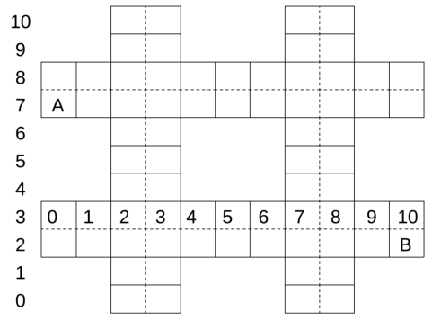

Figure 5: Gridded map of a residential area in autonomous vehicle scenario.

Figure 6 shows the cumulative rewards of 10 independent simulation runs averaged for every 10 training steps for
the autonomous vehicle scenario.

#### **G Details in Office World Scenario**

We provide the detailed results in the office world scenario. Figure 7 shows the map in the office world scenario. We
use the triangle to denote the initial position of the agent. We consider the following four tasks:
**Task 2.1** : get coffee at c and deliver the coffee to the office o;
**Task 2.2** : get mail at m and deliver the coffee to the office o;
**Task 2.3** : go to the office o, then get coffee at c and go back to the office o, finally go to mail at m;
**Task 2.4** : get coffee at c and deliver the coffee to the office o, then come to get coffee at c and deliver the coffee to the
frontdesk d.

**G.1** **Task 2.1**

For task 2.1, Figure 8 shows the inferred hypothesis reward machine in the last iteration of JIRP. Figure 9 shows the
cumulative rewards of 10 independent simulation runs averaged for every 10 training steps for task 2.1.

( _¬_ c, 0)

( _¬_ o, 0)

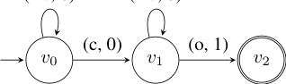

Figure 8: The inferred hypothesis reward machine for task 2.1 in the last iteration of JIRP.

**G.2** **Task 2.2**

For task 2.2, Figure 10 shows the inferred hypothesis reward machine in the last iteration of JIRP. Figure 11 shows the
cumulative rewards of 10 independent simulation runs averaged for every 10 training steps for task 2.2.

19

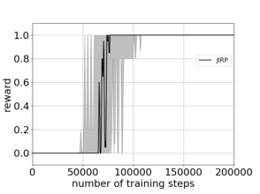

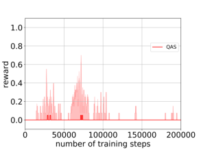

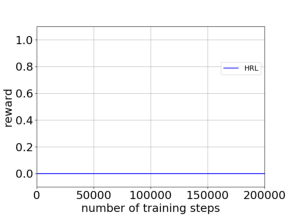

(a) (b) (c)

Figure 6: Cumulative rewards of 10 independent simulation runs averaged for every 10 training steps in the autonomous
vehicle scenario: (a) JIRP; (b) QAS; (c) HRL.

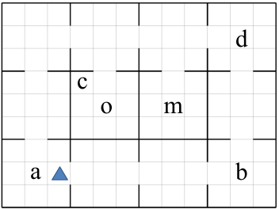

Figure 7: The map in the office world scenario.

( _¬_ m, 0)

( _¬_ o, 0)

Figure 10: The inferred hypothesis reward machine for task 2.2 in the last iteration of JIRP.

**G.3** **Task 2.3**

For task 2.3, Figure 12 shows the inferred hypothesis reward machine in the last iteration of JIRP. Figure 13 shows the
cumulative rewards of 10 independent simulation runs averaged for every 10 training steps for task 2.3.

20

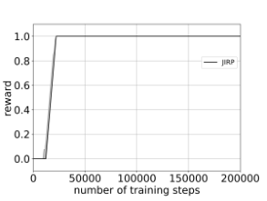

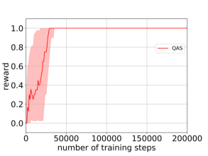

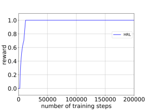

(a) (b) (c)

Figure 9: Cumulative rewards of 10 independent simulation runs averaged for every 10 training steps for task 2.1 in
the office world scenario: (a) JIRP; (b) QAS; (c) HRL.

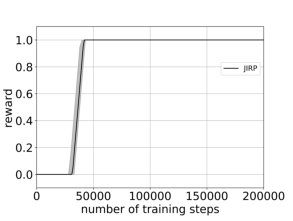

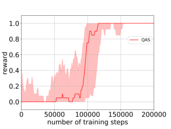

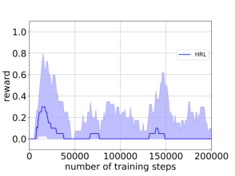

(a) (b) (c)

Figure 11: Cumulative rewards of 10 independent simulation runs averaged for every 10 training steps for task 2.2 in
the office world scenario: (a) JIRP; (b) QAS; (c) HRL.

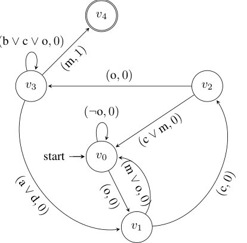

Figure 12: The inferred hypothesis reward machine for task 2.3 in the last iteration of JIRP.

**G.4** **Task 2.4**

For task 2.4, Figure 15 shows the inferred hypothesis reward machine in the last iteration of JIRP. Figure 15 shows the
cumulative rewards of 10 independent simulation runs averaged for every 10 training steps for task 2.4.

21

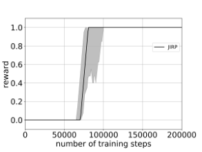

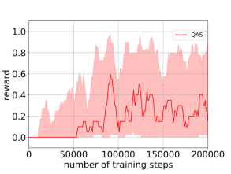

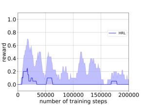

(a) (b) (c)

Figure 13: Cumulative rewards of 10 independent simulation runs averaged for every 10 training steps for task 2.3 in
the office world scenario: (a) JIRP; (b) QAS; (c) HRL.

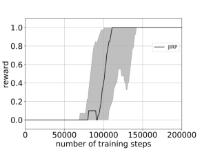

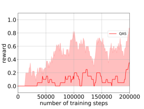

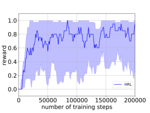

(a) (b) (c)

Figure 15: Cumulative rewards of 10 independent simulation runs averaged for every 10 training steps for task 2.4 in
the office world scenario: (a) JIRP; (b) QAS; (c) HRL.

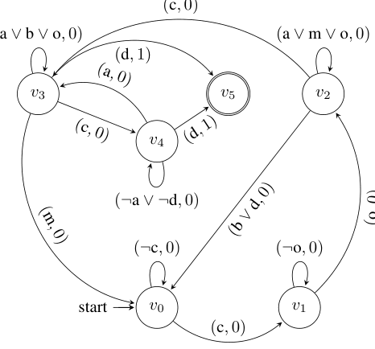

Figure 14: The inferred hypothesis reward machine for task 2.4 in the last iteration of JIRP.

22

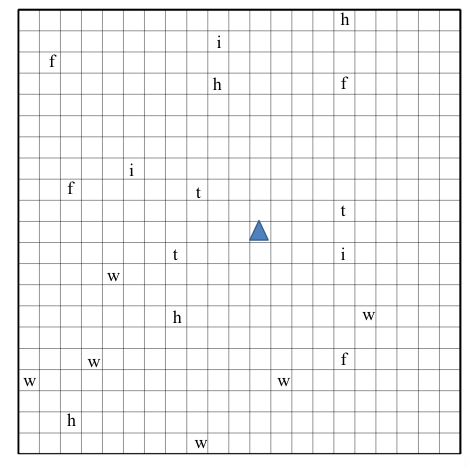

Figure 16: The map in the Minecraft world scenario.

#### **H Details in Minecraft World Scenario**

We provide the detailed results in Minecraft world scenario. Figure 16 shows the map in the office world scenario. We
use the triangle to denote the initial position of the agent. We consider the following four tasks:
**Task 3.1** : make plank: get wood w, then use toolshed t (toolshed cannot be used before wood is gotten);
**Task 3.2** : make stick: get wood w, then use workbench h (workbench can be used before wood is gotten);
**Task 3.3** : make bow: go to workbench h, get wood w, then go to workbench h and use factory f (in the listed order);
**Task 3.4** : make bridge: get wood w, get iron i, then get wood w and use factory f (in the listed order).

**H.1** **Task 3.1**

For task 3.1, Figure 17 shows the inferred hypothesis reward machine in the last iteration of JIRP. Figure 18 shows the
cumulative rewards of 10 independent simulation runs averaged for every 10 training steps for task 3.1.

( _¬_ w _∧¬_ t, 0)

( _¬_ t, 0)

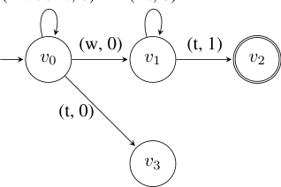

Figure 17: The inferred hypothesis reward machine for task 3.1 in the last iteration of JIRP.

**H.2** **Task 3.2**

For task 3.2, Figure 19 shows the inferred hypothesis reward machine in the last iteration of JIRP. Figure 20 shows the
cumulative rewards of 10 independent simulation runs averaged for every 10 training steps for task 3.2.

23

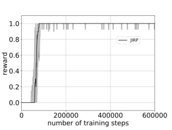

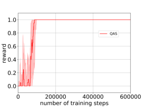

(a) (b) (c)

Figure 18: Cumulative rewards of 10 independent simulation runs averaged for every 10 training steps for task 3.1 in
the Minecraft world scenario: (a) JIRP; (b) QAS; (c) HRL.

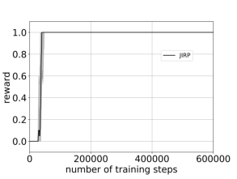

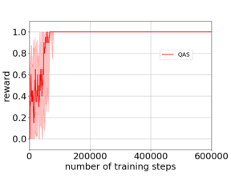

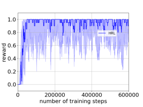

(a) (b) (c)

Figure 20: Cumulative rewards of 10 independent simulation runs averaged for every 10 training steps for task 3.2 in
the Minecraft world scenario: (a) JIRP; (b) QAS; (c) HRL.

( _¬_ w, 0)

( _¬_ h, 0)

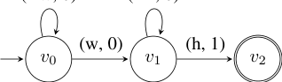

Figure 19: The inferred hypothesis reward machine for task 3.2 in the last iteration of JIRP.

**H.3** **Task 3.3**

For task 3.3, Figure 21 shows the inferred hypothesis reward machine in the last iteration of JIRP. Figure 22 shows the
cumulative rewards of 10 independent simulation runs averaged for every 10 training steps for task 3.3.

24

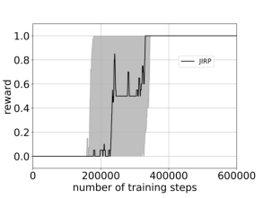

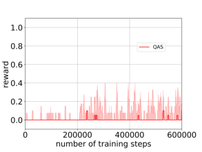

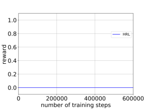

(a) (b) (c)

Figure 22: Cumulative rewards of 10 independent simulation runs averaged for every 10 training steps for task 3.3 in
the Minecraft world scenario: (a) JIRP; (b) QAS; (c) HRL.

Figure 21: The inferred hypothesis reward machine for task 3.3 in the last iteration of JIRP.

**H.4** **Task 3.4**

For task 3.4, Figure 23 shows the inferred hypothesis reward machine in the last iteration of JIRP. Figure 24 shows the
cumulative rewards of 10 independent simulation runs averaged for every 10 training steps for task 3.4.

25

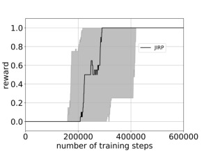

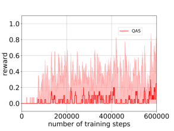

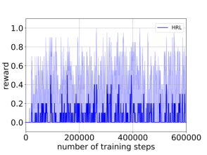

(a) (b) (c)

Figure 24: Cumulative rewards of 10 independent simulation runs averaged for every 10 training steps for task 3.4 in
the Minecraft world scenario: (a) JIRP; (b) QAS; (c) HRL.

( _¬_ f _,_ 0)

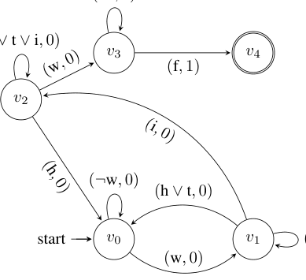

Figure 23: The inferred hypothesis reward machine for task 3.4 in the last iteration of JIRP.

26

