## META-Learning Eligibility Traces for More Sample Efficient Temporal Difference Learning

Mingde Zhao, School of Computer Science

McGill University, Montr´eal

Apr, 2020

A thesis submitted to McGill University in partial fulfillment of the

requirements of the degree of

Master of Computer Science

c
_⃝_ Mingde Zhao, 2020

# **Abstract**

Temporal-Difference (TD) learning is a standard and very successful reinforcement learn

ing approach, at the core of both algorithms that learn the value of a given policy, as well

as algorithms which learn how to improve policies. TD-learning with eligibility traces

provides a way to do temporal credit assignment, _i.e._ decide which portion of a reward

should be assigned to predecessor states that occurred at different previous times, con

trolled by a parameter _λ_ . However, tuning this parameter can be time-consuming, and

not tuning it can lead to inefficient learning. To improve the sample efficiency of TD

learning, we propose a meta-learning method for adjusting the eligibility trace parame

ter, in a state-dependent manner. The adaptation is achieved with the help of auxiliary

learners that learn distributional information about the update targets online, incurring

roughly the same computational complexity per step as the usual value learner. Our ap

proach can be used both in on-policy and off-policy learning. We prove that, under some

assumptions, the proposed method improves the overall quality of the update targets, by

minimizing the overall target error. This method can be viewed as a plugin which can

also be used to assist prediction with function approximation by meta-learning feature

(observation)-based _λ_ online, or even in the control case to assist policy improvement.

Our empirical evaluation demonstrates significant performance improvements, as well

as improved robustness of the proposed algorithm to learning rate variation.

i

# **Abr´eg´e**

L’apprentissage par diff´erence temporelle (TD) est une approche d’apprentissage par ren

forcement standard et tr`es r´eussie, au cœur des deux algorithmes qui apprennent la

valeur d’une politique donn´ee, ainsi que des algorithmes qui apprennent `a am´eliorer

les politiques. L’apprentissage TD avec des traces d’´eligibilit´e fournit un moyen de faire

une attribution de cr´edit temporelle, _i.e._ d´ecide quelle portion d’une r´ecompense doit ˆetre

affect´ee aux ´etats pr´ed´ecesseurs qui se sont produits `a diff´erents moments pr´ec´edents,

contrˆol´e par un param`etre _λ_ . Cependant, le r´eglage de ce param`etre peut prendre du

temps et ne pas le r´egler peut conduire `a un apprentissage inefficace. Pour am´eliorer

l’efficacit´e de l’´echantillon d’apprentissage TD, nous proposons une m´ethode de m´eta

apprentissage pour ajuster le param`etre de trace d’´eligibilit´e, d’une mani`ere d´ependante

de l’´etat. L’adaptation est r´ealis´ee avec l’aide d’apprenants auxiliaires qui apprennent en

ligne les informations de distribution sur les cibles de mise `a jour, entraˆınant `a peu pr`es

la mˆeme complexit´e de calcul par ´etape que l’apprenant de valeur habituelle. Notre ap

proche peut ˆetre utilis´ee `a la fois dans l’apprentissage sur les politiques et hors politique.

Nous prouvons que, sous certaines hypoth`eses, la m´ethode propos´ee am´eliore la qualit´e

globale des cibles de mise `a jour, en minimisant l’erreur cible globale. Cette m´ethode peut

ˆetre consid´er´ee comme un plugin qui peut ´egalement ˆetre utilis´e pour aider `a la pr´ediction

avec l’approximation des fonctions par la fonction de m´eta-apprentissage (observation)

bas´ee sur _λ_ en ligne, ou mˆeme dans le cas de contrˆole pour aider `a l’am´elioration des

politiques. Notre ´evaluation empirique d´emontre des am´eliorations significatives des

ii

performances, ainsi qu’une meilleure robustesse de l’algorithme propos´e `a la variation

du taux d’apprentissage.

iii

# **Acknowledgements**

I want to thank Prof. Doina Precup and Prof. Xiao-Wen Chang for funding and super

vising me during my master’s studies. I also want to thank my colleagues and friends

for supporting my studies and my life, especially Sitao Luan and Ian Porada, who are

not only good collaborators but also cheerful companions. I would also like to express

my sincere gratitude to the people that shared their ideas with me and inspired me to go

beyond!

iv

# **Table of Contents**

Abstract . . . . . . . . . . . . . . . . . . . . . . . . . . . . . . . . . . . . . . . . . . . i

Abr´eg´e . . . . . . . . . . . . . . . . . . . . . . . . . . . . . . . . . . . . . . . . . . . ii

Acknowledgements . . . . . . . . . . . . . . . . . . . . . . . . . . . . . . . . . . . . iv

x
List of Figures . . . . . . . . . . . . . . . . . . . . . . . . . . . . . . . . . . . . . . .

List of Tables . . . . . . . . . . . . . . . . . . . . . . . . . . . . . . . . . . . . . . . . xi

**1** **Introduction** **1**

**2** **Basics of Reinforcement Learning** **3**

2.1 What is Reinforcement Learning? . . . . . . . . . . . . . . . . . . . . . . . . . 3

2.2 Basics . . . . . . . . . . . . . . . . . . . . . . . . . . . . . . . . . . . . . . . . . 4

2.3 Scope of Reinforcement Learning . . . . . . . . . . . . . . . . . . . . . . . . . 5

2.3.1 Markov Decision Processes . . . . . . . . . . . . . . . . . . . . . . . . 5

2.3.2 Returns & Episodes . . . . . . . . . . . . . . . . . . . . . . . . . . . . . 9

2.3.3 Policies & Value Functions . . . . . . . . . . . . . . . . . . . . . . . . 11

2.4 . . . . . . . . . . . . . . . . . . . . . . . . . . . . . . 14
Dynamic Programming

2.4.1 DP for Policy Evaluation . . . . . . . . . . . . . . . . . . . . . . . . . . 14

2.4.2 DP for State Distribution . . . . . . . . . . . . . . . . . . . . . . . . . . 17

2.4.3 DP for Policy Improvement . . . . . . . . . . . . . . . . . . . . . . . . 19

2.5 Methods without Perfect Models . . . . . . . . . . . . . . . . . . . . . . . . . 20

2.5.1 Monte-Carlo Methods for Episodic Tasks . . . . . . . . . . . . . . . . 20

2.5.2 Temporal Difference Learning . . . . . . . . . . . . . . . . . . . . . . 21

v

2.5.3 Multi-Step TD . . . . . . . . . . . . . . . . . . . . . . . . . . . . . . . . 22

2.6 Off-Policy Learning Using Importance Sampling . . . . . . . . . . . . . . . . 23

2.6.1 Importance Sampling . . . . . . . . . . . . . . . . . . . . . . . . . . . 24

2.6.2 Importance Sampling based Off-Policy Learning . . . . . . . . . . . . 24

2.6.3 Per-Decision Importance Sampling . . . . . . . . . . . . . . . . . . . . 25

2.7 Function Approximation . . . . . . . . . . . . . . . . . . . . . . . . . . . . . . 27

2.7.1 Linear Methods . . . . . . . . . . . . . . . . . . . . . . . . . . . . . . . 30

2.7.2 Tile Coding . . . . . . . . . . . . . . . . . . . . . . . . . . . . . . . . . 31

2.7.3 Off-policy Methods with Function Approximation . . . . . . . . . . . 32

2.8 From _λ_ -Return to Eligibility Traces . . . . . . . . . . . . . . . . . . . . . . . . 34

2.9 Policy Gradient Methods . . . . . . . . . . . . . . . . . . . . . . . . . . . . . . 40

2.9.1 Actor-Critic . . . . . . . . . . . . . . . . . . . . . . . . . . . . . . . . . 44

**3** **Sample Efficiency of Temporal Difference Learning** **47**

3.1 Sample Efficiency . . . . . . . . . . . . . . . . . . . . . . . . . . . . . . . . . . 47

3.2 Sample Efficiency & Tuning _λ_ . . . . . . . . . . . . . . . . . . . . . . . . . . . 48

3.2.1 Counting Heuristics . . . . . . . . . . . . . . . . . . . . . . . . . . . . 48

3.2.2 Bypass Methods . . . . . . . . . . . . . . . . . . . . . . . . . . . . . . 48

3.2.3 Meta-Learning Methods . . . . . . . . . . . . . . . . . . . . . . . . . . 49

3.2.4 Background Knowledge . . . . . . . . . . . . . . . . . . . . . . . . . . 51

3.2.5 _λ_ -Greedy [28]: An Existing Work . . . . . . . . . . . . . . . . . . . . . 52

**4** **META** **54**

4.1 On-policy Decomposition . . . . . . . . . . . . . . . . . . . . . . . . . . . . . 54

4.2 Approximation of State Gradients . . . . . . . . . . . . . . . . . . . . . . . . 57

4.3 Trust Region Optimization . . . . . . . . . . . . . . . . . . . . . . . . . . . . . 61

4.4 Discussions and Insights . . . . . . . . . . . . . . . . . . . . . . . . . . . . . . 63

4.4.1 Hyperparameter Search . . . . . . . . . . . . . . . . . . . . . . . . . . 63

4.4.2 Reliance on Auxiliary Tasks . . . . . . . . . . . . . . . . . . . . . . . . 64

vi

4.4.3 Generalization and Function Approximation . . . . . . . . . . . . . . 64

4.4.4 From Prediction to Control . . . . . . . . . . . . . . . . . . . . . . . . 64

**5** **Experimental Studies** **66**

5.1 RingWorld: Tabular Case, Low Variance . . . . . . . . . . . . . . . . . . . . . 66

5.2 FrozenLake: Linear Function Approximation with High Variance . . . . . . 70

5.3 MountainCar: On-Policy Actor-Critic Control with Linear Function Ap

proximation . . . . . . . . . . . . . . . . . . . . . . . . . . . . . . . . . . . . . 72

**6** **Conclusion and Future Work** **74**

6.1 Summary of Contributions . . . . . . . . . . . . . . . . . . . . . . . . . . . . . 74

6.2 Future Work . . . . . . . . . . . . . . . . . . . . . . . . . . . . . . . . . . . . . 75

6.3 Technical Auxiliaries for Experiments . . . . . . . . . . . . . . . . . . . . . . 80

6.3.1 Environments . . . . . . . . . . . . . . . . . . . . . . . . . . . . . . . . 80

vii

# **List of Figures**

2.1 Agent-Environment Interaction in a Markov Decision Process . . . . . . . . 8

2.2 Multiple overlapping grid-tilings on a 2D box space with uniform offset in

each dimension. Figure from [20]. . . . . . . . . . . . . . . . . . . . . . . . . . 32

4.1 Interdependency among state- _λ_ ’s and state update targets. With the incre

ment of steps into the future, according to Proposition 4, less connections

would be neglected. . . . . . . . . . . . . . . . . . . . . . . . . . . . . . . . . . 60

4.2 Mechanisms for META-assisted trace-based policy evaluation: the auxil

iary learners learn the distributional information in parallel to the value

learner and provide the approximated gradient for the adjustments of _**λ**_ . . . 62

viii

5.1 U-shaped curves and learning curves for META, _λ_ -greedy and the base

lines on RingWorld, under three pairs of behavior-target policies. For (a),

(b) and (c), the _x_ -axes represent the values of the learning rate _α_ for pre

diction (or the critic), while the _y_ -axes represent the overall value errors.

Each point in the graphs contains the mean (solid) and standard deviation

(shaded) collected from 240 independent runs, with 10 [6] steps for predic

tion; For (d), (e) and (f), the _x_ -axis represents the steps of learning and

_y_ -axis is the same as (a), (b) and (c). We choose one representative case for

each U-shaped curve corresponding to different policy pairs and plot the

corresponding learning curves. In these learning curves, the best known

values for the hyperparameters are used. The buffer period lengths are 10 [5]

steps (10%). The buffer period and the adaptation period have been ticked

on the _x_ -axes. The rest of the steps for (d), (e) and (f) have been cut off since

there is no significant change afterwards. . . . . . . . . . . . . . . . . . . . . 67

5.2 U-shaped curves and learning curves for META, _λ_ -greedy and the base

lines on FrozenLake. For (a), the _x_ -axis represents the values of the learn

ing rate _α_ for prediction, while the _y_ -axis represents the overall value error.

Each point in the graph contains the mean (solid) and standard deviation

(shaded) collected from 240 independent runs, with 10 [6] steps for predic

tion; For (d), the _x_ -axis represents the steps of learning and _y_ -axis is the

same as (a). In the learning curves, the best known values for the hyper

parameters are used. The buffer period lengths are 10 [5] steps (10%). The

buffer period and the adaptation period have been ticked on the _x_ -axes. . . 70

ix

5.3 U-shaped curves and learning curves for META, _λ_ -greedy and baselines on

MountainCar. For (a), the _x_ -axis represents the values of the learning rate _α_

for prediction (the critic), while the _y_ -axis represents the discounted return

for MountainCar. Each point in the graph contains the mean (solid) and

standard deviation (shaded) collected from 240 independent runs, 50000

_x_
steps for control; For (d), the -axis represents the steps of learning and

_y_ -axis is the same as (a). In the learning curves, the best known values

for the hyperparameters are used. The buffer period length is 25000 steps

(50%). The buffer period and the adaptation period have been ticked on

the _x_ -axes. Note that in the buffer period of control, we also freeze the policy. 72

x

# **List of Tables**

5.1 Detailed Results on RingWorld (Target: 0.35, Behavior: 0.4) . . . . . . . . . . 68

5.2 Detailed Results on RingWorld (Target: 0.25, Behavior: 0.3) . . . . . . . . . . 69

5.3 Detailed Results on RingWorld (Target: 0.15, Behavior: 0.2) . . . . . . . . . . 69

5.4 Detailed Results on FrozenLake . . . . . . . . . . . . . . . . . . . . . . . . . . 71

xi

# **Chapter 1** **Introduction**

Temporal-difference learning is an important approach which enables an agent interact

ing with its environment to learn how to assign credit to different states it encounters and

actions it takes. Eligibility trace-based policy evaluation (prediction) methods, _e.g._, TD( _λ_ ),

use geometric sequences, controlled by a “trace-decay” parameter _λ_, to solve the tempo

ral credit assignment problem. Eligibility traces weight multi-step returns and assemble

compound update targets. The sample complexity (speed and accuracy of convergence

given the number of samples) is in practice sensitive to the choice of _λ_ .

To address this, in this thesis, we propose meta-learning as an approach for adapting

the learning _state-based λ_ s. First, we propose the methodology of improving sample effi

ciency by improving the quality of the update targets during temporal difference learn

ing. Then, we derive the method of achieving improvement on the overall update targets

for each state. Finally, we propose an approximate way to implement the method in an

online learning setting, with the help of auxiliary learners and trust region-style updates.

The thesis is structured as followed In Chapter 2, we introduce the fundamentals of

reinforcement learning that are _directly related_ to this thesis. The content is fully re-written

for the state-based decay and discount settings that we consider in this thesis. The content

of the thesis is topologically sorted so that all mentioned methods and settings could

be found in this chapter. Then, in Chapter 3, a comprehensive review of the relevant

1

literature, which focuses on the adaptation of trace-based temporal difference learning, is

provided. Chapter 4 and 5 contain our main contribution: a meta-learning approach is

proposed, discussed and then validated through experiments. Chapter 6 concludes the

thesis and discusses avenues for future work.

2

# **Chapter 2** **Basics of Reinforcement Learning**

_A learning paradigm of learning by trial and error. Interacting with an environment to map_

_situations to actions in a way that some notion of cumulative reward is maximized._

#### **2.1 What is Reinforcement Learning?**

Learning from interaction is one of the essential and fundamental ideas of intelligence and

learning theories [20]. Reinforcement Learning (RL) was introduced by A. Harry Klopf as

a computational approach that focused on learning by interacting with the environment

without explicit supervision.

In the RL setting, there is an _agent_ (the algorithm or the method), an environment

(essentially a task that we are facing, a probabilistic system). The environment is an

ensemble of a reward function (a scalar feedback for the decisions) and state dynamics

(transition probabilities of states by actions). According to the state, the agent computes

a series of action to be taken and in this way interacts with the environment.

From a “dataset”-label perspective, we could say that in RL problems, the data sam

ples are dynamically collected by the agents’ decisions series. This also means the qual

ity of the “dataset” is also determined by the quality of the decisioning processes of the

agents. Therefore, RL is, like many problems, a exploration-exploitation tradeoff prob

3

lem with no static datasets and thus it stands out from the classical machine learning

paradigms. The learner is not told which actions to take but instead must discover which

actions yield the most reward by trying them.

Another distinct feature of RL is that RL agents learn what to do - how to map situ

ations to actions - all by the interactions after its deployment in the environment, _i.e._ it

does not need domain specific knowledge.

#### **2.2 Basics**

Now, we formally identify the main subelements of a RL system: a policy, a reward signal,

a value function and optionally a model of the environment.

A _policy_ defines the learning agent’s way of behaving for a given state at a given time.

Roughly speaking, a policy is a mapping from perceived states of the environment to

actions to be taken when in those states.

A _reward_ signal defines the goal of a RL problem. On each timestep, the environment

sends to the RL agent a scalar feedback called the _reward_ . The agent’s sole objective is to

maximize the total reward it receives over the long run. The reward signal thus defines

what are the good and bad events for the agent.

A _value function_ specifies what is good in the long run, whereas the reward signal in

dicates what is good in an immediate sense. Roughly speaking, the value of a state is the

total amount of reward an agent can expect to accumulate over the future, starting from

that state. Whereas rewards determine the immediate, intrinsic desirability of environ

mental states, values indicate the long-term desirability of states after taking into account

the states that are likely to follow and the rewards available in those states. Rewards are

in a sense primary, whereas values, as predictions of rewards, are secondary. Without

rewards there could be no values, and the only purpose of estimating values is to achieve

more reward.

4

The fourth and final element of some reinforcement learning systems is a model of the

environment. This is something that mimics the behavior of the environment, or more

generally, that allows inferences to be made about how the environment will behave. For

example, given a state and action, the model might predict the resultant next state and

next reward. Models are used for planning, by which we mean any way of deciding

on a course of action by considering possible future situations before they are actually

experienced. Methods for solving reinforcement learning problems that use models and

planning are called model-based methods, as opposed to simpler model-free methods

that are explicitly trial-and-error learners—viewed as almost the opposite of planning.

#### **2.3 Scope of Reinforcement Learning**

RL relies heavily on the concept of _state_ — as input to the policy and value function,

and as both input to and output from the model. We can think of the state as a signal

conveying to the agent some sense of “how the environment is” at a particular time. The

formal definition of state as we use it here is given by the framework of Markov decision

processes.

**2.3.1** **Markov Decision Processes**

Markov Decision Processes (MDPs), a mathematically idealized form of the RL problem

for which precise theoretical statements can be made, are a classical formalization of se

quential decision making. In MDPs, actions influence not just immediate rewards, which

are essentially some feedback from the environment, but also subsequent situations, or

states, and through the future rewards. Thus MDPs involve delayed reward and the need

to tradeoff immediate and delayed reward.

The learner and decision maker is called the _agent_ . The thing it interacts with, com

prising everything outside the agent, is called the _environment_ . They interact continually,

the agent selecting actions and the environment responding to these actions and present

5

ing new situations to the agent. The environment also gives _rewards_, special numerical

values which the agent seeks to maximize over time through its choice of actions.

As illustrated in Figure 2.1, in an MDP, the agent and the environment interact at

each of a sequence of discrete timesteps _t ∈{_ 0 _,_ 1 _,_ 2 _, . . . }_ [1] . At each timestep _t_, the agent

receives some representation of the environment’s state, _S_ _t_ _∈S_ and on that basis selects

an action, _A_ _t_ _∈A_ . One timestep later, in part as a consequence of its action, the agent

receives a numerical reward, _R_ _t_ +1 _∈R ∈_ R and finds itself in a new state _S_ _t_ +1 . In a finite

MDP, the state set _S_, the action set _A_ and the reward set _R_ are all finite. In this case, the

random variables _R_ _t_ and _S_ _t_ have well defined discrete probability distributions that only

depend on the preceding state and action. That is, for particular values of these random

variables, _s_ _[′]_ _∈S_ and _r ∈R_, there is a probability of those values occurring at timestep _t_,

given particular preceding state and action:

_p_ ( _s_ _[′]_ _, r|s, a_ ) _≡_ P _{S_ _t_ = _s_ _[′]_ _, R_ _t_ = _r|S_ _t−_ 1 = _s, A_ _t−_ 1 = _a}, ∀s, s_ _[′]_ _∈S, ∀r ∈R, ∀a ∈A_

The function _p_ : _S × R × S × A →_ [0 _,_ 1] defines the _dynamics_ of the MDP, and is often

.
recognized as the _transition probability function_ or simply _transition function_

The MDP and the agent together thereby give rise to a _trajectory_ like:

_S_ 0 _, A_ 0 _, R_ 1 _, S_ 1 _, A_ 1 _, R_ 2 _, . . ._

Note that we have used the uppercase letters to denote the random variables since we

have not yet observed the states, the rewards or the actions. Yet if we have already, we

would use lowercase to denote their specific instantiation. For example, at timestep _t_, the

agent took action _a_ _t_ based on state _s_ _t_ and transitioned to the state _s_ _t_ +1 while receiving the

reward _r_ _t_ +1 .

The states that the agent start from in a finite MDP can be described using a probability

distribution.

1 The ideas of the discrete time case can be extended to the continuous-time case, _e.g._ [3,8].

6

**Definition 1** (Initial State Distribution) **.** _For a finite Markov decision process, the distribution_

_d_ 0 : _S →_ [0 _,_ 1] _of the first state S_ 0 _, from which the agent-environment interactions start, is called_

_the starting state distribution or initial state distribution._

For an RL agent, the distribution _d_ 0 is part of the unknown environment and can be

only learnt through interactions.

**Markov Property**

In an MDP, the probabilities given by _p_ completely characterize the environment’s dy

namics. That is, the probability of each possible value for _S_ _t_ and _R_ _t_ depends only on the

immediately preceding state and action _S_ _t−_ 1 and _A_ _t−_ 1 not at all on earlier states and ac

tions. This is best viewed a restriction not on the decision process but on the state, which

means the state must include information about all aspects of the past agent-environment

interaction that make a difference for the future.

The 4-argument deterministic transition function is actually the most general form

of a transition function defined in a MDP. There are also alternate forms of the transi

tion function, which rely on either additional assumptions of the environment or exist as

marginalized expectations.

Marginalizing over rewards yields the 3 argument state-transition probability func

tion:

_p_ ( _s_ _[′]_ _|s, a_ ) _≡_ P _{S_ _t_ = _s_ _[′]_ _|S_ _t−_ 1 = _s, A_ _t−_ 1 = _a}_ = � _p_ ( _s_ _[′]_ _, r|s, a_ )

_r∈R_

where _p_ is overloaded. However, if we assume that the state transition and the reward

are jointly determined, _i.e._ a fixed transition from one state to another always generates

the same reward, then the 4-argument transition function collapse into the 3-argument

version _p_ : _S × S × A →×_ [0 _,_ 1].

Many other useful expected statistics can be derived from the general 4-argument _p_

by marginalizing. These include:

7

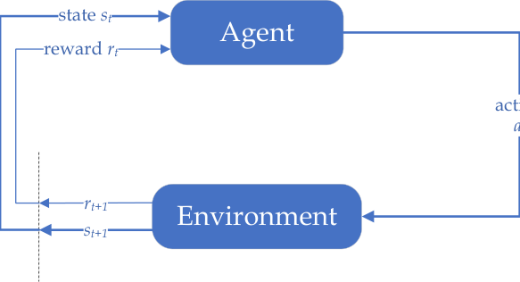

**Figure 2.1:** Agent-Environment Interaction in a Markov Decision Process

Expected rewards for state-action pairs as a 2-argument function _r_ : _S × A →_ R:

_r_ ( _s, a_ ) _≡_ E[ _R_ _t_ _|S_ _t−_ 1 = _s, A_ _t−_ 1 = _a_ ] = �

_r_

� �

_r∈R_ _s_ _[′]_ _∈S_

� _p_ ( _s_ _[′]_ _, r|s, a_ )

_s_ _[′]_ _∈S_

Since the only way that the agent could interact with the environment is through the

action, there is no way for the agent to optimize the transition and reward by any other

means, this 2-argument expected reward function should be an appropriate choice when

the agent tries to model the reward function for decisioning, through agent-environment

interactions.

_r_ :
Expected rewards for state-action-next-state triples as a three argument function

_S × A × S →_ R:

_r_ _[p]_ [(] _[s]_ _[′]_ _[,][ r][|][s][,][ a]_ [)]

� _r∈R_ _p_ ( _s_ _[′]_ _|s, a_ )

_r_ ( _s, a, s_ _[′]_ ) _≡_ E[ _R_ _t_ _|S_ _t−_ 1 = _s, A_ _t−_ 1 = _a, S_ _t_ = _s_ _[′]_ ] = �

_p_ ( _s_ _[′]_ _|s, a_ )

where _p_ ( _s_ _[′]_ _|s, a_ ) is the 3-argument transition function we derived earlier. This function

can be estimated to predict the reward incurred by some certain transition, which is often

used in model-based RL.

8

**Implicit Pause-able Environment Assumption**

MDP implicitly assumes that the environment only changes when the agent is taking

actions, whereas this assumption seems inappropriate in many decision problems and in

the cases where the decisioning process takes in-negligible time, _e.g._ when the agent is

planning with a complex model.

Very recently, the notion of realtime reinforcement learning has been introduced in [15]

to address such problem.

**2.3.2** **Returns & Episodes**

**Undiscounted Episodic Setting**

In general, RL seeks to maximize the expected return _G_ _t_, which, in the simplest case, is

defined as sum of the rewards:

_G_ _t_ _≡_ _R_ _t_ +1 + _R_ _t_ +2 + _· · ·_ + _R_ _T_ (2.1)

where _T_ is a final timestep. The notion of _episodes_ is naturally formed as the interaction

sequence from the starting timestep 0 until the terminal time _T_, a random variable that

normally varies, for example when playing a game repeatedly.

Each episode ends in a _terminal state_ . In this setting, the episodes are assumed to be

finite-length, _i.e. T_ is finite, and independent with each other, _i.e._ one episode does not

affect the environment dynamics of the next.

In episodic tasks, it is sometimes necessary to distinguish the set of all nonterminal

states, denoted _S_ from the set of all states plus the terminal states _S_ [+] .

**Discounted Episodic Setting**

In many cases however, the agent-environment interaction does not break naturally into

identifiable episodes, but goes on continually without limit. The previous formulation of

9

return is problematic in these _continuing tasks_ because not only the final step would be

_T_ = _∞_
, as well as that the return, which we seek to optimize, goes easily to infinite.

To fix this, an additional concept of _discounting_ is needed. According to this approach,

the agent tries to select actions so that the sum of the discounted rewards it receives over

the future is maximized. In particular, it chooses to maximize the _expected discounted re-_

_turn_ :

_G_ _t_ _≡_ _R_ _t_ +1 + _γR_ _t_ +2 + _γ_ [2] _R_ _t_ +3 + _· · ·_ =

_∞_
� _γ_ _[k]_ _R_ _t_ + _k_ +1 (2.2)

_k_ =0

where _γ ∈_ [0 _,_ 1] is the _discount parameter_, also recognized as the _discount rate_ . Note that

here the discount parameter is constant throughout the states and the episodes. While

other more complicated discount settings are also possible. For example, in this thesis,

we will adopt the _per-state discount function_, which can be interpreted as discounting the

future rewards by some degree after **entering** some state:

_k_
� _γ_ _t_ + _m_ (2.3)

_m_ =1

_G_ _t_ _≡_ _R_ _t_ +1 + _γ_ _t_ +1 _R_ _t_ +2 + _γ_ _t_ +1 _γ_ _t_ +2 _R_ _t_ +3 + _· · ·_ =

where _γ_ _t_ +1 _≡_ _γ_ ( _S_ _t_ +1 ), _γ_ : _S →_ [0 _,_ 1].

_∞_
� _R_ _t_ + _k_ +1 _·_

_k_ =0

The discount rate determines the present value of the future rewards: a reward re

ceived _k_ timesteps in the future is worth only [�] _[k]_ _m_ _[−]_ =1 [1] _[γ]_ _[t]_ [+] _[m]_ [ times what it would be worth if]

it were received immediately.

If _γ_ : _S →_ [0 _,_ 1), the infinite sums in 2.3 will have finite values as long as the reward

sequence _{R_ _k_ _}_ is bounded.

Returns at successive timesteps are recursively related:

_G_ _t_ _≡_ _R_ _t_ +1 + _γ_ _t_ +1 _R_ _t_ +2 + _γ_ _t_ +1 _γ_ _t_ +2 _R_ _t_ +3 + _· · ·_

= _R_ _t_ +1 + _γ_ _t_ +1 ( _R_ _t_ +2 + _γ_ _t_ +2 _R_ _t_ +3 + _· · ·_ )

= _R_ _t_ +1 + _γ_ _t_ +1 _G_ _t_ +1

This relation is generalizable for all timesteps _t < T_ .

10

(2.4)

The fact that the discount parameters can be set as 1 gives unified formulation for

the episodic tasks as well as the continuing tasks. Ideally, the discount factors should

come from the task itself, as its value reflects the goal. However, for complicated tasks

with Deep Reinforcement Learning (DRL), which is essentially using artificial neural net

works for reinforcement learning, it is generally observed that lowering the discount fac

tor yields significantly more stable performance rather than using _γ_ = 1, even if the goal

tells that there should be no discounting [13]. These blur the line how we should see the

discount factor, which classically should be seen as some kind of built-in characteristics

of the environment yet now a parameter that could be set or learnt for some purposes.

In the following parts of this thesis, we will focus on the episodic setting with state

based discount functions.

**2.3.3** **Policies & Value Functions**

A _policy_ is a function used by an agent to decide what to do given the state it is in. For

mally,

**.** _π_
**Definition 2** (policy) _In an MDP, a policy_ _is a mapping from states to probabilities of selecting_

_each possible action, i.e. π_ : _S × A →_ [0 _,_ 1] _._

If the agent is following policy _π_ at timestep _t_, then _π_ ( _a|s_ ) is the probability that _A_ _t_ = _a_

if _S_ _t_ = _s_ . Note that it is also quite common to define state-based action sets, however

we will stick loyal to the setting of [20] for this thesis. The policies in RL is essentially

stationary decision rules defined for more general Markov chains [14], where “stationary”

means that the decision rules are consistent for every possible states.

The _value function_ of a state _s_ under a policy _π_, denoted _v_ _π_ ( _s_ ), is the expected (dis

_s_ _π_
counted) return when starting in and following thereafter. Formally,

11

**Definition 3** (state-value function) **.** _In an MDP, the state-value function for policy π or simply_

_value function v_ _π_ ( _s_ ) _, given discount function γ_ ( _s_ ) _and policy π_ ( _s_ ) _, is defined as_

�

_v_ _π_ ( _s_ ) _≡_ E _π_ [ _G_ _t_ _|S_ _t_ = _s_ ] = E _π_

_∞_
� _R_ _t_ + _k_ +1 _·_
� _k_ =0

_k_
� _γ_ _t_ + _m_ _|S_ _t_ = _s_

_m_ =1

where E _π_ denotes the expected value of random variable given that the agent follows

policy _π_ and the values of the terminal states are defined as 0.

There is also the state-action value function, which is more useful when searching for

policies.

**Definition 4** (state-action-value function) **.** _In an MDP, the state-action-value for policy π_

_q_ _π_ ( _s_ ) _, given discount function γ and policy π_ ( _s_ ) _, is defined as the expected return starting from s,_

_a_ _π:_
_taking the action_ _and thereafter following_

�

_q_ _π_ ( _s, a_ ) _≡_ E _π_ [ _G_ _t_ _|S_ _t_ = _s, A_ _t_ = _a_ ] = E _π_

_∞_
� _R_ _t_ + _k_ +1 _·_
� _k_ =0

_k_
� _γ_ _t_ + _m_ _|S_ _t_ = _s, A_ _t_ = _a_

_m_ =1

One of the key subroutines of RL is to estimate _v_ _π_ or _q_ _π_ from experience, as _V_ _π_ or _Q_ _π_,

or .
which is often recognized as _policy evaluation_ _prediction_

With the recursive relationship derived in 2.4, we can obtain the following equation

for the state-value function _v_ _π_, given a policy _π_ :

_v_ _π_ ( _s_ ) _≡_ E _π_ [ _G_ _t_ _|S_ _t_ = _s_ ]

= E _π_ [ _R_ _t_ +1 + _γ_ _t_ +1 _G_ _t_ +1 ]

=
�

_π_ ( _a|s_ ) �

_a_ _s_ _[′]_

_p_ ( _s_ _[′]_ _, r|s, a_ ) [ _r_ + _γ_ ( _s_ _[′]_ ) _·_ E _π_ [ _G_ _t_ +1 _|S_ _t_ +1 = _s_ _[′]_ ]]

_s_ _[′]_ _,r_

(2.5)

=
�

_π_ ( _a|s_ ) �

_a_ _s_ _[′]_

_p_ ( _s_ _[′]_ _, r|s, a_ ) [ _r_ + _γ_ ( _s_ _[′]_ ) _· v_ _π_ ( _s_ _[′]_ )]

_s_ _[′]_ _,r_

where _γ_ _t_ +1 _≡_ _γ_ ( _S_ _t_ +1 ) is a conventional abbreviation, which will be frequently used

hereafter. The equation is essentially one basic form of the _Bellman equation_ for _v_ _π_ . Serving

12

as the core equation of RL, it expresses the relationship between the value of one state and

its successor states.

**Optimal Policies & Optimal Value Functions**

Value functions define a partial ordering over policies in an MDP with certain discounting

function _γ_ .

**Definition 5** (partial order of policies) **.** _In an MDP with certain discounting function γ, a_

_policy π is defined to be better than or equal to a policy π_ _[′]_ _if its expected return is greater than or_

_equal to that of π_ _[′]_ _for all states, i.e. π ≥_ _π_ _[′]_ _**iff**_ _∀s ∈S, v_ _π_ ( _s_ ) _≥_ _v_ _π_ _′_ ( _s_ ) _._

There always exists at least one policy that is better than or equal to all other policies,

which is identified as the _optimal policy π_ _∗_ . More specifically,

**Fact 1** (Existence of Optimal Deterministic Markovian Policies) **.** _Given a finite MDP, there_

_always exist some deterministic policy π_ _∗_ _that achieves the optimal return, which is independent_

_of the transition history, i.e. Markovian._

This fact is the reason why we could have confidently focus on the world of Markovian

policies, since an optimal policy always exist inside. This also justifies the value-based

methods that uses _ϵ_ -greedy as policies since deterministic policies can achieve optimal

return. There can be more than one optimal policies but we denote all of them by _π_ _∗_ . The

optimal policies share the same state-value function, which is called the _optimal state-value_

_function v_ _∗_, which is defined as:

_v_ _∗_ ( _s_ ) _≡_ max _v_ _π_ ( _s_ ) _, ∀s ∈S_
_π_

where the max operator is defined upon the policy partial orders.

Optimal policies also share the same optimal action-value function _q_ _∗_, which is defined

as

_q_ _∗_ ( _s, a_ ) _≡_ max _q_ _π_ ( _s, a_ ) _, ∀s ∈S, ∀a ∈A_
_π_

13

The function gives the expected return for taking action _a_ in state _s_ and thereafter

following an optimal policy. Thus,

_q_ _∗_ ( _s, a_ ) = E [ _R_ _t_ +1 + _γ_ ( _S_ _t_ +1 ) _· v_ _∗_ ( _S_ _t_ +1 ) _|S_ _t_ = _s, A_ _t_ = _a_ ]

There are also Bellman equations for optimal policies, which are recognized as _Bellman_

.
_optimality equations_

The methods for finding better policies, are recognized as _policy improvement_ methods.

A representative family of such methods, which are called policy gradient methods, will

be introduced in Section 2.9.

#### **2.4 Dynamic Programming**

Dynamic Programming (DP) refers to a family of algorithms that can be used for solving

the value function given a policy, or finding better, even the optimal policies given a

perfect model of the environment in the form of an MDP.

Though guaranteed with optimality, DP algorithms are limited for practical use for

the their need of a perfect environment model as well as their expensive computational

cost. However, they are still widely used to calculate the ground truth values of relatively

small environments for the analyses of new RL methods.

**2.4.1** **DP for Policy Evaluation**

First, we consider the method of computing the state-value function _v_ _π_ for an arbitrary

policy _π_, which is called _policy evaluation_ or _prediction_ .

**Fact 2** (Existence & Uniqueness of State-Value Function) **.** _The existence and the uniqueness_

_of state-value function v_ _π_ _are guaranteed as long as either γ_ ( _·_ ) _<_ 1 _or termination will be reached_

_π._
_from any state following_

From the Bellman equation (2.5), we have

14

_v_ _π_ ( _s_ ) = �

_p_ ( _s_ _[′]_ _, r|s, a_ ) [ _r_ + _γ_ ( _s_ _[′]_ ) _· v_ _π_ ( _s_ _[′]_ )]

_s_ _[′]_ _,r_

_π_ ( _a|s_ ) �

_a_ _s_ _[′]_

Suppose for a specific MDP, we have a fixed indexing method for all the possible

states. When the environment dynamics (4-argument _p_ ) is known, the Bellman equation

gives a system of _|S|_ linear equations with _|S|_ unknowns, _i.e._ solvable. It is desirable

to transform it to matrix form and then compute the true values. After some algebraic

manipulation, we end up in the following system.

_**v**_ _π_ = _**r**_ _π_ + _P_ _π_ _**v**_ _π_ Γ

where _**r**_ _π_ is a _|S| ×_ 1 vector in which _**r**_ _π_ [ _i_ ] = [�]

_a_ _[π]_ [(] _[a][|][s]_ _[i]_ [)][ �]

_s_ _j_ _,r_ _[r][ ·][ p]_ [(] _[s]_ _[j]_ _[, r][|][s]_ _[i]_ _[, a]_ [)][,] _[ P]_ [ is a]

_|S|×|S|_ matrix in which _P_ _π_ [ _i, j_ ] = [�] _a_ _[π]_ [(] _[a][|][s]_ _[i]_ [)] _[p]_ [(] _[s]_ _[j]_ _[, r][|][s]_ _[i]_ _[, a]_ [)][ and][ Γ][ is a diagonal matrix whose]

Γ( _i, i_ ) _≡_ _γ_ ( _s_ _i_ ). With the system, the rest is just to solve it, whose complexity is no lower

than _O_ ( _|S|_ [3] ). The method is elaborated in Algorithm 1.

**Algorithm 1:** Policy Evaluation in Matrix Form

**Input:** _p_ ( _s_ _[′]_ _, r|s, a_ ) (transition probability function), _π_ (policy to be evaluated), _γ_
(discount function)
**Output:** _**v**_ _π_ (the state value vector for policy _π_, where the components correspond
to indexed states in _S_ [+] )
Form policy-conditioned transition matrix _P_ _π_, where
_P_ _π_ [ _i, j_ ] = [�] _a_ _[π]_ [(] _[a][|][s]_ _[i]_ [)] _[p]_ [(] _[s]_ _[j]_ _[, r][|][s]_ _[i]_ _[, a]_ [)]

_P_ _π_ [ _i, j_ ] = [�] _a_ _[π]_ [(] _[a][|][s]_ _[i]_ [)] _[p]_ [(] _[s]_ _[j]_ _[, r][|][s]_ _[i]_ _[, a]_ [)]

Form policy-conditioned reward vector _**r**_ _π_, where
_**r**_ _π_ [ _i_ ] = [�] _a_ _[π]_ [(] _[a][|][s]_ _[i]_ [)][ �] _s_ _[r][ ·][ p]_ [(] _[s]_ _[j]_ _[, r][|][s]_ _[i]_ _[, a]_ [)]

_**r**_ _π_ [ _i_ ] = [�] _a_ _[π]_ [(] _[a][|][s]_ _[i]_ [)][ �] _s_ _j_ _,r_ _[r][ ·][ p]_ [(] _[s]_ _[j]_ _[, r][|][s]_ _[i]_ _[, a]_ [)]

Form a diagonal matrix Γ, where Γ( _i, i_ ) _≡_ _γ_ ( _s_ _i_ )
_**v**_ _π_ = ( _I −_ _P_ _π_ Γ) _\_ _**r**_ _π_ // or _**v**_ _π_ = ( _I −_ _P_ _π_ Γ) _[−]_ [1] _**r**_ _π_

_a_ _[π]_ [(] _[a][|][s]_ _[i]_ [)][ �]

The _O_ ( _|S|_ [3] ) complexity is a nightmare for problems with large state sets. Thus, it is

desirable to change this method into methods with lower computational complexity. The

tool for this conversion is the matrix splitting methods.

Matrix splitting is a method for converting the problems of solving linear equations

into iterative methods with presumably lower computational complexity.

15

**Fact 3** (Matrix Splitting) **.** _To solve linear equation A_ _**x**_ = _**b**_ _, where A is non-singular, we can_

_split matrix A as A_ = _M −_ _N_ _, where M and N are greater or equal to_ 0 _element-wise. Then, the_

_formula_

_**x**_ _t_ +1 = _M_ _[−]_ [1] _**b**_ + _M_ _[−]_ [1] _N_ _**x**_ _t_

_leads to the solution if the spectral radius ρ_ ( _M_ _[−]_ [1] _N_ ) _, i.e. the largest absolute value of the eigenval-_

_ues of M_ _[−]_ [1] _N_ _, is less than_ 1 _and the spectral radius is also the convergence rate of the iteration._

With this, when we set _M_ = _I_ and _N_ = _P_ _π_ Γ and _**b**_ = _**r**_ _π_, we achieve the _iterative policy_

_evaluation method_ . It is simple and powerful, turning Bellman equation into an iterative

formula achieves the convergence to the true values. One may also prove the convergence

of iterative policy evaluation using Banach’s fixed point theorem, by showing that the

Bellman operator is a contraction.

**Definition 6** (Bellman Operator) **.** _Given an MDP with its dynamics p, a policy π and discount_

_function γ, the Bellman operator B_ _π_ : R _[|S|]_ _→_ R _[|S|]_ _is defined by_

( _B_ _π_ _v_ )( _s_ ) _≡_ �

_π_ ( _a|s_ ) �

_a_ _s_ _[′]_

_p_ ( _s_ _[′]_ _, r|s, a_ )[ _r_ + _γ_ ( _s_ _[′]_ ) _v_ ( _s_ _[′]_ )] (2.6)

_s_ _[′]_ _,r_

_Or equivalently in matrix form,_

_B_ _π_ _**V**_ _≡_ _**r**_ _π_ + _P_ _π_ Γ _**V**_ (2.7)

_where_ _**r**_ _π_ _is a |S| ×_ 1 _vector in which_ _**r**_ _π_ [ _i_ ] = [�]

_a_ _[π]_ [(] _[a][|][s]_ _[i]_ [)][ �]

_s_ _j_ _,r_ _[r][ ·][ p]_ [(] _[s]_ _[j]_ _[, r][|][s]_ _[i]_ _[, a]_ [)] _[,][ P][ is a][ |S| × |S|]_

_matrix in which P_ _π_ [ _i, j_ ] = [�] _a_ _[π]_ [(] _[a][|][s]_ _[i]_ [)] _[p]_ [(] _[s]_ _[j]_ _[, r][|][s]_ _[i]_ _[, a]_ [)] _[ and]_ [ Γ] _[ is a diagonal matrix whose]_ [ Γ(] _[i, i]_ [)] _[ ≡]_

_γ_ ( _s_ _i_ ) _._

**Definition 7** (Contraction) **.** _Let ⟨X, d⟩_ _be a complete metric space. Then a map T_ : _X →_ _X is_

_called a_ _**contraction mapping**_ _on X if there exists q ∈_ [0 _,_ 1) _s.t._

_∀x, y ∈_ _X, d_ ( _T_ ( _x_ ) _, T_ ( _y_ )) _≤_ _q · d_ ( _x, y_ )

16

**Theorem 1** (Banach–Caccioppoli) **.** _Let ⟨X, d⟩_ _be a non-empty complete metric space with a_

_contraction mapping T_ : _X →_ _X, then T admits a_ _**unique**_ _fixed point x_ _[∗]_ _∈_ _X, i.e. T_ ( _x_ _[∗]_ ) = _x_ _[∗]_ _._

_Moreover, x_ _[∗]_ _can be found as follows: start with an arbitrary element x_ 0 _∈_ _X and define a sequence_

_{x_ _n_ _} by x_ _n_ = _T_ ( _x_ _n−_ 1 ) _for n ≥_ 1 _, then x_ _n_ _→_ _x_ _[∗]_ _._

We can prove that the Bellman operator, which is essentially turning the Bellman equa

tion into an iterative formula, on the _estimated value function_ or simply _value estimate_ is a

contraction. The unique fixed point must be the true value because that is when the Bell

man equation holds. The vanilla version is provided in Algorithm 2.

**Algorithm 2:** Iterative Policy Evaluation (Matrix)

**Input:** _p_ ( _s_ _[′]_ _, r|s, a_ ) (transition probability function), _π_ (policy to be evaluated), _γ_
(discount factor), _θ_ (accuracy threshold)
**Output:** _**v**_ _π_ (the state value vector for policy _π_, where the components correspond
to indexed states in _S_ [+] )
Initialize _**v**_ _|S|×_ 1 = **0**
Form policy-conditioned transition matrix _P_ _π_, where
_P_ _π_ [ _i, j_ ] = [�] _a_ _[π]_ [(] _[a][|][s]_ _[i]_ [)] _[p]_ [(] _[s]_ _[j]_ _[, r][|][s]_ _[i]_ _[, a]_ [)]

_P_ _π_ [ _i, j_ ] = [�] _a_ _[π]_ [(] _[a][|][s]_ _[i]_ [)] _[p]_ [(] _[s]_ _[j]_ _[, r][|][s]_ _[i]_ _[, a]_ [)]

Form policy-conditioned reward vector _**r**_ _π_, where
_**r**_ _π_ [ _i_ ] = [�] _a_ _[π]_ [(] _[a][|][s]_ _[i]_ [)][ �] _s_ _[r][ ·][ p]_ [(] _[s]_ _[j]_ _[, r][|][s]_ _[i]_ _[, a]_ [)]

_a_ _[π]_ [(] _[a][|][s]_ _[i]_ [)][ �]

_**r**_ _π_ [ _i_ ] = [�] _a_ _[π]_ [(] _[a][|][s]_ _[i]_ [)][ �] _s_ _j_ _,r_ _[r][ ·][ p]_ [(] _[s]_ _[j]_ _[, r][|][s]_ _[i]_ _[, a]_ [)]

∆= _∞_
Form a diagonal matrix Γ, where Γ( _i, i_ ) _≡_ _γ_ ( _s_ _i_ )
**while** ∆ _≥_ _θ_ **do**

_**v**_ _[′]_ = _**r**_ _π_ + _P_ _π_ Γ _**v**_
∆= _∥_ _**v**_ _[′]_ _−_ _**v**_ _∥_ _∞_
_**v**_ = _**v**_ _[′]_

**2.4.2** **DP for State Distribution**

Given a policy, the expected frequency of states that the agent meet in the environment,

which is recognized as the _state frequency_, or the _on-policy distribution_, can also be com

puted using DP. Note that, given a fixed policy, this frequency is neither dependent on

discount function nor the reward function.

17

In RL literature, the state on-policy distribution is often assumed to be equal to the

_π_ .
“stationary distribution” [2] of the Markov chain induced by the MDP and the policy

However, this assumption is inappropriate because they are never the same in the episodic

setting.

One can use an iterative method to solve the true on-policy distribution, given initial

state distribution _d_ 0 and dynamics _P_ _π_ . The idea is to calculate the averaged number of

state visits for agents within their lifetime, as shown in Algorithm 3.

**Algorithm 3:** Iterative DP for State Frequencies in Matrix Form

**Input:** _p_ ( _s_ _[′]_ _, r|s, a_ ) (transition probability function), _π_ (policy to be evaluated), _θ_
(accuracy threshold), _**d**_ 0 (initial distribution of states, represented with an
indexed vector whose components are the discrete probabilities)
**Output:** _**d**_ _π_ (expected frequencies of states under policy _π_, where the components
correspond to indexed states in _S_ [+] )
Initialize _**d**_ _π_ = _**d**_ 0
Form policy-conditioned transition matrix _P_ _π_, where
_P_ _π_ [ _i, j_ ] = [�] _a_ _[π]_ [(] _[a][|][s]_ _[i]_ [)] _[p]_ [(] _[s]_ _[j]_ _[, r][|][s]_ _[i]_ _[, a]_ [)]

_**d**_ _[′]_ = _**d**_ 0
**for** _i ∈{_ 1 _, . . ., |S|}_ **do**

**if** _s_ _i_ _is terminal_ **then**

_**d**_ _[′]_ ( _i_ ) = 0 // terminal states can only be visited once

**while** _∥_ _**d**_ _[′]_ _∥_ 1 _≥_ _θ_ **do**

_**d**_ _[′]_ = _P_ _π_ _[T]_ _**[d]**_ _[′]_

_**d**_ _π_ = _**d**_ _π_ + _**d**_ _[′]_

**for** _i ∈{_ 1 _, . . ., |S|}_ **do**

**if** _s_ _i_ _is terminal_ **then**

_**d**_ _[′]_ ( _i_ ) = 0

_**d**_ _π_ = _**d**_ _π_ _/∥_ _**d**_ _π_ _∥_ 1 //normalize

To achieve a more compact form of this algorithm, we need the following proposition:

**Theorem 2.** _In an MDP, the expected state frequency of an agent during one lifetime (from the_

_beginning of an episode to the end) is the same as the expected state frequency of an agent that is_

_redeployed to the MDP after termination._

2 This “stationary distribution” is actually not a stationary distribution, as the terminal states of MDP
eliminates the ergodicity. The “stationary distribution” _**d**_ in the episodic setting means only the solution of
_**d**_ _[T]_ _P_ _π_ = _**d**_ _[T]_ .

18

_Also, the state-frequency_ _**d**_ _π_ _satisfies:_

_**d**_ _[T]_ _π_ _[P]_ [˜] _[π]_ [=] _**[ d]**_ _[T]_ _π_ (2.8)

_where_ _P_ [˜] _π_ _is the matrix that replaces the rows corresponding to the terminal states in P_ _π_ _with_ _**d**_ _[T]_ 0 _[.]_

_Proof._ Redeploying a terminated agent back to the MDP is upon the initial state distribu

tion. Thus the portion of terminated agents will follow exactly the one-life state frequen

cies in each of their following lives.

With this we have a compact matrix-form algorithm and can spot the distribution

mismatch more easily. Having spotted the problem, in this thesis, we stick to the more

accurate definition of on-policy distribution.

Note that to use this augmented _P_ [˜] _π_ for policy evaluation, we need to replace the core

operation _**V**_ = _**r**_ _π_ + _P_ _π_ Γ _**V**_ with _**V**_ = _**r**_ _π_ + _P_ [˜] _π_ Γ [˜] _**V**_, where Γ [˜] satisfies that the discount for

terminal states are 0 [3], as suggested in [27].

Also, in the linear case for projected Bellman operator, which we will discuss in fu

ture sections, the contraction of policy evaluation heavily relies on the assumption that

the “stationary distribution” is the on-policy distribution, which is critical for a required

lemma [4] . We will try to re-prove it with the correct setting [5] . Please refer to [2] theorem

6.3.1 for more details.

**2.4.3** **DP for Policy Improvement**

DP can also be used to find better policies, which ultimately leads to the optimal poli

cies. Finding better policies requires _policy iteration_, which is essentially alternating policy

evaluation and policy improvement. The related details will not be covered since they are

too distantly related to this thesis.

3 We think it is more appropriate to call _P_ _π_ a “value” transition matrix, and ˜ _P_ _π_ the “state” transition
matrix.
4 _∥P_ _π_ _**z**_ _∥_ _**d**_ _≤∥_ _**z**_ _∥_ _**d**_ if _**d**_ _T_ _P_ _π_ = _**d**_ _T_

5 _∥P_ _π_ _**z**_ _∥_ _**d**_ _≤∥_ _**z**_ _∥_ _**d**_ if _**d**_ _T_ ˜ _P_ _π_ = _**d**_ _T_

19

#### **2.5 Methods without Perfect Models**

DP can solve the value function perfectly and improve the policy only when the perfect

model of the environment is given. When not, other methods are needed. Learning from

actual experience is striking because it requires no prior knowledge of the environment’s

dynamics, yet can still attain optimal behavior.

**2.5.1** **Monte-Carlo Methods for Episodic Tasks**

For policy evaluation, the simplest strategy would be to repeatedly utilize the policy in

the environment and observe its average performance. Such strategy leads us to the the

simplest policy evaluation method named _Monte-Carlo_ or simply _MC_, whose effectiveness

is backed by the law of large numbers.

Monte Carlo methods are ways of solving the RL problem based on averaging sample

returns. MC is well-defined for episodic setting.

**Algorithm 4:** Episodic First-visit Monte-Carlo Prediction

**Input:** _π_ (policy to be evaluated), _γ_ (discount function), _N_ (maximum number of
episodes)
**Output:** _V_ ( _s_ ) _, ∀s ∈S_ [+] (state values for policy _π_ )
Initialize _V_ ( _s_ ) arbitrarily, _∀s ∈S_
Returns( _s_ ) = an emptylist, _∀s ∈S_
**for** _n ∈{_ 1 _, . . ., N_ _}_ **do**

generate an episode following _π_ : _S_ 0 _, A_ 0 _, R_ 1 _, S_ 1 _, A_ 1 _, R_ 2 _, . . ., S_ _T_ _−_ 1 _, A_ _T_ _−_ 1 _, R_ _T_
_G_ = 0
**for** _t ∈{T −_ 1 _, T −_ 2 _, . . .,_ 0 _}_ **do**

_G_ = _γS_ _t_ +1 _G_ + _R_ _t_ +1
**if** _S_ _t_ _/∈{S_ 0 _, . . ., S_ _t−_ 1 _}_ **then**

// visit every state only once, prefer the longer sum if many
Append _G_ to Returns( _S_ _t_ )

**for** _s ∈S_ **do**

_V_ ( _s_ ) = mean(Returns( _s_ ))

20

The state-action values can also be predicted using a very similar method. Policy

improvement can also be achieved using generalized policy improvement. The details

are omitted.

**2.5.2** **Temporal Difference Learning**

Temporal Difference (TD) learning is the most central idea and methodology of RL, which

is a combination of MC and DP. Like MC, TD methods can learn directly from raw expe

:
rience without a model of the environment’s dynamics. Like DP, TD methods _bootstrap_

they update estimates based in part on other learned estimates, without waiting for a final

outcome.

Whereas MC must wait until the end of the episode to determine the increment to

_V_ ( _S_ _t_ ) (only when _G_ _t_ is known), TD methods need to wait only until the next timestep. At

time _t_ + 1 they immediately make a useful update using the observed reward _R_ _t_ +1 and

the estimate _V_ ( _S_ _t_ +1 ). The simplest TD method makes the update

_V_ ( _S_ _t_ ) = _V_ ( _S_ _t_ ) + _α_ [ _R_ _t_ +1 + _γ_ ( _S_ _t_ +1 ) _V_ ( _S_ _t_ +1 ) _−_ _V_ ( _S_ _t_ )] (2.9)

immediately on transition to _S_ _t_ +1 and receiving _R_ _t_ +1 . The update rule 2.9 is called the 1 _-_

_step TD update_, where we recognize _R_ _t_ +1 + _γ_ ( _S_ _t_ +1 ) _V_ ( _S_ _t_ +1 ) _−_ _V_ ( _S_ _t_ ) as the _(_ 1 _-step) TD error_

and _R_ _t_ +1 + _γ_ ( _S_ _t_ +1 ) _V_ ( _S_ _t_ +1 ) as the _update target_ . Every 1-step TD update can be understood

as: walk towards the update target _R_ _t_ +1 + _γ_ ( _S_ _t_ +1 ) _V_ ( _S_ _t_ +1 ) from the current (estimated)

value _V_ ( _S_ _t_ ) with a step length of _α_ [ _R_ _t_ +1 + _γ_ ( _S_ _t_ +1 ) _V_ ( _S_ _t_ +1 ) _−_ _V_ ( _S_ _t_ )] (decreasing the dis

tance by ratio _α_ ). Note that the update target _R_ _t_ +1 + _γ_ ( _S_ _t_ +1 ) _V_ ( _S_ _t_ +1 ) is also a random

variable. The 1-step update yields the simplest TD method, which is named TD(0) and

presented in Algorithm 5.

Because TD(0) bases its update in part on an existing estimate, we say that it is a

_bootstrapping_ method, like DP.

21

**Algorithm 5:** Tabular 1-step TD Policy Evaluation (TD(0))

**Input:** _π_ (policy to be evaluated), _γ_ (discount function), _α ∈_ (0 _,_ 1] (learning rate), _N_
(maximum number of episodes)
**Output:** _V_ ( _s_ ) _, ∀s ∈S_ [+] (state values for policy _π_ )
Initialize _V_ ( _s_ ) = 0, _∀s ∈S_
**for** _n ∈{_ 1 _, . . ., N_ _}_ **do**

Initialize _S_

**while** _S is not terminal_ **do**

_A_ = action given by _π_ ( _·|s_ )
Take action _A_, observe _R, S_ _[′]_

_V_ ( _S_ _t_ ) = _V_ ( _S_ _t_ ) + _α_ [ _R_ _t_ +1 + _γ_ ( _S_ _t_ +1 ) _V_ ( _S_ _t_ +1 ) _−_ _V_ ( _S_ _t_ )]
_S_ = _S_ _[′]_ _G_ = _γS_ _t_ +1 _G_ + _R_ _t_ +1

**Fact 4.** _Under the episodic setting, given an MDP and a policy π, either discounted or not, TD(_ 0 _)_

_achieves convergence to v_ _π_ _asymptotically._

**2.5.3** **Multi-Step TD**

Besides the 1-step TD target, the update target could be many things as long as the con

_n_
vergence to the true value can be guaranteed. In this subsection, we introduce -step TD

methods that generalize both TD and MC methods so that one can shift from one to the

_n_
other smoothly as needed to meet the demands of a particular task. -step methods span

a spectrum with MC methods at one end and 1-step TD methods at the other.

**Definition 8** ( _n_ -step return) **.** _The n-step return is defined as:_

_G_ _t_ : _t_ + _n_ = _R_ _t_ +1 + _γ_ ( _S_ _t_ +1 ) _R_ _t_ +2 + _· · ·_ +

_n_
� _γ_ ( _S_ _t_ + _k_ ) _V_ _t_ + _n−_ 1 ( _S_ _t_ + _n_ ) _, ∀n ≥_ 1 _, ∀_ 0 _≤_ _t ≤_ _T −_ _n_ (2.10)

_k_ =1

The _n_ -step return serves as the update target for an _n-step TD update_ .

The _n_ -step return uses the value function _V_ _t_ + _n−_ 1 to correct for the missing rewards

beyond _R_ _t_ + _n_ . The error reduction property of _n_ -step returns lead to its convergence under

appropriate technical conditions [20].

We notice that, when _n_ is set to be the timestep difference between the current timestep

_n_
and the timestep for the end of the episode, the -step return becomes the MC return. And

22

**Algorithm 6:** Tabular _n_ -step TD Policy Evaluation (TD( _n_ ))

**Input:** _π_ (policy to be evaluated), _γ_ (discount function), _α_ (learning rate), _M_

_n_
(maximum number of episodes), (step parameter)
**Output:** _V_ ( _s_ ) _, ∀s ∈S_ [+] (state values for policy _π_ )
Initialize _V_ ( _s_ ) = 0, _∀s ∈S_
**for** _m ∈{_ 1 _, . . ., M_ _}_ **do**

Initialize and store non-terminal _S_ 0

_T_ = _∞_
**for** _t ∈{_ 0 _,_ 1 _,_ 2 _, . . . }_ **do**

**if** _t < T_ **then**

Take action according to _π_ ( _·|s_ ), observe and store _R_ _t_ +1 _, S_ _t_ +1
**if** _S_ _t_ +1 _is terminal_ **then**

_T_ = _t_ + 1

_τ_ = _t −_ _n_ + 1
**if** _τ ≥_ 0 **then**

_i_
_G_ = [�] _i_ _[min]_ = _τ_ +1 [(] _[τ]_ [+] _[n,T]_ [)] _k_ =1 _[γ]_ [(] _[S]_ _[k]_ [)] _· R_ _i_
�� �
**if** _τ_ + _n < T_ **then**

_G_ = _G_ + [�] _[n]_ _k_ =1 _[γ]_ [(] _[S]_ _[τ]_ [+] _[k]_ [)] _[V]_ [ (] _[S]_ _[τ]_ [+] _[n]_ [)]
_V_ ( _S_ _τ_ ) = _V_ ( _S_ _τ_ ) + _α_ [ _G −_ _V_ ( _S_ _τ_ )]

**if** _τ_ = _T −_ 1 **then**

**break**

when _n_ = 1, the method collapses to TD(0). This is to say that _n_ -step returns, as update

targets, generalizes the TD and MC and yields all the shades between them.

#### **2.6 Off-Policy Learning Using Importance Sampling**

How can an agent estimate the values of one policy when acting upon another? Let us

call the policy to learn about the _target policy_, and the policy used to generate behavior the

_behavior policy_ . In this case we say that learning is from data “off” the _target policy_, and the

overall process is termed off-policy learning.

23

**2.6.1** **Importance Sampling**

Importance sampling is a technique to use a sample of examples from a different distri

bution to estimate the expectation of some target distribution. It requires the knowledge

to explicitly compute the probability of each sample under the two distributions. Let the

target distribution be _π_ and the distribution that generated the sample be _b_, we have the

following.

**.** _π and b_
**Definition 9** (Importance Sampling Estimator) _Suppose that_ _are probability density_

_(mass) functions that satisfy b_ ( _x_ ) = 0 = _⇒_ _π_ ( _x_ ) = 0 _, i.e. π is absolutely continuous w.r.t. b, we_

_define the importance sampling estimator_ ˆ _µ_ _IS_ _of_ E[ _f_ ( _x_ )] _as:_

_µ_ ˆ _IS_ _≡_ [1]

_n_

_n_
� _f_ ( _x_ _i_ ) _ρ_ ( _x_ _i_ ) (2.11)

_i_ =1

_π_ ( _x_ _i_ )
_where ρ_ ( _x_ _i_ ) _≡_ _b_ ( _x_ _i_ ) _[, x]_ _[i]_ _[ ∼]_ _[b][ is recognized as an importance weight function and its value is]_

_recognized as an importance sampling ratio._

The importance sampling estimator has some properties that we need to know.

**Theorem 3.** _Let µ ≡_ E _π_ [ _f_ ( _x_ )] _,_

2
( _f_ ( _x_ ) _π_ ( _x_ ) _−_ _µb_ ( _x_ ))
E _b_ [ˆ _µ_ _IS_ ] = _µ, V ar_ _b_ [ _µ_ _IS_ ] = _dx_
� _b_ ( _x_ )

The proof is straightforward algebra. The unbiasedness shows that importance sam

pling ratios can be used to estimate the statistics of data even if they are generated using

from different sources. However, the variance will bring trouble, if _π_ and _b_ are different.

**2.6.2** **Importance Sampling based Off-Policy Learning**

Now we plug the theory of importance sampling into RL. Let the target policy be _π_ and

the behavior policy be _b_ . Given a starting state _S_ _t_, the probability of the subsequent state

24

action trajectory, _A_ _t_ _, S_ _t_ +1 _, . . ., S_ _T_, occurring under _π_ is:

P _{A_ _t_ _, S_ _t_ +1 _, . . ., S_ _T_ _|S_ _t_ _, A_ _t_ : _T_ _−_ 1 _∼_ _π}_

= _π_ ( _A_ _t_ _|S_ _t_ ) _p_ ( _S_ _t_ +1 _|S_ _t_ _, A_ _t_ ) _π_ ( _A_ _t_ +1 _|S_ _t_ +1 ) _· · · p_ ( _S_ _T_ _|S_ _T_ _−_ 1 _, A_ _T_ _−_ 1 ) =

_T_ _−_ 1
� _π_ ( _A_ _k_ _|S_ _k_ ) _p_ ( _S_ _k_ +1 _|S_ _k_ _, A_ _k_ )

_k_ = _t_

where _p_ is the 3-argument transition function. The relative probability (importance sam

pling ratio) of the trajectory under the policies _π_ and _b_ is:

_T_ _−_ 1
_ρ_ _t_ : _T_ _−_ 1 _≡_ � _kT_ = _−t_ 1 _[π]_ [(] _[A]_ _[k]_ _[|][S]_ _[k]_ [)] _[p]_ [(] _[S]_ _[k]_ [+1] _[|][S]_ _[k]_ _[,][ A]_ _[k]_ [)] =
~~�~~ _k_ = _t_ _[b]_ [(] _[A]_ _[k]_ _[|][S]_ _[k]_ [)] _[p]_ [(] _[S]_ _[k]_ [+1] _[|][S]_ _[k]_ _[, A]_ _[k]_ [)]

_T_ _−_ 1
�

_k_ = _t_

_π_ ( _A_ _k_ _|S_ _k_ )

_b_ ( _A_ _k_ _|S_ _k_ )

The canceling of the terms show that importance sampling ratio of trajectories does

not depend on the MDP’s dynamics. With this we have

E _b_ [ _ρ_ _t_ : _T_ _−_ 1 _G_ _t_ _|S_ _t_ = _s_ ] = _v_ _π_ ( _s_ )

This means that Monte-Carlo method can learn the target values as long as we have

the computational access to the importance sampling ratios. We will not cover the details

of off-policy MC.

**2.6.3** **Per-Decision Importance Sampling**

The off-policy MC estimator, the unbiased one with high-variance, of return is:

�

_ρ_ _t_ : _T_ _−_ 1 _G_ _t_ = _ρ_ _t_ : _T_ _−_ 1

_R_ _t_ +1 + _γ_ _t_ +1 _R_ _t_ +2 + _· · ·_ +

�

_T_ _−_ 1
� _γ_ _k_ _R_ _T_

_k_ = _t_ +1

(2.12)

= _ρ_ _t_ : _T_ _−_ 1 _R_ _t_ +1 + _γ_ _t_ +1 _ρ_ _t_ : _T_ _−_ 1 _R_ _t_ +2 + _· · ·_ +

_T_ _−_ 1
� _γ_ _k_ _ρ_ _t_ : _T_ _−_ 1 _R_ _T_

_k_ = _t_ +1

Each sub-term is a product of a random reward and a random importance sampling

ratio. For example, the first sub-term is:

25

_ρ_ _t_ : _T_ _−_ 1 _R_ _t_ +1 = _[π]_ [(] _[A]_ _[t]_ _[|][S]_ _[t]_ [)]

_π_ ( _A_ _t_ +1 _|S_ _t_ +1 )

_[π]_ [(] _[A]_ _[t]_ _[|][S]_ _[t]_ [)]

_b_ ( _A_ _t_ _|S_ _t_ ) _b_ ( _A_ _t_ +1 _|S_ _t_ +1 )

_π_ ( _A_ _t_ +1 _|S_ _t_ +1 ) _π_ ( _A_ _t_ +2 _|S_ _t_ +2 )

_b_ ( _A_ _t_ +1 _|S_ _t_ +1 ) _b_ ( _A_ _t_ +2 _|S_ _t_ +2 )

_π_ ( _A_ _t_ +2 _|S_ _t_ +2 )

_[π]_ [(] _[A]_ _[T]_ _[−]_ [1] _[|][S]_ _[T]_ _[−]_ [1] [)]
_b_ ( _A_ _t_ +2 _|S_ _t_ +2 ) _[· · ·]_ _b_ ( _A_ _T_ _−_ 1 _|S_ _T_ _−_ 1 )

_b_ ( _A_ _T_ _−_ 1 _|S_ _T_ _−_ 1 ) _[R]_ _[t]_ [+1]

For this term, it is intuitive to see that only _[π]_ _b_ ( [(] _A_ _[A]_ _t_ _[t]_ _|_ _[|]_ _S_ _[S]_ _t_ _[t]_ ) [)] [and] _[ R]_ _[t]_ [+1] [ are related, as one can]

easily show:

E _b_

Thus,

and also

E _b_ [ _ρ_ _t_ : _T_ _−_ 1 _R_ _t_ +1 ] = E _b_ [ _ρ_ _t_ : _t_ _R_ _t_ +1 ]

E _b_ [ _ρ_ _t_ : _T_ _−_ 1 _R_ _t_ + _k_ ] = E _b_ [ _ρ_ _t_ : _t_ + _k−_ 1 _R_ _t_ + _k_ ]

_π_ ( _A_ _k_ _|S_ _k_ )
� _b_ ( _A_ _k_ _|S_ _k_ )

_≡_
�
� _a∼b_

_π_ ( _a|S_ _k_ )

_b_ ( _a|S_ _k_ ) _·_ _[π]_ [(] _[a][|][S]_ _[k]_ [)]
_a_ _b_ ( _a|S_ _k_ )

_π_ ( _a|S_ _k_ ) = 1

_a_

_b_ ( _a|S_ _kk_ ) [=] �

_b_ ( _a|S_ _k_ _[k]_ ) [=] �

With this we can get another unbiased return estimator, which is recognized as the

_per-decision_ importance sampling estimator _G_ [˜] _t_ for return:

E _b_ [ _ρ_ _t_ : _T_ _−_ 1 _G_ _t_ ] = E _b_ [ _G_ [˜] _t_ ]

and

˜
_G_ _t_ _≡_ _ρ_ _t_ : _t_ _R_ _t_ +1 + _γ_ _t_ +1 _ρ_ _t_ : _t_ +1 _R_ _t_ +2 + _· · ·_ +

= _ρ_ _t_ _R_ _t_ +1 + _γ_ _t_ +1 _ρ_ _t_ _ρ_ _t_ +1 _R_ _t_ +2 + _· · ·_ +

_T_ _−_ 1
� _γ_ _k_ _ρ_ _t_ : _T_ _−_ 1 _R_ _T_

_k_ = _t_ +1

_T_ _−_ 1
� _γ_ _k_ _·_

_k_ = _t_ +1

_T_ _−_ 1
�

_−_
� _j_ = _t_ _ρ_ _j_ _· R_ _T_ ( _ρ_ _j_ _≡_ _[π]_ _b_ ( [(] _A_ _[A]_ _j_ _[j]_ _|_ _[|]_ _S_ _[S]_ _j_ _[j]_ ) [)]

_b_ ( _A_ _j_ _|S_ _j_ ) [)]

(2.13)

= _ρ_ _t_ ( _R_ _t_ +1 + _γ_ _t_ +1 _ρ_ _t_ +1 ( _R_ _t_ +2 + _γ_ _t_ +2 _ρ_ _t_ +2 ( _· · ·_ )))

26

Per-decision importance sampling enables off-policy bootstrapping. The change of

the algorithm is just to multiply the learning rates of the TD updates by the per-decision

importance sampling ratio.

#### **2.7 Function Approximation**

The notion of state that we have discussed before are recognized as _tabular_, in a sense

that we can list a table for all the states and their corresponding properties. An agent,

at a particular time, can only be in exactly one state, and these states do not influence

each other. However, this setting is problematic for the cases in which the state space is

too large to be discretized as tables, _e.g._ when the state space is continuous. In this case,

which is recognized as the _function approximation case_, we have to use the approximate

value function, which is not represented as a table but as a parameterized functional form

_**w**_ .
with some corresponding weight vector

In the tabular case a continuous measure of prediction quality was not necessary be

cause the learned value function could converge to the true value function exactly. More

over, the learned values at each state were decoupled —an update at one state affected no

other. But with function approximation, an update at one state affects many others, and

it is not possible to get the values of all states exactly correct. By assumption we have far

more states than weights, so making one state’s estimate more accurate invariably means

making others’ less accurate. However, this could also mean that making one state more

accurate will make some similar states also more accurate. This is often recognized as

the dilemma of generalization: on one hand it introduces the forgetting problem; On the

other hand it could significantly accelerate learning for its updates to the similar states.

Since there could be many states, generally the states’ importance are weighted using

the state frequency distribution _d_ _π_ . With this we obtain a natural objective function, the

state-value error, which is essentially the weighted mean squared value error between the

true value and the value estimate.

27

**Definition 10** (State-Value Error) **.** _Given an MDP, for a state s, let its true value under target_

_policy π be v_ _π_ ( _s_ ) _. Given an estimated value V_ _π_ ( _s_ ) _of the state s, the state value error of the estimate_

_V_ _π_ ( _s_ ) _is defined as:_

_J_ ( _s_ ) _≡_ 1 _/_ 2 _·_ ( _V_ _π_ ( _s_ ) _−_ _v_ _π_ ( _s_ )) [2]

The state value error of a value estimate is its squared distance to the true value.

Weighting the state value error by their state frequency _d_ _π_ yields the following:

**Definition 11** (Overall Value Error) **.** _Given an MDP and a particular fixed indexing of its_

_states, let its true state-values under target policy π be_ _**v**_ _π_ _, where each element of the vector corre-_

_sponds to the true value of an indexed state and an value estimate. Given an estimate_ _**V**_ _π_ _of all the_

_states, the_ _**overall value error**_ _of the estimate_ _**V**_ _π_ _is defined as:_

2
_J_ ( _**V**_ _π_ ) _≡_ 1 _/_ 2 _· ∥D_ _π_ [1] _[/]_ [2] _·_ ( _**V**_ _π_ _−_ _**v**_ _π_ ) _∥_ 2

_where D_ _π_ _is the diagonalized state frequencies under π, i.e._

_D_ _π_ _≡_ _diag_ ( _d_ _π_ ( _s_ 1 ) _, d_ _π_ ( _s_ 2 ) _, · · ·, d_ _π_ ( _s_ _|S|_ )) (2.14)

This criterion can be used with any form of value estimator, either tabular or with

function approximators. The weights _D_ _π_ favor the states that will be met with higher

frequency. The overall value error is often used to evaluate the performance of policy

evaluation [19]. When a perfect model of the environment MDP is known, the _**v**_ _π_ and _D_ _π_

can be exactly solved using DP, as discussed in Section 2.4. Thus, DP-solvable MDPs are

the first-choices of testing the policy evaluation algorithms.

An ideal goal in terms of policy evaluation would be to find a global optimum, a

weight vector _**w**_ _[∗]_ for which _J_ ( _**V**_ _π_ ( _**w**_ _[∗]_ )) _≤_ _J_ ( _**V**_ _π_ ( _**w**_ )) for all possible _**w**_ . Reaching this

goal is sometimes possible for simple function approximators such as linear function ap

proximators, which are to be introduced later, but is rarely possible for complex function

approximators, _e.g._ artificial neural networks.

28

Usually, we will use differentiable value estimate functions _V_ ( _s_ ; _**w**_ ) parameterized by

_**w**_
a weight vector to enable stochastic gradient-descent methods for approaching the

update targets.

_**w**_ will be updated at each of a series of discrete timesteps as before, _t ∈{_ 1 _,_ 2 _, . . . }_,

trying to minimize the state-value error. Stochastic gradient-descent (SGD) methods do

this by adjusting the weight vector after each example by a small amount in the direction

that would most reduce the error on that example:

_**w**_ _t_ +1 = _**w**_ _t_ _−_ [1]

2 _[α][∇]_ [[] _[v]_ _[π]_ [(] _[S]_ _[t]_ [)] _[ −]_ _[V]_ _[π]_ [(] _[S]_ _[t]_ _[,]_ _**[ w]**_ _[t]_ [)]] [2] [ =] _**[ w]**_ _[t]_ [ +] _[ α]_ [ [] _[v]_ _[π]_ [(] _[S]_ _[t]_ [)] _[ −]_ _[V]_ _[π]_ [(] _[S]_ _[t]_ _[,]_ _**[ w]**_ _[t]_ [)]] _[ ∇][V]_ _[π]_ [(] _[S]_ _[t]_ _[,]_ _**[ w]**_ _[t]_ [)][ (2.15)]

where _α_ is the learning rate, a positive step-size parameter.

Gradient descent methods are called “stochastic” when the update is done on only a

single example, selected stochastically. Over many steps, the overall effect is to minimize

an average performance measure such as the overall value error.

Obviously, we cannot use (2.15) to do update because the true value _v_ _π_ ( _S_ _t_ ) is un

known. Thus, we must replace the update target _v_ _π_ ( _S_ _t_ ) with an estimate _U_ _t_ . If _U_ _t_ is unbi

ased, _i.e._ E[ _U_ _t_ _|S_ _t_ = _s_ ] = _v_ _π_ ( _S_ _t_ ) _, ∀t_, then _**w**_ _t_ is guaranteed to converge to a local optimum

_α_
under the usual SGD conditions with decreasing . One simplest instance of this kind of

method is to use the MC returns as the update targets, which leads to the gradient-MC

method.

Such unbiasedness cannot be achieved with TD updates, which are essentially using

bootstrapping estimates as targets. Bootstrapping targets or DP target depend on the

current value of the value estimate and the parameter _**w**_ _t_ for the value estimate. This

implies that they are biased and will not produce a true gradient method. It has been

proved that bootstrapping methods are not in fact instances of true gradient descent [1],

as they take into account the effect of changing the weight _**w**_ _t_ on the estimate but ignore

29

its effect on the target. They are recognized as _semi-gradient_ methods because they only

take into consideration a part of the gradient.

Although semi-gradient bootstrapping methods do not converge as robustly as gradi

ent methods, they do converge reliably in important cases such as the linear case. Algo

rithm 7 shows the simplest instance, the semi-gradient TD(0), which uses 1-step target as

the update target.

**Algorithm 7:** Semi-Gradient TD(0) for Policy Evaluation

**Input:** _π_ (policy to be evaluated), _γ_ (discount function), _α ∈_ (0 _,_ 1] (learning rate), _N_
(maximum number of episodes)
**Output:** _V_ ( _s_ ) _, ∀s ∈S_ [+] (state values for policy _π_ )
Initialize _V_ ( _s_ ) = 0, _∀s ∈S_
**for** _n ∈{_ 1 _, . . ., N_ _}_ **do**

Initialize _S_

**while** _S is not terminal_ **do**

_A_ = action given by _π_ ( _·|s_ )
Take action _A_, observe _R, S_ _[′]_

_**w**_ = _**w**_ + _α_ [ _R_ + _γ_ ( _S_ _[′]_ ) _· V_ ( _S_ _[′]_ ; _**w**_ ) _−_ _V_ ( _S_ ; _**w**_ )] _∇_ _**w**_ _V_ ( _S_ ; _**w**_ )
_S_ = _S_ _[′]_

**2.7.1** **Linear Methods**

One of the simplest and most important special cases of function approximation is the

_linear function_, where _V_ ( _**x**_ ; _**w**_ ) = _**w**_ _[T]_ _**x**_, is a linear function of the weight vector _**w**_, and _**x**_

_s_
is some real-valued feature vector corresponding to some state . The linear case brings

some important properties:

_**w**_
First, the gradient of the parameter has a special form that is independent of the pa

rameter _**w**_ - the gradient of the approximate value function with respect to _**w**_ is _∇_ _**w**_ _V_ ( _s_ ; _**w**_ ) =

_**x**_ ( _s_ ). This means that a once a gradient of yielded by some feature is calculated, it remains

valid, _i.e._ remains a true gradient, forever. This is a very special property that empowers

eligibility traces, a fundamental RL method for policy evaluation.

Second, in particular, in the linear case there is only one optimum (or, in degenerate

cases, one set of equally good optima), and thus any method that is guaranteed to con

30

verge to or near a local optimum is automatically guaranteed to converge to or near the

global optimum.

Note that the convergence of linear semi-gradient TD(0) algorithm presented in Algo

rithm 7 does not follow from general results on SGD but a separate theorem. The weight

vector converged to is also not the optimum, but rather a point nearby. The update for

linear semi-gradient TD(0) is

_**w**_ _t_ +1 = _**w**_ _t_ + _α_ ( _R_ _t_ +1 + _γ_ ( _**x**_ _t_ +1 ) _**w**_ _t_ _[T]_ _**[x]**_ _[t]_ [+1] _[−]_ _**[w]**_ _t_ _[T]_ _**[x]**_ _[t]_ [)] _**[x]**_ _[t]_

= _**w**_ _t_ + _α_ ( _R_ _t_ +1 _**x**_ _t_ _−_ _**x**_ _t_ ( _**x**_ _t_ _−_ _γ_ ( _**x**_ _t_ +1 ) _**x**_ _t_ +1 ) _[T]_ _**w**_ _t_ )

where _**x**_ _t_ _≡_ _**x**_ ( _S_ _t_ ).

If we use onehot encoding for tabular states, which is to use a binary vector with

length _|S|_ and mark the corresponding state with 1, we can see that tabular TD(0) is a

special case of semi-gradient TD(0).

**2.7.2** **Tile Coding**

Tile coding uses overlapping tilings to generate binary features for multi-dimensional

continuous spaces, which are beneficial for generalization.

In tile coding, multiple tilings are used. Each _tiling_ is a grid partition of the state space

and each element of the partition is called a _tile_ . The tilings are put on the state space,

each offset by a fraction of a tile width. A simple case with 4 tilings is shown on the right

side of Figure 2.2. Every state, such as that indicated by the white spot, falls in exactly

one tile in each of the 4 tilings. These 4 tiles correspond to 4 features that become active.

Specifically, the feature vector _**x**_ ( _s_ ) has one component for each tile in each tiling. In this

example there are 4 _×_ 4 _×_ 4 = 64 components, all of which will be 0 except for the 4

corresponding to the tiles that _s_ is within.

There are several advantages of using tile coding for feature construction. 1) Since

the overall number of activated tiles are always the same for any state, the learning rate

31

Tiling 1

represented

Four active

tiles/features

overlap the point
and are used to

represent it

|Col1|Col2|Col3|Col4|
|---|---|---|---|
|||||
|||||
|||||
|||||

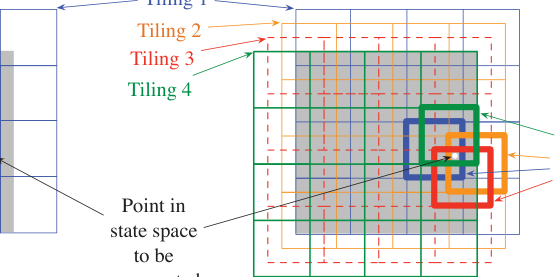

**Figure 2.2:** Multiple overlapping grid-tilings on a 2D box space with uniform offset in

each dimension. Figure from [20].

parameter can be set intuitively and easily; 2) Since the features are always binary, effi

cient binary-float multiplication can be implemented for calculation; 3) Since there is no

constraint on the shape of the tilings as well as the offsets, significant degrees of freedom

can be utilized to design effective feature constructors.

Tile coding will be used as one of the feature construction methods in the experimental

studies section.

**2.7.3** **Off-policy Methods with Function Approximation**

When learning off-policy with function approximation, new troubles emerge for semi

gradient methods. First, the update targets need to be fixed with importance sampling

ratios; Second and most importantly, the state distribution will no longer match the target

policy. This means that the cumulative effect of gradient or semi-gradient updates does

not optimize the overall value error.

Let us first look into why off-policy learning is much more difficult for the case of

function approximation than the tabular case. In the function approximation case, gener

ally the updates for one state affect all the similar states whereas in the tabular case, the

updates for one state have no influence on others. This means that, in the off-policy case,

the tabular updates do not have to care about the state-frequencies when doing updates

32

as long as the update targets are fixed using the importance sampling ratios. The blessing

that the tabular case updates do not rely on any special distribution for stability has not

been passed to the function approximation case. In the function approximation case, the

semi-gradient methods that we have introduced before rely on the state-frequencies for

updates. This means we either have to “reweight” the updates, _i.e._ to warp the update

distribution back to the on-policy distribution using importance sampling methods, or

we have to develop true gradient methods that do not rely on any special distribution for

stability. In fact, the problem of the coexistence of bootstrapping, off-policy learning and

function approximation is so troublesome that it is considered as “the deadly triad”.

Here, we focus on the gradient methods.

**Gradient Methods for Linear Case**

**Definition 12** (Bellman Error) **.** _Given an MDP with its dynamics p, a policy π and discount_

_function γ, let the corresponding Bellman operator be B_ _π_ _, the Bellman Error (BE) for a value_

_estimate V_ _**w**_ _is defined as the norm of the Bellman Error vector, i.e. the expected TD error vector,_

_induced by the state-frequencies d_ _π_ _._

_BE_ ( _**w**_ ) _≡∥_ _**δ**_ _**w**_ _∥_ [2] _d_ _π_ _[≡∥][D]_ _π_ [1] _[/]_ [2] _·_ _**δ**_ _**w**_ _∥_ 2 [2] (2.16)

_where D_ _π_ _is the diagonalized_ _**d**_ _π_ _and the BE vector_ _**δ**_ _**w**_ _is defined as:_

_**δ**_ _**w**_ _≡B_ _π_ _V_ _**w**_ _−_ _V_ _**w**_ (2.17)

It has been proved that, unfortunately, true gradient methods optimizing the Bellman

error, named _residual methods_, cannot be realized for general RL settings unless the en

vironment transitions are deterministic or if the transitions of the environment can be

somehow reversed. Also, geometric analyses in the linear case show that the minimizers

of the Bellman error may not be desirable. These lead to the gradient methods seeking to

optimize the Mean Squared Projected Bellman Error (MSPBE).

33

**.**
**Definition 13** (Projected Bellman Error Vector & Mean Squared Projected Bellman Error)

_Given an MDP, target policy π and a parameterized value estimate_ _**V**_ _**w**_ _, the Mean Squared Pro-_

_jected Bellman Error (MSPBE) is defined as the norm of the Projected Bellman Error vector (PBE),_

_induced by the state-frequencies d_ _π_ _._

_PBE_ ( _**w**_ ) _≡∥_ _**δ**_ [ˆ] _**w**_ _∥_ [2] _d_ _π_ _[≡∥][D]_ _π_ [1] _[/]_ [2] _·_ _**δ**_ [ˆ] _**w**_ _∥_ 2 [2] (2.18)

_where D_ _π_ _is the diagonalized_ _**d**_ _π_ _and the PBE vector_ _**δ**_ [ˆ] _**w**_ _is defined as:_

ˆ
_**δ**_ _**w**_ _≡_ Π _**δ**_ _**w**_

_where_ _**δ**_ _**w**_ _is the Bellman error vector of_ _**V**_ _**w**_ _and_ Π _is the projection operator that takes an arbitrary_

_value function_ _**V**_ _[′]_ _to the representable function that is closest in the weighted norm, which is:_

Π _**V**_ _[′]_ _≡_ _**V**_ _**w**_ _′_ _and_ _**w**_ _[′]_ = argmin _∥_ _**V**_ _[′]_ _−_ _**V**_ _**w**_ _∥_ [2] _d_ _π_

_**w**_

_π_
In the linear case, given a fixed state-to-feature mapping and a fixed policy, the pro

jection operator is a static linear transformation which does not depend on the parameter

_**w**_
. This gives birth to the linear gradient-TD methods which achieve convergence by min

imizing MSPBE under some conditions. In this thesis, we propose an assistive method for

general function approximation based policy evaluation, but test on these linear methods

with the back of the convergence guarantees.

#### 2.8 From λ -Return to Eligibility Traces

For a given MDP, the update targets of different steps, _e.g._ 1-step target, 2-step target,

_etc._, yield different biases and variances, which lead to different qualities of the estimates.

Naturally, one would like to combine them in a way _s.t._ we get better estimates, _e.g._ with

34

lower MSE towards the tru value, and without losing the properties of convergence. The

following fact unlocks such possibility.

**Fact 5** (Compound Targets & Compound Updates) **.** _Given a MDP and appropriate learn-_

_ing rate, using convex combinations of multi-step returns as update targets for policy evaluation_

_achieves convergence to fixed-points near the true value._

Often, these targets are recognized as _compound targets_ . The updates using compound

targets are called _compound updates_ . The convergence of compound updates relies on the

fact that compound targets are composed of multi-step updates, and each of them has

convergence guarantees.

There are potentially many ways to mix the multi-step targets to achieve compound

updates. Optimizing on the way of mixing should be beneficial for the sample efficiency

of policy evaluation.

One of the most popular way is to mix the multi-step targets with a geometric weight

sequence, which yields the famous _λ_ -return:

**Definition 14** ( _λ_ -return) **.** _Given timestep t and the corresponding state S_ _t_ _, the λ-return of S_ _t_ _is_

_defined as a convex combination of the multi-step targets of S_ _t_ _, with the weights specified using a_

_geometric sequence, controlled by a scalar parameter λ. Specifically, the λ-return G_ _[λ]_ _t_ _[combines all]_

_n-step returns G_ [(] _t_ _[n]_ [)] _using weight_ (1 _−_ _λ_ ) _λ_ _[n][−]_ [1] _:_

_G_ _[λ]_ _t_ _[≡]_ [(1] _[ −]_ _[λ]_ [)]

_∞_
� _λ_ _[n][−]_ [1] _G_ [(] _t_ _[n]_ [)]

_n_ =1

_where λ ∈_ [0 _,_ 1] _._

Methods that use _λ_ -return as update target, given that parameter _λ_ is set to be appro

priate, often achieve significantly higher sample efficiency than using only some fixed

step returns as targets, for the fact that _λ_ -return has a better bias-variance tradeoff.

Calculating this na¨ıvely requires knowing all the multi-step targets up until the end

of the trajectory. Thus, updates using _λ_ -return directly can only be done offline, which

35

is recognized as the _offline λ-return algorithm_ . Offline algorithms can be unsatisfactory for

many reasons. Fortunately, there is a way to approximate the updates towards _λ_ -return

in an online fashion [6] . The compound update using _λ_ -return can be approximated using

the eligibility traces from a backward view, with the help of the eligibility trace vectors:

**Proposition 1** (Trace Approximation) **.** _Given an MDP and an infinitely long trajectory under_

_policy π, the updates using λ-return as targets can be approximated with online updates. More_

_specifically, the update rules are:_

_**z**_ _t_ = _γλ_ _**z**_ _t−_ 1 + _**∇**_ _V_ ( _**x**_ _t_ _,_ _**w**_ _t_ )

_**w**_ [(] _[t]_ [+1)] = _**w**_ _t_ + _α_ [ _R_ _t_ +1 + _γV_ ( _**x**_ _t_ +1 _,_ _**w**_ _t_ ) _−_ _V_ ( _**x**_ _t_ _,_ _**w**_ _t_ )] _**z**_ _t_

_where_ _**z**_ _is the eligibility trace vector which is initialized as_ **0** _at the beginning of the episode and_

_α_
_is some appropriate learning rate._

_Proof._

_G_ _[λ]_ _t_ _[−]_ _[V]_ [ (] _[S]_ _[t]_ [)]

= _−V_ ( _S_ _t_ ) + (1 _−_ _λ_ ) _λ_ [0] ( _R_ _t_ +1 + _γ_ [1] _V_ ( _S_ _t_ +1 )) + (1 _−_ _λ_ ) _λ_ [1] ( _R_ _t_ +1 + _γ_ [1] _R_ _t_ +2 + _γ_ [2] _V_ ( _S_ _t_ +2 )) + _· · ·_

= _−V_ ( _S_ _t_ ) + (1 _−_ _λ_ )[ _λ_ [0] _γ_ [0] ( _λ_ [0] + _λ_ [1] + _· · ·_ ) _R_ _t_ +1 + _λ_ [1] _γ_ [1] ( _λ_ [0] + _λ_ [1] + _· · ·_ ) _R_ _t_ +2 + _· · ·_ + _γ_ [1] _λ_ [0] _V_ ( _S_ _t_ +1 ) + _γ_ [2] _λ_ [1] _V_ ( _S_ _t_ +

= _−V_ ( _S_ _t_ ) + (1 _−_ _λ_ )[ _[λ]_ [0] _[γ]_ [0]

1 _−_ _λ_ _[R]_ _[t]_ [+2] [ +] _[ · · ·]_ [ +] _[ γ]_ [1] _[λ]_ [0] _[V]_ [ (] _[S]_ _[t]_ [+1] [) +] _[ γ]_ [2] _[λ]_ [1] _[V]_ [ (] _[S]_ _[t]_ [+2] [) +] _[ · · ·]_ [ ]]

_[λ]_ [0] _[γ]_ [0] _[λ]_ [1] _[γ]_ [1]

1 _−_ _λ_ _[R]_ _[t]_ [+1] [ +] 1 _−_

= ( _γλ_ ) [0] ( _R_ _t_ +1 + _γV_ ( _S_ _t_ +1 ) _−_ _γλV_ ( _S_ _t_ +1 )) + ( _γλ_ ) [1] ( _R_ _t_ +2 + _γV_ ( _S_ _t_ +2 ) _−_ _γλV_ ( _S_ _t_ +2 )) + _· · ·_

=

_∞_
� ( _γλ_ ) _[k][−][t]_ ( _R_ _k_ +1 + _γV_ ( _S_ _k_ +1 ) _−_ _V_ ( _S_ _k_ ))

_k_ = _t_

:
This is exactly the form of accumulating trace [7]

6 Actually, the online method that approximates the _λ_ -return updates was discovered before the identification of _λ_ -return as a compound target. However the introduction to the online method via the notion of
compound targets are beneficial for understanding.
7 People refer to “eligibility” trace as the family of the algorithms that employ trace vectors to incrementally approximate something that cannot be calculated directly. There are several variants of the eligibility
traces. The accumulating traces are the original and the most classical one.

36

Note that the equality holds only when the trajectory is infinitely long. When it is

not (as it will always be), there will be differences between this online approximation

algorithm, which is named _TD_ ( _λ_ ) and the offline _λ_ -return algorithm. Interestingly, even

if so, it is proved in [6] that the TD( _λ_ ), the algorithm that approximates with eligibility

traces vectors, achieves convergence to a fixed-point near the true value almost surely.

Naturally, scalar parameter _λ_ for all states can be generalized to state-based _λ_ ( _·_ ) [11,

20, 21, 23, 30]. If we index the states and concatenate all the _λ_ ( _s_ ) _∀s ∈S_, we arrive at the

generalized _**λ**_ -return [8] :

**Definition 15** ( _**λ**_ -return) **.** _The generalized state-based_ _**λ**_ _-return G_ _**[λ]**_ _t_ _[, where]_ _**[ λ]**_ _[ ≡]_ [[] _[λ]_ [1] _[, . . ., λ]_ _[i]_ _[≡]_ _[λ]_ [(] _[s]_ _[i]_ [)] _[, . . ., λ]_ _[|S|]_ []] _[T]_ _[,]_

_for state S_ _t_ _in a trajectory τ is recursively defined as_

_G_ _**[λ]**_ _t_ [=] _[ R]_ _[t]_ [+1] [+] _[ γ]_ _[t]_ [+1] [[(1] _[ −]_ _[λ]_ _[t]_ [+1] [)] _[V]_ [ (] _[S]_ _[t]_ [+1] [) +] _[ λ]_ _[t]_ [+1] _[G]_ _**[λ]**_ _t_ +1 []]

_where G_ _**[λ]**_ _t_ [= 0] _[ for][ t][ ≥|][τ]_ _[|][.]_

Convergence of method using _**λ**_ -return as the update target can be shown based on the

fact that the generalized Bellman operator with state-dependent discount and trace decay

is a contraction [24]. On the other hand, time-dependent decay may not be equipped with

well-defined fixed points.

Similarly, online approximations using traces exist for offline updates with _λ_ -return.

**Proposition 2** (Generalized Trace Approximation) **.** _Given an MDP, an infinitely long trajec-_

_tory under policy π, the state-based discount function γ_ : _S →_ [0 _,_ 1] _and the state-based trace-_

_decay function λ_ : _S →_ [0 _,_ 1] _, the updates using_ _**λ**_ _-return as targets can be approximated with_

_online updates. More specifically, the update rules are:_

_**z**_ _t_ = _γ_ ( _**x**_ _t_ ) _λ_ ( _**x**_ _t_ ) _**z**_ _t−_ 1 + _**∇**_ _V_ ( _**x**_ _t_ _,_ _**w**_ _t_ )

_**w**_ [(] _[t]_ [+1)] = _**w**_ _t_ + _α_ [ _R_ _t_ +1 + _γV_ ( _**x**_ _t_ +1 _,_ _**w**_ _t_ ) _−_ _V_ ( _**x**_ _t_ _,_ _**w**_ _t_ )] _**z**_ _t_

8 _**λ**_ here is in bold font to emphasize that it is a vector.

37

_where α is some appropriate learning rate._

_Proof._ Let _γ_ _k_ _≡_ _γ_ ( _S_ _k_ ) and _λ_ _k_ _≡_ _λ_ ( _S_ _k_ ).

_G_ _**[λ]**_ _t_ _[−]_ _[V]_ [ (] _**[x]**_ _[t]_ [)]

= _−V_ ( _**x**_ _t_ ) + _R_ _t_ +1 + _γ_ _t_ +1 (1 _−_ _λ_ _t_ +1 ) _V_ ( _**x**_ _t_ +1 ) + _γ_ _t_ +1 _λ_ _t_ +1 _G_ _**[λ]**_ _t_ +1

= _−V_ ( _**x**_ _t_ ) + _R_ _t_ +1 + _γ_ _t_ +1 (1 _−_ _λ_ _t_ +1 ) _V_ ( _**x**_ _t_ +1 ) + _γ_ _t_ +1 _λ_ _t_ +1 ( _R_ _t_ +2 + _γ_ _t_ +2 (1 _−_ _λ_ [(] _[t]_ [+2)] ) _V_ ( _**x**_ _t_ +2 ) + _γ_ _t_ +2 _λ_ [(] _[t]_ [+2)] _G_ _**[λ]**_ _t_ +2 [)]

= _−V_ ( _**x**_ _t_ ) + _R_ _t_ +1 + _γ_ _t_ +1 (1 _−_ _λ_ _t_ +1 ) _V_ ( _**x**_ _t_ +1 ) + _γ_ _t_ +1 _λ_ _t_ +1 _R_ _t_ +2 + _γ_ _t_ +1 _λ_ _t_ +1 _γ_ _t_ +2 (1 _−_ _λ_ [(] _[t]_ [+2)] ) _V_ ( _**x**_ _t_ +2 ) + _γ_ _t_ +1 _λ_ _t_ +1 _γ_ _t_

= _· · ·_

=

_∞_
� ( _γ_ _k_ _λ_ [(] _[k]_ [)] ) _[k][−][t]_ ( _R_ _k_ +1 + _γ_ _k_ _V_ ( _**x**_ _k_ +1 ) _−_ _V_ ( _**x**_ _k_ ))

_k_ = _t_

Generalization from scalar _λ_ to state-based _**λ**_ greatly increases the potential of trace

based policy evaluation in a sense that significantly more degrees of freedom are unlocked

for the mixing of multi-step targets and potentially the achievement of update targets

with significantly less bias and variance.

The complexity of the online trace updates stops anyone from optimizing it, unless

the true equivalence can be established between the online and offline algorithms.

Recently, a new family of “true online” algorithms has been discovered, which achieves

exact equivalence of the online approximation and the offline updates. The equivalence

is achieved by maintaining extra traces that correct the updates towards a true convex

combination of multi-step targets.

**Fact 6** (True Online Equivalence) **.** _The following incremental update rules achieve exact equiv-_

_alence to updates using_ _**λ**_ _-return targets using linear function approximations:_

_δ_ _t_ = _R_ _t_ +1 + _γ_ _t_ +1 _**x**_ _[T]_ _t_ +1 _[w]_ [(] _[t]_ [)] _[−]_ _**[x]**_ _[T]_ _t_ _[w]_ [(] _[t]_ [)]

_**z**_ ( _t_ ) = _γ_ _t_ _λ_ ( _t_ ) _**z**_ ( _t−_ 1) + _**x**_ _t_ _−_ _αγ_ _t_ +1 _λ_ _t_ +1 ( _**z**_ ( _[T]_ _t_ ) _**[x]**_ _[t]_ [)] _**[x]**_ _[t]_

38

_**w**_ ( _t_ +1) = _**w**_ ( _t_ ) + _αδ_ _t_ _**z**_ ( _t_ ) + _α_ ( _**w**_ ( _[T]_ _t_ ) _**[x]**_ _[t]_ _[−]_ _**[w]**_ ( _[T]_ _t−_ 1) _**[x]**_ _[t]_ [)(] _**[z]**_ [(] _[t]_ [)] _[−]_ _**[x]**_ _[t]_ [)]

_where α is the step-size hyperparameter that is consistent from both the forward view and the_

_backward view._

With the true online algorithms, we can enjoy the efficiency of online updates and the

guarantee of convergence from the offline returns simultaneously. The equivalence also

could serve as a bridge to optimize the online updates using the mathematical properties

of the backward view.

Very recently, it is discovered that, it is possible to learn the statistics, _e.g._ variance,

second-moment, of _**λ**_ -return online using eligibility traces. The online learning of these

statistics as auxiliary tasks provides more information for online adaptation of the learn

ing parameters. Here we introduce 2 relevant ones.

The first method VTD comes from [28], which seeks to learn the second moment of _**λ**_  

return. A Bellman operator is constructed for the squared _**λ**_ -return, which is the second

moment of return. A fixed point objective Var-MSPBE, similar to MSPBE, is introduced.

The recursive form for the squared return is:

2 2
� _G_ _**[λ]**_ _t_ � = � _ρ_ _t_ _R_ _t_ +1 + _γ_ _t_ +1 [(1 _−_ _λ_ _t_ +1 ) _V_ ( _S_ _t_ +1 ) + _λ_ _t_ +1 _G_ _**[λ]**_ _t_ +1 []] �

(2.19)
= _R_ _t_ +1 + ~~_γ_~~ _t_ +1 ( _G_ _**[λ]**_ _t_ +1 [)] [2]

where for a given _**λ**_ _∈_ [0 _,_ 1] _[|S|]_,

_G_ _t_ _≡_ _R_ _t_ +1 + _γ_ _t_ +1 (1 _−_ _λ_ _t_ +1 ) _M_ ( _**x**_ _t_ +1 ; _**w**_ _M_ ) = _R_ _t_ +1 + _γ_ _t_ +1 (1 _−_ _λ_ _t_ +1 ) _**w**_ _M_ _[T]_ _**[x]**_ _[t]_ [+1]

~~2~~
_R_ _t_ +1 _≡_ _ρ_ [2] _t_ _[G]_ _t_ [+ 2] _[ρ]_ [2] _t_ _[γ]_ _[t]_ [+1] _[λ]_ _[t]_ [+1] _[G]_ _[t]_ _[G]_ _**[λ]**_ _t_ +1

~~_γ_~~ _t_ +1 _≡_ _ρ_ [2] _t_ _[γ]_ _t_ [2] +1 _[λ]_ _t_ [2] +1

Here _M_ is the linear approximation of the expected squared return, parameterized by

_**w**_ _M_ . It has been proved that even if ~~_γ_~~ _t_ +1 _<_ 1 cannot be guaranteed, the Bellman operator

for these new types of “reward” _R_ _t_ +1 and discount function ~~_γ_~~ _t_ +1 is still a contraction un

39

der appropriate conditions, which is when the second moment of return is finite. These

tell us that the second moment of return can be learned in the same way as the first mo

ment of return (which is the expected _**λ**_ -return) using MC, (trace-enabled) TD or even

GTDs. Notice that, using estimated first moment and second moment we can indirectly

estimate the variance of _**λ**_ -return by constructing _V ar_ [ _G_ _**[λ]**_ _t_ [] =][ E][[(] _[G]_ _**[λ]**_ _t_ [)] [2] []] _[ −]_ [E] [2] [[] _[G]_ _**[λ]**_ _t_ []][. Interest-]

ingly, such estimation is proved to be possible if carried out directly, which leads to the

following.

The second method DVTD is more recent, published in [18], which seeks to learn the

variance of the _**λ**_ -return directly by constructing a Bellman operator for the variance of

the _**λ**_ -return. The recursive form for the variance of the _**λ**_ -return is:

_V ar_ [ _G_ _**[λ]**_ _t_ [] =][ E] � _δ_ _t_ [2] [+ (] _[γ]_ _[t]_ [+1] _[λ]_ _[t]_ [+1] [)] [2] _[V ar]_ [[] _[G]_ _**[λ]**_ _t_ +1 []] _[|][S]_ _[t]_ [=] _[ s]_ � (2.20)

It has been proved that the induced Bellman operator converges under appropriate as

sumptions. Similar to how we would apply VTD, this method can be used to learn the

variance of _**λ**_ -return flexibly if we treat reward as _δ_ _t_ [2] [and discount to be][ (] _[γ]_ _[t]_ [+1] _[λ]_ _[t]_ [+1] [)] [2] [.]

Trace based true online methods will be used as baseline methods to validate the em

pirical performance of the contributed method in this thesis, in Chapter 5.

#### **2.9 Policy Gradient Methods**

Just like the value estimates, policies can also make use of the power of generalization by

parameterization. In this section, we introduce the ways of dealing with parameterized

.
policies that selects actions, independent of the value estimates [9]

We can use the notation _**θ**_ for the policy’s parameter vector. Thus we write _π_ ( _a|s_ ; _**θ**_ ) =

P _{A_ _t_ = _a|S_ _t_ = _s,_ _**θ**_ _t_ = _**θ**_ _}_ for the probability that action _a_ is taken at time _t_ given that the

environment is in state _s_ at time _t_ with parameter _**θ**_ .

9 We focus on the type of parameterized policies disentangled from the value estimates.

40

We seek to maximize the value function of the starting states by optimizing _**θ**_ . The

representative method is to conduct gradient ascent, whose performance is guaranteed

:
by the following [10]

**Theorem 4** (Episodic Discounted Policy Gradient) **.** _Given a policy π_ ( _·_ ; _**θ**_ ) _, let the true state-_

_action value function be q_ _π_ ( _·_ ) _, the true state value function be v_ _π_ ( _·_ ) _, the starting state distribution_

_be d_ 0 _and the state distribution be d_ _π_ _. The gradient of v_ _π_ ( _·_ ) _w.r.t._ _**θ**_ _satisfies:_

_**∇**_ _v_ _π_ ( _s_ 0 ) _∝_ �

_d_ _π_ ( _s_ ) _· γ_ ( _s_ 0 _→_ _s, π_ ) _·_ �

_s_ _a_

( _q_ _π_ ( _s, a_ ) _−_ _h_ ( _s_ )) _**∇**_ _π_ ( _a|s_ ; _**θ**_ ) (2.21)

_a_

_where s_ 0 _∼_ _d_ 0 _, s ∼_ _d_ _π_ _, h_ : _S →_ R _is any random variable that is not dependent on a and_

_γ_ ( _s_ 0 _→_ _s, π_ ) _is the expected cumulative product of discount factors transitioning from s_ 0 _to s,_

_specifically:_

_s_
�
� _y_ = _s_

� _γ_ ( _y_ )

_y_ = _s_ 1

��

_γ_ ( _s_ 0 _→_ _s, π_ ) _≡_ E _τ_ _∼π_

_∞_
� P _{s_ 0 _−→_ _τ_ _s, k, π}_
� _k_ =0

_where τ is a trajectory sampled with π,_ P _{s_ _−→_ _τ_ _x, k, π} is the probability of transitioning according_

_to trajectory τ from state s to state x in exactly k steps under policy π and_ [�] _[s]_ _y_ = _s_ 1 _[γ]_ [(] _[y]_ [)] _[ is the]_

_cumulative product of discount factors following the trajectory τ along s_ 0 _, s_ 1 _, s_ 2 _, . . ., s_ _k−_ 1 _, s._

10
This is an original proof for the generalized state-based _γ_ case.

41

_Proof._ The gradient of _v_ _π_ can be written in terms of _q_ _π_ as

�

_**∇**_ _v_ _π_ ( _s_ ) = _**∇**_

�� _a_

_π_ ( _a|s_ ) _q_ _π_ ( _s, a_ )

_a_

_, ∀s ∈S_

= � [ _q_ _π_ ( _s, a_ ) _**∇**_ _π_ ( _a|s_ ) + _π_ ( _a|s_ ) _**∇**_ _q_ _π_ ( _s, a_ )]

_a_

� _p_ ( _s_ _[′]_ _, r|s, a_ ) _γ_ ( _s_ _[′]_ ) _**∇**_ _v_ _π_ ( _s_ _[′]_ )

_s_ _[′]_ _,r_

=
�

_a_

=
�

_a_

�

�

_q_ _π_ ( _s, a_ ) _**∇**_ _π_ ( _a|s_ ) + _π_ ( _a|s_ ) _**∇**_ �

�

_p_ ( _s_ _[′]_ _, r|s, a_ )( _r_ + _γ_ ( _s_ _[′]_ ) _v_ _π_ ( _s_ _[′]_ ))

_s_ _[′]_ _,r_

_q_ _π_ ( _s, a_ ) _**∇**_ _π_ ( _a|s_ ) + _π_ ( _a|s_ ) �

�

= _· · ·_ (keep unrolling _**∇**_ _v_ _π_ ( _·_ ))

_x_
�
� _y_ = _s_

�

�

�

=
�

_x∈S_

�

_τ_ _∼π_

_∞_
�

_k_ =0

P _{s_ _−→_ _τ_ _x, k, π} ·_

� _γ_ ( _y_ )

_y_ = _s_ _[′]_

_·_
�

_**∇**_ _π_ ( _a|x_ ) _q_ _π_ ( _x, a_ )

_a_

The value of the initial state is what we care about, thus

_**∇**_ _v_ _π_ ( _s_ 0 )

�

�

_s_
�
� _y_ = _s_

� _γ_ ( _y_ )

_y_ = _s_ 1

_s_
�
� _y_ = _s_

=
�

(�

_s_ _τ_ _∼π_

_·_ _**∇**_ _π_ ( _a|s_ )

(2.22)

(2.23)

(2.24)

) �

_q_ _π_ ( _s, a_ ) _·_

_a_

� _γ_ ( _y_ )

_y_ = _s_ 1

_τ_ _∼π_

_∞_
� P _{s_ 0 _−→_ _τ_ _s, k, π}_

_k_ =0

=
�

_η_ _π_ ( _s_ ) �

_s_ _a_

_q_ _π_ ( _s, a_ ) _· γ_ ( _s_ 0 _→_ _s, π_ ) _·_ _**∇**_ _π_ ( _a|s_ )

_a_

_η_ _π_ ( _s_ ) is the expected number of visits to state _s_ under _π_

_∝_
�

_d_ _π_ ( _s_ ) �

_s_ _a_

_q_ _π_ ( _s, a_ ) _γ_ ( _s_ 0 _→_ _s, π_ ) _·_ _**∇**_ _π_ ( _a|s_ )

_a_

We notice that:

0 = _**∇**_ 1

= _**∇**_ � _π_ ( _a|s_ )

_a_

= _h_ ( _·_ ) _**∇**_ � _π_ ( _a|s_ )

_a_

= � _h_ ( _·_ ) _**∇**_ _π_ ( _a|s_ ) as long as _h_ has nothing to do with _a_

_a_

42

Thus,

_**∇**_ _v_ _π_ ( _s_ 0 ) = _**∇**_ _v_ _π_ ( _s_ 0 ) + 0

_∝_
�

_d_ _π_ ( _s_ ) _· γ_ ( _s_ 0 _→_ _s, π_ ) _·_ �

_s_ _a_

_d_ _π_ ( _s_ ) _· γ_ ( _s_ 0 _→_ _s, π_ ) _·_ �

_s_ _a_

_q_ _π_ ( _s, a_ ) _**∇**_ _π_ ( _a|s_ ) + �

_a_ _a_

_h_ ( _·_ ) _**∇**_ _π_ ( _a|s_ )

_a_

(2.25)

_∝_
�

( _q_ _π_ ( _s, a_ ) _−_ _h_ ( _s_ )) _**∇**_ _π_ ( _a|s_ )

_a_

When learning online, it is desirable, instead of to sum over _a_, use _A_ _t_ to do a stochastic

update.

_**∇**_ _v_ _π_ ( _s_ 0 )

�

= E _π_

= E _π_

= E _π_

= E _π_

= E _π_

�

_S_ _t_
�
� _X_ = _S_

_S_ _t_
�
� _X_ = _S_

_S_ _t_
�
� _X_ = _S_

_S_ _t_
�
� _X_ = _S_

_γ_ ( _s_ 0 _→_ _s, π_ ) _·_ �

_t_

_X_ � = _S_ 1 _γ_ ( _X_ ) _· U_ _t_ _·_ _**[∇]**_ _π_ _[π]_ ( _A_ [(] _[A]_ _t_ _|_ _[t]_ _S_ _[|][S]_ _t_ ; _[t]_ _**θ**_ [;] _**[ θ]**_ ) [)]

_q_ _π_ ( _S_ _t_ _, a_ ) _**∇**_ _π_ ( _a|S_ _t_ ; _**θ**_ )

_a_

_π_ ( _A_ _t_ _|S_ _t_ ; _**θ**_ )

_π_ ( _a|S_ _t_ ; _**θ**_ ) _· q_ _π_ ( _S_ _t_ _, a_ ) _·_ _**[∇]**_ _[π]_ [(] _[a][|][S]_ _[t]_ [;] _**[ θ]**_ [)]
_a_ _π_ ( _a|S_ _t_ ; _**θ**_ )

�

� _γ_ ( _X_ ) _·_ �

_X_ = _S_ 1 _a_

_π_ ( _a|S_ _t_ ; _**θ**_ )

_t_

_X_ � = _S_ 1 _γ_ ( _X_ ) _· q_ _π_ ( _S_ _t_ _, a_ ) _·_ _**[∇]**_ _π_ _[π]_ ( _a_ [(] _[a]_ _|S_ _[|][S]_ _t_ ; _[t]_ _**θ**_ [;] _**[ θ]**_ ) [)]

�

_π_ ( _a|S_ _t_ ; _**θ**_ )

E _π_ [ _A_ _t_ ] = _a_

as long as E _π_ [ _U_ _t_ _|S_ _t_ _, A_ _t_ ] = _q_ _π_ ( _S_ _t_ _, A_ _t_ )

(2.26)

_t_

_X_ � = _S_ 1 _γ_ ( _X_ ) _· q_ _π_ ( _S_ _t_ _, A_ _t_ ) _·_ _**[∇]**_ _π_ _[π]_ ( _A_ [(] _[A]_ _t_ _|_ _[t]_ _S_ _[|][S]_ _t_ ; _[t]_ _**θ**_ [;] _**[ θ]**_ ) [)]

�

_π_ ( _A_ _t_ _|S_ _t_ ; _**θ**_ )

�

We realize that the corresponding online update rule of the policy gradient theorem

has the same problem as that of the gradient of values (2.15) - _q_ _π_ ( _·_ ) is unknown and must

be replaced with an estimator.

_h_, either a function or a random variable, is recognized as a _baseline_ . In general, the

baseline leaves the expected value of the gradient unchanged, yet having significant effect

on its variance. The possibility of variance reduction is enabled by the idea recognized

as _control variates_ . One popular choice of the baseline is an estimate of the state value _V_ .

43

Replacing _q_ _π_ ( _s, a_ ) _−_ _h_ ( _s_ ) with _G −_ _V_ ( _s_ ), where _G_ is the MC return estimator, then we will

arrive at the simplest policy gradient method, which is named _REINFORCE_ . However, its

details will not be discussed since they are not related to the contribution of this thesis.

**2.9.1** **Actor-Critic**

Enabling bootstrapping in policy gradient methods is crucial, since the bias introduced

through bootstrapping reduces the variance and boosts sample efficiency (makes learning

faster and more accuracy). REINFORCE with baseline is unbiased and will converge

asymptotically to a local minimum, but since it has no bootstrapping and updates only

upon a high-variance target (MC return), it is problematic for online learning. Actor-Critic

methods eliminate these inconveniences with TD and through the mixing of multi-step

targets, we can flexibly determine the degree of bootstrapping.

The first and simplest instance of these methods is the 1-step actor-critic method,

which is fully online and incremental, yet avoid the complexities of eligibility traces.

Replacing the target _U_ _t_ in (2.26) with 1-step target _R_ _t_ +1 + _γ_ ( _S_ _t_ +1 ) _V_ ( _S_ _t_ +1 ), we have it as

follows:

_**θ**_ _t_ +1 = _**θ**_ _t_ + _α_ ( _G_ _t_ : _t_ +1 _−_ _V_ ( _S_ _t_ _,_ _**w**_ )) _**[∇]**_ _[π]_ [(] _[A]_ _[t]_ _[|][S]_ _[t]_ _[,]_ _**[ θ]**_ _[t]_ [)]

_π_ ( _A_ _t_ _|S_ _t_ _,_ _**θ**_ _t_ )

= _**θ**_ _t_ + _α_ ( _R_ _t_ +1 + _γ_ ( _S_ _t_ +1 ) _V_ ( _S_ _t_ +1 _,_ _**w**_ ) _−_ _V_ ( _S_ _t_ _,_ _**w**_ )) _**[∇]**_ _[π]_ [(] _[A]_ _[t]_ _[|][S]_ _[t]_ _[,]_ _**[ θ]**_ _[t]_ [)]

_π_ ( _A_ _t_ _|S_ _t_ _,_ _**θ**_ _t_ )

(2.27)

With this, we have the 1-step Actor-Critic method for episodic tasks, as presented in

Algorithm 8.

The generalizations to the forward view of _n_ -step methods and then to a _λ_ -return

algorithm are straightforward. The episodic Actor-Critic method with eligibility traces is

presented as follows, in Algorithm 9.

44

**Algorithm 8:** Episodic 1-step Actor-Critic for estimating _π_ _∗_

**Input:** _π_ ( _a|s_ ; _**θ**_ ) (differentiable policy parameterization), _V_ ( _s_ ; _**θ**_ ) (differentiable
state-value estimate parameterization), _γ_ (discount function), _α_ _**θ**_ _, α_ _**w**_
(learning rates for actor and critic, respectively), _N_ (maximum number of
episodes)
**Output:** _π ≈_ _π_ _∗_ (an estimate of the optimal policy), _V_ ( _s_ ) _, ∀s ∈S_ [+] (estimated
state-values for policy _π_ _∗_ )
Initialize weights _**θ**_ and _**w**_, _e.g._ to **0**
**for** _n ∈{_ 1 _, . . ., N_ _}_ **do**

Initialize _S_ // first state of episode
_I_ = 1 // cumulative product of discount factors
**while** _S is not terminal_ **do**

_A ∼_ _π_ ( _·|S,_ _**θ**_ )
Take action _A_, observe _R, S_ _[′]_

_δ_ = _R_ + _γ_ ( _S_ _[′]_ ) _V_ ( _S_ _[′]_ ; _**w**_ ) _−_ _V_ ( _S_ ; _**w**_ ) // TD error, _V_ ( _S_ _[′]_ ; _**w**_ ) _≡_ 0 if _S_ _[′]_ is terminal
_**w**_ = _**w**_ + _α_ _**w**_ _δ ·_ _**∇**_ _**w**_ _V_ ( _S_ ; _**w**_ )// 1-step semi-gradient TD update for critic
_**θ**_ = _**θ**_ + _α_ _**θ**_ _Iδ ·_ _**∇**_ _**θ**_ _ln_ ( _π_ ( _A|S_ ; _**θ**_ ))// 1-step update for actor
_I_ = _I · γ_ ( _S_ _[′]_ )
_S_ = _S_ _[′]_

45

**Algorithm 9:** Episodic Actor-Critic with Eligibility Traces for estimating _π_ _∗_

**Input:** _π_ ( _a|s_ ; _**θ**_ ) (differentiable policy parameterization), _V_ ( _s_ ; _**θ**_ ) (differentiable
state-value estimate parameterization), _γ_ (discount function), _α_ _**θ**_ _, α_ _**w**_
(learning rates for actor and critic, respectively), _λ_ _**θ**_ _, λ_ _**w**_ (trace-decay
functions for actor and critic, respectively), _N_ (maximum number of
episodes)
**Output:** _π ≈_ _π_ _∗_ (an estimate of the optimal policy), _V_ ( _s_ ) _, ∀s ∈S_ [+] (estimated
state-values for policy _π_ _∗_ )
Initialize weights _**θ**_ and _**w**_, _e.g._ to **0**
**for** _n ∈{_ 1 _, . . ., N_ _}_ **do**

Initialize _S_ // first state of episode
_I_ = 1 // cumulative product of discount factors
_**z**_ _**θ**_ = **0** // eligibility trace for _**θ**_
_**z**_ _**w**_ = **0** // eligibility trace for _**w**_
**while** _S is not terminal_ **do**

_A ∼_ _π_ ( _·|S,_ _**θ**_ )
Take action _A_, observe _R, S_ _[′]_

_δ_ = _R_ + _γ_ ( _S_ _[′]_ ) _V_ ( _S_ _[′]_ ; _**w**_ ) _−_ _V_ ( _S_ ; _**w**_ ) // TD error, _V_ ( _S_ _[′]_ ; _**w**_ ) _≡_ 0 if _S_ _[′]_ is terminal
_**z**_ _**w**_ = _γ_ ( _S_ ) _λ_ _**w**_ ( _S_ ) _**z**_ _**w**_ + _**∇**_ _**w**_ _V_ ( _S,_ _**w**_ )// accumulating traces for _**z**_ _**w**_
_**z**_ _**θ**_ = _γ_ ( _S_ ) _λ_ _**θ**_ ( _S_ ) _**z**_ _**θ**_ + _I ·_ _**∇**_ _**θ**_ _ln_ ( _π_ ( _A|S_ ; _**θ**_ ))// accumulating traces for _**z**_ _**θ**_
_**w**_ = _**w**_ + _α_ _**w**_ _δ ·_ _**z**_ _**w**_
_**θ**_ = _**θ**_ + _α_ _**θ**_ _δ ·_ _**z**_ _**θ**_
_I_ = _I · γ_ ( _S_ _[′]_ )
_S_ = _S_ _[′]_

46

# **Chapter 3** **Sample Efficiency of Temporal** **Difference Learning**

_Learning faster and more accurately._

#### **3.1 Sample Efficiency**

_Sample efficiency_ is widely regarded as one of the main bottlenecks of the existing RL meth

ods, for both prediction and control. For example, on even very simple tasks, RL agents

often require very large amount of agent-environment interactions in order to predict or

control well. For prediction, it is observed from the average number of samples (inter

actions) to reach certain accuracy of the value estimate. For control, it is observed from

the average number of samples to reach an optimal policy (or a good policy, if there is no

guarantee to reach optimal). To our knowledge, there is no formal definition of sample

efficiency. However, it can be naturally compared among different methods on identi

cal tasks, based on their learning performance. Intuitively for prediction, having a higher

sample efficiency, equivalent to having a lower sample efficiency, achieves higher learning

speed as well as better accuracy. This thesis focuses on improving the sample efficiency

of eligibility trace based methods, _e.g._ TD( _λ_ ), which are widely adopted.

47

#### 3.2 Sample Efficiency & Tuning λ

Not only shown in [9,19,20], but also pervasively in RL practices that, given appropriate

learning rates and amount of steps, TD( _λ_ ) with different _λ_ performs very differently: they

exhibit patterns of U-shaped curves when comparing the squared error of their value

estimates against the true value, _i.e._ the sample efficiency of TD( _λ_ ) is sensitive to the

value of _λ_ . To deal with this [9, 19], the normal approach would be simply to run TD( _λ_ )

with different values of _λ_ and pick whichever _λ_ value that yields the best performance.

This brute-force search is a general strategy for hyperparameter search. In prediction

tasks, where a fixed policy is given and the distribution of samples do not change with

the values of _λ_, this parallel search requires no more samples from the environment and

is effective but still very computationally expensive. In control tasks, where the quality

of policy evaluation also determines the change of policies, this method is unsatisfactory.

The sensitivity naturally leads researchers to investigate into possible methods of

adapting _λ_ for better sample efficiency. Different interpretation of methods give rise to

different approaches, which are currently few and mostly limited to special cases.

**3.2.1** **Counting Heuristics**

One can think of _λ_ -return constructed with a mix of current value estimate and the expe

rienced reward transitions (MC return). Thus, from the view of credit assignment, it is

appropriate to interpret _λ_ as “confidence” to the current value estimates against the MC

return: the more confident the method is to the current value estimate, the lower _λ_ -values

it should use. Thus, counting methods keep count of the visits of states (or neighborhoods

of states) and adjust _λ_ based on the counts to reflect the confidence.

**3.2.2** **Bypass Methods**

Some methods seek to bypass the framework of TD( _λ_ ) and ameliorate the mechanisms

of TD. [10] introduces TD _γ_ as a method to remove the _λ_ parameter altogether. Their ap

48

proach, however, has not been extended to the off-policy setting and their full algorithm

is computationally expensive for incremental estimation, while their incremental variant

introduces a sensitive meta-parameter. [16] proposes a method to mitigate the propaga

tion of errors by adaptively switching from 1-step TD updates to MC updates in each

state.

**3.2.3** **Meta-Learning Methods**

Meta-learning, recognized often as “learning to learn”, is a methodology with which a

meta-objective upon the problem objectives, in the RL case either optimizing errors of

value estimates or improving policies, is proposed to enhance the problem solving pro

cess. Meta-learning algorithms adapt the parameters of the agent continuously, based on

the stream of experience and some notion of the agent’s own learning progress. Meta

learning has been heavily proposed as an approach for adapting the learning rates [5]

however rarely for the trace-decay parameter _λ_ .

Meta-learning _λ_ dates back to [22], where adaptation of _λ_ using an meta-learning algo

rithm is proposed, which however unfortunately requires access to the transition model

of the MDP. [7] explores a Bayesian variant of TD learning by assuming the specific forms

of the stochasticity of the environment. Yet, such method can only be used offline. [29]

proposed approximate meta-gradients for directly optimizing the prediction error or the

policy. However, the assumptions upon which the meta-gradients are derived are very

strong and they are very likely unsatisfied for many environments. Thus the inaccuracy of

the meta-gradients may lead to failed improvements of sample efficiency. Also, it is a of

fline _λ_ -return method that does not use efficient updates of eligibility traces. Some meth

ods have been proposed for online meta-learning, with high extra computational com

plexities that are intolerable for practical use [12]. [28] proposed an online meta-learning

methods that achieves off-policy compatible adaptation of state-based _λ_ ’s without intro

ducing new meta-parameters by locally optimizing a bias-variance tradeoff of a surrogate

49

update target. However, the method optimizes a surrogate target which has huge space

to be improved.

To summarize, the existing methods have trouble satisfying the following properties

for various difficulties [9,17]:

1. Achieve the optimization of sample efficiency provably.

2. Achieve adjustment of _λ_ online.

3. Achieve compatibility with off-policy learning.

4. Incur low additional computational costs.

5. Does not change the mechanisms of TD( _λ_ ) _s.t._ they may be universally applied as a

plugin for adapting _λ_ .

6. Does not require access to MDP dynamics.

Although this long-history of prior work has helped develop our intuitions about _λ_,

the available solutions are still far from the use cases outlined above. In this thesis, we

build upon [28] to achieve a principled method for meta-learning state- or feature-based

parametric _λ_ s [1] which aims directly at the sample efficiency. Under some assumptions,

the method has the following properties:

1. Meta-learns online and uses only incremental computations, incurring the same

computational complexity as usual value-based eligibility-trace algorithms, such as

TD( _λ_ ).

2. Optimizes (approximately) the overall quality of the update targets.

3. Works in off-policy cases.

4. Works with function approximation.

5. Works with adaptive learning rate.

1 For the tabular case, it is state-based and for the function approximation case it is feature-based.

50

**3.2.4** **Background Knowledge**

Asymptotic convergence in the tabular case is not always useful in practice: we cannot

afford infinite episodes nor can we apply tabular methods to environments with the num

ber of states too large to be enumerated, _e.g._, continuous state spaces. Yet, with limited

episodes or function approximations, we lose most of the convergence guarantees.

Though TD( _**λ**_ ), under some cases, can be analyzed using _**λ**_ -returns, the actual compli

cated trace updates make it almost unlikely to optimize the value error directly by opti

mizing _**λ**_ . Thus in this paper, we develop our ideas upon the _optimization of update targets_ .

To our knowledge, this is the first paper that explicitly utilize this idea to improve sample

efficiency in a principled way. Update targets have important connections to the quality

of the learned value estimate [19], which we ultimately pursue in policy evaluation tasks.

**Proposition 3.** _Given suitable learning rates, value estimates using targets with lower overall_

_target error achieve lower overall value error._

Starting from the same initial candidate distribution for the learnable parameters, with

the same value estimation method, the convergence rate is the same for all the instances

towards their update targets. According to stochastic approximation theory, given the

same number of update steps, the instances with better update targets yield value esti

mates with lower MSE compared to the ground truth. The conclusion is very powerful:

we can make prediction more sample efficient by using better update targets, which in

trace-based prediction means optimizing the difference between the update target and

the true value function _w.r.t._ _**λ**_ [2] [31]. This is the core idea for the _λ_ -greedy algorithm

which we are about to discuss as well as our proposed method.

How are we exactly going to learn faster and achieve better accuracy by changing _**λ**_ ?

We shall first review a semi-principled approach proposed in [28]. The _λ_ -greedy method

is a landmark for online adaptation of _λ_ : it achieves off-policy compatible meta-learning

2 Note that with function approximation, updates are never conducted for the features of the terminal
states in RL algorithms. Yet, the target error and value error for terminal states should always be set 0, since
these states are always identifiable for they are accompanied by a terminal signal.

51

without introducing meta-parameters. The idea of this paper is going to be the foundation

of the contributions of this thesis.

**3.2.5** _λ_ **-Greedy [28]: An Existing Work**

It is intuitively clear that using state-based values of _λ_ provides more flexibility than using

a constant for all states. Also, state-based _λ_ s are equipped with well-defined fixed points.

Out of these reasons, TD( _λ_ ) with different _λ_ values for different states has been proposed

as a more general formulation of trace-based prediction methods. While preserving good

mathematical properties such as convergence to fixed points, this generalization also un

locks significantly more degrees of freedom than only adapting a constant _λ_ for every

state.

[28] investigated the use of state-based _λ_ s, while outperforming constant _λ_ values

on some prediction tasks. The authors implicitly conveyed the idea that better update

targets lead to better sample efficiency, _i.e._, update targets with smaller Mean Squared

Error (MSE) lead to smaller MSE in learned values. Their proposed online adaptation of

_**λ**_ is achieved via efficient incremental estimation of statistics about the update targets,

gathered by some auxiliary learners. Yet, such method does not seek to improve the over

all sample efficiency, because the meta-objectives does not align with the overall target

quality.

The idea is to minimize the error between a pseudo target _G_ [˜] ( _s_ _t_ ) and the true value

_**v**_ ( _s_ _t_ ), where the pseudo target is defined as:

˜ ˜
_G_ ( _s_ _t_ ) _≡_ _G_ _t_ _≡_ _R_ _t_ +1 + _γ_ _t_ +1 [(1 _−_ _λ_ _t_ +1 ) _V_ ( _s_ _t_ +1 ) + _λ_ _t_ +1 _G_ _t_ +1 ]

where _λ_ _t_ +1 _∈_ [0 _,_ 1] and _λ_ _k_ = 1 _, ∀k ≥_ _t_ + 2.

With this we can find that _J_ [˜] ( _s_ _t_ ) _≡_ E[( _G_ [˜] _t_ _−_ E[ _G_ _t_ ]) 2 ] is a function of only _λ_ _t_ +1 (given the

value estimate _V_ ( _s_ _t_ +1 )). The greedy objective corresponds to minimizing the error of the

pseudo target _G_ [˜] _t_ :

52

**Theorem 5** (Greedy Objective Minimizer) **.** _Let t be the current timestep and s_ _t_ _be the current_

_state, the agent takes action at s_ _t_ _s.t. it will transition into s_ _t_ +1 _at t_ + 1 _. Given the pseudo update_

_target_ _G_ [˜] _t_ _of s_ _t_ _, the minimizer λ_ _[∗]_ _t_ +1 _[of the target error of the state]_ [ ˜] _[J]_ [(] _[s]_ _[t]_ [)] _[ ≡]_ [E][[( ˜] _[G]_ _[t]_ _[−]_ [E][[] _[G]_ _[t]_ [])] 2 ] _w.r.t._

_λ_ _t_ +1 _is:_

( _V_ ( _s_ _t_ +1 ) _−_ E[ _G_ _t_ +1 ]) [2]
_λ_ _[∗]_ _t_ +1 [=] E [2] [ _V_ ( _s_ _t_ +1 ) _−_ _G_ _t_ +1 ] + _Var_ [ _G_ _t_ +1 ] (3.1)

_where G_ _t_ +1 _is the MC return for state s_ _t_ +1 _._

The proof can be found in [28]. Adaptation based on (3.1) requires knowledge of

E[ _G_ _t_ +1 ] and Var[ _G_ _t_ +1 ]: and since they are not known, they are approximated using auxil

iary learners, that run in parallel with the value learner, for the additional distributional

information needed, preferably in an incremental manner. The solutions for learning

these have been contributed in [18, 28] and illustrated in (2.19) and (2.20). These meth

ods learn the variance of _**λ**_ -return in the same way TD methods learn the value function,

however with different “rewards” and “discount factors” for each state, that can be eas

ily obtained from the known information without incurring new interactions with the

environment.

The _λ_ -greedy method shows strong boost for sample efficiency in some prediction

tasks. However, there are two reasons that _λ_ -greedy has much space to be improved.

The first is that the pseudo target _G_ [˜] _t_ used for optimization is not actually the update

target used in TD( _**λ**_ ) algorithms: we will show that it is rather a compromise for a harder

optimization problem; The second is that setting the _λ_ s to the minimizers does not help

the overall quality of the update target: the update targets for every state is controlled by

the whole _**λ**_, thus unbounded changes of _**λ**_ for one state will inevitably affect the other

states as well as the overall target error.

From the next chapter, we build upon the mindset provided in [28] to propose our

method META.

53

# **Chapter 4** **META**

_._
_The contributed Meta Eligibility Trace Adaptation method_ [1] _In this chapter, we propose our_

_method META, whose goal is to optimize the overall target error for sample efficiency._

#### **4.1 On-policy Decomposition**

We first investigate how the goal of optimizing overall target error can be achieved online.

A key to solving this problem is to acknowledge the following points:

_π_
1. The states that the agent meets carrying out the policy follows the “on-policy”

distribution of _d_ _π_ .

2. The overall value error and its surrogate overall target error is mixed of per-state

errors according to the _d_ _π_ .

3. Jointly optimizing the overall target error is possible via optimizing each state target

error with a consistent optimization method.

With this, we develop the following theorem to construct this process.

**Theorem 6.** _Given an MDP and target policy π, let D_ = _diag_ ( _d_ _π_ ( _s_ 1 ) _, · · ·, d_ _π_ ( _s_ _|S|_ )) _be the_

_diagonalized on-policy distribution and_ _**G**_ [ˆ] _≡_ [ _G_ _s_ 1 ( _**λ**_ ) _, · · ·, G_ _s_ _|S|_ ( _**λ**_ )] _[T]_ _be an enumeration random_

1 A brief version was represented in [31].

54

_vector of the update targets of all the states in S, in which the targets are all parameterized by_

_a shared parameter vector λ. Stochastic gradient descent on the overall target error J_ ( _**G**_ [ˆ] _, S_ ) _≡_

2
21 _[·]_ [ E] _[π]_ _∥D_ [1] _[/]_ [2] _·_ ( _**G**_ [ˆ] _−_ _**v**_ )] _∥_ 2 _can be achieved by doing_ 1 _-step gradient descent on the state target_
� �

_error J_ ( _G_ [ˆ] _s_ _, s_ ) _≡_ 2 [1] _[·]_ [( ˆ] _[G]_ _[s]_ [(] _**[λ]**_ [)] _[−]_ _[v]_ _[s]_ [)] [2] _[ of update target]_ [ ˆ] _[G]_ _[s]_ _[ for every state][ s][ the agent is in when acting]_

_upon π. Specifically:_

_∇_ _**λ**_ _J_ ( _**G**_ [ˆ] _, S_ ) _∝_ � _∇_ _**λ**_ _J_ ( _G_ [ˆ] _s_ _, s_ )

_s∼π_

_Proof._ According to the definition of overall target error,

_J_ ( _**λ**_ ) _≡_ �

� _d_ _π_ ( _s_ ) _·_ E[ _G_ _**[λ]**_ ( _s_ ) _−_ _v_ ( _s_ )] [2]

_s∈S_

� _d_ _π_ ( _s_ ) _· J_ _s_ ( _**λ**_ )) = �

_s∈S_ _s∈S_

If we take the gradient _w.r.t._ _**λ**_ [(] _[t]_ [+1)] we can see that:

_∇J_ ( _**G**_ [ˆ] _, S_ )

= � _d_ _π_ ( _s_ ) _· ∇J_ ( _G_ [ˆ] _s_ _, s_ )

_s∈S_

push the gradient inside

=
�

_s∈S_

_∞_
� P _{s_ 0 _→_ _s, k, π, s_ 0 _∼_ _d_ ( _s_ 0 ) _} · ∇J_ ( _G_ [ˆ] _s_ _, s_ )

_k_ =0

P _{· · · }_ is the prob. of _s_ 0 _→· · · →_ _s_ in exactly _k_ steps,

_s_ 0 is sampled from the starting distribution _d_ ( _s_ 0 ).

=
�

_s∈S_

_∞_
�

_k_ =0

� P _{s_ 0 _−→_ _τ_ _s, k, π, s_ 0 _∼_ _d_ ( _s_ 0 ) _} · ∇J_ ( ˆ _G_ _s_ _, s_ )

_τ_

_τ_ is a trajectory starting from _s_ 0 and transitioning to _s_ in exactly _k_ steps.

_π_
equivalent to summing over the experienced states under

= � _∇J_ ( _G_ [ˆ] _s_ _, s_ )

_s∼π_

**Corollary 1.** _When the agent is acting upon another behavior policy b, then the theorem still holds_

_if the gradients of the target error for each state s is weighted by the cumulative product ρ_ _acc_ _of_

55

_s_
_importance sampling ratios from the beginning of the episode until_ _. Specifically:_

_∇_ _**λ**_ _J_ ( _**G**_ [ˆ] _, S_ ) _∝_ � _ρ_ _acc_ _· ∇_ _**λ**_ _J_ ( _G_ [ˆ] _s_ _, s_ )

_s∼b_

_Proof._ According to the definition of overall target error,

_∇J_ ( _**G**_ [ˆ] _, S_ )

=
�

_s∈S_

_∞_
�

_k_ =0

� P _{s_ 0 _−→_ _τ_ _s, k, π, s_ 0 _∼_ _d_ ( _s_ 0 ) _} · ∇J_ ( ˆ _G_ _s_ _, s_ )

_τ_

see the proof of the theorem

=
�

_s∈S_

_∞_
�

_k_ =0

� _· · · p_ ( _τ_ _k−_ 1 _, a_ 0 _, s_ ) _π_ ( _a_ _k−_ 1 _|τ_ _k−_ 1 ) _· ∇J_ ( _G_ [ˆ] _s_ _, s_ )

_τ_

_τ_ _i_ is the _i_ + 1-th state of trajectory _τ_ and _p_ ( _s, a, s_ _′_ ) is the prob. of _s_ _−→_ _a_ _s_ _′_ in the MDP

=
�

_s∈S_

_∞_
�

_k_ =0

_· · · p_ ( _τ_ _k−_ 1 _, a_ 0 _, s_ ) _[π]_ [(] _[a]_ _[k][−]_ [1] _[|][τ]_ _[k][−]_ [1] [)]
_τ_ _b_ ( _a_ _k−_ 1 _|τ_ _k−_ 1 )

�

_[k][−]_ [1] _[k][−]_ [1]

_b_ ( _a_ _k−_ 1 _|τ_ _k−_ 1 ) _[b]_ [(] _[a]_ _[k][−]_ [1] _[|][τ]_ _[k][−]_ [1] [)] _[ · ∇][J]_ [( ˆ] _[G]_ _[s]_ _[, s]_ [)]

for the convenience of injecting importance sampling ratios

=
�

_s∈S_

_∞_
�

_k_ =0

� _· · · p_ ( _τ_ _k−_ 1 _, a_ 0 _, s_ ) _ρ_ _k−_ 1 _b_ ( _a_ _k−_ 1 _|τ_ _k−_ 1 ) _· ∇_ _**λ**_ _J_ _s_ ( _**λ**_ ))

_τ_

_ρ_ _i_ _≡_ _[π]_ [(] _[a]_ _[i]_ _[|][τ]_ _[i]_ [)]

_b_ ( _a_ _i_ _|τ_ _i_ ) [is the importance sampling ratio]

=
�

_s∈S_

_∞_
�

_k_ =0

� _ρ_ 0: _k−_ 1 _· · · · p_ ( _τ_ _k−_ 1 _, a_ 0 _, s_ ) _b_ ( _a_ _k−_ 1 _|τ_ _k−_ 1 ) _· ∇J_ ( _G_ [ˆ] _s_ _, s_ )

_τ_

_ρ_ 0: _i_ _≡_

_i_
� _ρ_ _v_ is the cumulative product of importance sampling ratios of _τ_ from _τ_ 0 to _τ_ _i_

_v_ =0

_≈_ � _ρ_ _acc_ _· ∇J_ ( _G_ [ˆ] _s_ _, s_ )

_s∼b_

equivalent to summing over the experienced states under _b_

Note that we can replace the gradient operator with other consistent optimization op

erators that is consistent with the linearity of the decomposition of errors, _e.g._ the partial

derivative operators. The idea draws similarity to emphatic methods that use importance

56

sampling ratios to correct the distribution of updates [24]. The theorem and the corollary

apply for general parametric update targets including the _**λ**_ -return, whose target error we

seek to optimize in this paper. Due to the nature of function approximation, optimizing

_**λ**_ for each state may inevitably affect the error for other states, _i.e._, decreasing target error

for one state may increase those for others. The theorem shows if we can do gradient

descent on the target error of the states according to _**d**_ _π_, we can achieve optimization on

the overall target error, assuming the value function is changing slowly.

#### **4.2 Approximation of State Gradients**

The problem left for us is to find a way to calculate or approximate the gradients of _**λ**_ for

the state target errors.

Sadly, we can find that the exact computation of the per-state gradient seems infeasible

in the online setting: in the state-based _λ_ setting, the _**λ**_ -return for every state is dependent

on every _λ_ of every state. These states are unknown before observation.

To remedy this, we propose a method to estimate this gradient by estimating the par

tial derivatives in the dimensions of the gradient vector, which are further estimated on

line using auxiliary learners that estimates the distributional information of the update

targets. The method can be interpreted as optimizing a bias-variance tradeoff.

**Proposition 4.** _Let t be the current timestep and s_ _t_ _be the current state (the state corresponding_

_to the time t). The agent takes action a_ _t_ _at s_ _t_ _and will transition into s_ _t_ +1 _at t_ + 1 _while receiving_

_reward R_ _t_ +1 _. Suppose that R_ _t_ +1 _and G_ _**[λ]**_ _t_ +1 _[are uncorrelated, given the update target][ G]_ _**[λ]**_ _t_ _[for state]_

_s_ _t_ _, the (semi)-partial derivative of the target error J_ _s_ _t_ ( _**λ**_ ) _≡_ 1 _/_ 2E[( _G_ _**[λ]**_ _t_ _[−]_ [E][[] _[G]_ _[t]_ [])] [2] []] _[ of the state][ s]_ _[t]_

_w.r.t. λ_ _t_ +1 _≡_ _λ_ ( _s_ _t_ +1 ) _is:_

_∂J_ _s_ _t_ ( _**λ**_ )

= _γ_ _t_ [2] +1 [[] _[λ]_ _[t]_ [+1] �( _V_ ( _s_ _t_ +1 ) _−_ E[ _G_ _**[λ]**_ _t_ +1 [])] [2] [ +] _[ V ar]_ [[] _[G]_ _t_ _**[λ]**_ +1 []] �
_∂λ_ _t_ +1

+ (E[ _G_ _**[λ]**_ _t_ +1 []] _[ −]_ _[V]_ [ (] _[s]_ _[t]_ [+1] [))(][E][[] _[G]_ _[t]_ [+1] []] _[ −]_ _[V]_ [ (] _[s]_ _[t]_ [+1] [))]]

57

_And its minimizer w.r.t. λ_ _t_ +1 _is:_

argmin _J_ _s_ _t_ ( _**λ**_ ) = [(] _[V]_ [(] _[s]_ _[t]_ [+1] [)] _[ −]_ [E][[] _[G]_ _**[λ]**_ _t_ +1 [])(] _[V]_ [(] _[s]_ _[t]_ [+1] [)] _[ −]_ [E][[] _[G]_ _[t]_ [+1] [])]
_λ_ _t_ +1 ( _V_ ( _s_ _t_ +1 ) _−_ E[ _G_ _**[λ]**_ _t_ +1 [])] [2] [ +] _[ V ar]_ [[] _[G]_ _t_ _**[λ]**_ +1 []]

_Proof._

2 _· J_ _s_ _t_ ( _**λ**_ ) _≡_ E[( _G_ _**[λ]**_ _t_ _[−]_ [E][[] _[G]_ _[t]_ [])] [2] [] =][ E] [2] [[] _[G]_ _**[λ]**_ _t_ _[−]_ _[G]_ _[t]_ [] +] _[ V ar]_ [[] _[G]_ _**[λ]**_ _t_ []]

E[ _G_ _**[λ]**_ _t_ _[−]_ _[G]_ _[t]_ [] =][ E][[] _[R]_ _[t]_ [+1] [+] _[ γ]_ _[t]_ [+1] [((1] _[ −]_ _[λ]_ _[t]_ [+1] [)] _[V]_ [ (] _[s]_ _[t]_ [+1] [) +] _[ λ]_ _[t]_ [+1] _[G]_ _**[λ]**_ _t_ +1 [)] _[ −]_ [(] _[R]_ _[t]_ [+1] [+] _[ γ]_ _[t]_ [+1] _[G]_ _[t]_ [+1] [)]]

= _γ_ _t_ +1 (1 _−_ _λ_ _t_ +1 ) _V_ ( _s_ _t_ +1 ) + _γ_ _t_ +1 _λ_ _t_ +1 E[ _G_ _**[λ]**_ _t_ +1 []] _[ −]_ _[γ]_ _[t]_ [+1] [E][[] _[G]_ _[t]_ [+1] []]

_V ar_ [ _G_ _**[λ]**_ _t_ [] =] _[ V ar]_ [[] _[R]_ _[t]_ [+1] [+] _[ γ]_ _[t]_ [+1] [[(1] _[ −]_ _[λ]_ _[t]_ [+1] [)] _[V]_ [ (] _[s]_ _[t]_ [+1] [) +] _[ λ]_ _[t]_ [+1] _[G]_ _**[λ]**_ _t_ +1 []]]

= _V ar_ [ _R_ _t_ +1 ] + _γ_ _t_ [2] +1 _[V ar]_ [[(1] _[ −]_ _[λ]_ _[t]_ [+1] [)] _[V]_ [ (] _[s]_ _[t]_ [+1] [) +] _[ λ]_ _[t]_ [+1] _[G]_ _t_ _**[λ]**_ +1 []]]

(assuming _R_ _t_ +1 & _G_ _**[λ]**_ _t_ +1 [uncorrelated)]

= _V ar_ [ _R_ _t_ +1 ] + _γ_ _t_ [2] +1 _[λ]_ _t_ [2] +1 _[V ar]_ [[] _[G]_ _t_ _**[λ]**_ +1 []]

((1 _−_ _λ_ _t_ +1 ) _V_ ( _s_ _t_ +1 ) not random)

58

_∂J_ _s_ _t_ ( _**λ**_ )

_∂λ_ _t_ +1

_∂_

_≡_ [1]

2 _[·]_ _∂λ_ _t_ +1

_∂_

= [1]

2 _[·]_ _∂λ_ _t_ +1

�E[( _G_ _**[λ]**_ _t_ _[−]_ [E][[] _[G]_ _[t]_ [])] [2] []] �

�( _γ_ _t_ +1 (1 _−_ _λ_ _t_ +1 ) _V_ ( _s_ _t_ +1 ) + _γ_ _t_ +1 _λ_ _t_ +1 E[ _G_ _**[λ]**_ _t_ +1 []] _[ −]_ _[γ]_ _[t]_ [+1] [E][[] _[G]_ _[t]_ [+1] [])] [2] [ +] _[ V ar]_ [[] _[R]_ _[t]_ [+1] [] +] _[ γ]_ _t_ [2] +1 _[λ]_ _t_ [2] +1 _[V ar]_ [[] _[G]_ _t_ _**[λ]**_ +1 []] �

= _[γ]_ _t_ [2] +1 _·_ _∂_

2 _∂λ_ _t_ +1

�( _V_ ( _s_ _t_ +1 ) _−_ E[ _G_ _t_ +1 ] _−_ _λ_ _t_ +1 ( _V_ ( _s_ _t_ +1 ) _−_ E[ _G_ _**[λ]**_ _t_ +1 []))] [2] [ +] _[ λ]_ _t_ [2] +1 _[V ar]_ [[] _[G]_ _t_ _**[λ]**_ +1 []] �

= _[γ]_ _t_ [2] +1 _·_ _∂_ (( _V_ ( _s_ _t_ +1 ) _−_ E[ _G_ _t_ +1 ]) [2] + _λ_ [2] _t_ +1 [(] _[V]_ [ (] _[s]_ _[t]_ [+1] [)] _[ −]_ [E][[] _[G]_ _t_ _**[λ]**_ +1 [])] [2]

2 _∂λ_ _t_ +1

_−_ 2 _λ_ _t_ +1 ( _V_ ( _s_ _t_ +1 ) _−_ E[ _G_ _t_ +1 ])( _V_ ( _s_ _t_ +1 ) _−_ E[ _G_ _**[λ]**_ _t_ +1 []) +] _[ λ]_ _t_ [2] +1 _[V ar]_ [[] _[G]_ _t_ _**[λ]**_ +1 [])]

= _[γ]_ _t_ [2] +1 _·_ _∂_ ( _λ_ [2] _t_ +1 [(] _[V]_ [ (] _[s]_ _[t]_ [+1] [)] _[ −]_ [E][[] _[G]_ _t_ _**[λ]**_ +1 [])] [2] _[ −]_ [2] _[λ]_ _[t]_ [+1] [(] _[V]_ [ (] _[s]_ _[t]_ [+1] [)] _[ −]_ [E][[] _[G]_ _[t]_ [+1] [])(] _[V]_ [ (] _[s]_ _[t]_ [+1] [)] _[ −]_ [E][[] _[G]_ _t_ _**[λ]**_ +1 []) +] _[ λ]_ _t_ [2] +1 _[V ar]_ [[] _[G]_ _t_ _**[λ]**_ +1 []]

2 _∂λ_ _t_ +1

= _γ_ _t_ [2] +1 [[] _[λ]_ _[t]_ [+1] �( _V_ ( _s_ _t_ +1 ) _−_ E[ _G_ _**[λ]**_ _t_ +1 [])] [2] [ +] _[ V ar]_ [[] _[G]_ _t_ _**[λ]**_ +1 []] � + (E[ _G_ _**[λ]**_ _t_ +1 []] _[ −]_ _[V]_ [ (] _[s]_ _[t]_ [+1] [))(][E][[] _[G]_ _[t]_ [+1] []] _[ −]_ _[V]_ [ (] _[s]_ _[t]_ [+1] [))]]

�

_t_ +1
+ _[γ]_ [2]

2

_∂V ar_ [ _G_ _**[λ]**_ _t_ +1 []] _t_ +1 []]
_λ_ [2] _t_ +1 + 2 _λ_ _t_ +1 (1 _−_ _λ_ _t_ +1 ( _V_ ( _s_ _t_ +1 ) _−_ E[ _G_ _**[λ]**_ _t_ +1 []))] _[∂]_ [E][[] _[G]_ _**[λ]**_
� _∂λ_ _t_ +1 _∂λ_ _t_ +1

_γ_ _t_ [2] +1 _∂V ar_ [ _G_ _**[λ]**_ _t_ +1 []] _∂_ E[ _G_ _**[λ]**_ _t_ +1 []]
Note that the term 2 � _λ_ [2] _t_ +1 _∂λ_ _t_ +1 + 2 _λ_ _t_ +1 (1 _−_ _λ_ _t_ +1 ( _V_ ( _s_ _t_ +1 ) _−_ E[ _G_ _**[λ]**_ _t_ +1 []))] _∂λ_ _t_ +1

is
�

heavily discounted by high orders of _γ_ ( _·_ ) as well as _λ_ ( _·_ ). If we assume that they are

negligible, _i.e._ not taking the partial derivatives of the expectation or the variance and

regard them as 0, we can obtain the semi-partial derivative, which is a reasonable 1-step

approximation of the derivative. If the algorithm runs offline, it is possible to compute

the semi-gradient fully.

The minimizer is achieved by setting the partial derivative 0.

This proposition constructs a way to estimate the partial derivative that corresponds to

the dimension of _λ_ _t_ +1 in _∇_ _**λ**_, if we know or can effectively estimate the statistics of E[ _G_ _t_ +1 ],

E[ _G_ _**[λ]**_ _t_ +1 []][ and] _[ V ar]_ [[] _[G]_ _t_ _**[λ]**_ +1 []][. This proposition also provides the way for finding a whole series]

of partial derivatives and also naturally yields a multi-step method of approximating the

full gradient _∇_ _**λ**_ E[( _G_ _**[λ]**_ _t_ _[−]_ [E][[] _[G]_ _[t]_ [])] [2] []][. The partial derivative in the proposition is achieved by]

looking 1-step into the future. We can also look more steps ahead, and get the partial

59

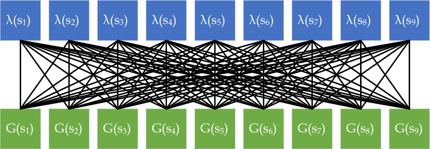

**(a)** True interdependency of state- _λ_ ’s and state update targets

λ(s 1 ) λ(s 2 ) λ(s 3 ) λ(s 4 ) λ(s 5 ) λ(s 6 ) λ(s 7 ) λ(s 8 ) λ(s 9 )

G(s 1 ) G(s 2 ) G(s 3 ) G(s 4 ) G(s 5 ) G(s 6 ) G(s 7 ) G(s 8 ) G(s 9 )

|λ(s ) 3|Col2|
|---|---|
|||
|G(s3)|G(s3)|

|λ(s ) 4|Col2|
|---|---|
|||
|G(s4)|G(s4)|

|λ(s ) 5|Col2|
|---|---|
|||
|G(s5)|G(s5)|

|λ(s ) 6|Col2|
|---|---|
|||
|G(s6)|G(s6)|

|λ(s ) 7|Col2|
|---|---|
|||
|G(s7)|G(s7)|

**(b)** Approximated interdependency of 1-step META

|λ(s ) 1|Col2|
|---|---|
|||
|G(s1)|G(s1)|

|λ(s ) 2|Col2|
|---|---|
|||
|G(s2)|G(s2)|

|λ(s ) 8|Col2|
|---|---|
|||
|G(s8)|G(s8)|

|λ(s ) 9|Col2|
|---|---|
|||
|G(s9)|G(s9)|

**Figure 4.1:** Interdependency among state- _λ_ ’s and state update targets. With the increment

of steps into the future, according to Proposition 4, less connections would be neglected.

derivatives _w.r.t. λ_ [(] _[t]_ [+2)] _, · · ·_ . These partial derivatives can be computed with the help of

the auxiliary tasks as well. The more we assemble the partial derivatives, the closer we

get to the full gradient. However, in our opinion, 1-step is still the most preferred not only

because it can be obtained online every step without the need of buffers but also for its

dominance over other dimensions of _**λ**_ : the more steps we look into the future, the more

the corresponding _λ_ s of the states are more heavily discounted by the earlier _γ_ ’s and _λ_ s.

This result is extended naturally if we were to do the adaptations offline, in which case

the partial derivatives and the gradient can be exactly computed with additional compu

tational costs. Figure 4.1 (a) and (b) compare the interdependency of state- _λ_ ’s and state

update targets, under the true case and the 1-step META approximation case respectively.

60

It is interesting to observe that the yielded minimizer is a generalization of (3.1): the

minimizer of the greedy target error can be achieved by setting _G_ _**[λ]**_ _t_ +1 [=] _[ G]_ _[t]_ [+1] [. In practice,]

given an unknown MDP, the distributional information of the targets, _e.g._ E[ _G_ _t_ +1 ], E[ _G_ _**[λ]**_ _t_ +1 []]

and _V ar_ [ _G_ _**[λ]**_ _t_ +1 []][, can only be estimated. However, such estimation has been proved viable]

in both offline and online settings of TD( _λ_ ) and the variants, using supervised learning

and auxiliary tasks using the direct VTD method [18], respectively. This means the opti

mization for the “true” target error is as viable as the _λ_ -greedy method proposed in [28],

while it requires more complicated estimations than that for the “greedy” target error:

we need the estimates of E[ _G_ _t_ +1 ], E[ _G_ _**[λ]**_ _t_ +1 []][ and] _[ V ar]_ [[] _[G]_ _t_ _**[λ]**_ +1 []][, while for (3.1) we only need the]

estimation of E[ _G_ _t_ +1 ] and _V ar_ [ _G_ _t_ +1 ].

#### **4.3 Trust Region Optimization**

The auxiliary learners are also dependent on _**λ**_, which brings new challenges. The opti

mization of the true state target error, _i.e._ the MSE between _**λ**_ -return and the true value,

together with the auxiliary estimation, brings new challenges: the auxiliary estimates are

learnt online and requires the stationarity of the update targets. This means if a _λ_ for one

state is changed dramatically, the auxiliary estimates of E[ _G_ _**[λ]**_ _t_ +1 []][ and] _[ V ar]_ [[] _[G]_ _t_ _**[λ]**_ +1 []][ will be de-]

stroyed, since they depend on each element in _**λ**_ (whereas in _λ_ -greedy, the pseudo targets

require no _**λ**_ -controlled distributional information). If we cannot handle such challenge,

_**λ**_ or
either we end up with a method that have to wait for some time after each change of

we end up with _λ_ -greedy, bearing the high bias towards the MC return and disconnection

from the overall target error.

Adjusting _**λ**_ without destroying the auxiliary estimates is a core problem. We tackle

such optimization by noticing that the expectation and variance of the update targets are

continuous and differentiable _w.r.t._ _**λ**_ . Thus, a small change on _λ_ _t_ +1 only yields a bounded

shift of the estimates of the auxiliary tasks.

61

action

action

|Col1|Col2|Col3|Col4|Col5|Col6|
|---|---|---|---|---|---|
|||||||
|||||||
|||vation  ount|vation  ount|vation  ount|vation  ount|
|||vation  ount|vation  ount|||
|||||||
|||||||

|reward Environment observation & discount ion λ Fixed λ Policy|Col2|Col3|reward|
|---|---|---|---|
|Environment ion Fixed λ Policy λ observation & discount reward|Policy|Policy|Policy|
|Environment ion Fixed λ Policy λ observation & discount reward|Policy|Fixed λ λ|Fixed λ λ|
|||||

|reward Environment observation & discount ion λ Feature- based λ ∇ Policy λ|Col2|Col3|Col4|
|---|---|---|---|
|Environment ion Feature- based λ Policy λ λ observation & discount reward ∇|Environment ion Feature- based λ Policy λ λ observation & discount reward ∇|||
|Environment ion Feature- based λ Policy λ λ observation & discount reward ∇|Policy|Policy|Policy|
|Environment ion Feature- based λ Policy λ λ observation & discount reward ∇|Policy|Policy||
|||||

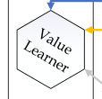

**Figure 4.2:** Mechanisms for META-assisted trace-based policy evaluation: the auxiliary

learners learn the distributional information in parallel to the value learner and provide

the approximated gradient for the adjustments of _**λ**_ .

If we use small enough steps of the estimated gradients to change _**λ**_, we can stabilize

the auxiliary estimates since they will not deviate far and will be corrected by the TD up

dates quickly. This method inherits the ideas of trust region methods used in optimizing

the dynamic systems.

Combining the approximation of gradient and the decomposed one-step optimization

method, we now have an online method to optimize _**λ**_ to achieve approximate optimiza

tion of the overall target error, which we name as META. This method can be jointly used

with value learning, serving as a plugin, to adapt _**λ**_ real-time. The policy evaluation car

ried out by the value learner directs the value estimates toward the targets and META

jointly optimizes the targets. We present the pseudocode of META in Alg. 10 and present

the mechanisms in Fig. 4.2.

62

**Algorithm 10:** META-assisted Online Policy Evaluation

Initialize weights for the value learner and those for the auxiliary learners that
learns E [ˆ] [ _G_ _t_ ], E [ˆ] [ _G_ _**[λ]**_ _t_ []][ and][ ˆ] _[V ar]_ [[] _[G]_ _**[λ]**_ _t_ []]
**for** _episodes_ **do**

_ρ_ _acc_ = 1; //initialize cumulative product of importance sampling ratios
Set traces for value learner and auxiliary learners to be **0** ;
_**x**_ 0 = initialize( _E_ ); //Initialize the environment _E_ and get the initial feature
(observation) _**x**_ 0
**while** _t ∈{_ 0 _,_ 1 _, . . . } until terminated_ **do**

//INTERACT WITH ENVIRONMENT
_a_ _t_ _∼_ _b_ ( _**x**_ _t_ ); //sample _a_ _t_ from behavior policy _b_
_ρ_ _t_ = _π_ ( _a_ _t_ _,_ _**x**_ _t_ ) _/b_ ( _a_ _t_ _,_ _**x**_ _t_ ); _ρ_ _acc_ = _ρ_ _acc_ _· ρ_ _t_ ; //get and accumulate importance
sampling ratios
_**x**_ _t_ +1 _, γ_ _t_ +1 = step( _a_ _t_ ); //take action _a_ _t_, get feature (observation) _**x**_ _t_ +1 and
discount factor _γ_ _t_ +1
//AUXILIARY TASKS
learn E [ˆ] [ _G_ _t_ ], E [ˆ] [ _G_ _**[λ]**_ _t_ []][ and][ ˆ] _[V ar]_ [[] _[G]_ _**[λ]**_ _t_ []][;][ //using direct VTD [18] with trace-based]
TD methods, _e.g._, true online GTD( _**λ**_ ) [25]
//APPROXIMATE SGD ON OVERALL TARGET ERROR
_λ_ _t_ +1 = _λ_ _t_ +1 _−_ _κγ_ _t_ [2] +1 _[ρ]_ _[acc]_
_λ_ _t_ +1 ( _V_ ( _**x**_ _t_ +1 ) _−_ E [ˆ] [ _G_ _**[λ]**_ _t_ +1 [])] [2] [ + ˆ] _[V ar]_ [[] _[G]_ _t_ _**[λ]**_ +1 []] + (E [ˆ] [ _G_ _**[λ]**_ _t_ +1 []] _[ −]_ _[V]_ [ (] _**[x]**_ _[t]_ [+1] [))(ˆ][E][[] _[G]_ _[t]_ [+1] []] _[ −]_ _[V]_ [ (] _**[x]**_ _[t]_ [+1] [))] ;
� � � �
// change _λ_ _t_ +2 _, · · ·_ when using multi-step approximation of the gradient
//LEARN VALUE
learn _V_ ( _**x**_ _t_ ) using a trace-based TD method;

#### **4.4 Discussions and Insights**

**4.4.1** **Hyperparameter Search**

The proposed method META trades the hyperparameter search for _λ_ with _κ_ . However,

_κ_ gives the algorithm the ability to have state-based _λ_ s: state or feature (observation)

based _**λ**_ can lead to better convergence compared to fixing _λ_ for all states. Such potential

may _never_ be achieved by searching a fixed _λ_ . Let us consider the tabular case, where

the hyperparameter search for constant _**λ**_ is equivalent to searching along the **1** direction

inside a _|S|_ -dimensional box. By replacing the hyperparameter _λ_ with _κ_, we extend the

search direction into the whole [0 _,_ 1] _[|S|]_ . The new degrees of freedom are crucial to the

performance.

63

**4.4.2** **Reliance on Auxiliary Tasks**

The META updates assume that E [ˆ] [ _G_ _t_ ], E [ˆ] [ _G_ _**[λ]**_ _t_ []][ and][ ˆ] _[V ar]_ [[] _[G]_ _**[λ]**_ _t_ []][ can be well estimated by the]

auxiliary tasks. This is very similar to the idea of actor changing the policy upon the

estimation of the values of the critic in the actor-critic methods. To implement this, we

can add a buffer period for the estimates to be stable at the beginning of the learning

process; Additionally, we should set the learning rates of the auxiliary learners higher

than the value learner _s.t._ the auxiliary tasks are learnt faster, resembling the guidelines

for setting learning rates of actor-critic. With the buffer period, we can also view META

as approximately equivalent to offline hyperparameter search of _**λ**_, where with META

we first reach a relatively stable accuracy and then adjust _**λ**_ to slowly slide to fixed points

with lower errors. Also, it is worth noting that META is in theory compatible with fancier

settings of learning rate, since the meta-adaptation is independent of the values of the

learning rate.

**4.4.3** **Generalization and Function Approximation**

In the case of function approximation, the meta-learning of _**λ**_ -greedy is still fully con

trolled by the value function and the two additional learned statistics but cannot directly

make use of the features of the state itself. Whereas in META, we can use a parametric

function of _**λ**_ and performs gradient descent on it to make use of the state features. This

feature is helpful for generalization and can be very effective when the state features con

tain rich information (good potential to be used with deep neural networks). This is to be

demonstrated in the experiments.

**4.4.4** **From Prediction to Control**

Within the control tasks where the quality of prediction is crucial to the policy improve

ment, it is viable to apply META to enhance the policy evaluation process. META is a trust

region method, which requires the policy to be also changing smoothly, _s.t._ the shift of

64

values can be bounded. This constraint leads us naturally to the actor-critic architectures,

where the value estimates can be used to improve a continuously changed parametric

policy. We provide the pseudocode of META-assisted actor-critic control in Algorithm 11.

**Algorithm 11:** META-assisted Online Actor-Critic

Initialize weights for the value learner and those for the auxiliary learners that
learns E [ˆ] [ _G_ _t_ ], E [ˆ] [ _G_ _**[λ]**_ _t_ []][ and][ ˆ] _[V ar]_ [[] _[G]_ _**[λ]**_ _t_ []]
Initialize parameterized policies _π_ ( _·|θ_ _π_ ) and _b_ ( _·|θ_ _b_ );
**for** _episodes_ **do**

Set traces for value learner and auxiliary learners to be **0** ;
_**x**_ 0 = initialize( _E_ );
**while** _t ∈{_ 0 _,_ 1 _, . . . } until terminated_ **do**

//INTERACT WITH ENVIRONMENT
_a_ _t_ _∼_ _b_ ( _**x**_ _t_ ); _ρ_ _t_ = _π_ ( _a_ _t_ _,_ _**x**_ _t_ ) _/b_ ( _a_ _t_ _,_ _**x**_ _t_ ); _ρ_ _acc_ = _ρ_ _acc_ _· ρ_ _t_ ;
_**x**_ _t_ +1 _, γ_ _t_ +1 = step( _a_ _t_ );
//AUXILIARY TASKS and SGD ON OVERALL TARGET ERROR
learn E [ˆ] [ _G_ _t_ ], E [ˆ] [ _G_ _**[λ]**_ _t_ []][ and][ ˆ] _[V ar]_ [[] _[G]_ _**[λ]**_ _t_ []][;]
_λ_ _t_ +1 = _λ_ _t_ +1 _−_ _κγ_ _t_ [2] +1 _[ρ]_ _[acc]_
� _λ_ _t_ +1 �( _V_ ( _**x**_ _t_ +1 ) _−_ E[ _G_ _**[λ]**_ _t_ +1 [])] [2] [ +] _[ V ar]_ [[] _[G]_ _t_ _**[λ]**_ +1 []] � + (E[ _G_ _**[λ]**_ _t_ +1 []] _[ −]_ _[V]_ [ (] _**[x]**_ _[t]_ [+1] [))(][E][[] _[G]_ _[t]_ [+1] []] _[ −]_ _[V]_ [ (] _**[x]**_ _[t]_ [+1] [))] �;
//LEARN VALUE
learn _V_ ( _**x**_ _t_ ) using a trace-based TD method;
//LEARN POLICY
One (small) step of policy gradient (actor-critic) on _θ_ _π_ ;

65

# **Chapter 5** **Experimental Studies**

In this chapter, we examine the empirical behavior of the proposed method, META, by

comparing it to the baselines true online TD( _λ_ ) [26] and true online GTD( _λ_ ) [25] as well

as the _λ_ -greedy method [28] [1] . For all the three sets of tests, we start adapting _λ_ s from 1,

which is the same as _λ_ -greedy [28]. This setting is enabled by using _λ_ ( _**x**_ ) = 1 _−_ _**w**_ _λ_ _[T]_ _**[x]**_ [ as]

the function approximator of the parametric _λ_, with all the weights initialized as **0** .

#### **5.1 RingWorld: Tabular Case, Low Variance**

This set of experiments focuses on a low-variance environment, the 11-state “ringworld”

[28], in which the agent moves either left or right in a ring of states. The state transitions

are deterministic and rewards only appear in the terminal states. In this set of exper

iments, we stick to the tabular setting and use true online TD( _**λ**_ ) [25] as the learner [2],

for the value estimate as well as all the auxiliary estimates. As discussed in 4.4.2, for

the accuracy of the auxiliary learners, we double their learning rate so that they can

adapt to the changes of the estimates faster. We select 3 pairs of behavior-target poli

cies: 1) the behavior policy goes left with 0 _._ 4 probability while the target policy does

1 [Implementation is open-source at https://github.com/PwnerHarry/META](https://github.com/PwnerHarry/META)
2 We prefer true online algorithms since they achieve the exact equivalence of the bi-directional view of
_λ_ -returns.

66

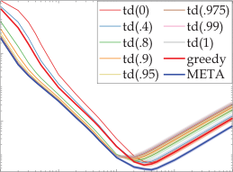

10 [-2]

10 [-4]

10 [-5] 10 [-4] 10 [-3] 10 [-2] 10 [-1]

learning rate

**(c)** _γ_ = 0 _._ 95, _⟨_ 0 _._ 2 _,_ 0 _._ 15 _⟩_

10 [-3]

10 [-4]

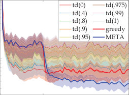

0 10 [5] 3 10 [5]

steps

**(f)** _α_ = 0 _._ 05, _κ_ = 0 _._ 1, _⟨_ 0 _._ 2 _,_ 0 _._ 15 _⟩_

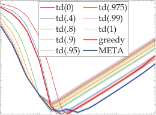

10 [-4]

10 [-5] 10 [-4] 10 [-3] 10 [-2] 10 [-1]

learning rate

**(a)** _γ_ = 0 _._ 95, _⟨_ 0 _._ 4 _,_ 0 _._ 35 _⟩_

10 [-3]

10 [-4]

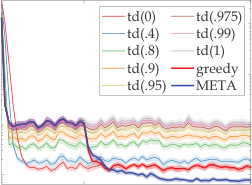

10 [5] 3 10 [5]

steps

**(d)** _α_ = 0 _._ 01, _κ_ = 0 _._ 01, _⟨_ 0 _._ 4 _,_ 0 _._ 35 _⟩_

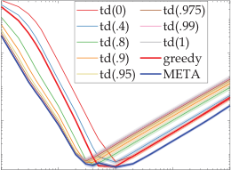

10 [-2]

10 [-4]

10 [-5] 10 [-4] 10 [-3] 10 [-2] 10 [-1]

learning rate

**(b)** _γ_ = 0 _._ 95, _⟨_ 0 _._ 3 _,_ 0 _._ 25 _⟩_

10 [-3]

10 [-4]

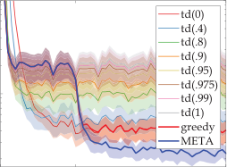

0 10 [5] 3 10 [5]

steps

**(e)** _α_ = 0 _._ 01, _κ_ = 0 _._ 1, _⟨_ 0 _._ 3 _,_ 0 _._ 25 _⟩_

**Figure 5.1:** U-shaped curves and learning curves for META, _λ_ -greedy and the baselines

_x_                                           on RingWorld, under three pairs of behavior-target policies. For (a), (b) and (c), the

_α_
axes represent the values of the learning rate for prediction (or the critic), while the

_y_ -axes represent the overall value errors. Each point in the graphs contains the mean

(solid) and standard deviation (shaded) collected from 240 independent runs, with 10 [6]

_x_
steps for prediction; For (d), (e) and (f), the -axis represents the steps of learning and

_y_ -axis is the same as (a), (b) and (c). We choose one representative case for each U-shaped

curve corresponding to different policy pairs and plot the corresponding learning curves.

In these learning curves, the best known values for the hyperparameters are used. The

buffer period lengths are 10 [5] steps (10%). The buffer period and the adaptation period

have been ticked on the _x_ -axes. The rest of the steps for (d), (e) and (f) have been cut off

since there is no significant change afterwards.

67

w.p. 0 _._ 35; 2) behavior 0 _._ 3 and target 0 _._ 25; 3) behavior 0 _._ 2 and target 0 _._ 15. The three

pairs of policies are increasingly greedy. The baseline true online TD has 2 hyperpa

rameters ( _α_ & _λ_ ) and so does META ( _α_ & _κ_ ), excluding those for the auxiliary learners.

We test the two methods on grids of hyperparameter pairs. More specifically, for the

baseline true online TD, we test on _⟨α, λ⟩∈{_ 10 _[−]_ [5] _, . . .,_ 5 _×_ 10 _[−]_ [5] _,_ 10 _[−]_ [4] _, . . .,_ 5 _×_ 10 _[−]_ [4] _, . . .,_ 5 _×_

10 _[−]_ [2] _,_ 10 _[−]_ [1] _} × {_ 0 _,_ 0 _._ 4 _,_ 0 _._ 8 _,_ 0 _._ 9 _,_ 0 _._ 95 _,_ 0 _._ 975 _,_ 0 _._ 99 _,_ 1 _}_ while for META, _⟨α, κ⟩∈{_ 10 _[−]_ [5] _, . . .,_ 5 _×_

10 _[−]_ [5] _,_ 10 _[−]_ [4] _, . . .,_ 5 _×_ 10 _[−]_ [4] _, . . .,_ 5 _×_ 10 _[−]_ [2] _,_ 10 _[−]_ [1] _}×{_ 10 _[−]_ [7] _, . . .,_ 10 _[−]_ [1] _}_ . The results are presented as

the U-shaped curves in Fig. 5.1. We plot the curves of the baseline under different _λ_ s and

the best performance that META could get under each learning rate. The detailed results

for the three pairs of policies are presented in Table 5.1, 5.2 and 5.3, respectively.

**Table 5.1:** Detailed Results on RingWorld (Target: 0.35, Behavior: 0.4)

baseline True Online TD

0 0.4 0.8 0.9 0.95 0.975 0.99 1 greedy _META_
_α\λ_ mean std mean std mean std mean std mean std mean std mean std mean std mean std _mean_ _std_

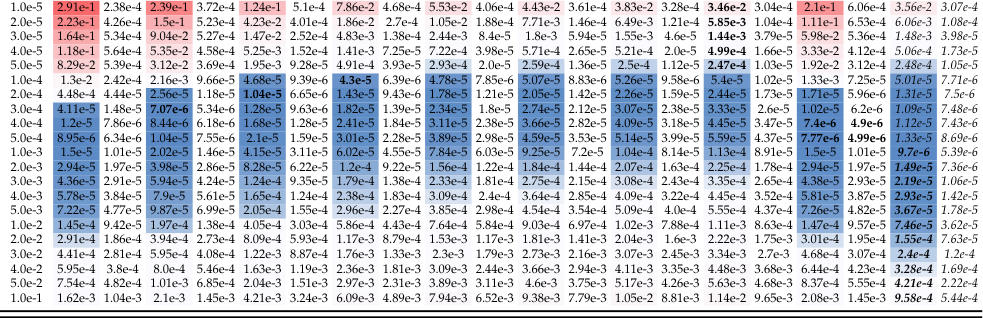

Color indicators are added to locate the extreme values: the bluer the better accuracy, the redder the worse. Also, the best result for each _α_ (each row) is marked in **bold** font.

The best performance of a fine-tuned baseline can be extracted from the figure by com

_λ_ s.
bining the lowest points of the set of curves obtained by the baseline under different

But still, the fine-tuned META provides better performance, especially when the learning

rate is relatively high. We can say that once META is fine-tuned, it provides significantly

better performance that the baseline algorithm can possibly achieve, since it meta-learns

state-based _**λ**_ s, which allow it to go beyond the scope of the optimization of the baseline.

The results can also be interpreted as META having less sensitivity to the learning rate

68

**Table 5.2:** Detailed Results on RingWorld (Target: 0.25, Behavior: 0.3)

baseline True Online TD

0 0.4 0.8 0.9 0.95 0.975 0.99 1 greedy _META_
_α\λ_ mean std mean std mean std mean std mean std mean std mean std mean std mean std _mean_ _std_

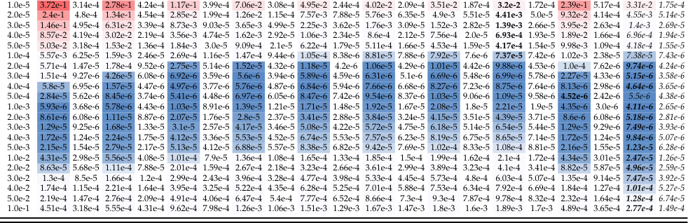

Color indicators are added to locate the extreme values: the bluer the better accuracy, the redder the worse. Also, the best result for each _α_ (each row) is marked in **bold** font.

**Table 5.3:** Detailed Results on RingWorld (Target: 0.15, Behavior: 0.2)

baseline True Online TD

0 0.4 0.8 0.9 0.95 0.975 0.99 1 greedy _META_
_α\λ_ mean std mean std mean std mean std mean std mean std mean std mean std mean std _mean_ _std_

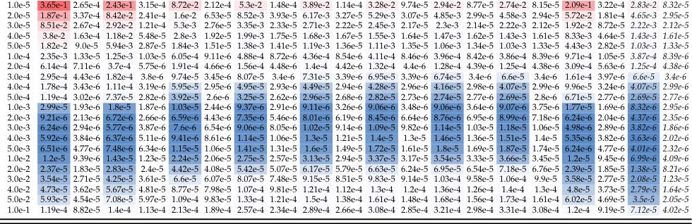

Color indicators are added to locate the extreme values: the bluer the better accuracy, the redder the worse. Also, the best result for each _α_ (each row) is marked in **bold** font.

69

10 [-3]

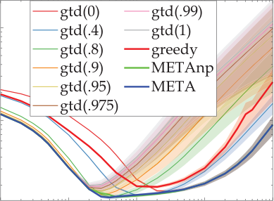

10 [-3]

10 [-5] 10 [-4] 10 [-3] 10 [-2] 10 [-1]

learning rate

**(a)** FrozenLake, _γ_ = 0 _._ 95

2.5

2

1.5

1

0.5

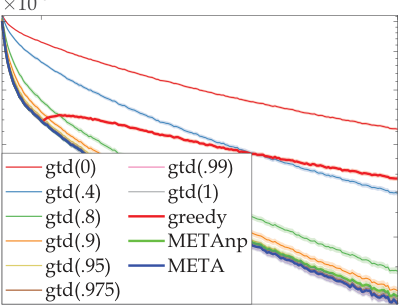

10 [5] 10 [6]

steps

**(b)** FrozenLake, _α_ = _β_ = 0 _._ 0001, _κ_ = 10 _[−]_ [6], _κ_ np = 10 _[−]_ [4]

**Figure 5.2:** U-shaped curves and learning curves for META, _λ_ -greedy and the baselines on

FrozenLake. For (a), the _x_ -axis represents the values of the learning rate _α_ for prediction,

while the _y_ -axis represents the overall value error. Each point in the graph contains the

mean (solid) and standard deviation (shaded) collected from 240 independent runs, with

10 [6] steps for prediction; For (d), the _x_ -axis represents the steps of learning and _y_ -axis is

the same as (a). In the learning curves, the best known values for the hyperparameters are

used. The buffer period lengths are 10 [5] steps (10%). The buffer period and the adaptation

_x_ -axes.
period have been ticked on the

hyperparameter than the baseline true online TD. It is also interesting to notice that the

greedier the policies, the larger the performance boost that META can provide.

#### **5.2 FrozenLake: Linear Function Approximation with High** **Variance**

This set of experiments is carried out on a higher variance environment, the “4 _×_ 4”

FrozenLake, in which the transitions are stochastic and the agent seeks to fetch a fris

bee back on a frozen lake surface with holes from the northwest to the southeast. We

craft an exploratory policy that takes the actions with equal probability, and a heuristic

policy that has 0 _._ 3 probability for going south or east, 0 _._ 2 for going north or west. This

70

**Table 5.4:** Detailed Results on FrozenLake

baseline True Online GTD

0 0.4 0.8 0.9 0.95 0.975 0.99 1 greedy _META(np)_ _META_
_α\λ_ mean std mean std mean std mean std mean std mean std mean std mean std mean std _mean_ _std_ _mean_ _std_

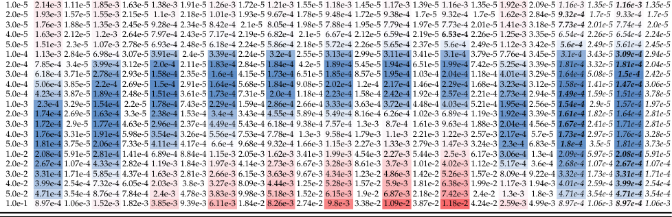

Color indicators are added to locate the extreme values: the bluer the better accuracy, the redder the worse. Also, the best result for each _α_ (each row) is marked in **bold** font.

time we use the linear function approximation and true online GTD( _λ_ ) with discrete tile

coding (4 tiles, 4 randomly offset tilings). We set the second learning rate _β_ introduced

in true online GTD( _λ_ ) to be the same as _α_ (for the value learners as well as the auxiliary

learners in all the compared algorithms). Additionally, we remove the parametric setting

of _**λ**_ to get a method that we call “META(np)”, and which demonstrates the potential of a

parametric feature (observation) based _**λ**_ . The U-shaped curves, obtained using the exact

same settings as in the ringworld tests, are provided in Fig. 5.2. The detailed results are

provided in Table 5.4.

We observe similar patterns with the first set of experiments. Comparing META with

“META(np)”, the generalization provided by the parametric _**λ**_ is beneficial: in panel (b)

we observe generally better performance and in panel (e) we see that a parametric _λ_ has

better sample efficiency. This would suggest that using parametric _λ_ in environments

with relatively smooth dynamics would be generally beneficial for sample efficiency.

71

-150

-200

-250

-300

-350

-400

-450

-150

-200

-250

-300

-350

-400

-450

|gtd(0) gtd(.4) gtd(.8) gtd(.9) gtd(.95) gtd(.975) greedy META|gtd(0) gtd(.4) gtd(.8) gtd(.9) gtd(.95) gtd(.975) greedy META|
|---|---|
|gtd(0) gtd(.4) gtd(.8) gtd(.9) gtd(.95) gtd(.975) greedy META||
|gtd(0) gtd(.4) gtd(.8) gtd(.9) gtd(.95) gtd(.975) greedy META||
|gtd(0) gtd(.4) gtd(.8) gtd(.9) gtd(.95) gtd(.975) greedy META||
|gtd(0) gtd(.4) gtd(.8) gtd(.9) gtd(.95) gtd(.975) greedy META||
|gtd(0) gtd(.4) gtd(.8) gtd(.9) gtd(.95) gtd(.975) greedy META||
|gtd(0) gtd(.4) gtd(.8) gtd(.9) gtd(.95) gtd(.975) greedy META||
|gtd(0) gtd(.4) gtd(.8) gtd(.9) gtd(.95) gtd(.975) greedy META||

10 [-6] 10 [-4] 10 [-2]

**(a)** MountainCar, _γ_ = 1, _η_ = 1

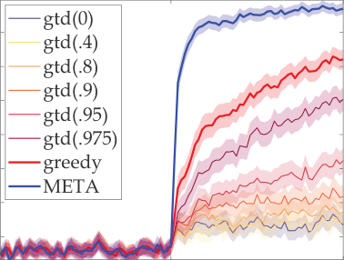

25000 50000

steps

**(b)** MountainCar, _α_ = _β_ = 10 _[−]_ [5], _η_ = 1, _κ_ = 10 _[−]_ [5]

**Figure 5.3:** U-shaped curves and learning curves for META, _λ_ -greedy and baselines on

MountainCar. For (a), the _x_ -axis represents the values of the learning rate _α_ for prediction

(the critic), while the _y_ -axis represents the discounted return for MountainCar. Each point

in the graph contains the mean (solid) and standard deviation (shaded) collected from

240 independent runs, 50000 steps for control; For (d), the _x_ -axis represents the steps of

learning and _y_ -axis is the same as (a). In the learning curves, the best known values for

the hyperparameters are used. The buffer period length is 25000 steps (50%). The buffer

period and the adaptation period have been ticked on the _x_ -axes. Note that in the buffer

period of control, we also freeze the policy.

#### **5.3 MountainCar: On-Policy Actor-Critic Control with Lin-** **ear Function Approximation**

In this set of experiments we investigate the case in which META assists on-policy actor

critic control on a modified version of the environment MountainCar with noise added to

the state transitions. The state features used in these experiments resemble the classical

setting in [20], with the tile encoding of 8 tilings and 8 offsets. We use a softmax policy

parameterized by a _|A| × D_ matrix, where _D_ is the dimension of the state features, with

true online GTD( _λ_ ) as the learners (critics). This time, the U-shaped curves presented

in Fig. 5.3 show performance better than the baselines, and significantly better than _λ_ 

greedy assisted actor-critic.

72

In this set of experiments we intentionally set the step size of the gradient ascent of

the policy to be high ( _η_ = 1), in order to emphasise the quality of policy evaluation.

However, typically in actor-critic we keep _η_ small. If _η_ is small, META is expected to

help a lot less, as the accuracy of the value function would be less important. Enhancing

the policy evaluation quality may not be sufficient for increasing the sample efficiency of

control problems.

From the curves presented in Figure 5.3, the most significant improvements are ob

tained when the learning rate of the critic is small. Typically in actor-critic, we set the

learning rate of the critic to be higher than the actor, in order to improve the quality of the

update of the actor. META alleviates the requirement for such a setting by boosting the

sample efficiency of the critic.

73

# **Chapter 6** **Conclusion and Future Work**

#### **6.1 Summary of Contributions**

In this thesis, we provided the following original contributions:

1. The surrogate approach of optimizing sample efficiency by the optimization of up

date targets.

2. A principled approach, META, which achieves approximate meta-optimization of

the sample efficiency of policy evaluation while remaining compatible with online

updating, off-policy learning, function approximation and control, with minimal

additional computational cost.

3. Identification of the distribution mismatch between the “on-policy” distribution

and the assumed “stationary” distribution.

We demonstrated the merits of the proposed approach in several experiments.

Beyond this, several smaller contributions are also presented:

1. A re-framing of the basics of RL using state-based discounting setting.

2. Identification of the distribution mismatch between the “on-policy” distribution

with the assumed “stationary” distribution in the episodic setting.

74

3. A new proof of the policy gradient theorem under state-based discount setting.

#### **6.2 Future Work**

The contribution of this thesis points out several promising directions worthy of research

in the future:

1. Investigate the possibilities of using traces to accumulate one-step meta-gradient

updates, in order to achieve better approximation of the true gradients: the approx

imation of the per-state meta-gradients can be ameliorated by looking more steps

into the future, which draws great similarity to the online accumulation of the eligi

bility traces. Perhaps better meta-gradients can be achieved by utilizing traces.

2. Investigate the convergence properties of the update targets under meta-optimization:

under certain assumptions, we proved that the meta-gradient updates can optimize

the overall targets. But do these targets converge? Or, what dynamic patterns do

these targets follow?

3. Investigate formally the relationship between update targets and sample efficiency:

optimization of update targets, as a surrogate of sample efficiency, greatly simplifies

the analyses and exhibits significant empirical performance boost. Yet, we have not

formally established how the quality of the update targets influences the sample

efficiency.

4. Investigate better ways of combining the proposed approach with actor-critic meth

ods: the trust regions required by the auxiliary learners already limit the learning

rate of the critic to be small. Together with the fact that we need to limit the learning

rate of the actor to be smaller than the critic, this further limits the learning speed

of actor-critic systems. We would like to find a more efficient algorithmic approach

than the one we used in this thesis.

75

# **Bibliography**

[1] B ARNARD, E. Temporal-difference methods and markov models. _IEEE Transactions_

_on Systems, Man, and Cybernetics 23_, 2 (March 1993), 357–365.

[2] B ERTSEKAS, D. P., B ERTSEKAS, D. P., B ERTSEKAS, D. P., AND B ERTSEKAS, D. P.

_Dynamic programming and optimal control_, vol. 1. Athena scientific Belmont, MA, 1995.

[3] B ERTSEKAS, D. P., AND T SITSIKLIS, J. N. _Neuro-dynamic programming_, vol. 5. Athena

Scientific Belmont, MA, 1996.

[4] B ROCKMAN, G., C HEUNG, V., P ETTERSSON, L., S CHNEIDER, J., S CHULMAN, J.,

T ANG, J., AND Z AREMBA, W. Openai gym, 2016.

[5] D ABNEY, W., AND B ARTO, A. Adaptive step-size for online temporal difference

learning, 2012.

[6] D AYAN, P., AND S EJNOWSKI, T. J. Td( _λ_ ) converges with probability 1. _Machine_

_Learning 14_, 3 (1994), 295–301.

[7] D OWNEY, C., AND S ANNER, S. Temporal difference bayesian model averaging: A

bayesian perspective on adapting lambda. In _ICML_ (2010), pp. 311–318.

[8] D OYA, K. Reinforcement learning in continuous time and space. _Neural computation_

_12_, 1 (2000), 219–245.

76

[9] K EARNS, M. J., AND S INGH, S. P. Bias-variance error bounds for temporal difference

updates. In _Conference on Computational Learning Theory_ (2000), COLT ’00, pp. 142–

147.

[10] K ONIDARIS, G., N IEKUM, S., AND T HOMAS, P. S. Td _γ_ : Re-evaluating complex back

ups in temporal difference learning. In _Proceedings of the 24th International Conference_

_on Neural Information Processing Systems_ (Red Hook, NY, USA, 2011), NIPS’11, Curran

Associates Inc., p. 2402–2410.

[11] M AEI, H. R., AND S UTTON, R. S. Gq(lambda): A general gradient algorithm for

temporal-difference prediction learning with eligibility traces. In _3d Conference on_

_Artificial General Intelligence (AGI-2010)_ (2010/06), Atlantis Press.

[12] M ANN, T. A., P ENEDONES, H., M ANNOR, S., AND H ESTER, T. Adaptive lambda

least-squares temporal difference learning. _CoRR abs/1612.09465_ (2016).

[13] M NIH, V., K AVUKCUOGLU, K., S ILVER, D., R USU, A. A., V ENESS, J., B ELLEMARE,

M. G., G RAVES, A., R IEDMILLER, M., F IDJELAND, A. K., O STROVSKI, G., ET AL .

Human-level control through deep reinforcement learning. _Nature 518_, 7540 (2015),

529.

[14] P UTERMAN, M. L. _Markov Decision Processes: Discrete Stochastic Dynamic Program-_

_ming_ . John Wiley & Sons, 2014.

[15] R AMSTEDT, S., AND P AL, C. Real-time reinforcement learning. In _Advances in_

_Neural Information Processing Systems 32_, H. Wallach, H. Larochelle, A. Beygelzimer,

F. d’ Alch´e-Buc, E. Fox, and R. Garnett, Eds. Curran Associates, Inc., 2019, pp. 3067–

3076.

[16] R IQUELME, C., P ENEDONES, H., V INCENT, D., M AENNEL, H., G ELLY, S., M ANN,

T. A., B ARRETO, A., AND N EU, G. Adaptive temporal-difference learning for policy

evaluation with per-state uncertainty estimates. In _Advances in Neural Information_

77

_Processing Systems 32_, H. Wallach, H. Larochelle, A. Beygelzimer, F. d’Alch´e Buc,

E. Fox, and R. Garnett, Eds. Curran Associates, Inc., 2019, pp. 11872–11882.

[17] S CHAPIRE, R. E., AND W ARMUTH, M. K. On the worst-case analysis of temporal

difference learning algorithms. _Machine Learning 22_, 1 (1996), 95–121.

[18] S HERSTAN, C., B ENNETT, B., Y OUNG, K., A SHLEY, D., W HITE, A., W HITE, M.,

AND S UTTON, R. Directly estimating the variance of the _λ_ -return using temporal

difference methods. _arXiv abs/1801.08287_ (2018).

[19] S INGH, S., AND D AYAN, P. Analytical mean squared error curves for temporal dif

ference learning. _Machine Learning 32_, 1 (1998), 5–40.

[20] S UTTON, R., AND B ARTO, A. _Reinforcement learning - An Introduction_ . MIT Press,

2018.

[21] S UTTON, R., M AHMOOD, A. R., P RECUP, D., AND H ASSELT, H. A new Q( _λ_ ) with

interim forward view and monte carlo equivalence. In _International Conference on_

_Machine Learning_ (2014), vol. 32 of _Proceedings of Machine Learning Research_, pp. 568–

576.

[22] S UTTON, R., AND S INGH, S. P. On step-size and bias in temporal-difference learning.

In _Center for Systems Science, Yale University_ (1994), pp. 91–96.

[23] S UTTON, R. S. Td models: Modeling the world at a mixture of time scales. In _Machine_

_Learning Proceedings 1995_, A. Prieditis and S. Russell, Eds. Morgan Kaufmann, San

Francisco (CA), 1995, pp. 531 – 539.

[24] S UTTON, R. S., M AHMOOD, A. R., AND W HITE, M. An emphatic approach to the

problem of off-policy temporal-difference learning. _CoRR abs/1503.04269_ (2015).

[25] VAN H ASSELT, H., M AHMOOD, A. R., AND S UTTON, R. Off-policy TD( _λ_ ) with a

true online equivalence. In _Conference on Uncertainty in Artificial Intelligence_ (2014),

pp. 330–339.

78

[26] V AN S EIJEN, H., M AHMOOD, A. R., P ILARSKI, P. M., M ACHADO, M. C., AND S UT 

TON, R. S. True online temporal-difference learning. _Journal of Machine Learning_

_Research 17_, 1 (2016), 5057–5096.

[27] W HITE, M. Unifying task specification in reinforcement learning. _CoRR_

_abs/1609.01995_ (2016).

[28] W HITE, M., AND W HITE, A. A greedy approach to adapting the trace parameter for

temporal difference learning. In _International Conference on Autonomous Agents and_

_Multiagent Systems_ (2016), AAMAS ’16, International Foundation for Autonomous

Agents and Multiagent Systems, pp. 557–565.

[29] X U, Z., VAN H ASSELT, H., AND S ILVER, D. Meta-gradient reinforcement learning.

_CoRR abs/1805.09801_ (2018).

[30] Y U, H. Least squares temporal difference methods: An analysis under general con

ditions. _SIAM Journal on Control and Optimization 50_, 6 (2012), 3310–3343.

[31] Z HAO, M., L UAN, S., P ORADA, I., C HANG, X.-W., AND P RECUP, D. META-learning

state-based _λ_ for more sample-efficient policy evaluation. _ArXiv abs/1904.11439_

(2020).

79

# **APPENDICES**

In this chapter, the assistive details of the thesis will be provided.

#### **6.3 Technical Auxiliaries for Experiments**

**6.3.1** **Environments**

**RingWorld**

The RingWorld domain was introduced as a suitable domain for investigating _λ_ in [9]. It

describes an environment a ring of states. The starting state is always in the top-middle

of the ring and the agent can take two actions, either moving to the state to the left or

the state to the right. There are two adjoining terminal states at the bottom middle of the

ring. The left end gives _−_ 1 reward and the right end gives +1. Reaching the bottom two

terminal states result in the teleportation back to the starting state. The sparsity of the

rewards made the selection of an appropriate _λ_ value worthy of investigating.

In the experiments, the RingWorld environment is reproduced with the help of the

description in [28] and [9]. Despite being loyal to the original setting as much as possi

ble, due to limitations of our understanding, we cannot see the difference between the

RingWorld and a random walk environment with the rewards on the two tails. The Ring

World environment is described as a symmetric ring of the states with the starting state

at the top-middle, for which we think the number of states should be odd. However, the

authors claimed that they conducted experiments on the 10-state and 50-state instances.

80

We instead did the experiments on the 11-state instance. Thus in the experiments, we

adopted a random walk version of RingWorld.

**FrozenLake**

The FrozenLake environment is a very noisy and high-variance domain in the OpenAI

gym environment bundle [4]. The environment features a scenario in which an agent tries

to fetch back a lost frisbee on the surface of a frozen lake. In this task, the agent controls

the movement of a character in a grid world. Some tiles of the grid are walkable, and

others lead to the agent falling into the water, which terminates the episode and teleports

the agent back to the starting point. Furthermore, the movement direction of the agent is

uncertain and only partially depends on the chosen direction. The agent is rewarded for

finding a walkable path to a goal tile.

To make sure the Markovian properties of the environment, we removed the episode

length limit of the FrozenLake environment and thus the environment can be solvable by

dynamic programming (the true values of a policy as well as the state distribution).

It is modified based on the Gym environment with the same name. We have used the

instance of “4x4”, _i.e._ with 16 states.

The episode length limit of MountainCar is also removed. We also added noise to the

state transitions: actions will be randomized at 20% probability. The noise is to prevent the

cases in which _λ_ = 1 yields the best performance (to prevent META from using extremely

small _κ_ ’s to get good performance). Additionally, due to the poor exploration of the

softmax policy, we extended the starting location to be uniformly anywhere from the left

to right on the slopes.

**State Features**

For RingWorld, we used onehot encoding to get equivalence to tabular case; For Frozen

Lake, we used a discrete variant of tile coding, for which there are 4 tilings, with each tile

covering one grid as well as symmetric and even offset; For MountainCar, we adopted the

81

roughly the same setting as Chapter 10.1 Page 245 in [20], except that we used ordinary

symmetric and even offset instead of the asymmetric offset.

**About** _**λ**_ **-greedy**

We have replaced VTD [28] with direct VTD [18]. This modification is expected only to

improve the stability, without touching the core mechanisms of _λ_ -greedy [28].

The target used in [28] is biased toward _λ_ = 1, as the _λ_ ’s into the future are assumed

to be 1. Thus we do not think it is helpful to conduct tests on environments with very

low variance. For example, RingWorld is low-variance, as the state transitions are deter

ministic. Also, the policies adopted in [28] is very greedy. Such setting further reduces

the variance. This is the reason why we have tested different policies (less greedy) in our

experiments.

**Buffer Period and Learning Rate**

In the prediction tasks, we used the first 10% of the episodes as the buffer period. The

learning rate hyperparameters of the auxiliary learners are set to be the twice of that of

the value learner. These settings were not considered in [28], in which there were no

buffer period and identical learning rates were used for all learners.

For the control task of MountainCar, _λ_ -greedy and META will both crash without

these two additional settings.

**Details for Non-Parametric** _λ_ ( _·_ )

To disable the generalization of the parametric _**λ**_ for “META(np)”, we replaced the feature

vectors for each state with onehot-encoded features.

**More Policies for Prediction**

For RingWorld, we have done 6 different behavior-target policy pairs (3 on-policy & 3

off-policy). The off-policy pair that we have shown in the manuscript shares the same

82

patterns as the rest of the pairs. The accuracy improvement brought by META is signif

icant across these pairs of policies; For FrozenLake, we have done two pairs of policies

(on- and off-policy). We observe the same pattern as in the RingWorld tests.

**Implementation**

[The source code could be found at https://github.com/PwnerHarry/META. The](https://github.com/PwnerHarry/META)

implementation is based on numpy and python, with massive parallelization for hyper

processing workers. These are to ensure fast experimental results on large scale CPUs.

Due to the estimation instability, sometimes the META updates could bring state _λ_

values outside [0 _,_ 1]. In the implementation, whenever we detect such kind of update, we

simply cancel that operation.

83

