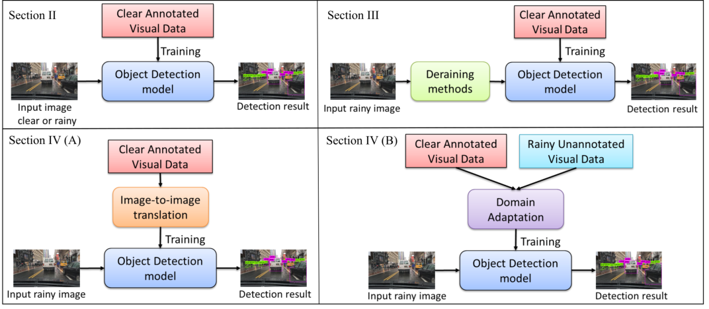
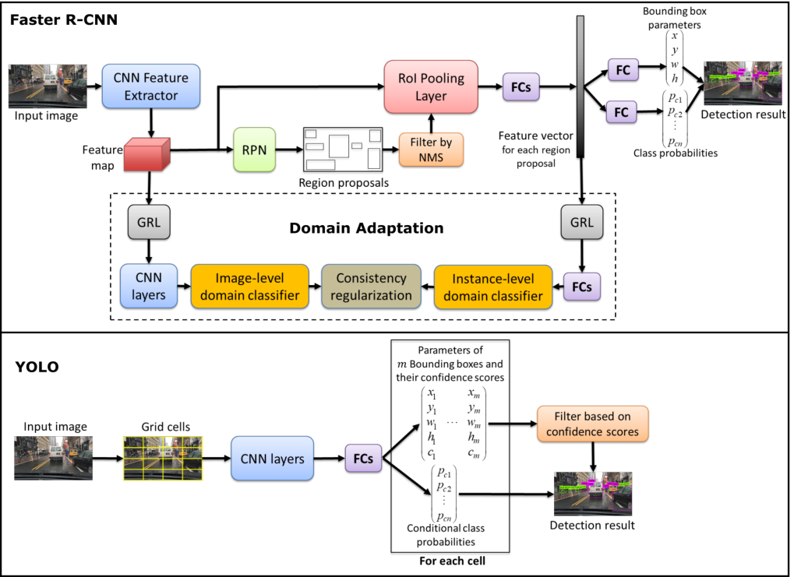
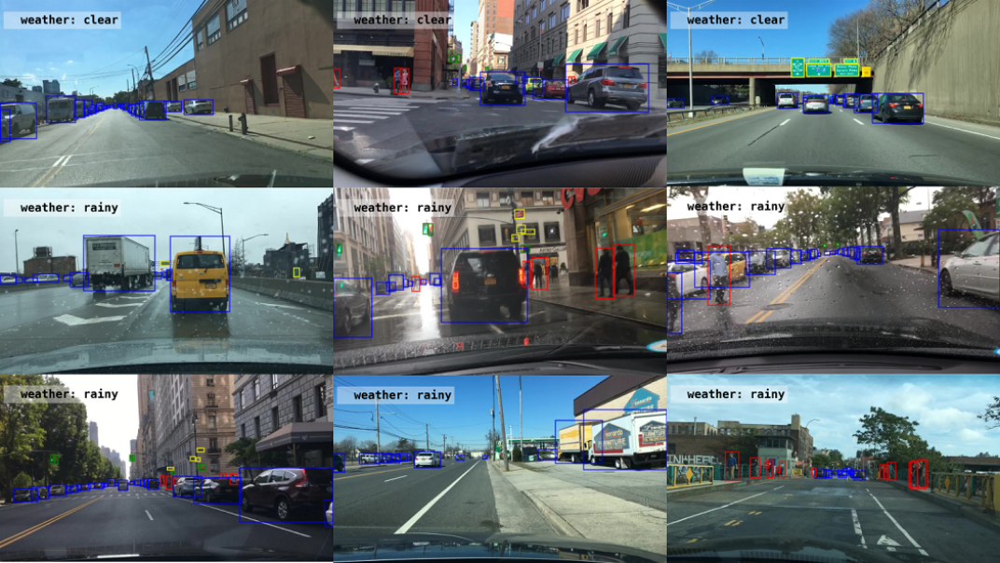
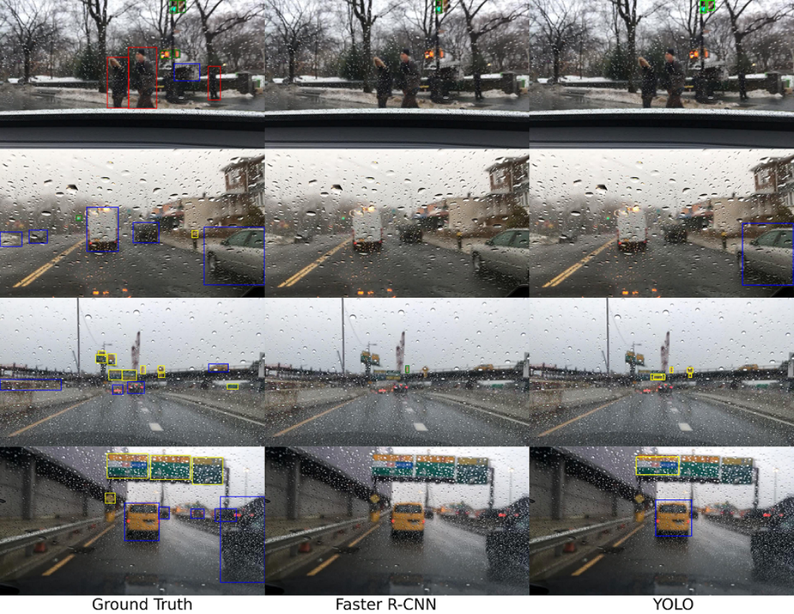
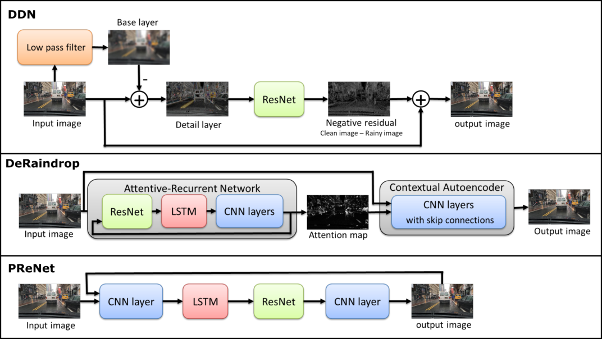
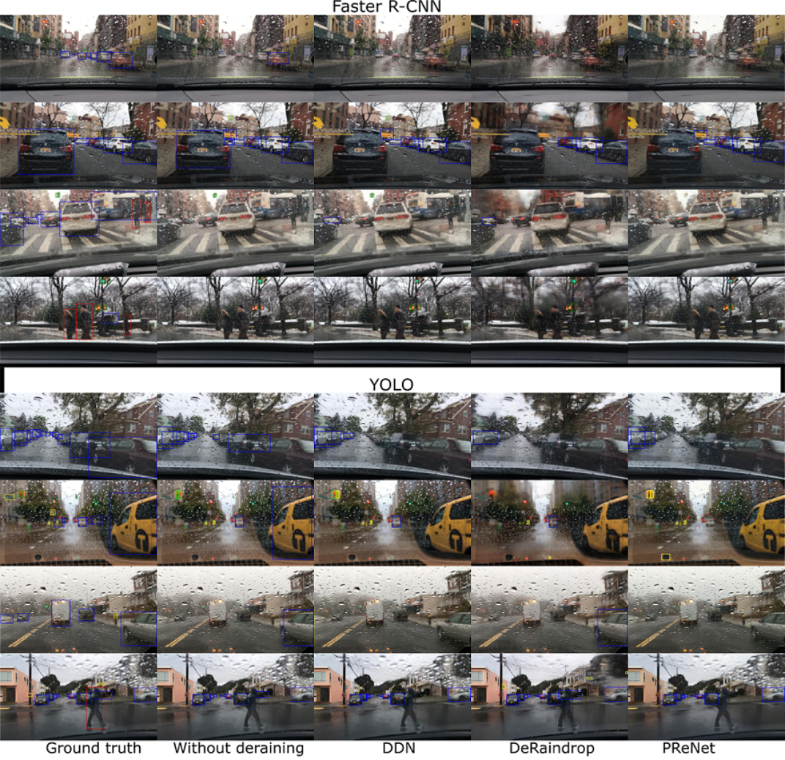
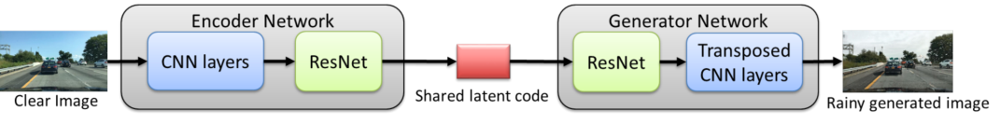
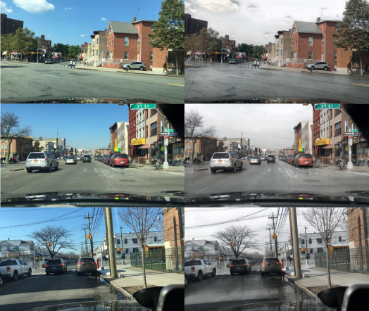
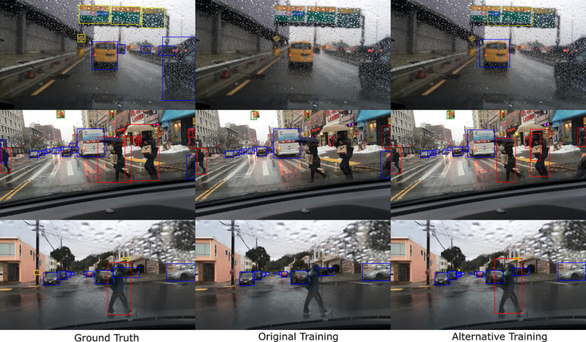
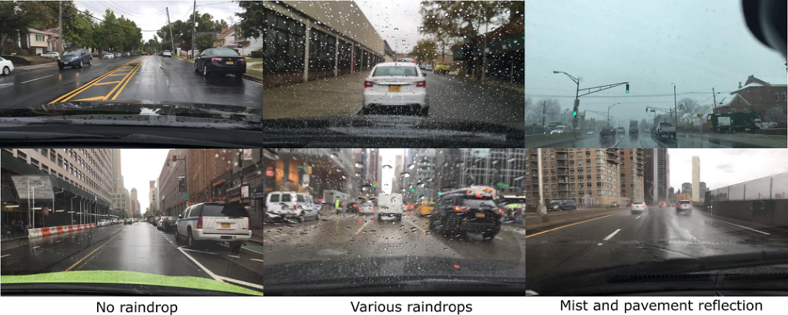

1

## Object Detection Under Rainy Conditions for Autonomous Vehicles: A Review of State-of-the-Art and Emerging Techniques

Mazin Hnewa and Hayder Radha, _Fellow, IEEE_ .

_**Abstract**_ **—Advanced automotive active-safety systems, in gen-**
**eral, and autonomous vehicles, in particular, rely heavily on**
**visual data to classify and localize objects such as pedestrians,**
**traffic signs and lights, and other nearby cars, to assist the**
**corresponding vehicles maneuver safely in their environments.**
**However, the performance of object detection methods could**
**degrade rather significantly under challenging weather scenarios**
**including rainy conditions. Despite major advancements in the**
**development of deraining approaches, the impact of rain on**
**object detection has largely been understudied, especially in**
**the context of autonomous driving. The main objective of this**
**paper is to present a tutorial on state-of-the-art and emerging**
**techniques that represent leading candidates for mitigating the**
**influence of rainy conditions on an autonomous vehicle’s ability**
**to detect objects. Our goal includes surveying and analyzing**
**the performance of object detection methods trained and tested**
**using visual data captured under clear and rainy conditions.**
**Moreover, we survey and evaluate the efficacy and limitations**
**of leading deraining approaches, deep-learning based domain**
**adaptation, and image translation frameworks that are being**
**considered for addressing the problem of object detection under**
**rainy conditions. Experimental results of a variety of the surveyed**
**techniques are presented as part of this tutorial.**

I. I NTRODUCTION
# V ISUAL data plays a critical role in enabling automo-tive advanced driver-assistance systems and autonomous

vehicles to achieve high levels of safety while the cars and
trucks maneuver in their environments. Hence, emerging autonomous vehicles are employing cameras and deep learningbased methods for object detection and classification [1]–

[3]. These methods predict bounding boxes that surround
detected objects and classify probabilities associated with each
bounding box. In particular, convolutional neural network
(CNN)-based approaches have shown very promising results
in the detection of pedestrians, vehicles, and other objects [4]–

[10]. These neural networks are usually trained using a large
amount of visual data captured in favorable clear conditions.
However, the performance of such systems in challenging
weather, such as rainy conditions, has not been thoroughly
surveyed or studied.
The quality of visual signals captured by autonomous vehicles can be impaired and distorted in adverse weather conditions, most notably in rain, snow, and fog. Such conditions

Mazin Hnewa, PhD student, Department of Electrical and Computer Engineering, Michigan State University, East Lansing, MI 48824 USA (email:
mazin@msu.edu).
Hayder Radha, MSU Foundation Professor, Department of Electrical and
Computer Engineering,Michigan State University, East Lansing, MI 48824
USA (email: radha@egr.msu.edu)

minimize the scene contrast and visibility, and this could lead
to a significant degradation in the ability of the vehicle to
detect critical objects in the environment. Depending on the
visual effect, adverse weather conditions can be classified as
steady (such as fog, mist, and haze) or dynamic, which have
more complex effects (such as rain and snow) [11]. In this
article, we focus on rain because it is the most common
dynamic challenging weather condition that impacts virtually
every populated region of the globe. Furthermore, there has
been a great number of recent efforts that attempt to mitigate
the effect of rain in the context of visual processing. While
addressing the effect of other weather conditions has been
receiving some, yet minimal, attention, the volume of work
regarding the mitigation of rain is far more prevalent and
salient within different research communities.

It is worth noting that rain consists of countless drops that
have a wide range of sizes and complex shapes, and rain
spreads quite randomly, with varying speeds when falling on
roadways, pavement, vehicles, pedestrians, and other objects
in the scene. Moreover, raindrops naturally cause intensity
variations in images and video frames. In particular, every
raindrop blocks some of the light that is reflected by objects
in a scene. In addition, rain streaks lead to low contrast
and elevated levels of whiteness in visual data. Consequently,
mitigating the effect of rain on visual data is arguably one of
the most challenging tasks that autonomous vehicles will have
to perform, due to the fact that it is quite difficult to detect
and isolate raindrops, and it is equally problematic to restore
the information that is lost or occluded by rain.
Meanwhile, there has been noticeable progress in the development of advanced visual deraining algorithms [12]–

[17]. Thus, one natural and intuitive solution for mitigating
the effect of rain on active safety systems and autonomous
vehicles is to employ robust deraining algorithms and then
apply the desired object detection approach to the resulting derained signal. State-of-the-art deraining algorithms, however,
are designed to remove the visual impairments caused by rain,
while attempting to restore the original signal with minimal
distortion. Hence, the primary objective of these algorithms,
in general, is to preserve the visual quality as measured by
popular performance metrics, such as the peak signal-to-noiseratio and structure similarity index (SSIM) [18]. These metrics,
however, do not reflect a viable measure for analyzing the
performance of the system for more complex tasks, such as
object detection.
The main objective of this article is to survey and present

2

Fig. 1: The architectures highlighting the main parts of the article. The (a) “Object Detection for Autonomous Vehicles in Clear and Rainy
Conditions” section, (b) “Deraining in Conjunction With Object Detection” section, (c) “Unsupervised Image-to-Image Translation” section,
and (d) “Domain Adaptation” section.

a tutorial on state-of-the-art and emerging techniques that
are leading candidates for mitigating the influence of rainy
conditions on an autonomous vehicle’s ability to detect objects.
In that context, our goal includes surveying and analyzing the performance of object detection methods that are
representatives of state-of-the-art frameworks that are being
considered for integration into autonomous vehicles’ artificial
intelligence (AI) platforms. Furthermore, we survey and highlight the inherent limitations of leading deraining algorithms,
deep learning-based domain adaptation, and image translation
frameworks in the context of rainy conditions.
While surveying a variety of relevant techniques in this
area, we present experimental results with the objective of
highlighting the urgent need for developing new paradigms
for addressing the challenges of autonomous driving in severe
weather conditions. Although generative model-based image
translation and domain adaptation approaches do show some
promise, one overarching conclusion that we aim to convey
through this article is that current solutions do not adequately
mitigate the realistic challenges for autonomous driving in
diverse weather conditions. This overarching conclusion opens
the door for the research community to pursue and explore new
frameworks that address this timely and crucial problem area.
The architectures highlighting the main parts of this article are
highlighted in Figure 1.

II. O BJECT DETECTION FOR AUTONOMOUS VEHICLES IN

CLEAR AND RAINY CONDITIONS

The level of degradation in the performance of an object
detection method, trained in certain conditions, is influenced
heavily by 1) how different the training and testing domains
are and 2) the type of deep learning-based architecture used
for object detection. Most recent object detectors are CNNbased networks, such as the single-shot multibox detector

[9], region-based fully convolutional network [10], You Only
Look Once (YOLO) [8], RetinaNet [7], and Faster R-CNN

[6]. To that end, we review two major classes of object
detection frameworks that are both popular and representative
of deep learning-based approaches. As we see later in this
tutorial, these two classes of architectures exhibit different
levels and forms of degradation in response to challenging
rainy conditions, and they also perform rather differently in
conjunction with potential rain mitigation frameworks.
In particular, we briefly describe the underlying architectures for Faster R-CNN and YOLO as representatives of two
major classes of object detection algorithms. Faster R-CNN is
arguably the most popular of the object detection algorithms
that are based on a two-stage deep learning architecture;
one stage is for identifying region proposals (RPs), and the
second is for refining and assigning class probabilities for
the corresponding regions. YOLO, on the other hand, is a
representative of detection frameworks that directly operate
on the whole image.

_A. Deep learning-based methods for object detection_

The utility of CNNs for object detection was well established prior to the introduction of the notion of RPs, commonly
known as R-CNN [4], where “R” stands for regions or RPs.
A fast version of R-CNN was later introduced [5], and then
Ren _et al._ [6] presented the idea of the RP network (RPN) that
shares convolutional layers with Fast R-CNN [5]. The RPN is
merged with the Fast R-CNN into one unified network that
is known as Faster R-CNN to achieve more computationally
efficient detection. Under Faster R-CNN, an input image is fed
to a feature extractor, such as the ZF model [19] or VGG-16

[20], to produce a feature map. Then, the RPN utilizes this
feature map to predict RPs (regions in the image that could
potentially contain objects of interest).
In that context, many RPs are quite overlapped with each
other, with significant numbers of pixels common among
multiple RPs. To filter out the substantial redundancy that

3

Fig. 2: The high-level architectures of the detection methods that are used in this tutorial. The domain adaptation of Faster R-CNN is
explained in Section IV-B. GRL: gradient reversal layer. .

might occur with such a framework, nonmaximum suppression
(NMS) [21] is used to remove redundant regions while keeping
the ones that have the highest prediction scores. Subsequently,
each regional proposal that survives the NMS process is
used by a region-of-interest (RoI) pooling layer to crop the
corresponding features from the feature map. This cropping
process produces a feature vector that is fed to two fully
connected layers: one predicts the offset values of a bounding
box of an object with respect to the regional proposal, and the
other predicts class probabilities for the predicted bounding
box. Figure 2 shows a high-level architecture of Faster RCNN.

On the other hand, Redmon _et at._ [8] proposed to treat
object detection as a regression problem, and they developed a
unified neural network that is called _YOLO_ to predict bounding
boxes and class probabilities directly from a full image in
one evaluation. Under YOLO, an input image is divided into
a specific set of grid cells, and each cell is responsible for
detecting objects whose centers are located within that cell.
To that end, each cell predicts a certain number of bounding
boxes, and it also predicts the confidence scores for these
boxes in terms of the likelihood that they contain an object.
Furthermore, it predicts conditional class probabilities, given
that it has an object. In this case, there are potentially many
wrongly predicted bounding boxes. To filter them out and
provide the final detection result, a threshold is used on the

confidence scores of the predicted bounding boxes. Figure 2
illustrates the general architecture of YOLO.

_B. Object detection performance for neural network architec-_
_tures in clear and rainy conditions_

Here, we provide an insight into the level of degradation
caused by rainy conditions on the performance of the two
major deep learning architectures described previously. In
particular, we focus on the following fundamental question:
how much degradation a deep neural network that is trained
in clear conditions will suffer when tested in rainy weather.
In that context, we first describe the data set that we used
for training and testing; this is followed by presenting some
visual and numerical results. For the purpose of this tutorial,
we needed a rich data set that was captured in diverse weather
conditions. Despite the fact that there are few notable data sets

[22]–[24], which are quite popular among the computer vision
and AI research communities in terms of training deep NNs,
there is only one (arguably two [25] [26]) that is properly
labeled and annotated for our purpose and hence that could be
used for training and testing for different weather conditions.
In particular, we use the Berkeley Deep Drive (BDD100K)
data set [25] because it contains image tagging for weather
(i.e., each image in the data set is labeled with its weather
condition, such as clear, rainy, foggy, and so on). Meanwhile,

4

Fig. 3: The examples of the annotated images in the BDD100K data set [25]. Images in the top row are tagged as _clear weather_, and images
in the middle and bottom rows are tagged as being captured in _rainy weather_ . However, images in the bottom row are wrongly tagged as
being rainy weather, but they actually show in clear or cloudy weather.

although some other data sets, such as nuScenes [26], might
contain some visuals captured in rainy conditions, they do not
have weather tagging. Hence, choosing the BDD100k data
set was influenced by the fact that we could select images
illustrating a specific weather condition.

Moreover, the BDD100K has 100,000 video clips captured
in diverse geographic, environmental, and weather conditions.
It is worth noting that only one selected frame from each video
is annotated with object bounding boxes as well as imagelevel tagging. Examples of annotated frames in clear and rainy
weather are shown in Figure 3. In this article, we consider
the four classes (vehicle, pedestrian, traffic light, and traffic
sign) that are labeled and provided as ground-truth objects
within the BDD100K data set. Naturally, these four classes are
among the most critical objects for an autonomous vehicle. In
this tutorial, we use images that are captured in clear weather
from the designated training set of the BDD100K to form
our underlying training data set. We refer to this training data
as the _train clear_ set, which we used consistently to train
the detection methods for the different scenarios covered in

this article. For testing, we use a collection of clear weather
images from the testing set of the BDD100K. We refer to this
latter group as the _test clear_ set. Table I gives the number of
annotated objects in the train clear and test clear data sets.

One approach to demonstrate the impact of rain on object
detection methods that are trained in clear conditions is by
rendering synthetic rain [27]–[29] within the images of the test
clear set. Then, the synthetic rainy data can be used to test the
already trained object detection methods. The benefit of this

approach is that one would have the exact same underlying
content in both testing data sets in terms of the objects within
the scene, with one set representing the original clear-weather
content when the data was captured and another set with the
synthetic rain. This would plainly show the impact of rain, as
the visual objects are the same in both tested sets (the test
clear set and a test synthetic rain set). However, from our
extensive experience in this area, we noticed that most wellknown rain simulation methods do not render realistic rain

that viably captures actual and true rainy weather conditions,
especially for a driving vehicle. Thus, when comparing the two
scenarios, this discrepancy between synthetic and natural (real)
rainy conditions will lead to domain mismatch. As a result,
we do not test the detection methods using synthetic rain in
our study because those techniques will not demonstrate the
impact of true natural rain on a driving vehicle.

Alternatively, we use images captured in real rainy conditions from the training and testing sets of the BDD100K data
set to test the object detection methods. It is worth noting that
several images in the data set are wrongly tagged as rainy
weather when they actually show clear or cloudy conditions,
such as the examples shown in the bottom row of Figure 3.
To solve this problem, we manually selected the images that
were truly captured in rainy weather to form what we refer
to as the _test rainy_ set. Equally important, we elected to have
both the test clear and test rainy sets include approximately
the same number of annotated objects, as shown in Table I in
order to provide statistically comparable results.

It is important to make one final critical note regarding the

TABLE I: The number of annotated objects in training and testing
sets that are used in our study.

|Set|Vehicles|Pedestrians|Traffic signs|Traffic lights|
|---|---|---|---|---|
|Train clear|149,548|16777|43866|26002|
|Test clear|13721|2397|3548|4239|
|Test rainy|13724|2347|3551|4246|

currently available data sets for training NNs designed for
object detection. The lack of data sets captured in diverse conditions, including rain, snow, fog, and other weather scenarios,
represents one of the most challenging aspects of achieving
a viable level of training for autonomous vehicles. Even for
the BDD100K data set, which is one of very few publicly
available data sets with properly annotated objects captured in
different weather conditions, there is not a sufficient amount
of annotated visual content that is truly viable for training
in rainy weather. This fundamental issue with the lack of
real training data for rainy and other conditions has clearly
become a major obstacle, to the extent that leading high-tech
companies working in the area have begun a focused effort
designated specifically for collecting data in rainy conditions.
For example, Waymo recently announced plans to begin
collecting data for autonomous driving in rainy conditions

[30].

_C. Performance metric_

To evaluate the detection performance, we compute the
mean average precision (mAP). This metric has been the
most popular performance measure since the time when it
was originally defined in the PASCAL Visual Object Classes
Challenge 2012 for evaluating detection methods [31]. To
determine the mAP, a precision/recall curve is first computed
based on the prediction result against the ground truth. A
prediction is considered a true positive if its bounding box has
1) an intersection-over-union value greater than 0.5 relative to
the corresponding ground-truth bounding box and 2) the same
class label as the ground truth. Then, the curve is updated by
making the precision monotonically decrease. This is achieved
by setting the precision for recall _r_ to the maximum precision
obtained for any recall _r_ _[′]_ _> r_ . The AP is the area under the
updated precision/recall curve. It is computed by numerical
integration. Finally, the mAP is the mean of the AP among all
classes.

_D. Results and Discussion_

We trained the detection methods (Faster R-CNN and
YOLO) using the train clear set, which is described in section
II-B. We used the same training settings and hyper-parameters
that were used in the original papers [6] [8]. Then, we tested
the trained models using the test clear and test rainy sets to
illustrate the impact of rain. Table II presents the AP for
each class as well as the mAP evaluated based on the AP

values of the classes. From the table, we observe that the mAP
clearly declines in rainy weather compared to clear weather
using both Faster R-CNN and YOLO. Consequently, these
results undoubtedly illustrate that the performance of an object
detection framework that is trained using clear visuals could

5

significantly degrade in rainy weather conditions. The performance decreases due to the fact that rain covers and distorts

important details of the underlying visual features, which are
used by detection methods to classify and localize objects.
Figure 4 provides examples when the detection methods fail
to perceive most objects in rainy conditions.
Moreover, one can notice that in rainy conditions, the
AP for the pedestrian and traffic light classes declines more
significantly than the decrease in performance for vehicle
and traffic sign classes. This discrepancy in performance
degradation for different objects is due to a variety of factors.
For example, vehicles usually occupy larger regions within an
image frame than other types of objects; hence, even when
raindrops or rain streaks cover a visual of a vehicle, there are
still sufficient features that can be extracted by the detection
method. Furthermore, traffic signs are normally made from
materials that have high reflectivity, which makes it easier for
an object detection method to achieve higher accuracy, even
when a traffic sign visual is distorted by some rain. Overall, in
both cases, the important features needed for reliable detection
are still salient within the underlying deep NNs of the detection
algorithms. Nevertheless, rain could still impact the detection
of vehicle and traffic signs, as shown in the bottom three rows
of Figure 4.

III. D ERAINING IN CONJUNCTION WITH OBJECT

DETECTION

Deraining methods attempt to remove the effect of rain and
restore an image of a scene that has been distorted by raindrops
or rain streaks while preserving important visual details. In
this tutorial, we review three recently developed deraining
algorithms [14]–[16] that employ deep learning frameworks
for the removal of rain from a scene. The high-level architectures of these methods are shown in Figure 5. Below, we
briefly describe these three deraining methods and highlight
their limitations when employing them in conjunction with
object detection methods.

_A. Deep Detail Network_

Fu _et at._ [14] proposed a Deep Detail Network (DDN) to
remove rain from a single image. They employed a convolutional neural network (CNN), which is ResNet [34] to predict
the difference between clear and rainy images, and use this
difference to remove rain from a scene. In particular, the DDN
exploits the rainy image’s high frequency details only, and it
uses such details as input to ResNet while ignoring the low
frequency background (interference) of the same underlying

scene.

_B. Attentive Generative Adversarial Network_

Qian _et at._ [15] proposed attentive generative adversarial
network that is called ”DeRaindrop” to remove raindrops
from images. In this method, a generative adversarial network
(GAN) [35] with visual attention is employed to learn raindrop
areas and their surroundings. The first part of the generative
network, known as the Attentive-Recurrent Network (ARN),

6

TABLE II: Average precision (AP) for each class, and mean average precision (mAP) evaluated based on the AP values of the classes.
V-AP: vehicle, P-AP: pedestrian, TL-AP: traffic light, and TS-AP: traffic sign average precision. *The top row shows the performance under
clear conditions (i.e., using the _test clear_ set), while all other rows show the performance under rainy conditions (i.e., using the _test rainy_
set). **Significant degradation in performance can be observed due to rainy conditions (text in red) relative to the performance under clear
conditions (top row). Improvements in performance by mitigating the effect of rain can be observed using generative model-based image
translation and/or domain adaptation (highlighted in bold). Meanwhile, deraining algorithms do not improve, and most of the time further
degrade the performance.

|Mitigating technique|Faster R-CNN|Col3|Col4|Col5|Col6|YOLO-V3|Col8|Col9|Col10|Col11|
|---|---|---|---|---|---|---|---|---|---|---|
|**Mitigating technique**|**V-AP**|**P-AP**|**TL-AP**|**TS-AP**|**mAP**|**V-AP**|**P-AP**|**TL-AP**|**TS-AP**|**mAP**|
|None (clear conditions*)|72.61|40.99|26.07|38.12|44.45|76.57|37.12|46.22|50.56|52.62|
|None (rainy conditions**)|67.84|32.58|20.52|35.04|39.00|74.15|32.07|41.07|50.27|49.39|
|Deraining DDN [14]|67.00|28.55|20.02|35.55|37.78|73.07|29.89|40.05|48.74|47.94|
|Deraining DeRaindrop [15]|64.37|29.27|18.32|33.33|36.32|70.77|30.16|37.70|48.03|46.66|
|Deraining PReNet [16]|63.69|24.39|17.40|31.68|34.29|70.83|27.36|35.49|43.78|44.36|
|Image translation UNIT [32]|**68.47**|**32.76**|18.85|**36.20**|**39.07**|74.14|**34.19**|**41.18**|48.41|**49.48**|
|Domain adaptation [33]|67.36|**34.89**|19.24|**35.49**|**39.24**|Not applicable|Not applicable|Not applicable|Not applicable|Not applicable|

Fig. 4: Examples of detection results using Faster R-CNN and YOLO for different visual scenes from _test rainy set_

produces an attention map to guide the next stage of the
DeRaindrop framework. ARN includes ResNet, a Long ShortTerm Memory (LSTM) [36], and CNN layers. The second
stage of DeRaindrop, which is known as _Contextual Autoen-_
_coder_, operates on the attention map and hence it focuses on
(or ”pay more attention” to) the raindrop areas. The overall
process from the two stages is expected to clean images free
of raindrops. The architecture also includes a discriminative
network, which assesses the generated rain-free images to

verify that they are similar to real ones that have been used
during the training process.

_C. Progressive Image Deraining Network_

Ren _et at._ [16] proposed a Progressive Recurrent Network
(PReNet) to recursively remove rain from a single image.
At each iteration, some rain is removed, and the remaining
rain can be progressively removed in subsequent iterations.
Consequently, after a certain number of iterations, most of the

7

Fig. 5: The General architectures of the used deraining methods (DDN [14], DeRaindrop [15], and PReNet [16]). LSTM: long short-term
memory; ARN: attentive recurrent network.

rain should be removed leading to a rain-free quality image. In
addition to several residual blocks of ResNet, PReNet includes
a CNN layer that operates on both the original rainy image
and current output image. PReNet also includes another CNN
layer to generate the output image. Furthermore, a recurrent
layer is appended to exploit dependencies of deep features
across iterations via convolutional LSTM. To train PReNet, a
single negative SSIM [18] or MSE loss is used.

_D. Results and Discussion_

To demonstrate the performance of the deraining methods
outlined previously, we apply the pretrained deraining models
provided by the corresponding authors to the test rainy set as
a prepossessing step. After applying the deraining algorithms,
which are anticipated to remove the rain from the input
visual data and generate rain-free clear visuals, we feed the
derained images into the object detection methods. Table II
shows the performance of the detection methods after applying
the deraining approaches. It can be seen that the deraining
algorithms actually degrade the detection performance when
compared to directly using the rainy images as input into
the corresponding detection frameworks. This is true for both
Faster R-CNN and YOLO. One important factor for this
degradation in performance is that the deraining process tends
to smooth out the input image, and hence it distorts the
meaningful information and distinctive features of a scene
while attempting to remove the effect of rain.
In particular, it is rather easy to observe that state-of-theart deraining algorithms smooth out the edges of objects
in an image, which leads to a loss of critical information
and features, which are essential for enabling the detection

algorithms to classify and localize objects. The images in the
top two rows of 6, representing outputs of Faster R-CNN and
YOLO, show some of the objects that are not detected after
using the deraining methods but that are successfully detected
if rainy images are directly used as input into the detection
algorithms.

A related critical issue to highlight for current deraining
algorithms is their inability to remove natural raindrops found
in realistic scenes captured by moving vehicles. The root
cause of this issue is the fact that deraining algorithms have
been largely designed and tested using synthetic rain visuals
superimposed on the underlying scenes. What aggravates this
issue is that, at least in some cases, the background environments employed to design and test deraining algorithms are
predominantly static scenes with a minimal number of moving
objects. Consequently, the salient differences between such
synthetic scenarios and the realistic environment encountered
by a vehicle that is moving through natural rain represents a
domain mismatch that is too much to handle for current derain
ing algorithms, and this leads to the algorithms’ failure under
realistic conditions for autonomous vehicles. Hence, overall,
we believe that relying purely on state-of-the-art deraining
solutions does not represent a viable approach for mitigating
the impact of rain on object detection. The images shown
in Figure 6, especially some of the cases in the bottom two
rows, illustrate examples of the failure of deraining methods
to improve the performance of object detection.

8

Fig. 6: he example detection results for different visual scenes where no deraining methods were employed and where deraining methods
(DDN [14], DeRaindrop [15], and PReNet [16]) were used in conjunction with detection methods. Objects were detected using Faster R-CNN

[6] in the first group of images, and YOLO [37] in the second group.

IV. A LTERNATIVE TRAINING APPROACHES FOR DEEP

LEARNING BASED OBJECT DETECTION

The requirement that autonomous driving systems must
work reliably in different weather conditions is at odds with
the fact that the training data are usually collected in dry
weather with good visibility. Thus, the performance of object
detection algorithms degrades in challenging weather conditions, as we showed in Section II-D.

One simple approach to address this problem is to train a
given CNN for the detection of objects using images captured
in real rainy weather. As we highlighted earlier, sufficient
annotated data sets captured by moving vehicles in realistic

urban environments in natural rainy conditions are not readily
available. To that end, and in spite of the fact that some data
sets are available, the very few data sets captured under real
rainy conditions are not properly annotated [25]. Having such
small data sets inherently makes them inadequate to reliably
train deep learning architectures for objection detection. Furthermore, annotating the available data captured in real rainy
conditions with accurate bounding boxes is an expensive and
time-consuming process.

An alternative approach for addressing the lack-of-realdata issue is to train detection methods using synthetic rain
data. However, and as we highlighted earlier, the trained

methods generalize poorly on real data due to the domain
shift between synthetic and natural rain. To solve this issue,
we review approaches that can be employed for training the
detection methods using annotated clear data in conjunction
with unannotated rainy data. In particular, we review and
survey two emerging frameworks for addressing this critical
issue: image translation and domain adaptation.

_A. Unsupervised image-to-image translation_

Image-to-image translation (I2IT) is a well-known computer
vision framework that translates images from one domain
(e.g., captured in clear weather) to another domain (e.g., rainy
conditions) while preserving the underlying and critical visual
content of the input images. In short, I2IT attempts to learn a
joint distribution of images in different domains. The learning
process can be classified into a supervised setting, where the
training data set consists of paired examples of the same scene
captured in both domains (e.g., clear and rainy conditions),
and an unsupervised setting, where different examples of both
domains are used for training; hence, these examples do not
have to be taken from the same corresponding scene.
The unsupervised case is inherently more challenging than
supervised learning. More importantly, to address the main
issue we face in the context of the lack of data needed to

train object detection architectures in realistic conditions, we
consequently need an unsupervised setting. In particular, the
requirement of having a very large set of image pairs, where
each pair of images must be of the same scene captured in
different domains, renders supervised I2IT solutions virtually
useless for our purpose. In fact, this requirement imposes more
constraints than the lack-of-data issue that we are already
trying to address. Hence, and despite the availability of wellknown supervised learning-based techniques in this area [38]

[39], we have to resort to unsupervised solutions to address
the problem at hand.
Recently, Generative Adversarial Networks (GANs) [35]
have been achieving very promising performance results in the
area of image translation [32], [38]–[41]. In general, a GAN
consists of a _generator_ and a _discriminator_ . The generator is
trained to _fool_ the discriminator, while the later is attempting
to distinguish (or discriminate) between real natural images on
one hand and fake images, which are generated by the trained
generator, on the other hand. By doing this, GANs align the
distribution of translated images with real images in the target
domain.

As mentioned above, data sets that have paired clear-rainy
images in driving environment is not publicly available. As
a result, we use UNsupervised Image-to-image Translation
(UNIT) [32] to translate clear images to rainy ones since the
training process for the UNIT framework does not require
paired images of the same scene. In other words, training
UNIT requires two independent sets of images where one
consists of images in one domain, and another set consists
of images in another domain. The high-level architecture of
the UNIT model is shown in Figure 7. First, the encoder
network maps an input image to a shared latent code (a shared
compact representation of an image in both domains). Then,

9

the generator network uses the shared latent code to generate
an image in the desired domain.
To train the UNIT model that learns the mapping from clear
images to rainy ones, we use the _train clear_ set that consists of
clear-weather annotated images as the source domain. For the
target rainy domain, we extract a sufficiently large number
of images from the rainy videos of BDD100K data set.
Subsequently, we apply images in the _train clear_ set to the
trained UNIT model to generate rainy images. We refer to the
images that are generated by the UNIT model as the _train gen_
_rainy_ set. Examples of generated rainy images are shown in
Figure 8.
Eventually, we use the train gen rainy data set to train
the detection methods. This is followed by using the _test_
_rain_ data set to evaluate the average precision performance
of the detection methods, which are now trained using the
generated rainy set. We also calculate the mean average
precision (mAP) as we have done for other approaches. Table
II shows the performance of detection methods that are trained
using generated rainy images by the UNIT model.

_B. Domain adaptation_

Domain adaptation is another potentially viable framework
that could be considered to address the major challenges that
we have been highlighting in this tutorial regarding: (a) the
salient mismatch between the two domains, clear and rainy
weather conditions, and (b) the lack of annotated training
data captured under rainy conditions. In particular, a domain
adaptation framework [33] has been designed and developed
specifically for Faster R-CNN due to the fact that it is among
the most popular object detection approaches [1] . The framework
developed in [33] adapts deep learning based object detection
to a target domain that is different from the training domain
without requiring any annotations in the target domain. In
particular, it employs the adversarial training strategy [35] to
learn robust features that are domain-invariant. In other words,
it makes the distribution of features extracted from images in
the two domain indistinguishable.
The architecture for Domain Adaptive Faster R-CNN model

[33] is shown in Figure 2. There are two levels of domain
adaptation that are employed. First, an _image-level_ domain
classifier is used. At this level, the global attributes, such
as the image style, illumination, etc. of the input image are
used to distinguish between the source and target domains.
Thus, the (global) feature map resulting from the common
CNN feature extractor of the Faster R-CNN detector is used

as input toward the image-level domain classifier. Second, an
_instance-level_ domain classifier is employed. This classifier
uses the specific features associated with a particular region
to distinguish between the two domains. Hence, the instancelevel domain classifier uses the feature vector resulting from
the fully connected layers (FCs) at the output of the RoI
Pooling Layer of the Faster R-CNN detector. The two classifiers, the image- and instance-level ones, should naturally

1 At this point, we are not aware of other domain adaptation frameworks that
have been designed and developed for YOLO. Consequently, given the tutorial
nature of this paper, we only review domain adaptation that has already been
developed for Faster R-CNN [33].

10

Fig. 7: The high-level architecture of the UNIT model [32] to generate images.

feature map by the Faster R-CNN feature extractor.
Consequently, for the purpose of this tutorial, we developed
and employed a domain adaptive faster R-CNN [33] under
rainy conditions. To train this model, we prepare the training
data to include two sets: _source data_, which consists of
images captured in clear weather (and this set includes data
annotations in terms of bounding boxes coordinates and object
categories), and _target data_, which only consists of images
captured under rainy conditions without any annotations. To
validate the trained model using domain adaptation, we tested
it using the _test rainy_ set. The performance of the detection
method (Faster R-CNN) that are trained by the domain adaptation approach is shown in the bottom row of Table II.

_C. Discussion_

Fig. 8: The examples of generated images by the trained UNIT model,
left: original clear images, right: generated rainy images.

agree in terms of their binary classification decision regarding
if the input image belongs to the source or target domain.
Consequently, a _consistency regularization_ stage combines the
output of the two classifiers to promote consistency between
the two classifier outcomes.

While the two domain adaptation classifiers are optimized
to differentiate between the source and target domains, the
Faster R-CNN detector must be optimized such that it becomes
domain-independent or _domain-invariant_ . In other words, the
Faster R-CNN detector must detect objects regardless of the
input image domain (clear or rainy). Hence, the feature map
resulting from the Faster R-CNN feature extractor must be
domain-invariant. To that end, this feature extractor should be
trained and optimized to _maximize_ the domain classification error achieved by the domain adaptation stage. Thus, while both
the image- and instance-level domain classifiers are designed
to minimize the binary-classification error (between the source
and target domains), the Faster R-CNN feature extractor is
designed to maximize the same binary-classification error.
To achieve this contradictory objectives, a Gradient Reversal
Layer (GRL) [42] is employed. Thus, GRL is a bidirectional
operator that is used to realize two different optimization
objectives. In the feed-forward direction, the GRL acts as
an identity operator. This leads to the standard objective of
minimizing the classification error when performing _local_
backpropagation within the domain adaptation network. On
the other hand, for backpropagation toward the Faster R-CNN
network, the GRL becomes a negative scalar. Hence, in this
case, it leads to maximizing the binary-classification error; and
this maximization promotes the generation of domain-invariant

Based on the results in Table II, we observe that while deraining algorithms degrade the average precision performance
when tested on scenes distorted by natural rain, improvements
can be achieved when employing image-to-image translation
and domain adaptation as mitigating techniques. Different
cases are presented in Figure 9. In terms of average precision,
and as an example, rainy conditions degrade the pedestrian
detection capabilities for YOLO by more than 5% (from
around 37% to around 32%); but by using image translation,
the performance is improved to an average precision of more
than 34%, and consequently, narrowing the gap between clear
and rainy conditions’ performances. Similarly, both image
translation and domain adaptation improves the traffic-signs
detection performance for Faster R-CNN. Furthermore, image
translation seem to improve the vehicle detection performance
under Faster R-CNN.

In other cases, for example, the traffic light detection
performance under Faster R-CNN, the domain adaptation and
image translation do not seem to perform well when tested on
natural rainy images (even when using natural rainy images as
the target domain for training these techniques). One potential
factor for this poor performance in some of these cases is
the fact that small objects, such as traffic lights, are quite
challenging to detect to start with. This can be seen from the
very low AP value, even in clear conditions, which is a mere
26%. Naturally, the impact of raindrops or rain streaks on such
small objects in the scene could be quite severe, to the extent
that a mitigating technique might not be able to recover the
salient features of these objects.
In summary, employing domain adaptation or generating
rainy weather visuals using UNIT translation, and then using
these visuals for training, seems to narrow the gap in performance due to the domain mismatch between clear and rainy
weather conditions. This promising observation becomes especially clear when considering the disappointing performance

11

Fig. 9: The examples of detection results using alternative training approaches for Faster R-CNN and YOLO are shown in the rightmost
column. The top-right image shows improvement in vehicle and traffic sign detection when generated images by I2IT (the UNIT model

[32]) are used to train Faster R-CNN. The middle-right image shows improvement in pedestrian detection when domain adaptation [33] is
used to train Faster R-CNN. The bottom-right image shows improvement in pedestrian detection when generated images by I2IT (the UNIT
model [32]) are harnessed to train YOLO.

of deraining algorithms. Nevertheless, it is also evident that
there is still much room for improvement toward reaching the
same level of performance in clear conditions. There are key
challenges that need to be addressed, though, when designing
any new mitigating techniques for closing the aforementioned
gap. These challenges include the broad and diverse scenarios
for rainy conditions, especially in driving environments.
These diverse cases and scenarios cannot be learned in a

viable way by using state-of-the-art approaches. For example,
raindrops have a wide range of possible appearances, and they
come with various sizes and shapes, especially when falling
on the windshield of a vehicle. Another factor is the influence
of windshield wipers on altering the amount of rain, and even
the shapes and sizes of raindrops, between wipe cycles. Other
external factors include reflections from the surrounding wet
pavement, mist in the air, and splash effects. Current state-ofthe-art image translation techniques and domain adaptation are
not robust enough to capture this wide variety of rain effects.
Figure 10 provides images from the test rainy set that illustrate
several rainy weather scenarios and effects for driving vehicles.

V. C ONCLUSION

Besides outlining state-of-the-art frameworks for object
detection, deraining, I2IT, and domain adaptation, this tutorial
highlighted crucial results and conclusions regarding current
methods in terms of their performance in rainy weather
conditions. In particular, we believe there is an overarching
consistent message regarding the limitations of the surveyed

techniques in handling and mitigating the impact of rain for
visuals captured by moving vehicles. This consistent observation has serious implications for autonomous vehicles since the
aforementioned limitations impact autonomous vehicles’ core
safety capabilities. To address these issues, we recap some of
our key findings and point out potential directions:
1) The lack of data, and especially annotated data, that captures the truly diverse nature of rainy conditions for moving
vehicles is arguably the most critical and fundamental
issue in this area. Major industry players are becoming
more willing to tackle this problem and more open about
addressing this issue publicly. Consequently, a few related
efforts have just been announced and actually commenced
by high-tech companies. These efforts are specifically
dedicated to operating fleets of autonomous vehicles in
challenging and diverse rainy weather conditions, explicitly
for the sake of collecting data under these conditions

[30]. After years of testing and millions of driven miles
conducted primarily in favorable and clear weather, there
is a salient admittance and willingness to divert important
resources toward data collection in challenging weather
conditions that will be encountered by autonomous vehicles.

2) Despite the recent efforts to collect more diverse data, we
believe that generative models could still play a crucial role
in training object detection methods to be more robust and
resilient in challenging conditions. In particular, we believe
that novel and more advanced frameworks for UNIT could

12

Fig. 10: The images from test-rainy set that illustrate several scenarios and effects of rainy weather for driving vehicles.

play a viable role for generating meaningful data for training. Due to the fact that these frameworks do not require
annotated data, their underlying generative models could
be useful in many ways. First, they could fill the gap that
currently exists in terms of the lack of real annotated data
in different weather conditions; hence, progress in terms of
training and testing new object detection methods could be
achieved by using these generative models. Second, even
after a reasonable amount of annotated data captured in
natural rainy conditions becomes available, the generative
models could still play a pivotal role in both the basic
training and coverage of diverse scenarios. In other words,
UNIT models could always generate more data that can
compliment real data, and this, on its own, could be quite
helpful to further the basic training of object detection
methods. Furthermore, despite the number of various rainy
condition scenarios that real data actually represent, there
will always be a need for capturing certain scenarios that
are not included in a real data set. In that context, generative
models could be used to produce data representing the
scenarios that are missing from the real data sets, and hence
they could increase the coverage and diversity of the cases
that object detection methods can handle.
3) There is a need for novel deep learning architectures
and solutions that have adequate capacity for handling
object detection under diverse conditions. Designing a
neural network that performs quite well in one domain yet
degrades in others is not a viable strategy for autonomous
vehicles. In general, training the leading object detection
architectures through a diverse set of data does not necessarily improve the performance of these architectures
relative to their results when trained on a narrow domain of

cases and scenarios. We believe that this issue represents
an opportunity for researchers in the field to make key
contributions.

A CKNOWLEDGMENT

This work has been supported by the Ford Motor Company
under the Ford-MSU Alliance Program. The authors would

like to acknowledge Ford’s Advanced Research Engineers,
Jonathan Diedrich and Mark Gehrke, for their invaluable
input and contributions throughout the collaborative effort that
resulted in this article.

R EFERENCES

[1] C. Chen, A. Seff, A. Kornhauser, and J. Xiao, “Deepdriving: Learning
affordance for direct perception in autonomous driving,” in _Proceedings_
_of the IEEE International Conference on Computer Vision_, 2015, pp.
2722–2730.

[2] B. Wu, F. Iandola, P. H. Jin, and K. Keutzer, “Squeezedet: Unified,
small, low power fully convolutional neural networks for real-time
object detection for autonomous driving,” in _Proceedings of the IEEE_
_Conference on Computer Vision and Pattern Recognition Workshops_,
2017, pp. 129–137.

[3] M. Teichmann, M. Weber, M. Zoellner, R. Cipolla, and R. Urtasun,
“Multinet: Real-time joint semantic reasoning for autonomous driving,”
in _2018 IEEE Intelligent Vehicles Symposium (IV)_, pp. 1013–1020.

[4] R. Girshick, J. Donahue, T. Darrell, and J. Malik, “Rich feature
hierarchies for accurate object detection and semantic segmentation,”
in _Proceedings of the IEEE conference on computer vision and pattern_
_recognition_, 2014, pp. 580–587.

[5] R. Girshick, “Fast r-cnn,” in _Proceedings of the IEEE international_
_conference on computer vision_, 2015, pp. 1440–1448.

[6] S. Ren, K. He, R. Girshick, and J. Sun, “Faster r-cnn: Towards real-time
object detection with region proposal networks,” _IEEE Transactions on_
_Pattern Analysis and Machine Intelligence_, vol. 39, no. 6, pp. 1137–
1149, June 2017.

[7] T.-Y. Lin, P. Goyal, R. Girshick, K. He, and P. Dollar, “Focal loss
for dense object detection,” in _The IEEE International Conference on_
_Computer Vision (ICCV)_, Oct 2017.

[8] J. Redmon, S. Divvala, R. Girshick, and A. Farhadi, “You only look
once: Unified, real-time object detection,” in _IEEE Conference on_
_Computer Vision and Pattern Recognition (CVPR)_, June 2016, pp. 779–
788.

[9] W. Liu, D. Anguelov, D. Erhan, C. Szegedy, S. Reed, C.-Y. Fu, and A. C.
Berg, “Ssd: Single shot multibox detector,” in _European conference on_
_computer vision_ . Springer, 2016, pp. 21–37.

[10] J. Dai, Y. Li, K. He, and J. Sun, “R-fcn: Object detection via regionbased fully convolutional networks,” in _Advances in neural information_
_processing systems_, 2016, pp. 379–387.

[11] K. Garg and S. K. Nayar, “Detection and removal of rain from videos,”
in _Proceedings of the 2004 IEEE Computer Society Conference on_
_Computer Vision and Pattern Recognition_, vol. 1, pp. I–I.

[12] L. Kang, C. Lin, and Y. Fu, “Automatic single-image-based rain streaks
removal via image decomposition,” _IEEE Transactions on Image Pro-_
_cessing_, vol. 21, no. 4, pp. 1742–1755, April 2012.

[13] W. Yang, R. T. Tan, J. Feng, J. Liu, Z. Guo, and S. Yan, “Deep joint
rain detection and removal from a single image,” in _Proceedings of the_
_IEEE Conference on Computer Vision and Pattern Recognition_, 2017,
pp. 1357–1366.

[14] X. Fu, J. Huang, D. Zeng, Y. Huang, X. Ding, and J. Paisley, “Removing
rain from single images via a deep detail network,” in _Proceedings of the_
_IEEE Conference on Computer Vision and Pattern Recognition_, 2017,
pp. 3855–3863.

[15] R. Qian, R. T. Tan, W. Yang, J. Su, and J. Liu, “Attentive generative
adversarial network for raindrop removal from a single image,” in
_Proceedings of the IEEE Conference on Computer Vision and Pattern_
_Recognition_, 2018, pp. 2482–2491.

[16] D. Ren, W. Zuo, Q. Hu, P. Zhu, and D. Meng, “Progressive image
deraining networks: a better and simpler baseline,” in _Proceedings of the_
_IEEE Conference on Computer Vision and Pattern Recognition_, 2019,
pp. 3937–3946.

[17] T. Wang, X. Yang, K. Xu, S. Chen, Q. Zhang, and R. W. Lau, “Spatial
attentive single-image deraining with a high quality real rain dataset,” in
_Proceedings of the IEEE Conference on Computer Vision and Pattern_
_Recognition_, 2019, pp. 12 270–12 279.

[18] Z. Wang, A. C. Bovik, H. R. Sheikh, and E. P. Simoncelli, “Image
quality assessment: from error visibility to structural similarity,” _IEEE_
_transactions on image processing_, vol. 13, no. 4, pp. 600–612, 2004.

[19] M. D. Zeiler and R. Fergus, “Visualizing and understanding convolutional networks,” in _European conference on computer vision_ . Springer,
2014, pp. 818–833.

[20] K. Simonyan and A. Zisserman, “Very deep convolutional networks
for large-scale image recognition,” in _3rd International Conference on_
_Learning Representations, ICLR 2015_ .

[21] P. F. Felzenszwalb, R. B. Girshick, D. McAllester, and D. Ramanan,
“Object detection with discriminatively trained part-based models,”
_IEEE transactions on pattern analysis and machine intelligence_, vol. 32,
no. 9, pp. 1627–1645, 2009.

[22] A. Geiger, P. Lenz, and R. Urtasun, “Are we ready for autonomous
driving? the kitti vision benchmark suite,” in _Conference on Computer_
_Vision and Pattern Recognition (CVPR)_, 2012.

[23] M. Cordts, M. Omran, S. Ramos, T. Rehfeld, M. Enzweiler, R. Benenson, U. Franke, S. Roth, and B. Schiele, “The cityscapes dataset for
semantic urban scene understanding,” in _Proc. of the IEEE Conference_
_on Computer Vision and Pattern Recognition (CVPR)_, 2016.

[24] G. Neuhold, T. Ollmann, S. Rota Bul`o, and P. Kontschieder, “The
mapillary vistas dataset for semantic understanding of street scenes,” in
_International Conference on Computer Vision (ICCV)_, 2017. [Online].
[Available: https://www.mapillary.com/dataset/vistas](https://www.mapillary.com/dataset/vistas)

[25] F. Yu, W. Xian, Y. Chen, F. Liu, M. Liao, V. Madhavan, and T. Darrell,
“Bdd100k: A diverse driving video database with scalable annotation
tooling,” _arXiv preprint arXiv:1805.04687_, 2018.

[26] H. Caesar, V. Bankiti, A. H. Lang, S. Vora, V. E. Liong, Q. Xu, A. Krishnan, Y. Pan, G. Baldan, and O. Beijbom, “nuscenes: A multimodal
dataset for autonomous driving,” _arXiv preprint arXiv:1903.11027_, 2019.

[27] P. Rousseau, V. Jolivet, and D. Ghazanfarpour, “Realistic real-time rain
rendering,” _Computers & Graphics_, vol. 30, no. 4, pp. 507–518, 2006.

[28] K. Garg and S. K. Nayar, “Photorealistic rendering of rain streaks,” in
_ACM Transactions on Graphics (TOG)_, vol. 25, no. 3. ACM, 2006,
pp. 996–1002.

[29] _Cycore Rainfall simulation, Adobe After Effects CC 2019_, Adobe Inc.,
[Sab Jose, CA, USA, 2019. [Online]. Available: https://www.adobe.com/](https://www.adobe.com/products/aftereffects.html)
[products/aftereffects.html](https://www.adobe.com/products/aftereffects.html)

[30] K. Korosec, “Waymo self-driving cars head to florida
for rainy season,” [https://techcrunch.com/2019/08/20/](https://techcrunch.com/2019/08/20/waymo-self-driving-cars-head-to-florida-for-rainy-season/)
[waymo-self-driving-cars-head-to-florida-for-rainy-season/,](https://techcrunch.com/2019/08/20/waymo-self-driving-cars-head-to-florida-for-rainy-season/) August
20, 2019.

[31] M. Everingham and J. Winn, “The pascal visual object classes challenge
2012 development kit,” _Pattern Analysis, Statistical Modelling and_
_Computational Learning, Tech. Rep_, 2011.

[32] M.-Y. Liu, T. Breuel, and J. Kautz, “Unsupervised image-to-image
translation networks,” in _Advances in neural information processing_
_systems_, 2017, pp. 700–708.

[33] Y. Chen, W. Li, C. Sakaridis, D. Dai, and L. Van Gool, “Domain adaptive
faster r-cnn for object detection in the wild,” in _Proceedings of the IEEE_
_conference on computer vision and pattern recognition_, 2018, pp. 3339–
3348.

[34] K. He, X. Zhang, S. Ren, and J. Sun, “Deep residual learning for image
recognition,” in _Proceedings of the IEEE conference on computer vision_
_and pattern recognition_, 2016, pp. 770–778.

[35] I. Goodfellow, J. Pouget-Abadie, M. Mirza, B. Xu, D. Warde-Farley,
S. Ozair, A. Courville, and Y. Bengio, “Generative adversarial nets,” in

13

_Advances in neural information processing systems_, 2014, pp. 2672–
2680.

[36] S. Xingjian, Z. Chen, H. Wang, D.-Y. Yeung, W.-K. Wong, and W.c. Woo, “Convolutional lstm network: A machine learning approach for
precipitation nowcasting,” in _Advances in neural information processing_
_systems_, 2015, pp. 802–810.

[37] J. Redmon and A. Farhadi, “Yolov3: An incremental improvement,”
_arXiv preprint arXiv:1804.02767_, 2018.

[38] P. Isola, J.-Y. Zhu, T. Zhou, and A. A. Efros, “Image-to-image translation
with conditional adversarial networks,” in _Proceedings of the IEEE_
_conference on computer vision and pattern recognition_, 2017, pp. 1125–
1134.

[39] C. Ledig, L. Theis, F. Huszar, J. Caballero, A. Cunningham, A. Acosta,
A. Aitken, A. Tejani, J. Totz, Z. Wang, and W. Shi, “Photo-realistic
single image super-resolution using a generative adversarial network,”
in _The IEEE Conference on Computer Vision and Pattern Recognition_
_(CVPR)_, July 2017.

[40] J.-Y. Zhu, T. Park, P. Isola, and A. A. Efros, “Unpaired image-to-image
translation using cycle-consistent adversarial networks,” in _Proceedings_
_of the IEEE international conference on computer vision_, 2017, pp.
2223–2232.

[41] J.-Y. Zhu, R. Zhang, D. Pathak, T. Darrell, A. A. Efros, O. Wang,
and E. Shechtman, “Toward multimodal image-to-image translation,” in
_Advances in Neural Information Processing Systems_, 2017, pp. 465–476.

[42] Y. Ganin and V. Lempitsky, “Unsupervised domain adaptation by
backpropagation,” in _Proceedings of the 32nd International Conference_
_on International Conference on Machine Learning-Volume 37_ . JMLR.
org, 2015, pp. 1180–1189.

