## Single-partition adaptive Q-learning

João Pedro Araújo [1] Mário Figueiredo [2] Miguel Ayala Botto [3]


1 Instituto Superior Técnico, Universidade de Lisboa
2 Instituto de Telecomunicações; Instituto Superior Técnico, Universidade de Lisboa, Portugal.
3 IDMEC, Instituto Superior Técnico, Universidade de Lisboa, Portugal.


**Abstract**


This paper introduces _single-partition adaptive Q-learning_ (SPAQL), an algorithm for modelfree episodic reinforcement learning (RL), which adaptively partitions the state-action space of
a _Markov decision process_ (MDP), while simultaneously learning a time-invariant policy ( _i._
_e._, the mapping from states to actions does not depend explicitly on the episode time step)
for maximizing the cumulative reward. The trade-off between exploration and exploitation is
handled by using a mixture of _upper confidence bounds_ (UCB) and Boltzmann exploration during
training, with a temperature parameter that is automatically tuned as training progresses. The
algorithm is an improvement over _adaptive Q-learning_ (AQL). It converges faster to the optimal
solution, while also using fewer arms. Tests on episodes with a large number of time steps show
that SPAQL has no problems scaling, unlike AQL. Based on this empirical evidence, we claim
that SPAQL may have a higher sample efficiency than AQL, thus being a relevant contribution
to the field of efficient model-free RL methods.


1 Email: `joao.p.araujo@tecnico.ulisboa.pt`


The code for the experiments is available at `[https://github.com/jaraujo98/SinglePartitionAdaptiveQLearning](https://github.com/jaraujo98/SinglePartitionAdaptiveQLearning)` .


1


### **Contents**

**1** **Introduction** **3**

1.1 Contributions . . . . . . . . . . . . . . . . . . . . . . . . . . . . . . . . . . . . . . . . 4

1.2 Related Work . . . . . . . . . . . . . . . . . . . . . . . . . . . . . . . . . . . . . . . . 4

1.3 Outline of the paper . . . . . . . . . . . . . . . . . . . . . . . . . . . . . . . . . . . . 5


**2** **Background** **5**
2.1 Markov decision processes . . . . . . . . . . . . . . . . . . . . . . . . . . . . . . . . . 5
2.2 Q-learning . . . . . . . . . . . . . . . . . . . . . . . . . . . . . . . . . . . . . . . . . . 6
2.3 Metric spaces . . . . . . . . . . . . . . . . . . . . . . . . . . . . . . . . . . . . . . . . 8


**3** **Algorithm** **8**
3.1 Auxiliary functions . . . . . . . . . . . . . . . . . . . . . . . . . . . . . . . . . . . . . 8
3.2 Main algorithm . . . . . . . . . . . . . . . . . . . . . . . . . . . . . . . . . . . . . . . 9


**4** **Experiments** **12**
4.1 Experiment implementation . . . . . . . . . . . . . . . . . . . . . . . . . . . . . . . . 12
4.2 Experimental procedure and parameters . . . . . . . . . . . . . . . . . . . . . . . . . 13
4.3 Oil discovery . . . . . . . . . . . . . . . . . . . . . . . . . . . . . . . . . . . . . . . . 13
4.4 Ambulance routing . . . . . . . . . . . . . . . . . . . . . . . . . . . . . . . . . . . . . 16

4.5 Discussion . . . . . . . . . . . . . . . . . . . . . . . . . . . . . . . . . . . . . . . . . . 20


**5** **Conclusions** **21**


**A Experimental results and figures** **25**
A.1 Oil problem with quadratic survey function . . . . . . . . . . . . . . . . . . . . . . . 25
A.2 Oil problem with Laplace survey function . . . . . . . . . . . . . . . . . . . . . . . . 28
A.3 Ambulance problem with uniform arrivals . . . . . . . . . . . . . . . . . . . . . . . . 31
A.4 Ambulance problem with beta arrivals . . . . . . . . . . . . . . . . . . . . . . . . . . 33


2


### **1 Introduction**

_Reinforcement learning_ (RL) is an area within machine learning that studies how agents (such as
humanoid robots, self-driving cars, or computer programs that play chess) can learn how to perform
their tasks without being explicitly told how to do so. The problem can be posed as that of learning
a mapping from system states to agent actions. In order to do this, the agent observes and interacts
with the system, choosing which action to perform given its current state. By choosing a certain
action, the system transitions to a new state, and the agent may receive a reward or a penalty.
Based on these rewards and penalties, the agent learns to assess the quality of actions. By setting
the agent’s objective to be reward maximization, it will learn to prefer good actions over bad ones.
As an example, consider an agent being trained to play chess. The system is the chessboard, and
the actions correspond to moving the pieces. Good actions lead to victory, while bad actions lead
to defeat. The agent may receive rewards for capturing opponent pieces, and may receive penalties
when having its own pieces captured. The sum of all rewards and penalties over a game is called the
cumulative reward. Maximizing this cumulative reward is the objective of RL (Sutton and Barto,
2018). This approach has led to many successful applications of RL in areas such as control of
autonomous vehicles (Kuutti et al., 2020), game playing (Silver et al., 2018; OpenAI et al., 2019),
healthcare (Shortreed et al., 2011), and education (Mu et al., 2018b), to name a few.
Existing RL methods can be divided into two main families: model-free and model-based. In
model-based methods, the agent either has access to or learns a model of the system, which it uses
to plan future actions. Although model-free methods are applicable to a wider array of problems,
concerns with the empirical performance of model-free methods have been raised in the past due to
their sample complexity (Deisenroth and Rasmussen, 2011; Schulman et al., 2015). Two additional
problems, besides sample complexity, are: the trade-off between exploration and exploitation, and
dealing with _Markov decision processes_ (MDP) with continuous state and action spaces. Several
solutions to deal with these two latter problems have been proposed. For example, exploration and
exploitation can be balanced using a stochastic policy, such as _ε_ -greedy (Sutton and Barto, 2018).
MDPs with continuous state and action spaces can be dealt with by using function approximators,
such as neural networks.

Recently, some theoretical work has addressed the sample complexity of model-free methods.
Informally, sample complexity can be defined as the number of samples that an algorithm requires in
order to learn. Sample-efficient algorithms require fewer samples to learn, and thus are more desirable to develop and use. There are several approaches to sample-efficient RL (Yu, 2018). However,
until recently, it was not known whether model-free methods could be proved to be sample-efficient.
This changed when Jin et al. (2018) proposed a Q-learning algorithm with _upper confidence bound_
(UCB) exploration for discrete tabular MDPs, and showed that it had a sample efficiency comparable to _randomized least-squares value iteration_ (RLSVI), a model-based method proposed by
Osband et al. (2016). Later, Song and Sun (2019) extended that algorithm to continuous stateaction spaces. Their algorithm, _net-based Q-learning_ (NBQL), requires discretizing the state-action
space with a network of fixed step size. This creates a trade-off between memory requirements and
algorithm performance. Coarser discretizations are easier to store, but the algorithm may not have
sufficient resolution to achieve satisfactory performance. Finer discretizations yield better performance, but involve higher memory requirements. In order to address this trade-off, Sinclair et al.
(2019) proposed _adaptive Q-learning_ (AQL). AQL introduces adaptive discretization into NBQL,
starting with a single ball covering the entire state-action space, and then adaptively discretizing it
in a data-driven manner. This adaptivity ensures that the relevant parts of the state-action space
are adequately partitioned, while keeping coarse discretizations in regions that are not so relevant.
Shortly after, Touati et al. (2020) proposed ZoomRL, a variant of AQL that keeps the regret bound,


3


while not requiring access to a packing oracle. However, ZoomRL requires prior knowledge of the
Lipschitz constant of the Q function, which may not be readily available.
The papers mentioned in the previous paragraph consider time-variant value functions and learn
time-variant policies. This means that a state-action space partition needs to be kept for each time
step. However, for many practical purposes, time-invariant policies are sufficient to solve the problem satisfactorily (albeit not optimally). This is particularly true in problems with time-invariant
dynamics, such as the classical `Pendulum` problem. Although it seems straightforward to modify
AQL to learn time-invariant policies, empirical tests have shown that doing this modification naïvely
leads to poor empirical performance. This paper introduces an improved version of AQL specifically
tailored to learn time-invariant policies that performs as well as AQL empirically (and in some cases
outperforms it). This paper’s main objective is to provide an empirically-validated algorithm that
may pave the road for future developments in sample-efficient model-free RL algorithms.


**1.1** **Contributions**


This paper proposes and empirically tests a new algorithm: _single-partition adaptive Q-learning_
(SPAQL). The proposed algorithm keeps a single estimate for the value and Q functions, which is
used at every time step. Exploration is balanced with exploitation by using a mixture of UCB and
Boltzmann exploration with a cyclic adaptive temperature schedule.
The proposed SPAQL algorithm is compared with the original AQL in the _Oil Discovery_ and
_Ambulance Routing_ problems, on which AQL was originally tested (Sinclair et al., 2019). A large
number of tests with different random seeds are carried to ensure the statistical significance of the
results. In some of the problems, SPAQL outperforms AQL, while at the same time converging
faster and using a smaller number of arms ( _i.e._, possible actions).


**1.2** **Related Work**


**1.2.1** **Efficient model-free RL**


There has been a considerable amount of work on sample-efficient model-free RL algorithms. For
a thorough list of references, the reader is referred to the introductory sections of the papers by
Sinclair et al. (2019) and Touati et al. (2020). More recently, Neustroev and de Weerdt (2020)
introduced a unified framework for studying sample-efficient UCB-based algorithms in the tabular
setting, which includes the previous algorithms as particular cases. With a few exceptions (notably
the works of Sinclair et al. (2019) and Neustroev and de Weerdt (2020)), this line of work has been
mostly theoretical, with little to no empirical validation.
An efficient Q-learning algorithm with UCB in the infinite-horizon setting has been proposed by
Wang et al. (2020). Their algorithm learns time-invariant policies, but only considers the tabular
case, which means that it does not work with continuous state-action spaces, unlike the algorithm
proposed in this paper.


**1.2.2** **Boltzmann exploration**


Previous works have used UCB to deal with exploration. However, early tests with SPAQL showed
that it was not enough, and Boltzmann exploration was introduced. This exploration technique is a
standard tool in RL (Cesa-Bianchi et al., 2017), and it has been seen performing better than other
strategies, such as UCB, in selected problems (Kuleshov and Precup, 2014; Tijsma et al., 2016).
Boltzmann exploration has its drawbacks, namely the existence of multiple fixed points (Littman,
1996). To deal with this issue, alternative softmax-based operators have been proposed by Asadi


4


and Littman (2017) and Pan et al. (2019). The approach followed in this paper uses the classical
softmax function, while keeping track of the best policy found so far, therefore clipping the instability
associated with Boltzmann exploration.
The main challenge involved with the use of Boltzmann exploration is setting the temperature
schedule. A straightforward approach, used by Tijsma et al. (2016), is to set a constant temperature, which can be found using grid search or any other tuning method. Another approach is to
decrease (anneal) the temperature as some function of the training iteration (Pan et al., 2019). The
approach herein followed is the opposite one: start with a low temperature, and gradually increase
it if the performance is not improving. This allows a gradual shift from exploitation to exploration.
Once the policy improves, the temperature is reset to a low value, and the procedure is repeated.
This is similar to cyclical annealing schedules, which have already been used in supervised learning
applications (Smith, 2017; Smith and Topin, 2018; Huang et al., 2017; Fu et al., 2019; Mu et al.,
2018a; Loshchilov and Hutter, 2017). In all these methods, the cycle length is controlled by at least
one user-defined parameter. In the algorithm proposed in this paper, the cycle reset occurs automatically, when an increase in performance is detected. The user only has to provide two parameters:
one parameter controlling the rate at which the temperature heads towards the maximum value;
another that works similarly to a doubling period factor. It also makes more sense to talk about
cold restarts instead of warm restarts, since at each restart the temperature is set to the minimum
value. Yamaguchi et al. (2011) use a combination of UCB and Boltzmann exploration as exploration
strategy. Unlike the approach followed in this paper, they use a monotonically decreasing schedule
for the temperature.


**1.3** **Outline of the paper**


Section 2 recalls some background concepts in RL and metric spaces. The proposed SPAQL algorithm is described and explained in Section 3. The experimental setup used to evaluate the
algorithm, along with the analysis of the results, can be found in Section 4. Finally, conclusions are
drawn in Section 5. The full experimental results are presented in Appendix A.

### **2 Background**


For background in RL, the reader is referred to the classic book by Sutton and Barto (2018). The
same notation as Sinclair et al. (2019) will be used. This section recalls some basic concepts of RL
and metric spaces, which are relevant for the subsequent presentation.


**2.1** **Markov decision processes**


Since the algorithm proposed in this paper builds upon AQL, the assumptions made by Sinclair
et al. (2019) are kept, namely that MDPs have finite horizon. An MDP is a 5-tuple ( _S, A, H,_ P _, r_ ),
where:


  - _S_ denotes the set of _environment states_ ;


  - _A_ is the _set of actions_ of the agent interacting with the environment;


  - _H_ is the _number of steps_ in each episode (also called the _horizon_ );


  - P is the _transition kernel_, which assigns to each triple ( _x, a, x_ _[′]_ ) the probability of reaching
state _x_ _[′]_ _∈S_, given that action _a ∈A_ was chosen while in state _x ∈S_ ; this is denoted as


5


_x_ _[′]_ _∼_ P( _· | x, a_ ) (unless otherwise stated, _x_ _[′]_ represents the state to which the environment
transitions when action _a_ is chosen while in state _x_ under transition kernel P);


  - _r_ : _S × A →_ _R ⊆_ R is the _reward function_, which assigns a reward (or a cost) to each
state-action pair (Sinclair et al. (2019) use _R_ = [0 _,_ 1]).


In this paper, the only limitation imposed on the state and action spaces is that they are
bounded [1] . Furthermore, it is assumed that the MDP has time-invariant dynamics, meaning that
neither the transition kernel nor the reward function vary with time. There is previous work, such
as that by Lecarpentier and Rachelson (2019), which uses the term “stationary” when referring to
time-invariant MDPs.
The system starts at the initial state _x_ 1 . At each time step _h ∈{_ 1 _, ..., H}_ of the MDP, the agent
receives an observation _x_ _h_ _∈S_, chooses an action _a_ _h_ _∈A_, receives a reward _r_ _h_ = _r_ ( _x_ _h_ _, a_ _h_ ), and
transitions to state _x_ _h_ +1 _∼_ P( _· | x_ _h_ _, a_ _h_ ). The objective of the agent is to maximize the cumulative
reward [�] _[H]_
_h_ =1 _[r]_ _[h]_ [ received throughout the] _[ H]_ [ steps of the MDP. This is achieved by learning a function]
_π_ : _S →A_ (called a _policy_ ) that maps states to actions in a way that maximizes the accumulated
rewards. This function is then used by the agent when interacting with the system. If the policy is
independent of the time step, it is said to be time-invariant.


**2.2** **Q-learning**


One possible approach for learning a good (eventually optimal) policy is _Q-learning_ . The idea is
to associate with each state-action pair ( _x, a_ ) a number that expresses the **q** uality (hence the name
Q-learning) of choosing action _a_ given that the agent is in state _x_ . The value of a state _x_ at time
step _h_ is defined as the expected cumulative reward that can be obtained from that state onward,
under a given policy _π_ :


_H_
�
� _i_ = _h_


�


_V_ _h_ _[π]_ [(] _[x]_ [) :=][ E]


� _r_ ( _x_ _i_ _, π_ ( _x_ _i_ )) ��� _x_ _h_ = _x_

_i_ = _h_


_._ (1)


This is equivalent to averaging all cumulative rewards that can be obtained under policy _π_ until
the end of the MDP, given that at time step _h_ the system is in state _x_ . By taking into account all
rewards until the end of the MDP, the value function provides the agent with information regarding
the rewards in the long run. This is relevant, since the state-action pairs yielding the highest rewards
in the short run may not be those that yield the highest cumulative reward. However, if _H_ is large
enough and there is a large number of state-action pairs, it may be impossible (or impractical) to
compute the actual value of _V_ _h_ _[π]_ [(] _[x]_ [)][ for all][ 1] _[ ≤]_ _[h][ ≤]_ _[H]_ [ and] _[ x][ ∈S]_ [, and some approximation has to]
be used instead. For example, a possible estimator samples several paths at random, and averages
the cumulative rewards obtained (Sutton and Barto, 2018).
The _value function V_ _h_ _[π]_ [:] _[ S →]_ [R][ provides information regarding which states are more desirable.]
However, it does not take into account the actions that the agent might choose in a given state.
The _Q function_,


_H_
�
� _i_ = _h_


�


= _r_ ( _x, a_ ) + E _V_ _h_ _[π]_ [(] _[x]_ _[′]_ [)] _x, a_ _,_ (2)
� ��� �


_Q_ _[π]_ _h_ [(] _[x, a]_ [) :=] _[ r]_ [(] _[x, a]_ [) +][ E]


� _r_ ( _x_ _i_ _, π_ ( _x_ _i_ )) ��� _x_ _h_ = _x, a_ _h_ = _a_

_i_ = _h_ +1


1 It is easy to take an unbounded set and map it into a bounded one (for example, the set of real numbers can be
mapped into the unit interval using the logistic function).


6


takes this information into account since its domain is the set of all possible state and action pairs.
This allows the agent to rank all possible actions at state _x_ according to the corresponding values of
Q, and then make a decision regarding which action to choose. Notice that the second expectation
in the previous equation is with respect to _x_ _[′]_ _∼_ P( _· | x, a_ ).
The functions _V_ _h_ _[⋆]_ [(] _[x]_ [) = sup] _π_ _[V]_ _[ π]_ _h_ [(] _[x]_ [)][ and] _[ Q]_ _[⋆]_ _h_ [(] _[x, a]_ [) = sup] _π_ _[Q]_ _[π]_ _h_ [(] _[x, a]_ [)][ are called the] _[ optimal value]_
_function_ and the _optimal Q function_, respectively. The policies _π_ _V_ _[⋆]_ [and] _[ π]_ _Q_ _[⋆]_ [associated with] _[ V]_ _[ ⋆]_ _h_ [(] _[x]_ [)]
and _Q_ _[⋆]_ _h_ [(] _[x, a]_ [)][ are one and the same,] _[ π]_ _V_ _[⋆]_ [=] _[ π]_ _Q_ _[⋆]_ [=] _[ π]_ _[⋆]_ [; this policy is called the] _[ optimal policy]_ [ (Sutton]
and Barto, 2018). There may be more than one optimal policy, but they will always share the same
optimal value and optimal Q function. These functions satisfy the so-called _Bellman equation_


_Q_ _[⋆]_ _h_ [(] _[x, a]_ [) =] _[ r]_ [(] _[x, a]_ [) +][ E] � _V_ _h_ _[⋆]_ [(] _[x]_ _[′]_ [)] _[ |][ x, a]_ � _._ (3)


Q-learning is an algorithm for computing estimates **Q** _h_ and **V** _h_ of the Q function and the value
function, respectively. The updates to the estimates at each time step are based on Equation 3,
according to


**Q** _h_ ( _x, a_ ) _←_ (1 _−_ _α_ ) **Q** _h_ ( _x, a_ ) + _α_ � _r_ ( _x, a_ ) + **V** _h_ ( _x_ _[′]_ )� _,_ (4)


where _α ∈_ [0 _,_ 1] is the _learning rate_ . This update rule reaches a fixed point (stops updating) when
the Bellman equation is satisfied, meaning that the optimal functions were found. Actions are
chosen greedily according to the argmax policy


_π_ ( _x_ ) = argmax **Q** _h_ ( _x, a_ ) _._ (5)

_a_


The greediness of the argmax policy may lead the agent to become trapped in local optima. To
escape from these local optima, stochastic policies such as _ε_ -greedy or Boltzmann exploration can
be used. The _ε_ -greedy policy chooses the greedy action with probability 1 _−_ _ε_ (where _ε_ is a small
positive number), and picks any action uniformly at random with probability _ε_ (Sutton and Barto,
2018). Boltzmann exploration transforms the **Q** _h_ estimates into a probability distribution (using
softmax), and then draws an action at random. It is parametrized by a temperature parameter _τ_,
such that, when _τ →_ 0, the policy tends to argmax, whereas, for _τ →_ + _∞_, the policy tends to one
that picks an action uniformly at random from the set of all possible actions.
Finding and escaping from local optima is part of the exploration/exploitation trade-off. Another
way to deal with this trade-off is to use _upper confidence bounds_ (UCB). Algorithms that use UCB
add an extra term _b_ ( _x, a_ ) to the update rule


**Q** _h_ ( _x, a_ ) _←_ (1 _−_ _α_ ) **Q** _h_ ( _x, a_ ) + _α_ � _r_ ( _x, a_ ) + **V** _h_ ( _x_ _[′]_ ) + _b_ ( _x, a_ )� _,_ (6)


which models the uncertainty of the Q function estimate. An intuitive way of explaining UCB
is to say that the goal is to choose a value of _b_ ( _x, a_ ) such that, with high probability, the actual
value of _Q_ _[⋆]_ _h_ [(] _[x, a]_ [)][ lies within the interval][ [] **[Q]** _h_ [(] _[x, a]_ [)] _[,]_ **[ Q]** _h_ [(] _[x, a]_ [) +] _[ b]_ [(] _[x, a]_ [)]][. A very simple example is]
_b_ ( _x, a_ ) = 1 _/n_ ( _x,a_ ), where _n_ ( _x,a_ ) is the number of times action _a_ was chosen while the agent was in
state _x_ . As training progresses and _n_ ( _x,a_ ) increases, the uncertainty associated with the estimate of
**Q** _h_ ( _x, a_ ) decreases. This decrease affects the following training iterations since, eventually, actions
that have been less explored will have higher **Q** _h_ ( _x, a_ ) due to the influence of term _b_ ( _x, a_ ), and will
be chosen by the greedy policy. This results in exploration.
In the finite-horizon case (finite _H_ ), the optimal policy usually depends on the time step (Busoniu
et al., 2010). One of the causes for this dependency is the constraint _V_ _H_ _[π]_ +1 [(] _[x]_ [) = 0][ for all] _[ x][ ∈S]_ [ (as]
mentioned by Sinclair et al. (2019) and Sutton and Barto (2018, Section 6.5)), since it forces the


7


value function to be time-variant. This paper works with time-invariant value and Q functions, and
thus this constraint poses a challenge. This issue will be dealt with in Section 3.


**2.3** **Metric spaces**


A metric space is a pair ( _X, D_ ) where _X_ is a set and _D_ : _X × X →_ R is a function (called the
_distance function_ ) satisfying the following properties:


( _∀x, y ∈_ _X_ ) _D_ ( _x, y_ ) = 0 _⇔_ _x_ = _y,_
( _∀x, y ∈_ _X_ ) _D_ ( _x, y_ ) = _D_ ( _y, x_ ) _,_
( _∀x, y, z ∈_ _X_ ) _D_ ( _x, z_ ) _≤D_ ( _x, y_ ) + _D_ ( _y, z_ ) _,_
( _∀x, y ∈_ _X_ ) _D_ ( _x, y_ ) _≥_ 0 _._


(7)


A ball _B_ with center _x_ and radius _r_ is the set of all points in _X_ which are at a distance strictly
lower than _r_ from _x_, _B_ ( _x, r_ ) = _{b ∈_ _X_ : _D_ ( _x, b_ ) _< r}_ . The diameter of a ball is defined as
diam( _B_ ) = sup _x,y∈B_ _D_ ( _x, y_ ). The diameter of the entire space is denoted _d_ _max_ = diam( _X_ ). Next,
the concepts of _covering_, _packing_, and _net_ are recalled.


**Definition 2.1** (Sinclair et al. (2019)) **.** _An r-covering of X is a collection of subsets of X that_
_covers X (i.e., any element of X belongs to the union of the collection of subsets) and such that_
_each subset has diameter strictly less than r._


**Definition 2.2** (Sinclair et al. (2019)) **.** _A set of points P ⊂_ _X is an r-packing if the distance between_
_any two points in P is at least r. An r-net of X is an r-packing such that X ⊆∪_ _x∈P_ _B_ ( _x, r_ ) _._

### **3 Algorithm**


The proposed SPAQL algorithm builds upon AQL (Sinclair et al., 2019). The change proposed
aims at tailoring the algorithm to learn time-invariant policies. The main difference is that only
one state-action space partition is kept, instead of one per time step; _i.e._, **Q** _[k]_ _h_ [:=] **[ Q]** _[k]_ [ and] **[ V]** _h_ _[k]_ [:=] **[ V]** _[k]_ [,]
where _k_ denotes the current training iteration. The superscript _k_ is used to distinguish between the
estimates being used in the update rules (denoted **Q** _[k]_ and **V** _[k]_ ) and the updated estimates (denoted
**Q** _[k]_ [+1] and **V** _[k]_ [+1] ). In order to simplify the notation, the superscript may be dropped when referring
to the current estimate (denoted **Q** and **V** ).


**3.1** **Auxiliary functions**


Before describing the algorithm, it is necessary to define some auxiliary functions (Algorithm 1).
A measure of an agent’s performance is obtained by performing a full episode under the current
policy, and recording the cumulative reward. This is called a rollout, and is performed using
function Rollout. The arguments that are given as input to this function are the ones describing
the environment (state and action spaces _S_ and _A_, and horizon _H_ ) and the agent (partition _P_, with
estimates **Q** ). Since there might be random elements in the environment (stochastic transitions, for
example) and in the agent (stochastic policies), it is necessary to estimate the average performance
of the agent by doing several rollouts and averaging the cumulative rewards. This estimation is done
by function Evaluate Agent. Besides the input arguments required for the Rollout function,
Evaluate Agent also requires the number of rollouts _N_ to perform.
Functions Boltzmann Sample and Split Ball are used during training for action selection
and ball splitting, respectively. Function Boltzmann Sample implements Boltzmann exploration.
It has as arguments a list **B** of balls which contain the given state _x ∈S_, and a temperature


8


**Algorithm 1** Auxiliary functions


1: **procedure** Evaluate Agent( _P, S, A, H, N_ )

2: Collect _N_ cumulative rewards from Rollout( _P, S, A, H_ )

3: Return the average cumulative reward

4: **procedure** Rollout( _P, S, A, H_ )

5: Receive initial state _x_ 1
6: **for** each step _h ←_ 1 _, . . ., H_ **do**

7: Pick the ball _B_ _sel_ _∈P_ by the selection rule _B_ _sel_ = argmax **Q** ( _B_ )
_B∈_ `RELEVANT` ( _x_ _h_ )

8: Select action _a_ _h_ = _a_ for some ( _x_ _h_ _, a_ ) _∈_ `dom` ( _B_ _sel_ )

9: Play action _a_ _h_, record reward _r_ _h_ and transition to new state _x_ _h_ +1


10: Return cumulative reward _r_ _h_
�


_h_


11: **procedure** Split Ball( _B_ )

12: Set _B_ 1 _, . . . B_ _n_ to be an [1] 2 _[r]_ [(] _[B]_ [)][-packing of] `[ dom]` [ (] _[B]_ [)][, and add each ball to the partition] _[ P]_ [ (see]

Definition 2.2)

13: Initialize parameters **Q** ( _B_ _i_ ) and _n_ ( _B_ _i_ ) for each new ball _B_ _i_ to inherit values from the parent
ball _B_

14: **procedure** Boltzmann Sample( **B**, _τ_ )

15: Normalize values in **B** by dividing by max( **B** ) (this helps to prevent overflows)

16: Sample a ball _B_ from **B** by drawing a ball at random with probabilities following the distribution
_P_ ( _B_ = _B_ _i_ ) _∼_ exp( **Q** ( _B_ _i_ ) _/τ_ )


parameter _τ_ . It then draws a ball at random from **B** according to the distribution induced by the
values of **Q** and temperature _τ_ . Function Split Ball receives as input a ball _B_ and covers it with
smaller balls of radius _r_ ( _B_ ) _/_ 2, where _r_ ( _B_ ) is the radius of the ball being split.


**3.2** **Main algorithm**


The algorithm (Algorithm 2) keeps two copies of the state-action space partition. One ( _P_ ) is used
to store the best performing agent found so far (performance is defined as the average cumulative
reward obtained by the agent). The other copy of the partition ( _P_ _[′]_ ) is modified during training. At
the end of each training iteration, the performance of the agent with partition _P_ _[′]_ is evaluated. If it
is better than the performance of the previous best agent (with partition _P_ ), the algorithm keeps
the new partition ( _P ←P_ _[′]_ ) and continues training. However, if performance decreases, then, at
any moment, it is able to restart the agent and retrain from the previously found best one. In this
way, the algorithm ensures that at the end of training the best agent which was found is returned.
Another advantage of keeping only the partition associated with the best performance is that it
forces an increase in the number of arms to correspond to an improvement in performance, thus
preventing over-partitioning of the state-action space. At first, both partitions contain a single ball
_B_ with radius _d_ _max_ (which ensures it covers the entire state-action space). The value of **Q** ( _B_ ) is
optimistically initialized to _H_, the episode length.
Each training iteration is divided into two parts. In the first one, a full episode (consisting
of _H_ time steps) is played. The values of **Q** are updated in each time step, and splitting occurs
every time the criterion is met. At the end of the episode, the agent is evaluated over _N_ runs,


9


**Algorithm 2** Single-partition adaptive _Q_ -learning


1: **procedure** Single-partition adaptive _Q_ -learning( _S, A, D, H, K, N, ξ, τ_ min _, u, d_ )

2: Initialize partitions _P_ and _P_ _[′]_ containing a single ball with radius _d_ _max_ and **Q** = _H_

3: Initialize _τ_ to _τ_ min
4: Calculate agent performance using Evaluate Agent( _P, S, A, H, N_ )

5: **for** each episode _k_ = 1 _, . . ., K_ **do**

6: Receive initial state _x_ _[k]_ 1
7: **for** each step _h_ = 1 _, . . ., H_ **do**

8: Get a list **B** with all the balls _B ∈P_ _[′]_ which contain _x_ _[k]_ _h_
9: Sample the ball _B_ _sel_ using Boltzmann Sample( **B** _, τ_ )

10: Select action _a_ _[k]_
_h_ [=] _[ a]_ [ for some][ (] _[x]_ _[k]_ _h_ _[, a]_ [)] _[ ∈]_ `[dom]` [ (] _[B]_ _[sel]_ [)]

11: Play action _a_ _[k]_ _h_ [, receive reward] _[ r]_ _h_ _[k]_ [and transition to new state] _[ x]_ _[k]_ _h_ +1
12: Update Parameters: _v_ = _n_ ( _B_ _sel_ ) _←_ _n_ ( _B_ _sel_ ) + 1


13:

14: **Q** _[k]_ [+1] ( _B_ _sel_ ) _←_ (1 _−_ _α_ _v_ ) **Q** _[k]_ ( _B_ _sel_ ) + _α_ _v_ � _r_ _h_ _[k]_ [+] **[ V]** _[k]_ [(] _[x]_ _[k]_ _h_ +1 [) +] _[ b]_ _[ξ]_ [(] _[v]_ [)] � where


15:

16: **V** _[k]_ ( _x_ _[k]_ _h_ +1 [) = min(] _[H,]_ max
_B∈_ `RELEVANT` ( _x_ _[k]_ _h_ +1 [)] **[ Q]** _[k]_ [(] _[B]_ [))][ (see Section 3)]

2
17: **if** _n_ ( _B_ _sel_ ) _≥_ � _rd_ ( _B_ _maxsel_ ) � **then** Split Ball( _B_ _sel_ )

18: Evaluate the agent using Evaluate Agent( _P_ _[′]_ _, S, A, H, N_ )

19: **if** agent performance improved **then**

20: Copy _P_ _[′]_ to _P_ (keep the best agent)

21: Reset _τ_ to _τ_ min
22: Decrease _u_ using some function of _d_ (for example, _u ←_ _u_ _[d]_, assuming _d <_ 1)

23: **else**

24: Increase _τ_ using some function of _u_ (for example, _τ ←_ _uτ_ )

25: **if** more than two splits occurred **then**

26: Copy _P_ to _P_ _[′]_ (reset the agent)

27: Reset _τ_ to _τ_ min


and the average cumulative reward computed. The second part of the training iteration modifies
the policy according to the performance of the agent after training for an episode. To balance
exploration with exploitation, a Boltzmann exploration scheme with an adaptive schedule is used.
A temperature parameter _τ_ allows varying the policy between a deterministic argmax policy (for
_τ →_ 0) and a purely random one (for _τ →_ + _∞_ ). If the agent currently being trained achieved a
better performance than previous agents, it may be somewhere worth exploiting. The value of _τ_ is
reset to a user-defined _τ_ min ( _≈_ 0) in order to ensure that the policy becomes greedy (argmax). If
the agent performs worse than the best agent, it may be because it is stuck in a local optimum, or
simply in an uninteresting region. The value of _τ_ is thus increased to make the policy behave in a
more exploratory way. Empirical tests show that increasing _τ_ by multiplying it by a factor _u >_ 1
works well, although other schemes may also yield good results. The same tests also show that it
is recommendable to normalize the values of **Q** before generating the probability distribution (see
the definition of function Boltzmann Sample in Algorithm 1), and vary _τ_ between a minimum
of _τ_ min = 0 _._ 01 (greedy) and a maximum of 10 (random), at which updates to _τ_ saturate.


10


Updates to **Q** are done according to


**Q** _[k]_ [+1] ( _B_ _sel_ ) _←_ (1 _−_ _α_ _v_ ) **Q** _[k]_ ( _B_ _sel_ ) + _α_ _v_ _r_ _h_ _[k]_ [+] **[ V]** _[k]_ [(] _[x]_ _[k]_ _h_ +1 [) +] _[ b]_ _[ξ]_ [(] _[v]_ [)] _,_ (8)
� �


where _r_ _h_ _[k]_ [is the reward obtained during training iteration] _[ k]_ [ on time step] _[ h]_ [,] _[ α]_ _[v]_ [ is the learning rate,]
**V** _[k]_ ( _x_ _[k]_ _h_ +1 [)][ is the current estimate of the value of the future state,] _[ b]_ _[ξ]_ [(] _[v]_ [)][ is the bonus term related]
with the upper confidence bound (confidence radius), and _v_ is the number of times ball _B_ _sel_ has
been **v** isited.
The learning rate is set as done by Sinclair et al. (2019), _i.e._, according to


_α_ _v_ = _[H]_ [ + 1] (9)

_H_ + _v_ _[.]_


Before defining **V** _[k]_ ( _x_ _[k]_ _h_ +1 [)][, it is necessary to recall the definition of domain of a ball and the]
definition of the set `RELEVANT` ( _x_ ) from the work of Sinclair et al. (2019). The _domain_ of a ball _B_
from a partition _P_ is a subset of _B_ which excludes all balls _B_ _[′]_ _∈P_ of a strictly smaller radius


 _._ (10)




`dom` ( _B_ ) = _B \_





�
 _B_ _[′]_ _∈P_ : _r_ ( _B_ _[′]_


� _B_ _[′]_

_B_ _[′]_ _∈P_ : _r_ ( _B_ _[′]_ ) _<r_ ( _B_ )


In other words, the domain of a ball _B_ is the set of all points _b ∈_ _B_ which are not contained inside
any other ball of strictly smaller radius than _r_ ( _B_ ). A ball _B_ is said to be _relevant_ for a point
_x ∈S_ if ( _x, a_ ) _∈_ `dom` ( _B_ ), for some _a ∈A_ . The set of all relevant balls for a state _x_ is denoted by
`RELEVANT` ( _x_ ). The definition of **V** _[k]_ ( _x_ _[k]_ _h_ +1 [)][ uses the expression proposed by Sinclair et al. (2019),]


**V** _[k]_ ( _x_ _[k]_ _h_ +1 [) = min(] _[H,]_ max (11)
_B∈_ `RELEVANT` ( _x_ _[k]_ _h_ +1 [)] **[ Q]** _[k]_ [(] _[B]_ [))] _[,]_


with the difference that it also holds for the final state, while Sinclair et al. (2019) set **V** _[k]_ ( _x_ _[k]_ _H_ +1 [) = 0][,]
for all _x_ . This boundary condition generates a dependency of the value function on the time step,
that should be avoided when learning a time-invariant policy.
Finally, the term _b_ _ξ_ ( _v_ ) is defined as


_ξ_
_b_ _ξ_ ( _v_ ) = _,_ (12)
~~_√v_~~


where _ξ_ is called the _scaling parameter_ of the upper confidence bounds, and is defined by the user.
This scaling parameter is defined by Sinclair et al. (2019) as a function of problem constants,


~~�~~


+ 4 _Ld_ _max_ _._ (13)
~~�~~


_ξ_ = 2


4 _HK_
_H_ [3] log
~~�~~ _δ_


_δ_


where _δ ∈_ [0 _,_ 1] is a value related to the high-probability regret bound of the original algorithm, _L_
is the Lipschitz constant of the _Q_ _[⋆]_ function, and _d_ _max_ is the radius of the initial ball containing the
entire state-action space at the beginning of training.
Summarizing, the SPAQL algorithm includes the three rules used by the original AQL algorithm:


  - **Selection rule** : select a relevant ball _B_ for _x_ _[k]_ _h_ [by drawing a sample from a distribution]
induced by the values of **Q** ( _B_ ) and _τ_ (breaking ties arbitrarily). Select any action _a_ _[k]_ _h_ [to play]
such that ( _x_ _[k]_ _h_ _[, a]_ _[k]_ _h_ [)] _[ ∈]_ `[dom]` [ (] _[B]_ [)][.]


11


  - **Update parameters** : as done by Sinclair et al. (2019) (increment _n_ ( _B_ ), update **Q** ( _B_ )
according to Equation 8), with the difference that the same **Q** function is considered at all
time steps.


1

  - **Re-partition the space** : if _n_ ( _B_ ) _≥_ ( _d_ _max_ _/r_ ( _B_ )) [2], cover `dom` ( _B_ ) with a 2 _[r]_ [(] _[B]_ [)][-Net of]
`dom` ( _B_ ). Each new ball _B_ _i_ in the net inherits the **Q** ( _B_ _i_ ) and _n_ ( _B_ _i_ ) values from its parent ball
_B_ . This rule is kept equal to the original one proposed by Sinclair et al. (2019).


Two new rules are introduced in SPAQL to balance exploration and exploitation:


  - **Adapt the temperature** : if the agent’s performance did not improve, the temperature _τ_ is
increased. If the performance improved, the policy is reset to greedy. As training progresses,
and more visits are required to split existing balls, the temperature increase rate factor _u_ is
decreased. This keeps the policy greedy for a longer time, and allows more splits to occur.


  - **Reset the agent** : as training progresses, existing balls will be split. If a ball contains an
optimum, further splits of that ball are required for the agent to get closer to it. If the agent
performance has not increased after two splits (either in the same ball or on two different
balls), then the agent and the policy are reset ( _P_ _[′]_ _←P_, and _τ_ is set to the minimum).

### **4 Experiments**


In this section SPQAL is compared to AQL in the Oil Discovery and Ambulance Relocation problems, used by Sinclair et al. (2019). Their definition is recalled for convenience of the reader. The
state and action space in both problems is _S_ = _A_ = [0 _,_ 1]. The metric used is _D_ (( _x, a_ ) _,_ ( _x_ _[′]_ _, a_ _[′]_ )) =
max _{|x −_ _x_ _[′]_ _|, |a −_ _a_ _[′]_ _|}_ .


**4.1** **Experiment implementation**


For SPAQL agents, the implementation of the algorithm uses the tree data structure used by Sinclair
et al. (2019) to implement partition _P_ _h_ _[k]_ [, but only keeps one tree per agent, instead of one per time]
step. The initial ball has center (0 _._ 5 _,_ 0 _._ 5) and radius [2] 0 _._ 5 (a square of side 1 centered at (0 _._ 5 _,_ 0 _._ 5)),
allowing it to cover tightly the entire state-action space. Each split divides each ball into four equal
balls, each with half of the radius of the parent ball ( _i. e._, each square is split into four equal smaller
squares).
Ball selection is done using a recursive algorithm. Since AQL uses argmax as policy, it only
needs to check whether the state is contained in the ball, while keeping track of the ball which
has the highest **Q** value. SPAQL uses a stochastic policy, and therefore it needs to check if the
state-action pair is contained in the ball.
The temperature parameter _τ_ schedule is controlled by parameters _u_ and _d_ . The temperature is
increased by multiplying by _u_ (a real number greater than 1), and clipped at 10 to avoid numerical
problems. When a better agent is found, _u_ is updated to be _u_ _[d]_ (where _d_ is slightly smaller than
1). In this way, more iterations are required before the policy becomes random, allowing for more
exploitation and splitting.


The code associated with all experiments presented in this paper is available at `[https://github.com/jaraujo98/](https://github.com/jaraujo98/SinglePartitionAdaptiveQLearning)`
```
SinglePartitionAdaptiveQLearning
```

2 Although the algorithm specifies that the initial radius should be _d_ _max_ = 1, this would end up covering a lot of
space outside the state-action space. Experiments show that initializing the radius to the tighter 0 _._ 5 value results in
faster learning.


12


**4.2** **Experimental procedure and parameters**


The parameters that are common to both algorithms are the number of training iterations (episodes)
_K_, the episode length _H_, and the scaling value of the confidence bounds _ξ_ . For each environment,
the number of agents trained (to estimate average cumulative rewards) was the one found in the
code provided with (Sinclair et al., 2019) (25 agents in the oil problem, and 50 in the ambulance
one).
The SPAQL algorithm has two additional parameters, _u_ and _d_, which control the temperature
schedule. These were set to be 2 and 0 _._ 8, respectively, since they are seen to be acceptable over a
wide range of experiments. The value of _τ_ min was set to 0 _._ 01. For a value of _u_ = 2, this means that
10 iterations are enough to turn this policy into a random one [3] .
In order to compare both algorithms, the impact of the scaling parameter _ξ_ is studied. A fixed
set of 13 scaling values


_ξ ∈{_ 0 _._ 01 _,_ 0 _._ 1 _,_ 0 _._ 25 _,_ 0 _._ 5 _,_ 0 _._ 75 _,_ 1 _,_ 1 _._ 25 _,_ 1 _._ 5 _,_ 1 _._ 75 _,_ 2 _,_ 3 _,_ 4 _,_ 5 _},_ (14)


is used for both scenarios. Table 1 contains the parameters used in the experiments whose results
are reported in Figures 1 and 3. The average cumulative reward at the end of training was calculated
over the several agents for each algorithm, along with the 95% confidence intervals. The trials that
resulted in higher average cumulative rewards are used for the remaining analysis.


Parameter Value

Episode length _H_ 5
Number of Oil episodes (training iterations) _K_ 5000
Number of Oil agents 25
Number of Ambulance episodes (training iterations) _K_ 2000
Number of Ambulance agents 50
Number of evaluation Rollouts _N_ 20


Table 1: Parameters for the scaling experiments


**4.3** **Oil discovery**


**4.3.1** **Experimental setup**


In this problem, described by Mason and Watts (2011), an agent surveys a 1D map in search of
hidden “oil deposits”. It is similar to a function maximization problem, where a cost is incurred every
time a new estimate is made. This cost is proportional to the distance travelled. The state space is
the set of locations that the agent has access to ( _S_ = [0 _,_ 1]). Since each action corresponds to the
position of the agent in the next time step, the state space will match the action space ( _A_ = [0 _,_ 1]).
The transition kernel is P _h_ ( _x_ _[′]_ _| x, a_ ) = 1 [ _x_ _′_ = _a_ ], where 1 [ _A_ ] is the indicator function (evaluates to 1 if
condition _A_ is true, and to 0 otherwise). The reward function is _r_ _h_ ( _x, a_ ) = max _{_ 0 _, f_ ( _a_ ) _−|x −_ _a|}_,
where _f_ ( _a_ ) _∈_ [0 _,_ 1] is called the _survey function_ . This survey function encodes the location of the
deposits ( _f_ ( _a_ ) = 1 means that the exact location has been found). The same survey functions
considered by Sinclair et al. (2019) are considered in this paper:


  - Laplace survey function, _f_ ( _x_ ) = _e_ _[−][λ][|][x][−][c][|]_, with _λ ∈{_ 1 _,_ 10 _,_ 50 _}_ ;


3 10
Since 0 _._ 01 _×_ 2 _≈_ 10, value at which the temperature saturates.


13


  - quadratic survey function, _f_ ( _x_ ) = 1 _−_ _λ_ ( _x −_ _c_ ) [2], with _λ ∈{_ 1 _,_ 10 _,_ 50 _}_ .


The deposit is placed at approximately _c ≈_ 0 _._ 75 (the actual location is 0 _._ 7 + _π/_ 60). It is clear that
the optimal policy is to choose the location of the deposit at every time step. Following this policy,
an initial penalty is paid when moving from 0 to _c_, but in the remaining steps the maximum reward
is always obtained. Using this optimal policy, the cumulative reward can be bounded by


1 _−|_ 0 _−_ _c|_ + ( _H −_ 1) _×_ 1 = _H −_ _c._


Applying this formula to the case under study (with _H_ = 5 and _c ≈_ 0 _._ 75), the maximum reward is
found to be approximately 4 _._ 25.


**4.3.2** **Experimental results**


The effect of the scaling parameter _ξ_ on both AQL and SPAQL agents trained in the oil problem is
shown in Figure 1.
The Laplace survey function results in more concentrated rewards. As the value of _λ_ is increased,
the rewards become even more concentrated. This makes it harder for both types of agents to
approach the maximum cumulative reward estimated previously (4 _._ 25). The scaling parameter
affects more the AQL agents than the SPAQL ones (as seen by the size of the shaded regions).
The AQL agents outperform the SPAQL agents in every instance of the problem with _λ ∈_ [10 _,_ 50].
When _λ_ = 1, half of the _ξ_ values result in higher rewards for the AQL agents, while the other half
results in higher rewards for the SPAQL agents.
The quadratic survey function can also concentrate rewards, but does so in a more relaxed way
than the Laplace survey function. This allows both types of agents to approach the maximum
cumulative reward, even when _λ_ = 50. On average, SPAQL agents perform better than the AQL
ones (higher average cumulative rewards and lower standard deviations). However, there always
exists at least one scaling value for which the AQL agents achieve higher cumulative rewards than
the SPAQL ones.
Two main conclusions that can be drawn from Figure 1. The first one is that, for both types of
agents, the value of _ξ_ should be picked from the interval [0 _, H/_ 3]. The second one is that SPAQL
agents are less sensitive to changes in _ξ_ than AQL agents. This is not surprising, since AQL agents
rely solely on UCB for exploration, while SPAQL agents use UCB plus Boltzmann exploration.
Shifting the focus from the scaling parameter to the learning process, Figure 2 shows the average
cumulative rewards obtained by the SPAQL and the AQL agents for the oil problem with quadratic
survey function ( _λ_ = 50), along with the partition learned by the best SPAQL agent. Looking
at this partition, it can be seen that the neighborhoods of points (0 _,_ 0 _._ 75) and (0 _._ 75 _,_ 0 _._ 75), which
correspond to the optimal policy, have been thoroughly partitioned, meaning that the agent located
and exploited the location of the oil deposit. In the first training iterations, the SPAQL agents
increase the cumulative rewards faster than the AQL agents. Both types of agents stabilize at the
same level of cumulative reward, with the difference that the SPAQL agents use around one third
of the arms of the AQL agents. The results of the other tests in the oil problem are presented in
Table 2, and the respective figures are shown in Appendix A. The SPAQL agents always increase
their cumulative rewards faster than the AQL agents during the initial training iterations. However,
in most cases (especially for the Laplace survey function, Figures A.4, A.5, and A.6), they are
eventually surpassed by the AQL agents. Looking at the associated partitions, it is clear that this
happens due to a lack of exploitation by the SPAQL agents, especially when the value of _λ_ is low
(meaning that the rewards are high over a wide area). Tuning the values of _u_ and _d_ may be a way to
increase the cumulative rewards in SPAQL. However, it is clear in every case that the SPAQL agents


14


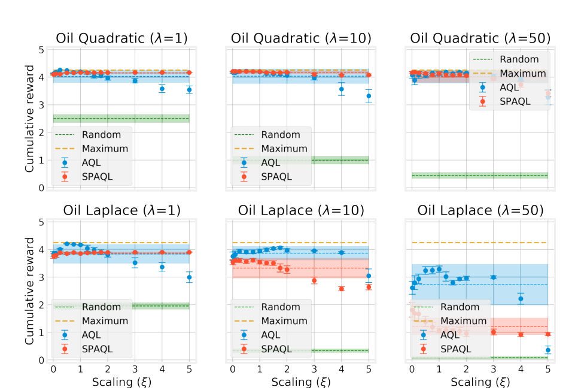

Figure 1: Comparison of the effect of different scaling parameter values on the average cumulative
reward for the oil discovery problem with survey functions described in Section 4.3.1. Each dot
corresponds to the average of the rewards obtained by the 25 agents after 5000 training iterations,
and the error bars display the corresponding 95% confidence interval. Dashed lines represent the
average cumulative reward calculated over the 13 scaling values listed in Section 4.2, and the shaded
areas represent the corresponding standard deviation.


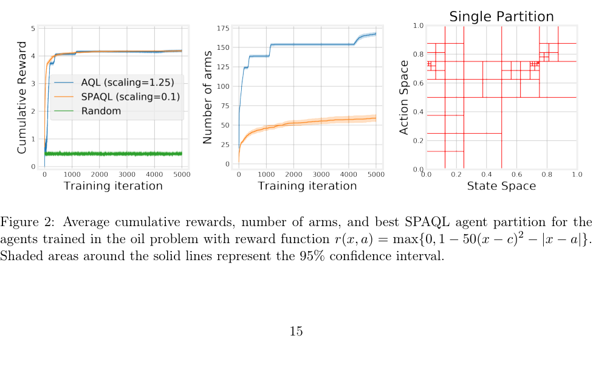


_λ_ (Quadratic)
1 10 50

|Average cumulative<br>reward|Random<br>AQL<br>SPAQL|2.50 ± 0.06 0.99 ± 0.06 0.44 ± 0.04<br>4.26 ± 0.01 4.22 ± 0.01 4.19 ± 0.04<br>4.17 ± 0.00 4.21 ± 0.00 4.18 ± 0.03|
|---|---|---|
|Average number<br>of arms|AQL<br>SPAQL|155_._72_ ±_ 4_._47<br>140_._60_ ±_ 2_._86<br>167_._84_ ±_ 2_._09<br>42_._04_ ±_ 1_._90<br>35_._08_ ±_ 1_._10<br>59_._08_ ±_ 4_._52|


_λ_ (Laplace)
1 10 50

|Average cumulative<br>reward|Random<br>AQL<br>SPAQL|1.95 ± 0.05 0.33 ± 0.03 0.08 ± 0.02<br>4.21 ± 0.01 4.07 ± 0.04 3.29 ± 0.11<br>3.90 ± 0.00 3.61 ± 0.07 1.81 ± 0.26|
|---|---|---|
|Average number<br>of arms|AQL<br>SPAQL|158_._36_ ±_ 2_._83<br>195_._08_ ±_ 2_._70<br>357_._08_ ±_ 7_._12<br>39_._28_ ±_ 1_._89<br>67_._12_ ±_ 4_._89<br>57_._28_ ±_ 7_._55|


Table 2: Average cumulative rewards and number of arms in the oil discovery problem. The best
performing agent for each value of _λ_ is shown in bold. When the Welch t-test does not find a
statistical difference between the two performances, both are shown in bold.


find the location of the oil deposit. The difference between AQL cumulative rewards and SPAQL
cumulative rewards at the end of training is due to the coarseness of the SPAQL partition and the
structure of the reward function, which may greatly amplify very small differences in actions. For
example, using the Laplace survey function with _λ_ = 50, choosing action _c_ results in reward 1,
while choosing action 0 _._ 99 _c_ (an error of 1%) results in a reward of _≈_ 0 _._ 61, a decrease of almost 40%.
With the quadratic survey function, the same relative error of 1% in the action leads to a 0 _._ 5%
reduction in reward. This explains why SPAQL agents perform as well as AQL agents when using
the quadratic survey function with _λ_ = 50, but only achieve half of the average cumulative reward
when using the Laplace survey function. These relatively small differences in rewards, however, are
compensated by the lower number of arms.


**4.4** **Ambulance routing**


**4.4.1** **Experimental setup**


This problem, described by Brotcorne et al. (2003), is a stochastic variant of the previous one. The
agent controls an ambulance that, at every time step, has to travel to where it is being requested.
The agent is also given the option to relocate after fulfilling the request, paying a cost to do
so. Sinclair et al. (2019) use a transition kernel defined by P _h_ ( _x_ _[′]_ _|x, a_ ) _∼F_ _h_, where _F_ _h_ denotes the
request distribution for time step _h_ . The reward function is _r_ _h_ ( _x_ _[′]_ _|x, a_ ) = 1 _−_ [ _c|x−a|_ +(1 _−c_ ) _|x_ _[′]_ _−a|_ ],
where _c ∈_ [0 _,_ 1] models the trade-offs between the cost of relocation and the cost of traveling to
serve the request.
It is not mandatory that _F_ _h_ varies with the time step. However, if that is so, then in principle
a time-invariant policy would not be a good choice for solving the problem. In this paper only
time-invariant scenarios ( _F_ _h_ := _F_ ) are considered. The experimental setups considered are


  - _F_ = Beta(5 _,_ 2), for _c ∈{_ 0 _,_ 0 _._ 25 _,_ 1 _}_ (where Beta( _a, b_ ) is the Beta probability distribution,
modelling concentrated request distributions)


16


  - _F_ = Uniform(0 _,_ 1), for _c ∈{_ 0 _,_ 0 _._ 25 _,_ 1 _}_ (modelling disperse request distributions)


The optimal policy depends on the value of _c_ . Sinclair et al. (2019) suggest two heuristics for
both extreme cases ( _c ∈{_ 0 _,_ 1 _}_ ). The “No Movement” heuristic is optimal when _c_ = 1. In this case,
the cost paid is only the cost to relocate, and therefore if the agent does not relocate it does not
incur on any cost. This policy corresponds to the line _x_ = _a_ in the state-action space. The “Mean” [4]

heuristic is optimal when _c_ = 0. In this case, the cost paid is only the cost of traveling to meet a
request. Therefore, the agent should relocate to where the next request is more likely to appear.
The empirical mean ˆ _µ_ of distribution _F_ is a good estimator of this location. This policy corresponds
to the horizontal line _a_ = ˆ _µ_ in the state-action space.
Intuitively, the optimal policies for the values of _c_ in between 0 and 1 will be a mix of these two
optimal policies.


**4.4.2** **Experimental results**


The effect of the scaling parameter _ξ_ in the ambulance problem is seen in Figure 3. Unlike the oil
problem (Figure 1), SPAQL agents perform better than AQL ones, independently of the value of _ξ_ .
The exception is the case _c_ = 1, where tuning of _ξ_ allows the AQL agents to match the cumulative
rewards of SPAQL agents. The average cumulative reward over the scaling values is always higher
for the SPAQL agents, and the corresponding standard deviations are negligible when compared to
those of AQL agents, meaning that in this problem the SPAQL agents have a very low sensitivity
to the value of _ξ_ .
The full experimental results are presented in Table 3, and the respective images in Appendix A.
Unlike the oil problem, in the ambulance problem the SPAQL agents are clearly and consistently
better than the AQL ones, reaching higher cumulative rewards earlier in training, with much fewer
arms (in some cases with only one fifth of the arms). This is consistent with the results in (Tijsma
et al., 2016), who observed that Boltzmann exploration outperforms other exploration strategies in
stochastic problems with rewards in the range [0 _,_ 1]. Figure 4 shows the cumulative rewards for
an ambulance problem with a uniform arrival distribution and _c_ = 1 (only relocation is penalized).
Recall that the optimal policy is the “No Movement” one, which corresponds to the line _a_ = _x_ .
This line appears finely partitioned, as would be expected. Keeping _c_ = 1, but changing to a
Beta(5 _,_ 2) distribution (Figure A.12), it can be seen that the partition is now focused on the top
right quadrant, where new arrivals are most likely to appear.
For this heuristic, the objective is to zero in on the diagonal as precisely as possible. As was
already seen in the oil problem, AQL agents are better than SPAQL ones at this zeroing in. This
is particularly seen in Figure A.12, where the SPAQL partition is coarser than the AQL partitions
in time steps 3 and 5. It is this difference that allows AQL agents to catch up to SPAQL agents.
However, despite both types of agents stabilizing at the same cumulative reward level, SPAQL
agents use much fewer arms, which gives them a competitive advantage over AQL agents.
For _c_ = 0, the action under the “Mean” heuristic would be _a_ = 0 _._ 5 for the uniform arrival case,
and _a ≈_ 0 _._ 7 for the Beta(5 _,_ 2) arrivals. These two policies correspond to horizontal lines, which
could have been expected to be seen in the partitions in Figures A.7 and A.10, respectively. The
neighborhoods of those lines are more partitioned than other areas of the state-action space, but
not as much as the diagonal line in Figure 4. Even though the partitions shown are coarser than
the corresponding ones shown in (Sinclair et al., 2019), the SPAQL agents reach higher rewards.
This means that further partitions of the state-action space do not increase the average cumulative


4 The original authors probably meant “Mean” instead of “Median”.


17


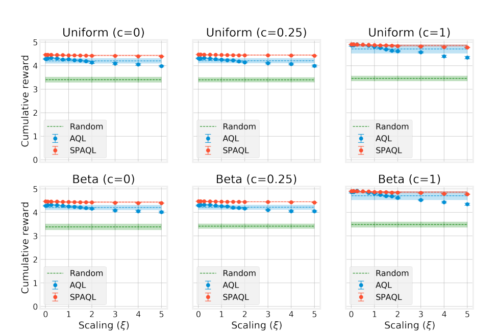

Figure 3: Comparison of the effect different scaling parameter values on the average cumulative
reward for the ambulance problem with arrival distributions described in Section 4.4.1. Each dot
corresponds to the average of the rewards obtained by the 50 agents after 2000 training iterations,
and the error bars display the corresponding 95% confidence interval. Dashed lines represent the
average cumulative reward calculated over the 13 scaling values listed in Section 4.2, and the shaded
areas represent the corresponding standard deviation.


reward, and AQL agents may be needlessly over-partitioning the state-action space. This illustrates
the remark made in Section 3 regarding prevention of over-partitioning.


**4.4.3** **Increasing the episode length**


With an episode length of _H_ = 5, it is easy for small differences in actions to yield noticeable
differences in cumulative reward, as noted previously in the oil problem with Laplace survey function.
Therefore, two agents of each algorithm were trained in an oil experiment with Laplace survey
function with _λ_ = 1, but with _H_ = 50 time steps. This means that the maximum cumulative
reward scales from 4 _._ 25 to 49 _._ 25, and that the SPAQL policy will be greedy for more time steps,
allowing for existing balls to split further. The result is shown in Figure 5. Both SPAQL agents
stabilize at a maximum before 2000 training iterations. The AQL agents, on the other hand, have
a much fuzzier training curve, take longer to reach the best rewards, and use almost ten times
more arms. Furthermore, looking at the partition for the first time step, it is clear that the action
therein taken is not the optimal one. Even so, it should also be noticed that, given enough training
iterations, the information about the global optimum (which is already available at time step 25)
would eventually propagate all way until time step 1, thus yielding the optimal policy. This is a


18


|Average cumulative<br>reward|Random<br>AQL<br>SPAQL|3.41 ± 0.03 3.40 ± 0.03 3.46 ± 0.03<br>4.33 ± 0.01 4.33 ± 0.02 4.90 ± 0.02<br>4.46 ± 0.00 4.47 ± 0.00 4.91 ± 0.00|
|---|---|---|
|Average number<br>of arms|AQL<br>SPAQL|244_._10_ ±_ 2_._51<br>248_._24_ ±_ 2_._18<br>238_._40_ ±_ 1_._84<br>32_._26_ ±_ 2_._11<br>29_._44_ ±_ 2_._03<br>50_._32_ ±_ 2_._76|


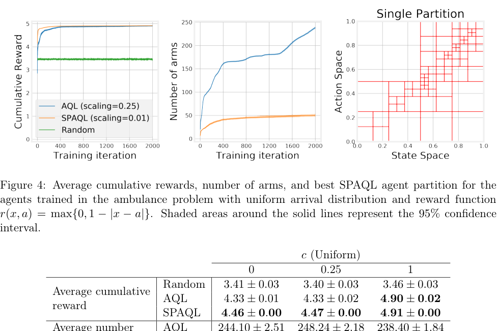

_c_ (Beta)
0 0.25 1

|Average cumulative<br>reward|Random<br>AQL<br>SPAQL|3.38 ± 0.03 3.41 ± 0.03 3.48 ± 0.03<br>4.32 ± 0.02 4.32 ± 0.02 4.92 ± 0.01<br>4.47 ± 0.01 4.47 ± 0.00 4.91 ± 0.00|
|---|---|---|
|Average number<br>of arms|AQL<br>SPAQL|244_._04_ ±_ 3_._14<br>250_._1_ ±_ 2_._30<br>239_._54_ ±_ 1_._95<br>31_._96_ ±_ 2_._21<br>29_._56_ ±_ 1_._97<br>50_._02_ ±_ 1_._28|


Table 3: Average cumulative rewards and number of arms in the ambulance problem. The best
performing agent for each value of _c_ is shown in bold. When the Welch t-test does not find a
statistical difference between the two performances, both are shown in bold.


clear advantage of AQL over SPAQL. Given a time-invariant problem, if one of the time steps finds
the optimal actions, the update rule will eventually propagate this information to all other time
steps. However, this comes at a high cost in terms of memory (number of arms) and time (training
iterations).
It is important to highlight that, in the first 1000 training iterations, the cumulative reward for
the AQL agents decreases steadily, while the number of arms is increasing. Even if given enough
training iterations to allow the cumulative rewards to reach the maximum level, the arms associated
with suboptimal policies will remain inside the partition, wasting memory and computational resources. This shows that, even for medium-sized episodes, AQL agents may not be a good choice for
time-invariant problems, as growth in the number of arms is not necessarily followed by an increase


19


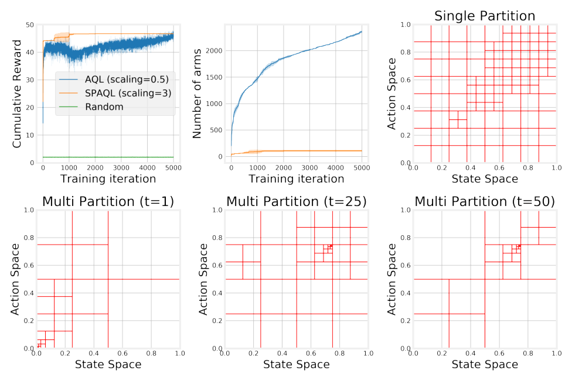

Figure 5: Average cumulative rewards, number of arms, and partitions for the best SPAQL and
AQL agents trained in the oil problem with Laplace survey function ( _λ_ = 1). Shaded areas around
the solid lines represent the 95% confidence interval.


in cumulative reward, and suboptimal arms remain in the policy even after a better one has been
found


**4.5** **Discussion**


In almost all experiments, the SPAQL agents are less sensitive to the scaling parameter _ξ_ (the
exception being the oil problem with Laplace survey function). Recalling that the scaling parameter
controls the value of the bonus term, which is introduced to deal with the exploitation/exploration
trade-off, this lower sensitivity to the scaling parameter is probably due to SPAQL using Boltzmann
exploration to deal with the same trade-off. The lower sensitivity to this parameter, along with the
fact that most environments shown tend to favor lower scaling values, suggest that the scaling term
could probably be removed from SPAQL (by setting it to 0). However, this would reduce SPAQL to
Q-learning with Boltzmann exploration, which has not been proved to be sample-efficient. Therefore,
the final recommendation of this paper with regards to the choice of the scaling value _ξ_ is to choose
a non-zero value lower than _H/_ 3.
As a final note on the scaling parameter, recall Equation 13 for the expression of _ξ_ in terms of
the other training variables. Neglecting the term proportional to the Lipschitz constant _L_, setting
_H_ = 5, _K_ = 1000, and considering a low value of _δ_ (for example 0 _._ 1), the value obtained for the
scaling parameter is larger than 80. This goes against the experimental evidence presented, which
points towards smaller values of the scaling parameter being preferable over large ones, even in the


20


AQL agents. It also exceeds _H_, which is the maximum value that **Q** ( _x, a_ ) is allowed to have. A
bonus term of 80 in an environment where the episode length is 5 would have no effect other than
saturating the updates to the value function. In future work, it would be interesting to understand
why this happens, and if the expression of the bonus term can be modified in order for it to be
bounded by _H_ .

### **5 Conclusions**


This paper introduces SPAQL, an improved version of AQL tailored for learning time-invariant
policies. In order to balance exploration and exploitation, SPAQL uses Boltzmann exploration
with a cyclic temperature schedule in addition to upper confidence bounds (UCB). Experiments
show that, with very little parameter tuning, SPAQL performs satisfactorily in the problems where
AQL was originally tested, resulting in partitions with a lower number of arms, and requiring fewer
training iterations to converge. The two problems studied can be seen as a deterministic and a
stochastic variant of the same problem, with SPAQL performing better than AQL on all but one of
the instances of the stochastic problem.
There are several possible directions for further work. Both AQL and SPAQL can be further
modified in several ways. The next natural modification would be to run several episodes during each
training iteration, instead of only one. In SPAQL, this would increase the exploitatory behavior
of the algorithm, possibly solving the cumulative reward difference seen in the oil problem with
Laplace survey function. However, this would introduce another parameter (the number of episodes
to run during each training iteration) into the algorithm, thus increasing the effort required for
tuning. Currently, the parameters of SPAQL are highly conjugate with the episode length. It would
also be interesting to study automatic ways of setting _u_ and _d_ given _H_ . Similarly to what was done
in this paper for _ξ_, an empirical study regarding the effect of tuning parameters _u_ and _d_ on SPAQL
performance could be done.
Another parameter that may have a relevant impact is the number of evaluation rollouts, _N_ .
If this number is too low, the performance estimates may be inaccurate, and lead SPAQL to bad
decisions when updating the stored partition. However, a larger _N_ also means more training time.
On the other hand, as the state-action space is partitioned and the radius of the balls decreases,
lower values of _N_ are required to obtain accurate estimates. Therefore, it would also be interesting
to see if it is possible to set _N_ automatically based on the rollouts themselves.
Finally, a formal analysis of the complexity of SPAQL would allow a comparison in terms of
sample efficiency to AQL or similar algorithms. On the experimental side, it would also be interesting
to test the performance of SPAQL (along with AQL) in realistic settings like control applications,
that typically have larger state and action spaces, and require a higher number of steps per episode.

### **Acknowledgments**


We would like to thank Sinclair et al. (2019) for making the code of AQL freely available, and for
allowing us to use the LaTeX template of their paper as a template for this one. We would also like
to thank Sean Sinclair for many conversations.
This research work is supported by Fundação para a Ciência e Tecnologia, through IDMEC,
under LAETA, project UIDB/50022/2020.


21


### **References**

Asadi, K. and Littman, M. L. (2017). An alternative softmax operator for reinforcement learning. In
Precup, D. and Teh, Y. W., editors, _Proceedings of the 34th International Conference on Machine_
_Learning_, volume 70 of _Proceedings of Machine Learning Research_, pages 243–252, International
Convention Centre, Sydney, Australia. PMLR.


Brotcorne, L., Laporte, G., and Semet, F. (2003). Ambulance location and relocation models.
_European Journal of Operational Research_, 147(3):451–463.


Busoniu, L., Babuska, R., Schutter, D., and Ernst, D. (2010). _Reinforcement Learning and Dynamic_
_Programming Using Function Approximators_ . Automation and Control Engineering. CRC Press.


Cesa-Bianchi, N., Gentile, C., Lugosi, G., and Neu, G. (2017). Boltzmann exploration done right.
In _Advances in neural information processing systems_, pages 6284–6293.


Deisenroth, M. P. and Rasmussen, C. E. (2011). Pilco: A model-based and data-efficient approach
to policy search. In _Proceedings of the 28th International Conference on International Conference_
_on Machine Learning_, ICML’11, pages 465–472, Madison, WI, USA. Omnipress.


Fu, H., Li, C., Liu, X., Gao, J., Celikyilmaz, A., and Carin, L. (2019). Cyclical annealing schedule:
A simple approach to mitigating KL vanishing. In _NAACL_ .


Huang, G., Li, Y., Pleiss, G., Liu, Z., Hopcroft, J. E., and Weinberger, K. Q. (2017). Snapshot
ensembles: Train 1, get M for free. In _5th International Conference on Learning Representations,_
_ICLR 2017, Toulon, France, April 24-26, 2017, Conference Track Proceedings_ . OpenReview.net.


Jin, C., Allen-Zhu, Z., Bubeck, S., and Jordan, M. I. (2018). Is q-learning provably efficient? In
Bengio, S., Wallach, H., Larochelle, H., Grauman, K., Cesa-Bianchi, N., and Garnett, R., editors,
_Advances in Neural Information Processing Systems 31_, pages 4863–4873. Curran Associates, Inc.


Kuleshov, V. and Precup, D. (2014). Algorithms for multi-armed bandit problems. _arXiv preprint_
_arXiv:1402.6028_ .


Kuutti, S., Bowden, R., Jin, Y., Barber, P., and Fallah, S. (2020). A survey of deep learning
applications to autonomous vehicle control. _IEEE Transactions on Intelligent Transportation_
_Systems_, pages 1–22.


Lecarpentier, E. and Rachelson, E. (2019). Non-stationary markov decision processes, a worst-case
approach using model-based reinforcement learning. In Wallach, H., Larochelle, H., Beygelzimer,
A., d'Alché-Buc, F., Fox, E., and Garnett, R., editors, _Advances in Neural Information Processing_
_Systems 32_, pages 7216–7225. Curran Associates, Inc.


Littman, M. L. (1996). _Algorithms for Sequential Decision-Making_ . PhD thesis, USA. AAI9709069.


Loshchilov, I. and Hutter, F. (2017). SGDR: stochastic gradient descent with warm restarts. In _5th_
_International Conference on Learning Representations, ICLR 2017, Toulon, France, April 24-26,_
_2017, Conference Track Proceedings_ . OpenReview.net.


Mason, W. and Watts, D. J. (2011). Collaborative learning in networks. _Proceedings of the National_
_Academy of Sciences_, 109(3):764–769.


22


Mu, N., Yao, Z., Gholami, A., Keutzer, K., and Mahoney, M. (2018a). Parameter re-initialization
through cyclical batch size schedules. _arXiv preprint arXiv:1812.01216_ .


Mu, T., Wang, S., Andersen, E., and Brunskill, E. (2018b). Combining adaptivity with progression
ordering for intelligent tutoring systems. In _Proceedings of the Fifth Annual ACM Conference on_
_Learning at Scale_, L@S ’18, New York, NY, USA. Association for Computing Machinery.


Neustroev, G. and de Weerdt, M. M. (2020). Generalized optimistic q-learning with provable efficiency. In _Proceedings of the 19th International Conference on Autonomous Agents and MultiAgent_
_Systems_, pages 913–921.


OpenAI, Berner, C., Brockman, G., Chan, B., Cheung, V., Dębiak, P., Dennison, C., Farhi, D.,
Fischer, Q., Hashme, S., Hesse, C., Józefowicz, R., Gray, S., Olsson, C., Pachocki, J., Petrov, M.,
de Oliveira Pinto, H. P., Raiman, J., Salimans, T., Schlatter, J., Schneider, J., Sidor, S., Sutskever,
I., Tang, J., Wolski, F., and Zhang, S. (2019). Dota 2 with large scale deep reinforcement learning.


Osband, I., Roy, B. V., and Wen, Z. (2016). Generalization and exploration via randomized value
functions. In Balcan, M. F. and Weinberger, K. Q., editors, _Proceedings of The 33rd International_
_Conference on Machine Learning_, volume 48 of _Proceedings of Machine Learning Research_, pages
2377–2386, New York, New York, USA. PMLR.


Pan, L., Cai, Q., Meng, Q., Chen, W., Huang, L., and Liu, T. (2019). Reinforcement learning with
dynamic boltzmann softmax updates. _CoRR_, abs/1903.05926.


Schulman, J., Levine, S., Abbeel, P., Jordan, M., and Moritz, P. (2015). Trust region policy
optimization. In Bach, F. and Blei, D., editors, _Proceedings of the 32nd International Conference_
_on Machine Learning_, volume 37 of _Proceedings of Machine Learning Research_, pages 1889–1897,
Lille, France. PMLR.


Shortreed, S. M., Laber, E., Lizotte, D. J., Stroup, T. S., Pineau, J., and Murphy, S. A. (2011).
Informing sequential clinical decision-making through reinforcement learning: an empirical study.
_Machine Learning_, 84(1):109–136.


Silver, D., Hubert, T., Schrittwieser, J., Antonoglou, I., Lai, M., Guez, A., Lanctot, M., Sifre,
L., Kumaran, D., Graepel, T., Lillicrap, T., Simonyan, K., and Hassabis, D. (2018). A general
reinforcement learning algorithm that masters chess, shogi, and go through self-play. _Science_,
362(6419):1140–1144.


Sinclair, S. R., Banerjee, S., and Yu, C. L. (2019). Adaptive discretization for episodic reinforcement
learning in metric spaces. _Proc. ACM Meas. Anal. Comput. Syst._, 3(3).


Smith, L. N. (2017). Cyclical learning rates for training neural networks. In _2017 IEEE Winter_
_Conference on Applications of Computer Vision, WACV 2017, Santa Rosa, CA, USA, March_
_24-31, 2017_, pages 464–472. IEEE Computer Society.


Smith, L. N. and Topin, N. (2018). Super-convergence: Very fast training of residual networks using
large learning rates.


Song, Z. and Sun, W. (2019). Efficient model-free reinforcement learning in metric spaces.


Sutton, R. and Barto, A. (2018). _Reinforcement learning: an introduction_ . The MIT Press, Cambridge, Massachusetts, 2nd edition.


23


Tijsma, A. D., Drugan, M. M., and Wiering, M. A. (2016). Comparing exploration strategies
for q-learning in random stochastic mazes. In _2016 IEEE Symposium Series on Computational_
_Intelligence (SSCI)_ . IEEE.


Touati, A., Taiga, A. A., and Bellemare, M. G. (2020). Zooming for efficient model-free reinforcement
learning in metric spaces.


Wang, Y., Dong, K., Chen, X., and Wang, L. (2020). Q-learning with ucb exploration is sample
efficient for infinite-horizon mdp. In _International Conference on Learning Representations_ .


Yamaguchi, A., Takamatsu, J., and Ogasawara, T. (2011). Learning strategy fusion to acquire
dynamic motion. In _2011 11th IEEE-RAS International Conference on Humanoid Robots_, pages

247–254.


Yu, Y. (2018). Towards sample efficient reinforcement learning. In _IJCAI_, pages 5739–5743.


24


### **A Experimental results and figures**

In this section, the learning curves for the best agents found during the scaling experiments are
shown. Each curve shows the average cumulative reward and the 95% confidence interval. The
scaling values are identified in the respective legend. The average number of arms is also shown,
along with the state-action space partition for the best SPAQL agent at the end of training. Finally,
the AQL agent partition at time steps 1, 3 and 5 is also shown.
Each section contains some brief comments to the images, which complement the analysis in
Sections 4.3.2 and 4.4.2.


**A.1** **Oil problem with quadratic survey function**


Starting with _λ_ = 1 (Figure A.1), it is clear that the SPAQL agent did not exploit the optimal point
of 0 _._ 75, and over partitioned uninteresting regions of the space. The high rewards over a large area
are probably a cause for this, since when the value of _λ_ is increased, concentrating the rewards,
SPAQL agents partition the neighborhood of the optimal point more finely. Another possible cause
is that the best performance currently stored happened by chance to be unexpectedly high. A
way to prevent this from happening is to increase the number of evaluation rollouts _N_ . In this
experiment, _N_ = 20 rollouts were used to evaluate the agents, but a higher number would lead
to better estimates. The AQL agent learned that the optimal action given initial state _x_ = 0 is
_a_ = 0 _._ 75, and then learned to hold the action _a_ = 0 _._ 75. The partitions in time instants 3 and 5
are very similar, as would be expected given that this is a time-invariant problem. It is this sort of
partition duplication that is avoided by keeping only one partition.
Moving to the case when _λ_ = 10 (Figure A.2), the average cumulative rewards at the end of
training for both algorithms are barely distinguishable. The SPAQL agents converge earlier than
the AQL agents, and with fewer arms. The best SPAQL partition shows a better exploitation of
the optimal point, compared with the case when _λ_ = 1. Once again very similar partitions are seen
in time steps 3 and 5 in the best AQL agent. The increase in the number of AQL arms around
training iteration 4100 might seem to indicate that AQL agents have still not converged. However,
the training curves indicate that both agents are very close to the maximum, meaning that the
extra arms in the AQL agent correspond to new splits which are approximating the location of the
optimal point to an accuracy of millimeters. The number of arms can grow indefinitely in order
to approximate all of the decimal places in the floating point representation of 0 _._ 7 + _π/_ 60, and
therefore should not be considered when assessing convergence of the algorithm.
Finally, Figure A.3 shows the results when _λ_ = 50. These results are similar to the case of
_λ_ = 10. The concentrated rewards have lead to an even better exploitation of the optimal point by
the SPAQL agent.


25


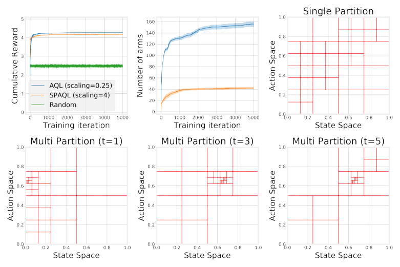

Figure A.1: Comparison of the algorithms on the oil problem with quadratic survey function ( _λ_ = 1).
The SPAQL agents managed to reach a similar cumulative reward with one third of the arms.

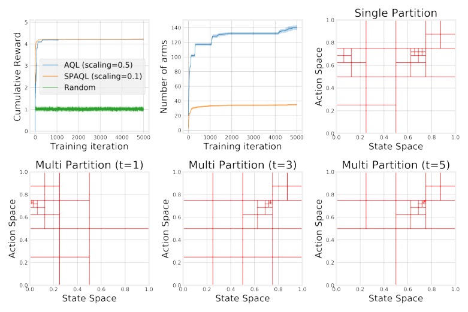


Figure A.2: Comparison of the algorithms on the oil problem with quadratic survey function ( _λ_ =
10).


26


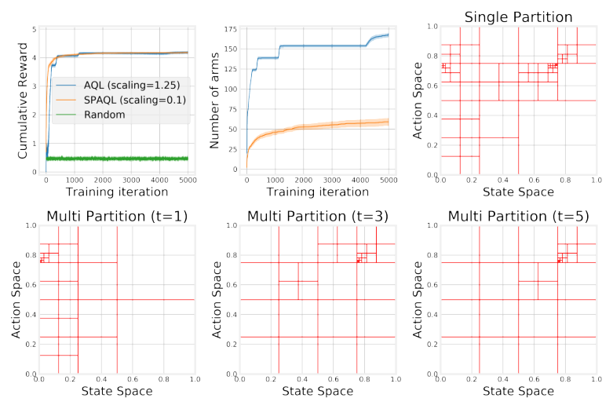

Figure A.3: Comparison of the algorithms on the oil problem with quadratic survey function ( _λ_ =
50).


27


**A.2** **Oil problem with Laplace survey function**


When using the Laplace survey function rewards become more concentrated than when using the
quadratic survey function. This is the main reason behind the differences in cumulative reward at
the end of training. Considering the case with _λ_ = 1 (Figure A.4), although the SPAQL agents
stabilize at slightly lower rewards, they still manage to achieve them with a much smaller number
of arms. The partition for the best SPAQL agent shows a lack of exploitation of the optimal point,
as was the case with the quadratic survey function with _λ_ = 1 (Figure A.1). The partitions for time
step 3 and 5 in the AQL agent are once again barely distinguishable.
Moving to _λ_ = 10 (Figure A.5), training has become more difficult for both types of agent, when
compared with the case when _λ_ = 1. The partition of the SPAQL agent indicates a lot of exploration
from the initial state ( _x_ = 0), along with a fine partition around the optimal point, meaning that,
once found, it was exploited. Since the rewards are more concentrated, and the AQL agent partitions
the neighborhood of the optimal point more finely, it ends up collecting higher rewards than the
SPAQL agent, which keeps a coarser partition around the optimal point. However, it should be
noted that, for all practical purposes, the SPAQL agent managed to find the approximate location
of the optimal point, using fewer arms than the AQL agent.
Finally, Figure A.6 shows the results when _λ_ = 50. This is the hardest problem, with the most
concentrated rewards. Both algorithms locate the optimal point, but the AQL agents exploit it
much more, leading to higher rewards. However, in the process, it partitioned a lot the individual
partitions, leading to an average number of arms six times higher than the ones in the SPAQL partition, which has implications regarding the amount of resources required to store all the partitions
of the agent.
In the two latter cases ( _λ ∈{_ 10 _,_ 50 _}_ ), the 5000 iterations are clearly not enough for the AQL
agents to converge. However, if finding the approximate location of the oil deposit is considered
as the objective of this problem, then the 5000 iterations were enough. The cumulative rewards
are lower when compared to other episodes due to the high concentration of rewards around the
optimal point, and the lack of reward signal in the remaining state-action space.


28


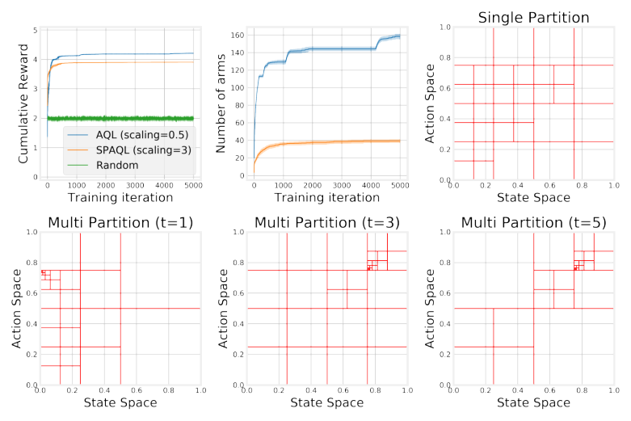

Figure A.4: Comparison of the algorithms on the oil problem with Laplace survey function ( _λ_ = 1).

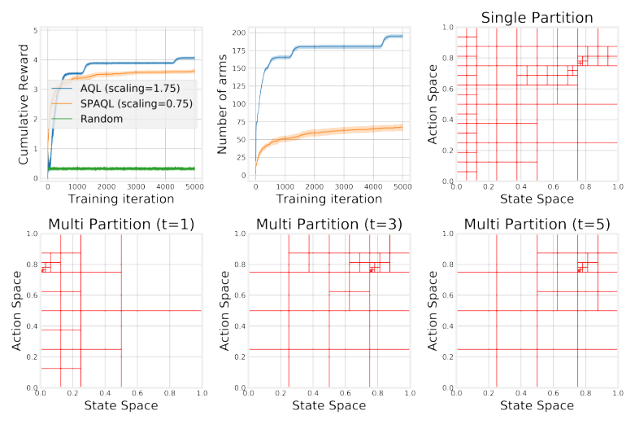


Figure A.5: Comparison of the algorithms on the oil problem with Laplace survey function ( _λ_ = 10).


29


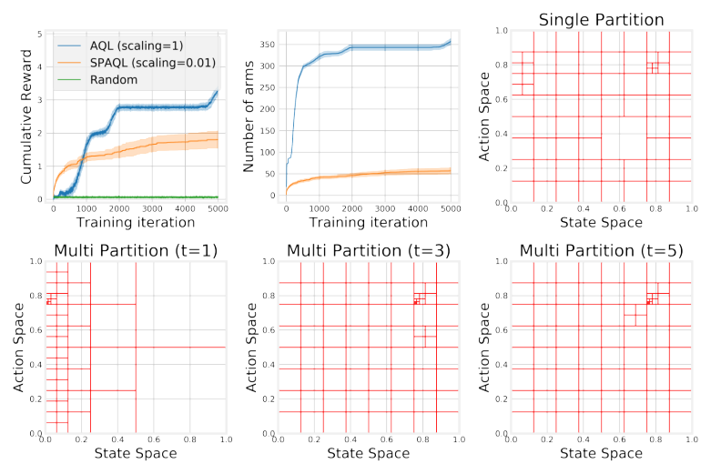

Figure A.6: Comparison of the algorithms on the oil problem with Laplace survey function ( _λ_ = 50).


30


**A.3** **Ambulance problem with uniform arrivals**


For the case when _c_ = 0, shown in Figure A.7, the heuristic solution to this problem is the “Mean”
heuristic, which corresponds to the line _a_ = 0 _._ 5. The SPAQL agents managed to achieve higher
rewards with a coarser partition and about one fifth of the arms of the AQL agents.
Moving to Figure A.8, corresponding to _c_ = 0 _._ 25, the optimal policy would be a mix of the
“Mean” (horizontal line) and the “No Movement” (diagonal line) heuristic. The SPAQL agents
managed to achieve higher rewards with a coarser partition and less than one fifth of the arms of
the AQL agents, a reduction even greater than the one in the case _c_ = 0.
Finally, Figure A.9 shows the results when _c_ = 1. The optimal policy would be the “No Movement” (diagonal line) heuristic. The diagonal line appears finely partitioned in both types of agents.
However, there was clearly a shortage of samples of states within [0 _,_ 0 _._ 25] in time steps 3, and 5,
which may bring a problem in deployment. The SPAQL agents managed to achieve higher rewards
with around one fifth of the arms of the AQL agents.

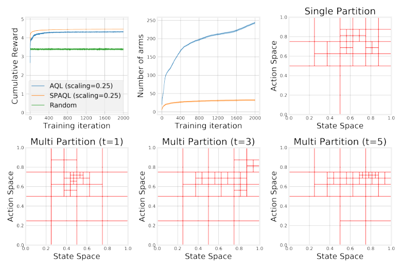


Figure A.7: Comparison of the algorithms on the ambulance problem with uniform arrival distribution and only paying the cost to relocate ( _c_ = 0).


31


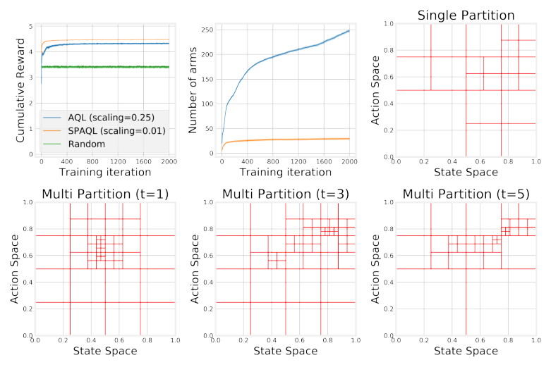

Figure A.8: Comparison of the algorithms on the ambulance problem with uniform arrival distribution and paying a mix between the cost to relocate and the cost to go ( _c_ = 0 _._ 25).

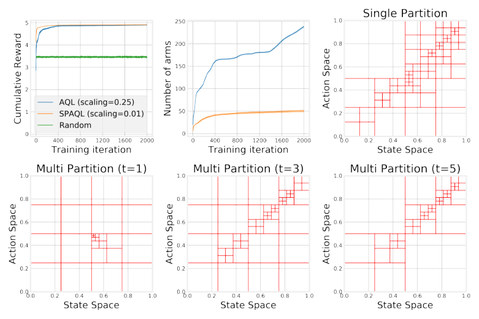


Figure A.9: Comparison of the algorithms on the ambulance problem with uniform arrival distribution and paying only the cost to go ( _c_ = 1).


32


**A.4** **Ambulance problem with beta arrivals**


For the case when _c_ = 0, shown in Figure A.10, the heuristic solution to this problem is the “Mean”
heuristic, which corresponds to the line _a ≈_ 0 _._ 7. The SPAQL agent managed to achieve higher
rewards with a coarser partition and less than one fifth of the arms of the AQL agents.
Moving to Figure A.11, corresponding to _c_ = 0 _._ 25, the optimal policy would be a mix of the
“Mean” (horizontal line) and the “No Movement” (diagonal line) heuristic. The SPAQL agent
managed to achieve higher rewards with a coarser partition and less than one fifth of the arms of
the AQL agents.
Finally, Figure A.12 shows the results when _c_ = 1. The optimal policy would be the “No
Movement” (diagonal line) heuristic. Since arrivals are now concentrated around 0 _._ 7 (the mean of
the distribution), the diagonal appears more partitioned for states within [0 _._ 5 _,_ 1] than for states
within [0 _,_ 0 _._ 5]. The AQL agents do a finer partition of the diagonal, but this still does not prevent
the SPAQL agents from converging to better rewards earlier, and with around one fifth of the
number of arms of the AQL agents.

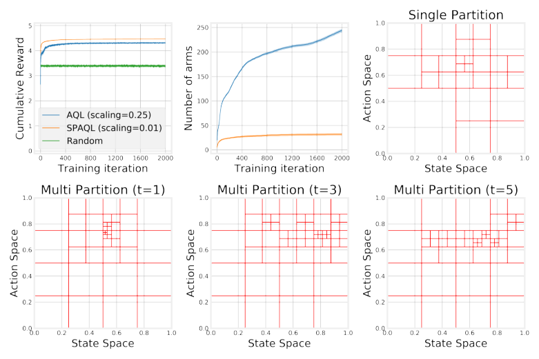


Figure A.10: Comparison of the algorithms on the ambulance problem with Beta(5 _,_ 2) arrival distribution and only paying the cost to relocate ( _c_ = 0).


33


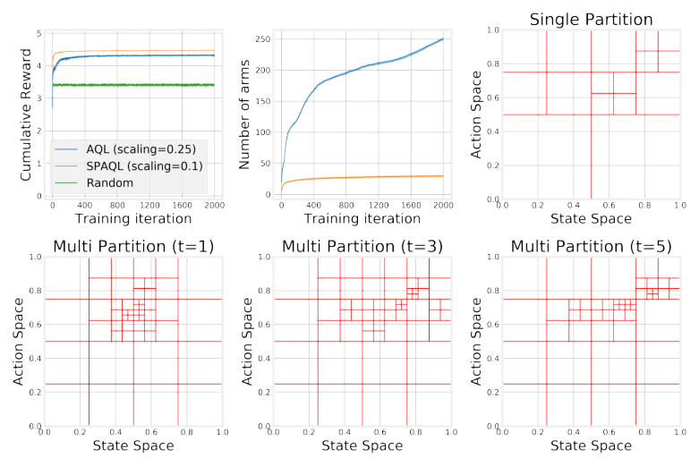

Figure A.11: Comparison of the algorithms on the ambulance problem with Beta(5 _,_ 2) arrival distribution and paying a mix between the cost to relocate and the cost to go ( _c_ = 0 _._ 25).

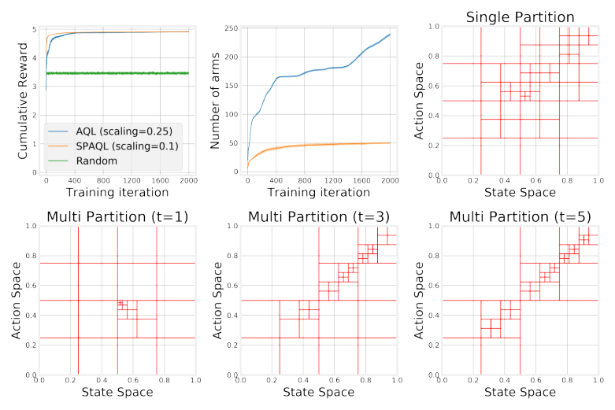


Figure A.12: Comparison of the algorithms on the ambulance problem with Beta(5 _,_ 2) arrival distribution and paying only the cost to go ( _c_ = 1).


34


