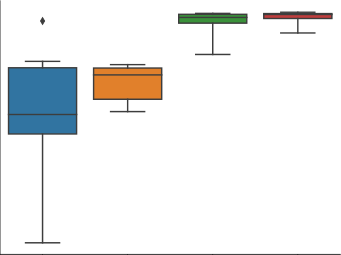
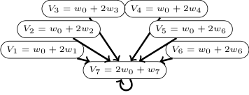

## - QGRAPH BOUNDED Q-LEARNING: STABILIZING MODEL-FREE OFF-POLICY DEEP REINFORCEMENT LEARNING

TECHNICAL REPORT


**Sabrina Hoppe**
Corporate Research
Robert Bosch GmbH
71272 Renningen
```
sabrina.hoppe@de.bosch.com

```


**Marc Toussaint**
Learning and Intelligent Systems Lab
TU Berlin

10587 Berlin

```
  toussaint@tu-berlin.de

```


July 2020


**ABSTRACT**


In state of the art model-free off-policy deep reinforcement learning, a replay memory is used to store
past experience and derive all network updates. Even if both state and action spaces are continuous,
the replay memory only holds a finite number of transitions. We represent these transitions in a _data_
_graph_ and link its structure to soft divergence. By selecting a subgraph with a favorable structure, we
construct a simplified Markov Decision Process for which exact Q-values can be computed efficiently
as more data comes in. The subgraph and its associated Q-values can be represented as a QGRAPH.
We show that the Q-value for each transition in the simplified MDP is a lower bound of the Q-value
for the same transition in the original continuous Q-learning problem. By using these lower bounds
in temporal difference learning, our method QG-DDPG is less prone to soft divergence and exhibits
increased sample efficiency while being more robust to hyperparameters. QGRAPHs also retain
information from transitions that have already been overwritten in the replay memory, which can
decrease the algorithm’s sensitivity to the replay memory capacity.


**1** **Introduction**


With the wide-spread success of neural networks, also deep reinforcement learning (RL) has enabled rapid improvements
in many domains including computer games [Silver et al., 2017] and simulated continuous control tasks [Mnih et al.,
2016]. Particularly in areas where correct environment models are hard to obtain, such as robotic manipulation,
model-free approaches have the potential to outperform model-based solutions [Fazeli et al., 2017, Levine et al., 2016] –
as long as enough training data is available or can be generated.


From a theoretical point of view, deep reinforcement learning is still under-investigated, in particular deep Q-learning
and DDPG. While Q-learning is known to have convergence issues even with linear function approximation [Baird,
1995], deep Q-learning combines highly non-linear function approximation with off-policy learning and bootstrapping –
a combination that has been termed _deadly triad_ by Sutton and Barto [2018] because of the instabilities it is likely to
induce. Empirically, deep Q-learning does not seem to fully exhibit these expected divergence issues [Van Hasselt et al.,
2018] but its performance can be unreliable and hard to reproduce [Henderson et al., 2018].


The contribution in this work is two-fold:
To add to the community’s understanding of when deep Q-learning diverges, we first propose a graph-perspective on
the replay memory ( _data graph_ ) which allows to analyze its structure and show on an educational example that specific
types of structures are linked to divergence.
Second, we introduce a QGRAPH: a subgraph that was chosen such that exact Q-values for the induced finite Markov
Decision Process (MDP) can be computed using Q-iteration. We show that these Q-values are lower bounds for the
Q-values in the original MDP that models a continuous learning problem. Using these bounds in temporal difference
learning stabilizes deep reinforcement learning for continuous state and action spaces through DDPG by preventing


Qgraph-bounded Q-learning: Stabilizing Model-Free Off-Policy Deep Reinforcement Learning


replay memory


data graph


Qgraph


|s a r s′ t<br>s0 a0 −1 s1 0<br>s0 a1 −1 s2 0<br>s2 a2 −1 s2 0<br>s0 a3 −1 s3 0<br>s3 a4 0 s4 1|Col2|s0 −1 a1,−<br>a 3, a0, 1<br>−1<br>s3 s2<br>s1<br>a20<br>,<br>s4 a4, −1|Col4|s0<br>−1 − 100<br>s3 s2<br>0<br>−100<br>s4|
|---|---|---|---|---|
|_s_<br>_a_<br>_r_<br>_s′_<br>t<br>_s_0<br>_a_0<br>_−_1<br>_s_1<br>0<br>_s_0<br>_a_1<br>_−_1<br>_s_2<br>0<br>_s_2<br>_a_2<br>_−_1<br>_s_2<br>0<br>_s_0<br>_a_3<br>_−_1<br>_s_3<br>0<br>_s_3<br>_a_4<br>0<br>_s_4<br>1|||||


Figure 1: We represent the replay memory (left) as a data graph (middle) and extract a subgraph (right) such that its
structure allows to compute exact Q-values using Q-iteration for the resulting finite MDP.


cases of divergence. Further analyses reveal that this increases sample efficiency, robustness to hyperparameters and
preserves information from transitions that have already been overwritten in the replay memory.


**2** **Preliminaries**


We consider a standard reinforcement learning setup where an agent interacts in discrete time steps _t_ = 1 _, . . ., T_
with an environment that is modeled as a Markov Decision Process (MDP) with state space _S_, action space _A_, initial
state distribution _p_ 0( _s_ ), transition dynamics _p_ ( _st_ +1 _|st, at_ ) and a reward function _r_ ( _st, at_ ). In the following, we will
assume deterministic transition dynamics; but the empirical evaluation will come back to the case of non-deterministic
transitions.


At each time step _t_, the agent can observe its state _st_ and take an action _at_ which determines the next state _st_ +1 and an
associated reward _rt_ . A policy is a function _π_ that maps from states to actions. The sum over future expected rewards
when following policy _π_ starting from state _st_ is called return: _Rt_ _[π]_ [=][ �] _[∞]_ _t_ _[γ][t][r][i]_ [, where] _[ γ]_ [ is the so-called discount factor.]
For _γ <_ 1 and a constant reward _r_ on infinite trajectories, the return forms a geometric series and converges to 1 _−r_ _γ_ [.]
Thus, if the reward function is bounded by _r_ min and _r_ max, the range of possible Q-value can be bounded as follows [Lee
and Kim, 2015]:
�min � _r_ min _,_ 1 _[r]_ _−_ [min] _γ_ � _,_ max � _r_ max _,_ 1 _[r]_ _−_ [max] _γ_ �� (1)

The `min` / `max` operations are required for terminal states.


Analogously, if the reward only depends on the current state and the agent stays in a non-terminal state _s_ forever,
because action _a_ = _π_ ( _s_ ) does not lead to a change in states, then _R_ _[π]_ = 1 _−r_ _γ_ [. This transfers to larger loops, e.g. if]
transitions ( _s_ 1 _, a_ 1 _, r_ 1 _, s_ 2) to ( _sn, an, rn, s_ 1) are known to be induced by a policy _π_,


1 _−_ _γ_


� _,_ max � _r_ max _,_ 1 _[r]_ _−_ [max] _γ_


1 _−_ _γ_


(1)
��


_R_ 1 _[π]_ [=] _[ r]_ [1] [+] _[ γr]_ [2] [+] _[ ...]_ [ +] _[ γ][n][−]_ [1] _[r][n]_
~~�~~ ~~��~~ �

_rL_


+ _γ_ _[n]_ _r_ 1 + _..._ =


_∞_

_rL_

� _t_ ( _γ_ _[n]_ ) _[t]_ _rL_ = 1 _−_ _γ_ _[n]_ _[.]_ (2)


The expected future return for executing an arbitrary action _at_ and then following the policy is called Q-value:


_Q_ _[π]_ ( _st, at_ ) = E � _rt_ + _γ · Rt_ _[π]_ +1� _._ (3)


The agent’s goal is to find the optimal policy _π_ _[∗]_ such that the expected future return is maximized from all states. This
can be achieved by finding (a good approximation to) the Q-function and then choosing the action with highest Q-value
in each state.


Based on the definition in Eq. (3), Q-values can be estimated directly from empirically sampled return values – so-called
Monte Carlo estimates. This method is known to introduce high variance into the estimates though, because the return
can exhibit high variation over long trajectories.


**Temporal Difference Learning**
A popular alternative to Monte Carlo estimates for Q-learning is temporal difference (TD) learning. Given a transition
( _st, at, rt, st_ +1 _,_ t _t_ ), target Q-values are computed based on the current state value estimate for state _st_ +1:


0 _,_ if t _t_, i.e. _s_ _[′]_ is terminal
_Q_ target( _st, at_ ) = _rt_ + � _γ · Q_ ( _st_ +1 _, π_ ( _st_ +1)) _,_ else _._ (4)


2


Qgraph-bounded Q-learning: Stabilizing Model-Free Off-Policy Deep Reinforcement Learning


In small settings with finitely many states and actions, _tabular_ Q-learning can be applied in which each state-action
value Q is represented as one entry in a lookup table. To update such a Q-function, each Q-value _Q_ ( _s, a_ ) can be replaced
by the target value _Q_ target( _s, a_ ) directly.


In continuous state or action spaces, Eq. (4) can be used with function approximation instead. One of the most popular
function approximators for Q-functions are neural networks: In deep Q networks (DQN), a single network is trained to
take states as an input and predict one Q-value for each possible action [Mnih et al., 2015]. For continuous actions, an
actor-critic architecture called deep deterministic policy gradient (DDPG, Lillicrap et al. [2015]) can be used: The
critic is represented by one network that computes the Q-value for a given state-action pair. The network is trained by
minimizing the following loss over data from _N_ transitions:


_L_ critic = [1]

_N_


_N_
�( _Q_ target( _si, ai_ ) _−Q_ ( _si, ai_ )) [2] (5)


_i_ =0


where _Q_ is the current critic estimate and _Q_ target is computed using Eq. (4).


These Q-estimates are used as a training signal for the actor, which is a neural network that represents the policy.


Iteratively updating a function based on its own current estimates is called _bootstrapping_ . Temporal Difference learning
is known to introduce less variance than Monte Carlo estimates but higher bias. Note that bootstrapping is actually only
applied in the case of non-terminal states (i.e. in the second line of the equation). We will refer to states that do not
require bootstrapping to estimate a Q-value as _anchors_ .


**Experience Replay**
Both DDPG and DQN use off-policy data, i.e. they store past experience in a replay memory and update their networks
based on this experience, even if the policy _π_ has changed since the data was collected. Experience is represented by
transitions ( _st, at, rt, st_ +1 _,_ t _t_ ), where _st_ is the state from which action _at_ was taken, _rt_ is the reward received after
reaching state _st_ +1, t _t_ is an indicator for whether or not _st_ +1 is a terminal state.


It is insightful to note that any replay memory only contains a finite number of transitions, that all network updates
in DQN and DDPG are derived from, even for continuous state-action spaces. The original reasoning behind replay
memories and experience replay was to break dependencies between transitions [Mnih et al., 2015], which is important
for most function approximation schemes. We will therefore keep the principle of random selection of transitions for
our learning process, but at the same time we will make use of additional information that a graph perspective can
provide and would be lost otherwise.


**3** **Related Work**


**Instabilities in Reinforcement Learning: the Deadly Triad**
Reinforcement Learning (RL) has been known to be instable even with linear function approximation for more than 20
years [Baird, 1995]. RL with function approximation, bootstrapping and off-policy learning has been called _deadly_
_triad_ by Sutton and Barto [2018] because it is even more prone to divergence. Deep RL methods within the deadly
triad however seem to exhibit soft divergence rather than unbounded divergence; i.e. they often under- or overestimate
Q-values but do not reach floating point `NaN` s [Van Hasselt et al., 2018]. While some researchers work towards provably
stable methods (e.g. [Ghiassian et al., 2018, Degris et al., 2012]), our work builds on research towards understanding
and counteracting soft divergence in deep RL. In particular, divergence due to an algorithm being in the deadly triad can
be counteracted by decreasing the impact of each of the triad properties:


Different networks for _function approximation_ and update schemes have been linked to convergence: Fu et al. [2019]
found large neural networks with compensation for overfitting to be beneficial for learning stability. A target network is
a second function approximator that is only updated slowly or periodically [Mnih et al., 2015]. Its values are therefore
more stable and lead to more stable target Q-values in temporal difference learning. Besides, a second network can
help to counteract maximization bias in Q-learning [Van Hasselt et al., 2016]. Also other methods that delay [Fujimoto
et al., 2018] or average target values [Anschel et al., 2017] have been shown to stabilize learning. Achiam et al. [2019]
theoretically link generalization properties of the Q-function approximator to the stability of learning. We empirically
confirm and provide further intuition about this effect in Section 4.


In policy gradient methods, reducing the impact of _off-policy_ data has been beneficial for stability, e.g. by mixing
on- and off-policy [Gu et al., 2017] or by constraining the gradient update through a proximity term [Touati et al.,
2020]. Also in DQN and DDPG, restricting the action space to achieve lower levels of off-policy data have been
explored [Fujimoto et al., 2019]. Constrained action selection when computing the target Q-values can also stabilize
deep RL [Kumar et al., 2019].


3


Qgraph-bounded Q-learning: Stabilizing Model-Free Off-Policy Deep Reinforcement Learning


Kumar et al. [2020] show that the interaction of off-policy learning and bootstrapping can lead to cases where a state
is visited frequently and yet its incorrectly estimated Q-value is not updated because the state that the target value
depends on is not visited. They refer to this phenomenon as ’lack of corrective feedback’, which we will get back to
in our analysis in the next section. From their observation, they derive a re-weighting of transitions from the replay
buffer that is supposed to mitigate this issue. The full version of our method, using zero actions, will be able to improve
performance with such tail ends of data distributions without downweighting the associated transitions and without an
additional error model and without constraining the action selection.
Off-policy corrections in general are not entirely understood yet: On the one hand, they may also have adverse effects,
e.g. as reported by Hernandez-Garcia and Sutton [2019] for SARSA. On the other hand, Fedus et al. [2020] found that
counter-intuitively, n-step return updates which are not corrected for policy differences are beneficial in off-policy deep
RL despite being theoretically ungrounded.


Standard Q-learning uses _bootstrapping_ as in Eq. (4) to estimate a Q-function. Alternatives to bootstrapping include
fixed-horizon temporal difference methods [De Asis et al., 2019] and finite-horizon Monte Carlo updates, in which a Q
value is estimated based on observed Returns from each state. While the resulting estimator for the Q function has low
bias, it comes with high variance. Combining TD learning with eligibility traces of different lengths, a spectrum of
methods between TD and Monte Carlo methods can be spanned [Sutton and Barto, 2018, Precup et al., 2000], also in a
deep learning setting [Munos et al., 2016, Mnih et al., 2016, Amiranashvili et al., 2018].
Monte Carlo updates can be seen as a special case of graph-perspective: data from full episodes is used to derive
updates along a trajectory. Similarly to these methods, the lower bounds in our case propagate information along full
trajectories. However, we do not apply return values as high-variance targets but use them to derive a single lower
bound each target Q-value (Eq. (4)) instead.


Our methods uses the full amount of off-policy data that is available, manages to use function approximation without
target or double networks and target Q-values are computed based on bootstrapping. However, these target values
are constrained by bounds derived from a graph perspective on the training data. In the following two paragraphs,
we will review other works that make use of a graph or trajectory perspective on the training data as well as methods
introducing constraints in Q-learning.


**Graph Perspective on Training Data**
While return-based methods such as Monte Carlo estimates for Q-values take an implicit graph perspective, there is
related work building explicit graphs:
Episodic backward updates are classical TD updates that are executed along trajectories in reverse order, such that
information is quickly propagated through consecutive states [Lee et al., 2019]. To prevent errors from consecutive
updates of correlated states, a diffusion coefficient is introduced.
Zhu et al. [2019] take a full graph perspective on the agent’s experience: using a learned state embedding, episodes with
shared states are identified and can benefit from inter-episode information, i.e. the algorithm can combine multiple
trajectories from experience. State embeddings have also been combined with k-nearest neighbors as a method to
estimate Q-values for unseen states [Blundell et al., 2016]. Corneil et al. [2018] use a network model to map states to
an abstract tabular model where planning can be easily applied. In our approach, we also use a graph perspective but
without a learned embedding inter-episodic information is only exchanged if the exact same state is revisited (up to
floating point precision).


**Constrained Q-learning**
Q-learning can be stabilized by introducing constraints on the change in either target values or network parameters [Durugkar and Stone, 2018, Ohnishi et al., 2019]. However, constraining change rates in a learning system may also limit
the rate at which an agent can improve.


He et al. [2017] suggest to apply both upper and lower bounds to target Q-values, which are based on the current
Q-estimate and therefore additional multiple forward passes in each update step. Because these bounds are based on
the current Q-estimate, they need not be correct in general. In contrast, we will derive correct lower bounds for _π_ _[∗]_ in
near-deterministic settings and show that incorrect empirical bounds can have adverse effects on the learning process.


Tang [2020] offers the intuition that lower bounds encourage the algorithm to focus on the best actions so far and
thereby speed up learning. This idea is in line with Zhang et al. [2019] who introduce a separate replay buffer that only
holds the best episodes and empirically improves learning performance on a range of simulated continuous control
tasks.


4


Qgraph-bounded Q-learning: Stabilizing Model-Free Off-Policy Deep Reinforcement Learning


full data graph:


exemplary transition subsets:


10 [2]


10 [0]


10 [−2]


10 [−4]





10 [−6]


0 0 0


directly_connected connected loose_end disconnected


Figure 2: Educational example with four transitions and three states (state 0 is terminal). We characterize transitions
based on the graph structure: (in-)directly connected to a terminal state (blue, orange); loose ends (green) and
disconnected but infinite paths (red). The right plot illustrates the standard deviation over predicted Q-values for each
type of transition from all 15 possible subsets of the educational example.


**4** **Linking Data Graph Structure to Soft Divergence**


Despite the continuous state-action space, the networks in DDPG are updated based on a finite set of transitions from
the replay memory. It is therefore possible to take a graph perspective on this data: A transition ( _s, a, r, s_ _[′]_ _,_ t) can be
seen as an edge between the nodes corresponding to states _s_ and _s_ _[′]_ (which is terminal iff indicated by t); and can be
annotated with action _a_ and reward _r_ . Any hashing function can be used to encode nodes and detect if the same node is
revisited. This is not supposed to introduce any discretization beyond the limits of precision. We refer to the resulting
directed graph as _data graph_ (see Figure 1 for an illustration).


The structure of a data graph can be linked to soft divergence in deep Q-learning as the following example demonstrates:
We examine a task where an agent can maneuver in a 2D continuous state space with 2D actions such that adding state
and action yields the next state _st_ +1 = _st_ + _at_ . For each step, the agent receives a reward of _−_ 1 and 0 at the terminal
state.
Let’s assume a DDPG-like critic network is trained to find an approximation to the Q-function for this problem. We
chose two layers with 4 hidden states, ReLU activations (except on the output) and Xavier-initialization.


All network updates are solely derived from the replay memory, which is filled with any subset of the four transitions
shown in Figure 2 and then fixed for offline policy evaluation on the known state-action pairs. There are 2 [4] = 16
different subsets of experience with different data graph structures; one of which is empty and therefore ignored. For
the remaining 15 cases, we have trained the critic network with ten thousand training epochs consisting of all available
transitions. The states were assigned 2D coordinates as follows: _s_ 0 = [0 _,_ 0], _s_ 1 = [ _−_ 1 _,_ 1], _s_ 2 = [1 _,_ 1].
The training procedure was repeated with 10 random seeds that were drawn uniformly from [0 _,_ 1000]. No actor network
was trained and instead, the known action from the replay memory with highest associated Q-value was chosen to
compute the Q-targets.


Confirming the finding in Van Hasselt et al. [2018], no _unbounded_ divergence occurred (which would cause floating
point `NaN` s). However, we found occurrences of _soft_ divergence, i.e. Q-values beyond the realizable range as given by
Eq. (1).
For further analysis we compute the standard deviation of Q-values that were estimated over different random seeds as
a measure of soft divergence: if Q-learning for a transition converges, all Q-values should be identical and thus have a
standard deviation close to zero. The more soft divergence occurs however, the larger the standard deviation becomes.
Even if all trials diverge, it is highly unlikely that the resulting Q-values are identical.


Evaluating the distribution of standard variations reveals a link between the structure of the Q-graph and soft divergence:


1. Transitions ( _s, a, r, s_ _[′]_ _,_ t) where _s_ _[′]_ is terminal are referred to as _directly connected_ . Their Q-values are estimated
almost perfectly, because Q-learning is reduced to supervised learning in these cases (cf. Eq. (4)).


2. Transitions that end in a non-terminal state from which a terminal state is reachable are referred to as _connected_ .
Their Q-estimates exhibit only slightly more variance than the directly connected transitions. Presumably
the reachable terminal state still acts as an anchor for the Q-value (as long as all transitions on the path are


5


Qgraph-bounded Q-learning: Stabilizing Model-Free Off-Policy Deep Reinforcement Learning


regularly used for updates). In line with this hypothesis, the two following categories that do not have an
anchor show significantly more variance in their predictions:


3. If no terminal state is reachable from _s_ _[′]_ and there is no infinite path from _s_ _[′]_, the transition is referred to
as a _loose end_ . These transitions occur for instance at the end of each episode in episodic learning setups,
when the agent does not succeed but is reset to a starting position. It is insightful to note that Q-values for
such transitions are conceptually ill-defined in tabular Q-learning where a state without successors would be
defined as terminal. For non-terminal states, a Q-value could be determined under the assumption that further
transitions exist (and just have not been experienced yet), but then the Q-value is estimated using bootstrapping
from another Q-value that has never been explicitly updated. This phenomenon is one example for what has
been referred to as a lack of corrective feedback [Kumar et al., 2020]. In other words, the estimate depends
only on network initialization and generalization from data for other state-action pairs; cf. also Achiam et al.

[2019] who analyze the theoretical link between approximator generalization properties and learning stability.


4. Transitions are referred to as _disconnected_ if no terminal state is reachable from _s_ _[′]_ but there exists at least one
infinite path from _s_ _[′]_ . In applications of reinforcement learning, these transitions occur frequently, e.g. when
the agent gets stuck in a non-terminal state.
Disconnected transitions caused the highest variance in Q-estimates. In contrast to loose ends however, the
Q-value for these transitions is well-defined under the assumption that all possible transitions are known and
can even be computed analytically (cf. Eq. (2)).


We draw the following conclusions from this introductory experiment:


1. There is a clear link between the data graph structure and soft divergence; even for a static replay memory, a
simple restricted policy and very few transitions.


2. Episodic tasks which create loose ends lead to an ill-posed estimation task which can only rely on generalization
capabilities of the Q-function approximator.


3. Disconnected transitions pose a well-defined estimation problem and yet they cause the highest variance in
Q-estimates in our experiment.


Our method, which will be presented in detail in the following section, extracts the largest possible subgraph for which
exact Q-values can be computed under the assumption that all possible transitions are known. These Q-values represent
a lower bound for the Q-value in the original continuous learning problem and enforcing them in temporal difference
learning can stabilize learning. We will show empirically that, besides further effects, this reduces the variance of
predicted Q-values also for a more realistic peg-in-hole continuous control task.


**5** **Q-graph bounded Q-learning**


Building on the insights from Section 4, we select the largest set of transitions from the _data graph_ for which exact
Q-values can be computed under the assumption that the resulting graph is complete (i.e. that all possible transitions
and all states are included). That is, we extract all transitions from the data graph except for loose ends. Formally,
this induces a smaller finite MDP for which the associated Q-function can be computed using tabular Q-iteration with
guaranteed convergence due to its contraction property. Our method is agnostic to the algorithm that computes these
Q-values, so for instance it is also possible to solve the linear equation system for a sparse transition matrix. In any case,
the computational overhead to compute these Q-values depends on the number of transitions in the replay memory, but
it is independent of the input dimensionality. We annotate the subgraph of the data graph with the resulting Q-values
and refer to it as QGRAPH. One possible implementation of a QGRAPH is illustrated in Algorithm 2 in Appendix A.


In many settings, there are known _zero actions az_ that do not change the agent’s state at all, e.g. moving by 0 units or
applying 0 force. If those are applicable in all states, it may be possible to add a self-loop to every single node in the
data graph. This effectively eliminates all loose ends and turns them into disconnected states, in other words it allows
the QGRAPH to contain all transitions from the data graph and compute their exact Q-values for the simplified MDP.


**QGRAPH Values as Lower Bounds**
In general, the original MDP contains more states or transitions than the QGRAPH. Then, the Q-values do not transfer
to the original MDP as a correct solution but can be used as lower bounds for Q-values in the original MDP.


Assume w.l.o.g. that at least two transitions ( _s_ 0 _, a_ 1 _, r_ 1 _, s_ 1) and ( _s_ 1 _, a_ 2 _, r_ 2 _, s_ 2) are known and part of the QGRAPH _G_
with associated Q-values _QG_ for the associated simplified discrete MDP. Since Q-values for all transitions in _G_ can be


6


Qgraph-bounded Q-learning: Stabilizing Model-Free Off-Policy Deep Reinforcement Learning


computed exactly using Q-iteration, the Bellman optimality equation applies:


_QG_ ( _s_ 0 _, a_ 1) = _r_ 1 + max _QG_ ( _s_ 1 _, a_ ) (6)
_a∈Gs_ 1


where _Gs_ 1 denotes all actions on out-going edges from _s_ 1.


In the original MDP with potentially continuous state and action spaces, unseen states and transitions may exist. Still,
in deterministic MDPs, the Q-value for the full MDP is lower bounded due to the max operation and the fact that the
available actions in the QGRAPH ( _Gs_ 1) are a subset of those in the continuous action space _A_ :


_Q_ ( _s_ 0 _, a_ 1) = _r_ 1 + max _a∈A_ _[Q]_ [(] _[s]_ [1] _[, a]_ [)] (7)


_≥_ _r_ 1 + max _Q_ ( _s_ 1 _, a_ ) (8)
_a∈Gs_ 1


= _QG_ ( _s_ 0 _, a_ 1) (9)


Thus, each Q-value for a transition in our QGRAPH _G_ represents a lower bound of the Q-value for the same transition in
the original MDP on continuous state and action spaces. In contrast to the prior work in He et al. [2017], these lower
bounds do not depend on the current Q-estimate but hold for the optimal Q-value in general.


Note that the max operation in Eq. (8) operates on a discrete space and can thus be computed by a simple look-up and
comparison of all known transitions from _s_ 1. To evaluate Eq. (7) in a continuous space, e.g. for temporal difference
learning as in Eq. (4), the maximization is re-written using the currently estimate of the optimal policy _πQ_ _[∗]_ [(] _[s]_ [1][)][:]


max _a∈A_ _[Q]_ [(] _[s]_ [1] _[, a]_ [) =] _[ Q]_ [(] _[s]_ [1] _[, π]_ _Q_ _[∗]_ [(] _[s]_ [1][))] (10)


In the DDPG setting and all our empirical evaluations, _πQ_ _[∗]_ [is represented by the actor network that is trained to maximize]
_Q_ .


For non-deterministic dynamics, potentially less tight bounds can be established under additional assumptions: If for
any state and any series of actions A, the empirical return _R_ that an agent can observe when following A from _s_ differs
by at most _δ_, then all Q-values from the simplified MDP apply as lower bounds with margin _δ_ :


_Q_ ( _s, a_ ) _≥QG_ ( _s, a_ ) _−_ _δ_ (11)


Since non-deterministic environments are quite common and _δ_ may not be known, we will additionally evaluate the
empirical performance of our method under violation of the determinism assumption.


**QGRAPH-bounded Q-learning**
Bounds on Q-values, for instance those computed in Eq. (9), can be enforced in temporal difference learning by
modifying target Q-values Eq. (4) as follows:


_Q_ target( _st, at_ ) = max �LB _t, rt_ + �0 _γ, · Q_ ( _st_ +1 _, π_ ( _st_ +1)) _,_ ifelse _s_ _[′]_ is terminal


(12)
�


where LB _t_ is a lower bound; e.g. the Q-value for the same transition from the QGRAPH _QG_ ( _st, at_ ). If another lower
bound is known, e.g. based on a bounded reward as in Eq. (1), LB can be the maximum over all available bounds.
Analogously, upper bounds UB could be applied using the min operation.


We refer to this method of enforcing Q-values from _G_ in the target values for temporal difference learning as QGRAPH_bounded Q-learning_ . When the Q-function _Q_ is represented by a function approximator, e.g. a neural network in DDPG,
it is defined for a continuous state and action space. While training however, the Q-targets are constrained by bounds
derived from the QGRAPH-based _QG_ -values on a discrete domain.


If a state-action pair is not associated with a lower bound, i.e. loose ends or transitions leading to such, can be used as
usual in Eq. (4), i.e. without clipping of their target value. If coincidentally no bounds are violated, our method reduces
to vanilla DDPG. A full training step is illustrated as pseudocode in Algorithm 1 in Appendix A.


**6** **Experimental Results**


We evaluated the core of our method on a classical toy example for convergence issues in value learning in Section 6.1.


7


Qgraph-bounded Q-learning: Stabilizing Model-Free Off-Policy Deep Reinforcement Learning




Figure 3: Graph-based bounds lead to the correct solution (blue, solid) on the 7-state star problem after Baird [1999],
for which states and weights spiral out to infinity under vanilla TD learning (orange, dotted).


Additionally we ran a series of experiments on a continuous control problem (Section 6.2) to evaluate performance
in terms of sample efficiency and robustness to hyperparameters in Section 6.3. In Section 6.4, we verify that the
outcome on the continuous control problem is in line with the insights about soft divergence from our introductory
example in Section 4. We further examine the impact of zero actions and different types of upper and lower bounds on
Q-values (Section 6.5) as well as the method’s interaction with limited replay memory capacity (Section 6.6). Finally,
we empirically asses the impact of non-deterministic transition dynamics in Section 6.7.


The usefulness of our method has further been demonstrated on an industrial insertion task in Hoppe et al. [2020].


**6.1** **Baird’s Star Problem**


The 7-state star problem (Figure 3) was proposed by Baird [1999] to demonstrate convergence issues in value iteration
with (linear) function approximation. The agent receives a reward of zero for each action and thus the correct solution
to the problem is to set all weights to zero and obtain state-values of zero. If all weights are initially positive and _w_ 0
larger than the others, this causes oscillatory behavior of both state values and weights. We reproduced the exact setting
and result plots for Figure 4.2 in Baird [1999]. Applying our graph view to the problem, we can derive a lower bound
of zero for _V_ 7 because it has a self-loop with reward 0; and thus this lower bound recursively leads to a lower bound of
0 + _γV_ 7 = 0 for all other states. These graph-based bounds can be applied in TD learning in analogy to Eq. (12) as
_V_ _[′]_ ( _s_ ) = max( _LB, r_ + _γV_ ( _s_ _[′]_ )). As a result, our method converges to the correct state values rather than diverging to
infinity as Figure 3 illustrates.


**6.2** **Experimental Setup**


All further experiments were conducted on a simulated continuous control task. The
environment was implemented using pybullet [1] . A peg is supposed to be inserted into a
green square object, see Figure 4. The peg is always upright and velocity-controlled: an
action represents the three-dimensional offset to the next position. The simulation is stepped
forward until a stable new position is reached. The actions are box-constrained to [ _−_ 1 _,_ 1]
in each dimension which corresponds to a movement of 1cm. The green object has a width
of 5cm and is within a cubic state space of width 20cm. The peg has a diameter of 1cm, the
hole’s diameter is 2cm. The agent receives a distance-based reward _r_ = exp( _−_ 0 [∆] _._ 03 [)] _[ −]_ [1][,]

where ∆ is the Euclidean distance to the goal position in meters.


We use the following instance of a standard DDPG architecture for learning: The critic
network consists of three fully connected layers with 200 nodes each. For the inner layers,

Figure 4: Simulated Peg
ReLU activations were used. The network was initialized with weights sampled from In-Hole task.
_N_ ( _µ_ = 0 _, σ_ = 0 _._ 001). The actor network also consists of three fully connected layers with
200 nodes each, but used tanh activations and was initialized from a He-uniform distribution.
All neural networks were implemented using Tensorflow [2] and optimized using the AdamOptimizer, with 50 training
epochs after each episode (i.e. 200 agent steps) and up to 15 random mini batches of data per epoch. No target
network was used, since those are known to prolong training and thereby postpone convergence issues but not solve
them [Van Hasselt et al., 2018].


1 `[https://github.com/bulletphysics/bullet3](https://github.com/bulletphysics/bullet3)`
2 `www.tensorflow.org`


8


Qgraph-bounded Q-learning: Stabilizing Model-Free Off-Policy Deep Reinforcement Learning


|0|C:10 2, A:10 2|Col3|
|---|---|---|
|50<br>25<br>|C:10<br>2, A:10<br>2<br>C:10<br>2, A:10<br>3<br>C:10<br>2, A:10<br>4<br>C:10<br>3, A:10<br>2<br>C:10<br>3, A:10<br>3<br>C:10<br>3, A:10<br>4<br>C:10<br>4, A:10<br>2<br>C:10<br>4, A:10<br>3<br>C:10<br>4, A:10<br>4|C:10<br>2, A:10<br>2<br>C:10<br>2, A:10<br>3<br>C:10<br>2, A:10<br>4<br>C:10<br>3, A:10<br>2<br>C:10<br>3, A:10<br>3<br>C:10<br>3, A:10<br>4<br>C:10<br>4, A:10<br>2<br>C:10<br>4, A:10<br>3<br>C:10<br>4, A:10<br>4|
|125<br>100<br>75<br>ulative rewar|125<br>100<br>75<br>ulative rewar|125<br>100<br>75<br>ulative rewar|
|125<br>100<br>75<br>ulative rewar|125<br>100<br>75<br>ulative rewar|150<br>200<br>250<br>300<br>isodes|


|0|vanilla C:10 3, A:10 3|Col3|
|---|---|---|
|50<br>25<br>|vanilla C:10<br>3, A:10<br>3<br>QG C:10<br>3, A:10<br>3<br>vanilla C:10<br>4, A:10<br>4<br>QG C:10<br>4, A:10<br>4<br>vanilla C:10<br>4, A:10<br>2<br>QG C:10<br>4, A:10<br>2|vanilla C:10<br>3, A:10<br>3<br>QG C:10<br>3, A:10<br>3<br>vanilla C:10<br>4, A:10<br>4<br>QG C:10<br>4, A:10<br>4<br>vanilla C:10<br>4, A:10<br>2<br>QG C:10<br>4, A:10<br>2|
|125<br>100<br>75<br>ulative rewar|125<br>100<br>75<br>ulative rewar|125<br>100<br>75<br>ulative rewar|
|125<br>100<br>75<br>ulative rewar|125<br>100<br>75<br>ulative rewar|150<br>200<br>250<br>300<br>isodes|


Figure 5: Performance of vanilla DDPG on the full grid of learning rates (left). Three representative parameters were
identified (solid lines) and compared to our method (’QG’, dotted lines) on the right plot.


We tested vanilla DDPG for 300 episodes on a grid of learning rates for actor and critic in _{_ 10 _[−]_ [2] _,_ 10 _[−]_ [3] _,_ 10 _[−]_ [4] _}_ and
chose three sets of hyperparameters for the following experiments that are representative for the spectrum of DDPG
performance, see Figure 5.


In all plots with learning curves, the line represents the mean performance over ten runs with different random seeds

_σ_
and the shaded area highlights the standard deviation of the mean estimator, i.e. ~~_√n_~~ .


**6.3** **Sample Efficiency and Robustness to Hyperparameters**


We hypothesized that QGRAPH-based lower bounds would correctly limit the range of Q-values which prevents some
cases of soft divergence and thereby increases sample efficiency. We further hypothesized that explicit bounds would
barely have any impact in cases when vanilla Q-learning works well, because our method as described in Eq. (12)
reduces to standard TD learning when no bound is violated. In other words this implies that QGRAPH-bounded
Q-learning should never decrease performance.
For a first overview, we compared learning curves of QGRAPH-bounded Q-learning (’QG’) to those of vanilla DDPG
in Figure 5. As expected, QGRAPHs speed up learning for all examined learning rates. The effect size varies and is
larger for those learning rates that lead to relatively poor performance in vanilla DDPG. This decreases the gap in
performance between different learning rates and can therefore be interpreted as an indicator for increased robustness to
hyperparameters.


**6.4** **Variance of Predictions**


To assess if this increase in performance is due to similar effects as in our
educational examples, we evaluated the variance in predicted Q-values at
the end of each experiment under the learning rate with largest effect size
(10 _[−]_ [4] ). We covered the state space with a regular grid of 27 states and
evaluated the learned Q-value for each of these states with a set of eleven
given actions (’given’) as well as with the action that the actor network
suggests for each state (’pi’).
For the boxplot in Figure 6, we collected the standard deviations over the
predicted Q-values for each state-action pair from 10 runs with different
random seeds. The orange line indicates the median value, the box extends
from the lower to the upper quartile value, the whiskers cover 1.5 times the
inter quartile range and outliers are shown as circles. The results shows
very clearly that QGRAPH-runs resulted in significantly less variance for
predicted Q-values, indicating that QGRAPH-bounded Q-learning does
indeed prevent cases of soft divergence.


**6.5** **Further Baselines**


Figure 6: Standard deviation of predicted
Q-values.


We ran the following baselines to deepen our understanding of the previously reported effects: In many settings a _zero_
_action_ is known that does not change the agent’s state (in our case it is the offset in position by zero meters). Adding
hypothetical transitions with the zero action after each physical transition (’vanilla-ZA’) improves the structure of the
data graph by turning loose ends into disconnected transitions. Using zero actions in our method (’QG-ZA’) not only


9


Qgraph-bounded Q-learning: Stabilizing Model-Free Off-Policy Deep Reinforcement Learning


|0|QG|Col3|
|---|---|---|
|125<br>100<br>75<br>50<br>25<br><br>ulative reward|QG<br>QG~~-~~ZA<br>vanilla<br>vanilla~~-~~ZA|QG<br>QG~~-~~ZA<br>vanilla<br>vanilla~~-~~ZA|
|125<br>100<br>75<br>50<br>25<br><br>ulative reward|QG<br>QG~~-~~ZA<br>vanilla<br>vanilla~~-~~ZA|150<br>200<br>250<br>300<br>isodes|


|0|QG|Col3|
|---|---|---|
|125<br>100<br>75<br>50<br>25<br><br>ulative reward|QG<br>vanilla<br>QG + empirical bounds<br>QG + a priori bounds<br>vanilla + empirical bounds<br>vanilla + a priori bounds|QG<br>vanilla<br>QG + empirical bounds<br>QG + a priori bounds<br>vanilla + empirical bounds<br>vanilla + a priori bounds|
|125<br>100<br>75<br>50<br>25<br><br>ulative reward|QG<br>vanilla<br>QG + empirical bounds<br>QG + a priori bounds<br>vanilla + empirical bounds<br>vanilla + a priori bounds|150<br>200<br>250<br>300<br>isodes|


Figure 7: Zero Actions (ZA, left) eliminate loose ends; trivial bounds are evaluated as baselines to our QGRAPH-based
bounds on the right.


improves the structure of the data graph but also spreads information in the form of lower bounds to predecessors in the
QGRAPH.
The results are shown in Figure 7. Adding zero actions to vanilla DDPG does lead to an improvement, even without any
QGRAPH-bounded learning. This supports the importance of the data graph structure for Q-learning in general. Also
our method can be slightly improved by adding zero actions, but the largest performance gap is still between vanilla-ZA
and our method. This indicates that while the data graph structure matters, the propagation of information through the
QGRAPH and the integration of lower bounds into TD-learning are the main causes for benefits from our method.


The next set of baselines was designed to evaluate how much influence the exact bounds have. Bounded temporal
difference learning could, besides our QGRAPH-based bounds, integrate two further types of lower and upper bounds:
_A priori_ bounds may be known in the case of a bounded reward function, see Eq. (1). _Empirical_ bounds may seem
like an alternative for correct a priori bounds: rather than using known bounds on the reward, these bounds could be
estimated from experience. For the experiment, we used the lowest observed and highest observed rewards to compute
bounds using Eq. (1). Note that the true Q-values are guaranteed to lie within QGRAPH-based bounds and correct a
priori bounds, while empirical bounds might be too tight. We combined QGRAPH-bounded Q-learning and vanilla
DDPG with both types of bounds. When several bounds were available for one Q-value, the tightest upper and lower
bound were chosen. The results in Figure 7 confirm that incorrect empirical bounds (green lines) have adverse effects
on both methods, while a priori bounds do not seem to have any significant effect. In particular, adding an upper a priori
bound does not have a significant effect on our method. We hypothesize that this may also be because the behavior
of a Q-learning system differs for under- and over-estimated states: while under-estimated states may just never be
visited (or rarely, depending on the type of exploration), over-estimated states are likely to be visited using the currently
estimated optimal policy. Therefore, lower bounds correcting under-estimated states may be more important than upper
bounds which would correct over-estimated states. Overall, we conclude that the tight sample-specific lower bounds
from our QGRAPH are key and much more informative than more general bounds.


**6.6** **Limited Graph Capacity**


In deep reinforcement learning, the replay memory is typically a FIFO-buffer (’first in, first out’), i.e. those elements that
were added first are overwritten first when the buffer is full. For a data graph, it is possible to delete single transitions but
there are two possible effects: On the one hand, some information from deleted transitions can be implicitly contained
in its predecessors’ Q-values on the QGRAPH, which could imply that our method is more robust to small memory
capacities. On the other hand, cuts from deleted transitions can stop information propagation through the QGRAPH,
which could in turn slow down further progress.


We therefore empirically compared the drop in performance for vanilla DDPG and our QGRAPH-bounded Q-learning
with graph capacities of 1000 and 5000 transitions. For comparison, the average unlimited graph contained roughly
30,000 unique transitions at the end of our 300 episode experiments. As Figure 8 illustrates, a QGRAPH-based method
that is limited to only 1000 samples still performs on par with unlimited vanilla DDPG, while the vanilla DDPG
performance decreases for a limit of 1000 transitions.


**6.7** **Non-Deterministic Transitions**


As discussed in Section 5, the QGRAPH-derived lower bounds are based on the assumption that all transitions are
deterministic. In case of non-deterministic transitions, correct lower bounds can be derived if for any state and any


10


Qgraph-bounded Q-learning: Stabilizing Model-Free Off-Policy Deep Reinforcement Learning


|0|QG-unlimited|Col3|
|---|---|---|
|125<br>100<br>75<br>50<br>25<br>ulative reward|QG~~-~~unlimited<br>QG~~-~~5000<br>QG~~-~~1000<br>vanilla~~-~~unlimited<br>vanilla~~-~~5000<br>vanilla~~-~~1000|QG~~-~~unlimited<br>QG~~-~~5000<br>QG~~-~~1000<br>vanilla~~-~~unlimited<br>vanilla~~-~~5000<br>vanilla~~-~~1000|
|125<br>100<br>75<br>50<br>25<br>ulative reward|QG~~-~~unlimited<br>QG~~-~~5000<br>QG~~-~~1000<br>vanilla~~-~~unlimited<br>vanilla~~-~~5000<br>vanilla~~-~~1000|150<br>200<br>250<br>300<br>isodes|


|0|QG-0.0|Col3|
|---|---|---|
|125<br>100<br>75<br>50<br>25<br>ulative reward|QG~~-~~0.0<br>vanilla~~-~~0.0<br>QG~~-~~0.2<br>vanilla~~-~~0.2<br>QG~~-~~0.4<br>vanilla~~-~~0.4<br>QG~~-~~0.6<br>vanilla~~-~~0.6<br>QG~~-~~0.8<br>vanilla~~-~~0.8|QG~~-~~0.0<br>vanilla~~-~~0.0<br>QG~~-~~0.2<br>vanilla~~-~~0.2<br>QG~~-~~0.4<br>vanilla~~-~~0.4<br>QG~~-~~0.6<br>vanilla~~-~~0.6<br>QG~~-~~0.8<br>vanilla~~-~~0.8|
|125<br>100<br>75<br>50<br>25<br>ulative reward|QG~~-~~0.0<br>vanilla~~-~~0.0<br>QG~~-~~0.2<br>vanilla~~-~~0.2<br>QG~~-~~0.4<br>vanilla~~-~~0.4<br>QG~~-~~0.6<br>vanilla~~-~~0.6<br>QG~~-~~0.8<br>vanilla~~-~~0.8|150<br>200<br>250<br>300<br>sodes|


Figure 8: Performance with limited graph capacity (left) and increasingly non-deterministic transitions (right).


series of actions A, the empirical return _R_ that an agent can observe when following A from _s_ differs by at most _δ_ .
In practice however, _δ_ may not exist or be unknown. We therefore empirically compare the results from Section 6.3
with increasing amounts of transition uncertainty. To obtain the results shown in Figure 8, each action was sampled
from a Gaussian around the actor output with different _σ_ : _N_ ( _π_ ( _s_ ) _, σ_ ). The results show that the performance generally
drops with non-determinism for all methods, but the improvement of QGRAPH-bounded Q-learning over vanilla DDPG
remains significant.


**7** **Conclusion**


From the observation that even for continuous state and action spaces, model-free off-policy deep reinforcement
learning algorithms perform network updates on a finite set of transitions, we have developed a graph perspective on the
replay memory that allows closer analysis. Two types of data graph structures are clearly linked to soft divergence:
non-terminal states without successors ( _loose ends_ ) and infinite loops with no path to a terminal state ( _disconnected_
_states_ ).


Our method constructs a simplified MDP from a subgraph such that its exact Q-values can be computed by Q-iteration –
resulting in a QGRAPH. This subgraph does not contain loose ends, but we introduce so-called _zero actions_ which, if
known, can be used to integrate loose ends into the QGRAPH as well.
Q-values on the discrete simplified MDP associated with the QGRAPH represent lower bounds for the Q-values in the
original continuous MDP. Enforcing these bounds in TD-learning empirically prevents cases of soft divergence on a
continuous control task.


Preventing soft divergence as our method does, also increases sample efficiency on average and leads to the largest
effect for unfavorable hyperparameters; i.e. our method increases robustness to adverse hyperparameters. We have
also demonstrated that the QGRAPH can serve as an additional implicit memory holding information from transitions
that have already been overwritten in the replay memory and thus, the algorithm is able to cope better with restricted
memory capacity. Empirically, the method also works in non-deterministic settings despite being derived under the
assumption of deterministic transitions.


This work gives rise to a number of questions for future work: (1) further bounds may exist, including data-driven or
heuristic upper bounds; (2) the reward function most likely interacts with soft divergence and thus it may be possible
to derive implications for reward shaping from our method; (3) exploration may benefit from current graph structure
information; (4) there may be further application-specific methods to integrate loose ends into the QGRAPH structure,
e.g. querying expert demonstrations.


**References**


J. Achiam, E. Knight, and P. Abbeel. Towards characterizing divergence in deep q-learning. _arXiv preprint_
_arXiv:1903.08894_, 2019.


A. Amiranashvili, A. Dosovitskiy, V. Koltun, and T. Brox. Analyzing the role of temporal differencing in deep
reinforcement learning. In _ICLR_, 2018. URL `[https://openreview.net/forum?id=HyiAuyb0b](https://openreview.net/forum?id=HyiAuyb0b)` .


O. Anschel, N. Baram, and N. Shimkin. Averaged-dqn: Variance reduction and stabilization for deep reinforcement
learning. In _ICML_, pages 176–185, 2017.


11


Qgraph-bounded Q-learning: Stabilizing Model-Free Off-Policy Deep Reinforcement Learning


L. Baird. Residual algorithms: Reinforcement learning with function approximation. In _Machine Learning Proceedings_
_1995_, pages 30–37. Elsevier, 1995.


L. C. Baird. Reinforcement learning through gradient descent. _PhD thesis, Carnegie Mellon University_, 1999. URL

`[http://reports-archive.adm.cs.cmu.edu/anon/1999/CMU-CS-99-132.pdf](http://reports-archive.adm.cs.cmu.edu/anon/1999/CMU-CS-99-132.pdf)` .

C. Blundell, B. Uria, A. Pritzel, Y. Li, A. Ruderman, J. Z. Leibo, J. Rae, D. Wierstra, and D. Hassabis. Model-free
episodic control. _arXiv preprint arXiv:1606.04460_, 2016.


D. Corneil, W. Gerstner, and J. Brea. Efficient model-based deep reinforcement learning with variational state tabulation.
In _ICML_, pages 1049–1058, 2018.

K. De Asis, A. Chan, S. Pitis, R. S. Sutton, and D. Graves. Fixed-horizon temporal difference methods for stable
reinforcement learning. _arXiv preprint arXiv:1909.03906_, 2019.


T. Degris, M. White, and R. S. Sutton. Off-policy actor-critic. In _ICML_, pages 179–186, 2012.


I. Durugkar and P. Stone. TD learning with constrained gradients, 2018. URL `[https://openreview.net/forum?](https://openreview.net/forum?id=Bk-ofQZRb)`
`[id=Bk-ofQZRb](https://openreview.net/forum?id=Bk-ofQZRb)` .

N. Fazeli, S. Zapolsky, E. Drumwright, and A. Rodriguez. Learning data-efficient rigid-body contact models: Case
study of planar impact. In _CoRL_, pages 388–397, 2017.

W. Fedus, P. Ramachandran, R. Agarwal, Y. Bengio, H. Larochelle, M. Rowland, and W. Dabney. Revisiting
fundamentals of experience replay. In _ICML_, 2020.

J. Fu, A. Kumar, M. Soh, and S. Levine. Diagnosing bottlenecks in deep q-learning algorithms. In _ICML_, pages
2021–2030, 2019.


S. Fujimoto, H. van Hoof, and D. Meger. Addressing function approximation error in actor-critic methods. _Proceedings_
_of Machine Learning Research_, 80:1587–1596, 2018.


S. Fujimoto, D. Meger, and D. Precup. Off-policy deep reinforcement learning without exploration. In _ICML_, pages
2052–2062, 2019.

S. Ghiassian, A. Patterson, M. White, R. S. Sutton, and A. White. Online off-policy prediction. _arXiv preprint_
_arXiv:1811.02597_, 2018.


S. S. Gu, T. Lillicrap, R. E. Turner, Z. Ghahramani, B. Schölkopf, and S. Levine. Interpolated policy gradient: Merging
on-policy and off-policy gradient estimation for deep reinforcement learning. In _NeurIPS_, pages 3846–3855, 2017.


F. S. He, Y. Liu, A. G. Schwing, and J. Peng. Learning to play in a day: Faster deep reinforcement learning by optimality
tightening. In _ICLR_, 2017.


P. Henderson, R. Islam, P. Bachman, J. Pineau, D. Precup, and D. Meger. Deep reinforcement learning that matters. In
_AAAI_, 2018.


J. F. Hernandez-Garcia and R. S. Sutton. Understanding multi-step deep reinforcement learning: A systematic study of
the dqn target. _arXiv preprint arXiv:1901.07510_, 2019.

S. Hoppe, M. Giftthaler, R. Krug, and M. Toussaint. Sample-efficient learning for industrial assembly using qgraphbounded ddpg. In _IROS_, 2020.


A. Kumar, J. Fu, M. Soh, G. Tucker, and S. Levine. Stabilizing off-policy q-learning via bootstrapping error reduction.
In _NeurIPS_, pages 11784–11794, 2019.


A. Kumar, A. Gupta, and S. Levine. Discor: Corrective feedback in reinforcement learning via distribution correction.
_arXiv preprint arXiv:2003.07305_, 2020.


K. Lee and K.-E. Kim. Tighter value function bounds for bayesian reinforcement learning. In _AAAI_, 2015.


S. Y. Lee, C. Sungik, and S.-Y. Chung. Sample-efficient deep reinforcement learning via episodic backward update. In
_NeurIPS_, pages 2112–2121, 2019.

S. Levine, P. Pastor, A. Krizhevsky, and D. Quillen. Learning hand-eye coordination for robotic grasping with deep
learning and large-scale data collection. _CoRR_, abs/1603.02199, 2016.


T. P. Lillicrap, J. J. Hunt, A. Pritzel, N. Heess, T. Erez, Y. Tassa, D. Silver, and D. Wierstra. Continuous control with
deep reinforcement learning. _arXiv preprint arXiv:1509.02971_, 2015.


V. Mnih, K. Kavukcuoglu, D. Silver, A. A. Rusu, J. Veness, M. G. Bellemare, A. Graves, M. Riedmiller, A. K. Fidjeland,
G. Ostrovski, et al. Human-level control through deep reinforcement learning. _Nature_, 518(7540):529, 2015.

V. Mnih, A. P. Badia, M. Mirza, A. Graves, T. Lillicrap, T. Harley, D. Silver, and K. Kavukcuoglu. Asynchronous
methods for deep reinforcement learning. In _ICML_, pages 1928–1937, 2016.


12


Qgraph-bounded Q-learning: Stabilizing Model-Free Off-Policy Deep Reinforcement Learning


R. Munos, T. Stepleton, A. Harutyunyan, and M. Bellemare. Safe and efficient off-policy reinforcement learning. In
_NeurIPS_, pages 1054–1062, 2016.

S. Ohnishi, E. Uchibe, K. Nakanishi, and S. Ishii. Constrained deep q-learning gradually approaching ordinary
q-learning. _Frontiers in neurorobotics_, 13:103, 2019.

D. Precup, R. S. Sutton, and S. Singh. Eligibility traces for off-policy policy evaluation. In _ICML_, 2000.

D. Silver, J. Schrittwieser, K. Simonyan, I. Antonoglou, A. Huang, A. Guez, T. Hubert, L. Baker, M. Lai, A. Bolton,
et al. Mastering the game of go without human knowledge. _Nature_, 550(7676):354, 2017.

R. S. Sutton and A. G. Barto. _Reinforcement learning: An introduction_ . MIT press, 2018.

Y. Tang. Self-imitation learning via generalized lower bound q-learning. _arXiv preprint arXiv:2006.07442_, 2020.

A. Touati, A. Zhang, J. Pineau, and P. Vincent. Stable policy optimization via off-policy divergence regularization.
_arXiv preprint arXiv:2003.04108_, 2020.

H. Van Hasselt, A. Guez, and D. Silver. Deep reinforcement learning with double q-learning. In _AAAI_, 2016.

H. Van Hasselt, Y. Doron, F. Strub, M. Hessel, N. Sonnerat, and J. Modayil. Deep reinforcement learning and the
deadly triad. _arXiv preprint arXiv:1812.02648_, 2018.


Z. Zhang, J. Chen, Z. Chen, and W. Li. Asynchronous episodic deep deterministic policy gradient: Toward continuous
control in computationally complex environments. _IEEE Transactions on Cybernetics_, 2019.

G. Zhu, Z. Lin, G. Yang, and C. Zhang. Episodic reinforcement learning with associative memory. In _ICLR_, 2019.


13


Qgraph-bounded Q-learning: Stabilizing Model-Free Off-Policy Deep Reinforcement Learning


**A** **PseudoCode**


Algorithm 1 describes the core of QGRAPH-bounded Q-learning: one update step including the graph-based lower
bounds, which were obtained from a QGRAPH _G_ . One possible implementation of a QGRAPH which is iteratively
constructed as new data comes in, is provided in Algorithm 2.


**Algorithm 1** QGRAPH-bounded DDPG


1: **procedure** TRAINSTEP(
discount factor _γ_,
actor network _π_, _▷_ mapping states to actions
critic network _Q_, _▷_ predicting Q-values for state-action pairs
QGRAPH _G_, _▷_ see Algorithm 2
a priori lower bound LB _[AP]_, _▷_ A priori lower bound on Q-values if known. else _−∞_
a priori upper bound UB _[AP]_ ) _▷_ A priori upper bound on Q-values if known. else + _∞_


_N_
2: sample minibatch of _N_ transitions ( _si, ai, s_ _[′]_ _i_ _[, r][i][, t][i][,]_ [ LB] _[G]_ _i_ [)] _i_ =0 [from] _[ G]_ _▷_ unknown lower bounds set to _−∞_

_ri,_ if _s_ _[′]_ _i_ [is terminal (t)]
3: _Q_ target( _si, ai_ ) = � _ri_ + _γ · Q_ ( _s_ _[′]_ _i_ _[, π]_ [(] _[s][′]_ _i_ [))] _[,]_ else _▷_ classical Q targets, see Eq. (4)

4: LB _i_ = max(LB _[G]_ _i_ _[,]_ [ LB] _i_ _[AP]_ ) _▷_ tightest available lower bound
5: _Q_ _[B]_ target [(] _[s][i][, a][i]_ [) =][ min][(][UB] _i_ _[AP]_ _,_ max(LB _i, Q_ target( _si, ai_ ))) _▷_ apply bounds, see Eq. (12)

6: _LC_ = _N_ [1] � _Ni_ =0 [(] _[Q][B]_ target [(] _[s][i][, a][i]_ [)] _[ −Q]_ [(] _[s][i][, a][i]_ [))][2] _▷_ DDPG Critic Loss, see Eq. (5)

_N_

7: _LA_ = _−_ _N_ [1] � _i_ =0 _[Q]_ [(] _[s][i][, π]_ [(] _[s][i]_ [))] _▷_ DDPG Actor Loss

8: optimization step for both networks using _LA_ and _LC_
9: **end procedure**


14


Qgraph-bounded Q-learning: Stabilizing Model-Free Off-Policy Deep Reinforcement Learning


**Algorithm 2** Graph

**Initialization:**

successors = {} _▷_ maps state _s_ to list of tuples ( _s_ _[′]_, _a_, _r_, _t_, LB _Q_ )
predecessors = {} _▷_ maps state _s_ _[′]_ to list of tuples ( _a_, _r_, _s_ )
discount factor _γ_
zero action ZA, if known
capacity _C_ _▷_ max. number of transitions to store


1: **procedure** ADDTRANSITION( _s_, _a_, _s_ _[′]_, _r_, t)
2: add ( _a_, _r_, _s_ ) to predecessors[ _s_ _[′]_ ] unless already exists
3: LB=LBFORNEWTRANSITION( _s_, _a_, _r_, _s_ _[′]_, t)
4: add ( _s_ _[′]_, _a_, _r_, t, LB) to successors[ _s_ ] unless already exists
5: **if** LB _̸_ = `NaN` **then**
6: PROPAGATELB( _s_ ) _▷_ Update predecessor bounds
7: **end if**
8: **if** capacity _C_ reached **then**
9: remove transition _▷_ e.g. first-in-first-out (FIFO)
10: **end if**
11: **if** Zero Action ZA known and t = 0 and _s ̸_ = _s_ _[′]_ **then**
12: ADDTRANSITION( _s_ _[′]_, ZA, _s_ _[′]_, 1 _−r_ _γ_ [,][ t][ = 0][)]
13: **end if**
14: **end procedure**


15: **function** LBFORNEWTRANSITION( _s_, _a_, _r_, _s_ _[′]_, t)
16: LB = `NaN` _▷_ lower bound unknown so far
17: **if** t **then** _▷s_ _[′]_ is terminal state
18: LB = max(LB _, r_ )
19: **end if**
20: **if** _s_ = _s_ _[′]_ **then** _▷_ self-loop, e.g. zero action
21: LB = max(LB _,_ 1 _−r_ _γ_ [)]
22: **end if**
23: **if** larger loop with n transitions from _s_ detected **then**
24: LB = max(LB _,_ 1 _−rLγ_ _[n]_ [)] _▷_ see Eq. (2)
25: **end if**
26: **if** there are successor transitions from _s_ _[′]_ with a lower bound **then**
27: LB = max(LB _, r_ + _γ ·_ max _{_ lower bound LB’ for transitions in successors[ _s_ _[′]_ ] _}_ )
28: **end if**
29: **return** LB _▷_ tightest lower bound
30: **end function**


31: **procedure** PROPAGATELB(start_state)
32: S = [start_state] _▷_ list of states to visit
33: **while** states in S **do**
34: s = S.pop(0) _▷_ remove and obtain first element in S
35: **if** s has predecessors and successors **then**
36: LB _[′]_ = max _{_ lower bounds LB’ for transitions in successors[ _s_ ] _}_
37: **for** ps in predecessors[ _s_ ] **do** _▷_ iterate predecessors of _s_
38: LB2 = _rs_ [ps] [+] _[ γ][ ·]_ [ LB] _[′]_ _▷rs_ [ps][: reward for transition ps] _[ →]_ [s]
39: **if** LB2 _>_ existing bound for ps _→_ s **then**
40: update LB in transition ps _→_ s
41: S.add(ps)
42: **end if**

43: **end for**

44: **end if**

45: **end while**
46: **end procedure**


15


