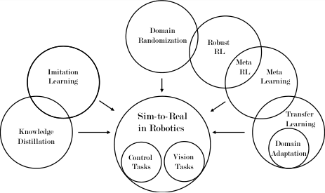
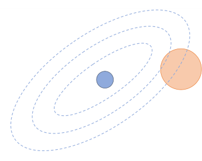

# Sim-to-Real Transfer in Deep Reinforcement Learning for Robotics: a Survey

Wenshuai Zhao [1], Jorge Pe˜na Queralta [1], Tomi Westerlund [1]

1Turku Intelligent Embedded and Robotic Systems Lab, University of Turku, Finland
Emails: [1] _{_ wezhao, jopequ, tovewe _}_ @utu.fi

_**Abstract**_ **—Deep reinforcement learning has recently seen huge**
**success across multiple areas in the robotics domain. Owing to the**
**limitations of gathering real-world data, i.e., sample inefficiency**
**and the cost of collecting it, simulation environments are utilized**
**for training the different agents. This not only aids in providing a**
**potentially infinite data source, but also alleviates safety concerns**
**with real robots. Nonetheless, the gap between the simulated and**
**real worlds degrades the performance of the policies once the**
**models are transferred into real robots. Multiple research efforts**
**are therefore now being directed towards closing this sim-to-**
**real gap and accomplish more efficient policy transfer. Recent**
**years have seen the emergence of multiple methods applicable**
**to different domains, but there is a lack, to the best of our**
**knowledge, of a comprehensive review summarizing and putting**
**into context the different methods. In this survey paper, we**
**cover the fundamental background behind sim-to-real transfer**
**in deep reinforcement learning and overview the main methods**
**being utilized at the moment: domain randomization, domain**
**adaptation, imitation learning, meta-learning and knowledge**
**distillation. We categorize some of the most relevant recent works,**
**and outline the main application scenarios. Finally, we discuss**
**the main opportunities and challenges of the different approaches**
**and point to the most promising directions.**
_**Index Terms**_ **—Deep Reinforcement Learning; Robotics; Sim-**
**to-Real; Transfer Learning; Meta Learning; Domain Random-**
**ization; Knowledge Distillation; Imitation Learning;**

I. INTRODUCTION

Reinforcement learning (RL) algorithms have been increasingly adopted by the robotics community over the past years
to control complex robots or multi-robot systems [1], [2], or
provide end-to-end policies from perception to control [3].
Inspired by the way we learn through trial-and-error processes,
RL algorithms base their knowledge acquisition in the rewards
that agents obtain when they act in certain manners given
different experiences. This naturally requires a large number
of episodes, and therefore the learning limitations in terms
of time and experience variability in real-world scenarios is
evident. Moreover, learning with real robots requires the consideration of potentially dangerous or unexpected behaviors
in safety-critical applications [4]. Deep reinforcement learning
(DRL) algorithms have been successfully deployed in various
types of simulation environments, yet their success beyond
simulated worlds has been limited. An exception to this is,
however, robotic tasks involving object manipulation [5], [6].
In this survey, we review the most relevant works that try to
answer a key research question in this direction: how to exploit

Robot Dynamics Modeling

Training in Simulation

Real Robot Deployment

**Sim-to-Real**

**Transfer**

Fig. 1: Conceptual view of a simulation-to-reality transfer process.
One of the most common methods is domain randomization, through
which different parameters of the simulator (e..g, colors, textures,
dynamics) are randomized to produce more robust policies.

simulation-based training in real-world settings by transferring
the knowledge and adapting the policies accordingly (Fig. 1).
Simulation-based training provides data at low-cost, but involves inherent mismatches with real-world settings. Bridging
the gap between simulation and reality requires, first of all,
methods that are able to account for mismatches in both sens
ing and actuation. The former aspect has been widely studied
in recent years within the deep learning field, for instance with
adversarial attacks on computer vision algorithms [7]. The
latter risk can be minimized through more realistic simulation.
In both of these cases, some of the current approaches include
works that introduce perturbances in the environment [8] or
focus on domain randomization [9]. Another key aspect to
take into account is that an agent deployed in the real world
will potentially be exposed to novel experiences that were not
present in the simulations [10], as well as the potential need
to adapt their policies to encompass wider sets of tasks. Some
of the approaches to bridge the gap in this direction rely on
meta learning [11] or continual learning [12], among others.

The methods described above focus on extracting knowledge from simulation-trained agents in order to deploy them
in real-life scenarios. However, other approaches exist to the
same end. In recent years, simulators have been progressing
towards more realistic scenarios and physics engines: Airsim [13], CARLA [14], RotorS [15], [16], and others [17].
With some of these simulators, part of the aim is to be able to
deploy the robotic agents directly into the real world by providing training data and experiences with minimal mismatches
between real and simulated settings. Other research efforts
have been directed towards increasing safety during training
in real-settings. Safety is one of the main challenges towards
achieving online training of complex agents in the real-world,
from robot arms to self-driving cars [4]. In this direction,
recent works have shown promising results towards safe DRL
that is able to ensure convergence even while reducing the
exploration space [3]. In this survey, we do not cover specific
simulators or techniques for direct learning in real-world
settings, but instead focus on describing the main methods
for transferring knowledge learned in simulation towards their
deployment in real robotic platforms.
This is, to the best of our knowledge, the first survey
that describes the different methods being utilized towards
closing the simulation-to-reality gap in DRL for robotics. We
also concentrate on describing the main application fields of
current research efforts. We discuss recent works from a wider

point of view by including related research directions in the
areas of transfer learning and domain adaptation, knowledge
distillation, and meta reinforcement learning. While other
surveys have focused on transfer learning techniques [18] or
safe reinforcement learning [4], we provide a different point
of view with an emphasis on DRL policy transfer in the
robotics domain. Finally, there is also a significant amount
of publications deploying DRL policies on real robots. In this
survey, nonetheless, we focus on those works that specifically
tackle issues in sim-to-real transfer. The focus is mostly in
end-to-end approaches, but we also describe relevant research
where sim-to-real transfer techniques are applied to the sensing
aspects of robotic operation, primarily the transfer of DL
vision algorithms to real robots.
The rest of this paper is organized as follows. In Section II,
we briefly introduce the main approaches to DRL, together
with related research directions in knowledge distillation,
transfer, adaptation and meta learning. Section III then delves
into the different approaches being taken towards closing
the simulation-to-reality gap, with Section IV focusing on
the most relevant application areas. Then, we discuss open
challenges and promising research directions in Section V.
Finally, Section VI concludes this survey.

II. BACKGROUND

Sim-to-real is a very comprehensive concept and applied
in many fields including robotics and classic machine vision
tasks. Thereby quite a few methods and concepts intersect
with this aim including transfer learning, robust RL, and meta
learning. In this section, we briefly introduce the concepts of

Fig. 2: Illustration of the different methods related to sim-to-real
transfer in deep reinforcement learning and their relationships.

deep reinforcement learning, knowledge distillation, transfer
learning and domain adaption, before going into more details
about sim-to-real transfer methods for DRL. The relationship
between there concepts is illustrated in Fig. 2.

_A. Deep Reinforcement Learning_

A standard reinforcement learning (RL) task can be regarded as a sequential decision making setup which consists
of an _agent_ interacting with an _environment_ in discrete steps.
The _agent_ takes an action _at_ at each timestep _t_, causing the
_environment_ to change its state from _st_ to _st_ +1 with a transition probability _p_ ( _st_ +1 _|st, at_ ). This setup can be regarded
as a Markov decision process (MDP) with a set of states
_s ∈S_, actions _a ∈A_, transitions _p ∈P_ and rewards _r ∈R_ .
Therefore we can define this MDP as a tuple (1).

_D ≡_ ( _S, A, P, R_ ) (1)

The objective of reinforcement learning is to maximize the
expected reward by choosing an optimal policy which will be
represented via a deep neural network in DRL. Accelerated
by modern computation capacity, DRL has shown significant
success on various applications [1], [19], but particular in the
simulated environment [20]. Therefore, how to transfer this
success from simulation to reality is drawing more and more
attention, which is also the motivation of this paper.

_B. Sim-to-Real Transfer_

Transferring DRL policies form simulation environments
to reality is a necessary step towards more complex robotic
systems that have DL-defined controllers. This, however, is
not a problem specific to DRL algorithms, but ML in general.
While most DRL algorithms provide end-to-end policies, i.e.,
control mechanisms that take raw sensor data as inputs and
produce direct actuation commands as outputs, these two
dimensions of robotics can be separated. Closing the gap
between simulation and reality gap in terms of actuation
requires simulators to be more accurate, and to account for
variability in agent dynamics. On the sensing part, however,
the problem can be considered wider, as it also involves
the more general ML problem of facing situations in the
real world that have not appeared in simulation [10]. In this
paper, we focus mostly on end-to-end models, and overview

both research directed towards system modeling and dynamics
randomization, as well as research introducing randomization
from the sensing point of view.

_C. Transfer Learning and Domain Adaptation_

Transfer learning aims at improving the performance of
target learners on target domains by transferring the knowledge
contained in different but related source domains [18]. In this
way, transfer learning can reduce the dependence of target
domain data when constructing target learners.
Domain adaptation is a subset of transfer learning methods.
It specifies the situation when we have sufficient source
domain labeled data and the same single task as the target
task, but without or very few target domain data. In sim-to-real
robotics, researchers tend to employ a simulator to train the RL
model and then deploy it in the realistic environment, where
we should take advantage of the domain adaptation techniques
in order to transfer the simulation based model well.

_D. Knowledge Distillation_

Large networks are typical in DRL with high-dimensional
input data (e.g, complex visual tasks). Policy distillation is
the process of extracting knowledge to train a new network
that is able to maintain a similarly expert level while being
significantly smaller and more efficient [21]. In these set-ups,
the two networks are typically called _teacher_ and _student_ . The
student is trained in a supervised manner with data generated
by the teacher network. In [12], the authors presented DisCoRL, a modular, effective and scalable pipeline for continual
DRL. DisCoRL has been succesfully applied to multiple tasks
learned by different teachers, with their knowledge being
distilled to a single student network.

_E. Meta Reinforcement Learning_

Meta Learning, namely learning to learn, aims to learn
the adaptation ability to unseen test tasks from multiple
training tasks. A good meta learning model should be trained
across a variety of learning tasks and optimized for the best
performance over a distribution of tasks, including potentially
unseen tasks when tested. This spirit can be applied on both supervised learning and reinforcement learning, and in the latter
case it is called meta reinforcement learning (MetaRL) [22].
The overall configuration of MetaRL is similar to an ordinary RL algorithm, except that MetaRL usually implements an
LSTM policy and incorporates the last reward _rt−_ 1 and last
action _at−_ 1 into the current policy observation. In this case,
the LSTM’s hidden states serve as a memory for tracking
characteristics of the trajectories. Therefore, MetaRL draws
knowledge from past training.

_F. Robust RL and Imitation Learning_

Robust RL [23] was proposed quite early as a new RL
paradigm that explicitly takes into account input disturbances
as well as modeling errors. It considers a bad, or even
adversarial model and tries to maximize the reward as a

optimization problem [24], [25].

Imitation learning proposes to employ expert demonstration
or trajectories instead of manually constructing a fixed reward
function to train RL agents. The methods of imitation learning
can be broadly classified into two key areas: _behaviour cloning_
where an agent learns a mapping from observations to actions
given demonstrations [26], [27] and _inverse reinforcement_
_learning_ where an agent attempts to estimate a reward function
that describes the given demonstrations [28]. Because it aims
to give a robust reward for RL agents, sometimes imitation
learning can be utilized to obtain robust RL or sim-to-real
transfer [29].

III. METHODOLOGIES FOR SIM-TO-REAL TRANSFER

Research in sim-to-real transfer has resulted in an increase

of several orders of magnitude in the number of publications
over the past few years. Multiple research directions have
been followed, and we summarize in this section the most
representative methods for sim-to-real transfer.
Table I lists some of the most relevant and recent works

in this field. The most widely used method for learning
transfer is domain randomization, with other relevant examples
including policy distillation, system identification, or metaRL. The variability in terms of learning algorithms is higher,
with DRL using proximal policy optimization (PPO) [45],
trust region policy optimization (TRPO) [46], maximum aposteriori policy optimization (MPO) [47], asynchronous actor
critic (A3C) methods [48], soft actor critic (SAC) [49], or deep
deterministic policy gradient (DDPG) [50], among others.

_A. Zero-shot Transfer_

The most straightforward way of transferring knowledge
from simulation to reality is to build a realistic simulator,
or to have enough simulated experience, so that the model
can be directly applied in real-world settings. This strategy is
commonly referred to as zero-shot or direct transfer. System
identification to build precise models of the real world and
domain randomization are techniques that can be seen as
one-shot transfer. We discuss both of these separately in
Sections III-B and III-C.

_B. System Identification_

It is of note that simulators are not faithful representation
of the real world. System identification [51] is exactly to
build a precise mathematical model for a physical system
and to make the simulator more realistic careful calibration

is necessary. Nonetheless, challenges for obtaining a realistic
enough simulator are still existing. For example, it is hard
to build high-quality rendered image to simulate the real
vision. Furthermore, many physical parameters of the same
robot might vary significantly due to temperature, humidity,
positioning or its wear-and-tear in time, which brings more
difficulty for system identification.

_C. Domain Randomization Methods_

Domain randomization is the idea that [52], instead of
carefully modeling all the parameters of the real world, we

could highly randomize the simulation in order to cover the
real distribution of the real-world data despite the bias between
the model and real world. Fig. 3a shows the paradigm of
domain randomization.

According to the components of the simulator randomized,
we divide the methods of domain randomization into two

kinds: _visual randomization_ and _dynamics randomization_ . In
robotic vision tasks including object localization [53], object
detection [54], pose estimation [55], and semantic segmentation [56], the training data from simulator always have different textures, lighting, and camera positions from the realistic
environments. Therefore, visual domain randomization aims to
provide enough simulated variability of the visual parameters
at training time such that at test time the model is able to
generalize to real-world data. In addition to adding randomization to the visual input, dynamics randomization could also
help acquire a robust policy particularly where the controlling
policy is needed. To learn dexterous in-hand manipulation
policies for a physical five-fingered hand, [57] randomizes
various physical parameters in the simulator, such as object
dimensions, objects and robot link masses, surface friction
coefficients, robot joint damping coefficients and actuator force
gains. Their successful sim-to-real transfer experiments show
the powerful effect of domain randomization.
Besides usually making the simulated data randomized to
cover the real-world data distribution, [58] provides another
interesting angle to apply domain randomization. They proposes to translate the randomized simulated image and realworld into the canonical sim images and demonstrate the
effectiveness of this sim-to-real approach by training a visionbased closed-loop grasping RL agent in simulation.

_D. Domain Adaptation Methods_

Domain adaptation methods use data from source domain
to improve the performance of a learned model on a different
target domain where data is always less available. Since
usually there are different feature spaces between the source
domain and target domain, in order to better transfer the
knowledge from source data, we should attempt to make these
two feature space unified. This is the main spirit of domain
adaptation, and can be described by the diagram in Fig. 3b.
The research of domain adaptation is broadly conducted
recently in vision-based tasks, such as image classification and
semantic segmentation [59], [60]. However, in this paper we
focus on the tasks related with reinforcement learning and the
ones applied to robotics. In these scenarios, the pure vision
related tasks employing domain adaptation play as priors to
the succeeding building reinforcement learning agents or other
controlling tasks [58], [61], [29]. There is also some image-topolicy work using domain adaptation to generalize the policy
learned by synthetic data or speed up the learning on realworld robots [61]. Sometimes domain adaptation is used to
directly transfer the policy between agents [62].
Specifically, we now formalize the domain adaptation scenarios in a reinforcement learning setting [63]. Based on the
definition of MDP in equation (1), we denote the source

domain as _DS ≡_ ( _SS, AS, PS, RS_ ) and target domain as
_DT_ _≡_ ( _ST, AT, PT, RT_ ), respectively. In reinforcement
learning scenarios, the states _S_ of the source and target domain
can be quite different ( _SS ̸_ = _ST_ ) due to the perceptual-reality
gap [64], while both domains share the action spaces and the
transitions _P_ ( _AS ≈AT, PS ≈PT_ )and their reward functions
_R_ have structural similarity ( _RS ≈RT_ ).
From the literature, we summarize three common methods for domain adaptation regardless of their tasks. They
are _discrepancy-based_, _adversarial-based_, and _reconstruction-_
_based_ methods, which can be also used crossly. Discrepancybased methods measure the feature distance between source

and target domain by calculating pre-defined statistical metrics, in order to align their feature spaces [65], [66], [67].
Adversarial-based methods build a domain classifier to distinguish whether the features come from source domain or
target domain. After being trained, the extractor could produce invariant feature from both source domain and target
domain [68], [69], [70]. Reconstruction-based methods also
aim to find the invariant or shared features between domains.
However, they realize this goal by constructing one auxiliary
reconstruction task and employ the shared feature to recover
the original input [71]. In this way, the shared feature should
be invariant and independent with the domains. These three
methods provide different angles to make the features from
different domains unified, and can be utilized in both vision
tasks and RL-based control tasks.

_E. Learning with Disturbances_

Domain randomization and dynamics randomization methods focus on introducing perturbations in the simulation environments with the aim of making the agents less susceptible to
the mismatches between simulation and reality [30], [38], [40].
The same conceptual idea has been extended in other works,
where perturbances has been introduced to obtain more robust
agents. For example, in [72], the authors consider noisy rewards. While not directly related to sim-to-real transfer, noisy
rewards can better emulate real-world training of agents. Also,
in some of our recent works [8], [73], we have considered
environmental perturbations that affect differently different
agents that are learning in parallel. This is an aspect that needs
to be considered when multiple real agents are to be deployed
or trained with a common policy.

_F. Simulation Environments_

A key aspect in sim-to-real transfer is the choice of simulation. Independently of the techniques utilized for efficiently
transferring knowledge to real robots, the more realistic a
simulation is the better results that can be expected. The
most widely used simulators in the literature are Gazebo [74],
Unity3D, and PyBullet [75] or MuJoCo [17]. Gazebo has the
advantage of being widely integrated with the Robot Operating
System (ROS) middleware, and therefore can be used together
with part of the robotics stack that is present in real robots.
PyBullet and MuJoCo, on the other hand, present wider integration with DL and RL libraries and gym environments. In

Simulated Data

Real-world Data

Randomized Data

Distribution

(a) Intuition behind the domain randomization paradigm.

Source

(b) Intuition behind the domain adaptation paradigm.

Fig. 3: Illustration of two of the most widely used methods for sim-to-real transfer in DRL. Domain randomization and domain adaptation
are often applied as separate techniques, but they can also be applied together.

general, Gazebo suits more complex scenarios while PyBullet
and MuJoCo provide faster training.
In those cases where system identification for one-shot
transfer is the objective, researchers have often built or
customized specific simulations that meet problem-specific
requirements and constraints [32], [36], [41].

IV. APPLICATION SCENARIOS

Some of the most common applications for DRL in robotics
are navigation and dexterous manipulation [1], [76]. Owing
to the limited operational space in which most robotic arms
operate, simulation environments for dexterous manipulation
are relatively easier to generate than those for more complex
robotic systems. For instance, the Open AI Gym [77], one of
the most widely used frameworks for reinforcement learning,
provides multiple environments for dexterous manipulation.

_A. Dexterous Robotic Manipulation_

Robotic manipulation tasks that have been possible with
DRL ranging from learning peg-in-hole tasks [40] to deformable object manipulation [6], and including more dexterous manipulation with multi-fingered hands [5], or learning
force control policies [78]. The latter is particularly relevant
for sim-to-real: applying excessive force to real objects might
cause damage, while grasping can fail with a lack of force.
In [6], Matas et al. utilize domain randomization for learning
manipulation of deformable objects. The authors identify as
one of the main drawbacks of the simulation environment

the inability to properly simulate the degree of deformability
of the objects, with the real robot being unable to grasp
stiffer objects. Moreover, a relevant conclusion from this work
is that excessive domain randomization can be detrimental.

Specifically, when the number of different colors that were
being used for each texture was too large, the performance of
the real robot was significantly worse.

_B. Robotic Navigation_

While learning navigation with reinforcement learning has
been a topic of increasing research interest over the past
years [79], [80], the literature focusing on sim-to-real transfer

methods is sparse. The first difference with respect to moreestablished research in learning manipulation is perhaps the
lack of standard simulation environments. Owing to the more
specific environment and sensor suites that are required for
different navigation tasks, custom simulators have often been
used [36], [37], or simulation worlds have been created using
Unity, Unreal Engine, or Gazebo [39], [42].
Sim-to-real transfer for DRL policies can be applied to
complex navigation tasks: from six-legged robots [37] to
depth-based mapless navigation [39], including robots for
soccer competitions [36]. In order to achieve a successful
transfer to the real world, different methods have been applied
in the literature. Of particular interest due to their potential and
novelty are the following methods: curriculum learning [37],
incremental environment complexity [39], and continual learning and policy distillation for multiple tasks [12].

_C. Other Applications_

Some other applications of DRL and sim-to-real transfer
in robotics that have emerged over the past years are the
control of a plasma jet [32], tactile sensing [43], or multiagent manipulation [44].

V. MAIN CHALLENGES AND FUTURE DIRECTIONS

Albeit the progress presented in the papers we reviewed,
sim-to-real remains challenging based on existing methods.
For domain randomization, researchers tend to study empirically examining which randomization to add, but it is hard to
explain formally how and why it works, which thereby brings
the difficulty of designing efficiently simulations and randomization distributions. For domain adaptation, most existing
algorithms focus on homogeneous deep domain adaptation,
which assumes that the feature spaces between the source
and target domains are the same. However, this assumption
may not be true in many applications. Thus we expect more
exploration to transfer knowledge without this limitation.
Two of the most promising research directions are: (i)
integration of different existing methods for more efficient
transfer (e.g., domain randomization and domain adaptation);
and (ii) incremental complexity learning, continual learning,
and reward shaping for complex or multi-step tasks.

VI. CONCLUSION

Reinforcement learning algorithms often rely on simulated
data to meet their need for vast amounts of labeled experiences. The mismatch between the simulation environments

and real-world scenarios, however, requires further attention
to be put to methods for sim-to-real transfer of the knowledge
acquired in simulation. This is, to the best of our knowledge,
the first survey that focuses on the different approaches being
taken for sim-to-real transfer in DRL for robotics.

Domain randomization has been identified as the most
widely adopted method for increasing the realism of simulation and better prepare for the real world. However, we have
discussed alternative research directions showing promising
results. For instance, policy distillation is enabling multi-task
learning and more efficient and smaller networks, while metalearning methods allow for wider variability of tasks.
Multiple challenges remain in this field. While practical
implementations show the efficiency of the different methods,
wider theoretical and empirical studies are required to better
understand the effect of these techniques in the learning
process. Moreover, generalization of existing results with a
more comprehensive analysis is also lacking in the literature.

ACKNOWLEDGEMENTS

This work was supported by the Academy of Finland’s
AutoSOS project with grant number 328755.

REFERENCES

[1] Kai Arulkumaran, Marc Peter Deisenroth, Miles Brundage, and Anil Anthony Bharath. A brief survey of deep reinforcement learning.
_arXiv:1708.05866_, 2017.

[2] Thanh Thi Nguyen, Ngoc Duy Nguyen, and Saeid Nahavandi. Deep
reinforcement learning for multiagent systems: A review of challenges,
solutions, and applications. _IEEE transactions on cybernetics_, 2020.

[3] Richard Cheng, G´abor Orosz, Richard M Murray, and Joel W Burdick.
End-to-end safe reinforcement learning through barrier functions for
safety-critical continuous control tasks. In _AAAI Artificial Intelligence_,
volume 33, 2019.

[4] Javier Garcıa and Fernando Fern´andez. A comprehensive survey on safe
reinforcement learning. _Journal of Machine Learning Research_, 16(1),
2015.

[5] Aravind Rajeswaran, Vikash Kumar, Abhishek Gupta, Giulia Vezzani,
John Schulman, Emanuel Todorov, and Sergey Levine. Learning
complex dexterous manipulation with deep reinforcement learning and
demonstrations. _arXiv:1709.10087_, 2017.

[6] Jan Matas, Stephen James, and Andrew J Davison. Sim-to-real reinforcement learning for deformable object manipulation. _arXiv:1806.07851_,
2018.

[7] Naveed Akhtar and Ajmal Mian. Threat of adversarial attacks on deep
learning in computer vision: A survey. _IEEE Access_, 6, 2018.

[8] Wenshuai Zhao, Jorge Pe˜na Queralta, Li Qingqing, and Tomi Westerlund. Towards closing the sim-to-real gap in collaborative multi-robot
deep reinforcement learning. In _5th ICRAE_, 2020.

[9] Fabio Muratore, Christian Eilers, Michael Gienger, and Jan Peters. Bayesian domain randomization for sim-to-real transfer.
_arXiv:2003.02471_, 2020.

[10] Ramya Ramakrishnan, Ece Kamar, Debadeepta Dey, Eric Horvitz, and
Julie Shah. Blind spot detection for safe sim-to-real transfer. _Journal_
_of Artificial Intelligence Research_, 67, 2020.

[11] Karol Arndt, Murtaza Hazara, Ali Ghadirzadeh, and Ville Kyrki.
Meta reinforcement learning for sim-to-real domain adaptation.
_arXiv:1909.12906_, 2019.

[12] Ren´e Traor´e, Hugo Caselles-Dupr´e, Timoth´ee Lesort, Te Sun, Natalia
D´ıaz-Rodr´ıguez, and David Filliat. Continual reinforcement learning
deployed in real-life using policy distillation and sim2real transfer.
_arXiv:1906.04452_, 2019.

[13] Shital Shah, Debadeepta Dey, Chris Lovett, and Ashish Kapoor. Airsim:
High-fidelity visual and physical simulation for autonomous vehicles. In
_Field and service robotics_, 2018.

[14] Alexey Dosovitskiy, German Ros, Felipe Codevilla, Antonio Lopez,
and Vladlen Koltun. Carla: An open urban driving simulator.
_arXiv:1711.03938_, 2017.

[15] Fadri Furrer, Michael Burri, Markus Achtelik, and Roland Siegwart. Rotors—a modular gazebo mav simulator framework. In _Robot Operating_
_System (ROS)_ . 2016.

[16] Cassandra McCord, Jorge Pe˜na Queralta, Tuan Nguyen Gia, and Tomi
Westerlund. Distributed progressive formation control for multi-agent
systems: 2d and 3d deployment of uavs in ros/gazebo with rotors. In
_ECMR_, 2019.

[17] Emanuel Todorov, Tom Erez, and Yuval Tassa. Mujoco: A physics
engine for model-based control. In _IROS_, 2012.

[18] Fuzhen Zhuang, Zhiyuan Qi, Keyu Duan, Dongbo Xi, Yongchun Zhu,
Hengshu Zhu, Hui Xiong, and Qing He. A comprehensive survey on
transfer learning. _Proceedings of the IEEE_, 2020.

[19] Jorge Pe˜na Queralta, Jussi Taipalmaa, Bilge Can Pullinen, Victor Kathan
Sarker, Tuan Nguyen Gia, Hannu Tenhunen, Moncef Gabbouj, Jenni
Raitoharju, and Tomi Westerlund. Collaborative multi-robot systems
for search and rescue: Coordination and perception. _arXiv preprint_
_arXiv:2008.12610_, 2020.

[20] Christopher Berner, Greg Brockman, Brooke Chan, Vicki Cheung,
Przemysław D ebiak, Christy Dennison, David Farhi, Quirin Fischer,
Shariq Hashme, Chris Hesse, et al. Dota 2 with large scale deep
reinforcement learning. _arXiv:1912.06680_, 2019.

[21] Andrei A Rusu, Sergio Gomez Colmenarejo, Caglar Gulcehre, Guillaume Desjardins, James Kirkpatrick, Razvan Pascanu, Volodymyr
Mnih, Koray Kavukcuoglu, and Raia Hadsell. Policy distillation.
_arXiv:1511.06295_, 2015.

[22] Jane X Wang, Zeb Kurth-Nelson, Dhruva Tirumala, Hubert Soyer, Joel Z
Leibo, Remi Munos, Charles Blundell, Dharshan Kumaran, and Matt
Botvinick. Learning to reinforcement learn. _arXiv:1611.05763_, 2016.

[23] Jun Morimoto and Kenji Doya. Robust reinforcement learning. _Neural_
_computation_, 17(2), 2005.

[24] Chen Tessler, Yonathan Efroni, and Shie Mannor. Action robust reinforcement learning and applications in continuous control.
_arXiv:1901.09184_, 2019.

[25] Daniel J Mankowitz, Nir Levine, Rae Jeong, Yuanyuan Shi, Jackie
Kay, Abbas Abdolmaleki, Jost Tobias Springenberg, Timothy Mann,
Todd Hester, and Martin Riedmiller. Robust reinforcement learning
for continuous control with model misspecification. _arXiv:1906.07516_,
2019.

[26] Dean A Pomerleau. Alvinn: An autonomous land vehicle in a neural
network. In _Advances in neural information processing systems_, 1989.

[27] St´ephane Ross, Geoffrey Gordon, and Drew Bagnell. A reduction of
imitation learning and structured prediction to no-regret online learning.
In _AISTATS_, 2011.

[28] Andrew Y Ng, Stuart J Russell, et al. Algorithms for inverse reinforcement learning. In _Icml_, volume 1, 2000.

[29] Mengyuan Yan, Iuri Frosio, Stephen Tyree, and Jan Kautz. Sim-toreal transfer of accurate grasping with eye-in-hand observations and
continuous control. _arXiv:1712.03303_, 2017.

[30] Bharathan Balaji, Sunil Mallya, Sahika Genc, Saurabh Gupta, Leo Dirac,
Vineet Khare, Gourav Roy, Tao Sun, Yunzhe Tao, Brian Townsend, et al.
Deepracer: Educational autonomous racing platform for experimentation
with sim2real reinforcement learning. _arXiv:1911.01562_, 2019.

[31] Manuel Kaspar, Juan David Munoz Osorio, and J¨urgen Bock. Sim2real
transfer for reinforcement learning without dynamics randomization.
_arXiv:2002.11635_, 2020.

[32] Matthew Witman, Dogan Gidon, David B Graves, Berend Smit, and
Ali Mesbah. Sim-to-real transfer reinforcement learning for control of
thermal effects of an atmospheric pressure plasma jet. _Plasma Sources_
_Science and Technology_, 28(9), 2019.

[33] Rae Jeong, Jackie Kay, Francesco Romano, Thomas Lampe, Tom
Rothorl, Abbas Abdolmaleki, Tom Erez, Yuval Tassa, and Francesco
Nori. Modelling generalized forces with reinforcement learning for simto-real transfer. _arXiv:1910.09471_, 2019.

[34] Michel Breyer, Fadri Furrer, Tonci Novkovic, Roland Siegwart, and
Juan Nieto. Flexible robotic grasping with sim-to-real transfer based
reinforcement learning. _ArXiv e-prints_, 2018.

[35] J van Baar, R Corcodel, A Sullivan, D Jha, D Romeres, and D Nikovski.
Simulation to real transfer learning with robustified policies for robot
tasks. 2018.

[36] Hansenclever F Bassani, Renie A Delgado, Jose Nilton de O Lima
Junior, Heitor R Medeiros, Pedro HM Braga, and Alain Tapp. Learning
to play soccer by reinforcement and applying sim-to-real to compete in
the real world. _arXiv:2003.11102_, 2020.

[37] Bangyu Qin, Yue Gao, and Yi Bai. Sim-to-real: Six-legged robot control
with deep reinforcement learning and curriculum learning. In _ICRAE_,
2019.

[38] Juliano Vacaro, Guilherme Marques, Bruna Oliveira, Gabriel Paz,
Thomas Paula, Wagston Staehler, and David Murphy. Sim-to-real in
reinforcement learning for everyone. In _LARS-SBR-WRE_, 2019.

[39] Thomas Chaffre, Julien Moras, Adrien Chan-Hon-Tong, and Julien
Marzat. Sim-to-real transfer with incremental environment complexity for reinforcement learning of depth-based robot navigation.
_arXiv:2004.14684_, 2020.

[40] Manuel Kaspar and J¨urgen Bock. Reinforcement learning with cartesian
commands and sim to real transfer for peg in hole tasks.

[41] Andrew Hundt, Benjamin Killeen, Heeyeon Kwon, Chris Paxton, and
Gregory D Hager. ” good robot!”: Efficient reinforcement learning for
multi-step visual tasks via reward shaping. _arXiv:1909.11730_, 2019.

[42] Ole-Magnus Pedersen. Sim-to-real transfer of robotic gripper pose
estimation-using deep reinforcement learning, generative adversarial
networks, and visual servoing. Master’s thesis, NTNU, 2019.

[43] Zihan Ding, Nathan F Lepora, and Edward Johns. Sim-to-real transfer
for optical tactile sensing. _arXiv:2004.00136_, 2020.

[44] Ofir Nachum, Michael Ahn, Hugo Ponte, Shixiang Gu, and Vikash
Kumar. Multi-agent manipulation via locomotion using hierarchical
sim2real. _arXiv:1908.05224_, 2019.

[45] John Schulman, Filip Wolski, Prafulla Dhariwal, Alec Radford, and Oleg
Klimov. Proximal policy optimization algorithms. _arXiv:1707.06347_,
2017.

[46] John Schulman, Sergey Levine, Pieter Abbeel, Michael Jordan, and
Philipp Moritz. Trust region policy optimization. In _ICML_, 2015.

[47] Abbas Abdolmaleki, Jost Tobias Springenberg, Yuval Tassa, Remi
Munos, Nicolas Heess, and Martin Riedmiller. Maximum a posteriori
policy optimisation. _arXiv:1806.06920_, 2018.

[48] Volodymyr Mnih, Adria Puigdomenech Badia, Mehdi Mirza, Alex
Graves, Timothy Lillicrap, Tim Harley, David Silver, and Koray
Kavukcuoglu. Asynchronous methods for deep reinforcement learning.
In _ICML_, 2016.

[49] Tuomas Haarnoja, Aurick Zhou, Pieter Abbeel, and Sergey Levine. Soft
actor-critic: Off-policy maximum entropy deep reinforcement learning
with a stochastic actor. _arXiv:1801.01290_, 2018.

[50] Timothy P Lillicrap, Jonathan J Hunt, Alexander Pritzel, Nicolas Heess,
Tom Erez, Yuval Tassa, David Silver, and Daan Wierstra. Continuous
control with deep reinforcement learning. _arXiv:1509.02971_, 2015.

[51] Kristinn Kristinsson and Guy Albert Dumont. System identification and
control using genetic algorithms. _IEEE Transactions on Systems, Man,_
_and Cybernetics_, 22(5), 1992.

[52] Joshua P Tobin. _Real-World Robotic Perception and Control Using_
_Synthetic Data_ . PhD thesis, UC Berkeley, 2019.

[53] Josh Tobin, Rachel Fong, Alex Ray, Jonas Schneider, Wojciech Zaremba,
and Pieter Abbeel. Domain randomization for transferring deep neural
networks from simulation to the real world. In _IROS_, 2017.

[54] Jonathan Tremblay, Aayush Prakash, David Acuna, Mark Brophy, Varun
Jampani, Cem Anil, Thang To, Eric Cameracci, Shaad Boochoon, and
Stan Birchfield. Training deep networks with synthetic data: Bridging
the reality gap by domain randomization. In _CVPR Workshops_, 2018.

[55] Martin Sundermeyer, Zoltan-Csaba Marton, Maximilian Durner, Manuel
Brucker, and Rudolph Triebel. Implicit 3d orientation learning for 6d
object detection from rgb images. In _ECCV_, 2018.

[56] Xiangyu Yue, Yang Zhang, Sicheng Zhao, Alberto SangiovanniVincentelli, Kurt Keutzer, and Boqing Gong. Domain randomization
and pyramid consistency: Simulation-to-real generalization without accessing target domain data. In _ICCV_, 2019.

[57] OpenAI: Marcin Andrychowicz, Bowen Baker, Maciek Chociej, Rafal
Jozefowicz, Bob McGrew, Jakub Pachocki, Arthur Petron, Matthias
Plappert, Glenn Powell, Alex Ray, et al. Learning dexterous in-hand

manipulation. _The International Journal of Robotics Research_, 39(1),
2020.

[58] Stephen James, Paul Wohlhart, Mrinal Kalakrishnan, Dmitry Kalashnikov, Alex Irpan, Julian Ibarz, Sergey Levine, Raia Hadsell, and
Konstantinos Bousmalis. Sim-to-real via sim-to-sim: Data-efficient
robotic grasping via randomized-to-canonical adaptation networks. In
_CVPR_, 2019.

[59] Mei Wang and Weihong Deng. Deep visual domain adaptation: A survey.
_Neurocomputing_, 312, 2018.

[60] Judy Hoffman, Eric Tzeng, Taesung Park, Jun-Yan Zhu, Phillip Isola,
Kate Saenko, Alexei Efros, and Trevor Darrell. Cycada: Cycle-consistent
adversarial domain adaptation. In _ICML_, 2018.

[61] Konstantinos Bousmalis, Alex Irpan, Paul Wohlhart, Yunfei Bai,
Matthew Kelcey, Mrinal Kalakrishnan, Laura Downs, Julian Ibarz, Peter
Pastor, Kurt Konolige, et al. Using simulation and domain adaptation
to improve efficiency of deep robotic grasping. In _ICRA_, 2018.

[62] Abhishek Gupta, Coline Devin, YuXuan Liu, Pieter Abbeel, and Sergey
Levine. Learning invariant feature spaces to transfer skills with reinforcement learning. _arXiv:1703.02949_, 2017.

[63] Irina Higgins, Arka Pal, Andrei A Rusu, Loic Matthey, Christopher P
Burgess, Alexander Pritzel, Matthew Botvinick, Charles Blundell, and
Alexander Lerchner. Darla: Improving zero-shot transfer in reinforcement learning. _arXiv:1707.08475_, 2017.

[64] Andrei A Rusu, Matej Veˇcer´ık, Thomas Roth¨orl, Nicolas Heess, Razvan
Pascanu, and Raia Hadsell. Sim-to-real robot learning from pixels with
progressive nets. In _Conference on Robot Learning_, 2017.

[65] Eric Tzeng, Judy Hoffman, Ning Zhang, Kate Saenko, and Trevor
Darrell. Deep domain confusion: Maximizing for domain invariance.
_arXiv:1412.3474_, 2014.

[66] Mingsheng Long, Yue Cao, Jianmin Wang, and Michael Jordan. Learning transferable features with deep adaptation networks. In _ICML_, 2015.

[67] Baochen Sun, Jiashi Feng, and Kate Saenko. Return of frustratingly
easy domain adaptation. _arXiv:1511.05547_, 2015.

[68] Yaroslav Ganin, Evgeniya Ustinova, Hana Ajakan, Pascal Germain,
Hugo Larochelle, Franc¸ois Laviolette, Mario Marchand, and Victor
Lempitsky. Domain-adversarial training of neural networks. _The Journal_
_of Machine Learning Research_, 17(1), 2016.

[69] Eric Tzeng, Judy Hoffman, Trevor Darrell, and Kate Saenko. Simultaneous deep transfer across domains and tasks. In _ICCV_, 2015.

[70] Konstantinos Bousmalis, Nathan Silberman, David Dohan, Dumitru
Erhan, and Dilip Krishnan. Unsupervised pixel-level domain adaptation
with generative adversarial networks. In _CVPR_, 2017.

[71] Konstantinos Bousmalis, George Trigeorgis, Nathan Silberman, Dilip
Krishnan, and Dumitru Erhan. Domain separation networks. In
_Advances in neural information processing systems_, 2016.

[72] Jingkang Wang, Yang Liu, and Bo Li. Reinforcement learning with
perturbed rewards. In _AAAI_, 2020.

[73] Wenshuai Zhao, Jorge Pe˜na Queralta, Li Qingqing, and Tomi Westerlund. Ubiquitous distributed deep reinforcement learning at the
edge: Analyzing byzantine agents in discrete action spaces. In _The_
_11th International Conference on Emerging Ubiquitous Systems and_
_Pervasive Networks (EUSPN 2020)_, 2020.

[74] Nathan Koenig and Andrew Howard. Design and use paradigms for
gazebo, an open-source multi-robot simulator. In _IROS_, volume 3, 2004.

[75] Erwin Coumans and Yunfei Bai. Pybullet, a python module for physics
simulation for games, robotics and machine learning. 2016.

[76] J. Kober _et al._ Reinforcement learning in robotics: A survey. _The_
_International Journal of Robotics Research_, 32(11), 2013.

[77] Greg Brockman, Vicki Cheung, Ludwig Pettersson, Jonas Schneider,
John Schulman, Jie Tang, and Wojciech Zaremba. Openai gym.
_arXiv:1606.01540_, 2016.

[78] M. Kalakrishnan _et al._ Learning force control policies for compliant
manipulation. In _IROS_, 2011.

[79] Yuke Zhu, Roozbeh Mottaghi, Eric Kolve, Joseph J Lim, Abhinav Gupta,
Li Fei-Fei, and Ali Farhadi. Target-driven visual navigation in indoor
scenes using deep reinforcement learning. In _ICRA_, 2017.

[80] Fanyu Zeng, Chen Wang, and Shuzhi Sam Ge. A survey on visual
navigation for artificial agents with deep reinforcement learning. _IEEE_
_Access_, 8, 2020.

