## **Dynamic Movement Primitives in** **Robotics: A Tutorial Survey**

Journal Title

XX(X):1–43
©The Author(s) 2016
Reprints and permission:
sagepub.co.uk/journalsPermissions.nav
DOI: 10.1177/ToBeAssigned
www.sagepub.com/

SAGE

**Matteo Saveriano** **[1]** **, Fares J. Abu-Dakka** **[2]** **, Aljaˇz Kramberger** **[3]** **, and Luka Peternel** **[4]**

**Abstract**

Biological systems, including human beings, have the innate ability to perform complex tasks in versatile and agile
manner. Researchers in sensorimotor control have tried to understand and formally define this innate property. The
idea, supported by several experimental findings, that biological systems are able to combine and adapt basic units
of motion into complex tasks finally lead to the formulation of the motor primitives theory. In this respect, Dynamic
Movement Primitives (DMPs) represent an elegant mathematical formulation of the motor primitives as stable dynamical
systems, and are well suited to generate motor commands for artificial systems like robots. In the last decades,
Dynamic Movement Primitives (DMPs) have inspired researchers in different robotic fields including imitation and
reinforcement learning, optimal control, physical interaction, and human–robot co-working, resulting a considerable
amount of published papers. The goal of this tutorial survey is two-fold. On one side, we present the existing DMPs
formulations in rigorous mathematical terms, and discuss advantages and limitations of each approach as well
as practical implementation details. In the tutorial vein, we also search for existing implementations of presented
approaches and release several others. On the other side, we provide a systematic and comprehensive review of
existing literature and categorize state of the art work on DMP. The paper concludes with a discussion on the limitations
of DMPs and an outline of possible research directions.

**Keywords**
Motor control of artificial systems, Movement primitives theory, Dynamic movement primitives, Learning from
demonstration

**1** **Introduction**

_How biological systems, like humans and animals, execute_
_complex movements in a versatile and creative manner?_

In the past decades, researchers of neurobiology and motor
control have made a significant effort trying in to answer
this research question and their experimental findings lead
to the formulation of the _motor_ or _motion primitives theory_ .
The motion primitives theory explains the execution of
complex motion with the ability of biological systems of
sequencing and adapting units of actions, the so-called
motion primitives (Mussa-Ivaldi 1999; Flash and Hochner
2005).
Dynamic Movement Primitives (DMPs) have their roots in
the motor control of biological systems and can be seen as a
rigorous mathematical formulation of the motion primitives
as stable nonlinear dynamical systems (Schaal 2006a,b). In
this respect, DMPs represent one of the first attempts to
answer the research question:

_How artificial systems, like (humanoid) robots, can execute_
_complex movements in a versatile and creative manner?_

Beyond their biological motivation, DMPs have a simple
and elegant formulation, guarantee convergence to a given
target, are sufficiently flexible to create complex behaviors,
are capable of reacting to external perturbations in real-time,
and can be learned from data using efficient algorithms.
These properties explain the “success” of DMPs in robotic
applications, where they have established as a prominent

_Prepared using_ _sagej.cls_ _[Version: 2017/01/17 v1.20]_

tool for learning and generation of motor commands. Since
their formulation in the pioneering work from Ijspeert et al.
(Ijspeert et al. 2001, 2002c), DMPs have been successfully
exploited in a variety of applications, becoming de facto the
first approach that novices in the Imitation Learning (IL) field
use on their robots.

_1.1_ _Existing surveys and tutorials_

The popularity of DMPs resulted in a large amount of
work that use, modify, or extend the original formulation
of Ijspeert and colleagues. In this paper, we name _classical_
_DMPs_ the DMP formulation initially presented in (Ijspeert
et al. 2001) and further refined in (Ijspeert et al. 2002c,b). As
shown in Table 1, some tutorials and surveys already tried to
categorize and review existing work on DMPs.

1 Department of Computer Science and Digital Science Center,
University of Innsbruck, Innsbruck, Austria
2 Intelligent Robotics Group, Department of Electrical Engineering and
Automation (EEA), Aalto University, Espoo, Finland.
3 SDU Robotics, the Maersk McKinney Moller Institute, University of
Southern Denmark, Odense, Denmark.
4 Delft Haptics Lab, Department of Cognitive Robotics, Delft University of
Technology, Delft, The Netherlands

**Corresponding author:**
Fares J. Abu-Dakka, Intelligent Robotics Group, Department of Electrical
Engineering and Automation (EEA), Aalto University, Maarintie 8, 02150
Espoo, Finland.
Email: fares.abu-dakka@aalto.fi

2 _Journal Title XX(X)_

**Table 1.** Comparison between existing reviews and tutorial about DMPs and our tutorial survey.

**Survey/Tutorial** **Topics** **Description**

_•_ Classical DMPs
(Schaal et al. 2007) _•_ Online adaptation

_•_ Optimization

A tutorial that provides a unifying view on the two main approaches
used to develop computational motor control theories, namely differential
equations and optimal control. In this work, discrete and rhythmic DMPs
(Ijspeert et al. 2002c,b) are presented as a computational model of
the motor primitives theory (Mussa-Ivaldi 1999) that unifies nonlinear
differential equations and optimal control. The tutorial has a section
dedicated to DMP parameters optimization beyond ILs. Schaal et al.
show how to optimize DMP parameters to minimize various costs
describing, for instance, the total jerk of the trajectory or the end-point
variance.

A tutorial on classical DMPs that presents both discrete and rhythmic
formulations, mostly developed in (Ijspeert et al. 2002c,b,a), and
their application in IL and movement recognition. The tutorial also
presents extensions of the classical DMP formulation to prevent high
accelerations at the beginning of the motion, to avoid collisions with
unforeseen obstacles (Pastor et al. 2009), and to generalize both in
space ( _e.g.,_ reach a different goal) and time (e.g., produce longer/shorter
trajectories).

A tutorial on classical DMPs that presents both discrete and rhythmic
formulations, mostly developed in (Ijspeert et al. 2002c,b,a). The tutorial
also presents extensions of the classical DMP formulation to avoid
collisions with unforeseen obstacles (Pastor et al. 2009) and to learn
impedance control policies via Reinforcement Learning (RL) (Buchli
et al. 2011b). The key difference between this tutorial and the one from
(Ijspeert et al. 2013) is the section dedicated to sensory association
and online, context-aware adaptation of DMP trajectories using the
associative skill memory framework developed in (Pastor et al. 2011;
Pastor et al. 2011).

A tutorial on CMPs, a framework developed to generate compliant robot
behaviors that accurately track a reference trajectory. CMPs exploit
classical DMPs to generate the desired kinematic landscape and encode
task-dependent dynamics as a combination of Gaussian basis functions
(torque primitives). The tutorial show how to learn torque primitives from
training data, how to generalize CMPs to new situations, and how to
combine existing CMPs to synthesize new robot motions.

(Ijspeert et al. 2013)

(Pastor et al. 2013)

_•_ Classical DMPs

_•_ Generalization

_•_ Online adaptation

_•_ Coupling terms

_•_ Classical DMPs

_•_ Online adaptation

_•_ Coupling terms

_•_ Impedance learning

_•_ Classical DMPs
(Deniˇsa et al. 2016b) _•_ CMPs

**Survey and Tutorial** **Topics** **Description**

This paper

DMP tutorial

_•_ Classical

_•_ Orientation

_•_ SPD

_•_ Joining

_•_ Generalization

_•_ Online adaptation

DMP survey

_•_ (Co-)Manipulation

_•_ Variable impedance

_•_ Physical interaction

_•_ Rehabilitation

_•_ Teleoperation

_•_ Motion recognition

_•_ Reinforcement, deep,
and lifelong learning

This tutorial survey conducts a wide scan of the existing DMP literature
with the aim of categorizing and presenting the published work in the
field. The main objective of this comprehensive literature review is give
the reader an exhausting overview on DMP related research, on its
major achievements, as well as on open issues and possible research
directions. Our tutorial survey also provides a structured and unified
formulation for different methods developed starting from the classical
DMPs proposed by (Ijspeert et al. 2002c,b). We believe that such
formulation contributes to easier the understanding of different methods
and extension that can be found in the literature, clarifying connections
and differences among the existing approaches. The tutorial survey
also provides an analysis on pros and cons of various methods and a
discussion with guidelines for different application scenarios.

Schaal et al. (2007) presented the classical DMPs as an
attempt to unify nonlinear dynamical systems and optimal
control theory, _i.e.,_ the two prominent frameworks used
to derive computational models of neuro-biological motor
theories (Mussa-Ivaldi 1999; Flash and Hochner 2005).
In their tutorial paper, Ijspeert et al. (2013) presented a
homogeneous formulation of rhythmic and discrete DMPs

_Prepared using_ _sagej.cls_

together with some extensions including coupling terms,
generalization to different goal, and online adaptation
for collision avoidance. They also described possible
applications in IL and motion recognition methods. In the
same year, Pastor et al. (2013) published their tutorial on
classical DMPs with a special focus on online adaptation of
the DMP attractor landscape by integrating the perceptual

_Saveriano, Abu-Dakka, Kramberger, and Peternel_ 3

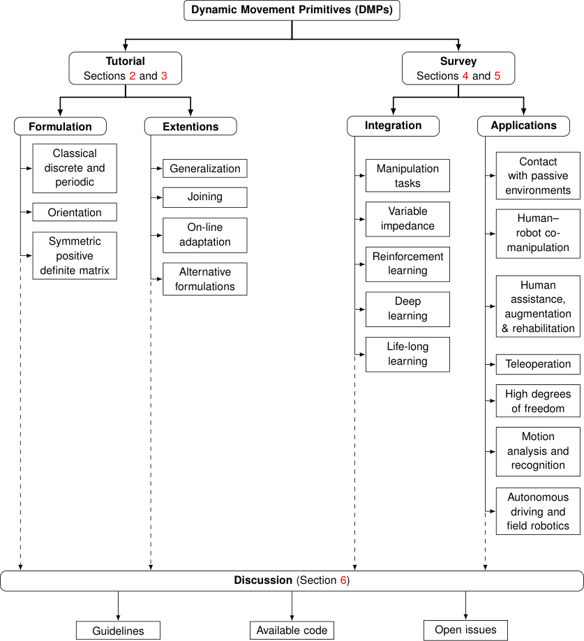

**Figure 1.** The structure of this tutorial survey on DMPs.

information into the action generation process. Later on,
Deniˇsa et al. (2016b) reviewed the so-called _Compliant_
_Movement Primitive_ (CMP), which was first introduced by
Petriˇc et al. (2014a). CMPs combine classical DMP to

—
generate the desired kinematic path and _torque primitives_
a weighted summation of Gaussian basis functions—to
generate task-specific dynamics. As shown in the review,
CMPs are capable of accurately tracking the kinematic
path in a compliant manner, which makes them well suited
for tasks that require interaction of the robot with the
environment.

However the above-mentioned reviews and tutorials

primarily focused on the methods and advancements within
their respective research group and/or focused on a specific
problem or field of application. On the other hand, the DMPs
related literature is extensive and broad, with contributions
from many research groups that made advancements in
several important fields of application. Therefore, the
proposed survey and tutorial on DMPs aims to scan a wider
range and present a tutorial with unified and structured
formulations for various DMPs methods and advancements

_Prepared using_ _sagej.cls_

up to date. This should make it clearer for the users to see the
differences and connections between various methods, and
can contribute to easier application. In addition, we provide
a more comprehensive and categorised survey of all major
DMPs application areas in robotics. This can help to inspire
the readers to apply the DMPs in various areas.

In the tutorial part, we present mathematical formulations,
implementation details, and potential issues of existing DMP
formulations starting from the classical DMPs presented in
(Ijspeert et al. 2002c,b) up to recent extensions of DMPs
to Riemannian geometry and Symmetric Positive Definite
(SPD) matrices (Abu-Dakka and Kyrki 2020). In the survey
part, we meticulously review existing literature on DMPs in
a comprehensive and methodological manner by focusing on
the quality and significance of their continuations without
putting a bias on any particular research group. Details on
the systematic review procedure are given as follows.

4 _Journal Title XX(X)_

_1.2_ _Systematic review process_

We preformed am automatic search for documents containing the string

Dynamic Movement Primitive

in Scopus on 25 November 2020 returned 1223 papers. We
found that Scopus lists papers only from 2004 on. Therefore,
we manually track related work from 2001 (preliminary
work on DMPs) to 2003. We further refined the search on
01 February 2021 to include last minute papers.
We manually inspect all the papers and removed the ones
that do not explicitly use DMPs and that only compare
against DMP in their literature review. The first and foremost
selection criteria were the technical quality of work and the
significance of the contribution with respect the DMP stateof-the-art prior to the publication of any particular paper. In
other words, we asked the question ’did the paper make a
significant step change in the field?’. Therefore, we discarded
papers that presented similar (or same) ideas multiple times,
or that made insignificant improvements to the state-of-theart. If multiple papers presented the same/similar idea, we
included the one with the most comprehensive technical
quality, and if the quality was similar, the next deciding
factors were publication in more prestigious journals/venues
or the most cited ones. This manual selection led to the 276

papers on DMPs (out of a total of 328 references) analyzed
in this work.

_1.3_ _A taxonomy of DMP related research_

The systematic review of DMP literature lead to the
taxonomy shown in Fig. 1, which also describes the structure
of this paper. DMPs are placed at the root of the tree and
branch into two nodes, namely the _tutorial_ and the _survey_ . In
the tutorial part we present different DMP formulations and
extensions in rigorous mathematical terms.
The tutorial part spans Sections 2 and 3. Section 2
embraces DMPs formulations for _discrete and periodic_
motions, _orientation_ trajectories, and _SPDs_ matrices.
Section 3 discusses extensions of the DMP formalism

to account for skills _generalization_, _joining_ of multiple
primitives, _online adaptation_ based on force feedback or
reference velocity. The section ends with a short description
of DMP related formulations.

The survey part spans Sections 4 and 5. Section 4 presents
DMPs integration in larger executive frameworks for _manip-_
_ulation_ and _variable impedance_ tasks, _reinforcement_, _deep_,
and _life-long learning_ . Section 5 presents DMPs in different robotic applications including _physical interaction_, _co-_
_manipulation_, _rehabilitation_, _teleoperation_, _motion recogni-_
_tion_, _humanoids_ and _field robotics_, and _autonomous driving_ .
The paper ends with a discussion (Section 6) of presented
approaches with the aim of providing, where possible, guidelines to select the most suitable DMP approach for specific
needs. We have also collected available DMP implementations (see Table 4) and contributed to the community with
[further open source implementations available at https:](https://gitlab.com/dmp-codes-collection)
[//gitlab.com/dmp-codes-collection. Section 6](https://gitlab.com/dmp-codes-collection)
terminates with a discussion on open issues and possible
research directions.

_Prepared using_ _sagej.cls_

_1.4_ _Contribution overview_

Our paper has several key contributions that are summarized
as follows.

Concerning the tutorial part:

  - We present the classical DMP formulation and
existing variations of this formulation in a unified
manner with rigorous mathematical terms, providing
implementation details and discussing advantages and
limitations of different approaches (Section 2).

  - We describe _advanced_ approaches where DMPs are
integrated into sophisticated control and/or larger
executive frameworks (Section 3).

  - We release to the community several implementations
of described approaches. Detailed information on
these code repositories are provided in Table 4 and
Section 6. Moreover, we search for existing opensource implementations of the presented formulations
and list them in our repository (Section 6.2).

Concerning the survey part:

  - We perform a systematic literature search to provide
a comprehensive and unbiased review of the topic
(Sections 4 and 5).

  - We categorize existing work on DMPs into different
streams and highlight prominent approaches in each
category (Fig. 1 and Sections 4 and 5).

  - We present guidelines to select the the most suitable
approach for different applications, discuss limitations
inherent to the DMP formalism, and highlight open
issues and possible research directions (Section 6).

**2** **Formulation of DMPs types**

In this section, we will provide a complete description of the
standard formulation of DMPs. Specifically, point attractors
formulation—to encode discrete point-to point motions—
in Section 2.1, and cycle attractors formulation—to encode
rhythmic-patterns motions—in Section 2.2. For a better
understanding, we have summarized the key notations and
the used abbreviations in Table 2.

_2.1_ _Discrete DMP_

The discrete DMP is used to encode a point-to-point motion
into a stable dynamical system. In the following subsections,
we will go through the formulation and main features of
discrete DMPs starting by the classical one operating in R
space (Section 2.1.1), then passing by Cartesian space—
_**S**_ [3] and _**SO**_ (3)—in Section 2.1.2, and ending by DMP
formulation for SPD space ( _**S**_ _[m]_ ++ [) in Section][ 2.1.3][.]

_2.1.1_ _Classical DMP_

The classical discrete DMPs were first introduced by Ijspeert
et al. (2002c). A DMP for a single DoF trajectory _y_
of a discrete movement (point-to-point) is defined by the
following set of nonlinear differential equations (Ijspeert
et al. 2002c, 2013)

_τ_ ˙ _z_ = _α_ _z_ ( _β_ _z_ ( _g −_ _y_ ) _−_ _z_ ) + _f_ ( _x_ ) _,_ (1)

_τ_ ˙ _y_ = _z,_ (2)

_τ_ ˙ _x_ = _α_ _x_ _x,_ (3)

_Saveriano, Abu-Dakka, Kramberger, and Peternel_ 5

**Table 2.** Description of key notations and abbreviations. Indices, super/subscripts, constants, and variables have the same
meaning over the whole text.

|N ≜ # of nonlinear basis functions J ≜ # of joints or Degree of Freedoms (DoFs) L ≜ # of demonstrations or DMPs V ≜ # of via-points or via-goals T ≜ # of datapoints m ≜ dimensions of Sm ++ {·}d ≜ subscript for desired value {·}R or {·}R ≜ rotation matrix related variable {·}g ≜ subscript for goal value τ ≜ time modulation parameter T ≜ time duration λ ≜ forgetting factor x ≜ phase variable s ≜ sigmoidal decay phase p ≜ piece-wise linear phase ω ≜ angular velocity Qt, Q˙ t ≜ joint position, its 1st time-derivative q, q˙ ≜ unit quaternion, its 1st time-derivative f, f q, f R, f q, F + ≜ forcing term for different spaces Ψi ≜ basis functions Sm ++ ≜ m × m SPD manifold M ≜ a Riemannian manifold T ΛM ≜ a tangent space of M at an arbitrary point Λ ϱ = Log Λ(Υ) ≜ MM i7→ ntoT ϱΛ M ∈T, Λm Maps an arbitr ary poin t Υ ∈ a afu nn dc et li ’o sn otr ta an tis of no .rms Symm into Rn using vec(·) ≜ M n k, K, KP, KO ≜ different forms of stiffness gains M and I ≜ mass and inertia matrices|i ≜ index : i = 1, 2, . . ., N j ≜ index : j = 1, 2, . . ., J l ≜ index : l = 1, 2, . . ., L v ≜ index : v = 1, 2, . . ., V  ≜ index : = 1, 2, . . ., T n ≜ dimensions of Rn {·}q or {·}q ≜ quaternion related variable {·}++, {·}+ or {·}+ ≜ SPD related variable α αz yx,,β αz q, gαx, αs, αg, ≜ positive gains ci, hi ≜ centers and widths of Gaussians t ≜ continuous time r ≜ amplitude modulation parameter y, y˙ ≜ trajectory data and its 1st derivative z, z˙ ≜ scaled velocity and acceleration g, g, g ≜ attractor point (goal) in different spaces q + moving target and delayed goal function in gˆ, gˆ q and g˜, g˜ q ≜ different spaces gv ≜ intermediate attractor (via-goal) R, R˙ ≜ rotation matrix, its 1st time-derivative wi ≜ adjustable weights θ and ϑ ≜ an angle and learnable parameters Symm ≜ m × m symmetric matrices space X ≜ an arbitrary SPD matrix M ≜ the mean of {Xt}T t=1 Υ = Exp Λ(ϱ) ≜ T ΛM 7→M, maps ϱ ∈T ΛM into Υ ∈M a afu nn dc et li ’o sn t or ta an tis ofo nr .ms Rninto Symmusing mat(·) ≜ M n D, DV, DW ≜ different forms of damping gains F, f eand τe ≜ forces and external forces and torques|
|---|---|
|~~DMP~~ ~~Dynamic Movement Primitive~~ RL Reinforcement Learning DoF Degree of Freedom LWR Locally Weighted Regression GMR Gaussian Mixture Regression NN Neural Network ProMP Probabilistic Movement Primitives GPR Gaussian Process Regression EMG Electromyography VIC Variable Impedance Control PI2 Policy Improvement with Path Integrals CC-DMP Coordinate Change-DMPs PoWER Policy Learning by Weighting Exploration with the Returns AEDMP AutoEncoded DMP GPDMP Global Parametric Dynamic Movement Primitive|~~IL~~ ~~Imitation Learning~~ SPD Symmetric Positive Definite RBF Radial Basis Function GMM Gaussian Mixture Model GP Gaussian Process VMP Via-points Movement Primitive LfD Learning from Demonstration MoMP Mixture of Motor Primitives ILC Iterative Learning Control VILC Variable Impedance Learning Control CMA-ES Covariance Matrix Adaptation-Evolution Strategies RBF-NN Radial Basis Function-Neural Network HRL Hierarchical RL CNN Convolutional Neural Network UAV Unmanned Areal Vehicle|

where _x_ is the phase variable and _z_ is an auxiliary variable.
Parameters _α_ _z_ and _β_ _z_ define the behavior of the second order
system described by (1) and (2). With the choice _τ >_ 0,
_α_ _z_ = 4 _β_ _z_ and _α_ _x_ _>_ 0, the convergence of the underlying
dynamic system to a unique attractor point at _y_ = _g_,
_z_ = 0 is ensured (Ijspeert et al. 2013). Alternatively, the
gains _α_ _z_ and _β_ _z_ can be learned from training data while
preserving the convergence of the system (Tan et al. 2016).
In the DMP literature, equations (1)–(2), as well as their
periodic counterpart (33)–(34), are called the _transformation_
_system_, while (3) (or (35)) is the _canonical system_ . _f_ ( _x_ )
is defined as a linear combination of _N_ nonlinear Radial
Basis Functions (RBFs), which enables the robot to follow
any smooth trajectory from the initial position _y_ 0 to the final
configuration _g_

_N_
� _i_ =1 _[w]_ _[i]_ [Ψ] _[i]_ [(] _[x]_ [)]
_f_ ( _x_ ) = ~~�~~ _Ni_ =1 [Ψ] _[i]_ [(] _[x]_ [)] _x,_ (4)

Ψ _i_ ( _x_ ) = exp � _−h_ _i_ ( _x −_ _c_ _i_ ) [2] [�] _,_ (5)

_Prepared using_ _sagej.cls_

where _c_ _i_ are the centers of Gaussian basis functions
distributed along the phase of the movement and _h_ _i_ their
widths. For a given _N_ and setting _τ_ equal to the total
duration of the desired movement, we can define _c_ _i_ =
exp� _−_ _α_ _x_ _N_ _[i][−]_ _−_ [1] 1 �, _h_ _i_ = ( _c_ _i_ +1 1 _−c_ _i_ ) [2] [and] _[ h]_ _[N]_ [ =] _[ h]_ _[N]_ _[−]_ [1] [ where]

_i_ = 1 _, . . ., N_ . For each DoF, the weights _w_ _i_ should be
adjusted from the measured data so that the desired behavior
is achieved. The selection of the number of weights should
be based on the desired resolution of the trajectory. For
controlling a robotic system with more than one DoF,
we represent the movement of every DoF with its own
equation system (1)–(2), but with the common phase (3) to
synchronize them.

_2.1.1.1_ _Learning_ _the_ _forcing_ _term_ For a discrete
motion, given a demonstrated trajectory _y_ _d_ ( _t_ __ ), _t_ __ =
1 _, . . .,_ T and its time derivatives ˙ _y_ _d_ ( _t_ __ ) and ¨ _y_ _d_ ( _t_ __ ), it is
possible to invert (1) and approximate the desired shape _f_ _d_

as

_f_ _d_ ( _t_ __ ) = _τ_ [2] _y_ ¨ _d_ ( _t_ __ ) _−_ _α_ _z_ ( _β_ _z_ ( _g −_ _y_ _d_ ( _t_ __ )) _−_ _τ_ ˙ _y_ _d_ ( _t_ __ )) _._ (6)

6 _Journal Title XX(X)_

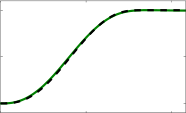

1

0.5

0

0 0.6 1.2

6

0

-6

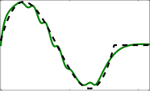
0 0.6 1.2

1

0.5

0

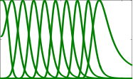

0 0.6 1.2
Time [s]

2

1

0

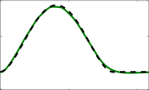

0 0.6 1.2

1

0.5

0

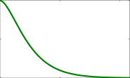
0 0.6 1.2

30

0

-30

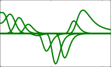

0 0.6 1.2
Time [s]

**Figure 2.** A classical DMP is used to generate a discrete
motion connecting _x_ 0 = 0 and _g_ = 1 (green line in the top left
panel). The training data (black dashed lines) are obtained from
a minimum jerk trajectory connecting _x_ 0 and _g_ in _T_ = 1 s and
used to learn the weights _w_ _i_ of 10 Gaussian basis functions
equally distributed in time. The results of the parameters
learning procedure are shown in the bottom right panel. The
exponentially decaying phase variable is used as shown in the
middle right panel. Results are obtained with the open source
implementation available at www-clmc.usc.edu/
software/git/gitweb.cgi?p=matlab/dmp.git .

By stacking each _f_ _d_ ( _t_ __ ) and _w_ _i_ into the column vectors F =
_⊤_ _⊤_
� _f_ _d_ ( _t_ 1 ) _, . . ., f_ _d_ ( _t_ T )� and **w** = � _w_ 1 _, . . ., w_ _N_ �, we obtain
the following linear system

**Φw** = F _,_ (7)

where

Ψ 1 ( _x_ 1 ) Ψ _N_ ( _x_ 1 )
~~�~~ _Ni_ =1 [Ψ] _[i]_ [(] _[x]_ [1] [)] _[x]_ [1] _· · ·_ ~~�~~ _Ni_ =1 [Ψ] _[i]_ [(] _[x]_ [1] [)] _[x]_ [1]

... ... ...
Ψ 1 ( _x_ T ) Ψ _N_ ( _x_ T )
~~�~~ _Ni_ =1 [Ψ] _[i]_ [(] _[x]_ [T] [)] _[x]_ [T] _· · ·_ ~~�~~ _Ni_ =1 [Ψ] _[i]_ [(] _[x]_ [T] [)] _[x]_ [T]



 _._ (8)

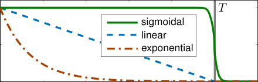

1

0
0 0.2 0.4 0.6 0.8 1 1.2

Time [s]

**Figure 3.** Possible phase variables used in different discrete
DMP formulations. All the different possibilities ensure that
_x, s, p →_ 0 for _t →_ + _∞_ (for _t > T_ in practice).

In general, the problem of learning and retrieving _f_ ( _x_ )
can be in principle solved with any regression technique
(Stulp et al. 2013). For instance, Wang et al. (2016) modified
_f_ ( _x_ ) in (4) by considering a bias term _b_ _i_, _i.e., w_ _i_ _x_ +
_b_ _i_, and used truncated kernels (Ψ _i_ vanishes if _x −_ _c_ _i_ is
smaller than a threshold). This formulation, called DMP+,
produces more accurate trajectories than the original DMP.
Moreover, a learned trajectory can be modified by updating
only a subset of the weights. Other work focused on using
multiple demonstrations to increase the generalization power
of the learned primitive. To learn a suitable forcing term
from multiple demonstrations, some authors used Gaussian
Mixture Model (GMM) (Yin and Chen 2014; Pervez et al.
2017a) and Gaussian Mixture Regression (GMR) (Cohn
et al. 1996), while others adopted Gaussian Process (GP)
(Fanger et al. 2016; Umlauft et al. 2017) (Rasmussen and
Williams 2006), or exploited a deep Neural Network (NN)
(Pervez et al. 2017b; Pahiˇc et al. 2020) developed originally
in (LeCun et al. 2015).

_2.1.1.2_ _Phase stopping and goal switching_ The phase
variable _x_ in (3) provides the ability to manipulate time
during the execution of DMP equations. Moreover, DMP
provides the ability to slow-down or even stop the execution
through the phase-stopping mechanism (Ijspeert et al. 2002c)

_τ_ ˙ _x_ = _−_ _α_ _x_ _x_ ˜ (11)
1 + _α_ _yx_ _||y −_ _y||_

Moreover, DMPs provide an elegant way to adapt the
trajectory generation in real-time through goal switching
mechanisms (Ijspeert et al. 2013)

_τ_ ˙ _g_ = _α_ _g_ ( _g_ 0 _−_ _g_ ) (12)

DMPs in its standard formulation are not suitable for

direct encoding of skills with specific geometry constraints,
such as orientation profiles (represented in either unit
quaternions or rotation matrices), stiffness/damping and
manipulability profiles (encapsulated in full SPD matrices).
For instance, direct integration of unit quaternions, does not
ensure the unity of the quaternions norm. Any representation
of orientation that does not contain singularities is nonminimal, which means that additional constraints need to be
taken into account during integration.

_2.1.1.3_ _Alternative_ _phase_ _variables_ Equation (3)
describes an exponential decaying phase variable that has
been widely used in the DMP literature. The main drawback
of the exponential decaying phase is that it rapidly drops
to very small values towards the end of the motion. This

**Φ** =





Locally Weighted Regression (LWR) (Atkeson et al. 1997;
Schaal and Atkeson 1998; Ude et al. 2010) is a popular
approach used to update the weights _w_ _i_ . LWR uses the error
between the desired trajectory shape and currently learned
shape and a _forgetting factor λ_ to update the weights as

�

**P** __ = _λ_ [1]

_⊤_
**P** _−_ 1
**P** _−_ 1 _−_ **[P]** _[][−]_ [1] _**[ϕ]**_ _[]_ _**[ϕ]**_ _[]_

� _λ_ + _**ϕ**_ __ _[⊤]_ **P** _−_ 1 _**ϕ**_ __

_,_ (9)

**w** __ = **w** _−_ 1 + ( _f_ _d_ ( _t_ __ ) _−_ _**ϕ**_ _⊤_ **w** _−_ 1 ) **P** __ _**ϕ**_ __ _._ (10)

In the previous equations **w** __ = **w** ( _t_ __ ) and _**ϕ**_ __ is the column
vector obtained by transposing the __ -th row of **Φ** . The initial
value of the parameters is **P** 0 = **I** _,_ **w** 0 = **0** . A discrete DMP
learned on synthetic data is shown in Figure 2.
LWR has been the standard method to learn the weights of
DMPs and therefore _f_ ( _x_ ). As an alternative to LWR, (Krug
and Dimitrovz 2013) have shown that learning a forcing
term defined as in (4) can be formulated as a quadratic
optimization problem and efficiently solved.

_Prepared using_ _sagej.cls_

_Saveriano, Abu-Dakka, Kramberger, and Peternel_ 7

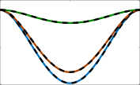

0

-0.04

-0.08
0 5 10

1

0.55

“forces” the learning algorithm to exploit relatively high
weights _w_ _i_ to accurately reproduce the last part of the
demonstration (Samant et al. 2016). As an example, in
Figure 3 the exponential decaying phase (brown dot-dashed
line) is very small already after 0 _._ 6 s, while the expected
time duration of the motion is _T_ = 1 s.

To overcome this limitation, Kulvicius et al. (2011)
propose the sigmoidal decay phase _s_ (green solid line in
Figure 3), obtained by integrating

0.65

0.5

0.35

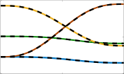

0 5 10

0.03

0

˙ _α_ _s_ _e_ [(] _[α]_ _[s]_ _[/δ]_ _[t]_ [)(] _[τT][ −][t]_ [)]
_s_ = _−_ [1 + _e_ [(] _[α]_ _[s]_ _[/δ]_ _[t]_ [)(] _[τT][ −][t]_ [)] ] [2] _[,]_ (13)

-0.03

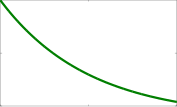

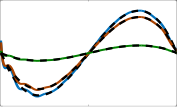

0.1

0 5 10 0 5 10

1 500

0 5 10

500

where _α_ _s_ defines the steepness of _s_ centered at time _T_ and
_δt_ is the sampling time. As shown in Figure 3, _s_ = 1 for
_t < T −_ _δ_ _s_, where the time _δ_ _s_ depends on the steepness _α_ _s_,
and then it decays to _s_ = 0.
The sigmoidal decay in Figure 3 has a tail effect since
it vanishes after _T_ + _δ_ _s_ s, where _δ_ _s_ depends on the tunable
parameter _α_ _s_ . The piece-wise linear phase _l_ (blue dashed
line in Figure 3), proposed by (Samant et al. 2016), linearly
decays from 1 to 0 in exactly _T_ s and then remains constant.
_p_ is obtained by integrating

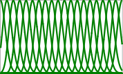

0.5

0

0 5 10

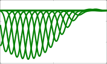

-500

-1500

-2500
0 5 10

Time [s] Time [s]

**Figure 4.** A unit quaternion DMP is used to generate a discrete
motion connecting **q** 1 and **g** _q_ . The training data (black dashed
lines) are obtained from a minimum jerk trajectory connecting
**q** 1 and **g** _q_ in _T_ = 10 s and used to learn the weights _w_ _i_ of 20
Gaussian basis functions equally distributed in time. The results
of the parameters learning procedure are shown in the bottom
right panel. The exponentially decaying phase variable is used
as shown in the middle right panel. Results are obtained with
the open source implementation available at
[https://gitlab.com/dmp-codes-collection](https://gitlab.com/dmp-codes-collection) .

Log _[q]_ ( _·_ ) : _**S**_ [3] _�→_ R [3] is given as

_τ_ ˙ _p_ =

_−_ _T_ [1] _[,]_ _p ≥_ 0 (14)
�0 _,_ otherwise

where _p_ (0) = 1 and _T_ is the time duration of the motion.

_2.1.2_ _Orientation DMP_

The classical DMP formulation described in Section 2.1.1

applies to single DoF motions. Multidimensional motions
are generated independently and synchronized with a
common phase. In other words, equations (1) and (2) are
repeated for each DoF while the phase variable in (3) is
shared. This works when the evolution of different DoF

is independent, like for joint space or Cartesian position
trajectories. Unlike Cartesian position, the elements of
orientation representations like unit quaternion or rotation
matrix are constrained. In this section, we present approaches
that extend the classical DMP formulation to represent
Cartesian orientations.

_2.1.2.1_ _Quaternion DMP_ Unit quaternion **q** = ν + **u** _∈_
_**S**_ [3] provides a representation of the orientation of the robot’s
end-effector (Chiaverini and Siciliano 1999). _**S**_ [3] is a unit
sphere in R [4], ν _∈_ R, and **u** _∈_ R [3] . Abu-Dakka et al. (2015a)
rewrote DMP equations (1) and (2) for direct unit quaternion
encoding as follows

_τ_ **˙** _**η**_ = _α_ _z_ ( _β_ _z_ 2 Log _[q]_ ( **g** _q_ _∗_ ~~**q**~~ ~~)~~ _−_ _**η**_ ) + **f** _q_ ( _x_ ) _,_ (15)

Exp _[q]_ ( _**ω**_ ) =

Log _[q]_ ( **q** ) =






arccos(ν) **[u]**

**u** (17)

[0 0 0] _[⊤]_ _,_ otherwise _,_

**u** _̸_ = **0**
_||_ **u** _||_ _[,]_

where _|| · ||_ denotes _ℓ_ 2 norm.
Early attempt to encode unit quaternion profiles using
DMP was presented by Pastor et al. (2011). Unlike AbuDakka et al.’s formulation, Pastor et al.’s does not take into
account the geometry of _**SO**_ (3) as they just used the vector
part of the quaternion product ( **g** _q_ _∗_ ~~**q**~~ ~~)~~ in (15) instead of
2 Log _[q]_ ( **g** _q_ _∗_ ~~**q**~~ ~~)~~ which defines the angular velocity _**ω**_ that
rotates quaternion **q** into **g** _q_ within a unit sampling time.
Equation (16) can be integrated as

_δt_
**q** ( _t_ + _δt_ ) = Exp _[q]_
� 2

_**η**_ ( _t_ )

2 _τ_

_∗_ **q** ( _t_ ) _,_ (18)
�

_τ_

where _δ_ _t_ _>_ 0 denotes a small constant. The function
Exp _[q]_ ( _·_ ) : R [3] _�→_ _**S**_ [3] is given

cos( _||_ _**ω**_ _||_ ) + sin( _||_ _**ω**_ _||_ ) _**[ω]**_ _**ω**_ _̸_ = **0**

_||_ _**ω**_ _||_ _[,]_






_τ_ **˙q** = [1] (16)

2 _**[η]**_ _[ ∗]_ **[q]** _[,]_

1 + [0 0 0] _[⊤]_ _,_ otherwise _._

(19)
Both mappings become one-to-one, continuously differentiable and inverse to each other if the input domain of the
mapping Log _[q]_ ( _·_ ) is restricted to _**S**_ [3] except for _−_ 1 + [0 0 0] _[⊤]_,
while the input domain of the mapping Exp _[q]_ ( _**ω**_ ) should
fulfill the constraint _||_ _**ω**_ _|| < π_ (Abu-Dakka et al. 2015a). An
exemplar unit quaternion DMP is shown in Figure 4.
Phase-stopping (11) can be rewritten as follows

where **g** _q_ _∈_ _**S**_ [3] denotes the goal orientation, the quaternion
conjugation is defined as ~~**q**~~ = ~~ν +~~ ~~**u**~~ = ν _−_ **u**, and _∗_ denotes
the the quaternion product

**q** 1 _∗_ **q** 2 = (ν 1 + **u** 1 ) _∗_ (ν 2 + **u** 2 )

= (ν 1 ν 2 _−_ **u** _[⊤]_ 1 **[u]** 2 [) + (][ν] 1 **[u]** 2 [+][ ν] 2 **[u]** 1 [+] **[ u]** 1 _[×]_ **[ u]** 2 [)] _[.]_

_**η**_ _∈_ R [3] is the scaled angular velocity _**ω**_ and treated as unit
quaternion with zero scalar (ν = 0) in (16). The function

_Prepared using_ _sagej.cls_

_τ_ ˙ _x_ = _−_ _α_ _x_ _x_ (20)
1 + _α_ _qx_ d(˜ **q** _,_ **q** )

8 _Journal Title XX(X)_

1

0.5

0

0 0.6 1.2

6

0

-6
0 0.6 1.2

1

0.5

0

0 0.6 1.2
Time [s]

2

1

0

0 0.6 1.2

1

0.5

0
0 0.6 1.2

30

0

-30

0 0.6 1.2
Time [s]

30

0

-30

0 50 100

1

0.5

0
0 50 100

20

0

-20
0 50 100

1

0.55

0.1
0 50 100

-4
0 50 100

2

0

-2

x106

**Figure 5.** A rotation matrix DMP is used to generate a discrete
motion connecting **R** 1 and **R** _g_ . The training data (black dashed
lines) are obtained from a minimum jerk trajectory connecting
**R** 1 and **R** _g_ in _T_ = 10 s and used to learn the weights _w_ _i_ of 20
Gaussian basis functions equally distributed in time. The results
of the parameters learning procedure are shown in the bottom
right panel. The exponentially decaying phase variable is used
as shown in the middle right panel.

where

Time [s] Time [s]

**Figure 6.** An SPD DMP is used to generate a discrete motion
connecting **X** 1 and **X** _g_ . The training data (black dashed lines)
are obtained from a minimum jerk trajectory connecting **X** 1 and
**X** _g_ in _T_ = 100 s and used to learn the weights _w_ _i_ of 20
Gaussian basis functions equally distributed in time. The cone
in the upper left corner represents the manifold of SPD data and
includes the geodesic of the SPD profile. The results of the
parameters learning procedure are shown in the bottom right
panel. The exponentially decaying phase variable is used as
shown in the middle right panel. Results are obtained with the
open source implementation available at
[https://gitlab.com/dmp-codes-collection](https://gitlab.com/dmp-codes-collection) .

The function Log _[R]_ ( _·_ ) : _**SO**_ (3) _�→_ R [3] is given as

d(˜ **q** _,_ **q** ) =

2 _π,_ **q** 1 _∗_ ~~**q**~~ 2 = 1 + [0 0 0]
�2 _|_ Log _[q]_ ( **q** 1 _∗_ ~~**q**~~ 2 ~~)~~ _||,_ otherwise

Ude et al. (2014) extended DMP quaternions-based
formulation by rewriting (12) to include goal switching
mechanism.

_τ_ **˙g** _q_ = _α_ _qg_ Log _[q]_ ( **g** _q,new_ _−_ ~~**g**~~ _q_ ) _∗_ **g** _q_ (21)

so that **g** _q_ is continuously changing onto **g** _q,new_ in real-time.
Equation (21) should be integrated using (19) along with (15)
and (16).
As shown by Saveriano et al. (2019) using Lyapunov
arguments, both the quaternion DMP formulations in (Pastor
et al. 2011) and in (Abu-Dakka et al. 2015a; Ude et al. 2014)
asymptotically converge to the target quaternion **g** _q_ with zero
velocity.

_2.1.2.2_ _Rotation Matrix DMP_ In their work on orienta
tion DMPs, Ude et al. (2014) extended DMPs formulation
in order to encode orientation trajectories represented in the
form of rotation matrices **R** ( _t_ ) _∈_ _**SO**_ (3). Therefore, they
rewrote (1) and (2) in the form

_τ_ **˙** _**η**_ = _α_ _z_ ( _β_ _z_ Log _[R]_ ( **R** _g_ **R** _[⊤]_ ) _−_ _**η**_ ) + **f** _R_ ( _x_ ) _,_ (22)

_τ_ **R** **[˙]** = [ _**η**_ ] _×_ **R** _,_ (23)

where **R** _g_ represents the goal orientation. [ _**η**_ ] _×_ is a skew
symmetric matrix, such as [ _**η**_ ] _×_ = _−_ [ _**η**_ ] _×_ . The relation
between the angular velocity and 1st-time-derivative of the
rotation matrix is given by

Log _[R]_ ( **R** ) =

[0 _,_ 0 _,_ 0] _[⊤]_ _,_ **R** = **I**

(25)

� _ω_ = _θ_ **n** _,_ otherwise _,_





_r_ 32 _−_ _r_ 23

 _r_ 13 _−_ _r_ 31

 _r_ 21 _−_ _r_ 12

trace( **R** ) _−_ 1
_θ_ = arccos
� 2

1
� _,_ **n** = 2 sin ( _θ_ )

The generated rotation matrices can be obtained by
integrating (23) as follows

**R** ( _t_ + _δt_ ) = Exp _[R]_ _δt_ [[] _**[η]**_ []] _[×]_
� _τ_

**R** ( _t_ ) _._ (26)
�

The function Exp _[R]_ ( _·_ ) : R [3] _�→_ _**SO**_ (3) is given as

Exp _[R]_ ( _t_ [ _**ω**_ ] _×_ ) = **I** + sin( _θ_ ) [[] _**[ω]**_ []] _[×]_

_||_ _**ω**_ _||_

(27)

_×_
+ (1 _−_ _cos_ ( _θ_ )) _||_ [[] _**[ω]**_ _**ω**_ []] _||_ [2][2] _[.]_

 = ˙ **RR** _[⊤]_ _._ (24)



where _θ_ ( _t_ ) = _t||_ _**ω**_ _||_ express the rotation angle within time _t_ .
An exemplar rotation matrix DMP is shown in Figure 5.

_2.1.3_ _SPD matrices_

Abu-Dakka and Kyrki (2020) generalized DMP formulation
in order to encode robotic manipulation data profiles
encapsulated in form of SPD matrices. By defining **X** _∈_
_**S**_ _[m]_ ++ [as an arbitrary SPD matrix and] **[ Ξ]** [ =] _[ {][t]_ _[]_ _[,]_ **[ X]** _[]_ _[}]_ [T] __ =1 [as]
the set of SPD matrices in one demonstration, where _**S**_ _[m]_ ++

[ _**ω**_ ] _×_ =

_Prepared using_ _sagej.cls_

0 _−ω_ _z_ _ω_ _y_

 _ω_ _z_ 0 _−ω_ _x_

 _−ω_ _y_ _ω_ _x_ 0

_Saveriano, Abu-Dakka, Kramberger, and Peternel_ 9

20

0

defines the set of _m × m_ SPD matrices. Afterwards, we can
rewrite (1) and (2) as follows

_τ_ ˙ _**σ**_ = _α_ _z_ ( _β_ _z_ **vec** (B **X** __ _�→_ **X** 1 (Log [+] **X** __ [(] **[X]** _[g]_ [)))] _[ −]_ _**[σ]**_ [)]

(28)
+ _**F**_ + ( _x_ ) _,_

_τ_ _**ξ**_ [˙] = _**σ**_ _,_ (29)

where _**σ**_ = **vec** ( **Σ** ) is the Mandel representation of the
symmetric matrix **Σ**, where **Σ** is the time derivative
of **Ξ** so that **Σ** _≡_ **Ξ** **[˙]** = (Log [+] **X** _−_ 1 [(] **[X]** _[]_ [))] _[/δt]_ [. The function]
Log **X** _−_ 1 ( **X** __ ): _M �→T_ **X** _−_ 1 _M_ maps a point **X** __ in the
manifold _M_ to a point in the tangent space **∆** _∈T_ **X** _−_ 1 _M_ .
_vec_ ( _·_ ) is a function that transforms a symmetric matrix into
a vector using Mandel’s notation, _e.g.,_ a vectorization of a
2 _×_ 2 symmetric matrix is

2

0

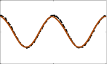

-2
0 1 2

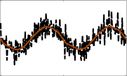

-2 -20
0 1 2 0 1 2

2000 15

15

10

5

0
0 1 2

200

0

-200

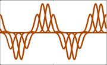

0 1 2
Time [s]

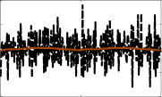

0

-2000
0 1 2

1

0.5

0

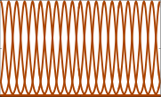

0 1 2
Time [s]

_a_ _b_

_b_ _d_
��

_vec_

� [�]

=



_a_

_d_
 _√_

2 _b_

 _._ (30)



_**ξ**_ is the vectorization of **Ξ** . **X** _g_ _∈_ _**S**_ _[m]_ ++ [represents the goal]
SPD matrix. _vec_ (B **X** __ _�→_ **X** 1 (Log [+] **X** __ [(] **[X]** _[g]_ [)))][ is the vectorization]
of the transported symmetric matrix Log [+] **X** __ [(] **[X]** _[g]_ [)][ over the]
geodesic from **X** __ to **X** 1 . Then we integrat (29) as

_._ (31)

�

**Figure 7.** A classical DMP is used to reproduce a rhythmic
motion (brown solid line in the top left panel). The desired
trajectory is obtained by adding Gaussian noise to
_y_ _d_ = cos (2 _πt_ ) with _t ∈_ [0 _,_ 2 ] _s_ and computing the numerical
derivatives with _δt_ = 0 _._ 01 s (black dashed lines). The forcing
term is obtained as the weighted summation of 20 Gaussian
basis equally distributed in time (bottom left panel). The results
of the parameters learning procedure are shown in the bottom
right panel. Results are obtained with the open source
implementation available at www-clmc.usc.edu/
software/git/gitweb.cgi?p=matlab/dmp.git .

to (Ijspeert et al. 2013, 2002b) for details). In addition, the
periodic DMPs must ensure that the initial phase ( _φ_ = 0) and
the final one ( _φ_ = 2 _π_ ) coincide in order to achieve smooth
transition during the repetitions.

Similar to (4), _f_ ( _φ_ ) is defined with _N_ Gaussian kernels
according to the following equation

_N_
_f_ ( _φ_ ) = � ~~�~~ _i_ = _Ni_ 1=1 [Ψ][Ψ] _[i]_ [(] _[φ]_ _[i]_ [(][)] _[φ][w]_ [)] _[i]_ _[r]_ _,_ (36)

Ψ _i_ ( _φ_ ) = exp ( _h_ (cos ( _φ −_ _c_ _i_ ) _−_ 1)) _,_ (37)

where the weights are uniformly distributed along the phase
space, and _r_ is used to modulate the amplitude of the periodic
signal (Ijspeert et al. 2002b; Gams et al. 2009) (if not used,
it can be set to _r_ = 1 (Peternel et al. 2016a)).

Similarly to discrete DMPs, LWR (Schaal and Atkeson
1998) can be used to update the weight to learn a desired
trajectory. In a standard periodic DMP setting (Ijspeert
et al. 2002b; Gams et al. 2009), the desired shape _f_ _d_ is
approximated by solving

**ˆX** ( _t_ + _δt_ ) = Exp [+] **X** ( _t_ )

B **X** 1 _�→_ **X** ( _t_ ) ( _mat_ ( _**σ**_ ( _t_ )))

_δt_

_τ_

�

where the function _mat_ ( _·_ ) is the inverse of _vec_ ( _·_ ) and
denotes to the matricization using Mandel’s notation. **X** **[ˆ]** _∈_
_**S**_ _[m]_ ++ [represents the new SPD-matrices-based robot skills.]
The function Exp [+] **X** _−_ 1 [(] **[∆]** [):] _[T]_ **[X]** _−_ 1 _[M �→M]_ [ maps a point]
**∆** _∈T_ **X** _−_ 1 _M_ to a point **X** __ _∈M_, so that it lies on the
geodesic starting from **X** _−_ 1 _∈_ _**S**_ _[m]_ ++ [in the direction of] **[ ∆]** [.]
An exemplar SPD DMP is shown in Figure 6.
Moreover, Abu-Dakka and Kyrki (2020) rewrote (12) for
smooth goal adaptation in case of sudden goal switching as
follows
_τ_ **˙g** **+** = _α_ _g_ Log [+] **g** _new_ [+] [(] **[g]** [+] [)] _[.]_ (32)

so **g** now is updated continually.

_2.2_ _Periodic DMP_

The periodic DMP (sometimes called rhythmic DMP) are
used when the encoded motion follows a rhythmic pattern.

_2.2.1_ _Classical DMP_

The classical periodic (or rhythmic) DMPs were first
introduced by Ijspeert et al. (2002b), where they redefined
the second order differential equation system described in
(1) and (2) as follows

˙
_z_ = Ω( _α_ ( _β_ ( _−y_ ) _−_ _z_ ) + _f_ ( _φ_ )) _,_ (33)

_y_ ˙ = Ω _z,_ (34)

_τ_ _φ_ [˙] = 1 _,_ (35)

where Ω is the frequency and _y_ is the desired periodic
trajectory that we want to encode with a DMP. The main
difference between periodic DMPs and point-to-point DMPs
is that the time constant related to trajectory duration is
replaced by the frequency of trajectory execution (refer

_Prepared using_ _sagej.cls_

_,_ (38)
�

_f_ _d_ ( _t_ __ ) = _[y]_ [¨] _[d]_ Ω [(] _[t]_ [2] _[]_ [)] _−_ _α_ _z_

� _β_ _z_ ( _−y_ _d_ ( _t_ __ )) _−_ _[y]_ [˙] _[d]_ Ω [(] _[t]_ _[]_ [)]

where _y_ _d_ is some demonstrated input trajectory that needs
to be encoded. The weights _w_ _i_ can be updated using the
recursive least-squares method (Schaal and Atkeson 1998)
with forgetting factor _λ_ based on the error between the

10 _Journal Title XX(X)_

|Table 3. Summary of|f DMP ba|asic formulations.|Col4|Col5|
|---|---|---|---|---|
|**Type of movement**|**Space**|**System of equations**|**Reference**|**Short description**|
|**Discrete**|R|_τ_ ˙_z_ =_ αz_(_βz_(_g −y_)_ −z_) +_ f_(_x_) _τ_ ˙_y_ =_ z_ _τ_ ˙_x_ =_ αxx_|Eqs. (1)– (3), (Ijspeert et al. 2002c)|A single DoF, discrete motion trajectory is encoded into a linear, second-order dynamical system with an additive, non- linear forcing term. Convergence to the desired goal_ g_ is ensured by a vanishing phase variable_ x_.|
|**Discrete**|**_S_**3|_τ_** ˙****_η_** =_ αz_(_βz_2 Log_q_(**g**_q ∗_~~**q**~~)_ −_**_η_**) +** f**_ q_(_x_) _τ_** ˙q** = 1 2**_η_**_ ∗_**q**|Eqs. (15)– (16), (Abu- Dakka et al. 2015a)|A quaternion-based orientation trajectory (3 DoFs) is encoded into a second-order dynamical system with an additive, non- linear forcing term. The error def- inition complies with the geome- try of the unit quaternions space.|
|**Discrete**|**_SO_**(3)|_τ_** ˙****_η_** =_ αz_(_βz_ Log_R_(**R**_g ∗_**R**_⊤_)_ −_**_η_**) +** f**_ R_(_x_) _τ_ **˙R** = [**_η_**]_×_**R**|Eqs. (22)– (23), (Ude et al. 2014)|A rotation matrix-based orientation trajectory (3 DoFs) is encoded into a second-order dynamical system with an additive, non-linear forcing term. The error definition complies with the geometry of the rotation matrices space.|
|**Discrete**|**_S_**_m_ ++|_τ_ ˙**_σ_** =_ αz_(_βz_**vec**(B**X**_l→_**X**1(Log+ **X**_l_(**X**_g_)))_ −_**_σ_**) +**_ F_**(_x_) _τ_ ˙**_ξ_** =**_ σ_**|Eqs. (28)– (29), (Abu- Dakka and Kyrki 2020)|An SPD matrices trajectory, _m_(_m_ + 1)_/_2 DoFs, is encoded into a second-order dynamical system with an additive, non- linear forcing term. The error definition complies with the geometry of the SPD matrices space.|
|**Periodic**|R|˙_z_ = Ω(_α_ (_β_ (_−y_)_ −z_) +_ f_(_φ_)) ˙_y_ = Ω_z_ _τ_ ˙_φ_ = 1|Eqs. (33)– (35), (Ijspeert et al. 2002b)|A single DoF, periodic motion trajectory is encoded into a linear, second-order dynamical system with an additive, non- linear forcing term. The resulting system generates a stable limit cycle.|

desired trajectory shape and currently learned shape

_w_ _i_ ( _t_ __ +1 ) = _w_ _i_ ( _t_ __ ) + Ψ _i_ _P_ _i_ ( _t_ __ +1 ) _re_ _r_ ( _t_ __ ) _,_ (39)

_e_ _r_ ( _t_ __ ) = _f_ _d_ ( _t_ __ ) _−_ _w_ _i_ ( _t_ __ ) _r,_ (40)

_P_ _i_ ( _t_ __ +1 ) = _λ_ [1]

�

_P_ _i_ ( _t_ __ ) _−_ _λ_ _P_ _i_ ( _t_ __ ) [2] _r_ [2]

_λ_
Ψ _i_ [+] _[ P]_ _[i]_ [(] _[t]_ _[]_ [)] _[r]_ [2]

_2.3_ _Formulation summary_

A summary for the existence DMP formulations mentioned
in the earlier sections is shown in Table 3. The table

shows the variations of the formulation in its standard shape
based on the space that they are applied to. However, the
modifications of this standard shape ( _e.g.,_ adding a coupling
term) is discussed in the next section as an extension of the
DMP formulations.

**3** **DMPs extensions**

_3.1_ _Generalization_

A desirable property of motion primitives is the ability
to generalize to unforeseen situations. In this section,
we present approaches that allow to adapt DMP motion
trajectories to novel executive contexts.

_3.1.1_ _Start, goal, and scaling_

Classical DMPs are time invariant, meaning that time
scaling _ςτ_ with _ς >_ 0 generate topologically equivalent
trajectories (Ijspeert et al. 2013). Using a simple modification
of the transformation system, namely substituting (1) with

_τ_ ˙ _z_ = _α_ _z_ ( _β_ _z_ ( _g −_ _y_ ) _−_ _z_ ) + ( _g −_ _y_ 0 ) _f_ ( _x_ ) _,_ (42)

�

_._ (41)

The initial value of the parameters is _w_ _i_ (0) = 0 and _P_ _i_ (0) =
1. The forgetting factor determines the rate of weight
changes. Refer to (Schaal and Atkeson 1998) for details on
parameter setting. An exemplar rhythmic DMP is shown in
Figure 7.

The classical periodic DMP described by (33)–(35) does
not encode the transit motion needed to start the periodic
one. Transients are important in several applications like
humanoid robot walking where usually the first step made
from a rest position is a transient needed to start the
periodic motion. To overcome this limitation, (Ernesti et al.
2012) modify the classical formulation of periodic DMPs
to explicitly consider transients as motion trajectory that
converge towards the limit cycle ( _i.e.,_ periodic) one.

_Prepared using_ _sagej.cls_

_Saveriano, Abu-Dakka, Kramberger, and Peternel_ 11

Ijspeert et al. (2013) show that DMP are also scale invariant,
meaning that the scaling of the movement amplitude
_ς_ ( _g −_ _y_ 0 ) with _ς >_ 0 generates topologically equivalent
trajectories. The purpose of the green color used in (42)
is to highlight differences _w.r.t._ (1). Apart from generating
scaled—in time and space—versions of the demonstrated
motion trajectory, classical DMPs also generalize to different
initial/target states. However, the classical formulation—and
its extension in (42)—may exhibit dangerous behaviors like
over-amplification of the trajectory when reaching a different
target and high accelerations when switching to a different
target on-line (Pastor et al. 2009; Ijspeert et al. 2013). To
alleviate the second issue, Ijspeert et al. (2013) replaced
hard goal switches with the smooth switching law as in
(12). However, the over-amplification issue still remains.
Moreover, a DMP that uses (42) fails to learn motions with
the same initial and target states ( _i.e., g_ = _y_ 0 _, z_ 0 = 0 _→_
_y_ ( _t_ ) = _y_ 0 = _g ∀t_ ).
In order to remedy those issues, Pastor et al. (2009)
proposed to modify the transformation system as

_τ_ ˙ _z_ = _α_ _z_ ( _β_ _z_ ( _g −_ _y−_ ( _g −_ _y_ 0 ) _x_ + _f_ ( _x_ )) _−_ _z_ ) _,_ (43)

where the green color is used to highlight differences
between (43) and (1). The most important change in this
formulation is the term ( _g −_ _y_ 0 ) _x_ that has several benefits.
It prevents high accelerations at the beginning of the motion
( _g −_ _y −_ ( _g −_ _y_ 0 ) _x_ = 0 for _t_ = 0) or when the goal is
close to the initial state. It allows to reproduce motions
with the same initial and target states and it prevents
over-amplifications and trajectory mirroring effects [*] when
changing the goal. Hoffmann et al. (2009) derived a
multidimensional representation of (43) from the behavior
of the spinal force fields in frogs.

The goal can also change over time and, in this case, the
tracking performance of the DMP mostly depends on the
gains _α_ _z_ and _β_ _z_ . As proposed by (Koutras and Doulgeri
2020b), the tracking performance can be improved by
adapting the temporal scaling _τ_ .

Dragan et al. (2015) showed that DMPs solve a trajectory
optimization problem in order to minimize a particular
Hilbert norm between the demonstration and the new

trajectory subject to start and goal constraints. In this light,
DMP adaptation capabilities to different start and goals can
be improved by choosing (or learning) a proper Hilbert norm
that reduces the deformation in the retrieved trajectory.

_3.1.2_ _Via-points_

A via-point can be defined as a point in the state space
where the trajectory has to pass. Failing to pass a via-point
may cause the robot to fail the task execution. Therefore,
having a motion primitive representation with the capability
of modulating the via-points is of importance in robotic
scenarios. It is not surprising that researchers have extended
the DMP formulation to consider intermediate via-points in
the trajectory generation process.

Ning et al. (2011, 2012) extend the classical DMP to
satisfy position and velocity constraints at the beginning
and at the end of a sample trajectory. Their approach to
traverse via-points consists of creating a sample trajectory

_Prepared using_ _sagej.cls_

by combining locally-linear trajectories connecting the viapoints. This sample trajectory is used to fit a DMP that is
constrained to pass the via-points.

Weitschat and Aschemann (2018) considered each viapoint as an intermediate goal ( _via-goal_ ) _g_ _v_ for _v_ = 1 _, . . ., V_
to reach. The last via-goal _g_ _V_ corresponded to the target state
of the DMP. In their formulation, they defined a variable goal

as

_g_ _via_ ( _x_ ) =

_V_
� Ψ _v_ ( _x_ ) _g_ _v_ _,_ (44)

_v_ =1

where Ψ _v_ ( _x_ ) are the Gaussian basis function centered at the
time corresponding to the _v−_ th via-goal. The effectiveness
of the approach is demonstrated in a task were the robot
has to reach a different target while preventing possible selfcollisions of the end-effector with the robot body. To this end,
authors place the via-goals along the trajectory used to learn
the DMP, forcing the generated trajectory to stay close to the
demonstration while reaching the new target.
The problem of generalizing to via-point close (interpolation) and far (extrapolation) from the demonstration is
faced by (Zhou et al. 2019). Their approach, namely _Via-_
_points Movement Primitives (VMPs)_, combines the benefits
of DMP and Probabilistic Movement Primitivess (ProMPs)
(Paraschos et al. 2013). Authors assumed that the motion
trajectory is generated as

_y_ _vmp_ ( _x_ ) = _e_ ( _x_ ) + _f_ _vmp_ ( _x_ ) _,_ (45)

where _x_ is the phase variable defined as in (3) and the
elementary trajectory _e_ ( _x_ ) can be defined as the linear
attractor _e_ ( _x_ ) = ( _y_ 0 _−_ _g_ ) _x_ . The shape modulation term
_f_ _vmp_ ( _x_ ) is defined as

_f_ _vmp_ ( _x_ ) =

_N_
� _w_ _i_ Ψ _i_ ( _x_ ) + _ϵ_ _f_ (46)

_i_ =1

where the Gaussian kernels Ψ _i_ ( _x_ ) are defined as in (5),
_w_ _i_ are learnable weights, and _ϵ_ _f_ is the Gaussian noise.
As detailed in (Paraschos et al. 2013), learning the
shape modulation term _f_ _vmp_ ( _x_ ) means Learning from
Demonstrations (LfDs) the prior probability distribution of
the weights _w_ _i_ . Having separated the generated trajectory
into two parts like in (45) allows to adopt different strategies
to pass a via-point _y_ _v_ at _x_ _v_ . Zhou et al. (2019) proposed to
modify the shape modulation term for interpolation cases–
when the via-point is “close” to the demonstrations. In
extrapolation cases, instead, the elementary trajectory _e_ ( _x_ ) is
rewritten as the polygonal line connecting _y_ 0, _y_ _v_, and _g_ . This
approach easily generalizes to the case of multiple via-points.
VMPs are experimentally compared with ProMPs, showing
better performance especially in extrapolation cases.

_3.1.3_ _Task parameters_

Reaching a different goal, or passing through via-points, may
not be enough to successfully execute a task in a different
context. Approaches presented in this section adapt the DMP

_∗_ As discussed by (Pastor et al. 2009), a transformation system that uses (42)
generates a mirrored trajectory while reaching a new goal _g_ _new_ every time
the signs of ( _g_ _new_ _−_ _y_ 0 ) and ( _g −_ _y_ 0 ) differ.

12 _Journal Title XX(X)_

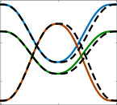

1.5

0.5

-0.5

0 5 10
Time [s]

**(a)** Position

0.8

0

-0.8

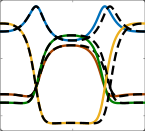

0 5 10
Time [s]

**(f)** Quaternion

0.8

0

-0.8

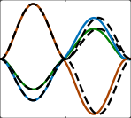

0 5 10
Time [s]

**(b)** Linear Velocity

2.5

0

-2.5

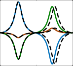

0 5 10
Time [s]

**(g)** Angular Velocity

0.06

0

-0.06

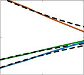

4.6 4.7 4.8
Time [s]

**(c)** Linear Velocity

0.06

0

-0.06

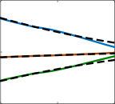

4.6 4.7 4.8
Time [s]

**(h)** Angular Velocity

1.5

0.5

-0.5

|Col1|Col2|
|---|---|
|||
|||
|||
|||

0 5 10
Time [s]

**(d)** Goal Switch

0.6

-0.2

-1

0 5 10
Time [s]

**(i)** Goal Switch

0.01

0.005

0

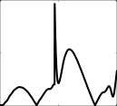

0 5 10
Time [s]

**(e)** Position Error

0.014

0.007

0

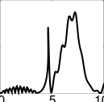

Time [s]

**(j)** Orientation Error

**Figure 8.** Results obtained by applying the zero velocity switch approach to join two DMPs trained on synthetic data. The training
trajectory for the position and the orientation are shown as a black dashed lines in (a)-(b) and (f)-(g) respectively. Results are
obtained with the open source implementation available at [https://gitlab.com/dmp-codes-collection](https://gitlab.com/dmp-codes-collection) .

motion to new situations by adjusting the weights _w_ _i_ of the
forcing term (4), that modifies the entire DMP trajectory.

Weitschat et al. (2013) considered that _L_ demonstrations
are given, each encoded in a different DMP. In order to
generalize, for instance, to a new goal _g_ _new_, they proposed
to interpolate the weights of nearby DMPs, _i.e.,_ DMPs that
reached points around _g_ _new_ . In formulas

�

new task parameters and then execute the DMP. Matsubara
et al. (2010, 2011) augmented the forcing term with a
style parameter used to capture human variability across
multiple demonstrations. Stulp et al. (2013) proposed a
1-step procedure where the DMP forcing term (4) is
reformulated to explicitly depend on the task parameters.
Their experiments shows that a 1-step approach gives more
freedom _w.r.t._ the used regression technique and increase the
generalization performance. Along the same line, Pervez and
Lee (2018) embedded task parameters directly in the forcing
term. Authors proposed to use a mixture of Gaussians (Cohn
et al. 1996) to learn the mapping between the task parameters
( _e.g.,_ new goal, height of an obstacle, _etc_ ) and the forcing
term. Given a new query task parameter, regression over the
mixture of Gaussians is used to retrieve the forcing term
parameters and generate the DMP motion. The approach is
tested on a variety of tasks including sweeping and stricking
and additionally compared with the approaches presented
by (Ude et al. 2010; Forte et al. 2012; Stulp et al. 2013)
showing better performance especially in extrapolation.

A Mixture of Motor Primitives (MoMP) is proposed in
(M¨ulling et al. 2010, 2013) and used to generalize table
tennis skills like hitting and batting a ball. MoMP uses an
augmented state that contains robot position and velocity as
well as the meta-parameters of the table tennis task like the
expected hitting position and velocity. The adapted motion
is generated by the weighted summation of _L_ DMPs and the
responsibility of each DMP, representing the probability that
a particular DMP is the correct one for the sensed augmented
state, is also learned from data.

In high DoF systems, like humanoid robots, it is non
trivial to find a relationship between the task and the DMP
parameters. This is especially true when the DMPs are used
to encode joint space trajectories. Bitzer and Vijayakumar
(2009) showed that such a relationship is easier to find in a
latent (lower dimensional) space obtained from training data.
Therefore, they used dimensionality reduction techniques to
find the latent space where to fit a DMP and show that

**w** _new_ =

� **w** _o_ _d_ _[−]_ _o_ [1]

_∀o_ : _d_ _o_ _<d_ _max_
~~�~~ _d_ _[−]_ _o_ [1]

_o_ ~~�~~ _max_ _d_ _[−]_ _o_ [1] _,_ (47)

_∀o_ : _d_ _o_ _<d_ _max_

where _o_ represents the indices of the nearby DMPs for
which it holds that _d_ _o_ _< d_ _max_ . _d_ _o_ is the distance (or,
more generally, a cost) between _g_ _new_ and _g_ _o_, _d_ _max_ is the
maximum distance to consider 2 DMPs close. **w** _new_ =

[ _w_ 1 _,new_ _, · · ·, w_ _N,new_ ] _[⊤]_ and **w** _o_ = [ _w_ 1 _,o_ _, · · ·, w_ _N,o_ ] _[⊤]_ are
the new weights and the weight of nearby DMPs,
respectively.
The approach by Forte et al. (2011, 2012) also assumes
that _L_ demonstrations are given and that each demonstration
is encoded in a different DMP. Further, the authors exploited
GP (Rasmussen and Williams 2006) to learn a mapping
between the query points _q_ _l_ for _l_ = 1 _, . . ., L_ ( _e.g.,_ the goal
of each DMP) and the DMP parameters [ **w** _l_ _, g_ _l_ _, τ_ _l_ ]. Given
the new query point _q_ _new_, Gaussian Process Regression
(GPR) (Rasmussen and Williams 2006) is used to retrieve
the new set of parameters [ **w** _new_ _, g_ _new_ _, τ_ _new_ ], that can be
used to generate a DMP motion. This approach builds on
previous work (Gams and Ude 2009; Ude et al. 2010) where
raw data from the _L_ demonstrations are stored in memory
and LWR is used to generate new DMP weights. Alizadeh
et al. (2016) extend the approach in (Ude et al. 2010) to
retrieve the DMP weights even when the task parameters are
partially observable. Finally, (Zhou and Asfour 2017) extend
the approach in (Ude et al. 2010) to consider task-specific
costs while learning the mapping between query points and
DMP weights.
Aforementioned approaches follow a 2-steps procedure
where first the shape parameters **w** are estimated given

_Prepared using_ _sagej.cls_

_Saveriano, Abu-Dakka, Kramberger, and Peternel_ 13

interpolation of DMP weights in the latent space results in constant goal delayed goal moving target
better generalization performance. 1 1

_3.2_ _Joining multiple DMPs_ 0.5 0.5

An important and desired feature of any motion primitive
representation is the possibility to combine basic movements
to obtain more complex behaviors (Schaal 1999). We review
here three prominent approaches developed to smoothly join
a sequence of DMPs. In this tutorial, we name the approach
by Pastor et al. (2009) as _velocity threshold_, that in (Kober
et al. 2010b) as _target crossing_, and that in (Kulvicius
et al. 2011, 2012) as _basis functions overlay_ . Some of
the presented approaches modify the DMP formulations in
Section 2.1.1 and 2.1.2. The main differences are highlighted
with green text. The 3 approaches have been implemented
in Matlab for both position (Section 2.1.1) and orientation
(Section 2.1.2) DMPs. The source code is included in our
public repository (see Table 4). Results on synthetic data are
shown in Figures 8 to 11.

_3.2.1_ _Velocity threshold_

A properly designed DMP reaches the desired target with
zero velocity and acceleration, _i.e.,_ once a DMP is fully
executed the robot comes to a full stop. This also implies that
the velocity “close” to the target is continuously decreasing.
Using this property, Pastor et al. (2009) propose to combine
successive DMPs by simply terminating the current DMP
when the velocity is below a certain threshold and then
starting the following primitive. When executing a single
DMP, it is common practice to initialize its velocity to
zero—the robot is assumed to be still. In principle, this
initialization can be used to sequence multiple DMPs (Xu
and Wang 2004; Lioutikov et al. 2016), but it may generate
discontinuities if the robot does not fully stop in between two
consecutive primitives. To prevent this discontinuities, Pastor
et al. initialized the state of the current DMP with that of the

previous one.
The velocity threshold approach is simple and effective
since it directly applies to the DMP formulations in
Sections 2.1.1 and 2.1.2. For instance, Saveriano et al.
(2019) showed how to join multiple quaternion DMPs [†] (see
Section 2.1.2.1) with the velocity threshold approach.
Results in Figure 8 are obtained when velocity threshold is
applied to merge 2 DMPs separately trained to fit minimum
jerk trajectories (black dashed lines). Figures 8a–8e show the
position and Figures 8f–8j the orientation (unit quaternion)
parts of the motion. The merged trajectory is generated
by following the first DMP until the distance from the
via-point is below 0 _._ 01 [m] and 0 _._ 01 [rad]. As shown in
Figures 8d and 8i, the switch occurs after about 4 _._ 7 [s].
Figures 8e and 8j shows that the desired trajectory is
accurately reproduced. More or less accurate trajectories
can be obtained by tuning the distance from the viapoint. However, the value of this distance the time duration
of the generated trajectory—a bigger (smaller) distance
results in a shorter (longer) trajectory. For instance, in the
considered case, the total motion ends after 9 _._ 5 [s] while the
demonstration lasts for 10 [s]. Depending on the application,
the time difference may cause failures, therefore, it has to be
taken into account. Finally, the velocity threshold approach
may generate discontinuities if the target of the current DMP

_Prepared using_ _sagej.cls_

|constant goal delayed goal moving target|Col2|Col3|Col4|Col5|Col6|
|---|---|---|---|---|---|
|0.5 1 0  [m]|||0.5 0 1|||
|0.5 1 0  [m]||||||
|0.5 1 0  [m]||||||

0 0.6 1.2 0 0.6 1.2

Time [s] Time [s]

**Figure 9.** The constant goal, moving target, and delayed goal
obtained obtained with _y_ (0) = 0 [m], _g_ = 1 [m], _y_ ˆ [˙] = 0 _._ 3 [m/s]
(left), and **q** (0) = 1 + [0 _,_ 0 _,_ 0] _[⊤]_, **g** _q_ = 0 + [1 _,_ 0 _,_ 0] _[⊤]_,

ˆ
_**ω**_ = [0 _._ 2 _,_ 0 _._ 2 _,_ 0 _._ 2] _[⊤]_ [rad/s] (right). The sampling time is
_δt_ = 0 _._ 01 [s]. Only the scalar part ν of the quaternion is shown
for a better visualization.

is far from the demonstrated initial point of the following
primitive.

_3.2.2_ _Target crossing_

There exist movements like hitting or batting that are
correctly executed only if the target is reached with a nonzero velocity. To this end, Kober et al. (2010b) extend the
classical DMP formulation in Section 2.1.1 to let the DMP to

track a target moving at a given velocity. In their approach,
the DMP passes the target with a given velocity exactly after
_T_ seconds. To achieve this, the acceleration in (1) is rewritten as

_τ_ ˙ _z_ = (1 _−_ _x_ ) _α_ _z_ _β_ _z_ ( _g_ ˆ _−_ _y_ )+ _τ_ ( _y_ ˆ [˙] _−_ _y_ ˙) + _f_ ( _x_ ) _,_ (48)
� �

where _y_ ˆ [˙] _m_ is the desired velocity of the moving target ˆ _g_,
which is defined as

_g_ ˆ = ˆ _g_ (0) _−_ _y_ ˆ [˙] _[τ]_ [ln][(] _[x]_ [)] _,_ (49)

_α_ _x_

ˆ
_g_ (0) = _g −_ _[T]_ [ ˙ˆ] _[y]_ (50)

_τ_ _[.]_

By inspecting (49) and (50), and considering that the term
_−τ_ ln( _x_ ) _/α_ _x_ represents the elapsed time if _x_ is the phase
defined in (3), it is possible to show that the moving target ˆ _g_
is designed to reach the goal _g_ after _T_ seconds, _i.e.,_ ˆ _g_ ( _T_ ) = _g_
(Fig. 9- _left_ ). The initial position of the moving target ˆ _g_ (0)
is obtained by moving the goal position _g_ for _T_ seconds at

ˆ
constant velocity _−y_ [˙] . High accelerations at the beginning of
the movement are avoided by the pre-factor (1 _−_ _x_ ) which is
set to zero at the beginning of the motion ( _x_ (0) = 1). The
approach by Nemec and Ude (2012) combines a moving
target and a particular initialization of the subsequent DMP
to ensure continuity of the movement up to second-order
derivatives.

Saveriano et al. (2019) extended this idea to quaternion
DMP. The angular acceleration in (15) is modified as

_τ_ **˙** _**η**_ =(1 _−_ _x_ ) _α_ _z_ ( _β_ _z_ 2 Log _[q]_ ( **g** ˆ _q_ _∗_ ~~**q**~~ ~~)~~ + _τ_ (ˆ _**ω**_ _−_ _**ω**_ ) (51)

+ **f** _q_ ( _x_ ) _,_

_†_ Saveriano et al. used the multi-dimensional DMP formulation developed
in (Hoffmann et al. 2009) for both position and quaternion DMPs. In this
review paper, we reformulate the merging approaches in (Saveriano et al.
2019) to comply with the formulations in Section 2.1.1 and 2.1.2.1.

14 _Journal Title XX(X)_

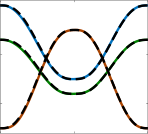

1.5

0.5

-0.5

0 5 10
Time [s]

**(a)** Position

0.8

0

-0.8

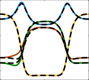

0 5 10
Time [s]

**(f)** Quaternion

0.8

0

-0.8

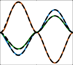

0 5 10
Time [s]

**(b)** Linear Velocity

2.5

0

-2.5

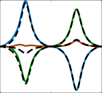

0 5 10
Time [s]

**(g)** Angular Velocity

0.02

0

-0.02

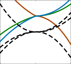

4.8 5 5.2
Time [s]

**(c)** Linear Velocity

0.02

0

-0.02

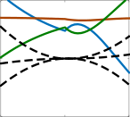

4.8 5 5.2
Time [s]

**(h)** Angular Velocity

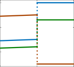

1.5

0.5

-0.5

0 5 10
Time [s]

**(d)** Goal Switch

0.6

-0.2

-1

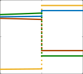

0 5 10
Time [s]

**(i)** Goal Switch

0.06

0.03

0

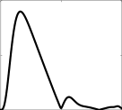

0 5 10
Time [s]

**(e)** Position Error

0.32

0.16

0

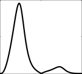

0 5 10
Time [s]

**(j)** Orientation Error

**Figure 10.** Results obtained by applying the target crossing approach to join two DMPs trained on synthetic data. The training
trajectory for the position and the orientation are shown as a black dashed lines in (a)-(b) and (f)-(g) respectively. Results are
obtained with the open source implementation available at [https://gitlab.com/dmp-codes-collection](https://gitlab.com/dmp-codes-collection) .

where ˆ _**ω**_ is the angular velocity of the moving quaternion
target ˆ **g** _q_ and 2 Log _[q]_ (ˆ **g** _q_ _∗_ ~~**q**~~ ~~)~~ measures the error between
the current orientation **q** and ˆ **g** _q_ . The pre-factor (1 _−_ _x_ ) is
used to avoid high angular accelerations at the beginning of
the motion. The moving target for the quaternion DMPs is
defined as

ˆ
_−_ _[τ]_ [ ln][(] _[x]_ [)]
**g** _q_ = Exp _[q]_ � 2 _α_ _x_

[ ln] 2 _α_ [(] _x_ _[x]_ [)] _**ω**_ ˆ � _∗_ **g** ˆ _q_ (0) _,_

(52)

_[T]_ 2 _**[ω]**_ [ˆ] � _∗_ **g** _q_ _,_

(Fig. 10c and 10h). However, the non-zero crossing velocity
introduce a deformation in the first part of the trajectory
(Fig. 10e and 10j).

_3.2.3_ _Basis functions overlay_

The approach by Kulvicius et al. (2011, 2012) combines
multiple DMPs into a complex one, guaranteeing a smooth
transition between the primitives by ensuring that the basis
functions composing _f_ ( _x_ ) in (4) overlap at the switching
instances. First of all, Kulvicius et al. adopted a sigmoidal
phase variable in (13) instead of the exponentially decaying
one (3). As discussed in Section 2.1.1.3, the sigmoidal phase
is _≈_ 1 for the large part of the motion which makes it possible
to use smaller forcing terms to reproduce the demonstrations.
On the contrary, the exponential phase is close to zero
already before _T_ s (Fig. 3), which results in larger forcing

terms.

The classical acceleration dynamics in (1) is modified as

_τ_ ˙ _z_ = _α_ _z_ ( _β_ _z_ ( _g_ ˜ _−_ _y_ ) _−_ _z_ ) + _f_ ( _s_ ) _,_ (53)

Similarly to target crossing, Kulvicius et al. used a moving
target ˜ _g_ in the acceleration dynamics, but called it the _delayed_
_goal function_ . The ˜ _g_ term in (53) is obtained by integrating

ˆ
_−_ _[T]_
**g** _q_ (0) = Exp _[q]_ � 2

where **g** _q_ is the goal quaternion, _T_ is the time duration of the
DMP, and the exponential map Exp _[q]_ ( _·_ ) is defined in (19).
As shown in Figure 9- _right_, the moving target ˆ **g** _q_ reaches
the goal orientation after _T_ seconds, _i.e.,_ ˆ **g** _q_ ( _T_ ) = **g** _q_ . This
can be easily verified by considering that the initial value
orientationof the moving target **g** _q_ for _T_ seconds at the desired velocity ˆ **g** _q_ (0) is computed by moving the goal _−_ _**ω**_ ˆ .
The presented _target crossing_ approach allows to cross the
target after _T_ seconds. Assuming to have two DMPs with
time duration _T_ [1] and _T_ [2] respectively, one can join them by
running the first DMP for _T_ [1] seconds and then switching
to the second one. As for the velocity threshold approach,
possible discontinuities at the switching point are prevented
by initializing the state of DMP 2 with the final state of DMP 1 .
This procedure can be repeated to join _L ≥_ 2 consecutive
DMPs.

Results in Figure 10 are obtained when the velocity
threshold is applied for merging 2 separately trained DMPs
to fit the minimum jerk trajectories (black dashed lines).
Figures 10a–10e show the position and Figures 10f–10j
the orientation (unit quaternion) parts of the motion. The
merged trajectory is generated by following the first DMP
for _T_ [1] = 5 s and then switch to the second one. The

required intermediate velocity is set to 0 _._ 01 m/s (rad/s
for the orientation) in each direction. The generated
trajectory reaches the goal in 10 s, _i.e.,_ demonstration
and execution times are the same. As required, the viapoint is crossed at _T_ = 5 s with the desired velocity

_Prepared using_ _sagej.cls_

_τ_ _g_ ˜ [˙] =

_δtT_ [(] _[g][ −]_ _[y]_ [0] [)] _[,]_ _t ≤_ _T_ (54)
�0 _,_ otherwise

with ˜ _g_ (0) = _y_ 0 . The delayed goal function in Figure 9 moves
linearly from _y_ 0 to _g_ in _T_ seconds and then remains constant,
_i.e.,_ ˜ _g_ ( _t ≥_ _T_ ) = _g_ .
The non-linear forcing term _f_ ( _s_ ) is in green in (53)
because it slightly differs from the classical one in (4). _f_ ( _s_ )
is defined as

_N_
� _i_ =1 _[w]_ _[i]_ [Ψ] _[i]_ [(] _[t]_ [)]
_f_ ( _s_ ) = ~~�~~ _Ni_ =1 [Ψ] _[i]_ [(] _[t]_ [)]

_s,_

_[t]_
Ψ _i_ ( _t_ ) = exp _−_ [(] _τT_
�

2 _σ_ _i_ [2]

_[t]_

_τT_ _[−]_ _[c]_ _[i]_ [)] [2]

(55)

_,_
�

_Saveriano, Abu-Dakka, Kramberger, and Peternel_ 15

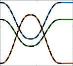

1.5

0.5

-0.5

0 6 12
Time [s]

**(a)** Position

0.8

0

-0.8

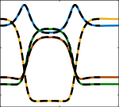

0 6 12
Time [s]

**(f)** Quaternion

0.8

0

-0.8

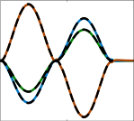

0 6 12
Time [s]

**(b)** Linear Velocity

2.5

0

-2.5

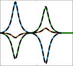

0 6 12
Time [s]

**(g)** Angular Velocity

0.03

0

-0.03

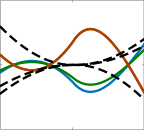

4.8 5 5.2
Time [s]

**(c)** Linear Velocity

0.03

0

-0.03

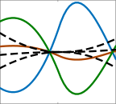

4.8 5 5.2
Time [s]

**(h)** Angular Velocity

1.5

0.5

-0.5

0 6 12
Time [s]

**(d)** Goal Switch

0.8

0

-0.8

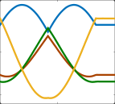

0 6 12
Time [s]

**(i)** Goal Switch

0.03

0.015

0

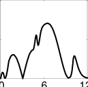

Time [s]

**(e)** Position Error

0.08

0.04

0

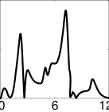

Time [s]

**(j)** Orientation Error

**Figure 11.** Results obtained by applying the basis functions overlay approach to join two DMPs trained on synthetic data. The
training trajectory for the position and the orientation are shown as a black dashed lines in (a)-(b) and (f)-(g) respectively. Results
are obtained with the open source implementation available at [https://gitlab.com/dmp-codes-collection](https://gitlab.com/dmp-codes-collection) .

where _σ_ _i_ is the width and _c_ _i_ is the center of the _i_ -th basis
function, and _s_ is obtained by integrating (13). The term
_t/τT_ is used in (55) instead of the the phase variable _x_ .
Being 0 _≤_ _t/τT ≤_ 1, the basis functions are equally spaced
between 0 and 1. Finally, _σ_ _i_ are the widths of each kernel.
They are constant and depend on the number of kernels.
Having presented the main differences with the canonical
approach, it is possible to focus on how Kulvicius et al.
(2012) solved the problem of joining _L ≥_ 2 DMPs. In
general, each of the _L_ DMPs has a different time duration
_T_ _[l]_, desired target _g_ _[l]_, and initial position _y_ 0 _[l]_ [, from which it is]
possible to compute the delayed goal functions by integrating

� _T_ _[κ]_

_κ_ =1






_l−_ 1 _l_
� _T_ _[κ]_ _≤_ _t ≤_ �

_κ_ =1 _κ_ =1

_τ_ _g_ ˜ [˙] _[l]_ =

_l−_ 1
_Tδt_ _[l]_ [(] _[g]_ _[l]_ _[ −]_ _[y]_ 0 _[l]_ [)] _[,]_ �

_κ_ =1 _κ_ =1 _._ (56)

0 _,_ otherwise

and _N ∗_ _L_ weights. The phase variable (13) is modified to
run for the duration _T_ _join_ of the joint motion.

Saveriano et al. (2019) extended the basis functions
overlay approach to quaternion DMPs. Assuming that a
sequence of _L_ quaternion DMPs is given. The angular
acceleration in (15) is reformulated for each DMP as

˜
_τ_ **˙** _**η**_ _[l]_ = _α_ _z_ ( _β_ _z_ 2 Log _[q]_ ( **g** _[l]_ _q_ _[∗]_ ~~**[q]**~~ ~~_[l]_~~ [)] _[ −]_ _**[η]**_ _[l]_ [) +] **[ f]** _[ l]_ _q_ [(] _[s]_ [)] (59)

where _l_ indicates the _l_ -th quaternion DMP and **f** _[l]_ _q_ [(] _[s]_ [)][ is]
defined as in (55). The term ˜ **g** _[l]_ _q_ [is the] _[ quaternion delayed]_
_goal function_ and it ranges from **q** _[l]_ (0) to **g** _[l]_ _q_ [in] _[ T]_ _[ l]_ [ seconds]
(see Fig. 9 (right)). To generate this moving target while
preserving the geometry of _**S**_ [3] it is needed that ˜ **g** _[l]_ _q_ [moves]
along the geodesic connecting **q** _[l]_ (0) to **g** _[l]_ _q_ [. Therefore,][ ˜] **[g]** _q_ _[l]_ [is]
defined as

Note that, being ˜ _g_ _[l]_ (0) = _y_ 0, the acceleration (53) is smooth
at the beginning of the motion. For this reason, the term
(1 _−_ _x_ ) used in (48) is not needed in (53).
Assuming that _L_ DMPs have been trained and that each
DMP has _N_ kernels, we can merge them into one DMP as
follows. The centers of the joined DMP are computed as

where

_**ω**_ ˜ _[l]_ ( _t_ ) =

_l−_ 1
_T_ 2 _[l]_ [Log] _[q]_ [ �] **g** _[l]_ _q_ _[∗]_ ~~**[q]**~~ ~~_[l]_~~ [(0)] � �

˜ _τ_ ˜ _**ω**_ _[l]_ ( _t_ )
**g** _[l]_ _q_ [(] _[t]_ [ +] _[ δt]_ [) =][ Exp] _[q]_

2

�

�

_∗_ **g** ˜ _[l]_ _q_ [(] _[t]_ [)] (60)






_κ_ _._

[0 _,_ 0 _,_ 0] _[⊤]_ _,_ otherwise

� _T_ _[κ]_

_k_ =1

_l−_ 1 _l_
� _T_ _[κ]_ _≤_ _t ≤_ �

_κ_ =1 _k_

_c_ ˇ _[l]_ _i_ [=]



_T_ [1] ( _i−_ 1)
_T_ _join_ ( _N_ _−_ 1) _[,]_ _l_ = 1

_T_ _[l]_ ( _i−_ 1) 1
_T_ _join_ ( _N_ _−_ 1) [+] _T_ _join_

(61)
The angular velocity in (61) is computed for each _l_ . The
term 2Log _[q]_ [ �] **g** _[l]_ _q_ _[∗]_ ~~**[q]**~~ ~~_[l]_~~ [(0)] � represent the angular velocity that
rotates **q** _[l]_ (0) into **g** _[l]_ _q_ [in a unit time. Note, that the mappings]
Log _[q]_ ( _·_ ) and Exp _[q]_ ( _·_ ) are defined in (17) and (19) respectively.
The delayed goal ˜ **g** _[l]_ _q_ [crosses all the via-goals] **[ g]** _[l]_ _q_ _[, l]_ [ =]
1 _, . . ., L −_ 1 and then reaches the goal **g** _[L]_ _q_ [.]
Results in Figure 11 are obtained when velocity threshold
is applied to merge 2 DMPs separately trained to fit the
minimum jerk trajectories (black dashed lines). Figures 11a–
11e show the position and Figures 11f–11j the orientation
(unit quaternion) parts of the motion. This approach does
not require a switching rule and automatically generates
a smooth trajectory—with continuous velocity as shown

_l_ � _−_ 1 _T_ _[κ]_ _,_ otherwise _,_ (57)

_κ_ =1

_l−_ 1
�

where _T_ _[l]_ is the duration of the _l_ -th DMP, and _T_ _join_ =
� _Ll_ =1 _[T]_ _[ l]_ [ (duration of the joined motion). The widths of the]
joined DMP are computed as

ˇ _i_ _[T]_ _[ l]_
_σ_ _i_ _[l]_ [=] _T_ _[σ]_ _join_ _[l]_ _._ (58)

The centers and widths computed in (57) and (58)
respectively overlap at the transition points allowing for
smooth transitions between consecutive DMPs. The weights
of the joined DMP are obtained by stacking the _N_ weights of
the _L_ DMPs. Therefore, the joined DMP has _N ∗_ _L_ kernels

_Prepared using_ _sagej.cls_

16 _Journal Title XX(X)_

in Figures 11c and 11h—that passes close to the viapoint which favors the overall reproduction accuracy
(Fig. 11e and 11j). However, the distance from the via-point
depends on the weights of the joined primitives and cannot
be separately decided. The trajectory generated with this
approach tend to last longer than the demonstrations. This
is due to the sigmoidal phase that vanishes after _T_ + _δ_ _s_ s
(Fig. 3). Depending on the application, the time difference
may cause failures and has to be taken into account.

_3.3_ _Online adaptation_

The standard periodic DMP learning approach approximates
the shape _f_ _d_ ( _t_ ) of the input trajectory _y_ _d_ in (38) by changing
the weights of the Gaussian kernel functions (Ijspeert et al.
2013). Updating of the weights is performed in such a
way that the difference between the reference trajectory and
the DMP is reduced at every control step and gradually
throughout the periodic repetitions. However, the DMP can
also be reshaped by some external feedback function to
achieve different functionalities for different applications,
for instance, tasks that require trail-and-error approach
(Kober et al. 2008), obstacle avoidance (Park et al. 2008;
Hoffmann et al. 2009; Tan et al. 2011), coaching (Petriˇc
et al. 2014b; Gams et al. 2016) for robots, and adaptation
of assistive exoskeleton behavior (Peternel et al. 2016a).
Alternatively, the frequency of the existing periodic DMPs
can be modulated online (Gams et al. 2009; Petriˇc et al.
2011).

_3.3.1_ _Robot obstacle avoidance and coaching_

In (Park et al. 2008; Hoffmann et al. 2009; Tan et al. 2011)
the detected obstacle was fitted with a potential field function
to change the shape of the DMP to avoid it. More in details,
Tan et al. (2011) used the potential field to compute a timevarying goal and modified the resulting DMP trajectory,
while (Park et al. 2008; Hoffmann et al. 2009) added and
extra forcing term to the DMP. Similarly in (Gams et al.
2016) the human arm was fitted with a potential field
function, which was used to reshape the DMP to perform
coaching. The potential field was coupled to the position of
the human hand to make pointing gestures and indicate the
direction in which the robot arm position trajectory should
change:

˙
_z_ = Ω( _α_ ( _β_ ( _−y_ ) _−_ _z_ ) + _C_ _O_ + _f_ ) _._ (62)

The added coupling term _C_ _O_ is the obstacle avoidance term
that contains the potential field and is given in a simplified
form for the sake of explanation as:

_C_ _O_ = _d_ _s_ ( _||O −_ _y||_ ) exp( _−ζ_ ( _O −_ _y_ )) _,_ (63)

where _O_ is the obstacle (or human pointing gesture) and _y_
is the robot position. Exponential and _ζ_ functions determine
the potential field, while function _d_ _s_ controls the distance at
which the perturbation field should start affecting the DMP.
For the full formulation of _C_ _O_ and its parameters, see (Gams
et al. 2016). In (Rai et al. 2017) the method was extended to
include generalization of the obstacle avoidance formulation
in (62).
Alternatively, the faulty segment of collision DMP
trajectory can also be directly adjusted online by the human

_Prepared using_ _sagej.cls_

demonstrator (Karlsson et al. 2017). On the other hand, the
method in (Kim et al. 2015) considers obstacle avoidance as
a constraint of an optimization problem, which modifies the
DMP trajectory to prevent collisions.

_3.3.2_ _Robot adaptation based on force feedback_

Similarly as for obstacle avoidance, task dynamics can also
be incorporated into DMP as coupling terms. In (Gams
et al. 2014) task dynamics were coupled on the acceleration
and velocity level of the DMP. The presented method was
utilized for interaction tasks, where the human changed the
behavior of the robot based on the exerted dynamics on the
manipulator.

_τ_ ˙ _z_ = _α_ _z_ ( _β_ _z_ ( _g −_ _y_ ) _−_ _z_ ) + _C_ [˙] _f_ + _f_ ( _x_ ) _,_ (64)

_τ_ ˙ _y_ = _z_ + _C_ _f_ _._ (65)

whereas the force coupling term _C_ _f_ = _ςF_ is defined as
a virtual or measured force _F_ and _ς_ is a scaling factor,
which essentially changes the dynamic behavior of the
DMP, enabling the motion primitive to instantly react to
the coupled force. Later, Zhou et al. (2016b) introduced
a PD controller based coupling term formulation _C_ _P D_ =
_ς_ ( _K_ _[P]_ ( _F_ _d_ _−_ _F_ _[e]_ ) _−_ _D_ _[V]_ [ ˙] _F_ _[e]_ ) coupled to the velocity part of
the DMP (65). In the formulation _F_ _d_ represents the desired
force, _F_ _[e]_ is the measured force, _ς_ is a scaling factor and
_K_ _[P]_ and _D_ _[V]_ are the proportional and derivative gains of the
Proportional Derivative (PD) controller. The coupling term
formulation allows for controlled adaptation of robot motion
to changes in the environment.
In (Kramberger et al. 2018) this approach was extended,
with a force feedback loop coupled to the velocity (2) and the
goal _g_ of the DMP. The outcome of this approach is a similar
behavior as an admittance controller (Villani and De Schutter
2008), with an difference that the execution is directly on the
trajectory generation level.

_τ_ ˙ _z_ = _α_ _z_ ( _β_ _z_ (( _g_ + _C_ _a_ ) _−_ _y_ ) _−_ _z_ ) + _f_ ( _x_ ) _,_ (66)

_τ_ ˙ _y_ = _z_ + _C_ [˙] _a_ _._ (67)

Here _C_ ˙ _a_ = _ς_ ( _F_ _d_ _−_ _F_ _[e]_ ) is the first time-derivative of the
admittance coupling term, which changes the velocity and
consequently the integrated coupling term, the position
output of the DMP. The described approach can be used
for Cartesian space motion, where the forces have to be
substituted for desired and measured torques. This approach
can be implemented in robot tasks involving contact with the
environment as well as contact with humans.

_3.3.3_ _Exoskeleton joint torque adaptation_

In (Peternel et al. 2016a), human effort was used to provide
the information about the direction in which the assistive

exoskeleton joint torque DMP should change in order to
minimize it. The human was included into the robot control

loop by replacing the error calculation in (40) with the human
effort feedback term _U_ ( _E_ ):

_w_ _i_ ( _t_ __ +1 ) = _w_ _i_ ( _t_ __ ) + Ψ _i_ _P_ _i_ ( _t_ __ +1 ) _U_ ( _E_ ) _,_ (68)

where _E_ ( _t_ ) is the current effort measured by human
muscle activity through Electromyography (EMG) signals [‡] .

_‡_ Note that other feedback that measures human effort can be used instead

of EMG, such as joint torque or limb forces.

_Saveriano, Abu-Dakka, Kramberger, and Peternel_ 17

Equations (33)-(37) and (41) are used in the original form.
Equations (38)-(40) are not used, since (68) is used to
modulate the weights in (36) instead.
The effort feedback term _U_ ( _E_ ) closes the loop and acts as
a feedback for adapting the weights of Gaussian kernels that
define the shape of the trajectory. A positive _U_ ( _E_ ) increases,
while a negative _U_ ( _E_ ) decreases the values of weights at a
given section of the periodic DMP that encodes joint torque.
If the shape of the DMP does not provide enough assistive
power, the human has to exert effort ( _i.e.,_ muscle activity) to
produce the rest of the power required to achieve the desired
task under given dynamics. In turn, muscle activity feedback
then increases the magnitude of the DMP until the human
effort term _U_ ( _E_ ) is minimised. Note that each joint has its
own torque DMP and _U_ ( _E_ ) term (Peternel et al. 2016a).
After that point, the DMPs do not change unless the task,
dynamics or conditions change. If they change, the human
has to compensate for the change by an additional muscle
activity, which in turn adapts the DMPs to the new required
joint torques.

_3.3.4_ _Trajectory adaptation based on reference velocity_

In many LfD scenarios it is desired to modify both the
spatial motion and the speed of the learned motion at
any stage of the execution. Speed-scaled dynamic motion
primitives first presented in Nemec et al. (2013a) are applied
for the underlying task representation. The original DMP
formulation from (1) and (2) were extended by adding a
temporal scaling factor _υ_ on the velocity level of the DMP

_υ_ ( _x_ ) _τ_ ˙ _z_ = _α_ _z_ ( _β_ _z_ ( _g −_ _y_ ) _−_ _z_ ) + _f_ ( _x_ ) _,_ (69)

_υ_ ( _x_ ) _τ_ ˙ _y_ = _z._ (70)

Form (69) and (70), it is evident that the velocity term is a
function of phase, and therefore encoded with a set of RBFs
similarly as in (4). This method allows for modification of
the spacial motion as well as the speed of the execution at any
stage of the trajectory execution. The authors demonstrated
the proposed method in a learning scenario, where after
every learning cycle (using Iterative Learning Control (ILC))
a new velocity profile was encoded based on the wrench
feedback, and thus converged to an optimal velocity for the
specific task. Vuga et al. (2016) extended the approach by
incorporating a compact representation for non-uniformly
accelerated motion as well as simple modulation of the

movement parameters.
Later on, in Nemec et al. (2018) the authors extended
the previous approach to also incorporate velocity scaling
of the encoded orientation trajectories represented with unit
quaternions. The outcome of the presented work is a unified
approach to velocity scaling for tasks executed in Cartesian
space. Furthermore, a reformulation of the velocity approach
called AL-DMPs was presented by Gaˇspar et al. (2018).
In this work they present a method, where the spatial and
temporal components of the motion are separated, by means
of the arc-lenght based on the time parameterized trajectory.
Arc-lenght, based on the differential geometry of curves,
is related to the speed of the movement, given as the time
derivative of the demonstrated trajectory. The approach is
well suited when multiple demonstrations are compared for
extraction of relevant information for learning. Weitschat and
Aschemann (2018) add an extra forcing term to keep the

_Prepared using_ _sagej.cls_

velocity within a certain predefined limit. The aim of this
work is to guaranty a safe execution of the robot task when
interacting with humans, as well as providing a framework
for safe interaction in a changing environment where the
robot position and velocity have to change over time. For
a full formulation of the coupling term see (Weitschat and
Aschemann 2018). Additionally, Dahlin and Karayiannidis
(2020) in their work proposed a temporal coupling based
on a repulsive potential, keeping the DMP velocity within
the predefined velocity limits while ensuring the path shape
invariance.

_3.4_ _Alternative formulations_

LfD is a wide research area and many different approaches
have been developed to reproduce human demonstrations
(Billard et al. 2016). As already mentioned, the aim of this
tutorial survey is to provide a comprehensive overview of
DMPs research and we intentionally skip the rich literature
in the field of LfD. However, we found some representations
that are closely related to the DMP formulation. This section
briefly reviews them.

Calinon et al. (2009) computed an acceleration command
for the robot in a PD-like form

**¨y** = **K** _[P]_ ( **y** _d_ _−_ **y** ) + **D** _[V]_ ( **˙y** _d_ _−_ **˙y** ) _,_

where **K** _[P]_ is a stiffness and **D** _[V]_ a damping gain, **y**
is the measured state of the robot and **˙y** its time
derivative (velocity), **y** _d_ and **˙y** _d_ are desired position and
velocity retrieved with GMR. Authors then shown that the
acceleration command **¨y** can be seen as a mixture of linear
dynamics, each converging to a certain attractor. Despite
later work like (Kormushev et al. 2010) referred to this
representation as “a modified version” of DMPs there are
significant differences with the DMP formulation properly
highlighted by (Calinon et al. 2012).

Herzog et al. (2016) computed an acceleration command
for the robot from the linear system

**¨y** = **u** = **K** _[P]_ ( **y** _d_ _−_ **y** ) _,_

where **y** is the measured state of the robot, **y** _d_ is a human
demonstration, and **K** _[P]_ is a control gain computed using
the linear-quadratic regulator method. Then, a compact
representation of the control input trajectory **u** is computed
by means of Chebyshev polynomials. This representation
does not require a vanishing phase variable to ensure
convergence, but the generalization to different start/goal
position requires the application of the linear-quadratic
regulator method to find a new sequence of control inputs.

Regarding periodic motions, (Ajallooeian et al. 2013)
proposed a dynamical system-based framework to learn
rhythmic movements with an arbitrary shape and basin of
attraction. They exploit phase-based scaling functions to
represent the mapping between a known, base limit cycle
and a desired periodic orbit. The basic limit cycle can be,
for example, the one generated by a periodic DMPs, which
makes the approach of (Ajallooeian et al. 2013) a more
general formulation of periodic primitives.

18 _Journal Title XX(X)_

**4** **DMPs integration in complex frameworks**

This section reviews approaches where DMPs have
been integrated into bigger executive frameworks. We
categorize these approaches into five main research areas,
namely _grasping and manipulation_, _impedance learning_,
_reinforcement learning_, _deep learning_, and _incremental and_
_life-long learning_

_4.1_ _Manipulation tasks_

Successfully grasping an object is the first step towards
robotic manipulation. Performing a grasping requires a
(visual) perception of the environment to locate the object to
grasp and decide the grasping points based on its geometry.
In this setting, even small uncertainties may cause the object
to drop and the grasp to fail. To improve the robustness of
vision driven grasping, Kr¨omer et al. (2010a) augmented
DMPs with a potential field based on visual descriptors
that adapts hand and finger trajectories to the object’s
local geometry. This grasping strategy was integrated in
a hierarchical control architecture where the upper level
decides where to grasp the object and the lower level locally
adapted the motion to robustly grasp the object (Kr¨omer
et al. 2010b). Stein et al. (2014) proposed a point cloud
segmentation approach based on convexity and concavity of
surfaces. The approach is particularly suited to recognize
object handles and enables a robot to automatically grasp
object.
The ability of grasping and using tools is also desirable
to perform daily-life manipulation. In this respect, (Guerin
et al. 2014) proposed the so-called _tool movement primitives_
that transform the demonstrations in a tool affordance frame.

The result is a motion that generalize to different tool
poses and to tools that share the same affordance(s). Li
and Fritz (2015) considered tool usage with low-cost, nondexterous grippers and propose a framework to learn bimanual strategies for tool usage and compensate for the lack
of dexterity. Bi-manual robotic manipulation is a challenging
task that requires precise coordination between the hand
movements and adherence to the spatial constrains. Thota
et al. (2016) developed a DMP-based control framework for
bi-manual manipulation that ensures time synchronization of
the two hands while being robust to spatial perturbations and
goal changes.
Beyond the object grasping, everyday manipulation
requires a precise execution of complex movements. Often
such a complex movements are hard to encode into a single
motion primitive, but they can be conveniently split into
simpler motions ( _e.g.,_ reach and grasp) that can be properly
sequenced and executed (Fig. 12).
The possibility of exploiting DMPs as the building blocks
of complex tasks was investigated in (Ramirez-Amaro et al.
2015; Caccavale et al. 2018, 2019). In these works, a human
teacher demonstrated a relatively complex task consisting
of several actions performed on different objects. The
demonstration was then automatically segmented into _M_
basic motions used to fit _M_ DMPs. While Ramirez-Amaro
et al. (2015) exploit semantic rules ( _e.g.,_, _reach an object_
_with a knife means cut_ ) to infer high-level human activities,
Caccavale et al. built a hierarchical structure to schedule

the execution of the complex task by selecting the proper

_Prepared using_ _sagej.cls_

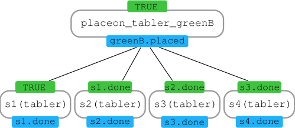

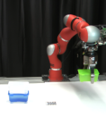

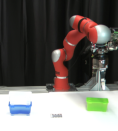

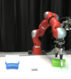

**Figure 12.** An example of hierarchical task decomposition and
motion primitives sequencing from (Agostini et al. 2020).

DMP for the current executive context. They used kinesthetic
teaching and verbal cues (open/close gripper commands) to
provide task demonstrations. Lemme et al. (2014) organize
segmented task demonstrations into a motion primitives
library learned from self-generated trajectory patches. They
also introduced a mechanism to remove unused skills and

update the library. Kinesthetic teaching and haptic feedback
were also used by Eiband et al. (2019) to segment and
recognize basic motions or _skills_, and to build a tree
describing geometric relationships—like reference frames
and goal poses—between consecutive skills. At run time, the
robot performed haptic exploration to locate objects in the
scene and update the skill tree. The transformations in the
skill tree were then used to define initial and goal pose of
the DMPs and execute the task. Finally, Wu et al. (2018)
integrated DMPs into a dialogue system with speech and
ontology to learn or re-learn a task using natural interaction
modalities.

Collecting demonstrations becomes an issue of kinesthetic
teaching or marker-based motion trackers cannot be used.
The latter requires an expensive sensor infrastructure that
is hard to build in real world scenarios like factory floors.
Kinesthetic teaching needs torque controlled/collaborative
robots that are still uncommon in industrial scenarios. To

remedy this issue (Mao et al. 2015) exploited a lowcost RGB-D camera and track the human hand using the
markerless approach proposed by (Oikonomidis et al. 2011).
Collected data were then segmented into basic motions and
used to fit DMPs.
Described approaches assumes that human teachers
always provide consistent and noiseless task demonstrations.
Ghalamzan E. et al. (2015) encoded noisy demonstrations
into a GMM and computed a noise free trajectory
using GMR. The noise free trajectory was then used
to fit a DMP that generalized to different start, goal,
and obstacle configurations. Niekum et al. (2012, 2015)
designed a framework that learns from from unstructured
demonstrations by segmenting the task demonstrations,
recognizing similar skills, and generalizing the task
execution. Interestingly, a user study on 10 volunteers
conducted by (Gutzeit et al. 2018) showed that existing

_Saveriano, Abu-Dakka, Kramberger, and Peternel_ 19

strategies for segmentation and learning are sufficiently
robust to enable automatic transfer of manipulation skills
from humans to robots in a reasonable time. Finally, some
work (Deniˇsa and Ude 2013a,b; Deniˇsa and Ude 2015)
exploited transition graphs and trees to embed parts of
a trajectory and search algorithms to discover sequence
of partial parts and generate motions that have not been
demonstrated.

Approaches that rely on a hierarchical, tree-like structure
to represent the task that has limited task generalization
capabilities. Lee and Suh (2013) used probabilistic inference
and object affordances to infer the adequate skill that
can handle uncertainties in the executive context. Beetz

et al. (2010) learned stereotypical task solutions from
observation and used task planning and symbolic reasoning
to execute novel mobile manipulation tasks. A generative
learning framework was proposed by (W¨org¨otter et al.
2015) to augment the robot’s knowledge-base with missing
information at different level of the cognitive architecture,
including symbolic planning as well as object and action
properties. (Paxton et al. 2016) used task and motion
planning to generalize the execution of complex assembly
tasks and proposed an learning by demonstration approach
to ground symbolic actions. (Agostini et al. 2020) performed
task and motion planning by combining an object-centric
description of geometric relations between objects in the
scene, a symbol to motion hierarchical decomposition
depending on tree consecutive actions in the plan, and the
LfD approach developed in (Caccavale et al. 2019) (Fig. 12).
A manipulation task was described at three different levels
by (Aein et al. 2013). The top-level provides a symbolic
descriptions of actions, objects, and their relationships. The
mid-level uses a finite state machine to generate a sequence
of action primitives grounded by the lower level. A common
point among these approaches is that they use DMP to
execute the task on real robots.

_4.2_ _Variable impedance learning control_

Impedance control can be used to achieve complaint
motions, in which the controller resembles a virtual springdamper system between the environment and robot endeffector (Hogan 1985). Such approach permits smooth,
safe, and energy-efficient interaction between robots and
environments (possibly humans). A standard model for such
interaction is defined as

**M¨y** _t_ = **K** _[P]_ _t_ [(] **[y]** _g_ _[−]_ **[y]** _t_ [)] _[ −]_ **[D]** _[V]_ _t_ **[˙y]** _t_ [+] **[ f]** _[ e]_ _t_ _[,]_ (71)

_**I**_ **˙** _**ω**_ _t_ = **K** _[O]_ _t_ [(][Log] _[R]_ [(] **[R]** _[g]_ **[R]** _[t]_ _⊤_ )) _−_ **D** _Wt_ _**[ω]**_ _[t]_ [+] **[ τ]** _[e]_ _t_ _[,]_ (72)

where (71) and (72) correspond to translational and
rotational cases respectively, **M** _,_ **K** _[P]_ _t_ _[,]_ [ and] **[ D]** _[V]_ _t_ are the
mass, stiffness and damping matrices, respectively, for
translational motion, while _**I**_ _,_ **K** _[O]_ _t_ _[,]_ [ and] **[ D]** _[W]_ _t_ are the moment
of inertia, stiffness and damping matrices, respectively, for
rotational motion. **R** **[ˆ]** _,_ **R** _t_ _∈_ _**SO**_ (3) are rotation matrices and
correspond to desired rotation goal and actual orientation
profile of the end-effector, respectively. **f** _[e]_ _t_ [and] **[ τ]** _[e]_ _t_ [represent]
the external force and torque applied to the robot endeffector.

In fact, VIC plays an important role when a robot needs
to interact with any environment in order to avoid high

_Prepared using_ _sagej.cls_

|Col1|Col2|Forward Kinematics|
|---|---|---|
|**y**_t_ |**y**_t_ |**y**_t_ |
||||
||||

|DMP|Col2|
|---|---|
|DMP||

**Figure 13.** General control scheme of Variable Impedance
Control (VIC) and DMP.

impact forces and damage for the environment or the
robot ( _i.e.,_ change to low stiffness)Ajoudani et al. (2012);
Abu-Dakka et al. (2018); Peternel et al. (2018a). On the
other hand, it is important in rejecting unexpected and
unpredictable perturbations from the environment to achieve
a desired position tracking precision ( _i.e.,_ change to high
stiffness) Yang et al. (2011). In addition, it is also important
in coordination of human-robot collaborative movements

Peternel et al. (2017b). However, a robotic system still needs
to learn how to adapt such VIC to unseen situations while
avoiding hard-coding. Such paradigm of learning is called
Variable Impedance Learning Control (VILC). Interested
readers can refer to our recent survey on VILC (Abu-Dakka
and Saveriano 2020).
In this review, we will mention some of the works that
integrate DMP with VIC in a VILC framework. Figure 13
shows a simple generic example where DMP is integrated in
a VIC control scheme.

Buchli et al. (2011a) proposed one of the earliest
approaches that integrates DMP with Policy Improvement
with Path Integrals (PI [2] ) algorithm (Theodorou et al. 2010)
to learn movements (position and velocity presented by
DMP) while optimizing impedance parameters. Later the
authors exploited a diagonal stiffness matrix and expressed
the variation (time derivative) of each diagonal entry as

˙ _⊤_
_k_ _ϑ_ _j_ _,t_ = _α_ _j_ �⋏ _j_ ( _**ϑ**_ _j_ + _**ϵ**_ _j,t_ ) _−_ _k_ _ϑ_ _j_ _,t_ � _,_ _j_ = 1 _, . . ., J,_
(73)
where _j_ indicates the _j_ -th joint, _k_ _ϑ_ _j_ _,t_ is the stiffness of
joint _j_, _**ϵ**_ _j,t_ is a time-dependent exploration noise, each
⋏ _j_ is a vector of _N_ Gaussian basis functions, and _**ϑ**_ _j_
are the learnable parameters for joint _j_ . The stiffness
parameterization in (73) is also linear in the parameters and
PI [2] can be applied to find the optimal policy. Later, authors
used PI [2] to learn VIC in deterministic and stochastic force

fields (Stulp et al. 2012a). Nakanishi et al. (2011) proposed a
method that optimizes a periodic motion a long with a timevarying joint stiffness.
(Basa and Schneider 2015) introduced an extension to
DMP formulation by adding a second nonlinear function to
cope with elastic robots as follow

_τ_ ˙ _z_ = _α_ _z_ ( _β_ _z_ ( _g −_ _y_ ) _−_ _z_ ) + _f_ ( _x_ ) + _f_ 2 _,_ (74)

where _f_ 2 is defined as (4) but without the phase variable _x_ .
The main purpose of _f_ 2 is to compensate the gravitational
influence on the moved DoF at the end of the movement
time and beyond. Differently, Haddadin et al. (2016) used

20 _Journal Title XX(X)_

optimal-control to execute near-optimal motion of elastic
robots. _**π**_

Nemec et al. (2016) proposed a cooperative control
scheme that enables dual arm robot to adapt its stiffness
online along to the executed trajectory in order to provide
accurate evolution. (Umlauft et al. 2017) used GP along with
DMPs (as proposed in (Fanger et al. 2016)) to predict the
trajectories. During the execution, their admittance controller
adapts both stiffness and damping online. The energy-tanks
passivity-based control method has been integrated with
DMPs to enforce passivity in order to stably adapt to contacts
in unknown environments by adapting the stiffness online
(Shahriari et al. 2017; Kramberger et al. 2018; Kastritsi et al.
2018).
Methods in (Peternel et al. 2014, 2018b,a; Yang et al.
2018, 2019; Bian et al. 2019) designed different multi-modal
interfaces to let the human to explicitly teach an impedance
behavior to the robot. Most of them combined EMG
based variable impedance skill transfer with DMP-based
motion sequence planning, inheriting the merits of these
two aspects for robotic skill acquisition. Hu et al. (2018)
used Covariance Matrix Adaptation-Evolution Strategies
(CMA-ES) to update the parameters of DMPs and variable
impedance controller in order to reduce the impact in during
the robot motion in noisy environments. Dometios et al.
(2018) integrated a Coordinate Change-DMPs (CC-DMP)
with a vision-based motion planning method to adapt the
reference path of a robot’s end-effector and allow the
execution of washing actions.

Travers et al. (2016, 2018) proposed a shape-based
compliance controller for the first time in locomotion,
by implementing amplitude compliance on a snake robot
moving in complex environment with obstacles. Their
approaches allow a snake-like robots to blindly adapt to such
complex unstructured terrains thanks to their proprioceptive
gait compliance techniques
Recently, an adaptive admittance controller is proposed
(Wang et al. 2020) which integrates GMR for the extraction
of human motion characteristics, DMP to encode a
generalizable robot motion, and a RBF-NN-based controller
for trajectory-tracking during the reproduction phase.
Novel LfD approaches explicitly take into account that
training data are possibly generated by certain Riemannian
manifolds with associated metrics. Abu-Dakka and Kyrki
(2020) reformulated DMPs based on Riemannian metrics,
such that the resulting formulation can operate with SPD data
in the SPD manifold. Their formulation is capable to adapt
to a new goal-SPD-point.
Recently, biomimetic controller has been integrated with
DMPs (Zeng et al. 2021) in order to learn and adapt
compliance skills.

_4.3_ _Reinforcement Learning (RL)_

In RL, an agent tries to improve its behavior via trial-anderror by exploring different strategies ( _actions_ ) and receiving
a feedback ( _reward_ ) on the outcome of its actions. Actions
_a_ are drawn from a _policy π_ ( _s, a_ ) that represent a mapping
between _states s_ and actions _a_ . The goal of RL is to
find an optimal policy _π_ _[⋆]_ that maximizes the cumulative
expected reward, _i.e.,_ the sum of expected rewards over a
possibly infinite time interval. When the agent is a robot

_Prepared using_ _sagej.cls_

**Figure 14.** General block scheme of DMP-based policy
improvement.

performing tasks in the real world the state and actions
spaces are inherently continuous. Moreover, the robotic
agent is affected by imperfect ( _e.g.,_ noisy) perception and
inaccurate models ( _e.g.,_ contacts). Finally, performing a
large amount of interactions with the real word ( _rollouts_ ) is
expensive and possibly dangerous. As discussed by (Kober
et al. 2013), robotic specific challenges require specific
solutions to make the RL problem feasible.

_4.3.1_ _DMPs as control policies_

One possibility is to use parameterized policy and use RL
to search for an optimal, finite set of policy parameters.
In this respect, DMPs have been widely used as policy
parametererization. The general idea is shown in Figure 14.
More in details, (Peters and Schaal 2008a,b) showed that
various policy gradient and actor-critic RL approaches can
be effectively applied to improve robotic skills parameterized
as DMPs. Other research focused on developing policy
search algorithms specifically for parameterized policies.
Inspired by stochastic optimal control, Theodorou et al.
(2010) proposed Policy Improvement with Path Integrals
(PI [2] ) which is an application of path integral optimal control
to DMPs. PI [2] and DMPs have been successfully applied
in several domains including VILC Buchli et al. (2011a,b)
and in-contact tasks (Hazara and Kyrki 2016), grasping
under state estimation uncertainties (Stulp et al. 2011), bimanual manipulation (Zhao et al. 2020), and robot-assisted
endovascular intervention (Chi et al. 2018). Kober and Peters
(2011) derived from expectation-maximization the so-called
Policy Learning by Weighting Exploration with the Returns
(PoWER). PoWER and DMPs have been successfully
applied to perform highly dynamic tasks including ballin-a-cup Kober and Peters (2011) and pancake flipping
Kormushev et al. (2010).

_4.3.2_ _Limit the search space_

Even with parameterized policies the number of rollouts
needs to search for optimal policy parameters may become
large, especially for robots with many DoFs. Dimensionality
reduction techniques can be exploited to perform policy
search in a reduced space (Colom´e and Torras 2014). The
effectiveness of this approach was demonstrated in the
challenging task of clothes ( _i.e.,_ soft tissues) manipulation
(Colom´e and Torras 2018). IL arises as an effective approach
to policy initialization and to speed up policy search by

_Saveriano, Abu-Dakka, Kramberger, and Peternel_ 21

reducing the number of rollouts (Kober and Peters 2010).
In this respect, Kober et al. (2008, 2010a) augmented
DMPs with a perceptual coupling term and propose to
initialize the DMP via human imitation and to refine the
motor skill via RL. IL can be eventually combined with
dimensionality reduction (Tan and Kawamura 2011) and
several rollouts can be performed firstly in simulation
(Cohen and Berman 2014) to further speed up the policy
search. When multiple demonstrations are given, one can
learn a mapping between policy parameters and query
points ( _e.g.,_, goal positions) and use the mapping to
generalize to new situations (Section 3.1.3). This strategy
was used by Nemec et al. (2011, 2012, 2013b) to provide
a good initial policy for a new situation which is then
further refined using RL. Being the mapping estimated
using example query points, the search space can be
effectively constrained within query points making the policy
search more efficient. Vuga et al. (2015a,b) combined this
approach with a different DMP formulation to optimize
the velocity of execution. The approach was tested on
diverse tasks including pouring water in a cup, where it
prevented the water to split from the cup during the motion.
Schroecker et al. (2016) provided demonstrations in the
form of soft via-points (Section 3.1.2) which reduce the
search space to the neighborhood of the taught via-points.
Multiple demonstrations were used by (Reinhart and Steil
2014, 2015) to build a parameterized skill memory that
connects low-dimensional skill parameterization to motion
primitive parameters. This low-dimensional embedding is
then leveraged for efficient policy search. Instead of learning
a mapping from task to policy parameters, Queißer et al.
(2016) used data from the rollouts to incrementally learn
a parametric skill (bootstrapping) and used it to generate a
good initial policy for a new task.

_4.3.3_ _DMPs generalization and sequencing_

Instead of using generalization to provide a better initial
policy, some researchers exploit RL to improve and
generalize the motion primitive. (Andr´e et al. 2015) adapted
DMP policies to walk on sloped terrains. M¨ulling et al.
(2010) generalized to new situations using a mixture of
DMPs. In their approach, RL was used to estimate the shape
parameters as well as to estimate the optimal responsibility
of each DMP. (M¨ulling et al. 2013) used episodic RL
to estimate meta-parameters like the temporal and spacial
interception point of the ball and the racket typical of table
tennis tasks. Lundell et al. (2017) used parameterized kernel
weights and RL to search for optimal parameters, while
(Forte et al. 2015) augmented the given demonstration using
RL-based state space exploration to autonomously expand
the robot’s task knowledge. Metric RL was exploited by
(Hangl et al. 2015) to smoothly switch between learned DMP
policies and execute a task in new situations.
RL can be also applied to sequence multiple motion
primitives and perform more complex task; a successful
strategy when the robot has to perform, for instance,
a manipulation task (Section 4.1). To sequence multiple
primitives it is also of importance to learn the goal of each
motion. Tamosiunaite et al. (2011) used continuous value
function approximation to optimize the goal parameters
of a DMP used to perform a pouring task. Kober et al.

_Prepared using_ _sagej.cls_

(2011, 2012) learned a meta-parameter function that maps
the current state to a set of meta-parameters including goal
and duration of the movement. Instead of separating shape
and goal learning into different processes, (Stulp et al. 2011;
Stulp et al. 2012b) extended PI [2] to simultaneously learn
shape and goal of a sequence of DMPs.

_4.3.4_ _Skills transfer_

Learned skills can be potentially transferred across different
tasks to speed up the learning process and increase
robot autonomy. To this end, Fabisch and Metzen (2014)
considered the case where the robot can actively choose
which task to learn to make the best progress in learning.
The process of actively selecting the task was considered as a
non-stationary bandit problem for which suitable algorithmic
solution exist while intrinsic motivation heuristics were

exploited to reward the agent after the selection. (Cho et al.
2019) defined the complexity of a motor skill based on
temporal and spatial entropy of multiple demonstrations
and used the measured complexity to generate an order for
learning and transferring motor skills. Their experimental
findings provided useful guidelines for skill learning and
transfer. In short, humans have to demonstrate, when
possible, the most complex task and then the robot is able to
transfer the motor skills. Vice versa, if demonstrations are not
given, it is more effective to start learning simple skills first
and then transfer the simpler skills to more complex tasks.

_4.3.5_ _Learning hierarchical skills_

RL often lacks scalability to high dimensional continuous
state and action spaces. To remedy this issue, hierarchical
RL exploits a _divide et impera_ approach by decomposing a
RL problem into a hierarchy of sub-tasks in order to reduce
the search space. Different levels in the hierarchy represent
information at different time and/or spatial scale.

Stulp and Schaal (2011) proposed to represent different
options as DMPs to sequence. PI [2] was extended to optimize
shape and (sub-)goal of each DMP at different levels of
temporal abstraction. In particular, the shape was adjusted
based on the cost up to the next primitive in the sequence,
while the sub-goal considers the cost of the entire sequence
of two DMPs. Layered direct policy search in (End et al.
2017) did not rely on a set of predefined sub-policies and/or
sub-goals, but instead used information theoretic principles
to uncover a set of diverse sub-policies and sub-goals.
Reducing the number of rollouts required to discover
optimal policies is also important in Hierarchical RL (HRL).
As already mentioned, IL is a valuable option to find
good initial policies. However, there are applications like
manipulation with multi-fingered robotics hands for which
it is hard or impossible to provide expert demonstrations.
To make policy search more efficient, Ojer De Andres et al.
(2018) used HRL where the upper-level considers discrete
action and state spaces to search for optimal finger gaiting
and synchronization among the fingers. This information
was passed to the lower-level where rhythmic DMPs and
PI [2] generated continuous commands for the fingers. Another
possibility to increase data-efficiency is to use modelbased approaches for RL. Colome et al. (2015) exploited
a friction model to improve a DMP policy and manipulate
soft tissues (a scarf). A model-based HRL approach was

22 _Journal Title XX(X)_

proposed by (Kupcsik et al. 2017) for data-efficient learning _TSK_ 1 _, TSK_ 2 _, · · ·, TSK_ _N_ _−_ 1 _TSK_ _N_ _· · ·_
of upper-level policies that generalize well across different Previously learned tasks New task Future tasks
executive contexts. Finally, (Li et al. 2018) proposed a hybrid
hierarchical framework where the higher-level computes Skill _**ϑ**_ _init_ DMP-based _a_
optimal plans in Cartesian space and converts them to Model Policy
desired joint targets using an efficient solver. The lower- Improvement
level is then responsible to learn joint space trajectories under reward
uncertainties using RL and DMPs. _**ϑ**_ _new_

_4.4_ _Deep learning_

A popular method of machine learning are NNs. Due to
their non-parametric nature, they can effectively represent
nonlinear mappings. A major drawback of NNs in the past
was their computational complexity of learning. In recent
years there is a renewed interest in NNs. New deep learning
approaches were successfully (LeCun et al. 2015) applied in
machine vision and language processing.
In recent years, deep learning has been applied also in
robotics to learn task dynamics (Yang et al. 2016) and
movement dimensionality reduction (Chen et al. 2015). The
authors (Chen et al. 2015, 2016) introduced a framework
called AutoEncoded DMP (AEDMP) which uses deep autoencoders to find a movements represented in latent feature
space. In this space DMPs can optimally be generalized to
new tasks, as well as the architecture enables the DMPs to be
trained as a unit. Pervez et al. (2017b) in their work coupled
the vison perception data for object calcification with task
specific movement definitions represented with DMPs. The
data was modeled with Convolutional Neural Networks

(CNNs), where the images and the associated movements
were directly processed by the deep NN, thus preserving
the associated DMPs properties and eliminating the need for
extracting the task parameters during motion reproduction.
Later on Kim et al. (2018b) combined deep RL with DMPs to
learn and generalize robotic skills from demonstration. The
framework builds on a RL approach to learn and optimize a
new DMP skill based of a demonstration. The RL approach
is backed up with a hierarchical search strategy, reducing the
search space for the robot, which allows for more efficient
learning of complex tasks. Furthermore, Pan and Manocha
(2018) presented an deep learning approach form motion
planning of high dimensional deformable robots in complex
environments. The locomotion skills are encoded with DMPs

and a NN is trained for obstacle avoidance and navigation.
The data is further optimized with deep Q-Learning showing
that the learned planner can efficiently plan and navigate
tasks for high dimensional robots in real time.

Pahic et al. (2018) proposed a deep learning approach
for perception-action couplings, demonstrating the coupling
between the vision based images and associated movement
trajectories. Later on they extended the approach to
incorporate CNNs and give a distinguishing property
formulation for the approach (Pahiˇc et al. 2020), which
utilizes a loss function to measure the physical distance
between the movement trajectories as opposed to measuring
the distance between the DMPs parameters which have
no physical meaning, leading to better performance of the
algorithm. Recently, they extended the usage of GPR to
create a database needed to train autoencoder NNs for

dimensionality reduction (Lonˇcarevi´c et al. 2021).

_Prepared using_ _sagej.cls_

**Figure 15.** General framework of lifelong/incremental learning
approach.

_4.5_ _Lifelong/Incremental learning_

Lifelong (incremental) learning is a framework which
provides continuous learning of tasks arriving sequentially
(Thrun 1996; Chen and Liu 2018; Fei et al. 2016). The
essential component of this framework is a database which
maintains the knowledge acquired from previously learned
tasks _TSK_ 1 _, TSK_ 2 _, · · ·, TSK_ _N_ _−_ 1 . Incremental learning
starts from the task manager assigning a new task _TSK_ _N_
to a learning agent. In this case, the agent exploits the
knowledge in the DB as prior data for enhancing the
generalization performance of its model on the new task.
After the new task _TSK_ _N_ is learned, database is updated
with the knowledge obtained from learning _TSK_ _N_ . In fact,
the incremental learning framework provides an agent with
three capabilities: ( _i_ ) continuous learning, ( _ii_ ) knowledge
accumulation, and ( _iii_ ) re-using previous knowledge for
future learning enhancements. Figure 15 shows general
structure of DMP integrated in a lifelong framework.

Churchill and Fernando (2014) proposed a cognitive
architecture capable of accumulating adaptations and skills
over multiple tasks in a manner which allows recombination
and re-use of task specific competences. Lemme et al. (2014)
segmented demonstrations based on geometric similarities,
and subsequently created a motion primitives library. The
library is updated by removing unused skills and including
new ones. Multiple demonstrations are used by (Reinhart and
Steil 2014, 2015) to build a parameterized skill memory that
connects low-dimensional skill parameterization to motion
primitive parameters. This low-dimensional embedding is
then leveraged for efficient policy search. Piece-wise linear
phase is used to improve incremental learning performance
(Samant et al. 2016). Duminy et al. (2017) designed a
framework for learning which data collection strategy is
most efficient for acquiring motor skills to achieve multiple
outcomes, and generalize over its experience to achieve new
outcomes for cumulative learning.
A generative learning framework is proposed to augment
the robot’s knowledge-base with missing information at
different level of the cognitive architecture including
symbolic planning as well as object and action properties
(W¨org¨otter et al. 2015).

Wang et al. (2016) proposed a modified formulation of
DMPs called as DMP+ which capable of efficiently modify
learned trajectories by improving the usability of existing
primitives and reducing user fatigue during IL. Later, DMP+

_Saveriano, Abu-Dakka, Kramberger, and Peternel_ 23

**Figure 16.** Human operators teach the robot how to perform different tasks. _Left_ scenarios use robots’ gravity compensation mode
to enable kinesthetic guiding, where a human operator guides the robot’s tool center point along the desired trajectory in such a
way that the desired task is successfully executed (Sloth et al. 2020; Abu-Dakka et al. 2015a, 2018; Caccavale et al. 2019). _Right_
scenarios use teleoperation system to demonstrate appropriate robot movements either through haptic interface (Peternel et al.
2018a) or magnetic trackers (Abu-Dakka et al. 2015a).

tasks. Furthermore, it has been transferred incrementally
from simulation to the real world (Hazara and Kyrki
2019). Moreover, authors endow incremental learning with
a task manager, which capable of selecting a new task by
maximizing future learning while considering the current
task performance (Hazara et al. 2019).

**5** **DMPs in Application Scenarios**

We categorize the applications into several subsections based
on different topics. We first separate the use of DMPs for
robot interaction with the _passive environment_ ( _e.g.,_ tools,
objects, surfaces, _etc_ ) and for interaction with an agent that
involve _co-manipulation_ ( _e.g.,_ human, another robot, _etc_ ).
Additionally, we examine several other major application
areas, such as _human body augmentation/rehabilitation_ with
exoskeletons, _teleoperation_, _motion analysis/recognition_,
_high DoF robots_, and _autonomous driving and field robotics_ .

_Prepared using_ _sagej.cls_

_5.1_ _Robots in contact with passive_
_environment_

Most of the daily tasks that the robots perform involve
some kind of physical interaction with the environment
that requires control of forces or positions. Nevertheless,
simultaneous control of force and position in the same axis
is not possible (Stramigioli 2001) [§], and therefore the control
approaches have to make a compromise between prioritizing
position control or force control (Schindlbeck and Haddadin
2015). The key to such control is for the robot to learn
appropriate force or position reference trajectories that can
lead to the desired task performance in interaction with the
environment.

_5.1.1_ _Demonstration of interaction tasks_

A common approach to teaching robot motion trajectories
is kinesthetic guidance (Fig. 16- _Left_ ), where the human
operator holds the robot arm and shows the appropriate
movements to be encoded by DMPs (Kormushev et al. 2011;
Abu-Dakka et al. 2015a; Joshi et al. 2017; Papageorgiou et al.
2020a,b). Recently, the technology is protruding into high
risk fields such as invasive surgery, where high-dimensional
fine human-like manipulation skills are being demonstrated
(Su et al. 2021) and executed with robots (Su et al. 2020;
Ginesi et al. 2019). In (Kormushev et al. 2011), the human
held the robot arm and used kinesthetic guidance to teach
the position and orientation trajectories necessary to perform
ironing and door opening task. In the second stage the

_§_ There is a duality in impedance-admittance, _i.e.,_, the force produce motion
and motion produces force, therefore if one is the input, the other can only
be the output of the control system Peternel et al. (2017a).

24 _Journal Title XX(X)_

**Figure 18.** An example of using DMPs in assembly tasks
( _e.g.,_ peg-in-the-hole) (Kramberger et al. 2016b)

.

**Figure 17.** Using DMPs for adapting to changing surfaces
( _e.g.,_ wiping task) (Kramberger et al. 2018)

corresponding forces and torques were recorded with a
haptic device in a teleoperation setup. For setups where the
robot arm is equipped with multiple force/torque senors, the
two demonstration steps with additional control policies can
be combined into one (Steinmetz et al. 2015; Montebelli
et al. 2015).

An alternative to learning force trajectories is to learn
the impedance of the robot by learning the desired stiffness
trajectories. The ability to change the impedance of the arm is
crucial to simplify the physical interaction in unpredictable
and unstructured environments (Hogan 1984; Burdet et al.
2001). In (Peternel et al. 2015, 2018a) teleoperation was
used with a push-button interface to command the robot
impedance, which was learned by DMPs that enabled the
robot to perform various collaborative assembly tasks. For
example, the learned position and stiffness DMPs were used
to insert a peg in a groove to bind the two parts (Peternel et al.
2015), or to screw a bolt (Peternel et al. 2018a). A similar
approach was used in (Yang et al. 2018) to learn DMPs used
for vegetable cutting task.

While teleoperation based methods are very effective
to teach the robot DMPs for interaction tasks, it usually
involves a complex and expensive system. The method
in (Abu-Dakka et al. 2018) enabled the robot to learn
stiffness profiles through measurement of interaction force
with the environment to perform valve turning task. The
method in Peternel et al. (2017a) used human demonstration
and EMG to learn stiffness DMPs from human muscle

activity measurements in order to perform sawing and wiping
(Fig. 17) tasks.

Nevertheless, adaptation of a single trajectory is unlikely
to generate an appropriate solution for more general cases,
where the task execution needs to change significantly.
After learning the initial DMP motion trajectories through
kinesthetic guidance, the robot can then adapt them based
on the measured force of interaction while performing the
task. Pastor et al. (2011) introduced a method for real-time
adaptation of demonstrated DMPs trajectories depending
on the measured sensory data. They developed an adaptive
regulator for trajectory adaptation based on estimated and
actual force data. Recently, Prakash et al. (2020), extended
the real-time adaptation approach incorporating a fuzzy
fractional order sliding mode controller in order to efficiently

_Prepared using_ _sagej.cls_

and stably adapt the demonstrated DMP trajectory to fast
movements, such as a ping pong swing.

Sutanto et al. (2018) presented a data-driven framework
for learning a feedback model from demonstrations. They
used an RBF-NN (RBF-NN) to represent the feedback
model for the movement primitive. Similarly to this research,
Gams et al. (2010) proposed a method for adaptation of
demonstrated movements depending on the desired force,
with which the robot should act on the environment. Thus,
they ensured the adaptation of the learned movements to
different surfaces. This approach was later expanded (Pastor
et al. 2011) to provide the statistically most likely forcetorque profile (Pastor et al. 2012) and furthermore, forcetorque data was used for training a classifier (Straizys et al.
2020) in order to modulate the demonstrated trajectory for
the use with delicate tasks such as tissue or fruit cutting.
Moving onward form policy learning, Do et al. (2014)
presented an adaptation framework, where not only the
desired adaptation force or trajectory, but the entire skill can
be learned. They demonstrated the method with a wiping task
under different environmental conditions.

_5.1.2_ _Assembly tasks_

Assembly presents one of the more challenging tasks to
automate, where not only position trajectories but also task
dynamics have to be taken into account. To deal with this
challenge, various methods were proposed. Abu-Dakka et al.
(2015a) proposed a method that can learn the orientation
aspect of the complex physical interaction, like the peg-inthe-hole assembly tasks (Fig. 18). The proposed method was
integrated in an industrial assembly framework where the
key challenge was to adapt to uncertainties presented by the
assembly task (Kr¨uger et al. 2014; Abu-Dakka et al. 2014).
Complex assembly tasks that are subject to change cannot
be demonstrated and executed on the fly therefore, adaptation
methods are required for ensuring a successful execution.
Nemec et al. (2020) used exception strategies for dealing
with complex assembly cases . Sloth et al. (2020) presented
an exception strategy framework, combining discrete and
periodic DMP, coupled with force control to learn an
assembly task under tight tolerances. Gaˇspar et al. (2020)
presented several industrial assembly challenges and focused
on fast and efficient setup of industrial tasks with the
emphasis on LfD. Angelov et al. (2020) incorporated several
different control policies by taking into account the dynamics
and sequencing of the task.

_Saveriano, Abu-Dakka, Kramberger, and Peternel_ 25

In some cases, active exploration and autonomous
database expansion can be used for learning assembly
policies automatically. In (Petric et al. 2015) the proposed
algorithm can build and combine CMP motion knowledge
from a database in an autonomous manner.

Complementary to assembly tasks, disassembly is also
challenging by solely using the demonstrated trajectories. As
described in (Ijspeert et al. 2013), DMPs have a unique point
attractor in the specified goal parameter of the movement,
essentially repelling the idea of reversibility. Therefore,
Nemec et al. (2018) proposed a framework, where the
disassembly challenge was tackled by learning two separate
DMPs from a single demonstrated motion; one forwards and
one backwards. San Juan et al. (2019) took the idea further
and reformulated the DMPs phase system with a logistic
differential equation to obtain two stable point attractors.
This approach provided a reversibility formulation of the
dynamical system and demonstrated the effectiveness of the
algorithm on a peg-in-hole assembly task.

_5.1.3_ _Learning methods for contact adaptation_

Desired force-torque profiles can be tracked using ILC
(Gams et al. 2014, 2015b). In repetitive robotic tasks,
iterative learning has been gaining increased popularity
(Bristow et al. 2006) due to its effectiveness and robustness.
However, in order to achieve effective results, a careful
tuning of learning parameters is required. Norrl¨of (1991) and
Tayebi (2004) presented an adaptive learning approach for
automated tuning of learning parameters.
Another approach is to use RL to adapt DMPs. For
example, in (Buchli et al. 2011b,a) stiffness parameters were
adjusted during the task execution by RL.
Alternatives to feedback-based adaptation of DMPs and
RL are scalability and generalization approaches. Matsubara
et al. (2011) proposed an algorithm for the generation of new
control policies from existing knowledge, thereby achieving
an extended scalability of DMPs, while mixture of motor
primitives were used for generation of table tennis swings
(M¨ulling et al. 2010). On the other hand, generalization of
DMPs was combined with model predictive control by Krug
and Dimitrov (2015) or applied to DMP coupling terms by
(Gams et al. 2015a), which were learned and later added
to a demonstrated trajectory to generate new joint space
trajectories.

Stulp et al. (2013) proposed to learn a function
approximator with one regression in the full space of phase
and tasks parameters, bypassing the need for two consecutive
regressions. Forte et al. (2012) performed a comparison
study of LWR and GPR for trajectory generalization. This
work shows that higher accuracy can be achieved with LWR
trajectory approximation. Koropouli et al. (2015) presented
a generalization approach for force control policies. By
learning both the policy and the policy difference data using
LWR, they could estimate the policy at new inputs through
superposition of the training data.
(Deniˇsa et al. 2016a) used GPR based generalization over
combined joint position trajectories and torque commands
in the framework of CMPs. To showcase the versatility
of the approach, (Petric et al. 2018) applied it for robot
based assembly tasks. Finally, Kramberger et al. (2017)
extended the approach to account for variations of the desired

_Prepared using_ _sagej.cls_

**Figure 19.** An example of using DMPs for collaborative
human–robot sawing from (Peternel et al. 2018b).

tasks, _e.g.,_ assembly of similar objects. This enables the
robot movements to be automatically generated with the
use of LWR from a demonstrated database of successful

task executions, which include kinematic and dynamic
demonstrated trajectories encoded with DMPs. The newly
obtained data is used to account for the changes in the
work-space. Nevertheless, a major problem in statistical
learning is how to efficiently deal with singularity free
representations of orientation trajectories. To resolve this
issue, Kramberger et al. (2016a) proposed a formulation for
Cartesian space DMPs where orientations are represented
with unit quaternion.

_5.2_ _Human–robot co-manipulation_

While control of robot interaction with the passive
environment can solve majority of the tasks, in some cases
the robot needs to interact with an active agent ( _e.g.,_ human,
another robot, etc.). Human-robot collaboration is becoming
one of the key fields in robotics (Ajoudani et al. 2018). To
perform a successful physical human-robot collaboration,
the robot must be able to control complex movements in
coordination with the human partner. In this direction, the
ability to modulate the impedance is important to coordinate
the physical interaction during human-robot co-manipulation
of tools (Peternel et al. 2017b). DMPs offer an elegant
solution to encode such coordinated dynamic movements.
In (Peternel et al. 2014) the collaborative robot was
thought online through teleoperation how to perform
collaborative sawing with a human co-worker. The
impedance was commanded to the robot through muscle
activity measurement using EMG. DMPs were used to
encode coordinated phase-dependent motion and impedance
as demonstrated by the human teleoperator. Teaching though
teleoperation is an effective way to convey the physical
interaction skill to the collaborative robot, however the setup
can be expensive and is not widely available.
An intuitive alternative to teleperation is for the robot
to learn the skill directly though physical interaction with
the human partner while they are collaborating. Numerous
methods have focused on learning the synchronized motion
between collaborative partners (Kulvicius et al. 2013; Prada
et al. 2013; Gams et al. 2014; Umlauft et al. 2014; Zhou
et al. 2016a; Peternel et al. 2018b; Sidiropoulos et al. 2019;
Ugur and Girgin 2020). For example, in (Kulvicius et al.

26 _Journal Title XX(X)_

2013) the interactive movements were encoded with DMPs
and adapted them based on the measured force arising from
the disagreements between agents during co-manipulation.
Similarly, in (Gams et al. 2014) the collaborative movements
were encoded with DMPs and adapted using force feedback
and ILC. The approach in (Zhou et al. 2016a) combines two
DMPs to encode the movements of each partner’s arm, which
are coupled in a leader-follower manner.
Besides adapting the collaborative movements, in (Peternel et al. 2016b, 2018b) the robot used DMPs to also learn the
impedance online directly from the co-manipulation with the
human (Fig. 19). The robot started with a basic skill set that
enabled it to collaborate with the human in a pure follower
role. Thorough the collaborative task execution the robot
then learned the motion and impedance trajectories online
and encoded them with DMPs. When the human became

fatigued, the robot used the learned advanced skill to take
over majority of the task execution.
The method in (Ben Amor et al. 2014) proposed an
upgraded version of standard DMPs called _Interaction_
_Primitives_ that can account for a probabilistic nature of
collaborative movements. Rather than having a single
value of weights, the DMP includes weight distributions.
This distribution enabled the robot to learn the inherent

correlations of cooperative actions and infer the behavior
of the human partner during the cooperation. (Cui et al.
2016, 2019) used visual information to extract context
related parameters that augment the interaction primitives to
increase the robustness during the task execution.
There are also other types of co-manipulation scenarios,
such within-hand bi-manipulation or human-robot object
handover. For example, in (Koene et al. 2014; Gao et al.
2019) DMPs were used to perform bi-manipulation, while
in (Prada et al. 2014; Solak and Jamone 2019; Lafleche et al.
2019; Abdelrahman et al. 2020) DMPs were used for humanrobot object handover.

When the environment is hazardous for the human

workers or when there are too many robots compared to
the number of human workers, the obvious solution is to

make robot collaborate between themselves. The method in

(Peternel and Ajoudani 2017) used DMPs to make novice
robots learn from the expert robot through co-manipulation.
Initially the novice robot remained compliant to let the expert
robot lead the task execution. In the first stage, the novice
robot learned the reference motion through DMPs. In the
second stage, it became stiff to perform the newly learned
motion, while the expert robot initiated stiff/compliant
phases expected in the collaborative task execution. Finally,
the novice robot then learned in which phases of the task
to increase or decrease the impedance and encoded this
impedance behavior with DMPs.

_5.3_ _Human assistance, augmentation, and_
_rehabilitation_

The most common type of co-manipulation is the classic
human-robot collaboration, where a human and a robotic
agent are physically performing industrial or daily tasks.
Another type of co-manipulation occurs when a human
is wearing an exoskeleton. In most cases, the exoskeleton
simply amplifies the current human motion (Kong and Jeon

_Prepared using_ _sagej.cls_

**Figure 20.** An example of using DMPs for teaching passive
exercises for ankle rehabilitation (Abu-Dakka et al. 2015b,
2020).

2006; Fleischer and Hommel 2008). However, in some cases
we want the exoskeleton to execute pre-defined trajectories
in order to perform a physical therapy on patients, or to
completely offload a repetitive motion of healthy human
workers.

The methods in (Lauretti et al. 2017, 2018) obtained
DMPs in offline by learning by demonstration, which
were then used by an arm exoskeleton to support human
movements. In (Peternel et al. 2016a) the control method
employed DMPs to interactively adapt the joint torques
required to perform the arm exoskeleton movements and
compensate all the underlying dynamics (Fig. 21- _Left_ ). The
phase-dependent toque trajectory updated online in order to
minimise the muscle activity feedback measured by EMG.
In (Petriˇc et al. 2016) the robot encoded the assistive motion
with DMPs and then adapted it by taking into account aspects
of human motor control through the Fitts’ law.

Gait related rehabilitation with exoskeletons is a very
common application of DMPs and there are numerous
examples (Abu-Dakka et al. 2015b; Huang et al. 2016a,b;
Hwang et al. 2019; Yuan et al. 2020; Amatya et al. 2020). In
(Abu-Dakka et al. 2015b, 2020) a parallel robot was used for
ankle rehabilitation, where the movements were generated
by DMPs (Fig. 20). In (Huang et al. 2016a) DMPs were
used to learn the gait motion trajectories for a lower-body
exoskeleton. This approach was then extended with a RL
method to adapt a force coupling term (similar to earlier
approaches presented in Section 3.3.2) to enable online
adaption of motion trajectories (Huang et al. 2016b).

Besides normal gait, DMPs were also applied for stairascend (Xu et al. 2020) and sit-to-stand (Kamali et al. 2016)
assistive movements of lower-body exoskeletons. In (Joshi
et al. 2019), a robotic arm was used to assist humans with
putting the cloths on their body, where the movements were
generated by DMPs.

Besides assistive body movement and rehabilitation,
DMPs were also applied for relaxation purposes. For
example, in (Li et al. 2020) a robotic arm provided massage
movement through DMPs.

_Saveriano, Abu-Dakka, Kramberger, and Peternel_ 27

and RL was used to form an adaptive skill. The scenario
proposed in (Abu-Dakka et al. 2015a) was teleoperation
in its basis, however the human demonstrator did not just
pretend that he/she is embodied in the robot, but the robot
task environment was cloned at the human side (Fig. 16_Right_ ). This removed the need for force feedback and haptic
device, since the human felt the real environment on his/her
side, while the motion was captured by non-contact based
sensory system ( _i.e.,_ magnetic trackers) and then mirrored
on the robot.

Multiple demonstrations through teleoperation can be
inconsistent, especially if done in a multi-agent sharedcontrol setting. The method proposed in (Pervez et al. 2019)
can synchronize inconsistent demonstration through sharedcontrol teleoperation and encode them with DMPs.

**Figure 21.** The left photo shows arm exoskeleton application
from (Peternel et al. 2016a). The right photo shows high-DoF
humanoid robot Walk-man (Tsagarakis et al. 2017) performing
sawing in (Peternel and Ajoudani 2017).

_5.4_ _Teleoperation_

Teleoperation is one of the major fields of robotics and
enables a human to have a direct and real-time control

over a (remote) robot. Typically the control is done through
interfaces that can capture the human commands to be sent
to the robot and that can provide haptic feedback from
the robot. While teleoperation focuses on giving the human
operator a full or shared control over the robot, DMPs are
used to encode autonomous robot behaviors. Therefore, here
we mostly examine cases where teleoperation is used to teach
the robot new autonomous behavior encoded by DMPs.
In (Kormushev et al. 2011) a combination of kinesthetic
teaching and teleoperation was employed to form the
DMP-based robot skill for ironing. After the motion
trajectories were learned through kinesthetic guidance, the
corresponding forces were recorded by using haptic device
and a teleoperation system. In (Peternel et al. 2014)
teleoperation was used to teach the robot how to physically
collaborate with another human. Since there was no haptic
feedback, the teleoepration setup was unilateral, but the
human was able teach also the impedance of the robot in
addition to motion. The former was commanded by muscle
activity measurement through EMG, while the latter was was
commanded by the movement of the human operator’s arm
as measured by an optical motion capture system.
In (Peternel et al. 2018a) the human operator thought
the robot through teleoperation how to perform autonomous
assembly actions (Fig. 16- _Right_ ). DMPs were used to
encode the commanded impedance and motion, however
a more practical push-button based impedance command
interface was employed. More importantly, the teleoperation
setup was bilateral and the haptic interface provided the
human operator the feedback about the forces the robot felt.
Similarly, teleoperation approaches were used in (Yang et al.
2018; Lentini et al. 2020).
Real robot is not always necessary to acquire new
skills. In (Beik-Mohammadi et al. 2020) the robot and
the environment were simulated and the human operator
used a virtual reality system. A combination of DMPs

_Prepared using_ _sagej.cls_

_5.5_ _High DoF robots_

DMPs provide an elegant and fast way to deal with systems
with high-dimensional space by sharing one canonical
system (3) among all DoFs and maintain only a separate set
of transformation systems. By high-dimensional space we
are referring to systems with 10 or more DoFs ( _i.e.,_ Walkman humanoid robot in Figure 21- _Right_ ). In this section, we
will quickly mention some of the potential works with high
number of DoFs.

Ijspeert et al. (2002b,a) used DMPs in an IL framework
to learn tennis forehand, a tennis backhand, and rhythmic
drumming using 30-DoFs humanoid robot. Pastor et al.
(2009) used DMPs to encode a 10-DoFs exoskeleton robot
arm. Luo et al. (2015) integrated DMPs with stochastic
policy gradient RL and GPR in order to design an online
adaptive push recovery control strategy. The approach had
been applied to PKU-HR5 humanoid robot with 20-DoFs.
Andr´e et al. (2015, 2016) implemented a predictive model
of sensor traces that enables early failure detection for
humanoids based on an associative skill memory to periodic
movements and DMPs. They applied their algorithm on
DARwIn-OP with 20-DoFs in simulation. Pfeiffer and

Angulo (2015) represented gestures by applying DMPs on
REEM robotic platform with 23-DoFs. Nah et al. (2020)
proposed an approach to optimize DMP parameters in order
to deal with the complexity of of high DoF system like
a whip. They tested their approach in simulation for 10, 15-, 20-, and 25-DoFs systems. In order to reduce the
number of required rollouts for adaptation to new task
conditions, Queißer and Steil (2018) used CMA-ES to
optimize DMPs parameters. In addition, they introduced
a hybrid optimization method that combines a fast coarse
optimization on a manifold of policy parameters with a fine
grained parameter search in the unrestricted space of actions.
The approach was successfully illustrated in simulation using
a 10-DoFs robot arm. Liu et al. (2020) proposed DMP-based
trajectory generation to enable a full-body humanoid robot
with 10-DoFs (for the two legs) to realize adaptive walking.

Travers et al. (2016, 2018) proposed a framework that
integrates DMP with Gaussian-shaped spatial activation
windows in order to plan the motion for high DoF robotic
systems ( _e.g.,_ snake-like robot) in complex environment
(with obstacles) by linking low-level controllers to high-level
planners.

28 _Journal Title XX(X)_

_5.6_ _Motion analysis and recognition_

DMPs tend to fit topologically similar trajectories with
similar shape parameters _w_ _i_ (Ijspeert et al. 2013). This
behavior, due to the temporal and spatial invariance of
DMPs, makes the shape parameters a useful descriptor to
recognize similar motions. Indeed, (Strachan et al. 2004)
have shown that the shape parameters computed for 5
repetitions of 4 classes of discrete hand gestures—measured
with a 3 DoFs accelerometer—are linearly separable,
_i.e.,_ easy to classify. Lantz and Murray-Smith (2004) draw
similar conclusions for 10 classes of periodic hand gestures.
Xu et al. (2005) used the correlation between the parameter
vectors of two DMPs to measure the similarity between
the original motion and recognize gait patterns. Similarly,
(Ijspeert et al. 2013) used the correlation between parameter
vectors to recognize the 26 letters of the Graffiti alphabet.
The shape parameters _w_ _i_ are also suitable to fit more
sophisticated classifiers like support vector machines. This
strategy was used to successfully classify gestures observed
with a monocular Liu et al. (2014) or a binocular (Wang
and Payandeh 2015) camera. Instead of considering a fixed
number of basis function (number of shape parameters),
(Zhang et al. 2017) used fast dynamic time warping
(Salvador and Chan 2007) to align parameter vectors of
different length and then used _K_ -nearest neighbors to
classify different motions.
Motion recognition can also be used to determine whether
the robot is correctly executing a task by comparing sensed
data with a movement template. In this respect, (Andr´e et al.
2016) used an associative skill memory, like the one in
(Pastor et al. 2011), as a predictive model of sensor traces that
enables early failure detection. In this work, DMPs were used
to compactly encode the associative skill memory and speed
up the failure detection. Described approaches demonstrate
that DMPs are a valuable option for gesture recognition
especially for systems with limited computational power.
Humans tend to perform the same task in slightly
different manners. Sometimes differences in the execution

style contain useful information to adapt the motion to
difference executive context. This is the case, for instance,
of a reaching motion with and without an obstacle on
the way. To capture the execution style (Matsubara et al.
2010) augmented the forcing term of the DMP with a style
parameter learned from multiple demonstrations. At run
time, different style parameters can be used to smoothly
interpolate between demonstrated behaviors. Zhao et al.
(2014) employed movements with different styles, but also
learned a smooth mapping between style parameters and goal
to improve the generalization.
When humans provide seamless demonstrations, DMPs
can be used for online segmentation and recognition. To
this end, (Meier et al. 2011) assumed that a library of
DMPs is given and used it to recognize motion segments
during a task demonstration. Instead of using exemplar
templates for each class of primitives, (Chang and Kuli´c
2013) segmented a video stream using motion to nonmotion transitions, fitted DMPs on segmented data, and
performed clustering to group similar motion segments in
an unsupervised fashion. Song et al. (2020) performed
unsupervised trajectory segmentation using the concept
of key points, _i.e.,_ shared features across different task

_Prepared using_ _sagej.cls_

demonstrations. (Mandery et al. 2016) segmented wholebody motions by detecting contacts with the environment
and used them to build a probabilistic language model where
words represent the poses and sentences sequences of poses.
The learned language model was used to plan whole-body
motion trajectories executed by joining multiple DMPs (see
Section 3.2).
DMPs have been developed as a computational model of
the neurobiological motor primitives (Schaal et al. 2007).
Experimental findings from neurophisiology related to the
spinal force fields in frog have inspired the modification of
DMPs formulation in (Hoffmann et al. 2009). As discussed
in Section 3.1.1, this multidimensional representation
overcomes limitations of classical DMPs like trajectory
overshooting and dependence of the trajectory from the
reference frame used to describe the motion. Hoffmann et al.

(2009) also derived a collision avoidance strategy for DMPs,
inspired by the way human avoid collisions during arm
motion. (DeWolf et al. 2016) investigated the human ability
to cope with to changes in the arm dynamics and kinematic
structure during motion control. They proposed a spiking
neuron model of the motor control system that uses DMPs
to implement the preparation and planning functionalities of
the premotor cortex. The effects of changes in the robot’s
dynamic parameters on the tracking performance of a DMP
trajectory were studied in (Kuppuswamy and Alessandro
2011). Their findings suggests that the change in the body
parameters should be explicitly considered in the DMP
learning process. Hotson et al. (2016) augmented a brainmachine interface that captures neural signals with a DMP
model of the endpoint trajectories executed by a non-human
primate. The system was used to decode real trajectories
form a primate manipulating four different objects.

_5.7_ _Autonomous driving and field robotics_

DMPs can be utilized in various autonomous non stationary
fields of robotics. Perk and Slotine (2006) utilized DMPs
for defining flight paths and obstacle avoidance for
Unmanned Areal Vehicles (UAVs), where the trajectories
were generated based on the joystick movements controlling
the throttle of the UAV motors. Later, (Fang et al. 2014)
extended the approach to encode user demonstrated UAV
data, extracting and encoding the rhythmic and linear
segments of the flight trajectory, and combining them into
a flight control skill. Furthermore, (Tomi´c et al. 2014)
formulated the UAV movements as a optimal control
problem. The output of the optimal control solver was
encoded with DMPs, enabling them to generalize and
apply in-flight modifications to the UAV flight trajectories
in real-time. Similarly, Lee et al. (2018); Kim et al.
(2018a) presented a framework for UAV cooperative areal
manipulation tasks, based on an adaptive controller which
adapts the movement of the UAV in relation to the mass
and inertial properties of the payload. In addition, DMPs
were incorporated in the control scheme to modify the flight
trajectories and avoid obstacles on the fly. The approach was
later extended to incorporate path optimization, where DMPs
play a significant tole for real time obstacle avoidance (Lee
et al. 2020).
As mentioned before, DMPs represent a versatile
movement representation, which can be implemented in

_Saveriano, Abu-Dakka, Kramberger, and Peternel_ 29

various tasks and scenarios. One of the recent applications in
this field are also Autonomous Underwater Vehicles (AUVs).
Carrera et al. (2015) integrated the DMPs in a learning by
demonstration scenario for an AUV. The demonstrated data

consisted of the manipulator and vehicle sensory outputs,
which were efficiently used to demonstrate an underwater
valve turning task.
DMPs are also represented in the autonomous driving
domain. In the recent work of (Wang et al. 2018, 2019),
the authors propose a framework which decomposes the
complex driving data into a more elementary composition
of driving skills represented as motion primitives. In the
proposed framework, DMPs are utilized to represent the
driver’s trajectory with acceptable accuracy and can be
generalized to different situations.

**6** **Discussion**

This section provides guidelines to choose, among the
several discussed in this work, the most appropriate approach
for a given application. A useful criterion to decide whether
to use a particular approach is the availability of code that
greatly simplifies the implementation. We have searched
for open-source DMP implementations and listed them in
a Git repository (see Section 6.2). To further contribute
the community, we have also released the implementations
listed in Table 4. This section ends with a discussion on the

limitations inherent to the DMP formulation, the open issues,
and the possible research directions. These are summarized
in Table 5.

_6.1_ _Guidelines for different applications_

Previous sections present different DMP formulations and
extensions together with possible application scenarios. As
usual, there is not a single formulation that serves all the
scopes and purposes, and the suitable approach to use
depends on the goal to achieve and conditions of application.
For this reason, we present some guidelines to guide the user
in the process of selecting the formulation to use.

_6.1.1_ _Discrete vs periodic_

For a task with distinct starting and ending points, discrete
DMPs are a logical option to encode the movement
trajectories between them. Examples of these tasks include:
reaching and pick-and-place, (Stulp et al. 2009; Forte et al.
2012; Deniˇsa et al. 2016a; Caccavale et al. 2019), specific
actions of assembly (Kr¨uger et al. 2014; Abu-Dakka et al.
2014; Gaˇspar et al. 2020; Nemec et al. 2020; Angelov et al.
2020) and cutting (Yang et al. 2018; Straizys et al. 2020).
When the starting and ending points coincide, periodic
DMPs are the logical option, since the encoded movements
can be repeated over and over again. Good examples of their
application are repetitive tasks such as locomotion (R¨uckert
and d’Avella 2013; M. Wensing and Slotine 2017), human
body augmentation/rehabilitation (Peternel et al. 2016a),
wiping a surface (Gams et al. 2016; Peternel et al. 2017a;
Kramberger et al. 2018) and sawing (Peternel et al. 2018b).
Nevertheless, even typically non-repetitive tasks that are
executed just once every now and then can still be encoded
with periodic DMPs when the starting and ending points
coincide (Peternel et al. 2018a).

_Prepared using_ _sagej.cls_

There are cases where it is not possible to clearly
distinguish if the motion is periodic or discrete. For instance,
(Ernesti et al. 2012) have shown that the first step in a gait of
a humanoid robot is a transients towards a periodic motion.
Their representation is a good candidate to encode transients
converging to a limit cycle trajectories. Finally, in some cases
like in complex assembly, the task requires a combination of
discrete and periodic DMPs (Sloth et al. 2020).

_6.1.2_ _Space representation_

The original formulation of DMPs were and are still
successfully applied to multidimensional independent data
with each DoF _∈_ R (Section 2.1.1 and 2.2.1). These data
can be joint or Cartesian positions, forces, torques, _etc_,
where every DoF of the data can be evolved independently
form the rest. However, such formulation is not enough to
successfully encode data with specific geometry constraints
without pre- and/or post-processing the data. Examples
of such data are: _i_ ) orientation, where data are tight up
by additional constraints ( _i.e.,_ the orthogonality in case
of rotation matrix representation or the unit norm of
the quaternion representation); _ii_ ) full stiffness/damping
matrices and manipulability matrices are encapsulated in an
SPD matrices.

In many early works, orientation trajectories were learned
and adapted without considering its geometry constraints
(Pastor et al. 2009), leading to improper orientation and
hence requiring an additional re-normalization. In a different
example, Umlauft et al. (2017) used eigendecomposition for
impedance adaptation.
In order to comply with such geometry constraints,
researchers provided new formulation of DMPs that ensures
proper unit quaternions or rotation matrices over the course
of orientation adaptation Abu-Dakka et al. (2015a); Ude
et al. (2014); Saveriano et al. (2019); Koutras and Doulgeri
(2020a), and proper SPD matrices over the course of the
adaptation of SPD profiles ( _e.g.,_ stiffness or manipulability
ellipsoids) (Abu-Dakka and Kyrki 2020). We believe that
using these geometry-aware DMPs is preferable to encode
data with underlying geometry constraints.

_6.1.3_ _Weights learning method_

DMPs represent motion trajectories as stable dynamical
systems with learnable weights that define the shape of the
motion. In the LfD paradigm, DMP weights are usually
learned in a supervised manner using human demonstrations.
The procedure used to transform human demonstrations into
training data for the DMP forcing term is highlighted in
Section 2.1.1.1. Given the training data, different techniques
can be used to fit the weights.
LWR is widely used when the forcing term is a
combination of RBFs as in (4). If multiple demonstrations
are given, one can exploit GMM/GMR as in (Pervez et al.
2017a) or GPR as in (Fanger et al. 2016) to represent the
forcing term and use expectation–maximization to fit the
(hyper-)parameters. Deep NNs, typically trained via backpropagation, seem an appealing possibility to map input
images into forcing terms (Pervez et al. 2017b), mimicking
the human perception-action loop. Although appealing, the
possibility of exploiting deep learning techniques as motion
primitives requires further investigations.

30 _Journal Title XX(X)_

**Table 4.** Open-source implementations of DMP-based approaches that we have released to the community. The source code for
each appraoch is available at [https://gitlab.com/dmp-codes-collection](https://gitlab.com/dmp-codes-collection)

**Approach** **Author** **Language** **Description**

An implementation for discrete DMP based on the work in
Discrete DMP _Fares J. Abu-Dakka_ C++
(Ude et al. 2010; Abu-Dakka et al. 2015a; Ude et al. 2014).

An implementation for periodic DMP based on the work in
Periodic DMP _Luka Peternel_ Python
(Peternel et al. 2016a).

Unit quaternion Matlab and
_Fares J. Abu-Dakka_
DMP C++

An implementation for unit quaternion DMP and goal
switching based on the work in (Abu-Dakka et al. 2015a;
Ude et al. 2014).

An implementation for SPD DMP and goal switching based
SPD DMP _Fares J. Abu-Dakka_ Matlab
on the work in (Abu-Dakka and Kyrki 2020).

An implementation for joining multiple DMPs based on the
Joining DMPs _Matteo Saveriano_ Matlab
work in (Saveriano et al. 2019).

Coupling-force An implementation for discrete DMPs and force coupling
_Aljaz Kramberger_ Matlab
DMPs terms based on the work in (Kramberger et al. 2018).

In real applications, there can be a misplacement between
the DMP trajectory and the robot motion. Typical examples
include assembly or other tasks that require physical
interaction with the environment (see Section 5.1). In this
situations, the DMP motion can be incrementally adjusted to
improve the robot performance. ILC arises as an interesting
approach to iteratively update the DMP weights as it ensures
a rapid convergence to the desired performance (Gams et al.
2014; Abu-Dakka et al. 2015a; Kramberger et al. 2018).
However, ILC assumes that a target behavior to reproduce
is given. When the target behavior cannot be easily specified
and the robot performance is not satisfactory, RL solutions
have to be adopted. As detailed in Section 4.3, DMPs are
effective control policies and, combined with policy search
algorithms like PI [2] or PoWER, are able to solve complex
and highly dynamic tasks.

_6.1.4_ _Online adaptation_

Performing robotic tasks in the real world requires adaptation
capabilities. When adaptation of DMPs based on some
feedback is required, one of the extension methods should
be applied. For example, to change the existing movement
based a detected obstacle, the method in (Park et al. 2008;
Hoffmann et al. 2009; Tan et al. 2011; Gams et al. 2016) can
be used (see Section 3.3.1). If it is necessary to adaptively
learn the movement dynamics based on real-time effort
feedback, the method in (Peternel et al. 2016a) can be
employed (see Section 3.3).

Furthermore, for industrial tasks, such as assembly or
polishing, adaptation strategies combining force control with
demonstrated trajectories can be applied (Abu-Dakka et al.
2015a; Kramberger et al. 2016a; Gams et al. 2010), ensuring
the system will follow the predefined trajectory and adapt
to the environmental uncertainties. For online adaptation
DMPs can be used as a trajectory generator, which output
represents an input to the force control algorithm, on the
other hand, force feedback can directly be incorporated as a
coupling term in the DMPs formulation (see Section 3.3.2),
eliminating the need for an additional force controller.

_Prepared using_ _sagej.cls_

Similar approach can also be utilized for velocity based
adaptation of the movements (see Section 3.3.4).

_6.1.5_ _Impedance vs force_

In physical interaction tasks, DMPs can be used to either
learn force or impedance (Peternel et al. 2017a). If the
task requires position control, then the impedance should
be learned with DMPs in combination with the reference

position. If the task requires to control a specific force,
_e.g.,_ pushing on a surface during the wiping and drilling,
either force or impedance is feasible. However, if safety is
the most critical aspect, the DMPs should be used to learn
impedance control so that the robot can be made soft.
Furthermore, to overcome any undesirable movements,
the control policy can be augmented with a tank-based
passivity approach (Shahriari et al. 2017). This approach
monitors the energy flow between the modeled subsystems, _e.g.,_ DMPs trajectory generation, impedance
control, environment. In an event of an energy violation, the
system will first try to passively compensate for the violation
and subsequently if the violation cannot be compensated e.g.
the energy tank is depleted, stop the system. In cases, where
the task characteristics are not fully known, a learning policy
can be added on top of the passivity approach (Kramberger
et al. 2018) in-order to learn the overall energy requirements
for the task.

_6.2_ _Resources and codes_

Availability of code and datasets is useful to speed-up
the setup of novel applications without the need of reimplementing a promising approach from scratch. We
have searched for available DMP implementation and
found out that several researchers published their DMP
codes in various open-source repositories. We decided to
list the available implementations on the Git repository
[that accompanies this paper (https://gitlab.com/](https://gitlab.com/dmp-codes-collection/third-party-dmp)
[dmp-codes-collection/third-party-dmp). For](https://gitlab.com/dmp-codes-collection/third-party-dmp)
each implementation, we mention the type of DMP, the
author, the url to download the code, and the used

_Saveriano, Abu-Dakka, Kramberger, and Peternel_ 31

programming language. We also provide a short description
of the key features.
Apart from listing existing approaches, the Git repository
that accompanies this paper contains implementation that we
decided to release to the community. The list of provided
implementations is given in Table 4.

_6.3_ _Limitations and open issues_

As any motion primitive representation, DMPs have
strengths but also inherent limitations. The advantages of
the DMPs have been widely discussed in previous sections.
Here, we present the main limitations of the DMPs and
discuss open issues that require further investigation. A
summary of these limitations is presented in Table 3.

_6.3.1_ _Implicit time dependency_

The phase variable used to suppress the non-linear forcing
term and ensure convergence to a given goal introduces
an implicit time dependency in the DMP formulation. The
reason for representing the time dependency implicitly as
a dynamical system is that such a phase variable can be
conveniently manipulated. For example, in Section 2.1.1.2,
we have seen how to manipulate the phase variable to
slow-down (or even stop) the execution. A drawback of
the time dependency is that the shape of the DMP motion
is significantly affected by the time evolution of the phase
variable. If the phase vanishes too early, the last part of
the trajectory is executed with a linear dynamics converging
to the goal. If the phase lasts too long, the trajectory may
overshoot and fail to reach the goal within the desired time.
In both cases, the DMP motion may significantly deviate
from the demonstration. A properly designed phase stopping
mechanism can remedy the issue, but the proper phase
stopping to adopt depends on the specific application.
In order to overcome this limitation, several authors
focused on learning stable and time-independent (or
autonomous) dynamical systems from demonstrations. A
globally stable and autonomous system generates a vector
field that converges to the given goal from any initial state.
Without the need of a phase variable, the generated motion
depends only of the current state of the system. Notable
approaches to learn stable and autonomous systems exploit
Lyapunov theory (Khansari-Zadeh and Billard 2011, 2014),
contraction theory (Ravichandar and Dani 2015; Blocher
et al. 2017), diffeomorphic transformations (Neumann and
Steil 2015; Perrin and Schlehuber-Caissier 2016), and
passivity considerations (Kronander and Billard 2015).
These approaches have been effectively used to learn
complex movements from demonstrations.
In general, autonomous systems have the potential to
represent much more complex movements than DMPs.
For example, autonomous systems can encode different
motions in different regions of the state-space. In this
respect, DMPs can only generate a stereotypical trajectory
connecting the start to the goal, regardless where the initial
state is placed in the state-space. However, the stereotypical
motion generation is also an advantage of DMPs since it
makes easier to predict the generated motion in regions
of the state-space poorly covered by training data. On the
contrary, it is hard to predict how an autonomous system
generalizes where only few or no training data are available.

_Prepared using_ _sagej.cls_

DMPs are know to scale well in high-dimensional spaces
since the learned forcing term always depends on a shared,
scalar phase variable. Autonomous systems perform learning
directly on the high-dimensional state-space, which poses
numerical challenges and requires much more training data.
In synthesis, each representation has its own advantages
and disadvantages and the choice between time-dependant
and autonomous motion primitives depends on the specific
application.

_6.3.2_ _Stochastic information_

Representing the demonstrated motion as a probability
distribution has several advantages. For example, in a
probabilistic framework the generalization to new a goal
(or a via-point) is achieved using conditioning on the new
goal (via-point), while the covariance computed from the
probabiltiy distribution can represent couplings between
different DoFs (Paraschos et al. 2013). As a matter of fact,
classical DMPs are deterministic and lack the stochastic

information on the modelled motion.

Ben Amor et al. (2014) proposed an approach to estimate
the predictive distribution _P_ ( **w** _|y_ 1:T ) that relates the DMP
weights **w** and a partial trajectory _y_ 1:T observed for T
time instants. _P_ ( **w** _|y_ 1:T ) is used to estimate the most likely
weights given a partial movement and to reconstruct the
missing part of the trajectory. However, a full probabilistic
characterization of DMPs is still missing.

The ProMP framework (Paraschos et al. 2013) proposed
an alternative movement primitive representation that
contains information about the variability across different
demonstrations as well as different DoFs in the form of

a covariance matrix. This enables to explicitly encode
the couplings between different directions and to increase
the generalization by conditioning on a desired goal, viapoint, or intermediate velocity. The covariance computed
by ProMPs represent the variability and the correlation
in the demonstrations. In other representations, like GPR,
the covariance is a measure of the model uncertainty
due to the lack of training data. Kernelized Movement
Primitives (KMPs) (Huang et al. 2019; Silv´erio et al. 2019)
offer the possibility of modelling variability, correlation,
and uncertainty in the same framework. However, KMP’s
computational cost can be elevated compared to DMP in
longer trajectories due to the computation of the inverse of
the kernel matrix.

_6.3.3_ _Closed-loop implementation and issues_

A vast majority of methods employ DMPs only as a reference
trajectory generator for the closed-loop controller, which
then actually executes it. However, the DMPs can also be
used as a part of the close-loop controller itself and only a
few methods explored this concept. For example, in Peternel
et al. (2016a) the DMPs are directly torque generators for
exoskeleton actuators in the control loop, which is closed
by a feedback from the human user’s muscle activity.
Nevertheless, in such scenario the closed-loop stability and
passivity become crucial considerations that have to be
addressed and resolved before the wide-spread application
(Kramberger et al. 2018).

32 _Journal Title XX(X)_

_6.3.4_ _Coping with high-dimensional inputs_

One of the main limitations of DMP is that it encodes

human and robot trajectories explicitly with the time ( _i.e.,_ 1–
D input) which may lead to a synchronization issues since
human motions in the new evaluations could be significantly
different ( _e.g.,_ faster/slower velocity) from the demonstrated
ones. In order to avoid synchronization problem, Ben Amor
et al. (2014) designed a time-alignment strategy, while
(Pervez et al. 2017a) estimated the phase signal during the
training using expectation-maximization (Bishop 2006).
As the DMP models trajectories using basis functions,
this works effectively when learning time-driven trajectories
( _i.e.,_ 1–D input). However, when demonstrations comprise
high-dimensional inputs, specifying the center vectors and
widths of basis functions becomes quite cumbersome.
Specifically, as discussed in (Bishop 2006) the number
of basis functions often increases exponentially when
the dimension of inputs increases. To alleviate this
limitation, some approaches investigated modern deep
learning techniques. Pahiˇc et al. (2020) used a deep NN
to synthesize DMP weights from an input image. The
classical DMP formulation is then used to generate motion
trajectories. Pervez et al. (2017b) used a CNN (LeCun et al.
2015) to predict 2–D task parameters ( _e.g.,_ the position of
a target) from an input image and a fully connected NN to
retrieve the forcing term from the 2–D parameters and the
phase variable. The CNN and the fully connected NN are
trained in two separate stages. The approach is promising,
but the separate training of the two networks increases the
pre-processing and complicates the learning process.
Alternative approaches in literature, such as GMM/GMR
(Calinon 2016), Task-Parameterized GMM (TP-GMM)
(Calinon 2016), KMP (Huang et al. 2019; Huang et al.
2021), can be directly applied for learning demonstrations
comprising high-dimensional inputs.

_6.3.5_ _Multi-attractor systems_

The well known second-order dynamic properties of the
DMPs, strive towards a single attractor system (Ijspeert et al.
2002a). The properties, _e.g.,_ convergence and modulation
of the motion, are well studied and implementations can be
found in many research papers. Because of the second-order
dynamics, the system becomes unstable if for example the
motion is reversed during the execution. In the past years,
two main approaches describing the reversibility problem
have been introduced. In the first approach (Nemec et al.
2018), reversibility is considered as leaning two separate
primitives, one for each direction of the motion. The
approach is promising, but does not reflect true reversibility,
because it uses one attractor point for each primitive.

On the other hand, (San Juan et al. 2019) introduced an
alternative formulation with two stable attractor systems.
The first attractor is defined at the starting point _y_ 0 of
the trajectory and the subsequent one at the goal _g_,
the dynamical system between them guaranties a stable
convergence depending on the selected attractor. The
approach demonstrated true reversibility, while keeping all
the DMPs properties. Nevertheless, all questions have not
been resolved yet, the approach was evaluated on tasks and
joint space position trajectories. A proper formulation for

_Prepared using_ _sagej.cls_

**Table 5.** A summary of DMP features and limitations that have
been solved (  ) or partially solved ( S ).

**Limitation** **Related work** **Status**

(Ning et al. 2011, 2012; Weitschat
Via-points and Aschemann 2018; Saveriano et al. 
2019; Zhou et al. 2019)

(Hoffmann et al. 2009; Ijspeert et al.
Start-point 2013; Weitschat et al. 2013; Dragan 
et al. 2015)

Goal-point

Obstacle

avoidance

Geometryconstrained

data

(Ijspeert et al. 2013; Ude et al. 2014;
Abu-Dakka and Kyrki 2020; Dragan
et al. 2015; Weitschat and Aschemann
2018)

(Pastor et al. 2009; Abu-Dakka et al.
2015a; Ude et al. 2014; Saveriano
et al. 2019; Abu-Dakka and Kyrki
2020)



(Park et al. 2008; Hoffmann et al.
2009; Tan et al. 2011; Kim et al. 2015; 
Rai et al. 2017)

S [¶]

Probabilistic (Ben Amor et al. 2014) S

(Pervez and Lee 2018; Zhou et al.
Extrapolation S
2019)

High-dim
(Pervez et al. 2017a; Pahiˇc et al. 2020) S
input

(Peternel et al. 2016a; Kramberger
Closed-loop S
et al. 2018)

Multi- (Nemec et al. 2018; San Juan et al.
S
attractor 2019)

dealing with orientations e.g. quaternions in task space is still
missing,

**7** **Concluding remarks**

Since their introduction in early 2000’s, DMPs have
established as one of the most used and popular
approaches for motor commands generator system in
robotics. Several authors have exploited and extended the
classical formulation to overcome some limitations and

fulfill different requirements. Their research resulted in a
large amount of papers published over the last two decades.
One of the aims of this paper is to categorize and review
the vast literature on DMPs. We took a systematic review
approach and automatically searched for DMP related papers
in a popular database. A manual inspection of the resulting
papers, guided by clear and unbiased criteria, led to the
papers included on this tutorial survey.
Another aim of our work is to provide a tutorial on
DMPs that presents the classical formulation and the key
extensions in rigorous mathematical terms. We made an
effort to unify the notation among different approaches in
order to make them easier to understand. Moreover, we
provide useful guidelines that guide the reader to select the
right approach for a given application. In the tutorial vein,
we have also searched for open-source implementation of the

_¶_ The referred work extended the classical DMP to different space like
_**SO**_ (3) or _**S**_ _[m]_ ++ [. Although formally similar, the extention to other]
Riemannian manifolds like the Grassmannian or the Hyperbolic manifolds
is non-trivial and still not fully addressed.

_Saveriano, Abu-Dakka, Kramberger, and Peternel_ 33

described approaches and released to the community several
implementations of DMP-based approaches.
Advantages of DMPs have been discussed as well as
their limitations and the open-issues. We have summarized
them in Table 5 where we also indicate the solved issues

and the one that require further investigation. In this
respect, as research on DMP is still very active, we provide
a comprehensive discussion that will help the reader to
understand what has been done in the field and where he can
put his research focus.

**Funding**

This work has been partially supported by:

  - CHIST-ERA project IPALM (Academy of Finland decision

326304).

  - The Austrian Research Foundation (Euregio IPN 86-N30,

OLIVER).

  - Innovation Fund Denmark (Research and innovation project

MADE FAST).

**References**

Abdelrahman A, Mitrevski A and Ploger P (2020) Contextaware task execution using apprenticeship learning. In: _IEEE_
_International Conference on Robotics and Automation_ . pp.

1329–1335.

Abu-Dakka F, Nemec B, Kramberger A, Buch A, Kr¨uger N and Ude
A (2014) Solving peg-in-hole tasks by human demonstration
and exception strategies. _Industrial Robot_ 41(6): 575–584.

Abu-Dakka FJ and Kyrki V (2020) Geometry-aware dynamic
movement primitives. In: _IEEE International Conference on_
_Robotics and Automation_ . Paris, France, pp. 4421–4426.

Abu-Dakka FJ, Nemec B, Jørgensen JA, Savarimuthu TR, Kr¨uger
N and Ude A (2015a) Adaptation of manipulation skills
in physical contact with the environment to reference force
profiles. _Autonomous Robots_ 39(2): 199–217.

Abu-Dakka FJ, Rozo L and Caldwell DG (2018) Force-based

variable impedance learning for robotic manipulation. _Robotics_
_and Autonomous Systems_ 109: 156–167.

Abu-Dakka FJ and Saveriano M (2020) Variable impedance control
and learning – a review. _Frontiers in Robotics and AI_ 7: 177.

Abu-Dakka FJ, Valera A, Escalera J, Vall´es M, Mata V and

Abderrahim M (2015b) Trajectory adaptation and learning for
ankle rehabilitation using a 3-prs parallel robot. In: Liu H,
Kubota N, Zhu X, Dillmann R and Zhou D (eds.) _Intelligent_
_Robotics and Applications_ . Cham: Springer International
Publishing, pp. 483–494.

Abu-Dakka FJ, Valera A, Escalera JA, Abderrahim M, Page A
and Mata V (2020) Passive exercise adaptation for ankle
rehabilitation based on learning control framework. _Sensors_
20(21): 6215.

Aein M, Aksoy E, Tamosiunaite M, Papon J, Ude A and W¨org¨otter
F (2013) Toward a library of manipulation actions based on
semantic object-action relations. In: _IEEE/RSJ International_
_Conference on Intelligent Robots and Systems_ . pp. 4555–4562.

Agostini A, Saveriano M, Lee D and Piater J (2020) Manipulation
planning using object-centered predicates and hierarchical
decomposition of contextual actions. _IEEE Robotics and_
_Automation Letters_ 5(4): 5629–5636.

_Prepared using_ _sagej.cls_

Ajallooeian M, Van Den Kieboom J, Mukovskiy A, Giese M and
Ijspeert A (2013) A general family of morphed nonlinear
phase oscillators with arbitrary limit cycle shape. _Physica D:_

_Nonlinear Phenomena_ 263: 41–56.

Ajoudani A, Tsagarakis N and Bicchi A (2012) Tele-impedance:
Teleoperation with impedance regulation using a body–
machine interface. _The International Journal of Robotics_

_Research_ 31(13): 1642–1656.

Ajoudani A, Zanchettin AM, Ivaldi S, Albu-Sch¨affer A, Kosuge K
and Khatib O (2018) Progress and prospects of the human–
robot collaboration. _Autonomous Robots_ 42(5): 957–975.

Alizadeh T, Malekzadeh M and Barzegari S (2016) Learning
from demonstration with partially observable task parameters
using dynamic movement primitives and gaussian process
regression. In: _IEEE/ASME International Conference on_
_Advanced Intelligent Mechatronics_ . pp. 889–894.

Amatya S, Rezayat Sorkhabadi S and Zhang W (2020) Human
learning and coordination in lower-limb physical interactions.
In: _Proceedings of the American Control Conference_, volume
2020-July. pp. 557–562.

Andr´e J, Santos C and Costa L (2016) Skill memory in biped
locomotion: Using perceptual information to predict task
outcome. _Journal of Intelligent and Robotic Systems: Theory_
_and Applications_ 82(3-4): 379–397.

Andr´e J, Teixeira C, Santos C and Costa L (2015) Adapting biped
locomotion to sloped environments: Combining reinforcement
learning with dynamical systems. _Journal of Intelligent and_
_Robotic Systems: Theory and Applications_ 80(3-4): 625–640.

Angelov D, Hristov Y, Burke M and Ramamoorthy S (2020)
Composing diverse policies for temporally extended tasks.
_IEEE Robotics and Automation Letters_ 5(2): 2658–2665.

Atkeson CG, Moore AW and Schaal S (1997) Locally weighted
learning. _Artificial Intelligence Review_ 11: 11–73.

Basa D and Schneider A (2015) Learning point-to-point movements
on an elastic limb using dynamic movement primitives.
_Robotics and Autonomous Systems_ 66: 55–63.

Beetz M, Stulp F, Esden-Tempski P, Fedrizzi A, Klank U, Kresse
I, Maldonado A and Ruiz F (2010) Generality and legibility
in mobile manipulation: Learning skills for routine tasks.

_Autonomous Robots_ 28(1): 21–44.

Beik-Mohammadi H, Kerzel M, Pleintinger B, Hulin T, Reisich

P, Schmidt A, Pereira A, Wermter S and Lii N (2020)

Model mediated teleoperation with a hand-arm exoskeleton
in long time delays using reinforcement learning. In: _IEEE_
_International Conference on Robot and Human Interactive_

_Communication_ . pp. 713–720.

Ben Amor H, Neumann G, Kamthe S, Kr¨omer O and Peters J (2014)

Interaction primitives for human-robot cooperation tasks. In:
_IEEE International Conference on Robotics and Automation_ .
Hong Kong, China, pp. 2831–2837.

Bian F, Ren D, Li R, Liang P, Wang K and Zhao L (2019) An
extended dmp framework for robot learning and improving
variable stiffness manipulation. _Assembly Automation_ 40(1):

85–94.

Billard A, Calinon S and Dillmann R (2016) Learning from
humans. In: Siciliano B and Khatib O (eds.) _Handbook of_
_Robotics_, chapter 74. Secaucus, NJ, USA: Springer, pp. 1995–

2014. 2nd Edition.

Bishop CM (2006) _Linear Models for Regression_ . Springer, pp.

172–173.

34 _Journal Title XX(X)_

Bitzer S and Vijayakumar S (2009) Latent spaces for dynamic
movement primitives. In: _IEEE-RAS International Conference_
_on Humanoid Robots_ . pp. 574–581.

Blocher C, Saveriano M and Lee D (2017) Learning stable
dynamical systems using contraction theory. In: _International_
_Conference on Ubiquitous Robots and Ambient Intelligence_ .

pp. 124–129.

Bristow DA, Tharayil M and Alleyne AG (2006) A survey of
iterative learning control. _Control Systems Magazine_ 26(3):

96–114.

Buchli J, Stulp F, Theodorou E and Schaal S (2011a) Learning
variable impedance control. _The International Journal of_

_Robotics Research_ 30(7): 820–833.

Buchli J, Theodorou E, Stulp F and Schaal S (2011b) Variable
impedance control: a reinforcement learning approach.
_Robotics: Science and Systems VI_ : 153.

Burdet E, Osu R, Franklin DW, Milner TE and Kawato M (2001)

The central nervous system stabilizes unstable dynamics by
learning optimal impedance. _Nature_ 414(6862): 446–449.

Caccavale R, Saveriano M, Finzi A and Lee D (2019) Kinesthetic

teaching and attentional supervision of structured tasks in

human–robot interaction. _Autonomous Robots_ 43(6): 1291–

1307.

Caccavale R, Saveriano M, Fontanelli G, Ficuciello F, Lee D and

Finzi A (2018) Imitation learning and attentional supervision

of dual-arm structured tasks. In: _Joint IEEE International_

_Conference on Development and Learning and on Epigenetic_
_Robotics_ . Lisbon, Portugal, pp. 66–71.

Calinon S (2016) A tutorial on task-parameterized movement
learning and retrieval. _Intelligent Service Robotics_ 9(1): 1–29.

Calinon S, D’halluin F, Caldwell DG and Billard AG (2009)

Handling of multiple constraints and motion alternatives in a
robot programming by demonstration framework. In: _IEEE-_
_RAS International Conference on Humanoid Robots_ . pp. 582–

588.

Calinon S, Li Z, Alizadeh T, Tsagarakis N and Caldwell D
(2012) Statistical dynamical systems for skills acquisition
in humanoids. In: _IEEE-RAS International Conference on_
_Humanoid Robots_ . pp. 323–329.

Carrera A, Palomeras N, Hurt´os N, Kormushev P and Carreras

M (2015) Cognitive system for autonomous underwater
intervention. _Pattern Recognition Letters_ 67: 91–99.

Chang G and Kuli´c D (2013) Motion learning from observation
using affinity propagation clustering. In: _IEEE International_
_Symposium on Robot and Human Interactive Communication_ .
pp. 662–667.

Chen N, Bayer J, Urban S and Van Der Smagt P (2015) Efficient
movement representation by embedding dynamic movement
primitives in deep autoencoders. In: _IEEE-RAS International_
_Conference on Humanoid Robots_ . IEEE, pp. 434–440.

Chen N, Karl M and Van Der Smagt P (2016) Dynamic movement
primitives in latent space of time-dependent variational
autoencoders. In: _IEEE-RAS International Conference on_
_Humanoid Robots_ . pp. 629–636.

Chen Z and Liu B (2018) Lifelong machine learning. _Synthesis_
_Lectures on Artificial Intelligence and Machine Learning_

12(3): 1–207.

Chi W, Liu J, Abdelaziz M, Dagnino G, Riga C, Bicknell C
and Yang GZ (2018) Trajectory optimization of robot-assisted
endovascular catheterization with reinforcement learning. In:

_Prepared using_ _sagej.cls_

_IEEE/RSJ International Conference on Intelligent Robots and_
_Systems_ . pp. 3875–3881.

Chiaverini S and Siciliano B (1999) The unit quaternion: A useful
tool for inverse kinematics of robot manipulators. _Systems_
_Analysis Modelling Simulation_ 35(1): 45–60.

Cho N, Lee S, Suh I and Kim HS (2019) Relationship between
the order for motor skill transfer and motion complexity in
reinforcement learning. _IEEE Robotics and Automation Letters_

4(2): 293–300.

Churchill A and Fernando C (2014) An evolutionary cognitive
architecture made of a bag of networks. _Evolutionary_
_Intelligence_ 7(3): 169–182.

Cohen A and Berman S (2014) Integrating simulation with robotic
learning from demonstration. In: _European Conference on_
_Modelling and Simulation_ . pp. 421–427.

Cohn DA, Ghahramani Z and Jordan MI (1996) Active learning
with statistical models. _Journal of artificial intelligence_

_research_ 4: 129–145.

Colome A, Planells A and Torras C (2015) A friction-model-based

framework for reinforcement learning of robotic tasks in nonrigid environments. In: _IEEE International Conference on_
_Robotics and Automation_ . pp. 5649–5654.

Colom´e A and Torras C (2014) Dimensionality reduction and
motion coordination in learning trajectories with dynamic
movement primitives. In: _IEEE/RSJ International Conference_
_on Intelligent Robots and Systems_ . pp. 1414–1420.

Colom´e A and Torras C (2018) Dimensionality reduction for
dynamic movement primitives and application to bimanual
manipulation of clothes. _IEEE Transactions on Robotics_ 34(3):

602–615.

Cui Y, Poon J, Matsubara T, Miro J, Sugimoto K and Yamazaki K
(2016) Environment-adaptive interaction primitives for humanrobot motor skill learning. In: _IEEE-RAS International_
_Conference on Humanoid Robots_ . pp. 711–717.

Cui Y, Poon J, Miro JV, Yamazaki K, Sugimoto K and Matsubara T (2019) Environment-adaptive interaction primitives
through visual context for human–robot motor skill learning.
_Autonomous Robots_ 43(5): 1225–1240.

Dahlin A and Karayiannidis Y (2020) Adaptive trajectory generation under velocity constraints using dynamical movement
primitives. _IEEE Control Systems Letters_ 4(2): 438–443.

Deniˇsa M and Ude A (2013a) Discovering new motor primitives
in transition graphs. _Advances in Intelligent Systems and_
_Computing_ 193(1): 219–230.

Deniˇsa M and Ude A (2013b) New motor primitives through
graph search, interpolation and generalization. _Studies in_
_Computational Intelligence_ 466: 137–148.

Deniˇsa M, Gams A, Ude A and Petriˇc T (2016a) Learning compliant
movement primitives through demonstration and statistical
generalization. _IEEE/ASME Transactions on Mechatronics_
21(5): 2581–2594.

Deniˇsa M, Petriˇc T, Gams A and Ude A (2016b) A review of

compliant movement primitives. In: Hurtado EG (ed.) _Robot_
_Control_, chapter 1. Rijeka: IntechOpen, pp. 1–17.

Deniˇsa M and Ude A (2015) Synthesis of new dynamic movement
primitives through search in a hierarchical database of example
movements. _International Journal of Advanced Robotic_

_Systems_ 12(10).

_Saveriano, Abu-Dakka, Kramberger, and Peternel_ 35

DeWolf T, Stewart T, Slotine JJ and Eliasmith C (2016) A spiking
neural model of adaptive arm control. _Proceedings of the Royal_
_Society B: Biological Sciences_ 283(1843).

Do M, Schill J, Ernesti J and Asfour T (2014) Learn to wipe:
A case study of structural bootstrapping from sensorimotor
experience. In: _IEEE International Conference on Robotics_
_and Automation_ . pp. 1858–1864.

Dometios A, Zhou Y, Papageorgiou X, Tzafestas C and Asfour T
(2018) Vision-based online adaptation of motion primitives to
dynamic surfaces: Application to an interactive robotic wiping

task. _IEEE Robotics and Automation Letters_ 3(3): 1410–1417.

Dragan AD, M¨ulling K, Bagnell JA and Srinivasa SS (2015)
Movement primitives via optimization. In: _IEEE International_
_Conference on Robotics and Automation_ . Seattle, WA, USA,
pp. 2339–2346.

Duminy N, Nguyen S and Duhaut D (2017) Strategic and interactive
learning of a hierarchical set of tasks by the poppy humanoid
robot. In: _IEEE International Conference on Development and_
_Learning and Epigenetic Robotics_ . pp. 204–209.

Eiband T, Saveriano M and Lee D (2019) Learning haptic
exploration schemes for adaptive task execution. In:
_IEEE International Conference on Robotics and Automation_ .
Montreal, QC, Canada, pp. 7048–7054.

End F, Akrour R, Peters J and Neumann G (2017) Layered
direct policy search for learning hierarchical skills. In: _IEEE_
_International Conference on Robotics and Automation_ . pp.

6442–6448.

Ernesti J, Righetti L, Do M, Asfour T and Schaal S (2012) Encoding
of periodic and their transient motions by a single dynamic
movement primitive. In: _IEEE-RAS International Conference_
_on Humanoid Robots_ . pp. 57–64.

Fabisch A and Metzen J (2014) Active contextual policy search.
_Journal of Machine Learning Research_ 15: 3371–3399.

Fang Z, Wang G, Li W and Li P (2014) Control-oriented
modeling of flight demonstrations for quadrotors using higherorder statistics and dynamic movement primitives. In: _IEEE_
_International Symposium on Industrial Electronics_ . pp. 1518–

1525.

Fanger Y, Umlauft J and Hirche S (2016) Gaussian processes for
dynamic movement primitives with application in knowledgebased cooperation. In: _IEEE/RSJ International Conference on_
_Intelligent Robots and Systems_ . pp. 3913–3919.

Fei G, Wang S and Liu B (2016) Learning cumulatively to become
more knowledgeable. In: _Proceedings of the 22nd ACM_
_SIGKDD International Conference on Knowledge Discovery_
_and Data Mining_ . pp. 1565–1574.

Flash T and Hochner B (2005) Motor primitives in vertebrates and
invertebrates. _Current opinion in neurobiology_ 15(6): 660–666.

Fleischer C and Hommel G (2008) A human–exoskeleton interface

utilizing electromyography. _IEEE Transactions on Robotics_

24(4): 872–882.

Forte D, Gams A, Morimoto J and Ude A (2012) On-line motion

synthesis and adaptation using a trajectory database. _Robotics_
_and Autonomous Systems_ 60(10): 1327–1339.

Forte D, Nemec B and Ude A (2015) Exploration in structured
space of robot movements for autonomous augmentation of
action knowledge. In: _The 17th International Conference on_
_Advanced Robotics_ . pp. 252–258.

_Prepared using_ _sagej.cls_

Forte D, Ude A and Gams A (2011) Real-time generalization
and integration of different movement primitives. In: _IEEE-_
_RAS International Conference on Humanoid Robots_ . Bled,
Slovenia, pp. 590–595.

Gams A, Deniˇsa M and Ude A (2015a) Learning of parametric
coupling terms for robot-environment interaction. In: _IEEE-_
_RAS International Conference on Humanoid Robots_ . Seoul,
South Korea, pp. 304–309.

Gams A, Do M, Ude A, Asfour T and Dillmann R (2010) On-line

periodic movement and force-profile learning for adaptation
to new surfaces. In: _IEEE-RAS International Conference on_
_Humanoid Robots_ . Nashville, TN, USA, pp. 560–565.

Gams A, Ijspeert A, Schaal S and Lenarˇciˇc J (2009) On-line
learning and modulation of periodic movements with nonlinear
dynamical systems. _Autonomous robots_ 27(1): 3–23.

Gams A, Nemec B, Ijspeert A and Ude A (2014) Coupling
movement primitives: Interaction with the environment and

bimanual tasks. _IEEE Transactions on Robotics_ 30(4): 816–

830.

Gams A, Petriˇc T, Do M, Nemec B, Morimoto J, Asfour T and

Ude A (2016) Adaptation and coaching of periodic motion
primitives through physical and visual interaction. _Robotics_
_and Autonomous Systems_ 75: 340–351.

Gams A and Ude A (2009) Generalization of example movements
with dynamic systems. In: _IEEE-RAS International Conference_
_on Humanoid Robots_ . Paris, France, pp. 28–33.

Gams A, Ude A and Morimoto J (2015b) Accelerating
synchronization of movement primitives: Dual-arm discreteperiodic motion of a humanoid robot. In: _IEEE/RSJ_
_International Conference on Intelligent Robots and Systems_ .
pp. 2754–2760.

Gao J, Zhou Y and Asfour T (2019) Projected force-admittance
control for compliant bimanual tasks. In: _IEEE-RAS_
_International Conference on Humanoid Robots_ . pp. 607–613.

Gaˇspar T, Deniˇsa M and Ude A (2020) Knowledge acquisition
through human demonstration for industrial robotic assembly.
_Advances in Intelligent Systems and Computing_ 980: 346–353.

Gaˇspar T, Nemec B, Morimoto J and Ude A (2018) Skill learning
and action recognition by arc-length dynamic movement
primitives. _Robotics and Autonomous Systems_ 100: 225–235.

Ghalamzan E A, Paxton C, Hager G and Bascetta L (2015) An
incremental approach to learning generalizable robot tasks
from human demonstration. In: _IEEE International Conference_
_on Robotics and Automation_ . pp. 5616–5621.

Ginesi M, Meli D, Nakawala H, Roberti A and Fiorini P (2019) A

knowledge-based framework for task automation in surgery. In:
_International Conference on Advanced Robotics_ . pp. 37–42.

Guerin K, Riedel S, Bohren J and Hager G (2014) Adjutant: A
framework for flexible human-machine collaborative systems.
In: _IEEE/RSJ International Conference on Intelligent Robots_
_and Systems_ . pp. 1392–1399.

Gutzeit L, Fabisch A, Otto M, Metzen J, Hansen J, Kirchner F and

Kirchner E (2018) The besman learning platform for automated
robot skill learning. _Frontiers Robotics AI_ 5.
Haddadin S, Weitschat R, Huber F, Ozparpucu M, Mansfeld N and [¨]
Albu-Sch¨affer A (2016) Optimal control for viscoelastic robots
and its generalization in real-time. _Springer Tracts in Advanced_

_Robotics_ 114: 131–148.

Hangl S, Ugur E, Szedmak S, Piater J and Ude A (2015) Reactive,
task-specific object manipulation by metric reinforcement

36 _Journal Title XX(X)_

learning. In: _International Conference on Advanced Robotics_ .
pp. 557–564.

Hazara M and Kyrki V (2016) Reinforcement learning for
improving imitated in-contact skills. In: _IEEE-RAS_
_International Conference on Humanoid Robots_ . pp. 194–201.

Hazara M and Kyrki V (2017) Model selection for incremental
learning of generalizable movement primitives. In: _Interna-_
_tional Conference on Advanced Robotics_ . IEEE, pp. 359–366.

Hazara M and Kyrki V (2018) Speeding up incremental learning
using data efficient guided exploration. In: _IEEE International_
_Conference on Robotics and Automation_ . IEEE, pp. 1–8.

Hazara M and Kyrki V (2019) Transferring generalizable motor
primitives from simulation to real world. _IEEE Robotics and_

_Automation Letters_ 4(2): 2172–2179.

Hazara M, Li X and Kyrki V (2019) Active incremental learning

of a contextual skill model. In: _IEEE/RSJ International_

_Conference on Intelligent Robots and Systems_ . pp. 1834–1839.

Herzog S, W¨org¨otter F and Kulvicius T (2016) Optimal trajectory
generation for generalization of discrete movements with
boundary conditions. In: _IEEE/RSJ International Conference_
_on Intelligent Robots and Systems_ . pp. 3143–3149.

Hoffmann H, Pastor P, Park DH and Schaal S (2009) Biologicallyinspired dynamical systems for movement generation: automatic real-time goal adaptation and obstacle avoidance. In:
_IEEE International Conference on Robotics and Automation_ .
Kobe, Japan, pp. 2587–2592.

Hogan N (1984) Adaptive control of mechanical impedance by
coactivation of antagonist muscles. _IEEE Transactions on_

_automatic control_ 29(8): 681–690.

Hogan N (1985) Impedance control: An approach to manipulation:
Part i–theory, part ii–implementation, and part iii–applications.
_Journal of Dynamic Systems, Measurement, and Control_

107(1): 1–7, 8–16, 17–24.

Hotson G, Smith R, Rouse A, Schieber M, Thakor N and Wester B

(2016) High precision neural decoding of complex movement
trajectories using recursive bayesian estimation with dynamic
movement primitives. _IEEE Robotics and Automation Letters_

1(2): 676–683.

Hu Y, Wu X, Geng P and Li Z (2018) Evolution strategies learning
with variable impedance control for grasping under uncertainty.

_IEEE Transactions on Industrial Electronics_ 66(10): 7788–

7799.

Huang R, Cheng H, Guo H, Chen Q and Lin X (2016a) Hierarchical
interactive learning for a human-powered augmentation lower
exoskeleton. In: _IEEE international conference on robotics and_
_automation_ . IEEE, pp. 257–263.

Huang R, Cheng H, Guo H, Lin X, Chen Q and Sun F (2016b)
Learning cooperative primitives with physical human-robot
interaction for a human-powered lower exoskeleton. In:
_IEEE/RSJ International Conference on Intelligent Robots and_
_Systems_ . IEEE, pp. 5355–5360.

Huang Y, Abu-Dakka FJ, Silv´erio J and Caldwell DG (2021)
Toward orientation learning and adaptation in cartesian space.

_IEEE Transactions on Robotics_ 37(1): 82–98.

Huang Y, Rozo L, Silv´erio J and Caldwell DG (2019) Kernelized
movement primitives. _The International Journal of Robotics_
_Research_ 38(7): 833–852.

Hwang S, Lee S, Shin D, Baek I, Kim M, Sun D, Kim B,
Hwang S and Han C (2019) Intuitive gait pattern generation
for an exoskeleton robot. _International Journal of Precision_

_Prepared using_ _sagej.cls_

_Engineering and Manufacturing_ 20(11): 1905–1913.

Ijspeert A, Nakanishi J and Schaal S (2002a) Learning attractor
landscapes for learning motor primitives. In: _Advances in_
_Neural Information Processing Systems 15_ . Vancouver, BC,
Canada: Cambridge, MA: MIT Press, pp. 1523–1530.

Ijspeert AJ, Nakanishi J, Hoffmann H, Pastor P and Schaal S (2013)
Dynamical Movement Primitives: Learning Attractor Models
for Motor Behaviors. _Neural Computation_ 25(2): 328–373.

Ijspeert AJ, Nakanishi J and Schaal S (2001) Trajectory formation
for imitation with nonlinear dynamical systems. In: _IEEE/RSJ_
_International Conference on Intelligent Robots and Systems_ .
Maui, HI, USA, pp. 752–757.

Ijspeert AJ, Nakanishi J and Schaal S (2002b) Learning rhythmic
movements by demonstration using nonlinear oscillators. In:
_IEEE/RSJ International Conference on Intelligent Robots and_
_Systems_, volume 1. Lausanne, Switzerland, pp. 958–963.

Ijspeert AJ, Nakanishi J and Schaal S (2002c) Movement imitation
with nonlinear dynamical systems in humanoid robots. _IEEE_
_International Conference on Robotics and Automation_ 2:

1398–1403.

Joshi R, Koganti N and Shibata T (2019) A framework for robotic
clothing assistance by imitation learning. _Advanced Robotics_
33(22): 1156–1174.

Joshi RP, Koganti N and Shibata T (2017) Robotic cloth
manipulation for clothing assistance task using dynamic
movement primitives. In: _Proceedings of the Advances in_
_Robotics_ . Association for Computing Machinery, pp. 1–6.

Kamali K, Akbari AA and Akbarzadeh A (2016) Trajectory
generation and control of a knee exoskeleton based on dynamic
movement primitives for sit-to-stand assistance. _Advanced_

_Robotics_ 30(13): 846–860.

Karlsson M, Robertsson A and Johansson R (2017) Autonomous

interpretation of demonstrations for modification of dynamical
movement primitives. In: _IEEE International Conference on_
_Robotics and Automation_ . pp. 316–321.

Kastritsi T, Dimeas F and Doulgeri Z (2018) Progressive
automation with dmp synchronization and variable stiffness

control. _IEEE Robotics and Automation Letters_ 3(4): 3789–

3796.

Khansari-Zadeh SM and Billard A (2011) Learning stable nonlinear dynamical systems with gaussian mixture models.
_Transactions on Robotics_ 27(5): 943–957.

Khansari-Zadeh SM and Billard A (2014) Learning control
Lyapunov function to ensure stability of dynamical systembased robot reaching motions. _Robotics and Autonomous_
_Systems_ 62(6): 752–765.

Kim H, Seo H, Son C, Lee H, Kim S and Jin Kim H (2018a)

Cooperation in the air: A learning-based approach for the
efficient motion planning of aerial manipulators. _IEEE_
_Robotics and Automation Magazine_ 25(4): 76–85.

Kim JJ, Park SY and Lee JJ (2015) Adaptability improvement
of learning from demonstration with sequential quadratic programming for motion planning. In: _IEEE/ASME International_
_Conference on Advanced Intelligent Mechatronics_ . pp. 1032–

1037.

Kim W, Lee C and Kim H (2018b) Learning and generalization
of dynamic movement primitives by hierarchical deep
reinforcement learning from demonstration. In: _IEEE/RSJ_
_International Conference on Intelligent Robots and Systems_ .

pp. 3117–3123.

_Saveriano, Abu-Dakka, Kramberger, and Peternel_ 37

Kober J, Bagnell JA and Peters J (2013) Reinforcement learning
in robotics: A survey. _The International Journal of Robotics_

_Research_ 32(11): 1238–1274.

Kober J, Mohler B and Peters J (2008) Learning perceptual coupling
for motor primitives. In: _IEEE/RSJ International Conference_
_on Intelligent Robots and Systems_ . pp. 834–839.

Kober J, Mohler B and Peters J (2010a) Imitation and reinforcement

learning for motor primitives with perceptual coupling. In:
Sigaud O and Peters J (eds.) _From Motor Learning to_
_Interaction Learning in Robots_ . Berlin, Heidelberg: Springer
Berlin Heidelberg, pp. 209–225.

Kober J, M¨ulling K, Kr¨omer O, Lampert CH, Sch¨olkopf B and
Peters J (2010b) Movement templates for learning of hitting
and batting. In: _IEEE International Conference on Robotics_
_and Automation_ . Anchorage, AK, USA: IEEE, pp. 853–858.

Kober J, Oztop E and Peters J (2011) Reinforcement learning to
adjust robot movements to new situations. In: _International_
_Joint Conference on Artificial Intelligence_ . pp. 2650–2655.

Kober J and Peters J (2010) Imitation and reinforcement learning.
_IEEE Robotics and Automation Magazine_ 17(2): 55–62.

Kober J and Peters J (2011) Policy search for motor primitives in
robotics. _Machine Learning_ 84(1-2): 171–203.

Kober J, Wilhelm A, Oztop E and Peters J (2012) Reinforcement
learning to adjust parametrized motor primitives to new

situations. _Autonomous Robots_ 33(4): 361–379.

Koene A, Endo S, Remazeilles A, Prada M and Wing A (2014)
Experimental testing of the coglaboration prototype system for
fluent human-robot object handover interactions. In: _IEEE_
_International Symposium on Robot and Human Interactive_
_Communication_ . pp. 249–254.

Kong K and Jeon D (2006) Design and control of an exoskeleton
for the elderly and patients. _IEEE/ASME Transactions on_

_mechatronics_ 11(4): 428–432.

Kormushev P, Calinon S and Caldwell DG (2010) Robot motor

skill coordination with em-based reinforcement learning. In:
_IEEE/RSJ International Conference on Intelligent Robots and_

_Systems_ . pp. 3232–3237.

Kormushev P, Calinon S and Caldwell DG (2011) Imitation

learning of positional and force skills demonstrated via
kinesthetic teaching and haptic input. _Advanced Robotics_
25(5): 581–603.

Koropouli V, Hirche S and Lee D (2015) Generalization of force
control policies from demonstrations for constrained robotic
motion tasks. _Journal of Intelligent & Robotic Systems_ 80(1):

133–148.

Koutras L and Doulgeri Z (2020a) A correct formulation for the
orientation dynamic movement primitives for robot control in
the cartesian space. In: _Conference on Robot Learning_ . PMLR,
pp. 293–302.

Koutras L and Doulgeri Z (2020b) Dynamic movement primitives
for moving goals with temporal scaling adaptation. In: _IEEE_
_International Conference on Robotics and Automation_ . IEEE,
pp. 144–150.

Kramberger A, Gams A, Nemec B, Chrysostomou D, Madsen O
and Ude A (2017) Generalization of orientation trajectories
and force-torque profiles for robotic assembly. _Robotics and_
_Autonomous Systems_ 98: 333–346.

Kramberger A, Gams A, Nemec B and Ude A (2016a)
Generalization of orientational motion in unit quaternion space.
In: _IEEE-RAS International Conference on Humanoid Robots_ .

_Prepared using_ _sagej.cls_

Cancun, Mexico, pp. 808–813.

Kramberger A, Piltaver R, Nemec B, Gams M, Ude A et al. (2016b)
Learning of assembly constraints by demonstration and active
exploration. _Industrial Robot: An International Journal_ 43:

524–534.

Kramberger A, Shahriari E, Gams A, Nemec B, Ude A
and Haddadin S (2018) Passivity based iterative learning
of admittance-coupled dynamic movement primitives for
interaction with changing environments. In: _IEEE/RSJ_
_International Conference on Intelligent Robots and Systems_ .
Madrid, Spain: IEEE, pp. 6023–6028.

Kr¨omer O, Detry R, Piater J and Peters J (2010a) Grasping with
vision descriptors and motor primitives. In: _International_
_Conference on Informatics in Control, Automation and_
_Robotics_, volume 2. pp. 47–54.

Kr¨omer OB, Detry R, Piater J and Peters J (2010b) Combining
active learning and reactive control for robot grasping. _Robotics_
_and Autonomous Systems_ 58(9): 1105–1116.

Kronander K and Billard A (2015) Passive interaction control with

dynamical systems. _IEEE Robotics and Automation Letters_

1(1): 106–113.

Krug R and Dimitrov D (2015) Model predictive motion control
based on generalized dynamical movement primitives. _Journal_
_of Intelligent & Robotic Systems_ 77(1): 17–35.

Krug R and Dimitrovz D (2013) Representing movement
primitives as implicit dynamical systems learned from multiple
demonstrations. In: _IEEE International Conference on_
_Advanced Robotics_ . pp. 1–8.

Kr¨uger N, Ude A, Petersen H, Nemec B, Ellekilde LP, Savarimuthu
T, Rytz J, Fischer K, Buch A, Kraft D, Mustafa W, Aksoy E,
Papon J, Kramberger A and W¨org¨otter F (2014) Technologies
for the fast set-up of automated assembly processes. _Kunstliche_
_Intelligenz_ 28(4): 305–313.

Kulvicius T, Biehl M, Aein MJ, Tamosiunaite M and W¨org¨otter F
(2013) Interaction learning for dynamic movement primitives
used in cooperative robotic tasks. _Robotics and Autonomous_
_Systems_ 61(12): 1450–1459.

Kulvicius T, Ning K, Tamosiunaite M and W¨org¨otter F (2011)
Modified dynamic movement primitives for joining movement
sequences. In: _IEEE International Conference on Robotics and_
_Automation_ . pp. 2275–2280.

Kulvicius T, Ning K, Tamosiunaite M and Worg¨otter F
(2012) Joining movement sequences: Modified dynamic
movement primitives for robotics applications exemplified on
handwriting. _IEEE Transactions on Robotics_ 28(1): 145–157.

Kupcsik A, Deisenroth M, Peters J, Loh A, Vadakkepat P and
Neumann G (2017) Model-based contextual policy search
for data-efficient generalization of robot skills. _Artificial_
_Intelligence_ 247: 415–439.

Kuppuswamy N and Alessandro C (2011) Impact of body
parameters on dynamic movement primitives for robot control.
_Procedia Computer Science_ 7: 166–168. 2nd European Future
Technologies Conference and Exhibition 2011 (FET 11).

Lafleche JF, Saunderson S and Nejat G (2019) Robot cooperative
behavior learning using single-shot learning from demonstration and parallel hidden markov models. _IEEE Robotics and_

_Automation Letters_ 4(2): 193–200.

Lantz V and Murray-Smith R (2004) Rhythmic interaction with a
mobile device. In: _Nordic Conference on Human–Computer_
_Interaction_, volume 82. pp. 97–100.

38 _Journal Title XX(X)_

Lauretti C, Cordella F, Ciancio AL, Trigili E, Catalan JM, Badesa
FJ, Crea S, Pagliara SM, Sterzi S, Vitiello N et al. (2018)
Learning by demonstration for motion planning of upper-limb

exoskeletons. _Frontiers in neurorobotics_ 12: 5.

Lauretti C, Cordella F, Guglielmelli E and Zollo L (2017) Learning
by demonstration for planning activities of daily living in

rehabilitation and assistive robotics. _IEEE Robotics and_

_Automation Letters_ 2(3): 1375–1382.

LeCun Y, Bengio Y and Hinton G (2015) Deep learning. _nature_
521(7553): 436–444.

Lee H, Kim H, Kim W and Jin Kim H (2018) An integrated
framework for cooperative aerial manipulators in unknown

environments. _IEEE Robotics and Automation Letters_ 3(3):

2307–2314.

Lee H, Seo H and Kim HG (2020) Trajectory optimization and
replanning framework for a micro air vehicle in cluttered

environments. _IEEE Access_ 8: 135406–135415.

Lee S and Suh I (2013) Skill learning and inference framework
for skilligent robot. In: _IEEE/RSJ International Conference on_
_Intelligent Robots and Systems_ . pp. 108–115.

Lemme A, Reinhart R and Steil J (2014) Self-supervised
bootstrapping of a movement primitive library from complex
trajectories. In: _IEEE-RAS International Conference on_
_Humanoid Robots_ . pp. 726–732.

Lentini G, Grioli G, Catalano M and Bicchi A (2020) Robot

programming without coding. In: _IEEE International_
_Conference on Robotics and Automation_ . pp. 7576–7582.

Li C, Fahmy A, Li S and Sienz J (2020) An enhanced robot massage
system in smart homes using force sensing and a dynamic
movement primitive. _Frontiers in Neurorobotics_ 14.

Li W and Fritz M (2015) Teaching robots the use of human tools

from demonstration with non-dexterous end-effectors. In:

_IEEE-RAS International Conference on Humanoid Robots_ . pp.

547–553.

Li Z, Zhao T, Chen F, Hu Y, Su CY and Fukuda T (2018)

Reinforcement learning of manipulation and grasping using
dynamical movement primitives for a humanoidlike mobile
manipulator. _IEEE/ASME Transactions on Mechatronics_ 23(1):

121–131.

Lioutikov R, Kroemer O, Maeda G and Peters J (2016) Learning
manipulation by sequencing motor primitives with a two-armed
robot. In: Menegatti E, Michael N, Berns K and Yamaguchi
H (eds.) _Intelligent Autonomous Systems 13_ . Cham: Springer
International Publishing, pp. 1601–1611.

Liu C, Geng W, Liu M and Chen Q (2020) Workspace trajectory
generation method for humanoid adaptive walking with
dynamic motion primitives. _IEEE Access_ 8: 54652–54662.

Liu Z, Hu F, Luo D and Wu X (2014) Visual gesture recognition for
human robot interaction using dynamic movement primitives.
In: _IEEE International Conference on Systems, Man and_
_Cybernetics_ . pp. 2094–2100.

Lonˇcarevi´c Z, Pahiˇc R, Ude A and Gams A (2021) Generalization
based acquisition of training data for motor primitive learning
by neural networks. _Applied Sciences_ 11(3).

Lundell J, Hazara M and Kyrki V (2017) Generalizing movement
primitives to new situations. In: Gao Y, Fallah S, Jin Y
and Lekakou C (eds.) _Towards Autonomous Robotic Systems_ .
Cham: Springer International Publishing, pp. 16–31.

Luo D, Han X, Ding Y, Ma Y, Liu Z and Wu X (2015) Learning
push recovery for a bipedal humanoid robot with dynamical

_Prepared using_ _sagej.cls_

movement primitives. In: _IEEE-RAS International Conference_
_on Humanoid Robots_ . pp. 1013–1019.

M Wensing P and Slotine JJ (2017) Sparse control for dynamic
movement primitives. _IFAC-PapersOnLine_ 50(1): 10114–

10121.

Mandery C, Borr´as J, J¨ochner M and Asfour T (2016)
Using language models to generate whole-body multi-contact
motions. In: _IEEE/RSJ International Conference on Intelligent_
_Robots and Systems_ . pp. 5411–5418.

Mao R, Yang Y, Ferm¨uller C, Aloimonos Y and Baras J (2015)
Learning hand movements from markerless demonstrations for
humanoid tasks. In: _IEEE-RAS International Conference on_
_Humanoid Robots_ . pp. 938–943.

Matsubara T, Hyon SH and Morimoto J (2010) Learning stylistic
dynamic movement primitives from multiple demonstrations.
In: _IEEE/RSJ International Conference on Intelligent Robots_
_and Systems_ . pp. 1277–1283.

Matsubara T, Hyon SH and Morimoto J (2011) Learning parametric
dynamic movement primitives from multiple demonstrations.
_Neural Networks_ 24(5): 493–500.

Meier F, Theodorou E, Stulp F and Schaal S (2011) Movement
segmentation using a primitive library. In: _IEEE/RSJ_
_International Conference on Intelligent Robots and Systems_ .

pp. 3407–3412.

Montebelli A, Steinmetz F and Kyrki V (2015) On handing
down our tools to robots: Single-phase kinesthetic teaching for
dynamic in-contact tasks. In: _IEEE International Conference_
_on Robotics and Automation_ . pp. 5628–5634.

M¨ulling K, Kober J, Kr¨omer O and Peters J (2013) Learning to
select and generalize striking movements in robot table tennis.
_International Journal of Robotics Research_ 32(3): 263–279.

M¨ulling K, Kober J and Peters J (2010) Learning table tennis with
a mixture of motor primitives. In: _IEEE-RAS International_
_Conference on Humanoid Robots_ . Nashville, TN, USA, pp.

411–416.

Mussa-Ivaldi FA (1999) Modular features of motor control and

learning. _Current opinion in neurobiology_ 9(6): 713–717.

Nah M, Krotov A, Russo M, Sternad D and Hogan N (2020)
Dynamic primitives facilitate manipulating a whip. In:
_IEEE RAS and EMBS International Conference on Biomedical_
_Robotics and Biomechatronics_ . pp. 685–691.

Nakanishi J, Rawlik K and Vijayakumar S (2011) Stiffness and
temporal optimization in periodic movements: An optimal
control approach. In: _IEEE/RSJ International Conference on_
_Intelligent Robots and Systems_ . IEEE, pp. 718–724.

Nemec B, Forte D, Vuga R, Tamosiunaite M, W¨org¨otter F and
Ude A (2012) Applying statistical generalization to determine
search direction for reinforcement learning of movement
primitives. In: _IEEE-RAS International Conference on_
_Humanoid Robots_ . pp. 65–70.

Nemec B, Gams A and Ude A (2013a) Velocity adaptation for
self-improvement of skills learned from user demonstrations.
In: _IEEE-RAS International Conference on Humanoid Robots_ .
Atlanta, GA, USA, pp. 423–428.

Nemec B, Likar N, Gams A and Ude A (2016) Bimanual human

robot cooperation with adaptive stiffness control. In: _IEEE-RAS_
_International Conference on Humanoid Robots_ . pp. 607–613.

Nemec B, Simonic M and Ude A (2020) Learning of exception
strategies in assembly tasks. In: _IEEE International Conference_
_on Robotics and Automation_ . pp. 6521–6527.

_Saveriano, Abu-Dakka, Kramberger, and Peternel_ 39

Nemec B and Ude A (2012) Action sequencing using dynamic
movement primitives. _Robotica_ 30(5): 837.

Nemec B, Vuga R and Ude A (2011) Exploiting previous
experience to constrain robot sensorimotor learning. In: _IEEE-_
_RAS International Conference on Humanoid Robots_ . Bled,
Slovenia, pp. 727–732.

Nemec B, Vuga R and Ude A (2013b) Efficient sensorimotor
learning from multiple demonstrations. _Advanced Robotics_

27(13): 1023–1031.
Nemec B, Zlajpah L, [ˇ] Slajpa S, Piˇskur J and Ude A (2018) An [ˇ]
efficient pbd framework for fast deployment of bi-manual
assembly tasks. In: _IEEE-RAS International Conference on_
_Humanoid Robots_ . Beijing, China, pp. 166–173.

Neumann K and Steil JJ (2015) Learning robot motions with stable
dynamical systems under diffeomorphic transformations.
_Robotics and Autonomous Systems_ 70: 1–15.

Niekum S, Osentoski S, Konidaris G and Barto A (2012) Learning
and generalization of complex tasks from unstructured
demonstrations. In: _IEEE/RSJ International Conference on_
_Intelligent Robots and Systems_ . pp. 5239–5246.

Niekum S, Osentoski S, Konidaris G, Chitta S, Marthi B and Barto

A (2015) Learning grounded finite-state representations from
unstructured demonstrations. _International Journal of Robotics_

_Research_ 34(2): 131–157.

Ning K, Kulvicius T, Tamosiunaite M and W¨org¨otter F (2011)
Accurate position and velocity control for trajectories based
on dynamic movement primitives. In: _IEEE International_
_Conference on Robotics and Automation_ . pp. 5006–5011.

Ning K, Kulvicius T, Tamosiunaite M and W¨org¨otter F (2012) A
novel trajectory generation method for robot control. _Journal_
_of Intelligent and Robotic Systems_ 68(2): 165–184.

Norrl¨of M (1991) An adaptive iterative learning control algorithm
with experiments on an industrial robot. _IEEE Transaction on_

_Robotics and Automation_ 18(2): 188–197.

Oikonomidis I, Kyriazis N and Argyros A (2011) Efficient modelbased 3d tracking of hand articulations using kinect. In: _British_
_Machine Vision Conference_ . pp. 101.1–101.11.

Ojer De Andres M, Mahdi Ghazaei Ardakani M and Robertsson
A (2018) Reinforcement learning for 4-finger-gripper manipulation. In: _IEEE International Conference on Robotics and_
_Automation_ . pp. 4257–4262.

Pahic R, Gams A, Ude A and Morimoto J (2018) Deep encoderdecoder networks for mapping raw images to dynamic
movement primitives. In: _IEEE International Conference on_
_Robotics and Automation_ . pp. 5863–5868.

Pahiˇc R, Ridge B, Gams A, Morimoto J and Ude A (2020)
Training of deep neural networks for the generation of dynamic
movement primitives. _Neural Networks_ 127: 121–131.

Pan Z and Manocha D (2018) Realtime planning for highdof deformable bodies using two-stage learning. In: _IEEE_
_International Conference on Robotics and Automation_ . pp.

5582–5589.

Papageorgiou D, Dimeas F, Kastritsi T and Doulgeri Z (2020a)
Kinesthetic guidance utilizing dmp synchronization and
assistive virtual fixtures for progressive automation. _Robotica_

38(10): 1824–1841.

Papageorgiou D, Kastritsi T and Doulgeri Z (2020b) A passive
robot controller aiding human coaching for kinematic
behavior modifications. _Robotics and Computer-Integrated_
_Manufacturing_ 61: 101824.

_Prepared using_ _sagej.cls_

Paraschos A, Daniel C, Peters J and Neumann G (2013)

Probabilistic movement primitives. In: Burges C, Bottou L,
Welling M, Ghahramani Z and Weinberger K (eds.) _Advances_
_in Neural Information Processing Systems 26_ . Lake Tahoe,
Nevada, US: Curran Associates, Inc., pp. 2616–2624.

Park DH, Hoffmann H, Pastor P and Schaal S (2008) Movement

reproduction and obstacle avoidance with dynamic movement
primitives and potential fields. In: _IEEE-RAS International_
_Conference on Humanoid Robots_ . Daejeon, South Korea, pp.

91–98.

Pastor P, Hoffmann H, Asfour T and Schaal S (2009)

Learning and generalization of motor skills by learning from
demonstration. In: _IEEE International Conference on Robotics_
_and Automation_ . Kobe, Japan, pp. 763–768.

Pastor P, Kalakrishnan M, Chitta S, Theodorou E and Schaal

S (2011) Skill learning and task outcome prediction for
manipulation. In: _IEEE International Conference on Robotics_
_and Automation_ . Shanghai, China: IEEE, pp. 3828–3834.

Pastor P, Kalakrishnan M, Meier F, Stulp F, Buchli J, Theodorou
E and Schaal S (2013) From dynamic movement primitives to
associative skill memories. _Robotics and Autonomous Systems_

61(4): 351–361.

Pastor P, Kalakrishnan M, Righetti L and Schaal S (2012) Towards

associative skill memories. In: _IEEE-RAS International_

_Conference on Humanoid Robots_ . Osaka, Japan, pp. 309–315.

Pastor P, Righetti L, Kalakrishnan M and Schaal S (2011) Online
movement adaptation based on previous sensor experiences. In:
_IEEE/RSJ International Conference on Intelligent Robots and_
_Systems_ . San Francisco, CA, USA, pp. 365–371.

Paxton C, Jonathan F, Kobilarov M and Hager G (2016) Do
what i want, not what i did: Imitation of skills by planning
sequences of actions. In: _IEEE/RSJ International Conference_
_on Intelligent Robots and Systems_ . pp. 3778–3785.

Perk BE and Slotine JJE (2006) Motion primitives for robotic flight
control. _arXiv preprint cs/0609140_ .

Perrin N and Schlehuber-Caissier P (2016) Fast diffeomorphic
matching to learn globally asymptotically stable nonlinear
dynamical systems. _Systems & Control Letters_ 96: 51–59.

Pervez A, Ali A, Ryu JH and Lee D (2017a) Novel learning from
demonstration approach for repetitive teleoperation tasks. In:
_IEEE World Haptics Conference_ . pp. 60–65.

Pervez A, Latifee H, Ryu JH and Lee D (2019) Motion encoding
with asynchronous trajectories of repetitive teleoperation
tasks and its extension to human-agent shared teleoperation.
_Autonomous Robots_ 43(8): 2055–2069.

Pervez A and Lee D (2018) Learning task-parameterized dynamic
movement primitives using mixture of gmms. _Intelligent_

_Service Robotics_ 11(1): 61–78.

Pervez A, Mao Y and Lee D (2017b) Learning deep movement
primitives using convolutional neural networks. In: _IEEE-RAS_
_International Conference on Humanoid Robots_ . pp. 191–197.

Peternel L and Ajoudani A (2017) Robots learning from robots:
A proof of concept study for co-manipulation tasks. In:
_IEEE-RAS International Conference on Humanoid Robots_ .
Birmingham, UK: IEEE, pp. 484–490.

Peternel L, Noda T, Petriˇc T, Ude A, Morimoto J and Babiˇc J

(2016a) Adaptive control of exoskeleton robots for periodic
assistive behaviours based on emg feedback minimisation.

_PLOS ONE_ 11(2): e0148942.

40 _Journal Title XX(X)_

Peternel L, Petriˇc T and Babiˇc J (2015) Human-in-the-loop
approach for teaching robot assembly tasks using impedance
control interface. In: _IEEE international conference on robotics_
_and automation_ . Seattle, WA, USA: IEEE, pp. 1497–1502.

Peternel L, Petriˇc T and Babiˇc J (2018a) Robotic assembly solution
by human-in-the-loop teaching method based on real-time

stiffness modulation. _Autonomous Robots_ 42(1): 1–17.

Peternel L, Petriˇc T, Oztop E and Babiˇc J (2014) Teaching robots to
cooperate with humans in dynamic manipulation tasks based
on multi-modal human-in-the-loop approach. _Autonomous_

_robots_ 36(1-2): 123–136.

Peternel L, Rozo L, Caldwell D and Ajoudani A (2017a) A
method for derivation of robot task-frame control authority
from repeated sensory observations. _IEEE Robotics and_

_Automation Letters_ 2(2): 719–726.

Peternel L, Tsagarakis N and Ajoudani A (2017b) A human–
robot co-manipulation approach based on human sensorimotor
information. _IEEE Transactions on Neural Systems and_
_Rehabilitation Engineering_ 25(7): 811–822.

Peternel L, Tsagarakis N, Caldwell D and Ajoudani A (2016b)
Adaptation of robot physical behaviour to human fatigue in
human-robot co-manipulation. In: _IEEE-RAS International_
_Conference on Humanoid Robots_ . Cancun, Mexico: IEEE, pp.

489–494.

Peternel L, Tsagarakis N, Caldwell D and Ajoudani A (2018b)
Robot adaptation to human physical fatigue in human–robot
co-manipulation. _Autonomous Robots_ 42(5): 1011–1021.

Peters J and Schaal S (2008a) Policy learning for motor skills. In:
Ishikawa M, Doya K, Miyamoto H and Yamakawa T (eds.)
_Neural Information Processing_ . Springer Berlin Heidelberg,
pp. 233–242.

Peters J and Schaal S (2008b) Reinforcement learning of motor
skills with policy gradients. _Neural Networks_ 21(4): 682–697.

Petric T, Colasanto L, Gams A, Ude A and Ijspeert A (2015)
Bio-inspired learning and database expansion of compliant
movement primitives. In: _IEEE-RAS International Conference_
_on Humanoid Robots_ . pp. 346–351.

Petric T, Gams A, Colasanto L, Ijspeert A and Ude A (2018)
Accelerated sensorimotor learning of compliant movement
primitives. _IEEE Transactions on Robotics_ 34(6): 1636–1642.
Petriˇc T, Gams A, Ijspeert AJ and Zlajpah L (2011) On-line [ˇ]
frequency adaptation and movement imitation for rhythmic
robotic tasks. _The International Journal of Robotics Research_

30(14): 1775–1788.
Petriˇc T, Gams A, Zlajpah L and Ude A (2014a) Online learning [ˇ]
of task-specific dynamics for periodic tasks. In: _IEEE/RSJ_
_International Conference on Intelligent Robots and Systems_ .
Chicago, IL, USA, pp. 1790–1795.
Petriˇc T, Gams A, Zlajpah L, Ude A and Morimoto J (2014b) Online [ˇ]
approach for altering robot behaviors based on human in the
loop coaching gestures. In: _IEEE International Conference on_
_Robotics and Automation_ . Hong Kong, China, pp. 4770–4776.

Petriˇc T, Goljat R and Babiˇc J (2016) Cooperative human-robot
control based on fitts’ law. In: _IEEE-RAS International_
_Conference on Humanoid Robots_ . pp. 345–350.

Pfeiffer S and Angulo C (2015) Gesture learning and execution in
a humanoid robot via dynamic movement primitives. _Pattern_
_Recognition Letters_ 67: 100–107.

Prada M, Remazeilles A, Koene A and Endo S (2013)

Dynamic movement primitives for human-robot interaction:

_Prepared using_ _sagej.cls_

comparison with human behavioral observation. In: _IEEE/RSJ_
_International Conference on Intelligent Robots and Systems_ .
Tokyo, Japan, pp. 1168–1175.

Prada M, Remazeilles A, Koene A and Endo S (2014)

Implementation and experimental validation of dynamic
movement primitives for object handover. In: _IEEE/RSJ_
_International Conference on Intelligent Robots and Systems_ .
pp. 2146–2153.

Prakash R, Behera L, Mohan S and Jagannathan S (2020) Dynamic
trajectory generation and a robust controller to intercept a
moving ball in a game setting. _IEEE Transactions on Control_
_Systems Technology_ 28(4): 1418–1432.

Queißer J and Steil J (2018) Bootstrapping of parameterized
skills through hybrid optimization in task and policy spaces.
_Frontiers Robotics AI_ 5(JUN).

Queißer J, Reinhart R and Steil J (2016) Incremental bootstrapping
of parameterized motor skills. In: _IEEE-RAS International_
_Conference on Humanoid Robots_ . pp. 223–229.

Rai A, Sutanto G, Schaal S and Meier F (2017) Learning feedback
terms for reactive planning and control. In: _IEEE International_
_Conference on Robotics and Automation_ . pp. 2184–2191.

Ramirez-Amaro K, Beetz M and Cheng G (2015) Understanding
the intention of human activities through semantic perception:
Observation, understanding and execution on a humanoid
robot. _Advanced Robotics_ 29(5): 345–362.

Rasmussen CE and Williams CKI (2006) _Gaussian Processes for_
_Machine Learning_ . Cambridge, Massachusetts: The MIT

Press.

Ravichandar H and Dani A (2015) Learning contracting nonlinear
dynamics from human demonstration for robot motion
planning. In: _ASME Dynamic Systems and Control Conference_ .

Reinhart R and Steil J (2014) Efficient policy search with a
parameterized skill memory. In: _IEEE/RSJ International_
_Conference on Intelligent Robots and Systems_ . pp. 1400–1407.

Reinhart R and Steil J (2015) Efficient policy search in
low-dimensional embedding spaces by generalizing motion
primitives with a parameterized skill memory. _Autonomous_

_Robots_ 38(4): 331–348.

R¨uckert E and d’Avella A (2013) Learned parametrized dynamic
movement primitives with shared synergies for controlling
robotic and musculoskeletal systems. _Frontiers in Computa-_

_tional Neuroscience_ .

Salvador S and Chan P (2007) Toward accurate dynamic time
warping in linear time and space. _Intelligent Data Analysis_
11(5): 561–580.

Samant R, Behera L and Pandey G (2016) Adaptive learning of
dynamic movement primitives through demonstration. In:
_International Joint Conference on Neural Networks_ . pp. 1068–

1075.

San Juan II, Sloth C, Kramberger A, Petersen HG, Østerg˚ard
EH and Savarimuthu TR (2019) Towards reversible dynamic
movement primitives. In: _IEEE/RSJ International Conference_
_on Intelligent Robots and Systems_ . Macau, China: IEEE, pp.

5063–5070.

Saveriano M, Franzel F and Lee D (2019) Merging position
and orientation motion primitives. In: _IEEE International_
_Conference on Robotics and Automation_ . Montreal, QC,
Canada, pp. 7041–7047.

Schaal S (1999) Is imitation learning the route to humanoid robots?
_Trends in cognitive sciences_ 3(6): 233–242.

_Saveriano, Abu-Dakka, Kramberger, and Peternel_ 41

Schaal S (2006a) Dynamic movement primitives -a framework for

motor control in humans and humanoid robotics. In: Kimura H,

Tsuchiya K, Ishiguro A and Witte H (eds.) _Adaptive Motion of_
_Animals and Machines_ . Tokyo: Springer Tokyo, pp. 261–280.

Schaal S (2006b) _Dynamic systems: brain, body, and imitation_,
chapter 1. Cambridge University Press, pp. 177–214.

Schaal S and Atkeson CG (1998) Constructive incremental learning
from only local information. _Neural Comput._ 10(8): 2047–

2084.

Schaal S, Mohajerian P and Ijspeert A (2007) Dynamics systems
vs. optimal control–a unifying view. _Progress in brain research_

165: 425–445.

Schindlbeck C and Haddadin S (2015) Unified passivity-based
cartesian force/impedance control for rigid and flexible
joint robots via task-energy tanks. In: _IEEE International_
_Conference on Robotics and Automation_ . Seattle, WA, USA,

pp. 440–447.

Schroecker Y, Amor H and Thomaz A (2016) Directing policy
search with interactively taught via-points. In: _Proceedings of_
_the International Joint Conference on Autonomous Agents and_
_Multiagent Systems, AAMAS_ . pp. 1052–1059.

Shahriari E, Kramberger A, Gams A, Ude A and Haddadin S
(2017) Adapting to contacts: Energy tanks and task energy for
passivity-based dynamic movement primitives. In: _IEEE-RAS_
_International Conference on Humanoid Robots_ . Birmingham,
UK, pp. 136–142.

Sidiropoulos A, Karayiannidis Y and Doulgeri Z (2019) Humanrobot collaborative object transfer using human motion
prediction based on dynamic movement primitives. In:
_European Control Conference_ . Naples, Italy, pp. 2583–2588.

Silv´erio J, Huang Y, Abu-Dakka FJ, Rozo L and Caldwell DG
(2019) Uncertainty-aware imitation learning using kernelized
movement primitives. In: _IEEE/RSJ International Conference_
_on Intelligent Robots and Systems_ . IEEE, pp. 90–97.

Sloth C, Kramberger A and Iturrate I (2020) Towards easy setup of
robotic assembly tasks. _Advanced Robotics_ 34(7-8): 499–513.

Solak G and Jamone L (2019) Learning by demonstration and
robust control of dexterous in-hand robotic manipulation skills.
In: _IEEE/RSJ International Conference on Intelligent Robots_
_and Systems_ . pp. 8246–8251.

Song C, Liu G, Zhang X, Zang X, Xu C and Zhao J (2020) Robot
complex motion learning based on unsupervised trajectory
segmentation and movement primitives. _ISA Transactions_ 97:

325–335.

Stein S, W¨org¨otter F, Schoeler M, Papon J and Kulvicius T (2014)
Convexity based object partitioning for robot applications. In:
_IEEE International Conference on Robotics and Automation_ .

pp. 3213–3220.

Steinmetz F, Montebelli A and Kyrki V (2015) Simultaneous
kinesthetic teaching of positional and force requirements for
sequential in-contact tasks. In: _IEEE-RAS International_
_Conference on Humanoid Robots_ . pp. 202–209.
Strachan S, Murray-Smith R, Oakley I and Angeslev¨a J (2004) [¨]
Dynamic primitives for gestural interaction. In: Brewster S
and Dunlop M (eds.) _Mobile Human–Computer Interaction_ .
Springer Berlin Heidelberg, pp. 325–330.

Straizys A, Burke M and Ramamoorthy S (2020) Surfing on
an uncertain edge: Precision cutting of soft tissue using
torque-based medium classification. In: _IEEE International_
_Conference on Robotics and Automation_ . pp. 4623–4629.

_Prepared using_ _sagej.cls_

Stramigioli S (2001) _Modeling and IPC Control of Interactive_
_Mechanical Systems – A Coordinate-Free Approach_, _Lecture_
_Notes in Control and Information Sciences_, volume 266.
Springer-Verlag London.

Stulp F, Buchli J, Ellmer A, Mistry M, Theodorou EA and Schaal
S (2012a) Model-free reinforcement learning of impedance

control in stochastic environments. _IEEE Transactions on_

_Autonomous Mental Development_ 4(4): 330–341.

Stulp F, Oztop E, Pastor P, Beetz M and Schaaz S (2009)
Compact models of motor primitive variations for predictable
reaching and obstacle avoidance. In: _IEEE-RAS International_
_Conference on Humanoid Robots_ . pp. 589–595.

Stulp F, Raiola G, Hoarau A, Ivaldi S and Sigaud O (2013)
Learning compact parameterized skills with a single regression.
In: _IEEE-RAS International Conference on Humanoid Robots_ .
Atlanta, GA, USA, pp. 417–422.

Stulp F and Schaal S (2011) Hierarchical reinforcement learning
with movement primitives. In: _IEEE-RAS International_
_Conference on Humanoid Robots_ . Bled, Slovenia, pp. 231–238.

Stulp F, Theodorou E, Buchli J and Schaal S (2011) Learning to
grasp under uncertainty. In: _IEEE International Conference on_
_Robotics and Automation_ . pp. 5703–5708.

Stulp F, Theodorou E, Kalakrishnan M, Pastor P, Righetti L and
Schaal S (2011) Learning motion primitive goals for robust
manipulation. In: _IEEE/RSJ International Conference on_
_Intelligent Robots and Systems_ . pp. 325–331.

Stulp F, Theodorou E and Schaal S (2012b) Reinforcement learning
with sequences of motion primitives for robust manipulation.

_IEEE Transactions on Robotics_ 28(6): 1360–1370.

Su H, Hu Y, Li Z, Knoll A, Ferrigno G and De Momi E (2020)
Reinforcement learning based manipulation skill transferring
for robot-assisted minimally invasive surgery. In: _IEEE_
_International Conference on Robotics and Automation_ . pp.

2203–2208.

Su H, Mariani A, Ovur SE, Menciassi A, Ferrigno G and De Momi
E (2021) Toward teaching by demonstration for robot-assisted
minimally invasive surgery. _IEEE Transactions on Automation_
_Science and Engineering_ .

Sutanto G, Su Z, Schaal S and Meier F (2018) Learning sensor
feedback models from demonstrations via phase-modulated
neural networks. In: _IEEE International Conference on_
_Robotics and Automation_ . pp. 1142–1149.

Tamosiunaite M, Nemec B, Ude A and W¨org¨otter F (2011)
Learning to pour with a robot arm combining goal and shape
learning for dynamic movement primitives. _Robotics and_
_Autonomous Systems_ 59(11): 910–922.

Tan H, Erdemir E, Kawamura K and Du Q (2011) A potential field
method-based extension of the dynamic movement primitive
algorithm for imitation learning with obstacle avoidance.
In: _IEEE International Conference on Mechatronics and_
_Automation_ . pp. 525–530.

Tan H and Kawamura K (2011) A computational framework for
integrating robotic exploration and human demonstration in
imitation learning. In: _IEEE International Conference on_
_Systems, Man and Cybernetics_ . pp. 2501–2506.

Tan H, Zhao Y and Kannan B (2016) Applying adaptive control
in modeling human motion behaviors in reinforcement robotic
learning from demonstrations. In: _AAAI Fall Symposium -_
_Technical Report_, volume FS-16-01 - FS-16-05. pp. 79–85.

42 _Journal Title XX(X)_

Tayebi A (2004) Adaptive iterative learning control for robot
manipulators. _Automatica_ 40(7): 1195–1203.

Theodorou E, Buchli J and Schaal S (2010) A generalized path
integral control approach to reinforcement learning. _The_
_Journal of Machine Learning Research_ 11: 3137–3181.

Thota P, Ravichandar H and Dani A (2016) Learning and synchronization of movement primitives for bimanual manipulation
tasks. In: _IEEE 55th Conference on Decision and Control_ . pp.

945–950.

Thrun S (1996) Is learning the n-th thing any easier than learning the
first? In: _Advances in neural information processing systems_ .
pp. 640–646.

Tomi´c T, Maier M and Haddadin S (2014) Learning quadrotor
maneuvers from optimal control and generalizing in realtime. In: _IEEE International Conference on Robotics and_
_Automation_ . pp. 1747–1754.

Travers M, Whitman J and Choset H (2018) Shape-based

coordination in locomotion control. _The International Journal_

_of Robotics Research_ 37(10): 1253–1268.

Travers M, Whitman J, Schiebel P, Goldman D and Choset H (2016)

Shape-based compliance in locomotion. In: _Robotics: Science_
_and Systems_, volume 12.

Tsagarakis NG, Caldwell DG, Negrello F, Choi W, Baccelliere L,
Loc VG, Noorden J, Muratore L, Margan A, Cardellino A et al.
(2017) Walk-man: A high-performance humanoid platform for
realistic environments. _Journal of Field Robotics_ 34(7): 1225–

1259.

Ude A, Gams A, Asfour T and Morimoto J (2010) Task-specific
generalization of discrete and periodic dynamic movement
primitives. _IEEE Transactions on Robotics_ 26(5): 800–815.

Ude A, Nemec B, Petric T and Morimoto J (2014) Orientation

in cartesian space dynamic movement primitives. In: _IEEE_
_International Conference on Robotics and Automation_, 3. Hong
Kong, China: IEEE, pp. 2997–3004.

Ugur E and Girgin H (2020) Compliant parametric dynamic
movement primitives. _Robotica_ 38(3): 457–474.

Umlauft J, Fanger Y and Hirche S (2017) Bayesian uncertainty
modeling for programming by demonstration. In: _IEEE_
_International Conference on Robotics and Automation_ . pp.

6428–6434.

Umlauft J, Sieber D and Hirche S (2014) Dynamic movement
primitives for cooperative manipulation and synchronized
motions. In: _IEEE International Conference on Robotics and_
_Automation_ . Hong Kong, China, pp. 766–771.

Villani L and De Schutter J (2008) Force control. In: Siciliano B

and Khatib O (eds.) _Springer Handbook of Robotics_ . Berlin,
Heidelberg: Springer Berlin Heidelberg, pp. 161–185.

Vuga R, Nemec B and Ude A (2015a) Enhanced policy adaptation
through directed explorative learning. _International Journal of_

_Humanoid Robotics_ 12(3).

Vuga R, Nemec B and Ude A (2015b) Speed profile optimization
through directed explorative learning. In: _IEEE-RAS_
_International Conference on Humanoid Robots_ . pp. 547–553.

Vuga R, Nemec B and Ude A (2016) Speed adaptation for
self-improvement of skills learned from user demonstrations.

_Robotica_ 34(12): 2806–2822.

Wang B, Gong J and Chen H (2019) Motion primitives
representation, extraction and connection for automated
vehicle motion planning applications. _IEEE Transactions on_

_Prepared using_ _sagej.cls_

_Intelligent Transportation Systems_ .

Wang B, Gong J, Zhang R and Chen H (2018) Learning to segment
and represent motion primitives from driving data for motion
planning applications. In: _IEEE Conference on Intelligent_
_Transportation Systems_ . pp. 1408–1414.

Wang J and Payandeh S (2015) A study of hand motion/posture
recognition in two-camera views. _Lecture Notes in Computer_
_Science (including subseries Lecture Notes in Artificial_
_Intelligence and Lecture Notes in Bioinformatics)_ 9475: 314–

323.

Wang N, Chen C and Yang C (2020) A robot learning framework
based on adaptive admittance control and generalizable motion
modeling with neural network controller. _Neurocomputing_ 390:

260–267.

Wang R, Wu Y, Chan W and Tee K (2016) Dynamic movement
primitives plus: For enhanced reproduction quality and efficient
trajectory modification using truncated kernels and local
biases. In: _IEEE/RSJ International Conference on Intelligent_
_Robots and Systems_ . pp. 3765–3771.

Weitschat R and Aschemann H (2018) Safe and efficient human–
robot collaboration part ii: Optimal generalized human-inthe-loop real-time motion generation. _IEEE Robotics and_

_Automation Letters_ 3(4): 3781–3788.

Weitschat R, Haddadin S, Huber F and Albu-Sch¨affer A (2013)

Dynamic optimality in real-time: A learning framework for
near-optimal robot motions. In: _IEEE/RSJ International_
_Conference on Intelligent Robots and Systems_ . Tokyo, Japan:
IEEE, pp. 5636–5643.

W¨org¨otter F, Geib C, Tamosiunaite M, Aksoy E, Piater J, Xiong H,
Ude A, Nemec B, Kraft D, Kruger N, Wachter M and Asfour T
(2015) Structural bootstrapping-a novel, generative mechanism
for faster and more efficient acquisition of action-knowledge.
_IEEE Transactions on Autonomous Mental Development_ 7(2):

140–154.

Wu Y, Wang R, D’Haro L, Banchs R and Tee K (2018) Multi-modal
robot apprenticeship: Imitation learning using linearly decayed
dmp+ in a human-robot dialogue system. In: _IEEE/RSJ_
_International Conference on Intelligent Robots and Systems_ .
pp. 8582–8588.

Xu F, Huang R, Cheng H, Qiu J, Xiang S, Shi C and Ma W (2020)
Stair-ascent strategies and performance evaluation for a lower
limb exoskeleton. _International Journal of Intelligent Robotics_
_and Applications_ 4(3): 278–293.

Xu JX and Wang W (2004) A multiple internal model approach
to movement planning. In: _IEEE International Symposium on_
_Intelligent Control_ . pp. 186–191.

Xu JX, Wang W, Goh J and Lee G (2005) Internal model approach
for gait modeling and classification. In: _IEEE International_
_Conference of the IEEE Engineering in Medicine and Biology_ .
pp. 7688–7691.

Yang C, Ganesh G, Haddadin S, Parusel S, Albu-Sch¨affer A
and Burdet E (2011) Human-like adaptation of force and
impedance in stable and unstable interactions. _Robotics, IEEE_
_Transactions on_ 27(5): 918–930.

Yang C, Zeng C, Cong Y, Wang N and Wang M (2019) A learning
framework of adaptive manipulative skills from human to
robot. _IEEE Transactions on Industrial Informatics_ 15(2):

1153–1161. DOI:10.1109/TII.2018.2826064.

Yang C, Zeng C, Fang C, He W and Li Z (2018) A dmps-based
framework for robot learning and generalization of humanlike

_Saveriano, Abu-Dakka, Kramberger, and Peternel_ 43

variable impedance skills. _IEEE/ASME Transactions on_

_Mechatronics_ 23(3): 1193–1203.

Yang PC, Sasaki K, Suzuki K, Kase K, Sugano S and Ogata T
(2016) Repeatable folding task by humanoid robot worker
using deep learning. _IEEE Robotics and Automation Letters_

2(2): 397–403.

Yin X and Chen Q (2014) Learning nonlinear dynamical system for
movement primitives. In: _IEEE International Conference on_
_Systems, Man and Cybernetics_ . pp. 3761–3766.

Yuan Y, Li Z, Zhao T and Gan D (2020) Dmp-based motion
generation for a walking exoskeleton robot using reinforcement
learning. _IEEE Transactions on Industrial Electronics_ 67(5):

3830–3839.

Zeng C, Chen X, Wang N and Yang C (2021) Learning compliant
robotic movements based on biomimetic motor adaptation.
_Robotics and Autonomous Systems_ 135: 103668.

Zhang H, Fu M, Luo H and Zhou W (2017) Robust human action
recognition using dynamic movement features. In: _Intelligent_
_Robotics and Applications_ . Springer International Publishing,
pp. 474–484.

Zhao T, Deng M, Li Z and Hu Y (2020) Cooperative manipulation
for a mobile dual-arm robot using sequences of dynamic
movement primitives. _IEEE Transactions on Cognitive and_
_Developmental Systems_ 12(1): 18–29.

Zhao Y, Xiong R, Fang L and Dai X (2014) Generating
a style-adaptive trajectory from multiple demonstrations.
_International Journal of Advanced Robotic Systems_ 11(1).

Zhou Y and Asfour T (2017) Task-oriented generalization of
dynamic movement primitive. In: _IEEE/RSJ International_
_Conference on Intelligent Robots and Systems_ . pp. 3202–3209.

Zhou Y, Do M and Asfour T (2016a) Coordinate change
dynamic movement primitives—a leader-follower approach.
In: _IEEE/RSJ International Conference on Intelligent Robots_
_and Systems_ . Daejeon, South Korea, pp. 5481–5488.

Zhou Y, Do M and Asfour T (2016b) Learning and force adaptation
for interactive actions. In: _IEEE-RAS International Conference_
_on Humanoid Robots_ . pp. 1129–1134.

Zhou Y, Gao J and Asfour T (2019) Learning via-point movement
primitives with inter- and extrapolation capabilities. In:
_IEEE/RSJ International Conference on Intelligent Robots and_
_Systems_ . Macau, China, pp. 4301–4308.

_Prepared using_ _sagej.cls_

