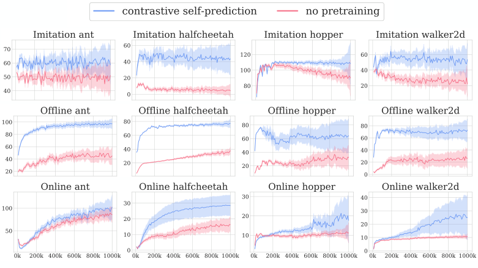
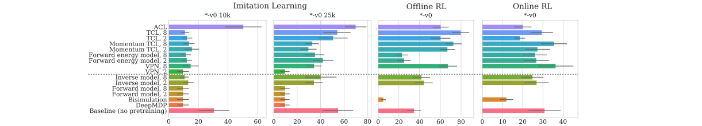
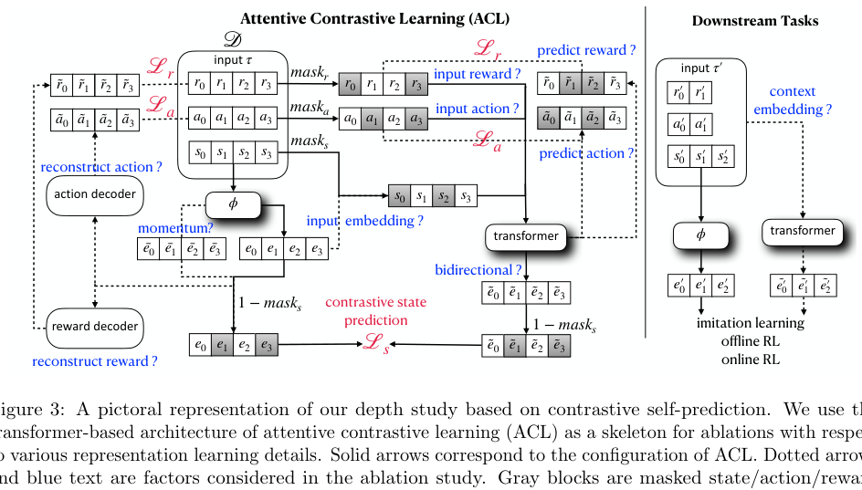
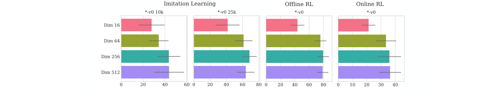
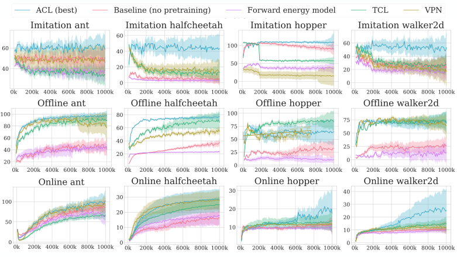
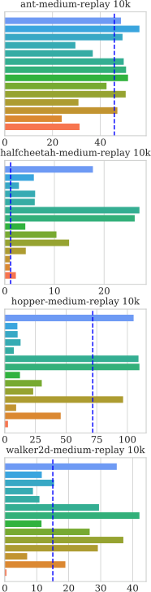
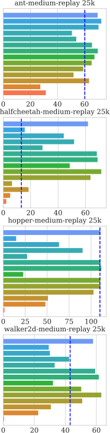
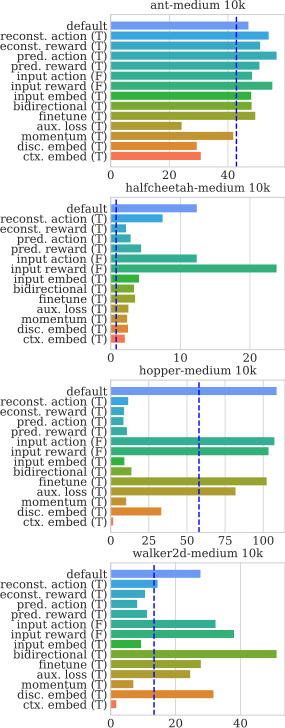
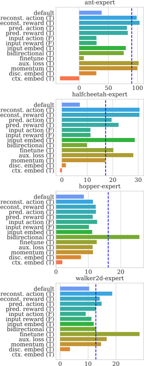
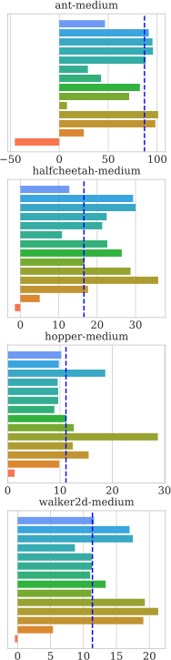

### Representation Matters: Offline Pretraining for Sequential Decision Making

Mengjiao Yang Ofir Nachum

```
       sherryy@google.com ofirnachum@google.com

```

Google Research Google Research


**Abstract**


The recent success of supervised learning methods on ever larger offline datasets has spurred interest in
the reinforcement learning (RL) field to investigate whether the same paradigms can be translated to RL
algorithms. This research area, known as _offline RL_, has largely focused on offline policy optimization,
aiming to find a return-maximizing policy exclusively from offline data. In this paper, we consider a
slightly different approach to incorporating offline data into sequential decision-making. We aim to
answer the question, what unsupervised objectives applied to offline datasets are able to learn state
representations which elevate performance on downstream tasks, whether those downstream tasks be
online RL, imitation learning from expert demonstrations, or even offline policy optimization based on the
same offline dataset? Through a variety of experiments utilizing standard offline RL datasets, we find that
the use of pretraining with unsupervised learning objectives can dramatically improve the performance of
policy learning algorithms that otherwise yield mediocre performance on their own. Extensive ablations
further provide insights into what components of these unsupervised objectives – e.g., reward prediction,
continuous or discrete representations, pretraining or finetuning – are most important and in which
settings.

#### **1 Introduction**


Within the reinforcement learning (RL) research field, _offline RL_ has recently gained a significant amount of
interest (Levine et al., 2020; Lange et al., 2012). Offline RL considers the problem of performing reinforcement
learning – i.e., learning a policy to solve a sequential decision-making task – exclusively from a static, offline
dataset of experience. The recent interest in offline RL is partly motivated by the success of _data-driven_
methods in the supervised learning literature. Indeed, the last decade has witnessed ever more impressive
models learned from ever larger static datasets (Halevy et al., 2009; Krizhevsky et al., 2012; Brown et al.,
2020; Dosovitskiy et al., 2020). Solving offline RL is therefore seen as a stepping stone towards developing
scalable, data-driven methods for policy learning (Fu et al., 2020). Accordingly, much of the recent offline RL
research focuses on proposing new policy optimization algorithms amenable to learning from offline datasets
(e.g., Fujimoto et al. (2019); Wu et al. (2019); Agarwal et al. (2020); Kumar et al. (2020); Yu et al. (2020);
Matsushima et al. (2020)).


In this paper, we consider a slightly different approach to incorporating offline data into sequential decisionmaking. We are inspired by recent successes in semi-supervised learning (Mikolov et al., 2013; Devlin
et al., 2018; Chen et al., 2020), in which large and potentially unlabelled offline datasets are used to learn
_representations_ of the data – i.e., a mapping of input to a fixed-length vector embedding – and these
representations are then used to accelerate learning on a downstream supervised learning task. We therefore
consider whether the same paradigm can apply to RL. Can offline experience datasets be used to learn
representations of the data that accelerate learning on a downstream task?


1




Figure 1: A summary of the advantages of representation learning via contrastive self-prediction, across a
variety of settings: imitation learning, offline RL, and online RL. Each subplot shows the aggregated mean
reward and standard error during training, with aggregation over offline datasets of different behavior (e.g.,
expert, medium, etc.), with five seeds per dataset (see Section 3). Representation learning yields significant
performance gains in all domains and tasks.


This broad and general question has been partially answered by previous works (Ajay et al., 2020; Singh
et al., 2020). These works focus on using offline datasets to learn representations of _behaviors_, or actions.
More specifically, these works learn a spectrum of behavior policies, conditioned on a latent _z_, through
supervised action-prediction on the offline dataset. The latent _z_ then effectively provides an abstract action
space for learning a hierarchical policy on a downstream task, and this straightforward paradigm is able to
accelerate learning in a variety of sequential decision-making settings. Inspired by these promising results and
to differentiate our own work, we focus our efforts on the question of representation learning for _observations_,
or states, as opposed to learning representations of behaviors or actions. That is, we aim to answer the
question, can offline experience datasets be used to learn representations _of state observations_ such that
learning policies from these pretrained representations, as opposed to the raw state observations, improves
performance on a downstream task? [1]


To approach this question, we devise a variety of offline datasets and corresponding downstream tasks. For
offline datasets, we leverage the Gym-MuJoCo datasets from D4RL (Fu et al., 2020), which provide a diverse
set of datasets from continuous control simulated robotic environments. For downstream tasks, we consider
three main categories: (1) low-data imitation learning, in which we aim to learn a task-solving policy from
a small number of expert trajectories; (2) offline RL, in which we aim to learn a task-solving policy from
the same offline dataset used for representation learning; and (3) online RL, in which we aim to learn a
task-solving policy using online access to the environment.


Once these settings are established, we then continue to evaluate the ability of state representation learning
on the offline dataset to accelerate learning on the downstream task. Our experiments are separated into two
parts, _breadth_ and _depth_ . First for breadth, we consider a diverse variety of representation learning objectives
taken from the RL and supervised learning literature. The results of these experiments show that, while several


1 Whether the two aspects of representation learning – action representations and state representations – can be combined is
an intriguing question. However, to avoid an overly broad paper, we focus only on state representation learning, and leave the
question of combining this with action representation learning to future work.


2


of these objectives perform poorly, a few yield promising results. This promising set essentially comprises of
objectives which we call _contrastive self-prediction_ ; these objectives take sub-trajectories of experience and
then use some components of the sub-trajectory to predict other components, with a contrastive loss when
predicting states – e.g., using a contrastive loss on the affinity between a sequence of states and actions and
the next state, akin to popular methods in the supervised learning literature (Mikolov et al., 2013; Devlin
et al., 2018).


These initial findings guide our second set of experiments. Aiming for depth, we devise an extensive ablation
based on contrastive self-prediction to investigate what components of the objective are most important and in
which settings. For example, whether it is important to include reward as part of the sub-trajectory, or whether
discrete representations are better than continuous, whether pre-training and fixing the representations
is better than finetuning, etc. In short, we find that state representation learning can yield a dramatic
improvement in downstream learning. Compared to performing policy learning from raw observations, we
show that relatively simple representation learning objectives on offline datasets can enable better and faster
learning on imitation learning, offline RL, and online RL (see Figure 1). We believe these results are especially
compelling for the imitation learning setting – where even a pretraining dataset that is far from expert
behavior yields dramatic improvement in downstream learning – and in the offline RL setting – where we
show the benefits of representation learning are significant even when the pretraining dataset _is the same as_
the downstream task dataset. We hope that these impressive results guide and encourage future researchers
to develop even better ways to incorporate representation learning into sequential decision-making.

#### **2 Background and Related Work**


Representation learning for RL has a rich and diverse existing literature, and we briefly review these relevant
works.


**Abstraction and Bisimulation** Traditionally, representation learning has been framed as learning or
identifying _abstractions_ of the state or action space of an environment (Andre and Russell, 2002; Mannor
et al., 2004; Dearden and Boutilier, 1997; Abel et al., 2018). These methods aim to reduce the original
environment state and action spaces to more compact spaces by clustering those states and actions which
yield similar rewards and dynamics. Motivated by similar intuitions, research into _bisimulation_ metrics has
aimed to devise or learn similarity functions between states (Ferns et al., 2004; Castro and Precup, 2010).
While these methods originally required explicit knowledge of the reward and dynamics functions of the
environment, a number of recent works have translated these ideas to stochastic representation learning
objectives using deep neural networks (Gelada et al., 2019; Zhang et al., 2020; Agarwal et al., 2021). Many of
these modern approaches effectively learn reward and transition functions in the learned embedding space,
and training of these models is used to inform the learned state representations.


**Representations in Model-Based Learning** The idea of learning latent state representations via learning
reward and dynamics models leads us to related work in the model-based RL literature. Several recent
model-based RL methods use latent state representations as a way to simplify the model learning and policy
rollout elements of model-based policy optimization (Oh et al., 2017; Silver et al., 2018; Hafner et al., 2020),
with the rollout in latent space sometimes referred to as ‘imagination’ (Racani`ere et al., 2017; Hafner et al.,
2019). Similar ideas have also appeared under the label of ‘embed to control’ (Watter et al., 2015; Levine
et al., 2019). Other than learning representations through forward models, there are also works which propose
to learn _inverse_ models, in which an action is predicted based on the representations of its preceding state
and subsequent state (Pathak et al., 2017; Shelhamer et al., 2016).


**Contrastive Objectives** Beyond model-based representations, many previous works propose the use of
contrastive losses as a way of learning useful state representations (Wu et al., 2018; Nachum et al., 2018;
Srinivas et al., 2020; Stooke et al., 2020). These works effectively define some notion of similarity between


3


states and use a contrastive loss to encourage similar states to have similar representations. The similarity is
usually based on either temporal vicinity (pairs of states which appear in the same sub-trajectory) or userspecified augmentations, such as random shifts of image observations (Srinivas et al., 2020). Previous work
has established connections between the use of contrastive loss and mutual information maximization (van den
Oord et al., 2019) and energy-based models (LeCun and Huang, 2005).


**State Representation Learning in Offline RL** The existing works mentioned above almost exclusively
focus on online settings, often learning the representations on a continuously evolving dataset and in tandem
with online policy learning. In contrast, our work focuses on representation learning on offline datasets and
separated from downstream task learning. This serves two purposes: First, using static offline datasets
makes comparisons between different methods easier, avoiding confounding factors associated with issues
of exploration or nonstationary datasets. Second, the offline setting is arguably more practical; in practice,
static offline datasets are more common than cheap online access to an environment (Levine et al., 2020).
Previous work in a similar vein to ours includes Stooke et al. (2020) and Shelhamer et al. (2016), which
propose to use unsupervised pretraining, typically only on expert demonstrations, as a way of initializing an
image encoder for downstream online RL. Our own work complements these existing studies, by presenting
extensive comparisons of a variety of representation learning objectives in several distinct settings. Moreover,
our work is unique for showing benefits of representation learning on non-image tasks, thus avoiding the use
of any explicit or implicit prior knowledge that is typically exploited for images (e.g., using image-based
augmentations or using a convolutional network architecture).

#### **3 Task Setups**


We now continue to our own contributions, starting by elaborating on the experimental protocol we design to
evaluate representation learning in the context of low-data imitation learning, offline RL (specifically, offline
policy optimization), and online RL in partially observable environments. This protocol is summarized in
Table 1.


Table 1: A summary of our experimental setups. In total, there are 16 choices of offline data and downstream
task combinations each for imitation learning, offline RL, and online RL. Given that we run each setting with
five random seeds, this leads to a total of 240 training runs for every representation learning objective we
consider.


**Imitation**

Choose domain _∈{_ halfcheetah _,_ hopper _,_ walker2d _,_ ant _}_ Offline dataset: _{_ domain _}_ - _{_ data _}_ -v0
Choose data _∈{_ medium _,_ medium-replay _}_ _→_ Downstream task: Behavioral cloning (BC) on first _N_
Choose _N ∈_ _{_ 10000 _,_ 25000 _}_ transitions from _{_ domain _}_ -expert-v0

**Offline RL**
Choose domain _∈{_ halfcheetah _,_ hopper _,_ walker2d _,_ ant _}_ Offline dataset: _{_ domain _}_ - _{_ data _}_ -v0
Choose data _∈{_ expert _,_ medium-expert _,_ medium _,_ _→_ Downstream task: Behavior regularized actor critic (BRAC)

medium-replay _}_ on data from _{_ domain _}_                  - _{_ data _}_ -v0

**Online RL**

Choose domain _∈{_ halfcheetah _,_ hopper _,_ walker2d _,_ ant _}_ Offline dataset: _{_ domain _}_ - _{_ data _}_ -v0 with random masking
Choose data _∈{_ expert _,_ medium-expert _,_ medium _}_ _→_ Downstream task: Soft actor critic (SAC) on randomly

medium-replay _}_ masked version of _{_ domain _}_


**3.1** **Datasets**


We leverage the Gym-MuJoCo datasets from D4RL (Fu et al., 2020). These datasets are generated from
running policies on the well-known MuJoCo benchmarks of simulated locomotive agents: halfcheetah, hopper,
walker2d, and ant. Each of these four domains is associated with four datasets – expert, medium-expert,


4


medium, and medium-replay – corresponding to the quality of the policies used to collect that data. Each
dataset is composed of a number of trajectories _τ_ := ( _s_ 0 _, a_ 0 _, r_ 0 _, s_ 1 _, a_ 1 _, r_ 1 _, . . ., s_ _T_ ). For example, the dataset
ant-expert-v0 is a dataset of trajectories generated by expert task-solving policies on the ant domain, while
the dataset halfcheetah-medium-v0 is generated by mediocre, far from task-solving, policies.


Notably, although the underyling MuJoCo environments are Markovian, the datasets are not necessarily
Markovian, as they may be generated by multiple distinct policies.


**3.2** **Imitation Learning in Low-Data Regime**


Imitation learning (Hussein et al., 2017) seeks to match the behavior of an agent with that of an expert.
While expert demonstrations are often limited and expensive to obtain in practice, non-expert experience
data (e.g., generated from a mediocre agent randomly interacting with an environment) can be much more
easily accessible.


To mimic this practical scenario, we consider an experimental protocol in which the downstream task is
behavioral cloning (Pomerleau, 1991) on a small set of expert trajectories – selected by taking either the first
10k or 25k transitions from an expert dataset in D4RL, corresponding to about 10 and 25 expert trajectories,
respectively. We then consider either the medium or medium-replay datasets from the same domain for
representation learning. [2] Thus, this set of experiments aims to determine whether representations learned
from large datasets of mediocre behavior can help elevate the performance of behavioral cloning on a much
smaller expert dataset.


**3.3** **Offline RL with Behavior Regularization**


One of the main motivations for the introduction of the D4RL datasets was to encourage research into fully
offline reinforcement learning; i.e., whether it is possible to learn return-maximizing policies exclusively from
a static offline dataset. Many algorithms for this setting have recently been proposed, commonly employing
some sort of _behavior regularization_ (Kumar et al., 2019; Jaques et al., 2019; Wu et al., 2019). In its simplest
form, behavior regularization augments a vanilla actor-critic algorithm with a divergence penalty measuring
the divergence of the learned policy from the offline data, thus compelling the learned policy to choose the
same actions appearing in the dataset.


While the actor and critic are typically trained with the raw observations as input, with this next set of
experiments, we aim to determine whether representation learning can help in this regime as well. In this
setting, the pretraining and downstream datasets are the same, determined by a single choice of domain
(halfcheetah, hopper, walker2d, or ant) and data (expert, medium-expert, medium, or medium-replay). For
the downstream algorithm, we use behavior regularized actor-critic (BRAC) (Wu et al., 2019), which is a
simple behavior regularized method employing a KL divergence penalty. Notably, although the original
BRAC paper uses different regularization strengths and policy learning rates for different domains, we fix
these to values which we found to generally perform best (regularization strength of 1 _._ 0 and policy learning
rate of 0 _._ 00003).


Thus, this set of experiments aims to determine whether learning BRAC from learned state representations is
better (in terms of performance and less dependence on hyperparameters) than learning BRAC from the raw
states, even when the state representations are learned using the same offline dataset.


**3.4** **Online RL in Partially Observable Environments**


In this set of experiments, we aim to determine whether representations learned from offline datasets can
improve or accelerate learning in an online domain. One of the most popular online RL algorithms is soft
actor critic (SAC) (Haarnoja et al., 2019). SAC is a well-performing algorithm on its own, and so to increase


2 To avoid issues of extrapolation when transferring learned representations to the expert dataset, we include the small number
of expert demonstrations in the offline dataset during pretraining.


5


the difficulty of the downstream task, we consider a simple modification to make our domains partially
observable: zero-masking out a random dimension of the state observation. This modification also brings our
domains closer to practice, where partial observability due to flaky sensor readings is common (Dulac-Arnold
et al., 2019).


Accordingly, the offline dataset is determined by a choice of domain (halfcheetah, hopper, walker2d, or
ant) and data (expert, medium-expert, medium, or medium-replay), with the same masking applied to this
dataset. Representations learned on this dataset are then applied downstream, where SAC is trained on the
online domain, with the representation module providing an embedding of the masked observations of the
environment within a learned embedding space.


**3.5** **Evaluation**


Each representation learning variant we evaluate is run with five seeds on each of the experimental setups
described above. Unless otherwise noted, a single seed corresponds to an initial pretraining phase of 200k
steps, in which a representation learning objective is optimized using batches of 256 sub-trajectories randomly
sampled from the offline dataset. After pretraining, the learned representation is fixed and applied to the
downstream task, which performs the appropriate training (BC, BRAC, or SAC) for 1M steps. In this
downstream phase, every 10k steps, we evaluate the learned policy on the downstream domain environment by
running it for 10 episodes and computing the average total return. We normalize this total return according
to the normalization proposed in Fu et al. (2020), such that a score of 0 roughly corresponds to a random
agent and a score of 100 to an expert agent. We average the last 10 evaluations within the 1M downstream
training, and this determines the final score for the run. To aggregate over multiple seeds and task setups, we
simply compute the average and standard error of this final score.

#### **4 Experiments: Breadth Study**


We begin our empirical study with an initial assessment into the performance of a broad set of representation
learning ideas from the existing literature.


**4.1** **Representation Learning Objectives**


We describe the algorithms we consider below. While it is infeasible for us to extensively evaluate all
previously proposed representation learning objectives, our choice of objectives here aims to cover a diverse
set of recurring themes and ideas from previous work (see Section 2).


We use the notation
_τ_ _t_ : _t_ + _k_ := ( _s_ _t_ _, a_ _t_ _, r_ _t_ _, . . ., s_ _t_ + _k−_ 1 _, a_ _t_ + _k−_ 1 _, r_ _t_ + _k−_ 1 _, s_ _t_ + _k_ )


to denote a length-( _k_ +1) sub-trajectory of state observations, actions, and rewards; we use _s_ _t_ : _t_ + _k_ _, a_ _t_ : _t_ + _k_ _, r_ _t_ : _t_ + _k_
to denote a subselection of this trajectory based on states, actions, and rewards, respectively. We use _φ_ to
denote the representation function; i.e., _φ_ ( _s_ ) is the representation associated with state observation _s_, and
_φ_ ( _s_ _t_ : _t_ + _k_ ) := ( _φ_ ( _s_ _t_ ) _, . . ., φ_ ( _s_ _t_ + _k_ )). All learned functions, including _φ_, are parameterized by neural networks.
Unless otherwise noted, _φ_ is parameterized as a two-hidden layer fully-connected network with 256 units per
layer and output of dimension 256 (see further details in Appendix A).


**Inverse model** Given a sub-trajectory _τ_ _t_ : _t_ +1, use _φ_ ( _s_ _t_ : _t_ +1 ) to predict _a_ _t_ . That is, we train an auxiliary _f_
such that _f_ ( _φ_ ( _s_ _t_ : _t_ +1 )) is a distribution over actions, and the learning objective is _−_ log _P_ ( _a_ _t_ _|f_ ( _φ_ ( _s_ _t_ : _t_ +1 ))).
This objective may be generalized to sequences longer than _k_ +1 = 2 as _−_ log _P_ ( _a_ _t_ + _k−_ 1 _|f_ ( _φ_ ( _s_ _t_ : _t_ + _k_ ) _, a_ _t_ : _t_ + _k−_ 1 )).


6


**Forward raw model** Given a sub-trajectory _τ_ _t_ : _t_ +1, use _φ_ ( _s_ _t_ ) _, a_ _t_ to predict _r_ _t_ _, s_ _t_ +1 . That is, we train an
auxiliary _f, g_ such that _f_ ( _φ_ ( _s_ _t_ ) _, a_ _t_ ) is a distribution over next states and _g_ ( _φ_ ( _s_ _t_ ) _, a_ _t_ ) is a scalar reward prediction. The learning objective is _||r_ _t_ _−g_ ( _φ_ ( _s_ _t_ ) _, a_ _t_ ) _||_ [2] _−_ log _P_ ( _s_ _t_ +1 _|f_ ( _φ_ ( _s_ _t_ ) _, a_ _t_ )). This objective may be generalized
to sequences longer than _k_ + 1 = 2 as _||r_ _t_ _−_ _g_ ( _φ_ ( _s_ _t_ : _t_ + _k−_ 1 ) _, a_ _t_ : _t_ + _k−_ 1 ) _||_ [2] _−_ log _P_ ( _s_ _t_ +1 _|f_ ( _φ_ ( _s_ _t_ : _t_ + _k−_ 1 ) _, a_ _t_ : _t_ + _k_ )).


**Forward latent model; a.k.a., DeepMDP (Gelada et al., 2019)** This is the same as the forward raw
model, only that _f_ now describes a distribution over next state representations. Thus, the log-probability
with respect to _f_ becomes _−_ log _P_ ( _φ_ ( _s_ _t_ +1 ) _|f_ ( _φ_ ( _s_ _t_ ) _, a_ _t_ )).


**Forward energy model** This is the same as the forward raw model, only that _f_ is no longer a distribution over raw states. Rather, _f_ maps _φ_ ( _s_ _t_ ) _, a_ _t_ to the same embedding space as _φ_ and the probability
_P_ ( _s_ _t_ +1 _|f_ ( _φ_ ( _s_ _t_ ) _, a_ _t_ )) is defined in an energy-based way:


_ρ_ ( _s_ _t_ +1 ) exp _{φ_ ( _s_ _t_ +1 ) _[⊤]_ _W_ _f_ ( _φ_ ( _s_ _t_ ) _, a_ _t_ ) _}_

_,_ (1)
E _ρ_ [exp _{φ_ (˜ _s_ ) _[⊤]_ _Wf_ ( _φ_ ( _s_ _t_ ) _, a_ _t_ ) _}_ ]


where _W_ is a trainable matrix and _ρ_ is a non-trainable prior distribution (we set _ρ_ to be the distribution of
states in the offline dataset).


**(Momentum) temporal contrastive learning (TCL)** Given a sub-trajectory _τ_ _t_ : _t_ +1, we apply a contrastive loss between _φ_ ( _s_ _t_ ) _, φ_ ( _s_ _t_ +1 ). The objective is


_−_ _φ_ ( _s_ _t_ +1 ) _[⊤]_ _Wφ_ ( _s_ _t_ ) + log E _ρ_ [exp _{φ_ (˜ _s_ ) _[⊤]_ _Wφ_ ( _s_ _t_ ) _}_ ] _,_ (2)


where _W_ and _ρ_ are as in the forward energy model above. This objective may be generalized to sequences
longer than _k_ + 1 = 2 by having multiple terms in the loss for _i_ = 1 _, . . ., k_ :


_−_ _φ_ ( _s_ _t_ + _i_ ) _[⊤]_ _W_ _i_ _φ_ ( _s_ _t_ ) + log E _ρ_ [exp _{φ_ (˜ _s_ ) _[⊤]_ _W_ _i_ _φ_ ( _s_ _t_ ) _}_ ] _._ (3)


If momentum is used, we apply the contrastive loss between _f_ ( _φ_ ( _s_ _t_ )) and _φ_ _target_ ( _s_ _t_ + _i_ ), where _f_ is a learned
function and _φ_ _target_ denotes a non-trainable version of _φ_, with weights corresponding to a slowly moving
average of the weights of _φ_, as in Stooke et al. (2020); He et al. (2020).


**Attentive Contrastive Learning (ACL)** Following the theme of contrastive losses and inspired by a
number of works in the RL (van den Oord et al., 2019) and NLP (Mikolov et al., 2013) literature which apply
such losses between tokens and contexts using an attention mechanism, we devise a similar objective for
our settings. Implementation-wise, we borrow ideas from BERT (Devlin et al., 2018), namely we (1) take a
sub-trajectory _s_ _t_ : _t_ + _k_ _, a_ _t_ : _t_ + _k_ _, r_ _t_ : _t_ + _k_, (2) randomly mask a subset of these, (3) pass the masked sequence into a
transformer, and then (4) for each masked input state, apply a contrastive loss between its representation
_φ_ ( _s_ ) and the transformer output at its sequential position. We use _k_ + 1 = 8 in our implementation. Figure 3
provides a diagram of ACL.


**Value prediction network (VPN)** Taken from Oh et al. (2017), this objective uses an RNN starting
at _φ_ ( _s_ _t_ ) and inputting _a_ _t_ : _t_ + _k_ for _k_ steps to predict the _k_ -step future rewards and value functions. While
the original VPN paper defines the ( _k_ + 1)-th value function in terms of a max over actions, we avoid this
potential extrapolation issue and simply use the ( _k_ + 1)-th action provided in the offline data. As we will
elaborate on later, VPN bears similarities to ACL in that it uses certain components of the input sequence
(states and actions) to predict other components (values).


**Deep bisimulation for control** This objective is taken from Zhang et al. (2020), where the representation
function _φ_ is learned to respect an L1 distance based on a bisimulation similarity deduced from Bellman
backups.


7




Figure 2: Performance of downstream imitation learning, offline RL, and online RL tasks under a variety
of representation learning objectives. _x_ -axis shows aggregated average rewards (over five seeds) across the
domains and datasets described in Section 3. Methods that failed to converge are eliminated from the results
(see Appendix A). ACL is set to the default configuration that favors imitation learning (see Section 5).
When applicable, we also label variants with _k_ + 1 _∈{_ 2 _,_ 8 _}_ . Methods above the dotted line are variants of
contrastive self-prediction. ACL performs well on imitation learning. VPN and (momentum) TCL perform
well on offline and online RL.


**4.2** **Results**


The results of these representation learning objectives are presented in Figure 2. Representation learning,
even before the extensive ablations we will embark on in Section 5, on average improves downstream imitation
learning, offline RL, and online RL tasks by 1 _._ 5x, 2 _._ 5x, and 15% respectively. The objectives that appear to
work best – ACL, (Momentum) TCL, VPN – fall under a class of objectives we term _contrastive self-prediction_,
where _self-prediction_ refers to the idea that certain components of a sub-trajectory are predicted based on
other components of the same sub-trajectory, while _contrastive_ refers to the fact that this prediction should
be performed via a contrastive energy-based loss when the predicted component is a state observation.


We also find that a longer sub-trajectory _k_ + 1 = 8 is generally better than a short one _k_ + 1 = 2. The
advantage here is presumably due to the non-Markovian nature of the dataset. Even if the environment is
Markovian, the use of potentially distinct policies for data collection can lead to non-Markovian data.


Despite these promising successes, there are a number of objectives which perform poorly. Raw predictions of
states (forward model) yields disappointing results in these settings. Forward models of future representations
– DeepMDP, Bisimulation – also exhibit poor performance. This latter finding was initially surprising to
us, as many theoretical notions of state abstractions are based on the principle of predictability of future
state representations. Nevertheless, even after extensive tuning of these objectives and attempts at similar
objectives (e.g., we briefly investigated incorporating ideas from Hafner et al. (2020)), we were not able to
achieve any better results. Even if it is possible to find better architectures or hyperparameters, we believe
the difficulty in tuning these baselines makes them unattractive in comparison to the simpler and better
performing alternatives.

#### **5 Experiments: Depth Study**


The favorable results of objectives based on the idea of contrastive self-prediction is compelling, but the
small number of objectives evaluated leaves many questions unanswered. For example, when generating the
context embedding for a specific prediction, should one use past states (as in TCL and Momentum TCL) or
also include actions and/or rewards (as in ACL and VPN)? Should this context use the same representation
network _φ_ (as in TCL and VPN), a momentum version of it (as in Momentum TCL), or a completely separate
network (as in ACL)?


We use this section to study these and other important questions by conducting a series of ablations on the
factors which compose a specific contrastive self-prediction objective and how it is applied to downstream


8


Table 2: Factors of contrastive self-prediction considered in our ablation study and summaries of their effects.
Input action and input reward default to true. The remaining factors default to false. For each effect entry, _↓_
means decreased performance, _↑_ means improved performance, and = means no significant effect.

|Factor|Description|Imitation|Offline|Online|
|---|---|---|---|---|
|reconstruct action|Add action prediction loss based on_ φ_(_s_).|_↓_|_↑_|_↑_|
|reconstruct reward|Add a reward prediction loss based on_ φ_(_s_).|_↓_|_↑_|_↑_|
|predict action|Add an action prediction loss based on transformer outputs. Whenever<br>this is true, we also set ‘input embed’ to true.|_↓_|_↑_|_↑_|
|predict reward|Add a reward prediction loss based on transformer outputs. Whenever<br>this is true, we also set ‘input embed’ to true.|_↓_|_↑_|_↑_|
|input action|Include actions in the input sequence to transformer.|_↓_|_↑_|_↑_|
|input reward|Include rewards in the input sequence to transformer.|_↓_|_↑_|_↑_|
|input embed|Use representations_ φ_(_s_) as input to transformer, as opposed to raw<br>observations.|_↓_|=|_↑_|
|bidirectional|To generate sequence output at position_ i_, use full input sequence as<br>opposed to only inputs at position_ ≤i_.|_↓_|=|_↑_|
|finetune|Pass gradients into_ φ_ during learning on downstream tasks.|_↓_|_↓_|_↑_|
|auxiliary loss|Use representation learning objective as an auxiliary loss during down-<br>stream learning, as opposed to pretraining.|_↓_|_↓_|_↑_|
|momentum|Adopt an additional momentum representation network. Whenever<br>this is true, we also set ‘input embed’ to true.|_↓_|_↓_|_↑_|
|discrete embedding|Learn discrete representations. Following Hafner et al. (2020), we treat<br>the 256-dim output of_ φ_ as logits to sample 16 categorical distributions<br>of dimension 16 each and use straight-through gradients.|_↓_|_↓_|_↓_|
|context embedding|Following Devlin et al. (2018), use transformer output as representa-<br>tions for downstream tasks. Whenever this is true, we also set ‘input<br>embed’ to true.|_↓_|_↓_|_↓_|


|′<br>r0|′<br>r1|
|---|---|
|_a_′ 0|_a_′1|





entries. After the pretraining phase, the representation network _φ_ is reused for downstream tasks, unless
‘context embedding’ is true, in which case the transformer is used.


9


Figure 4: Ablation results on imitation learning, offline RL, and online RL. _x_ -axis shows average rewards and
standard error aggregated over either different Gym-MuJoCo datasets (imitation and offline RL) or domains
(online RL). Blue dotted lines show average rewards without pretraining. (T) and (F) mean setting each factor
to true or false (opposite from the default configuration). Reconstructing, predicting, or inputting action or
reward (row 2-7) impairs imitation performance but are important for offline and online RL. Bidirectional
transformer hurts imitation learning when downstream sample size is small. Finetuning and auxiliary loss
can help online RL. Additional results are presented in Appendix B.


learning. We describe all these factors in Table 2, as well as a high-level summary of their effects. Further
anecdotal observations found during our research are summarized in Appendix C.


We choose the transformer-based implementation of ACL to serve as the skeleton for all these ablations
(see Figure 3), due to its general favorable empirical performance in the previous section, as well as its
ease of modification. For each downstream task below, we present the ablations with respect to the _default_
configuration of the factors in Table 2 that corresponds to the original ACL introduced in Section 4, and
change one factor at a time to observe its effect on downstream task performance.


**5.1** **Results**


The results of our ablation studies are presented in Figure 4, and we highlight some of the main findings
below. We also take the best performing ablation from each row (imitation, offline RL, and online RL) and
plot the performance during training in Figure 1.


Let us first consider the effects of inclusion or prediction of actions and rewards. We notice some interesting


10


behavior across the different downstream modes. Namely, it appears that imitation learning is best served by
focusing only on state contrastive learning and not including or predicting actions and rewards, whereas the
offline and online RL settings appear to benefit from these. Due to the mixed results we initially observed
from including or predicting actions and rewards, we also introduce the idea of _reconstructing_ actions and
rewards based on _φ_ ( _s_ ), and we found this to have much more consistent benefit in the RL settings, although
it still degrades imitation learning performance. This disconnect between objectives which are good for
imitation learning vs. RL, first seen in Section 4, thus continues to be present in these ablations as well, and
we find that no single objective dominates in all settings.


We also evaluate a number of representation learning paradigms popular in the NLP literature (Devlin et al.,
2018), namely using bidirectional transformers, finetuning, and context embedding. Although these techniques
are ubiquitous in the NLP literature, we find mixed results in RL settings. Context embedding consistently
hurts performance. Bidirectional transformer hurts imitation learning but helps online RL. Finetuning leads
to a modest degredation in performace in imitation and offline RL but can improve online RL depending on
the domain being evaluated.


We additionally considered using the representation learning objective as an auxiliary training loss, which is
popular in the online RL literature (Shelhamer et al., 2016; Stooke et al., 2020). And indeed, we find that it
can dramatically improve representation learning in online RL, but at the same time, dramatically degrade
performance in the offline settings (imitation learning or offline RL).

#### **6 Conclusion**


Overall, our results show that relatively simple representation learning objectives can dramatically improve
downstream imitation learning, offline RL, and online RL (Figure 1). Interestingly, our results suggest that
the ideal representation learning objective may depend on the nature of the downstream task, and no single
objective appears to dominate generally. Our extensive ablations also provide a number of intriguing insights,
showing that representational paradigms which are popular in NLP or online RL may not translate to good
performance in offline settings.


Even with this multitude of fresh insight into the question of representation learning in RL, our study is
limited in a number of aspects, and these aspects can serve as a starting point for future work. For example,
one may consider additional downstream tasks such as multi-task, transfer, or exploration. Alternatively,
one can extend our ablations to real-world domains like robot learning. Or, one may consider ablating over
different network architectures.


Despite these limitations, we hope our current work proves useful to RL researchers, and serves as a guide for
developing even better and more general representation learning objectives.

#### **Acknowledgements**


We thank Ilya Kostrikov for providing his codebase as a starting point for our experiments as well as helpful
comments on early drafts of this work. We also thank the rest of the Google Brain team for insightful
thoughts and discussions.

#### **References**


David Abel, Dilip Arumugam, Lucas Lehnert, and Michael Littman. State abstractions for lifelong reinforcement learning. In _International Conference on Machine Learning_, pages 10–19. PMLR, 2018.


Rishabh Agarwal, Dale Schuurmans, and Mohammad Norouzi. An optimistic perspective on offline reinforcement learning, 2020.


11


Rishabh Agarwal, Marlos C Machado, Pablo Samuel Castro, and Marc G Bellemare. Contrastive behavioral
similarity embeddings for generalization in reinforcement learning. _arXiv preprint arXiv:2101.05265_, 2021.


Anurag Ajay, Aviral Kumar, Pulkit Agrawal, Sergey Levine, and Ofir Nachum. Opal: Offline primitive
discovery for accelerating offline reinforcement learning. _arXiv preprint arXiv:2010.13611_, 2020.


David Andre and Stuart J Russell. State abstraction for programmable reinforcement learning agents. In
_Aaai/iaai_, pages 119–125, 2002.


Tom B Brown, Benjamin Mann, Nick Ryder, Melanie Subbiah, Jared Kaplan, Prafulla Dhariwal, Arvind
Neelakantan, Pranav Shyam, Girish Sastry, Amanda Askell, et al. Language models are few-shot learners.
_arXiv preprint arXiv:2005.14165_, 2020.


Pablo Castro and Doina Precup. Using bisimulation for policy transfer in mdps. In _Proceedings of the AAAI_
_Conference on Artificial Intelligence_, volume 24, 2010.


Ting Chen, Simon Kornblith, Mohammad Norouzi, and Geoffrey Hinton. A simple framework for contrastive
learning of visual representations. In _International conference on machine learning_, pages 1597–1607.
PMLR, 2020.


Richard Dearden and Craig Boutilier. Abstraction and approximate decision-theoretic planning. _Artificial_
_Intelligence_, 89(1-2):219–283, 1997.


Jacob Devlin, Ming-Wei Chang, Kenton Lee, and Kristina Toutanova. Bert: Pre-training of deep bidirectional
transformers for language understanding. _arXiv preprint arXiv:1810.04805_, 2018.


Alexey Dosovitskiy, Lucas Beyer, Alexander Kolesnikov, Dirk Weissenborn, Xiaohua Zhai, Thomas Unterthiner,
Mostafa Dehghani, Matthias Minderer, Georg Heigold, Sylvain Gelly, et al. An image is worth 16x16 words:
Transformers for image recognition at scale. _arXiv preprint arXiv:2010.11929_, 2020.


Gabriel Dulac-Arnold, Daniel Mankowitz, and Todd Hester. Challenges of real-world reinforcement learning,
2019.


Norm Ferns, Prakash Panangaden, and Doina Precup. Metrics for finite markov decision processes. In _UAI_,
volume 4, pages 162–169, 2004.


Justin Fu, Aviral Kumar, Ofir Nachum, George Tucker, and Sergey Levine. D4rl: Datasets for deep data-driven
reinforcement learning. _arXiv preprint arXiv:2004.07219_, 2020.


Scott Fujimoto, David Meger, and Doina Precup. Off-policy deep reinforcement learning without exploration.
In _International Conference on Machine Learning_, pages 2052–2062, 2019.


Carles Gelada, Saurabh Kumar, Jacob Buckman, Ofir Nachum, and Marc G Bellemare. Deepmdp: Learning
continuous latent space models for representation learning. In _International Conference on Machine_
_Learning_, pages 2170–2179. PMLR, 2019.


Tuomas Haarnoja, Aurick Zhou, Kristian Hartikainen, George Tucker, Sehoon Ha, Jie Tan, Vikash Kumar,
Henry Zhu, Abhishek Gupta, Pieter Abbeel, and Sergey Levine. Soft actor-critic algorithms and applications,
2019.


Danijar Hafner, Timothy Lillicrap, Jimmy Ba, and Mohammad Norouzi. Dream to control: Learning
behaviors by latent imagination. _arXiv preprint arXiv:1912.01603_, 2019.


Danijar Hafner, Timothy Lillicrap, Mohammad Norouzi, and Jimmy Ba. Mastering atari with discrete world
models. _arXiv preprint arXiv:2010.02193_, 2020.


Alon Halevy, Peter Norvig, and Fernando Pereira. The unreasonable effectiveness of data. _IEEE Intelligent_
_Systems_, 24(2):8–12, 2009.


12


Kaiming He, Haoqi Fan, Yuxin Wu, Saining Xie, and Ross Girshick. Momentum contrast for unsupervised
visual representation learning. In _Proceedings of the IEEE/CVF Conference on Computer Vision and_
_Pattern Recognition_, pages 9729–9738, 2020.


Ahmed Hussein, Mohamed Medhat Gaber, Eyad Elyan, and Chrisina Jayne. Imitation learning: A survey of
learning methods. _ACM Computing Surveys (CSUR)_, 50(2):1–35, 2017.


Natasha Jaques, Asma Ghandeharioun, Judy Hanwen Shen, Craig Ferguson, Agata Lapedriza, Noah Jones,
Shixiang Gu, and Rosalind Picard. Way off-policy batch deep reinforcement learning of implicit human
preferences in dialog. _arXiv preprint arXiv:1907.00456_, 2019.


Alex Krizhevsky, Ilya Sutskever, and Geoffrey E Hinton. Imagenet classification with deep convolutional
neural networks. _Advances in neural information processing systems_, 25:1097–1105, 2012.


Aviral Kumar, Justin Fu, Matthew Soh, George Tucker, and Sergey Levine. Stabilizing off-policy q-learning
via bootstrapping error reduction. In _Advances in Neural Information Processing Systems_, 2019.


Aviral Kumar, Aurick Zhou, George Tucker, and Sergey Levine. Conservative q-learning for offline reinforcement learning. _arXiv preprint arXiv:2006.04779_, 2020.


Sascha Lange, Thomas Gabel, and Martin Riedmiller. Batch reinforcement learning. In _Reinforcement_
_learning_, pages 45–73. Springer, 2012.


Yann LeCun and Fu Jie Huang. Loss functions for discriminative training of energy-based models. In _AIStats_,
volume 6, page 34. Citeseer, 2005.


Nir Levine, Yinlam Chow, Rui Shu, Ang Li, Mohammad Ghavamzadeh, and Hung Bui. Prediction, consistency,
curvature: Representation learning for locally-linear control. _arXiv preprint arXiv:1909.01506_, 2019.


Sergey Levine, Aviral Kumar, George Tucker, and Justin Fu. Offline reinforcement learning: Tutorial, review,
and perspectives on open problems. _arXiv preprint arXiv:2005.01643_, 2020.


Shie Mannor, Ishai Menache, Amit Hoze, and Uri Klein. Dynamic abstraction in reinforcement learning via
clustering. In _Proceedings of the twenty-first international conference on Machine learning_, page 71, 2004.


Tatsuya Matsushima, Hiroki Furuta, Yutaka Matsuo, Ofir Nachum, and Shixiang Gu. Deployment-efficient
reinforcement learning via model-based offline optimization. _arXiv preprint arXiv:2006.03647_, 2020.


Tomas Mikolov, Kai Chen, Greg Corrado, and Jeffrey Dean. Efficient estimation of word representations in
vector space. _arXiv preprint arXiv:1301.3781_, 2013.


Ofir Nachum, Shixiang Gu, Honglak Lee, and Sergey Levine. Near-optimal representation learning for
hierarchical reinforcement learning. _arXiv preprint arXiv:1810.01257_, 2018.


Junhyuk Oh, Satinder Singh, and Honglak Lee. Value prediction network. _arXiv preprint arXiv:1707.03497_,
2017.


Deepak Pathak, Pulkit Agrawal, Alexei A Efros, and Trevor Darrell. Curiosity-driven exploration by
self-supervised prediction. In _International Conference on Machine Learning_, pages 2778–2787. PMLR,
2017.


Dean A Pomerleau. Efficient training of artificial neural networks for autonomous navigation. _Neural_
_computation_, 3(1):88–97, 1991.


S´ebastien Racani`ere, Th´eophane Weber, David P Reichert, Lars Buesing, Arthur Guez, Danilo Rezende,
Adria Puigdomenech Badia, Oriol Vinyals, Nicolas Heess, Yujia Li, et al. Imagination-augmented agents
for deep reinforcement learning. In _Proceedings of the 31st International Conference on Neural Information_
_Processing Systems_, pages 5694–5705, 2017.


Prajit Ramachandran, Barret Zoph, and Quoc V. Le. Searching for activation functions, 2017.


13


Evan Shelhamer, Parsa Mahmoudieh, Max Argus, and Trevor Darrell. Loss is its own reward: Self-supervision
for reinforcement learning. _CoRR_, abs/1612.07307, 2016. URL `[http://arxiv.org/abs/1612.07307](http://arxiv.org/abs/1612.07307)` .


David Silver, Thomas Hubert, Julian Schrittwieser, Ioannis Antonoglou, Matthew Lai, Arthur Guez, Marc
Lanctot, Laurent Sifre, Dharshan Kumaran, Thore Graepel, et al. A general reinforcement learning
algorithm that masters chess, shogi, and go through self-play. _Science_, 362(6419):1140–1144, 2018.


Avi Singh, Huihan Liu, Gaoyue Zhou, Albert Yu, Nicholas Rhinehart, and Sergey Levine. Parrot: Data-driven
behavioral priors for reinforcement learning. _arXiv preprint arXiv:2011.10024_, 2020.


Aravind Srinivas, Michael Laskin, and Pieter Abbeel. Curl: Contrastive unsupervised representations for
reinforcement learning, 2020.


Adam Stooke, Kimin Lee, Pieter Abbeel, and Michael Laskin. Decoupling representation learning from
reinforcement learning, 2020.


Aaron van den Oord, Yazhe Li, and Oriol Vinyals. Representation learning with contrastive predictive coding,
2019.


Manuel Watter, Jost Tobias Springenberg, Joschka Boedecker, and Martin Riedmiller. Embed to control: A
locally linear latent dynamics model for control from raw images. _arXiv preprint arXiv:1506.07365_, 2015.


Yifan Wu, George Tucker, and Ofir Nachum. The laplacian in rl: Learning representations with efficient
approximations. _arXiv preprint arXiv:1810.04586_, 2018.


Yifan Wu, George Tucker, and Ofir Nachum. Behavior regularized offline reinforcement learning. _arXiv_
_preprint arXiv:1911.11361_, 2019.


Tianhe Yu, Garrett Thomas, Lantao Yu, Stefano Ermon, James Zou, Sergey Levine, Chelsea Finn, and
Tengyu Ma. Mopo: Model-based offline policy optimization. _arXiv preprint arXiv:2005.13239_, 2020.


Amy Zhang, Rowan McAllister, Roberto Calandra, Yarin Gal, and Sergey Levine. Learning invariant
representations for reinforcement learning without reconstruction. _arXiv preprint arXiv:2006.10742_, 2020.


14


# Appendix

#### **A Experimental Details**

**A.1** **Representation Network**


We parametrize the representation function _φ_ as a two-hidden layer fully connected neural network with
256 units per layer and output dimension 256. A Swish (Ramachandran et al., 2017) activation function is
applied to the output of each hidden layer. We experimented with representation dimension sizes 16 _,_ 64 _,_ 256 _,_
and 512, and found 256 and 512 to generally work the best (see Figure 5 in Appendix B.1).


**A.2** **Transformer Network**


The BERT-style transformer used in attentive contrastive learning (ACL) consists of one preprocessing layer
of 256 units and ReLU activaiton, followed by a multi-headed attention layer (4 heads with 128 units each),
followed by a fully connected feed forward layer with hidden dimension 256 and ReLU activation, finally
followed by an output layer of 256 units (the same as _φ_ ’s output). We experimented with different number of
attention blocks and number of heads in each block, but did not observe significant difference in performance.


When masking input (sequences of state, actions, or rewards), we randomly choose to ‘drop’ each item with
probability 0 _._ 3, ’switch’ with probability 0 _._ 15, and ‘keep’ with probability 0 _._ 15. ‘Drop’ refers to replacing the
item with a trainable variable of the same dimension. ‘Switch’ refers to replacing the item with a randomly
sampled item from the same batch. ‘Keep’ refers to leaving the item unchanged. These probability rates
where chosen arbitrarily and not tuned.


**A.3** **Action Prediction and Reconstruction**


Whenever a loss includes action prediction or reconstruction, we follow Haarnoja et al. (2019), and (1)
utilize an output distribution given by a tanh-squashed Gaussian and (2) apply an additive adaptive entropy
regularizer to the action prediction loss.


**A.4** **Other Networks**


With few exceptions, all other functions _f, g_ mentioned in Section 4 are two-hidden layer fully connected
neural networks with 256 units per layer and using a Swish (Ramachandran et al., 2017) activation.


The only exception is Momentum TCL, where _f_ is the same structure but using a residual connection on the
output.


**A.5** **Training**


During pretraining, we use the Adam optimizer with learning rate 0 _._ 0001, except for the TCL variants, for
which we found 0 _._ 0003 to work better. For Momentum TCL, we use a moving average with rate 0 _._ 05.


**A.6** **Convergence Failures**


Representations learned under objectives including forward-raw model, VPN (with _k_ + 1 = 2), and DeepMDP
consistently diverge and output NaNs on offline and online RL, and are therefore removed from the results
in Figure 2. The bisimulation objective on offline and online RL fails to converge in some runs but occasionally
succeeds, therefore the means of succeeded runs are computed and shown in Figure 2.


15


#### **B Additional Experimental Results**

**B.1** **Ablation Over Representation Size**




Figure 5: Average reward across domains and datasets with different representation dimensions. 256 and 512
work the best (this ablation is conducted with “reconstruct action” and “reconstruct reward” set to true).


**B.2** **Additional Contrastive Learning Results**




Figure 6: Additional training curves of contrastive learning objectives aggregated over different offline datasets
in the same domain. Both in this figure and in Figure 1, we plot the best variant of ACL according to the
ablation study, namely we set “input reward” to false in imitation learning, “reconstruct action” to true in
offline RL, and “auxiliary loss” (in ant and halfcheetah) or “finetuning” (in hopper and walker2d) to true
in online RL. The best variant of ACL generally performs the best compared to other contrastive learning
objectives, although TCL’s performance is competitive in offline RL.


16


**B.3** **Ablation Results for Individual Domains and Datasets**











|ant-medium 25k|Col2|
|---|---|
|||
|~~20~~<br>~~40~~<br>~~60~~<br>halfcheetah~~-~~medium 25k|~~20~~<br>~~40~~<br>~~60~~<br>halfcheetah~~-~~medium 25k|
|||
|~~20~~<br>~~40~~<br>hopper~~-~~medium 25k|~~20~~<br>~~40~~<br>hopper~~-~~medium 25k|
|||
|~~25~~<br>~~50~~<br>walker2d~~-~~|~~75~~<br>~~100~~<br>edium 25k|
|||
|~~20~~<br>~~40~~<br>~~60~~|~~20~~<br>~~40~~<br>~~60~~|


Figure 7: Imitation learning ablation on individual domains and datasets. The negative impact of inputting
action and reward to pretraining is more evident in halfcheetah and walker2d. Reconstructing/predicting
action/reward is especially harmful in halfcheetah, hopper, and walker2d. There always exists some variant
of ACL that is better than without representation learning (blue lines) in all domain-dataset combinations.


17


|ant-expert|Col2|Col3|
|---|---|---|
|~~0~~<br>~~50~~<br>~~100~~<br>ctx. embed (T)<br>disc. embed (T)<br>momentum (T)<br>aux. loss (T)<br>finetune (T)<br>bidirectional (T)<br>input embed (T)<br>input reward (F)<br>input action (F)<br>pred. reward (T)<br>pred. action (T)<br>econst. reward (T)<br>reconst. action (T)<br>default<br><br>~~0~~<br>~~25~~<br>~~50~~<br>~~75~~<br>~~100~~<br>ctx. embed (T)<br>disc. embed (T)<br>momentum (T)<br>aux. loss (T)<br>finetune (T)<br>bidirectional (T)<br>input embed (T)<br>input reward (F)<br>input action (F)<br>pred. reward (T)<br>pred. action (T)<br>econst. reward (T)<br>reconst. action (T)<br>default<br>halfcheetah~~-~~expert<br>~~0~~<br>~~25~~<br>~~50~~<br>~~75~~<br>~~100~~<br>ctx. embed (T)<br>disc. embed (T)<br>momentum (T)<br>aux. loss (T)<br>finetune (T)<br>bidirectional (T)<br>input embed (T)<br>input reward (F)<br>input action (F)<br>pred. reward (T)<br>pred. action (T)<br>econst. reward (T)<br>reconst. action (T)<br>default<br>hopper~~-~~expert<br>~~0~~<br>~~25~~<br>~~50~~<br>~~75~~<br>~~100~~<br>ctx. embed (T)<br>disc. embed (T)<br>momentum (T)<br>aux. loss (T)<br>finetune (T)<br>bidirectional (T)<br>input embed (T)<br>input reward (F)<br>input action (F)<br>pred. reward (T)<br>pred. action (T)<br>econst. reward (T)<br>reconst. action (T)<br>default<br>walker2d~~-~~expert|~~0~~<br>~~50~~<br>~~100~~<br>ctx. embed (T)<br>disc. embed (T)<br>momentum (T)<br>aux. loss (T)<br>finetune (T)<br>bidirectional (T)<br>input embed (T)<br>input reward (F)<br>input action (F)<br>pred. reward (T)<br>pred. action (T)<br>econst. reward (T)<br>reconst. action (T)<br>default<br><br>~~0~~<br>~~25~~<br>~~50~~<br>~~75~~<br>~~100~~<br>ctx. embed (T)<br>disc. embed (T)<br>momentum (T)<br>aux. loss (T)<br>finetune (T)<br>bidirectional (T)<br>input embed (T)<br>input reward (F)<br>input action (F)<br>pred. reward (T)<br>pred. action (T)<br>econst. reward (T)<br>reconst. action (T)<br>default<br>halfcheetah~~-~~expert<br>~~0~~<br>~~25~~<br>~~50~~<br>~~75~~<br>~~100~~<br>ctx. embed (T)<br>disc. embed (T)<br>momentum (T)<br>aux. loss (T)<br>finetune (T)<br>bidirectional (T)<br>input embed (T)<br>input reward (F)<br>input action (F)<br>pred. reward (T)<br>pred. action (T)<br>econst. reward (T)<br>reconst. action (T)<br>default<br>hopper~~-~~expert<br>~~0~~<br>~~25~~<br>~~50~~<br>~~75~~<br>~~100~~<br>ctx. embed (T)<br>disc. embed (T)<br>momentum (T)<br>aux. loss (T)<br>finetune (T)<br>bidirectional (T)<br>input embed (T)<br>input reward (F)<br>input action (F)<br>pred. reward (T)<br>pred. action (T)<br>econst. reward (T)<br>reconst. action (T)<br>default<br>walker2d~~-~~expert|~~0~~<br>~~50~~<br>~~100~~<br>ctx. embed (T)<br>disc. embed (T)<br>momentum (T)<br>aux. loss (T)<br>finetune (T)<br>bidirectional (T)<br>input embed (T)<br>input reward (F)<br>input action (F)<br>pred. reward (T)<br>pred. action (T)<br>econst. reward (T)<br>reconst. action (T)<br>default<br><br>~~0~~<br>~~25~~<br>~~50~~<br>~~75~~<br>~~100~~<br>ctx. embed (T)<br>disc. embed (T)<br>momentum (T)<br>aux. loss (T)<br>finetune (T)<br>bidirectional (T)<br>input embed (T)<br>input reward (F)<br>input action (F)<br>pred. reward (T)<br>pred. action (T)<br>econst. reward (T)<br>reconst. action (T)<br>default<br>halfcheetah~~-~~expert<br>~~0~~<br>~~25~~<br>~~50~~<br>~~75~~<br>~~100~~<br>ctx. embed (T)<br>disc. embed (T)<br>momentum (T)<br>aux. loss (T)<br>finetune (T)<br>bidirectional (T)<br>input embed (T)<br>input reward (F)<br>input action (F)<br>pred. reward (T)<br>pred. action (T)<br>econst. reward (T)<br>reconst. action (T)<br>default<br>hopper~~-~~expert<br>~~0~~<br>~~25~~<br>~~50~~<br>~~75~~<br>~~100~~<br>ctx. embed (T)<br>disc. embed (T)<br>momentum (T)<br>aux. loss (T)<br>finetune (T)<br>bidirectional (T)<br>input embed (T)<br>input reward (F)<br>input action (F)<br>pred. reward (T)<br>pred. action (T)<br>econst. reward (T)<br>reconst. action (T)<br>default<br>walker2d~~-~~expert|
|~~0~~<br>~~50~~<br>~~100~~<br>ctx. embed (T)<br>disc. embed (T)<br>momentum (T)<br>aux. loss (T)<br>finetune (T)<br>bidirectional (T)<br>input embed (T)<br>input reward (F)<br>input action (F)<br>pred. reward (T)<br>pred. action (T)<br>econst. reward (T)<br>reconst. action (T)<br>default<br><br>~~0~~<br>~~25~~<br>~~50~~<br>~~75~~<br>~~100~~<br>ctx. embed (T)<br>disc. embed (T)<br>momentum (T)<br>aux. loss (T)<br>finetune (T)<br>bidirectional (T)<br>input embed (T)<br>input reward (F)<br>input action (F)<br>pred. reward (T)<br>pred. action (T)<br>econst. reward (T)<br>reconst. action (T)<br>default<br>halfcheetah~~-~~expert<br>~~0~~<br>~~25~~<br>~~50~~<br>~~75~~<br>~~100~~<br>ctx. embed (T)<br>disc. embed (T)<br>momentum (T)<br>aux. loss (T)<br>finetune (T)<br>bidirectional (T)<br>input embed (T)<br>input reward (F)<br>input action (F)<br>pred. reward (T)<br>pred. action (T)<br>econst. reward (T)<br>reconst. action (T)<br>default<br>hopper~~-~~expert<br>~~0~~<br>~~25~~<br>~~50~~<br>~~75~~<br>~~100~~<br>ctx. embed (T)<br>disc. embed (T)<br>momentum (T)<br>aux. loss (T)<br>finetune (T)<br>bidirectional (T)<br>input embed (T)<br>input reward (F)<br>input action (F)<br>pred. reward (T)<br>pred. action (T)<br>econst. reward (T)<br>reconst. action (T)<br>default<br>walker2d~~-~~expert|~~50~~<br>~~75~~<br>~~100~~<br>ker2d~~-~~expert|~~50~~<br>~~75~~<br>~~100~~<br>ker2d~~-~~expert|
|~~0~~<br>~~50~~<br>~~100~~<br>ctx. embed (T)<br>disc. embed (T)<br>momentum (T)<br>aux. loss (T)<br>finetune (T)<br>bidirectional (T)<br>input embed (T)<br>input reward (F)<br>input action (F)<br>pred. reward (T)<br>pred. action (T)<br>econst. reward (T)<br>reconst. action (T)<br>default<br><br>~~0~~<br>~~25~~<br>~~50~~<br>~~75~~<br>~~100~~<br>ctx. embed (T)<br>disc. embed (T)<br>momentum (T)<br>aux. loss (T)<br>finetune (T)<br>bidirectional (T)<br>input embed (T)<br>input reward (F)<br>input action (F)<br>pred. reward (T)<br>pred. action (T)<br>econst. reward (T)<br>reconst. action (T)<br>default<br>halfcheetah~~-~~expert<br>~~0~~<br>~~25~~<br>~~50~~<br>~~75~~<br>~~100~~<br>ctx. embed (T)<br>disc. embed (T)<br>momentum (T)<br>aux. loss (T)<br>finetune (T)<br>bidirectional (T)<br>input embed (T)<br>input reward (F)<br>input action (F)<br>pred. reward (T)<br>pred. action (T)<br>econst. reward (T)<br>reconst. action (T)<br>default<br>hopper~~-~~expert<br>~~0~~<br>~~25~~<br>~~50~~<br>~~75~~<br>~~100~~<br>ctx. embed (T)<br>disc. embed (T)<br>momentum (T)<br>aux. loss (T)<br>finetune (T)<br>bidirectional (T)<br>input embed (T)<br>input reward (F)<br>input action (F)<br>pred. reward (T)<br>pred. action (T)<br>econst. reward (T)<br>reconst. action (T)<br>default<br>walker2d~~-~~expert|||
|~~0~~<br>~~50~~<br>~~100~~<br>ctx. embed (T)<br>disc. embed (T)<br>momentum (T)<br>aux. loss (T)<br>finetune (T)<br>bidirectional (T)<br>input embed (T)<br>input reward (F)<br>input action (F)<br>pred. reward (T)<br>pred. action (T)<br>econst. reward (T)<br>reconst. action (T)<br>default<br><br>~~0~~<br>~~25~~<br>~~50~~<br>~~75~~<br>~~100~~<br>ctx. embed (T)<br>disc. embed (T)<br>momentum (T)<br>aux. loss (T)<br>finetune (T)<br>bidirectional (T)<br>input embed (T)<br>input reward (F)<br>input action (F)<br>pred. reward (T)<br>pred. action (T)<br>econst. reward (T)<br>reconst. action (T)<br>default<br>halfcheetah~~-~~expert<br>~~0~~<br>~~25~~<br>~~50~~<br>~~75~~<br>~~100~~<br>ctx. embed (T)<br>disc. embed (T)<br>momentum (T)<br>aux. loss (T)<br>finetune (T)<br>bidirectional (T)<br>input embed (T)<br>input reward (F)<br>input action (F)<br>pred. reward (T)<br>pred. action (T)<br>econst. reward (T)<br>reconst. action (T)<br>default<br>hopper~~-~~expert<br>~~0~~<br>~~25~~<br>~~50~~<br>~~75~~<br>~~100~~<br>ctx. embed (T)<br>disc. embed (T)<br>momentum (T)<br>aux. loss (T)<br>finetune (T)<br>bidirectional (T)<br>input embed (T)<br>input reward (F)<br>input action (F)<br>pred. reward (T)<br>pred. action (T)<br>econst. reward (T)<br>reconst. action (T)<br>default<br>walker2d~~-~~expert|~~50~~<br>~~7~~|~~100~~|


|ant-medium-replay|Col2|
|---|---|
|||
|~~0~~<br>~~50~~<br>halfcheetah~~-~~medium~~-~~replay|~~0~~<br>~~50~~<br>halfcheetah~~-~~medium~~-~~replay|
|||
|~~0~~<br>~~2~~<br>hopper~~-~~m|~~0~~<br>~~40~~<br>dium~~-~~replay|
|||
|~~10~~<br>walker2d~~-~~m|~~20~~<br>~~30~~<br>edium~~-~~replay|
|||
|~~0~~<br>~~5~~|~~10~~|


Figure 8: Offline RL ablation on individual domains and datasets. The benefit of representation learning is
more evident when expert trajectories are present (e.g., expert and medium-expert) than when they are absent
(medium and medum-replay). Reconstructing action and reward is more important in ant and halfcheetah
than in hopper and walker2d.


18








|ant-medium-expert|Col2|
|---|---|
|||
|~~0~~<br>halfcheetah~~-~~m|~~50~~<br>~~10~~<br>dium~~-~~expert|
|||
|~~0~~<br>~~10~~<br>~~20~~<br>~~30~~<br>hopper~~-~~medium~~-~~expert|~~0~~<br>~~10~~<br>~~20~~<br>~~30~~<br>hopper~~-~~medium~~-~~expert|
|||
|~~10~~<br>walker2d~~-~~me|~~20~~<br>ium~~-~~expert|
|||
|~~10~~|~~20~~|


|ant-medium-replay|Col2|
|---|---|
|||
|~~0~~<br>~~50~~<br>halfcheetah~~-~~medium~~-~~replay|~~0~~<br>~~50~~<br>halfcheetah~~-~~medium~~-~~replay|
|||
|~~0~~<br>~~10~~<br>hopper~~-~~me|~~20~~<br>~~30~~<br>dium~~-~~replay|
|||
|~~0~~<br>~~10~~<br>walker2d~~-~~m|~~20~~<br>dium~~-~~replay|
|||
|~~10~~|~~20~~<br>~~30~~|


Figure 9: Online RL ablation on individual domains and datasets. Auxiliary loss generally improves
performance in all domains and datasets. Finetuning improves halfcheetah, hopper, and walker2d but
significantly impairs ant.


19


#### **C Additional Anecdotal Conclusions**

1. **More ablations.** Although we present our ablations as only changing one factor at a time, we also
experimented with changing multiple factors at a time. We did not find any of these additional ablations
to change the overall conclusions.


2. **Reconstruct action.** One ablation that did work surprisingly well was to only reconstruct the action
(with no other loss). This appeared to perform well on imitation learning, but poorly on other settings.


3. **More transformers.** We experimented with a different application of transformers than ACL. Namely,
we attempted to treat each dimension of the state as a token in a sequence (as opposed to using the
whole state observation as the token). We found this to provide promising results, although it did not
convincingly improve upon the configuration of ACL. Still, it may merit further investigation by future
work.


4. **Transformer architecture.** We experimented with a different number of attention blocks or number
of heads in each block, but did not observe significant differences in performance.


5. **Normalized or regularized representations.** We experimented with applying an explicit normalization layer on the output of _φ_ and found no benefits. We also experimented with a stochastic
representation along with a KL-divergence regularizer to the standard normal distribution, and again
found no benefits.


20


