Published as a conference paper at ICLR 2022

## M AXIMUM E NTROPY RL (P ROVABLY ) S OLVES S OME R OBUST RL P ROBLEMS

**Benjamin Eysenbach**
Carnegie Mellon University, Google Brain
beysenba@cs.cmu.edu

**Sergey Levine**
UC Berkeley, Google Brain

A BSTRACT

Many potential applications of reinforcement learning (RL) require guarantees that
the agent will perform well in the face of disturbances to the dynamics or reward
function. In this paper, we prove theoretically that maximum entropy (MaxEnt)
RL maximizes a lower bound on a robust RL objective, and thus can be used to
learn policies that are robust to some disturbances in the dynamics and the reward
function. While this capability of MaxEnt RL has been observed empirically in
prior work, to the best of our knowledge our work provides the first rigorous proof
and theoretical characterization of the MaxEnt RL robust set. While a number
of prior robust RL algorithms have been designed to handle similar disturbances
to the reward function or dynamics, these methods typically require additional
moving parts and hyperparameters on top of a base RL algorithm. In contrast, our
results suggest that MaxEnt RL by itself is robust to certain disturbances, without
requiring any additional modifications. While this does not imply that MaxEnt RL
is the best available robust RL method, MaxEnt RL is a simple robust RL method
with appealing formal guarantees.

1 I NTRODUCTION

Many real-world applications of reinforcement
learning (RL) require control policies that not
only maximize reward but continue to do so
when faced with environmental disturbances,
modeling errors, or errors in reward specification. These disturbances can arise from human
biases and modeling errors, from non-stationary
aspects of the environment, or actual adversaries

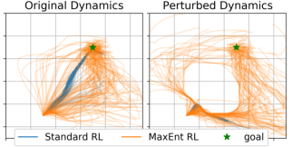
acting in the environment. A number of works Figure 1: **MaxEnt RL is robust to disturbances.**
have studied how to train RL algorithms to be _(Left)_ We applied both standard RL and MaxEnt RL
robust to disturbances in the environment (e.g., to a manipulation task without obstacles, but added obMorimoto & Doya (2005); Pinto et al. (2017); stacles (red squares) during evaluation. We then plot the
Tessler et al. (2019)). However, designing robust position of the object when evaluating the learned poliRL algorithms requires care, typically requiring cies _(Center)_ on the original environment and _(Right)_
an adversarial optimization problem and intro- on the new environment with an obstacle. The stochastic
ducing additional hyperparameters (Pinto et al., policy learned by MaxEnt RL often navigates around the
2017; Tessler et al., 2019). Instead of designing obstacle, whereas the deterministic policy from standard
a new robust RL algorithm, we will instead an- RL almost always collides with the obstacle.
alyze whether an existing RL method, MaxEnt
RL, offers robustness to perturbations. MaxEnt RL methods are based on the maximum entropy
principle, and augmented the expected reward objective with an entropy maximization term (Ziebart
et al., 2008). Prior work has conjectured that such algorithms should learn robust policies (Haarnoja
et al., 2017; Huang et al., 2019), on account of the close connection between maximum entropy
methods and robustness in supervised learning domains (Grünwald et al., 2004; Ziebart, 2010).
However, despite decades of research on maximum entropy RL methods (Kappen, 2005; Todorov,
2007; Toussaint, 2009; Theodorou et al., 2010), a formal characterization of the robustness properties
of such approaches has proven elusive. To our knowledge, no prior work formally proves that MaxEnt
RL methods are robust, and no prior work characterizes the disturbances against which these methods

1

Published as a conference paper at ICLR 2022

are robust. Showing how to obtain robust policies from existing MaxEnt RL methods, which already
constitute a significant portion of the RL methods in use today (Abdolmaleki et al., 2018; Haarnoja
et al., 2018a; Vieillard et al., 2020), would be useful because it would enable practitioners to leverage
existing, tried-and-true methods to solve robust RL problems.

Stochastic policies, of the sort learned with MaxEnt RL, inject noise into the actions during training,
thereby preparing themselves for deployment in environments with disturbances. For example, in
the robot pushing task shown in Fig. 1, the policy learned by MaxEnt RL pushes the white puck to
the goal using many possible routes. In contrast, (standard) RL learns a deterministic policy, always
using the same route to get to the goal. Now, imagine that this environment is perturbed by adding
the red barrier in Fig. 1. While the policy learned by (standard) RL always collides with this obstacle,
the policy learned by MaxEnt RL uses many routes to solve the task, and some fraction of these
routes continue to solve the task even when the obstacle is present. While a number of prior works
have articulated the intuition that the stochastic policies learned via MaxEnt RL should be robust to
disturbances (Levine, 2018; Abdolmaleki et al., 2018; Lee et al., 2019), no prior work has actually
shown that MaxEnt RL policies are provably robust, nor characterized the _set_ of disturbances to
which they are robust. Applications of MaxEnt RL methods to problems that demand robustness are
likely hampered by a lack of understanding of _when_ such methods are robust, what kinds of reward
functions should be used to obtain the desired type of robustness, and how the task should be set up.
The goal in our work is to make this notion precise, proving that MaxEnt RL is already a robust RL
algorithm, and deriving the robust set for these policies.

The main contribution of this paper is a theoretical characterization of the robustness of existing
MaxEnt RL methods. Specifically, we show that the MaxEnt RL objective is a nontrivial _lower bound_
on the robust RL objective, for a particular robust set. Importantly, these two objectives use different
reward functions: to learn a policy that maximizes a reward function on a wide range of dynamics
functions, one should apply MaxEnt RL to a _pessimistic_ version of that reward function. MaxEnt
RL is _not_ robust with respect to the reward function it is trained on. As we will show, the robust set
for these methods is non-trivial, and in some important special cases can be quite intuitive. To our
knowledge, our results are the first to formally show robustness of standard MaxEnt RL methods to
dynamics perturbations and characterize their robust set. Importantly, our analysis and experiments
highlight that robustness is only achieved for relatively large entropy coefficients. We validate our
theoretical results on a set of illustrative empirical experiments.

2 R ELATED W ORK

The study of robustness in controls has a long history, with robust or _H_ _∞_ control methods proposing
provably robust solutions under various assumptions on the true dynamics (Zhou et al., 1996; Doyle
et al., 2013). RL offers an appealing alternative, since robust RL methods can in principle learn robust
policies _without_ knowing the true dynamics. However, policies learned by standard RL algorithms
often flounder in the face of environmental disturbances (Rajeswaran et al., 2016; Peng et al.,
2018). The problem of learning robust policies that achieve high reward in the face of _adversarial_
environmental disturbances, often called _robust RL_, has been well studied in the literature (Bagnell
et al., 2001; Nilim & Ghaoui, 2003; Morimoto & Doya, 2005; Pinto et al., 2017; Tessler et al., 2019;
Russel & Petrik, 2019; Kamalaruban et al., 2020; Russel et al., 2020; 2021; Derman et al., 2021).
Prior robust RL methods are widely-applicable but often require many additional hyperparameters
or components. For example, Bagnell et al. (2001) modify the Bellman backup in a Q-learning by
solving a convex optimization problem in an inner loop, and Tessler et al. (2019) trains an additional
adversary policy via RL.

Robust RL is different from robust control in the traditional sense, which focuses on stability
independent of any reward function (Zhou et al., 1996; Doyle et al., 2013). Robust RL problem
involves estimating a policy’s returns under “similar” MDPs, a problem that has been studied
in terms of distance metrics for MDPs (Lecarpentier et al., 2020). Robust RL is different from
maximizing the _average_ reward across many environments, as done by methods such as domain
randomization (Sadeghi & Levine, 2016; Rajeswaran et al., 2016; Peng et al., 2018). Closely related
to robust RL are prior methods that are robust to disturbances in the reward function (Hadfield-Menell
et al., 2017; Bobu et al., 2020; Michaud et al., 2020), or aim to minimize a cost function in addition
to maximizing reward (Chow et al., 2017; Achiam et al., 2017; Chow et al., 2019; Carrara et al.,
2019; Tang et al., 2020; Thananjeyan et al., 2021). Robust RL is also different from the problem of

2

Published as a conference paper at ICLR 2022

learning transferable or generalizable RL agents (Lazaric, 2012; Zhang et al., 2018; Justesen et al.,
2018; Cobbe et al., 2019), which focuses on the average-case performance on new environments,
rather than the worst-case performance.

3 P RELIMINARIES

We assume that an agent observes states **s** **t**, takes actions **a** **t** _∼_ _π_ ( **a** **t** _|_ **s** **t** ), and obtains rewards _r_ ( **s** **t** _,_ **a** **t** ) . The initial state is sampled **s** **1** _∼_ _p_ 1 ( **s** **1** ), and subsequent states are sampled
**s** **t** + **1** _∼_ _p_ ( **s** **t** + **1** _|_ **s** **t** _,_ **a** **t** ) . We will use _p_ _[π]_ ( _τ_ ) to denote the probability distribution over trajectories
for policy _π_ . Episodes have _T_ steps, which we summarize as a trajectory _τ_ ≜ ( **s** **1** _,_ **a** **1** _, · · ·,_ **s** **T** _,_ **a** **T** ) .
Without loss of generality, we can assume that rewards are undiscounted, as any discount can be
addressed by modifying the dynamics to transition to an absorbing state with probability 1 _−_ _γ_ . The
standard RL objective is:

_T_
� _p_ ( **s** **t** + **1** _|_ **s** **t** _,_ **a** **t** ) _π_ ( **a** **t** _|_ **s** **t** ) _dτ_

_t_ =1

arg max E _τ_ _∼p_ _π_ ( _τ_ )
_π_

_T_
� _r_ ( **s** **t** _,_ **a** **t** ) _,_ where _p_ _[π]_ ( _τ_ ) = _p_ 1 ( **s** **1** )
� _t_ =1 �

is the distribution over trajectories when using policy _π_ . In fully observed MDPs, there always exists
a deterministic policy as a solution (Puterman, 2014). The MaxEnt RL objective is to maximize the
sum of expected reward and conditional action entropy. Formally, we define this objective in terms of
a policy _π_, the dynamics _p_ and the reward function _r_ :

_J_ MaxEnt ( _π_ ; _p, r_ ) ≜ E **a** **t** _∼π_ ( **a** **t** _|_ **s** **t** ) _,_ **s** **t** + **1** _∼p_ ( **s** **t** + **1** _|_ **s** **t** _,_ **a** **t** )

_T_
� _r_ ( **s** **t** _,_ **a** **t** ) + _αH_ _π_ [ **a** **t** _|_ **s** **t** ] _,_ (1)
� _t_ =1 �

1

where _H_ _π_ [ **a** **t** _|_ **s** **t** ] = � _A_ _[π]_ [(] **[a]** **[t]** _[ |]_ **[ s]** **[t]** [) log] _π_ ( **a** **t** _|_ **s** **t** ) _[d]_ **[a]** **[t]** [ denotes the entropy of the action distribution. The]

_entropy coefficient_ _α_ balances the reward term and the entropy term; we use _α_ = 1 in our analysis.
As noted above, the discount factor is omitted because it can be subsumed into the dynamics.

Our main result will be that maximizing the MaxEnt RL objective (Eq. 1) results in robust policies.
We quantify robustness by measuring the reward of a policy when evaluated on a _new_ reward function
_r_ ˜ or dynamics function ˜ _p_, which is chosen adversarially from some set:

max _π_ _p_ ˜ _∈_ min _P_ [˜] _,r_ ˜ _∈R_ [˜] E _p_ ˜( **s** **t** + **1** _|_ **s** **t** _,_ **a** **t** ) _,π_ ( **a** **t** _|_ **s** **t** )

_T_

˜

� _r_ ( **s** **t** _,_ **a** **t** ) _._
� _t_ =1 �

This _robust RL_ objective is defined in terms of the sets of dynamics _P_ [˜] and reward functions _R_ [˜] .
Our goal is to characterize these sets. The robust RL objective can be interpreted as a two-player,
zero-sum game. The aim is to find a Nash equilibrium. Our goal is to prove that MaxEnt RL (with
a _different reward function_ ) optimizes a lower bound this robust objective, and to characterize the
robust sets _P_ [˜] and _R_ [˜] for which this bound holds.

4 M AX E NT RL AND R OBUST C ONTROL

In this section, we prove the conjecture that MaxEnt RL is robust to disturbances in the environment.
Our main result is that MaxEnt RL can be used to maximize a lower bound on a certain robust RL
objective. Importantly, doing this requires that MaxEnt RL be applied to a different, pessimistic,
version of the target reward function. Before presenting our main result, we prove that MaxEnt RL is
robust against disturbances to the reward function. This result is a simple extension of prior work,
and we will use this result for proving our main result about dynamics robustness

4.1 R OBUSTNESS TO A DVERSARIAL R EWARD F UNCTIONS

We first show that MaxEnt RL is robust to some degree of misspecification in the reward function.
This result may be useful in practical settings with learned reward functions (Fu et al., 2018; Xu &
Denil, 2019; Michaud et al., 2020) or misspecified reward function (Amodei et al., 2016; Clark &
Amodei, 2016). Precisely, the following result will show that applying MaxEnt RL to one reward
function, _r_ ( **s** **t** _,_ **a** **t** ), results in a policy that is guaranteed to also achieve high return on a range of
other reward functions, ˜ _r_ ( **s** **t** _,_ **a** **t** ) _∈_ _R_ [˜] :

3

Published as a conference paper at ICLR 2022

**Theorem 4.1.** _Let dynamics_ _p_ ( **s** **t** + **1** _|_ **s** **t** _,_ **a** **t** ) _, policy_ _π_ ( **a** **t** _|_ **s** **t** ) _, and reward function_ _r_ ( **s** **t** _,_ **a** **t** ) _be_
_given. Assume that the reward function is finite and that the policy has support everywhere (i.e.,_
_π_ ( **a** **t** _|_ **s** **t** ) _>_ 0 _for all states and actions). Then there exists a positive constant_ _ϵ >_ 0 _such that the_
_MaxEnt RL objective_ _J_ _MaxEnt_ _is equivalent to the robust RL objective defined by the robust set_ _R_ [˜] ( _π_ ) _:_

_r_ ˜ _∈_ min _R_ [˜] ( _π_ ) E�� _t_ _r_ ˜( **s** **t** _,_ **a** **t** )� = _J_ _MaxEnt_ ( _π_ ; _p, r_ ) _∀π,_

_where the adversary chooses a reward function from the set_

�

_R_ ˜( _π_ ) ≜

�

_r_ ˜( **s** **t** _,_ **a** **t** ) E _π_
��
����

log
_t_ �

_′_ ˜ _′_ _′_ [�]
exp( _r_ ( **s** **t** _,_ **a** **t** ) _−_ _r_ ( **s** **t** _,_ **a** **t** )) _d_ **a** **t** _≤_ _ϵ_
_A_

_._ (2)

Thus, when we use MaxEnt RL with some reward function _r_, the policy obtained is guaranteed to
also obtain high reward on all similar reward functions ˜ _r_ that satisfy Eq. 2. We discuss how MaxEnt
RL can be used to learn policies robust to arbitrary sets of reward functions in Appendix A.10. The
proof can be found in Appendix A.2, and is a simple extension of prior work (Grünwald et al., 2004;
Ziebart et al., 2011). Our proof does not assume that the reward function is bounded nor that the
policy is convex. While the proof is straightforward, it will be useful as an intermediate step when
proving robustness to dynamics in the next subsection.

The robust set _R_ [˜] corresponds to reward functions ˜ _r_ that are not too much smaller than the original
reward function: the adversary cannot decrease the reward for any state or action too much. The
robust set _R_ [˜] depends on the policy, so the adversary has the capability of looking at which states
the policy visits before choosing the adversarial reward function ˜ _r_ . For example, the adversary may
choose to apply larger perturbations at states and actions that the agent frequently visits.

4.2 R OBUSTNESS TO A DVERSARIAL D YNAMICS

We now show that MaxEnt RL learns policies that are robust to perturbations to the dynamics.
Importantly, to have MaxEnt RL learn policies that robustly maximize one a reward function, we will
apply MaxEnt RL to a different, pessimistic reward function:

_r_ ¯( **s** **t** _,_ **a** **t** _,_ **s** **t** + **1** ) ≜ [1] (3)

_T_ [log] _[ r]_ [(] **[s]** **[t]** _[,]_ **[ a]** **[t]** [) +] _[ H]_ [[] **[s]** **[t]** [+] **[1]** _[ |]_ **[ s]** **[t]** _[,]_ **[ a]** **[t]** []] _[.]_

The log( _·_ ) transformation is common in prior work on learning risk-averse policies (Mihatsch &
Neuneier, 2002). The entropy term rewards the policy for vising states that have stochastic dynamics,
which should make the policy harder for the adversary to exploit. In environments that have the
same stochasticity at every state (e.g., LG dynamics), this entropy term becomes a constant and
can be ignored. In more general settings, computing this pessimistic reward function would require
some knowledge of the dynamics. Despite this limitation, we believe that our results may be of
theoretical interest, taking a step towards explaining the empirically-observed robustness properties
of MaxEnt RL.

To formally state our main result, we must define the range of “similar” dynamics functions against
which the policy will be robust. We use the following divergence between two dynamics functions:

� log

**s** **t** _∈τ_ ��

_d_ ( _p,_ ˜ _p_ ; _τ_ ) ≜ �

_A×S_

_p_ ( **s** **t** + **1** _[′]_ _|_ **s** **t** _,_ **a** **t** _[′]_ ) _′_ _′_

˜ _d_ **s** **t** + **1** _._ (4)
_p_ ( **s** **t** + **1** _[′]_ _|_ **s** **t** _,_ **a** **t** _[′]_ ) _[d]_ **[a]** **[t]**

This divergence is large when the adversary’s dynamics ˜ _p_ ( **s** **t** + **1** _|_ **s** **t** _,_ **a** **t** ) assign low probability to a
transition with high probability in the training environment ˜ _p_ . Our main result shows that applying
MaxEnt RL to the pessimistic reward function results in a policy that is robust to these similar
dynamics functions:
**Theorem 4.2.** _Let an MDP with dynamics_ _p_ ( **s** **t** + **1** _|_ **s** **t** _,_ **a** **t** ) _and reward function_ _r_ ( **s** **t** _,_ **a** **t** ) _>_ 0 _be_
_given. Assume that the dynamics have finite entropy (i.e.,_ _H_ [ **s** **t** + **1** _|_ **s** **t** _,_ **a** **t** ] _is finite for all states and_
_actions). Then there exists a constant_ _ϵ > H_ _π_ _∗_ [ **a** **t** _|_ **s** **t** ] _such that the MaxEnt RL objective with_
_dynamics p and reward function_ ¯ _r is a lower bound on the robust RL objective_

_p_ ˜ _∈_ min _P_ [˜] ( _π_ ) _J_ _MaxEnt_ ( _π_ ; ˜ _p, r_ ) _≥_ exp( _J_ _MaxEnt_ ( _π_ ; _p,_ ¯ _r_ ) + log _T_ ) _,_

4

Published as a conference paper at ICLR 2022

_where the robust set is defined as_

_P_ ˜ ≜ _p_ ˜( **s** _[′]_ _|_ **s** _,_ **a** ) E _π_ ( **a** **t** _|_ **s** **t** ) [ _d_ ( _p,_ ˜ _p_ ; _τ_ )] _≤_ _ϵ_ _._ (5)
� ���� _p_ ( **s** **t** + **1** _|_ **s** **t** _,_ **a** **t** ) �

In defining the robust set, the adversary chooses a dynamics function from the robust set _P_ [˜] independently at each time step; our next result (Lemma 4.3) will describe the value of _ϵ_ in more detail.
The proof, presented in Appendix A.4, first shows the robustness to reward perturbations implies
robustness to dynamics perturbations and then invokes Theorem 4.1 to show that MaxEnt RL learns
policies that are robust to reward perturbations.

This result can be interpreted in two ways. First, if a user wants to acquire a policy that optimizes
a reward under many possible dynamics, we should run MaxEnt RL with a specific, pessimistic
reward function ¯ _r_ ( **s** **t** _,_ **a** **t** _,_ **s** **t** + **1** ) . This pessimistic reward function depends on the environment
dynamics, so it may be hard to compute without prior knowledge or a good model of the dynamics.
However, in some settings (e.g., dynamics with constant additive noise), we might assume that
_Hr_ ¯([ **ss** **tt** _,_ + **a** **1t** _|,_ **s s** **tt** + _,_ **1** **a** ) = log **t** ] is approximately constant, in which case we simply set the MaxEnt RL reward to _r_ ( **s** **t** _,_ **a** **t** ) . Second, this result says that every time a user applies MaxEnt RL,
they are (implicitly) solving a robust RL problem, one defined in terms of a different reward function.
This connection may help explain why prior work has found that the policies learned by MaxEnt RL
tend to be robust against disturbances to the environment (Haarnoja et al., 2019).

Theorem 4.2 relates one MaxEnt RL problem to another (robust) MaxEnt RL problem. We can also
show that MaxEnt RL maximizes a lower bound on an _unregularized_ RL problem.

**Corollary 4.2.1.** _Under the same assumptions as Theorem 4.1 and 4.2, the MaxEnt RL problem is a_
_lower bound on the robust RL objective:_

�

_≥_ exp( _J_ _MaxEnt_ ( _π_ ; _p,_ ¯ _r_ ) + log _T_ ) _,_

_p_ ˜ _∈P_ [˜] ( _π_ min ) _,r_ ˜ _∈R_ [˜] ( _π_ ) E _p_ ˜( **s** **t** + **1** _|_ **s** **t** _,_ **a** **t** ) _,π_ ( **a** **t** _|_ **s** **t** )

�� _t_

_r_ ˜( **s** **t** _,_ **a** **t** )

_t_

_where the robust sets_ _P_ [˜] ( _π_ ) _and_ _R_ [˜] ( _π_ ) _as defined as in Theorem 4.1 and 4.2._

Our next result analyzes the size of the robust set by providing a lower bound on _ϵ_ . Doing so proves
that Theorem 4.2 is non-vacuous and will also tell us how to increase the size of the robust set.

**Lemma 4.3.** _Assume that the action space is discrete. Let a reward function_ _r_ ( **s** **t** _,_ **a** **t** ) _and dynamics_
_p_ ( **s** **t** + **1** _|_ **s** **t** _,_ **a** **t** ) _be given. Let_ _π_ ( **a** **t** _|_ **s** **t** ) _be the corresponding policy learned by MaxEnt RL. Then_
_the size of ϵ (in Eq. 5) satisfies the following:_

_ϵ_ = _T ·_ E **a** **t** _∼π_ ( **a** **t** _|_ **s** **t** ) _,_ [ _H_ _p_ ˜ [ **s** **t** + **1** _|_ **s** **t** _,_ **a** **t** ] + _H_ _π_ [ **a** **t** _|_ **s** **t** ]] _≥_ _T ·_ E **a** **t** _∼π_ ( **a** **t** _|_ **s** **t** ) _,_ [ _H_ _π_ [ **a** **t** _|_ **s** **t** ]] _._
**s** **t** + **1** _∼p_ ( **s** **t** + **1** _|_ **s** **t** _,_ **a** **t** ) **s** **t** + **1** _∼p_ ( **s** **t** + **1** _|_ **s** **t** _,_ **a** **t** )

This result provides an exact expression for _ϵ_ . Perhaps more interesting is the inequality, which says
that the size of the robust set is at least as large as the policy’s entropy. For example, if MaxEnt
RL learns a policy with an entropy of 10 bits, then _ϵ ≥_ 10 . This result immediately tells us how
to increase the size of the robust set: run MaxEnt RL with a larger entropy coefficient _α_ . Many
popular implementations of MaxEnt RL automatically tune the entropy coefficient _α_ so that the
policy satisfies an entropy constraint (Haarnoja et al., 2018b). Our derivation here suggests that the
entropy constraint on the policy corresponds to a lower bound on the size of the robust set.

The constraint in the definition of the robust set holds in expectation. Thus, the adversary can make
large perturbations to some transitions and smaller perturbations to other states, as long as the average
perturbation is not too large. Intuitively, the constraint value _ϵ_ is the adversary’s “budget,” which it
can use to make large changes to the dynamics in just a few states, or to make smaller changes to the
dynamics in many states.

4.3 W ORKED E XAMPLES

This section provides worked examples of our robustness results. The aim is to build intuition for what
our results show and to show that, in simple problems, the robust set has an intuitive interpretation.

5

Published as a conference paper at ICLR 2022

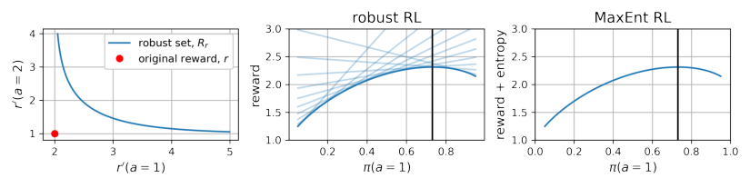

Figure 2: **MaxEnt RL and Robustness to Adversarial Reward Functions** : _(Left)_ Applying MaxEnt RL
to one reward function (red dot) yields a policy that is guaranteed to get high reward on many other reward
functions (blue curve). _(Center)_ For each reward function ( _r_ ( _a_ = 1) _, r_ ( _a_ = 2)) on that blue curve, we evaluate
the expected return of a stochastic policy. The robust RL problem (for rewards) is to choose the policy whose
worst-case reward (dark blue line) is largest. _(Right)_ Plotting the MaxEnt RL objective (Eq. 1) for those same
policies, we observe that the MaxEnt RL objective is identical to the robust RL objective .

**Reward robustness.** We present two worked examples of reward robustness. To simplify analysis,
we consider the following, smaller robust set, which effectively corresponds to a weaker adversary:

˜ _′_

_r_ ( **s** **t** _,_ **a** **t** ) log exp( _r_ ( **s** **t** _,_ **a** **t** ) _−_ _r_ ( **s** **t** _,_ **a** **t** )) _d_ **a** **t** _≤_ _[ϵ]_ _⊆_ _R_ [˜] _._ (6)
� ���� � _A_ _T_ �

˜ _′_
exp( _r_ ( **s** **t** _,_ **a** **t** ) _−_ _r_ ( **s** **t** _,_ **a** **t** )) _d_ **a** **t** _≤_ _[ϵ]_
_A_ _T_

_T_

_⊆_ _R_ [˜] _._ (6)
�

For the **first example**, define a 2-armed bandit with the following reward function and corresponding
robust set:

2 **a** = 1 ˜ ˜
_r_ ( **a** ) = _r_ log exp( _r_ ( **a** ) _−_ _r_ ( **a** )) _d_ **a** _≤_ _ϵ_ _._
�1 **a** = 2 _[,]_ [ ˜] _[R]_ [ =] � ��� � _A_ �

Fig. 2 (left) plots the original reward function, _R_ ˜, as a blue line. In the center plot we plot the expected reward for each reward in _r_ as a red dot, and the collection of reward functions, ˜ _R_ as a function of
the action **a** . The robust RL problem in this setting is to choose the policy whose worst-case reward
(dark blue line) is largest. The right plot shows the MaxEnt RL objective. We observe that the robust
RL objective and the MaxEnt RL objectives are equivalent.

For the **second example**, we use a task with a 1D, bounded action space _A_ = [ _−_ 10 _,_ 10] and a reward
function composed of a task-specific reward _r_ task and a penalty for deviating from some desired
action **a** _[∗]_ : _r_ ( **s** _,_ **a** ) ≜ _r_ task ( **s** _,_ **a** ) _−_ ( **a** _−_ **a** _[∗]_ ) [2] . The adversary will perturb this desired action by an
amount ∆ _a_ and decrease the weight on the control penalty by 50%, resulting in the following reward
function: ˜ _r_ ( **s** _,_ **a** ) ≜ _r_ task ( **s** _,_ **a** ) _−_ [1] 2 [(] **[a]** _[ −]_ [(] **[a]** _[∗]_ [+ ∆] **[a]** [))] [2] [. In this example, the subset of the robust set in]

Eq. 6 corresponds to perturbations ∆ **a** that satisfy

∆ **a** [2] + [1]

_T_ _[.]_

2 [log(2] _[π]_ [) + log(20)] _[ ≤]_ _T_ _[ϵ]_

Thus, MaxEnt RL with reward function _r_ yields a policy that is robust against adversaries that perturb
**a** _[∗]_ by at most ∆ **a** = _O_ ( _[√]_ ~~_ϵ_~~ ~~)~~ . See Appendix A.3 for the full derivation.

**Dynamics robustness.** The set of dynamics we are robust against, _P_ [˜], has an intuitive interpretation
as those that are sufficiently close to the original dynamics _p_ ( **s** **t** + **1** _|_ **s** **t** _,_ **a** **t** ) . This section shows that,
in the case of linear-Gaussian dynamics (described at the end of this subsection), this set corresponds
to a bounded L2 perturbation of the next state.

Because the robust set in Theorem 4.2 is defined in terms of the policy, the adversary can intelligently
choose where to perturb the dynamics based on the policy’s behavior. Robustness against this
adversary also guarantees robustness against an adversary with a smaller robust set, that does not
depend on the policy:

˜ _′_ _′_
_p_ ( **s** **t** + **1** _|_ **s** **t** _,_ **a** **t** ) log _e_ [log] _[ p]_ [(] **[s]** **[t]** [+] **[1]** _[|]_ **[s]** **[t]** _[,]_ **[a]** **[t]** [)] _[−]_ [log ˜] _[p]_ [(] **[s]** **[t]** [+] **[1]** _[|]_ **[s]** **[t]** _[,]_ **[a]** **[t]** [)] _d_ **a** **t** _d_ **s** **t** + **1** _≤_ _[ϵ]_ _⊆_ _P_ [˜] _._
� ���� �� _A×S_ _T_ �

We will use this subset of the robust set in the following worked example.

Consider an MDP with 1D, bounded, states and actions **s** **t** _,_ **a** **t** _∈_ [ _−_ 10 _,_ 10] . The dynamics are
_p_ ( **s** **t** + **1** _|_ **s** **t** _,_ **a** **t** ) = _N_ ( **s** **t** + **1** ; _µ_ = _A_ **s** **t** + _B_ **a** **t** _, σ_ = 1) the reward function is _r_ ( **s** **t** _,_ **a** **t** ) = _∥_ **s** **t** _∥_ 2 [2] [, and]
episodes have finite length _T_ . Note that the dynamics entropy _H_ [ **s** **t** + **1** _|_ **s** **t** _,_ **a** **t** ] is constant. We assume

6

_′_ _′_
_A×S_ _e_ [log] _[ p]_ [(] **[s]** **[t]** [+] **[1]** _[|]_ **[s]** **[t]** _[,]_ **[a]** **[t]** [)] _[−]_ [log ˜] _[p]_ [(] **[s]** **[t]** [+] **[1]** _[|]_ **[s]** **[t]** _[,]_ **[a]** **[t]** [)] _d_ **a** **t** _d_ **s** **t** + **1** _≤_ _T_ _[ϵ]_

_T_

_⊆_ _P_ [˜] _._
�

Published as a conference paper at ICLR 2022

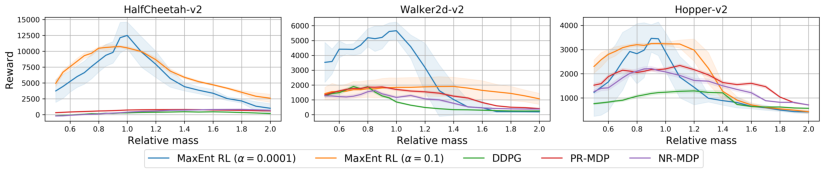

Figure 3: MaxEnt RL is competitive with prior robust RL methods.

the adversary modifies the dynamics by increasing the standard deviation to _√_

the adversary modifies the dynamics by increasing the standard deviation to _√_ 2 and shifts the bias by

an amount _β_, resulting in the dynamics ˜ _p_ ( **s** **t** + **1** _|_ **s** **t** _,_ **a** **t** ) = _N_ ( **s** **t** + **1** ; _µ_ = _A_ **s** **t** + _B_ **a** **t** + _β, σ_ = _√_ 2) .

The robust set defined in Theorem 4.2 specifies that the adversary can choose any value of _β_ that
satisfies [1] _[β]_ [2] [ + log(8] _[√]_ ~~_[π]_~~ [) + log(20)] _[ ≤]_ _[ϵ]_ [. To apply MaxEnt RL to learn a policy that is robust]

satisfies [1] 2 _[β]_ [2] [ + log(8] _[√]_ ~~_[π]_~~ [) + log(20)] _[ ≤]_ _[ϵ]_ [. To apply MaxEnt RL to learn a policy that is robust]

to any of these adversarial dynamics, we would use the pessimistic reward function specified by
Theorem 4.2: ¯ _r_ ( **s** **t** _,_ **a** **t** _,_ **s** **t** + **1** ) = [2] [log] _[ ∥]_ **[s]** **[t]** _[∥]_ [2] [. See Appendix A.7 for the full derivation.]

_T_ [log] _[ ∥]_ **[s]** **[t]** _[∥]_ [2] [. See Appendix A.7 for the full derivation.]

4.4 L IMITATIONS OF A NALYSIS

We identify a few limitations of our analysis that may provide directions for future work. First, our
definition of the robust set is different from the more standard _H_ _∞_ and KL divergence constraint sets
used in prior work. Determining a relationship between these two different sets would allow future
work to claim that MaxEnt RL is also robust to these more standard constraint sets (see Lecarpentier
et al. (2020)). On the other hand, MaxEnt RL may not be robust to these more conventional constraint
sets. Showing this may inform practitioners about what sorts of robustness they should _not_ except to
reap from MaxEnt RL. A second limitation is the construction of the augmented reward: to learn a
policy that will maximize reward function _r_ under a range of possible dynamics functions, our theory
says to apply MaxEnt RL to a different reward function, ¯ _r_, which includes a term depending on the
dynamics entropy. While this term can be ignored in special MDPs that have the same stochasticity at
every state, in more general MDPs it will be challenging to estimate this augmented reward function.
Determining more tractable ways to estimate this augmented reward function is an important direction
for future work.

5 N UMERICAL S IMULATIONS

This section will present numerical simulations verifying our theoretical result that MaxEnt RL
is robust to disturbances in the reward function and dynamics function. We describe our precise
implementation of MaxEnt RL, standard RL, and all environments in Appendix B.

**Comparison with prior robust RL methods.** We compare MaxEnt RL against two recent robust
RL methods, PR-MDP and NR-MDP (Tessler et al., 2019). These methods construct a two-player
game between a player that chooses actions and a player that perturbs the dynamics or actions. This
recipe for robust RL is common in prior work (Pinto et al., 2017), and we choose to compare to Tessler
et al. (2019) because it is a recent, high-performing instantiation of this recipe. We also include the
DDPG baseline from Tessler et al. (2019). We evaluate all methods on the benchmark tasks used
in Tessler et al. (2019), which involve evaluating in an environment where the masses are different
from the training environment. We ran MaxEnt RL with both small and large entropy coefficients,
evaluating the final policy for 30 episodes and taking the average performance. We repeated this for 5
random seeds to obtain the standard deviation. The results shown in Fig. 3 suggest that MaxEnt RL
_with a large entropy coefficient_ _α_ is at least competitive, if not better, than prior purpose-designed
robust RL methods. Note that MaxEnt RL is substantially simpler than PR-MDP and NR-MDP.

**Intuition for why MaxEnt RL is robust.** To build intuition into why MaxEnt RL should yield
robust policies, we compared MaxEnt RL (SAC (Haarnoja et al., 2018a)) with standard RL (TD3 (Fujimoto et al., 2018)) on two tasks. On the pusher task, shown in Fig. 1, a new obstacle was added
during evaluation. On the button task, shown in Fig. 4b, the box holding the button was moved closer
or further away from the robot during evaluation. _Note that the robust RL objective corresponds to an_
_adversary choosing the worst-case disturbances to these environments._

Fig. 1 _(right)_ and Fig. 4b _(center)_ show that MaxEnt RL has learned many ways of solving these tasks,
using different routes to push the puck to the goal and using different poses to press the button. Thus,

7

Published as a conference paper at ICLR 2022

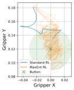

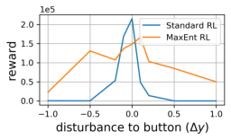

(b) Button: Moved Goal

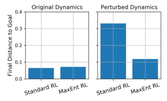
(a) Pusher: New Obstacle

Figure 4: **Robustness to changes in the dynamics** : MaxEnt RL policies learn many ways of solving a task,
making them robust to perturbations such as _(Left)_ new obstacles and _(Right)_ changes in the goal location.

when we evaluate the MaxEnt RL policy on perturbed environments, it is not surprising that some
of these strategies continue to solve the task. In contrast, the policy learned by standard RL always
uses the same strategy to solve these tasks, so the agent fails when a perturbation to the environment
makes this strategy fail. Quantitatively, Fig. 4a and 4b (right) show that the MaxEnt RL policy is
more robust than a policy trained with standard RL.

In many situations, simply adding noise to the
deterministic policy found by standard RL can
make that policy robust to some disturbances.
MaxEnt RL does something more complex, dynamically adjusting the amount of noise depending on the current state. This capability allows
MaxEnt RL policies to have lower entropy in
some states as needed to ensure high reward. We
study this capability in the 2D navigation task
shown in Fig. 5. The agent starts near the top
left corner and gets reward for navigating to the
bottom right hand corner, but incurs a large cost Figure 5: MaxEnt RL is not standard RL + noise.
for entering the red regions. The policy learned

by MaxEnt RL has low entropy initially to avoid colliding with the red obstacles, and then increases
its entropy in the second half of the episode. To study robustness, we introduce a new “L”-shaped obstacle for evaluation. The policy learned by MaxEnt RL often navigates around this obstacle, whereas
the policy from standard RL always collides with this obstacle. Adding independent Gaussian noise
to the actions from the standard RL policy can enable that policy to navigate around the obstacle, but
only at the cost of entering the costly red states.

**Testing for different types of robustness.** Most prior work on robust RL focuses on changing
static attributes of the environment, such as the mass or position of objects (Tessler et al., 2019;
Kamalaruban et al., 2020). However, our analysis suggests that MaxEnt RL is robust against a wider
range of perturbations, which we probe in our next set of experiments.

First, we introduced perturbations in the middle
of an episode. We took the pushing task shown
in Fig. 1 and, instead of adding an obstacle, perturbed the XY position of the puck after 20 time
steps. By evaluating the reward of a policy while
varying the size of this perturbation, we can
study the range of disturbances to which MaxEnt RL is robust. We measured the performance
of MaxEnt RL policies trained with different
entropy coefficients _α_ . The results shown in
Fig. 6 indicate all methods perform well on the
environment without any disturbances, but only
the MaxEnt RL trained with the largest entropy
coefficient is robust to larger disturbances. This
experiment supports our theory that the entropy
coefficient determines the size of the robust set.

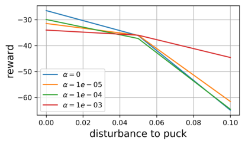

Figure 6: **Robustness to dynamic perturbations** :
MaxEnt RL is robust to random external forces applied
to the environment dynamics.

Our analysis suggests that MaxEnt RL is not only robust to random perturbations, but is actually
robust against _adversarial_ perturbations. We next compare MaxEnt RL and standard RL in this

8

Published as a conference paper at ICLR 2022

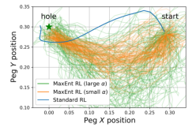

Figure 7: Robustness to adversarial perturbations of the environment dynamics.

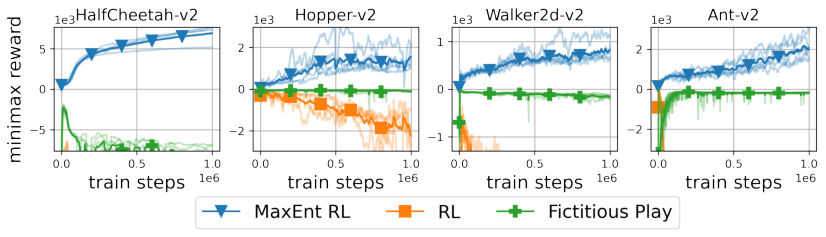

Figure 8: MaxEnt RL policies are robust to disturbances in the reward function.

setting. We trained both algorithms on a peg insertion task shown in Fig. 7 _(left)_ . Visualizing the
learned policy, we observe that the standard RL policy always takes the same route to the goal,
whereas the MaxEnt RL policy uses many different routes to get to the goal. For each policy we
found the worst-case perturbation to the hole location using CMA-ES (Hansen, 2016). For small
perturbations, both standard RL and MaxEnt RL achieve a success rate near 100%. However, for
perturbations that are 1.5cm or 2cm in size, only MaxEnt RL continues to solve the task. For larger
perturbations neither method can solve the task. In summary, this experiment highlights that MaxEnt
RL is robust to _adversarial_ disturbances, as predicted by the theory.

Finally, our analysis suggests that MaxEnt RL is also robust to perturbations to the reward function.
To test this theoretical result, we apply MaxEnt RL on four continuous control tasks from the
standard OpenAI Gym (Brockman et al., 2016) benchmark. We compare to SVG-0 (Heess et al.,
2015) (which uses stochastic policy gradients) and to fictitious play (Brown, 1951). In the RL
setting, fictitious play corresponds to modifying standard RL to use an adversarially-chosen reward
function for each Bellman update. We evaluate the policy on an adversarially chosen reward function,
chosen from the set defined in Equation 2. The analytic solution for this worst-case reward function
is ˜ _r_ ( **s** **t** _,_ **a** **t** ) = _r_ ( **s** **t** _,_ **a** **t** ) _−_ log _π_ ( **a** **t** _|_ **s** **t** ) . Both MaxEnt RL and standard RL can maximize the
cumulative reward (see Fig. 11 in Appendix B), but only MaxEnt RL succeeds as maximizing the
worst-case reward, as shown in Fig. 8. In summary, this experiment supports our proof that MaxEnt
RL solves a robust RL problem for the set of rewards specified in Theorem 4.1.

6 D ISCUSSION

In this paper, we formally showed that MaxEnt RL algorithms optimize a bound on a robust RL
objective. This robust RL objective uses a different reward function than the MaxEnt RL objective.
Our analysis characterizes the robust sets for both reward and dynamics perturbations, and provides
intuition for how such algorithms should be used for robust RL problems. To our knowledge, our
work is the first to formally characterize the robustness of MaxEnt RL algorithms, despite the fact that
numerous papers have conjectured that such robustness results may be possible. Our experimental
evaluation shows that, in line with our theoretical findings, simple MaxEnt RL algorithms perform
competitively with (and sometimes better than) recently proposed adversarial robust RL methods on
benchmarks proposed by those works.

Of course, MaxEnt RL methods are not necessarily the _ideal_ approach to robustness: applying such
methods still requires choosing a hyperparameter (the entropy coefficient), and the robust set for
MaxEnt RL is not always simple. Nonetheless, we believe that the analysis in this paper, represents
an important step towards a deeper theoretical understanding of the connections between robustness
and entropy regularization in RL. We hope that this analysis will open the door for the development
of new, simple algorithms for robust RL.

9

Published as a conference paper at ICLR 2022

**Acknowledgments** We thank Ofir Nachum, Brendan O’Donoghue, Brian Ziebart, and anonymous reviewers
for their feedback on an early drafts. BE is supported by the Fannie and John Hertz Foundation and the National
Science Foundation GFRP (DGE 1745016).

R EFERENCES

Abbas Abdolmaleki, Jost Tobias Springenberg, Yuval Tassa, Remi Munos, Nicolas Heess, and Martin Riedmiller.
Maximum a posteriori policy optimisation. In _International Conference on Learning Representations_, 2018.

Joshua Achiam, David Held, Aviv Tamar, and Pieter Abbeel. Constrained policy optimization. In _International_
_Conference on Machine Learning_, pp. 22–31. PMLR, 2017.

Dario Amodei, Chris Olah, Jacob Steinhardt, Paul Christiano, John Schulman, and Dan Mané. Concrete
problems in AI safety. _arXiv preprint arXiv:1606.06565_, 2016.

J Andrew Bagnell, Andrew Y Ng, and Jeff G Schneider. Solving uncertain Markov decision processes. 2001.

Andreea Bobu, Dexter RR Scobee, Jaime F Fisac, S Shankar Sastry, and Anca D Dragan. Less is more:
Rethinking probabilistic models of human behavior. In _International Conference on Human-Robot Interaction_,
pp. 429–437, 2020.

Stephen Boyd, Stephen P Boyd, and Lieven Vandenberghe. _Convex optimization_ . Cambridge University Press,
2004.

Greg Brockman, Vicki Cheung, Ludwig Pettersson, Jonas Schneider, John Schulman, Jie Tang, and Wojciech
Zaremba. OpenAI Gym. _arXiv preprint arXiv:1606.01540_, 2016.

George W Brown. Iterative solution of games by fictitious play. _Activity analysis of production and allocation_,
13(1):374–376, 1951.

Nicolas Carrara, Edouard Leurent, Romain Laroche, Tanguy Urvoy, Odalric-Ambrym Maillard, and Olivier
Pietquin. Budgeted reinforcement learning in continuous state space. In _Advances in Neural Information_
_Processing Systems_, pp. 9299–9309, 2019.

Yinlam Chow, Mohammad Ghavamzadeh, Lucas Janson, and Marco Pavone. Risk-constrained reinforcement
learning with percentile risk criteria. _The Journal of Machine Learning Research_, 18(1):6070–6120, 2017.

Yinlam Chow, Ofir Nachum, Aleksandra Faust, Edgar Duenez-Guzman, and Mohammad Ghavamzadeh.
Lyapunov-based safe policy optimization for continuous control. _arXiv preprint arXiv:1901.10031_, 2019.

Jack Clark and Dario Amodei. Faulty reward functions in the wild. 2016. URL [https://blog.openai.](https://blog.openai.com/faulty-reward-functions)
[com/faulty-reward-functions.](https://blog.openai.com/faulty-reward-functions)

Karl Cobbe, Oleg Klimov, Chris Hesse, Taehoon Kim, and John Schulman. Quantifying generalization in
reinforcement learning. In _International Conference on Machine Learning_, pp. 1282–1289. PMLR, 2019.

Esther Derman, Matthieu Geist, and Shie Mannor. Twice regularized MDPs and the equivalence between
robustness and regularization. _Advances in Neural Information Processing Systems_, 34, 2021.

John C Doyle, Bruce A Francis, and Allen R Tannenbaum. _Feedback control theory_ . Courier Corporation, 2013.

Benjamin Eysenbach, Shixiang Gu, Julian Ibarz, and Sergey Levine. Leave no trace: Learning to reset for safe
and autonomous reinforcement learning. In _International Conference on Learning Representations_, 2018.

Benjamin Eysenbach, Ruslan Salakhutdinov, and Sergey Levine. Search on the replay buffer: Bridging planning
and reinforcement learning. _Advances in Neural Information Processing Systems_, 32, 2019.

Roy Fox, Ari Pakman, and Naftali Tishby. Taming the noise in reinforcement learning via soft updates. In
_Uncertainty in Artificial Intelligence_, pp. 202–211, 2016.

Justin Fu, Avi Singh, Dibya Ghosh, Larry Yang, and Sergey Levine. Variational inverse control with events: A
general framework for data-driven reward definition. _Advances in Neural Information Processing Systems_, 31,
2018.

Scott Fujimoto, Herke Hoof, and David Meger. Addressing function approximation error in actor-critic methods.
In _International Conference on Machine Learning_, pp. 1587–1596. PMLR, 2018.

Peter D Grünwald, A Philip Dawid, et al. Game theory, maximum entropy, minimum discrepancy and robust
bayesian decision theory. _the Annals of Statistics_, 32(4):1367–1433, 2004.

10

Published as a conference paper at ICLR 2022

Sergio Guadarrama, Anoop Korattikara, Oscar Ramirez, Pablo Castro, Ethan Holly, Sam Fishman, Ke Wang,
Ekaterina Gonina, Chris Harris, Vincent Vanhoucke, et al. TF-Agents: A library for reinforcement learning in
[tensorflow, 2018. URL https://github.com/tensorflow/agents.](https://github.com/tensorflow/agents)

Tuomas Haarnoja, Haoran Tang, Pieter Abbeel, and Sergey Levine. Reinforcement learning with deep energybased policies. In _International Conference on Machine Learning_, pp. 1352–1361. PMLR, 2017.

Tuomas Haarnoja, Aurick Zhou, Pieter Abbeel, and Sergey Levine. Soft actor-critic: Off-policy maximum
entropy deep reinforcement learning with a stochastic actor. In _International Conference on Machine Learning_,
pp. 1861–1870. PMLR, 2018a.

Tuomas Haarnoja, Aurick Zhou, Kristian Hartikainen, George Tucker, Sehoon Ha, Jie Tan, Vikash Kumar,
Henry Zhu, Abhishek Gupta, Pieter Abbeel, et al. Soft actor-critic algorithms and applications. _arXiv preprint_
_arXiv:1812.05905_, 2018b.

Tuomas Haarnoja, Sehoon Ha, Aurick Zhou, Jie Tan, George Tucker, and Sergey Levine. Learning to walk via
deep reinforcement learning. In _Robotics: Science and Systems_, 2019.

Dylan Hadfield-Menell, Smitha Milli, Pieter Abbeel, Stuart J Russell, and Anca Dragan. Inverse reward design.
_Advances in Neural Information Processing Systems_, 30, 2017.

Nikolaus Hansen. The CMA evolution strategy: A tutorial. _arXiv preprint arXiv:1604.00772_, 2016.

Nicolas Heess, Gregory Wayne, David Silver, Timothy Lillicrap, Tom Erez, and Yuval Tassa. Learning
continuous control policies by stochastic value gradients. In _Advances in Neural Information Processing_
_Systems_, pp. 2944–2952, 2015.

Shiyu Huang, Hang Su, Jun Zhu, and Ting Chen. Svqn: Sequential variational soft q-learning networks. In
_International Conference on Learning Representations_, 2019.

Andrew Ilyas, Shibani Santurkar, Dimitris Tsipras, Logan Engstrom, Brandon Tran, and Aleksander Madry.
Adversarial examples are not bugs, they are features. _Advances in Neural Information Processing Systems_,
32, 2019.

Niels Justesen, Ruben Rodriguez Torrado, Philip Bontrager, Ahmed Khalifa, Julian Togelius, and Sebastian
Risi. Illuminating generalization in deep reinforcement learning through procedural level generation. _arXiv_
_preprint arXiv:1806.10729_, 2018.

Parameswaran Kamalaruban, Yu-Ting Huang, Ya-Ping Hsieh, Paul Rolland, Cheng Shi, and Volkan Cevher. Robust reinforcement learning via adversarial training with langevin dynamics. _Advances in Neural Information_
_Processing Systems_, 33:8127–8138, 2020.

Hilbert J Kappen. Path integrals and symmetry breaking for optimal control theory. _Journal of statistical_
_mechanics: theory and experiment_, 2005(11):P11011, 2005.

Alessandro Lazaric. Transfer in reinforcement learning: a framework and a survey. In _Reinforcement Learning_,
pp. 143–173. Springer, 2012.

Erwan Lecarpentier, David Abel, Kavosh Asadi, Yuu Jinnai, Emmanuel Rachelson, and Michael L Littman.
Lipschitz lifelong reinforcement learning. _arXiv preprint arXiv:2001.05411_, 2020.

Kyungjae Lee, Sungyub Kim, Sungbin Lim, Sungjoon Choi, and Songhwai Oh. Tsallis reinforcement learning:
A unified framework for maximum entropy reinforcement learning. _arXiv preprint arXiv:1902.00137_, 2019.

Sergey Levine. Reinforcement learning and control as probabilistic inference: Tutorial and review. _arXiv_
_preprint arXiv:1805.00909_, 2018.

Eric J Michaud, Adam Gleave, and Stuart Russell. Understanding learned reward functions. _arXiv preprint_
_arXiv:2012.05862_, 2020.

Oliver Mihatsch and Ralph Neuneier. Risk-sensitive reinforcement learning. _Machine learning_, 49(2-3):267–290,
2002.

Jun Morimoto and Kenji Doya. Robust reinforcement learning. _Neural computation_, 17(2):335–359, 2005.

Ofir Nachum, Mohammad Norouzi, Kelvin Xu, and Dale Schuurmans. Bridging the gap between value and
policy based reinforcement learning. In _Advances in Neural Information Processing Systems_, pp. 2775–2785,
2017.

11

Published as a conference paper at ICLR 2022

Arnab Nilim and Laurent Ghaoui. Robustness in markov decision problems with uncertain transition matrices.
_Advances in Neural Information Processing Systems_, 16:839–846, 2003.

Xue Bin Peng, Marcin Andrychowicz, Wojciech Zaremba, and Pieter Abbeel. Sim-to-real transfer of robotic
control with dynamics randomization. In _International Conference on Robotics and Automation_, pp. 3803–
3810. IEEE, 2018.

Lerrel Pinto, James Davidson, Rahul Sukthankar, and Abhinav Gupta. Robust adversarial reinforcement learning.
In _International Conference on Machine Learning_, pp. 2817–2826. JMLR. org, 2017.

Martin L Puterman. _Markov Decision Processes.: Discrete Stochastic Dynamic Programming_ . John Wiley &
Sons, 2014.

Aravind Rajeswaran, Sarvjeet Ghotra, Balaraman Ravindran, and Sergey Levine. Epopt: Learning robust neural
network policies using model ensembles. _arXiv preprint arXiv:1610.01283_, 2016.

R. Tyrrell Rockafellar. _Convex Analysis_ . Princeton University Press, 1970. ISBN 9780691015866. URL
[http://www.jstor.org/stable/j.ctt14bs1ff.](http://www.jstor.org/stable/j.ctt14bs1ff)

Reazul Hasan Russel and Marek Petrik. Beyond confidence regions: Tight bayesian ambiguity sets for robust
MDPs. _Advances in Neural Information Processing Systems_, 2019.

Reazul Hasan Russel, Bahram Behzadian, and Marek Petrik. Entropic risk constrained soft-robust policy
optimization. _arXiv preprint arXiv:2006.11679_, 2020.

Reazul Hasan Russel, Mouhacine Benosman, Jeroen Van Baar, and Radu Corcodel. Lyapunov robust constrainedMDPs: Soft-constrained robustly stable policy optimization under model uncertainty. _arXiv preprint_
_arXiv:2108.02701_, 2021.

Fereshteh Sadeghi and Sergey Levine. CAD2RL: Real single-image flight without a single real image. _arXiv_
_preprint arXiv:1611.04201_, 2016.

Yichuan Charlie Tang, Jian Zhang, and Ruslan Salakhutdinov. Worst cases policy gradients. In _Conference on_
_Robot Learning_, pp. 1078–1093. PMLR, 2020.

Chen Tessler, Yonathan Efroni, and Shie Mannor. Action robust reinforcement learning and applications in
continuous control. In _International Conference on Machine Learning_, pp. 6215–6224. PMLR, 2019.

Brijen Thananjeyan, Ashwin Balakrishna, Suraj Nair, Michael Luo, Krishnan Srinivasan, Minho Hwang,
Joseph E Gonzalez, Julian Ibarz, Chelsea Finn, and Ken Goldberg. Recovery rl: Safe reinforcement learning
with learned recovery zones. _Robotics and Automation Letters_, 6(3):4915–4922, 2021.

Evangelos Theodorou, Jonas Buchli, and Stefan Schaal. A generalized path integral control approach to
reinforcement learning. _journal of machine learning research_, 11(Nov):3137–3181, 2010.

Emanuel Todorov. Linearly-solvable Markov decision problems. In _Advances in Neural Information Processing_
_Systems_, pp. 1369–1376, 2007.

Marc Toussaint. Robot trajectory optimization using approximate inference. In _International Conference on_
_Machine Learning_, pp. 1049–1056. ACM, 2009.

Nino Vieillard, Olivier Pietquin, and Matthieu Geist. Munchausen reinforcement learning. _Advances in Neural_
_Information Processing Systems_, 33:4235–4246, 2020.

Danfei Xu and Misha Denil. Positive-unlabeled reward learning. _arXiv preprint arXiv:1911.00459_, 2019.

Tianhe Yu, Deirdre Quillen, Zhanpeng He, Ryan Julian, Karol Hausman, Chelsea Finn, and Sergey Levine.
Meta-world: A benchmark and evaluation for multi-task and meta reinforcement learning. In _Conference on_
_Robot Learning_, pp. 1094–1100. PMLR, 2020.

Chiyuan Zhang, Oriol Vinyals, Remi Munos, and Samy Bengio. A study on overfitting in deep reinforcement
learning. _arXiv preprint arXiv:1804.06893_, 2018.

Kemin Zhou, John Comstock Doyle, Keith Glover, et al. _Robust and optimal control_, volume 40. Prentice hall
New Jersey, 1996.

Brian D. Ziebart. _Modeling Purposeful Adaptive Behavior with the Principle of Maximum Causal Entropy_ . PhD
thesis, Carnegie Mellon University, 2010.

Brian D Ziebart, Andrew L Maas, J Andrew Bagnell, Anind K Dey, et al. Maximum entropy inverse reinforcement
learning. In _AAAI_, volume 8, pp. 1433–1438. Chicago, IL, USA, 2008.

Brian D Ziebart, J Andrew Bagnell, and Anind K Dey. Maximum causal entropy correlated equilibria for markov
games. In _International Conference on Autonomous Agents and Multiagent Systems_, pp. 207–214, 2011.

12

Published as a conference paper at ICLR 2022

A P ROOFS

A.1 U SEFUL L EMMAS

Before stating the proofs, we recall and prove two (known) identities.

**Lemma A.1.**

_e_ _[f]_ [(] _[x]_ _[′]_ _[,y]_ [)]
_x_ _[′]_ �

_E_ _p_ ( _x,y_ ) [ _−_ log _p_ ( _x | y_ )] = min
_f_ ( _x,y_ ) _[E]_ _[p]_ [(] _[x,y]_ [)]

�

_−f_ ( _x, y_ ) + log � _e_ _[f]_ [(] _[x]_ _[′]_ _[,y]_ [)]

_x_ _[′]_ �

_._ (7)

This identity says that the negative entropy function is the Fenchel dual of the log-sum-exp function.
This identity can be proven using calculus of variations:

_Proof._ We start by finding the function _f_ ( _x, y_ ) that optimizes the RHS of Eq. 7. Noting that the RHS
is a convex function of _f_ ( _x, y_ ), we can find the optimal _f_ ( _x, y_ ) by taking the derivative and setting it
equal to zero:

� _e_ _[f]_ [(] _[x]_ _[′]_ _[,y]_ [)]

_x_ _[′]_ �

_d_

_df_ ( _x, y_ )

�

_E_ _p_ ( _x,y_ ) [ _−f_ ( _x, y_ )] + log �

_e_ _[f]_ [(] _[x,y]_ [)]
= _−p_ ( _x, y_ ) + ~~�~~ _x_ _[′]_ _[ e]_ _[f]_ [(] _[x]_ _[′]_ _[,y]_ [)] _[.]_

Setting this derivative equal to zero, we see that solution _f_ _[∗]_ ( _x, y_ ) satisfies

_e_ _[f]_ _[ ∗]_ [(] _[x,y]_ [)]
~~�~~ _x_ _[′]_ _[ e]_ _[f]_ _[ ∗]_ [(] _[x]_ _[′]_ _[,y]_ [)] [=] _[ p]_ [(] _[x, y]_ [)] _[.]_

Now, we observe that _p_ ( _y_ ) = 1:

We then have

_p_ ( _y_ ) = � _p_ ( _x, y_ )

_x_

=
�

_x_

�
=

_e_ _[f]_ _[ ∗]_ [(] _[x,y]_ [)]
~~�~~ _x_ _[′]_ _[ e]_ _[f]_ _[ ∗]_ [(] _[x]_ _[′]_ _[,y]_ [)]

� _x_ _[e]_ _[f]_ _[ ∗]_ [(] _[x,y]_ [)]

~~�~~ _x_ _[′]_ _[ e]_ _[f]_ _[ ∗]_ [(] _[x]_ _[′]_ _[,y]_

_x_ [= 1] _[.]_

_x_ _[′]_ _[ e]_ _[f]_ _[ ∗]_ [(] _[x]_ _[′]_ _[,y]_ [)]

[(] _[x][,]_ _[y]_ [)] _e_ _[f]_ _[ ∗]_ [(] _[x,y]_ [)]

=
 - [1] ~~�~~ _x_ _[′]_ _[ e]_ _[f]_ _[ ∗]_ [(] _[x]_
� _p_ ( _y_ [��] )

_[y]_ [)]
_p_ ( _x | y_ ) = _[p]_ [(] _[x][,]_

_[.]_
_x_ _[′]_ _[ e]_ _[f]_ _[ ∗]_ [(] _[x]_ _[′]_ _[,y]_ [)]

Taking the log of both sides, we have

log _p_ ( _x | y_ ) = _f_ _[∗]_ ( _x, y_ ) _−_ log � _e_ _[f]_ _[ ∗]_ [(] _[x]_ _[′]_ _[,y]_ [)] _._

_x_ _[′]_

Multiplying both sides by -1 and taking the expectation w.r.t. _p_ ( _x, y_ ), we obtain the desired result:

_E_ _p_ ( _x,y_ ) [ _−_ log _p_ ( _x | y_ )] = _E_ _p_ ( _x,y_ ) [ _−f_ _[∗]_ ( _x, y_ )] + log � _e_ _[f]_ _[ ∗]_ [(] _[x]_ _[′]_ _[,y]_ [)]

_x_ _[′]_

= min _f_ ( _x,y_ ) _[E]_ _[p]_ [(] _[x,y]_ [)] [[] _[−][f]_ [(] _[x, y]_ [)] + log] � _e_ _[f]_ [(] _[x]_ _[′]_ _[,y]_ [)] _._

_x_ _[′]_

This lemma also holds for functions with more variables, a result that will be useful when proving
dynamics robustness.

**Lemma A.2.**

� _e_ _[f]_ [(] _[x]_ _[′]_ _[,y]_ _[′]_ _[,z]_ [)]

_x_ _[′]_ _,y_ _[′]_

 _._

_E_ _p_ ( _x,y,z_ ) [ _−_ log _p_ ( _x, y | z_ )] = min
_f_ ( _x,y,z_ ) _[E]_ _[p]_ [(] _[x,y,z]_ [)]



_−_
_f_ ( _x, y, z_ ) + log �
 _x_ _[′]_ _,y_

_Proof._ Simply apply Lemma A.1 to the random variables ( _x, y_ ) and _z_ .

13

Published as a conference paper at ICLR 2022

A.2 P ROOF OF T HEOREM 4.1

This section will provide a proof of Theorem 4.1.

_Proof._ We start by restating the objective for robust control with rewards:

�

_r_ ˜ _∈_ min _R_ [˜] ( _π_ ) E **s** **t** + **1** **a** _∼_ **t** _∼p_ ( _π_ **s** ( **t** **a** + **t1** _|_ **s** _|_ **s** **tt** ) _,_ **a** **t** )

�� _t_

_r_ ˜( **s** **t** _,_ **a** **t** )

_t_

_._ (8)

We now employ the KKT conditions (Boyd et al., 2004, Chpt. 5.5.3). If the robust set _R_ [˜] is strictly
feasibly, then there exists a constraint value _ϵ ≥_ 0 (the dual solution) such that the constrained
problem is equivalent to the relaxed problem with Lagrange multiplier _λ_ = 1:

˜ _′_
exp( _r_ ( **s** **t** _,_ **a** **t** ) _−_ _r_ ( **s** **t** _,_ **a** **t** )) _d_ **a** **t**
_A_
�

min _r_ ˜ E **s** **t** + **1** **a** _∼_ **t** _∼p_ ( _π_ **s** ( **t** **a** + **t1** _|_ **s** _|_ **s** **tt** ) _,_ **a** **t** )

�� _t_

_r_ ˜( **s** **t** _,_ **a** **t** ) + log
_t_ �

_._

To clarify exposition, we parameterize ˜ ˜ _r_ by its deviation from the original reward, ∆ _r_ ( **s** **t** _,_ **a** **t** ) ≜
_r_ ( **s** **t** _,_ **a** **t** ) _−_ _r_ ( **s** **t** _,_ **a** **t** ) . We also define _ρ_ _[π]_ _t_ [(] **[s]** **[t]** _[,]_ **[ a]** **[t]** [)] [ as the marginal distribution over states and actions]
visited by policy _π_ at time _t_ . We now rewrite the relaxed objective in terms of ∆ _r_ ( **s** **t** _,_ **a** **t** ):

_′_ [�]
exp(∆ _r_ ( **s** **t** _,_ **a** **t** )) _d_ **a** **t**
_A_

min ∆ _r_ [E] **s** **t** + **1** **a** _∼_ **t** _∼p_ ( _π_ **s** ( **t** **a** + **t1** _|_ **s** _|_ **s** **tt** ) _,_ **a** **t** )

��

_r_ ( **s** **t** _,_ **a** **t** ) _−_ ∆ _r_ ( **s** **t** _,_ **a** **t** ) + log
_t_ �

_r_ ( **s** **t** _,_ **a** **t** )

�� �

_t_

��

= E **a** **t** _∼π_ ( **a** **t** _|_ **s** **t** )
**s** **t** + **1** _∼p_ ( **s** **t** + **1** _|_ **s** **t** _,_ **a** **t** )

_′_ [�]
exp(∆ _r_ ( **s** **t** _,_ **a** **t** )) _d_ **a** **t** _._
_A_

+ min ∆ _r_ [E] **s** **t** + **1** **a** _∼_ **t** _∼p_ ( _π_ **s** ( **t** **a** + **t1** _|_ **s** _|_ **s** **tt** ) _,_ **a** **t** )

��

_−_ ∆ _r_ ( **s** **t** _,_ **a** **t** ) + log
_t_ �

_r_ ( **s** **t** _,_ **a** **t** )

�� �

_t_

= E **a** **t** _∼π_ ( **a** **t** _|_ **s** **t** )
**s** **t** + **1** _∼p_ ( **s** **t** + **1** _|_ **s** **t** _,_ **a** **t** )

_r_ ( **s** **t** _,_ **a** **t** )
�
_t_

_′_ [�]
exp(∆ _r_ ( **s** **t** _,_ **a** **t** )) _d_ **a** **t** _._
_A_

+ min
∆ _r_

�

_t_ E _ρ_ _[π]_ _t_ [(] **[s]** **[t]** _[,]_ **[a]** **[t]** [)] � _−_ ∆ _r_ ( **s** **t** _,_ **a** **t** ) + log �

_r_ ( **s** **t** _,_ **a** **t** ) _−_ log _π_ ( **a** **t** _|_ **s** **t** ) _._

�� �

_t_

��

= E **a** **t** _∼π_ ( **a** **t** _|_ **s** **t** )
**s** **t** + **1** _∼p_ ( **s** **t** + **1** _|_ **s** **t** _,_ **a** **t** )

The last line follows from applying Lemma A.1.

One important note about this proof is that the KKT conditions are applied to the problem of
optimizing the reward function ˜ _r_, which is a convex optimization problem. We do not require that the
policy _π_ ( **a** **t** _|_ **s** **t** ) or the dynamics _p_ ( **s** **t** + **1** _|_ **s** **t** _,_ **a** **t** ) be convex.

A.3 W ORKED E XAMPLE OF R EWARD R OBUSTNESS

We compute the penalty for Example 1 in Section 4.3 using a Gaussian integral:

10
P ENALTY (˜ _r,_ **s** ) = log exp( _r_ ( **s** _,_ **a** ) _−_ _r_ ˜( **s** _,_ **a** )) _d_ **a**
� _−_ 10

10
= log
� _−_

10
= log
� _−_

exp( _−_ ( **a** _−_ **a** _[∗]_ ) [2] + [1]
_−_ 10 2

2 [(] **[a]** _[ −]_ [(] **[a]** _[∗]_ [+ ∆] **[a]** [))] [2] [)] _[d]_ **[a]**

_−_ [1]
exp(
_−_ 10 2

2 [(] **[a]** _[ −]_ [(] **[a]** _[∗]_ [+ ∆] **[a]** [))] [2] [ + ∆] **[a]** [2] [)] _[d]_ **[a]**

= ∆ **a** [2] + [1]

2 [log(2] _[π]_ [) + log(20)] _[.]_

A.4 P ROOF OF T HEOREM 4.2

_Proof._ We now provide the proof of Theorem 4.2. The first step will be to convert the variation in
dynamics into a sort of variation in the reward function. The second step will convert the constrained
robust control objective into an unconstrained (penalized) objective. The third step will show that the
penalty is equivalent to action entropy.

14

Published as a conference paper at ICLR 2022

**Step 1: Dynamics variation** _→_ **reward variation.** Our aim is to obtain a lower bound on the
following objective:

�

_p_ ˜ _∈_ min _P_ [˜] ( _π_ ) E **s** **t** + **1** **a** _∼_ **t** _∼p_ ˜( _π_ **s** ( **t** **a** + **t1** _|_ **s** _|_ **s** **tt** ) _,_ **a** **t** )

�� _t_

_r_ ( **s** **t** _,_ **a** **t** )

_t_

_._

We start by taking a log-transform of this objective, noting that this transformation does not change
the optimal policy as the log function is strictly monotone increasing.

�

log E **s** **t** + **1** **a** _∼_ **t** _∼p_ ˜( _π_ **s** ( **t** **a** + **t1** _|_ **s** _|_ **s** **tt** ) _,_ **a** **t** )

�� _t_

_r_ ( **s** **t** _,_ **a** **t** )

_t_

_._

Note that we assumed that the reward was positive, so the logarithm is well defined. We can write
this objective in terms of the adversarial dynamics using importance weights.

log E **a** **t** _∼π_ ( **a** **t** _|_ **s** **t** )
**s** **t** + **1** _∼p_ ( **s** **t** + **1** _|_ **s** **t** _,_ **a** **t** ) ��� _t_

�

_p_ ˜( **s** **t** + **1** _|_ **s** **t** _,_ **a** **t** )
_p_ ( **s** **t** + **1** _|_ **s** **t** _,_ **a** **t** )

�� _t_

_r_ ( **s** **t** _,_ **a** **t** )

_t_

�� _t_

�

��

+
�

log ˜ _p_ ( **s** **t** + **1** _|_ **s** **t** _,_ **a** **t** ) _−_ log _p_ ( **s** **t** + **1** _|_ **s** **t** _,_ **a** **t** )

_t_

= log E **a** **t** _∼π_ ( **a** **t** _|_ **s** **t** )
**s** **t** + **1** _∼p_ ( **s** **t** + **1** _|_ **s** **t** _,_ **a** **t** )

exp log

� �

_r_ ( **s** **t** _,_ **a** **t** )

_t_

log

�

�

( _a_ )
_≥_ E **a** **t** _∼π_ ( **a** **t** _|_ **s** **t** )
**s** **t** + **1** _∼p_ ( **s** **t** + **1** _|_ **s** **t** _,_ **a** **t** )

�
� _t_

_r_ ( **s** **t** _,_ **a** **t** )

_t_

�

+
�

log ˜ _p_ ( **s** **t** + **1** _|_ **s** **t** _,_ **a** **t** ) _−_ log _p_ ( **s** **t** + **1** _|_ **s** **t** _,_ **a** **t** )

_t_

log

�

�

1

_T_
�

�

�

+ log _T_ + �

log ˜ _p_ ( **s** **t** + **1** _|_ **s** **t** _,_ **a** **t** ) _−_ log _p_ ( **s** **t** + **1** _|_ **s** **t** _,_ **a** **t** )

_t_

= E **a** **t** _∼π_ ( **a** **t** _|_ **s** **t** )
**s** **t** + **1** _∼p_ ( **s** **t** + **1** _|_ **s** **t** _,_ **a** **t** )

( _b_ )
_≥_ E **a** **t** _∼π_ ( **a** **t** _|_ **s** **t** )
**s** **t** + **1** _∼p_ ( **s** **t** + **1** _|_ **s** **t** _,_ **a** **t** )

�

_r_ ( **s** **t** _,_ **a** **t** )

_t_

�� _t_

1
_T_ [log] _[ r]_ [(] **[s]** **[t]** _[,]_ **[ a]** **[t]** [) + log ˜] _[p]_ [(] **[s]** **[t]** [+] **[1]** _[ |]_ **[ s]** **[t]** _[,]_ **[ a]** **[t]** [)] _[ −]_ [log] _[ p]_ [(] **[s]** **[t]** [+] **[1]** _[ |]_ **[ s]** **[t]** _[,]_ **[ a]** **[t]** [)]

�

+ log _T._ (9)

Both inequalities are applications of Jensen’s inequality. As before, our assumption that the rewards
are positive ensures that the logarithms remain well defined. While the adversary is choosing the
dynamics under which we will evaluate the policy, we are optimizing a lower bound which depends
on a _different_ dynamics function. _This step allows us to analyze adversarially-chosen dynamics as_
_perturbations to the reward_ .

**Step 2: Relaxing the constrained objective** To clarify exposition, we will parameterize the
adversarial dynamics as a deviation from the true dynamics:

∆ _r_ ( **s** **t** + **1** _,_ **s** **t** _,_ **a** **t** ) = log _p_ ( **s** **t** + **1** _|_ **s** **t** _,_ **a** **t** ) _−_ log ˜ _p_ ( **s** **t** + **1** _|_ **s** **t** _,_ **a** **t** ) _._ (10)

The constraint that the adversarial dynamics integrate to one can be expressed as

_p_ ( **s** **t** + **1** _|_ **s** **t** _,_ **a** **t** ) _e_ _[−]_ [∆] _[r]_ [(] **[s]** **[t]** [+] **[1]** _[,]_ **[s]** **[t]** _[,]_ **[a]** **[t]** [)] _d_ **s** **t** + **1** = 1

� _S_ � ~~��~~ �

_p_ ( **s** **t** + **1** _|_ **s** **t** _,_ **a** **t** ) _e_ _[−]_ [∆] _[r]_ [(] **[s]** **[t]** [+] **[1]** _[,]_ **[s]** **[t]** _[,]_ **[a]** **[t]** [)]
_S_ � _p_ ˜( **s** **t** + ~~��~~ **1** _|_ **s** **t** _,_ **a** **t** ) �

_d_ **s** **t** + **1** = 1

Using this notation, we can write the lower bound on the robust control problem (Eq. 9) as follows:

_e_ [∆] _[r]_ [(] **[s]** **[t]** [+] **[1]** _′_ _,_ **s** **t** _,_ **a** **t** _′_ ) _d_ **a** **t** _′_ _d_ **s** **t** + **1** _′_
_A×S_
�

min ∆ _r_ [E] **s** **t** + **a** **1** _∼_ **t** _∼pπ_ ( **s** ( **t** **a** + **t1** _|_ **s** _|_ **t** **s** ) **t** _,,_ **a** **t** )

s.t. E **a** **t** _∼π_ ( **a** **t** _|_ **s** **t** ) _,_
**s** **t** + **1** _∼p_ ( **s** **t** + **1** _|_ **s** **t** _,_ **a** **t** )

�� _t_

�� _t_

1
_T_ [log] _[ r]_ [(] **[s]** **[t]** _[,]_ **[ a]** **[t]** [)] _[ −]_ [∆] _[r]_ [(] **[s]** **[t]** [+] **[1]** _[,]_ **[ s]** **[t]** _[,]_ **[ a]** **[t]** [)]

�

�

+ log _T_ (11)

log
_t_ ��

_≤_ _ϵ_ (12)

and _p_ ( **s** **t** + **1** _|_ **s** **t** _,_ **a** **t** ) _e_ _[−]_ [∆] _[r]_ [(] **[s]** **[t]** [+] **[1]** _[,]_ **[s]** **[t]** _[,]_ **[a]** **[t]** [)]
� _S_ ~~�~~ _p_ ˜( **s** **t** + ~~�~~ **1** � _|_ **s** **t** _,_ **a** **t** ) �

_d_ **s** **t** + **1** = 1 _∀_ **s** **t** _,_ **a** **t** _._ (13)

The constraint in Eq. 12 is the definition of the set of adversarial dynamics _P_ [˜], and the constraint in
Eq. 13 ensures that ˜ _p_ ( **s** **t** + **1** _|_ **s** **t** _,_ **a** **t** ) represents a valid probability density function.

Note that ∆ _r_ ( **s** **t** + **1** _,_ **s** **t** _,_ **a** **t** ) = 0 is a _strictly feasible_ solution to this constrained optimization problem
for _ϵ >_ 0 . Note also that the problem of optimizing the function ∆ _r_ ( **s** **t** _,_ **a** **t** ) is a convex optimization

15

Published as a conference paper at ICLR 2022

problem. We can therefore employ the KKT conditions (Boyd et al., 2004, Chpt. 5.5.3). If the robust
set _P_ [˜] is strictly feasibly, then there exists _ϵ ≥_ 0 (the dual solution) such that the set of solutions ˜ _p_ to
the constrained optimization problem Eq. 11 are equivalent to the set of solutions to the following
relaxed objective with Lagrange multiplier _λ_ = 1:

min ∆ _r_ [E] **s** **t** + **1** **a** **t** _∼∼pπ_ ( **s** ( **t** **a** + **t1** _|_ **s** _|_ **t** **s** ) **t** _,,_ **a** **t** )

�� _t_

1
(14)
_T_ [log] _[ r]_ [(] **[s]** **[t]** _[,]_ **[ a]** **[t]** [)] _[ −]_ [∆] _[r]_ [(] **[s]** **[t]** [+] **[1]** _[,]_ **[ s]** **[t]** _[,]_ **[ a]** **[t]** [)]

+ log
��

_e_ [∆] _[r]_ [(] **[s]** **[t]** [+] **[1]** _[′]_ _[,]_ **[s]** **[t]** _[,]_ **[a]** **[t]** _[′]_ [)] _d_ **a** **t** _′_ _d_ **s** **t** + **1** _′_ + log _T_
_A×S_ �

s.t. _p_ ( **s** **t** + **1** _|_ **s** **t** _,_ **a** **t** ) _e_ _[−]_ [∆] _[r]_ [(] **[s]** **[t]** [+] **[1]** _[′]_ _[,]_ **[s]** **[t]** _[,]_ **[a]** **[t]** _[′]_ [)] _d_ **s** **t** + **1** = 1 _∀_ **s** **t** _,_ **a** **t** _._ (15)
� _S_

This step does not require that the policy _π_ ( **a** **t** _|_ **s** **t** ) or the dynamics _p_ ( **s** **t** + **1** _|_ **s** **t** _,_ **a** **t** ) be convex.

Our next step is to show that the constraint does not affect the solution of this optimization problem.
For any function ∆ _r_ ( **s** **t** + **1** _,_ **s** **t** _,_ **a** **t** ), we can add a constant _c_ ( **s** **t** _,_ **a** **t** ) and obtain the same objective
value but now satisfy the constraint. We construct _c_ ( **s** **t** _,_ **a** **t** ) as

_c_ ( **s** **t** _,_ **a** **t** ) = log _p_ ( **s** **t** + **1** _|_ **s** **t** _,_ **a** **t** ) _e_ _[−]_ [∆] _[r]_ [(] **[s]** **[t]** [+] **[1]** _′_ _,_ **s** **t** _,_ **a** **t** _′_ ) _d_ **s** **t** + **1** = 1 _∀_ **s** **t** _,_ **a** **t** _._
� _S_

First, we observe that adding _c_ ( **s** **t** _,_ **a** **t** ) to ∆ _r_ does not change the objective:

1
_T_ [log] _[ r]_ [(] **[s]** **[t]** _[,]_ **[ a]** **[t]** [)] _[ −]_ [(∆] _[r]_ [(] **[s]** **[t]** [+] **[1]** _[,]_ **[ s]** **[t]** _[,]_ **[ a]** **[t]** [) +] _[ c]_ [(] **[s]** **[t]** _[,]_ **[ a]** **[t]** [))]

+ log _e_ [∆] _[r]_ [(] **[s]** **[t]** [+] **[1]** _′_ _,_ **s** **t** _,_ **a** **t** _′_ )+ _c_ ( **s** **t** _,_ **a** **t** ) _d_ **a** **t** _′_ _d_ **s** **t** + **1** _′_ + log _T_
� � _A×S_ �

E **a** **t** _∼π_ ( **a** **t** _|_ **s** **t** ) _,_
**s** **t** + **1** _∼p_ ( **s** **t** + **1** _|_ **s** **t** _,_ **a** **t** )

�� _t_

= E **a** **t** _∼π_ ( **a** **t** _|_ **s** **t** ) _,_
**s** **t** + **1** _∼p_ ( **s** **t** + **1** _|_ **s** **t** _,_ **a** **t** )

�� _t_

1
_T_ [log] _[ r]_ [(] **[s]** **[t]** _[,]_ **[ a]** **[t]** [)] _[ −]_ [∆] _[r]_ [(] **[s]** **[t]** [+] **[1]** _[,]_ **[ s]** **[t]** _[,]_ **[ a]** **[t]** [)] _[ −]_ _[c]_ [(] **[s]** **[t]** _[,]_ **[ a]** **[t]** [)]

+ log _e_ _[c]_ [(] **[s]** **[t]** _[,]_ **[a]** **[t]** [)] _e_ [∆] _[r]_ [(] **[s]** **[t]** [+] **[1]** _′_ _,_ **s** **t** _,_ **a** **t** _′_ ) _d_ **a** **t** _′_ _d_ **s** **t** + **1** _′_ + log _T_
� �� _A×S_ ��

= E **a** **t** _∼π_ ( **a** **t** _|_ **s** **t** ) _,_
**s** **t** + **1** _∼p_ ( **s** **t** + **1** _|_ **s** **t** _,_ **a** **t** )

�� _t_

1
_c_ ( **s** **t** _,_ **a** **t** ) +  _c_ ( **s** **t** _,_ [] **a** **t** )
_T_ [log] _[ r]_ [(] **[s]** **[t]** _[,]_ **[ a]** **[t]** [)] _[ −]_ [∆] _[r]_ [(] **[s]** **[t]** [+] **[1]** _[,]_ **[ s]** **[t]** _[,]_ **[ a]** **[t]** [)] _[ −]_ []

+ log _e_ [∆] _[r]_ [(] **[s]** **[t]** [+] **[1]** _′_ _,_ **s** **t** _,_ **a** **t** _′_ ) _d_ **a** **t** _′_ _d_ **s** **t** + **1** _′_ + log _T._
��� _A×S_ ��

Second, we observe that the new reward function ∆ _r_ ( **s** **t** + **1** _,_ **s** **t** _,_ **a** **t** ) + _c_ ( **s** **t** _,_ **a** **t** ) satisfies the constraint
in Eq. 15:

_p_ ( **s** **t** + **1** _|_ **s** **t** _,_ **a** **t** ) _e_ _[−]_ [(∆] _[r]_ [(] **[s]** **[t]** [+] **[1]** _′_ _,_ **s** **t** _,_ **a** **t** _′_ ) _−c_ ( **s** **t** _,_ **a** **t** )) _d_ **s** **t** + **1**

� _S_

= _e_ _[−][c]_ [(] **[s]** **[t]** _[,]_ **[a]** **[t]** [)] _p_ ( **s** **t** + **1** _|_ **s** **t** _,_ **a** **t** ) _e_ _[−]_ [∆] _[r]_ [(] **[s]** **[t]** [+] **[1]** _′_ _,_ **s** **t** _,_ **a** **t** _′_ ) _d_ **s** **t** + **1**
� _S_

�

=

� _S_ _[p]_ [(] **[s]** **[t]** [+] **[1]** _[|]_ **[ s]** **[t]** _[,]_ **[ a]** **[t]** [)] _[e]_ _[−]_ [∆] _[r]_ [(] **[s]** **[t]** [+] **[1]** _′_ _,_ **s** **t** _,_ **a** **t** _′_ ) _d_ **s** **t** + **1**

~~�~~ _S_ _[p]_ [(] **[s]** **[t]** [+] **[1]** _[ |]_ **[ s]** **[t]** _[,]_ **[ a]** **[t]** [)] _[e]_ _[−]_ [∆] _[r]_ [(] **[s]** **[t]** [+] **[1]** _[′]_ _[,]_ **[s]** **[t]** _[,]_ **[a]** **[t]** _[′]_ [)] _[d]_ **[s]** **[t]** [+] **[1]**

= 1 _._
_S_ _[p]_ [(] **[s]** **[t]** [+] **[1]** _[ |]_ **[ s]** **[t]** _[,]_ **[ a]** **[t]** [)] _[e]_ _[−]_ [∆] _[r]_ [(] **[s]** **[t]** [+] **[1]** _[′]_ _[,]_ **[s]** **[t]** _[,]_ **[a]** **[t]** _[′]_ [)] _[d]_ **[s]** **[t]** [+] **[1]**

Thus, constraining ∆ _r_ to represent a probability distribution does not affect the solution (value)
to the optimization problem, so we can ignore this constraint without loss of generality. The new,
unconstrained objective is

min ∆ _r_ [E] _a∼π_ ( **a** **t** _|_ **s** **t** ) _,_
_s_ _[′]_ _∼p_ ( **s** **t** + **1** _|_ **s** **t** _,_ **a** **t** )

�� _t_

1
_T_ [log] _[ r]_ [(] **[s]** **[t]** _[,]_ **[ a]** **[t]** [)] _[ −]_ [∆] _[r]_ [(] **[s]** **[t]** [+] **[1]** _[,]_ **[ s]** **[t]** _[,]_ **[ a]** **[t]** [)]

+ log _e_ [∆] _[r]_ [(] **[s]** **[t]** [+] **[1]** _[,]_ **[s]** **[t]** _[,]_ **[a]** **[t]** [)] _d_ **a** **t** _′_ _d_ **s** **t** + **1** _′_ + log _T._ (16)
�� _A×S_ �

16

Published as a conference paper at ICLR 2022

**Step 3: The penalty is the Fenchel dual of action entropy.** We define _ρ_ _[π]_ _t_ [(] **[s]** **[t]** _[,]_ **[ a]** **[t]** _[,]_ **[ s]** **[t]** [+] **[1]** [)] [ as the]
marginal distribution of transitions visited by policy _π_ at time _t_ . We now apply Lemma A.2 to Eq. 16:

min ∆ _r_ [E] _s_ _[′]_ _∼ap∼_ ( _π_ **s** **t** ( + **a** **t1** _||_ **ss** **tt** ) _,,_ **a** **t** )

�� _t_

1
_T_ [log] _[ r]_ [(] **[s]** **[t]** _[,]_ **[ a]** **[t]** [)] _[ −]_ [∆] _[r]_ [(] **[s]** **[t]** [+] **[1]** _[,]_ **[ s]** **[t]** _[,]_ **[ a]** **[t]** [)]

+ log _e_ [∆] _[r]_ [(] **[s]** **[t]** [+] **[1]** _[,]_ **[s]** **[t]** _[′]_ _[,]_ **[a]** **[t]** _[′]_ [)] _d_ **a** **t** _′_ _d_ **s** **t** + **1** _′_ + log _T_ (17)
�� _A×S_ �

1
_T_ [log] _[ r]_ [(] **[s]** **[t]** _[,]_ **[ a]** **[t]** [)]

�

= E _a∼π_ ( **a** **t** _|_ **s** **t** ) _,_
_s_ _[′]_ _∼p_ ( **s** **t** + **1** _|_ **s** **t** _,_ **a** **t** )

�� _t_

+ log _T_

+ min ∆ _r_ [E] _s_ _[′]_ _∼ap∼_ ( _π_ **s** **t** ( + **a** **t1** _||_ **ss** **tt** ) _,,_ **a** **t** ) �� _t_ _−_ ∆ _r_ ( **s** **t** + **1** _,_ **s** **t** _,_ **a** **t** ) + log ��

_′_ _′_
_e_ [∆] _[r]_ [(] **[s]** **[t]** [+] **[1]** _[,]_ **[s]** **[t]** _[′]_ _[,]_ **[a]** **[t]** _[′]_ [)] _d_ **a** **t** _d_ **s** **t** + **1**
_A×S_ �

1
_T_ [log] _[ r]_ [(] **[s]** **[t]** _[,]_ **[ a]** **[t]** [)]

�

= E _a∼π_ ( **a** **t** _|_ **s** **t** ) _,_
_s_ _[′]_ _∼p_ ( **s** **t** + **1** _|_ **s** **t** _,_ **a** **t** )

�� _t_

+ log _T_

_′_ _′_
_e_ [∆] _[r]_ [(] **[s]** **[t]** [+] **[1]** _[,]_ **[s]** **[t]** _[′]_ _[,]_ **[a]** **[t]** _[′]_ [)] _d_ **a** **t** _d_ **s** **t** + **1**
_A×S_ �

_−_ ∆ _r_ ( **s** **t** + **1** _,_ **s** **t** _,_ **a** **t** ) + log
� ��

+ min
∆ _r_

� E _ρ_ _[π]_ _t_ [(] **[s]** **[t]** _[,]_ **[a]** **[t]** _[,]_ **[s]** **[t]** [+] **[1]** [)]

_t_

1
_T_ [log] _[ r]_ [(] **[s]** **[t]** _[,]_ **[ a]** **[t]** [)] _[ −]_ [log] _[ π]_ [(] **[a]** **[t]** _[ |]_ **[ s]** **[t]** [)] _[ −]_ [log] _[ p]_ [(] **[s]** **[t]** [+] **[1]** _[ |]_ **[ s]** **[t]** _[,]_ **[ a]** **[t]** [)]

�

= E _a∼π_ ( **a** **t** _|_ **s** **t** ) _,_
_s_ _[′]_ _∼p_ ( **s** **t** + **1** _|_ **s** **t** _,_ **a** **t** )

= E _a∼π_ ( **a** **t** _|_ **s** **t** ) _,_
_s_ _[′]_ _∼p_ ( **s** **t** + **1** _|_ **s** **t** _,_ **a** **t** )

�� _t_

�� _t_

1
_T_ [log] _[ r]_ [(] **[s]** **[t]** _[,]_ **[ a]** **[t]** [)] _[ −]_ [log] _[ p]_ [(] **[a]** **[t]** _[,]_ **[ s]** **[t]** [+] **[1]** _[ |]_ **[ s]** **[t]** [)]

�

+ log _T_

+ log _T_

**Summary.** We have thus shown the follow:

min _p_ ˜ _∈P_ [˜] log _J_ MaxEnt ( _π_ ; ˜ _p, r_ ) _≥_ _J_ MaxEnt ( _π_ ; _p,_ ¯ _r_ ) + log _T._

Taking the exponential transform of both sides, we obtain the desired result.

A.5 R OBUSTNESS TO B OTH R EWARDS AND D YNAMICS

While Theorem 4.2 is phrased in terms of perturbations to the dynamics function, not the reward
function, we now discuss how this result can be used to show that MaxEnt RL is simultaneously
robust to perturbations in the dynamics and the reward function. Define a modified MDP where
the reward is appended to the observation. Then the reward function is the last coordinate of the
observation. In this scenario, robustness to dynamics is equivalent to robustness to rewards.

A.6 H OW B IG IS THE R OBUST S ET ( _ϵ_ )?

Our proof of Theorem 4.2 used duality to argue that there exists an _ϵ_ for which MaxEnt RL maximizes
a lower bound on the robust RL objective. However, we did not specify the size of this _ϵ_ . This raises
the concern that _ϵ_ might be arbitrarily small, even zero, in which case the result would be vacuous. In
this section we provide a proof of Lemma 4.3, which provides a lower bound on the size of the robust

set.

_Proof._ Our proof proceeds in three steps. We first argue that, at optimality, the constraint on the
adversarial dynamics is tight. This will allow us to treat the constraint as an equality constraint,
rather than an inequality constraint. Second, since this constraint holds with equality, then we can
rearrange the constraint and solve for _ϵ_ in terms of the optimal adversarial dynamics. The third step
is to simplify the expression for _ϵ_ .

**Step 1: The constraint on** ∆ _r_ **holds with equality.** Our aim here is to show that the constraint on
∆ _r_ in Eq. 12 holds with equality for the optimal ∆ _r_ (i.e., that which optimizes Eq. 11). [1] The objective

1 In the case where there are multiple optimal ∆ _r_, we require that the constraint hold with equality for at
least one of the optimal ∆ _r_ .

17

Published as a conference paper at ICLR 2022

in Eq. 11 is linear in ∆ _r_, so there must exist optimal ∆ _r_ at the boundary of the constraint (Rockafellar,
1970, Chapter 32).

**Step 2: Solving for** _ϵ_ **.** Since the solution to the constrained optimization problem in Eq. 11 occurs
at the boundary, the constraint in Eq. 12 holds with equality, immediately telling us the value of _ϵ_ :

_e_ [∆] _[r]_ [(] **[s]** **[t]** [+] **[1]** _′_ _,_ **s** **t** _,_ **a** **t** _′_ ) _d_ **a** **t** _′_ _d_ **s** **t** + **1** _′_
_A×S_
�

_ϵ_ = E **a** **t** _∼π_ ( **a** **t** _|_ **s** **t** ) _,_
**s** **t** + **1** _∼p_ ( **s** **t** + **1** _|_ **s** **t** _,_ **a** **t** )

�� _t_

log
_t_ ��

= _T ·_ E _ρ_ ( **s** **t** ) log _e_ [∆] _[r]_ [(] **[s]** **[t]** [+] **[1]** _′_ _,_ **s** **t** _,_ **a** **t** _′_ ) _d_ **a** **t** _′_ _d_ **s** **t** + **1** _′_ _,_ (18)

� �� _A×S_ �

where ∆ _r_ is the solution to Eq. 17. This identity holds for all states **s** **t** . The second line above
expresses the expectation over trajectories as an expectation over states, which will simplify the
analysis in the rest of this proof. The factor of _T_ is introduced because we have removed the inner
summation.

**Step 3: Simplifying the expression for** _ϵ_ **.** To better understand this value of _ϵ_, we recall that the
following identity (Lemma A.2) holds for this optimal ∆ _r_ :

_e_ [∆] _[r]_ [(] **[s]** **[t]** _[,]_ **[a]** **[t]** _[,]_ **[s]** **[t]** [+] **[1]** [)]

[=] _[ ρ]_ [(] **[a]** **[t]** _[,]_ **[ s]** **[t]** [+] **[1]** _[ |]_ **[ s]** **[t]** [)] _∀_ **s** **t** _,_ **a** **t** _,_ **s** **t** + **1** _._

~~��~~ _A×S_ _[e]_ [∆] _[r]_ [(] **[s]** **[t]** _[,]_ **[a]** **[t]** _[′]_ _[,]_ **[s]** **[t]** [+] **[1]** _[′]_ [)] _[d]_ **[a]** **[t]** _[′]_ _[, d]_ **[s]** **[t]** [+] **[1]** _[′]_

We next take the log( _·_ ) of both sides and rearrange terms:

log _e_ [∆] _[r]_ [(] **[s]** **[t]** _[,]_ **[a]** **[t]** _′_ _,_ **s** **t** + **1** _′_ ) _d_ **a** **t** _′_ _, d_ **s** **t** + **1** _′_ = ∆ _r_ ( **s** **t** _,_ **a** **t** _,_ **s** **t** + **1** ) _−_ log _ρ_ ( **a** **t** _,_ **s** **t** + **1** _|_ **s** **t** ) _._
�� _A×S_

Next, we substitute the definition of ∆ _r_ (Eq. 10) and factor log _ρ_ ( **a** **t** _,_ **s** **t** + **1** _|_ **s** **t** ):

log _e_ [∆] _[r]_ [(] **[s]** **[t]** _[,]_ **[a]** **[t]** _′_ _,_ **s** **t** + **1** _′_ ) _d_ **a** **t** _′_ _, d_ **s** **t** + **1** _′_
�� _A×S_

= log _p_ ( **s** **t** + **1** _|_ **s** **t** _,_ **a** **t** ) _−_ log ˜ _p_ ( **s** **t** + **1** _|_ **s** **t** _,_ **a** **t** ) _−_ log _p_ ( **s** **t** + **1** _|_ **s** **t** _,_ **a** **t** ) _−_ log _π_ ( **a** **t** _|_ **s** **t** )
= _−_ log ˜ _p_ ( **s** **t** + **1** _|_ **s** **t** _,_ **a** **t** ) _−_ log _π_ ( **a** **t** _|_ **s** **t** ) _._

Substituting this expression into Eq. 18, we obtain a more intuitive expression for _ϵ_ :

_ϵ_ = _T ·_ E **a** **t** _∼π_ ( **a** **t** _|_ **s** **t** ) _,_ [ _−_ log ˜ _p_ ( **s** **t** + **1** _|_ **s** **t** _,_ **a** **t** ) _−_ log _π_ ( **a** **t** _|_ **s** **t** )]
**s** **t** + **1** _∼p_ ( **s** **t** + **1** _|_ **s** **t** _,_ **a** **t** )

= _T ·_ E **a** **t** _∼π_ ( **a** **t** _|_ **s** **t** ) _,_ [ _H_ _p_ ˜ [ **s** **t** + **1** _|_ **s** **t** _,_ **a** **t** ] + _H_ _π_ [ **a** **t** _|_ **s** **t** ]]
**s** **t** + **1** _∼p_ ( **s** **t** + **1** _|_ **s** **t** _,_ **a** **t** )

_≥_ _T ·_ E **a** **t** _∼π_ ( **a** **t** _|_ **s** **t** ) _,_ [ _H_ _π_ [ **a** **t** _|_ **s** **t** ]] _._
**s** **t** + **1** _∼p_ ( **s** **t** + **1** _|_ **s** **t** _,_ **a** **t** )

The last line follows from our assumption that the state space is discrete, so the entropy _H_ _p_ ˜ [ **s** **t** + **1** _|_
**s** **t** _,_ **a** **t** ] is non-negative. This same result will hold in environments with continuous state spaces as
long as the (differential) entropy _H_ _p_ ˜ [ **s** **t** + **1** _|_ **s** **t** _,_ **a** **t** ] is non-negative.

A.7 W ORKED E XAMPLE OF D YNAMICS R OBUSTNESS

We calculate the penalty using a Gaussian integral:

log
��

_A×S_

_p_ ( **s** **t** + **1** _|_ **s** **t** _,_ **a** **t** )

_p_ ˜( **s** **t** + **1** _|_ **s** **t** _,_ **a** **t** ) _[d]_ **[a]** **[t]** _[d]_ **[s]** **[t]** [+] **[1]**

= log
��

= log
��

_−_ [1]
2 exp(
_A×S_ 2

_−_ [1]
2 exp(
_A×S_ 4

[1] [1]

2 [(] **[s]** **[t]** [+] **[1]** _[ −]_ [(] _[A]_ **[s]** **[t]** [ +] _[ B]_ **[a]** **[t]** [))] [2] [ +] 4

4 [(] **[s]** **[t]** [+] **[1]** _[ −]_ [(] _[A]_ **[s]** **[t]** [ +] _[ B]_ **[a]** **[t]** _[ −]_ _[β]_ [))] [2] [)] _[d]_ **[a]** **[t]** _[d]_ **[s]** **[t]** [+] **[1]**

[1] [1]

4 [(] **[s]** **[t]** [+] **[1]** _[ −]_ [(] _[A]_ **[s]** **[t]** [ +] _[ B]_ **[a]** **[t]** _[ −]_ _[β]_ [))] [2] [ +] 2

2 _[β]_ [2] [)] _[d]_ **[a]** **[t]** _[d]_ **[s]** **[t]** [+] **[1]**

10

4 _π_
� _−_

= log 2 ~~_√_~~
�

exp( [1]
_−_ 10 2

�

2 _[β]_ [2] [)] _[d]_ **[a]** **[t]**

= [1]

2 _[β]_ [2] [ + log(8] ~~_[√]_~~ _[π]_ [) + log(20)] _[.]_

18

Published as a conference paper at ICLR 2022

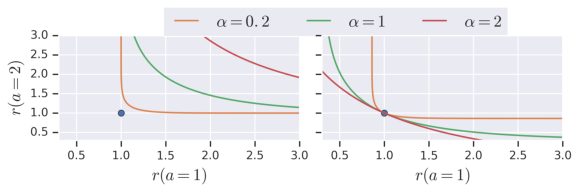

Figure 9: **Effect of Temperature** : _(Left)_ For a given reward function (blue dot), we plot the
robust sets for various values of the temperature. Somewhat surprisingly, it appears that increasing
the temperature decreases the set of reward functions that MaxEnt is robust against. _(Right)_ We
examine the opposite: for a given reward function, which other robust sets might contain this reward
function. We observe that robust sets corresponding to larger temperatures (i.e., the red curve) can be
simultaneously robust against more reward functions than robust sets at lower temperatures.

We make two observations about this example. First, the penalty would be infinite if the adversary
dynamics ˜ _p_ had the same variance as the true dynamics, _p_ : the adversary must choose dynamics
with higher variance. Second, the penalty depends on the size of the state space. More precisely, the
penalty depends on the region over which the adversary applies their perturbation. The adversary can
incur a smaller penalty by applying the perturbation over a smaller range of states.

A.8 T EMPERATURES

Many algorithms for MaxEnt RL (Haarnoja et al., 2018a; Fox et al., 2016; Nachum et al., 2017)
include a temperature _α >_ 0 to balance the reward and entropy terms:

�

_J_ MaxEnt ( _π, r_ ) = E _π_

_T_
�
� _t_ =1

� _r_ ( **s** **t** _,_ **a** **t** )

_t_ =1

+ _αH_ _π_ [ **a** **t** _|_ **s** **t** ] _._

We can gain some intuition into the effect of this temperature on the set of reward functions to which
we are robust. In particular, including a temperature _α_ results in the following robust set:

_R_ _r_ _[α]_ [=] _r_ ( **s** **t** _,_ **a** **t** ) + _αu_ **s** **t** ( **a** **t** ) _| u_ **s** **t** ( **a** **t** ) _≥_ 0 _∀_ **s** **t** _,_ **a** **t** and _e_ _[−][u]_ **[st]** [(] **[a]** **[t]** [)] _d_ **a** **t** _≤_ 1 _∀_ **s** **t**
� � _A_

_R_ _r_ _[α]_ [=] _r_ ( **s** **t** _,_ **a** **t** ) + _αu_ **s** **t** ( **a** **t** ) _| u_ **s** **t** ( **a** **t** ) _≥_ 0 _∀_ **s** **t** _,_ **a** **t** and
� �

�

= _r_ ( **s** **t** _,_ **a** **t** ) + _u_ **s** **t** ( **a** **t** ) _| u_ **s** **t** ( **a** **t** ) _≥_ 0 _∀_ **s** **t** _,_ **a** **t** and _e_ _[−][u]_ **[st]** [(] **[a]** **[t]** [)] _[/α]_ _d_ **a** **t** _≤_ 1 _∀_ **s** **t**
� � _A_

= _r_ ( **s** **t** _,_ **a** **t** ) + _u_ **s** **t** ( **a** **t** ) _| u_ **s** **t** ( **a** **t** ) _≥_ 0 _∀_ **s** **t** _,_ **a** **t** and
� �

_._ (19)
�

In the second line, we simply moved the temperature from the objective to the constraint by redefining
_u_ **s** **t** ( **a** **t** ) _→_ _α_ [1] _[u]_ **[s]** **[t]** [(] **[a]** **[t]** [)][.]

In the second line, we simply moved the temperature from the objective to the constraint by redefining
_u_ **s** **t** ( **a** **t** ) _→_ _α_ [1] _[u]_ **[s]** **[t]** [(] **[a]** **[t]** [)][.]

We visualize the effect of the temperature in Fig. 9. First, we fix a reward function _r_, and plot
the robust set _R_ _r_ _[α]_ [for varying values of] _[ α]_ [. Fig. 9 (left) shows the somewhat surprising result that]
increasing the temperature (i.e., putting more weight on the entropy term) makes the policy _less_
robust. In fact, the robust set for higher temperatures is a strict subset of the robust set for lower
temperatures:
_α_ 1 _< α_ 2 = _⇒_ _R_ _r_ _[α]_ [2] _⊆_ _R_ _r_ _[α]_ [2] _[.]_
This statement can be proven by simply noting that the function _e_ _[−]_ _α_ _[x]_ is an increasing function of _α_

in Equation 19. It is important to recognize that being robust against more reward functions is not
always desirable. In many cases, to be robust to everything, an optimal policy must do nothing.

We visualize the effect of the temperature in Fig. 9. First, we fix a reward function _r_, and plot
the robust set _R_ _r_ _[α]_ [for varying values of] _[ α]_ [. Fig. 9 (left) shows the somewhat surprising result that]
increasing the temperature (i.e., putting more weight on the entropy term) makes the policy _less_
robust. In fact, the robust set for higher temperatures is a strict subset of the robust set for lower
temperatures:
_α_ 1 _< α_ 2 = _⇒_ _R_ _r_ _[α]_ [2] _⊆_ _R_ _r_ _[α]_ [2] _[.]_
This statement can be proven by simply noting that the function _e_ _[−]_ _α_ _[x]_ is an increasing function of _α_

We now analyze the temperature in terms of the converse question: if a reward function _r_ _[′]_ is included
in a robust set, what other reward functions are included in that robust set? To do this, we take a
reward function _r_ _[′]_, and find robust sets _R_ _r_ _[α]_ [that include] _[ r]_ _[′]_ [, for varying values of] _[ α]_ [. As shown in]
Fig. 9 (right), if we must be robust to _r_ _[′]_ and use a high temperature, the only other reward functions to
which we are robust are those that are similar, or pointwise weakly better, than _r_ _[′]_ . In contrast, when
using a small temperature, we are robust against a wide range of reward functions, including those
that are highly dissimilar from our original reward function (i.e., have higher reward for some actions,
lower reward for other actions). Intuitively, increasing the temperature allows us to simultaneously be
robust to a larger set of reward functions.

19

Published as a conference paper at ICLR 2022

A.9 M AX E NT S OLVES R OBUST C ONTROL FOR R EWARDS

In Sec. 4.1, we showed that MaxEnt RL is equivalent to some robust-reward problem. The aim of this
section is to go backwards: given a set of reward functions, can we formulate a MaxEnt RL problem
such that the robust-reward problem and the MaxEnt RL problem have the same solution?

**Lemma A.3.** _For any collection of reward functions R, there exists another reward function r such_
_that the MaxEnt RL policy w.r.t. r is an optimal robust-reward policy for R:_

�

�

+ _H_ _π_ [ _a | s_ ] _⊆_ arg max _π_ _r_ min _[′]_ _∈R_ [E] _[π]_

_T_
�
� _t_ =1

� _r_ _[′]_ ( **s** **t** _,_ **a** **t** )

_t_ =1

arg max E _π_

_π_

_T_
�
� _t_ =1

� _r_ ( **s** **t** _,_ **a** **t** )

_t_ =1

_._

We use set containment, rather than equality, because there may be multiple solutions to the robustreward control problem.

_Proof._ Let _π_ _[∗]_ be a solution to the robust-reward control problem:

�

_π_ _[∗]_ _∈_ arg max _π_ _r_ min _i_ _∈R_ [E] _[π]_

Define the MaxEnt RL reward function as follows:

_T_
�
� _t_ =1

� _r_ _i_ ( **s** **t** _,_ **a** **t** )

_t_ =1

_._

_r_ ( **s** **t** _,_ **a** **t** ) = log _π_ _[∗]_ ( **a** **t** _|_ **s** **t** ) _._

Substituting this reward function in Equation 1, we see that the unique solution is _π_ = _π_ _[∗]_ .

Intuitively, this theorem states that we can use MaxEnt RL to solve _any_ robust-reward control
problem that requires robustness with respect to any arbitrary set of rewards, if we can find the right
corresponding reward function _r_ for MaxEnt RL. One way of viewing this theorem is as providing an
avenue to sidestep the challenges of robust-reward optimization. Unfortunately, we will still have
to perform robust optimization to learn this magical reward function, but at least the cost of robust
optimization might be amortized. In some sense, this result is similar to Ilyas et al. (2019).

A.10 F INDING THE R OBUST R EWARD F UNCTION

In the previous section, we showed that a policy robust against any set of reward functions _R_ can be
obtained by solving a MaxEnt RL problem. However, this requires calculating a reward function _r_ _[∗]_
for MaxEnt RL, which is not in general an element in _R_ . In this section, we aim to find the MaxEnt
reward function that results in the optimal policy for the robust-reward control problem. Our main
idea is to find a reward function _r_ _[∗]_ such that its robust set, _R_ _r_ _[∗]_, contains the set of reward functions
we want to be robust against, _R_ . That is, for each _r_ _i_ _∈_ _R_, we want

_r_ _i_ ( **s** **t** _,_ **a** **t** ) = _r_ _[∗]_ ( **s** **t** _,_ **a** **t** ) + _u_ **s** **t** ( **a** **t** ) for some _u_ **s** **t** ( **a** **t** ) satisfying _e_ _[−][u]_ **[st]** [(] **[a]** **[t]** [)] _d_ **a** **t** _≤_ 1 _∀_ **s** **t** _._
� _A_

Replacing _u_ with _r_ _[′]_ _−_ _r_ _[∗]_, we see that the MaxEnt reward function _r_ must satisfy the following
constraints:

_e_ _[r]_ _[∗]_ [(] **[s]** **[t]** _[,]_ **[a]** **[t]** [)] _[−][r]_ _[′]_ [(] **[s]** **[t]** _[,]_ **[a]** **[t]** [)] _d_ **a** **t** _≤_ 1 _∀_ **s** **t** _∈S, r_ _[′]_ _∈_ _R._

� _A_

We define _R_ _[∗]_ ( _R_ ) as the set of reward functions satisfying this constraint w.r.t. reward functions in _R_ :

_R_ _[∗]_ ( _R_ ) ≜ _r_ _[∗]_
� ����

_e_ _[r]_ _[∗]_ [(] **[s]** **[t]** _[,]_ **[a]** **[t]** [)] _[−][r]_ _[′]_ [(] **[s]** **[t]** _[,]_ **[a]** **[t]** [)] _d_ **a** **t** _≤_ 1 _∀_ **s** **t** _∈S, r_ _[′]_ _∈_ _R_

� _A_ �

Note that we can satisfy the constraint by making _r_ _[∗]_ arbitrarily negative, so the set _R_ _[∗]_ ( _R_ ) is nonempty. We now argue that all any applying MaxEnt RL to any reward function in _r_ _[∗]_ _∈_ _R_ _[∗]_ ( _R_ ) lower
bounds the robust-reward control objective.
**Lemma A.4.** _Let a set of reward functions_ _R_ _be given, and let_ _r_ _[∗]_ _∈_ _R_ _[∗]_ ( _R_ ) _be an arbitrary reward_
_function belonging to the feasible set of MaxEnt reward functions. Then_

�

_J_ _MaxEnt_ ( _π, r_ _[∗]_ ) _≤_ _r_ min _[′]_ _∈R_ [E] _[π]_

_T_
�
� _t_ =1

� _r_ _[′]_ ( **s** **t** _,_ **a** **t** )

_t_ =1

_∀π ∈_ Π _._

20

Published as a conference paper at ICLR 2022

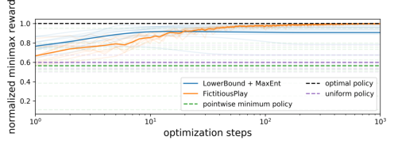

Figure 10: **Approximately solving an arbitrary robust-reward control problem.** In this experiment, we aim to solve the robust-reward control problem for an _arbitrary_ set of reward functions.
While we know that MaxEnt RL can be used to solve arbitrary robust-reward control problems exactly,
doing so requires that we already know the optimal policy (§ A.9). Instead, we use the approach
outlined in Sec. A.10, which allows us to _approximately_ solve an arbitrary robust-reward control
problem without knowing the solution apriori. This approach (“LowerBound + MaxEnt”) achieves
near-optimal minimax reward.

Note that this bound holds for all feasible reward functions and all policies, so it also holds for the
maximum _r_ _[∗]_ :

�

_r_ _[∗]_ _∈_ max _R_ _[∗]_ ( _R_ ) _[J]_ [MaxEnt] [(] _[π, r]_ _[∗]_ [)] _[ ≤]_ _r_ [min] _[′]_ _∈R_ [E] _[π]_

_T_
�
� _t_ =1

� _r_ _[′]_ ( **s** **t** _,_ **a** **t** )

_t_ =1

_∀π ∈_ Π _._

Defining _π_ _[∗]_ = arg max _π_ _J_ MaxEnt ( _π, r_ _[∗]_ ), we get the following inequality:

�

�

_r_ _[∗]_ _∈R_ max _[∗]_ ( _R_ ) _,π∈_ Π _[J]_ [MaxEnt] [(] _[π, r]_ _[∗]_ [)] _[ ≤]_ _r_ [min] _[′]_ _∈R_ [E] _[π]_ _[∗]_

_T_
�
� _t_ =1

� _r_ _[′]_ ( **s** **t** _,_ **a** **t** )

_t_ =1

_≤_ max
_π∈_ Π _r_ [min] _[′]_ _∈R_ [E] _[π]_

_T_
�
� _t_ =1

� _r_ _[′]_ ( **s** **t** _,_ **a** **t** )

_t_ =1

_._ (20)

Thus, we can find the tightest lower bound by finding the policy _π_ and feasibly reward _r_ _[∗]_ that
maximize Equation 20:

�

+ _H_ _π_ [ **a** **t** _|_ **s** **t** ] (21)

max E _π_
_r,π_

_T_
�
� _t_ =1

� _r_ ( **s** **t** _,_ **a** **t** )

_t_ =1

s.t. _e_ _[r]_ [(] **[s]** **[t]** _[,]_ **[a]** **[t]** [)] _[−][r]_ _[′]_ [(] **[s]** **[t]** _[,]_ **[a]** **[t]** [)] _da ≤_ 1 _∀_ **s** **t** _∈S, r_ _[′]_ _∈_ _R._
� _A_

It is useful to note that the constraints are simply L OG S UM E XP functions, which are convex. For
continuous action spaces, we might approximate the constraint via sampling. Given a particular
policy, the optimization problem w.r.t. _r_ has a linear objective and convex constraint, so it can be
solved extremely quickly using a convex optimization toolbox. Moreover, note that the problem can
be solved independently for every state. The optimization problem is not necessarily convex in _π_ .

A.11 A NOTHER C OMPUTATIONAL E XPERIMENT

This section presents an experiment to study the approach outlined above. Of particular interest is
whether the lower bound (Eq 20) comes close to the optimal minimax policy.

We will solve robust-reward control problems on 5-armed bandits, where the robust set is a collection
of 5 reward functions, each is drawn from a zero-mean, unit-variance Gaussian. For each reward
function, we add a constant to all of the rewards to make them all positive. Doing so guarantees
that the optimal minimax reward is positive. Since different bandit problems have different optimal
minimax rewards, we will normalize the minimax reward so the maximum possible value is 1.

Our approach, which we refer to as “LowerBound + MaxEnt”, solves the optimization problem in
Equation 21 by alternating between (1) solving a convex optimization problem to find the optimal
reward function, and (2) computing the optimal MaxEnt RL policy for this reward function. Step 1 is
done using CVXPY, while step 2 is done by exponentiating the reward function, and normalizing
it to sum to one. Note that this approach is actually solving a harder problem: it is solving the
robust-reward control problem for a much larger set of reward functions that contains the original set

21

Published as a conference paper at ICLR 2022

of reward functions. Because this approach is solving a more challenging problem, we do not expect
that it will achieve the optimal minimax reward. However, we emphasize that this approach may
be easier to implement than fictitious play, which we compare against. Different from experiments
in Section 4.1, the “LowerBound + MaxEnt” approach assumes access to the full reward function,
not just the rewards for the actions taken. For fair comparison, fictitious play will also use a policy
player that has access to the reward function. Fictitious play is guaranteed to converge to the optimal
minimax policy, so we assume that the minimax reward it converges to is optimal. We compare
against two baselines. The “pointwise minimum policy” finds the optimal policy for a new reward
function formed by taking the pointwise minimum of all reward functions: ˜ _r_ ( **a** **t** ) = min _r∈R_ _r_ ( **a** **t** ) .
This strategy is quite simple and intuitive. The other baseline is a “uniform policy” that chooses
actions uniformly at random.

We ran each method on the same set of 10 robust-reward control bandit problems. In Fig. 10, we
plot the (normalized) minimax reward obtained by each method on each problem, as well as the
average performance across all 10 problems. The “LowerBound + MaxEnt” approach converges to
a normalized minimax reward of 0.91, close to the optimal value of 1. In contrast, the “pointwise
minimum policy” and the “uniform policy” perform poorly, obtaining normalized minimax rewards
of 0.56 and 0.60, respectively. In summary, while the method proposed for converting robustreward control problems to MaxEnt RL problems does not converge to the optimal minimax policy,
empirically it performs well.

B E XPERIMENTAL D ETAILS

B.1 D YNAMICS R OBUSTNESS E XPERIMENTS (F IG . 4)

We trained the MaxEnt RL policy using the SAC implementation from TF Agents (Guadarrama et al.,
2018) with most of the default parameters (unless noted below).

**Fig. 4a** We used the standard Pusher-v2 task from OpenAI Gym (Brockman et al., 2016). We
used a fixed entropy coefficient of 1 _e −_ 2 for the MaxEnt RL results. For the standard RL results,
we used the exact same codebase to avoid introducing any confounding factors, simply setting the
entropy coefficient to a very small value 1 _e −_ 5 . The obstacle is a series of three axis-aligned blocks
with width 3cm, centered at (0.32, -0.2), (0.35, -0.23), and (0.38, -0.26). We chose these positions to
be roughly along the perpendicular bisector of the line between the puck’s initial position and the
goal. We used 100 episodes of length 100 for evaluating each method. To decrease the variance in
the results, we fixed the initial state of each episode:

qpos = [0 _.,_ 0 _.,_ 0 _.,_ 0 _.,_ 0 _.,_ 0 _.,_ 0 _., −_ 0 _._ 3 _, −_ 0 _._ 2 _,_ 0 _.,_ 0 _._ ] _,_
qvel = [0 _.,_ 0 _.,_ 0 _.,_ 0 _.,_ 0 _.,_ 0 _.,_ 0 _.,_ 0 _.,_ 0 _.,_ 0 _.,_ 0 _._ ] _._

**Fig. 4b** We used the SawyerButtonPressEnv environment from Metaworld (Yu et al., 2020),
using a maximum episode length of 151. For this experiment, we perturbed the environment by
modifying the observations such that the button appeared to be offset along the _Y_ axis. We recorded
the average performance over 10 episodes. For this environment we used an entropy coefficient of
1 _e_ 1 for MaxEnt RL and 1 _e −_ 100 for standard RL. [2]

**Fig. 6** We used the standard Pusher-v2 task from OpenAI Gym (Brockman et al., 2016). We
modified the environment to perturb the XY position of the puck at time _t_ = 20 . We randomly
sampled an angle _θ ∼_ Unif[0 _,_ 2 _π_ ] and displaced the puck in that direction by an amount given by the
disturbance size. For evaluating the average reward of each policy on each disturbance size, we used
100 rollouts of length 151.

**Fig. 5** We used a modified version of the 2D navigation task from Eysenbach et al. (2019) with the
following reward function:

_r_ ( **s** **t** _,_ **a** **t** ) = _∥_ **s** **t** _−_ (8 _,_ 4) _[T]_ _∥_ 2 _−_ 10 _·_ 1 ( **s** **t** _∈S_ obstacle ) _._

Episodes were 48 steps long.

2 We used a larger value for the entropy coefficient for standard RL in the previous experiment to avoid
numerical stability problems.

22

Published as a conference paper at ICLR 2022

**Fig. 7** We used the peg insertion environment from Eysenbach et al. (2018). Episodes were at most
200 steps long, but terminated as soon as the peg was in the hole. The agent received a reward of
+100 once the peg was in the hole, in addition to the reward shaping terms described in Eysenbach
et al. (2018).

B.2 R EWARD R OBUSTNESS E XPERIMENTS (F IG . 8)

Following Haarnoja et al. (2018a), we use an entropy coefficient of _α_ = 1 _/_ 5 . In Fig. 8, the thick line
is the average over five random seeds (thin lines). Fig. 11 shows the evaluation of all methods on
both the expected reward and the minimax reward objectives. Note that the minimax reward can be
computed analytically as

˜
_r_ ( **s** **t** _,_ **a** **t** ) = _r_ ( **s** **t** _,_ **a** **t** ) _−_ log _π_ ( **a** **t** _|_ **s** **t** ) _._

B.3 B ANDITS (F IG . 10)

The mean for arm _i_, _µ_ _i_, is drawn from a zero-mean, unit-variance Gaussian distribution, _µ_ _i_ _∼N_ (0 _,_ 1) .
When the agent pulls arm _i_, it observes a noisy reward _r_ _i_ _∼N_ ( _µ_ _i_ _,_ 1) . The thick line is the average
over 10 random seeds (thin lines).

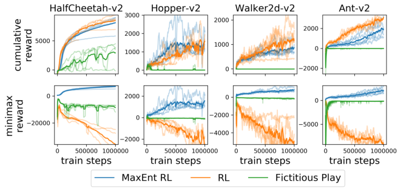

Figure 11: _(Top)_ Both RL (SVG) and MaxEnt RL (SAC) effectively maximize expected reward.
_(Bottom)_ Only MaxEnt RL succeeds in maximizing the minimax reward.

C R OBUST RL A BLATION E XPERIMENTS

We ran additional ablation experiments to study whether simple modifications to the robust RL
baseline from Section 5 (Tessler et al., 2019) would improve results. These experiments will help
discern whether the good performance of MaxEnt RL, relative to the PR-MDP and NR-MDP
baselines, comes from using a more recent RL algorithm (SAC instead of DDPG), or from the entropy
regularization. We used the following ablations:

1. **larger network** : We increased the width of all neural networks to 256 units, so that the
network size the exactly the same as for the MaxEnt RL method.

2. **dual critic** : Following TD3 (Fujimoto et al., 2018), we added a second Q function and used
the minimum over two (target) Q functions. This change affects not only the actor and critic
updates, but also the updates to the adversary learned by PR/NR-MDP.

3. **more exploration** : We increased the exploration noise from 0.2 to 1.0.

We implemented these ablations by modifying the open source code released by Tessler et al. (2019).

The results, shown in Fig. 12, show that these changes do not significantly improve the performance
of the NR-MDP or PR-MDP. Perhaps the one exception is on the Hopper-v2 task, where PR-MDP
with the larger networks is now the best method for large relative masses. The dual critic ablation
generally performs worse than the baseline. We hypothesize that this poor performance is caused by
using the (pessimistic) minimum over two Q functions for updating the adversary, which may result

23

Published as a conference paper at ICLR 2022

in a weaker adversary. This experiment suggests that incorporating the dual critic trick into the action
robustness framework may require some non-trivial design decisions.

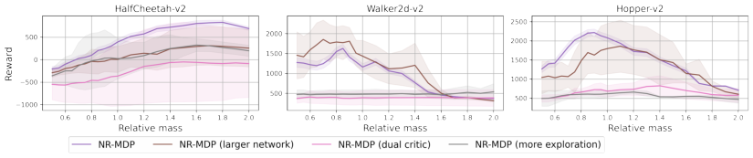

(a) NR-MDP ablations.

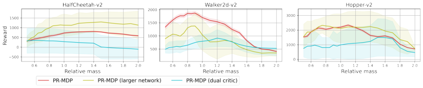

(b) PR-MDP ablations.

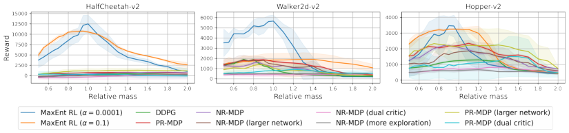

(c) Ablation experiments above overlaid on Fig. 3.

Figure 12: **Robust RL Ablation Experiments** : Ablations of the action robustness framework (Tessler et al., 2019) that use larger networks, multiple Q functions, or perform more exploration
do not perform significantly better.

24

