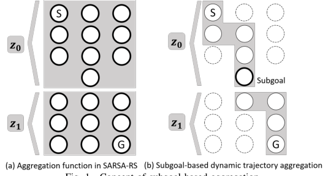
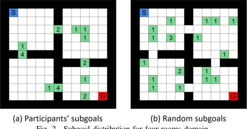
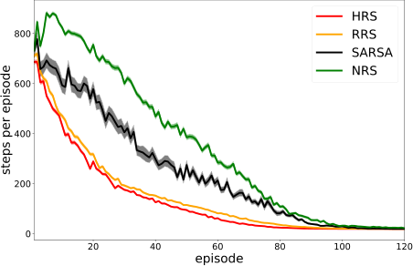
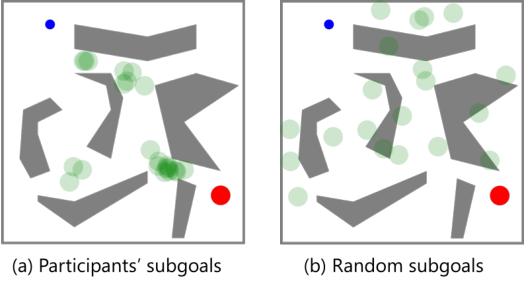
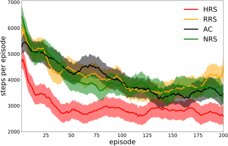
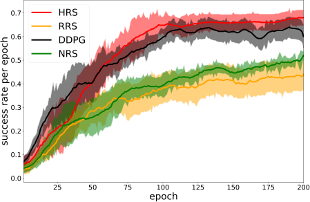

# Reward Shaping with Dynamic Trajectory Aggregation

1 [st] Takato Okudo

_The Graduate University for Advanced Studies, SOKENDAI_
Tokyo, Japna
okudo@nii.ac.jp

2 [nd] Seiji Yamada
_National Institute of Informatice, NII_
Tokyo, Japan
seiji@nii.ac.jp

_**Abstract**_ **—Reinforcement learning, which acquires a policy**
**maximizing long-term rewards, has been actively studied. Un-**
**fortunately, this learning type is too slow and difficult to use**
**in practical situations because the state-action space becomes**
**huge in real environments. The essential factor for learning**
**efficiency is rewards. Potential-based reward shaping is a basic**
**method for enriching rewards. This method is required to define a**
**specific real-value function called a “potential function” for every**
**domain. It is often difficult to represent the potential function**
**directly. SARSA-RS learns the potential function and acquires**
**it. However, SARSA-RS can only be applied to the simple**
**environment. The bottleneck of this method is the aggregation**
**of states to make abstract states since it is almost impossible**
**for designers to build an aggregation function for all states. We**
**propose a trajectory aggregation that uses subgoal series. This**
**method dynamically aggregates states in an episode during trial**
**and error with only the subgoal series and subgoal identification**
**function. It makes designer effort minimal and the application**
**to environments with high-dimensional observations possible. We**
**obtained subgoal series from participants for experiments. We**
**conducted the experiments in three domains, four-rooms(discrete**
**states and discrete actions), pinball(continuous and discrete), and**
**picking(both continuous). We compared our method with a base-**
**line reinforcement learning algorithm and other subgoal-based**
**methods, including random subgoal and naive subgoal-based**
**reward shaping. As a result, our reward shaping outperformed**
**all other methods in learning efficiency.**
_**Index Terms**_ **—Reinforcement Learning, Deep Reinforcement**
**Learning, Reward Shaping, Subgoal**

I. I NTRODUCTION

Reinforcement learning(RL) can acquire a policy maximizing long-term rewards in an environment. Designers do not
need to specify how to achieve a goal; they only need to
specify what a learning agent should achieve with a reward
function. A reinforcement learning agent performs both exploration and exploitation to find how to achieve a goal by itself. It
is common for the state-action space to be quite large in a real
environment like robotics. As the state-action space becomes
larger, the number of iterations exponentially increases to learn
the optimal policies, and the learning becomes too slow to
obtain optimal policies in a realistic amount of time. Since a
human could have knowledge that would be helpful to such an
agent in some cases, a promising approach is utilizing human
knowledge [13], [19], [30].
The reward function is the most related to learning efficiency. Most difficult tasks in RL have a sparse reward

function [3]. The agent is not able to evaluate its policy
due to it and to learn the policy. In contrast, learning speeds
up when the reward function is dense. Inverse reinforcement
learning (IRL) [1], [24] is the most popular method for
enriching the reward function. IRL uses an optimal policy to
generate a dense reward function. Recent studies have utilized
optimal trajectories [15], [35]. There is the question of the cost
of the teacher in providing trajectories or policies. Humans
sometimes have difficulty providing these because of the skills
they may or they may not have. In particular, in a robotics
task, humans are required to have robot-handling skills and
knowledge on the optimal trajectory. Another approach is reward shaping. This method expands the original environmental
reward function. Potential-based reward shaping is able to
add external rewards while keeping the optimal policy of the
environment [23]. It is calculated as the difference between
the real-number functions (potential function) of the previous
and current state. In [23], it was mentioned that learning
sped up with a learned value function used as the potential
function. Since a policy learned with a potential-based reward
shaping is equivalent to that with _Q_ -value initialization with
the potential function [33], using the learned value function
for the potential function is equivalent to initializing the value
function with the learned value function. Therefore, learning
is jump-started. To use potential-based reward shaping, we
need to define the potential function. It is often very difficult
to represent the potential function directly. To solve this
problem, SARSA-RS acquires it in learning [11]. A designer
provides the aggregation function of states before learning,
and SARSA-RS builds a value function over abstract state

space as the potential function. The propagation of the reward
over value function accelerates because the abstract state

space is smaller than the original state space, and the agent
learns the policy faster. Devlin and Kudenko proved that timevaried reward shaping keeps a policy invariant [8]. The result
has made clear that a policy learned with SARSA-RS is
equivalent to the original policy. However, it is very difficult
to define the aggregation function of states when the task
has a high-dimensional state space. We propose a subgoalbased trajectory aggregation method. The designer defines
only the subgoal identification function to apply SARSA-RS
to a reinforcement learning algorithm. Since it is easier for
the designer to make a similarity function than an aggregation

function [27], our method can keep designer effort minimal.
Moreover, a non-expert may enhance the reinforcement learning algorithm if an identification function exists. This might be
related to interactive machine learning [2]. Providing subgoals
is sometimes easier than trajectories because it does not require
handling skills but only task decomposition skills.

II. R ELATED W ORK

The landmark-based reward shaping of Demir et al. [7] is
the closest to our method. The method shapes only rewards
on a landmark using a value function. Their study focused on
a POMDP environment, and landmarks automatically become
abstract states. We focus on an MDP environment, and we
propose an aggregation function. We acquire subgoals from
human participants, and we apply our method to a task
with high-dimensional observations. Potential-based advice
is reward shaping for states and actions [34]. The method
shapes the q-value function directly for a state and an action,
and it makes it easy for a human to advice to an agent
regarding whether an action in an arbitrary state is better or
not. Subgoals show what ought to be achieved on the trajectory
to a goal. We adopted the shaping of a state value function.
Harutyunyan et al. [14] has shown that the q-values learned by
arbitrary rewards can be used for the potential-based advice.
The method mainly assumes that a teacher negates the agent’s
action selection. The method uses failures in the trial and

errors. In contrast, our method uses successes.
In the field of interactive reinforcement learning, a learning
agent interacts with a human trainer as well as the environment

[6].The TAMER framework is a typical interactive framework
for reinforcement learning [16]. The human trainer observes
the agent’s actions and provides binary feedback during learning. Since humans often do not have programming skills and
knowledge on algorithms, the method relaxes the requirements
to be a trainer. We aim for fewer trainer requirements, and we
use a GUI on a web system in experiments with navigation
tasks.

Our method is similar to hierarchical reinforcement learn
ing(HRL) in a hierarchy. The option framework is the major in
the field of HRL. The framework of Sutton et al. [29] was able
to transfer learned policies in an option. An option consists
of an initiation set, an intra-option policy, and a termination
function. An option expresses a combination of a subtask and
a policy for it. The termination function takes on the role
of subgoal because it terminates an option and triggers the
switching to another option. Recent methods have found good
subgoals for a learner simultaneously with policy learning [4],

[32]. The differences with our method are whether the policy is
over abstract states or not and whether rewards are generated.
The framework intends to recycle a learned policy, but our
method focuses on improving learning efficiency.
Reward shaping in HRL has been studied in [10], [20].
Gao et al. [10] has shown that potential-based reward shaping
remains policy invariant to the MAX-Q algorithm. Designing
potentials every level is laborious work. We use a single highlevel value function as a potential, which reduces the design

load. Li et al. [20] incorporated an advantage function in highlevel state-action space into reward shaping. Their approach is
similar to ours in the utilization of a high-level value function,
but it does not incorporate external knowledge into their algorithm. The reward shaping method in [25] utilized subgoals
that are automatically discovered with expert trajectories. The
potentials generated every subgoal are different. The value of
a potential is fixed and not learned. Our method learns the
value of a potential.

III. P RELIMINARIES AND N OTATION

A Markov Decision Process consists of a set of states _S_,
a set of actions _A_, a transition function _T_ : _S × A →_
( _S_ _[′]_ _→_ [0 _,_ 1]), and a reward function _R_ : _S × A →R_ . A
policy is a probability distribution over actions conditioned
on states, _π_ : _S × A →_ [0 _,_ 1]. In a discounted fashion, the
value function of a state _s_ under a policy _π_, denoted _v_ _π_ ( _s_ ),
is _V_ _π_ = **E** _π_ �� _∞i_ =0 _[γ]_ _[i]_ _[r]_ _[t]_ [+1] _[|][s]_ [0] [ =] _[ s]_ �. Its action-value function
is _Q_ ( _s, a_ ) = **E** _π_ �� _∞i_ =0 _[γ]_ _[i]_ _[r]_ _[t]_ [+1] _[|][s]_ [0] [ =] _[ s, a]_ [0] [ =] _[ a]_ �, where _γ_ is a
discount factor.

_A. Potential-Based Reward Shaping_

Potential-based reward shaping [23], [33] is an effective
method for keeping an original optimal policy _π_ in an environment with an additional reward function _F_ . If the potentialbased shaping function _F_ is formed as:

_F_ ( _s_ _t_ _, s_ _t_ +1 ) = _γ_ Φ( _s_ _t_ +1 ) _−_ Φ( _s_ _t_ ) (1)

, it is guaranteed that policies _π_ in MDP _M_ = ( _S, A, T, γ, R_ )
are consistent with those _π_ _[′]_ in MDP _M_ _[′]_ = ( _S, A, T, γ, R_ + _F_ ).
Note that _s_ _t_ _∈_ _S_ _−{s_ 0 _}_ and _s_ _t_ +1 _∈_ _S_ . _s_ 0 is an absorbing state,
so the MDP “stops” after a transition into _s_ 0 . Φ is known as the
potential function. Φ should be a real-value function such as
Φ : _S →_ **R** . For better understanding, we use the example of
Q-learning with potential-based reward shaping. The learning
rule is formally written as

_Q_ ( _s_ _t_ _, a_ _t_ ) _←_ _Q_ ( _s_ _t_ _, a_ _t_ ) + _αδ_ _T D_ (2)

_δ_ _T D_ = _r_ _t_ + _F_ ( _s_ _t_ _, s_ _t_ +1 ) + max
_a_ _[′]_ _[ Q]_ [(] _[s]_ _[t]_ [+1] _[, a]_ _[′]_ [)] _[ −]_ _[Q]_ [(] _[s]_ _[t]_ _[, a]_ _[t]_ [)][ (3)]

, where _α_ is a learning rate. We need to define an appropriate
Φ for every domain. There is the problem of how to define Φ to
accelerate learning. The study of [33] has shown that learning
with potential-based reward shaping is equivalent to _Q_ -value
initialization with the potential functionΦ before learning. The
result has made clear that Φ( _s_ ) = _V_ _[∗]_ ( _s_ ) = max _a_ _′_ _Q_ _[∗]_ ( _s, a_ _[′]_ )
is the best way to accelerate learning. We cannot know _V_ _[∗]_ ( _s_ )
before learning since we acquire _V_ _[∗]_ ( _s_ ) after learning. This
suggests that we can accelerate the learning if there is a value
function learned faster than another with the same rewards.

_B. SARSA-RS_

Grzes et al. [11], [12] proposed a method that learns a
potential function Φ during the learning of a policy _π_, called
“SARSA-RS”. The method solved the problem of the design
of an appropriate potential function for a domain being too
difficult and time-consuming. We define _Z_ as a set of abstract

states. The method builds a value function over _Z_ and uses it

as Φ

Φ( _s_ ) = _V_ ( _g_ ( _s_ )) = _V_ ( _z_ ) (4)

, where _g_ is an aggregation function, _g_ : _S →_ _Z_ . The function
_g_ is pre-defined. The potential-based shaping function over
SARSA-RS is written as follows.

_F_ ( _z_ _t_ _, z_ _t_ +1 ) = _γV_ ( _z_ _t_ +1 ) _−_ _V_ ( _z_ _t_ ) (5)

The method learns the value function _V_ ( _z_ ) during policy
learning as:

_V_ ( _z_ _t_ ) _←_ _V_ ( _z_ _t_ ) + _α_ � _r_ _h_ + _γ_ _[k]_ _V_ ( _z_ _t_ +1 ) _−_ _V_ ( _z_ _t_ )� (6)

, where _r_ _h_ is the transformation function from MDP rewards
into SMDP rewards, and _k_ is the duration between _z_ _t_ and _z_ _t_ +1 .
The potential function changes dynamically during learning,
and the equivalency of the potential-based reward shaping
cannot is applied because it depends on the time in addition to
the state. Since Devlin and Kudenko have shown that a shaped
policy is equivalent to a non-shaped one, when the potential
function changes dynamically during learning [8], SARSARS keeps the learned policy original. We omit the time
argument in the following section to simplify the expression.
The size of _Z_ is smaller than _S_ thanks to the aggregation of
states. Therefore, the propagation of environmental rewards is
faster, and the policy learning with SARSA-RS is also faster.
As mentioned above, the method requires the pre-defined
aggregation function _g_ . In an environment of high-dimensional
observations, it is almost impossible to make an aggregation
function.

IV. R EWARD S HAPING WITH S UBGOAL -B ASED

A GGREGATION

We propose a method of aggregation from states into an
abstract states. The method basically follows SARSA-RS.
We use a pre-defined subgoal series and aggregate episodes
dynamically into abstract states during learning with it.

_A. Subgoal_

We define a subgoal as follows

**Definition 1.** _A state s is a subgoal if s is a goal in one of_
_the sub-tasks decomposed from a task._

In the option framework, the subgoal is the goal of a subtask, and it is expressed as a termination function [29]. Many
studies on the option framework have developed automatic
subgoal discovery [4]. We aim to incorporate human subgoal
knowledge into the reinforcement learning algorithm with less
human effort required. The property of a subgoal might be
a part of the optimal trajectories because a human should
decompose a task to achieve the goal. We acquire a subgoal
series and incorporate the subgoals into our method in experiments. The subgoal series is written formally as ( _SG, ≺_ ).
_SG_ is a set of subgoals and a sub-set of _S_ . There are two
types of subgoal series, totally ordered and partially ordered.

Fig. 1. Concept of subgoal-based aggregation.

With totally ordered subgoals, a subgoal series is deterministically determined at any subgoal. In contrast, partially ordered
subgoals have several transitions to the subgoal series from a
subgoal. We used only the totally ordered subgoal series in
this paper, but both types of ordered subgoals are available
for our proposed reward shaping. Since an agent needs to
achieve a subgoal only once, the transition between subgoals
is unidirectional.

_B. Subgoal-Based Dynamic Trajectory Aggregation_

We propose a method of aggregating trajectories dynamically into abstract states using subgoal series. The method
makes the SARSA-RS method available for environments

of high-dimensional observations thanks to less effort being
required from designers. The method requires only a subgoal
series consisting of several states instead of all states. In
this section, we assume that the subgoal series ( _SG, ≺_ ) is
pre-defined, and ( _SG, ≺_ ) = _{sg_ 0 _≺_ _sg_ 1 _≺· · · ≺_ _sg_ _n_ _}_ . The
method basically follows SARSA-RS, and the difference is
mainly the aggregation function _g_ and minorly the accumulated rewards.

_1) Dynamic Trajectory Aggregation:_ We build abstract
states to represent the achievement status of a subgoal series.
If there are _n_ subgoals, the size of abstract states is _n_ + 1.
The agent is in a first abstract state _z_ 0 before a subgoal
is achieved. Then, the abstract state _z_ 0 transits to _z_ 1 when
the subgoal _sg_ 0 is achieved. This means the aggregation of
episodes until subgoal _sg_ 0 transits into _z_ 0 . The aggregated
episodes change dynamically every trial because of the policy
with randomness and learning. As the learning progresses, the
aggregated episodes become fixed. The value over abstract
states is distributed to the values of states of the trajectory.
Note that the trajectories for updating the values are different
from those of distributed values. The updated value function
is not used for the current trial but for the next trials. An

image of dynamic trajectory aggregation is shown in Fig.1. In
the figure, a circle is a state, and the aggregated states are in
each gray background area. There are two abstract states in
the case of a single subgoal. The bold circles express the states
with which the designer deals. The number of bold circles in
Fig. 1(b) is much lower than Fig. 1(a). “S” and “G” in the
circles are a start and a goal, respectively. Fig. 1(b) shows

that the episode is separated into two sub-episodes, and each
of them corresponds to the abstract states.
_2) Accumulated Reward Function:_ We clearly define the
reward transformation function _r_ _h_ because our method only
updates the achievements of subgoals as abstract states. A
set of abstract states is part of the semi-Markov decision
process (SMDP) [29]. The transition between an abstract state
and another consists of multiple actions. The value function
in SMDP is written as:

�

_V_ _[g]_ ( _z_ ) = _E_

_k−_ 1
�
� _i_ =0

� _γ_ _[i]_ _r_ _t_ +1+ _i_ + _γ_ _[k]_ _V_ _[g]_ ( _z_ _[′]_ ) _|ε_ ( _g, z, t_ )

_i_ =0

(7)

rooms and pinball, because they are popular problems with
discrete/continuous states that have been used in previous
studies [4], [18], [29]. Furthermore, we used a pick and
place task with a robot arm with continuous actions [5]. The
navigation task involved finding the shortest path to a goal state
from a start state. The pick and place task is to grasp an object
and bring it to a target. First, we conducted an experiment to
acquire human subgoals. Second, a learning experiment was
conducted, in which we compared the proposed method with
four other methods for the navigation task. We compared the
proposed method with a baseline RL algorithm for the pick and
place task. A SARSA algorithm was used for the four-rooms
domain, an actor-critic algorithm for the pinball domain, and
a DDPG for the pick and place domain. All the experiments
were conducted with a PC [Core i7-7700 (3.6GHz), 16GB
memory]. We used the same hyper-parameters, _α_ _v_ and _γ_ _v_, as
those of the baseline RL algorithms, respectively.

_A. User Study: Human Subgoal Acquisition_

_1) Navigation Task:_ We conducted an online user study to
acquire human subgoal knowledge using a web-based GUI.
We recruited 10 participants who consisted of half graduate
students in the department of computer science and half
others(6males and 4females, ages 23 to 60, average of 36.4).
We confirmed they did not have expertise on subgoals in the
two domains. Participants were given the same instructions
as follows for the two domains, and they were then asked
to designate their two subgoals both for the four-rooms and
pinball domains in this fixed order. The number of subgoals
was the same as the hallways in the optimal trajectory for
the four-rooms domain. The instructions explained to the
participants what the subgoals were and how to set them. Also,
specific explanations of the two task domains were given to the
participants. In this experiment, we acquired just _two_ subgoals
for learning since they are intuitively considered easy to give
on the basis of the structure of the problems. We considered
the two subgoals to be totally ordered ones.

_2) Pick and Place Task:_ A user study for the pick and
place task was also done online. Since it was difficult to
acquire human subgoal knowledge with GUI, we used a
descriptive answer-type form. We assumed that humans use
subgoals when they teach behavior in a verbal fashion. They
state not how to move but what to achieve in the middle

of behavior. The results of this paper minorly support this
assumption. We recruited five participants who were amateurs
in the field of computer science(3 males and 2 females, ages 23
to 61, average of 38.4). The participants read the instructions
and then typed the answer in a web form. The instructions
consisted of a description of the pick and place task, a movie
of manipulator failures, a glossary, and a question on how a
human can teach successful behavior. The question included
the sentence “Please teach behavior like you would teach
your child.” This is because some participants answered that
they did not know how to teach the robot in a preliminary
experiment. We imposed no limit on the number of subgoals.

where _k_ is the duration of the abstract state _z_, and _ε_ is the
event of the aggregation function _g_ being initiated in state
_z_ at time _t_ . Therefore, we describe this formally as _r_ _h_ =
� _ik_ =0 _−_ 1 _[γ]_ _[i]_ _[r]_ _[i]_ [, where] _[ k]_ [ is the duration until subgoal achievement.]
The function accumulates rewards with discount _γ_ . Depending
on the policy at the time, _k_ is varied dynamically. This follows
n-step temporal difference (TD) learning [28] because there
are transitions between an abstract state _z_ _i_ and another one
_z_ _i_ +1 . Algorithm 1 shows the whole process of SARSA-RS
with subgoal-based dynamic trajectory aggregation. _α_ _v_ and
_γ_ _v_ are hyper-parameters, that is, the learning rate and discount
factor for updating the value function over abstract states.

**Algorithm 1:** SARSA-RS with subgoal-based dynamic
trajectory aggregation

**Data:** _t_ = 0 _, V_ ( _z_ ; _θ_ ) _, sg_ _i_ _∈{SG, ≺}_

**1** Initialize _θ_

**2** _z ←_ _z_ 0 _, i ←_ 0 _, r_ _h_ _←_ 0

**3** Select _a_ by _π_ at _s_

**4** **repeat**

**5** Take _a_ and observe _s_ _[′]_ and _r_

**6** _z_ _[′]_ _←_ _filter_ ( _s_ _[′]_ )

**7** _t ←_ _t_ + 1

**8** _r_ _h_ _←_ _r_ _h_ + _γ_ _[t]_ _r_

**9** **if** _equal_ ( _s_ _[′]_ _, sg_ _i_ +1 ) **then**

**10** _δ_ = _r_ _h_ + _γ_ _v_ _[t]_ _[V]_ [ (] _[z]_ _[′]_ [;] _[ θ]_ [)] _[ −]_ _[V]_ [ (] _[z]_ [;] _[ θ]_ [)]

**11** _θ ←_ _θ_ + _α_ _v_ _δ_ _θ_ ∆ _V_ ( _z_ ; _θ_ )

**12** _t ←_ 0 _, i ←_ _i_ + 1

**13** _F_ ( _z, z_ _[′]_ ) = _γV_ ( _z_ _[′]_ ) _−_ _V_ ( _z_ )

**14** Select _a_ _[′]_ by _π_

**15** Update value function with _r_ + _F_ ( _z, z_ _[′]_ )

**16** _s ←_ _s_ _[′]_ ; _a ←_ _a_ _[′]_ _, z ←_ _z_ _[′]_

**17** **until** _terminal condition_ ;

In Algorithm 1, the method is involved between lines 6-13.
The value function over abstract states is parameterized by _θ_ .
If _s_ _[′]_ equals _sg_ _i_ +1, _θ_ is updated by an approximate multi-step
TD method [28], and our method sets the next subgoal _sg_ _i_ +1
in lines 9-12.

V. E XPERIMENTS

In this section, we explain the experiments done to evaluate
our method. We used navigation tasks in two domains, four

_B. Navigation in Four-Rooms Domain_

The four-rooms domain has four rooms, and the rooms
are connected by four hallways. The domain is common
for reinforcement learning tasks. In this experiment, learning
consisted of a thousand episodes. An episode was a trial run
until an agent reached a goal state successfully or when a
thousand state-actions ended in failure. A state was expressed
as a scalar value labeled through all states. An agent could
select one of four actions: up, down, left, and right. The
transition of a state was deterministic. A reward of +1 was

generated when an agent reached a goal state. The start state
and goal state were placed at fixed positions. An agent repeated
the learning 100 times. The learning took several tens of
seconds.

_1) Experimental Setup:_ We compared the proposed reward
shaping with human subgoals (HRS) with three other methods.
They were a SARSA algorithm (SARSA) [28], the proposed
reward shaping with random subgoals (RRS), and naive subgoal reward shaping (NRS). SARSA is a basic reinforcement
learning algorithm. We used SARSA as a baseline algorithm
and implemented the other two methods with it. RRS used
two randomly selected states as subgoals from the whole state
space. NRS is based on potential-based reward shaping The
potential function Φ( _s_ ) outputs a scalar value _η_ just when an
agent has visited a subgoal state. The potential function is
written formally as follows.

_η_ _s_ = _sg_
Φ( _s_ ) = � 0 _s ̸_ = _sg_ (8)

Informally, NRS shapes rewards of _η_ only generated for subgoals with potential-based reward shaping. The two differences
from our method are that NRS has a fixed potential, and the
positive potential only for the subgoals. The reward shaping
methods were given ordered subgoals or aggregation of states
in advance. We set the learning rate for SARSA to 0.01, the
discount rate for SARSA to 0.99, and _η_ to 1.0. The policy was
a softmax. We chose _η_ to be 1 so that it would be the same
value as the goal reward after grid search on grids of 1, 10,
and 100.

We evaluated the learning performance with the time to
threshold and the asymptotic performance [31] in terms of
the learning efficiency of transfer learning for reinforcement
learning. We explain the definitions of the measurements in
this experiment. The time to threshold was the number of
episodes required to get below a pre-defined threshold of steps.
The asymptotic performance was the final performance of
learning. We used the average number of steps between 990
and 1000 episodes.
_2) Experimental Results:_ Fig. 2 shows the subgoal distribution acquired from the ten participants and from the random
subgoals generated for the four-rooms domain. In Fig. 2, the
color of the start, goal, and subgoal cells are red, blue, and
green, respectively. The number in a cell is the frequency at
which the participants selected the cell as a subgoal. These
subgoals included totally and partially ordered subgoals. As
shown in Fig. 2(a), participants tended to set more subgoals in

Fig. 2. Subgoal distribution for four-rooms domain.

Fig. 3. Learning curves compared among four methods.

the hallway compared with random subgoals [Fig. 2(b)]. Next,
we show the results of the learning experiment. Fig. 3 shows
the learning curves of our proposed method and the four other
methods. The standard errors also are shown in this figure.
We plotted HRS with an average totaling 1000 learnings over
all participants. RRS were also averaged by 1000 learnings
over 10 patterns. NRS had almost the same conditions as
HRS. SARSA was averaged by 10,000 learnings. HRS had
the fewest steps for almost all episodes. The results of NRS
demonstrated the difficulty with transformation from subgoals
into an additional reward function. We also performed an
ANOVA among the four methods. We set the thresholds to
500, 300, 100, and 50 steps in terms of the time to threshold.
Table I shows the mean episodes, the standard deviations and
the results of the ANOVA and the sub-effect tests for the

compared methods for each threshold step.

TABLE I

M EAN AND STANDARD DEVIATION . M EAN (S.D.) AND RESULTS OF
ANOVA AND SUB - EFFECT TESTS IN EPISODES TO THRESHOLD STEPS IN

FOUR          - ROOMS DOMAIN .

Thres. HRS RRS SARSA NRS

500 2.68(1.86) 2.91(2.10) 3.93(3.07) 5.78(6.39)
300 5.06(3.05) 5.60(3.61) 6.68(4.29) 10.4(9.17)
100 17.3(7.92) 18.6(7.89) 26.4(11.0) 38.3(47.1)
50 33.0(10.2) 36.3(11.0) 51.8(16.2) 59.6(45.8)

TABLE II

S UMMARY OF ANOVA AND SUB   - EFFECT TESTS IN EPISODES TO

THRESHOLD STEPS .

Thres. HRS<RRS _{_ HRS,RRS _}_ <SARSA _{_ HRS,RRS,SARSA _}_ <NRS

500 n.s.   -   
300   -   -   
100 n.s.   -   
50   -   -   

As shown in Table I, HRS shortened the required time to
approximately 20 episodes for reaching the 50 steps, which
was better than the performance of RRS. We did not find a statistically significant difference between HRS, RRS, SARSA,
and NRS in terms of asymptotic performance. Our method
made the learning faster than the baseline method, and human
subgoals lead to better performance than random ones.

_C. Navigation in Pinball Domain_

The navigation task in the pinball domain involves moving
a ball to a target by applying force to it. The pinball domain
is difficult for humans because delicate control of the ball
is necessary. This delicate control is often required in the
control domain. Since humans only provide states, ordered
subgoals are more tractable than nearly optimal trajectories in
such domains.

The difference with the four-rooms domain is the continuous

state space over the position and velocity of the ball on the x-y
plane. An action space has five discrete actions, four types of
force and no force. In this domain, a drag coefficient of 0.995
effectively stops the ball from moving after a finite number of
steps when the no-force action is chosen repeatedly; collisions
with obstacles are elastic. The four types of force were up,
down, right, and left on a plane. Actions were randomly chosen
at 10%. An episode terminated with a reward of +10000
when the agent reached the goal. Interruption of any episode
occurred when an episode took more than 10,000 steps. The
radius of a subgoal was the same as a goal.
_1) Experimental Setup:_ We compared HRS with AC, RRS,
and NRS in terms of learning efficiency with the time to
threshold and the asymptotic performance. We defined this
threshold in the domain as the number of episodes required
to reach the designated number of steps. The asymptotic
performance was the average number of steps between 190 and
200 episodes. A learning consisted of 200 episodes at most.
All methods learned a total 100 times from scratch. HRS, RRS,
and NRS performed ten learnings with ten patterns. HRS and
NRS used two ordered subgoals provided by ten participants.
RRS used two ordered subgoals generated randomly. We used
the results to evaluate the learning efficiency. The learning took
several tens of minutes. A subgoal had only a center position
and a radius. The radius was the same as that of the target.
A subgoal was achieved when the ball entered the circle of it
at any velocity. We used AC as the critic with linear function
approximation over a Fourier basis [17] of order three. We
used the linear function as the actor, and a softmax policy

Fig. 4. Subgoal distribution in pinball domain.

Fig. 5. Learning curves in pinball domain.

decided an action. The learning rates were set to 0.01 for both
the actor and the critic. The discount factor was set to 0.99.

The _η_ of NRS was 10,000 so as to be the same value as the
goal reward.
_2) Experimental Results:_ Fig. 4 shows the subgoal distribution acquired from participants and from the random subgoals
generated for the pinball domain. In this figure, the color of
the start point, the goal, and subgoals are red, blue, and green,
respectively. As shown in Fig. 4, participants focused on four
regions of branch points to set subgoals in comparison with
random subgoals.
Fig. 5 shows the learning curves of HRS, RRS, AC, and
NRS. The learning indicator was the average number of steps
per episode over learning 100 times. It took an average shift of
ten episodes. The standard errors also are shown in this figure.
As shown, HRS performed better than all other methods. RRS
and NRS seemed to be almost the same as AC. We evaluated

the learning efficiency by using the time to threshold and
the asymptotic performance. We used each learning result
smoothed using a simple moving average method with the
number of time periods at ten episodes. We performed an
ANOVA to determine the difference among the four methods,
HRS, RRS, AC, and NRS. The Holm-Bonferroni method was
used for a sub-effect test. We set the thresholds to 3000,
2000, 1000, and 500 steps in terms of the time to threshold.
Table III shows the mean episodes, the standard deviations

TABLE III

M EAN AND STANDARD DEVIATION :M EAN (S.D.) IN PINBALL DOMAIN .

Thres. HRS RRS AC NRS

3000 21.2(39.8) 34.6(48.4) 51.7(67.1) 40.0(50.7)
2000 26.8(40.4) 48.7(54.2) 70.2(77.8) 59.0(59.0)
1000 56.7(58.5) 89.1(67.9) 101(71.4) 93.0(70.10)
500 115.3(66.4) 147.3(64.7) 163(54.8) 157(61.6)

TABLE IV

S UMMARY OF ANOVA AND SUB   - EFFECT TESTS IN EPISODES TO

THRESHOLD STEPS IN PINBALL DOMAIN .

Thres. HRS < RRS HRS < _{_ RRS, AC _}_

3000 n.s.       
2000       -       
1000       -       
500        -        

and the results of the ANOVA and the sub-effect tests for the

compared methods for each threshold step.
From Table III, the difference between HRS and the other
three methods in terms of reaching 500, 1000, and 2000
steps per episode was statistically significant. There were
statistically significant differences between HRS and both RRS
and AC in terms of reaching 3000 steps. There were no other
significant differences. This means that HRS learned faster
until reaching steps than RRS, AC, and NRS. There was only
statistically significant difference between HRS and RRS in
terms of asymptotic performance. From these results, we found
human ordered subgoals to be more helpful for our proposed
method than random ordered subgoals in the pinball domain.
We acquired similar results for the four-rooms domain.

_D. Pick and Place Task_

We used a fetch environment based on the 7-DoF Fetch

robotics arm of OpenAI Gym [5]. In the pick and place
task, the robotic arm learns to grasp a box and move it
to a target position [26]. We converted the original task
into a single-goal reinforcement learning framework because
potential-based reward shaping does not cover the multi-goal
framework [23]. The dimension of observation is larger than
the previous navigation task, and the action is continuous. An
observation is 25-dimensional, and it includes the Cartesian
position of the gripper and the object as well as the object’s
position relative to the gripper. The reward function generates
a reward of -1 every step and a reward of 0 when the task is
successful. In [26], the task is written about in detail.
_1) Experimental Setup:_ We compared HRS with NRS,
RRS, and DDPG [21] in terms of learning efficiency with the
time to threshold and asymptotic performance. HRS, NRS,
and RRS used DDPG as the base. We defined this threshold
in the task as the number of epochs required to reach the
designated success rate. The asymptotic performance was the
average success rate between 190 and 200 epochs. Ten workers
stored episodes and calculated the gradient simultaneously in
an epoch. HRS and NRS used ordered subgoals provided by

Fig. 6. Learning curves in pick and place task.

five participants. RRS used subgoals randomly generated. The
learning in 200 epochs took several hours. We used an OpenAI
Baselines [9] implementation for DDPG with default hyperparameter settings. We built the hidden and output layers of
the value network over abstract states with the same structure

as the q value network. We excluded the action from the input
layer. The input of the network is only the observation on
subgoal achievement, and the network learns from the discount
accumulated reward until subgoal achievement. A subgoal is
defined from the information in the observation. We set the
margin to _±_ 0 _._ 01 to loosen the severe condition to achieve
subgoals.
_2) Experimental Results:_ All five participants determined
the subgoal series, the first subgoal was the location available
to grasp the object, and the second subgoal was grasping the
object. We used the subgoal series for the input of our method
Fig. 6 shows the learning curves of HRS, RRS, NRS, and
DDPG.

As shown as Fig. 6, the results were averaged across five
learnings, and the shaded areas represent one standard error.
The random seeds and the locations of the goal and object
were varied every learning. HRS worked more effectively
than DDPG, especially after about the 75th epoch. NRS had
the worst performance through almost all epochs. The mean
difference was 30 epochs at a time to threshold of 0.6. This
means that our method decreased the number of epochs by 30
to reach the success rate of 0.6 from the DDPG. The NRS and

RRS could not achieve the success rate of 0.6. The asymptotic
performance of HRS, DDPG, NRS, and RRS are 0.67, 0.63,
0.49, and 0.43 respectively. We confirmed that HRS had the
highest asymptotic performance and the fastest achievement
at the 0.6 success rate.

VI. D ISCUSSION

There was a small difference between HRS and RRS in

terms of navigation in the four-rooms domain as shown in
Fig. 3. In comparison, the difference was similar to AC and
NRS for the pinball domain as shown in Fig. 5. Approximately 65% of states generated randomly were in the optimal

trajectory for the four-rooms domain. The pinball task had
approximately 20% of states generated randomly in it. The
random subgoals were better for the four-rooms domain than
in the pinball domain. This is because the four-rooms domain
might have more states in an optimal trajectory than the pinball
domain. We think that the smaller difference was caused by the
characteristics of the four-rooms task, for which most states
were in the optimal trajectory.
Potential-based reward shaping keeps a policy invariant
from the transformation of a reward function. From the

experimental results of the pinball domain, the asymptotic
performances of HRS were statistically significantly different
from RRS. There was no significant difference in the fourrooms domain. As shown in Fig. 3, the performance was
clearly asymptotic at the 121st of 1000 episodes. In contrast,
it was not asymptotic at the 200th episode in Fig. 5. Since
our method is based on potential-based reward shaping, the
RRS converges to the same performance as HRS if learning
continues.

We compared our method with SARSA-RS using state
aggregation. The comparison is not fair because the amount
of domain knowledge is different. Our method needs only
several states as subgoals, whereas the state aggregation needs
the mapping from states into abstract states. However, the
comparison is useful to understand the performance of our
method in detail. For the four-rooms domain having a discrete
state space, state space aggregation is easily given such that
an abstract state is a room. In the pinball domain and pick
and place task having continuous state space, it is difficult
to obtain a human’s mapping function. This is why we
got the abstract state space by discretization. The number
of both abstract states was three to align SARSA-RS with
HRS. The performance of our method was lower than the
state aggregation for the four-rooms and pinball domains. In
comparison, our method outperformed the state aggregation
in the pick and place task. The results may show that state
aggregation does not work in a high-dimensional environment,
but our method works well.

The value function over abstract states was initialized by
zero in the experiments. As shown in the experimental results,
our method improved the learning efficiency in the middle of
learning, but could not speed up RL in the beginning. This
is because the shaping was zero by the initial potentials, and
did not work well in the begging. Since non-zero initialization
can shapes the reward in the begging, it might speed up RL.
However, the best way to initialize the value function is not
clear. This is an open question.
The limitation of providing subgoals is that there is no
established methodology, and it may depend on the choices
each individual intuitively makes. Future research is hence
needed to define subgoals clearly. For the four-rooms domain,
as shown in Fig. 2, almost all of the subgoals were scattered
within the right-top and right-bottom rooms. From this, we
think that many participants tended to consider the rightbottom path as the shortest one. Additionally, there was an
interesting observation in that a half of the participants set a

subgoal in the _hallways_ . This may mean humans abstractly
have a common methodology and preference for giving subgoals. It is necessary to systematically conduct a user study
to make this clear.

Providing subgoals is more useful than optimal trajectories
when the task requires robot-handling skills. We are interested
in cognitive loads when a human teaches behaviors to a learning algorithm. There are three points are left as open problems:
choosing suitable tasks to provide subgoals, measuring the
quantitative difference in cognitive load among the types of
provided human knowledge, and developing a graphical user
interface (GUI) for teaching by subgoals. We consider tasks
with perceptual structures such as navigation in four-rooms to
be suitable for providing subgoals. The four-rooms domain is a
grid, and the structure is explicitly clear, so hallways between
rooms tends to be selected. If the task has a single room,
participants would be confused and unsure of where to select
subgoals. Tasks without perceptual structures may be suitable
for providing optimal trajectories. The GUI is significant to
both teachers and agents. The cognitive load of teachers may
decrease, and the appropriate subgoals can be acquired to
accelerate learning. The agent needs to have interpretability in
regards to its behaviors so that human can acquire the desired
information for efficiency. We will consider incorporating the
XAI approach [22] into the GUI.

VII. C ONCLUSION

In reinforcement learning, learning a policy is timeconsuming. We aim for accelerating learning with reward
transformation based on human subgoal knowledge. Although
SARSA-RS incorporating state aggregation information into
rewards is helpful, humans rarely deal with all states in an
environment with high-dimensional observations. We proposed
a method by which a human deals with several characteristic
states as a subgoal. We defined a subgoal as the goal state
in one of the sub-tasks into which a human decomposes a
task. The main part of our method is the dynamic trajectory aggregation with subgoal series into abstract states. The
method works well with an accumulated reward function in

the environment. The accumulated reward function returns

rewards of n-step transitions. We collected ordered subgoals
from participants and used them for evaluation. We evaluated
navigation for four-rooms, pinball, and a pick and place
task. The experimental results revealed that our method with
human subgoals enabled faster learning compared with the
baseline method, and human subgoal series were more helpful
than random ones. We could apply the SARSA-RS with our
method to an environment with high-dimensional observations,
and learning was clearly accelerated. Future work involves
analyzing the characteristics of human subgoals to clearly
define the subgoals humans provide.

R EFERENCES

[1] P. Abbeel and A. Y. Ng, “Apprenticeship learning via inverse reinforcement learning,” in _Proceedings of the 14th International Conference on_
_Machine Learning_ . Association for Computing Machinery, 2004, p. 1.

[2] S. Amershi, M. Cakmak, W. B. Knox, and T. Kulesza, “Power to the
people: The role of humans in interactive machine learning,” pp. 105–
120, 2014.

[3] Y. Aytar, T. Pfaff, D. Budden, T. L. Paine, Z. Wang, and N. d. Freitas,
“Playing hard exploration games by watching youtube,” ser. NIPS’18.
Curran Associates Inc., 2018, p. 2935–2945.

[4] P.-L. Bacon, J. Harb, and D. Precup, “The option-critic architecture,”
in _Proceedings of the 31st AAAI Conference on Artificial Intelligence_,
2017, pp. 1726–1734.

[5] G. Brockman, V. Cheung, L. Pettersson, J. Schneider, J. Schulman,
J. Tang, and W. Zaremba, “Openai gym,” 2016.

[6] F. Cruz, S. Magg, Y. Nagai, and S. Wermter, “Improving interactive reinforcement learning: What makes a good teacher?” _Connection Science_,
pp. 306–325, 2018.

[7] A. Demir, E. C¸ ilden, and F. Polat, “Landmark based reward shaping
in reinforcement learning with hidden states,” in _Proceedings of the_
_18th International Conference on Autonomous Agents and MultiAgent_
_Systems_, 2019, pp. 1922–1924.

[8] S. Devlin and D. Kudenko, “Dynamic potential-based reward shaping,”
in _Proceedings of the 11th International Conference on Autonomous_
_Agents and Multiagent Systems_, 2012, pp. 433–440.

[9] P. Dhariwal, C. Hesse, O. Klimov, A. Nichol, M. Plappert, A. Radford,
[J. Schulman, S. Sidor, Y. Wu, and P. Zhokhov, “Openai baselines,” https:](https://github.com/openai/baselines)
[//github.com/openai/baselines, 2017.](https://github.com/openai/baselines)

[10] Y. Gao and F. Toni, “Potential based reward shaping for hierarchical
reinforcement learning.” AAAI Press, 2015, pp. 3504–3510.

[11] M. Grzes and D. Kudenko, “Online learning of shaping rewards in
reinforcement learning,” _Neural networks_, vol. 23, pp. 541–550, 2010.

[12] M. Grze´s and D. Kudenko, _Multigrid Reinforcement Learning with_
_Reward Shaping_ . Springer, Berlin, Heidelberg, 2008.

[13] A. Harutyunyan, T. Brys, P. Vrancx, and A. Now´e, “Shaping mario with
human advice,” in _Proceedings of the 2015 International Conference on_
_Autonomous Agents and Multiagent Systems, AAMAS 2015, Istanbul,_
_Turkey, May 4-8, 2015_ . ACM, 2015, pp. 1913–1914.

[14] A. Harutyunyan, S. Devlin, P. Vrancx, and A. Nowe, “Expressing
arbitrary reward functions as potential-based advice.” AAAI Press,
2015, pp. 2652–2658.

[15] J. Ho and S. Ermon, “Generative adversarial imitation learning,” in
_Advances in Neural Information Processing Systems 29_ . Curran
Associates, Inc., 2016, pp. 4565–4573.

[16] W. B. Knox and P. Stone, “Interactively shaping agents via human reinforcement: The tamer framework,” in _The 15th International Conference_
_on Knowledge Capture_, 2009.

[17] G. Konidaris, S. Osentoski, and P. Thomas, “Value function approximation in reinforcement learning using the Fourier basis,” in _Proceedings of_
_the 25nd AAAI Conference on Artificial Intelligence_, 2011, pp. 380–385.

[18] G. Konidaris and A. G. Barto, “Skill discovery in continuous reinforcement learning domains using skill chaining,” _Advances in Neural_
_Information Processing Systems 22_, pp. 1015–1023, 2009.

[19] G. Li, R. Gomez, K. Nakamura, and B. He, “Human-centered reinforcement learning: A survey,” _IEEE Transactions on Human-Machine_
_Systems_, vol. 49, no. 4, pp. 337–349, 2019.

[20] S. Li, R. Wang, M. Tang, and C. Zhang, “Hierarchical reinforcement
learning with advantage-based auxiliary rewards,” _Advances in Neural_
_Information Processing Systems 32_, vol. 32, pp. 1409–1419, 2019.

[21] T. P. Lillicrap, J. J. Hunt, A. Pritzel, N. Heess, T. Erez, Y. Tassa,
D. Silver, and D. Wierstra, “Continuous control with deep reinforcement
learning.” in _ICLR_, 2016.

[22] C. Molnar, _Interpretable Machine Learning_ [, 2019, https://christophm.](https://christophm.github.io/interpretable-ml-book/)
[github.io/interpretable-ml-book/.](https://christophm.github.io/interpretable-ml-book/)

[23] A. Y. Ng, D. Harada, and S. J. Russell, “Policy invariance under
reward transformations: Theory and application to reward shaping,” in
_Proceedings of the 16th International Conference on Machine Learning_,
1999, pp. 278–287.

[24] A. Y. Ng and S. J. Russell, “Algorithms for inverse reinforcement
learning,” in _Proceedings of the 17th International Conference on_
_Machine Learning_, 2000, pp. 663–670.

[25] S. Paul, J. Vanbaar, and A. Roy-Chowdhury, “Learning from trajectories
via subgoal discovery,” _Advances in Neural Information Processing_
_Systems 32_, pp. 8411–8421, 2019.

[26] M. Plappert, M. Andrychowicz, A. Ray, B. McGrew, B. Baker, G. Powell, J. Schneider, J. Tobin, M. Chociej, P. Welinder, V. Kumar, and
W. Zaremba, “Multi-goal reinforcement learning: Challenging robotics
environments and request for research,” 2018.

[27] A. Rosenfeld, M. E. Taylor, and S. Kraus, “Leveraging human knowledge in tabular reinforcement learning: A study of human subjects,”
in _Proceedings of the Twenty-Sixth International Joint Conference on_
_Artificial Intelligence, IJCAI-17_, 2017, pp. 3823–3830.

[28] R. S. Sutton and A. G. Barto, _Reinforcement Learning: An Introduction_,
2nd ed. The MIT Press, 2018.

[29] R. S. Sutton, D. Precup, and S. Singh, “Between MDPs and semiMDPs: A framework for temporal abstraction in reinforcement learning,”
_Artificial Intelligence_, vol. 112, no. 1-2, pp. 181–211, 1999.

[30] M. E. Taylor, “Improving reinforcement learning with human input,”
in _Proceedings of the 27th International Joint Conference on Artificial_
_Intelligence_, 2018, pp. 5724–5728.

[31] M. E. Taylor and P. Stone, “Transfer learning for reinforcement learning
domains: A survey,” _Journal of Machine Learning Research_, vol. 10, pp.
1633–1685, 2009.

[32] A. S. Vezhnevets, S. Osindero, T. Schaul, N. Heess, M. Jaderberg,
D. Silver, and K. Kavukcuoglu, “Feudal networks for hierarchical reinforcement learning,” in _Proceedings of the 34th International Conference_
_on Machine Learning - Volume 70_, ser. ICML’17. JMLR.org, 2017, p.
3540–3549.

[33] E. Wiewiora, “Potential-based shaping and q-value initialization are
equivalent,” _Journal of Artificial Intelligence Research_, vol. 19, pp. 205–
208, 2003.

[34] E. Wiewiora, G. Cottrell, and C. Elkan, “Principled methods for advising
reinforcement learning agents,” in _Proceedings of the 20th International_
_Conference on Machine Learning_, 2003.

[35] B. D. Ziebart, A. Maas, J. A. Bagnell, and A. K. Dey, “Maximum
entropy inverse reinforcement learning,” in _Proceedings of the 23rd_
_National Conference on Artificial Intelligence - Volume 3_ . AAAI Press,
2008, p. 1433–1438.

