## **Heuristic-Guided Reinforcement Learning**


**Ching-An Cheng**
Microsoft Research
Redmond, WA
```
chinganc@microsoft.com

```


**Andrey Kolobov**
Microsoft Research
Redmond, WA

```
akolobov@microsoft.com

```


**Adith Swaminathan**

Microsoft Research
Redmond, WA

```
adswamin@microsoft.com

```


**Abstract**


We provide a framework for accelerating reinforcement learning (RL) algorithms
by heuristics constructed from domain knowledge or offline data. Tabula rasa
RL algorithms require environment interactions or computation that scales with
the horizon of the sequential decision-making task. Using our framework, we
show how heuristic-guided RL induces a much shorter-horizon subproblem that
provably solves the original task. Our framework can be viewed as a horizon-based
regularization for controlling bias and variance in RL under a finite interaction
budget. On the theoretical side, we characterize properties of a good heuristic
and its impact on RL acceleration. In particular, we introduce the novel concept
of an improvable heuristic, a heuristic that allows an RL agent to extrapolate
beyond its prior knowledge. On the empirical side, we instantiate our framework
to accelerate several state-of-the-art algorithms in simulated robotic control tasks
and procedurally generated games. Our framework complements the rich literature
on warm-starting RL with expert demonstrations or exploratory datasets, and
introduces a principled method for injecting prior knowledge into RL.


**1** **Introduction**


Many recent empirical successes of reinforcement learning (RL) require solving problems with very
long decision-making horizons. OpenAI Five [ 1 ] used episodes that were 20000 timesteps on average,
while AlphaStar [ 2 ] used roughly 5000 timesteps. Long-term credit assignment is a very challenging
statistical problem, with the sample complexity growing quadratically (or worse) with the horizon [ 3 ].
Long horizons (or, equivalently, large discount factors) also increase RL’s computational burden,
leading to slow optimization convergence [ 4 ]. This makes RL algorithms require prohibitively large
amounts of interactions and compute: even with tuned hyperparameters, AlphaStar needed over 10 [8]
samples and OpenAI Five needed over 10 [7] PFLOPS of compute.


A popular approach to mitigate the statistical and computational issues of tabula rasa RL methods is to
warm-start or regularize learning with prior knowledge [ 1, 2, 5 – 10 ]. For instance, AlphaStar learned
a policy and value function from human demonstrations and regularized the RL agent using imitation
learning (IL). AWAC [ 9 ] warm-started a policy using batch policy optimization on exploratory
datasets. While these approaches have been effective in different domains, none of them explicitly
address RL’s complexity dependence on horizon.


In this paper, we propose a complementary regularization technique that relies on heuristic value
functions, or _heuristics_ [1] for short, to effectively shorten the problem horizon faced by an online RL
agent for fast learning. We call this approach Heuristic-Guided Reinforcement Learning (HuRL).
The core idea is simple: given a Markov decision process (MDP) _M_ = ( _S, A, P, r, γ_ ) and a
heuristic _M_ � = ( _S h, A_ : _, P, S →_ � _r,_ � _γ_ R), we select a mixing coefficient with a reshaped reward and a smaller discount (i.e. a shorter horizon): _λ ∈_ [0 _,_ 1] and have the agent solve a new MDP

� �
_r_ ( _s, a_ ) := _r_ ( _s, a_ ) + (1 _−_ _λ_ ) _γ_ E _s_ _′_ _∼P_ ( _·|s,a_ ) [ _h_ ( _s_ _[′]_ )] and _γ_ := _λγ._ (1)


1 We borrow this terminology from the planning literature to refer to guesses of _V_ _∗_ in an MDP [11].


35th Conference on Neural Information Processing Systems (NeurIPS 2021), Sydney, Australia.


HuRL effectively introduces horizon-based regularization that determines whether long-term value
information should come from collected experiences or the heuristic. By modulating the effective
horizon via _λ_, we trade off the bias and the complexity of solving the reshaped MDP. HuRL with
_λ_ = 1 recovers the original problem and with _λ_ = 0 creates an easier contextual bandit problem [ 12 ].


A heuristic _h_ in HuRL represents a prior guess of the desired long-term return of states, which
ideally is the optimal value function _V_ _[∗]_ of the unknown MDP _M_ . When the heuristic _h_ captures
the state ordering of _V_ _[∗]_ well, conceptually, it becomes possible to make good long-term decisions
by short-horizon planning or even acting greedily. How do we construct a good heuristic? In the
planning literature, this is typically achieved by solving a relaxation of the original problem [ 13 –
15 ]. Alternatively, one can learn it from batch data collected by exploratory behavioral policies (as
in offline RL [ 16 ]) or from expert policies (as in IL [ 17 ]). [2] For some dense reward problems, a
zero heuristic can be effective in reducing RL complexity, as exploited by the guidance discount
framework [ 18 – 23 ]. In this paper, we view heuristics as a unified representation of various forms of
prior knowledge, such as expert demonstrations, exploratory datasets, and engineered guidance.


Although the use of heuristics to accelerate search has been popular in planning and control algorithms,
e.g., A* [ 24 ], MCTS [ 25 ], and MPC [ 7, 26 – 28 ], its theory is less developed for settings where the
MDP is _unknown_ . The closest work in RL is potential-based reward shaping (PBRS) [ 29 ], which
reshapes the reward into ¯ _r_ ( _s, a_ ) = _r_ ( _s, a_ )+ _γ_ E _s_ _′_ _|s,a_ [ _h_ ( _s_ _[′]_ )] _−h_ ( _s_ ) while keeping the original discount.
PBRS can use any heuristic to reshape the reward while preserving the ordering of policies. However,
giving PBRS rewards to an RL algorithm does not necessarily lead to faster learning, because the
base RL algorithm would still seek to explore to resolve long-term credit assignment. HuRL allows
common RL algorithms to leverage the short-horizon potential provided by a heuristic to learn faster.


In this work, we provide a theoretical foundation of HuRL to enable adopting heuristics and horizon
reduction for accelerating RL, combining advances from the PBRS and the guidance discount
literatures. On the theoretical side, we derive a bias-variance decomposition of HuRL’s horizon-based
regularization in order to characterize the solution quality as a function of _λ_ and _h_ . Using this insight,
we provide sufficient conditions for achieving an effective trade-off, including properties required of
a base RL algorithm that solves the reshaped MDP _M_ [�] _λ_ . Furthermore, we define the novel concept of
an _improvable_ heuristic and prove that good heuristics for HuRL can be constructed from data using
existing _pessimistic_ offline RL algorithms (such as pessimistic value iteration [30, 31]).


The effectiveness of HuRL depends on the heuristic quality, so we design HuRL to employ a sequence
of mixing coefficients (i.e. _λ_ s) that increases as the agent gathers more data from the environment.
Such a strategy induces a learning curriculum that enables HuRL to remain robust to non-ideal
heuristics. HuRL starts off by guiding the agent’s search direction with a heuristic. As the agent
becomes more experienced, it gradually removes the guidance and lets the agent directly optimize
the true long-term return. We empirically validate HuRL in MuJoCo [ 32 ] robotics control problems
and Procgen games [ 33 ] with various heuristics and base RL algorithms. The experimental results
demonstrate the versatility and effectiveness of HuRL in accelerating RL algorithms.


**2** **Preliminaries**


**2.1** **Notation**


We focus on discounted infinite-horizon Markov Decision Processes (MDPs) for ease of exposition.
The technique proposed here can be extended to other MDP settings. [3] A discounted infinite-horizon
MDP is denoted as a 5-tuple _M_ = ( _S, A, P, r, γ_ ), where _S_ is the state space, _A_ is the action space,
_P_ ( _s_ _[′]_ _|s, a_ ) is the transition dynamics, _r_ ( _s, a_ ) is the reward function, and _γ ∈_ [0 _,_ 1) is the discount
factor. Without loss of generality, we assume _r_ : _S ×A →_ [0 _,_ 1] . We allow the state and action spaces
_S_ and _A_ to be either discrete or continuous. Let ∆( _·_ ) denote the space of probability distributions. A
decision-making policy _π_ is a conditional distribution _π_ : _S →_ ∆( _A_ ), which can be deterministic.
We define some shorthand for writing expectations: For a state distribution _d ∈_ ∆( _S_ ) and a function
_V_ : _S →_ R, we define _V_ ( _d_ ) := E _s∼d_ [ _V_ ( _s_ )] ; similarly, for a policy _π_ and a function _Q_ : _S ×A →_ R,
we define _Q_ ( _s, π_ ) := E _a∼π_ ( _·|s_ ) [ _Q_ ( _s, a_ )]. Lastly, we define E _s_ _′_ _|s,a_ := E _s_ _′_ _∼P_ ( _·|s,a_ ) .


2 We consider the RL setting for imitation where we suppose the rewards of expert trajectories are available.
3 The results here can be readily applied to finite-horizon MDPs; for other infinite-horizon MDPs, we need
further, e.g., mixing assumptions for limits to exist.


2


Central to solving MDPs are the concepts of value functions and average distributions. For a policy
_π_, we define its state value function _V_ _[π]_ as _V_ _[π]_ ( _s_ ) := E _ρ_ _πs_ [[][�] _t_ _[∞]_ =0 _[γ]_ _[t]_ _[r]_ [(] _[s]_ _[t]_ _[, a]_ _[t]_ [)]] _[,]_ [ where] _[ ρ]_ _s_ _[π]_ [denotes]
the trajectory distribution of _s_ 0 _, a_ 0 _, s_ 1 _, . . ._ induced by running _π_ starting from _s_ 0 = _s_ . We define
the state-action value function (or the Q-function) as _Q_ _[π]_ ( _s, a_ ) := _r_ ( _s, a_ ) + _γ_ E _s_ _′_ _|s,a_ [ _V_ _[π]_ ( _s_ _[′]_ )] . We
denote the optimal policy as _π_ _[∗]_ and its state value function as _V_ _[∗]_ := _V_ _[π]_ _[∗]_ . Under the assumption
that rewards are in [0 _,_ 1], we have _V_ _[π]_ ( _s_ ) _, Q_ _[π]_ ( _s, a_ ) _∈_ [0 _,_ 1 _−_ 1 _γ_ []] [ for all] _[ π]_ [,] _[ s][ ∈S]_ [, and] _[ a][ ∈A]_ [. We]
denote the initial state distribution of interest as _d_ 0 _∈_ ∆( _S_ ) and the state distribution of policy _π_
at time _t_ as _d_ _[π]_ _t_ [, with] _[ d]_ _[π]_ 0 [=] _[ d]_ [0] [. Given] _[ d]_ [0] [, we define the average state distribution of a policy] _[ π]_ [ as]
_d_ _[π]_ := (1 _−_ _γ_ ) [�] _[∞]_ _t_ =0 _[γ]_ _[t]_ _[d]_ _t_ _[π]_ [. With a slight abuse of notation, we also write] _[ d]_ _[π]_ [(] _[s, a]_ [) :=] _[ d]_ _[π]_ [(] _[s]_ [)] _[π]_ [(] _[a][|][s]_ [)][.]


**2.2** **Setup: Reinforcement Learning with Heuristics**


We consider RL with prior knowledge expressed in the form of a heuristic value function. The
goal is to find a policy _π_ that has high return through interactions with an unknown MDP _M_, i.e.,
max _π_ _V_ _[π]_ ( _d_ 0 ) . While the agent here does not fully know _M_, we suppose that, before interactions
start the agent is provided with a heuristic _h_ : _S →_ R which the agent can query throughout learning.


The heuristic _h_ represents a prior guess of the optimal value function _V_ _[∗]_ of _M_ . Common sources of
heuristics are domain knowledge as typically employed in planning, and logged data collected by
exploratory or by expert behavioral policies. In the latter, a heuristic guess of _V_ _[∗]_ can be computed
from the data by offline RL algorithms. For instance, when we have trajectories of an expert behavioral
policy, Monte-Carlo regression estimate of the observed returns may be a good guess of _V_ _[∗]_ .


Using heuristics to solve MDP problems has been popular in planning and control, but its usage is
rather limited in RL. The closest provable technique in RL is PBRS [ 29 ], where the reward is modified
into ~~_r_~~ ( _s, a_ ) := _r_ ( _s, a_ ) + _γ_ E _s_ _′_ _|s,a_ [ _h_ ( _s_ _[′]_ )] _−_ _h_ ( _s_ ) . It can be shown that this transformation does not
introduce bias into the policy ordering, and therefore solving the new MDP _M_ := ( _S, A, P,_ ~~_r_~~ _, γ_ )
would yield the same optimal policy _π_ _[∗]_ of _M_ .


Conceptually when the heuristic is the optimal value function _h_ = _V_ _[∗]_, the agent should be able to
find the optimal policy _π_ _[∗]_ of _M_ by acting myopically, as _V_ _[∗]_ already contains all necessary long-term
information for good decision making. However, running an RL algorithm with the PBRS reward (i.e.
solving _M_ := ( _S, A, P,_ ~~_r_~~ _, γ_ ) ) does not take advantage of this shortcut. To make learning efficient,
we need to also let the base RL algorithm know that acting greedily (i.e., using a smaller discount)
with the shaped reward can yield good policies. An intuitive idea is to run the RL algorithm to
maximize _V_ ~~_π_~~ _λ_ [(] _[d]_ [0] [)] [, where] _[ V]_ ~~_π_~~ _λ_ [denotes the value function of] _[ π]_ [ in an MDP] _[ M]_ _[λ]_ [:= (] _[S][,][ A][, P, ]_ ~~_[r]_~~ _[, λγ]_ [)]
for some _λ ∈_ [0 _,_ 1] . However this does not always work. For example, when _λ_ = 0, max _π_ _V_ _πλ_ [(] _[d]_ [0] [)]
only optimizes for the initial states _d_ 0, but obviously the agent is going to encounter other states in
_M_ . We next propose a provably correct version, HuRL, to leverage this short-horizon insight.


**3** **Heuristic-Guided Reinforcement Learning**


We propose a general framework, HuRL, for leveraging heuristics to accelerate RL. In contrast
to tabula rasa RL algorithms that attempt to directly solve the long-horizon MDP _M_, HuRL uses
a heuristic to guide the agent in solving a sequence of short-horizon MDPs so as to amortize the
complexity of long-term credit assignment. In effect, HuRL creates a heuristic-based learning
curriculum to help the agent learn faster.


**3.1** **Algorithm**


HuRL takes a reduction-based approach to realize the idea of heuristic guidance. As summarized in
Algorithm 1, HuRL takes a heuristic _h_ : _S →_ R and a base RL algorithm _L_ as input, and outputs
an approximately optimal policy for the original MDP _M_ . During training, HuRL iteratively runs
the base algorithm _L_ to collect data from the MDP _M_ and then uses the heuristic _h_ to modify the
agent’s collected experiences. Namely, in iteration _n_, the agent interacts with the original MDP _M_
and saves the raw transition tuples _M_ � _n_ := ( _S, A, P,_ � _r_ _n_ _,_ � _γ_ _n_ ) (line 3) by changing the rewards and lowering the discount factor: [4] _D_ _n_ = _{_ ( _s, a, r, s_ _[′]_ ) _}_ (line 2). HuRL then defines a reshaped MDP


� �
_r_ _n_ ( _s, a_ ) := _r_ ( _s, a_ ) + (1 _−_ _λ_ _n_ ) _γ_ E _s_ _′_ _|s,a_ [ _h_ ( _s_ _[′]_ )] and _γ_ _n_ := _λ_ _n_ _γ,_ (2)


4 If _L_ learns only with trajectories, we transform each tuple and assemble them to get the modified trajectory.


3


**Algorithm 1** Heuristic-Guided Reinforcement Learning (HuRL)


**Require:** MDP _M_ = ( _S, A, P, r, γ_ ), RL algorithm _L_, heuristic _h_, mixing coefficients _{λ_ _n_ _}_ .

1: **for** _n_ = 1 _, . . ., N_ **do**
2: _D_ _n_ _←L_ .CollectData( _M_ )
3: Get _λ_ _n_ from _{λ_ _n_ _}_ and construct _M_ [�] _n_ = ( _S, A, P,_ � _r_ _n_ _,_ � _γ_ _n_ ) according to (2) using _h_ and _λ_ _n_
4: _π_ _n_ _←L_ .Train( _D_ _n_, _M_ [�] _n_ )
5: **end for**

6: **return** _π_ _N_


where _λ_ _n_ _∈_ [0 _,_ 1] is the mixing coefficient. The new discount � _γ_ _n_ effectively gives _M_ [�] _n_ a shorter
horizon than _M_ ’s, while the heuristic _h_ is blended into the new reward in (2) to account for the
missing long-term information. We call � _γ_ _n_ = _λ_ _n_ _γ_ in (2) the _guidance discount_ to be consistent
with prior literature [ 20 ], which can be viewed in terms of our framework as using a zero heuristic.
In the last step (line 4), HuRL calls the base algorithm _L_ to perform updates with respect to the
reshaped MDP _M_ [�] _n_ . This is realized by � _1)_ setting the discount factor used in _L_ to � _γ_ _n_, and _2)_ setting
the sampled reward to _r_ + ( _γ −_ _γ_ _n_ ) _h_ ( _s_ _[′]_ ) for every transition tuple ( _s, a, r, s_ _[′]_ ) collected from _M_ . We
remark that the base algorithm _L_ in line 2 always collects trajectories of lengths proportional to the
original discount _γ_, while internally the optimization is done with a lower discount � _γ_ _n_ in line 4.


Over the course of training, HuRL repeats the above steps with a sequence of increasing mixing
coefficients _{λ_ _n_ _}_ . From (2) we see that as the agent interacts with the environment, the effects of the
heuristic in MDP reshaping decrease and the effective horizon of the reshaped MDP increases.


**3.2** **HuRL as Horizon-based Regularization**


We can think of HuRL as introducing a horizon-based _regularization_ for RL, where the regularization
center is defined by the heuristic and its strength diminishes as the mixing coefficient increases. As
the agent collects more experiences, HuRL gradually removes the effects of regularization and the
agent eventually optimizes for the original MDP.


HuRL’s regularization is designed to reduce learning variance, similar to the role of regularization in
supervised learning. Unlike the typical weight decay imposed on function approximators (such as the
agent’s policy or value networks), our proposed regularization leverages the structure of MDPs to
regulate the complexity of the MDP the agent faces, which scales with the MDP’s discount factor
(or, equivalently, the horizon). When the guidance discount � _γ_ _n_ is lower than the original discount _γ_
(i.e. _λ_ _n_ _<_ 1 ), the reshaped MDP _M_ [�] _n_ given by (2) has a shorter horizon and requires fewer samples
to solve. However, the reduced complexity comes at the cost of bias, because the agent is now
incentivized toward maximizing the performance with respect to the heuristic rather than the original
long-term returns of _M_ . In the extreme case of _λ_ _n_ = 0, HuRL would solve a zero-horizon contextual
bandit problem with contexts (i.e. states) sampled from _d_ _[π]_ of _M_ .


**3.3** **A Toy Example**


We illustrate this idea in a chain MDP environment in Fig. 1. The optimal policy _π_ _[∗]_ for this MDP’s
original _γ_ = 0 _._ 9 always picks action _→_, as shown in Fig. 1b-(1), giving the optimal value _V_ _[∗]_ in
Fig. 1a-(2). Suppose we used a smaller guidance discount � _γ_ = 0 _._ 5 _γ_ to accelerate learning. This is
equivalent to HuRL with a zero heuristic _h_ = 0 and _λ_ = 0 _._ 5 . Solving this reshaped MDP yields a
policy � _π_ _[∗]_ that acts very myopically in the original MDP, as shown in Fig. 1b-(2); the value function
of � _π_ _[∗]_ in the original MDP is visualized in Fig. 1a-(4).


Now, suppose we use Fig. 1a-(4) as a heuristic in HuRL instead of _h_ = 0 . This is a bad choice of
heuristic (Bad _h_ ) as it introduces a large bias with respect to _V_ _[∗]_ (cf. Fig. 1a-(2)). On the other hand,
we can roll out a random policy in the original MDP and use its value function as the heuristic (Good
_h_ ), shown in Fig. 1a-(3). Though the random policy has an even _lower_ return at the initial state _s_ = 3,
it gives a _better_ heuristic because this heuristic shares the same trend as _V_ _[∗]_ in Fig. 1a-(1). HuRL run
with Good _h_ and Bad _h_ yields policies in Fig. 1b-(3,4), and the quality of the resulting solutions in
the original MDP, _V_ _λ_ _[π]_ [�] _[∗]_ [(] _[d]_ [0] [)] [, is reported in Fig. 1c for different] _[ λ]_ [. Observe that HuRL with a good]
heuristic can achieve _V_ _[∗]_ ( _d_ 0 ) with a much smaller horizon _λ ≤_ 0 _._ 5 . Using a bad _h_ does not lead to
_π_ _[∗]_ at all when _λ_ = 0 _._ 5 (Fig. 1b-(4)) but is guaranteed to do so when _λ_ converges to 1 . (Fig. 1b-(5)).


4


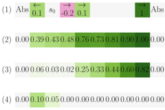

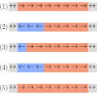

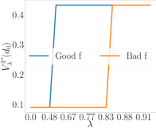

(a) Heatmap of different values. (b) Different policy behaviors. (c) HuRL with different _h_ and _λ_ .


Figure 1: **Example of HuRL in a chain MDP.** Each cell in a row in each diagram represents a state from
_S_ = _{_ 1 _, . . .,_ 10 _}_ . The agent starts at state 3 ( _s_ 0 ), and states 1 and 10 are absorbing ( _Abs_ in subfigure a-(1)).
Actions _A_ = _{←, →}_ move the agent left or right in the chain unless the agent is in an absorbing state. **Subfig.**
**a-(1)** shows the reward function: _r_ (2 _, ←_ ) = 0 _._ 1 _, r_ (4 _, →_ ) = _−_ 0 _._ 2 _, r_ (5 _, →_ ) = 0 _._ 1, and all state-action pairs
not shown in a-(1) yield _r_ = 0 . **Subfig. a-(2)** shows _V_ _[∗]_ for _γ_ = 0 _._ 9 . **Subfig. a-(3)** shows a good heuristic _h_
— _V_ (random _π_ ) . **Subfig. a-(4)** shows a bad heuristic _h_ — _V_ (myopic _π_ ) . **Subfig. b-(1)** : _π_ _[∗]_ for _V_ _[∗]_ from a-(2).
**Subfig. b-(2)** : ˜ _π_ _[∗]_ from HuRL with _h_ = 0 _, λ_ = 0 _._ 5 . **Subfig. b-(3)** : ˜ _π_ _[∗]_ from HuRL with the good _h_ from (a).(3)
and _λ_ = 0 _._ 5 . **Subfig. b-(4)** : ˜ _π_ _[∗]_ from the bad _h_ from a-(4), _λ_ = 0 _._ 5 . **Subfig. b-(5)** : ˜ _π_ _[∗]_ from the bad _h_ and
_λ_ = 1 . **Subfig. (c) illustrates the takeaway message** : _using HuRL with a good_ _h_ _can find_ _π_ _[∗]_ _from_ _s_ 0 _even_
_with a small λ (see the x-axis), while HuRL with a bad h requires a much higher λ to discover π_ _[∗]_ _._


**4** **Theoretical Analysis**


When can HuRL accelerate learning? Similar to typical regularization techniques, the horizon-based
regularization of HuRL leads to a bias-variance decomposition that can be optimized for better
finite-sample performance compared to directly solving the original MDP. However, a non-trivial
trade-off is possible only when the regularization can bias the learning toward a good direction. In
HuRL’s case this is determined by the heuristic, which resembles a prior we encode into learning.


In this section we provide HuRL’s theoretical foundation. We first describe the bias-variance trade-off
induced by HuRL. Then we show how suboptimality in solving the reshaped MDP translates into
performance in the original MDP, and identify the assumptions HuRL needs the base RL algorithm to
satisfy. In addition, we explain how HuRL relates to PBRS, and characterize the quality of heuristics
and sufficient conditions for constructing good heuristics from batch data using offline RL.

For clarity, we will focus on the reshaped MDP _r,_ � � _γ_ are defined in (1) . We can view this MDP as the one in a single iteration of HuRL. For a policy _M_ [�] = ( _S, A, P,_ � _r,_ � _γ_ ) for a fixed _λ ∈_ [0 _,_ 1], where _π_,
we denote its state value function in _M_ [�] as _V_ [�] _[π]_, and the optimal policy and value function of _M_ [�] as � _π_ _[∗]_

and _V_ [�] _[∗]_, respectively. The missing proofs of the results from this section can be found in Appendix A.


**4.1** **Short-Horizon Reduction: Performance Decomposition**


Our main result is a performance decomposition, which characterizes how a heuristic _h_ and suboptimality in solving the reshaped MDP _M_ [�] relate to performance in the original MDP _M_ .


**Theorem 4.1.** _For any policy π, heuristic f_ : _S →_ R _, and mixing coefficient λ ∈_ [0 _,_ 1] _,_


_V_ _[∗]_ ( _d_ 0 ) _−_ _V_ _[π]_ ( _d_ 0 ) = Regret( _h, λ, π_ ) + Bias( _h, λ, π_ )


_where we define_


Regret( _h, λ, π_ ) := _λ_ _V_ � _[∗]_ ( _d_ 0 ) _−_ _V_ � _[π]_ ( _d_ 0 ) + [1] _[ −]_ _[λ]_
� � 1 _−_ _γ_


_V_ � _[∗]_ ( _d_ _[π]_ ) _−_ _V_ � _[π]_ ( _d_ _[π]_ ) (3)
� �


Bias( _h, λ, π_ ) := � _V_ _[∗]_ ( _d_ 0 ) _−_ _V_ [�] _[∗]_ ( _d_ 0 )� + _[γ]_ [(] 1 [1] _−_ _[ −]_ _γ_ _[λ]_ [)] E _s,a∼d_ _π_ E _s_ _′_ _|s,a_ � _h_ ( _s_ _[′]_ ) _−_ _V_ [�] _[∗]_ ( _s_ _[′]_ )� (4)


_Furthermore,_ _∀b ∈_ R _,_ Bias( _h, λ, π_ ) = Bias( _h_ + _b, λ, π_ ) _and_ Regret( _h, λ, π_ ) = Regret( _h_ + _b, λ, π_ ) _._


The theorem shows that suboptimality of a policy _π_ in the original MDP _M_ can be decomposed into
_1)_ a _bias_ term due to solving a reshaped MDP _M_ [�] instead of the original MDP _M_, and _2)_ a _regret_
term (i.e. the learning variance) due to _π_ being suboptimal in the reshaped MDP _M_ [�] . Moreover, it
shows that heuristics are equivalent up to constant offsets. In other words, only the relative ordering
between states that a heuristic induces matters in learning, not the absolute values.


5


Balancing the two terms trades off bias and variance in learning. Using a smaller _λ_ replaces the
long-term information with the heuristic and make the horizon of the reshaped MDP _M_ [�] shorter.
Therefore, given a finite interaction budget, the regret term in (3) can be more easily minimized,
though the bias term in (4) can potentially be large if the heuristic is bad. On the contrary, with _λ_ = 1,
the bias is completely removed, as the agent solves the original MDP _M_ directly.


**4.2** **Regret, Algorithm Requirement, and Relationship with PBRS**


The regret term in (3) characterizes the performance gap due to _π_ being suboptimal in the reshaped
MDP _M_ [�], because Regret( _h, λ,_ � _π_ _[∗]_ ) = 0 for any _h_ and _λ_ . For learning, we need the base RL
algorithm _L_ to find a policy _π_ such that the regret term in (3) is small. By the definition in (3), the
base RL algorithm _L_ is required not only to find a policy _π_ such that _V_ [�] _[∗]_ ( _s_ ) _−_ _V_ [�] _[π]_ ( _s_ ) is small for
states from _d_ 0, _but also for states_ _π_ _visits when rolling out in the original MDP_ _M_ . In other words,
it is insufficient for the base RL algorithm to only optimize for _V_ [�] _[π]_ ( _d_ 0 ) (the performance in the
reshaped MDP with respect to the initial state distribution; see Section 2.2). For example, suppose
_λ_ = 0 and _d_ 0 concentrates on a single state _s_ 0 . Then maximizing _V_ [�] _[π]_ ( _d_ 0 ) alone would only optimize
_π_ ( _·|s_ 0 ) and the policy _π_ need not know how to act in other parts of the state space.


To use HuRL, we need the base algorithm to learn a policy _π_ that has small _action gaps_ in the
reshaped MDP _M_ [�] _but along trajectories in the original MDP_ _M_, as we show below. This property
is satisfied by off-policy RL algorithms such as Q-learning [34].
**Proposition 4.1.** _For_ any _policy π, heuristic f_ : _S →_ R _and mixing coefficient λ ∈_ [0 _,_ 1] _,_


_∞_
Regret( _h, λ, π_ ) = _−_ E _ρ_ _π_ ( _d_ 0 ) �� _t_ =0 _[γ]_ _[t]_ [ �] _[A]_ _[∗]_ [(] _[s]_ _[t]_ _[, a]_ _[t]_ [)] �

_where_ _ρ_ _[π]_ ( _d_ 0 ) _denotes the trajectory distribution of running_ _π_ _from_ _d_ 0 _, and_ _A_ [�] _[∗]_ ( _s, a_ ) = � _r_ ( _s, a_ ) +

�
_γ_ E _s_ _′_ _|s,a_ [ _V_ [�] _[∗]_ ( _s_ _[′]_ )] _−_ _V_ [�] _[∗]_ ( _s_ ) _≤_ 0 _is the action gap with respect to the optimal policy_ � _π_ _[∗]_ _of_ _M_ [�] _._


Another way to comprehend the regret term is through studying its dependency on _λ_ . When _λ_ = 1,
Regret( _h,_ 0 _, π_ ) = _V_ _[∗]_ ( _d_ 0 ) _−V_ _[π]_ ( _d_ 0 ), which is identical to the policy regret in _M_ for a _fixed_ initial distribution _d_ 0 . On the other hand, when _λ_ = 0, Regret( _h,_ 0 _, π_ ) = max _π_ _[′]_ 1 _−_ 1 _γ_ [E] _[s][∼][d]_ _[π]_ [[] _[r]_ [�][(] _[s, π]_ _[′]_ [)] _[−][r]_ [�][(] _[s, π]_ [)]] [,]
which is the regret of a _non-stationary_ contextual bandit problem where the context distribution is _d_ _[π]_
(the average state distribution of _π_ ). In general, for _λ ∈_ (0 _,_ 1), the regret notion mixes a short-horizon
non-stationary problem and a long-horizon stationary problem.


One natural question is whether the reshaped MDP _M_ [�] has a more complicated and larger value
landscape than the original MDP _M_, because these characteristics may affect the regret rate of a base
algorithm. We show that _M_ [�] preserves the value bounds and linearity of the original MDP.

**Proposition 4.2.** _Reshaping the MDP as in_ (1) _preserves the following characteristics: 1) If_
_h_ ( _s_ ) _∈_ [0 _,_ 1 _−_ 1 _γ_ []] _[, then]_ [ �] _[V]_ _[ π]_ [(] _[s]_ [)] _[ ∈]_ [[0] _[,]_ 1 _−_ 1 _γ_ []] _[ for all]_ _[ π]_ _[ and]_ _[ s][ ∈S]_ _[. 2) If]_ [ �] _M_ _is a linear MDP with_
_feature vector_ _φ_ ( _s, a_ ) _(i.e._ _r_ ( _s, a_ ) _and_ E _s_ _′_ _|s,a_ [ _g_ ( _s_ _[′]_ )] _for any_ _g_ _can be linearly parametrized in_
_φ_ ( _s, a_ ) _), then_ _M_ [�] _is also a linear MDP with feature vector φ_ ( _s, a_ ) _._


On the contrary, the MDP _M_ _λ_ := ( _S, A, P,_ ~~_r_~~ _, λγ_ ) in Section 2.2 does not have these properties.
We can show that ˜ _M_ _λ_ is equivalent to _M_ [�] up to a PBRS transformation (i.e., ¯ _r_ ( _s, a_ ) = ˜ _r_ ( _s, a_ ) +
_γ_ E _s_ _′_ _|s,a_ [ _h_ ( _s_ _[′]_ )] _−_ _h_ ( _s_ ) ). Thus, HuRL incorporates guidance discount into PBRS with nicer properties.


**4.3** **Bias and Heuristic Quality**


The bias term in (4) characterizes suboptimality due to using a heuristic _h_ in place of long-term state
values in _M_ . What is the best heuristic in this case? From the definition of the bias term in (4),
we see that the ideal heuristic is the optimal value _V_ _[∗]_, as Bias( _V_ _[∗]_ _, λ, π_ ) = 0 for all _λ ∈_ [0 _,_ 1] . By
continuity, we can expect that if _h_ deviates from _V_ _[∗]_ a little, then the bias is small.

**Corollary 4.1.** _If_ inf _b∈_ R _∥h_ + _b −_ _V_ _[∗]_ _∥_ _∞_ _≤_ _ϵ, then_ Bias( _h, λ, π_ ) _≤_ [(] (1 [1] _[−]_ _−_ _[λ]_ _γ_ _[γ]_ ) [)] [2][2] _[ϵ][.]_


To better understand how the heuristic _h_ affects the bias, we derive an upper bound on the bias by
replacing the first term in (4) with an upper bound that depends only on _π_ _[∗]_ .


6


_∞_
**Proposition 4.3.** _For_ _g_ : _S →_ R _and_ _η ∈_ [0 _,_ 1] _, define_ _C_ ( _π, g, η_ ) := E _ρ_ _π_ ( _d_ 0 ) �� _t_ =1 _[η]_ _[t][−]_ [1] _[g]_ [(] _[s]_ _[t]_ [)] � _._
_Then_ Bias( _h, λ, π_ ) _≤_ (1 _−_ _λ_ ) _γ_ ( _C_ ( _π_ _[∗]_ _, V_ _[∗]_ _−_ _h, λγ_ ) + _C_ ( _π, h −_ _V_ [�] _[∗]_ _, γ_ )) _._


In Proposition 4.3, the term (1 _−_ _λ_ ) _γC_ ( _π_ _[∗]_ _, V_ _[∗]_ _−_ _h, λγ_ ) is the underestimation error of the heuristic
_h_ under the states visited by the optimal policy _π_ _[∗]_ in the original MDP _M_ . Therefore, to minimize
the first term in the bias, we would want the heuristic _h_ to be large along the paths that _π_ _[∗]_ generates.


However, Proposition 4.3 also discourages the heuristic from being arbitrarily large, because the
second term in the bias in (4) (or, equivalently, the second term in Proposition 4.3) incentivizes
the heuristic to underestimate the optimal value of the reshaped MDP _V_ [�] _[∗]_ . More precisely, the
second term requires the heuristic to obey some form of spatial consistency. A quick intuition is
the observation that if _h_ ( _s_ ) = _V_ _[π]_ _[′]_ ( _s_ ) for some _π_ _[′]_ or _h_ ( _s_ ) = 0, then _h_ ( _s_ ) _≤_ _V_ [�] _[∗]_ ( _s_ ) for all _s ∈S_ .
More generally, we show that if the heuristic is _improvable_ with respect to the original MDP _M_
(i.e. the heuristic value is lower than that of the max of Bellman backup), then _h_ ( _s_ ) _≤_ _V_ [�] _[∗]_ ( _s_ ) . By
Proposition 4.3, learning with an improvable heuristic in HuRL has a much smaller bias.
**Definition 4.1.** Define the Bellman operator ( _Bh_ )( _s, a_ ) := _r_ ( _s, a_ ) + _γ_ E _s_ _′_ _|s,a_ [ _h_ ( _s_ _[′]_ )] . A heuristic
function _h_ : _S →_ R is said to be _improvable_ with respect to an MDP _M_ if max _a_ ( _Bh_ )( _s, a_ ) _≥_ _h_ ( _s_ ) .


**Proposition 4.4.** _If h is improvable with respect to M, then_ _V_ [�] _[∗]_ ( _s_ ) _≥_ _h_ ( _s_ ) _, for all λ ∈_ [0 _,_ 1] _._


**4.4** **Pessimistic Heuristics are Good Heuristics**


While Corollary 4.1 shows that HuRL can handle an imperfect heuristic, this result is not ideal.
The corollary depends on the _ℓ_ _∞_ approximation error, which can be difficult to control in large
state spaces. Here we provide a more refined sufficient condition of good heuristics. We show that
the concept of _pessimism_ in the face of uncertainty provides a finer mechanism for controlling the
approximation error of a heuristic and would allow us to remove the _ℓ_ _∞_ -type error. This result is
useful for constructing heuristics from data that does not have sufficient support.


From Proposition 4.3 we see that the source of the _ℓ_ _∞_ error is the second term in the bias upper
bound, as it depends on the states that the agent’s policy visits which can change during learning.
To remove this dependency, we can use improvable heuristics (see Proposition 4.4), as they satisfy
_h_ ( _s_ ) _≤_ _V_ [�] _[∗]_ ( _s_ ). Below we show that Bellman-consistent pessimism yields improvable heuristics.
**Proposition 4.5.** _Suppose_ _h_ ( _s_ ) = _Q_ ( _s, π_ _[′]_ ) _for some policy_ _π_ _[′]_ _and function_ _Q_ : _S × A →_ R _such_
_that Q_ ( _s, a_ ) _≤_ ( _Bh_ )( _s, a_ ) _, ∀s ∈S, a ∈A. Then h is improvable and f_ ( _s_ ) _≤_ _V_ _[π]_ _[′]_ ( _s_ ) _for all s ∈S._


The Bellman-consistent pessimism in Proposition 4.5 essentially says that _h_ is pessimistic with respect
to the Bellman backup. This condition has been used as the foundation for designing pessimistic
off-policy RL algorithms, such as pessimistic value iteration [ 30 ] and algorithms based on pessimistic
absorbing MDPs [ 31 ]. In other words, these pessimistic algorithms can be used to construct good
heuristics with small bias in Proposition 4.3 from offline data. With such a heuristic, the bias upper
bound would be simply Bias( _h, λ, π_ ) _≤_ (1 _−_ _λ_ ) _γC_ ( _π_ _[∗]_ _, V_ _[∗]_ _−_ _h, λγ_ ) . Therefore, as long as enough
batch data are sampled from a distribution that covers states that _π_ _[∗]_ visits, these pessimistic algorithms
can construct good heuristics with nearly zero bias for HuRL with high probability.


**5** **Experiments**


We validate our framework HuRL experimentally in MuJoCo (commercial license) [ 32 ] robotics
control problems and Procgen games (MIT License) [ 33 ], where soft actor critic (SAC) [ 35 ] and
proximal policy optimization (PPO) [ 36 ] were used as the base RL algorithms, respectively [5] . The
goal is to study whether HuRL can accelerate learning by shortening the horizon with heuristics. In
particular, we conduct studies to investigate the effects of different heuristics and mixing coefficients.
Since the main focus here is on the possibility of leveraging a _given_ heuristic to accelerate RL
algorithms, in these experiments we used vanilla techniques to construct heuristics for HuRL.
Experimentally studying the design of heuristics for a domain or a batch of data is beyond the scope
of the current paper but are important future research directions. For space limitation, here we
report only the results of the MuJoCo experiments. The results on Procgen games along with other
experimental details can also be found in Appendix C.


5 [Code to replicate all experiments is available at https://github.com/microsoft/HuRL.](https://github.com/microsoft/HuRL)


7


**5.1** **Setup**


We consider four MuJoCo environments with dense rewards (Hopper-v2, HalfCheetah-v2, Humanoidv2, and Swimmer-v2) and a sparse reward version of Reacher-v2 (denoted as Sparse-Reacher-v2) [6] .
We design the experiments to simulate two learning scenarios. First, we use Sparse-Reacher-v2 to
simulate the setting where an engineered heuristic based on domain knowledge is available; since this
is a goal reaching task, we designed a heuristic _h_ ( _s_ ) = _r_ ( _s, a_ ) _−_ 100 _∥e_ ( _s_ ) _−_ _g_ ( _s_ ) _∥_, where _e_ ( _s_ ) and
_g_ ( _s_ ) denote the robot’s end-effector position and the goal position, respectively. Second, we use the
dense reward environments to model scenarios where a batch of data collected by multiple behavioral
policies is available before learning, and a heuristic is constructed by an offline policy evaluation
algorithm from the batch data (see Appendix C.1 for details). In brief, we generated these behavioral
policies by running SAC from scratch and saved the intermediate policies generated in training. We
then use least-squares regression to fit a neural network to predict empirical Monte-Carlo returns of
the trajectories in the sampled batch of data. We also use behavior cloning (BC) to warm-start all RL
agents based on the same batch dataset in the dense reward experiments.


The base RL algorithm here, SAC, is based on the standard implementation in Garage (MIT License) [ 37 ]. The policy and value networks are fully connected independent neural networks. The
policy is Tanh-Gaussian and the value network has a linear head.


**Algorithms.** We compare the performance of different algorithms below. _1)_ BC _2)_ SAC _3)_ SAC
with BC warm start (SAC w/ BC) _4)_ HuRL with the engineered heuristic (HuRL) _5)_ HuRL with a
zero heuristic and BC warm start (HuRL-zero) _6)_ HuRL with the Monte-Carlo heuristic and BC warm
start (HuRL-MC) _7)_ SAC with PBRS reward (and BC warm start, if applicable) (PBRS). For the
HuRL algorithms, the mixing coefficient was scheduled as _λ_ _n_ = _λ_ 0 + (1 _−_ _λ_ 0 ) _c_ _ω_ tanh( _ω_ ( _n −_ 1)),
for _n_ = 1 _, . . ., N_, where _λ_ 0 _∈_ [0 _,_ 1], _ω >_ 0 controls the increasing rate, and _c_ _ω_ is a normalization
constant such that _λ_ _∞_ = 1 and _λ_ _n_ _∈_ [0 _,_ 1] . We chose these algorithms to study the effect of each
additional warm-start component (BC and heuristics) added on top of vanilla SAC. HuRL-zero is
SAC w/ BC but with an extra _λ_ schedule above that further lowers the discount, whereas SAC and
SAC w/ BC keep a constant discount factor.


**Evaluation and Hyperparameters.** In each iteration, the RL agent has a fixed sample budget for
environment interactions, and its performance is measured in terms of undiscounted cumulative
returns of the deterministic mean policy extracted from SAC. The hyperparameters used in the
algorithms above were selected as follows. First, the learning rates and the discount factor of the
base RL algorithm, SAC, were tuned for each environment. The tuned discount factor was used as
the discount factor _γ_ of the original MDP _M_ . Fixing the hyperparameters above, we additionally
tune _λ_ 0 and _ω_ for the _λ_ schedule of HuRL for each environment and each heuristic. Finally, after all
these hyperparameters were fixed, we conducted additional testing runs with 30 different random
seeds and report their statistics here. Sources of randomness included the data collection process of
the behavioral policies, training the heuristics from batch data, BC, and online RL. However, the
behavioral policies were fixed across all testing runs. We chose this hyperparameter tuning procedure
to make sure that the baselines (i.e. SAC) compared in these experiments are their best versions.


**5.2** **Results Summary**


Fig. 2 shows the results on the MuJoCo environments. Overall, we see that HuRL is able to leverage
engineered and learned heuristics to significantly improve the learning efficiency. This trend is
consistent across all environments that we tested on.


For the sparse-reward experiments, we see that SAC and PBRS struggle to learn, while HuRL is able
to converge to the optimal performance much faster. For the dense reward experiments, similarly
HuRL-MC converges much faster, though the gain in HalfCheetah-v2 is minor and it might have
converged to a worse local maximum in Swimmer-v2. In addition, we see that warm-starting SAC
using BC (i.e. SAC w/ BC) can improve the learning efficiency compared with the vanilla SAC,
but using BC alone does not result in a good policy. Lastly, we see that using the zero heuristic
(HuRL-zero) with extra _λ_ -scheduling does not further improve the performance of SAC w/ BC. This
comparison verifies that the learned Monte-Carlo heuristic provides non-trivial information.


Interestingly, we see that applying PBRS to SAC leads to even worse performance than running SAC
with the original reward. There are two reasons why SAC+PBRS is less desirable than SAC+HuRL


6
The reward is zero at the goal and _−_ 1 otherwise.


8


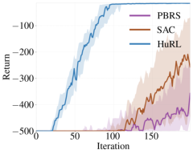

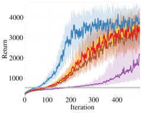

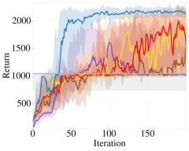

(a) Sparse-Reacher-v2 (b) Humanoid-v2 (c) Hopper-v2

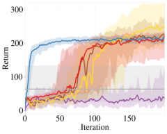

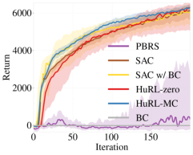

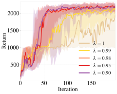


(d) Swimmer-v2 (e) HalfCheetah-v2 (f) _λ_ 0 ablation.


Figure 2: Experimental results. (a) uses an engineered heuristic for a sparse reward problem; (b)-(e) use
heuristics learned from offline data and share the same legend; (e) shows ablation results of different initial _λ_ 0 in
Hopper-v2. The plots show the 25th, 50th, 75th percentiles of algorithm performance over 30 random seeds.


as we discussed before: _1)_ PBRS changes the reward/value scales in the induced MDP, and popular
RL algorithms like SAC are very sensitive to such changes. In contrast, HuRL induces values on the
same scale as we show in Proposition 4.2. _2)_ In HuRL, we are effectively providing the algorithm
some more side-information to let SAC shorten the horizon when the heuristic is good.


The results in Fig. 2 also have another notable aspect. Because the datasets used in the dense reward
experiments contain trajectories collected by a range of policies, it is likely that BC suffers from
disagreement in action selection among different policies. Nonetheless, training a heuristic using a
basic Monte-Carlo regression seems to be less sensitive to these conflicts and still results in a helpful
heuristic for HuRL. One explanation can be that heuristics are only functions of states, not of states
and actions, and therefore the conflicts are minor. Another plausible explanation is that HuRL only
uses the heuristic to _guide_ learning, and does not completely rely on it to make decisions Thus, HuRL
can be more robust to the heuristic quality, or, equivalently, to the quality of prior knowledge.


**5.3** **Ablation: Effects of Horizon Shortening**


To further verify that the acceleration in Fig. 2 is indeed due to horizon shortening, we conducted
an ablation study for HuRL-MC on Hopper-v2, whose results are presented in Fig. 2f. HuRLMC’s best _λ_ -schedule hyperparameters on Hopper-v2, which are reflected in its performance in the
aforementioned Fig. 2c, induced a near-constant schedule at _λ_ = 0 _._ 95 ; to obtain the curves in Fig. 2f,
we ran HuRL-MC with constant- _λ_ schedules for several more _λ_ values. Fig. 2f shows that increasing
_λ_ above 0 _._ 98 leads to a performance drop. Since using a large _λ_ decreases bias and makes the
reshaped MDP more similar to the original MDP, we conclude that the increased learning speed on
Hopper-v2 is due to HuRL’s horizon shortening (coupled with the guidance provided by its heuristic).


**6** **Related Work**


**Discount regularization.** The horizon-truncation idea can be traced back to Blackwell optimality
in the known MDP setting [ 18 ]. Reducing the discount factor amounts to running HuRL with a zero
heuristic. Petrik and Scherrer [19], Jiang et al. [20, 21] study the MDP setting; Chen et al. [22] study
POMDPs. Amit et al. [23] focus on discount regularization for Temporal Difference (TD) methods,
while Van Seijen et al. [6] use a logarithmic mapping to lower the discount for online RL.


**Reward shaping.** Reward shaping has a long history in RL, from the seminal PBRS work [ 29 ]
to recent bilevel-optimization approaches [ 38 ]. Tessler and Mannor [5] consider a complementary
problem to HuRL: given a discount _γ_ _[′]_, they find a reward _r_ _[′]_ that preserves trajectory ordering in
the original MDP. Meanwhile there is a vast literature on bias-variance trade-off for online RL with


9


horizon truncation. TD( _λ_ ) [ 39, 40 ] and Generalized Advantage Estimates [ 41 ] blend value estimates
across discount factors, while Sherstan et al. [42] use the discount factor as an input to the value
function estimator. TD( ∆ ) [ 43 ] computes differences between value functions across discount factors.


**Heuristics in model-based methods.** Classic uses of heuristics include A* [ 24 ], Monte-Carlo Tree
Search (MCTS) [ 25 ], and Model Predictive Control (MPC) [ 44 ]. Zhong et al. [26] shorten the horizon
in MPC using a value function approximator. Hoeller et al. [27] additionally use an estimate for
the running cost to trade off solution quality and amount of computation. Bejjani et al. [28] show
heuristic-accelerated truncated-horizon MPC on actual robots and tune the value function throughout
learning. Bhardwaj et al. [7] augment MPC with a terminal value heuristic, which can be viewed as an
instance of HuRL where the base algorithm is MPC. Asai and Muise [45] learn an MDP expressible
in the STRIPS formalism that can benefit from relaxation-based planning heuristics. But HuRL is
more general, as it does not assume model knowledge and can work in unknown environments.


**Pessimistic extrapolation.** Offline RL techniques employ pessimistic extrapolation for robustness [ 30 ], and their learned value functions can be used as heuristics in HuRL. Kumar et al. [46]
penalize out-of-distribution actions in off-policy optimization while Liu et al. [31] additionally use
a variational auto-encoder (VAE) to detect out-of-distribution states. We experimented with VAEfiltered pessimistic heuristics in Appendix C. Even pessimistic offline evaluation techniques [ 16 ] can
be useful in HuRL, since function approximation often induces extrapolation errors [47].


**Heuristic pessimism vs. admissibility.** Our concept of heuristic pessimism can be easily confused
for the well-established notion of _admissibility_ [ 48 ], but in fact they are opposites. Namely, an
admissible heuristic never _underestimates_ _V_ _[∗]_ (in the return-maximization setting), while a pessimistic
one never _overestimates_ _V_ _[∗]_ . Similarly, our notion of improvability is distinct from _consistency_ : they
express related ideas, but with regards to pessimistic and admissible value functions, respectively.
Thus, counter-intuitively from the planning perspective, our work shows that for policy _learning_,
_in_ admissible heuristics are desirable. Pearl [49] is one of the few works that has analyzed desirable
implications of heuristic inadmissibility in planning.


**Other warm-starting techniques.** HuRL is a new way to warm-start online RL methods. Bianchi
et al. [50] use a heuristic policy to initialize agents’ policies. Vinyals et al. [2], Hester et al. [10] train a
value function and policy using batch IL and then used them as regularization in online RL. Nair et al.

[9] use off-policy RL on batch data and fine-tune the learned policy. Recent approaches of hybrid
IL-RL have strong connections to HuRL [ 17, 51, 52 ]. In particular, Cheng et al. [17] is a special
case of HuRL with a max-aggregation heuristic. Farahmand et al. [8] use several related tasks to
learn a task-dependent heuristic and perform shorter-horizon planning or RL. Knowledge distillation
approaches [ 53 ] can also be used to warm-start learning, but in contrast to them, HuRL expects prior
knowledge in the form of state value estimates, not features, and doesn’t attempt to make the agent
internalize this knowledge. A HuRL agent learns from its own environment interactions, using prior
knowledge only as guidance. Reverse Curriculum approaches [ 54 ] create short horizon RL problems
by initializing the agent close to the goal, and moving it further away as the agent improves. This
gradual increase in the horizon inspires the HuRL approach. However, HuRL does not require the
agent to be initialized on expert states and can work with many different base RL algorithms.


**7** **Discussion and Limitations**


This work is an early step towards theoretically understanding the role and potential of heuristics in
guiding RL algorithms. We propose a framework, HuRL, that can accelerate RL when an informative
heuristic is provided. HuRL induces a horizon-based regularization of RL, complementary to existing
warm-starting schemes, and we provide theoretical and empirical analyses to support its effectiveness.
While this is a conceptual work without foreseeable societal impacts yet, we hope that it will help
counter some of AI’s risks by making RL more predictable via incorporating prior into learning.


We remark nonetheless that the effectiveness of HuRL depends on the available heuristic. While
HuRL can eventually solve the original RL problem even with a non-ideal heuristic, using a bad
heuristic can slow down learning. Therefore, an important future research direction is to adaptively
tune the mixing coefficient based on the heuristic quality with curriculum or meta-learning techniques.
In addition, while our theoretical analysis points out a strong connection between good heuristics for
HuRL and pessimistic offline RL, techniques for the latter are not yet scalable and robust enough for
high-dimensional problems. Further research on offline RL can unlock the full potential of HuRL.


10


**References**


[1] Christopher Berner, Greg Brockman, Brooke Chan, Vicki Cheung, Przemysław D˛ebiak, Christy
Dennison, David Farhi, Quirin Fischer, Shariq Hashme, Chris Hesse, et al. Dota 2 with large
scale deep reinforcement learning. _arXiv preprint arXiv:1912.06680_, 2019.


[2] Oriol Vinyals, Igor Babuschkin, Wojciech M Czarnecki, Michaël Mathieu, Andrew Dudzik, Junyoung Chung, David H Choi, Richard Powell, Timo Ewalds, Petko Georgiev, et al. Grandmaster
level in Starcraft II using multi-agent reinforcement learning. _Nature_, 575(7782):350–354,
2019.


[3] Christoph Dann and Emma Brunskill. Sample complexity of episodic fixed-horizon reinforcement learning. In _NIPS_, 2015.


[4] Aaron Sidford, Mengdi Wang, Xian Wu, Lin F Yang, and Yinyu Ye. Near-optimal time and
sample complexities for solving Markov decision processes with a generative model. In _NeurIPS_,
2018.


[5] Chen Tessler and Shie Mannor. Maximizing the total reward via reward tweaking. _arXiv_
_preprint arXiv:2002.03327_, 2020.


[6] Harm Van Seijen, Mehdi Fatemi, and Arash Tavakoli. Using a logarithmic mapping to enable
lower discount factors in reinforcement learning. In _NeurIPS_, 2019.


[7] Mohak Bhardwaj, Sanjiban Choudhury, and Byron Boots. Blending mpc & value function
approximation for efficient reinforcement learning. In _ICLR_, 2021.


[8] Amir-massoud Farahmand, Daniel N Nikovski, Yuji Igarashi, and Hiroki Konaka. Truncated
approximate dynamic programming with task-dependent terminal value. In _AAAI_, 2016.


[9] Ashvin Nair, Murtaza Dalal, Abhishek Gupta, and Sergey Levine. Accelerating online reinforcement learning with offline datasets. _arXiv preprint arXiv:2006.09359_, 2020.


[10] Todd Hester, Matej Vecerik, Olivier Pietquin, Marc Lanctot, Tom Schaul, Bilal Piot, Dan Horgan,
John Quan, Andrew Sendonaris, Ian Osband, et al. Deep Q-learning from demonstrations. In
_AAAI_, 2018.


[11] Mausam and Andrey Kolobov. Planning with Markov decision processes: An AI perspective.
_Synthesis Lectures on Artificial Intelligence and Machine Learning_, 6:1–210, 2012.


[12] Dylan Foster and Alexander Rakhlin. Beyond UCB: Optimal and efficient contextual bandits
with regression oracles. In _ICML_, 2020.


[13] J. Hoffmann and B. Nebel. The FF planning system: Fast plan generation through heuristic
search. _Journal of Artificial Intelligence Research_, 14:253–302, 2001.


[14] S. Richter and M. Westphal. The LAMA planner: Guiding cost-based anytime planning with
landmarks. _Journal of Artificial Intelligence Research_, 39:127–177, 2010.


[15] Andrey Kolobov, Mausam, and Daniel S. Weld. Classical planning in MDP heuristics: With a
little help from generalization. In _AAAI_, 2010.


[16] Caglar Gulcehre, Sergio Gómez Colmenarejo, Ziyu Wang, Jakub Sygnowski, Thomas Paine,
Konrad Zolna, Yutian Chen, Matthew Hoffman, Razvan Pascanu, and Nando de Freitas. Regularized behavior value estimation. _arXiv preprint arXiv:2103.09575_, 2021.


[17] Ching-An Cheng, Andrey Kolobov, and Alekh Agarwal. Policy improvement via imitation of
multiple oracles. In _NeurIPS_, 2020.


[18] David Blackwell. Discrete dynamic programming. _The Annals of Mathematical Statistics_,
pages 719–726, 1962.


[19] Marek Petrik and Bruno Scherrer. Biasing approximate dynamic programming with a lower
discount factor. In _NIPS_, 2008.


11


[20] Nan Jiang, Alex Kulesza, Satinder Singh, and Richard Lewis. The dependence of effective
planning horizon on model accuracy. In _AAMAS_, 2015.


[21] Nan Jiang, Satinder Singh, and Ambuj Tewari. On structural properties of mdps that bound loss
due to shallow planning. In _IJCAI_, 2016.


[22] Yi-Chun Chen, Mykel J Kochenderfer, and Matthijs TJ Spaan. Improving offline value-function
approximations for pomdps by reducing discount factors. In _IROS_, 2018.


[23] Ron Amit, Ron Meir, and Kamil Ciosek. Discount factor as a regularizer in reinforcement
learning. In _ICML_, 2020.


[24] Peter E Hart, Nils J Nilsson, and Bertram Raphael. A formal basis for the heuristic determination
of minimum cost paths. _IEEE Transactions on Systems Science and Cybernetics_, 4(2):100–107,
1968.


[25] Cameron B Browne, Edward Powley, Daniel Whitehouse, Simon M Lucas, Peter I Cowling,
Philipp Rohlfshagen, Stephen Tavener, Diego Perez, Spyridon Samothrakis, and Simon Colton.
A survey of monte carlo tree search methods. _IEEE Transactions on Computational Intelligence_
_and AI in games_, 4(1):1–43, 2012.


[26] Mingyuan Zhong, Mikala Johnson, Yuval Tassa, Tom Erez, and Emanuel Todorov. Value
function approximation and model predictive control. In _IEEE International Symposium on_
_Adaptive Dynamic Programming and Reinforcement Learning_, pages 100–107, 2013.


[27] David Hoeller, Farbod Farshidian, and Marco Hutter. Deep value model predictive control. In
_CoRL_, 2020.


[28] Wissam Bejjani, Rafael Papallas, Matteo Leonetti, and Mehmet R Dogar. Planning with a
receding horizon for manipulation in clutter using a learned value function. In _Humanoids_,
pages 1–9, 2018.


[29] Andrew Y Ng, Daishi Harada, and Stuart Russell. Policy invariance under reward transformations: Theory and application to reward shaping. In _ICML_, 1999.


[30] Ying Jin, Zhuoran Yang, and Zhaoran Wang. Is pessimism provably efficient for offline RL?
_arXiv preprint arXiv:2012.15085_, 2020.


[31] Yao Liu, Adith Swaminathan, Alekh Agarwal, and Emma Brunskill. Provably good batch
off-policy reinforcement learning without great exploration. In _NeurIPS_, 2020.


[32] Emanuel Todorov, Tom Erez, and Yuval Tassa. Mujoco: A physics engine for model-based
control. In _IROS_, 2012.


[33] Sharada Mohanty, Jyotish Poonganam, Adrien Gaidon, Andrey Kolobov, Blake Wulfe, Dipam
Chakraborty, Gražvydas Šemetulskis, João Schapke, Jonas Kubilius, Jurgis Pašukonis, Linas Klimas, Matthew Hausknecht, Patrick MacAlpine, Quang Nhat Tran, Thomas Tumiel, Xiaocheng
Tang, Xinwei Chen, Christopher Hesse, Jacob Hilton, William Hebgen Guss, Sahika Genc, John
Schulman, and Karl Cobbe. Measuring sample efficiency and generalization in reinforcement
learning benchmarks: NeurIPS 2020 Procgen benchmark. _arXiv preprint arXiv:2103.15332_,
2021.


[34] Chi Jin, Zeyuan Allen-Zhu, Sebastien Bubeck, and Michael I Jordan. Is Q-learning provably
efficient? In _NeurIPS_, 2018.


[35] Tuomas Haarnoja, Aurick Zhou, Pieter Abbeel, and Sergey Levine. Soft actor-critic: Off-policy
maximum entropy deep reinforcement learning with a stochastic actor. In _ICML_, 2018.


[36] John Schulman, Filip Wolski, Prafulla Dhariwal, Alec Radford, and Oleg Klimov. Proximal
policy optimization algorithms. _arXiv preprint arXiv:1707.06347_, 2017.


[37] The garage contributors. Garage: A toolkit for reproducible reinforcement learning research.
https://github.com/rlworkgroup/garage, 2019.


12


[38] Yujing Hu, Weixun Wang, Hangtian Jia, Yixiang Wang, Yingfeng Chen, Jianye Hao, Feng Wu,
and Changjie Fan. Learning to utilize shaping rewards: A new approach of reward shaping. In
_NeurIPS_, 2020.


[39] Harm Seijen and Rich Sutton. True online td (lambda). In _ICML_, 2014.


[40] Yonathan Efroni, Gal Dalal, Bruno Scherrer, and Shie Mannor. Beyond the one-step greedy
approach in reinforcement learning. In _ICML_, 2018.


[41] John Schulman, Philipp Moritz, Sergey Levine, Michael Jordan, and Pieter Abbeel. Highdimensional continuous control using generalized advantage estimation. In _ICLR_, 2016.


[42] Craig Sherstan, Shibhansh Dohare, James MacGlashan, Johannes Günther, and Patrick M
Pilarski. Gamma-nets: Generalizing value estimation over timescale. In _AAAI_, 2020.


[43] Joshua Romoff, Peter Henderson, Ahmed Touati, Emma Brunskill, Joelle Pineau, and Yann
Ollivier. Separating value functions across time-scales. In _ICML_, 2019.


[44] Jacques Richalet, André Rault, JL Testud, and J Papon. Model predictive heuristic control.
_Automatica_, 14(5):413–428, 1978.


[45] Masataro Asai and Christian Muise. Learning neural-symbolic descriptive planning models via
cube-space priors: The voyage home (to strips). In _IJCAI_, 2020.


[46] Aviral Kumar, Aurick Zhou, George Tucker, and Sergey Levine. Conservative q-learning for
offline reinforcement learning. In _NeurIPS_, 2020.


[47] Tyler Lu, Dale Schuurmans, and Craig Boutilier. Non-delusional q-learning and value iteration.
In _NeurIPS_, 2018.


[48] Stuart J. Russell and Peter Norvig. _Artificial Intelligence: A Modern Approach_ . Pearson, 4th
edition, 2020.


[49] Judea Pearl. Heuristic search theory: Survey of recent results. In _IJCAI_, 1981.


[50] Reinaldo AC Bianchi, Murilo F Martins, Carlos HC Ribeiro, and Anna HR Costa. Heuristicallyaccelerated multiagent reinforcement learning. _IEEE transactions on cybernetics_, 44(2):252–
265, 2013.


[51] Wen Sun, Arun Venkatraman, Geoffrey J Gordon, Byron Boots, and J Andrew Bagnell. Deeply
aggrevated: Differentiable imitation learning for sequential prediction. In _ICML_, 2017.


[52] Wen Sun, J Andrew Bagnell, and Byron Boots. Truncated horizon policy search: Combining
reinforcement learning & imitation learning. In _ICLR_, 2018.


[53] Geoffrey Hinton, Oriol Vinyals, and Jeff Dean. Distilling the knowledge in a neural network.
_arXiv preprint arXiv:1503.02531_, 2015.


[54] Carlos Florensa, David Held, Markus Wulfmeier, Michael Zhang, and Pieter Abbeel. Reverse
curriculum generation for reinforcement learning. In _CoRL_, 2017.


[55] Sham Kakade and John Langford. Approximately optimal approximate reinforcement learning.
In _ICML_, 2002.


[56] Karl Cobbe, Christopher Hesse, Jacob Hilton, and John Schulman. Leveraging procedural
generation to benchmark reinforcement learning. In _ICML_, 2020.


[57] Eric Liang, Richard Liaw, Robert Nishihara, Philipp Moritz, Roy Fox, Ken Goldberg, Joseph
Gonzalez, Michael Jordan, and Ion Stoica. RLlib: Abstractions for distributed reinforcement
learning. In _ICML_, 2018.


[58] Lasse Espeholt, Hubert Soyer, Remi Munos, Karen Simonyan, Vlad Mnih, Tom Ward, Yotam
Doron, Vlad Firoiu, Tim Harley, Iain Dunning, Shane Legg, and Koray Kavukcuoglu. IMPALA:
Scalable distributed deep-RL with importance weighted actor-learner architectures. In _ICML_,
2018.


13


**Checklist**


1. For all authors...


(a) Do the main claims made in the abstract and introduction accurately reflect the paper’s
contributions and scope? [Yes]
(b) Did you describe the limitations of your work? [Yes] Section 7.

(c) Did you discuss any potential negative societal impacts of your work? [Yes] Section 7.
It is a conceptual work that doesn’t have foreseeable societal impacts yet.
(d) Have you read the ethics review guidelines and ensured that your paper conforms to
them? [Yes]

2. If you are including theoretical results...


(a) Did you state the full set of assumptions of all theoretical results? [Yes] The assumptions are in the theorem, proposition, and lemma statements throughout the paper.
(b) Did you include complete proofs of all theoretical results? [Yes] Appendix A and
Appendix B.

3. If you ran experiments...


(a) Did you include the code, data, and instructions needed to reproduce the main experimental results (either in the supplemental material or as a URL)? [Yes] In the
supplemental material.
(b) Did you specify all the training details (e.g., data splits, hyperparameters, how they
were chosen)? [Yes] Appendix C.
(c) Did you report error bars (e.g., with respect to the random seed after running experiments multiple times)? [Yes] Section 5 and Appendix C.
(d) Did you include the total amount of compute and the type of resources used (e.g., type
of GPUs, internal cluster, or cloud provider)? [Yes] Appendix C.

4. If you are using existing assets (e.g., code, data, models) or curating/releasing new assets...


(a) If your work uses existing assets, did you cite the creators? [Yes] References [ 37 ], [ 32 ],
and [33] in Section 5.1.
(b) Did you mention the license of the assets? [Yes] In Section 5.1.

(c) Did you include any new assets either in the supplemental material or as a URL? [Yes]

Heuristic computation and scripts to run training.
(d) Did you discuss whether and how consent was obtained from people whose data you’re
using/curating? [N/A]
(e) Did you discuss whether the data you are using/curating contains personally identifiable
information or offensive content? [N/A]

5. If you used crowdsourcing or conducted research with human subjects...


(a) Did you include the full text of instructions given to participants and screenshots, if
applicable? [N/A]
(b) Did you describe any potential participant risks, with links to Institutional Review
Board (IRB) approvals, if applicable? [N/A]
(c) Did you include the estimated hourly wage paid to participants and the total amount
spent on participant compensation? [N/A]


14


**A** **Missing Proofs**


We provide the complete proofs of the theorems stated in the main paper. We defer the proofs of the
technical results to Appendix B.


**A.1** **Proof of Theorem 4.1**


**Theorem 4.1.** _For any policy π, heuristic f_ : _S →_ R _, and mixing coefficient λ ∈_ [0 _,_ 1] _,_


_V_ _[∗]_ ( _d_ 0 ) _−_ _V_ _[π]_ ( _d_ 0 ) = Regret( _h, λ, π_ ) + Bias( _h, λ, π_ )


_where we define_


Regret( _h, λ, π_ ) := _λ_ _V_ � _[∗]_ ( _d_ 0 ) _−_ _V_ � _[π]_ ( _d_ 0 ) + [1] _[ −]_ _[λ]_
� � 1 _−_ _γ_


_V_ � _[∗]_ ( _d_ _[π]_ ) _−_ _V_ � _[π]_ ( _d_ _[π]_ ) (3)
� �


Bias( _h, λ, π_ ) := � _V_ _[∗]_ ( _d_ 0 ) _−_ _V_ [�] _[∗]_ ( _d_ 0 )� + _[γ]_ [(] 1 [1] _−_ _[ −]_ _γ_ _[λ]_ [)] E _s,a∼d_ _π_ E _s_ _′_ _|s,a_ � _h_ ( _s_ _[′]_ ) _−_ _V_ [�] _[∗]_ ( _s_ _[′]_ )� (4)


_Furthermore,_ _∀b ∈_ R _,_ Bias( _h, λ, π_ ) = Bias( _h_ + _b, λ, π_ ) _and_ Regret( _h, λ, π_ ) = Regret( _h_ + _b, λ, π_ ) _._


First we prove the equality using a new performance difference lemma that we will prove in Appendix B. This result may be of independent interest.

**Lemma A.1** (General Performance Difference Lemma) **.** _Consider the reshaped MDP_ _M_ [�] _defined by_
_some_ _f_ : _S →_ R _and_ _λ ∈_ [0 _,_ 1] _. For any policy_ _π_ _, any state distribution_ _d_ 0 _and any_ _V_ : _S →_ R _, it_
_holds that_

_V_ ( _d_ 0 ) _−_ _V_ _[π]_ ( _d_ 0 ) = _[γ]_ [(][1] _[ −]_ _[λ]_ [)] E _s,a∼d_ _π_ E _s_ _′_ _|s,a_ [ _h_ ( _s_ _[′]_ ) _−_ _V_ ( _s_ _[′]_ )]

1 _−_ _γ_


+ _λ_ _V_ ( _d_ 0 ) _−_ _V_ [�] _[π]_ ( _d_ 0 ) + [1] _[ −]_ _[λ]_
� � 1 _−_ _γ_


Now take _V_ as _V_ [�] _[∗]_ in the equality above. Then we can write


_V_ ( _d_ _[π]_ ) _−_ _V_ [�] _[π]_ ( _d_ _[π]_ )
� �


_V_ _[∗]_ ( _d_ 0 ) _−_ _V_ _[π]_ ( _d_ 0 ) = � _V_ _[∗]_ ( _d_ 0 ) _−_ _V_ [�] _[∗]_ ( _d_ 0 )� + _[γ]_ [(] 1 [1] _−_ _[ −]_ _γ_ _[λ]_ [)] E _s,a∼d_ _π_ E _s_ _′_ _|s,a_ � _h_ ( _s_ _[′]_ ) _−_ _V_ [�] _[∗]_ ( _s_ _[′]_ )�


+ _λ_ _V_ � _[∗]_ ( _d_ 0 ) _−_ _V_ � _[π]_ ( _d_ 0 ) + [1] _[ −]_ _[λ]_
� � 1 _−_ _γ_


which is the regret-bias decomposition.


_V_ � _[∗]_ ( _d_ _[π]_ ) _−_ _V_ � _[π]_ ( _d_ _[π]_ )
� �


Next we prove that these two terms are independent of constant offsets. For the regret term, this is
obvious because shifting the heuristic by a constant would merely shift the reward by a constant. For
the bias term, we prove the invariance below.


**Proposition A.1.** Bias( _h, λ, π_ ) = Bias( _h_ + _b, λ, π_ ) _for any b ∈_ R _._


_Proof._ Notice that any _b ∈_ R and _π_, _V_ [�] _[π]_ ( _s_ ; _f_ + _b_ ) _−_ _V_ [�] _[π]_ ( _s_ ; _f_ ) = [�] _[∞]_ _t_ =0 [(] _[λγ]_ [)] _[t]_ [(1] _[ −]_ _[λ]_ [)] _[γb]_ [ =] [(][1] 1 _−_ _[−]_ _λγ_ _[λ]_ [)] _[γ]_ _[b]_ [.]

Therefore, we can derive


Bias( _h_ + _b, λ, π_ ) _−_ Bias( _h, λ, π_ ) = _−_ [(][1] _[ −]_ _[λ]_ [)] _[γ]_


E _s,a∼d_ _π_ E _s_ _′_ _|s,a_
1 _−_ _γ_


[1] _[ −]_ _[λ]_ [)] _[γ]_ _[γ]_ [(][1] _[ −]_ _[λ]_ [)]

1 _−_ _γλ_ _[b]_ [ +] 1 _−_ _γ_


_b −_ [(][1] _[ −]_ _[λ]_ [)] _[γ]_
� 1 _−_ _γλ_ _[b]_ �


[1] _[ −]_ _[λ]_ [)]

_b −_ 1 + _[γ]_ [(][1] _[ −]_ _[λ]_ [)]
1 _−_ _γ_ � 1 _−_ _γ_


(1 _−_ _λ_ ) _γ_
� 1 _−_ _γλ_ _[b]_


= _[γ]_ [(][1] _[ −]_ _[λ]_ [)]


1 _−_ _γ_


Since

1 + _[γ]_ [(][1] _[ −]_ _[λ]_ [)]
� 1 _−_ _γ_


(1 _−_ _λ_ ) _γ_
� 1 _−_ _γλ_


1 _−_ _λ_ ) _γ_ [1] _[ −]_ _[γ]_ [ +] _[γ]_ [(][1] _[ −]_ _[λ]_ [)]

1 _−_ _γλ_ _[b]_ [ =] 1 _−_ _γ_


[ +] _[γ]_ [(][1] _[ −]_ _[λ]_ [)] (1 _−_ _λ_ ) _γ_

1 _−_ _γ_ 1 _−_ _γλ_


1 _−_ _λ_ ) _γ_

1 _−_ _γλ_ _[b]_ [ = 1] 1 _[ −]_ _−_ _[γ]_ _γ_ _[λ]_


(1 _−_ _λ_ ) _γ_

_[ −]_ _[γ][λ]_

1 _−_ _γ_ 1 _−_ _γλ_


_b_
1 _−_ _γ_


1 _−_ _λ_ ) _γ_ [(][1] _[ −]_ _[λ]_ [)] _[γ]_

1 _−_ _γλ_ _[b]_ [ =] 1 _−_ _γ_


we have Bias( _h_ + _b, λ, π_ ) _−_ Bias( _h, λ, π_ ) = 0. 

15


**A.2** **Proof of Proposition 4.1**


**Proposition 4.1.** _For_ any _policy π, heuristic f_ : _S →_ R _and mixing coefficient λ ∈_ [0 _,_ 1] _,_


_∞_
Regret( _h, λ, π_ ) = _−_ E _ρ_ _π_ ( _d_ 0 ) �� _t_ =0 _[γ]_ _[t]_ [ �] _[A]_ _[∗]_ [(] _[s]_ _[t]_ _[, a]_ _[t]_ [)] �


_where_ _ρ_ _[π]_ ( _d_ 0 ) _denotes the trajectory distribution of running_ _π_ _from_ _d_ 0 _, and_ _A_ [�] _[∗]_ ( _s, a_ ) = � _r_ ( _s, a_ ) +

�
_γ_ E _s_ _′_ _|s,a_ [ _V_ [�] _[∗]_ ( _s_ _[′]_ )] _−_ _V_ [�] _[∗]_ ( _s_ ) _≤_ 0 _is the action gap with respect to the optimal policy_ � _π_ _[∗]_ _of_ _M_ [�] _._


Define the Bellman backup for the reshaped MDP:


( _B_ [�] _V_ )( _s, a_ ) := � _r_ ( _s, a_ ) + � _γ_ E _s_ _′_ _|s,a_ [ _V_ ( _s_ _[′]_ )]


Then by Lemma B.6 in Appendix B, we can rewrite the regret as


_λ_ _V_ � _[∗]_ ( _d_ 0 ) _−_ _V_ � _[π]_ ( _d_ 0 ) + [1] _[ −]_ _[λ]_
� � 1 _−_ _γ_


� �
� _V_ _[∗]_ ( _d_ _[π]_ ) _−_ _V_ _[π]_ ( _d_ _[π]_ )� = E _ρ_ _π_ ( _d_ 0 )


_∞_
� _γ_ _[t]_ [ �] _V_ � _[∗]_ ( _s_ _t_ ) _−_ ( _B_ � � _V_ _[∗]_ )( _s_ _t_ _, a_ _t_ )� [�]
� _t_ =0


Notice the equivalence _V_ [�] _[∗]_ ( _s_ ) _−_ ( _B_ [�] _V_ [�] _[∗]_ )( _s, a_ ) = _−A_ [�] _[∗]_ ( _s, a_ ). This concludes the proof.


**A.3** **Proof of Proposition 4.2**


**Proposition 4.2.** _Reshaping the MDP as in_ (1) _preserves the following characteristics: 1) If_
_h_ ( _s_ ) _∈_ [0 _,_ 1 _−_ 1 _γ_ []] _[, then]_ [ �] _[V]_ _[ π]_ [(] _[s]_ [)] _[ ∈]_ [[0] _[,]_ 1 _−_ 1 _γ_ []] _[ for all]_ _[ π]_ _[ and]_ _[ s][ ∈S]_ _[. 2) If]_ [ �] _M_ _is a linear MDP with_
_feature vector_ _φ_ ( _s, a_ ) _(i.e._ _r_ ( _s, a_ ) _and_ E _s_ _′_ _|s,a_ [ _g_ ( _s_ _[′]_ )] _for any_ _g_ _can be linearly parametrized in_
_φ_ ( _s, a_ ) _), then_ _M_ [�] _is also a linear MDP with feature vector φ_ ( _s, a_ ) _._


For the first statement, notice � _r_ ( _s, a_ ) _∈_ [0 _,_ 1 + [(][1] 1 _[−]_ _−_ _[λ]_ _γ_ [)] _[γ]_ []][. Therefore, we have][ �] _[V]_ _[ π]_ [(] _[s]_ [)] _[ ≥]_ [0][ as well as]


�


� 1
_V_ _[π]_ ( _s_ ) _≤_
1 _−_ _λγ_


1 + [(][1] _[ −]_ _[λ]_ [)] _[γ]_
� 1 _−_ _γ_


= 1 1 _−_ _γ_ + (1 _−_ _λ_ ) _γ_ = 1
1 _−_ _λγ_ 1 _−_ _γ_ 1 _−_ _γ_


For the second statement, we just need to show the reshaped reward � _r_ ( _s, a_ ) is linear in _φ_ ( _s, a_ ) . This
is straightforward because E _s_ _′_ _|s,a_ [ _h_ ( _s_ _[′]_ )] is linear in _φ_ ( _s, a_ ).


**A.4** **Proof of Corollary 4.1**


**Corollary 4.1.** _If_ inf _b∈_ R _∥h_ + _b −_ _V_ _[∗]_ _∥_ _∞_ _≤_ _ϵ, then_ Bias( _h, λ, π_ ) _≤_ [(] (1 [1] _[−]_ _−_ _[λ]_ _γ_ _[γ]_ ) [)] [2][2] _[ϵ][.]_


By Theorem 4.1, we know that Bias( _h, λ, π_ ) = Bias( _h_ + _b, λ, π_ ) for any _b ∈_ R . Now consider _b_ _[∗]_ _∈_ R
such that _∥h_ + _b_ _[∗]_ _−_ _V_ _[∗]_ _∥_ _∞_ _≤_ _ϵ_ . Then by Lemma B.5, we have also _∥h_ + _b_ _[∗]_ _−_ _V_ [�] _[π]_ _[∗]_ _∥_ _∞_ _≤_ _ϵ_ + [(][1] 1 _[−]_ _−_ _[λ]_ _λγ_ [)] _[γ][ϵ]_ [.]


Therefore, by Proposition 4.3, we can derive with definition of the bias,


Bias( _h, λ, π_ ) = Bias( _h_ + _b_ _[∗]_ _, λ, π_ )


_≤_ (1 _−_ _λ_ ) _γ_ _C_ ( _π_ _[∗]_ _, V_ _[∗]_ _−_ _h −_ _b_ _[∗]_ _, λγ_ ) + _C_ ( _π, h_ + _b_ _[∗]_ _−_ _V_ [�] _[∗]_ _, γ_ )
� �

_≤_ (1 _−_ _λ_ ) _γ_ _C_ ( _π_ _[∗]_ _, V_ _[∗]_ _−_ _h −_ _b_ _[∗]_ _, λγ_ ) + _C_ ( _π, h_ + _b_ _[∗]_ _−_ _V_ [�] _[π]_ _[∗]_ _, γ_ )
� �


_ϵ_ 1
_≤_ (1 _−_ _λ_ ) _γ_
� 1 _−_ _λγ_ [+] 1 _−_ _γ_ [(] _[ϵ]_ [ + ][(][1] 1 _[ −]_ _−_ _[λ]_ _λγ_ [)] _[γ][ϵ]_ [)] �


_ϵ_ 1
_≤_ (1 _−_ _λ_ ) _γ_ [(][1] _[ −]_ _[λ]_ [)] _[γ][ϵ]_ )
� 1 _−_ _γ_ [+] 1 _−_ _γ_ [(] _[ϵ]_ [ +] 1 _−_ _γ_ �


_[ −]_ _[λ]_ [)] _[γ][ϵ]_

+ [(][1] _[ −]_ _[λ]_ [)] [2] _[γ]_ [2] _[ϵ]_
1 _−_ _γ_ (1 _−_ _γ_ ) [2]


(1 _−_ _γ_ ) [2] _[ϵ]_


= [2][(][1] _[ −]_ _[λ]_ [)] _[γ][ϵ]_


_[ −]_ _[λ]_ [)] [2] _[γ]_ [2] _[ϵ]_

_≤_ [(][1] _[ −]_ _[λ][γ]_ [)] [2]
(1 _−_ _γ_ ) [2] (1 _−_ _γ_ ) [2]


16


**A.5** **Proof of Proposition 4.3**


_∞_
**Proposition 4.3.** _For_ _g_ : _S →_ R _and_ _η ∈_ [0 _,_ 1] _, define_ _C_ ( _π, g, η_ ) := E _ρ_ _π_ ( _d_ 0 ) �� _t_ =1 _[η]_ _[t][−]_ [1] _[g]_ [(] _[s]_ _[t]_ [)] � _._
_Then_ Bias( _h, λ, π_ ) _≤_ (1 _−_ _λ_ ) _γ_ ( _C_ ( _π_ _[∗]_ _, V_ _[∗]_ _−_ _h, λγ_ ) + _C_ ( _π, h −_ _V_ [�] _[∗]_ _, γ_ )) _._


Recall the definition of bias:

Bias( _h, λ, π_ ) = � _V_ _[∗]_ ( _d_ 0 ) _−_ _V_ [�] _[∗]_ ( _d_ 0 )� + _[γ]_ [(] 1 [1] _−_ _[ −]_ _γ_ _[λ]_ [)] E _s,a∼d_ _π_ E _s_ _′_ _|s,a_ � _h_ ( _s_ _[′]_ ) _−_ _V_ [�] _[∗]_ ( _s_ _[′]_ )�


For the first term, we can derive by performance difference lemma (Lemma B.1) and Lemma B.4


_V_ _[∗]_ ( _d_ 0 ) _−_ _V_ [�] _[∗]_ ( _d_ 0 ) _≤_ _V_ _[∗]_ ( _d_ 0 ) _−_ _V_ [�] _[π]_ _[∗]_ ( _d_ 0 )


�


= (1 _−_ _λ_ ) _γ_ E _ρ_ _π_ _[∗]_ ( _d_ 0 )


_∞_
�
� _t_ =1


�( _λγ_ ) _[t][−]_ [1] ( _V_ _[∗]_ ( _s_ _t_ ) _−_ _h_ ( _s_ _t_ ))


_t_ =1


= (1 _−_ _λ_ ) _γC_ ( _π, V_ _[∗]_ _−_ _f, λγ_ )


For the second term, we can rewrite it as

_γ_ (11 _− −γλ_ ) E _s,a∼d_ _π_ E _s_ _′_ _|s,a_ � _h_ ( _s_ _[′]_ ) _−_ _V_ [�] _[∗]_ ( _s_ _[′]_ )� = _γ_ (1 _−_ _λ_ )E _ρ_ _π_ ( _d_ 0 )


_∞_
�
� _t_ =1


� _γ_ _[t][−]_ [1] ( _h_ ( _s_ _t_ ) _−_ _V_ [�] _[∗]_ ( _s_ _t_ ))


_t_ =1


�


= (1 _−_ _λ_ ) _γC_ ( _π_ _[∗]_ _, f −_ _V_ [�] _[∗]_ _, γ_ )


**A.6** **Proof of Proposition 4.4**


**Proposition 4.4.** _If h is improvable with respect to M, then_ _V_ [�] _[∗]_ ( _s_ ) _≥_ _h_ ( _s_ ) _, for all λ ∈_ [0 _,_ 1] _._


Let _d_ _[π]_ _t_ [(] _[s]_ [;] _[ s]_ [0] [)] [ denote the state distribution at the] _[ t]_ [th step after running] _[ π]_ [ starting from] _[ s]_ [0] _[∈S]_ [ in] _[ M]_
(i.e. _d_ _[π]_ 0 [(] _[s]_ [;] _[ s]_ [0] [) =] [ 1] _[{][s]_ [ =] _[ s]_ [0] _[}]_ [). Define the mixture]


_d_ � _[π]_ _s_ 0 [(] _[s]_ [) := (1] _[ −]_ _[γ]_ [�][)]


_∞_
� _γ_ � _[t]_ _d_ _[π]_ _t_ [(] _[s]_ [;] _[ s]_ [0] [)] (5)


_t_ =0


where we recall the new discount � _γ_ = _γλ_ By performance difference lemma (Lemma B.1), we can
write for any policy _π_ and any _s_ 0 _∈_


� 1
_V_ _[π]_ ( _s_ 0 ) _−_ _h_ ( _s_ 0 ) = 1 _−_ _λγ_ [E] _d_ [ �] _[π]_ _s_ 0 [[(] _[B]_ [ �] _[h]_ [)(] _[s, a]_ [)] _[ −]_ _[h]_ [(] _[s]_ [)]]


Notice that


( _B_ [�] _h_ )( _s, a_ ) = � _r_ ( _s, a_ ) + � _γ_ E _s_ _′_ _|s,a_ [ _h_ ( _s_ _[′]_ )]

= _r_ ( _s, a_ ) + (1 _−_ _λ_ ) _γ_ E _s_ _′_ _|s,a_ [ _h_ ( _s_ _[′]_ )] + _λγ_ E _s_ _′_ _|s,a_ [ _h_ ( _s_ _[′]_ )]

= _r_ ( _s, a_ ) + _γ_ E _s_ _′_ _|s,a_ [ _h_ ( _s_ _[′]_ )] = ( _Bh_ )( _s, a_ )


Let _π_ denote the greedy policy of arg max _a_ ( _Bh_ )( _s, a_ ) . Then we have, by the improvability assumption we have ( _Bh_ )( _s, π_ ) _−_ _h_ ( _s_ ) _≥_ 0 and therefore,


� � 1
_V_ _[∗]_ ( _s_ 0 ) _≥_ _V_ _[π]_ ( _s_ 0 ) = _h_ ( _s_ 0 ) + 1 _−_ _λγ_ [E] _d_ [ �] _[π]_ _s_ 0 [[(] _[B]_ [ �] _[h]_ [)(] _[s, a]_ [)] _[ −]_ _[h]_ [(] _[s]_ [)]]


1
= _h_ ( _s_ 0 ) + 1 _−_ _λγ_ [E] _d_ [ �] _[π]_ _s_ 0 [[(] _[B][h]_ [)(] _[s, a]_ [)] _[ −]_ _[h]_ [(] _[s]_ [)]]

_≥_ _h_ ( _s_ 0 )


Since _s_ 0 is arbitrary above, we have the desired statement.


**A.7** **Proof of Proposition 4.5**


**Proposition 4.5.** _Suppose_ _h_ ( _s_ ) = _Q_ ( _s, π_ _[′]_ ) _for some policy_ _π_ _[′]_ _and function_ _Q_ : _S × A →_ R _such_
_that Q_ ( _s, a_ ) _≤_ ( _Bh_ )( _s, a_ ) _, ∀s ∈S, a ∈A. Then h is improvable and f_ ( _s_ ) _≤_ _V_ _[π]_ _[′]_ ( _s_ ) _for all s ∈S._


17


The proof is straightforward: We have max _a_ ( _Bh_ )( _s, a_ ) _≥_ ( _Bh_ )( _s, π_ ) _≥_ _Q_ ( _s, π_ ) = _h_ ( _s_ ), which
is the definition of _h_ being improvable. For the argument of uniform lower bound, we chain the
assumption _Q_ ( _s, a_ ) _≤_ ( _Bh_ )( _s, a_ ):

_h_ ( _s_ ) = _Q_ ( _s, π_ _[′]_ ) = _r_ ( _s, π_ _[′]_ ) + _γ_ E _s_ _′_ _|s,π_ _′_ [ _h_ ( _s_ _[′]_ )]

_≤_ _r_ ( _s, π_ _[′]_ ) + _γ_ � _r_ ( _s_ _[′]_ _, π_ _[′]_ ) _,_ + _γ_ E _s_ _′′_ _|s_ _′_ _,π_ _′_ [ _h_ ( _s_ _[′′]_ )]�

_≤_ _V_ _[π]_ _[′]_ ( _s_ )


**B** **Technical Lemmas**


**B.1** **Lemmas of Performance Difference**


Here we prove a general performance difference for the _λ_ -weighting used in the reshaped MDPs.

**Lemma A.1** (General Performance Difference Lemma) **.** _Consider the reshaped MDP_ _M_ [�] _defined by_
_some_ _f_ : _S →_ R _and_ _λ ∈_ [0 _,_ 1] _. For any policy_ _π_ _, any state distribution_ _d_ 0 _and any_ _V_ : _S →_ R _, it_
_holds that_

_V_ ( _d_ 0 ) _−_ _V_ _[π]_ ( _d_ 0 ) = _[γ]_ [(][1] _[ −]_ _[λ]_ [)] E _s,a∼d_ _π_ E _s_ _′_ _|s,a_ [ _h_ ( _s_ _[′]_ ) _−_ _V_ ( _s_ _[′]_ )]

1 _−_ _γ_


+ _λ_ _V_ ( _d_ 0 ) _−_ _V_ [�] _[π]_ ( _d_ 0 ) + [1] _[ −]_ _[λ]_
� � 1 _−_ _γ_


_V_ ( _d_ _[π]_ ) _−_ _V_ [�] _[π]_ ( _d_ _[π]_ )
� �


Our new lemma includes the two below performance difference lemmas in the literature as special
cases. Lemma B.2 can be obtained by setting _V_ = _f_ ; Lemma B.1 can be obtained by further
setting _λ_ = 0 (that is, Lemma B.1 is a special case of Lemma B.2 with _λ_ = 0 ; and Lemma A.1
generalizes both). The proofs of these existing performance difference lemmas do not depend on the
new generalization in Lemma A.1, please refer to [17, 55] for details.

**Lemma B.1** (Performance Difference Lemma [ 17, 55 ] ) **.** _For any policy_ _π_ _, any state distribution_ _d_ 0
_and any V_ : _S →_ R _, it holds that_


1
_V_ ( _d_ 0 ) _−_ _V_ _[π]_ ( _d_ 0 ) =
1 _−_ _γ_ [E] _[d]_ _[π]_ [[] _[V]_ [ (] _[s]_ [)] _[ −]_ [(] _[B][V]_ [ )(] _[s, a]_ [)]]


**Lemma B.2** ( _λ_ -weighted Performance Difference Lemma [ 17 ]) **.** _For any policy_ _π_ _,_ _λ ∈_ [0 _,_ 1] _, and_
_f_ : _S →_ R _, it holds that_


_f_ ( _d_ 0 ) _−_ _V_ _[π]_ ( _d_ 0 ) = _λ_ _f_ ( _d_ 0 ) _−_ _V_ [�] _[π]_ ( _d_ 0 ) + [1] _[ −]_ _[λ]_
� � 1 _−_ _γ_


**B.1.1** **Proof of Lemma A.1**


_f_ ( _d_ _[π]_ ) _−_ _V_ [�] _[π]_ ( _d_ _[π]_ )
� �


First, we use the standard performance difference lemma (Lemma B.1) in the original MDP and
Lemma B.3 for the first and the last steps below,


1
_V_ ( _d_ 0 ) _−_ _V_ _[π]_ ( _d_ 0 ) =
1 _−_ _γ_ [E] _[d]_ _[π]_ [ [] _[V]_ [ (] _[s]_ [)] _[ −]_ [(] _[B][V]_ [ )(] _[s, a]_ [)]]


1 1
= ( _B_ [�] _V_ )( _s, a_ ) _−_ ( _BV_ )( _s, a_ ) + _V_ ( _s_ ) _−_ ( _B_ [�] _V_ )( _s, a_ )
1 _−_ _γ_ [E] _[d]_ _[π]_ � � 1 _−_ _γ_ [E] _[d]_ _[π]_ � �


1

= _[γ]_ [(] 1 [1] _−_ _[ −]_ _γ_ _[λ]_ [)] E _s,a∼d_ _π_ E _s_ _′_ _|s,a_ [ _h_ ( _s_ _[′]_ ) _−_ _V_ ( _s_ _[′]_ )] + 1 _−_ _γ_ [E] _[s,a][∼][d]_ _[π]_ � _V_ ( _s_ ) _−_ ( _B_ [�] _V_ )( _s, a_ )�


Finally, substituting the equality in Lemma B.6 into the above equality concludes the proof.


**B.2** **Properties of reshaped MDP**


The first lemma is the difference of Bellman backups.

**Lemma B.3.** _For any V_ : _S →_ R _,_

( _BV_ )( _s, a_ ) _−_ ( _B_ [�] _V_ )( _s, a_ ) = (1 _−_ _λ_ ) _γ_ E _s_ _′_ _|s,a_ [ _V_ ( _s_ _[′]_ ) _−_ _h_ ( _s_ _[′]_ )]


18


_Proof._ The proof follows from the definition of the reshaped MDP:


( _BV_ )( _s, a_ ) _−_ ( _B_ [�] _V_ )( _s, a_ )

= _r_ ( _s, a_ ) + _γ_ E _s_ _′_ _|s,a_ [ _V_ ( _s_ _[′]_ )] _−_ _r_ ( _s, a_ ) _−_ (1 _−_ _λ_ ) _γ_ E _s_ _′_ _|s,a_ [ _h_ ( _s_ _[′]_ )] _−_ _γλ_ E _s_ _′_ _|s,a_ [ _V_ ( _s_ _[′]_ )]

= (1 _−_ _λ_ ) _γ_ E _s_ _′_ _|s,a_ [ _V_ ( _s_ _[′]_ ) _−_ _h_ ( _s_ _[′]_ )]


This lemma characterizes, for a policy, the difference in returns.


**Lemma B.4.** _For any policy π and h_ : _S →_ R _,_


�


_V_ _[π]_ ( _s_ ) _−_ _V_ [�] _[π]_ ( _s_ ) = (1 _−_ _λ_ ) _γ_ E _ρ_ _π_ ( _s_ )


_∞_
�
� _t_ =1


�( _λγ_ ) _[t][−]_ [1] ( _V_ _[π]_ ( _s_ _t_ ) _−_ _h_ ( _s_ _t_ ))


_t_ =1


_Proof._ The proof is based on performance difference lemma (Lemma B.1) applied in the reshaped
MDP and Lemma B.3. Recall the definition _d_ [�] _[π]_ _s_ 0 [(] _[s]_ [)] [ in] [ (5)] [ and define] [ �] _[d]_ _s_ _[π]_ 0 [(] _[s, a]_ [) =][ �] _[d]_ _s_ _[π]_ 0 [(] _[s]_ [)] _[π]_ [(] _[a][|][s]_ [)] [. For]
any _s_ 0 _∈S_,


1
_V_ _[π]_ ( _s_ 0 ) _−_ _V_ [�] _[π]_ ( _s_ 0 ) = 1 _−_ _γλ_ [E] _[s,a][∼]_ _d_ [�] _[π]_ _s_ 0 [[] _[V]_ _[ π]_ [(] _[s]_ [)] _[ −]_ _[B]_ [�] _[V]_ _[ π]_ [(] _[s, a]_ [)]]


1
= 1 _−_ _γλ_ [E] _[s,a][∼]_ _d_ [�] _[π]_ _s_ 0 [[(] _[B][V]_ _[ π]_ [)(] _[s, a]_ [)] _[ −]_ [(] _[B]_ [ �] _[V]_ _[ π]_ [)(] _[s, a]_ [)]]

= [(][1] _[ −]_ _[λ]_ [)] _[γ]_

1 _−_ _γλ_ [E] _[s,a][∼]_ _d_ [�] _[π]_ _s_ 0 [E] _[s]_ _[′]_ _[|][s,a]_ [[] _[V]_ _[ π]_ [(] _[s]_ _[′]_ [)] _[ −]_ _[h]_ [(] _[s]_ _[′]_ [)]]


Finally, substituting the definition of _d_ [�] _[π]_ _s_ 0 [finishes the proof.] 

A consequent lemma shows that _h_ and _V_ [�] _[π]_ are close, when _h_ and _V_ _[π]_ are.


**Lemma B.5.** _For a policy π, suppose −ϵ_ _l_ _≤_ _h_ ( _s_ ) _−_ _V_ _[π]_ ( _s_ ) _≤_ _ϵ_ _u_ _. It holds_


_−ϵ_ _l_ _−_ [(][1] _[ −]_ _[λ]_ [)] _[γ][ϵ]_ _[u]_


_[ −]_ _[λ]_ [)] _[γ][ϵ]_ _[u]_

_≤_ _h_ ( _s_ ) _−_ _V_ [�] _[π]_ ( _s_ ) _≤_ _ϵ_ _u_ + [(][1] _[ −]_ _[λ]_ [)] _[γ][ϵ]_ _[l]_
1 _−_ _λγ_ 1 _−_ _λγ_


1 _−_ _λγ_


_Proof._ We prove the upper bound by Lemma B.4; the lower bound can be shown by symmetry.


_h_ ( _s_ ) _−_ _V_ [�] _[π]_ ( _s_ ) _≤_ _ϵ_ _u_ + _V_ _[π]_ ( _s_ ) _−_ _V_ [�] _[π]_ ( _s_ )


�


= _ϵ_ _u_ + (1 _−_ _λ_ ) _γ_ E _ρ_ _π_ ( _s_ )


_∞_
�
� _t_ =1


�( _λγ_ ) _[t][−]_ [1] ( _V_ _[π]_ ( _s_ _t_ ) _−_ _h_ ( _s_ _t_ ))


_t_ =1


_≤_ _ϵ_ _u_ + [(][1] 1 _[ −]_ _−_ _[λ]_ _λγ_ [)] _[γ][ϵ]_ _[l]_


The next lemma relates online Bellman error to value gaps.


**Lemma B.6.** _For any π and V_ : _S →_ R _,_


1

1 _−_ _γ_


E _d_ _π_ _V_ ( _s_ ) _−_ ( _B_ [�] _V_ )( _s, a_ ) = _λ_ _V_ ( _d_ 0 ) _−_ _V_ [�] _[π]_ ( _d_ 0 ) + [1] _[ −]_ _[λ]_
� � �� � � 1 _−_ _γ_


19


_V_ ( _d_ _[π]_ ) _−_ _V_ [�] _[π]_ ( _d_ _[π]_ )
� �


_Proof._ We use Lemma B.3 in the third step below.


E _d_ _π_ _V_ ( _s_ ) _−_ ( _B_ [�] _V_ )( _s, a_ )
� �


�
= E _d_ _π_ _V_ ( _s_ ) _−_ ( _B_ [�] _V_ [�] _[π]_ )( _s, a_ ) + E _d_ _π_ _B_ � _V_ _[π]_ ( _s, a_ ) _−_ ( _B_ � _V_ )( _s, a_ )
� � � �

= E _d_ _π_ _V_ ( _s_ ) _−_ _V_ [�] _[π]_ ( _s_ ) + E _d_ _π_ ( _B_ [�] _V_ [�] _[π]_ )( _s, a_ ) _−_ ( _B_ [�] _V_ )( _s_ )
� � � �


�
= E _d_ _π_ � _V_ ( _s_ ) _−_ _V_ [�] _[π]_ ( _s_ )� _−_ _λγ_ E _s,a∼d_ _π_ E _s_ _′_ _|s,a_ � _V_ _[π]_ ( _s_ _[′]_ ) _−_ _V_ ( _s_ _[′]_ )�


�


= (1 _−_ _γ_ )E _ρ_ _π_ ( _d_ 0 )


_∞_
�
� _t_ =0


� _γ_ _[t]_ ( _V_ ( _s_ _t_ ) _−_ _V_ [�] _[π]_ ( _s_ _t_ )) _−_ _λγ_ _[t]_ [+1] ( _V_ [�] _[π]_ ( _s_ _t_ +1 ) _−_ _V_ ( _s_ _t_ +1 ))


_t_ =0


�


= (1 _−_ _γ_ ) _λ_ ( _V_ ( _d_ 0 ) _−_ _V_ [�] _[π]_ ( _d_ 0 )) + (1 _−_ _γ_ )(1 _−_ _λ_ )E _ρ_ _π_ ( _d_ 0 )


**C** **Experiments**


**C.1** **Details of the MuJoCo Experiments**


_∞_
�
� _t_ =0


� _γ_ _[t]_ ( _V_ ( _s_ _t_ ) _−_ _V_ [�] _[π]_ ( _s_ _t_ ))


_t_ =0


We consider four dense reward MuJoCo environments (Hopper-v2, HalfCheetah-v2, Humanoid-v2,
and Swimmer-v2) and a sparse reward version of Reacher-v2.


In the sparse reward Reacher-v2, the agent receives a reward of 0 at the goal state (defined as
_∥g_ ( _s_ ) _−_ _e_ ( _s_ ) _∥≤_ 0 _._ 01 and _−_ 1 elsewhere, where _g_ ( _s_ ) and _e_ ( _s_ ) denote the goal state and the robot’s
end-effector positions, respectively. We designed a heuristic _h_ ( _s_ ) = _r_ ( _s, a_ ) _−_ 100 _∥e_ ( _s_ ) _−_ _g_ ( _s_ ) _∥_, as
this is a goal reaching task. Here the policy is randomly initialized, as no prior batch data is available
before interactions.


In the dense reward experiments, we suppose that a batch of data collected by multiple behavioral
policies are available before learning, and a heuristic is constructed by an offline policy evaluation
algorithm from the batch data; in the experiments, we generated these behavioral policies by running
SAC from scratch and saved the intermediate policies generated in training. We designed this
heuristic generation experiment to simulate the typical scenario where offline data collected by
multiple policies of various qualities is available before learning. In this case, a common method for
inferring what values a good policy could get is to inspect the realized accumulated rewards in the
dataset. For simplicity, we use basic Monte Carlo regression to construct heuristics, where a least
squares regression problem was used to fit a fully connected neural network to predict the empirical
returns on the trajectories in the sampled batch of data.


Specifically, for each dense reward Mujoco experiment, we ran SAC for 200 iterations and logged
the intermediate policies for every 4 iterations, resulting in a total of 50 behavior policies. In each
random seed of the experiment, we performed the following: We used each behavior policy to collect
trajectories of at most 10,000 transition tuples, which gave about 500,000 offline data points over
these 50 policies. These data were used to construct the Monte-Carlo regression data, which was done
by computing the accumulated discounted rewards along sampled trajectories. Then we generated
the heuristic used in the experiment by fitting a fully connected NN with (256,256)-hidden layers
using default ADAM with step size 0.001 and minibatch size 128 for 30 epochs over this randomly
generated dataset of 50 behavior policies.


For the dense reward Mujoco experiments, we also use behavior cloning (BC) with _ℓ_ 2 loss to warm
start RL agents based on the same batch dataset of 500,000 offline data points. The base RL algorithm
here is SAC, which is based on the standard implementation of Garage (MIT License) [ 37 ]. The
policy and the value networks are fully connected neural networks, independent of each other. The
policy is Tanh-Gaussian and the value network has a linear head.


**Algorithms.** We compare the performance of different algorithms below. _1)_ BC _2)_ SAC _3)_ SAC
with BC warm start (SAC w/ BC) _4)_ HuRL with a zero heuristic and BC warm start (HuRL-zero)


20


_5)_ HuRL with the Monte-Carlo heuristic and BC warm start (HuRL-MC). For the HuRL algorithms,
the mixing coefficient _λ_ _n_ is scheduled as


_n −_ 1
_λ_ _n_ = _λ_ 0 + (1 _−_ _λ_ 0 ) tanh _/_ 0 _._ 99
� _αN −_ 1 _[×]_ [ arctan(0] _[.]_ [99)] �

=: _λ_ 0 + (1 _−_ _λ_ 0 ) _c_ _ω_ tanh( _ω_ ( _n −_ 1))


for _n_ = 1 _, . . ., N_, where _λ_ 0 _∈_ [0 _,_ 1] is the initial _λ_ and _α >_ 0 controls the increasing rate. This
schedule ensures that _λ_ _N_ = 1 when _α_ = 1. Increasing _α_ from 1 makes _λ_ _n_ converge to 1 slower.


We chose these algorithms to illustrate the effect of each additional warm-start component (BC and
heuristics) added on top of the base algorithm SAC. HuRL-zero is SAC w/ BC but with an extra
_λ_ schedule described above that further lowers the discount, whereas SAC and SAC w/ BC keep a
constant discount factor.


**Evaluation and Hyperparameters.** In each iteration, the RL agent has a fixed sample budget for
environment interactions, and its performance is measured in terms of the undiscounted accumulated
rewards (estimated by 10 rollouts) of the deterministic mean policy extracted from SAC. The
hyperparameters used in the algorithms above were selected as follows. The selection was done by
uniformly random grid search [7] over the range of hyperparameters in Table 1 to maximize the AUC of
the training curve.


Polcy step size [0.00025, 0.0005, 0.001, 0.002]
Value step size [0.00025, 0.0005, 0.001, 0.002]
Target step size [0.005, 0.01, 0.02, 0.04]
_γ_ [0.9, 0.99, 0.999]
_λ_ 0 [0.90, 0.95, 0.98, 0.99]
_α_ [10 _[−]_ [5], 1.0, 10 [5] ]


Table 1: HuRL’s hyperparameter value grid for the MuJoCo experiments.


First, the learning rates (policy step size, value step size, target step size) and the discount factor of
the base RL algorithm, SAC, were tuned for each environment to maximize the performance. This
tuned discount factor is used as the de facto discount factor _γ_ of the original MDP _M_ . Fixing the
hyperparameters above, _λ_ 0 and _α_ for the _λ_ schedule of HuRL were tuned for each environment and
each heuristic. The tuned hyperparameters and the environment specifications are given in Tables 2
and 3 below. (The other hyperparameters, in addition to the ones tuned above, were selected manually
and fixed throughout all the experiments).


Finally, after all these hyperparameters were decided, we conducted additional testing runs with 30
different random seeds and report their statistics here. The randomness include the data collection
process of the behavioral policies, training the heuristics from batch data, BC, and online RL, but the
behavioral policies are fixed.


While this procedure takes more compute (the computation resources are reported below; tuning the
base SAC takes the most compute), it produces more reliable results without (luckily or unluckily)
using some hand-specified hyperparameters or a particular way of aggregating scores when tuning
hyperparameters across environments. Empirically, we also found using constant _λ_ around 0 _._ 95 _∼_
0 _._ 98 leads to good performance, though it may not be the best environment-specific choice.


**Resources.** Each run of the experiment was done using an Azure Standard_H8 machine (8 Intel
Xeon E5 2667 CPUs; memory 56 GB; base frequency 3.2 GHz; all cores peak frequency 3.3 GHz;
single core peak frequency 3.6 GHz). The Hopper-v2, HalfCheetah-v2, Swimmer-v2 experiments
took about an hour per run. The Humanoid-v2 experiments took about 4 hours. No GPU was used.


**Extra Experiments with VAE-based Heuristics.** We conduct additional experiments of HuRL
using a VAE-filtered pessimistic heuristic. This heuristic is essentially the same as the Monte-Carlo


7 We ran 300 and 120 randomly chosen configurations from Table 1 with different random seeds to tune
the base algorithm and the _λ_ -scheduler, respectively. Then the best configuration was used in the following
experiments.


21


Environment Sparse-Reacher-v2
Obs. Dim 11

Action Dim 2

Evaluation horizon 500
_γ_ 0.9
Batch Size 10000
Policy NN Architecture (64,64)
Value NN Architecture (256,256)
Polcy step size 0.00025
Value step size 0.00025
Target step size 0.02
Minibatch Size 128
Num. of Grad. Step per Iter. 1024
HuRL _λ_ 0 0.5
HuRL-MC _α_ 10 [5]


Table 2: Sparse reward MuJoCo experiment configuration details. All the values other than _λ_ scheduler’s (i.e. those used in SAC) are shared across different algorithms in the comparison. All
the neural networks here fully connected and have tanh activation; the numbers of hidden nodes are
documented above. Note that when _α_ = 10 [5], effectively _λ_ _n_ = _λ_ 0 in the training iterations; when
_α_ = 10 _[−]_ [5], _λ_ _n_ _≈_ 1 throughout.


Environment Hopper-v2 HalfCheetah-v2 Swimmer-v2 Humanoid-v2
Obs. Dim 11 17 8 376

Action Dim 3 6 2 17

Evaluation horizon 1000 1000 1000 1000
_γ_ 0.999 0.99 0.999 0.99
Batch Size 4000 4000 4000 10000
Policy NN Architecture (64,64) (64,64) (64,64) (256,256)
Value NN Architecture (256,256) (256,256) (256,256) (256,256)
Polcy step size 0.00025 0.00025 0.0005 0.002
Value step size 0.0005 0.0005 0.0005 0.00025
Target step size 0.02 0.04 0.0100 0.02
Num. of Behavioral Policies 50 50 50 50

Minibatch Size 128 128 128 128
Num. of Grad. Step per Iter. 1024 1024 1024 1024
HuRL-MC _λ_ 0 0.95 0.99 0.95 0.9
HuRL-MC _α_ 10 [5] 10 [5] 1.0 1.0
HuRL-zero _λ_ 0 0.98 0.99 0.99 0.95
HuRL-zero _α_ 10 _[−]_ [5] 10 [5] 1.0 10 _[−]_ [5]


Table 3: Dense reward MuJoCo experiment configuration details. All the values other than _λ_ scheduler’s (i.e. those used in SAC) are shared across different algorithms in the comparison. All
the neural networks here fully connected and have tanh activation; the numbers of hidden nodes are
documented above. Note that when _α_ = 10 [5], effectively _λ_ _n_ = _λ_ 0 in the training iterations; when
_α_ = 10 _[−]_ [5], _λ_ _n_ _≈_ 1 throughout.


regression-based heuristic we discussed, except that an extra VAE (variational auto-encoder) is
used to classify states into known and unknown states in view of the batch dataset, and then the
predicted values of unknown states are set to be the lowest empirical return seen in the dataset. In
implementation, this is done by training a state VAE (with a latent dimension of 32) to model the
states in the batch data, and then a new state classified as unknown if its VAE loss is higher than 99-th
percentile of the VAE losses seen on the batch data. The implementation and hyperparameters are
based on the code from Liu et al. [31] . We note, however, that this basic VAE-based heuristic does
not satisfy the assumption of Proposition 4.5.


These results are shown in Fig. 3, where HuRL-VAEMC denotes HuRL using this VAE-based
heuristic. Overall, we see that such a basic pessimistic estimate does not improve the performance
from the pure Monte-Carlo version (HuRL-MC); while it does improve the results slightly in


22


HalfCheetah-v2, it gets worse results in Humanoid-v2 and Swimmer-v2 compared with HuRL-MC.
Nonetheless, HuRL-VAEMC is still better than the base SAC.

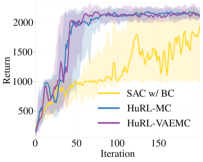

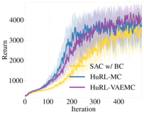

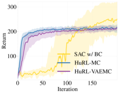


(a) Hopper-v2 (b) Humanoid-v2 (c) Swimmer-v2 (d) HalfCheetah-v2


Figure 3: Extra experimental results of different MuJoCo environments. The plots show the 25 th, 50 th, 75 th
percentiles of each algorithm’s performance over 30 random seeds.


**C.2** **Procgen Experiments**


In addition to MuJoCo environments, where the agent has direct access to the true low-dimensional
system state, we conducted experiments on the Procgen benchmark suite [ 33, 56 ]. The Procgen
suite consists of 16 procedurally generated Atari-like game environments, whose main conceptual
differences from MuJoCo environments are partial observability and much higher dimensionality of
agents’ observations (RGB images). The 16 games are very distinct structurally, but each game has
an unlimited number of levels [8] that share common characteristics. All levels of a given game are
situated in the same underlying state space and have the same transition function but differ in terms of
the regions of the state space reachable within each level and in their observation spaces. We focus on
the _sample efficiency_ Procgen mode [ 33 ]: in each RL episode the agent faces a new game level, and
is expected to eventually learn a single policy that performs well across all levels of the given game.


Besides the differences in environment characteristics between MuJoCo and Procgen, the Procgen
experiments are also dissimilar in their design:


    - In contrast to the MuJoCo experiments, where we assumed to be given a batch of data from
which we constructed a heuristic and a warm-start policy, in the Procgen experiments we
simulate a scenario where we are given _only_ the heuristic function itself. Thus, we don’t
warm-start the base algorithm with a BC policy when running HuRL.


    - In the Procgen experiments, we share a single set of all hyperparameters’ values – those of
the base algorithm, those of HuRL’s _λ_ -scheduling, and those used for generating heuristics –
across all 16 games. This is meant to simulate a scenario where HuRL is applied across a
diverse set of problems using good but problem-independent hyperparameters.


**Algorithms.** We used PPO [ 36 ] implemented in RLlib (Apache License 2.0) [ 57 ] as the base
algorithm. We generated a heuristic for each game as follows:


    - We ran PPO for 8 _M_ environment interaction steps and saved the policy after every 500 _K_
steps, for a total of 16 checkpoint policies.


    - We ran the policies in a random order by executing 12000 environment interaction steps
using each policy. For each rollout trajectory, we computed the discounted return for each
observation in that trajectory, forming _⟨observation, return⟩_ training pairs.


    - We used this data to learn a heuristic via regression. We mixed the data, divided it into
batches of 5000 training pairs and took a gradient step w.r.t. MSE computed over each batch.
The learning rate was 10 _[−]_ [4] .


Our main algorithm, a HuRL flavor denoted as PPO-HuRL, is identical to the base PPO but uses the
Monte-Carlo heuristic computed as above.


8 In Procgen, levels aren’t ordered by difficulty. They are merely game variations.


23


**Hyperparameters and evaluation** The base PPO’s hyperparameters in RLlib were chosen to
match PPO’s performance reported in the original Procgen paper [ 56 ] for the "easy" mode as closely
as possible across all 16 games (Cobbe et al. [56] used a different PPO implementation with a
different set of hyperparameters). As in that work, our agent used the IMPALA-CNN _×_ 4 network
architecture [ 56, 58 ] without the LSTM. The heuristics employed the same architecture as well. We
used a single set of hyperparameter values, listed in Table 4, for all Procgen games, both for policy
learning and for generating the checkpoints for computing the heuristics.

|Impala layer sizes<br>Rollout fragment length<br>Number of workers<br>Number of environments per worker<br>Number of CPUs per worker<br>Number of GPUs per worker<br>Number of training GPUs<br>γ<br>SGD minibatch size<br>Train batch size<br>Number of SGD iterations<br>SGD learning rate<br>Framestacking<br>Batch mode<br>Value function clip parameter<br>Value function loss coefficient<br>Value function share layers<br>KL coefficient<br>KL target<br>Entropy coefficient<br>Clip parameter<br>Gradient clip<br>Soft horizon<br>No done at end:<br>Normalize actions<br>Simple optimizer<br>Clip rewards<br>GAE λ|16, 32, 32<br>256<br>0 (in RLlib, this means 1 rollout worker)<br>64<br>5<br>0<br>1<br>0.99<br>2048<br>4000<br>3<br>0.0005<br>off<br>truncate_episodes<br>10.0<br>0.5<br>true<br>0.2<br>0.01<br>0.01<br>0.1<br>null<br>False<br>False<br>False<br>False<br>False<br>0.95|
|---|---|
|PPO-HuRL_ λ_0<br>PPO-HuRL_ α_|0.99<br>0.5|


Table 4: Procgen experiment configuration details: RLlib PPO’s and HuRL’s hyperparameter values.
All the values were shared across all 16 Procgen games.


_λ_ 0 [0.95, 0.97, 0.985, 0.98, 0.99]
_α_ [0.5, 0.75, 1.0, 3.0, 5.0]


Table 5: HuRL’s hyperparameter value grid for the Procgen experiments.


In order to choose values for PPO-HuRL’s hyperparameters _α_ and _λ_ 0, we fixed all of PPO’s hyperparameters, took the pre-computed heuristic for each game, and did a grid search over _α_ and _λ_ 0 ’s
values listed in Table 5 to maximize the normalized average AUC across all games. To evaluate
each hyperparameter value combination, we used 4 runs per game, each run using a random seed
and lasting 8M environment interaction steps. The resulting values are listed in Table 4. Like PPO’s
hyperparameters, they were kept fixed for all Procgen environments.


To obtain experimental results, we ran PPO and PPO-HuRL with the aforementioned hyperparameters
on each of 16 games 20 times, each run using a random seed and lasting 8M steps as in Mohanty
et al. [33] . We report the 25th, 50th, and 75th-percentile training curves. Each of the reported training
curves was computed by smoothing policy performance in terms of unnormalized game scores over
the preceding 100 episodes.


24


**Resources.** Each policy learning run used a single Azure ND6s machine (6 Intel Xeon E5-2690
v4 CPUs with 112 GB memory and base core frequency of 2.6 GHz; 1 P40 GPU with 24 GB
memory). A single PPO run took approximately 1.5 hours on average. A single PPO-HuRL run took
approximately 1.75 hours.


**Results.** The results are shown in Fig. 4. They indicate that, HuRL helps despite the highly
challenging setup of this experiment: a) environments with a high-dimensional observation space;
a) the chosen hyperparameter values being likely suboptimal for individual environments; c) the
heuristics naively generated using Monte-Carlo samples from a mixture of policies of wildly varying
quality; and d) the lack of policy warm-starting. We hypothesize that PPO-HuRL’s performance can
be improved further with environment-specific hyperparameter tuning and a scheme for heuristicquality-dependent adjustment of HuRL’s _λ_ -schedules on the fly.

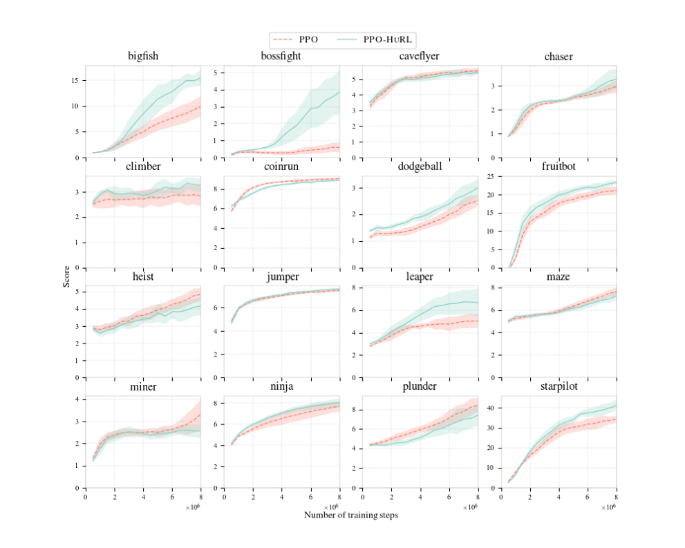


Figure 4: PPO-HuRL’s results on Procgen games. PPO-HuRL yields gains on half of the games and performs
at par with PPO on most of the rest. Thus, on balance, PPO-HuRL helps despite the highly challenging setup of
this experiment, but tuning HuRL’s _λ_ -schedule on the fly depending on the quality of the heuristic can potentially
make HuRL’s performance more robust in settings like this.


25


