### Efficient (Soft) Q -Learning **for Text Generation with Limited Good Data**

**Han Guo** [1] **, Bowen Tan** [1] **, Zhengzhong Liu** [1] _[,]_ [2] **, Eric P. Xing** [1] _[,]_ [2] _[,]_ [4] **, Zhiting Hu** [3]

1 Carnegie Mellon University, 2 Petuum Inc., 3 UC San Diego,
4 Mohamed bin Zayed University of Artificial Intelligence

{hanguo, btan2, epxing}@cs.cmu.edu, hectorzliu@gmail.com, zhh019@ucsd.edu

**Abstract**

Maximum likelihood estimation (MLE) is the
predominant algorithm for training text generation models. This paradigm relies on direct supervision examples, which is not applicable to many emerging applications, such
as generating adversarial attacks or generating prompts to control language models. Reinforcement learning (RL) on the other hand
offers a more flexible solution by allowing
users to plug in arbitrary task metrics as reward. Yet previous RL algorithms for text generation, such as policy gradient ( _on-policy_ RL)
and _Q_ -learning ( _off-policy_ RL), are often notoriously inefficient or unstable to train due to
the large sequence space and the sparse reward
received only at the end of sequences. In this
paper, we introduce a new RL formulation for
text generation from the soft _Q_ -learning (SQL)
perspective. It enables us to draw from the
latest RL advances, such as path consistency
learning, to combine the best of on-/off-policy
updates, and learn effectively from sparse reward. We apply the approach to a wide range
of novel text generation tasks, including learning from noisy/negative examples, adversarial
attacks, and prompt generation. Experiments
show our approach consistently outperforms
both task-specialized algorithms and the previous RL methods. [1]

**1** **Introduction**

Recent natural language generation systems have
made remarkable progress in producing wellformed text, especially with massive pretrained language models. Those models are typically trained
using maximum likelihood estimation (MLE) with
a large amount of data supervisions. Despite its successes, the standard training method suffers from
limited applicability to many emerging text generation problems, where little or no supervised data
is available. Prominent examples of such low-data

1 Code at [https://github.com/HanGuo97/](https://github.com/HanGuo97/soft-Q-learning-for-text-generation)
[soft-Q-learning-for-text-generation.](https://github.com/HanGuo97/soft-Q-learning-for-text-generation)

problems include generating prompts to control
the massive LMs (Yin et al., 2019; Shin et al.,
2020; Zhong et al., 2021; Liu et al., 2021), learning
text generation from noisy or even negative data,
generating adversarial text attacks for robustness
study (Wallace et al., 2019; Atanasova et al., 2020),
and others (Figure 1, right). Due to the failure of
standard MLE, people have had to devise specialized algorithms for those problems respectively.

Reinforcement learning (RL) (Sutton and Barto,
2018) offers an alternative principled framework
for learning from arbitrary reward functions. However, RL by far has made limited success for training text generation, primarily due to the key challenges of _sparse reward_ (i.e., a single reward signal
is received only after the whole text sequence is
generated) and _large action space_ (i.e., a vocabulary of millions of words). For instance, a popular
family of RL algorithms studied extensively for
text generation is the policy-based (Williams, 1992)
or actor-critic based (Bahdanau et al., 2016; Rennie et al., 2017) algorithms, with policy gradient
(PG) being the most prevalent example (Ranzato
et al., 2016; Li et al., 2016; Rennie et al., 2017; Tan

et al., 2018; Pasunuru and Bansal, 2018; Paulus
et al., 2018). Those algorithms train the model
with _on-policy_ updates, i.e., the text samples used
for estimating policy gradients are from the target
model itself. Due to the exponentially large space
of sequences, on-policy updates often suffer from
extremely high variance and low data efficiency
(e.g., most model samples are not useful for learning). Thus directly training with PG from scratch
is usually impossible. In practice, the model has to
be initialized by MLE training, followed by PG as
finetuning, which often leads to limited improvement (Choshen et al., 2020; Wu et al., 2018).

Another set of work has resorted to _off-policy_
RL. The key advantage is that samples from other
sources, e.g., human-written text, can be used, making them more data efficient than on-policy meth

**Learning from Noisy (Negative) Text**

**Dataset**

**Examples**

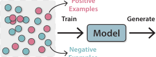

**Adversarial Text Generation**

large
vocab

Q-values
**(simultaneously updated)**

**Positive**

**Outputs**

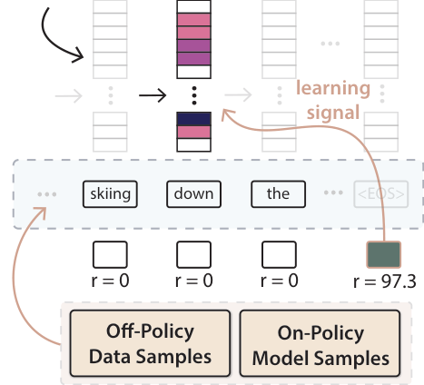

**Prompt Generation for Controlling Pretrained LMs**

r = 0 r = 0 r = 0 r = 97.3 **“Science”** [Topic] **Model** fed into PretrainedLanguageModel

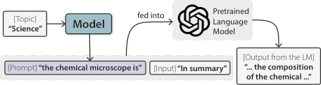

Figure 1: **Left:** An overview of the proposed SQL algorithm. Text generation is challenging due to sparse reward
(i.e., the rewards of all intermediate steps are 0) and large action space (i.e., large vocabulary). Our SQL formulation enables several key algorithmic features as highlighted with **yellow** color, including (1) the combined on- and
off-policy updates for the best of both, (2) bridging the final non-zero reward to directly supervise the _Q_ -value estimation at intermediate steps for learning stability, and (3) simultaneously updating the _Q_ -values of all candidate
actions for efficiency. **Right:** We explore diverse applications of the text-generation RL algorithm.

ods. Previous work has used either importance
weighted PG (Pang and He, 2021; Zhou et al., 2017;
Kandasamy et al., 2017) or _Q_ -learning based algorithms (Guo, 2015; Jaques et al., 2020; Narasimhan
et al., 2015). However, off-policy methods have
been considered to be less stable. For example, the
_Q_ -learning performance relies heavily on how accurate the learned _Q_ -function assesses the quality
of intermediate subsequences – a challenging task
due to the sparse reward signals.

In this paper, we develop a new RL formulation
for text generation that tackles the above issues
(Figure 1, left). We reframe the text generation
problem from the _soft_ _Q_ _-learning_ perspective originally developed in robotics (Haarnoja et al., 2017;
Schulman et al., 2017). The resulting connection
allows us to seamlessly take advantage of the latest
successful techniques from the RL literature. In particular, we introduce and adapt the principled _path_
_consistency learning_ (Nachum et al., 2017) to text
generation, that (1) offers a natural way to train the
model with both on- and off-policy updates, hence
combining the best of the two strategies, (2) bridges
the sparse reward signal to directly supervise the
_Q_ function learning, leading to more accurate _Q_
estimation and credit assignment, and (3) makes
efficient updates to _Q_ -values by considering all
candidate actions together.

The generality and efficiency of the proposed
method allows us to train text generation in a wide
range of applications: (1) With _noisy and negative_
_training examples_, our approach learns to generate accurate entailment text that greatly improves
upon the data itself as well as other various training
methods; (2) Our approach also manages to train an
effective _adversarial text generator_ for robustness
test for classifiers; (3) We train a _prompt generator_
with our algorithm to achieve controllable generation of pretrained LMs in terms of topics. [2] On
all the three tasks, our approach consistently improves over not only previous RL algorithms for
text generation, but also diverse task-specialized
methods designed specifically for each of the problems, respectively. In the appendix (§A.1.4), we
also show that on standard supervised tasks where
MLE prevails, our approach is competitive to train
text generation models _from scratch_, which was
usually impossible for previous RL algorithms.

The contributions can be summarized as fol
lows. On the technical side, we propose a new
RL formulation for text generation based on soft
_Q_ -Learning. This new formulation allows us to
seamlessly take advantage of the RL literature’s
latest successful techniques (notably the path con

2 More recently, Deng et al. (2022) extend this line of work
to optimize discrete text prompts with reinforcement learning.

sistency algorithm) to overcome the longstanding
challenges (e.g., sparse reward and large action
space) in text generation. On the empirical side,
we conduct studies on a wide variety of text generation tasks with limited data (i.e., generating
from noisy/negative data, adversarial text generation, prompt generation). We propose their RL
formulations, and show that our general approach
consistently improves over not only previous text
RL algorithms, but also diverse task-specialized
methods.

**2** **Background and Challenges**

We aim to learn a generation model _p_ _θ_ ( _**y**_ ) =
� _Tt_ =0 _[p]_ _[θ]_ [(] _[y]_ _[t]_ _[|]_ _**[y]**_ _[<t]_ [)] [, where] _[ y]_ _[t]_ [ is a token from a vocab-]
ulary _V_ . The distribution at each step _t_ is obtained
by applying softmax on the logits _f_ _θ_ ( _y|_ _**y**_ _<t_ ):

exp _f_ _θ_ ( _y_ _t_ _|_ _**y**_ _<t_ )
_p_ _θ_ ( _y_ _t_ _|_ _**y**_ _<t_ ) = (1)
~~�~~ _y_ _[′]_ _∈V_ [exp] _[ f]_ _[θ]_ [(] _[y]_ _[′]_ _[|]_ _**[y]**_ _[<t]_ [)] _[.]_

Despite its popularity, MLE-based training only
applies when clean supervised data _**y**_ _[∗]_ is available,
and cannot be used to optimize arbitrary task metrics (e.g., BLEU, entailment score) which are typically the goal in many text generation tasks. Previous research has formulated text generation as
an RL problem by considering the following finitetime Markov Decision Process (MDP). At each
time step _t_, let the “state” be _**s**_ _t_ = _**y**_ _<t_, namely
the partial sequence generated so far. The model
(“agent”) takes as input the current state _**s**_ _t_ and
outputs a token (“action”) _a_ _t_ _∈V_ according to a
policy _π_ ( _a_ _t_ _|_ _**s**_ _t_ ) . The agent then receives a reward
_r_ _t_ = _r_ ( _**s**_ _t_ _, a_ _t_ ) and deterministically transitions to
next state _**s**_ _t_ +1 (i.e., the concatenation of the tokens
in _**s**_ _t_ and the new token _a_ _t_ ).
Following the notation convention in RL, let _τ_
be the trajectory (i.e., text sample) generated by the
policy. The agent’s objective is to maximize the
accumulative reward, _J_ ( _π_ ) = E _τ_ _∼π_ _Tt_ =0 _[γ]_ _[t]_ _[r]_ _[t]_,
�� �
where _γ_ is the discount factor. A central concept
in RL is the _Q_ -function of policy _π_, _Q_ _[π]_ ( _**s**_ _t_ _, a_ _t_ ) =
E _π_ _Tt_ _[′]_ = _t_ _[γ]_ _[t]_ _[′]_ _[r]_ _[t]_ _[′]_ _[ |]_ _**[ s]**_ _[t]_ _[, a]_ _[t]_, the expected future re�� �
ward of taking action _a_ _t_ (i.e., generating token _a_ _t_ )
in state _**s**_ _t_ and continuing with the policy _π_ .
**Challenges.** Text generation poses significant
challenges to RL, particularly because (1) the reward signal is usually sparse, i.e., _r_ _t_ = 0 _, ∀t < T_
and the agent receives a non-zero reward _r_ _T_ only
after it generates the full sequence, (2) the action
space (i.e., the vocabulary _V_ ) is extremely large.

The challenges have led to difficulties of the two
major families of RL approaches applied to text
generation problems, as detailed below.
**Policy-based RL** techniques directly parameterize
the policy _π_ _θ_ with parameters _**θ**_ . Thus the policy
_π_ _θ_ ( _a_ _t_ _|_ _**s**_ _t_ ) exactly corresponds to the above generation model _p_ _θ_ ( _y_ _t_ _|_ _**y**_ _<t_ ) . _Policy gradient (PG)_ is
one of the most widely used algorithms for text
generation (Ranzato et al., 2016). It optimizes the
cumulative reward with the policy gradient using
the estimated _Q_ _[π]_ _[θ]_ value based on sample _τ_ . PG is
an _on-policy_ algorithm, meaning that the sample
_τ_ needs to come from the the current policy _π_ _θ_ itself. In practice, however, optimizing this objective
alone from scratch is unlikely going to work because most samples _τ ∼_ _π_ _θ_ are just gibberish with
zero reward, failing to provide meaningful training
signals for updating the policy. Previous literature
either initializes the policy _π_ _θ_ with MLE training,
and/or use a combination of MLE and PG updates,
which often leads to marginal gains in practice (Wu
et al., 2018; Choshen et al., 2020).
**Value-based RL** techniques, such as _Q_ _-learning_,
implicitly learn the policy _π_ by approximating the
value _Q_ _[π]_ ( _**s**_ _, a_ ) directly. Deep _Q_ -learning (Mnih
et al., 2013) parameterizes the _Q_ -function as
_Q_ _θ_ ( _**x**_ _, a_ ), and train the parameters by minimizing
the following regression objective _L_ ( _**θ**_ ) based on
the Bellman temporal consistency:

2 [�]

_r_ _t_ + _γ_ max
� _a_ _t_ +1 _[Q]_ _[θ]_ [¯] [(] _**[s]**_ _[t]_ [+1] _[, a]_ _[t]_ [+1] [)] _[−][Q]_ _[θ]_ [(] _**[s]**_ _[t]_ _[, a]_ _[t]_ [)] �

E _π_ _′_

1

2
�

(2)

where _**θ**_ [¯] is the parameters of the _target_ _Q_ -network,
which is a slow copy of _**θ**_ and considered as constant for gradient computation of _**θ**_ . Here _π_ _[′]_ is an
_behavior policy_ which can be an arbitrary distribution over text, such as the data distribution or replay
buffer (Mnih et al., 2013). This makes _Q_ -learning
an _off-policy_ algorithm because of its ability to use
samples coming from other policies. After learning
_Q_ _θ_, one can induce a policy _π_ from it that takes
arg max _a_ _Q_ _θ_ ( _**s**_ _, a_ ) at each state _**s**_ . Jaques et al.
(2017) instead sample tokens from the softmax
function applied to _Q_ _θ_ .
However, the training can be unstable and inefficient due to several challenges: **(1)** The bootstrapping nature of the above regression problem can
make the training unstable. That is, the regression
target _r_ _t_ + _γ_ max _a_ _t_ +1 _Q_ _θ_ ¯ ( _**s**_ _t_ +1 _, a_ _t_ +1 ) itself is derived from the _Q_ -function to be learned (Kumar
et al., 2019). The problem is exacerbated in the

presence of sparse reward in text generation, where
the real observed signal _r_ _t_ is zero for all intermediate _t < T_ ; **(2)** The large action space (e.g., 10 [4] )
in text generation results in slow updates. In particular, notice that Eq. (2) applies the gradient update
to the _Q_ _θ_ -value of the _only one_ particular token _a_ _t_
(out of, say, the 10 [4] candidate tokens in the vocabulary), making the training inefficient; **(3)** Besides,
pure off-policy updates could be highly sensitive
to the quality of training data, and miss the opportunity of on-policy exploration that maximizes the
reward of interest in a more direct way.

**3** **The Soft** _Q_ **-Learning Framework**

We introduce the soft _Q_ -learning (SQL) formulation of text generation. It is seamlessly compatible
with the common architecture of text generation
model (Eq.1), permits easy implementation (§3.1),
and enables efficient and stable RL training in practice (§3.2). Figure 2 and Algorithm 1 summarizes
the resulting SQL framework.

**3.1** **SQL Formulation for Text Generation**

Soft _Q_ -learning (Haarnoja et al., 2017; Schulman et al., 2017; Nachum et al., 2017) is
an maximum-entropy (MaxEnt) extension to
the standard (hard) _Q_ -learning (Mnih et al.,
2015; Sutton and Barto, 2018). Under this
framework, the agent is encouraged to optimize the reward while staying as stochastic
as possible, with the objective _J_ MaxEnt ( _π_ ) =
E _τ_ _∼π_ _Tt_ =0 _[γ]_ _[t]_ _[r]_ _[t]_ [ +] _[ α][H]_ [ (] _[π]_ [ (] _[· |]_ _**[ s]**_ _[t]_ [))], which aug�� �

ments the vanilla _J_ ( _π_ ) with the additional Shannon
entropy term _H_ with coefficient _α_ . [3] This is appealing because it seamlessly connects the _Q_ -values to
the familiar output _logits_ of a text generation model,
which enables straightforward implementation of
the SQL formulation.
_Q_ **-values as Generation Model Logits.** We show
the connection of the _Q_ -values with the logits, i.e.,
outputs right before the softmax layer. Concretely,
with the SQL objective, the following relationship
between optimal policy _π_ _[∗]_ and action-value _Q_ _[∗]_

holds (Haarnoja et al., 2017; Schulman et al., 2017):

exp _Q_ _[∗]_ ( _**s**_ _, a_ )
_π_ _[∗]_ ( _a|_ _**s**_ ) = (3)
~~�~~ _a_ _[′]_ [ exp] _[ Q]_ _[∗]_ [(] _**[s]**_ _[, a]_ _[′]_ [)] _[.]_

This form is highly reminiscent of the softmax
layer of the generation model in Eq. (1) . The con

3 WLOG, we can assume _α_ =1, as it can be folded into the
reward function by scaling the latter with 1 _/α_ .

nection suggests that we can naturally parameterize the _Q_ -function in SQL as the generation model
logit function, i.e., _Q_ _θ_ ( _**s**_ _, a_ ) _≡_ _f_ _θ_ ( _a|_ _**s**_ ) . In other
words, _the model output_ _f_ _θ_ ( _a|_ _**s**_ ) _, originally inter-_
_pretted as the “logit” of token_ _a_ _given the preced-_
_ing tokens_ _**s**_ _, is now re-interpretted as the_ _Q_ _-value_
_of action_ _a_ _in state_ _**s**_ _._ When achieving optimality, _f_ _θ_ _∗_ ( _a|_ _**s**_ ), namely _Q_ _[∗]_ ( _**s**_ _, a_ ), represents the best
possible future reward achievable by generating
token _a_ in state _**s**_ . Similarly, the full generation
model _p_ _θ_ ( _a|_ _**s**_ ) in Eq. (1) that applies softmax to _f_ _θ_
now precisely corresponds to the policy _π_ _θ_ induced
from _Q_ _θ_ ( _**s**_ _, a_ ). That is,

where _A_ _[∗]_ is the optimal advantage function. The
equation says that, in the proposed text generation
SQL formulation, the optimal policy generates token _a_ in state _**s**_ according to the token’s advantage.

**3.2** **Efficient Training with Path Consistency**

Vanilla training based on the Bellman temporal
consistency can suffer from the instability and in
                              efficiency issues similar to the conventional _Q_
learning (§2), as we discuss more in the appendix
(§A.3.2). Fortunately, our SQL formulation allows
us to import latest advances of RL techniques to
overcome the difficulties. Specifically, we adapt
the _unified path consistency learning (PCL)_ that
has excelled in game control (Nachum et al., 2017).
The PCL-based training updates _Q_ -values of _all_
tokens at once through a connection between the
value function and the induced policy. More specifically, Nachum et al. (2017) showed that the optimal
policy _π_ _[∗]_ (Eq.3) and the optimal state value function _V_ _[∗]_ (Eq.5) in SQL must satisfy the following
consistency property for all states and actions:

_V_ _[∗]_ ( _**s**_ _t_ ) _−_ _γV_ _[∗]_ ( _**s**_ _t_ +1 ) = _r_ _t_ _−_ log _π_ _[∗]_ ( _a_ _t_ _|_ _**s**_ _t_ ) _, ∀_ _**s**_ _t_ _, a_ _t_ _._ (6)

exp _Q_ _θ_ ( _**s**_ _, a_ )
_π_ _θ_ ( _a|_ _**s**_ ) =
~~�~~ _[′]_ [ exp] _[ Q]_ _[θ]_ [ (] _**[s]**_

_a_ _[′]_ [ exp] _[ Q]_ _[θ]_ [ (] _**[s]**_ _[, a]_ _[′]_ [)]

(4)

exp _f_ _θ_ ( _a|_ _**s**_ )

_a_ _[′]_ [ exp] _[ f]_ _[θ]_ [ (] _[a]_ _[′]_ _[|]_ _**[s]**_ [) =] _[ p]_ _[θ]_ [(] _[a][|]_ _**[s]**_ [)] _[.]_

exp _f_ _θ_ ( _a|_ _**s**_ )
_≡_
~~�~~ _[′]_ [ exp] _[ f]_ _[θ]_ [ (] _[a]_ _[′]_

We could further gain even more intuitive interpretation of the above generation policy _π_ _[∗]_ from
the lens of _advantage_ function (Sutton and Barto,
2018). Specifically, in SQL, the optimal _state-_
_value_ function is the log-normalizer of the optimal
_Q_ -values (Haarnoja et al., 2017; Schulman et al.,
2017). This allows a more concise form of Eq. (3) :

_V_ _[∗]_ ( _**s**_ ) = log �

_**s**_ _, a_ _[′]_ [�]
_a_ _[′]_ [ exp] _[ Q]_ _[∗]_ [�]

_a_ (5)

_π_ _[∗]_ ( _a|_ _**s**_ ) = exp � _Q_ _[∗]_ ( _**s**_ _, a_ ) _−_ _V_ _[∗]_ ( _**s**_ )� = exp _A_ _[∗]_ ( _**s**_ _, a_ ) _,_

sequence

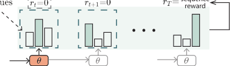

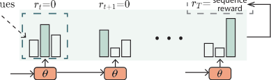

Single-Step PCL Training Multi-Step PCL Training

Figure 2: Soft _Q_ -Learning with path consistency learning (PCL) objectives. **Left:** Single-step objective (Eq.7),
where for each ( _**s**_ _t_ _, a_ _t_ ), the computation involves step _t_ and _t_ + 1. Dashed boxes in **dark green** and **gray** indicate
the regression target, where the intermediate reward _r_ _t_ is often 0 due to sparsity. The gradient is applied to
parameters _**θ**_ at step _t_ (indicated by **orange** color). **Right:** Multi-step objective (Eq.9) which aggregates from step
_t_ all the way to _T_ . In this way, the final-step non-zero reward _r_ _T_ is used as the regression target.

_T_
� _γ_ _[l][−][t]_ [�] _r_ _l_ _−_ log _π_ _[∗]_ ( _a_ _l_ _|_ _**s**_ _l_ ) � _,_

_l_ = _t_

Accordingly, the PCL-based training attempts to
encourage the satisfaction of the consistency with
the following regression objective _L_ SQL, PCL ( _**θ**_ ):

temporal consistency:

_V_ _[∗]_ ( _**s**_ _t_ ) _−γ_ _[T][ −][t]_ _V_ _[∗]_ ( _**s**_ _T_ +1 ) =

2 [�]
_−V_ _θ_ ¯ ( _**s**_ _t_ ) + _γV_ _θ_ ¯ ( _**s**_ _t_ +1 ) + _r_ _t_ _−_ log _π_ _θ_ ( _a_ _t_ _|_ _**s**_ _t_ )
� �

E _π_ _′_

1

2
�

_,_

(7)
where _π_ _θ_ is the induced policy defined in Eq. (4) ;

¯
_V_ _θ_ is defined similarly as in Eq. (5) but depends

¯
on the target _Q_ _θ_ network (i.e., a slow copy of the
_Q_ _θ_ to be learned), and recall that _π_ _[′]_ is an arbitrary
behavior policy (e.g., data distribution). Please see
Figure 2 (left) for an illustration. Crucially, notice
that the gradient update is applied to _**θ**_ through the
log _π_ _θ_ term which explicitly involves the _Q_ _θ_ -values
of _all_ tokens _a_ in the vocabulary. This shows an
important difference from the above vanilla training in conventional _Q_ -learning (§2) where _Q_ _θ_ is
updated only through the particular _a_ _t_ token. The
PCL training thus offers more efficient updates for
the _Q_ _θ_ function. In the appendix (§A.3.1), we
also discuss the difference from the MLE objective.
Intuitively, MLE trains the model to (blindly) increase the probability of the observed tokens, while
PCL encourages the (log) probability of the tokens
to match the approximate advantage values.

**Multi-step PCL for Sparse Reward.** The above
PCL objective Eq. (7) alone does not resolve
the potential instability issue due to the bootstrapped _V_ _θ_ ¯ ( _**s**_ _t_ +1 ) value and the sparse reward (i.e.,
_r_ ( _**s**_ _t_ _, a_ _t_ ) = 0 for _t < T_ ). Our SQL formulation
allows us to additionally incorporate the _multi-step_
variant of the PCL training (Nachum et al., 2017)
to resolve the issue. Specifically, by applying a
telescoping sum on the consistency equation (Eq.6)
starting from _t_ up to _T_, we arrive at the multi-step

(8)
where the value of past-terminal state is zero,
_V_ _[∗]_ ( _**s**_ _T_ +1 ) = 0 ; and the rewards are only available at the end, [�] _[T]_ _l_ = _t_ _[γ]_ _[l][−][t]_ _[r]_ _[l]_ [ =] _[ γ]_ _[T]_ _[−][t]_ _[r]_ _[T]_ [ . We can]
then come to the following multi-step objective
function _L_ SQL, PCL-ms ( _**θ**_ ),

(9)
We can see the objective side-steps the need to
bootstrap intermediate value functions _V_ _θ_ ¯ ( _**s**_ _t_ _′_ ) for
_t_ _[′]_ _> t_ . Instead, it directly uses the non-zero end
reward _r_ _T_ to derive the update for _**θ**_ . Please see Figure 2 (right) for an illustration. In practice, we combine the single- and multi-step objectives (Eqs.7
and 9) together for training.

**Joint On- and Off-policy Training.** Finally, we
highlight that the behavior policy _π_ _[′]_ involved in the
objectives Eqs. (7) and (9) can be an arbitrary policy. For example, _π_ _[′]_ can be a (possibly noisy) text
dataset, or a set of text samples produced by other
generation models, resulting in off-policy training.
We can also set _π_ _[′]_ to be the current generation
model _π_ _θ_ to be learned, resulting in on-policy training. In practice, we could first train the model
with only off-policy data for warming up, and then
continue with joint on- and off-policy training to
further maximize the reward.

**4** **Applications and Experiments**

We show broad applications of the proposed RL
text generation framework to a variety of problems

� 2 [] 

 _._

E _π_ _′_



 [1] 2

2

_−V_ _θ_ ¯ ( _**s**_ _t_ ) + _γ_ _[T][ −][t]_ _r_ _T_ _−_

�

_T_
�

� _γ_ _[l][−][t]_ log _π_ _θ_ ( _a_ _l_ _|_ _**s**_ _l_ )

_l_ = _t_

**Algorithm 1** Efficient Soft _Q_ -Learning for Text Generation

**Input:** _Q_ _θ_ (i.e., generation model logit function _f_ _θ_ in Eq.1)
Reward function _r_ ( _**s**_ _, t_ )
Training examples _D_ (for off-policy updates; _optional_ )

1: Initialize _**θ**_ and target model parameters _**θ**_ [¯]

2: **repeat**

3: Draw a batch of off-policy samples _{τ_ off _} ∼D_

4: Draw a batch of on-policy samples _{τ_ on _}_ by decoding with policy _π_ _θ_ ( _a_ _t_ _|_ _**s**_ _t_ ) (Eq.4)

5: Compute _Q_ _θ_ ( _**s**_ _t_ _, a_ _t_ ) values (the model logits) and target _Q_ _θ_ ¯ ( _**s**_ _t_ _, a_ _t_ ) for ( _**s**_ _t_ _, a_ _t_ ) _∈{τ_ off _} ∪{τ_ on _}_

6: Compute the objectives in Eqs.(7) and (9)

7: Update the model parameters _**θ**_ via gradient descent

8: Update the target model parameters _**θ**_ [¯] by _**θ**_ [¯] _←_ _ρ_ _**θ**_ [¯] + (1 _−_ _ρ_ ) _**θ**_ with update rate _ρ_

9: **until** convergence
**Output:** The trained _Q_ _θ_ _∗_ and the induced generator _π_ _θ_ _∗_

where no clean supervision data is available. These
include learning with noisy or even negative data
(§4.1), generating adversarial text attacks (§4.2),
and generating prompts to steer pretrained LMs
(§4.3). We also study the performance on standard
supervised generation tasks (§A.1.4) and show that
our approach is competitive to train text generation
models _from scratch_ . We provide detailed configurations in the appendix (§A.2).

**4.1** **Learning from Noisy (Negative) Text**

The popular MLE algorithm learns by (blindly) imitating training data. However, it is often expensive
to curate clean quality data. It is thus highly desirable to be able to learn from data with noises,
or even _negative_ examples. With the guidance of
task metrics (rewards), the model can even learn to
“outperform” the training data and achieve desired
generation behaviors. To this end, we consider
the task of _entailment generation_ (Pasunuru and
Bansal, 2017). Given a sentence (premise), the
goal is to generate a new sentence (hypothesis) that
logically follows the premise.

**Setup (more in §A.2.1).** We sub-sampled 50 _k_
training examples from the SNLI dataset (Bowman
et al., 2015), a commonly used entailment classification dataset. The hypotheses have an average
entailment probability of only 50%, and over 2 _/_ 5
of them less than 20% (negative/contradictive examples) – a significant challenge for the models to
learn from the noises. The rewards include (1) the
entailment score of the generation measured by a
robust entailment classifier (Nie et al., 2020), (2)
the log-likelihood of the generation as an indicator
of language quality measured by a GPT-2 language

model (Radford et al., 2019), and (3) BLEU score
w.r.t the input premises as another language quality
reward that avoids trivial outputs. We sum together
all rewards with weights 1 _._ 0.

We compare our approach with a broad range of
baselines, including (1) the standard MLE training
( MLE ); (2) MLE+reward, where we use the reward function to filter examples; (3) joint MLE and
PG training with MLE initialization ( MLE+PG ),
where we initialize the model with MLE train
ing, then train it with combined MLE and PG
losses; previous text-generation RL algorithms
including (4) MIXER (Ranzato et al., 2016), (5)
Self-critic (Rennie et al., 2017), and (6)
one of the latest methods GOLD- _s_ (Pang and He,
2021) which is a pure off-policy method based on
importance-sampling PG. To ablate the effect of
multi-step training (§3.2), we additionally compare with a simplified variant of our approach
that uses only vanilla single-step PCL training
( SQL(single) ). We include more baselines
such as MLE weighted by rewards in §A.1.1.

We evaluate generation results in terms of entailment rate, language quality (perplexity), and diversity which is measured by the Shannon entropy
over unigrams and bigrams ( _H_ 1, _H_ 2 ) (Gehrmann
et al., 2021). Since text generation models intrinsically trade off diversity and quality (Caccia et al.,
2019; Hashimoto et al., 2019), we vary the generation diversity by generating samples via top- _p_
sampling (Holtzman et al., 2019) with different _p_
values, and plot the entailment rate and perplexity against diversity, resp. We also evaluate the
samples produced by beam-search decoding.

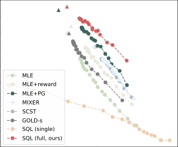

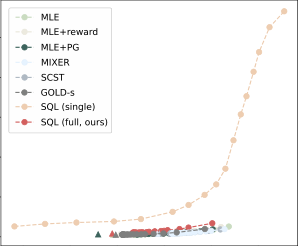

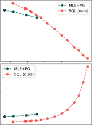

Figure 3: **Left:** entailment generation performance plotted against diversity (average of _H_ 1 and _H_ 2 ). Circles represent results of top- _p_ sample outputs, and triangles represent results of beam-search outputs. Please see Table A.3
for additional results. **Right:** entailment attack performance against diversity. Only a few MLE+PG dots are visible
because the model is not able to generate more diverse samples even with increasing _p_ value in top- _p_ decoding,
i.e., the model collapses.

**Results.** Figure 3 (left) shows the results, and Table A.5 shows samples. First, notice that MLE performs poorly, while MLE+reward improves upon
it. This is not surprising as the training data contain
noisy/negative examples. Similarly, since the pure
off-policy algorithm GOLD- _s_ relies heavily on the
data distribution, we observed that it achieves suboptimal performance. The on-policy MLE+PG with
MLE initialization gives better entailment rate. In
comparison, our full SQL framework achieves the
best entailment-diversity trade-off. The comparison between SQL and SQL(single) highlights
the importance of having the multi-step objective
which directly uses the end reward rather than bootstrapping intermediate _Q_ -values for supervision.

**4.2** _**Universal**_ **Adversarial Attacks**

We next study the application in text adversarial attacks, where again no supervised data is available.
Adversarial attacks is an increasingly important
research topic as they reveal models’ vulnerabilities and flaws. This is especially true for universal attacks (Wallace et al., 2019; Atanasova et al.,
2020), where we want to generate universal examples that trick the model on _all_ possible inputs.
For instance, consider the context of entailment
classification. Our goal is to find universal humanreadable hypotheses that are going to be classified
as “entailment” with as high probability as possible,
regardless of the input premises. This is a more
challenging setting compared to previous instancespecific attack (Morris et al., 2020; Jin et al., 2020;
Ebrahimi et al., 2017) where the attack model conditions on a premise and generates an adversarial
hypothesis specific to the premise.

**Setup (more in §A.2.2).** We aim to attack one of
the most popular MultiNLI (Williams et al., 2018)
entailment classifiers on HuggingFaceHub. [4] The
attack generation model generates adversarial text
without conditioning on any inputs so that the generated attacks are universal to all premises. We
compare our SQL with MLE+PG . We use all hypotheses in the MultiNLI dataset as the training
data for the MLE training in MLE+PG and the offpolicy updates for our SQL . We do not compare
with previous specialized adversarial text attack
methods, because they either are not applicable
to the challenging universal attack setting (Morris
et al., 2020; Jin et al., 2020; Ebrahimi et al., 2017),
or were not designed to generate human-readable
sentences (Wallace et al., 2019). We use similar
settings as in §4.1 to explore the diversity-quality
trade-off by plotting the entailment rate and perplexity against diversity, respectively. The entailment classifier to be attacked is used as entailment
score reward functions. We also include a token
level repetition penalty reward for readability.

**Results.** Figure 3 (right) shows the results, and
Table A.2 shows samples. We can see that SQL
outperforms MLE+PG consistently across different
diversity values. The outputs from MLE+PG are not
diverse even with high _p_ ’s, indicating the model collapses and can only generate a small set of unique
adversarial examples. The model by SQL discovers
the pattern “saint-pierre-et-saint-paul” (an entity
name), and exploits this to generate samples with
high universal entailment rate.

4 [https://github.com/pytorch/fairseq/](https://github.com/pytorch/fairseq/tree/master/examples/roberta)
[tree/master/examples/roberta](https://github.com/pytorch/fairseq/tree/master/examples/roberta)

Figure 4: Average topic accuracy. Please see Table A.4
for more details.

**PPLM** **GeDi** **MLE (5)** **SQL (off, 5)**

13 _._ 07 123 _._ 88 25 _._ 70 25 _._ 77

**MLE+PG (5/10/15)** **SQL (5/10/15, ours)**

25 _._ 52/28 _._ 16/28 _._ 71 25 _._ 94/26 _._ 95/29 _._ 10

Table 1: Average perplexity across topics. The lower,
the more fluent the generated continuation sentences.

**Model** PPLM GeDi SQL

**Seconds** 5 _._ 58 1 _._ 05 0 _._ 07

Table 2: Average sentence generation time cost.

**4.3** **Prompt Generation for Controlling**
**Pretrained Language Models**

A reward function does not just have to be a
metric like the BLEU score, but also a complicated pipeline that eventually returns a score. To
demonstrate this, we consider the emerging task
of prompting a large pretrained LM for controllable generation (Hu et al., 2017; Radford et al.,
2019; Brown et al., 2020). The goal is to learn
to generate text prompts that steer the LM to generate sentences of certain desired attributes (e.g.,
topics). The problem of controlling the generation of pretrained LMs was previously approached
through specialized algorithms such as modifying
the LM hidden states during decoding (Dathathri
et al., 2020; Krause et al., 2020; Qin et al., 2020).
Here we show that prompts offer an easier, faster,
more effective way for controlled generation.

Learning to generate/tune prompts is gaining increasing attention recently. It side-steps the needs
for expensive LM fine-tuning, and adapts LMs
to new scenarios with prompt as the (computefriendly) interface. Most existing approaches (Wallace et al., 2019; Li and Liang, 2021; Lester et al.,
2021) rely on gradient backpropagation and are
applicable only when the whole training pipeline
is differentiable. This does not hold for the text

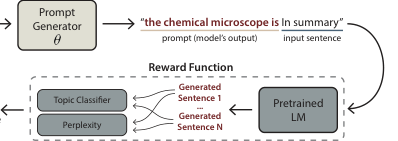

Figure 5: The scheme of prompt generation for controlling the outputs of pretraind LMs.

generation setting, as illustrated in Figure 5. In
contrast, the RL framework is generally applicable
to any differentiable or discrete pipelines.

**Setup (more in §A.2.3).** Following (Dathathri
et al., 2019), we aim to control the generation to
have one of 7 topics (e.g., “science”); the generated prompt is prepended to one of 20 input sentences for the pretrained LM to generate continuation sentences. Figure 5 shows the architecture of
prompt-based controllable generation. We compare our SQL method with MLE+PG as before.
Since the prompt length could impact the generated sentences, we conducted experiments with
maximum prompt length 5, 10, and 15 . As ablation study, we also evaluate the SQL algorithm
with only off-policy updates (i.e., without on-policy
exploration), denoted as SQL(off), and compare it with vanilla MLE training. Finally, we also
compare with two specialized controllable generation techniques based on pretrained LMs, namely
PPLM (Dathathri et al., 2019) and GeDi (Krause
et al., 2020), following similar procedures using
their open-sourced code. We use a distilled GPT2 model [5] as the pretrained LM to be controlled.
For rewards, we use the topic accuracy of the continuation sentences measured by a _zero-shot_ classifier, plus the the log-likelihood of continuation
sentences as the language quality reward measured
by a distilled GPT-2. [6]

**Results.** Figure 4 shows the topic accuracy of the
controlled LM outputs averaged across the 7 topics,
and Table 1 shows the respective language quality results. More detailed topic accuracy results
and samples are provided in the appendix (§A.1.3)
(where GeDi obtained low accuracy on 2 of the 7
topics, possibly because the topic tokens are tokenized into two subwords for which the model re
leased by the authors was not specifically trained).

5 [https://huggingface.co/distilgpt2](https://huggingface.co/distilgpt2)
6 Note that the language quality emphasis is on the generated sentences. Prompts themselves do not necessarily have to
be human-readable (Wallace et al., 2019; Sheng et al., 2020).

We can see that the prompts generated by our SQL
cause the LM to generate sentences with high topic
accuracy while maintaining low perplexity in most
settings. Increasing the prompt length positively
impacts the topic accuracy, which makes sense because longer prompts give more flexible for steering the LM. The comparison between MLE and
SQL(off) shows that the off-policy component
of SQL is better than standard MLE training, as it
incorporates reward signals instead of just blindly
following the (noisy) data.
Next, comparing with the previous steered decoding such as PPLM and GeDi, we can see the
prompt-based control trained with RL achieves better trade-off between topic accuracy and language
quality. Moreover, once a prompt is produced, we
can use the pretrained LM to generate text of desired topics efficiently, with the same time cost as
standard non-controlled decoding. In comparison,
the dedicated steered decoding is often orders-ofmagnitude slower, as shown in Table 2.

**5** **Related Work**

Standard RL algorithms can sometimes be oversensitive to the randomness in the environment.

Recent works have considered maximum-entropy
RL extensions, such as the soft _Q_ -learning
(SQL) (Haarnoja et al., 2017; Nachum et al., 2017;
Schulman et al., 2017), that maximize the entropy
of policy besides the rewards, and demonstrated
substantial improvement in robotic and game control (Ziebart et al., 2008; O’Donoghue et al., 2017;
Nachum et al., 2018; Eysenbach and Levine, 2021).
Our work is the first to adapt SQL and its advanced
variants (in particular the path consistency learning (Nachum et al., 2017)) to the challenging text
generation problem and show significant results on
diverse applications.
Applying RL for text generation has been discussed in alleviating the exposure bias problem and
optimizing task metrics (Guo, 2015; Li et al., 2016;
Wu et al., 2016; Rennie et al., 2017; Paulus et al.,

2018; Chen and Bansal, 2018; Liu et al., 2020;
Pang et al., 2021). For example, Ranzato et al.
(2016) used the REINFORCE algorithm (Williams,
1992), and Bahdanau et al. (2016) used the actorcritic algorithm; Guo et al. (2018) and Shi et al.
(2018) tried to relieve the sparsity problem via hierarchical and inverse RL methods, resp. They are
all on-policy RL algorithms with the need of pretraining their models using MLE. RAML (Norouzi

et al., 2016) implicitly relies on the quality of
off-policy data; this does not necessarily apply in
our experiments with limited good data. Tan et al.
(2018) and Hu and Xing (2022) offer a unified
view of RAML, RL, and other training methods.
Another line of work focused mostly on using only
off-policy data, often for offline training of chatbots (Kandasamy et al., 2017; Zhou et al., 2017;
Jaques et al., 2020; Pang and He, 2021). As a
result, the opportunity of directly improving the reward (as in on-policy updates) for other rich tasks
is missed. Our proposed framework combines onand off-policy training, and further offers solutions
for efficient training from scratch in the presence
of large action space and sparse sequence-level reward in text generation.

**6** **Conclusion**

We develop a new RL formulation for text generation based on soft _Q_ -learning and path consistency
learning. We conduct experiments on learning with
noisy and negative data, black box adversarial attack, prompting a pretrained language model for
controllable generation, and standard supervised
tasks. This formulation opens up new opportunities
to integrate more advances made in the fertile RL
literature to improve text generation problems.

**Limitations**

A well-documented limitation of RL methods is

the importance of the reward function. The proposed methods are no different in this aspect. This
is especially relevant as our reward function could
involve a learned model itself, which we proactively leveraged in Sec. 4.2. We refer interested
readers to Deng et al. (2022) for more algorithmic
considerations. We also noticed that adapting the
pretraining-finetuning paradigm to the proposed
methods requires careful designs. A hypothesis
points to the discrepancy between MLE objectives
(commonly used in pretraining context) and SQL
objectives. As discussed in Sec. 3.1, the SQL formulation re-interprets the “logit” as the _Q_ -value,
for many good reasons. However, our preliminary
experiments suggest that, as a downside, this makes
finetuning an MLE-trained model with SQL objectives more challenging. Future work to scale the
proposed methods to tasks such as machine translation and language modeling, and with significantly
larger and (MLE-)pretrained models would be exciting.

**Ethics Statement**

This work develops a new RL formulation for text
generation. While we demonstrate the framework
in four applications, it could be adapted to other
(emerging) applications. One major component in
these applications is the design of the reward function, which influences the behavior of the trained
agent. While we believe the MaxEnt RL framework
is more robust against reward misspecification (Eysenbach and Levine, 2021), the potential failures
of sub-optimal reward functions are widely known
and discussed. [7] To this end, deploying this model
to the wild requires careful and extensive examination, using tools such as Ribeiro et al. (2020).
Further, we highlight the application for (blackbox) adversarial attacks in the paper, with the intention of using adversarial attacks to understand the
model’s inner workings. That being said, this could
potentially be misused to conduct malicious attacks
against systems. Hence, users of this framework
might want to conduct adversarial attacks against
their own models to avoid being attacked by other
people with bad intentions.

**Acknowledgement**

We thank all reviewers for their invaluable com
ments and feedback. This research was supported by NSF IIS1563887, NSF CCF1629559,
NSF IIS1617583, NGA HM04762010002, NSF
IIS1955532, NSF CNS2008248, NSF IIS2123952,

and NSF BCS2040381. The views in this article

are those of the authors and not the funding agency.

**References**

Pepa Atanasova, Dustin Wright, and Isabelle Augenstein. 2020. Generating label cohesive and wellformed adversarial claims. In _Proceedings of the_
_2020 Conference on Empirical Methods in Natural_
_Language Processing (EMNLP)_, pages 3168–3177.

Dzmitry Bahdanau, Philemon Brakel, Kelvin Xu,
Anirudh Goyal, Ryan Lowe, Joelle Pineau, Aaron
Courville, and Yoshua Bengio. 2016. An actor-critic
algorithm for sequence prediction. _arXiv preprint_
_arXiv:1607.07086_ .

Samuel Bowman, Gabor Angeli, Christopher Potts, and
Christopher D Manning. 2015. A large annotated
corpus for learning natural language inference. In
_Proceedings of the 2015 Conference on Empirical_
_Methods in Natural Language Processing_, pages
632–642.

7 [https://openai.com/blog/](https://openai.com/blog/faulty-reward-functions/)
[faulty-reward-functions/](https://openai.com/blog/faulty-reward-functions/)

Tom Brown, Benjamin Mann, Nick Ryder, Melanie
Subbiah, Jared D Kaplan, Prafulla Dhariwal,
Arvind Neelakantan, Pranav Shyam, Girish Sastry,
Amanda Askell, Sandhini Agarwal, Ariel HerbertVoss, Gretchen Krueger, Tom Henighan, Rewon
Child, Aditya Ramesh, Daniel Ziegler, Jeffrey Wu,
Clemens Winter, Chris Hesse, Mark Chen, Eric
Sigler, Mateusz Litwin, Scott Gray, Benjamin Chess,
Jack Clark, Christopher Berner, Sam McCandlish,
Alec Radford, Ilya Sutskever, and Dario Amodei.
[2020. Language models are few-shot learners. In](https://proceedings.neurips.cc/paper/2020/file/1457c0d6bfcb4967418bfb8ac142f64a-Paper.pdf)
_Advances in Neural Information Processing Systems_,
volume 33, pages 1877–1901. Curran Associates,
Inc.

Massimo Caccia, Lucas Caccia, William Fedus, Hugo
Larochelle, Joelle Pineau, and Laurent Charlin.
2019. Language GANs falling short. In _Interna-_
_tional Conference on Learning Representations_ .

Yen-Chun Chen and Mohit Bansal. 2018. Fast abstrac
tive summarization with reinforce-selected sentence
rewriting. In _Proceedings of the 56th Annual Meet-_
_ing of the Association for Computational Linguistics_
_(Volume 1: Long Papers)_, pages 675–686.

Leshem Choshen, Lior Fox, Zohar Aizenbud, and Omri
[Abend. 2020. On the weaknesses of reinforcement](https://openreview.net/forum?id=H1eCw3EKvH)
[learning for neural machine translation. In](https://openreview.net/forum?id=H1eCw3EKvH) _Interna-_
_tional Conference on Learning Representations_ .

Sumanth Dathathri, Andrea Madotto, Janice Lan, Jane
Hung, Eric Frank, Piero Molino, Jason Yosinski, and
Rosanne Liu. 2019. Plug and play language models: A simple approach to controlled text generation.
In _International Conference on Learning Represen-_
_tations_ .

Sumanth Dathathri, Andrea Madotto, Janice Lan, Jane
Hung, Eric Frank, Piero Molino, Jason Yosinski, and
[Rosanne Liu. 2020. Plug and play language mod-](https://openreview.net/forum?id=H1edEyBKDS)
[els: A simple approach to controlled text generation.](https://openreview.net/forum?id=H1edEyBKDS)
In _International Conference on Learning Represen-_
_tations_ .

Mingkai Deng, Jianyu Wang, Cheng-Ping Hsieh, Yihan
Wang, Han Guo, Tianmin Shu, Meng Song, Eric P
Xing, and Zhiting Hu. 2022. RLPrompt: Optimizing
discrete text prompts with reinforcement learning.
In _Proceedings of the 2020 Conference on Empirical_
_Methods in Natural Language Processing (EMNLP)_ .

Javid Ebrahimi, Anyi Rao, Daniel Lowd, and Dejing Dou. 2017. Hotflip: White-box adversarial
examples for text classification. _arXiv preprint_
_arXiv:1712.06751_ .

Benjamin Eysenbach and Sergey Levine. 2021. Maximum entropy rl (provably) solves some robust rl
problems. _arXiv preprint arXiv:2103.06257_ .

Roy Fox, Ari Pakman, and Naftali Tishby. 2016. Taming the noise in reinforcement learning via soft updates. In _Proceedings of the Thirty-Second Confer-_
_ence on Uncertainty in Artificial Intelligence_, pages
202–211.

Sebastian Gehrmann, Tosin Adewumi, Karmanya Aggarwal, Pawan Sasanka Ammanamanchi, Aremu
Anuoluwapo, Antoine Bosselut, Khyathi Raghavi
Chandu, Miruna Clinciu, Dipanjan Das, Kaustubh D
Dhole, et al. 2021. The gem benchmark: Natural language generation, its evaluation and metrics.
_arXiv preprint arXiv:2102.01672_ .

Hongyu Guo. 2015. Generating text with
deep reinforcement learning. _arXiv preprint_
_arXiv:1510.09202_ .

Jiaxian Guo, Sidi Lu, Han Cai, Weinan Zhang, Yong
Yu, and Jun Wang. 2018. Long text generation via
adversarial training with leaked information. In _Pro-_
_ceedings of the AAAI Conference on Artificial Intel-_
_ligence_ .

Tuomas Haarnoja, Haoran Tang, Pieter Abbeel, and
Sergey Levine. 2017. Reinforcement learning with
deep energy-based policies. In _International Con-_
_ference on Machine Learning_, pages 1352–1361.
PMLR.

Tatsunori Hashimoto, Hugh Zhang, and Percy Liang.
2019. Unifying human and statistical evaluation for
natural language generation. In _Proceedings of the_
_2019 Conference of the North American Chapter of_
_the Association for Computational Linguistics: Hu-_
_man Language Technologies, Volume 1 (Long and_
_Short Papers)_, pages 1689–1701.

Ari Holtzman, Jan Buys, Li Du, Maxwell Forbes, and
Yejin Choi. 2019. The curious case of neural text degeneration. In _International Conference on Learn-_
_ing Representations_ .

Zhiting Hu, Haoran Shi, Bowen Tan, Wentao Wang,
Zichao Yang, Tiancheng Zhao, Junxian He, Lianhui
Qin, Di Wang, Xuezhe Ma, et al. 2019. Texar: A
modularized, versatile, and extensible toolkit for text
generation. In _Proceedings of the 57th Annual Meet-_
_ing of the Association for Computational Linguistics:_
_System Demonstrations_, pages 159–164.

Zhiting Hu and Eric P Xing. 2022. Towards a “standard
model” of machine learning. _Harvard Data Science_
_Review_ .

Zhiting Hu, Zichao Yang, Xiaodan Liang, R. Salakhutdinov, and E. Xing. 2017. Toward controlled generation of text. In _International Conference on Machine_
_Learning (ICML)_ .

Natasha Jaques, Shixiang Gu, Dzmitry Bahdanau,
José Miguel Hernández-Lobato, Richard E Turner,
and Douglas Eck. 2017. Sequence tutor: Conservative fine-tuning of sequence generation models with
kl-control. In _International Conference on Machine_
_Learning_, pages 1645–1654. PMLR.

Natasha Jaques, Judy Hanwen Shen, Asma Ghandeharioun, Craig Ferguson, Agata Lapedriza, Noah
Jones, Shixiang Gu, and Rosalind Picard. 2020.

Human-centric dialog training via offline reinforcement learning. In _Proceedings of the 2020 Confer-_
_ence on Empirical Methods in Natural Language_
_Processing (EMNLP)_, pages 3985–4003.

Di Jin, Zhijing Jin, Joey Tianyi Zhou, and Peter
Szolovits. 2020. Is bert really robust? a strong baseline for natural language attack on text classification
and entailment. In _Proceedings of the AAAI confer-_
_ence on artificial intelligence_ .

Kirthevasan Kandasamy, Yoram Bachrach, Ryota
Tomioka, Daniel Tarlow, and David Carter. 2017.
Batch policy gradient methods for improving neural
conversation models. In _ICLR_ .

Ben Krause, Akhilesh Deepak Gotmare, Bryan McCann, Nitish Shirish Keskar, Shafiq Joty, Richard
Socher, and Nazneen Fatema Rajani. 2020. Gedi:
Generative discriminator guided sequence generation. _arXiv preprint arXiv:2009.06367_ .

Aviral Kumar, Justin Fu, George Tucker, and Sergey
Levine. 2019. Stabilizing off-policy q-learning via
bootstrapping error reduction. In _NeurIPS_ .

Brian Lester, Rami Al-Rfou, and Noah Constant. 2021.
The power of scale for parameter-efficient prompt
tuning. _arXiv preprint arXiv:2104.08691_ .

Mike Lewis, Yinhan Liu, Naman Goyal, Marjan Ghazvininejad, Abdelrahman Mohamed, Omer
Levy, Veselin Stoyanov, and Luke Zettlemoyer.
2020. Bart: Denoising sequence-to-sequence pretraining for natural language generation, translation,
and comprehension. In _Proceedings of the 58th An-_
_nual Meeting of the Association for Computational_
_Linguistics_, pages 7871–7880.

Jiwei Li, Will Monroe, Alan Ritter, Dan Jurafsky,
Michel Galley, and Jianfeng Gao. 2016. Deep reinforcement learning for dialogue generation. In _Pro-_
_ceedings of the 2016 Conference on Empirical Meth-_
_ods in Natural Language Processing_, pages 1192–
1202.

Xiang Lisa Li and Percy Liang. 2021. Prefixtuning: Optimizing continuous prompts for generation. _arXiv preprint arXiv:2101.00190_ .

Bill Yuchen Lin, Wangchunshu Zhou, Ming Shen, Pei
Zhou, Chandra Bhagavatula, Yejin Choi, and Xiang
[Ren. 2020. CommonGen: A constrained text gen-](https://doi.org/10.18653/v1/2020.findings-emnlp.165)
[eration challenge for generative commonsense rea-](https://doi.org/10.18653/v1/2020.findings-emnlp.165)
[soning. In](https://doi.org/10.18653/v1/2020.findings-emnlp.165) _Findings of the Association for Computa-_
_tional Linguistics: EMNLP 2020_, pages 1823–1840,
Online. Association for Computational Linguistics.

Pengfei Liu, Weizhe Yuan, Jinlan Fu, Zhengbao Jiang,
Hiroaki Hayashi, and Graham Neubig. 2021. Pretrain, prompt, and predict: A systematic survey of
prompting methods in natural language processing.
_arXiv preprint arXiv:2107.13586_ .

Ruibo Liu, Guangxuan Xu, Chenyan Jia, Weicheng
Ma, Lili Wang, and Soroush Vosoughi. 2020. Data
boost: Text data augmentation through reinforcement learning guided conditional generation. In
_Proceedings of the 2020 Conference on Empirical_
_Methods in Natural Language Processing (EMNLP)_,
pages 9031–9041.

Volodymyr Mnih, Koray Kavukcuoglu, David Silver, Alex Graves, Ioannis Antonoglou, Daan Wierstra, and Martin Riedmiller. 2013. Playing atari
with deep reinforcement learning. _arXiv preprint_
_arXiv:1312.5602_ .

Volodymyr Mnih, Koray Kavukcuoglu, David Silver,
Andrei A Rusu, Joel Veness, Marc G Bellemare,
Alex Graves, Martin Riedmiller, Andreas K Fidjeland, Georg Ostrovski, et al. 2015. Human-level
control through deep reinforcement learning. _nature_,
518(7540):529–533.

John Morris, Eli Lifland, Jin Yong Yoo, Jake Grigsby,
Di Jin, and Yanjun Qi. 2020. Textattack: A framework for adversarial attacks, data augmentation, and
adversarial training in nlp. In _Proceedings of the_
_2020 Conference on Empirical Methods in Natu-_
_ral Language Processing: System Demonstrations_,
pages 119–126.

Ofir Nachum, Mohammad Norouzi, Kelvin Xu, and
Dale Schuurmans. 2017. Bridging the gap between
value and policy based reinforcement learning. In
_NIPS_ .

Ofir Nachum, Mohammad Norouzi, Kelvin Xu, and
[Dale Schuurmans. 2018. Trust-PCL: An off-policy](https://openreview.net/forum?id=HyrCWeWCb)
[trust region method for continuous control. In](https://openreview.net/forum?id=HyrCWeWCb) _Inter-_
_national Conference on Learning Representations_ .

Karthik Narasimhan, Tejas Kulkarni, and Regina Barzilay. 2015. Language understanding for text-based
games using deep reinforcement learning. In _Pro-_
_ceedings of the 2015 Conference on Empirical Meth-_
_ods in Natural Language Processing_, pages 1–11.

Yixin Nie, Adina Williams, Emily Dinan, Mohit
Bansal, Jason Weston, and Douwe Kiela. 2020. Adversarial nli: A new benchmark for natural language
understanding. In _Proceedings of the 58th Annual_
_Meeting of the Association for Computational Lin-_
_guistics_, pages 4885–4901.

Mohammad Norouzi, Samy Bengio, Navdeep Jaitly,
Mike Schuster, Yonghui Wu, Dale Schuurmans, et al.
2016. Reward augmented maximum likelihood for
neural structured prediction. _NeurIPS_, 29:1723–
1731.

Jekaterina Novikova, Ondˇrej Dušek, and Verena Rieser.
2017. The e2e dataset: New challenges for end-toend generation. In _Proceedings of the 18th Annual_
_SIGdial Meeting on Discourse and Dialogue_, pages
201–206.

Brendan O’Donoghue, R. Munos, K. Kavukcuoglu,
and V. Mnih. 2017. Combining policy gradient and
q-learning. In _ICLR_ .

[Richard Yuanzhe Pang and He He. 2021. Text gener-](https://openreview.net/forum?id=RovX-uQ1Hua)
[ation by learning from demonstrations. In](https://openreview.net/forum?id=RovX-uQ1Hua) _Interna-_
_tional Conference on Learning Representations_ .

Richard Yuanzhe Pang, He He, and Kyunghyun Cho.
2021. Amortized noisy channel neural machine
translation. _arXiv preprint arXiv:2112.08670_ .

Ramakanth Pasunuru and Mohit Bansal. 2017. Multitask video captioning with video and entailment generation. In _Proceedings of the 55th Annual Meet-_
_ing of the Association for Computational Linguistics_
_(Volume 1: Long Papers)_, pages 1273–1283.

Ramakanth Pasunuru and Mohit Bansal. 2018. Multireward reinforced summarization with saliency and
entailment. In _Proceedings of the 2018 Conference_
_of the North American Chapter of the Association_
_for Computational Linguistics: Human Language_
_Technologies, Volume 2 (Short Papers)_, pages 646–
653.

Romain Paulus, Caiming Xiong, and Richard Socher.
[2018. A deep reinforced model for abstractive sum-](https://openreview.net/forum?id=HkAClQgA-)
[marization. In](https://openreview.net/forum?id=HkAClQgA-) _International Conference on Learn-_
_ing Representations_ .

Lianhui Qin, Vered Shwartz, Peter West, Chandra Bhagavatula, Jena D Hwang, Ronan Le Bras, Antoine
Bosselut, and Yejin Choi. 2020. Backpropagationbased decoding for unsupervised counterfactual and
abductive reasoning. In _Proceedings of the 2020_
_Conference on Empirical Methods in Natural Lan-_
_guage Processing (EMNLP)_, pages 794–805.

Alec Radford, Jeffrey Wu, Rewon Child, David Luan,
Dario Amodei, and Ilya Sutskever. 2019. Language
models are unsupervised multitask learners. _OpenAI_
_blog_, 1(8):9.

Marc’Aurelio Ranzato, Sumit Chopra, Michael Auli,
and Wojciech Zaremba. 2016. Sequence level training with recurrent neural networks. In _ICLR_ .

Steven J Rennie, Etienne Marcheret, Youssef Mroueh,
Jerret Ross, and Vaibhava Goel. 2017. Self-critical
sequence training for image captioning. In _Proceed-_
_ings of the IEEE Conference on Computer Vision_
_and Pattern Recognition_, pages 7008–7024.

Marco Tulio Ribeiro, Tongshuang Wu, Carlos Guestrin,
and Sameer Singh. 2020. Beyond accuracy: Behavioral testing of nlp models with checklist. In _Pro-_
_ceedings of the 58th Annual Meeting of the Asso-_
_ciation for Computational Linguistics_, pages 4902–
4912.

John Schulman, Xi Chen, and Pieter Abbeel. 2017.
Equivalence between policy gradients and soft Qlearning. _arXiv preprint arXiv:1704.06440_ .

Emily Sheng, Kai-Wei Chang, Prem Natarajan, and
Nanyun Peng. 2020. Towards controllable biases in
language generation. In _Findings of the Association_
_for Computational Linguistics: EMNLP 2020_, pages
3239–3254.

Zhan Shi, Xinchi Chen, Xipeng Qiu, and Xuanjing
Huang. 2018. Toward diverse text generation with
inverse reinforcement learning. In _Proceedings of_
_the 27th International Joint Conference on Artificial_
_Intelligence_, pages 4361–4367.

Taylor Shin, Yasaman Razeghi, Robert L Logan IV,
Eric Wallace, and Sameer Singh. 2020. Autoprompt:
Eliciting knowledge from language models with
automatically generated prompts. _arXiv preprint_
_arXiv:2010.15980_ .

Richard S Sutton and Andrew G Barto. 2018. _Rein-_
_forcement learning: An introduction_ . MIT press.

Bowen Tan, Zhiting Hu, Zichao Yang, Ruslan Salakhutdinov, and Eric Xing. 2018. Connecting the dots
between mle and rl for sequence prediction. _arXiv_
_preprint arXiv:1811.09740_ .

Ashish Vaswani, Noam Shazeer, Niki Parmar, Jakob
Uszkoreit, Llion Jones, Aidan N Gomez, Łukasz
Kaiser, and Illia Polosukhin. 2017. Attention is all
you need. _Advances in Neural Information Process-_
_ing Systems_, 30:5998–6008.

Eric Wallace, Shi Feng, Nikhil Kandpal, Matt Gardner,
and Sameer Singh. 2019. Universal adversarial triggers for attacking and analyzing nlp. In _Proceed-_
_ings of the 2019 Conference on Empirical Methods_
_in Natural Language Processing and the 9th Inter-_
_national Joint Conference on Natural Language Pro-_
_cessing (EMNLP-IJCNLP)_, pages 2153–2162.

Adina Williams, Nikita Nangia, and Samuel Bowman.
2018. A broad-coverage challenge corpus for sentence understanding through inference. In _Proceed-_
_ings of the 2018 Conference of the North American_
_Chapter of the Association for Computational Lin-_
_guistics: Human Language Technologies, Volume 1_
_(Long Papers)_, pages 1112–1122.

Ronald J Williams. 1992. Simple statistical gradientfollowing algorithms for connectionist reinforcement learning. _Machine learning_, 8(3-4):229–256.

Lijun Wu, Fei Tian, Tao Qin, Jianhuang Lai, and TieYan Liu. 2018. A study of reinforcement learning
for neural machine translation. In _Proceedings of_
_the 2018 Conference on Empirical Methods in Natu-_
_ral Language Processing_, pages 3612–3621.

Yonghui Wu, Mike Schuster, Zhifeng Chen, Quoc V
Le, Mohammad Norouzi, Wolfgang Macherey,
Maxim Krikun, Yuan Cao, Qin Gao, Klaus
Macherey, et al. 2016. Google’s neural machine
translation system: Bridging the gap between human and machine translation. _arXiv preprint_
_arXiv:1609.08144_ .

Wenpeng Yin, Jamaal Hay, and Dan Roth. 2019.
Benchmarking zero-shot text classification:
Datasets, evaluation and entailment approach.
In _Proceedings of the 2019 Conference on Empiri-_
_cal Methods in Natural Language Processing and_
_the 9th International Joint Conference on Natural_

_Language Processing (EMNLP-IJCNLP)_, pages
3905–3914.

Jingqing Zhang, Yao Zhao, Mohammad Saleh, and Peter J. Liu. 2019. [Pegasus: Pre-training with ex-](http://arxiv.org/abs/1912.08777)
[tracted gap-sentences for abstractive summarization.](http://arxiv.org/abs/1912.08777)

Ruiqi Zhong, Kristy Lee, Zheng Zhang, and Dan Klein.
2021. Meta-tuning language models to answer
prompts better. _arXiv preprint arXiv:2104.04670_ .

Li Zhou, Kevin Small, Oleg Rokhlenko, and Charles
Elkan. 2017. End-to-end offline goal-oriented dialog policy learning via policy gradient. _arXiv_
_preprint arXiv:1712.02838_ .

Brian D Ziebart. 2010. Modeling purposeful adaptive
behavior with the principle of maximum causal entropy.

Brian D Ziebart, Andrew L Maas, J Andrew Bagnell,
and Anind K Dey. 2008. Maximum entropy inverse
reinforcement learning. In _Aaai_, volume 8, pages
1433–1438. Chicago, IL, USA.

**Model** MLE PG MLE+PG SQL (ours)

**val** 45 _._ 67 0 _._ 00 49 _._ 08 47 _._ 04

**test** 41 _._ 75 0 _._ 00 42 _._ 26 41 _._ 70

Table A.1: BLEU results on the E2E val/test sets.

**A** **Appendix**

**A.1** **Applications and Experiments**

**A.1.1** **Learning from Noisy (Negative) Text**

Please see Table A.3 for beam search results, Figure A.1 for additional results for MLE+reward,
and Table A.5 for examples.

**A.1.2** _**Universal**_ **Adversarial Attacks**

Please see Table A.2 for examples.

**A.1.3** **Prompt Generation for Controlling**
**Pretrained Language Models**

Please see Table A.4 for detailed results breakdown,
and Table A.6-A.9 for examples. Examples are in
the format: topic: [prompt] input sentence generated text.

**A.1.4** **Supervised Text Generation Tasks**

Finally, we conduct experiment on standard generation tasks where clean supervised data is available.
The study is to examine the capabilities of the proposed RL method to train a text generation model
_from scratch_, which has been considered as exceedingly challenging for previous RL algorithms.

**Setup.** We study on two tasks, E2E (Novikova
et al., 2017) and CommonGEN (Lin et al., 2020),
and use the respective datasets pre-processed by
(Gehrmann et al., 2021) which allow sequence-tosequence modeling with standard transformers. We
run four sets of methods: the standard MLE train
ing ( MLE ); PG training from scratch ( PG ); joint
MLE and PG training, with MLE initialization
( MLE+PG ); and our SQL training from scratch with
both off-policy and on-policy updates ( SQL ). We
use the standard BLEU as reward. We addition
ally investigate the training stability and sensitivity
w.r.t hyperparameters, in particular the scale of reward. To this end, for MLE+PG and SQL, we vary
the reward scale in _{_ 1 _,_ 10 _,_ 50 _,_ 100 _,_ 500 _,_ 1000 _}_ and
evaluate the respective performance under different
scales.

**Results.** Table A.1 shows the performance on
E2E of different models whose hyperparameters
are picked using the validation set. We can see

the proposed SQL that trains models from scratch
achieves competitive results with the common MLE
and MLE+PG . In contrast, the PG algorithm alone
without MLE fails the training. Figure A.2 (left)
shows the respective training curves (on the validation set), demonstrating that SQL converges in an
efficient and stable way as MLE.

We further demonstrate the sensitive of MLE+PG

and SQL w.r.t the reward scale as a key hyperparameter. Figure A.2 (middle and right) shows the
training curves of the two methods with varying reward scales. We can see SQL is significantly more
robust as reward scale changes, while MLE+PG
tends to collapse with improper reward scale configurations.

**A.2** **Setup Details**

Our evaluation follows the GEM Benchmark (Gehrmann et al., 2021) when applicable, [8]

and otherwise same with the reward function used

in training. We use a transformer model (Vaswani
et al., 2017) based on Texar-Pytorch (Hu et al.,
2019) by default, with 64 hidden dimension,
3 blocks, and 4 heads. For experiments that
involve policy gradient training, we initialize
the model with maximum likelihood training
by default unless specified otherwise. We train
soft _Q_ -learning model from scratch with both
off-policy (using data) and on-policy (using
samples) by default except in §4.1 and §4.3,
in which we find it beneficial to warm-up the
model with just off-policy training. We apply
similar tuning budgets to both soft _Q_ -learning
model, and policy-gradient (mostly the reward
scale and top- _k_ ), based on performance on the
validation dataset and sample qualities. Most of
the experiments are conducted using Nvidia 1080
or 2080 series GPUs with around 12 GB memory.
Most of the datasets are based in English.

**Reward Functions** We use the robust entailment
classifier (Nie et al., 2020) in §4.1, [9] one of the
most used entailment classifiers on HuggingFaceHub in §4.2, [10] and a zero-shot classifier based on

8 [https://github.com/GEM-benchmark/](https://github.com/GEM-benchmark/GEM-metrics)
[GEM-metrics](https://github.com/GEM-benchmark/GEM-metrics)

9 [https://huggingface.co/ynie/](https://huggingface.co/ynie/roberta-large-snli_mnli_fever_anli_R1_R2_R3-nli)
[roberta-large-snli_mnli_fever_anli_R1_](https://huggingface.co/ynie/roberta-large-snli_mnli_fever_anli_R1_R2_R3-nli)
[R2_R3-nli. 355M parameters.](https://huggingface.co/ynie/roberta-large-snli_mnli_fever_anli_R1_R2_R3-nli)
10 [https://github.com/pytorch/fairseq/](https://github.com/pytorch/fairseq/tree/master/examples/roberta)
[tree/master/examples/roberta](https://github.com/pytorch/fairseq/tree/master/examples/roberta) . This classifier is **ranked #1** (as of May 20, 2021) based on
[https://huggingface.co/models?search=nli](https://huggingface.co/models?search=nli) .
355M parameters.

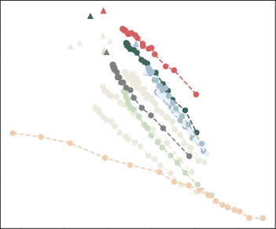

Figure A.1: Entailment generation performance plotted against diversity (average of _H_ 1 and _H_ 2 ).

E2E

E2E CommonGen

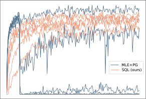

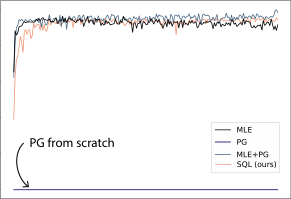

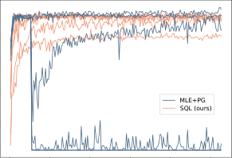

Figure A.2: Training curves on validation sets. **Left:** Training curves on E2E with best hyperparameter configurations. **Middle:** Training curves on E2E with varying reward scale. **Right:** Training curves on CommonGen with
varying reward scale.

BART (Lewis et al., 2020) to compute the topic
score in §4.3. [11] To compute perplexities, we use a
GPT-2 model ( 124 M parameters) (Radford et al.,
2019) fine-tuned on the corresponding datasets for
computing perplexity in §4.1 and 4.2, and a distilled GPT-2 model in §4.3 without fine-tuning. [12]

We simply set reward weights to 1 _._ 0, except in
§4.2, where we changed the entailment weight to
0 _._ 5, log-likelihood and repetition penalty weight to

5 _._ 0.

**A.2.1** **Setup Details: §4.1**

We study using the SNLI dataset (Bowman et al.,

2015), a dataset commonly used in training an entailment classifier. The original dataset contains
_(premise, hypothesis)_ sentence pairs, where the hypothesis may or may not entail the premise. We
sub-sampled 50 _,_ 000 training examples from the
corpus such that the hypotheses have an average
entailment probability of only 50% in terms of the
premises, and over 2 _/_ 5 examples have entailment
probabilities less than 20%, which can be seen as

11 [https://huggingface.co/facebook/](https://huggingface.co/facebook/bart-large-mnli)
[bart-large-mnli. 407M parameters.](https://huggingface.co/facebook/bart-large-mnli)
12 [https://huggingface.co/distilgpt2](https://huggingface.co/distilgpt2) . 82 M
parameters.

negative (contradictive) examples. The resulting
training set poses a significant challenge for the
models to learn from the noises.

The RL algorithms (including PG and ours) permit us to plug in arbitrary reward functions to drive
learning. Based on the goal of the task, we use the
following intuitive rewards to ensure entailment
accuracy and language quality: (1) a robust entailment classifier (Nie et al., 2020) that measures the
entailment score of a generation in terms of the input premise, (2) a GPT-2 language model (Radford
et al., 2019) that measures the log-likelihood of the
generation as an indicator of language quality, and
(3) BLEU score w.r.t the input premises as another
language quality reward that avoids trivial outputs.
We sum together all rewards with weights 1 _._ 0.

**A.2.2** **Setup Details: §4.2**

We study the task of attacking an entailment classifier. In particular, we aim to attack one of the
most popular entailment classifiers on HuggingFaceHub. [13] The attack generation model gener

13 [https://github.com/pytorch/fairseq/](https://github.com/pytorch/fairseq/tree/master/examples/roberta)
[tree/master/examples/roberta](https://github.com/pytorch/fairseq/tree/master/examples/roberta), which is
ranked #1 as of May 20, 2021 based on [https:](https://huggingface.co/models?search=nli)

Model Generation Rate

MLE+PG it ’s . 90.48
SQL (ours) the person saint-pierre-et-saint-paul is 97.40
saint-pierre-et-saint-paul .

Table A.2: Entailment attack samples and respective
entailment rates across all test premises. For example,
the adversarial sample by SQL is considered to entail
97.40% test premises by the entailment classifier.

[ates adversarial text without conditioning on any](https://huggingface.co/models?search=nli)
[inputs so that the generated attacks are universal](https://huggingface.co/models?search=nli)
[to all premises. The generation model is trained](https://huggingface.co/models?search=nli)
[with mostly the same setting as in §4.1, where](https://huggingface.co/models?search=nli)
[the entailment classifier to be attacked is used as](https://huggingface.co/models?search=nli)
[entailment score reward functions. Besides, we ad-](https://huggingface.co/models?search=nli)
[ditionally include a token-level repetition penalty](https://huggingface.co/models?search=nli)
[reward, which empirically benefits readability. Fi-](https://huggingface.co/models?search=nli)
[nally, we use the MultiNLI dataset (Williams et al.,](https://huggingface.co/models?search=nli)
[2018) which includes more diverse examples than](https://huggingface.co/models?search=nli)
the SNLI used above.

We compare our SQL [with](https://huggingface.co/models?search=nli) MLE+PG . We use all
[hypotheses in the MultiNLI dataset as the training](https://huggingface.co/models?search=nli)
[data for the MLE training in](https://huggingface.co/models?search=nli) MLE+PG and the offpolicy updates for our [SQL](https://huggingface.co/models?search=nli) . We do not compare
[with previous specialized adversarial text attack](https://huggingface.co/models?search=nli)
[methods, because they either are not applicable to](https://huggingface.co/models?search=nli)
[the universal attack setting (Morris et al., 2020;](https://huggingface.co/models?search=nli)
[Jin et al., 2020; Ebrahimi et al., 2017), or were](https://huggingface.co/models?search=nli)
[not designed to generate human-readable sentences](https://huggingface.co/models?search=nli)
[(Wallace et al., 2019). Besides, it is worth not-](https://huggingface.co/models?search=nli)
[ing that the general RL algorithms have an addi-](https://huggingface.co/models?search=nli)
[tional advantage of doing](https://huggingface.co/models?search=nli) _black-box_ attacks. That
[is, the algorithms only require the ability to query](https://huggingface.co/models?search=nli)
[the entailment classifier for entailment probability,](https://huggingface.co/models?search=nli)
[without need of knowing the internal structure of](https://huggingface.co/models?search=nli)
[the classifier (e.g., for computing gradients) as in](https://huggingface.co/models?search=nli)
[previous attack algorithms (Ebrahimi et al., 2017;](https://huggingface.co/models?search=nli)
Wallace et al., 2019).
For top- _p_ [sampling results, we sample a hypoth-](https://huggingface.co/models?search=nli)
[esis for each premise and measure the average at-](https://huggingface.co/models?search=nli)
[tack rate across the dataset. This is because sam-](https://huggingface.co/models?search=nli)

[pling multiple hypotheses, each for all premises,](https://huggingface.co/models?search=nli)
[and measure performance are expensive. Since the](https://huggingface.co/models?search=nli)
[hypotheses are sampled input-independently, this](https://huggingface.co/models?search=nli)
[should be a good approximation.](https://huggingface.co/models?search=nli)

**A.2.3** **[Setup Details: §4.3](https://huggingface.co/models?search=nli)**

[Following (Dathathri et al., 2019), we aim to con-](https://huggingface.co/models?search=nli)
[trol the generation to have one of 7 topics (e.g., “sci-](https://huggingface.co/models?search=nli)
[ence”); the generated prompt is prepended to one](https://huggingface.co/models?search=nli)

[//huggingface.co/models?search=nli.](https://huggingface.co/models?search=nli)

of 20 input sentences (Figure 5) for the pretrained
LM to generate continuation sentences. There is
no direct supervision data available for training
the prompt generator. We randomly create some
noisy text as the training data for MLE baselines
below and for off-policy updates for our algorithm.
Specifically, the noisy text is created by sampling
keywords and topics from the list used in (Dathathri
et al., 2020) and a paraphrase generation model.

Figure 5 shows the architecture of prompt-based
controllable generation. We compare our SQL
method with MLE+PG as before. At training time,
for each generated prompt sample, the pretrained
LM generates 2 continuation sentences for evaluating average reward. We use a _zero-shot_ classifier to evaluate the topic accuracy of the continuation sentences. That is, we do not assume
access to classifiers pretrained on topic-specific
sentences, because generating such topic-specific
sentences is the goal of the task in the first place.
We additionally use an LM to evaluate the loglikelihood of continuation sentences for measuring
language quality. Since the prompt length could
impact the generated sentences, we conducted experiments with maximum prompt length 5, 10, and
15 . As ablation study, we also evaluate the SQL
algorithm with only off-policy updates (i.e., without on-policy exploration), denoted as SQL(off),
and compare it with vanilla MLE training. At test
time, given a topic, the trained prompt generator
produces one prompt using beam search decoding. For each generated prompt, the pretrained
LM generates 100 sentences using top- _k_ decoding (with _k_ = 50 ) for evaluation. Finally, we also
compare with two specialized controllable generation techniques based on pretrained LMs, namely
PPLM (Dathathri et al., 2019) and GeDi (Krause
et al., 2020), following similar procedures using
their open-sourced code. We use a distilled GPT2 model [14] as the pretrained LM to be controlled.
We use the paraphrase generation model based
on Zhang et al. (2019). [15] During decoding, we
include no_repeat_ngram_size= 2, which
improves readability. [16]

14 [https://huggingface.co/distilgpt2](https://huggingface.co/distilgpt2)
15 [https://huggingface.co/tuner007/](https://huggingface.co/tuner007/pegasus_paraphrase)
[pegasus_paraphrase](https://huggingface.co/tuner007/pegasus_paraphrase)

16 [https://huggingface.co/blog/](https://huggingface.co/blog/how-to-generate)
[how-to-generate](https://huggingface.co/blog/how-to-generate)

**A.3** **The Soft** _Q_ **-Learning Framework**

**A.3.1** **Comparison with MLE Objective**

It is interesting to take a closer look at the
above objective and compare with the common
MLE training. Specifically, we notice the relations between the optimal _Q_ _[∗]_, _V_ _[∗]_, and _A_ _[∗]_ functions: _A_ _[∗]_ ( _**s**_ _t_ _, a_ _t_ ) = _Q_ _[∗]_ ( _**s**_ _t_ _, a_ _t_ ) _−_ _V_ _[∗]_ ( _**s**_ _t_ ) = _r_ _t_ +
_γV_ _[∗]_ ( _**s**_ _t_ +1 ) _−_ _V_ _[∗]_ ( _**s**_ _t_ ), where the first equation is
the definition of _A_ _[∗]_ (see Eq.5) and the second
equation is due to Eqs. (10) and (5) . We thus
can see the regression target in the above objective as an approximation to the advantage func
¯ ¯ ¯
tion: _A_ [˜] _θ_ ( _**s**_ _t_ _, a_ _t_ ) := _−V_ _θ_ ( _**s**_ _t_ ) + _γV_ _θ_ ( _**s**_ _t_ +1 ) + _r_ _t_ .
Therefore, by optimizing the regression objective,
log _π_ _θ_ ( _a_ _t_ _|_ _**s**_ _t_ ), which is the log probability of generating token _a_ _t_ given preceding tokens _**s**_ _t_, is encouraged to match the approximate advantage value ˜

¯
_A_ _θ_ ( _**s**_ _t_ _, a_ _t_ ), no more and no less. This is different from the objective of MLE where the model
is trained to (blindly) increase the probability of
the observed token _a_ _t_ given _**s**_ _t_ and decrease the
probability of the rest.

**A.3.2** **Vanilla Training with Temporal**
**Consistency**

Much like the Bellman temporal consistency in
standard _Q_ -learning, in SQL, the optimal actionvalue function follows the _softmax_ form of the
temporal consistency (Ziebart et al., 2008; Ziebart,
2010; Fox et al., 2016; Nachum et al., 2017):

_Q_ _[∗]_ ( _**s**_ _t_ _, a_ _t_ ) = _r_ _t_ + _γ_ log � _a_ _t_ +1 [exp] _[ Q]_ _[∗]_ [(] _**[s]**_ _[t]_ [+1] _[, a]_ _[t]_ [+1] [)] _[ .]_

(10)
We thus can derive a regression objective similar to
the standard _Q_ -learning (Eq.2):

_L_ SQL, vanilla ( _**θ**_ )

�

� exp _Q_ _θ_ ¯ ( _**s**_ _t_ +1 _, a_ _t_ +1 ) _−_ _Q_ _θ_ ( _**s**_ _t_ _, a_ _t_ )

_a_ _t_ +1

2

_._

� �

= E _π_ _′_

0 _._ 5 _·_

�

_r_ _t_ + _γ_ log �

(11)
Recall that _π_ _[′]_ is an arbitrary behavior policy (e.g.,

¯
data distribution), and _Q_ _θ_ is the target _Q_ -network
which is a slow copy of the _Q_ _θ_ to be learned and
is held fixed during the gradient updates. However,
the above objective is inefficient due to exact the
same reasons as in standard _Q_ -learning discussed
earlier, namely the unstable per-step bootstrappingstyle training with sparse reward signals, plus the
slow updates w.r.t only one token _a_ _t_ out of the large
vocabulary (action space).

**Model** **Entl. Prob** _↑_ **Entl. Rate** _↑_ **PPL** _↓_ _H_ 1 _↑_ _H_ 2 _↑_

MLE 75 _._ 62/75 _._ 86 79 _._ 75/80 _._ 23 5 _._ 49/5 _._ 45 5 _._ 46/5 _._ 42 8 _._ 47/8 _._ 40
GOLD-s (Pang and He, 2021) 74 _._ 55/76 _._ 03 78 _._ 69/79 _._ 89 5 _._ 55/5 _._ 50 5 _._ 50/5 _._ 49 8 _._ 48/8 _._ 45
MLE+PG 90 _._ 16/89 _._ 73 95 _._ 18/94 _._ 13 6 _._ 38/6 _._ 31 5 _._ 23/5 _._ 20 8 _._ 02/7 _._ 99
SQL 91 _._ 94/91 _._ 55 96 _._ 26/96 _._ 21 8 _._ 41/8 _._ 42 5 _._ 59/5 _._ 58 8 _._ 20/8 _._ 21
SQL (single) _[†]_ 89 _._ 90/89 _._ 92 94 _._ 94/94 _._ 82 214 _._ 42/214 _._ 42 0 _._ 00/0 _._ 00 0 _._ 00/0 _._ 00

Table A.3: Beam search results on entailment generation, in the format **val/test** . _↑_ / _↓_ indicates higher/lower is better.

_†_ SQL (single) achieves zero in _H_ 1 / _H_ 2 as it generates a single token.

**Length** **Model** **legal** **politics** **computers** **space** **religion** **science** **military** **Average**

**Topic Scores**

/ PPLM 16 _._ 52 25 _._ 09 13 _._ 35 26 _._ 23 5 _._ 39 38 _._ 87 19 _._ 33 **20** _**.**_ **68**

/ GeDi 40 _._ 51 83 _._ 40 9 _._ 32 70 _._ 90 18 _._ 69 12 _._ 46 86 _._ 40 **45** _**.**_ **96**

5 MLE 17 _._ 28 13 _._ 44 7 _._ 26 42 _._ 27 45 _._ 24 39 _._ 31 63 _._ 75 **32** _**.**_ **65**
5 SQL (off) 23 _._ 79 61 _._ 11 24 _._ 07 7 _._ 91 61 _._ 77 64 _._ 67 67 _._ 83 **44** _**.**_ **45**
5 MLE+PG 29 _._ 45 74 _._ 16 72 _._ 49 57 _._ 39 65 _._ 62 74 _._ 31 76 _._ 86 **64** _**.**_ **33**
5 SQL 11 _._ 79 70 _._ 57 66 _._ 37 58 _._ 80 65 _._ 60 69 _._ 24 83 _._ 15 **60** _**.**_ **79**
10 MLE+PG 17 _._ 72 75 _._ 29 71 _._ 01 73 _._ 92 58 _._ 29 80 _._ 85 80 _._ 84 **65** _**.**_ **42**
10 SQL 29 _._ 62 86 _._ 58 75 _._ 72 58 _._ 38 71 _._ 29 81 _._ 05 91 _._ 40 **70** _**.**_ **58**
15 MLE+PG 40 _._ 18 81 _._ 47 47 _._ 14 82 _._ 64 76 _._ 21 84 _._ 82 89 _._ 31 **71** _**.**_ **68**
15 SQL 48 _._ 08 77 _._ 94 70 _._ 04 87 _._ 43 75 _._ 46 85 _._ 94 77 _._ 36 **74** _**.**_ **61**

**Perplexity**

/ PPLM 13 _._ 52 12 _._ 81 12 _._ 79 13 _._ 56 12 _._ 98 12 _._ 43 13 _._ 38 **13** _**.**_ **07**

/ GeDi 204 _._ 44 80 _._ 01 132 _._ 82 116 _._ 94 132 _._ 19 90 _._ 00 110 _._ 77 **123** _**.**_ **88**

5 MLE 24 _._ 52 25 _._ 05 23 _._ 79 26 _._ 26 26 _._ 07 25 _._ 63 28 _._ 56 **25** _**.**_ **70**
5 SQL (off) 25 _._ 48 22 _._ 70 25 _._ 10 26 _._ 64 25 _._ 84 27 _._ 45 27 _._ 19 **25** _**.**_ **77**
5 MLE+PG 24 _._ 42 22 _._ 60 27 _._ 74 23 _._ 17 25 _._ 38 24 _._ 84 30 _._ 50 **25** _**.**_ **52**
5 SQL 25 _._ 31 24 _._ 15 26 _._ 40 24 _._ 31 27 _._ 02 25 _._ 73 28 _._ 67 **25** _**.**_ **94**
10 MLE+PG 28 _._ 25 23 _._ 49 27 _._ 82 26 _._ 88 31 _._ 62 25 _._ 31 33 _._ 74 **28** _**.**_ **16**
10 SQL 25 _._ 23 25 _._ 37 26 _._ 20 26 _._ 97 25 _._ 02 27 _._ 11 32 _._ 76 **26** _**.**_ **95**
15 MLE+PG 28 _._ 38 28 _._ 24 28 _._ 16 27 _._ 21 26 _._ 43 29 _._ 99 32 _._ 54 **28** _**.**_ **71**
15 SQL 35 _._ 16 27 _._ 72 29 _._ 70 31 _._ 89 24 _._ 04 28 _._ 46 26 _._ 74 **29** _**.**_ **10**

Table A.4: Prompt generation results. Note that some of the numbers from GeDi are low because the topics are
tokenized into two subword tokens, which the model was not trained with.

Input: two men on bicycles competing in a race .
Generated: two men are riding bikes .

Input: families waiting in line at an amusement park for their turn to ride .
Generated: families at a amusement park .

Input: man in a black suit, white shirt and black bowtie playing an instrument with the rest of his symphony surrounding
him .
Generated: a man is playing music .

Input: a white dog with long hair jumps to catch a red and green toy .
Generated: a dog is jumping

Input: a man in a black shirt is playing golf outside .
Generated: a man is playing golf

Input: a man wearing sunglasses is sitting on the steps outside, reading a magazine .
Generated: a man is sitting outside .

Input: a young child is jumping into the arms of a woman wearing a black swimming suit while in a pool .
Generated: a child is jumping into a pool .

Input: a carefully balanced male stands on one foot near a clean ocean beach area .
Generated: a man is on the beach .

Input: two young boys in swimming trunks are in the water looking at each other .
Generated: two boys are in the water .

Input: a woman riding a bicycle past a car and a group of people on a sidewalk .
Generated: a woman rides a bicycle .

Input: a female sings and plays into a microphone and a male in green striped shorts plays a hand drum
Generated: a woman is playing music .

Input: a little girl wearing a cardboard diner hat is finishing off some onion rings at a restaurant .
Generated: a little girl is at a restaurant .

Input: young woman celebrates getting a strike during a bowling game .
Generated: a young woman is present

Input: black greyhound dog racing down a track .
Generated: a dog runs down a track .

Input: several men on stage having a discussion .
Generated: men are talking on stage .

Table A.5: Entailment generation samples from SQL (beam search, validation dataset).

legal: legal space religion and space In summary, a good understanding of these concepts is that by giving an explicit
understanding to a person, they provide an avenue to be studied and studied. But the concept of one person being a space
is also very confusing, and can be very difficult to obtain.\n So,
politics: the primary referendum is In summary, the outcome will be a referendum on the EU membership for the first
time of its kind for EU citizens, and the full extent of the benefits of a single market and a flexible single EU state."
computers: macintoshintoshintoshintosh In summary, it appears that the company and IBM products are currently in need
of upgrading the computer. This can be seen in a detailed review of the Macintosh version of Windows Vista and XP.
However, when looking at the changes made by the HP Macintosh hardware and software versions of
space: legal space science and space In summary:\n\n The purpose of this paper is to investigate and test the theory of
space space and other objects. This project will support NASA.s efforts to demonstrate these theories, and to propose
other relevant new theories.\n This paper provides the following arguments for the
religion: space legal religion religion religion In summary, to the author the current discussion is the position of the
Church and the community. While we acknowledge that we should not be commenting upon claims such as our recent
cases or the other ones that contradict our view, we conclude it is appropriate to include these cases. Further
science: the chemical microscope is In summary, the most sophisticated of these experiments is a technique that gives no
obvious, no apparent way of revealing that the material was obtained. In this study, we examine how the compounds in the
samples in question make up the composition of the chemical and its properties. The chemical composition
military: arms defense battalion battalion cavalry In summary: 6th Panzer Field Division, Second Division.\n\n The main
task of the battalion in the main counterinsurgency campaign was to counter the enemy in any counter-incursion. The
main objective of this campaign is to eliminate enemy groups and the remnants of
legal: legal space religion and space This essay discusses the idea of space and time as a space, in both theoretical and
conceptual terms, as not an individual time period or anything else. The emphasis is on time itself, rather than having a
fixed central space. Space was the object of the first chapter, and
politics: the primary referendum is This essay discusses the nature of the EU referendum. The purpose of this essay is to
shed light on the importance of a public referendum, on a question of whether the decision of an EU member states to
remain in the European Union is constitutional and thus in accord with constitutional guarantees of sovereignty
computers: macintoshintoshintoshintosh This essay discusses hardware devices and software systems for Mac OS X,
MacOS X and Linux. To view the latest version of Macintosh OS: Mac 8.7.x\n\n For more information or for information
about Macintosh systems, visit Mac MacSystems.\n More
space: legal space science and space This essay discusses science for teens, adults and teenagers.\n\n When the idea of
studying space was first implemented as a method to test, the question was: What if a student has been "comfortable" with
space without its body? What would their body like to be
religion: space legal religion religion religion This essay discusses an alternative religion that focuses on the role of a
particular religion and views some form of religious ethics as the form when the law is applied to that particular religious
community . This discussion is concerned with the status of faith for individuals or groups which may be members and
members
science: the chemical microscope is This essay discusses the mechanisms of reaction with a focus on the molecular
structure of nucleite and of enzymes within the cytoskeleton, thus making it easier to understand the process of metabolism
and other elements of cellular life. In this essay, we use techniques such as the photochemical transfer
military: arms defense battalion battalion cavalry This essay discusses three main themes:\n\n 1) Lack of uniformed soldiers
is an unacceptable and unconscionable strategy for the Army.\n 2) Poor and inadequate training does not compensate the
soldiers, and may deprive them of the necessary and competitive training from their instructors

Table A.6: Prompt samples from SQL.

legal: there liable injunction In summary, the court decided that defendants had a right to petition the high court to
intervene, and therefore granted the injunction. However, a Court of Appeal decision in the US District Court ruled with
no effect on the petitioned by the plaintiffs, citing two reasons.\n\n The US
politics: the primary referendum was In summary, the majority of Russians would support the idea of banning all human
rights, and that would be a major part of the government’s effort to build a new liberal economy, which President Vladimir
Putin says would boost Russian tourism.\n\n The results were published in the
computers: the macintoshintosh In summary, the kernel has the best quality of life, and kernel security is at the heart of
any OS development. The first time Linux released was when i386 released the Macintosh version, which had a rather low
standard. Other issues like the introduction of the OS6 operating system
space: comet asteroid spaceship In summary, this asteroid asteroid ship is about to make its maiden flight to explore
deep-space.\n\n "The asteroid craft was a very early attempt at the discovery of a new home for the world’s first black
hole," NASA said in a news release. "Today we
religion: faith faith faith salvation In summary, Christian beliefs are not a new way to use the time spent thinking about
God’s world as a source for faith. Faith is an effort to think of the world without fear that it might become a dangerous
place for the human family. Because it represents the very essence that
science: climate research chemistry In summary of the study, this review aims to determine how in a single study where
the same number of data was analysed, a new methodology is needed to better understand who produced a different graph
than the one suggested. The paper will be published in issue #5, Issue #18.
military: the cavalry battalion a In summary, the army are a unit of the same type and in all, so there is no need to declare
one. The unit does not constitute a cavalry unit or for use on troops.\n\n The army is not under the command of a brigade
from the front. For
legal: there liable injunction This essay discusses the potential legal consequences of a stay in the United States for an
indefinite period of time if the government continues to delay the process of de-instituting it. To apply such a request, all
applicable laws shall apply either the same terms as the existing statutes. In
politics: the primary referendum was This essay discusses the electoral strategy against a candidate for governor of the
Commonwealth.\n\n The survey of British voters in this survey provides an overview of what the candidates for the United
Kingdom will be seeking in the next Parliament. In the general election a few seats will lead up to a
computers: the macintoshintosh This essay discusses the various problems of the Macintosh, the first two-year running
environment. An early version of this paper was originally published in 1982. The MacSX was not designed and managed
by Kia.\n\n Macintosh\n The mac has been a family invention
space: comet asteroid spaceship This essay discusses a topic: the impact of two of the Earth’s two-thirds comet-sized
moon Charon on Earth, and why asteroids are so close to the sun; why people are looking for ways to find a way to keep
Earth-shaped asteroids out of orbit.
religion: faith faith faith salvation This essay discusses the impact religion has on the American experience and in
American culture. Since the beginning of my career I have found that faith and belief have often been linked to economic
growth, social development and education. I believe that all people need to know that there is no reason for
science: climate research chemistry This essay discusses the role of molecular information and its interaction with the
general organism and human health.\n\n "The idea of biological information is not really a new concept. We used genetic
information as a medium to define, identify, and store information about biology and biology," explains Dr.
military: the cavalry battalion a This essay discusses the potential for the development of a small infantry brigade as an
infantry regiment. It is also a contribution to the larger cavalry corps as it would require a larger brigade for battle. For
more information see the original article on this page.

Table A.7: Prompt samples from MLE+PG.

legal: In summary Currently: In 1966 the Act was amended into state of law through amendments.\n\n\n Defent No. 1 etc
695 [The character in question for judicial decision purposes; participation t concerned you; "but not acceptance.")\n\n
Generally held: Just
politics: In summary Senate candidates, senator (Republican); senator (Democrat); and opinion-former (2002-08). - 2012
Senate results are based on the federal Election Commission’s October 2016 Current Opinion Polling Reports. Key figures
: Open Gallup poll Most Americans view the
computers: In summary: 12-16 add-on chips. Trace out the type predefined ORDER parameters, and write to /dev/tty with
them.\n\n\n\n\n\n\n\n\n Roundset sizes with mm(831x810 x870 x81f);
space: In summary Space Station - Farm Station (1985 by Mike Lazarra) Here is an article developed by Maregnus Spirit
Experimentator on WinViotrv - An exploration benefit for compute-enriched array data densities (UPERS).This thesis
home
religion: In summary nice things about Android 6.1 Jelly Bean!\n Searching for OP lag fixes one of my cllcs or some other
improvements that’s fixing a bug due to this nerf! (model causing Huge Frame Decay!) It also fixed an upper turret hook
science: In summary Computer Age Experience Overview\n\n\n\n Networking skills are the most developed skill set
for Internetthumb members at universities at this time. In computer science, we are introducing various gatekeepers to
intellectual property ownership and cyberware acquisitions, entry program makers post a
military: In summary Army Sgt. Harold Tolbard (5/16/2018) Lt. Gen. Michael Bachaes 1 Dickie Powell 2 Lt. Zachary
Bram 9 *Gen. Robert Eisen: Warfighter – Soldier + Genoured\n\n\n – Senior Bush Doctrine
legal: This essay discusses Illinois cases on issues such as drug trafficking and drug Social Security.
politics: This essay discusses federal ethics as the key area on which current and past state and local governments have
been operating.
computers: This essay discusses the very development of alternative technology for young people.
space: This essay discusses NASA’s StarHubble satellite mission development. Transcript here.
religion: This essay discusses various aspects of the relays of mediocality and Hammazanna.
science: This essay discusses Linux desktop computing, and IRI video-game applications.\n\n The zooming in — even
after the GNOME 3 transition came to an end, is all about figuring out how you have run a software operating system so
vital that any hacker can mine it
military: This essay discusses military courage that included in the combat operations in Iraq and Afghanistan.

Table A.8: Prompt samples from GeDi.

legal: In summary we have published in the journal Nature Neuroscience: A systematic review of human brain tissue has
found no evidence for any association between the presence of the presence of a particular form of human neuropathy in
the brain, a condition that is not normally associated with cognitive impairment. We found that
politics: In summary we have a list of 10 of the best and most common types of drugs for people with HIV. This is a very
short list of recommendations from a national and international community.\n\n\n\n This article has been updated to make
the official state of the EU state of
computers: In summary, we believe that the current system has no way of doing anything about it.\n\n\n\n The following
steps are taken to get the system working.\n\n 1. Install a new operating system with a Linux Mint operating system\n 2.
Start a new Linux Mint operating
space: In summary we have some important news from the moment of the year and some important information about
these two major planets. This new discovery is the first to confirm this important planet has an active life in its home
planet, a planet with a mass of about 5.8 billion tons. It
religion: In summary, we believe that the current administration has no way of doing anything about the Benghazi attacks.
This is a very interesting story, and I think it has been a very nice surprise. This is a very nice and well thought out piece
that is a must for the
science: In summary we use this approach to evaluate if the number of data points (in the dataset) that are relevant for
each data set is the same (in this case, the data are not in one data set). In this approach we can test the data points in a
different way.
military: In summary we have some important news from the moment of the year and some important information from
the moment of the year.\n\n\n\n\n We’ve also added an additional update for our new feature, which includes:\n - Improved
access and access in all of the main
legal: This essay discusses how you can build a community of dedicated people. If you’re a member of a community of
people who want to contribute to the environment, you’ll also be helping them build communities in order to support the
local economy, and the future of the city. The latest report
politics: This essay discusses how we can build on previous research findings about the role religion plays in human
development in human development. This is a very interesting and highly entertaining story. What is an "independent"
political party in the United States, the U.S. political party, and the United
computers: This essay discusses how you can build a new browser to view and share your favorite web sites.\n\n\n A
browser that is open source can also be built from a web browser, which can be a browser that does not allow browser
extensions (e.g. Firefox, Chrome, Opera
space: This essay discusses how you can build a life with a healthy diet and how you can use it when you’re ready to move
forward. It’s a very simple approach to building a life with a healthy diet and what it means to be healthy and healthy for
the
religion: This essay discusses how you can build a new game without having to play the original game, and how you can
make a new title that is completely different to the original. It has been around since 2007, when the first game, The Elder
Scrolls IV: Oblivion, was released in the PlayStation
science: This essay discusses how we can build on previous research findings about the role of obesity in human metabolism
and how we can improve our health.\n\n\n\n In this essay, we explore why eating a whole whole diet does not help prevent
obesity (1). We find that a whole food diet
military: This essay discusses how you can build a community with the help of friends and family.\n\n\n\n\n "The people
around me are the ones who need help. They are the ones who need help. They are the ones who are not alone."\n Michael\n "It’s

Table A.9: Prompt samples from PPLM.

