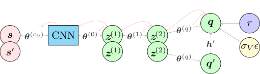
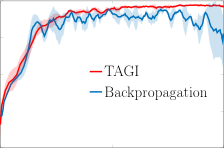
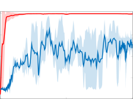
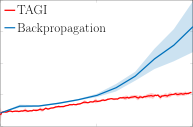
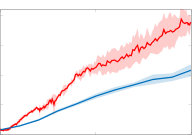
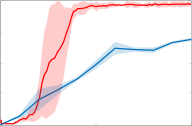
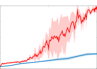

## Analytically Tractable Bayesian Deep Q-Learning

Luong Ha Nguyen [∗] and James-A. Goulet [∗]

Department of Civil, Geologic and Mining Engineering
Polytechnique Montr´eal, CANADA

June 22, 2021

**Abstract**

Reinforcement learning (RL) has gained increasing interest since
the demonstration it was able to reach human performance on video
game benchmarks using _deep Q-learning_ (DQN). The current consensus for training neural networks on such complex environments is to
rely on gradient-based optimization. Although alternative Bayesian
deep learning methods exist, most of them still rely on gradient-based
optimization, and they typically do not scale on benchmarks such as
the Atari game environment. Moreover none of these approaches allow
performing the analytical inference for the weights and biases defining
the neural network. In this paper, we present how we can adapt the
temporal difference Q-learning framework to make it compatible with
the _tractable approximate Gaussian inference_ (TAGI), which allows
learning the parameters of a neural network using a closed-form analytical method. Throughout the experiments with on- and off-policy
reinforcement learning approaches, we demonstrate that TAGI can reach
a performance comparable to backpropagation-trained networks while
using fewer hyperparameters, and without relying on gradient-based
optimization.

### **1 Introduction**

Reinforcement learning (RL) has gained increasing interest since the demonstration it was able to reach human performance on video game benchmarks
using _deep Q-learning_ (DQN) [ 17, 26 ]. Deep RL methods typically require
an explicit definition of an exploration-exploitation function in order to compromise between using the current policy and exploring the potential of new

∗ Correspondence: luong-ha.nguyen@polymtl.ca, james.goulet@polymtl.ca

1

actions. Such an issue can be mitigated by opting for a Bayesian approach
where the selection of the optimal action to follow is based on Thompson
sampling [ 23 ]. Bayesian deep learning methods based on variational inference

[ 12, 10, 5, 14, 20, 29 ], Monte-Carlo dropout [ 8 ], or Hamiltonian Monte-Carlo
sampling [ 18 ] have shown to perform well on regression and classification
benchmarks, despite being generally computationally more demanding than
their deterministic counterparts. Note that none of these approaches allow
performing the analytical inference for the weights and biases defining the
neural network. Goulet et al. [ 9 ] recently proposed the _tractable approximate_
_Gaussian inference_ (TAGI) method which allows learning the parameters of
a neural network using a closed-form analytical method. For convolutional
architectures applied on classification benchmarks, this approach was shown
to exceed the performance of other Bayesian and deterministic approaches
based on gradient backpropagation, and to do so while requiring a smaller
number of training epochs [19].
In this paper, we present how can we adapt the temporal difference
Q-learning framework [ 24, 28 ] to make it compatible with TAGI. Section 2
first reviews the theory behind TAGI and the expected value formulation
through the Bellman’s Equation. Then, we present how the action-value
function can be learned using TAGI. Section 3 presents the related work
associated with Bayesian reinforcement learning, and Section 4 compares the
performance of a simple TAGI-DQN architecture with the one obtained for
its backpropagation-trained counterpart.

### **2 TAGI-DQN Formulation**

This section presents how to adapt the DQN frameworks in order to make
them compatible with analytical inference. First, Section 2.1 reviews the
fundamental theory behind TAGI, and Section 2.1 reviews the concept of
long-term expected value through the Bellman’s equation [ 25 ]. Then, Section
2.3 presents how to make the Q-learning formulation [ 28 ] compatible with
TAGI.

**2.1** **Tractable Approximate Gaussian Inference**

TAGI [ 9 ] relies on two main steps; _forward uncertainty propagation_ and
_backward update_ . The first forward uncertainty propagation step is intended
to build the joint prior between the neural network parameters and the
hidden states. This operation is made by propagating the uncertainty from
the model parameters and the input layer through the neural network. TAGI

2

relies on the Gaussian assumption for the prior of parameters as well as
for the variables in the input layer. In order to maintain the analytical
tractability of the forward step, we rely on the _Gaussian multiplicative_
_approximation_ (GMA) which consists in approximating the product of two
Gaussians by a Gaussian random variable whose moments match those
calculated exactly using moment generating functions. In order to propagate
uncertainty through non-linear activation functions, a second approximation
made by locally linearizing these function at the expected value of the hidden
unit being activated. Although this linearization procedure may seems to be
a crude approximation, it has been shown to match or exceeds the state-ofthe-art performance on fully-connected neural networks (FNN) [ 9 ], as well
as convolutional neural networks (CNN) and generative adversarial networks

[ 19 ]. TAGI succeeds in maintaining a linear computational complexity for
the forward steps, (1) by assuming a diagonal covariance for all parameters
in the network and for all the hidden units within a same layer, and (2) by
adopting a layer-wise approach where the joint prior is only computed and
stored for the hidden units on pairs of successive hidden layers, as well as
the hidden units within a layer and the parameters connecting into it. This
layer-wise approach is allowed by the inherent conditional independence that
is built-in feed-forward neural network architectures.

The second backward update-step consists in performing layer-wise recursive Bayesian inference which goes from hidden-layer to hidden-layer and
from hidden-layer to the parameters connecting into it. Given the Gaussian
approximation for the joint prior throughout the network, the inference can
be done analytically while still maintaining a linear computational complexity
with respect to the number of weight parameters in the network. TAGI allows
inferring the diagonal posterior knowledge for weights and bias parameters,
either using one observation at a time, or using mini-batches of data. As we
will show in the next sections, this online learning capacity is best suited for
RL problems where we experience episodes sequentially and where we need
to define a tradeoff between exploration and exploitation, as a function of
our knowledge of the expected value associated with being in a state and
taking an action.

**2.2** **Expected Value and Bellman’s Equation**

We define _r_ ( _**s**_ _, a,_ _**s**_ _[′]_ ) as the reward for being in a state _**s**_ _∈_ R `[S]`, taking an
action _a ∈A_ = _{a_ 1 _, a_ 2 _, · · · a_ `A` _}_, and ending in a state _**s**_ _[′]_ _∈_ R `[S]` . For simplicity,
we use the short-form notation for the reward _r_ ( _**s**_ _, a,_ _**s**_ _[′]_ ) _≡_ _r_ ( _**s**_ ) in order to

3

define the value as the infinite sum of discounted rewards

_v_ ( _**s**_ ) =

_∞_
� _γ_ _[k]_ _r_ ( _**s**_ _t_ + _k_ ) _._ (1)

_k_ =0

As we do not know what will be the future states _**s**_ _t_ + _k_ for _k >_ 0, we need to
consider them as random variables ( _**S**_ _t_ + _k_ ), so that the value _V_ ( _**s**_ _t_ ) becomes
a random variable as well,

_V_ ( _**s**_ _t_ ) = _r_ ( _**s**_ _t_ ) +

_∞_
� _γ_ _[k]_ _r_ ( _**S**_ _t_ + _k_ ) _._ (2)

_k_ =1

Rational decisions regarding which action to take among the set _A_ is based the
maximization of the expected value as defined by the _action-value_ function

�

_q_ ( _**s**_ _t_ _, a_ _t_ ) = _µ_ _V_ _≡_ E[ _V_ ( _**s**_ _t_ _, a_ _t_ _, π_ )] = _r_ ( _**s**_ _t_ ) + E

_∞_
�
� _k_ =1

� _γ_ _[k]_ _r_ ( _**S**_ _t_ + _k_ )

_k_ =1

_,_ (3)

where it is assumed that at each time _t_, the agent takes the action defined in
the policy _π_ . In the case of episode-based learning where the agent interacts
with the environment, we assume we know the tuple of states _**s**_ _t_ and _**s**_ _t_ +1,
so that we can redefine the value as

_V_ ( _**s**_ _t_ _, a_ _t_ ) = _r_ ( _**s**_ _t_ ) + _γ_ _r_ ( _**s**_ _t_ +1 ) +

�

_∞_
�

�

(4)

� _γ_ _[k]_ _r_ ( _**S**_ _t_ +1+ _k_ )

_k_ =1

= _r_ ( _**s**_ _t_ ) + _γV_ ( _**s**_ _t_ +1 _, a_ _t_ +1 ) _._

Assuming that the value _V ∼N_ ( _v_ ; _µ_ _V_ _, σ_ _V_ [2] [) in Equations 2 and 4 is described]
by Gaussian random variables, we can reparameterize these equations as the
sum of the expected value _q_ ( _**s**_ _, a_ ) and a zero-mean Gaussian random variable
_E ∼N_ ( _ϵ_ ; 0 _,_ 1), so that

_V_ ( _**s**_ _, a_ ) = _q_ ( _**s**_ _, a_ ) + _σ_ _V_ _E,_ (5)

where the variance _σ_ _V_ [2] [and] _[ E]_ [ are assumed here to be independent of] _**[ s]**_ [ and]
_a_ . Although in a more general framework this assumption could be relaxed,
such an heteroscedastic variance term is outside from the scope of this paper.
Using this reparameterization, we can write Equation 4 as the discounted
difference between the expected values of two subsequent states

_q_ ( _**s**_ _t_ _, a_ _t_ ) = _r_ ( _**s**_ _t_ ) + _γq_ ( _**s**_ _t_ +1 _, a_ _t_ +1 ) _−_ _σ_ _V_ _t_ _E_ _t_ + _γσ_ _V_ _t_ +1 _E_ _t_ +1 (6)
= _r_ ( _**s**_ _t_ ) + _γq_ ( _**s**_ _t_ +1 _, a_ _t_ +1 ) + _σ_ _V_ _E._

4

Note that in Equation 6, _σ_ _V_ _t_ and _γσ_ _V_ _t_ +1 can be combined in a single standard
deviation parameters _σ_ _V_ with the assumption that _E_ _i_ _⊥⊥E_ _j_ _, ∀i ̸_ = _j_ .
In the case where at a time _t_, we want to update the Q-values encoded
in the neural net only after observing _n_ -step returns [ 15 ], we can reformulate
the observation equation so that

_q_ ( _**s**_ _t_ _, a_ _t_ ) =

_n−t−_ 1
� _γ_ _[i]_ _r_ ( _**s**_ _t_ + _i_ )+ _γ_ _[n][−][t]_ _q_ ( _**s**_ _n_ _, a_ _n_ )+ _σ_ _V_ _E_ _t_ _, ∀t_ = _{_ 1 _,_ 2 _, · · ·, n−_ 1 _}._ (7)

_i_ =0

Note that in the application of Equation 7, we employ the simplifying
assumption that _E_ _t_ _⊥⊥E_ _t_ + _i_ _, ∀i ̸_ = 0, as Equation 6 already makes simplifying
assumptions for the independence of _σ_ _V_ [2] [and] _[ E]_ [. Note that in a more general]
framework, this assumption could be relaxed. An example of _n_ -step returns
is presented in the the algorithm displayed in § 1 from the supplementary
material.

The following subsections will present, for the case of categorical actions,
how to model the deterministic action-value function _q_ ( _**s**_ _, a_ ) using a neural
network.

**2.3** **TAGI Deep Q-learning for Categorical Actions**

Suppose we represent the environment’s state at a time _t_ and _t_ + 1 by _{_ _**s**_ _,_ _**s**_ _[′]_ _}_,
and the expected value for each of the `A` possible actions _a ∈A_ by the vector
_**q**_ _∈_ R `[A]` . In that context, the role of the neural network is to model the
relationships between _{_ _**s**_ _, a}_ and _**q**_ . Figure 1a presents a directed acyclic
graph (DAG) describing the interconnectivity in such a neural network,
where red nodes denote state variables, green nodes are vectors of hidden
units _**z**_, the blue box is a compact representation for the structure of a
convolutional neural network, and where gray arrows represent the weights
and bias _**θ**_ connecting the different hidden layers. Note that unlike other gray
arrows, the red ones in (b) are not directed arcs representing dependencies,
but they simply outline the flow of information that takes place during the
inference step. For simplification purposes, the convolutional operations
are omitted and all regrouped under the CNN box [ 19 ]. In order to learn
the parameters _**θ**_ of such a network, we need to expand the graph from
Figure 1a to include the reward _r_, the error term _σ_ _V_ _ϵ_, and _**q**_ _[′]_, the _q_ -values
of the time step _t_ + 1. This configuration is presented in Figure 1b where
the nodes that have been doubled represent the states _**s**_ and _**s**_ _[′]_ which are
both evaluated in a network sharing the same parameters. When applying
Equation 6, _q_ -values corresponding to a specific action can be selected using

5

(a) Neural network DAG for modelling the action-value function _q_

(b) DAG for the temporal-difference Q-learning configuration

Figure 1: Graphical representation of a neural network structure for temporaldifference Q-learning with categorical actions. The red nodes denote state
variables, green nodes are vectors of hidden units _**z**_, and the blue box is a
compact representation for the structure of a convolutional neural network.
The gray arrows represent the weights and bias _**θ**_ connecting the different
hidden layers and the red arrows outline the flow of information that takes
place during the inference step.

a vector _**h**_ _i_ _∈{_ 0 _,_ 1 _}_ `[A]` having a single non-zero value for the _i_ -th component
identifying which action was taken at a time _t_ so that

_q_ _i_ = [ _**q**_ ] _i_ = _**h**_ [⊺] _i_ _**[q]**_ _[.]_ (8)

During the network’s training, analogously to Thompson sampling [ 23 ], the
vector _**h**_ _[′]_ _i_ _[∈{]_ [0] _[,]_ [ 1] _[}]_ `[A]` [ is defined such that the] _[ i]_ [-th non-zero value corresponds]
to the index of the largest value among _**q**_ _[′]_, a vector of realizations from
the neural network’s posterior predictive output _**Q**_ _∼N_ ( _**q**_ _[′]_ ; _**µ**_ _**Q**_ _|D_ _,_ **Σ** _**Q**_ _|D_ ).
Because of the Gaussian assumptions in TAGI, this posterior predictive is
readily available from the forward uncertainty propagation step, as outlined
in §2.1.
The red arrows in Figure 1b outline the flow of information during
the inference procedure. The first step consists in inferring _**q**_ using the
relationships defined in either Equation 6 or 7. As this is a linear equation
involving Gaussian random variables, the inference is analytically tractable.
From there, one can follow the same layer-wise recursive procedure proposed
by Goulet et al. [ 9 ] in order to learn the weights and biases in _**θ**_ . With the
exclusion of the standard hyperparameters related to network architecture,
batch size, buffer size or the discount factor, this TAGI-DQN framework
only involves a single hyperparameter, _σ_ _V_, the standard deviation for the
value function. Note that when using CNNs with TAGI, Nguyen and Goulet

6

[ 19 ] recommended using a decay function for the standard deviation of the
observation noise so that at after seing _e_ batches of _n_ -steps,

_σ_ _V_ _[e]_ [= max(] _[σ]_ _V_ [min] _, η · σ_ _V_ ) _[e][−]_ [1] _._ (9)

The model in Equation 9 has three hyperparameters, the minimal noise
parameter _σ_ _V_ [min], the decay factor _η_ and the initial noise parameter _σ_ _V_ . As it
was shown by Nguyen and Goulet [ 19 ] for CNNs and how we show in § 4 for
RL problems, TAGI’s performance is robust towards the selection of these
hyperparameters.
A comparison of implementation between TAGI and backpropagation on
deep Q-network with experience replay [ 17 ] is shown in Figure 2. A practical
implementation of _n_ -step TAGI deep Q-learning is presented in Algorithm 1
from the supplementary material.

**Algorithm 1:** TAGI-DQN with Experience Replay

**1** Initialize replay memory _R_ to capacity _N_ ; **Σ** _V_ ;

**2** Initialize parameters _**θ**_ ;

**3** Discount factor _γ_ ;

**4** **for** _episode_ = 1 : `E` **do**

**5** Reset environment **s** 0 ;

**6** **for** _t_ = 1 : `T` **do**

**7** _q_ ( _s_ _t_ _, a_ ) : _Q_ ( _s_ _t_ _, a_ ) _∼N_ ( _**µ**_ _[Q]_ _**θ**_ [(] _[s]_ _[t]_ _[, a]_ [)] _[,]_ **[ Σ]** _[Q]_ _**θ**_ [(] _[s]_ _[t]_ _[, a]_ [));]

**8** _a_ _t_ = arg max _q_ ( _s_ _t_ _, a_ );
_a∈A_

**9** _s_ _t_ +1 _, r_ _t_ = enviroment( _a_ _t_ );

**10** Store _{s_ _t_ _, a_ _t_ _, r_ _t_ _, s_ _t_ +1 _}_ in _R_ ;

**11** Sample random batch of _{s_ _j_ _, a_ _j_ _, r_ _j_ _, s_ _j_ +1 _}_ ;

**Algorithm 2:** DQN with Experience Replay

**1** Initialize replay memory _R_ to capacity _N_ ;

**2** Initialize parameters _**θ**_ ;

**3** Discount factor _γ_ ;

**4** Define _ϵ_ (epsilon-greedy function);

**5** **for** _episode_ = 1 : `E` **do**

**6** Reset environment **s** 0 ;

**7** **for** _t_ = 1 : `T` **do**

**8** _u_ : _U ∼U_ (0 _,_ 1);

**10** _s_ _t_ +1 _, r_ _t_ = enviroment( _a_ _t_ );

**11** Store _{s_ _t_ _, a_ _t_ _, r_ _t_ _, s_ _t_ +1 _}_ in _R_ ;

**12** Sample random batch of _{s_ _j_ _, a_ _j_ _, r_ _j_ _, s_ _j_ +1 _}_ ;

**13** _y_ _j_ = _r_ _j_ + _γ_ max _a_ _[′]_ _∈A_ _[Q]_ _**[θ]**_ [(] _[s]_ _[j]_ [+1] _[, a]_ _[′]_ [);]

**14** Update _**θ**_ using gradient descent on

**15** _L_ = 0 _._ 5 [ _y_ _j_ _−_ _Q_ _**θ**_ ( _s_ _j_ _, a_ _j_ )] [2] ;

**9** _a_ _t_ =






`randi` ( `A` ) _u < ϵ_ ;

arg max _Q_ _**θ**_ ( _s_ _t_ _, a_ ) _u ≥_ _ϵ_ ;
_a∈A_

**12** _q_ ( _s_ _j_ +1 _, a_ _[′]_ ) : _Q_ ( _s_ _j_ +1 _, a_ _[′]_ ) _∼N_ ( _**µ**_ _[Q]_ _**θ**_ [(] _[s]_ _[j]_ [+1] _[, a]_ _[′]_ [)] _[,]_ **[ Σ]** _[Q]_ _**θ**_ [(] _[s]_ _[j]_ [+1] _[, a]_ _[′]_ [));]

**13** _a_ _[′]_ _j_ +1 [= arg max] _q_ ( _s_ _j_ +1 _, a_ _[′]_ );
_a_ _[′]_ _∈A_

**14** _**µ**_ _[y]_ _j_ [=] _[ r]_ _[j]_ [ +] _[ γ]_ _**[µ]**_ _[Q]_ _**θ**_ [(] _[s]_ _[j]_ [+1] _[, a]_ _[′]_ _j_ +1 [);]

**15** **Σ** _[y]_ _j_ [=] _[ γ]_ [2] **[Σ]** _[Q]_ _**θ**_ [(] _[s]_ _[j]_ [+1] _[, a]_ _[′]_ _j_ +1 [) +] **[ Σ]** _[V]_ [ ;]

**16** Update _**θ**_ using TAGI on PDF( _**θ**_ _|_ **y** )

Figure 2: Comparison of TAGI with backpropagation on deep Q-network with
experience replay. PDF: probability density function; _L_ : loss function; _U_ :
uniform distribution; `randi` : uniformly distributed pseudorandom integers.

### **3 Related Work**

Over the last decades, several approximate methods have been proposed in
order to allow for Bayesian neural networks [ 18, 12, 10, 5, 14, 20, 29, 8 ] with

7

various degree of approximations. Although some these methods have shown
to be capable of tackling classification tasks on datasets such ImageNet [ 20 ],
few of them have been applied on large-scale RL benchmark problems. The
key idea behind using Bayesian methods for reinforcement learning is to
consider the uncertainty associated with Q-functions in order to identify a
tradeoff between exploring the performance of possible actions and exploiting
the current optimal policy [ 25 ]. This typically takes the form of performing
Thompson sampling [23] rather than relying on heuristics such as _ϵ_ -greedy.

For instance, MC dropout [ 8 ] was introduced has a method intrinsically
suited for reinforcement learning. Nevertheless, five years after its inception,
the approach has not yet been reliably scaled to more advanced benchmarks
such as the Atari game environment. The same applies to Bayes-by-backprop

[ 5 ] which was recently applied to simple RL problems [ 13 ], and which has
not yet been applied to more challenging environments requiring convolutional networks. On the other hand, Bayesian neural networks relying
on sampling methods such as Hamiltonian Monte-Carlo [ 18 ] are typically
computationally demanding to be scaled to RL problems involving such a
complex environment.

Although mainstream methods related to Bayesian neural networks have
seldom been applied to complex RL problems, several research teams have
worked on alternative approaches in order to allow performing Thompson
sampling. For instance, Azizzadenesheli et al. [ 4 ] have employed a deep
Q-network where the output layer relies on Bayesian linear regression. This
approach was shown to be outperforming its deterministic counterparts on
Atari games. Another approach by Osband et al. [ 21 ] employs bootstrapped
deep Q-networks with multiple network heads in order to represent the
uncertainty in the Q-functions. This approach was also shown to scale to
Atari games while presenting an improved performance in comparison with
deterministic deep Q-networks. Finally, Wang and Zhou [ 27 ] have tackled the
same problem, but this time by modelling the variability in the Q-functions
through a latent space learned using variational inference. Despite its good
performance on the benchmarks tested, it did not allowed to be scaled to
the Atari game environment.

The TAGI deep Q-network presented in th is paper is the first demonstration that an analytically tractable inference approach for Bayesian neural
networks can be scaled to a problem as challenging as the Atari game

environment.

8

### **4 Benchmarks**

This section compares the performance of TAGI with backpropagation-based
standard implementations on off- and on-policy deep RL. For the off-policy
RL, both TAGI-based and backpropagation-based RL approaches are applied
to deep Q-learning with experience replay (see Algorithm 1 & 2) for the lunar
lander and cart pole environments. For the on-policy RL, TAGI is applied to
the _n_ -step Q-learning algorithm and is compared with its backpropagationbased counterpart [ 15 ]. We perform the comparison for five Atari games
including Beamrider, Breakout, Pong, Qbert, and Space Invaders. Note that
these five games are commonly selected for tuning hyperparameters for the
entire Atari games [ 15, 16 ]. All benchmark environments are taken from the
OpenAI Gym [6].

**4.1** **Experimental Setup**

In the first experiments with off-policy RL, we use a fully-connected multilayer perceptron (MLP) with two hidden layers of 256 units for the lunar
lander environment, and with one hidden layer of 64 units for the cart pole
environment. In these experiments, there is no need for input processing nor
for reward normalization. Note that unlike for the deterministic Q-network,
TAGI does not use a target Q-network for ensuring the stability during
training and allows eliminating the hyperparameter related to the target
update frequency. For the deep Q-network trained with backpropagation,
we employ the pre-tuned implementation of OpenAI baselines [ 7 ] with all
hyperparameters set to the default values.
For the Atari experiments with on-policy RL, we use the same input
processing and model architecture as Mnih et al. [ 15 ]. The Q-network uses
two convolutional layers (16-32) and a full-connected MLP of 256 units.
TAGI _n_ -step Q-learning only uses a single network to represent the value
function for each action, and relies on a single learning agent. The reason
behind this choice is that TAGI current main library is only available on
Matlab which does not support running a Python multiprocessing module
such as the OpenAI gym. In the context of TAGI, we use an horizon of
128 steps and as recommended by Andrychowicz et al. [ 3 ] and following
practical implementation details [ 1, 2 ], each return in _n_ -step Q-learning
algorithm is normalized by subtracting the average return from the current
_n_ -steps and then dividing by the empirical standard deviation from the
set of _n_ returns. The standard deviation for the value function, ( _σ_ _V_ ), is
initialized at 2. _σ_ _V_ is decayed each 128 steps with a factor _η_ = 0 _._ 9999.

9

The minimal standard deviation for the value function _σ_ [min] = 0 _._ 3. These
_V_
hyperparameters values were not grid-searched but simply adapted to the
scale of the problems and are kept constant for all experiments. The complete
details of the network architecture and hyperparameters are provided in the
supplementary material.

**4.2** **Results**

For the first set of experiments using off-policy RL, Figure 3 presents the
average reward over 100 episodes for three runs for the lunar lander and
cart pole environment. The TAGI-based deep Q-learning with experience
replay shows a faster and more stable learning than the one relying on
backpropagation, while not requiring a target network.

300

150

_−_ 150

_−_ 300

0 0 _._ 5 1

Number of steps (M)

(a) LunarLander-v2

200

150

100

50

0
0 0 _._ 5 1

Number of steps (M)

(b) CartPole-v0

Figure 3: Illustration of average rewards over 100 episodes of three runs for
one million time steps for the TAGI-based and backpropagation-based deep
Q-learning.

Table 1 shows that the average reward over the last 100 episodes obtained
using TAGI are greater than the one obtained using backpropagation.

Table 1: Average reward over the last 100 episodes for the lunar lander and
cart pole experiments. TAGI: Tractable Approximate Gaussian Inference.

Method Lunar lander Cart pole

TAGI 277.6 _±_ 6.3 199.2 _±_ 1.3

Backpropagation 166.7 _±_ 103.6 130.3 _±_ 16.9

10

Figure 4 compares the average reward over 100 episodes for three runs
obtained for TAGI, with the results from Mnih et al. [ 15 ] for the second set of
experiments on Atari games. Note that all results presented were obtained for
a single agent, and that the results for the backpropagation-trained networks
are only reported at the end of each epoch.

3 _,_ 400 TAGI

1 _,_ 700

850

0

0 5 10

Number of epochs

(a) Beam Rider

4 _,_ 200

3 _,_ 150

2 _,_ 100

1 _,_ 050

40

30

20

10

0
0 5 10

Number of epochs

(b) Breakout

550

440

330

220

21

10

0

_−_ 10

_−_ 21

0 5 10

Number of epochs

(c) Pong

0
0 5 10

Number of epochs

(d) Qbert

110

Number of epochs

(e) Space Invaders

Figure 4: Illustration of average reward over 100 episodes of three runs for
five Atari games. The number of epochs is used here for the comparison of
TAGI and backpropagation-trained counterpart obtained by Mnih et al. [ 15 ].
Each epoch corresponds to four million frames. The environment identity
are _{Atari Game}_ `NoFrameSkip-v4` .

Results show that TAGI outperforms the results from the original _n_  step Q-learning algorithm trained with backpropagation [ 15 ] on Breakout,
Pong, and Qbert, while underperforming on Beam Rider and Space Invaders.
The average training time of TAGI for an Atari game is approximately
13 hours on GPU calculations benchmarked on a 4-core-intel desktop of
32 GB of RAM with a NVIDIA GTX 1080 Ti GPU. The training speed
of TAGI for the experiment of the off-policy deep RL is approximately
three times slower on CPU calculations than the backpropagation-trained
counterpart. The reason behind this slower training time is because of its
intrinsically different inference engine, so that TAGI’s implementation is not
compatible with existing libraries such as TensorFlow or Pytorch. TAGI’s

11

library development is still ongoing and it is not yet fully optimized for
computational efficiency. Overall, these results for on- and off policy RL
approaches confirm that TAGI can be applied to large scale problems such
as deep Q-learning.

### **5 Discussion**

Although the performance of TAGI does not systematically outperform its
backpropagation-based counterpart, it requires fewer hyperparameters (see
§ 3 in supplementary material). This advantage is one of the key aspects
for improving the generalization and reducing the computational cost of the
hyperparameter tuning process which are the key challenges in current state
of deep RL [ 11 ]. For instance, in this paper, the TAGI’s hyperparameters
relating to the standard deviation of value function ( _σ_ _V_ ) are kept constant
across all experiments. Moreover, since these hyperparameters were not subject to grid-search in order to optimize the performance, the results obtained
here are representative of what a user should obtain by simply adapting the
hyperparameters to fit the specificities and scale of the environment at hand.
More advanced RL approaches such as advanced actor critic (A2C)

[ 15 ] and proximal policy optimization (PPO) [ 22 ] employ two-networks
architectures in which one network is used to approximate a value function
and other is employed to encode the policy. The current TAGI-RL framework
is not yet able to handle such architectures because training a policy network
involves an optimization problem for the selection of the optimal action.
Backpropagation-based approach currently rely on gradient optimization to
perform this task, while TAGI will require developing alternative approaches
in order to maintain the analytical tractability without relying on gradientbased optimization.

### **6 Conclusion**

This paper presents how to adapt TAGI to deep Q-learning; Throughout the
experiments, we demonstrated that TAGI could reach a performance comparable to backpropagation-trained networks while using fewer hyperparameters.
These results challenge the common belief that for large scale problems such
as the Atari environment, neural networks can only be trained by relying on
gradient backpropagation. We have shown here that this current paradigm is
no longer the only alternative as TAGI has a linear computational complexity

12

and can be used to learn the parameters complex networks in an analytically
tractable manner, without relying on gradient-based optimization.

### **Acknowledgements**

The first author was financially supported by research grants from HydroQuebec, and the Natural Sciences and Engineering Research Council of
Canada (NSERC).

### **References**

[1] Pytorch examples for reinforce algorithm. `[https://github.com/pytorch/](https://github.com/pytorch/examples/blob/master/reinforcement_learning/reinforce.py)`
`[examples/blob/master/reinforcement_learning/reinforce.py](https://github.com/pytorch/examples/blob/master/reinforcement_learning/reinforce.py)`, 2019.

[2] Pytorch examples for actor crtic algorithm. `[https://github.com/pytorch/](https://github.com/pytorch/examples/blob/master/reinforcement_learning/actor_critic.py)`
`[examples/blob/master/reinforcement_learning/actor_critic.py](https://github.com/pytorch/examples/blob/master/reinforcement_learning/actor_critic.py)`, 2020.

[3] M. Andrychowicz, A. Raichuk, P. Sta´nczyk, M. Orsini, S. Girgin, R. Marinier,
L. Hussenot, M. Geist, O. Pietquin, M. Michalski, S. Gelly, and O. Bachem.
What matters for on-policy deep actor-critic methods? a large-scale study. In
_International Conference on Learning Representations_, 2021.

[4] K. Azizzadenesheli, E. Brunskill, and A. Anandkumar. Efficient exploration
through Bayesian deep q-networks. In _IEEE Information Theory and Applica-_
_tions Workshop_, pages 1–9, 2018.

[5] C. Blundell, J. Cornebise, K. Kavukcuoglu, and D. Wierstra. Weight uncertainty
in neural networks. _arXiv preprint arXiv:1505.05424_, 2015.

[6] G. Brockman, V. Cheung, L. Pettersson, J. Schneider, J. Schulman, J. Tang,
and W. Zaremba. Openai gym. _arXiv preprint arXiv:1606.01540_, 2016.

[7] P. Dhariwal, C. Hesse, O. Klimov, A. Nichol, M. Plappert, A. Radford,
J. Schulman, S. Sidor, Y. Wu, and P. Zhokhov. Openai baselines. `[https:](https://github.com/openai/baselines)`
`[//github.com/openai/baselines](https://github.com/openai/baselines)`, 2017.

[8] Y. Gal and Z. Ghahramani. Dropout as a bayesian approximation: Representing
model uncertainty in deep learning. In _ICML proceedings_, pages 1050–1059,
2016.

[9] J-A. Goulet, L.H. Nguyen, and S. Amiri. Tractable approximate Gaussian
inference for Bayesian neural networks. _arXiv preprint_, 2020.

[10] J. M. Hern´andez-Lobato and R. Adams. Probabilistic backpropagation for
scalable learning of bayesian neural networks. In _International Conference on_
_Machine Learning_, pages 1861–1869, 2015.

[11] A. Irpan. Deep reinforcement learning doesn’t work yet. `[https://www.](https://www.alexirpan.com/2018/02/14/rl-hard.html)`
`[alexirpan.com/2018/02/14/rl-hard.html](https://www.alexirpan.com/2018/02/14/rl-hard.html)`, 2018.

13

[12] D. P. Kingma, T. Salimans, and M. Welling. Variational dropout and the local
reparameterization trick. In C. Cortes, N. Lawrence, D. Lee, M. Sugiyama,
and R. Garnett, editors, _Advances in Neural Information Processing Systems_,
volume 28, 2015.

[13] Z. Lipton, X. Li, J. Gao, L. Li, F. Ahmed, and L. Deng. Bbq-networks: Efficient
exploration in deep reinforcement learning for task-oriented dialogue systems.
In _Proceedings of the AAAI Conference on Artificial Intelligence_, volume 32,
2018.

[14] C. Louizos and M. Welling. Structured and efficient variational deep learning
with matrix Gaussian posteriors. In _ICML proceedings_, pages 1708–1716, 2016.

[15] V. Mnih, Adria P. Badia, M. Mirza, A. Graves, T. Lillicrap, T. Harley, D. Silver,
and K. Kavukcuoglu. Asynchronous methods for deep reinforcement learning.
In _ICML proceedings_, pages 1928–1937. PMLR, 2016.

[16] V. Mnih, K. Kavukcuoglu, D. Silver, A. Graves, I. Antonoglou, D. Wierstra,
and M. Riedmiller. Playing atari with deep reinforcement learning. _arXiv_
_preprint arXiv:1312.5602_, December 2013.

[17] V. Mnih, K. Kavukcuoglu, D. Silver, A.A. Rusu, J. Veness, M.G. Bellemare,
A. Graves, M. Riedmiller, A.K. Fidjeland, and G Ostrovski. Human-level
control through deep reinforcement learning. _nature_, 518(7540):529–533, 2015.

[18] R. M. Neal. _Bayesian learning for neural networks_ . PhD thesis, University of
Toronto, 1995.

[19] L. H. Nguyen and J-A. Goulet. Analytically tractable inference in deep neural
networks. _arXiv preprint_, 2021.

[20] K. Osawa, S. Swaroop, A. Jain, R. Eschenhagen, R. E. Turner, R. Yokota, and
M. E. Khan. Practical deep learning with Bayesian principles. In _Advances in_
_Neural Information Processing Systems proceedings_, 2019.

[21] I. Osband, C. Blundell, A. Pritzel, and Benjamin V. Roy. Deep exploration via
bootstrapped dqn. In _NEURIPS proceedings_, pages 4033–4041, 2016.

[22] J. Schulman, F. Wolski, P. Dhariwal, A. Radford, and O. Klimov. Proximal
policy optimization algorithms. _arXiv preprint arXiv:1707.06347_, 2017.

[23] M. Strens. A Bayesian framework for reinforcement learning. In _ICML pro-_
_ceedings_, pages 943–950, 2000.

[24] R. S. Sutton. Learning to predict by the methods of temporal differences.
_Machine learning_, 3(1):9–44, 1988.

[25] R. S. Sutton and A. G. Barto. _Reinforcement learning: An introduction_ . MIT
Press, 2nd edition, 2018.

[26] H. Van Hasselt, A. Guez, and D. Silver. Deep reinforcement learning with double
q-learning. In _Proceedings of the AAAI Conference on Artificial Intelligence_,
volume 30, 2016.

14

[27] Z. Wang and M. Zhou. Thompson sampling via local uncertainty. In _ICML_
_proceedings_, volume 119, pages 10115–10125, 13–18 Jul 2020.

[28] C. J. Watkins and P. Dayan. Q-learning. _Machine learning_, 8(3-4):279–292,
1992.

[29] A. Wu, S. Nowozin, E. Meeds, R. E. Turner, J. M. Hern´andez-Lobato, and
A. L. Gaunt. Deterministic variational inference for robust Bayesian neural
networks. In _ICLR proceedings_, 2019.

15

### **A Algorithm**

This section presents the _n_ -steps Q-learning algorithm with Tractable Approximate
Gaussian Inference (TAGI).

**Algorithm 3:** _n_ -step Q-learning with TAGI

**1** Initialize _**θ**_ ; **Σ** _V_ ; number of steps ( _N_ )

**2** Initialize memory _R_ to capacity _N_ ;

**3** steps = 0;

**4** **for** _episode_ = 1 : `E` **do**

**5** Reset environment **s** 0 ;

**6** **for** _t_ = 1 : `T` **do**

**7** steps = steps + 1;

**8** _q_ ( _s_ _t_ _, a_ ) : _Q_ ( _s_ _t_ _, a_ ) _∼N_ ( _**µ**_ _[Q]_ _**θ**_ [(] _[s]_ _[t]_ _[, a]_ [)] _[,]_ **[ Σ]** _[Q]_ _**θ**_ [(] _[s]_ _[t]_ _[, a]_ [));]

**9** _a_ _t_ = arg max _q_ ( _s_ _t_ _, a_ );
_a∈A_

**10** _s_ _t_ +1 _, r_ _t_ = enviroment( _a_ _t_ );

**11** Store _{s_ _t_ _, a_ _t_ _, r_ _r_ _}_ in _R_ ;

**12** **if** _steps mod N_ == 0 **then**

**13** _q_ ( _s_ _t_ +1 _, a_ _[′]_ ) : _Q_ ( _s_ _t_ +1 _, a_ _[′]_ ) _∼N_ ( _**µ**_ _[Q]_ _**θ**_ [(] _[s]_ _[t]_ [+1] _[, a]_ _[′]_ [)] _[,]_ **[ Σ]** _[Q]_ _**θ**_ [(] _[s]_ _[t]_ [+1] _[, a]_ _[′]_ [));]

**14** _a_ _[′]_ _t_ +1 [= arg max] _q_ ( _s_ _t_ +1 _, a_ _[′]_ );
_a∈A_

**15** Take _N_ samples of _{s_ _j_ _, a_ _j_ _, r_ _j_ _}_ from _R_ ;

**16** _µ_ _[y]_ _N_ [=] _**[ µ]**_ _[Q]_ _**θ**_ [(] _[s]_ _[t]_ [+1] _[, a]_ _t_ _[′]_ +1 [); Σ] _N_ _[y]_ [=] **[ Σ]** _[Q]_ _**θ**_ [(] _[s]_ _[t]_ [+1] _[, a]_ _t_ _[′]_ +1 [);]

**17** **for** _j_ = _N −_ 1 : 1 **do**

**18** _µ_ _[y]_ _j_ [=] _[ r]_ _[j]_ [ +] _[ γµ]_ _[y]_ _j_ +1 [; Σ] _[y]_ _j_ [=] _[ γ]_ [2] [Σ] _[y]_ _j_ +1 [+ Σ] _[V]_ [ ;]

**19** Update _**θ**_ using TAGI;

**20** Initialize memory _R_ to capacity _N_ ;

### **B Model Architecture**

This appendix contains the specifications for each model architecture in the experiment section. _D_ refers to a layer depth; _W_ refers to a layer width; _H_ refers to the
layer height in case of convolutional or pooling layers; _K_ refers to the kernel size;
_P_ refers to the convolutional kernel padding; _S_ refers to the convolution stride; _σ_
refers to the activation function type; ReLU refers to rectified linear unit; _N_ _a_ refers
to the number of actions.

16

Table 2: Model Architecture for Cart pole

Layer _D × W × H K × K P_ S _σ_

Input 4 _×_ 1 _×_ 1       -       -       -       
Full connected 64 _×_ 1 _×_ 1       -       -       - ReLU

Output 2 _×_ 1 _×_ 1      -      -      -      

Table 3: Model Architecture for Lunar lander

Layer _D × W × H K × K P_ S _σ_

Input 8 _×_ 1 _×_ 1       -       -       -       
Full connected 256 _×_ 1 _×_ 1       -       -       - ReLU

Full connected 256 _×_ 1 _×_ 1       -       -       - ReLU

Output 4 _×_ 1 _×_ 1      -      -      -      

Table 4: Model Architecture for Atari domain

Layer _D × W × H_ _K × K P_ S _σ_

Input 4 _×_ 84 _×_ 84       -       -       -       
Convolutional 16 _×_ 20 _×_ 20 8 _×_ 8 0 4 ReLU

Convolutional 32 _×_ 9 _×_ 9 4 _×_ 4 0 2 ReLU

Full connected 256 _×_ 1 _×_ 1       -       -       - ReLU

Output _N_ _a_ _×_ 1 _×_ 1      -      -      
### **C Hyperparameter**

This appendix details the hyperparameters for each model architecture in the
experiment section

17

Table 5: Hyperparameters for Cart pole and Lunar lander

Method # Hyperparameter Value

TAGI

Backprop

1 Initial standard deviation for the value function ( _σ_ _V_ ) 2
2 Decay factor ( _η_ ) 0.9999
3 Minimal standard deviation for the value function ( _σ_ _V_ [min] ) 0.3
4 Buffer size 50 000

5 Batch size 10

6 Discount ( _γ_ ) 0.99

1 Learning rate 5 _×_ 10 _[−]_ [4]

2 Adam epsilon 10 _[−]_ [5]

3 Adam _β_ 1 0 _._ 9

4 Adam _β_ 2 0 _._ 999

5 Buffer size 50 000

6 Exploration fraction 0.1

7 Final value of random action probability 0.02

8 Batch Size 32

9 Discount ( _γ_ ) 0.99

10 Target update frequency 500

11 Gradient norm clipping coefficient 10

18

Table 6: Hyperparameters for Atari domain

Method # Hyperparameter Value

TAGI

Backprop

1 Horizon 128

2 Initial standard deviation for the value function ( _σ_ _V_ ) 2
3 Decay factor ( _η_ ) 0.9999
4 Minimal standard deviation for the value function ( _σ_ _V_ [min] ) 0.3

5 Batch size 32

6 Discount ( _γ_ ) 0.99

7 Number of actor-learners 1

1 Horizon 5
2 Initial learning rate _LogUniform_ (10 _[−]_ [4] _,_ 10 _[−]_ [2] )
3 Learning rate schedule LinearAnneal(1 _,_ 0)

4 RMSProp decay parameter 0.99
5 Exploration rate 1 ( _ϵ_ 1 ) 0.1
6 Exploration rate 2 ( _ϵ_ 2 ) 0.01
7 Exploration rate 3 ( _ϵ_ 3 ) 0.5

8 Probability of exploration rate 1 0.4

9 Probability of exploration rate 2 0.3

10 Probability of exploration rate 3 0.3
11 Exploration rate schedule (first four million frames) Anneal from 1 to _ϵ_ 1 _, ϵ_ 2 _, ϵ_ 3

12 Batch size 5

13 Discount ( _γ_ ) 0.99

14 Number of actor-learners 1

19

