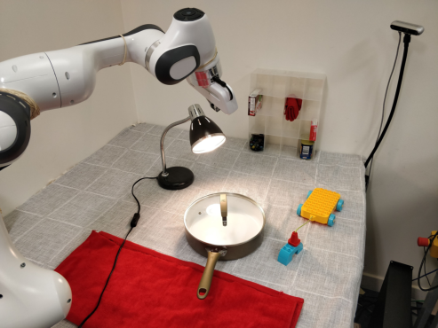
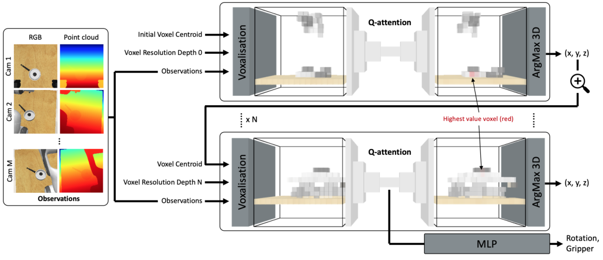
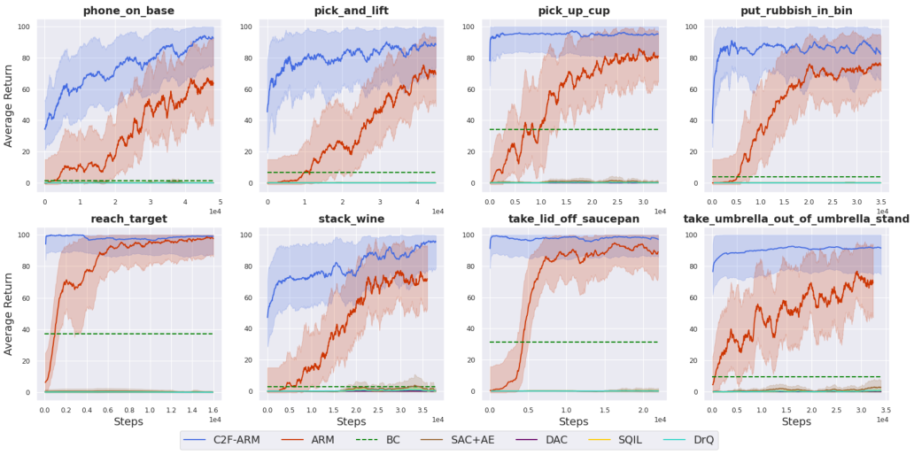
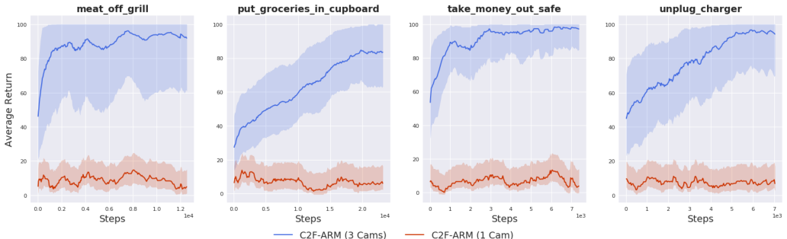
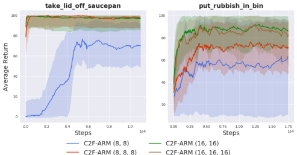
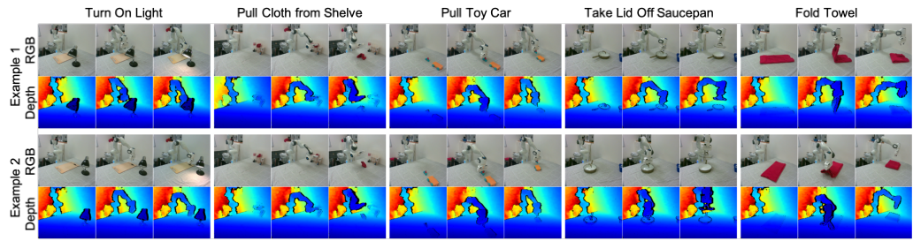

## **Coarse-to-Fine Q-attention: Efficient Learning for** **Visual Robotic Manipulation via Discretisation**

Stephen James, Kentaro Wada, Tristan Laidlow, Andrew J. Davison
Dyson Robotics Lab
Imperial College London

{slj12, k.wada18, t.laidlow15, a.davison}@imperial.ac.uk

**Abstract**

_We present a coarse-to-fine discretisation method that en-_
_ables the use of discrete reinforcement learning approaches_
_in place of unstable and data-inefficient actor-critic meth-_
_ods in continuous robotics domains. This approach builds_
_on the recently released ARM algorithm, which replaces_
_the continuous next-best pose agent with a discrete one,_
_with coarse-to-fine Q-attention. Given a voxelised scene,_
_coarse-to-fine Q-attention learns what part of the scene to_
_‘zoom’ into. When this ‘zooming’ behaviour is applied it-_
_eratively, it results in a near-lossless discretisation of the_
_translation space, and allows the use of a discrete action,_
_deep Q-learning method. We show that our new coarse-_
_to-fine algorithm achieves state-of-the-art performance on_
_several difficult sparsely rewarded RLBench vision-based_
_robotics tasks, and can train real-world policies, tabula rasa,_
_in a matter of minutes, with as little as 3 demonstrations._

**1. Introduction**

In this paper, we are interested in a general real-world manipulation algorithm that can use a small number of demonstrations, along with a small amount of sparsely-rewarded
exploration data, to accomplish a diverse set of tasks, both in
simulation and the real world. To develop such an approach,
two paradigms come to mind: imitation learning (IL) and reinforcement learning (RL). Imitation learning methods, such
as behaviour cloning, suffer from compounding error due
to covariate shift, while reinforcement learning suffers from
long training times that often require millions of environment
interactions. Recently however, Q-attention and the ARM
system [14] has been shown to bypass many flaws that come
with reinforcement learning, most notably the large training
burden and exploration difficulty with sparsely-rewarded and
long-horizon tasks.
Unfortunately, like many modern continuous control RL
algorithms, ARM’s next-best pose agent follows an actorcritic paradigm, which can be particularly unstable when

Figure 1. C2F-ARM learns sparsely-rewarded tasks with only
3 demonstrations. Real-world tasks include: turning on a light,
pulling cloth from shelf, pulling a toy car, taking a lid off a saucepan,
and folding a towel.

learning from sparsely-rewarded and image-based tasks [14]:
two properties that are particularly important for robot manipulation tasks. In this paper, we re-examine how best to
represent the continuous control actions needed for robot manipulation, abandoning the standard actor-critic approach, in
favour of a more stable discrete action Q-learning approach.
The challenge therefore becomes how to effectively discretise 6D poses. Discretisation of rotation and gripper action
is trivial given its bounded nature, but translation remains
challenging given that is usually a much larger space. We
solve this problem via a coarse-to-fine Q-attention, where we
start with a coarse voxelisation of the translation space, use
3D Q-attention to identify the next most interesting point,
and gradually make the resolution higher at each point.
With this new coarse-to-fine Q-attention, we present our
Coarse-to-Fine Attention-driven Robotic Manipulation (C2FARM) system. We benchmark the system in simulation
against other robot learning algorithms from both the re

1

Figure 2. Summary of coarse-to-fine Q-attention. Observation data (RGB and point cloud) from _M_ cameras are given to each depth of the
Q-attention. Each depth of the Q-attention gives the locations of the most interesting point in space (at the current resolution), which is then
used as the voxel centroid for the Q-attention at the next depth. Intuitively, this can be thought of as ‘zooming’ into a specific part of the
scene to gain more accurate 3D information. The highlighted red voxel corresponds to the highest value.

inforcement learning and imitation learning literature, and
show that C2F-ARM is more sample-efficient and stable
to train than other methods. We also show that C2F-ARM

is capable of learning 5 diverse sets of sparsely-rewarded
real-world tasks from only 3 demonstrations.
To summarise, the paper presents the following three
contributions: **(1)** A novel way to discretise the translation space via coarse-to-fine Q-attention, allowing us to
discard the often unstable actor-critic framework for a sim
pler deep Q-learning approach. **(2)** Our manipulation system, C2F-ARM, which uses the coarse-to-fine Q-attention
along with a control agent to achieve sample-efficient learning of sparsely-rewarded tasks in both simulation and realworld. **(3)** The first use of a voxel representation for
vision-based reinforcement learning for 6D robot manipulation. Code in supplementary material, and videos found at:
sites.google.com/view/c2f-q-attention.

**2. Related Work**

**Learning for manipulation** . Recent trends in learning
for manipulation have seen continuous-control reinforcement learning algorithms, such as PPO [34], DDPG [22],
TD3 [4], and SAC [8], trained on a variety of tasks, including
cloth manipulation [23], lego stacking [7], pushing [28], and
in-hand manipulation [29]. These approaches rely on the
actor-critic formulation, which is often sample-inefficient
and unstable to train. One effort to decrease instability involves using alternative policy parameterisations over Gaussian ones, e.g., the Bignham distribution for a next-best pose
action [12]. Alternatively, discretisation results in a signif

icant reduction to the action space, as well as the use of
simpler approaches, such as Q-learning. Our work is not the
first use of discrete actions for visual manipulation; James
_et al_ . [15] discretised the joint space, where in each step the
agent could choose to move one of the 6 joints by 1 degree.
An alternative to discretising the joint space, is to discretise
the planar workspace, where pixels from a top-down camera
act as high-level actions, such as grasping [26], pushing [43],
and pick-and-place [42]. However, it is unclear how these
can extend beyond top-down pick-and-place tasks, such as
some of the ones featured in this paper, e.g. stacking wine
and taking an object from a shelve. Our paper presents a
full 6D manipulation system that can extend to a range of
tasks, not just top-down ones. The term ‘coarse-to-fine’ has
recently been used in the context of grasp detection [40], but
with a different meaning, where the coarse part is a grasp
confidence grid, and the fine part refers to a refinement stage
of the coarse prediction. Our work on the other hand uses
coarse-to-fine to refer to the idea that our Q-attention ‘zooms’
into a specific part of the scene to gain more accurate 3D
information. Related to our coarse-to-fine mechanism is the
work of Gualtieri _et al_ . [5,6], which takes in a point-cloud (in
heightmap form) and gradually zooms into a local region to
generate a grasp and place location; however, this work is restricted ‘pick-and-place’ tasks, while our method is a _general_
6D manipulation algorithm where the arm has full autonomy
to move anywhere in the scene, with no pre-programmed
‘grasp’ and ‘place’ motions. This results in a system that
can be applied to a range of tasks without modification, as is
evident by our RLBench and real-world experiments.

2

**Voxel representation for manipulation** . Modelling
3D environments via voxels dates back as far as the

1980s [25,32]. Since a voxel grid can store arbitrary values in
each voxel, prior work has used it for various representations
(geometry, semantics, learned features) for navigation and
manipulation. Most works that explore voxel representations
use them for navigation [3, 10, 11]; however, there are some
notable exceptions from the manipulation domain. Wada _et_
_al_ . [38] used a voxel grid to store occupancy and semantics
of objects in a cluttered scene to select the next target object
and grasp point. MoreFusion [39] is a system that uses voxels to perform multi-object reasoning to improve 6D pose
estimation; the system gives accurate object poses and can
perform precise pick-and-place in cluttered scenes. Recently,
it has become common to use a voxel representation with a
learning-based model. Song _et al_ . [35] and Breyer _et al_ . [2]
fed a voxel grid representation to a neural network to generate 6DoF grasp actions; these works differ to ours in that they
consider grasping in a supervised learning domain, where as
our system falls within the realm of reinforcement learning
with a full 6D action space, where grasping is but only one
component. Moreover, reinforcement learning brings with it
many challenges that are not present in supervised learning,
e.g. exploration, sparse rewards, and long-horizon planning.
The only work we are aware of that uses voxels with RL
is in a task to find a red cube in clutter [27]; however the
task assumes access to both and object detector and planar
workspace, and the voxel grid is not processed directly by
the RL agent, but instead is cropped and flattened to a small
68 dimensional vector. Our coarse-to-fine voxelisation allows us to directly process the 3D voxel grid of the whole
scene, and does not assume access to a planar workspace or
an object detector.

**3. Background**

**3.1. Reinforcement Learning**

The reinforcement learning paradigm assumes an agent
interacting with an environment consisting of states **s** _∈S_,
actions **a** _∈A_, and a reward function _R_ ( **s** _t_ _,_ **a** _t_ ), where **s** _t_
and **a** _t_ are the state and action at time step _t_ respectively.
The goal of the agent is then to discover a policy _π_ that
results in maximising the expectation of the sum of discounted rewards: E _π_ [ [�] _t_ _[γ]_ _[t]_ _[R]_ [(] **[s]** _[t]_ _[,]_ **[ a]** _[t]_ [)]] [, where future rewards]

are weighted with respect to the discount factor _γ ∈_ [0 _,_ 1) .
Each policy _π_ has a corresponding value function _Q_ ( _s, a_ ),
which represents the expected return when following the
policy after taking action **a** in state **s** .
The Q-attention module [14] (discussed in Section 3.2)
builds from Deep Q-learning [24]; a method that approximates the value function _Q_ _ψ_, with a deep convolutional
network, whose parameters _ψ_ are optimised by sampling
mini-batches from a replay buffer _D_ and using stochastic

gradient descent to minimise the loss: E ( **s** _t_ _,_ **a** _t_ _,_ **s** _t_ +1 ) _∼D_ [( **r** +
_γ_ max **a** _′_ _Q_ _ψ_ _′_ ( **s** _t_ +1 _,_ **a** _[′]_ ) _−_ _Q_ _ψ_ ( **s** _t_ _,_ **a** _t_ )) [2] ], where _Q_ _ψ_ _′_ is a target network; a periodic copy of the online network _Q_ _ψ_ which
is not directly optimised.

**3.2. Attention-driven Robot Manipulation (ARM)**

ARM [14] introduced several core concepts that facilitate
the learning of vision-based robot manipulation tasks. These
included Q-attention, keypoint detection, demo augmentation, and a high-level next-best pose action space. Most
notable of these is the Q-attention, which is used in this work
to discretise the large translation space. We briefly outline
Q-attention below.
Given an observation, **o** (consisting of an RGB image,
**b**, an organised point cloud, **p**, and proprioceptive data,
**z** ), the Q-attention module, _Q_ _θ_, outputs 2D pixel locations of the next area of interest. This is done by extracting the coordinates of pixels with the highest value:
( _x, y_ ) = arg max 2D **a** _′_ _Q_ _θ_ ( **o** _,_ **a** _[′]_ ), where arg max 2D is an
_argmax_ taken across two dimensions. These pixel locations are used to crop the RGB image and organised point
cloud inputs and thus drastically reduce the input size to the
next stage of the pipeline; this next stage is an actor-critic
next-best pose agent. The parameters of the Q-attention are
optimised by using stochastic gradient descent to minimise
the loss:

_J_ _Q_ ( _θ_ ) = E ( **o** _t_ _,_ **a** _t_ _,_ **o** _t_ +1 ) _∼D_ [( **r** + _γ_ max 2D **a** _[′]_ _Q_ _θ_ _′_ ( **o** _t_ +1 _,_ **a** _[′]_ )

_−_ _Q_ _θ_ ( **o** _t_ _,_ **a** _t_ )) [2] + _∥Q∥_ ] _,_ (1)

where _Q_ _θ_ _′_ is the target Q-function, and _∥Q∥_ is the _Q reg-_
_ularisation_ — an _L_ 2 loss on the per-pixel output of the Q
function.

Keyframe discovery and demo augmentation were another two important techniques introduced in ARM [14].
Rather than simply inserting demonstrations directly into
the replay buffer, the keyframe discovery strategy chooses
interesting keyframes along demonstration trajectories that
are fundamental to training the Q-attention module. Demo
augmentation stores the transition from intermediate points
along a trajectory to the keyframe states, rather than storing
the transition from an initial state to a keyframe state. This
greatly increases the amount of initial demo transitions in the
replay buffer. This is not specific to Q-attention, and is applied to all methods (including baselines) in this work. Note
that keyframe discovery is crucial for training our coarseto-fine Q-attention agent, as the keyframes act as explicit
supervision to help guide the Q-attention to choose relevant
areas to ‘zoom’ into during the initial phase of training.

**4. Method**

Our system, C2F-ARM (Algorithm 1), can be split into
2 core phases. Phase 1 (Section 4.1) consists of the coarse

3

**Algorithm 1** Coarse-to-Fine Attention-driven Robot Manipulation (C2F-ARM)

Initialise the _N_ Q-attention networks _Q_ _θ_ 1 _, . . ., Q_ _θ_ _N_ with random parameters _θ_ 1 _, . . ., θ_ _N_ .
Initialise the rotation & gripper Q network _Q_ _φ_ with random parameters _φ ⊂_ _θ_ _N_ .
Initialise target networks _θ_ 1 _[′]_ _[←]_ _[θ]_ [1] _[, . . ., θ]_ _N_ _[′]_ _[←]_ _[θ]_ _[N]_ [.]
Initialise replay buffer _D_ with demos and apply keyframe selection and demo augmentation
**for** each iteration **do**

**for** each environment step _t_ **do**

**o** _t_ _←_ ( **b** _t_ _,_ **p** _t_ _,_ **z** _t_ )
**c** [0] _←_ Scene centroid
coords _←_ [ ] _▷_ List to keep coords of each Q-attention depth
**for** each ( _n_ of _N_ ) Q-attention depths **do**

**v** _[n]_ _←_ **V** ( **o** _t_ _,_ **e** _[n]_ _,_ **c** _[n]_ ) _▷_ Voxelise with given resolution & centroid
( _x_ _[n]_ _, y_ _[n]_ _, z_ _[n]_ ) _←_ arg max 3D **a** _′_ _Q_ _θ_ _n_ ( **v** _[n]_ _,_ **a** _[′]_ ) _▷_ Use Q-attention to get voxel coords
coords.append(( _x_ _[n]_ _, y_ _[n]_ _, z_ _[n]_ ))
**if** _n_ == _N_ **then**

_α, β, γ, ω ←_ arg max **a** _h_ _Q_ _[h]_ _φ_ [( ˜] **v** _[N]_ _,_ **a** _[h]_ ) for _h ∈{_ 0 _,_ 1 _,_ 2 _,_ 3 _} ▷_ Rotation & gripper from bottleneck features **v** [˜] _[N]_

**c** _[n]_ [+1] _←_ ( _x_ _[n]_ _, y_ _[n]_ _, z_ _[n]_ ) _▷_ Voxel coords give centroid of next Q-attention depth
**a** _t_ _←_ ( **c** _[N]_ _, α, β, γ, ω_ ) _▷_ The next-best pose
**o** _t_ +1 _,_ **r** _←_ _env.step_ ( **a** _t_ ) _▷_ Use motion planning to bring us to the next-best pose.
_D ←D ∪{_ ( **o** _t_ _,_ **a** _t_ _,_ **r** _,_ **o** _t_ +1 _,_ coords) _}_ _▷_ Store the transition in the replay buffer

**for** each gradient step **do**

_θ_ _n_ _←_ _θ_ _n_ _−_ _λ_ _Q_ _∇_ [ˆ] _θ_ _n_ _J_ _Q_ ( _θ_ _n_ ) for _n ∈{_ 0 _, . . ., N_ _}_ _▷_ Update parameters
_θ_ _n_ _[′]_ _[←]_ _[τθ]_ _[n]_ [+ (1] _[ −]_ _[τ]_ [)] _[θ]_ _n_ _[′]_ [for] _[ n][ ∈{]_ [0] _[, . . ., N]_ _[}]_ _▷_ Update target network weights

to-fine 3D Q-attention agent, which starts by voxelising the
entire scene in a coarse manner, and then recursively makes
the resolution finer until we are able to extract a continuous
6D next-best pose. Phase 2 (Section 4.2) is a low-level
control agent that accepts the predicted next-best pose and
executes a series of actions to reach the given goal pose.
Before training, we fill the replay buffer with demonstrations
using keyframe discovery and demo augmentation [14].
The system assumes we are operating in a partially observable Markov decision process (POMDP), where an observation **o** consists of an RGB image, **b**, an organised point
cloud, **p**, and proprioceptive data, **z** . Actions consist of a 6D
(next-best) pose and gripper action, and the reward function
is sparse, giving 100 on task completion, and 0 for all other
transitions.

**4.1. Coarse-to-fine Q-attention**

The key contribution of this paper is the discretisation
of the translation state space via the Q-attention, thereby
allowing discrete-action reinforcement learning algorithms
to be used for recovering continuous actions. Our method
formulates the translation prediction as a series of coarse-tofine deep Q-networks which accepts voxelised point cloud
features, and outputs per-voxel Q-values. The highest-valued
voxel represents the next-best voxel, whose location is used
as the centre of a higher-resolution voxelisation in the next
step. Note that ‘higher-resolution’ could be interpreted in

one of 3 ways: (1) keeping the volume the same but increasing the number of voxels, (2) keeping the number of voxels
the same but reducing the volume, or (3) a combination of
both. We opt for (2), as this gives us the higher resolution,
while keeping the memory footprint low. Intuitively, this
coarse-to-fine Q-attention can be thought of as ‘zooming’
into a specific part of the scene to gain more accurate 3D
information, whereas formally, each Q-attention agent operates at different resolutions to view the same underlying
POMDP. The coarse-to-fine prediction is applied several
times, which gives near-lossless prediction of the continuous translation. Rotation and gripper action prediction is
simpler due to its bounded nature; these are predicted in the
final depth of the Q-attention as an additional branch. The
coarse-to-fine Q-attention is summarised in Figure 2.
Formally, we define a voxelisation function **v** _[n]_ =
**V** ( **o** _,_ **e** _[n]_ _,_ **c** _[n]_ ), which takes the observation **o**, a voxel resolution **e** _[n]_, and a voxel grid centre **c** _[n]_, and returns a
voxel grid **v** _[n]_ _∈_ R _[xyz]_ [(3+] _[M]_ [+1)] at depth _n_, where _n_ is the
depth/iteration of the Q-attention, and where each voxel
contains the 3D coordinates, _M_ features (e.g. RGB values,
features, etc), and an occupancy flag.
Given our Q-attention function _Q_ _θ_ _n_ at depth _n_, we extract
the indicies of the voxel with the highest value:

**v** _ijk_ _[n]_ [= arg max 3D] _Q_ _θ_ _n_ ( **v** _[n]_ _,_ **a** _[′]_ ) _,_ (2)
**a** _[′]_

where **v** _ijk_ is the extracted voxel index located at ( _i, j, k_ ),

4

and arg max 3D is an _argmax_ taken across three dimensions
(depth, height, and width).
By offsetting the centre of the current voxelisation
with the extracted indicies, we can trivially extract the
( _x_ _[n]_ _, y_ _[n]_ _, z_ _[n]_ ) location of that voxel. For ease of readability, we henceforth assume that arg max 3D also performs the conversion to world coordinates, to directly give
( _x_ _[n]_ _, y_ _[n]_ _, z_ _[n]_ ) . As the extracted coordinates represent the nextbest coordinate to voxelise at a higher resolution, we set
these coordinates to be the voxel grid centre **c** for the next
depth: **c** _[n]_ [+1] = ( _x_ _[n]_ _, y_ _[n]_ _, z_ _[n]_ ) . However, if this is the last
depth of the Q-attention, then **c** _[N]_ = **c** _[n]_ [+1] represents the
continuous representation of the translation (i.e. the translation component of the next-best pose agent).
Due to the fact that the rotation space and gripper space
is much smaller than the translation, we can resort to a much
simpler Q-value prediction. The rotation of each axis is
discretised in increments of 5 degrees, while the gripper is
discretised to be either open or closed. These components
are recovered from an MLP branch (with parameters _φ_ ) of
the final Q-attention depth:

_α, β, γ, ω ←_ arg max _Q_ _[h]_ _φ_ [( ˜] **v** _[N]_ _,_ **a** _[h]_ ) for _h ∈{_ 0 _,_ 1 _,_ 2 _,_ 3 _},_
**a** _[h]_

(3)
where _α, β, γ_ represent the individual rotation axis, _ω_ is the
gripper action, and **v** [˜] _[N]_ are the bottleneck features from the
final Q-attention depth. We empirically found the discretisation of the rotation axis to be robust to a range of values from
1 to 10 . The final action then becomes **a** _t_ = ( **c** _[N]_ _, α, β, γ, ω_ ) .
The coarse-to-fine Q-attention shares the same motivation
that was was laid out in ARM [14], i.e. that our gaze focuses
sequentially on objects being manipulated [20], however, its
role in the manipulation system is different. ARM [14] uses
Q-attention to reduce the image resolution to a next-best
pose phase (by cropping 128 _×_ 128 observations to 16 _×_ 16 ),
while the role of coarse-to-fine Q-attention is to discretise
the otherwise large translation space. This highlights the
versatility of Q-attention.

**4.2. Control Agent**

The control agent remains largely unchanged from
ARM [14]. Given the next-best pose output from the previous stage, we give this to a goal-conditioned control function
_f_ ( **s** _t_ _,_ **g** _t_ ), which given state **s** _t_ and goal **g** _t_, outputs motor
velocities that moves the end-effector towards the goal. This
function can take on many forms, but two noteworthy solutions would be either motion planning in combination with
a feedback-control or a learnable policy trained with imitation/reinforcement learning. Given that the environmental
dynamics are limited in the benchmark, we opted for the
motion planning solution.
Given the target pose, we perform path planning using
the SBL [33] planner within OMPL [36], and use ‘Reflexxes

Motion Library’ for on-line trajectory generation. If the target pose is out of reach, we terminate the episode and supply
a reward of _−_ 1 . For the simulated experiments, the path
planning and trajectory generation is conveniently encapsulated by the _‘EndEffectorPoseViaPlanning’_ action mode in
RLBench [16], while for the real-world experiments, we use
ROS to handle the planning and trajectory generation.
Once the agent reaches the end of the trajectory, the
new observation is given **o** _t_ +1, and is stored in the replay buffer as experience for the coarse-to-fine Q-attention:
_D ←D ∪{_ ( **o** _t_ _,_ **a** _t_ _,_ **r** _,_ **o** _t_ +1 _,_ coords) _}_, where _D_ is the replay buffer, and coords is the list of extracted coordinates
( _x_ _[n]_ _, y_ _[n]_ _, z_ _[n]_ ) for _n ∈{_ 0 _, . . ., N_ _}_ .

**4.3. Network Architecture**

Each Q-attention layer follows a light-weight U-Net
style architecture [31], but uses 3D convolutions rather than
2D ones. Our U-Net encoder features 3 Inception-style
blocks [37], with 64 input-output channels, and a 3 _×_ 3 maxpool after each block, while our U-Net decoder features 3
Inception-Upsample-Inception blocks. Note that the final
Q-attention layer is also used for the rotation and gripper
prediction; this is achieved by concatenating the maxpooled
and soft-argmax values after each of the Inception blocks
in the decoder, and sending them through 2 fully connected
layers each with 256 nodes. Finally, these features are passed
through a final fully-connected layer which gives the rotation
and gripper discretisation. The initial voxel centroid was set
to be the centre of the scene. Voxelisation code has been

adapted from Ivy [21].

**5. Results**

The results can be broken into three core sections: (1)
simulation results using RLBench [16] to benchmark our
algorithm against other popular robot learning algorithms
using only the front-facing camera. (2) additional simulation
results in RLBench where we evaluate our method on addi
tional tasks and perform an ablation study into the robustness
of the coarse-to-fine approach. (3) Real-world results where
we show that the sample-efficiency in simulation is also
present when training from scratch in the real world.

**5.1. Simulation**

For our simulation experiments, we use RLBench [16].
RLBench was chosen due to its emphasis on vision-based
manipulation benchmarking and because it gives access to
a wide variety of tasks with demonstrations. Each task has
a completely sparse reward of 100 which is given only on
task completion, and 0 otherwise. In the following set of
experiments, unless otherwise stated, our method uses a
coarse-to-fine depth of 2, each with a voxel grid size of
16 [3] . All methods get the same observations (RGB and point
clouds), and have the same action space (next-best pose).

5

Figure 3. Learning curves for 8 RLBench tasks. In addition to our method (C2F-ARM), we include the same baselines as in previous
work: ARM [14], BC, SAC+AE [41], DAC [18] (an improved, off-policy version of GAIL [9]), SQIL [30], and DrQ [19]. To further show
the sample efficiency of C2F-ARM, our method **only receive 10 demos**, while all other **baselines receiving 100 demos**, giving baseline
methods a big advantage. Demos are stored in the replay buffer prior to training; giving baseline methods a big advantage. Solid lines
represent the average evaluation over 5 seeds, where the shaded regions represent the standard deviation across those trials. Evaluation starts
at step 100.

**5.1.1** **Comparison to other Robot Learning Methods**

To compare to other robot learning methods, we select the
same 8 tasks as in James _et al_ . [14]; these are task that are
achievable from using only the front-facing camera. Figure 3
shows the results of this comparison. We selected a range of
common baselines from the imitation learning and reinforcement learning literature; these include: include ARM [14],
behavioural cloning (BC), SAC+AE [41], DAC [18] (an improved, off-policy version of GAIL [9]), SQIL [30], and
DrQ [19]. Each of these baselines outputs a 7D action; 6D
for the pose, and 1D for the gripper state. The control agent
(as described in Section 4.2) is then used to take the arm to
the outputted pose. This means that all baselines act as an
alternative to the coarse-to-fine Q-attention. Baselines use
the same architectures as presented in James _et al_ . [14].

All methods (C2F-ARM, ARM, BC, SAC+AE, DAC,
SQIL, and DrQ) feature keyframe discovery and demo augmentation [14], and receive the same demonstration sequences, which are loaded into the replay buffer prior to
training. Note that C2F-ARM does not require as many
demonstrations as the other methods (as is evident in Section
5.2), and so is given only 10 demos, while baselines receive
100 (giving only 10 demos to baselines made performance
significantly worse).

The results in Figure 3 show that our method outperforms
ARM [14] by a large margin; either by attaining an overall
higher performance, or attaining the same performance but
in substantially fewer environment steps. The particularly
poor performance of conventional actor-critic methods highlights their instability in challenging vision-based, sparselyrewarded tasks. We wish to stress that perhaps given enough
training time some of these baseline methods may eventually
start to succeed, however we found no evidence of this. To
get the reinforcement learning baselines to successfully train
on these tasks, it would most likely need access to privileged
simulation-only abilities (e.g. reset to demonstrations, asymmetric actor-critic, auxiliary tasks, or reward shaping); this
would then render the approach impractical for real-world
training. Real-world reward shaping in particular is very
cumbersome; for example, shaping the reward for our real
world ‘lifting saucepan lid’ task would first require us to
build a lid tracking system, before reward design can even
begin. Moreover, reward shaping is notoriously difficult to
get right as the complexity of the task increases [29].
In terms of wall-clock time, the inference time is increased by a factor of 2 due to the use of 3D convolutions
over the baselines use of 2D convolutions; however the inference time is negligible compared to the time it takes for
the arm to navigate to the next-best pose. We also note as

6

Figure 4. Learning curves for 4 additional RLBench tasks that are difficult or impossible to achieve with only the front-facing camera. The 3
cameras used are the wrist, left shoulder, and right shoulder. Solid lines represent the average evaluation over 5 seeds, where the shaded
regions represent the standard deviation across those trials.

Figure 5. Investigation of the Q-attention depth and voxel volume
across the _‘take_lid_off_saucepan’_ and _‘put_rubbish_in_bin’_ tasks.
The numbers in the brackets indicate the coarse-to-fine depth along
with the voxel grid size; e.g. (8 _,_ 8) represents a coarse-to-fine depth
of 2, each with voxel grid size of 8 [3] .

a purely qualitative observation, that C2F-ARM required
little to no hyperparameter tuning, while baselines required
a substantial amount.

**5.1.2** **Multi-camera and Ablations**

The second set of simulation experiments evaluates C2FARM with multiple cameras. One of the weaknesses of
ARM [14] was its inability to trivially handle multi-camera
environments; for this reason, tasks were chosen that could
be done with only the front-facing camera. However, for
real-world robotics, it is unreasonable to expect that a single camera will always contain the information required to
accomplish a task; in reality, robotic systems are required
to fuse information from multiple cameras into a single representation. For this reason, Figure 4 shows an additional
4 tasks from RLBench which we believe to be difficult to
accomplish by only using the front-facing camera. For each

of these tasks, we run our method using 3 cameras (wrist,
left shoulder, and right shoulder), and compare this to using
only the front-facing camera. Because all cameras are fused
into a single voxel grid, no part of the system needs to be
modified when using additional cameras. The results in Figure 4 clearly show that these tasks cannot be done with only
a single camera, and that C2F-ARM can perform well when
given the appropriate camera information.

For the final set of simulation experiments, we evaluate
how robust C2F-ARM is when altering the number of coarseto-fine depth and the volume of the voxels. Figure 5 shows
that our method is robust to a range of coarse-to-fine depths
and voxel grid sizes, though note that as the voxel grid
size and coarse-to-fine depth jointly decrease, performance
begins to deteriorate. Note that the coarsest setup (8, 8)
understandably performs the worst, as there are only two
layers of a very coarse 8 [3] voxel grid, making the scene
understanding phase difficult, particularly at the finest phase,
where each voxel will contain many points. We hypothesise
that voxelising image features (rather than raw RGB values)
would perform better at these coarser setups; we leave this
for future work. Figure 5 also suggests that increasing the
voxel grid size leads to better performance, though note that
this will lead to a larger memory footprint. Note, that if
memory is a limiting factor, then performance gains can be
had by simply increasing the coarse-to-fine depth, with only
a small increase to the memory footprint; i.e. the memory
footprint of an additional depth (e.g. (8 _,_ 8) _→_ (8 _,_ 8 _,_ 8) ) is
significantly less than the footprint of moving to a larger
voxel grid size (e.g. (8 _,_ 8) _→_ (16 _,_ 16)).

**5.2. Real World**

To further show the sample efficiency of our method,
we train on 5 real-world tasks from scratch, which can be
seen in Figure 6. At the beginning of each episode, the

7

Figure 6. Two examples of successful trials performed with C2F-ARM on the tasks: turn on light, pull cloth from shelf, pull toy car, take lid
off saucepan, and fold towel. The agent only received 3 demonstrations. Each column for each tasks shows the RGB-D observations at
_t_ = 0, _t_ = _T/_ 2, and _t_ = _T_ .

objects in the tasks are moved randomly within the robot
workspace. We train each of the tasks until the agent achieves
4 consecutive successes. The approximate time to train each
task are: pulling cloth from shelf ( _∼_ 26 minutes), pulling
a toy car ( _∼_ 18 minutes), taking a lid off a saucepan ( _∼_ 6
minutes), folding a towel ( _∼_ 24 minutes), and turning on
a light ( _∼_ 42 minutes). We use the Franka Emika Panda,
and a single RGB-D RealSense camera. All tasks receive 3
demonstrations which are given through the HTC Vive VR
system. These qualitative results are best seen via the full,
uncut training video of each of the 5 tasks, located on the
project website.

**6. Discussion and Conclusion**

We have presented Coarse-to-Fine Attention-driven
Robot Manipulation (C2F-ARM), which is an algorithm that
utilises a coarse-to-fine Q-attention and allows discretisation
of the translation space. With this discretisation, we are able
to diverge from unstable actor-critic methods and instead
use a more stable deep Q-learning method. The result is a
sample-efficient robot learning algorithm that outperforms
others and can rapidly learn real-world tasks.

C2F-ARM can be considered as an improved, discreteaction version of ARM [14]. There are 3 key differences
to the original ARM system: (1) the role and architecture
of Q-attention has changed; in ARM, the role of the 2D
Q-attention was to act as a hard-attention that would give
crops to the actor-critic next-best-pose agent, whereas in
C2F-ARM the role of the 3D Q-attention is to be recursively
applied in a coarse-to-fine manner in order to discretise the
large translation space. (2) The number of stages in the
system has decreased; ARM was a 3-stage system, consisting
of Q-attention, next-best-pose agent, and the control agent,
whereas C2F-ARM removes the need for the actor-critic

next-best-pose agent, and so consists only of the coarse-tofine Q-attention and control agent. (3) C2F-ARM seamlessly
supports multiple cameras or a single moving camera; ARM

was not suited for multiple cameras, due to the undefined
behaviour when a camera observation did not feature any
interesting pixels, and was not suited for a moving camera
due to the potential that the crop size may be too small or
big to correctly crop when the camera was near or far to
an interesting object. C2F-ARM does not suffer this, as all
cameras are voxelised to a canonical world frame.

There are a number of areas for improvement. Currently,
only raw RGB and point-cloud data are stored in the voxels, but we hypothesise that instead voxelising pixel features
from a small 2D convolutional network could allow for more

expressive voxel values, especially when dealing with small
resolutions or a small number of coarse-to-fine Q-attention
layers. Another weakness is that we are restricted to keeping the initial voxel resolution (at Q-attention depth 0 ) to
be reasonably small. This is not an issue when considering
manipulation on a fixed table, but becomes an issue when
considering mobile manipulation, where the resolution at
depth 0 may have to become very large to accommodate
voxelising an entire room or house; we look to investigating solutions to this in future work. Much like ARM [14],
the control agent uses path planning and on-line trajectory
generation, but will undoubtedly require improvement for
achieving tasks that have dynamic environments (e.g. moving target objects, moving obstacles, etc) or complex contact
dynamics (e.g. peg-in-hole). We are also keen to see if additional performance can be had by learning a fully-continuous
residual function on top of the output of the coarse-to-fine
network to further refine the output pose; however, we hypothesise that tasks that require grater fine-grained control
will be needed for evaluation. The work that we are most

excited about is exploring the use of this system in multitask [17] and few-shot [1, 13] learning scenarios.

**7. Acknowledgements**

This work was supported by Dyson Technology Ltd.

8

**References**

[1] Alessandro Bonardi, Stephen James, and Andrew J Davison. Learning one-shot imitation from humans without humans. _IEEE Robotics and Automation Letters_, 5(2):3533–
3539, 2020. 8

[2] Michel Breyer, Jen Jen Chung, Lionel Ott, Roland Siegwart,
and Juan Nieto. Volumetric grasping network: Real-time 6
dof grasp detection in clutter. _Conference on Robot Learning_,
2020. 3

[3] Ivan Dryanovski, William Morris, and Jizhong Xiao. Multivolume occupancy grids: An efficient probabilistic 3D mapping model for micro aerial vehicles. In _2010 IEEE/RSJ_
_International Conference on Intelligent Robots and Systems_,
pages 1553–1559. IEEE, 2010. 3

[4] Scott Fujimoto, Herke Van Hoof, and David Meger. Addressing function approximation error in actor-critic methods. _Intl._
_Conference on Machine Learning_, 2018. 2

[5] Marcus Gualtieri and Robert Platt. Learning 6-dof grasping
and pick-place using attention focus. In _Conference on Robot_
_Learning_, pages 477–486. PMLR, 2018. 2

[6] Marcus Gualtieri and Robert Platt. Learning manipulation
skills via hierarchical spatial attention. _IEEE Transactions on_
_Robotics_, 36(4):1067–1078, 2020. 2

[7] Tuomas Haarnoja, Vitchyr Pong, Aurick Zhou, Murtaza Dalal,
Pieter Abbeel, and Sergey Levine. Composable deep reinforcement learning for robotic manipulation. In _2018 IEEE In-_
_ternational Conference on Robotics and Automation (ICRA)_,
pages 6244–6251. IEEE, 2018. 2

[8] Tuomas Haarnoja, Aurick Zhou, Kristian Hartikainen, George
Tucker, Sehoon Ha, Jie Tan, Vikash Kumar, Henry Zhu, Abhishek Gupta, Pieter Abbeel, et al. Soft actor-critic algorithms
and applications. _arXiv preprint arXiv:1812.05905_, 2018. 2

[9] Jonathan Ho and Stefano Ermon. Generative adversarial imitation learning. _Advances in Neural Information Processing_
_Systems_, 2016. 6

[10] Armin Hornung, Mike Phillips, E Gil Jones, Maren Bennewitz, Maxim Likhachev, and Sachin Chitta. Navigation in
three-dimensional cluttered environments for mobile manipulation. In _2012 IEEE International Conference on Robotics_
_and Automation_, pages 423–429. IEEE, 2012. 3

[11] Armin Hornung, Kai M Wurm, and Maren Bennewitz. Humanoid robot localization in complex indoor environments.
In _2010 IEEE/RSJ International Conference on Intelligent_
_Robots and Systems_, pages 1690–1695. IEEE, 2010. 3

[12] Stephen James and Pieter Abbeel. Bingham policy parameterization for 3d rotations in reinforcement learning. _arXiv_
_preprint arXiv:2202.03957_, 2022. 2

[13] Stephen James, Michael Bloesch, and Andrew J Davison.
Task-embedded control networks for few-shot imitation learn
ing. In _Conference on Robot Learning_, pages 783–795.
PMLR, 2018. 8

[14] Stephen James and Andrew J Davison. Q-attention: Enabling
efficient learning for vision-based robotic manipulation. _IEEE_
_Robotics and Automation Letters_, 2022. 1, 3, 4, 5, 6, 7, 8

[15] Stephen James and Edward Johns. 3D simulation for robot
arm control with deep Q-learning. _Conference on Neural_

_Information Processing Systems Workshop (Deep Learning_
_for Action and Interaction)_, 2016. 2

[16] Stephen James, Zicong Ma, David Rovick Arrojo, and Andrew J. Davison. RLBench: The robot learning benchmark &
learning environment. _IEEE Robotics and Automation Letters_,
2020. 5

[17] Dmitry Kalashnikov, Jacob Varley, Yevgen Chebotar, Benjamin Swanson, Rico Jonschkowski, Chelsea Finn, Sergey
Levine, and Karol Hausman. MT-Opt: Continuous multitask robotic reinforcement learning at scale. _arXiv preprint_
_arXiv:2104.08212_, 2021. 8

[18] Ilya Kostrikov, Kumar Krishna Agrawal, Debidatta Dwibedi,
Sergey Levine, and Jonathan Tompson. Discriminator-actorcritic: Addressing sample inefficiency and reward bias in
adversarial imitation learning. _Intl. Conference on Learning_
_Representations_, 2019. 6

[19] Ilya Kostrikov, Denis Yarats, and Rob Fergus. Image augmentation is all you need: Regularizing deep reinforcement
learning from pixels. _arXiv preprint arXiv:2004.13649_, 2020.
6

[20] Michael Land, Neil Mennie, and Jennifer Rusted. The roles
of vision and eye movements in the control of activities of
daily living. _Perception_, 28(11):1311–1328, 1999. 5

[21] Daniel Lenton, Fabio Pardo, Fabian Falck, Stephen James,
and Ronald Clark. Ivy: Templated deep learning for interframework portability. _arXiv preprint arXiv:2102.02886_,
2021. 5

[22] Timothy P Lillicrap, Jonathan J Hunt, Alexander Pritzel, Nicolas Heess, Tom Erez, Yuval Tassa, David Silver, and Daan
Wierstra. Continuous control with deep reinforcement learning. _Intl. Conference on Learning Representations_, 2015.
2

[23] Jan Matas, Stephen James, and Andrew J Davison. Sim-toreal reinforcement learning for deformable object manipulation. _Conference on Robot Learning_, 2018. 2

[24] Volodymyr Mnih, Koray Kavukcuoglu, David Silver, Andrei A Rusu, Joel Veness, Marc G Bellemare, Alex Graves,
Martin Riedmiller, Andreas K Fidjeland, Georg Ostrovski,
et al. Human-level control through deep reinforcement learning. _nature_, 518(7540):529–533, 2015. 3

[25] H Moravec. Robot spatial perception by stereoscopic vision
and 3D evidence grids. _Perception_, 1996. 3

[26] Douglas Morrison, Peter Corke, and Jürgen Leitner. Closing
the loop for robotic grasping: A real-time, generative grasp
synthesis approach. _Robotics: Science and Systems_, 2018. 2

[27] Tonci Novkovic, Remi Pautrat, Fadri Furrer, Michel Breyer,
Roland Siegwart, and Juan Nieto. Object finding in cluttered
scenes using interactive perception. In _IEEE Intl. Conference_
_on Robotics and Automation_, pages 8338–8344. IEEE, 2020.
3

[28] Lerrel Pinto, Marcin Andrychowicz, Peter Welinder, Wojciech Zaremba, and Pieter Abbeel. Asymmetric actor critic
for image-based robot learning. _Robotics: Science and Sys-_
_tems_, 2018. 2

[29] Aravind Rajeswaran, Vikash Kumar, Abhishek Gupta, Giulia Vezzani, John Schulman, Emanuel Todorov, and Sergey
Levine. Learning complex dexterous manipulation with deep

9

reinforcement learning and demonstrations. _Robotics: Sci-_
_ence and Systems_, 2018. 2, 6

[30] Siddharth Reddy, Anca D Dragan, and Sergey Levine. Sqil:
Imitation learning via reinforcement learning with sparse
rewards. _arXiv preprint arXiv:1905.11108_, 2019. 6

[31] Olaf Ronneberger, Philipp Fischer, and Thomas Brox. U-net:
Convolutional networks for biomedical image segmentation.
In _International Conference on Medical image computing_
_and computer-assisted intervention_, pages 234–241. Springer,
2015. 5

[32] Yuval Roth-Tabak and Ramesh Jain. Building an environment
model using depth information. _Computer_, 22(6):85–90, 1989.
3

[33] Gildardo Sánchez and Jean-Claude Latombe. A single-query
bi-directional probabilistic roadmap planner with lazy collision checking. In _Robotics research_, pages 403–417. Springer,
2003. 5

[34] John Schulman, Filip Wolski, Prafulla Dhariwal, Alec Radford, and Oleg Klimov. Proximal policy optimization algorithms. _arXiv preprint arXiv:1707.06347_, 2017. 2

[35] Shuran Song, Andy Zeng, Johnny Lee, and Thomas
Funkhouser. Grasping in the wild: Learning 6dof closedloop grasping from low-cost demonstrations. _IEEE Robotics_
_and Automation Letters_, 5(3):4978–4985, 2020. 3

[36] Ioan A. ¸Sucan, Mark Moll, and Lydia E. Kavraki. The
Open Motion Planning Library. _IEEE Robotics & Automa-_
_tion Magazine_, 19(4):72–82, December 2012. [https:](https://ompl.kavrakilab.org)
[//ompl.kavrakilab.org. 5](https://ompl.kavrakilab.org)

[37] Christian Szegedy, Wei Liu, Yangqing Jia, Pierre Sermanet,
Scott Reed, Dragomir Anguelov, Dumitru Erhan, Vincent
Vanhoucke, and Andrew Rabinovich. Going deeper with
convolutions. In _Proceedings of the IEEE conference on_
_computer vision and pattern recognition_, pages 1–9, 2015. 5

[38] Kentaro Wada, Kei Okada, and Masayuki Inaba. Probabilistic
3D multilabel real-time mapping for multi-object manipulation. In _2017 IEEE/RSJ International Conference on Intel-_
_ligent Robots and Systems (IROS)_, pages 5092–5099. IEEE,
2017. 3

[39] Kentaro Wada, Edgar Sucar, Stephen James, Daniel Lenton,
and Andrew J Davison. MoreFusion: Multi-object reasoning
for 6D pose estimation from volumetric fusion. In _IEEE_
_Conference on Computer Vision and Pattern Recognition_,
pages 14540–14549, 2020. 3

[40] Bohan Wu, Iretiayo Akinola, and Peter K Allen. Pixelattentive policy gradient for multi-fingered grasping in cluttered scenes. In _2019 IEEE/RSJ international conference_
_on intelligent robots and systems (IROS)_, pages 1789–1796.
IEEE, 2019. 2

[41] Denis Yarats, Amy Zhang, Ilya Kostrikov, Brandon Amos,
Joelle Pineau, and Rob Fergus. Improving sample efficiency
in model-free reinforcement learning from images. _arXiv_
_preprint arXiv:1910.01741_, 2019. 6

[42] Andy Zeng, Pete Florence, Jonathan Tompson, Stefan Welker,
Jonathan Chien, Maria Attarian, Travis Armstrong, Ivan
Krasin, Dan Duong, Vikas Sindhwani, et al. Transporter
networks: Rearranging the visual world for robotic manipulation. _Conference on Robot Learning_, 2020. 2

[43] Andy Zeng, Shuran Song, Stefan Welker, Johnny Lee, Alberto Rodriguez, and Thomas Funkhouser. Learning synergies between pushing and grasping with self-supervised deep
reinforcement learning. In _IEEE Intl. Conference on Intel-_
_ligent Robots and Systems_, pages 4238–4245. IEEE, 2018.
2

10

