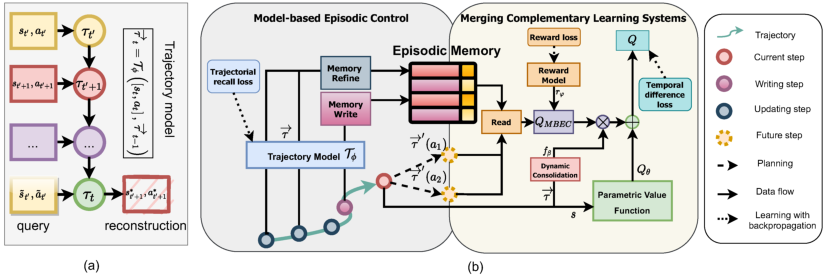
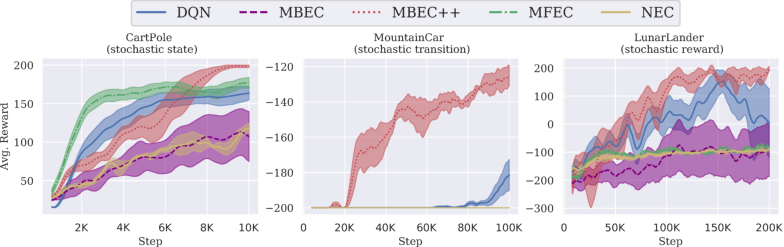
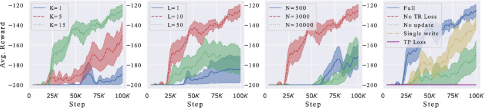
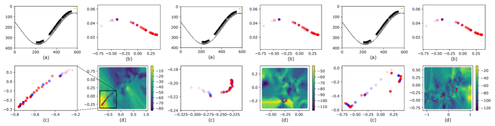
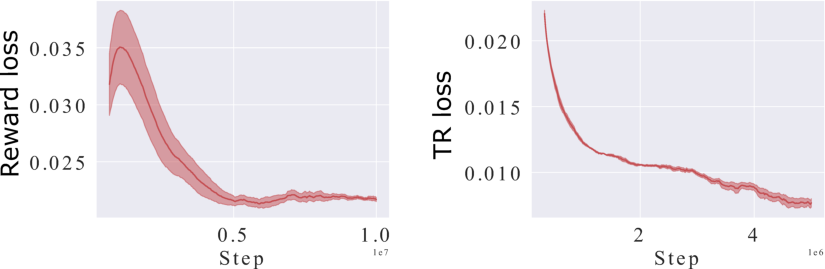
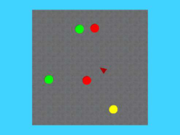

## Model-Based Episodic Memory Induces Dynamic Hybrid Controls

Hung Le, Thommen Karimpanal George, Majid Abdolshah, Truyen Tran, Svetha Venkatesh
Applied AI Institute, Deakin University, Geelong, Australia
thai.le@deakin.edu.au

Abstract

Episodic control enables sample efficiency in reinforcement learning by recalling past experiences from an episodic memory. We propose a new model-based
episodic memory of trajectories addressing current limitations of episodic control.
Our memory estimates trajectory values, guiding the agent towards good policies.
Built upon the memory, we construct a complementary learning model via a dynamic hybrid control unifying model-based, episodic and habitual learning into a
single architecture. Experiments demonstrate that our model allows significantly
faster and better learning than other strong reinforcement learning agents across a
variety of environments including stochastic and non-Markovian settings.

1 Introduction

Episodic memory or “mental time travel” [6] allows recreation of past experiences. In reinforcement learning (RL), episodic control (EC) uses this memory to control behavior, and complements
forward model and simpler, habitual (cached) control methods. The use of episodic memory [1] is
shown to be very useful in early stages of RL [29, 4] and backed up by cognitive evidence [42, 41].
Using only one or few instances of past experiences to make decisions, EC agents avoid complicated
planning computations, exploiting experiences faster than the other two control methods. In hybrid
control systems, EC demonstrates excellent performance and better sample efficiency [36, 30].

Early works on episodic control use tabular episodic memory storing a raw trajectory as a sequence
of states, actions and rewards over consecutive time steps. To select a policy, the methods iterate
through all stored sequences and are thus only suitable for small-scale problems [29, 9]. Other
episodic memories store individual state-action pairs, acting as the state-action value table in tabular
RL, and can generalize to novel states using nearest neighbor approximations [4, 36]. Recent works

[35, 16, 30, 46] leverage both episodic and habitual learning by combining state-action episodic
memories with Q-learning augmented with parametric value functions like Deep Q-Network (DQN;

[34]). The combination of the “fast” non-parametric episodic and “slow” parametric value facilitates
Complementary Learning Systems (CLS) – a theory posits that the brain relies on both slow learning of distributed representations (neocortex) and fast learning of pattern-separated representations
(hippocampus) [31].

Existing episodic RL methods suffer from 3 issues: (a) near-deterministic assumption [4] which is
vulnerable to noisy, stochastic or partially observable environmentscausing ambiguous observations;
(b) sample-inefficiency due to storing state-action-value which demands experiencing all actions to
make reliable decisions and inadequate memory writings that prevent fast and accurate value propagation inside the memory [4, 36]; and finally, (c) assuming fixed combination between episodic and
parametric values [30, 16] that makes episodic contribution weight unchanged for different observations and requires manual tuning of the weight. We tackle these open issues by designing a novel

1The episodic memory in this setting is an across-lifetime memory, persisting throughout training.

35th Conference on Neural Information Processing Systems (NeurIPS 2021), Sydney, Australia.

model that flexibly integrates habitual, model-based and episodic control into a single architecture
for RL.

To tackle issue (a) the model learns representations of the trajectory by minimizing a self-supervised
loss. The loss encourages reconstruction of past observations, thus enforcing a compressive and
noise-tolerant representation of the trajectory for the episodic memory. Unlike model-based RL

[39, 13] that simulates the world, our model merely captures the trajectories.

To address issue (b), we propose a model-based value estimation mechanism established on the
trajectory representations. This allows us to design a memory-based planning algorithm, namely
Model-based Episodic Control (MBEC), to compute the action value online at the time of making
decisions. Hence, our memory does not need to store actions. Instead, the memory stores trajectory
vectors as the keys, each of which is tied to a value, facilitating nearest neighbor memory lookups
to retrieve the value of an arbitrary trajectory (memory read). To hasten value propagation and
reduce noise inside the memory, we propose using a weighted averaging write operator that writes
to multiple memory slots, plus a bootstrapped refine operator to update the written values at any
step.

Finally, to address issue (c), we create a flexible CLS architecture, merging complementary systems
of learning and memory. An episodic value is combined with a parametric value via dynamic consolidation. Concretely, conditioned on the current observation, a neural network dynamically assigns
the combination weight determining how much the episodic memory contributes to the final action
value. We choose DQN as the parametric value function and train it to minimize the temporal difference (TD) error (habitual control). The learning of DQN takes episodic values into consideration,
facilitating a distillation of the episodic memory into the DQN’s weights.

Our contributions are: (i) a new model-based control using episodic memory of trajectories; (ii)
a Complementary Learning Systems architecture that addresses limitations of current episodic RL
through a dynamic hybrid control unifying model-based, episodic and habitual learning (see Fig. 1);
and, (iii) demonstration of our architecture on a diverse test-suite of RL problems from grid-world,
classical control to Atari games and 3D navigation tasks. We show that the MBEC is noise-tolerant,
robust in dynamic grid-world environments. In classical control, we show the advantages of the
hybrid control when the environment is stochastic, and illustrate how each component plays a crucial
role. For high-dimensional problems, our model also achieves superior performance. Further, we
interpret model behavior and provide analytical studies to validate our empirical results.

2 Background

2.1 Deep Reinforcement Learning

Reinforcement learning aims to find the policy that maximizes the future cumulative rewards of
sequential decision-making problems [40]. Model-based approaches build a model of how the environment operates, from which the optimal policy is found through planning [39]. Recent modelbased RL methods can simulate complex environments enabling sample-efficiency through allowing
agents to learn within the simulated “worlds” [14, 23, 15]. Unlike these works, Q-learning [43] – a
typical model-free method, directly estimates the true state-action value function. The function is
defined as Q (s, a) = Eπ [ [�] t [γ][t][r][t][ |][ s, a][]][, where][ r][t][ is the reward at timestep][ t][ that the agent receives]

from the current state s by taking action a, followed policy π. γ ∈ (0, 1] is the discount factor that
weights the importance of upcoming rewards. Upon learning the function, the best action can be
found as at = argmax Q (st, a).

a

With the rise of deep learning, neural networks have been widely used to improve reinforcement
learning. Deep Q-Network (DQN; [34]) learns the value function Qθ (s, a) using convolutional and
feed-forward neural networks whose parameters are θ. The value network takes an image representation of the state st and outputs a vector containing the value of each action at. To train the
networks, DQN samples observed transition (st, at, rt, st+1) from a replay buffer to minimize the
squared error between the value output and target yt = rt + γmax Q [′] θ [(][s][t][+1][, a][)][ where][ Q][′] θ [is the]
a
target network. The parameter of the target network is periodically set to that of the value network,
ensuring stable learning. The value network of DQN resembles a semantic memory that gradually
encodes the value of state-action pairs via replaying as a memory consolidation in CLS theory [24].

2

Figure 1: (a) Trajectorial Recall. The trajectory model reconstructs any past observation along the
trajectory given noisy preceding s-a pair as a cue. (b) Dynamic hybrid control with the episodic
memory at its core. The trajectory model, trained with TR loss (Eq. 1), encodes representations for
writing (Eq. 2) and updating (Eq. 4) the episodic memory. Model-based Episodic Control (MBEC)
plans actions (e.g. a1 and a2) and computes future trajectory representations ( [−→] τ [′] (a1) and [−→] τ [′] (a2))
for reading the memory’s stored values. The read-out, together with the reward model, estimates the
episodic value QMBEC (Eq. 6). The Complementary Learning Systems (CLS) combines QMBEC
and the traditional semantic Qθ using dynamic consolidation conditioned on [−→] τ (Eq. 7). The parameters of the CLS are optimized with TD loss (Eq. 8; habitual control).

Experience replay is critical for DQN, yet it is slow, requiring a lot of observations since the replay
buffer only stores raw individual experiences. Prioritized Replay [37] improves replaying process
with non-uniform sampling favoring important transitions. Others overcome the limitation of onestep transition by involving multi-step return in calculating the value [28, 18]. These works require
raw trajectories and parallel those using episodic memory that persists across episodes.

2.2 Memory-based Controls

Episodic control enables sample-efficiency through explicitly storing the association between returns
and state-action pairs in episodic memory [29, 4, 36]. When combined with Q-learning (habitual
control), the episodic memory augments the value function with episodic value estimation, which is
shown beneficial to guide the RL agent to latch on good policies during early training [30, 46, 20].

In addition to episodic memory, Long Short-Term Memory (LSTM; [19]) and Memory-Augmented
Neural Networks (MANNs; [10, 11]) are other forms of memories that are excel at learning long
sequences, and thus extend the capability of neural networks in RL. In particular, Deep Recurrent QNetwork (DRQN; [17]) replaces the feed-forward value network with LSTM counterparts, aiming
to solve Partially-Observable Markov Decision Process (POMDP). Policy gradient agents are commonly equipped with memories [33, 11, 38]. They capture long-term dependencies across states,
enrich state representation and contribute to making decisions that require reference to past events
in the same episode.

Recent works use memory for reward shaping either via contribution analysis [1] or memory attention [21]. To improve the representation stored in memory, some also construct a model of transitions
using unsupervised learning [44, 13, 8]. As these memories are cleared at the end of the episode,
they act more like working memory with a limited lifespan [2]. Relational [45, 26] and Program
Memory [27] are other forms of memories that have been used for RL. They are all different from
the notion of persistent episodic memory, which is the main focus of this paper.

3 Methods

We introduce a novel model that combines habitual, model based and episodic control wherein
episodic memory plays a central role. Thanks to the memory storing trajectory representations, we
can estimate the value in a model-driven fashion: for any action considered, the future trajectory is
computed to query the episodic memory and get the action value. This takes advantage of modelbased planning and episodic inference. The episodic value is then fused with a slower, parametric
value function to leverage the capability of both episodic and habitual learning. Fig. 1 illustrates

3

Algorithm 1 MBEC++: Complementary reinforcement learning with MBEC and DQN.

1: D: Replay buffer; B: Trajectory buffer; C: Chunk buffer; M: Episodic memory; Tφ: Trajectory
model; rϕ (s, a): Reward model; L: Chunk length
2: for each episode do
3: Initialize [−→] τ 0 = 0; B = ∅; C = ∅
4: for t = 1, T do
5: Observe state st. Compute fβ ( [−→] τ t−1).
6: Select action at ← ǫ-greedy policy using Q in Eq. 7
7: Observe reward rt. Move to next state st+1. Compute [−→] τ t ←Tφ ([st, at], [−→] τ t−1)
8: Add (st, at, st+1, rt, [−→] τ t−1, [−→] τ t) and (st, at) to D and B, respectively.
9: Refine memory: M ← refine (st, [−→] τ t−1|M)
10: for (st′, at′, st′+1, rt′, [−→] τ t′−1, [−→] τ t′) sampled from D do
11: Compute Q (s, a) using st′, at′, [−→] τ t′−1 (Eq. 7)
12: Compute Q (s [′], a [′] ) using st [′] +1, [−→] τ t [′] ∀a [′] (Eq. 7)
13: Optimize Lq wrt θ and β (Eq. 8)
14: Compute Lre using st′, at′, rt′ (Eq. 5). Optimize Lre wrt ϕ

15: if t mod L == 0 then
16: Add ( [−→] τ t−1, rt) to C. Sample (st′, at′ ) from B and optimize Ltr wrt φ and ω (Eq. 1)

17: if t == T then
18: for each [−→] τ i ∈C do

19: Compute V [ˆ] ( [−→] τ i) = [�][T] j= [ −] i [1] [γ][j][−][i][r][j][+1][. Write][ M ←] [write] �−→τ i, ˆV (−→τ i) |M�

these components. We first present the formation of the trajectory representation and the episodic
memory. Next, we describe how we estimate the value from this memory and parametric Q networks.

3.1 Episodic Memory Stores Trajectory Representations

In this paper, a trajectory τt is a sequence of what happens up to the time step t: τt =

[(s1, a1), ..., (st, at)]. If we consider τt as a piece of memory that encodes events in an episode,
from that memory, we must be able to recall any past event. This ability in humans can be examined
through the serial recall test wherein a previous item cues to the recall of the next item in a sequence

[7]. We aim to represent trajectories as vectors manifesting that property. As such, we employ a
recurrent trajectory network Tφ to model [−→] τ t = Tφ ([st, at], [−→] τ t−1) where Tφ is implemented as an
LSTM [19] and [−→] τ t ∈ R [H] is the vector representation of τt and also the hidden state of the LSTM.

We train the trajectory model Tφ to compute [−→] τ t such that it is able to reconstruct the next observation
of any past experience, simulating the serial recall test. Concretely, given a noisy version (˜st′, ˜at′)
of a query state-action (st′, at′ ) sampled from a trajectory buffer B at time step t [′] < t, we minimize
the trajectorial recall (TR) loss as follows,

Ltr = E ∥y [∗] (t) − [st′+1, at′+1]∥ [2] 2 (1)
� �

where y [∗] (t) = Gω (Tφ ([˜st′, ˜at′ ], [−→] τ t)), Gω is a reconstruction function, implemented as a feedforward neural network. The trajectory network Tφ must implement some form of associative memory, compressing information of any state-action query in the past in its current representation [−→] τ t
to reconstruct the next observation of the query, keeping the TR loss low (see a visualization in Fig.
1 (a)). Appendix A.1 theoretically explains why the TR loss is suitable for episodic control.

Our goal is to keep the trajectory representation and its associated value as the key and value of an
episodic memory M = �M [k], M [v][�], respectively. M [k] ∈ R [N] [×][H] and M [v] ∈ R [N] [×][1], where N
is the maximum number of memory slots. The true value of a trajectory [−→] τ t is simply defined as
the value of the resulting state of the trajectory V ( [−→] τ t) = V (st+1) = E Ti=0 −t−1 γ [i] rt+1+i, T
�� �
is the terminal step. The memory stores estimation of the true trajectory values through averaging
empirical returns by our weighted average writing mechanism (see in the next section).

4

3.2 Memory Operators

Memory reading Given a query key [−→] τ, we read from the memory the corresponding value by
referring to neighboring representations. Concretely, two reading rules are employed

read ( [−→] τ |M) =






→
⟨ [M] i [k][,][−] τ ⟩M [v] i
�i∈N [Kr] (→ [−] τ ) �j∈N [K] (→ [−] τ ) [⟨][M] j [k][,] → [−] τ ⟩ (a)

maxi∈N Kr (→ [−] τ ) [M][v] i (b)

where ⟨·⟩ is a kernel function and N [K][r] (·) retrieves top Kr nearest neighbors of the query in M [k] .
The read-out is an estimation of the value of the trajectory [−→] τ wherein the weighted average rule (a)
is a balanced estimation, while the max rule (b) is optimistic, encouraging exploitation of the best
local experience. In this paper, the two reading rules are simply selected randomly with a probability
of pread and 1 − pread, respectively.

Memory writing Given the writing key [−→] τ and its estimated value V [ˆ] ( [−→] τ ), the write operator

write −→τ, ˆV (−→τ ) |M consists of several steps. First, we add the value to the memories M [v] if
� �

the key cannot be found in the key memory M [k] (this happens frequently since key match is rare).
Then, we update the values of the key neighbors such that the updated values are approaching the
written value V [ˆ] ( [−→] τ ) with speeds relative to the distances as ∀i ∈N [K][w] ( [−→] τ ) :

ˆ �M [k] i [,][ −→][τ] �
M [v] i [←M][v] i [+][ α][w] V ( [−→] τ ) −M [v] i (2)
� � �j∈N [Kw] (→ [−] τ ) �M [k] j [,][ −→][τ] �

where αw is the writing rate. Finally, the key can be added to the key memory. When it exceeds
memory capacity N, the earliest added will be removed. For simplicity, Kw = Kr = K.

We note that our memory writing allows multiple updates to multiple neighbor slots, which is unlike
the single-slot update rule [4, 36, 30]. Here, the written value is the Monte Carlo return collected
from t + 1 to the end of the episode V [ˆ] ( [−→] τ t) = [�][T] i=0 [ −][t][−][1] γ [i] rt+1+i. Following [25], we choose to
write the trajectory representation of every L-th time-step (rather than every time-step) to save computation while still maintaining good memorization. Appendix A.2 provides a mean convergence
analysis of our writing mechanism.

Memory refining As the memory writing is only executed after the episode ends, it delays the
value propagation inside the memory. Hence, we design the refine (st, [−→] τ t−1|M) operator that
tries to minimize the one-step TD error of the memory’s value estimation. As such, at an arbitrary
timestep t, we estimate the future trajectory if the agent takes action a using the trajectory model as
−→τ ′t [(][a][) =][ T][φ] [([][s][t][, a][]][,][ −→][τ][ t][−][1][)][. Then, we can update the memory values as follows,]

Q [′] = max rϕ (st, a) + γread ( [−→] τ [′] t [(][a][)][ |M][)][ (3)] M ← write ( [−→] τ t−1, Q [′] |M) (4)
a

where rϕ is a reward model using a feed-forward neural network. rϕ is trained by minimizing

Lre = E (r − rϕ (s, a)) [2] (5)
The memory refining process can be shown to converge in finite MDP environments.
Proposition 1. In a finite MDP (S,A,T,R), given a fixed bounded rϕ and an episodic memory M
with read (average rule) and write operations, the memory refine given by Eq. 4 converges to a
fixed point with probability 1 as long as γ < 1, [�][∞] t=1 [α][w,t][ =][ ∞] [and][ �][∞] t=1 [α][2] w,t [<][ ∞][.]

Proof. See Appendix A.3.

3.3 Model-based Episodic Control (MBEC)

Our agent relies on the memory at every timestep to choose its action for the current state st. To
this end, the agent first plans some action and uses Tφ to estimate the future trajectory. After that,

5

Figure 2: Maze navigation. (a) Noisy mode: number of steps required to complete 100 episodes
with different noise rates (lower is better). (b) Trap mode: average reward (upper) and number
of completed episodes (lower) over timesteps (higher is better). (c) Dynamic mode: efficiency
improvement over random policy across timesteps (higher is better).

it reads the memory to get the value of the planned trajectory. This mechanism takes advantage of
model-based RL’s planning and episodic control’s non-parametric inference, yielding a novel hybrid
control named Model-based Episodic Control (MBEC). The state-action value then is

QMBEC (s, a) = rϕ (s, a) + γread( [−→] τ [′] (a) |M) (6)
The MBEC policy then is π (s) = argmax QMBEC (s, a). Unlike model-free episodic control, we

a

compute on-the-fly instead of storing the state-action value. Hence, the memory does not need to
store all actions to get reliable action values.

3.4 Model-based Episodic Control Facilitates Complementary Learning Systems

The episodic value provides direct yet biased estimation from experiences. To compensate for that,
we can use a neural network Qθ (st, at) to give an unbiased value estimation [34], representing the
slow-learning semantic memory that gradually encodes optimal values. Prior works combine by a
weighted summation of the episodic and semantic value wherein the weight is fixed [30, 16]. We
believe that depending on the specific observations, we may need different weights to combine the
two values. Hence, we propose to combine the two episodic and semantic systems as

Q (st, at) = QMBEC (st, at) fβ ( [−→] τ t−1) + Qθ (st, at) (7)

where fβ is a feed-forward neural network with sigmoid activation that takes the previous trajectory
as the input and outputs a consolidating weight for the episodic value integration. This allows
dynamic integration conditioned on the trajectory status. The semantic system learns to take episodic
estimation into account in making decisions via replaying to minimize one-step TD error,

2
Lq = E r + γ max (8)
� a [′][ Q][ (][s][′][, a][′][)][ −] [Q][ (][s, a][)] �

Here we note that QMBEC is also embedded in the target, providing better target value estimation
in the early phase of learning when the parametric model does not learn well. We follow [34] using
a replay buffer D to store (s, a, s [′], r) across episodes. Without episodic contribution, TD or habitual
learning is slow [16, 30]. Our episodic integration allows the agent to rely on MBEC whenever
it needs to compensate for immature parametric systems. Alg. 1 (MBEC++) summarizes MBEC
operations within the complementary learning system. The two components (MBEC and CLS) are
linked by the episodic memory as illustrated in Fig. 1 (b).

4 Results

In this section, we examine our proposed episodic control both as a stand-alone (MBEC) and within
a complementary learning system (MBEC++). To keep our trajectory model simple, for problems
with image state, it learns to reconstruct the feature vector of the image input, rather than the image
itself. The main baselines are DQN [34] and recent (hybrid) episodic control methods. Details of
the baseline configurations and hyper-parameter tuning for each tasks can be found in Appendix B.

6

Figure 3: Average reward over learning steps on representative stochastic classical control environments (higher is better, mean and std. over 10 runs).

4.1 Grid-world: 2D Maze Exploration

We begin with simple maze navigation to explore scenarios wherein our proposed memory shows
advantages. In this task, an agent is required to move from the starting point (0, 0) to the endpoint
(ne − 1, ne − 1) in a maze environment of size ne ×ne. In the maze task, if the agent hits the wall of
the maze, it gets −1 reward. If it reaches the goal, it gets +1 reward. For each step in the maze, the
agent get −0.1/n [2] e [reward. An episode ends either when the agent reaches the goal or the number]
of steps exceeds 1000. We create different scenarios for this task (ne = 3): noisy, trap and dynamic
modes wherein our MBEC is compared with both parametric (DQN) and memory-based (MFEC;

[4]) models (see Appendix B.2 for details and more results).

Noisy mode In this mode, the state is represented as the location plus an image of the maze. The
image is preprocessed by a pretrained ResNet, resulting in a feature vector of 512 dimensions (the
output layer before softmax). We apply dropout to the image vector with different noise levels. We
hypothesize that aggregating states into trajectory representation as in MBEC is a natural way to
smooth out the noise of individual states.

Fig. 2 (a) measures sample efficiency of the models on noisy mode. Without noise, all models can
quickly learn the optimal policy and finish 100 episodes within 1000 environment steps. However,
as the increased noise distracts the agents, MFEC cannot find a way out until the episode ends. DQN
performance reduces as the noise increases and ends up even worse than random exploration. By
contrast, MBEC tolerates noise and performs much better than DQN and the random agent.

Trap mode The state is the position of the agent plus a trap location randomly determined at the
beginning of the episode. If the agent falls into the trap, it receives a −2 reward (the episode does
not terminate). This setting illustrates the advantage of memory-based planning. With MBEC, the
agent remembers to avoid the trap by examining the future trajectory to see if it includes the trap.
Estimating state-action value (DQN and MFEC) introduces overhead as they must remember all
state-action pairs triggering the trap.

We plot the average reward and number of completed episodes over time in Fig. 2 (b). In this mode,
DQN always learns a sub-optimal policy, which is staying in the maze. It avoids hitting the wall and
trap, however, completes a relatively low number of episodes. MFEC initially learns well, quickly
completing episodes. However its learning becomes unstable as more observations are written into
its memory, leading to a lower performance over time. MBEC alone demonstrates stable learning,
significantly outperforming other baselines in both reward and sample efficiency.

Dynamic mode The state is represented as an image and the maze structure randomly changes
for each episode. A learnable CNN is equipped for each baseline to encode the image into a 64dimensional vector. In this dynamic environment, similar state-actions in different episodes can
lead to totally different outcomes, thereby highlighting the importance of trajectory modeling. In this
case, MFEC uses VAE-CNN, trained to reconstruct the image state. Also, to verify the contribution
of TR loss, we add two baselines: (i) MBEC without training trajectory model (no TRL) and (ii)
MBEC with a traditional model-based transition prediction loss (TPL) (see Appendix B.2 for more
details).

We compare the models’ efficiency improvement over random policy by plotting the percentage of
difference between the models’ number of finished episodes and that of random policy in Fig. 2

7

Figure 4: Cart Pole. (Left) Average contribution of episodic and semantic value estimations over
timesteps (see Appendix B.3 for contribution definition). The episodic influence is gradually replaced by the semantic’s. (Middle) The difference (absolute error) between the stored and true value
of the starting state (mean and std. over 5 runs). (Right) Mountain Car. (a) Visualization of the car
moving uphill over 30 timesteps. Due to noise, the next state can be observed as the current state
with probability ptr. (b) State and (c) trajectory spaces: the axes are the dimension of the trajectory
vectors ⃗τ projected into 2d space. Blue denotes the representation at noisy timestep and red the
normal ones. Fading color denotes earlier timesteps. (d) Value estimation by the episodic memory
for the whole 2-d trajectory space.

(c). DQN and MFEC perform worse than random. MBEC with untrained trajectory model performs
poorly. MBEC with trajectory model trained with TPL shows better performance than random, yet
still underperforms our proposed MBEC with TRL by around 5-10%.

4.2 Stochastic Classical Control

In stochastic environments, taking correct actions can still lead to low rewards due to noisy observations, which negatively affects the quality of episodic memory. We consider 3 classical problems:
Cart Pole, Mountain Car and Lunar Lander. For each problem, we examine RL agents in stochastic
settings by (i) perturbing the reward with Gaussian (mean 0, std. σre = 0.2) or (ii) Bernoulli noise
(with probability pre = 0.2, the agent receives a reward −r where r is the true reward) and (iii)
noisy transition (with probability ptr = 0.5, the agent observes the current state as its next state
despite taking any action). In this case, we compare MBEC++ with DQN, MFEC and NEC [36].

Fig. 3 shows the performances of the models on representative environments (full results in Appendix B.3). For easy problems like Cart Pole, although MFEC learns quickly, its over-optimistic
control is sub-optimal in non-deterministic environments, and thus cannot solve the task. For harder
problems, stochasticity makes state-based episodic memories (MFEC, NEC) fail to learn. DQN
learns in these settings, albeit slowly, illustrating the disadvantage of not having a reliable episodic
memory. Among all, MBEC++ is the only model that can completely solve the noisy Cart Pole
within 10,000 steps and demonstrates superior performance in Mountain Car and Lunar Lander.
Compared to MBEC++, MBEC performs badly, showing the importance of CLS.

Behavior analysis The episodic memory plays a role in MBEC++’s success. In the beginning, the
agent mainly relies on the memory, yet later, it automatically learns to switch to the semantic value
estimation (see Fig. 4 (left)). That is because in the long run the semantic value is more reliable
and already fused with the episodic value through Eq. 7-8. Our write operator also helps MBEC++
in quickly searching for the optimal value. To illustrate that, we track the convergence of the
episodic memory’s written values for the starting state of the stochastic Cart Pole problem under a
fixed policy (Fig. 4 (middle)). Unlike the over-optimistic MFEC’s writing rule using max operator,
ours enables mean convergence to the true value despite Gaussian reward noise. When using a
moderate Kw > 1, the estimated value converges better as suggested by our analysis in Appendix
A.2. Finally, to verify the contribution of the trajectory model, we examine MBEC++’s ability to
counter noisy transition by visualizing the trajectory spaces for Mountain Car in Fig. 4 (right).
Despite the noisy states (Fig. 4 (right, b)), the trajectory model can still roughly estimate the trace
of trajectories (Fig. 4 (right, c)). That ensures when the agent approaches the goal, the trajectory
vectors smoothly move to high-value regions in the trajectory space (Fig. 4 (right, d)). We note that
for this problem that ability is only achieved through training with TR loss (comparison in
Appendix B.3).

8

Model All 25 games
Nature DQN 15.7/51.3 83.6/16.0
MFEC 85.0/45.4 77.7/40.9

NEC 99.8/54.6 106.1/53.3

EMDQN* 528.4/92.8 250.6/95.5

EVA            - 172.2/39.2

ERLAM           - 515.4/103.5

MBEC++ 654.0/117.2 518.2/133.4
Table 1: Human normalized scores (mean/median) at 10 million frames for all and a subset of 25
games. Baselines’ numbers are adopted from original papers and [46], respectively. * The baseline
is reported with 40 million frames of training. - The exact numbers are not reported.

Figure 5: Noisy Transition Mountain Car: ablation study. Each plot varies one hyper-parameter or
ablated component while fixing others in default values (K = 15, L = 10, N = 3000).

Ablation study We pick the noisy transition Mountain Car problem for ablating components and
hyper-parameters of MBEC++ with different neighbors (K), chunk length (L) and memory slots
(N ). The results in Fig. 5 demonstrate that the performance improves as K increases, which is
common for KNN-based methods. We also find that using a too short or too long chunk deteriorates
the performance of MBEC++. Short chunk length creates redundancy as the stored trajectories will
be similar while long chunk length makes minimizing TR loss harder. Finally, the results confirm
that the learning of MBEC++ is hindered significantly with small memory. A too-big memory does
not help either since the trajectory model continually refines the trajectory representation, a too big
memory slows the replacement of old representations with more accurate newer ones.

We also ablate MBEC++: (i) without TR loss, (ii) with TP loss (iii), without multiple write (Kw = 1)
and (iv) without memory update. We realize that the first two configurations show no sign of
learning. The last two can learn but much slower than the full MBEC++, justifying our neighbor
memory writing and update (Fig. 5 (rightmost)). More ablation studies are in Appendix B.6 where
we find our dynamic consolidation is better than fixed combinations and optimal pread is 0.7.

4.3 Atari 2600 Benchmark

We benchmark MBEC++ against other strong episodic memory models in playing Atari 2600 video
games [3]. The task can be challenging with stochastic and partially observable games [23]. Our
model adopts DQN [34] with the same setting (details in Appendix B.4). We only train the models
within 10 million frames for sample efficiency.

Table 1 reports the average performance of MBEC++ and baselines on all (57) and 25 popular
Atari games concerning human normalized metrics [34]. Compared to the vanilla DQN, MFEC and
NEC, MBEC++ is significantly faster at achieving high scores in the early learning phase. Further,
MBEC++ outperforms EMDQN even trained with 40 million frames and achieves the highest median score. Here, state-action value estimations fall short in quickly solving complicated tasks with
many actions like playing Atari games as it takes time to visit enough state-action pairs to create
useful memory’s stored values. By contrast, when the models in MBEC++ are well-learnt (which
is often within 5 million frames, see Appendix B.4), its memory starts providing reliable trajectory
value estimation to guide the agent to good policies. Remarkably, our episodic memory is much
smaller than that of others and our trajectory model size is insignificant to DQN’s (Appendix B.4
and Table 2).

9

In the subset testbed, MBEC++ demonstrates competitive performance against trajectory-utilized
models including EVA [16] and ERLAM [46]. These baselines work with trajectories as raw stateaction sequences, unlike our distributed trajectories. In the mean score metric, MBEC++ is much
better than EVA (nearly double score) and slightly better than ERLAM. MBEC++ agent plays consistently well across games without severe fluctuations in performance, indicated by its significantly
higher median score.

We also compare MBEC++ with recent model-based RL approaches including Dreamer-v2 [15] and
SIMPLE [23]. The results show that our method is competitive against these baselines. Notably, our
trajectory model is much simpler than the other methods (we only have TR and reward losses and
our network is the standard CNN of DQN for Atari games). Appendix B.4 provides more details,
learning curves and further analyses.

4.4 POMDP: 3D Navigation

To examine MBEC++ on Partially-Observable Markov Decision Process (POMDP) environments,
we conduct experiments on a 3D navigation task: Gym Mini-World’s Pickup Objects [5]. Here, an
agent moves around a big room to collect several objects (+1 reward for each picked object). The
location, shape and color of the objects change randomly across episodes. The state is the frontal
view-port of the agent and encoded by a common CNN for all baselines (details in Appendix B.5).

We train all models for only 2 million steps and report the results for a different number of objects
in Appendix’s Fig. 12. Among all baselines, MBEC++ demonstrates the best learning progress and
consistently improves over time. Other methods either fail to learn (DRQN) or show a much slower
learning speed (DQN and PPO). That proves our MBEC++ is useful for POMDP.

5 Conclusion

We have introduced a new episodic memory that significantly accelerates reinforcement learning
in various problems beyond near-deterministic environments. Its success can be attributed to: (a)
storing distributed trajectories produced by a trajectory model, (b) memory-based planning with fast
value-propagating memory writing and refining, and (c) dynamic consolidation of episodic values
to parametric value function. Our experiments demonstrate the superiority of our method to prior
episodic controls and strong RL baselines. One limitation of this work is the large number of hyperparameters, which prevents us from fully tuning MBEC++. In future work, we will extend to
continuous action space and explore multi-step memory-based planning capability of our approach.

Our research aims to improve sample-efficiency of RL and can be trained with common computers.
Our method improves the performance in various RL tasks, and thus opens the chance for creating
better autonomous systems that work flexibly across sectors (robotics, manufacturing, logistics, and
decision support systems). Although we do not think there are immediate bad consequences, we are
aware of potential problems. First, our method does not guarantee safe exploration during training.
If learning happens in a real-world setting (e.g. self-driving car), the agent can make unsafe exploration (e.g. causing accidents). Second, we acknowledge that our method, like many other Machine
Learning algorithms, can be misused in unethical or malicious activities.

ACKNOWLEDGMENTS

This research was partially funded by the Australian Government through the Australian Research Council (ARC). Prof Venkatesh is the recipient of an ARC Australian Laureate Fellowship
(FL170100006).

References

[1] Jose A Arjona-Medina, Michael Gillhofer, Michael Widrich, Thomas Unterthiner, Johannes
Brandstetter, and Sepp Hochreiter. Rudder: Return decomposition for delayed rewards. In
Advances in Neural Information Processing Systems, pages 13566–13577, 2019.

[2] Alan D Baddeley and Graham Hitch. Working memory. In Psychology of learning and motivation, volume 8, pages 47–89. Elsevier, 1974.

10

[3] Marc G Bellemare, Yavar Naddaf, Joel Veness, and Michael Bowling. The arcade learning
environment: An evaluation platform for general agents. Journal of Artificial Intelligence
Research, 47:253–279, 2013.

[4] Charles Blundell, Benigno Uria, Alexander Pritzel, Yazhe Li, Avraham Ruderman, Joel Z
Leibo, Jack Rae, Daan Wierstra, and Demis Hassabis. Model-free episodic control. arXiv
preprint arXiv:1606.04460, 2016.

[5] Maxime Chevalier-Boisvert. gym-miniworld environment for openai gym.
[https://github.com/maximecb/gym-miniworld, 2018.](https://github.com/maximecb/gym-miniworld)

[6] Yadin Dudai and Mary Carruthers. The janus face of mnemosyne. Nature, 434(7033):567–567,
2005.

[7] Simon Farrell. Temporal clustering and sequencing in short-term memory and episodic memory. Psychological review, 119(2):223, 2012.

[8] Meire Fortunato, Melissa Tan, Ryan Faulkner, Steven Hansen, Adrià Puigdomènech Badia,
Gavin Buttimore, Charlie Deck, Joel Z Leibo, and Charles Blundell. Generalization of reinforcement learners with working and episodic memory. In NeurIPS, 2019.

[9] Samuel J Gershman and Nathaniel D Daw. Reinforcement learning and episodic memory in
humans and animals: an integrative framework. Annual review of psychology, 68:101–128,
2017.

[10] Alex Graves, Greg Wayne, and Ivo Danihelka. Neural turing machines. arXiv preprint
arXiv:1410.5401, 2014.

[11] Alex Graves, Greg Wayne, Malcolm Reynolds, Tim Harley, Ivo Danihelka, Agnieszka
Grabska-Barwi´nska, Sergio Gómez Colmenarejo, Edward Grefenstette, Tiago Ramalho, John
Agapiou, et al. Hybrid computing using a neural network with dynamic external memory.
Nature, 538(7626):471–476, 2016.

[12] Joseph F Grcar. A matrix lower bound. Linear algebra and its applications, 433(1):203–220,
2010.

[13] David Ha and Jürgen Schmidhuber. Recurrent world models facilitate policy evolution. In
Advances in neural information processing systems, pages 2450–2462, 2018.

[14] Danijar Hafner, Timothy Lillicrap, Ian Fischer, Ruben Villegas, David Ha, Honglak Lee, and
James Davidson. Learning latent dynamics for planning from pixels. In International Conference on Machine Learning, pages 2555–2565. PMLR, 2019.

[15] Danijar Hafner, Timothy P Lillicrap, Mohammad Norouzi, and Jimmy Ba. Mastering atari
with discrete world models. In International Conference on Learning Representations, 2020.

[16] Steven Hansen, Alexander Pritzel, Pablo Sprechmann, André Barreto, and Charles Blundell.
Fast deep reinforcement learning using online adjustments from the past. In Advances in
Neural Information Processing Systems, pages 10567–10577, 2018.

[17] Matthew Hausknecht and Peter Stone. Deep recurrent q-learning for partially observable mdps.
arXiv preprint arXiv:1507.06527, 2015.

[18] Frank S He, Yang Liu, Alexander G Schwing, and Jian Peng. Learning to play in a day:
Faster deep reinforcement learning by optimality tightening. In 5th International Conference
on Learning Representations, ICLR 2017, 2019.

[19] Sepp Hochreiter and Jürgen Schmidhuber. Long short-term memory. Neural computation,
9(8):1735–1780, 1997.

[20] Hao Hu, Jianing Ye, Zhizhou Ren, Guangxiang Zhu, and Chongjie Zhang. Generalizable
episodic memory for deep reinforcement learning. arXiv preprint arXiv:2103.06469, 2021.

[21] Chia-Chun Hung, Timothy Lillicrap, Josh Abramson, Yan Wu, Mehdi Mirza, Federico
Carnevale, Arun Ahuja, and Greg Wayne. Optimizing agent behavior over long time scales
by transporting value. Nature communications, 10(1):1–12, 2019.

[22] Tommi Jaakkola, Michael I Jordan, and Satinder P Singh. On the convergence of stochastic
iterative dynamic programming algorithms. Neural computation, 6(6):1185–1201, 1994.

[23] Lukasz Kaiser, Mohammad Babaeizadeh, Piotr Milos, Blazej Osinski, Roy H Campbell, Konrad Czechowski, Dumitru Erhan, Chelsea Finn, Piotr Kozakowski, Sergey Levine, et al. Modelbased reinforcement learning for atari. arXiv preprint arXiv:1903.00374, 2019.

11

[24] Dharshan Kumaran, Demis Hassabis, and James L McClelland. What learning systems do
intelligent agents need? complementary learning systems theory updated. Trends in cognitive
sciences, 20(7):512–534, 2016.

[25] Hung Le, Truyen Tran, and Svetha Venkatesh. Learning to remember more with less memorization. arXiv preprint arXiv:1901.01347, 2019.

[26] Hung Le, Truyen Tran, and Svetha Venkatesh. Self-attentive associative memory. In Proceedings of the 37th International Conference on Machine Learning, volume 119 of Proceedings
of Machine Learning Research, pages 5682–5691, Virtual, 13–18 Jul 2020. PMLR.

[27] Hung Le and Svetha Venkatesh. Neurocoder: Learning general-purpose computation using
stored neural programs. arXiv preprint arXiv:2009.11443, 2020.

[28] Su Young Lee, Choi Sungik, and Sae-Young Chung. Sample-efficient deep reinforcement
learning via episodic backward update. In Advances in Neural Information Processing Systems,
pages 2112–2121, 2019.

[29] Máté Lengyel and Peter Dayan. Hippocampal contributions to control: the third way. In
Advances in neural information processing systems, pages 889–896, 2008.

[30] Zichuan Lin, Tianqi Zhao, Guangwen Yang, and Lintao Zhang. Episodic memory deep qnetworks. arXiv preprint arXiv:1805.07603, 2018.

[31] James L McClelland, Bruce L McNaughton, and Randall C O’Reilly. Why there are complementary learning systems in the hippocampus and neocortex: insights from the successes and
failures of connectionist models of learning and memory. Psychological review, 102(3):419,
1995.

[32] Francisco S Melo. Convergence of q-learning: A simple proof. Institute Of Systems and
Robotics, Tech. Rep, pages 1–4, 2001.

[33] Volodymyr Mnih, Adria Puigdomenech Badia, Mehdi Mirza, Alex Graves, Timothy Lillicrap,
Tim Harley, David Silver, and Koray Kavukcuoglu. Asynchronous methods for deep reinforcement learning. In International conference on machine learning, pages 1928–1937, 2016.

[34] Volodymyr Mnih, Koray Kavukcuoglu, David Silver, Andrei A Rusu, Joel Veness, Marc G
Bellemare, Alex Graves, Martin Riedmiller, Andreas K Fidjeland, Georg Ostrovski, et al.
Human-level control through deep reinforcement learning. nature, 518(7540):529–533, 2015.

[35] Daichi Nishio and Satoshi Yamane. Faster deep q-learning using neural episodic control. In
2018 IEEE 42nd Annual Computer Software and Applications Conference (COMPSAC), volume 1, pages 486–491. IEEE, 2018.

[36] Alexander Pritzel, Benigno Uria, Sriram Srinivasan, Adria Puigdomenech Badia, Oriol
Vinyals, Demis Hassabis, Daan Wierstra, and Charles Blundell. Neural episodic control. In
Proceedings of the 34th International Conference on Machine Learning-Volume 70, pages
2827–2836. JMLR. org, 2017.

[37] Tom Schaul, John Quan, Ioannis Antonoglou, and David Silver. Prioritized experience replay.
arXiv preprint arXiv:1511.05952, 2015.

[38] John Schulman, Filip Wolski, Prafulla Dhariwal, Alec Radford, and Oleg Klimov. Proximal
policy optimization algorithms. arXiv preprint arXiv:1707.06347, 2017.

[39] Richard S Sutton. Dyna, an integrated architecture for learning, planning, and reacting. ACM
Sigart Bulletin, 2(4):160–163, 1991.

[40] Richard S Sutton and Andrew G Barto. Reinforcement learning: An introduction. MIT press,
2018.

[41] Endel Tulving. Episodic memory: From mind to brain. Annual review of psychology, 53(1):1–
25, 2002.

[42] Endel Tulving et al. Episodic and semantic memory. Organization of memory, 1:381–403,
1972.

[43] Christopher JCH Watkins and Peter Dayan. Q-learning. Machine learning, 8(3-4):279–292,
1992.

[44] Greg Wayne, Chia-Chun Hung, David Amos, Mehdi Mirza, Arun Ahuja, Agnieszka GrabskaBarwinska, Jack Rae, Piotr Mirowski, Joel Z Leibo, Adam Santoro, et al. Unsupervised predictive memory in a goal-directed agent. arXiv preprint arXiv:1803.10760, 2018.

12

[45] Vinicius Zambaldi, David Raposo, Adam Santoro, Victor Bapst, Yujia Li, Igor Babuschkin,
Karl Tuyls, David Reichert, Timothy Lillicrap, Edward Lockhart, et al. Deep reinforcement
learning with relational inductive biases. In International Conference on Learning Representations, 2018.

[46] Guangxiang Zhu, Zichuan Lin, Guangwen Yang, and Chongjie Zhang. Episodic reinforcement
learning with associative memory. In International Conference on Learning Representations,
2019.

13

Appendix

A Analytical Studies on Model-based Episodic Memory

A.1 Why Is Trajectorial Recall (TR) Loss Good for Episodic Memory?

For proper episodic control, neighboring keys should represent similar trajectories. If we simply
assume that two trajectories are similar if they share many common transitions, training the trajectory
model with TR loss indeed somehow enforces that property. To illustrate, we consider simple linear
Tφ and Gω such that the reconstruction process becomes

y [∗] (t) = W (U [−→] τ t + V [st′, at′])

Here, we also assume that the query is clean without added noise. Then we can rewrite TR loss for
a trajectory τt

̸ [̸]

Ltr (τt) =

=

̸ [̸]

t
� ∥W (U [−→] τ t + V [st′, at′]) − [st′+1, at′+1]∥ [2] 2

t [′] =1

t
� ∥∆t′ (τt)∥ [2] 2

t [′] =1

̸ [̸]

Let us denote S ̸= ∅ the set of common transition steps between 2 trajectories: τt [1] 1 [and][ τ] t [ 2] 2 [, by]
applying triangle inequality,

̸ [̸]

Ltr �τt [1] 1 � + Ltr �τt [2] 2 � ≥ �

t [′] ∈S

≥
�

t [′] ∈S

̸ [̸]

2 2
��∆t′ �τt [1] 1 ���2 [+] ��∆t′ �τt [2] 2 ���2

2
��∆t′ �τt [1] 1 � − ∆ �τt [2] 2���2

̸ [̸]

= |S| ��WU �−→τ 1t1 [−−→][τ][ 2] t2���22

If we assume WU �−→τ 1t1 [−−→][τ][ 2] t2 � = 0̸ as [−→] τ [1] t1 [̸][=][ −→][τ][ 2] t2 [, applying Lemma 2.3 in [12] yields]

Ltr �τt [1] 1 � + Ltr �τt [2] 2 � −→ 2

|S| σmin (WU ) ≥ �� τ 1t1 [−−→][τ][ 2] t2 ��2

where σmin (WU ) is the smallest nonzero singular value of WU . As the TR loss decreases and the
number of common transition increases, the upper bound of the distance between two trajectory vectors decreases, which is desirable. On the other hand, it is unclear whether the traditional transition
prediction loss holds that property.

A.2 Convergence Analysis of write Operator

In this section, we show that we can always find αw such that the writing converges with probability
1 and analyze the convergence as αw is constant. To simplify the notation, we rewrite Eq. 2 as

M [v] i [(][n][ + 1) =][ M][v] i [(][n][) +][ λ][ (][n][) (][R][j][ (][n][)][ −M][v] i [(][n][))] (9)

where i and j denote the current memory slot being updated and its neighbor that initiates the writing,
respectively. λ (n) = αw (n) �b∈N⟨⟩ [Kw] ij (n⟨⟩)bj (n) [where][ N] j [ K][w] is the set of Kw neighbors of j. Rj is the

j

empirical return of the trajectory whose key is the memory slot j, ⟨⟩ij the kernel function of 2 keys
and n the number of updates. As mentioned in [40], this stochastic approximation converges when
�∞n=1 [λ][ (][n][) =][ ∞] [and][ �][∞] n=1 [λ][2][ (][n][)][ <][ ∞][.]

14

1
By definition, ⟨⟩ij = ∥→ [−] τ i−→ [−] τ j∥+ǫ [and][ ∥−→][τ][ ∥≤] [1][ since][ −→][τ][ is the hidden state of an LSTM. Hence, we]

[1] ǫ [. Hence, let][ B][ij][ (][n][)][ a random variable denoting] � ⟨⟩ [Kw] ij (n⟨⟩)

1
have ∀i, j: 0 < 2+ǫ [≤⟨⟩] ij [≤] [1] ǫ

ij

b∈N [Kw] ⟨⟩bj (n) [–the]
j

neighbor weight at step n, ∀i, j :

ǫ 2 + ǫ
Kwǫ + 2Kw − 2 [≤] [B][ij][ (][n][)][ ≤] Kwǫ + 2

That yields �∞n=1 [λ][ (][n][)] ≥ Kwǫ+2ǫ K−2 �∞n=1 [α][w][ (][n][)] and �∞n=1 [λ][2][ (][n][)] ≤
2
� K2+wǫ+2ǫ � �∞n=1 [α] w [2] [(][n][)][.] Hence the writing updates converge when [�][∞] n=1 [α][w][ (][n][)] = ∞

and [�][∞] n=1 [α] w [2] [(][n][)][ <][ ∞][. We can always choose such][ α][w][ (e.g.,][ α][w][ (][n][) =] n+11 [).]

With a constant writing rate α, we rewrite Eq. 9 as

M [v] i [(][n][ + 1) =][ M][v] i [(][n][) +][ αB][ij] [(][n][) (][R][j] [(][n][)][ −M][v] i [(][n][))]
= αBij (n) Rj (n) + M [v] i [(][n][) (1][ −] [αB][ij][ (][n][))]

n
� (1 − αBij (l)) Rj (t)

l=t+1

=

+

n
� αBij (t)

t=1

n
� (1 − αBij (t)) M [v] i [(1)]

t=1

where the second term [�][n] t=1 [(1][ −] [αB][ij][ (][t][))][ M] i [v] [(1)][ →] [0][ as][ n][ →∞] [since][ B][ij][ (][t][)][ and][ α][ are]
bounded between 0 and 1. The first term can be decomposed into three terms

n
� αBij (t)

t=1

n
� (1 − αBij (l)) Rj (t) = T1 + T2 + T3

l=t+1

where

n
� αBij (t)

t=1

n
�

n
� (1 − αBij (l)) Vi

l=t+1

T1 =

T2 =

T3 =

n
� αBij (t)

t=1

n
�

n
� (1 − αBij (l)) ∆Vij (t)

l=t+1

n
� αBij (t)

t=1

n
�

n
� (1 − αBij (l)) R [˜] j (t)

l=t+1

Here,Vi is the true value of the trajectory stored in slot i, ∆Vij (t) = Vj (t) − Vi and R [˜] j (t) =
Rj (t) − Vj (t) the noise term between the return and the true value. Assume that the value is
associated with zero mean noise and the value noise is independent with the neighbor weights, then
E (T3) = 0 [2] .

Further, we make other two assumptions: (1) the neighbor weights are independent across update
steps; (2) the probability pj of visiting a neighbor j follows the same distribution across update steps
and thus, E (Bij (t)) = E (Bij (l)) = E (Bij). We now can compute

2This assumption is true for the Perturbed Cart Pole Gaussian reward noise.

15

n
� αBij (t)
�t=1

n
� αE (Bij)

t=1

�

E (T1) = E

n
� (1 − αBij (l)) Vi

l=t+1

n
�

= Vi

n
� (1 − αE (Bij))

l=t+1

n
�

= ViαE (Bij )

n
� (1 − αE (Bij)) [n][−][t]

t=1

= ViαE (Bij ) [1][ −] [(1][ −] [α][E][ (][B][ij][))][n]

1 − (1 − αE (Bij ))
= Vi (1 − (1 − αE (Bij )) [n] )

As n →∞, E (T1) → Vi since since Bij (t) and α are bounded between 0 and 1.

Similarly, E (T3) = E (Vj (t) − Vi) = E (Vj (t)) − Vi = [�] j∈Ni [Kw] pjVj − Vi, which is the ap
proximation error of the KNN algorithm. Hence, with constant learning rate, on average, the write
operator leads to the true value plus the approximation error of KNN. The quality of KNN approximation determines the mean convergence of write operator. Since the bias-variance trade-off of
KNN is specified by the number of neighbors K, choosing the right K > 1 (not too big, not too
small) is important to achieve good writing to ensure fast convergence. That explains why our writing to multiple slots (K > 1) is generally better than the traditional writing to single slot (K = 1).

A.3 Convergence Analysis of refine Operator

In this section, we study the convergence of the memory-based value estimation by applying refine
operator to the memory. As such, we treat the read ( [−→] τ |M) operator as a value function over trajectory space T and simplify the notation as read (x) where x represents the trajectory. We make the
assumption that the read operator simply uses averaging rule and the set of neighbors stored in the
memory is fixed (i.e. no new element is added to the memory), then

readt (x) = � BixM [v] i,t

i∈N [K] (x)

⟨ [M] i [k][,x][⟩]
where Bix = �j∈N [K] (x) [⟨][M] j [k][,x][⟩] [is the neighbor weight and][ t][ is the step of updating.]

We rewrite the refine operator as

M ← write x, max rϕ (x, a) + γreadt (y) |M
� a �

⇔∀i ∈N [K] (x) :
M [v] i,t+1 [=][ M][v] i,t

+ αw,tBix �maxa rϕ (x, a) + γreadt (y) −M [v] i,t�

where y is the trajectory after taking action a from the trajectory x. Then, after the refine,

16

readt+1 (x) = � BixM [v] i,t+1

i∈N [K] (x)

= M [v]
� i,t [B][ix][ (1][ −] [α][w,t][)]

i∈N [K] (x)

+αw,t �

i∈N [K] (x)

max rϕ (x, a) + γreadt (y) Bix [2]
� a �

+αw,t � M [v] i,t [B][ix] [(1][ −] [B][ix][)]

i∈N [K] (x)

= readt (x) (1 − αw,t) + αw,tGt (x)

where Gt (x) = maxa Ut (x, a) [�] i∈N [K] (x) [B] ix [2] [+][ �] i∈N [K] (x) [M][v] i,t [B][ix][ (1][ −] [B][ix][)][,][ U][ (][x, a][)] =

rϕ (x, a) + γread(y). To simplify the analysis, we assume the stored neighbors of x are apart
from x by the same distance, i.e., ∀i ∈N [K] (x) : Bix = K1 [. That is,]

1

K [+ read(][x][)][ K][ −] K [1]

1
G (x) = max rϕ (x, a) + γread(y)
� a �

K

Let H an operator defined for the function read : T →R as

where a [∗] = argmax

a

Hread (x) = � Pa∗ (x, y) Gt (x|a [∗] )

yˆ∈T

ˆ
�y∈T [P][a][ (][x, y][)][ U][ (][x, a][)][. We will prove][ H][ is a contraction in the sup-norm.]

Let us denote ∆read (x) = read1 (x) − read2 (x), ∆PU (x, a [∗] 1 [, a][∗] 2 [) =][ �] y∈T [P][a][∗] 1 [(][x, y][)][ U][1][ (][x, a] 1 [∗][)]

ˆ
− [�] y∈T [P][a][∗] 2 [(][x, y][)][ U][2][ (][x, a] 2 [∗][)] and a = argmax �y∈T [P][a][∗] 1 [(][x, y][)][ U][1][ (][x, a] 1 [∗][)][,]
a [∗] 1 [,a][∗] 2

�y∈T [P][a][∗] 2 [(][x, y][)][ U][2][ (][x, a] 2 [∗][)][. Then,]

17

Task MBEC MBEC++ DQN
2D Maze 2K N/A 43K

Classical control N/A 39K 43K
Atari games N/A 13M 13M
3D Navigation N/A 13M 13M
Table 2: The number of trainable parameters of MBEC(++) and its main competitor DQN.

∆PU (x, a [∗] 1 [, a] 2 [∗][) 1]
� K

∥Hread1 − Hread2∥∞ =

������

�

y∈T

+ ∆read (x) [K][ −] [1]

K

�����∞

K

≤

������

� ∆PU (x, a [∗] 1 [, a][∗] 2 [) 1] K

y∈T

�

������∞

K − 1
+ ∆read (x)
���� K ����∞

������∞

Paˆ (x, y)

≤

������

�

y∈T

γ∆read(y)
K

K − 1
+ ∆read (x)
���� K ����∞

≤
�

y∈T

Paˆ (x, y)

K γ ∥∆read (y)∥∞

K − 1
+ ∆read
���� K ����∞

≤ [γ][ +][ K] K [ −] [1] ∥read1 − read2∥∞

Since γ < 1, 0 < γK = [γ][+] K [K][−][1] < 1 ∀K ≥ 1. Thus, H is a contraction in the sup-norm and there

exists a fix-point read [∗] such that Hread [∗] = read [∗] .

We define ∆t = readt − read [∗], then

∆t+1 = ∆t (x) (1 − αw,n) + αw,tFt (x)

where Ft (x) = Gt (x) − read [∗] (x). We have

E (Ft (x) | Ft) = � Pa∗ (x, y) Gt (x|a [∗] ) − read [∗] (x)

yˆ∈T

= Hreadt (x) − read [∗] (x)

Following the proof in [32], E (Ft (x) | Ft) ≤ γK ∥∆t (x)∥∞ and
var (Ft (x) | Ft)<C (1 + ∥∆t (x)∥) [2] for C - 0. Assume that [�][∞] t=1 [α][w,t] = ∞ and
�∞t=1 [α][2] w,t [<][ ∞][, according to [22],][ ∆][t] [converges to 0 with probability 1 or][ read][ converges]
to read [∗] .

18

0

100

200

300

400

500

600

0

100

200

300

400

500

600

0 100 200 300 400 500 600

0 100 200 300 400 500 600

Figure 6: Maze map 3 × 3 (left) and 5 × 5 (right). The agent starts from the left top corner (blue
square) and finds the goal at the right bottom corner (red square).

B Experimental Details

B.1 Implemented baseline description

In this section, we describe baselines that are implemented and used in our experiments. We trained
all the models using a single GPU Tesla V100-SXM2.

Model-based Episodic Control (MBEC, ours) The main hyper-parameter of MBEC is the number of neighbors (K), chunk length (L) and memory slots (N ). Hyper-parameter tuning is adjusted
according to specific tasks. For example, for small and simple problems, K and N tend to be smaller
and L is often about 20 − 30% of the average length per episode. Across experiments, we follow
prior works using γ = 0.99. We also fix αw = 0.5 to reduce hyperparameter tuning. To implement
read and write, we set K = Kr = Kw and use the kernel ⟨x, y⟩ = ∥x−1y∥+ǫ [with][ ǫ][ = 10][−][3]

following [36].

Unless stated otherwise, the hidden size of the trajectory model is fixed to H = 16 for all tasks.
The reward model is implemented as a 2-layer ReLU feed-forward neural network and trained with
batch size 32 for all tasks. To compute TR Loss, we sample 4 past transitions and add Gaussian
noise (mean 0, std. 0.1 × ∥q∥2) to the query vector q. Notably, in MBEC++, when training with
TD loss, we do not back-propagate the gradient to the trajectory model to ensure that the trajectory
representations are only shaped by the TR Loss.

In practice, to reduce computational complexity, we do not perform refine operator every timestep.
Rather, at each step, we randomly refine with a probability pu = 0.1. Similarly, we occasionally
update the parameters of the trajectory model. Every L step, we randomly update φ and ω using
back-propagation via Ltr with probability prec = 0.5. For Atari games, we stop training the trajectory model after 5 million steps. On our machine for Atari games, these tricks generally make
MBEC++ run at speed 100 steps/s while DQN 150 steps/s.

Deep Q-Network (DQN) Except for Sec. 4.3 and 4.4, we implement DQN [3] with the following
hyper-parameters: 3-layer ReLU feed-forward Q-network (target network) with hidden size 144,
target update every 100 steps, TD update every 1 step, replay buffer size 10 [6] and Adam optimizer
with batch size 32. The exploration rate decreases from 1 to 0.01. We tune the learning rate for
each task in range �10 [−][3], 10 [−][5][�] . For tasks with image input, the Q-network (target network) is
augmented with CNN to process the image depending on tasks. MBEC++ adopts the same DQN
with a smaller hidden size of 128. Table 2 compares model size between DQN and MBEC(++).
Regarding memory usage, for Atari games, DQN consumes 1,441 MB and MBEC++ 1,620 MB.

[3https://github.com/higgsfield/RL-Adventure](https://github.com/higgsfield/RL-Adventure)

19

Model-Free Episodic Control (MFEC) This episodic memory maintains a value table using Knearest neighbor to read the value for a query state and max operator to write a new value. We set
the key dimension and memory size to 64 and 10 [6], respectively. We tune K ∈{3, 5, 11, 25} for
each task. Unless stated otherwise, we use random projection for MFEC. For VAE-CNN version
used in dynamic maze mode, we use 5-convolutional-layer encoder and decoder (16-128 kernels
with 4×4 kernel size and a stride of 2). Other details follow the original paper [4].

Neural Episodic Control (NEC) This model extends MFEC using the state-key mapping as a
CNN embedding network trained to minimize the TD error of memory-based value estimation. Also,
multi-step Q-learning update is employed for memory writing. We adopt the publicly available
source code [4] which follows the same hyper-parameters used in the original paper [36] and apply
it to stochastic control problem by implementing the embedding network as a 2-layer feed-forward
neural network. We tune K ∈{3, 5, 11, 25} and the hidden size of the embedding network ∈
{32, 64, 128, 256} for each task.

Proximal Policy Optimization (PPO) PPO [38] is a policy gradient method that simplifies Trust
Region update with gradient descent and soft constraint (maintaining low KL divergence between
new and old policy via objective clipping). We test PPO for the 3D Navigation task using the original
source code of the environment Gym Mini World.

Deep Recurrent Q-Network (DRQN) DRQN [17] is similar to DQN except that it uses LSTM as
the Q-Network. As the hidden state of LSTM represents the environment state for the Q-Network, it
captures past information that may be necessary for the agent in POMDP. We extend DQN to DRQN
by storing transitions with the hidden states in the replay buffer and replacing the feed-forward QNetwork with an LSTM Q-Network. We tune the hidden size of the LSTM ∈{128, 256, 512} for
3D navigation task.

B.2 Maze task

Task overview In the maze task, if the agent hits the wall of the maze, it gets −1 reward. If it
reaches the goal, it gets 1 reward. For each step in the maze, the agent get −0.1/n [2] e [reward. An]
episode ends either when the agent reaches the goal or the number of steps exceeds 1000.

To build different modes of the task, we modify the original gym-maze environment [5] . Fig. 6 illustrates the original 3 × 3 and 5 × 5 maze structure. We train and tune MBEC and other baselines
for 3 × 3 maze task and use the found hyper-parameters for other task modes. For MBEC, the best
hyper-parameters are K = 5, L = 5, N = 1000.

Transition Prediction (TP) loss For dynamic mode and ablation study for stochastic control tasks,
we adopt a common loss function to train the traditional model in model-based RL: the transition
prediction (TP) loss. Trained with the TP loss, the model tries to predict the next observations given
current trajectory and observations. The TP loss is concretely defined as follows,

Ltp = E ∥y [∗] (t) − [st+1, at+1]∥ [2] 2 (10)
� �

y [∗] (t) = Gω (Tφ ([˜st, ˜at], [−→] τ t−1)) (11)

The key difference between TP loss and TR loss is the timestep index. TP loss takes observations at
current timestep to predict the one at the next timestep. On the other hand, TR loss takes observations
at past timestep and uses the current working memory (hidden state of the LSTM) to reconstruct the
observations at the timestep after the past timestep. Our experiments consistently show that TP loss
is inferior to our proposed TR loss (see Sec. B.3).

[4https://github.com/hiwonjoon/NEC](https://github.com/hiwonjoon/NEC)
[5https://github.com/MattChanTK/gym-maze](https://github.com/MattChanTK/gym-maze)

20

Figure 7: All learning curves for stochastic classical control task. First row: Gaussian noisy reward.
Second row: Bernoulli noisy reward. Third row: Noisy transition

Figure 8: Stochastic Mountain Car. Trajectory space in noisy transition using models trained with
TR loss (left), no training (middle) and TP loss (right).

B.3 Stochastic classical control task

Task description We introduce three ways to make a classical control problem stochastic. First,
we add Gaussian noise (mean 0, σre = 0.2) to the reward that the agent observes. Second, we add
Bernoulli-like noise (with a probability pre = 0.2, the agent receives a reward −r where r is the true
reward). Finally, we make the observed transition noisy by letting the agent observe the same state
despite taking any action with a probability ptr = 0.5. The randomness only affects what the agent
sees while the environment dynamic is not affected. Three classical control problems are chosen
from Open AI’s gym: CartPole-v0, MountainCar-v0 and LunarLander-v2. For each problem, we
apply the three stochastic configurations, yielding 9 tasks in total.

Fig. 7 showcases the learning curves of DQN, MBEC++, MFEC and NEC for all 9 tasks. MBEC++
is consistently the leading performer. DQN is often the runner-up, yet usually underperforms our
method by a significant margin. Overall, other memory-based methods such as MFEC and NEC
perform poorly for these tasks since they are not designed for stochastic environments.

Memory contribution We determine the episodic and semantic contribution to the final value
estimation by counting the number of times their greedy actions equal the final greedy action, dividing by the number of timesteps. Concretely, the episodic and semantic contribution is computed
respectively as

�Tt=1 [argmax] at [Q][eps][ (][s][t][, a][t][) == argmax] at [Q][ (][s][t][, a][t][)]

T

21

Figure 9: Learning curves of several Atari games.

Figure 10: Loss of reward model and TR loss over training iterations for Atari’s Asterix and Gopher,
respectively.

�Tt=1 [argmax] at [Q][θ][ (][s][t][, a][t][) == argmax] at [Q][ (][s][t][, a][t][)]

T
where Qeps (st, at) = QMBEC (st, at) fβ (st, [−→] τ t−1), Qθ (st, at) and Q (st, at) represent the
episodic, semantic and final value estimation, respectively.

Fig. 4 illustrates the running average contribution using a window of 100 timesteps. We note that
the contribution of the two does not need to sum up to 1 as both can agree with the same greedy
action.

Trajectory space visualization We visualize the memory-based value function w.r.t trajectory
vectors in Fig. 4 (d). As such, we set the trajectory dimension to H = 2 and estimate the value for
each grid point (step 0.05) using read operator as

V ( [−→] τ ) ≈ �

i∈N [Kr] (→ [−] τ )

�M [k] i [,][ −→][τ] � M [v] i
�j∈N [K] (→ [−] τ ) �M [k] j [,][ −→][τ] �

To cope with noisy environment, MBEC relies on noise-tolerant trajectory representation. As demonstrated in Fig. 8, even when the state representations are disturbed by not changing to true states,
the trajectory representations shaped by the TR loss maintain good approximation and interpolate
well the latent location of disturbed trajectories. In contrast, representations generated by random
model or model trained with TP loss fail to discover latent location of disturbed trajectories, either
collapsing (random model) or shattering (TP loss model).

22

Game Nature DQN MFEC NEC MBEC++
Alien 634.8 1717.7 3460.6 1991.2

Amid 126.8 370.9 811.3 369.0

Assault 1489.5 510.2 599.9 4981.3

Asterix 2989.1 1776.6 2480.4 7724.0

Asteroids 395.3 4706.8 2496.1 1456.2

Atlantis 14210.5 95499.4 51208.0 99270.0

Bank Heist 29.3 163.7 343.3 1126.4

Battlezone 6961.0 19053.6 13345.5 30004.0

Beamrider 3741.7 858.8 749.6 5875.2

Berzerk 484.2 924.2 852.8 759.2
Bowling 35.0 51.8 71.8 80.6
Boxing 31.3 10.7 72.8 95.8
Breakout 36.8 86.2 13.6 372.2
Centipede 4401.4 20608.8 12314.5 8693.8
Chopper Command 827.2 3075.6 5070.3 1694.0
Crazy Climber 66061.6 9892.2 34344.0 107740.0
Defender 2877.90 10052.80 6126.10 690956.0

Demon Attack 5541.9 1081.8 641.4 8066.4

Double Dunk -19.0 -13.2 1.8 -1.8

Enduro 364.9 0.0 1.4 343.7
Fishing Derby -81.6 -90.3 -72.2 17.6
Freeway 21.5 0.6 13.5 33.1
Frostbite 339.1 925.1 2747.4 1783.0
Gopher 1111.2 4412.6 2432.3 11386.4
Gravitar 154.7 1011.3 1257.0 428.0

H.E.R.O. 1050.7 14767.7 16265.3 12148.5
Ice Hockey -4.5 -6.5 -1.6 -1.5
James Bond 165.9 244.7 376.8 898.0
Kangaroo 519.6 2465.7 2489.1 16464.0
Krull 6015.1 4555.2 5179.2 9031.38
Kung Fu Master 17166.1 12906.5 30568.1 37100.0
Montezuma’s Revenge 0.0 76.4 42.1 0.0
Ms. Pac-Man 1657.0 3802.7 4142.8 2687.2

Name This Game 6380.2 4845.1 5532.0 7822.8

Phoenix 5357.0 5334.5 5756.5 15051.8

Pitfall! 0.0 -79.0 0.0 0.0
Pong -3.2 -20.0 20.4 20.8
Private Eye 100.0 3963.8 162.2 100.0
Q*bert 2372.5 12500.4 7419.2 8686.0
River Raid 3144.9 4195.0 5498.1 10656.4

Road Runner 7285.4 5432.1 12661.4 55284.0

Robot Tank 14.6 7.3 11.1 23.9
Seaquest 618.7 711.6 1015.3 10460.2
Skiing -19818.0 -15278.9 -26340.7 -10016.0
Solaris 1343.0 8717.5 7201.0 1692.0
Space Invaders 642.2 2027.8 1016.0 1425.6
Stargunner 604.8 14843.9 1171.4 49640.0
Tennis 0.0 -23.7 -1.8 18.8

Time Pilot 1952.0 10751.3 10282.7 6752.0

Tutankham 148.7 86.3 121.6 206.36
Up’n Down 18964.9 22320.8 39823.3 21743.2
Venture 3.8 0.0 0.0 1092.4

Video Pinball 14316.0 90507.7 22842.6 182887.9

Wizard of Wor 401.4 12803.1 8480.7 6252.0
Yars’ Revenge 7614.1 5956.7 21490.5 21889.8
Zaxxon 200.3 6288.1 10082.4 11180.0

Table 3: Scores at 10 million frames.

23

Figure 11: 3D Navigation: picking 5 objects task. Top view map (left) and frontal view-port or the
observed state of the agent (middle) and a solution found by MBEC++ (right).

Figure 12: 3D Navigation. Average reward for picking 3 (left) and 5 (right) objects over environment
steps (mean and std. over 5 runs).

The failure of TP loss is understandable since it is very hard for predicting the next transition when
half of the ground truth is noisy (ptr = 0.5). On the other hand, TR loss facilitates easier learning
wherein the model only needs to reconstruct past observations which are somehow already encoded
in the current representation.

B.4 Atari 2600 task

We use Adam optimizer with a learning rate of 10 [−][4], batch size of 32 and only train the models
within 10 million frames for sample efficiency. Other implementations follows [34] (CNN architecture, exploration rate, 4-frame stacking, reward clipping, etc.). In our implementation, at timestep
t, we use frames at t,t-1,t-2,t-3 and still count t as the current frame as well as the current timestep.
We tune the hyper-parameters for MBEC++ using the standard validation procedure, resulting in
K = 7, L = 100 and N = 50, 000.

We also follow the training and validation procedure from [34] using a public DQN implementation [6] .
The CNN architecture is a stack of 4 convolutional layers with numbers of filters, kernel sizes and
strides of [32, 64, 64, 1024],[8, 4, 3, 3] and [4, 2, 1, 1], respectively. The Atari platform is Open AI’s
Atari environments [7] .

In order to understand better the efficiency of MBEC++, we record and compare the learning curves
of MBEC++, MBEC and DQN (our implementation using the same training procedure) in Fig. 9.
We run the 3 models on 6 games (Alien, Breakout, Fishing Derby, Asterix, Gopher and Hero), and
plot the average performance over 5 random seeds. We observe a common pattern for all learning
curves, in which the performance gap between MBEC++ and DQN becomes clearer around 5 million
steps and gets wider afterwards. We note that MBEC++ demonstrate fast learning curves for some

[6https://github.com/Kaixhin/Rainbow](https://github.com/Kaixhin/Rainbow)
[7https://gym.openai.com/envs/atari](https://gym.openai.com/envs/atari)

24

Model Alien Asterix Breakout Fishing Derby Gopher Hero
Dreamer-v2 2950.1 3100.8 57.0 -13.6 16002.8 13552.9

Our MBEC++ 1991.2 7724.0 372.2 17.6 11386.4 12148.5
Table 4: Dreamver-v2 vs MBEC++ on 6 Atari games at 10M frames. We report the best results of
the models after three runs.

Model Alien Asterix Breakout Fishing Derby Gopher Hero

SIMPLE [♣] 378.3 ± 85.5 668.0 ± 294.1 6.1 ± 2.8 -94.5 ± 3.0 510.2 ± 158.4 621.5 ± 1281.3

Our MBEC++ 340.5 ± 39.7 810.1 ± 42.4 11.9 ± 2.0 -81.5 ± 2.3 459.2 ± 60.4 1992.8 ± 1171.9
Table 5: SIMPLE vs MBEC++ on 6 Atari games at 400K frames. Mean and std over 5 runs. ♣ is
from [23].

games (e.g., Breakout and Fishing Derby) that other methods (DQN, MFEC or NEC) struggle to
learn.

We realize that early stopping of training trajectory model or reward model does not affect the
performance much as the quality of trajectory representations and reward prediction is acceptable
at about 5 millions steps (see Fig. 10). Early stopping further accelerates the running speed of
MBEC++ and also helps stabilize the learning of the Q-Networks.

Table 3 reports the final testing score of MBEC++ and other baselines for all Atari games. We note
that we only conducted five runs for the Atari games mentioned in Fig. 9. For the remaining games,
our limited compute budget did not allow us to perform multiple runs, and thus, we only ran once.
We store the best MBEC++ models based on validation score for each game during training and
test them for 100 episodes. Other baselines’ numbers are reported from [36]. Compared to other
baselines, MBEC++ is the winner on the leaderboard for about half of the games.

Notably, our episodic memory is much smaller than that of others. For example, NEC and EMDQN
maintain 5 millions slots per action (there are total 18 actions). Meanwhile, our best number of
memory slots N is only 50,000.

B.5 3D navigation task

In this task, the agent’s goal is to pick objects randomly located in a big room [8] . There are 5 possible
actions (moving directions and object interaction) and the number of objects is customizable. We
train MBEC++, DQN and DRQN using the same training procedure and CNN for state encoding as
in the Atari task. Except for DQN, other baselines (DRQN and PPO) uses LSTM to encode the state
of the environment. We also stack 4 consecutive frames to help the models (especially DQN) cope
with the environment’s limited observation. For PPO, we tuned the clipping threshold {0.2, 0.5, 0.8}
and reported the best result (0.2).

Fig. 11 illustrates one sample of the environment map and a solution found by MBEC++. The best
hyper-parameters for MBEC++ are K = 15, L = 20 and N = 10000.

B.6 Ablation study

Classical control We tune MBEC++ with Noisy Transition Mountain Car problem using range
K ∈{1, 5, 15}, L = {1, 10, 50}, N = {500, 3000, 30000}. We use the best found hyper-parameters
(K = 15, L = 10, N = 3000) for all 9 problems. The learning curves of MBEC++ in Noisy
Transition Mountain Car are visualized in Fig. 5 (the first 3 plots).

We also conduct an ablation study on MBEC++: (i) without TR loss, (ii) with TP loss instead (iii),
without multiple write (Kw = 1) and (iv) without memory refining. The result demonstrates that
ablating any components reduces the performance of MBEC++ significantly (see Fig. 5 (the final
plot)).

[8https://github.com/maximecb/gym-miniworld](https://github.com/maximecb/gym-miniworld)

25

Figure 13: Ablation studies on dynamic consolidation (a,b) and pread (c). All curves are reported
with mean and std. over 5 runs.

Dynamic consolidation We compare our dynamic consolidation with traditional fixed combinations in both simple and complex environments. Fixed combination baselines use fixed β in Eq. 7,
resulting in

Q (st, at) = QMBEC (st, at) β + Qθ (st, at)

In CartPole (Gaussian noisy reward), all fixed combinations achieve moderate results, yet fails to
solve the task after 10,000 training steps. Dynamic consolidation learning to generate dynamic β, in
contrast, completely solves the task (see Fig. 13 (a)).

In Atari game’s Riverrraid–a more complex environment, the performance gap between dynamic β
and fixed β becomes clearer. Average reward of dynamic consolidation reaches nearly 7,000 while
the best fixed combination’s (β = 0.1) is less than 3,000 (see Fig. 13 (b)).

Tuning pread Besides modified modes introduced in the main manuscript, we investigate MBEC
with different pread and DQN in a bigger maze (5 × 5) for the original setting. As shown in Fig. 13
(c), many MBEC variants successfully learn the task, significantly better in the number of completed
episodes compared to random and DQN agents. We find that when pread = 1 (only average reading),
the performance of MBEC is negatively affected, which indicates that the role of max reading is
important. Similar situation is found for for pread = 0 (only max reading). Among all variants,
pread = 0.7 shows stable and fastest learning. Hence, we set pread = 0.7 for all other experiments
in this paper.

26

