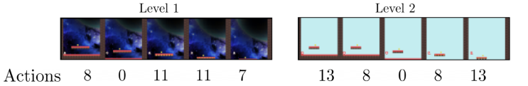
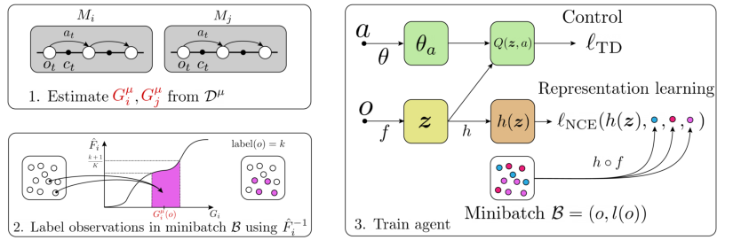
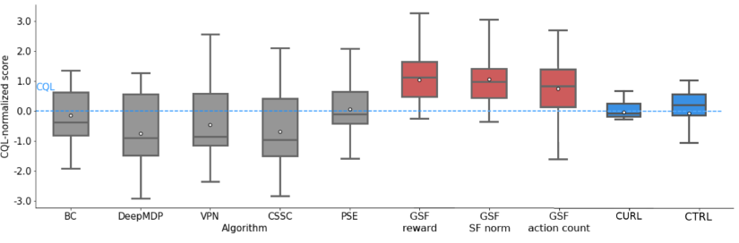
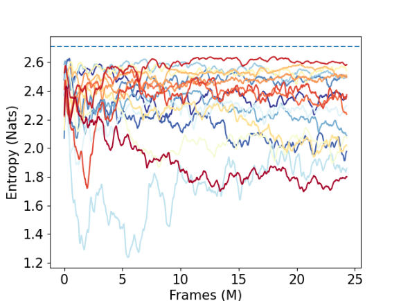
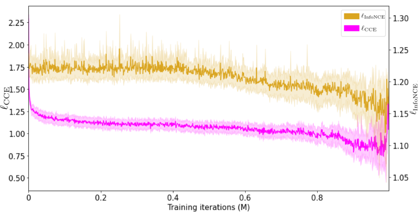
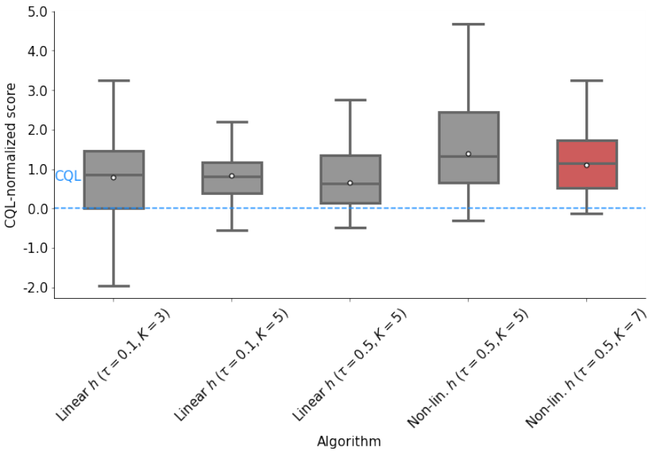

## **Improving Zero-shot Generalization in Offline** **Reinforcement Learning using Generalized Similarity** **Functions**


**Bogdan Mazoure** _[∗]_
McGill University and Quebec AI Institute
```
 bogdan.mazoure@mail.mcgill.ca

```


**Ilya Kostrikov**
UC Berkeley


**Ofir Nachum** **Jonathan Tompson**
Google Brain Google Brain


**Abstract**


Reinforcement learning (RL) agents are widely used for solving complex sequential decision making tasks, but still exhibit difficulty in generalizing to scenarios
not seen during training. While prior online approaches demonstrated that using
additional signals beyond the reward function can lead to better generalization capabilities in RL agents, i.e. using self-supervised learning (SSL), they struggle in
the offline RL setting, i.e. learning from a static dataset. We show that performance of online algorithms for generalization in RL can be hindered in the offline
setting due to poor estimation of similarity between observations. We propose a
new theoretically-motivated framework called Generalized Similarity Functions
(GSF), which uses contrastive learning to train an offline RL agent to aggregate
observations based on the similarity of their expected future behavior, where we
quantify this similarity using _generalized value functions_ . We show that GSF is
general enough to recover existing SSL objectives while also improving zero-shot
generalization performance on a complex offline RL benchmark, offline Procgen.


**1** **Introduction**


Reinforcement learning (RL) is a powerful framework for solving complex tasks that require a sequence of decisions. The RL paradigm has allowed for major breakthroughs in various fields, e.g.
outperforming humans on video games [Mnih et al., 2015, Schwarzer et al., 2020], controlling stratospheric balloons [Bellemare et al., 2020] and learning reward functions from robot manipulation
videos [Chen et al., 2021]. More recently, RL agents have been tested in a generalization setting,
i.e. in which training involves a finite number of related tasks sampled from some distribution,
with a potentially distinct sampling distribution during test time [Cobbe et al., 2019, Song et al.,
2019]. The main issue for designing generalizable agents is the lack of on-policy data from tasks
not seen during training: it is impossible to enumerate all variations of a real-world environment
during training and hence the agent must extrapolate from a (limited) training task collection onto
a broader set of problems. Since the learning agent is given no training data from test-time tasks,
this problem is referred to as zero-shot generalization. In our work, we are interested in the problem
of zero-shot generalization where the difference between tasks is predominantly due to perceptually
distinct observations. An example of this setting is any environment with distractor features [Cobbe
et al., 2020, Stone et al., 2021], i.e. features with no dependence on the reward signal nor the agent’s
decisions. This generalization setting has recently received much attention, due to its particular rel

_∗_ Work done while at Google Brain.


Offline Reinforcement Learning Workshop at Neural Information Processing Systems, 2021.


evance to real-world scenarios, for example deploying a single autonomous driving agent at day or
at night [Liu et al., 2020a, Agarwal et al., 2021, Mazoure et al., 2021a].


Generalization capabilities of an agent can be analyzed through the prism of _representation learning_,
under which the agent’s current belief about a rich and high-dimensional environment are summarized in a low-dimensional entity, called a representation. Recent work in online RL has shown that
learning state representations with specific properties such as disentanglement [Higgins et al., 2017]
or linear separability [Lin et al., 2020] can improve zero-shot generalization performance. Achieving this with limited data (i.e. offline RL) is challenging, since the representation will have a large
estimation error over regions of low data coverage. A common solution to mitigate this task-specific
overfitting and extracting the most information out of the data consists in introducing auxiliary learning signals other than instantaneous reward [Raileanu and Fergus, 2021]. As we show later in the
paper, many such signals already contained in the dataset can be used to further improve generalization performance. For instance, the generalization performance of PPO on Procgen remains limited
even when training on 200M frames, while generalization-oriented agents [Raileanu and Fergus,
2021, Mazoure et al., 2021a] can outperform it by leveraging additional auxiliary signals. However,
a major issue with the aforementioned methods is their exorbitant reliance on online access to the
environment, an impractical restriction for real-world scenarios.


In contrast, in many real-world scenarios access to the environment is restricted to an offline, fixed
dataset of experience [Ernst et al., 2005, Lange et al., 2012]. A natural limitation for generalization
from offline data is that policy improvement is dependent on dataset quality. Specifically, highdimensional problems such as control from pixels require large amounts of training experience: a
standard training of PPO [Schulman et al., 2017] for 25 million frames on Procgen [Cobbe et al.,
2020] generates more than 300 Gb of data, an impractical amount of data to share for offline RL research. Improving zero-shot generalization performance from an offline dataset of high-dimensional
observations is therefore a hard problem due to limitations on dataset size and quality.


In this work, we are interested in improving zero-shot generalization across a family of PartiallyObservable Markov decision processes [POMDPs, Murphy, 2000] in an offline RL setting, i.e. by
training agents on a fixed dataset. We hypothesize that in order for an RL agent to be able to generalize across perceptually different POMDPs without adaptation, observations with similar future
behavior should be assigned to close representations. We use the generalized value function (GVF)
framework [Sutton et al., 2011] to capture future behavior with respect to an arbitrary instantaneous
signal (called cumulant) for a given state. The choice of cumulant then determines the nature of
the behavioral similarity that is encouraged for generalization. For example, using reward as the
signal gives rise to of reward-aware behavioral similarity such as bisimulation [Ferns et al., 2004, Li
et al., 2006, Castro, 2020, Zhang et al., 2020]; using future state-action counts encourages rewardfree behavioral similarity [Misra et al., 2020, Liu et al., 2020a, Agarwal et al., 2021, Mazoure et al.,
2021a].


Our main contributions are as follows:


1. We propose Generalized Similarity Functions (GSF), a novel self-supervised learning algorithm for reinforcement learning, that aggregates latent representations by the future behavior (or generalized value function) under their respective observations.

2. We devise a new benchmark constructed to test zero-shot generalization of offline RL algorithms: offline Procgen. It consists of 5M transitions from 200 related levels of 16 distinct
games sampled from the ”easy” game mode.

3. We evaluate performance of GSF and other baseline methods on offline Procgen, and show
that GSF outperforms both previous state-of-the-art offline RL and representation learning
baselines on the entire distribution of levels.

4. We analyze the theoretical properties of GSF and describe the impact of hyperparameters
and cumulant functions on empirical behavior.


**2** **Related Works**


**Generalization in reinforcement learning** Generalizing a model’s predictions across a variety of
unseen, high-dimensional inputs has been extensively studied in the static supervised learning setting [Bartlett, 1998, Triantafillou et al., 2019, Valle-P´erez and Louis, 2020, Liu et al., 2020b]. Gener

2


alization in RL has received a lot of attention: extrapolation to unseen rewards [Barreto et al., 2016,
Misra et al., 2020], observations [Zhang et al., 2020, Raileanu and Fergus, 2021, Liu et al., 2020a,
Agarwal et al., 2021, Mazoure et al., 2021a] and transition dynamics [Ball et al., 2021]. Each generalization scenario is best solved by their respective set of methods: sufficient exploration [Misra
et al., 2020, Agarwal et al., 2020], auxiliary learning signals [Srinivas et al., 2020, Mazoure et al.,
2020, Stooke et al., 2021] or data augmentation [Ball et al., 2021, Sinha and Garg, 2021]. Data augmentation is a promising technique, but typically relies on handcrafted domain information, which
might not be available _a priori_ . In fact, we will show in our experiments that generalization in the
offline RL setting is poor even when using such handcrafted data augmentations, without additional
representation learning mechanisms. In this work, we posit that representation learning should use
instantaneous auxiliary signals in order to prevent overfitting onto a unique signal (e.g. reward
across tasks) and improve generalization performance. Theoretical generalization guarantees have
only been provided so far for limited scenarios, mostly for bandits [Swaminathan and Joachims,
2015], linear MDPs [Boyan and Moore, 1995, Wang et al., 2021b, Nachum and Yang, 2021] and
across reward functions [Castro and Precup, 2010, Barreto et al., 2016, Wang et al., 2021a, Touati
and Ollivier, 2021].


**Representation learning** For simple POMDPs, near-optimal policies can be found by optimizing for the reward alone. However, more complex settings may require additional auxiliary signals
in order to find state abstractions better suited for control. The problem of learning meaningful
state representations (or abstractions) for planning and control has been extensively studied previously [Jong and Stone, 2005, Li et al., 2006], but saw real breakthroughs only recently, in particular
due to advances in self-supervised learning (SSL). Outside of RL, SSL has achieved spectacular
results by closing the gap between unsupervised and supervised learning on certain tasks [Hjelm
et al., 2018, Oord et al., 2018, Caron et al., 2020, Grill et al., 2020]. Self-supervised representation
learning has also been used to achieve state-of-the-art generalization and sample efficiency results
in RL on challenging control problems such as data efficient Atari [Schwarzer et al., 2020, 2021],
DeepMind Control [Agarwal et al., 2021] and Procgen [Mazoure et al., 2020, Stooke et al., 2021,
Raileanu and Fergus, 2021, Mazoure et al., 2021a]. Noteworthy instances of theoretically-motivated
representation learning methods for RL include heuristic-guided learning [Sun et al., 2018, Mazoure
et al., 2021b, Cheng et al., 2021], and random Fourier features [Nachum and Yang, 2021].


**Offline reinforcement learning** When learning from a static dataset, agents should balance interpolation and extrapolation errors, while ensuring proper diversity of actions (i.e. prevent collapse to
most frequent action in the data). Popular offline RL algorithms such as BCQ [Fujimoto et al., 2019],
MBS [Liu et al., 2020c], and CQL [Kumar et al., 2020] rely on a behavior regularization loss [Wu
et al., 2019] as a tool to control the extrapolation error. Some methods, such as F-BRC [Kostrikov
et al., 2021] are defined only for continuous action spaces while others, such as MOReL [Kidambi
et al., 2020] estimate a pessimistic transition model. The major issue with current offline RL algorithms such as CQL is that they are perhaps overly pessimistic for generalization purposes, i.e.
CQL and MBS ensure that the policy improvement is well-supported by the batch of data. As we
will show in our empirical comparisons, using overly conservative policy updates can prevent the
representation from fully leveraging the information of the training dataset.


**3** **Problem setting**


**3.1** **Partially-observable Markov decision processes**


A (infinite-horizon) partially-observable Markov decision process [POMDP, Murphy, 2000] _M_ is
defined by the tuple _M_ = _⟨S, p_ 0 _, A, p_ _S_ _, O, p_ _O_ _, r, γ⟩_, where _S_ is a state space, _p_ 0 = P[ _s_ 0 ] is the
starting state distribution, _A_ is an action space, _p_ _S_ = P[ _·|s_ _t_ _, a_ _t_ ] : _S × A →_ ∆( _S_ ) is a transition
function, _O_ is an observation space, _p_ _O_ = P[ _·|s_ _t_ ] : _S →_ ∆( _O_ ) [2] is an observation function, _r_ :
_S × A →_ [ _r_ min _, r_ max ] is a reward function and _γ ∈_ [0 _,_ 1) is a discount factor. The system starts in
one of the initial states _s_ 0 _∼_ _p_ 0 with observation _o_ 0 _∼_ _p_ _O_ ( _·|s_ 0 ). At every timestep _t_ = 1 _,_ 2 _,_ 3 _, .._, the
agent, parameterized by a policy _π_ : _O →_ ∆( _A_ ), samples an action _a_ _t_ _∼_ _π_ ( _·|o_ _t_ ). The environment
transitions into a next state _s_ _t_ +1 _∼_ _p_ _S_ ( _·|s_ _t_ _, a_ _t_ ) and emits a reward _r_ _t_ = _r_ ( _s_ _t_ _, a_ _t_ ) along with a next
observation _o_ _t_ +1 _∼_ _p_ _O_ ( _·|s_ _t_ +1 ).


2 ∆( _X_ ) denotes the entire set of distributions over the space _X_ .


3


The goal of an RL agent is to maximize the cumulative rewards [�] _[∞]_ _t_ =0 _[γ]_ _[t]_ _[r]_ _[t]_ [ obtained over the entire]
episode. Value-based off-policy RL algorithms achieve this by estimating the state-action value
function under a target policy _π_ :


_∞_
�


� _γ_ _[k]_ _r_ ( _s_ _t_ + _k_ _, a_ _t_ + _k_ ) _|s_ _t_ _, a_ _t_ ] _, ∀s_ _t_ _∈S, a_ _t_ _∈A_ (1)


_k_ =1


_Q_ _[π]_ ( _s_ _t_ _, a_ _t_ ) = E P _[π]_ _t_ [[]


where P _[π]_ _t_ [denotes the joint distribution of] _[ {][s]_ _[t]_ [+] _[k]_ _[, a]_ _[t]_ [+] _[k]_ _[}]_ _[∞]_ _k_ =1 [obtained by executing] _[ π]_ [ in the environ-]
ment.


An important distinction from online RL is that, instead of sampling access to the environment, we
assume access to a historical dataset _D_ _[µ]_ collected by logging experience of the policy, _µ_, in the
form _{o_ _i,t_ _, a_ _i,t_ _, r_ _i,t_ _}_ _[i]_ _i_ [=] =1 _[N,t]_ _,t_ =1 [=] _[T]_ [where, for practical purposes, the episode is truncated at] _[ T]_ [ timesteps.]
Furthermore, we assume that the agent can only be trained on a limited collection of POMDPs
_M_ train = _{M_ _i_ _}_ _[m]_ _i_ =1 [, and its performance is evaluated on the set of test POMDPs] _[ M]_ [test] [. We assume]
that both _M_ train and _M_ test were sampled from a common task distribution and that every POMDP
_M_ _i_ _∈M_ = _M_ train _∪M_ test shares the same transition dynamics and reward function with _M_ but
has a different observation function _p_ _i,O_ . Importantly, since we perform control from pixels, we
are in the POMDP setting [see Yarats et al., 2019] and therefore emphasize the difference between
observations _o_ _t_ and corresponding states _s_ _t_ throughout the paper.


**3.2** **Representation learning**


Previous works in the RL literature have studied the use of auxiliary signals to improve generalization performance. Among others, Liu et al. [2020a], Agarwal et al. [2021] define the similarity of
two observations to depend on the distance between action sequences rolled out from that observation under their respective optimal policies. They achieve this by finding a latent space _Z ⊆S_ in
which the distance _d_ _Z_ ( _z, z_ _[′]_ ) for all _z, z_ _[′]_ _∈Z_ is equivalent to distance between true latent states
_d_ _S_ ( _s, s_ _[′]_ ) for all _s, s_ _[′]_ _∈S_ ; the aforementionned works learn _Z_ by optimizing action-based similarities between observations.


In practice, latent space _z_ is decoded from observation _o_ using a latent state decoder _f_ : _O →Z_ from
observation _o_ _t_ . Through the paper, we assume that all value functions have a linear form in the latent
decoded state, i.e. _Q_ _θ_ ( _o, a_ ) = _θ_ _a_ _[⊤]_ _[f]_ _[ψ]_ [(] _[o]_ [) =] _[ θ]_ _a_ _[⊤]_ _[z]_ _[ψ]_ [, which agrees with our practical implementation of]
all algorithms. Within this model family, the ability of an RL agent to correctly decode latent states
from unseen observations directly affects its policy, and therefore, its generalization capabilities. In
the next section, we discuss why representation learning is important for offline RL, and how existing
action-based similarity metrics fail to recover the latent states for important sets of POMDPs.


**4** **Motivating example**




Figure 1: Two levels of the Climber game from the Procgen benchmark [Cobbe et al., 2020] with
_near-identical_ latent states and value functions but _drastically different_ action sequences.


Multiple recently proposed self-supervised objectives [Liu et al., 2020a, Agarwal et al., 2021] conjecture that observations _o_ 1 _∈_ _M_ 1 _, o_ 2 _∈_ _M_ 2 that emit similar future action sequences under optimal
policies _π_ 1 _[∗]_ _[, π]_ 2 _[∗]_ [should be decoded into nearby latent states] _[ z]_ [1] _[, z]_ [2] [. While this heuristic can correctly]
group observations with respect to their true latent state in simple action spaces, it fails to identify
similar pairs of trajectories in POMDPs with multiple optimal policies. For instance, two trajectories
might visit an identical set of latent states, but have drastically different actions.


Fig. 1 shows one such example: two levels of the Climber game have a near-identical true latent
state (see Appendix) and value function (average normalized mean-squared error of 0.0398 across
episode), while having very different action sequences from a same PPO policy (average total variation distance of 0.4423 across episode). The problem is especially acute in Procgen, since the PPO


4


policy is high-entropy for some environments (see Fig. 4), i.e. various levels can have multiple drastically different near-optimal policies, and hence fail to properly capture observation similarities.


In this scenario, assigning observations to a similar latent state by value function similarity would
yield a better state representation than reasoning about action similarities. In a POMDP with a
different structure, grouping representations by action sequences can be optimal. So how do we
unify these similarity metrics under a single framework?


In the next section, we use this insight to design a general way of improve representation learning
through self-supervised learning of discounted future behavior.


**5** **Method**


We propose to measure a generalized notion of future behavior similarity using generalized value
functions, as defined by the corresponding cumulant function. The choice of cumulant determines
which components of the future trajectory are most relevant for generalization.


**5.1** **Quantifying future behavior with GVFs**


An RL agent’s future discounted behavior can be quantified not only by its the value function, but
other auxiliary signals, for example, by its observation occupancy measure, known as successor features [Dayan, 1993, Barreto et al., 2016]. The choice of the examined signal quantifies the properties
the agent will exhibit in the future, such as accumulated returns, or observation visitation density.
See Thm. 2 for the connection between successor features and interpolation error in our method.


Following the work of Sutton et al. [2011], we can broaden the class of value functions to any kind
of cumulative discounted signal, as defined by a bounded cumulant function _c_ : _O × A →_ R _[d]_,
s.t. _|c_ ( _o, a_ ) _| ≤_ _c_ max for _c_ max = sup _o,a∈O×A_ _c_ ( _o, a_ ). While typically cumulants are scalar-valued
functions (e.g. reward), we also make use of the vector-valued case for learning the successor
features [Barreto et al., 2016], in which case the norm of _c_ ( _o, a_ ) is bounded.


**Definition 1 (Generalized value function)** _Let c be any bounded function over_ R _[d]_ _, let γ ∈_ [0 _,_ 1]
_and µ any policy. The generalized value function is defined as_


_∞_
�


� _γ_ _[k]_ _c_ ( _o_ _t_ + _k_ _, a_ _t_ + _k_ ) _|o_ _t_ ] (2)


_k_ =1


_G_ _[µ]_ ( _o_ _t_ ) = E P _[µ]_ _t_ [[]


_for any timestep t ≥_ 1 _and o_ _t_ _∈O._


Since, in our case, we can learn _G_ _[µ]_ for each distinct POMDP _M_ _i_ for the dataset _D_ _[µ]_, we index the
GVF using the POMDP index, i.e. _G_ _[µ]_ _i_ [=] `[ LearnGVF]` [(] _[c,][ D]_ _[µ]_ _[, i]_ [)] [3] [.]


**Algorithm 1:** `LearnGVF` ( _c, D_ _[µ]_ _, i, θ_ [(0)] _, J, α, γ_ ): Offline estimation of GVF _G_ [ˆ] _[µ]_ _i_
**Input :** Cumulant function _c_, dataset _D_ _[µ]_, POMDP label _i_, initial parameters _θ_ [(0)], target
parameters _θ_ [˜], latent state decoder _f_, iterations _J_, learning rate _α_, discount _γ_

**1** **for** _j_ = 1 _, .., J_ **do**

**2** _o, a, o_ _[′]_ _∼D_ [ _i_ ]; `// Sample transition from POMDP` _i_

**3** _c ←_ _c_ ( _o, a_ );

**4** _o ←_ random crop( _o_ );

**5** _z, z_ _[′]_ _←_ _f_ ( _o_ ) _, f_ ( _o_ _[′]_ );

**6** _θ_ [(] _[j]_ [)] _←_ _θ_ [(] _[j][−]_ [1)] _−_ _α∇_ _θ_ ( _j−_ 1) ( _G_ _θ_ ( _j−_ 1) ( _z_ ) _−_ _c −_ _γG_ _θ_ ˜ ( _j−_ 1) ( _z_ _[′]_ )) [2] ;

**7** Update target parameters _θ_ [˜] with _β_ of online parameters _θ_ ;


**5.2** **Measuring distances between GVFs of different POMDPs**


Examining the difference between future behaviors of two observations quantifies the exact amount
of expected behavior change between these two observations. Using the GVF framework, we could


3 In practice, the learning is parallelized


5


compute the distance between _o_ 1 _∈_ _M_ 1 and _o_ 2 _∈_ _M_ 2 by first estimating the latent state with
_z_ = _f_ ( _o_ ) using a (learned) latent state decoder _f_, and then evaluating the distance

_d_ _µ_ ( _o_ 1 _i_ _, o_ 2 _j_ ) = _|G_ _µi_ [(] _[f]_ [(] _[o]_ [1] [))] _[ −]_ _[G]_ _[µ]_ _j_ [(] _[f]_ [(] _[o]_ [2] [))] _[|][ i, j]_ [ = 1] _[,]_ [ 2] _[, ..,]_ (3)


a measure of dissimilarity that can then be used in a contrastive loss.


However, the distance between GVFs from two different POMDPs can have drastically different
scales: _|G_ _[µ]_ 1 [(] _[o]_ [1] [)] _[ −]_ _[G]_ 2 _[µ]_ [(] _[o]_ [2] [)] _[| ≤]_ _c_ _[µ]_ 1 _,_ max 1 _−_ [+] _γ_ _[c]_ 2 _[µ]_ _,_ max, making point-wise comparison meaningless. The issue
is less acute for cumulants which induce a unnormalized density estimate (e.g. indicator functions
for successor representation), and more problematic when the cumulant incorporates the extrinsic
reward function. To avoid this problem, we suggest performing a comparison based on order statistics.


A robust distance estimate between GVF signals across POMDPs can be obtained by looking at
the cumulative distribution function of _G_ _i_ denoted _F_ _i_ ( _g_ ) = P[ _G_ _i_ ( _o_ _t_ ) _≤_ _g_ ] for all _o_ _t_ _∈O_ . _G_ _i_
is a deterministic GVF with the set of discontinuity points of measure 0, and as such _F_ _i_ can be
understood through the induced state distribution P _[µ]_ _t_ [(using continuous mapping theorem from][ Mann]
and Wald [1943]). It can be estimated from _n_ independent, identically distributed samples of _D_ _[µ]_ as


_[c]_ _[i][,]_ [max] _[c]_ _[i][,]_ [max]

1 _−_ _γ_ _[,]_ 1 _−_ _γ_


1 _−_ _γ_


(4)
ò


_F_ ˆ _i_ ( _g_ ) = [1]

_n_


_n_
�


� _i_ =1 1 _G_ _i_ _<g_ _, G_ _i_ = `LearnGVF` ( _c, D_ _[µ]_ _, i_ ) _, g ∈_ ï _−_ 1 _[c]_ _[i]_ _−_ _[,]_ [max] _γ_


and its inverse, the empirical quantile function [van der Vaart, 1998]


_F_ ˆ _i_ _[−]_ [1] ( _p_ ) = inf _{g ∈_ ï _−_ 1 _c_ _[µ]_ _i_ _−_ _,_ max _γ_ _[,]_ 1 _c_ _[µ]_ _i_ _−_ _,_ max _γ_


: _p ≤_ _F_ _i_ ( _g_ ) _}, p ∈_ [0 _,_ 1] (5)
ò


We use the empirical quantile function to partition the range of all GVFs into _K_ quantile bins, i.e.
disjoint sets with identical size where the set corresponding to quantile _k_ is defined as _I_ _i_ ( _k_ ) = _{o ∈_
_M_ _i_ : _F_ _i_ _[−]_ [1] ( _K_ _[k]_ [)] _[ ≤]_ _[G]_ _i_ _[µ]_ [(] _[o]_ [)] _[ ≤]_ _[F]_ _[ −]_ _i_ [1] ( _[k]_ _K_ [+1] [)] _[}]_ [ and it’s aggregated version as] _[ I]_ [(] _[k]_ [) =] _[ ∪]_ _i_ _[m]_ =1 _[I]_ _[i]_ [(] _[k]_ [)][.]


Importantly, we augment the dataset _D_ _[µ]_ with observation-specific labels, which correspond to the
index of the quantile bin into which the GVF _G_ of an observation _o ∈_ _M_ _i_ falls into:


_l_ _i_ ( _o_ ) = max 1 _o∈I_ _i_ ( _k_ ) (6)
_k_


These self-supervised labels are then used in a multiclass InfoNCE loss [Oord et al., 2018], which
is a variation of metric learning with respect to the quantile distance defined above [Khosla et al.,
2020, Song and Ermon, 2020].


**5.3** **Self-supervised learning of GSFs**


After augmenting the offline dataset with observation labels, we use a simple self-supervised learning procedure to minimize distance in the latent representation space between observations with
identical labels.


First, the observation _o_ is encoded using a non-linear encoder _f_ _ψ_ : _O →Z_ with parameters _ψ_
into a latent state representation _z_ = _f_ _ψ_ ( _o_ ) [4] . The representation _z_ is then passed into two separate
trunks: 1) a linear matrix _θ_ _a_ which recovers the state-action value function _Q_ _θ_ ( _o, a_ ) = _θ_ _a_ _[⊤]_ _[z]_ [, and 2)]
a non-linear projection network _h_ _θ_ : _Z →Z_ with parameters _θ_ _h_ to obtain a new embedding, used
for contrastive learning.


The projection _h_ ( _z_ ) is then used used in a multiclass InfoNCE loss [Oord et al., 2018, Song and
Ermon, 2020] where a linear classifier **W** _∈_ R _[|Z|×][K]_ aims to correctly predict the observation labels
(i.e. quantile bins _k_ = 1 _,_ 2 _, .., K_ ) from _h_ ( _z_ ):


_K_ _[k]_ [)] _[ ≤]_ _[G]_ _i_ _[µ]_ [(] _[o]_ [)] _[ ≤]_ _[F]_ _[ −]_ _i_ [1] ( _[k]_ _K_ [+1]


[+1]

_K_ [)] _[}]_ [ and it’s aggregated version as] _[ I]_ [(] _[k]_ [) =] _[ ∪]_ _i_ _[m]_ =1 _[I]_ _[i]_ [(] _[k]_ [)][.]


_K_
_ℓ_ NCE ( _θ_ _h_ _, ψ,_ **W** ) = _−_ E _o∼D_ _µ_ ï � 1 _l_ ( _o_ )= _k_ LogSoftmax[ **W** _[⊤]_ _h_ ( _f_ _ψ_ ( _o_ )) _/τ_ ] _k_ ò _,_ (7)

_k_ =1


4 This encoder is different from the one used to evaluate the GVFs.


6


where _τ >_ 0 is a temperature parameter.


Our empirical findings suggest that this version of the loss is more stable than other multi-class
contrastive losses (see Appendix 7.3).




Figure 2: Schematic view of GSF : the offline dataset _D_ _[µ]_ is used to estimate POMDP-specific
GVFs wrt some cumulant function _c_, whose quantiles are then used to label each observation in the
dataset. These labels are then used in a multi-class contrastive learning procedure along with offline
RL learning.


**5.4** **Algorithm**


Our method relies on the approximation oracle `LearnGVF`, to produce GVF estimates, later used in
the contrastive learning phase.


Since we are concerned with the offline RL setting, we add our auxiliary loss on top of Conservative
Q-learning [CQL, Kumar et al., 2020], a strong baseline. CQL is trained using a linear combination
of Q-learning [Watkins and Dayan, 1992, Ernst et al., 2005] and behavior-regularization:


_ℓ_ CQL ( _θ_ ) = E _o,a,r,o_ _′_ _∼D_ _µ_ [( _r_ + _γ_ max
_a_ _[′]_ _∈A_ _[Q]_ _[θ]_ [˜] [(] _[o]_ _[′]_ _[, a]_ _[′]_ [)] _[−][Q]_ _[θ]_ [(] _[o, a]_ [))] [2] []+] _[λ]_ [E] _[s][∼D]_ _[µ]_ [[] _[LSE]_ [(] _[Q]_ _[θ]_ [(] _[o, a]_ [))] _[−]_ [E] _[a][∼][µ]_ [[] _[Q]_ _[θ]_ [(] _[o, a]_ [)]]] _[,]_

(8)
for _λ ≥_ 0, _θ_ [˜] target network parameters [5] and _LSE_ being the log-sum-exp operator [6] .


**Algorithm 2:** GSF : Offline RL with future behavior observation matching
**Input :** Dataset _D ∼_ _µ_, initialized Q-function _Q_ _θ_ with encoder _f_ _θ_ _f_ and action weights _θ_ _a_,
per-POMDP set of GVFs _G_ = _{G_ _[µ]_ _i_ _[}]_ _[i][∈]_ [, state projection network] _[ h]_ _[ψ]_ [, epoch number] _[ J]_ [,]
number of POMDPs _m_, number of quantiles _K_, temperature parameter _τ_, exponential
moving average parameter _β_

**1** **for** _epoch j_ = 1 _,_ 2 _, .., J_ **do**

**2** **for** _minibatch B ∼D_ **do**
```
    /* Data augmentation on observation */
```

**3** _o ←_ random crop( _o_ ) for all _o ∈B_ ;

**4** _z ←_ _f_ _ψ_ ( _o_ ) for all _o ∈B_ ;
```
    /* Update CQL agent */
```

**5** Update _θ_ _a_ _, ψ_ using _∇_ _θ_ _a_ _,ψ_ _ℓ_ CQL ( _θ_ ) ;
`/* Compute` _G_ `quantiles` `*/`

**6** **for** _POMDP M_ _i_ = 1 _,_ 2 _, .., m_ **do**

**7** Estimate _F_ [ˆ] _i_ _[−]_ [1] of _G_ _[µ]_ _i_ [from] _[ B]_ [ ;]

**8** **for** _observation o ∈B ∩_ _M_ _i_ **do**


**9** _l_ ( _o_ ) _←_ _k_ if _F_ [ˆ] _i_ _[−]_ [1] ( _[k]_


_K_ _[k]_ [)] _[ ≤]_ _[G]_ _i_ _[µ]_ [(] _[o]_ [)] _[ ≤]_ _[F]_ [ˆ] _[ −]_ _i_ [1] ( _[k]_ _K_ [+1]


_l_ ( _o_ ) _←_ _k_ if _F_ _i_ _[−]_ ( _K_ [)] _[ ≤]_ _[G]_ _i_ _[µ]_ [(] _[o]_ [)] _[ ≤]_ _[F]_ _[ −]_ _i_ ( _K_ [+1] [)][ ;]
```
/* Update encoder and projection network */

```


**10** Update _θ_ _h_ _, ψ,_ **W** using _∇_ _θ_ _h_ _,ψ,_ **W** _ℓ_ NCE ( _θ_ _h_ _, ψ,_ **W** ) computed with _z, l_ ( _o_ ) and _τ_ ;

**11** Update CQL agent’s target network with _β_ of online parameters _ψ, θ_ ;


5 A copy of _θ_ updated solely using an exponential moving average (see Appendix).
6 `[https://en.wikipedia.org/wiki/LogSumExp](https://en.wikipedia.org/wiki/LogSumExp)`


7


Alg. 2 summarizes the learning procedure for GSF as implemented on top of a CQL agent for a
discrete action space. In our experiments, all baselines use random crops as data augmentation.


**Connection to existing methods** Our framework is able to recover objectives similar to those of
prior works by carefully designing the cumulant function.


    - **Cross-State Self-Constraint [CSSC, Liu et al., 2020a]** : In CSSC, observations _o_ 1 _, o_ 2
are considered similar if they have identical future action sequences of length _K_ under
some fixed policy; a total of _|A|_ _[K]_ distinct classes are possible. This approach can be
approximated in our framework by picking _c_ ( _o_ _t_ _, a_ _t_ ) = 1 _a_ _t_ ( _a_ ) _, ∀a ∈A_ . The problem
reduces to a _|A|_ _[T][ −][t]_ -way classification problem for observations of timestep _t_, which GSF
approximates using _K_ quantiles.


    - **Policy similarity embedding [PSE, Agarwal et al., 2021]** : PSEs balance the distance
between local optimal behaviors and long-term dependencies in the transitions, notably
using _d_ TV . If we consider the space of Boltzmann policies _π_ Boltzmann with respect to an
POMDP-specific value function _Q_, then choosing _c_ ( _o_ _t_ _, a_ _t_ ) = _r_ ( _s_ _t_ _, a_ _t_ ) in GSF will effectively compute the distance between unnormalized policies.


**5.5** **Choice of number of quantiles** _K_


How should the number of quantiles _K_ be set, and what is the effect of smaller/ larger values of _K_
on the observation distance? Thm. 1 highlights a trade-off when choosing the number of quantiles
bins empirically.


**Theorem 1** _Let G_ 1 _, G_ 2 _be generalized value functions with cumulants c_ 1 _, c_ 2 _from respective_
_POMDPs M_ 1 _, M_ 2 _, K be the number of quantile bins, n_ 1 _, n_ 2 _the number of sample transitions from_
_each POMDP. Suppose thatThen, for any k_ = 1 _,_ 2 _, .., K and_ P[sup _ε >_ _t_ =1 0 _,_ _the following holds without loss of generality:_ 2 _,.._ _|c_ 1 ( _o_ 1 _,t_ _, µ_ ( _o_ 1 _,t_ )) _−_ _c_ 2 ( _o_ 2 _,t_ _, µ_ ( _o_ 2 _,t_ )) _| >_ [(1] _[−][γ]_ [)] _[ε]_ _/_ _γ_ ] _≤_ _δ._


P sup _|G_ 1 ( _o_ 1 ) _−_ _G_ 2 ( _o_ 2 ) _| >_ 3 _ε_ _≤_ 2 _e_ _[−]_ [2] _[n]_ [1] _[ε]_ [2] _[/]_ [4] + _p_ ( _n_ 1 _, K, ε_ ) + _δ_
ï _o_ 1 _,o_ 2 _∈I_ ( _k_ ) ò


_where_
_p_ ( _n, K, ε_ ) = P sup
ï _k_ =1 _,_ 2 _,..,K_


�� _F_ ˆ _−_ 1 1 � _k_ +1 _/_ _K_ [�] _−_ _F_ ˆ 1 _[−]_ [1] � _k_ _/_ _K_ [��] � _> ε_
ò


_._
The proof can be found in the Appendix Sec. 7.2. For POMDP _M_ 1, the error decreases monotonically with increasing bin number _K_ (second term) but the variance of bin labels depends on the
number of sample transitions _n_ 1 (first term). The inter-POMDP error (third term) does not affect
the bin assignment. Hence, choosing a large _K_ will amount to pairing states by rankings, but results
in high variance, as orderings are estimated from data and each bin will have _n_ = 1. Setting _K_ too
small will group together unrelated observations, inducing high bias.


**6** **Experiments**


Unlike for single task offline RL [Fu et al., 2020], most works on zero-shot generalization from offline data either come up with an _ad hoc_ solution suiting their needs, e.g. [Ball et al., 2021], or assess
performance on benchmarks that do not evalute generalization across observation functions [e.g., Yu
et al., 2020]. To accelerate progress in this field, we devised the offline Procgen benchmark, an offline RL dataset to directly test for generalization of offline RL agents across observation functions.


**Offline Procgen benchmark** We evaluate the proposed approach on an offline version of the
Procgen benchmark [Cobbe et al., 2020], which is widely used to evaluate zero-shot generalization
across complex visual perturbations. Given a random seed, Procgen allows to sample procedurally
generated level configurations for 16 games under various complexity modes: “easy”, “hard” and
“exploration”. The dataset is obtained as follows: we first pre-train a PPO [Schulman et al., 2017]
agent for 25M timesteps on 200 levels of “easy” distribution for each environment [7] (“easy” mode is


7 We use the TFAgents’ implementation [Guadarrama et al., 2018]


8


widely used to test generalization capabilities [Cobbe et al., 2020, Raileanu and Fergus, 2021, Mazoure et al., 2021a]). All agents use the IMPALA encoder architecture [Espeholt et al., 2018], which
has enough parameters to allow better generalization performance, compared to other models [e.g.,
Mnih et al., 2015].


**Results** We compare the zero-shot performance on the entire distribution of ”easy” POMDPs for
GSF against that of strong RL and representation learning baselines: behavioral cloning (BC) - to
assess the quality of the PPO policy, CQL [Kumar et al., 2020] - the current state-of-the-art on
multiple offline benchmarks which balances RL and BC objectives, CURL [Srinivas et al., 2020],
CTRL [Mazoure et al., 2021a], DeepMDP [Gelada et al., 2019] - which learns a metric closely
related to bisimulation across the MDP, Value Prediction Network [VPN, Oh et al., 2017] - which
combines model-free and model-based learning of values, observations, next observations, rewards
and discounts, Cross-State Self-Constraint [CSSC, Liu et al., 2020a] - which boosts similarity of
observations with identical action sequences, as well as Policy Similarity Embeddings [Agarwal
et al., 2020], which groups observation representations based on distance in optimal policy space.




Figure 3: Returns on the offline Procgen benchmark [Cobbe et al., 2020] after 1M training steps.
Boxplots are constructed over 5 random seeds and all 16 games; each method is normalized by the
per-game median CQL performance. White dots represent average of distribution.


Fig. 3 shows the performance of all methods over 5 random seeds and all 16 games on the offline
Procgen benchmark after 1 million training steps. Per-game average scores for all methods can be
found in Tab. 2 (Appendix). The scores are standardized per-game using the downstream task’s
(offline RL) performance, in this case implemented by CQL. It can be seen that GSF performs better
than other offline RL and representation learning baselines.


Using different cumulants functions can lead to different label assignments and hence different similarity groups. Fig. 3 examines the performance of GSF with respect to 3 cumulants: 1) _r_ ( _s_ _t_ _, a_ _t_ ),
rewards s.t. GSF learns the policy’s _Q_ _[µ]_ -value, 2) 1 _o_ _t_ ( _o_ ), the successor representation [8] [Dayan,
1993, Barreto et al., 2016] s.t. GSF learns induced distribution over _D_ _[µ]_ [Machado et al., 2020] and
3) 1 _a_ _t_ ( _a_ ), action counts, s.t. GSF learns discounted policy. While rewards and successor feature
cumulant choices leads to similar performance, using action-based distance leads to larger variance.


**7** **Discussion**


In this work we proposed GSF, a novel algorithm which combines reinforcement learning with representation learning to improve zero-shot generalization performance on challenging, pixel-based
control tasks. GSF relies on computing the similarity between observation pairs with respect to any
instantaneous accumulated signal, which leads to improved empirical performance on the newly introduced offline Procgen benchmark. Theoretical results suggest that GSF ’s hyperparameter choice
depends on a trade-off between finite sample approximation and extrapolation error.


While our work answered some questions regarding zero-shot generalization in offline RL, some
questions persist: can GVF-based distances be included in a contrastive objective without the need


8 In the continuous observation space, we learn a _d_ -dimensional successor feature vector _z_ _ψ_ via TD and
computing the quantiles over _||z_ _ψ_ _||_ 1 .


9


for quantile discretization (perhaps through re-scaling or order statistics)? Can the cumulant function
be chosen _a priori_ for a specific task structure other than Procgen, and shown to lead to optimal
representations?


**References**


A. Agarwal, M. Henaff, S. Kakade, and W. Sun. Pc-pg: Policy cover directed exploration for
provable policy gradient learning. _Neural Information Processing Systems_, 2020.


R. Agarwal, M. C. Machado, P. S. Castro, and M. G. Bellemare. Contrastive behavioral similarity
embeddings for generalization in reinforcement learning. _arXiv preprint arXiv:2101.05265_, 2021.


P. J. Ball, C. Lu, J. Parker-Holder, and S. Roberts. Augmented world models facilitate zero-shot
dynamics generalization from a single offline environment. _International Conference on Machine_
_Learning_, 2021.


A. Barreto, W. Dabney, R. Munos, J. J. Hunt, T. Schaul, H. Van Hasselt, and D. Silver. Successor
features for transfer in reinforcement learning. _arXiv preprint arXiv:1606.05312_, 2016.


P. L. Bartlett. The sample complexity of pattern classification with neural networks: the size of the
weights is more important than the size of the network. _IEEE transactions on Information Theory_,
44(2):525–536, 1998.


M. G. Bellemare, S. Candido, P. S. Castro, J. Gong, M. C. Machado, S. Moitra, S. S. Ponda, and
Z. Wang. Autonomous navigation of stratospheric balloons using reinforcement learning. _Nature_,
588(7836):77–82, 2020.


J. Boyan and A. W. Moore. Generalization in reinforcement learning: Safely approximating the
value function. _Advances in neural information processing systems_, pages 369–376, 1995.


M. Caron, I. Misra, J. Mairal, P. Goyal, P. Bojanowski, and A. Joulin. Unsupervised learning of
visual features by contrasting cluster assignments. _arXiv preprint arXiv:2006.09882_, 2020.


P. S. Castro. Scalable methods for computing state similarity in deterministic markov decision
processes. In _Proceedings of the AAAI Conference on Artificial Intelligence_, volume 34, pages
10069–10076, 2020.


P. S. Castro and D. Precup. Using bisimulation for policy transfer in mdps. In _Twenty-Fourth AAAI_
_Conference on Artificial Intelligence_, 2010.


A. S. Chen, S. Nair, and C. Finn. Learning generalizable robotic reward functions from” in-the-wild”
human videos. _arXiv preprint arXiv:2103.16817_, 2021.


C.-A. Cheng, A. Kolobov, and A. Swaminathan. Heuristic-guided reinforcement learning. _arXiv_
_preprint arXiv:2106.02757_, 2021.


K. Cobbe, O. Klimov, C. Hesse, T. Kim, and J. Schulman. Quantifying generalization in reinforcement learning. In _International Conference on Machine Learning_, pages 1282–1289. PMLR,
2019.


K. Cobbe, C. Hesse, J. Hilton, and J. Schulman. Leveraging procedural generation to benchmark
reinforcement learning. In _International conference on machine learning_, pages 2048–2056.
PMLR, 2020.


P. Dayan. Improving generalization for temporal difference learning: The successor representation.
_Neural Computation_, 5(4):613–624, 1993.


A. Dvoretzky, J. Kiefer, and J. Wolfowitz. Asymptotic minimax character of the sample distribution
function and of the classical multinomial estimator. _The Annals of Mathematical Statistics_, pages
642–669, 1956.


D. Ernst, P. Geurts, and L. Wehenkel. Tree-based batch mode reinforcement learning. _Journal of_
_Machine Learning Research_, 6:503–556, 2005.


10


L. Espeholt, H. Soyer, R. Munos, K. Simonyan, V. Mnih, T. Ward, Y. Doron, V. Firoiu, T. Harley,
I. Dunning, et al. Impala: Scalable distributed deep-rl with importance weighted actor-learner
architectures. In _International Conference on Machine Learning_, pages 1407–1416. PMLR, 2018.


N. Ferns, P. Panangaden, and D. Precup. Metrics for finite markov decision processes. In _UAI_,
volume 4, pages 162–169, 2004.


J. Fu, A. Kumar, O. Nachum, G. Tucker, and S. Levine. D4rl: Datasets for deep data-driven reinforcement learning, 2020.


S. Fujimoto, D. Meger, and D. Precup. Off-policy deep reinforcement learning without exploration.
In _International Conference on Machine Learning_, pages 2052–2062. PMLR, 2019.


C. Gelada, S. Kumar, J. Buckman, O. Nachum, and M. G. Bellemare. Deepmdp: Learning continuous latent space models for representation learning. In _International Conference on Machine_
_Learning_, pages 2170–2179. PMLR, 2019.


J.-B. Grill, F. Strub, F. Altch´e, C. Tallec, P. H. Richemond, E. Buchatskaya, C. Doersch, B. A. Pires,
Z. D. Guo, M. G. Azar, et al. Bootstrap your own latent: A new approach to self-supervised
learning. _arXiv preprint arXiv:2006.07733_, 2020.


S. Guadarrama, A. Korattikara, O. Ramirez, P. Castro, E. Holly, S. Fishman, K. Wang, E. Gonina,
N. Wu, E. Kokiopoulou, L. Sbaiz, J. Smith, G. Bart´ok, J. Berent, C. Harris, V. Vanhoucke, and
E. Brevdo. TF-Agents: A library for reinforcement learning in tensorflow. `[https://github.](https://github.com/tensorflow/agents)`
`[com/tensorflow/agents](https://github.com/tensorflow/agents)`, 2018. URL `[https://github.com/tensorflow/agents](https://github.com/tensorflow/agents)` . [Online; accessed 4-October-2021].


K. He, H. Fan, Y. Wu, S. Xie, and R. Girshick. Momentum contrast for unsupervised visual representation learning. In _Proceedings of the IEEE/CVF Conference on Computer Vision and Pattern_
_Recognition_, pages 9729–9738, 2020.


M. Hessel, H. Soyer, L. Espeholt, W. Czarnecki, S. Schmitt, and H. van Hasselt. Multi-task deep
reinforcement learning with popart. In _Proceedings of the AAAI Conference on Artificial Intelli-_
_gence_, volume 33, pages 3796–3803, 2019.


I. Higgins, A. Pal, A. Rusu, L. Matthey, C. Burgess, A. Pritzel, M. Botvinick, C. Blundell, and
A. Lerchner. Darla: Improving zero-shot transfer in reinforcement learning. In _International_
_Conference on Machine Learning_, pages 1480–1490. PMLR, 2017.


R. D. Hjelm, A. Fedorov, S. Lavoie-Marchildon, K. Grewal, P. Bachman, A. Trischler, and Y. Bengio. Learning deep representations by mutual information estimation and maximization. _arXiv_
_preprint arXiv:1808.06670_, 2018.


N. K. Jong and P. Stone. State abstraction discovery from irrelevant state variables. In _IJCAI_,
volume 8, pages 752–757. Citeseer, 2005.


P. Khosla, P. Teterwak, C. Wang, A. Sarna, Y. Tian, P. Isola, A. Maschinot, C. Liu, and D. Krishnan.
Supervised contrastive learning. _Neural Information Processing Systems_, 2020.


R. Kidambi, A. Rajeswaran, P. Netrapalli, and T. Joachims. Morel: Model-based offline reinforcement learning. _arXiv preprint arXiv:2005.05951_, 2020.


I. Kostrikov, D. Yarats, and R. Fergus. Image augmentation is all you need: Regularizing deep
reinforcement learning from pixels. _arXiv preprint arXiv:2004.13649_, 2020.


I. Kostrikov, J. Tompson, R. Fergus, and O. Nachum. Offline reinforcement learning with fisher
divergence critic regularization. _arXiv preprint arXiv:2103.08050_, 2021.


A. Kumar, A. Zhou, G. Tucker, and S. Levine. Conservative q-learning for offline reinforcement
learning. _arXiv preprint arXiv:2006.04779_, 2020.


S. Lange, T. Gabel, and M. Riedmiller. Batch reinforcement learning. In _Reinforcement learning_,
pages 45–73. Springer, 2012.


11


L. Li, T. J. Walsh, and M. L. Littman. Towards a unified theory of state abstraction for mdps. _ISAIM_,
4:5, 2006.


Z. Lin, D. Yang, L. Zhao, T. Qin, G. Yang, and T.-Y. Liu. Reward decomposition with representation
decomposition. _Advances in Neural Information Processing Systems_, 33, 2020.


G. T. Liu, P.-J. Cheng, and G. Lin. Cross-state self-constraint for feature generalization in deep
reinforcement learning. 2020a.


L. Liu, W. Hamilton, G. Long, J. Jiang, and H. Larochelle. A universal representation transformer
layer for few-shot image classification. _arXiv preprint arXiv:2006.11702_, 2020b.


Y. Liu, A. Swaminathan, A. Agarwal, and E. Brunskill. Provably good batch reinforcement learning
without great exploration. _NeurIPS_, 2020c.


M. C. Machado, M. G. Bellemare, and M. Bowling. Count-based exploration with the successor
representation. In _Proceedings of the AAAI Conference on Artificial Intelligence_, volume 34,
pages 5125–5133, 2020.


H. B. Mann and A. Wald. On stochastic limit and order relationships. _The Annals of Mathematical_
_Statistics_, 14(3):217–226, 1943.


B. Mazoure, R. T. d. Combes, T. Doan, P. Bachman, and R. D. Hjelm. Deep reinforcement and
infomax learning. _Neural Information Processing Systems_, 2020.


B. Mazoure, A. M. Ahmed, P. MacAlpine, R. D. Hjelm, and A. Kolobov. Cross-trajectory representation learning for zero-shot generalization in rl. _arXiv preprint arXiv:2106.02193_, 2021a.


B. Mazoure, P. Mineiro, P. Srinath, R. S. Sedeh, D. Precup, and A. Swaminathan. Improving
long-term metrics in recommendation systems using short-horizon offline rl. _arXiv preprint_
_arXiv:2106.00589_, 2021b.


D. Misra, M. Henaff, A. Krishnamurthy, and J. Langford. Kinematic state abstraction and provably efficient rich-observation reinforcement learning. In _International conference on machine_
_learning_, pages 6961–6971. PMLR, 2020.


V. Mnih, K. Kavukcuoglu, D. Silver, A. A. Rusu, J. Veness, M. G. Bellemare, A. Graves, M. Riedmiller, A. K. Fidjeland, G. Ostrovski, et al. Human-level control through deep reinforcement
learning. _nature_, 518(7540):529–533, 2015.


K. P. Murphy. A survey of pomdp solution techniques. _environment_, 2:X3, 2000.


O. Nachum and M. Yang. Provable representation learning for imitation with contrastive fourier
features. _Neural Information Processing Systems_, 2021.


J. Oh, S. Singh, and H. Lee. Value prediction network. _arXiv preprint arXiv:1707.03497_, 2017.


A. v. d. Oord, Y. Li, and O. Vinyals. Representation learning with contrastive predictive coding.
_arXiv preprint arXiv:1807.03748_, 2018.


R. Raileanu and R. Fergus. Decoupling value and policy for generalization in reinforcement learning. _International Conference on Machine Learning_, 2021.


J. Schulman, F. Wolski, P. Dhariwal, A. Radford, and O. Klimov. Proximal policy optimization
algorithms. _arXiv preprint arXiv:1707.06347_, 2017.


M. Schwarzer, A. Anand, R. Goel, R. D. Hjelm, A. Courville, and P. Bachman. Data-efficient reinforcement learning with self-predictive representations. _International Conference on Learning_
_Representations_, 2020.


M. Schwarzer, N. Rajkumar, M. Noukhovitch, A. Anand, L. Charlin, D. Hjelm, P. Bachman, and
A. Courville. Pretraining representations for data-efficient reinforcement learning. _arXiv preprint_
_arXiv:2106.04799_, 2021.


12


S. Sinha and A. Garg. S4rl: Surprisingly simple self-supervision for offline reinforcement learning.
_arXiv preprint arXiv:2103.06326_, 2021.


J. Song and S. Ermon. Multi-label contrastive predictive coding. _Neural Information Processing_
_Systems_, 2020.


X. Song, Y. Jiang, S. Tu, Y. Du, and B. Neyshabur. Observational overfitting in reinforcement
learning. _International Conference on Learning Representations_, 2019.


A. Srinivas, M. Laskin, and P. Abbeel. Curl: Contrastive unsupervised representations for reinforcement learning. _International Conference on Machine Learning_, 2020.


A. Stone, O. Ramirez, K. Konolige, and R. Jonschkowski. The distracting control suite–a challenging benchmark for reinforcement learning from pixels. _arXiv preprint arXiv:2101.02722_, 2021.


A. Stooke, K. Lee, P. Abbeel, and M. Laskin. Decoupling representation learning from reinforcement learning. In _International Conference on Machine Learning_, pages 9870–9879. PMLR,
2021.


W. Sun, J. A. Bagnell, and B. Boots. Truncated horizon policy search: Combining reinforcement
learning & imitation learning. _arXiv preprint arXiv:1805.11240_, 2018.


R. S. Sutton, J. Modayil, M. Delp, T. Degris, P. M. Pilarski, A. White, and D. Precup. Horde: A scalable real-time architecture for learning knowledge from unsupervised sensorimotor interaction.
In _The 10th International Conference on Autonomous Agents and Multiagent Systems-Volume 2_,
pages 761–768, 2011.


A. Swaminathan and T. Joachims. Batch learning from logged bandit feedback through counterfactual risk minimization. _The Journal of Machine Learning Research_, 16(1):1731–1755, 2015.


A. Touati and Y. Ollivier. Learning one representation to optimize all rewards. _arXiv preprint_
_arXiv:2103.07945_, 2021.


E. Triantafillou, T. Zhu, V. Dumoulin, P. Lamblin, U. Evci, K. Xu, R. Goroshin, C. Gelada, K. Swersky, P.-A. Manzagol, et al. Meta-dataset: A dataset of datasets for learning to learn from few
examples. _International Conference on Learning Representations_, 2019.


G. Valle-P´erez and A. A. Louis. Generalization bounds for deep learning. _arXiv preprint_
_arXiv:2012.04115_, 2020.


A. W. van der Vaart. Asymptotic statistics. cambridge series in statistical and probabilistic mathematics, 1998.


R. Wang, Y. Wu, R. Salakhutdinov, and S. M. Kakade. Instabilities of offline rl with pre-trained
neural representation. _arXiv preprint arXiv:2103.04947_, 2021a.


Y. Wang, R. Wang, and S. M. Kakade. An exponential lower bound for linearly-realizable mdps
with constant suboptimality gap. _arXiv preprint arXiv:2103.12690_, 2021b.


C. J. Watkins and P. Dayan. Q-learning. _Machine learning_, 8(3-4):279–292, 1992.


Y. Wu, G. Tucker, and O. Nachum. Behavior regularized offline reinforcement learning. _arXiv_
_preprint arXiv:1911.11361_, 2019.


D. Yarats, A. Zhang, I. Kostrikov, B. Amos, J. Pineau, and R. Fergus. Improving sample efficiency
in model-free reinforcement learning from images. _arXiv preprint arXiv:1910.01741_, 2019.


T. Yu, D. Quillen, Z. He, R. Julian, K. Hausman, C. Finn, and S. Levine. Meta-world: A benchmark
and evaluation for multi-task and meta reinforcement learning. In _Conference on Robot Learning_,
pages 1094–1100. PMLR, 2020.


A. Zhang, R. McAllister, R. Calandra, Y. Gal, and S. Levine. Learning invariant representations for
reinforcement learning without reconstruction. _International Conference on Learning Represen-_
_tations_, 2020.


13


**Appendix**


**7.1** **Experimental details**


Name Description Value


_n_ MDPs Number of training POMDPs in the dataset 200
_γ_ Discount factor 0.99
Batch size Batch size 1024
Hidden layers Size of _Q_ critic post-encoder layers 256 _×_ 256 _× |A|_
_λ_ CQL regularization coefficient 1
Data augmentation Type of data augmentation use in all methods Random crop
_α_ Target soft update rate 0.005


Hidden layers Size of _G_ network post-encoder layers 256 _×_ 256 _× |A| ∗_ _n_ MDPs
_G_ pretraining steps Number of iterations to pretrain GVF estimator for 100,000
_K_ Number of quantiles 7
_τ_ Softmax temperature 0.5
Table 1: Experiments’ parameters


For improved time efficiency, we jointly train the estimators _G_ 1 _, G_ 2 _, .., G_ _m_ by first decoding each
observation _o ∈_ _M_ _i_ into a latent representation _z_ = _f_ _ψ_ _′_ ( _o_ ) and then passing the representation
through a non-linear network _h_ _[′]_ : _Z →_ R _[d]_ _[c]_ _[×][m]_ where _d_ _c_ is the dimensionality of the cumulant
function’s output. The output of _h_ _[′]_ is then split into _m_ disjoint chunks, with chunk _i_ used in the
temporal difference loss _ℓ_ TD with the reward replaced by the cumulant function. However, due to
different scales of cumulants across POMDPs, we use the PopArt re-normalization scheme [Hessel
et al., 2019] to prevent gradient instability. All GVFs are trained for 50 _k_ iterations using _ℓ_ TD .


Data augmentation was taken to be solely random crops, since this type of data augmentation
was shown to be sufficient to improve performance of deep RL agents in pixel-based control
tasks [Kostrikov et al., 2020]. To do so, we first symmetrically padded the 64 _×_ 64 _×_ 3 observation
up to 68 _×_ 68 _×_ 3, and applied a 64 _×_ 64 random crop on the resulting tensor.


All baselines’ code was taken from their respective repositories and adapted into our codebase (except DeepMDP which had to be implemented from third-party sources).


**Hyperparameter search:** We allowed each method to tune one hyperparameter due to computational budget constraints. For CQL, _λ_ was tuned and found to be 1. For GSFs, we tuned _K_, the
number of quantiles. For all other methods, we tuned the auxiliary loss coefficient(s). Performance
of GSFs vs some hyperparameter choices can be seen in Fig. 6.


**Dataset composition** We first pre-trained PPO [Guadarrama et al., 2018] for 25M frames for all
16 games. Then, we conducted rollouts with the resulting policy under an _ε_ _t_ -greedy strategy; _ε_ _t_ was
allowed to decay according to the rule


_ε_ _t_ = 0 _._ 1 _−_ 3 _._ 96 _×_ 10 _[−]_ [9] _t,_


which has two endpoints: _ε_ 0 = 0 _._ 1 and _ε_ 25 _M_ = 0. This was done in order to prevent collapse of the
Q-values due to the log-sum-exp term in CQL to very low negative values (if action coverage is not
sufficient in the dataset).


**Target updates:** As is common in multiple deep RL algorithms [Kostrikov et al., 2020, 2021], the
bootstrap target estimates are typically computed using a value network with parameters _θ_ [˜], which
are in turn periodically updated using an exponential moving average of historical values with the
current online network parameters _θ_ with update rate _α_ :


˜
_θ_ = _αθ_ + (1 _−_ _α_ )˜ _θ_ (9)


14


**7.2** **Proofs**


**Proof 1 (Thm. 1)** _First, consider some arbitrary quantile bin k_ = 1 _,_ 2 _, .., K._


sup _|G_ _[µ]_ 1 [(] _[o]_ [1] [)] _[ −]_ _[G]_ _[µ]_ 2 [(] _[o]_ [2] [)] _[|]_ [ =] sup _|G_ _[µ]_ 1 [(] _[o]_ [1] [)] _[ −]_ _[G]_ _[µ]_ 1 [(] _[o]_ [2] [) +] _[ G]_ _[µ]_ 1 [(] _[o]_ [2] [)] _[ −]_ _[G]_ _[µ]_ 2 [(] _[o]_ [2] [)] _[|]_
_o_ 1 _,o_ 2 _∈I_ ( _k_ ) _o_ 1 _,o_ 2 _∈I_ ( _k_ )

(10)
_≤_ sup _|G_ _[µ]_ 1 [(] _[o]_ [1] _[ −]_ _[o]_ [2] [)] _[|]_ [ +] _[ |][G]_ _[µ]_ 1 [(] _[o]_ [2] [)] _[ −]_ _[G]_ _[µ]_ 2 [(] _[o]_ [2] [)] _[|]_
_o_ 1 _,o_ 2 _∈I_ ( _k_ )


_Since the cumulant is, in practice, estimated from D_ _[µ]_ _, it follows that c_ ( _s, a_ ) _∈_ [ _−c_ _[µ]_ _i,max_ _[, c]_ _i,max_ _[µ]_ []] _[ ⊆]_

[ _−c_ _max_ _, c_ _max_ ] _for all s, a ∈S, A. Since the disparity between cumulants for POMDP M_ 1 _, M_ 2 _comes_
_from the uneven coverage by µ, we can denote this as δ_ 1 _,_ 2 ( _t_ ) = _|c_ ( _o_ 1 _,t_ _, µ_ ( _o_ 1 _,t_ )) _−_ _c_ ( _o_ 2 _,t_ _, µ_ ( _o_ 2 _,t_ )) _|._


_Suppose that_ P[sup _k_ =1 _,_ 2 _,.._ _δ_ 1 _,_ 2 ( _t_ + _k_ ) _> ε_ ] _≤_ _p_ _[µ]_ ( _c_ 1 _, c_ 2 _, ε_ ) _. Then,_


_∞_

[[] �


[[] � _γ_ _[k]_ _|c_ _[µ]_ _i_ [(] _[o]_ _[t]_ [+] _[k]_ _[, a]_ _[t]_ [+] _[k]_ [)] _[ −]_ _[c]_ _[µ]_ _j_ [(] _[o]_ _[t]_ [+] _[k]_ _[, a]_ _[t]_ [+] _[k]_ [)] _[||][o]_ _[t]_ []] _[ > ε]_ []]


_k_ =1


P[ _|G_ _[µ]_ 1 [(] _[o]_ _[t]_ [)] _[ −]_ _[G]_ _[µ]_ 2 [(] _[o]_ _[t]_ [)] _[|][ > ε]_ [] =][ P][[][E] P _[µ]_ _t_ [[]


_∞_

[[] �


[[] � _γ_ _[k]_ _δ_ 1 _,_ 2 ( _t_ + _k_ ) _|o_ _t_ ] _> ε_ ]


_k_ =1


= P[E P _[µ]_ _t_ [[]


_∞_
�


(11)


� _γ_ _[k]_ _|o_ _t_ ] _> ε_ ]


_k_ =1


_≤_ P[ _k_ =1 sup _,_ 2 _,..,K_ _δ_ 1 _,_ 2 ( _t_ + _k_ )E P _[µ]_ _t_ [[]


_≤_ P[ sup _δ_ 1 _,_ 2 ( _t_ + _k_ ) _>_ [(][1] _[ −]_ _[γ]_ [)] _[ε]_ ]
_k_ =1 _,_ 2 _,..,K_ _γ_


_≤_ _p_ _[µ]_ ( _c_ 1 _, c_ 2 _,_ [(1] _[−][γ]_ [)] _[ε]_ _/_ _γ_ )


_since M_ 1 _, M_ 2 _share the same induced distribution_ P _[µ]_ _t_ _[. Due to stationarity, we can drop the time]_
_index._


_Now, the first term can be decomposed with the empirical distribution function_ _F_ [ˆ] _i_ _[−]_ [1] _estimated from_
_n_ _i_ _samples of POMDP M_ _i_ _:_


_F_ _−_ 1 1
����


_F_ _−_ 1 1
����


_k_ _′_

ã _−_ _F_ 1 _[−]_ [1] Å _K_


���


_k_ + 1
Å _K_


_−_ _F_ 1 _[−]_ [1]
ã


_k_
Å _K_


_≤_ sup
ã���� _k_ _[′]_ =1 _,_ 2 _,..,K_


_k_ _′_ + 1
Å _K_


_≤_ sup ∆( _F_ 1 _, n_ 1 _,_ _[k]_ _[′]_ [ + 1]
_k_ _[′]_ =1 _,_ 2 _,..,K_ _K_


[ + 1]

) + ∆( _F_ 1 _, n_ 1 _,_ _[k]_ _[′]_
_K_ _K_


_[k]_ _[′]_

_K_ [) + ∆(] _[F]_ [1] _[, n]_ [1] _[, k]_ _[′]_ [ + 1] _K_


_[′]_ [ + 1] _K_ _,_ _K_ _[k]_ _[′]_


_K_ [)]


_≤_ 2 sup ∆( _F_ 1 _, n_ 1 _,_ _[k]_ _[′]_
_k_ _[′]_ =1 _,_ 2 _,..,K_ _K_


_[k]_ _[′]_ sup ∆( _F_ 1 _, n_ 1 _,_ _[k]_ _[′]_ [ + 1]

_K_ [) +] _k_ _[′]_ =1 _,_ 2 _,..,K_ _K_


[ + 1] _K_ _,_ _K_ _[k]_ _[′]_


_K_ [)]


(12)
_where_ ∆( _F, n, p_ ) = �� _F_ _−_ 1 � _p_ � _−_ _F_ ˆ _−_ 1 � _p_ ���


_and_


∆( _F, n, p_ 1 _, p_ 2 ) = �� _F_ ˆ _−_ 1 � _p_ 1 � _−_ _F_ ˆ _−_ 1 � _p_ 2 ��� _,_
_and dependence of F on n is implicit._


_We now use the union bound to observe the fact that_ P[ [�] _[n]_ _i_ =1 _[|][X]_ _[i]_ _[|][ > nε]_ []] _[ ≤]_ [�] _[n]_ _i_ =1 [P][[] _[|][X]_ _[i]_ _[|][ > ε]_ []] _[ for]_
_X_ 1 _, .., X_ _n_ _real-valued random variables and ε >_ 0 _._


_Using this fact, and that events listed in Eq. 12 form an increasing sequence of supersets_


P _F_ _−_ 1 1
���


_k_ + 1
Å _K_


_−_ _F_ 1 _[−]_ [1]
ã


_k_
Å _K_


_>_ 2 _ε_ _≤_ P sup ∆( _F_ 1 _, n_ 1 _,_ _[k]_ _[′]_
ã���� ò ï _k_ _[′]_ _∈_ [0 _,_ 1] _K_


_[ε]_
_K_ [)] _[ >]_ 2


2


+ P sup ∆( _F_ 1 _, n_ 1 _,_ _[k]_ _[′]_ [ + 1]
ò ï _k_ _[′]_ =1 _,_ 2 _,..,K_ _K_


[ + 1] _K_ _,_ _K_ _[k]_ _[′]_


_[k]_ _[′]_

_K_ [)] _[ > ε]_ ò


_≤_ 2 _e_ _[−]_ [2] _[n]_ [1] _[ε]_ [2] _[/]_ [4] + _p_ ( _n_ 1 _, K, ε_ )
(13)


15


_Here, we used the known results of convergence of the empirical distribution function_ _F_ [ˆ] _to the_
_true distribution function F as n →∞_ _[Dvoretzky et al., 1956]. Using the continuous mapping_
_theorem [Mann and Wald, 1943] for a transformation with a set of discontinuities of measure 0, we_
_transposed this result onto the empirical quantile function F_ _[−]_ [1] _._


_Since the error is monotonic in n, we symmetrize the bound by replacing n_ 1 _by_ min( _n_ 1 _, n_ 2 ) _, so that_
_both M_ 1 _and M_ 2 _can be interchanged._


**Theorem 2** _Let f be an encoder such that ∇ℓ_ _NCE_ ( _θ_ _h_ _, ψ,_ **W** ) _≈_ 0 _. If c_ ( _o, a_ ) = 1 _o_ _t_ ( _o_ ) _, then I_ ( _K_ )
_is the set which has the smallest interpolation error over f and I_ (1) _has the largest interpolation_
_error over f_ _._


**Proof 2 (Thm. 2)** _If ∇ℓ_ _NCE_ _≈_ 0 _, then, for all k_ = 1 _,_ 2 _, .., K_


sup _||G_ 1 ( _o_ 1 ) _−_ _G_ 2 ( _o_ 2 ) _|| < ε_ _G_ = _⇒_ sup _||f_ ( _o_ 1 ) _−_ _f_ ( _o_ 2 ) _|| < ε_ _f_ (14)
_o_ 1 _,o_ 2 _∈I_ ( _k_ ) _o_ 1 _,o_ 2 _∈I_ ( _k_ )


_for ε_ _G_ _, ε_ _f_ _>_ 0 _. For the specific choice of cumulant being the state indicator function, the following_
_result is due to Machado et al. [2020]:_


_γ_ _γ_ _γ_ [2]
_n_ 1 ( _o_ ) + 1 [+ 1 +] _[ γ][ ≤||][G]_ [(] _[o]_ [)] _[||]_ [1] _[ ≤]_ _n_ 1 ( _o_ ) + 1 [+] 1 _−_ _γ_ [+ 1 +] _[ γ,]_ (15)


_where n_ _i_ ( _o_ ) _is the number of times observation o was visited by policy µ in POMDP M_ _i_ _(here, G is_
_a vector-valued function). Therefore,_


sup _||n_ 1 ( _o_ 1 ) _−_ _n_ 2 ( _o_ 2 ) _|| < ε_ _G_ = _⇒_ sup _||f_ ( _o_ 1 ) _−_ _f_ ( _o_ 2 ) _|| < ε_ _f_ _,_ (16)
_o_ 1 _,o_ 2 _∈I_ ( _k_ ) _o_ 1 _,o_ 2 _∈I_ ( _k_ )


_which means that observations assigned with to similar representations have similar state visitation_
_frequencies under µ. The set I_ ( _K_ ) _has the observations with highest counts, i.e. lowest interpolation_
_error, while I_ (1) _has the largest interpolation error._


**7.3** **Additional results**


**True latent state similarity in Procgen** The true latent state in Procgen consists of a byte vector
describing the entire memory state of the environment and the agent. This vector can be extracted
by using the command `list(env.callmethod("get` ~~`s`~~ `tate"))` in Python. To assess the distance
between latent state vectors, we computed the negative cosine similarity between them. Fig. 1
shows two pairs of trajectories, for which the average cosine similarity between true latent states
across timesteps was 0.897.


**Value-function similarity in Procgen** Fig. 1 shows two pairs of trajectories with drastically dissimilar (discrete) action sequences. Computing the distance between them will result in a large
quantity which doesn’t necessarily decrease with latent state similarity. On the other hand, the values for the first sequence of states are 8.20, 8.05, 8.74, 9.06, 9.29, and 8.35, 8.30, 8.26, 8.55, 8.40
for the second sequence of states. We can see that values are much more similar in this coupling of
tasks than actions (with respect to, e.g. _ℓ_ 1 ) and, if we group the states by their corresponding value
magnitude (or quantiles), the encoder will learn to assign all states which look like the sequences
above to a neighboring latent representation, and hence, will allow better zero-shot generalization
as it will learn to ignore backgrounds, platform length and small variations in agent’s position.


**Entropy of PPO policies on Procgen** While in some domains, policies can achieve optimality without much exploration, the Procgen benchmark requires PPO to have a non-zero entropyboosting term (otherwise, results are suboptimal).


When the logging policies are high-entropy, many action sequences can possibly lead to high rewards. However, this does not imply that the observations in those sequences must have high similarity in latent space.


16


|Col1|Col2|RL+Bisim.|RL+value pred.|RL+action dist.|RL+GVF dist.|
|---|---|---|---|---|---|
|Env|BC|DeepMDP [Gelada et al., 2019]|VPN [Oh et al., 2017]|CSSC [Liu et al., 2020a]<br>PSE [Agarwal et al., 2021]|GSF (reward)|
|bigfish<br>bossfight<br>caveflyer<br>chaser<br>climber<br>coinrun<br>dodgeball<br>fruitbot<br>heist<br>jumper<br>leaper<br>maze<br>miner<br>ninja<br>plunder<br>starpilot|-0.443686<br>0.319048<br>-0.033058<br>0.148368<br>0.631579<br>0.070671<br>-0.132653<br>-0.373832<br>-0.637681<br>0.196078<br>-0.285714<br>-0.368421<br>-0.060606<br>-0.097015<br>0.156863<br>-0.022989|-0.296928<br>-0.945238<br>-0.727273<br>-0.890208<br>-0.596491<br>-0.742049<br>-0.244898<br>-0.747664<br>-0.420290<br>-0.549020<br>0.074286<br>-0.254386<br>-0.454546<br>-0.868159<br>-0.768627<br>-0.772988|0.296928<br>-0.757143<br>-0.685950<br>-0.848994<br>-1.000000<br>-0.597173<br>0.010204<br>-0.780374<br>-0.362319<br>-0.196078<br>0.457143<br>-0.245614<br>-0.393940<br>-0.644279<br>-0.784314<br>-0.750000|0.116041<br>0.189761<br>-0.878571<br>-0.355714<br>-0.669421<br>-0.221488<br>-0.919057<br>-0.348961<br>-0.859649<br>-0.263158<br>-0.597173<br>0.286926<br>-0.102041<br>-0.112245<br>-0.747664<br>-0.262617<br>-0.275362<br>0.034783<br>-0.333333<br>0.035294<br>0.497143<br>0.374857<br>-0.228070<br>0.021053<br>-0.424243<br>0.127273<br>-0.666667<br>-0.153731<br>-0.784314<br>-0.324706<br>-0.767241<br>-0.220690|0.153584<br>0.385714<br>0.123967<br>-0.049456<br>1.894737<br>0.466431<br>-0.030612<br>0.238318<br>-0.159420<br>0.862745<br>-0.091429<br>0.122807<br>0.121212<br>0.044776<br>-0.078431<br>0.178161|


Table 2: Average performance for 16 games of the Procgen benchmark [Cobbe et al., 2020] across
5 random seeds. All scores are standardized by the performance of CQL [Kumar et al., 2020] on the
downstream task (zero-shot generalization across the entire distribution of ”easy” levels).




Figure 4: Average conditional entropy of online PPO policy during training phase for all 16 games

_−_
of Procgen. Dotted line indicates theoretical maximum ( log 15).


**Choice of contrastive objective** Here, we ablate the choice of the contrastive loss function used
in GSF.


We define the vector distance to be the negative cosine similarity:


_**s**_ _[⊤]_ 1 _**[s]**_ [2]
_d_ ( _**s**_ 1 _,_ _**s**_ 2 ) = _−_ (17)
_||_ _**s**_ 1 _||_ 2 _||_ _**s**_ 2 _||_ 2


The optimization objective is then taken to be the set-valued InfoNCE loss, defined for a set of
positive samples _S_ _P_, set of negative samples _S_ _N_ and temperature parameter _τ_ :


_ℓ_ InfoNCE ( _S_ _P_ _, S_ _N_ ) = _−_ log


The batch version of the loss is defined as


�


_**s**_ 1 _,_ _**s**_ 2 _∈S_ _P_ [exp][�] _[−][d]_ [(] _**[s]**_ [1] _[,]_ _**[ s]**_ [2] [)] _[τ]_ _[ −]_ [1] [�]


_,_ (18)

_**s**_ 1 _∈S_ _P_ _,_ _**s**_ 2 _∈S_ _N_ [exp(] _[−][d]_ [(] _**[s]**_ [1] _[,]_ _**[ s]**_ [2] [)] _[τ]_ _[ −]_ [1] [)]


~~�~~


_ℓ_ InfoNCE ( _B_ ) = E _S_ _P_ _,S_ _N_ _∼B_ [ _ℓ_ _InfoNCE_ ( _S_ _P_ _, S_ _N_ )] (19)


Fig. 5 compares the loss used by GSF with the alternative loss based on multi-class NCE. The loss
based on categorical cross-entropy yields a more stable and lower error, hence we take _ℓ_ NCE = _ℓ_ CCE
in all experiments.


17




Figure 5: Comparison of two versions of our multi-class contrastive objective: (1) classification of
labels via categorical cross entropy [He et al., 2020] and (2) pairwise InfoNCE [Oord et al., 2018].
Curves are averaged over 16 games and 5 random seeds.


**Ablation on hyperparameters** Fig. 6 shows performance of GSF for various combinations of
hyperparameters, for the GVF being the Q-value of each POMDP. We picked the last combination
of hyperparameters, as it has one of the highest inter-game median values, and lowest inter-quartile
range (i.e. more stable performance across seeds).


18




Figure 6: Ablation on GSF hyperparameters: 1) softmax temperature _τ_, 2) number of bins _K_ and 3)
structure of projection network _h_ .


19


