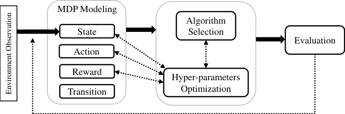
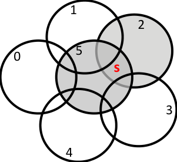

## Automated Reinforcement Learning: An Overview

Reza Refaei Afshar [a,] _[∗]_, Yingqian Zhang [a], Joaquin Vanschoren [b], Uzay Kaymak [a]

_a_ _School of Industrial Engineering, Eindhoven University of Technology, The Netherlands_
_b_ _School of Mathematics and Computer Science, Eindhoven University of Technology, The_
_Netherlands_

**Abstract**

Reinforcement Learning and recently Deep Reinforcement Learning are popular

methods for solving sequential decision making problems modeled as Markov

Decision Processes. RL modeling of a problem and selecting algorithms and

hyper-parameters require careful considerations as different configurations may

entail completely different performances. These considerations are mainly the

task of RL experts; however, RL is progressively becoming popular in other

fields where the researchers and system designers are not RL experts. Besides,

many modeling decisions, such as defining state and action space, size of batches

and frequency of batch updating, and number of timesteps are typically made

manually. For these reasons, automating different components of RL framework

is of great importance and it has attracted much attentions in recent years. Au

tomated RL provides a framework in which different components of RL includ

ing MDP modeling, algorithm selection and hyper-parameter optimization are

modeled and defined automatically. In this article, we explore the literature and

present recent work that can be used in automated RL. Moreover, we discuss

the challenges, open questions and research directions in AutoRL.

_Keywords:_ `Reinforcement Learning`, `Automated Reinforcement Learning`

`Pipeline`, `AutoRL`, `Sequential Decision Making`

_∗_ Corresponding author.
_Email addresses:_ `r.refaei.afshar@tue.nl` (Reza Refaei Afshar), `YQZhang@tue.nl`
(Yingqian Zhang), `j.vanschoren@tue.nl` (Joaquin Vanschoren), `U.Kaymak@ieee.org` (Uzay
Kaymak)

_Preprint submitted to Elsevier_ _January 14, 2022_

**1. Introduction**

Reinforcement Learning (RL) is a learning approach in which no prior knowl

edge of an environment is necessary. An agent learns the optimal behavior

known as _policy_ by interacting with the environment. At each decision step,

the agent observes the _state_ of the environment, takes an _action_ and receives a

scalar _reward_ value from the environment. Using this reward value, the agent

adjusts its policy in order to maximize the long term reward. The long term

reward is either the sum of all future rewards or the discounted sum of future

rewards in order to reduce the impact of future actions [84].

RL is a method to solve sequential decision making problems modeled as

Markov Decision Process (MDP). Formally speaking, a discrete time finite hori

zon MDP is a tuple ( _S, A, r, T, γ_ ), where _S_ is the state space, _A_ is the action

space, _r_ : _S ×_ _A →_ _r ∈_ R is an instant reward value denoting the benefit of tran

sition from current state _s_ _t_ _∈_ _S_ to the next state _s_ _t_ +1 _∈_ _S_, and _γ_ is the discount

factor [59]. At each decision moment or discrete timestep _t_, an agent interacts

with the environment and its goal is to learn a policy _π_ : _S ×_ _A →_ _π ∈_ [0 _,_ 1] that

determines a probability value for each action. Following a greedy, _ϵ_ -greedy,

softmax or other action selection policies, the agent takes an action according

to the probabilities and transitions to the next state. In other words, the agent

observes a state _s_ _t_ _∈_ _S_ and performs an action _a_ _t_ _∼_ _π_ ( _.|s_ _t_ ). Taking an ac

tion has two consequences. First the agent receives a reward value _r_ _t_ . Then,

the state of the environment transitions from _s_ _t_ to a new state _s_ _t_ +1 based on

the transition probability _T_ . The agent updates the policy during the learning

phase in order to find the optimal policy that yields the maximum total reward.

RL provides an interaction-based framework to solve the MDP and learn the

policy _π_ .

MDPs can be continuous time, infinite horizon or partially observable. In

finite horizon MDPs do not have a goal state and the system runs for ever

[84]. The agent learns to maximize its total reward without expecting a goal

state. In continuous time MDPs, unlike discrete time, the decisions are made

2

at every point in time. The formulation of continuous time MDP is similar

to discrete MDP, however, these problems are harder to solve in general [33].

Partially Observable MDP (POMDP) is a kind of MDP where the agent has

limited information about the environment due to different reasons such as lim

ited sensors or uncertainty in the environment [70, 84]. These variants of MDPs

could also be modeled and solved by RL, although they need different consider

ations on defining the states which the agent has a _belief_ about the environment

rather than complete observation. In this article, we focus on discrete time fully

observable MDPs.

To model a problem in RL framework and solve it accordingly, different

components of RL, including MDP modeling, algorithms, and hyper-parameters

such as the number of training steps, the structure of policy function, etc., should

be determined before starting the learning procedure. In common practice, the

exact observation from the environment is used as a state representation and the

agent’s decision is directly sent to the environment as an action. Although these

states and actions might help the agent to find an optimal or near optimal policy

for some tasks, they are not necessarily the best representations for the states

and the actions. In some other tasks, further processing of the environment is

required to find a suitable state representation. As a simple example, normaliza

tion is usually necessary for the inputs of Neural Networks (NNs) and using raw

observation of the environment may produce undesirable results. Furthermore,

the performance of a RL policy is highly dependent on the RL algorithms and

its hyper-parameters. Selecting algorithms and tuning hyper-parameters are

normally done by using expert knowledge. However, many iterations are still

needed to find the best set of hyper-parameters. In addition, there are many

optimization problems in different areas with no available expert knowledge on

RL, that could be solved by RL. Hence, automating an RL procedure in order

to facilitate using this approach for non-experts is of great importance.

_Automated Reinforcement Learning (AutoRL)_ provides a framework to au

tomatically make appropriate decisions about the settings of an RL procedure

before starting the learning. In other words, RL components, including state,

3

action and reward, algorithm selection, and hyper-parameters optimization, are

determined through AutoRL, and the best configuration for each component is

provided for an RL procedure to solve a task. Figure 1 shows an RL pipeline

containing the RL components. To model and solve a problem using RL, the

steps of this pipeline are followed, starting from MDP modeling. AutoRL aims

to automate different steps of this pipeline and reduce the necessity of expert

knowledge. We use AutoRL to emphasize the resemblance with Automated

Machine Learning (AutoML) as a framework for automating supervised and

unsupervised learning procedures. According to [35], an AutoML pipeline con

sists of the components of Machine Learning frameworks. It starts with data

preprocessing that contains data collection and data cleaning. The next step is

feature engineering including feature extraction, feature construction and fea

ture selection. After processing the data and defining the features, a model is

developed and optimized to perform classification or clustering tasks. Finally,

the quality of the model is determined through evaluation. In order to automate

this procedure, the output of evaluation is used to configure new settings and

follow the steps again. In this way, several iterations might be needed to de

rive the optimal settings for data preprocessing, feature engineering and model

generation. Although some components of AutoML and AutoRL are similar,

AutoML methods cannot necessarily be used in AutoRL because the configu

ration of the problems and the complexity of the evaluation step are different.

AutoRL pipeline builds a pipeline for RL to define and select components of

RL automatically. In recent years, by combining Deep Learning and RL, the

need for automating the components of Deep Reinforcement Learning (DRL)

is increased because many modeling decisions are made manually and even RL

experts have to test several different configurations related to state, action, re

ward, algorithm and hyper-parameters, to obtain the best definition.

In this article, we review relevant work that can be included in an AutoRL

framework and elaborate research challenges and directions in this relatively

new research area. For each of the components mentioned above, different ap

proaches in the literature are presented that might be helpful in automating

4

Figure 1: Solid arrow shows RL pipeline and dashed arrows depict AutoRL pipeline where

the evaluation results are used to set new configurations. This loop continues until finding an

appropriate configuration.

the corresponding component. For example, approaches that modify the initial

observations of the environment to define a state representation are candidate

methods for using in automating states. AutoRL pipeline consists of modeling

a particular problem as a sequential decision making problem and MDP, select

ing algorithm and tuning hyper-parameters. These three steps are illustrated

in Figure 1 followed by evaluation. Evaluating a RL algorithm is normally per

formed by tracing reward alteration during training and comparing the final

total reward with some baselines.

In order to clarify the purpose of AutoRL, assume Traveling Salesman Prob

lems (TSP) as an example. Recently, DRL has been popular for learning heuris

tics and solving different variants of TSP. The first step in solving TSP with

DRL is to model the problem as a sequential decision making and determine

MDP components. Vanilla TSP is defined as finding a tour with minimum

length in a graph where all the nodes are visited exactly once. In a constructive

solution approach, an agent starts from the source and walks through nodes

until building a tour. At each timestep, the graph, current node, visited nodes

and remained nodes are the observations of an environment. There are several

ways like graph neural networks [64] and structure2vec [17] to convert the ob

5

servations to state representation and AutoRL helps to find the best approach

among the possible methods for this conversion. The second step is to define

a RL algorithm for updating the policy network. Popular RL algorithms such

as A2C [52], PPO [65], ACER [81] and DQN [53] are available to train the pol

icy network. Each of them is useful for particular problems and it is not easy

to determine the best algorithm for a problem. AutoRL aims to provide the

opportunity of searching among these possible algorithms to find the suitable

one. We focus on model-free RL algorithms where the transition probabilities

between states are unknown. The third step is to set the hyper-parameters such

as network architecture, learning rate, discount factor, etc. AutoRL employs

hyper-parameter optimization methods in its framework to derive the optimal

hyper-parameters for an algorithm and a set of problem instances.

This paper is organized as follows. In section 2, previous work related to

automating the MDP modeling including the definition of states, actions and

rewards are explained. In section 3, the process of RL algorithm selection is re

viewed. Since algorithm selection is normally intertwined with hyper-parameter

optimization, most of the combined work in algorithm selection and hyper

parameter optimization together with different hyper-parameter optimization

work are presented in section 4. Section 5 present recent work in meta-learning

that can be leveraged in a RL framework. In section 6, previous work in opti

mizing and learning neural network architecture are reviewed. Finally, section

7 concludes the paper.

**2. Markov Decision Process Components**

Since Reinforcement Learning aims to solve MDPs, an AutoRL agent needs

to define these four components: state, action, reward, transition probability.

The transition probability is mostly unknown for model-free RL problems [74].

Hence, we focus only on state, action and reward definition in this section.

6

_2.1. Methods for Automating States_

As mentioned before, the original observation that an agent receives from

interacting with environment is commonly assumed as a state. This holds for

many classical RL problems such as mountain car, cart pole and pendulum [84].

Nevertheless, the original observation is not necessarily an efficient state repre

sentation. Moreover, in some applications, especially for those with continuous

state space, the state space is extremely large and approximating a good value

functions is difficult. Hence, deriving a particular mapping from observations

to states that helps the final policy take better actions, attracts much atten

tion in the literature. We categorize the existing work in defining state into two

groups. First, the methods that require to be configured using expert knowledge.

These methods transform raw observations into state representation, however,

the hyper-parameters optimization and finding proper settings are left for the

experts. Second, the methods that automatically transform the observations to

states and reduce the role of expert.

_2.1.1. Transferring raw observations to state representation_

Manipulating raw observation and constructing new features are widely used

for deriving state representation. These methods range from simple approaches

such as tile coding applied to linear function approximation methods for prob

lems like n-state random walk [67, 1], to more complex methods like struc

ture2vec [17] and Pointer Networks [78] for graph Combinatorial Optimization

Problems (COPs) such as Vertex Cover [44] and TSP [8]. They are mainly

employed for expanding the observation to more useful representations with or

without taking the final policy into account. For problems like combinatorial op

timization [50], robot navigation [2] and real world business problems like train

shunting [56] and online advertising [62], raw observation of the environment

may require processes to derive state representation.

Each state consists of a n-dimensional observations vector from the environ

ment and each observation is a scalar value called a feature. In other words, the

observations in an n-dimensional observation space are feature vectors with n

7

entries. In more complex tasks like image classification where the observation is

a matrix rather than a vector, they can be flattened to vectors. Exact observa

tions from the environment in some problems are not sufficient for representing

states. As an example, assume a task with 2-dimensional observation space

where the two dimensions are interrelated. In other words, possible actions for

the situation that both dimensions are positive or negative are different from

when they have different signs. In this case, using a vector with two entries as

a state does not take any interaction between the two variables into account.

Since, the observations in many environments are represented by numerical val

ues, features can be interpolated to generate new meaningful features. One of

the simplest families of features used for interpolation is _Polynomial Features_

[74]. Polynomial features are obtained by modeling the observations as any

order-n polynomial. Formally speaking, assume _O_ = ( _o_ 1 _, o_ 2 _, ..., o_ _k_ ) is an ob

servation vector from the environment. The new state _s_ _i_ corresponding to an

observation _o_ _i_ is defined as:

_s_ _i_ =

_k_
� _o_ _[c]_ _j_ _[i,j]_ (1)

_j_ =1

where, _c_ _i,j_ is an integer denoting the degree of _j_ _[th]_ term of observation in the

definition of the _i_ _[th]_ term of state representation. This approach is mainly used

for deriving state representation of linear function approximation algorithms

when the important interactions between the features are not included in the

observations of the environment.

_Coarse Coding_ is another useful approach for generating features especially

when the observation of the environment is not informative enough [73]. For

example, assume a task with two dimensional state space where each region of

the space has its own characteristics. In order to capture pertinent informa

tion about the environment, coarse coding introduces some overlapping circles

whose status shows the corresponding state of observation. Each observation

lies in one or more circles and circles are called present/absent or active/inactive

based on the location of the observation. If the observation lies in _i_ _[th]_ circle, its

8

Figure 2: An example of Coarse coding. The resulting feature vector of state s is (0 _,_ 0 _,_ 1 _,_ 0 _,_ 0 _,_ 1).

corresponding value in state _s_ is 1, otherwise it is 0. Using this method, the

feature vector of states extends to _n_ binary values. Figure 2 shows an example

of coarse coding with _n_ = 6.

_Tile Coding_ [74] is a widely used approach for converting continuous space

to discrete which is easier to manage and reduces the complexity of the problem.

In tile coding, _n tiling_ that each has a fixed number of _tiles_ are offset from each

other by a uniform amount in each direction. Figure 3 shows an example of tile

coding.

With the popularity of Deep Neural Networks (DNNs) in past few years, the

feature engineering is mainly performed by DNNs and researchers focus more

on designing the DNNs. Nevertheless, for some problems like COPs, processing

the raw representation of problem instances in order to derive effective state

representation improves the quality of the solution. For this reason, many re

search focus on developing methods for transforming the original observation

of the environment to state representation. In [17], an approach named struc

ture2vec for representing structured data like trees and graphs is introduced.

This approach is based on the idea of embedding latent variable models into

feature space. A vector for representing graph is obtained by employing prob

abilistic kernels to find latent variable models and a neural network is trained

to output the embedding of a graph based on nodes’ attributes. This idea is

9

Tiling 1

|Tiling 2 Tiling 3 Tiling 4|Col2|Col3|Col4|Col5|Col6|Col7|Col8|Col9|Col10|Col11|Col12|Col13|Col14|Col15|Col16|Col17|Col18|Col19|
|---|---|---|---|---|---|---|---|---|---|---|---|---|---|---|---|---|---|---|
|Tiling 2 Tiling 3 Tiling 4|Tiling 2 Tiling 3 Tiling 4|Tiling 2 Tiling 3 Tiling 4|||||||||||||||||
|Tiling 2 Tiling 3 Tiling 4|||||||||||||||||||
||||||||||||||||||||
||||||||||||||||||||
||||||||||||||||||||
||||||||||||||||||||
||||||||||||||||||||
||||||||||||||||||||
||||||||||||||||||||
||||||||||||||||||||
||||||||||||||||||||
||||||||||||||||||||
||||||||||||||||||||
||||||||||||||||||||
||||||||||||||||||||
||||||||||||||||||||
||||||||||||||||||||
||||||||||||||||||||

Figure 3: An example of Tile coding. The active tiles are shown in bold margins. The oval is

the original observation space and the point is a sample observation.

used in [44] for solving graph-based combinatorial optimization problems such

as Minimum Vertex Cover and TSP. The graph embedding network is learned

by fitted Q-learning and the output of the network is used as a greedy policy to

incrementally create the solution of the problem.

_2.1.2. Automatically defining the state representation_

There are some approaches in the literature that try to automatically find

state representation. Adaptive Tile Coding [83] is one of them where the algo

rithm starts with a single big tile and two heuristic algorithms determine when

and where to split the tiles, respectively. First heuristic keeps tracks of lowest

Bellman error and whenever it fails to change, it is the time for splitting. The

second heuristic then checks the states in a tile and splits the tile if the number

of conflicts in action selection is higher than a threshold. Since the tiles are split

evenly, in [48], genetic algorithm is used for solving this issue and automatically

deriving tile coding and state abstraction of large state spaces. This approach

also starts from a single tile containing entire state space and genetic algorithm

determines when and where to split the tiles while the splits can divide unevenly.

In this modeling, the population contains different tilings that are evaluated by

an RL algorithm. Each tiling is demonstrated by a binary decision tree and its

10

fitness is the performance of RL algorithm using the tiling for state represen

tation. Mutation either shifts the tiles or divide them. Shift operators move

the position of splits and divide operators introduce new splits. This approach

is applied on Mountain Car and Pole Balancing as two well-known continuous

control RL problems [48].

One approach of handling large state space is to reduce the complexity of the

state space by aggregating those states that have similar characteristics. In [7],

state aggregation for Q learning algorithm in continuous state space is studied.

The proposed method combines Growing Neural Gas (GNG) and Q-learning to

automatically learn state aggregation during training. The GNG is an unsu

pervised method that represents the topology of an environment by a small set

of units. It adds units and updates the approximation until deriving a repre

sentation. In order to aggregate states, a set of codeword vectors are defined

to represent states and a region is assigned to each of them based on nearest

neighbor quantizer. Then GNG finds the final codeword vectors for representing

states by moving the initial vectors or adding new ones. As another example,

an extension of tile coding is introduced in [63] to automatically transform con

tinuous state space to discrete and use the resulting state representation for

solving knapsack problem. In this method, a single n-dimensional tiling is used

to convert numeric item values to discrete. Each item of knapsack problem is

considered as a dimension and RL is used to automatically learn the number of

tiles in each dimension. In this modeling, states are items and the action is the

number of tiles.

Focusing on graph-based state representation leads to other promising works.

In [57], a representation named _DeepWalk_ is introduced that generates a se

quence of nodes using random walk. This model is used in natural language

processing and trains a model similar to word2vec for representing a graph. In

[86], an asymmetric proximity preserving graph embedding based on random

walk is developed that can be used to represent a graph for social network

problems like link prediction.

11

_2.1.3. Challenges_

Approaches for transforming observations to state representation have pa

rameters and settings that properly tuning them would significantly increase

the total reward. For instance, although tile coding and coarse coding are use

ful approaches for handling large and continuous state space, the number of

tilings, tiles and circles have to be determined by the system designer or expert.

Furthermore, promising NN-based methods like Pointer Network require ap

propriate information about the problem instance which is still the task of RL

designer. Therefore, completely replacing expert knowledge with automation

levels is a challenging task in defining state representation.

The other main challenge is generalization of proposed methods. An auto

mated method such as structure2vec is a powerful way to represent graphs. This

embedding is only useful for graph-based problems, while a large fraction of RL

problems are not inherently graph-based. The same issue holds for Adaptive

Tile coding which require special adaptations for a particular task. Deriving a

generic state representation methods would improve an AutoRL pipeline dras

tically which is not well studied in the literature.

_2.2. Methods for Automating Actions_

In many RL tasks, actions are mainly the decisions of the agent that alter the

state of the environment. Different types of actions such as continuous, discrete,

multi-dimensional, bounded or unbounded would entail policies with different

qualities. For example, a continuous action like prices in a dynamic pricing task

can be modeled as either continuous or discrete action space. On one hand,

continuous actions might be more precise, however, it is not possible to model

them with tabular reinforcement learning or function approximation approaches

like DQN that consider an output for each action. On the other hand, although

discrete actions are easier to model, modeling a continuous space as discrete

might be tricky especially when small changes in the action would have large

impact on the total reward. Therefore, deriving a proper action representation

is very important as it is difficult to find the best representation for actions that

12

ends up with the best policy. For this reason, automating the definition of action

spaces are necessary for many tasks. Action spaces could be a combination of

discrete and continuous for multi-dimensional spaces like robot joints in robot

navigation problems. For many continuous control task such as pendulum or

BipedalWalker [11], the continuous action space could be discretized to represent

discrete actions. In this subsection, we review learning actions and discretizing

continuous action space separately.

_2.2.1. Learning actions_

Action representation learning in order to improve the action values and

policy has become popular in recent years. In [76], the action representation

of multi-dimensional action spaces is learned using hyper-graph. Hyper-graph

is the generalization of graph in which each single hyper-edge could contain

one or more vertices. In this modeling, the actions are modeled as vertices

in hyper-graph and the goal is to learn the representation of hyper-edges. To

achieve this, a parametric function is defined for each hyper-edge whose input

is a representation of the states and the outputs are separate values for each

possible action in the action space. If the action space is multi-dimensional,

the number of outputs is equal to the cardinality of a Cartesian product of

action vertices in the hyper-edge. After receiving a state representation, each

parametric function corresponding to a hyper-edge returns a vector for each

action and these vectors are mixed up using a non-parametric fixed function.

The output of this mixing function is the Q value for RL. In order to find a

good hyper-graph for this problem, a rank _r_ is chosen that defines the set of all

hyper-edges with the cardinality of at most _r_ . The desired hyper-graph is the

one that _r_ is equal to the number of vertices.

An efficient way to represent actions is to model the output of the policy net

work as a continuous Probability Density Function (PDF). In common practice,

Gaussian distribution is used for the policy and mean and standard deviation are

learned during the training. Gaussian distribution has been successful in many

tasks with continuous action space, however, infinite support of this distribu

13

tion might introduce bias in policies obtained from policy gradient algorithms.

To solve this issue, Gaussian distribution is replaced by Beta distribution in

[15]. The authors show that using Beta PDF for policy reduces bias whilst the

performance is not negatively affected.

One approach to automatically derive the policy distribution is introduced

in [77]. According to this work, the policy gradient updating rule with paramet

ric distribution functions results in sub-optimal policies. This sub-optimality is

in distribution space and learning the policy distribution is a solution. For this

purpose, Distributional Policy Optimization (DPO) as an updating rule is pre

sented that minimizes the distance between the policy and a target distribution.

This updating rule is shown in Equation 2.

_π_ _k_ +1 = Γ( _π_ _k_ _−_ _α_ _k_ _∇_ _π_ _d_ ( _D_ _Iπ_ _∥π∥_ _, π_ ) _|_ _π_ = _π_ _k_ ) (2)

where Γ is a projection operator onto the set of distributions, _d_ is a distance

measure, _D_ _I_ _[π]_ _[π]_ [ is a distribution over all states and actions that their advantage]

value is positive. In order to minimize the distance between two distributions,

Implicit Quantile Network [16] is employed by using Wasserstein distance met

ric. DPO algorithm is incorporated in Generative Actor Critic that contains

four neural networks for policy, delayed policy, value network and action-value

network.

_2.2.2. Discretizing continuous actions_

Continuous action spaces are challenging in many tasks. As mentioned be

fore, some RL algorithms like DQN do not work well for continuous action

spaces because they rely on _ϵ_ -greedy algorithm and the best action is required

at each step. Finding the best action in a continuous space needs an optimiza

tion step for each interaction with the environment which is intractable. For

discrete action spaces, a separate output is considered in the policy network for

each action which is not possible when the action space is continuous as it needs

infinite number of outputs. Although discretization [42] makes the action space

14

discrete and manageable, it is not suitable for tasks that are very sensitive to

small alteration of actions.

Sometimes, continuous action spaces could be transformed to discrete while

retaining necessary information for action selection as shown in [75] for on-policy

control RL when the domain of all the continuous actions is between -1 and 1.

The set of discrete actions for each dimension is _A_ _i_ = _{_ _K_ 2 _−j_ 1 _[−]_ [1] _[}]_ _[K]_ _j_ =0 _[−]_ [1] [, where,] _[ K]_

is the number of discrete actions. The discrete policy is a neural network that

outputs a logit _L_ _ij_ for _j_ _[th]_ action in _i_ _[th]_ dimension. For each dimension _i_, the

logits are combined through a softmax function to compute the probability of

choosing each action. This approach is integrated with TRPO and PPO to be

evaluated on MuJoCo benchmarks [75].

_2.2.3. Challenges_

Similar to state representation, approaches for determining action space con

tains hyper-parameters and finding appropriate configurations are important.

One way to optimize the parameters is through hyper-parameters optimization

module as it is depicted by a dashed arrow between actions and hyper-parameter

optimization in Figure 1. This is challenging because there might be several ac

tion spaces and each has some parameters. Hence, the search space is relatively

big and the optimization procedure is computationally expensive.

Finding the optimal action space needs many trial and error steps by check

ing different definitions. Automation level may help to decide the policy distri

bution or descretization approach for continuous actions is necessary. Designing

the structure of the policy output is normally performed using expert knowledge

which is not always available. This is an interesting research direction that may

influence positively on the output of a RL framework.

_2.3. Automated Reward Function_

Reward function is the other component of MDP that greatly influences on

the quality of the policy. Assume that an agent aims to reach a goal by searching

in a 2-D grid world. Different reward functions lead to different policies. If all

15

moves have zero reward except the one that takes the agent to the goal state, the

obtained policy is totally different with when the reward pertains to the distance

to the goal. In the former case, the agent might waste time by wandering in

the grid field since there is no penalty for the moves. Therefore, designing a

strong reward function is of great importance which is normally the task of

RL experts. Even using expert knowledge, sometimes it is necessary to test

different reward functions in order to obtain the one yielding the best policy.

Hence, automating reward function can largely help the agent toward finding a

good policy. Generally, there are three approaches for designing reward function

that can be considered in an automation level. An agent may automatically seek

among these approaches to find the best representation for the reward function.

_2.3.1. Curriculum Learning_

Curriculum learning is a useful method for learning sparse reward functions.

Many problems like robots navigation have sparse reward function because the

search space is extremely large and only goal state produces a positive reward.

Curriculum learning gradually increases the difficulty of the problem by starting

from the states close to the goal state and progressively increase the distance.

A curriculum learning method inspired by dynamic programming methods is

introduced in [27] for goal oriented tasks like robot navigation. The motivation

is to handle the sparsity of the reward function because the reward value is zero

for all the moves except the one that takes the agent to the goal state. Based

on this work, the robot starts to learn by searching from states that are close

to the goal. The process is continued until showing mastery on the current

setting. Then, new start states are added to the search space by a random walk

from previous start states. This so called _reverse learning_ is helpful to solve the

problem of sparsity.

Focusing on the limitation of the reverse learning with random walk, a new

approach is presented in [38] for highly dynamic and unstable systems where

previous method breaks down. Similar to [27], the backward learning method

in [38] starts from the state in the vicinity of the goal state and increases the

16

distance when the agent demonstrates mastery in solving the problem. Unlike

[27], where the state space expands by random walk, in [38] the new states are

obtained by computing approximate backward reachable set (BRS). BRS is the

set of all points in the state space that the agent is able to reach a certain region

in a fixed and short amount of time. The main contribution of this work is to

update the state space in the way that only reachable states from goal state are

preserved.

Although curriculum learning is helpful in solving sparsity, their main ap

plication is in goal searching tasks. Using curriculum learning in COPs is quite

challenging. Learning heuristics in these problems might not be adapted with

curriculum learning because the optimal solutions are not usually available in ad

vance. Therefore, using curriculum learning in a reinforcement learning pipeline

is limited to goal-based problems where the goal state is available.

_2.3.2. Bootstrapping_

Bootstrapping methods start learning from a pre-defined policy. This policy

could be either for a similar task or designed by human. A typical approach

based on bootstrapping is introduced in [69] where the learning process is split

into two phases. In the first phase, the robot is controlled by a supplied control

policy or directly by human. In the latter case the robot is navigated by human

in the environment and it updates the value function during this phase without

changing the policy. The second phase is a typical reinforcement learning process

and the robot updates the policy based on the value function which is initialized

in the first phase.

In order to address three main RL challenges including sparsity of the re

ward function, lack of effective exploration and brittle convergence properties,

a hyper algorithm that incorporates evolutionary algorithms (EA) and DRL is

introduced in [43]. Each individual in the evolutionary algorithms represents

a DNN and mutation randomly alters the weights of a DNN. These DDNs are

the actors in Deep Deterministic Policy Gradient (DDPG) [47] algorithm. Ini

tially, a population of actors are generated and the fitness for each actor is the

17

cumulative reward of following its policy for a particular episode. Then the

actors are perturbed through mutation and crossover to create new set of actors

as the next generation. Through crossover, an offspring policy is obtained by

randomly exchanging segments of parents’ weights. The mutation is performed

by applying random Gaussian noise to the weights. The experiences of actors

are stored in a replay memory and these experiences are used by another actor

(apart from individuals in EA) to update its weight through DDPG algorithm

and this actor is copied to the EA population periodically. The algorithm is

similar to DDPG except that the main actor has access to the experiences of in

dividuals. This approach is categorized as bootstrapping as it uses information

of other policies for training the target policy.

Since DNNs are usually sensitive to small modification of the weights, muta

tion may cause extent forgetting. To address this issue of [43], the evolutionary

RL algorithm is modified in [10] by adding personal replay memories and defin

ing a crossover and a mutation operators. A small personal replay memory

named genetic memory is defined for each individual to keep their most re

cent experiences. In the new crossover named Q-filtered distillation, the genetic

memory of the child policy is filled with the latest experiences of its parents.

The child policy is initialized with the weights of one of its parents and it is

trained using the experiences of its genetic memory. The action selection pro

cedure is toward minimizing a loss function that combines the policies of the

parents. The new mutation named proximal mutation modifies the Gaussian

perturbation of [43] by scaling the Gaussian using the sum of gradients over

a batch of transitions. This approach is evaluated on MuJoCo environments

including Hopper, Ant and HalfCheetah.

One challenge in sparse reward tasks with high-dimensional state space is

deriving a policy for long horizon. On one hand, while planning algorithms work

well for task that determining a distance between states and designing local

policy is easy, it is problematic when it comes to high-dimensional observations.

On the other hand, even though RL algorithms work well with high-dimensional

observations, they fail to solve some tasks in long horizons. To achieve the

18

benefit of planning and RL algorithms, a combined algorithm is presented in

[23]. In this approach, the task is decomposed into a series of easier goal-reaching

tasks and the problem of finding these sub-goals is reduced to a shortest path

problem using a distance metric. By defining the reward value as -1 for every

move until reaching a goal, the Q function and the shortest path would be

closely connected. Using the distance between nodes, a directed graph is built

on top of the states in a replay buffer in which each node corresponds to an

observation. This graphs finds a set of nodes showing the shortest path from

the start state to the goal state and the goal-based policy starts to find the goal

by reaching intermediate goals one after each other.

_2.3.3. Reward Shaping_

Reward shaping is the process of learning a proxy reward function that

maximizes the expected return. Although rewards in many tasks like video

games are straightforward to define, it needs careful considerations in problems

like robot navigation and COPs that have multiple objectives. For example,

finding a reward function by combining several objectives like avoiding obstacles,

reaching the goal, passing minimum distance and the optimal angular velocity

in a goal searching task is challenging. As another example, the optimal solution

of a TSP with time window and prizes should has the minimum tour length and

maximum collected prize while the time window constraints are satisfied [37].

For these kinds of problems, different rewards may lead to completely different

solution performance and carefully designed rewards are necessary. In the next

paragraphs of this sub section some example and application of reward shaping

in different domains are reviewed.

In [41], reward shaping in the context of imitation learning is explored. In

imitation learning, the agent faces an MDP without any reward value. States

and actions pairs from a target policy are demonstrated to the agent and the

goal is to mimic the target policy using these state-action pairs. In [41], a reward

value is provided for the agent which is not necessarily aligned with the target

policy. The accuracy of the learned policy is a parametric function where the

19

parameters are obtained by maximizing the shaped reward.

In [72], the benefit of reward shaping in Spoken Dialogue Systems (SDS) as a

Partially Observable MDP (POMDP) is studied. In SDS, an agent interacts and

converses with the clients and a numerical reward value is received at the end

of the conversation. Since there is no intermediate reward, the reward function

is sparse. In this work, domain knowledge is used to provide another reward

signal. This extra reward value is obtained from an RNN which is trained by

supervised learning using previous annotated data. The state (belief in POMDP

context) and action pairs are the inputs of the RNN and the scalar return of

the dialogue is the target value. The agent uses the extra reward value along

with the feedback of the environment to learn its policy.

A well-known reward shaping approach is potential-based reward shaping

[54]. Let _r_ ( _s, a, s_ _[′]_ ) be the instant reward of taking action _a_ in state _s_ and going

to state _s_ _[′]_ . Potential-based reward shaping employs a function _F_ ( _s, a, s_ _[′]_ ) =

_γ_ Φ( _s_ _[′]_ ) _−_ Φ( _s_ ) where, _γ_ is discount factor, and Φ( _s_ ) and Φ( _s_ _[′]_ ) are potential

functions of states _s_ and _s_ _[′]_, respectively. The new reward function is _r_ ( _s, a, s_ _[′]_ )+

_F_ ( _s, a, s_ _[′]_ ) which is the sum of original reward and the potential-based reward

shaping. In [31], potential-based reward shaping is analyzed in episodic RL.

The authors show that temporal credit assignment or reward value could speed

up training deep neural networks if a potential based reward function is added

to the original reward. An important requirement of this work is that the policy

derived by shaped reward should be equivalent to the original policy. Potential

based Reward shaping preserves the optimal policy when the goal states are

predefined terminal states and shaping reward is zero in the goal states [54]. It

is shown in [31] that policy invariance is violated for finite horizon domains with

multiple terminal states and they propose to set the potential value of terminal

states as zero to solve this issue.

Learning a potential function Φ( _s_ ) using Meta-Learning in order to acceler

ate the learning is studied in [89]. The potential function is defined as a neural

network and its parameters are updated using Model-Agnostic Meta-Learning

20

(MAML) algorithm [26]. The updating equations of MAML are as follows.

_φ_ _i_ = _θ −_ _α∇_ _θ_ _L_ _τ_ _i_ ( _f_ _θ_ ) (3)

_θ_ = _θ −_ _β∇_ _θ_ E _τ_ _i_ _L_ _τ_ _i_ ( _f_ _φ_ _i_ ) (4)

where, _τ_ _i_ is a MDP task deriving from a particular task distribution, _θ_ is

the parameters of the value network, _φ_ _i_ is the parameters of potential-based

reward shaping which is task-specific, _α_ and _β_ are learning rates, _f_ ( _θ_ ) and

_f_ ( _φ_ _i_ ) are the value network and reward shaping network respectively, and _L_ is

the loss function. The parameters of the networks are trained through running

an adapted version of DQN with replay memory.

The term _AutoRL_ is used in [14] to address automatically generating a re

ward function for a robot navigation task. This work defines the learned reward

functions for path following and target-based tasks in robot navigation. The

motivation of the proxy reward function is to handle the sparsity of the original

reward which is a binary value showing whether the agent reaches its objec

tive. More specifically, the objective of the target-based task is maximizing the

probability of reaching a goal as shown in Equation (5).

_G_ _P_ 2 _P_ ( _s_ ) = I( _||s −_ _s_ _g_ _|| < d_ _P_ 2 _P_ ) (5)

where, _P_ 2 _P_ shows the _peer to peer_ property of the problem, _G_ is the objec

tive function and I is the indicator function to determine whether the distance

between current state _s_ and goal state _s_ _g_ is less than _d_ _P_ 2 _P_ . Using this objective

function, the reward is defined in Equation (6).

_R_ _θ_ _rP_ 2 _P_ = _θ_ _r_ _[T]_ _P_ 2 _P_ [[] _[r]_ _[step]_ _[r]_ _[goalDist]_ _[r]_ _[collision]_ _[r]_ _[turning]_ _[r]_ _[clearance]_ _[r]_ _[goal]_ []] (6)

In this formulation, _r_ _step_ is a constant penalty for each step, _r_ _goalDist_ is

the negative Euclidean distance to the goal, _r_ _collision_ is a binary value showing

whether the robot collides an obstacle, _r_ _turning_ is the negative angular veloc

ity, _r_ _clearance_ is the distance to the closest obstacle, and _r_ _goal_ is a binary value

21

showing whether the goal is reached. Using this reward function, an actor-critic

algorithm is employed to learn the optimal policy. The algorithm consists of two

steps: learning the parameters of the reward function and training actor-critic

networks. In order to learn the parameters of the reward, they are initial

ized using previous evaluated parameters according to a black-box gradient-free

optimization algorithm. Then the parameters of the fixed-shape actor-critic

networks are learned using the reward function. Upon running the algorithm

for a certain amount of time, the parameters providing the maximum objective

value are selected for reward function and RL trains actor-critic networks.

In [24] the idea of learning a parametric function is employed for a set of

typical continuous control RL problem like _Ant_, _Walker2D_, _HumanoidStandup_

and _Humanoid_ . These environments are implemented in _OpenAI Gym_ [12].

For each problem, a particular parametric reward function is defined and the

same algorithm is used for learning both the parameters of reward and policy

network. Actor-critic algorithms including Proximal Policy Optimization [65]

and Soft Actor Critic [34] are used with parametric reward function and the

method outperforms the same algorithms without parametric reward on the

aforementioned tasks.

A reward vector based on limited feedback of environment is presented in

[61] for optimizing reserve prices in real time auctions. In this work, the reserve

price of ad slots in online adverting is the action. An agent sets the reserve price

using a policy network whose input is the ad slot information and its output

is the a probability distribution over reserve prices. The environment returns

only a binary value determining whether the ad slot is sold in the auction. This

binary feedback is not sufficient for learning a policy for reserve price setting.

In order to improve the reward function, the valid interval of reserve prices is

divided into some sub-interval and a weight is assigned to each sub-interval. The

reward value in this case is the inner product of the weight vector and a reward

vector. The reward vector has a separate entry for each interval and activates

each entry only if the reserve price lies in corresponding interval. Using this

method on a simulation showed improvement in the revenue.

22

_2.3.4. Challenges_

As mentioned before, Curriculum learning is appropriate for goal-searching

problems. This method fails for path following problems where the goal state is

unknown. Using this method in AutoRL is challenging because the goal state

is mainly the solution of the optimization problems. However, the solution of

easy instances of a problem might help to solve complex instances, and this

generalization is relatively hard but important progress in AutoRL.

Bootstrapping methods require initial policies that are provided either by ex

pert knowledge or by following other learning or optimization methods. Though

expert knowledge are helpful, they are not available for most of problems. Be

sides, using any policy other than optimal policy do not help the learning be

cause that biases the value function and a sub-optimal policy is learnedNeverthe

less, finding the optimal approach is time consuming and a level of automation

could be largely beneficial.

Reward shaping methods have some parameters that are tuned before start

ing the training phase. Similar to parametric state and action representation

methods, these hyper-parameters settings highly influence the total reward.

Tuning the hyper-parameters is challenging and time-consuming which makes

it an interesting research direction. Another interesting research direction is

about the effects of intrinsic rewards whether they help in solving the problem

of sparse rewards [68]. For example giving a reward when the agent has a lot of

options available, or when the agent encounters a new situation.

**3. Automated Algorithm Selection**

When the problem is modeled as a sequential decision making problem and

the components of MDP are defined, the next step in solving it with RL is to

select an appropriate algorithm. One way to reduce the search space is to filter

the algorithms based on the class of the problem. For example, if the states and

actions are discrete and finite, tabular RL algorithms like typical Q-Learning

and SARSA [74] are suitable candidates and there is no need to search over the

23

class of sophisticated algorithms in Deep Reinforcement Learning. Moreover, if

the model of the environment is known, a wide variety of model-based algorithm

like dynamic programming could be utilized. Despite having different context,

algorithm selection approaches in AutoML can provide insights for AutoRL

[60]. Most of work in the domain of RL algorithm selection are intertwined

with hyper-parameter optimization. For this reason, we explain these combined

algorithm selection and hyper-parameter optimization in the next section and

present few work that merely focus on algorithm selection in this section.

In [19], algorithm selection in supervised learning is modeled as a contextual

multi-armed bandit problem. This approach is developed for AutoML. The

difference with RL is in using a context vector that contains the information

of the dataset. Each decision moment starts with observing the dataset and

its feature vector which is the context vector in contextual multi-armed bandit.

Then Upper Confidence Bound (UCB) and _ϵ_ -greedy algorithms are used for

learning the values of arms on a set of datasets.

The algorithm selection problem in episodic RL tasks is modeled as a multi

armed bandit problem in [45] to decide which RL algorithm is in control for

each episode. A set of RL algorithms are given and the process of algorithms

selection is started with an empty trajectory set. At each time step, an algorithm

is selected and it generates a trajectory with discounted reward according to the

policy of the selected algorithm. RL algorithms are selected based on Epochal

Stochastic Bandit Algorithm Selection in which the time-scale is divided into

epochs of exponential length. The policies of algorithms are only updated at

the start of epochs and they are not changed during the epochs. This way of

updating handles non-stationarity induced by the algorithm learning.

_3.1. Challenges_

Generally speaking, the RL algorithm can be classified according to the type

of the policy or value function. Through this categorization, the policy or value

function could be either tabular or parametric. One initial challenge in RL algo

rithm selection is to decide between these two. If the state and action spaces are

24

relatively small, tabular methods are more appropriate, whereas these methods

do not work for large and continuous space and action spaces. Discretization is

another solution that is discussed in section 2.2.

After identifying appropriate class of RL algorithm, selecting an algorithm

to learn the policy is another challenge. One way is to treat the algorithm

as a hyper-parameter and optimize that in the hyper-parameters optimization

module which is normally followed in AutoML. However, this approach require

particular hyper-parameters optimization framework because the quality of the

algorithm depends on the problem, its MDP modeling and parameters settings.

Furthermore, the number of required timesteps varies for different algorithm

and this makes comparing the algorithms challenging. In sum, selecting proper

RL algorithm for a task is difficult and it highly depends on the problem.

**4. Hyper-Parameter Optimization**

An optimal RL configuration for solving a sequential decision making prob

lem highly depends on promising hyper-parameters settings. Hyper-parameters

are fixed during the training and they are usually set by RL experts prior

to starting the interactions. For example, learning rate in policy gradient or

value function updating formula, discount factor, eligibility trace coefficient

and parameters of a parametric reward shaping method are hyper-parameters.

Different tasks require different sets of hyper-parameters which make hyper

parameters optimization challenging and automating this process would be very

useful. Many different approaches are developed for automatically optimizing

hyper-parameters of supervised learning algorithms that they could be adapted

with RL to optimize hyper-parameters of RL algorithms. In this section, we first

review hyper-parameters optimization approaches and then their applications.

At last, the main challenges of optimizing hyper-parameters are elaborated.

_4.1. Methods for tuning hyper-parameters_

This subsection presents the previous hyper-parameters optimization work

categorized by their core methodology.

25

_Stochastic Gradient Descent._ Backpropagation is a main method for training

neural networks in which the gradient of the loss function is computed with re

spect to the weights. This gradient is propagated backward through the network

and the new weights are obtained by a variant of gradient descent algorithm.

The hyper-parameters of gradient descent with momentum including decay rate

and learning rate are included in backpropagation algorithm and they are opti

mized together with neural network weights in [49].

_Bayesian Optimization._ Bayesian Optimization methods including Sequential

Model-based Algorithm Configuration (SMAC) has been very popular in Au

toML [36]. These methods are beneficial for optimizing expensive to evaluate

functions such as the performance of supervised learning algorithms. The idea

of Bayesian Optimization is extended to RL hyper-parameters optimization in

[6]. In this work, _RLOpt framework_ uses Gaussian process regression as sur

rogate function and integrates Bayesian optimization with RL. The process of

hyper-parameters optimization is considered as a supervised learning problem

where the parameters are the input and the performance is the target. At each

step, the selected parameters are given to the agent and it learns a policy and re

turns the performance. Based on the history of (hyper-parameter, performance)

tuples, Gaussian Process is used to select the next hyper-parameters settings.

_Multi-Armed Bandit._ A bandit-based hyper-parameter optimization algorithm

named _Hyperband_ is proposed in [46]. This algorithm is based on _Successive-_

_Halving_ [39], where a space of _n_ hyper-parameters is searched. At each iteration,

all the hyper-parameters configurations are evaluated and the worst half are re

moved from further processing. This continues until only one configuration

remains. Unlike SuccessiveHalving, in Hyperband, the value of _n_ is not pre

determined. This value is set according to the total processing budget and the

maximum amount of resources that can be allocated to a particular allocation.

In each iteration, _n_ is determined and then SuccessiveHalving is invoked to find

the best hyper-parameters.

26

_Evolutionary Algorithms._ In [25], the parameters of _SARSA_ ( _λ_ ) and _Q_ ( _λ_ ) as two

RL algorithms based on eligibility traces are optimized using Genetic Algorithm

(GA). In this method, a vector containing all hyper-parameters is considered

as a _chromosome_ and the mutation and cross-over are performed on this vec

tor. The algorithm is tested on under-actuated pendulum swing-up and the

authors show that the selected parameters maximize the end performance. An

other application of GA for optimizing the hyper-parameters of RL algorithms

is presented in [66], where the parameters of Deep Deterministic Policy Gradient

(DDPG) with Hindsight Experience Replay (HER) [4] are learned through GA.

The target parameters for GA are discount factor, polyak-averaging coefficient

which is used for updating target networks in algorithms like DQN with different

target and main networks, learning rate of actor and critic networks, percentage

of time a random action is taken and Gaussian noise parameters. Concatenation

of binary representation of these parameters builds the chromosomes and the

fitness is the inverse of number of epochs to reach close to maximum success

rate for a particular task.

Normally, there are three challenges in hyper-parameters optimization of

DRL. First, dynamic environments require dynamic hyper-parameters and op

timal hyper-parameters settings in one stage might poorly work in another stage.

Second, the optimization is not sample efficient and needs a full training run to

test each selected hyper-parameter. Third, dynamic modification of the neural

network is not considered in literature. A joint optimization approach based

on evolutionary algorithms that optimizes the agent’s network and its hyper

parameters simultaneously is presented in [29]. In the evolutionary framework,

each individual is a DRL agent consisting of a policy and a value network to

gether with RL algorithm paramteres. Rollouts of each individual is stored in a

shared replay memory to be used as experiences for other agents. Each agent is

evaluated by running for at least one episode in the environment and the mean

reward of the agent is used as its fitness. After crossover and mutation, all

the agents in the environment are trained using the experiences in the shared

replay memory. This approach is applied on TD3 algorithm in MoJuCo contin

27

uous control benchmark. This integration of evolutionary algorithms and neural

networks is known as neuroevolution [71].

_Greedy Algorithms._ In order to optimize the decay rate in algorithms based on

eligibility trace like _TD_ ( _λ_ ), a greedy algorithm is proposed in [82]. This algo

rithm defines _λ_ as a function of states for RL algorithms with linear function

approximation. In each iteration of policy evaluation algorithm, the agent takes

the value of _λ_ greedily according to the weight vector, observation vector cor

responding to the current and the next states, instant reward and importance

sampling. The intuition of this greedy algorithm is to minimize the error func

tion which is the difference between the return obtained from the selected _λ_ and

the Monte Carlo return ( _λ_ = 1).

_Reinforcement Learning._ Hyper-parameters optimization is modeled as a se

quential decision making problem in [40] and RL is used to find the optimal

hyper-parameters. In this framework, the agent learns to explore the space

of hyper-parameters of a supervised learning algorithm and the final parame

ters minimize error on the validation set. This method is naturally for super

vised learning and works based on training and validation datasets. However,

the general idea can be extended to RL algorithms. In the MDP modeling

of the hyper-parameters optimization problem, the state of the environment is

defined as the meta-features of an input dataset plus the history of evaluated

hyper-parameters together with their performance, the action is a value for each

hyper-parameter and the reward is the performance of ML algorithm on the in

put dataset with the selected hyper-parameters. Upon modeling the problem as

MDP, deep Q network algorithm [53] is used for learning the parameters of an

LSTM system and the obtained policy works as a decision maker to determine

optimal hyper-parameters for each dataset.

In common practice, the hyper-parameters of an algorithm are optimized

once and they are fixed during entire run of the algorithm. However, because

most of AI algorithms are iterative, the optimal hyper-parameters might change

over time. The problem of dynamic algorithm configuration is studied in [9]

28

and RL is used to derive a policy for optimal configuration in each step. In this

modeling, states are descriptions of an algorithm A and actions are assigning

particular values to hyper-parameters of A. Reward function depends on the

instances drawn from the same contextual MDP. The optimal policy is obtained

either by a tabular Q-learning or DQN to select the configuration that has the

highest discounted reward. Since instances’ information are part of state, the

optimal configuration might be different for different instances.

_Neural Networks._ One main challenge of using well known hyper-parameter op

timization in AutoML such as Sequential Model-Based Optimization (SMBO)

and SMAC, is the time needed for performing necessary iterations. These

iterative algorithms take remarkable amount of time to optimize the hyper

parameters and this is highly prohibitive in RL framework. This challenge is

the motivation of developing a neural network for finding a mapping between

data and hyper-parameters [13]. The meta-features of the dataset are the input

of a Convolutional Neural Network (CNN) and hyper-parameters of the algo

rithm are the output. Training the CNN is based on supervised learning using

subsets of a large dataset as the training data. The target hyper-parameters

used for supervised learning are obtained by Bayesian Optimization.

_4.2. Applications_

In [20], hyper-parameters optimization for object tracking algorithms is mod

eled as RL and Normalized Advantage Functions [32] is used to learn a policy

network that receives a state and returns the optimal hyper-parameters settings

for a particular object tracking algorithm. Most of these algorithms produce a

heat map in the search region showing the probable location of objects. The

combination of this heat map, the parameters of the object tracking algorithm

and the appearance features like RGB-color constitute the state, and the reward

is the tracking accuracy.

One important research direction in robotics is domain randomization. Do

main randomization is a technique to use a simulation model to provide a policy

29

for real environment. In other words, when training in real environment is not

practical, domain randomization helps to derive a policy that maximizes the

total expected return over a set of MDP obtained from the same distribution.

The parameters of this MDP distribution are usually fixed and predefined, how

ever, fixed parameters might not be sufficient for some environments. For this

reason, Cross Entropy Method is used to learn these parameters in [79]. In

this method, the policy parameters function is a function of MDP distribution

parameters and optimal policy parameters are derived by PPO. The MDP pa

rameters are acquired by maximizing discounted return of following the optimal

policy in real environment.

Application of RL in different domains requires special consideration for

tuning the hyper-parameters. For instance, in [55], RL is leveraged to solve

Sequential Ordering Problem (SOP) - a variant of TSP with a precedence con

straint. Tuning parameters in this work are performed by testing different RL

algorithms including SARSA and Q-learning, different reward definition and

some different values for _ϵ_ in _ϵ_ -greedy. This configuration of the algorithm is

used to solve SOP.

_4.3. Challenges_

Although several methods are developed to tune hyper-parameters, hyper

parameters optimization for RL algorithms may be computationally expensive

because the agent needs to interact with an environment and update its pol

icy continuously for a number of timesteps or until reaching convergence. This

is usually a time-consuming and intractable process that needs special consid

erations. Efficient methods in AutoML such as Bayesian Optimization may

work well for RL models with small state, action and trajectories. However, for

complex tasks with large state and action space or long trajectories, existing

methods require considerable adaptation to provide the best configuration in a

reasonable time. This is a big challenge in RL hyper-parameters optimization.

One main difference between supervised learning and reinforcement learning

is the evaluation criteria. Since, there is no target value like supervised learn

30

ing datasets to show the desired behavior. Instead, an agent seeks to find a

compromise between exploration and exploitation that helps as hints [6].

Multi-fidelity methods [28] does not run the ML for the full budget for

every hyper-parameters but only for a limited budget (low fidelity). Then, only

promising hyper-parameters are run for longer (high fidelity). Adapting this

method to AutoRL is challenging and also interesting because it might reduce

the required time budget for optimization.

**5. Learning to Learn**

Apart from the three main components of a RL framework, levels of au

tomation are also presented in the literature for the procedures that can be

placed in more than one components. For example, gradient descent method

is used for updating the parameters of parametric functions like policy or re

ward. In this section, recent works on automating these kinds of procedures are

reviewed. Most of these works are inherently developed for supervised learn

ing. However, the same motivation and requirements hold for RL which shows

interesting research directions for future works.

In [3], the normal gradient descent formula is replaced with a new formula

in which a function of gradient value is used rather than the original gradient

in the updating rule. The new gradient descent update equation is shown in

Equation (7).

_θ_ _t_ +1 = _θ_ _t_ + _g_ _t_ ( _∇f_ ( _θ_ _t_ ) _, φ_ ) (7)

where, _θ_ is the parameter of the objective function _f_ ( _θ_ ). In this formulation,

_g_ _t_ ( _∇f_ ( _θ_ _t_ ) _, φ_ ) is a function of the gradient of _f_ with parameters _φ_ which is

obtained by a recurrent neural network (RNN). As shown in Figure 4, the

method consists of two neural networks. Function _f_ known as _optimizee_ is

represented by a feed-forward neural network with parameters _θ_ . The gradients

of _f_ are used in function _g_ which is represented by an LSTM recurrent neural

network. These gradients plus the hidden states of RNN are the input and _g_

31

|𝑓𝑡𝑓𝑡−2 𝑓𝑡𝑓𝑡−1 𝑓𝑡𝑓𝑡 𝜃𝜃 𝜃𝜃 𝜃𝜃 𝜃𝜃 𝑡𝑡−2 GD 𝑡𝑡−1 GD 𝑡𝑡 GD 𝑡𝑡+1 Optimizee|Col2|Col3|Col4|Col5|Col6|Col7|
|---|---|---|---|---|---|---|
||||||||
|RNN RNN RNN ∇𝑓𝑡−2 ∇𝑓𝑡−1 ∇𝑓𝑡 𝑔𝑡−2 𝑔𝑡−1 𝑔𝑡 ℎ𝑡−1 ℎ𝑡−2 ℎ𝑡 ℎ𝑡+1 Optimizer|RNN RNN RNN ∇𝑓𝑡−2 ∇𝑓𝑡−1 ∇𝑓𝑡 𝑔𝑡−2 𝑔𝑡−1 𝑔𝑡 ℎ𝑡−1 ℎ𝑡−2 ℎ𝑡 ℎ𝑡+1 Optimizer|RNN RNN RNN ∇𝑓𝑡−2 ∇𝑓𝑡−1 ∇𝑓𝑡 𝑔𝑡−2 𝑔𝑡−1 𝑔𝑡 ℎ𝑡−1 ℎ𝑡−2 ℎ𝑡 ℎ𝑡+1 Optimizer|RNN RNN RNN ∇𝑓𝑡−2 ∇𝑓𝑡−1 ∇𝑓𝑡 𝑔𝑡−2 𝑔𝑡−1 𝑔𝑡 ℎ𝑡−1 ℎ𝑡−2 ℎ𝑡 ℎ𝑡+1 Optimizer|RNN RNN RNN ∇𝑓𝑡−2 ∇𝑓𝑡−1 ∇𝑓𝑡 𝑔𝑡−2 𝑔𝑡−1 𝑔𝑡 ℎ𝑡−1 ℎ𝑡−2 ℎ𝑡 ℎ𝑡+1 Optimizer|RNN RNN RNN ∇𝑓𝑡−2 ∇𝑓𝑡−1 ∇𝑓𝑡 𝑔𝑡−2 𝑔𝑡−1 𝑔𝑡 ℎ𝑡−1 ℎ𝑡−2 ℎ𝑡 ℎ𝑡+1 Optimizer|RNN RNN RNN ∇𝑓𝑡−2 ∇𝑓𝑡−1 ∇𝑓𝑡 𝑔𝑡−2 𝑔𝑡−1 𝑔𝑡 ℎ𝑡−1 ℎ𝑡−2 ℎ𝑡 ℎ𝑡+1 Optimizer|

Figure 4: The gradient descent using RNN proposed in [3].

is the output which is used in the updating rule shown in Equation (7). The

method is tested on a class of 10-dimensional quadratic function and also on

MNIST and CIFAR-10 datasets and the results show the power of using RNN

for _g_ .

Selecting RL algorithms is normally performed by expert knowledge or using

approaches explained in previous sections. Instead of using existing RL algo

rithms that perhaps each of them works well on certain type of problems, a

model is introduced in [80] that can learn a RL algorithm. Specifically, a dis

tribution _D_ over MDPs is defined and a RL algorithm is learned in the sense

that it performs well on the MDPs drawn from _D_ . During solving MDP with

reinforcement learning, an RNN is trained that its inputs are states, actions and

rewards of the MDP and the output is the policy. Therefore, a recurrent neural

network works as a RL algorithm.

Neural Networks are mainly trained using a variant of Stochastic Gradient

Descent (SGD) such as normal SGD, SGD with momentum or Adam. The

performance of these algorithms depends on the selected learning rate which

would be different for different context and applications. An automatic frame

work based on RL for deriving the best learning rate is proposed in [18]. In

this approach, a set of features are introduced to represent the states in the RL

modeling. These features include the variance and the gradient of the loss func

32

tion. The state representation is used to train a policy using Relative Entropy

Policy Search (REPS) algorithm [58] for deciding the learning rate of a partic

ular optimizer. REPS ensures the policy updates to be close to each other by

constraining the updates through a bound on Kullback-Leibler (KL) divergence.

A general meta-learning approach that can be applied to any model learned

by gradient descent, is presented in [26]. The goal of this approach is to update

the model’s parameters using few training steps in order to produce acceptable

results on a new task. For this purpose, a parametric model is defined that aims

to work well on tasks drawn from a task distribution. The algorithm starts with

random initialization of model parameters. During each iteration, a set of tasks

are sampled from the given distribution and the tasks’ adapted parameters are

updated using gradient descent on a particular number of examples. At the

end of each iteration, the model’s parameters are updated using the adapted

parameters. The paper discusses the application of this method in supervised

learning and classification, and a possible extension to RL is also explained.

In [22] a reset policy is considered together with the reinforcement learning

policy to reset the environment prior to an expensive-to-reset situation. For

example, an autonomous car would crash in high speed and resetting the envi

ronment would be very costly. After the crash state, the environment should

be reset manually. Based on this example, a reset policy is necessary for some

tasks to decrease the number of manual resets. In [22], off-policy actor critic

method is used to learn policies, where the _Q_ values of the main policy and the

reset policy are jointly learned. The reset policy takes over selecting an action

to abort the episode if its Q value for a particular action taken by forward policy

is lower than a threshold. The safe actions are the reversible sequence of actions

where the agent can always undo them.

**6. Automating Neural Network Architecture**

Combining DNNs and RL introduces several successful algorithms in solving

complex problems like COPs and video games. Although using DNNs improves

33

the quality of function approximation, the performance of the DRL algorithms

highly depends on proper structure of DNNs. Different methods have been

proposed in the literature for automatically defining the best DNN structures.

These methods can be categorized as hyper-parameters optimization; however,

we assign a separate section to emphasize on their importance.

In [87], a recurrent neural network - the controller - is trained with rein

forcement learning where the outputs of this RNN determine the architecture

of another neural network - the child network - that is used for prediction. The

child network is configured by the controller and it is trained using a dataset.

The obtained performance is used as reward for training the controller. This ap

proach is originally developed for supervised learning, although deriving optimal

architecture of a neural network can be helpful for other domains.

According to [88], applying the method presented in [87] directly on large

datasets is computationally expensive. The solution introduced in [88] is to

search on a proxy dataset which is rather small, and then transfer the learned

network architecture to a large dataset. The search process is the same as

[87] where a RNN provides the architecture of the child network. The search

space in this work contains generic convolutional cells that are expressed in

terms of repeated motifs in various CNNs like combination of convolutional

filter banks. Two types of convolutional cells are introduced with feature maps

of the same dimension and half size, respectively. The final CNN architecture

is a combination of these cells. The controller receives the output of previous

cells and generate the next architecture of the final CNN.

Deriving DNN architecture can be modeled as a sequential decision making

problem and RL is a suitable approach for solving that. In [5], a meta-modeling

algorithm based on RL named MetaQNN is introduced to generate CNN archi

tecture. The process of CNN architecture selection is automated by a Q-learning

agent whose goal is to find the best CNN architecture for a particular machine

learning task. The validation accuracy of the given ML dataset is used as the

reward value for the agent and the actions are obtained by following _ϵ_ -greedy

algorithm and exploring in a discrete and finite space of layer parameters. This

34

approach shows high performance for image classification tasks.

Optimizing the parameters of NNs is an interesting research area as those

parameters greatly influence on the performance. In [85], a DRL approach is

presented for automatically learning the value of the learning rate in stochastic

gradient descent. Given the model parameters of the neural network and the

training samples, the authors use actor-critic policy gradient method to pick

a learning rate through the policy network for the gradient descent algorithm.

The state in this modeling is a compact vector of the model parameters to

avoid processing all the parameters of large networks. Immediate reward for

updating the learning rate generator network is the difference between the loss

function of the main model in two consecutive time steps. According to the

presented results, automatically deriving the learning rate increases the quality

of the prediction model.

In [30], the authors focused on the problem of lifelong learning and how

an agent learns the optimal policy of a particular MDP using the information

of a sequence of MDPs from the same distribution. Specifically, the problem

in this work is to search for an optimal exploration policy which an agent fol

lows during exploration in the environment. Each agent maintains two policies:

an exploitation policy which is task-specific and an exploration policy which

is shared between all the MDPs drawn from the same distribution. At each

timestep, each of the two policies provide an action and the selected action is

determined by _ϵ_ -greedy algorithm. The exploration policy receives the same

reward as the exploitation policy and a variant of policy gradient algorithm

(REINFORCE or PPO) is used to update the policy. This approach is experi

mented on some typical RL problem classes such as Pole Balancing.

Deep neural networks need huge amount of computation for training and this

computational complexity is prohibitive sometimes. One approach to reduce the

intensity of computation is through quantization of neural networks. Basically,

quantization reduces the bitwith of the operations and it can be used to reduce

bitwith of layers in neural networks. As accuracy preserving bitwidth may vary

across different layers, the problem of learning optimal bitwidth is explored in

35

[21]. In this work, a DRL approach is proposed to determine the bitwidth of

each layer. The states comprises of static information about layers and dynamic

information of network structure during RL training. The actions are bitwidth

of each layer which are flexible and the agent can change the quantization of

each layer from any bitwidth to any other bitwidth. The reward is pertaining to

the accuracy and a measure for memory and computation cost. In fact, the two

objectives of reward function are preserving accuracy and minimizing bitwidth.

Using these definitions of state, action and reward, PPO algorithm is used to

learn a policy for deriving the bitwidth of each layer of neural networks.

Components, topologies and hyper-parameters of neural network are auto

matically determined in [51] using a neuroevolutionary algorithm in which the

neural networks are trained using evolution rather than gradient descent. This

method that is called DeepNEAT, starts with an initial population of DNNs

with minimal complexity and new nodes and edges are added to each chromo

some through mutation. Each chromosome contains some nodes and each node

is a layer of neural network together with its hyper-parameters. To obtain the

fitness of each chromosome, it is converted to a DNN and the DNN is trained for

a fixed number of epochs. DeepNEAT is extended to CoDeepNEAT that decom

poses complicated DNN structures into multiple repeated modules. Specifically,

in CoDeepNEAT there are two populations of modules and blueprints. Each

blueprints chromosome contains pointers to a particular module and each mod

ule chromosome represents a small DNN. During fitness evaluation, the small

DNNs corresponding to the pointers of blueprints are combined to build a large

DNN. This approach is evaluated on an image captioning task.

**7. Conclusion**

In this paper, we presented recent work in automated reinforcement learning

that can be included in an automated RL or DRL pipeline. We introduce the

general AutoRL pipeline that can be used for solving sequential decision making

problem. This area is becoming very popular and a robust and high quality

36

reinforcement learning pipeline could help in solving many complex tasks and

reduce the time and other required resources significantly.

RL framework is split into three main components in this paper and we pre

sented some work related to each component. These three components are MDP

modeling, algorithm selection and hyper-parameters optimization. Besides these

three, learning to learn methods and learning neural network architecture are

also explained in separate sections.

By exploring the relevant literature in AutoRL, we conclude that a con

crete and complete pipeline for AutoRL similar to the AutoML pipeline has

not been developed yet, even though it has many benefit to design and solve

sequential decision making problems. Furthermore, AutoRL is a relatively new

research area and it is attracting more and more attention. Optimizing hyper

parameters with minimum required resources, and automatically modeling a

problem as MDP and generalizing the mapping from available information to

an RL environment are the most important research questions in AutoRL.

**8. Acknowledgement**

We would like to thank Fangqin Zhou for helping in writing this manuscript.

**References**

[1] Abdoos, M., Mozayani, N., and Bazzan, A. L. (2014). Hierarchical con

trol of traffic signals using q-learning with tile coding. _Applied intelligence_,

40(2):201–213.

[2] ALTUNTAS¸, N., Imal, E., Emanet, N., and Ozt¨urk, C. N. (2016). Reinforce- [¨]

ment learning-based mobile robot navigation. _Turkish Journal of Electrical_

_Engineering & Computer Sciences_, 24(3):1747–1767.

[3] Andrychowicz, M., Denil, M., Gomez, S., Hoffman, M. W., Pfau, D., Schaul,

T., Shillingford, B., and De Freitas, N. (2016). Learning to learn by gradient

37

descent by gradient descent. In _Advances in neural information processing_

_systems_, pages 3981–3989.

[4] Andrychowicz, M., Wolski, F., Ray, A., Schneider, J., Fong, R., Welinder,

P., McGrew, B., Tobin, J., Abbeel, P., and Zaremba, W. (2017). Hindsight

experience replay. In _Proceedings of the 31st International Conference on_

_Neural Information Processing Systems_, pages 5055–5065.

[5] Baker, B., Gupta, O., Naik, N., and Raskar, R. (2016). Designing neural

network architectures using reinforcement learning. In _ICLR (Poster)_ .

[6] Barsce, J. C., Palombarini, J. A., and Mart´ınez, E. C. (2017). Towards

autonomous reinforcement learning: Automatic setting of hyper-parameters

using bayesian optimization. In _2017 XLIII Latin American Computer Con-_

_ference (CLEI)_, pages 1–9. IEEE.

[7] Baumann, M. and Buning, H. K. (2011). State aggregation by growing

neural gas for reinforcement learning in continuous state spaces. In _2011_

_10th International Conference on Machine Learning and Applications and_

_Workshops_, volume 1, pages 430–435. IEEE.

[8] Bello, I., Pham, H., Le, Q. V., Norouzi, M., and Bengio, S. (2016). Neu

ral combinatorial optimization with reinforcement learning. _arXiv preprint_

_arXiv:1611.09940_ .

[9] Biedenkapp, A., Bozkurt, H. F., Eimer, T., Hutter, F., and Lindauer,

M. (2020). Dynamic algorithm configuration: foundation of a new meta

algorithmic framework. In _Proceedings of the Twenty-fourth European Con-_

_ference on Artificial Intelligence (ECAI’20)(Jun 2020)_ .

[10] Bodnar, C., Day, B., and Li´o, P. (2020). Proximal distilled evolutionary

reinforcement learning. In _Proceedings of the AAAI Conference on Artificial_

_Intelligence_, volume 34, pages 3283–3290.

38

[11] Brockman, G., Cheung, V., Pettersson, L., Schneider, J., Schulman,

J., Tang, J., and Zaremba, W. (2016a). Openai gym. _arXiv preprint_

_arXiv:1606.01540_ .

[12] Brockman, G., Cheung, V., Pettersson, L., Schneider, J., Schulman, J.,

Tang, J., and Zaremba, W. (2016b). Openai gym.

[13] Chen, B., Zhang, K., Ou, L., Ba, C., Wang, H., and Wang, C. (2020).

Automatic hyper-parameter optimization based on mapping discovery from

data to hyper-parameters. _arXiv preprint arXiv:2003.01751_ .

[14] Chiang, H.-T. L., Faust, A., Fiser, M., and Francis, A. (2019). Learning

navigation behaviors end-to-end with autorl. _IEEE Robotics and Automation_

_Letters_, 4(2):2007–2014.

[15] Chou, P.-W., Maturana, D., and Scherer, S. (2017). Improving stochastic

policy gradients in continuous control with deep reinforcement learning using

the beta distribution. In _International conference on machine learning_, pages

834–843. PMLR.

[16] Dabney, W., Ostrovski, G., Silver, D., and Munos, R. (2018). Implicit

quantile networks for distributional reinforcement learning. In _International_

_conference on machine learning_, pages 1096–1105. PMLR.

[17] Dai, H., Dai, B., and Song, L. (2016). Discriminative embeddings of latent

variable models for structured data. In _International conference on machine_

_learning_, pages 2702–2711.

[18] Daniel, C., Taylor, J., and Nowozin, S. (2016). Learning step size controllers

for robust neural network training. In _Proceedings of the AAAI Conference_

_on Artificial Intelligence_, volume 30.

[19] Degroote, H., Bischl, B., Kotthoff, L., and De Causmaecker, P. (2016).

Reinforcement learning for automatic online algorithm selection-an empirical

study. _ITAT 2016 Proceedings_, 1649:93–101.

39

[20] Dong, X., Shen, J., Wang, W., Liu, Y., Shao, L., and Porikli, F. (2018).

Hyperparameter optimization for tracking with continuous deep q-learning.

In _Proceedings of the IEEE conference on computer vision and pattern recog-_

_nition_, pages 518–527.

[21] Elthakeb, A., Pilligundla, P., Mireshghallah, F., Yazdanbakhsh, A., Gao,

S., and Esmaeilzadeh, H. (2019). Releq: An automatic reinforcement learn

ing approach for deep quantization of neural networks. In _NeurIPS ML for_

_Systems workshop, 2018_ .

[22] Eysenbach, B., Gu, S., Ibarz, J., and Levine, S. (2018). Leave no trace:

Learning to reset for safe and autonomous reinforcement learning. In _ICLR_

_2018 : International Conference on Learning Representations 2018_ .

[23] Eysenbach, B., Salakhutdinov, R., and Levine, S. (2019). Search on the

replay buffer: Bridging planning and reinforcement learning. In _Advances in_

_Neural Information Processing Systems_, volume 32, pages 15246–15257.

[24] Faust, A., Francis, A., and Mehta, D. (2019). Evolving rewards to automate

reinforcement learning. _arXiv preprint arXiv:1905.07628_ .

[25] Fernandez, F. C. and Caarls, W. (2018). Parameters tuning and optimiza

tion for reinforcement learning algorithms using evolutionary computing. In

_2018 International Conference on Information Systems and Computer Sci-_

_ence (INCISCOS)_, pages 301–305. IEEE.

[26] Finn, C., Abbeel, P., and Levine, S. (2017). Model-agnostic meta-learning

for fast adaptation of deep networks. In _International Conference on Machine_

_Learning_, pages 1126–1135. PMLR.

[27] Florensa, C., Held, D., Wulfmeier, M., Zhang, M., and Abbeel, P. (2017).

Reverse curriculum generation for reinforcement learning. _Conference on_

_Robot Learning_, pages 482–495.

40

[28] Forrester, A. I., S´obester, A., and Keane, A. J. (2007). Multi-fidelity opti

mization via surrogate modelling. _Proceedings of the royal society a: mathe-_

_matical, physical and engineering sciences_, 463(2088):3251–3269.

[29] Franke, J. K., K¨ohler, G., Biedenkapp, A., and Hutter, F. (2020).

Sample-efficient automated deep reinforcement learning. _arXiv preprint_

_arXiv:2009.01555_ .

[30] Garcia, F. M. and Thomas, P. S. (2019). A meta-mdp approach to explo

ration for lifelong reinforcement learning. In _Advances in Neural Information_

_Processing Systems_, volume 32, pages 5691–5700.

[31] Grze´s, M. (2017). Reward shaping in episodic reinforcement learning. In

_AAMAS ’17 Proceedings of the 16th Conference on Autonomous Agents and_

_MultiAgent Systems_, pages 565–573.

[32] Gu, S., Lillicrap, T., Sutskever, I., and Levine, S. (2016). Continuous deep

q-learning with model-based acceleration. In _International Conference on_

_Machine Learning_, pages 2829–2838. PMLR.

[33] Guo, X. and Hern´andez-Lerma, O. (2009). Continuous-time markov deci

sion processes. In _Continuous-Time Markov Decision Processes_, pages 9–18.

Springer.

[34] Haarnoja, T., Zhou, A., Hartikainen, K., Tucker, G., Ha, S., Tan, J., Ku

mar, V., Zhu, H., Gupta, A., Abbeel, P., et al. (2018). Soft actor-critic

algorithms and applications. _arXiv preprint arXiv:1812.05905_ .

[35] He, X., Zhao, K., and Chu, X. (2021). Automl: A survey of the state-of

the-art. _Knowledge-Based Systems_, 212:106622.

[36] Hutter, F., Hoos, H. H., and Leyton-Brown, K. (2011). Sequential model

based optimization for general algorithm configuration. In _International con-_

_ference on learning and intelligent optimization_, pages 507–523. Springer.

41

[37] Ilavarasi, K. and Joseph, K. S. (2014). Variants of travelling salesman prob

lem: A survey. In _International Conference on Information Communication_

_and Embedded Systems (ICICES2014)_, pages 1–7. IEEE.

[38] Ivanovic, B., Harrison, J., Sharma, A., Chen, M., and Pavone, M. (2019).

Barc: Backward reachability curriculum for robotic reinforcement learning.

In _2019 International Conference on Robotics and Automation (ICRA)_, pages

15–21. IEEE.

[39] Jamieson, K. and Talwalkar, A. (2016). Non-stochastic best arm iden

tification and hyperparameter optimization. In _Artificial Intelligence and_

_Statistics_, pages 240–248. PMLR.

[40] Jomaa, H. S., Grabocka, J., and Schmidt-Thieme, L. (2019). Hyp-rl:

Hyperparameter optimization by reinforcement learning. _arXiv preprint_

_arXiv:1906.11527_ .

[41] Judah, K., Fern, A., Tadepalli, P., and Goetschalckx, R. (2014). Imitation

learning with demonstrations and shaping rewards. In _Proceedings of the_

_AAAI Conference on Artificial Intelligence_, volume 28.

[42] Kanervisto, A., Scheller, C., and Hautam¨aki, V. (2020). Action space

shaping in deep reinforcement learning. In _2020 IEEE Conference on Games_

_(CoG)_, pages 479–486. IEEE.

[43] Khadka, S. and Tumer, K. (2018). Evolution-guided policy gradient in re

inforcement learning. In _Advances in Neural Information Processing Systems_,

volume 31, pages 1188–1200.

[44] Khalil, E., Dai, H., Zhang, Y., Dilkina, B., and Song, L. (2017). Learning

combinatorial optimization algorithms over graphs. In _Advances in Neural_

_Information Processing Systems_, pages 6348–6358.

[45] Laroche, R. and Feraud, R. (2018). Reinforcement learning algorithm selec

tion. In _ICLR 2018 : International Conference on Learning Representations_

_2018_ .

42

[46] Li, L., Jamieson, K., DeSalvo, G., Rostamizadeh, A., and Talwalkar, A.

(2017). Hyperband: A novel bandit-based approach to hyperparameter opti

mization. _The Journal of Machine Learning Research_, 18(1):6765–6816.

[47] Lillicrap, T. P., Hunt, J. J., Pritzel, A., Heess, N., Erez, T., Tassa, Y., Sil

ver, D., and Wierstra, D. (2016). Continuous control with deep reinforcement

learning. In _ICLR 2016 : International Conference on Learning Representa-_

_tions 2016_ .

[48] Lin, S. and Wright, R. (2010). Evolutionary tile coding: An automated

state abstraction algorithm for reinforcement learning. In _Proceedings of the_

_8th AAAI Conference on Abstraction, Reformulation, and Approximation_,

pages 42–47.

[49] Maclaurin, D., Duvenaud, D., and Adams, R. (2015). Gradient-based hy

perparameter optimization through reversible learning. In _International con-_

_ference on machine learning_, pages 2113–2122. PMLR.

[50] Mazyavkina, N., Sviridov, S., Ivanov, S., and Burnaev, E. (2020). Rein

forcement learning for combinatorial optimization: A survey. _arXiv preprint_

_arXiv:2003.03600_ .

[51] Miikkulainen, R., Liang, J., Meyerson, E., Rawal, A., Fink, D., Francon,

O., Raju, B., Shahrzad, H., Navruzyan, A., Duffy, N., et al. (2019). Evolving

deep neural networks. In _Artificial intelligence in the age of neural networks_

_and brain computing_, pages 293–312. Elsevier.

[52] Mnih, V., Badia, A. P., Mirza, M., Graves, A., Lillicrap, T., Harley, T.,

Silver, D., and Kavukcuoglu, K. (2016). Asynchronous methods for deep re

inforcement learning. In _International conference on machine learning_, pages

1928–1937. PMLR.

[53] Mnih, V., Kavukcuoglu, K., Silver, D., Rusu, A. A., Veness, J., Bellemare,

M. G., Graves, A., Riedmiller, M., Fidjeland, A. K., Ostrovski, G., et al.

43

(2015). Human-level control through deep reinforcement learning. _Nature_,

518(7540):529–533.

[54] Ng, A. Y., Harada, D., and Russell, S. (1999). Policy invariance under

reward transformations: Theory and application to reward shaping. In _Icml_,

volume 99, pages 278–287.

[55] Ottoni, A. L., Nepomuceno, E. G., de Oliveira, M. S., and de Oliveira,

D. C. (2020). Tuning of reinforcement learning parameters applied to sop

using the scott–knott method. _Soft Computing_, 24(6):4441–4453.

[56] Peer, E., Menkovski, V., Zhang, Y., and Lee, W.-J. (2018). Shunting trains

with deep reinforcement learning. In _2018 ieee international conference on_

_systems, man, and cybernetics (smc)_, pages 3063–3068. IEEE.

[57] Perozzi, B., Al-Rfou, R., and Skiena, S. (2014). Deepwalk: Online learning

of social representations. In _Proceedings of the 20th ACM SIGKDD interna-_

_tional conference on Knowledge discovery and data mining_, pages 701–710.

[58] Peters, J., Mulling, K., and Altun, Y. (2010). Relative entropy policy

search. In _Proceedings of the AAAI Conference on Artificial Intelligence_,

volume 24.

[59] Puterman, M. L. (2014). _Markov decision processes: discrete stochastic_

_dynamic programming_ . John Wiley & Sons.

[60] Raschka, S. (2018). Model evaluation, model selection, and algorithm se

lection in machine learning. _arXiv preprint arXiv:1811.12808_ .

[61] Refaei Afshar, R., Rhuggenaath, J., Zhang, Y., and Kaymak, U. (2021). A

reward shaping approach for reserve price optimization using deep reinforce

ment learning. In _The International Joint Conference on Neural Networks_

_(IJCNN2021)_ .

[62] Refaei Afshar, R., Zhang, Y., Firat, M., and Kaymak, U. (2019). A re

inforcement learning method to select ad networks in waterfall strategy. In

44

_11th International Conference on Agents and Artificial Intelligence, ICAART_

_2019_, pages 256–265. SCITEPRESS-Science and Technology Publications,

Lda.

[63] Refaei Afshar, R., Zhang, Y., Firat, M., and Kaymak, U. (2020). A state

aggregation approach for solving knapsack problem with deep reinforcement

learning. _arXiv preprint arXiv:2004.12117_ .

[64] Scarselli, F., Gori, M., Tsoi, A. C., Hagenbuchner, M., and Monfardini,

G. (2008). The graph neural network model. _IEEE transactions on neural_

_networks_, 20(1):61–80.

[65] Schulman, J., Wolski, F., Dhariwal, P., Radford, A., and Klimov, O. (2017).

Proximal policy optimization algorithms. _arXiv preprint arXiv:1707.06347_ .

[66] Sehgal, A., La, H., Louis, S., and Nguyen, H. (2019). Deep reinforcement

learning using genetic algorithm for parameter optimization. In _2019 Third_

_IEEE International Conference on Robotic Computing (IRC)_, pages 596–601.

IEEE.

[67] Sherstov, A. A. and Stone, P. (2005). Function approximation via tile

coding: Automating parameter choice. In _International Symposium on Ab-_

_straction, Reformulation, and Approximation_, pages 194–205. Springer.

[68] Singh, S., Barto, A. G., and Chentanez, N. (2004). Intrinsically motivated

reinforcement learning. In _Proceedings of the 17th International Conference_

_on Neural Information Processing Systems_, pages 1281–1288.

[69] Smart, W. D. and Kaelbling, L. P. (2002). Effective reinforcement learning

for mobile robots. In _Proceedings 2002 IEEE International Conference on_

_Robotics and Automation (Cat. No. 02CH37292)_, volume 4, pages 3404–3410.

IEEE.

[70] Spaan, M. T. (2012). Partially observable markov decision processes. In

_Reinforcement Learning_, pages 387–414. Springer.

45

[71] Stanley, K. O., Clune, J., Lehman, J., and Miikkulainen, R. (2019). De

signing neural networks through neuroevolution. _Nature Machine Intelligence_,

1(1):24–35.

[72] Su, P.-H., Vandyke, D., Gasic, M., Mrksic, N., Wen, T.-H., and Young,

S. (2015). Reward shaping with recurrent neural networks for speeding up

on-line policy learning in spoken dialogue systems. In _Proceedings of the 16th_

_Annual Meeting of the Special Interest Group on Discourse and Dialogue_,

pages 417–421.

[73] Sutton, R. S. (1996). Generalization in reinforcement learning: Successful

examples using sparse coarse coding. _Advances in neural information pro-_

_cessing systems_, pages 1038–1044.

[74] Sutton, R. S. and Barto, A. G. (2018). _Reinforcement learning: An intro-_

_duction_ . MIT press.

[75] Tang, Y. and Agrawal, S. (2020). Discretizing continuous action space for

on-policy optimization. In _Proceedings of the AAAI Conference on Artificial_

_Intelligence_, volume 34, pages 5981–5988.

[76] Tavakoli, A., Fatemi, M., and Kormushev, P. (2020). Learning to repre

sent action values as a hypergraph on the action vertices. In _International_

_Conference on Learning Representations_ .

[77] Tessler, C., Tennenholtz, G., and Mannor, S. (2019). Distributional policy

optimization: An alternative approach for continuous control. _Advances in_

_Neural Information Processing Systems_, 32:1352–1362.

[78] Vinyals, O., Fortunato, M., and Jaitly, N. (2015). Pointer networks. In

_Proceedings of the 28th International Conference on Neural Information Pro-_

_cessing Systems-Volume 2_, pages 2692–2700.

[79] Vuong, Q., Vikram, S., Su, H., Gao, S., and Christensen, H. I. (2019).

How to pick the domain randomization parameters for sim-to-real transfer of

reinforcement learning policies? _arXiv preprint arXiv:1903.11774_ .

46

[80] Wang, J. X., Kurth-Nelson, Z., Tirumala, D., Soyer, H., Leibo, J. Z.,

Munos, R., Blundell, C., Kumaran, D., and Botvinick, M. (2016). Learn

ing to reinforcement learn. _Cognitive Science_ .

[81] Wang, Z., Bapst, V., Heess, N., Mnih, V., Munos, R., Kavukcuoglu, K.,

and de Freitas, N. (2016). Sample efficient actor-critic with experience replay.

_arXiv preprint arXiv:1611.01224_ .

[82] White, M. and White, A. (2016). A greedy approach to adapting the trace

parameter for temporal difference learning. In _Proceedings of the 2016 In-_

_ternational Conference on Autonomous Agents & Multiagent Systems_, pages

557–565.

[83] Whiteson, S. (2010). Adaptive tile coding. In _Adaptive Representations for_

_Reinforcement Learning_, pages 65–76. Springer.

[84] Wiering, M. and Van Otterlo, M. (2012). Reinforcement learning. _Adapta-_

_tion, learning, and optimization_, 12:3.

[85] Xu, C., Qin, T., Wang, G., and Liu, T.-Y. (2017). Reinforcement learning

for learning rate control. _arXiv preprint arXiv:1705.11159_ .

[86] Zhou, C., Liu, Y., Liu, X., Liu, Z., and Gao, J. (2017). Scalable graph

embedding for asymmetric proximity. In _Proceedings of the AAAI Conference_

_on Artificial Intelligence_, volume 31.

[87] Zoph, B. and Le, Q. V. (2016). Neural architecture search with reinforce

ment learning. In _ICLR_ .

[88] Zoph, B., Vasudevan, V., Shlens, J., and Le, Q. V. (2018). Learning trans

ferable architectures for scalable image recognition. In _Proceedings of the_

_IEEE conference on computer vision and pattern recognition_, pages 8697–

8710.

[89] Zou, H., Ren, T., Yan, D., Su, H., and Zhu, J. (2019). Reward shaping via

meta-learning. _arXiv preprint arXiv:1901.09330_ .

47

