## **Graph Backup: Data Efficient Backup Exploiting** **Markovian Transitions**


**Zhengyao Jiang**
University College London
```
zhengyao.jiang.19@ucl.ac.uk

```

**Robert Kirk**
University College London
```
 robert.kirk.20@ucl.ac.uk

```


**Tianjun Zhang**
University of California, Berkeley
```
 tianjunz@berkeley.edu

```

**Tim Rockt¨aschel**
University College London
```
tim.rocktaschel@ucl.ac.uk

```


**Edward Grefenstette**
University College London
```
              e.grefenstette@ucl.ac.uk

```

**Abstract**


The successes of deep Reinforcement Learning (RL) are limited to settings where
we have a large stream of online experiences, but applying RL in the data-efficient
setting with limited access to online interactions is still challenging. A key to
data-efficient RL is good value estimation, but current methods in this space fail to
fully utilise the structure of the trajectory data gathered from the environment. In
this paper, we treat the transition data of the MDP as a graph, and define a novel
backup operator, Graph Backup, which exploits this graph structure for better value
estimation. Compared to multi-step backup methods such as _n_ -step _Q_ -Learning
and TD( _λ_ ), Graph Backup can perform counterfactual credit assignment and gives
stable value estimates for a state regardless of which trajectory the state is sampled
from. Our method, when combined with popular value-based methods, provides
improved performance over one-step and multi-step methods on a suite of dataefficient RL benchmarks including MiniGrid, Minatar and Atari100K. We further
analyse the reasons for this performance boost through a novel visualisation of the
transition graphs of Atari games.


**1** **Introduction**


Deep Reinforcement Learning (DRL) methods have achieved super-human performance in a varied
range of games (Mnih et al., 2015; Silver et al., 2016; Berner et al., 2019; Vinyals et al., 2019). All of
these present a proof of existence for DRL: with large amount of online interaction, DRL-trained
polices can learn to solve problems that have similar properties to real-world decision making tasks.
However, most real-world tasks such as autonomous driving or financial trading are hard to simulate,
and generating new interaction data can be expensive. This makes it crucial to develop data-efficient
RL approaches that solve sequential decision-making problems with limited environment interactions.


As many existing DRL algorithms assume access to a simulator they don’t focus on efficiently
using the available data as it’s always cheaper to simply generate fresh data from the simulator.
Data is normally stored in a buffer and only used several times for learning before being discarded.
This means these algorithms underutilise the data that is generated from the simulator, ignoring
potential gains in learning through exploiting additional structure in this data. However, there is lots


Preprint. Under review.


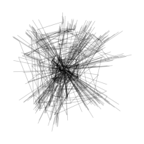


(a) Transition Graph (b) Backup Diagrams


Figure 1: (a) shows the transition graph Frostbite, an Atari game. (b) shows backup diagrams for
different backup targets. The blue squares represent the state-action pairs that have been observed,
orange squares are actions where target net evaluation happened, and circles are states


of additional structure, and a key insight of our work is to organise the trajectories stored in the buffer
as a graph (For example see Figure 1(a) which shows a visualisation of the transition graph of the
Atari game Frostbite). Our method, Graph Backup, then exploits this transition graph to provide a
novel backup operator for bootstrapped value estimation. When estimating the value of a state, it
will combine information from a subgraph rooted at the target state, including rewards and value
estimates for future states.


When the environment has Markovian transitions and crossovers between trajectories, the construction
of this data graph provides several benefits. As discussed in Section 4.2, our method exploits
intersecting trajectories to correctly propagate reward to more states, effectively by propagating
reward along an imagined trajectory. Further, while existing improvements to one-step backup (as
used in by Mnih et al. (2015)) such as multi-step backup (Moriarty and Miikkulainen, 1995; Hessel
et al., 2018; Sutton and Barto, 2018) address the problem of slow reward information propagation
(Hernandez-Garcia and Sutton, 2019), they add variance to the state value estimates as different states
can have different values estimates depending on the trajectory they were sampled from (Figure 2).
Our method addresses this issue through grouping states in the transition graph and averaging over
outgoing transitions at the value estimation stage.


We propose a specific implementation of Graph Backup, extending Tree Backup (Precup et al.,
2000) (Section 4, see Figure 1(b)). Our method improves data efficiency and final performance on
MiniGrid (Chevalier-Boisvert et al., 2018), Minatar (Young and Tian, 2019) and Atari100K when
using Graph Backup combined with DQN (Mnih et al., 2015) and Data-Efficient Rainbow (van
Hasselt et al., 2019) compared to other backup methods, showing that utilising the graph structure
of the trajectory data leads to improved performance in the data-efficient setting (Section 5). To
more fully understand where this gain in performance comes from, we further investigate the graph
sparsity of different environments in relation to the performance of Graph Backup, in part using a
novel method to visualise the full set of seen transitions and their graph structure (Section 6).


**2** **Related Work**


The idea of multi-step backup algorithms (e.g. TD( _λ_ ), _n_ -step TD) dates back to early work in
tabular reinforcement learning (Sutton, 1988; Sutton and Barto, 2018). Two approaches to multistep targets are _n_ -step methods and eligibility trace methods. The _n_ -step method is a natural
extension of using a one-step target that takes the rewards and value estimations of _n_ steps into future
into consideration. For example, the _n_ -step SARSA (Rummery and Niranjan, 1994; Sutton and
Barto, 2018) target for step _t_ is simply the sum of _n_ -step rewards and the value at timestep _t_ + _n_ :
_Rt_ +1 + _Rt_ +2 + _..._ + _Rt_ + _n−_ 1 + _V_ ( _St_ + _n_ ). Graph Backup is an extension of an _n_ -step backup target,
Tree Backup, which will be described in Section 3.


_Eligibility trace_ (Sutton, 1988) methods instead estimate the _λ_ -return, which is an infinite weighted
sum of _n_ -step returns. The advantage of the eligibility trace method is it can be computed in an
online manner without explicit storage of all the past experiences, while still computing accurate
target value estimates. However, in the context of off-policy RL, eligibility traces are not widely
applied because the use of a replay buffer means all past experiences are already stored. In addition,


2


eligibility traces are designed for the case with a linear function approximator, and it’s nontrivial
to apply them to neural networks. van Hasselt et al. (2021) proposed an extension of the eligibility
trace method called _expected eligibility traces_ . Similar to Graph Backup, this allows information
propagation across different episodes and thus enables counterfactual credit assignment. However,
similar to the original eligibility traces methods, it is a better fit for the linear and on-policy case,
whereas Graph Backup is designed for the non-linear and off-policy cases.


Since a learned model can be treated as a distilled replay buffer (van Hasselt et al., 2019), we can view
model-based reinforcement learning as related to our work. Recent examples include Schrittwieser
et al. (2020); Hessel et al. (2021); Farquhar et al. (2018); Hafner et al. (2021a); Kaiser et al. (2020a);
Ha and Schmidhuber (2018). These MCTS-based algorithms also share some similarities with Graph
Backup as they are also utilise tree-structured search algorithms. However, our work is aimed at
model-free RL, and so is separate from these works.


Several recent works have also utilised the graph structure of MDP transition data. Zhu et al. (2020)
propose the using the MDP graph as an associative memory to improve Episodic Reinforcement
Learning (ERL) methods. This allows counterfactual reward propagation and can improve data
efficiency. However, the usage of a data graph in this work is different from the usage in Graph
Backup: the graph is used for control and as an auxiliary loss, rather than for target value estimation.
Their associative memory graph also doesn’t handle stochastic transitions and the return for each
trajectory is only based on observed return (no bootstraping is used), unlike our work. Topological
Experience Replay (Anonymous, 2022, TER) uses the graph structure of the data in RL for better
replay buffer sampling. TER uses the graph structure to decide which states should be sampled from
the replay buffer during learning, by implementing a sampling mechanism that samples transitions
closer to the goal first. This work is orthogonal (and possibly complementary) to ours, as TER is
a replacement for uniform or prioritized sampling from a replay buffer while Graph Backup is a
replacement for one-step or multistep backup for value estimation.


**3** **Preliminaries: One-step and Multi-step Backup**


Given an MDP _M_ we denote _A_ as the action space; _S_ to be state space; _R ⊂_ R to be reward space;
and _at ∈A_, _st ∈S_ are used to denote the specific actions and states respectively observed at step _t_ .
We denote a trajectory of states, actions and rewards as _τ_ = ( _s_ 1 _, a_ 1 _, r_ 1 _, s_ 2 _, a_ 2 _, r_ 2 _, ..._ ).


For a transition ( _st, at, rt, st_ +1) the loss function of DQN methods is defined as the mean square
error [1] between the predicted _q_ -value and the backup target _G_ _[a][T]_ for ( _st, at_ ):


def
_L_ ( _**θ**_ _|st, at_ ) = ( _q_ _**θ**_ ( _st, at_ ) _−_ _G_ _[a][t]_ ) [2], (1)


where _q_ _**θ**_ represents the online network parameterized by _**θ**_ . The backup target _G_ _[a][T]_ is an estimation
of the optimal Q-value _q_ _[∗]_ ( _st, at_ ). Vanilla DQN uses one-step bootstrapped backup, which makes
gradient descent an analog to the update of tabular _Q_ -learning:


def
_G_ _[A]_ _t_ : _t_ _[t]_ +1 = _rt_ +1 + _γ_ max (2)
_a_ _[′][ q]_ _**[θ]**_ _[′]_ [(] _[s][t]_ [+1] _[, a][′]_ [)][.]


The one-step target makes the propagation of the reward information to previous states slow, which
is amplified by the use of a separate frozen target network. This motivates the use of more sample
efficient multi-step targets in DQN (Hessel et al., 2018; Hernandez-Garcia and Sutton, 2019).


A widely used multi-step backup algorithm is _n_ -step _Q_ -Learning ( _n_ -step- _Q_ ) (Hessel et al., 2018;
Silver et al., 2017). This method sums the rewards in next _n_ steps, together with the maximum _q_
value at step _n_ :


def
_G_ _[a]_ _t_ : _t_ + _n_ = _rt_ +1 + _γrt_ +2 + _..._ + _γ_ _[n]_ max (3)
_a_ _[′][ q]_ _**[θ]**_ _[′]_ [(] _[s][t]_ [+] _[n][, a][′]_ [)][.]


_n_ -step- _Q_ exploits the chain structure of the trajectories with little computational cost, but at a cost of
biased target estimation. The distribution of the sum of the rewards _rt_ +1 + _γrt_ +2 + _..._ + _γ_ _[n][−]_ [1] _rt_ + _n_
are conditioned on the behaviour policy _µ_ which generates the data. This means that in a off-policy
setting the estimated target value can be biased towards the value of the behaviour policy.


1Or sometimes the Huber Loss (Huber, 1992)


3


Another off-policy multi-step target is Tree Backup (Precup et al., 2000). Tree Backup is designed
for general purpose off-policy evaluation, meaning it aims to estimate the value of any target policy _π_
by observing the behaviour policy _µ_ . When the target policy is the optimal policy given by _q_ _**θ**_ _[′]_, Tree
Backup recursively applies one-step- _Q_ backup to the trajectory, bootstrapping with the target value
network when the input action _a_ isn’t that taken in the trajectory ( _at_ ):

_G_ _[a]_ _t_ : _t_ + _n_ def= _rt_ +1 + _γ_ max _a′ Gat_ +1: _′_ _t_ + _n_ _[,]_ if _t < n_, _a_ = _at_ (4)
� _q_ _**θ**_ _[′]_ ( _st, a_ ) _,_ otherwise.


Despite what it’s name suggests, Tree Backup does not expand a tree of states and transitions, and so
still only leverages the chain structure of trajectories. The name is because the trajectory has leaves
corresponding to the actions that were not selected in the current trajectory. In Figure 1(b) we show
the backup diagram of the 3-step Tree Backup, where yellow squares are these leaf actions.


**4** **Graph Backup**


In this section we introduce a new graph-structured backup operator, Graph Backup, extending
the multi-step method Tree Backup. Graph Backup allows counterfactual reward propagation and
variance reduction while also having the benefits of multi-step backup.


**4.1** **Introducing Graph Backup**


We propose the Graph Backup operator that propagates temporal differences across the whole data
graph rather than a single trajectory. The differences between one-step, multi-step, tree and Graph
backup are illustrated in Figure 1(b).


We want a backup method that can work with stochastic transitions, which means a single state-action
pair can lead to different states. This means it’s not obvious how to perform recursive backups to the
next state, as there could be multiple next states. We estimate the transition probability to each next
state using visitation counts, and to use the estimated transition probabilities to compute the empirical
mean over all possible state value estimates weighted by the likelihood of transitioning to that state.
This is easy to calculate efficiently and provides strong results as seen in Section 5.


Denoting the set of all seen transitions to be _T ⊆S × A × R × S_, a counter function _f_ : _T →_ N [+]
maps each transition _T_ = ( _s, a, r, s_ _[′]_ ) to its frequency _f_ ( _T_ ). The Graph Backup target for a stateaction pair ( _s, a_ ) is then the average of recursive one-step backup of all outgoing transitions. Similar
to Tree Backup, if the ( _s, a_ ) has not been seen, the target is estimated directly by the target network.
def ˆ
Define _Ts,a_ = _{_ (ˆ _s,_ ˆ _a,_ ˆ _r,_ ˆ _s_ _[′]_ ) _∈T |s_ = _s,_ ˆ _a_ = _a}_, the set of all (ˆ _s,_ ˆ _a,_ ˆ _r,_ ˆ _s_ ) tuples starting with _s, a_ .
Extending Tree Backup, we can then define the _Graph Backup_ (GB) value estimate as


_a_ _[′][ π]_ [(] _[a][′][|][s]_ [ˆ] _[′]_ [)] _[G][a]_ _s_ ˆ _[′][′]_ � if _c_ ( _s, a_ ) _>_ 0


def
_G_ _[a]_ _s_ =


_c_ ( _s,a_ 1 ) �
� _q_ _**θ**_ _[′]_ ( _s, a_ )


_c_ _s,a_ _s,a_ _a_ _s_ (5)

_q_ _**θ**_ _[′]_ ( _s, a_ )otherwise.


_T ∈Ts,a_ _[f]_ [(] _[T]_ [)] � _r_ ˆ + _γ_ [�]


where _c_ ( _s, a_ ) = [�] _T ∈Ts,a_ _[f]_ [(] _[T]_ [)][ is the normaliser,] _[ π]_ [ is the target policy and] _[ q]_ _**[θ]**_ _[′]_ [ is the tar-]

get network. In the case where target policy always chooses the action with optimal Q value
_π_ ( _a|s_ ) = 1 (argmax _a′ G_ _[a]_ _s_ _[′]_ [=] _[ a]_ [)][, the formula can be simplified into:]


def
_G_ _[a]_ _s_ =


1 ˆ
_c_ ( _s,a_ ) � _T ∈Ts,a_ _[f]_ [(] _[T]_ [)] � _r_ + _γ_ max _a′ G_ _[a]_ _s_ ˆ _[′][′]_ � if _c_ ( _s, a_ ) _>_ 0 (6)
� _q_ _**θ**_ _[′]_ ( _s, a_ ) otherwise.


This is often the case since our implementations are based on DQN and we are interested in the
optimal Q-value. In this paper _Graph Backup_ refers to the simplified version in Equation (6).


Our Graph Backup implementation extends Tree Backup. However, there could be other implementations which extend other multi-step method, such as _n_ -step- _Q_ backup or the _n_ -step version (Hernandez-Garcia and Sutton, 2019) of Retrace (Munos et al., 2016). In Appendix J, we present
a variation of Graph Backup that extends _n_ -step- _Q_ backup.


Note that in Equations (6), (7) and (8), the graph structure does not appear explicitly. This is because
it’s easier to mathematically formalise these backup operators using transition counts; from an


4


implementation perspective building and maintaining the data graph is the most efficient way of
calculating these target value estimates. To better provide intuition for Graph Backup, in Appendix D
we explicitly describe the data graph generated from an MDP and link that to Equation (6). The data
graph contains the information for calculating and sampling from _T_, _Ts_, _Ts,a_, _c_ ( _s, a_ ), _c_ ( _s_ ) and _f_ ( _T_ ).


**4.2** **Advantages of Graph Backup**


In Figure 2 we show how Graph Backup brings benefits to value estimation and thus the learning of
the agent. Assuming the value estimation of all the states are initialised as 0, the one-step backup can
update the value of only 1 state. The multi-step backup methods can further propagate the reward to
the whole trajectory that leads to the reaching of the goal. [2] However, Graph Backup goes beyond
that and propagates rewards to the states of another trajectory (the dashed line). This feature of
counterfactual reward propagation can significantly benefit the credit assignment of sparse reward
tasks: During the exploration of a sparse-reward environment, policies usually generate a large
number of trajectories that do not reach the goal, and while multi-step methods cannot efficiently
leverage those transitions, Graph Backup can reuse them by propagating rewards from the crossovers
with other successful trajectories.


The second row of Figure 2 shows another advantage of Graph Backup: reducing the variance of
the value estimate. Multi-step backup in this case will assign different value estimations for the
same state depending on the trajectory the state is sampled from (as it will appear multiple times
in the replay buffer). This brings extra noise to the value estimate that can be harmful to learning.
In the Figure 2, the noise comes from different rewards in different trajectories. When combined
with function approximation and SGD, such noise can also be generated by generalisation error and
the stochastic optimization process. In Section 6, we showed a simple case in MiniGrid where this
target value noise can constantly disturb the convergence of DQN. On the other hand, Graph Backup
effectively avoids the extra variance by averaging the trajectories branching from the same state-action
pair. If we consider the case of value estimation of an arbitrary policy (e.g. in Equation (5)), Graph
Backup also reduces the variance caused by the stochastic policy.


Figure 2: Benefits of Graph Backup


**4.3** **Limiting Expansion of the Graph**


A na¨ıve implementation of Graph Backup would follow the definition exactly and do an exhaustive
recursive expansion of the graph. However, the computational cost of doing so can quickly blow
up with the size of the replay data. [3] Therefore, similar to the _n_ -step backup methods, we need to
limit recursive calls. For Graph Backup, this means expanding a smaller local graph from the source
state, using the target network for value estimation when reaching expansion limits. In our work, the


2
In this case, both Tree Backup and _n_ -step- _Q_ backup can produce the estimation shown in the example tasks.
3In fact, if there are loops in the graph, the situation can be even worse as the algorithm may never converge.


5


expansion of the local data graph has both a breadth limit _b_ and a depth limit _d_ . When the breadth
limit is hit ( _|Ts,a| > b_ ), we will sample _b_ transitions from _Ts,a_ according to their frequency _f_, as
opposed to expanding all transitions. If the depth limit is hit ( _d < n_ ) the expansion of the graph will
be terminated (so the second case in Equations (6) and (7) is taken).


The pseudocode for local graph expansion is shown in Algorithm 1. Figure 1(b) also illustrates
examples of limited expansion for Graph Backup, where faded nodes are clipped away due to hitting
the limit. Notably, in our implementation the breadth limit a is bound on the number of transitions,
not the number of states. This is relevant when two actions lead to the same next state, which would
count as two transitions rather than one.


In general, the exact approach to expanding the local graph can inject inductive biases that will affect
the data efficiency and the computational costs. In our work, we make sure the expansion will reach
_d_ steps in order to better align with multi-step methods. This makes sure the algorithm will reduce to
Tree Backup gracefully when there are no crossovers between the trajectories. It also allows a more
principled comparison between Tree Backup and Graph Backup. For _b_ = 1 Graph Backup will do a
_d_ -step Tree Backup with trajectories sampled from the transition graph rather than real trajectories,
and increasing _b_ will gradually make the Graph Backup leverage more structure from the transition
graph.


**4.4** **Integration of Other Rainbow Components**


To demonstrate that Graph Backup improves data efficiency in a realistic state-of-the-art algorithm,
we integrate Graph Backup inside Rainbow (Hessel et al., 2018). As a replacement for _n_ -step- _Q_
backup, Graph Backup is orthogonal to all other ingredients. While some components such as
prioritized experience replay(PER) (Schaul et al., 2016), noisy networks (Fortunato et al., 2018) and
duelling network architectures (Wang et al., 2016) can be plugged in seamlessly, others require more
care, which we describe here.


Combining double DQN (van Hasselt et al., 2016) with Tree Backup and Graph Backup is quite
straightforward. Double DQN uses an online network instead of target network to specify the
optimal policy in the bellman update, so that max _a q_ _**θ**_ _[′]_ ( _s, a_ ) = _q_ _**θ**_ _[′]_ ( _s,_ argmax _a q_ _**θ**_ _[′]_ ( _s, a_ )) becomes
_q_ _**θ**_ _[′]_ ( _s,_ argmax _a q_ _**θ**_ ( _s, a_ )) in one-step or _n_ -Step-Q backup. For Tree Backup and Graph Backup, we
can take the same approach for every expanded state.


Distributional RL (Bellemare et al., 2017), specifically C51, attempts to model the whole distribution
of the state-action value rather than the expectation, using a distributional version of the bellman
update (namely, one-step backup) when applied in the DQN setting. C51 divides the support of the
value into discrete bins, called atoms, and the q network then outputs categorical probabilities over
the atoms. In the distributional bellman update, the vanilla bellman update is applied to each atom,
and the probability of the atom is distributed to the immediate neighbours of the target value. The loss
is the KL divergence between target and predicted value distribution rather than mean squared error.
In order to combine C51 and Tree Backup or Graph Backup, we apply the distributional bellman
update in every state node.


In Algorithm 2, we combine double and distributional RL with Graph Backup given the subgraph
state list calculated by Algorithm 1. Blue lines show the changes introduced by Graph Backup.


**4.5** **Assumptions**


The effectiveness of Graph Backup relies on two assumptions about the environment: (1) the transition
function of the environment is Markovian, and (2) there are crossovers between state trajectories. We
show in Section 5 that—perhaps counter-intuitively—these assumptions hold frequently enough in
high dimensional environments (Atari100 from pixel input) for Graph Backup to differentiate itself
from Tree Backup in a statistically significant manner. As such, these restrictions are not as strict as
may appear, and we further discuss how they can be relaxed in Section 7.1.


**5** **Experiments**


In order to test whether Graph Backup can bring benefits to the data efficiency of a DRL agent,
we conduct experiments on singleton-MiniGrid, MinAtar and Atari100K. These tasks have an


6


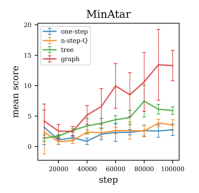


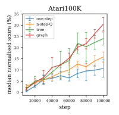

Figure 3: Summary of training curve for Minigrid, Minatar and Atari100K. Each curve is the
average/median of all the tasks within a task group. For Atari A100K, we show both the mean and
median of the human-normalised scores.


increasingly sparse transition graph so that we can see how many crossovers are needed for Graph
Backup to bring significant performance improvements. The baseline agent for MiniGrid and MinAtar
is DQN (Mnih et al., 2015) and for Atari100K is Data-Efficient Rainbow (van Hasselt et al., 2019).
The average training curves of the different backup methods are shown in Figure 3, where we run
each algorithm for 5 random seeds. The performance metric for Atari in the plot is the mean and
median of human-normalised scores (%). The final performance for each task and method can be
found in Table 1, where we also include both mean and median metrics. The full results of each
individual tasks are shown in Table 2 in Appendix.


**MiniGrid** We first compare the
methods in 5 singleton MiniGrid Table 1: Numeric summary of the performance
tasks: Empty8x8, DoorKey6x6,
KeyCorridorS3R1, SimpleCross- one-step _n_ -step- _Q_ tree graph
ingS9N2 and LavaCrossingS9N2.

MiniGrid-mean 0.14 0.02 0.2 **0.58**

Every single run (out of 5) has a MiniGrid-median 0.0 0.0 0.0 **0.58**
different but fixed random seed
within the whole training process. MinAtar-mean 3.07 3.76 6.26 **11.83**
We set the environment to be fully MinAtar-median 2.07 1.56 3.33 **4.95**
observable so that the transitions Atari100K-mean 32.8 28.72 43.62 **50.49**
are Markovian. The overall num- Atari100K-median 13.39 16.89 23.74 **30.07**
ber of possible states is small and
the data graph is thus quite dense.
The reward of MiniGrid is only
given at the end of the episode, which makes credit assignment a critical problem. Among the 5 tasks,
one-step backup and Tree Backup only managed to converge within 1e5 steps for the easiest empty
room task. For other tasks with more complex navigation (SimpleCrossing and LavaCrossing) and
interaction with objects (DoorKey and KeyCorridor), only the Graph Backup converged this low data
regime.


Table 1: Numeric summary of the performance


one-step _n_ -step- _Q_ tree graph


MiniGrid-mean 0.14 0.02 0.2 **0.58**

MiniGrid-median 0.0 0.0 0.0 **0.58**


MinAtar-mean 3.07 3.76 6.26 **11.83**

MinAtar-median 2.07 1.56 3.33 **4.95**


Atari100K-mean 32.8 28.72 43.62 **50.49**

Atari100K-median 13.39 16.89 23.74 **30.07**


**Minatar** We perform experiments on Minatar. Minatar is a collection of miniature Atari games
with a symbolic representation of the objects. The game state is fully specified by the observation of a
10 by 10 image, where each pixel corresponds to an object. We set the overall number of interactions
to be 100,000, inspired by the Atari100K benchmark (Kaiser et al., 2020a). We can see in Figure 3
that Graph Backup outperforms Tree Backup, _n_ -step- _Q_ backup and one-step backup in terms of mean
scores. Looking at individual tasks, we find out that most of the improvements of Graph Backup
comes from a single task, Freeway, which is a sparse reward task. This, together with the results of
MiniGrid, shows that the power of Graph Backup plays an important role in sparse reward problems,
potentially because of the counterfactual reward propagation.


**Atari100K** In order to test if Graph Backup can be applied on tasks with pixel observations, we
test it in Atari100K. As suggested by its name, Atari100K limits the number of interactions of
Atari games to be 100,000, which is equivalent to 2 hours of game-play in Atari. Since the human
performance scores reported by Mnih et al. (2015) are also from human experts after 2 hours of
game-play, Atari100K is considered as a test-bed for human-level data-efficient learning. We follow
the standard frame processing protocol used by Rainbow Hessel et al. (2018) without any other


7


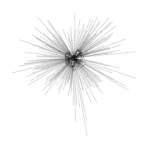


(a) Alien (b) Freeway (c) Asterix (d) RoadRunner


Figure 4: Transition graphs of selected Atari100K games, with data collected by a one-step DQN
agent. As there are too many state nodes, we did not paint nodes directly but rather preserves edges
(transitions), where circles represent self-loop transitions.


downsampling. The frame is processed into an 84 by 84 greyscale image and the observation is a
stack of 4 previous frames, which leads to very sparse transition graphs. [4] The baseline we chose for
Atari100K is data-efficient Rainbow van Hasselt et al. (2019), which is a variation of Rainbow that is
optimized particularly for Atari100K. Consistent with the results in MiniGrid and MinAtar, Graph
Backup performs better than one-step and multi-step methods. The results here show: 1) Graph
Backup is robust in terms of bringing orthogonal improvements over other DQN improvements. 2)
Graph Backup works for high-dimensional, pixel-based tasks that have sparse transition graphs.


**6** **Analysis**


**Atari Transition Graphs.** Here we study why Graph Backup can bring benefits to Atari games.
Atari games have pixel-based observations, which have 255 [(210] _[∗]_ [180] _[∗]_ [3)] combinations if each pixel
can take any value independently with other pixels. The first question is then: are there crossovers in
just 100K transitions? To analyse the graph density quantitatively, we propose to measure the novel
state ratio. The novel state ratio is the ratio between the amount of non-duplicated (i.e. unique) states
and the amount of all states that the agent has seen. The novel state ratio will be 1 if there are no
overlapping states in the transition graph, in which case Graph Backup reduces to Tree Backup. The
average novel state ratio of Atari is 0.927, which means the graphs are usually quite sparse (The
average novel state ratios of MiniGrid/MinAtar are 0.006/0.298 respectively). However, if we assume
that duplicated states happen independently, this means that in 53% of the backup updates, there
will be a crossover on the next 10 steps, which means the Graph Backup will give a different value
estimate to multi-step methods more than half the time.


However, the crossovers are not distributed uniformly on the transitions graph. In order to investigate
the topology of the graph, we visualize the exact graph structure of the whole transition graph.
In Figure 4, we show four representative transition graphs and leave the others to Figure 7 in the
Appendix. We apply _radial layouts_ as proposed by Wills (1999), which scales well with the number
of nodes and aligns well with the transition structure of most of the games, where the central point
corresponds to the start of the game. Many transition graphs of Atari100k games show interesting
crossover structures that can be leveraged by Graph Backup. For example, the transition graph of
_Freeway_ forms a windmill-like pattern, where each blade corresponds to a group of trajectories that
have connections within the group but between groups. There are also some tasks (e.g. Alien) where
crossovers mostly happen in the starting stage of the game.


**Explaining Crossovers.** By comparing the transition graphs and the pixel observations, we can
provide two explanations for the existence of the trajectory crossovers in Atari games. The first factor
is that there is a low number of degrees of freedom for the objects and especially for the agent avatar
in many of these games. For most of the Atari games, the agent can only move on a 2D plane, which
partially alleviate the curse of dimensionality since we only need two dimensions of specify the
position of the agent. Imagine a large minigrid empty room task: It is difficult for a agent to sweep
through the whole state space, but the crossovers can easily happen. While there are other objects


4Since the agent interacts with the environment every 4 frames, such preprocessing still assumes the transition
to be Markovian.


8


moving on the screen, these are usually moving in fixed patterns which sometimes only provide one
more degree of freedom: time. The agent can also interact with other objects in the game field, for
example launch a projectile, allowing more branching of the transition graph. However, the learned
policy will reduce the branching factor as the parameterised optimal policy is deterministic in the Q
learning setup. A second important factor is that Atari games always has a fixed intial state. Although
we follow prior work (Hessel et al., 2018) to add random number of no-ops after the start of the game,
the initial observations the agent sees will still be quite similar, and this creates crossovers at the
beginning of the episode (the centre of the plot, for example for Alien in Figure 4).


In light of these characteristics, we recommend practitioners apply Graph Backup to tasks that
either (1) have few degrees of freedom, (2) have a discrete state space, or (3) are highly repetitive
with minimal noise. There are many real world tasks that have similar properties, such as any 2D
navigation (e.g. household cleaning robots), power management and manufacturing in assembly
lines.


**7** **Conclusion**


In this work, we motivate the introduction of a novel bootstrapped value estimation operator, Graph
Backup. This backup method utilises the graph-structured nature of MDP transition data to enable
counterfactual credit assignment and variance reduction. We demonstrate Graph Backup surpasses
multi-step and one-step backup in MiniGrid, Minatar and Atari100K tasks.


**7.1** **Limitations and Future Extensions**


The high level insight of Graph Backup is to treat all the transition data as a collective entity rather
than independent trajectories, and exploit its (graphical) structure for sake of efficient learning. This
work shows a simple implementation of this idea, by building the graph with exact state matching.
While there are already a large class of tasks have crossovers, we expect in future to extend Graph
Backup to cover even more challenging tasks. For example, with a learned or human-crafted discrete
representation of the true state, Graph Backup might be able to tackle continuous control or tasks
with partial observability. Learning a discrete representation from data has been studied in the wider
deep learning community (van den Oord et al., 2017; Hu et al., 2017). In the RL context, Hafner et al.
(2021b) and Kaiser et al. (2020b) use a discrete representation of the observation in their world model.
Some exploration methods also require a soft matching of states (Tang et al., 2017; Bellemare et al.,
2016; Ecoffet et al., 2021; Badia et al., 2020). Another way to increase the density of the graph is to
create imaginary links on top of the raw graph, related to link prediction problem in knowledge graph
literature. Similar approaches can potentially be applied for Graph Backup to create more crossovers,
and we look forward to exploring this space. We also only utilise the transition graph for improving
backup, and it’s likely (as discussed in Section 2 that there are other complementary approaches that
utilise the transition graph in other ways that could be combined with Graph Backup in future work.


**Acknowledgements** The work is supported by Amazon Alexa. We thank to Yicheng Luo and
members of UCL DARK for insightful discussion.


**References**


Anonymous (2022). Topological experience replay. In _Hong, Zhang-Wei and Chen, Tao and Lin,_
_Yen-Chen and Pajarinen, Joni and Agrawal, Pulkit_ . under review.


Badia, A. P., Sprechmann, P., Vitvitskyi, A., Guo, Z. D., Piot, B., Kapturowski, S., Tieleman, O.,
Arjovsky, M., Pritzel, A., Bolt, A., and Blundell, C. (2020). Never give up: Learning directed
exploration strategies. In _8th International Conference on Learning Representations, ICLR 2020,_
_Addis Ababa, Ethiopia, April 26-30, 2020_ . OpenReview.net.


Bellemare, M. G., Dabney, W., and Munos, R. (2017). A distributional perspective on reinforcement
learning. In Precup, D. and Teh, Y. W., editors, _Proceedings of the 34th International Conference_
_on Machine Learning, ICML 2017, Sydney, NSW, Australia, 6-11 August 2017_, volume 70 of
_Proceedings of Machine Learning Research_, pages 449–458. PMLR.


9


Bellemare, M. G., Srinivasan, S., Ostrovski, G., Schaul, T., Saxton, D., and Munos, R. (2016).
Unifying count-based exploration and intrinsic motivation. In Lee, D. D., Sugiyama, M., von
Luxburg, U., Guyon, I., and Garnett, R., editors, _Advances in Neural Information Processing_
_Systems 29: Annual Conference on Neural Information Processing Systems 2016, December 5-10,_
_2016, Barcelona, Spain_, pages 1471–1479.


Berner, C., Brockman, G., Chan, B., Cheung, V., Debiak, P., Dennison, C., Farhi, D., Fischer,
Q., Hashme, S., Hesse, C., Jozefowicz, R., Gray, S., Olsson, C., Pachocki, J., Petrov, M.,´
de Oliveira Pinto, H. P., Raiman, J., Salimans, T., Schlatter, J., Schneider, J., Sidor, S., Sutskever,
I., Tang, J., Wolski, F., and Zhang, S. (2019). Dota 2 with large scale deep reinforcement learning.
_CoRR_, abs/1912.06680.


Chevalier-Boisvert, M., Willems, L., and Pal, S. (2018). Minimalistic gridworld environment for
openai gym. `[https://github.com/maximecb/gym-minigrid](https://github.com/maximecb/gym-minigrid)` .


Ecoffet, A., Huizinga, J., Lehman, J., Stanley, K. O., and Clune, J. (2021). First return, then explore.
_Nature_, 590(7847):580–586.


Farquhar, G., Rocktaschel, T., Igl, M., and Whiteson, S. (2018). Treeqn and atreec: Differentiable tree-¨
structured models for deep reinforcement learning. In _6th International Conference on Learning_
_Representations, ICLR 2018, Vancouver, BC, Canada, April 30 - May 3, 2018, Conference Track_
_Proceedings_ . OpenReview.net.


Fortunato, M., Azar, M. G., Piot, B., Menick, J., Hessel, M., Osband, I., Graves, A., Mnih, V., Munos,
R., Hassabis, D., Pietquin, O., Blundell, C., and Legg, S. (2018). Noisy networks for exploration.
In _6th International Conference on Learning Representations, ICLR 2018, Vancouver, BC, Canada,_
_April 30 - May 3, 2018, Conference Track Proceedings_ . OpenReview.net.


Ha, D. and Schmidhuber, J. (2018). Recurrent world models facilitate policy evolution. In Bengio,
S., Wallach, H. M., Larochelle, H., Grauman, K., Cesa-Bianchi, N., and Garnett, R., editors,
_Advances in Neural Information Processing Systems 31: Annual Conference on Neural Information_
_Processing Systems 2018, NeurIPS 2018, December 3-8, 2018, Montreal, Canada´_, pages 2455–
2467.


Hafner, D., Lillicrap, T. P., Norouzi, M., and Ba, J. (2021a). Mastering atari with discrete world
models. In _9th International Conference on Learning Representations, ICLR 2021, Virtual Event,_
_Austria, May 3-7, 2021_ . OpenReview.net.


Hafner, D., Lillicrap, T. P., Norouzi, M., and Ba, J. (2021b). Mastering atari with discrete world
models. In _9th International Conference on Learning Representations, ICLR 2021, Virtual Event,_
_Austria, May 3-7, 2021_ . OpenReview.net.


Hernandez-Garcia, J. F. and Sutton, R. S. (2019). Understanding multi-step deep reinforcement
learning: A systematic study of the DQN target. _CoRR_, abs/1901.07510.


Hessel, M., Danihelka, I., Viola, F., Guez, A., Schmitt, S., Sifre, L., Weber, T., Silver, D., and van
Hasselt, H. (2021). Muesli: Combining improvements in policy optimization. _arXiv preprint_
_arXiv:2104.06159_ .


Hessel, M., Modayil, J., van Hasselt, H., Schaul, T., Ostrovski, G., Dabney, W., Horgan, D., Piot, B.,
Azar, M. G., and Silver, D. (2018). Rainbow: Combining improvements in deep reinforcement
learning. In McIlraith, S. A. and Weinberger, K. Q., editors, _Proceedings of the Thirty-Second_
_AAAI Conference on Artificial Intelligence, (AAAI-18), the 30th innovative Applications of Artifi-_
_cial Intelligence (IAAI-18), and the 8th AAAI Symposium on Educational Advances in Artificial_
_Intelligence (EAAI-18), New Orleans, Louisiana, USA, February 2-7, 2018_, pages 3215–3222.
AAAI Press.


Hu, W., Miyato, T., Tokui, S., Matsumoto, E., and Sugiyama, M. (2017). Learning discrete representations via information maximizing self-augmented training. In Precup, D. and Teh, Y. W., editors,
_Proceedings of the 34th International Conference on Machine Learning, ICML 2017, Sydney, NSW,_
_Australia, 6-11 August 2017_, volume 70 of _Proceedings of Machine Learning Research_, pages
1558–1567. PMLR.


10


Huber, P. J. (1992). Robust estimation of a location parameter. In _Breakthroughs in statistics_, pages
492–518. Springer.


Kaiser, L., Babaeizadeh, M., Milos, P., Osinski, B., Campbell, R. H., Czechowski, K., Erhan, D.,
Finn, C., Kozakowski, P., Levine, S., Mohiuddin, A., Sepassi, R., Tucker, G., and Michalewski,
H. (2020a). Model based reinforcement learning for atari. In _8th International Conference on_
_Learning Representations, ICLR 2020, Addis Ababa, Ethiopia, April 26-30, 2020_ . OpenReview.net.


Kaiser, L., Babaeizadeh, M., Milos, P., Osinski, B., Campbell, R. H., Czechowski, K., Erhan, D.,
Finn, C., Kozakowski, P., Levine, S., Mohiuddin, A., Sepassi, R., Tucker, G., and Michalewski,
H. (2020b). Model based reinforcement learning for atari. In _8th International Conference on_
_Learning Representations, ICLR 2020, Addis Ababa, Ethiopia, April 26-30, 2020_ . OpenReview.net.


Mnih, V., Kavukcuoglu, K., Silver, D., Rusu, A. A., Veness, J., Bellemare, M. G., Graves, A.,
Riedmiller, M. A., Fidjeland, A., Ostrovski, G., Petersen, S., Beattie, C., Sadik, A., Antonoglou,
I., King, H., Kumaran, D., Wierstra, D., Legg, S., and Hassabis, D. (2015). Human-level control
through deep reinforcement learning. _Nat._, 518(7540):529–533.


Moriarty, D. E. and Miikkulainen, R. (1995). Efficient learning from delayed rewards through
symbiotic evolution. In Prieditis, A. and Russell, S. J., editors, _Machine Learning, Proceedings_
_of the Twelfth International Conference on Machine Learning, Tahoe City, California, USA, July_
_9-12, 1995_, pages 396–404. Morgan Kaufmann.


Munos, R., Stepleton, T., Harutyunyan, A., and Bellemare, M. G. (2016). Safe and efficient off-policy
reinforcement learning. In Lee, D. D., Sugiyama, M., von Luxburg, U., Guyon, I., and Garnett, R.,
editors, _Advances in Neural Information Processing Systems 29: Annual Conference on Neural_
_Information Processing Systems 2016, December 5-10, 2016, Barcelona, Spain_, pages 1046–1054.


Precup, D., Sutton, R. S., and Singh, S. P. (2000). Eligibility traces for off-policy policy evaluation. In
Langley, P., editor, _Proceedings of the Seventeenth International Conference on Machine Learning_
_(ICML 2000), Stanford University, Stanford, CA, USA, June 29 - July 2, 2000_, pages 759–766.
Morgan Kaufmann.


Rummery, G. A. and Niranjan, M. (1994). _On-line Q-learning using connectionist systems_, volume 37.
Citeseer.


Schaul, T., Quan, J., Antonoglou, I., and Silver, D. (2016). Prioritized experience replay. In Bengio,
Y. and LeCun, Y., editors, _4th International Conference on Learning Representations, ICLR 2016,_
_San Juan, Puerto Rico, May 2-4, 2016, Conference Track Proceedings_ .


Schrittwieser, J., Antonoglou, I., Hubert, T., Simonyan, K., Sifre, L., Schmitt, S., Guez, A., Lockhart,
E., Hassabis, D., Graepel, T., et al. (2020). Mastering atari, go, chess and shogi by planning with a
learned model. _Nature_, 588(7839):604–609.


Schwarzer, M., Anand, A., Goel, R., Hjelm, R. D., Courville, A. C., and Bachman, P. (2021).
Data-efficient reinforcement learning with self-predictive representations. In _9th International_
_Conference on Learning Representations, ICLR 2021, Virtual Event, Austria, May 3-7, 2021_ .
OpenReview.net.


Silver, D., Huang, A., Maddison, C. J., Guez, A., Sifre, L., van den Driessche, G., Schrittwieser, J.,
Antonoglou, I., Panneershelvam, V., Lanctot, M., Dieleman, S., Grewe, D., Nham, J., Kalchbrenner,
N., Sutskever, I., Lillicrap, T. P., Leach, M., Kavukcuoglu, K., Graepel, T., and Hassabis, D. (2016).
Mastering the game of go with deep neural networks and tree search. _Nat._, 529(7587):484–489.


Silver, D., Hubert, T., Schrittwieser, J., Antonoglou, I., Lai, M., Guez, A., Lanctot, M., Sifre, L.,
Kumaran, D., Graepel, T., et al. (2017). Mastering chess and shogi by self-play with a general
reinforcement learning algorithm. _arXiv preprint arXiv:1712.01815_ .


Sutton, R. S. (1988). Learning to predict by the methods of temporal differences. _Machine learning_,
3(1):9–44.


Sutton, R. S. and Barto, A. G. (2018). _Reinforcement Learning: An Introduction_ . A Bradford Book,
Cambridge, MA, USA.


11


Tang, H., Houthooft, R., Foote, D., Stooke, A., Chen, X., Duan, Y., Schulman, J., Turck, F. D.,
and Abbeel, P. (2017). #exploration: A study of count-based exploration for deep reinforcement
learning. In Guyon, I., von Luxburg, U., Bengio, S., Wallach, H. M., Fergus, R., Vishwanathan, S.
V. N., and Garnett, R., editors, _Advances in Neural Information Processing Systems 30: Annual_
_Conference on Neural Information Processing Systems 2017, December 4-9, 2017, Long Beach,_
_CA, USA_, pages 2753–2762.


Touati, A., Bacon, P., Precup, D., and Vincent, P. (2018). Convergent TREE BACKUP and RETRACE
with function approximation. In Dy, J. G. and Krause, A., editors, _Proceedings of the 35th_
_International Conference on Machine Learning, ICML 2018, Stockholmsmassan, Stockholm,¨_
_Sweden, July 10-15, 2018_, volume 80 of _Proceedings of Machine Learning Research_, pages
4962–4971. PMLR.


van den Oord, A., Vinyals, O., and Kavukcuoglu, K. (2017). Neural discrete representation learning.
In Guyon, I., von Luxburg, U., Bengio, S., Wallach, H. M., Fergus, R., Vishwanathan, S. V. N., and
Garnett, R., editors, _Advances in Neural Information Processing Systems 30: Annual Conference_
_on Neural Information Processing Systems 2017, December 4-9, 2017, Long Beach, CA, USA_,
pages 6306–6315.


van Hasselt, H., Guez, A., and Silver, D. (2016). Deep reinforcement learning with double q-learning.
In Schuurmans, D. and Wellman, M. P., editors, _Proceedings of the Thirtieth AAAI Conference on_
_Artificial Intelligence, February 12-17, 2016, Phoenix, Arizona, USA_, pages 2094–2100. AAAI
Press.


van Hasselt, H., Hessel, M., and Aslanides, J. (2019). When to use parametric models in reinforcement
learning? In Wallach, H. M., Larochelle, H., Beygelzimer, A., d’Alche-Buc, F., Fox, E. B., and´
Garnett, R., editors, _Advances in Neural Information Processing Systems 32: Annual Conference_
_on Neural Information Processing Systems 2019, NeurIPS 2019, December 8-14, 2019, Vancouver,_
_BC, Canada_, pages 14322–14333.


van Hasselt, H., Madjiheurem, S., Hessel, M., Silver, D., Barreto, A., and Borsa, D. (2021). Expected
eligibility traces. In _Thirty-Fifth AAAI Conference on Artificial Intelligence, AAAI 2021, Thirty-_
_Third Conference on Innovative Applications of Artificial Intelligence, IAAI 2021, The Eleventh_
_Symposium on Educational Advances in Artificial Intelligence, EAAI 2021, Virtual Event, February_
_2-9, 2021_, pages 9997–10005. AAAI Press.


Vinyals, O., Babuschkin, I., Czarnecki, W. M., Mathieu, M., Dudzik, A., Chung, J., Choi, D. H.,
Powell, R., Ewalds, T., Georgiev, P., Oh, J., Horgan, D., Kroiss, M., Danihelka, I., Huang, A., Sifre,
L., Cai, T., Agapiou, J. P., Jaderberg, M., Vezhnevets, A. S., Leblond, R., Pohlen, T., Dalibard, V.,
Budden, D., Sulsky, Y., Molloy, J., Paine, T. L., Gul¨ c¸ehre, C¸ ., Wang, Z., Pfaff, T., Wu, Y., Ring, R.,
Yogatama, D., Wunsch, D., McKinney, K., Smith, O., Schaul, T., Lillicrap, T. P., Kavukcuoglu, K.,¨
Hassabis, D., Apps, C., and Silver, D. (2019). Grandmaster level in starcraft II using multi-agent
reinforcement learning. _Nat._, 575(7782):350–354.


Wang, Z., Schaul, T., Hessel, M., van Hasselt, H., Lanctot, M., and de Freitas, N. (2016). Dueling
network architectures for deep reinforcement learning. In Balcan, M. and Weinberger, K. Q.,
editors, _Proceedings of the 33nd International Conference on Machine Learning, ICML 2016, New_
_York City, NY, USA, June 19-24, 2016_, volume 48 of _JMLR Workshop and Conference Proceedings_,
pages 1995–2003. JMLR.org.


Wills, G. J. (1999). Nicheworks—interactive visualization of very large graphs. _Journal of Computa-_
_tional and Graphical Statistics_, 8(2):190–212.


Young, K. and Tian, T. (2019). Minatar: An atari-inspired testbed for thorough and reproducible
reinforcement learning experiments. _arXiv preprint arXiv:1903.03176_ .


Zhu, G., Lin, Z., Yang, G., and Zhang, C. (2020). Episodic reinforcement learning with associative
memory. In _8th International Conference on Learning Representations, ICLR 2020, Addis Ababa,_
_Ethiopia, April 26-30, 2020_ . OpenReview.net.


12


**A** **Other Empirical Findings**


In general, the experiments in three different settings shows Graph Backup consistently brings
improvements over multi-step methods. Besides that, we also find that the improvements of _n_ -step- _Q_
backup over one-step backup are actually quite limited in the data-efficient setting, whereas Tree
Backup performs significantly better than _n_ -step- _Q_ backup. This can be explained by the off-policy
nature of Tree Backup, as it can bring the benefits of multi-step reward propagation without biasing
the value estimation. In data-efficient setting, the flaw of _n_ -step- _Q_ is amplified as the learning relies
more on historical rather than freshly sampled data. Interestingly, Tree Backup has not received a lot
of attention in DRL community. Hernandez-Garcia and Sutton (2019) tested Tree Backup in a toy
mountain car experiment which shows _n_ -step- _Q_ performs best among multiple multi-step methods,
including Tree Backup. (Touati et al., 2018) points out the instability of Tree Backup when combined
with functional approximation, both with theoretical analysis and empirically evaluation on some
constructed counter-example MDPs. However, our experiments on a larger scale and more diverse
set of tasks show Tree Backup has superior sample efficiency when combined with a modern DRL
method.


**B** **Pesudocode for Local Graph Expansion and Graph Backup with**
**Rainbow Ingredients**


**Algorithm 1** Local Graph Expansion


**Input:** source state _S_ source, source action _A_ source, depth limit _d_, breath limit _b_, frequency mapping
_f_ : _T →_ N [+]

1: Initialize the set containing states on the boundary of expansion _S_ new _←{S_ source _}_
2: Initialize the list of expanded state-action pairs _L_, denoting the largest element to be _l_ max
3: **for** _i_ = 0 to _d_ **do**
4: Find all transitions on boundary _T_ new _←{t|∀t_ = ( _s, a, r, s_ _[′]_ ) _∈T, s ∈S_ new _}_
5: Sample _b_ transitions from _T_ new with _p_ ( _t_ ) _∝_ _f_ ( _t_ ), getting _T_ pruned = _{t_ 1 _, t_ 2 _, ..., tb}_
6: Append state-action pairs to list _L_, _{l_ max+1 _, l_ max+2 _, ...}_ = _{_ ( _s, a_ ) _|∀_ ( _s, a, r, s_ _[′]_ ) _∈T_ pruned _}_
7: Update boundary states _S_ new = _{s_ _[′]_ _|∀_ ( _s, a, r, s_ _[′]_ ) _∈T_ pruned _}_
8: **end for**

9: **return** _L_


**Algorithm 2** Double Distributional Graph Backup


**Input:** source state _S_ source, source action _A_ source, frequency mapping _f_ : _T →_ N [+], list of states in
the subgraph _L_, atoms _z_ 0 _, z_ 1 _, ..., zN_ _−_ 1, online network _p_ ( _·, ·|_ _**θ**_ ) and target network _p_ ( _·, ·|_ _**θ**_ _[′]_ )
1: Set _S_ expanded be the set containing all the states in list _L_
2: Initialize the target values _G_ [¯] _[a]_ _s_ [=] _[ q]_ _**[θ]**_ _[′]_ [(] _[s, a]_ [)] _[,][ ∀][s][ ∈]_ _[S]_ [expanded] _[, a][ ∈A]_
3: **for** ( _s, a_ ) in _l_ max _, l_ max-1 _, ..., l_ 1 **do**
4: _a_ _[∗]_ = argmax _a_ � _i_ _[z][i][p][i]_ [(] _[s, a][|]_ _**[θ]**_ [)]

5: _mi_ ( _s, a_ ) = 0 _,_ _i ∈_ 0 _,_ 1 _, ..., N −_ 1
6: **for** _j ∈_ 0 _,_ 1 _, ..., N −_ 1 **do**
7: **for** _t_ = ( _s, a, r, s_ _[′]_ ) _∈Ts,a_ **do**
8: _zj_ _[′]_ _[←]_ [[] _[r]_ [ +] _[ γz][j]_ []] _[V]_ _V_ [MAX] MIN
9: _bj ←_ ( _zj_ _[′]_ _[−]_ _[V]_ [MIN][)] _[/]_ [∆] _[z]_
10: _l ←⌊bj⌋, u ←⌈bj⌉_

11: _ml_ ( _s, a_ ) _←_ _ml_ ( _s, a_ ) + _[f]_ [(] _[s]_ _c_ ( _[,][a]_ _s,a_ _[,][r][,]_ ) _[s][′]_ [)] _pj_ ( _xx_ +1 _, a_ _[∗]_ )( _u −_ _bj_ )

12: _mu_ ( _s, a_ ) _←_ _mu_ ( _s, a_ ) + _[f]_ [(] _[s]_ _c_ ( _[,][a]_ _s,a_ _[,][r][,]_ ) _[s][′]_ [)] _pj_ ( _xx_ +1 _, a_ _[∗]_ )( _bj −_ _l_ )

13: **end for**

14: **end for**

15: **end for**
16: **return** _m_ 0( _S_ source _, A_ source) _, ..., mN_ _−_ 1( _S_ source _, A_ source)


13


Figure 5: Mean and standard deviation of value estimate for the same state-action pairs for a fixed
dataset collected in MiniGrid Empty Room. The x-axis is the number of optimization steps.


**C** **Stable Value Estimate**


Graph backup can integrate information from a subgraph, yielding a more accurate and stable value
estimation. On the other hand, the nested max operators might lead to overestimation of the value.
Here we try to analyse the value estimation given by different backup operators.


We collect 5000 transitions with random walks in a MiniGrid 5x5 Empty Room environment, and
have the agents to learn the _q_ _[∗]_ from this static dataset. In Figure 5, we show the mean and standard
deviation of latest 10 estimates of the same state-action pairs. Both mean and standard deviation
are averaged over different state-action pairs. The value estimate of Graph Backup quickly stabilize
after a few hundred of optimization iterations as the mean value converged and standard deviation
reduce to near 0. However, all other backup methods keep giving varied estimate for the exactly same
states leading to a higher standard deviation and a fluctuating mean. Notably, the MiniGrid tasks are
deterministic so noise is not comes from In terms of over estimation, the graph backup do gives a
slightly higher estimate at first (the little bump in the curve), however, it quickly recover to a stable
value. Also, given other backup methods


**D** **Data Graph Definition**


A MDP data graph is a bipartite multi graph ( _S_ seen _, N_ _, E_ out _, E_ in), where _S_ seen _⊆S_ is the set of seen
state nodes, _N ⊆S_ seen _× A_ is the set of (state conditioned) action nodes, _E_ out is a multiset of edges
pointing from state nodes to action nodes and _E_ in is a multiset of reward weighted edges pointing
from action nodes to state nodes. A state node can point to multiple action nodes because multiple
actions might be tried, and the action nodes can point to multiple state nodes because of the stochastic
dynamics. When a new transition ( _s, a, r, s_ _[′]_ ) is observed, edge ( _s,_ ( _s, a_ )) will be added to _E_ in and
(( _s, a_ ) _, r, s_ _[′]_ ) will be added to _E_ out. A visual example of this data graph can be seen in the Graph
Backup diagram in Figure 1(b) with tried (blue) action nodes only.


Relating this data graph to Equation (6), we can see _c_ ( _s, a_ ) is the number of ( _s,_ ( _s, a_ )) edges in _E_ in
and _f_ (( _s, a, r, s_ _[′]_ )) is the number of (( _s, a_ ) _, r, s_ _[′]_ ) edges _E_ out.


**E** **Details about Experiment Setup**


The Graph Backup and multi-step backup both use a depth limit of 5 for MiniGrid and MinAtar, and
10 for Atari100K. The breath limit for GB-limited is 50 for MiniGrid, 20 for Minatar and 10 for
Atari100K.


For MiniGrid and MinAtar, all backup methods are based on the vanilla DQN. The q network has
2 convolutions layers and 2 dense layers, and we follow the hyper-parameters of Rainbow (Hessel


14


et al., 2018) with target network update frequency of 8000, _ϵ_ -greedy exploration with _ϵ_ = 0 _._ 02. The
learning rate is 0.001 for MiniGrid, 0.000065 for Minatar. The discounting factor is 0.95 for MiniGrid
and 0 _._ 99 for Minatar. The replay frequency is 1 for MiniGrid, and 4 for Minatar. Since we tested
the algorithm in a data-efficient setting, the size of the replay buffer is set to be equal to the overall
training steps.


As for Atari100K, our baselines and Graph Backup agents are based on Data-Efficient Rainbow (van
Hasselt et al., 2019) with the same hyper-parameters of Schwarzer et al. (2021).


**F** **Graph Sparsity**


Across different tasks, we can see a correlation between the density of the transition graph and
the improvement of Graph Backup. For MiniGrid tasks where the possible number of states are
limited, the Graph Backup brings much larger improvements, whereas for MinAtar and Atari, the
graph is sparse as there are multiple other objects besides the agent that can move in the game
world. To analyse the graph density qualitatively, we propose the metric of the novel state ratio.
The novel state ratio is the ratio between the number of non-duplicated states and the number of
all states that the agent have seen. The novel state ratio will be 1 if there are no overlapping states
in the transition graph, in which case Graph Backup reduces to Tree Backup. The average novel
state ratio of MiniGrid/MinAtar/Atari are 0.006/0.298/0.927 respectively. The the relative average
improvements of Graph Backup comparing to Tree Backup are 190%/89%/17% on these three group
of tasks. The graph density along, however, is not a reliable indicator to (linearly) predict how much
improvement the Graph Backup can bring to a specific task. Although we know the Graph Backup
will be the same as Tree Backup if the graph has no crossovers, more crossovers do not always
guarantee larger performance improvement. When we investigate the normalised performance [5] gain
and the novel state ratio for each individual task we tested, the correlation is -0.29. Other factors like
the structure of the graph and reward density or simply the performance upper bound can also affect
the performance gain. As mentioned in Section 4.2, Graph Backup seems to bring more benefits
in sparse reward tasks, which can be explained by its counterfactual reward propagation. And the
structure pattern of the graph, given the same amount of crossovers, can also play a role.


**G** **Graph Structure Visualisation**


In order to investigate the topology of the graph, we visualize the exact graph structure of the whole
transition graph. In Figure 4, we show four representative transition graphs and leave the others to
Figure 7 in the Appendix. We apply _radial layouts_ as proposed by Wills (1999), which scales well
with the number of nodes and aligns well with the transition structure of most of the games. Since
the common protocol for evaluating DRL agents in Atari games involves a random number of no-ops
before the agent takes over the game, the initial states can vary for different episodes. To adjust for
this, we create a hypothetical meta-initial state pointing to all initial states of a game. The meta-initial
state is then treated as the root of the whole graph, displayed in the centre of each plot.


A lot of transition graphs of Atari100K shows interesting crossover structures that can be leveraged
by Graph Backup. For example, the transition graph of _Freeway_ forms a windmill-like pattern, where
each blade corresponds to a group of trajectories that have connections within the group but between
groups. There are also some tasks (e.g. Alien) where crossovers only happen during the start of the
game. In such a case, the Graph Backup will not be helpful for most of the source states.


We also find some MinAtar and Atari games have self-loop states (e.g. Asterix), represented as circles
in the graph. After further investigations, we found the existence of self-loops are because some of
the state transitions in MinAtar and Atari will not make observation changes (such as periodically
moving objects). This actually violates the underlining assumptions of the Graph Backup that the
transitions must be Markovian, which can explain why Graph Backup is inferior to Tree Backup in
some of the Tasks. On the other hand, the fact Graph Backup still outperforms multi-step methods on
average suggests that Graph Backup is robust against minor violations of Markovian Assumption.


5The scores of MiniGrid are treated as normalised as it is. The scores of MinAtar are normalised by step
5-million-steps DQN performance reported by Young and Tian (2019)


15


Table 2: Full Results of all the Tasks. The agent for MiniGrid and MinAtar is based on DQN, and the
agent for Atari100K is based on Data-Efficient Rainbow. The default backup operator for rainbow
is _n_ -step- _Q_ . The values in the table for MiniGrid and Minatar are raw game scores and those for
Atari100K are human-normalised scores.


one-step _n_ -step- _Q_ tree graph


MiniGrid-LavaCrossingS9N2-v0 0.00±0.00 0.00±0.00 0.00±0.01 **0.38** ±0.47
MiniGrid-Empty-8x8-v0 0.69±0.35 0.11±0.07 **0.96** ±0.00 **0.96** ±0.00
MiniGrid-SimpleCrossingS9N2-v0 0.00±0.00 0.00±0.00 0.00±0.00 **0.21** ±0.38
MiniGrid-KeyCorridorS3R1-v0 0.00±0.00 0.00±0.00 0.00±0.00 **0.76** ±0.38
MiniGrid-DoorKey-6x6-v0 0.00±0.00 0.00±0.00 0.04±0.08 **0.58** ±0.47
mean 0.14 0.02 0.2 **0.58**

median 0.0 0.0 0.0 **0.58**


Minatar-seaquest 0.53±0.25 1.12±0.40 **2.68** ±0.87 1.77±0.64
Minatar-breakout 2.42±0.79 1.56±0.30 4.58±0.31 **4.95** ±1.01

Minatar-asterix 2.07±1.31 2.05±0.90 **3.33** ±1.28 2.21±1.19
Minatar-freeway 0.99±1.25 0.29±0.39 0.46±0.92 **30.28** ±9.66
Minatar-space ~~i~~ nvaders 9.32±1.27 13.78±4.33 **20.23** ±2.90 **19.93** ±3.65
mean 3.07 3.76 6.26 **11.83**

median 2.07 1.56 3.33 **4.95**


alien 5.58±0.26 **9.49** ±2.94 7.88±0.52 6.01±1.25

amidar 6.49±0.83 **8.46** ±2.47 5.06±0.00 5.77±2.09

assault 83.90±4.09 42.79±11.74 98.27±9.36 **102.50** ±9.57

asterix 4.74±0.70 3.24±1.32 **7.11** ±3.59 3.50±0.86

bank ~~h~~ eist 2.72±1.44 8.26±2.33 **63.31** ±42.88 38.13±45.45

battle ~~z~~ one 9.31±5.65 21.83±2.44 22.64±8.50 **29.51** ±10.33
boxing -98.42±90.36 -16.63±24.55 **77.19** ±79.83 53.14±100.80
breakout 48.73±22.41 30.53±6.13 57.30±9.62 **65.30** ±15.77
chopper command 8.52±2.57 9.50±2.80 6.36±4.76 **11.08** ±3.35
crazy ~~c~~ limber 101.27±61.26 34.85±10.15 **110.68** ±19.87 **113.45** ±38.87
demon attack 24.65±15.35 3.40±1.53 **24.84** ±8.95 **23.83** ±12.49
freeway 53.29±38.45 **61.25** ±50.04 35.81±50.64 **64.16** ±46.23
frostbite 3.84±0.69 4.56±0.31 4.31±0.16 4.40±0.26
gopher **18.48** ±12.46 7.40±2.54 **19.48** ±10.98 16.54±11.95
hero 17.08±15.55 22.54±2.64 **31.25** ±7.34 **30.63** ±2.74
jamesbond 75.72±56.84 53.47±15.43 **92.52** ±16.12 78.80±24.20
kangaroo 29.61±9.06 143.46±90.38 76.86±62.32 **141.14** ±84.68
krull 154.52±43.22 112.99±36.40 159.09±14.17 **174.77** ±38.13
kung ~~f~~ u ~~m~~ aster **93.31** ±43.26 28.07±10.75 62.37±10.50 **92.06** ±22.70
ms ~~p~~ acman 9.71±0.85 12.94±2.94 9.11±2.38 **14.60** ±2.49
pong 1.15±0.79 **70.69** ±31.52 11.10±15.43 27.00±5.43
private ~~e~~ ye 0.11±0.00 0.11±0.00 0.11±0.00 -0.05±0.00
qbert 3.97±1.32 8.75±6.65 13.41±6.38 **19.27** ±8.24
road ~~r~~ unner **167.53** ±141.98 42.90±21.94 116.12±115.66 **164.74** ±130.98
seaquest 1.51±0.27 0.96±0.25 1.14±0.41 1.06±0.42
up ~~n d~~ own 25.33±3.84 20.84±1.64 20.76±6.60 **31.45** ±2.96
mean 32.8 28.72 43.62 **50.49**

median 13.39 16.89 23.74 **30.07**


**H** **Full Experiment Results**


In Table 2, we show the results of each individual task and the mean/median of the average performance in each group of tasks.


16


Table 3: The unnormalised scores for Atari100K. Note that taking average of these scores will lead to
a evaluation metric highly weighted by games with higher score range.


one-step n-step-Q tree graph


alien 612.93±18.20 714.60±196.90 771.30±35.70 642.70±86.47

amidar 117.01±14.25 179.38±8.41 92.51±0.00 104.65±35.86

assault 658.32±21.27 422.47±37.33 733.00±48.62 754.98±49.70

asterix 603.33±58.02 497.25±18.25 799.67±297.90 500.67±71.16

bank ~~h~~ eist 34.27±10.61 79.50±6.20 482.00±316.83 295.97±335.86

battle ~~z~~ one 5603.33±1967.76 11800.00±0.00 10243.33±2959.80 12636.67±3597.49
boxing -11.71±10.84 0.00±0.00 9.36±9.58 6.48±12.10
breakout 15.73±6.45 10.60±0.00 18.20±2.77 20.51±4.54
chopper command 1371.67±168.81 1103.00±0.00 1229.33±313.07 1539.67±220.49
crazy ~~c~~ limber 36148.17±15345.90 22990.00±0.00 38503.67±4977.60 39198.67±9737.01
demon attack 600.42±279.20 182.00±26.40 603.90±162.70 585.48±227.10
freeway 15.78±11.38 14.96±14.96 10.60±14.99 18.99±13.69
frostbite 229.07±29.54 246.15±14.45 249.37±6.72 252.93±11.29
gopher 655.77±268.43 341.50±25.10 677.40±236.65 613.93±257.46
hero 6116.58±4635.28 7414.70±0.00 10340.43±2187.26 10154.15±817.26
jamesbond 236.33±155.64 140.75±15.75 282.33±44.13 244.75±66.25
kangaroo 935.33±270.26 1907.00±463.00 2344.67±1859.12 4262.33±2525.89
krull 3247.53±461.35 3004.35±29.75 3296.30±151.26 3463.70±407.06
kung ~~f~~ u ~~m~~ aster 21233.33±9723.05 9761.50±1777.50 14277.67±2360.11 20952.00±5102.14
ms ~~p~~ acman 952.40±56.62 1015.65±14.95 912.40±158.36 1277.30±165.45
pong -20.29±0.28 0.00±0.00 -16.78±5.45 -11.17±1.92
private ~~e~~ ye 100.00±0.00 0.00±0.00 100.00±0.00 -10.34±0.00
qbert 692.00±175.17 1176.75±0.00 1945.67±848.38 2724.75±1095.42
road ~~r~~ unner 13134.67±11122.16 4187.00±0.00 9108.00±9060.48 12916.67±10260.05
seaquest 703.13±113.31 529.20±0.00 596.27±156.14 514.53±175.51
up ~~n d~~ own 3360.67±428.04 3303.50±0.00 2849.73±736.59 4043.07±330.60
mean 3744.07 2731.61 3863.86 4527.08


**I** **All Transition Graphs**


In Table 2, we visualise all the transition graphs of Atari100K.


**J** **Mixed Graph Backup**


By extending the N-Step-Q backup with the graph structure, we can get another backup target, named
_mixed Graph Backup_ (GB-mixed). GB-mixed only applies the max operator on the boundary nodes
def ˆ
of the transition graph. Definebefore. The GB-mixed target for the state value is then: _Ts_ = _{_ (ˆ _s,_ ˆ _a,_ ˆ _r,_ ˆ _s_ _[′]_ ) _∈T |s_ = _s}_ and _c_ ( _s_ ) = [�] _T ∈Ts_ _[f]_ [(] _[T]_ [)][ similarly to]


_G_ ¯ _s_ =


_c_ (1 _s_ ) � _T ∈Ts_ _[f]_ [(] _[T]_ [) (ˆ] _[r]_ [ +] _[ γG][s]_ [ˆ] _[′]_ [)] if _c_ ( _s_ ) _>_ 0 (7)
�max _a q_ _**θ**_ _[′]_ ( _s, a_ ) otherwise


The GB-mixed target for the state-action value is then a frequency weighted average of the next state
target:


_G_ ¯ _[a]_ _s_ [=]


_c_ ( _s,a_ 1 ) � _T ∈Ts,a_ _[f]_ [(] _[T]_ [) (ˆ] _[r]_ [ +] _[ γG][s]_ [ˆ] _[′]_ [)] if _c_ ( _s, a_ ) _>_ 0 (8)
� _q_ _**θ**_ _[′]_ ( _s, a_ ) otherwise


Similar to N-Step-Q backup, GB-mixed is not a strictly off-policy backup operator. The value of
boundary states are estimated in an off-policy manner while the rewards of interior paths are on-policy,
hence the name _mixed_ Graph Backup. GB-mixed is a biased backup operator when evaluating the
target policy. However, it can also be less noisy than GB-nested since there the nested max operators
can propagate over-optimistic value estimation error from every step to the source state.


17


Table 4: Minatar results after 1M steps of training.


one-step n-step-Q tree graph


Minatar-seaquest 6.04±2.14 6.82±1.75 6.51±0.99 5.80±1.64
Minatar-breakout 9.83±1.70 9.28±2.94 6.56±2.18 15.03±1.50

Minatar-asterix 14.61±7.37 11.13±3.96 8.21±3.30 7.53±3.04
Minatar-freeway 39.82±26.25 5.50±5.98 19.55±27.74 39.63±26.24
Minatar-space ~~i~~ nvaders 35.43±6.87 24.58±2.86 35.83±6.10 42.68±6.32
mean 21.14 11.46 15.33 22.13

median 14.61 9.28 8.21 15.03


**K** **Graph Density of Atari100K**


We also explore the role of graph density in the same set of tasks. In Figure 6, we show the correlation
between relative performance and novel state ratio, where each point represents a task in Atari100K.
The relative performance is the human normalised score of GB-nested divided by that of tree backup.
It indicates how much benefits the agent can get from leveraging the graph structure. There is a
negative correlation of -0.22 between novel states ratio and relative performance. Although the
correlation is weaker than the case of cross-group comparison, the graph density can still affect the
effectiveness of Graph Backup.


Figure 6: Relative performance and novel state ratio


**L** **MinAtar 1M**


Table 4 shows the performance of different methods after 1M steps of training. Both one-step and
Graph Backup achieves the means scores close to the DQN asymptotic performance reported by
Young and Tian (2019). This shows that even with more training data, Graph Backup is able to
converge to the same level of performance as one-step backup. Surprisingly, though, the _n_ -step- _Q_
backup and Tree Backup both perform worse than one-step backup with more data. This can be
explained by the innate problems of _n_ -step- _Q_ and nested max operators. Strictly speaking, _n_ -step- _Q_
is not an off-policy backup operator because it always uses online reward sequences for the estimation
of its value, which can counter its advantages in longer reward propagation. This can be especially
true for Minatar because its framerate is much lower than vanilla Atari and longer reward propagation
may not be as important. For Tree Backup and Graph Backup, the nested max operator may cause
an overestimation of values. We leave methods that address this problem for future work. With
the over-estimation dealt with properly, Graph Backup may show even stronger performance in an
asymptotic setting.


18


(a) Alien (b) Amidar


(c) Assault (d) Asterix


(e) Bank Heist (f) Battle Zone


19


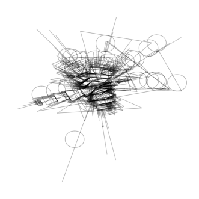


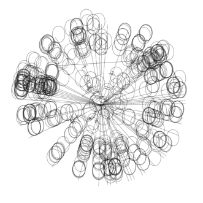

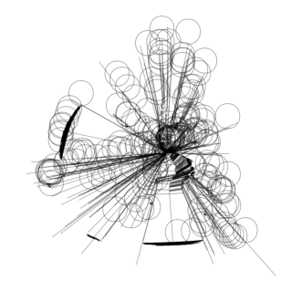

(g) Boxing (h) Breakout


(i) Chopper Command (j) Crazy Climber


(k) Demon Attack (l) Freeway


20


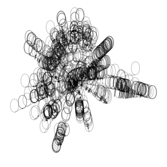


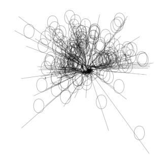

(m) Frostbite (n) Gopher


(o) Hero (p) Jamesbond


(q) Kangaroo (r) Krull


21


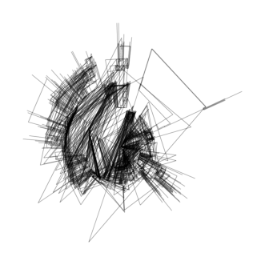

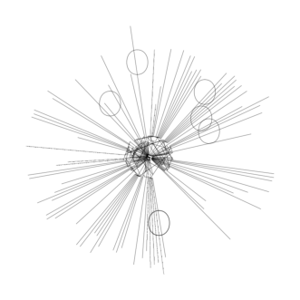


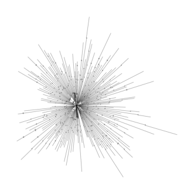

(s) Kung Fu Master (t) Ms Pacman


(u) Pong (v) Private Eye


(w) Qbert (x) Road Runner


22


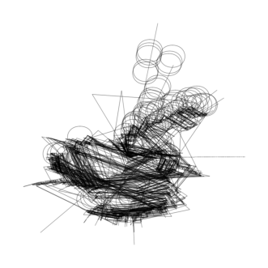

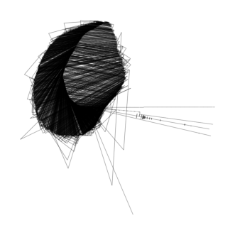


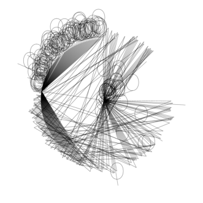


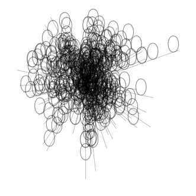

(y) Seaquest (z) Up N Down


Figure 7: All Transition Graphs of Atari100K


23


