Journal of Machine Learning Research 25 (2024) 1-53 Submitted 1/24; Revised -/-; Published -/
### **Goal-Space Planning with Subgoal Models**

**Chunlok Lo** _[∗]_ chunlok@ualberta.ca

**Kevin Roice** _[∗]_ roice@ualberta.ca

**Parham Mohammad Panahi** _[∗]_ parham1@ualberta.ca

**Scott Jordan** sjordan@ualberta.ca

**Adam White** _[†]_ amw8@ualberta.ca

**G´abor Mihucz** mihucz@ualberta.ca

**Farzane Aminmansour** aminmans@ualberta.ca

**Martha White** _[†]_ whitem@ualberta.ca

_Department of Computing Science_
_University of Alberta_
_Alberta Machine Intelligence Institute (Amii)_
_Canada CIFAR AI Chair_ _[†]_

_Edmonton, Canada_

**Editor:** My editor

**Abstract**

This paper investigates a new approach to model-based reinforcement learning using background planning: mixing (approximate) dynamic programming updates and model-free
updates, similar to the Dyna architecture. Background planning with learned models is
often worse than model-free alternatives, such as Double DQN, even though the former
uses significantly more memory and computation. The fundamental problem is that learned
models can be inaccurate and often generate invalid states, especially when iterated many
steps. In this paper, we avoid this limitation by constraining background planning to a set
of (abstract) subgoals and learning only local, subgoal-conditioned models. This goal-space
planning (GSP) approach is more computationally efficient, naturally incorporates temporal
abstraction for faster long-horizon planning and avoids learning the transition dynamics
entirely. We show that our GSP algorithm can propagate value from an abstract space in a
manner that helps a variety of base learners learn significantly faster in different domains.
**Keywords:** Model-Based Reinforcement Learning, Temporal Abstraction, Planning,
Reward Shaping, Value Propagation

**1. Introduction**

Planning with learned models in reinforcement learning (RL) is important for sample efficiency. Planning provides a mechanism for the agent to generate hypothetical experience, in
the background during interaction, to improve value estimates. This hypothetical experience
provides a stand-in for the real-world; the agent can generate many experiences (transitions)

∗. Equal contribution

©2024 Lo, Roice, Panahi, Jordan, White, Mihucz, Aminmansour and White.

License: CC-BY 4.0, see `[https://creativecommons.org/licenses/by/4.0/](https://creativecommons.org/licenses/by/4.0/)` . Attribution requirements are provided at
`[http://jmlr.org/papers/v25/21-0000.html](http://jmlr.org/papers/v25/21-0000.html)` .

Lo, Roice, Panahi, Jordan, White, Mihucz, Aminmansour and White

in it’s head (via a model) and learn from those experiences. Dyna (Sutton, 1991) is a classic
example of _background planning_ . On each step, the agent generates several transitions
according to its model, and updates with those transitions as if they were real experience.
Background planning can be used to both adapt to the non-stationarity and exploit things
that remain constant. In many interesting environments, like the real-world or multi-agent
games, the agent will be under-parameterized and thus cannot learn or even represent a
stationary optimal policy. The agent can overcome this limitation, however, by using a
model to rapidly update its policy. Continually updating the model and replanning allows
the agent to adapt to the current situation. In addition, many aspects of the environment
remain stationary (e.g., fire hurts and objects fall). The model can capture these stationary
facts about how the world works and planning can be used to reason about how the world
works to produce a better policies.
The promise of background planning is that we can to learn and adapt value estimates
efficiently, but many open problems remain to make it more widely useful. These include
that 1) long rollouts generated by one-step models can diverge or generate invalid states, 2)
learning probabilities over outcome states can be complex, especially for high-dimensional
tasks and 3) planning itself can be computationally expensive for large state spaces.
One way to overcome these issues is to construct an abstract model of the environment
and plan at a higher level of abstraction. In this paper, we construct abstract MDPs using
both state abstraction as well as temporal abstraction. State abstraction is achieved by simply
grouping states. Temporal abstraction is achieved using _options_ —a policy coupled with a
termination condition and initiation set (Sutton et al., 1999). A temporally-abstract model
based on options allows the agent to _jump_ between abstract states potentially alleviating
the need to generate long rollouts.
An abstract model can be used to directly compute a policy in the abstract MDP,
but there are issues with this approach. This idea was explored with an algorithm called
Landmark-based Approximate Value Iteration (LAVI) (Mann et al., 2015). Though planning
can be shown to be provably more efficient, the resulting policy is suboptimal, restricted
to going between landmark states. This suboptimality issue forces a trade-off between
increasing the size of the abstract MDP (to increase the policy’s expressivity) and increasing
the computational cost to update the value function. In this paper, we investigate abstract
model-based planning methods that have a small computational cost, can quickly propagate
changes in value over the entire state space, and do not limit the optimality of learned policy.
An alternative strategy that we explore in this work is to use the policy computed
from the abstract MDP to guide the learning process in solving the original MDP. More
specifically, the purpose of the abstract MDP is to propagate value quickly over an abstract
state space and then transfer that information to a value function estimate in the original
MDP. This approach has two main benefits: 1) the abstract MDP can quickly propagate
value with a small computational cost, and 2) the learned policy is not limited to the abstract
value function’s approximation. Overall, this approach increases the agent’s ability to learn
and adapt to changes in the environment quickly.
Specifically, we introduce Goal-Space Planning (GSP), a new background planning
formalism for the general online RL setting. The key novelty is designing the framework to
leverage _subgoal-conditioned models_ : temporally-extended models that condition on subgoals.
These models output predictions of accumulated rewards and discounts for state-subgoal

2

Goal-Space Planning with Subgoal Models

pairs, which can be estimated using standard value-function learning algorithms. The models
are designed to be simple to learn, as they are only learned for states local to subgoals and
they avoid generating entire next state vectors. We use background planning on transitions
between subgoals, to quickly propagate (suboptimal) value estimates for subgoals. We then
leverage these quickly computed subgoal values, without suffering from suboptimality, by
incorporating them into any standard value-based algorithm via potential-based shaping.
In fact, we layer GSP algorithm onto two different algorithms—Sarsa( _λ_ ) and Double Deep
Q-Network (DDQN)—and show that improves on both base learners. We prove that dynamic
programming with our subgoal models is sound (Proposition 3) and highlight that using
these subgoal values through potential-based shaping does not change the optimal policy. We
carefully investigate the components of GSP, particularly showing that 1) it propagates value
and learns an optimal policy faster than its base learner, 2) can perform well with somewhat
suboptimal subgoal selection, but can harm performance if subgoals are very poorly selected,
3) is quite robust to inaccuracy in its models and 4) that alternative potential-based rewards
and alternatives ways to incorporate subgoal values are not as effective as the particular
approach used in GSP. We conclude with a discussion on the large literature of related work
and a discussion on the benefits of GSP over other background planning approaches.

**2. Problem Formulation**

We consider the standard reinforcement learning setting, where an agent learns to make
decisions through interaction with an environment, formulated as a Markov Decision Process
(MDP) represented by the tuple ( _S, A, R, P_ ), where _S_ is the state space and _A_ is the
action space. The reward function _R_ : _S × A × S →_ R and the transition probability
_P_ : _S × A × S →_ [0 _,_ 1] describe the expected reward and probability of transitioning to a
state, for a given state and action. On each discrete timestep _t_ the agent selects an action _At_
in state _St_, the environment transitions to a new state _St_ +1 and emits a scalar reward _Rt_ +1.
The agent’s objective is to find a policy _π_ : _S × A →_ [0 _,_ 1] that maximizes expected
_return_, the future discounted reward _Gt_ = _[.]_ _Rt_ +1 + _γt_ +1 _Gt_ +1 across all states. The state-based
discount _γt_ +1 _∈_ [0 _,_ 1] depends on _St_ +1 (Sutton et al., 2011), which allows us to specify
termination. If _St_ +1 is a terminal state, then _γt_ +1 = 0; else, _γt_ +1 = _γc_ for some constant
_γc ∈_ [0 _,_ 1]. The policy can be learned using algorithms like Sarsa( _λ_ ) (Sutton and Barto,
2018), which approximate the action-values: the expected return from a given state and
action, _q_ ( _s, a_ ) = _[.]_ E [ _Gt|St_ = _s, At_ = _a_ ].
Most model-based reinforcement learning systems learn a state-to-state transition model.
The transition dynamics model can be either an expectation model E[ _St_ +1 _|St, At_ ] or a
probabilistic model _P_ ( _St_ +1 _|St, At_ ). If the state space or feature space is large, then the
expected next state or distribution over it can be difficult to estimate, as has been repeatedly
shown (Talvitie, 2017). Further, these errors can compound when iterating the model
forward or backward (Jafferjee et al., 2020; van Hasselt et al., 2019). It is common to use
an expectation model, but unless the environment is deterministic or we are only learning
the values rather than action-values, this model can result in invalid states and detrimental
updates (Wan et al., 2019). The goal in this work is to develop a model-based approach
that avoids learning the state-to-state transition model, but still obtains the benefits of
model-based learning for faster learning and adaptation.

3

Lo, Roice, Panahi, Jordan, White, Mihucz, Aminmansour and White

Goal-Space MDP

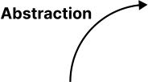

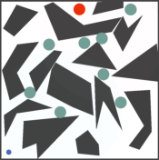

Subgoals

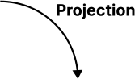

Approximate Values

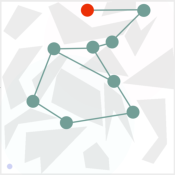

Figure 1: GSP in the PinBall domain. The agent begins with a set of subgoals (denoted in
teal) and learns a set of subgoal-conditioned models. **(Abstraction)** Using these models,
the agent forms an abstract MDP where the states are subgoals with options to reach each
subgoal as actions. **(Planning)** The agent plans in this abstract MDP to quickly learn the
values of these subgoals. **(Projection)** Using learned subgoal values, the agent obtains
approximate values of states based on nearby subgoals and their values. These quickly
updated approximate values are then used to speed up learning.

**3. Goal-Space Planning at a High-Level**

We consider three desiderata for when a model-based approach should be effective. (1) The
model should be feasible to learn: we can get it to a sufficient level of accuracy that makes
it beneficial to plan with that model. (2) Planning should be computationally efficient, so
that the agent’s values can be quickly updated. (3) Finally, the model should be modular—
composed of several local models or those that model a small part of the space—so that the
model can quickly adapt to small changes in environment. These small changes might still
result in large changes in the value; planning can quickly propagate these small changes,
potentially changing the value function significantly.
At a high level, the GSP algorithm focuses planning over a set of given abstract subgoals
to provide quickly updated approximate values to speed up learning. To do so, the agent
first learns a set of _subgoal-conditioned models_, minimal models focused around planning
utility. These models then form a temporally abstract goal-space semi-MDP, with subgoals
as states, and options to reach each subgoal as actions. Finally, the agent can update its
policy based on these subgoal values to speed up learning.
Figure 1 provides a visual overview of this process. We visualize this is an environment
called PinBall, which we also use in our experiments. PinBall is a continuous state domain
where the agent must navigate a ball through a set of obstacles to reach the main goal,
with a four-dimensional state space consisting of ( _x, y,_ ˙ _x,_ ˙ _y_ ) positions and velocities. In this
figure, the set of subgoals _G_ are the teal dots, a finite space of 9 subgoals. The subgoals are
abstract states, in that they correspond to many states: a subgoal is any ( _x, y_ ) location in a

4

Goal-Space Planning with Subgoal Models

small ball, at any velocity. In this example, the subgoals are randomly distributed across
the space. Subgoal discovery—identifying this set of subgoals _G_ —is an important part of
this algorithm, as we show empirically in Section 6.3. For this paper, however, we focus on
this planning formalism assuming these subgoals are given, already discovered by the agent.
In the planning step (top central figure), we treat _G_ as our finite set of states and do
value iteration. The precise formula for this update is given later, in (2), after we formally
define the models that we learn for goal-space planning. In words, we compute the subgoal
values ˜ _v_ : _G →_ R, using ˜ _rγ_ ( _g, g_ _[′]_ ) = discounted return when trying to reach _g_ _[′]_ from _g_ and
˜Γ( _g, g_ _[′]_ ) = discounted probability of reaching _g_ _[′]_ from _g_,

˜ ˜
_v_ ( _g_ ) = max _rγ_ ( _g, g_ _[′]_ ) + Γ( [˜] _g, g_ _[′]_ )˜ _v_ ( _g_ _[′]_ ) _._
relevant/nearby
subgoals _g_ _[′]_

The projection step involves updating values for states, using the subgoal values. The
most straightforward way to obtain the value for a state is to find the nearest subgoal _s_
and reason about _rγ_ ( _s, g_ ) = discounted return when trying to reach _g_ from _s_ and Γ( _s, g_ ) =
discounted probability of reaching _g_ from _s_,

_vg_ _[⋆]_ ( _s_ ) = max
relevant/nearby
subgoals _g_

_rγ_ ( _s, g_ ) + Γ( _s, g_ )˜ _v_ ( _g_ ) _._

Relevance here is defined as _s_ being within the initiation set of the option that reaches that
subgoal. We learn an option policy to reach each subgoal, where the initiation set for the
option is the set of states from which the option can be executed. The initiation set is a
local region around the subgoal, which is why we say we have many local models. Again, we
provide the formal definition later in (3).
There are several ways we can use this value estimate: inside actor-critic or as a bootstrap
target. For example, for a transition ( _s, a, r, s_ _[′]_ ), we could update action-values _q_ ( _s, a_ ) using
_r_ + _γvg_ _[⋆]_ ( _s_ _[′]_ ). This naive approach, however, can result in significant bias, as we discuss in
Section 5.4. Instead, we propose an approach to use _vg_ _[⋆]_ based on potential functions. These
three key steps comprise GSP: abstraction, planning and projection.
A key part of this algorithm is learning the subgoal models, _rγ_ and Γ. These models will
be recognizable to many: they are universal value functions (UVFAs) (Schaul et al., 2015).
We can leverage advances in learning UVFAs to improve our model learning. These models
are quite different from standard models in RL, in that most models in RL input a state (or
abstract state) and action and output an expected next state (or expected next abstract
state). Essentially, the model inputs the source and outputs the expected destination, or a
distribution over the possible destinations. Here, the models take as inputs both the source
and destination, and output only scalars (accumulated reward and discounted probability).
The design of GSP is built around using these types of models, that avoids outputting
predictions about entire state vectors.

**4. Motivating Experiments for GSP**

This section motivates the capabilities of the GSP framework through a series of demonstrative results. We investigate the utility of GSP in propagating value and speeding up learning.

5

Lo, Roice, Panahi, Jordan, White, Mihucz, Aminmansour and White

We do so using learners in three domains: FourRooms, PinBall (Konidaris and Barto, 2009)
and GridBall (a version of PinBall without velocities). Unless otherwise stated, all learning
curves are averaged over 30 runs, with shaded regions representing one standard error.

**4.1 GSP on Propagating Value**

The central hypothesis of this work is that GSP can accelerate value propagation. By using
information from local models in our updates, our belief is that GSP will have a larger
change in value to more states, leading to policy changes over larger regions of the state
space. In this section, we consider the effect of our background planning algorithm on
value-based RL methods.

**Hypothesis 1** _GSP changes the value for more states with the same set of experience._

In order to verify whether GSP helps to quickly propagate value, we first test this hypothesis in a simple grid
world environment: the FourRooms domain. The agent
can choose from one of 4 actions in a discrete action space
_A_ = _{_ `up` _,_ `down` _,_ `left` _,_ `right` _}_ . All state transitions are deterministic. The grey squares in Figure 2 indicate walls, and the
state remains unchanged if the agent takes an action that leads
into a wall. This is an episodic task, where the base learner
has a fixed start state and must navigate to a fixed goal state
where the episode terminates. Episodes can also terminate by
timeout after 1000 timesteps.

Figure 2: The FourRooms

In this domain, we test the effect of using GSP with pre
domain. The blue square

trained models on a Sarsa( _λ_ ) base learner in the tabular setting

is the initial state, green

(i.e. no function approximation for the value function). Full

square the goal state, and

details on using GSP with this temporal difference (TD) learner

red boxes the subgoals. A

can be found in Algorithm 4. We set the four hallway states

subgoal’s initiation set con
plus the goal state as subgoals, with their initiation sets being

tains the states in any room

the two rooms they connect. Full details of option policy

connected to that subgoal.

learning can be found in the appendix G.
Figure 3 shows the base learner’s action-value function after a single episode using four
different algorithms: Sarsa(0), Sarsa( _λ_ ), Sarsa(0)+GSP, and Sarsa( _λ_ )+GSP. In Figure 3,
the Sarsa(0) learner updates the value of the state-action pair that immediately preceded
the +1 reward at the goal state. The plot for Sarsa( _λ_ ) shows a decaying trail of updates
made at the end of the episode, to assign credit to the state-action pairs that led to the +1
reward. The plots for the GSP variants show that all state-action pairs sampled receive
instant feedback on the quality of their actions. The updates with GSP can be both positive
or negative based on if the agent makes progress towards the goal state or not. This direction
of update comes from the potential-based reward shaping rewards/penalizes transitions
based on whether _γt_ +1 _vg_ _[⋆]_ ( _St_ +1) _> vg_ _[⋆]_ ( _St_ ). It is clear that projecting subgoal values from
the abstract MDP leads to action-value updates over more of the visited states, even without
memory mechanisms such as eligibility traces.
It is evident from these updates over a single episode that the resulting policy from GSP
updates should be more likely to go to the goal. We would like to quantify how much faster

6

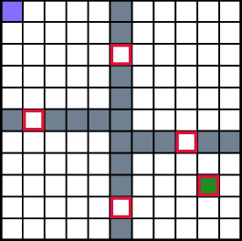

Goal-Space Planning with Subgoal Models

Sarsa(0)
0.90

0.00

Sarsa(𝜆)
1.48

0.00

GSP+Sarsa(0)
0.03

0.00

-0.06

GSP+Sarsa(𝜆)
0.47

0.00

-0.29

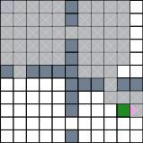

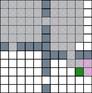

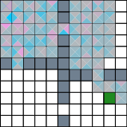

Figure 3: These four plots show the action values after a single episode of updates for
Sarsa with and without GSP and eligibility traces, i.e., _λ_ = 0 _._ 9. Each algorithm’s update is
simulated from the same data collected from a uniform random policy. Each state (square)
is made up of four triangles representing each of the four available actions. White squares
represent states not visited in the episode.

this propagated value can help our base learner over multiple episodes of experience. More
specifically, we want to test the following hypothesis.

**Hypothesis 2** _GSP enables a TD base-learner to learn faster._

We expect GSP to improve a base learner’s performance on a task within fewer environment interactions. We shall test whether the value propagation over the state-action
space as seen in Figure 3 makes this the case over the course of several episodes (i.e. we are
now testing the effect of value propagation over time). Figure 4 shows the performance of
a Sarsa( _λ_ ) base learner with and without GSP in the FourRooms domain with a reward
of -1 per step. Full details on the hyperparameters used can be found in Appendix G. It
is evident that the GSP-augmented Sarsa( _λ_ ) learner is able to reach the optimal policy
much faster. The GSP learner also starts at a much lower steps-to-goal. We _believe_ this
first episode performance improvement is because the feedback from GSP teaches the agent
which actions move towards or away from the goal during the first episode.

**4.2 GSP in Larger State Spaces**

Many real world applications of RL involve large and/or continuous state spaces. Current
planning techniques struggle with such state spaces. This motivates an investigation into
how well Hypotheses 1 and 2 hold up when GSP is used in such environments (e.g. the
PinBall domain). To better analyse GSP and its value propagation across state-space, we
also created an intermediate environment between FourRooms and PinBall called GridBall.

PinBall is a continuous state domain where the agent navigates a ball through a set of
obstacles to reach the main goal. This domain uses a four-dimensional state representation
of positions and velocities, ( _x, y,_ ˙ _x,_ ˙ _y_ ) _∈_ [0 _,_ 1] _×_ [0 _,_ 1] _×_ [ _−_ 2 _,_ 2] _×_ [ _−_ 2 _,_ 2]. The agent chooses
from one of five actions at each timestep. _A_ = _{_ `up` _,_ `down` _,_ `left` _,_ `right` _,_ `nothing` _}_, where the
`nothing` action adds no change to the ball’s velocity, and the other actions each add an
impulse force in one of the four cardinal directions. In all our experiments, the agent is
initialised with zero velocity at a fixed start position at the beginning of every episode. All
collisions are elastic and we use a drag coefficient of 0 _._ 995. This is an episodic task with a

7

Lo, Roice, Panahi, Jordan, White, Mihucz, Aminmansour and White

600

400

300

200

100

path

0

0 25 50 75 100 125 150 175 200

Episode

Figure 4: This plot shows the average number of steps to goal smoothed over five episodes
in the FourRooms domain. Shaded region represents 1 standard error across 100 runs.

fixed starting state and main goal. An episode ends when the agent reaches the main goal
or after 1,000 time steps. It should be noted that, unlike in the FourRooms environment,
there exists states which are not in the initiation set of any subgoal - a common occurence
when deploying GSP in the state spaces of real-world applications.

GridBall is like PinBall, but change to be more like a
gridworld to facilitate visualization. The velocity components
of the state are removed, meaning the state only consists of
( _x, y_ ) locations, and the action space is changed to displace the
ball by a fixed amount in each cardinal dimension. We keep
the same obstacle collision mechanics and calculations from

PinBall. Since GridBall does not have any velocity components,
we can plot heatmaps of value propagation without having
to consider the velocity at which the agent arrived at a given
position.

Figure 5: Obstacles and

For Hypothesis 1, we repeat the experiments on GridBall

subgoals for GridBall and

with base learners that use tile-coded value features (Sutton

PinBall. The larger cir
and Barto, 2018), and linear value function approximation.

cles show the initiation set

Full details on the option policies and subgoal models used for

boundaries. Subgoals are

this are outlined in shown in Appendices C.1 and D.1. Like

defined in position space.

in the FourRooms experiment, we set the reward to be 0 at all
states and +1 once the agent reaches any state in the main goal to show value propagation.
We collect a single episode of experience from the Sarsa(0)+GSP learner and use its trajectory
to perform a batch update on all learners. This controls for any variability in trajectories
between learners, so we can isolate and study the change in value propagation.
Figure 6 compares the state value function (averaged over the action value estimates)
of Sarsa(0), Sarsa( _λ_ ), Sarsa(0)+GSP and Sarsa( _λ_ )+GSP learners after a single episode of
interaction with the environment. The results are similar to those on FourRooms. The
Sarsa(0) algorithm only updates the value of the tiles activated by the state preceding the

8

Goal-Space Planning with Subgoal Models

(a) Sarsa(0) (b) Sarsa( _λ_ ) (c) GSP+Sarsa(0) (d) GSP+Sarsa( _λ_ )

Figure 6: The tile-coded value function after one episode in GridBall. Like Figure 3, the
gray regions show the visited states which were not updated. The red circle is the main goal.

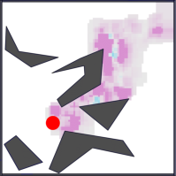

(b) PinBall

0 100 200 300 400 500

Episode

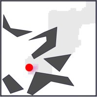

1000

800

600

400

200

(a) GridBall

0 25 50 75 100 125 150 175 200

Episode

1000

800

600

400

200

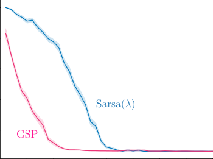

Figure 7: Five episode moving average of return in the GridBall over 200 episodes (left) and
PinBall over 500 episodes (right). We performed 30 runs, and showed 1 standard error in
the shaded region. All learners used linear value function approximation on their tile coded
features.

goal. Sarsa( _λ_ ) has a decaying trail of updates to the tiles activated preceeding the goal, and
the GSP learners updates values at all states in the initiation set of a subgoal.

To examine how GSP translates to faster learning (Hypothesis 2), we measure the
performance (steps to goal) over time for each algorithm in both GridBall and PinBall
domains. Figure 7 shows that GSP significantly improves the rate of learning in these larger
domains too, with the base learner able to reach near its top performance within 75 and 100
epsiodes in GridBall and PinBall respectively. All runs are able to find a similar length path
to the goal. As the size of the state space increases, the benefit of using local models in the
GSP updates still holds.

Similar to the previous domains, the Sarsa( _λ_ ) learner using GSP is able to reach a good
policy much faster than the base learner without GSP. In both domains, the GSP and
non-GSP Sarsa( _λ_ ) learners plateau at the same average steps to goal. Even though the
obstacles remain unchanged from GridBall, it takes roughly 50 episodes longer for even
the GSP variant to reach a good policy in PinBall. This is likely due to the continuous
4-dimensional state space making the task harder.

9

Lo, Roice, Panahi, Jordan, White, Mihucz, Aminmansour and White

**5. Goal-Space Planning in Detail**

In this section we outline the technical definitions and details for the goal-space planning
approach. We first discuss the definition of subgoals and then the corresponding subgoalconditioned models. We then discuss how to use these models for planning, particularly how
to do value iteration to compute the subgoal values and then how to use those values to
influence values of states (the projection step). We conlude the section summarizing the
overall goal-spacing planning framework, including how we can layer GSP into a standard
algorithm called Double DQN.

**5.1 Defining Subgoals**

Similar to options (Sutton et al., 1999), we define a subgoal as having two components: a
set of goal states, and a set of initiation states. These two sets are defined by the indicator
functions _m_ and _d_ with _m_ specifying the states in the goal set, and _d_ specifying states in an
initiation set. We say that a state _s_ is a member of subgoal _g_ if _m_ ( _s, g_ ) = 1 and we only
reason about reaching a subgoal _g_ from states _s_ such that _d_ ( _s, g_ ) = 1.
We consider a finite set of subgoals _G_ . While subgoals could represent a single state,
they can also describe more complex conditions that are common to a group of states. For
example, _g_ could correspond to a situation where both the front and side distance sensors of
a robot report low readings—what a person would call being in a corner. If the first two
elements of the state vector _s_ consist of the front and side distance sensor, _m_ ( _s, g_ ) = 1 for
any states where _s_ 1 _, s_ 2 are less than some threshold _ϵ_ . As another example, in Figure 1, we
simply encode the nine subgoals—which correspond to regions with a small radius. For a
concrete example, we visualize subgoals for our experiments in Figures 2 and 5. Essentially,
our subgoals define a new state space in an abstract MDP, and these new abstract states
(subgoals) can be represented in different ways, just like in regular MDPs.
Finally, we only reason about reaching subgoals from a subset of states, called _initiation_
_sets_ . This constraint is key for locality, to learn and reason about a subset of states for
a subgoal. We assume the existence of a (learned) _initiation function d_ to indicate when
the agent is sufficiently close in terms of reachability. We discuss some approaches to learn
this initiation function in Appendix D.1. But, here, we assume it is part of the discovery
procedure for the subgoals and instead focus on how to use it.
For the rest of this paper, we presume we are given subgoals and initiation sets. We
develop algorithms to learn and use models, given those subgoals. We expect a complete
agent to discover these subgoals on its own, including how to represent these subgoals to
facilitate generalization and planning. In this work, though, we first focus on how the agent
can leverage reasonably well-specified subgoals.

**5.2 Defining Subgoal-Conditioned Models**

For planning and acting to operate in two different spaces, we define four models: two used
in planning over subgoals (subgoal-to-subgoal) and two used to project these subgoal values
back into the underlying state space (state-to-subgoal). Figure 8 visualizes these two spaces.
¯ The state-to-subgoal models are _rγ_ : _S ×_ _G →_ [¯] R and Γ : _S ×_ _G →_ [¯] [0 _,_ 1], where
_G_ = _G ∪{s_ terminal _}_ if there is a terminal state (episodic problems) and otherwise ¯ _G_ = _G_ .

10

Goal-Space Planning with Subgoal Models

An option policy _πg_ : _S × A →_ [0 _,_ 1] for subgoal _g_ starts from any _s_ in the initiation set,
and terminates in _g_ —in ˜ _s_ where _m_ ( _s, g_ ˜ ) = 1. The reward-model _rγ_ ( _s, g_ ) is the discounted
rewards under option policy _πg_ :

_rγ_ ( _s, g_ ) = E _πg_ [ _Rt_ +1 + _γg_ ( _St_ +1) _rγ_ ( _St_ +1 _, g_ ) _|St_ = _s_ ] _,_

where the discount is zero upon reaching subgoal _g_

def
_γg_ ( _St_ +1) =

0 if _m_ ( _St_ +1 _, g_ ) = 1, namely if subgoal _g_ is achieved by being in _St_ +1 _,_
� _γt_ +1 else.

The discount-model Γ( _s, g_ ) reflects the discounted number of steps until reaching subgoal _g_
starting from _s_, in expectation under option policy _πg_

Γ( _s, g_ ) = E _πg_ [ _m_ ( _St_ +1 _, g_ ) _γt_ +1 + _γg_ ( _St_ +1)Γ( _St_ +1 _, g_ ) _|St_ = _s_ ] _._

These state-to-subgoal will only be queried for ( _s, g_ ) where _d_ ( _s, g_ ) _>_ 0: they are local models.
To define subgoal-to-subgoal models, [1] _r_ ˜ _γ_ : _G ×_ _G →_ [¯] R and Γ [˜] : _G ×_ _G →_ [¯] [0 _,_ 1], we use
the state-to-subgoal models. For each subgoal _g ∈G_, we aggregate _rγ_ ( _s, g_ _[′]_ ) for all _s_ where
_m_ ( _s, g_ ) = 1.

˜ def 1
_rγ_ ( _g, g_ _[′]_ ) =
_z_ ( _g_ )

def 1

� _rγ_ ( _s, g_ _[′]_ ) and ˜Γ( _g, g_ _[′]_ ) = _z_ ( _g_ )

_s_ : _m_ ( _s,g_ )=1

� Γ( _s, g_ _[′]_ ) (1)

_s_ : _m_ ( _s,g_ )=1

def
for normalizer _z_ ( _g_ ) = [�] _s_ : _m_ ( _s,g_ )=1 _[m]_ [(] _[s, g]_ [). This definition assumes a uniform weighting over]
the states _s_ where _m_ ( _s, g_ ) = 1. We could allow a non-uniform weighting, potentially based on
visitation frequency in the environment. For this work, however, we assume that _m_ ( _s, g_ ) = 1
for a smaller number of states _s_ with relatively similar _rγ_ ( _s, g_ _[′]_ ), making a uniform weighting
reasonable.
These models are also local models, as we can similarly extract _d_ [˜] ( _g, g_ _[′]_ ) from _d_ ( _s, g_ _[′]_ )
and only reason about _g_ _[′]_ nearby or relevant to _g_ . We set _d_ [˜] ( _g, g_ _[′]_ ) = max _s∈S_ : _m_ ( _s,g_ ) _>_ 0 _d_ ( _s, g_ _[′]_ ),
indicating that if there is a state _s_ that is in the initiation set for _g_ _[′]_ and has membership in
_g_, then _g_ _[′]_ is also relevant to _g_ .

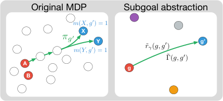

8. The red states are members of _g_ (namely _m_ ( _X, g_ _[0]_ ) = 1
_m_ ( _A, g_ ) = 1) and the blue members of _g_ _[′]_ _⇡g0_ **Y** ˜ **g’**

(namely _m_ ( _X, g_ _[′]_ ) = 1 and _m_ ( _Y, g_ _[′]_ ) = 1). _m_ ( _Y, g_ _[0]_ ) = 1 _rγ_ ( _g, g_ _[0]_ )
For all _s_ in the diagram, _d_ ( _s, g_ _[′]_ ) _>_ 0 (all **A** **g**
are in the initiation set): the policy _πg′_ can
be queried from any _s_ to get to _g_ _[′]_ . The
green path in the left indicates the trajectory
under _πg′_ from _A_, stochastically reaching Figure 8: Original and abstract state spaces.
either _X_ or _Y_, with accumulated reward _rγ_ ( _A, g_ _[′]_ ) and discount Γ( _A, g_ _[′]_ ) (averaged over
reaching _X_ and _Y_ ). The subgoal-to-subgoal models, on the right, indicate _g_ _[′]_ can be reached
from _g_, with ˜ _rγ_ ( _g, g_ _[′]_ ) averaged over both _rγ_ ( _A, g_ _[′]_ ) and _rγ_ ( _B, g_ _[′]_ ) and Γ [˜] ( _g, g_ _[′]_ ) over Γ( _A, g_ _[′]_ )
and Γ( _B, g_ _[′]_ ), as described in (1).

1. The first input is any _g ∈G_, the second is _g_ _[′]_ _∈_ _G_ [¯], which includes _s_ terminal. We need to reason about
reaching any subgoal or _s_ terminal. But _s_ terminal is not a real state: we do not reason about starting from
it to reach subgoals.

11

Lo, Roice, Panahi, Jordan, White, Mihucz, Aminmansour and White

**5.3 Goal-Space Planning with Subgoal-Conditioned Models**

We can now consider how to plan with these models. Planning involves learning ˜ _v_ ( _g_ ): the
value for different subgoals. This can be achieved using an update similar to value iteration,
for all _g ∈G_

˜ ˜
_v_ ( _g_ ) = max _rγ_ ( _g, g_ _[′]_ ) + Γ( [˜] _g, g_ _[′]_ )˜ _v_ ( _g_ _[′]_ ) _._ (2)
_g_ _[′]_ _∈G_ [¯] : _d_ [˜] ( _g,g_ _[′]_ ) _>_ 0

The value of reaching _g_ _[′]_ from _g_ is the discounted rewards along the way, ˜ _rγ_ ( _g, g_ _[′]_ ), plus the
discounted value in _g_ _[′]_ . If Γ [˜] ( _g, g_ _[′]_ ) is very small, it is difficult to reach _g_ _[′]_ from _g_ —or takes
many steps—and so the value in _g_ _[′]_ is discounted by more. With a relatively small number
of subgoals, we can sweep through them all to quickly compute ˜ _v_ ( _g_ ). With a larger set of
subgoals, we can instead do as many updates possible, in the background on each step, by
stochastically sampling _g_ .
We can interpret this update as a standard value iteration update in a new MDP, where
1) the set of states is _G_, 2) the actions from _g ∈G_ are state-dependent, corresponding to
choosing which _g_ _[′]_ _∈_ _G_ [¯] to go to in the set where _d_ [˜] ( _g, g_ _[′]_ ) _>_ 0 and 3) the rewards are ˜ _rγ_ and the
discounted transition probabilities are Γ [˜] . The transition probabilities are typically separate
from the discount, but it is equivalent to consider the discounted transition probabilities.
Under this correspondence, it is straightforward to show that the above converges to the
optimal values in this new Goal-Space MDP, shown in **Proposition 3** in Appendix B.
This goal-space planning approach does not suffer from typical issues with model-based
RL. Firstly, even though the models are not directly iterated over multiple timesteps, we still
obtain temporal abstractions. This is because the subgoal models are temporally abstract by
construction, and do not need to be called iteratively over many timesteps for long horizon
planning - which could lead to compounding error. Second, we do not need to predict entire
state vectors—or distributions over them—because we instead input the outcome _g_ _[′]_ into the
function approximator. This may feel like a false success as it potentially requires restricting
ourselves to a smaller number of subgoals. If we want to use a larger number of subgoals,
then we may need a function to generate these subgoal vectors anyway—bringing us back to
the problem of generating vectors. However, this is likely easier as 1) the subgoals themselves
can be much smaller and more abstract, making it more feasibly to procedurally generate
them and 2) it may be more feasible to maintain a large set of subgoal vectors, or generate
individual subgoal vectors, than producing relevant subgoal vectors from a given subgoal.

**5.4 Using Subgoal Values to Update the Policy**

Now let us examine how to use ˜ _v_ ( _g_ ) to update our main policy. The simplest way to decide
how to behave from a state is to cycle through the subgoals, and pick the one with the
highest value. In other words, we can set

def
_vg_ _[⋆]_ ( _s_ ) =






max if _∃_ _g ∈_ _G_ [¯] : _d_ ( _s, g_ ) _>_ 0 _,_ (projection step)
_g∈G_ [¯] : _d_ ( _s,g_ ) _>_ 0 _[r][γ]_ [(] _[s, g]_ [) + Γ(] _[s, g]_ [)˜] _[v]_ [(] _[g]_ [)]

(3)
undefined otherwise,

and take action _a_ that corresponds to the action given by _πg_ for this maximizing _g_ as
shown in Figure 9. Note that some states may not have any nearby subgoals, and _vg_ _[⋆]_ ( _s_ ) is
undefined for that state. This is not the only problem with this naive approach.

12

Goal-Space Planning with Subgoal Models

_rγ_ ( _S_ _[0]_ _, gi_ ) + Γ( _S_ _[0]_ _, gi_ )˜ _v_ ( _gi_ ) There are two other critical issues with this approach. Poli## gi cies are restricted to go through subgoals, which might result

in suboptimal policies. From a given state _s_, the set of relevant
subgoals _g_ may not be on the optimal path. This limitation is

max expressly one we early mentioned we wished to avoid, and is a

key limitation of Landmark Value Iteration (LAVI) developed
for the setting where models are given (Mann et al., 2015).

_rγ_ ( _S_ _[0]_ _, gk_ ) + Γ( _S_ _[0]_ _, gk_ )˜ _v_ ( _gk_ ) Second, the learned models themselves may have inaccuracies,

or planning may not have been completed in the background,

Figure 9: Computing resulting in ˜ _v_ ( _g_ ) that are not yet fully accurate.
_vg_ _[⋆]_ ( _S_ _[′]_ ). This is used with When incorporating _vg_ _[⋆]_ into the learning process, we want
_vg_ _[⋆]_ ( _S_ ) to shape the reward to ensure the optimal policy remains unchanged and that
signal for a transition _vg_ _[⋆]_ guides the agent by helping evaluate the quality of its
_S →_ _S_ _[′]_ .

decisions. A simple way to satisfy these requirements is to
use potential-based reward shaping (Ng et al., 1999). Potential-based reward shaping
defines a new MDP with a modified reward function where the agent receives the reward˜
_Rt_ +1 = _Rt_ +1 + _γ_ Φ( _St_ +1) _−_ Φ( _St_ ), where Φ : _S →_ R is any state-dependent function. Ng et al.
show that such a reward transformation preserves the optimal policy from the original MDP.
We propose using Φ = _vg_ _[⋆]_ to modify any temporal TD learning algorithm to be compatible
with GSP. For example, in the Sarsa( _λ_ ) algorithm, the update for the weights **w** of the
function _q_ : _S × A ×_ R _[n]_ _→_ R would use the TD-error

_rγ_ ( _S_ _[0]_ _, gi_ ) + Γ( _S_ _[0]_ _, gi_ )˜ _v_ ( _gi_ )

Figure 9: Computing
_vg_ _[⋆]_ ( _S_ _[′]_ ). This is used with
_vg_ _[⋆]_ ( _S_ ) to shape the reward
signal for a transition
_S →_ _S_ _[′]_ .

def
_δ_ = _Rt_ +1 + _γt_ +1 _vg⋆_ ( _St_ +1) _−_ _vg⋆_ ( _St_ )
~~�~~ _R_ ˜� _t_ +1 ~~�~~ �

+ _γt_ +1 _q_ ( _St_ +1 _, At_ +1; **w** ) _−_ _q_ ( _St, At_ ; **w** ) _._ (4)

Potential-based shaping rewards the agent for selecting actions that result in transition
that increase Φ. Consider the case when Φ represents the _negative_ distance to a goal state.
When Φ( _St_ +1) _>_ Φ( _St_ ), then the agent has made progress towards getting to the goal, and
it receives a positive addition to the reward. When Φ is an estimate of the value function,
one can interpret the additive reward as rewarding the agent for taking actions that increase
the value function estimate and penalizes actions that decrease the value. In this way, using
Φ = _vg_ _[⋆]_, the agent can leverage immediate feedback on the quality of its actions using the
information from the abstract value function about what an optimal policy might look like.
For intuition as to why potential-based reward shaping does not bias the optimal policy,
notice that [�] _[∞]_ _t_ =0 _[γ][t]_ [ (] _[γ]_ [Φ(] _[S][t]_ [+1][)] _[ −]_ [Φ(] _[S][t]_ [))][ =] _[ −]_ [Φ(] _[S]_ [0][), which means the relative values of each]
action remain the same. The cancellations of these intermediate terms mean that algorithms
like REINFORCE (Williams, 1992) or Proximal Policy Optimization (Schulman et al., 2017)
will see little benefit when combined with potential-based reward shaping (as they use the
discount sum of all rewards to update the policy). For these algorithms, one could instead
estimate a _qg_ _[⋆]_ and leverage trajectory-wise control variates (Pankov, 2018; Cheng et al.,
2019; Huang and Jiang, 2020). We leave investigation of this approach to future work and
focus on TD learning algorithms in this paper.
It is important to note that if _vg_ _[⋆]_ can help improve learning, it can also make learning
harder if its guidance makes it less likely for an agent to sample optimal actions. This
increase in difficulty is likely if the models used to construct the abstract MDP and _vg_ _[⋆]_ have
substantial errors. In this case, the agent has to learn to overcome the bad “advice” provided

13

Lo, Roice, Panahi, Jordan, White, Mihucz, Aminmansour and White

by _vg_ _[⋆]_ . We investigate this further with non-stationary environments and inaccurate models
in Sections G.1 and 6.2 respectively.

**5.5 Putting it All Together: The Full Goal-Space Planning Algorithm**

The remaining piece is to learn the models and put it all together. Learning the models is
straightforward, as we can leverage the large literature on general value functions (Sutton
et al., 2011) and UVFAs (Schaul et al., 2015). There are nuances involved in 1) restricting
updating to relevant states according to _d_ ( _s, g_ ), 2) learning option policies that reach
subgoals, but also maximize rewards along the way and 3) considering ways to jointly learn _d_
and Γ. We include these details in Appendix D.1 as well as detailed pseudocode in Appendix.
E. Here, we summarize the higher-level steps.

The algorithm is visualized in Figure 10.

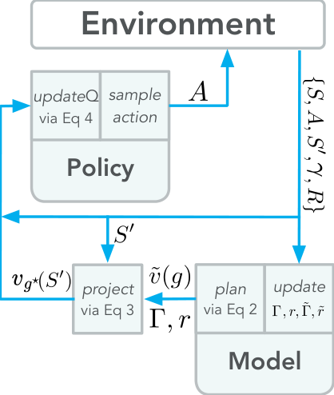
# The steps of agent-environment interaction in- Environment

clude:

1. take action _At_ in state _St_, to get
_St_ +1 _, Rt_ +1 and _γt_ +1 via Eq 4 _action_

2. query the model for _rγ_ ( _St_ +1 _, g_ ), Γ( _St_ +1 _, g_ ),

|updateQ|sample|
|---|---|
|via Eq 4|_action_|

## v ˜( g ) for all g where d ( St +1, g ) > 0 Policy

3. compute projection _vg_ _[⋆]_ ( _St_ +1), using (3)

4. update the main policy with the transition and _vg_ _[⋆]_ ( _St_ +1), using (4).

All background computation is used for model
learning using a replay buffer and for planning
to obtain ˜ _v_, so that they can be queried at any
time on step 2.
To be more concrete, Algorithm 1 shows the
GSP algorithm, layered on DDQN (van Hasselt

|plan|update|
|---|---|
|via Eq 2||

Figure 10: Goal-Space Planning.

et al., 2016). DDQN is a variant of DQN—and
so relies on replay—that additionally incorporates the idea behind Double Q-learning to
avoid maximization bias in the Q-learning update (van Hasselt, 2010). All new parts relevant
to GSP are colored blue; without the blue components, it is a standard DDQN algorithm.
The primary change is the addition of the potential to the action-value weights **w**, with
the other blue lines primarily around learning the model and doing planning. GSP should
improve on replay because it simply augments replay with a potential difference that more
quickly guides the agent to take promising actions.

**6. Experiments to understand GSP more deeply**

This section demonstrates the capabilities and limitations of the GSP framework. Having
seen the role of GSP in propagting value and speeding up learning, we investigate how
this utility of GSP is affected by: 1) deep non-linear function approximation, 2) subgoal
placement, 3) sensitivity to models, 3) the _vg_ _[⋆]_ potential used.

14

Goal-Space Planning with Subgoal Models

**Algorithm 1** `GSP (built on DDQN)`

Initialize base learner parameters **w** _,_ **w** targ = **w** 0, set of subgoals _G_, relevance function _d_,

model parameters _**θ**_ = ( _**θ**_ _[r]_ _,_ _**θ**_ [Γ] _,_ _**θ**_ _[π]_ ) _,_ _**θ**_ [˜] = ( _**θ**_ [˜] _r,_ ˜ _**θ**_ Γ)
Sample initial state _s_ 0 from the environment
**for** _t ∈_ 0 _,_ 1 _,_ 2 _, ..._ **do**

Take action _at_ using _q_ (e.g., _ϵ_ -greedy), observe _st_ +1 _, rt_ +1 _, γt_ +1
Add experience ( _st, at, st_ +1 _, rt_ +1 _, γt_ +1) to replay buffer _D_
`DDQNModelUpdate` () (see Algorithm 7)
`Planning` () (see Algorithm 5)
**for** _n_ mini-batches **do**

Sample batch _B_ = _{_ ( _s, a, r, s_ _[′]_ _, γ_ ) _}_ from _D_
**if** _d_ ( _s, ·_ ) _, d_ ( _s_ _[′]_ _, ·_ ) _>_ 0 **then**

¯
_vg_ _[⋆]_ ( _s_ ) = max _g∈G_ : _d_ ( _s,g_ ) _>_ 0 _rγ_ ( _s, g_ ; _**θ**_ _[r]_ ) + Γ( _s, g_ ; _**θ**_ [Γ] )˜ _v_ ( _g_ )

¯
_v_ ˜ _g_ _[⋆]_ ( _s_ _[′]_ ) = max _g∈G_ : _d_ ( _s′,g_ ) _>_ 0 _rγ_ ( _s_ _[′]_ _, g_ ; _**θ**_ _[r]_ ) + Γ( _s_ _[′]_ _, g_ ; _**θ**_ [Γ] )˜ _v_ ( _g_ )
_r_ = _r_ + _γvg_ _[⋆]_ ( _s_ _[′]_ ) _−_ _vg_ _[⋆]_ ( _s_ )
**else**

˜
_r_ = _r_
_Y_ ( _s, a, r, s_ _[′]_ _, γ_ ) = ˜ _r_ + _γq_ ( _s_ _[′]_ _,_ argmax _a′ q_ ( _s_ _[′]_ _, a_ _[′]_ ; **w** ); **w** targ)
_L_ = _|B_ 1 _|_ �( _s,a,r,s_ _[′]_ _,γ_ ) _∈B_ [(] _[Y]_ [ (] _[s, a, r, s][′][, γ]_ [)] _[ −]_ _[q]_ [(] _[s, a]_ [;] **[ w]** [))][2]

**w** _←_ **w** _−_ _α∇_ **w** _L_
**if** _n_ updates% _τ_ == 0 **then**

**w** targ _←_ **w**

_n_ updates = _n_ updates + 1

**6.1 GSP with Deep Reinforcement Learning**

The previous results shed light on the dynamics of value propagation with GSP when a
learner is given a representation of it’s environment (a look-up table or a tile coding). A
natural next step is to look at the whether the reward and transition dynamics learnt in
GSP can still propagate value (Hypothesis 2) in the deep RL setting, where the learner
must also learn a representation of its environment. We test this by running a DDQN base
learner (van Hasselt et al., 2016) in the PinBall domain, with GSP layered on DDQN as in
Algorithm 1. The base learner’s complete hyper-parameter specifications can be found in
Appendix C.1.
Unlike the previous experiments, using GSP out of the box resulted in the base learner
converging to a sub-optimal policy. This is despite the fact that we used the same _vg_ _[⋆]_ as
the previous PinBall experiments. We investigated the distribution of shaping terms added
to the environment reward and observed that they were occasionally an order of magnitude
greater than the environment reward. Though the linear and tabular methods handled these
spikes in potential difference gracefully, these large displacements seemed to causes issues
when using neural networks and a DDQN base learner.
We tested two variants of GSP that better control the magnitudes of the raw potential
differences ( _γ_ Φ( _St_ +1) _−_ Φ( _St_ )). We adjusted for this by either clipping or down-scaling
the potential difference added to the reward. The scaled reward multiplies the potential

15

Lo, Roice, Panahi, Jordan, White, Mihucz, Aminmansour and White

800

600

400

200

(a) GSP modified for Deep RL

0 200 400 600 800 1000
Episode

800

600

400

200

(b) Robustness to model accuracy

0 100 200 300 400 500
Episode

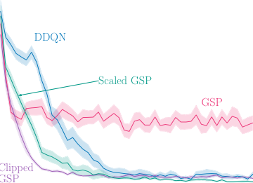

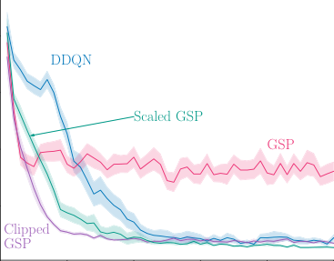

Figure 11: Investigating the behavior of GSP in the deep reinforcement learning setting
in PinBall. (a) Following the format of Figure 7, we show the 20 episode moving average
of steps to the main goal in PinBall. (b) Five episode moving average of steps to goal in
PinBall for GSP with models trained with differing numbers of epochs.

difference by 0.1. Clipped GSP clips the potential difference into the [ _−_ 1 _,_ 1] interval. With
these basics magnitude controls, GSP again learns significantly faster than its base learner,
as shown in Figure 11a.

**6.2 Robustness to Accuracy of the Learned Models**

In this section, we investigate how robust GSP is to inaccuracy of its models. When
examining the accuracy of the learned models, we found the the errors in _rγ_ and Γ could
be as high as 20% in some parts of the state space (see Appendix G for more information).
Despite this level of inaccuracy in some states, GSP still learned effectively, as seen in
Sections 4.1 and 4.2.

We conducted a targeted experiment controlling the level of accuracy to better understand
this robustness and test the following hypothesis.

**Hypothesis 3** _GSP can learn faster with more accurate models, but can still improve on_
_the base learner even with partially learned models._

We varied the number of epochs to obtain models of varying accuracy. Our models were fully
connected artificial neural networks, and we learn the models for each subgoal by performing
mini-batch stochastic gradient descent on a dataset of trajectories that end in a member
state of that subgoal _g_ . Full implementation details for this mini-batch stochastic gradient
descent can be found in Appendix D.
As expected, Figure 11b shows that more epochs over the same dataset of transitions
improves how quickly the base learner reaches the main goal. Within 4 epochs of model
training, the learner is able to reach a good policy to the main goal. However, if the model

16

Goal-Space Planning with Subgoal Models

is very inaccurate (2 epochs), the GSP update will bias the base learner to a sub-optimal
policy. There is a trend of diminishing improvement when iterating over the same dataset of
experience: doubling the number of epochs from two to four results in a policy that reaches
the main goal 10 _×_ quicker, but a learner which used a further 16 _×_ the number of epochs
attains a statistically identical episode length by episode 500. While more accurate models
lead to faster learning, relatively few epochs are required to propagate enough value to help
the learner reach a good policy.

**6.3 The Impact of Subgoal Selection**

While the above experiments show that goal-space planning can speed up learning and
propagate value faster, it is crucial to understand how value propagation depends on the
selection of subgoals. Specifically, we want to identify 1) how the graphical structure of
the subgoals impacts value propagation in _vg_ _[⋆]_ and 2) how quickly the base learner can
change their policy. To answer these questions we consider a setting where the agent is
presented with new information that indicates it should change its behavior. We will then
update the state-to-subgoal and subgoal-to-subgoal models online and measure how much
_vg_ _[⋆]_ changes, along with how quickly the base learner can change its policy on different
subgoal configurations.
For this task, the agent has to decide between taking one of two paths to a goal state.
We initialize the agent to use an optimal policy so it takes the shorter of the two paths.
Then we introduce a lava pool along the optimal path that gives the agent a large negative
reward for entering it. This negative reward means the initial path is no longer optimal
and that the agent needs to switch to the alternate path. The FourRooms environment
uses _−_ 1 reward per step, and each state in the lava pool has a reward of _−_ 20. The agent,
initialized with _q_ _[⋆]_ for the original FourRooms environment, is run for 100 episode in the
new FourRooms environment with the lava pool. We run GSP with Sarsa in this tabular
setting for all subgoal configurations for 200 runs each.
We test the following hypothesis.

**Hypothesis 4** _The placement of subgoals along the initial and alternate optimal paths are_
_essential for fast adaptation._

To test this hypothesis, we will evaluate the following four subgoal configurations. The
first subgoal arrangement contains no subgoals near the goal state and the goal state is not
connected the other subgoals. The second contains a subgoal on the initial optimal path,
but no subgoal on the alternate path. The third is where there is subgoal on the alternate
path but no subgoal on the initial optimal path. The last is where there are subgoals on
both paths. We illustrate these subgoal configurations in Figure 12. Recall that a subgoal’s
initiation set is the states in the two adjacent rooms.
For this experiment, the state-to-subgoal models and abstract MDP need to be updated
online. However, since only the reward function is changing, we only need to update the
reward models _rγ_ and ˜ _rγ_ . Furthermore, we can represent _rγ_ using successor features so
that the agent only needs to estimate the reward function (Barreto et al., 2017). Let

_∞_ _k_
_**ψ**_ _[π][g]_ ( _s_ ) _≈_ E _πg_ _k_ =0 � _k_ _[′]_ =0 _[γ][t]_ [+] _[k][′]_ _**[ϕ]**_ [(] _[S][t]_ [+] _[k]_ [)] _[|][S][t]_ [ =] _[ s]_, where _**ϕ**_ ( _St_ ) _∈_ R _[n]_ is a vector of features
�� �

for state _St_ and actions are selected according to option policy _πg_ . Then _rγ_ ( _s, g_ ) = **w** _[⊤]_ _**ψ**_ _[π][g]_ ( _s_ ),

17

Lo, Roice, Panahi, Jordan, White, Mihucz, Aminmansour and White

No Near On Initial On Alternate Both

Figure 12: Different subgoal configurations in the FourRooms environment with a lava pool.
The purple square is the learner’s starting location, the gray squares the walls, the orange
squares the location of the lava pool, and the green square the goal location. The only
difference between these figures are the red boxes, which indicate the states that are subgoals
for that configuration.

0

−100

−200

−300

−400

−500

−600

−700

1.0

0.5

0.0

|Col1|Sarsa GSP:NoNear GSP:OnInitial GSP:OnAlternate GSP:Both|Col3|Col4|
|---|---|---|---|
|||||
|||||
|||||
|||||
|||||
|||||
|||||

0 50 100

Episode

0 50 100

Episode

Figure 13: This figure shows the average return (left) and average probability the agent
will take the alternative path (right) from each episode. Shaded regions represent (0.05,0.9)
tolerance intervals (Patterson et al., 2020) over 200 trials.

where **w** _∈_ R _[n]_ . The learner can then update _rγ_ by estimating the reward function with
stochastic gradient descent, i.e., **w** _←_ **w** + _η_ [ _Rt −_ **w** _[⊤]_ _**ϕ**_ ( _St_ )] _**ϕ**_ ( _St_ ) for some scalar step size _η_ .
To understand how learning is impacted by the subgoal configuration we show the return
and probability the agent takes the alternative path in Figure 13. The first thing that is
apparent is that all configurations are able to change the policy so that the probability
of taking the alternative path increases. The main differences come from how quickly, in
expectation, each configuration is able to change the policy to have a high probability of
taking the alternate path. The Both and On Alternate subgoal configurations have the
quickest change in the policy on average, while the other methods are slower. The No Near
configuration also seems to, on average, have the smallest increase in probability of taking
the alternate path. These results suggest that for GSP to be most impactful, there needs to
be a path through the subgoals that represents the desirable path.
To better understand these results, we look more closely at _vg_ _[⋆]_ for each configuration.
We measure how _vg_ _[⋆]_ changes over learning, i.e. _vg_ _[⋆]_ _,t −_ _vg_ _[⋆]_ _,_ 0, where _vg_ _[⋆]_ _,i_ is the value of _vg_ _[⋆]_

18

Goal-Space Planning with Subgoal Models

On Alternate

Both

No Near

On Initial

-3

-23

-43

-63

-83

0

-4

-8

-12

-16

0

-4

-8

-12

-16

-3

-9

-15

-21

-27

-33

0

-1

-2

-3

-4

-5

-6

0

-1

-2

-3

-4

-5

-6

-3

-11

-19

-27

-35

-43

0

-1

-2

-3

-4

0

-1

-2

-3

-4

-3

-7

-11

-15

-19

-23

0

-2

-4

-6

-8

-10

0

-2

-4

-6

-8

-10

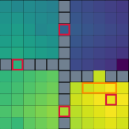

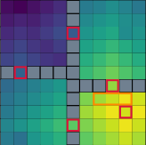

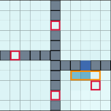

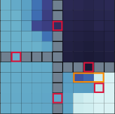

Figure 14: The top row of this figure shows the value of _vg_ _[⋆]_ for each state before the lava
pool, for each subgoal configuration. The second and third rows show the change in _vg_ _[⋆]_
after the first and 100 [th] episode, after the lava pool is introduced.

after episode _i_ . We first examine the values of _vg_ _[⋆]_ for each subgoal configuration before the
introduction of the lava pool (top row in Figure 14). For the No Near subgoals configuration,
_vg_ _[⋆]_ has a disconnected graph, so all but the room with the goal state has a large negative
value. For both On Initial and On Alternate configurations, _vg_ _[⋆]_ is the smallest in the room
that is furthest from the goal state according to the abstract MDP. This is due to the
structure of the abstract MDP only knowing about a single path to the goal state. In the
Both subgoal configuration _vg_ _[⋆]_ closely represents the optimal value function in each state.
We then look at the change in _vg_ _[⋆]_ after the lava pool is introduced, after one episode
(middle row in Figure 14) and 100 episodes (bottom row in Figure 14). We notice that the
change in _vg_ _[⋆]_ follows the same patterns as the value representation. The value in the No Near
subgoal configuration does not propagate information from the lava pool to rooms outside
bottom left room. For the On Initial configuration, the value decreases quickly in the top
right room, but also the other two rooms as well. After 100 episodes the value is decreased
in most states but the top right room sees the largest decrease. For the On Alternate
configuration value is not quickly propagated after discovering the lava pool because there is
no connected region from the path the agent took to the lava pool. However, overtime it
does propagate small changes that comes from a small probability of hitting the lava pool
on the alternate path. With the Both subgoal configuration, value is quickly decreased in
the states that would take the initial path, but not the alternate path. This indicates the
desirable path through subgoals changes in the abstract MDP. Over time the decrease in

19

Lo, Roice, Panahi, Jordan, White, Mihucz, Aminmansour and White

value is largely isolated to the top right room with the decreases in the other rooms coming
from small chances of hitting the lava pool on the alternate path.
**Remark:** We also examined the utility of these subgoals for learning before the lava pool
was introduced. Here we found that the On Alternate subgoal placement actually caused the
agent to learn a suboptimal policy, because it biased it towards the alternate path initially.
You can see a visualization of this _vg_ _[⋆]_ in Figure 14 (top row, third column). The base learner
does not use a smart exploration strategy to overcome this initial bias, and so settles on
a suboptimal solution—namely, to take the slightly longer alternate path. See Appendix
G.1 for the full details and results for this experiment. Note that this suboptimality did not
arise in the above experiment, because the lava pool made one path significantly worse than
the other, pushing the agent.

**6.4 Comparison with Other Potentials**

Having shown several instances of _vg_ _[⋆]_ being used as a potential for reward shaping, we shall
now investigate how much of the GSP performance improvements are due to _vg_ _[⋆]_ capturing
useful information about the MDP, rather than just being a general consequence of using a
good heuristic with potential-based reward shaping.

**Hypothesis 5** _Using any potential function that captures the relative importance of a_
_transition will increase the learning efficiency of the base learner, but vg_ _[⋆]_ _that is tailored to_
_the MDP will allow for faster learning._

We test this by comparing _vg_ _[⋆]_ with two other potentials - an informative and an uninformative
one - in the PinBall domain. The first potential function is the negative _L_ 2 distance in
position space (scaled) to the main goal, ( _xg, yg_ ),

_xg_

Φ( _St_ ) = _−_ 100 _×_
����� _yg_

� _−_ � _xy_ (( _SStt_ ))�����2 _,_

where _x_ ( _St_ ) and _y_ ( _St_ ) are functions that return the _x_ and _y_ coordinates of the agent’s state
respectively. This potential function captures a measure of closeness to the goal state, but
does not consider obstacles or the velocity component. So it should provide some learning
benefit but should not be as helpful as _vg_ _[⋆]_ . We scale this potential by a factor of 100 to
make it comparable in magnitude to _vg_ _[⋆]_ . Reward shaping with the unscaled _L_ 2 distance
did not have any significant effect on the base learner. The second potential is created by
randomly assigning a potential value for each state, i.e.,

_∀s ∈S,_ Φ( _s_ ) _←U_ [ _−_ 100 _,_ 0] _._

This potential does not encode any useful information about the environment on average. It
should not help learning and could even make it harder if it encourages the agent to take
sub-optimal actions.
We test the impacts of these potentials by comparing the performance of a Sarsa( _λ_ ) base
learner using each of the three potentials. We use the PinBall domain with the same subgoal
configuration and settings as in Section 4.2 and display the results in Figure 15. Using _vg_ _[⋆]_
for the potential reaches the main goal fastest, though using _L_ 2 also resulted in significant

20

Goal-Space Planning with Subgoal Models

1000

800

600

200

0

0 25 50 75 100 125 150 175 200

Episode

Figure 15: Five episode moving average of steps to goal in PinBall with different potential
functions for Φ( _s_ ). We follow the format of Figure 11a.

speed-ups over the base learner (No potential). The _L_ 2 heuristic, however, is specific to
navigation environments, and finding general purpose heuristics is difficult. Using a subgoal
formulation for the potential is more easily extensible to other environments. The random
potential harms performance, likely because it skews the reward and impacts exploration
negatively.

**6.5 Comparing to an Alternative Way of using** _vg_ _[⋆]_

_vg_ _[⋆]_ is a core component of the new view on planning presented in this paper. As defined in
(3), it reflects an approximate value of a state by using the value of a nearby subgoal. We
used _vg_ _[⋆]_ through potential-based reward shaping, but other approaches are possible. For
example, another approach is to solely bootstrap off of _vg_ _[⋆]_ ’s prediction, instead of the base
learner’s _q_ estimate,

_Rt_ +1 + _γt_ +1 _vg_ _[⋆]_ ( _St_ +1) _−_ _q_ ( _St, At_ ; **w** ) _._

The update with this TD error is reminiscent of an algorithm called Landmark Approximate Value Iteration (LAVI) (Mann et al., 2015). LAVI is designed for the setting
where a model, or simulator, is given. Similar to GSP, the algorithm plans only over a
set of landmarks (subgoals). They assume that they have options that terminate near the
landmarks, and do value iteration with the simulator by executing options from only the
landmarks. The greedy policy for a state uses the computed values for landmark states by
selecting the option that takes the agent to the best landmark state, and using options to
move only between landmark states from there. The planning is much more efficent, because
the number of landmark states is relatively small, but the policies are suboptimal.
We could similarly use _vg_ _[⋆]_, by running the option to bring the agent to the best nearby
subgoal. However, a more direct comparison in our setting is to use the modified TD error
update above. We call this update Approximate LAVI, to recognize the similarity to this

21

Lo, Roice, Panahi, Jordan, White, Mihucz, Aminmansour and White

elegant algorithm. In all environments, the approximate LAVI learner either learns much
slower or converges to a sub-optimal policy instead.

(c) PinBall

0 100 200 300 400 500

Episode

(b) GridBall

0 25 50 75 100 125 150 175 200

Episode

1000

800

600

400

200

800

600

400

200

0

(a) FourRooms

path

0 25 50 75 100 125 150 175 200

Episode

1000

800

600

400

200

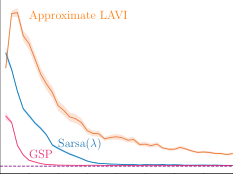

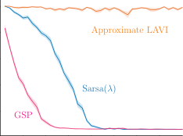

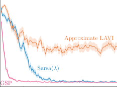

Figure 16: Five episode moving average of return in FourRooms, GridBall and PinBall. As
with previous learning curves, we follow the format of 30 runs and shaded region representing
1 standard error.

In our preliminary experiments, we had investigated an update rule that partially bootstraps off _vg_ _[⋆]_ . Namely, we used a TD error of _Rt_ +1 + _γt_ +1( _βvg_ _[⋆]_ ( _St_ +1)+(1 _−β_ ) _q_ ( _St_ +1 _, At_ +1)) _−_
_q_ ( _St, At_ ), where _β ∈_ [0 _,_ 1]. Potential based reward shaping with _vg_ _[⋆]_ was found to outperform
this technique. We discuss this more in Appendix F.

**7. Relationships to Other Model-based Approaches**

Now that we have detailed the GSP algorithm and investigated its benefits and limitations,
we contrast it to other approaches for background planning. In this section we first provide
an overview of related work to better place GSP amongst the large literature of related
ideas, beyond background planning. Then we more explicitly contrast GSP to Dyna and
Dyna with options, which are two natural approaches to background planning. Finally, we
provide a short discussion around one of the key properties of GSP, efficient planning, and
why this is desirable for background planning approaches.

**7.1 Related Work**

A variety of approaches have been developed to handle issues with learning and iterating
one-step models. Several papers have shown that using forward model simulations can
produce simulated states that result in catastrophically misleading values (Jafferjee et al.,
2020; van Hasselt et al., 2019; Lambert et al., 2022). This problem has been tackled by using
reverse models (Pan et al., 2018; Jafferjee et al., 2020; van Hasselt et al., 2019); primarily
using the model for decision-time planning (van Hasselt et al., 2019; Silver et al., 2008;
Chelu et al., 2020); and improving training strategies to account for accumulated errors in
rollouts (Talvitie, 2014; Venkatraman et al., 2015; Talvitie, 2017). An emerging trend is
to avoid approximating the true transition dynamics, and instead learn dynamics tailored
to predicting values on the next step correctly (Farahmand et al., 2017; Farahmand, 2018;
Ayoub et al., 2020). This trend is also implicit in the variety of techniques that encode the
planning procedure into neural network architectures that can then be trained end-to-end

22

Goal-Space Planning with Subgoal Models

(Tamar et al., 2016; Silver et al., 2017; Oh et al., 2017; Weber et al., 2017; Farquhar et al.,
2018; Schrittwieser et al., 2020). We similarly attempt to avoid issues with iterating models,
but do so by considering a different type of model.

Current deep model-based RL techniques plan in a lower-dimensional abstract space
where the relevant features from the original high-dimensional experience are preserved,
often refered to as a _latent space_ . MuZero (Schrittwieser et al., 2020), for example, embeds
the history of observations to then use predictive models of values, policies and one-step
rewards. Using these three predictive models in the latent space guides MuZero’s Monte
Carlo Tree Search without the need for a perfect simulator of the environment. Most recently,
DreamerV3 demonstrated the capabilities of a discrete latent world model in a range of
pixel-based environments (Hafner et al., 2023). There is growing evidence that it is easier to
learn accurate models in a latent space.

Temporal abstraction has also been considered to make planning more efficient, through
the use of hierarchical RL and/or options. MAXQ Dietterich (2000) introduced the idea of
learning hierarchical policies with multiple levels, breaking up the problem into multiple
subgoals. A large literature followed, focused on efficient planning with hierarchical policies
(Diuk et al., 2006) and using a hierarchy of MDPs with state abstraction and macro-actions
(Bakker et al., 2005; Konidaris et al., 2014; Konidaris, 2016; Gopalan et al., 2017). See
Gopalan et al. (2017) for an excellent summary.

Rather than using a hierarchy and planning only in abstract MDPs, another strategy is
simply to add options as additional (macro) actions in planning, still also including primitive
actions. Similar ideas were explored before the introduction of options (Singh, 1992; Dayan
and Hinton, 1992). There has been some theoretical characterization of the utility of
options for improving convergence rates of value iteration (Mann and Mannor, 2014) and
sample efficiency (Brunskill and Li, 2014), though also hardness results reflecting that the
augmented MDP is not necessarily more efficient to solve (Zahavy et al., 2020) and hardness
results around discovering options efficient for planning (Jinnai et al., 2019). Empirically,
incorporating options into planning has largely only been tested in tabular settings (Sutton
et al., 1999; Singh et al., 2004; Wan et al., 2021). Recent work has considered mechanism for
identifying and learning option policies for planning under function approximation (Sutton
et al., 2022), but as yet did not consider issues with learning the models.

There has been some work using options for planning that is more similar to GSP, using
only one-level of abstraction and restricting planning to the abstract MDP. Hauskrecht
et al. (2013) proposed to plan only in the abstract MDP with macro-actions (options) and
abstract states corresponding to the boundaries of the regions spanned by the options, which
is like restricting abstract states to subgoals. The most similar to our work is LAVI, which
restricts value iteration to a small subset of landmark states (Mann et al., 2015). [2] These
methods also have similar flavors to using a hierarchy of MDPs, in that they focus planning
in a smaller space and (mostly) avoid planning at the lowest level, obtaining significant
computational speed-ups. The key distinction to GSP is that we are not in the traditional

2. A similar idea to landmark states has been considered in more classical AI approaches, under the term
bi-level planning (Wolfe et al., 2010; Hogg et al., 2010; Chitnis et al., 2022). These techniques are
quite different from Dyna-style planning—updating values with (stochastic) dynamic programming
updates—and so we do not consider them further here.

23

Lo, Roice, Panahi, Jordan, White, Mihucz, Aminmansour and White

planning setting where a model is given; in our online setting, the agent needs to learn the
model from interaction.

The use of landmark states has also been explored in _goal-conditioned RL_, where the
agent is given a desired goal state or states. This is a problem setting where the aim is
to learn a policy _π_ ( _a|s, g_ ) that can be conditioned on different possible goals. The agent
learns for a given set of goals, with the assumption that at the start of each episode the
goal state is explicitly given to the agent. After this training phase, the policy should
generalize to previously unseen goals. Naturally, this idea has particularly been applied to
navigation, having the agent learn to navigate to different states (goals) in the environment.
The first work to exploit the idea of landmark states in GCRL was for learning and using
universal value function approximators (UVFAs) (Huang et al., 2019). The UVFA conditions
action-values on both state-action pairs as well as landmark states. The agent can reach new
goals by searching on a learned graph between landmark states, to identify which landmark
to moves towards. A flurry of work followed, still in the goal-conditioned setting (Nasiriany
et al., 2019; Emmons et al., 2020; Zhang et al., 2020, 2021; Aubret et al., 2021; Hoang et al.,
2021; Gieselmann and Pokorny, 2021; Kim et al., 2021; Dubey et al., 2021).

Some of this work focused on exploiting landmark states for planning in GCRL. Huang
et al. (2019) used landmark states as interim subgoals, with a graph-based search to plan
between these subgoals (Huang et al., 2019). The policy is set to reach the nearest goal
(using action-values with cost-to-goal rewards of -1 per step) and learned distance functions
between states and goals and between goals. These models are like our reward and discount
models, but tailored to navigation and distances. Nasiriany et al. (2019) built on this idea,
introducing an algorithm called Latent Embeddings for Abstracted Planning (LEAP), that
using gradient descent to search for a sequence of subgoals in a latent space.

The idea of learning models that immediately apply to new subtasks using successor
features is like GCRL, but does not explicitly use landmark states. The option keyboard
involves encoding options (or policies) as vectors that describe the corresponding (pseudo)
reward (Barreto et al., 2019). This work has been expanded more recently, using successor
features (Barreto et al., 2020). New policies can then be easily obtained for new reward
functions, by linearly combining the (basis) vectors for the already learned options. However
no planning is involved in that work, beyond a one-step decision-time choice amongst options.

**7.2 Contrasting GSP to Dyna and Dyna with Options**

In this section we contrast GSP to Dyna and Dyna with options, which are two canonical
approaches to do background planning. Dyna involves learning a transition model and
updating with simulated experience, in the background. The original version of Dyna simply
uses one step transitions from observed states, making it look quite similar to replay. Replay
can actually be seen as a limited, non-parametric version of Dyna, and often Dyna and
replay perform similarly (Pan et al., 2018; van Hasselt et al., 2019), without more focused
_search control_, namely from which states we query the model. To truly obtain the benefits
of the model with Dyna, it is key to consider which ( _s, a_ ) is the most useful to update from,
which may even be a hypothetical ( _s, a_ ) never observed. Querying the model from such
unseen ( _s, a_ ) leverages the generalization capabilities of the model much more than simply
querying the model from an observed ( _s, a_ ). It is likely a clever search-control strategy could

24

Goal-Space Planning with Subgoal Models

**Algorithm 2** `Dyna with options` (using the DDQN update)

Initialize base learner parameters **w** _,_ **w** targ = **w** 0, model parameters _**θ**_, search-control
queue _P_, set of options Π
Sample initial state _s_ 0 from the environment
**for** _t ∈_ 0 _,_ 1 _,_ 2 _, ..._ **do**

Take action _at_ using _q_ (e.g., _ϵ_ -greedy), observe _st_ +1 _, rt_ +1 _, γt_ +1
Store _st_ in _P_
`ModelUpdate` ( _st, at, st_ +1 _, rt_ +1 _, γt_ +1) (see Algorithm 6)
**for** _n_ main mini-batches **do**

Sample batch _B_ = _{s}_ from _P_
For each _s ∈_ _B_, pick a random ˜ _a_ from _A∪_ Π
// if ˜ _a_ is an option, _s_ _[′]_ is an outcome state after many steps,
// _r_ is a discounted sum of rewards under the option until termination
// and _γ_ is the discount raised to the number of steps that option executes
Query model at each ( _s,_ ˜ _a_ ) to get outcome _s_ _[′]_ _, r, γ_ and corresponding target
_Y_ = _r_ + _γq_ ( _s_ _[′]_ _,_ argmax _a′ q_ ( _s_ _[′]_ _, a_ _[′]_ ; **w** ); **w** targ)
_L_ = _|B_ 1 _|_ �( _s,a,Y_ ) _∈B_ [(] _[Y][ −]_ _[q]_ [(] _[s, a]_ [;] **[ w]** [))][2]

**w** _←_ **w** _−_ _α∇_ **w** _L_
**if** _n_ updates% _τ_ == 0 **then**

**w** targ _←_ **w**

_n_ updates = _n_ updates + 1

significantly improve Dyna, but it is also a hard problem. There remain very few proposed
search-control approaches only a handful of works (Moore and Atkeson, 1993; Wingate et al.,
2005; Pan et al., 2019).
If we go beyond one-step transitions, then we further deviate from replay and can benefit
from having an explicit learned model. As mentioned above, Dyna with rollouts can suffer
from model iteration error. An alternative approach to predict outcomes multiple steps into
the future is to incorporate options into Dyna. This extension was first proposed for the
tabular setting (Singh et al., 2004), with little follow-up work beyond a recent re-investigation
still in the tabular setting (Sutton et al., 2022). The general idea behind Dyna with options
is to treat options like macro-actions in the planning loop. Let us consider the one-step
transition dynamics model, for a given _π_, where the model outputs ˜ _s_ _[′]_ _,_ ˜ _r,_ ˜ _γ_ from ( _s, π_ ). For
simplicity, assume we are learning expected transition dynamics. The model outputs the
expected outcome state ˜ _s_ _[′]_ after executing the option from _s_ . In other words, ˜ _s_ _[′]_ is the
expected outcome state multiple steps into the future. The outputted reward ˜ _r_ from ( _s, π_ )
is the discounted cumulative sum of rewards of the option _π_ when starting from _s_, until
termination. The outputted ˜ _γ_ is the discounted probability of terminating. For example, if
the option always terminated after _n_ steps, then the model would output ˜ _γ_ = _γ_ _[n]_ . We show
a possible variant of Dyna and Dyna with options, again using a similar update to DDQN,
in Algorithm 2, to make this extension more concrete.
Dyna with options should allow for faster value propagation than Dyna alone. It
effectively uses multi-step updates rather than simple single-step updates. However, it
actually requires learning an even more complex model than Dyna, since it must learn the

25

Lo, Roice, Panahi, Jordan, White, Mihucz, Aminmansour and White

Dyna

GSP

DDQN

How

Fast

the

Agent

Learns

GSP

Linear

Sarsa(λ)
Dyna

DDQN

Sarsa

GSP

Dyna

DDQN

1 10 100 1000

Lightweight

Computation Used

Heavy compute

Figure 17: A visualization of the hypothetical trade-off between computation and how quickly
the agent learns for different algorithms. This plot is focused on computation, rather than
dealing with model errors, so Dyna means Dyna with a highly accurate model. Lightweight
algorithms like Sarsa, that update only with the most recent sample, cannot leverage more
computation to improve learning. DDQN, GSP and Dyna can leverage more computation
by increasing the amount of replay and planning steps. Of course, this diagram is completely
hypothetical, but reflects the thinking that guides this work as well as anticipated behavior
of these algorithms. GSP is more effective than Dyna with less compute, but is likely to
plateau at a slightly suboptimal point. With a lot of compute, Dyna with an accurate model
is effectively doing dynamic programming and extracting a policy from the model. But with
much less compute, it does not efficiently focus that compute to improve the policy. DDQN
is limited by the limited data that it has in its buffer, and unlike Dyna, cannot reason about
possible outcomes outside of this dataset.

transition-dynamics for the options as well as the transition dynamics for the primitive
actions. Moreover, it does still plan over all states and actions; again without smarter
search-control, planning is likely to still be inefficient. In this sense, the variants of Dyna
and Dyna with options presented here do not satisfy two key desiderata: feasible model
learning and efficient planning. We discuss the importance of efficient planning in more
depth in the next section.

**Remark:** The well-versed reader may be confused why we consider Dyna algorithms on
states, rather than on a latent state, also called agent state. It might seem that learning
transition dynamics on a (compact) agent state might provide us the desired desiderata.
Such a change is likely to make it more feasible to learn the model and make planning more
efficient. Nonetheless, we are still stuck planning in a continuous latent space that is likely
to have 32 dimensions, or more, based on typical design choices. It reduces, but does not
remove, these issues.

**7.3 The Importance of Efficient Planning**

GSP is designed to allow for efficient planning. We want changes in the environment to
quickly propagate through the value function. This is achieved by focusing planning on

26

Goal-Space Planning with Subgoal Models

a small set of subgoals. The local subgoal models can be updated efficiently, and value
iteration to get the new subgoal values. Value iteration for a small set of states is very
efficient, and the agent can perform many value iteration updates per step to keep these
subgoal values accurate. Replay then propagates these subgoal values to the state values.

Standard replay, Dyna and even Dyna with options does not have the same computational
efficiency due to the lack of higher level planning. In practice, with a bounded agent, poor
computational efficiency can result in poor sample efficiency. The learned model might even
be perfectly accurate, and with unlimited computation per step, the agent could obtain the
perfect value function. But with a computational budget—for example with a budget of
ten planning steps per step—it may fail to transfer it’s (immense) knowledge about the
world into the policy. Eventually, over many steps (environment interactions), it will get an
accurate value function. An algorithm, on the other hand, that can more quickly transfer
knowledge from it’s model to the value function will get closer to the true action-values in a
smaller number of environment steps. We visualize this conceptual trade-off in Figure 17,
for DDQN (namely replay), Dyna and GSP (layered on top of DDQN).

**8. Conclusion**

In this paper we introduced a new planning framework, called Goal-Space Planning (GSP).
GSP provides a new approach to use background planning to improve value propagation,
with minimalist, local models and computationally efficient planning. We showed that
these subgoal-conditioned models can be accurately learned using standard value estimation
algorithms, and can be used to quickly propagate value through state spaces of varying
sizes. We find a consequent learning speed-up on base learners with different types of value
function approximation. Subgoal selection was found to play a big role on the value function
and policy the base learner reaches. In particular, we see that the GSP algorithm helps the
base learner find a path through the state space, based on the high level path from found in
the abstract MDP. We also verify that the performance improvement observed in GSP is
result of _vg_ _[⋆]_ capturing the MDP dynamics, and not a general consequence of potential-based
reward shaping.

This work introduces a new formalism, and many new technical questions along with
it. We have tested GSP with pre-trained models and assumed a given set of subgoals.
Our experiments learning the models online using successor representations indicate that
GSP can get similar learning speed boosts. Using a recency buffer, however, accumulates
transitions only along the optimal trajectory, sometimes causing the models to become
inaccurate part-way through learning. An important next step is to incorporate smarter
model learning strategies. The other critical open question is in subgoal discovery. For this
work, we relied on hand-chosen subgoals, but in general the agent should discover its own
subgoals. In general, though, option and subgoal discovery remain open questions. One
utility of this work is that it could help narrow the scope of the discovery question, to that
of finding abstract subgoals that help a learner plan more efficiently.

27

Lo, Roice, Panahi, Jordan, White, Mihucz, Aminmansour and White

**References**

Arthur Aubret, Laetitia Matignon, and Salima Hassas. DisTop: Discovering a Topological
representation to learn diverse and rewarding skills. _arXiv:2106.03853 [cs]_, 2021.

Alex Ayoub, Zeyu Jia, Csaba Szepesv´ari, Mengdi Wang, and Lin Yang. Model-Based
Reinforcement Learning with Value-Targeted Regression. In _International Conference on_
_Machine Learning_, 2020.

Bram Bakker, Zoran Zivkovic, and Ben Krose. Hierarchical dynamic programming for robot
path planning. In _International Conference on Intelligent Robots and Systems_, 2005.

Andr´e Barreto, Will Dabney, R´emi Munos, Jonathan J. Hunt, Tom Schaul, David Silver, and
Hado van Hasselt. Successor features for transfer in reinforcement learning. In _Advances_
_in Neural Information Processing Systems_, 2017.

Andre Barreto, Diana Borsa, Shaobo Hou, Gheorghe Comanici, Eser Ayg¨un, Philippe Hamel,
Daniel Toyama, Jonathan Hunt, Shibl Mourad, David Silver, and Doina Precup. The
Option Keyboard: Combining Skills in Reinforcement Learning. In _Advances in Neural_
_Information Processing Systems_, 2019.

Andr´e Barreto, Shaobo Hou, Diana Borsa, David Silver, and Doina Precup. Fast reinforcement learning with generalized policy updates. _Proceedings of the National Academy of_
_Sciences_, 117(48), 2020.

Emma Brunskill and Lihong Li. PAC-inspired Option Discovery in Lifelong Reinforcement
Learning. In _Proceedings of the 31st International Conference on Machine Learning_ .
PMLR, 2014.

Veronica Chelu, Doina Precup, and Hado P van Hasselt. Forethought and hindsight in credit
assignment. In _Advances in Neural Information Processing Systems_, 2020.

Ching-An Cheng, Xinyan Yan, and Byron Boots. Trajectory-wise Control Variates for
Variance Reduction in Policy Gradient Methods. In _3rd Annual Conference on Robot_
_Learning_, volume 100 of _Proceedings of Machine Learning Research_, 2019.

Rohan Chitnis, Tom Silver, Joshua B. Tenenbaum, Tom´as Lozano-P´erez, and Leslie Pack
Kaelbling. Learning Neuro-Symbolic Relational Transition Models for Bilevel Planning.
In _International Conference on Intelligent Robots and Systems_ . IEEE, 2022.

Peter Dayan and Geoffrey E Hinton. Feudal reinforcement learning. In _Advances in Neural_
_Information Processing Systems_, 1992.

Thomas G Dietterich. Hierarchical reinforcement learning with the maxq value function
decomposition. _Journal of Artificial Intelligence Research_, 13:227–303, 2000.

Carlos Diuk, Alexander L Strehl, and Michael L Littman. A hierarchical approach to efficient
reinforcement learning in deterministic domains. In _International Joint Conference on_
_Autonomous Agents and Multiagent Systems_, 2006.

28

Goal-Space Planning with Subgoal Models

Rohit K. Dubey, Samuel S. Sohn, Jimmy Abualdenien, Tyler Thrash, Christoph Hoelscher,
Andr´e Borrmann, and Mubbasir Kapadia. SNAP:Successor Entropy based Incremental
Subgoal Discovery for Adaptive Navigation. In _Motion, Interaction and Games_, 2021.

Scott Emmons, Ajay Jain, Misha Laskin, Thanard Kurutach, Pieter Abbeel, and Deepak
Pathak. Sparse Graphical Memory for Robust Planning. In _Advances in Neural Information_
_Processing Systems_, 2020.

Amir-massoud Farahmand. Iterative Value-Aware Model Learning. In _Advances in Neural_
_Information Processing Systems_, 2018.

Amir-massoud Farahmand, Andre M S Barreto, and Daniel N Nikovski. Value-Aware
Loss Function for Model-based Reinforcement Learning. In _International Conference on_
_Artificial Intelligence and Statistics_, 2017.

Gregory Farquhar, Tim Rockt¨aschel, Maximilian Igl, and Shimon Whiteson. TreeQN and
ATreeC: Differentiable Tree-Structured Models for Deep Reinforcement Learning. In
_International Conference on Learning Representations_, 2018.

Robert Gieselmann and Florian T. Pokorny. Planning-Augmented Hierarchical Reinforcement
Learning. _IEEE Robotics and Automation Letters_, 6(3), 2021.

Nakul Gopalan, Michael Littman, James MacGlashan, Shawn Squire, Stefanie Tellex, John
Winder, Lawson Wong, et al. Planning with abstract markov decision processes. In
_International Conference on Automated Planning and Scheduling_, 2017.

Danijar Hafner, Jurgis Pasukonis, Jimmy Ba, and Timothy Lillicrap. Mastering Diverse
Domains through World Models. _arXiv:2301.04104_, 2023.

Milos Hauskrecht, Nicolas Meuleau, Leslie Pack Kaelbling, Thomas L Dean, and Craig
Boutilier. Hierarchical solution of markov decision processes using macro-actions. In
_Uncertainty in Artificial Intelligence_, 2013.

Kaiming He, Xiangyu Zhang, Shaoqing Ren, and Jian Sun. Delving deep into rectifiers:
Surpassing human-level performance on imagenet classification. In _IEEE International_
_Conference on Computer Vision_, 2015.

Christopher Hoang, Sungryull Sohn, Jongwook Choi, Wilka Carvalho, and Honglak Lee.
Successor Feature Landmarks for Long-Horizon Goal-Conditioned Reinforcement Learning.
In _Advances in Neural Information Processing Systems_, 2021.

Chad Hogg, U. Kuter, and Hector Mu˜noz-Avila. Learning Methods to Generate Good Plans:
Integrating HTN Learning and Reinforcement Learning. In _AAAI Conference on Artificial_
_Intelligence_, 2010.

Jiawei Huang and Nan Jiang. From Importance Sampling to Doubly Robust Policy Gradient.
In _International Conference on Machine Learning_, 2020.

Zhiao Huang, Fangchen Liu, and Hao Su. Mapping State Space using Landmarks for
Universal Goal Reaching. In _Advances in Neural Information Processing Systems_, 2019.

29

Lo, Roice, Panahi, Jordan, White, Mihucz, Aminmansour and White

Taher Jafferjee, Ehsan Imani, Erin Talvitie, Martha White, and Micheal Bowling. Hallucinating Value: A Pitfall of Dyna-style Planning with Imperfect Environment Models.
_arXiv:2006.04363_, 2020.

Yuu Jinnai, David Abel, David Hershkowitz, Michael Littman, and George Konidaris.
Finding Options that Minimize Planning Time. In _International Conference on Machine_
_Learning_, 2019.

Khimya Khetarpal, Zafarali Ahmed, Gheorghe Comanici, David Abel, and Doina Precup.
What can I do here? A Theory of Affordances in Reinforcement Learning. In _International_
_Conference on Machine Learning_, 2020.

Junsu Kim, Younggyo Seo, and Jinwoo Shin. Landmark-Guided Subgoal Generation in
Hierarchical Reinforcement Learning. In _Advances in Neural Information Processing_
_Systems_, 2021.

George Konidaris. Constructing abstraction hierarchies using a skill-symbol loop. In
_International Joint Conference on Artificial Intelligence_, volume 2016, 2016.

George Konidaris, Leslie Kaelbling, and Tomas Lozano-Perez. Constructing symbolic
representations for high-level planning. In _AAAI Conference on Artificial Intelligence_,

2014.

George D. Konidaris and Andrew G. Barto. Skill Discovery in Continuous Reinforcement
Learning Domains using Skill Chaining. In _Advances in Neural Information Processing_
_Systems_, 2009.

Nathan Lambert, Kristofer Pister, and Roberto Calandra. Investigating Compounding
Prediction Errors in Learned Dynamics Models. _arXiv:2203.09637_, 2022.

Timothy Mann and Shie Mannor. Scaling up approximate value iteration with options:
Better policies with fewer iterations. In _International Conference on Machine Learning_,
pages 127–135. PMLR, 2014.

Timothy A. Mann, Shie Mannor, and Doina Precup. Approximate Value Iteration with
Temporally Extended Actions. _Journal of Artificial Intelligence Research_, 53, 2015.

Amy McGovern and Andrew G. Barto. Automatic Discovery of Subgoals in Reinforcement
Learning using Diverse Density. In _International Conference on Machine Learning_, 2001.

Andrew W. Moore and Christopher G. Atkeson. Prioritized Sweeping: Reinforcement
Learning with Less Data and Less Time. _Machine learning_, 13(1), 1993.

Soroush Nasiriany, Vitchyr Pong, Steven Lin, and Sergey Levine. Planning with GoalConditioned Policies. In _Advances in Neural Information Processing Systems_, 2019.

Andrew Y. Ng, Daishi Harada, and Stuart Russell. Policy Invariance under Reward
Transformations: Theory and Application to Reward Shaping. In _International Conference_
_on Machine Learning_, 1999.

30

Goal-Space Planning with Subgoal Models

Junhyuk Oh, Satinder Singh, and Honglak Lee. Value Prediction Network. In _Advances in_
_Neural Information Processing Systems_, 2017.

Yangchen Pan, Muhammad Zaheer, Adam White, Andrew Patterson, and Martha White.
Organizing Experience: A Deeper Look at Replay Mechanisms for Sample-Based Planning
in Continuous State Domains. In _International Joint Conference on Artificial Intelligence_,

2018.

Yangchen Pan, Hengshuai Yao, Amir-Massoud Farahmand, and Martha White. Hill Climbing
on Value Estimates for Search-Control in Dyna. In _International Joint Conference on_
_Artificial Intelligence_, 2019.

Sergey Pankov. Reward-Estimation Variance Elimination in Sequential Decision processes.
_arXiv:1811.06225_, 2018.

Andrew Patterson, Samuel Neumann, Martha White, and Adam White. Empirical Design
in Reinforcement Learning. _arXiv:2304.01315_, 2020.

Roger Penrose. A Generalized Inverse for Matrices. _Mathematical Proceedings of the_
_Cambridge Philosophical Society_, 51(3), 1955.

Tom Schaul, Daniel Horgan, Karol Gregor, and David Silver. Universal Value Function
Approximators. In _International Conference on Machine Learning_, 2015.

Julian Schrittwieser, Ioannis Antonoglou, Thomas Hubert, Karen Simonyan, Laurent Sifre,
Simon Schmitt, Arthur Guez, Edward Lockhart, Demis Hassabis, Thore Graepel, Timothy
Lillicrap, and David Silver. Mastering Atari, Go, Chess and Shogi by Planning with a
Learned Model. _Nature_, 588(7839), 2020.

John Schulman, Filip Wolski, Prafulla Dhariwal, Alec Radford, and Oleg Klimov. Proximal
policy optimization algorithms. _arXiv:1707.06347_, 2017.

David Silver, Richard S. Sutton, and Martin M¨uller. Sample-Based Learning and Search with
Permanent and Transient Memories. In _International Conference on Machine Learning_,

2008.

David Silver, Hado Hasselt, Matteo Hessel, Tom Schaul, Arthur Guez, Tim Harley, Gabriel
Dulac-Arnold, David Reichert, Neil Rabinowitz, Andre Barreto, and Thomas Degris. The
Predictron: End-To-End Learning and Planning. In _International Conference on Machine_
_Learning_, 2017.

Satinder Singh, Andrew Barto, and Nuttapong Chentanez. Intrinsically Motivated Reinforcement Learning. In _Advances in Neural Information Processing Systems_, 2004.

Satinder P Singh. Scaling reinforcement learning algorithms by learning variable temporal
resolution models. In _Machine Learning Proceedings 1992_, pages 406–415. Elsevier, 1992.

Martin Stolle and Doina Precup. Learning Options in Reinforcement Learning. In _Abstraction,_
_Reformulation, and Approximation_, 2002.

31

Lo, Roice, Panahi, Jordan, White, Mihucz, Aminmansour and White

Richard S. Sutton. Integrated modeling and control based on reinforcement learning and
dynamic programming. In _Advances in Neural Information Processing Systems_, 1991.

Richard S. Sutton and Andrew G. Barto. _Reinforcement Learning: An Introduction_ . MIT
Press, 2018.

Richard S. Sutton, Doina Precup, and Satinder P. Singh. Between MDPs and Semi-MDPs:
A Framework for Temporal Abstraction in Reinforcement Learning. _Artificial Intelligence_,
112(1-2), 1999.

Richard S. Sutton, Joseph Modayil, Michael Delp, Thomas Degris, Patrick M Pilarski,
Adam White, and Doina Precup. Horde: A Scalable Real-Time Architecture for Learning
Knowledge from Unsupervised Sensorimotor Interaction. In _International Conference on_
_Autonomous Agents and Multiagent Systems_, 2011.

Richard S. Sutton, Rupam A. Mahmood, and Martha White. An Emphatic Approach to the
Problem of Off-Policy Temporal-Difference Learning. _The Journal of Machine Learning_
_Research_, 2016.

Richard S. Sutton, Marlos C. Machado, G. Zacharias Holland, David Szepesv´ari, Finbarr
Timbers, Brian Tanner, and Adam White. Reward-Respecting Subtasks for Model-Based
Reinforcement Learning. _Artificial Intelligence_, 324, 2022.

Erik Talvitie. Model Regularization for Stable Sample Roll-Outs. In _Uncertainty in Artificial_
_Intelligence_, 2014.

Erik Talvitie. Self-Correcting Models for Model-Based Reinforcement Learning. In _AAAI_
_Conference on Artificial Intelligence_, 2017.

Aviv Tamar, Yi Wu, Garrett Thomas, Sergey Levine, and Pieter Abbeel. Value Iteration
Networks. In _Advances in Neural Information Processing Systems_, 2016.

Hado van Hasselt. Double q-learning. In _Advances in Neural Information Processing Systems_,

2010.

Hado van Hasselt, Arthur Guez, and David Silver. Deep Reinforcement Learning with
Double Q-learning. In _AAAI Conference on Artificial Intelligence_, 2016.

Hado van Hasselt, Matteo Hessel, and John Aslanides. When to use Parametric Models in
Reinforcement Learning? In _Advances in Neural Information Processing Systems_, 2019.

Arun Venkatraman, Martial Hebert, and J. Andrew Bagnell. Improving Multi-Step Prediction
of Learned Time Series Models. In _AAAI Conference on Artificial Intelligence_, 2015.

Yi Wan, Muhammad Zaheer, Adam White, Martha White, and Richard S. Sutton. Planning
with Expectation Models. In _International Joint Conference on Artificial Intelligence_,

2019.

Yi Wan, Abhishek Naik, and Richard S. Sutton. Average-Reward Learning and Planning
with Options. In _Advances in Neural Information Processing Systems_, 2021.

32

Goal-Space Planning with Subgoal Models

Theophane Weber, Sebastien Racani`ere, David P Reichert, Lars Buesing, Arthur Guez,
Danilo Jimenez Rezende, Adri`a Puigdom`enech Badia, Oriol Vinyals, Nicolas Heess, Yujia
Li, Razvan Pascanu, Peter Battaglia, David Silver, and Daan Wierstra. ImaginationAugmented Agents for Deep Reinforcement Learning. In _Advances in Neural Information_
_Processing Systems_, 2017.

Martha White. Unifying Task Specification in Reinforcement Learning. In _International_
_Conference on Machine Learning_, 2017.

Ronald J. Williams. Simple statistical gradient-following algorithms for connectionist
reinforcement learning. _Machine Learning_, 8, 1992.

David Wingate, Kevin D. Seppi, and Cs Byu Edu. Prioritization Methods for Accelerating
MDP Solvers. _Journal of Machine Learning Research_, 2005.

Jason Wolfe, Bhaskara Marthi, and Stuart Russell. Combined Task and Motion Planning for
Mobile Manipulation. _International Conference on Automated Planning and Scheduling_,

2010.

Tom Zahavy, Avinatan Hasidim, Haim Kaplan, and Yishay Mansour. Planning in Hierarchical
Reinforcement Learning: Guarantees for Using Local Policies. In _Proceedings of the 31st_
_International Conference on Algorithmic Learning Theory_ . PMLR, 2020.

Lunjun Zhang, Ge Yang, and Bradly C. Stadie. World Model as a Graph: Learning Latent
Landmarks for Planning. In _International Conference on Machine Learning_, 2021.

Tianren Zhang, Shangqi Guo, Tian Tan, Xiaolin Hu, and Feng Chen. Generating AdjacencyConstrained Subgoals in Hierarchical Reinforcement Learning. In _Advances in Neural_
_Information Processing Systems_, 2020.

33

Lo, Roice, Panahi, Jordan, White, Mihucz, Aminmansour and White

**A. Starting Simpler: Goal-Space Planning for Policy Evaluation**

To highlight the key idea for efficient planning, we provide an example of GSP in a simpler
setting: policy evaluation for learning _v_ _[π]_ for a fixed deterministic policy _π_ in a deterministic
environment, assuming access to the true models. The key idea is to propagate values quickly
across the space by updating between a subset of states that we call _subgoals_, _g ∈G ⊂S_, as
visualized in Figure 18. (Later we extend _G ̸⊂S_ to abstract subgoal vectors that need not
correspond to any state.) To do so, we need temporally extended models between pairs _g, g_ _[′]_

that may be further than one-transition apart. For policy evaluation, these models are the
accumulated rewards _rπ,γ_ : _S × S →_ R and discounted probabilities _Pπ,γ_ : _S × S →_ [0 _,_ 1]
under _π_ :

def _′_
_rπ,γ_ ( _g, g_ _[′]_ ) = E _π_ [ _Rt_ +1 + _γg′,t_ +1 _rπ,γ_ ( _St_ +1 _, g_ ) _|St_ = _g_ ]

def _′_ _′_
_Pπ,γ_ ( _g, g_ _[′]_ ) = E _π_ [1( _St_ +1 = _g_ ) _γt_ +1 + _γg′,t_ +1 _Pπ,γ_ ( _St_ +1 _, g_ ) _|St_ = _g_ ]

where _γg′,t_ +1 = 0 if _St_ +1 = _g_ _[′]_ and otherwise equals _γt_ +1, the environment discount. If we
cannot reach _g_ _[′]_ from _g_ under _π_, then _Pπ,γ_ ( _g, g_ _[′]_ ) will simply accumulate many zeros and be
zero. We can treat _G_ as our new state space and plan in this space, to get value estimates _v_
for all _g ∈G_

¯
_v_ ( _g_ ) = _rπ,γ_ ( _g, g_ _[′]_ ) + _Pπ,γ_ ( _g, g_ _[′]_ ) _v_ ( _g_ _[′]_ ) where _g_ _[′]_ = argmax _g′∈GPπ,γ_ ( _g, g_ _[′]_ )

where¯ _G_ [¯] = _G ∪{s_ terminal _}_ if there is a terminal state (episodic problems) and otherwise
_G_ = _G_ . It is straightforward to show this converges, because _Pπ,γ_ is a substochastic matrix
(see Appendix A.1).
Once we have these values, we can propagate these to other states, locally, again using
the closest _g_ to _s_ . We can do so by noticing that the above definitions can be easily extended
to _rπ,γ_ ( _s, g_ _[′]_ ) and _Pπ,γ_ ( _s, g_ _[′]_ ), since for a pair ( _s, g_ ) they are about starting in the state _s_ and
reaching _g_ under _π_ .

¯
_v_ ( _s_ ) = _rγ_ ( _s, g_ ) + _Pπ,γ_ ( _s, g_ ) _v_ ( _g_ ) where _g_ = argmax _g∈GPπ,γ_ ( _s, g_ ) _._

Because the rhs of this equation is fixed, we only cycle through these states once to get their
values.

All of this might seem like a lot of work for policy evaluation; indeed, it will be more
useful to have this formalism for control. But, even here goal-space planning can be beneficial.
Let assume a chain _s_ 1 _, s_ 2 _, . . ., sn_, where _n_ = 1000 and _G_ = _{s_ 100 _, s_ 200 _, . . ., s_ 1000 _}_ . Planning
over _g ∈G_ only requires sweeping over 10 states, rather than 1000. Further, we have taken
a 1000 horizon problem and converted it into a 10 step one. [3] As a result, changes in the
environment also propagate faster. If the reward at _s_ _[′]_ changes, locally the reward model
around _s_ _[′]_ can be updated quickly, to change _rπ,γ_ ( _g, g_ _[′]_ ) for pairs _g, g_ _[′]_ where _s_ _[′]_ is along the
way from _g_ to _g_ _[′]_ . This local change quickly updates the values back to earlier ˜ _g ∈G_ .

3. In this simplified example, we can plan efficiently by updating the value at the end in _sn_, and then
updating states backwards from the end. But, without knowing this structure, it is not a general purpose
strategy. For general MDPs, we would need smart ways to do search control: the approach to pick
states from one-step updates. In fact, we can leverage search control strategies to improve the goal-space
planning step. Then we get the benefit of these approaches, as well as the benefit of planning over a
much smaller state space.

34

Goal-Space Planning with Subgoal Models

One-step Backup

Goal-Space Planning

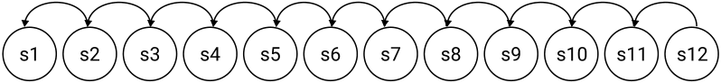

Terminal

Terminal

Figure 18: Comparing one-step backup with Goal-Space Planning when subgoals are concrete
states. GSP first focuses planning over a smaller set of subgoals (in red), then updates the
values of individual states.

**A.1 Proofs for the Deterministic Policy Evaluation Setting**

We provide proofs here for the deterministic policy evaluation setting. We assume throughout
that the environment discount _γt_ +1 is a constant _γc ∈_ [0 _,_ 1) for every step in an episode,
until termination when it is zero. The below results can be extended to the case where

_γc_ = 1, using the standard strategy for the stochastic shortest path problem setting.
First, we want to show that given _rπ,γ_ and _Pπ,γ_, we can guarantee that the update for
the values for _G_ will converge. Recall that _G_ [¯] = _G ∪{s_ terminal _}_ is the augmented goal space
that includes the terminal state. This terminal state is not a subgoal—since it is not a real
state—but is key for appropriate planning.

**Lemma 1** _Assume that we have a deterministic MDP, deterministic policy π, γc <_ 1 _, a_
_discrete set of subgoals G ⊂S, and that we iteratively update vt ∈_ R _[|]_ [ ¯] _[G|]_ _with the dynamic_
_programming update_

_vt_ ( _g_ ) = _rπ,γ_ ( _g, g_ _[′]_ ) + _Pπ,γ_ ( _g, g_ _[′]_ ) _vt−_ 1( _g_ _[′]_ ) _where g_ _[′]_ = argmax _Pπ,γ_ ( _g, g_ _[′]_ )
_g_ _[′]_ _∈G_ [¯]

_for all g ∈G, starting from an arbitrary (finite) initialization v_ 0 _∈_ R _[|]_ [ ¯] _[G|]_ _, with vt_ ( _sterminal_ )
_fixed at zero. Then then vt converges to a fixed point._

**Proof** To analyze this as a matrix update, we need to extend _Pπ,γ_ ( _g, g_ _[′]_ ) to include an
additional row transitioning from _s_ terminal. This row is all zeros, because the value in the
terminal state is always fixed at zero. Note that there are ways to avoid introducing terminal
states, using transition-based discounting (White, 2017), but for this work it is actually
simpler to explicitly reason about them and reaching them from subgoals.
To show this we simply need to ensure that _Pπ,γ_ is a substochastic matrix. Recall that

def _′_ _′_
_Pπ,γ_ ( _g, g_ _[′]_ ) = E _π_ [1( _St_ +1 = _g_ ) _γt_ +1 + _γg′,t_ +1 _Pπ,γ_ ( _St_ +1 _, g_ ) _|St_ = _g_ ]

35

Lo, Roice, Panahi, Jordan, White, Mihucz, Aminmansour and White

where _γg′,t_ +1 = 0 if _St_ +1 = _g_ _[′]_ and otherwise equals _γt_ +1, the environment discount. If it is
substochastic, then _∥Pπ,γ∥_ 2 _<_ 1. Consequently, the Bellman operator

( _Bv_ )( _g_ ) = _rπ,γ_ ( _g, g_ _[′]_ ) + _Pπ,γ_ ( _g, g_ _[′]_ )˜ _v_ ( _g_ _[′]_ ) where _g_ _[′]_ = argmax _Pπ,γ_ ( _g, g_ _[′]_ )
_g_ _[′]_ _∈G_ [¯]

is a contraction, because _∥Bv_ 1 _−Bv_ 2 _∥_ 2 = _∥Pπ,γv_ 1 _−Pπ,γv_ 2 _∥_ 2 _≤∥Pπ,γ∥_ 2 _∥v_ 1 _−v_ 2 _∥_ 2 _< ∥v_ 1 _−v_ 2 _∥_ 2.
Because _γc <_ 1, then either _g_ immediately terminates in _g_ _[′]_, giving 1( _St_ +1 = _g_ _[′]_ ) _γt_ +1 +
_γg′,t_ +1 _Pπ,γ_ ( _St_ +1 _, g_ _[′]_ ) = _γt_ +1 + 0 _≤_ _γc_ . Or, it does not immediately terminate, and 1( _St_ +1 =
_g_ _[′]_ ) _γt_ +1 + _γg′,t_ +1 _Pπ,γ_ ( _St_ +1 _, g_ _[′]_ ) = 0 + _γcPπ,γ_ ( _St_ +1 _, g_ _[′]_ ) _≤_ _γc_ because _Pπ,γ_ ( _St_ +1 _, g_ _[′]_ ) _≤_ 1. Therefore, if _γc <_ 1, then _∥Pπ,γ∥_ 2 _≤_ _γc_ .

**Proposition 2** _For a deterministic MDP, deterministic policy π, and a discrete set of_
_subgoals G ⊂S that are all reached by π in the MDP, given the_ ˜ _v_ ( _g_ ) _obtained from Equation_
_1, if we set_

_v_ ( _s_ ) = _rγ_ ( _s, g_ ) + _Pπ,γ_ ( _s, g_ )˜ _v_ ( _g_ ) _where g_ = argmax _Pπ,γ_ ( _s, g_ )
_g∈G_ [¯]

_for all states s ∈S then we get that v_ = _vπ._

**Proof** For a deterministic environment and deterministic policy this result is straightforward. The term _Pπ,γ_ ( _s, g_ ) _>_ 0 only if _g_ is on the trajectory from _s_ when the policy _π_ is
executed. The term _rγ_ ( _s, g_ ) consists of deterministic (discounted) rewards and ˜ _v_ ( _g_ ) is the
true value from _g_, as shown in Lemma 1 (namely ˜ _v_ ( _g_ ) = _vπ_ ( _g_ )). The subgoal _g_ is the closest
state on the trajectory from _s_, and _Pπ,γ_ ( _s, g_ ) is _γc_ _[t]_ [where] _[ t]_ [ is the number of steps from] _[ s]_ [ to] _[ g]_ [.]

**B. Proofs for the General Control Setting**

In this section we assume that _γc <_ 1, to avoid some of the additional issues for handling
proper policies. The same strategies apply to the stochastic shortest path setting with
_γc_ = 1, with additional assumptions.

**Proposition 3** _[Convergence of Value Iteration in Goal-Space] Assuming that_ Γ [˜] _is a sub-_
_stochastic matrix, with v_ 0 _∈_ R _[|]_ [ ¯] _[G|]_ _initialized to an arbitrary value and fixing vt_ ( _sterminal_ ) = 0
_for all t, then iteratively sweeping through all g ∈G with update_

˜
_vt_ ( _g_ ) = max _rγ_ ( _g, g_ _[′]_ ) + Γ( [˜] _g, g_ _[′]_ ) _vt−_ 1( _g_ _[′]_ )
_g_ _[′]_ _∈G_ [¯] : _d_ [˜] ( _g,g_ _[′]_ ) _>_ 0

_convergences to a fixed-point._

**Proof** We can use the same approach typically used for value iteration. For any _v_ 0 _∈_ R _[|]_ [ ¯] _[G|]_,
we can define the operator

def ˜
( _B_ _[g]_ _v_ )( _g_ ) = max _rγ_ ( _g, g_ _[′]_ ) + Γ( [˜] _g, g_ _[′]_ )˜ _v_ ( _g_ _[′]_ )
_g_ _[′]_ _∈G_ [¯] : _d_ [˜] ( _g,g_ _[′]_ ) _>_ 0

36

Goal-Space Planning with Subgoal Models

First we can show that _B_ _[g]_ is a _γc_ -contraction. Assume we are given any two vectors _v_ 1 _, v_ 2.
Notice that Γ [˜] ( _g, g_ _[′]_ ) _≤_ _γc_, because for our problem setting the discount is either equal to _γc_
or equal to zero at termination. Then we have that for any _g ∈_ _G_ [¯]

_|_ ( _B_ _[g]_ _v_ 1)( _g_ ) _−_ ( _B_ _[g]_ _v_ 2)( _g_ ) _|_

˜ ˜
= max _rγ_ ( _g, g_ _[′]_ ) + Γ( [˜] _g, g_ _[′]_ ) _v_ 1( _g_ _[′]_ ) _−_ max _rγ_ ( _g, g_ _[′]_ ) + Γ( [˜] _g, g_ _[′]_ ) _v_ 2( _g_ _[′]_ )
��� _g_ _[′]_ _∈G_ [¯] : _d_ [˜] ( _g,g_ _[′]_ ) _>_ 0 _g_ _[′]_ _∈G_ [¯] : _d_ [˜] ( _g,g_ _[′]_ ) _>_ 0 ���

˜
_≤_ max _|rγ_ ( _g, g_ _[′]_ ) + Γ( [˜] _g, g_ _[′]_ ) _v_ 1( _g_ _[′]_ ) _−_ (˜ _rγ_ ( _g, g_ _[′]_ ) + Γ( [˜] _g, g_ _[′]_ ) _v_ 2( _g_ _[′]_ )) _|_
_g_ _[′]_ _∈G_ [¯] : _d_ [˜] ( _g,g_ _[′]_ ) _>_ 0

= max _|_ Γ( [˜] _g, g_ _[′]_ )( _v_ 1( _g_ _[′]_ ) _−_ _v_ 2( _g_ _[′]_ )) _|_
_g_ _[′]_ _∈G_ [¯] : _d_ [˜] ( _g,g_ _[′]_ ) _>_ 0

_≤_ max _γc|v_ 1( _g_ _[′]_ ) _−_ _v_ 2( _g_ _[′]_ ) _|_
_g_ _[′]_ _∈G_ [¯] : _d_ [˜] ( _g,g_ _[′]_ ) _>_ 0

_≤_ _γc∥v_ 1 _−_ _v_ 2 _∥∞_

Since this is true for any _g_, it is true for the max over _g_, giving

_∥B_ _[g]_ _v_ 1 _−_ _B_ _[g]_ _v_ 2 _∥∞_ _≤_ _γc∥v_ 1 _−_ _v_ 2 _∥∞._

Because the operator _B_ _[g]_ is a contraction, since _γc <_ 1, we know by the Banach Fixed-Point
Theorem that the fixed-point exists and is unique.

**C. Learning the Option Policies**

In this section we detail the implementation of option learning which was used in all
the experiments presented in this paper. This is followed by a brief description of how
these option policies could be learnt more generally across domains. Our full procedure is
summarised in Figure 21.

**C.1 Learning our Option Policies**

In the simplest case, it is enough to learn _πg_ that makes _rγ_ ( _s, g_ ) maximal for every relevant
_s_ (i.e., _∀_ _s ∈S_ s _._ t _. d_ ( _s, g_ ) _>_ 0). For each subgoal _g_, we learn its corresponding option model
_πg_ by initialising the base learner in the initiation set of _g_, and terminating the episode once
the learner is in a state that is a member of _g_ . We used a reward of -1 per step and save
the option policy once we reach a 90% success rate, and the last 100 episodes are within
some domain-dependent cut off. This cut off was 10 steps for FourRooms, and 50 steps for
GridBall and PinBall.
**Hyperparameters** In FourRooms, we use Sarsa(0) and Sarsa(0.9) base learners with
learning rate _α_ = 0 _._ 01, discount factor _γc_ = 0 _._ 99 and an _ϵ_ = 0 _._ 02 for its _ϵ_ -greedy policy.
In GridBall, we used Sarsa(0) and Sarsa(0.9) base learners with _α_ = 0 _._ 05, _γc_ = 0 _._ 99 and
_ϵ_ = 0 _._ 1. _ϵ_ is decayed by 0.5% each timestep. In the linear function approximation setting,
these learners use a tilecoder with 16 tiles and 4 tilings across each of the both the GridBall
dimensions. In PinBall, the Sarsa(0.9) learner was tuned to _α_ = 0 _._ 1, _γc_ = 0 _._ 99, _ϵ_ = 0 _._ 1,
decayed in the same manner as in GridBall. The same tile coder was used on on the 4dimensional state space of PinBall. For the DDQN base learner, we use _α_ = 0 _._ 004, _γc_ = 0 _._ 99,

37

~~Lo, Roice, Panahi, Jordan, White, Mihucz, Aminmansour and White~~

Figure 19: Evaluation of PinBall option policies by average trajectory length. Policies were
saved once they were able to reach their respective subgoal in undeer 50 steps, averaged
across 100 trajectories. Subgoal 2 was the hardest to learn an option policy for, due to its
proximity to obstacles.

_ϵ_ = 0 _._ 1, a buffer that holds up to 10 _,_ 000 transitions a batch size of 32, and a target refresh
rate of every 100 steps. The Q-Network weights used Kaiming initialisation (He et al., 2015).
We could have also learned the action-value variant _rγ_ ( _s, a, g_ ) using a Sarsa update, and
set _πg_ ( _s_ ) = argmax _a∈A rγ_ ( _s, a, g_ ), where we overloaded the definition of _rγ_ . We can then
extract _rγ_ ( _s, g_ ) = max _a∈A rγ_ ( _s, a, g_ ), to use in all the above updates and in planning. In our
experiments, this strategy is sufficient for learning _πg_ .

**C.2 A General Algorithm for Option Policy Learning**

More generally, however, these approaches may be ineffective because maximizing environment reward may be at odds with reaching the subgoal in a reasonable number of steps
(or at all). For example, in environments where the reward is always positive, maximizing
environment reward might encourage the option policy not to terminate. [4] However, we do
want _πg_ to reach _g_, while also obtaining the best return along the way to _g_ . For example, if
there is a lava pit along the way to a goal, even if going through the lava pit is the shortest
path, we want the learned option to get to the goal by going around the lava pit. We
therefore want to be reward-respecting, as introduced for reward-respecting subtasks (Sutton
et al., 2022), but also ensure termination.
We can consider a spectrum of option policies that range from the policy that reaches
the goal as fast as possible to one that focuses on environment reward. We can specify a
new reward for learning the option: _R_ [˜] _t_ +1 = _cRt_ +1 + (1 _−_ _c_ )( _−_ 1). When _c_ = 0, we have
a cost-to-goal problem, where the learned option policy should find the shortest path to
the goal, regardless of reward along the way. When _c_ = 1, the option policy focuses on

4. It is not always the case that positive rewards result in option policies that do not terminate. If there
is a large, positive reward at the subgoal in the environment, Even if all rewards are positive, if _γc <_ 1
and there is larger positive reward at the subgoal than in other nearby states, then the return is higher
when reaching this subgoal sooner, since that reward is not discounted as many steps. This outcome is
less nuanced for negative reward. If the rewards are always negative, on the other hand, then the option
policy will terminate, trying to find the path with the best (but still negative) return.

38

Goal-Space Planning with Subgoal Models

environment reward, but may not terminate in _g_ . We can start by learning the option policy
that takes the shortest path with _c_ = 0, and the corresponding _rγ_ ( _s, g_ ) _,_ Γ( _s, g_ ). The constant
_c_ can be increased until _πg_ stops going to the goal, or until the discounted probability Γ( _s, g_ )
drops below a specified threshold.
Even without a well-specified _c_, the values under the option policy can still be informative.
For example, it might indicate that it is difficult or dangerous to attempt to reach a goal.
For this work, we propose a simple default, where we fix _c_ = 0 _._ 5. Adaptive approaches, such
as the idea described above, are left to future work.
The resulting algorithm to learn _πg_ involves learning a separate value function for these
rewards. We can learn action-values (or a parameterized policy) using the above reward.
For example, we can learn a policy with the Q-learning update to action-values ˜ _q_

˜ ˜
_δ_ = _cRt_ +1 + _c −_ 1 + _γg,t_ +1 max _q_ ( _St_ +1 _, a_ _[′]_ _, g_ ) _−_ _q_ ( _St, At, g_ )
_a_ _[′]_

Then we can set _πg_ to be the greedy policy, _πg_ ( _s_ ) = argmax _a∈A_ ˜ _q_ ( _s, a, g_ ).

**D. Learning the Subgoal Models**

Now we need a way to learn the state-to-subgoal models, _rγ_ ( _s, g_ ) and Γ( _s, g_ ), still following
the progression in Figure 21. These can both be represented as General Value Functions
(GVFs) (Sutton et al., 2011),

�

_k_
� _γt_ + _k′_ +1
� _k_ _[′]_ =0

_m_ ( _St_ +1 _, g_ ) _St_ = _s_
���

�

Γ( _s, g_ ) = E _πg_

_∞_
�
� _k_ =0

_,_

�

_k_
� _γt_ + _k′_ +1
� _k_ _[′]_ =0

_Rt_ + _k_ +1 _St_ = _s_
���

�

�

_rγ_ ( _s, g_ ) = E _πg_

_∞_
�
� _k_ =0

_,_

and we leverage this form to use standard algorithms in RL to learn them.

**D.1 Model Learning**

In our experiments, the data is generated offline according to each _πg_ . We then use this
episode dataset from each _πg_ to learn the subgoal models for that subgoal _g_ . This is done
by ordinary least squares regression to fit a linear model in four-room, and by stochastic
gradient descent with neural network models in GridBall and PinBall. Full experimental
details for these methods are described in Appendix G.

**Offline Model Update** We first collect a dataset of _n_ episodes leading to a subgoal
_g_, _Dg_ = _{⟨Si,_ 1 _, Ai,_ 1 _, Ri,_ 1 _, Si,_ 1 _, . . ., Si,Ti⟩}_ _[n]_ _i_ =1 [.] _[ S][i,t][, A][i,t][, R][i,t]_ [ represent the state, action and]
reward at timestep _t_ of episode _i_ . _Ti_ is the length of episode _i_ . _Si,_ 0 is a randomised starting
state within the initiation set of _g_, and _Si,Ti_ is a state that is a member of subgoal _g_ . For
each _g_, we use _Dg_ to generate a matrix of all visited states, **X** _∈_ R _[l][×|S|]_, and a vector of all

39

Lo, Roice, Panahi, Jordan, White, Mihucz, Aminmansour and White

reward model returns, **g** _r ∈_ R _[l]_, and transition model returns **g** _γ ∈_ R _[l]_,






 _[,]_













 _[,]_ **[ g]** _[r]_ [ =]






 _[,]_ **[ g]** _[γ]_ [ =]

_γ_ _[T]_ [1] _[−]_ [0]

_γ_ _[T]_ [1] _[−]_ [1]

...
_γ_ _[T][n][−][T][n]_








**X** =

_Si,_ 1



 _Si,_ 2

 ...
 _Sn,Tn_

_Ri,_ 2 + _γrγ_ ( _Si,_ 3 _, g_ )
_Ri,_ 3 + _γrγ_ ( _Si,_ 4 _, g_ )

...

_Rn,Tn_

where _l_ = [�] _[n]_
_i_ =1 _[T][i]_ [ is the total number of visited states in] _[ D][g]_ [.]
This creates a system of linear equations, whose weights we can solve for numerically in
the four-room domain,

**X** _**θ**_ _[r]_ = **g** _r_ = _⇒_ _**θ**_ _[r]_ = **X** [+] **g** _r,_

**X** _**θ**_ [Γ] = **g** _γ_ = _⇒_ _**θ**_ [Γ] = **X** [+] **g** _γ,_

where _**θ**_ _[r]_ _,_ _**θ**_ [Γ] _∈_ R _[|S|]_ and **X** [+] is the Moore-Penrose pseudoinverse of **X** (Penrose, 1955).
For GridBall and PinBall, we used fully connected artificial neural networks for _rγ_ and
Γ, and performed mini-batch stochastic gradient descent to solve _**θ**_ _[r]_ and _**θ**_ [Γ] for that subgoal
_g_ . We use each mini-batch of _m_ states, reward model returns and transition model returns
to perform the update:

_**θ**_ _[r]_ _←_ _**θ**_ _[r]_ _−_ _ηr_

_m_
� _∇_ _**θ**_ _[r]_ ( _**θ**_ _[r][⊤]_ **X** _j,_ : _−_ **g** _r,j_ ) [2] _,_

_j_ =1

_**θ**_ [Γ] _←_ _**θ**_ [Γ] _−_ _η_ Γ

_m_
� _∇_ _**θ**_ Γ( _**θ**_ [Γ] _[⊤]_ **X** _j,_ : _−_ **g** _γ,j_ ) [2] _,_

_j_ =1

where _ηr_ and _η_ Γ are the learning rates for the reward and discount models respectively. **X** _j,_ : is
the _j_ [th] row of **X** . **g** _r,j_ and **g** _γ,j_ are the _j_ [th] entry of **g** _r_ and **g** _γ_ respectively. In our experiments,
we had a fully connected artificial neural network with two hidden layers of 128 units and
ReLU activation for each subgoal. The network took a state _s_ = ( _x, y,_ ˙ _x,_ ˙ _y_ ) as input and
outputted both _rγ_ ( _s, g_ ) and Γ( _s, g_ ). All weights were initialised using Kaiming initialisation
(He et al., 2015). We use the Adam optimizer with _η_ = 0 _._ 001 and the other parameters
set to the default ( _b_ 1 = 0 _._ 9 _, b_ 2 = 0 _._ 999 _, ϵ_ = 10 _[−]_ [8] ), mini-batches of 1024 transitions and 100
epochs.
The data could also be generated off-policy—according to some behavior _b_ rather than
from _πg_ . We can either use importance sampling or we can learn the action-value variants
of these models to avoid importance sampling. We describe both options here.

**Off-policy Model Update using Importance Sampling** We can update _rγ_ ( _·, g_ ) with
an importance-sampled temporal difference (TD) learning update _ρtδt∇rγ_ ( _St, g_ ) where
_ρt_ = _[π]_ _b_ _[g]_ ( [(] _a_ _[a]_ _|S_ _[|][S]_ _t_ _[t]_ ) [)] [and]

_δt_ _[r]_ [=] _[ R][t]_ [+1] [+] _[ γ][g,t]_ [+1] _[r][γ]_ [(] _[S][t]_ [+1] _[, g]_ [)] _[ −]_ _[r][γ]_ [(] _[S][t][, g]_ [)]

The discount model Γ( _s, g_ ) can be learned similarly, because it is also a GVF with cumulant
_m_ ( _St_ +1 _, g_ ) _γt_ +1 and discount _γg,t_ +1. The TD update is _ρtδt_ [Γ] [where]

_δt_ [Γ] [=] _[ m]_ [(] _[S][t]_ [+1] _[, g]_ [)] _[γ][t]_ [+1] [+] _[ γ][g,t]_ [+1][Γ(] _[S][t]_ [+1] _[, g]_ [)] _[ −]_ [Γ(] _[S][t][, g]_ [)]

40

Goal-Space Planning with Subgoal Models

All of the above updates can be done using any off-policy GVF algorithm, including those
using clipping of IS ratios and gradient-based methods, and can include replay.

**Off-policy Model Update without Importance Sampling** Overloading notation, let
us define the action-value variants _rγ_ ( _s, a, g_ ) and Γ( _s, a, g_ ). We get similar updates to above,
now redefining

_δt_ _[r]_ [=] _[ R][t]_ [+1] [+] _[ γ][g,t]_ [+1] _[r][γ]_ [(] _[S][t]_ [+1] _[, π][g]_ [(] _[S][t]_ [+1][)] _[, g]_ [)] _[ −]_ _[r][γ]_ [(] _[S][t][, A][t][, g]_ [)]

and using update _δt∇rγ_ ( _St, At, g_ ). For Γ we have

_δt_ [Γ] [=] _[ m]_ [(] _[S][t]_ [+1] _[, g]_ [)] _[γ][t]_ [+1] [+] _[ γ][g,t]_ [+1][Γ(] _[S][t]_ [+1] _[, π][g]_ [(] _[S][t]_ [+1][)] _[, g]_ [)] _[ −]_ [Γ(] _[S][t][, A][t][, g]_ [)]

def def
We then define _rγ_ ( _s, g_ ) = _rγ_ ( _s, πg_ ( _s_ ) _, g_ ) and Γ( _s, g_ ) = Γ( _s, πg_ ( _s_ ) _, g_ ) as deterministic functions
of these learned functions.

**Restricting the Model Update to Relevant States** Recall, however, that we need only
query these models where _d_ ( _s, g_ ) _>_ 0. We can focus our function approximation resources on
those states. This idea has previously been introduced with an interest weighting for GVFs
(Sutton et al., 2016), with connections made between interest and initiation sets (White,
2017). For a large state space with many subgoals, using goal-space planning significantly
expands the models that need to be learned, especially if we learn one model per subgoal.
Even if we learn a model that generalizes across subgoal vectors, we are requiring that model
to know a lot: values from all states to all subgoals. It is likely such a models would be
hard to learn, and constraining what we learn about with _d_ ( _s, g_ ) is likely key for practical
performance.
The modification to the update is simple: we simply do not update _rγ_ ( _s, g_ ) _,_ Γ( _s, g_ ) in
states _s_ where _d_ ( _s, g_ ) = 0. [5] For the action-value variant, we do not update for state-action

5. More generally, we might consider using _emphatic weightings_ (Sutton et al., 2016) that allow us to
incorporate such interest weightings _d_ ( _s, g_ ), without suffering from bootstrapping off of inaccurate values

41

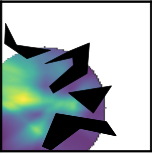

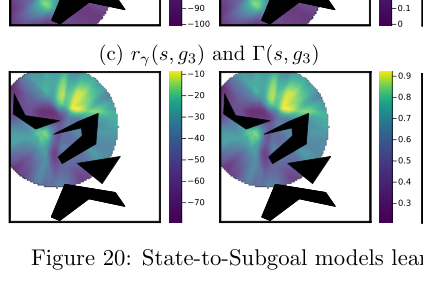

Lo, Roice, Panahi, Jordan, White, Mihucz, Aminmansour and White

pairs ( _s, a_ ) where _d_ ( _s, g_ ) = 0 and _πg_ ( _s_ ) _̸_ = _a_ . The model will only ever be queried in ( _s, a_ )
where _d_ ( _s, g_ ) = 1 and _πg_ ( _s_ ) = _a_ .

**Learning the relevance model** _d_ We assume in this work that we simply have _d_ ( _s, g_ ),
but we can at least consider ways that we could learn it. One approach is to attempt to
learn Γ for each _g_, to determine which are pertinent. Those with Γ( _s, g_ ) closer to zero can
have _d_ ( _s, g_ ) = 0. In fact, such an approach was taken for discovering options (Khetarpal
et al., 2020), where both options and such a relevance function are learned jointly. For us,
they could also be learned jointly, where a larger set of goals start with _d_ ( _s, g_ ) = 1, then if
Γ( _s, g_ ) remains small, then these may be switched to _d_ ( _s, g_ ) = 0 and they will stop being
learned in the model updates.

**Learning the Subgoal-to-Subgoal Models** Finally, we need to extract the subgoal-tosubgoal models ˜ _rγ,_ Γ [˜] from _rγ,_ Γ. These models were defined as means of the GVFs taken over
member states of each subgoal, as specified in Equation 1. The strategy involves updating
towards the state-to-subgoal models, whenever a state corresponds to a subgoal. In other
words, for a given _s_, if _m_ ( _s, g_ ) = 1, then for a given _g_ _[′]_ (or iterating through all of them), we
can update ˜ _rγ_ using

˜ ˜
( _rγ_ ( _s, g_ _[′]_ ) _−_ _rγ_ ( _g, g_ _[′]_ )) _∇rγ_ ( _g, g_ _[′]_ )

and update Γ using [˜]

(Γ( _s, g_ _[′]_ ) _−_ Γ( [˜] _g, g_ _[′]_ )) _∇_ Γ( [˜] _g, g_ _[′]_ ) _._

Note that these updates are not guaranteed to uniformly weight the states where _m_ ( _s, g_ ) = 1.
Instead, the implicit weighting is based on sampling _s_, such as through which states are
visited and in the replay buffer. We do not attempt to correct this skew, as mentioned in
the main body, we presume that this bias is minimal. An important next step is to better
understand if this lack of reweighting causes convergence issues, and how to modify the
algorithm to account for a potentially changing state visitation.

**Computing** _vg_ _[⋆]_ In order to compute _vg_ _[⋆]_, we first need a ˜ _v_ from our abstract MDP to look
up abstract subgoal values. We compute ˜ _v_ by value iteration in the abstract MDP with a
tolerance of _ϵ_ = 10 _[−]_ [8] and maximum of 10,000 iterations. The resulting ˜ _v_ from these subgoal
models was used in the projection step to obtain _vg_ _[⋆]_, by iterating over relevant subgoals as
described in Equation (3).

**E. Putting it all together**

We summarize the above updates in pseudocode, specifying explicit parameters and how
they are updated. The algorithm is summarized in Algorithm 3, with a diagram in Figure
10. An online update is used for the action-values for the main policy, without replay. All
background computation is used for model learning using a replay buffer and for planning
with those models. The pseudocode assumes a small set of subgoals, and is for episodic

in states where _d_ ( _s, g_ ) = 0. Incorporating this algorithm would likely benefit the whole system, but we
keep things simpler for now and stick with a typical TD update.

42

Goal-Space Planning with Subgoal Models

Figure 21: Learning and using pre-trained models for GSP.

43

Lo, Roice, Panahi, Jordan, White, Mihucz, Aminmansour and White

problems. We provide extensions to other settings in Appendix E.2, including using a Double
DQN update for the policy update. We also discuss in-depth differences to existing related
ideas, including landmark states and UVFAs.
Note that we overload the definitions of the subgoal models. We learn action-value variants
_rγ_ ( _s, a, g_ ; _**θ**_ _[r]_ ), with parameters _**θ**_ _[r]_, to avoid importance sampling corrections. We learn the
option-policy using action-values ˜ _q_ ( _s, a_ ; _**θ**_ _[π]_ ) with parameters _**θ**_ [Γ], and so query the policy
using _πg_ ( _s_ ; _**θ**_ _[π]_ ) = argmaxdef _a∈A_ ˜ _q_ ( _s, a, g_ ; _**θ**_ _π_ ). The policy _πg_ is not directly learned, but rather
defined by ˜ _q_ . Similarly, we do not directly learn _rγ_ ( _s, g_ ); instead, it is defined by _rγ_ ( _s, a, g_ ; _**θ**_ _[r]_ ).
Specifically, for model parameters _**θ**_ = ( _**θ**_ _[r]_ _,_ _**θ**_ [Γ] _,_ _**θ**_ _[π]_ ), we set _rγ_ ( _s, g_ ; _**θ**_ ) =def _rγ_ ( _s, πg_ ( _s_ ; _**θ**_ _π_ ) _, g_ ; _**θ**_ _r_ )
and Γ( _s, g_ ; _**θ**_ ) = Γ(def _s, πg_ ( _s_ ; _**θ**_ _π_ ) _, g_ ; _**θ**_ Γ). We query these derived functions in the pseudocode.
Finally, we assume access to a given set of subgoals. But there have been several natural
ideas already proposed for option discovery, that nicely apply in our more constrained setting.
One idea was to use subgoals that are often visited by the agent (Stolle and Precup, 2002).
Such a simple idea is likely a reasonable starting point to make a GSP algorithm that learns
everything from scratch, including subgoals. Other approaches have used bottleneck states
(McGovern and Barto, 2001).

**E.1 Pseudocode**

**Algorithm 3** Goal-Space Planning for Episodic Problems

Assume given subgoals _G_ and relevance function _d_
Initialize base learner (i.e. **w** _,_ **z** = **0** _,_ **0** for Sarsa( _λ_ )), model parameters _**θ**_ =
( _**θ**_ _[r]_ _,_ _**θ**_ [Γ] _,_ _**θ**_ _[π]_ ) _,_ _**θ**_ [˜] = ( _**θ**_ [˜] _r,_ ˜ _**θ**_ Γ)
Sample initial state _s_ 0 from the environment
**for** _t ∈_ 0 _,_ 1 _,_ 2 _, ..._ **do**

Take action _at_ using _q_ (e.g., _ϵ_ -greedy), observe _st_ +1 _, rt_ +1 _, γt_ +1
Choose _a_ _[′]_ from _st_ +1 using _q_ (e.g. _ϵ_ -greedy)
`ModelUpdate` ( _st, at, st_ +1 _, rt_ +1 _, γt_ +1)
`Planning` ()
`MainPolicyUpdate` ( _st, at, st_ +1 _, rt_ +1 _, γt_ +1 _, a_ _[′]_ ) // Changes with base learner

**Algorithm 4** `MainPolicyUpdate` ( _s, a, s_ _[′]_ _, r, γ, a_ _[′]_ )

// For a Sarsa( _λ_ ) base learner

¯
_vg_ _[⋆]_ _←_ max _g∈G_ : _d_ ( _s,g_ ) _>_ 0 _rγ_ ( _s, g_ ; _**θ**_ ) + Γ( _s, g_ ; _**θ**_ )˜ _v_ ( _g_ )
_δ ←_ _r_ + _γvg_ _[⋆]_ ( _s_ _[′]_ ) _−_ _vg_ _[⋆]_ ( _s_ ) + _γq_ ( _s_ _[′]_ _, a_ _[′]_ ; **w** ) _−_ _q_ ( _s, a_ ; **w** )
**w** _←_ **w** + _αδ_ **z** _∇_ **w** _q_ ( _s, a_ ; **w** )
**z** _←_ _γλ_ **z** + _∇_ **w** _q_ ( _s, a_ ; **w** )

**Algorithm 5** `Planning` ()

**for** _n_ iterations, for each _g ∈G_ **do**

˜ ¯ _r_ _′_ Γ _′_
_v_ ( _g_ ) _←_ max _g′∈G_ : _d_ ( _g,g′_ ) _>_ 0 ˜ _rγ_ ( _g, g_ _[′]_ ; _**θ**_ [˜] ) + ˜Γ( _g, g_ ; ˜ _**θ**_ )˜ _v_ ( _g_ )

44

Goal-Space Planning with Subgoal Models

**Algorithm 6** `ModelUpdate` ( _s, a, s_ _[′]_ _, r, γ_ )

Add new transition ( _s, a, s_ _[′]_ _, r, γ_ ) to buffer _B_
**for** _g_ _[′]_ _∈_ _G_ [¯], for multiple transitions ( _s, a, r, s_ _[′]_ _, γ_ ) sampled from _B_ **do**

_γg′ ←_ _γ_ (1 _−_ _m_ ( _s_ _[′]_ _, g_ _[′]_ ))
// Update option policy - e.g. by Sarsa
_a_ _[′]_ _←_ _πg′_ ( _s_ _[′]_ ; _**θ**_ _[π]_ )
_δ_ _[π]_ _←_ [1]

2 [(] _[r][ −]_ [1) +] _[ γ][g][′]_ [ ˜] _[q]_ [(] _[s][′][, a][′][, g][′]_ [;] _**[ θ]**_ _[π]_ [)] _[ −]_ _[q]_ [˜][(] _[s, a, g][′]_ [;] _**[ θ]**_ _[π]_ [)]
_**θ**_ _[π]_ _←_ _**θ**_ _[π]_ + _α_ _[π]_ _δ_ _[π]_ _∇_ _**θ**_ _[π]_ _q_ ( _s, a, g_ _[′]_ ; _**θ**_ _[π]_ )
// Update reward model and discount model
_δ_ _[r]_ _←_ _r_ + _γg′rγ_ ( _s_ _[′]_ _, a_ _[′]_ _, g_ _[′]_ ; _**θ**_ _[r]_ ) _−_ _rγ_ ( _s, a, g_ _[′]_ ; _**θ**_ _[r]_ )
_δ_ [Γ] _←_ _m_ ( _s_ _[′]_ _, g_ ) _γ_ + _γg′_ Γ( _s_ _[′]_ _, a_ _[′]_ _, g_ _[′]_ ; _**θ**_ [Γ] ) _−_ Γ( _s, a, g_ _[′]_ ; _**θ**_ [Γ] )
_**θ**_ _[r]_ _←_ _**θ**_ _[r]_ + _α_ _[r]_ _δ_ _[r]_ _∇_ _**θ**_ _[r]_ _rγ_ ( _s, a, g_ _[′]_ ; _**θ**_ _[r]_ )
_**θ**_ [Γ] _←_ _**θ**_ [Γ] + _α_ [Γ] _δ_ [Γ] _∇_ _**θ**_ ΓΓ( _s, a, g_ _[′]_ ; _**θ**_ [Γ] )
// Update goal-to-goal models using state-to-goal models
**for** each _**θ**_ ˜ _r ← g_ _**θ**_ ˜ such that _r_ + ˜ _αr_ ( _rγ_ ( _ms, g_ ( _′s, g_ ; _**θ**_ )) _− >_ 0 _r_ ˜ _γ_ **do** ( _g, g′_ ; ˜ _**θ**_ _r_ )) _∇_ _**θ**_ _r_ ˜ _rγ_ ( _g, g′_ ; ˜ _**θ**_ _r_ )

˜Γ ˜Γ Γ _′_ _′_ _r_ _′_ Γ
_**θ**_ _←_ _**θ**_ + ˜ _α_ (Γ( _s, g_ ; _**θ**_ ) _−_ ˜Γ( _g, g_ ; ˜ _**θ**_ )) _∇_ _**θ**_ Γ ˜Γ( _g, g_ ; ˜ _**θ**_ )

**E.2 Extending GSP to Deep RL**

It is simple to extend the above pseudocode for the main policy update and the option policy
update to use Double DQN (van Hasselt et al., 2016) updates with neural networks. The
changes from the above pseudocode are 1) the use of a target network to stabilize learning
with neural networks, 2) changing the one-step bootstrap target to the DDQN equivalent, 3)
adding a replay buffer for learning the main policy, and 4) changing the update from using
a single sample to using a batch update. Because the number of subgoals is discrete, the
equations for learning _**θ**_ [˜] _r_ and ˜ _**θ**_ Γ does not change. We previously summarized these changes
for learning the main policy in Algorithm 1 and now detail the subgoal model learning in
Algorithm 7.

45

Lo, Roice, Panahi, Jordan, White, Mihucz, Aminmansour and White

**Algorithm 7** `DDQNModelUpdate` ( _s, a, s_ _[′]_ _, r, γ_ )

Add new transition ( _s, a, s_ _[′]_ _, r, γ_ ) to buffer _D_ model
**for** _g_ _[′]_ _∈_ _G_ [¯] **do**

**for** _n_ model mini-batches **do**

Sample batch _B_ model = _{_ ( _s, a, r, s_ _[′]_ _, γ_ ) _}_ from _D_ model
_γg′ ←_ _γ_ (1 _−_ _m_ ( _s_ _[′]_ _, g_ _[′]_ ))
// Update option policy
_a_ _[′]_ _←_ argmax _a′∈A_ ˜ _q_ ( _s_ _[′]_ _, a_ _[′]_ _, g_ _[′]_ ; _**θ**_ _[π]_ )
_δ_ _[π]_ ( _s, a, s_ _[′]_ _, r, γ_ ) _←_ [1] 2 [(] _[r][ −]_ [1) +] _[ γ][g][′]_ [ ˜] _[q]_ [(] _[s][′][, a][′][, g][′]_ [;] _**[ θ]**_ _[π]_ targ [)] _[ −]_ _[q]_ [(] _[s, a, g][′]_ [;] _**[ θ]**_ _[π]_ [)]

_**θ**_ _[π]_ _←_ _**θ**_ _[π]_ _−_ _α_ _[π]_ _∇_ _**θ**_ _[π]_ _|B_ model1 _|_ �( _s,a,r,s_ _[′]_ _,γ_ ) _∈B_ model [(] _[δ][π]_ [)][2]

_**θ**_ _[π]_ targ _←_ _ρ_ model _**θ**_ _[π]_ + (1 _−_ _ρ_ model) _**θ**_ _[π]_ targ
// Update reward model and discount model
_δ_ _[r]_ ( _s, a, r, s_ _[′]_ _, γ_ ) _←_ _r_ + _γg′_ ( _γ, s_ _[′]_ ) _rγ_ ( _s_ _[′]_ _, a_ _[′]_ _, g_ _[′]_ ; _**θ**_ _[r]_ targ) _−_ _rγ_ ( _s, a, g_ _[′]_ ; _**θ**_ _[r]_ )
_δ_ [Γ] ( _s, a, r, s_ _[′]_ _, γ_ ) _←_ _m_ ( _s_ _[′]_ _, g_ ) _γ_ + _γg′_ ( _γ, s_ _[′]_ )Γ( _s_ _[′]_ _, a_ _[′]_ _, g_ _[′]_ ; _**θ**_ [Γ] targ) _−_ Γ( _s, a, g_ _[′]_ ; _**θ**_ [Γ] )
_**θ**_ _[r]_ _←_ _**θ**_ _[r]_ _−_ _α_ _[r]_ _∇_ _**θ**_ _[r]_ _|B_ model1 _|_ �( _s,a,r,s_ _[′]_ _,γ_ ) _∈B_ model [(] _[δ][r]_ [)][2]

_**θ**_ [Γ] _←_ _**θ**_ [Γ] _−_ _α_ [Γ] _∇_ _**θ**_ Γ _|B_ model1 _|_ �( _s,a,r,s_ _[′]_ _,γ_ ) _∈B_ model [(] _[δ]_ [Γ][)][2]

**if** _n_ updates% _τ_ == 0 **then**

_**θ**_ _[r]_ targ _←_ _**θ**_ _[r]_

_**θ**_ [Γ] targ _←_ _**θ**_ [Γ]

_n_ updates = _n_ updates + 1

// Update goal-to-goal models using state-to-goal models
. . . same as in prior pseudocode.

**E.3 Optimizations for GSP using Fixed Models**

It is possible to reduce computation cost of GSP when learning with a fixed model. When
the subgoal models are fixed, _vg_ _[⋆]_ for an experience sample does not change over time as all
components that are used to calculate _vg_ _[⋆]_ are fixed. This means that the agent can calculate
_vg_ _[⋆]_ when it first receives the experience sample and save it in the buffer, and use the same
calculated _vg_ _[⋆]_ whenever this sample is used for updating the main policy. When doing so,
_vg_ _[⋆]_ only needs to be calculated once per sample experienced, instead of with every update.
This is beneficial when training neural networks, where each sample is often used multiple
times to update network weights.

An additional optimization possible on top of caching of _vg_ _[⋆]_ in the replay buffer is that
we can batch the calculation of _vg_ _[⋆]_ for multiple samples together, which can be more efficient
than calculating _vg_ _[⋆]_ for a single sample every step. To do this, we create an intermediate
buffer that stores up to some number of samples. When the agent experiences a transition,
it adds the sample to this intermediate buffer rather than the main buffer. When this buffer
is full, the agent calculates _vg_ _[⋆]_ for all samples in this buffer at once and adds the samples
alongside _vg_ _[⋆]_ to the main buffer. This intermediate buffer is then emptied and added to
again every step. We set the maximum size for the intermediate buffer to 1024 in our
experiments.

46

Goal-Space Planning with Subgoal Models

**F. An Alternative way of using** _vg⋆_

As mentioned in section 6.5, this work also looked at an alternative way of incorporating _vg_ _[⋆]_
into the base learner’s update rule. We do so by biasing the target of the TD error towards
_vg_ _[⋆]_ . This modifies the TD error,

_Rt_ +1 + _γt_ +1( _βvg_ _[⋆]_ ( _St_ +1) + (1 _−_ _β_ ) _q_ ( _St_ +1 _, At_ +1)) _−_ _q_ ( _St, At_ ) _,_

where _β ∈_ [0 _,_ 1] is a hyper-parameter. We can recover the base learner’s update rule by
setting _β_ = 0, whereas _β_ = 1 completely biases the updates towards the model’s prediction
(as in our approximation to LAVI in Section 6.5). While this allows us to control the extent
of our model’s influence on the learning update, we found using _vg_ _[⋆]_ as a potential to out
perform all _β_ in Four-rooms, GridBall and PinBall. However, biasing the TD target in this
manner does give the update a faster convergence as we reduce the effective horizon. We
shall show this by analyzing the update to the main policy.
We assume we have a finite number of state-action pairs _n_, with parameterized actionvalues _q_ ( _·_ ; **w** ) _∈_ R _[n]_ represented as a vector with one entry per state-action pair. Value
iteration to find _q_ _[∗]_ corresponds to updating with the Bellman optimality operator

def
( _Bq_ )( _s, a_ ) = _r_ ( _s, a_ ) + � _P_ ( _s_ _[′]_ _|s, a_ ) _γ_ ( _s_ _[′]_ ) max _a_ _[′]_ _∈A_ _[q]_ [(] _[s][′][, a][′]_ [)]

_s_ _[′]_

def
On each step, for the current _qt_ = _q_ ( _·_ ; **w** _t_ ), if we assume the parameterized function class can
represent _Bqt_, then we can reason about the iterations of **w** 1 _,_ **w** 2 _, . . ._ obtain when minimizing
distance between _q_ ( _·_ ; **w** _t_ +1) and _Bqt_, with

_q_ ( _s, a_ ; **w** _t_ +1) = ( _Bq_ ( _·_ ; **w** _t_ ))( _s, a_ )

Under function approximation, we do not simply update a table of values, but we can get
this equality by minimizing until we have zero Bellman error. Note that _q_ _[⋆]_ = _Bq_ _[⋆]_, by
definition.
In this _realizability_ regime, we can reason about the iterates produced by value iteration.
The convergence rate is dictated by _γc_, as is well known, because

_∥Bq_ 1 _−_ _Bq_ 2 _∥∞_ _≤_ _γc∥q_ 1 _−_ _q_ 2 _∥∞_

Specifically, if we assume _|r_ ( _s, a_ ) _| ≤_ _r_ max, then we can use the fact that 1) the maximal
return is no greater than _G_ max =def 1 _r−_ max _γc_ [, and 2) for any initialization] _[ q]_ [0][ no larger in magnitude]

than this maximal return we have that _∥q_ 0 _−_ _q_ _[⋆]_ _∥∞_ _≤_ 2 _G_ max. Therefore, we get that

_∥Bq_ 0 _−_ _q_ _[⋆]_ _∥∞_ = _∥Bq_ 0 _−_ _Bq_ _[⋆]_ _∥∞_ _≤_ _γc∥q_ 0 _−_ _q_ _[⋆]_ _∥∞_

and so after _t_ iterations we have

_∥qt−q_ _[⋆]_ _∥∞_ = _∥Bqt−_ 1 _−Bq_ _[⋆]_ _∥∞_ _≤_ _γc∥qt−_ 1 _−q_ _[⋆]_ _∥∞_ _≤_ _γc_ [2] _[∥][q][t][−]_ [2] _[−][q][⋆][∥][∞]_ _[. . .][ ≤]_ _[γ]_ _c_ _[t][∥][q]_ [0] _[−][q][⋆][∥][∞]_ [=] _[ γ]_ _c_ _[t][G]_ [max]

We can use the exact same strategy to show convergence of value iteration, under our
def
subgoal-value bootstrapping update. Let _rg_ _[⋆]_ ( _s, a_ ) = [�] _s_ _[′][ P]_ [(] _[s][′][|][s, a]_ [)] _[v][g][⋆]_ [(] _[s][′]_ [), assuming] _[ v][g][⋆]_ [:]

47

Lo, Roice, Panahi, Jordan, White, Mihucz, Aminmansour and White

_S →_ [ _−G_ max _, G_ max] is a given, fixed function. Then the modified Bellman optimality
operator is

def
( _B_ _[β]_ _q_ )( _s, a_ ) = _r_ ( _s, a_ ) + _βrg⋆_ ( _s, a_ ) + (1 _−_ _β_ ) � _P_ ( _s_ _[′]_ _|s, a_ ) _γ_ ( _s_ _[′]_ ) max _a_ _[′]_ _∈A_ _[q]_ [(] _[s][′][, a][′]_ [)] _[.]_

_s_ _[′]_

**Proposition 4 (Convergence rate of tabular value iteration for the biased update)**
_The fixed point qβ_ _[⋆]_ [=] _[ B][β][q]_ _β_ _[⋆]_ _[exists and is unique. Further, for][ q]_ [0] _[, and the corresponding]_ **[ w]** [0] _[, ini-]_
_tialized such that |q_ 0( _s, a_ ; **w** 0) _| ≤_ _Gmax, the value iteration update with subgoal bootstrapping_
_qt_ = _B_ _[β]_ _qt−_ 1 _for t_ = 1 _,_ 2 _, . . . satisfies_

_[β][G][max]_
_∥qt −_ _qβ_ _[⋆][∥][∞]_ _[≤]_ _[γ]_ _c_ _[t]_ [(1] _[ −]_ _[β]_ [)] _[t][ r][max]_ [ +]

1 _−_ _γc_ (1 _−_ _β_ )

**Proof** First we can show that _B_ _[β]_ is a _γc_ (1 _−_ _β_ )-contraction. Assume we are given any two
vectors _q_ 1 _, q_ 2. Notice that _γ_ ( _s_ ) _≤_ _γc_, because for our problem setting it is either equal to _γc_
or equal to zero at termination. Then we have that for any ( _s, a_ )

�����

_|_ ( _B_ _[β]_ ) _q_ 1( _s, a_ ) _−_ ( _B_ _[β]_ _q_ 2)( _s, a_ ) _|_ =

(1 _−_ _β_ ) �
����� _s_ _[′]_

_P_ ( _s_ _[′]_ _|s, a_ ) _γ_ ( _s_ _[′]_ )[max
_a_ _[′]_ _∈A_ _[q]_ [1][(] _[s][′][, a][′]_ [)] _[ −]_ [max] _a_ _[′]_ _∈A_ _[q]_ [2][(] _[s][′][, a][′]_ [)]]
_s_ _[′]_

_≤_ _γc_ (1 _−_ _β_ ) � _P_ ( _s_ _[′]_ _|s, a_ )�� max _a_ _[′]_ _∈A_ _[q]_ [1][(] _[s][′][, a][′]_ [)] _[ −]_ [max] _a_ _[′]_ _∈A_ _[q]_ [2][(] _[s][′][, a][′]_ [)] ��

_s_ _[′]_

_≤_ _γc_ (1 _−_ _β_ ) � _P_ ( _s_ _[′]_ _|s, a_ ) max _a_ _[′]_ _∈A_ _[|][q]_ [1][(] _[s][′][, a][′]_ [)] _[ −]_ _[q]_ [2][(] _[s][′][, a][′]_ [)] _[|]_

_s_ _[′]_

_≤_ _γc_ (1 _−_ _β_ ) � _P_ ( _s_ _[′]_ _|s, a_ ) _s_ _[′]_ _∈S_ max _,a_ _[′]_ _∈A_ _[|][q]_ [1][(] _[s][′][, a][′]_ [)] _[ −]_ _[q]_ [2][(] _[s][′][, a][′]_ [)] _[|]_

_s_ _[′]_

_≤_ _γc_ (1 _−_ _β_ ) � _P_ ( _s_ _[′]_ _|s, a_ ) _∥q_ 1 _−_ _q_ 2 _∥∞_

_s_ _[′]_

= _γc_ (1 _−_ _β_ ) _∥q_ 1 _−_ _q_ 2 _∥∞_

Since this is true for any ( _s, a_ ), it is true for the max, giving

_∥B_ _[β]_ _q_ 1 _−_ _B_ _[β]_ _q_ 2 _∥∞_ _≤_ _γc_ (1 _−_ _β_ ) _∥q_ 1 _−_ _q_ 2 _∥∞._

Because the operator is a contraction, since _γc_ (1 _−β_ ) _<_ 1, we know by the Banach Fixed-Point
Theorem that the fixed-point exists and is unique.
Now we can also use contraction property for the convergence rate. Notice first that we
def
can consider ˜ _r_ ( _s, a_ ) = _r_ ( _s, a_ )+ _rg⋆_ ( _s, a_ ) as the new reward, with maximum value _r_ max+ _βG_ max.
Taking discount as _γc_ (1 _−_ _β_ ), the maximal return is _[r]_ [max] 1 _−γ_ [+] _c_ (1 _[β][G]_ _−_ [max] _β_ ) [.]

_∥qt −_ _qβ_ _[⋆][∥][∞]_ [=] _[ ∥][B][β][q][t][−]_ [1] _[ −]_ _[B][β][q][⋆][∥][∞]_ _[≤]_ _[γ][c]_ [(1] _[ −]_ _[β]_ [)] _[∥][q][t][−]_ [1] _[ −]_ _[q][⋆][∥][∞]_ _[. . .][ ≤]_ _[γ]_ _c_ _[t]_ [(1] _[ −]_ _[β]_ [)] _[t][∥][q]_ [0] _[−]_ _[q][⋆][∥][∞]_

_≤_ _γc_ _[t]_ [(1] _[ −]_ _[β]_ [)] _[t][ r]_ [max][ +] _[β][G]_ [max]

1 _−_ _γc_ (1 _−_ _β_ )

48

Goal-Space Planning with Subgoal Models

This rate is dominated by ( _γc_ (1 _−_ _β_ )) _[t]_ . We can determine after how many iterations this
term overcomes the increase in the upper bound on the return. In other words, we want to
know how big _t_ needs to be to get

_[r]_ [max][ +] _[β][G]_ [max]
_γc_ _[t]_ [(1] _[ −]_ _[β]_ [)] _[t]_ 1 _−_ _γc_ (1 _−_ _β_ ) _[≤]_ _[γ]_ _c_ _[t][G]_ [max] _[.]_

Rearranging terms, we get that this is true for

_r_ max + _βG_ max
_t >_ log
� _G_ max(1 _−_ _γc_ (1 _−_ _β_ )) � [�]

1
log
� 1 _−_ _β_

_._
�

For example if _r_ max = 1, _γc_ = 0 _._ 99 and _β_ = 0 _._ 5, then we have that _t >_ 1 _._ 56. If we have
that _r_ max = 10, _γc_ = 0 _._ 99 and _β_ = 0 _._ 5, then we get that _t ≥_ 5. If we have that _r_ max = 1,
_γc_ = 0 _._ 99 and _β_ = 0 _._ 1, then we get that _t ≥_ 22.
While this increased convergence rate is present for the biased update, it does not show
up when using _vg_ _[⋆]_ as a potential-based shaping reward. Although using _vg_ _[⋆]_ as a potential
does not increase the convergence rate to _v_ _[⋆]_, it can help quickly identify _π_ _[⋆]_ . Specifically,
when _vg_ _[⋆]_ is _v_ _[⋆]_, and the value function is constant, e.g., initialized to 0, it only takes one
application of the bellman operator in each state to find the optimal policy. We formalize
this in the proposition below.

**Proposition 5** _For vg_ _[⋆]_ = _v_ _[⋆]_ _and v_ 0 = _c, for c ∈_ R _, then the policy, π_ 1 _derived after a_
_single bellman update at all states will be optimal, i.e.,_

_∀s π_ 1( _s_ ) _∈_ argmax _q_ _[⋆]_ ( _s, a_ ) _._

_a_

**Proof** Let the _q_ estimate for the _k_ [th] iteration be

_qk_ ( _s, a_ ) = _R_ ( _s, a_ ) + � _P_ ( _s, a, s_ _[′]_ ) � _γcvg_ _[⋆]_ ( _s_ _[′]_ ) _−_ _vg_ _[⋆]_ ( _s_ ) + _γcvk−_ 1( _s_ _[′]_ )� _._

_s_ _[′]_

The value function for iteration _k_ is _vk_ = max _a qk_ ( _s, a_ ) and the policy for the _k_ [th] iteration
is _πk_ ( _s_ ) _∈_ argmax _a qk_ ( _s, a_ ). The value of _q_ 1 is

_q_ 1( _s, a_ ) = _R_ ( _s, a_ ) + � _P_ ( _s, a, s_ _[′]_ ) � _γcvg_ _[⋆]_ ( _s_ _[′]_ ) _−_ _vg_ _[⋆]_ ( _s_ ) + _γcv_ 0( _s_ _[′]_ )�

_s_ _[′]_

= _R_ ( _s, a_ ) + � _P_ ( _s, a, s_ _[′]_ ) � _γcv_ _[⋆]_ ( _s_ _[′]_ ) _−_ _v_ _[⋆]_ ( _s_ ) + _γcv_ 0( _s_ _[′]_ )�

_s_ _[′]_

= _R_ ( _s, a_ ) + � _P_ ( _s, a, s_ _[′]_ ) _γcv_ _[⋆]_ ( _s_ _[′]_ )

_s_ _[′]_

~~�~~ ~~��~~ �
= _q_ _[⋆]_ ( _s,a_ )

= _q_ _[⋆]_ ( _s, a_ ) + _γcc −_ _v_ _[⋆]_ ( _s_ )

+ � _P_ ( _s, a, s_ _[′]_ ) _γcv_ 0( _s_ _[′]_ )

_s_ _[′]_

+
�

_−v_ _[⋆]_ ( _s_ )

� ~~��~~ ~~�~~

= _γcc_

where the last line follows because _v_ 0( _s_ _[′]_ ) = _c_ for all _s_ _[′]_ . Then plugging this expression into
_π_ 1 yields
_π_ 1( _s_ ) _∈_ argmax _q_ _[⋆]_ ( _s, a_ ) + _γcc −_ _v_ _[⋆]_ ( _s_ ) = argmax _q_ _[⋆]_ ( _s, a_ ) _._

_a_ _a_

49

Lo, Roice, Panahi, Jordan, White, Mihucz, Aminmansour and White

**Remark 6** _While having vg_ _[⋆]_ = _v_ _[⋆]_ _is not realistic, Proposition 5 means that the policy will_
_quickly align with what is preferable under vg_ _[⋆]_ _before finding what is optimal for the MDP_
_without the shaping reward._

**G. Errors in Learned Subgoal Models**

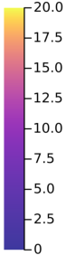

(a) Absolute error in _r_ ( _s, g_ ) (b) Absolute error in Γ( _s, g_ )

Figure 22: Model errors in State-to-Subgoal models used in GridBall.

To better understand the accuracy of our learned subgoal models, we performed roll-outs
of the learned option policy at different ( _x, y_ ) locations on GridBall and compared the true
_rγ_ and Γ with the estimated values. Figure 22 shows a heatmap of the absolute error of
the model compared to the ground truth, with the mapping of colors on the right. The
error in each pixel was computed by rolling out episodes from that state and logging the
actual reward and discounted probability of reaching the subgoal. The models tend to be
more accurate in regions that are clear of obstacles, and less near these obstacles or near
the boundary of the initiation set. The distribution of error over the initiation set is very
similar for both _r_ and Γ models. While the magnitudes of errors are not unreasonable, they
are also not very near zero. This results is encouraging in that inaccuracies in the model do
not prevent useful planning.

**G.1 Subgoal Placement and Region of Attraction**

A counter intuitive observation from the experiments in Section 6.3 was that the On Alternate
path helped the agent quickly change its policy but _vg_ _[⋆]_ did not quickly change. In this
section, we investigate this reason and put forth the following hypothesis:

**Hypothesis 6** _GSP creates a region of attraction so that the agent follows the optimal path_
_as determined by the abstract MDP._

That is to say, if a single chain of subgoals is represented in the abstract MDP, then
the learner will initially try and closely follow this path even if it is not the optimal path.

50

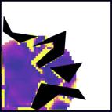

Goal-Space Planning with Subgoal Models

0.8

0.4

0.2

0.0

|Col1|Bottom Left|Col3|
|---|---|---|
||No Near On Alternate On Initial Both Sarsa|No Near On Alternate On Initial Both Sarsa|
||||
||||
||||
||||

0 200 400

Episode

0.8

0.6

0.4

0.2

0.0

**Top Right**

0 200 400

Episode

Figure 23: This figure shows the time the agent spends per episode in the bottom left and
top right rooms. The lines convey the average % of time the agent spend and the shaded
lines represent (0 _._ 05 _,_ 0 _._ 9) tolerance intervals computed from 100 trials.

To test this hypothesis, we want to see that the agent will occupy states similar to what is
specified by the optimal path in the abstract MDP. For this experiment, we ran GSP on
FourRooms (without the lava pools) with each subgoal configuration defined in the previous
section. We measured how much time the agent spends in the bottom left room and the top
right room. The agent should, as it learns about the environment, spend more time in the
top right room and less time in the bottom left room. We would expect all agents to follow
this trend, except for the one that is missing a subgoal to go through the top right room.
We show the results for each configuration and Sarsa(0) with no GSP in Figure 23.

The results in Figure 23 are clear. All methods learn to go through the top right room
except for the subgoal configuration missing a subgoal on that path to the goal state. This
supports our hypothesis that the agent will learn to follow the optimal path as specified by
the abstract MDP. This also means that while potential-based shaping (used to propagate
value information from the abstract MDP to the base learner) does not change the optimal
policy, it can make it harder for the learner to find the optimal policy.

Based on the experiments in Section 6.3 and this one, we can conclude a few key points
about GSP. The first is that _vg_ _[⋆]_ can only provide value information as determined by the
optimal value function through the abstract MDP, which may not reflect the connectivity of
the original MDP. Second, the learner’s exploration through the state space will be highly
impacted by the known subgoals. With the basic _ϵ_ -greedy exploration policy that GSP
currently uses, GSP will quickly follow and refine the best policy found within the abstract
MDP. If the optimal policy is near to the policy found by the abstract MDP, then GSP
will be able to quickly discover it. However, if the optimal policy is very different than
the one found by the abstract MDP (for example, if the best abstract MDP policy follows
an alternate sub-optimal path), this will make the agent explore around its sub-optimal
policy, and thus possibly slowing down the discovery of the optimal policy, because the basic
_ϵ_ -greedy exploration policy centralizes exploration around the current best policy known by
the agent.

51

Lo, Roice, Panahi, Jordan, White, Mihucz, Aminmansour and White

This is all to say that there is work to be done to improve GSP’s exploration by
incorporating more sophisticated exploration strategies. There are also opportunities to
develop new exploration strategies that takes advantage of how GSP learns with the
knowledge of subgoals within the environment. For example, one may consider leveraging an
existing subgoal formulation for more directed exploration by introducing reward bonuses at
other subgoals, once we know the environment has changed. Additional work to find new
subgoals or refine the current subgoal configurations can also have a high impact in how
well GSP can explore and adapt to changes in the environment.

**H. Additional Experiment Details**

This section provides additional details for the PinBall environment, the various hyperparameters used for DDQN and GSP, and the hyperparameters sweeps performed.
The pinball configuration that we used is based on the easy configuration found
at `https://github.com/DecisionMakingAI/BenchmarkEnvironments.jl`, which was released under the MIT license. We have modified the environment to support additional
features such as changing terminations, visualizing subgoals, and various bug fixes.

**H.1 Hyperparameter Sweep Methodology**

For Sarsa( _λ_ ), we swept it’s learning rate over [0 _._ 001 _,_ 0 _._ 01 _,_ 0 _._ 05 0 _._ 01 _,_ 0 _._ 5 _,_ 0 _._ 9]. 0.01, 0.05 and
0.1 were found to be the best for FourRooms, GridBall and PinBall respectively. For DDQN,
we swept its learning rate _α_ over [5 _×_ 10 _[−]_ [4] _,_ 1 _×_ 10 _[−]_ [3] _,_ 2 _×_ 10 _[−]_ [3] _,_ 4 _×_ 10 _[−]_ [3] _,_ 5 _×_ 10 _[−]_ [3] ] and target
refresh rate _τ_ over [1 _,_ 50 _,_ 100 _,_ 200 _,_ 1000] as shown in Figure 24.

52

Goal-Space Planning with Subgoal Models

(a) _τ_ = 1

(b) _τ_ = 50

(c) _τ_ = 100

(d) _τ_ = 200

(e) _τ_ = 1000

Figure 24: Left Column: each figure show the learning curves for five different step sizes, _α_,
averaged over 30 runs. Right Column: sensitivity of the DDQN base learner to different
step sizes. Each dot represents the steps to goal for that learner, averaged over 30 runs and
1000 episodes. The error bars show one standard error. The refresh rate _τ_ increases with

each row. 53

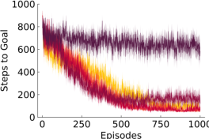

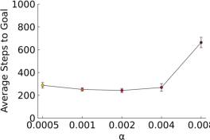

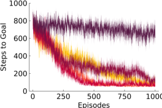

