## **The Nature of Temporal Difference Errors in** **Multi-step Distributional Reinforcement Learning**


**Yunhao Tang**
DeepMind
```
robintyh@deepmind.com

```

**Bernardo Ávila Pires**
DeepMind
```
bavilapires@deepmind.com

```


**Mark Rowland**
DeepMind
```
markrowland@deepmind.com

```

**Will Dabney**
DeepMind
```
 wdabney@deepmind.com

```


**Rémi Munos**
DeepMind
```
 munos@deepmind.com

```

**Marc G. Bellemare**
Google Brain
```
bellemare@google.com

```


**Abstract**


We study the multi-step off-policy learning approach to distributional RL. Despite
the apparent similarity between value-based RL and distributional RL, our study
reveals intriguing and fundamental differences between the two cases in the multistep setting. We identify a novel notion of path-dependent distributional TD
error, which is indispensable for principled multi-step distributional RL. The
distinction from the value-based case bears important implications on concepts such
as backward-view algorithms. Our work provides the first theoretical guarantees on
multi-step off-policy distributional RL algorithms, including results that apply to
the small number of existing approaches to multi-step distributional RL. In addition,
we derive a novel algorithm, Quantile Regression-Retrace, which leads to a deep
RL agent QR-DQN-Retrace that shows empirical improvements over QR-DQN on
the Atari-57 benchmark. Collectively, we shed light on how unique challenges in
multi-step distributional RL can be addressed both in theory and practice.


**1** **Introduction**


The return [�] _[∞]_ _t_ =0 _[γ]_ _[t]_ _[R]_ _[t]_ [ is a fundamental concept in reinforcement learning (RL). In general, the return]
is a random variable, whose distribution captures important information such as the stochasticity in
future events. While the classic view of value-based RL typically focuses on the expected return

[1–3], learning the full return distribution is of both theoretical and practical importance [4–10].


To design efficient algorithms for learning return distributions, a natural idea is to construct distributional equivalents of existing multi-step off-policy value-based algorithms. In value-based RL,
multi-step learning tends to propagate useful information more efficiently and off-policy learning is
ubiquitous in modern RL systems. Meanwhile, the return distribution shares inherent commonalities
with the expected return, thanks to the close connection between the distributional Bellman equation

[ 4 – 6, 10 ] and the celebrated value-based Bellman equation [ 2 ]. The Bellman equation is foundational
to value-based RL algorithms, including many multi-step off-policy methods [ 11 – 14 ]. Due to the
apparent similarity between distributional and value-based Bellman equations, should we expect key
value-based concepts and algorithms to seamlessly transfer to distributional learning?


Our study indicates that the answer is no. There are critical differences between distributional and
value-based RL, which requires a distinct treatment of multi-step learning. Indeed, thanks to the
focus on expected returns, the value-based setup offers many unique conceptual and computational
simplifications in algorithmic design. However, we find that such simplifications do not hold for
distributional learning. Multi-step distributional RL requires a deeper look at the connections between
fundamental concepts such as _n_ -step returns, TD errors and importance weights for off-policy
learning. To this end, we make the following conceptual, theoretical and algorithmic contributions:


Preprint.


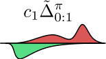

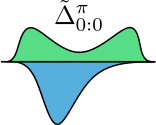

Figure 1: Illustration of a multi-step distributional RL target, constructed as a sum of the initial
distribution (left) and weighted distributional TD errors ∆ [�] _[π]_ 0:0 _[, c]_ [1] [∆][�] _[π]_ 0:1 _[, . . .]_ [ across multiple time steps]
(middle and right); see Section 3 for further details and notation. In general, distributional TD errors
are signed measures, as reflected by the downwards probability mass; they are also scaled by trace
coefficients _c_ 1 to correct for off-policy discrepancies between target and behavior policy.


**Distributional TD error.** We demonstrate the emergence of a novel notion of path-dependent
distributional TD error (Section 4). Intriguingly, as the name suggests, path-dependent distributional
TD errors are _path-dependent_, i.e., distributional TD errors at time _t_ depend on the sequence of
immediate rewards ( _R_ _s_ ) _[t]_ _s_ _[−]_ =0 [1] [. This differs from value-based TD errors, which are path-independent.]
We will show that the path-dependency property is not an artifact, but rather a fundamental property
of distributional learning. We show numerically that naively constructing certain path-independent
distributional TD errors does not produce convergent algorithms. The path-dependency property also
has conceptual and computational impacts on forward-view estimates and backward-view algorithms.


**Theory of multi-step distributional RL.** We derive distributional Retrace, a novel and generic
multi-step off-policy operator for distributional learning. We prove that distributional Retrace is
contractive and has the target return distribution as its fixed point. Distributional Retrace interpolates
between the one-step distributional Bellman operator [ 6 ] and Monte-Carlo (MC) estimation with
importance weighting [15], trading-off the strengths from the two extremes.


**Approximate multi-step distributional RL.** Finally, we derive Quantile Regression-Retrace, a
novel algorithm combining distributional Retrace with quantile representations of distributions [16]
(Section 5). One major technical challenge is to define the quantile regression (QR) loss against signed
measures, which are unavoidable in sample-based settings. We bypass the issue of ill-defined QR loss
and derive unbiased stochastic estimates to the QR loss gradient. This leads up to QR-DQN-Retrace,
a deep RL agent with performance improvements over QR-DQN on Atari-57 games.


In Figure 1, we illustrate how the back-up target is computed for multi-step distributional RL. In
summary, we take our findings to demonstrate how the set of unique challenges presented by multistep distributional RL can be addressed both theoretically and empirically. Our study also opens up
many exciting research pathways in this domain, paving the way for future investigations.


**2** **Background**


Consider a Markov decision process (MDP) represented as the tuple ( _X_ _, A, P_ _R_ _, P, γ_ ) where _X_ is
the state space, _A_ the action space, _P_ _R_ : _X × A →_ _P_ ( _R_ ) the reward kernel (with _R_ a finite set of
possible rewards), _P_ : _X × A →_ _P_ ( _X_ ) the transition kernel and _γ ∈_ [0 _,_ 1) the discount factor. In
general, we use _P_ ( _A_ ) denote a distribution over set _A_ . We assume the reward to take a finite set of
values mainly because it is notationally simpler to present results; it is straightforward to extend our
results to the general case. Let _π_ : _X →_ _P_ ( _A_ ) be a fixed policy. We use ( _X_ _t_ _, A_ _t_ _, R_ _t_ ) _[∞]_ _t_ =0 _[∼]_ _[π]_ [ to]
denote a random trajectory sampled from _π_, such that _A_ _t_ _∼_ _π_ ( _·|X_ _t_ ) _, R_ _t_ _∼_ _P_ _R_ ( _·|X_ _t_ _, A_ _t_ ) _, X_ _t_ +1 _∼_
_P_ ( _·|X_ _t_ _, A_ _t_ ) . Define _G_ _[π]_ ( _x, a_ ) := [�] _[∞]_ _t_ =0 _[γ]_ _[t]_ _[R]_ _[t]_ [ as the random return, obtained by following] _[ π]_ [ starting]
from ( _x, a_ ) . The Q-function _Q_ _[π]_ ( _x, a_ ) := E[ _G_ _[π]_ ( _x, a_ )] is defined as the expected return under policy
_π_ . For convenience, we also adopt the vector notation _Q ∈_ R _[X×A]_ . Define the one-step value-based
Bellman operator _T_ _[π]_ : R _[X×A]_ _→_ R _[X×A]_ such that _T_ _[π]_ _Q_ ( _x, a_ ) := E[ _R_ 0 + _γQ_ ( _X_ 1 _, A_ _[π]_ 1 [)] _[ |][X]_ [0] [=]
_x, A_ 0 = _a_ ] where _Q_ ( _X_ _t_ _, A_ _[π]_ _t_ [) :=][ �] _a_ _[π]_ [(] _[a][|][X]_ _[t]_ [)] _[Q]_ [(] _[X]_ _[t]_ _[, a]_ [)] [. The Q-function] _[ Q]_ _[π]_ [ satisfies] _[ Q]_ _[π]_ [ =] _[ T]_ _[ π]_ _[Q]_ _[π]_

and is also the unique fixed point of _T_ _[π]_ .


2


**2.1** **Distributional reinforcement learning**
In general, the return _G_ _[π]_ ( _x, a_ ) is a random variable and we define its distribution as _η_ _[π]_ ( _x, a_ ) :=
Law _π_ ( _G_ _[π]_ ( _x, a_ )) . The return distribution satisfies the distributional Bellman equation [ 4 – 6, 17, 10 ],

_η_ _[π]_ ( _x, a_ ) = E _π_ �(b _R_ 0 _,γ_ ) # _η_ _[π]_ ( _X_ 1 _, A_ _[π]_ 1 [)] ��� _X_ 0 = _x, A_ 0 = _a_ � _,_ (1)


where (b _r,γ_ ) # : _P_ (R) _→_ _P_ (R) is the pushforward operation defined through the function
b _r,γ_ ( _z_ ) = _r_ + _γz_ [ 17 ]. For convenience, we adopt the notation _η_ _[π]_ ( _X_ _t_ _, A_ _[π]_ _t_ [) :=][ �] _a_ _[π]_ [(] _[a][|][X]_ _[t]_ [)] _[η]_ _[π]_ [(] _[X]_ _[t]_ _[, a]_ [)] [.]
Throughout the paper, we focus on the space of distributions with bounded support _P_ _∞_ (R) .
Let _η ∈_ _P_ _∞_ (R) _[X×A]_ be any distribution vector, we define the _distributional Bellman operator_
_T_ _[π]_ : _P_ _∞_ (R) _[X×A]_ _→_ _P_ _∞_ (R) _[X×A]_ as follows [17, 10],


_T_ _[π]_ _η_ ( _x, a_ ) := E [(b _R_ 0 _,γ_ ) # _η_ ( _X_ 1 _, A_ _[π]_ 1 [)] _[ |][ X]_ [0] [=] _[ x, A]_ [0] [=] _[ a]_ []] _[ .]_ (2)


Let _η_ _[π]_ be the collection of return distributions under _π_ ; the distributional Bellman equation can
then be rewritten as _η_ _[π]_ = _T_ _[π]_ _η_ _[π]_ . The distributional Bellman operator _T_ _[π]_ is _γ_ -contractive under
the supremum _p_ -Wasserstein distance [ 16, 10 ], so that _η_ _[π]_ is the unique fixed point of _T_ _[π]_ . See
Appendix B for details of the distance metrics.


**2.2** **Multi-step off-policy value-based learning**

We provide a brief background on the value-based multi-step off-policy setting as a reference
for the distributional case discussed below. In off-policy learning, the data is generated under a
behavior policy _µ_, which potentially differs from target policy _π_ . The aim is to evaluate the target
Q-function _Q_ _[π]_ . As a standard assumption, we require supp( _π_ ( _·|x_ )) _⊆_ supp( _µ_ ( _·|x_ )) _, ∀x ∈X_ . Let
_ρ_ _t_ := _π_ ( _A_ _t_ _|X_ _t_ ) _/µ_ ( _A_ _t_ _|X_ _t_ ) be the step-wise importance sampling (IS) ratio at time step _t_ . Step-wise
IS ratios are critical in correcting for the off-policy discrepancy between _π_ and _µ_ .


Let _c_ _t_ _∈_ [0 _, ρ_ _t_ ] be a time-dependent trace coefficient. We denote _c_ 1: _t_ = _c_ 1 _· · · c_ _t_ and define _c_ 1:0 = 1
by convention. Consider a generic form of the return-based off-policy operator _R_ _[π,µ]_ as in [13],


~~�~~ ~~��~~ �
_δ_ _t_ _[π]_ [=][value-based TD error]




_,_ (3)






_R_ _[π,µ]_ _Q_ ( _x, a_ ) := _Q_ ( _x, a_ ) + E _µ_







_∞_
�


� _c_ 1: _t_ _γ_ _[t]_ [�] _R_ _t_ + _γQ_ � _X_ _t_ +1 _, A_ _[π]_ _t_ +1 � _−_ _Q_ ( _X_ _t_ _, A_ _t_ )�

_t_ =0 ~~�~~ ~~��~~ �


In the above and below, we omit the notation conditioning on _X_ 0 = _x, A_ 0 = _a_ for conciseness. The
general form of _R_ _[π,µ]_ encompasses many important special cases: when on-policy and _c_ _t_ = _λ_, it
recovers the Q-function variant of TD( _λ_ ) [ 2, 12 ]; when _c_ _t_ = _λ_ min ~~(~~ ~~_c_~~ _, ρ_ _t_ ), it recovers a specific form
of Retrace [ 13 ]; when _c_ _t_ = _ρ_ _t_, it recovers the importance sampling (IS) operator. The back-up target
is computed as a mixture over TD errors _δ_ _t_ _[π]_ [, each calculated from the one-step transition data. We]
also define the _discounted TD error_ _δ_ [�] _t_ _[π]_ [=] _[ γ]_ _[t]_ _[δ]_ _t_ _[π]_ [, which can be interpreted as the difference between]
_n_ -step returns from two time steps _t_ and _t_ + 1, as we discuss in Section 4. As we will detail, the
property of _δ_ [�] _t_ _[π]_ [marks a significant difference from the distributional RL setting.]


By design, _R_ _[π,µ]_ has _Q_ _[π]_ as the unique fixed point. Multi-step updates make use of rewards from
multiple time steps, propagating learning signals more efficiently. This is reflected by the fact that
_R_ _[π,µ]_ is _β_ -contractive with _β ∈_ [0 _, γ_ ] [ 13 ] and often contracts to _Q_ _[π]_ faster than the one-step Bellman
operator _T_ _[π]_ . Our goal is to design distributional equivalents of multi-step off-policy operators, which
can lead to concrete algorithms with sample-based learning.


**3** **Multi-step off-policy distributional reinforcement learning**


We now present the core theoretical results relating to multi-step distributional operators. In general,
the aim is to evaluate the target distribution _η_ _[π]_ with access to off-policy data generated under _µ_ .


Below, we use _G_ _t_ _[′]_ : _t_ = [�] _[t]_ _s_ = _t_ _[′]_ _[ γ]_ _[s][−][t]_ _[′]_ _[R]_ _[s]_ [ to denote the partial sum of discounted rewards between two]
time steps _t_ _[′]_ _≤_ _t_ . We define the generic form of multi-step off-policy distributional operator _R_ _[π,µ]_
such that for any _η ∈_ _P_ _∞_ (R) _[X×A]_, its back-up target _R_ _[π,µ]_ _η_ ( _x, a_ ) is computed as


# _[η]_ � _X_ _t_ +1 _, A_ _[π]_ _t_ +1 � _−_ �b _G_ 0: _t−_ 1 _,γ_ _t_ [�]















_η_ ( _x, a_ ) + E _µ_







_∞_
�


_c_ 1: _t_ _·_

_t_ =0


 _._ (4)


�b _G_ 0: _t_ _,γ_ _t_ +1 [�]
 ~~�~~


�b _G_ 0: _t_ _,γ_ _t_ +1 [�] # _[η]_ � _X_ _t_ +1 _, A_ _[π]_ _t_ +1 � _−_ �b _G_ 0: _t−_ 1 _,γ_ _t_ [�] # _[η]_ [(] _[X]_ _[t]_ _[, A]_ _[t]_ [)]

~~�~~ ∆� _[π]_ 0: _t_ [=][Multi-step Distributional TD error] ~~�~~ � ~~�~~


3


As an effort to simplify the naming, we call _R_ _[π,µ]_ the _distributional Retrace_ operator. Distributional
Retrace only requires _c_ _t_ _∈_ [0 _, ρ_ _t_ ] and represents a large family of distributional operators. Throughout,
we will heavily adopt the pushforward notations. This is mainly because instead of directly working
with the random variable _G_ _[π]_, we find it much more convenient to express various important multi-step
operations with pushfoward notations.


The back-up target _R_ _[π,µ]_ _η_ ( _x, a_ ) is written as a weighted sum of the path-dependent distributional
TD errors ∆ [�] _[π]_ 0: _t_ [, which we extensively discuss in Section][ 4][. Though the form of] _[ R]_ _[π,µ]_ [ seems to]
bear certain similarities to the value-based operator in Equation (3), the critical differences lie in
subtle definitions of the distributional TD errors ∆ [�] _[π]_ 0: _t_ [and where to place the traces] _[ c]_ [1:] _[t]_ [for off-policy]
corrections. We resume to unpack the insights entailed by the design of the operator in Section 4.


Below, we first present theoretical properties of the distributional Retrace operator. We start with a
key property which underlies many ensuing theoretical results. Given a fixed _n_ -step reward sequence
_r_ 0: _n−_ 1 and a fixed state-action pair ( _x, a_ ) _∈X × A_, we call pushfoward distributions of the form
�b [�] _ns_ =0 _−_ 1 _[γ]_ _[s]_ _[r]_ _[s]_ _[,γ]_ _[n]_ � # _[η]_ [(] _[x, a]_ [)] [ the] _[ n]_ _[-step target distributions]_ [. Our result shows that the back-up target of]

Retrace is a convex combination of _n_ -step target distributions with varying values of _n_ .


**Lemma 3.1.** ( **Convex combination** ) The Retrace back-up target is a convex combination of _n_ step target distributions. Formally, there exists an index set _I_ ( _x, a_ ) such that _R_ _[π,µ]_ _η_ ( _x, a_ ) =
� _i_ _I_ _[w]_ _[i]_ _[η]_ _[i]_ [ where] _[ w]_ _[i]_ _[ ≥]_ [0][,][ �] _i_ _I_ _[w]_ _[i]_ [ = 1][ and][ (] _[η]_ _[i]_ [)] _[i][∈][I]_ [(] _[x,a]_ [)] [ are] _[ n]_ _[i]_ [-return target distributions.]


_i∈I_ ( _x,a_ ) _[w]_ _[i]_ _[η]_ _[i]_ [ where] _[ w]_ _[i]_ _[ ≥]_ [0][,][ �]


_i∈I_ ( _x,a_ ) _[w]_ _[i]_ [ = 1][ and][ (] _[η]_ _[i]_ [)] _[i][∈][I]_ [(] _[x,a]_ [)] [ are] _[ n]_ _[i]_ [-return target distributions.]


Since _R_ _[π,µ]_ _η ∈_ _P_ _∞_ (R) _[X×A]_, we can measure the contraction of _R_ _[π,µ]_ under probability metrics.


**Proposition 3.2.** ( **Contraction** ) _R_ _[π,µ]_ is _β_ -contractive under supremum _p_ -Wasserstein distance,
_∞_
where _β_ = max _x∈X_ _,a∈A_ � _t_ =1 [E] _[µ]_ [ [] _[c]_ [1] _[...c]_ _[t][−]_ [1] [(1] _[ −]_ _[c]_ _[t]_ [)]] _[ γ]_ _[t]_ _[ ≤]_ _[γ]_ [.]


The contraction rate of the distributional Retrace operator is determined by its effective horizon. At
one extreme, when _c_ _t_ = 0, the effective horizon is 1 and _β_ = _γ_, in which case Retrace recovers the
one-step operator. At the other extreme, when _c_ _t_ = _ρ_ _t_, the effective horizon is infinite which gives
_β_ = 0 . This latter case can be understood as correcting for all the off-policy discrepancies with IS,
which is very efficient _in expectation_ but incurs high variance under sample-based approximations.
Proposition 3.2 also implies that the distributional Retrace operator has a unique fixed point.


**Proposition 3.3.** ( **Unique fixed point** ) _R_ _[π,µ]_ has _η_ _[π]_ as the unique fixed point in _P_ _∞_ (R) _[X×A]_ .


The above result suggests that starting with _η_ 0 _∈_ _P_ _∞_ (R) _[X×A]_, the recursion _η_ _k_ +1 = _R_ _[π,µ]_ _η_ _k_
produces iterates ( _η_ _k_ ) _[∞]_ _k_ =0 _[∈]_ _[P]_ _[∞]_ [(][R][)] _[X×A]_ [ which converge to] _[ η]_ _[π]_ [ in] _[ W]_ _[ p]_ [ at a rate of] _[ O]_ [(] _[β]_ _[k]_ [)][.]


**4** **Understanding multi-step distributional reinforcement learning**


Now, we pause and take a closer look at the construction of the distributional Retrace operator. We
present a number of insights that distinguish distributional learning from value-based learning.


**4.1** **Path-dependent TD error**

The value-based Retrace back-up target can be written as a mixture of value-based TD errors. To
better parse the distributional Retrace operator and draw comparison to the value-based setting, we
seek to rewrite the distributional back-up target _R_ _[π,µ]_ _η_ ( _x, a_ ) into a weighted sum of some notion of
distributional TD errors. To this end, we start with a natural analogy to the value-based TD error.


**Definition 4.1.** ( **Distributional TD error** ) Given a transition ( _X_ _t_ _, A_ _t_ _, R_ _t_ _, X_ _t_ +1 ), define the associated distributional TD error as ∆ _[π]_ ( _X_ _t_ _, A_ _t_ _, R_ _t_ _, X_ _t_ +1 ) := (b _R_ _t_ _,γ_ ) # _η_ � _X_ _t_ +1 _, A_ _[π]_ _t_ +1 � _−_ _η_ ( _X_ _t_ _, A_ _t_ ).


When the context is clear, we also adopt the concise notation ∆ _[π]_ _t_ [= ∆] _[π]_ [(] _[X]_ _[t]_ _[, A]_ _[t]_ _[, R]_ _[t]_ _[, X]_ _[t]_ [+1] [)] [. By]
construction, distributional TD errors are signed measures with zero total mass [ 10 ]. The distributional
TD error is a natural counterpart to the value-based TD error, because they both stem directly from
the corresponding one-step Bellman operators. However, unlike in value-based RL, where TD errors
alone suffice to specify the multi-step learning operator (Equation (3) ), in distributional RL this is not
enough. We introduce the path-dependent distributional TD error, which serves as the building block
to distributional Retrace.


4


**Definition 4.2.** ( **Path-dependent distributional TD error** ) Given a trajectory ( _X_ _s_ _, A_ _s_ _, R_ _s_ ) _[∞]_ _s_ =0 [,]
define the path-dependent distributional TD error at time _t ≥_ 0 as follows,

�
∆ _[π]_ 0: _t_ [:=] �b _G_ 0: _t−_ 1 _,γ_ _t_ [�] # [∆] _t_ _[π]_ _[.]_ (5)


Path-dependent distributional TD errors are defined as a pushforward measures from ∆ _[π]_ _t_ [, where]
the pushforward operations depend on _G_ 0: _t−_ 1 . This equips ∆ [�] _[π]_ 0: _t_ [with an intriguing property,] _[ path-]_
_dependency_ . Concretely, this means that the path-dependent distributional TD error depends on
the sequence of rewards ( _R_ _s_ ) _[t]_ _s_ _[−]_ =0 [1] [leading up to step] _[ t]_ [. With the above definitions, we can finally]
rewrite the back-up target of distributional Retrace as a weighted sum of path-dependent distributional
TD errors _R_ _[π,µ]_ _η_ ( _x, a_ ) = _η_ ( _x, a_ ) + E _µ_ [ [�] _[∞]_ _t_ =0 _[c]_ [1:] _[t]_ [ �][∆] 0: _[π]_ _t_ []] [. We now illustrate the difference between]
value-based and distributional TD errors.


**Comparison with value-based TD equivalents.** The value-based equivalent to the path-dependent
distributional TD error is the discounted value-based TD error _δ_ [�] _t_ _[π]_ [=] _[ γ]_ _[t]_ _[δ]_ _t_ _[π]_ [which we briefly mentioned]
in Section 2. To see why, note that discounted value-based TD errors allow us to rewrite the valuebased Retrace back-up target as _R_ _[π,µ]_ _Q_ ( _x, a_ ) = _Q_ ( _x, a_ ) + E _µ_ [ [�] _[∞]_ _t_ =0 _[c]_ [1:] _[t]_ _[δ]_ [�] _t_ _[π]_ []] [. For direct comparison]
between the two settings, we rewrite both ∆ [�] _[π]_ 0: _t_ [and] [ �] _[δ]_ _t_ _[π]_ [as the difference between two] _[ n]_ [-step predictions]
evaluated at two time steps _t_ and _t_ + 1,

�
∆ _[π]_ 0: _t_ [=] �b _G_ 0: _t_ _,γ_ _t_ +1 [�] _[η]_ � _X_ _t_ +1 _, A_ _[π]_ _t_ +1 � _−_ �b _G_ 0: _t−_ 1 _,γ_ _t_ [�] _[η]_ [(] _[X]_ _[t]_ _[, A]_ _[t]_ [)] _[,]_ (Distributional)


# _[η]_ � _X_ _t_ +1 _, A_ _[π]_ _t_ +1 � _−_ �b _G_ 0: _t−_ 1 _,γ_ _t_ [�]


# _[η]_ [(] _[X]_ _[t]_ _[, A]_ _[t]_ [)] _[,]_ (Distributional)


�
_δ_ _t_ _[π]_ [=] � _G_ 0: _t_ + _γ_ _[t]_ [+1] _Q_ � _X_ _t_ +1 _, A_ _[π]_ _t_ +1 �� _−_ � _G_ 0: _t−_ 1 + _γ_ _[t]_ _Q_ ( _X_ _t_ _, A_ _t_ )� _._ (Value-based)


The above rewriting attributes the path-dependency to the fact that the _n_ -step distributional prediction
�b _G_ 0: _t_ _,γ_ _t_ +1 [�] # _[η]_ � _X_ _t_ +1 _, A_ _[π]_ _t_ +1 � is non-linear in _G_ 0: _n−_ 1 . Indeed, in the value-based setting, because

_G_ 0: _t_ = _G_ 0: _t−_ 1 + _γ_ _[t]_ _R_ _t_ the partial sum of rewards _G_ 0: _t−_ 1 cancels out as a common term. This
leaves the discounted TD error _δ_ [�] _t_ _[π]_ _[path-independent]_ [. In other words, the computation of] [ �] _[δ]_ _t_ _[π]_ [does not]
depend on past rewards ( _R_ _s_ ) _[t]_ _s_ _[−]_ =0 [1] [. In contrast, in the distributional setting, the pushforward operations]
are non-linear in the partial sum of rewards _G_ 0: _t−_ 1 . As a result, _G_ 0: _t−_ 1 does not cancel out in the
definition of ∆ [�] _[π]_ 0: _t_ [, making the path-dependent TD error][ �][∆] _[π]_ 0: _t_ [depend on the past rewards][ (] _[R]_ _[s]_ [)] _[t]_ _s_ _[−]_ =0 [1] [.]


The path-dependent property is not an artifact of the distributional Retrace operator _R_ _[π,µ]_ ; instead, it
is an indispensable element for convergent multi-step distributional learning in general. We show
this by empirically verifying that multi-step learning operators based on alternative definitions of
_path-independent_ distributional TD errors are non-convergent even for simple problems.


**Numerically non-convergent path-independent operators.**
Consider the _path-independent_ distributional TD error ∆ _πt_ [:=]
(b 0 _,γ_ _t_ ) # ∆ _t_ _[π]_ [. We arrived at this definition by dropping the]

path-dependent term _G_ 0: _t−_ 1 in the pushforward of ∆ [�] _[π]_ 0: _t_ [. Such]
a definition seems appealing because when _η_ = _η_ _[π]_, the error is zero in expectation E _µ_ ∆ ~~_π_~~ _t_ _[|][X]_ _[t]_ _[, A]_ _[t]_ = 0 . This implies
� �

that we can construct a multi-step operator by a weighted sum
of the alternative path-independent TD error _R_ ~~_π_~~ _n,µ_ _[η]_ [(] _[x, a]_ [) :=]

_η_ ( _x, a_ ) + E _µ_ _∞t_ =0 _[c]_ [1:] _[t]_ [∆] ~~_π_~~ _t_ . By construction, _R_ ~~_π_~~ _n,µ_ has _η_ _[π]_
�� �

as one fixed point.


|0<br>1<br>2|R,<br>n<br>T<br>R,<br>n|Col3|
|---|---|---|
||||
|||~~4~~<br>~~6~~<br>~~8~~<br>rations|


We provide a very simple counterexample on which _R_ ~~_π_~~ _,µ_ is Figure 2: Non-convergent example:
not contractive: consider an MDP with one state and one action. comparing _L_ _p_ ( _R_ _[k]_ _η_ 0 _, η_ _[π]_ ) across itThe state transitions back to itself with a deterministic reward erations. We plot 10 randomly ini_R_ _t_ = 1 . When the discount factor is _γ_ = 0 _._ 5, _η_ _[π]_ is a Dirac tialized runs. Note ( _R_ ~~_π_~~ _,µ_ ) _k_ _η_ 0 does
distribution centered at 2 . We consider the simple case _c_ 1 = _ρ_ 1 not converge to _η_ _[π]_ while others do.
and _c_ _t_ = 0 _, ∀t ≥_ 2 . We use the _L_ _p_ distance to measure the
convergence of the distribution iterates [ 10 ]. Figure 2 shows that ( _R_ ~~_π_~~ _n,µ_ [)] _[k]_ _[η]_ [0] [does not converge to] _[ η]_ _[π]_ [,]
while the one-step Bellman operator _T_ _[π]_ and distributional Retrace _R_ _[π,µ]_ are convergent.


In Appendix C, we discuss yet another alternative to ∆ [�] _[π]_ 0: _t_ [designed to be path-independent] _[ γ]_ _[t]_ [∆] _[π]_ _t_ [.]
Though the resulting multi-step operator still has _η_ _[π]_ as one fixed point, we show numerically that it


5


is not contractive on the same simple example. These results demonstrate that naively removing the
path-dependency might lead to non-convergent multi-step operators.


**4.2** **Backward-view of distributional multi-step learning**

To highlight the difference between distributional and value-based multi-step learning, we discuss
the impact that path-dependent distributional TD errors have on the backward-view distributional
algorithm. Thus far, distributional back-up targets are expressed in the _forward-view_, i.e., the back-up
target at time _t_ is calculated as a function of future transition tuples ( _X_ _s_ _, A_ _s_ _, R_ _s_ ) _s≤t_ . The forwardview algorithms, unless truncated, wait until the episode finishes to carry out the update, which might
be undesirable when the problem is non-episodic or has a very long horizon.


In the _backward-view_, when encountering a distributional TD error ∆ _[π]_ _t_ [, the algorithm carries out]
updates for all predictions at time _t_ _[′]_ _≤_ _t_ [ 2 ]. To this end, the algorithm needs to maintain additional
_partial return traces_, i.e., the partial sum of rewards _G_ _t_ _′_ : _t_, in order to calculate the path-dependent
TD error ∆ [�] _[π]_ _t_ [. Unlike the value-based state-dependent eligibility traces [] [2] [,] [ 18] [], partial return traces are]
time-dependent. This implies that in an episode of _T_ steps, value-based backward-view algorithms
require memory of size min( _|X||A|, O_ ( _T_ )) while the distributional algorithms requires _O_ ( _T_ ).


In addition to the added memory complexity, the incremental updates of distributional algorithms
are also much more complicated due to the path-dependent TD errors. We remark that the pathindependent nature of value-based TD errors greatly simplify the value-based backward-view algorithm. For a more detailed discussion, see Appendix D.


**4.3** **Importance sampling for multi-step distributional RL**

In our initial derivation, we arrived at _R_ _[π,µ]_ through the application of importance sampling (IS) in a
different way from the value-based setting. We now highlight the subtle differences and caveats.


For a fixed _n ≥_ 1, consider the trace coefficient _c_ _t_ = _ρ_ _t_ I[ _t < n_ ] . The back-up target of the resulting
Retrace operator reduces to E _µ_ � _ρ_ 1: _n−_ 1 _·_ �b _G_ 0: _n−_ 1 _,γ_ _n_ [�] # _[η]_ [ (] _[X]_ _[n]_ _[, A]_ _n_ _[π]_ [)] � . This can be seen as applying


IS to the _n_ -step prediction �b _G_ 0: _n−_ 1 _,γ_ _n_ [�]


IS to the _n_ -step prediction �b _G_ 0: _n−_ 1 _,γ_ _n_ [�] # _[η]_ [ (] _[X]_ _[n]_ _[, A]_ _n_ _[π]_ [)] [. As a caveat, note that an appealing alternative]

approach is to apply IS to _G_ 0: _n−_ 1, producing the estimate �b _ρ_ 1: _n−_ 1 _G_ 0: _n−_ 1 _,γ_ _n_ [�] _[η]_ [ (] _[X]_ _[n]_ _[, A]_ _n_ _[π]_ [)] [. This]


approach is to apply IS to _G_ 0: _n−_ 1, producing the estimate �b _ρ_ 1: _n−_ 1 _G_ 0: _n−_ 1 _,γ_ _n_ [�] # _[η]_ [ (] _[X]_ _[n]_ _[, A]_ _n_ _[π]_ [)] [. This]

latter estimate does not properly correct for the off-policy discrepancy between _π_ and _µ_ . To see why,
note that applying the IS ratio to _G_ 0: _n−_ 1, instead of to the probability of its occurrence, is an artifact
of value-based RL because the expected return is linear in _G_ 0: _t_ [ 11 ]. In general for distributional RL,
one should importance weigh the measures instead of sum of rewards.


**5** **Approximate multi-step distributional reinforcement learning algorithm**


We now discuss how the distributional Retrace operator combines with parametric distributions, using
the construction of the novel Quantile Regression-Retrace algorithm as a practical example. We
focus on the quantile representation because it entails the best empirical performance of large-scale
distributional RL [ 16, 19 ]. Speficially, we present an application of quantile regression with signed
measures, which is interesting in its own right. Below, we start with a brief background on quantile
representations [16], followed by details on the proposed algorithm.


Consider parametric distributions of the form: _m_ 1 � _mi_ =1 _[δ]_ _[z]_ _i_ [for a fixed] _[ m][ ≥]_ [1] [, where] [ (] _[z]_ _[i]_ [)] _[m]_ _i_ =1 _[∈]_ [R]
are a set of parameters indicating the support of the distribution. Let _P_ _Q_ (R) denote the family of
distribution _P_ _Q_ (R) := _{_ _m_ [1] � _mi_ =1 _[δ]_ _[z]_ _i_ _[|][z]_ _[i]_ _[ ∈]_ [R] _[}]_ [. We define the projection] [ Π] _[Q]_ [ :] _[ P]_ _[∞]_ [(][R][)] _[ →]_ _[P]_ _[Q]_ [(][R][)]

as Π _Q_ _η_ = arg min _ν∈P_ _Q_ (R) _W_ 1 ( _η, ν_ ), which projects any distribution onto the space of representable
distributions in the parametric class under the _W_ 1 distance. With an abuse of notation, we also let
Π _Q_ denote the component-wise projection when applied to vectors. See [16, 10] for more details.


**Gradient-based learning via quantile regression.** We can use quantile regression [ 20 – 22 ] to
calculate the projection Π _Q_ _η_ . Let _F_ _η_ ( _z_ ) _, z ∈_ R denote the CDF of a given distribution _η_ . Let _F_ _η_ _[−]_ [1]
be the generalized CDF inverse, we define the _τ_ -th quantile as _F_ _η_ _[−]_ [1] ( _τ_ ) for _τ ∈_ [0 _,_ 1] . The projection
Π _Q_ is equivalent to computing _z_ _i_ = _F_ _η_ _[−]_ [1] ( _τ_ _i_ ) for _τ ∈_ ( [2] 2 _[i][−]_ _m_ [1] [)] _i_ _[m]_ =1 [[] [16] []. To learn the] _[ τ]_ [-th quantile for]

any _τ ∈_ [0 _,_ 1], it suffices to solve the quantile regression problem whose optimal solution is _F_ _η_ _[−]_ [1] ( _τ_ ) :
min _θ_ _L_ _[τ]_ _θ_ [(] _[η]_ [) :=][ E] _[Z][∼][η]_ [ [] _[f]_ _[τ]_ [(] _[Z][ −]_ _[θ]_ [)]] [ where] _[ f]_ _[τ]_ [(] _[u]_ [) =] _[ u]_ [(] _[τ][ −]_ [I][[] _[u <]_ [ 0])] [. In practice, we carry out the]
gradient update _θ ←_ _θ −_ _α∇_ _θ_ _L_ _[τ]_ _θ_ [(] _[η]_ [)] [ to find the optimal solution and learn the quantile] _[ θ][ ≈]_ _[F]_ _[ −]_ _η_ [1] ( _τ_ ) .


6


**5.1** **Distributional Retrace with quantile representations**

Given an input distribution vector _η_, we use the distributional Retrace operator to construct the
back-up target _R_ _[π,µ]_ _η_ . Then, we use the quantile projection to map the back-up target onto the
space of representations Π _Q_ _R_ _[π,µ]_ _η_ . Overall, we are interested in the recursive update: start with
any _η_ 0 _∈_ _P_ _Q_ (R) _[X×A]_, consider the sequence of distributions generated via _η_ _k_ +1 = Π _Q_ _R_ _[π,µ]_ _η_ _k_ .
A direct application of Proposition 3.2 allows us to characterize the convergence of the sequence,
following the approach of [10].


**Theorem 5.1.** ( **Convergence of quantile distributions** ) The projected distributional Retrace operator Π _Q_ _R_ _[π,µ]_ is _β_ -contractive under _W_ _∞_ distance in _P_ _Q_ (R) . As a result, the above _η_ _k_ converges to
a limiting distribution _η_ _R_ _[π]_ [in] _[ W]_ _[ ∞]_ [, such that] _[ W]_ _[ ∞]_ [(] _[η]_ _[k]_ _[, η]_ _R_ _[π]_ [)] _[ ≤]_ [(] _[β]_ [)] _[k]_ _[W]_ _[ ∞]_ [(] _[η]_ [0] _[, η]_ _R_ _[π]_ [)] [. Further, the quality]
of the fixed point is characterized as _W_ _∞_ ( _η_ _R_ _[π]_ _[, η]_ _[π]_ [)] _[ ≤]_ [(1] _[ −]_ _[β]_ [)] _[−]_ [1] _[W]_ _[ ∞]_ [(Π] _[Q]_ _[η]_ _[π]_ _[, η]_ _[π]_ [)][.]


Thanks to the faster contraction rate _β ≤_ _γ_, the advantage of the projected operator Π _Q_ _R_ _[π,µ]_ is
two-fold: (1) the operator often contracts faster to the limiting distribution _η_ _R_ _[π]_ [than the one-step]
operator _T_ _[π]_ contracts to its own limiting distribution _η_ _T_ _π_ [ 16 ]; (2) the limiting distribution _η_ _R_ _[π]_ [also]
enjoys a better approximation bound to the target distribution. We verify such results in Section 7.


**5.2** **Quantile Regression-Retrace: distributional Retrace with quantile regression**
Below, we use _z_ _i_ ( _x, a_ ) to represent the _i_ -th quantile of the distribution at ( _x, a_ ) . Overall, we have
1 _m_
a tabular quantile representation _η_ _z_ ( _x, a_ ) = _m_ � _i_ =1 _[δ]_ _[z]_ _i_ [(] _[x,a]_ [)] _[,][ ∀]_ [(] _[x, a]_ [)] _[ ∈X × A]_ [, where we use the]
notation _η_ _z_ to stress the distribution’s dependency on parameter _z_ _i_ ( _x, a_ ) . For any given bootstrapping
distribution vector _η ∈_ _P_ _∞_ (R) _[X×A]_, in order to approximate the projected back-up target Π _Q_ _R_ _[π,µ]_ _η_
with the parameterized quantile distribution _η_ _z_, we solve the set of quantile regression problems for
all 1 _≤_ _i ≤_ _m,_ ( _x, a_ ) _∈X × A_,
_z_ _i_ min ( _x,a_ ) _[L]_ _z_ _[τ]_ _[i]_ _i_ ( _x,a_ ) [(] _[R]_ _[π,µ]_ _[η]_ [(] _[x, a]_ [))] _[,]_ [ where] _[ τ]_ _[i]_ [ = (2] _[i][ −]_ [1)] _[/]_ [2] _[m .]_

For any fixed ( _x, a, i_ ), to solve the quantile regression problem, we apply gradient descent on _z_ _i_ ( _x, a_ ) .
In practice, with one sampled trajectory ( _X_ _s_ _, A_ _s_ _, R_ _s_ ) _[∞]_ _s_ =0 _[∼]_ _[µ]_ [, the aim is to construct an unbiased]
stochastic gradient estimate of the QR loss _L_ _[τ]_ _z_ _[i]_ _i_ ( _x,a_ ) [(] _[R]_ _[π,µ]_ _[η]_ [(] _[x, a]_ [))] [. Below, let] [ b] _[t]_ [ =][ b] _[G]_ [0:] _[t][−]_ [1] _[,γ]_ _[t]_ [ for]

simplicity. We start with a stochastic estimate _L_ [�] _[τ]_ _z_ _[i]_ _i_ ( _x,a_ ) [(] _[R]_ _[π,µ]_ _[η]_ [(] _[x, a]_ [))][ for the QR loss,]


_L_ _[τ]_ _z_ _[i]_ _i_ ( _x,a_ ) [(] _[η]_ [(] _[x, a]_ [)) +]


_∞_
� _c_ 1: _t_ � _L_ _[τ]_ _z_ _[i]_ _i_ ( _x,a_ ) �(b _t_ +1 ) # _η_ � _X_ _t_ +1 _, A_ _[π]_ _t_ +1 � [�] _−_ _L_ _[τ]_ _z_ _[i]_ _i_ ( _x,a_ ) �(b _t_ ) # _η_ ( _X_ _t_ _, A_ _t_ )�� _._

_t_ =0


Since _L_ [�] _[τ]_ _[i]_
_z_ _i_ ( _x,a_ ) [(] _[R]_ _[π,µ]_ _[η]_ [(] _[x, a]_ [))] [ is differentiable with] _[ z]_ _[i]_ [(] _[x, a]_ [)] [, we use] _[ ∇]_ _[z]_ _[i]_ [(] _[x,a]_ [)] _[L]_ [�] _z_ _[τ]_ _[i]_ _i_ ( _x,a_ ) [(] _[R]_ _[π,µ]_ _[η]_ [(] _[x, a]_ [))] [ as]
the stochastic gradient estimate. This gradient estimate is unbiased under mild conditions.


**Lemma 5.2.** ( **Unbiased stochastic QR loss gradient estimate** ) Assume that the trajectory terminates within _H_ _<_ _∞_ steps almost surely, then we have E _µ_ [ _L_ [�] _[τ]_ _z_ _[i]_ _i_ ( _x,a_ ) [(] _[R]_ _[π,µ]_ _[η]_ [(] _[x, a]_ [))]] =

_L_ _[τ]_ _z_ _[i]_ _i_ ( _x,a_ ) [(] _[R]_ _[π,µ]_ _[η]_ [(] _[x, a]_ [))][ and][ E] _[µ]_ [[] _[∇]_ _[z]_ _[i]_ [(] _[x,a]_ [)] _[L]_ [�] _[τ]_ _z_ _[i]_ _i_ ( _x,a_ ) [(] _[R]_ _[π,µ]_ _[η]_ [(] _[x, a]_ [))] =] _[ ∇]_ _[z]_ _[i]_ [(] _[x,a]_ [)] _[L]_ _[τ]_ _z_ _[i]_ _i_ ( _x,a_ ) [(] _[R]_ _[π,µ]_ _[η]_ [(] _[x, a]_ [))][.]


The above stochastic estimate bypasses the challenge that the QR loss is only defined against
distributions, whereas sampled back-up targets _R_ [�] _[π,µ]_ _η_ ( _x, a_ ) = _η_ ( _x, a_ ) + [�] _[∞]_ _t_ =0 _[c]_ [1:] _[t]_ [ �][∆] 0: _[π]_ _t_ [are signed]
measures in general. In Quantile Regression-Retrace, we use _η_ _z_ itself as the bootstrapping distribution,
such that the algorithm approximates the fixed point iteration _η_ _z_ _←_ Π _Q_ _R_ _[π,µ]_ _η_ _z_ . Concretely, we carry
out the following sample-based update

_z_ _i_ ( _x, a_ ) _←_ _z_ _i_ ( _x, a_ ) _−_ _α∇_ _z_ _i_ ( _x,a_ ) _L_ [�] _[τ]_ _z_ _[i]_ _i_ ( _x,a_ ) [(] _[R]_ _[π,µ]_ _[η]_ _[z]_ [(] _[x, a]_ [))] _[,]_ [ for] _[ ∀]_ [1] _[ ≤]_ _[i][ ≤]_ _[m,]_ [ (] _[x, a]_ [)] _[ ∈X × A][.]_


**5.3** **Deep reinforcement learning: QR-DQN-Retrace**

We introduce a deep RL implementation of the Quantile Regression-Retrace: QR-DQN-Retrace,
where the parametric representation is combined with function approximations [ 23, 16, 19 ]. The
base agent QR-DQN [ 23 ] parameterizes the quantile locations _z_ _i_ ( _x, a_ ; _w_ ) with the output of a neural
network with weights _w_ . Let _η_ ( _x, a_ ; _w_ ) = [1] � _mi_ =1 _[δ]_ _[z]_ _i_ [(] _[x,a]_ [;] _[w]_ [)] [ denote the parameterized distribution.]


network with weights _w_ . Let _η_ ( _x, a_ ; _w_ ) = _m_ [1] � _mi_ =1 _[δ]_ _[z]_ _i_ [(] _[x,a]_ [;] _[w]_ [)] [ denote the parameterized distribution.]

QR-DQN-Retrace updates its parameters by stochastic gradient descent on the estimated QR loss,


_m_

averaged across all _m_ quantile levels _w ←_ _w −_ _α_ [1] � _i_ =1 _[∇]_ _[w]_ [ �] _[L]_ _[τ]_ _[i]_ [(] _[R]_ _[π,µ]_ _[η]_ [(] _[x, a]_ [;] _[ w]_ [))] [. In]


_m_

averaged across all _m_ quantile levels _w ←_ _w −_ _α_ _m_ [1] � _i_ =1 _[∇]_ _[w]_ [ �] _[L]_ _[τ]_ _z_ _[i]_ _i_ ( _x,a_ ; _w_ ) [(] _[R]_ _[π,µ]_ _[η]_ [(] _[x, a]_ [;] _[ w]_ [))] [. In]

practice, the update is further averaged over state-action pairs sampled from a replay buffer.


7


|1. e|.5|
|---|---|
|0<br>0.<br>0.<br>1.<br>1<br>|5<br>0<br>5|
|0<br>0.<br>0.<br>1.<br>1<br>|5<br>0|


|0.<br>CDF<br>0.<br>0.<br>0.|6<br>4|Col3|Col4|Col5|Col6|Col7|Col8|Col9|
|---|---|---|---|---|---|---|---|---|
|0.<br>0.<br>0.<br>0.<br><br>CDF|2||||||||


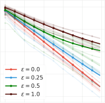

(a) Off-policyness _ε_


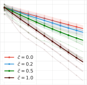

(b) Trace coefficient _c_ _t_


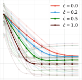

(c) Fixed point quality


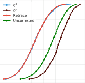

(d) Uncorrected


Figure 3: Tabular experiments to illustrate properties of the distributional Retrace operator: we show
average results across 10 randomly sampled MDPs. (a) Contraction rate vs. off-policyness; (b)
Contraction rate vs. trace coefficient _c_ _t_ = min( _ρ_ _t_ _,_ ~~_c_~~ ) ; (c) Fixed point quality vs. trace coefficient _c_ _t_ ;
(d) The uncorrected operator introduces bias to the fixed point while Retrace is unbiased.


**6** **Discussions**


**Categorical representations.** The categorical representation is another commonly used class of
parameterized distributions in prior literature [ 23, 17, 24, 10 ]. We obtain contractive guarantees for
the categorical representation similar to Theorem 5.1. As with QR, this leads both to improved fixedpoint approximations and faster convergence. Further, this leads to a deep RL algorithm C51-Retrace.
The actor-critic Reactor agent [ 25 ] uses C51-Retrace as a critic training algorithm, although without
explicit consideration or analysis of the associated distributional operator. See Appendix E for details.
We empirically evaluate the stand-alone improvements of C51-Retrace over C51 in Section 7.


**Uncorrected methods.** The uncorrected methods do not correct for the off-policyness and hence
obtain a biased fixed point [ 26 – 28 ]. The Rainbow agent [ 26 ] combined _n_ -step uncorrected learning
with C51, effectively implementing a distributional operator whose fixed point differs from _η_ _[π]_ .


**On-policy distributional TD(** _λ_ **).** Nam et al. [ 29 ] propose SR( _λ_ ), a distributional version of onpolicy TD ( _λ_ ) [ 30 ]. In operator form, this can be viewed as a special case of Equation (4) with _µ_ = _π_,
_c_ _t_ = _λ_ ; [29] also introduce a sample-replacement technique for more efficient implementation.


**7** **Experiments**


We carry out a number of experiments to validate the theoretical insights and empirical improvements.


**7.1** **Illustration of distributional Retrace properties on tabular MDPs**

We verify a few important properties of the distributional Retrace operator on a tabular MDP. The
results corroborate the theoretical results from previous sections. Throughout, we use quantile
representations with _m_ = 100 atoms; we obtain similar results for categorical representations. See
Appendix F for details on the experiment setup. Let _η_ 0 be the initial distribution, we carry out
dynamic programming with _R_ _[π,µ]_ and denote _η_ _k_ = ( _R_ _[π,µ]_ ) _[k]_ _η_ 0 as the _k_ [th] distribution iterate.


**Impact of off-policyness.** We control the level of off-policyness by setting the behavior policy _µ_
to be a uniform policy and the target policy to _π_ = (1 _−_ _ε_ ) _µ_ + _επ_ _d_ where _π_ _d_ is a fixed deterministic
policy. Moving from _ε_ = 0 to _ε_ = 1, we transition from on-policy to very off-policy. We use
_L_ _p_ ( _η_ _k_ _, η_ _R_ _[π]_ [)] [ to measure the contraction rate to the fixed point. Figure][ 3][ shows that as the behavior]
becomes more off-policy, the contraction slows down, degrading the efficiency of multi-step learning.


**Impact of trace coefficient** _c_ _t_ **.** Throughout, we set _c_ _t_ = min( _ρ_ _t_ _,_ ~~_c_~~ ~~)~~ with ~~_c_~~ to control the effective
trace length. With a fixed level of off-policyness _ε_ = 0 _._ 5, Figure 3(b) shows that increasing ~~_c_~~ speeds
up the contraction to the fixed point as predicted by Proposition 3.2.


**Quality of fixed point.** We next examine how the quality of the fixed point is impacted by ~~_c_~~,
by measuring _L_ _p_ ( _η_ _k_ _,_ Π _Q_ _η_ _[π]_ ) as a proxy to _L_ _p_ ( _η_ _k_ _, η_ _[π]_ ) . As _k_ increases the error flattens, at which
point we take the converged value to be _L_ _p_ ( _η_ _R_ _[π]_ _[,]_ [ Π] _[Q]_ _[η]_ _[π]_ [)] [ which measures the fixed point quality.]
Figure 3(c) shows when ~~_c_~~ increases, the fixed point quality improves, in line with the Theorem 5.1.
This phenomenon does not arise in _tabular_ non-distributional reinforcement learning, although related
phenomena do occur when using function approximation techniques.


8


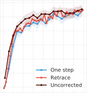

(a) C51


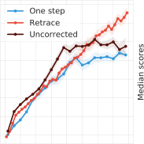

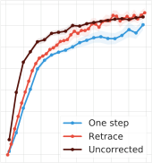

(b) QR-DQN


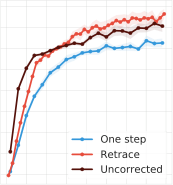


Figure 4: Deep RL experiments on Atari-57 games for (a) C51 and (b) QR-DQN. We compare the
one-step baseline agent against the multi-step variants (Retrace and uncorrected _n_ -step). For all
multi-step variants, we use _n_ = 3 . For each agent, we calculate the mean and median performance
across all games, and we plot the mean _±_ standard error across 3 seeds. In almost all settings,
multi-step variants provide clear advantage over the one-step baseline algorithm.


**Bias of uncorrected methods.** Finally, we illustrate a critical difference between Retrace and
uncorrected _n_ -step methods [ 26 ]: the bias to the fixed point. Figure 3(d) shows that uncorrected
_n_ -step arrives at a fixed point in between _η_ _[π]_ and _η_ _[µ]_, showing an obvious bias from _η_ _[π]_ .


**7.2** **Deep reinforcement learning**

We consider the control setting where the target policy _π_ is the greedy policy with respect to the
Q-function induced by the parameterized distribution. Because the training data is sampled from a
replay, the behavior policy _µ_ is _ε_ -greedy with respect to Q-functions induced by previous copies of
the parameterized distribution. We evaluate the performance of deep RL agents on 57 Atari games

[ 31 ]. To ensure fair comparison across games, we compute the human normalized scores for each
agent, and compare their evaluated mean and median scores across all 57 games during training.


**Deep RL agents.** The multi-step agents adopt exactly the same hyperparameters as the baseline
agents. The only difference is the back-up target. For completeness of results, we show the combination of Retrace with both C51 and QR-DQN. For QR-DQN, we use the Huber loss for quantile
regression, which is a thresholded variant of the QR loss [ 16 ]. Throughout, we use _c_ _t_ = _λ_ min( _ρ_ _t_ _,_ ~~_c_~~ ~~)~~
with ~~_c_~~ = 1 as in [ 13 ]. See Appendix F for details. In practice, sampled trajectories are truncated at
length _n_ . We also adapt Retrace to the _n_ -step case, see Appendix A.


**Results.** Figure 4 compares one-step baseline, Retrace and uncorrected _n_ -step [ 26 ]. For C51, both
multi-step methods clearly improve the median performance over the one-step baseline. Retrace
slightly outperforms uncorrected _n_ -step towards the end of learning. For QR-DQN, all multi-step
algorithms achieve clear performance gains. Retrace significantly outperforms the uncorrected _n_ -step
with the mean performance, while obtaining similar results on the median performance. Overall,
distributional Retrace achieves a clear improvement over the one-step baselines. The uncorrected
_n_ -step method typically takes off faster than Retrace but may to slightly worse performance.


Finally, note that in the value-based setting, uncorrected methods are generally more high-performing
than Retrace, potentially due to a favorable trade-off between contraction rate and fixed-point bias

[32]. Our results add to the benefits of off-policy corrections in the control setting.


**8** **Conclusion**


We have identified a number of fundamental conceptual differences between value-based and distributional RL in multi-step settings. Central to such differences is the novel notion of path-dependent
distributional TD error, which naturally arises from the multi-step distributional RL problem. Building on this understanding, we have developed the first principled multi-step off-policy distributional
operator Retrace. We have also developed an approximate distributional RL algorithm, Quantile
Regression-Retrace, which makes distributional Retrace highly competitive in both tabular and
high-dimensional setups. This paper also opens up a several avenues for future research, such as the
interaction between multi-step distributional RL and signed measures, and the convergence theory of
stochastic approximations for multi-step distributional RL.


9


**References**


[1] D. P. Bertsekas and J. N. Tsitsiklis. _Neuro-Dynamic Programming_ . Athena Scientific, 1996.


[2] Richard S. Sutton and Andrew G. Barto. _Reinforcement Learning: An Introduction_ . MIT Press,
1998.


[3] Csaba Szepesvári. _Algorithms for Reinforcement Learning_ . Morgan & Claypool Publishers,
2010.


[4] Tetsuro Morimura, Masashi Sugiyama, Hisashi Kashima, Hirotaka Hachiya, and Toshiyuki
Tanaka. Nonparametric return distribution approximation for reinforcement learning. In
_Proceedings of the International Conference on Machine Learning_, 2010.


[5] Tetsuro Morimura, Masashi Sugiyama, Hisashi Kashima, Hirotaka Hachiya, and Toshiyuki
Tanaka. Parametric return density estimation for reinforcement learning. In _Proceedings of the_
_Conference on Uncertainty in Artificial Intelligence_, 2010.


[6] Marc G. Bellemare, Will Dabney, and Rémi Munos. A distributional perspective on reinforcement learning. In _Proceedings of the International Conference on Machine Learning_,
2017.


[7] Derek Yang, Li Zhao, Zichuan Lin, Tao Qin, Jiang Bian, and Tie-Yan Liu. Fully parameterized
quantile function for distributional reinforcement learning. _Advances in neural information_
_processing systems_, 2019.


[8] Cristian Bodnar, Adrian Li, Karol Hausman, Peter Pastor, and Mrinal Kalakrishnan. Quantile
QT-OPT for risk-aware vision-based robotic grasping. In _Proceedings of Robotics: Science and_
_Systems_, 2020.


[9] Peter R Wurman, Samuel Barrett, Kenta Kawamoto, James MacGlashan, Kaushik Subramanian, Thomas J Walsh, Roberto Capobianco, Alisa Devlic, Franziska Eckert, Florian Fuchs,
et al. Outracing champion Gran Turismo drivers with deep reinforcement learning. _Nature_,
602(7896):223–228, 2022.


[10] Marc G. Bellemare, Will Dabney, and Mark Rowland. _Distributional Reinforcement Learning_ .
MIT Press, 2022. `[http://www.distributional-rl.org](http://www.distributional-rl.org)` .


[11] Doina Precup, Richard S. Sutton, and Sanjoy Dasgupta. Off-policy temporal-difference learning
with function approximation. In _Proceedings of the International Conference on Machine_
_Learning_, 2001.


[12] Anna Harutyunyan, Marc G. Bellemare, Tom Stepleton, and Rémi Munos. Q( _λ_ ) with off-policy
corrections. In _Proceedings of the International Conference on Algorithmic Learning Theory_,
2016.


[13] Rémi Munos, Tom Stepleton, Anna Harutyunyan, and Marc G. Bellemare. Safe and efficient
off-policy reinforcement learning. In _Advances in Neural Information Processing Systems_,
2016.


[14] Ashique Rupam Mahmood, Huizhen Yu, and Richard S Sutton. Multi-step off-policy learning
without importance sampling ratios. _arXiv_, 2017.


[15] Yash Chandak, Scott Niekum, Bruno da Silva, Erik Learned-Miller, Emma Brunskill, and
Philip S. Thomas. Universal off-policy evaluation. _Advances in Neural Information Processing_
_Systems_, 2021.


[16] Will Dabney, Mark Rowland, Marc G. Bellemare, and Rémi Munos. Distributional reinforcement learning with quantile regression. In _Proceedings of the AAAI Conference on Artificial_
_Intelligence_, 2018.


[17] Mark Rowland, Marc G. Bellemare, Will Dabney, Rémi Munos, and Yee Whye Teh. An
analysis of categorical distributional reinforcement learning. In _Proceedings of the International_
_Conference on Artificial Intelligence and Statistics_, 2018.


10


[18] Hado van Hasselt, Sephora Madjiheurem, Matteo Hessel, David Silver, André Barreto, and
Diana Borsa. Expected eligibility traces. In _Proceedings of the AAAI Conference on Artificial_
_Intelligence_, 2020.


[19] Will Dabney, Georg Ostrovski, David Silver, and Rémi Munos. Implicit quantile networks
for distributional reinforcement learning. In _Proceedings of the International Conference on_
_Machine Learning_, 2018.


[20] Roger Koenker and Gilbert Bassett Jr. Regression quantiles. _Econometrica: Journal of the_
_Econometric Society_, pages 33–50, 1978.


[21] Roger Koenker. _Quantile Regression_ . Econometric Society Monographs. Cambridge University
Press, 2005.


[22] Roger Koenker, Victor Chernozhukov, Xuming He, and Limin Peng. _Handbook of Quantile_
_Regression_ . CRC Press, 2017.


[23] Marc G. Bellemare, Ivo Danihelka, Will Dabney, Shakir Mohamed, Balaji Lakshminarayanan,
Stephan Hoyer, and Rémi Munos. The Cramer distance as a solution to biased Wasserstein
gradients. _arXiv preprint arXiv:1705.10743_, 2017.


[24] Mark Rowland, Robert Dadashi, Saurabh Kumar, Rémi Munos, Marc G. Bellemare, and Will
Dabney. Statistics and samples in distributional reinforcement learning. In _Proceedings of the_
_International Conference on Machine Learning_, 2019.


[25] Audrunas Gruslys, Will Dabney, Mohammad Gheshlaghi Azar, Bilal Piot, Marc G. Bellemare,
and Rémi Munos. The Reactor: A fast and sample-efficient actor-critic agent for reinforcement
learning. In _Proceedings of the International Conference on Learning Representations_, 2018.


[26] Matteo Hessel, Joseph Modayil, Hado Van Hasselt, Tom Schaul, Georg Ostrovski, Will Dabney,
Dan Horgan, Bilal Piot, Mohammad Azar, and David Silver. Rainbow: Combining improvements in deep reinforcement learning. In _Proceedings of the AAAI Conference on Artificial_
_Intelligence_, 2018.


[27] Steven Kapturowski, Georg Ostrovski, John Quan, Rémi Munos, and Will Dabney. Recurrent
experience replay in distributed reinforcement learning. In _Proceedings of the International_
_Conference on Learning Representations_, 2019.


[28] Tadashi Kozuno, Yunhao Tang, Mark Rowland, Rémi Munos, Steven Kapturowski, Will Dabney,
Michal Valko, and David Abel. Revisiting Peng’s Q( _λ_ ) for modern reinforcement learning. In
_Proceedings of the International Conference on Machine Learning_, 2021.


[29] Daniel W. Nam, Younghoon Kim, and Chan Y. Park. GMAC: A distributional perspective on
actor-critic framework. In _Proceedings of the International Conference on Machine Learning_,
2021.


[30] Richard S. Sutton. Learning to predict by the methods of temporal differences. _Machine_
_learning_, 3(1):9–44, 1988.


[31] Marc G. Bellemare, Yavar Naddaf, Joel Veness, and Michael Bowling. The arcade learning
environment: An evaluation platform for general agents. _Journal of Artificial Intelligence_
_Research_, 47:253–279, 2013.


[32] Mark Rowland, Will Dabney, and Rémi Munos. Adaptive trade-offs in off-policy learning. In
_Proceedings of the International Conference on Artificial Intelligence and Statistics_, 2020.


[33] Volodymyr Mnih, Koray Kavukcuoglu, David Silver, Andrei A. Rusu, Joel Veness, Marc G.
Bellemare, Alex Graves, Martin Riedmiller, Andreas K. Fidjeland, Georg Ostrovski, Stig Petersen, Charles Beattie, Amir Sadik, Ioannis Antonoglou, Helen King, Dharshan Kumaran, Daan
Wierstra, Shane Legg, and Demis Hassabis. Human-level control through deep reinforcement
learning. _Nature_, 518(7540):529–533, February 2015.


[34] Walter Rudin. _Principles of Mathematical Analysis_ . McGraw-Hill New York, 1976.


11


[35] Charles R. Harris, K. Jarrod Millman, Stéfan J van der Walt, Ralf Gommers, Pauli Virtanen,
David Cournapeau, Eric Wieser, Julian Taylor, Sebastian Berg, Nathaniel J. Smith, Robert Kern,
Matti Picus, Stephan Hoyer, Marten H. van Kerkwijk, Matthew Brett, Allan Haldane, Jaime
Fernández del Río, Mark Wiebe, Pearu Peterson, Pierre Gérard-Marchant, Kevin Sheppard,
Tyler Reddy, Warren Weckesser, Hameer Abbasi, Christoph Gohlke, and Travis E. Oliphant.
Array programming with NumPy. _Nature_, 585(7825):357–362, 2020.


[36] John D. Hunter. Matplotlib: A 2D graphics environment. _Computing in science & engineering_,
9(03):90–95, 2007.


[37] James Bradbury, Roy Frostig, Peter Hawkins, Matthew James Johnson, Chris Leary, Dougal
Maclaurin, George Necula, Adam Paszke, Jake VanderPlas, Skye Wanderman-Milne, and Qiao
Zhang. Jax: composable transformations of Python+NumPy programs. 2018.


[38] Igor Babuschkin, Kate Baumli, Alison Bell, Surya Bhupatiraju, Jake Bruce, Peter Buchlovsky,
David Budden, Trevor Cai, Aidan Clark, Ivo Danihelka, Claudio Fantacci, Jonathan Godwin,
Chris Jones, Tom Hennigan, Matteo Hessel, Steven Kapturowski, Thomas Keck, Iurii Kemaev,
Michael King, Lena Martens, Vladimir Mikulik, Tamara Norman, John Quan, George Papamakarios, Roman Ring, Francisco Ruiz, Alvaro Sanchez, Rosalia Schneider, Eren Sezener,
Stephen Spencer, Srivatsan Srinivasan, Wojciech Stokowiec, and Fabio Viola. The DeepMind
JAX ecosystem. 2010.


[39] Diederik P. Kingma and Jimmy Ba. Adam: A method for stochastic optimization. In _Proceedings_
_of the International Conference on Learning Representations_, 2015.


[40] Rishabh Agarwal, Max Schwarzer, Pablo Samuel Castro, Aaron C Courville, and Marc Bellemare. Deep reinforcement learning at the edge of the statistical precipice. _Advances in neural_
_information processing systems_, 34:29304–29320, 2021.


12


**The Nature of Temporal Difference Errors in**
**Multi-step Distributional Reinforcement Learning:**
**Appendices**


**A** **Extension of distributional Retrace to** _n_ **-step truncated trajectories**


The _n_ -step truncated version of distributional Retrace is defined as


_n_
� _c_ 1: _t_ ∆ [�] _[π]_ 0: _t_
� _t_ =0


_R_ _[π,µ]_ _n_ _[η]_ [(] _[x, a]_ [) =] _[ η]_ [(] _[x, a]_ [) +][ E] _[µ]_


�


_,_


which sums the path-dependent distributional TD errors up to time _n_ . Compared to the original
definition of distributional Retrace, this _n_ -step operator is more practical to implement. This operator
enjoys all the theoretical properties of the original distributional Retrace, with a slight difference on
the contraction rate. Intuitively, the operator bootstraps with at most _n_ steps, which limits the effective
horizon of the operator to be _≤_ _n_ . It is straightforward to show that the operator is _β_ _n_ -contractive
under _W_ _p_ with _β_ _n_ _∈_ ( _β, γ_ ]. As _n →∞_, _β_ _n_ _→_ _β_ .


**B** **Distance metrics**


We provide a brief review on the distance metrics used in this work. We refer readers to [ 10 ] for a
complete background.


**B.1** **Wasserstein distance**

Let _η_ 1 _, η_ 2 _∈_ _P_ _∞_ (R) be two distribution measures. Let _F_ _η_ be the CDF of _η_ . The _p_ -Wasserstein
distance can be computed as


� 1 _/p_


_W_ _p_ ( _η_ 1 _, η_ 2 ) :=


_|F_ _η_ _[−]_ 1 [1] [(] _[z]_ [)] _[ −]_ _[F]_ _[ −]_ _η_ 2 [1] [(] _[z]_ [)] _[|]_ _[p]_ _[dz]_

�� [0 _,_ 1]


��


_._


Note that the above definition is equivalent to the more traditional definition based on optimal
transport; indeed, _F_ _η_ _[−]_ _i_ [1] [(] _[z]_ [)] _[, z][ ∼]_ [Uniform][(0] _[,]_ [ 1)] _[, i][ ∈{]_ [1] _[,]_ [ 2] _[}]_ [ can be understood as the optimal coupling]
between the two distributions. The above definition is a proper distance metric if _p ≥_ 1.

For any distribution vector _η_ 1 _, η_ 2 _∈_ _P_ _∞_ (R) _[X×A]_, we can define the supremum _p_ -Wasserstein
distance as


_W_ _p_ ( _η_ 1 _, η_ 2 ) := max
_x,a_ _[W]_ _[p]_ [(] _[η]_ [1] [(] _[x, a]_ [)] _[, η]_ [2] [(] _[x, a]_ [))] _[.]_


**B.2** _L_ _p_ **distance**
Let _η_ 1 _, η_ 2 _∈_ _P_ _∞_ (R) be two distribution measures. Let _F_ _η_ be the CDF of _η_ . The _L_ _p_ distance is
defined as


1 _/p_

_L_ _p_ ( _η_ 1 _, η_ 2 ) := _|F_ _η_ 1 ( _z_ ) _−_ _F_ _η_ 2 ( _z_ ) _|_ _[p]_ _dz_ _._
�� R �


The above definition is a proper distance metric when _p ≥_ 1.

For any distribution vector _η_ 1 _, η_ 2 _∈_ _P_ _∞_ (R) _[X×A]_ or signed measure vector _η_ 1 _, η_ 2 _∈M_ (R) _[X×A]_, we
can define the supremum Cramér- _p_ distance as


_L_ _p_ ( _η_ 1 _, η_ 2 ) := max
_x,a_ _[L]_ _[p]_ [(] _[η]_ [1] [(] _[x, a]_ [)] _[, η]_ [2] [(] _[x, a]_ [))] _[.]_


**C** **Numerically non-convergent behavior of alternative multi-step operators**


We consider another alternative definition of path-independent alternative to the path-dependent
TD error _γ_ _[t]_ ∆ _[π]_ _t_ [. The primary motivation for such a path-dependent TD error is that the discounted]
value-based TD error takes the form _δ_ [�] _t_ _[π]_ [=] _[ γ]_ _[t]_ _[δ]_ _t_ _[π]_ [. The resulting multi-step operator is]


_∞_
� _c_ 1: _t_ _γ_ _[t]_ ∆ _[π]_ _t_
� _t_ =0


_R_ � _[π,µ]_ _η_ ( _x, a_ ) = _η_ ( _x, a_ ) + E _µ_


13


�


_._


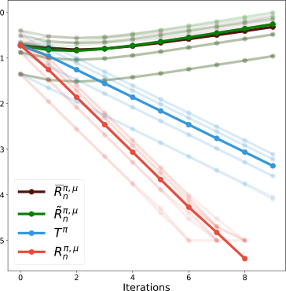


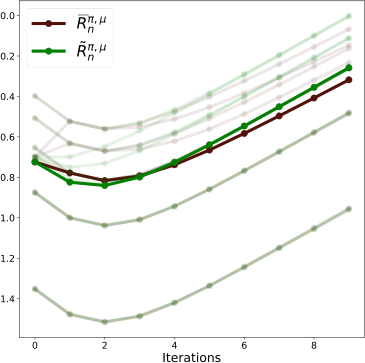


(a) Full results for all operators


(b) Comparing two alternatives


Figure 5: Illustration of non-convergent behavior of alternative multi-step operators: for both plots,
we show the mean and per-run results across 10 different initial Dirac distributions _η_ 0 . (a) the full
comparison between all operators. Two alternative operators do not converge while one-step Bellman
operator and distributional Retrace both converge; (b) we zoom in on the difference between the two
alternative operators.


With the same toy example as in the paper: an one-state one-action MDP with a deterministic
reward _R_ _t_ = 1 and discount factor _γ_ = 0 _._ 5 . The target distribution _η_ _[π]_ is a Dirac distribution
centering at 2 . Let _η_ _k_ = ( _R_ ) _[k]_ _η_ 0 be the _k_ -th distribution iterate by applying the operator _R ∈_
_{R_ _[π,µ]_ _,_ _R_ [�] _[π,µ]_ _,_ _R_ [�] _[π,µ]_ _, T_ _[π]_ _}_, we show the _L_ _p_ distance between the iterates and _η_ _[π]_ in Figure 5. It is clear
that alternative multi-step operators do not converge to the correct fixed point.


**D** **Backward-view algorithm for multi-step distributional RL**


We now describe a backward-view algorithm for multi-step distributional RL with quantile representations. For simplicity, we consider the on-policy case _π_ = _µ_ and _c_ _t_ = _λ_ . To implement _R_ _[π,µ]_ in
the backward-view, at each time step _t_ and a past time step _t_ _[′]_ _≤_ _t_, the algorithm needs to maintain
two novel traces distinct from the classic eligibility traces [ 2 ]: (1) partial return traces _G_ _t_ _′_ : _t_, which
correspond to the partial sum of rewards between two time steps _t_ _[′]_ _≤_ _t_ ; (2) modified eligibility traces,
defined as _e_ _t_ _′_ _,t_ := _λ_ _[t][−][t]_ _[′]_, which measures the trace decay between two time steps _t_ _[′]_ _≤_ _t_ . At a new
time step _t_ + 1, the new traces are computed recursively: _G_ _t_ _′_ : _t_ +1 = _R_ _t_ +1 + _γG_ _t_ _′_ _,t_ _, e_ _t_ _′_ _,t_ +1 = _λe_ _t_ _′_ _,t_ .


We assume the algorithm maintains a table of quantile distributions with _m_ atoms: _η_ ( _x, a_ ) =
_m_ 1 � _mi_ =1 _[δ]_ _[z]_ _i_ [(] _[x,a]_ [)] _[,][ ∀]_ [(] _[x, a]_ [)] _[ ∈X × A]_ [. For any fixed] [ (] _[x, a]_ [)] [, define] _[ T]_ _[t]_ [(] _[x, a]_ [) :=] _[ {][s][|][X]_ _[s]_ [ =] _[ x, A]_ _[s]_ [ =]
_a,_ 0 _≤_ _s ≤_ _t}_ be the set of time steps before time _t_ at which ( _x, a_ ) is visited. Now, upon arriving at
_X_ _t_ +1, we observe the TD error ∆ _[π]_ _t_ [. Recall that] _[ L]_ _[τ]_ _θ_ [(] _[η]_ [)] [ denote the QR loss of parameter] _[ θ]_ [ at quantile]
level _τ_ and against the distrbution _η_ . To more conveniently describe the update, we define the QR
loss against the path-dependent TD error
�b _G_ _s_ : _t−_ 1 _,γ_ _t−s_ [�] [∆][�] 0: _[π]_ _t_ [=] �b _G_ _s_ : _t_ _,γ_ _t_ +1 _−s_ [�] _[η]_ [(] _[X]_ _[t]_ [+1] _[, A]_ _t_ _[π]_ +1 [)] _[ −]_ �b _G_ _s_ : _t−_ 1 _,γ_ _t−s_ [�] _[η]_ [(] _[X]_ _[t]_ _[, A]_ _[t]_ [)]


# [∆][�] 0: _[π]_ _t_ [=] �b _G_ _s_ : _t_ _,γ_ _t_ +1 _−s_ [�]


# _[η]_ [(] _[X]_ _[t]_ [+1] _[, A]_ _t_ _[π]_ +1 [)] _[ −]_ �b _G_ _s_ : _t−_ 1 _,γ_ _t−s_ [�]


# _[η]_ [(] _[X]_ _[t]_ _[, A]_ _[t]_ [)]


as the difference of the QR losses against the individual distributions,


_L_ _[τ]_ _θ_ b _G_ _s_ : _t−_ 1 _,γ_ _t−s_ [�]
��


# [∆][�] 0: _[π]_ _t_ � := _L_ _[τ]_ _θ_ ��b _G_ _s_ : _t_ _,γ_ _t_ +1 _−s_ [�] # _[η]_ [(] _[X]_ _[t]_ [+1] _[, A]_ _t_ _[π]_ +1 [)] � _−_ _L_ _[τ]_ _θ_ ��b _G_ _s_ : _t−_ 1 _,γ_ _t−s_ [�]


_._
# _[η]_ [(] _[X]_ _[t]_ _[, A]_ _[t]_ [)] �


Note that the QR loss can be computed using the transition data we have seen so far. We now perform
the a gradient update for all entries in the table ( _x, a_ ) _∈X × A_ and 1 _≤_ _i ≤_ _m_ (in practice, we
update entries that correspond to visited state-action pairs):


_z_ _i_ ( _x, a_ ) _←_ _z_ _i_ ( _x, a_ ) _−_ _α_ � _e_ _s,t_ _∇_ _z_ _i_ ( _x,a_ ) _L_ _[τ]_ _θ_ _[i]_ ��b _G_ _s_ : _t−_ 1 _,γ_ _t−s_ [�]

_s∈T_ _t_ ( _x,a_ )


14


# [∆][�] 0: _[π]_ _t_ � _,_


where _τ_ _i_ = [2] 2 _[i][−]_ _m_ [1] [. For any fixed] [ (] _[x, a]_ [)] [, the above algorithm effectively aggregates updates from time]

steps _s ∈_ _T_ _t_ ( _x, a_ ) at which ( _x, a_ ) is visited.


**D.1** **Simplifications for value-based RL**

We now discuss how the path-independent value-based TD errors greatly simplify the value-based
backward-view algorithm. Following the above notations, assume the algorithm maintains a table of
Q-function _Q_ ( _x, a_ ), we can construct incremental backward-view update for all ( _x, a_ ) _∈X × A_ as
follows, by replacing the path-dependent distributional TD error ∆ [�] _[π]_ 0: _t_ [by the discounted TD error] [ �] _[δ]_ _t_ _[π]_

_Q_ ( _x, a_ ) _←_ _Q_ ( _x, a_ ) _−_ _α_ � _e_ _s,t_ _δ_ [�] _t_ _[π]_ _[.]_

_s∈T_ _t_ ( _x,a_ )


Since _δ_ _t_ _[π]_ [does not depend on the past rewards and is state-action dependent, we can simplify the]
summation over _s ∈_ _T_ _t_ ( _x, a_ ) by defining the state-depedent eligibility traces [ 2 ] as a replacement to

_e_ _s,t_,
_e_ �( _x, a_ ) _←_ _γλe_ �( _x, a_ ) + I[ _X_ _t_ = _x, A_ _t_ = _a_ ] _._

As a result, the above update reduces to

�
_Q_ ( _x, a_ ) _←_ _Q_ ( _x, a_ ) _−_ _αe_ ( _x, a_ ) _δ_ _t_ _[π]_ _[,]_

which recovers the classic backward-view update.


**D.2** **Non-equivalence of forward-view and backward-view algorithms**

In value-based RL, forward-view and backward-view algorithms are equivalent given that the trajectory does not visit the same state twice [ 2 ]. However, such an equivalence does not generally
hold in distributional RL. Indeed, consider the following counterexample in the case of the quantile
representation.


Consider a three-step MDP with deterministic transition _x_ 1 _→_ _x_ 2 _→_ _x_ 3 . There is no action and
no reward on the transition. The state _x_ 3 is terminal with a deterministic terminal value _r_ 3 = 1 .
We consider _m_ = 1 atom and let the quantile parameters be _θ_ 1 = 0 and _θ_ 2 = 1 at states _x_ 1 _, x_ 2
respectively. In this case, the quantile representation learns the median of the target distribution with
_τ_ = 0 _._ 5.


Now, we consider the update at _θ_ 1 with both forward-view and backward-view implementation of the
two-step Bellman operator _T_ 2 _[π]_ _[η]_ [(] _[x]_ [) =][ E] �(b 0 _,γ_ 2 ) # _η_ ( _X_ 2 _, π_ ( _X_ 2 )) _|X_ 0 = _x_ �, which can be obtained
from distributional Retrace by setting _c_ _t_ = _ρ_ _t_ . The target distribution at _x_ 1 is a Dirac distribution
centering at _γ_ [2] .


**Forward-view update.** Below, we use _δ_ _x_ to denote a Dirac distribution at _x_ . In the forward-view,
the back-up distribution is
E �(b 0 _,γ_ 2 ) # _η_ ( _X_ 2 _, π_ ( _X_ 2 ))� = _δ_ _γ_ 2 _._
The gradient update to _θ_ 1 is thus

_θ_ 1 [(fwd)] = _θ_ 1 _−_ _α∇_ _θ_ 1 _L_ [0] _θ_ 1 _[.]_ [5] � _δ_ _γ_ 2 [�] = _θ_ 1 + _α_ �0 _._ 5 _−_ I � _γ_ [2] _< θ_ 1 �� _._


**Backward-view update.** To implement the backward-view update, we make clear of the two
path-dependent distributional TD errors at two consecutive time steps
∆� _[π]_ 0 [=] _[ δ]_ _[γ]_ _[−]_ _[δ]_ [0] _[,]_ ∆� _[π]_ 1 [= (][b] [0] _[,γ]_ [)] [#] [(] _[δ]_ _[γθ]_ 2 _[−]_ _[δ]_ _[θ]_ 1 [) =] _[ δ]_ _γ_ [2] _[ −]_ _[δ]_ _[γ]_

The update consists of two steps:
_θ_ 1 _[′]_ [=] _[ θ]_ [1] _[−]_ _[α][∇]_ _[θ]_ 1 _[L]_ _θ_ [0] 1 _[.]_ [5] [(] _[δ]_ _[γ]_ [) =] _[ θ]_ [1] [+] _[ α]_ [ (0] _[.]_ [5] _[ −]_ [I][ [] _[γ < θ]_ [1] [])] _[,]_

_θ_ 1 [(bwd)] = _θ_ 1 _[′]_ _[−]_ _[α]_ � _∇_ _θ_ 1 _[′]_ _[L]_ _θ_ [0] 1 _[.]_ _[′]_ [5] � _δ_ _γ_ [2] � _−∇_ _θ_ 1 _[′]_ _[L]_ _θ_ [0] 1 _[.]_ _[′]_ [5] [(] _[δ]_ _[γ]_ [)] �

= _θ_ 1 _[′]_ [+] _[ α]_ �0 _._ 5 _−_ I[ _γ_ [2] _< θ_ 1 _[′]_ []] � _−_ _α_ (0 _._ 5 _−_ I[ _γ < θ_ 1 _[′]_ [])] _[ .]_

Overall, we have
_θ_ 1 [(bwd)] = _θ_ 1 + _α_ (0 _._ 5 _−_ I [ _γ < θ_ 1 ]) + _α_ �0 _._ 5 _−_ I[ _γ_ [2] _< θ_ 1 _[′]_ []] � _−_ _α_ (0 _._ 5 _−_ I[ _γ < θ_ 1 _[′]_ [])]

= 0 _._ 5 _α −_ _α_ I[ _γ_ [2] _<_ 0 _._ 5 _α_ ] + I[ _γ <_ 0 _._ 5 _α_ ] _._


Now, let _α ∈_ (2 _γ_ [2] _,_ 2 _γ_ ) such that 0 _._ 5 _α ∈_ ( _γ_ [2] _, γ_ ), we have _θ_ 1 [bwd] = 0 _._ 5 _α −_ _α_ = _−_ 0 _._ 5 _α ̸_ = _θ_ 1 [(][fwd][)] .


15


**D.3** **Discussion on memory complexity**

The return traces _G_ _t_ _′_ _,t_ and modified eligibility traces _e_ _t_ _′_ _,t_ are time-dependent, which is a direct
implication from the fact that distributional TD errors are path-dependent. Indeed, to calculate the
distributional TD error ∆ [�] _[π]_ _t_ _[′]_ : _t_ [, it is necessary to keep track] _[ G]_ _[t]_ _[′]_ _[,t]_ [ in the backward-view algorithm. This]
differs from the classic eligibility traces, which are state-action-dependent [ 2, 18 ]. We remark that the
state-action-dependency of eligibility traces result from the fact that value-based TD errors ∆ _[π]_ _t_ [are]
path-independent. The time-dependency greatly influences the memory complexity of the algorithm:
when an episode is of length _T_, value-based backward-view algorithm requires memory of size
min( _|X||A|, T_ ) to store all eligibility traces. On the other hand, the distributional backward-view
algorithm requires _O_ ( _T_ ).


**E** **Distributional Retrace with categorical representations**


We start by showing that the distributional Retrace operator is _β_ _L_ _p_ -contractive under the _L_ _p_ distance
for _p_ _≥_ 1 . As a comparison, the one-step distributional Bellman operator _T_ _[π]_ is _γ_ [1] _[/p]_ -contractive
under _L_ _p_ [17].


**Lemma E.1.** ( **Contraction in** _L_ _p_ ) _R_ _[π,µ]_ is _β_ _L_ _p_ -contractive under supremum _L_ _p_ distance for _p ≥_ 1,

where _β_ _L_ _p_ _∈_ [0 _, γ_ ] . Specifically, we have _β_ _L_ _p_ = max _x∈X_ _,a∈A_ ( [�] _[∞]_ _t_ =1 [E] _[µ]_ [ [] _[c]_ [1] _[...c]_ _[t][−]_ [1] [(1] _[ −]_ _[c]_ _[t]_ [)]] _[ γ]_ _[t]_ [)] [1] _[/p]_ [.]


_Proof._ The proof is similar to the proof of Proposition 3.2: the result follows by combining the
convex combination property of distributional Retrace in Lemma 3.1 with the _p_ -convexity of _L_ _p_
distance [10].


**E.1** **Categorical representation**

In categorical representations [ 23 ], we consider parametric distributions of the form for a fixed
_m ≥_ 1, [�] _[m]_ _i_ =1 _[p]_ _[i]_ _[δ]_ _[z]_ _i_ [, where] [ (] _[z]_ _[i]_ [)] _[m]_ _i_ =1 _[∈]_ [R] [ are a fixed set of atoms and] [ (] _[p]_ _[i]_ [)] _[m]_ _i_ =1 [is a categorical]
distribution such that [�] _[m]_ _i_ =1 _[p]_ _[i]_ [ = 1] [ and] _[ p]_ _[i]_ _[ ≥]_ [0] [. Denote the class of such distributions as] _[ P]_ _[C]_ [(][R][) :=]
_{_ [�] _[m]_ _i_ =1 _[p]_ _[i]_ _[δ]_ _[z]_ _[i]_ _[|]_ [ �] _[m]_ _i_ =1 _[p]_ _[i]_ [ = 1] _[, p]_ _[i]_ _[ ≥]_ [0] _[}]_ [. For simplicity, we assume that the target return is supported on]
the set of atoms [ _R_ MIN _/_ (1 _−_ _γ_ ) _, R_ MAX _/_ (1 _−_ _γ_ )] _⊂_ [ _z_ 1 _, z_ _m_ ].


We introduce the projection that maps from an initial back-up distribution to the categorical parametric
class: Π _C_ : _P_ _∞_ (R) _→_ _P_ _C_ (R) defined as Π _C_ _η_ := arg min _ν∈P_ _C_ (R) _L_ 2 ( _ν, η_ ) _, ∀ν ∈_ _P_ _∞_ (R) .
The projection can be easily calculated as described in [ 6, 17 ]. For any distribution vector _η ∈_
_P_ _∞_ (R) _[X×A]_, define Π _C_ _η_ as the component-wise projection. Now, given the composed operator
Π _C_ _R_ _[π,µ]_ : _P_ _∞_ (R) _[X×A]_ _→_ _P_ _C_ (R) _[X×A]_, we characterize the convergence of the seququence _η_ _k_ =
(Π _C_ _R_ _[π,µ]_ ) _[k]_ _η_ 0 .


**Theorem E.2.** ( **Convergence of categorical distributions** ) The projected distributional Retrace
operator Π _C_ _R_ _[π,µ]_ is _β_ _L_ 2 -contractive under _L_ 2 distance in _P_ _Q_ (R) . As a result, the above _η_ _k_ converges
to a limiting distribution _η_ _R_ _[π]_ [in] _[ L]_ [2] [, such that] _[ L]_ [2] [(] _[η]_ _[k]_ _[, η]_ _R_ _[π]_ [)] _[ ≤]_ [(] _[β]_ _[L]_ 2 [)] _[k]_ _[L]_ [2] [(] _[η]_ [0] _[, η]_ _R_ _[π]_ [)] [. Further, the quality]
of the fixed point is characterized as _L_ 2 ( _η_ _R_ _[π]_ _[, η]_ _[π]_ [)] _[ ≤]_ [(1] _[ −]_ _[β]_ _[L]_ 2 [)] _[−]_ [1] _[L]_ [2] [(Π] _[C]_ _[η]_ _[π]_ _[, η]_ _[π]_ [)][.]


_Proof._ The above theorem follows from Lemma E.1. Indeed, since Π _Q_ is a non-expansion in
supremum Cramér distance _L_ 2 [ 17 ], the composed operator Π _Q_ _R_ _[π,µ]_ is _β_ _L_ 2 -contractive in _L_ 2 .
Following the same argument as the proof of Theorem 5.1, we obtain the remaining desired results.


The distributional Retrace operator also improves over one-step distributional Bellman operator in
two aspects: (1) the bound on the contraction rate _β_ _L_ 2 _≤_ _[√]_ ~~_γ_~~ is smaller, usually leading to faster
contraction to the fixed point; (2) the bound on the quality of the fixed point is improved.


**E.2** **Cross-entropy update and C51-Retrace**

Unlike in the quantile projection case, where calculating Π _Q_ _η_ requires solving a quantile regression
minimization problem, the categorical projection can be calculated in an analytic way [ 17, 10 ].
Assume the categorical distribution is parameterized as _η_ _w_ ( _x, a_ ) = [�] _[m]_ _i_ =1 _[p]_ _[i]_ [(] _[x, a]_ [;] _[ w]_ [)] _[δ]_ _[z]_ _i_ [. After]


16


computing the back-up target distribution Π _C_ _R_ _[π,µ]_ _η_ ( _x, a_ ) for a given distribution vector _η_, the
algorithm carries out a gradient-based incremental update
_w ←_ _w −_ _α∇_ _w_ CE [Π _C_ _R_ _[π,µ]_ _η_ ( _x, a_ ) _|η_ _w_ ( _x, a_ )] _,_
where CE( _p|q_ ) := _−_ [�] _i_ _[p]_ _[i]_ [ log] _[ q]_ _[i]_ [ denotes the cross-entropy between distribution] _[ p]_ [ and] _[ q]_ [. For]

simplicity, we adopt a short-hand notation CE( _η|η_ _w_ ) = CE _w_ ( _η_ ) . Note also that in practice, _η_ can
be a slowly updated copy of _η_ _w_ [ 33 ]. As such, the gradient-based update can be understood as
approximating the iteration _η_ _k_ +1 = _R_ _[π,µ]_ _η_ _k_ . We propose the following unbiased estimate to the
cross-entropy CE [�] _w_ [Π _C_ _R_ _[π,µ]_ _η_ ( _x, a_ )], calculated as follows


CE _w_ ( _η_ ( _x, a_ )) +


_∞_
� _c_ 1: _t_ �CE _w_ �(b _t_ +1 ) # _η_ � _X_ _t_ +1 _, A_ _[π]_ _t_ +1 � [�] _−_ CE _w_ �(b _t_ ) # _η_ ( _X_ _t_ _, A_ _t_ )�� _._

_t_ =0


**Lemma E.3.** ( **Unbiased stochastic estimate for categorical update** ) Assume that the trajectory

�
terminates within _H < ∞_ steps almost surely, then we have E _µ_ CE _w_ (Π _C_ _R_ _[π,µ]_ _η_ ( _x, a_ )) =
� �

CE _w_ (Π _C_ _R_ _[π,µ]_ _η_ ( _x, a_ )) . Without loss of generality, assume _w_ is a scalar parameter. If there exists a constant _M >_ 0 such that _|∇_ _w_ CE _w_ ( _η_ ) _| ≤_ _M, ∀η ∈_ _P_ _∞_ (R), then the gradient estimate is

also unbiased E _µ_ _∇_ _w_ CE [�] _w_ (Π _C_ _R_ _[π,µ]_ _η_ ( _x, a_ )) = _∇_ _w_ CE _w_ (Π _C_ _R_ _[π,µ]_ _η_ ( _x, a_ )).
� �


_Proof._ The cross-entropy is defined for any distribution CE _w_ ( _η_ ) . For any signed measure _ν_ =
� _mi_ =1 _[w]_ _[i]_ _[η]_ _[i]_ [ with] _[ η]_ _[i]_ _[ ∈]_ _[P]_ _[∞]_ [(][R][)][, we define the generalized cross-entropy as]


CE _w_ ( _ν_ ) :=


_m_
� _w_ _i_ CE _w_ ( _η_ _i_ ) _,_


_i_ =1


Next, we note the cross-entropy is linear in the input distribution (or signed measure). In particular,
for a set of _N_ (potentially infinite) coefficients and distributions (signed measures) ( _a_ _i_ _, η_ _i_ ),


CE _w_


_N_
� _a_ _i_ _η_ _i_
� _i_ =1 �


:=


_m_
� _a_ _i_ CE _w_ ( _η_ _i_ ) _._


_i_ =1


When _a_ _i_ denotes a distribution, the above rewrites as CE _w_ (E[ _η_ _i_ ]) = E[CE( _η_ _i_ )] . Finally, combining


�
everything together, we have E _µ_ CE _w_ (Π _C_ _R_ _[π,µ]_ _η_ ( _x, a_ )) evaluate to
� �


_∞_
� _c_ 1: _t_ �CE _w_ �(b _t_ +1 ) # _η_ � _X_ _t_ +1 _, A_ _[π]_ _t_ +1 � [�] _−_ CE _w_ �(b _t_ ) # _η_ ( _X_ _t_ _, A_ _t_ )�� [�]

_t_ =0


= E _µ_


�


CE _w_ ( _η_ ( _x, a_ )) +


�
= ( _a_ ) E _µ_ �CE � _R_ _[π,µ]_ _η_ ( _x, a_ )�� = ( _b_ ) E _µ_ [CE ( _R_ _[π,µ]_ _η_ ( _x, a_ ))] _._

In the above, (a) follows from the definition of the cross-entropy with signed measure _R_ [�] _[π,µ]_ _η_ ( _x, a_ )
and (b) follows from the linearity property of cross-entropy.


Next, to show that the gradient estimate is unbiased too, the high level idea is to apply dominated
convergence theorem (DCT) to justify the exhchange of gradient and expectation [ 34 ]. This is similar
to the quantile representation case (see proof for Lemma 5.2). To this end, consider the absolute value
of the gradient estimate _∇_ _w_ �CE _w_ ( _R_ _[π,µ]_ _η_ ( _x, a_ )), which serves as an upper bound to the gradient
��� ���
estimate. In order to apply DCT, we need to show the expectation of the absolute gradient is finite.
Note we have

E _µ_ _∇_ _w_ �CE _w_ ( _R_ _[π,µ]_ _η_ ( _x, a_ ))
���� ����


_H_
� _c_ 1: _t_ � _∇_ _w_ CE _w_ �(b _t_ +1 ) # _η_ � _X_ _t_ +1 _, A_ _[π]_ _t_ +1 � [�] _−∇_ _w_ CE _w_ �(b _t_ ) # _η_ ( _X_ _t_ _, A_ _t_ )�� [�]

_t_ =0 ����


= E _µ_


_∇_ _w_ CE _w_ ( _η_ ( _x, a_ )) +
������


�


�


_H_
� _c_ 1: _t_ ��� _∇_ _w_ CE _w_ �(b _t_ +1 ) # _η_ � _X_ _t_ +1 _, A_ _[π]_ _t_ +1 � [�] _−∇_ _w_ CE _w_ �(b _t_ ) # _η_ ( _X_ _t_ _, A_ _t_ )����

_t_ =0


_H_
�


_≤_ ( _a_ ) E _µ_


_≤_ ( _b_ ) E _µ_


�

�


_|∇_ _w_ CE _w_ ( _η_ ( _x, a_ )) _|_ +


�


_M_ +


_H_
� _ρ_ _[t]_ _· M_


_t_ =0


_< ∞,_


17


where (a) follows from the application of triangle inequality; (b) follows from the fact that the QR
loss gradient against a fixed distribution is bounded _∇_ _w_ CE _w_ ( _ν_ ) _∈_ [ _−M, M_ ] _, ∀ν ∈_ _P_ _∞_ (R) [16].


Hence, with the application DCT, we can exchange the gradient and expectation operator, which

_τ_ � _τ_
yields E _µ_ _∇_ _w_ CE [�] _w_ [(] _[R]_ _[π,µ]_ _[η]_ [(] _[x, a]_ [))] = _∇_ _w_ E _µ_ CE _w_ [(] _[R]_ _[π,µ]_ _[η]_ [(] _[x, a]_ [))] = _∇_ _w_ CE _w_ ( _R_ _[π,µ]_ _η_ ( _x, a_ )).
� � � �


We remark that the condition on the bounded gradient _|∇_ _w_ CE _w_ ( _η_ ) _| ≤_ _M_ is not restrictive. When
_η_ _w_ is adopts a softmax parameterization and _w_ represents the logits, _M_ = 1.


Finally, the deep RL agent C51 parameterizes the categorical distribution _p_ _i_ ( _x, a_ ; _w_ ) with a neural
network _w_ at each state action pair ( _x, a_ ) [ 23 ]. When combined with the above algorithm, this
produces C51-Retrace.


**F** **Additional experiment details**


In this section, we provide detailed information about experiment setups and additional results. All
experiments are carried out in Python, using NumPy for numerical computations [ 35 ] and Matplotlib
for visualization [ 36 ]. All deep RL experiments are carried out with Jax [ 37 ], specifically making use
of the DeepMind Jax ecosystem [38].


**F.1** **Tabular**


We provide additional details on the tabular RL experiments.


**Setup.** We consider a tabular MDP with _|X|_ = 3 states and _|A|_ = 2 actions. The reward _r_ ( _x, a_ ) is
deterministic and generated from a standard Gaussian distribution. The transition probability _P_ ( _·|x, a_ )
is sampled from a Dirichlet distribution with parameter (Γ _,_ Γ _..._ Γ) for Γ = 0 _._ 5 . The discount factor
is fixed as _γ_ = 0 _._ 9 . The MDP has a starting state-action pair ( _x_ 0 _, a_ 0 ) . The behavior policy _µ_ is a
uniform policy. The target policy is generated as follows: we first sample a deterministic policy _π_ _d_
and then compute _π_ = (1 _−_ _ε_ ) _π_ _d_ + _εµ_, with parameter _ε_ to control the level of off-policyness.


**Quantile distribution and projection.** We use _m_ = 100 atoms throughout the experiments.
Assuming access to the MDP parameters (e.g., reward and transition probability), we can analytically
compute the projection Π _Q_ using a sorting algorithm. See [16, 10] for details.


**Evaluation metrics.** Let _η_ _k_ = ( _R_ _[π,µ]_ ) _[k]_ _η_ 0 be the _k_ -th iterate. We use a few different metrics in
Figure 3. Given any particular distributional Retrace operator _R_ _[π,µ]_, there exists a fixed point to the
composed operator Π _Q_ _R_ _[π,µ]_ . Recall that we denote this distribution as _η_ _R_ _[π]_ [. Fig][ 3][(a)-(b) calculates]
the iterates’ distance from the fixed point, evaluated at ( _x_ 0 _, a_ 0 ).


_L_ _p_ ( _η_ _k_ ( _x_ 0 _, a_ 0 ) _, η_ _R_ _[π]_ [(] _[x]_ [0] _[, a]_ [0] [))] _[ .]_


Fig 3(c) calculates the distance from the projected target distribution Π _Q_ _η_ _[π]_ . Recall that Π _Q_ _η_ _[π]_ is in
some sense the best possible approximation that the current quantile representation can obtain.


_L_ _p_ ( _η_ _k_ ( _x_ 0 _, a_ 0 ) _,_ Π _Q_ _η_ _[π]_ ( _x_ 0 _, a_ 0 )) _._


**F.2** **Deep reinforcement learning**


We provide additional details on the deep RL experiments.


**Evaluation metrics.** For the _i_ -th of the 57 Atari games, we obtain the performance of the agent _G_ _i_
at any given point in training. The normalized performance is computed as _Z_ _i_ = ( _G_ _i_ _−U_ _i_ ) _/_ ( _H_ _i_ _−U_ _i_ )
where _H_ _i_ is the human performance and _U_ _i_ is the performance of a random policy. Then the
mean/median metric is calculated as the mean or median statistics over ( _Z_ _i_ ) [57] _i_ =1 [.]


The super human ratio is computed as the number of games such as _Z_ _i_ _≥_ 1, i.e., _G_ _i_ _≥_ _H_ _i_ where the
agent obtains super human performance on the game. Formally, it is compute as 571 � 57 _i_ =1 [I][[] _[Z]_ _[i]_ _[ ≥]_ [1]] [.]


18


**Shared properties of all baseline agents.** All baseline agents use the same torso architecture as
DQN [ 33 ] and differ in the head outputs, which we specify below. All agents an Adam optimizer

[ 39 ] with a fixed learning rate; the optimization is carried out on mini-batches of size 32 uniformly
sampled from the replay buffer. For exploration, the agent acts _ε_ -greedy with respect to induced
Q-functions, the details of which we specify below. The exploration policy adopts _ε_ that starts with
_ε_ max = 1 and linearly decays to _ε_ min = 0 _._ 01 over training. At evaluation time, the agent adopts
_ε_ = 0 _._ 001; the small exploration probability is to prevent the agent from getting stuck.


**Details of baseline C51 agent.** The agent head outputs a matrix of size _|A| × m_, which represents
the logits to ( _p_ _i_ ( _x, a_ ; _θ_ )) _[m]_ _i_ =1 [. The support] [ (] _[z]_ _[i]_ [)] _i_ _[m]_ =1 [is generated as a uniform array over] [ [] _[−][V]_ [MAX] _[, V]_ [MAX] []] [.]
Though _V_ MAX should in theory be determined by _R_ MAX ; in practice, it has been found that setting
_V_ MAX = _R_ MAX _/_ (1 _−_ _γ_ ) leads to highly sub-optimal performance. This is potentially because usually
the random returns are far from the extreme values _R_ MAX _/_ (1 _−_ _γ_ ), and it is better to set _V_ MAX at a
smaller value. Here, we set _V_ MAX = 10 and _m_ = 51 . For details of other hyperparameters, see [ 6 ].
The induced Q-function is computed as _Q_ _θ_ ( _x, a_ ) = [�] _[m]_ _i_ =1 _[p]_ _[i]_ [(] _[x, a]_ [;] _[ θ]_ [)] _[z]_ _[i]_ [.]


**Details of baseline QR-DQN agent.** The agent head outputs a matrix of size _|A| × m_, which
represents the quantile locations ( _z_ _i_ ( _x, a_ ; _θ_ )) _[m]_ _i_ =1 [. Here, we set] _[ m]_ [ = 201] [. For details of other]
hyperparameters, see [16]. The induced Q-function is computed as _Q_ _θ_ ( _x, a_ ) = _m_ [1] � _mi_ =1 _[z]_ _[i]_ [(] _[x, a]_ [;] _[ θ]_ [)][.]


**Details of multi-step agents.** Multi-step variants use exactly the same hyperparameters as the
one-step baseline agent. The only difference is that the agent uses multi-step back-up targets.


The agent stores partial trajectories ( _X_ _t_ _, A_ _t_ _, R_ _t_ _, x_ _t_ ) _t_ _[n]_ =0 _[−]_ [1] _[∼]_ _[µ]_ [ generated under the behavior policy.]
Here, the behavior policy _µ_ is the _ε_ -greedy policy with respect to a potentially old Q-function (this is
because the data at training time is sampled from the replay); the target policy _π_ is the greedy policy
with respect to the current Q-function.


**G** **Proof**


To simplify the proof, we assume that the immediate random reward takes a finite number of values.
It is straightforward to generalize results to the case where the reward takes an infinite number of
values (e.g., the random reward has a continuous distribution).


**Assumption G.1. (Reward takes a finite number of values)** For all state-action pair ( _x, a_ ), we
assume the random reward _R_ ( _x, a_ ) takes a finite number of values. Let _R_ [�] be the finite set of values
that the reward _{R_ ( _x, a_ ) _,_ ( _x, a_ ) _∈X × A}_ can take.


For any integer _t ≥_ 1, Let _R_ [�] _[t]_ denotes the Cartesian product of _t_ copies of _R_ [�] :

�
_R_ _[t]_ := � _R ×_ � _R × ... ×_ � _R_ _._
~~�~~ � ~~�~~ �

_t_ copies of _R_ [�]


For any fixed _t_, we let _r_ 0: _t−_ 1 denote the sequence of realizable rewards from time 0 to time _t −_ 1 .
Since _R_ [�] is a finite set, _R_ [�] _[t]_ is also a finite set.


**Lemma 3.1.** ( **Convex combination** ) The Retrace back-up target is a convex combination of _n_ step target distributions. Formally, there exists an index set _I_ ( _x, a_ ) such that _R_ _[π,µ]_ _η_ ( _x, a_ ) =
� _i_ _I_ _[w]_ _[i]_ _[η]_ _[i]_ [ where] _[ w]_ _[i]_ _[ ≥]_ [0][,][ �] _i_ _I_ _[w]_ _[i]_ [ = 1][ and][ (] _[η]_ _[i]_ [)] _[i][∈][I]_ [(] _[x,a]_ [)] [ are] _[ n]_ _[i]_ [-return target distributions.]


_i∈I_ ( _x,a_ ) _[w]_ _[i]_ _[η]_ _[i]_ [ where] _[ w]_ _[i]_ _[ ≥]_ [0][,][ �]


_i∈I_ ( _x,a_ ) _[w]_ _[i]_ [ = 1][ and][ (] _[η]_ _[i]_ [)] _[i][∈][I]_ [(] _[x,a]_ [)] [ are] _[ n]_ _[i]_ [-return target distributions.]


_Proof._ In general _c_ _t_ = _c_ ( _F_ _t_ _, A_ _t_ ) where _F_ _t_ is a filtration of ( _X_ _s_ _, A_ _s_ ) _[t]_ _s_ =0 [. To start with, we assume]
_c_ _t_ = _c_ ( _X_ _t_ _, A_ _t_ ) to be a Markovian trace coefficient [ 13 ]. We start with the simpler case because the
proof is greatly simplified with notations and can extend to the general case with some care. We
discuss the extension to the general case where _c_ _t_ = _c_ ( _F_ _t_ _, A_ _t_ ) towards the end of the proof.


For all _t ≥_ 1, we define the coefficient
_w_ _y,b,r_ 0: _t−_ 1 := E _µ_ � _c_ 1 _...c_ _t−_ 1 ( _π_ ( _b|X_ _t_ ) _−_ _c_ ( _X_ _t_ _, b_ ) _µ_ ( _b|X_ _t_ )) _·_ I[ _X_ _t_ = _y_ ]Π _[t]_ _s_ _[−]_ =0 [1] [I][[] _[R]_ _[s]_ [ =] _[ r]_ _[s]_ []] � _._


Through careful algebra, we can rewrite the Retrace operator as follows


� _w_ _y,b,r_ 0: _t−_ 1 �b _G_ 0: _t−_ 1 _,γ_ _t_ [�]

_r_ 0: _t−_ 1 _∈R_ [�] _[t]_


19


_R_ _[π,µ]_ _η_ ( _x, a_ ) =


_∞_
� �

_t_ =1 _y∈X_


�

_b∈A_


# _[η]_ [(] _[y, b]_ [)] _[.]_


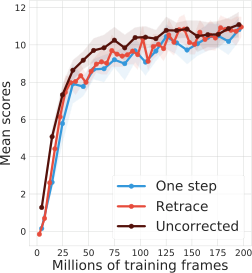


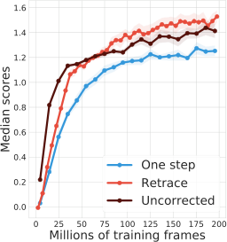

(a) C51

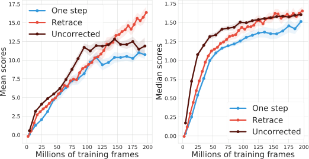


(b) QR-DQN


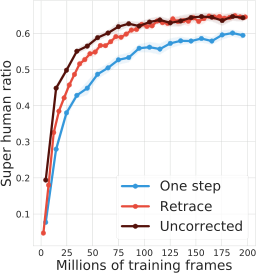


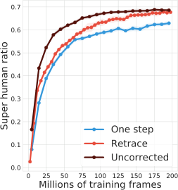

Figure 6: Deep RL experiments on Atari-57 games for (a) C51 and (b) QR-DQN. We compare the
one-step baseline agent against the multi-step variants (Retrace and uncorrected _n_ -step). For all
multi-step variants, we use _n_ = 3 . For each agent, we calculate the mean, median and super human
ratio performance across all games, and we plot the mean _±_ standard error across 3 seeds. In almost
all settings, Multi-step variants provide clear advantage over the one-step baseline algorithm.


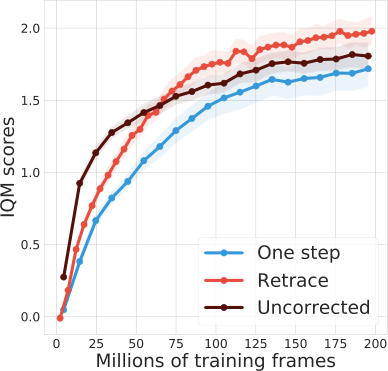

(a) C51


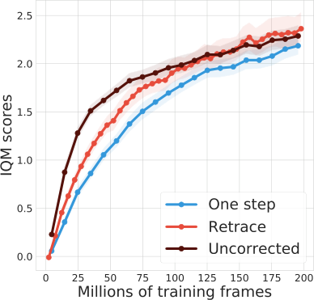

(b) QR-DQN


Figure 7: Deep RL experiments on Atari-57 games for (a) C51 and (b) QR-DQN, with the same setup
as in Figure 6. Here, we compute the interquartile mean (IQM) with 95% bootstrapped confidence
interval [ 40 ]. In a nutshell, IQM calculates the mean scores after removing extreme score values,
making the performance statistics more robust. Even after excluding extreme scores, Retrace obtains
favorable performance compared to the uncorrected and one-step algorithm.


20


Note that each term of the form �b _G_ 0: _t−_ 1 _,γ_ _t_ [�]


Note that each term of the form �b _G_ 0: _t−_ 1 _,γ_ _t_ [�] # _[η]_ [(] _[y, b]_ [)] [ corresponds to applying a pushforward opera-]

tion �b _G_ 0: _t−_ 1 _,γ_ _t_ [�] [on the distribution] _[ η]_ [(] _[x, a]_ [)] [, which means] �b _G_ 0: _t−_ 1 _,γ_ _t_ [�] _[η]_ [(] _[y, b]_ [)] _[ ∈]_ _[P]_ _[∞]_ [(][R][)] [. Now]


# [on the distribution] _[ η]_ [(] _[x, a]_ [)] [, which means] �b _G_ 0: _t−_ 1 _,γ_ _t_ [�]


tion �b _G_ 0: _t−_ 1 _,γ_ _t_ [�] # [on the distribution] _[ η]_ [(] _[x, a]_ [)] [, which means] �b _G_ 0: _t−_ 1 _,γ_ _t_ [�] # _[η]_ [(] _[y, b]_ [)] _[ ∈]_ _[P]_ _[∞]_ [(][R][)] [. Now]

that we have expressed _R_ _[π,µ]_ _η_ ( _x, a_ ) as a linear combination of distributions, we proceed to show that
the combination is in fact convex.


Under the assumption _c_ _t_ _∈_ [0 _, ρ_ _t_ ], we have _π_ ( _b|y_ ) _−_ _c_ ( _y, b_ ) _µ_ ( _b|y_ ) _≥_ 0 for all ( _y, b_ ) _∈X × A_ .
Therefore, all weights are non-negative. Next, we examine the sum of all coefficients [�] _w_ _y,b,r_ 0: _t−_ 1 =
� _∞t_ =1 � _x∈X_ � _b∈A_ � _r_ _∈R_ [�] _[t]_ _[ w]_ _[y,b,r]_ [0:] _[t][−]_ [1] [.]


_x∈X_ �


_b∈A_ �


_r_ 0: _t−_ 1 _∈R_ [�] _[t]_ _[ w]_ _[y,b,r]_ [0:] _[t][−]_ [1] [.]


�

_y∈X_


� E _µ_ [ _c_ 1 _...c_ _t−_ 1 ( _π_ ( _b|X_ _t_ ) _−_ _c_ ( _X_ _t_ _, b_ ) _µ_ ( _b|X_ _t_ )) _·_ I[ _X_ _t_ = _y_ ]]

_b∈A_


� _w_ _y,b,r_ 0: _t−_ 1 = ( _a_ )


= ( _b_ )


_∞_
�


_t_ =1


_∞_
� E _µ_ [ _c_ 1 _...c_ _t−_ 1 (1 _−_ _c_ _t_ )] = ( _c_ ) 1 _._


_t_ =1


�


In the above, (a) follows from the fact that [�]


In the above, (a) follows from the fact that [�] _r_ _s_ _∈R_ [�] [E][[][I][[] _[R]_ _[s]_ [ =] _[ r]_ _[s]_ []] = 1] [; (b) follows from the fact that]

for all time steps _t ≥_ 1, the following is true,

� � E _µ_ [ _c_ 1 _...c_ _t−_ 1 ( _π_ ( _b|X_ _t_ ) _−_ _c_ ( _X_ _t_ _, b_ ) _µ_ ( _b|X_ _t_ )) _·_ I[ _X_ _t_ = _y_ ]]


�


_y∈X_


� E _µ_ [ _c_ 1 _...c_ _t−_ 1 ( _π_ ( _b|X_ _t_ ) _−_ _c_ ( _X_ _t_ _, b_ ) _µ_ ( _b|X_ _t_ )) _·_ I[ _X_ _t_ = _y_ ]]

_b∈A_


= � E _µ_ [ _c_ 1 _...c_ _t−_ 1 ( _π_ ( _b|X_ _t_ ) _−_ _c_ ( _X_ _t_ _, b_ ) _µ_ ( _b|X_ _t_ ))]

_b∈A_


�


�


� _c_ ( _X_ _t_ _, b_ ) _µ_ ( _b|X_ _t_ )

_b∈A_


��


= E _µ_


_c_ 1 _...c_ _t−_ 1


1 _−_
�


= E _µ_ [ _c_ 1 _...c_ _t−_ 1 (1 _−_ _c_ _t_ )] _._


Finally, (c) is based on the observation that the summation telescopes. Now, by taking the index set
to be the set of indices that parameterize _w_ _y,b,r_ 0: _t−_ 1,


_I_ ( _x, a_ ) = _∪_ _[∞]_ _t_ =1 [(] _[y, b, r]_ [0:] _[t][−]_ [1] [)] _y∈X_ _,b∈A,r_ 0: _t−_ 1 _∈R_ [�] _[t]_ _[ .]_


We can write _R_ _[π,µ]_ _η_ ( _x, a_ ) = [�] _i∈I_ ( _x,a_ ) _[w]_ _[i]_ _[η]_ _[i]_ [.] Note further that for any _i ∈_ _I_ ( _x, a_ ), _η_ _i_ =

(b _G_ 0: _t−_ 1 _,γ_ _t_ ) # _η_ ( _y, b_ ) is a fixed distribution. The above result suggests that _R_ _[π,µ]_ _η_ ( _x, a_ ) is a convex combination of fixed distributions.


**Extension to the general case.** When _c_ _t_ = _c_ ( _F_ _t_ _, A_ _t_ ) is filtration dependent, we let _F_ _t_ to be the
space of the filtration value up to time _t_ . For simplicity with the notation, we assume _F_ _t_ contains a
finite number of elements, such that below we can adopt the summation notation instead of integral.
Define the combination coefficient


_w_ _y,b,f_ _t_ _,r_ 0: _t−_ 1 := E _µ_ � _c_ 1 _...c_ _t−_ 1 ( _π_ ( _b|X_ _t_ ) _−_ _c_ ( _F_ _t_ _, b_ ) _µ_ ( _b|X_ _t_ )) _·_ I[ _X_ _t_ = _y_ ]Π _[t]_ _s_ _[−]_ =0 [1] [I][[] _[R]_ _[s]_ [ =] _[ r]_ _[s]_ []] � _._


It is straightforward to verify the following


� �

_y∈X_ _b∈A_


�

_f_ _t_ _∈F_ _t_


� _w_ _y,b,f_ _t_ _,r_ 0: _t−_ 1 �b _G_ 0: _t−_ 1 _,γ_ _t_ [�]

_r_ 0: _t−_ 1 _∈R_ [�] _[t]_


_R_ _[π,µ]_ _η_ ( _x, a_ ) =


_∞_
�


_t_ =1


# _[η]_ [(] _[y, b]_ [)] _[.]_


In addition, the combination coefficients _w_ _y,b,f_ _t_ _,r_ 0: _t−_ 1 sum to 1 and are all non-negative.


**Proposition 3.2.** ( **Contraction** ) _R_ _[π,µ]_ is _β_ -contractive under supremum _p_ -Wasserstein distance,
_∞_
where _β_ = max _x∈X_ _,a∈A_ � _t_ =1 [E] _[µ]_ [ [] _[c]_ [1] _[...c]_ _[t][−]_ [1] [(1] _[ −]_ _[c]_ _[t]_ [)]] _[ γ]_ _[t]_ _[ ≤]_ _[γ]_ [.]


_Proof._ From the proof of Lemma 3.1, we have


� _w_ _y,b,r_ 0: _t−_ 1 �b _G_ 0: _t−_ 1 _,γ_ _t_ [�]

_r_ 0: _t−_ 1 _∈R_ [�] _[t]_


21


_R_ _[π,µ]_ _η_ ( _x, a_ ) =


_∞_
� �

_t_ =1 _y∈X_


�

_b∈A_


# _[η]_ [(] _[y, b]_ [)] _[.]_


Now, we have for any _η_ 1 _, η_ 2 _∈_ _P_ _∞_ (R) _[X×A]_, for any fixed ( _x, a_ ), we have
_W_ _p_ ( _R_ _[π,µ]_ _η_ 1 ( _x, a_ ) _, R_ _[π,µ]_ _η_ 2 ( _x, a_ )) upper bounded as follows


�

_y∈X_


�

_y∈X_


�

_y∈X_


� _w_ _y,b,r_ 0: _t−_ 1 _γ_ _[t]_ _W_ _p_ ( _η_ 1 _, η_ 2 )

_b∈A_


# _[η]_ [2] [(] _[y, b]_ [)] �


� _w_ _y,b,r_ 0: _t−_ 1 _W_ _p_

_b∈A_


��b [�] _ts−_ =01 _[γ]_ _[s]_ _[r]_ _[s]_ _[,γ]_ _[t]_ �


# _[η]_ [1] [(] _[y, b]_ [)] _[,]_ �b [�] _ts−_ =01 _[γ]_ _[s]_ _[r]_ _[s]_ _[,γ]_ _[t]_ �


_≤_ ( _a_ )


_≤_ ( _b_ )


_≤_ ( _c_ )


_∞_
�


_t_ =1


_∞_
�


_t_ =1


_∞_
�


_t_ =1


� _w_ _y,b,r_ 0: _t−_ 1 _γ_ _[t]_ _W_ _p_ ( _η_ 1 ( _y, b_ ) _, η_ 2 ( _y, b_ ))

_b∈A_


In the above, (a) follows by applying the convexity of the _p_ -Wasserstein distance [ 10 ]; (b) follows by
the contraction property of the pushforward operation and _W_ _p_ [ 10 ]; (c) follows from the definition of
_W_ _p_ . By taking the maixmum over ( _x, a_ ) on both sides of the inequality, we obtain


_W_ _p_ ( _R_ _[π,µ]_ _η_ 1 _, R_ _[π,µ]_ _η_ 2 ) _≤_ _βW_ _p_ ( _η_ 1 _, η_ 2 ) _._


This concludes the proof.


**Lemma G.2.** For any fixed ( _x, a_ ) and scalar _c ∈_ R,

(b _c,_ 1 ) # _η_ _[π]_ ( _x, a_ ) = E _π_ �(b _c_ + _R_ 0 _,γ_ ) # _η_ _[π]_ ( _X_ 1 _, A_ 1 ) ��� _X_ 0 = _x, A_ 0 = _a_ � _._ (6)


_Proof._ Let _B_ _y_ := _{x < y|x ∈_ R _}_ be a subset of R indexed by _y ∈_ R . Since the set of all such sets
_{B_ _y_ _, y ∈_ R _}_ is dense in the sigma-field of R [34], if we can show for two measures _η_ 1 _, η_ 2


_η_ 1 ( _B_ _y_ ) = _η_ 2 ( _B_ _y_ ) _, ∀y_


then, _η_ 1 ( _B_ ) = _η_ 2 ( _B_ ) for all Borel sets in R. Hence, in the following, we seek to show
�(b _c,_ 1 ) # _η_ _[π]_ ( _x, a_ )� _B_ _y_ = �E _π_ �(b _c_ + _R_ 0 _,γ_ ) # _η_ _[π]_ ( _X_ 1 _, A_ 1 )�� _B_ _y_ _, ∀y ∈_ R (7)


Let _F_ _[π]_ ( _y_ ; _x, a_ ) := _P_ _[π]_ ( _G_ _[π]_ ( _x, a_ ) _≤_ _y_ ) = _η_ _[π]_ ( _x, a_ )( _B_ _y_ ) _, y ∈_ R be the CDF of random variable
_G_ _[π]_ ( _x, a_ ). The distributional Bellman equation in Equation (1) implies


_, ∀y ∈_ R _._
��


_F_ _[π]_ ( _y_ ; _x, a_ ) = E _π_


_y −_ _R_ 0
_F_ _[π]_ ; _X_ 1 _, A_ 1
� � _γ_


For any constant _c ∈_ R, let _y_ = _y_ _[′]_ _−_ _c_ and plug into the above equality,


_F_ _[π]_ ( _y_ _[′]_ _−_ _c_ ; _x, a_ ) = E _π_


_′_
_y_ _−_ _c −_ _R_ 0
_F_ _[π]_ ; _X_ 1 _, A_ 1 _, ∀y_ _[′]_ _∈_ R _._
� � _γ_ ��


Note the LHS is ((b _c,_ 1 ) # _η_ _[π]_ ( _x, a_ )) ( _B_ _y_ ) while the RHS is �E _π_ �(b _c_ + _R_ 0 _,γ_ ) # _η_ _[π]_ ( _X_ 1 _, A_ 1 )�� ( _B_ _y_ ) .
This implies that Equation (7) holds and we conclude the proof.


**Proposition 3.3.** ( **Unique fixed point** ) _R_ _[π,µ]_ has _η_ _[π]_ as the unique fixed point in _P_ _∞_ (R) _[X×A]_ .


_Proof._ To verify that _η_ _[π]_ is a fixed point, it is equivalent to show


# _[η]_ _[π]_ [(] _[X]_ _[t]_ [+1] _[, A]_ _t_ _[π]_ +1 [)] _[ −]_ �b _G_ 0: _t−_ 1 _,γ_ _t_ [�] # _[η]_ _[π]_ [(] _[X]_ _[t]_ _[, A]_ _[t]_ [)] � [�]


E _µ_


_n_
� _c_ 1: _t_ ��b _G_ 0: _t_ _,γ_ _t_ +1 [�]
� _t_ =0


= **0** _._


Here, the RHS term **0** denotes the zero measure, a measure such that for all Borel sets _B ⊂_ R,
**0** ( _B_ ) = 0. We now verify that each of the summation term is a zero measure, i.e.,


E _µ_ _c_ 1: _t_ b _G_ 0: _t_ _,γ_ _t_ +1 [�]
� ��


# _[η]_ _[π]_ [(] _[X]_ _[t]_ [+1] _[, A]_ _t_ _[π]_ +1 [)] _[ −]_ �b _G_ 0: _t−_ 1 _,γ_ _t_ [�]


22


# _[η]_ _[π]_ [(] _[X]_ _[t]_ _[, A]_ _[t]_ [)] �� = **0** _._


To see this, we follow the derivation below,


E _µ_ _c_ 1: _t_ b _G_ 0: _t_ _,γ_ _t_ +1 [�]
� ��


# _[η]_ _[π]_ [(] _[X]_ _[t]_ [+1] _[, A]_ _t_ _[π]_ +1 [)] _[ −]_ �b _G_ 0: _t−_ 1 _,γ_ _t_ [�]


# _[η]_ _[π]_ [(] _[X]_ _[t]_ _[, A]_ _[t]_ [)] ��


= ( _a_ ) E �E � _c_ 1: _t_ ���b _G_ 0: _t_ _,γ_ _t_ +1 [�]


# _[η]_ _[π]_ [(] _[X]_ _[t]_ [+1] _[, A]_ _t_ _[π]_ +1 [)] � _−_ �b _G_ 0: _t−_ 1 _,γ_ _t_ [�]


_t_
# _[η]_ _[π]_ [(] _[X]_ _[t]_ _[, A]_ _[t]_ [)] ���� ( _X_ _s_ _, A_ _s_ _, R_ _s−_ 1 ) _s_ =1 ��


= ( _b_ ) E � _c_ 1: _t_ E ��b _G_ 0: _t_ _,γ_ _t_ +1 [�]


# _[η]_ _[π]_ [(] _[X]_ _[t]_ [+1] _[, A]_ _t_ _[π]_ +1 [)] ��� ( _X_ _s_ _, A_ _s_ _, R_ _s−_ 1 ) _ts_ =1 � _−_ _c_ 1: _t_ �b _G_ 0: _t−_ 1 _,γ_ _t_ [�]


# _[η]_ _[π]_ [(] _[X]_ _[t]_ _[, A]_ _[t]_ [)] �


_t_
# _[η]_ _[π]_ [(] _[X]_ _[t]_ [+1] _[, A]_ _t_ _[π]_ +1 [)] ��� ( _X_ _s_ _, A_ _s_ _, R_ _s−_ 1 ) _s_ =1 �


_−c_ 1: _t_ �b _G_ 0: _t−_ 1 _,γ_ _t_ [�]


# _[η]_ _[π]_ [(] _[X]_ _[t]_ _[, A]_ _[t]_ [)]





_._



=
( _c_ ) E





_c_ 1: _t_ E b _G_ 0: _t−_ 1 + _γ_ _t_ _R_ _t_ _,γ_ _t_ +1 [�]
��

~~�~~




~~�~~ ~~�~~ � ~~�~~
first term


(8)


In the above, in (a) we condition on ( _X_ _s_ _, A_ _s_ _, R_ _s_ ) _[t]_ _s_ =1 [and the equality follows from the tower property]
of expectations; in (b), we use the fact that the trace product _c_ 1: _t_ and �b _G_ 0: _t−_ 1 _,γ_ _t_ [�] # _[η]_ _[π]_ [(] _[X]_ _[t]_ _[, A]_ _[t]_ [)] [ are]

deterministic function of the conditioning variable ( _X_ _s_ _, A_ _s_ _, R_ _s_ ) _[t]_ _s_ =1 [; in (c), we split the summation]
_G_ 0: _t_ = _G_ 0: _t−_ 1 + _γR_ _t_ . Now we examine the first term in Equation (8), by applying Lemma G.2, we
have


first term = �b _G_ 0: _t−_ 1 _,γ_ _t_ [�]


# _[η]_ _[π]_ [(] _[X]_ _[t]_ _[, A]_ _[t]_ [)] _[.]_


This implies Equation (8) evaluates to a zero measure. Hence _η_ _[π]_ is a fixed point of the operator _R_ _[π,µ]_ .
Because _R_ _[π,µ]_ is also contractive by Proposition 3.2, the fixed point is unique.


**Theorem 5.1.** ( **Convergence of quantile distributions** ) The projected distributional Retrace operator Π _Q_ _R_ _[π,µ]_ is _β_ -contractive under _W_ _∞_ distance in _P_ _Q_ (R) . As a result, the above _η_ _k_ converges to
a limiting distribution _η_ _R_ _[π]_ [in] _[ W]_ _[ ∞]_ [, such that] _[ W]_ _[ ∞]_ [(] _[η]_ _[k]_ _[, η]_ _R_ _[π]_ [)] _[ ≤]_ [(] _[β]_ [)] _[k]_ _[W]_ _[ ∞]_ [(] _[η]_ [0] _[, η]_ _R_ _[π]_ [)] [. Further, the quality]
of the fixed point is characterized as _W_ _∞_ ( _η_ _R_ _[π]_ _[, η]_ _[π]_ [)] _[ ≤]_ [(1] _[ −]_ _[β]_ [)] _[−]_ [1] _[W]_ _[ ∞]_ [(Π] _[Q]_ _[η]_ _[π]_ _[, η]_ _[π]_ [)][.]


_Proof._ The quantile projection Π _Q_ is a non-expansion under _W_ _∞_ [ 16 ]. Since _R_ _[π,µ]_ is _β_ -contractive
under _W_ _p_ for all _p ≥_ 1, the composed operator Π _Q_ _R_ _[π,µ]_ is _β_ -contractive under _W_ _∞_ . Now, because
(1) Π _Q_ _R_ _[π,µ]_ _∈_ _P_ _∞_ (R) _[X×A]_ ; (2) the space Π _Q_ _R_ _[π,µ]_ _∈_ _P_ _∞_ (R) _[X×A]_ is closed [ 10 ]; (3) the operator
is contractive, the iterate _η_ _k_ = (Π _Q_ _R_ _[π,µ]_ ) _[k]_ _η_ 0 converges to a limiting distribution _η_ _R_ _[π]_ _[∈]_ _[P]_ _[∞]_ [(][R][)] _[X×A]_ [.]
Finally, by Proposition 5.28 in [10], we have _W_ _∞_ ( _η_ _R_ _[π]_ _[, η]_ _[π]_ [)] _[ ≤]_ [(1] _[ −]_ _[β]_ [)] _[−]_ [1] _[W]_ _[ ∞]_ [(Π] _[Q]_ _[η]_ _[π]_ _[, η]_ _[π]_ [)][.]


**Lemma 5.2.** ( **Unbiased stochastic QR loss gradient estimate** ) Assume that the trajectory terminates within _H_ _<_ _∞_ steps almost surely, then we have E _µ_ [ _L_ [�] _[τ]_ _z_ _[i]_ _i_ ( _x,a_ ) [(] _[R]_ _[π,µ]_ _[η]_ [(] _[x, a]_ [))]] =

_L_ _[τ]_ _z_ _[i]_ _i_ ( _x,a_ ) [(] _[R]_ _[π,µ]_ _[η]_ [(] _[x, a]_ [))][ and][ E] _[µ]_ [[] _[∇]_ _[z]_ _[i]_ [(] _[x,a]_ [)] _[L]_ [�] _[τ]_ _z_ _[i]_ _i_ ( _x,a_ ) [(] _[R]_ _[π,µ]_ _[η]_ [(] _[x, a]_ [))] =] _[ ∇]_ _[z]_ _[i]_ [(] _[x,a]_ [)] _[L]_ _[τ]_ _z_ _[i]_ _i_ ( _x,a_ ) [(] _[R]_ _[π,µ]_ _[η]_ [(] _[x, a]_ [))][.]


_Proof._ The QR loss _L_ _[τ]_ _θ_ [(] _[η]_ [)] [ is defined for any distribution] _[ η]_ [ and scalar parameter] _[ θ]_ [. Let] _[ ν]_ [ =]
� _mi_ =1 _[w]_ _[i]_ _[η]_ _[i]_ [ be the linear combination of distributions] [ (] _[η]_ _[i]_ [)] _i_ _[m]_ =1 [where] _[ w]_ _[i]_ [s are potentially negative]
coefficients. In this case, _ν_ is a signed measure. We define the generalized QR loss for _ν_ as the linear
combination of QR losses against _η_ _i_ weighted by _w_ _i_,


_m_

_L_ _[τ]_ _θ_ [(] _[ν]_ [) :=] � _w_ _i_ _L_ _[τ]_ _θ_ [(] _[η]_ _[i]_ [)] _[.]_


_i_ =1


Next, we note that the QR loss is linear in the input distribution (or signed measure). This means
given any (potentially infinite) set of _N_ distributions or signed measures _ν_ _i_ with coefficients _a_ _i_,


_L_ _[τ]_ _θ_


_N_
� _a_ _i_ _ν_ _i_
� _i_ =1 �


=


_N_
� _a_ _i_ _L_ _[τ]_ _θ_ [(] _[ν]_ _[i]_ [)] _[.]_


_i_ =1


When ( _a_ _i_ ) _[N]_ _i_ =1 [denotes a distribution, the above is equivalently expressed as an exchange between]
expectation and the QR loss _L_ _[τ]_ _θ_ [(][E][[] _[ν]_ _[i]_ []) =][ E][[] _[L]_ _[τ]_ _θ_ [(] _[ν]_ _[i]_ [)]] [. For notational convenience, we let] _[ θ]_ [ =] _[ z]_ _[i]_ [(] _[x, a]_ [)]
and _τ_ = _τ_ _i_ . Because the trajectory terminates within _H_ steps almost surely, since _c_ 1: _t_ _≤_ _ρ_ 1: _t_ _≤_ _ρ_ _[H]_


23


_π_ ( _a|x_ )
where _ρ_ := max _x∈X_ _,A_ _µ_ ( _a|x_ ) [, the estimate] [ �] _[L]_ _θ_ _[τ]_ [(] _[R]_ _[π,µ]_ _[η]_ [(] _[x, a]_ [))] [ is finite almost surely. Combining all]
results from above we obtain the following


_∞_
� _c_ 1: _t_ � _L_ _[τ]_ _θ_ �(b _t_ +1 ) # _η_ � _X_ _t_ +1 _, A_ _[π]_ _t_ +1 � [�] _−_ _L_ _[τ]_ _θ_ �(b _t_ ) # _η_ ( _X_ _t_ _, A_ _t_ )�� [�]

_t_ =0


E _µ_ [ _R_ _[π,µ]_ _η_ ( _x, a_ )] = E _µ_


_L_ _[τ]_ _θ_ [(] _[η]_ [(] _[x, a]_ [)) +]

�


� �
= ( _a_ ) E _µ_ � _L_ _[τ]_ _θ_ � _R_ _[π,µ]_ _η_ ( _x, a_ )�� = ( _b_ ) _L_ _[τ]_ _θ_ �E _µ_ � _R_ _[π,µ]_ _η_ ( _x, a_ )�� = _L_ _[τ]_ _θ_ [(] _[R]_ _[π,µ]_ _[η]_ [(] _[x, a]_ [))] _[ .]_


In the above, (a) follows from the definition of the generalized QR loss against signed measure the
definition of _R_ _[π,µ]_ _η_ ( _x, a_ ); (c) follows from the linearity of the QR loss.


Next, to show that the gradient estimate is unbiased too, the high level idea is to apply dominated convergence theorem (DCT) to justify the exhchange of gradient and expectation [ 34 ]. Since the expected
QR loss gradient _∇_ _θ_ _L_ _[τ]_ _θ_ [(] _[R]_ _[π,µ]_ _[η]_ [(] _[x, a]_ [))] [ exists, we deduce that the estimate] _[ ∇]_ _[θ]_ [ �] _[L]_ _[τ]_ _θ_ [(] _[R]_ _[π,µ]_ _[η]_ [(] _[x, a]_ [))] [ exists]

almost surely. Consider the absolute value of the gradient estimate _∇_ _θ_ � _L_ _τθ_ [(] _[R]_ _[π,µ]_ _[η]_ [(] _[x, a]_ [))], which
��� ���
serves as an upper bound to the gradient estimate. In order to apply DCT, we need to show the
expectation of the absolute gradient is finite. Note we have


E _µ_ _∇_ _θ_ � _L_ _τθ_ [(] _[R]_ _[π,µ]_ _[η]_ [(] _[x, a]_ [))]
���� ����


_H_
� _c_ 1: _t_ � _∇_ _θ_ _L_ _[τ]_ _θ_ �(b _t_ +1 ) # _η_ � _X_ _t_ +1 _, A_ _[π]_ _t_ +1 � [�] _−∇_ _θ_ _L_ _[τ]_ _θ_ �(b _t_ ) # _η_ ( _X_ _t_ _, A_ _t_ )�� [�]

_t_ =0 ����


= E _µ_


_∇_ _θ_ _L_ _τθ_ [(] _[η]_ [(] _[x, a]_ [)) +]
������


�


_H_
� _c_ 1: _t_ ��� _∇_ _θ_ _L_ _τθ_ �(b _t_ +1 ) # _η_ � _X_ _t_ +1 _, A_ _[π]_ _t_ +1 � [�] _−∇_ _θ_ _L_ _[τ]_ _θ_ �(b _t_ ) # _η_ ( _X_ _t_ _, A_ _t_ )����

_t_ =0 �


_≤_ ( _a_ ) E _µ_


_≤_ ( _b_ ) E _µ_


�

�


_|∇_ _θ_ _L_ _[τ]_ _θ_ [(] _[η]_ [(] _[x, a]_ [))] _[|]_ [ +]


�


1 +


_H_
�


� _ρ_ _[t]_ _·_ 2


_t_ =0


_< ∞,_


where (a) follows from the application of triangle inequality; (b) follows from the fact that the QR
loss gradient against a fixed distribution is bounded _∇_ _θ_ _L_ _[τ]_ _θ_ [(] _[ν]_ [)] _[ ∈]_ [[] _[−]_ [1] _[,]_ [ 1]] _[,][ ∀][ν][ ∈]_ _[P]_ _[∞]_ [(][R][)][ [][16][].]


With the application of DCT, we can exchange the gradient and expectation operator, which yields

�
E _µ_ _∇_ _θ_ _L_ [�] _[τ]_ _θ_ [(] _[R]_ _[π,µ]_ _[η]_ [(] _[x, a]_ [))] = _∇_ _θ_ E _µ_ _L_ _[τ]_ _θ_ [(] _[R]_ _[π,µ]_ _[η]_ [(] _[x, a]_ [))] = _∇_ _θ_ _L_ _[τ]_ _θ_ [(] _[R]_ _[π,µ]_ _[η]_ [(] _[x, a]_ [))][.]
� � � �


24


