### **Learning Action Translator for Meta** **Reinforcement Learning on Sparse-Reward Tasks**

**Yijie Guo** [1] **, Qiucheng Wu** [1] **, Honglak Lee** [1,2]

1University of Michigan, 2LG AI Research
guoyijie@umich.edu, wuqiuche@umich.edu, honglak@eecs.umich.edu

**Abstract**

Meta reinforcement learning (meta-RL) aims to learn a policy solving a set of training tasks simultaneously and quickly
adapting to new tasks. It requires massive amounts of data
drawn from training tasks to infer the common structure
shared among tasks. Without heavy reward engineering, the
sparse rewards in long-horizon tasks exacerbate the problem
of sample efficiency in meta-RL. Another challenge in metaRL is the discrepancy of difficulty level among tasks, which
might cause one easy task dominating learning of the shared
policy and thus preclude policy adaptation to new tasks. This
work introduces a novel objective function to learn an action
translator among training tasks. We theoretically verify that
the value of the transferred policy with the action translator
can be close to the value of the source policy and our objective
function (approximately) upper bounds the value difference.
We propose to combine the action translator with contextbased meta-RL algorithms for better data collection and more
efficient exploration during meta-training. Our approach empirically improves the sample efficiency and performance of
meta-RL algorithms on sparse-reward tasks.

**1** **Introduction**

Deep reinforcement learning (DRL) methods achieved remarkable success in solving complex tasks (Mnih et al.
2015; Silver et al. 2016; Schulman et al. 2017). While
conventional DRL methods learn an individual policy for
each task, meta reinforcement learning (meta-RL) algorithms (Finn, Abbeel, and Levine 2017; Duan et al. 2016;
Mishra et al. 2017) learn the shared structure across a distribution of tasks so that the agent can quickly adapt to unseen related tasks in the test phase. Unlike most of the existing meta-RL approaches working on tasks with dense rewards, we instead focus on the sparse-reward training tasks,
which are more common in real-world scenarios without access to carefully designed reward functions in the environments. Recent works in meta-RL propose off-policy algorithms (Rakelly et al. 2019; Fakoor et al. 2019) and modelbased algorithms (Nagabandi, Finn, and Levine 2018; Nagabandi et al. 2018) to improve the sample efficiency in metatraining procedures. However, it remains challenging to efficiently solve multiple tasks that require reasoning over long

Copyright © 2022, Association for the Advancement of Artificial
Intelligence (www.aaai.org). All rights reserved.

Figure 1: Illustration of our policy transfer. Size of arrows
represents avg. episode reward of learned or transferred policy on target tasks. Different colors indicate different tasks.

horizons with sparse rewards. In these tasks, the scarcity of
positive rewards exacerbates the issue of sample efficiency,
which plagues meta-RL algorithms and makes exploration
difficult due to a lack of guidance signals.

Intuitively, we hope that solving one task facilitates learning of other related tasks since the training tasks share a
common structure. However, it is often not the case in practice (Rusu et al. 2015; Parisotto, Ba, and Salakhutdinov
2015). Previous works (Teh et al. 2017; Yu et al. 2020a)
point out that detrimental gradient interference might cause
an imbalance in policy learning on multiple tasks. Policy distillation (Teh et al. 2017) and gradient projection (Yu et al.
2020a) are developed in meta-RL algorithms to alleviate this
issue. However, this issue might become more severe in the
sparse-reward setting because it is hard to explore each task
to obtain meaningful gradient signals for policy updates.
Good performance in one task does not automatically help
exploration on the other tasks since the agent lacks positive
rewards on the other tasks to learn from.

In this work, we aim to fully exploit the highly-rewarding
transitions occasionally discovered by the agent in the exploration. The good experiences in one task should not only
improve the policy on this task but also benefit the policy on
other tasks to drive deeper exploration. Specifically, once the
agent learns from the successful trajectories in one training
task, we transfer the good policy in this task to other tasks to

get more positive rewards on other training tasks. In Fig. 1, if
the learned policy _π_ performs better on task _T_ [(2)] than other
tasks, then our goal is to transfer the good policy _π_ ( _·, T_ [(2)] )
to other tasks _T_ [(1)] and _T_ [(3)] . To enable such transfer, we
propose to learn an action translator among multiple training
tasks. The objective function forces the translated action to
behave on the target task similarly to the source action on the
source task. We consider the policy transfer for any pair of
source and target tasks in the training task distribution (see
the colored arrows in Fig. 1). The agent executes actions following the transferred policy if the transferred policy attains
higher rewards than the learned policy on the target task in
recent episodes. This approach enables the agent to leverage
relevant data from multiple training tasks, encourages the
learned policy to perform similarly well on multiple training
tasks, and thus leads to better performance when applying
the well-trained policy to test tasks.
We summarize the contributions: (1) We introduce a novel
objective function to transfer any policy from a source
Markov Decision Process (MDP) to a target MDP. We
prove a theoretical guarantee that the transferred policy can
achieve the expected return on the target MDP close to the
source policy on the source MDP. The difference in expected
returns is (approximately) upper bounded by our loss function with a constant multiplicative factor. (2) We develop
an off-policy RL algorithm called **M** eta-RL with **C** ontextconditioned **A** ction **T** ranslator (MCAT), applying a policy
transfer mechanism in meta-RL to help exploration across
multiple sparse-rewards tasks. (3) We empirically demonstrate the effectiveness of MCAT on a variety of simulated
control tasks with the MuJoCo physics engine (Todorov,
Erez, and Tassa 2012), showing that policy transfer improves
the performance of context-based meta-RL algorithms.

**2** **Related Work**

**Context-based Meta-RL** Meta reinforcement learning has
been extensively studied in the literature (Finn, Abbeel, and
Levine 2017; Stadie et al. 2018; Sung et al. 2017; Xu, van
Hasselt, and Silver 2018) with many works developing the
context-based approaches (Rakelly et al. 2019; Ren et al.
2020; Liu et al. 2020). Duan et al. (2016); Wang et al.
(2016); Fakoor et al. (2019) employ recurrent neural networks to encode context transitions and formulate the policy
conditioning on the context variables. The objective function of maximizing expected return trains the context encoder and policy jointly. Rakelly et al. (2019) leverage a
permutation-invariant encoder to aggregate experiences as
probabilistic context variables and optimizes it with variational inference. The posterior sampling is beneficial for
exploration on sparse-reward tasks in the adaptation phase,
but there is access to dense rewards during training phase.
Li, Pinto, and Abbeel (2020) considers a task-family of reward functions. Lee et al. (2020); Seo et al. (2020) trains the
context encoder with forward dynamics prediction. These
model-based meta-RL algorithms assume the reward function is accessible for planning. In the sparse-reward setting
without ground-truth reward functions, they may struggle to
discover non-zero rewards and accurately estimating the reward for model-based planning may be problematic as well.

**Policy Transfer in RL** Policy transfer studies the knowledge transfer in target tasks given a set of source tasks and
their expert policies. Policy distillation (Rusu et al. 2015;
Yin and Pan 2017; Parisotto, Ba, and Salakhutdinov 2015)
minimize the divergence of action distributions between the
source policy and the learned policy on the target task. Along
this line of works, Teh et al. (2017) create a centroid policy
in multi-task reinforcement learning and distills the knowledge from the task-specific policies to this centroid policy.
Alternatively, inter-task mapping between the source and
target tasks (Zhu, Lin, and Zhou 2020) can assist the policy
transfer. Most of these works (Gupta et al. 2017; Konidaris
and Barto 2006; Ammar and Taylor 2011) assume existence
of correspondence over the state space and learn the state
mapping between tasks. Recent work (Zhang et al. 2020c)
learns the state correspondence and action correspondence
with dynamic cycle-consistency loss. Our method differs
from this approach, in that we enable action translation
among multiple tasks with a simpler objective function. Importantly, our approach is novel to utilize the policy transfer
for any pair of source and target tasks in meta-RL.
**Bisimulation for States in MDPs** Recent works on
state representation learning (Ferns, Panangaden, and Precup 2004; Zhang et al. 2020a; Agarwal et al. 2021) investigate the bismilarity metrics for states on multiple MDPs
and consider how to learn a representation for states leading
to almost identical behaviors under the same action in diverse MDPs. In multi-task reinforcement learning and meta
reinforcement learning problems, Zhang et al. (2020a,b) derives transfer and generalization bounds based on the task
and state similarity. We also bound the value of policy transfer across tasks but our approach is to establish action equivalence instead of state equivalence.

**3** **Method**

In this section, we first describe our approach to learn a context encoder capturing the task features and learn a forward
dynamics model predicting next state distribution given the
task context (Sec. 3.2). Then we introduce an objective function to train an action translator so that the translated action
on the target task behaves equivalently to the source action
on the source task. The action translator can be conditioned
on the task contexts and thus it can transfer a good policy
from any arbitrary source task to any other target task in the
training set (Sec. 3.3). Finally, we propose to combine the
action translator with a context-based meta-RL algorithm
to transfer the good policy from any one task to the others.
During meta-training, this policy transfer approach helps exploit the good experiences encountered on any one task and
benefits the data collection and further policy optimization
on other sparse-reward tasks (Sec. 3.4). Fig. 2 provides an
overview of our approach MCAT.

**3.1** **Problem Formulation**

Following meta-RL formulation in previous work (Duan
et al. 2016; Mishra et al. 2017; Rakelly et al. 2019), we assume a distribution of tasks _p_ ( _T_ ) and each task is a Markov
decision process (MDP) defined as a tuple ( _S, A, p, r, γ, ρ_ 0)

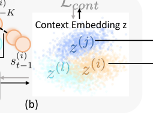

Figure 2: Overview of MCAT. (a) We use forward dynamics prediction loss to train the context encoder _C_ and forward model
_F_ . (b) We regularize the context encoder _C_ with the contrastive loss, so context vectors of transition segments from the same
task cluster together. (c) With fixed _C_ and _F_, we learn the action translator _H_ for any pair of source task _T_ [(] _[j]_ [)] and target task
_T_ [(] _[i]_ [)] . The action translator aims to generate action ˜ _a_ [(] _[i]_ [)] on the target task leading to the same next state _s_ [(] _t_ +1 _[j]_ [)] [as the source]
action _at_ [(] _[j]_ [)] on the source task. (d) With fixed _C_, we learn the critic _Q_ and actor _π_ conditioning on the context feature. (e)
If the agent is interacting with the environment on task _T_ [(] _[i]_ [)], we compare learned policy _π_ ( _s, z_ [(] _[i]_ [)] ) and transferred policy
_H_ ( _s, π_ ( _s, z_ [(] _[j]_ [)] ) _, z_ [(] _[j]_ [)] _, z_ [(] _[i]_ [)] ), which transfers a good policy _π_ ( _s, z_ [(] _[j]_ [)] ) on source task _T_ [(] _[j]_ [)] to target task _T_ [(] _[i]_ [)] . We select actions
according to the policy with higher average episode rewards in the recent episodes. Transition data are pushed into the buffer.
We remark that the components _C, F, H, Q, π_ are trained alternatively not jointly and this fact facilitates the learning process.

with state space _S_, action space _A_, transition function
_p_ ( _s_ _[′]_ _|s, a_ ), reward function _r_ ( _s, a, s_ _[′]_ ), discounting factor _γ_,
and initial state distribution _ρ_ 0. We can alternatively define
the reward function as _r_ ( _s, a_ ) = [�] _s_ _[′]_ _∈S_ _[p]_ [(] _[s][′][|][s, a]_ [)] _[r]_ [(] _[s, a, s][′]_ [)][.]

In context-based meta-RL algorithms, we learn a policy
_π_ ( _·|s_ [(] _t_ _[i]_ [)] _[, z]_ _t_ [(] _[i]_ [)][)][ shared for any task] _[ T]_ [ (] _[i]_ [)] _[ ∼]_ _[p]_ [(] _[T]_ [ )][, where] _[ t]_ [ de-]
notes the timestep in an episode, _i_ denotes the index of a
task, the context variable _zt_ [(] _[i]_ [)] _∈Z_ captures contextual information from history transitions on the task MDP and _Z_ is the
space of context vectors. The shared policy is optimized to
each training taskmaximize its value _T V_ [(] _[π][i]_ [)] (. Following prior works in meta-RL _T_ [(] _[i]_ [)] ) = E _ρ_ (0 _i_ ) _[,π,p]_ [(] _[i]_ [)][[][�] _t_ _[∞]_ =0 _[γ][t][r]_ _t_ [(] _[i]_ [)][]][ on]
(Yu et al. 2017; Nagabandi et al. 2018; Nagabandi, Finn, and
Levine 2018; Zhou, Pinto, and Gupta 2019; Lee et al. 2020),
we study tasks with the same state space, action space, reward function but varying dynamics functions. Importantly,
we focus on more challenging setting of sparse rewards.
Our goal is to learn a shared policy robust to the dynamic
changes and generalizable to unseen tasks.

**3.2** **Learning Context & Forward Model**
In order to capture the knowledge about any task _T_ [(] _[i]_ [)],
we leverage a context encoder _C_ : _S_ _[K]_ _× A_ _[K]_ _→Z_, where
_K_ is the number of past steps used to infer the context.
Related ideas have been explored by (Rakelly et al. 2019;
Zhou, Pinto, and Gupta 2019; Lee et al. 2020). In Fig. 2a,

given _K_ past transitions ( _s_ [(] _t−_ _[i]_ [)] _K_ _[, a]_ [(] _t−_ _[i]_ [)] _K_ _[,][ · · ·][, s]_ _t_ [(] _−_ _[i]_ [)] 1 _[, a]_ _t_ [(] _−_ _[i]_ [)] 1 [)][,]
context encoder _C_ produces the latent context
_zt_ [(] _[i]_ [)] = _C_ ( _s_ [(] _t−_ _[i]_ [)] _K_ _[, a]_ [(] _t−_ _[i]_ [)] _K_ _[,][ · · ·][, s]_ _t_ [(] _−_ _[i]_ [)] 2 _[, a]_ [(] _t−_ _[i]_ [)] 2 _[, s]_ [(] _t−_ _[i]_ [)] 1 _[, a]_ [(] _t−_ _[i]_ [)] 1 [)][.] We
train the context encoder _C_ and forward dynamics _F_ with
an objective function to predict the forward dynamics in future transitions _s_ [(] _t_ + _[i]_ [)] _m_ [(][1] _[ ≤]_ _[m][ ≤]_ _[M]_ [) within] _[ M]_ [ future steps.]
The state prediction in multiple future steps drives latent
context embeddings _zt_ [(] _[i]_ [)] to be temporally consistent. The
learned context encoder tends to capture dynamics-specific,
contextual information (e.g. environment physics parameters). Formally, we minimize the negative log-likelihood of
observing the future states under dynamics prediction.

_Lforw_ = _−_

_M_
� log _F_ ( _s_ [(] _t_ + _[i]_ [)] _m_ _[|][s]_ [(] _t_ + _[i]_ [)] _m−_ 1 _[, a]_ [(] _t_ + _[i]_ [)] _m−_ 1 _[, z]_ _t_ [(] _[i]_ [)][)] _[.]_ [ (1)]

_m_ =1

Additionally, given trajectory segments from the same
task, we require their context embeddings to be similar,
whereas the contexts of history transitions from different
tasks should be distinct (Fig. 2b). We propose a contrastive
loss (Hadsell, Chopra, and LeCun 2006) to constrain embeddings within a small distance for positive pairs (i.e. samples from the same task) and push embeddings apart with
a distance greater than a margin value _m_ for negative pairs
(i.e. samples from different tasks). _zt_ [(] 1 _[i]_ [)][,] _[ z]_ _t_ [(] 2 _[j]_ [)] [denote context]
embeddings of two trajectory samples from _T_ [(] _[i]_ [)], _T_ [(] _[j]_ [)] . The

contrastive loss function is defined as:

_Lcont_ = 1 _i_ = _j∥zt_ [(] 1 _[i]_ [)] _[−][z]_ _t_ [(] 2 _[j]_ [)] _[∥]_ [2] [+1] _[i][̸]_ [=] _[j]_ [max(0] _[, m][−∥][z]_ _t_ [(] 1 _[i]_ [)] _[−][z]_ _t_ [(] 2 _[j]_ [)] _[∥]_ [)]
(2)
where 1 is indicator function. During meta-training, recent transitions on each task _T_ [(] _[i]_ [)] are stored in a buffer _B_ [(] _[i]_ [)]
for off-policy learning. We randomly sample a fairly large
batch of trajectory segments from _B_ [(] _[i]_ [)], and average their
context embeddings to output task feature _z_ [(] _[i]_ [)] . _z_ [(] _[i]_ [)] is representative for embeddings on task _T_ [(] _[i]_ [)] and distinctive from
features _z_ [(] _[l]_ [)] and _z_ [(] _[j]_ [)] for other tasks. We note the learned embedding maintains the similarity across tasks. _z_ [(] _[i]_ [)] is closer
to _z_ [(] _[l]_ [)] than to _z_ [(] _[j]_ [)] if task _T_ [(] _[i]_ [)] is more akin to _T_ [(] _[l]_ [)] . We utilize task features for action translation across multiple tasks.
Appendix D.5 visualizes context embeddings to study _Lcont_ .

**3.3** **Learning Action Translator**
Suppose that transition data _s_ [(] _t_ _[j]_ [)] _[, a]_ [(] _t_ _[j]_ [)] _[, s]_ [(] _t_ +1 _[j]_ [)] [behave well]
on task _T_ [(] _[j]_ [)] . We aim to learn an action translator
_H_ : _S × A × Z × Z →A_ . _a_ ˜ [(] _[i]_ [)] = _H_ ( _s_ [(] _t_ _[j]_ [)] _[, a]_ [(] _t_ _[j]_ [)] _[, z]_ [(] _[j]_ [)] _[, z]_ [(] _[i]_ [)][)]
translates the proper action _a_ [(] _t_ _[j]_ [)] from source task _T_ [(] _[j]_ [)] to
target task _T_ [(] _[i]_ [)] . In Fig. 2c, if we start from the same
state _st_ [(] _[j]_ [)] on both source and target tasks, the translated action ˜ _a_ [(] _[i]_ [)] on target task should behave equivalently to the
source action _at_ [(] _[j]_ [)] on the source task. Thus, the next state
_as_ ˜ [(] _t_ [(] +1 _[i][i]_ [)][)] on the target task should be close to the real next state _[∼]_ _[p]_ [(] _[i]_ [)][(] _[s]_ _t_ [(] _[j]_ [)] _[,]_ [ ˜] _[a]_ [(] _[i]_ [)][)][ produced from the transferred action]
_st_ [(] +1 _[j]_ [)] [gathered on the source task. The objective function of]
training the action translator _H_ is to maximize the probability of getting next state _s_ [(] _t_ +1 _[j]_ [)] [under the next state distri-]
bution _s_ [(] _t_ +1 _[i]_ [)] _[∼]_ _[p]_ [(] _[i]_ [)][(] _[s]_ _t_ [(] _[j]_ [)] _[,]_ [ ˜] _[a]_ [(] _[i]_ [)][)][ on the target task. Because the]
transition function _p_ [(] _[i]_ [)] ( _s_ [(] _t_ _[j]_ [)] _[,]_ [ ˜] _[a]_ [(] _[i]_ [)][)][ is unavailable and might]
be not differentiable, we use the forward dynamics model
_F_ ( _·|st_ [(] _[j]_ [)] _[,]_ [ ˜] _[a]_ [(] _[i]_ [)] _[, z]_ [(] _[i]_ [)][)][ to approximate the transition function.]
We formulate objective function for action translator _H_ as:

_Ltrans_ = _−_ log _F_ ( _s_ [(] _t_ +1 _[j]_ [)] _[|][s]_ _t_ [(] _[j]_ [)] _[,]_ [ ˜] _[a]_ [(] _[i]_ [)] _[, z]_ [(] _[i]_ [)][)] (3)

where ˜ _a_ [(] _[i]_ [)] = _H_ ( _s_ [(] _t_ _[j]_ [)] _[, a]_ [(] _t_ _[j]_ [)] _[, z]_ [(] _[j]_ [)] _[, z]_ [(] _[i]_ [)][)][. We assume to start]
from the same initial state, the action translator is to find the
action on the target task so as to reach the same next state as
the source action on the source task. This intuition to learn
the action translator is analogous to learn inverse dynamic
model across two tasks.
With a well-trained action translator conditioning on task
features _z_ [(] _[j]_ [)] and _z_ [(] _[i]_ [)], we transfer the good deterministic policy _π_ ( _s, z_ [(] _[j]_ [)] ) from any source task _T_ [(] _[j]_ [)] to any target task
_T_ [(] _[i]_ [)] . When encountering a state _s_ [(] _[i]_ [)] on _T_ [(] _[i]_ [)], we query a
good action _a_ [(] _[j]_ [)] = _π_ ( _s_ [(] _[i]_ [)] _, z_ [(] _[j]_ [)] ) which will lead to a satisfactory next state with high return on the source task. Then _H_
translates this good action _a_ [(] _[j]_ [)] on the source task to action
_a_ ˜ [(] _[i]_ [)] = _H_ ( _s_ [(] _[i]_ [)] _, a_ [(] _[j]_ [)] _, z_ [(] _[j]_ [)] _, z_ [(] _[i]_ [)] ) on the target task. Executing
the translated action ˜ _a_ [(] _[i]_ [)] moves the agent to a next state on
the target task similarly to the good action on the source task.
Therefore, transferred policy _H_ ( _s_ [(] _[i]_ [)] _, π_ ( _s_ [(] _[i]_ [)] _, z_ [(] _[j]_ [)] ) _, z_ [(] _[i]_ [)] _, z_ [(] _[j]_ [)] )
can behave similarly to source policy _π_ ( _s, z_ [(] _[j]_ [)] ). Sec. 5.1
demonstrates the performance of transferred policy in a variety of environments. Our policy transfer mechanism is related to the action correspondence discussed in (Zhang et al.

2020c). We extend their policy transfer approach across two
domains to multiple domains(tasks) and theoretically vali
_[̸]_ date learning of action translator in Sec. 4.

**3.4** **Combining with Context-based Meta-RL**

MCAT follows standard off-policy meta-RL algorithms to
learn a deterministic policy _π_ ( _st, zt_ [(] _[i]_ [)][)][ and a value function]
_Q_ ( _st, at, zt_ [(] _[i]_ [)][)][, conditioning on the latent task context vari-]
able _zt_ [(] _[i]_ [)][. In the meta-training process, using data sampled]
from _B_, we train the context model _C_ and dynamics model
_F_ with _Lforw_ and _Lcont_ to accurately predict the next state
(Fig. 2a 2b). With the fixed context encoder _C_ and dynamics model _F_, the action translator _H_ is optimized to minimize _Ltrans_ (Fig. 2c). Then, with the fixed _C_, we train
the context-conditioned policy _π_ and value function _Q_ according to _LRL_ (Fig. 2d). In experiments, we use the objective function _LRL_ from TD3 algorithm (Fujimoto, Hoof, and
Meger 2018). See pseudo-code of MCAT in Appendix B.
On sparse-reward tasks where exploration is challenging,
the agent might luckily find transitions with high rewards on
one task _T_ [(] _[j]_ [)] . Thus, the policy learning on this task might
be easier than other tasks. If the learned policy _π_ performs
better on one task _T_ [(] _[j]_ [)] than another task _T_ [(] _[i]_ [)], we consider
the policy transferred from _T_ [(] _[j]_ [)] to _T_ [(] _[i]_ [)] . At a state _s_ [(] _[i]_ [)], we
employ the action translator to get a potentially good action
_H_ ( _s_ [(] _[i]_ [)] _, π_ ( _s_ [(] _[i]_ [)] _, z_ [(] _[j]_ [)] ) _, z_ [(] _[j]_ [)] _, z_ [(] _[i]_ [)] ) on target task _T_ [(] _[i]_ [)] . As illustrated in Fig. 2e and Fig. 1, in the recent episodes, if the
transferred policy earns higher scores than the learned policy _π_ ( _s_ [(] _[i]_ [)] _, z_ [(] _[i]_ [)] ) on the target task _T_ [(] _[i]_ [)], we follow the translated actions on _T_ [(] _[i]_ [)] to gather transition data in the current
episode. These data with better returns are pushed into the
replay buffer _B_ [(] _[i]_ [)] and produce more positive signals for policy learning in the sparse-reward setting. These transition
samples help improve _π_ on _T_ [(] _[i]_ [)] after policy update with offpolicy RL algorithms. As described in Sec. 3.3, our action
translator _H_ allows policy transfer across any pair of tasks.
Therefore, with the policy transfer mechanism, the learned
policy on each task might benefit from good experiences and
policies on any other tasks.

**4** **Theoretical Analysis**

In this section, we theoretically support our objective function (Equation 3) to learn the action translator. Given _s_ on
two MDPs with the same state and action space, we define that action _a_ [(] _[i]_ [)] on _T_ [(] _[i]_ [)] is equivalent to action _a_ [(] _[j]_ [)] on
_T_ [(] _[j]_ [)] if the actions yielding exactly the same next state distribution and reward, i.e. _p_ [(] _[i]_ [)] ( _·|s, a_ [(] _[i]_ [)] ) = _p_ [(] _[j]_ [)] ( _·|s, a_ [(] _[j]_ [)] ) and
_r_ [(] _[i]_ [)] ( _s, a_ [(] _[i]_ [)] ) = _r_ [(] _[j]_ [)] ( _s, a_ [(] _[j]_ [)] ) . Ideally, the equivalent action
always exists on the target MDP _T_ [(] _[i]_ [)] for any state-action
pair on the source MDP _T_ [(] _[j]_ [)] and there exists an action
translator function _H_ : _S × A →A_ to identify the exact
equivalent action. Starting from state _s_, the translated action ˜ _a_ = _H_ ( _s, a_ ) on the task _T_ [(] _[i]_ [)] generates reward and next
state distribution the same as action _a_ on the task _T_ [(] _[j]_ [)] (i.e.
_aB_ ˜ _sa_ ). Then any deterministic policy _π_ [(] _[j]_ [)] on the source task
_T_ [(] _[j]_ [)] can be perfectly transferred to the target task _T_ [(] _[i]_ [)] with
_π_ [(] _[i]_ [)] ( _s_ ) = _H_ ( _s, π_ [(] _[j]_ [)] ( _s_ )). The value of the policy _π_ [(] _[j]_ [)] on the
source task _T_ [(] _[j]_ [)] is equal to the value of transferred policy

_π_ [(] _[i]_ [)] on the target task _T_ [(] _[i]_ [)] .
Without the assumption of existence of a perfect
correspondence for each action, given any two deterministic policies _π_ [(] _[j]_ [)] on _T_ [(] _[j]_ [)] and _π_ [(] _[i]_ [)] on _T_ [(] _[i]_ [)], we
prove that the difference in the policy value is upper
_d_
bounded by a scalar 1 _−γ_ [depending on L1-distance be-]
tween reward functions _|r_ [(] _[i]_ [)] ( _s, π_ [(] _[i]_ [)] ( _s_ )) _−_ _r_ [(] _[j]_ [)] ( _s, π_ [(] _[j]_ [)] ( _s_ )) _|_
and total-variation distance between next state distributions
_DT V_ ( _p_ [(] _[i]_ [)] ( _·|s, π_ [(] _[i]_ [)] ( _s_ )) _, p_ [(] _[j]_ [)] ( _·|s, π_ [(] _[j]_ [)] ( _s_ ))). Detailed theorem
(Theorem 1) and proof are in Appendix A.
For a special case where reward function _r_ ( _s, a, s_ _[′]_ ) only
depends on the current state _s_ and next state _s_ _[′]_, the upper
bound of policy value difference is only related to the distance in next state distributions.

**Proposition 1.** _Let T_ [(] _[i]_ [)] = _{S, A, p_ [(] _[i]_ [)] _, r_ [(] _[i]_ [)] _, γ, ρ_ 0 _} and_
_T_ [(] _[j]_ [)] = _{S, A, p_ [(] _[j]_ [)] _, r_ [(] _[j]_ [)] _, γ, ρ_ 0 _}_ _be_ _two_ _MDPs_ _sam-_
_pled from the distribution of tasks p_ ( _T_ ) _. π_ [(] _[i]_ [)] _, π_ [(] _[j]_ [)]
_is the deterministic policy on T_ [(] _[i]_ [)] _, T_ [(] _[j]_ [)] _. Assume the_
_reward function only depends on the state and next_
_state_ _r_ [(] _[i]_ [)] ( _s, a_ [(] _[i]_ [)] _, s_ _[′]_ ) = _r_ [(] _[j]_ [)] ( _s, a_ [(] _[j]_ [)] _, s_ _[′]_ ) = _r_ ( _s, s_ _[′]_ ) _._ _Let_
_d_ = sup _s∈S_ 2 _MDT V_ ( _p_ [(] _[j]_ [)] ( _·|s, π_ [(] _[j]_ [)] ( _s_ )) _, p_ [(] _[i]_ [)] ( _·|s, π_ [(] _[i]_ [)] ( _s_ )))
_and M_ = sup _s∈S,s′∈S |r_ ( _s, s_ _[′]_ ) + _γV_ _[π]_ [(] _[j]_ [)] ( _s, T_ [(] _[j]_ [)] ) _|. ∀s ∈S,_
_we have_
_V π_ ( _i_ )( _s, T_ ( _i_ )) _−_ _V π_ ( _j_ )( _s, T_ ( _j_ )) _≤_ _d_ (4)
��� ��� 1 _−_ _γ_

According to Proposition 1, if we can optimize the
action translator _H_ to minimize _d_ for policy _π_ [(] _[j]_ [)] and
_π_ [(] _[i]_ [)] ( _s_ ) = _H_ ( _s, π_ [(] _[j]_ [)] ( _s_ )), the value of the transferred policy _π_ [(] _[i]_ [)] on the target task can be close to the value of
source policy _π_ [(] _[j]_ [)] . In many real-world scenarios, especially
sparse-reward tasks, the reward heavily depends on the state
and next state instead of action. For example, robots running forward receive rewards according to their velocity (i.e.
the location difference between the current and next state
within one step); robot arms manipulating various objects
earn positive rewards only when they are in the target positions. Thus, our approach focuses on the cases with reward function approximately as _r_ ( _s, s_ _[′]_ ) under the assumption of Proposition 1. For any state _s ∈S_, we minimize the
total-variation distance between two next state distributions
_DT V_ ( _p_ [(] _[j]_ [)] ( _·|st, π_ [(] _[j]_ [)] ( _st_ )) _, p_ [(] _[i]_ [)] ( _·|st, π_ [(] _[i]_ [)] ( _st_ ))) on source and
target MDPs. Besides, we discuss the policy transfer for
tasks with a general reward function in Appendix C.3.
There is no closed-form solution of _DT V_ and _DT V_ is
related with Kullback–Leibler (KL) divergence _DKL_ by
the inequality _DT V_ ( _p∥q_ ) [2] _≤_ _DKL_ ( _p∥q_ ) Thus, we instead
consider minimizing _DKL_ between two next state distributions. _DKL_ ( _p_ [(] _[j]_ [)] _||p_ [(] _[i]_ [)] ) is _−_ [�] _s_ _[′][ p]_ [(] _[j]_ [)][(] _[s][′]_ [) log] _[ p]_ [(] _[i]_ [)][(] _[s][′]_ [) +]

two MDPs. Sec. 3.3 explains the motivation behind _Ltrans_
(Equation 3) to learn an action translator among multiple
MDPs instead of only two MDPs.

**5** **Experiment**

We design and conduct experiments to answer the following questions: (1) Does the transferred policy perform well
on the target task (Tab. 1, Fig. 4)? (2) Can we transfer the
good policy for any pair of source and target tasks (Fig. 5)?
(3) Does policy transfer improve context-based Meta-RL algorithms (Fig. 3, Tab. 2, Tab. 3)? (4) Is the policy transfer
more beneficial when the training tasks have sparser rewards
(Tab. 4)? Experimental details can be found in Appendix C.

**5.1** **Policy Transfer with Fixed Dataset**

We test our proposed action translator with fixed datasets of
transitions aggregated from pairs of source and target tasks.
On MuJoCo environments HalfCheetah and Ant, we create
tasks with varying dynamics as in (Zhou, Pinto, and Gupta
2019; Lee et al. 2020; Zhang et al. 2020c). We keep default physics parameters in source tasks and modify them
to yield noticeable changes in the dynamics for target tasks.
On HalfCheetah, the tasks differ in the armature. On Ant, we
set different legs crippled. A well-performing policy is pretrained on the source task with TD3 algorithm (Fujimoto,
Hoof, and Meger 2018) and dense rewards. We then gather
training data with mediocre policies on the source and target
tasks. We also include object manipulation tasks on MetaWorld benchmark (Yu et al. 2020b). Operating objects with
varied physics properties requires the agent to handle different dynamics. The knowledge in grasping and pushing a
cylinder might be transferrable to tasks of moving a coffee
mug or a cube. The agent gets a reward of 1.0 if the object
is in the goal location. Otherwise, the reward is 0. We use
the manually-designed good policy as the source policy and
collect transition data by adding noise to the action drawn
from the good policy.

Transferred
policy
(Ours)

Source
Setting
policy

Transferred
policy
(Zhang et al. 2020c)

tributions. _DKL_ ( _p_ [(] _[j]_ [)] _||p_ [(] _[i]_ [)] ) is _−_ [�] _s_ _[′][ p]_ [(] _[j]_ [)][(] _[s][′]_ [) log] _[ p]_ [(] _[i]_ [)][(] _[s][′]_ [) +]

� _s_ _[′][ p]_ [(] _[j]_ [)][(] _[s][′]_ [) log] _[ p]_ [(] _[j]_ [)][(] _[s][′]_ [)][. The second term does not in-]

� _s_ _[′][ p]_ [(] _[j]_ [)][(] _[s][′]_ [) log] _[ p]_ [(] _[j]_ [)][(] _[s][′]_ [)][. The second term does not in-]

volve _H_ and thus can be viewed as a constant term when
optimizing _H_ . We focus on minimizing the first term
_−_ [�]

_s_ _[′][ p]_ [(] _[j]_ [)][(] _[s][′]_ [) log] _[ p]_ [(] _[i]_ [)][(] _[s][′]_ [)][.] _[ F]_ [ is a forward model approxi-]

_−_ [�]

_s_ _[′][ p]_ [(] _[j]_ [)][(] _[s][′]_ [) log] _[ p]_ [(] _[i]_ [)][(] _[s][′]_ [)][.] _[ F]_ [ is a forward model approxi-]
mating _p_ [(] _[i]_ [)] ( _s_ _[′]_ ). We sample transitions _s, π_ [(] _[j]_ [)] ( _s_ ) _, s_ _[′]_ from the
source task. _s_ _[′]_ follows the distribution _p_ [(] _[j]_ [)] ( _s_ _[′]_ ). Thus, minimizing the negative log-likelihood of observing the next
state _Ltrans_ = _−_ log _F_ ( _s_ _[′]_ _|s, π_ [(] _[i]_ [)] ( _s_ )) is to approximately
minimize _DKL_ . Experiments in Sec. 5.1 suggest that this
objective function works well for policy transfer across

HalfCheetah 2355.0 **3017.1** ( _±_ 44.2) 2937.2( _±_ 9.5)
Ant 55.8 97.2( _±_ 2.5) **208.1** ( _±_ 8.2)

Cylinder-Mug 0.0 308.1( _±_ 75.3) **395.6** ( _±_ 19.4)
Cylinder-Cube 0.0 262.4( _±_ 48.1) **446.1** ( _±_ 1.1)

Table 1: Mean ( _±_ standard error) of episode rewards over 3
runs, comparing source and transferred policy on target task.

As presented in Tab. 1, directly applying a good source
policy on the target task performs poorly. We learn dynamics model _F_ on target task with _Lforw_ and action translator
_H_ with _Ltrans_ . From a single source task to a single target
task, the transferred policy with our action translator (without conditioning on the task context) yields episode rewards
significantly better than the source policy on the target task.
Fig. 4 visualizes moving paths of robot arms. The transferred

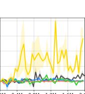

400

300

200

100

0

0.00 0.40 0.80 1.20 1.60 2.00

(e) Ant Cripple

2000

1500

1000

0.00 0.40 0.80 1.20 1.60 2.00

(a) Hopper Size

2000

1500

1000

500

0

−500

0.00 0.40 0.80 1.20 1.60 2.00

(b) HalfCheetah Armature

1500

1000

500

0

−500

0.00 0.40 0.80 1.20 1.60 2.00

(c) HalfCheetah Mass

600

500

400

300

200

100

0

0.00 0.40 0.80 1.20 1.60 2.00

(d) Ant Damping

Figure 3: Learning curves of episode rewards on test tasks, averaged over 3 runs. The x-axis is total number of timesteps and
the y-axis is average episode reward. Shadow areas indicate standard error.

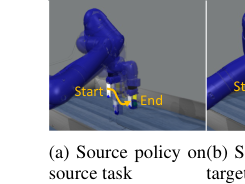

Figure 4: Robot arm moving paths on source (pushing a
_cylinder_ ) or target task (moving a _mug_ to a coffee machine).

policy on target task resembles the source policy on source
task, while the source policy has trouble grasping the coffee mug on target task. Videos of agents’ behavior are in
supplementary materials. Tab. 1 reports experimental results
of baseline (Zhang et al. 2020c) transferring the source policy based on action correspondence. It proposes to learn an
action translator with three loss terms: adversarial loss, domain cycle-consistency loss, and dynamic cycle-consistency
loss. Our loss _Ltrans_ (Equation 3) draws upon an idea analogous to dynamic cycle-consistency though we have a more
expressive forward model _F_ with context variables. When
_F_ is strong and reasonably generalizable, domain cycleconsistency loss training the inverse action translator and adversarial loss constraining the distribution of translated action may not be necessary. Ours with a simpler objective
function is competitive with Zhang et al. (2020c).

(a) HalfCheetah

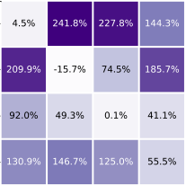

(b) Ant

Figure 5: Improvement transferred policy over source policy.

We extend the action translator to multiple tasks by conditioning _H_ on context variables of source and target tasks.

We measure the improvement of our transferred policy over
the source policy on the target tasks. On HalfCheetah tasks
_T_ [(1)] _· · · T_ [(5)], the armature becomes larger. As the physics
parameter in the target task deviates more from source task,
the advantage of transferred policy tends to be more significant (Fig. 5a), because the performance of transferred policy
does not drop as much as source policy. We remark that the
unified action translator is for any pair of source and target
tasks. So action translation for the diagonal elements might
be less than 0%. For each task on Ant, we set one of its
four legs crippled, so any action applied to the crippled leg
joints is set as 0. Ideal equivalent action does not always exist across tasks with different crippled legs in this setting.
Therefore, it is impossible to minimize _d_ in Proposition 1
as 0. Nevertheless, the inequality proved in Proposition 1
still holds and policy transfer empirically shows positive improvement on most source-target pairs (Fig. 5b).

**5.2** **Comparison with Context-based Meta-RL**

We evaluate MCAT combining policy transfer with contextbased TD3 in meta-RL problems. The action translator is
trained dynamically with data maintained in replay buffer
and the source policy keeps being updated. On MuJoCo,
we modify environment physics parameters (e.g. size, mass,
damping) that affect the transition dynamics to design tasks.
We predefine a fixed set of physics parameters for training
tasks and unseen test tasks. In order to test algorithms’ ability in tackling difficult tasks, environment rewards are delayed to create sparse-reward RL problems (Oh et al. 2018;
Tang 2020). In particular, we accumulate dense rewards over
_n_ consecutive steps, and the agent receives the delayed feedback every _n_ step or when the episode terminates. To fully
exploit the good data collected from our transferred policy,
we empirically incorporate self-imitation learning (SIL) (Oh
et al. 2018), which imitates the agent’s own successful past
experiences to further improve the policy.
We compare with several context-based meta-RL methods: MQL (Fakoor et al. 2019), PEARL (Rakelly et al.
2019), Distral (Teh et al. 2017), and HiP-BMDP (Zhang
et al. 2020b). Although the baselines perform well on MuJoCo environments with dense rewards, the delayed environment rewards degrade policy learning (Tab. 2, Fig. 3)
because the rare transitions with positive rewards are not
fully exploited. In contrast, MCAT shows a substantial advantage in performance and sample complexity on both
the training tasks and the test tasks. Notably, the perfor

mance gap is more significant in more complex environments (e.g. HalfCheetah and Ant with higher-dimensional
state and sparser rewards). We additionally analyze effect of
SIL in Appendix D.4. SIL brings improvements to baselines
but MCAT still shows obvious advantages.

Half

Cheetah

Mass

Hopper
Setting
Size

Half

Cheetah

Armature

Ant Ant
Damp Cripple

MQL 1607.5 -77.9 -413.9 103.1 38.2
PEARL 1755.8 -18.8 25.9 73.2 3.5

Distral 1319.8 566.9 -29.5 90.5 -0.1

HiP-BMDP 1368.3 -102.4 -74.8 33.1 7.3
MCAT(Ours) **1914.8** **2071.5** **1771.1 624.6 281.6**

Table 2: Test rewards at 2M timesteps, averaged over 3 runs.

**5.3** **Ablative Study**

**Effect of Policy Transfer** Our MCAT is implemented by
combining context-based TD3, self-imitation learning, and
policy transfer (PT). We investigate the effect of policy
transfer. In Tab. 3. MCAT significantly outperforms MCAT
w/o PT, because PT facilitates more balanced performance
across training tasks and hence better generalization to test
tasks. This empirically confirms that policy transfer is beneficial in meta-RL on sparse-reward tasks.

Half

Cheetah

Mass

Hopper
Setting
Size

Half

Cheetah

Armature

Ant Ant
Damp Cripple

MCAT w/o PT 1497.5 579.1 -364.3 187.7 92.4

MCAT 1982.1 1776.8 67.1 211.8 155.7
Improve(%) 32.3 206.8 118.4 12.8 68.5

Table 3: Test rewards at 1M timesteps. We report improvements brought by policy transfer (PT).

**Sparser Rewards** We analyze MCAT when rewards are delayed for different numbers of steps (Tab. 4). When rewards
are relatively dense (i.e. delay step is 200), during training,
the learned policy can reach a high score on each task without the issue of imbalanced performance among multiple
tasks. MCAT w/o PT and MCAT perform comparably well
within the standard error. However, as the rewards become
sparser, it requires longer sequences of correct actions to obtain potentially high rewards. Policy learning struggles on
some tasks and policy transfer plays an important role to exploit the precious good experiences on source tasks. Policy
transfer brings more improvement on sparser-reward tasks.
In Appendix, we further provide ablative study about
More Diverse Tasks (D.3), Effect of SIL (D.4) and Effect
of Contrastive Loss (D.5). Appendix D.6 shows that trivially combining the complex action translator (Zhang et al.
2020c) with context-based meta-RL underperforms MCAT.

Setting Armature Mass

Delay steps 200 350 500 200 350 500

MCAT w/o PT 2583.2 1771.7 579.1 709.6 156.6 -364.2

MCAT 2251.8 2004.5 1776.8 666.7 247.8 67.1
Improve(%) -12.8 13.1 206.9 -6.1 58.2 118.4

Table 4: Test rewards at 1M timestpes averaged over 3 runs,
on HalfCheetah with _armature_ / _mass_ changing across tasks.

**6** **Discussion**

The scope of MCAT is for tasks with varying dynamics,
same as many prior works (Yu et al. 2017; Nagabandi et al.
2018; Nagabandi, Finn, and Levine 2018; Zhou, Pinto, and
Gupta 2019). our theory and method of policy transfer can
be extended to more general cases (1) tasks with varying reward functions (2) tasks with varying state & action spaces.
Following the idea in Sec. 4, on two general MDPs, we are
interested in equivalent state-action pairs achieving the same
reward and transiting to equivalent next states. Similar to
Proposition 1, we can prove that, on two general MDPs, for
two correspondent states _s_ [(] _[i]_ [)] and _s_ [(] _[j]_ [)], the value difference
_|V_ _[π]_ [(] _[i]_ [)] ( _s_ [(] _[i]_ [)] _, T_ [(] _[i]_ [)] ) _−_ _V_ _[π]_ [(] _[j]_ [)] ( _s_ [(] _[j]_ [)] _, T_ [(] _[j]_ [)] ) _|_ is upper bounded by
_d_
1 _−γ_ [, where] _[ d]_ [ depends on] _[ D][T V]_ [ between the next state dis-]
tribution on source task and the probability distribution of
correspondent next state on target task. As an extension,
we learn a state translator jointly with our action translator
to capture state and action correspondence. Compared with
Zhang et al. (2020c) learning both state and action translator, we simplify the objective function training action translator and afford the theoretical foundation. For (1) tasks with
varying reward functions, we conduct experiments on MetaWorld moving the robot arm to a goal location. The reward
at each step is inversely proportional to its distance from
the goal location. We fix a goal location on source task and
set target tasks with distinct goal locations. Furthermore, we
evaluate our approach on 2-leg and 3-leg HalfCheetah. We
can test our idea on (2) tasks with varying state and action
spaces of different dimensions because the agents have different numbers of joints on the source and target task. Experiments demonstrate that ours with a simpler objective function than the baseline (Zhang et al. 2020c) can transfer the
source policy to perform well on the target task. Details of
theorems, proofs, and experiments are in Appendix E.

**7** **Conclusion**

Meta-RL with long-horizon, sparse-reward tasks is challenging because an agent can rarely obtain positive rewards,
and handling multiple tasks simultaneously requires massive
samples from distinctive tasks. We propose a simple yet effective objective function to learn an action translator for
multiple tasks and provide the theoretical ground. We develop a novel algorithm MCAT using the action translator
for policy transfer to improve the performance of off-policy,
context-based meta-RL algorithms. We empirically show its
efficacy in various environments and verify that our policy
transfer can offer substantial gains in sample complexity.

**Acknowledgements**

This work was supported in part by NSF CAREER IIS1453651, NSF SES 2128623, and LG AI Research. Any
opinions, findings, conclusions or recommendations expressed here are those of the authors and do not necessarily
reflect views of the sponsor.

**References**

Agarwal, R.; Machado, M. C.; Castro, P. S.; and Bellemare,
M. G. 2021. Contrastive Behavioral Similarity Embeddings for Generalization in Reinforcement Learning. _arXiv_
_preprint arXiv:2101.05265_ .

Ammar, H. B.; and Taylor, M. E. 2011. Reinforcement learning transfer via common subspaces. In _Interna-_
_tional Workshop on Adaptive and Learning Agents_, 21–36.
Springer.

Duan, Y.; Schulman, J.; Chen, X.; Bartlett, P. L.; Sutskever,
I.; and Abbeel, P. 2016. Rl 2: Fast reinforcement learning via slow reinforcement learning. _arXiv preprint_
_arXiv:1611.02779_ .

Fakoor, R.; Chaudhari, P.; Soatto, S.; and Smola, A. J. 2019.
Meta-q-learning. _arXiv preprint arXiv:1910.00125_ .

Ferns, N.; Panangaden, P.; and Precup, D. 2004. Metrics
for Finite Markov Decision Processes. In _UAI_, volume 4,
162–169.

Finn, C.; Abbeel, P.; and Levine, S. 2017. Model-agnostic
meta-learning for fast adaptation of deep networks. In _In-_
_ternational Conference on Machine Learning_, 1126–1135.
PMLR.

Fujimoto, S.; Hoof, H.; and Meger, D. 2018. Addressing
function approximation error in actor-critic methods. In _In-_
_ternational Conference on Machine Learning_, 1587–1596.
PMLR.

Gupta, A.; Devin, C.; Liu, Y.; Abbeel, P.; and Levine,
S. 2017. Learning invariant feature spaces to transfer skills with reinforcement learning. _arXiv preprint_
_arXiv:1703.02949_ .

Hadsell, R.; Chopra, S.; and LeCun, Y. 2006. Dimensionality reduction by learning an invariant mapping. In _2006_
_IEEE Computer Society Conference on Computer Vision_
_and Pattern Recognition (CVPR’06)_, volume 2, 1735–1742.
IEEE.

Konidaris, G.; and Barto, A. 2006. Autonomous shaping:
Knowledge transfer in reinforcement learning. In _Proceed-_
_ings of the 23rd international conference on Machine learn-_
_ing_, 489–496.

Lee, K.; Seo, Y.; Lee, S.; Lee, H.; and Shin, J. 2020. Contextaware dynamics model for generalization in model-based reinforcement learning. In _International Conference on Ma-_
_chine Learning_, 5757–5766. PMLR.

Li, A. C.; Pinto, L.; and Abbeel, P. 2020. Generalized hindsight for reinforcement learning. _arXiv preprint_
_arXiv:2002.11708_ .

Liu, E. Z.; Raghunathan, A.; Liang, P.; and Finn, C.
2020. Explore then Execute: Adapting without Rewards via

Factorized Meta-Reinforcement Learning. _arXiv preprint_
_arXiv:2008.02790_ .

Mishra, N.; Rohaninejad, M.; Chen, X.; and Abbeel, P.
2017. A simple neural attentive meta-learner. _arXiv preprint_
_arXiv:1707.03141_ .

Mnih, V.; Kavukcuoglu, K.; Silver, D.; Rusu, A. A.; Veness,
J.; Bellemare, M. G.; Graves, A.; Riedmiller, M.; Fidjeland,
A. K.; Ostrovski, G.; Petersen, S.; Beattie, C.; Sadik, A.;
Antonoglou, I.; King, H.; Kumaran, D.; Wierstra, D.; Legg,
S.; and Hassabis, D. 2015. Human-level control through
deep reinforcement learning. _Nature_ .

Nagabandi, A.; Clavera, I.; Liu, S.; Fearing, R. S.;
Abbeel, P.; Levine, S.; and Finn, C. 2018. Learning to
adapt in dynamic, real-world environments through metareinforcement learning. _arXiv preprint arXiv:1803.11347_ .

Nagabandi, A.; Finn, C.; and Levine, S. 2018. Deep online
learning via meta-learning: Continual adaptation for modelbased rl. _arXiv preprint arXiv:1812.07671_ .

Oh, J.; Guo, Y.; Singh, S.; and Lee, H. 2018. Self-imitation
learning. In _International Conference on Machine Learning_,
3878–3887. PMLR.

Parisotto, E.; Ba, J. L.; and Salakhutdinov, R. 2015. Actormimic: Deep multitask and transfer reinforcement learning.
_arXiv preprint arXiv:1511.06342_ .

Rakelly, K.; Zhou, A.; Finn, C.; Levine, S.; and Quillen, D.
2019. Efficient off-policy meta-reinforcement learning via
probabilistic context variables. In _International conference_
_on machine learning_, 5331–5340. PMLR.

Ren, H.; Zhu, Y.; Leskovec, J.; Anandkumar, A.; and Garg,
A. 2020. OCEAN: Online Task Inference for Compositional
Tasks with Context Adaptation. In _Conference on Uncer-_
_tainty in Artificial Intelligence_, 1378–1387. PMLR.

Rusu, A. A.; Colmenarejo, S. G.; Gulcehre, C.; Desjardins,
G.; Kirkpatrick, J.; Pascanu, R.; Mnih, V.; Kavukcuoglu, K.;
and Hadsell, R. 2015. Policy distillation. _arXiv preprint_
_arXiv:1511.06295_ .

Schulman, J.; Wolski, F.; Dhariwal, P.; Radford, A.; and
Klimov, O. 2017. Proximal policy optimization algorithms.
_arXiv preprint arXiv:1707.06347_ .

Seo, Y.; Lee, K.; Clavera, I.; Kurutach, T.; Shin, J.; and
Abbeel, P. 2020. Trajectory-wise Multiple Choice Learning for Dynamics Generalization in Reinforcement Learning. _arXiv preprint arXiv:2010.13303_ .

Silver, D.; Huang, A.; Maddison, C. J.; Guez, A.; Sifre, L.;
Van Den Driessche, G.; Schrittwieser, J.; Antonoglou, I.;
Panneershelvam, V.; Lanctot, M.; et al. 2016. Mastering the
game of Go with deep neural networks and tree search. _na-_
_ture_, 529(7587): 484.

Stadie, B. C.; Yang, G.; Houthooft, R.; Chen, X.; Duan, Y.;
Wu, Y.; Abbeel, P.; and Sutskever, I. 2018. Some considerations on learning to explore via meta-reinforcement learning. _arXiv preprint arXiv:1803.01118_ .

Sung, F.; Zhang, L.; Xiang, T.; Hospedales, T.; and Yang,
Y. 2017. Learning to learn: Meta-critic networks for sample
efficient learning. _arXiv preprint arXiv:1706.09529_ .

Tang, Y. 2020. Self-imitation learning via generalized lower
bound q-learning. _arXiv preprint arXiv:2006.07442_ .
Teh, Y. W.; Bapst, V.; Czarnecki, W. M.; Quan, J.; Kirkpatrick, J.; Hadsell, R.; Heess, N.; and Pascanu, R. 2017.
Distral: Robust multitask reinforcement learning. _arXiv_
_preprint arXiv:1707.04175_ .

Todorov, E.; Erez, T.; and Tassa, Y. 2012. Mujoco: A physics
engine for model-based control. In _2012 IEEE/RSJ Interna-_
_tional Conference on Intelligent Robots and Systems_, 5026–
5033. IEEE.

Van der Maaten, L.; and Hinton, G. 2008. Visualizing data
using t-SNE. _Journal of machine learning research_, 9(11).
Wang, J. X.; Kurth-Nelson, Z.; Tirumala, D.; Soyer, H.;
Leibo, J. Z.; Munos, R.; Blundell, C.; Kumaran, D.; and
Botvinick, M. 2016. Learning to reinforcement learn. _arXiv_
_preprint arXiv:1611.05763_ .

Xu, Z.; van Hasselt, H.; and Silver, D. 2018. Meta-gradient
reinforcement learning. _arXiv preprint arXiv:1805.09801_ .
Yin, H.; and Pan, S. 2017. Knowledge transfer for deep
reinforcement learning with hierarchical experience replay.
In _Proceedings of the AAAI Conference on Artificial Intelli-_
_gence_, 1.

Yu, T.; Kumar, S.; Gupta, A.; Levine, S.; Hausman, K.; and
Finn, C. 2020a. Gradient surgery for multi-task learning.
_arXiv preprint arXiv:2001.06782_ .

Yu, T.; Quillen, D.; He, Z.; Julian, R.; Hausman, K.; Finn,
C.; and Levine, S. 2020b. Meta-world: A benchmark and
evaluation for multi-task and meta reinforcement learning.
In _Conference on Robot Learning_, 1094–1100. PMLR.

Yu, W.; Tan, J.; Liu, C. K.; and Turk, G. 2017. Preparing
for the unknown: Learning a universal policy with online
system identification. _arXiv preprint arXiv:1702.02453_ .
Zhang, A.; Lyle, C.; Sodhani, S.; Filos, A.; Kwiatkowska,
M.; Pineau, J.; Gal, Y.; and Precup, D. 2020a. Invariant
causal prediction for block mdps. In _International Confer-_
_ence on Machine Learning_, 11214–11224. PMLR.

Zhang, A.; Sodhani, S.; Khetarpal, K.; and Pineau, J. 2020b.
Learning robust state abstractions for hidden-parameter
block _{_ mdp _}_ s. In _International Conference on Learning_
_Representations_ .

Zhang, Q.; Xiao, T.; Efros, A. A.; Pinto, L.; and Wang,
X. 2020c. Learning Cross-Domain Correspondence for
Control with Dynamics Cycle-Consistency. _arXiv preprint_
_arXiv:2012.09811_ .

Zhou, W.; Pinto, L.; and Gupta, A. 2019. Environment probing interaction policies. _arXiv preprint arXiv:1907.11740_ .
Zhu, Z.; Lin, K.; and Zhou, J. 2020. Transfer Learning in
Deep Reinforcement Learning: A Survey. _arXiv preprint_
_arXiv:2009.07888_ .

### _Appendix:_

**A** **Bound Value Difference in Policy Transfer**

In this section, we provide detailed theoretical ground for our policy transfer approach, as a supplement to Sec. 4. We first
define a binary relation for actions to describe the correspondent actions behaving equivalently on two MDPs (Definition 1).
Building upon the notion of action equivalence, we derive the upper bound of value difference between policies on two MDPs
(Theorem 1). Finally, we reach a proposition for the upper bound of value difference (Proposition 1) to explain that minimizing
our objective function results in bounding the value difference between the source and transferred policy.

**Definition 1.** _Given two MDPs T_ [(] _[i]_ [)] = _{S, A, p_ [(] _[i]_ [)] _, r_ [(] _[i]_ [)] _, γ, ρ_ 0 _} and T_ [(] _[j]_ [)] = _{S, A, p_ [(] _[j]_ [)] _, r_ [(] _[j]_ [)] _, γ, ρ_ 0 _} with the same state space_
_and action space, for each state s ∈S, we define a binary relation Bs ∈A × A called_ _**action equivalence relation**_ _. For any_
_action a_ [(] _[i]_ [)] _∈A, a_ [(] _[j]_ [)] _∈A, if_ ( _a_ [(] _[i]_ [)] _, a_ [(] _[j]_ [)] ) _∈_ _Bs (i.e. a_ [(] _[i]_ [)] _Bsa_ [(] _[j]_ [)] _), the following conditions hold:_
_r_ [(] _[i]_ [)] ( _s, a_ [(] _[i]_ [)] ) = _r_ [(] _[j]_ [)] ( _s, a_ [(] _[j]_ [)] ) _and p_ [(] _[i]_ [)] ( _·|s, a_ [(] _[i]_ [)] ) = _p_ [(] _[j]_ [)] ( _·|s, a_ [(] _[j]_ [)] ) (5)

Based on Definition 1, at state _s_, action _a_ [(] _[i]_ [)] on _T_ [(] _[i]_ [)] is equivalent to action _a_ [(] _[j]_ [)] on _T_ [(] _[j]_ [)] if _a_ [(] _[i]_ [)] _Bsa_ [(] _[j]_ [)] . Note that the binary
relation _Bs_ is defined for each _s_ separately. The action equivalence relation might change on varied states. On two MDPs
with the same dynamic and reward functions, it is trivial to get the equivalent action with identity mapping. However, we are
interested in more complex cases where the reward and dynamic functions are not identical on two MDPs.
Ideally, the equivalent action always exists on the target MDP _T_ [(] _[i]_ [)] for any state-action pair on the source MDP _T_ [(] _[j]_ [)] and
there exists an action translator function _H_ : _S × A →A_ to identify the exact equivalent action. Starting from state _s_, the
translated action ˜ _a_ = _H_ ( _s, a_ ) on the task _T_ [(] _[i]_ [)] generates reward and next state distribution the same as action _a_ on the task _T_ [(] _[j]_ [)]
(i.e. ˜ _aBsa_ ). Then any deterministic policy _π_ [(] _[j]_ [)] on the source task _T_ [(] _[j]_ [)] can be perfectly transferred to the target task _T_ [(] _[i]_ [)] with
_π_ [(] _[i]_ [)] ( _s_ ) = _H_ ( _s, π_ [(] _[j]_ [)] ( _s_ )). The value of the policy _π_ [(] _[j]_ [)] on the source task _T_ [(] _[j]_ [)] is equal to the value of transferred policy _π_ [(] _[i]_ [)] on
the target task _T_ [(] _[i]_ [)] .
Without the assumption of existence of a perfect correspondence for each action, given any two deterministic policies
_π_ [(] _[j]_ [)] and _π_ [(] _[i]_ [)], we prove that the difference in the policy value is upper bounded by a scalar 1 _−d_ _γ_ [depending on L1-distance]
between reward functions _|r_ [(] _[j]_ [)] ( _s, π_ [(] _[j]_ [)] ( _s_ )) _−_ _r_ [(] _[i]_ [)] ( _s, π_ [(] _[i]_ [)] ( _s_ )) _|_ and total-variation distance between next state distributions
_DT V_ ( _p_ [(] _[j]_ [)] ( _·|s, π_ [(] _[j]_ [)] ( _s_ )) _, p_ [(] _[i]_ [)] ( _·|s, π_ [(] _[i]_ [)] ( _s_ ))).

**Theorem 1.** _Let T_ [(] _[i]_ [)] = _{S, A, p_ [(] _[i]_ [)] _, r_ [(] _[i]_ [)] _, γ, ρ_ 0 _} and T_ [(] _[j]_ [)] = _{S, A, p_ [(] _[j]_ [)] _, r_ [(] _[j]_ [)] _, γ, ρ_ 0 _} be two MDPs sampled from the_
_distribution of tasks p_ ( _T_ ) _. π_ [(] _[i]_ [)] _is a deterministic policy on T_ [(] _[i]_ [)] _and π_ [(] _[j]_ [)] _is a deterministic policy on T_ [(] _[j]_ [)] _. Let M_ =
sup _s∈S |V_ _[π]_ [(] _[j]_ [)] ( _s, T_ [(] _[j]_ [)] ) _|, d_ = sup _s∈S_ � _|r_ [(] _[j]_ [)] ( _s, π_ [(] _[j]_ [)] ( _s_ )) _−_ _r_ [(] _[i]_ [)] ( _s, π_ [(] _[i]_ [)] ( _s_ )) _|_ + 2 _γMDT V_ ( _p_ [(] _[j]_ [)] ( _·|s, π_ [(] _[j]_ [)] ( _s_ )) _, p_ [(] _[i]_ [)] ( _·|s, π_ [(] _[i]_ [)] ( _s_ )))� _._
_For ∀s ∈S, we have_
_V π_ ( _i_ )( _s, T_ ( _i_ )) _−_ _V π_ ( _j_ )( _s, T_ ( _j_ )) _≤_ _d_ (6)
��� ��� 1 _−_ _γ_

_Proof._ Let _a_ [(] _[i]_ [)] = _π_ [(] _[i]_ [)] ( _s_ ) and _a_ [(] _[j]_ [)] = _π_ [(] _[j]_ [)] ( _s_ ). _s_ _[′]_ denotes the next state following state _s_ . _s_ _[′′]_ denotes the next state following _s_ _[′]_ .
We rewrite the value difference as:

_V_ _[π]_ [(] _[j]_ [)] ( _s, T_ [(] _[j]_ [)] ) _−_ _V_ _[π]_ [(] _[i]_ [)] ( _s, T_ [(] _[i]_ [)] ) = _r_ [(] _[j]_ [)] ( _s, a_ [(] _[j]_ [)] ) + _γ_ � _p_ [(] _[j]_ [)] ( _s_ _[′]_ _|s, a_ [(] _[j]_ [)] ) _V_ _[π]_ [(] _[j]_ [)] ( _s_ _[′]_ _, T_ [(] _[j]_ [)] )

_s_ _[′]_

_−_ _r_ [(] _[i]_ [)] ( _s, a_ [(] _[i]_ [)] ) _−_ _γ_ � _p_ [(] _[i]_ [)] ( _s_ _[′]_ _|s, a_ [(] _[i]_ [)] ) _V_ _[π]_ [(] _[i]_ [)] ( _s_ _[′]_ _, T_ [(] _[i]_ [)] )

_s_ _[′]_

= ( _r_ [(] _[j]_ [)] ( _s, a_ [(] _[j]_ [)] ) _−_ _r_ [(] _[i]_ [)] ( _s, a_ [(] _[i]_ [)] ))

�

+ _γ_

�� _s_ _[′]_

_p_ [(] _[j]_ [)] ( _s_ _[′]_ _|s, a_ [(] _[j]_ [)] ) _V_ _[π]_ [(] _[j]_ [)] ( _s_ _[′]_ _, T_ [(] _[j]_ [)] ) _−_ �

_s_ _[′]_ _s_ _[′]_

_p_ [(] _[i]_ [)] ( _s_ _[′]_ _|s, a_ [(] _[i]_ [)] ) _V_ _[π]_ [(] _[i]_ [)] ( _s_ _[′]_ _, T_ [(] _[i]_ [)] )

_s_ _[′]_

*minus and plus _γ_ � _p_ [(] _[i]_ [)] ( _s_ _[′]_ _|s, a_ [(] _[i]_ [)] ) _V_ _[π]_ [(] _[j]_ [)] ( _s_ _[′]_ _, T_ [(] _[j]_ [)] )

_s_ _[′]_

= ( _r_ [(] _[j]_ [)] ( _s, a_ [(] _[j]_ [)] ) _−_ _r_ [(] _[i]_ [)] ( _s, a_ [(] _[i]_ [)] ))

+ _γ_ �

_s_ _[′]_

_p_ [(] _[j]_ [)] ( _s_ _[′]_ _|s, a_ [(] _[j]_ [)] ) _−_ _p_ [(] _[i]_ [)] ( _s_ _[′]_ _|s, a_ [(] _[i]_ [)] ) _V_ _[π]_ [(] _[j]_ [)] ( _s_ _[′]_ _, T_ [(] _[j]_ [)] )
� �

+ _γ_ � _p_ [(] _[i]_ [)] ( _s_ _[′]_ _|s, a_ [(] _[i]_ [)] ) � _V_ _[π]_ [(] _[j]_ [)] ( _s_ _[′]_ _, T_ [(] _[j]_ [)] ) _−_ _V_ _[π]_ [(] _[i]_ [)] ( _s_ _[′]_ _, T_ [(] _[i]_ [)] )�

_s_ _[′]_

Then we consider the absolute value of the value difference:

_V π_ ( _j_ )( _s, T_ ( _j_ )) _−_ _V π_ ( _i_ )( _s, T_ ( _i_ )) _≤_ _r_ ( _j_ )( _s, a_ ( _j_ )) _−_ _r_ ( _i_ )( _s, a_ ( _i_ ))
��� ��� ��� ���

� _p_ [(] _[i]_ [)] ( _s_ _[′]_ _|s, a_ [(] _[i]_ [)] ) � _V_ _[π]_ [(] _[j]_ [)] ( _s_ _[′]_ _, T_ [(] _[j]_ [)] ) _−_ _V_ _[π]_ [(] _[i]_ [)] ( _s_ _[′]_ _, T_ [(] _[i]_ [)] )� [�]

_s_ _[′]_ ����

�����

+ _γ_

+ _γ_

�����

�����

�

_s_ _[′]_

_p_ [(] _[j]_ [)] ( _s_ _[′]_ _|s, a_ [(] _[j]_ [)] ) _−_ _p_ [(] _[i]_ [)] ( _s_ _[′]_ _|s, a_ [(] _[i]_ [)] ) _V_ _[π]_ [(] _[j]_ [)] ( _s_ _[′]_ _, T_ [(] _[j]_ [)] )
� �

�����

*property of total variation distance when the set is countable

= _r_ ( _j_ )( _s, a_ ( _j_ )) _−_ _r_ ( _i_ )( _s, a_ ( _i_ ))
��� ���

+ 2 _γMDT V_ ( _p_ [(] _[j]_ [)] ( _·|s, a_ [(] _[j]_ [)] ) _, p_ [(] _[i]_ [)] ( _·|s, a_ [(] _[i]_ [)] ))

� _p_ [(] _[i]_ [)] ( _s_ _[′]_ _|s, a_ [(] _[i]_ [)] ) � _V_ _[π]_ [(] _[j]_ [)] ( _s_ _[′]_ _, T_ [(] _[j]_ [)] ) _−_ _V_ _[π]_ [(] _[i]_ [)] ( _s_ _[′]_ _, T_ [(] _[i]_ [)] )� [�]

_s_ _[′]_ ����

+ _γ_

�����

� _p_ [(] _[i]_ [)] ( _s_ _[′]_ _|s, a_ [(] _[i]_ [)] ) � _V_ _[π]_ [(] _[j]_ [)] ( _s_ _[′]_ _, T_ [(] _[j]_ [)] ) _−_ _V_ _[π]_ [(] _[i]_ [)] ( _s_ _[′]_ _, T_ [(] _[i]_ [)] )� [�]

_s_ _[′]_ ����

_≤_ _d_ + _γ_

�����

_≤_ _d_ + _γ_ sup
_s_ _[′]_

_V π_ ( _j_ )( _s′, T_ ( _j_ )) _−_ _V π_ ( _i_ )( _s′, T_ ( _i_ ))
��� ���

*by induction

_V π_ ( _j_ )( _s′′, T_ ( _j_ )) _−_ _V π_ ( _i_ )( _s′′, T_ ( _i_ ))
��� ����

_≤_ _d_ + _γ_ _d_ + _γ_ sup
� _s_ _[′′]_

_≤_ _d_ + _γd_ + _γ_ [2] sup
_s_ _[′′]_

_≤_ _· · ·_

_V π_ ( _j_ )( _s′′, T_ ( _j_ )) _−_ _V π_ ( _i_ )( _s′′, T_ ( _i_ ))
��� ���

_d_
_≤_ _d_ + _γd_ + _γ_ [2] _d_ + _γ_ [3] _d_ + _· · ·_ =
1 _−_ _γ_

For a special case where reward function _r_ ( _s, a, s_ _[′]_ ) only depends on the current state _s_ and next state _s_ _[′]_, the upper bound of
policy value difference is only related to the distance in next state distributions.

**Proposition 1.** _Let T_ [(] _[i]_ [)] = _{S, A, p_ [(] _[i]_ [)] _, r_ [(] _[i]_ [)] _, γ, ρ_ 0 _} and T_ [(] _[j]_ [)] = _{S, A, p_ [(] _[j]_ [)] _, r_ [(] _[j]_ [)] _, γ, ρ_ 0 _} be two MDPs sampled from the distri-_
_bution of tasks p_ ( _T_ ) _. π_ [(] _[i]_ [)] _, π_ [(] _[j]_ [)] _is the deterministic policy on T_ [(] _[i]_ [)] _, T_ [(] _[j]_ [)] _. Assume the reward function only depends on the state_
_and next state r_ [(] _[i]_ [)] ( _s, a_ [(] _[i]_ [)] _, s_ _[′]_ ) = _r_ [(] _[j]_ [)] ( _s, a_ [(] _[j]_ [)] _, s_ _[′]_ ) = _r_ ( _s, s_ _[′]_ ) _. Let d_ = sup _s∈S_ 2 _MDT V_ ( _p_ [(] _[j]_ [)] ( _·|s, π_ [(] _[j]_ [)] ( _s_ )) _, p_ [(] _[i]_ [)] ( _·|s, π_ [(] _[i]_ [)] ( _s_ ))) _and_
_M_ = sup _s∈S,s′∈S |r_ ( _s, s_ _[′]_ ) + _γV_ _[π]_ [(] _[j]_ [)] ( _s, T_ [(] _[j]_ [)] ) _|. ∀s ∈S, we have_
_V π_ ( _i_ )( _s, T_ ( _i_ )) _−_ _V π_ ( _j_ )( _s, T_ ( _j_ )) _≤_ _d_ (4)
��� ��� 1 _−_ _γ_

_Proof._ Let _a_ [(] _[i]_ [)] = _π_ [(] _[i]_ [)] ( _s_ ) and _a_ [(] _[j]_ [)] = _π_ [(] _[j]_ [)] ( _s_ ). _s_ _[′]_ denotes the next state following state _s_ . _s_ _[′′]_ denotes the next state following _s_ _[′]_ .
In the special case of _r_ [(] _[i]_ [)] ( _s, a_ [(] _[i]_ [)] _, s_ _[′]_ ) = _r_ ( _s, s_ _[′]_ ), the value of policy can be written as:

_V_ _[π]_ [(] _[i]_ [)] ( _s, T_ [(] _[i]_ [)] ) = _r_ [(] _[i]_ [)] ( _s, a_ [(] _[i]_ [)] ) + _γ_ � _p_ [(] _[i]_ [)] ( _s_ _[′]_ _|s, a_ [(] _[i]_ [)] ) _V_ _[π]_ [(] _[i]_ [)] ( _s_ _[′]_ _, T_ [(] _[i]_ [)] )

_s_ _[′]_

=
�

_p_ [(] _[i]_ [)] ( _s_ _[′]_ _|s, a_ [(] _[i]_ [)] ) _r_ ( _s, s_ _[′]_ ) + _γ_ �

_s_ _[′]_ _s_ _[′]_

_p_ [(] _[i]_ [)] ( _s_ _[′]_ _|s, a_ [(] _[i]_ [)] ) _V_ _[π]_ [(] _[i]_ [)] ( _s_ _[′]_ _, T_ [(] _[i]_ [)] )

_s_ _[′]_

= � _p_ [(] _[i]_ [)] ( _s_ _[′]_ _|s, a_ [(] _[i]_ [)] ) � _r_ ( _s, s_ _[′]_ ) + _γV_ _[π]_ [(] _[i]_ [)] ( _s_ _[′]_ _, T_ [(] _[i]_ [)] )�

_s_ _[′]_

We can derive the value difference:

_p_ [(] _[j]_ [)] ( _s_ _[′]_ _|s, a_ [(] _[j]_ [)] ) � _r_ ( _s, s_ _[′]_ ) + _γV_ _[π]_ [(] _[j]_ [)] ( _s_ _[′]_ _, T_ [(] _[j]_ [)] )� _−_ �
_s_ _[′]_ _s_ _[′]_

_V_ _[π]_ [(] _[j]_ [)] ( _s, T_ [(] _[j]_ [)] ) _−_ _V_ _[π]_ [(] _[i]_ [)] ( _s, T_ [(] _[i]_ [)] ) = �

_p_ [(] _[i]_ [)] ( _s_ _[′]_ _|s, a_ [(] _[i]_ [)] ) _r_ ( _s, s_ _[′]_ ) + _γV_ _[π]_ [(] _[i]_ [)] ( _s_ _[′]_ _, T_ [(] _[i]_ [)] )
� �
_s_ _[′]_

*minus and plus � _p_ [(] _[i]_ [)] ( _s_ _[′]_ _|s, a_ [(] _[i]_ [)] ) � _r_ ( _s, s_ _[′]_ ) + _γV_ _[π]_ [(] _[j]_ [)] ( _s_ _[′]_ _, T_ [(] _[j]_ [)] )�

_s_ _[′]_

=
�

_s_ _[′]_

**combine the first two terms, combine the last two terms

_p_ [(] _[j]_ [)] ( _s_ _[′]_ _|s, a_ [(] _[j]_ [)] ) _−_ _p_ [(] _[i]_ [)] ( _s_ _[′]_ _|s, a_ [(] _[i]_ [)] ) _r_ ( _s, s_ _[′]_ ) + _γV_ _[π]_ [(] _[j]_ [)] ( _s_ _[′]_ _, T_ [(] _[j]_ [)] )
� �� �

+ _γ_ � _p_ [(] _[i]_ [)] ( _s_ _[′]_ _|s, a_ [(] _[i]_ [)] ) � _V_ _[π]_ [(] _[j]_ [)] ( _s_ _[′]_ _, T_ [(] _[j]_ [)] ) _−_ _V_ _[π]_ [(] _[i]_ [)] ( _s_ _[′]_ _, T_ [(] _[i]_ [)] )�

_s_ _[′]_

Then we take absolute value of the value difference:

_V π_ ( _j_ )( _s, T_ ( _j_ )) _−_ _V π_ ( _i_ )( _s, T_ ( _i_ )) _≤_ 2 _MDT V_ ( _p_ [(] _[j]_ [)] ( _·|s, a_ [(] _[j]_ [)] ) _, p_ [(] _[i]_ [)] ( _·|s, a_ [(] _[i]_ [)] ))
��� ���

� _p_ [(] _[i]_ [)] ( _s_ _[′]_ _|s, a_ [(] _[i]_ [)] ) � _V_ _[π]_ [(] _[j]_ [)] ( _s_ _[′]_ _, T_ [(] _[j]_ [)] ) _−_ _V_ _[π]_ [(] _[i]_ [)] ( _s_ _[′]_ _, T_ [(] _[i]_ [)] )� [�]

_s_ _[′]_ ����

+ _γ_

�����

� _p_ [(] _[i]_ [)] ( _s_ _[′]_ _|s, a_ [(] _[i]_ [)] ) � _V_ _[π]_ [(] _[j]_ [)] ( _s_ _[′]_ _, T_ [(] _[j]_ [)] ) _−_ _V_ _[π]_ [(] _[i]_ [)] ( _s_ _[′]_ _, T_ [(] _[i]_ [)] )� [�]

_s_ _[′]_ ����

_≤_ _d_ + _γ_

�����

_≤_ _d_ + _γ_ sup
_s_ _[′]_

_V π_ ( _j_ )( _s′, T_ ( _j_ )) _−_ _V π_ ( _i_ )( _s′, T_ ( _i_ ))
��� ���

_V π_ ( _j_ )( _s′′, T_ ( _j_ )) _−_ _V π_ ( _i_ )( _s′′, T_ ( _i_ ))
��� ����

_≤_ _d_ + _γ_ _d_ + _γ_ sup
� _s_ _[′′]_

_≤_ _d_ + _γd_ + _γ_ [2] sup
_s_ _[′′]_

_≤_ _· · ·_

_V π_ ( _j_ )( _s′′, T_ ( _j_ )) _−_ _V π_ ( _i_ )( _s′′, T_ ( _i_ ))
��� ���

_d_
_≤_ _d_ + _γd_ + _γ_ [2] _d_ + _γ_ [3] _d_ + _· · ·_ =
1 _−_ _γ_

**B** **Algorithm of MCAT**

Algorithm 1: MCAT combining context-based meta-RL algorithm with policy transfer

1: Initialize critic networks _Qθ_ 1, _Qθ_ 2 and actor network _πφ_ with random parameters _θ_ 1, _θ_ 2, _φ_
2: Initialize target networks _θ_ 1 _[′]_ _[←]_ _[θ]_ [1][,] _[ θ]_ 2 _[′]_ _[←]_ _[θ]_ [2][,] _[ φ][′][ ←]_ _[φ]_
3: Initialize replay buffer _B_ = _B_ [(1)] _∪B_ [(2)] _∪· · · ∪B_ [(] _[|T |]_ [)] and _B_ [(] _[i]_ [)] _←∅_ for each _i_ .
4: Initialize SIL replay buffer _D ←∅_
5: Initialize context encoder _CψC_, forward model _FψF_, action translator _HψH_
6: Initialize set of trajectory rewards for shared policy on each task in recent timesteps as _R_ [(] _[i]_ [)] = _∅_, set of trajectory rewards
for transferred policy from _T_ [(] _[j]_ [)] to _T_ [(] _[i]_ [)] in recent timesteps as _R_ [(] _[j]_ [)] _[→]_ [(] _[i]_ [)] = _∅_ . _R_ [¯] denotes average episode rewards in the set.
7: **for** each iteration **do**
8: // Collect training samples
9: **for** each task _T_ [(] _[i]_ [)] **do**
10: **if** _R_ [(] _[i]_ [)] = _∅_ **then**
11: use the shared policy in this episode
12: **else if** there exist _j ∈_ 1 _,_ 2 _, · · ·, |T |_ such that _R_ [(] _[j]_ [)] _[→]_ [(] _[i]_ [)] = _∅_ and _R_ [¯][(] _[j]_ [)] _>_ _R_ [¯][(] _[i]_ [)] **then**
13: use transferred policy from source task _T_ [(] _[j]_ [)] to target task _T_ [(] _[i]_ [)] in this episode
14: **else if** there exist _j ∈_ 1 _,_ 2 _, · · ·, |T |_, such that _j_ = arg max _j′_ _R_ [¯][(] _[j][′]_ [)] _[→]_ [(] _[i]_ [)] and _R_ [¯][(] _[j]_ [)] _[→]_ [(] _[i]_ [)] _>_ _R_ [¯][(] _[i]_ [)] **then**
15: use transferred policy from source task _T_ [(] _[j]_ [)] to target task _T_ [(] _[i]_ [)] in this episode
16: **else**
17: use the shared policy in this episode
18: **end if**

19: **for** _t_ = 1 to TaskHorizon **do**
20: Get context latent variable _zt_ = _CψC_ ( _τt,K_ )
21: Select the action _a_ based on the transferred policy or shared policy, take the action with noise _at_ = _a_ + _ϵ_ where
_ϵ ∼N_ (0 _, σ_ ), observe reward _rt_ and new state _st_ +1. Update _B_ [(] _[i]_ [)] _←B_ [(] _[i]_ [)] _∪{st, at, rt, st_ +1 _, τt,K}_
22: **end for**
23: Compute returns _Rt_ = [�] _[∞]_ _k_ = _t_ _[γ][k][−][t][r][k]_ [ and update] _[ D ←D ∪{][s][t][, a][t][, r][t][, s][t]_ [+1] _[, τ][t,K][, R][t][}]_ [ for every step] _[ t]_ [ in this episode.]

24: Update the average reward of shared policy on task _T_ [(] _[i]_ [)] (i.e. _R_ [(] _[i]_ [)] ) if we took shared policy in this episode, or update
the average reward of the transferred policy from _T_ [(] _[j]_ [)] to _T_ [(] _[i]_ [)] (i.e. _R_ [(] _[j]_ [)] _[→]_ [(] _[i]_ [)] ) if we took the transferred policy.
25: **end for**
26: // Update the context encoder _CψC_ and forward model _FψF_ with _Lforw_ and _Lcont_
27: // Update the action translator _HψH_ with _Ltrans_
28: // Update the critic network _Qθ_ 1, _Qθ_ 2 and actor network _πφ_ with TD3 and SIL objective function
29: **for** step in training steps **do**
30: Update _θ_ 1, _θ_ 2 for the critic networks to minimize _Ltd_ 3 + _Lsil_ (see Algorithm 2)
31: Update _φ_ for the actor network with deterministic policy gradient
32: Update the _θ_ 1 _[′]_ [,] _[ θ]_ 2 _[′]_ [,] _[ φ][′]_ [ for target networks with soft assignment]
33: **end for**
34: // Update the trajectory reward for shared policy and transferred policy if necessary
35: **for** each task _T_ [(] _[i]_ [)] **do**
36: pop out trajectory rewards in _R_ [(] _[i]_ [)] which were stored before the last G timesteps
37: pop out trajectory rewards in _R_ [(] _[j]_ [)] _[→]_ [(] _[i]_ [)] ( _∀j_ ) which were stored before the last G timesteps
38: **end for**

39: **end for**

Algorithm 2: Compute critic loss based on TD3 algorithm and SIL algorithm

1: Sample batch data of transitions ( _st, at, rt, st_ +1 _, τt,K_ ) _∈B_
2: Get context variable _zt_ = _CψC_ ( _τt,K_ ). Get next action _at_ +1 _∼_ _πφ′_ ( _zt, st_ +1) + _ϵ_, _ϵ ∼_ clip( _N_ (0 _,_ ˜ _σ_ ) _, −c, c_ )
3: Get target value for critic network _y_ = _rt_ + _γ_ min _l_ =1 _,_ 2 _Qθl_ _[′]_ [(] _[z][t][, s][t]_ [+1] _[, a][t]_ [+1][)][.]
4: Compute TD error _Ltd_ 3 = min _l_ =1 _,_ 2( _y −_ _Qθl_ ( _zt, st_ +1 _, at_ +1)) [2]

5: Sample batch data of transitions ( _st, at, τt,K, Rt_ ) _∈D_
6: Get context variable _zt_ = _CψC_ ( _τt,K_ ). Compute SIL loss _Lsil_ = [�] _l_ =1 _,_ 2 [max(] _[R][t][ −]_ _[Q][θ]_ _l_ [(] _[z][t][, s][t][, a][t]_ [)] _[,]_ [ 0)][2]

**C** **Experiment Details**

In this section, we explain more details for Section 5 and show additional experimental results.

**C.1** **Environment**

**MuJoCo** We use Hopper, HalfCheetah and Ant environments from OpenAI Gym based on the MuJoCo physics engine
(Todorov, Erez, and Tassa 2012). The goal is to move forward while keeping the control cost minimal.

 - **Hopper** Hopper agent consists of 5 rigid links with 3 joints. Observation _st_ is an 11-dimension vector consisting of root
joint’s position (except for x-coordinate) and velocity angular position and velocity of all 3 joints. Action _at_ lies in the space

[ _−_ 1 _._ 0 _,_ 1 _._ 0] [3], which corresponds to the torques applied to 3 joints. Reward _rt_ = _v_ torso _,t_ _−_ 0 _._ 001 _∥at∥_ [2] +1 _._ 0 means the forward
velocity of the torso _v_ torso _,t_ minus the control cost for action 0 _._ 001 _∥at∥_ [2] and plus the survival bonus 1 _._ 0 at each step. We
modify the size of each rigid part to enlarge/contract the body of the agent, so we can create tasks with various dynamics.

 - **HalfCheetah** Half-cheetah agent consists of of 7 rigid links (1 for torso, 3 for forelimb, and 3 for hindlimb), connected by
6 joints. State _st_ is a 17-dimension vector consisting of root joint’s position (except for x-coordinate) and velocity, angular
position and velocity of all 6 joints. Action _at_ is sampled from the space [ _−_ 1 _._ 0 _,_ 1 _._ 0] [6], representing the torques applied to
each of the 6 joints. Reward _rt_ = _v_ torso _,t −_ 0 _._ 1 _∥at∥_ [2] is the forward velocity of the torso minus the control cost for action. In
order to design multiple tasks with varying dynamics on HalfCheetah, we modify the armature value (similarly to (Zhang
et al. 2020c)) or scale the mass of each rigid link by a fixed scale factor (similarly to (Lee et al. 2020)).

 - **Ant** Ant agent consists of 13 rigid links connected by 8 joints. Observation _st_ is a 27-dimension vector including information
about the root joint’s position and velocity, angular position and velocity of all 8 joints, and frame orientations. Action
_at ∈_ [ _−_ 1 _._ 0 _,_ 1 _._ 0] [8] is the torques applied to each of 8 joints. Reward is _rt_ = _v_ torso _,t_ + 0 _._ 05, meaning the velocity of moving
forward plus the survival bonus 0 _._ 05 for each step. To change the environment dynamics, we modify the damping of every
leg. Specifically, given a scale factor _d_, we modify two legs to have damping multiplied by _d_, and the other two legs to
have damping multiplied by 1 _/d_ (similarly to (Lee et al. 2020)). Alternatively, we can cripple one of the agent’s four legs
to change the dynamics function. The torques applied to two joints on the crippled leg (i.e. two correspondent elements in
actions) are set as 0. (similarly to (Seo et al. 2020)).

**MetaWorld** Additionally, we consider the tasks of pushing Cylinder, Coffee Mug and Cube. They are named as push-v2,
coffee-push-v2, and sweep-into-goal-v2 on MetaWorld benchmark (Yu et al. 2020b) respectively. The goal is to move the
objects from a random initial location to a random goal location. The observation is of dimension 14, consisting of the location
of the robot hand, the distance between two gripper fingers, the location and position of the object, and the target location. The
action _a ∈_ [ _−_ 1 _._ 0 _,_ 1 _._ 0] [4] controls the movement of the robot hand and opening/closing of the gripper. The reward is 1.0 when
the object is close to the target location (i.e. distance less than 0.05). Otherwise, the environment reward is 0.0. The length of
an episode is 500 steps. The tasks of manipulating different objects have different dynamics. We change the physics parameters
armature and damping across tasks to make the policy transfer more challenging.

**C.2** **Implementation Details for Policy Transfer with Fixed Dataset & Source Policy**

In Section 5.1, we study the performance of policy transfer with our action translator with a fixed dataset and source policy. In this experiment, we demonstrate our proposed policy transfer approach trained with fixed datasets and source policy
outperforms the baselines. We provide the experimental details as follows.

**Source Policy and Dataset**

 - **MuJoCo** On HalfCheetah, the armature value on the source and target task is 0.1 and 0.5 respectively. On Ant, the leg 0 is
crippled on the source task while the leg 3 is crippled on the target task. We train well-performing policies on the source
tasks as source policies, and we also train mediocre policies on both source tasks and target tasks to obtain training data.
We apply the TD3 algorithm(Fujimoto, Hoof, and Meger 2018) and dense rewards to learn policies. The hyperparameters
for the TD3 algorithm are listed in Table 5. Specifically, during the start 25K timesteps, the TD3 agent collects data by
randomly sampling from the action space. After the first 25K timesteps, the agent learns an deterministic policy based on
the data collected in the replay buffer. During training, the agent collects data with actions following the learned policy with
Gaussian noise, and updates the replay buffer as well. On HalfCheetah environment, we use the learned policy at 300K
timesteps as good policy, and use the learned policy at 80K timesteps as mediocre policy. On Ant environment, the learned
policy at 400K timesteps and 20K timesteps are used as good policy and mediocre policy respectively.
With the mediocre policies, we collect 100K transition samples on the source and target tasks respectively. During data
collection, at each step, we record the following information: (a) current state; (b) current action drawn from the mediocre
policies; (c) next state; (d) historical observations in the past 10 steps; (e) historical actions in the past 10 steps. The historical
transition information are employed to learn the context model for forward dynamics prediction.

Parameter name Value

Start Timesteps 2.5e4
Gaussian exploration noise _σ_ 0.1
Batch Size 256
Discount _γ_ 0.99
Target network update rate 5e-3
Policy noise ˜ _σ_ 0.2
Noise clip _c_ 0.5
Policy update frequency 2
Replay buffer size 1e6
Actor learning rate 3e-4
Critic learning rate 3e-4
Optimizer Adam
Actor layers 3
Hidden dimension 256

Table 5: The hyperparameters for TD3 algorithm.

 - **MetaWorld** On source tasks, we keep the default physics parameters. However, on the target task,the value of armature
and damping for the gripper joints is 0.1 multiplying the default. We get the manually designed good policies from official
public code [1] . The performance of the good source policy is shown in Tab. 6. By adding Gaussian noise following _N_ (0 _,_ 1 _._ 0)
to action drawn from the good policies, we collect 100K transition samples on the source and target tasks respectively.

With the fixed datasets on both source and targe tasks, we can train action translator to transfer the fixed source policy. First,
we learn the forward dynamics model. Then we learn the action translator based on the well-trained forward dynamics model.
For fair comparison, we train the baseline (Zhang et al. 2020c) and our action translator with the same dataset and source policy.
The hyperparameters and network structures applied in the baseline and our approach are introduced as follows

**Transferred Policy (Zhang et al. 2020c)** This baseline is implemented using the code provided by Zhang et al. (2020c) [2] .
The forward dynamics model first encodes the state and action as 128-dimensional vectors respectively via a linear layer with
ReLU activation. The state embedding and action embedding is then concatenated to predict the next state with an MLP with 2
hidden layers of 256 units and ReLU activation. We train the forward dynamics model with batch size 32 and decaying learning
rate from 0.001, 0.0003 to 0.0001. In order to optimize the forward dynamics model, the objective function is L1-loss between
the predicted next state and the actual next state. With these hyper-parameters settings, we train the forward modelFand the
context modelCfor30 epochs, each epoch with 10K steps.
The action translator first encodes the state and action as 128-dimensional vectors respectively via a linear layer with ReLU
activation. The state embedding and action embedding are then concatenated to generate the translated action via an MLP with
2 hidden layers of 256 units and ReLU activation. As for the objective function with three terms: adversarial loss, domain cycleconsistency loss, and dynamics cycle-consistency loss, we tune three weights. We train the action translator for 30 epochs. After
each epoch, the performance of transferred policy with the action translator is evaluated on the target task. We average episode
rewards in 100 episodes as the epoch performance. Finally, we report the best epoch performance over the 30 epochs.

Source policy
Setting on source task

Source policy Transferred policy Transferred policy
on target task (Zhang et al. 2020c) on target task (Ours) on target task

HalfCheetah 5121.4 2355.0 **3017.1** ( _±_ 44.2) 2937.2( _±_ 9.5)
Ant 476.8 55.8 97.2( _±_ 2.5) **208.1** ( _±_ 8.2)

Cylinder-Mug 317.3 0.0 308.1( _±_ 75.3) **395.6** ( _±_ 19.4)
Cylinder-Cube 439.7 0.0 262.4( _±_ 48.1) **446.1** ( _±_ 1.1)

Table 6: Performance of source and transferred policy on target task. This is expanding Tab. 1 in the main text.

1https://github.com/rlworkgroup/metaworld/tree/master/metaworld/policies
2https://github.com/sjtuzq/Cycle ~~D~~ ynamics

**Transferred Policy (Ours)** We encode the context features with _K_ = 10 past transitions. The historical state information is
postprocessed as state differences between two consecutive states. The historical transition at one step is concatenation of past
10 actions and past 10 postprocessed states. The historical transition data are fed into an MLP with 3 hidden layers with [256,
128, 64] hidden units and Swish activation. The context vector is of dimension 10. The forward dynamics model is an MLP
with 4 hidden layers of 200 hidden units and ReLU activation, predicting the state difference between two consecutive states in
the future M=10 steps. The learning rate is 0.001 and the batch size is 1024. The objective function is simply _Lforw_ + _Lcont_
(Equation 1 and Equation 2). With these hyper-parameters settings, we train the forward model _F_ and the context model _C_ for
30 epochs, each epoch with 10K steps.
The action translator _H_ first encodes state and action as 128-dimensional vectors respectively. Then, the state embedding
and action embedding is concatenated and fed into an MLP with 3 hidden layers of 256 units and ReLU activations. We train
the action translator with a decaying learning rate from 3e-4, 5e-5 to 1e-5, and the batch size is also 1024. With these hyperparameters settings, we train the action translator for 30 epochs, each epoch with 3,000 steps. The objective function is simply
_Ltrans_ (Equation 3). After each epoch, the performance of the action translator is also evaluated on the target task via averaging
the episode rewards in 100 episodes. Finally, the best epoch performance over the 30 epochs is reported.

**Context-conditioned Action Translator** We also demonstrate the performance of policy transfer on more than two tasks
as heatmaps in Fig. 5. The heatmaps demonstrate performance gain when comparing our transferred policy against the source
policy on the target task. We calculate the improvement in the average episode rewards for every pair of source-target tasks
sampled from the training task set. The tasks in the HalfCheetah environment are _T_ [(1)] _· · · T_ [(5)] with different armature values,
namely _{_ 0.1, 0.2, 0.3, 0.4, 0.5 _}_ . The tasks in the Ant environment are _T_ [(1)] _· · · T_ [(4)] with different leg crippled, namely _{_ 0, 1,
2, 3 _}_ . As mentioned above, we apply the TD3 algorithm(Fujimoto, Hoof, and Meger 2018) and dense rewards to learn source
policies and mediocre policies for each task in training set. Then we collect 100K transition data on each training tasks with the
corresponding mediocre policies.
The architecture of context model _C_ and the forward model _F_ remains the same as above, while the learning rate is kept as
5e-4 instead. The architecture of action translator _H_ is expanded to condition on the source task embeddings and target task
embeddings. As mentioned in Sec. 3.2, in order to get the representative task feature for any arbitrary training task, we sample
1024 historical transition samples on this task, calculate the their context embedding through context model _C_ and average
the 1024 context embedding to get the task feature as an 10-dimensional context vector. The source target feature and target
task feature are then encoded as 128-dimensional vectors respectively via a linear layer with ReLU activation. Then the state
embedding, action embedding, source task embedding and target task embedding are concatenated to produce the translated
action via an MLP with 3 linear layers of 256 hidden units and ReLU activation. The learning rate and batch size for _H_ are
3e-4 and 1024. With these hyper-parameters settings, we train the action translator with 100 epochs, each with 1,000 steps. We
report the percentage gain comparing well-trained transferred policies with source policies on each pair of source-target tasks.

**C.3** **Policy transfer on tasks sharing a general reward function, differing in dynamics**

As explained in Sec. 4, many real-world sparse-reward tasks fall under the umbrella of Proposition 1. Thus, we are mainly
interested in policy transfer across tasks with the same reward function _r_ ( _s, s_ _[′]_ ) but different dynamics. To solve policy transfer
across these tasks, our objective function _Ltrans_ can be applied so that the transferred policy achieves a value on the target task
similar to the source policy on the source task. Experiments in Sec. 5 validate the efficacy of _Ltrans_ for learning policy transfer.
As for a more general case, we further consider tasks with different dynamics that have **the same state space, action**
**space and reward function, where the general reward function** _r_ ( _s, a, s_ _[′]_ ) **cannot be expressed as** _r_ ( _s, s_ _[′]_ ). Theorem 1 in
Appendix A covers this scenario. For source task _T_ [(] _[j]_ [)] = _{S, A, p_ [(] _[j]_ [)] _, r, γ, ρ_ 0 _}_ and target task _T_ [(] _[i]_ [)] = _{S, A, p_ [(] _[i]_ [)] _, r, γ, ρ_ 0 _}_, we
can bound the value difference between source policy _π_ [(] _[j]_ [)] and transferred policy _π_ [(] _[i]_ [)] by minimizing both reward difference
_|r_ ( _s, π_ [(] _[i]_ [)] ( _s_ )) _−_ _r_ ( _s, π_ [(] _[j]_ [)] ( _s_ )) _|_ and total-variation difference in next state distribution _DT V_ ( _p_ [(] _[i]_ [)] ( _·|s, π_ [(] _[i]_ [)] ( _s_ )) _, p_ [(] _[j]_ [)] ( _·|s, π_ [(] _[j]_ [)] ( _s_ )).
Accordingly, we modify transfer loss _Ltrans_ (Equation 3) with an additional term of reward difference.
Formally, _Ltrans,r_ = _|rt_ [(] _[j]_ [)] _−_ _R_ ( _s_ [(] _t_ _[j]_ [)] _[,]_ [ ˜] _[a]_ [(] _[i]_ [)] _[, z]_ [(] _[i]_ [)][)] _[| −]_ _[λ]_ [ log] _[ F]_ [(] _[s]_ [(] _t_ +1 _[j]_ [)] _[|][s]_ [(] _t_ _[j]_ [)] _[,]_ [ ˜] _[a]_ [(] _[i]_ [)] _[, z]_ [(] _[i]_ [)][)][, where] _[ R]_ [ is a learned reward prediction]
model, _λ_ is a hyper-parameter weight of next state distribution loss, and ˜ _a_ [(] _[i]_ [)] = _H_ ( _s_ [(] _t_ _[j]_ [)] _[, a]_ [(] _t_ _[j]_ [)] _[, z]_ [(] _[j]_ [)] _[, z]_ [(] _[i]_ [)][)][ is the translated ac-]
tion. This objective function drives the action translator H to find an action on the target task leading to a reward and next state,
similarly to the source action on the source task.
As explained in Appendix C.1.1, MuJoco environments award the agent considering its velocity of moving forward _vtorso_
and the control cost _||a||_ [2], i.e. _r_ = _vtorso −_ _c||a||_ [2] . If the coefficient _c_ = 0, we can simplify this reward function as _r_ ( _s, s_ _[′]_ )
because _vtorso_ is calculated only based on the current state _s_ and next state _s_ _[′]_ . If _c >_ 0, _r_ becomes a general reward function
_r_ ( _s, a, s_ _[′]_ ). We evaluate our action translator trained with _Ltrans_ and _Ltrans,r_ for this general case of reward function. We
search the hyper-parameter value of _λ_ in _Ltrans,r_ and _λ_ = 10 performs well across settings.
Our action translator with either _Ltrans_ or _Ltrans,r_ performs well for policy transfer. When the rewards depend on the action
more heavily (i.e. _c_ becomes larger), the advantage of _Ltrans,r_ becomes more obvious. However, ours with _Ltrans,r_ requires the
extra complexity of learning a reward prediction model _R_ . When the reward function is mostly determined by the states and can
be approximately simplified as _r_ ( _s, s_ _[′]_ ), we recommend _Ltrans_ because it is simpler and achieves a competitive performance.

Transferred policy
(ours with _Ltrans_ )
on target task

Transferred policy
(ours with _Ltrans,r_ )
on target task

Control cost
coefficient

Source policy
on source task

Source policy
on target task

Transferred policy
(Zhang et al. 2020c)
on target task

c=0.001 511.1 54.7 133.27 193.7 **203.1**

c=0.002 488.4 53.7 129.86 179.3 **195.4**

c=0.005 475.8 38.9 112.36 148.5 **171.8**

Table 7: Average episode rewards on Ant environments. We consider the settings with different coefficients for control cost.

On Hopper and HalfCheetah, the control cost coefficient is _c >_ 0 by default. Our proposed policy transfer and MCAT achieve
performance superior to the baselines on these environments (Sec. 5). This verifies the merits of our objective function _Ltrans_
on tasks with a general reward function _r_ ( _s, a, s_ _[′]_ ).

**C.4** **Implementation Details for Comparison with Context-based Meta-RL Algorithms**

**Environment** We modify the physics parameters in the environments to get multiple tasks with varying dynamics functions.
We delay the environment rewards to make sparse-reward tasks so that the baseline methods may struggle in these environments.
The episode length is set as 1000 steps. The details of the training task set and test task set are shown in Table 8.

Environment Reward Delay Steps Physics Parameter Training Tasks Test Tasks

Hopper 100 Size _{_ 0.02, 0.03, 0.04, 0.05, 0.06 _}_ _{_ 0.01, 0.07 _}_

Armature _{_ 0.2, 0.3, 0.4, 0.5, 0.6 _}_ _{_ 0.05,0.1,0.7,0.75 _}_
HalfCheetah 500
Mass _{_ 0.5, 1.0, 1.5, 2.0, 2.5 _}_ _{_ 0.2, 0.3, 2.7, 2.8 _}_

Damping _{_ 1.0, 10.0, 20.0, 30.0 _}_ _{_ 0.5,35.0 _}_
Ant 500
Crippled Leg _{_ No crippled leg, crippled leg 0, 1, 2 _}_ _{_ crippled leg 3 _}_

Table 8: Modified physics parameters used in the experiments.

**Implementation Details** In Section 5.2, we compare our proposed method with other context-based meta-RL algorithms on
environments with sparse rewards. Below we describe the implementation details of each method.

**PEARL(Rakelly et al. 2019)** We use the implementation provided by the authors [3] . The PEARL agent consists of the context
encoder model and the policy model. Following the default setup, the context encoder model is an MLP encoder with 3 hidden
layers of 200 units each and ReLU activation. We model the policy as Gaussian, where the mean and log variance is also
parameterized by MLP with 3 hidden layers of 300 units and ReLU activation. Same to the default setting, the log variance is
clamped to [-2, 20]. We mostly use the default hyper-parameters and search the dimension of the context vector in _{_ 5 _,_ 10 _,_ 20 _}_ .
We report the performance of the best hyper-parameter, which achieves highest average score on training tasks.

**MQL(Fakoor et al. 2019)** We use the implementation provided by the authors [4] . The context encoder is a Gated Recurrent
Unit model compressing the information in recent historical transitions. The actor network conditioning on the context features
is an MLP with 2 hidden layers of 300 units each and a ReLU activation function. The critic network is of the same architecture
as the actor network. We search the hyper-parameters: learning rate in _{_ 0 _._ 0003 _,_ 0 _._ 0005 _,_ 0 _._ 001 _}_, history length in _{_ 10 _,_ 20 _}_, GRU
hidden units in _{_ 20 _,_ 30 _}_, TD3 policy noise in _{_ 0 _._ 1 _,_ 0 _._ 2 _}_, TD3 exploration noise in _{_ 0 _._ 1 _,_ 0 _._ 2 _}_ . We report the performance of the
best set of hyper-parameters, which achieves highest average score on training tasks.

**Distral(Teh et al. 2017)** We use the implementation in the MTRL repository [5] . The Distral framework consists of a central
policy and several task-specific policies. The actor network of the central policy is an MLP with 3 hidden layers of 400 units each
and a ReLU activation function. The actor and critic networks of the task-specific policies are of the same architecture as the
actor network of the central policy. As for the hyperparameters, we set _α_ to 0.5 and search _β_ in _{_ 1 _,_ 10 _,_ 100 _}_, where _[α]_ _β_ [controls]

the divergence between central policy and task-specific policies, and _β_ [1] [controls the entropy of task-specific policies. When]

optimizing the actor and critic networks, the learning rates are 1e-3. We report the performance of the best hyper-parameter,
which achieves highest average score on training tasks.

3https://github.com/katerakelly/oyster
4https://github.com/amazon-research/meta-q-learning
5https://github.com/facebookresearch/mtrl

**HiP-BMDP(Zhang et al. 2020b)** We use the implementation in the MTRL repository (same as the Distral baseline above).
The actor and critic networks are also the same as the ones in Distral above. When optimizing the actor and critic network,
the learning rates for both of them are at 1e-3. The log variance of the policy is bound to [-20, 2]. We search the Θ learning
error weight _αψ_ in _{_ 0 _._ 01 _,_ 0 _._ 1 _,_ 1 _}_, which scales their task bisimulation metric loss. We report the performance of the best
hyper-parameter, which achieves highest average score on training tasks.

**MCAT (Ours)** The architectures of the context model _C_, forward dynamics model _F_ and the action translator _H_ are the same
as introduced in Appendix C.2. The actor network and critic network are both MLPs with 2 hidden layers of 256 units and ReLU
activations. As described in Algorithm 1, at each iteration, we collect 5K transition data from training tasks. Then we train the
context model _C_ and forward dynamics model _F_ for 10K training steps. We train the action translator _H_ for 1K training steps.
The actor and critic networks are updated for 5K training steps. In order to monitor the performance of transferred and learned
policy in recent episodes, we clear the information about episode reward in _R_ [(] _[i]_ [)] and _R_ [(] _[j]_ [)] _[→]_ [(] _[i]_ [)] before the last _G_ = 20000 steps.
The learning rate and batch size of training _C_, _F_ and _H_ are the same as introduced in “Context-conditioned Action Translator” in Appendix C.2. The hyper-parameters of learning the actor and critic are the same as listed in Table 5. Besides, we adapt
the official implementation [6] to maintain SIL replay buffer with their default hyper-parameters on MuJoCo environments.
Even though there are a couple of components, they are trained alternatively not jointly. The dynamics model is learned
with _Lforw_ to accurately predict the next state. The learned context embeddings for different tasks can separate well due to the
regularization term _Lconst_ . With the fixed context encoder and dynamics model, the action translator can be optimized. Then,
with the fixed context encoder, the context-conditioned policy learns good behavior from data collected by the transferred
policy. These components are not moving simultaneously and this fact facilitates the learning process. To run our approach
on MuJoCo environments, for each job, we need to use one GPU card (NVIDIA GeForce GTX TITAN X) for around 4 days.
Fig. 6 and Tab. 9 show the performance of our approach and baselines on various environments.

Hopper HalfCheetah HalfCheetah Ant Ant
Setting
Size Armature Mass Damping Cripple

1607.5 -77.9 -413.9 103.1 38.2
MQL ( _±_ 327.5) ( _±_ 214.2) ( _±_ 11.0) ( _±_ 35.7) ( _±_ 4.0)

1755.8 -18.8 25.9 73.2 3.5
PEARL
( _±_ 115.3) ( _±_ 69.3) ( _±_ 69.2) ( _±_ 13.3) ( _±_ 2.4)

1319.8 566.9 -29.5 90.5 -0.1
Distral
( _±_ 162.2) ( _±_ 246.7) ( _±_ 3.0) ( _±_ 28.4) ( _±_ 0.7)

1368.3 -102.4 -74.8 33.1 7.3
HiP-BMDP
( _±_ 150.7) ( _±_ 24.9) ( _±_ 35.4) ( _±_ 6.0) ( _±_ 2.6)

MCAT(Ours) **[1914.8]** ( _±_ 373.2) **2071.5** ( _±_ 447.4) **1771.1** ( _±_ 617.7) ( **624.6** _±_ 218.8) **281.6** ( _±_ 65.6)

Table 9: Test rewards at 2M timesteps, averaged over 3 runs. This corrects the last column of Tab. 2 in the main text.

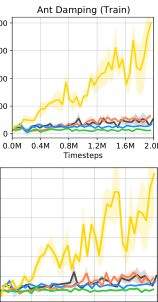

Hopper Size (Train) HalfCheetah Armature (Train) HalfCheetah Mass (Train) Ant Damping (Train) Ant Cripple (Train)

2500

2000

1500

1000

500

−500

1500

1000

500

0

−500

0.00 0.40 0.80 1.20 1.60 2.00

400

300

200

100

0

0.00 0.40 0.80 1.20 1.60 2.00

2250

2000

1750

1500

1250

1000

0.0M 0.4M 0.8M 1.2M 1.6M 2.0M

2000

1500

1000

0.00 0.40 0.80 1.20 1.60 2.00

2500

2000

1500

1000

500

0

−500

0.0M 0.4M 0.8M 1.2M 1.6M 2.0M

2000

1500

1000

500

0

−500

0.00 0.40 0.80 1.20 1.60 2.00

600

500

400

300

200

100

0

0.00 0.40 0.80 1.20 1.60 2.00

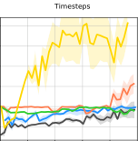

Figure 6: Learning curves of episode rewards on both training and test tasks, averaged over 3 runs. Shadow areas indicate
standard error. This adds the performance on training tasks in comparison to Fig. 3 in the main text and changes the learning
curves on test tasks in Ant Cripple setting to 2M timesteps

6https://github.com/junhyukoh/self-imitation-learning

Furthermore, we present additional experimental results on MetaWorld environment. In Section 5.1, we introduced the tasks
of moving objects to target locations and the reward is positive only when the object is close to the goal. We combine contextbased TD3 with policy transfer to learn a policy operating multiple objects: drawer, coffee mug, soccer, cube, plate. Then we
test whether the policy could generalize to moving a large cylinder. In Tab. 10, MCAT agent earns higher success rate than the
baselines on both training and test tasks after 2M timesteps in the sparse-reward tasks.

MQL PEARL PCGrad
MCAT
(Fakoor et al. 2019) (Rakelly et al. 2019) (Yu et al. 2020a)

Training tasks (reward) 164.8( _±_ 23 _._ 6) 161.2( _±_ 25 _._ 3) 44.8( _±_ 31 _._ 7) **204.1** ( _±_ 43 _._ 1)
Test tasks (reward) 0.0( _±_ 0 _._ 0) 0.0( _±_ 0 _._ 0) 0.0( _±_ 0 _._ 0) **10.2** ( _±_ 8 _._ 3)
Training tasks (success rate) 40.0%( _±_ 0 _._ 0%) 33.3%( _±_ 5 _._ 4%) 10.0%( _±_ 7 _._ 1%) **53.3%** ( _±_ 5 _._ 4%)
Test tasks (success rate) 0.0%( _±_ 0 _._ 0%) 0.0%( _±_ 0 _._ 0%) 0.0%( _±_ 0 _._ 0%) **16.7%** ( _±_ 13 _._ 6%)

Table 10: Performance of learned policies at 2M timesteps, averaged over 3 runs.

**D** **Ablative Study**

**D.1** **Effect of Policy Transfer**

In Section 5.3, we investigate the effect of policy transfer (PT). In Figure 7 we provide the learning curves of MCAT and MCAT
w/o PT on both training tasks and test tasks.

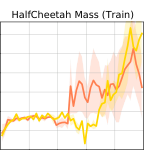

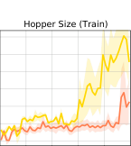

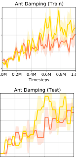

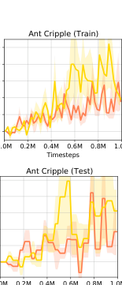

Hopper Size (Train) HalfCheetah Armature (Train) HalfCheetah Mass (Train) Ant Damping (Train) Ant Cripple (Train)

2200

2000

1800

1600

1400

1200

1000

0.0M 0.2M 0.4M 0.6M 0.8M 1.0M

Timesteps

2000

1500

1000

500

0.0M 0.2M 0.4M 0.6M 0.8M 1.0M

Timesteps

300

200

100

0

250

200

150

100

50

0

0.0M 0.2M 0.4M 0.6M 0.8M 1.0M

Timesteps

2000

1500

1000

500

0

−500

0.0M 0.2M 0.4M 0.6M 0.8M 1.0M

Timesteps

2000

1500

1000

500

0

−500

0.0M 0.2M 0.4M 0.6M 0.8M 1.0M

Timesteps

750

500

250

0

−250

−500

0.0M 0.2M 0.4M 0.6M 0.8M 1.0M

Timesteps

0

−200

−400

−600

0.0M 0.2M 0.4M 0.6M 0.8M 1.0M

Timesteps

250

200

150

100

50

0

250

200

150

100

50

0

Timesteps

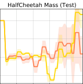

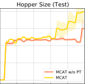

Figure 7: Learning curves of the average episode reward, averaged over 3 runs. The average episode reward and standard error
are reported on training tasks and test tasks respectively. This repeats Figure 7 with addition of learning curves on training tasks.

**D.2** **More Sparse Rewards**

In Section 5.3, we report the effect of policy transfer when the rewards become more sparse in the environments. On HalfCheetah, we delay the environment rewards for different number of steps 200, 350, 500. In Figure 8, we show the learning curves on
training and test tasks. In Table 4, we report the average episode rewards and standard error over 3 runs at 1M timesteps.

Armature Delay 200 (Train)

3000

2000

1000

0

0.0M 0.2M 0.4M 0.6M 0.8M 1.0M

Timesteps

Armature Delay 200 (Test)

2500

2000

1500

1000

500

0.0M 0.2M 0.4M 0.6M 0.8M 1.0M

Timesteps

Armature Delay 350 (Train)

2000

1000

0

0.0M 0.2M 0.4M 0.6M 0.8M 1.0M

Timesteps

Armature Delay 350 (Test)

2000

1500

1000

500

0

−500

0.0M 0.2M 0.4M 0.6M 0.8M 1.0M

Timesteps

750

500

250

0

−250

−500

0.0M 0.2M 0.4M 0.6M 0.8M 1.0M

Timesteps

0

−200

−400

−600

0.0M 0.2M 0.4M 0.6M 0.8M 1.0M

Timesteps

2000

1500

1000

500

0

−500

0.0M 0.2M 0.4M 0.6M 0.8M 1.0M

Timesteps

1500

1000

500

0

−500

0.0M 0.2M 0.4M 0.6M 0.8M 1.0M

Timesteps

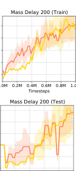

1500

1000

500

0

−500

750

500

250

0

−250

−500

0.0M 0.2M 0.4M 0.6M 0.8M 1.0M

Timesteps

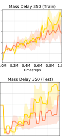

1500

1000

500

0

−500

200

0

−200

−400

0.0M 0.2M 0.4M 0.6M 0.8M 1.0M

Timesteps

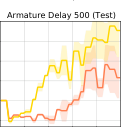

Figure 8: Learning curves of the average episode reward, averaged over 3 runs. The average episode reward and standard error
are reported on training tasks and test tasks respectively.

**D.3** **More Diverse Tasks**

We include more settings of training and test tasks where the discrepancy among training tasks varies. On HalfCheetah, the
environment rewards are delayed for 500 steps. In Table 11, we list the details of the settings.

Physics Parameter Setting Train Test

Set 1 _{_ 0.2, 0.25, 0.3, 0.35, 0.4 _}_ _{_ 0.05, 0.1, 0.5, 0.55 _}_
Armature Set 2 _{_ 0.2, 0.3, 0.4, 0.5, 0.6 _}_ _{_ 0.2, 0.3, 0.7, 0.75 _}_
Set 3 _{_ 0.2, 0.35, 0.5, 0.65, 0.8 _}_ _{_ 0.2, 0.3, 0.9, 0.95 _}_

Set 1 _{_ 0.5, 0.75, 1.0, 1.25, 1.5 _}_ _{_ 0.2, 0.3, 1.7, 1.8 _}_
Mass Set 2 _{_ 0.5, 1.0, 1.5, 2.0, 2.5 _}_ _{_ 0.2, 0.3, 2.7, 2.8 _}_
Set 3 _{_ 0.5, 1.25, 2.0, 2.75, 3.5 _}_ _{_ 0.2, 0.3, 3.7, 3.8 _}_

Table 11: Modified physics parameters used in the experiments.

We consider baseline MQL because it performs reasonably well on HalfCheetah among all the baselines (Figure 3). Table 12
demonstrates that policy transfer (PT) is generally and consistently effective. In Figure 9, we show the learning curves on
training and test tasks. In Table 12, we report the average episode rewards and standard error over 3 runs at 1M timesteps.

Armature Armature Armature
Setting Set 1 Set 2 Set 3

Mass Mass Mass

Set 1 Set 2 Set 3

Task Train Test Train Test Train Test Train Test Train Test Train Test

-129.3 -248.0 -277.2 -335.0 -85.0 -214.7 -100.8 -291.3 -403.7 -467.8 -175.3 -287.9
MQL ( _±_ 46.7) ( _±_ 32.0) ( _±_ 25.2) ( _±_ 20.8) ( _±_ 33.5) ( _±_ 28.9) ( _±_ 37.8) ( _±_ 25.8) ( _±_ 16.1) ( _±_ 6.5) ( _±_ 6.2) ( _±_ 11.7)

837.6 785.3 924.0 579.1 452.8 616.5 -60.5 62.5 -412.4
MCAT w/o PT
( _±_ 646.5) ( _±_ 733.1) ( _±_ 690.1) ( _±_ 527.1) ( _±_ 386.6) ( _±_ 305.0) ( _±_ 313.4) ( [-258.2] _±_ 151.1) ( _±_ 411.0) ( [-364.3] _±_ 198.5) [-328.1] ( _±_ 55.8) ( _±_ 7.7)

3372.1 918.3 482.4 763.4 67.1 705.7 -86.2
MCAT
( _±_ 186.4) [2821.9] ( _±_ 137.7) [2207.3] ( _±_ 697.7) [1776.8] ( _±_ 680.8) [1622.2] ( _±_ 402.2) ( _±_ 142.5) [1222.2] ( _±_ 754.9) ( _±_ 624.2) ( _±_ 377.7) ( _±_ 152.9) ( _±_ 503.4) ( _±_ 111.8)
Improvement(%) 302.6 259.3 133.9 206.8 258.3 49.0 2120.2 286.8 1121.4 118.4 315.1 79.1

Table 12: The performance of learned policy on various task settings. We modify _armature_ and _mass_ to get 5 training tasks and
4 test tasks in each setting. We compute the improvement of MCAT over MCAT w/o PT.

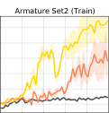

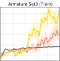

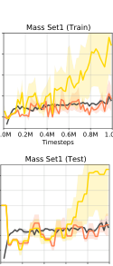

Armature Set1 (Train) Armature Set2 (Train) Armature Set3 (Train) Mass Set1 (Train) Mass Set2 (Train) Mass Set3 (Train)

750

500

250

0

−250

−500

0.0M 0.2M 0.4M 0.6M 0.8M 1.0M

Timesteps

0

−200

−400

−600

0.0M 0.2M 0.4M 0.6M 0.8M 1.0M

Timesteps

750

500

250

0

−250

−500

−750

0.0M 0.2M 0.4M 0.6M 0.8M 1.0M

Timesteps

Mass Set3 (Test)

0

−100

−200

−300

−400

−500

−600

0.0M 0.2M 0.4M 0.6M 0.8M 1.0M

Timesteps

1500

1000

500

0

−500

400

200

0

−200

−400

−600

0.0M 0.2M 0.4M 0.6M 0.8M 1.0M

Timesteps

1500

1000

500

0

−500

0.0M 0.2M 0.4M 0.6M 0.8M 1.0M

Timesteps

1000

500

0

−500

0.0M 0.2M 0.4M 0.6M 0.8M 1.0M

Timesteps

3000

2000

1000

0

0.0M 0.2M 0.4M 0.6M 0.8M 1.0M

Timesteps

Armature Set1 (Test)

2000

1000

0.0M 0.2M 0.4M 0.6M 0.8M 1.0M

Timesteps

2000

1500

1000

500

0

−500

0.0M 0.2M 0.4M 0.6M 0.8M 1.0M

Timesteps

1500

1000

500

0

−500

0.0M 0.2M 0.4M 0.6M 0.8M 1.0M

Timesteps

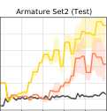

Figure 9: Learning curves of the average episode reward, averaged over 3 runs. The average episode reward and standard error
are reported on training tasks and test tasks respectively.

**D.4** **Effect of Self-Imitation Learning**

We run experiments combining baseline methods with self-imitation learning (SIL) (Oh et al. 2018). SIL brings improvement to
baselines but still ours shows significant advantages. In Tab. 13, MCAT w/o SIL compares favorably with the baseline methods.
MCAT further improves the performance of MCAT w/o SIL, and MCAT outperform the variants of baseline methods with SIL.

Hopper HalfCheetah HalfCheetah Ant Ant
Setting Size Armature Mass Damping Cripple

Task Train Test Train Test Train Test Train Test Train Test

MQL
(Fakoor et al. 2019)

MQL 1586.1 1607.5 -31.4 -77.9 -243.1 -413.9 93.8 103.1 17.4 38.2
(Fakoor et al. 2019) ( _±_ 321.4) ( _±_ 327.5) ( _±_ 243.5) ( _±_ 214.3) ( _±_ 69.8) ( _±_ 11.1) ( _±_ 24.5) ( _±_ 35.7) ( _±_ 4.3) ( _±_ 4.0)

Distral 1364.0 1319.8 774.7 566.9 -54.3 -29.5 123.0 90.5 -2.5 -0.1
(Teh et al. 2017) ( _±_ 216.3) ( _±_ 162.2) ( _±_ 405.9) ( _±_ 246.7) ( _±_ 14.8) ( _±_ 3.0) ( _±_ 20.0) ( _±_ 28.4) ( _±_ 1.7) ( _±_ 0.7)

1364.0 1319.8 774.7 566.9 -54.3 -29.5 123.0 90.5 -2.5 -0.1

(Teh et al. 2017) ( _±_ 216.3) ( _±_ 162.2) ( _±_ 405.9) ( _±_ 246.7) ( _±_ 14.8) ( _±_ 3.0) ( _±_ 20.0) ( _±_ 28.4) ( _±_ 1.7) ( _±_ 0.7)

HiP-BMDP 1590.3 1368.3 -212.4 -102.4 -81.3 -101.8 15.0 33.1 12.7 7.3
(Zhang et al. 2020b) ( _±_ 238.7) ( _±_ 150.7) ( _±_ 52.2) ( _±_ 24.9) ( _±_ 8.31) ( _±_ 29.6) ( _±_ 5.7) ( _±_ 6.0) ( _±_ 5.3) ( _±_ 2.6)

1590.3 1368.3 -212.4 -102.4 -81.3 -101.8 15.0 33.1 12.7 7.3
( _±_ 238.7) ( _±_ 150.7) ( _±_ 52.2) ( _±_ 24.9) ( _±_ 8.31) ( _±_ 29.6) ( _±_ 5.7) ( _±_ 6.0) ( _±_ 5.3) ( _±_ 2.6)

1261.6 1165.1 1548.8 883.8 610.6 119.0 123.3 123.8 97.3 163.1
MCAT w/o SIL
( _±_ 55.2) ( _±_ 8.6) ( _±_ 418.4) ( _±_ 267.2) ( _±_ 482.3) ( _±_ 210.0) ( _±_ 25.8) ( _±_ 26.9) ( _±_ 3.6) ( _±_ 26.1)

1395.5 1398.9 1399.7 743.5 617.8 -63.3 153.0 144.3 13.9 10.2
MQL+SIL ( _±_ 60.8) ( _±_ 85.9) ( _±_ 350.2) ( _±_ 246.1) ( _±_ 133.1) ( _±_ 158.3) ( _±_ 28.3) ( _±_ 28.1) ( _±_ 19.8) ( _±_ 2.3)

1090.2 1090.9 1014.1 970.3 809.7 746.7 174.3 122.2 107.7 9.1
Distral+SIL
( _±_ 18.7) ( _±_ 7.8) ( _±_ 121.4) ( _±_ 164.2) ( _±_ 294.2) ( _±_ 120.5) ( _±_ 66.1) ( _±_ 44.5) ( _±_ 57.7) ( _±_ 5.0)

1573.3 1589.5 954.8 713.3 953.5 506.6 653.9 523.6 **170.9** 215.4
HiP-BMDP+SIL
( _±_ 32.4) ( _±_ 110.3) ( _±_ 192.3) ( _±_ 85.4) ( _±_ 61.2) ( _±_ 99.0) ( _±_ 262.6) ( _±_ 300.8) ( _±_ 68.7) ( _±_ 130.3)

**2278.8** **1914.8** **2267.2** **2071.5** **2226.3** **1771.1** **1322.7** **1014.0** 110.4 **281.6**
MCAT (Ours) ( _±_ 426.2) ( _±_ 373.2) ( _±_ 579.2) ( _±_ 447.4) ( _±_ 762.6) ( _±_ 617.7) ( _±_ 57.4) ( _±_ 69.9) ( _±_ 30.5) ( _±_ 65.6)

Table 13: Mean ( _±_ standard error) of episode rewards on the training and test tasks, at 2M timesteps.

On one task, SIL boosts the performance by exploiting the successful past experiences. But on multiple tasks, enhancing
performance on one task with luckily collected good experiences may not benefit the exploration on other tasks. If other tasks
have never seen the good performance before, SIL might even prevent the exploration on these tasks because the shared policy
is trained to overfit highly-rewarding transitions on the one task with good past trajectories. We observe that after combining
with SIL, the baselines show even more severe performance imbalance among multiple training tasks. Therefore, we believe
the idea of policy transfer is complementary to SIL, in that it makes each task benefit from good policies on any other tasks.

**D.5** **Effect of Contrastive Loss**

To show the contrastive loss indeed helps policy transfer, we compare our method with and without the contrastive loss _Lcont_
( Equation 2). In Fig. 10, one can observe that _Lcont_ helps cluster the embeddings of samples from the same task and separate
the embeddings from different tasks. We note that the tasks _T_ [(1)] _, T_ [(2)] _, T_ [(3)] _, T_ [(4)] _, T_ [(5)] have different values of the physics

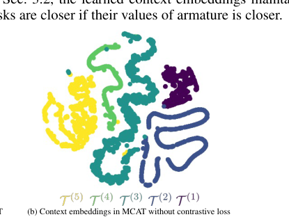

parameter armature 0 _._ 2 _,_ 0 _._ 3 _,_ 0 _._ 4 _,_ 0 _._ 5 _,_ 0 _._ 6. As mentioned in Sec. 3.2, the learned context embeddings maintain the similarity

|of two tasks|s are c|Col3|e c|
|---|---|---|---|
|of two tasks|are|are|e|
|of two tasks||||
|of two tasks||(b)|(b)|

Figure 10: t-SNE visualization(Van der Maaten and Hinton 2008) of the context embeddings learned via our method with and
without contrastive loss. Different colors correspond to different training tasks.

MCAT shows superior performance to the variant without the contrastive loss. Here we show the learning curves on training
and test tasks separately(Fig. 11).

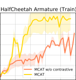

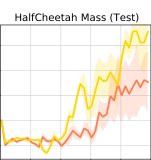

HalfCheetah Armature (Train) HalfCheetah Armature (Test) HalfCheetah Mass (Train) HalfCheetah Mass (Test)

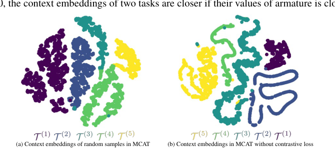

2500

2000

1500

1000

500

0

0.0M 0.4M 0.8M 1.2M 1.6M 2.0M

Timesteps

2000

1500

1000

500

0

−500

0.0M 0.4M 0.8M 1.2M 1.6M 2.0M

Timesteps

1500

1000

500

0

−500

0.0M 0.4M 0.8M 1.2M 1.6M 2.0M

Timesteps

2500

2000

1500

1000

500

0

−500

0.0M 0.4M 0.8M 1.2M 1.6M 2.0M

Timesteps

Figure 11: Learning curves of the average episode reward, averaged over 3 runs. The average episode reward and standard error
are reported on training tasks and test tasks respectively.

**D.6** **Design Choice of Action Translator**

We add this experimental comparison with the action translator by (Zhang et al. 2020c). To learn a shared policy solving multiple
tasks, we combine the context-based TD3 algorithm, self-imitation learning, and policy transfer with their action translator.
Using their action translator underperforms ours. The main reason is that, with changing datasets and policies, their action
translator may be harder to tune because there are more moving components (i.e. another action translator, a discriminator) and
more loss terms to be balanced (i.e. domain cycle-consistency loss, adversarial loss).

Setting HalfCheetah Armature HalfCheetah Mass

Tasks Training Test Training Test

MCAT **2267.2** ( _±_ 579.2) **2071.5** ( _±_ 447.4) **2226.3** ( _±_ 762.6) **1771.1** ( _±_ 617.7)

MCAT with (Zhang et al. 2020c)
action translator 2255.2 ( _±_ 644.4) 1664.8 ( _±_ 660.8) 1185.8 ( _±_ 798.0) 684.7( _±_ 759.0)

Table 14: Mean ( _±_ standard error) of episode rewards on training and test tasks at 2M timesteps.

**E** **Extension of Policy Transfer**

As clarified in Sec. 3.1, in this work, we mainly focus on tasks with the same state space, action space, reward function but
varying dynamics. However, we note that our proposed method of learning action translator may be extended to tackle the
challenge of policy transfer in more general cases, such as (1) Tasks differing in reward function, (2) Tasks differing in state
space and action space. In this section, we establish the theory and method in details to extend our policy transfer approach, as
a supplement to Sec. 6.

**E.1** **Theoretical Analysis**

Intuitively, on two general tasks, we aim to discover correspondent state-action pairs achieving the same reward and transiting
to correspondent next states. With the state and action correspondence, the behavior of good source policy can be “replicated”
in the target task and the high value of the good source policy can be maintained by the transferred policy on the target task.
Inspired by this idea, we extend our theory in Sec. 4 and Appendix A.
We first define a binary relation for states to describe the equivalent states on two MDPs (Definition 2) and define an invertible
function to capture the state equivalence relation (Definition 3). Building upon the notion of state equivalence, we derive the
upper bound of value difference between policies on two MDPs (Theorem 2). Finally, we reach a proposition for the upper
bound of value difference (Proposition 2) to explain that our objective function in learning action translator can be extended to
bound the value difference between the source and transferred policy.

**Definition 2.** _Given two MDPs T_ [(] _[i]_ [)] = _{S_ [(] _[i]_ [)] _, A_ [(] _[i]_ [)] _, p_ [(] _[i]_ [)] _, r_ [(] _[i]_ [)] _, γ, ρ_ [(] 0 _[i]_ [)] _[}][ and][ T]_ [ (] _[j]_ [)][ =] _[ {S]_ [(] _[j]_ [)] _[,][ A]_ [(] _[j]_ [)] _[, p]_ [(] _[j]_ [)] _[, r]_ [(] _[j]_ [)] _[, γ, ρ]_ [(] 0 _[j]_ [)] _[}][, we define a]_
_binary relation B ∈S_ [(] _[i]_ [)] _× S_ [(] _[j]_ [)] _called_ _**state equivalence relation**_ _. Let s_ _[′]_ [(] _[i]_ [)] _denote the next state following state s_ [(] _[i]_ [)] _, and s_ _[′]_ [(] _[j]_ [)]
_denote the next state following state s_ [(] _[j]_ [)] _. For states s_ [(] _[i]_ [)] _∈S_ [(] _[i]_ [)] _, s_ [(] _[j]_ [)] _∈S_ [(] _[j]_ [)] _, we have_ ( _s_ [(] _[i]_ [)] _, s_ [(] _[j]_ [)] ) _∈_ _B (i.e. s_ [(] _[i]_ [)] _Bs_ [(] _[j]_ [)] _) if for any_
_a_ [(] _[i]_ [)] _∈A_ [(] _[i]_ [)] _there exists a_ [(] _[j]_ [)] _∈A_ [(] _[j]_ [)] _satisfying the following conditions:_

_r_ [(] _[i]_ [)] ( _s_ [(] _[i]_ [)] _, a_ [(] _[i]_ [)] ) = _r_ [(] _[j]_ [)] ( _s_ [(] _[j]_ [)] _, a_ [(] _[j]_ [)] )

_∀s_ _[′]_ [(] _[i]_ [)] _∈_ _S_ [(] _[i]_ [)] _, ∃s_ _[′]_ [(] _[j]_ [)] _∈S_ [(] _[j]_ [)] _s.t. p_ [(] _[i]_ [)] ( _s_ _[′]_ [(] _[i]_ [)] _|s_ [(] _[i]_ [)] _, a_ [(] _[i]_ [)] ) = _p_ [(] _[j]_ [)] ( _s_ _[′]_ [(] _[j]_ [)] _|s_ [(] _[i]_ [)] _, a_ [(] _[j]_ [)] ) _and s_ _[′]_ [(] _[i]_ [)] _Bs_ _[′]_ [(] _[j]_ [)]

We call the state _s_ [(] _[i]_ [)] and _s_ [(] _[j]_ [)] are correspondent/equivalent when ( _s_ [(] _[i]_ [)] _, s_ [(] _[j]_ [)] ) _∈_ _B_ . Also, in this case, the action _a_ [(] _[i]_ [)] for state
_s_ [(] _[i]_ [)] on the MDP _T_ [(] _[i]_ [)] is equivalent to the action _a_ [(] _[j]_ [)] for state _s_ [(] _[j]_ [)] on the MDP _T_ [(] _[j]_ [)] .
This definition is related to stochastic bisimulation relation in (Ferns, Panangaden, and Precup 2004; Zhang et al. 2020a,b).
Unlike these prior works about state bisimulation, we allow the equivalent actions _a_ [(] _[j]_ [)] = _̸_ _a_ [(] _[i]_ [)] . So action _a_ on the task _T_ [(] _[i]_ [)]
might not be equivalent to _a_ on the task _T_ [(] _[j]_ [)], and hence we need to involve action translator in learning of both the state
correspondence and action correspondence.
Drawing upon Definition 2, we define a one-to-one mapping to identify the equivalent state across two spaces _S_ [(] _[i]_ [)] and _S_ [(] _[j]_ [)] .

**Definition 3.** _Given two MDPs T_ [(] _[i]_ [)] = _{S_ [(] _[i]_ [)] _, A_ [(] _[i]_ [)] _, p_ [(] _[i]_ [)] _, r_ [(] _[i]_ [)] _, γ, ρ_ [(] 0 _[i]_ [)] _[}][ and][ T]_ [ (] _[j]_ [)][ =] _[ {S]_ [(] _[j]_ [)] _[,][ A]_ [(] _[j]_ [)] _[, p]_ [(] _[j]_ [)] _[, r]_ [(] _[j]_ [)] _[, γ, ρ]_ [(] 0 _[j]_ [)] _[}][ with state]_
_equivalence relation B, we consider subsets SB_ [(] _[i]_ [)] _[⊂S]_ [(] _[i]_ [)] _[ and][ S]_ _B_ [(] _[j]_ [)] _[⊂S]_ [(] _[j]_ [)] _[ satisfying:][ ∀][s]_ [(] _[i]_ [)] _[ ∈S]_ _B_ [(] _[i]_ [)] _[,][ ∃][s]_ [(] _[j]_ [)] _[ ∈S]_ _B_ [(] _[j]_ [)] _[s.t.]_ [ (] _[s]_ [(] _[i]_ [)] _[, s]_ [(] _[j]_ [)][)] _[ ∈]_
_B. We define a invertible function G_ : _SB_ [(] _[i]_ [)] _[→S]_ _B_ [(] _[j]_ [)] _[called]_ _**[ state translator function]**_ _[, satisfying:]_ [ (] _[s]_ [(] _[i]_ [)] _[, G]_ [(] _[s]_ [(] _[i]_ [)][))] _[ ∈]_ _[B][.]_

Based on Defintion 2 and 3, given two correspondent states _s_ [(] _[i]_ [)] _∈_ _SB_ [(] _[i]_ [)] [and] _[ s]_ [(] _[j]_ [)] _[ ∈]_ _[S]_ _B_ [(] _[j]_ [)][, we can derive the upper bound for]
the value difference between _V_ _[π]_ [(] _[i]_ [)] ( _s_ [(] _[i]_ [)] _, T_ [(] _[i]_ [)] ) and _V_ _[π]_ [(] _[j]_ [)] ( _s_ [(] _[j]_ [)] _, T_ [(] _[j]_ [)] ).

**Theorem 2.** _T_ [(] _[i]_ [)] = _{S_ [(] _[i]_ [)] _, A_ [(] _[j]_ [)] _, p_ [(] _[i]_ [)] _, r_ [(] _[i]_ [)] _, γ, ρ_ [(] 0 _[i]_ [)] _[}][ and][ T]_ [ (] _[j]_ [)] = _{S_ [(] _[j]_ [)] _, A_ [(] _[j]_ [)] _, p_ [(] _[j]_ [)] _, r_ [(] _[j]_ [)] _, γ, ρ_ [(] 0 _[j]_ [)] _[}][ are two MDPs sam-]_
_pled from the distribution of tasks p_ ( _T_ ) _. π_ [(] _[i]_ [)] _is a deterministic policy on T_ [(] _[i]_ [)] _and π_ [(] _[j]_ [)] _is a determinis-_
_tic policy on T_ [(] _[j]_ [)] _. We assume there exist state equivalence relation B_ _∈_ _S_ [(] _[i]_ [)] _× S_ [(] _[j]_ [)] _and a state transla-_
_tor function G defining a one-to-one mapping from SB_ [(] _[i]_ [)] _to SB_ [(] _[j]_ [)] _[. Let][ M]_ = sup _s_ ( _i_ ) _∈S_ ( _i_ ) _|V_ _[π]_ [(] _[i]_ [)] ( _s_ [(] _[i]_ [)] _, T_ [(] _[i]_ [)] ) _| and_
_d_ = sup _s_ ( _i_ ) _∈SB_ ( _i_ ) � _|r_ [(] _[i]_ [)] ( _s_ [(] _[i]_ [)] _, π_ [(] _[i]_ [)] ( _s_ )) _−_ _r_ [(] _[j]_ [)] ( _s_ [(] _[j]_ [)] _, π_ [(] _[j]_ [)] ( _s_ )) _|_ + 2 _γMDT V_ ( _p_ [(] _[i]_ [)] ( _·|s_ [(] _[i]_ [)] _, π_ [(] _[i]_ [)] ( _s_ [(] _[i]_ [)] )) _, p_ [(] _[j]_ [)] ( _G_ ( _·_ ) _|s_ [(] _[j]_ [)] _, π_ [(] _[j]_ [)] ( _s_ [(] _[j]_ [)] )))� _._

_Then ∀s_ [(] _[i]_ [)] _∈SB_ [(] _[i]_ [)] _[, s]_ [(] _[j]_ [)][ =] _[ G]_ [(] _[s]_ [(] _[i]_ [)][)] _[, we have]_

_V π_ ( _i_ )( _s_ ( _i_ ) _, T_ ( _i_ )) _−_ _V π_ ( _j_ )( _s_ ( _j_ ) _, T_ ( _j_ )) _≤_ _d_
��� ��� 1 _−_ _γ_

_Proof._ Let _a_ [(] _[i]_ [)] = _π_ [(] _[i]_ [)] ( _s_ [(] _[i]_ [)] ) and _a_ [(] _[j]_ [)] = _π_ [(] _[j]_ [)] ( _s_ [(] _[j]_ [)] ). We rewrite the value difference.

_V_ _[π]_ [(] _[i]_ [)] ( _s_ [(] _[i]_ [)] _, T_ [(] _[i]_ [)] ) _−_ _V_ _[π]_ [(] _[j]_ [)] ( _s_ [(] _[j]_ [)] _, T_ [(] _[j]_ [)] )

� _p_ [(] _[i]_ [)] ( _s_ _[′]_ [(] _[i]_ [)] _|s_ [(] _[i]_ [)] _, a_ [(] _[i]_ [)] ) _V_ _[π]_ [(] _[i]_ [)] ( _s_ _[′]_ [(] _[i]_ [)] _, T_ [(] _[i]_ [)] ) _−_ _r_ [(] _[j]_ [)] ( _s_ [(] _[j]_ [)] _, a_ [(] _[j]_ [)] ) _−_ _γ_ �

_s_ _[′]_ [(] _[i]_ [)] _∈S_ [(] _[i]_ [)] _s_ _[′]_ [(] _[j]_ [)] _∈S_

= _r_ [(] _[i]_ [)] ( _s_ [(] _[i]_ [)] _, a_ [(] _[i]_ [)] ) + _γ_ �

� _p_ [(] _[j]_ [)] ( _s_ _[′]_ [(] _[j]_ [)] _|s_ [(] _[j]_ [)] _, a_ [(] _[j]_ [)] ) _V_ _[π]_ [(] _[j]_ [)] ( _s_ _[′]_ [(] _[j]_ [)] _, T_ [(] _[j]_ [)] )

_s_ _[′]_ [(] _[j]_ [)] _∈S_ [(] _[j]_ [)]

= ( _r_ [(] _[i]_ [)] ( _s_ [(] _[i]_ [)] _, a_ [(] _[i]_ [)] ) _−_ _r_ [(] _[j]_ [)] ( _s_ [(] _[j]_ [)] _, a_ [(] _[j]_ [)] ))

� _p_ [(] _[i]_ [)] ( _s_ _[′]_ [(] _[i]_ [)] _|s_ [(] _[i]_ [)] _, a_ [(] _[i]_ [)] ) _V_ _[π]_ [(] _[i]_ [)] ( _s_ _[′]_ [(] _[i]_ [)] _, T_ [(] _[i]_ [)] ) _−_ �

_s_ _[′]_ [(] _[i]_ [)] _∈S_ [(] _[i]_ [)] _s_ _[′]_ [(] _[j]_ [)] _∈S_

+ _γ_ ( �

� _p_ [(] _[j]_ [)] ( _s_ _[′]_ [(] _[j]_ [)] _|s_ [(] _[j]_ [)] _, a_ [(] _[j]_ [)] ) _V_ _[π]_ [(] _[j]_ [)] ( _s_ _[′]_ [(] _[j]_ [)] _, T_ [(] _[j]_ [)] ))

_s_ _[′]_ [(] _[j]_ [)] _∈S_ [(] _[j]_ [)]

According to Definition 2, since _s_ [(] _[i]_ [)] _∈SB_ [(] _[i]_ [)][, we have] _[ s][′]_ [(] _[i]_ [)] _[ ∈S]_ _B_ [(] _[i]_ [)][. Similarly,] _[ s][′]_ [(] _[j]_ [)] _[ ∈S]_ _B_ [(] _[j]_ [)][.]
Then we derive the second term in the right side of the equation above:

� _p_ [(] _[i]_ [)] ( _s_ _[′]_ [(] _[i]_ [)] _|s_ [(] _[i]_ [)] _, a_ [(] _[i]_ [)] ) _V_ _[π]_ [(] _[i]_ [)] ( _s_ _[′]_ [(] _[i]_ [)] _, T_ [(] _[i]_ [)] ) _−_ �

_s_ _[′]_ [(] _[i]_ [)] _∈S_ [(] _[i]_ [)] _s_ _[′]_ [(] _[j]_ [)] _∈S_

�

� _p_ [(] _[j]_ [)] ( _s_ _[′]_ [(] _[j]_ [)] _|s_ [(] _[j]_ [)] _, a_ [(] _[j]_ [)] ) _V_ _[π]_ [(] _[j]_ [)] ( _s_ _[′]_ [(] _[j]_ [)] _, T_ [(] _[j]_ [)] )

_s_ _[′]_ [(] _[j]_ [)] _∈S_ [(] _[j]_ [)]

*replace _S_ [(] _[i]_ [)] by _SB_ [(] _[i]_ [)] [because] _[ s][′]_ [(] _[i]_ [)] _[ ∈S]_ _B_ [(] _[i]_ [)][, replace] _[ S]_ [(] _[j]_ [)][ by] _[ S]_ _B_ [(] _[j]_ [)] [because] _[ s][′]_ [(] _[j]_ [)] _[ ∈S]_ _B_ [(] _[j]_ [)]
**minus and plus � _p_ [(] _[j]_ [)] ( _G_ ( _s_ _[′]_ [(] _[i]_ [)] ) _|s_ [(] _[j]_ [)] _, a_ [(] _[j]_ [)] )) _V_ _[π]_ [(] _[i]_ [)] ( _s_ _[′]_ [(] _[i]_ [)] _, T_ [(] _[i]_ [)] )

_s_ _[′]_ [(] _[i]_ [)] _∈SB_ [(] _[i]_ [)]

_p_ [(] _[j]_ [)] ( _G_ ( _s_ _[′]_ [(] _[i]_ [)] ) _|s_ [(] _[j]_ [)] _, a_ [(] _[j]_ [)] )) _V_ _[π]_ [(] _[i]_ [)] ( _s_ _[′]_ [(] _[i]_ [)] _, T_ [(] _[i]_ [)] )

=
�

_s_ _[′]_ [(] _[i]_ [)] _∈SB_ [(] _[i]_ [)]

+
�

_s_ _[′]_ [(] _[i]_ [)] _∈SB_ [(] _[i]_ [)]

=
�

_s_ _[′]_ [(] _[i]_ [)] _∈SB_ [(] _[i]_ [)]

+
�

_s_ _[′]_ [(] _[j]_ [)] _∈SB_ [(] _[j]_ [)]

=
�

_s_ _[′]_ [(] _[i]_ [)] _∈SB_ [(] _[i]_ [)]

+
�

_s_ _[′]_ [(] _[j]_ [)] _∈SB_ [(] _[j]_ [)]

_p_ [(] _[i]_ [)] ( _s_ _[′]_ [(] _[i]_ [)] _|s_ [(] _[i]_ [)] _, a_ [(] _[i]_ [)] ) _V_ _[π]_ [(] _[i]_ [)] ( _s_ _[′]_ [(] _[i]_ [)] _, T_ [(] _[i]_ [)] ) _−_ �

_s_ _[′]_ [(] _[i]_ [)] _∈SB_ [(] _[i]_ [)]

_p_ [(] _[j]_ [)] ( _G_ ( _s_ _[′]_ [(] _[i]_ [)] ) _|s_ [(] _[j]_ [)] _, a_ [(] _[j]_ [)] )) _V_ _[π]_ [(] _[i]_ [)] ( _s_ _[′]_ [(] _[i]_ [)] _, T_ [(] _[i]_ [)] ) _−_ �

_s_ _[′]_ [(] _[j]_ [)] _∈SB_ [(] _[j]_ [)]

_p_ [(] _[j]_ [)] ( _s_ _[′]_ [(] _[j]_ [)] _|s_ [(] _[j]_ [)] _, a_ [(] _[j]_ [)] ) _V_ _[π]_ [(] _[j]_ [)] ( _s_ _[′]_ [(] _[j]_ [)] _, T_ [(] _[j]_ [)] )

*combine the first two terms, rewrite the third term because _G_ is invertible function

_p_ [(] _[i]_ [)] ( _s_ _[′]_ [(] _[i]_ [)] _|s_ [(] _[i]_ [)] _, a_ [(] _[i]_ [)] ) _−_ _p_ [(] _[j]_ [)] ( _G_ ( _s_ _[′]_ [(] _[i]_ [)] ) _|s_ [(] _[j]_ [)] _, a_ [(] _[j]_ [)] ) _V_ _[π]_ [(] _[i]_ [)] ( _s_ _[′]_ [(] _[i]_ [)] _, T_ [(] _[i]_ [)] )
� �

_p_ [(] _[j]_ [)] ( _s_ _[′]_ [(] _[j]_ [)] _|s_ [(] _[j]_ [)] _, a_ [(] _[j]_ [)] )) _V_ _[π]_ [(] _[i]_ [)] ( _G_ _[−]_ [1] ( _s_ _[′]_ [(] _[j]_ [)] ) _, T_ [(] _[i]_ [)] ) _−_ �

_s_ _[′]_ [(] _[j]_ [)] _∈SB_ [(] _[j]_ [)]

_p_ [(] _[j]_ [)] ( _s_ _[′]_ [(] _[j]_ [)] _|s_ [(] _[j]_ [)] _, a_ [(] _[j]_ [)] ) _V_ _[π]_ [(] _[j]_ [)] ( _s_ _[′]_ [(] _[j]_ [)] _, T_ [(] _[j]_ [)] )

*combine the last two terms

_p_ [(] _[i]_ [)] ( _s_ _[′]_ [(] _[i]_ [)] _|s_ [(] _[i]_ [)] _, a_ [(] _[i]_ [)] ) _−_ _p_ [(] _[j]_ [)] ( _G_ ( _s_ _[′]_ [(] _[i]_ [)] ) _|s_ [(] _[j]_ [)] _, a_ [(] _[j]_ [)] ) _V_ _[π]_ [(] _[i]_ [)] ( _s_ _[′]_ [(] _[i]_ [)] _, T_ [(] _[i]_ [)] )
� �

_p_ [(] _[j]_ [)] ( _s_ _[′]_ [(] _[j]_ [)] _|s_ [(] _[j]_ [)] _, a_ [(] _[j]_ [)] )) _V_ _[π]_ [(] _[i]_ [)] ( _G_ _[−]_ [1] ( _s_ _[′]_ [(] _[j]_ [)] ) _, T_ [(] _[i]_ [)] ) _−_ _V_ _[π]_ [(] _[j]_ [)] ( _s_ _[′]_ [(] _[j]_ [)] _, T_ [(] _[j]_ [)] )
� �

Therefore, we can bound the absolute value of the value difference according to the two equation arrays above:

_V π_ ( _i_ )( _s_ ( _i_ ) _, T_ ( _i_ )) _−_ _V π_ ( _j_ )( _s_ ( _j_ ) _, T_ ( _j_ )) _≤_ _r_ ( _i_ )( _s_ ( _i_ ) _, a_ ( _i_ )) _−_ _r_ ( _j_ )( _s_ ( _j_ ) _, a_ ( _j_ ))
��� ��� ��� ���

+ _γ_ �

_s_ _[′]_ [(] _[i]_ [)] _∈SB_ [(] _[i]_ [)]

+ _γ_ �

_s_ _[′]_ [(] _[j]_ [)] _∈SB_ [(] _[j]_ [)]

_p_ [(] _[i]_ [)] ( _s_ _[′]_ [(] _[i]_ [)] _|s_ [(] _[i]_ [)] _, a_ [(] _[i]_ [)] ) _−_ _p_ [(] _[j]_ [)] ( _G_ ( _s_ _[′]_ [(] _[i]_ [)] ) _|s_ [(] _[j]_ [)] _, a_ [(] _[j]_ [)] ) _V_ _[π]_ [(] _[i]_ [)] ( _s_ _[′]_ [(] _[i]_ [)] _, T_ [(] _[i]_ [)] )
� �

_p_ [(] _[j]_ [)] ( _s_ _[′]_ [(] _[j]_ [)] _|s_ [(] _[j]_ [)] _, a_ [(] _[j]_ [)] )) _V_ _[π]_ [(] _[i]_ [)] ( _G_ _[−]_ [1] ( _s_ _[′]_ [(] _[j]_ [)] ) _, T_ [(] _[i]_ [)] ) _−_ _V_ _[π]_ [(] _[j]_ [)] ( _s_ _[′]_ [(] _[j]_ [)] _, T_ [(] _[j]_ [)] )
� �

_≤_ _r_ ( _i_ )( _s_ ( _i_ ) _, a_ ( _i_ )) _−_ _r_ ( _j_ )( _s_ ( _j_ ) _, a_ ( _j_ )) + 2 _γMDT V_ ( _p_ ( _i_ )( _·|s_ ( _i_ ) _, a_ ( _i_ )) _, p_ ( _j_ )( _G_ ( _·_ ) _|s_ ( _j_ ) _, a_ ( _j_ )))
��� ���

+ _γ_ sup

_s_ _[′]_ [(] _[j]_ [)] _∈SB_ [(] _[j]_ [)]

_V π_ ( _i_ )( _G−_ 1( _s′_ ( _j_ )) _, T_ ( _i_ )) _−_ _V π_ ( _j_ )( _s′_ ( _j_ ) _, T_ ( _j_ ))
��� ���

_≤_ _d_ + _γ_ sup

_s_ _[′]_ [(] _[i]_ [)] _∈SB_ [(] _[i]_ [)]

_V π_ ( _i_ )( _s′_ ( _i_ ) _, T_ ( _i_ )) _−_ _V π_ ( _j_ )( _G_ ( _s′_ ( _i_ )) _, T_ ( _j_ )) _≤_ _d_
��� ��� 1 _−_ _γ_

Theorem 2 proves the value difference is upper bounded by a scalar _d_, depending on the reward difference
_|r_ [(] _[i]_ [)] ( _s_ [(] _[i]_ [)] _, π_ [(] _[i]_ [)] ( _s_ [(] _[j]_ [)] )) _−_ _r_ [(] _[j]_ [)] ( _s_ [(] _[j]_ [)] _, π_ [(] _[j]_ [)] ( _s_ [(] _[j]_ [)] )) _|_ and _DT V_ ( _p_ [(] _[i]_ [)] ( _·|s_ [(] _[i]_ [)] _, a_ [(] _[i]_ [)] ) _, p_ [(] _[j]_ [)] ( _G_ ( _·_ ) _|s_ [(] _[j]_ [)] _, a_ [(] _[j]_ [)] )), i.e. the total-variation distance
between probability distribution of next state on _T_ [(] _[i]_ [)] and probability distribution of correspondent next state on _T_ [(] _[j]_ [)] . Indeed, if
the state equivalence relation is only true for identical states (i.e. _G_ is an identity mapping, _s_ [(] _[i]_ [)] _Bs_ [(] _[j]_ [)] if and only if _s_ [(] _[i]_ [)] = _s_ [(] _[j]_ [)] ),
then Theorem 2 degenerates into Theorem 1. We note the proof of Theorem 2 is similar to proof of Theorem 1 in Appendix A.
For a special case, where the reward only depends on the current state and next state, we can formulate a simpler definition
of scalar _d_ . The following Proposition 2 is analogous to Proposition 1 in the assumption about reward function.

**Proposition 2.** _T_ [(] _[i]_ [)] = _{S_ [(] _[i]_ [)] _, A_ ( _i_ ) _, p_ [(] _[i]_ [)] _, r_ [(] _[i]_ [)] _, γ, ρ_ [(] 0 _[i]_ [)] _[}][ and][ T]_ [ (] _[j]_ [)][ =] _[ {S]_ [(] _[j]_ [)] _[,][ A]_ [(] _[j]_ [)] _[, p]_ [(] _[j]_ [)] _[, r]_ [(] _[j]_ [)] _[, γ, ρ]_ [(] 0 _[j]_ [)] _[}][ are two MDPs sampled from]_
_the distribution of tasks p_ ( _T_ ) _. π_ [(] _[i]_ [)] _is a deterministic policy on T_ [(] _[i]_ [)] _and π_ [(] _[j]_ [)] _is a deterministic policy on T_ [(] _[j]_ [)] _. We assume there_
_exist state equivalence relation B ∈S_ [(] _[i]_ [)] _× S_ [(] _[j]_ [)] _and a state translator function G defining a one-to-one mapping from SB_ [(] _[i]_ [)]
_to SB_ [(] _[j]_ [)] _[. Suppose that the reward function][ r]_ [(] _[i]_ [)][(] _[s]_ [(] _[i]_ [)] _[, a]_ [(] _[i]_ [)] _[, s][′]_ [(] _[i]_ [)][) =] _[ r]_ [(] _[i]_ [)][(] _[s]_ [(] _[i]_ [)] _[, s][′]_ [(] _[i]_ [)][)] _[ and][ r]_ [(] _[j]_ [)][(] _[s]_ [(] _[j]_ [)] _[, a]_ [(] _[j]_ [)] _[, s][′]_ [(] _[j]_ [)][) =] _[ r]_ [(] _[j]_ [)][(] _[s]_ [(] _[j]_ [)] _[, s][′]_ [(] _[j]_ [)][)] _[.]_
_If s_ [(] _[j]_ [)] = _G_ ( _s_ [(] _[i]_ [)] ) _and s_ _[′]_ [(] _[j]_ [)] = _G_ ( _s_ _[′]_ [(] _[i]_ [)] ) _, r_ [(] _[i]_ [)] ( _s_ [(] _[i]_ [)] _, s_ _[′]_ [(] _[i]_ [)] ) = _r_ [(] _[j]_ [)] ( _s_ [(] _[j]_ [)] _, s_ _[′]_ [(] _[j]_ [)] ) _. Let M_ = sup _s_ ( _i_ ) _∈S_ ( _i_ ) _|r_ [(] _[i]_ [)] ( _s_ [(] _[i]_ [)] _, s_ _[′]_ [(] _[i]_ [)] ) +
_γV_ _[π]_ [(] _[i]_ [)] ( _s_ _[′]_ [(] _[i]_ [)] _, T_ [(] _[i]_ [)] ) _| and d_ = sup _s_ ( _i_ ) _∈SB_ ( _i_ ) [2] _[MD][T V]_ [ (] _[p]_ [(] _[i]_ [)][(] _[·|][s]_ [(] _[i]_ [)] _[, π]_ [(] _[i]_ [)][(] _[s]_ [(] _[i]_ [)][))] _[, p]_ [(] _[j]_ [)][(] _[G]_ [(] _[·]_ [)] _[|][s]_ [(] _[j]_ [)] _[, π]_ [(] _[j]_ [)][(] _[s]_ [(] _[j]_ [)][)))] _[.]_

_Then ∀s_ [(] _[i]_ [)] _∈SB_ [(] _[i]_ [)] _[, s]_ [(] _[j]_ [)][ =] _[ G]_ [(] _[s]_ [(] _[i]_ [)][)] _[, we have]_

_V π_ ( _i_ )( _s_ ( _i_ ) _, T_ ( _i_ )) _−_ _V π_ ( _j_ )( _s_ ( _j_ ) _, T_ ( _j_ )) _≤_ _d_
��� ��� 1 _−_ _γ_

_Proof._ Let _a_ [(] _[i]_ [)] = _π_ [(] _[i]_ [)] ( _s_ [(] _[i]_ [)] ) and _a_ [(] _[j]_ [)] = _π_ [(] _[j]_ [)] ( _s_ [(] _[j]_ [)] ). _s_ _[′]_ [(] _[i]_ [)] denotes the next state following state _s_ [(] _[i]_ [)] .
Because the reward solely depends on the current and next state, we rewrite the value function:

_V_ _[π]_ [(] _[i]_ [)] ( _s_ [(] _[i]_ [)] _, T_ [(] _[i]_ [)] ) = _r_ [(] _[i]_ [)] ( _s_ [(] _[i]_ [)] _, a_ [(] _[i]_ [)] ) + _γ_ � _p_ [(] _[i]_ [)] ( _s_ _[′]_ [(] _[i]_ [)] _|s_ [(] _[i]_ [)] _, a_ [(] _[i]_ [)] ) _V_ _[π]_ [(] _[i]_ [)] ( _s_ _[′]_ [(] _[i]_ [)] _, T_ [(] _[i]_ [)] )

_s_ _[′]_ [(] _[i]_ [)] _∈S_ [(] _[i]_ [)]

=
�

� _p_ [(] _[i]_ [)] ( _s_ _[′]_ [(] _[i]_ [)] _|s_ [(] _[i]_ [)] _, a_ [(] _[i]_ [)] ) _r_ [(] _[i]_ [)] ( _s_ [(] _[i]_ [)] _, s_ _[′]_ [(] _[i]_ [)] ) + _γ_ �

_s_ _[′]_ [(] _[i]_ [)] _∈S_ [(] _[i]_ [)] _s_ _[′]_ [(] _[i]_ [)] _∈S_

� _p_ [(] _[i]_ [)] ( _s_ _[′]_ [(] _[i]_ [)] _|s_ [(] _[i]_ [)] _, a_ [(] _[i]_ [)] ) _V_ _[π]_ [(] _[i]_ [)] ( _s_ _[′]_ [(] _[i]_ [)] _, T_ [(] _[i]_ [)] )

_s_ _[′]_ [(] _[i]_ [)] _∈S_ [(] _[i]_ [)]

= � _p_ [(] _[i]_ [)] ( _s_ _[′]_ [(] _[i]_ [)] _|s_ [(] _[i]_ [)] _, a_ [(] _[i]_ [)] ) � _r_ [(] _[i]_ [)] ( _s_ [(] _[i]_ [)] _, s_ _[′]_ [(] _[i]_ [)] ) + _γV_ _[π]_ [(] _[i]_ [)] ( _s_ _[′]_ [(] _[i]_ [)] _, T_ [(] _[i]_ [)] )�

_s_ _[′]_ [(] _[i]_ [)] _∈S_ [(] _[i]_ [)]

Then we derive the value difference:

_V_ _[π]_ [(] _[i]_ [)] ( _s_ [(] _[i]_ [)] _, T_ [(] _[i]_ [)] ) _−_ _V_ _[π]_ [(] _[j]_ [)] ( _s_ [(] _[i]_ [)] _, T_ [(] _[j]_ [)] )

� _p_ [(] _[i]_ [)] ( _s_ _[′]_ [(] _[i]_ [)] _|s_ [(] _[i]_ [)] _, a_ [(] _[i]_ [)] ) � _r_ [(] _[i]_ [)] ( _s_ [(] _[i]_ [)] _, s_ _[′]_ [(] _[i]_ [)] ) + _γV_ _[π]_ [(] _[i]_ [)] ( _s_ _[′]_ [(] _[i]_ [)] _, T_ [(] _[i]_ [)] )� _−_ �

_s_ _[′]_ [(] _[i]_ [)] _s_ _[′]_ [(] _[j]_ [)]

=
�

� _p_ [(] _[j]_ [)] ( _s_ _[′]_ [(] _[j]_ [)] _|s_ [(] _[j]_ [)] _, a_ [(] _[j]_ [)] ) � _r_ [(] _[j]_ [)] ( _s_ [(] _[j]_ [)] _, s_ _[′]_ [(] _[j]_ [)] ) + _γV_ _[π]_ [(] _[j]_ [)] ( _s_ _[′]_ [(] _[j]_ [)] _, T_ [(] _[j]_ [)] )�

_s_ _[′]_ [(] _[j]_ [)]

*minus and plus � _p_ [(] _[j]_ [)] ( _G_ ( _s_ _[′]_ [(] _[i]_ [)] ) _|s_ [(] _[j]_ [)] _, a_ [(] _[j]_ [)] ) � _r_ [(] _[i]_ [)] ( _s_ [(] _[i]_ [)] _, s_ _[′]_ [(] _[i]_ [)] ) + _γV_ _[π]_ [(] _[i]_ [)] ( _s_ _[′]_ [(] _[i]_ [)] _, T_ [(] _[i]_ [)] )�

_s_ _[′]_ [(] _[i]_ [)]

� _p_ [(] _[i]_ [)] ( _s_ _[′]_ [(] _[i]_ [)] _|s_ [(] _[i]_ [)] _, a_ [(] _[i]_ [)] ) � _r_ [(] _[i]_ [)] ( _s_ [(] _[i]_ [)] _, s_ _[′]_ [(] _[i]_ [)] ) + _γV_ _[π]_ [(] _[i]_ [)] ( _s_ _[′]_ [(] _[i]_ [)] _, T_ [(] _[i]_ [)] )� _−_ �

_s_ _[′]_ [(] _[i]_ [)] _s_ _[′]_ [(] _[i]_ [)]

=
�

� _p_ [(] _[j]_ [)] ( _G_ ( _s_ _[′]_ [(] _[i]_ [)] ) _|s_ [(] _[j]_ [)] _, a_ [(] _[j]_ [)] ) � _r_ [(] _[i]_ [)] ( _s_ [(] _[i]_ [)] _, s_ _[′]_ [(] _[i]_ [)] ) + _γV_ _[π]_ [(] _[i]_ [)] ( _s_ _[′]_ [(] _[i]_ [)] _, T_ [(] _[i]_ [)] )�

_s_ _[′]_ [(] _[i]_ [)]

� _p_ [(] _[j]_ [)] ( _G_ ( _s_ _[′]_ [(] _[i]_ [)] ) _|s_ [(] _[j]_ [)] _, a_ [(] _[j]_ [)] ) � _r_ [(] _[i]_ [)] ( _s_ [(] _[i]_ [)] _, s_ _[′]_ [(] _[i]_ [)] ) + _γV_ _[π]_ [(] _[i]_ [)] ( _s_ _[′]_ [(] _[i]_ [)] _, T_ [(] _[i]_ [)] )� _−_ �

_s_ _[′]_ [(] _[i]_ [)] _s_ _[′]_ [(] _[j]_ [)]

+
�

� _p_ [(] _[j]_ [)] ( _s_ _[′]_ [(] _[j]_ [)] _|s_ [(] _[j]_ [)] _, a_ [(] _[j]_ [)] ) � _r_ [(] _[j]_ [)] ( _s_ [(] _[j]_ [)] _, s_ _[′]_ [(] _[j]_ [)] ) + _γV_ _[π]_ [(] _[j]_ [)] ( _s_ _[′]_ [(] _[j]_ [)] _, T_ [(] _[j]_ [)] )�

_s_ _[′]_ [(] _[j]_ [)]

=
�

_s_ _[′]_ [(] _[i]_ [)]

*combine first two terms, rewrite the third term given invertible function _G_

_p_ [(] _[i]_ [)] ( _s_ _[′]_ [(] _[i]_ [)] _|s_ [(] _[i]_ [)] _, a_ [(] _[i]_ [)] ) _−_ _p_ [(] _[j]_ [)] ( _G_ ( _s_ _[′]_ [(] _[i]_ [)] ) _|s_ [(] _[j]_ [)] _, a_ [(] _[j]_ [)] ) _r_ [(] _[i]_ [)] ( _s_ [(] _[i]_ [)] _, s_ _[′]_ [(] _[i]_ [)] ) + _γV_ _[π]_ [(] _[i]_ [)] ( _s_ _[′]_ [(] _[i]_ [)] _, T_ [(] _[i]_ [)] )
� �� �

+ � _p_ [(] _[j]_ [)] ( _s_ _[′]_ [(] _[j]_ [)] _|s_ [(] _[j]_ [)] _, a_ [(] _[j]_ [)] ) � _r_ [(] _[i]_ [)] ( _G_ _[−]_ [1] ( _s_ [(] _[j]_ [)] ) _, G_ _[−]_ [1] ( _s_ _[′]_ [(] _[j]_ [)] )) + _γV_ _[π]_ [(] _[i]_ [)] ( _G_ _[−]_ [1] ( _s_ _[′]_ [(] _[j]_ [)] ) _, T_ [(] _[i]_ [)] )�

_s_ _[′]_ [(] _[j]_ [)]

_−_ � _p_ [(] _[j]_ [)] ( _s_ _[′]_ [(] _[j]_ [)] _|s_ [(] _[j]_ [)] _, a_ [(] _[j]_ [)] ) � _r_ [(] _[j]_ [)] ( _s_ [(] _[j]_ [)] _, s_ _[′]_ [(] _[j]_ [)] ) + _γV_ _[π]_ [(] _[j]_ [)] ( _s_ _[′]_ [(] _[j]_ [)] _, T_ [(] _[j]_ [)] )�

_s_ _[′]_ [(] _[j]_ [)]

*combine last two terms, note the assumption of reward function

=
�

_s_ _[′]_ [(] _[i]_ [)]

_p_ [(] _[i]_ [)] ( _s_ _[′]_ [(] _[i]_ [)] _|s_ [(] _[i]_ [)] _, a_ [(] _[i]_ [)] ) _−_ _p_ [(] _[j]_ [)] ( _G_ ( _s_ _[′]_ [(] _[i]_ [)] ) _|s_ [(] _[j]_ [)] _, a_ [(] _[j]_ [)] ) _r_ [(] _[i]_ [)] ( _s_ [(] _[i]_ [)] _, s_ _[′]_ [(] _[i]_ [)] ) + _γV_ _[π]_ [(] _[i]_ [)] ( _s_ _[′]_ [(] _[i]_ [)] _, T_ [(] _[i]_ [)] )
� �� �

+ _γ_ � _p_ [(] _[j]_ [)] ( _s_ _[′]_ [(] _[j]_ [)] _|s_ [(] _[j]_ [)] _, a_ [(] _[j]_ [)] ) � _V_ _[π]_ [(] _[i]_ [)] ( _G_ _[−]_ [1] ( _s_ _[′]_ [(] _[j]_ [)] ) _, T_ [(] _[i]_ [)] ) _−_ _V_ _[π]_ [(] _[j]_ [)] ( _s_ _[′]_ [(] _[j]_ [)] _, T_ [(] _[j]_ [)] )�

_s_ _[′]_ [(] _[j]_ [)]

Therefore, the absolute value of value difference can be upper bounded. The proof is similar to the proof of Theorem 2.

_V π_ ( _i_ )( _s_ ( _i_ ) _, T_ ( _i_ )) _−_ _V π_ ( _j_ )( _s_ ( _j_ ) _, T_ ( _j_ )) _≤_ 2 _MDT V_ ( _p_ [(] _[i]_ [)] ( _·|s_ [(] _[i]_ [)] _, a_ [(] _[i]_ [)] ) _, p_ [(] _[j]_ [)] ( _G_ ( _·_ ) _|s_ [(] _[j]_ [)] _, a_ [(] _[j]_ [)] ))
��� ���

+ _γ_ sup

_s_ _[′]_ [(] _[j]_ [)] _∈SB_ [(] _[j]_ [)]

_V π_ ( _i_ )( _G−_ 1( _s′_ ( _j_ )) _, T_ ( _i_ )) _−_ _V π_ ( _j_ )( _s′_ ( _j_ ) _, T_ ( _j_ ))
��� ���

_≤_ _d_ + _γ_ sup

_s_ _[′]_ [(] _[i]_ [)] _∈SB_ [(] _[i]_ [)]

_d_
_≤_
1 _−_ _γ_

_V π_ ( _i_ )( _s′_ ( _i_ ) _, T_ ( _i_ )) _−_ _V π_ ( _j_ )( _G_ ( _s′_ ( _i_ )) _, T_ ( _j_ ))
��� ���

Obviously, if the state equivalence relation is only true for identical states (i.e. _G_ is an identity mapping, _s_ [(] _[i]_ [)] _Bs_ [(] _[j]_ [)] if and
only if _s_ [(] _[i]_ [)] = _s_ [(] _[j]_ [)] ), then Proposition 2 degenerates into Proposition 1. If we optimize the action translator _H_ to minimize _d_ for
policy _π_ [(] _[j]_ [)] and _π_ [(] _[i]_ [)] ( _s_ [(] _[i]_ [)] ) = _H_ ( _s_ [(] _[j]_ [)] _, π_ [(] _[j]_ [)] ( _s_ [(] _[j]_ [)] )), the policy value for correspondent states _s_ [(] _[i]_ [)] and _s_ [(] _[j]_ [)] can be close. Minimizing
_d_ means finding actions leading to next states remaining correspondent.

**E.2** **Method**
According to Proposition 2, we not only learn an action translator _H_, but also state translators _G_ mapping target states _s_ [(] _[i]_ [)] to
the equivalent states on source task _T_ [(] _[j]_ [)] and _G_ _[−]_ [1] identifying correspondent state on target task _T_ [(] _[i]_ [)] . We additionally learn a
discriminator network _D_ to assist learning of state translator.
Given transition data _s_ [(] _[j]_ [)] on source task and _s_ [(] _[i]_ [)] on target task, the adversarial objective is:

min _G_ [max] _D_ _[L][adv]_ [(] _[G, D]_ [) = log] _[ D]_ [(] _[s]_ [(] _[j]_ [)][) + log(1] _[ −]_ _[D]_ [(] _[G]_ [(] _[s]_ [(] _[i]_ [)][)))]

.
_G_ aims to map target state _s_ [(] _[i]_ [)] to the distribution of states on source task, while _D_ tries to distinguish translated state _G_ ( _s_ [(] _[i]_ [)] )
and real states in the source task. To build state equivalence, the translated state should be translated back to the source state.
We further leverage cycle consistency loss to learn the one-to-one mapping on states across tasks:

_Lback_ = _|G_ _[−]_ [1] ( _G_ ( _s_ [(] _[i]_ [)] )) _−_ _s_ [(] _[i]_ [)] _|_ + _|G_ ( _G_ _[−]_ [1] ( _s_ [(] _[j]_ [)] )) _−_ _s_ [(] _[j]_ [)] _|_

Drawn upon Proposition 2, we extend our transfer loss _Ltrans_ to _Ltrans,s,a_ . Formally,

_Ltrans,s,a_ = _−_ log _F_ (˜ _s_ [(] _t_ +1 _[i]_ [)] _[|][s]_ [˜] _t_ [(] _[i]_ [)] _[,]_ [ ˜] _[a]_ [(] _t_ _[i]_ [)][)]

where ˜ _s_ [(] _t_ +1 _[i]_ [)] [=] _[ G][−]_ [1][(] _[s]_ [(] _t_ +1 _[j]_ [)] [)][,][ ˜] _[s]_ _t_ [(] _[i]_ [)] = _G_ _[−]_ [1] ( _s_ [(] _t_ _[j]_ [)][)][, and][ ˜] _[a]_ [(] _[i]_ [)][ =] _[ H]_ [(] _[s]_ [(] _t_ _[j]_ [)] _[, a]_ [(] _t_ _[j]_ [)][)][.] _[ L][trans,s,a]_ [is applied to optimize the state translator]
_G_ _[−]_ [1] and action translator _H_ .
_aL_ ˜ [(] _trans,s,a_ _[i]_ In this way, given the state [)] make transition to next state drives the next state distribution on the target task _s_ [(] _t_ _[j]_ [)] ˜ _s_ on source task, we first get the correspondent state [(] _t_ +1 _[i]_ [)] [on target task still correspondent to next state] _p_ [(] _[i]_ [)] ( _·|s_ ˜ [(] _t_ _[i]_ [)] _[,]_ [ ˜] _[a]_ [(] _[i]_ [)][)][ to be close to the distribution of correspondent] ˜ _s_ _[ s]_ [(] _t_ [(] _t_ _[i]_ [)] +1 _[j]_ [)] on target task. Then the translated action [on source task. The objective function]
next state on the source task _p_ [(] _[j]_ [)] ( _G_ ( _·_ ) _|s_ [(] _t_ _[j]_ [)] _[, a]_ [(] _t_ _[j]_ [)][)][. This is implicitly minimizing] _[ d]_ [ in Proposition 2.]
In practice, we may need the action translator network _H_ or the state translator network _G_ and _G_ _[−]_ [1] reasonably initialized,
in order to prevent the joint training collapsing to a trivial solution. The implementation details of learning the context model,
forward dynamics model and action translator are the same as we explained in Appendix C.2. During training of the state
translator, the weight of _Ladv, Lback, Ltrans_ _s_ ~~_a_~~ is 10, 30, 100 respectively, the same as default hyper-parameters in (Zhang
et al. 2020c). The similar technique of learning state translator and action translator has been mentioned in (Zhang et al. 2020c).
Yet, our theorems shed light on its underlying mechanism and our objective function for learning the action translator is simpler.

**E.3** **Experiments on Tasks Differing in Reward Function**

When the tasks share **the same state space and action space but the reward function varies**, we combine our action translator
with a state translator for policy transfer.
To investigate this scheme for policy transfer, we conduct experiments on MetaWorld task moving the robot arm to a goal
location. We set the source and target task with different goal locations and hence with different reward functions. Tab. 15
lists the goal locations on the source and target tasks. Specifically, on the same state _s_ of the agent’s current location ( _x, y, z_ ),
the reward varies across tasks, because it is inversely proportional to the distance from the current location to goal. The initial
location of robot arm is randomly sampled between [ _−_ 0 _._ 1 _,_ 0 _._ 6 _,_ 0 _._ 02] and [0 _._ 1 _,_ 0 _._ 7 _,_ 0 _._ 02]. The state is current location of the
robot arm. The action is the moving vector of the robot arm.

We compare our method and (Zhang et al. 2020c) learning both state translator and action translator. We initialize the state
translator networks by assigning _G_ ( _s_ = ( _x, y, z_ )) = _G_ _[−]_ [1] ( _s_ = ( _x, y, z_ )) = ( _−x, y, z_ ). As observed in Tab. 15, ours compares
favorably with (Zhang et al. 2020c) and achieves satisfactory cumulative episode reward on the target task. We conclude that,
for source and target tasks with different reward functions depending on the state and next state, learning state translator and
action translator jointly is promising for policy transfer.

Transferred policy
(Ours)
on target task

Source policy
Source Task Target Task on source task

Source policy
on target task

Transferred policy
(Zhang et al. 2020c)
on target task

[ _−_ 0 _._ 1 _,_ 0 _._ 8 _,_ 0 _._ 2] [0 _._ 1 _,_ 0 _._ 8 _,_ 0 _._ 2] 4855.7 947.5 1798.2( _±_ 592.4) **3124.3** ( _±_ 1042.0)

[ _−_ 0 _._ 1 _,_ 0 _._ 8 _,_ 0 _._ 2] [0 _._ 05 _,_ 0 _._ 8 _,_ 0 _._ 2] 4855.7 1470.2 1764.0( _±_ 316.3) **1937.1** ( _±_ 424.5)

[ _−_ 0 _._ 1 _,_ 0 _._ 8 _,_ 0 _._ 2] [0 _._ 1 _,_ 0 _._ 8 _,_ 0 _._ 05] 4855.7 1040.8 **2393.7** ( _±_ 869.8) 2315.7( _±_ 1061.5)

2-leg 3-leg 5121.4 NA 1957.8( _±_ 298.4) **2018.2** ( _±_ 50.8)

Table 15: Mean ( _±_ standard error) of episode rewards over 3 runs, comparing source and transferred policy on target task. This
is expanding Tab. 15 in the main text.

**E.4** **Experiments on Tasks Differing in State and Action Space**

For tasks with **different state space and action space**, we investigate the proposed idea on MuJoco environment HalfCheetah.
The HalfCheetah agent by default has 2 legs in the source task and we modify the agent to have 3 legs in the target task.
Because the agents have different numbers of joints in the source and target task, the dimensions of state space and action space
also differ, as explained in (Zhang et al. 2020c). Again, we compare our method and (Zhang et al. 2020c) learning both state
translator and action translator. We assign a good initialization for the action translator in both methods as (Zhang et al. 2020c)
introduced. We remark that ours with a simpler objective function and fewer components than the baseline method can transfer
the source policy to perform well on the target task.

