## **Model-based Lifelong Reinforcement Learning** **with Bayesian Exploration**

**Haotian Fu, Shangqun Yu, Michael Littman, George Konidaris**
Department of Computer Science, Brown University
```
          {hfu7,syu68,mlittman,gdk}@cs.brown.edu

```

**Abstract**


We propose a model-based lifelong reinforcement-learning approach that estimates
a hierarchical Bayesian posterior distilling the common structure shared across
different tasks. The learned posterior combined with a sample-based Bayesian
exploration procedure increases the sample efficiency of learning across a family
of related tasks. We first derive an analysis of the relationship between the sample
complexity and the initialization quality of the posterior in the finite MDP setting.
We next scale the approach to continuous-state domains by introducing a Variational Bayesian Lifelong Reinforcement Learning algorithm that can be combined
with recent model-based deep RL methods, and that exhibits backward transfer.
Experimental results on several challenging domains show that our algorithms
achieve both better forward and backward transfer performance than state-of-the-art
lifelong RL methods. [1]


**1** **Introduction**


Reinforcement learning (RL) [42; 26] has been successfully applied to solve challenging individual
tasks such as learning robotic control [ 11 ] and playing Go [ 38 ]. However, the typical RL setting
assumes that the agent solves exactly one task, which it has the opportunity to interact with repeatedly.
In many real-world settings, an agent instead experiences a collection of distinct tasks that arrive
sequentially throughout its operational lifetime; learning each new task from scratch is inefficient, but
treating them all as a single task will fail. Therefore, recent research has focused on algorithms that
enable agents to learn across multiple, sequentially posed tasks, leveraging knowledge from previous
tasks to accelerate the learning of new tasks. This problem setting is known as _lifelong reinforcement_
_learning_ [ 7 ; 50 ; 25 ]. The key questions in lifelong RL research are: How can an algorithm exploit
knowledge gained from past tasks to quickly adapt to new tasks (forward transfer), and how can data
from new tasks help the agent perform better on previously learned tasks (backward transfer)?


We propose to address these problems by extracting the common structure existing in previously
encountered tasks so that the agent can quickly learn the dynamics specific to the new tasks. We
consider lifelong RL problems that can be modeled as hidden-parameter MDPs or _HiP-MDPs_ [ 10 ; 27 ],
where variations among the true task dynamics can be described by a set of hidden parameters. Our
algorithm goes further than previous work in both lifelong learning and HiP-MDPs by **1)** Separately
modeling epistemic and aleatory uncertainty over different levels of abstraction across the collection
of tasks: the uncertainty captured by a world-model distribution describing the probability distribution
over tasks, and the uncertainty captured by a task-specific model of the (stochastic) dynamics within a
single task. To enable more accurate sequential knowledge transfer, we separate the learning process
for these two quantities and maintain a hierarchical Bayesian posterior that approximates them. **2)**
Performing Bayesian exploration enabled by the hierarchical posterior: The method lets the agent act
optimistically according to models sampled from the posterior, and thus increases sample efficiency.


1
Code repository available at `[https://github.com/Minusadd/VBLRL](https://github.com/Minusadd/VBLRL)` .


36th Conference on Neural Information Processing Systems (NeurIPS 2022).


Specifically, we propose a model-based lifelong RL approach with Bayesian exploration that estimates
a Bayesian world-model posterior that distills the common structure of previous tasks, and then uses
this between-task posterior as a within-task prior to learn a task-specific model in each subsequent
task. The learned hierarchical posterior model combined with sample-based Bayesian exploration
procedures can increase the sample efficiency of learning. We first derive an explicit performance
bound that shows that the task-specific model requires fewer samples to become accurate as the
world-model posterior approaches the true underlying world-model distribution for the discrete case.
We further develop Variational Bayesian exploration for Lifelong RL (VBLRL), a more scalable
version that uses variational inference to approximate the distribution and leverages Bayesian Neural
Networks (BNNs) [ 17 ; 3 ] to build the hierarchical Bayesian posterior. VBLRL provides a novel
way to separately estimate different kinds of uncertainties in the HiP-MDP setting. Based on the
same framework, we also propose a backward transfer version of VBLRL that is able to provide
improvements for previously encountered tasks. Our experimental results on a set of challenging
domains show that our algorithms achieve better both forward and backward transfer performance
than state-of-the-art lifelong RL algorithms when given only limited interactions with each task.


**2** **Background**


RL is the problem of maximizing the long-term expected reward of an agent interacting with an
environment [ 42 ]. We usually model the environment as a Markov Decision Process or _MDP_ [ 36 ],
described by a five tuple: _⟨S, A, R, T, γ⟩_, where _S_ is a finite set of states; _A_ is a finite set of actions;
_R_ : _S_ _×A �→_ [0 _,_ 1] is a reward function, with a lower and upper bound of 0 and 1 ; _T_ : _S_ _×A �→_ Pr( _S_ )
is a transition function, with _T_ ( _s_ _[′]_ _|s, a_ ) denoting the probability of arriving in state _s_ _[′]_ _∈_ _S_ after
executing action _a ∈_ _A_ in state _s_ ; and _γ ∈_ [0 _,_ 1) is a discount factor, expressing the agent’s preference
for delayed over immediate rewards.


An MDP is a suitable model for the task facing a single agent. In the lifelong RL setting, the
agent instead faces a series of tasks _m_ 1 _, ..., m_ _n_, each of which can be modeled as an MDP:
_⟨S_ [(] _[i]_ [)] _, A_ [(] _[i]_ [)] _, R_ [(] _[i]_ [)] _, T_ [(] _[i]_ [)] _, γ_ [(] _[i]_ [)] _⟩_ . For lifelong RL problems, the performance of a specific algorithm
is usually evaluated based on both forward transfer and backward transfer results [30]:


- _Forward transfer_ : the influence that learning task _t_ has on the performance in future task _k ≻_ _t_ .

- _Backward transfer_ : the influence that learning task _t_ has on the performance in earlier tasks _k ≺_ _t_ .


A key question in the lifelong setting is how the series of task MDPs are related; we model the
collection of tasks as a HiP-MDP, where a family of tasks is generated by varying a latent task
parameter _ω_ drawn for each task according to the world-model distribution _P_ Ω . Each setting of _ω_
specifies a unique MDP, but the agent neither observes _ω_ nor has access to the function that generates
the task family. The dynamics _T_ ( _s_ _[′]_ _|s, a_ ; _ω_ _i_ ) and reward function _R_ ( _r|s, a_ ; _ω_ _i_ ) for task _i_ then depend
on _ω_ _i_ _∈_ Ω, which is fixed for the duration of the task. The tasks are i.i.d. sampled from a fixed
distribution and arrive one at a time.


**3** **Related work**


The first category of lifelong RL algorithms learns a single model that encourages transfer across
tasks by modifying objective functions. EWC [ 28 ] imposes a quadratic penalty that pulls each
weight back towards its old values by an amount proportional to its importance for performance on
previously-learned tasks to avoid forgetting. There are several extensions of this work based on the
core idea of modifying the form of the penalty [ 29 ; 53 ; 33 ]. Another category of lifelong RL methods
uses multiple models with shared parameters and task-specific parameters to avoid or alleviate the
catastrophic problem [ 5 ; 24 ; 31 ]. The drawback of this method is that it is hard to incorporate the
knowledge learned from previous tasks during initial training on a new task [ 31 ]. Nagabandi et al.

[32] introduce a model-based continual learning framework based on MAML, but they focus on
discovering when new tasks were encountered without access to task indicators.


Published HiP-MDP methods use Gaussian Processes [ 10 ] or Bayesian neural networks [ 27 ] to find
a single model that works for all tasks, which may trigger catastrophic forgetting [ 5 ; 24 ]. MetaRL [ 47 ; 12 ] and multi-task RL [ 35 ; 43 ] settings also attempt to accelerate learning by transferring
knowledge from different tasks. Some work employs the MAML framework with Bayesian methods


2


to learn a stochastic distribution over initial parameters [ 51 ; 16 ; 13 ]. Other work uses the collected
trajectories to infer the hidden parameter, which is taken as an additional input when computing the
policy [ 37 ; 56 ; 14 ]. Our method, however, focuses on problems where the tasks arrive sequentially
instead of having a large number of tasks available at the beginning of training. This sequential
setting makes it hard to accurately infer the hidden parameters, but opens the door for algorithms that
support backward transfer.


Some prior work uses Bayesian methods in RL to quantify uncertainty over initial MDP models [ 15 ;
1 ; 18 ]. Several algorithms start from the idea of sampling from a posterior over MDPs for Bayesian
RL, maintaining Bayesian posteriors and sampling one complete MDP [ 41 ; 49 ] or multiple MDPs [ 2 ].
Instead of focusing on single-task RL, our algorithm aims to find a posterior over the common
structure among multiple tasks. Wilson et al. [49] uses a hierarchical Bayesian infinite mixture model
to learn a strong prior that allows the agent to rapidly infer the characteristics of a new environment
based on previous tasks. However, it only infers the category label of a new MDP and only works in
discrete settings.


**4** **Model-based Lifelong Reinforcement Learning**


Our approach is built upon two main intuitions: First, transferring the transition model instead of
policy/value function leads to more efficient usage of the data when “finetuning” on a new task.
As we show empirically in Section 5.1, although some model-free lifelong RL algorithms perform
better than the proposed model-based method in single-task cases, in lifelong RL setting of the
same task type the model-based method is still able to achieve comparable/better performance with
only half the amount of data. Secondly, with a model that is able to capture different levels of the
uncertainty within HiP-MDPs, an agent can employ sample-based Bayesian exploration to further
improve sample-efficiency.


The model underlying our approach is a hierarchical Bayesian posterior over task MDPs controlled by
the hidden parameter _ω_ . Intuitively, we maintain probability distributions that separately capture two
categories of uncertainty within lifelong learning tasks: The _world-model posterior_ _P_ ( _ω_ ) captures
the epistemic uncertainty of the world-model distribution over all future and past tasks _m_ 1 _, · · ·, m_ _n_
controlled by the hidden parameter _ω_ 1 _, · · ·, ω_ _n_ _∼_ _P_ Ω . As the learner is exposed to more and more
tasks, this posterior should converge to the world-model distribution _P_ Ω . The _task-specific posterior_
_P_ ( _ω_ _i_ ) captures the epistemic uncertainty of the current task _m_ _i_ (Throughout the paper we will often
write _i_ for simplicity.). As the learner is exposed to more and more transitions within the task, this
posterior should approach the true distribution corresponding to _ω_ _i_, i.e. peaking at the true _ω_ _i_ for
this specific task _i_, leaving only the aleatoric uncertainty of transitions within the task, which is
independent of other tasks. Each time the agent encounters a new task, we initialize the task-specific
model using the world-model posterior and further train it with data collected only from the new task.
One of our key insights here is that the sample complexity of learning a new task will decrease as
the initial prior of task-specific model approaches the true underlying distribution of the transition
function. Thus, the agent can learn new tasks faster by exploiting knowledge common to previous
tasks, thereby exhibiting positive forward transfer.


Specifically, we model the task-specific posterior via the transition dynamics using
_p_ ( _s_ _[t]_ [+1] _, r_ _[t]_ _|s_ _[t]_ _, a_ _[t]_ ; _ω_ _i_ ) . The task-specific posterior, given a new state–action pair from task _i_, can
be rewritten via Bayes’ rule:


_i_ [)] _[P]_ [(] _[s]_ _[t]_ [+1] _[,][ r]_ _[t]_ _[|][D]_ _i_ _[t]_ _[,][ a]_ _[t]_ [;] _[ ω]_ _[i]_ [)]
_P_ ( _ω_ _i_ _|D_ _i_ _[t]_ _[, a]_ _[t]_ _[, s]_ _[t]_ [+1] _[, r]_ _[t]_ [) =] _[ P]_ [(] _[ω]_ _[i]_ _[|][D]_ _[t]_ _,_ (1)
_P_ ( _s_ _[t]_ [+1] _, r_ _[t]_ _|D_ _i_ _[t]_ _[, a]_ _[t]_ [)]


where _D_ _i_ _[t]_ [=] _[ {][s]_ [1] _[, a]_ [1] _[,][ · · ·][, s]_ _[t]_ _[}]_ [ is the agent’s history of task] _[ i]_ [ until time step] _[ t]_ [. The world-model]
posterior, given the new data from task _i_, can be rewritten as:

_P_ ( _ω|D_ 1: _i_ ) = _[P]_ [(] _[ω][|][D]_ [1:] _[i][−]_ [1] [)] _[P]_ [(] _[D]_ _[i]_ _[|][D]_ [1:] _[i][−]_ [1] [;] _[ ω]_ [)] _,_ (2)

_P_ ( _D_ _i_ _|D_ 1: _i−_ 1 )


where _D_ 1: _i_ denotes the agent’s history with all the experienced tasks 1 _∼_ _i_ until current task _i_ . In
particular, each time when the agent faces a new task _i_ and has not started updating its task specific
posterior yet (that is, _D_ _i_ _[t]_ [=][ ∅] [), we first use the world-model posterior to initialize the task-specific]
prior: _P_ ( _ω_ _i_ _|D_ _i_ _[t]_ [)][ =] _[ P]_ [(] _[ω][|][D]_ [1:] _[i]_ [)] [. The world-model distribution aims to approximate the underlying]


3


_P_ Ω . The task-specific distribution aims to approximate the distribution that peaks at the true _ω_ _i_ for
this specific task _i_ .


In Section 4.1, we derive a sample complexity bound in the finite MDP case which explicitly show
how the distance between the distribution of a task’s true transition model and our task-specific
model’s prior initialized by the parameters of the world-model posterior will affect the learning
efficiency of a new task. Then, in Section 4.2 and 4.3 we extend our high-level idea to a scalable
version that can be combined with recent model-based RL approaches and exhibits positive forward
& backward transfer.


**4.1** **Sample Complexity Analysis**


In this subsection, we consider the finite MDP setting and use a standard Bayesian exploration
algorithm BOSS [ 2 ] as a single-task baseline. Note that BOSS creates optimism in the face of
uncertainty as the agent can choose actions based on the highest performing transition of the _K_
models sampled, which drives exploration. We included explanations of the finite MDP version of
our algorithm BLRL (Bayesian Lifelong RL) based on BOSS in appendix C and simple experiments
on Gridworlds in appendix J.


BLRL uses the world-model posterior _P_ ( _ω|D_ 1: _i−_ 1 ) learned from previous _i −_ 1 tasks to initialize
(copy distribution) the task-specific prior of _P_ ( _ω_ _i_ ) of new task _i_, aiming to decrease the number
of samples needed to learn an accurate task-specific posterior. Our analysis focuses on how the
properties of the Bayesian prior affect the sample complexity of learning each specific task.


Let _π_ ( _ω_ _i_ ) denote the prior distribution on the parameter space Γ . We consider a set of transitionprobability densities _p_ ( _·|ω_ _i_ ) = _p_ ( _s_ _[t]_ [+1] _, r_ _[t]_ _|s_ _[t]_ _, a_ _[t]_ _, ω_ _i_ ) indexed by _ω_ _i_, and the true underlying density _q_ .
We also denote the model family _{p_ ( _·|ω_ _i_ ) : _ω_ _i_ _∈_ Γ _}_ by the same symbol Γ.

**Lemma 4.1.** _The task-specific posterior in Equation 1 can be regarded as the probability density_
_g_ ( _ω_ _i_ ) _with respect to π that attains the infimum of:_


_R_ _n_ ( _g_ ) = E _π_ _g_ ( _ω_ _i_ )


_T_

_q_ ( _s_ _[t]_ [+1] _, r_ _[t]_ _|D_ _i_ _[t]_ _[,][ a]_ _[t]_ [)]

� _t_ =1 ln _p_ ( _s_ _[t]_ [+1] _, r_ _[t]_ _|D_ _i_ _[t]_ _[, a]_ _[t]_ [;] _[ ω]_ _[i]_ [) +] _[ D]_ _[KL]_ [(] _[gdπ][||][dπ]_ [)] _[.]_ (3)


inf _R_ _n_ ( _g_ ) controls the complexity of the density estimation process for _g_ ( _ω_ _i_ ) . Intuitively, Lemma 4.1
converts the Bayesian posterior into an information theoretical minimizer that allows us to further
investigate the relationship between the properties of the Bayesian prior and the risk/complexity of
attaining the posterior.

**Proposition 4.2.** _Define the_ _**prior-mass radius**_ _of the transition-probability densities as:_


_d_ _π_ = inf _{d_ : _d ≥−_ ln _π_ ( _{p ∈_ Γ : _D_ _KL_ ( _q||p_ ) _≤_ _d}_ ) _}._ (4)


_Intuitively, this quantity measures the distance between the Bayesian prior of the task-specific model_
_and the true underlying task-specific distribution. Then, we adopt the same settings in Zhang_ _[55]_ _:_
_∀ρ ∈_ (0 _,_ 1) _and η ≥_ 1 _, let_

_ε_ _n_ = (1 + [1] (5)

_n_ [)] _[ηd]_ _[π]_ [ + (] _[η][ −]_ _[ρ]_ [)] _[ε]_ _[upper,n]_ [((] _[η][ −]_ [1)] _[/]_ [(] _[η][ −]_ _[ρ]_ [))] _[,]_


_where_ _ε_ _upper,n_ _is the_ _**critical upper-bracketing radius**_ _[_ _55_ _]. The decay rate of_ _ε_ _upper,n_ _controls the_
_consistency of the Bayesian posterior distribution [_ _2_ _]. Let_ _ρ_ = [1] 2 _[, we have for all states and actions,]_

_h ≥_ 0 _and δ ∈_ (0 _,_ 1) _, with probability at least_ 1 _−_ _δ,_


_π_ _n_ �� _p ∈_ Γ : _||p −_ _q||_ 1 [2] _[/]_ [2] _[ ≥]_ [2] _[ε]_ _[n]_ [ + ] _δ/_ [(][4] _[η]_ 4 _[ −]_ [2][)] _[h]_


1
���� _X_ � _≤_ 1 + _e_ _[nh]_ _[,]_ (6)


_where_ _π_ _n_ ( _ω_ _i_ ) _denotes the posterior distribution over_ _ω_ _after collecting_ _n_ _samples,_ _X_ _denotes the_ _n_
_collected samples. It functions the same as D_ _i_ _[t]_ _[in Equation 1.]_


Similar to BOSS, for a new MDP _m_ _[∗]_ _∼_ _M_ with hidden parameters _ω_ _m_ _∗_, we can define the Bayesian
concentration sample complexity for the task-specific posterior: _f_ ( _s, a, ϵ_ 0 _, δ_ 0 _, ρ_ 0 ), as the minimum
number _u_ such that, if _u_ IID transitions from ( _s, a_ ) are observed, then, with probability at least 1 _−_ _δ_ 0,


_Pr_ _m∼posterior_ ( _||T_ ( _·|s, a, ω_ _m_ ) _−_ _T_ ( _·|s, a, ω_ _m_ _∗_ ) _||_ 1 _< ϵ_ 0 ) _≥_ 1 _−_ _ρ_ 0 _._ (7)


4


Intuitively, the inequality means that for a model with the hidden parameter sampled from the learned
posterior distribution, the probability that that it is within _ϵ_ 0 far away from the true model is larger
than 1 _−_ _ρ_ 0 .
**Lemma 4.3.** _Assume the posterior of each task is consistent (that is,_ _ε_ _upper,n_ = _o_ (1) _) and set_ _η_ = 2 _,_
_then the Bayesian concentration sample complexity for the task-specific posterior_ _f_ ( _s, a, ϵ, δ, ρ_ ) =


_O_ � _dϵ_ _π_ [2] _δ_ +ln _−d_ _πρ_ 1


_._
�


_Proof (sketch)._ This bound can be derived by directly combining Lemma 4.2 and Equation 7.


The above lemma suggests an upper bound of the Bayesian concentration sample complexity using
the prior-mass radius. We can further combine this result with PAC-MDP theory [ 39 ] and derive the
sample complexity of the algorithm for each new task.


**Proposition 4.4.** _For each new task, set the sample size_ _K_ = Θ( _[S]_ [2] _[A]_


_[A]_ ln _[SA]_

_δ_ _δ_


**Proposition 4.4.** _For each new task, set the sample size_ _K_ = Θ( _δ_ ln _δ_ [)] _[ and the parameters]_

_ϵ_ 0 = _ϵ_ (1 _−γ_ ) [2] _, δ_ 0 = _SAδ_ _[, ρ]_ [0] [ =] _S_ [2] _Aδ_ [2] _K_ _[, then, with probability at least]_ [ 1] _[−]_ [4] _[δ]_ _[,]_ _[ V]_ _[ t]_ [(] _[s]_ _[t]_ [)] _[ ≥]_ _[V]_ _[ ∗]_ [(] _[s]_ _[t]_ [)] _[−]_ [4] _[ϵ]_ [0]
_in all but_ _O_ [˜] ( _[S]_ [3][2] _[A]_ _−_ [2] _[d]_ _[π]_ [6] [)] _[ steps, where]_ [ ˜] _[O]_ [(] _[·]_ [)] _[ suppresses logarithmic dependence.]_


_[A]_ _[d]_ _[π]_

_δϵ_ _[S]_ [3] (1 _−γ_ ) [6] [)] _[ steps, where]_ [ ˜] _[O]_ [(] _[·]_ [)] _[ suppresses logarithmic dependence.]_


_Proof (sketch)._ The central part of the proof is Proposition 4.2 (detailed proof in appendix), and
the re- maining parts are exactly the same as those for BOSS. In general, the proof is based on
the PAC-MDP theorem [ 40 ] combined with the new bound for the Bayesian concentration sample
complexity we derived in Lemma 2. For each new task, the main difference between BLRL and
BOSS is that we use the world-model posterior to initialize the task-specific posterior, which results
in a new sample complexity bound with _d_ _π_ .


The result formalizes how the sample complexity of the lifelong RL algorithm will change with
respect to the initialization quality of the posterior: if we put a larger prior mass at a density close
to the true _q_ such that _d_ _π_ is small, the sample efficiency of the algorithm will increase accordingly.
In other words, the sample complexity of our algorithm drops proportionally to _d_ _π_, which is the
distance between the Bayesian prior of the task-specific model initialized by the parameters of the
world-model posterior and the true underlying task-specific distribution. We provide a illustrative
example in the appendix O.


**4.2** **Variational Bayesian Lifelong RL**


The intuition from the last section is that, if we initialize the task-specific distribution with a prior that
is close to the true distribution, sample complexity will decrease accordingly. To scale our approach,
we must find a efficient way to explicitly approximate these distributions. We propose a practical
approximate algorithm, VBLRL, that uses neural networks and variational inference [21].


We choose Bayesian neural networks (BNN) to approximate the posterior. The intuition is that, in the
context of stochastic outputs, BNNs naturally approximate the hierarchical Bayesian model since they
also maintain a learnable distribution over their weights and biases [ 17 ; 23 ]. We use the uncertainty
embedded in the weights and biases of networks to capture the epistemic uncertainty introduced
by hidden parameters of different tasks, while we also set the outputs of the neural networks to be
stochastic to capture the aleatory uncertainty within each specific task. In our case, the BNN weights
and biases distribution _q_ ( _ω_ ; _φ_ ) (a distribution over _ω_ but parameterized by _φ_ ) can be modeled as fully
factorized Gaussian distributions [3]:


_q_ ( _ω_ ; _φ_ ) =


_|_ Ω _|_
� _N_ ( _ω_ _j_ _|µ_ _j_ _, σ_ _j_ [2] [)] _[,]_ (8)

_j_ =1


where _φ_ = _{µ, σ}_, and _µ_ is the Gaussian’s mean vector while _σ_ is the covariance matrix diagonal.


We maintain a world-model BNN across all the tasks and a task-specific BNN for each task. The input
for all the BNNs is a state–action pair, and the output are the mean and variance of the prediction for
reward and next state. Then, the posterior distribution over the model parameters can be computed
leveraging variational lower bounds [22; 23]:


_φ_ _t_ = arg min
_φ_


� _D_ _KL_ [ _q_ ( _ω_ ; _φ_ ) _||p_ ( _ω_ )] _−_ E _ω∼q_ ( _·_ ; _φ_ ) [log _p_ ( _s_ _[t]_ [+1] _, r_ _[t]_ _|D_ _[t]_ _, a_ _[t]_ ; _ω_ )]� _,_ (9)


5


where _p_ ( _ω_ ) represents the fixed prior distribution of _ω_, also recall that _D_ _[t]_ = _{s_ [1] _, a_ [1] _, r_ [1] _, · · ·, s_ _[t]_ _}_ . In
VBLRL, _p_ ( _ω_ ) for the task-specific distribution is initialized by the world-model distribution, while
_p_ ( _ω_ ) of the world-model distribution is simply set to a Gaussian. (That could be improved with
more informed task family knowledge.) The second term on the right hand side can be approximated
through _N_ [1] � _Ni_ =1 [log] _[ p]_ [(] _[s]_ _[t]_ [+1] _[, r]_ _[t]_ _[|][D]_ _[t]_ _[, a]_ _[t]_ [;] _[ ω]_ _[i]_ [)] [ with] _[ N]_ [ samples from] _[ ω]_ _[i]_ _[ ∼]_ _[q]_ [(] _[φ]_ [)] [. This optimization can]

be performed in parallel for each _s_, keeping _φ_ _t−_ 1 fixed. Details about our BNN structure can be
found in appendix B.


Once we have the world-model as well as the task-specific posterior model, we can do posterior sampling to drive Bayesian exploration. Osband et al. [34] and Rakelly et al. [37]
already show the benefit of posterior sampling for improving sample efficiency in singletask RL and meta-RL settings. Here, instead of sampling from the posterior of value functions or latent context representations, we directly sample from the posterior of the transition
model and choose the optimal action based on the transition samples. Then we use the collected samples to update the posterior and do sampling again. The agent thus continually do
Bayesian exploration and acts more and more optimally as the posterior distribution narrows.

We provide the framework of VBLRL in Figure 1. The outer loop (yellow rectangle) stands Train
for the loop of training world-model BNN across Replay buffer World-model BNN
tasks (noted at the bottom-right corner), the in- distribution Environment 𝑃 Ω Train Copy parameters
ner loop (cyan rectangle) stands for the training Task-specific BNN
of the task-specific BNN within each specific task.We employ our posterior knowledge mod- Sample Environment Transitions 𝑠 NN Sample weights
When encountering a new task, VBLRL first els in the context of a model-based RL method. 𝜔 ~𝑃 Ω 𝑎 Planner 𝑎 𝑎 Sample Steps 𝑟, 𝑠′
uses the model parameters (that is, _{µ, σ}_ of Tasks
weights and biases of BNN) from the general

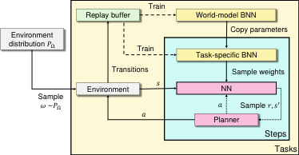
knowledge model to initialize the task-specific Figure 1: Variational Bayesian Lifelong RL
posterior network (directly copy parameters). (VBLRL). “NN” is the network using fixed paWe sample transitions from the task-specific pos- rameters sampled from the weight distribution of
terior and select actions based on the generated the task-specific BNN. When the agent does CEM
transitions. The detailed algorithm is summa- planning, we let it propagate the state particles
rized in Algorithm 1. Specifically, for planning, using several NNs that use different network paat each step we begin by creating _P_ particles rameters, all sampled from the BNN to achieve
from the current state _s_ _[p]_ _τ_ = _t_ [=] _[ s]_ _[t]_ _[∀][p]_ [. Then, we] randomness in transitions.
sample _N_ candidate action sequences _a_ _t_ : _t_ + _T_
from a learnable distribution. These two steps are the same as PETS [ 8 ]. Then we propagate the
state–action pairs using the learned task-specific model _p_ _m_ _i_ ( _·|s, a_ ) (BNN) and use the cross entropy
method [ 4 ] to update the sampling distribution to make the sampled action sequences close to previous
action sequences that achieved high reward. We further calculate the cumulative reward estimated
(via the learned model) for previously sampled sequences and select the current action based on
the mean of that distribution. By sampling from the task-specific posterior at each step, the agent
explores in a temporally extended and diverse manner.


For each specific task, we use the task-specific BNN to plan during forward learning. They are
updated with only the data from the current task thus avoid catastrophic forgetting in the forward
transfer process. The world model is updated using the data from **all** the visited tasks. The intuition
is to guide the two posteriors to separately learn two categories of uncertainty within lifelong learning
tasks. The world-model posterior captures the epistemic uncertainty of the general knowledge
distribution (shared across all tasks controlled by the hidden parameters) via the internal variance of
world-model BNN. As the learner is exposed to more and more tasks, the posterior should converge
to _P_ Ω . The task-specific posterior captures the epistemic uncertainty of the current task _m_ _i_, which
comes from the aleatory uncertainty of the world model when generating _ω_ _i_ for a new task, via the
internal variance of task-specific BNN. We provide additional illustration in Figure 9. In general,
we used the world-model BNN to encode _P_ Ω over a family of tasks, and the task-specific BNN to
encode _P_ ( _ω_ _i_ ), which should peak at the specific true _ω_ _i_ sampled for the current task.


Note that in single-task cases, other CEM-based algorithms like PETS usually maintain a set of neural
networks using the same training data, and sample action sequences from each of the neural nets
to achieve randomness in transitions. However, in lifelong RL settings, it is unrealistic to maintain


6


Figure 1: Variational Bayesian Lifelong RL
(VBLRL). “NN” is the network using fixed parameters sampled from the weight distribution of
the task-specific BNN. When the agent does CEM
planning, we let it propagate the state particles
using several NNs that use different network parameters, all sampled from the BNN to achieve
randomness in transitions.


( _≥_ 30 ) models for each task encountered. Our usage of BNNs avoids such problems as we only
have to train one neural network using the same data for each task, and we can sample an unlimited
number of different action sequences to cover more possibilities as needed. In PETS, the epistemic
uncertainty is estimated via the variance of the output mean of different neural networks, while, in
VBLRL, it is estimated via the variance of the weights and biases distribution of the BNN.


**4.3** **Backward Transfer of Variational Bayesian Lifelong RL**


In our lifelong RL setting, the agent interacts with each task for only a limited number of episodes
and the task-specific model stops learning when the next task is initiated. As a result, there may
exist portions of the transition dynamics in which model uncertainty remains high. However, as the
world-model posterior continues to train on new tasks, it gathers more experience in the whole state
space and can provide improved guesses concerning the “unknown" transition dynamics, even for
previously encountered tasks.


Intuitively, the performance of an agent on one task has the potential to be further improved (positive
backward transfer) if there exists a sufficiently large set of state–action transition pairs of which the
task-specific model’s predictions are not confident due to lack of data. In our algorithm, the aleatory
uncertainty (irreducible chance in the outcome) is measured by the output variance of the prediction
_{σ_ _r_ _τ_ _[p]_ _[, σ]_ _[s]_ _[p]_ _τ_ _[}]_ [, and the epistemic uncertainty (due to lack of experience) corresponds to the uncertainty]
of the output mean and variance (see Definition 1 below). Thus, a straightforward method to improve
a previously learned task-specific model is to find the predictions it needs to make that have high
epistemic uncertainty, and replace them with the predictions from the world-model posterior, which
has lower epistemic uncertainty. If we only consider reward prediction, the quantity for measuring
whether a task-specific/world model is sufficiently confident is as follows.


**Definition 4.5.** For a given state–action pair ( _s, a_ ), we define the confidence level _c_ of the predictions
(reward) _r_ _τ_ _[p]_ [(] _[s, a]_ [)][ from a task-specific/world model as:]


� _Pp_ =1 [(] _P_ _[σ]_ _−_ _[r]_ _τ_ _[p]_ _[−]_ 1 ~~_[σ]_~~ _[r]_ _τ_ _[p]_ [)] [2] _,_ (10)


_c_ = _−_


� _Pp_ =1 [(] _[µ]_ _[r]_ _τ_ _[p]_ _[−]_ ~~_[µ]_~~ _[r]_ _τ_ _[p]_ [)] [2] _−_ _α ∗_

_P −_ 1


where _P_ is the number of particles and _α_ is a hyperparameter controlling the scale of the second term.
A similar definition applies to the task-specific/world model’s next-state prediction. Intuitively, _c_
measures the uncertainty of the output mean and variance for each dynamic prediction. During CEM
planning, we propagate each pair of _P_ state particles with different network parameters thanks to
the usage of BNN, resulting in _P_ different _{µ_ _r_ _τ_ _[p]_ _[, σ]_ _[r]_ _τ_ _[p]_ _[}]_ [. Thus we can further calculate the confidence]
level of current predictions based on these _P_ pairs of output mean and variance.


We show the detailed backward transfer algorithm in Algorithm 2. Compared with the forward
training version, the agent will also calculate the confidence level of the task-specific and generalknowledge model for each particular transition and compare the value of them when predicting
the state particles. If the task-specific model is not confident enough for this state–action pair (i.e.
_c_ _m_ _i_ _< c_ _wm_ ), we will use the world-model to do the predictions instead.


**5** **Experiments**


**5.1** **OpenAI Gym MuJoCo Domains**


We evaluated the performance of VBLRL on HiP-MDP versions of several continuous control tasks
from the Mujoco physics simulator [ 45 ], _HalfCheetah-gravity, HalfCheetah-bodyparts, Hopper-_
_gravity, Hopper-bodyparts, Walker-gravity, Walker-bodyparts_, all of which are lifelong-RL benchmarks used in prior work [ 31 ]. For each of six different domains, the task-specific hidden parameters
correspond to different gravity values or different sizes and masses of the simulated body parts.
Details can be found in the appendix. Compared with prior work, we substantially reduced the
number of iterations that the agent can sample and train on: 100 iterations for each task and a horizon
of 100 (Halfcheetah) or 400 (Hopper & Walker) for each iteration. We used such settings to increase
the difficulty of lifelong learning and test the sample efficiency of lifelong RL algorithms, given that
it is hard for a single-task training algorithm to obtain a good policy within such limited number of
interactions with the environments. However, we show in appendix H and I that, as the agent is


7


exposed to more and more tasks, our lifelong learning agent is able to achieve similar performance to
that of more fully trained single-task agents while requiring far fewer per-task samples.


**VBLRL** **T-HiP-MDP** **LPG-FTW (** 2 _×_ **samples)** **EWC (** 2 _×_ **samples)** **Single-task MBRL**


_CG_ -Start **160** _._ **68** _±_ **48** _._ **80** 126 _._ 95 _±_ 31 _._ 41 _−_ 81 _._ 59 _±_ 9 _._ 18 _−_ 3426 _._ 76 _±_ 827 _._ 99 _−_ 83 _._ 96 _±_ 60 _._ 10
_CG_ -Train **226** _._ **72** _±_ **26** _._ **53** 170 _._ 20 _±_ 39 _._ 92 _−_ 29 _._ 49 _±_ 11 _._ 03 _−_ 3440 _._ 66 _±_ 1007 _._ 50 _−_ 40 _._ 47 _±_ 10 _._ 68
_CG_ -Back **231** _._ **79** _±_ **23** _._ **49** 97 _._ 84 _±_ 22 _._ 04 _−_ 29 _._ 95 _±_ 11 _._ 64 _−_ 6672 _._ 33 _±_ 3748 _._ 63 /
_CB_ -Start **110** _._ **74** _±_ **41** _._ **96** 78 _._ 95 _±_ 18 _._ 43 _−_ 263 _._ 94 _±_ 40 _._ 80 _−_ 5016 _._ 93 _±_ 1708 _._ 10 _−_ 101 _._ 02 _±_ 39 _._ 11
_CB_ -Train **173** _._ **97** _±_ **78** _._ **26** 87 _._ 20 _±_ 9 _._ 42 _−_ 217 _._ 86 _±_ 42 _._ 82 _−_ 5454 _._ 52 _±_ 2145 _._ 82 _−_ 58 _._ 93 _±_ 33 _._ 24
_CB_ -Back **181** _._ **60** _±_ **67** _._ **50** 116 _._ 03 _±_ 17 _._ 35 _−_ 116 _._ 41 _±_ 65 _._ 64 _−_ 13889 _._ 31 _±_ 6851 _._ 05 /
_HG_ -Start 268 _._ 11 _±_ 33 _._ 29 230 _._ 21 _±_ 30 _._ 75 305 _._ 63 _±_ 34 _._ 55 **306** _._ **79** _±_ **29** _._ **14** 18 _._ 62 _±_ 1 _._ 51
_HG_ -Train 332 _._ 89 _±_ 23 _._ 68 285 _._ 87 _±_ 41 _._ 48 **352** _._ **10** _±_ **25** _._ **25** 345 _._ 47 _±_ 40 _._ 26 20 _._ 46 _±_ 1 _._ 77
_HG_ -Back **360** _._ **94** _±_ **7** _._ **71** 312 _._ 11 _±_ 55 _._ 45 347 _._ 07 _±_ 44 _._ 09 301 _._ 06 _±_ 114 _._ 11 /
_HB_ -Start 193 _._ 27 _±_ 8 _._ 03 181 _._ 94 _±_ 12 _._ 97 **256** _._ **13** _±_ **69** _._ **68** 133 _._ 95 _±_ 27 _._ 61 19 _._ 12 _±_ 1 _._ 75
_HB_ -Train **296** _._ **34** _±_ **11** _._ **15** 227 _._ 50 _±_ 41 _._ 78 285 _._ 62 _±_ 78 _._ 18 139 _._ 01 _±_ 46 _._ 24 21 _._ 25 _±_ 2 _._ 67
_HB_ -Back **316** _._ **74** _±_ **20** _._ **72** 213 _._ 93 _±_ 75 _._ 95 281 _._ 99 _±_ 74 _._ 96 _−_ 384 _._ 27 _±_ 199 _._ 27 /
_WG_ -Start **248** _._ **97** _±_ **19** _._ **95** 217 _._ 94 _±_ 39 _._ 99 140 _._ 75 _±_ 67 _._ 64 163 _._ 61 _±_ 86 _._ 55 4 _._ 32 _±_ 0 _._ 23
_WG_ -Train **333** _._ **65** _±_ **26** _._ **73** 268 _._ 97 _±_ 36 _._ 26 166 _._ 00 _±_ 45 _._ 04 181 _._ 76 _±_ 97 _._ 42 210 _._ 41 _±_ 39 _._ 34
_WG_ -Back **364** _._ **18** _±_ **49** _._ **60** 173 _._ 33 _±_ 58 _._ 43 168 _._ 39 _±_ 94 _._ 19 216 _._ 09 _±_ 62 _._ 67 /
_WB_ -Start **222** _._ **88** _±_ **34** _._ **49** 220 _._ 07 _±_ 20 _._ 31 164 _._ 79 _±_ 10 _._ 31 164 _._ 00 _±_ 34 _._ 31 4 _._ 64 _±_ 0 _._ 23
_WB_ -Train **311** _._ **41** _±_ **16** _._ **30** 266 _._ 97 _±_ 26 _._ 72 165 _._ 75 _±_ 2 _._ 39 206 _._ 97 _±_ 41 _._ 40 196 _._ 42 _±_ 22 _._ 04
_WB_ -Back **317** _._ **82** _±_ **13** _._ **90** 229 _._ 10 _±_ 16 _._ 60 195 _._ 01 _±_ 49 _._ 25 152 _._ 94 _±_ 70 _._ 59 /


Table 1: Results on OpenAI Gym Mujoco domains. _CG_ denotes **Cheetah-Gravity**, _CB_ denotes
**Cheetah-Bodyparts**, _HG_ denotes **Hopper-Gravity**, _HB_ denotes **Hopper-Bodyparts**, _WG_ denotes
**Walker-Gravity**, _WB_ denotes **Walker-Bodyparts** .


We compared VBLRL against: 1. state-of-the-art lifelong RL method LPG-FTW [ 31 ], 2. EWC [ 28 ],
which is a single-model lifelong RL algorithm that achieves comparable performance with LPG-FTW
as shown in the latter paper, 3. single-task Model-Based RL (using the same BNN structure and
planning procedures), which stands for training the agent from scratch for each new task and do not
use the world model to initialize the task-specific model, 4. T-HiP-MDP [ 27 ], which is a model-based
lifelong RL baseline. For a fair comparison, we further replaced the DDQN algorithm [ 46 ] used
in T-HiP-MDP with CEM planning, and let the transition model also predict the reward for each
state–action pair. This modified baseline is similar to the single-model version of VBLRL (i.e., only
using the world-model posterior across all the tasks). Moreover, LPG-FTW and EWC are built upon
a relatively simple policy gradient baseline, which does not perform as well as our model-based
baseline in the single-task setting within the same amount of interactions. Thus, we let them collect
**twice the amount of samples** each iteration compared to VBLRL. We show in Appendix H that, with
such modifications, in single-task settings the baselines achieve better or at least similar performance
compared to the single-task version of VBLRL.


The results are shown in Table 1 and Figure 7 in Appendix I. For all six domains, we report the
average performance of all the tasks at the beginning of training ( **Start** ) and after all training for
each new task ( **Train** ), as well as the average performance for all previous tasks after training for
a given number of tasks, which is our backward transfer test ( **Back** ). As shown in the results, our
VBLRL shows better performance on all three test stages of the HalfCheetah domain and Walker
domain, as well as better backward transfer performance on Hopper-gravity and Hopper-bodyparts
than the other three algorithms. Comparing Figure 6 and Figure 7, we find that, in the Hopper
domains, even though the single-task baseline used by LPG-FTW and EWC performed much better
than VBLRL after we let them collect **2** _×_ samples each iteration, VBLRL still achieves comparable
performance with LPG-FTW and EWC in lifelong RL experiments, suggesting that VBLRL is
capable of making better use of the data in the lifelong learning setting. In the walker domains
where the single-task baselines achieved similar performance, VBLRL shows significantly better
performance than LPG-FTW/EWC in lifelong RL experiments. These comparisons also suggest
that VBLRL’s lifelong learning performance may be further improved when combined with better
model-based deep RL algorithms, like Dreamer [20]. EWC fails in some of the tasks as it is hard to
directly learn a single shared policy that achieves good performance when the tasks are highly diverse.
T-HiP-MDP shows good results on some of the tasks because it is more sample-efficient in learning a
shared model across all the tasks and more easily captures the world-model uncertainty. However, it
cannot achieve as good performance as VBLRL as it is hard to model the task-specific uncertainty
using only one model across all tasks, which also leads to negative backward transfer performance on
tasks like Cheetah-Gravity. Comparing VBLRL’s performance on the **Train** stage and **Back** stage,
we also find that it shows positive backward transfer results on most tasks, without showing patterns
of catastrophic forgetting. Overall, VBLRL’s world-model posterior contributes to better forward
transfer performance ( **Start** ), the learning of task-specific posterior contributes to better forward


8


transfer training for each new task ( **Train** ), and the combination of these two posteriors guides the
agent to achieve better backward transfer performance ( **Back** ). Comparing our method to LPG-FTW
and EWC highlights the advantage of model-based techniques for sample efficiency in lifelong RL
setting, while comparing to T-HiP-MDP and single-task MBRL demonstrates the importance of
estimating both global and local uncertainty.


**5.2** **Meta-world Domains**


Meta-World [ 52 ] contains a suite of challenging
evaluation benchmarks on a robotic SAWYER
arm. We evaluated the performance of VBLRL
as well as the baselines on two Meta-World task
sets: Reach and Reach-Wall following the settings
given by [ 54 ]. We used the v1 version of MetaWorld, with state observations and dense versions
of the reward functions. The hidden parameters
in these cases are the goals we want the robot to
reach, which controls the reward functions and
are not included in the agent’s observation space.

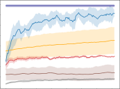

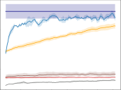

Figure 2: Average performance during training

We measured performance in terms of average

across all tasks. Left: Reach; Right: Reach-Wall.

cumulative rewards across tasks. As shown in
Figure 2, VBLRL achieves significantly higher
performance than the other baselines. VBLRL-Backward denotes VBLRL’s average backward
transfer performance on all the tasks and is higher than the final performance of VBLRL’s forward
training in both tasks, suggesting that our approach can achieve positive backward transfer.


Figure 2: Average performance during training
across all tasks. Left: Reach; Right: Reach-Wall.


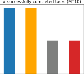


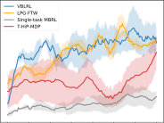

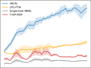

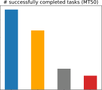

Figure 3: Performance comparison of VBLRL with the other baselines on MT10 and MT50. We
also compare the **maximum** number of successfully completed tasks of different methods. The
performance of VBLRL is similar to LPG-FTW on MT10 but significantly outperforms LPG-FTW
on MT50 as the world-model posterior becomes more accurate when the number of tasks is larger.


We include additional experiments on MT10 and MT50 domains of MetaWorld (v2) in Figure 3.
MT10 and MT50 consist of 10 and 50 different categories of manipulation tasks, including reach,
push, drawer close, button press etc., and is a highly difficult setting for multi-task RL. We modified
these two domains to be lifelong learning settings: instead of getting all 10/50 tasks at the same
time at the beginning, we let them arrive sequentially. For instance, the first task is “reach” and
we let the agent interact with it for 150 iterations, and then switch to “push” and the agent cannot
collect data from “reach” anymore, after another 150 iterations the task changes to “pick-place”,
etc. We compare the results with LPG-FTW, T-HiP-MDP as well as Single-task MBRL (train the
agent from scratch for each new task without using the world-model posterior to initialize the task
specific model). With the limited number of interactions for each task, our proposed algorithm is
still able to achieve reasonably good performance in such settings. In MT10, the total number of
tasks (10) is relatively small so the world-model distribution may be far from accurate, but VBLRL
still performs better than Single-task MBRL which does not use the world model to initialize the
task-specific model. In MT50, the number of tasks is large enough (50) and we can see that VBLRL
significantly outperforms all the other baselines. This is consistent with our intuition that sample
efficiency improves in the task specific regime when the world model approaches the environment
distribution. As the single-task model-based RL baseline we used here is relatively simple (CEM
planning) to be comparable with the single-task baseline used by LPG-FTW, it is reasonable to expect
the lifelong learning performance to be even better after combining our framework with model-based
methods like Dreamer [20]; we leave such evaluations for future work.


9


**5.3** **Ablation Study**


This section evaluates the essentiality of
VBLRL’s components. As shown in Figure 4
left, we tested different backward transfer strategy for VBLRL. Task-specific-Backward denotes the performance if directly using the
learned task-specific model to do all the predictions without using world model. Worldmodel-Backward denotes the performance if using world-model to do all the predictions with
|200|K|Col3|
|---|---|---|
|0<br>50<br>100<br>150<br>|K|K|
|0<br>50<br>100<br>150<br>|K<br>|K<br>|
|0<br>50<br>100<br>150<br>|K|K|


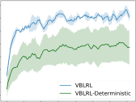
out using each task-specific model. Compared Figure 4: Ablation Study on Reach domain. Left:
to these baselines, VBLRL’s backward transfer Backward transfer strategy; Right: Using Bayesian
strategy achieves the best performance by com- neural networks to model the task-specific postebining these two kinds of models according to rior.
their confidence level. We also explored the influence of using a Bayesian neural network to model the task-specific model. As shown in the right
side of the figure, using BNN enables faster adaptation to new tasks compared with using regular
neural networks (VBLRL-Deterministic). We also include ablation studies on the number of particles
in CEM planning in Appendix N.


Figure 4: Ablation Study on Reach domain. Left:
Backward transfer strategy; Right: Using Bayesian
neural networks to model the task-specific posterior.


**6** **Conclusion and Discussion**


To improve sample efficiency in lifelong RL, our work proposed a model-based lifelong RL approach
that distills shared knowledge from similar MDPs and maintains a Bayesian posterior to approximate
the distribution derived from that knowledge. We gave a sample-complexity analysis of the algorithm
in the finite MDP setting. Then, we extended our method to use variational inference, which scales
better and supports both backward and forward transfer. Our experimental results show that the
proposed algorithms enable faster training on new tasks through collecting and transferring the
knowledge learned from preceding tasks.


One of the core questions in lifelong learning setting is how tasks should be related for transfer to
be effective, and in this paper we are making the HiP-MDP assumption, that is, a family of tasks is
generated by varying a latent task parameter vector drawn for each task according to the world-model
distribution. The relationship between different tasks can be modeled in different ways in lifelong
RL and this problem setting will affect the algorithm’s performance. However, we do believe our
method can help the agent transfer knowledge for tasks that are in other ways related, as we show in
the results on MT10 and MT50, which are not typical HiP-MDP settings.


The overall lifelong learning performance of our proposed algorithm is largely limited by the
performance of the single-task model-based baseline. We show the advantages of model-based
lifelong learning methods over model-free methods when the single-task baselines’ performance are
close. In practice, it’s possible that the model-free lifelong RL methods still outperforms model-based
methods simply because the model-free single-task baseline is much stronger. Bayesian Neural
Networks are more computationally expensive than regular neural networks. The longest forward
running time among all our experiments is hopper which took around 96 hours to finish training and
evaluation on all the tasks. This is in general acceptable time cost and can be potentially improved
with more recent BNN techniques.


**Acknowledgement**


The authors thank the members of Brown bigAI for discussions and helpful feedback, and the
anonymous reviewers for valuable feedback that improved the paper substantially. This research was
supported by the NSF under grant #1955361 and CAREER award #1844960, and the DARPA Lifelong
Learning Machines program under grant #FA8750-18-2-0117. The U.S. Government is authorised to
reproduce and distribute reprints for Governmental purposes notwithstanding any copyright notation
thereon. The content is solely the responsibility of the authors and does not necessarily represent the
official views of the NSF or DARPA. This research was conducted using computational resources
and services at the Center for Computation and Visualization, Brown University.


10


**References**


[1] Asmuth, J. and Littman, M. Learning is planning: Near Bayes-optimal reinforcement learning
via Monte-Carlo tree search. In _UAI_, 2011.


[2] Asmuth, J., Li, L., Littman, M. L., Nouri, A., and Wingate, D. A Bayesian sampling approach to
exploration in reinforcement learning. In _UAI 2009, Proceedings of the Twenty-Fifth Conference_
_on Uncertainty in Artificial Intelligence, 2009_, pp. 19–26. AUAI Press, 2009.


[3] Blundell, C., Cornebise, J., Kavukcuoglu, K., and Wierstra, D. Weight uncertainty in neural
networks. _CoRR_, abs/1505.05424, 2015.


[4] Botev, Z., Kroese, D. P., Rubinstein, R., and L’Ecuyer, P. Chapter 3 – the cross-entropy method
for optimization. _Handbook of Statistics_, 31:35–59, 2013.


[5] Bou-Ammar, H., Eaton, E., Ruvolo, P., and Taylor, M. E. Online multi-task learning for policy
gradient methods. In _ICML_, 2014.


[6] Brafman, R. I. and Tennenholtz, M. R-max - a general polynomial time algorithm for nearoptimal reinforcement learning. 3(null), 2003. ISSN 1532-4435.


[7] Brunskill, E. and Li, L. Pac-inspired option discovery in lifelong reinforcement learning. In
_ICML_, 2014.


[8] Chua, K., Calandra, R., McAllister, R., and Levine, S. Deep reinforcement learning in a handful
of trials using probabilistic dynamics models. In _Advances in Neural Information Processing_
_Systems 31: Annual Conference on Neural Information Processing Systems 2018, NeurIPS_
_2018_, pp. 4759–4770, 2018.


[9] des Combes, R. T., Bachman, P., and van Seijen, H. Learning invariances for policy generalization. In _6th International Conference on Learning Representations, ICLR 2018_ . OpenReview.net,
2018.


[10] Doshi-Velez, F. and Konidaris, G. D. Hidden parameter markov decision processes: A semiparametric regression approach for discovering latent task parametrizations. In _Proceedings_
_of the Twenty-Fifth International Joint Conference on Artificial Intelligence, IJCAI 2016_, pp.
1432–1440. IJCAI/AAAI Press, 2016.


[11] Duan, Y., Chen, X., Houthooft, R., Schulman, J., and Abbeel, P. Benchmarking deep reinforcement learning for continuous control. In _ICML_, 2016.


[12] Finn, C., Abbeel, P., and Levine, S. Model-agnostic meta-learning for fast adaptation of deep
networks. In _ICML_, 2017.


[13] Finn, C., Xu, K., and Levine, S. Probabilistic model-agnostic meta-learning. In _Advances_
_in Neural Information Processing Systems 31: Annual Conference on Neural Information_
_Processing Systems 2018, NeurIPS 2018_, pp. 9537–9548, 2018.


[14] Fu, H., Tang, H., Hao, J., Chen, C., Feng, X., Li, D., and Liu, W. Towards effective context for
meta-reinforcement learning: an approach based on contrastive learning. In _Thirty-Fifth AAAI_
_Conference on Artificial Intelligence, AAAI 2021_, pp. 7457–7465. AAAI Press, 2021.


[15] Ghavamzadeh, M., Mannor, S., Pineau, J., and Tamar, A. Convex optimization: Algorithms
and complexity. _Foundations and Trends_ _®_ _in Machine Learning_, 8(5-6):359–483, 2015. ISSN
1935-8245.


[16] Grant, E., Finn, C., Levine, S., Darrell, T., and Griffiths, T. L. Recasting gradient-based metalearning as hierarchical bayes. In _6th International Conference on Learning Representations,_
_ICLR 2018_ . OpenReview.net, 2018.


[17] Graves, A. Practical variational inference for neural networks. In _Advances in Neural Infor-_
_mation Processing Systems 24: 25th Annual Conference on Neural Information Processing_
_Systems 2011_, pp. 2348–2356, 2011.


11


[18] Guez, A., Silver, D., and Dayan, P. Efficient bayes-adaptive reinforcement learning using
sample-based search. In _NIPS_, 2012.


[19] Haarnoja, T., Zhou, A., Abbeel, P., and Levine, S. Soft actor-critic: Off-policy maximum entropy
deep reinforcement learning with a stochastic actor. In _Proceedings of the 35th International_
_Conference on Machine Learning, ICML 2018_, pp. 1856–1865. PMLR, 2018.


[20] Hafner, D., Lillicrap, T. P., Ba, J., and Norouzi, M. Dream to control: Learning behaviors by
latent imagination. _ArXiv_, abs/1912.01603, 2020.


[21] Hinton, G. E. and van Camp, D. Keeping the neural networks simple by minimizing the
description length of the weights. In _Proceedings of the Sixth Annual ACM Conference on_
_Computational Learning Theory, COLT 1993_, pp. 5–13. ACM, 1993.


[22] Hinton, G. E. and van Camp, D. Keeping the neural networks simple by minimizing the
description length of the weights. In _COLT ’93_, 1993.


[23] Houthooft, R., Chen, X., Duan, Y., Schulman, J., Turck, F. D., and Abbeel, P. VIME: variational
information maximizing exploration. In _Advances in Neural Information Processing Systems_
_29: Annual Conference on Neural Information Processing Systems 2016_, pp. 1109–1117, 2016.


[24] Isele, D., Rostami, M., and Eaton, E. Using task features for zero-shot knowledge transfer
in lifelong learning. In _Proceedings of the Twenty-Fifth International Joint Conference on_
_Artificial Intelligence, IJCAI 2016_, pp. 1620–1626. IJCAI/AAAI Press, 2016.


[25] Isele, D., Rostami, M., and Eaton, E. Using task features for zero-shot knowledge transfer in
lifelong learning. In _IJCAI_, 2016.


[26] Kaelbling, L. P., Littman, M. L., and Moore, A. W. Reinforcement learning: A survey. _J. Artif._
_Intell. Res._, 4:237–285, 1996.


[27] Killian, T. W., Daulton, S., Doshi-Velez, F., and Konidaris, G. D. Robust and efficient transfer
learning with hidden parameter markov decision processes. In _Advances in Neural Information_
_Processing Systems 30: Annual Conference on Neural Information Processing Systems 2017_,
pp. 6250–6261, 2017.


[28] Kirkpatrick, J., Pascanu, R., Rabinowitz, N. C., Veness, J., Desjardins, G., Rusu, A. A., Milan,
K., Quan, J., Ramalho, T., Grabska-Barwinska, A., Hassabis, D., Clopath, C., Kumaran, D., and
Hadsell, R. Overcoming catastrophic forgetting in neural networks. _CoRR_, abs/1612.00796,
2016.


[29] Li, Z. and Hoiem, D. Learning without forgetting, 2017.


[30] Lopez-Paz, D. and Ranzato, M. Gradient episodic memory for continual learning. In _Advances_
_in Neural Information Processing Systems 30: Annual Conference on Neural Information_
_Processing Systems 2017_, pp. 6467–6476, 2017.


[31] Mendez, J. A. M., Wang, B., and Eaton, E. Lifelong policy gradient learning of factored policies
for faster training without forgetting. _ArXiv_, abs/2007.07011, 2020.


[32] Nagabandi, A., Finn, C., and Levine, S. Deep online learning via meta-learning: Continual
adaptation for model-based rl. _ArXiv_, abs/1812.07671, 2019.


[33] Nguyen, C. V., Li, Y., Bui, T. D., and Turner, R. E. Variational continual learning, 2018.


[34] Osband, I., Blundell, C., Pritzel, A., and Roy, B. V. Deep exploration via bootstrapped dqn. In
_NIPS_, 2016.


[35] Parisotto, E., Ba, L. J., and Salakhutdinov, R. Actor-mimic: Deep multitask and transfer
reinforcement learning. In _4th International Conference on Learning Representations, ICLR_
_2016_, 2016.


[36] Puterman, M. L. _Markov Decision Processes—Discrete Stochastic Dynamic Programming_ .
John Wiley & Sons, Inc., 1994.


12


[37] Rakelly, K., Zhou, A., Finn, C., Levine, S., and Quillen, D. Efficient off-policy metareinforcement learning via probabilistic context variables. In _Proceedings of the 36th Interna-_
_tional Conference on Machine Learning, ICML 2019_, volume 97 of _Proceedings of Machine_
_Learning Research_, pp. 5331–5340. PMLR, 2019.


[38] Silver, D., Schrittwieser, J., Simonyan, K., Antonoglou, I., Huang, A., Guez, A., Hubert, T.,
baker, L., Lai, M., Bolton, A., Chen, Y., Lillicrap, T., Hui, F., Sifre, L., Driessche, G. V. D.,
Graepel, T., and Hassabis, D. Mastering the game of go without human knowledge. _Nature_,
550:354–359, 2017.


[39] Strehl, A., Li, L., and Littman, M. Incremental model-based learners with formal learning-time
guarantees. _ArXiv_, abs/1206.6870, 2006.


[40] Strehl, A. L., Li, L., and Littman, M. L. Reinforcement learning in finite mdps: Pac analysis. _J._
_Mach. Learn. Res._, 10:2413–2444, 2009.


[41] Strens, M. J. A. A Bayesian framework for reinforcement learning. In _Proceedings of the_
_Seventeenth International Conference on Machine Learning (ICML 2000)_, pp. 943–950, 2000.


[42] Sutton, R. S. and Barto, A. G. _Reinforcement Learning: An Introduction_ . The MIT Press, 1998.


[43] Teh, Y. W., Bapst, V., Czarnecki, W. M., Quan, J., Kirkpatrick, J., Hadsell, R., Heess, N.,
and Pascanu, R. Distral: Robust multitask reinforcement learning. In _Advances in Neural_
_Information Processing Systems 30: Annual Conference on Neural Information Processing_
_Systems 2017_, pp. 4496–4506, 2017.


[44] Thompson, W. R. On the likelihood that one unknown probability exceeds another in view of
the evidence of two samples. _Biometrika_, 25:285–294, 1933.


[45] Todorov, E., Erez, T., and Tassa, Y. Mujoco: A physics engine for model-based control. In
_2012 IEEE/RSJ International Conference on Intelligent Robots and Systems, IROS 2012_, pp.
5026–5033. IEEE, 2012.


[46] van Hasselt, H., Guez, A., and Silver, D. Deep reinforcement learning with double q-learning.
In _Proceedings of the Thirtieth AAAI Conference on Artificial Intelligence,2016_, pp. 2094–2100.
AAAI Press, 2016.


[47] Wang, J. X., Kurth-Nelson, Z., Tirumala, D., Soyer, H., Leibo, J. Z., Munos, R., Blundell, C.,
Kumaran, D., and Botvinick, M. Learning to reinforcement learn. _CoRR_, abs/1611.05763,
2016.


[48] Wang, T., Bao, X., Clavera, I., Hoang, J., Wen, Y., Langlois, E., Zhang, S., Zhang, G., Abbeel,
P., and Ba, J. Benchmarking model-based reinforcement learning. _CoRR_, abs/1907.02057,
2019.


[49] Wilson, A., Fern, A., Ray, S., and Tadepalli, P. Multi-task reinforcement learning: A hierarchical
Bayesian approach. In _Machine Learning, Proceedings of the Twenty-Fourth International_
_Conference (ICML 2007), 2007_, volume 227 of _ACM International Conference Proceeding_
_Series_, pp. 1015–1022. ACM, 2007.


[50] Wilson, A., Fern, A., Ray, S., and Tadepalli, P. Multi-task reinforcement learning: a hierarchical
bayesian approach. In _ICML ’07_, 2007.


[51] Yoon, J., Kim, T., Dia, O., Kim, S., Bengio, Y., and Ahn, S. Bayesian model-agnostic metalearning. In _Advances in Neural Information Processing Systems 31: Annual Conference on_
_Neural Information Processing Systems 2018, NeurIPS 2018_, pp. 7343–7353, 2018.


[52] Yu, T., Quillen, D., He, Z., Julian, R. C., Hausman, K., Finn, C., and Levine, S. Metaworld: A benchmark and evaluation for multi-task and meta reinforcement learning. _ArXiv_,
abs/1910.10897, 2019.


[53] Zenke, F., Poole, B., and Ganguli, S. Continual learning through synaptic intelligence, 2017.


[54] Zhang, J., Wang, J., Hu, H., Chen, T., Chen, Y., Fan, C., and Zhang, C. Metacure: Meta
reinforcement learning with empowerment-driven exploration. In _ICML_, 2021.


13


[55] Zhang, T. From _ϵ_ -entropy to kl-entropy: Analysis of minimum information complexity density
estimation. _Annals of Statistics_, 34:2180–2210, 2006.


[56] Zintgraf, L. M., Shiarlis, K., Igl, M., Schulze, S., Gal, Y., Hofmann, K., and Whiteson, S.
Varibad: A very good method for bayes-adaptive deep RL via meta-learning. In _8th International_
_Conference on Learning Representations, ICLR 2020_ . OpenReview.net, 2020.


**Checklist**


1. For all authors...


(a) Do the main claims made in the abstract and introduction accurately reflect the paper’s
contributions and scope? [Yes]
(b) Did you describe the limitations of your work? [Yes]

(c) Did you discuss any potential negative societal impacts of your work? [N/A]
(d) Have you read the ethics review guidelines and ensured that your paper conforms to
them? [Yes]

2. If you are including theoretical results...


(a) Did you state the full set of assumptions of all theoretical results? [Yes]
(b) Did you include complete proofs of all theoretical results? [Yes]

3. If you ran experiments...


(a) Did you include the code, data, and instructions needed to reproduce the main experimental results (either in the supplemental material or as a URL)? [Yes]
(b) Did you specify all the training details (e.g., data splits, hyperparameters, how they
were chosen)? [Yes]
(c) Did you report error bars (e.g., with respect to the random seed after running experiments multiple times)? [Yes]
(d) Did you include the total amount of compute and the type of resources used (e.g., type
of GPUs, internal cluster, or cloud provider)? [Yes]

4. If you are using existing assets (e.g., code, data, models) or curating/releasing new assets...


(a) If your work uses existing assets, did you cite the creators? [N/A]
(b) Did you mention the license of the assets? [N/A]

(c) Did you include any new assets either in the supplemental material or as a URL? [N/A]


(d) Did you discuss whether and how consent was obtained from people whose data you’re
using/curating? [N/A]
(e) Did you discuss whether the data you are using/curating contains personally identifiable
information or offensive content? [N/A]

5. If you used crowdsourcing or conducted research with human subjects...


(a) Did you include the full text of instructions given to participants and screenshots, if
applicable? [N/A]
(b) Did you describe any potential participant risks, with links to Institutional Review
Board (IRB) approvals, if applicable? [N/A]
(c) Did you include the estimated hourly wage paid to participants and the total amount
spent on participant compensation? [N/A]


14


**A** **VBLRL algorithm**


**Algorithm 1** Variational Bayesian Lifelong RL

**Input:** Initialize general knowledge(world) model _p_ _wm_ ( _·|s, a_ ; _ω_ _wm_ ), planning horizon _T_
**for** each task _m_ _i_ from _i_ = 1 _,_ 2 _,_ 3 _, · · ·, M_ **do**

Initialize task-specific model _p_ _m_ _i_ ( _·|s, a_ ; _ω_ _i_ ) with parameters of general knowledge model _p_ _wm_
**for** each episode **do**

**for** Time _t_ = 0 to TaskHorizon **do**

Sample Actions _a_ _t_ : _t_ + _T_ _∼_ CEM( _·_ )
Propagate state particles _s_ _[p]_ _τ_ [with] _[ p]_ _[m]_ _i_ [(] _[s]_ _[′]_ _[|][s, a]_ [;] _[ ω]_ _[i]_ [)]
Evaluate actions as [�] _τ_ _[t]_ [+] = _[T]_ _t_ _P_ 1 � _Pp_ =1 _[p]_ _[m]_ _i_ [(] _[r][|][s, a]_ [;] _[ ω]_ _[i]_ [)]

_·_
Update CEM( ) distribution.
Execute optimal actions _a_ _[∗]_ _t_ : _t_ + _T_
**end for**
Add transitions to replay buffer _D_ _m_ _i_
Update task-specific model according to Equation (9) given replay buffer _D_ _m_ _i_
Update general knowledge model according to Equation (9) given replay buffers
_{D_ _m_ 1 _, · · ·, D_ _m_ _i_ _}_
**end for**

**end for**


Note that in _p_ _m_ _i_ ( _·|s, a_ ; _ω_ _i_ ) and _p_ _m_ _wm_ ( _·|s, a_ ; _ω_ _wm_ ), _p_ stands for the task-specific/world probabilistic
1 _P_
model we are using. In _s_ _[p]_ _τ_ [and] [ �] _τ_ _[t]_ [+] = _[T]_ _t_ _P_ � _p_ =1 _[r]_ _τ_ _[p]_ [,] _[ p]_ [ denotes one of the state particles] _[ p][ ∈{]_ [1] _[,][ · · ·][, P]_ _[}]_ [.]


At the beginning of training (before encountering any tasks), the agent first randomly initialize
the weights and bias of the world-model BNN _p_ _wm_ ( _·|s, a_ ; _ω_ _wm_ ) . Then each time when the agent
encounters a new task, the task-specific model _p_ _m_ _i_ ( _·|s, a_ ; _ω_ _i_ ) for that task will be initialized by
copying network parameters from the world-model BNN. Then for planning, at each step we begin
by creating _P_ particles from the current state _s_ _[p]_ _τ_ = _t_ [=] _[ s]_ _[t]_ _[∀][p]_ [. Then, we sample] _[ N]_ [ candidate action]
sequences _a_ _t_ : _t_ + _T_ from a learnable distribution. These two steps are the same as PETS [ 8 ]. Then we
propagate the state–action pairs using the learned task-specific model _p_ _m_ _i_ ( _·|s, a_ ) (BNN) and use the
cross entropy method [ 4 ] to update the sampling distribution to make the sampled action sequences
close to previous action sequences that achieved high reward. We further calculate the cumulative
reward estimated (via the learned model) for previously sampled sequences and select the current
action based on the mean of that distribution. Then we can add the new transitions to the replay buffer.
We update the task specific model according to Equation (9) by sampling from the replay buffer of
the current task, and update the world model with samples from all previous tasks’ replay buffers.


**Algorithm 2** Variational Bayesian Lifelong RL (Backward transfer)

**Input:** Test task _m_ _i_, planning horizon _T_, task-specific model _p_ _m_ _i_ ( _s_ _[′]_ _, r|s, a_ ; _ω_ _i_ ), generalknowledge model _p_ _wm_ ( _s_ _[′]_ _, r|s, a_ ; _ω_ _wm_ )
**for** Time _t_ = 0 to TaskHorizon **do**


**for** Trial _k_ = 1 to _K_ **do**

Sample Actions _a_ _t_ : _t_ + _T_ _∼_ CEM( _·_ )
**for** each action **do**

Propagate state particles _s_ _[p]_ _τ_ [with] _[ p]_ _[m]_ _i_ [(] _[s]_ _[′]_ _[, r][|][s, a]_ [)]
Propagate state particles _s_ _[p]_ _τ_ [with] _[ p]_ _[wm]_ [(] _[s]_ _[′]_ _[, r][|][s, a]_ [)]
Compute confidence level _c_ _m_ _i_ for task-specific model and _c_ _wm_ for general-knowledge
model ( **Definition 4.5** )
Choose the propagation results from the model with higher confidence level _c_
**end for**
Evaluate actions as [�] _τ_ _[t]_ [+] = _[T]_ _t_ _P_ 1 � _Pp_ =1 _[r]_ _τ_ _[p]_

_·_
Update CEM( ) distribution.
**end for**
Execute optimal actions _a_ _[∗]_ _t_ : _t_ + _T_
**end for**


15


For backward transfer, given a previously encountered task _m_ _i_, at each planning step we predict
the next state and reward with both task-specific model and world model. Then we compare the
confidence level of these two predictions and choose to use the prediction results that have higher
confidence level. The other planning procedures are the same as in forward training.


**B** **BNN model**


The form of the BNN we used is the same as in VIME [ 23 ]. We model the transition models as
Gaussian distributions:
_T_ ( _·|s, a_ ) = _N_ ( _f_ _ω_ _[µ]_ [(] _[s, a]_ [)] _[, f]_ _ω_ _[ σ]_ [(] _[s, a]_ [))] (11)


The function _f_ _θ_ is represented as a Bayesian neural network parameterized by _θ_, which is further
modeled as the posterior distribution parameterized by _φ_, predicts the mean _µ_ _s_ _, µ_ _r_ and variance
_σ_ _s_ _, σ_ _r_ given current state and action _s, a_ . We can view the BNN model in VBLRL as an infinite
neural network ensemble by integrating out its parameters:


_T_ ( _s_ _[′]_ _, r|s, a_ ) = _T_ ( _s_ _[′]_ _, r|s, a_ ; _ω_ ) _q_ ( _ω_ ; _φ_ ) _dω_ (12)
� Ω


Compared to previous model-based algorithms that use finite number of neural network ensembles
(e.g. PETS), our choice of BNN is more suitable for lifelong RL as we only need to maintain one
neural network for each task, and we can sample an unlimited number of predictions from it which
better estimates the uncertainty and is essential in our setting where both dynamic function and
reward function are not given unlike prior model-based RL methods.


**C** **BLRL algorithm**


Note that the single-task baseline that BLRL is built upon is BOSS, and **could be replaced by**
**other Bayesian-exploration RL algorithm** . We use a hierarchical Bayesian model to represent the
distribution over MDPs. Figure 5 shows our generative model in _plate notation_ . Ψ is the parameter
set that represents distribution _P_ Ω . It functions as the world-model posterior that aims to capture the
common structure across different tasks. The resulting MDP _m_ _i_ is created based on _ω_ _i_, which is one
hidden parameter sampled from Ψ . We can sample from our approximation of Ψ to create and solve
possible MDPs.

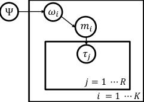


Figure 5: Plate representation for the BLRL approach. _τ_ _j_ denotes trajectory _{s, a, r, s_ _[′]_ _}_ _j_ . There are
_K_ different tasks and the agent samples _R_ trajectories from each task.


The full algorithm is shown in Algorithm 3. Each time the agent encounters a new task _m_ _i_, it
first initializes the task-specific posterior _p_ _m_ _i_ ( _·|s_ _t_ _, a_ _t_ ) with the parameter values from the current
world-model posterior _p_ _wm_, and then, for each timestep, selects actions following sampling-based
Bayesian exploration procedures from this posterior [ 44 ; 2 ]. A set of sampled MDPs drawn from
_p_ _m_ _i_ is a concrete representation of the uncertainty within the current task.


Concretely, BLRL samples _K_ models from the task-specific posterior whenever the number of
transitions from a state–action pair has reached threshold _B_ . Analogously to RMAX [ 6 ], we call a
state–action pair **known** whenever it has been observed _N_ _s_ _t_ _,a_ _t_ = _B_ times. For each state–action pair,
if it is **known**, we use the task-specific posterior to sample the model. If it is **unknown**, we instead
sample from the world-model posterior. These models are combined into a merged MDP _m_ [#] _i_ [and]
BLRL solves _m_ [#] _i_ [with value iteration to get a policy] _[ π]_ _m_ _[∗]_ [#] _i_ [. Intuitively, this approach creates optimism]


16


in the face of uncertainty as the agent can choose actions based on the highest performing transition
of the _K_ models sampled, which drives exploration. The new policy _π_ _m_ _[∗]_ [#] _i_ [will be used to interact]
with the environment until a new state–action pair reaches the sampling threshold. The collected
transitions from the current task will be used to update the task-specific posterior immediately, while
the world-model posterior will be updated using transitions from **all** the previous tasks at a slower
pace. For simple finite MDP problems in practice, we use the Dirichlet distribution (the conjugate for
the multinomial) to represent the Bayesian posterior. Thus, the updating process for the posterior
is straightforward to compute. Intuitively, BLRL rapidly adapts to new tasks as long as the prior of
the task-specific model (that is, the world-model posterior) is close to the true underlying model and
captures the uncertainty of the common structure of a set of tasks. Empirical evaluations of BLRL on
gridworlds are given in the appendix.


**Algorithm 3** Lifelong Bayesian Sampling Approach Algorithm


**Input:** _K_, _B_
initialize MDP set, the world-model posterior _p_ _wm_ ( _s_ _t_ +1 _, r_ _t_ _|s_ _t_ _, a_ _t_ )
**for** each MDP _m_ _i_ **do**

_N_ _s,a_ _←_ 0 _, ∀s, a_
_do_ _ _sample ←_ TRUE
initialize the task-specific posterior _p_ _m_ _i_ ( _s_ _t_ +1 _, r_ _t_ _|s_ _t_ _, a_ _t_ ) _←_ _p_ _wm_ ( _s_ _t_ +1 _, r_ _t_ _|s_ _t_ _, a_ _t_ )
**for all** timesteps _t_ = 1 _,_ 2 _,_ 3 _, ..._ **do**

**if** _do_ _ _sample_ **then**

Sample _K_ models _m_ _i_ 1, _m_ _i_ 2,···, _m_ _i_ _K_ from the task-specific posterior _p_ _m_ _i_ ( _s_ _t_ +1 _, r_ _t_ _|s_ _t_ _, a_ _t_ ).
Merge the models into the mixed MDP _m_ [#] _i_
Solve _m_ [#] _i_ [to obtain] _[ π]_ _m_ _[∗]_ [#] _i_
_do_ _ _sample ←_ FALSE
**end if**

Use _π_ _[∗]_
_m_ [#] _i_ [for action selection:] _[ a]_ _[t]_ _[ ←]_ _[π]_ _[m]_ _i_ [#] [(] _[s]_ _[t]_ [)][ and observe reward] _[ r]_ _[t]_ [ and next state] _[ s]_ _[t]_ [+1]
_N_ _s_ _t_ _,a_ _t_ _←_ _N_ _s_ _t_ _,a_ _t_ + 1
Update the task-specific posterior distribution _p_ _m_ _i_ ( _s_ _t_ +1 _, r_ _t_ _|s_ _t_ _, a_ _t_ ) for the current MDP
**if** _N_ _s_ _t_ _,a_ _t_ = _B_ **then**

Update the world-model posterior distribution _p_ _wm_ ( _s_ _t_ +1 _, r_ _t_ _|s_ _t_ _, a_ _t_ ) with the collected
transitions
_do_ _ _sample ←_ TRUE
**end if**

**end for**

**end for**


**D** **Experimental Setting**


**D.1** **OpenAI Gym Mujoco Domains**


Similar to [ 31 ], we evaluated on the HalfCheetah, Hopper, and Walker-2D environments. For the
gravity domain, we select a random gravity value between 0 _._ 5 _g_ and 1 _._ 5 _g_ for each task. For the
body-parts domain, we set the size and mass of each of the four parts of the body (head, torso, thigh,
and leg) to a random value between 0 _._ 5 _×_ and 1 _._ 5 _×_ its nominal value. As shown in Appendix C
of [ 31 ], these changes lead to highly diverse tasks for lifelong RL. Further, as required by CEM-based
deep RL methods [ 48 ], we added a check-done function for Hopper and Walker following the settings
in previous paper.


When implementing VBLRL, we found that in the first few episodes of each new tasks, the agent
hasn’t collected enough samples of the new task, which results in overfitting problems when training
the task-specific. Thus, we use the world-model posterior instead to do the first few rounds of
predictions and let the task-specific model begin training after collecting enough samples. The
world-model has lower possibility of overfitting as its training data comes from all the previous tasks
and has much larger quantity. The results shown in the experiments section are collected after the
task-specific model starts collecting samples. We list the other implementation details below. The
planning horizons are selected from values suggested by previous model-based RL papers [ 8 ; 48 ]. We


17


find that in Hopper and Walker, using regular neural networks instead of Bayesian neural networks to
model the **task-specific posterior** also works fine (the world model still uses BNN).


Hyper-parameters **CG** **CB** **HG** **HB** **WG** **WB** **Reach** **Reach-Wall**


# iterations 100 100 100 100 100 100 150 150
# Steps (each iteration) 100 100 400 400 400 400 150 150
learning rate (world model) 0 _._ 001 0 _._ 001 0 _._ 0006 0 _._ 0006 0 _._ 0006 0 _._ 0006 0 _._ 001 0 _._ 001
learning rate (task-specific model) 0 _._ 0005 0 _._ 0005 0 _._ 0006 0 _._ 0006 0 _._ 0006 0 _._ 0006 0 _._ 001 0 _._ 001
planning horizon 20 20 30 30 30 30 1 1
kl-divergence weight 0 _._ 0001 0 _._ 0001 0 _._ 0001 0 _._ 0001 0 _._ 0001 0 _._ 0001 0 _._ 0001 0 _._ 0001
# particles (CEM) 50 50 _{_ 1 _,_ 20 _}_ _{_ 1 _,_ 20 _}_ _{_ 1 _,_ 20 _}_ _{_ 1 _,_ 20 _}_ _{_ 1 _,_ 20 _}_ _{_ 1 _,_ 20 _}_
batch size (world-model) 8 _×_ 64 8 _×_ 64 8 _×_ 64 8 _×_ 64 8 _×_ 64 8 _×_ 64 8 _×_ 64 8 _×_ 64
batch size (task-specific) 256 256 256 256 256 256 256 256
# tasks 40 40 20 20 20 20 30 30
search population size 500 500 500 500 500 500 500 500
# elites (CEM) 50 50 50 50 50 50 50 50

Table 2: Hyperparameters for different task sets


For LPG-FTW and EWC, we use the original source code [2] with parameters and model architectures
suggested in the original paper. Specifically, we select step size from _{_ 0 _._ 005 _,_ 0 _._ 05 _,_ 0 _._ 5 _}_ . For LPGFTW, e use _λ_ = 1 _e −_ 5 _, µ_ = 1 _e −_ 5 and select _k_ from 3,5,10. For EWC, we select _λ_ from
_{_ 1 _e −_ 6 _,_ 1 _e −_ 7 _,_ 1 _e −_ 4 _}_ . For HiP-MDP baseline, we modify the original algorithm for a fair
comparison. We replace the DDQN algorithm used in T-HiP-MDP with the exact same CEM
planning method we used in VBLRL as well as the same parameters. And we use the same model
architecture of Bayesian Neural network by modifying the baseline algorithm to also predict reward
for each state-action pair (the original method only considers next-state prediction).


For BOSS and BLRL, we set the number of sampled models _K_ = 5, and _γ_ = 0 _._ 95 _,_ ∆= 0 _._ 01 for
value iteration.


We reported the results averaged over three random seeds, and the error bar shows one standard
deviation. All experiments were run on our university’s high performance computing cluster.


One of the limitations of the current experiments is that we did not evaluate our algorithm on
image-based environments. We leave this for future work.


**D.2** **Meta-World Domains**


The hyperparameters used are included in Table 4.


**D.3** **Grid-World Item Searching**


Our testbed consists of a collection of houses, each of which has four rooms. The goal of each
task is to find a specific object (blue, green or purple) in the current house. The type of each room
is sampled based on an underlying distribution given by the environment. Each room type has a
corresponding probability distribution of which kind of objects can be found in rooms of this type.
Different tasks/houses vary in terms of which rooms are which types and precisely where objects are
located in the room (the task’s hidden parameters). Room types are sampled from a joint distribution.


Room type probability **Room 1** **Room 2** **Room 3** **Room 4**


Top-left 0 _._ 4 0 0 _._ 4 0 _._ 2
Bottom-left 0 0 _._ 8 0 0 _._ 2
Top-right 0 _._ 1 0 0 0 _._ 9
Bottom-right 0 0 0 _._ 8 0 _._ 2
Table 3: Room type probability distribution


2 https://github.com/Lifelong-ML/LPG-FTW


18


Object type probability **Blue ball** **Green box** **Purple box**


**Room 1** 0 0 _._ 3 0

**Room 2** 0 0 _._ 2 1

**Room 3** 0 _._ 6 0 0

**Room 4** 0 0 0

Table 4: Object type probability distribution


**D.4** **Box-jumping Task**


We use a simplified version of jumping task [ 9 ] as a simple testbed for the proposed algorithm
VBLRL. We select a random position of obstacle between 15 _∼_ 33 for each task. The 4-element state
vector describes the ( _x, y_ ) coordinates of the agent’s current position, and its velocity in the _x_ and
_y_ directions. The agent can choose from two actions: jump and right. The reward function for this
box-jumping task is:
_R_ _t_ = I _{s_ _t_ reach the right wall _} −_ I _{s_ _t_ +1 hit the obstacle _}_ + ˙ _x_ _t_ _·_ I _{s_ _t_ +1 not hit the obstacle _}_ (13)


**E** **Proof for Lemma 4.1**


In the following proofs as well as in the main text, _n_ and _T_ **both** denote the number of samples
collected from the environment.


We first rewrite the Bayesian posterior density _g_ ( _ω|D_ _i_ _[T]_ [)][ with respect to] _[ π]_ [ as:]

_g_ ( _ω|D_ _i_ _[T]_ [) =] ~~�~~ Γ _[p]_ [(] _p_ _[D]_ ( _D_ _i_ _[T]_ _[|]_ _i_ _[T]_ _[ω][|]_ [)] _[ω][dπ]_ [)] [(] _[ω]_ [)]


_T_
= ~~�~~ Γ ~~�~~ � _Tt_ =1 _t_ = _[p]_ 1 [(] _[p][s]_ [(] _[t]_ _[s]_ [+1] _[t]_ [+1] _[, r][,]_ _[t]_ _[ r][|][D]_ _[t]_ _[|][D]_ _i_ _[t]_ _[, a]_ _i_ _[t]_ _[,][ a]_ _[t]_ [;] _[ ω]_ _[t]_ [;] _[ ω]_ [)] _[dπ]_ [)] [(] _[ω]_ [)]


_T_
= E _π_ � ~~�~~ _t_ = _Tt_ 1=1 _[p]_ [(] _[p][s]_ [(] _[t]_ _[s]_ [+1] _[t]_ [+1] _[,][ r][, r]_ _[t]_ _[|][D]_ _[t]_ _[|][D]_ _i_ _[t]_ _[,][ a]_ _i_ _[t]_ _[, a]_ _[t]_ [;] _[ ω]_ _[t]_ [;] _[ ω]_ [)] [)]


_T_
= � ~~�~~ _t_ = _Tt_ =11 _[p]_ [(] _[q][s]_ [(] _[t]_ _[s]_ [+1] _[t]_ [+1] _[,][ r][, r]_ _[t]_ _[|]_ _[t]_ _[D][|][D]_ _i_ _[t]_ _[,]_ _i_ _[t]_ _[ a][, a]_ _[t]_ [;] _[t]_ _[ ω]_ [)] [)]


(14)


Then, we refer to the following lemma [55] which is a known information-theoretical inequality:
**Lemma E.1.** _Assume that_ _f_ ( _ω_ ) _is a measurable real-valued function on_ Γ _, and_ _g_ ( _ω_ ) _is a density_
_with respect to π; we have_
E _π_ _g_ ( _ω_ ) _f_ ( _ω_ ) _≤_ _D_ _KL_ ( _gdπ||dπ_ ) + ln E _π_ exp( _f_ ( _ω_ )) (15)


We refer the readers to the original paper for detailed proof.


Based on the definition of _R_ _n_ ( _g_ ), we have:


_R_ _n_ ( _g_ ) = E _π_ _g_ ( _ω_ _i_ )


_T_

_q_ ( _s_ _[t]_ [+1] _, r_ _[t]_ _|D_ _i_ _[t]_ _[,][ a]_ _[t]_ [)]

� _t_ =1 ln _p_ ( _s_ _[t]_ [+1] _, r_ _[t]_ _|D_ _i_ _[t]_ _[, a]_ _[t]_ [;] _[ ω]_ _[i]_ [) +] _[ D]_ _[KL]_ [(] _[gdπ][||][dπ]_ [)]


_T_

_q_ ( _s_ _[t]_ [+1] _, r_ _[t]_ _|D_ _i_ _[t]_ _[,][ a]_ _[t]_ [)]

� _t_ =1 ln _p_ ( _s_ _[t]_ [+1] _, r_ _[t]_ _|D_ _i_ _[t]_ _[, a]_ _[t]_ [;] _[ ω]_ _[i]_ [)]


_T_

_i_ _[,][ a]_ _[t]_ [;] _[ ω]_ _[i]_ [)]
ln _[p]_ [(] _[s]_ _[t]_ [+1] _[,][ r]_ _[t]_ _[|][D]_ _[t]_

� _t_ =1 _q_ ( _s_ _[t]_ [+1] _, r_ _[t]_ _|D_ _i_ _[t]_ _[, a]_ _[t]_ [)]


_T_ _T_
ln � _t_ =1 _[q]_ [(] _[s]_ _[t]_ [+1] _[,][ r]_ _[t]_ _[|][D]_ _i_ _[t]_ _[,][ a]_ _[t]_ [)] _−_ ln � _t_ =1 _[q]_ [(] _[s]_ _[t]_ [+1] _[,][ r]_ _[t]_ _[|][D]_ _i_ _[t]_ _[,][ a]_ _[t]_ [)]
� _T_ _T_
~~�~~ _t_ =1 _[p]_ [(] _[s]_ _[t]_ [+1] _[, r]_ _[t]_ _[|][D]_ _i_ _[t]_ _[, a]_ _[t]_ [;] _[ ω]_ _[i]_ [)] ~~�~~ _t_ =1 _[p]_ [(] _[s]_ _[t]_ [+1] _[, r]_ _[t]_ _[|][D]_ _i_ _[t]_ _[, a]_ _[t]_ [;] _[ ω]_ _[i]_ [)]


= E _π_


+ E _π_


= E _π_


_T_
� _t_ =1 _[p]_ [(] _[s]_ _[t]_ [+1] _[,][ r]_ _[t]_ _[|][D]_ _i_ _[t]_ _[,][ a]_ _[t]_ [;] _[ ω]_ _[i]_ [)]
~~�~~ _Tt_ =1 _[q]_ [(] _[s]_ _[t]_ [+1] _[, r]_ _[t]_ _[|][D]_ _i_ _[t]_ _[, a]_ _[t]_ [)]


_T_
� _t_ =1 _[p]_ [(] _[s]_ _[t]_ [+1] _[,][ r]_ _[t]_ _[|][D]_ _i_ _[t]_ _[,][ a]_ _[t]_ [;] _[ ω]_ _[i]_ [)]
~~�~~ _Tt_ =1 _[q]_ [(] _[s]_ _[t]_ [+1] _[, r]_ _[t]_ _[|][D]_ _i_ _[t]_ _[, a]_ _[t]_ [)]


_T_
� _t_ =1 _[p]_ [(] _[s]_ _[t]_ [+1] _[,][ r]_ _[t]_ _[|][D]_ _i_ _[t]_ _[,][ a]_ _[t]_ [;] _[ ω]_ _[i]_ [)]
~~�~~ _Tt_ =1 _[q]_ [(] _[s]_ _[t]_ [+1] _[, r]_ _[t]_ _[|][D]_ _i_ _[t]_ _[, a]_ _[t]_ [)]


�


= 0
(16)


19


_q_ ( _s_ _[t]_ [+1] _,r_ _[t]_ _|D_ _i_ _[t]_ _[,][a]_ _[t]_ [)]
Then, let _f_ ( _ω_ ) = _−_ [�] _[T]_ _t_ =1 [ln] _p_ ( _s_ _[t]_ [+1] _,r_ _[t]_ _|D_ _i_ ~~_[t]_~~ _[,a]_ _[t]_ [;] _[ω]_ [)] [in Lemma E.1, we have]


_R_ _n_ ( _·_ ) = _D_ _KL_ ( _gdπ||dπ_ ) _−_ E _π_ _g_ ( _ω_ ) _f_ ( _ω_ )
_≥_ ln E _π_ exp( _f_ ( _ω_ ))


= ln E _π_


_T_
� _t_ =1 _[p]_ [(] _[s]_ _[t]_ [+1] _[,][ r]_ _[t]_ _[|][D]_ _i_ _[t]_ _[,][ a]_ _[t]_ [;] _[ ω]_ _[i]_ [)]
~~�~~ _Tt_ =1 _[q]_ [(] _[s]_ _[t]_ [+1] _[, r]_ _[t]_ _[|][D]_ _i_ _[t]_ _[, a]_ _[t]_ [)]


(17)


_T_
= ln � _t_ =1 _[q]_ [(] _[s]_ _[t]_ [+1] _[,][ r]_ _[t]_ _[|][D]_ _i_ _[t]_ _[,][ a]_ _[t]_ [)]
~~�~~ _Tt_ =1 _[q]_ [(] _[s]_ _[t]_ [+1] _[, r]_ _[t]_ _[|][D]_ _i_ _[t]_ _[, a]_ _[t]_ [)]

= 0


Combine Equation 16 and 17, we have that


inf _R_ _n_ ( _·_ ) _≥_ 0 = _R_ _n_ ( _g_ ) (18)


Thus, we have that _g_ ( _ω_ ) attains the infimum of _R_ _n_ ( _·_ ).


**F** **Proof for Proposition 4.2**


In general, instead of using the critical prior-mass radius _ε_ _π,n_ to describe certain characteristics of
the Bayesian prior as in Corollary 5.2 of Zhang [55], we define and use the prior-mass radius _d_ _π_ in
Proposition 4.2, which is independent of the sample size _n_ and measures the distance between the
prior and true distribution.


Firstly, by definition of KL divergence: As _T →∞_, in Lemma 4.1


_T_

_q_ ( _s_ _[t]_ [+1] _, r_ _[t]_ _|D_ _i_ _[t]_ _[,][ a]_ _[t]_ [)]

� _t_ =1 ln _p_ ( _s_ _[t]_ [+1] _, r_ _[t]_ _|D_ _i_ _[t]_ _[, a]_ _[t]_ [;] _[ ω]_ _[i]_ [)] _[ →]_ _[T][ ·][ D]_ _[KL]_ [(] _[q][||][p]_ [(] _[·|][ω]_ _[i]_ [))]


Then, we use _n_ instead of _T_ to denote the number of samples collected, and we rewrite the original
form for infimum of _R_ _n_ ( _·_ ) as:


inf _R_ _n_ ( _g_ ) = inf[E _π_ _g_ ( _ω_ _i_ ) _· n · D_ _KL_ ( _q||p_ ( _·|ω_ _i_ )) + _D_ _KL_ ( _gdπ||dπ_ )]

(19)

= inf[E _π_ _g_ ( _ω_ _i_ ) _D_ _KL_ ( _q||p_ ( _·|ω_ _i_ )) + [1]

_n_ _[D]_ _[KL]_ [(] _[gdπ][||][dπ]_ [)]]


Given Equation (19) and Following [55], we define the Bayesian resolvability as


_r_ _n_ ( _q_ ) = inf _g_ [[][E] _[π]_ _[g]_ [(] _[ω]_ _[i]_ [)] _[D]_ _[KL]_ [(] _[q][||][p]_ [(] _[·|][ω]_ _[i]_ [)) +] _n_ [1]


_n_ _[D]_ _[KL]_ [(] _[gdπ][||][dπ]_ [)]]


(20)

[1]

_n_ [ln][ E] _[π]_ _[e]_ _[−][nD]_ _[KL]_ [(] _[q][||][p]_ [(] _[·|][ω]_ _[i]_ [))] _[.]_


= _−_ [1]


Intuitively, the Bayesian resolvability controls the complexity of the density estimation process.
Based on this definition and our previous definitions of _d_ _π_, we can derive a simple and intuitive
estimate of the standard Bayesian resolvability.

**Lemma F.1.** _The resolvability of standard Bayesian posterior defined in (20) can be bounded as_


_r_ _n_ ( _q_ ) _≤_ _[n]_ [ + 1] _d_ _π_

_n_


_proof._ For all _d >_ 0, we have


_r_ _n_ ( _q_ ) = _−_ [1]


[1]

_n_ [ln][ E] _[π]_ _[e]_ _[−][nD]_ _[KL]_ [(] _[q][||][p]_ [(] _[·|][ω]_ _[i]_ [))] _[ ≤−]_ _n_ [1]


_n_ [ln[] _[e]_ _[−][nd]_ _[π]_ [(] _[p][ ∈]_ [Γ :] _[ D]_ _[KL]_ [(] _[q][||][p]_ [)] _[ ≤]_ _[d]_ [)]]


= _d_ + [1]


[1]

_n_ _[×]_ [ [] _[−]_ [ln] _[ π]_ [(] _[p][ ∈]_ [Γ :] _[ D]_ _[KL]_ [(] _[q][||][p]_ [)] _[ ≤]_ _[d]_ [)]] _[ ≤]_ _[n]_ [ + 1] _n_


_d_ _π_
_n_


20


This bound links the Bayesian resolvability to the number of samples _n_ and prior-mass radius
_d_ _π_ which is a fixed property of the density given a specific prior and the true underlying density.
Intuitively, the Bayesian posterior is better behaved when the Bayesian prior is closer to the true
distribution ( _d_ _π_ is smaller) and more samples are used (n is larger).


[1]

2 [,] _[ ϵ]_ _[h]_ [ =] [ 2] _[ε]_ _[n]_ [+(][4] _[η]_ 4 _[−]_ [2][)] _[h]_


Now we can prove the main theorem of Lemma 1. Let _ρ_ = [1]


_[n]_ _[−]_

Now we can prove the main theorem of Lemma 1. Let _ρ_ = 2 [,] _[ ϵ]_ _[h]_ [ =] _δ/_ 4, define Γ 1 =

_{p ∈_ Γ : _D_ _ρ_ _[Re]_ [(] _[q][||][p]_ [)] _[ < ϵ]_ _[h]_ _[}]_ [ and] [ Γ] [2] [=] _[ {][p][ ∈]_ [Γ :] _[ D]_ _ρ_ _[Re]_ [(] _[q][||][p]_ [)] _[ ≥]_ _[ϵ]_ _[h]_ _[}]_ [. We let] _[ a]_ [ =] _[ e]_ _[−][nh]_ [ and]
define _π_ _[′]_ ( _θ_ ) = _aπ_ ( _θ_ ) _C_ when _θ ∈_ Γ 1 and _π_ _[′]_ ( _θ_ ) _C_ when _θ ∈_ Γ 2, where the normalization constant
_C_ = ( _aπ_ (Γ 1 ) + _π_ (Γ 2 )) _[−]_ [1] _∈_ [1 _,_ 1 _/a_ ]. Firstly,


E _X_ _π_ _[′]_ (Γ 2 _|X_ ) _ϵ_ _h_ _≤_ E _X_ E _π_ _′_ _π_ _[′]_ ( _θ|X_ ) [1] 1 _[≤]_ [E] _[X]_ [E] _[π]_ _[′]_ _[π]_ _[′]_ [(] _[θ][|][X]_ [)] _[D]_ _[KL]_ [(] _[q][||][p]_ [)]

2 _[||][p][ −]_ _[q][||]_ [2]


according to the Markov inequality (with probability at least 1 _−_ _δ_ ) and Pinsker’s inequality. Then,
according to Theorem 5.2 and Proposition 5.2 in Zhang’s paper,


E _X_ E _π_ _′_ _π_ _[′]_ ( _θ|X_ ) _D_ _KL_ ( _q||p_ ) _≤_ _[η]_ [ ln][ E] _[π]_ _[′]_ _[e]_ _[−][nD]_ _[KL]_ [(] _[q][||][p]_ [(] _[·|][ω]_ _[i]_ [))]

_ρ_ ( _ρ −_ 1) _n_


_η −_ _ρ_
+ _ρ_ (1 _−_ _ρ_ ) _n_ _{_ [inf] Γ _j_ _}_ [ln] � _π_ _[′]_ (Γ _j_ ) [(] _[η][−]_ [1)] _[/]_ [(] _[η][−][ρ]_ [)] (1 + _r_ _ub_ (Γ _j_ )) _[n]_

_j_


_η −_ _ρ_

_≤_ _[η][h][ −]_ [(] _[η/][n]_ [)][ ln][ E] _[π]_ _[e]_ _[−][nD]_ _[KL]_ [(] _[q][||][p]_ [(] _[·|][ω]_ _[i]_ [))] +

_ρ_ (1 _−_ _ρ_ ) _ρ_ (1 _−_ _ρ_ )


� ( _η − −_ 1) _h_


_η −_ _ρ_


_−_ 1) _h_ _η −_ 1

+ _ε_ _upper,n_
_η −_ _ρ_ � _η −_ _ρ_


��


[2] _[η][ −]_ [1][)] _[h]_

_[−]_ [(] _[η/][n]_ [)][ ln][ E] _[π]_ _[e]_ _[−][nD]_ _[KL]_ [(] _[q][||][p]_ [(] _[·|][ω]_ _[i]_ [))] [ + ][(] _[η][ −]_ _[ρ]_ [)] _[ε]_ _[u][pp][er][,][n]_ [((] _[η][ −]_ [1][)] _[/]_ [(] _[η][ −]_ _[ρ]_ [))]
_ρ_ (1 _−_ _ρ_ ) [+] _ρ_ (1 _−_ _ρ_ )


= [(][2] _[η][ −]_ [1][)] _[h]_


_ρ_ (1 _−_ _ρ_ )


Then, using the definitions of _d_ _π_, we further obtain


E _X_ _π_ _[′]_ (Γ 2 _|X_ ) _ϵ_ _h_


[2] _[η][ −]_ [1][)] _[h]_ _n_

_ρ_ (1 _−_ _ρ_ ) [+] _[ η]_ [ inf] _[d>]_ [0] [[] _[d][ −]_ [1]


_ρ_ (1 _−_ _ρ_ )


_≤_ [(][2] _[η][ −]_ [1][)] _[h]_


_n_ [ln] _[ π]_ [(] _[{][p][ ∈]_ [Γ :] _[ D]_ _[KL]_ [(] _[q][||][p]_ [)] _[ ≤]_ _[d][}]_ [)]][ + ][(] _[η][ −]_ _[ρ]_ [)] _[ε]_ _[upper,n]_ [((] _[η][ −]_ [1][)] _[/]_ [(] _[η][ −]_ _[ρ]_ [))]


[2] _[η][ −]_ [1][)] _[h]_ _n_ [1]

_ρ_ (1 _−_ _ρ_ ) [+] _[ η]_ [(][1 +]


_ρ_ (1 _−_ _ρ_ )


_≤_ [(][2] _[η][ −]_ [1][)] _[h]_


_n_ [)] _[d]_ _[π]_ [ + ][(] _[η][ −]_ _[ρ]_ [)] _[ε]_ _[upper,n]_ [((] _[η][ −]_ [1][)] _[/]_ [(] _[η][ −]_ _[ρ]_ [))]


= [(][2] _[η][ −]_ [1][)] _[h]_ [ +] _[ ε]_ _[n]_

_ρ_ (1 _−_ _ρ_ )


We use _η_ instead of _γ_ which is used in the original paper to avoid confusion with the discount factor.
Then, we further divide both sides by _ϵ_ _h_ and obtain _π_ _[′]_ (Γ _|X_ ) _≤_ 0 _._ 5. Then, by definition,


_π_ (Γ 2 _|X_ ) = _aπ_ _[′]_ (Γ 2 _|X_ ) _/_ (1 _−_ (1 _−_ _a_ ) _π_ _[′]_ (Γ _|X_ ))


_a_ 1
_≤_ _a_ + 1 [=] 1 + _e_ _[nh]_


Thus, we get the desired bound.


**G** **Proof for Proposition 4.4**


The result shown in Proposition 4.4 can be derived simply by replacing the Bayesian concentration
sample complexity term in BOSS with the result in Lemma 4.3. So the central part is the proof of
Proposition 4.2, which we already did. The other parts are the same as the proof in BOSS, so we refer
the readers to BOSS’s original paper and omit the proof here. Note that the single-task baseline that
BLRL is built upon is BOSS, and could be replaced by other Bayesian-exploration RL algorithm.


21


**H** **Single-task baseline comparison on Mujoco domain**


In this section, we compare the performance of the single-task version of our algorithm with the
single-task version of LPG-FTW/EWC. Note that to make it a fair comparison, we let the model-free
single-task RL baseline used by LPG-FTW/EWC collect 2 _._ 0 _×_ more samples (interactions with the
environment) than VBLRL as in the lifelong learning setting.


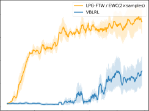


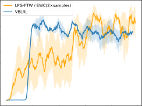

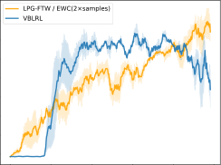

Figure 6: Average performance comparison for **single-task** baselines. Top-Left: **Hopper-**
**Gravity** ; Top-Right: **Hopper-Bodyparts** ; Bottom-Left: **Walker-Gravity** ; Bottom-Right: **Walker-**
**Bodyparts** .


**I** **Full lifelong RL comparison on Mujoco domain**


As LPG-FTW and EWC are built upon a model-free RL baseline with relatively lower sample
efficiency, we let LPG-FTW/EWC collect 2 _._ 0 _×_ more samples (interactions with the environment)
than VBLRL as in the single-task learning setting. Comparing Figure 6 and Figure 7, we find
that in the Hopper domains, even though the single-task baseline used by LPG-FTW and EWC
performs much better than VBLRL after we let them collect 2 _×_ samples each iteration, in lifelong RL
experiments VBLRL still achieves comparable performance with LPG-FTW and EWC. In the walker
domains where the single task baselines achieves similar performance, VBLRL shows significant
better performance than LPG-FTW/EWC in lifelong RL experiments.


**J** **Grid-World Item Searching**


We also evaluate BLRL in a simple Grid-World domain. Our testbed consists of a collection of
houses, each of which has four rooms. The goal of each task is to find a specific object (blue, green or
purple) in the current house. The type of each room is sampled based on an underlying distribution
given by the environment. Each room type has a corresponding probability distribution of which kind
of objects can be found in rooms of this type. Different tasks/houses vary in terms of which rooms
are which types and precisely where objects are located in the room (the task’s hidden parameters).


To simplify the problem, instead of modeling the whole MDP distribution, we use BLRL to model
the object distribution as the Bayesian posterior and sample MDPs from the distribution. We use
BOSS with a fixed prior (no intertask transfer) as our baseline. The average training performance of
all 300 tasks are shown in Figure 8 top right. Each task consists of 10 epochs, with 21 sample steps
for each epoch. Within the limited steps allotted for each task, BLRL is able to discover and transfer


22


|350<br>300<br>250<br>200<br>150<br>100<br>50<br>0 20 40|Col2|
|---|---|
|0<br>20<br>40<br><br><br>50<br>100<br>150<br>200<br>250<br>300<br>350<br>|60<br>80<br>100<br>|


|300<br>250<br>200<br>150<br>100<br>50<br>0<br>0 20 40|Col2|
|---|---|
|0<br>20<br>40<br><br>0<br>50<br>100<br>150<br>200<br>250<br>300<br>|60<br>80<br>|


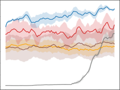

Figure 7: Average performance comparison for **lifelong RL algorithms** . Top-Left: **Hopper-**
**Gravity** ; Top-Right: **Hopper-Bodyparts** ; Bottom-Left: **Walker-Gravity** ; Bottom-Right: **Walker-**
**Bodyparts** .


the common knowledge and helps the agent quickly adapt to new tasks as the training goes on. In
comparison, running BOSS with a fixed prior is able to find the optimal policy eventually but needs
more sample steps and learns more slowly than BLRL.

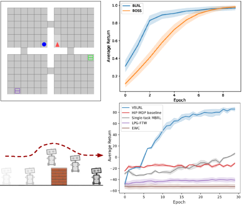


Figure 8: Top-left: Grid-World Item Searching; Top-right: Grid-World Item Searching evaluation
results; Bottom-left: Box-jumping Task; Bottom-right: Box-jumping Task evaluation results.


**K** **Box-Jumping Task**


We use a simplified version of the jumping task [ 9 ] as a testbed for the proposed algorithm VBLRL.
As shown in Figure 8 bottom left, the goal of the agent is to reach the right side of the screen by
jumping over the obstacle. The agent can only choose from two actions: jump and right. It will hit


23


the obstacle unless the jump action is chosen at precisely the right time. We set different obstacle
positions as different tasks, constituting the HiP-MDP hidden parameters. The 4-element state
vector describes the ( _x, y_ ) coordinates of the agent’s current position, and its velocity in the _x_ and _y_
directions.


Figure 8 bottom right presents the average performance during training across all 300 tasks. Each
task is run for 30 episodes. VBLRL clearly learns faster than the HiP-MDP baseline and reaches
better final performance. Thus, in the lifelong RL setting, separating the updating processes of the
world-model posterior and the task-specific posterior can lead to better learning efficiency.


**L** **How VBLRL models different categories of uncertainty**


𝑃 Ω


𝜔 𝑖


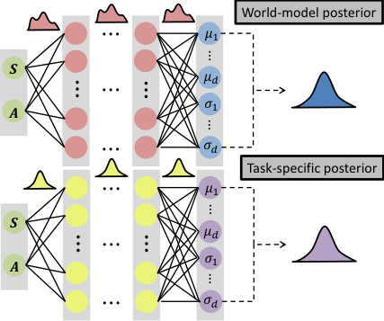

uncertainty


Figure 9: How VBLRL estimates different kinds of uncertainties in HiP-MDP. The world-model
posterior captures the epistemic uncertainty of the general knowledge distribution (shared across all
tasks controlled by the hidden parameters) via the internal variance of world-model BNN. As the
learner is exposed to more and more tasks, the posterior should converge to _P_ Ω . The task-specific
posterior captures the epistemic uncertainty of the current task _i_, which comes from the alleatory
uncertainty of the world model when generating _ω_ _i_ for a new task, via the internal variance of
task-specific BNN. The posterior should output the highest probability for _ω_ near the true _ω_ _i_ as the
agent collects enough data from the task. The aleatory uncertainty of the final prediction is measured
by the output variance of the prediction.


**M** **Additional explanation of the algorithm**


Here we first provide an example to help the readers better understand our plate notation. In our
Gridworld Item Searching case, Ψ represents the parameters of _P_ Ω, which is the room-type and
object distribution. For each task, the environment samples a hidden parameter _ω_, which is the actual
room and object layout of this house, from this distribution _P_ Ω . The sampled _ω_ then will result in an
MDP _m_ and let the agent interact with it.


**M.1** **planning algorithm**


With the transition dynamics and reward functions, a planning algorithm like CEM is not the only way
to solve the MDP to get an optimal policy. Another option would be using other Deep RL algorithms
like Soft actor-critic [ 19 ] with data generated from the model. However, in this case, incorporating a
deep RL algorithm means that we need to introduce additional neural networks (that is, policy/value
networks) for each task. The update signal from the RL loss is usually stochastic and weak, which is
even worse in this case when our model is still far from accurate. So, here we assume applying a
planning algorithm is a better way to get the policy.


24


**N** **Ablation study of the number of particles**


We also run ablation studies on the number of particles in CEM planning. The agent performance
is close when the number of particles is around 50. The computational complexity drops as we use
fewer particles and is especially larger when the number of particles _≥_ 70.

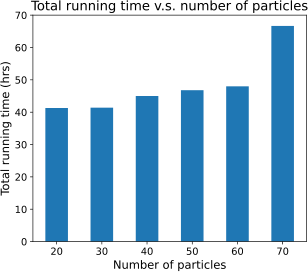

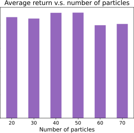


Figure 10: Left: How the average performance change with respect to different number of particles
on Cheetah-Gravity domain. Right: How the total running hours on a Nvidia Geforce RTX 3090Ti
change with respect to different number of particles on Cheetah-Gravity domain.


**O** **Coin Example**


Consider a coin-flipping environment. We want to find the sample complexity of the unbiased coin
(i.e. How many times we need to flip this coin such that our posterior samples are accurate.). Consider
a Dirichlet prior, _α_ 0 = ( _n_ 1 _, n_ 2 ) and _θ_ 0 = ( [1] 2 _[,]_ [1] 2 [)] [. We want to find sample complexity] _[ B]_ [ such that]

the posterior likelihood for a coin with heads likelihood in [0 _._ 5 _−_ _ϵ,_ 0 _._ 5 + _ϵ_ ] is at least 1 _−_ _δ_ .


Note that the Dirichlet distribution on the two-dimensional simplex is the Beta distribution. The
Multinomial distribution with two outcomes is the Binomial distribution. That is, given the process


_H ∼_ _Bin_ ( _H|ρ_ = 0 _._ 5 _, B_ ) _,_ (21)


ˆ
_ρ ∼_ _Beta_ (ˆ _ρ|α_ = _H_ + _n_ 1 _, β_ = _B −_ _H_ + _n_ 2 ) _,_ (22)


choose a value _B_ such that


_P_ (0 _._ 5 _−_ _ϵ ≤_ _ρ_ ˆ _≤_ 0 _._ 5 + _ϵ_ ) _≥_ 1 _−_ _δ,_ (23)


_B_
�


_ρ_ ˆ=0 _._ 5 _−ϵ_ _Beta_ (ˆ _ρ|α_ = _H_ + _n_ 1 _, β_ = _B −_ _H_ + _n_ 2 ) _≥_ 1 _−_ _δ._ (24)


0 _._ 5+ _ϵ_

� _Bin_ ( _H|ρ_ = 0 _._ 5 _, B_ ) _·_ ˆ

_H_ =0 � _ρ_ =0 _._ 5


Here, _n_ 1 and _n_ 2 capture the prior. The smallest _B_ that satisfies Equation 24 can be found numerically.


We set _ϵ_ = 0 _._ 1 and _δ_ = 0 _._ 3 . Here are the results of sample complexity _B_ given different values of

_n_ 1 _, n_ 2 :


We fix the sum of ( _n_ 1 _, n_ 2 ) as 10 . As shown in the results, the value of sample complexity _B_ becomes
lower as we use a more accurate prior (from (10 _,_ 0) to (5 _,_ 5) and from (0 _,_ 10) to (5 _,_ 5)).


In general, for the task-specific posterior, we can relate _B, ϵ_ and _δ_ with the following equation:
� _P_ _Dir_ ( _P_ 0 _|_ Φ _[T rue]_ )� � _Mult_ ( _N_ _|P_ 0 _, B_ )� [�] _P_ : _P_ _−P_ _ϵ_ _Dir_ ( _P_ _|_ Φ _old_ + **N** ) _dP_ ��


� _Mult_ ( _N_ _|P_ 0 _, B_ )� [�]

**N** : _||_ **N** _||_ 1 = _B_


_P_ 0 _Dir_ ( _P_ 0 _|_ Φ _[T rue]_ )� �


_Dir_ ( _P_ _|_ Φ _old_ + **N** ) _dP_ _dP_ 0 _≥_ 1 _−δ_
_P_ : _||P_ (Φ) _−P_ 0 (Φ) _||≤ϵ_ ��


(25)
For the world model posterior:
� _Mult_ ( _N_ _|P_ _w_ 0 _, B_ _w_ )� [�] _Dir_ ( _P_ _w_ _|_ Φ _w_ _old_ + **N** ) _dP_ _w_ � _≥_ 1 _−_ _δ_ (26)


� _Mult_ ( _N_ _|P_ _w_ 0 _, B_ _w_ )� [�]

**N** : _||_ **N** _||_ 1 = _B_ _w_


_Dir_ ( _P_ _w_ _|_ Φ _w_ _old_ + **N** ) _dP_ _w_ _≥_ 1 _−_ _δ_ (26)
_P_ : _||P_ _w_ (Φ) _−P_ _w_ 0 (Φ) _||≤ϵ_ �


25


( _n_ 1 _, n_ 2 ) lowest _B_
(0,10) 78
(1,9) 68
(2,8) 58
(3,7) 49
(4,6) 42
(5,5) 40
(6,4) 42
(7,3) 48
(8,2) 58
(9,1) 68
(10,0) 78


For each task, first we pick a true model _P_ 0 according to the true distribution and initialize the
task-specific prior Φ _old_ = Φ _w_ . Then, we make some observations from the world. Once we have the
true model and the observations, we can calculate how many models are _ϵ_ -close to the true model,
weighted according to their posterior likelihood.


26


