## R EINFORCEMENT L EARNING AND B ANDITS FOR S PEECH AND L ANGUAGE P ROCESSING : T UTORIAL, R EVIEW AND O UTLOOK

A G ENTLE I NTRODUCTION


**Baihan Lin**
Columbia University
New York, NY 10027

```
                 baihan.lin@columbia.edu

```

October 20, 2023


**A** **BSTRACT**


In recent years, reinforcement learning and bandits have transformed a wide range of real-world
applications including healthcare, finance, recommendation systems, robotics, and last but not
least, the speech and natural language processing. While most speech and language applications of
reinforcement learning algorithms are centered around improving the training of deep neural networks
with its flexible optimization properties, there are still many grounds to explore to utilize the benefits
of reinforcement learning, such as its reward-driven adaptability, state representations, temporal
structures and generalizability. In this survey, we present an overview of recent advancements of
reinforcement learning and bandits, and discuss how they can be effectively employed to solve speech
and natural language processing problems with models that are adaptive, interactive and scalable.


_**Keywords**_ Reinforcement Learning _·_ Bandits _·_ Speech Processing _·_ Natural Language Processing _·_ Survey _·_ Perspective


**1** **Introduction**


As two cornerstones of modern day technologies, speech processing and natural language processing (NLP) are innately
sequence learning problems to extract information from these linguistic or speech signals and provide insights into
interactive systems to communicate in human understandable languages. The sequential and interactive nature of these
problems can make them well-suited into the algorithmic framework of reinforcement learning (RL). In a reinforcement
learning setting, an agent interacts with an environment through observations and actions, and based on the reward
feedback attributed by the underlying reward function of this environment, the agent learns how to perform the task of
interest through trials and errors. While the successful applications of reinforcement learning have been highlighted
by a wide range of surveys in many real-world engineering domains such as robotics [ 1 ], vision [ 2 ], finance [ 3 ],
healthcare [ 4 ], linguistics [ 5 ], and energy management [ 6 ], there have not been one for the rich community of both the
speech and language domains. This is the first survey that emphasizes the synergy among the growing fields of the
speech processing, natural language processing and the reinforcement learning. We aim to fill this gap by adopting
a complete, timely and classical view of the reinforcement learning problems and their connections to speech and
language processing.


This survey distinguishes itself from previous ones by introducing, for the first time, the application of bandits and online
learning to speech processing tasks. While deep reinforcement learning has gained popularity for reward-driven policy
optimization in neural network architectures, other speech or language domains may be better suited to lightweight
representations in the bandits and online learning framework. Additionally, over the past two years, there have been
significant developments in different variants of reinforcement learning scenarios, such as inverse reinforcement learning,
offline reinforcement learning, imitation learning, and behavioral cloning. Despite the successful applications outside
the speech domain, these new problems can benefit from more exposure to the speech and language communities due
to their unique perspectives and advantages. This survey provides a comprehensive overview of these novel problem
settings as well as their state-of-the-art solutions (including the latest work in the field of large language models).


Reinforcement Learning and Bandits for Speech and Language Processing: Tutorial, Review and Outlook


As this interdisciplinary field is still a fast growing research area at its early stages, the intended target audience for
this survey are not just new researchers in the field, but also specialists of the speech and language domains that
hopefully can gain insights and inspirations from the recent advances in reinforcement learning. Accompanying
the _INTERSPEECH 2022_ tutorial “Reinforcement Learning and Bandits for Speech and Language Processing”, the
goal of this survey is not to provide an exhaustive review of the fields, but to first provide an applied tutorial of the
methodologies in reinforcement learning, and then guide the readers through a series of prototypical examples of how
reinforcement learning can be effectively applied to major speech and language tasks. We hope these case studies
motivate the readers to rethink their daily tasks as reinforcement learning problems and encourage new discussions.


**Contents**


**1** **Introduction** **1**


**2** **Why do we want reinforcement learning in speech and language processing** **3**


**3** **A Concise Tutorial of Reinforcement Learning and Bandits** **5**


3.1 Preliminaries . . . . . . . . . . . . . . . . . . . . . . . . . . . . . . . . . . . . . . . . . . . . . . . 5


3.2 Multi-Armed Bandits (MAB) . . . . . . . . . . . . . . . . . . . . . . . . . . . . . . . . . . . . . . . 6


3.3 Contextual bandits . . . . . . . . . . . . . . . . . . . . . . . . . . . . . . . . . . . . . . . . . . . . 9


3.4 Reinforcement learning . . . . . . . . . . . . . . . . . . . . . . . . . . . . . . . . . . . . . . . . . . 11


3.5 Inverse reinforcement learning . . . . . . . . . . . . . . . . . . . . . . . . . . . . . . . . . . . . . . 15


3.6 Imitation learning and behavioral cloning . . . . . . . . . . . . . . . . . . . . . . . . . . . . . . . . 19


**4** **Reinforcement Learning Formulation for Speech and Language Applications** **20**


4.1 Automatic speech recognition (ASR) . . . . . . . . . . . . . . . . . . . . . . . . . . . . . . . . . . . 20


4.2 Speaker recognition and diarization . . . . . . . . . . . . . . . . . . . . . . . . . . . . . . . . . . . 23


4.3 Spoken language understanding (SLU) . . . . . . . . . . . . . . . . . . . . . . . . . . . . . . . . . . 24


4.4 Natural language understanding (NLU) . . . . . . . . . . . . . . . . . . . . . . . . . . . . . . . . . 26


4.5 Sequence generation and text-to-speech (TTS) synthesis . . . . . . . . . . . . . . . . . . . . . . . . 28


4.6 Natural language generation (NLG) . . . . . . . . . . . . . . . . . . . . . . . . . . . . . . . . . . . 30


4.7 Large language models (LLM) . . . . . . . . . . . . . . . . . . . . . . . . . . . . . . . . . . . . . . 31


4.8 Conversational recommendation systems (CRS) . . . . . . . . . . . . . . . . . . . . . . . . . . . . . 33


**5** **Emerging Reinforcement Learning Strategies** **35**


5.1 Deep reinforcement learning and bandits . . . . . . . . . . . . . . . . . . . . . . . . . . . . . . . . . 35


5.2 Batched and offline reinforcement learning . . . . . . . . . . . . . . . . . . . . . . . . . . . . . . . . 36


5.3 Transfer learning in reinforcement learning . . . . . . . . . . . . . . . . . . . . . . . . . . . . . . . 37


**6** **Open Questions and Challenges** **38**


6.1 Multi-agent settings in speech and language . . . . . . . . . . . . . . . . . . . . . . . . . . . . . . . 38


6.2 Multi-objective training and human priors . . . . . . . . . . . . . . . . . . . . . . . . . . . . . . . . 39


**7** **Summary and Resources** **41**


**8** **Note and Acknowledgements** **42**


2


Reinforcement Learning and Bandits for Speech and Language Processing: Tutorial, Review and Outlook

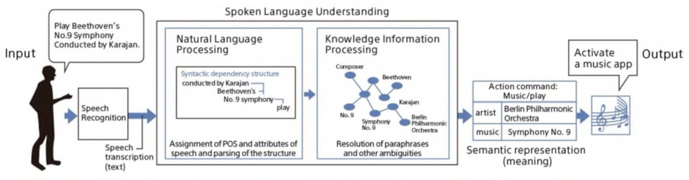


Figure 1: Example of a speech and language processing system


**Preview** . The survey is organized in the following way: First, we briefly introduce the basic concept of reinforcement
learning and bandits, as well as the major variant problem settings in this machine learning domain. Second, we translate
various speech and language tasks into the reinforcement learning problems and show the key challenges. Third, we
introduce some reinforcement learning and bandit techniques and their varieties for speech and language tasks and their
machine learning formulations. Fourth, we present several state-of-the-art applications of reinforcement learning in
different fields of speech and language. Lastly, we will discuss some open problems in reinforcement learning and
bandits to show how to further develop more advanced algorithms for speech and language research in the future.


**2** **Why do we want reinforcement learning in speech and language processing**


A speech and natural language processing system usually involves many components. For instance, Figure 1 is an
example of a voice command system to play music. It starts with a speech recognition engine to transcribe the speech
into text. A speech language understanding components first uses natural language processing techniques to parse
out the semantic structure, its intents (e.g. command actions) and then utilizes available knowledge graphs to extract
machine understandable symbolic relationships for downstream information retrieval. Then the system will locate the
entry in the databases that most closely matches the entity of query. Finally, the music app is activated playing the entry.
These components are often data-rich machine learning models or data analytical tools pretrained on existing data.
The iterative process of such a speech or language-based system is a cycle from more users to more data to smarter
algorithms to better products and finally back to more users (Figure 2A).


From a industrial product point of view, these system components (which are sometimes called services) interact with
the underlying databases in various ways. Figure 2B shows an example relationship between the services and the

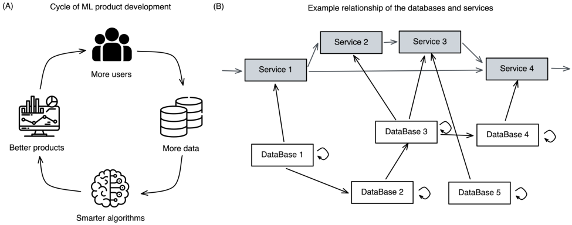


Figure 2: (A) Cycle of the machine learning-based product development. (B) Example relationships among multiple
services and multiple databases, each with their own update schedules or frequencies.


3


Reinforcement Learning and Bandits for Speech and Language Processing: Tutorial, Review and Outlook

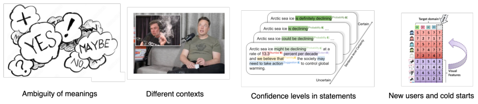


Figure 3: Data uncertainty in speech and language processing.

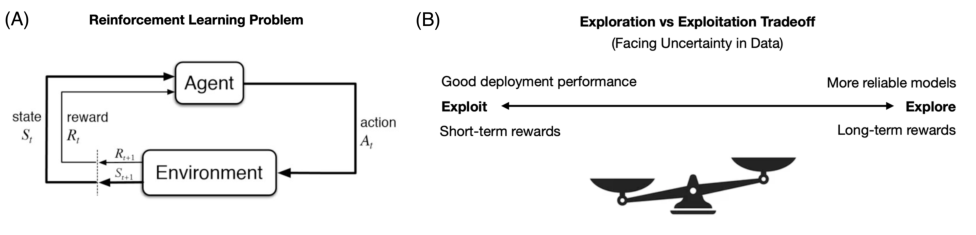


Figure 4: (A) The reinforcement learning problem. (B) The exploration vs exploitation tradeoff.


databases they train on. One service might depend on the information flow from another or several other services.
One database might be accessed by one or more services, and also at the same time linked with another databases
(e.g. in relational databases). These databases are usually updated in different frequencies. For instance, one database
might updates regularly every 6 hours, while another database updates only sporadically whenever a new user signs
up. One database might update its record everytime another database updates. Since we train our service models on
these databases, one challenge of model training for different services is to determine when or how often they are
trained given the updates in the databases. One might wish to train the service model everytime the available pool
of historical data is updated, so as to get the best performing model. On the other hand, given the large size of the
historical data and model parameters in industrial setting, iteratively retraining all the models at each database update
would be too computationally expensive and environmentally irresponsible. As a result, we want our models to ideally
be able to learn incrementally, and strategically given its performance or metric. Such a model would ideally deal with
the uncertainty in the data: exploit what we have learned so far to make the best decision in deployment, while also
exploring enough rounds in relatively unfamiliar knowledge domains to gain better understanding of all possible actions
it can take. This strategy of dealing with uncertainty is usually called the _Exploration vs. Exploitation dilemma tradeoff_ .


_Uncertainty_ is everywhere in speech and language domains. Figure 3 provides a few examples. For instance, the same
words or sentences can have ambiguious meanings. The speech properties and language patterns can vary significantly
when the contexts are different (e.g. a podcast interview vs. a commencement speech). The same statements can also
have different levels of confidence, depending on their contexts and wording. New users or data streams might introduce
distributional shifts and cold start issues. Other than innate noises or uncertainty in the data, there are also systematic
uncertainty in machine learning systems. For instance, the model might not be flexible to handel the variability in real
world situations. There might be errors and noises in the measurement systems, both in deployment and in training
(e.g. errors in the labels in the training data). Since there are many hyperparameters to design the model, techniques
like neural architecture search (and graduate student descent) can introduce uncertainty in model structures. Even with
the same models, different training procedures can give rise to different performance and fidelity. Finally, during the
inference phase, models can give prediction with different confidence levels. [ 7 ] covers different approaches to measure
and quantify uncertainty in neural networks.


_Reinforcement learning_ is the learning of trials and errors to deal with uncertainty in data. Usually, a reinforcement
learning problem involves two subjects: an agent and an environment. The agent interact with the environment and the
environment provides reinforcement to help the agent learn. More formally, at each time step _t_, the _agent_ takes an action
_A_ _t_ to affect the _environment_, and the environment transitions to the next state _S_ _t_ and reveals a reward feedback _R_ _t_ to
the agent for it to update its policy (Figure 4A). The exploration vs. exploitation tradeoff then resides on a spectrum: on
the one end, if we exploit, we obtain short-term rewards by reaching good deployment performance given what we


4


Reinforcement Learning and Bandits for Speech and Language Processing: Tutorial, Review and Outlook

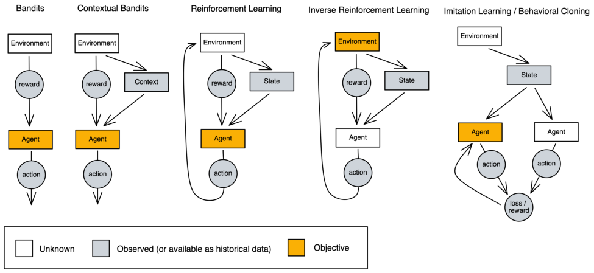


Figure 5: Five classes of reinforcement learning-related problems. The blocks are models or systems. The circles are
intermediate scalars or vectors. The white ones are unknown quantities or systems. The grey ones are observed variable,
or sometimes, available historical data. The orange ones are the objectives to solve.


have known so far; on the other end, if we explore, we obtain long-term rewards because we are building more reliable
models by collecting knowledges in uncertain problem spaces (Figure 4B). Reinforcement learning algorithms can
navigate between these two ends to get a dynamic strategy according to the problem and performance. It is adaptive,
so it can continually learn to accomodate for the changes in the data. It is about optimizing for the expected future
rewards, so it can innately predict or plan ahead for future events. Since it is mostly driven by its reward feedback, it is
also generalizable to new tasks or uncertainty patterns by modifying its reward structure. These algorithmic properties
suggest that speech and language models may benefit from adopting a reinforcement learning approach.


One useful perspective to approach an applied task of interest is to think the following questions: what are the costs and
benefits in this learning system? When should this system explore (as opposed to exploit)? And how to properly explore
the problem space? These three questions can help us better formulate the applied problems into RL framework.


**3** **A Concise Tutorial of Reinforcement Learning and Bandits**


In this section, we will give an applied tutorial of five classes of reinforcement learning-related problems. Figure 5
outlines the difference in their problem settings, where the circles are intermediate scalars or vectors, the white blocks
are quantity or system that are unknown, the grey blocks are the observed variable or available historical data, and the
orange blocks are the objectives that we are attempting to solve. We note that this visual representation is similar to a
probabilistic graphical model, but that is not intended nor implied.


**3.1** **Preliminaries**


Most of the times, solving different classes of reinforcement learning can be modeled by a mathematical framework
called the Markov decision processes (MDP) [8]. An MDP is defined by the tuple ( _S, A, T, R, γ_ ):


    - _S_ : a set of possible states

    - _A_ : a set of actions

    - _T_ : a transition function, defined as _T_ ( _s, a, s_ _[′]_ ) = Pr( _s_ _[′]_ _|s, a_ ), where _s, s_ _[′]_ _∈S_ and _a ∈A_

    - _R_ : a reward function, _S × A × S �→_ R


This is a generalized formulation of the MDP. As we will see in the following the sections, some problems might only
involve a subset of these notations (e.g. the bandits may not have states). Typically, the objective of the learning process
is to maximize the long-term reward, assuming an infinite-horizon decision process. In other words, we want to find a


5


Reinforcement Learning and Bandits for Speech and Language Processing: Tutorial, Review and Outlook


**Algorithm 1** Multi-Armed Bandits Problem


1: **for** t = 1, 2, 3, _· · ·_, T **do**
2: _r_ ( _t_ ) is drawn according to P _r_
3: Player chooses an action _a_ _t_ = _π_ _t_ ( _t_ )
4: Feedback _r_ _a_ _t_ _,t_ ( _t_ ) for the arm _a_ _t_ is revealed
5: Player updates its policy _π_ _t_
6: **end for**


_policy_ function, _π_ : _S �→A_, which specifies the action to take in a given state (which in the bandit scenario, might be a
context or nothing), so that the cumulative reward is maximized.


**3.2** **Multi-Armed Bandits (MAB)**


Consider yourself at a casino, and in front of you, there are many bandit machines, each with an arm. For starter, we
assume that they each have a static reward payoff, which is unknown to you. To gain better understanding of a certain
bandit arm, you will need to pull that arm to gain a reward feedback revealed only for that arm. You want to play for _T_
rounds, and maximize your cumulative rewards. Back to our previous introduction to the Exploration vs Exploitation
tradeoff: if we exploit entirely, we make long-term sacrifices by potentially missing unknown optimal action, because
we are only choosing the best arm given the current information; if we explore entirely, we make short-term sacrifices
by missing out known rewards, because we are always gathering more information. Due to the effectiveness of bandit
algorithms in balancing the exploration vs exploitation tradeoff, they are widely applied in finance [ 9, 10 ], epidemic
control [ 11, 12 ], hyperparameter tuning [ 13, 14 ], recommendation systems [ 15, 16 ], clinical prescription [ 17, 18 ],
human behavioral modeling [19, 20, 21] and A/B testing [22, 23].


As in algorithm 1, for each round, the player chooses an action _a_ _t_ given its policy _π_ _t_, and _r_ _a_, the feedback for only the
chosen arm is revealed, which is often called _bandit feedback_ . The player then updates its policy _π_ _t_ given the feedback.
If the player plays for _T_ trials, the goal of the agent is to maximize the total payoff (sum of rewards) [�] _t∈_ 1 _...T_ _[r]_ _[t]_ [. In]

another term, we can rephrase the performance metric to be minimizing total regret [�] _t∈_ 1 _...T_ [(] _[r]_ _[∗]_ _[−]_ _[r]_ _[t]_ [)] [, where] _[ r]_ _[∗]_ [is the]
best arm reward. Other evaluation metrics include maximizing the average reward, and maximize the percentage of
optimal action selection.


Here the agent is an algorithm, and the environment is the bandit task. Since they are both stochastic, the goal of this
bandit task is empirically to maximize the expected total sum of rewards, i.e. E[ [�] _t∈_ 1 _...T_ _[r]_ _[t]_ []] [. This learning process of]

continually updating its policy by sequentially interacting with the bandit environment is also called online learning. To
report the results from an online learning environment, we can plot the above performance metrics over time steps (or
trials). From this learning curve, we may compare different algorithms and select the best one.


We will introduce a few strategies how bandit algorithms deal with the exploration vs exploitation tradeoff.


The first one is simply _explore first_ (by taking random actions for _N_ rounds) and then exploit (by choosing the arm
with the highest estimated expected reward, the greedy approach). The estimated expected reward is defined by a value
function called Q, where ˆ _Q_ [ˆ] _t_ ( _a_ ) is the estimated expected reward for action arm _a_ at time _t_ . A simple formulation of the
_Q_ _t_ ( _a_ ) is its average past observed rewards:


_Q_ ˆ _t_ ( _a_ ) := ˆ _µ_ _a_ = _[r]_ [1] [ +] _[ r]_ [2] [ +] _[ ...]_ [ +] _[ r]_ _[n]_ _[a]_ (1)

_n_ _a_


where _r_ _i_ is the observed reward for action arm _a_, and _n_ _a_ is the number of times action arm _a_ has been played. _Q_ [ˆ] _[t]_ _a_ [=0] = 0 .
There are many variants to this strategy by setting _N_ = _f_ ( _N_ ) . For instance, one can explore once ( _N_ = 1 ) for each
action first, or the first _ϵ_ proportion of rounds (i.e. the first _ϵ · T_ steps, where 0 _≤_ _ϵ ≤_ 1 ). In the textbook “Introduction
to reinforcement learning” [ 8 ], a bandit simulation example of 10 arms with different average rewards trained over 1000
time steps compares six algorithms: Random (choosing randomly at each round), Greedy (choosing only the arm with
the maximum Q value), Explore-First-20 (randomly choosing for only the first 20 rounds as pure exploration, and then
choosing the arm with the maximum Q value), Explore-First-100, Explore-First-200, Explore-First-500. The random
and purely greedy solutions both yield sub-optimal performance. Among the Explore-First- _N_ agents, the higher the
_N_ (the exploration steps), the better the long-term cumulative rewards they get, but at the short-term initial rounds,
especially when they are purely exploring, they receive rewards at the chance level, which might be a risky take for
real-world problems.


6


Reinforcement Learning and Bandits for Speech and Language Processing: Tutorial, Review and Outlook


**Algorithm 2** Upper Confidence Bound (UCB) Algorithm

1: Initialize _Q_ [ˆ] _a_ _′_ = 0 _, n_ _a_ _′_ = 0 _, ∀a_ _[′]_ _∈_ _A_
2: **for** t = 1, 2, 3, _· · ·_, T **do**


3: Choose _a_ _t_ =


arg max _a_ _′_ _∈A_ _Q_ [ˆ] _a_ _′_ +
�
� _−∞,_


2 ln _t_

_n_ _a′_ _[,]_ if _n_ _a_ _′_ _̸_ = 0


_−∞,_ otherwise
4: Observe _r_ _a_ _t_ _,t_ ( _t_ ) for the arm _a_ _t_


5: _Q_ ˆ _a_ _′_ = _Q_ ˆ _a′_ _·nn_ _aatt_ ++1 _r_ _at,t_ ( _t_ )

6: _n_ _a_ _t_ = _n_ _a_ _t_ + 1
7: **end for**


A better strategy would be to dynamically switching between exploiting (taking the greedy action) and exploring (taking
the random action). _ϵ_ _-Greedy_ algorithm describes a coin flipping process that, for a probability of _ϵ_ ( 0 _≤_ _ϵ ≤_ 1 ), the
agent take a random action at the current round, and for a probability of 1 _−_ _ϵ_, it takes the greedy action [ 24, 25 ].
This approach doesn’t explicitly specify a exploration phase and a exploitation phase, and generally yields a more
balanced learning process. In the bandit simulation example, if we compare _ϵ_ -Greedy ( _ϵ_ = 0 ), _ϵ_ -Greedy ( _ϵ_ = 0 _._ 01 )
and _ϵ_ -Greedy ( _ϵ_ = 0 _._ 1 ), we observe a better cumulative long-term reward for larger _ϵ_, i.e. more exploration. In the
short-term, similarly, smaller _ϵ_ can temporarily overtake larger ones by exploiting early, but they reach their plateau
faster at lower payoff.


Intuitively, at early rounds, the agent know little about the reward distribution of each arm, so it makes sense to explore
more at early rounds. However, when we use methods like _ϵ_ -Greedy, the explored arms will have their Q values
estimated in the first few steps larger than those of the unexplored arms (which are usually initialized zero), which
discourages exploration. One strategy to encourage exploration in the early rounds, is to set all Q values with a large
number to start with. This strategy of _optimistic initial values_, can innately inject exploration (even in the greedy turns)
to under-explored action arms [ 24, 26 ]. Empirically (in bandit simulations), this trick yield better cumulative long-term
rewards by trading off the rewards in very early rounds.


Another strategy would be to set a schedule for the exploration factor _ϵ_ in _ϵ_ -Greedy, such that it reflects certain priors
that can improve the learning. For instance, if we wish to encourage exploration in initial stages, we can use a _decaying_
_ϵ_ function (e.g. _ϵ_ ( _t_ ) _∝_ [1] _t_ [). Other variants of an] _[ ϵ]_ _[ schedule]_ [ can be a linear function, a step function, or oscillatory]

function if there are periodic changes in the environment. Despite proven poly-logarithmic bounds for these variants, it
was reported limited advantages in these heuristics [ 27 ]. One can also potentially bind this scheduling with detection
mechanism for paradigm shifts settings.


While useful, how to decide which scheduling function to use for the exploration? What if the environment is nonstationary and has irregular changes of reward distributions? And how best to motivate random exploration in a principle
way? _Probability matching_ (PM) is a decision making strategy that choose actions given the probability of their reward
in a stochastic setting [28, 29]. In other words, the probability of choosing arm _a_ at time _t_ :


ˆ
_Q_ _t_ ( _a_ )
_p_ _t_ ( _a_ ) _∝_ (2)
~~�~~ _a_ _[′]_ _∈A_ _[Q]_ [ˆ] _[t]_ [(] _[a]_ _[′]_ [)]


i.e. how likely the action arm is to be optimal. _Boltzmann exploration_ (or the SoftMax strategy) is such a formulation
that samples a random choice according to the Gibbs distribution:


_Qt_ ˆ ( _a_ )


_e_
_p_ _t_ ( _a_ ) =


_τ_

~~�~~ _a_ _[′]_ _A_ _[e]_


_a_ _[′]_ _∈A_ _[e]_


_Qt_ ˆ ( _a_ _[′]_ ) (3)


_τ_


The hyperparameter _τ_ is called temperature, which is a user-specified quantity to control the degree of exploration. If _τ_
is set to be zero, it is full exploitation. If it is set to be infinity, it is full exploration.


Similar to _ϵ_ -Greedy, we can also build variants of Boltzmann exploration with schedules of the temperature _τ_ (e.g.
having the temperature decays with the number of rounds played). However, the dependency of the user to choose the
exploration level (either _ϵ_ or _τ_ ) at each step can be problematic (e.g. unlucky initial experience) and a principled way to
select them remains elusive. One strategy would be to use other quantity to guide exploration, such as adopting the
_uncertainty-guided exploration_ . [ 30 ] proposes the family of _Upper Confidence Bound_ (UCB) algoritms as a elegant


7


Reinforcement Learning and Bandits for Speech and Language Processing: Tutorial, Review and Outlook


**Algorithm 3** Thompson Sampling (TS) Algorithm

1: Initialize _S_ _a_ _′_ = 0 _, F_ _a_ _′_ = 0 _, ∀a_ _[′]_ _∈_ _A_
2: **for** ˆ t = 1, 2, 3, _· · ·_, T **do**
3: _Q_ _t_ ( _a_ _[′]_ ) _∼_ _Beta_ ( _S_ _a_ _′_ + 1 _, F_ _a_ _′_ + 1) _∀a_ _[′]_ _∈_ _A_
4: Choose _a_ _t_ = arg max _a_ _′_ _∈A_ _Q_ [ˆ] _t_ ( _a_ _[′]_ )
5: Observe _r_ _a_ _t_ _,t_ ( _t_ ) for the arm _a_ _t_
6: _S_ _a_ _t_ = _S_ _a_ _t_ + _r_ _a_ _t_ _,t_ ( _t_ )
7: _F_ _a_ _t_ = _F_ _a_ _t_ + (1 _−_ _r_ _a_ _t_ _,t_ ( _t_ ))
8: **end for**

|Approach|Exploitation|Exploration|
|---|---|---|
|Switching to random exploration|_at_ = arg max_a∈A_ ~~ˆ~~_Qta_|_at_ = random action|


Uncertainty-guided exploration _a_ _t_ = arg max _a∈A_ _Q_ ~~[ˆ]~~ _t_ _a_ + measure of uncertainty
Probability matching Use _Q_ ~~[ˆ]~~ _t_ _a_ to define _p_ _t_ ( _a_ ) Select _a_ _t_ according to _p_ _t_ ( _a_ )


Table 1: Summary of bandit action selection strategies


algorithmic implementation of the idea of _optimism in the face of uncertainty_ by [ 31 ]. As in algorithm 2, each action


arm is represented by their estimated expected reward _Q_ [ˆ] _a_ and a confidence bound
�


2ln _N_


arm is represented by their estimated expected reward _Q_ _a_ and a confidence bound _n_ _a_ [as their uncertainty. The]

agent simply chooses the action that maximize the upper confidence bound:


2 ln _N_

(4)
_n_ _a_ _′_


ˆ
_a_ _t_ = arg max _Q_ _a_ _′_ +
_a_ _[′]_ _∈A_


�


where _N_ is the number of rounds played so far and _n_ _a_ is the number of time this arm _a_ has been chosen. We quickly
notice that, the first term is the exploitation term and the second term is the exploration term. (Upper Confidence
Bound-1) UCB1 is the most common implementation, which first let each arm to be played at least once before adopting
the upper confidence bound action selection policy. Similar to _ϵ_ -Greedy and Boltzmann exploration, one can create


variants of UCB1 by introducing a schedule parameter _C_ to the exploration: _Q_ [ˆ] _a_ + _C ·_
�


2 ln _N_


_n_ _a_ [.]


The UCB algorithms are specified from a frequentist point of view, one can also adopt a Bayesian approach to this
strategy. A _Bayesian bandit_ would represent the action value Q function as a probability distribution _p_ ( _Q_ [ˆ] _t_ ( _a_ )) and
directly compute the probability distribution of the Q values using the Bayes rule:


_p_ ( _Q_ [ˆ] _t_ ( _a_ ) _|D_ _a_ ) _∝_ _p_ ( _D_ _a_ _|Q_ [ˆ] _t_ ( _a_ )) _· p_ ( _Q_ [ˆ] _t_ ( _a_ )) (5)


where _D_ _a_ is the observed data (past rewards revealed when this arm is selected): _D_ _a_ = _{r_ 1 _, r_ 2 _, r_ 3 _, · · ·, r_ _n_ _a_ _}_ . The
action selection strategy for Bayesian bandits would be, instead of using the Q values directly, the agent first sample
from the probability distribution _p_ ( _Q_ [ˆ] _t_ ( _a_ )) of the Q value for each action arm. _Thompson sampling_ [ 32 ] (TS) is one
such algorithm that shows a competitive performance with other approaches [ 33 ]. In the Bernoulli bandit problem
(where the rewards are drawn from a Bernoulli distribution: _R_ _a_ _∼_ _Ber_ ( _p_ _a_ _∈_ [0 _,_ 1]) ), Thompson sampling is proven to
be asymptotically optimal [ 34 ]. The implementation is very straightforward. As in algorithm 3, we can express our
uncertainty about _Q_ [ˆ] _t_ ( _a_ ) with:


_p_ ( _Q_ [ˆ] _t_ ( _a_ )) _∼_ _Beta_ ( _S_ _a_ + 1 _, F_ _a_ + 1) (6)


where _S_ _a_ and _F_ _a_ are two values stand for “success” and “failure”. If the reward is 1, then we increment the “success”
_S_ _a_ by 1. And if the reward is 0, then we increment the “failure” _F_ _a_ by 1. Since this is a class of probability matching
method, we select the action based on _p_ ( _Q_ [ˆ] _a_ _|D_ _a_ ) where _D_ _a_ = _{r ∈_ [0 _,_ 1] _}_ . In our case, we randomly sample an
estimate _Q_ [ˆ] _t_ ( _a_ _[′]_ ) from the posterior, i.e. the Beta distribution of each arm parameterized by _S_ _a_ and _F_ _a_, and then choose
the action arm _a_ _t_ that has the maximum _Q_ [ˆ] _t_ ( _a_ _[′]_ ).


As a recap, we cover five strategies: exploration first, optimistic initial values, parameter schedule, guided exploration
and probability matching. We may represent the action value functions _Q_ [ˆ] _t_ ( _a_ ) in two approaches: the Frequentist


8


Reinforcement Learning and Bandits for Speech and Language Processing: Tutorial, Review and Outlook


**Algorithm 4** Contextual Bandits (CB) Problem


1: **for** t = 1, 2, 3, _· · ·_, T **do**
2: ( _x_ ( _t_ ) _, r_ ( _t_ )) is drawn according to P _x,r_
3: Context _x_ ( _t_ ) is revealed to the player
4: Player chooses an action _a_ _t_ = _π_ _t_ ( _x_ ( _t_ ))
5: Feedback _r_ _a_ _t_ _,t_ ( _t_ ) for the arm _a_ _t_ is revealed
6: Player updates its policy _π_ _t_
7: **end for**


**Algorithm 5** Linear Upper Confidence Bound (LinUCB) Algorithm

1: **Initialize** _c_ _t_ _∈_ R + _, A_ _a_ = _I_ _d_ _, b_ _a_ = 0 _d×_ 1 _, ∀a ∈_ _A_
2: **for** t = 1, 2, 3, _· · ·_, T **do**
3: Observe features _x_ _t_ _∈_ R _[d]_

5:4: **for all** _θ_ ˆ _a_ = _a A ∈_ _[−]_ _a_ _A_ [1] _[b]_ **do** _[a]_

6: _p_ _t,a_ = _θ_ [ˆ] _a_ _[⊤]_ _[x]_ _[t]_ [+] _[ c]_ _[t]_ � _x_ _[⊤]_ _t_ _[A]_ _a_ _[−]_ [1] _[x]_ _t_

7: Choose arm _a_ _t_ = arg max _a∈A_ _p_ _t,a_
8: Observe feedback _r_ _a_ _t_ _,t_
9: _A_ _a_ _t_ = _A_ _a_ _t_ + _x_ _t_ _x_ _[⊤]_ _t_
10: _b_ _a_ _t_ = _b_ _a_ _t_ + _r_ _a_ _t_ _,t_ _x_ _t_
11: **end for**


_r_ 1 + _r_ 2 + _..._ + _r_ _na_
approach ( _Q_ [ˆ] _t_ ( _a_ ) := ˆ _µ_ _a_ = _n_ _a_ ) and the Bayesian approach (express the uncertainty about _Q_ [ˆ] _t_ ( _a_ ) with

_p_ ( _Q_ [ˆ] _t_ ( _a_ )) ). As summarized in table 1, there are three action selection strategies. We can explicitly separate the
exploration (by taking random action) and the exploitation (by taking greedy action) into different phases. We can use
uncertainty to encourage optimism and guide exploration by combining the exploitation (the action estimate) and the
exploration (the measure of uncertainty) together into the argmax criterion. Finally, in probability matching approach,
we use _Q_ [ˆ] _t_ _a_ to define _p_ _t_ ( _a_ ) (exploitation) and select _a_ _t_ according to _p_ _t_ ( _a_ ) (exploration). Some effective algorithms
include _ϵ_ -Greedy, upper confidence bound (UCB), and Thompson sampling (TS).


We wish to point out that, the bandits by itself is a rich field, and there are many variants to these solutions. The
reward distributions can be independent or correlated [ 35 ], stochastic or adversarial [ 36, 37, 38 ], static or non-stationary

[ 39, 40 ]. The action space can be discrete or continuous [ 41, 42 ], finite or infinite number of arms [ 43 ], single or
multi-dimensional (combinatorial) [ 44, 45 ]. The time horizon can be infinite or finite [ 46 ]. There can be a single agent
or a population of bandit agents [ 12 ]. The feedbacks can be bandit or partially full feedback [ 47 ], always revealed or
only sporadically revealed (sparse or missing feedback) [ 48 ], and sometimes even budgeted [ 49, 45, 50 ]. As such, one
can choose from many different subproblems of bandits, such as adversarial bandits, combinatorial bandits, dueling
bandits, bandits with a budget or knapsack, multi-play bandits, bandits with dependent arms and finally the most
important variant of all, the contextual bandits. For readers with more interests, [ 51 ] is a good introduction to different
classes of bandit algorithms.


**3.3** **Contextual bandits**


The contextual bandits (CB) describe the scenario of multi-armed bandits that also receives side information as decision
making contexts [ 52 ]. As in algorithm 4, the contextual bandits problem is defined as follows. At each time point (or
iteration) _t_, before choosing the arm _a_ _t_ _∈_ _A_, agent observes an _M_ -dimensional context, _x_ _t_, as a feature vector of _M_
variables. The reward function _r_ ( _t_ ) is drawn according to P _x,r_, where _r_ _a_ ( _t_ ) _∈_ [0 _,_ 1] is a reward at time _t_ associated
with the arm _a ∈_ _A_ and the context at the current iteration _x_ _t_ (or alternatively, we can define a joint distribution over
( _x, r_ ) ). The agent uses this context as a side information, along with the rewards of the arms played in the past, to
choose which arm to play in the current iteration. The objective of this variant problem is to learn the relationship
between the context and reward, in order to find the best arm-selection policy for maximizing cumulative reward over
the time horizon.


For introduction purpose, here we assume a Bernoulli bandit with binary reward, i.e. _r ∈_ [0 _,_ 1]. We can adopt a linear
assumption [53], that the expected reward is a linear function of the context:


9


Reinforcement Learning and Bandits for Speech and Language Processing: Tutorial, Review and Outlook


**Algorithm 6** Contextual Thompson Sampling (CTS) Algorithm

1: **Initialize:** _B_ _a_ = _I_ _d_, _θ_ [ˆ] _a_ = 0 _d_ _, f_ _a_ = 0 _d_, _∀a ∈_ _A_ .
2: **for** _t_ = 1 _,_ 2 _,_ 3 _, · · ·, T_ **do**
3: Receive context **x** _t_
4: **for** _∀a ∈_ _A_, sample _θ_ [˜] _a_ from the _N_ ( _θ_ [ˆ] _a_ _, v_ [2] _B_ _a_ _[−]_ [1] [)]
5: Choose arm _a_ _t_ = arg max _a∈A_ _x_ ( _t_ ) _[⊤]_ _θ_ [˜] _a_
6: Receive reward _r_ _a_ _t_
7: _B_ _a_ _t_ = _B_ _a_ _t_ + _x_ _t_ _x_ _[T]_ _t_
8:9: _fθ_ ˆ _aa_ _tt_ = = _B f_ _aa_ _[−]_ _tt_ + [1] _[f]_ _x_ _[a]_ _t_ _t_ _r_ _a_ _t_
10: **end**


E[ _r_ _a_ _|_ **x** _t_ ] = _θ_ _a_ _[⊤]_ **[x]** _[t]_ (7)


where _µ_ _a_ is an unknown weight vector associated with the arm _k_ . The Linear Upper Confidence Bound (LinUCB)
algorithm is the contextual variants of the UCB algorithm [ 53 ]. The action value function now becomes _Q_ [ˆ] _t_ ( _x_ _t_ _, a_ ) and
can be used to estimate E [ _R_ _a_ _|x_ _t_ ]


We can formulate the problem as a least-square ridge regression problem on its reward function:


_R_ _a_ ( _x_ _t_ ) = _f_ _a_ ( _x_ _t_ ) + _ϵ_ = _x_ _[⊤]_ _t_ _[θ]_ [ +] _[ a]_ [ +] _[ ϵ]_ (8)


where _f_ _a_ is an arbitrary function that maps the context to the reward, _θ_ _a_ _∈_ R _[d]_ and _ϵ_ is the noise or error. At each time
step _t_ and given the context _x_ _t_, the weight for the action value solution becomes:


ˆ
_Q_ _t_ ( _x_ _t_ _, a_ ) = _x_ _[⊤]_ _t_ _[θ]_ [ˆ] _[a]_ (9)
_θ_ ˆ _a_ = ( _D_ _a_ _[⊤]_ _[D]_ _[a]_ [+] _[ I]_ _[d]_ [)] _[−]_ [1] _[D]_ _a_ _[⊤]_ _[C]_ _[a]_ (10)


_r_ 1

 _r_ 2


...

 _r_ _n_





.





 _, C_ _a_ =


where _D_ _a_ and _C_ _a_ are the historical contexts and rewards observed when this arm _a_ is chosen: _D_ _a_ =


_x_ 1

 _x_ 2


...

 _x_ _n_


The action selection will then depends on the estimated rewards with the mapping weight given the context:


ˆ
_S_ _t_ ( _x_ _t_ _, a_ ) = �


_x_ _[⊤]_ _t_ [(] _[D]_ _a_ _[⊤]_ _[D]_ _[a]_ [+] _[ I]_ _[d]_ [)] _[−]_ [1] _[x]_ _[t]_ (11)


_a_ _t_ = arg max( _Q_ [ˆ] _t_ ( _x_ _t_ _, a_ ) + _α · S_ _t_ ( _x_ _t_ _, a_ )) (12)
_a∈A_


where similar to the non-contextual version of UCB, here we have two terms in the argmax option, the first term ˆ
_Q_ _t_ ( _x_ _t_ _, a_ ) is for exploitation and the second term _S_ _t_ ( _x_ _t_ _, a_ ) is for the uncertainty-guided exploration, modulated by the
exploration factor _α_ .


This is the analogy to the linear regression problem, while empirically one can simply incrementally compute the
solution based on online feedback as in algorithm 5: we have matrix _A_ _a_ which characterizes the covariance of
contexts, and _b_ _a_ which characterizes the reward mapping; and at the action selection stage, we take the argmax of

( _A_ _[−]_ _a_ [1] _[b]_ _[a]_ [)] _[⊤]_ _[x]_ _[t]_ [+] _[ c]_ _[t]_ � _x_ _[⊤]_ _t_ _[A]_ _a_ _[−]_ [1] _[x]_ _t_ [; at the update stage, we simply incrementally update the covariance matrix] _[ A]_ _a_ [and]

reward mapping _b_ _a_ for the selected arm _a_ _t_ .


Similarly, we can formulate a linear contextual version of the Thompson sampling algorithm, the Contextual Thompson
Sampling [ 54 ] algorithm. We consider the general Thompson Sampling, where the reward _r_ _a_ _t_ for choosing arm _a_ _t_ at
time _t_ follows a parametric likelihood function _p_ ( _r_ _t_ _|θ_ [˜] _a_ ). The posterior distribution at time _t_ :


_p_ ( _θ_ [˜] _i_ _|r_ _t_ ) _∝_ _Pr_ ( _r_ _t_ _|θ_ [˜] _i_ ) (13)


10


Reinforcement Learning and Bandits for Speech and Language Processing: Tutorial, Review and Outlook


**Algorithm 7** Reinforcement Learning (RL) Problem


1: **for** t = 1, 2, 3, _· · ·_, T **do**
2: Agent makes an observation _o_ ( _t_ ) to the state _s_ ( _t_ )
3: Agent chooses an action given the current state or observation: _a_ _t_ = _π_ _t_ ( _o_ ( _t_ ))
4: Environment progresses to the next step _s_ _t_ +1 given the action _a_ _t_
5: Agent receives a reward feedback _r_ _a_ _t_ _,s_ _t_ ( _t_ ) for the action _a_ _t_ taken on state _s_ _t_
6: Agent updates its policy _π_ _t_
7: **end for**


To incorporate contextual information, _p_ ( _θ_ [˜] _i_ ) is given by a multivariate Gaussian distribution _N_ ( _θ_ [ˆ] _a_, _v_ [2] _B_ _a_ _[−]_ [1] [)] [, where]


_B_ _a_ ( _t_ ) = _I_ _d_ + [�] _[t]_ _τ_ _[−]_ =1 [1] _[x]_ _[τ]_ _[x]_ _τ_ _[⊤]_ [, and where] _[ d]_ [ is the size of the context vectors] _[ x]_ _[t]_ [,] _[ v]_ [ =] _[ R]_
�


24


_γ_ [)] [ with] _[ r >]_ [ 0] [,] _[ ϵ][ ∈]_ [[0] _[,]_ [ 1]] [,]


24 _ϵ_ _[d]_ [ ln(] [1]


_γ ∈_ [0 _,_ 1], and _θ_ [ˆ] _a_ ( _t_ ) = _B_ _a_ ( _t_ ) _[−]_ [1] ( [�] _[t]_ _τ_ _[−]_ =1 [1] _[x]_ _[τ]_ _[r]_ _[τ]_ [)] [. At every step] _[ t]_ [ for each action arm] _[ a]_ [, the algorithm samples a]
_d_ -dimensional context weight vector ˜ _µ_ _i_ from _N_ ( _θ_ [ˆ] _a_ ( _t_ ), _v_ [2] _B_ _a_ ( _t_ ) _[−]_ [1] ) . The agent would select the arm _a_ _t_ that maximizes
_x_ _[⊤]_ _t_ _[θ]_ [˜] _[a]_ [, and obtains reward] _[ r]_ _[t]_ [. [55] is a survey of different contextual bandits algorithms.]


**3.4** **Reinforcement learning**


Reinforcement learning is a general-purpose framework for decision-making. Reinforcement learning is for an agent
with the capacity to act. Each action taken by the agent influences the agent’s future state. The success of this problem
is measured by a scalar reward signal. As in the bandits and contextual bandits cases, the goal is to select actions to
maximize cumulative future rewards.


As hinted in the section of “Preliminaries”, reinforcement learning defines a class of algorithms for solving problems
modeled as Markov decision processes (MDP). Other than previously defined tuple ( _S, A, T, R_ ), _γ ∈_ [0 _,_ 1] is a
discounting factor for past or future rewards (the further into the past or future, the less impact of that reward has
on current action choice). Typically, the objective is to maximize the discounted long-term reward, assuming an
infinite-horizon decision process. In other words, we wish to find an optimal policy function _π_ : _S �→A_, which
specifies the action to take in a given state, so that the cumulative reward is maximized:


max

_π_


_∞_
� _γ_ _[t]_ _∇_ ( _s_ _t_ _, a_ _t_ _, s_ _t_ +1 ) (14)


_t_ =0


The experience of a reinforcement learning agent is a sequence of observations, actions and rewards:


_o_ 1 _, a_ 1 _, r_ 1 _, · · ·, r_ _t−_ 1 _, o_ _t_ _, a_ _t_ _, r_ _t_ (15)


The state is a summary of the experience defined above:


_s_ _t_ = _f_ ( _o_ 1 _, a_ 1 _, r_ 1 _, · · ·, r_ _t−_ 1 _, o_ _t_ _, a_ _t_ _, r_ _t_ ) (16)


which in a full observed environment, can be:


_s_ _t_ = _f_ ( _o_ _t_ ) (17)


A reinforcement learning agent usually involve one or more of three components: a _policy_ (which the agent’s behavior
function), a _value function_ (which evaluates how good each state and/or action is), and a _model_ (which is the agent’s
representation of the environment). More specifically, the policy maps from the state to action, which can be deterministic
( _a_ = _π_ ( _s_ ) ) or stochastic ( _π_ ( _a|s_ ) = _p_ ( _a|s_ ) ). The model is learned from experience, and acts as a proxy for the
environment. With its model, the agent can make sense how world changes given agent’s action in two ways: the
transition or dynamics model predicts the agent’s next state given an action _p_ ( _s_ _t_ +1 = _s_ _[′]_ _|s_ _t_ = _s, a_ _t_ = _a_ ) ; and the
reward model predicts the immediate reward at state given an action _r_ ( _s_ _t_ = _s, a_ _t_ = _a_ ) = E [ _r_ _t_ _|s_ _t_ = _s, a_ _t_ = _a_ ].


The value function is a prediction of future reward, i.e. what rewards will the agent gets by taking an action _a_ in state _s_ .
Q-value functions gives the expected total reward from state _s_ via action _a_ under policy _π_ with discount factor _γ_ :


_Q_ _[π]_ ( _s, a_ ) = E [ _r_ _t_ +1 + _γr_ _t_ +2 + _γ_ [2] _r_ _t_ +3 + _· · · |s, a_ ] (18)


11


Reinforcement Learning and Bandits for Speech and Language Processing: Tutorial, Review and Outlook

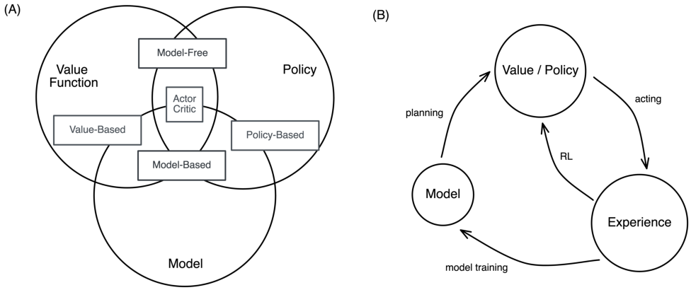


Figure 6: (A) Categorization of reinforcement learning approaches. (B) Sub-processes of reinforcement learning.
(Re-created from David Silver’s lecture).


which can be decomposed into a Bellman equation:


_Q_ _[π]_ ( _s, a_ ) = E _s_ _′_ _,a_ _′_ [ _r_ + _γQ_ _[π]_ ( _s_ _[′]_ _, a_ _[′]_ ) _|s, a_ ] (19)


where an optimal value function can be further obtained by taking the maximum achievable value:


_Q_ _[∗]_ ( _s, a_ ) = max _Q_ _[π]_ ( _s_ _[′]_ _, a_ _[′]_ ) = _Q_ _[π]_ _[∗]_ ( _s, a_ ) (20)
_π_


With this optimal value function _Q_ _[∗]_, the agent can act optimally:


_π_ _[∗]_ ( _s_ ) = arg max _Q_ _[∗]_ ( _s, a_ ) (21)

_a_


Maximizing over all possible decisions, _Q_ _[∗]_ ( _s, a_ ) can also be decomposed into a Bellman equation:


_Q_ _[∗]_ ( _s, a_ ) = _r_ _t_ +1 + _γ_ max (22)
_a_ _t_ +1 _[r]_ _[t]_ [+2] [ +] _[ γ]_ [2] [ max] _a_ _t_ +2 _[r]_ _[t]_ [+3] [ +] _[ · · ·]_


= _r_ _t_ +1 + _γ_ max (23)
_a_ _t_ +1 _[Q]_ _[∗]_ [(] _[s]_ _[t]_ [+1] _[, a]_ _[t]_ [+1] [)]


= E _s_ _′_ [ _r_ + _γ_ max (24)
_a_ _[′]_ _[ Q]_ _[∗]_ [(] _[s]_ _[′]_ _[, a]_ _[′]_ [)] _[|][s, a]_ []]


There are different ways to categorize reinforcement learning approaches. Figure 6A positions several approaches
with respect to their spectrum on the three major model components. Figure 6B also includes experience as a landing
point for sub-processes such as acting, model training and plannings. Overall there are _model-based_ reinforcement
learning and _model-free_ reinforcement learning. Model-based methods construct a full model of the environment
explicitly and then plan ahead by rolling out future steps using the model. It may or may not have an explicit policy
and/or value function. Model-free methods, on the other hand, doesn’t have a model, and has explicit functions for the
value and/or policy. The model-free reinforcement learning can be further separated into _value-based_ and _policy-based_
reinforcement learning. Value-based reinforcement learning estimate the optimal value function _Q_ _[∗]_ ( _s, a_ ), which is the
maximum value achievable under any policy. Policy-based reinforcement learning search directly for the optimal policy
_π_ _[∗]_, and use that policy to achieve the maximum future reward. There are methods which are both value-based and
policy-based, such as the actor-critic algorithm, which we will cover in a bit.


_Q-learning_ is a model-free value-based reinforcement learning algorithm. The Q-value of a state-action pair, _Q_ ( _s, a_ ),
is key to this algorithm, representing the expected future discounted reward for taking action _a ∈A_ in state _s ∈S_ .


12


Reinforcement Learning and Bandits for Speech and Language Processing: Tutorial, Review and Outlook


**Algorithm 8** Q-Learning Algorithm

1: **Initialize:** _Q_ _s,a_ = 0 _∀s ∈_ _S, ∀a ∈_ _A_
2: **for** each episode _e_ **do**
3: Initialize state _s_
4: **Repeat** for each step _t_ of the episode _e_
5: Take action _a_ = arg max _a_ _′_ _Q_ ( _s, a_ _[′]_ ), and
6: Observe _s_ _[′]_ _∈_ _S_, _r ∈_ _R_ ( _s_ )
7: _s_ = _s_ _[′]_

8: _Q_ ( _s, a_ ) := _Q_ [ˆ] ( _s, a_ ) + _α_ _t_ ( _r_ + _γ_ max _a_ _′_ _Q_ [ˆ] ( _s_ _[′]_ _, a_ _[′]_ ) _−_ _Q_ [ˆ] ( _s, a_ ))
9: **until** s is the terminal state

10: **end for**


The action selection strategy is straightforward: _a_ _t_ = arg max _a_ _Q_ _[π]_ ( _s, a_ ) . Previously, we have shown that the optimal
value function can be translated into a Bellman equation _Q_ _[∗]_ ( _s, a_ ) = E _s_ _[′]_ [ _r_ + _γ_ max _a_ _[′]_ _Q_ _[∗]_ ( _s_ _[′]_ _, a_ _[′]_ ) _|s, a_ ] . Therefore, we
can potentially approximate _Q_ _[∗]_ by directly attempting to solve the optimal Bellman equation. To do so, we define the
Bellman error as the update to our expected return when we observe the next state _s_ _[′]_ :


_r_ ( _s_ _t_ _, a_ _t_ ) + _γ_ max _Q_ ( _s_ _t_ +1 _, a_ ) _−_ _Q_ ( _s_ _t_ _, a_ _t_ ) (25)
_a_


The first half of this error term, _r_ ( _s_ _t_ _, a_ _t_ ) + _γ_ max _a_ _Q_ ( _s_ _t_ +1 _, a_ ) is the right hand side of the Bellman equation, and
sometimes also related to the notion of the temporal difference (TD) target. As in algorithm 8, Q-learning is the
algorithm that repeatedly adjusts Q to minimize the Bellman error. Ideally, when the policy is converged to the optimal
solution, the Bellman error would be zero. Each time, we sample consecutive states and actions to update the Q values:


_Q_ ( _s_ _t_ _, a_ _t_ ) = _Q_ ( _s_ _t_ _, a_ _t_ ) + _α_ [ _r_ ( _s_ _t_ _, a_ _t_ ) + _γ_ max _Q_ ( _s_ _t_ +1 _, a_ ) _−_ _Q_ ( _s_ _t_ _, a_ _t_ )] (26)
_a_


where _α_ is the learning rate. A common method to handle very large state spaces is to approximate the _Q_ function as a
linear function of some features representing the observation or state space [ 56 ]. We denote _ψ_ ( _s, a_ ) as the relevant
features of the state-action pair _⟨s, a⟩_ . Assuming _Q_ ( _s, a_ ) = _θ · ψ_ ( _s, a_ ), where _θ_ is an unknown weight vector to be
learned by interacting with the environment. Then each time step the agent takes action _a_ at state _s_, obtains immediate
reward _r_ and arrives at the new state _s_ _[′]_, the parameter _θ_ is updated with the temporal:


TD = ( _r_ + _γ_ max
_a_ _[′]_ _[ Q]_ [(] _[s]_ _[′]_ _[, a]_ _[′]_ [))] _[ −]_ _[Q]_ [(] _[s, a]_ [)]

(27)
_θ_ _i_ = _θ_ _i_ + _α ·_ TD _· ψ_ _i_ ( _s, a_ ) _,_


As in the bandit strategies, a common approach to balance the exploration vs exploitation tradeoff here is to use the
_ϵ_ -Greedy strategy. The agent, using the _ϵ_ -Greedy to gradually update its weight parameter _θ_ according until convegence
or some pre-specified maximal number of steps.


_Policy gradient_ is a model-free policy-based method that learns the policy directly with a parameterized function respect
to parameter _θ_ . The value of the reward (the objective) function depends on this policy _π_ ( _a|s_ ), and then different
algorithms can be applied to optimize _θ_ for the best reward [ 57 ]. The modeled reward function as the optimization
objective is defined as:


_J_ ( _θ_ ) = �


� _dπ_ ( _s_ ) _V_ _[π]_ ( _s_ ) = �

_s∈S_ _s∈S_


� _d_ _[π]_ ( _s_ ) �

_s∈S_ _a∈A_


� _Q_ _[π]_ ( _s, a_ ) _π_ _θ_ ( _a|s_ ) (28)

_a∈A_


where _V_ ( _s_ ) is the state-value function measures the expected return of state, _V_ _[π]_ ( _s_ ) is the value of state _s_ under policy
_π_, _d_ _[π]_ ( _s_ ) is the on-policy state under the policy _π_ given by the stationary distribution of the Markov transition model.
Under the policy gradient theorem [26], the gradient _∇_ _θ_ _J_ ( _θ_ ) can be computed as:


13


Reinforcement Learning and Bandits for Speech and Language Processing: Tutorial, Review and Outlook


**Algorithm 9** REINFORCE Algorithm

1: **Initialize:** _θ_ arbitrarily
2: **for** each episode (on-policy trajectories) _{s_ 1 _, a_ 1 _, r_ 1 _, · · ·, s_ _T_ _, a_ _T_ _, r_ _t_ _} ∼_ _π_ _θ_ **do**
3: **for** t = 1, 2, 3, _· · ·_, T **do**
4: _θ_ = _θ_ + _αV_ _[π]_ ( _s_ ) _∇_ _θ_ ln _π_ _θ_ ( _a|s_ )
5: **end for**

6: **end for**


**Algorithm 10** Actor-Critic Algorithm

1: **Initialize:** _θ_ arbitrarily
2: **for** each episode (on-policy trajectories) _{s_ 1 _, a_ 1 _, r_ 1 _, · · ·, s_ _T_ _, a_ _T_ _, r_ _t_ _} ∼_ _π_ _θ_ **do**
3: **for** t = 1, 2, 3, _· · ·_, T **do**
4: Update policy parameter _θ_ : _θ_ = _θ_ + _α_ _θ_ _Q_ _w_ ( _s, a_ ) _∇_ _θ_ ln _π_ _θ_ ( _a|s_ )
5: Compute TD error _δ_ : _δ_ _t_ = _r_ _t_ + _γQ_ _w_ ( _s_ _t_ +1 _, a_ _t_ +1 ) _−_ _Q_ _w_ ( _s, a_ )
6: Update critic parameter _w_ : _w_ = _w_ + _α_ _w_ _δ_ _t_ _∇_ _w_ _Q_ _w_ ( _s, a_ )
7: **end for**

8: **end for**


_∇_ _θ_ _J_ ( _θ_ ) = _∇_ _θ_ �


� _d_ _[π]_ ( _s_ ) �

_s∈S_ _a∈A_


� _Q_ _[π]_ ( _s, a_ ) _π_ _θ_ ( _a|s_ ) (29)

_a∈A_


_∝_
�


� _d_ _[π]_ ( _s_ ) �

_s∈S_ _a∈A_


� _d_ _[π]_ ( _s_ ) �

_s∈S_ _a∈A_


� _Q_ _[π]_ ( _s, a_ ) _∇_ _θ_ _π_ _θ_ ( _a|s_ ) (30)

_a∈A_


=
�


_a_ � _∈A_ _π_ _θ_ ( _a|s_ ) _Q_ _[π]_ ( _s, a_ ) _[∇]_ _π_ _[θ]_ _θ_ _[π]_ ( _[θ]_ _a_ [(] _|_ _[a]_ _s_ _[|]_ ) _[s]_ [)]


(31)
_π_ _θ_ ( _a|s_ )


= E _[π]_ _s∼d_ _π_ _,a∼π_ _θ_ [[] _[Q]_ _[π]_ [(] _[s, a]_ [)] _[∇]_ _[θ]_ [ln] _[ π]_ _[θ]_ [(] _[a][|][s]_ [)]] (32)


[ 58 ] is a nice introduction to policy gradient objective optimization, that covers general advantage estimation to control
the variance and bias in this general form. More specifically, _REINFORCE_, also known as Monte-Carlo policy gradient,
is an effective algorithm to perform policy gradient reinforcement learning [ 59 ]. As in algorithm 9, we can sometimes
simplify the term _Q_ _[π]_ ( _s, a_ ) in our gradient with the state value function _V_ _[π]_ ( _s_ ), which is the value of state when we
follow a policy _π_, assuming the chosen action _a_ _t_ is the optimal one so far that yields the best estimate of the expected
future reward starting from this state _s_ _t_ . Using episode samples, the algorithm applies Monte Carlo methods to estimate
the expected return, i.e. the Q function _Q_ _[π]_ ( _s, a_ ), to update the policy parameter _θ_ given the gradient ascent update. A
empirical strategy to improve the learning in REINFORCE is to use the advantage function _A_ ( _s, a_ ) = _Q_ ( _s, a_ ) _−_ _V_ ( _s_ )
instead of the value function in the gradient ascent update, because it reduces the variance of the gradient estimation
while maintaining the bias necessary for learning [57].


The _actor-critic_ algorithm is a model-free algorithm that is both policy-based and value-based [ 60 ]. On top of the
policy gradient methods introduced above, the actor-critic algorithm also learns the value function in addition to its
policy. This is another strategy to reduce the variance in the gradient in the general form of policy gradients. The critic
updates the parameters _w_ of its value function (which can be either the action-value _Q_ _w_ ( _s, a_ ) or the state-value _V_ _w_ ( _s_ ) ).
The actor updates the parameter _θ_ for the policy _π_ _θ_ ( _a|s_ ) along the gradient direction suggested by the critic. As in
algorithm 10, other than the update of the policy parameter _θ_, we also compute the TD error as in Q-learning with
function approximation, and update the weight _w_ for Q function given the TD error. We can define two learning rate,
_α_ _θ_ and _α_ _w_ separately for the value and policy updates.


There are many other variants of the policy gradient methods that have the equivalent forms for optimizations. Some
examples are:


_∇_ _θ_ _J_ ( _θ_ ) = E _[π]_ _s∼d_ _π_ _,a∼π_ _θ_ [[] _[∇]_ _[θ]_ [ln] _[ π]_ _[θ]_ [(] _[a][|][s]_ [)] _[V]_ _[ π]_ [(] _[s]_ [)]] _REINFORCE_ (33)

= E _[π]_ _s∼d_ _π_ _,a∼π_ _θ_ [[] _[∇]_ _[θ]_ [ln] _[ π]_ _[θ]_ [(] _[a][|][s]_ [)] _[Q]_ _[w]_ [(] _[s, a]_ [)]] _QActor −_ _Critic_ (34)

= E _[π]_ _s∼d_ _π_ _,a∼π_ _θ_ [[] _[∇]_ _[θ]_ [ln] _[ π]_ _[θ]_ [(] _[a][|][s]_ [)] _[A]_ _[w]_ [(] _[s, a]_ [)]] _AdvantageActor −_ _Critic_ (35)

= E _[π]_ _s∼d_ _π_ _,a∼π_ _θ_ [[] _[∇]_ _[θ]_ [ln] _[ π]_ _[θ]_ [(] _[a][|][s]_ [)] _[δ]_ []] _TDActor −_ _Critic_ (36)


14


Reinforcement Learning and Bandits for Speech and Language Processing: Tutorial, Review and Outlook

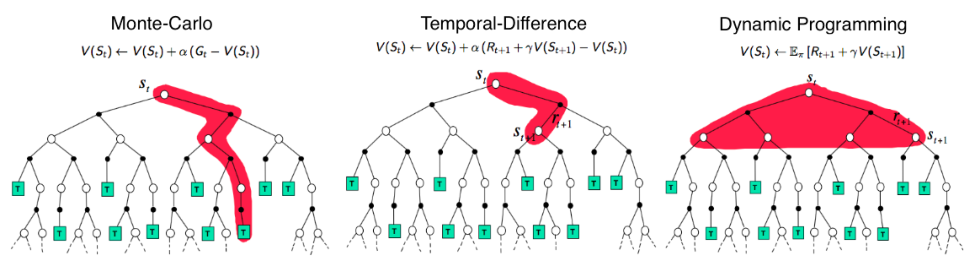


Figure 7: Comparison of the rollout search space (or backup diagrams) of Monte Carlo (MC), Temporal Difference
(TD) learning and Dynamic Programming (DP) for state value functions (from David Silver’s RL lecture). Additional
notation: _G_ _t_ is the final return, or expected future reward, _G_ _t_ = [�] _τ_ _[γ]_ _[τ]_ _[r]_ _[t]_ [+] _[τ]_ [+1] [ [26].]


**Algorithm 11** Inverse Reinforcement Learning (IRL) Problem

1: **Initialize** _w_, the parameter for the reward function
2: **for** each episode (on-policy expert trajectories) in the demonstration policy _{_ ( _s_ _[∗]_ 1 _[, a]_ _[∗]_ 1 [)] _[,][ · · ·][,]_ [ (] _[s]_ _[∗]_ _T_ _[, a]_ _[∗]_ _T_ [)] _[} ∼]_ _[π]_ _[∗]_ **[do]**
3: **while** not converged, or a maximal step is not reached
4: Solve the MDP environment using the current reward function _R_ _w_ ( _s, a_ ) to generate reinforcement learned
policy _π_ or behaviors
5: Optimize for reward function parameter _w_ by minimizing the inconsistency between the observed behavior _π_ _[∗]_
(from the expert) and the reinforcement learned behavior _π_
6: **end while**

7: **end for**


which can all be trained with stochastic gradient descent. In the variants that have a critic, policy evaluation involves
using Monte Carlo or TD learning methods to estimate _Q_ _[π]_ ( _s, a_ ) _, A_ _[π]_ ( _s, a_ ) _, V_ _[π]_ ( _s_ ).


There are other types of reinforcement learning algorithms worth noting. One categorization of reinforcement learning
methods depend on the depth in exploration search space, which consists of Monte Carlo (MC), Temporal Difference
(TD) learning and Dynamic Programming (DP) (Figure 7). The _Monte-Carlo_ (MC) methods learns from episodes of raw
experience without modeling the environmental dynamics. It computes the observed mean return as an approximation
of the expected return. Similar to MC, the Temporal-Difference (TD) Learning, which we already covers several
variants (e.g. Q-Learning, Actor-Critic), is model-free approach that learns from episodes of experience. However,
unlike MC, TD learning can learn from incomplete episodes and hence don’t need to keep track of all the episodes all
the way up to the termination stage. When the model is fully known or estimated, following Bellman equations, we can
use Dynamic Programming methods (such as value iteration) to iteratively evaluate value function and improve policy.
It is a model-based methods. For interested readers, [ 26 ] is the most respected textbook on reinforcement learning that
covers all these topics.


**3.5** **Inverse reinforcement learning**


If we compare the pipeline between the standard reinforcement learning and the inverse reinforcement learning in
Figure 5, they look very similar, both with the agent interacting with the environment with state emission, action taking
and reward feedback. However, instead of given a simulation environment with pre-set reward functions for the agent
to interact with, in inverse reinforcement learning, we only have the historical trajectories or experience of an expert
interacting with an unknown environment, and the goal is to discover the reward functions of this environment (what is
this world environment about? what motivates the agent to act the way it did? Can we reason about the goal or objective
the expert is aiming for?). In addition, it is usually easier to obtain historical data of expert’s action, rather than having
an interactive systems to train forever. Thus, using these priors can potentially be powerful.


The inverse reinforcement learning is connected to the concept of inverse optimal control [ 61, 62 ], a framework to
model or to “imitate” human behaviors. However, it is different from the standard imitation learning in the following
way. standard imitation learning only copy the actions performed by the expert, without any reasoning about the
outcomes or implications of the actions they imitated. It also doesn’t necessarily characterize the salient properties of
the behaviors. For instance, an expert can have multiple skills at different contexts. Inverse reinforcement learning, or


15


Reinforcement Learning and Bandits for Speech and Language Processing: Tutorial, Review and Outlook

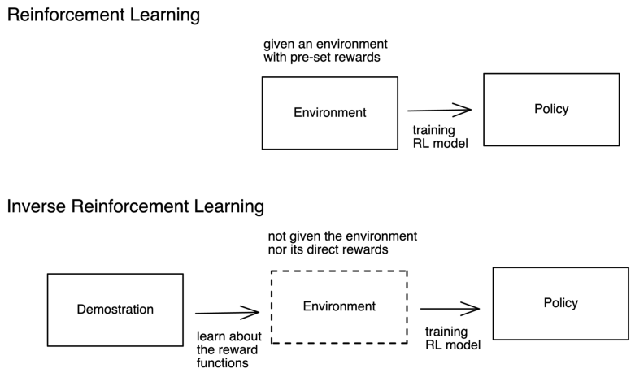


Figure 8: Comparison of training reinforcement learning using the conventional reinforcement learning approaches vs
using the inverse reinforcement learning.


here in this context, the “human imitation learning” aims to copy the intent of the expert, and thus, the policy it learns
might take very different actions despite having the same intent.


We are given the state and action space, historical trajectories or samples from the expert policy _π_ _[∗]_, and sometimes
also its dynamic model, and the goal is to recover reward function, and sometimes also to use the learned reward to
get an optimal policy (as in the reinforcement learning). Other than points covered above, here are several additional
benefits. Since the policy is a mixture of the reward and the dynamics, to enable better transfer learning across tasks
when learning from the demonstration, we want to decouple the goal from the underlying dynamics [ 63 ]. Inverse
reinforcement learning might be a solution to extract out the reward part. Another user scenario would be to use inverse
reinforcement learning to create additional training systems with learned rewards, as in Figure 8. If our end goal is to
train a reinforcement learning agent that mimics the expert policy, but we don’t have the same environment to train
on, one way would be to first learn the reward functions from expert trajectories and then train our agent in the new
environment we create using the learned reward functions.


The framework of inverse reinforcement learning is straightforward. As in algorithm 11, we model the observed
behavior from the expert as the solution of an Markov Decision Process with unknown reward functions that is gradually
optimized to converge to the underlying reward functions. We first initialize a parameter _w_ for the reward function _R_ _w_
we wish to optimize. This can be a linear weight, a neural net, a distribution over rewards, or any function approximation
as we show before. Then, we iteratively optimize for _R_ _w_ : at each step, we solve the MDP environment using the current
reward function _R_ _w_ ( _s, a_ ) to generate the reinforcement learned policy _π_ or behavioral trajectories; we compute the
inconsistency between the observed behavior _π_ _[∗]_ (from the expert) and the reinforcement learned behavior _π_ as a loss,
for any optimization engine of _w_ to minimize against. We continue this two steps until it converged to a reasonable
level of behavioral inconsistency.


Inferring the underlying reward functions directly from demonstration can be challenging. First, since many reward
functions can explain the same behavior, it is an underspecified problem. Second, these historical trajectories of reward
functions usually have unknown dynamics and large state-action space, which makes the optimization difficult. Third, it
can be difficult to evaluate a learned reward, so we need to specify a reasonable metric. And lastly, the demonstrations
may not be precisely optimal, and thus, it might be impossible to uniquely decompose the policy of irrational or
suboptimal agents into the underlying reward function [64].


Despite these challenges, several strategies are proposed to solve inverse reinforcement learning. The first strategy is to
optimize to _maximize margin_ . Similar to the intuition of support vector machines, the idea is to learn a reward function
that better explains the demonstrated expert policy than alternative policies by a margin as large as possible. One simple
formulation of the margin is the sum of the discrepancy between the expected value of the optimal action and the next
best action over all states, given by [62]:


16


Reinforcement Learning and Bandits for Speech and Language Processing: Tutorial, Review and Outlook


**Algorithm 12** Maximum Entropy (MaxEnt) Algorithm


_̸_


_̸_


1: **Initialize** _w_, the parameter for the reward function
2: **for** each episode (on-policy expert trajectories) in the demonstration policy _{_ ( _s_ _[∗]_ 1 _[, a]_ _[∗]_ 1 [)] _[,][ · · ·][,]_ [ (] _[s]_ _[∗]_ _T_ _[, a]_ _[∗]_ _T_ [)] _[} ∼]_ _[π]_ _[∗]_ **[do]**
3: **while** not converged, or a maximal step is not reached
4: Solve for optimal policy _π_ ( _a|s_ ) with value iteration in the environment parameterized by the current reward
function _R_ _w_ ( _s, a_ ).
5: Solve for the state visitation frequencies _p_ ( _s|w_ )
1
6: Compute gradient _∇_ _w_ _L_ = _M_ � _T ∈D_ _[x]_ _[T]_ _[ −]_ [�] _s∈S_ _[p]_ [(] _[s][|][w]_ [)] _[x]_ _[T]_


_̸_


_̸_


_T ∈D_ _[x]_ _[T]_ _[ −]_ [�]


_̸_


_̸_


6: Compute gradient _∇_ _w_ _L_ = _M_ � _T ∈D_ _[x]_ _[T]_ _[ −]_ [�] _s∈S_ _[p]_ [(] _[s][|][w]_ [)] _[x]_ _[T]_

7: _w_ = _w_ + _α∇_ _w_ _L_
8: **end while**

9: **end for**


_̸_


_̸_


� _Q_ _[π]_ ( _s, a_ _[∗]_ ) _−_ _{a∈_ max _A|a_ = _̸_ _a_ _[∗]_ _[Q]_ _[π]_ [(] _[s, a]_ [)] (37)

_s∈S_


_̸_


_̸_


where _a_ _[∗]_ is the optimal action at state _s_ . If we adopt the feature-based approach with function approximation, the
margin is the difference between the expected value of the behavior from the observed expert trajectory and the largest
expected values of the the behaviors of other trajectories that can be used to learn the feature weights _w_ . We can obtain
the expected value of a policy by multiplying the empirical state visitation frequency (SVF) from the demonstration
data, which we denote _p_ ( _s|w_ ), with the weighted features of the state obtained from the trajectory, which we denote _x_ _s_ .
As such, the margin becomes:


� _p_ ( _s|w_ ) _w_ _[⊤]_ _x_ _s_ _−_ _{T_ _[′]_ _∈_ ( _S_ max _×A_ ) _[l]_ _|T_ _[′]_ = _̸_ _T_ _[p]_ [(] _[s][|][w]_ [)] _[w]_ _[⊤]_ _[x]_ _[s]_ (38)

( _s,a_ ) _∈T_


where _T_ denotes the trajectories, and ( _S ×_ _A_ ) _[l]_ is the set of all possible trajectories of length _l_ defined by the state-action
space. One can solve this optimization method with a linear program to retrieve the reward function that maximize this
margin [ 65 ]. This margin optimization approach can produce the given policy as optimal output from the complete MDP

[ 66 ]. Assuming that each demonstration trajectory is a distinct policy, the structured maximum margin prediction (MMP,

[ 67 ]) improves the optimization process by solving a quadratic program that is constrained to have positive margin
value in equation 38 and regularized with a loss term _lp_ ( _s|w_ ) which measures the closeness between the demonstrated
and alternative behaviors.


However, as in the overall challenges of IRL, in these maximum margin methods, matching of the feature counts can be
ambiguous because a given policy can be optimal for many different reward functions, while the same feature counts
can be obtained by many different policies. This approach improves upon these limitations of the maximum margin
approaches by solving the ambiguity of suboptimality with a maximum entropy principle to learn a distribution over
behaviors parameterized by the reward function weights. The idea is to learn the reward function that provides the
trajectory distribution constrained by the observed demonstrations with the maximum entropy:


max � _−p_ ( _T_ ) log _p_ ( _T_ ) (39)

_T ∈_ ( _S×A_ ) _[l]_


To avoid the exponential growth of the state-action search space, an alternative would be to find the reward function that
maximizes the entropy of the distribution of all policies:


max � _−p_ ( _π_ ) log _p_ ( _π_ ) (40)

_π∈_ ( _S×A_ ) _[l]_


A popular algorithm to optimize for this, is the Maximum Entropy (MaxEnt) [ 68 ] algorithm, which introduces two
constraints to equation 40: the distribution of all demonstration trajectories should follow a probability distribution; and
the expected feature count of the demonstration trajectories should satisfy:


_̸_


_̸_


_M_


_̸_


_̸_


� _p_ ( _T_ )

_T ∈D_


_̸_


_̸_


_l_
�


_̸_


_̸_


� _γ_ _[t]_ _x_ _[t]_ _s_ [=] _M_ [1]

_t_ =1


_̸_


_̸_


_M_
�


_i_ =1


_̸_


_̸_


_∞_
� _γ_ _[t]_ _x_ _[t]_ _s_ (41)


_t_ =0


_̸_


_̸_


17


Reinforcement Learning and Bandits for Speech and Language Processing: Tutorial, Review and Outlook

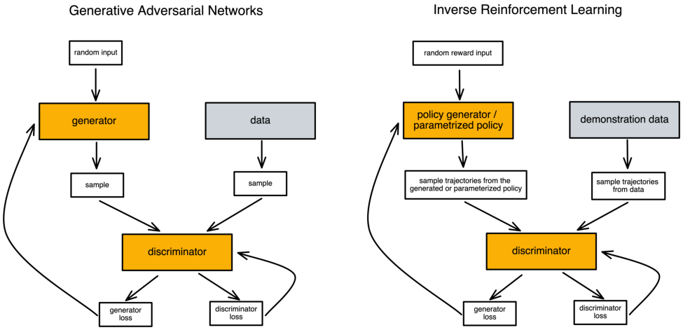


Figure 9: Comparison of the generative adversarial networks and inverse reinforcement learning


**Algorithm 13** Generative adversarial imitation learning (GAIL) Algorithm

1: **Initialize** _θ_ 0, _ψ_ 0, the initial parameters for the policy and the discriminator
2: **for** _i_ = 0 _,_ 1 _,_ 2 _, · · ·_ **do**
3: Sample trajectories from the generator _T_ _i_ _∼_ _π_ _θ_ _i_
4: Update discriminator from _ψ_ _i_ to _ψ_ _i_ +1 with the gradient:


E ˆ _T_ _i_ [ _∇_ _ψ_ log( _D_ _ψ_ ( _s, a_ ))] + ˆ E _T_ _i_ [ _∇_ _ψ_ log(1 _−_ _D_ _ψ_ ( _s, a_ ))] (45)


5: Update policy from _θ_ _i_ to _θ_ _i_ +1 with the gradient:


E ˆ _T_ _i_ [ _∇_ _θ_ log( _π_ _θ_ ( _a|s_ ) _Q_ ( _s, a_ ))] _−_ _λ∇_ _θ_ _H_ ( _π_ _θ_ ) (46)


6: **end for**


where _D_ is our available demonstration data, _x_ _[t]_ _s_ [is the feature of the state] _[ s]_ [ at time] _[ t]_ [, and] _[ M]_ [ is the number of trajectories.]
There are two assumptions. First, the reward of the trajectory is a linear combination of the feature counts:


_R_ _w_ _[T]_ [=] _[ w]_ _[⊤]_ _[x]_ _[T]_ [=] � _w_ _[⊤]_ _x_ _s_ (42)

_s∈T_


where _x_ _T_ is the feature count of the trajectory _T_ . And the the probability of a demonstrated trajectory should be
exponentially higher for higher rewards than lower rewards:


_p_ ( _T_ ) _∝_ _e_ _[R]_ _w_ _[T]_ (43)


As in algorithm 12, the algorithm solves for a convex nonlinear optimization problem:


( _s,a_ ) _∈T_ _[w]_ _[⊤]_ _[x]_ _[s]_

(44)
_Z_ ( _w_ )


arg max

_w_


�

� log _p_ ( _T_ ; _w_ ) _,_ where _p_ ( _T_ ; _w_ ) = _[e]_

_T ∈D_


There is a connection between the maximum entropy IRL with the generative adversarial networks (GAN), which
is a family of generative models which jointly and adversarially train a discriminator of synthetic and data samples


18


Reinforcement Learning and Bandits for Speech and Language Processing: Tutorial, Review and Outlook


**Algorithm 14** Imitation Learning (IL) or Behavioral Cloning (BC) Problem

1: **Initialize** policy parameter _θ_
2: **for** each episode (on-policy expert trajectories) in the demonstration data _{_ ( _s_ _[∗]_ 1 _[, a]_ 1 _[∗]_ [)] _[,][ · · ·][,]_ [ (] _[s]_ _[∗]_ _T_ _[, a]_ _T_ _[∗]_ [)] _[} ∼]_ _[D]_ _[∗]_ **[do]**
3: **for** batches of state-action pairs ( _s_ _[∗]_ _, a_ _[∗]_ ) **do**
4: Makes an observation _o_ _[∗]_ ( _t_ ) to the state _s_ _[∗]_ ( _t_ )
5: Chooses an action given the current state or observation: _a_ _t_ = _π_ _θ_ ( _o_ _[∗]_ ( _t_ ))
6: Update policy parameter _θ_ using supervised learning by minimizing the loss function _D_ ( _a_ _[∗]_ _t_ _[, a]_ _[t]_ [)]
7: **end for**

8: **end for**


**Algorithm 15** Dataset Aggregation (DAgger) Algorithm

1: **Initialize** policy parameter _θ_
2: **for** multiple episodes **do**
3: train _π_ _θ_ ( _a_ _t_ _|s_ _t_ ) from demonstration data _{_ ( _s_ _[∗]_ 1 _[, a]_ _[∗]_ 1 [)] _[,][ · · ·][,]_ [ (] _[s]_ _[∗]_ _T_ _[, a]_ _[∗]_ _T_ [)] _[} ∼]_ _[D]_ _[∗]_

4: run _π_ _θ_ ( _a_ _t_ _|s_ _t_ ) to get new dataset _D_ _π_ = _s_ 1 _, · · ·, s_ _t_
5: ask human annotators to label _D_ _π_ with actions _a_ _t_
6: aggregate _D_ _[∗]_ = _D_ _[∗]_ _∪_ _D_ _π_
7: **end for**


and a generator of synthetic samples given a cost function trained by the discriminator [ 69 ]. In particular, there is a
mathematical equivalence between sample-based maximum entropy algorithm and the generative adversarial networks,
with respect to their similarity of both using the probability density of the generator as an evaluation metric and input to
the dueling discriminator [ 70 ]. As in Figure 9, similar to a GAN, inverse reinforcement learning attempts to optimize for
a reward function that can generate or parameterize a policy which can sample out trajectories that is as indiscriminable
to an expert trajectory sample from the demonstration as possible, and the evaluation metric for that has to be also
trained as a discriminator which compares the samples under some principled or learned strategy (e.g. maximum
entropy or margin). It involves a special form of discriminator, which in optimal case:


_p_ ( _T_ )
_D_ _[∗]_ ( _T_ ) = (47)
_p_ ( _T_ ) + _q_ ( _T_ )


where we assume the generator is fixed with a density _q_ ( _T_ ) and the _p_ ( _T_ ) is the actual distribution of the demonstration
data. Generative adversarial imitation learning (GAIL, [ 71 ]) and guilded cost learning (GCL, [ 72 ]) are two IRL
algorithms that optimize using a GAN-like setting. As in algorithm 13, for each iteration, we first sampel the trajectories
from the generator _T_ _i_ _∼_ _π_ _θ_ _i_, update the discriminator given the relative entropy (equation 45) and then update the policy
using the Trust region policy optimization (TRPO) rule [ 73 ] on the cost function log( _D_ _ψ_ ( _s, a_ )) (a KL-constrained
natural gradient step as in equation 46).


For interested readers, [66] is a survey on various approaches of inverse reinforcement learning.


**3.6** **Imitation learning and behavioral cloning**


The imitation learning or behavioral cloning aims to solve the policy learning with a supervised learning approach. As
in algorithm 14, we simply divide the expert demonstration into batches of state-action pairs, and treat these pairs as
i.i.d. training examples for supervised learning using a loss function that characterizes the difference between the action
taken by the expert and the action recommended by the supervised learning policy. Since the algorithmic space of this
class of methods is largely in supervised learning, which can be highly customized to the specific problem setting and
application domain, we will refer the readers to [ 74, 75 ] for a survey on different types of supervised learning imitation
learning methods.


An innate challenge for imitation learning is the _distribution shift_ problem. As we are attempting to mimic the action
trajectory, even a small change of actions in early rounds might lead to a large variance in later actions due to the
amplification effect from the earlier actions. In other words, the _p_ _data_ ( _o_ _t_ ) can be very different from _p_ _π_ _θ_ ( _o_ _t_ ) . To
tackle this distributional shift problem, the _Dataset Aggregation_ (DAgger, [ 76 ]) is an iterative algorithm to trains a
deterministic policy with additional collections of dataset. The idea is simple, instead of trying to craft _θ_ such that
_p_ _π_ _θ_ ( _o_ _t_ ) can be as close to _p_ _data_ ( _o_ _t_ ) as possible, we can simply collect more on-policy data such that _p_ _data_ ( _o_ _t_ ) are
closer to _p_ _π_ _θ_ ( _o_ _t_ ) . As in algorithm 15, the goal is to collect additional on-policy training data from _p_ _π_ _θ_ ( _o_ _t_ ) by simply
running _π_ _θ_ ( _a_ _t_ _|o_ _t_ ) and then asks human annotators to label _a_ _t_ . These labeled actions combined with the state transition


19


Reinforcement Learning and Bandits for Speech and Language Processing: Tutorial, Review and Outlook


**Algorithm 16** Behavioral Cloning with Demonstration Reward (BCDR) Algorithm

1: **for** each episode (on-policy expert trajectories) in the demonstration data _{_ ( _s_ _[∗]_ 1 _[, a]_ _[∗]_ 1 [)] _[,][ · · ·][,]_ [ (] _[s]_ _[∗]_ _T_ _[, a]_ _[∗]_ _T_ [)] _[} ∼]_ _[D]_ _[∗]_ **[do]**
2: **for** t = 1, 2, 3, _· · ·_, T **do**
3: Agent makes an observation _o_ _[∗]_ ( _t_ ) to the state _s_ _[∗]_ ( _t_ )
4: Agent chooses an action given the current state or observation: _a_ _t_ = _π_ _t_ ( _o_ _[∗]_ ( _t_ ))
5: Environment progresses to the next step _s_ _[∗]_ _t_ +1 [given the action] _[ a]_ _[∗]_ _t_
6: Agent receives a reward feedback about both the environment reward and the consistency between its action
_a_ _t_ and the expert’s action _a_ _[∗]_ _t_ [at this state state] _[ s]_ _[∗]_ _t_ [:] _[ r]_ _[a]_ _[∗]_ _t_ _[,a]_ _[t]_ _[,s]_ _[∗]_ _t_ [(] _[t]_ [) =] _[ r]_ _[env]_ [(] _[a]_ _[t]_ _[, s]_ _t_ _[∗]_ [) +] _[ λD]_ [(] _[a]_ _[∗]_ _t_ _[, a]_ _[t]_ [)]
7: Agent updates its policy _π_ _t_
8: **end for**

9: **end for**


data collected from the learning policy _π_ _θ_ are then appended or aggregated to the training dataset. Iteratively, the dataset
collected would be closer and closer to an on-policy dataset that avoids the distributional shift issue.


However, we don’t always have access to human annotations. One strategy is to provide goals as contexts. Another
strategy is to formulate supervision as rewards. The _Behavior Cloning with Demonstration Rewards_ (BCDR, [ 77 ]) is a
reinforcement learning approach to directly optimize against the trajectory difference. In this setting, the agent first
goes through a constraint learning phase. As in algorithm 16, during the learning, the agent is allowed to query the
states and actions in the available demonstration data, and receive feedback about both the environment reward and
whether or not the selected action _a_ _t_ matches the teacher’s action _a_ _[∗]_ _t_ [(from the demonstration data):]


_r_ _a_ _[∗]_ _t_ _[,a]_ _[t]_ _[,s]_ _[∗]_ _t_ [(] _[t]_ [) =] _[ r]_ _[env]_ [(] _[a]_ _[t]_ _[, s]_ _t_ _[∗]_ [) +] _[ λD]_ [(] _[a]_ _[∗]_ _t_ _[, a]_ _[t]_ [)] (48)


both and the consistency between its action _a_ _t_ and the expert’s action at this state state _s_ _[∗]_ _t_ [: During the deployment]
or testing phase, the goal of the agent is to maximize both the environment reward _r_ _env_ ( _a_ _t_ _, s_ _[∗]_ _t_ [)] [, and a unobserved]
_D_ ( _a_ _[∗]_ _t_ _[, a]_ _[t]_ [)] [, which models whether or not the chosen action matches which action the expert would have taken. Through]
the learning, the behavioral cloning algorithm aims to train reinforcement learning agents to mimic the expert behaviors
in the demonstration.


For interested readers, [ 74 ] is a survey on various methods in imitation learning. [ 78 ] compares the imitation learning
with offline reinforcement learning (a similar but different method we will introduce later in the emerging strategies
section) and discusses the specific environments and dataset compositions to use one over the other.


**4** **Reinforcement Learning Formulation for Speech and Language Applications**


In this section, we will cover a series of prototypical examples of how reinforcement learning can be effectively applied
to major speech and language tasks, followed by a brief summary of other works in the specific task domain. Table 2
summarizes and compares the reinforcement learning formulations for several common natural language processing
tasks. By examining the objective, reward, action space, and state space for each task, we can gain insight into the
commonalities and differences between these tasks. For example, many of the tasks involve extracting meaning from
natural language input, but the specific form of the input and output can vary widely. Additionally, different tasks have
different reward signals and action spaces depending on the specifics of the problem. Overall, this table provides a
useful reference for understanding how natural language processing tasks can be framed as reinforcement learning
problems. We hope these case studies in the following sections motivate the readers to rethink their daily tasks as
reinforcement learning problems and encourage discussions in these new research avenues.


**4.1** **Automatic speech recognition (ASR)**


Automatic speech recognition (ASR) is an important component of many practical language processing systems.
However, there are several challenges that can make it difficult to achieve accurate and reliable performance. One major
challenge is the difficulty of training effective models for low-resource or marginalized languages. This is because
there is often a lack of available data to train these models, which can result in poor performance and inaccurate results.
Another challenge is the impact of noisy environments on ASR systems. In real-world scenarios, speech signals can be
distorted or obscured by background noise, making it difficult for the system to accurately recognize and transcribe
spoken language. This can lead to errors and decreased performance, particularly in situations where high accuracy
is critical. Finally, collecting human feedback to improve ASR systems can be valuable, but can also be expensive


20


Reinforcement Learning and Bandits for Speech and Language Processing: Tutorial, Review and Outlook


Table 2: The reinforcement learning formulations in different speech and language applications

|Task|Objective|Reward|Action Space|State Space|
|---|---|---|---|---|
|Speech Recogni-<br>tion|Transcribe audio<br>signal to text|Accuracy of tran-<br>scription|Sequence<br>of<br>phonemes/words|Current audio in-<br>put or transcrip-<br>tion|
|Speaker Recogni-<br>tion / Diarization|Identify speakers<br>and group speech<br>into segments|Accuracy<br>of<br>speaker<br>iden-<br>tifcation<br>and<br>segmentation|Speaker labels for<br>each segment|Current<br>audio<br>input,<br>speaker<br>labels,<br>speaker<br>characteristics or<br>speech features|
|Spoken Language<br>Understanding|Extract meaning<br>from<br>spoken<br>language<br>and<br>map to a machine-<br>readable represen-<br>tation|Accuracy of ex-<br>tracted meaning|Set of possible<br>meanings|Current<br>audio<br>input,<br>dialogue<br>history, external<br>knowledge|
|Natural Language<br>Understanding|Extract meaning<br>from natural lan-<br>guage<br>text<br>and<br>map to a machine-<br>readable represen-<br>tation|Accuracy of ex-<br>tracted meaning|Set of possible<br>meanings|Current<br>text<br>input,<br>dialogue<br>history, external<br>knowledge|
|Sequence Gener-<br>ation<br>/<br>Text-to-<br>Speech Synthesis|Generate natural-<br>sounding speech<br>from text input|Naturalness and<br>clarity of gener-<br>ated speech|Sequence<br>of<br>speech signals|Current<br>text<br>input,<br>dialogue<br>history, external<br>knowledge|
|Natural Language<br>Generation|Generate natural<br>language<br>text<br>in response to a<br>given prompt or<br>input|Quality,<br>co-<br>herence,<br>and<br>relevance<br>of<br>generated text|Set of possible<br>natural language<br>sentences|Current<br>input<br>prompt<br>or<br>dia-<br>logue<br>history,<br>external<br>knowl-<br>edge|
|Large Language<br>Models|Improve language<br>model<br>behavior<br>and responses|Relevance,<br>engagement,<br>diversity,<br>and<br>fuency|Set of possible<br>words,<br>phrases,<br>or sentence struc-<br>tures|Context informa-<br>tion, previous dia-<br>logue history, and<br>generated text|
|Conversational<br>Recommenda-<br>tion System|Provide personal-<br>ized recommenda-<br>tions in response<br>to user queries or<br>preferences|Accuracy and rel-<br>evance of recom-<br>mendations, user<br>engagement and<br>satisfaction|Set<br>of<br>rec-<br>ommended<br>items/actions|Current<br>user<br>preferences,<br>search<br>queries,<br>historical<br>data,<br>user feedbacks|


and time-consuming. This can make it difficult to obtain large amounts of annotated data that can be used to train and
improve the system.


Reinforcement learning can be a powerful tool for addressing some of these challenges in speech recognition. For
example, one approach is to use curriculum learning to improve the effective learning from relatively small samples.
This involves training the model on a gradually increasing level of difficulty, starting with simple examples and gradually
moving towards more complex and challenging inputs. Another approach is to use speech enhancement techniques to
generate cleaned and undistorted speech signals, which can improve the accuracy and robustness of the system in noisy
environments. This can involve using signal processing techniques such as denoising and filtering, or training separate
models to clean and preprocess the audio input before it is passed to the ASR system. Finally, domain adaptation can be
used to transfer learned representations from previous batches of audio signals to future ones. This can be particularly
useful for low-resource or marginalized languages, where there may be limited data available to train the system. By
using transfer learning techniques, it may be possible to leverage information from related languages or domains to
improve the performance of the ASR system. Here are some case studies:


**Case study** [ 83 ]. In this work, the authors study the usage of curriculum learning to improve model training on
automatic speech recognition on low-resource languages such as Turkish. Curriculum learning feed to the ASR model


21


Reinforcement Learning and Bandits for Speech and Language Processing: Tutorial, Review and Outlook

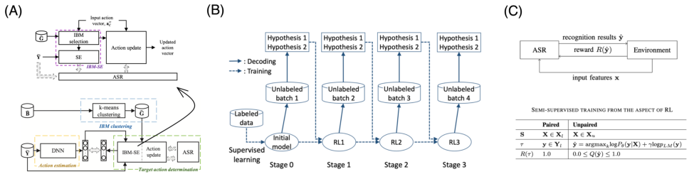


Figure 10: Examples on speaker recognition: (A) speech enhancement using reinforcement learning [ 79 ] (B) acoustic
model selection using reinforcement learning [80] (C) semi-supervised learning with reinforcement learning [81, 82].


batches of data samples in a particular way such that they maximize the incremental learning performance at each batch.
To do so, a bandit-based curriculum learning framework is proposed, where the reward feedback to the bandit is the
prediction gain, _r_ _P G_ = _L_ ( _x, θ_ ) _−_ _L_ ( _x, θ_ _[′]_ ), which is the loss before and after training on the current batch. By using an
adversarial bandit algorithm, the Exponential-weight algorithm for Exploration and Exploitation (or more commonly
known as EXP3) [ 30 ], the curriculum generation procedure manage to effectively navigate among the exploration
vs exploitation trade-off in using different batches of speech-text pairs which likely provides a performance boost in
non-stochastic degree, and speed up the learning in ASR task with limited data.


While curriculum learning with RL can help improve model training, the approach may be sensitive to the choice of
reward function and the specific curriculum generation strategy. Designing an effective reward function that accurately
measures learning progress can be challenging and require domain expertise. Moreover, the effectiveness of this
approach may be limited by the complexity of the ASR task and the quality of the training data.


**Case study** [ 79 ]. In this work, the authors introduce a reinforcement learning-based speech enhancement system for
automatic speech recognition. As shown in Figure 10A, the raw audio signal can be noisy, and therefore, transforming
them into the Fourier space, filtering the Fourier spectrum with a binary mask, and then applying inverse Fourier
transform, can potentially generate a cleaned and un-distorted version of the speech signal. However, it is an innate
challenge to find the ideal binary mask, since the audio data stream might come from different sources and thus contain
different noise profiles. The solution is to first cluster the binary masks into major groups, and use a deep reinforcement
learning agent to identify the ideal pool of binary masks to minimize the recognition errors. The reward signal here
to update the agent is a scaled difference between the utterance-based error rates of the ASR result from the noisy
original data and the ASR result from the speech enhanced samples spectrum-filtered by the binary mask picked by the
reinforcement learning agent.


The RL-based speech enhancement approach can rely on the assumption that the pre-defined binary masks can effectively
clean and enhance the speech signal. However, the performance of this approach heavily depends on the ability of the
deep reinforcement learning agent to identify the optimal binary masks for various noise scenarios. Mismatched or
incorrect mask choices could lead to suboptimal enhancement results and adversely affect ASR performance.


**Case study** [ 80 ]. In this work, the authors propose a reinforcement learning-based hypothesis selection mechanism to
pick the optimal hyperparameter for the acoustic processing embedding in batch-evaluated ASR systems. As in Figure
10B, they assume the data come in batches (e.g. batches of phone calls at different times of the day) and each batch
may exhibit a slightly different voice pattern that would affect the effectiveness of model’s domain adaption from one
batch to another. As a result, they formulate the challenge as a reinforcement learning problem, where the actions are a
few options of the update coefficient _τ_ for a GMM-HMM acoustic embedding modulated by a deep learning-based
MAP adaptation model. To specify the reward, they create two rival systems (one deep neural net that updates using
reinforcement learning, and a baseline that doesn’t). For each input utterance, a recognition hypothesis is sampled from
each of two competing systems, and both of them are presented to the user. Then, the user provides a human-in-the-loop
feedback by selecting the better hypothesis (which is the text prediction from the speech) among the two models. The
reward feedback to the reinforcement learning agent is 1 if the deep reinforcement learning model is selected, and 0 if
the baseline is selected by the user as providing the better hypothesis.


Using RL to select optimal hyperparameters for acoustic processing in ASR may introduce additional computational
overhead, as the agent needs to explore the action space of hyperparameters. Moreover, the efficacy of reinforcement
learning for hyperparameter selection can be influenced by the complexity of the task, the available labeled data, and


22


Reinforcement Learning and Bandits for Speech and Language Processing: Tutorial, Review and Outlook

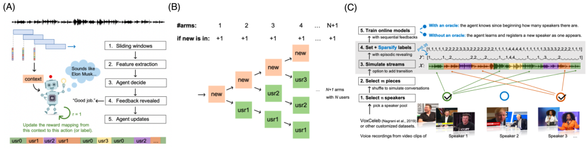


Figure 11: Examples on speaker diarization: (A) The reinforcement learning problem [ 87 ] (B) the bandit solution for
cold-start user problem [ 88 ] (C) MiniVox: online speaker diarization benchmark for reinforcement learning agents [ 89 ].


the design of the reward signal. The performance gains achieved by this approach might be limited by the available
labeled data and the diversity of voice patterns in different batches.


**Case study** [ 81, 82 ]. In these two works with similar ideas, the authors use the reinforcement learning as a semisupervised pre-training mechanism to augment the ASR training with the unlabelled speech data. As in Figure 10C,
traditional supervised learning ASR system needs paired data of the speech and their text transcripts in order to complete
the supervised training. This component can also be accomplished using a reinforcement learning agent because, the
supervised training procedure can be handled in terms of policy-based reinforcement learning because the gradient of
cross-entropy loss for the one-hot target output of word tokens can be formulated as a special case of policy gradient:


_∇_ _θ_ log _π_ _θ_ ( _y_ _t_ _|x_ _t_ ) = _∇_ _θ_ log _π_ _θ_ ( _a_ _t_ _|s_ _t_ ) _·_ 1 _._ 0 (49)


On the other hand, the reinforcement learning can also handle unlabelled speech corpus without corresponding text
labels. This is because reinforcement learning agents don’t require speech-to-text paired corpus but requires a reward
function, which can be a more relaxed condition. As a result, in face of unlabelled speech data, a reward function
can still be effectively defined using a perplexity-based soft reward, which anti-correlates with the character error rate
(CER) commonly used in ASR training.


Although RL offers a flexible way to use unlabelled speech data for pre-training ASR models, the definition of a reward
function for unlabelled data may be challenging. The reward function needs to effectively correlate with the ASR
task objective, such as minimizing character error rate (CER), without the direct supervision provided by labeled data.
Additionally, the performance improvement achieved by using unlabelled data through reinforcement learning might be
limited compared to fully supervised training.


**Other works** . [ 84 ] trains a sequence-to-sequence model for ASR via policy gradient taking the negative Levenshtein
distance as the reward. [ 85 ] further improves this system by using token-level rewards instead of sentence-level rewards.

[ 86 ] uses policy gradient to train an encoder-decoder ASR system with sequence-level evaluation metric as its reward.


**Practicality and limitations** . Applying reinforcement learning to speech recognition faces challenges such as designing
suitable reward functions, identifying optimal hyperparameters, and ensuring effective transfer of learned representations.
The choice of reward function and the design of the reinforcement learning agent’s action space can significantly impact
the performance gains achieved. Moreover, reinforcement learning approaches may be limited by the quality and
quantity of available data, making them more effective in scenarios with ample labeled or reward-driven data. Despite
the potential benefits, these challenges underscore the need for careful consideration and evaluation when applying
reinforcement learning to address the inherent complexities of ASR tasks.


**4.2** **Speaker recognition and diarization**


Speaker recognition and diarization are important tasks used in a wide range of applications such as speaker identification,
speaker verification, and speech-based interaction. However, there are several challenges that can make it difficult
to achieve accurate and reliable performance. One major challenge is that existing speaker recognition models are
usually pre-trained on large scale pre-registered user profiles. This can make it difficult to adapt these models to new
or unknown speakers, which can result in poor performance in real-world scenarios. Additionally, modern multi-user
teleconferences often have cold start new users, which can make it difficult for the system to accurately identify and track
individual speakers. Another challenge is that collecting human feedback to improve speaker recognition models can be


23


Reinforcement Learning and Bandits for Speech and Language Processing: Tutorial, Review and Outlook


difficult and expensive, particularly when the rewards are highly sparse. In addition, labelled data for low-resource
populations may be very rare, which can make it difficult to train accurate models for these groups. Finally, diarization
results can be hard to generalize to out-of-distribution environments, such as different contexts or acoustic conditions.


Reinforcement learning can be a useful tool for addressing some of these challenges in speaker recognition and
diarization. For example, one approach is to use interactive learning with human feedback to improve the accuracy and
performance of the system. This involves actively soliciting feedback from users and using it to update and refine the
model in real-time. Another approach is to make speaker recognition and diarization models lightweight and capable of
learning on the fly. This can help improve the adaptability and flexibility of the system, particularly in scenarios with
new or unknown speakers. Finally, transfer learning or semi-supervised learning can be used to improve the accuracy
and robustness of speaker recognition and diarization models, particularly in low-resource or marginalized populations.
By leveraging information from related domains or data sources, it may be possible to improve the performance of the
system even when labelled data is scarce. Here are some case studies:


**Case study** [ 87, 89, 88, 90 ]. In this work series, the authors consider the online speaker diarization task as a
reinforcement learning (or fully online learning) problem, where at each time step, the agent uses the window-sliced
acoustic features as its context or state to decide which user is speaking at the current moment (as its actions, Figure
11A). The innate challenge for this problem is that, they assume the users can come and go at any moment, and the
system can be deployed without any pretraining on users’ voice profiles. The corresponding solution is to formulate it as
a bandit problem with infinite arms, where one action arm always stands for a “new user”, and some under-used action
arms can demise with a recency principle (Figure 11B). The online speaker diarization system updates the reinforcement
learning policy with user feedbacks in a human-in-the-loop setting, which introduces an additional challenge that these
reward feedback can be implicit and highly sparse. To effectively learn from sparse feedback, they propose to use the
Background Episodic Reward LinUCB (or BerlinUCB [ 48 ]), which is a semi-supervised learning bandit algorithm that
uses clustering as self-supervision to provide pseudo-reward and update only contextual representations when the real
reward is missing. To encourage the field to evaluate online speaker diarization as the reinforcement learning problem,
they provide a testing benchmark called MiniVox ([89, 88], Figure 11B).


If historical data is available for pre-training, supervised and unsupervised approaches are still favored for their overall
better performance, comparing to the on-the-fly reinforcement learning solution. A drawback of using RL for online
speaker diarization is the challenge of collecting accurate reward feedback from users. Since the reward signal is based
on implicit and sparse user feedback, there can be uncertainty in understanding the true reasons behind user preferences
or decisions. This can affect the reliability of the reward signal used for updating the reinforcement learning policy,
potentially leading to suboptimal learning outcomes. Moreover, designing a suitable reward function that accurately
captures the quality of the diarization results and aligns with user preferences is critical, but can be challenging in
dynamic and real-time scenarios.


**Other works** . It is a relatively new idea to apply reinforcement learning to solve speaker diarization directly. Other
than the above works which use semi-supervised bandits on online speaker diarization problem, the follow-up work

[91] summarizes a complete spectrum of reinforcement learning approaches in the speaker diarization problem.


**Practicality and limitations** . Applying reinforcement learning to speaker recognition and diarization tasks offers
potential benefits in addressing challenges such as adaptability to new speakers, handling cold start scenarios, and
improving performance for low-resource or marginalized populations. However, a common drawback in these
case studies is the challenge of obtaining accurate and reliable reward feedback, which is crucial for guiding the
reinforcement learning process effectively. Sparse and implicit reward feedback can introduce uncertainty and potential
biases, impacting the learning process and ultimately the system’s performance. Despite the promise of reinforcement
learning, these challenges highlight the need for carefully designed reward mechanisms and exploration strategies to
ensure the success of the approach in speaker recognition and diarization applications.


**4.3** **Spoken language understanding (SLU)**


Spoken language understanding (SLU) is an essential component of modern day smart speakers, and is used to extract
meaning and intent from spoken language input. However, there are several challenges that can make it difficult to
achieve accurate and reliable performance. One major challenge is the difficulty of transferring SLU models to new
languages or domains. This can be particularly challenging if the grammatical structures of the new language differ
significantly from the training data, which can result in poor performance and inaccurate results. Additionally, SLU is a
complex task with many components, which can make modeling the state and action spaces very complex, particularly
when the system is only partially observable. Another challenge is that human refinement of SLU parsers can be
interfering across different dialogue acts (DAs), which are utterances serving functions in the dialog. This can make it
difficult to accurately assign and identify DAs, which can result in poor performance and inaccurate results.


24


Reinforcement Learning and Bandits for Speech and Language Processing: Tutorial, Review and Outlook

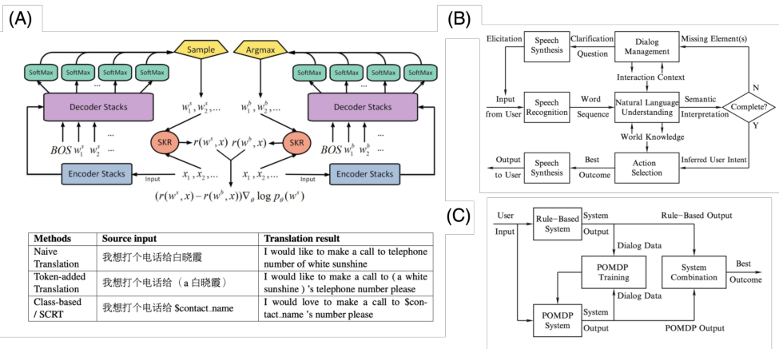


Figure 12: Examples on spoken language understanding: (A) grammar slot matching with reinforcement learning in
NMT language transference for SLU [92]. (B) SLU components in Apple Siri [93] and (C) its training pipeline.


Reinforcement learning can be a powerful tool for addressing some of these challenges in spoken language understanding.
For example, one approach is to use reinforcement learning to auxiliarily optimize grammar slot matching. This involves
training the model to identify and fill in missing or incorrect slots in the input, which can help improve the accuracy
and completeness of the results. Another approach is to consider the stages of training model components, and to use
reinforcement learning to improve the performance of each component separately. This can involve training the ASR
and NLU components separately and then integrating them using reinforcement learning to optimize performance and
accuracy. Finally, interactive learning can be used to adaptively assign dialogue acts, which can improve the accuracy
and relevance of the results. This involves actively soliciting feedback from users and using it to update and refine the
model in real-time, which can help improve the accuracy and effectiveness of the system. Here are some case studies:


**Case study** [ 92 ]. In this work, the authors adapts a neural machine translation (NMT) model to a new language using a
policy-gradient reinforcement learning approach such that auxiliary requirements can be included as part of the reward
signals (Figure 12A). In language transference between languages that are grammatically different, keeping the entity
slots of word tokens aligned can be challenging. To tackle this issue, they propose a source-critical class-based method
that directly measures the slot keeping ratio (SKR, a metric for evaluating the performance of slot transferring in SLU
across language) as an incremental loss to bind to the reward function. More specifically, by optimizing over


( _r_ ( _w_ _[s]_ _, x_ ) _−_ _r_ ( _w_ _[b]_ _, x_ )) _∇_ _θ_ log _p_ _θ_ ( _w_ _[s]_ ) (50)


where _x_ is the speech signal (source input to the NMT model), _w_ _[b]_ and _w_ _s_ are the word token generated by the baseline
NMT model and the NMT model adapted with a reinforcement learning agent. The reinforced translation model updates
given this final policy gradient by rewarding the translation candidates that generates a higher SKR over baseline. By
using the relative SKR as the reward, the reinforcement learning agent adapts to obtain target language translations
which can maintain both the semantic meanings and the slot information of the SLU-labeled sentences in the source
language.


A drawback of using RL to adapt NMT models for new languages is the challenge of defining appropriate reward
functions. Designing reward signals that accurately reflect slot keeping ratio (SKR) can be complex and require
thorough understanding of the semantics and grammatical structures of both the source and target languages, as well as
their innate ambiguity and dialects. An inaccurate or misaligned reward signal can lead to suboptimal adaptations and
decreased translation quality.


**Case study** [ 93 ]. In this work, the author discusses the engineering choices made in the Siri system (Apple’s personal
intelligent assistant). The SLU system in Siri involves many critical components, ranging from speech recognition,
natural language understanding, dialogue act recognition, dialogue management, action selection, to finally the speech
synthesis to interact with the user using human-like voice feedback (Figure 12B). The training goal is to utilize statistical


25


Reinforcement Learning and Bandits for Speech and Language Processing: Tutorial, Review and Outlook


(e.g. deep learning-based) methods to the language understanding unit by integrating data-driven evidence collected
from suitable training data in an optimal order, such that the intent of the user can be inferred efficiently and accurately.
However, the feedback to the system are usually implicit and all computational components are proxies to the underlying
inferred properties that can affect downstream tasks. As a result, this is a partially observable Markov decision process
(POMDP) problem to the spoken dialogue systems. Performing a reinforcement learning training here is challenging
because: (1) The internal state of the users that we wish to model is a complicated mixture of the user’s goal, the user’s
input on the interface, and the historical dialogues and interactions. (2) This is further compounded by the speech-level
uncertainty in the user’s utterances and the systematic errors in upstream systems which can amplify and propagate the
uncertainty into other computational entities. (3) For smooth user experience, the system should have a large enough
action space that cover every possible system response, and as a result, the reinforcement learning policies should map
from the complex and uncertain dialogue states to a large search space of possible actions.


One strategy they point out in this work is to first train rule-based system separately in order to gain more dialogue data
to boost POMDP training for the reinforcement learning agent (Figure 12C).


**Case study** [ 94 ]. In this work, the authors aims to exploit the usage of user’s annotating feedback for sequential training
and refining of a zero-shot SLU semantic parser in an online way. The interactive system is formulated such that at
each round of SLU, the user gets recommendations for their predicted intents, and they can be asked to do one of the
three annotation tasks to help refine this SLU model: 1) Skip, meaning that the the user don’t have to do anything; 2)
YesNoQuestion, meaning that the user gets to confirm or negate the detected DAs in the best semantic hypothesis; and
3) AskAnnotation, meaning that the user is asked to annotate the incoming utterance. The reward signal to maximize is
a mixture of the system improvement and the user effort.


A drawback of using RL for interactive SLU with user feedback is the potential uncertainty and variability in user
annotations. The reliance on user annotations for refining the SLU model introduces noise and subjectivity in the reward
signal, which can lead to challenges in accurately updating the reinforcement learning policy. Ensuring consistent and
reliable user feedback is essential to avoid incorrect learning signals.


**Other works** . [ 95, 96 ] propose an interactive SLU system that uses a reinforcement learning agent to select both the
optimal speech enhancement units to process the speech signals and the candidate intent prediction. The system can
evaluate the correctness of the prediction by computing a similarity score between the intent prediction and the sparse
annotation of the actual intent from the user. The reward signals to update the agent comes from the difference between
the score of the agent and that of the baseline models that randomly sample predictions from the candidate pool. [ 97 ]
uses a deep reinforcement learning approach to track speech dialogue state for online task-oriented spoken dialogue
systems.


**Practicality and limitations** . While reinforcement learning holds promise for improving SLU systems, these case
studies highlight several common drawbacks. Designing appropriate reward functions that accurately reflect system
performance or user preferences can be challenging, especially in scenarios involving complex language structures and
user interactions. Additionally, the complexity of dealing with partially observable states in dialogue systems, as well
as uncertainty and variability in user feedback, can introduce noise and errors in the reinforcement learning process.
These challenges emphasize the need for careful reward engineering, exploration strategies, and handling uncertainties
to ensure the success of reinforcement learning approaches in enhancing SLU performance.


**4.4** **Natural language understanding (NLU)**


Natural language understanding (NLU) is a critical task used to extract meaning and intent from text-based information.
However, there are several challenges that can make it difficult to achieve accurate and reliable performance. One major
challenge is that in many applied problems, the intents or interpretations from NLU are usually implicit or simply not
given. This can make it difficult to accurately identify and extract the meaning and intent from the input, which can
result in poor performance and inaccurate results. Additionally, NLU is usually a critical step to provide contexts for
downstream tasks, and training it independently might not guarantee its performance in downstream tasks, as even a
small variation can be amplified in later steps.


Reinforcement learning can be a useful tool for addressing some of these challenges in natural language understanding.
For example, one approach is to train the whole system as a reinforcement learning problem and implicitly learn the
natural language understanding task. This involves training the model to optimize a specific reward function, which
can help improve the accuracy and effectiveness of the system in a wide range of applications and use cases. Another
approach is to provide contexts and personalization to natural language understanding training by training it together
with downstream tasks in an end-to-end optimization. This can help improve the accuracy and robustness of the system,
particularly in scenarios where the downstream tasks are closely related to the NLU task. Finally, natural language
understanding can in turn be used to improve reinforcement learning algorithms, by providing additional insights and


26


Reinforcement Learning and Bandits for Speech and Language Processing: Tutorial, Review and Outlook

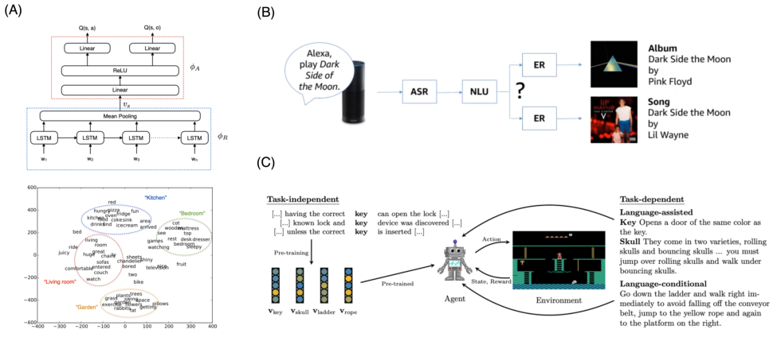


Figure 13: Examples on natural language understanding: (A) NLU learned by deep reinforcement learning in text-based
games [ 98 ]: top panel – model architecture; bottom panel – encoder word embedding. (B) NLU in recommendation
systems with implicit feedback and ambiguous entities [99] (C) NLU-informed reinforcement learning [100].


context that can be used to improve the performance and accuracy of the system. This can help unlock the potential for
natural language processing in a wide range of applications and use cases, by improving the efficiency and effectiveness
of the algorithms and models used in these systems. Here are some case studies:


**Case study** [ 98 ]. In this work, the authors study the neural network representation of deep reinforcement learning in
text-based games and find that meaningful clusters of words emerge from it. They propose a long short-term network
(LSTM)-based deep Q network (DQN) that has a separate Representation Generator that takes a stream of words
observed in the game’s state _s_ as input and generates a vector representation, which is then fed into a an actor network
consisting of scores for all actions and argument objects (Figure 13A). The game states are hidden from the player, who
only receives a varying textual description. In this reinforcement learning problem, the action space has two dimensions,
the action and its argument object, whose policies are jointly trained with the representation generator given game
rewards. The dimension reduction of the state encoder representation (Figure 13A botton panel) shows that the words
are grouped by contexts which can potentially be used for natural language understanding.


One potential drawback of using deep RL to extract neural network representation for specific tasks is the challenge
of interpretability. While meaningful clusters of words may emerge from the representation, understanding the exact
semantics and relationships between these clusters can be difficult, especially for deep RL-based decision making
systems trained for high-stake scenarios such as finance, forensic or health-related data.


**Case study** [ 99 ]. In this work, the authors use bandits to personalize the NLU given user features and implicit feedback.
Consider a virtual assistant system, we give the system a speech command, it transcribes it using ASR, and detects
intents (e.g. play music) with NLU and parse out necessary further information such as slots (e.g. album) and the slot
values (Figure 13B). Before executing the command of retrieving an entity (e.g. play a certain song), the system needs
to perform the entity resolution (ER) process, which finds the best entity of the given type (e.g. album) an the slot values
(e.g. “dark side of the moon”). However, they can be ambiguous in all three levels (alternative ASR transcripts, multiple
NLU intents, and multiple entities matching the same criterion). It is a bandit problem because we only receive implicit
and bandit feedback (only revealed for the picked NLU interpretations). It is a contextual bandit problem, because
the best NLU interpretation is dependent on the user’s interest. We can also train it with feature-based reinforcement
learning because the natural language understanding are usually trained with manually labelled utterances which can be
additional signals to the agent.


Similar to the aforemnetioned bandit-based speaker diarization solution, the challenge of using bandit-based personalization for NLU is the uncertainty and subjectivity in sparse and implicit user feedback. Implicit feedback can be less
informative and may not always accurately reflect the user’s true intent or preferences. Incorrect or noisy feedback
signals can lead to suboptimal personalization decisions and decreased performance in entity resolution and intent
detection tasks.


27


Reinforcement Learning and Bandits for Speech and Language Processing: Tutorial, Review and Outlook


**Case study** [ 100 ]. In this work, the authors summarize different ways NLU can better inform reinforcement learning
tasks (Figure 13C). First, we have language-conditional reinforcement learning systems, where the text information are
directly related to the task, such as following text instructions, parsing rewards from instructions, and reading languages
in the observation or action spaces. Second, we have language-assisted reinforcement learning systems, where the
languages are auxiliary but useful information not directly related to the task goal, such as communicating domain
knowledge, and structuring policies. Finally, we have task-independent natural language understanding, such as finding
real-world semantics and grammar, or finding the underlying storylines or intents of characters.


A potential challenge of using NLU to inform RL tasks is the complexity and diversity of natural language. Extracting
meaningful and relevant information from natural language text can be challenging, especially when the language is
ambiguous, context-dependent, or involves domain-specific jargon. Inaccurate or incomplete extraction of information
can lead to incorrect or biased reinforcement learning decisions, such as in a medical or legal decision making scenario.


**Other works** . [ 101 ] proposes a reinforcement learning solution that learns to execute navigation instructions expressed
in natural language. [ 98 ] finds that LSTMs, if combined with reinforcement learning optimization, can learn a better
representation in text understanding than bag-of-words approaches in capturing the underlying semantics of sentences.


**Practicality and limitations** . While reinforcement learning offers promising approaches to address challenges in
natural language understanding (NLU), these case studies highlight some common drawbacks. The complexity of
language, potential ambiguity, and the challenge of designing accurate reward functions can limit the effectiveness of
reinforcement learning in NLU tasks. Additionally, the uncertainty and subjectivity of implicit feedback and the lack
of interpretability in neural network representations can introduce noise and uncertainty into the learning process. To
successfully leverage reinforcement learning in NLU, careful consideration of these challenges and the development of
strategies to mitigate them are crucial.


**4.5** **Sequence generation and text-to-speech (TTS) synthesis**


Sequence generation is an important task used in a wide range of applications such as text-to-speech (TTS) synthesis,
language translation, and image captioning. However, there are several challenges that can make it difficult to achieve
accurate and reliable performance. One major challenge is that many Seq2Seq models suffer from exposure bias, which
refers to the error accumulation during the output generation at test time since the model has never been exclusively
exposed to its own predictions during training. This can result in poor performance and inaccurate results, particularly
in scenarios where the output sequence is long and complex. In addition, in the evaluation phase, many Seq2Seq models
can suffer from an inconsistency between the training and testing datasets or domains. This can make it difficult to
accurately generalize the model to new data or scenarios, which can result in poor performance and inaccurate results.
Finally, deep learning-based solutions in sequence generation can be slow in both training and deployment, which can
make them unsuitable for real-time applications such as incremental text-to-speech (TTS) problems.


Reinforcement learning can be a useful tool for addressing some of these challenges in sequence generation and
text-to-speech synthesis. For example, one approach is to use reinforcement learning to provide a more generalizable
solution to sequence generation models by remembering long-term memories with state information. This can help
improve the accuracy and effectiveness of the model, particularly in scenarios where the output sequence is long and
complex. Another approach is to use reinforcement learning to allocate resources in a dynamic way, which can enable
high-quality real-time deployment of sequence generation and TTS models. This involves training the model to optimize
a specific reward function, which can help improve the efficiency and effectiveness of the system in real-time scenarios.
Here are some case studies:


**Case study** [ 102 ]. In this work, the authors argue that deep reinforcement learning can address two common issues
in training sequence-to-sequence (Seq2Seq) models (Figure 14A). The first issue is exposure bias, which is the error
accumulation during the sequence output generation during the test phase. This bias exists due to the difference
of feeding sequence in the training and testing phases, as the model usually isn’t exposed to its own predictions
during training. The second issue is the inconsistency between the training and testing measurements and objectives.
Reinforcement learning solves them by remembering long-term memories with a state representation, and thus
removing the ground-truth dependency during training and using only the model distribution to minimize the objective
(or equivalently, maximizing the rewards). It provides a nice overview of the related sequence generation applications
in machine translation, text summarization, dialogue generation and many more. Figure 14B provide a few examples
of formulating common sequence generation tasks into the policy, actions and rewards in reinforcement learning.
Some common reinforcement learning agents used in this domain are policy gradient, REINFORCE, actor-critic, and
Q-learning.


**Case study** [ 103 ]. In this work, the authors study the incremental text-to-speech (TTS) synthesis problem (Figure 14C),
where instead of outputting the acoustic waveform after the entire text sentence is fed into the TTS model, the goal is to


28


Reinforcement Learning and Bandits for Speech and Language Processing: Tutorial, Review and Outlook


Figure 14: Examples on sequence generation and text-to-speech (TTS) synthesis: (A) Seq2Seq model and (B) the
reinforcement learning formulations of Seq2Seq models in sequence generation [ 102 ]. (C) The incremental text-tospeech (TTS) problem and (D) its reinforcement learning solution [103].


synthesis the acoustic waveform as soon as possible in real-time (i.e. synthesis by each word or phoneme). Since the
text-to-acoustic features and speech synthesis both take time, the computing device can only perform one task at the
same moment, reading the text, or speaking the speech. This is a challenging task for two reasons. First, since the TTS
model cannot see the full sentence before the synthesis, the model has to have some sort of intelligence to predict future
texts in order to generate speech that makes sense in its intonations and accents. Second, most state-of-the-art speech
synthesis engines are usually deep learning-based, which can create latency that doesn’t meet the real-time requirement.
As a result, for time-sensitive tasks like simultaneous interpretation, solutions usually emphasize non-neural and more
traditional architectures. As in Figure 14D, deciding when to read and when to speak can be a well-defined action space
for a reinforcement learning solution. The reinforcement learning agent then learns from the reward function which is a
mixed combination that trades off between the latency incurred during the synthesis and the quality of the synthesised
speech output.


A drawback of using RL for real-time incremental TTS synthesis is the trade-off between latency and quality. Optimizing
the reward function to strike the right balance between generating speech quickly and maintaining high-quality output
can be non-trivial. The RL agent may need to explore a wide range of latency-quality trade-offs before converging to an
optimal solution, which makes certain application scenarios impractical.


**Other works** . [ 104 ] proposes an interactive training paradigm that updates a reinforcement learning-based emotional
text-to-speech synthesis model rewarded by high emotion discriminability measured by a speech emotion recognition
system. [ 105 ] uses a multistage reinforcement learning improves the sample-by-sample tree coding of speech by
modulating the exploration vs exploitation tradeoff in training the speech analysis and synthesis processes. [ 106 ] uses
deep reinforcement learning to generate music accompaniment as a duet.


**Practicality and limitations** . Reinforcement learning offers potential solutions to challenges in sequence generation
and text-to-speech synthesis tasks, such as exposure bias, inconsistency, and real-time deployment. However, the
design and optimization of reward functions can be complex and require careful consideration. Balancing competing


29


Reinforcement Learning and Bandits for Speech and Language Processing: Tutorial, Review and Outlook

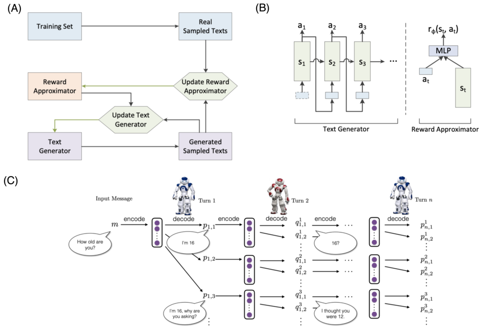


Figure 15: Examples on natural language generation: (A) The inverse reinforcement learning framework of text
generation [107] and (B) its sub-components. (C) The reinforcement learning problem in dialogue generation [108].


objectives, such as generating high-quality output while minimizing latency, can be challenging. Additionally, the
effectiveness of reinforcement learning in addressing these challenges depends on the specific task and domain, and
careful experimentation and tuning may be necessary to achieve optimal results.


**4.6** **Natural language generation (NLG)**


Natural language generation (NLG) is a critical task used to generate human-readable text sequences from non-linguistic
statistical representations of information. However, there are several challenges that can make it difficult to achieve
accurate and reliable performance. One major challenge is that text generation engines like Seq2Seq models can
generate short and dull responses, such as “idk” or “not sure.” This can make it difficult to generate interesting and
engaging responses, particularly in scenarios where the output needs to be engaging and informative. In addition, NLG
models can be short-sighted and only base their responses on the last few utterances. This can result in responses
that are not fully contextualized or that lack nuance and depth. Furthermore, the maximum likelihood objective is not
necessarily representative of how humans converse with one another, and training NLG models can be expensive and
time-consuming, requiring full supervision and labeled data. Finally, generated texts or dialogues can be repetitive and
lack diversity, which can make it difficult to generate engaging and interesting content.


Reinforcement learning can be a useful tool for addressing some of these challenges in natural language generation. For
example, one approach is to use inverse reinforcement learning to create more dense rewards and encourage diversity.
This involves training the model to optimize a specific reward function, which can help improve the accuracy and
effectiveness of the system in a wide range of applications and use cases. Another approach is to use reinforcement
learning to train dialogue models with customized rewards based on the problem being solved. This can help improve
the accuracy and relevance of the responses, particularly in scenarios where the output needs to be tailored to the
specific needs and preferences of the user or application. Here are some case studies:


30


Reinforcement Learning and Bandits for Speech and Language Processing: Tutorial, Review and Outlook


**Case study** [ 107 ]. In this work, the authors uses the inverse reinforcement learning to learn the underlying reward
function or driving forces of the generative process of a text corpus and use it to generate realistic natural language
samples (Figure 15A). Existing NLG solutions are mostly based on adversarial generative models (e.g. SeqGAN [ 109 ])
followed by a reinforcement learning model, because as we points out in the sequence generation section, they can
avoid the problem of exposure bias. However, the sequence generated by these GAN + RL solutions usually suffer
from mode collapse in the adversarial generator and reward sparsity due to a perfect discriminator at the end of the
training. Inverse reinforcement learning solves both by producing more dense reward signals (from the inferred reward
functions) and encouraging more diversified texts as it uses entropy-regularized policy gradient (e.g. MaxEnt). As we
pointed out earlier, inverse reinforcement learning is connected to GAN and can be formulated in similar architecture
(Figure 15A, B) by using a reward approximated generator followed by a discriminator to distinguish synthetic and real
on-policy trajectories (which are text sequences). Under this architecture, the reward functions and the text sequence
generator are jointly trained in an adversarial way.


One potential drawback of using inverse RL for text generation is the difficulty of accurately inferring the underlying
reward function from the given text corpus, especially if the text corpus are not considered an expert policy and thus,
can lead to equivalent solutions under a underspecified problem [ 64 ]. For instance, if the demonstration trajectories
belong to human subjects with clinical conditions, as in [ 110 ], inverse RL can have a hard time reaching to an optimal
solution. If the inferred reward function does not capture the nuances and complexities of human-generated text, it may
lead to suboptimal results and fail to generate high-quality, realistic text samples.


**Case study** [ 108 ]. When we think of dialogue generation, one might assume a necessity to use multiple (or two) agents
to learn their interactions. However, due to the flexibility of the reward functions for policy gradient methods, in this
work the authors aim to generate dialogue directly using a single deep reinforcement learning policy (Figure 15C). The
reinforcement learning problem is formulated the following way. The states are the concatenation of the previous two
dialogue turns (which are also the inputs to the encoder in the Seq2Seq model). The actions are the dialogue utterances
to generate (which have a infinite action space). The policy is a stochastic one, implicitly defined in the parameters of
the encoder-decoder architecture. The reward has a combination of three desired properties: 1) the ease of answering
(which is the the negative of likelihood of dull responses, such as “Idk” or “no idea”); 2) the information flow or low
repetitiveness in the generated dialogue (which is the information flow of the encoder representations); and 3) the
semantic coherence (which is the pairwise mutual information between the two correspondents in a dialogue pair).


A potential drawback of training a single-agent dialogue generation model using deep RL is that it may not fully
capture the complexities of multi-agent interactions in real-world dialogues. The simplified approach of using a single
agent to generate dialogues might overlook the intricate dynamics that emerge from the interactions between multiple
participants.


**Other works** . [ 111 ] proposes a paraphrase generation model that uses reinforcement learning to fine-tune deep
networks of a generator and uses inverse reinforcement learning to train an evaluator on the similarity between phrases.

[ 112, 113 ] uses reinforcement learning to generate navigation instructions with rewards measured from either a hidden
Markov model or a Bayesian network. [ 114, 115 ] proposes to use an adversarial bandit to adapt the NLG model online
through direct interactions with user feedbacks. [ 116 ] proposes a reinforcement learning solution to generate structured
queries from natural language with rewards from in-the-loop query execution over the database.


**Practicality and limitations** . As in the case studies, reinforcement learning offers promising solutions to challenges in
NLG, such as generating engaging responses and ensuring context-awareness. However, using inverse reinforcement
learning to infer reward functions for text generation may be prone to inaccuracies, potentially leading to suboptimal
results. Similarly, training single-agent dialogue generation models may not fully capture the complexities of multiagent interactions that occur in real-world conversations. These challenges highlight the need for careful formulation of
reward functions and model architectures to ensure the effectiveness and accuracy of reinforcement learning-based
solutions for natural language generation tasks.


**4.7** **Large language models (LLM)**


There is a growing interest of large language models (LLMs) such as GPT-3 [ 120 ], PaLM [ 121 ], and ChatGPT which
perform human-level performance in NLG task, which is why we separate it out as an individual section. These LLMs
are typically trained using maximum likelihood estimation (MLE) to generate text that matches a given input. However,
MLE-based methods suffer from various limitations, such as generating repetitive or uninteresting responses, and not
taking into account the broader context of the conversation.


RL provides a way to improve the performance of large language models by training them to optimize a specific reward
function. In the context of NLG, the reward function can be defined based on various metrics, such as diversity, fluency,
relevance, and engagement. For example, the reward function can be designed to encourage the model to generate


31


Reinforcement Learning and Bandits for Speech and Language Processing: Tutorial, Review and Outlook

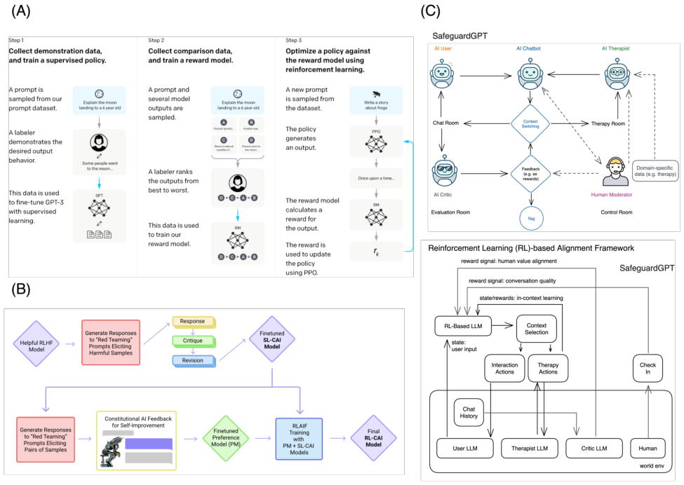


Figure 16: Examples on large language models: (A) The three main steps of reinforcement learning with human
feedback in InstructGPT [ 117 ]. (B) The self-critique process of constitutional AI [ 118 ]. (C) The SafeguardGPT
framework and its reinforcement learning alignment pipeline [119].


diverse and engaging responses, while avoiding repetitive or irrelevant content. RL can also enable human feedbacks to
fine-tune the LLMs to be more human-like and conversational in question answering type of scenarios.


**Case study** [ 117 ]. With the introduction of human moderators or annotators, the LLM can be tuned with Reinforcement
Learning from Human Feedback (RLHF) [ 122, 123, 117 ], which involves using human feedback in the form of rewards
to update the parameters of an LLM. As one of the first work in this direction, InstructGPT [ 117 ] was proposed to align
GPT-3 with users’ intended outcomes. As in Figure 16A, the process involves assembling a collection of human-crafted
instances showcasing the desired output behavior, and then, based on these demonstrations, GPT-3 is fine-tuned first
using supervised learning. Following this, a reward model is constructed through the ranking of model-generated results
ranging from the most favorable to the least. Employing this reward model, further refinement of the model is achieved
via RL utilizing PPO. Results suggest that if trained with RLHF, smaller LLMs (e.g. 1.3B parameters) can generate
more desirable results comparing to significantly larger ones (e.g. 175B).


A potential drawback of using RLHF for tuning LLMs is the need for human-generated rewards and rankings.
Constructing a reliable reward model based on human preferences can be subjective and time-consuming. The quality
of the reward signal heavily depends on the accuracy of human annotators, which may introduce bias or inconsistencies
in the training process.


**Case study** [ 118 ]. Similar to RLHF, one can also tune LLMs using Reinforcement Learning from AI Feedback (RLAIF).
Constitutional AI [ 118 ] refers to AI systems that are designed to comply with a set of ethical principles, similar to
how democratic societies are governed by a constitution. The authors suggest using AI feedback as a mechanism for
ensuring that the AI system remains within the boundaries of its ethical principles. Similar to RLHF, it involves both
a supervised learning stage and a RL stage (Figure 16B). In the supervised stage, the model is refined based on the
revisions generated alongside the output samples and self-critiques. In the RL stage, a secondary model is used to


32


Reinforcement Learning and Bandits for Speech and Language Processing: Tutorial, Review and Outlook


assess the qualities of both the original output sample and the output sample from the refined model. The difference
between this two samples are treated as a guiding reward signal to train the LLM in a RL process.


In the case of RLAIF for ethical LLMs, a potential drawback is the challenge of defining the boundaries and principles
that guide the AI system’s behavior. Ensuring that the AI feedback accurately reflects the ethical principles can be
complex and may require ongoing human oversight to prevent unintended consequences.


**Case study** [ 119 ]. As a special hybrid case of RLAIF and RLHF, SafeguardGPT [ 119 ] is proposed to adjust chatbot
LLM behaviors by using psychotherapy as a framework to identify and mitigate toxicity. The SafeguardGPT framework
involves human moderators and 4 different AI/LLM agents, including an AI Chatbot, an AI User, an AI Therapist,
and an AI Critic. The Chatbot and User interact in the chat room, while the Therapist guides the Chatbot through a
therapy session in the therapy room. Human moderators can control the sessions and diagnose the Chatbot’s state in the
control room. Lastly, the Critic evaluates the quality of the conversation and provides feedback for improvement in the
evaluation room as an RL process (Figure 16C), either entirely closed loop or human-in-the-loop). Since it involves
an self-adaptive autonomous agent consisting of a group of AI agents, and thus, can benefit from group thinking and
self-reflection through cross-talking among the agents. By incorporating psychotherapy and feedback mechanisms,
results suggest that SafeguardGPT improves chatbots’ communication skills, empathy, and emotional intelligence.


While the SafeguardGPT framework offers a comprehensive approach to improve chatbot behavior, it involves multiple
AI agents and human moderators, making it potentially complex to implement and manage. Coordinating interactions
between different AI agents and ensuring their alignment with human moderators’ intentions can be challenging and
may require continuous monitoring and adjustment.


**Other works** . Other than using collaborative principles as in SafeguardGPT and Constitutional AI, one can train LLMs
using adversarial techniques, as proposed in the Red Teaming [ 124 ], where one LLM is trained to identify and expose
weaknesses in another LLM’s language generation capabilities, as a more punitive approach. In this example, RL is
used to maximize the expected harmfulness elicited in the Red LLM.


In adversarial approaches like Red Teaming, where one LLM is trained to expose weaknesses in another LLM, there
is a risk of generating harmful or inappropriate content. The adversarial nature of the training process might lead to
unexpected and unintended negative behaviors, reducing the reliability and safety of the generated outputs.


In addition to these teaming and grouping of AI agents and human users, we can use RL to personalize LLMs with prior
knowledge, such as existing datasets (e.g., psychotherapy transcripts, social forum interactions, online rating websites)
to pre-train individual LLMs used as the AI Therapist, AI User, and AI Critic in the example work above. This can help
develop more effective, safe, and ethical AI chatbots that can be integrated into various domains, such as customer
service, education, and healthcare.


**Practicality and limitations** .


While reinforcement learning offers promising ways to enhance the performance and behavior of large language models,
there are potential drawbacks and challenges. These include the subjectivity and bias in human-generated rewards, the
complexity of defining and enforcing ethical boundaries, the challenges of coordinating interactions among multiple AI
agents and human moderators, and the potential for unintended negative outcomes in adversarial training approaches.
Balancing these drawbacks with the benefits of improved LLM behavior requires careful consideration and continuous
monitoring.


**4.8** **Conversational recommendation systems (CRS)**


Conversational recommendation systems (CRS) are designed to enable dynamic communication between users and
recommendation systems via natural language or speech interactions, and involve multiple language understanding
components such as preference query, multi-turn conversational recommendations, and dialogue understanding and
generation. However, there are several challenges that can make it difficult to achieve accurate and reliable performance in conversational recommendation systems. One major challenge is that recommendation systems are often
independently trained from natural language or speech components, which can limit their ability to take into account
the contexts afforded by ambiguity. This can result in recommendations that are not tailored to the specific needs
and preferences of the user. Another challenge is that deep recommendation systems using existing natural language
and speech components can be effective, but can be hard to generalize to cold-start users or items. This can limit
the usefulness and applicability of the system, particularly in scenarios where new users or items are being added
to the system over time. Finally, directly applying the RL strategies in non-conversational recommendation systems
to conversational ones may not handle sparse rewards very well in dialogue systems. This can make it difficult to
accurately optimize the system to provide accurate and relevant recommendations to the user.


33


Reinforcement Learning and Bandits for Speech and Language Processing: Tutorial, Review and Outlook

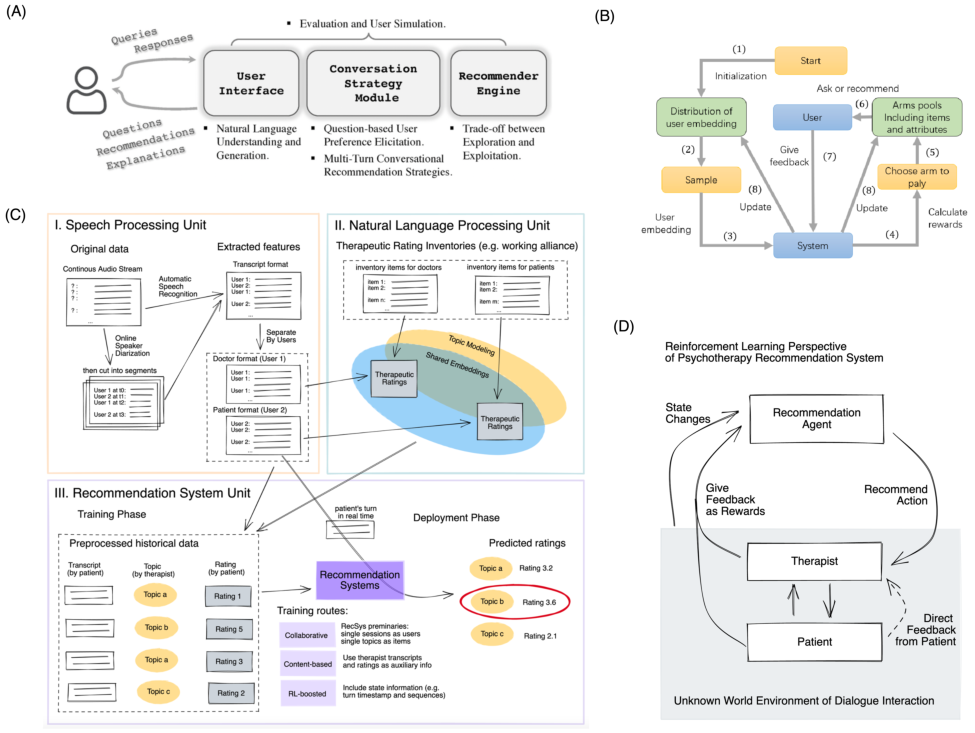


Figure 17: Examples on conversational recommendation systems: (A) The major components of conversational
recommendation systems [ 125 ] and (B) a bandit formulation of it [ 126 ]. (C) The major components of a dialogue topic
recommendation in psychotherapy setting and (D) its reinforcement learning formulation [127].


Reinforcement learning can be a useful tool for addressing some of these challenges in conversational recommendation
systems. For example, one approach is to use bandits or reinforcement learning solutions to handle cold-start problems
in recommendation systems. This involves training the system to optimize a specific reward function, which can help
improve the accuracy and effectiveness of the system in a wide range of scenarios. Another approach is to use speech
and natural language components to parse real-time features as dense reward for reinforcement learning. This involves
training the system to optimize a specific reward function, which can help improve the accuracy and effectiveness of the
system in a wide range of scenarios, particularly in scenarios where the user is interacting with the system in real-time.
Here are some case studies:


**Case study** [ 125 ]. In this work, the authors summarize a bandit approach to tackle the conversational recommendation
system setting (Figure 17A). In this example, the user interacts with a user interface powered by natural language
understanding and generation units with queries and responses to the system. The recommendation model must
strategize questions, recommendations and explanations in human-understandable multi-turn dialogues which balances
the exploration vs exploitation trade-off. Intuitively, it can be formulated as a bandit problem where a specific set of
questions or items can be selected as action arms in order to minimize the number of questions asked, maximize the
click rate or maximize the smooth experience in the interactions [ 128 ]. This objective relates to the knowledge of
the user’s preferences and the questions’ quality in different aspects. A contextual bandit solution (such as LinUCB)
can effectively a reward mapping from these properties by asking the user about one or more attributes and treating
them as contexts [ 129 ]. Other than using reinforcement learning to select recommendation action, one can also use
reinforcement learning to determine the timing to ask attributes or make recommendation. [ 126 ] proposes a bandit


34


Reinforcement Learning and Bandits for Speech and Language Processing: Tutorial, Review and Outlook


solution to dynamically and automatically alternate asking questions about attributes with recommending items given
the user embeddings (Figure 17B).


Similar to the previous examples of bandit-based solutions in speaker diarization and SLU, a potential drawback of using
a bandit approach to tackle conversational recommendation systems is that it may not fully capture the complexities of
dynamic user preferences and evolving conversation contexts. The bandit model might struggle to adapt quickly to
changing user preferences during the conversation, leading to suboptimal recommendations that do not align with the
user’s true interests.


**Case study** [ 127, 130, 131 ]. In this work, the authors propose a real-time conversational recommendation system
in psychotherapy to recommend discussion topics to the therapist given previous patient-therapist dialogues. An
unsupervised learning inference method [ 132, 133, 134 ] is applied to annotate the therapeutic working alliance between
the patient and therapist in each dialogue turn which predicts long-term clinical outcome and serve as the reward for
each dialogue pair. The action space are the most common topics mined from neural topic models over historical
data [ 135 ] and each dialogue turn are labelled by the topic label in a maximum likelihood principle (Figure 17C).
They train a deep reinforcement learning policy to directly map from previous and current dialogue state to the best
topic to recommend for the next turn, in order to maximize the cumulative therapeutic working alliance. As in Figure
17D, an interesting perspective to view this conversational recommendation system is that while the recommendation
agent is driven by reinforcement learning, the therapist (and even patient) have their own agencies governed under the
reinforcement learning principles. As such, the feedback loop are two folds: the patient can directly offer feedback
to the therapists, given the feedback, the therapist may adjust his or her internal model to weigh on the quality of the
suggestions made by the recommendation agent.


While using RL to optimize the selection of discussion topics in psychotherapy is promising, it may not fully capture the
nuances and complexities of therapeutic interactions and disease progression. The model’s recommendations might not
fully account for the sensitivity and emotional states of patients and therapists, potentially leading to recommendations
that are technically relevant but emotionally inappropriate. Societal implications and ethical considerations [ 136 ] should
be taken carefully when interpreting the insights from these clinically deployed RL models.


**Other works** . [ 137 ] proposes a reinforcement learning solution that tackles a combinatorial recommendation problems
by predicting the popularity of social media posts as the values of interdependent sub-actions. [ 138 ] is a follow up work
that uses a two-stage Q learning approach and incorporate the global context represented by discussions in an external
knowledge source into the state representations.


**Practicality and limitations** . Reinforcement learning provides valuable solutions to challenges in conversational
recommendation systems, including handling cold-start issues and real-time interactions. However, applying bandit or
reinforcement learning strategies may struggle to fully capture the dynamics of user preferences and the emotional
nuances in human conversations. The simplified decision-making process of reinforcement learning models might not
always align with the complex and context-dependent nature of conversational interactions. These challenges emphasize
the importance of integrating human-centric considerations and domain expertise when designing reinforcement learning
solutions for conversational recommendation systems.


**5** **Emerging Reinforcement Learning Strategies**


**5.1** **Deep reinforcement learning and bandits**


Deep Reinforcement Learning methods combines the recent advancements of deep learning with reinforcement learning
solutions. In the implementation level, these algorithms use deep neural networks to represent the value function,
the policy function, or the world model. To optimize these models from the data, one can apply most deep learning
optimization strategies, such as stochastic gradient descent, to optimize the value function, the policy function or the
model in an end-to-end fashion.


For instance, the deep learning variant of the Q-learning algorithm is the deep Q networks (DQN) [ 139 ]. Intuitively, it
represent the Q value function by a deep Q network with weight _w_ : _Q_ ( _s, a, w_ ) _≃_ _Q_ _[π]_ ( _s, a_ ) . The objective function is
defined by the mean squared errors in Q values:


_L_ ( _w_ ) = E [( _r_ + _γ_ max (51)
_a_ _[′]_ _[ Q]_ [(] _[s]_ _[′]_ _[, a]_ _[′]_ _[, w]_ [)] _[ −]_ _[Q]_ [(] _[s, a, w]_ [))] [2] []]


where _r_ + _γ_ max _a_ _′_ _Q_ ( _s_ _[′]_ _, a_ _[′]_ _, w_ ) is the target that we want our Q function to converge to. Then, we can compute the
gradient for Q-learning:


35


Reinforcement Learning and Bandits for Speech and Language Processing: Tutorial, Review and Outlook


_∂L_ ( _w_ )


( _w_ ) = E [( _r_ + _γ_ max

_∂w_ _a_ _[′]_ _[ Q]_ [(] _[s]_ _[′]_ _[, a]_ _[′]_ _[, w]_ [)] _[ −]_ _[Q]_ [(] _[s, a, w]_ [))] _[∂][Q]_ [(] _∂w_ _[s][,][ a][,][ w]_ [)]


_[,]_ _[,]_ ] (52)

_∂w_


which can be optimized end-to-end with most deep learning optimization methods, such as the stochastic gradient
descent. However, the naive Q-learning approach for deep Q network can be unstable and reach oscillatory or diverging
solutions, for three reasons. First, the data is sequential, and in other words, the experience trajectories are non-iid and
correlated with their successors. Second, the policy can change drastically with very small changes to the Q-values, and
as a result, yielding oscillating policies and data distributions that swing back and forth. Third, the scale of the rewards
and Q values are usually unknown, and thus can be amplified to very large values when trained with backpropagation.


There are a few solutions to solve these stability issues when training deep Q networks as Q-learning. Experience
replay is a strategy that pools many episodes of experience at each time steps together as a replay memory to train the
Q-learning in a off-policy way. By learning from all past policies with these replay memories, it uses iid samples and
breaks the correlation of experience trajectories. The second strategy is to freeze the target by using two networks, a Q
evaluation network and a target network which we freeze during training. This strategy avoid the oscillation in our
solutions and break the correlations between the Q-network and the target network. The third strategy is to clip the
rewards or normalize the networks, such that the networks can learn from robust gradients.


There are many deep reinforcement learning algorithms growing as a popular field, so we will only briefly cover a
few. The deterministic policy gradient (DPG, [ 140 ]) solves reinforcement learning problems with continuous action
spaces using the deterministic policy gradient, i.e. the expected gradient of the action-value function integrated over the
state space, or over both the state and action space in stochastic case. The deep deterministic policy gradient (DDPG,

[ 141 ]) extends DQN and DPG into a model-free actor-critic method that replace DPG’s stepwise optimization with
experience replay and a “soft” target network which slowly tracks the learned network weights. Using an off-policy
batch-based optimization approach, DDPG introduces exploration by injecting noise to the actor policy. The trust
region policy optimization (TRPO, [ 73 ]) introduces the KL divergence between the new policy and the old policy as a
trust region constraint, and solve the constrained optimization problem approximately using sample estimates from
either single-path or rollout trajectories. The proximal policy optimization (PPO, [ 142 ]) improves upon TRPO by using
KL-divergence as a penalty instead of a constraint.


Similarly, we can also introduce deep learning into bandit solutions. [ 143 ] proposes a deep contextual multi-armed
bandit by binding a Thompson sampling mechanism on top of a Bayesian neural network such that the inference time
dropout and weight posterior sampling are modeled as the exploration vs exploitation tradeoff. [ 144 ] proposes a similar
method of deep Bayesian bandit in recommendation system setting that approximates the uncertainty measurements of
the bandit predictions by employing a bootstrapped neural network with multiple heads and dropout units. Another
approach is to directly use a neural network to represent the context. For instance, [ 145 ] proposes a neural contextual
bandit which replaces LinUCB’s linear mapping with a neural network-based random feature mapping.


For interested readers, [146] is a good introduction to various types of deep reinforcement learning algorithms.


**5.2** **Batched and offline reinforcement learning**


Most use scenarios of reinforcement learning that we introduce earlier are on-policy and purely interactive. However,
many real-world reinforcement learning application systems have access to a large set of historical data, such as the
prior user’s behavioral trajectories, chat dialogues or purchase history. It would be a waste to not use them for off-policy
training. Offline or batched reinforcement learning studies the reinforcement learning methods that use previously
collected data without additional online data collection from on-policy interactions with the environment [ 147 ]. In this
setting, usually we have access to the experience data collected once with some (potentially unknown) behavior policy
(which we denote _π_ _β_, where _β_ refers to the data buffer, or also known as the replay buffer). In the training phase, we
use the buffer data from the data buffer _β_ to learn a policy _π_ . This training process doesn’t have access to or interact
with the MDP. This learned policy _π_ would only be only deployed into the task MDP after being fully trained. One
relevant example is training a deep reinforcement learning from human dialogue data [148].


The offline reinforcement learning is the data-driven version of the reinforcement learning problem. And the optimization
objective is still to maximize the expected future reward. What differentiate it with our reinforcement learning
formulation earlier is that it doesn’t have the ability to interact with the environment to collect additional transition
experience using the demonstration behavioral policy. Instead, the transition data are given as a static historical records
of experience for the agent to learn its best policy. On the first glimpse, it resembles the imitation learning which we
discuss in earlier sections, which simply adopts a supervised learning approach to learn from the demonstration. Offline
reinforcement learning, on the other hand, needs to first comprehend the dynamical system underlying the unknown


36


Reinforcement Learning and Bandits for Speech and Language Processing: Tutorial, Review and Outlook


MDP from the static transition data and then potentially use this world model to learn an optimal policy which can
obtain the largest cumulative reward in deployment phase.


It is a nontrivial problem because existing reinforcement learning solutions which we previously introduce, despite
its flexibility to learn from off-policy dataset, often fall short of their performance to learn entirely from offline data
without online interaction. This is due to a few reasons. First, they cannot effectively explore the states that are rare or
not available in the transition history and the actions that lead to those states. If the dataset doesn’t contain connected
state transition trajectories that touch high-reward regions, the agent would be unlikely to find those high-reward region.
One possible way would be to manually inject exploration, but that would face our second issue: they cannot correct for
out-of-distribution estimate via interactions. For an effective exploration, agents need to perform counterfactual queries,
i.e. the question that what may happen if the agent were to take a series of actions different from the ones they have
seen in the dataset. However, this is problematic, because as we discuss in the last section, deep reinforcement learning
solutions use mechanisms like experience replay to create iid samples, which may limit the power of our learned policy
to generate good yet potentially different actions, from those observed in our available dataset. In online setting, we can
simply try it out and correct for it. In offline setting, we don’t have this luxury. Third, like the challenge we discuss in
imitation learning, we would face the problem of distributional shift when we perform a series of counterfactual queries.
In other words, since we might not know the distribution of our behavioral policy in the dataset, it is likely that our agent
(characterized by its policy function, value function and world model) is trained under one distribution, but evaluated in
an entirely different distribution, since the small changes in visited states for the new policy can be amplified over time
(or steps) such that the two distributions vary by a large degree. Lastly, the deep learning-based function approximation
we use in these agents can exacerbate these issues due to their high-dimensional and expressive nature.


In order to evaluate how well a reinforcement learning perform given the historical data, importance sampling is used
to perform offline evaluation with respect to either the return of a given policy, or the policy gradient of the offline
policy gradient methods. In short, we use importance sampling to compute _J_ ( _π_ ) with the trajectories sampled from _π_ _β_
as the off-policy evaluation. There are multiple variants of importance sampling estimators that people use, such as
per-decision importance estimator normalized by the weights [ 149 ], doubly robust estimator incorporating the function
approximators [ 150 ] and marginalized importance sampling using the state-marginal importance ratio _d_ _[d]_ ~~_[π]_~~ _[πθ][β]_ [(] ( _[s]_ _s_ [)] ) [(where] _[ θ]_

is the model parameter) [ 151 ]. Similarly, to compute off-policy policy gradient, one can use above importance sampling
estimators. Other than reducing the variance using self-normalization, one can apply regularization (such as softmax as
in [ 152 ] or KL-divergence as in [ 142 ]) to constrain the learned policy _π_ _θ_ to not deviate too far away from the behavioral
policy _π_ _β_ .


There are several strategies to solve offline reinforcement learning problems. One can perform off-policy value function
estimation with linear least squared methods [ 153, 154 ] but they can suffer from distributional drift, unless we have some
sort of policy constraint that the distribution over the actions _π_ _θ_ ( _a_ _[′]_ _|s_ _[′]_ ) that we compute the target value from should
be close to the behavioral distribution _π_ _β_ ( _a_ _[′]_ _|s_ _[′]_ ) . This constraint makes sure that the Q function are only queried on
in-distribution actions, such that generalization results should still hold as the errors in Q function are not accumulated.
Although in this case, the Q function is evaluated on the same states as the ones in the training set, the action inputs
are still flexible enough to be out of distribution. Methods such as Advantage Weighted Actor Critic (AWAC, [ 155 ])
uses the KL-divergence between the learned and behavioral policies as an implicit divergence constraints. If using a
policy penalty algorithm, the reward function can be considered to be augmented as _r_ _[∗]_ ( _s, a_ ) = _r_ ( _s, a_ ) _−_ _αf_ ( _π_ _θ_ _, π_ _β_ )
where _f_ ( _·_ ) is the divergence function of the polices. Similar to our discussion in bandits, we can also use uncertainty
estimation as another constraint, because out-of-distribution actions tend to have large uncertainty and constraining the
uncertainty can produce conservative target values, as in [ 156 ]. The conservative Q-learning (CQL, [ 157 ]) regularizes
the value function or Q function directly to penalize large values and avoid overestimation for out-of-distribution actions.
Lastly, model-based offline reinforcement learning (MoREL, [ 158 ]) modifies the MDP model learned from data to
induce conservative behavior by penalizing the visitation of states under the model where the model is likely to be
incorrect.


For interested readers, [147] is a good review on offline reinforcement learning techniques.


**5.3** **Transfer learning in reinforcement learning**


Transfer learning is a set of training techniques to train models with greater generalization capabilities by utilizing
resources from other domains or resources meant for other purposes [ 159 ]. The other tasks or purposes that collect the
resources from are called source tasks, and the resources from other domains are called the source domains. Our task
and domain of interest are called the target task or domain. The goal of transfer learning is to effectively perform a
target task on a target domain dataset utilizing the features and weights learned from the source task or dataset. In our
context of reinforcement learning, we aim to answer the question that, can reinforcement learning effectively use the
prior knowledge to facilitate learning in a new task domain? The intuition is straightforward: if our models have solved


37


Reinforcement Learning and Bandits for Speech and Language Processing: Tutorial, Review and Outlook


prior tasks, they might acquire useful (i.e. reusable) knowledge or insights for solving a new task. The knowledge
stored in a reinforcement learning model can come from different components: the Q value function informs us which
actions or states are good comparing to the alternatives; the policy function informs us which actions are potentially
useful comparing to the alternatives (since some actions in a given state are rarely useful); the world model informs us
important understanding of the rules that govern the world (e.g. the laws of physics, which can be generalizable to other
physically grounded system); and features, weights and hidden states, which inform us a good representation to use
directly, or kick start the training as the initialization for fine-tuning.


Given these potentially useful knowledge in reinforcement learning systems, the transfer learning might help by using
the past experience from one set of tasks for faster learning and better performance on a new task. In our context of
reinforcement learning, the tasks are usually formulated as Markov decision processes. If we can directly run a policy
trained in the source domain in the new domain, we call it a zero-shot transfer learning, where the “shots” refer to the
number of attempts in the target task or domain. Similarly goes for trying the target task once or a few times, which
correspond to one-shot or few-shot transfer learning.


There are two main classes of transfer learning methods, the transductive transfer learning and inductive transfer
learning [ 160 ]. In transductive transfer learning, the source and target tasks are the same, but labeled data is only
available (or much more abundantly available) in the source domain. Here we translate it in reinforcement learning
setting: perhaps the reward feedback is not available or only very sparsely revealed in the task in the target domain,
but we have access to the historical trajectories or interaction environment of the same task but in the source domain.
Domain adaption, as mentioned in one of our earlier examples, is a transductive transfer learning technique. In inductive
transfer learning, the source and the target tasks are different and the labelled data is only available (or more abundantly
available) in the target domain. Here we translate it in reinforcement learning setting: perhaps we have the historical
action-state pairs in a source task, but don’t have access to the reward feedback. The inductive transfer learning can
be further separated into sequential transfer learning (STL, where multiple tasks are trained sequentially, either in a
cross-domain or cross-task fashion), and the multi-task learning (MTL, where multiple tasks are trained at the same
time, in a parallel fashion).


More specifically, here we outline a few common strategies. In forward or sequential transfer learning, we simply train
the reinforcement learning model on one task, and directly transfer to a new task. One approach is to apply domain
adaption in reinforcement learning training. Alternatively, we can also keep the reinforcement learning mechanism
intact, but transfer the visual, speech or linguistic representations first. In multi-task transfer learning, we train the
reinforcement learning model on many tasks at the same time and transfer to a new task. We can share the neural
network representations and layers across tasks in multi-task learning. Alternatively, we can also use contextual policies
by baking context-relevant information of the task or domain into the model. Finally, we can transfer the world models
and value functions by either using model-based reinforcement learning (which innately serve as an mechanism for
transfer), or using temporally correlated features such as successor features and representations.


For interested readers, [ 161 ] is a survey on transfer learning techniques applied in reinforcement learning, and [ 162, 163 ]
are two modern surveys on transfer learning in multi-agent reinforcement learning.


**6** **Open Questions and Challenges**


**6.1** **Multi-agent settings in speech and language**


The end goal of the speech and language is to communicate. As we formulate the generative processes of these
sequence-based signals as reinforcement learning agents, it is a natural step to simulate and model the mechanistic
interactions of these agents in a multi-agent settings. We have shown in an earlier section the example of modeling the
dialogue generation task as a single-agent reinforcement learning optimization problem [ 108 ], but in reality, there is an
information asymmetry among the communicating individuals that might be more suitable for a multi-agent system
(MAS) solution. The multiagent systems are self-organized systems with multiple interacting agents with computational
intelligence [ 164 ]. For instance, each communicating individual undergoes an partially isolated information flow via
multiple processing units (e.g. language understanding, dialogue policy, and language generation), and have feedback
loops in multiple steps which might yield complicated dynamic interactions (Figure 18).


These interaction trajectories can also change over different time steps, and as a result, modeling the data-generating
mechanism of such a system would require modeling a dynamic graphs with changing nodes (as communicating
individuals) and edges (as communication types). There can be interesting group dynamics emerge from communications
such as leadership, cohesion and conflicts [ 165 ]. One can develop solutions to measure these social dynamics, common
goals and collective intelligence in population and individual levels.


38


Reinforcement Learning and Bandits for Speech and Language Processing: Tutorial, Review and Outlook

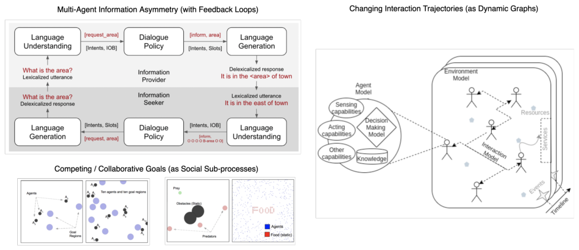


Figure 18: Open question 1: multi-agent settings in speech and language.


From the RL point-of-view, these multi-agent interactions suggest that the actions of one agent can affect the rewards
and outcomes of other agents. One challenge in multi-agent settings is that the agents can have conflicting objectives or
preferences, which can lead to suboptimal outcomes. For example, in a dialogue system where the system and the user
are both agents, the system may prioritize providing accurate recommendations, while the user may prioritize ease of
use and naturalness of the conversation. Another challenge is that the agents may have different levels of information
and understanding about the environment and each other, which can make it difficult to coordinate their actions and
optimize their behaviors. For example, in a multi-speaker speech recognition system, different speakers may have
different accents or speech patterns that can affect the performance of the system.


If we only consider the users as our agents to model, the agents in this human-only multi-agent system can be cooperative

[ 166 ] or competitive [ 167 ]. Each communicating individuals, if modeled by reinforcement learning systems, might
have different observation models and reward perceptions governed by competing or collaborative goals. Modeling
(and potentially mimicking) these social sub-processes is a nontrivial task, as in [ 168 ], which compares the interaction
trajectories of the human data and the reinforcement learning algorithms in social dilemma setting. [ 169 ] demonstrates
that deep reinforcement learning can interact with natural language in a visual task to share information cooperatively.


To address these challenges, various approaches have been proposed to perform RL in multi-agent settings in NLP
and speech tasks. One approach is to use coordination mechanisms to encourage agents to work together and achieve
common goals. Another approach is to use adversarial training, where agents compete against each other in a zero-sum
game to improve their performance and achieve optimal outcomes. New speech or language-related concepts can arise
from multi-agent modeling. For instance, grounded compositional language can emerge from multi-agent populations
of NLP agents, represented as segments of abstract discrete symbols uttered by the communicating agents [ 170 ], as
further summarized in this review [ 171 ]. A follow up work suggests that these compositional languages has to be
constrained in a specific curriculum in multi-agent setting in order to emerge [ 172 ]. Lastly, computational techniques of
multi-agent systems can also help improve temporal modeling of speech recognition systems, as in [173, 174].


**6.2** **Multi-objective training and human priors**


While we have covered many important sub-tasks in speech and language processes, many real-world applications
involve the incorporation of multiple processing systems that interact with and depend on one another. For instance, a
question answering system might need to understand the intent of the user to craft its objective functions, the descriptive
entities as its retrieval constraints, and at the same time, analyze the contexts of the user scenario, reason the relationship
of different entities, and learn a planning and prediction model to best interpolate or extrapolate users’ past experience
to maximize or minimize the estimated objective function given different dimensions of success criteria (Figure 19). A
conversational recommendation system, on the other hand, would need to understand the dialogue objective, infer the
user’s transactional state, estimate the user’s dynamic propensities, reason the compatibility and sequential relationship
of available inventories, recommend the best items or actions to guide the users towards their transactional destination,
all at the same time. The sub-components of such hybrid systems would have different priors on their affordance, i.e. the


39


Reinforcement Learning and Bandits for Speech and Language Processing: Tutorial, Review and Outlook

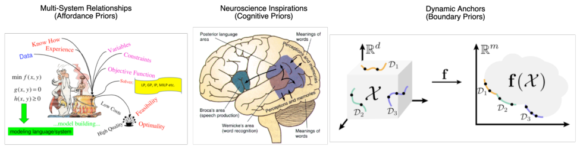


Figure 19: Open question 2: multi-objective training and human priors.


definitive quality of this processing component about how it can or should be used. And thus, training them together in
an end-to-end solution can potentially benefit from specific training curriculum to balance the exploration vs exploitation
trade-off of all sub-components. One possible strategy would be to tune the reward function as a multi-objective
optimization problem [ 175 ], such that the learning objectives for certain sub-components can be emphasized at certain
training phases.


Another strategy would be to learn from human priors. Originally proposed as a neuroscience-inspired algorithm, the
reinforcement learning solution has been widely studied over the years by neuroscientists and psychologists to further
understand the biological constraints and mechanisms of this type of learning, in terms of reward processing [ 176 ],
anatomical separation [ 177 ], abnormal states [ 178 ] and many others. One direction is to consider these biological
variants and constraints as a result from natural evolution, i.e. the algorithmic variants that serve a beneficial purpose
(with a high fitness) at certain scenarios. Under this assumption, [ 179 ] studies the reward processing mechanism
that distinguishes a series of human psychiatric conditions and introduces it into the reinforcement learning model
directly. If given human behavioral data, one can use mechanistic simulation, hierarchical Bayesian inference, or
inverse reinforcement learning to build neuromorphic reinforcement learning models that mimic human behaviors

[ 110 ]. [ 19, 20 ] further unifies these human behavioral agents at all three levels of bandits, contextual bandits and
reinforcement learning. Empirical results suggest that these biologically plausible models are advantageous over
existing reinforcement learning models in AI tasks. Other than reward processing, reinforcement learning methods can
also model other human priors, such as attention [ 180 ]. From the anatomic separation of the biological brains, one can
potentially map different speech and language processing components into different brain regions, and pre-program the
information flow and training curriculum of these computational components, given the biological and cognitive priors
from their corresponding neural correlates.


Applied systems with speech and language processing units can have different states and contexts, which governs the
priority of the sub-components in the system. For instance, if the user asks the virtual assistant to play music, the
priority of the music recommendation engine should precede that of the conversational engine, as opposed to the case
where the user talks to the customer support. As a result, the dynamics and transition of the different contexts would
serve as an anchor or boundary in the multi-objective optimization problem. in other words, we can potentially train a
universal model that take into account all different contexts. And then, given a certain context, the model would attempt
to find the pareto-optimal frontier by projecting affordance onto the context plane.


Either creating an agent with generalized intelligence across these contexts, or creating specialized agent one context
at a time, we need to deal with multi-objective training, the situation where multiple objectives need to be optimized
simultaneously, which is a common scenario in NLP and speech tasks. For example, in machine translation, the system
needs to generate translations that are both fluent and accurate, which are two separate objectives that need to be
balanced. One challenge in multi-objective training is that the objectives can be in conflict with each other, making it
difficult to find a single solution that optimizes all of them simultaneously. This can lead to suboptimal performance,
where the system fails to fully optimize any of the objectives, or it prioritizes one objective over the other, leading to
poor performance on the neglected objective. Another challenge is that the objectives can be difficult to quantify, and
can vary depending on the context and task at hand. This can make it difficult to define the reward function that is used
to train the RL model, which can affect the quality of the model and the effectiveness of the system. To address these
challenges, various approaches have been proposed to perform multi-objective training in NLP and speech tasks using
RL. One approach is to use a weighted sum of objectives to combine the multiple objectives into a single objective,
which can simplify the optimization process. Another approach is to use a Pareto-based approach, which involves
finding a set of solutions that represents the best trade-offs between the multiple objectives.


40


Reinforcement Learning and Bandits for Speech and Language Processing: Tutorial, Review and Outlook


**7** **Summary and Resources**


We starts our survey by motivating the exploration vs exploitation trade-off problem in real-world speech and natural
language processing systems with innate data uncertainty and batch-based model training using large-scale relational
databases. We formulate the reinforcement learning problem into five sub-classes of methodologies: Multi-armed
bandits and contextual bandits are both optimization methods that aim to maximize rewards based on actions taken by
an agent. While multi-armed bandits select the best action arm to maximize cumulative long-term rewards, contextual
bandits use side information or features available to the agent to personalize their action strategies. Reinforcement
learning algorithms, on the other hand, are formulated as Markov decision processes and rely on state representations to
update policies based on reward feedback received from the environment. Inverse reinforcement learning algorithms
learn the reward function of an unknown environment from demonstration trajectories to train reinforcement learning
agents, while imitation learning and behavioral cloning use supervised learning to directly learn the mapping from state
to action based on historical data of state-action pairs. These optimization methods are essential for improving the
performance of agents in various NLP and speech tasks.


In the application domains, we have reviewed speech and language tasks including speech recognition, speaker
diarization, spoken language understanding, natural language understanding, sequence generation, text-to-speech
synthesis, natural language generation, large language models and conversational recommendation systems, as well
as presented case studies regarding the following problems: The use of reinforcement learning (RL) has been shown
to be effective in improving various aspects of natural language processing (NLP) and speech tasks. In automatic
speech recognition (ASR), RL has been applied to improve low-resource training, speech enhancement, batch-wise
adaptation, and model training using augmented unlabelled datasets. RL has also been applied to speaker diarization
and spoken language understanding (SLU) to enable online interactive label speaker profiles and introduce slot stability
by rewarding argmax policy. In NLP, RL has been applied to improve natural language understanding (NLU) in game
settings and introduce personalization by adaptively selecting NLU interpretation. RL has also been shown to be useful
in determining resource allocation in incremental text-to-speech problems and improving text generation and dialogue
generation through inverse RL and combining rewards from two dialogue agents. RL with human or AI feedbacks
can help train large language models to align with human values and adopt ethical principles, as well as reach better
performance in generating realistic responses. Finally, RL has been applied in conversational recommendation systems
to provide recommendations based on conversational dialogues and real-time NLP-parsed elements. These findings
demonstrate the potential of RL in improving various NLP and speech tasks, and highlight the importance of combining
NLP and RL techniques to achieve more effective and efficient systems.


In the emerging topics, we cover the advances in using deep learning techniques or representations in reinforcement
learning and bandit settings, using historical data for off-policy training with offline reinforcement learning, and using
transfer learning training techniques to effectively leverage resources or knowledge of other domains or tasks.


In the open questions, we describe how the speech and language studies can potentially benefit from adopting a
multi-agent perspective of a population of communicating individuals as well as several active research directions. We
position existing real-world speech and language applications into the challenge of building a multi-system reasoning
machine that have interacting sub-components with different training objectives. We propose to use insights from
cognitive science or neuroscience as human priors to build better reinforcement learning models that can train faster and
more human-like. We describe the possibility of unifying different task contexts as temporal states where pareto-optimal
frontier can be located in the multi-objective optimization.


This survey is related to several fast growing fields. Some relevant reviews and textbooks include:


    - Introduction to reinforcement learning [8]

    - Introduction to multi-armed bandits [51]

    - A survey of inverse reinforcement learning: Challenges, methods and progress [66]

    - Imitation learning: A survey of learning methods [74]

    - Deep reinforcement learning: An overview [146]

    - Offline reinforcement learning: Tutorial, review, and perspectives on open problems [147]

    - Survey on applications of multi-armed and contextual bandits [181]

    - A survey on transfer learning for multiagent reinforcement learning systems [162]

    - Transfer learning for multiagent reinforcement learning systems [163]

    - Transfer learning for reinforcement learning domains: A survey [161]

    - Deep reinforcement learning for sequence-to-sequence models [102]


41


Reinforcement Learning and Bandits for Speech and Language Processing: Tutorial, Review and Outlook


   - Reinforcement learning based recommender systems: A survey [182]


    - A survey of the usages of deep learning for natural language processing [183]


    - Literature survey of statistical, deep and reinforcement learning in natural language processing [184]


    - Deep representation learning in speech processing: Challenges, recent advances, and future trends [185]


    - Survey on reinforcement learning for language processing [5]


    - A survey on compositional generalization in applications [171]


One good way to get onboard the research is to try out code examples. Some useful GitHub repositories include:


    - Bandit algorithms


**–**
[https://github.com/doerlbh/BanditZoo (Python package)](https://github.com/doerlbh/BanditZoo)

**–**
[https://github.com/johnmyleswhite/BanditsBook (example)](https://github.com/johnmyleswhite/BanditsBook)


    - Reinforcement learning algorithms


**–**
[https://github.com/tensorflow/agents (Python package)](https://github.com/tensorflow/agents)

**–**
[https://github.com/facebookresearch/ReAgent (Python package)](https://github.com/facebookresearch/ReAgent)

**–**
[https://github.com/aikorea/awesome-rl (resources)](https://github.com/aikorea/awesome-rl)

**–**
[https://github.com/dennybritz/reinforcement-learning (example)](https://github.com/dennybritz/reinforcement-learning)

**–**
[https://github.com/udacity/deep-reinforcement-learning (example)](https://github.com/udacity/deep-reinforcement-learning)

**–**
[https://github.com/MorvanZhou/Reinforcement-learning-with-tensorflow (example)](https://github.com/MorvanZhou/Reinforcement-learning-with-tensorflow)

**–**
[https://github.com/p-christ/Deep-Reinforcement-Learning-Algorithms-with-PyTorch (example)](https://github.com/p-christ/Deep-Reinforcement-Learning-Algorithms-with-PyTorch)


    - Offline Reinforcement learning algorithms


**–**
[https://github.com/takuseno/d3rlpy (Python package)](https://github.com/takuseno/d3rlpy)

**–**
[https://github.com/hanjuku-kaso/awesome-offline-rl (resources)](https://github.com/hanjuku-kaso/awesome-offline-rl)


    - Reinforcement learning applications


**–**
[https://github.com/AI4Finance-Foundation/FinRL (RL + finance)](https://github.com/AI4Finance-Foundation/FinRL)

**–**
[https://github.com/microsoft/recommenders (recommendation systems)](https://github.com/microsoft/recommenders)

**–**
[https://github.com/doerlbh/MiniVox (RL + speaker diarization)](https://github.com/doerlbh/MiniVox)

**–**
[https://github.com/doerlbh/awesome-diarization (speaker diarization)](https://github.com/doerlbh/awesome-diarization)

**–**
[https://github.com/doerlbh/MentalRL (RL + psychiatry behavioral modeling)](https://github.com/doerlbh/MentalRL)

**–**
[https://github.com/doerlbh/DilemmaRL (RL + multi-agent behavioral modeling)](https://github.com/doerlbh/DilemmaRL)


**8** **Note and Acknowledgements**


This survey accompanies the tutorial session “Reinforcement Learning and Bandits for Speech and Language Processing”
held by the author at _INTERSPEECH 2022_ . We would like to thank the conference organizers and attended audience
for valuable feedback and attention. The materials of the tutorial were inspired by and partially borrows from previous
tutorials on reinforcement learning, offline reinforcement learning and recommendation systems by Sergey Levine,
David Silver, Xiangyu Zhao, Andrea Barraza-Urbina, Dorota Glowacka, Chelsea Finn, Aviral Kumar, Lilian Weng and
Emma Brunskill. The author would like to thank their inspirations to the creation of our tutorial and this survey.


**References**


[1] Jens Kober, J Andrew Bagnell, and Jan Peters. Reinforcement learning in robotics: A survey. _The International_
_Journal of Robotics Research_, 32(11):1238–1274, 2013.


[2] Ngan Le, Vidhiwar Singh Rathour, Kashu Yamazaki, Khoa Luu, and Marios Savvides. Deep reinforcement
learning in computer vision: a comprehensive survey. _Artificial Intelligence Review_, pages 1–87, 2021.


[3] Thomas G Fischer. Reinforcement learning in financial markets-a survey. Technical report, FAU Discussion
Papers in Economics, 2018.


[4] Chao Yu, Jiming Liu, Shamim Nemati, and Guosheng Yin. Reinforcement learning in healthcare: A survey.
_ACM Computing Surveys (CSUR)_, 55(1):1–36, 2021.


42


Reinforcement Learning and Bandits for Speech and Language Processing: Tutorial, Review and Outlook


[5] Victor Uc-Cetina, Nicolas Navarro-Guerrero, Anabel Martin-Gonzalez, Cornelius Weber, and Stefan Wermter.
Survey on reinforcement learning for language processing. _Artificial Intelligence Review_, 56(2):1543–1575,
2023.


[6] Zidong Zhang, Dongxia Zhang, and Robert C Qiu. Deep reinforcement learning for power system applications:
An overview. _CSEE Journal of Power and Energy Systems_, 6(1):213–225, 2019.


[7] Jakob Gawlikowski, Cedrique Rovile Njieutcheu Tassi, Mohsin Ali, Jongseok Lee, Matthias Humt, Jianxiang
Feng, Anna Kruspe, Rudolph Triebel, Peter Jung, Ribana Roscher, et al. A survey of uncertainty in deep neural
networks. _arXiv preprint arXiv:2107.03342_, 2021.


[8] Richard S Sutton, Andrew G Barto, et al. _Introduction to reinforcement learning_, volume 135. MIT press
Cambridge, 1998.


[9] Weiwei Shen, Jun Wang, Yu-Gang Jiang, and Hongyuan Zha. Portfolio choices with orthogonal bandit learning.
In _Twenty-fourth international joint conference on artificial intelligence_, 2015.


[10] Arthur Charpentier, Romuald Elie, and Carl Remlinger. Reinforcement learning in economics and finance.
_Computational Economics_, pages 1–38, 2021.


[11] Baihan Lin and Djallel Bouneffouf. Optimal epidemic control as a contextual combinatorial bandit with budget.
In _2022 IEEE International Conference on Fuzzy Systems (FUZZ-IEEE)_, pages 1–8. IEEE, 2022.


[12] Baihan Lin. Evolutionary multi-armed bandits with genetic thompson sampling. In _2022 IEEE Congress on_
_Evolutionary Computation (CEC)_ . IEEE, 2022.


[13] Lisha Li, Kevin Jamieson, Giulia DeSalvo, Afshin Rostamizadeh, and Ameet Talwalkar. Hyperband: A
novel bandit-based approach to hyperparameter optimization. _The Journal of Machine Learning Research_,
18(1):6765–6816, 2017.


[14] Jack Parker-Holder, Vu Nguyen, and Stephen J Roberts. Provably efficient online hyperparameter optimization
with population-based bandits. _Advances in Neural Information Processing Systems_, 33:17200–17211, 2020.


[15] Liu Yang, Bo Liu, Leyu Lin, Feng Xia, Kai Chen, and Qiang Yang. Exploring clustering of bandits for online
recommendation system. In _Fourteenth ACM Conference on Recommender Systems_, pages 120–129, 2020.


[16] Lu Wang, Chengyu Wang, Keqiang Wang, and Xiaofeng He. Biucb: A contextual bandit algorithm for cold-start
and diversified recommendation. In _2017 IEEE International Conference on Big Knowledge (ICBK)_, pages
248–253. IEEE, 2017.


[17] Maryam Aziz, Emilie Kaufmann, and Marie-Karelle Riviere. On multi-armed bandit designs for dose-finding
clinical trials. _Journal of Machine Learning Research_, 22(1-38):4, 2021.


[18] Sofía S Villar, Jack Bowden, and James Wason. Multi-armed bandit models for the optimal design of clinical
trials: benefits and challenges. _Statistical science: a review journal of the Institute of Mathematical Statistics_,
30(2):199, 2015.


[19] Baihan Lin, Guillermo Cecchi, Djallel Bouneffouf, Jenna Reinen, and Irina Rish. Unified models of human
behavioral agents in bandits, contextual bandits and RL. _arXiv preprint arXiv:2005.04544_, 2020.


[20] Baihan Lin, Guillermo Cecchi, Djallel Bouneffouf, Jenna Reinen, and Irina Rish. Models of human behavioral
agents in bandits, contextual bandits and rl. In _Human Brain and Artificial Intelligence: Second International_
_Workshop, HBAI 2020, Held in Conjunction with IJCAI-PRICAI 2020, Yokohama, Japan, January 7, 2021,_
_Revised Selected Papers 2_, pages 14–33. Springer, 2021.


[21] Djallel Bouneffouf, Irina Rish, and Guillermo A Cecchi. Bandit models of human behavior: Reward processing
in mental disorders. In _International Conference on Artificial General Intelligence_, pages 237–248. Springer,
2017.


[22] Suhrid Satyal, Ingo Weber, Hye-young Paik, Claudio Di Ciccio, and Jan Mendling. Ab testing for process
versions with contextual multi-armed bandit algorithms. In _International Conference on Advanced Information_
_Systems Engineering_, pages 19–34. Springer, 2018.


[23] Ding Xiang, Rebecca West, Jiaqi Wang, Xiquan Cui, and Jinzhou Huang. Multi armed bandit vs. a/b tests
in e-commence-confidence interval and hypothesis test power perspectives. In _Proceedings of the 28th ACM_
_SIGKDD Conference on Knowledge Discovery and Data Mining_, pages 4204–4214, 2022.


[24] Leslie Pack Kaelbling, Michael L Littman, and Andrew W Moore. Reinforcement learning: A survey. _Journal_
_of artificial intelligence research_, 4:237–285, 1996.


[25] Nicolo Cesa-Bianchi and Paul Fischer. Finite-time regret bounds for the multiarmed bandit problem. In _ICML_,
volume 98, pages 100–108. Citeseer, 1998.


43


Reinforcement Learning and Bandits for Speech and Language Processing: Tutorial, Review and Outlook


[26] Richard S. Sutton and Andrew G. Barto. _Introduction to Reinforcement Learning_ . MIT Press, Cambridge, MA,
USA, 1st edition, 1998.


[27] Joannes Vermorel and Mehryar Mohri. Multi-armed bandit algorithms and empirical evaluation. In _European_
_conference on machine learning_, pages 437–448. Springer, 2005.


[28] R Duncan Luce. _Individual choice behavior: A theoretical analysis_ . Courier Corporation, 2012.


[29] David R Shanks, Richard J Tunney, and John D McCarthy. A re-examination of probability matching and rational
choice. _Journal of Behavioral Decision Making_, 15(3):233–250, 2002.


[30] Peter Auer, Nicolo Cesa-Bianchi, Yoav Freund, and Robert E Schapire. The nonstochastic multiarmed bandit
problem. _SIAM Journal on Computing_, 32(1):48–77, 2002.


[31] T. L. Lai and Herbert Robbins. Asymptotically efficient adaptive allocation rules. _Advances in Applied_
_Mathematics_, 6(1):4–22, 1985.


[32] W.R. Thompson. On the likelihood that one unknown probability exceeds another in view of the evidence of two
samples. _Biometrika_, 25:285–294, 1933.


[33] Olivier Chapelle and Lihong Li. An empirical evaluation of thompson sampling. In _Advances in neural_
_information processing systems_, pages 2249–2257, 2011.


[34] Shipra Agrawal and Navin Goyal. Analysis of thompson sampling for the multi-armed bandit problem. In
_COLT 2012 - The 25th Annual Conference on Learning Theory, June 25-27, 2012, Edinburgh, Scotland_, pages
39.1–39.26, 2012.


[35] Alessandro Lazaric, Emma Brunskill, et al. Online stochastic optimization under correlated bandit feedback. In
_International Conference on Machine Learning_, pages 1557–1565. PMLR, 2014.


[36] Peter Auer and Nicolò Cesa-Bianchi. On-line learning with malicious noise and the closure algorithm. _Ann._
_Math. Artif. Intell._, 23(1-2):83–99, 1998.


[37] Peter Auer, Nicolò Cesa-Bianchi, Yoav Freund, and Robert E. Schapire. The nonstochastic multiarmed bandit
problem. _SIAM J. Comput._, 32(1):48–77, 2002.


[38] Djallel Bouneffouf and Raphaël Féraud. Multi-armed bandit problem with known trend. _Neurocomputing_,
205:16–21, 2016.


[39] Aurélien Garivier and Eric Moulines. On upper-confidence bound policies for non-stationary bandit problems.
_arXiv preprint arXiv:0805.3415_, 2008.


[40] Baihan Lin, Djallel Bouneffouf, Guillermo A Cecchi, and Irina Rish. Contextual bandit with adaptive feature
extraction. In _2018 IEEE International Conference on Data Mining Workshops (ICDMW)_, pages 937–944. IEEE,
2018.


[41] Niranjan Srinivas, Andreas Krause, Sham M Kakade, and Matthias Seeger. Gaussian process optimization in the
bandit setting: No regret and experimental design. _arXiv preprint arXiv:0912.3995_, 2009.


[42] Francesco Trovò, Stefano Paladino, Marcello Restelli, and Nicola Gatti. Budgeted multi–armed bandit in
continuous action space. In _Proceedings of the Twenty-second European Conference on Artificial Intelligence_,
pages 560–568, 2016.


[43] Yizao Wang, Jean-Yves Audibert, and Rémi Munos. Algorithms for infinitely many-armed bandits. _Advances in_
_Neural Information Processing Systems_, 21, 2008.


[44] Wei Chen, Yajun Wang, and Yang Yuan. Combinatorial multi-armed bandit: General framework and applications.
In _International conference on machine learning_, pages 151–159. PMLR, 2013.


[45] Baihan Lin and Djallel Bouneffouf. Optimal epidemic control as a contextual combinatorial bandit with budget.
_arXiv preprint arXiv:2106.15808_, 2021.


[46] Tor Lattimore. Regret analysis of the finite-horizon gittins index strategy for multi-armed bandits. In _Conference_
_on Learning Theory_, pages 1214–1245. PMLR, 2016.


[47] Tomáš Kocák, Gergely Neu, Michal Valko, and Rémi Munos. Efficient learning by implicit exploration in bandit
problems with side observations. _Advances in Neural Information Processing Systems_, 27, 2014.


[48] Baihan Lin. Online semi-supervised learning in contextual bandits with episodic reward. In _Australasian Joint_
_Conference on Artificial Intelligence_, pages 407–419. Springer, 2020.


[49] Wenkui Ding, Tao Qin, Xu-Dong Zhang, and Tie-Yan Liu. Multi-armed bandit with budget constraint and
variable costs. In _Twenty-Seventh AAAI Conference on Artificial Intelligence_, 2013.


44


Reinforcement Learning and Bandits for Speech and Language Processing: Tutorial, Review and Outlook


[50] Ashwinkumar Badanidiyuru, Robert Kleinberg, and Aleksandrs Slivkins. Bandits with knapsacks. _Journal of the_
_ACM (JACM)_, 65(3):1–55, 2018.

[51] Aleksandrs Slivkins et al. Introduction to multi-armed bandits. _Foundations and Trends® in Machine Learning_,
12(1-2):1–286, 2019.

[52] John Langford and Tong Zhang. Epoch-greedy algorithm for multi-armed bandits with side information.
_Advances in Neural Information Processing Systems (NIPS 2007)_, 20:1, 2007.

[53] Wei Chu, Lihong Li, Lev Reyzin, and Robert E. Schapire. Contextual bandits with linear payoff functions. In
Geoffrey J. Gordon, David B. Dunson, and Miroslav Dudik, editors, _AISTATS_, volume 15 of _JMLR Proceedings_,
pages 208–214. JMLR.org, 2011.

[54] Shipra Agrawal and Navin Goyal. Thompson sampling for contextual bandits with linear payoffs. In _ICML (3)_,
pages 127–135, 2013.

[55] Li Zhou. A survey on contextual multi-armed bandits. _arXiv preprint arXiv:1508.03326_, 2015.

[56] D.P. Bertsekas and J.N. Tsitsiklis. _Neuro-dynamic programming_ . Athena Scientific, 1996.

[57] Lilian Weng. Policy gradient algorithms. _lilianweng.github.io_, 2018.

[58] John Schulman, Philipp Moritz, Sergey Levine, Michael Jordan, and Pieter Abbeel. High-dimensional continuous
control using generalized advantage estimation. _arXiv preprint arXiv:1506.02438_, 2015.

[59] Richard S Sutton, David McAllester, Satinder Singh, and Yishay Mansour. Policy gradient methods for
reinforcement learning with function approximation. _Advances in neural information processing systems_, 12,
1999.

[60] Vijay Konda and John Tsitsiklis. Actor-critic algorithms. _Advances in neural information processing systems_,
12, 1999.

[61] Stuart Russell. Learning agents for uncertain environments. In _Proceedings of the eleventh annual conference on_
_Computational learning theory_, pages 101–103, 1998.

[62] Andrew Y Ng, Stuart J Russell, et al. Algorithms for inverse reinforcement learning. In _Icml_, volume 1, page 2,
2000.

[63] Justin Fu, Aviral Kumar, Ofir Nachum, George Tucker, and Sergey Levine. D4rl: Datasets for deep data-driven
reinforcement learning. _arXiv preprint arXiv:2004.07219_, 2020.

[64] Stuart Armstrong and Sören Mindermann. Occam’s razor is insufficient to infer the preferences of irrational
agents. _Advances in neural information processing systems_, 31, 2018.

[65] Pieter Abbeel and Andrew Y Ng. Apprenticeship learning via inverse reinforcement learning. In _Proceedings of_
_the twenty-first international conference on Machine learning_, page 1. ACM, 2004.

[66] Saurabh Arora and Prashant Doshi. A survey of inverse reinforcement learning: Challenges, methods and
progress. _Artificial Intelligence_, 297:103500, 2021.

[67] Nathan D Ratliff, J Andrew Bagnell, and Martin A Zinkevich. Maximum margin planning. In _Proceedings of the_
_23rd international conference on Machine learning_, pages 729–736, 2006.

[68] Brian D Ziebart, Andrew L Maas, J Andrew Bagnell, Anind K Dey, et al. Maximum entropy inverse reinforcement
learning. In _Aaai_, volume 8, pages 1433–1438. Chicago, IL, USA, 2008.

[69] Ian Goodfellow, Jean Pouget-Abadie, Mehdi Mirza, Bing Xu, David Warde-Farley, Sherjil Ozair, Aaron Courville,
and Yoshua Bengio. Generative adversarial networks. _Communications of the ACM_, 63(11):139–144, 2020.

[70] Chelsea Finn, Paul Christiano, Pieter Abbeel, and Sergey Levine. A connection between generative adversarial
networks, inverse reinforcement learning, and energy-based models. _arXiv preprint arXiv:1611.03852_, 2016.

[71] Jonathan Ho and Stefano Ermon. Generative adversarial imitation learning. _Advances in neural information_
_processing systems_, 29, 2016.

[72] Chelsea Finn, Sergey Levine, and Pieter Abbeel. Guided cost learning: Deep inverse optimal control via policy
optimization. In _International conference on machine learning_, pages 49–58. PMLR, 2016.

[73] John Schulman, Sergey Levine, Pieter Abbeel, Michael Jordan, and Philipp Moritz. Trust region policy
optimization. In _International conference on machine learning_, pages 1889–1897. PMLR, 2015.

[74] Ahmed Hussein, Mohamed Medhat Gaber, Eyad Elyan, and Chrisina Jayne. Imitation learning: A survey of
learning methods. _ACM Computing Surveys (CSUR)_, 50(2):1–35, 2017.

[75] Takayuki Osa, Joni Pajarinen, Gerhard Neumann, J Andrew Bagnell, Pieter Abbeel, Jan Peters, et al. An
algorithmic perspective on imitation learning. _Foundations and Trends® in Robotics_, 7(1-2):1–179, 2018.


45


Reinforcement Learning and Bandits for Speech and Language Processing: Tutorial, Review and Outlook


[76] Stéphane Ross, Geoffrey Gordon, and Drew Bagnell. A reduction of imitation learning and structured prediction
to no-regret online learning. In _Proceedings of the fourteenth international conference on artificial intelligence_
_and statistics_, pages 627–635. JMLR Workshop and Conference Proceedings, 2011.

[77] Baihan Lin, Djallel Bouneffouf, and Guillermo Cecchi. Online learning in iterated prisoner’s dilemma to mimic
human behavior. In _Pacific Rim International Conference on Artificial Intelligence_ . Springer, 2022.

[78] Aviral Kumar, Joey Hong, Anikait Singh, and Sergey Levine. Should i run offline reinforcement learning or
behavioral cloning? In _International Conference on Learning Representations_, 2021.

[79] Yih-Liang Shen, Chao-Yuan Huang, Syu-Siang Wang, Yu Tsao, Hsin-Min Wang, and Tai-Shih Chi. Reinforcement learning based speech enhancement for robust speech recognition. In _ICASSP 2019-2019 IEEE_
_International Conference on Acoustics, Speech and Signal Processing (ICASSP)_, pages 6750–6754. IEEE, 2019.

[80] Taku Kala and Takahiro Shinozaki. Reinforcement learning of speech recognition system based on policy
gradient and hypothesis selection. In _2018 IEEE International Conference on Acoustics, Speech and Signal_
_Processing (ICASSP)_, pages 5759–5763. IEEE, 2018.

[81] Hoon Chung, Hyeong-Bae Jeon, and Jeon Gue Park. Semi-supervised training for sequence-to-sequence speech
recognition using reinforcement learning. In _2020 International Joint Conference on Neural Networks (IJCNN)_,
pages 1–6. IEEE, 2020.

[82] Thejan Rajapakshe, Rajib Rana, Siddique Latif, Sara Khalifa, and Björn W Schuller. Pre-training in deep
reinforcement learning for automatic speech recognition. _arXiv preprint arXiv:1910.11256_, 2019.

[83] Anastasia Kuznetsova, Anurag Kumar, and Francis M Tyers. A bandit approach to curriculum generation for
automatic speech recognition. _arXiv preprint arXiv:2102.03662_, 2021.

[84] Andros Tjandra, Sakriani Sakti, and Satoshi Nakamura. Sequence-to-sequence asr optimization via reinforcement
learning. In _2018 IEEE International Conference on Acoustics, Speech and Signal Processing (ICASSP)_, pages
5829–5833. IEEE, 2018.

[85] Andros Tjandra, Sakriani Sakti, and Satoshi Nakamura. End-to-end speech recognition sequence training with
reinforcement learning. _IEEE Access_, 7:79758–79769, 2019.

[86] Shigeki Karita, Atsunori Ogawa, Marc Delcroix, and Tomohiro Nakatani. Sequence training of encoder-decoder
model using policy gradient for end-to-end speech recognition. In _2018 IEEE International Conference on_
_Acoustics, Speech and Signal Processing (ICASSP)_, pages 5839–5843. IEEE, 2018.

[87] Baihan Lin and Xinxin Zhang. Voiceid on the fly: A speaker recognition system that learns from scratch. In
_INTERSPEECH_, 2020.

[88] Baihan Lin and Xinxin Zhang. Speaker diarization as a fully online learning problem in minivox. _arXiv preprint_
_arXiv:2006.04376_, 2020.

[89] Baihan Lin and Xinxin Zhang. Speaker diarization as a fully online bandit learning problem in minivox. In _Asian_
_Conference on Machine Learning_, pages 1660–1674. PMLR, 2021.

[90] Baihan Lin. Voice2Alliance: automatic speaker diarization and quality assurance of conversational alignment. In
_INTERSPEECH_, 2022.

[91] Baihan Lin and Xinxin Zhang. A reinforcement learning framework for online speaker diarization. _arXiv preprint_
_arXiv:2302.10924_, 2023.

[92] He Bai, Yu Zhou, Jiajun Zhang, Liang Zhao, Mei-Yuh Hwang, and Chengqing Zong. Source-critical reinforcement learning for transferring spoken language understanding to a new language. _arXiv preprint_
_arXiv:1808.06167_, 2018.

[93] Jerome R Bellegarda. Spoken language understanding for natural interaction: The siri experience. _Natural_
_interaction with robots, knowbots and smartphones_, pages 3–14, 2014.

[94] Emmanuel Ferreira, Alexandre Reiffers Masson, Bassam Jabaian, and Fabrice Lefèvre. Adversarial bandit for
online interactive active learning of zero-shot spoken language understanding. In _2016 IEEE International_
_Conference on Acoustics, Speech and Signal Processing (ICASSP)_, pages 6155–6159. IEEE, 2016.

[95] Baihan Lin and Xinxin Zhang. ispeak: Interactive spoken language understanding system for children with
speech and language disorders. In _2022 IEEE Spoken Language Technology Workshop (SLT)_ . IEEE, 2022.

[96] Baihan Lin and Xinxin Zhang. Interactive spoken language understanding system for children with speech and
language disorders. _arXiv preprint_, 2023.

[97] Zhi Chen, Lu Chen, Xiang Zhou, and Kai Yu. Deep reinforcement learning for on-line dialogue state tracking.
_arXiv preprint arXiv:2009.10321_, 2020.


46


Reinforcement Learning and Bandits for Speech and Language Processing: Tutorial, Review and Outlook


[98] Karthik Narasimhan, Tejas Kulkarni, and Regina Barzilay. Language understanding for text-based games using
deep reinforcement learning. _arXiv preprint arXiv:1506.08941_, 2015.


[99] Fabian Moerchen, Patrick Ernst, and Giovanni Zappella. Personalizing natural language understanding using
multi-armed bandits and implicit feedback. In _Proceedings of the 29th ACM International Conference on_
_Information & Knowledge Management_, pages 2661–2668, 2020.


[100] Jelena Luketina, Nantas Nardelli, Gregory Farquhar, Jakob Foerster, Jacob Andreas, Edward Grefenstette,
Shimon Whiteson, and Tim Rocktäschel. A survey of reinforcement learning informed by natural language.
_arXiv preprint arXiv:1906.03926_, 2019.


[101] Adam Vogel and Dan Jurafsky. Learning to follow navigational directions. In _Proceedings of the 48th annual_
_meeting of the association for computational linguistics_, pages 806–814, 2010.


[102] Yaser Keneshloo, Tian Shi, Naren Ramakrishnan, and Chandan K Reddy. Deep reinforcement learning for
sequence-to-sequence models. _IEEE transactions on neural networks and learning systems_, 31(7):2469–2489,
2019.


[103] Devang S Ram Mohan, Raphael Lenain, Lorenzo Foglianti, Tian Huey Teh, Marlene Staib, Alexandra Torresquintero, and Jiameng Gao. Incremental text to speech for neural sequence-to-sequence models using reinforcement
learning. _arXiv preprint arXiv:2008.03096_, 2020.


[104] Rui Liu, Berrak Sisman, and Haizhou Li. Reinforcement learning for emotional text-to-speech synthesis with
improved emotion discriminability. _arXiv preprint arXiv:2104.01408_, 2021.


[105] Jerry Gibson and Hoontaek Oh. A reinforcement learning approach to speech coding. _Information_, 13(7):331,
2022.


[106] Nan Jiang, Sheng Jin, Zhiyao Duan, and Changshui Zhang. Rl-duet: Online music accompaniment generation
using deep reinforcement learning. In _Proceedings of the AAAI Conference on Artificial Intelligence_, volume 34,
pages 710–718, 2020.


[107] Zhan Shi, Xinchi Chen, Xipeng Qiu, and Xuanjing Huang. Toward diverse text generation with inverse
reinforcement learning. _arXiv preprint arXiv:1804.11258_, 2018.


[108] Jiwei Li, Will Monroe, Alan Ritter, Michel Galley, Jianfeng Gao, and Dan Jurafsky. Deep reinforcement learning
for dialogue generation. _arXiv preprint arXiv:1606.01541_, 2016.


[109] Lantao Yu, Weinan Zhang, Jun Wang, and Yong Yu. Seqgan: Sequence generative adversarial nets with policy
gradient. In _Proceedings of the AAAI conference on artificial intelligence_, volume 31, 2017.


[110] Baihan Lin, Djallel Bouneffouf, and Guillermo Cecchi. Split Q Learning: Reinforcement Learning with TwoStream Rewards. In _Proceedings of the Twenty-Eighth International Joint Conference on Artificial Intelligence,_
_IJCAI-19_, pages 6448–6449. AAAI Press, International Joint Conferences on Artificial Intelligence Organization,
7 2019.


[111] Zichao Li, Xin Jiang, Lifeng Shang, and Hang Li. Paraphrase generation with deep reinforcement learning.
_arXiv preprint arXiv:1711.00279_, 2017.


[112] Nina Dethlefs and Heriberto Cuayáhuitl. Combining hierarchical reinforcement learning and bayesian networks
for natural language generation in situated dialogue. In _Proceedings of the 13th European Workshop on Natural_
_Language Generation_, pages 110–120, 2011.


[113] Nina Dethlefs and Heriberto Cuayáhuitl. Hierarchical reinforcement learning and hidden markov models for
task-oriented natural language generation. In _Proceedings of the 49th Annual Meeting of the Association for_
_Computational Linguistics: Human Language Technologies_, pages 654–659, 2011.


[114] Matthieu Riou, Bassam Jabaian, Stéphane Huet, and Fabrice Lefèvre. Reinforcement adaptation of an attentionbased neural natural language generator for spoken dialogue systems. _Dialogue & Discourse_, 10:1–19, 2019.


[115] Matthieu Riou, Bassam Jabaian, Stéphane Huet, and Fabrice Lefèvre. Online adaptation of an attention-based
neural network for natural language generation. In _Conference of the International Speech Communication_
_Association (Interspeech)_, 2017.


[116] Victor Zhong, Caiming Xiong, and Richard Socher. Seq2sql: Generating structured queries from natural language
using reinforcement learning. _arXiv preprint arXiv:1709.00103_, 2017.


[117] Long Ouyang, Jeff Wu, Xu Jiang, Diogo Almeida, Carroll L Wainwright, Pamela Mishkin, Chong Zhang,
Sandhini Agarwal, Katarina Slama, Alex Ray, et al. Training language models to follow instructions with human
feedback. _arXiv preprint arXiv:2203.02155_, 2022.


47


Reinforcement Learning and Bandits for Speech and Language Processing: Tutorial, Review and Outlook


[118] Yuntao Bai, Saurav Kadavath, Sandipan Kundu, Amanda Askell, Jackson Kernion, Andy Jones, Anna Chen,
Anna Goldie, Azalia Mirhoseini, Cameron McKinnon, et al. Constitutional ai: Harmlessness from ai feedback.
_arXiv preprint arXiv:2212.08073_, 2022.


[119] Baihan Lin, Djallel Bouneffouf, Guillermo Cecchi, and Kush R Varshney. Towards healthy AI: Large language
models need therapists too. _arXiv preprint arXiv:2304.00416_, 2023.


[120] Tom Brown, Benjamin Mann, Nick Ryder, Melanie Subbiah, Jared D Kaplan, Prafulla Dhariwal, Arvind
Neelakantan, Pranav Shyam, Girish Sastry, Amanda Askell, et al. Language models are few-shot learners.
_Advances in neural information processing systems_, 33:1877–1901, 2020.


[121] Aakanksha Chowdhery, Sharan Narang, Jacob Devlin, Maarten Bosma, Gaurav Mishra, Adam Roberts, Paul
Barham, Hyung Won Chung, Charles Sutton, Sebastian Gehrmann, et al. Palm: Scaling language modeling with
pathways. _arXiv preprint arXiv:2204.02311_, 2022.


[122] Paul F Christiano, Jan Leike, Tom Brown, Miljan Martic, Shane Legg, and Dario Amodei. Deep reinforcement
learning from human preferences. _Advances in neural information processing systems_, 30, 2017.


[123] Nisan Stiennon, Long Ouyang, Jeffrey Wu, Daniel Ziegler, Ryan Lowe, Chelsea Voss, Alec Radford, Dario
Amodei, and Paul F Christiano. Learning to summarize with human feedback. _Advances in Neural Information_
_Processing Systems_, 33:3008–3021, 2020.


[124] Ethan Perez, Saffron Huang, Francis Song, Trevor Cai, Roman Ring, John Aslanides, Amelia Glaese, Nat
McAleese, and Geoffrey Irving. Red teaming language models with language models. _arXiv preprint_
_arXiv:2202.03286_, 2022.


[125] Chongming Gao, Wenqiang Lei, Xiangnan He, Maarten de Rijke, and Tat-Seng Chua. Advances and challenges
in conversational recommender systems: A survey. _AI Open_, 2:100–126, 2021.


[126] Shijun Li, Wenqiang Lei, Qingyun Wu, Xiangnan He, Peng Jiang, and Tat-Seng Chua. Seamlessly unifying
attributes and items: Conversational recommendation for cold-start users. _ACM Transactions on Information_
_Systems (TOIS)_, 39(4):1–29, 2021.


[127] Baihan Lin, Guillermo Cecchi, and Djallel Bouneffouf. SupervisorBot: NLP-Annotated Real-Time Recommendations of Psychotherapy Treatment Strategies with Deep Reinforcement Learning. In _Proceedings of the_
_Thirty-Second International Joint Conference on Artificial Intelligence, IJCAI-23_ . International Joint Conferences
on Artificial Intelligence Organization, 8 2023.


[128] Konstantina Christakopoulou, Filip Radlinski, and Katja Hofmann. Towards conversational recommender
systems. In _Proceedings of the 22nd ACM SIGKDD international conference on knowledge discovery and data_
_mining_, pages 815–824, 2016.


[129] Xiaoying Zhang, Hong Xie, Hang Li, and John CS Lui. Conversational contextual bandit: Algorithm and
application. In _Proceedings of the web conference 2020_, pages 662–672, 2020.


[130] Baihan Lin, Guillermo Cecchi, and Djallel Bouneffouf. Helping therapists with NLP-annotated recommendation.
In _Joint Proceedings of the ACM IUI Workshops_, 2023.


[131] Baihan Lin, Guillermo Cecchi, and Djallel Bouneffouf. Psychotherapy AI companion with reinforcement
learning recommendations and interpretable policy dynamics. In _Proceedings of the Web Conference 2023_, 2023.


[132] Baihan Lin, Guillermo Cecchi, and Djallel Bouneffouf. Deep annotation of therapeutic working alliance in
psychotherapy. In _International Workshop on Health Intelligence_ . Springer, 2023.


[133] Baihan Lin, Guillermo Cecchi, and Djallel Bouneffouf. Working alliance transformer for psychotherapy dialogue
classification. _arXiv preprint arXiv:2210.15603_, 2022.


[134] Baihan Lin. Knowledge management system with NLP-assisted annotations: A brief survey and outlook. In
_CIKM Workshops_, 2022.


[135] Baihan Lin, Djallel Bouneffouf, Guillermo Cecchi, and Ravi Tejwani. Neural topic modeling of psychotherapy
sessions. In _International Workshop on Health Intelligence_ . Springer, 2023.


[136] Baihan Lin. Computational inference in cognitive science: Operational, societal and ethical considerations.
_arXiv preprint arXiv:2210.13526_, 2022.


[137] Ji He, Mari Ostendorf, Xiaodong He, Jianshu Chen, Jianfeng Gao, Lihong Li, and Li Deng. Deep reinforcement
learning with a combinatorial action space for predicting popular reddit threads. _arXiv preprint arXiv:1606.03667_,
2016.


[138] Ji He, Mari Ostendorf, and Xiaodong He. Reinforcement learning with external knowledge and two-stage
q-functions for predicting popular reddit threads. _arXiv preprint arXiv:1704.06217_, 2017.


48


Reinforcement Learning and Bandits for Speech and Language Processing: Tutorial, Review and Outlook


[139] Volodymyr Mnih, Koray Kavukcuoglu, David Silver, Alex Graves, Ioannis Antonoglou, Daan Wierstra, and
Martin Riedmiller. Playing atari with deep reinforcement learning. _arXiv preprint arXiv:1312.5602_, 2013.


[140] David Silver, Guy Lever, Nicolas Heess, Thomas Degris, Daan Wierstra, and Martin Riedmiller. Deterministic
policy gradient algorithms. In _International conference on machine learning_, pages 387–395. PMLR, 2014.


[141] Timothy P Lillicrap, Jonathan J Hunt, Alexander Pritzel, Nicolas Heess, Tom Erez, Yuval Tassa, David Silver,
and Daan Wierstra. Continuous control with deep reinforcement learning. _arXiv preprint arXiv:1509.02971_,
2015.


[142] John Schulman, Filip Wolski, Prafulla Dhariwal, Alec Radford, and Oleg Klimov. Proximal policy optimization
algorithms. _arXiv preprint arXiv:1707.06347_, 2017.


[143] Mark Collier and Hector Urdiales Llorens. Deep contextual multi-armed bandits. _arXiv preprint_
_arXiv:1807.09809_, 2018.


[144] Dalin Guo, Sofia Ira Ktena, Pranay Kumar Myana, Ferenc Huszar, Wenzhe Shi, Alykhan Tejani, Michael Kneier,
and Sourav Das. Deep bayesian bandits: Exploring in online personalized recommendations. In _Fourteenth ACM_
_Conference on Recommender Systems_, pages 456–461, 2020.


[145] Dongruo Zhou, Lihong Li, and Quanquan Gu. Neural contextual bandits with ucb-based exploration. In
_International Conference on Machine Learning_, pages 11492–11502. PMLR, 2020.


[146] Yuxi Li. Deep reinforcement learning: An overview. _arXiv preprint arXiv:1701.07274_, 2017.


[147] Sergey Levine, Aviral Kumar, George Tucker, and Justin Fu. Offline reinforcement learning: Tutorial, review,
and perspectives on open problems. _arXiv preprint arXiv:2005.01643_, 2020.


[148] Natasha Jaques, Asma Ghandeharioun, Judy Hanwen Shen, Craig Ferguson, Agata Lapedriza, Noah Jones,
Shixiang Gu, and Rosalind Picard. Way off-policy batch deep reinforcement learning of implicit human
preferences in dialog. _arXiv preprint arXiv:1907.00456_, 2019.


[149] Doina Precup. Eligibility traces for off-policy policy evaluation. _Computer Science Department Faculty_
_Publication Series_, page 80, 2000.


[150] Nan Jiang and Lihong Li. Doubly robust off-policy value evaluation for reinforcement learning. In _International_
_Conference on Machine Learning_, pages 652–661. PMLR, 2016.


[151] Richard S Sutton, A Rupam Mahmood, and Martha White. An emphatic approach to the problem of off-policy
temporal-difference learning. _The Journal of Machine Learning Research_, 17(1):2603–2631, 2016.


[152] Sergey Levine and Vladlen Koltun. Guided policy search. In _International conference on machine learning_,
pages 1–9. PMLR, 2013.


[153] Richard S Sutton, Hamid Reza Maei, Doina Precup, Shalabh Bhatnagar, David Silver, Csaba Szepesvári, and Eric
Wiewiora. Fast gradient-descent methods for temporal-difference learning with linear function approximation.
In _Proceedings of the 26th annual international conference on machine learning_, pages 993–1000, 2009.


[154] Michail G Lagoudakis and Ronald Parr. Least-squares policy iteration. _The Journal of Machine Learning_
_Research_, 4:1107–1149, 2003.


[155] Ashvin Nair, Murtaza Dalal, Abhishek Gupta, and Sergey Levine. Accelerating online reinforcement learning
with offline datasets. _arXiv preprint arXiv:2006.09359_, 2020.


[156] Rishabh Agarwal, Dale Schuurmans, and Mohammad Norouzi. An optimistic perspective on offline reinforcement
learning. In _International Conference on Machine Learning_, pages 104–114. PMLR, 2020.


[157] Aviral Kumar, Aurick Zhou, George Tucker, and Sergey Levine. Conservative q-learning for offline reinforcement
learning. _arXiv preprint arXiv:2006.04779_, 2020.


[158] Rahul Kidambi, Aravind Rajeswaran, Praneeth Netrapalli, and Thorsten Joachims. Morel: Model-based offline
reinforcement learning. _arXiv preprint arXiv:2005.05951_, 2020.


[159] Sinno Jialin Pan and Qiang Yang. A survey on transfer learning. _IEEE Transactions on knowledge and data_
_engineering_, 22(10):1345–1359, 2009.


[160] Sebastian Ruder. _Neural transfer learning for natural language processing_ . PhD thesis, NUI Galway, 2019.


[161] Matthew E Taylor and Peter Stone. Transfer learning for reinforcement learning domains: A survey. _Journal of_
_Machine Learning Research_, 10(7), 2009.


[162] Felipe Leno Da Silva and Anna Helena Reali Costa. A survey on transfer learning for multiagent reinforcement
learning systems. _Journal of Artificial Intelligence Research_, 64:645–703, 2019.


49


Reinforcement Learning and Bandits for Speech and Language Processing: Tutorial, Review and Outlook


[163] Felipe Leno Silva and Anna Helena Reali Costa. Transfer learning for multiagent reinforcement learning systems.
In _Proceedings of the Twenty-Fifth International Joint Conference on Artificial Intelligence (IJCAI)_, pages
3982–3983. Springer, 2016.

[164] Michael Wooldridge. _An introduction to multiagent systems_ . John wiley & sons, 2009.

[165] Gabriel Murray, Giuseppe Carenini, and Shafiq Joty. Nlp for conversations: Sentiment, summarization, and
group dynamics. In _Proceedings of the 27th International Conference on Computational Linguistics: Tutorial_
_Abstracts_, pages 1–4, 2018.

[166] Liviu Panait and Sean Luke. Cooperative multi-agent learning: The state of the art. _Autonomous agents and_
_multi-agent systems_, 11(3):387–434, 2005.

[167] Trapit Bansal, Jakub Pachocki, Szymon Sidor, Ilya Sutskever, and Igor Mordatch. Emergent complexity via
multi-agent competition. _arXiv preprint arXiv:1710.03748_, 2017.

[168] Baihan Lin, Djallel Bouneffouf, and Guillermo Cecchi. Online learning in iterated prisoner’s dilemma to mimic
human behavior. In _Pacific Rim International Conference on Artificial Intelligence_ . Springer, 2022.

[169] Abhishek Das, Satwik Kottur, José MF Moura, Stefan Lee, and Dhruv Batra. Learning cooperative visual dialog
agents with deep reinforcement learning. In _Proceedings of the IEEE international conference on computer_
_vision_, pages 2951–2960, 2017.

[170] Igor Mordatch and Pieter Abbeel. Emergence of grounded compositional language in multi-agent populations.
In _Proceedings of the AAAI Conference on Artificial Intelligence_, volume 32, 2018.

[171] Baihan Lin, Djallel Bouneffouf, and Irina Rish. A survey on compositional generalization in applications. _arXiv_
_preprint arXiv:2302.01067_, 2023.

[172] Satwik Kottur, José MF Moura, Stefan Lee, and Dhruv Batra. Natural language does not emerge naturally in
multi-agent dialog. _arXiv preprint arXiv:1706.08502_, 2017.

[173] Michael Walsh, Robert Kelly, Greg MP O’Hare, Julie Carson-Berndsen, and Tarek Abu-Amer. A multi-agent
computational linguistic approach to speech recognition. In _The 18th International Joint Conference on Artificial_
_Intelligence (IJCAI-03), 9th-15th August, Acapulco, Mexico, 2003_ . IJCAI, 2003.

[174] Zalimhan Nagoev, Larisa Lyutikova, and Irina Gurtueva. Model for automatic speech recognition using multiagent recursive cognitive architecture. _Procedia computer science_, 145:386–392, 2018.

[175] Kalyanmoy Deb. Multi-objective optimization. In _Search methodologies_, pages 403–449. Springer, 2014.

[176] Samuel M McClure, Michele K York, and P Read Montague. The neural substrates of reward processing in
humans: the modern role of FMRI. _The Neuroscientist_, 10(3):260–268, 2004.

[177] Daeyeol Lee, Hyojung Seo, and Min Whan Jung. Neural basis of reinforcement learning and decision making.
_Annual review of neuroscience_, 35:287, 2012.

[178] Tiago V Maia and Michael J Frank. From reinforcement learning models to psychiatric and neurological
disorders. _Nature neuroscience_, 14(2):154–162, 2011.

[179] Baihan Lin, Guillermo Cecchi, Djallel Bouneffouf, Jenna Reinen, and Irina Rish. A story of two streams:
Reinforcement learning models from human behavior and neuropsychiatry. In _Proceedings of the Nineteenth In-_
_ternational Conference on Autonomous Agents and Multi-Agent Systems, AAMAS-20_, pages 744–752, Auckland,
New Zealand, 5 2020. International Foundation for Autonomous Agents and Multiagent Systems.

[180] Zhibo Yang, Lihan Huang, Yupei Chen, Zijun Wei, Seoyoung Ahn, Gregory Zelinsky, Dimitris Samaras, and
Minh Hoai. Predicting goal-directed human attention using inverse reinforcement learning. In _Proceedings of_
_the IEEE/CVF conference on computer vision and pattern recognition_, pages 193–202, 2020.

[181] Djallel Bouneffouf, Irina Rish, and Charu Aggarwal. Survey on applications of multi-armed and contextual
bandits. In _2020 IEEE Congress on Evolutionary Computation (CEC)_, pages 1–8. IEEE, 2020.

[182] M Mehdi Afsar, Trafford Crump, and Behrouz Far. Reinforcement learning based recommender systems: A
survey. _ACM Computing Surveys (CSUR)_, 2021.

[183] Daniel W Otter, Julian R Medina, and Jugal K Kalita. A survey of the usages of deep learning for natural
language processing. _IEEE transactions on neural networks and learning systems_, 32(2):604–624, 2020.

[184] Akanksha Rai Sharma and Pranav Kaushik. Literature survey of statistical, deep and reinforcement learning in
natural language processing. In _2017 International Conference on Computing, Communication and Automation_
_(ICCCA)_, pages 350–354. IEEE, 2017.

[185] Siddique Latif, Rajib Rana, Sara Khalifa, Raja Jurdak, Junaid Qadir, and Björn W Schuller. Deep representation
learning in speech processing: Challenges, recent advances, and future trends. _arXiv preprint arXiv:2001.00378_,
2020.


50


