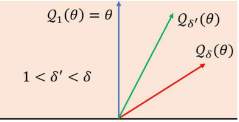
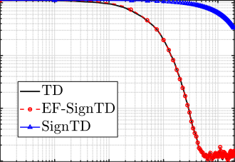
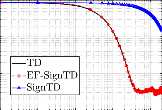
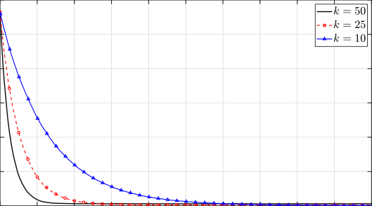
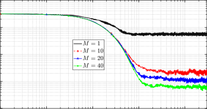
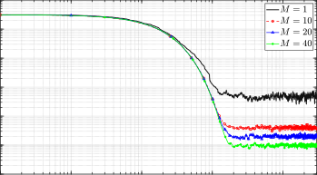

## Temporal Difference Learning with Compressed Updates: Error-Feedback meets Reinforcement Learning

Aritra Mitra, George J. Pappas, and Hamed Hassani [∗]

Abstract

In large-scale distributed machine learning, recent works have studied the effects of compressing gradients in stochastic optimization to alleviate the communication bottleneck. These
works have collectively revealed that stochastic gradient descent (SGD) is robust to structured
perturbations such as quantization, sparsification, and delays. Perhaps surprisingly, despite
the surge of interest in multi-agent reinforcement learning, almost nothing is known about the
analogous question: Are common reinforcement learning (RL) algorithms also robust to similar perturbations? We investigate this question by studying a variant of the classical temporal
difference (TD) learning algorithm with a perturbed update direction, where a general compression operator is used to model the perturbation. Our work makes three important technical
contributions. First, we prove that compressed TD algorithms, coupled with an error-feedback
mechanism used widely in optimization, exhibit the same non-asymptotic theoretical guarantees
as their SGD counterparts. Second, we show that our analysis framework extends seamlessly
to nonlinear stochastic approximation schemes that subsume Q-learning. Third, we prove that
for multi-agent TD learning, one can achieve linear convergence speedups with respect to the
number of agents while communicating just O [˜] (1) bits per iteration. Notably, these are the
first finite-time results in RL that account for general compression operators and error-feedback
in tandem with linear function approximation and Markovian sampling. Our proofs hinge on
the construction of novel Lyapunov functions that capture the dynamics of a memory variable
introduced by error-feedback.

### 1 Introduction

Stochastic gradient descent (SGD) is at the heart of large-scale distributed machine learning
paradigms such as federated learning (FL) [1]. In these applications, the task of training highdimensional weight vectors is distributed among several workers that exchange information over
networks of limited bandwidth. While parallelization at such an immense scale helps to reduce
the computational burden, it creates several other challenges: delays, asynchrony, and most importantly, a significant communication bottleneck. The popularity and success of SGD can be
attributed in no small part to the fact that it is extremely robust to such deviations from ideal
operating conditions. In fact, by now, there is a rich literature that analyzes the robustness of
SGD to a host of structured perturbations that include lossy gradient-quantization [2, 3] and sparsification [4, 5]. For instance, SignSGD - a variant of SGD where each coordinate of the gradient is

∗ A. Mitra is with the Department of Electrical and Computer Engineering, North Carolina State University. Email:
amitra2@ncsu.edu. H. Hassani and G. Pappas are with the Department of Electrical and Systems Engineering,
University of Pennsylvania. Email: {pappasg, hassani}@seas.upenn.edu. This work was supported by NSF Award
1837253, NSF CAREER award CIF 1943064, and The Institute for Learning-enabled Optimization at Scale (TILOS),
under award number NSF-CCF-2112665.

replaced by its sign - is extensively used to train deep neural networks [6,7]. Inspired by these findings, in this paper, we ask a different question: Are common reinforcement learning (RL) algorithms
also robust to similar structured perturbations?
Motivation. Perhaps surprisingly, despite the recent surge of interest in multi-agent/federated
RL, almost nothing is known about the above question. To fill this void, we initiate the study of
a robustness theory for iterative RL algorithms with compressed update directions. We primarily
focus on the problem of evaluating the value function associated with a fixed policy µ in a Markov
decision process (MDP). Just as SGD is the workhorse of stochastic optimization, the classical
temporal difference (TD) learning algorithm [8] for policy evaluation forms the core subroutine in
a variety of decision-making algorithms in RL (e.g., Watkin’s Q-learning algorithm). In fact, in
their book [9], Sutton and Barto mention: “If one had to identify one idea as central and novel
to reinforcement learning, it would undoubtedly be temporal-difference (TD) learning.” Thus, it
stands to reason that we center our investigation around a variant of the TD(0) learning algorithm
with linear function approximation, where the TD(0) update direction is replaced by a compressed
version of it. Moreover, to account for general biased compression operators (e.g., sign and Top-k),
we couple this scheme with an error-feedback mechanism that retains some memory of TD(0) update
directions from the past.
Other than the robustness angle, a key motivation of our work is to design communicationefficient algorithms for the emerging paradigms of multi-agent RL (MARL) and federated RL
(FRL). In existing works on these topics [10–13], agents typically exchange high-dimensional models (parameters) or model-differentials (i.e., gradient-like update directions) over low-bandwidth
channels, keeping their personal data (i.e., rewards, states, and actions) private. In the recent
survey paper on FRL by [11], the authors explain how the above issues contribute to a major
communication bottleneck, just as in the standard FL setting. However, no work on MARL or
FRL provides any theory whatsoever when it comes to compression/quantization in RL. Our work
takes a significant step towards filling this gap via a suite of comprehensive theoretical results that
we discuss below.

1.1 Our Contributions

The main contributions of this work are as follows.

1. Algorithmic Framework for Compressed Stochastic Approximation. We develop
a general framework for analyzing iterative compressed stochastic approximation (SA) algorithms with error-feedback. The generality of this framework stems from two salient features:
(i) it applies to nonlinear SA with Markovian noise; and (ii) the compression operator covers
several common quantization and (biased) sparsification schemes studied in optimization. As
an instance of our framework, we propose a new algorithm called EF-TD (Algorithm 1) to
study extreme distortions to the TD(0) update direction. Examples of such distortion include,
but are not limited to, replacing each coordinate of the TD(0) update direction with just its
sign, or just retaining the coordinate with the largest magnitude. While such distortions have
been extensively studied for SGD, we are unaware of any analagous algorithms or analysis in
the context of RL.

2. Analysis under Markovian Sampling. In Theorem 1, we show that with a constant stepsize, EF-TD guarantees linear convergence to a ball centered around the optimal parameter.
Up to a compression factor, our result mirrors existing rates in RL without compression [14].
Moreover, the effect of the compression factor exactly mirrors that for compressed SGD [15].

The significance of this result is twofold: (i) It is the first result in RL that accounts for general compression operators and error-feedback in tandem with Markovian sampling and linear
function approximation; and (ii) It is the first theoretical result on the robustness of TD learning algorithms to structured perturbations. One interesting takeaway from Theorem 1 is that
“slowly-mixing” Markov chains have more inherent robustness to distortions/compression.
This appears to be a new observation that we elaborate on in Section 4.

3. Analysis for General Nonlinear Stochastic Approximation. In Section 5, we study
Algorithm 1 in its full generality by considering a compressed nonlinear SA scheme with errorfeedback, and establishing an analog of Theorem 1 in Theorem 2. The significance of this
result lies in revealing that the power and scope of the popular error-feedback mechanism [2]
in large-scale ML is not limited to the optimization problems it has been used for thus
far. In particular, since the nonlinear SA scheme we study captures certain instances of
Q-learning [16], Theorem 2 conveys that our results extend well beyond policy evaluation to
decision-making (control) problems as well.

4. Communication-Efficient MARL. Since one of our main goals is to facilitate communicationefficient MARL, we consider a collaborative MARL setting that has shown up in several recent
works [10, 13, 17]. Here, M agents interact with the same MDP, but observe potentially different realizations of rewards and state transitions. These agents exchange compressed TD
update directions via a central server to speed up the process of evaluating a specific policy. In this context, we ask the following fundamental question: How much information
needs to be transmitted to achieve the optimal linear-speedup (w.r.t. the number of agents)
for policy-evaluation? To answer this question, we propose a multi-agent version of EF-TD.
In Theorem 3, we prove that by collaborating, each agent can achieve an M -fold speedup
in the dominant term of the convergence rate. Importantly, the effect of compression only
shows up in higher-order terms, leaving the dominant term unaffected. Thus, we prove that
by transmitting just O [˜] (1) bits per-agent per-round, one can preserve the same
asymptotic rates as vanilla TD(0), while achieving an optimal linear convergence
speedup w.r.t. the number of agents. We envision this result will have important implications for MARL. Our analysis also leads to a tighter linear dependence on the mixing
time compared to the quadratic dependence in the only other paper that establishes linear
speedups under Markovian sampling [13].

5. Technical Challenges and Novel Proof Techniques. One might wonder whether our
results above follow as simple extensions of known analysis techniques in RL. In what follows,
we explain why this isn’t the case by outlining the key technical challenges unique to our
setup, and our novel proof ideas to overcome them. First, a non-asymptotic analysis of even
vanilla TD(0) under Markovian sampling is known to be extremely challenging due to complex
temporal correlations. Our setting is further complicated by the fact that the dynamics of the
parameter and the memory variable are intricately coupled with the temporally-correlated
Markov data tuples. This leads to a complex stochastic dynamical system that has not been
analyzed before in RL. Second, we cannot directly appeal to existing proofs of compression
in optimization since the problems we study do not involve minimizing a static loss function.
Moreover, the aspect of temporally correlated observations is completely absent in compressed
optimization since one deals with i.i.d. data. The above discussion motivates the need for
new analysis tools beyond what are known for both RL and optimization.

  - New Proof Ingredients for Theorems 1 and 2. To prove Theorem 1, our first innovation is to construct a novel Lyapunov function that accounts for the joint dynamics of the

parameter and the memory variable introduced by error-feedback. The next natural step is
to then analyze the drift of this Lyapunov function by appealing to mixing time arguments as is typically done in finite-time RL proofs [14, 18]. This is where we again run into difficulties since the presence of the memory variable due to error-feedback introduces non-standard
delay terms in the drift bound. Notably, this difficulty does not show up when one analyzes
error-feedback in optimization since there is no need for mixing time arguments of Markov
chains. To overcome this challenge, we make a connection to what might at first appear
unrelated: the Incremental Aggregated Gradient (IAG) method for finite-sum optimization.
Our main observation here is that the elegant analysis of the IAG method in [19] shows how
one can handle the effect of “shocks” (delayed terms), as long as the amplitude and duration
of the shocks is not too large. This ends up being precisely what we need for our purpose:
we carefully relate the amplitude of the shocks to our constructed Lyapunov function, and
their duration to the mixing time of the underlying Markov chain. We spell out these details
explicitly in Section 7.

   - New Proof Ingredients for Theorem 3. Despite the long list of papers on MARL, the
only one that establishes a linear speedup (w.r.t. the number of agents) in sample-complexity
under Markovian sampling is the very recent paper by [13]; all other papers end up making
a restrictive i.i.d. sampling assumption [10, 17, 20] to show a speedup. [1] The proof in [13]
is quite involved, and relies on Generalized Moreau Envelopes. This makes it particularly
challenging to extend their proof framework to our setting where we need to additionally
contend with the effects of compression and error-feedback. As such, we provide an alternate
proof technique for establishing the linear speedup effect that relies crucially on a new variance
reduction lemma under Markovian data, namely Lemma 2. This lemma is not just limited to
TD learning, and may be of independent interest to the MARL literature. Lemma 2, coupled
with a finer Lyapunov function (relative to that for proving Theorem 1) enable us to establish
the desired linear speedup result under Markovian sampling for our setting. We elaborate on
these points in Section 7.

Scope of our Work. We note that our work is primarily theoretical in nature, in the same
spirit as several recent finite-time RL papers [10, 13, 14, 18, 26]. We do, however, report simulations
on moderately sized (100 states) MDPs that reveal: (i) without error-feedback (EF), compressed
TD(0) can end up making little to no progress; and (ii) with EF, the performance of compressed
TD(0) complies with our theory. These simulations are in line with those known in optimization
for deep learning [5, 6, 27, 28], where one empirically observes significant benefits of performing EF.
Succinctly, we convey: compressed TD learning algorithms with EF are just as robust as their SGD
counterparts, and exhibit similar convergence guarantees.

1.2 Related Work

In what follows, we discuss the most relevant threads of related work.

  - Analysis of TD Learning Algorithms. An analysis of the classical temporal difference
learning algorithm [8] with value function approximation was first provided by [29]. They employed
the ODE method [30] - commonly used to study stochastic approximation algorithms - to provide
an asymptotic convergence rate analysis of TD learning algorithms. Finite-time rates for such
algorithms remained elusive for several years, till the work by [31]. Soon after, [32] noted some
issues with the proofs in [31]. Under an i.i.d. sampling assumption, [33] and [26] went on to provide

1 After the first version of this paper was released, and while the current version was under review, some other
recent works managed to establish linear speedup results under various settings [21–25].

finite-time rates for TD learning algorithms. For the more challenging Markovian setting, finitetime rates have been recently derived using various perspectives: (i) by making explicit connections
to optimization [18]; (ii) by taking a control-theoretic approach and studying the drift of a suitable
Lyapunov function [14]; and (iii) by arguing that the mean-path temporal difference direction acts
as a “gradient-splitting” of an appropriately chosen function [34]. Each of these interpretations
provides interesting new insights into the dynamics of TD algorithms.
The above works focus on the vanilla TD learning rule. Our work adds to this literature by
providing an understanding of the robustness of TD learning algorithms subject to structured
distortions.

  Communication-Efficient Algorithms for (Distributed) Optimization and Learning. In the last decade or so, a variety of both scalar [2–4, 7], and vector [35, 36] quantization
schemes have been explored for optimization/empirical risk minimization. In particular, an aggressive compression scheme employed popularly in deep learning is gradient sparsification, where one
only transmits a few components of the gradient vector that have the largest magnitudes. While
empirical studies [6, 27] have revealed the benefits of extreme sparsification, theoretical guarantees
for such methods are much harder to establish due to their biased nature: the output of the compression operator is not an unbiased version of its argument. In fact, for biased schemes, naively
compressing gradients can lead to diverging iterates [15, 37]. In [5, 38], and later in [37, 39], it was
shown that the above issue can be “fixed” by using a mechanism known as error-feedback that
exploits memory. This idea is also related to modulation techniques in coding theory [40]. Recently, [15] and [41] provided theoretical results on biased sparsification for a master-worker type
distributed architecture, and [42] studied sparsification in a federated learning context. For more
recent work on the error-feedback idea, we refer the reader to [43, 44].
Our work can be seen as the first analog of the above results in general, and the error-feedback
idea in particular, in the context of iterative algorithms for RL.
Finally, we note that while several compression algorithms have been proposed and analyzed
over the years, fundamental performance bounds were only recently identified in [35], [36], and [39].
Computationally efficient algorithms that match such performance bounds were developed in [45].
While all the above results pertain to static optimization, some recent works have also explored
quantization schemes in the context of sequential-decision making problems, focusing on multi
–
armed bandits [46 48].

### 2 Model and Problem Setup

We consider a Markov Decision Process (MDP) denoted by M = (S, A, P, R, γ), where S is a finite
state space of size n, A is a finite action space, P is a set of action-dependent Markov transition
kernels, R is a reward function, and γ ∈ (0, 1) is the discount factor. For the majority of the
paper, we will be interested in the policy evaluation problem where the goal is to evaluate the value
function V µ of a given policy µ; here, µ : S →A. The policy µ induces a Markov reward process
(MRP) characterized by a transition matrix P, and a reward function R. [2] In particular, P (s, s [′] )
denotes the probability of transitioning from state s to state s [′] under the action µ(s); R(s) denotes
the expected instantaneous reward from an initial state s under the action of the policy µ. The
discounted expected cumulative reward obtained by playing policy µ starting from initial state s is
given by:

�

V µ (s) = E

∞
� γ [t] R(s t )|s 0 = s
� t=0

, (1)

2 For simplicity of notation, we have dropped the dependence of P and R on the policy µ.

where s t represents the state of the Markov chain (induced by µ) at time t, when initiated from
s 0 = s. It is well-known [29] that V µ is the fixed point of the policy-specific Bellman operator
T µ : R [n] → R [n], i.e., T µ V µ = V µ, where for any V ∈ R [n],

(T µ V )(s) = R(s) + γ � P (s, s [′] )V (s [′] ), ∀s ∈S.

s [′] ∈S

Linear Function Approximation. In practice, the size of the state space S can be extremely
large. This renders the task of estimating V µ exactly (based on observations of rewards and state
transitions) intractable. One common approach to tackle this difficulty is to consider a parametric
approximation V [ˆ] θ of V µ in the linear subspace spanned by a set {φ k } k∈[K] of K ≪ n basis vectors,
where φ k = [φ k (1), . . ., φ k (n)] [⊤] ∈ R [n] . Specifically, we have V [ˆ] θ (s) = [�] [K] k=1 [θ][(][k][)][φ] [k] [(][s][)][,][ where][ θ][ =]

[θ(1), . . ., θ(K)] [⊤] ∈ R [K] is a weight vector. Let Φ ∈ R [n][×][K] be a matrix with φ k as its k-th column;
we will denote the s-th row of Φ by φ(s) ∈ R [K], and refer to it as the feature vector corresponding to
state s. Compactly, V [ˆ] θ = Φθ, and for each s ∈S, we have that V [ˆ] θ (s) = ⟨φ(s), θ⟩. As is standard, we
assume that the columns of Φ are linearly independent, and that the feature vectors are normalized,
i.e., for each s ∈S, ∥φ(s)∥ [2] 2 [≤] [1][.]
The TD(0) Algorithm. The goal now is to find the best parameter vector θ [∗] that minimizes the
distance (in a suitable norm) between V [ˆ] θ and V µ . To that end, we will focus on the classical TD(0)
algorithm within the family of TD learning algorithms. Starting from an initial estimate θ 0, at each
time-step t = 0, 1, . . ., this algorithm receives as observation a data tuple X t = (s t, s t+1, r t = R(s t ))
comprising of the current state, the next state reached by playing action µ(s t ), and the instantaneous
reward r t . Given this tuple X t, let us define g t (θ) = g(X t, θ) as:

g t (θ) ≜ (r t + γ⟨φ(s t+1 ), θ⟩−⟨φ(s t ), θ⟩) φ(s t ), ∀θ ∈ R [K] .

The TD(0) update to the current parameter θ t with step-size α t ∈ (0, 1) can now be described
succinctly as:
θ t+1 = θ t + α t g t (θ t ). (2)

Under some mild technical conditions, it was shown in [29] that the iterates generated by TD(0)
converge almost surely to the best linear approximator in the span of {φ k } k∈[K] . In particular,
θ t → θ [∗], where θ [∗] is the unique solution of the projected Bellman equation Π D T µ (Φθ [∗] ) = Φθ [∗] .
Here, D is a diagonal matrix with entries given by the elements of the stationary distribution π of
the kernel P . Moreover, Π D (·) is the projection operator onto the subspace spanned by {φ k } k∈[K]
with respect to the inner product ⟨·, ·⟩ D . The key question we explore in this paper is: What can
be said of the convergence of TD(0) when the update direction g t (θ t ) in equation 2 is replaced by
a distorted/compressed version of it? In the next section, we will make the notion of distortion
precise, and outline the various technical challenges that make it non-trivial to answer the question
that we posed above.

### 3 Error-Feedback meets TD Learning

In this section, we propose a general framework for analyzing TD learning algorithms with distorted
update directions. Extreme forms of such distortion could involve replacing each coordinate of the
TD(0) direction with just its sign, or retaining just k ∈ [K] of the largest magnitude coordinates
and zeroing out the rest. In the sequel, we will refer to these variants of TD(0) as SignTD(0) and
Topk-TD(0), respectively. Coupled with a memory mechanism known as error-feedback, it is known
that analogous variants of SGD exhibit, almost remarkably, the same behavior as SGD itself [5].

Figure 1: A geometric interpretation of the operator Q δ (·) in Algorithm 1. A larger δ induces more
distortion.

Algorithm 1 The EF-TD Algorithm

1: Input: Initial estimate θ 0 ∈ R [K], initial error e −1 = 0, and step-size α ∈ (0, 1).

2: for t = 0, 1, . . . do

3: Observe tuple X t = (s t, s t+1, r t ).

4: Compute perturbed TD(0) direction h t :

h t = Q δ (e t−1 + g t (θ t )) . (3)

5: Update parameter: θ t+1 = θ t + αh t .
6: Update error: e t = e t−1 + g t (θ t ) − h t .

7: end for

Inspired by these findings, we ask: Does compressed TD(0) with error-feedback exhibit behavior
similar to that of TD(0)?
Our motivation behind studying the above question is to build an understanding of: (i) communicationefficient versions of MARL algorithms where agents exchange compressed model-differentials, i.e.,
the gradient-like updates (see Section 6); and (ii) the robustness of TD learning algorithms to structured perturbations. It is important to reiterate here that our motivation mirrors that of studying
perturbed versions of SGD in the context of optimization.
Description of EF-TD. In Algorithm 1, we propose the compressed TD(0) algorithm with errorfeedback (EF-TD). Compared to equation 2, we note that the parameter θ t is updated based on h t

- a compressed version of the actual TD(0) direction g t (θ t ), where the compression is due to the
operator Q δ : R [K] → R [K] . The information lost up to time t − 1 due to compression is accumulated
in the memory variable e t−1, and injected back into the current step as in equation 3. In line with
compressors used for optimization, we consider a fairly general operator Q δ that is required to only
satisfy the following contraction property for some δ ≥ 1:

∥Q δ (θ) − θ∥ [2] 2 [≤] 1 − [1]
� δ

∥θ∥ [2] 2 [,][ ∀][θ][ ∈] [R] [K] [.] (4)
�

A distortion perspective. For θ ̸= 0, it is easy to verify based on equation 4 that ⟨Q δ (θ), θ⟩≥
1/(2δ)∥θ∥ [2] 2 [>][ 0, i.e., the angle between][ Q] [δ] [(][θ][) and][ θ][ is acute. This provides an alternative view]
to the compression perspective: one can think of Q δ (θ) as a tilted version of θ, with a larger δ
implying more tilt, and δ = 1 implying no distortion at all. See Figure 1 for a visual interpretation
of this point.
The contraction property in equation 4 is satisfied by several popular quantization/sparsification
schemes. These include the sign operator, and the Top-k operator that selects k coordinates with
the largest magnitude, zeroing out the rest. Importantly, note that the operator Q δ does not

necessarily yield an unbiased version of its argument. In optimization, error-feedback serves to
counter the bias introduced by Q δ . In fact, without error-feedback, algorithms like SignSGD can
converge very slowly, or not converge at all [37]. In a similar spirit, we empirically observe in Fig. 2
(later in Section 8) that without error-feedback, SignTD(0) can end up making little to no progress
towards θ [∗] . However, understanding whether error-feedback guarantees convergence to θ [∗] is quite
non-trivial. We now provide some intuition as to why this is the case.
Need for Technical Novelty. Error-feedback ensures that past (pseudo)-gradient information
is injected with some delay. Thus, for optimization, error-feedback essentially leads to a delayed
SGD algorithm. As long as the objective function is smooth, the gradient does not change much,
and the delay-effect can be controlled. This intuition does not carry over to our setting since the
TD(0) update direction is not a stochastic gradient of any fixed objective function. [3] Thus, controlling
the effect of the compressor-induced delay requires new techniques for our setting. Moreover, unlike
the SGD noise, the data tuples {X t } are part of the same Markov trajectory, introducing further
complications. Finally, since the parameter updates of Algorithm 1 are intricately linked with the
error variable e t, to analyze their joint behavior, we need to perform a more refined Lyapunov drift
analysis relative to the standard TD(0) analysis. Despite these challenges, in the sequel, we will
establish that EF-TD retains almost the same convergence guarantees as vanilla TD(0).

Remark 1. It is important to emphasize that even though the error vector e t in EF-TD might
be dense, e t never gets transmitted. The communication-efficient aspect of EF-TD stems from the
fact that it only requires communicating the compressed update direction h t - a vector that can be
represented by using just a few bits (depending on the level of compression). This fact is further
clarified in our description of the multi-agent version of EF-TD in Section 6 (see line 6 of Algorithm 2
in Section 6).

### 4 Analysis of EF-TD under Markovian Sampling

The goal of this section is to provide a rigorous finite-time analysis of EF-TD under Markovian
sampling. To that end, we need to introduce a few concepts and make certain standard assumptions.

¯
We start by assuming that all rewards are uniformly bounded by some ¯r > 0, i.e., |R(s)| ≤ r, ∀s ∈S.
This ensures that the value functions exist. Next, we state a standard assumption that shows up
in the finite-time analysis of iterative RL algorithms [10, 13, 14, 16, 18, 49].

Assumption 1. The Markov chain induced by the policy µ is aperiodic and irreducible.

The above assumption implies that the Markov chain induced by µ admits a unique stationary
distribution π [50]. Let Σ = Φ [⊤] DΦ. Since Φ is full column rank, Σ is full rank with a strictly
positive smallest eigenvalue ω < 1. To appreciate the implication of the above assumption, let us
define the “steady-state” version of the TD update direction as follows: for a fixed θ ∈ R [K], let

g¯(θ) ≜ E s t ∼π,s t+1 ∼P µ (·|s t ) [g(X t, θ)] .

We now introduce the notion of the mixing time τ ǫ .

Definition 1. Define τ ǫ ≜ min{t ≥ 1 : ∥E [g(X k, θ)|X 0 ] − g¯(θ)∥ 2 ≤ ǫ (∥θ∥ 2 + 1), ∀k ≥ t, ∀θ ∈
R [K], ∀X 0 }.

3 As observed by [18] and [34], this can be seen from the fact that the derivative of the TD update direction produces
a matrix that is not necessarily symmetric, unlike the symmetric Hessian matrix of a fixed objective function.

Assumption 1 implies that the total variation distance between the conditional distribution
P (s t = ·|s 0 = s) and the stationary distribution π decays geometrically fast for all t ≥ 0, regardless
of the initial state s ∈S [50]. As a consequence of this geometric mixing of the Markov chain, it is
not hard to show that τ ǫ in Definition 1 is O (log(1/ǫ)); see, for instance, [16]. The precision that
suffices for all results in this paper is ǫ = α [2], where recall that α is the step-size. Henceforth, we
will simply use τ as a shorthand for τ α . Finally, let us define σ ≜ max{1, ¯r, ∥θ [∗] ∥ 2 } as the variance
of our noise model, and d t ≜ ∥θ t − θ [∗] ∥ 2 . We can now state the first main result of this paper.

Theorem 1. Suppose Assumption 1 holds. There exist universal constants c, C ≥ 1 such that the
ω(1−γ)
iterates generated by EF-TD with step-size α ≤ c max{δ,τ } [satisfy the following][ ∀][T][ ≥] [τ] [:]

, where C 1 = O(d [2] 0 [+][ σ] [2] [)][.] (5)
�

T −τ 2
α(τ + δ)σ
+ O
� � ω(1 − γ)

E �d [2] T � ≤ C 1

1 − [αω][(1][ −] [γ][)]
� Cτ

The proof of Theorem 1 is provided in Appendix D. We now discuss the key implications of
this result.

Discussion. Theorem 1 tells us that EF-TD guarantees linear convergence of the iterates to
a ball around θ [∗], where the size of the ball scales with the variance σ [2] ; this exactly matches the
behavior of vanilla TD [14,18]. Since the step-size α scales inversely with the distortion factor δ, we
observe from equation 5 that the exponent of linear convergence gets slackened by δ; once again,
this is consistent with analogous results for SGD with (biased) compression [15]. The variance
term, namely the second term in equation 5, has the exact same dependence on τ, ω, and γ as
one observes for vanilla TD [18, Theorem 3]. Observe that in this term, the effects of τ and δ in
inflating the variance are additive. Moreover, even in the absence of compression, the dependence
of the variance term on the mixing time τ is known to be unavoidable [51]. This immediately leads
to the following interesting conclusion: when the underlying Markov chain induced by the policy
mixes “slowly”, i.e., has a large mixing time τ, one can afford to be more aggressive in terms
of compression, i.e., use a larger δ, since this would lead to a variance bound that is no worse
than in the uncompressed setting. Said differently, Theorem 1 reveals that slowly-mixing Markov
chains have a higher tolerance to distortions. This observation is novel since no prior work has
studied the effect of distortions to RL algorithms under Markovian sampling. It is also interesting
to note here that the phenomenon described above shows up in other contexts too: for instance, the
authors in [36] showed that certain quantization mechanisms in optimization automatically come
with privacy guarantees.
Theorem 1 is significant in that it is the first result to reveal that coupled with
error-feedback, EF-TD is robust to extreme distortions. We will corroborate this phenomenon
empirically as well in Section 8. The other key takeaway from Theorem 1 is that the scope of the
error-feedback mechanism - now popularly used in distributed learning - extends to stochastic
approximation problems well beyond just static optimization settings.
In Appendix B, we analyze a simpler steady-state version of EF-TD to help build intuition.
There, we also provide an analysis of compressed TD learning algorithms that do not employ any
error-feedback mechanism. Our analysis reveals that such schemes can also converge, provided the
compression parameter δ satisfies a restrictive condition. Notably, as evident from the statement
of Theorem 1, we do not need to impose any restrictions on δ for the convergence of EF-TD.

### 5 Compressed Nonlinear Stochastic Approximation with Error- Feedback

For the TD(0) algorithm, the update direction g t (θ) is affine in the parameter θ, i.e., g t (θ) is of the
form A(X t )θ − b(X t ). As such, the recursion in equation 2 can be seen as an instance of linear
stochastic approximation (SA), where the end goal is to use the data samples {X t } to find a θ that
solves the linear equation Aθ = b; here, A and b are the steady-state versions of A(X t ) and b(X t ),
respectively. The more involved TD(λ) algorithms within the TD learning family also turn out to be
instances of linear SA. Instead of deriving versions of our results for TD(λ) algorithms in particular,
we will instead consider a much more general nonlinear SA setting. Accordingly, we now study a
variant of Algorithm 1 where g(X t, θ) is a general nonlinear map, and as before, X t comes from
a finite-state Markov chain that is assumed to be aperiodic and irreducible. We assume that the
nonlinear map satisfies the following regularity conditions.

Assumption 2. There exist L, σ ≥ 1 s.t. the following hold for any X in the space of data tuples:
(i) ∥g(X, θ 1 ) − g(X, θ 2 )∥ 2 ≤ L∥θ 1 − θ 2 ∥ 2, ∀θ 1, θ 2 ∈ R [K], and (ii) ∥g(X, θ)∥ 2 ≤ L(∥θ∥ 2 + σ), ∀θ ∈ R [K] .

Assumption 3. Let ¯g(θ) ≜ E X t ∼π [g(X t, θ)], ∀θ ∈ R [K], where π is the stationary distribution of
the Markov process {X t }. The equation ¯g(θ) = 0 has a solution θ [∗], and ∃β > 0 s.t.

¯
⟨θ − θ [∗], ¯g(θ) − g(θ [∗] )⟩≤−β∥θ − θ [∗] ∥ [2] 2 [,][ ∀][θ][ ∈] [R] [K] [.] (6)

In words, Assumption 2 says that g(X, θ) is globally uniformly (w.r.t. X) Lipschitz in the

¯
parameter θ. Assumption 3 is a strong monotone property of the map −g(θ) that guarantees that
the iterates generated by the steady-state version of equation 2 converge exponentially fast to θ [∗] .
To provide some context, consider the TD(0) setting. Under feature normalization and the bounded
rewards assumption, the global Lipschitz property is immediate. Moreover, Assumption 3 corresponds to negative-definiteness of the steady-state matrix A = E X t ∼π [A(X t )]; this negative-definite
property is also easy to verify [14]. For optimization, Assumptions 2 and 3 simply correspond to
L-smoothness and β-strong-convexity of the loss function, respectively. For simplicity, we state the
main result of this section for L = 2; the analysis for a general L follows identical arguments.

Theorem 2. Suppose Assumption 2 holds with L = 2, and Assumption 3 holds. Let β [¯] =
min{ β¯ β, 1/β}. There exist universal constants c, C ≥ 1 such that Algorithm 1 with step-size α ≤
c max{δ,τ } [guarantees]

, ∀T ≥ τ, where C 1 = O(d [2] 0 [+][ σ] [2] [)][.] (7)
�

T −τ 2
α(τ + δ)σ
+ O
� � β

E �d [2] T � ≤ C 1

1 − [αβ]
� Cτ

Discussion. We note that the guarantee in Theorem 2 mirrors that in Theorem 1, and represents our setting in its full generality, accounting for nonlinear SA, Markovian noise, compression,
and error-feedback. Providing an explicit finite-time analysis for this setting is one of the main
contributions of our paper. Now let us comment on the applications of this result. As noted earlier,
our result applies to TD(λ) algorithms and SGD under Markovian noise [52]; the effect of compression and error-feedback was previously unknown for both these settings. More importantly,
certain instances of Q-learning with linear function approximation can also be captured via Assumptions 2 and 3 [16]. The key implication is that our analysis framework is not just limited to
policy evaluation, but rather extends gracefully to decision-making (control) problems. This speaks
to the significance of Theorem 2.

Algorithm 2 Multi-Agent EF-TD

1: Input: Initial estimate θ 0 ∈ R [K], initial errors e i,−1 = 0, ∀i ∈ [M ], and step-size α ∈ (0, 1).

2: for t = 0, 1, . . . do

3: Server sends θ t to all agents.

4: for i ∈ [M ] do

5: Observe tuple X i,t = (s i,t, s i,t+1, r i,t ).

6: Compute compressed TD(0) direction h i,t = Q δ (e i,t−1 + g i,t (θ t )), and send h i,t to server.
7: Update error: e i,t = e i,t−1 + g i,t (θ t ) − h i,t .

8: end for

9: Server updates the model as follows: θ t+1 = θ t + αh [¯] t, where h t = (1/M ) [�] i∈[M ] [h] [i,t] [.]

10: end for

### 6 Communication-Efficient Multi-Agent Reinforcement Learning (MARL)

A key motivation of our work is to develop communication-efficient algorithms for MARL. This
is particularly relevant for networked/federated versions of RL problems where communication
imposes a major bottleneck [11]. To that end, we consider a collaborative MARL setting that has
appeared in various recent works [10–13, 17, 20]. The setup comprises of M agents, all of whom
interact with the same MDP, and can communicate via a central server. Every agent seeks to
evaluate the same policy µ. The purpose of collaboration is as in the standard FL setting: to
achieve a M -fold reduction in sample-complexity by leveraging information from all agents. In
particular, we ask: By exchanging compressed information via the server, is it possible to expedite
the process of learning by achieving a linear speedup in the number of agents? While such questions
have been extensively studied for supervised learning, we are unaware of any work that addresses
them in the context of MARL. We further note that even without compression or error-feedback,
establishing linear speedups under Markovian sampling is highly non-trivial, and the only other
paper that does so is the very recent work of [13]. As we explain later in Section 7, our proof
technique departs significantly from [13].
We propose and analyze a natural multi-agent version of EF-TD, outlined as Algorithm 2. In a
nutshell, multi-agent EF-TD operates as follows. At each time-step, the server sends down a model
θ t ; each agent i observes a local data sample, computes and uploads the compressed direction h i,t,
and updates its local error. The server then updates the model. Transmitting compressed TD(0)
pseudo-gradients is consistent with both works in FL [53], and in MARL [10, 11, 13], where the
agents essentially exchange model-differentials (i.e., the update directions), keeping their raw data
private. It is worth noting here that while all agents play the same policy, the realizations of the

¯
data tuples {X i,t } may vary across agents. Let θ [˜] t = θ t + αe t−1, where ¯e t = (1/M ) [�] i∈[M ] [e] [i,t] [, and]
define d [˜] t ≜ ∥θ [˜] t − θ [∗] ∥ 2 . We can now state our main convergence result for Algorithm 2.

Theorem 3. Suppose Assumption 1 holds. There exist universal constants c, C ≥ 1 such that with
ω(1−γ)
step-size α ≤ c max{δ,τ } [, and][ C] [1] [ =][ O][(][d] 0 [2] [+][ σ] [2] [)][, Algorithm][ 2][ guarantees the following][ ∀][T][ ≥] [2][τ] [:]

ατ
+ O
� ω(1 − γ)

ω(1 − γ) M

� �� �
T 2

2
α max{δ, τ }δ
+ O
� ω [2] (1 − γ) [2]

σ [2]
�

� T −2τ

2
σ
� M

E d˜ [2] T ≤ C 1
� �

1 − [αω][(1][ −] [γ][)]
� Cτ

� �� �
T 3

. (8)

� �� �
T 1

The proof of Theorem 3 is deferred to Appendix E. There are several key messages conveyed
by Theorem 3. We discuss them below.

Message 1: Linear Speedup. Observe that the noise variance terms in equation 8 are T 2
and T 3, where T 3 is O(α [2] ), i.e., a higher-order term in α. Thus, for small α, T 2 is the dominant
noise term. Compared to the noise term for vanilla TD in [18, Theorem 3], T 2 in our bound has
exactly the same dependence on τ, ω, and γ, and importantly, exhibits an inverse scaling w.r.t. M,
implying a M -fold reduction in the variance σ [2] relative to the single agent setting. This is precisely
what we wanted. For exact convergence, we can set α = O(log(MT [2] )/T ) to make T 1 and T 3 of
order O [˜] (1/T [2] ), and the dominant term T 2 = O [˜] (σ [2] /(MT )). Thus, relative to the O(σ [2] /T ) rate of
TD(0), we achieve a linear speedup w.r.t. the number of agents M in our dominant term T 2 .
Message 2: Communication-efficiency comes (nearly) for free. The second key thing
to note is that the dominant T 2 term is completely unaffected by the compression factor δ. Indeed,
the compression factor δ only affects higher-order terms that decay much faster than T 2 . This
means that we can significantly ramp up δ, thereby communicating very little, while preserving the
asymptotic rate of convergence of TD(0) and achieving optimal speedup in the number of agents, i.e.,

                                                            communication-efficiency comes almost for free. For instance, suppose Q δ ( ) is a top-1 operator,
i.e., h i,t has only one non-zero entry which can be encoded using O [˜] (1) bits. In this case, although
δ = K, where K is the potentially large number of features, the dominant O [˜] �σ [2] /(MT )� term
remains unaffected by K. Thus, in the context of MARL, our work is the first to show
that asymptotically optimal rates can be achieved by transmitting just O [˜] (1) bits peragent per time-step.
Message 3: Tight Dependence on the Mixing Time. Compared to [13] - the only
other paper in MARL that provides a linear speedup under Markovian sampling - our dominant
term T 2 has a tighter O(τ ) dependence on the mixing time τ as compared to the O(τ [2] ) dependence
in [13, Theorem 4.1]. It should be noted here that the O(τ ) dependence is known to be informationtheoretically optimal [51].
A few remarks are in order before we end this section.

¯
Remark 2. We note that the bound in Theorem 3 is stated for θ [˜] T, not θ T . Since θ [˜] T = θ T + αe T −1,
to output θ [˜] T, the server needs to query e i,T −1 from each agent i only once at time T − 1. We believe
that this one extra step of communication can also be avoided via a slightly sharper analysis. We
provide such an analysis in Appendix F, albeit under a common i.i.d. sampling model [10, 17, 26].

Remark 3. While our MARL result in Theorem 3 is for TD learning, in light of the developments
in Section 5, we note that one can develop analogs of Theorem 3 for multi-agent Q-learning as well.

Remark 4. Suppose we set M = 1 in equation 8, and compare the resulting bound with that
in equation 5. While the effect of the distortion δ shows up as a higher-order O(α [2] ) term in the
former, it manifests as a O(α) term in the latter. The difference in these bounds can be attributed
to the fact that we use a finer Lyapunov function to prove Theorem 3 relative to that which we use
to prove Theorem 1. We do so primarily for the sake of exposition: the relatively simpler proof of
Theorem 1 (compared to Theorem 3) helps build much of the key intuition needed to understand
the proof of Theorem 3.

### 7 Technical Challenges in Analysis and Overview of our Proof Techniques

We now discuss the novel steps in our analysis. Complete proof details are provided in the Appendix.
Proof Sketch for Theorem 1. Inspired by the perturbed iterate framework of [54], our first
step is to define the perturbed iterate θ [˜] t = θ t +αe t−1 . Simple calculations reveal: θ [˜] t+1 = θ [˜] t +αg t (θ t ).

Notice that this recursion is almost the same as equation 2, other than the fact that the TD(0) update
direction is evaluated at θ t instead of θ [˜] t . Thus, to analyze the above recursion, we need to account
for the gap between θ t and θ [˜] t, the cause of which is the memory variable e t−1 . Accordingly, our
next key step is to construct a novel Lyapunov function ψ t that captures the joint dynamics of θ [˜] t
and e t−1 :
ψ t ≜ E[ d [˜] [2] t [+][ α] [2] [∥][e] [t][−][1] [∥] [2] 2 []][,][ where ˜][d] [2] t [=][ ∥][θ][˜] [t] [−] [θ] [∗] [∥] [2] 2 [.] (9)

As far as we are aware, a potential function of the above form has not been analyzed in prior RL
work. Our goal now is to exploit the geometric mixing property in Assumption 1 to establish that
ψ t decays over time (up to noise terms). This is precisely where the intricate coupling between the
parameter θ [˜] t, the memory variable e t, and the Markovian data tuples {X t } makes the analysis quite
challenging. Let us elaborate. To exploit mixing-time arguments, we need to condition sufficiently
into the past and bound drift terms of the formθ˜ t and e t introduces non-standard delay terms, precluding the direct use of prior approaches in ∥θ [˜] t − θ [˜] t−τ ∥ 2 . This is where the coupling between
RL [14, 16, 18]. This difficulty does not show up in compressed optimization since one deals with
i.i.d. data, precluding the need for mixing-time arguments. A workaround here is to employ a
projection step (as in [10, 18]) to simplify the analysis. This is not satisfying for two reasons: (i)
as we show in the Appendix, the simplification in the analysis comes at the cost of a sub-optimal
dependence on the distortion δ; and (ii) to project, one needs prior knowledge of the set containing
θ [∗] ; this turns out to be unnecessary. Our key innovation here to bound the drift ∥θ [˜] t − θ [˜] t−τ ∥ is the
following technical lemma.

Lemma 1. (Relating Drift to Past Shocks) For EF-TD, the following is true ∀t ≥ τ :

E[∥θ [˜] t − θ [˜] t−τ ∥ [2] 2 [] =][ O][(][α] [2] [τ] [ 2] [)] t− max τ ≤ℓ≤t [ψ] [ℓ] [+][ O][(][α] [2] [τ] [ 2] [σ] [2] [)][.] (10)

The above lemma relates the drift to damped “shocks” (delay terms) from the past, where (i)
the amplitude of the shocks is captured by our Lyapunov function; (ii) the duration of these shocks
is the mixing time τ ; and (iii) the damping arises from the fact that shocks are scaled by α [2] . In
attempting to overcome one difficulty, we have created another for ourselves via the “max” term
in equation 10. This is where we make a connection to the analysis of the IAG algorithm in [19]
where a similar “max” term shows up. Via this connection, we are able to analyze the following
final recursion:

ψ t+1 ≤ (1 − cαω(1 − γ))ψ t + O(α [2] τ ) t− max τ ≤ℓ≤t [ψ] [ℓ] [+][ O][(][α] [2] [)(][τ][ +][ δ][)][σ] [2] [,][ where][ c <][ 1][.] (11)

Proof Sketch for Theorem 3. To establish the linear speedup property, we need a finer Lyapunov
function (and much finer analysis) relative to Theorem 1. Accordingly, we construct:

�

Ξ t ≜ E �∥θ [˜] t − θ [∗] ∥ 2 [2] � + Cα [3] E t−1, where E t ≜ M [1] [E]

M
� ∥e i,t ∥ 2 [2]
� i=1

, (12)

and C is a suitable design parameter. Using the techniques in [18], [14], and [16] to bound ∥g i,t (θ)∥ [2]

unfortunately do not yield the desired linear speedup. Moreover, it is unclear whether the Generalized Moreau Envelope framework in [13] can be extended to analyze equation 12. As such,
we depart from these works by establishing the following key result by carefully exploiting the
geometric mixing property.

Lemma 2. Let z t (θ t ) ≜ (1/M ) [�] i∈[M ] [g] [i,t] [(][θ] [t] [)][. Under Assumption][ 1][, the following bound holds for]
Algorithm 2: E[∥z t (θ t )∥ [2] 2 [] =][ O][(1)][E][[ ˜][d] t [2] [] +][ O][(][α] [2] [)][E] [t][−][1] [+][ O][(1][/M][ +][ α] [4] [)][σ] [2] [,][ ∀][t][ ≥] [τ.]

**10** **[4]**

**10** **[3]**

**10** **[2]**

**10** **[1]**

**10** **[0]** **10** **[1]** **10** **[2]** **10** **[3]** **10** **[4]**

**10** **[4]**

**10** **[3]**

**10** **[2]**

**10** **[1]**

**10** **[0]** **10** **[1]** **10** **[2]** **10** **[3]** **10** **[4]**

Figure 2: Plots of the mean-squared error E t = ∥θ T − θ [∗] ∥ [2] 2 [for vanilla][ TD][(0) without compression,]
and SignTD(0) with (EF-SignTD) and without (SignTD) error-feedback. (Left) Discount factor
γ = 0.5. (Right) Discount factor γ = 0.9.

**30**

**25**

**20**

**15**

**10**

**5**

**0**

**0** **1000** **2000** **3000** **4000** **5000** **6000** **7000** **8000** **9000** **10000**

Figure 3: Plot of the mean-squared error E t = ∥θ T − θ [∗] ∥ [2] 2 [for][ EF-TD][ (Algo.][ 1][), with][ Q] [δ] [(][·][) chosen]
to be the top-k operator. We study the effect of varying the number of components transmitted k.

The above norm bound on the average TD direction turns out to be the main ingredient in
bounding the drift terms for Algorithm 2, and eventually establishing a recursion of the form in
equation 11 for Ξ t .

### 8 Simulations

To corroborate our theory, we construct a MDP with 100 states, and use a feature matrix Φ
with K = 10 independent basis vectors. Using this MDP, we generate the state transition matrix
P µ and reward vector R µ associated with a fixed policy µ. We compare the performance of the
vanilla uncompressed TD(0) algorithm with linear function approximation to SignTD(0) with and
without error-feedback. We perform 30 independent trials, and average the errors from each of
these trials to report the mean-squared error E t = ∥θ T − θ [∗] ∥ [2] 2 [for each of the algorithms mentioned]
above. The results of this experiment are reported in Fig. 2. We observe that in the absence of
error-feedback, SignTD(0) can make little to no progress towards θ [∗] . In contrast, the behavior of

**10** **[1]**

**10** **[0]**

**10** **[-1]**

**10** **[-2]**

**10** **[-3]**

**10** **[0]** **10** **[1]** **10** **[2]** **10** **[3]** **10** **[4]**

**10** **[1]**

**10** **[0]**

**10** **[-1]**

**10** **[-2]**

**10** **[-3]**

**10** **[-4]**

**10** **[-5]**

**10** **[0]** **10** **[1]** **10** **[2]** **10** **[3]** **10** **[4]**

Figure 4: Plots of the mean-squared error E t = ∥θ T − θ [∗] ∥ [2] 2 [for multi-agent][ EF-TD][ (Algorithm][ 2][).]
(Left) Q δ (·) is the sign operator. (Right) Q δ (·) is the Top-k operator with k = 2.

SignTD(0) with error-feedback almost exactly matches that of vanilla uncompressed TD(0). Our
results align with similar observations made in the context of optimization, where SignSGD with
error-feedback retains almost the same behavior as SGD with no compression [5, 37]. We provide
some additional experiments below.

  - Simulation of Topk-TD(0) with Error-Feedback. We simulate the behavior of EF-TD
with the operator Q δ (·) chosen to be a top-k operator. We consider the same MDP as above, with
the rewards for this experiment chosen from the interval �0 1�. The size of the parameter vector K
is 50, and the discount factor γ is set to be 0.5. We vary the level of distortion introduced by Q δ (·)
by changing the number of components k transmitted. Note that δ = K/k. As one might expect,
increasing the distortion δ by transmitting fewer components impacts the exponential decay rate;
this is clearly reflected in Fig. 3.
Simulation of Multi-Agent EF-TD. To simulate the behavior of multi-agent EF-TD (Algorithm 2), we consider the same MDP on 100 states as before with rewards in [0 1]. The dimension
K of the parameter vector is set to 10 and the discount factor γ to 0.3. We consider two cases: one
where Q δ (·) is the sign operator, and another where it is a top-2 operator, i.e., only two components
are transmitted by each agent at every time-step. We report our findings in Fig. 4, where we vary
the number of agents M, and observe that for both the sign- and top-k operator experiments, the
residual mean-squared error goes down as we scale up M . Since the residual error is essentially an
indicator of the noise variance, our plots display a clear effect of variance reduction by increasing
the number of agents. Our observations thus align with Theorem 3.

### 9 Conclusion and Future Work

We contributed to the development of a robustness theory for iterative RL algorithms subject
to general compression schemes. In particular, we proposed and analyzed EF-TD - a compressed
version of the classical TD(0) algorithm coupled with error-compensation. We then significantly
generalized our analysis to nonlinear stochastic approximation and multi-agent settings. Concretely,
our work conveys the following key messages: (i) compressed TD learning algorithms with errorfeedback can be just as robust as their optimization counterparts; (ii) the popular error-feedback
mechanism extends gracefully beyond the static optimization problems it has been explored for
thus far; and (iii) linear convergence speedups in multi-agent TD learning can be achieved with
very little communication. Our work opens up several research directions. Studying alternate
quantization schemes for RL and exploring other RL algorithms (beyond TD and Q-learning) are
immediate next steps. A more open-ended question is the following. SignSGD with momentum [7]

is known to exhibit convergence behavior very similar to that of adaptive optimization algorithms
such as ADAM [55], explaining their use in fast training of deep neural networks. In a similar spirit,
can we make connections between SignTD and adaptive RL algorithms? This is an interesting
question to explore since its resolution can potentially lead to faster RL algorithms.

### References

[1] Jakub Koneˇcn`y, H Brendan McMahan, Daniel Ramage, and Peter Richt´arik. Federated optimization: Distributed machine learning for on-device intelligence. arXiv preprint
arXiv:1610.02527, 2016.

[2] Frank Seide, Hao Fu, Jasha Droppo, Gang Li, and Dong Yu. 1-bit stochastic gradient descent
and its application to data-parallel distributed training of speech dnns. In Fifteenth Annual
Conference of the International Speech Communication Association, 2014.

[3] Dan Alistarh, Demjan Grubic, Jerry Li, Ryota Tomioka, and Milan Vojnovic. Qsgd:
Communication-efficient sgd via gradient quantization and encoding. Advances in Neural
Information Processing Systems, 30:1709–1720, 2017.

[4] Wei Wen, Cong Xu, Feng Yan, Chunpeng Wu, Yandan Wang, Yiran Chen, and Hai Li. Terngrad: Ternary gradients to reduce communication in distributed deep learning. In Advances
in neural information processing systems, pages 1509–1519, 2017.

[5] Sebastian U Stich, Jean-Baptiste Cordonnier, and Martin Jaggi. Sparsified sgd with memory.
In Advances in Neural Information Processing Systems, pages 4447–4458, 2018.

[6] Alham Fikri Aji and Kenneth Heafield. Sparse communication for distributed gradient descent.
arXiv preprint arXiv:1704.05021, 2017.

[7] Jeremy Bernstein, Yu-Xiang Wang, Kamyar Azizzadenesheli, and Animashree Anandkumar.
signsgd: Compressed optimisation for non-convex problems. In International Conference on
Machine Learning, pages 560–569. PMLR, 2018.

[8] Richard S Sutton. Learning to predict by the methods of temporal differences. Machine
learning, 3(1):9–44, 1988.

[9] Richard S Sutton and Andrew G Barto. Reinforcement learning: An introduction. MIT press,
2018.

[10] Thinh Doan, Siva Maguluri, and Justin Romberg. Finite-time analysis of distributed td (0)
with linear function approximation on multi-agent reinforcement learning. In International
Conference on Machine Learning, pages 1626–1635. PMLR, 2019.

[11] Jiaju Qi, Qihao Zhou, Lei Lei, and Kan Zheng. Federated reinforcement learning: techniques,
applications, and open challenges. arXiv preprint arXiv:2108.11887, 2021.

[12] Hao Jin, Yang Peng, Wenhao Yang, Shusen Wang, and Zhihua Zhang. Federated reinforcement
learning with environment heterogeneity. In International Conference on Artificial Intelligence
and Statistics, pages 18–37. PMLR, 2022.

[13] Sajad Khodadadian, Pranay Sharma, Gauri Joshi, and Siva Theja Maguluri. Federated reinforcement learning: Linear speedup under markovian sampling. In International Conference
on Machine Learning, pages 10997–11057. PMLR, 2022.

[14] Rayadurgam Srikant and Lei Ying. Finite-time error bounds for linear stochastic approximation andtd learning. In Conference on Learning Theory, pages 2803–2830. PMLR, 2019.

[15] Aleksandr Beznosikov, Samuel Horv´ath, Peter Richt´arik, and Mher Safaryan. On biased compression for distributed learning. arXiv preprint arXiv:2002.12410, 2020.

[16] Zaiwei Chen, Sheng Zhang, Thinh T Doan, Siva Theja Maguluri, and John-Paul Clarke. Performance of q-learning with linear function approximation: Stability and finite-time analysis.
arXiv preprint arXiv:1905.11425, page 4, 2019.

[17] Rui Liu and Alex Olshevsky. Distributed td (0) with almost no communication. arXiv preprint
arXiv:2104.07855, 2021.

[18] Jalaj Bhandari, Daniel Russo, and Raghav Singal. A finite time analysis of temporal difference
learning with linear function approximation. In Conference on learning theory, pages 1691–
1692. PMLR, 2018.

[19] Mert Gurbuzbalaban, Asuman Ozdaglar, and Pablo A Parrilo. On the convergence rate of
incremental aggregated gradient algorithms. SIAM Journal on Optimization, 27(2):1035–1048,
2017.

[20] Han Shen, Kaiqing Zhang, Mingyi Hong, and Tianyi Chen. Towards understanding asynchronous advantage actor-critic: Convergence and linear speedup. IEEE Transactions on
Signal Processing, 2023.

[21] Jiin Woo, Gauri Joshi, and Yuejie Chi. The blessing of heterogeneity in federated q-learning:
Linear speedup and beyond. In International Conference on Machine Learning, pages 37157–
37216. PMLR, 2023.

[22] Han Wang, Aritra Mitra, Hamed Hassani, George J Pappas, and James Anderson. Federated
temporal difference learning with linear function approximation under environmental heterogeneity. arXiv preprint arXiv:2302.02212, 2023.

[23] Nicol`o Dal Fabbro, Aritra Mitra, and George J Pappas. Federated td learning over finite-rate
erasure channels: Linear speedup under markovian sampling. IEEE Control Systems Letters,

2023.

[24] Chenyu Zhang, Han Wang, Aritra Mitra, and James Anderson. Finite-time analysis of onpolicy heterogeneous federated reinforcement learning. arXiv preprint arXiv:2401.15273, 2024.

[25] Haoxing Tian, Ioannis Ch Paschalidis, and Alex Olshevsky. One-shot averaging for distributed
td (λ) under markov sampling. arXiv preprint arXiv:2403.08896, 2024.

[26] Gal Dalal, Bal´azs Sz¨or´enyi, Gugan Thoppe, and Shie Mannor. Finite sample analyses for td (0)
with function approximation. In Proceedings of the AAAI Conference on Artificial Intelligence,
volume 32, 2018.

[27] Yujun Lin, Song Han, Huizi Mao, Yu Wang, and William J Dally. Deep gradient compression: Reducing the communication bandwidth for distributed training. arXiv preprint
arXiv:1712.01887, 2017.

[28] Sebastian U Stich and Sai Praneeth Karimireddy. The error-feedback framework: Better rates for sgd with delayed gradients and compressed communication. arXiv preprint
arXiv:1909.05350, 2019.

[29] John N Tsitsiklis and Benjamin Van Roy. An analysis of temporal-difference learning with
function approximation. In IEEE Transactions on Automatic Control, 1997.

[30] Vivek S Borkar and Sean P Meyn. The ode method for convergence of stochastic approximation
and reinforcement learning. SIAM Journal on Control and Optimization, 38(2):447–469, 2000.

[31] Nathaniel Korda and Prashanth La. On td(0) with function approximation: Concentration
bounds and a centered variant with exponential convergence. In International conference on
machine learning, pages 626–634. PMLR, 2015.

[32] C Narayanan and Csaba Szepesv´ari. Finite time bounds for temporal difference learning with
function approximation: Problems with some “state-of-the-art” results. Technical report,
Technical report, 2017.

[33] Chandrashekar Lakshminarayanan and Csaba Szepesv´ari. Linear stochastic approximation:
Constant step-size and iterate averaging. arXiv preprint arXiv:1709.04073, 2017.

[34] Rui Liu and Alex Olshevsky. Temporal difference learning as gradient splitting. In International
Conference on Machine Learning, pages 6905–6913. PMLR, 2021.

[35] Prathamesh Mayekar and Himanshu Tyagi. Ratq: A universal fixed-length quantizer for
stochastic optimization. In International Conference on Artificial Intelligence and Statistics,
pages 1399–1409. PMLR, 2020.

[36] Venkata Gandikota, Daniel Kane, Raj Kumar Maity, and Arya Mazumdar. vqsgd: Vector
quantized stochastic gradient descent. In International Conference on Artificial Intelligence
and Statistics, pages 2197–2205. PMLR, 2021.

[37] Sai Praneeth Karimireddy, Quentin Rebjock, Sebastian U Stich, and Martin Jaggi. Error feedback fixes signsgd and other gradient compression schemes. arXiv preprint arXiv:1901.09847,
2019.

[38] Dan Alistarh, Torsten Hoefler, Mikael Johansson, Nikola Konstantinov, Sarit Khirirat, and
C´edric Renggli. The convergence of sparsified gradient methods. In Advances in Neural
Information Processing Systems, pages 5973–5983, 2018.

[39] Chung-Yi Lin, Victoria Kostina, and Babak Hassibi. Differentially quantized gradient methods.
IEEE Transactions on Information Theory, 2022.

[40] Robert M Gray. Source coding theory, volume 83. Springer Science & Business Media, 2012.

[41] Eduard Gorbunov, Dmitry Kovalev, Dmitry Makarenko, and Peter Richt´arik. Linearly converging error compensated sgd. Advances in Neural Information Processing Systems, 33, 2020.

[42] Aritra Mitra, Rayana Jaafar, George J Pappas, and Hamed Hassani. Linear convergence in
federated learning: Tackling client heterogeneity and sparse gradients. Advances in Neural
Information Processing Systems, 34:14606–14619, 2021.

[43] Peter Richt´arik, Igor Sokolov, and Ilyas Fatkhullin. Ef21: A new, simpler, theoretically better,
and practically faster error feedback. Advances in Neural Information Processing Systems,
34:4384–4396, 2021.

[44] Kaja Gruntkowska, Alexander Tyurin, and Peter Richt´arik. Ef21-p and friends: Improved theoretical communication complexity for distributed optimization with bidirectional compression.
arXiv preprint arXiv:2209.15218, 2022.

[45] Rajarshi Saha, Mert Pilanci, and Andrea J Goldsmith. Efficient randomized subspace embeddings for distributed optimization under a communication budget. IEEE Journal on Selected
Areas in Information Theory, 2022.

[46] Osama A Hanna, Lin Yang, and Christina Fragouli. Solving multi-arm bandit using a few bits
of communication. In International Conference on Artificial Intelligence and Statistics, pages
11215–11236. PMLR, 2022.

[47] Aritra Mitra, Hamed Hassani, and George J Pappas. Linear stochastic bandits over a bitconstrained channel. arXiv preprint arXiv:2203.01198, 2022.

[48] Francesco Pase, Deniz G¨und¨uz, and Michele Zorzi. Remote contextual bandits. In 2022 IEEE
International Symposium on Information Theory (ISIT), pages 1665–1670. IEEE, 2022.

[49] Gandharv Patil, LA Prashanth, Dheeraj Nagaraj, and Doina Precup. Finite time analysis of
temporal difference learning with linear function approximation: Tail averaging and regularisation. In International Conference on Artificial Intelligence and Statistics, pages 5438–5448.
PMLR, 2023.

[50] David A Levin and Yuval Peres. Markov chains and mixing times, volume 107. American
Mathematical Soc., 2017.

[51] Dheeraj Nagaraj, Xian Wu, Guy Bresler, Prateek Jain, and Praneeth Netrapalli. Least squares
regression with markovian data: Fundamental limits and algorithms. Advances in neural
information processing systems, 33:16666–16676, 2020.

[52] Thinh T Doan. Finite-time analysis of markov gradient descent. IEEE Transactions on
Automatic Control, 2022.

[53] Sai Praneeth Karimireddy, Satyen Kale, Mehryar Mohri, Sashank Reddi, Sebastian Stich, and
Ananda Theertha Suresh. Scaffold: Stochastic controlled averaging for federated learning. In
International Conference on Machine Learning, pages 5132–5143. PMLR, 2020.

[54] Horia Mania, Xinghao Pan, Dimitris Papailiopoulos, Benjamin Recht, Kannan Ramchandran,
and Michael I Jordan. Perturbed iterate analysis for asynchronous stochastic optimization.
arXiv preprint arXiv:1507.06970, 2015.

[55] Lukas Balles and Philipp Hennig. Dissecting adam: The sign, magnitude and variance of
stochastic gradients. In International Conference on Machine Learning, pages 404–413. PMLR,

2018.

[56] Roger A Horn and Charles R Johnson. Matrix analysis. Cambridge university press, 2012.

[57] Vivek S Borkar. Stochastic approximation: a dynamical systems viewpoint, volume 48.
Springer, 2009.

[58] Angelia Nedic, Asuman Ozdaglar, and Pablo A Parrilo. Constrained consensus and optimization in multi-agent networks. IEEE Transactions on Automatic Control, 55(4):922–938,
2010.

[59] Hamid Reza Feyzmahdavian, Arda Aytekin, and Mikael Johansson. A delayed proximal gradient method with linear convergence rate. In 2014 IEEE international workshop on machine
learning for signal processing (MLSP), pages 1–6. IEEE, 2014.

[60] Anastasia Koloskova, Nicolas Loizou, Sadra Boreiri, Martin Jaggi, and Sebastian U Stich. A
unified theory of decentralized sgd with changing topology and local updates. arXiv preprint
arXiv:2003.10422, 2020.

[61] Sebastian U Stich. On communication compression for distributed optimization on heterogeneous data. arXiv preprint arXiv:2009.02388, 2020.

### Contents

1 Introduction 1

1.1 Our Contributions . . . . . . . . . . . . . . . . . . . . . . . . . . . . . . . . . . . . . 2

1.2 Related Work . . . . . . . . . . . . . . . . . . . . . . . . . . . . . . . . . . . . . . . . 4

2 Model and Problem Setup 5

3 Error-Feedback meets TD Learning 6

4 Analysis of EF-TD under Markovian Sampling 8

5 Compressed Nonlinear Stochastic Approximation with Error-Feedback 10

6 Communication-Efficient Multi-Agent Reinforcement Learning (MARL) 11

7 Technical Challenges in Analysis and Overview of our Proof Techniques 12

8 Simulations 14

9 Conclusion and Future Work 15

A Preliminary Results and Facts 22

B Building Intuition: Analysis of Mean-Path EF-TD 24
B.1 Can Compressed TD Methods Without Error-Feedback Still Converge? . . . . . . . 27

C Warm-Up: Analysis of EF-TD with a Projection Step 30

D Analysis of EF-TD without Projection: Proof of Theorem 1 and Theorem 2 37
D.1 Bounding the Drift and Bias Terms . . . . . . . . . . . . . . . . . . . . . . . . . . . . 39

E Analysis of Multi-Agent EF-TD: Proof of Theorem 3 46

F Analysis of Multi-Agent EF-TD under an I.I.D. Sampling Assumption 54

### A Preliminary Results and Facts

In this section, we will compile and derive some preliminary results that will play a key role in
our subsequent analysis. In what follows, unless otherwise stated, we will use ∥· ∥ to refer to the
standard Euclidean norm. The next three results are from [18].

Lemma 3. For all θ 1, θ 2 ∈ R [K], we have:

ˆ ˆ
√ω∥θ 1 − θ 2 ∥≤∥V θ 1 − V θ 2 ∥ D ≤∥θ 1 − θ 2 ∥.

We remind the reader here that in the above result, ω is the smallest eigenvalue of the matrix
Σ = Φ [⊤] DΦ. Before stating the next result, we recall the definition of the steady-state TD update
direction: for a fixed θ ∈ R [K], let

g¯(θ) ≜ E s t ∼π,s t+1 ∼P µ (·|s t ) [g(X t, θ)] .

The next lemma provides intuition as to why the expected steady-state TD(0) update direction
g¯(θ) acts like a “pseudo-gradient”, driving the TD(0) iterates towards the minimizer θ [∗] of the
projected Bellman equation.

Lemma 4. For any θ ∈ R [K], the following holds:

⟨θ [∗] − θ, ¯g(θ)⟩≥ (1 − γ)∥V [ˆ] θ ∗ − V [ˆ] θ ∥ [2] D [.]

We will have occasion to use the following upper bound on the norm of the steady-state TD(0)
update direction.

Lemma 5. For any θ ∈ R [K], the following holds:

¯
∥g(θ)∥≤ 2∥V [ˆ] θ ∗ − V [ˆ] θ ∥ D .

The following bound on the norm of the random TD(0) update direction will also be invoked
several times in our analysis [14].

Lemma 6. For any θ ∈ R [K], the following holds ∀t ≥ 0:

∥g t (θ)∥≤ 2∥θ∥ + 2¯r ≤ 2∥θ∥ + 2σ, (13)

where σ = max{1, ¯r, ∥θ [∗] ∥}.

As mentioned earlier in Section 3, compressed SGD with error-feedback essentially acts like
delayed SGD. Thus, for smooth functions where the gradients do not change much, the effect of the
delay can be effectively controlled. Unlike this optimization setting, we do not have a fixed objective
function at our disposal. So how do we leverage any kind of smoothness property? Fortunately
for us, the steady-state TD(0) update direction does satisfy a Lipschitz property; we prove this fact
below.

Lemma 7. (Lipschitz property of steady-state TD(0) update direction) For all θ 1, θ 2 ∈ R [K],
we have:

¯ ¯
∥g(θ 1 ) − g(θ 2 )∥≤∥θ 1 − θ 2 ∥.

Proof. We will make use of the explicit affine form of ¯g(θ) shown below [29]:

g¯(θ) = Φ [⊤] D (T µ Φθ − Φθ) = Aθ [¯] − [¯] b, where A [¯] = Φ [⊤] D (γP µ − I) Φ, and [¯] b = −Φ [⊤] DR µ . (14)

In [18], it was shown that A [¯] [⊤] A [¯] ⪯ Σ, where Σ = Φ [⊤] DΦ. Furthermore, due to feature normalization,
it is easy to see that λ max (Σ) ≤ 1. Using these properties, we have:

¯ ¯
∥g(θ 1 ) − g(θ 2 )∥ [2] = (θ 1 − θ 2 ) [⊤] A [¯] [⊤] A [¯] (θ 1 − θ 2 )

≤ λ max ( A [¯] [⊤] A [¯] )∥θ 1 − θ 2 ∥ [2]

≤ λ max (Σ)∥θ 1 − θ 2 ∥ [2]

≤∥θ 1 − θ 2 ∥ [2],

(15)

which leads to the desired claim. For the first inequality above, we used the Rayleigh-Ritz theorem [56, Theorem 4.2.2].

An immediate consequence of the above result, in tandem with the fact that ¯g(θ [∗] ) = 0, is the
following upper bound on the norm of the steady-state TD(0) update direction: ∀θ ∈ R [K], we have

∥g¯(θ)∥ = ∥g¯(θ) − g¯(θ [∗] )∥≤∥θ − θ [∗] ∥≤∥θ∥ + σ. (16)

Essentially, this shows that the bound in Lemma 6 applies to the steady-state TD(0) update
direction as well. Next, we prove an analog of the Lipschitz property in Lemma 7 for the random
TD(0) update direction.

Lemma 8. (Lipschitz property of the noisy TD(0) update direction) For all θ 1, θ 2 ∈ R [K],
we have:
∥g t (θ 1 ) − g t (θ 2 )∥≤ 2∥θ 1 − θ 2 ∥.

Proof. As in the proof of Lemma 7, we will use the fact that the TD(0) update direction is an affine
function of the parameter θ. In particular, we have

g t (θ) = A(X t )θ − b(X t ), where A(X t ) = γΦ(s t )Φ [⊤] (s t+1 ) − Φ(s t )Φ [⊤] (s t ), and b t = −φ(s t )r t .

Thus, we have

∥g t (θ 1 ) − g t (θ 2 )∥ = ∥A(X t ) (θ 1 − θ 2 ) ∥

≤∥A(X t )∥∥θ 1 − θ 2 ∥

≤ �γ∥Φ(s t )∥∥Φ(s t+1 )∥ + ∥Φ(s t )∥ [2] [�] ∥θ 1 − θ 2 ∥

≤ 2∥θ 1 − θ 2 ∥,

where for the last step we used that ∥Φ(s)∥≤ 1, ∀s ∈S.

In addition to the above results, we will make use of the following facts.

  - Given any two vectors x, y ∈ R [K], the following holds for any η > 0:

(17)

∥x + y∥ [2] ≤ (1 + η)∥x∥ [2] + 1 + [1]
� η

∥y∥ [2] . (18)
�

- Given m vectors x 1, . . ., x m ∈ R [K], the following is a simple application of Jensen’s inequality:

m 2 m
� x i ≤ m � ∥x i ∥ [2] . (19)

���� ����

m
�

� ∥x i ∥ [2] . (19)

i=1

m
�

2

≤ m

x i

i=1

����

### B Building Intuition: Analysis of Mean-Path EF-TD

Since the dynamics of EF-TD are quite complex, and have not been studied before, we provide an
analysis in this section for the simplest setting in our paper: the noiseless steady-state version of
EF-TD where g t (θ t ) in line 4 of Algorithm 1 is replaced by ¯g(θ t ). We refer to this variant as the
mean-path version of EF-TD, and compile its governing equations below:

h t = Q δ (e t−1 + ¯g(θ t )),

θ t+1 = θ t + αh t,

e t = e t−1 + ¯g(θ t ) − h t,

(20)

where the above equations hold for t = 0, 1, . . ., with θ 0 ∈ R [K], and e −1 = 0. The goal of this
section is to provide an analysis of mean-path EF-TD, and, in the process, outline some of the key
ideas that will aid us in the more involved settings to follow. We have the following result.

Theorem 4. (Noiseless Setting) There exist universal constants c, C ≥ 1, such that the iterates
generated by the mean-path version of EF-TD with step-size α = (1 − γ)/(cδ) satisfy the following
after T iterations:

∥θ T − θ [∗] ∥ 2 [2] [≤] [2] 1 − [(1][ −] [γ][)] [2] [ω]
� Cδ

T
∥θ 0 − θ [∗] ∥ 2 [2] [.] (21)
�

Discussion. Theorem 4 reveals linear convergence of the iterates to θ [∗] . When δ = 1, i.e.,
when there is no distortion to the TD(0) direction, the linear rate of convergence exactly matches
that in [18]. Moreover, when δ > 1, the slowdown in the linear rate by a factor of δ is also exactly
consistent with analogous results for SGD with (biased) compression [15]. Thus, our result captures

- in a transparent way - precisely what one could have hoped for.
To proceed with the analysis of mean-path EF-TD, we will make use of the perturbed iterate
framework from [54]. In particular, let us define the perturbed iterate θ [˜] t ≜ θ t + αe t−1 . Using equation 20, we then obtain: θ˜ t+1 = θ t+1 + αe t

= θ t + αh t + α (e t−1 + ¯g(θ t ) − h t ) (22)

= θ [˜] t + αg¯(θ t ).

The final recursion above looks almost like the the standard steady-state TD(0) update direction,
other than the fact that ¯g(θ t ) is evaluated at θ t, and not θ [˜] t . To account for this “mismatch”
introduced by the memory-variable e t−1, we will analyze the following composite Lyapunov function:

ψ t ≜ ∥θ [˜] t − θ [∗] ∥ [2] + α [2] ∥e t−1 ∥ [2] . (23)

Note that the above energy function captures the joint dynamics of the perturbed iterate and the
memory variable. Our goal is to prove that this energy function decays exponentially over time.
To that end, we start by establishing a bound on ∥θ [˜] t+1 − θ [∗] ∥ [2] in the following lemma.

Lemma 9. (Bound on Perturbed Iterate) Suppose the step-size α is chosen such that α ≤
(1 − γ)/8. Then, the iterates generated by the mean-path version of EF-TD satisfy:

[ −] [γ][)] ˜ 5α [3]

4 ∥V [ˆ] θ t − V [ˆ] θ [∗] ∥ D [2] [+] −

∥θ [˜] t+1 − θ [∗] ∥ [2] ≤∥θ [˜] t − θ [∗] ∥ [2] − [α][(1][ −] [γ][)]

(24)
(1 − γ) [∥][e] [t][−][1] [∥] [2] [.]

Proof. Subtracting θ [∗] from each side of equation 22 and then squaring both sides yields:

∥θ [˜] t+1 − θ [∗] ∥ [2] = ∥θ [˜] t − θ [∗] ∥ [2] + 2α⟨θ [˜] t − θ [∗], ¯g(θ t )⟩ + α [2] ∥g¯(θ t )∥ [2]

= ∥θ [˜] t − θ [∗] ∥ [2] + 2α⟨θ t − θ [∗], ¯g(θ t )⟩ + α [2] ∥g¯(θ t )∥ [2] + 2α⟨θ [˜] t − θ t, ¯g(θ t )⟩

(a)
≤∥θ [˜] t − θ [∗] ∥ [2] + 2α⟨θ t − θ [∗], ¯g(θ t )⟩ + α α + [1]
� η

(b)
= ∥θ [˜] t − θ [∗] ∥ [2] + 2α⟨θ t − θ [∗], ¯g(θ t )⟩ + α α + [1]
� η

∥g¯(θ t )∥ [2] + αη∥θ [˜] t − θ t ∥ [2]
�

¯
∥g(θ t )∥ [2] + α [3] η∥e t−1 ∥ [2] .
�

(25)

For (a), we used the fact that for any two vectors x, y ∈ R [K], the following holds for all η > 0,

⟨x, y⟩≤ [1]

2 [∥][y][∥] [2] [.]

2η [∥][x][∥] [2] [ +][ η] 2

We will pick an appropriate η shortly. For (b), we used the fact that from the definition of the
perturbed iterate, it holds that θ [˜] t − θ t = αe t−1 . We will now make use of Lemma’s 4 and 5. We
proceed as follows.

∥θ [˜] t+1 − θ [∗] ∥ [2] ≤∥θ [˜] t − θ [∗] ∥ [2] + 2α⟨θ t − θ [∗], ¯g(θ t )⟩ + α α + [1]
� η

¯
∥g(θ t )∥ [2] + α [3] η∥e t−1 ∥ [2]
�

(a)
≤∥θ [˜] t − θ [∗] ∥ [2] − 2α(1 − γ)∥V [ˆ] θ t − V [ˆ] θ ∗ ∥ D [2] [+][ α] α + [1]
� η

¯
∥g(θ t )∥ [2] + α [3] η∥e t−1 ∥ [2]
�

(b)
≤∥θ [˜] t − θ [∗] ∥ [2] − α 2(1 − γ) − 4 α + [1]
� � η

∥V [ˆ] θ t − V [ˆ] θ ∗ ∥ D [2] [+][ α] [3] [η][∥][e] [t][−][1] [∥] [2]
��

(26)

(c) 4α
≤∥θ [˜] t − θ [∗] ∥ [2] − α(1 − γ) 1 −
� (1 − γ)

4α [3]
∥V [ˆ] θ t − V [ˆ] θ ∗ ∥ D [2] [+]
� (1 − γ) [∥][e] [t][−][1] [∥] [2]

[ −] [γ][)] 4α [3]

2 ∥V [ˆ] θ t − V [ˆ] θ ∗ ∥ D [2] [+] −

(d)
≤∥θ [˜] t − θ [∗] ∥ [2] − [α][(1][ −] [γ][)]

(1 − γ) [∥][e] [t][−][1] [∥] [2] [.]

In the above steps, (a) follows from Lemma 4; (b) follows from Lemma 5; (c) follows by setting
η = 4/(1 − γ); and (d) is a consequence of the fact that α ≤ (1 − γ)/8. To complete the proof, we
need to relate ∥V [ˆ] θ t − V [ˆ] θ ∗ ∥ [2] D [to][ ∥][V][ˆ] θ [˜] t [−] [V][ˆ] [θ] [∗] [∥] D [2] [. We do so by using the fact that for any][ x, y][ ∈] [R] [n] [, it]
holds that ∥x + y∥ [2] D [≤] [2][∥][x][∥] [2] D [+ 2][∥][y][∥] [2] D [.][ This yields:]

∥V [ˆ] θ˜ t − V [ˆ] θ ∗ ∥ [2] D [≤] [2][∥][V][ˆ] [θ] t [−] [V][ˆ] [θ] [∗] [∥] [2] D [+ 2][∥][V][ˆ] θ [˜] t [−] [V][ˆ] [θ] t [∥] D [2]

(a)
≤ 2∥V [ˆ] θ t − V [ˆ] θ ∗ ∥ [2] D [+ 2][∥][θ][˜] [t] [−] [θ] [t] [∥] [2]

≤ 2∥V [ˆ] θ t − V [ˆ] θ ∗ ∥ [2] D [+ 2][α] [2] [∥][e] [t][−][1] [∥] [2] [,]

where for (a), we used Lemma 3. Rearranging and simplifying, we obtain:

(27)

−∥V [ˆ] θ t − V [ˆ] θ ∗ ∥ D [2] [≤−] [1] 2 [∥][V][ˆ] [θ][˜] [t] [ −] [V][ˆ] [θ] [∗] [∥] D [2] [+][ α] [2] [∥][e] [t][−][1] [∥] [2] [.]

Plugging the above inequality in equation 26 leads to equation 24. This completes the proof.

The last term in equation 24 is one which does not show up in the standard analysis of TD(0), and
is unique to our setting. In our next result, we control this extra term (depending on the memory
variable) by appealing to the contraction property of the compression operator Q δ (·) in equation 4.

Lemma 10. (Bound on Memory Variable) For the mean-path version of EF-TD, the following
holds:

∥e t ∥ [2] ≤ �1 − 2 [1] δ [+ 4][α] [2] [δ] � ∥e t−1 ∥ [2] + 16δ∥V [ˆ] θ˜ t − V [ˆ] θ ∗ ∥ [2] D [.] (28)

Proof. We begin as follows:

∥e t ∥ [2] = ∥e t−1 + ¯g(θ t ) − h t ∥ [2]

= ∥e t−1 + ¯g(θ t ) −Q δ (e t−1 + ¯g(θ t )) ∥ [2]

(a)
≤ 1 − [1]
� δ

(b)
≤ 1 − [1]
� δ

1 + [1]
�� η

∥e t−1 + ¯g(θ t )∥ [2]
�

(29)

¯

∥e t−1 ∥ [2] + 1 − [1] (1 + η) ∥g(θ t )∥ [2],
� � δ �

for some η > 0 to be chosen by us shortly. Here, for (a), we used the contraction property of Q δ (·)
in equation 4; for (b), we used the relaxed triangle inequality equation 18. To ensure that ∥e t ∥ [2]

contracts over time, we want

1 − [1] 1 + [1]
� δ �� η

< 1 =⇒ η > (δ − 1).
�

Accordingly, suppose η = δ − 1. Simple calculations then yield

1 − [1] 1 + [1] = 1 − [1] ; 1 − [1]
� δ �� η � � 2δ � � δ

δ

1 + [1]
�� η

η

= 1 − [1]
� � 2δ

; 1 − [1]
� � δ

δ

(1 + η) < 2δ.
�

2δ

Plugging these bounds back in equation 29, we obtain

¯
∥e t−1 ∥ [2] + 2δ∥g(θ t )∥ [2]
�

¯ ¯
∥e t−1 ∥ [2] + 2δ∥g(θ t ) − g(θ [˜] t ) + ¯g(θ [˜] t )∥ [2]
�

¯ ¯ ¯
∥e t−1 ∥ [2] + 4δ∥g(θ t ) − g(θ [˜] t )∥ [2] + 4δ∥g(θ [˜] t )∥ [2]
�

(30)

∥e t ∥ [2] ≤ 1 − [1]
� 2δ

∥e t ∥ [2] ≤ 1 − [1]
� 2δ

≤ 1 − [1]
� 2δ

≤ 1 − [1]
� 2δ

≤ 1 − [1]
� 2δ

≤ 1 − [1]
� 2δ

(a)
≤ 1 − [1]
� 2δ

(a)
≤ 1 − [1]
� 2δ

¯
∥e t−1 ∥ [2] + 4δ∥θ t − θ [˜] t ∥ [2] + 4δ∥g(θ [˜] t )∥ [2]
�

= 1 − [1] ∥e t−1 ∥ [2] + 4δ∥g¯(θ [˜] t )∥ [2]
� 2δ [+ 4][α] [2] [δ] �

(b)
≤ �1 − 2 [1] δ [+ 4][α] [2] [δ] � ∥e t−1 ∥ [2] + 16δ∥V [ˆ] θ˜ t − V [ˆ] θ ∗ ∥ [2] D [.]

In the above steps, for (a) we used the Lipschitz property of the steady-state TD(0) update direction,
namely Lemma 7; and for (b), we used Lemma 5. This concludes the proof.

Lemmas 9 and 10 reveal that the error-dynamics of the perturbed iterate and the memory
variable are coupled with each other. As such, they cannot be studied in isolation. This precisely
motivates the choice of the Lyapunov function ψ t in equation 23. We are now ready to complete
the proof of Theorem 4.

Proof. (Proof of Theorem 4) Using the bounds from Lemmas 9 and 10, and recalling the definition of the Lyapunov function ψ t from equation 23, we have

5α

� ∥V [ˆ] θ˜ t − V [ˆ] θ ∗ ∥ [2] D [+][ α] [2] �1 − 2 [1] δ [+ 4][α] [2] [δ][ +] (1 − γ)

∥e t−1 ∥ [2]
�

ψ t+1 ≤∥θ [˜] t − θ [∗] ∥ [2] − [α][(1][ −] [γ][)]

4

64αδ
1 −
� (1 − γ)

�

≤ 1 − [αω][(1][ −] [γ][)]
� 4

64αδ
1 −
� (1 − γ)

��

5α

∥θ [˜] t − θ [∗] ∥ [2] + α [2] 1 − [1]
� 2δ [+ 4][α] [2] [δ][ +] (1 − γ)

∥e t−1 ∥ [2],

� �� �
A 1

� �� �
A 2

(31)
where we used Lemma 3 in the last step. Our goal is to establish an inequality of the form
ψ t+1 ≤ νψ t for some ν < 1. To that end, the next step of the proof is to pick the step-size α in a
way such that max{A 1, A 2 } < 1. Accordingly, with α = (1 − γ)/(128δ), we have that

A 1 = 1 − [(1][ −] [γ][)] [2] [ω] ; and A 2 ≤ 1 − [1]
� 1024δ � � 4δ

.
�

Furthermore, it is easy to check that A 2 ≤A 1 . Combining these observations with equation 31, we
obtain:

ψ t+1 ≤ 1 − [(1][ −] [γ][)] [2] [ω]
� 1024δ

Unrolling the above recursion yields:

∥θ [˜] t − θ [∗] ∥ [2] + α [2] ∥e t−1 ∥ [2] [�]
��� �� �

ψ t

∥θ [˜] t − θ [∗] ∥ [2] + α [2] ∥e t−1 ∥ [2] [�]
��

.

ψ T ≤ 1 − [(1][ −] [γ][)] [2] [ω]
� 1024δ

= 1 − [(1][ −] [γ][)] [2] [ω]
� 1024δ

T

ψ 0
�

T
∥θ 0 − θ [∗] ∥ [2],
�

(32)

where for the last step, we used the fact that e −1 = 0. To conclude the proof, it suffices to notice
that:
2
∥θ T − θ [∗] ∥ [2] = ∥θ T − θ [˜] T + θ [˜] T − θ [∗] ∥

2 ˜ 2
≤ 2∥θ [˜] T − θ [∗] ∥ + 2∥θ T − θ T ∥

2 2 2
= 2∥θ [˜] T − θ [∗] ∥ + 2α ∥e T −1 ∥

= 2ψ T .

(33)

B.1 Can Compressed TD Methods Without Error-Feedback Still Converge?

Earlier in this section, we provided intuition as to why EF-TD converges by studying its dynamics
in the steady-state. One might ask: Can compressed TD algorithms without error-feedback still
converge? If so, under what conditions? We turn to answering these questions in this subsection. In
what follows, we will show that compressed TD without error-feedback can still converge, provided
certain restrictive conditions on the compression parameter δ are met. Notably, these conditions
are no longer needed when one employs error-feedback. To convey the key ideas, we consider a
mean-path version of compressed TD shown below:

θ t+1 = θ t + αQ δ (¯g(θ t )), (34)

where Q δ (·) is the compression operator in equation 4. From the above display, we immediately
have
∥θ t+1 − θ [∗] ∥ [2] = ∥θ t − θ [∗] ∥ [2] + 2α⟨θ t − θ [∗], Q δ (¯g(θ t ))⟩ + α [2] ∥Q δ (¯g(θ t ))∥ [2] . (35)

Among the three terms on the R.H.S. of the above equation, notice that the only term that can
lead to a decrease in the iterate error ∥θ t+1 − θ [∗] ∥ [2] is clearly 2α⟨θ t − θ [∗], Q δ (¯g(θ t ))⟩. As such, let us
fix a θ ∈ R [K], and investigate what we can say about ⟨θ − θ [∗], Q δ (¯g(θ))⟩. First, notice that if there
is no compression, i.e., δ = 1, then Q δ (¯g(θ)) = ¯g(θ), and we know from Lemmas 3 and 4 that

⟨θ − θ [∗], ¯g(θ)⟩≤−β∥θ − θ [∗] ∥ [2], (36)

where β = ω(1 − γ) ∈ (0, 1). It is precisely the above key property that causes uncompressed
TD to converge to θ [∗] . Now let us observe:

⟨θ − θ [∗], Q δ (¯g(θ))⟩ = ⟨θ − θ [∗], ¯g(θ)⟩ + ⟨θ − θ [∗], Q δ (¯g(θ)) − g¯(θ)⟩

¯
≤⟨θ − θ [∗], ¯g(θ)⟩ + ∥θ − θ [∗] ∥∥Q δ (¯g(θ)) − g(θ)∥

(a)
≤⟨θ − θ [∗], ¯g(θ)⟩ +

(b)
≤⟨θ − θ [∗], ¯g(θ)⟩ +

1 − [1]

δ

��

1 − [1]

δ

��

¯
∥θ − θ [∗] ∥∥g(θ)∥
�

∥θ − θ [∗] ∥ [2]
�

(37)

1 − [1]
�� δ � [�]

(c)
≤−

β −

�

∥θ − θ [∗] ∥ [2] .

In the above steps, (a) follows from equation 4, (b) follows from equation 16, and (c) from
equation 36. Comparing equation 37 to equation 36, we conclude that for the distorted TD direction
Q δ (¯g(θ)) to ensure progress towards θ [∗], we need the following condition to hold:

1 − [1]

δ

��

Simplifying, the above condition amounts to

< β. (38)
�

1
δ < (39)
(1 − β [2] ) [.]

The parameter β ∈ (0, 1) gets fixed when one fixes an MDP, the policy to be evaluated, and
the feature vectors for linear function approximation. The condition for contraction/convergence
in equation 39 tells us that this parameter β limits the extent of compression δ. Said differently, one
cannot choose the compression level δ to be arbitrarily large; rather it is dictated by the problemdependent parameter β. It is important to note here that no such restriction on δ is necessary
when one uses error-feedback, as revealed by our analysis for mean-path EF-TD. This highlights the
benefit of using error-feedback in the context of compressed TD learning. With these observations
in place, let us return to our analysis of the update rule in equation 34. For ease of notation, let
us define

1 − [1]
�� δ � [�]

ζ ≜

β −

�

,

and note that if the compression parameter δ satisfies the condition in equation 39, then ζ > 0.
Plugging the bound from equation 37 in equation 35, we obtain

∥θ t+1 − θ [∗] ∥ [2] = ∥θ t − θ [∗] ∥ [2] + 2α⟨θ t − θ [∗], Q δ (¯g(θ t ))⟩ + α [2] ∥Q δ (¯g(θ t ))∥ [2]

¯
≤ (1 − 2αζ) ∥θ t − θ [∗] ∥ [2] + α [2] ∥Q δ (¯g(θ t )) − g(θ t ) + ¯g(θ t )∥ [2]

¯ ¯
≤ (1 − 2αζ) ∥θ t − θ [∗] ∥ [2] + 2α [2] ∥Q δ (¯g(θ t )) − g(θ t )∥ [2] + 2α [2] ∥g(θ t )∥ [2]

(40)

(a)
≤ (1 − 2αζ) ∥θ t − θ [∗] ∥ [2] + 2 2 − [1]
� δ

(b)
≤ �1 − 2αζ + 4α [2] [�] ∥θ t − θ [∗] ∥ [2],

α [2] ∥g¯(θ t )∥ [2]
�

where (a) follows from equation 4 and (b) from equation 16. Thus, with α ≤ ζ/4, we have

∥θ t+1 − θ [∗] ∥ [2] ≤ (1 − αζ) ∥θ t − θ [∗] ∥ [2] .

We conclude that when the compression parameter δ satisfies the condition in equation 39, and
the step-size is chosen to be suitably small, the compressed TD update rule in equation 34 does
converge linearly to θ [∗] .

### C Warm-Up: Analysis of EF-TD with a Projection Step

Before attempting to prove Theorem 1, it is instructive to analyze the behavior of EF-TD with a
projection step. The benefit of this projection step is that it makes it relatively easier to argue
that the iterates generated by EF-TD remain uniformly bounded; nonetheless, as we shall soon see,
the analysis remains quite non-trivial even in light of this simplification. Let us now jot down the
governing equations of the dynamics we plan to study.

h t = Q δ (e t−1 + g t (θ t )),

θ t+1 = Π 2,B (θ t + αh t ),

e t = e t−1 + g t (θ t ) − h t,

(41)

where Π 2,B (·) denotes the standard Euclidean projection on to a convex compact subset B ⊂ R [K]

that is assumed to contain the fixed point θ [∗] . We also note here that a projection step of the form
in equation 41 is common in the literature on stochastic approximation [57] and RL [10, 18].
Our main result concerning the performance of the projected version of EF-TD is the following.

Theorem 5. Suppose Assumption 1 holds. There exists a universal constant c ≥ 1 such that the
iterates generated by the projected version of EF-TD (i.e., equation 41) with step-size α ≤ (1 − γ)/c
satisfy the following after T ≥ τ iterations:

ατδ 2 G 2
E �∥θ T − θ [∗] ∥ 2 [2] � ≤ C 1 (1 − αω(1 − γ)) [T] [−][τ] + O
� ω(1 − γ)

, (42)
�

where C 1 = O(α [2] δ [2] G [2] + G [2] ), and G is the radius of the convex compact set B.

Main Takeaway. We note that the nature of the above guarantee is similar to that of Theorem 1. That said, while the noise term in Theorem 1 is O(τ + δ), it is O(τδ [2] ) in Theorem 5.
In words, with the somewhat cruder bounds we obtain via projection, we end up with a looser
dependency on the distortion parameter δ. Moreover, the mixing time τ and the distortion parameter δ show up in multiplicative form in Theorem 5. In Section D, we will provide a finer analysis
(without the need for projection) that yields the tighter O(τ + δ) bound.
We now proceed with the proof of Theorem 5. Let us start by defining the projection error
e p,t at time-step t as follows: e p,t = θ t − (θ t−1 + αh t−1 ). We also define an intermediate sequence
{θ [¯] t } as follows: θ [¯] t ≜ θ t−1 + αh t−1 . Thus, θ t − θ [¯] t = e p,t . Next, inspired by the perturbed iterate
framework in [54], we define a modified perturbed iterate as follows:

˜ ¯
θ t ≜ θ t + αe t−1 . (43)

Based on the above definitions, observe that

θ˜ t+1 = ¯θ t+1 + αe t

= θ t + αh t + α (e t−1 + g t (θ t ) − h t )

= θ t + αg t (θ t ) + αe t−1
= θ [¯] t + αe t−1 + αg t (θ t ) + e p,t

= θ [˜] t + αg t (θ t ) + e p,t .

Subtracting θ [∗] from each side of equation 44 and then squaring both sides, we obtain:

(44)

∥θ [˜] t+1 − θ [∗] ∥ [2] = ∥θ [˜] t − θ [∗] ∥ [2] + 2α⟨θ [˜] t − θ [∗], g t (θ t )⟩
� �� �
C 1

+ α [2] ∥g t (θ t )∥ [2] + 2⟨θ [˜] t − θ [∗] + αg t (θ t ), e p,t ⟩
� �� � � �� �
C 2 C 3

+ ∥e p,t ∥ [2]
����
C 4

.

(45)

In what follows, we outline the key steps of our proof that involve bounding each of the terms
C 1 −C 4 .

  - Step 1. The dynamics of the model parameter θ t, the Markov variable X t, the memory
variable e t, and the projection error e p,t are all closely coupled, leading to a dynamical system
far more complex than the standard TD(0) system. To start unravelling this complex dynamical
system, our key strategy is to disentangle the memory variable and the projection error from the
perturbed iterate and the Markov data tuple. To do so, we derive uniform bounds on e t, h t, and e p,t
by exploiting the contraction property in equation 4. This is achieved in Lemma 12.

  - Step 2. Using the uniform bounds from the previous step in tandem with properties of the
Euclidean projection operator, we control terms C 2 −C 4 in Lemma 13.

  - Step 3. Bounding C 1 takes the most work. For this step, we exploit the idea of conditioning on
the system state sufficiently into the past, and using the geometric mixing property of the Markov
chain. As we shall see, conditioning into the past creates the need to control ∥θ t − θ t−τ ∥, ∀t ≥ τ,
where τ is the mixing time. This is done in Lemma 14. Using the result from Lemma 14, we bound
C 1 in Lemma 15.
At the end of the three steps above, what we wish to establish is a recursion of the following
form ∀t ≥ τ :

E ∥θ [˜] t+1 − θ [∗] ∥ [2] [�] ≤ (1 − αω(1 − γ)) E ∥θ [˜] t − θ [∗] ∥ [2] [�] + O(α [2] τδ [2] G [2] ).
� �

To proceed with Step 1, we recall the following result from [58].

Lemma 11. Let B be a nonempty, closed, convex set in R [K] . Then, for any x ∈ R [K], we have:

(a) ⟨Π 2,B (x) − x, x − y⟩≤−∥Π 2,B (x) − x∥ [2], ∀y ∈B.

(b) ∥Π B (x) − y∥ [2] ≤∥x − y∥ [2] −∥Π B (x) − x∥ [2], ∀y ∈B.

To lighten notation, let us assume without loss of generality that all rewards are uniformly
bounded by 1. Our results can be trivially extended to the case where the uniform bound is some
finite number R max . To make the calculations cleaner, we also assume that the projection radius
G is greater than 1. We have the following key result that provides uniform bounds on the memory
variable and the projection error.

Lemma 12. (Uniform bounds on memory variable and projection error) For the dynamics
in equation 41, the following hold ∀t ≥ 0:

(a) ∥e t ∥≤ 6δG.

(b) ∥h t ∥≤ 15δG.

(c) ∥e p,t ∥≤ 15αδG.

Proof. We start by noting that for all t ≥ 0,

∥g t (θ t )∥ = ∥A(X t )θ t − b(X t )∥≤∥A(X t )∥∥θ t ∥ + ∥b(X t )∥≤ 2G + 1 ≤ 3G, (46)

where we used (i) the feature normalization property; (ii) the fact that the rewards are uniformly

bounded by 1; and (iii) the fact that due to projection, ∥θ t ∥≤ 1, ∀t ≥ 0. Next, observe that

∥e t ∥ [2] = ∥e t−1 + g t (θ t ) − h t ∥ [2]

= ∥e t−1 + g t (θ t ) −Q δ (e t−1 + g t (θ t )) ∥ [2]

(a)
≤ 1 − [1]
� δ

(b)
≤ 1 − [1]
� δ

∥e t−1 + g t (θ t )∥ [2]
�

(47)

1 + [1]
�� η

∥e t−1 ∥ [2] + 1 − [1] (1 + η) ∥g t (θ t )∥ [2],
� � δ �

for some η > 0 to be chosen by us shortly. Here, for (a), we used the contraction property of Q δ (·)
in equation 4; for (b), we used the relaxed triangle inequality in equation 18. To ensure that ∥e t ∥ [2]

contracts over time, we want

1 − [1] 1 + [1]
� δ �� η

< 1 =⇒ η > (δ − 1).
�

Accordingly, suppose η = δ − 1. Simple calculations then yield

1 − [1] 1 + [1] = 1 − [1] ; 1 − [1]
� δ �� η � � 2δ � � δ

δ

1 + [1]
�� η

η

; 1 − [1]
� � δ

δ

(1 + η) < 2δ.
�

= 1 − [1]
� � 2δ

2δ

Plugging these bounds back in equation 47 and using equation 46, we obtain

∥e t ∥ [2] ≤ 1 − [1]
� 2δ

≤ 1 − [1]
� 2δ

∥e t−1 ∥ [2] + 2δ∥g t (θ t )∥ [2]
�

∥e t−1 ∥ [2] + 18δG [2] .
�

Unrolling the dynamics of the memory variable thus yields:

∥e t ∥ [2] ≤ 1 − [1]
� 2δ

t+1 t
∥e −1 ∥ [2] + 18δG [2] �
�

k=0

1 − [1]
� 2δ

� k

∞
≤ 18δG [2]
�

k=0

= 36δ [2] G [2],

1 − [1]
� 2δ

� k

(48)

where we used the fact that e −1 = 0. Thus, ∥e t ∥≤ 6δG, which establishes part (a). For part (b),
we notice that h t = e t−1 − e t + g t (θ t ). This immediately yields:

∥h t ∥≤∥e t ∥ + ∥e t−1 ∥ + ∥g t (θ t )∥≤ 12δG + 3G ≤ 15δG,

where we used the fact that δ ≥ 1, the bound from part (a), and the uniform bound on g t (θ t )
established earlier.
Next, for part (c), we use part (b) of Lemma 11 to observe that

∥e p,t ∥ [2] = ∥Π 2,B (θ [¯] t ) − θ [¯] t ∥ [2] ≤∥θ [¯] t − θ∥ [2], ∀θ ∈B.

Since the above bound holds for all θ ∈B, and θ t−1 ∈B, we have

∥e p,t ∥ [2] ≤∥θ [¯] t − θ t−1 ∥ [2] = α [2] ∥h t ∥ [2] ≤ 225α [2] δ [2] G [2],

where we used the fact that θ [¯] t = θ t−1 + αh t−1 by definition, and also the bound on ∥h t ∥ from part
(b). This concludes the proof.

From the proof of the above lemma, bounds on terms C 2 and C 4 in equation 45 follow immediately. In our next result, we bound the term C 3 .

Lemma 13. For the dynamics in equation 41, the following holds for all t ≥ 0:

2⟨θ [˜] t − θ [∗] + αg t (θ t ), e p,t ⟩≤ 45α [2] δ [2] G [2] .

Proof. We start by decomposing the term we wish to bound into three parts:

2⟨θ [˜] t − θ [∗] + αg t (θ t ), e p,t ⟩ = 2⟨θ [¯] t − θ [∗] + αe t−1 + αg t (θ t ), e p,t ⟩

= 2⟨θ [¯] t − θ [∗], e p,t ⟩
� �� �
C 31

+ 2α⟨e t−1, e p,t ⟩
� �� �
C 32

+ 2α⟨g t (θ t ), e p,t ⟩
� �� �
C 33

. (49)

We now bound each of the three terms above separately. For C 31, we have

2⟨θ [¯] t − θ [∗], e p,t ⟩ = 2⟨θ [¯] t − θ [∗], θ t − θ [¯] t ⟩≤−2∥θ t − θ [¯] t ∥ [2] = −2∥e p,t ∥ [2], (50)

where we used part (a) of the projection lemma, namely Lemma 11, with x = θ [¯] t and y = θ [∗] ; here,
note that we used the fact that θ [∗] ∈B. Next, for C 32, observe that

2α⟨e t−1, e p,t ⟩≤ α [2] ∥e t−1 ∥ [2] + ∥e p,t ∥ [2]

(51)
≤ 36α [2] δ [2] G [2] + ∥e p,t ∥ [2],

where we used the bound on ∥e t−1 ∥ from part (a) of Lemma 12. Notice that we have kept ∥e p,t ∥ [2]

as is in the above bound since we will cancel off its effect with one of the negative terms from the
upper bound on C 31 . Finally, we bound the term C 33 as follows:

2α⟨g t (θ t ), e p,t ⟩≤ α [2] ∥g t (θ t )∥ [2] + ∥e p,t ∥ [2]

(52)
≤ 9α [2] G [2] + ∥e p,t ∥ [2],

where we used the uniform bound on g t (θ t ) from equation 46. Combining the bounds in equations 50, 51, and 52, and using the fact that δ ≥ 1 yields the desired result.

Notice that up until now, we have not made any use of the geometric mixing property of the
underlying Markov chain. We will call upon this property while bounding C 1 . But first, we need
the following intermediate result.

Lemma 14. For the dynamics in equation 41, the following holds for all t ≥ τ :

∥θ t − θ t−τ ∥≤ 60ατδG. (53)

Proof. Based on equation 44, observe that

∥θ [˜] t+1 − θ [˜] t ∥≤ α∥g t (θ t )∥ + ∥e p,t ∥

≤ 3αG + 15αδG

≤ 18αδG.

(54)

We also note that

˜ ˜
θ t − θ t−τ =

t−1
�

k=t−τ

˜ ˜
θ k+1 − θ k .
� �

Based on equation 54, we then immediately have

∥θ [˜] t − θ [˜] t−τ ∥≤

≤

t−1
� ∥θ [˜] k+1 − θ [˜] k ∥

k=t−τ

t−1
� (18αδG)

k=t−τ

(55)

≤ 18ατδG.

Our goal is to now relate the above bound on ∥θ [˜] t − θ [˜] t−τ ∥ to one on ∥θ t − θ t−τ ∥. To that end,
observe that ˜
θ t = θ t + αe t−1 − e p,t,

˜
θ t−τ = θ t−τ + αe t−τ −1 − e p,t−τ .

This gives us exactly what we need:

∥θ t − θ t−τ ∥≤∥θ [˜] t − θ [˜] t−τ ∥ + α∥e t−1 − e t−τ −1 ∥ + ∥e p,t−τ − e p,t ∥

≤∥θ [˜] t − θ [˜] t−τ ∥ + α∥e t−1 ∥ + α∥e t−τ −1 ∥ + ∥e p,t−τ ∥ + ∥e p,t ∥

≤ 18ατδG + 12αδG + 30αδG ≤ 60ατδG,

(56)

where we used equation 55, parts (a) and (c) of Lemma 12, and assumed that the mixing time
τ ≥ 1 to state the bounds more cleanly. This completes the proof.

We now turn towards establishing an upper bound on the term C 1 in equation 45.

Lemma 15. Suppose Assumption 1 holds. For the dynamics in equation 41, the following then
holds ∀t ≥ τ :

E 2α⟨θ [˜] t − θ [∗], g t (θ t )⟩ ≤−2α(1 − γ)E �∥V θ t − V θ ∗ ∥ [2] D � + 1454α [2] δτG [2] .
� �

Proof. Let us first focus on bounding T ≜ ⟨θ t − θ [∗], g t (θ t ) − g¯(θ t )⟩. Trivially, observe that

¯
T = ⟨θ t − θ t−τ, g t (θ t ) − g(θ t )⟩
� �� �
T 1

¯
+ ⟨θ t−τ − θ [∗], g t (θ t ) − g(θ t )⟩
� �� �
T 2

.

To bound T 1, we recall from Lemma 7 that for all θ 1, θ 2 ∈ R [K], it holds that

¯ ¯
∥g(θ 1 ) − g(θ 2 )∥≤∥θ 1 − θ 2 ∥.

Since ¯g(θ [∗] ) = 0, the above inequality immediately implies that ∥g¯(θ)∥≤∥θ∥ + ∥θ [∗] ∥, ∀θ ∈ R [K] . In
particular, for any θ ∈B, we then have that ∥g¯(θ)∥≤ 2G (since θ [∗] ∈B). Using the bound on ∥θ t −
θ t−τ ∥ from Lemma 14, and the uniform bound on the noisy TD(0) update direction from equation 46,
we then obtain

¯
T 1 ≤ (∥θ t − θ t−τ ∥) (∥g t (θ t ) − g(θ t )∥)

¯
≤ (∥θ t − θ t−τ ∥) (∥g t (θ t )∥ + ∥g(θ t )∥)

≤ 60ατδG (3G + 2G) = 300ατδG [2] .

To bound T 2, we further split it into two parts as follows:

(57)

¯
T 2 = ⟨θ t−τ − θ [∗], g t (θ t−τ ) − g(θ t−τ )⟩
� �� �
T 21

¯
+ ⟨θ t−τ − θ [∗], g t (θ t ) − g t (θ t−τ ) + ¯g(θ t−τ ) − g(θ t )⟩
� �� �
T 22

.

To bound T 22, we will exploit the Lipschitz property of the TD(0) update directions in tandem
with Lemma 14. Specifically, observe that:

¯ ¯
T 22 ≤∥θ t−τ − θ [∗] ∥ (∥g t (θ t ) − g t (θ t−τ )∥ + ∥g(θ t−τ ) − g(θ t )∥)

(a) ¯ ¯
≤ 2G (∥g t (θ t ) − g t (θ t−τ )∥ + ∥g(θ t−τ ) − g(θ t )∥)

(b)
≤ 6G∥θ t − θ t−τ ∥

(c)
≤ 360ατδG [2] .

(58)

In the above steps, (a) follows from projection; (b) follows from Lemmas 7 and 8; and (c) follows
from Lemma 14. It remains to bound T 21 . This is precisely the only place in the entire proof that
we will use the geometric mixing property of the Markov chain in Definition 1. We proceed as
follows.

¯
E [T 21 ] = E [⟨θ t−τ − θ [∗], g t (θ t−τ ) − g(θ t−τ )⟩]

= E [E [⟨θ t−τ − θ [∗], g t (θ t−τ ) − g¯(θ t−τ )⟩|θ t−τ, X t−τ ]]

= E [⟨θ t−τ − θ [∗], E [g t (θ t−τ ) − g¯(θ t−τ )|θ t−τ, X t−τ ]⟩]

¯
≤ E [∥θ t−τ − θ [∗] ∥∥E [g t (θ t−τ ) − g(θ t−τ )|θ t−τ, X t−τ ] ∥]

(a)
≤ 2αG (E [∥θ t−τ − θ [∗] ∥])

≤ 4αG [2],

(59)

where (a) follows from the definition of the mixing time τ . Combining the above bound with those
in equations 57 and 58, we obtain
E [T ] ≤ 664ατδG [2], (60)

where we used τ ≥ 1 and δ ≥ 1.
We can now go back to bounding C 1 as follows:

C 1 = 2α⟨θ t − θ [∗] + αe t−1 − e p,t, g t (θ t )⟩

= 2α⟨θ t − θ [∗], g t (θ t )⟩ + 2α [2] ⟨e t−1, g t (θ t )⟩− 2α⟨e p,t, g t (θ t )⟩

≤ 2α⟨θ t − θ [∗], g t (θ t )⟩ + 2α [2] ∥e t−1 ∥∥g t (θ t )∥ + 2α∥e p,t ∥∥g t (θ t )∥

≤ 2α⟨θ t − θ [∗], g t (θ t )⟩ + 126α [2] δG [2],

where we used equation 46, and parts (a) and (c) of Lemma 12. We continue as follows:

C 1 ≤ 2α⟨θ t − θ [∗], ¯g(θ t )⟩ + 2αT + +126α [2] δG [2] .

Using Lemma 4 and the bound we derived on T in equation 60, we finally obtain

E [C 1 ] ≤−2α(1 − γ)E ∥V [ˆ] θ t − V [ˆ] θ ∗ ∥ D [2] + 1454α [2] δτG [2],
� �

where in the last step, we used Lemma 4.

We can now complete the proof of Theorem 5.

(61)

Proof. (Proof of Theorem 5) We combine the bounds derived previously on the terms C 1 -C 4 in
Lemmas 12, 13, and 15 to obtain that ∀t ≥ τ,

E ∥θ [˜] t+1 − θ [∗] ∥ [2] 2 ≤ E ∥θ [˜] t − θ [∗] ∥ [2] 2 − 2α(1 − γ)E ∥V [ˆ] θ t − V [ˆ] θ ∗ ∥ [2] D + 1454α [2] δτG [2]
� � � � � �

+ 9α [2] G [2] + 45α [2] δ [2] G [2] + 225α [2] δ [2] G [2]

≤ E ∥θ [˜] t − θ [∗] ∥ 2 [2] − 2α(1 − γ)E ∥V [ˆ] θ t − V [ˆ] θ [∗] ∥ D [2] + 1733α [2] δ [2] τG [2] .
� � � �

(62)

To proceed, we need to relate ∥V [ˆ] θ t − V [ˆ] θ ∗ ∥ [2] D [to][ ∥][V][ˆ] θ [˜] t [−] [V][ˆ] [θ] [∗] [∥] D [2] [. We do so by using the fact that]
for any x, y ∈ R [n], it holds that ∥x + y∥ [2] D [≤] [2][∥][x][∥] [2] D [+ 2][∥][y][∥] [2] D [.][ This yields:]

∥V [ˆ] θ˜ t − V [ˆ] θ ∗ ∥ [2] D [≤] [2][∥][V][ˆ] [θ] t [−] [V][ˆ] [θ] [∗] [∥] [2] D [+ 2][∥][V][ˆ] θ [˜] t [−] [V][ˆ] [θ] t [∥] D [2]

(a) (63)
≤ 2∥V [ˆ] θ t − V [ˆ] θ ∗ ∥ D [2] [+ 2][∥][θ][˜] [t] [−] [θ] [t] [∥] [2] [,]

where for (a), we used Lemma 3. We thus have

−2α(1 − γ)∥V [ˆ] θ t − V [ˆ] θ ∗ ∥ D [2] [≤−][α][(1][ −] [γ][)][∥][V][ˆ] θ [˜] t [−] [V][ˆ] [θ] [∗] [∥] D [2] [+ 2][α][(1][ −] [γ][)][∥][θ][˜] [t] [−] [θ] [t] [∥] [2]

≤−α(1 − γ)∥V [ˆ] θ˜ t − V [ˆ] θ ∗ ∥ [2] D [+ 2][α][(1][ −] [γ][)][∥][αe] [t][−][1] [−] [e] [p,t] [∥] [2]

≤−α(1 − γ)∥V [ˆ] θ˜ t − V [ˆ] θ ∗ ∥ D [2] [+ 4][α][(1][ −] [γ][)] �α [2] ∥e t−1 ∥ [2] + ∥e p,t ∥ [2] [�]

≤−α(1 − γ)∥V [ˆ] θ˜ t − V [ˆ] θ ∗ ∥ [2] D [+ 1044][α] [3] [(1][ −] [γ][)][δ] [2] [G] [2] [,]

where we used Lemma 12. Plugging the above bound back in equation 62 yields:

(64)

E �∥θ [˜] t+1 − θ [∗] ∥ 2 [2] � ≤ E �∥θ [˜] t − θ [∗] ∥ 2 [2] � − α(1 − γ)E �∥V [ˆ] θ˜ t − V [ˆ] θ ∗ ∥ D [2] � + 2777α [2] δ [2] τG [2]

(65)
≤ (1 − αω(1 − γ)) E �∥θ [˜] t − θ [∗] ∥ 2 [2] � + 2777α [2] δ [2] τG [2], ∀t ≥ τ,

where we used Lemma 3 in the last step. Unrolling the above recursion starting from t = τ, we
obtain

∞
E �∥θ [˜] T − θ [∗] ∥ [2] 2 � ≤ (1 − αω(1 − γ)) [T] [−][τ] E �∥θ [˜] τ − θ [∗] ∥ [2] 2 � + 2777α [2] δ [2] τG [2] � (1 − αω(1 − γ)) [k]

k=0

= (1 − αω(1 − γ)) [T] [−][τ] E ∥θ [˜] τ − θ [∗] ∥ [2] 2 + 2777 [ατδ] [2] [G] [2]
� � ω(1 − γ) [.]

We now make use of the following equation twice.

˜
θ t = θ t + αe t−1 − e p,t .

(66)

First, setting t = τ in the above equation, subtracting θ [∗] from both sides, and then simplifying, we
observe that
∥θ [˜] τ − θ [∗] ∥≤∥θ τ − θ [∗] ∥ + α∥e τ −1 ∥ + ∥e p,τ ∥ = O (αδG + G),

where we invoked Lemma 12. Thus,

E ∥θ [˜] τ − θ [∗] ∥ [2] 2 = O �α [2] δ [2] G [2] + G [2] [�] .
� �

Using similar arguments as above, one can also show that

∥θ T − θ [∗] ∥ [2] ≤ 3∥θ [˜] T − θ [∗] ∥ [2] + 3α [2] ∥e t−1 ∥ [2] + 3∥e p,t ∥ [2] ≤ 3∥θ [˜] T − θ [∗] ∥ [2] + O(α [2] δ [2] G [2] ).

Plugging the two bounds we derived above in equation 66 completes the proof.

### D Analysis of EF-TD without Projection: Proof of Theorem 1 and Theorem 2

In this section, we will prove Theorem 1. In particular, via a finer analysis relative to that in
Appendix C, we will (i) show that the iterates generated by EF-TD remain bounded without the
need for an explicit projection step to make this happen; and (ii) obtain a tighter bound w.r.t. the
distortion parameter δ. At this stage, we remind the reader about the dynamics we are interested
in analyzing:

h t = Q δ (e t−1 + g t (θ t )),

θ t+1 = θ t + αh t,

e t = e t−1 + g t (θ t ) − h t .

(67)

To proceed with the analysis of the above dynamics, let us define the perturbed iterate θ [˜] t ≜
θ t + αe t−1 . Using equation 67, we then obtain:

θ˜ t+1 = θ t+1 + αe t

= θ t + αh t + α (e t−1 + g t (θ t ) − h t )

(68)
= θ [˜] t + αg t (θ t ).

The final recursion above looks almost like the TD(0) update, other than the fact that g t (θ t ) is
evaluated at θ t, and not θ [˜] t . To account for this “mismatch” introduced by the memory-variable
e t−1, we will analyze the following composite Lyapunov function:

ψ t ≜ E[ d [˜] [2] t [+][ α] [2] [∥][e] [t][−][1] [∥] [2] []][,][ where ˜][d] [2] t [=][ ∥][θ][˜] [t] [−] [θ] [∗] [∥] [2] [.] (69)

Note that the above energy function captures the joint dynamics of the perturbed iterate and the
memory variable. Our goal is to prove that this energy function decays exponentially over time (up
to noise terms). To that end, we start by establishing a bound on d [˜] [2] t+1 [in the following lemma.]

Lemma 16. (Bound on Perturbed Iterate) Suppose the step-size α satisfies α ≤ 1/12. For the
EF-TD algorithm, the following bound then holds for ∀t ≥ 0: [4]

˜ 6α [3]
d [2] t+1 [≤] �1 − αω(1 − γ) + 24α [2] [�] d [˜] [2] t [+]

ω(1 − γ) [∥][e] [t][−][1] [∥] [2] [ + 2][α][⟨][θ][˜] [t] [ −] [θ] [∗] [, g] [t] [(˜][θ] [t] [)][ −] [g][¯][(˜][θ] [t] [)][⟩] [+ 32][α] [2] [σ] [2] [.][ (70)]

Proof. Subtracting θ [∗] from each side of equation 68 and then squaring both sides yields:

d˜ [2] t+1 [= ˜][d] [2] t [+ 2][α][⟨][θ][˜] [t] [−] [θ] [∗] [, g] [t] [(][θ] [t] [)][⟩] [+][ α] [2] [∥][g] [t] [(][θ] [t] [)][∥] [2]

= d [˜] [2] t [+ 2][α][⟨][θ][˜] [t] [−] [θ] [∗] [, g] [t] [(˜][θ] [t] [)][⟩]
� �� �
(∗)

+ 2α⟨θ [˜] t − θ [∗], g t (θ t ) − g t (θ [˜] t )⟩
� �� �
(∗∗)

+ α [2] ∥g t (θ t )∥ [2]
� �� �
(∗∗∗)

. (71)

We now have:
(∗) = 2α⟨θ [˜] t − θ [∗], ¯g(θ [˜] t )⟩ + 2α⟨θ [˜] t − θ [∗], g t (θ [˜] t ) − g¯(θ [˜] t )⟩

(72)
≤−2αω(1 − γ) d [˜] [2] t [+ 2][α][⟨][θ][˜] [t] [−] [θ] [∗] [, g] [t] [(˜][θ] [t] [)][ −] [g][¯][(˜][θ] [t] [)][⟩][,]

4 The requirement that α ≤ 1/12 is not necessary to obtain the type of bound in equation 70. Instead, it only
serves to simplify some of the leading constants in the bound.

where in the second step, we invoked Lemmas 3 and 4. To bound (∗∗), we proceed as follows:

(a)
(∗∗) ≤ 4αd [˜] t ∥θ t − θ [˜] t ∥

(b) ˜
≤ [2][α] d [2] t [+ 2][αη][∥][θ] [t] [−] [θ][˜] [t] [∥] [2]

η

(73)

(c) ˜
= [2][α] d [2] t [+ 2][α] [3] [η][∥][e] [t][−][1] [∥] [2] [,]

η

where η > 0 is a constant to be decided shortly. In the above steps, (a) follows from the CauchySchwarz inequality and the Lipschitz property of the TD(0) update direction in Lemma 8. For (b),
we used the fact that for any two scalars x, y ∈ R, the following holds for all η > 0,

xy ≤ [1]

2 [y] [2] [.]

2η [x] [2] [ +][ η] 2

Finally, for (c), we simply used the fact that θ [˜] t − θ t = αe t−1 . To bound (∗∗∗), observe that

∥g t (θ t )∥ [2 (] ≤ [a][)] 4(∥θ t ∥ + σ) [2]

≤ 8(∥θ t ∥ [2] + σ [2] )

(b)
≤ 8 �3∥θ t − θ [˜] t ∥ [2] + 3∥θ [˜] t − θ [∗] ∥ [2] + 3∥θ [∗] ∥ [2] + σ [2] [�]

(c)
≤ 24α [2] ∥e t−1 ∥ [2] + 24 d [˜] [2] t [+ 32][σ] [2] [,]

(74)

where (a) follows from Lemma 6, (b) follows from equation 19, and (c) follows from noting that
∥θ [∗] ∥≤ σ. Plugging the bounds in equations 72, 73, and 74 in equation 71, we obtain:

d˜ [2] t+1 [≤] 1 − 2αω(1 − γ) + [2][α] d˜ [2] t [+ 2][α] [3] [(][η][ + 12][α][)][∥][e] [t][−][1] [∥] [2] [ + 2][α][⟨][θ][˜] [t] [−] [θ] [∗] [, g] [t] [(˜][θ] [t] [)][ −] [g][¯][(˜][θ] [t] [)][⟩]
� η [+ 24][α] [2] �

+ 32α [2] σ [2] .
(75)
2
The result follows from setting η = ω(1−γ) [, and simplifying using][ α][ ≤] [1][/][12.]

Unlike the standard TD(0) analysis, we note from Lemma 16 that the distance to optimality
of the iterates is intimately coupled with the magnitude of the memory variable e t . As such, to
proceed, we need to bound the growth of this memory variable. We do so in the following lemma.

Lemma 17. (Bound on Memory Variable) For the EF-TD algorithm, the following bound holds
for ∀t ≥ 0:

∥e t ∥ [2] ≤ �1 − 2 [1] δ [+ 16][α] [2] [δ] � ∥e t−1 ∥ [2] + 64δd [˜] [2] t [+ 96][δσ] [2] [.] (76)

Proof. We begin as follows:

∥e t ∥ [2] = ∥e t−1 + g t (θ t ) − h t ∥ [2]

= ∥e t−1 + g t (θ t ) −Q δ (e t−1 + g t (θ t )) ∥ [2]

(a)
≤ 1 − [1]
� δ

(b)
≤ 1 − [1]
� δ

1 + [1]
�� η

∥e t−1 + g t (θ t )∥ [2]
�

(77)

∥e t−1 ∥ [2] + 1 − [1]
� � δ

(1 + η) ∥g t (θ t )∥ [2],
�

where (a) follows from the contraction property of Q δ (·) in equation 4, (b) makes use of the relaxed
triangle inequality in equation 18, and η > 0 is a constant to be chosen by us shortly. To ensure
that ∥e t ∥ contracts over time, we set η = δ − 1 to obtain:

∥e t ∥ [2] ≤ 1 − [1]
� 2δ

∥e t−1 ∥ [2] + 2δ∥g t (θ t )∥ [2]
�

∥e t−1 ∥ [2] + 2δ∥g t (θ t ) − g t (θ [˜] t ) + g t (θ [˜] t )∥ [2]
�

∥e t−1 ∥ [2] + 4δ∥g t (θ t ) − g t (θ [˜] t )∥ [2] + 4δ∥g t (θ [˜] t )∥ [2]
�

≤ 1 − [1]
� 2δ

≤ 1 − [1]
� 2δ

(a)
≤ 1 − [1]
� 2δ

∥e t−1 ∥ [2] + 16δ∥θ t − θ [˜] t ∥ [2] + 4δ∥g t (θ [˜] t )∥ [2]
�

(78)

= 1 − [1] ∥e t−1 ∥ [2] + 4δ∥g t (θ [˜] t )∥ [2]
� 2δ [+ 16][α] [2] [δ] �

(b)
≤ �1 − 2 [1] δ [+ 16][α] [2] [δ] � ∥e t−1 ∥ [2] + 32δ �∥θ [˜] t ∥ [2] + σ [2] [�]

≤ �1 − 2 [1] δ [+ 16][α] [2] [δ] � ∥e t−1 ∥ [2] + 32δ �2 d [˜] [2] t [+ 3][σ] [2] [�] .

In the above steps, for (a) we used the Lipschitz property of the noisy TD(0) update direction, and
for (b), we appealed to Lemma 6. This completes the proof.

D.1 Bounding the Drift and Bias Terms

¯
Inspecting Lemma 16, it is apparent that we need to bound the “bias” term ⟨θ [˜] t − θ [∗], g t (θ [˜] t ) − g(θ [˜] t )⟩.
This requires some work for the following reasons.

  - In the (compressed) optimization setting, one does not encounter this term since g t (θ [˜] t ) is an
unbiased version of ¯g(θ [˜] t ). Thus, taking expectations causes this term to vanish.

  - In the standard analysis of TD(0), while one does encounter such a bias term (under Markovian
sampling), such a term features the true iterate θ t, and not its perturbed version θ [˜] t . This is
where we again need to carefully account for the error between θ t and θ [˜] t .

  - In Appendix C, we derived a bound on the bias term by leveraging the uniform bounds on the
memory variable in Lemma 12. Such uniform bounds were made possible via the projection
step. Since we no longer have such a projection step at our disposal, we need an alternate
proof technique.

¯
In order to bound ⟨θ [˜] t − θ [∗], g t (θ [˜] t ) − g(θ [˜] t )⟩, we will require a mixing time argument where we
condition sufficiently into the past. This, in turn, will create the need to bound the drift ∥θ [˜] t − θ [˜] t−τ ∥
of the perturbed iterate θ [˜] t ; here, recall that τ is the mixing time. In the analysis of vanilla TD(0),
the authors in [14] show how such a drift term can be related to the distance to optimality of the
(true) iterate at time t. The presence of the memory variable e t (that accounts for past errors)
makes it hard to establish such a result for our setting. As such, we will now establish a different
bound on the drift ∥θ [˜] t −θ [˜] t−τ ∥ as a function of the maximum amplitude of our constructed Lyapunov
function (in equation 69) over the interval [t − τ, t]. In this context, we have the following key result
(Lemma 1 in the main body of the paper).

Lemma 18. (Relating Drift to Past Shocks) For EF-TD, the following is true ∀t ≥ τ :

E[∥θ [˜] t − θ [˜] t−τ ∥ [2] ] ≤ 12α [2] τ [2] t−τ max ≤ℓ≤t−1 [ψ] [ℓ] [+ 48][α] [2] [τ] [ 2] [σ] [2] [.] (79)

Proof. Starting from equation 68, observe that

∥θ [˜] t+1 − θ [˜] t ∥≤ α∥g t (θ t )∥

≤ α ∥g t (θ t ) − g t (θ [˜] t )∥ + ∥g t (θ [˜] t )∥
� �

(a)
≤ 2α ∥θ t − θ [˜] t ∥ + ∥θ [˜] t ∥ + σ
� �

≤ 2α α∥e t−1 ∥ + ∥θ [˜] t ∥ + σ
� �

≤ 2α α∥e t−1 ∥ + d [˜] t + 2σ,
� �

where (a) follows from Lemmas 6 and 8. We thus have

(80)

E ∥θ [˜] t+1 − θ [˜] t ∥ [2] [�] ≤ 12α [2] E α [2] ∥e t−1 ∥ [2] + d [˜] [2] t [+ 4][σ] [2] [�]
� �

(81)
= 12α [2] ψ t + 48α [2] σ [2],

where for the first step, we used equation 19, and for the second, the definition of ψ t in equation 69.
Appealing to equation 19 again, observe that

E �∥θ [˜] t − θ [˜] t−τ ∥ [2] [�] ≤ τ

t−1
� E �∥θ [˜] ℓ+1 − θ [˜] ℓ ∥ [2] [�]

ℓ=t−τ

equation 81

≤ 12α [2] τ

t−1
�

ℓ=t−τ

�ψ ℓ + 4σ [2] [�]

(82)

≤ 12α [2] τ [2] max
t−τ ≤ℓ≤t−1 [ψ] [ℓ] [+ 48][α] [2] [τ] [ 2] [σ] [2] [,]

which is the desired claim.

Interpreting ψ ℓ as a “shock” from time-step ℓ, Lemma 18 tells us that the drift of the perturbed
iterate over the interval [t − τ, t] can be bounded above by the maximum shock over this interval
(up to noise terms). Fortunately, the effect of this shock is dampened by the presence of the O(α [2] )
term multiplying it. Equipped with Lemma 18, we now proceed to bound the bias term.

Lemma 19. (Bounding the Bias) Suppose Assumption 1 holds. Let the step-size α be such that
ατ ≤ 1/6. For EF-TD, the following is then true ∀t ≥ τ :

˜
E ⟨θ [˜] t − θ [∗], g t (θ [˜] t ) − g¯(θ [˜] t )⟩ ≤ 31ατ E d [2] t + 103ατV t + 454ατσ [2], (83)
� � � �

where
V t ≜ max
t−τ ≤ℓ≤t−1 [ψ] [ℓ] [.]

Proof. We start by decomposing the bias term T = ⟨θ [˜] t − θ [∗], g t (θ [˜] t ) − g¯(θ [˜] t )⟩ as follows:

¯ ¯
T = ⟨θ [˜] t − θ [˜] t−τ, g t (θ [˜] t ) − g(θ [˜] t )⟩ + ⟨θ [˜] t−τ − θ [∗], g t (θ [˜] t ) − g(θ [˜] t )⟩
� �� � � �� �
T 1 T 2

.

To bound T 1, we note that

¯
T 1 ≤∥θ [˜] t − θ [˜] t−τ ∥∥g t (θ [˜] t ) − g(θ [˜] t )∥

1
≤
2ατ [∥][θ][˜] [t] [ −] [θ][˜] [t][−][τ] [∥] [2] [ +][ ατ] 2 [∥][g] [t] [(˜][θ] [t] [)][ −] [g][¯][(˜][θ] [t] [)][∥] [2]

≤ 2ατ1 [∥][θ][˜] [t] [ −] [θ][˜] [t][−][τ] [∥] [2] [ +][ ατ] �∥g t (θ [˜] t )∥ [2] + ∥g¯(θ [˜] t )∥ [2] [�]

(a) 1
≤
2ατ [∥][θ][˜] [t] [ −] [θ][˜] [t][−][τ] [∥] [2] [ + 10][ατ] [(][∥][θ][˜] [t] [∥] [2] [ +][ σ] [2] [)]

1
≤ 2ατ [∥][θ][˜] [t] [ −] [θ][˜] [t][−][τ] [∥] [2] [ + 10][ατ] [(2 ˜][d] t [2] [+ 3][σ] [2] [)][,]

(84)

where for (a), we used Lemma 6 and equation 16. Taking expectations on both sides of the above
inequality, and using Lemma 18, we obtain:

˜
E [T 1 ] ≤ 20ατ E d [2] t + 6ατV t + 54ατσ [2] . (85)
� �

Next, to bound T 2, we decompose it as follows:

¯
T 2 = ⟨θ [˜] t−τ − θ [∗], g t (θ [˜] t−τ ) − g(θ [˜] t−τ )⟩
� �� �
(∗)

+ ⟨θ [˜] t−τ − θ [∗], g t (θ [˜] t ) − g t (θ [˜] t−τ )⟩
� �� �
(∗∗)

¯
+ ⟨θ [˜] t−τ − θ [∗], ¯g(θ [˜] t−τ ) − g(θ [˜] t )⟩
� �� �
(∗∗∗)

.

We now proceed to bound each of the three terms above. Observe:

(∗∗) ≤ d [˜] t−τ ∥g t (θ [˜] t ) − g t (θ [˜] t−τ )∥

(a)
≤ 2 d [˜] t−τ ∥θ [˜] t − θ [˜] t−τ ∥

≤ 2( d [˜] t + ∥θ [˜] t − θ [˜] t−τ ∥)∥θ [˜] t − θ [˜] t−τ ∥

(86)

� 2

(b)
≤ 2

≤ 4

θ t − θ [˜] t−τ ∥
√ατ ˜d t + ∥ [˜]
√ατ
�

�

ατ d [˜] [2] t [+][ ∥][θ][˜] [t] [ −] [θ][˜] [t][−][τ] [∥] [2]

ατ

,

�

where for (a), we used the Lipschitz property in Lemma 8, and for (b), we used the fact that ατ ≤ 1.
Taking expectations on each side of the above inequality and appealing to Lemma 18, we obtain

˜
E [(∗∗)] ≤ 4ατ E d [2] t + 48ατV t + 192ατσ [2] . (87)
� �

Using Lemma 7 and the same arguments as above, one can establish the exact same bound on
E [(∗∗∗)] as in equation 87. Before proceeding to bound (∗), we make the observation that θ [˜] t
inherits its randomness from all the Markov data tuples up to time t − 1, i.e., from {X k } [t] k [−] =0 [1] [. We]

now have:
E [(∗)] = E ⟨θ [˜] t−τ − θ [∗], g t (θ [˜] t−τ ) − g¯(θ [˜] t−τ )⟩
� �

= E �E �⟨θ [˜] t−τ − θ [∗], g t (θ [˜] t−τ ) − g¯(θ [˜] t−τ )⟩|θ [˜] t−τ, X t−τ ��

= E ⟨θ [˜] t−τ − θ [∗], E g t (θ [˜] t−τ ) − g¯(θ [˜] t−τ )|θ [˜] t−τ, X t−τ ⟩
� � � �

˜

¯
≤ E �d t−τ ∥E �g t (θ [˜] t−τ ) − g(θ [˜] t−τ )|θ [˜] t−τ, X t−τ � ∥�

(a) ˜
≤ αE d t−τ ∥θ [˜] t−τ ∥ + 1
� � ��

˜
≤ αE d t−τ ∥θ [˜] t−τ − θ [˜] t ∥ + d [˜] t + ∥θ [∗] ∥ + 1
� � ��

≤ αE ( d [˜] t + ∥θ [˜] t − θ [˜] t−τ ∥) ∥θ [˜] t−τ − θ [˜] t ∥ + d [˜] t + ∥θ [∗] ∥ + 1
� � ��

≤ αE ( d [˜] t + ∥θ [˜] t − θ [˜] t−τ ∥) ∥θ [˜] t−τ − θ [˜] t ∥ + d [˜] t + 2σ
� � ��

(b)
≤ ατ E �( d [˜] t + ∥θ [˜] t − θ [˜] t−τ ∥ + 2σ) [2] [�]

˜
≤ 3ατ E �d [2] t � + 3ατ E �∥θ [˜] t − θ [˜] t−τ ∥ [2] [�] + 12ατσ [2]

(c) ˜
≤ 3ατ E d [2] t + ατV t + 16ατσ [2] .
� �

(88)

In the above steps, (a) follows from the mixing property in Definition 1, (b) follows from the fact
that τ ≥ 1, and (c) follows by invoking Lemma 18 and simplifying using ατ ≤ 1/6. Combining the
above bound with that in equation 87, we conclude that

˜
E[T 2 ] ≤ 11ατ E d [2] t + 97ατV t + 400ατσ [2] .
� �

Combining the above bound with that in equation 85 completes the proof.

We now have all the pieces needed to prove Theorem 1.

Proof. (Proof of Theorem 1) We break up the proof into two parts. In the first step, we establish
a recursion for our potential function ψ t . In the second step, we analyze this recursion by making
a connection to the analysis of the Incremental Aggregated Gradient (IAG) algorithm in [19].
Step 1: Establishing a Recursion for ψ t . Combining the bound on the bias term in
Lemma 19 with Lemma 16, and simplifying using τ ≥ 1, we obtain the following inequality ∀t ≥ τ :

˜ ˜ 6α [3]
E d [2] t+1 ≤ �1 − αω(1 − γ) + 86α [2] τ � E d [2] t + 206α [2] τV t + �∥e t−1 ∥ [2] [�] + 940α [2] τ [2] σ [2] .
� � � � ω(1 − γ) [E]

Combining the above display with the bound on the memory variable in Lemma 17, and using the
definition of the potential function ψ t, we then obtain ∀t ≥ τ :

ψ t+1 ≤ �1 − αω(1 − γ) + 86α [2] τ + 64α [2] δ�

� �� �
A 1

E d˜ [2] t + 206α [2] τV t
� �

6α

+ α [2] 1 − [1]
� 2δ [+ 16][α] [2] [δ][ +] ω(1 − γ)

(89)
E �∥e t−1 ∥ [2] [�] + α [2] (940τ + 96δ)σ [2] .

�

� �� �
A 2

Our immediate goal is to pick α such that max{A 1, A 2 } < 1. Accordingly, it is easy to check that
if

[(1][ −] [γ][)]

and α ≤ [ω][(1][ −] [γ][)]
344τ 256δ

α ≤ [ω][(1][ −] [γ][)]

, (90)
256δ

then

A 1 ≤ 1 − [αω][(1][ −] [γ][)] .

2

It is also easily verified that with the choice of step-size in equation 90, the following hold:

[1] 6α

8δ [and] ω(1 − γ) [≤] 8 [1]

16α [2] δ ≤ [1]

8δ [,]

implying that

A 2 ≤ 1 − [1]

4δ [.]

Finally, note that based on the choice of α in equation 90, we have

[1]

4δ [≤] [1][ −] [αω][(1] 2 [ −] [γ][)]

1 − [1]

2 .

Combining all the above observations, we obtain that for all t ≥ τ :

ψ t+1 ≤ 1 − [αω][(1][ −] [γ][)]
� 2

� ψ t + 206α [2] τ � t− max τ ≤ℓ≤t [ψ] [ℓ] � + O(α [2] (τ + δ)σ [2] ). (91)

If the second term (i.e., the “max” term) in the above bound were absent, one could easily
unroll the resulting recursion and argue linear convergence to a noise ball. In what follows, we will
show that one can still establish such linear convergence guarantees for equation 91.

Step 2: Analyzing equation 91 via a connection to the IAG algorithm. To see how we
can analyze equation 91, we take a quick detour and recap the basic idea behind the IAG method
for finite-sum optimization. Say we want to minimize

f (x) = [1]

M

� f i (x),

i∈[M ]

where each component function is smooth. The IAG method does so in a computationally-efficient
manner by processing each of the component functions one at a time in a deterministic order, and
crucially, by maintaining a memory of the most recent gradient values of each of the component
functions. This memory introduces certain delayed gradient terms in the update rule. In [19], it
was shown that the presence of these delayed terms leads to a recursion of the form in equation 91.
This turns out to be the key observation needed to complete our analysis. In particular, we recall
an important lemma from [59] (used in [19]) that will help us reason about equation 91.

Lemma 20. Let {G t } be a sequence of non-negative real numbers satisfying

G t+1 ≤ pG t + q max
(t−τ t ) + ≤ℓ≤t [G] [ℓ] [+][ r, t][ ∈] [N][,]

for some non-negative constants p, q, and r. Here, for any real scalar x, we use the notation
(x) + = max{x, 0}. If p + q < 1 and 0 ≤ τ t ≤ τ max, ∀t ≥ 0 for some positive constant τ max, then

G t ≤ ρ [t] G 0 + ε, ∀t ≥ 0,

where
1 r
ρ = (p + q) 1+τmax, and ε =
(1 − p − q) [.]

Comparing equation 91 to Lemma 20, we note that for us:

p = 1 − [αω][(1][ −] [γ][)], q = 206α [2] τ, r = O(α [2] (τ + δ)σ [2] ), and τ t = τ,

2

where τ is the mixing time. Now suppose α is chosen such that

α ≤ [ω][(1][ −] [γ][)] . (92)

824τ

Then, we immediately obtain that

p + q = 1 − [αω][(1][ −] [γ][)]

4 .

[ −] [γ][)]

+ 206α [2] τ < 1 − [αω][(1][ −] [γ][)]
2 4

Setting C 1 = max 0≤k≤τ ψ k, and appealing to Lemma 20 then yields the following ∀T ≥ τ :

,
�

T −τ 2
α(τ + δ)σ
+ O
� � ω(1 − γ)

ψ T ≤ C 1

1 − [αω][(1][ −] [γ][)]
� 8τ

where we used the facts that (1 − x) [a] ≤ 1 − ax for x, a ∈ [0, 1], and τ ≥ 1, to simplify the final
expression. Next, note that

2 [�]
E �∥θ T − θ [∗] ∥ [2] [�] = E ∥θ T − θ [˜] T + θ [˜] T − θ [∗] ∥
�

2 [�] 2 [�]
≤ 2E ∥θ [˜] T − θ [∗] ∥ + 2E ∥θ T − θ [˜] T ∥
� �

˜
= 2E d [2] t + 2α [2] E ∥e T −1 ∥ [2] [�]
� � �

= 2ψ T .

(93)

We conclude that ∀T ≥ τ,

E �r T [2] � ≤ 2C 1

1 − [αω][(1][ −] [γ][)]
� 8τ

.
�

T −τ 2
α(τ + δ)σ
+ O
� � ω(1 − γ)

Furthermore, from the requirements on the step-size α in equations 90 and 92, we note that for
the above inequality to hold, it suffices for α to satisfy:

ω(1 − γ)
α ≤
824 max{τ, δ} [.]

The only thing that remains to be shown is that C 1 = max 0≤k≤τ ψ k = O(d [2] 0 [+][ σ] [2] [) based on our]
choice of step-size above. This follows from straightforward calculations that we provide below for
completeness.
From equation 68, we have

d˜ [2] t+1 [= ˜][d] [2] t [+ 2][α][⟨][θ][˜] [t] [−] [θ] [∗] [, g] [t] [(][θ] [t] [)][⟩] [+][ α] [2] [∥][g] [t] [(][θ] [t] [)][∥] [2]

≤ (1 + α) d [˜] [2] t [+ 2][α][∥][g] [t] [(][θ] [t] [)][∥] [2]

≤ (1 + 49α) d [˜] [2] t [+ 48][α] [3] [∥][e] [t][−][1] [∥] [2] [ + 64][ασ] [2] [,]

(94)

where in the last step, we used equation 74. Combining the above bound with Lemma 17, we
obtain the following inequality for all t ≥ 0:

˜
ψ t+1 ≤ (1+49α +64α [2] δ)E d [2] t + α [2] 1 − [1] E �∥e t−1 ∥ [2] [�] +(64α +96α [2] δ)σ [2] . (95)
� � � 2δ [+ 16][α] [2] [δ][ + 48][α] �

Using the fact that αδ ≤ 1/824, we can simplify the above display to obtain

ψ t+1 ≤ (1 + 50α)ψ t + 65ασ [2], ∀t ≥ 0. (96)

Unrolling the above inequality and using e −1 = 0, we have that for 0 ≤ k ≤ τ :

k−1
ψ k ≤ (1 + 50α) [k] d [2] 0 [+ 65][ασ] [2] �(1 + 50α) [j] . (97)

j=0

Now since (1 + x) ≤ e [x], ∀x ∈ R, and α ≤ 1/(200τ ), note that (1 + 50α) [k] ≤ (1 + 50α) [τ] ≤ e [0][.][25] ≤ 2.
Thus, for 0 ≤ k ≤ τ, we have

ψ k ≤ 2d [2] 0 [+ 130][ατσ] [2] [ ≤] [2][d] [2] 0 [+][ σ] [2] [,]

where in the last step, we used 130ατ ≤ 1. Thus, C 1 = max 0≤k≤τ ψ k = O(d [2] 0 [+][ σ] [2] [). This concludes]
the proof.

We conclude this section with a note on the proof of Theorem 2.
Proof of Theorem 2: A careful inspection of the proof of Theorem 1 reveals that we never
explicitly used the fact that the TD update direction is an affine function of the parameter θ.
This was done on purpose to provide a unified analysis framework to not only reason about linear
stochastic approximation schemes with error-feedback, but also their nonlinear counterparts. As
such, under Assumptions 2 and 3, the analysis for the nonlinear setting in Section 5 follows exactly
the same steps as the proof of Theorem 1. All one needs to do is replace ω(1 − γ) in the proof of
Theorem 1 with β, where β is as in Assumption 3. Everything else essentially remains the same.
We thus omit routine details here.

### E Analysis of Multi-Agent EF-TD: Proof of Theorem 3

In this section, we will analyze the multi-agent version of EF-TD outlined in Algorithm 2. The
main technical challenge relative to the single-agent analysis conducted in Appendices C and D is
in establishing the linear speedup property w.r.t. the number of agents M under the Markovian
sampling assumption. As we mentioned earlier in the paper, this turns out to be highly nontrivial even in the absence of compression and error-feedback. The only work that establishes
such a speedup (under Markovian sampling) is [13], where the authors use the framework of
Generalized Moreau Envelopes to perform their analysis. Although the analysis in [13] is elegant,
it is quite involved, and it is unclear whether their framework can accommodate the error-feedback
mechanism. Moreover, the analysis in [13] leads to a sub-optimal O(τ [2] ) dependence on the mixing
time τ in the main noise/variance term. In light of the above discussion, we will provide a different
analysis in this section that:

  - Departs from the Moreau Envelope approach in [13],

  - Achieves the optimal O(τ ) dependence on the mixing time τ in the dominant noise term,

  - Establishes the desired linear speedup property, and

  - Shows that the effect of the distortion parameter δ can be relegated to a higher-order term.

Crucial to achieving all of the above desiderata are a few novel ingredients in the proof that we
now outline. First, we will require a more refined Lyapunov function than we used earlier. Before
we introduce this Lyapunov function, let us define a couple of objects:

e¯ t ≜ [1]

M

� e i,t, and h [¯] t ≜ M [1]

i∈[M ]

�

M

h .

� i,t

i∈[M ]

¯
Next, let us define a perturbed iterate for this setting as θ [˜] t ≜ θ t + αe t−1 . The potential function
we employ is as follows:

Ξ t ≜ E �∥θ [˜] t − θ [∗] ∥ [2] [�] + Cα [3] E t−1, where E t ≜ M [1] [E]

M
� ∥e i,t ∥ [2]
� i=1 �

, (98)

and C > 1 is a constant that will be chosen by us later. Compared to the Lyapunov function ψ t
in equation 69 that we used for the single-agent setting, Ξ t differs in two ways. First, it incorporates
the memory dynamics of all the agents. A more subtle difference, however, stems from the fact
that the second term of Ξ t is scaled by α [3], and not α [2] (as in equation 69). This higher-order
dependence on α will serve a twofold purpose: (i) help to shift the effect of δ to a higher-order
term, and (ii) partially help in achieving the linear-speedup property. Unfortunately, however, the
new Lyapunov function on its own will not suffice in terms of achieving the linear speedup effect
completely. For this, we need a careful way to bound the norm of the average TD direction defined
below:
z t (θ) ≜ [1] � g i,t (θ), ∀θ ∈ R [K] . (99)

M

� g i,t (θ), ∀θ ∈ R [K] . (99)

i∈[M ]

�

An immediate way to bound z t (θ) is to appeal to the bound on the norm of the TD update
direction in Lemma 6. Indeed, this is what we did while proving Theorem 1, and this is also the
typical approach for bounding norms of TD update directions in the centralized setting [14, 16].

The issue with adopting this approach in the multi-agent analysis is that it completely ignores
the fact that the observations of the agents are statistically independent. As such, following this
route will not lead to any “variance-reduction” effect (key to the linear speedup property). At the
same time, it is important to realize here that while the Markov data tuples are independent across
agents, for any fixed agent i, {X i,t } comes from a single Markov chain. This makes it trickier to
analyze the variance of z t (θ t ). Via a careful mixing time argument, our next result (Lemma 2 in
the main body of the paper) shows how this can be done. Before stating this result, we remind
the reader that we have used τ as a shorthand for τ ǫ, with ǫ = α [2] . While a precision of ǫ = α
sufficed for all our prior single-agent analyses, we will need ǫ = α [2] for the MARL case (to create
higher-order noise terms in α).

Lemma 21. (Controlling the norm of the Average TD Direction) Suppose Assumption 1
holds. For Algorithm 2, the following are then true ∀t ≥ τ :

32
E �∥z t (θ t )∥ [2] [�] ≤ 8E �d [2] t � + σ [2], where d t = ∥θ t − θ [∗] ∥, and (100)
� M [+ 8][α] [4] �

˜ 32
E �∥z t (θ t )∥ [2] [�] ≤ 16E d [2] t + 16α [2] E t−1 + σ [2], where d [˜] t = ∥θ [˜] t − θ [∗] ∥. (101)
� � � M [+ 8][α] [4] �

Proof. Let us start with the following set of observations:

̸

2

̸

�����

̸

1
∥z t (θ t )∥ [2] =
M [2]

1

=
M [2]

2
≤
M [2]

̸

�����

�����

�����

̸

M
�

̸

� (g i,t (θ t ) − g i,t (θ [∗] ))

i=1

̸

� g i,t (θ t )

i=1

̸

2

̸

�����

̸

M
� (g i,t (θ t ) − g i,t (θ [∗] )) +

i=1

̸

M
�

̸

M
�

̸

� g i,t (θ [∗] )

i=1

̸

2

̸

M
�

̸

�����

̸

2

̸

�����

̸

�����

̸

M
�

̸

� g i,t (θ [∗] )

i=1

̸

2
+
M [2]

̸

(102)

̸

�����

̸

� g i,t (θ [∗] )

i=1

̸

�����

̸

2

̸

≤ [2]

M

̸

M

2

� ∥g i,t (θ t ) − g i,t (θ [∗] )∥ [2] + M [2]

i=1

̸

M
�

̸

�����

̸

2

̸

2
≤ 8d [2] t [+] M [2]

̸

�����

̸

M
�

̸

� g i,t (θ [∗] )

i=1

̸

,

̸

where in the last step, we used the Lipschitz property in Lemma 8. Next, to bound the second
term in the above display, we split it into two parts as follows.

̸

�����

̸

M
�

̸

�����

̸

2

̸

i,j=1
i≠ j

� �� �
(∗∗)

M
�

̸

� g i,t (θ [∗] )

i=1

̸

⟨g i,t (θ [∗] ), g j,t (θ [∗] )⟩

̸

=

̸

M
� ∥g i,t (θ [∗] )∥ [2]

i=1

� �� � ̸
(∗)

+

̸

.

̸

̸

To bound (∗), we simply use Lemma 6 and the fact that ∥θ [∗] ∥≤ σ to conclude that

M
� ∥g i,t (θ [∗] )∥ [2] ≤ 8M (∥θ [∗] ∥ [2] + σ [2] ) ≤ 16Mσ [2] .

i=1

∗∗
Now to bound ( ), let us zoom in on a particular cross-term, and write it out in a way that
highlights the sources of randomness. Accordingly, consider the term

T = ⟨g i,t (θ [∗] ), g j,t (θ [∗] )⟩ = ⟨g(X i,t, θ [∗] ), g(X j,t, θ [∗] )⟩.

Since θ [∗] is deterministic, we note that the randomness in T originates from the Markov data
samples X i,t and X j,t . Moreover, since X i,t and X j,t are independent for i ̸= j, we have

E [T ] = ⟨E [g(X i,t, θ [∗] )], E [g(X j,t, θ [∗] )]⟩.

Now if X i,t and X j,t were sampled i.i.d. from the stationary distribution π, each of the two expectations within the above inner-product would have amounted to ¯g(θ [∗] ) = 0. Thus, the cross-terms
would have vanished. Since for each agent i, X i,t comes from a Markov chain, these expectations
do not, unfortunately, vanish any longer. Nonetheless, we now show that for t ≥ τ, one can still
make the cross-terms suitably “small” by exploiting the mixing property in Definition 1. Observe:

E [T ] = ⟨E [g(X i,t, θ [∗] )], E [g(X j,t, θ [∗] )]⟩

(a) ¯ ¯
= ⟨E [E [g(X i,t, θ [∗] )|X i,t−τ ] − g(θ [∗] )], E [E [g(X j,t, θ [∗] )|X j,t−τ ] − g(θ [∗] )]⟩

(b) ¯ ¯
≤∥E [E [g(X i,t, θ [∗] )|X i,t−τ ] − g(θ [∗] )]∥× ∥E [E [g(X j,t, θ [∗] )|X j,t−τ ] − g(θ [∗] )]∥

(c) ¯ ¯
≤ E [∥E [g(X i,t, θ [∗] )|X i,t−τ ] − g(θ [∗] )∥] × E [∥E [g(X j,t, θ [∗] )|X j,t−τ ] − g(θ [∗] )∥]

(d)
≤ α [4] (∥θ [∗] ∥ + 1) [2]

≤ 4σ [2] α [4] .

(103)

In the above steps, (a) follows from the tower property of expectation in conjunction with ¯g(θ [∗] ) = 0.
For (b), we used the Cauchy-Schwarz inequality, and (c) follows from Jensen’s inequality. Finally,
(d) is a consequence of the mixing property in Definition 1. We immediately conclude:

E [(∗∗)] ≤ 4M [2] σ [2] α [4] .

Putting the above pieces together and simplifying leads to equation 100. To go from equation 100
to equation 101, we simply note that

˜ ˜ ˜

¯
E �d [2] t � ≤ 2E d [2] t + 2α [2] E ∥θ [˜] t − θ t ∥ [2] [�] = 2E d [2] t + 2α [2] E �∥e t−1 ∥ [2] [�] ≤ 2E d [2] t + 2α [2] E t−1 . (104)
� � � � � � �

This concludes the proof.

Essentially, Lemma 21 shows how the variance of the average TD update direction can be scaled
down by a factor of M, up to a O(α [4] ) term. As we shall soon see, this result will play a key role
in our subsequent analysis of Algorithm 2. We now proceed to derive a multi-agent version of

Lemma 16.

Lemma 22. Suppose Assumption 1 holds and the step-size α satisfies α ≤ 1/16. For Algorithm 2,
the following bound then holds for ∀t ≥ τ :

˜ ˜ 5α [3]
E d [2] t+1 ≤ �1 − αω(1 − γ) + 16α [2] [�] E d [2] t +
� � � � ω −

32

σ [2], (105)
M [+ 8][α] [4] �

5α [3] 32

ω(1 − γ) [E] [t][−][1] [ + 2][α][E][ [][A][] +][ α] [2] � M

where A = ⟨θ [˜] t − θ [∗], z t (θ [˜] t ) − g¯(θ [˜] t )⟩.

Proof. Simple calculations reveal that

θ˜ t+1 = ˜θ t + α

 M [1]

M





= ˜θ t + αz t (θ t ). (106)


� g i,t (θ t )

i∈[M ]

�

Subtracting θ [∗] from each side of the above equation and then squaring both sides yields:

d˜ [2] t+1 [= ˜][d] [2] t [+ 2][α][⟨][θ][˜] [t] [−] [θ] [∗] [, z] [t] [(][θ] [t] [)][⟩] [+][ α] [2] [∥][z] [t] [(][θ] [t] [)][∥] [2]

+ α [2] ∥z t (θ t )∥ [2]
� �� �
(∗∗∗)

= d [˜] [2] t [+ 2][α][⟨][θ][˜] [t] [−] [θ] [∗] [, z] [t] [(˜][θ] [t] [)][⟩]
� �� �
(∗)

+ 2α⟨θ [˜] t − θ [∗], z t (θ t ) − z t (θ [˜] t )⟩
� �� �
(∗∗)

. (107)

We now have:
(∗) = 2α⟨θ [˜] t − θ [∗], ¯g(θ [˜] t )⟩ + 2α⟨θ [˜] t − θ [∗], z t (θ [˜] t ) − g¯(θ [˜] t )⟩

(108)
≤−2αω(1 − γ) d [˜] [2] t [+ 2][α][⟨][θ][˜] [t] [−] [θ] [∗] [, z] [t] [(˜][θ] [t] [)][ −] [g][¯][(˜][θ] [t] [)][⟩][,]

where in second step, we invoked Lemmas 3 and 4. To bound (∗∗), we proceed as follows:

(∗∗) ≤ 4αd [˜] t ∥θ t − θ [˜] t ∥

≤ [2][α] d˜ [2] t [+ 2][αη][∥][θ] [t] [−] [θ][˜] [t] [∥] [2]

η

= [2][α] d˜ [2] t [+ 2][α] [3] [η][∥][e][¯] [t][−][1] [∥] [2]

η

(109)

≤ [2][α] d˜ [2] t [+ 2][α] [3] [ηE] [t][−][1] [,]

η

where η > 0 is a constant to be decided shortly. In the first step above, we used the fact that since
each g i,t (θ) is 2-Lipschitz (see Lemma 8), the definition of z t (θ) in equation 99 implies that z t (θ) is
also 2-Lipschitz. To bound (∗∗∗), we directly use Lemma 21. Combining the above bounds, and
2
simplifying by setting η = ω(1−γ) [and using][ α][ ≤] [1][/][16 leads to the desired claim.]

¯
In what follows, we will focus on bounding the bias term A = ⟨θ [˜] t −θ [∗], z t (θ [˜] t )−g(θ [˜] t )⟩ by following
the same high-level steps as in the proof of Theorem 1. The key difference, however, will come from
invoking Lemma 21 instead of Lemma 6. We start with a bound on the drift ∥θ [˜] t − θ [˜] t−τ ∥.

Lemma 23. Suppose Assumption 1 holds. Then for Algorithm 2, we have the following bound
∀t ≥ 2τ :

˜ 32
E[∥θ [˜] t − θ [˜] t−τ ∥ [2] ] ≤ α [2] τ [2] t−τ max ≤ℓ≤t−1 [G] [ℓ] [,][ where][ G] [ℓ] [≜] [16][E] �d [2] ℓ � + 16α [2] E ℓ−1 + � M [+ 8][α] [4] � σ [2] . (110)

Proof. The proof is a direct application of Lemma 21. Indeed, notice that

E �∥θ [˜] t − θ [˜] t−τ ∥ [2] [�] ≤ τ

t−1
� E �∥θ [˜] ℓ+1 − θ [˜] ℓ ∥ [2] [�]

ℓ=t−τ

equation 106

≤ α [2] τ

equation 106

t−1
� E �∥z ℓ (θ ℓ )∥ [2] [�]

ℓ=t−τ

(111)

equation 101

≤ α [2] τ [2] max
t−τ ≤ℓ≤t−1 [G] [ℓ] [,]

which is the desired claim. In the last step, we invoked Lemma 21 by noting that since t ≥ 2τ, we
have that ℓ ≥ τ in the above steps - a requirement for using Lemma 21.

Equipped with Lemmas 21 and 23, we now proceed to bound the bias term following steps
similar in spirit to the proof of Lemma 19.

Lemma 24. Suppose Assumption 1 holds. Let the step-size α be such that ατ ≤ 1/3. For Algorithm 2, the following is then true ∀t ≥ 2τ :

˜
E �⟨θ [˜] t − θ [∗], z t (θ [˜] t ) − g¯(θ [˜] t )⟩� ≤ 13ατ E �d [2] t � + 11ατ t− max τ ≤ℓ≤t [G] [ℓ] [+ 12][α] [2] [σ] [2] [.] (112)

¯
Proof. We start by decomposing the bias term ⟨θ [˜] t − θ [∗], z t (θ [˜] t ) − g(θ [˜] t )⟩ as follows:

¯
A = ⟨θ [˜] t − θ [˜] t−τ, z t (θ [˜] t ) − g(θ [˜] t )⟩
� �� �
A 1

To bound A 1, we note that

¯
+ ⟨θ [˜] t−τ − θ [∗], z t (θ [˜] t ) − g(θ [˜] t )⟩
� �� �
A 2

.

¯
A 1 ≤∥θ [˜] t − θ [˜] t−τ ∥∥z t (θ [˜] t ) − g(θ [˜] t )∥

1
≤
2ατ [∥][θ][˜] [t] [ −] [θ][˜] [t][−][τ] [∥] [2] [ +][ ατ] 2 [∥][z] [t] [(˜][θ] [t] [)][ −] [g][¯][(˜][θ] [t] [)][∥] [2]

≤ 2ατ1 [∥][θ][˜] [t] [ −] [θ][˜] [t][−][τ] [∥] [2] [ +][ ατ] �∥z t (θ [˜] t )∥ [2] + ∥g¯(θ [˜] t )∥ [2] [�]

1
≤ 2ατ [∥][θ][˜] [t] [ −] [θ][˜] [t][−][τ] [∥] [2] [ +][ ατ] �∥z t (θ [˜] t )∥ [2] + 4 d [˜] [2] t �,

(113)

where the last step follows from Lemmas 3 and 5. Taking expectations on both sides of the above
inequality, and using Lemmas 21 and 23 yields:

E [A 1 ] ≤ 4ατ E d˜ [2] t + [ατ]
� � 2

max
2 t−τ ≤ℓ≤t−1 [G] [ℓ] [+][ ατG] [t]

˜ (114)
≤ 4ατ E �d [2] t � + 2ατ t− max τ ≤ℓ≤t [G] [ℓ] [.]

Next, to bound A 2, we decompose it as follows:

¯
A 2 = ⟨θ [˜] t−τ − θ [∗], z t (θ [˜] t−τ ) − g(θ [˜] t−τ )⟩
� �� �
(∗)

+ ⟨θ [˜] t−τ − θ [∗], z t (θ [˜] t ) − z t (θ [˜] t−τ )⟩
� �� �
(∗∗)

¯
+ ⟨θ [˜] t−τ − θ [∗], ¯g(θ [˜] t−τ ) − g(θ [˜] t )⟩
� �� �
(∗∗∗)

.

We now proceed to bound each of the three terms above. Let us start by observing that

(∗∗) ≤ d [˜] t−τ ∥z t (θ [˜] t ) − z t (θ [˜] t−τ )∥

(a)
≤ 2 d [˜] t−τ ∥θ [˜] t − θ [˜] t−τ ∥

≤ 2( d [˜] t + ∥θ [˜] t − θ [˜] t−τ ∥)∥θ [˜] t − θ [˜] t−τ ∥

(115)

� 2

(b)
≤ 2

≤ 4

θ t − θ [˜] t−τ ∥
√ατ ˜d t + ∥ [˜]
√ατ
�

�

ατ d [˜] [2] t [+][ ∥][θ][˜] [t] [ −] [θ][˜] [t][−][τ] [∥] [2]

ατ

,

�

where for (a), we used the fact that z t (θ) is 2-Lipschitz, and for (b), we used the fact that ατ ≤ 1.
Taking expectations on each side of the above inequality and invoking Lemma 23, we obtain

˜
E [(∗∗)] ≤ 4ατ E �d [2] t � + 4ατ t− max τ ≤ℓ≤t [G] [ℓ] [.] (116)

As before, the exact same bound as in the above display applies to E [(∗∗∗)]. We now turn to the
main step in this proof.

E [(∗)] = E ⟨θ [˜] t−τ − θ [∗], z t (θ [˜] t−τ ) − g¯(θ [˜] t−τ )⟩
� �

�

= E

= E

= E

⟨θ [˜] t−τ − θ [∗], [1]

⟨θ [˜] t−τ − θ [∗], [1]

M

M

¯

� �g i,t (θ [˜] t−τ ) − g(θ [˜] t−τ )�⟩

i=1 �

E

�

�

�

�

�

⟨θ [˜] t−τ − θ [∗], [1]

��

M

M
�

i=1

¯
�g i,t (θ [˜] t−τ ) − g(θ [˜] t−τ )�⟩|θ [˜] t−τ, {X j,t−τ } j∈[M ]

¯
E g i,t (θ [˜] t−τ )|θ [˜] t−τ, X i,t−τ − g(θ [˜] t−τ ) ⟩
� � � �

�

M

M
�

i=1

M
�

i=1

¯
�E �g i,t (θ [˜] t−τ )|θ [˜] t−τ, {X j,t−τ } j∈[M ] � − g(θ [˜] t−τ )�⟩

�

(117)

(a)
= E

(b)
≤ E

⟨θ [˜] t−τ − θ [∗], [1]

M

⟨θ [˜] t−τ − θ [∗], [1]

M

¯

� ���E �g i,t (θ [˜] t−τ )|θ [˜] t−τ, X i,t−τ � − g(θ [˜] t−τ )���

i=1

˜ 1
d t−τ M
�

�

(c) ˜
≤ α [2] E d t−τ ∥θ [˜] t−τ ∥ + 1
� � ��

(d) ˜
≤ 3α [2] E �d [2] t � + 3α [2] E �∥θ [˜] t − θ [˜] t−τ ∥ [2] [�] + 12α [2] σ [2]

(e) ˜
≤ 3α [2] E �d [2] t � + 3α [4] τ [2] t−τ max ≤ℓ≤t−1 [G] [ℓ] [+ 12][α] [2] [σ] [2]

(f ) ˜
≤ ατ E �d [2] t � + ατ t− max τ ≤ℓ≤t [G] [ℓ] [+ 12][α] [2] [σ] [2] [.]

In the above steps, (a) follows from the fact that the Markov data tuples are independent across
agents; (b) follows from the Cauchy-Schwarz and the triangle inequality; (c) is a consequence of the
mixing property in Definition 1; for (d), we used steps similar to those for arriving at equation 88;
for (e), we used the bound on the drift from Lemma 23; and finally for (f), we simplified terms
using ατ ≤ 1/3 and τ ≥ 1. Combining the above bounds, we obtain

E [A 2 ] ≤ 9ατ E �d˜ [2] t � + 9ατ t− max τ ≤ℓ≤t [G] [ℓ] [+ 12][α] [2] [σ] [2] [.]

The above display, in tandem with equation 114, leads to the claim of the lemma.

We are now ready to prove Theorem 3.

Proof. (Proof of Theorem 3) As in the proof of Theorem 1, our first step is to establish a
recursion for the Lyapunov function Ξ t in equation 98. To that end, appealing to Lemmas 22
and 24, using the definition of G ℓ, and some algebra leads to the following bound for all t ≥ 2τ :

˜ ˜ 5α [3]
E d [2] t+1 ≤ �1 − αω(1 − γ) + 42α [2] τ � E d [2] t +
� � � � ω(1 − γ) [E] [t][−][1]

(118)

32

+ α σ [2] .
M [+ 8][α] [4] � �

˜ 32
+ 352α [2] τ t− max τ ≤ℓ≤t [E] �d [2] ℓ � + 352α [4] τ t− max τ ≤ℓ≤t [E] [ℓ][−][1] [ + 24][α] [2] �τ � M

Now similar to the proof of Lemma 17, we have the following for each i ∈ [M ]:

E �∥e i,t ∥ [2] [�] ≤ 1 − [1]
� 2δ

≤ 1 − [1]
� 2δ

≤ 1 − [1]
� 2δ

E �∥e i,t−1 ∥ [2] [�] + 2δE �∥g i,t (θ t )∥ [2] [�]
�

E �∥e i,t−1 ∥ [2] [�] + 16δE ∥θ t − θ [˜] t ∥ [2] [�] + 4δE ∥g i,t (θ [˜] t )∥ [2] [�]
� �
�

˜
E �∥e i,t−1 ∥ [2] [�] + 16α [2] δE t−1 + 64δE d [2] t + 96δσ [2] .
� �
�

(119)

Averaging the above bound across all agents then yields:

˜

E t ≤ 1 − [1] E t−1 + 64δE d [2] t + 96δσ [2] . (120)
� 2δ [+ 16][α] [2] [δ] � � �

Combining the above display with equation 118, and using the definition of Ξ t, we obtain ∀t ≥ 2τ :

˜ 5
Ξ t+1 ≤ �1 − αω(1 − γ) + 42α [2] τ + 64Cδα [3] [�] E d [2] t + Cα [3] 1 − [1]
� � � 2δ [+ 16][α] [2] [δ][ +] Cω(1 − γ)

˜
+ 352α [2] τ t− max τ ≤ℓ≤t [E] �d [2] ℓ � + 352α [4] τ t− max τ ≤ℓ≤t [E] [ℓ][−][1] [ +][ R]

˜ 5
≤ �1 − αω(1 − γ) + 42α [2] τ + 64Cδα [3] [�] E d [2] t + Cα [3] 1 − [1]
� � � 2δ [+ 16][α] [2] [δ][ +] Cω(1 − γ)

+ 352α [2] τ max max
t−τ ≤ℓ≤t [Ξ] [ℓ] [+ 352] C [ατ] t−τ ≤ℓ≤t [Cα] [3] [E] [ℓ][−][1] [ +][ R]

E t−1
�

E t−1
�

�

≤ �1 − αω(1 − γ) + 42α [2] τ + 64Cδα [3] [�]

� �� �
B 1

˜ 5
E d [2] t + Cα [3] 1 − [1]
� � � 2δ [+ 16][α] [2] [δ][ +] Cω(1 − γ)

� �� �
B 2

E t−1

+ 352ατ α + [1]
� C

max
� t−τ ≤ℓ≤t [Ξ] [ℓ] [+][ R,]

(121)
where

32
R = 24α [2] τ + α σ [2] + 96Cα [3] δσ [2] .
� � M [+ 8][α] [4] � �

Our goal is to now carefully pick α and C so as to ensure that max{B 1, B 2 } < 1. Let us start with
B 2 . Suppose

1
α < . (122)
12δ [and][ C][ = 2816 max] ω(1 − [{] γ [δ, τ] ) [}]

It is easy to then verify that

As for B 1, we note that if

then

B 2 < 1 − [1]

4δ [.]

ω(1 − γ)
α ≤ (123)
850 max{δ, τ } [,]

B 1 ≤ 1 − [αω][(1][ −] [γ][)] .

2

Also, under the requirement on the step-size α in equation 123, it is easy to check that

[1]

4δ [<][ 1][ −] [αω][(1] 2 [ −] [γ][)]

1 − [1]

2 .

In light of the above discussion, we conclude that ∀t ≥ 2τ :

Ξ t+1 ≤ 1 − [αω][(1][ −] [γ][)]
� 2

Ξ t + 352ατ α + [1]
� � C

Ξ t + 352ατ α + [1]
� � C

� t− max τ ≤ℓ≤t [Ξ] [ℓ] [+][ R.] (124)

We are almost in a position to invoke Lemma 20. All that remains to be verified is whether

1 − [αω][(1][ −] [γ][)]

2
� �� �

p

+ 352α [2] τ + 352 [ατ]

C
� �� �

q

< 1.

With the choice of C in equation 122, if we set

α ≤ [ω][(1][ −] [γ][)],

2816τ

then one can verify that

p + q < 1 − [αω][(1][ −] [γ][)] .

4

Combining all our prior requirements on α, we conclude that if

ω(1 − γ)
α ≤ (125)
2816 max{δ, τ } [,]

then the following holds for all T ≥ 2τ :

T −2τ 4R
+ (126)
� αω(1 − γ) [,]

Ξ T ≤ C 1

1 − [αω][(1][ −] [γ][)]
� 8τ

where C 1 = max 0≤k≤2τ Ξ k . Simple calculations reveal that

2
σ
� M

σ [2] .
�

4R ατ
αω(1 − γ) [=][ O] � ω(1 − γ)

2 2
σ α max{δ, τ }δ

M [+][ O] � ω [2] (1 − γ) [2]

ω [2] (1 − γ) [2]

Using the above bound, and noting that E d˜ [2] t ≤ Ξ T, we have that ∀T ≥ 2τ :
� �

2
σ
� M

σ [2] . (127)
�

T −2τ
ατ
+ O
� � ω(1 − γ)

2 2
σ α max{δ, τ }δ

M [+][ O] � ω [2] (1 − γ) [2]

E d˜ [2] t ≤ C 1
� �

1 − [αω][(1][ −] [γ][)]
� 8τ

ω [2] (1 − γ) [2]

The fact that C 1 = O(d [2] 0 [+][ σ] [2] [) follows from straightforward algebra similar to that in the proof]
of Theorem 1. This completes the proof.

### F Analysis of Multi-Agent EF-TD under an I.I.D. Sampling As- sumption

In this section, we provide a simpler (relative to that in Appendix E) analysis of the MARL setting
under a common i.i.d. sampling assumption. Essentially, we consider a setting where for each agent
i, at each time-step t, s i,t is sampled independently (from the past and across agents) from the
stationary distribution π, and then s i,t+1 is sampled from P µ (·|s i,t ). As it turns out, this particular
“i.i.d. model” has been widely studied in the RL literature [10, 17, 18, 26, 33]; thus, we believe that
providing an analysis for this setting would be useful to the reader. Our main result for this setting
is as follows.

Theorem 6. There exist universal constants c, C ≥ 1, a step-size α ≤ (1 − γ)/(cδ), and a set of
convex weights {w ¯ t }, such that the iterates generated by Algorithm 2 satisfy the following after T

iterations:

+ T 3, (128)
�

E �∥V [ˆ] θ¯ T − V [ˆ] θ [∗] ∥ D [2] � = O �exp � −ω(1Cδ − γ) 2 T

σ [2]
+ O [˜]
�� � ω(1 − γ) [2] M T

where T 3 = O [˜] �δ [2] σ [2] /(ω [2] (1 − γ) [4] T [2] )�, θ [¯] T = [�] [T] t=0 [w][¯] [t] [θ] [t] [, and][ σ] [2] [ ≜] [E] �∥g t (θ [∗] )∥ [2] 2 �. [5]

As in Theorem 3 where we analyzed the multi-agent setting under Markovian sampling, the
above result also establishes a linear speedup in sample-complexity w.r.t. the number of agents M .
The above result is somewhat cleaner in the sense that it provides a bound on the performance
of the true iterate sequence {θ t }, as opposed to the perturbed iterate sequence {θ [˜] t }. We believe
that it should be possible to provide a bound on the true iterates of the form in Theorem 6 under
Markovian sampling as well; we leave this as future work.
To proceed with the analysis, we will require two auxiliary results. The first is taken from [18].

Lemma 25. Fix any θ ∈ R [K] . The following holds under the i.i.d. sampling model:

E �∥g t (θ)∥ [2] [�] ≤ 2σ [2] + 8∥V [ˆ] θ − V [ˆ] θ ∗ ∥ D [2] [.]

The next result is an “averaging lemma” that has been adapted from [60] and [61].

Lemma 26. Let {p t } t≥0 and {s t } t≥0 be sequences of positive numbers satisfying

p t+1 ≤ (1 − αA)p t − Bαs t + Cα [¯] [2] + Dα [3],

for some positive constants A, B ≥ 0, C, D ≥ 0, and for constant step-sizes 0 < α ≤ E1 [, where]
E > 0. Then, there exists a constant step-size α ≤ E [1] [such that]

[A] 2C ln ¯τ D ln [2] τ¯

+ (129)
E [(][T][ + 1)] � A(T + 1) [+] A [2] (T + 1) [2] [,]

B

W T

T
�

� t=0 w t s t ≤ p 0 (E + A) exp �− E [A]

for w t ≜ (1 − αA) [−][(][t][+1)], W T ≜ [�] [T] t=0 [w] [t] [, and]

τ¯ = max{exp (1), min{A [2] p 0 (T + 1) [2] /C, A [3] p 0 (T + 1) [3] /D}}.

We start with the following result.

5 We remind the reader here that ω is the smallest eigenvalue of the matrix Σ = Φ ⊤ DΦ.

Lemma 27. Suppose the step-size α is chosen such that α ≤ (1 − γ)/112. Then, the iterates
generated by Algorithm 2 satisfy the following under the i.i.d. observation model:

M .

E �∥θ [˜] t+1 − θ [∗] ∥ [2] [�] ≤ �1 − [αω][(1] 8 [ −] [γ][)]

� E �∥θ [˜] t − θ [∗] ∥ [2] [�] − [α][(1][ −] 4 [γ][)]

[ −] [γ][)] 5α [3]

E ∥V [ˆ] θ t − V [ˆ] θ ∗ ∥ [2] D +
4 � � −

5α [3]

(1 − γ) [E] [t][−][1] [+8][α] M [2] [σ] [2]

(130)

Proof. Starting from equation 106, we have:

� g i,t (θ t )⟩

i∈[M ]

������

� g i,t (θ t )

i∈[M ]

E �∥θ [˜] t+1 − θ [∗] ∥ [2] [�] = E �∥θ [˜] t − θ [∗] ∥ [2] [�] + [2] M [α] [E]



⟨θ˜ t − θ [∗], �
 i∈[M

������









1

M

�

2 []



+ α [2] E

.

� �� �
T 1

� �� �
T 2

(131)
To bound T 1 and T 2, let us first define by F t−1 the sigma-algebra generated by all the agents’
observations up to time-step t − 1, i.e., the sigma-algebra generated by {X i,k } i∈[M ],k=0,1,...,t−1 .
From the dynamics of Algorithm 2, observe that θ t, θ [˜] t, and {e i,t } i∈[M ] are all F t−1 -measurable.
Using this fact, we bound T 1 as follows:

⟨θ˜ t − θ [∗], �
 i∈[M

� g i,t (θ t )⟩|F t−1

i∈[M ]

T 1 = [2][α]

M [E]

E

















(a)
= 2αE ⟨θ [˜] t − θ [∗], ¯g(θ t )⟩
� �

= 2αE [⟨θ t − θ [∗], ¯g(θ t )⟩] + 2αE ⟨θ [˜] t − θ t, ¯g(θ t )⟩
� �

≤ 2αE [⟨θ t − θ [∗], ¯g(θ t )⟩] + [α][(1][ −] [γ][)] E �∥g¯(θ t )∥ [2] [�] + 4α ∥θ t − θ [˜] t ∥ [2] [�]

4 (1 − γ) [E] �

(132)

[ −] [γ][)] ¯ 4α [3]

E �∥g(θ t )∥ [2] [�] +
4 (1 −

[ −] [γ][)] ¯ 4α [3]

E �∥g(θ t )∥ [2] [�] +
4 −

≤ 2αE [⟨θ t − θ [∗], ¯g(θ t )⟩] + [α][(1][ −] [γ][)]

¯
�∥e t−1 ∥ [2] [�]
(1 − γ) [E]

(b)
≤ 2αE [⟨θ t − θ [∗], ¯g(θ t )⟩] + [α][(1][ −] [γ][)]

(1 − γ) [E] [t][−][1]

(c) 4α [3]
≤−α(1 − γ)E ∥V [ˆ] θ t − V [ˆ] θ ∗ ∥ [2] D +
� � (1 − γ) [E] [t][−][1] [.]

In the above steps, (a) follows from the fact that the agents’ observations are assumed to have
been drawn i.i.d. (over time and across agents) from the stationary distribution π; for (b), we
applied equation 19; and (c) follows from Lemmas 4 and 5. To bound T 2, we first split it into two
parts as follows:

2 []



T 2 = [α] [2]

M [2] [ E]

¯ ¯

� (g i,t (θ t ) − g(θ t )) + M g(θ t )

i∈[M ]

�

������

(133)

≤ [2][α] [2]

M [2] [ E]









������

������

¯

� (g i,t (θ t ) − g(θ t ))

i∈[M ]

�

������

2 []

+ 2α [2] E �∥g¯(θ t )∥ [2] [�] .


2 []

¯
To simplify the first term in the above inequality further, let us define Y i,t ≜ g i,t (θ t )−g(θ t ), ∀i ∈ [M ].
Conditioned on F t−1, observe that (i) Y i,t has zero mean for all i ∈ [M ]; and (ii) Y i,t and Y j,t are

independent for i ̸= j (this follows from the fact that X i,t and X j,t are independent by assumption).
As a consequence of the two facts above, we immediately have

E [⟨Y i,t, Y j,t ⟩|F t−1 ] = 0, ∀i, j ∈ [M ] s.t. i ̸= j.

We thus conclude that

 i∈ [�] [M

E �∥Y i,t ∥ [2] |F t−1 �
i∈ [�] [M ] 

2 []

= E


= E



∥ �
 i∈[M

� Y i,t ∥ [2] |F t−1

i∈[M ]

������

E







E



������

¯

� (g i,t (θ t ) − g(θ t ))

i∈[M ]





(134)

(a)
= M �E �E �∥Y i,t ∥ [2] |F t−1 ���

= M �E �∥Y i,t ∥ [2] [��],

where (a) follows from the fact that conditioned on F t−1, Y i,t and Y j,t are identically distributed
for all i, j ∈ [M ] with i ̸= j. Plugging the result in equation 134 back in equation 133, we obtain

T 2 ≤ [2][α] [2] ∥(g i,t (θ t ) − g¯(θ t ))∥ [2] [�] + 2α [2] E ∥g¯(θ t )∥ [2] [�]

M [E] � �

≤ [4][α] [2]

M

[α] [2]

∥g i,t (θ t )∥ [2] [�] + 2α [2] 1 + [2]
M [E] � � M

E �∥g¯(θ t )∥ [2] [�]
�

(135)

≤ 56α [2] E ∥V [ˆ] θ t − V [ˆ] θ ∗ ∥ [2] D + [8][α] [2] [σ] [2],
� � M

where in the last step, we used Lemmas 5 and 25. Now that we have bounds on each of the terms
T 1 and T 2, we plug them back in equation 131 to obtain

56α
E ∥θ [˜] t+1 − θ [∗] ∥ [2] [�] ≤ E ∥θ [˜] t − θ [∗] ∥ [2] [�] − α(1 − γ) 1 −
� � � (1 − γ)

+ [8][α] [2] [σ] [2]

M

4α [3]
E ∥V [ˆ] θ t − V [ˆ] θ ∗ ∥ D [2] +
� � � (1 − γ) [E] [t][−][1]

[ −] [γ][)] 4α [3]

E ∥V [ˆ] θ t − V [ˆ] θ [∗] ∥ D [2] +
2 � � −

M,

≤ E �∥θ [˜] t − θ [∗] ∥ [2] [�] − [α][(1][ −] 2 [γ][)]

4α [3]

(1 − γ) [E] [t][−][1] [ + 8][α] M [2] [σ] [2]

(136)
where in the last step, we used the fact that α ≤ (1 − γ)/112. By splitting the second term in the
above inequality into two equal parts, using Lemma 3, and the fact that

−E �∥V [ˆ] θ t − V [ˆ] θ ∗ ∥ [2] D � ≤− 2 [1] [E] �∥V [ˆ] θ˜ t − V [ˆ] θ ∗ ∥ [2] D � + α [2] E t−1,

we further obtain that

M,

E �∥θ [˜] t+1 − θ [∗] ∥ [2] [�] ≤ �1 − [αω][(1] 8 [ −] [γ][)]

which is the desired conclusion.

[ −] [γ][)] 5α [3]

E ∥V [ˆ] θ t − V [ˆ] θ ∗ ∥ [2] D +
4 � � −

� E �∥θ [˜] t − θ [∗] ∥ [2] [�] − [α][(1][ −] 4 [γ][)]

5α [3]

(1 − γ) [E] [t][−][1] [+8][α] M [2] [σ] [2]

We now complete the proof of Theorem 6 as follows.

Proof. (Proof of Theorem 3) Our goal is to establish a recursion of the form in Lemma 26. To
that end, we need to first control the aggregate effect of the memory variables of all agents, as
captured by the term E t . This is easily done by first using the same analysis as in Lemma 17, and
then appealing to Lemma 25, to conclude

E �∥e i,t ∥ [2] [�] ≤ 1 − [1]
� 2δ

E �∥e i,t−1 ∥ [2] [�] + 16δE ∥V [ˆ] θ t − V [ˆ] θ ∗ ∥ [2] D + 4δσ [2], ∀i ∈ [M ].
� �
�

Averaging the above inequality over all agents, and using the definition of E t yields:

E t ≤ 1 − [1]
� 2δ

E t−1 + 16δE ∥V [ˆ] θ t − V [ˆ] θ ∗ ∥ [2] D + 4δσ [2] .
� �
�

Using the above bound along with Lemma 27, we obtain:

+ Cα [3] E t
M

Ξ t+1 ≤ 1 − [αω][(1][ −] [γ][)]
� 8

≤ 1 − [αω][(1][ −] [γ][)]
� 8

[ −] [γ][)] 5α [3]

E ∥V [ˆ] θ t − V [ˆ] θ ∗ ∥ [2] D +
4 � � −

� E �∥θ [˜] t − θ [∗] ∥ [2] [�] − [α][(1][ −] 4 [γ][)]

5α [3]

(1 − γ) [E] [t][−][1] [ + 8][α] M [2] [σ] [2]

E ∥θ [˜] t − θ [∗] ∥ [2] [�] − α(1 − γ) − 16Cα [3] δ E ∥V [ˆ] θ t − V [ˆ] θ [∗] ∥ D [2]
� � � 4 � � �

5

+ Cα [3] 1 − [1]
� 2δ [+] C(1 − γ)

E t−1 + [8][α] [2] [σ] [2] + 4Cα [3] δσ [2] .
� M

(137)
Based on the above inequality, our goal is to now choose α and C in a way such that we can
establish a contraction (up to higher order noise terms). Accordingly, let us pick these parameters
α and C as follows:

20δ
C = .
(1 − γ) [;][ α][ ≤] [(1] 55 [ −] δ [γ][)]

With some simple algebra, it is then easy to verify that:

Ξ t+1 ≤ 1 − [αω][(1][ −] [γ][)]
� 8

� E �∥θ [˜] t − θ [∗] ∥ [2] [�] − [α][(1][ −] 8 [γ][)]

[ −] [γ][)]

E ∥V [ˆ] θ t − V [ˆ] θ [∗] ∥ D [2] + Cα [3] 1 − [1]
8 � � � 4δ

4δ

E t−1
�

+ [8][α] [2] [σ] [2]

(1 − γ)

[2] [σ] [2]

+ [80][α] [3] [δ] [2] [σ] [2]
M −

≤ 1 − [αω][(1][ −] [γ][)]
� 8

E ∥θ [˜] t − θ [∗] ∥ [2] [�] + Cα [3] E t−1 − [α][(1][ −] [γ][)] E ∥V [ˆ] θ t − V [ˆ] θ [∗] ∥ D [2]
�� � � 8 � �

[2] [σ] [2]

+ [80][α] [3] [δ] [2] [σ] [2]
M −

+ [8][α] [2] [σ] [2]

(1 − γ)

(1 − γ) [.]

= 1 − [αω][(1][ −] [γ][)]
� 8

Ξ t − [α][(1][ −] [γ][)]
� 8

[ −] [γ][)]

E ∥V [ˆ] θ t − V [ˆ] θ ∗ ∥ D [2] + [8][α] [2] [σ] [2]
8 � � M

[2] [σ] [2]

+ [80][α] [3] [δ] [2] [σ] [2]
M −

(138)
We have thus succeeded in establishing a recursion of the form in Lemma 26. To spell things
out explicitly in the language of Lemma 26, we have

(1 − γ) [,]

[ −] [γ][)]

; B = [(1][ −] [γ][)]
8 8

[σ] [2]

M [;][ D][ = 80] − [δ] [2] [σ] [2]

p t = Ξ t ; s t = E ∥V [ˆ] θ t − V [ˆ] θ ∗ ∥ [2] D ; A = [ω][(1][ −] [γ][)]
� � 8

[γ][)]

; C [¯] = [8][σ] [2]
8 M

112δ
and α ≤ (1 − γ)/(112δ) suffices for the recursion in equation 138 to hold. Thus, for us, E = (1−γ) [.]

Applying Lemma 26 along with some simplifications then yields:

T
�

(1 − γ) [2]

σ [2]
+ O [˜]
� � ω(1 − γ) [2] MT

¯ ∥θ 0 − θ ∗ ∥ 2 δ

� t=0 w t E �∥V [ˆ] θ t − V [ˆ] θ ∗ ∥ D [2] � ≤ O � (1 − γ) [2]

−ω(1 − γ) 2 T
exp
� � C [′] δ

�

(139)

σ [2] δ [2]
+ O [˜]
� ω [2] (1 − γ) [4] T [2]

,
�

where ¯w t ≜ w t /W T, and C [′] is a suitably large constant. The result follows by noting that

E �∥V [ˆ] θ¯ T − V [ˆ] θ ∗ ∥ [2] D � ≤

T

¯

� w t E �∥V [ˆ] θ t − V [ˆ] θ ∗ ∥ [2] D �,

t=0

where θ [¯] T = [�] [T] t=0 [w][¯] [t] [θ] [t] [.]

