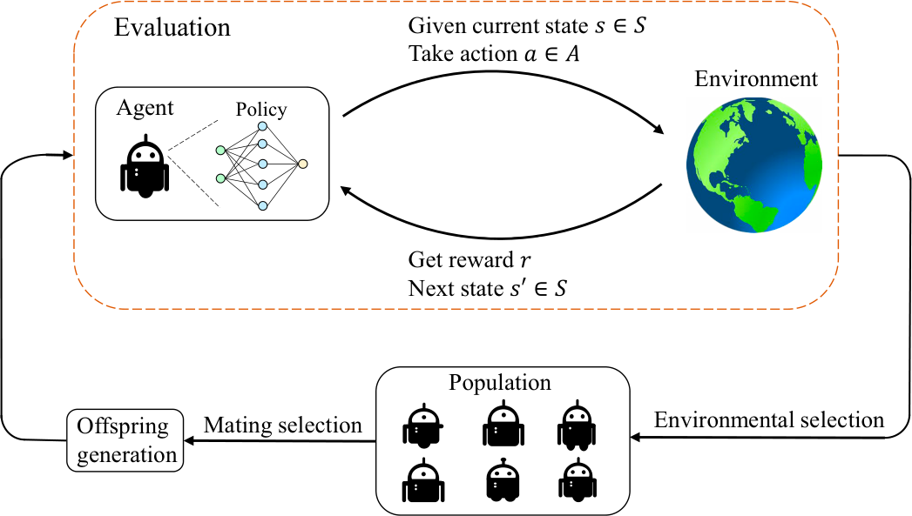
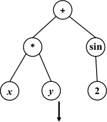
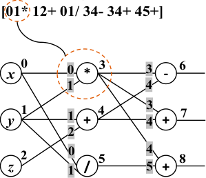
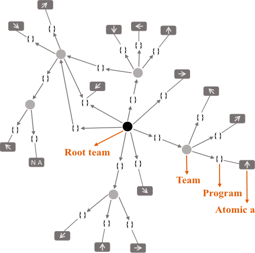
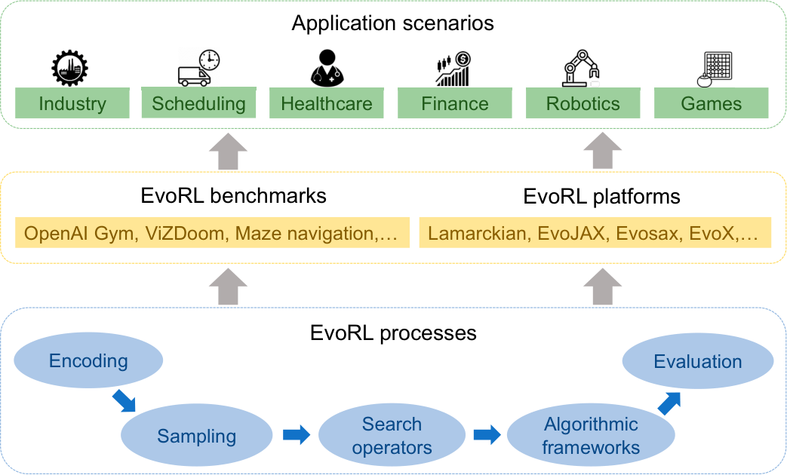

**REVIEW ARTICLE**

# **Evolutionary Reinforcement Learning: A Survey**

**Hui Bai** **[1]** **, Ran Cheng** **[1*]** **, and Yaochu Jin** **[2,3]**

1 Department of Computer Science and Engineering, Southern University of Science and Technology,
Shenzhen, China. [2] Faculty of Technology, Bielefeld University, 33615 Bielefeld, Germany. [3] Department of

Computer Science, University of Surrey, Guildford, Surrey GU2 7XH, UK.

[*Address correspondence to: ranchengcn@gmail.com](mailto:ranchengcn@gmail.com)

Reinforcement learning (RL) is a machine learning approach that trains agents to maximize cumulative
rewards through interactions with environments. The integration of RL with deep learning has recently
resulted in impressive achievements in a wide range of challenging tasks, including board games, arcade
games, and robot control. Despite these successes, several critical challenges remain, such as brittle
convergence properties caused by sensitive hyperparameters, difficulties in temporal credit assignment
with long time horizons and sparse rewards, a lack of diverse exploration, particularly in continuous search
space scenarios, challenges in credit assignment in multi-agent RL, and conflicting objectives for rewards.
Evolutionary computation (EC), which maintains a population of learning agents, has demonstrated
promising performance in addressing these limitations. This article presents a comprehensive survey of
state-of-the-art methods for integrating EC into RL, referred to as evolutionary reinforcement learning
(EvoRL). We categorize EvoRL methods according to key research areas in RL, including hyperparameter
optimization, policy search, exploration, reward shaping, meta-RL, and multi-objective RL. We then discuss
future research directions in terms of efficient methods, benchmarks, and scalable platforms. This survey
serves as a resource for researchers and practitioners interested in the field of EvoRL, highlighting the
important challenges and opportunities for future research. With the help of this survey, researchers and
practitioners can develop more efficient methods and tailored benchmarks for EvoRL, further advancing
this promising cross-disciplinary research field.

**Citation:** Bai H, Cheng R, Jin Y.
Evolutionary Reinforcement
Learning: A Survey. _Intell. Comput._
[2023;2:Article 0025. https://doi.](https://doi.org/10.34133/icomputing.0025)
[org/10.34133/icomputing.0025](https://doi.org/10.34133/icomputing.0025)

Submitted 5 March 2023
Accepted 18 April 2023
Published 10 May 2023

Copyright © 2023 Hui Bai et al.
Exclusive licensee Zhejiang Lab. No
claim to original U.S. Government
[Works. Distributed under a Creative](https://creativecommons.org/licenses/by/4.0/)

[Commons Attribution License](https://creativecommons.org/licenses/by/4.0/)
[(CC BY 4.0).](https://creativecommons.org/licenses/by/4.0/)

**Introduction**

Reinforcement learning (RL) has achieved remarkable success
in recent years, particularly with the integration of deep learning (DL), in solving complex sequential decision-making problems [1,2]. Despite these advancements, RL still faces several
challenges, such as sensitivity to hyperparameters [3]; difficulties in credit assignment in tasks with long time horizons, sparse
rewards, and multiple agents [4,5]; limited diverse exploration
in tasks with deceptive rewards or continuous state and action
spaces [6]; and conflicting objectives for rewards [7]. Moreover,
numerous optimization problems in RL are typically complex
black-box optimization problems with properties such as being
gradient-free, non-convex, multi-modal, multi-objective, discrete, discontinuous, and dynamic [8,9]. However, traditional
optimization methods, such as some signal processing optimization methods, struggle to solve these complex problems

[10,11]. In contrast, evolutionary computation (EC) methods
have successfully addressed these problems [12–15].
To address the aforementioned challenges and cater to the
requirements of solving complex optimization problems in RL,
the field of evolutionary reinforcement learning (EvoRL) has
emerged by integrating RL with EC [16,17]. EvoRL involves
maintaining a population of agents, which offers several benefits, such as providing redundant information for improved
robustness [17], enabling diverse exploration [18], the ability
to evaluate agents using an episodic fitness metric [17], and the

ease of generating trade-off solutions through multi-objective
EC algorithms [19].
EvoRL has a rich history, dating back to early work in neuroevolution, which used EC algorithms to generate the weights
and/or topology of artificial neural networks (ANNs) for agent
policies [20,21]. Since the proposal of OpenAI ES [16], EvoRL
has gained increasing attention in both EC and RL communities. While there have been some surveys focusing on various
aspects of EvoRL, such as neuroevolution [22], multi-objective
RL [7,23], automated RL [24], and derivative-free RL [25], they
either focus on a narrow research field within RL or lack a
comprehensive overview of EC methods as applied to RL.
To bridge the gap between EC and RL communities, this
article provides a comprehensive survey of EvoRL, elaborating
on 6 key research fields of RL, as shown in Fig. 1. The EvoRL
methods are introduced and discussed separately for each field,
focusing on their advantages and limitations.
Finally, the article discusses potential improvement approaches
for future research, including efficient methods in terms of EvoRL
processes, tailored benchmarks, and scalable platforms.

**Background**

**Reinforcement learning**
RL is a powerful tool for decision-making in complex and
stochastic environments. In RL, an agent interacts with its

[Bai et al. 2023 | https://doi.org/10.34133/icomputing.0025](https://doi.org/10.34133/icomputing.0025) 1

environment by taking a sequence of actions and receiving a
sequence of rewards over time. The objective of the agent is to
maximize the expected cumulative reward. This problem can
be modeled as a Markov Decision Process (MDP), which is
defined as < _S_, _A_, _T_, _R_, _ρ_ 0, _γ_ >, with a state space _S_, an action
space _A_, a stochastic transition function _T_ : _S_ × _A_ → _P_ ( _S_ ) that
represents the probability distribution over possible next states,
a reward function _R_ : _S_ × _A_ → _ℝ_, an initial state distribution
_ρ_ 0 : _S_ → _ℝ_ ∈[0, 1], and a discount factor _γ_ ∈ [0, 1).
The agent’s behavior is determined by its policy, which is
denoted by _π_ _θ_ : _S_ → _P_ ( _A_ ), with _P_ ( _A_ ) being the set of probability
measures on _A_ and _θ_ ∈ _ℝ_ _[n]_ being a vector of _n_ parameters. The

agent updates its policy over time to maximize the expected
cumulative discounted reward, as given by

∞
∑

[ t=0

_훾_ [t] r t

]

J( _휋_ ) = 피 _휌_ 0, _휋_,T ∑ _훾_ [t] r t (1)

t=0

where _s_ 0 ∼ _ρ_ 0 ( _s_ 0 ), _a_ _t_ ∼ _π_ ( _s_ _t_ ), _s_ _t_ + 1 ∼ _T_ (·| _s_ _t_, _a_ _t_ ), and _r_ _t_ = _R_ ( _s_ _t_, _a_ _t_ ).
RL algorithms can be divided into 2 categories: model-based
and model-free. While model-based algorithms establish a complete MDP by estimating the transition function and reward
function, by contrast, model-free algorithms are data-driven and
optimize the policy by using a large number of samples, without

**Fig. 1.** Key research fields of evolutionary reinforcement learning. Hyperparameter optimization is a universal method for algorithms in the other 5 research fields to realize
end-to-end learning and improve performance simultaneously. Policy search seeks to identify a policy that maximizes the cumulative reward for a given task. Exploration
encourages agents to explore more states and actions and trains robust agents to better respond to dynamic changes in environments. Reward shaping is aimed at enhancing
the original reward with additional shaping rewards for tasks with sparse rewards. Meta-RL seeks to develop a general-purpose learning algorithm that can adapt to different
tasks. Multi-objective RL aims to obtain trade-off agents in tasks with a number of conflicting objectives.

[Bai et al. 2023 | https://doi.org/10.34133/icomputing.0025](https://doi.org/10.34133/icomputing.0025) 2

the need to know the transition function and reward function.
Due to the difficulties of establishing a complete MDP and the
success of neural networks (NNs) in representing policies,
model-­free RL has become the main focus of research in recent
years [26]. In this survey, we focus on model-free RL methods.
More specifically, model-free RL methods can further be
divided into 2 categories: policy-based and value-based methods. In policy-based methods, the parameters _θ_ of the policy
are adjusted in the direction of the performance gradient,
according to the Policy Gradients Theorem [1]. Some of the
state-of-the-art policy-based algorithms include Trust Region
Policy Optimization (TRPO) [27], Proximal Policy Optimization
(PPO) [28], Asynchronous Advantage Actor–Critic (A3C) [29],
deep deterministic policy gradient (DDPG) [30], Twin Delayed
DDPG (TD3) [31], and Soft Actor–Critic (SAC) [32]. In value-­
based methods, a parameterized _Q_ -function is optimized to
estimate the value of a state–action pair. One of the state-ofthe-art value-based methods is Deep Q-Network (DQN) [33],
which updates the parameters of the _Q_ -function by minimizing
the temporal difference (TD) loss using a batch of samples.
Techniques such as experience replay [34] and double Qnetwork [35] have been proposed to improve the sample efficiency and exploration of DQN.

**Evolutionary computation**
EC refers to a family of stochastic search algorithms that have
been developed based on the principle of natural evolution.
The primary objective of EC is to approximate global optima
of optimization problems by iteratively performing a range of
mechanisms, such as variation (i.e., crossover and mutation),
evaluation, and selection. Among various EC paradigms, the
evolution strategies (ESs) [36] are the mostly adopted in EvoRL,
together with the classic genetic algorithm (GA) [37] and the
genetic programming (GP) [38].
ESs primarily tackle continuous black-box optimization
problems where the search space lies within the continuous
domain. Therefore, it is predominantly applied to weight optimization of policy search in RL. ESs for RL are typically categorized into 3 main classes, which are canonical ES [39],
covariance matrix adaptation ES (CMA-ES) [40], and natural
ES (NES) [41]. Canonical ES is aimed at obtaining final solutions with high fitness values while using a small number of
fitness evaluations through conducting an iterative process
involving variation, evaluation, and selection. Here, we illustrate the canonical ( _μ_, _λ_ )-ES algorithm. Following the initialization of policy parameters _**x**_ ∈ _ℝ_ _[n]_ and a set of hyperparameters,
the algorithm generates _λ_ offspring _**x**_ 1, …, _**x**_ _λ_ from a search
distribution with mean _**x**_ and variance _**σ**_ [2] _**C**_ . Subsequently, all
offspring are evaluated using a fitness evaluation function.
Following this, a new population mean is generated by moving
the old population mean towards the best _μ_ offspring. Then, _**σ**_
is optionally updated, and an adaptive _**σ**_ can improve ESs performance. CMA-ES shares the same procedure with canonical
_**σ**_ and covarES but is more effective since its mutation step size
iance matrix _**C**_ are updated adaptively, enabling the capture of
the anisotropy properties of general optimization problems.
NES also shares the same iteration with canonical ES. However,
it updates a search distribution iteratively by estimating a
search gradient (i.e., the second-order gradient) on the distribution parameters towards higher expected fitness values. The
distribution parameters are updated through estimating a natural gradient that can find a parameterization-independent

ascent direction compared to a plain search gradient [42]. The
natural gradient ∇ [̃] _휃_ J is formulated as **F** [−][1] ∇ _θ_ _J_, where **F** is the
Fisher information matrix (FIM) of the parametric family of
the search distribution, and ∇ _θ_ _J_ is the estimated search gradient of expected fitness by Monte Carlo estimation. The FIM
implies the degree of certainty of updating _θ_, which has the
effect of punishing the natural gradient with high variance and
boosting the natural gradient with low variance.
GAs, as the most classic EC paradigm, are also commonly
adopted in EvoRL. GAs follow the workflow where a population
of candidate solutions is iteratively improved through selection,
crossover, and mutation. The encoding or representation of the
search space in GAs can be tailored to the specific problem at
hand, allowing for binary encoding and discrete encoding for
combinatorial optimization problems, and real encoding for
numerical optimization problems. This versatility in encoding
types makes GAs a widely applicable method for solving various problems in RL [43,44].
GP is a distinctive EC paradigm that is different from ESs
or GAs, which mainly solve numerical optimization problems.
In GP, the search space is composed of a set of programs that
are represented using various encoding methods, such as
abstract syntax tree, executable graph (e.g., Cartesian GP [CGP]
and tangled program graphs [TPG]), finite-state machine, and
context-free grammar, among others [36]. The fitness of a program is evaluated by executing it to observe its behavior, and
the programs can be viewed as data when crossover and mutation operations are performed on them. In contrast, the data
are interpreted as programs when they are executed. GP has
several advantages over other EC paradigms, including the
ability to handle complex problems that require a programmatic solution, such as symbolic regression and control problems, among others [45–47].

**Discussion**
EC algorithms have been recognized as competitive tools to
handle complex optimization problems that exhibit non-convex,
non-differentiable, non-smooth, and multi-modal properties

[48]. In RL, EC is particularly useful for complex problems with
numerous local optima and is suitable for problems without
gradient information. Furthermore, it is applicable for problems without explicit objective functions by novelty search (NS)

[49]. The population-based search strategy of EC makes it
robust to dynamic changes that are commonly found in realworld applications of RL, such as sim-to-real transfer in robot
control [50]. A simple and general framework that combines
EC and RL is shown in Fig. 2.
Specifically, EC has been introduced into RL in 6 major key
research fields of RL, including hyperparameter optimization
(HPO), policy search, exploration, reward shaping, meta-RL,
and multi-objective RL, as presented in Fig. 1. Since the 3 EC
methods (i.e., ESs, GAs, and GP) have differences in mechanisms, their target problems and focused applications to the
6 RL research fields are slightly different. The detailed comparisons are listed in Table. ESs employ real encoding and
simulate gradient-based methods, and thus are especially
applied to continuous optimization problems with a large
number of decision variables (e.g., NN-based policy search).
GAs adopt various kinds of encoding methods and involve
diversity metrics, and therefore can be applied to various optimization problems in RL research fields. GP designs treebased or graph-based encodings to generate interpretable and

[Bai et al. 2023 | https://doi.org/10.34133/icomputing.0025](https://doi.org/10.34133/icomputing.0025) 3

**Fig. 2.** A simple and general framework of EvoRL. The framework consists of 2 loops: the outer loop shows the evolution process of EC, while the inner loop illustrates the
agent–environment interaction process in RL. Initially, a population of parent candidate solutions is randomly initialized, and then the offspring candidate solutions are
generated from the parents via variation. Each offspring is evaluated using an RL task to obtain its fitness value, and a new population is selected for the next iteration by
combining all parents and offspring.

**Table.** Comparisons of 3 types of EC paradigms (i.e., ESs, GAs, and GP) in terms of the differences in mechanisms, target problems in RL,
and integration with RL research fields.

EC methods

Differences in mechanisms Integration with RL

Encodings Variation Selection criteria Target problems in RL research fields

ESs Real encoding Mutation Performance metrics Continuous optimiza- Policy search,
tion problems exploration, reward
shaping, hyperparameter optimization,
meta-RL, multi-objective RL

GAs Integer encoding, real Crossover, mutation Performance and General optimization Policy search,
encoding, indirect diversity metrics problems exploration, reward
encoding shaping, hyperparam

GAs Integer encoding, real Crossover, mutation Performance and General optimization Policy search,
encoding, indirect diversity metrics problems exploration, reward
encoding shaping, hyperparam
eter optimization,
meta-RL, multi-objective RL

GP Syntax tree, executa- Crossover, mutation Performance and Regression or control Policy search, reward
ble graph interpretability problems shaping, meta-RL
metrics

Regression or control Policy search, reward
problems shaping, meta-RL

programmatic solutions and is mainly applied to regression
problems or direct control problems. Next, these 6 key research
fields of RL will be introduced in detail in the following sections, respectively.

**EC in HPO**

Finding the optimal hyperparameter configurations for RL can
be a challenging task due to the large number of hyperparameters

[Bai et al. 2023 | https://doi.org/10.34133/icomputing.0025](https://doi.org/10.34133/icomputing.0025) 4

involved, including those related to RL algorithms (e.g., the
learning rate _α_ and discount factor of future rewards _γ_ ) and the
NN architectures of policies (e.g., the number and size of layers).
To overcome this challenge, researchers have introduced HPO
to automatically set configurations for optimal performance.
HPO has been shown to improve the performance and robustness of RL algorithms [51,52].
However, HPO for RL faces several challenges. First, performance evaluation can be extremely expensive for complex
tasks. Second, the search space of hyperparameters can be
complex, involving mixed encoding, high dimensionality, and
non-convexity. Third, there may be 2 or more objectives that
need to be traded off. To address these challenges, there are
several major classes of HPO methods, including random
search [53], Bayesian optimization [54], gradient-based methods [55], and EC methods [51]. Among these, EC methods
can simultaneously meet the challenges of HPO, owing to
their high degree of parallelism, gradient-free properties, and
ability to obtain a set of trade-off optimal solutions.
EC-based HPO methods can be mainly classified into 3 categories: Darwinian evolutionary methods, Lamarckian evolutionary methods, and hybrid methods. In Darwinian evolutionary
methods, parameters are initialized while hyperparameters are
evolved. In contrast, in Lamarckian evolutionary methods,
parameters are inherited while hyperparameters are evolved.
Additionally, hybrid methods further combine the former 2
methods and gradient-based methods.

**Darwinian evolutionary methods**
In Darwinian evolutionary methods, the parameters are randomly initialized while hyperparameters are evolved using GAs

[56]. For instance, Eriksson et al. applied GA to evolve 2 hyperparameters, the learning rate _α_ and the temperature _τ_, which
control the trade-off between exploration and exploitation in
softmax action selection, for Sarsa( _λ_ ) in food capture tasks.
Elfwing et al. [57] also applied GA to evolve hyperparameters
and weights in potential-based reward shaping for Sarsa( _λ_ ) in
the same tasks. These methods integrate learning and evolution
to effectively improve the performance of RL algorithms and
obtain sim-to-real robust policies. Nonetheless, the Darwinian
evolutionary methods are inefficient since parameters are reinitialized in each generation, causing a loss of knowledge already
acquired during previous generations.

**Lamarckian evolutionary methods**
In Lamarckian evolutionary methods, parameters are inherited
while hyperparameters are evolved, meaning that hyperparameters are adapted to the current learning process to make agents
learn more efficiently. A state-of-the-art asynchronous parallel
evolutionary method called population-based training (PBT) has
recently been proposed to improve the efficiency of HPO [51].
In the asynchronous PBT, only one ready individual is compared
with a randomly selected individual from the remaining population in each generation, and then the worse individual copies
the parameters and hyperparameters of the better individual and
adds noise to its hyperparameters. PBT has successfully trained
a series of RL agents in a number of complex tasks, such as the
3D multi-player first-person video game, DMLab, the MuJoCo
multi-agent soccer game, and ELF OpenGo, achieving new stateof-the-art performance of RL algorithms [58–61]. The PBT-style
evolution is quite similar to the steady-state EC (i.e., a new

individual is inserted into the population in each generation) that
is believed to be effective for non-stationary/dynamic environments [62]. However, PBT does not consider the diversity of the
population. That is, PBT prefers the higher-performing configurations, but it may lose the individuals that are “late bloomers”.
Therefore, the faster improvement rate PBT (FIRE PBT) has been
proposed based on the assumption that when 2 NNs have similar
performance and hyperparameters, the NN with a faster rate of
improvement will bring about a better final performance [63].
FIRE PBT derives a fitness metric based on the assumption and
introduces subpopulations to increase diversity. Further, a
sample-efficient automated RL framework (SEARL) has been
proposed for off-policy RL algorithms, which follows the PBT
style to evolve dynamic configurations of hyperparameters
and shares experiences across the population with different
configurations [52].

**Hybrid methods**
Hybrid methods combine the above 2 evolutionary methods
and other gradient-based methods to improve training efficiency. For example, in the work of Fernandez and Caarls [64],
a hybrid method combines Darwinian and Lamarckian evolutionary methods, following the mainstream of Lamarckian
evolution while conducting multiple random restarts of parameters in the evolutionary process to escape local optima. In
addition, an evolutionary stochastic gradient descent (SGD)
framework is proposed, aiming at combining the merits of SGD
and EC [65]. In the framework, a set of NN weights with distinct hyperparameters are optimized independently by various
SGD variants, and then their information is exchanged by EC.
However, the initial hyperparameters are preset by humans,
which still involves a certain amount of human knowledge.
Moreover, Schneider et al. [66] have proposed a collection
of benchmarks derived from HPO to verify the performance
of quality diversity (QD) methods. In other words, HPO methods can be resolved by QD methods to introduce diversity by
niches.

**Discussion**
HPO is crucial for achieving state-of-the-art performance in
RL, and EC methods have shown great potential in automating
this process. However, the current literature on HPO still faces
several challenges, such as the lack of comprehensive performance metrics and the need for efficient convergence speed.
Additionally, selecting hyperparameters from a large number
of options is a combinatorial optimization problem that brings
new challenges to EC methods.
To address these challenges, future research should focus on
developing comprehensive evaluation metrics that consider
both effectiveness and efficiency. This can be achieved by benchmarking different HPO methods on a wide range of tasks and
considering factors such as training time, convergence speed,
and performance. Additionally, future research should explore
new EC methods that can efficiently search high-dimensional
and combinatorial search spaces for HPO. Furthermore, it is
essential to investigate how to combine different HPO methods
to improve the overall efficiency and effectiveness of the optimization process. By addressing these challenges, EC-based
HPO can further accelerate the development and deployment
of RL algorithms in real-world scenarios.

[Bai et al. 2023 | https://doi.org/10.34133/icomputing.0025](https://doi.org/10.34133/icomputing.0025) 5

**EC in Policy Search**

In the context of RL, policy search seeks to identify a policy
that maximizes the cumulative reward for a given task. The
incorporation of NNs as function approximators for policies
has been facilitated by the surge of DL, despite the vast search
space of states and actions. SGD methods are widely used for
training NN weights in deep RL. Alternatively, neuroevolution
has emerged as an alternative approach, leveraging gradientfree EC methods for policy search, which can optimize NN
weights, architectures, hyperparameters, building blocks, and
even learning rules [67].
Early work in neuroevolution focused primarily on the evolution of the weights of small and fixed-architecture NNs.
Recent advancements, however, have demonstrated the promise of evolving the architecture together with the weights of
NNs for complex RL tasks [21]. Moreover, a new perspective
on policy search has been established by ignoring the weights
and conducting only architecture search [68]. This section will
review EC techniques such as ESs, GAs, and GP for policy
search in RL.

**Evolutionary strategies-based methods**
The subsection will review 3 popular ESs used in RL tasks,
namely, canonical ES, NES, and CMA-ES.

_**Canonical ES-based methods**_
The high-parallel framework of OpenAI ES has led to the successful application of a simplified canonical ES to Atari games

[69]. Prior to this, the canonical ES had not been applied much
to RL tasks, since it performs poorly on high-dimensional tasks.
Although the canonical ES can achieve similar performance to
OpenAI ES on several Atari games with discrete state and action
spaces, its performance on continuous state and action spaces
(where EC is more preferable [70]) has not been investigated.
As ESs treat RL tasks as black-box optimization problems
directly instead of taking advantage of their intrinsic MDP
structures, it may have a large variance in multiple runs. To
address this issue, several variance reduction techniques have
been introduced. On the one hand, various ESs gradient estimators using Monte Carlo techniques have been proposed,
such as the antithetic ES gradient estimator in OpenAI ES [16]
and the forward finite-difference ES gradient estimator in the
structured ES [71]. Specifically, the structured ES performed
well on most of the MuJoCo tasks using less than 300 policy
parameters. Furthermore, the adaptive ES-active subspace
method further combines structured ES with the techniques
from active subspaces to learn the changing dimensionality of
the gradient space, which achieved competitive performance
compared to PPO, TRPO, and several ES variants on a subset
of MuJoCo tasks [72]. On the other hand, structured methods
leveraging the underlying MDP structures have been developed. Specifically, the control variate, also known as the advantages function in RL [29], has been introduced into ESs to
reduce the variance of Monte Carlo gradient estimation [73].
Since applying ESs to large-scale RL tasks is low-efficient, a
number of works have been proposed to improve sample efficiency in 2 ways: sampling from diverse search directions and
making full use of previous samples. In the first way, the Gaussian
orthogonal exploration searches a number of diverse directions

[71]. Based on this method, the guided ES further combines ES

with surrogate gradients (correlated with the true gradients)

[74]. Then, the self-guided ES trades off exploitation in the gradient subspace and exploration in its orthogonal complement
subspace, which has obtained higher returns and faster convergence speed than PPO, TRPO, and guided ES on several MuJoCo
tasks [75]. In the second way, the trust region ES (TRES) approximately optimizes a surrogate objective by reusing the data sampled from the old policy parameters instead of sampling from
new parameters, which has achieved faster convergence speed
than PPO and TRPO on several MuJoCo tasks [76].

_**NES-based methods**_
The original NES is known to be limited in scalability for
high-dimensional problems due to the time-consuming calculation of FIM [41]. To improve efficiency and robustness, the
exact NES computes the inverse of the exact FIM instead of
the empirical FIM and has shown competitive performance on
the double pole balancing task using an NN with 21 weights

[77]. However, NES was not successful for large-scale tasks until
the development of OpenAI ES [16], which is a simplified variant
of NES with an isotropic multivariate Gaussian and fixed variances Σ. OpenAI ES is closely related to the policy-based RL
algorithm PEPG in the theoretical relation [78]. To reduce variance and realize high-parallel ability, OpenAI ES has introduced several techniques such as mirrored sampling of the
perturbation, rank-based fitness shaping, virtual batch normalization, and the random seeds sharing strategy. As a result,
OpenAI ES has achieved competitive performance on MuJoCo
and Atari games with over a million policy parameters by using
thousands of central processing unit (CPU) workers, demonstrating the advantages of ESs as a black-box optimization algorithm for complex RL tasks. Moreover, OpenAI ES has been
shown to be close to SGD with a large number of offspring [79]
and resembles traditional finite-difference approximators [80].
Several diversity encouragement methods from EC such as
NS and QD have been introduced to enhance the exploration
of OpenAI ES, encouraging agents to exhibit diverse behaviors

[6]. Hybrid algorithms NS-ES and NSR-ES can solve tasks with
noisy and deceptive rewards. Furthermore, progressive episode
lengths (PELs) have been proposed to improve the learning
efficiency in evaluating fitness values of samples [81]. PEL enables agents to learn from simple tasks to complex tasks by dividing the time budget and episode lengths into increasing numbers
of fragments concurrently.

_**CMA-ES-based methods**_
The application of the CMA-ES to RL was first proposed by Igel
in 2003, who demonstrated that CMA-ES can achieve faster
convergence than several state-of-the-art GA-based neuroevolution algorithms on double pole balancing tasks using a single
hidden layer policy [82]. CMA-ES typically uses rank-based
fitness shaping instead of absolute fitness values to reduce its
susceptibility to noise. However, the accuracy of rank still plays
a critical role in performance. To address this, Heidrich-Meisner
augmented CMA-ES with Hoeffding- and Bernstein-based racing algorithms to obtain a reliable rank, which led to faster
convergence and more robust hyperparameter selection on
single and double pole balancing tasks than several GA-based
neuroevolutionary algorithms [83,84].
Recently, Chen proposed a restart-based rank-1 ES (R-R1-ES),
a simplified CMA-ES, to play Atari games using a 2-hidden-layer

[Bai et al. 2023 | https://doi.org/10.34133/icomputing.0025](https://doi.org/10.34133/icomputing.0025) 6

NN, which is a groundbreaking work applying efficient CMA-ES
to complex RL tasks [85]. R-R1-ES integrates a Gaussiandistributed model with 2 mechanisms, including the adaptation
of the number of parents and a restart procedure, and has
achieved higher scores than OpenAI ES, canonical ES, NS-ES,
and NSR-ES on a subset of Atari games. Despite the development of several high-efficient CMA-ES variants, such as R1/
Rm-ES [86], LM-MA-ES [87], and fast CMA-ES [88] to deal
with the time-consuming adaptation of the full covariance
matrix for large-scale optimization problems with up to 10,000
dimensions, OpenAI ES has been verified on millions of policy
parameters. Therefore, their potential for complex RL tasks is
yet to be studied.

**GA-based methods**
GAs have been widely adopted to optimize the weights and
architectures for policy search in RL, owing to their diverse
encoding types. The GA-based methods have primarily focused
on 3 research topics: algorithmic frameworks, indirect encoding, and variation operators.

_**Algorithmic frameworks**_
**Pure GA-based frameworks.** In the 1990s, several studies utilized GAs to optimize policy weights for pole balancing problems [20,89]. Among these works, GENetic ImplemenTOR
(GENITOR), which represented weight with real values instead
of binary strings, improved the precision and efficiency of the
search space. Subsequently, a range of works has been developed,
with the most popular one being NeuroEvolution of Augmenting
Topology (NEAT), which can obtain a minimal NN by adding
nodes and connections from the smallest NN without hidden
nodes [21]. NEAT has several highlights, including genetic
encoding that aligns corresponding genes easily when mating
2 genomes, historical markings that enable tracking and matching of genes during crossover, and speciation within smaller
niches to protect topological innovations. NEAT has since been
improved and tailored to various tasks, such as evolving dynamic
policies to adapt to environmental changes in a dangerous foraging task [90], evolving complex policy architectures in robot
competition and coevolution tasks [91], video games [92], and
strategic decision-making problems [93].
Despite the effectiveness of NEAT, it does not fully optimize
the weights under a potential architecture. Hence, ENAT was
developed based on NEAT, which adopts the idea of incremental
growth from a minimal structure [94]. However, ENAT applies
CMA-ES to fully optimize the weights and introduces a compact
genetic encoding to encode a tree-based program in a linear
genome. As a result, ENAT can find better weights than NEAT
with the same network size on a robot arm control task. To
reduce the side effect of topology change, CMA-TWEANN
replaces the mutation by random weights in NEAT with a seamless topology mutation by zero weights and applies CMA-ES to
optimize weights [95]. However, whether weight optimization
is more important than topology optimization is still debatable.
The weight-agnostic search method answers this problem by
only searching the topology by NEAT without training of
weights. This method has found policies with minimal architectures in continuous control tasks [68].
In the highly parallel framework of OpenAI ES, a simple
GA has been used to optimize large-scale policies with millions
of weights in Atari games and MuJoCo [96]. In a similar vein,

a massively parallel method has been applied to search recurrent neural network (RNN) architectures using only mutation.
This method has achieved high performance with orders of
magnitude fewer parameters than several state-of-the-art RL
methods in MuJoCo tasks [97]. While these methods require
huge computational resources, the training of large-scale policies using EC methods is still very low-efficient. To improve
the efficiency, a hybrid agent model consisting of a large world
model and a small controller model has been proposed to
tackle complex RL tasks [98]. The world model extracts low-­
dimensional features from real-world observations and predicts
future states based on historical information. The controller
model, such as a single-layer linear NN, determines the actions
to take by receiving current and predicted features to maximize
the expected cumulative reward. The controller model has been
evolved by EC methods in vision-based game tasks [99,100].
Moreover, an end-to-end training of the whole agent model
using GAs has shown comparable performance in car racing
tasks [101].
**Frameworks hybridizing GAs and RL** . A combination
of GA-based methods (i.e., NEAT) and TD methods (i.e.,
Q-learning) has led to the development of 2 methods,
namely, Lamarckian NEAT+Q and Darwinian NEAT+Q. In
these methods, NEAT is used to optimize the architectures
and initial weights of Q networks, while the policy weights
are updated using backpropagation [102]. To balance the
exploration and exploitation of the EC method, _ε_ -greedy
selection and softmax selection in RL have been incorporated into NEAT. However, the high sample complexity of
NEAT+Q, resulting from the fully training of each candidate
policy in highly stochastic domains, has prompted the proposal of an efficient NEAT+Q method that reuses previous
samples to train a population of candidate policies [103]. A
comparison study has suggested that EC methods are more
effective when fitness can be rapidly evaluated in deterministic domains, whereas TD methods exhibit an advantage in
fully observable but non-deterministic domains [104].
**Cooperative coevolution** . In the field of NN optimization,
the search space can become excessively large when the numbers of the NN input, output, architecture, and weight are large.
To overcome this challenge, cooperative coevolution (CC)based GAs can be used, which decompose the problem into
smaller components to reduce complexity and enable more
efficient resolution through CC methods [105]. In a CC algorithm, each individual represents a partial solution, or a component of a complete solution, which is resolved by a species,
or a set of individuals, independently. The individuals are evaluated based on their contributions to the complete solution.
This approach introduces diversity and robustness in the maintenance of various components and enables parallel search to
improve training efficiency. The search granularity in the
decomposition methods of NNs indirectly influences search
performance and efficiency. In neuron-level CC methods,
weights connected to a neuron are grouped into a component.
Symbiotic adaptive neuro-evolution (SANE) is an earlier CC
algorithm that evolves a population of hidden neurons for an
NN with a fixed architecture, and has shown better performance than Q-learning and GENITOR on pole balancing
tasks [106]. Enforced Sub-populations (ESP) improves the
efficiency of SANE and supports the evolution of RNNs by
allocating a species for a hidden neuron and conducting variation within species [107]. NSP further groups the weights

[Bai et al. 2023 | https://doi.org/10.34133/icomputing.0025](https://doi.org/10.34133/icomputing.0025) 7

connected to a hidden neuron into finer granularity [108]. In
synapse-level CC methods, each weight is considered a component. Based on ESP, CoSyNE groups each weight into a component and has shown better efficiency than SANE, NEAT, and
ESP on pole balancing tasks [109]. However, CoSyNE may not
be applicable for large-scale NNs since it cannot fully exploit
the weights to avoid inaccurate evaluation, which is a problem
in neuron-level methods. Other state-of-the-art decomposition
methods include COVNET [110], Modular NEAT [111], and
CCNCS [112].

_**Indirect encoding**_
Research on indirect encoding has been promoted for 2 reasons. Firstly, direct encoding has limitations in scaling up to
large-scale NN scenarios. Secondly, in biological genetic encoding, phenotypes typically contain more genetic components
than genotypes, and the mapping of phenotypes to genotypes
is indirect.
Artificial embryogeny, which includes cellular encoding

[113] and generative encoding [114], utilizes a developmental
phase by reusing genes or rules to evolve artificial systems from
a small starting point [115]. In addition to repetition by reuse,
the properties of physical space, such as symmetry and locality,
have motivated the design of encoding that seeks to discover
regularity by local connectivity. Compositional pattern-­
producing networks (CPPNs) capture structural relationships and
are encoded by a composition of functions organized in the
form of NNs [116]. CPPNs can be trained in the same way as
NNs, and HyperNEAT is tailored to training CPPNs, which can
evolve increasingly complex expression patterns to capture the
complete regularities of problem structures [117,118]. The ability to learn from geometric regularity has enabled HyperNEAT
to be successfully applied to complex tasks such as checkers

[119], Go [43], and Atari games [120]. Additionally, several
HyperNEAT variants have been proposed, such as adaptive
HyperNEAT [121] and ES-HyperNEAT [122].
By modeling modularity as an optimization objective, NSGA-II
(a multi-objective evolutionary algorithm) [123] has been applied
to evolve CPPNs. This method performs better than HyperNEAT
by generating lower modularity of genotypes and phenotypes in
a robotics task [124]. However, CPPNs may lose continuity when
mapping genotypes to phenotypes (i.e., a small change in the genotype may lead to a large change in the phenotype). Therefore,
compressed encoding uses discrete cosine transform (DCT) to
reduce the dimensionality of the search space by exploiting the
spatial regularities of the weight matrix and obtains large-scale
NNs on a vision-input car driving task [125].
Furthermore, several works have combined indirect encoding and direct encoding to discover regularities by indirect
encoding and compensate for irregularities by direct encoding

[126–128].

_**Variation operators**_
Variation operators aim to preserve the characteristics of parents while introducing diversity, and they typically include
crossover and mutation. Crossover combines the properties of
more than one parent, while mutation inherits the properties
from one parent to a large extent. In earlier binary encoding,
the single-point crossover and flip mutation are widely used
operators [36]. Since the length of the binary string determines
the representation precision of a real number and influences

the variation granularity, real encoding has been proposed to
represent a weight as a real number directly. Accordingly, the
simulated binary crossover and the polynomial mutation have
been proposed for continuous search space [129]. Gaussian
mutation is also widely used by adding a random value from a
Gaussian distribution to a real-encoded weight [96].
However, since NNs are sensitive to small modifications of
weights, the above variation operators typically cause catastrophic forgetting of the characteristics of parents. Hence, imitation learning or network distillation has been applied to
variation operators for NNs, such as the state-space crossover

[130], the Q-filtered distillation crossover [131], as well as the
distilled topology mutation [132]. Both crossover methods apply
imitation learning to distill better behaviors of parents into offspring. The mutation method first generates an offspring by
augmenting topology and then pretrains the offspring by distilling the behavior of its parent as a necessary initialization.
Furthermore, Lehman et al. [133] propose a family of safe
mutation to deal with the catastrophic forgetting problem, where
the mutation degree of each weight is scaled by the sensitivity of
the weight to the NN outputs, and thus an offspring will not diverge
too much from its parent. In contrast, Marchesini et al. [134] propose a different concept of safe mutation for safe exploration, which
uses visited unsafe states to explore safer actions.
Apart from the catastrophic forgetting problem, the permutation problem (i.e., the same solution can be represented
by different NNs) can lead to low-efficient search when encoding schemes or variation operators are not designed sophisticated [135]. Hence, 2 types of approaches are developed. One
approach tailors encoding methods for evolving NN architectures. For example, NEAT designs a genetic encoding to track
parent solutions by using an innovation number [21]. Another
approach aligns neurons from 2 NNs by analyzing their functional correlations before crossover and provides a general
method for different encoding [135].

**GP-based methods**
GP is a popular method for solving complex RL tasks since a
program can emulate any model of computation given sufficient time and search space [136]. Three commonly used representations in GP are the abstract syntax tree, CGP, and TPG.
These representations are applied to various tasks such as evolving direct controllers, symbolic regression, and feature discovery for RL tasks.

_**Representations**_
The syntax tree is a commonly used representation in GP,
where programs are directly encoded as genomes. As shown
in Fig. 3A, nodes can represent functions, operations, variables,
and constants, and the tree outputs a unique program through
tree traversal algorithms [36]. Typically, the tree grows randomly by crossover and mutation from a null node, but it can
suffer from the bloat issue, where programs grow in size without showing obvious fitness improvement over time if depth
limiting is not enforced.
To address the bloat issue, CGP uses an integer-array genome
with a fixed length to encode an executable tree graph [137], as
depicted in Fig. 3B. All nodes are placed in a grid manner and
are indexed sequentially. The nodes in the first column are input
nodes. The integer-array genome is divided into blocks, with
each block consisting of 3 integer genes representing a single
non-input node, where the third integer specifies a function,

[Bai et al. 2023 | https://doi.org/10.34133/icomputing.0025](https://doi.org/10.34133/icomputing.0025) 8

Output programs:
_**xy**_ + **sin** ( **2** )

**[012 120 013 341 340 450]**

Output programs:
**Node 6:** _**xy –**_ **(** _**y + z**_ **)**
**Node 7:** _**xy + y + z**_
**Node 8:** _**xy + y / z**_

**A** **B** **C**

**Fig. 3.** Three illustrative examples for the representations of GP in RL: (A) syntax tree, (B) Cartesian GP (CGP), and (C) tangled program graphs (TGP), respectively.

and the former 2 integers specify the indices of its input nodes.
The data flow is from left to right in the graph, and the graph
can have multiple output programs. Finally, users can specify
only one output among the multiple outputs.
TPG is a framework for organizing multiple programs into a
structure with high modularity [138]. TPG evolves 2 populations:
a Node (i.e., Team) population and a Program population, where
the Node population constructs a good organization of multiple
teams of programs from the Program population, and the
Program population discovers programs that output useful
Atomic Actions. As shown in Fig. 3C, the black point represents
the root node that receives state inputs. Evaluation of an agent
starts at the root node and reaches an Atomic Action through a
path in the direction of the arrow. This process only executes a
fraction of the programs for a task, making TPG more efficiently
than other neuroevolutionary algorithms that require covering
all topology for a decision.

_**Evolution of direct controllers**_
The syntax tree directly corresponds to the parse tree created
by compilers, and has been applied to evolve controllers for
robot control tasks [139], bipedal locomotion tasks [140], acrobat tasks, and helicopter hovering tasks [141] through syntax
tree-based GP. Integration of the tree-based GP and RL has
been tailored for real robots such that a precise simulator is not
required in complex robot control tasks [142]. This method
executes GP in a simplified simulator to generate simple controllers, which are then adapted to a particular real robot by
RL. It has outperformed Q-learning on 2 complex robot tasks.
In addition, cellular encoding and the syntax tree have been
integrated to evolve NNs with particular structures [143].
Furthermore, a hybrid of NEAT and GP, known as HyperGP,
has been applied to evolve weights of CPPN, and showed similar performance to HyperNEAT with significantly fewer evaluations [45].

Both CGP and NNs can be viewed as executable graphs,
which has motivated researchers to extend the flexible CGP
representation to the evolution of NNs. The CGP-based NN
has been proposed to evolve both topology and weights for
NNs with feed-forward or recurrent architectures, outperforming NEAT, ESP, and CoSyNE in pole balancing tasks [144].
Additionally, CGP has been applied to evolving the parameters
of transfer functions such as the Gaussian function and the
logistic sigmoid function, which improved the performance of
NNs on a ball throwing task [145]. Furthermore, CGP has been
applied to evolving game-playing agents directly from high-­
dimensional pixel inputs of Atari games [146], and the evolved
programs are easier to understand than NNs.
TPG is tailored for visual RL tasks with high-dimensional
pixel state inputs from environments, and has been applied to
20 challenging Atari games, where TPG exceeds DQN in 15 of
the 20 games, and further exceeds the human level in 7 of the
15 games [147]. Surprisingly, TPG requires significantly lower
computational resources and is without specialized hardware
such as graphics processing units (GPUs). Besides, by interacting with environments, TPG introduces emergent modularity
and thereby leads to task decomposition. Due to these advantages, TPG is capable of generating multi-task policies in Atari
games [148,149], and has been successfully applied to the partially observable ViZDoom [150] and Dota2 [151].

_**Symbolic regression**_
Interpretable RL is of high interest to academics and industrial
areas, and interpretable controllers are more likely to be
employed especially in industrial systems. The symbolic regression of GP is an effective approach to interpretable RL by fitting
the policy or value functions in a human-understandable way.
The syntax tree is naturally the appropriate representation due
to its high interpretability and understandability for humans.
For example, the value function discovery method has been
proposed to discover algebraic expressions of an obtained

[Bai et al. 2023 | https://doi.org/10.34133/icomputing.0025](https://doi.org/10.34133/icomputing.0025) 9

V-function by minimizing a simulation error between the
expressions and sampled V-function data [152]; the GP for RL
method has been proposed to generate simple algebraic policies
by the data sampled from the world models [153].
In addition to interpretability, symbolic regression can generate smoother and more adaptive symbolic approximators
than numerical approximators, such as NNs. For example, a
variant of the single-node GP has been applied to evolve a
smooth proxy of the V-function by maximizing the number of
correct choices of actions for sampled training states [154]. In
addition, the single-node GP has constructed a symbolic process model for model-based RL methods to reduce the number
of training data and adapt to the dynamic system in real-time
robot control tasks. This method has advantages over NNs in
that it requires no hyperparameter tuning and can generate
smooth V-functions [155].

_**Feature discovery**_
Feature discovery is the process of transforming input data into
a form that can be more easily processed by RL agents. Unlike
most feature extraction methods in machine learning, where
useful features are extracted from inputs, feature discovery in
RL may add features to aid in better learning by agents. For
example, in pole balancing tasks, the optimal policy can be
learned faster by adding 2 angle features of the pole.
In the works of Girgin and Preux [156] and Krawiec [157], each
individual encodes programs with multiple S-expressions (feature
functions), where each S-expression corresponds to a unique feature. In Ref. [157], the number of useful features is fixed, while in
Ref. [156], the number of useful features can vary within a range
since the prior is unknown in advance. The obtained features are
human-readable, allowing for fine-tuning and knowledge transfer
during the process of feature discovery.

**Discussion**
In general, EC-based methods have shown great potential in
solving complex RL tasks. Each method has its unique advantages and disadvantages, making them suitable for different
situations. ESs are simple and efficient but can be limited by
the high-dimensional search space and fitness noise. NES
improves upon ES by using the reward gradient of all offspring,
but there is still room for better exploitation of low-fitness offspring. GA-based methods can employ safe mutation methods
to broaden their applicability. GP-based methods, such as CGP,
can evolve policies with better interpretability, and TPG is a
unique method that is specifically tailored to visual RL tasks
and can solve challenging games with high-dimensional pixel
inputs while using fewer computational resources than other
EC based methods.
It is also worth noting that there are still areas for improvement in EC-based RL methods. The highly parallel framework
of OpenAI ES requires a large number of CPU resources, which
is low-efficient for large-scale image inputs, and allocating more
resources to promising samples may enable better performance
within limited computational resources. Furthermore, ENAS
has shown great potential in automatically designing the architecture of deep NNs for image classification, but more research
is needed to explore its applicability to policy search of complex
RL tasks. Overall, as EC-based RL methods continue to evolve
and improve, their potential in solving complex RL tasks makes
them an exciting area of research.

**EC in Exploration**

In RL, agents must interact with environments by taking actions
and observing environmental states to collect trajectories to
improve their behaviors. The learning efficiency of agents relies
on the data that they gather. However, if an agent only visits a
small portion of its environment, its knowledge will be limited,
leading to suboptimal decision-making. Therefore, diverse
exploration of the environment is desired. Agents typically
explore environments by adding noise to the action space or
to the parameter space of their policies. In state-of-the-art
methods, the ϵ -greedy exploration method encourages agents
to take different feasible actions instead of the current optimal
action for a state with a certain probability [1], while the parameter space noise method adds Gaussian noise to the policy
weights to change the original output actions [158].
To achieve efficient exploration, 4 key challenges must be
addressed [159]. First, the state–action space is often large, making it challenging for the agent to access the effective space.
Second, the environment returns sparse and delayed rewards,
meaning that agents cannot receive timely and informative feedback on their behaviors. Third, real-world environments often
contain highly random and unpredictable things (i.e., whitenoise problems), making it challenging for the agent to distinguish important information from unimportant information,
leading to unstable and inefficient exploration. Fourth, exploration in multi-agent RL is more challenging since the state–action
space increases exponentially, and agents must explore coordinately to achieve local and global exploration trade-offs.
To deal with these challenges, EC methods for RL enable
extreme exploration, competition, and cooperation, and massive parallelization by maintaining a set of diverse agents during
search. In the implementation, EC methods introduce exploration for RL from 2 perspectives: diversity encouragement
methods, especially for neuroevolution, and evolution-guided
exploration methods for traditional RL algorithms.

**Diversity encouragement methods**
In diversity encouragement methods for neuroevolution, EC as
a policy search method directly evolves a set of diverse agents
by encouraging diversity in the parameter space or in the behavior space. Most initial work focuses on the parameter space with
the purpose of avoiding local optima. The widely applied diversity maintenance techniques have speciation (i.e., niching) and
fitness sharing [21]. Speciation divides a population into a number of species according to their genetic similarity, and fitness
sharing enables individuals with similar genomes to share their
fitness so that innovation can be protected in their own species.
However, diversity in the parameter space cannot ensure diversity in the behavior space, since there are infinite ways for NN
weight settings to produce the same outputs of behaviors.
Therefore, a number of recent approaches from or inspired by
the diversity maintenance techniques of EC have been introduced into RL to directly reward diverse behaviors or novel
states, such as NS [49], QD [160], surprise search [161], evolvability search [162], and curiosity search [163].

_**Novelty search**_
NS abandons the fitness objective while rewarding novel
behaviors that are different from previous behaviors. Behavioral
characterizations (BCs) should be first designed to map the

[Bai et al. 2023 | https://doi.org/10.34133/icomputing.0025](https://doi.org/10.34133/icomputing.0025) 10

high-dimensional search space into a lower-dimensional behavior space. Then, to measure the novelty of a newly generated
individual, a novel metric is defined as the task-specific distance between behaviors. After that, NS can be easily integrated
into EC algorithms with little change of replacing the fitness
objective with the novel metric. NS has been applied to NEAT
and outperformed fitness-based methods on the deceptive
T-Maze and biped walking tasks [49,164]. Empirical studies
demonstrated that NS can bring unique advantages over fitness-based EC methods in overriding the deceptiveness of
most fitness functions and making the evolutionary process
more open-ended.
However, when faced with a task with a large state–action
space, pursuing novelty alone does not perform better than
fitness-based methods [165]. Thus, in high-dimensional evolutionary robotics tasks, NS is used to augment fitness-based
EC methods as a diversity maintenance technique or served as
the second objective to be optimized simultaneously with the
fitness objective [166]. NS is augmented with local competition
(NSLC) to create a set of diverse locomotion evolutionary
robotics [167]. Additionally, NS is combined with OpenAI ES
in 3 ways. The first version, NS-ES, replaces the gradients of
expected rewards with the gradients of expected novelty, and
the other 2 versions, NSR-ES and NSRA-ES, trade off the gradients of expected rewards and novelty [6]. Empirical studies
have shown that the 3 versions performed better than OpenAI
ES on Humanoid Locomotion and Atari tasks with deceptive
traps. NS is also combined with sub-population to promote
directed exploration in the population-guided NS method

[168]. In general, all the above empirical studies have demonstrated that increasing behavioral diversity makes problems
more easily resolved.

_**Quality diversity**_
The pursuit of both fitness and novelty has led to the development of QD algorithms, which aim to find a large set of both
diverse and high-performing solutions in a single run. The set
of solutions aims to cover as many solution types, or BCs, as
possible and find the best solution for each type. Two main
state-of-the-art QD algorithms are NS with local competition
(NSLC) and the multi-dimensional archive of phenotypic elites
(MAP-Elites) [169]. A comparative study of the 2 algorithms
in a set of maze tasks has revealed that the selection of BCs is
a crucial and challenging issue, since it is task-dependent and
should align with quality; otherwise, it can change the difficulty
of finding a good solution [160]. Therefore, a number of automated BCs methods have been proposed to improve exploration efficiency, such as using dimensionality reduction methods
to autonomously learn BCs [170,171], or mapping the highdimensional parameter space into a low-dimensional manifold
in which a high-density of good policies is located [172].
Moreover, exploration efficiency can be improved from
other aspects. Several efficient behavioral diversity measurement methods have been proposed to measure the diversity of
the entire population by determinants of behavioral embedding
of policies [173] or use a string edit metric to measure behav
                                  ioral distance [174]. To improve evaluation efficiency, the qual
ity and novelty of new candidate solutions are predicted by an
NN in open-ended robot object manipulation tasks [175]. To
improve sample efficiency, a few-shot quality-diversity optimization method learns a population of prior policies for the
initialization of QD [176]. To improve selection efficiency, an

evolutionary diversity optimization algorithm with clusteringbased selection selects a high-quality policy in each cluster for
reproduction [177].
In addition, QD offers the potential for open-ended innovation that RL agents can generate and learn their own neverending curriculum without human intervention. The paired
open-ended trailblazer (POET) algorithm has been proposed
to generate increasingly complex environments and optimize
their solutions concurrently by combining the methods of NS,
MAP-Elites, and minimal criterion coevolution [178,179]. The
empirical studies on 2-D bipedal-walking obstacle-course tasks
have demonstrated that solutions found by POET for challenging environments cannot be found by directly learning from
scratch for the same environments. Further, a sample-efficient
QD environment generation algorithm is proposed to apply a
deep surrogate model to predict behaviors of agents in new
environments [180]. Surprisingly, the open-ended coevolution
of environments and solutions has provided novel ideas for
addressing complex tasks.

_**MAP-Elites**_
The focus of QD algorithms is mainly on MAP-Elites, which
divides the behavior space of BCs into discrete bins according
to the number of discretizations required for each dimension.
Each bin records the best-found solution, and only one solution
replaces a previous one if it outperforms the previous one in
terms of both quality and diversity. MAP-Elites has been applied
to generate elites of diverse behaviors (e.g., walking strategies)
to help a robot adapt quickly to various kinds of damages [18],
and has achieved better performance and robustness than PPO
for simulated hexapod robot tasks [181]. However, MAP-Elites
suffers from a scaling-up limitation in that the dimensionality
of BCs must be low since the number of discrete bins increases
exponentially with the dimensionality of BCs. To address this
limitation, CVT-MAP-Elites uses centroidal Voronoi tessellation instead of grid-shaped bins to divide the behavior space
into a desired number of regions [182]. In addition, several
improvement methods have been proposed to scale up MAPElites to high-dimensional tasks. These include biased cell sampling [183] and gradient-based mutation operators [184] for
efficient reproduction, approximated gradient [185], policy
gradient-assisted MAP-Elites [186], and deep surrogate-assisted
MAP-Elites [187] for the acceleration of optimization.
When facing hard-exploration tasks with sparse and deceptive rewards, RL algorithms, even with intrinsic motivation,
perform poorly due to 2 challenges: detachment and derailment. Contemporary RL algorithms do not remember wellexplored states (detachment), and random exploration may not
lead back to well-explored states (derailment). Hence, Ecoffet
et al. [4,188] proposed Go-Explore, a family of QD algorithms
based on MAP-Elites. Go-Explore follows the key ideas of
remembering states, returning to them (GO), and exploring
from them (Explore). Go-Explore has greatly surpassed stateof-the-art RL algorithms on 2 challenging games such as
Montezuma’s Revenge and Pitfall.

_**Surprise search**_
Surprise search is a new method of evolutionary divergent
search that rewards deviation from the expected solution

[161,189]. In contrast, NS rewards deviation from the prior
solutions. Surprise search models the prediction of expected

[Bai et al. 2023 | https://doi.org/10.34133/icomputing.0025](https://doi.org/10.34133/icomputing.0025) 11

behavior and derivation. The expectation is based on the reasoning about past information, and thus surprise search can
be viewed as a temporal novelty process. Both surprise search
and NS are divergent search variants of QD, and their combination along with local competition has led to comparable
fitness, higher efficiency, and better robustness (i.e., exploration
and behavioral diversity) than NS on 60 highly deceptive maze
navigation tasks [189].

_**Evolvability search**_
Evolvability search is a new class of EC algorithms where the
fitness function is a direct measure of the evolvability of an
individual [162]. Evolvability is the potential for the future
evolution of an individual. Evolvability search calculates the
behavioral diversity of immediate offspring of an individual to
estimate its future potential for diversity and then directly
selects individuals with better potential diversity to enter into
the next environmental selection. Encouraging behavioral
diversity increases the adaptive ability of a lineage. Though
resembling diversity-seeking methods such as NS, evolvability
search outperforms NS on maze navigation and biped locomotion tasks [162]. However, evolvability search is computationally expensive due to its fitness evaluation process.

_**Curiosity search**_
Curiosity search is a class of intrinsic motivated methods that
learn intrinsic reward signals to enable agents to explore their
environments. Exploration by intrinsic curiosity is a widely used
method in RL algorithms, where intrinsic curiosity is used to
complement the extrinsic rewards [190], predict the sequences
of future actions or states [163], and achieve self-generated goals

[191,192]. Goal exploration processes (GEPs) from EC methods
explore robustly, designing a set of behavioral features (i.e.,
goals) based on the outcome trajectories of policies, and then
exploit around these generated goals by directed behavioral
diversity without being aware of external rewards. GEP has been
integrated with off-policy RL methods to exploit policy parameters, and the diverse samples generated by GEP can be inserted
into the replay buffer of DDPG for training [192]. The intrinsically motivated GEP method integrates curiosity search and
GEP to discover and acquire skills by self-generation, selfselection, self-ordering, and self-experimentation of learning
goals [191]. Additionally, Stanton and Clune [193] reward intralife novelty to encourage agents to explore new states within
their lifetime. This method discretizes the pixel space into curiosity grids and rewards agents for visiting new locations on the
grids. In contrast to the across-training novelty of NS, curiosity
search can revisit previously visited potential states.

**Evolution-guided exploration methods**
In evolution-guided exploration methods, the EvoRL method
was the pioneer [17]. Since then, a number of works sharing the
framework of ERL have been proposed. In these methods, EC
introduces exploration in mainly 2 ways: EC agents generate
diverse experiences stored in the replay buffer for the training of
off-policy RL methods (e.g., DDPG, TD3, and SAC), or RL agents
are directly updated using the gradient information of EC agents.

_**Use of diverse experiences**_
ERL is a basic framework for evolution-guided exploration methods that has outperformed PPO, DDPG, and GA on MuJoCo
continuous control benchmarks [17]. In this method, EC

employs a population of agents to explore the parameter space
to generate diverse experiences for the training of off-policy
RL agents, and periodically copies the RL agent into the EC
population to inject gradient information into evolution. As a
result, ERL is able to deal with the challenges of sparse rewards,
ineffective exploration, and brittle convergence properties. EC
is indifferent to the reward sparsity by using an episodic fitness
metric and enables diverse exploration and introduces redundant
information with a population of actors. The periodic injection
of gradient information of RL into EC deals with the inefficient
exploration issues of EC.
A more general framework, Collaborative ERL (CERL),
maintains a population of TD3 agents to optimize over different
hyperparameters (e.g., discount rate _γ_ ) and applies a resource
manager to allocate computational resources to the agents adaptively according to their cumulative returns [3]. CERL has outperformed ERL and TD3 in Humanoid and Swimmer tasks,
where state-of-the-art RL algorithms are highly sensitive to their
hyperparameters. To further improve the learning efficiency,
ERL with 2-scale state representation and policy representation
(ERL-Re [2] ) divides the whole policy representation into a nonlinear state representation shared by EC agents and RL agents
and a linear policy representation optimized separately by all
agents [194]. Moreover, the linear policy representation has
enabled ERL-Re [2] to design behavior-level crossover and mutation operators with clear semantics. Surprisingly, ERL-Re [2] has
achieved significant improvements over a number of ERL variants and state-of-the-art RL algorithms in MuJoCo tasks. In
addition, the competitive and cooperative heterogeneous DRL
(C2HRL) leverages the advantages of both gradient-based and
gradient-free agents and introduces 2 agent management mechanisms to compete for computational resources and share
exploration experiences [195]. C2HRL has shown faster convergence than CERL in MuJoCo tasks.
To generate legal offspring, more sophisticated variation
operators such as safe mutation [133,134] and Q-filtered distillation crossovers [130] have been introduced into the proximal distilled ERL algorithm [131] and the safe-oriented search
method [134]. Additionally, ERL is augmented with imitation
learning, where RL agents learn from the experiences sampled
by high-fitness EC individuals, and low-fitness EC individuals
learn from RL agents by imitating behavior patterns [196]. This
method has outperformed DDPG and ERL on 4 MuJoCo tasks.
However, the EC part of ERL applies undirected exploration
by adding noise to the parameters. Hence, directed exploration
methods such as NS, QD, and curiosity search have been
applied to cover the state–action space more uniformly and
efficiently. For example, GEP-PG applies curiosity search to
generate diverse targeted samples for the training of DDPG

[192]. In addition to adding noise in the parameter space, EC
enables the introduction of action noise for off-policy RL algorithms. The evolutionary action selection-TD3 (EASTD3) uses
samples generated by RL agents to form an EC population,
applies particle swarm optimization (PSO) to evolve continuous
action values, and finally uses the best actions to guide action
selection for RL agents [197]. EASTD3 has shown better performance than ERL, PDERL, CERL, and TD3 on MuJoCo tasks.
Other exploration methods in robotics include evolving a
foot trajectory generator to provide diversified motion priors
to guide policy learning [198] and augmenting NS with multiple behavior spaces to deal with the challenge of automated
data collection in robotic grasping tasks [199].

[Bai et al. 2023 | https://doi.org/10.34133/icomputing.0025](https://doi.org/10.34133/icomputing.0025) 12

_**Use of gradient information**_
In addition to the combinations of GAs and off-policy RL algorithms in the ERL variants, the cross-entropy method (CEM)
has been combined with TD3 or DDPG to create CEM-RL

[200]. In CEM-RL, the gradient information of the RL agent is
directly applied to half of the CEM agents at each iteration to
increase training efficiency. Asynchronous ES-RL, based on
CEM-RL and OpenAI ES, has been developed by Lee et al.

[201] to integrate ES with off-policy RL methods and improve
time efficiency and performance over ERL and CEM-RL. Since
ESs are similar to gradient-based RL methods, they are naturally applied to the EC loop of ERL to share gradient information with RL methods. The combination of ES and SAC, called
ESAC, enables effective exploration in the parameter space

[202]. ESAC has obtained improved performance over SAC,
TD3, PPO, and ES on many MuJoCo and DeepMind control
suite locomotion tasks.
ERL and its variants have been applied only to the off-policy
actor–critic methods. Therefore, Supe-RL has been proposed
by Marchesini et al. [203] to generalize to any RL methods using
soft updates for policy evolution. Supe-RL generates a set of
children by adding Gaussian mutation to the policy weights,
and then soft updates the best individual from the children
periodically or keeps the weights the same to avoid detrimental
behaviors. Supe-RL has outperformed ERL and PPO on several
MuJoCo tasks. Additionally, Zhu et al. [204] have proposed the
gradient-evolutionary algorithm with temporal logic for onpolicy methods.

**Discussion**
While QD algorithms have shown promise in encouraging
diversity in neuroevolution and potentially realizing the third
pillar of AI-generating algorithms (AI-GAs) [205], their effectiveness relies heavily on the selection of appropriate behavioral
characteristics (BCs). Ensuring that the extraction of BCs aligns
with quality is crucial to the success of QD, as otherwise, it may
perform worse than other methods like NS. This highlights the
importance of careful consideration and experimentation when
selecting BCs for QD algorithms.
Another important consideration when using evolutionguided exploration methods in off-policy RL algorithms is
the alignment between the EC population and the RL agents.
If the EC population is too different from the RL agents, the
experiences or gradients generated by EC may not be efficient
for updating the RL agents. This underscores the need to carefully design and tune EC algorithms to ensure that they are
suitable for the specific RL tasks at hand. Additionally, it may
be beneficial to explore hybrid methods that combine EC and
gradient-based methods to leverage the strengths of both
methods.

**EC in Reward Shaping**

The reward signal is crucial in reflecting the task objective in
RL. However, in many scenarios, the reward is sparse, making
it difficult for agents to learn useful information. To tackle this
issue, reward shaping has been introduced, which enhances the
original reward with additional shaping rewards. These subrewards provide feedback about the progress of the task, adjust
the importance of different aspects of the task, or learn proxy
rewards [206]. Empirical studies have shown that reward shaping can reduce the amount of exploration and accelerate

convergence [207]. Despite these benefits, reward shaping still
faces several challenges. Firstly, it can alter the problem itself.
Secondly, designing appropriate subrewards requires expert
domain knowledge. Thirdly, achieving a balance between
multiple subrewards requires careful manual tuning. Finally,
credit assignment is a difficult problem in multi-agent RL.
EC has been applied to deal with these challenges by the
evolution of reward functions directly and hyperparameters
of parameterized rewards for both single-agent and multiagent RL.

**Evolution of reward functions**
Potential-based reward shaping, which originated from the
potential energy, was proposed in the 1990s to deal with the
challenge of changes in the problem itself [208]. The method
derives a potential-based shaping function that can guarantee
its consistency with the optimal policy. However, designing
the potential function is still an open question, requiring ex
tensive manual search to produce acceptable results. There­
fore, the reward network in Ref. [209] employs potential-based
reward shaping, representing the potential function as an NN
whose weights are optimized by NES in a highly parallel way,
as in OpenAI ES. The reward network, along with the proposed synthetic environments (both trained by NES), is robust
to hyperparameter variation and can be transferred to unseen
agents.
In contrast, a general computational reward framework from
the evolutionary perspective achieves the optimal reward function by maximizing the expected fitness over the distribution
of environments [210]. Experiments in a hungry–thirsty task
have shown that the optimal reward function can capture both
physical regularities across environments and specific properties
of agent-environment interactions. Moreover, maximizing the
expected fitness can lead to the emergence of interesting reward
functions such as intrinsic and extrinsic rewards. As a result,
the framework avoids the issues of designing task-dependent
subrewards. However, the automated quasi-exhaustive search
used for finding good reward functions is quite time-consuming.
Hence, PushGP has been applied to find reward functions
efficiently, which can discover common features of environments and reduce the expensive costs for sim-to-real transfer
in robot control tasks [211]. Other EC methods to obtain intrinsic rewards include hyperparameter tuning for reward shaping

[212], symbolic reward search [213], and exploration methods
such as NS [214] and curiosity search [163] (demonstrated in
the EC in Exploration section).
In a multi-agent Cyber Rodent robots task, the parameters
of an intrinsic reward function are evolved to dynamically control the exploration for multiple hand-coded extrinsic rewards

[212]. In several MuJoCo and Atari tasks, dense intrinsic reward
functions are evolved directly by symbolic regression for the
purpose of obtaining interpretable low-dimensional reward
functions [213]. In a grounded communication environment, the multi-agent evolutionary reinforcement learning
(MERL) method maintains a population of evolving teams
by neuroevolutionary algorithms to achieve sparse team-based
rewards and optimizes agent-specific policies by gradient-based
methods to achieve a local reward for each agent [215]. MERL has
outperformed the state-of-the-art MARL algorithm MADDPG

[216]. In tasks with both spatial and temporal constraints
(i.e., a team of agents should complete a task in temporal
and spatial order), the multi-agent evolution via dynamic

[Bai et al. 2023 | https://doi.org/10.34133/icomputing.0025](https://doi.org/10.34133/icomputing.0025) 13

skill selection (MAEDyS) method first decomposes a task
into subcomponents with local rewards and then applies a
coevolutionary method to optimize multiple local rewards
and a global reward [217].

**Parameterization**
Generally, dense rewards can be introduced by parameterizing
rewards or balancing the relative importance between internal
rewards. However, the traditional manual tuning methods to
design these dense rewards require too much prior knowledge
and are low efficient. These issues can be addressed through
HPO methods. For example, the AutoRL method applies largescale HPO to the parameterized reward function and the NN
architecture of the policy [218]. The method first learns the
reward function using evolutionary strategies with fixed NN
architectures of the actor and critic, and then learns NN architectures by only adjusting the number of neurons in each layer
with the previously learned reward. Although it can find robust
policies for point-to-point robot navigation tasks, it is still relatively inefficient. Besides, AutoRL has been applied to several
MuJoCo tasks and outperformed state-of-the-art algorithms
such as SAC and PPO [206]. In addition, in Ref. [57], a number
of weights in the hand-designed potential-based reward shaping is evolved together with other hyperparameters to control
the trade-off between exploration and exploitation in a robot
foraging task.
The credit assignment issue in tasks with sparse rewards is
quite challenging, as estimating the contribution of an agent is
particularly hard, making it difficult to optimize team rewards.
A number of works have dealt with this issue using HPO methods. The state-of-the-art PBT has been used to automatically
learn dense internal rewards for the popular 3D multiplayer
first-person video game [58] and optimize the relative importance between a set of dense shaping rewards along with their
discount rates automatically for the continuous multi-agent
MuJoCo soccer game [60]. Both methods aim to align the
myopic shaping rewards with the sparse long-horizon team
rewards and generate cooperative behaviors. In addition, Wang
et al. [219] deal with intertemporal social dilemmas by trading
off collective welfare and individual utility. Specifically, a shared
intrinsic reward network takes features input from all agents,
while each agent trains a distinct policy network in each episode.
Then, PBT is applied to optimize the weights of the reward network and other hyperparameters to evolve altruistic behavior.

**Discussion**
The use of EC for reward shaping has shown promising results
in addressing the challenges of sparse rewards in RL. Potentialbased reward shaping, a method originating from potential
energy, can guarantee consistency with the optimal policy. A
computational reward framework can achieve optimal reward
functions through a quasi-exhaustive search, and PushGP can
efficiently find reward functions that discover common features
of environments. HPO methods, such as AutoRL, can be used
for parameterized reward functions and NN architecture tuning. In multi-gent RL, PBT has been used to automatically learn
dense internal rewards and optimize the relative importance
between shaping rewards to generate cooperative behaviors.
Although EC methods offer an automated and efficient
approach to reward shaping in RL, relying solely on EC methods
for reward shaping can be inefficient. To mitigate this, incorporating prior knowledge can be beneficial. Intrinsic rewards

can guide agents to explore interesting parts of the state space,
while extrinsic rewards define the task’s objective. EC methods
can generate intrinsic rewards and dynamically tune their
weights to address the issue of sparse rewards.

**EC in Meta-RL**

RL has proven successful in tackling complex tasks, but it often
requires a large number of samples to learn from scratch for
each task. Moreover, the choice of a pre-specified RL algorithm
can impact the performance, such as cumulative rewards or
sample efficiency. To address these challenges, meta-RL seeks
to develop a general-purpose learning algorithm that can adapt
to different tasks. In other words, it aims to leverage knowledge
from previous tasks to facilitate fast learning in new ones.
Meta-RL can handle various scenarios, including learning in
similar environments from a single task or substantially distinct
environments from multiple tasks.
From the perspective of optimization-based methods, metaRL can be formulated as a bi-level optimization problem, where
the inner level involves learning an agent using standard RL techniques, while the outer level optimizes RL configurations such
as policy update rules, hyperparameters, and reward formulation
to achieve a meta-objective. Gradient-based methods [220], RL
methods [221], and EC methods [222] can be used to optimize
either level. EC methods are particularly promising for meta-RL
since they are applicable for non-differentiable meta-objectives
and can avoid the high computational overhead of high-order
gradients. Specifically, EC methods have been introduced in
various aspects of meta-RL, such as parameter initialization, loss
learning, environment synthesis, and algorithm generation.

**Parameter initialization**
Parameter initialization is a critical aspect of meta-RL that aims
to find a suitable policy initialization such that good general
performance can be achieved with only a few gradient steps over
different environments sampled from a distribution of tasks.
The model-agnostic meta-learning (MAML) is a state-of-the-art
method that formulates the learning of an easily adaptable policy
as an optimization problem with a meta-objective of minimizing
the loss of a small number of gradient steps on a new task [220].
MAML has no requirement for the model representation and
has been applied successfully to various tasks, including regression, classification, and RL. However, estimating the second
derivatives of the reward function is challenging using backpropagation, and policy gradient methods have inherently high
variance. To overcome these limitations, ES-MAML integrates
MAML into the ES framework, which avoids calculating the
second derivatives by Gaussian smoothing of the MAML reward

[223]. Additionally, ES-MAML simultaneously optimizes hyperparameters and initial parameters, leading to better performance
and exploration on tasks with sparse rewards. Alternatively, the
Baldwin evolutionary methods, which involve reinitializing parameters and hyperparameters, have been used for meta-learning when
MAML is not applicable [224]. However, it is worth noting that
meta-learning parameter initialization is limited to a single task
or similar distribution of tasks.

**Loss learning**
Meta-learning the loss has demonstrated generalization ability
across substantially different tasks, including out-of-distribution

[Bai et al. 2023 | https://doi.org/10.34133/icomputing.0025](https://doi.org/10.34133/icomputing.0025) 14

tasks. Evolved policy gradient (EPG) is a representative work
that meta-learns a differentiable loss function parameterized
by temporal experiences [222]. EPG has 2 optimization
loops: an inner loop learns a policy to minimize the loss, and
an outer loop learns the loss such that an agent trained by the
loss can achieve high expected returns in a task distribution.
The parameters of the loss function, represented by an NN, are
optimized by OpenAI ES, where a population of workers runs
in parallel to obtain the update gradients of the loss. EPG has
demonstrated better generalization than MAML on several
MuJoCo tasks, although its effectiveness is limited to a small
family of tasks at a time.
Several works have meta-learned interpretable loss functions by symbolic regression of GP. For example, Co-Reyes et al.

[225] generate symbolic loss functions for general policy update
rules by regularized evolution and directly evolve a population
of RL algorithms. Regularized evolution removes the oldest
solutions to prevent overfitting to training noise, rather than
removing the worst solutions from the whole population, such
that algorithms retrained well are more likely to remain in the
population. Experiments on complex tasks demonstrate that,
when learning from scratch, this method can rediscover DQN,
and when inserting the existing algorithm DQN into the population as bootstrap, the method can further improve generalization of DQN.
Additionally, to simultaneously meet the requirements of
performance, generalizability, and stability, MetaPG formulates the requirements as 3 meta-objectives and applies
NSGA-II to discover new RL algorithms by designing directed
acyclic graphs, a symbolic representation [226]. Experiments
on 3 continuous control tasks show that MetaPG has improved
both the performance and generalizability of SAC by using a
graph-based implementation of SAC to initialize the population [32].

**Environment synthesis**
Environment synthesis aims to generate synthetic data that can
enhance the training efficiency of RL models. In the world
models approach, for instance, the MDN-RNN model receives
compressed input from the agent’s visual perception and predicts future states to improve training efficiency [98]. However,
in real-world applications, it is essential to consider both states
and rewards. Therefore, Ferreira et al. [209] propose a method
that simultaneously learns synthetic environments (SEs) and
reward networks (RNs) to generate synthetic MDPs that mimic
real-world environments. The method represents SEs and RNs
as NN proxies and applies a bi-level optimization method to
optimize them for better performance on real environments.
The inner optimization trains RL agents on the proxies, while
the outer loop evolves parameters of SEs and RNs using NES
to maximize performance on real environments. This method
allows training competitive agents with fewer interactions with
real environments on MuJoCo tasks. In Ref. [58], the PBT [51]
has been applied to meta-learn the internal rewards and hyperparameters of the RL algorithm simultaneously. This method
can be viewed as a 2-tier optimization problem where the inner
tier maximizes the expected discounted internal rewards, and
the outer tier maximizes a meta-reward based on the internal
rewards and hyperparameters. The joint optimization of policy
and the RL process itself enables the training of better agents
in large-scale complex tasks.

**Algorithm generation**
When rewards from extrinsic environments are sparse, curiosity can provide intrinsic motivation for agents to explore environments. In Ref. [227], learning how to explore is formulated
as a meta-learning problem of generating curious behaviors,
where effective curiosity algorithms can be generated by learning proxy rewards for exploration. The meta-learning method
has 2 optimization loops: the outer loop evolves a population
of curiosity algorithms (represented as programs) by GP to
learn intrinsic reward signals dynamically, and the inner loop
performs a standard RL pipeline using the learned reward signals. The method designs a domain-specific language, represented as directed acyclic graphs, to generate programs that
include building blocks such as NNs, objective functions,
ensembles, buffers, and other regressors as polymorphic data
types. Empirical studies have shown that the method can discover algorithms similar to NS and generalize across a much
broader distribution of environments.

**Discussion**
Meta-RL has undoubtedly made significant progress in enabling RL to learn new tasks efficiently and generalize across
different tasks. However, the number and complexity of tasks
that can be solved using meta-RL are still limited, particularly
in real-world applications. Furthermore, the computational
cost of meta-RL is high due to the concurrent optimization of
2 loops and training over a large number of tasks. Therefore,
exploiting the model-agnostic and highly parallel properties of
EC is a promising direction to unlock the full potential of
meta-RL. EC methods can avoid the high computational overhead of high-order gradients and can handle non-differentiable
meta-objectives, which are challenging for gradient-based
methods. The use of EC methods in various aspects of meta-RL,
such as parameter initialization, loss learning, environment
synthesis, and algorithm generation, has demonstrated promising results. With further research and development, EC-based
meta-RL has the potential to enable RL to learn and generalize
across more complex tasks and to be more computationally
efficient in real-world scenarios.
Although EC methods have shown great potential in metaRL, there are still several challenges to overcome. One challenge
is the high dimensionality of the search space, which can be
very large, especially when dealing with complex environments
or when optimizing both policy and hyperparameters. This
can lead to slow convergence and high computational costs.
Another challenge is finding a balance between exploration
and exploitation. EC methods often rely on some form of
exploration to find good solutions, but too much exploration
can result in wasted computational resources and slow progress. To address these challenges, future research in EC-based
meta-RL could focus on developing more efficient search algorithms, reducing the dimensionality of the search space, and
designing exploration strategies that balance exploration and
exploitation more effectively.

**EC in Multi-Objective RL**

While the aforementioned methods focus on single-objective
RL, many real-world problems have multiple conflicting objectives. For example, an agent may need to grasp an object while
minimizing its energy consumption. These problems can be

[Bai et al. 2023 | https://doi.org/10.34133/icomputing.0025](https://doi.org/10.34133/icomputing.0025) 15

formulated as multi-objective MDPs (MOMDPs), where the
reward function _R_ = [ _r_ 1, …, _r_ _m_ ] _[T]_ represents a vector of _m_
rewards, and the discount factor is a vector _**γ**_ = [ _γ_ 1, .., _γ_ _m_ ] _[T]_ .
Multi-objective RL (MORL) learns a policy _π_ _θ_ to simultaneously optimize the multiple objectives _**J**_ ( _π_ ) = [ _J_ 1 ( _π_ ), …, _J_ _m_ ( _π_ )] _[T]_,
where each objective _J_ _i_ ( _π_ ) is associated with a dimension of the
reward vector:

∞

[∑ t=

t=0 _[훾]_ i [t] [r] i [t]

.
]

J i ( _휋_ ) = 피 _휌_ 0, _휋_,T t=0 _[훾]_ i [r] i . (2)

search the graph-represented policies in robot load tasks with
2, 3, and 5 objectives. In addition, evaluation metrics have been
applied to select solutions with good performance to enter into
the next generation. The metrics-based MORL method applies
HV and sparsity metrics to select the best policy–weight pairs

[234]. With a prediction model to predict policy improvements and an intra-family interpolation method to construct
continuous Pareto fronts, the method has achieved better HV
and sparsity metrics over MOEA/D and a meta-learning
method on a set of multi-objective MuJoCo tasks. In addition,
the ideas of selecting good performance by metrics have been
borrowed into the action selection mechanism in MORL. The
hypervolume-based MORL algorithm selects the action with
the largest HV contribution into the next generation, and this
method has outperformed a linear scalarization-based action
selection mechanism on 2-objective deep sea treasure and
3-objective mountain car benchmark tasks [237]. Besides, HV
has been applied to select actions in an interactive way [238].
The Pareto-Q-learning algorithm used 3 evaluation methods,
i.e., Pareto dominance relation, HV metric, and the cardinality
metric, to select the most potential actions in the Q-learning
process [239].

**Multi-objectivization**
Multi-objectivization is a technique that transforms a singleobjective problem into a multi-objective problem by decomposing a single objective or adding extra objectives [240]. The
motivation behind this approach is to make the problem easier
to solve by introducing more exploration through prior knowledge. In the context of RL, multi-objectivization is typically
used as a reward shaping method that focuses on not only completing tasks but also encouraging behavior diversity among
learned agents. Recently, the evolutionary multi-objective game
AI (EMOGI) framework was proposed as a method for generating behavior-diverse game agents [241]. EMOGI first tailors
a reward function with multiple objectives consisting of a performance objective and a number of behavior objectives, and
then applies NSGA-II to evolve a set of trade-off policies.
Further studies on EMOGI have shown that introducing behavior objectives alone, without the performance objective, is able
to generate a set of behavior-diverse agents [242].

**Discussion**
EC has a wide range of MOEAs such as Pareto-based, decomposition-based, and indicator-based methods, but MORL has
mainly used NSGA-II and the HV metric. The lack of diversity
in MOEAs for MORL has limited the development of efficient
and effective algorithms for multi-objective RL problems. One
possible solution to address this issue is to introduce user preference-based MORL methods. Such methods can take inspiration from preference-based MOEAs and enable users to specify
their preferences for different objectives. Furthermore, to advance
the field of MORL, researchers need to design and study tasks
with more than 3 objectives. This would allow the use of manyobjective evolutionary algorithms (MaOEAs) [243], which have
the potential to provide better solutions for such problems.
While EC has proved to be a valuable tool for MORL, there
is still a need to explore more MOEAs and essential ideas to
develop efficient and effective algorithms for multi-objective
RL problems. Preference-based MORL methods and MaOEAs
can offer new opportunities to overcome the limitations of
existing approaches and advance the field further. Future

Therefore, MORL is intrinsically a multi-objective optimization problem, where there is no single optimal solution that can
satisfy multiple conflicting objectives. Instead, a set of trade-off
solutions named Pareto optimality is desired. In this context,
Pareto optimality defines a solution that is not dominated by
any other solution in the objective space. The set of such solutions is called the Pareto set, and the mapping of the Pareto
set in the objective space is referred to as the Pareto front. To
find a set of solutions approximating the Pareto front, multiobjective evolutionary algorithms (MOEAs) are effective tools
to obtain optimal solutions in a single run [228]. The solution
qualities are often justified based on 2 aspects: convergence
toward the true Pareto front and diversity along the Pareto front

[229]. The hypervolume (HV) metric is often employed to
measure convergence and diversity concurrently, which calculates the size of the hypervolume enclosed by the solution set
and a reference point (e.g., a vector of nadir points of all
obtained solutions in each dimension) [230]. Thus, a larger HV
metric value indicates a closer approximation of the Pareto
front of solutions. Other metrics employed in MORL include
the (inverted) generational distance [231], the generalized
spread indicator [232], the cardinality indicator [233], and
sparsity metrics [234].
According to the number of policies obtained at the end of
optimization, MORL methods can be roughly divided into 2
categories: single-policy methods and multi-policy methods

                                  
[23]. Single-policy methods aim to learn a unique optimal pol
icy each time. To achieve this, multiple rewards are transformed
into a scalar reward by using a scalarization function, and then
the scalar-rewarded task is learned by general RL methods

[235]. However, single-policy methods have several drawbacks,
including the requirement for domain knowledge, low efficiency, and sub-optimality due to preference [23]. In contrast,
multi-policy methods aim to find a set of diverse policies that
approximate the Pareto front. These methods learn a set of policies that provide users with multiple options to choose from.
One class of multi-policy methods focuses on how to apply the
weights of objectives to guide the optimization of policies [236].
However, scalarizing for all weights and approximating the
whole Pareto front are both challenging. In contrast, another
class of multi-policy methods applies MOEAs to obtain a set
of optimal solutions without setting weights. Further, multiobjectivization is used to transfer single-objective problems into
multi-objective problems to make problems easier to solve.

**Multi-objective evolutionary algorithms**
To deal with the existing issues of MORL, EC methods are effective tools to obtain a set of trade-off solutions that can not only
converge toward the Pareto front but also distribute well. In Ref.

[19], NSGA-II or MCMA (a multi-objective variant of CMA-ES)
augmented with a local search method has been applied to

[Bai et al. 2023 | https://doi.org/10.34133/icomputing.0025](https://doi.org/10.34133/icomputing.0025) 16

research efforts should focus on designing and studying more
complex tasks with multiple objectives to better evaluate the
performance of MORL algorithms and compare them with
existing state-of-the-art methods.

**Future Research Directions**

Although EvoRL has been successfully applied to large-scale
complex RL tasks, even with sparse and deceptive rewards, it
is still computationally expensive. A number of efficient methods in terms of EvoRL processes including encoding, sampling,
search operators, algorithmic framework, and evaluation, as
well as benchmarks, platforms, and applications, are desirable
research directions, as overviewed in Fig. 4.

**Encodings**
Efficient encodings of decision variables are essential for the
optimization of EC algorithms. While real encoding is the most
widely used representation in most research fields of RL, it is
not the most efficient representation for policy search. Indirect
encodings, such as CPPN, can be easily evolved to capture
structural relationships that exist in the human body structure.
Additionally, TPG for GP is a highly compressed representation
that organizes multiple execution programs into modular structures. Despite these indirect encodings, the development of
efficient encoding schemes is still limited. This includes the
development of human-understandable encodings and efficient
encodings applied to ESs. Furthermore, it is desirable to apply
existing encodings to large-scale complex tasks to investigate
their scalability and generality.

Efficient encodings have the potential to improve the scalability and generality of EC algorithms. It is crucial to develop
efficient encoding schemes that can handle large-scale complex tasks to reduce computational costs. Furthermore, there
is a need for human-understandable encodings that can increase
the interpretability of evolved policies. The development of
efficient encoding schemes can also benefit from incorporating insights from other research fields, such as information theory and statistical learning theory. Efficient encoding
schemes can also be combined with other efficient methods,
such as efficient sampling and efficient sample utilization, to
further improve the performance of EC algorithms. Overall,
the development of efficient representations is an important
research direction for improving the scalability and generality of EC algorithms.

**Sampling methods**
The fundamental process of EC is to continuously sample solutions in search of the optimal direction. Therefore, efficient
sampling can significantly reduce time and computational overhead. In ES-based methods for policy search, efficient sampling
can decrease variance and accelerate convergence, such as mirrored sampling in OpenAI ES [16]. Efficient sampling from the
decision space is advantageous for ESs, but it has not been
thoroughly investigated in GA- or GP-based methods.
On the other hand, in GA-based methods, sampling is often
conducted based on the performance in the objective space
(i.e., behavior space). For instance, in exploration, new individuals are frequently generated in sparsely populated areas to

**Fig. 4.** Overview of future directions from 4 fields of EvoRL: processes, benchmarks, platforms, and application scenarios.

[Bai et al. 2023 | https://doi.org/10.34133/icomputing.0025](https://doi.org/10.34133/icomputing.0025) 17

help find agents with diverse behaviors as quickly as possible.
However, designing efficient sampling methods remains a challenging issue for scaling up algorithms to tasks with large-scale
search spaces, sparse and deceptive rewards, and complex and
varied landscapes during training.

**Sample utilization**
In off-policy RL algorithms such as DQN, samples are stored
in a replay buffer for multiple epochs of updates to improve
sample utilization and break sample correlations. On-policy
RL algorithms such as PPO use importance sampling to enable
sample reuse by correcting for the discrepancy between old and
new policies. Other RL techniques such as generalized advantage estimation and V-trace allow the reuse of old samples to
further reduce variance in updates [244].
In ESs (similar to policy-gradient RL methods), techniques
such as importance sampling have been introduced to enable
sample reuse [76]. However, importance sampling alone is not
sufficient to compete with RL methods in terms of sample efficiency. Hence, more efficient techniques need to be introduced
into ESs. Furthermore, it remains to be investigated whether
these techniques are feasible in GAs.

**Search operators**
Although there have been a number of variational operators
tailored for the search of NNs, such as safe mutation [133] and
distillation crossover [131], the related research is still limited
due to the intrinsic features of various encodings. Besides topology distillation and gradient-sensitive variation through imitation learning and distillation, more methods or techniques can
be employed to improve the efficiency of variational operators,
such as transfer learning and surrogate gradient methods.
In addition, the operators need to be customized according
to the encoding method and can be controlled to generate safe
offspring. To do this, the use of surrogate models or other auxiliary tools can help identify the most promising offspring to
preserve during the selection process, while discarding less
promising ones. Finally, more search operators can be borrowed from EC (e.g., DE [245], PSO [246], and CSO [247]) to
investigate their effectiveness for RL tasks. The development of
efficient search operators can significantly reduce the search
time and improve the effectiveness of EvoRL algorithms.

**Algorithmic frameworks**
Several EvoRL frameworks have been developed, such as
NEAT, OpenAI ES, ERL, and PBT. However, there are still
several issues that require further research. In policy search,
optimizing a policy with a large number of parameters can be
challenging. If the policy can be divided into components at
a finer granularity, various functional modules can be automatically discovered using cooperative cooperation methods.
Moreover, this divide-and-conquer method enables parallel
computation of different components, thereby further reducing computational resources.
Research on evolution-guided exploration methods has
mainly focused on off-policy RL algorithms since experiences of EC are more easily used than gradient information
to ensure RL algorithms do not degenerate. If gradient information of EC can be introduced, the training efficiency of
RL algorithms can be improved. Additionally, more effort is
needed to develop frameworks for on-policy RL algorithms.

Although PBT is effective, selecting optimized hyperparameters from a large number of hyperparameters is challenging.
This issue can be formulated as a combinatorial optimization
problem, and then EC can be applied to the whole framework
of hyperparameter selection and optimization to realize endto-end automated HPO.

**Evaluation methods**
Efficient evaluation methods are crucial to reduce the computational burden of evaluating the fitness of each newly generated agent in EvoRL. Surrogate-assisted methods have been
introduced in EvoRL to predict fitness values [248,249].
However, accurately modeling the relationship between policy
parameters/behaviors and performance remains a challenging
issue, especially in tasks with a large number of parameters and
multiple performance indicators. In addition, ranking agents
without fitness estimation is a feasible method that has been
explored, such as rank-based fitness shaping that introduced
racing methods into ESs to judge the relative performance of
agents [83]. These existing attempts have shown that accurate
fitness values are not always necessary for efficient evaluation.
A partial order relation among agents may be sufficient, further
facilitating the parallelism of algorithms.
Efficient evaluation methods are essential not only for
speeding up the evaluation process but also for improving the
accuracy and robustness of evaluation results. In addition to
surrogate-assisted methods and rank-based fitness shaping,
other techniques such as transfer learning, meta-learning, and
Bayesian optimization can be explored to reduce the number
of interactions with the environment and improve the efficiency
of evaluation. These techniques can also be used to improve
the generalization capability of the agents, making them more
adaptable to new tasks and environments. Efficient evaluation
methods can significantly improve the scalability and generality
of EvoRL algorithms, enabling them to tackle more complex
and challenging tasks in a more efficient manner.

**Benchmarks for EvoRL**
The earlier tasks resolved by EvoRL are simple, such as pole
balancing tasks and mountain car tasks [82]. Then, EvoRL has
been applied to various mobile robotics tasks such as maze navigation and robot arm control, as well as sim-to-real robotic
tasks. These works have contributed to the formation of the
research field of evolutionary robotics [166]. Recently, benefiting
from the unified platform and agent–environment interaction
interface of integrated OpenAI Gym [250], games have become
excellent benchmarks for evaluating EvoRL compared to existing testbeds. In particular, EvoRL has been widely applied to
tasks with continuous state–action space (e.g., robot control in
MuJoCo), and has shown promise for learning agents in largescale visual-input games (e.g., ViZDoom [150] and Dota2 [151]).
However, in empirical studies, EvoRL methods have typically
been compared with RL methods to observe their performance
improvement, rather than compared with other EvoRL methods. The reason is that existing RL benchmarks are not sufficient
to investigate the properties of various EvoRL methods. On the
other hand, multi-objective EvoRL methods and QD EvoRL
methods do not have tailored benchmarks. Therefore, developing tailored EvoRL benchmarks is much needed. While designing EvoRL benchmarks is not easy, a quick way is to modify
existing RL benchmarks, such as the modified multi-objective

[Bai et al. 2023 | https://doi.org/10.34133/icomputing.0025](https://doi.org/10.34133/icomputing.0025) 18

MuJoCo tasks [7] to verify multi-objective EvoRL methods and
the 2D bipedal walking adapted tasks to verify the openendedness of EvoRL methods [179].

**Scalable platforms**
Recently, several scalable platforms for EvoRL have been
developed, such as the Lamarckian platform, an open-source
high-performance platform that can scale up to thousands of
CPU cores and has been verified to perform well in large-scale
commercial games [251]. Another platform is the parallel
evolutionary and reinforcement learning library (PEARL),
although it does not show highly scalable abilities [252]. With
the fast computational ability of GPUs, the JAX library has
been released, which offers a NumPy-like API for GPUaccelerated numerical calculations. Based on JAX, the platforms for neuroevolution such as EvoJAX [253] and evosax

[254], the platform EvoX [255] for general EC algorithms,
and the platform QDax [256] for QD algorithms have been
developed. These platforms have shown the ability to find
solutions in Atari or MuJoCo tasks with significantly less time
than using CPUs.
In addition, Bhatia et al. [257] have proposed a platform for
developing co-evolution algorithms for co-optimizing the
design and control of robots. Despite these advancements, the
research on efficient and scalable platforms for EvoRL is still
limited, as they may not be user-friendly or focus on limited
EvoRL algorithms. Further research is needed to develop more
efficient and scalable platforms that can handle large-scale complex tasks and integrate with various EvoRL algorithms.

**Conclusion**

This article presents a comprehensive survey of EvoRL, primarily focusing on its methodologies and future directions. Firstly,
the article introduces EvoRL methods by categorizing them
into 6 key research fields of RL: HPO, policy search, exploration, reward shaping, meta-RL, and multi-objective RL. For
each field, the applied EC methods, including ESs, GAs, and
GP, are explained, and their main advantages and disadvantages
are discussed. Secondly, the article explores several future directions for developing efficient methods in EvoRL processes, as
well as tailored EvoRL benchmarks and platforms. By discussing these future directions, the article offers guidance for
researchers and practitioners interested in the field of EvoRL,
and fosters the continued growth of this cross-disciplinary
research area. In conclusion, this survey serves as a valuable
resource for anyone interested in learning about EvoRL and its
potential applications in RL, and provides insights into the
future trajectory of this rapidly expanding field.

**Acknowledgments**

**Funding:** This work is supported by the Program for Guangdong
Introducing Innovative and Entrepreneurial Teams (Grant No.
2017ZT07X386). Y.J. is funded by an Alexander von Humboldt
Professor for Artificial Intelligence endowed by the German
Federal Ministry of Education and Research. **Author contri-**
**butions:** Both H.B. and R.C. wrote the manuscript. Y.J. contributed to the final version of the manuscript. R.C. supervised
the project. **Competing interes ts:** The authors declare that they
have no competing interests.

**Data Availability**

No new data were created or analyzed in this study. Data sharing is not applicable to this article.

**References**

1. Sutton RS, Barto AG. _Reinforcement learning: An introduction_ ;
Cambridge (MA)/London (England): MIT Press; 2018.
2. Mnih V, Kavukcuoglu K, Silver D, Rusu AA, Veness J,
Bellemare MG, Graves A, Riedmiller M, Fidjeland AK,
Ostrovski G, et al. Human-level control through deep
reinforcement learning. _Nature_ . 2015;518(7540):529–533.
3. Khadka S, Majumdar S, Nassar T, Dwiel Z, Tumer E, Miret S,
Liu Y, Tumer K. Collaborative evolutionary reinforcement
learning. Paper presented at: Proceedings of the 36th
International Conference on Machine Learning; 2019 May
24; Long Beach, CA.
4. Ecoffet A, Huizinga J, Lehman J, Stanley KO, Clune J. Goexplore: A new approach for hard-exploration problems.
arXiv. 2019. https://doi.org/10.48550/arXiv.1901.10995
5. Long Q, Zhou Z, Gupta A, Fang F, Wu Y, Wang X.
Evolutionary population curriculum for scaling multi-agent
reinforcement learning. Paper presented at: International
Conference on Learning Representations; 2020 Apr 26;
Virtual conference.

6. Conti E, Madhavan V, Petroski Such F, Lehman J, Stanley K,
Clune J. Improving exploration in evolution strategies for
deep reinforcement learning via a population of noveltyseeking agents. _Adv Neural Inf Proces Syst_ . 2018;31.
7. Roijers DM, Vamplew P, Whiteson S, Dazeley R. A survey of
multi-objective sequential decision-making. _J Artif Intell Res_ .
2013;48:67–113.
8. Ebrahimi S, Rohrbach A, Darrell T. Gradient-free policy
architecture search and adaptation. Paper presented at:
Proceedings of the 1st Conference on Robot Learning (CoRL,
2017); 2017 Oct 18; Mountain View, CA.
9. Wang Z, Chen C, Dong D. Instance weighted incremental
evolution strategies for reinforcement learning in dynamic
environments. _IEEE Trans Neural Netw Learn Syst_ . 2022;1–15.
10. Luo Z-Q, Yu W. An introduction to convex optimization
for communications and signal processing. _IEEE J Sel Areas_
_Commun_ . 2006;24(8):1426–1438.
11. Pereyra M, Schniter P, Chouzenoux E, Pesquet J-C,
Tourneret J-Y, Hero AO, McLaughlin S. A survey of
stochastic simulation and optimization methods in signal
processing. _IEEE J Sel Top Signal Process_ . 2016;10(2):224–241.
12. Tian Y, Si L, Zhang X, Cheng R, He C, Tan K, Jin Y.
Evolutionary large-scale multi-objective optimization: A
survey. _ACM Comput Surv_ . 2021;54(8):1–34.
13. Yazdani D, Cheng R, Yazdani D, Branke J, Jin Y, Yao X. A
survey of evolutionary continuous dynamic optimization
over two decades—Part B. _IEEE Trans Evol Comput_ .
2021;25(4):630–650.
14. Lin X, Yang Z, Zhang Q. Pareto set learning for neural
multi-objective combinatorial optimization. Paper presented
at: International Conference on Learning Representations;
[2022 Apr 25, Virtual conference; https://openreview.net/](https://openreview.net/forum?id=QuObT9BTWo)
[forum?id=QuObT9BTWo.](https://openreview.net/forum?id=QuObT9BTWo)
15. Li L, He C, Xu W, Pan L. Pioneer selection for evolutionary
multiobjective optimization with discontinuous feasible
region. _Swarm Evol Comput_ . 2021;65:100932.

[Bai et al. 2023 | https://doi.org/10.34133/icomputing.0025](https://doi.org/10.34133/icomputing.0025) 19

16. Salimans T, Ho J, Chen X, Sidor S, Sutskever I. Evolution
strategies as a scalable alternative to reinforcement learning.
arXiv. 2017.https://doi.org/10.48550/arXiv.1703.03864
17. Khadka S, Tumer K. Evolution-guided policy gradient in
reinforcement learning. Paper presented at: Proceedings
of the 32nd Conference on Neural Information Processing
Systems (NeurIPS 2018); 2018 Dec 2; Montréal, Canada.
18. Cully A, Clune J, Tarapore D, Mouret J-B. Robots that can
adapt like animals. _Nature_ . 2015;521(7553):503.
19. Soh H, Demiris Y. Evolving policies for multi-reward partially
observable markov decision processes (MR-POMDPs). Paper
presented at: Proceedings of the 13th Annual Conference on
Genetic and Evolutionary Computation; 2011 July; Dublin,
Ireland.

20. Whitley D, Dominic S, Das R, Anderson CW. Genetic
reinforcement learning for neurocontrol problems. _Mach_
_Learn_ . 1993;13(2):259–284.
21. Stanley KO, Miikkulainen R. Evolving neural networks
through augmenting topologies. _Evol Comput_ .
2002;10(2):99–127.
22. Sigaud O. Combining evolution and deep reinforcement
[learning for policy search: A survey. arXiv. 2022. https://doi.](https://doi.org/10.48550/arXiv.2203.14009)
[org/10.48550/arXiv.2203.14009](https://doi.org/10.48550/arXiv.2203.14009)
23. Liu C, Xu X, Hu D. Multiobjective reinforcement learning: A
comprehensive overview. _IEEE Trans Syst Man Cybern Syst_ .
2014;45(3):385–398.
24. J. Parker-Holder, R. Rajan, X. Song, A. Biedenkapp, Y. Miao,
T. Eimer, B. Zhang, V. Nguyen, R. Calandra, A. Faust, _et al_ .
Automated reinforcement learning (autorl): A survey and
open problems. arXiv. 2022. https://doi.org/10.48550/
arXiv.2201.03916

25. Qian H, Yu Y. Derivative-free reinforcement learning: A
review. _Front Comp Sci_ . 2021.
26. Li Y. Deep reinforcement learning: An overview. arXiv. 2018.
https://doi.org/10.48550/arXiv.1701.07274
27. Schulman J, Levine S, Abbeel P, Jordan M, Moritz P. Trust
region policy optimization. Paper presented at: International
Conference on Machine Learning. PMLR; 2015 Jul 6; Lille,
France.

28. Schulman J, Wolski F, Dhariwal P, Radford A, Klimov O.
Proximal policy optimization algorithms. arXiv. 2017. https://
doi.org/10.48550/arXiv.1707.06347
29. Mnih V, Badia AP, Mirza M, Graves A, Lillicrap T, Harley T,
Silver D, Kavukcuoglu K. Asynchronous methods for deep
reinforcement learning. Paper presented at: Proceedings of
the 33rd International Conference on Machine Learning;
2016 Jun 19; New York, NY.
30. Lillicrap TP, Hunt JJ, Pritzel A, Heess N, Erez T, Tassa Y, Silver
D, Wierstra D. Continuous control with deep reinforcement
learning. Paper presented at: International Conference on
Learning Representations; 2016 May 2–4; Caribe Hilton,
San Juan, Puerto Rico.
31. Fujimoto S, Hoof H, Meger D. Addressing function
approximation error in actor-critic methods. Paper presented
at: Proceedings of the 35th International Conference on
Machine Learning; 2018 Jul 10–15; Stockholm, Sweden.
32. Haarnoja T, Zhou A, Abbeel P, Levine S. Soft actor-critic: Offpolicy maximum entropy deep reinforcement learning with a
stochastic actor. Paper presented at: International Conference
on Machine Learning. PMLR; 2018 Jul 10–15.
33. Mnih V, Kavukcuoglu K, Silver D, Graves A, Antonoglou
I, Wierstra D, Riedmiller M. Playing atari with deep

reinforcement learning. arXiv 2013. https://doi.org/10.48550/
arXiv.1312.5602

34. Hessel M, Modayil J, Van Hasselt H, Schaul T, Ostrovski G,
Dabney W, Horgan D, Piot B, Azar M, Silver D, Rainbow:
Combining improvements in deep reinforcement learning.
Paper presented at: Proceedings of the Thirty-Second AAAI
Conference on Artificial Intelligence and Thirtieth Innovative
Applications of Artificial Intelligence Conference and Eighth
AAAI Symposium on Educational Advances in Artificial;
2018 Feb; New Orleans, LA.
35. Van Hasselt H, Guez A, Silver D. Deep reinforcement
learning with double Q-learning. Paper presented at:
Proceedings of the Thirtieth AAAI Conference on Artificial
Intelligence; 2016 Feb; Phoenix, AZ.
36. Hansen N, Arnold DV, Auger A. Evolution strategies. In:
_Springer handbook of computational intelligence_ . Verlag Berlin
Heidelberg: Springer; 2015, pp. 871–898.
37. Whitley D. A genetic algorithm tutorial. _Stat Comput_ .
1994;4(2):65–85.
38. Burke EK, Gustafson S, Kendall G. Diversity in genetic
programming: An analysis of measures and correlation with
fitness. _IEEE Trans Evol Comput_ . 2004;8(1):47–62.
39. Rudolph G. _Convergence properties of evolutionary algorithms_ ;
Verlag Dr. Kovač; 1997.
40. Hansen N, Müller SD, Koumoutsakos P. Reducing the time
complexity of the derandomized evolution strategy with
covariance matrix adaptation (CMA-ES). _Evol Comput_ .
2003;11(1):1–18.
41. Wierstra D, Schaul T, Glasmachers T, Sun Y, Peters J,
Schmidhuber J. Natural evolution strategies. _J Mach Learn_
_Res_ . 2014;15(1):949–980.
42. Amari S, Douglas SC. Why natural gradient?” Paper
presented at: IEEE: Proceedings of the 1998 IEEE
International Conference on Acoustics, Speech and Signal
Processing, ICASSP '98 (Cat. No.98CH36181); 1998 May 15;
Seattle, WA.
43. Gauci J, Stanley KO. Indirect encoding of neural networks
for scalable go. Paper presented at: International Conference
on Parallel Problem Solving from Nature; 2010 Sep 11–15;
Krakow, Poland.
44. Risi S, Togelius J. Neuroevolution in games: State of the art
and open challenges. _IEEE Trans Comput Intell AI Games_ .
2015;(99):1.
45. Buk Z, Koutník J, Šnorek M. Neat in hyperneat substituted
with genetic programming. Paper presented at: International
Conference on Adaptive and Natural Computing Algorithms;
2009 Apr 23–25; Kuopio, Finland.
46. Moraglio A, Di Chio C, Togelius J, Poli R. Geometric
particle swarm optimization. _J Artif Evol Appl_ .
2008;2008:143624.
47. McKay RI, Hoai NX, Whigham PA, Shan Y. Grammar-based
genetic programming: A survey. _Genet Program Evolvable_
_Mach_ . 2010;11(3):365–396.
48. Deb K. _Multi-objective optimization using evolutionary_
_algorithms_ ; ed. 1; Wiley-Interscience series in systems and
optimization; Chichester (NY): John Wiley & Sons; 2001.
49. Lehman J, Stanley KO. Abandoning objectives: Evolution
through the search for novelty alone. _Evol Comput_ .
2011;19(2):189–223.
50. Zhao W, Queralta JP, Westerlund T. Sim-to-real transfer in
deep reinforcement learning for robotics: A survey. _IEEE_
_Symp Ser Comput Intell_ . 2020;2020:737–744.

[Bai et al. 2023 | https://doi.org/10.34133/icomputing.0025](https://doi.org/10.34133/icomputing.0025) 20

51. Jaderberg M, Dalibard V, Osindero S, Czarnecki WM,
Donahue J, Razavi A, Vinyals O, Green T, Dunning
I, Simonyan K, _et al_ . Population based training of
neural networks. arXiv. 2017. https://doi.org/10.48550/
arXiv.1711.09846

52. Franke JK, Köhler G, Biedenkapp A, Hutter F. Sampleefficient automated deep reinforcement learning. arXiv. 2020.
https://doi.org/10.48550/arXiv.2009.01555
53. Bergstra J, Bengio Y. Random search for hyper-parameter
optimization. _J Mach Learn Res_ . 2012;13(2):281–305.
54. Snoek J, Larochelle H, Adams RP. Practical bayesian
optimization of machine learning algorithms. _Adv Neural Inf_
_Proces Syst_ . 2012;25.
55. Zahavy T, Xu Z, Veeriah V, Hessel M, Oh J, van Hasselt HP,
Silver D, Singh S. A self-tuning actor-critic algorithm. _Adv_
_Neural Inf Proces Syst_ . 2020;33:20913–20924.
56. Eriksson A, Capi G, Doya K. Evolution of meta-parameters in
reinforcement learning algorithm. Paper presented at: IEEE:
Proceedings of the 2003 IEEE/RSJ International Conference on
Intelligent Robots and Systems (IROS 2003); 2003 Oct 27–31;
Las Vegas, NV.
57. Elfwing S, Uchibe E, Doya K, Christensen HI. Co-evolution
of shaping rewards and meta-parameters in reinforcement
learning. _Adapt Behav_ . 2008;16(6):400–412.
58. Jaderberg M, Czarnecki WM, Dunning I, Marris L, Lever G,
Castaneda AG, Beattie C, Rabinowitz NC, Morcos AS,
Ruderman A, et al. Human-level performance in 3D
multiplayer games with population-based reinforcement
learning. _Science_ . 2019;364(6443):859–865.
59. Schmitt S, Hudson JJ, Zidek A, Osindero S, Doersch C,
Czarnecki WM, Leibo JZ, Kuttler H, Zisserman A, Simonyan K,
_et al_ . Kickstarting deep reinforcement learning. arXiv. 2018.
https://doi.org/10.48550/arXiv.1803.03835
60. Liu S, Lever G, Merel J, Tunyasuvunakool S, Heess N,
Graepel T. Emergent coordination through competition.
Paper presented at: International Conference on Learning
Representations; 2019 May 6; New Orleans (LA).
61. Wu TR, Wei TH, Wu IC. Accelerating and improving
alphazero using population based training. Paper presented
at: Proceedings of the AAAI Conference on Artificial
Intelligence; 2020 Feb 7–12; New York, NY.
62. Vavak F, Fogarty TC. Comparison of steady state and
generational genetic algorithms for use in nonstationary
environments. Paper presented at: Proceedings of IEEE
International Conference on Evolutionary Computation,
IEEE; 1996 May 20–22; Nagoya, Japan.
63. Dalibard V, Jaderberg M. Faster improvement rate
[population based training. arXiv. 2021. https://arxiv.org/](https://arxiv.org/abs/2109.13800)
[abs/2109.13800](https://arxiv.org/abs/2109.13800)
64. Fernandez FC, Caarls W. Parameters tuning and optimization
for reinforcement learning algorithms using evolutionary
computing. Paper presented at: 2018 International
Conference on Information Systems and Computer Science,
IEEE; 2018 Nov 13–15; Quito, Ecuador.
65. Cui X, Zhang W, Tüske Z, Picheny M. Evolutionary stochastic
gradient descent for optimization of deep neural networks.
Paper presented at: Advances in Neural Information
Processing Systems; 2018 Dec 2–8; Montréal, Canada.
66. Schneider L, Pfisterer F, Thomas J, Bischl B. A collection
of quality diversity optimization problems derived from
hyperparameter optimization of machine learning models.
Paper presented at: Proceedings of the Genetic and

Evolutionary Computation Conference; 2022 Jul 9–13;
Boston, MA.
67. Stanley KO, Clune J, Lehman J, Miikkulainen R. Designing
neural networks through neuroevolution. _Nat Mach Intell_ .
2019;1(1):24–35.
68. Gaier A, Ha D. Weight agnostic neural networks. Paper
presented at: Thirty-third Conference on Neural Information
Processing Systems; 2019 Dec 8–14; Vancouver, Canada.
69. Chrabaszcz P, Loshchilov I, Hutter F. Back to basics:
Benchmarking canonical evolution strategies for playing
atari. Paper presented at: International Joint Conference on
Artificial Intelligence; 2018 Jul 13–19; Stockholm, Sweden.
70. Whiteson S. _Evolutionary computation for reinforcement_
_learning_ . Berlin Heidelberg: Springer; 2012.
71. Choromanski K, Rowland M, Sindhwani V, Turner R,
Weller A. Structured evolution with compact architectures for
scalable policy optimization. Paper presented at: International
Conference on Machine Learning. PMLR; 2018 Jul 10–15;
Stockholm, Sweden.
72. Choromanski KM, Pacchiano A, Parker-Holder J, Tang Y,
Sindhwani V. From complexity to simplicity: Adaptive ESactive subspaces for blackbox optimization. Paper presented
at: Advances in Neural Information Processing Systems; 2019
Dec 8–14; Vancouver, Canada.
73. Tang Y, Choromanski K, Kucukelbir A. Variance reduction
for evolution strategies via structured control variates.
Paper presented at: International Conference on Artificial
Intelligence and Statistics. PMLR. 2020 Aug 26–28;
Palermo, Italy.
74. Maheswaranathan N, Metz L, Tucker G, Choi D,
Sohl-Dickstein J. Guided evolutionary strategies:
Augmenting random search with surrogate gradients.
Paper presented at: Proceedings of the 36th International
Conference on Machine Learning, PMLR; 2019 Jun 9–15;
Long Beach, CA.
75. Liu F-Y, Li Z-N, Qian C. Self-guided evolution strategies
with historical estimated gradients. Paper presented at:
International Joint Conference on Artifcial Intelligence; 2020
Jan 7–15; Yokohama, Japan.
76. Liu G, Zhao L, Yang F, Bian J, Qin T, Yu N, Liu T-Y. Trust
region evolution strategies. _Proc AAAI Conf Artif Intell_ .
2019;33(01):4352–4359.
77. Yi S, Wierstra D, Schaul T, Schmidhuber J. Stochastic search
using the natural gradient. Paper presented at: International
Conference on Machine Learning; 2009 Jun 14–18; Montreal,
Quebec, Canada.
78. Sehnke F, Osendorfer C, Rückstiess T, Graves A, Peters J,
Schmidhuber J. Parameter-exploring policy gradients. _Neural_
_Netw_ . 2010;23(4):551–559.
79. Zhang X, Clune J, Stanley KO. On the relationship between
the openai evolution strategy and stochastic gradient descent.
[arXiv. 2017. https://arxiv.org/abs/1712.06564](https://arxiv.org/abs/1712.06564)
80. Lehman J, Chen J, Clune J, Stanley KO. ES is more than just
a traditional finite-difference approximator. Paper presented
at: Proceedings of the Genetic and Evolutionary Computation
Conference; 2018 Jul 15–19; Kyoto, Japan.
81. Fuks L, Awad NH, Hutter F, Lindauer M. An evolution
strategy with progressive episode lengths for playing games.
Paper presented at: International Joint Conferences on
Artificial Intelligence; 2019 Aug 10–16; Macao, China.
82. Igel C. Neuroevolution for reinforcement learning using
evolution strategies. Paper presented at: The Congress on

[Bai et al. 2023 | https://doi.org/10.34133/icomputing.0025](https://doi.org/10.34133/icomputing.0025) 21

Evolutionary Computation, vol. 4. IEEE; 2003 Dec 8–12;
Canberra, ACT, Australia.
83. Heidrich-Meisner V, Igel C. Hoeffding and bernstein races for
selecting policies in evolutionary direct policy search. Paper
presented at: International Conference on Machine Learning;
2009 Jun 14–18; Montreal, Canada.
84. Heidrich-Meisner V, Igel C. Neuroevolution strategies
for episodic reinforcement learning. _J Algorithms_ .
2009;64(4):152–168.
85. Chen Z, Zhou Y, He X, Jiang S. A restart-based rank1 evolution strategy for reinforcement learning. Paper
presented at: International Joint Conferences on Artificial
Intelligence; 2019 Aug 10–16; Macao, China.
86. Li Z, Zhang Q. A simple yet efficient evolution strategy for
large-scale black-box optimization. _IEEE Trans Evol Comput_ .
2017;22(5):637–646.
87. Loshchilov I, Glasmachers T, Beyer H-G. Large scale blackbox optimization by limited-memory matrix adaptation.
_IEEE Trans Evol Comput_ . 2018;23(2):353–358.
88. Li Z, Zhang Q, Lin X, Zhen H-L. Fast covariance matrix
adaptation for large-scale black-box optimization. _IEEE Trans_
_Cybern_ . 2020;50(5):2073–2083.
89. Wieland AP. Evolving controls for unstable systems. In:
_Connectionist models_ . Morgan Kaufmann Publishers, Inc.;
1991. p. 91–102.
90. Stanley KO, Bryant BD, Miikkulainen R. Evolving adaptive
neural networks with and without adaptive synapses.
Paper presented at: The 2003 Congress on Evolutionary
Computation, vol. 4, IEEE; 2003 Dec 8–12; Canberra, ACT,
Australia.

91. Stanley KO, Miikkulainen R. Competitive coevolution
through evolutionary complexification. _J Artif Intell Res_ .
2004;21:63–100.
92. Stanley KO, Bryant BD, Miikkulainen R. Evolving neural
network agents in the nero video game. Paper presented at:
Proceedings of the IEEE 2005 Symposium on Computational
Intelligence and Games; 2005 Apr 4–6; Essex, UK.
93. Kohl N, Miikkulainen R. Evolving neural networks
for strategic decision-making problems. _Neural Netw_ .
2009;22(3):326–337.
94. Kassahun Y, Sommer G. Efficient reinforcement learning
through evolutionary acquisition of neural topologies.
Paper presented at: Proceedings of The European
Symposium on Artificial Neural Networks; 2005 Apr 27–29;
Bruges, Belgium.
95. Moriguchi H, Honiden S. CMA-TWEANN: Efficient
optimization of neural networks via self-adaptation and
seamless augmentation. Paper presented at: Proceedings of
the 14th Annual Conference on Genetic and Evolutionary
Computation; 2012 July 7–11; Philadelphia, PA.
96. Such FP, Madhavan V, Conti E, Lehman J, Stanley KO,
Clune J. Deep neuroevolution: Genetic algorithms are a
competitive alternative for training deep neural networks
[for reinforcement learning. arXiv. 2017. https://arxiv.org/](https://arxiv.org/abs/1712.06567)
[abs/1712.06567](https://arxiv.org/abs/1712.06567)

97. Le Clei M, Bellec P. Neuroevolution of recurrent architectures
on control tasks. Paper presented at: International Conference
on Learning Representations Workshop on Agent Learning in
Open-Endedness; 2022 Apr 29; Boston, MA.
98. Ha D, Schmidhuber J. Recurrent world models facilitate
policy evolution. In: _Advances in neural information_
_processing systems_ ; 2018. vol. 31.

99. Koutník J, Schmidhuber J, Gomez F. Evolving deep
unsupervised convolutional networks for vision-based
reinforcement learning. Paper presented at: Proceedings of
the 2014 Annual Conference on Genetic and Evolutionary
Computation; 2014 Jul 12–16; Vancouver, BC, Canada.
100. Alvernaz S, Togelius J. Autoencoder-augmented
neuroevolution for visual doom playing. Paper presented at:
2017 IEEE Conference on Computational Intelligence and
Games, IEEE; 2017 Aug 22–25; New York, NY.
101. Risi S, Stanley KO. Deep neuroevolution of recurrent and
discrete world models. Paper presented at: Proceedings of the
Genetic and Evolutionary Computation Conference; 2019 Jul
13–17; Prague, Czech Republic.
102. Whiteson S, Stone P. Evolutionary function approximation for
reinforcement learning. _J Mach Learn Res_ . 2006;7(31):877–917.
103. Whiteson S, Stone P. Sample-efficient evolutionary function
approximation for reinforcement learning. _Proc Natl Conf_
_Artif Intell_ . 2006;21(1):518.
104. Whiteson S, Taylor ME, Stone P. Critical factors in
the empirical performance of temporal difference and
evolutionary methods for reinforcement learning. _Auton_
_Agent Multi-Agent Syst_ . 2010;21(1):1–27.
105. Potter MA, Jong KAD. Cooperative coevolution: An
architecture for evolving coadapted subcomponents. _Evol_
_Comput_ . 2000;8(1):1–29.
106. Moriarty DE, Mikkulainen R. Efficient reinforcement
learning through symbiotic evolution. _Mach Learn_ .
1996;22(1):11–32.
107. Gomez F, Miikulainen R. Solving non-markovian control
tasks with neuroevolution. Paper presented at: Proceeding
of the Sixteenth International Joint Conference on Artificial
Intelligence; 1999 Jul 31–Aug 6; Stockholm, Sweden.
108. Chandra R, Frean M, Zhang M, Omlin CW. Encoding
subcomponents in cooperative co-evolutionary recurrent
neural networks. _Neurocomputing_ . 2011;74(17):3223–3234.
109. Gomez F, Schmidhuber J, Miikkulainen R, Mitchell M.
Accelerated neural evolution through cooperatively
coevolved synapses. _J Mach Learn Res_ . 2008;9(31):937–965.
110. García-Pedrajas N, Hervás-Martínez C, Muñoz-Pérez J.
Covnet: A cooperative coevolutionary model for evolving
_IEEE Trans Neural Netw_ .
artificial neural networks.
2003;14(3):575–596.
111. Reisinger J, Stanley KO. Evolving reusable neural modules. In:
_Genetic and evolutionary computation conference_ . Springer;
2004. p. 69–81.
112. Yang P, Zhang H, Yu Y, Li M, Tang K. Evolutionary
reinforcement learning via cooperative coevolutionary
negatively correlated search. _Swarm Evol Comput_ .
2022;68:Article 100974.
113. Gruau F. Automatic definition of modular neural networks.
_Adapt Behav_ . 1994;3(2):151–183.
114. Hornby GS, Pollack JB. Creating high-level components with
a generative representation for body-brain evolution. _Artif_
_Life_ . 2002;8(3):223–246.
115. Stanley KO, Miikkulainen R. A taxonomy for artificial
embryogeny. _Artif Life_ . 2003;9(2):93–130.
116. Stanley KO. Compositional pattern producing networks: A
novel abstraction of development. _Genet Program Evolvable_
_Mach_ . 2007;8(2):131–162.
117. Stanley KO, D’Ambrosio DB, Gauci J. A hypercube-based
encoding for evolving large-scale neural networks. _Artif Life_ .
2009;15(2):185–212.

[Bai et al. 2023 | https://doi.org/10.34133/icomputing.0025](https://doi.org/10.34133/icomputing.0025) 22

118. Clune J, Stanley KO, Pennock RT, Ofria C. On the
performance of indirect encoding across the continuum of
regularity. _IEEE Trans Evol Comput_ . 2011;15(3):346–367.
119. Gauci J, Stanley KO. A case study on the critical role of
geometric regularity in machine learning. Paper presented
at: Proceedings of the 23rd National Conference on Artificial
Intelligence, AAAI Press; 2008 Jul 13–17; Chicago, IL.
120. Hausknecht M, Lehman J, Miikkulainen R, Stone P. A
neuroevolution approach to general atari game playing.
_IEEE Trans Comput Intell AI Games_ . 2014;6(4):355–366.
121. Risi S, Stanley KO. Indirectly encoding neural plasticity
as a pattern of local rules. In: _International conference on_
_simulation of adaptive behavior._ Springer; 2010. p. 533–543.
122. Risi S, Stanley KO. An enhanced hypercube-based encoding
for evolving the placement, density, and connectivity of
neurons. _Artif Life_ . 2012;18(4):331–363.
123. Deb K, Pratap A, Agarwal S, Meyarivan T. A fast and elitist
multiobjective genetic algorithm: NSGA-II. _IEEE Trans Evol_
_Comput_ . 2002;6(2):182–197.
124. Huizinga J, Mouret J-B, Clune J. Does aligning phenotypic
and genotypic modularity improve the evolution of neural
networks? Paper presented at: Proceedings of the Genetic
and Evolutionary Computation Conference; 2016 Jul 20–24;
Denver, CO.
125. Koutník J, Cuccu G, Schmidhuber J, Gomez F. Evolving
large-scale neural networks for vision-based reinforcement
learning. Paper presented at: Proceedings of the 15th Annual
Conference on Genetic and Evolutionary Computation; 2013
Jul 6–10; Amsterdam, The Netherlands.
126. Clune J, Beckmann BE, Pennock RT, Ofria C. Hybrid:
A hybridization of indirect and direct encodings for
evolutionary computation. In: _European conference on_
_artificial life_ . Springer; 2009. p. 134–141.
127. Vargas-Hákim G-A, Mezura-Montes E, Acosta-Mesa H-G.
Hybrid encodings for neuroevolution of convolutional neural
networks: A case study. Paper presented at: Proceedings
of the Genetic and Evolutionary Computation Conference
Companion; 2021 Jul 10–14; Lille, France.
128. Schrum J, Capps B, Steckel K, Volz V, Risi S. Hybrid encoding
for generating large scale game level patterns with local
variations. _IEEE Trans Games_ . 2022;15(1):46–55.
129. Deb K, Kumar A. Real-coded genetic algorithms with
simulated binary crossover: Studies on multimodal and
multiobjective problems. _Complex Systems_ . 1995;9(6):431–454.
130. Gangwani T, Peng J. Genetic policy optimization. Paper
presented at: International Conference on Learning
Representations; 2018 April 30–May 3; Vancouver, BC,
Canada.

131. Bodnar C, Day B, Lió P. Proximal distilled evolutionary
reinforcement learning. _Proc AAAI Conf Artif Intell_ .
2020;34(04):3283–3290.
132. Franke JK, Köhler G, Awad N, Hutter F. Neural architecture
evolution in deep reinforcement learning for continuous
[control. arXiv. 2019. https://arxiv.org/abs/1910.12824](https://arxiv.org/abs/1910.12824)
133. Lehman J, Chen J, Clune J, Stanley KO. Safe mutations
for deep and recurrent neural networks through output
gradients. Paper presented at: Proceedings of the Genetic
and Evolutionary Computation Conference; 2018 Jul 15–19;
Kyoto, Japan.
134. Marchesini E, Corsi D, Farinelli A. Exploring safer behaviors
for deep reinforcement learning. _Proc AAAI Conf Artif Intell_ .
2022;36(7):7701–7709.

135. Uriot T, Izzo D. Safe crossover of neural networks through
neuron alignment. Paper presented at: Proceedings of the
2020 Genetic and Evolutionary Computation Conference;
2020 Jul 8-12; Cancún, Mexico.
136. Woodward JR. Evolving turing complete representations.
Paper presented at: The Congress on Evolutionary
Computation, vol. 2. IEEE; 2003 Dec 8–12; Canberra, ACT,
Australia.

137. Miller JF. Cartesian genetic programming. In: _Cartesian genetic_
_programming_ . Berlin, Heidelberg: Springer; 2011. p. 17–34.
138. Kelly S, Smith RJ, Heywood MI. Emergent policy discovery
for visual reinforcement learning through tangled program
graphs: A tutorial. In: _Genetic programming theory and_
_practice XVI_ . Ann Arbor (MI): Springer; 2019. p. 37–57.
139. Koza JR, Rice JP. Automatic programming of robots using
genetic programming. Paper presented at: Proceedings of the
Tenth National Conference on Artificial Intelligence, AAAI
Press; 1992 Jul 12–16; San Jose, CA.
140. Ok S, Miyashita K, Hase K. Evolving bipedal locomotion
with genetic programming—A preliminary report.
Paper presented at: Proceedings of the 2001 Congress on
Evolutionary Computation, vol. 2. IEEE; 2001 May 27–30;
Seoul, South Korea.
141. Dracopoulos DC, Effraimidis D, Nichols BD. Genetic
programming as a solver to challenging reinforcement
learning problems. _Int J Comput Res_ . 2013;20(3):351–379.
142. Kamio S, Iba H. Adaptation technique for integrating genetic
programming and reinforcement learning for real robots.
_IEEE Trans Evol Comput_ . 2005;9(3):318–333.
143. Gruau F, Whitley D, Pyeatt L. A comparison between cellular
encoding and direct encoding for genetic neural networks.
Paper presented at: Proceedings of the 1st Annual Conference
on Genetic Programming; 1996 Jul 28–31; Stanford, CA.
144. Khan MM, Ahmad AM, Khan GM, Miller JF. Fast learning
neural networks using cartesian genetic programming.
_Neurocomputing_ . 2013;121:274–289.
145. Turner AJ, Miller JF. Neuroevolution: Evolving heterogeneous
artificial neural networks. _Evol Intel_ . 2014;7(3):135–154.
146. Wilson DG, Cussat-Blanc S, Luga H, Miller JF. Evolving
simple programs for playing atari games. Paper presented at:
Proceedings of the Genetic and Evolutionary Computation
Conference; 2018 Jul 15–19; Kyoto, Japan.
147. Kelly S, Heywood MI. Emergent tangled graph
representations for atari game playing agents. In: _European_
_conference on genetic programming_ . Springer; 2017. p. 64–79.
148. Kelly S, Heywood MI. Emergent tangled program graphs
in multi-task learning. Paper presented at: International
Joint Conference on Artificial Intelligence; 2018 Jul 13–19;
Stockholm, Sweden.
149. Kelly S, Voegerl T, Banzhaf W, Gondro C. Evolving
hierarchical memory-prediction machines in multi-task
reinforcement learning. _Genet Program Evolvable Mach_ .
2021;22(4):573–605.
150. Smith RJ, Heywood MI. A model of external memory for
navigation in partially observable visual reinforcement
learning tasks. In: _European conference on genetic_
_programming_ . Springer; 2019. p. 162–177.
151. Smith RJ, Heywood MI. Evolving dota 2 shadow fiend bots
using genetic programming with external memory. Paper
presented at: Proceedings of the Genetic and Evolutionary
Computation Conference; 2019 Jul 13–17; Prague, Czech
Republic.

[Bai et al. 2023 | https://doi.org/10.34133/icomputing.0025](https://doi.org/10.34133/icomputing.0025) 23

152. Onderwater M, Bhulai S, van der Mei R. Value
function discovery in markov decision processes with
evolutionary algorithms. _IEEE Trans Syst Man Cybern Syst_ .
2015;46(9):1190–1201.
153. Hein D, Udluft S, Runkler TA. Interpretable policies for
reinforcement learning by genetic programming. _Eng Appl_
_Artif Intell_ . 2018;76:158–169.
154. Alibekov E, Kubalík J, Babuška R. Symbolic method for
deriving policy in reinforcement learning. Paper presented at:
2016 IEEE 55th Conference on Decision and Control. IEEE;

2016 Dec 12–14; Las Vegas, NV.
155. Derner E, Kubalík J, Babuška R. Data-driven construction of
symbolic process models for reinforcement learning. Paper
presented at: IEEE International Conference on Robotics
and Automation. 2018; 2018 May 21–25; Brisbane, QLD,
Australia.

156. Girgin S, Preux P. Feature discovery in reinforcement
learning using genetic programming. In: _European conference_
_on genetic programming_ . Springer; 2008. p. 218–229.
157. Krawiec K. Genetic programming-based construction of
features for machine learning and knowledge discovery tasks.
_Genet Program Evolvable Mach_ . 2002;3(4):329–343.
158. Plappert M, Houthooft R, Dhariwal P, Sidor S, Chen RY,
Chen X, Asfour T, Abbeel P, Andrychowicz M. Parameter
space noise for exploration. Paper presented at: International
Conference on Learning Representations; 2018 April 30–May
3; Vancouver, BC, Canada.
159. Yang T, Tang H, Bai C, Liu J, Hao J, Meng Z, Liu P, Wang Z.
Exploration in deep reinforcement learning: A comprehensive
[survey. arXiv. 2021. https://arxiv.org/abs/2109.06668v1](https://arxiv.org/abs/2109.06668v1)
160. Pugh JK, Soros LB, Stanley KO. Quality diversity: A new
frontier for evolutionary computation. _Front Robot AI_ .
2016;3:Article 40.
161. Gravina D, Liapis A, Yannakakis G. Surprise search: Beyond
objectives and novelty. Paper presented at: Proceedings of the
Genetic and Evolutionary Computation Conference; 2016 Jul
20–24; Denver, CO.
162. Mengistu H, Lehman J, Clune J. Evolvability search:
Directly selecting for evolvability in order to study and
produce it. Paper presented at: Proceedings of the Genetic
and Evolutionary Computation Conference; 2016
Jul 20–24; Denver, CO.
163. Pathak D, Agrawal P, Efros AA, Darrell T. Curiosity-driven
exploration by self-supervised prediction. Paper presented at:
International Conference on Machine Learning. PMLR; 2017
Aug 6–11; Sydney, NSW, Australia.
164. Risi S, Vanderbleek SD, Hughes CE, Stanley KO. How novelty
search escapes the deceptive trap of learning to learn. Paper
presented at: Proceedings of the 11th Annual Conference
on Genetic and Evolutionary Computation; 2009 Jul 8–12;
Montreal, Québec, Canada.
165. Cuccu G, Gomez F. When novelty is not enough. In:
_European conference on the applications of evolutionary_
_computation_ . Springer; 2011. p. 234–243.
166. Mouret J-B, Doncieux S. Encouraging behavioral diversity
in evolutionary robotics: An empirical study. _Evol Comput_ .
2012;20(1):91–133.
167. Lehman J, Stanley KO. Evolving a diversity of virtual
creatures through novelty search and local competition. Paper
presented at: Proceedings of the 13th Annual Conference
on Genetic and Evolutionary Computation; 2011 Jul 12–16;
Dublin, Ireland.

168. Liu Q, Wang Y, Liu X. PNS: Population-guided novelty search
for reinforcement learning in hard exploration environments.
Paper presented at: 2021 IEEE/RSJ International Conference
on Intelligent Robots and Systems; 2021 Sep 27–Oct
1; Prague, Czech Republic.
169. Mouret J-B, Clune J. Illuminating search spaces by mapping
[elites. arXiv. 2015. https://arxiv.org/abs/1504.04909](https://arxiv.org/abs/1504.04909)
170. Cully A. Autonomous skill discovery with qualitydiversity and unsupervised descriptors. Paper presented at:
Proceedings of the Genetic and Evolutionary Computation
Conference; 2019 Jul 1–17; Prague, Czech Republic.
171. Tao RY, François-Lavet V, Pineau J. Novelty search in
representational space for sample efficient exploration. _Adv_
_Neural Inf Proces Syst_ . 2020;33:8114–8126.
172. Rakicevic N, Cully A, Kormushev P. Policy manifold search:
Exploring the manifold hypothesis for diversity-based
neuroevolution. Paper presented at: Genetic and Evolutionary
Computation Conference; 2021 Jul 10–14; Lille, France.
173. Parker-Holder J, Pacchiano A, Choromanski K, Roberts
S. Effective diversity in population-based reinforcement
[learning. arXiv. 2020. https://arxiv.org/abs/2002.00632v1](https://arxiv.org/abs/2002.00632v1)
174. Jackson EC, Daley M. Novelty search for deep reinforcement
learning policy network weights by action sequence edit
metric distance. Paper presented at: Proceedings of the
Genetic and Evolutionary Computation Conference
Companion; 2019 Jul 13–17; Prague, Czech Republic.
175. Keller L, Tanneberg D, Stark S, Peters J. Model-based qualitydiversity search for efficient robot learning. Paper presented
at: 2020 IEEE/RSJ International Conference on Intelligent
Robots and Systems. IEEE; 2020 Oct 24–2021 Jan 24;
Las Vegas, NV.
176. Salehi A, Coninx A, Doncieux S. Few-shot quality-diversity
optimization. _IEEE Robot Autom Lett_ . 2022;7(2):4424–4431.
177. Wang Y, Xue K, Qian C. Evolutionary diversity optimization
with clustering-based selection for reinforcement learning.
Paper presented at: International Conference on Learning
Representations; 2022 Apr 25–29; Virtual conference.
178. Wang R, Lehman J, Clune J, Stanley KO. Poet: Openended coevolution of environments and their optimized
solutions. Paper presented at: Proceedings of the Genetic
and Evolutionary Computation Conference; 2019 Jul 13–17;
Prague, Czech Republic.
179. Wang R, Lehman J, Rawal A, Zhi J, Li Y, Clune J, Stanley
K. Enhanced POET: Open-ended reinforcement learning
through unbounded invention of learning challenges and
their solutions. Paper presented at: International Conference
on Machine Learning. PMLR; 2020 Jul 12–18; Virtual
conference.

180. Bhatt V, Tjanaka B, Fontaine MC, Nikolaidis S. Deep
surrogate assisted generation of environments. arXiv. 2022.
[https://arxiv.org/abs/2206.04199](https://arxiv.org/abs/2206.04199)
181. Brych S, Cully A. Competitiveness of map-elites against
proximal policy optimization on locomotion tasks in
[deterministic simulations. arXiv. 2020. https://arxiv.org/](https://arxiv.org/abs/2009.08438)
[abs/2009.08438](https://arxiv.org/abs/2009.08438)
182. Vassiliades V, Chatzilygeroudis K, Mouret J-B.
Using centroidal voronoi tessellations to scale up the
multidimensional archive of phenotypic elites algorithm.
_IEEE Trans Evol Comput_ . 2017;22(4):623–630.
183. Colas C, Huizinga J, Madhavan V, Clune J. Scaling map[elites to deep neuroevolution. arXiv. 2020. https://arxiv.org/](https://arxiv.org/abs/2003.01825)
[abs/2003.01825](https://arxiv.org/abs/2003.01825)

[Bai et al. 2023 | https://doi.org/10.34133/icomputing.0025](https://doi.org/10.34133/icomputing.0025) 24

184. Pierrot T, Macé V, Chalumeau F, Flajolet A, Cideron G,
Beguir K, Cully A, Sigaud O, Perrin-Gilbert N. Diversity
policy gradient for sample efficient quality-diversity
optimization. Paper presented at: ICLR Workshop on Agent
Learning in Open-Endedness; 2022 Apr 25–29; Boston, MA.
185. Tjanaka B, Fontaine MC, Togelius J, Nikolaidis S.
Differentiable quality diversity for reinforcement learning by
approximating gradients. Paper presented at: International
Conference on Learning Representations Workshop on Agent
Learning in Open-Endedness; 2022 Apr 25–29; Boston, MA.
186. Nilsson O, Cully A. Policy gradient assisted map-elites.
Paper presented at: Genetic and Evolutionary Computation
Conference; 2021 Jul 10–14; Lille, France.
187. Zhang Y, Fontaine MC, Hoover AK, Nikolaidis S. Dsa-me:
Deep surrogate assisted map-elites. Paper presented at:
International Conference on Learning Representations
Workshop on Agent Learning in Open-Endedness; 2022 Apr
25–29; Boston, MA.
188. Ecoffet A, Huizinga J, Lehman J, Stanley KO, Clune J. First
return, then explore. _Nature_ . 2021;590(7847):580–586.
189. Gravina D, Liapis A, Yannakakis GN. Quality
diversity through surprise. _IEEE Trans Evol Comput_ .
2018;23(4):603–616.
190. Bellemare M, Srinivasan S, Ostrovski G, Schaul T,
Saxton D, Munos R. Unifying count-based exploration
and intrinsic motivation. _Adv Neural Inf Proces Syst_ .
2016;29:1471–1479.
191. Forestier S, Portelas R, Mollard Y, Oudeyer P.-Y. Intrinsically
motivated goal exploration processes with automatic
[curriculum learning. arXiv. 2017. https://arxiv.org/](https://arxiv.org/abs/1708.02190)
[abs/1708.02190](https://arxiv.org/abs/1708.02190)
192. Colas C, Sigaud O, Oudeyer P-Y. GEP-PG: Decoupling
exploration and exploitation in deep reinforcement learning
algorithms. Paper presented at: International Conference
on Machine Learning. PMLR; 2018 Jul 10–15; Stockholm,
Sweden.

193. Stanton C, Clune J. Deep curiosity search: Intra-life
exploration improves performance on challenging deep
[reinforcement learning problems. arXiv. 2018. https://arxiv.](https://arxiv.org/abs/1806.00553)
[org/abs/1806.00553](https://arxiv.org/abs/1806.00553)
194. HAO J, Li P, Tang H, ZHENG Y, Fu X, Meng Z. ERL-Re [2] :
Efficient evolutionary reinforcement learning with shared
state representation and individual policy representation.
Paper presented at: The Eleventh International Conference on
Learning Representations; 2023 May 1–5; Kigali, Rwanda.
195. Zheng H, Jiang J, Wei P, Long G, Zhang C. Competitive and
cooperative heterogeneous deep reinforcement learning.
Paper presented at: Proceedings of the International Joint
Conference on Autonomous Agents and Multiagent Systems,
2020 May; Auckland, New Zealand.
196. Lü S, Han S, Zhou W, Zhang J. Recruitment-imitation
mechanism for evolutionary reinforcement learning. _Inf Sci_ .
2021;553:172–188.
197. Ma Y, Liu T, Wei B, Liu Y, Xu K, Li W. Evolutionary action
selection for gradient-based policy learning. arXiv. 2022.
[https://arxiv.org/abs/2201.04286](https://arxiv.org/abs/2201.04286)
198. Shi H, Zhou B, Zeng H, Wang F, Dong Y, Li J, Wang K, Tian H,
Meng MQ-H. Reinforcement learning with evolutionary
trajectory generator: A general approach for quadrupedal
locomotion. _IEEE Robot Autom Lett_ . 2022;7(2):3085–3092.
199. Morel A, Kunimoto Y, Coninx A, Doncieux S. Automatic
acquisition of a repertoire of diverse grasping trajectories

through behavior shaping and novelty search. arXiv. 2022.
[http://arxiv.org/abs/2205.08189](http://arxiv.org/abs/2205.08189)
200. Pourchot A, Sigaud O. Cem-rl: Combining evolutionary and
gradient-based methods for policy search. Paper presented at:
International Conference on Learning Representations; 2019
May 6–9; New Orleans, LA.
201. Lee K, Lee B-U, Shin U, Kweon IS. An efficient
asynchronous method for integrating evolutionary and
gradient-based policy search. _Adv Neural Inf Proces Syst_ .
2020;33:10 124–10 135.
202. Suri K. Off-policy evolutionary reinforcement learning with
maximum mutations. Paper presented at: Proceedings of
the 21st International Conference on Autonomous Agents
and Multiagent Systems; 2022 May 9–13; Virtual Event, New
Zealand.
203. Marchesini E, Corsi D, Farinelli A. Genetic soft updates
for policy evolution in deep reinforcement learning.
Paper presented at: International Conference on Learning
Representations; 2020 Apr 30; Addis Ababa, Ethiopia.
204. Zhu S, Belardinelli F, León BG. Evolutionary reinforcement
learning for sparse rewards. Paper presented at: Proceedings
of the Genetic and Evolutionary Computation Conference;
2021 Jul 10–14; Lille, France.
205. Clune J. AI-GAs: Ai-generating algorithms, an alternate
paradigm for producing general artificial intelligence. arXiv.
[2019. https://arxiv.org/abs/1905.10985](https://arxiv.org/abs/1905.10985)
206. Faust A, Francis A, Mehta D. Evolving rewards to automate
[reinforcement learning. arXiv. 2019. https://arxiv.org/](https://arxiv.org/abs/1905.07628)
[abs/1905.07628](https://arxiv.org/abs/1905.07628)
207. Laud A, DeJong G. The influence of reward on the speed
of reinforcement learning: An analysis of shaping. Paper
presented at: Proceedings of the 20th International
Conference on Machine Learning; 2003 Aug 21–24;
Washington, DC.
208. Ng AY, Harada D, Russell S. Policy invariance under reward
transformations: Theory and application to reward shaping.
Paper presented at: International Conference on Machine
Learning; 1999 Jun 27–30; Bled, Slovenia.
209. Ferreira F, Nierhoff T, Saelinger A, Hutter F. Learning
synthetic environments and reward networks for
reinforcement learning. Paper presented at: International
Conference on Learning Representations; 2022 Apr 25–29;
Virtual conference.

210. Singh S, Lewis RL, Barto AG, Sorg J. Intrinsically motivated
reinforcement learning: An evolutionary perspective. _IEEE_
_Trans Auton Ment Dev_ . 2010;2(2):70–82.
211. Niekum S, Barto AG, Spector L. Genetic programming
for reward function search. _IEEE Trans Auton Ment Dev_ .

2010;2(2):83–90.
212. Uchibe E, Doya K. Finding intrinsic rewards by embodied
evolution and constrained reinforcement learning. _Neural_
_Netw_ . 2008;21(10):1447–1455.
213. Sheikh HU, Khadka S, Miret S, Majumdar S, Phielipp M.
Learning intrinsic symbolic rewards in reinforcement
learning. Paper presented at: International Joint Conference
on Neural Networks. IEEE; 2022 Jul 18–23; Padua, Italy.
214. Paolo G, Coninx A, Doncieux S, Laflaquière A. Sparse reward
exploration via novelty search and emitters. Paper presented
at: Proceedings of the Genetic and Evolutionary Computation
Conference, 2021 Jul 10–14; Lille, France.
215. Majumdar S, Khadka S, Miret S, Mcaleer S, Tumer K.
Evolutionary reinforcement learning for sample-efficient

[Bai et al. 2023 | https://doi.org/10.34133/icomputing.0025](https://doi.org/10.34133/icomputing.0025) 25

multiagent coordination. _Inter Conf Mach Learn_ . 2020;
Article 617.

216. Lowe R, Wu Y, Tamar A, Harb J, Abbeel P, Mordatch
I. Multi-agent actor-critic for mixed cooperative[competitive environments. arXiv. 2017. https://arxiv.org/](https://arxiv.org/abs/1706.02275)
[abs/1706.02275](https://arxiv.org/abs/1706.02275)
217. Sachdeva E, Khadka S, Majumdar S, Tumer K. Maedys:
Multiagent evolution via dynamic skill selection. Paper
presented at: Proceedings of the Genetic and Evolutionary
Computation Conference; 2021 Jul 10–14; Lille, France.
218. Chiang H-TL, Faust A, Fiser M, Francis A. Learning
navigation behaviors end-to-end with autorl. _IEEE Robot_
_Autom Lett_ . 2019;4(2):2007–2014.
219. Wang JX, Hughes E, Fernando C, Czarnecki WM,
Duéñez-Guzmán EA, Leibo JZ. Evolving intrinsic
[motivations for altruistic behavior. arXiv. 2018. https://arxiv.](https://arxiv.org/abs/1811.05931)
[org/abs/1811.05931](https://arxiv.org/abs/1811.05931)
220. Finn C, Abbeel P, Levine S. Model-agnostic meta-learning
for fast adaptation of deep networks. Paper presented at:
International Conference on Machine Learning. JMLR. org;
2017 Aug 6–11; Sydney, Australia.
221. Duan Y, Schulman J, Chen X, Bartlett PL, Sutskever I, Abbeel
P. Rl [2] : Fast reinforcement learning via slow reinforcement
[learning. arXiv. 2016. https://arxiv.org/abs/1611.02779](https://arxiv.org/abs/1611.02779)
222. Houthooft R, Chen Y, Isola P, Stadie B, Wolski F, Jonathan Ho
O, Abbeel P. Evolved policy gradients. _Adv Neural Inf Proces_
_Syst_ . 2018;31:5405–5414.
223. Song X, Gao W, Yang Y, Choromanski K, Pacchiano A, Tang Y.
Es-maml: Simple hessian-free meta learning. arXiv. 2019.
[https://arxiv.org/abs/1910.01215](https://arxiv.org/abs/1910.01215)
224. Fernando C, Sygnowski J, Osindero S, Wang J, Schaul T,
Teplyashin D, Sprechmann P, Pritzel A, Rusu A.
Meta-learning by the baldwin effect. Paper presented at:
Proceedings of the Genetic and Evolutionary Computation
Conference Companion; 2018 Jul 15–19; Kyoto Japan.
225. Co-Reyes JD, Miao Y, Peng D, Real E, Le QV, Levine S, Lee H,
Faust A. Evolving reinforcement learning algorithms.
Paper presented at: International Conference on Learning
Representations; 2021 May 4; Vienna, Austria.
226. Garau-Luis JJ, Miao Y, Co-Reyes JD, Parisi A, Tan J, Real E,
Faust A. Multi-objective evolution for generalizable policy
gradient algorithms. Paper presented at: International
Conference on Learning Representations; 2022 May 4;
Virtual.

227. Alet F, Schneider MF, Lozano-Perez T, Kaelbling LP,
Meta-learning curiosity algorithms. Paper presented at:
International Conference on Learning Representations; 2020
Apr 30; Addis Ababa, Ethiopia.
228. Coello Coello CA, González Brambila S, Figueroa Gamboa J,
Castillo Tapia MG, Hernández Gómez R. Evolutionary
multiobjective optimization: open research areas and some
challenges lying ahead. _Complex Intell Syst_ . 2020;6:221–236.
229. Van Moffaert K, Drugan MM, Nowé A, Scalarized multiobjective reinforcement learning: Novel design techniques.
Paper presented at: 2013 IEEE Symposium on Adaptive
Dynamic Programming and Reinforcement Learning; 2013
Apr 16–19; Singapore.
230. Bader JM. Hypervolume-based search for multiobjective
optimization: theory and methods [thesis]. ETH Zurich;

2010.
231. Zitzler E, Thiele L, Laumanns M, Fonseca CM,
da Fonseca VG. Performance assessment of multiobjective

optimizers: An analysis and review. _IEEE Trans Evol Comput_ .
2003;7(2):117–132.
232. Fonseca CM, Fleming PJ. An overview of evolutionary
algorithms in multiobjective optimization. _Evol Comput_ .
1995;3(1):1–16.
233. Beume N, Fonseca CM, Lopez-Ibanez M, Paquete L,
Vahrenhold J. On the complexity of computing the
hypervolume indicator. _IEEE Trans Evol Comput_ .
2009;13(5):1075–1082.
234. Xu J, Tian Y, Ma P, Rus D, Sueda S, Matusik W. Predictionguided multi-objective reinforcement learning for continuous
robot control. Paper presented at: International Conference
on Machine Learning; 2020 Jul 12–18; Virtual.
235. Feinberg EA, Shwartz A. Constrained markov decision
models with weighted discounted rewards. _Math Oper Res_ .
1995;20(2):302–320.
236. Abels A, Roijers D, Lenaerts T, Nowé A, Steckelmacher D.
Dynamic weights in multi-objective deep reinforcement
learning. Paper presented at: International Conference on
Machine Learning; 2019 Jun 10–15; Long Beach, CA.
237. Moffaert KV, Drugan MM, Nowé A. Hypervolume-based
multi-objective reinforcement learning. In: _International_
_Conference on Evolutionary Multi-Criterion Optimization_ .
Springer; 2013. pp. 352–366.
238. Yamamoto H, Hayashida T, Nishizaki I, Sekizaki S.
Hypervolume-based multi-objective reinforcement
learning: Interactive approach. _Adv Sci Technol Eng Syst J_ .
2019;4(1):93–100.
239. Van Moffaert K, Nowé A. Multi-objective reinforcement
learning using sets of pareto dominating policies. _J Mach_
_Learn Res_ . 2014;15(1):3483–3512.
240. Brys T, Harutyunyan A, Vrancx P, Taylor ME, Kudenko D,
Nowé A. Multi-objectivization of reinforcement learning
problems by reward shaping. Paper presented at: 2014
International Joint Conference on Neural Networks; 2014 Jul
6–11; Beijing, China.
241. Shen R, Zheng Y, Hao J, Meng Z, Chen Y, Fan C, Liu Y,
Generating behavior-diverse game AIs with evolutionary
multi-objective deep reinforcement learning. Paper presented
at: 2020 International Joint Conference on Artificial
Intelligence; 2021 Jan 7–15; Yokohama, Japan.
242. Villin V, Masuyama N, Nojima Y, Effects of different
optimization formulations in evolutionary reinforcement
learning on diverse behavior generation. Paper presented at:
IEEE Symposium Series on Computational Intelligence; 2021
Dec 5–7; Orlando, FL.
243. Li B, Li J, Tang K, Yao X. Many-objective evolutionary
algorithms: A survey. _ACM Comput Surv_ . 2015;48(1):1–35.
244. Han S, Sung Y, Dimension-wise importance sampling weight
clipping for sample-efficient reinforcement learning. Paper
presented at: International Conference on Machine Learning;
2019 Jun 10–15; Long Beach, CA.
245. Storn R, Price K. Differential evolution—A simple and
efficient heuristic for global optimization over continuous
spaces. _J Glob Optim_ . 1997;11(4):341–359.
246. Kennedy J, Eberhart R. Particle swarm optimization. Paper
presented at: Proceedings of International Conference on
Neural Networks; 1995 Nov 27–Dec 01; Perth, WA, Australia
247. Cheng R, Jin Y. A competitive swarm optimizer for large scale
optimization. _IEEE Trans Cybern_ . 2015;45(2):191–204.
248. Stork J, Zaefferer M, Eisler N, Tichelmann P, Bartz-Beielstein
T, Eiben A. Behavior-based neuroevolutionary training in

[Bai et al. 2023 | https://doi.org/10.34133/icomputing.0025](https://doi.org/10.34133/icomputing.0025) 26

reinforcement learning. Paper presented at: Proceedings of
the Genetic and Evolutionary Computation Conference; 2021
Jul 10–14; Lille, France.
249. Wang Y, Zhang T, Chang Y, Wang X, Liang B, Yuan B. A
surrogate-assisted controller for expensive evolutionary
reinforcement learning. _Inf Sci_ . 2022;616:539–557.
250. Brockman G, Cheung V, Pettersson L, Schneider J, Schulman
[J, Tang J, Zaremba W. OpenAI Gym. arXiv. 2016. https://](https://arxiv.org/abs/1606.01540)
[arxiv.org/abs/1606.01540](https://arxiv.org/abs/1606.01540)
251. Bai H, Shen R, Lin Y, Xu B, Cheng R. Lamarckian platform:
Pushing the boundaries of evolutionary reinforcement
learning towards asynchronous commercial games. _IEEE_
_Trans Games_ . 2022.

252. Tangri R, Mandic DP, Constantinides AG, Pearl: Parallel
evolutionary and reinforcement learning library. arXiv. 2022.
[https://arxiv.org/abs/2201.09568](https://arxiv.org/abs/2201.09568)

253. Tang Y, Tian Y, Ha D. Evojax: Hardware-accelerated
neuroevolution. Paper presented at: Proceedings of the
Genetic and Evolutionary Computation Conference
Companion; 2022 Jul 9; Boston, MA.
254. Lange RT. Evosax: Jax-based evolution strategies. arXiv. 2022.
arXiv:2212.04180.

255. Huang B, Cheng R, Jin Y, Tan KC, Evox: A distributed
gpu-accelerated library towards scalable evolutionary
[computation. arXiv. 2023. https://arxiv.org/abs/2301.12457](https://arxiv.org/abs/2301.12457)
256. Lim B, Allard M, Grillotti L, Cully A, Accelerated qualitydiversity for robotics through massive parallelism. Paper
presented at: ICLR Workshop on Agent Learning in OpenEndedness; 2022 Apr 28; Virtual.
257. Bhatia J, Jackson H, Tian Y, Xu J, Matusik W. Evolution gym:
A large-scale benchmark for evolving soft robots. _Adv Neural_
_Inf Proces Syst_ . 2021;34:2201–2214.

[Bai et al. 2023 | https://doi.org/10.34133/icomputing.0025](https://doi.org/10.34133/icomputing.0025) 27

