## **Skill Reinforcement Learning and Planning for** **Open-World Long-Horizon Tasks**

**Haoqi Yuan** [1] **, Chi Zhang** [2] **, Hongcheng Wang** [1] _[,]_ [4] **, Feiyang Xie** [3] **,**
**Penglin Cai** [3] **, Hao Dong** [1] **, Zongqing Lu** [1] _[,]_ [4] _[†]_


1 School of Computer Science, Peking University
2 School of EECS, Peking University
3 Yuanpei College, Peking University
4 Beijing Academy of Artificial Intelligence


**Abstract**


We study building multi-task agents in open-world environments. Without human
demonstrations, learning to accomplish long-horizon tasks in a large open-world
environment with reinforcement learning (RL) is extremely inefficient. To tackle
this challenge, we convert the multi-task learning problem into learning basic skills
and planning over the skills. Using the popular open-world game Minecraft as
the testbed, we propose three types of fine-grained basic skills, and use RL with
intrinsic rewards to acquire skills. A novel Finding-skill that performs exploration
to find diverse items provides better initialization for other skills, improving the
sample efficiency for skill learning. In skill planning, we leverage the prior knowledge in Large Language Models to find the relationships between skills and build a
skill graph. When the agent is solving a task, our skill search algorithm walks on
the skill graph and generates the proper skill plans for the agent. In experiments,
our method accomplishes 40 diverse Minecraft tasks, where many tasks require
sequentially executing for more than 10 skills. Our method outperforms baselines
by a large margin and is the most sample-efficient demonstration-free RL method
to solve Minecraft Tech Tree tasks. The project’s website and code can be found at
[https://sites.google.com/view/plan4mc.](https://sites.google.com/view/plan4mc)


**1** **Introduction**


Learning diverse tasks in open-ended worlds is a significant milestone toward building generally
capable agents. Recent studies in multi-task reinforcement learning (RL) have achieved great
success in many narrow domains like games [ 31 ] and robotics [ 39 ]. However, transferring prior
methods to open-world domains [ 34, 9 ] remains unexplored. Minecraft, a popular open-world game
with an infinitely large world size and a huge variety of tasks, has been regarded as a challenging
benchmark [10, 9].


Previous works usually build policies in Minecraft upon imitation learning, which requires expert
demonstrations [ 10, 4, 37 ] or large-scale video datasets [ 2 ]. Without demonstrations, RL in Minecraft
is extremely sample-inefficient. A state-of-the-art model-based method [ 12 ] takes over 10M environmental steps to harvest cobblestones, even if the block breaking speed of the game simulator is
set to very fast additionally. This difficulty comes from at least two aspects. First, the world size is
too large and the requisite resources are distributed far away from the agent. With partially observed
visual input, the agent cannot identify its state or do effective exploration easily. Second, a task in


_†_ Correspondence to Zongqing Lu <zongqing.lu@pku.edu.cn>, Haoqi Yuan <yhq@pku.edu.cn>


Foundation Models for Decision Making Workshop at NeurIPS 2023.


|Environment 𝑎<br>𝑡<br>𝜏, 𝑜 Skill Search 𝑠, 𝑜 Policy<br>𝑡 𝑡<br>Skill Graph Find Manipulate Craft<br>LLM|Col2|
|---|---|
|**Skill Graph**|Find<br>Manipulate<br>Craft|


Figure 1: Overview of **Plan4MC** . We categorize the basic skills in Minecraft into three types: Findingskills, Manipulation-skills, and Crafting-skills. We train policies to acquire skills with reinforcement
learning. With the help of LLM, we extract relationships between skills and construct a skill graph in
advance, as shown in the dashed box. During online planning, the skill search algorithm walks on the
pre-generated graph, decomposes the task into an executable skill sequence, and interactively selects
policies to solve complex tasks.


Minecraft usually has a long horizon, with many sub-goals. For example, mining a cobblestone
involves more than 10 sub-goals (from harvesting logs to crafting wooden pickaxes ) and
requires thousands of environmental steps.


To mitigate the issue of learning long-horizon tasks, we propose to solve diverse tasks in a hierarchical
fashion. In Minecraft, we define a set of basic skills. Then, solving a task can be decomposed into
planning for a proper sequence of basic skills and executing the skills interactively. We train RL
agents to acquire skills and build a high-level planner upon the skills.


We find that training skills with RL remains challenging due to the difficulty in finding the required
resources in the vast world. As an example, if we use RL to train the skill of harvesting logs, the agent
can always receive 0 reward through random exploration since it cannot find a tree nearby. On the
contrary, if a tree is always initialized close to the agent, the skill can be learned efficiently (Table 1).
Thus, we propose to learn a Finding-skill that performs exploration to find items in the world and
provides better initialization for all other skills, improving the sample efficiency of learning skills
with RL. The Finding-skill is implemented with a hierarchical policy, maximizing the area traversed
by the agent.


We split the skills in the recent work [ 37 ] into more fine-grained basic skills and classify them into
three types: Finding-skills, Manipulation-skills, and Crafting skills. Each basic skill solves an atomic
task that may not be further divided. Such tasks have a shorter horizon and require exploration in
smaller regions of the world. Thus, using RL to learn these basic skills is more feasible. To improve
the sample efficiency of RL, we introduce intrinsic rewards to train policies for different types of
skills.


For high-level skill planning, recent works [ 3, 37, 36 ] demonstrate promising results via interacting
with Large Language Models (LLMs). Though LLMs generalize to open-ended environments well
and produce reasonable skill sequences, fixing their uncontrollable mistakes requires careful prompt
engineering [ 14, 37 ]. To make more flawless skill plans, we propose a complementary skill search
approach. In the preprocessing stage, we use an LLM to generate the relationships between skills and
construct a skill dependency graph. Then, given any task and the agent’s condition (e.g., available
resources/tools), we propose a search algorithm to interactively plan for the skill sequence. Figure 1
illustrates our proposed framework, **Plan4MC** .


In experiments, we build 40 diverse tasks in the MineDojo [ 9 ] simulator. These tasks involve
executing diverse skills, including collecting basic materials, crafting useful items,


and interacting with mobs . Each task requires planning and execution for 2~30 basic skills and
takes thousands of environmental steps. Results show that Plan4MC accomplishes all the tasks and


2


outperforms the baselines significantly. Also, Plan4MC can craft iron pickaxes in the Minecraft
Tech Tree and is much more sample-efficient than existing demonstration-free RL methods.


To summarize, our main contributions are:


    - To enable RL methods to efficiently solve diverse open-world tasks, we propose to learn
fine-grained basic skills including a Finding-skill and train RL policies with intrinsic rewards.
Thus, solving long-horizon tasks is transformed into planning over basic skills.


    - Unlike previous LLM-based planning methods, we propose the skill graph and the skill
search algorithm for interactive planning. The LLM only assists in the generation of the
skill graph before task execution, avoiding uncontrollable failures caused by the LLM.


    - Our hierarchical agent achieves promising performance in diverse and long-horizon
Minecraft tasks, demonstrating the great potential of using RL to build multi-task agents in
open-ended worlds.


**2** **Preliminaries**


**2.1** **Problem Formulation**


In Minecraft, a task _τ_ = ( _g, I_ ) is defined with the combination of a goal _g_ and the agent’s initial
condition _I_, where _g_ represents the target entity to acquire in the task and _I_ represents the initial
tools and conditions provided for the agent. For example, a task can be ‘harvest cooked_beef


with sword in plains’. We model the task as a partially observable Markov decision process
(POMDP) [ 16 ]. _I_ determines the environment’s initial state distribution. At each timestep _t_, the
agent obtains the partial observation _o_ _t_, takes an action _a_ _t_ following its policy _π_ ( _a_ _t_ _|o_ 0: _t_ _, τ_ ), and
receives a sparse reward _r_ _t_ indicating task completion. The agent aims to maximize its expected
return _R_ = E _π_ � _t_ _[γ]_ _[t]_ _[r]_ _[t]_ [.]


To solve complex tasks, humans acquire and reuse skills in the world, rather than learn each task
independently from scratch. Similarly, to solve the aforementioned task, the agent can sequentially
use the skills: harvest log, ..., craft furnace, harvest beef, place furnace, and craft


cooked_beef . Each skill solves a simple sub-task in a shorter time horizon, with the necessary


tools and conditions provided. For example, the skill ‘craft cooked_beef ’ solves the task ‘harvest


cooked_beef with beef, log, and placed furnace ’. Once the agent acquires an
abundant set of skills _S_, it can solve any complex task by decomposing it into a sequence of sub-tasks
and executing the skills in order. Meanwhile, by reusing a skill to solve different tasks, the agent is
much better in memory and learning efficiency.


To this end, we convert the goal of solving diverse and long-horizon tasks in Minecraft into building
a hierarchical agent. At the low level, we train policies _π_ _s_ to learn all the skills _s ∈_ _S_, where _π_ _s_ takes
as input the RGB image and some auxiliary information (compass, location, biome, etc.), then outputs
an action. At the high level, we study planning methods to convert a task _τ_ into a skill sequence
( _s_ _τ,_ 1 _, s_ _τ,_ 2 _, · · ·_ ).


**2.2** **Skills in Minecraft**


Recent works mainly rely on imitation learning to learn Minecraft skills efficiently. In MineRL
competition [ 17 ], a human gameplay dataset is accessible along with the Minecraft environment. All
of the top methods in competition use imitation learning to some degree, to learn useful behaviors
in limited interactions. In VPT [ 2 ], a large policy model is pre-trained on a massive labeled dataset
using behavior cloning. By fine-tuning on smaller datasets, policies are acquired for diverse skills.


However, without demonstration datasets, learning Minecraft skills with reinforcement learning
(RL) is difficult. MineAgent [ 9 ] shows that PPO [ 32 ] can only learn a small set of skills. PPO with
sparse reward fails in ‘milk a cow’ and ‘shear a sheep’, though the distance between target mobs and
the agent is set within 10 blocks. We argue that with the high dimensional state and action space,
open-ended large world, and partial observation, exploration in Minecraft tasks is extremely difficult.


3


Table 1: Minecraft skill performance of imitation learning (behavior cloning with MineCLIP backbone, reported in [ 4 ]) versus reinforcement learning. _Better init._ means target entities are closer to
the agent at initialization. The RL method for each task is trained with proper intrinsic rewards. All
RL results are averaged on the last 100 training epochs and 3 training seeds.


Skill


Behavior Cloning – – 0.25 0.27 0.16
RL 0.40 _±_ 0.20 0.26 _±_ 0.22 0.04 _±_ 0.02 0.04 _±_ 0.01 0.00 _±_ 0.00
RL ( _better init._ ) 0.99 _±_ 0.01 0.81 _±_ 0.02 0.16 _±_ 0.06 0.14 _±_ 0.07 0.44 _±_ 0.10


We conduct a study for RL to learn skills with different difficulties in Table 1. We observe that RL has
comparable performance to imitation learning only when the task-relevant entities are initialized very
close to the agent. Otherwise, RL performance decreases significantly. This motivates us to further
divide skills into fine-grained skills. We propose a **Finding-skill** to provide a good initialization for
other skills. For example, the skill of ‘milk a cow’ is decomposed into ‘find a cow’ and ‘harvest
milk_bucket’. After finding a cow nearby, ‘harvest milk_bucket’ can be accomplished by RL with
acceptable sample efficiency. Thus, learning such fine-grained skills is easier for RL, and they
together can still accomplish the original task.


**3** **Learning Basic Skills with Reinforcement Learning**


Based on the discussion above, we propose three types of fine-grained basic skills, which can compose
all Minecraft tasks.


    - Finding-skills: starts from any location, the agent explores to find a target and approaches
the target. The target can be any block or entity that exists in the world.


    - Manipulation-skills: given proper tools and the target in sight, the agent interacts with the
target to obtain materials. These skills include diverse behaviors, like mining ores, killing
mobs, and placing blocks.


    - Crafting-skills: with requisite materials in the inventory and crafting table or furnace placed
nearby, the agent crafts advanced materials or tools.


**3.1** **Learning to Find with a Hierarchical Policy**


Finding items is a long-horizon difficult task for RL. To find an unseen tree on the plains, the agent
should take thousands of steps to explore the world map as much as possible. A random policy fails
to do such exploration, as shown in Appendix A. Also, it is too costly to train different policies for
various target items. To simplify this problem, considering to explore on the world’s surface only, we
propose to train a target-free hierarchical policy to solve all the Finding-skills.


Figure 2 demonstrates the hierarchical policy for Finding-skills. The high-level policy
_π_ _[H]_ (( _x, y_ ) _[g]_ _|_ ( _x, y_ ) 0: _t_ ) observes historical locations ( _x, y_ ) 0: _t_ of the agent, and outputs a goal location ( _x, y_ ) _[g]_ . It drives the low-level policy _π_ _[L]_ ( _a_ _t_ _|o_ _t_ _,_ ( _x, y_ ) _[g]_ ) to reach the goal location. We assume
that target items are uniformly distributed on the world’s surface. To maximize the chance to find
diverse targets, the objective for the high-level policy is to maximize its reached area. We divide the
world’s surface into discrete grids, where each grid represents a 10 _×_ 10 area. We use state count
in the grids as the reward for the high-level policy. The low-level policy obtains the environmental
observation _o_ _t_ and the goal location ( _x, y_ ) _[g]_ proposed by the high-level policy, and outputs an action
_a_ _t_ . We reward the low-level policy with the distance change to the goal location.


To train the hierarchical policy with acceptable sample complexity, we pre-train the low-level policy
with randomly generated goal locations using DQN [ 26 ], then train the high-level policy using
PPO [ 32 ] with the fixed low-level policy. During test, to find a specific item, the agent first explores
the world with the hierarchical policy until a target item is detected in its lidar observations. Then, the
agent executes the low-level policy conditioned on the detected target’s location, to reach the target
item. Though we use additional lidar information here, we believe that without this information, we
can also implement the success detector for Finding-skills with computer vision models [7].


4


**Environment**

|Col1|Col2|Col3|𝑥, 𝑦 𝑔|Col5|
|---|---|---|---|---|
|||𝝅𝑳|𝝅𝑳||
||||||
|𝑎𝑡|||||


|Col1|Col2|Tree|Col4|Col5|
|---|---|---|---|---|
|𝑥, 𝑦0:𝑡|𝑥, 𝑦0:𝑡|𝑥, 𝑦0:𝑡|𝑥, 𝑦0:𝑡|𝑥, 𝑦0:𝑡|
|𝑥, 𝑦0:𝑡||||Cow|
||||||
||||Agent||
|||||Pig|


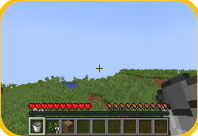

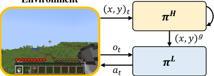


Figure 2: The proposed hierarchical policy for Finding-skills. The high-level recurrent policy _π_ _[H]_
observes historical positions ( _x, y_ ) 0: _t_ from the environment and generates a goal position ( _x, y_ ) _[g]_ .
The low-level policy _π_ _[L]_ is a goal-based policy to reach the goal position. The right figure shows a
top view of the agent’s exploration trajectory, where the walking paths of the low-level policy are
shown in blue dotted lines, and the goal is changed by the high-level policy at each black spot. The
high-level policy is optimized to maximize the state count in the grid world, which is shown in the
grey background.


**3.2** **Manipulation and Crafting**


By executing the pre-trained Finding-skills, we can instantiate the manipulation tasks with requisite
target items nearby, making the manipulation tasks much easier. To train the Manipulation-skills in
Minecraft, we can either make a training environment with the target item initialized nearby or run
the Finding-skills to reach a target item. For example, to train the skill ‘harvest milk_bucket ’, we


can either spawn a cow close to the agent using the Minecraft built-in commands, or execute the
Finding-skills until a cow is reached. The latter is similar in the idea to Go-Explore [ 8 ], and is more
suitable for other environments that do not have commands to initialize the target items nearby.


We adopt MineCLIP [ 9 ] to guide the agent with intrinsic rewards. The pre-trained MineCLIP model
computes the CLIP reward based on the similarity between environmental observations (frames) and
the language descriptions of the skill. We train the agent using PPO with self-imitation learning,
to maximize a weighted sum of intrinsic rewards and extrinsic success (sparse) reward. Details for
training basic skills can be found in Appendix D.


For the Crafting-skills, they can be executed with only a single action in MineDojo [9].


**4** **Solving Minecraft Tasks via Skill Planning**


In this section, we present our skill planning method for solving diverse hard tasks. A skill graph
is generated in advance with a Large Language Model (LLM), enabling searching for correct skill
sequences on the fly.


**4.1** **Constructing Skill Graph with Large Language Models**


A correct plan ( _s_ _τ,_ 1 _, s_ _τ,_ 2 _, · · ·_ ) for a task _τ_ = ( _g, I_ ) should satisfy two conditions. (1) For each _i_, _s_ _τ,i_
is executable after ( _s_ _τ,_ 1 _, · · ·, s_ _τ,i−_ 1 ) are accomplished sequentially with initial condition _I_ . (2) The
target item _g_ is obtained after all the skills are accomplished sequentially, given initial condition _I_ . To
enable searching for such plans, we should be able to verify whether a plan is correct. Thus, we should
know what condition is required and what is obtained for each skill. We define such information of
skills in a structured format. As an example, information for skill ‘crafting stone_pickaxe ’ is:

```
stone_pickaxe {consume: {cobblestone: 3, stick: 2},
require: { crafting_table_nearby : 1}, obtain: { stone_pickaxe : 1}}

```

Each item in this format is also a skill. Regarding them as graph nodes, this format shows a graph
structure between skill ‘stone_pickaxe’ and skills ‘cobblestone’, ‘stick’, ‘crafting_table_nearby’. The
directed edge from ‘cobblestone‘ to ‘stone_pickaxe’ is represented as (3, 1, consume), showing the
quantity relationship between parent and child, and that the parent item will be consumed during skill
execution. In fact, in this format, all the basic skills in Minecraft construct a large directed acyclic


5


graph with hundreds of nodes. The dashed box in Figure 1 shows a small part of this graph, where
grey arrows denote ‘consume’ and red arrows denote ‘require’.


To construct the skill graph, we generate structured information for all the skills by interacting
with ChatGPT (GPT-3.5) [ 29 ], a high-performance LLM. Since LLMs are trained on large-scale
internet datasets, they obtain rich knowledge in the popular game Minecraft. In prompt, we give a
few demonstrations and explanations about the format, then ask ChatGPT to generate other skills
information. Dialog with ChatGPT can be found in Appendix E.


**4.2** **Skill Search Algorithm**


Our skill planning method is a depth-first search (DFS) algorithm on the skill graph. Given a task
_τ_ = ( _g, I_ ), we start from the node _g_ and do DFS toward its parents, opposite to the edge directions.
In this process, we maintain all the possessing items starting from _I_ . Once conditions for the skill are
satisfied or the skill node has no parent, we append this skill into the planned skill list and modify the
maintained items according to the skill information. The resulting skill list is ensured to be executable
and target-reaching.


To solve a long-horizon task, since the learned low-level skills are possible to fail, we alternate skill
planning and skill execution until the episode terminates. After each skill execution, we update the
agent’s condition _I_ _[′]_ based on its inventory and the last executed skill, and search for the next skill
with _τ_ _[′]_ = ( _g, I_ _[′]_ ).


We present the pseudocode for the skill search algorithm and the testing process in Appendix C.


**5** **Experiments**


In this section, we evaluate and analyze our method with baselines and ablations in challenging
Minecraft tasks. Section 5.1 introduces the implementation of basic skills. In Section 5.2, we
introduce the setup for our evaluation task suite. In Section 5.3 and 5.4, we present the experimental
results and analyze skill learning and planning respectively.


**5.1** **Training Basic Skills**


To pre-train basic skills with RL, we use the environments of programmatic tasks in MineDojo [ 9 ].
To train Manipulation-skills, for simplicity, we specify the environment that initializes target mobs or
resources close to the agent. For the Go-Explore-like training method without specified environments
discussed in Section 3.2, we present the results in Appendix H, which does not underperform the
former.


For Manipulation-skills and the low-level policy of Finding-skills, we adopt the policy architecture
of MineAgent [ 9 ], which uses a fixed pre-trained MineCLIP image encoder and processes features
using MLPs. To explore in a compact action space, we compress the original large action space into
12 _×_ 3 discrete actions. For the high-level policy of Finding-skills, which observes the agent’s past
locations, we use an LSTM policy and train it with truncated BPTT [ 30 ]. We pick the model with the
highest success rate on the smoothed training curve for each skill, and fix these policies in all tasks.
Implementation details can be found in Appendix D.


Note that Plan4MC totally takes 7M environmental steps in training, and can unlock the iron pickaxe

in the Minecraft Tech Tree in test. The sample efficiency greatly outperforms all other existing
demonstration-free RL methods [12, 2].


**5.2** **Task Setup**


Based on MineDojo [ 9 ] programmatic tasks, we set up an evaluation benchmark consisting of four
groups of diverse tasks: cutting trees to craft primary items, mining cobblestones to craft


intermediate items, mining iron ores to craft advanced items, and interacting with mobs
to harvest food and materials. Each task set has 10 tasks, adding up to a total of 40 tasks. With
our settings of basic skills, these tasks require 25 planning steps on average and maximally 121
planning steps. We estimate the number of the required steps for each task with the sum of the steps


6


Table 2: Average success rates on four task sets of our method, all the baselines and ablation methods.
Success rates on all the single tasks are listed in Appendix G.


Task Set Cut-Trees Mine-Stones Mine-Ores Interact-Mobs


MineAgent 0.003 0.026 0.000 0.171
Plan4MC w/o Find-skill 0.187 0.097 0.243 0.170


Interactive LLM 0.260 0.067 0.030 0.247

Plan4MC Zero-shot 0.183 0.000 0.000 0.133
Plan4MC 1/2-steps 0.337 0.163 0.143 0.277


**Plan4MC** **0.417** **0.293** **0.267** **0.320**


of the initially planned skills and double this number to be the maximum episode length for the task,
allowing skill executions to fail. The easiest tasks have 3000 maximum steps, while the hardest tasks
have 12000. More details about task setup are listed in Appendix F. To evaluate the success rate on
each task, we average the results over 30 test episodes.


**5.3** **Skill Learning**


We first analyze learning basic skills. While we propose three types of fine-grained basic skills, others
directly learn more complicated and long-horizon skills. We introduce two baselines to study learning
skills with RL.


**MineAgent [** **9** **].** Without decomposing tasks into basic skills, MineAgent solves tasks using PPO
and self-imitation learning with the CLIP reward. For fairness, we train MineAgent in the test
environment for each task. The training takes 7M environmental steps, which is equal to the sum of
environmental steps we take for training all the basic skills. We average the success rate of trajectories
in the last 100 training epochs (around 1M environment steps) to be its test success rate. Since
MineAgent has no actions for crafting items, we hardcode the crafting actions into the training code.
During trajectory collection, at each time step where the skill search algorithm returns a Crafting-skill,
the corresponding crafting action will be executed. Note that, if we expand the action space for
MineAgent rather than automatically execute crafting actions, the exploration will be much harder.


**Plan4MC w/o Find-skill.** None of the previous work decomposes a skill into executing Findingskills and Manipulation-skills. Instead, finding items and manipulations are done with a single skill.
Plan4MC w/o Find-skill implements such a method. It skips all the Finding-skills in the skill plans
during test. Manipulation-skills take over the whole process of finding items and manipulating them.


Table 2 shows the test results for these methods. Plan4MC outperforms two baselines on the four
task sets. MineAgent fails on the task sets of Cut-Trees, Mine-Stones and Mine-Ores, since taking
many attacking actions continually to mine blocks in Minecraft is an exploration difficulty for RL on
long-horizon tasks. On the contrary, MineAgent achieves performance comparable to Plan4MC’s
on some easier tasks in Interact-Mobs, which requires fewer environmental steps
and planning steps. Plan4MC w/o Find-skill consistently underperforms Plan4MC on all the tasks,
showing that introducing Finding-skills is beneficial for solving hard tasks with basic skills trained
by RL. Because there is no Finding-skill in harvesting iron ores, their performance gap on Mine-Ores
tasks is small.


To further study Finding-skills, we present the success rate at each planning step in Figure 3 for
three tasks. The curves of Plan4MC and Plan4MC w/o Find-skill have large drops at Finding-skills.
Especially, the success rates at finding cobblestones and logs decrease the most, because these items
are harder to find in the environment compared to mobs. In these tasks, we compute the average
success rate of Manipulation-Skills, conditioned on the skill before the last Finding-skills being
accomplished. While Plan4MC has a conditional success rate of 0.40, Plan4MC w/o Find-skill
decreases to 0.25, showing that solving sub-tasks with additional Finding-skills is more effective.


As shown in Table 3, most Manipulation-skills have slightly lower success rates in test than in training,
due to the domain gap between test and training environments. However, this decrease does not
occur in skills that are trained with a large initial distance of mobs/items, as pre-executed


7


|Craft Lever|Col2|Col3|Col4|Col5|Lever|Col7|Col8|Col9|Col10|
|---|---|---|---|---|---|---|---|---|---|
|init<br>find stone<br>cobblestone<br>find log<br>log<br>planks<br>stick<br>lever<br>0.0<br>0.2<br>0.4<br>0.6<br>0.8<br>1.0<br><br><br>~~Plan4MC~~<br>Plan4MC w/o Find~~-~~skill|init<br>find stone<br>cobblestone<br>find log<br>log<br>planks<br>stick<br>lever<br>0.0<br>0.2<br>0.4<br>0.6<br>0.8<br>1.0<br><br><br>~~Plan4MC~~<br>Plan4MC w/o Find~~-~~skill|init<br>find stone<br>cobblestone<br>find log<br>log<br>planks<br>stick<br>lever<br>0.0<br>0.2<br>0.4<br>0.6<br>0.8<br>1.0<br><br><br>~~Plan4MC~~<br>Plan4MC w/o Find~~-~~skill|init<br>find stone<br>cobblestone<br>find log<br>log<br>planks<br>stick<br>lever<br>0.0<br>0.2<br>0.4<br>0.6<br>0.8<br>1.0<br><br><br>~~Plan4MC~~<br>Plan4MC w/o Find~~-~~skill|init<br>find stone<br>cobblestone<br>find log<br>log<br>planks<br>stick<br>lever<br>0.0<br>0.2<br>0.4<br>0.6<br>0.8<br>1.0<br><br><br>~~Plan4MC~~<br>Plan4MC w/o Find~~-~~skill||||||
|init<br>find stone<br>cobblestone<br>find log<br>log<br>planks<br>stick<br>lever<br>0.0<br>0.2<br>0.4<br>0.6<br>0.8<br>1.0<br><br><br>~~Plan4MC~~<br>Plan4MC w/o Find~~-~~skill||||~~Pla~~<br>Pla|~~4~~<br>n4|~~C~~<br>C|/o Fi|d~~-~~ski|l|
|init<br>find stone<br>cobblestone<br>find log<br>log<br>planks<br>stick<br>lever<br>0.0<br>0.2<br>0.4<br>0.6<br>0.8<br>1.0<br><br><br>~~Plan4MC~~<br>Plan4MC w/o Find~~-~~skill||||||||||
|init<br>find stone<br>cobblestone<br>find log<br>log<br>planks<br>stick<br>lever<br>0.0<br>0.2<br>0.4<br>0.6<br>0.8<br>1.0<br><br><br>~~Plan4MC~~<br>Plan4MC w/o Find~~-~~skill||||||||||
|init<br>find stone<br>cobblestone<br>find log<br>log<br>planks<br>stick<br>lever<br>0.0<br>0.2<br>0.4<br>0.6<br>0.8<br>1.0<br><br><br>~~Plan4MC~~<br>Plan4MC w/o Find~~-~~skill||||||||||
|init<br>find stone<br>cobblestone<br>find log<br>log<br>planks<br>stick<br>lever<br>0.0<br>0.2<br>0.4<br>0.6<br>0.8<br>1.0<br><br><br>~~Plan4MC~~<br>Plan4MC w/o Find~~-~~skill||||||||||
|init<br>find stone<br>cobblestone<br>find log<br>log<br>planks<br>stick<br>lever<br>0.0<br>0.2<br>0.4<br>0.6<br>0.8<br>1.0<br><br><br>~~Plan4MC~~<br>Plan4MC w/o Find~~-~~skill||||||||||


|1.0<br>Plan4MC<br>Plan4MC w/o Find-skill<br>0.8<br>0.6<br>0.4<br>0.2<br>0.0<br>find i ln oi gt log finp dl a cn ok ws p cl oac oe k ef dur _nb bae ece ef f e|Col2|Col3|Col4|Col5|Col6|Col7|Col8|Col9|Col10|
|---|---|---|---|---|---|---|---|---|---|
|init<br>find log<br>log<br>planks<br>find cow<br>beef<br>place furnace<br>cooked_beef<br>0.0<br>0.2<br>0.4<br>0.6<br>0.8<br>1.0<br><br><br>~~Plan4MC~~<br>Plan4MC w/o Find~~-~~skill||||~~Pl~~<br>Pl|~~n4~~<br>n4|~~C~~<br>C w|/o Fin|d~~-~~skil|l|
|init<br>find log<br>log<br>planks<br>find cow<br>beef<br>place furnace<br>cooked_beef<br>0.0<br>0.2<br>0.4<br>0.6<br>0.8<br>1.0<br><br><br>~~Plan4MC~~<br>Plan4MC w/o Find~~-~~skill||||||||||
|init<br>find log<br>log<br>planks<br>find cow<br>beef<br>place furnace<br>cooked_beef<br>0.0<br>0.2<br>0.4<br>0.6<br>0.8<br>1.0<br><br><br>~~Plan4MC~~<br>Plan4MC w/o Find~~-~~skill||||||||||
|init<br>find log<br>log<br>planks<br>find cow<br>beef<br>place furnace<br>cooked_beef<br>0.0<br>0.2<br>0.4<br>0.6<br>0.8<br>1.0<br><br><br>~~Plan4MC~~<br>Plan4MC w/o Find~~-~~skill||||||||||
|init<br>find log<br>log<br>planks<br>find cow<br>beef<br>place furnace<br>cooked_beef<br>0.0<br>0.2<br>0.4<br>0.6<br>0.8<br>1.0<br><br><br>~~Plan4MC~~<br>Plan4MC w/o Find~~-~~skill||||||||||


|1.0<br>Plan4MC<br>Plan4MC w/o Find-skill<br>0.8<br>0.6<br>0.4<br>0.2<br>0.0<br>find i ln oi gt plal no kg s find ss ht ei ec pk pla pc ae i t nw t a i o b nl ol ge|Col2|Col3|Col4|Col5|Col6|Col7|Col8|Col9|
|---|---|---|---|---|---|---|---|---|
|init<br>find log<br>log<br>planks<br>stick<br>find sheep<br>wool<br>place table<br>painting<br>0.0<br>0.2<br>0.4<br>0.6<br>0.8<br>1.0<br><br><br>~~Plan4MC~~<br>Plan4MC w/o Find~~-~~skill||||~~Pl~~<br>Pl|~~n4M~~<br>n4M|w/o|Find~~-~~|kill|
|init<br>find log<br>log<br>planks<br>stick<br>find sheep<br>wool<br>place table<br>painting<br>0.0<br>0.2<br>0.4<br>0.6<br>0.8<br>1.0<br><br><br>~~Plan4MC~~<br>Plan4MC w/o Find~~-~~skill|||||||||
|init<br>find log<br>log<br>planks<br>stick<br>find sheep<br>wool<br>place table<br>painting<br>0.0<br>0.2<br>0.4<br>0.6<br>0.8<br>1.0<br><br><br>~~Plan4MC~~<br>Plan4MC w/o Find~~-~~skill|||||||||
|init<br>find log<br>log<br>planks<br>stick<br>find sheep<br>wool<br>place table<br>painting<br>0.0<br>0.2<br>0.4<br>0.6<br>0.8<br>1.0<br><br><br>~~Plan4MC~~<br>Plan4MC w/o Find~~-~~skill|||||||||
|init<br>find log<br>log<br>planks<br>stick<br>find sheep<br>wool<br>place table<br>painting<br>0.0<br>0.2<br>0.4<br>0.6<br>0.8<br>1.0<br><br><br>~~Plan4MC~~<br>Plan4MC w/o Find~~-~~skill|||||||||
|init<br>find log<br>log<br>planks<br>stick<br>find sheep<br>wool<br>place table<br>painting<br>0.0<br>0.2<br>0.4<br>0.6<br>0.8<br>1.0<br><br><br>~~Plan4MC~~<br>Plan4MC w/o Find~~-~~skill|||||||||
|init<br>find log<br>log<br>planks<br>stick<br>find sheep<br>wool<br>place table<br>painting<br>0.0<br>0.2<br>0.4<br>0.6<br>0.8<br>1.0<br><br><br>~~Plan4MC~~<br>Plan4MC w/o Find~~-~~skill|||||||||


Figure 3: Success rates of Plan4MC with/without Finding-skills at each skill planning step, on three
long-horizon tasks. We arrange the initially planned skill sequence on the horizontal axis and remove
the repeated skills. The success rate of each skill represents the probability of successfully executing
this skill at least once in a test episode. Specifically, the success rate is always 1 at task initialization,
and the success rate of the last skill is equal to the task’s success rate.


Table 3: Success rates of Manipulation-skills in training and test. _Training init. distance_ is the
maximum distance for mobs/items initialization in training skills. Note that in test, executing Findingskills will reach the target items within a distance of 3. _Training success rate_ is averaged over 100
training epochs around the selected model’s epoch. _Test success rate_ is computed from the test
rollouts of all the tasks, while _w/o Find_ refers to Plan4MC w/o Find-skill.


Manipulation-skills Place


Training init. distance -- 10 10 2 2 -- -

Training success rate 0.98 0.50 0.27 0.21 0.30 0.56 0.47
Test success rate 0.77 0.71 0.26 0.27 0.16 0.33 0.26
Test success rate (w/o Find) 0.79 0.07 0.03 0.03 0.02 0.05 0.06


Finding-skills provide better initialization for Manipulation-skills during the test and thus the success
rate may increase. In contrast, the success rates in the test without Finding-skills are significantly
lower.


**5.4** **Skill Planning**


For skill planning in open-ended worlds, recent works [ 13, 14, 3, 21, 37 ] generate plans or sub-tasks
with LLMs. We study these methods on our task sets and implement a best-performing baseline to
compare with Plan4MC.


**Interactive LLM.** We implement an interactive planning baseline using LLMs. We take ChatGPT [ 29 ] as the planner, which proposes skill plans based on prompts including descriptions of tasks
and observations. Similar to chain-of-thoughts prompting [ 38 ], we provide few-shot demonstrations
with explanations to the planner at the initial planning step. In addition, we add several rules for
planning into the prompt to fix common errors that the model encountered during test. At each
subsequent planning step, the planner will encounter one of the following cases: the proposed skill
name is invalid, the skill is already done, skill execution succeeds, and skill execution fails. We
carefully design language feedback for each case and ask the planner to re-plan based on inventory
changes. For low-level skills, we use the same pre-trained skills as Plan4MC.


Also, we conduct ablations on our skill planning designs.


**Plan4MC Zero-shot.** This is a zero-shot variant of our interactive planning method, proposing a skill
sequence at the beginning of each task only. The agent executes the planned skills sequentially until a
skill fails or the environment terminates. This planner has no fault tolerance for skills execution.


**Plan4MC 1/2-steps.** In this ablation study, we half the test episode length and require the agent to
solve tasks more efficiently.


8


Success rates for each method are listed in Table 2. We find that Interactive LLM has comparable
performance to Plan4MC on the task set of Interact-Mobs, where most tasks require less than 10
planning steps. In Mine-Stones and Mine-Ores tasks with long-horizon planning, the LLM planner is
more likely to make mistakes, resulting in worse performance. The performance of Plan4MC Zeroshot is much worse than Plan4MC in all the tasks, since a success test episode requires accomplishing
each skill in one trial. The decrease is related to the number of planning steps and skills success
rates in Table 3. Plan4MC 1/2-steps has the least performance decrease to Plan4MC, showing that
Plan4MC can solve tasks in a more limited episode length.


**6** **Related Work**


**Minecraft.** In recent years, the open-ended world Minecraft has received wide attention in machine
learning research. Malmo [ 15 ], MineRL [ 10 ] and MineDojo [ 9 ] build benchmark environments and
datasets for Minecraft. Previous works in MineRL competition [ 25, 11, 17 ] study the ObtainDiamond
task with hierarchical RL [ 25, 33, 24, 23 ] and imitation learning [ 1, 11 ]. Other works explore multitask learning [ 35, 18, 4, 28 ], unsupervised skill discovery [ 27 ], LLM-based planning [ 37, 36, 40 ],
and pre-training from videos [ 2, 22, 9, 6 ]. Our work falls under reinforcement learning and planning
in Minecraft.


**Learning Skills in Minecraft.** Acquiring skills is crucial for solving long-horizon tasks in Minecraft.
Hierarchical approaches [ 24, 23 ] in MineRL competition learn low-level skills with imitation learning. VPT [ 2 ] labels internet-scale datasets and pre-trains a behavior-cloning agent to initialize for
diverse tasks. Recent works [ 4, 37, 28 ] learn skills based on VPT. Without expert demonstrations,
MineAgent [ 9 ] and CLIP4MC [ 6 ] learn skills with RL and vision-language rewards. But they can only
acquire a small set of skills. Unsupervised skill discovery [ 27 ] learns skills that only produce different
navigation behaviors. In our work, to enable RL to acquire diverse skills, we learn fine-grained basic
skills with intrinsic rewards.


**Planning with Large Language Models.** With the rapid progress of LLMs [ 29, 5 ], many works
study LLMs as planners in open-ended worlds. To ground language models, SayCan [ 3 ] combines
LLMs with skill affordances to produce feasible plans, Translation LMs [ 13 ] selects demonstrations
to prompt LLMs, and LID [ 20 ] finetunes language models with tokenized interaction data. Other
works study interactive planning for error correction. Inner Monologue [ 14 ] proposes environment
feedback to the planner. DEPS [ 37 ] introduces descriptor, explainer, and selector to generate plans
by LLMs. In our work, we leverage the LLM to generate a skill graph and introduce a skill search
algorithm to eliminate planning mistakes.


**7** **Conclusion and Discussion**


In this paper, we propose a framework to solve diverse long-horizon open-world tasks with reinforcement learning and planning. To tackle the exploration and sample efficiency issues, we propose
to learn fine-grained basic skills with RL and introduce a general Finding-skill to provide good
environment initialization for skill learning. In Minecraft, we design a graph-based planner, taking
advantage of the prior knowledge in LLMs and the planning accuracy of the skill search algorithm.
Experiments on 40 challenging Minecraft tasks verify the advantages of Plan4MC over various
baselines.


Though we implement Plan4MC in Minecraft, our method is extendable to other similar open-world
environments and draws insights on building multi-task learning systems. We leave the detailed
discussion in Appendix I.


A limitation of this work is that the Finding-skill is not aware of its goal during exploration, making
the goal-reaching policy sub-optimal. Future work needs to improve its efficiency by training a
goal-based policy. Moreover, if the LLM lacks domain knowledge, how to correct the LLM’s outputs
is a problem worth studying in the future. Providing documents and environmental feedback to the
LLM is a promising direction.


9


**References**


[1] Artemij Amiranashvili, Nicolai Dorka, Wolfram Burgard, Vladlen Koltun, and Thomas Brox.
Scaling imitation learning in Minecraft. _arXiv preprint arXiv:2007.02701_, 2020.


[2] Bowen Baker, Ilge Akkaya, Peter Zhokov, Joost Huizinga, Jie Tang, Adrien Ecoffet, Brandon
Houghton, Raul Sampedro, and Jeff Clune. Video pretraining (vpt): Learning to act by watching
unlabeled online videos. _Advances in Neural Information Processing Systems (NeurIPS)_, 2022.


[3] Anthony Brohan, Yevgen Chebotar, Chelsea Finn, Karol Hausman, Alexander Herzog, Daniel
Ho, Julian Ibarz, Alex Irpan, Eric Jang, Ryan Julian, et al. Do as i can, not as i say: Grounding
language in robotic affordances. In _Conference on Robot Learning (CORL)_, 2023.


[4] Shaofei Cai, Zihao Wang, Xiaojian Ma, Anji Liu, and Yitao Liang. Open-world multi-task
control through goal-aware representation learning and adaptive horizon prediction. _arXiv_
_preprint arXiv:2301.10034_, 2023.


[5] Aakanksha Chowdhery, Sharan Narang, Jacob Devlin, Maarten Bosma, Gaurav Mishra, Adam
Roberts, Paul Barham, Hyung Won Chung, Charles Sutton, Sebastian Gehrmann, et al. Palm:
Scaling language modeling with pathways. _arXiv preprint arXiv:2204.02311_, 2022.


[6] Ziluo Ding, Hao Luo, Ke Li, Junpeng Yue, Tiejun Huang, and Zongqing Lu. CLIP4MC: An
rl-friendly vision-language model for Minecraft. _arXiv preprint arXiv:2303.10571_, 2023.


[7] Yuqing Du, Ksenia Konyushkova, Misha Denil, Akhil Raju, Jessica Landon, Felix Hill, Nando
de Freitas, and Serkan Cabi. Vision-language models as success detectors. _arXiv preprint_
_arXiv:2303.07280_, 2023.


[8] Adrien Ecoffet, Joost Huizinga, Joel Lehman, Kenneth O Stanley, and Jeff Clune. Go-explore:
a new approach for hard-exploration problems. _arXiv preprint arXiv:1901.10995_, 2019.


[9] Linxi Fan, Guanzhi Wang, Yunfan Jiang, Ajay Mandlekar, Yuncong Yang, Haoyi Zhu, Andrew
Tang, De-An Huang, Yuke Zhu, and Anima Anandkumar. MineDojo: Building open-ended embodied agents with internet-scale knowledge. In _Thirty-sixth Conference on Neural Information_
_Processing Systems Datasets and Benchmarks Track_, 2022.


[10] William H. Guss, Brandon Houghton, Nicholay Topin, Phillip Wang, Cayden Codel, Manuela
Veloso, and Ruslan Salakhutdinov. MineRL: A large-scale dataset of Minecraft demonstrations.
_Twenty-Eighth International Joint Conference on Artificial Intelligence (IJCAI)_, 2019.


[11] William Hebgen Guss, Stephanie Milani, Nicholay Topin, Brandon Houghton, Sharada Mohanty,
Andrew Melnik, Augustin Harter, Benoit Buschmaas, Bjarne Jaster, Christoph Berganski, et al.
Towards robust and domain agnostic reinforcement learning competitions: MineRL 2020. In
_NeurIPS 2020 Competition and Demonstration Track_, 2021.


[12] Danijar Hafner, Jurgis Pasukonis, Jimmy Ba, and Timothy Lillicrap. Mastering diverse domains
through world models. _arXiv preprint arXiv:2301.04104_, 2023.


[13] Wenlong Huang, Pieter Abbeel, Deepak Pathak, and Igor Mordatch. Language models as
zero-shot planners: Extracting actionable knowledge for embodied agents. In _International_
_Conference on Machine Learning (ICML)_, 2022.


[14] Wenlong Huang, Fei Xia, Ted Xiao, Harris Chan, Jacky Liang, Pete Florence, Andy Zeng,
Jonathan Tompson, Igor Mordatch, Yevgen Chebotar, et al. Inner monologue: Embodied
reasoning through planning with language models. _arXiv preprint arXiv:2207.05608_, 2022.


[15] Matthew Johnson, Katja Hofmann, Tim Hutton, and David Bignell. The malmo platform
for artificial intelligence experimentation. In _International Joint Conference on Artificial_
_Intelligence (IJCAI)_, 2016.


[16] Leslie Pack Kaelbling, Michael L Littman, and Anthony R Cassandra. Planning and acting in
partially observable stochastic domains. _Artificial intelligence_, 101(1-2):99–134, 1998.


10


[17] Anssi Kanervisto, Stephanie Milani, Karolis Ramanauskas, Nicholay Topin, Zichuan Lin, Junyou Li, Jianing Shi, Deheng Ye, Qiang Fu, Wei Yang, et al. MineRL diamond 2021 competition:
Overview, results, and lessons learned. _NeurIPS 2021 Competitions and Demonstrations Track_,
2022.


[18] Ingmar Kanitscheider, Joost Huizinga, David Farhi, William Hebgen Guss, Brandon Houghton,
Raul Sampedro, Peter Zhokhov, Bowen Baker, Adrien Ecoffet, Jie Tang, et al. Multi-task
curriculum learning in a complex, visual, hard-exploration domain: Minecraft. _arXiv preprint_
_arXiv:2106.14876_, 2021.


[19] Chengshu Li, Ruohan Zhang, Josiah Wong, Cem Gokmen, Sanjana Srivastava, Roberto MartínMartín, Chen Wang, Gabrael Levine, Michael Lingelbach, Jiankai Sun, et al. Behavior-1k:
A benchmark for embodied ai with 1,000 everyday activities and realistic simulation. In
_Conference on Robot Learning (CORL)_, 2023.


[20] Shuang Li, Xavier Puig, Chris Paxton, Yilun Du, Clinton Wang, Linxi Fan, Tao Chen, De-An
Huang, Ekin Akyürek, Anima Anandkumar, et al. Pre-trained language models for interactive
decision-making. _Advances in Neural Information Processing Systems (NeurIPS)_, 2022.


[21] Jacky Liang, Wenlong Huang, Fei Xia, Peng Xu, Karol Hausman, Brian Ichter, Pete Florence,
and Andy Zeng. Code as policies: Language model programs for embodied control. _arXiv_
_preprint arXiv:2209.07753_, 2022.


[22] Shalev Lifshitz, Keiran Paster, Harris Chan, Jimmy Ba, and Sheila McIlraith. Steve-1: A
generative model for text-to-behavior in minecraft. _arXiv preprint arXiv:2306.00937_, 2023.


[23] Zichuan Lin, Junyou Li, Jianing Shi, Deheng Ye, Qiang Fu, and Wei Yang. Juewu-mc: Playing
Minecraft with sample-efficient hierarchical reinforcement learning. In _Proceedings of the_
_Thirty-First International Joint Conference on Artificial Intelligence (IJCAI)_, 2022.


[24] Hangyu Mao, Chao Wang, Xiaotian Hao, Yihuan Mao, Yiming Lu, Chengjie Wu, Jianye Hao,
Dong Li, and Pingzhong Tang. Seihai: A sample-efficient hierarchical ai for the MineRL
competition. In _Distributed Artificial Intelligence (DAI)_, 2022.


[25] Stephanie Milani, Nicholay Topin, Brandon Houghton, William H Guss, Sharada P Mohanty,
Keisuke Nakata, Oriol Vinyals, and Noboru Sean Kuno. Retrospective analysis of the 2019
MineRL competition on sample efficient reinforcement learning. In _NeurIPS 2019 Competition_
_and Demonstration Track_, 2020.


[26] Volodymyr Mnih, Koray Kavukcuoglu, David Silver, Andrei A Rusu, Joel Veness, Marc G
Bellemare, Alex Graves, Martin Riedmiller, Andreas K Fidjeland, Georg Ostrovski, et al.
Human-level control through deep reinforcement learning. _nature_, 518(7540):529–533, 2015.


[27] Juan José Nieto, Roger Creus, and Xavier Giro-i Nieto. Unsupervised skill-discovery and
skill-learning in Minecraft. _arXiv preprint arXiv:2107.08398_, 2021.


[28] Kolby Nottingham, Prithviraj Ammanabrolu, Alane Suhr, Yejin Choi, Hannaneh Hajishirzi,
Sameer Singh, and Roy Fox. Do embodied agents dream of pixelated sheep?: Embodied
decision making using language guided world modelling. _arXiv preprint arXiv:2301.12050_,
2023.


[29] Long Ouyang, Jeffrey Wu, Xu Jiang, Diogo Almeida, Carroll Wainwright, Pamela Mishkin,
Chong Zhang, Sandhini Agarwal, Katarina Slama, Alex Ray, et al. Training language models to
follow instructions with human feedback. _Advances in Neural Information Processing Systems_
_(NeurIPS)_, 2022.


[30] Marco Pleines, Matthias Pallasch, Frank Zimmer, and Mike Preuss. Memory gym: Partially
observable challenges to memory-based agents. In _International Conference on Learning_
_Representations (ICLR)_, 2023.


[31] Julian Schrittwieser, Ioannis Antonoglou, Thomas Hubert, Karen Simonyan, Laurent Sifre, Simon Schmitt, Arthur Guez, Edward Lockhart, Demis Hassabis, Thore Graepel, et al. Mastering
atari, go, chess and shogi by planning with a learned model. _Nature_, 588(7839):604–609, 2020.


11


[32] John Schulman, Filip Wolski, Prafulla Dhariwal, Alec Radford, and Oleg Klimov. Proximal
policy optimization algorithms. _arXiv preprint arXiv:1707.06347_, 2017.


[33] Alexey Skrynnik, Aleksey Staroverov, Ermek Aitygulov, Kirill Aksenov, Vasilii Davydov, and
Aleksandr I Panov. Hierarchical deep q-network from imperfect demonstrations in Minecraft.
_Cognitive Systems Research_, 65:74–78, 2021.


[34] Open Ended Learning Team, Adam Stooke, Anuj Mahajan, Catarina Barros, Charlie Deck,
Jakob Bauer, Jakub Sygnowski, Maja Trebacz, Max Jaderberg, Michael Mathieu, et al. Openended learning leads to generally capable agents. _arXiv preprint arXiv:2107.12808_, 2021.


[35] Chen Tessler, Shahar Givony, Tom Zahavy, Daniel Mankowitz, and Shie Mannor. A deep
hierarchical approach to lifelong learning in Minecraft. In _Proceedings of the AAAI conference_
_on artificial intelligence (AAAI)_, 2017.


[36] Guanzhi Wang, Yuqi Xie, Yunfan Jiang, Ajay Mandlekar, Chaowei Xiao, Yuke Zhu, Linxi Fan,
and Anima Anandkumar. Voyager: An open-ended embodied agent with large language models.
_arXiv preprint arXiv:2305.16291_, 2023.


[37] Zihao Wang, Shaofei Cai, Anji Liu, Xiaojian Ma, and Yitao Liang. Describe, explain, plan and
select: Interactive planning with large language models enables open-world multi-task agents.
_arXiv preprint arXiv:2302.01560_, 2023.


[38] Jason Wei, Xuezhi Wang, Dale Schuurmans, Maarten Bosma, brian ichter, Fei Xia, Ed H. Chi,
Quoc V Le, and Denny Zhou. Chain of thought prompting elicits reasoning in large language
models. In _Advances in Neural Information Processing Systems (NeurIPS)_, 2022.


[39] Tianhe Yu, Deirdre Quillen, Zhanpeng He, Ryan Julian, Karol Hausman, Chelsea Finn, and
Sergey Levine. Meta-world: A benchmark and evaluation for multi-task and meta reinforcement
learning. In _Conference on Robot Learning (CORL)_, 2020.


[40] Xizhou Zhu, Yuntao Chen, Hao Tian, Chenxin Tao, Weijie Su, Chenyu Yang, Gao Huang, Bin
Li, Lewei Lu, Xiaogang Wang, et al. Ghost in the minecraft: Generally capable agents for
open-world enviroments via large language models with text-based knowledge and memory.
_arXiv preprint arXiv:2305.17144_, 2023.


12


**A** **The Necessity of Learning the Finding-skill**


We demonstrate the exploration difficulty of learning skills in Minecraft. Figure 4 shows that a
random policy can only travel to a distance of 5 blocks on plains within 500 steps. Since trees are
rare on the plains and usually have _>_ 20 distances to the player, an RL agent starting from a random
policy can fail to collect logs on plains.

|25|Col2|Col3|Col4|Col5|Col6|Col7|
|---|---|---|---|---|---|---|
|~~0~~<br>~~500~~<br>~~1000~~<br>~~1~~<br>Episod<br>0<br>5<br>10<br>15<br>20<br>25<br>|||||||
|~~0~~<br>~~500~~<br>~~1000~~<br>~~1~~<br>Episod<br>0<br>5<br>10<br>15<br>20<br>25<br>|||||||
|~~0~~<br>~~500~~<br>~~1000~~<br>~~1~~<br>Episod<br>0<br>5<br>10<br>15<br>20<br>25<br>|||||||
|~~0~~<br>~~500~~<br>~~1000~~<br>~~1~~<br>Episod<br>0<br>5<br>10<br>15<br>20<br>25<br>|||||||
|~~0~~<br>~~500~~<br>~~1000~~<br>~~1~~<br>Episod<br>0<br>5<br>10<br>15<br>20<br>25<br>|||||||


Figure 4: Maximal travel distance to the spawning point a random policy could reach in Minecraft,
under different episode lengths. We test for 100 episodes, with different randomly generated worlds
and agent parameters. Note that all Manipulation-skills we trained have episode lengths less than
1000 to ensure sample efficiency.


In Table 4, we compare the travel distances of a random policy, a hand-coded walking policy, and our
Finding-skill pre-trained with RL. We find that the Finding-skill has a stronger exploration ability
than the other two policies.


Table 4: Maximal travel distance on plains of a random policy, a hand-coded policy which always
takes forward+jump and randomly turns left or right, and our Finding-skill.


Episode length 200 500 1000


Random Policy 3 _._ 0 _±_ 2 _._ 1 5 _._ 0 _±_ 3 _._ 6 7 _._ 1 _±_ 4 _._ 9
Hand-coded Policy 7 _._ 1 _±_ 2 _._ 7 11 _._ 7 _±_ 4 _._ 4 18 _._ 0 _±_ 6 _._ 6
Finding-skill 12 _._ 6 _±_ 5 _._ 6 18 _._ 5 _±_ 9 _._ 3 25 _._ 7 _±_ 12 _._ 1


13


**B** **Pipeline Demonstration**


Here we visually demonstrate the steps Plan4MC takes to solve a long-horizon task. Figure 5 shows
the interactive planning and execution process for crafting a bed. Figure 6 shows the key frames of
Plan4MC solving the challenging Tech Tree task of crafting an iron pickaxe with bare hands.


Plan:

Craft

Find

…


Plan:

Harvest

Place

…


Plan:

Find

Harvest

…


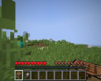

Inventory:
Nearby: -


Initial-Plan:

Find

Harvest

…


Plan:

Harvest

Place

…


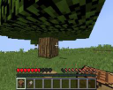

Inventory:
Nearby:


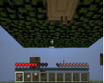

Plan:

Harvest

Craft

…


Inventory:
Nearby: -

**Replan:**
Find

Harvest

…


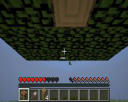

Inventory:
Nearby: -


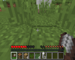

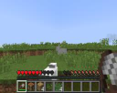

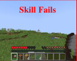

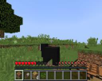

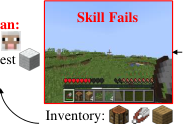

Inventory: Inventory: Inventory: Inventory:
Nearby: -- Nearby: Nearby: -- Nearby:


Plan: Place, …


Plan:

Craft


Inventory:
Nearby:


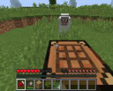

Inventory:
Nearby: -- **Task Done**


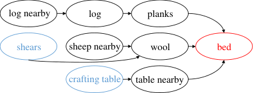

Figure 5: Demonstration of a planning and execution episode for the task "craft a bed". Following the
direction of the arrows, the planner iteratively proposes the skill sequence based on the agent’s state,
and the policy executes the first skill. Though an execution for "harvest wool" fails in the middle, the
planner replans to "find a sheep" again to fix this error, and finally completes the task. The lower
right shows the skill graph for this task, where the red circle indicates the target, and the blue circles
indicate the initial items.

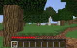

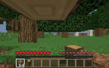

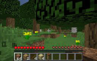

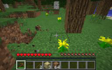

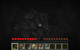


Begin Harvest logs Craft planks, sticks, table Craft wooden pickaxe Harvest cobblestones

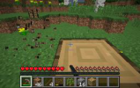


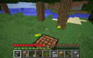

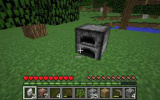

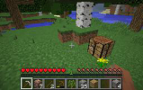


Craft stone pickaxe Harvest iron ores Craft furnace Craft iron ingots Craft iron pickaxe


Figure 6: A playing episode of Plan4MC for crafting iron pickaxe **with bare hands** . This is a
challenging task in Minecraft Tech Tree, which requires 16 different basic skills and 117 steps in the
initial plan.


14


**C** **Algorithms**


We present our algorithm sketches for skill planning and solving hard tasks here.


**Algorithm 1:** DFS.
**Input:** Pre-generated skill graph: _G_ ; Target item: _g_ ; Target item quantity: _n_ ;
_Global variables_ : possessing items _I_ and skill sequence _S_ .


**for** _g_ _[′]_ _in parents_ ( _G, g_ ) **do**

_n_ _g_ _′_ _, n_ _g_ _, consume ←< g_ _[′]_ _, g >_ ;
_n_ _[todo]_ _g_ _[′]_ _←_ _n_ _g_ _′_ ;
**if** _(quantity of g_ _[′]_ _in I) > n_ _g_ _′_ **then**

Decrease _g_ _[′]_ quantity with _n_ _g_ _[′]_ in _I_, if _consume_ ;

**else**

_n_ _[todo]_ _g_ _[′]_ _←_ _n_ _[todo]_ _g_ _[′]_ _−_ (quantity of _g_ _[′]_ in _I_ );

**while** _n_ _[todo]_ _>_ 0 **do**
_g_ _[′]_
DFS( _G, g_ _[′]_ _, n_ _[todo]_ _g_ _[′]_ _, I, S_ );
**if** _g_ _[′]_ _is not Crafting-skill_ **then**

Remove all nearby items in _I_ ;
_n_ _[obtain]_ _g_ _[′]_ _←_ (quantity of _g_ _[′]_ obtained after executing skill _g_ _[′]_ );
**if** _n_ _[obtain]_ _> n_ _[todo]_ **then**
_g_ _[′]_ _g_ _[′]_
Increase _g_ _[′]_ quantity with _n_ _[obtain]_ _g_ _[′]_ _−_ _n_ _[todo]_ _g_ _[′]_ in _I_ ;

Increase other obtained items after executing skill _g_ _[′]_ in _I_ ;
_n_ _[todo]_ _g_ _[′]_ _←_ _n_ _[todo]_ _g_ _[′]_ _−_ _n_ _[obtain]_ _g_ _[′]_ ;


Append skill _g_ to _S_ .


**Algorithm 2:** Skill search algorithm.

**Input:** Pre-generated skill graph: _G_ ; Target item: _g_ ; Initial items: _I_ .
**Output:** Skill sequence: ( _s_ 1 _, s_ 2 _, ..._ ).


_S_ _[′]_ _←_ ();
_I_ _[′]_ _←_ _I_ ;
DFS( _G, g,_ 1 _, I_ _[′]_ _, S_ _[′]_ );
return _S_ _[′]_ .


**Algorithm 3:** Process for solving a task.
**Input:** Task: _T_ = ( _g, I_ ) ; Pre-trained skills: _{π_ _s_ _}_ _s∈S_ ; Pre-generated skill graph: _G_ ; Skill search
algorithm: _Search_ .
**Output:** Task success.


_I_ _[′]_ _←_ _I_ ;
**while** task not done **do**

( _s_ 1 _, s_ 2 _, ..._ ) _←_ _Search_ ( _G, g, I_ _[′]_ );
Execute _π_ _s_ 1 for several steps;
**if** _task success_ **then**

return **True** ;
_I_ _[′]_ _←_ inventory items _∪_ nearby items;

return **False** .


15


**D** **Details in Training Basic Skills**


Table 5 shows the environment and algorithm configurations for training basic skills. Except for the
skill of mining whose breaking speed multiplier in the simulator is set to 10, all the skills are
trained using the unmodified MineDojo simulator.


Though the MineCLIP reward improves the learning of many skills, it is still not enough to encourage
some complicated behaviors. In combat, we introduce distance reward and attack reward to


further encourage the agent to chase and attack the mobs. In mining, we introduce distance


reward to keep the agent close to the target blocks. To mine underground ores, we add depth
reward to encourage the agent to mine deeper and then go back to the ground. These item-based
intrinsic rewards are easy to implement for all the items and are also applicable in many other
open-world environments like robotics. Intrinsic rewards are implemented as follows.


**State count.** The high-level recurrent policy for Finding-skills optimizes the visited area in a
110 _×_ 110 square, where the agent’s spawn location is at the center. We divide the square into 11 _×_ 11
grids and keep a visitation flag for each grid. Once the agent walks into an unvisited grid, it receives
+1 state count reward.


**Goal navigation.** The low-level policy for Finding-skills is encouraged to reach the goal position.
The goal location is randomly sampled in 4 directions at a distance of 10 from the agent. To get closer
to the goal, we compute the distance change between the goal and the agent: _r_ _d_ = _−_ ( _d_ _t_ _−_ _d_ _t−_ 1 ),
where _d_ _t_ is the distance on the plane coordinates at time step _t_ . Additionally, to encourage the
agent to look in its walking direction, we add rewards to regularize the agent’s yaw and pitch angles:
_r_ _yaw_ = _yaw · g, r_ _pitch_ = _cos_ ( _pitch_ ), where _g_ is the goal direction. The total reward is:


_r_ = _r_ _yaw_ + _r_ _pitch_ + 10 _∗_ _r_ _d_ _._ (1)


**CLIP reward.** This reward encourages the agent to produce behaviors that match the task prompt.
We sample 31 task prompts among all the MineDojo programmatic tasks as negative samples. The
pre-trained MineCLIP [ 9 ] model computes the similarities between features of the past 16 frames
and prompts. We compute the probability that the frames are most similar to the task prompt:
_p_ = [softmax ( _S_ ( _f_ _v_ _, f_ _l_ ) _, {S_ ( _f_ _v_ _, f_ _l_ _−_ ) _}_ _l_ _−_ )] 0, where _f_ _v_ _, f_ _l_ are video features and prompt features, _l_
is the task prompt, and _l_ _[−]_ are negative prompts. The CLIP reward is:


_r_ CLIP = max _p −_ [1] _._ (2)
� 32 _[,]_ [ 0] �


**Distance.** The distance reward provides dense reward signals to reach the target items. For combat
tasks, the agent gets a distance reward when the distance is closer than the minimal distance in
history:

_r_ _distance_ = max �min _t_ _[′]_ _<t_ _[d]_ _[t]_ _[′]_ _[ −]_ _[d]_ _[t]_ _[,]_ [ 0] � _._ (3)


For mining tasks, since the agent should stay close to the block for many time steps, we
modify the distance reward to encourage keeping a small distance:


_r_ _distance_ =


 _d_ _t−_ 1 _−_ _d_ _t_ _,_ 1 _._ 5 _≤_ _d_ _t_ _≤_ + _∞_

2 _,_ _d_ _t_ _<_ 1 _._ 5 (4)



 _−_ 2 _,_ _d_ _t_ = + _∞,_


where _d_ _t_ is the distance between the agent and the target item at time step _t_, which is detected by
lidar rays in the simulator.


**Attack.** For combat tasks, we reward the agent for attacking the target mobs. We use the tool’s
durability information to detect valid attacks and use lidar rays to detect the target mob. The attack
reward is:


_r_ _attack_ =


90 _,_ if valid attack and the target at center

1 _,_ if valid attack but the target not at center (5)



 0 _,_ otherwise.


16


Table 5: Training configurations for all the basic skills. _Max Steps_ is the maximal episode length.
_Training Steps_ shows the environment steps cost for training each skill. _Init._ shows the maximal
distance to spawn mobs at environment reset. The high-level policy and low-level policy for Findingskills are listed in two lines.


Skill Max Steps Method Intrinsic Reward Training Steps Biome Init.

Find high: 40 PPO state count 1M plains -low: 50 DQN goal navigation 0.5M


Place 200 PPO CLIP reward 0.3M -- -
Harvest 200 PPO CLIP reward 1M plains 10

Harvest 200 PPO CLIP reward 1M plains 10

Combat 400 PPO CLIP, distance, attack 1M plains 2
Combat 400 PPO CLIP, distance, attack 1M plains 2

Harvest 500 PPO distance 0.5M forest -
Harvest 1000 PPO distance 0.3M hills -
Mine 50 PPO depth 0.4M forest -

Craft 1 -- -- 0 -- -

Table 6: Information for all the selected basic skill policies. _Success Rate_ is the success rate of the
selected policy on the smoothed training curve.


Skill Parameters Execute Steps Success Rate


Find 0.9M 1000 -

Place 2.0M 200 0.98

Harvest 2.0M 200 0.50

Harvest 2.0M 200 0.27

Combat 2.0M 400 0.21

Combat 2.0M 400 0.30

Harvest 2.0M 500 0.56

Harvest 2.0M 200 0.47

Mine 4.0M 1000 –


Craft 0 1 1.00


**Depth.** For mining tasks, the agent should dig down first, then go back to the ground. We use
the y-axis to calculate the change of the agent’s depth, and use the depth reward to encourage such
behaviors. To train the dig-down policy, the depth reward is:

_r_ _down_ = max �min _t_ _[′]_ _<t_ _[y]_ _[t]_ _[′]_ _[ −]_ _[y]_ _[t]_ _[,]_ [ 0] � _._ (6)


To train the go-back policy, the depth reward is:

_r_ _up_ = max � _y_ _t_ _−_ max _t_ _[′]_ _<t_ _[y]_ _[t]_ _[′]_ _[,]_ [ 0] � _._ (7)


For each Manipulation-skill, we use a linear combination of intrinsic reward and extrinsic success
reward to train the policy.


It takes one day on a single TITAN Xp GPU to train each skill for 1M environmental steps. Table 6
shows our selected basic skill policies for downstream tasks. Since the Finding-skill and the Mining

skill has no success rate during training, we pick the models with the highest returns on the
smoothed training curves. For other skills, we pick the models with the highest success rates on the
smoothed training curves.


17


**E** **LLM Prompt Design**


To construct the skill graph, we use ChatGPT to generate skill information showing relationships
between skills. For both Manipulation-skills and Crafting-skills, we demonstrate several skills,
explain the format, and then ask ChatGPT to generate all the skills in the same format.


Listing 1: Prompt for generating some Manipulation-skills and ChatGPT’s response. We only modify
the last querying sentence in the prompt to generate all the skills.

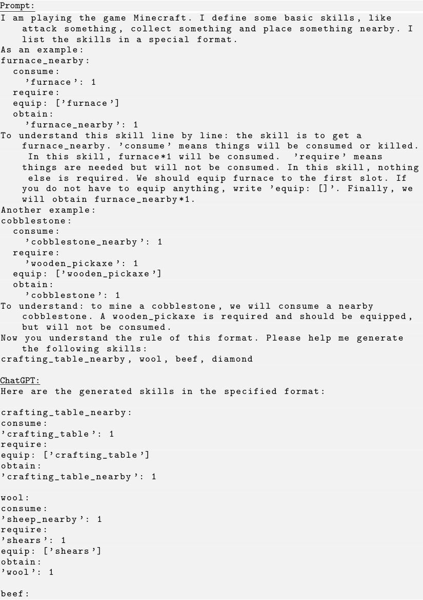


18


```
consume:

’cow_nearby ’: 1
require:
equip: []
obtain:

’beef ’: 1

diamond:

consume:

’diamond_ore_nearby ’: 1
require:
’iron_pickaxe ’: 1
equip: [’iron_pickaxe ’]
obtain:

’diamond ’: 1

```

Listing 2: Prompt for generating some Crafting-skills and ChatGPT’s response. We only modify the
last querying sentence in the prompt to generate all the skills.

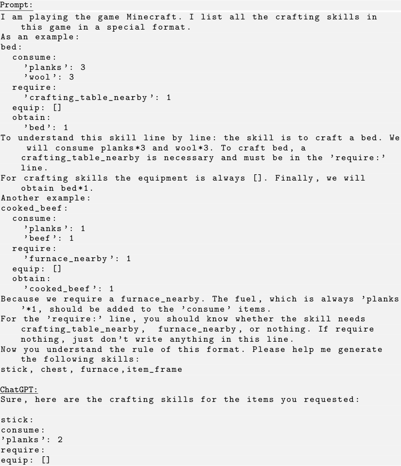


19


```
obtain:

’stick ’: 4

chest:

consume:

’planks ’: 8
require:
’crafting_table_nearby ’: 1
equip: []
obtain:

’chest ’: 1

furnace:

consume:

’cobblestone ’: 8

require:
’crafting_table_nearby ’: 1
equip: []
obtain:

’furnace ’: 1

item_frame:

consume:

’stick ’: 8

’leather ’: 1

require:
’crafting_table_nearby ’: 1
equip: []
obtain:

’item_frame ’: 1

```

All the Finding-skills have the same format:

```
(item)_nearby:

   consume:

   require:
   equip: []
   obtain:
     (item)_nearby: 1

```

In our experiments, after generating all the skills, we check and correct them according to the
Minecraft database. Among 55 skills, we find 6 mistakes in total.


**F** **Task Setup**


Table 7, 8 lists settings for 40 evaluation tasks. To make sure the agent is spawned in an unseen
environment in each test episode, we randomly transport the agent with a maximum distance of 500
at environment reset. For tasks involving interacting with mobs, we spawn cows and sheep with a
maximum distance of 30, which is much larger than the spawning distance in training basic skills.
For the Mine-Ores task set, we set the breaking speed multiplier to 10. For the other three task sets,
we use the default simulator.


**G** **Experiment Results for All the Tasks**


Table 9 shows the success rates of all the methods in all the tasks, grouped in 4 task sets.


**H** **Training Manipulation-skills without Nearby Items**


For all the Manipulation-skills that are trained with specified environments in the paper, we use the
Go-Explore-like approach to re-train them in the environments without target items initialized nearby.
In a training episode, the pre-trained Finding-skill explores the environment and finds the target item,


20


Table 7: Settings for Cut-Trees and Mine-Stones tasks. _Initial Tools_ are provided in the inventory at
each episode beginning. _Involved Skills_ is the least number of basic skills the agent should master to
accomplish the task. _Planning Steps_ is the number of basic skills to be executed sequentially in the
initial plans.


Involved Planning
Task Icon Target Name Initial Tools Biome Max Steps
Skills Steps


stick -- plains 3000 4 4
crafting_table_ -- plains 3000 5 5
nearby


bowl -- forest 3000 6 9

chest -- forest 3000 6 12

trap_door -- forest 3000 6 12

sign -- forest 3000 7 13

wooden_shovel -- forest 3000 7 10

wooden_sword -- forest 3000 7 10

wooden_axe -- forest 3000 7 13

wooden_pickaxe -- forest 3000 7 13


furnace_nearby *10 hills 5000 9 28

stone_stairs *10 hills 5000 8 23

stone_slab *10 hills 3000 8 17

cobblestone_wall *10 hills 5000 8 23

lever forest_hills 5000 7 7

torch *10 hills 5000 11 30

stone_shovel forest_hills 10000 9 12

stone_sword forest_hills 10000 9 14

stone_axe forest_hills 10000 9 16

stone_pickaxe forest_hills 10000 9 16


then the policy collects data for RL training. In the following, we denote the previous method as
Plan4MC and the new method as Plan4MC-go-explore.


Table 10 shows the maximal success rates of these skills over 100 training epochs. We find that all
the skills trained with Go-Explore do not fail and the success rates are comparable to the previous
skills. This is because the Finding-skill provides good environmental initialization for the training
policies. In Milk and Wool, Plan4MC-go-explore even outperforms Plan4MC, because the agent can
be closer to the target mobs in Plan4MC-go-explore.


Table 11 shows the test performance of Plan4MC on the four task sets. We find that Plan4MC-goexplore even outperforms Plan4MC on three task sets. This demonstrates that the skills trained with
Go-Explore can generalize well to unseen environments.


We further study the generalization capabilities of learned skills. Table 12 shows the test success rates
of these skills in the 40 tasks and the generalization gap. We observe that Plan4MC-go-explore has a
small generalization gap in the first four mob-related skills. This is because Plan4MC-go-explore uses
the same policy for approaching the target mob in training and test, yielding closer initial distributions
for Manipulation-skills. We find that in Harvest Log, Plan4MC-go-explore often finds trees that have
been cut before. Thus, it is more difficult to harvest logs in training, and the test success rate exceeds
the training success rate.


21


Table 8: Settings for Mine-Ores and Interact-Mobs tasks. _Initial Tools_ are provided in the inventory
at each episode beginning. _Involved Skills_ is the least number of basic skills the agent should master
to accomplish the task. _Planning Steps_ is the number of basic skills to be executed sequentially in the
initial plans.


Involved Planning
Task Icon Target Name Initial Tools Biome Max Steps
Skills Steps


iron_ingot *5, *64 forest 8000 12 30

tripwire_hook *5, *64 forest 8000 14 35
heavy_weighted_
*5, *64 forest 10000 13 61
pressure_plate

shears *5, *64 forest 10000 13 61

bucket *5, *64 forest 12000 13 91

iron_trapdoor *5, *64 forest 12000 13 121

iron_shovel *5, *64 forest 8000 14 35

iron_sword *5, *64 forest 10000 14 65

iron_axe *5, *64 forest 12000 14 95

iron_pickaxe *5, *64 forest 12000 14 95


milk_bucket, *3 plains 3000 4 4

wool, *2 plains 3000 3 3

beef plains 3000 2 2

mutton plains 3000 2 2

bed, plains 10000 7 11

painting, plains 10000 8 9

carpet plains 3000 3 5

item_frame, plains 10000 8 9

cooked_beef, plains 10000 7 7

cooked_mutton, plains 10000 7 7


**I** **Discussion on the Generalization of Plan4MC**


Plan4MC contributes a pipeline combining LLM-assisted planning and RL for skill acquisition. It is
widely applicable in many open-world domains [ 3, 19 ], where the agent can combine basic skills to
solve diverse long-horizon tasks.


Our key insight is that we can divide a skill into fine-grained basic skills, thus enabling acquiring
skills sample-efficiently with demonstration-free RL. The Finding-skill in Plan4MC can be replaced
with any learning-to-explore RL policy, or a navigation policy in robotics. As an example, for
indoor robotic tasks, a skill is defined with action (pick/drop/open) + object. We can break such a
skill into navigation, arm positioning, and object manipulation, which can be better acquired with
demonstration-free RL since the exploration difficulty is substantially reduced.


Our experiments on learning skills in Minecraft demonstrate that object-based intrinsic rewards
improve sample efficiency. Figure 7 shows that both MineCLIP reward and distance reward have a
positive impact on skill reinforcement learning. This gives motivation to use vision-language models,
object detectors, or distance estimation for reward design in skill learning.


For planning, our approach is a novel extension of LLM-based planners, which incorporates LLM
knowledge into a graph-based planner, improving planning accuracy. It can be extended to settings
where the agent’s state can be abstracted by text or entities.


22


Table 9: Success rates in all the tasks. Each task is tested for 30 episodes, set with the same random
seeds across different methods.


Plan4MC w/o Interactive Plan4MC Plan4MC
Task MineAgent Find-skill LLM Zero-shot 1/2-steps Plan4MC


0.00 0.03 0.30 0.27 0.30 0.30

0.03 0.07 0.17 0.27 0.20 0.30

0.00 0.40 0.07 0.27 0.57 0.47

0.00 0.23 0.00 0.07 0.10 0.23

0.00 0.07 0.03 0.20 0.27 0.37

0.00 0.07 0.00 0.10 0.30 0.43

0.00 0.37 0.73 0.23 0.50 0.70

0.00 0.33 0.63 0.30 0.60 0.47

0.00 0.23 0.47 0.13 0.27 0.37

0.00 0.07 0.20 0.00 0.27 0.53


0.00 0.17 0.00 0.00 0.13 0.37

0.00 0.30 0.20 0.00 0.33 0.47

0.00 0.20 0.03 0.00 0.37 0.53

0.21 0.13 0.13 0.00 0.33 0.57

0.00 0.00 0.00 0.00 0.10 0.10

0.05 0.10 0.00 0.00 0.17 0.37

0.00 0.00 0.10 0.00 0.03 0.20

0.00 0.07 0.13 0.00 0.07 0.10

0.00 0.00 0.07 0.00 0.10 0.07

0.00 0.00 0.00 0.00 0.00 0.17


0.00 0.53 0.20 0.00 0.30 0.47

0.00 0.27 0.00 0.00 0.27 0.33

0.00 0.37 0.00 0.00 0.13 0.30

0.00 0.30 0.03 0.00 0.20 0.43

0.00 0.27 0.00 0.00 0.03 0.20

0.00 0.10 0.00 0.00 0.03 0.13

0.00 0.27 0.03 0.00 0.27 0.37

0.00 0.13 0.00 0.00 0.07 0.20

0.00 0.07 0.03 0.00 0.07 0.07

0.00 0.13 0.00 0.00 0.07 0.17


0.46 0.57 0.57 0.60 0.63 0.83

0.50 0.40 0.76 0.30 0.60 0.53

0.33 0.23 0.43 0.10 0.27 0.43

0.35 0.17 0.30 0.07 0.13 0.33

0.00 0.00 0.00 0.00 0.07 0.17

0.00 0.03 0.00 0.10 0.23 0.13

0.06 0.27 0.37 0.10 0.50 0.37

0.00 0.00 0.00 0.03 0.10 0.07

0.00 0.03 0.03 0.03 0.20 0.20

0.00 0.00 0.00 0.00 0.03 0.13


23


Table 10: Training success rates of the Manipulation-skills under the two environment settings.
Results are the maximal success rates averaged on 100 training epochs.


Skill


Plan4MC 0.50 0.27 0.21 0.30 0.56 0.47
Plan4MC-go-explore 0.82 0.34 0.22 0.19 0.25 0.71


Table 11: Average success rates on the four task sets of Plan4MC, with the Manipulation-skills
trained in the two settings.


Task Set Cut-Trees Mine-Stones Mine-Ores Interact-Mobs


Plan4MC 0.417 0.293 0.267 0.320
Plan4MC-go-explore 0.543 0.349 0.197 0.383


Table 12: The test success rates of the skills in solving the 40 tasks, and the generalization gap (test
success rate - training success rate).


Skill


Plan4MC 0.71(+0.21) 0.26(-0.01) 0.27(+0.06) 0.16(-0.14) 0.33(-0.23) 0.26(-0.21)
Plan4MC0.86(-0.04) 0.47(+0.13) 0.16(-0.06) 0.16(-0.03) 0.45(+0.20) 0.47(-0.24)
go-explore

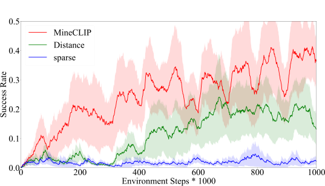


Figure 7: Using different intrinsic rewards for training Harvest Milk with PPO. Results are averaged
on 3 random seeds.


24


