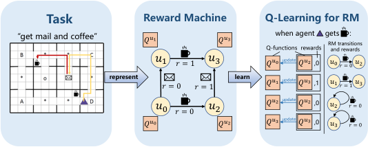
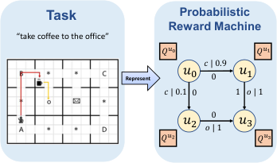
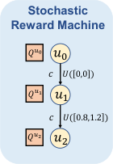
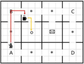
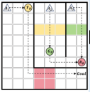
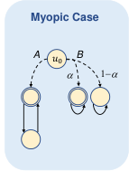
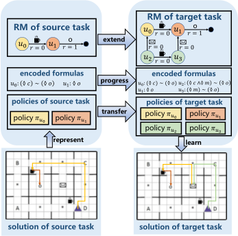
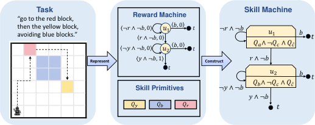
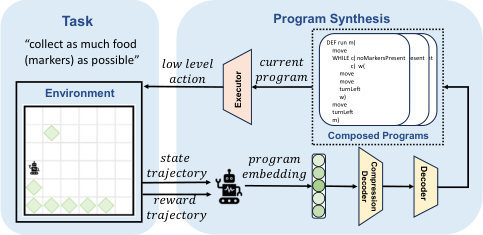
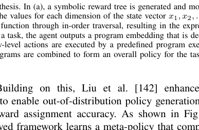

JOURNAL OF L [A] TEX CLASS FILES, VOL. 14, NO. 8, AUGUST 2021 1

## Reinforcement Learning with Knowledge Representation and Reasoning: A Brief Survey

Chao Yu, Shicheng Ye and Hankz Hankui Zhuo

_**Abstract**_ **—** _**Reinforcement Learning**_ **(RL) has achieved tremen-**
**dous development in recent years, but still faces significant**
**obstacles in addressing complex real-life problems due to the**
**issues of poor system generalization, low sample efficiency as**
**well as safety and interpretability concerns. The core reason**
**underlying such dilemmas can be attributed to the fact that**
**most of the work has focused on the computational aspect of**
**value functions or policies using a representational model to**
**describe atomic components of rewards, states and actions etc,**
**thus neglecting the rich high-level declarative domain knowledge**
**of facts, relations and rules that can be either provided a priori or**
**acquired through reasoning over time. Recently, there has been**
**a rapidly growing interest in the use of** _**Knowledge Representation**_
_**and Reasoning**_ **(KRR) methods, usually using logical languages,**
**to enable more abstract representation and efficient learning**
**in RL. In this survey, we provide a preliminary overview on**
**these endeavors that leverage the strengths of KRR to help**
**solving various problems in RL, and discuss the challenging open**
**problems and possible directions for future work in this area.**

_**Index Terms**_ **—Reinforcement Learning, knowledge representa-**
**tion and reasoning**

I. Introduction

# R EINFORCEMENT learning (RL) [1] has made tremen-dous theoretical and technical breakthroughs in the past

few years, achieving great successes in a wide range of
domains, such as game AI design, robotics control, healthcare
treatment optimization, and autonomous driving, just to name
a few [2]. Despite such progresses, it is believed that there is
still a _theory-to-application gap_ in the RL research that hinders
the wide deployment of RL techniques in real-world problems.
The major reasons can be attributed to the following aspects:
_the low sample efficiency_ during the exploration process,
i.e., millions of interactions are usually required even for
relatively simple problems [3], _the poor policy generalization_
_capabilities_ due to the sim-to-real or cross domain difference
during transfer learning [4], and _the lack of consideration_
_of critical concerns such as safety, interpretability and ro-_
_bustness_ [5]. These problems become even more notable in
complex environments characterized by sparse rewards, partial
observations and high dynamics caused by other co-learners
in a multiagent system.

All authors are affiliated with the School of Computer Science and
Engineering at Sun Yat-sen University. The corresponding author’s email is
yuchao3@mail.sysu.edu.cn.
We gratefully acknowledge support from the National Natural Science Foundation of China (No. 62076259), the Fundamental and Applicational Research
Funds of Guangdong Province (No. 2023A1515012946), and the Fundamental
Research Funds for the Central Universities-Sun Yat-sen University. This
research was supported by Meituan.

Recently, there have been rapidly growing interests in the
use of methods and tools from the area of _Knowledge Rep-_
_resentation and Reasoning_ (KRR) [6] to help solving RL
problems. The basic idea is to abstract the representation
in RL by formal languages such that the problems can be
described more compactly and thus solved more efficiently and
transparently. In this way, rich declarative domain knowledge
of objects and their relations, either provided a priori or
acquired through reasoning over time, can be readily incorporated into the learning process in order to further improve the
learning performance of RL. Until now, an increasing number
of methods have been proposed in the literature, using a wide
variety of representational languages and reasoning techniques
in the realm of KRR, to scale up RL to large domains that are
prohibitive for the traditional RL methods.
In specific, the use of KRR methods in RL offers some
prominent advantages. **First**, traditional representations in RL
generally require all possible states/actions to be represented
explicitly, usually using atomic attribute-values, thus are not
able to represent the high-level structural relations of the problem. Formal languages-specified representations, in contrast,
allow for a more general and intuitive way of specifying
and using knowledge about a problem regarding _objects with_
_their attributes and relations_, _rules with the manipulated_
_domain dynamics_, and _preconditions with their effects_, etc.,
thus inducing more powerful abstractions over the problem and
potentially more efficient learning performance. **Second**, RL
depends critically on the choice of reward functions to capture
the desired behavior and constraints. Usually, these rewards
are handcrafted by experts and can only represent heuristics
for relatively simple tasks. Using simple policies or rewards
expressed by formal languages, however, can easily encode
human instructions or domain constraints into the policy, thus
enabling of learning more complex behaviors, especially for
tasks with multiple objectives, diverse constraints and complex
relations. **Moreover**, the existing RL methods usually lack the
ability to reason over high-level ideas or knowledge of _facts_
and _beliefs_ as most of these methods directly work on primitive
components of rewards, actions and states etc. Therefore, it is
difficult to implement rich cognitive functions such as _transfer_
_learning_, _analogical analysis_, or _rule-based reasoning_, which
are significant abilities of human intelligence. Using formal
descriptive languages to represent the tasks can better facilitate
transfer learning among different tasks (i.e., _generalization_ )
when the series of tasks do not necessarily share the same
structure, but instead are specified with high-level events. For
example, consider a scenario when an agent has learned the
task of “ _delivering coffee and mail to office_ ”. When facing a

JOURNAL OF L [A] TEX CLASS FILES, VOL. 14, NO. 8, AUGUST 2021 2

new task of “ _delivering coffee or mail to office_ ”, it is unclear
how existing RL methods would model these as the same
distribution of tasks and enable knowledge transfer among
them. By exploiting task modularity and decomposition with
higher abstraction, better generalization can be achieved by
combining and reasoning over already known primitives (i.e.,
“ _delivering coffee to office_ ” and “ _delivering mail to office_ ”).
**Last but not the least**, the black-box training of the existing
RL methods is largely opaque to the users, rendering the
learned policies difficult to understand and trust, and thus
unsuitable for safety-critical domains such as finance, healthcare and self-driving, where robustness, safety, verifiability and
interpretability are the major concerns. In contrast, simple policies consisting of explicit symbolic expressions can facilitate
human understanding, while increasing the transparency and
explainability of the learning process and policies.
In this survey, we provide a preliminary overview on the
rich literature that leverages the strengths of KRR to help
addressing various problems in RL, based on the category of
learning goals, i.e., _the efficiency_, _the generalization_, as well as
_the safety and interpretability_ . In terms of _efficiency_, the goal
of using KRR methods is to encode prior knowledge into RL
in order to improve the learning efficiency of traditional RL
methods, either through specifying the tasks using increasingly
expressive formal languages, or through combining high-level
symbolic action models, as discussed in Section III. The _gener-_
_alization_ category aims to employ KRR methods to generalize
RL algorithms well to unseen situations at deployment time
by avoiding overfitting to the training environment (i.e., _the_
_one-shot transfer learning problem_ ) or transferring knowledge
learned from previous tasks to solve a series of new but
related tasks quickly (i.e., _the lifelong or continual learning_
_problem_ ), which is addressed in Section IV. The _safety and_
_interpretability_ category, detailed in Section V, focuses on
satisfying constraints, verifying models and providing explicit
interpretations of the RL methods by using formal descriptive
expressions and symbolic languages. Finally, we also discuss
the challenging open problems, and possible directions for
future work in this interdisciplinary area in Section VI.

II. Background

This section briefly introduces basic knowledge and key
concepts related to KKR and RL that are the two main topics
we consider in this survey. Fig. 1 provides a summary of these
two topics.

_A. RL_

As a subfield of machine learning, RL provides a learning
paradigm that enables an agent to learn effective strategies
by trial-and-error interactions with the environment [1]. The
_Markov Decision Process_ (MDP) has been used as a general
framework to formalize an RL problem by a 5-tuple _M_ =
( _S, A, P, R, γ_ ), where _S_ is a finite _state_ space, and _st ∈S_
denotes the state of an agent at time _t_ ; _A_ is a set of _actions_
available to the agent, and _at ∈A_ denotes the action that the
agent performs at time _t_ ; _P_ ( _s, a, s_ _[′]_ ) : _S × A × S →_ [0 _,_ 1] is
a Markovian _transition function_ when the agent transits from

**Reinforcement Learning**

|TheoreticalFoundations Framework MDP: state, action, reward transition function, discount factor , Methods Value-function based Policy-Search (PS) Actor-Critic (AC) ,, Topics Hierarcd he ice ap R RL L, (s Ha Rfe )R L m, uin ltt ie -r tp asre kt Rab,l e oR nL t, iM nuo ad e Rl L-B Mas ue ld -R aL ( eM ntB RR LL ) (, l L, L c l, ti g MARL) efficiency of RL generalization of RL safety/interpretability of RL ,,|Col2|Col3|
|---|---|---|
||||

**Knowledge Representation and Reasoning**

|LogicalLanguages • L (Ai ln Tee Lra )nr aT te inm gp -To ir mal L To eg mic ( oLT raL l) • A t e p Logic • L Si tn rae ta er D yy Ln oa gm icic SL Lo )gic (LDL) • g (|LogicProgramming • A Prn os bw •ae br plS rse yt kP aoLr bao g sr Lca im crm rgi sn trg ( rA rS ekiP ) • i i ot i c o g i cP fio -a owm dm rn (g g( LP cLP )) • M a r v lL o tog gi iN e t o lM iN • B a be s i in c i o|
|---|---|
|• Planning Domain Definition Language (PDDL) **Action Languages**|• Planning Domain Definition Language (PDDL) **Action Languages**|
|knowledge/rule-based systems, case-based/commonsense reasoning, spatial/temporal reasoning, uncertainties and beliefs **Others**|knowledge/rule-based systems, case-based/commonsense reasoning, spatial/temporal reasoning, uncertainties and beliefs **Others**|

Fig. 1. Key components and concepts in RL and KRR.

state _s_ to state _s_ _[′]_ after taking action _a_ ; _R_ : _S × A →ℜ_ is
a _reward function_ that returns the immediate reward _R_ ( _s, a_ )
to the agent after taking action _a_ in state _s_ ; and _γ ∈_ [0 _,_ 1]
is a _discount factor_ . An agent’s _policy π_ : _S × A →_ [0 _,_ 1]
is a probability distribution that maps an action _a ∈A_ to a
state _s ∈S_ . The expected reward of following a policy when
starting in state _s_, _V_ _[π]_ ( _s_ ), can be defined as follows:

�

_V_ _[π]_ ( _s_ ) ≜ _Eπ_

_∞_
�
� _t_ =0

� _γ_ _[t]_ _R_ ( _st, π_ ( _st_ )) _|s_ 0 = _s_

_t_ =0

_._ (1)

The goal of an MDP problem is to compute an _optimal_
_policy π_ _[∗]_ such that _V_ _[π][∗]_ ( _s_ ) _≥_ _V_ _[π]_ ( _s_ ) for every policy _π_ and
every state _s ∈_ _S_ . One of the most important and widely used
RL approaches is Q-learning [7], with its one-step updating
rule given by

_Qt_ +1( _s, a_ ) = (1 _−αt_ ) _Qt_ ( _s, a_ )+ _αt_ [ _R_ ( _s, a_ )+ _γ_ max
_a_ _[′][ Q][t]_ [(] _[s][′][, a][′]_ [)]] _[,]_
(2)
where _αt_ _∈_ (0 _,_ 1] is a learning rate that controls the
contribution of the new experience to the current estimate.
Besides the _value-function_ based methods that maintain a
value function whereby a policy can be derived, direct _Policy-_
_Search_ (PS) algorithms estimate the policy directly without
representing a value function explicitly, whereas the _Actor-_
_Critic_ (AC) methods keep separate, explicit representations of
value functions and policies. The major theoretical research
issues and subfield topics in RL include but are not limited to
_Deep RL_ (DRL) [8], _safe RL_ [5], _interpretable RL_ [9], _Model-_
_Based RL_ (MBRL) [10], _Hierarchical RL_ (HRL) [11], _multi-_
_task RL_ [12], _continual RL_ [13], _Multi-Agent RL_ (MARL) [14],

JOURNAL OF L [A] TEX CLASS FILES, VOL. 14, NO. 8, AUGUST 2021 3

_relational RL_ [15], and so on. A more comprehensive and indepth review on these issues can be found in [1], [2].

_B. KRR_ 𝑢1 𝑟= 1 𝑢3 𝑄 [𝑢][0] update 𝑄 [𝑢][2],0 𝑢0 𝑟= 0 𝑢

KRR is a subarea of AI focusing on how information
about the world can be represented formally and manipulated in an automated way by some reasoning programs [6],

[16]. Research on KRR has a long history of more than
half century along with the development of AI, covering
various topics including _knowledge representation languages_,
_knowledge/rule-based systems_, _case-based/commonsense rea-_
_soning_, _spatial/temporal reasoning_, _action models_, and _uncer-_
_tainties and beliefs_, etc. Symbolic logic plays a vital role in
KRR as logic provides a strict and formal representation of
knowledge and their entailment relations. There are numerous logical languages to explicitly represent and reason over
knowledge, mostly built upon the _First Order Logic_ (FOL),
such as the _Linear Temporal Logic_ (LTL) [17] and its various
extensions to model time dependence of events, and the
_Strategy Logic_ (SL) [18] to capture strategic abilities of agents.
_Logic Programming_ (LP) [19] provides a universally quantified
expression of facts and rules using a system of formal logic,
while _Probabilistic Logic Programming_ (PLP) [20], such as
_Markov Logic Network_ (MLN) [21], combines probability with
logic for dealing with more complex problems with uncertainty. Last, _Action Languages_, such as the _Planning Domain_
_Definition Language_ (PDDL) [22], are used for specifying state
transition diagrams and formal models of the effects of actions
on the world such that planning methods can then be applied
to generate action sequences to achieve certain goals. Refer
to [6] for a more comprehensive review on these issues.

III. KRR for _Efficiency_ of RL

Logically-specified representations allow for a more general
and intuitive way of specifying and using knowledge about
_objects_, _facts_ and _rules_, inducing powerful abstractions over
the original problem. Encoding such prior knowledge is thus
able to improve the learning efficiency of traditional RL
methods, either through specifying the tasks using increasingly
expressive formal languages and _finite state machines_ (FSAs),
or combining high-level symbolic planning models with RL.
KRR techniques aimed at improving the efficiency of RL are
summarized in Table I.

_A. Task Representation_

Typically, RL algorithms require the user to manually design
a reward function that encodes the desired task, which might
be tricky for complex, long-horizon tasks [23]. Particularly,
for tasks with multiple objectives and constraints, manually
devising a single reward function that balances different parts
of the task could be challenging. Moreover, different reward
functions can encode the same task, and the choice of reward
function can have a large impact on the final performance of
the RL algorithm. The use of formal methods to synthesize
reward functions is a promising approach to address the above
issues.

|𝑄𝑢0|Col2|𝑄𝑢2|,0|
|---|---|---|---|
|𝑄𝑢1|𝑄𝑢1|𝑄𝑢3|,1|
|𝑄𝑢2|𝑄𝑢2|𝑄𝑢2|,0|
|𝑄𝑢3|update|𝑄𝑢3|,0|
|𝑄𝑢3||||

Fig. 2. An illustration of representing a task as an RM and one-step update of
the QRM algorithm. The task of _“get mail and coffee”_ can be modeled using
an RM with 4 abstract states _u_ 0 _, u_ 1 _, u_ 2 and _u_ 3. Starting at _u_ 0 (implying the
initial stage of the task), when an agent gets a coffee, the RM receives this
abstracted description and then transitions to _u_ 2 (implying the stage that the
coffee has been gotten) and returns a reward _r_ = 0. When the RM reaches
its accepting state _u_ 3, it indicates that the task has been completed.

**Reward Machines.** Icarte et al. [24] first propose _Reward_
_Machines_ (RMs)-a type of FSA-that supports the specification of reward functions while supporting high-level task
decomposition. An RM takes abstracted descriptions of the
environment as input, and outputs rewards that guide the
agent towards task completion. An abstract state in RMs is
a temporally extended state of the environment, informing
the agent which stage the task is currently in. When an RM
receives the abstracted descriptions from the environment,
it transitions to another state, which implies that the task
goes to another stage. Each state _ui_ is assigned with a Qfunction _Q_ _[u][i]_ to learn its subpolicy. A new algorithm called _Q-_
_Learning for Reward Machines_ (QRM) [24] is then proposed
to appropriately decompose the RM and simultaneously learn
subpolicies for different subtasks. The rationale behind its offpolicy learning mechanism lies in that the experiences gained
by the agent while learning a specific subtask can be beneficial
for developing the subpolicies of other subtasks. As illustrated
in Fig. 2, when an agent gets a coffee, for each abstract state
_u_, all the Q-functions are updated according to the internal
transitions and rewards of the RM simultaneously by

_Q_ _[u]_ ( _s, a_ ) _←_ (1 _−_ _α_ ) _Q_ _[u]_ ( _s, a_ ) + _α_ [ _r_ + _γ_ max
_a_ _[′][ Q][u][′]_ [(] _[s][′][, a][′]_ [)]][ (3)]

where _r_ = _δr_ ( _u, l_ ) and _u_ _[′]_ = _δu_ ( _u, l_ ) are the reward and the
next state of _u_, and _l_ is the current abstracted descriptions of
the environment. _δr_ and _δu_ are the reward function and the
transition function of RM, respectively. QRM is guaranteed
to converge to an optimal policy, in contrast to HRL methods
which might converge to suboptimal policies.
In a following paper, Icarte et al. [25] propose variants of
QRM including _Hierarchical RM_ (HRM) to learn policies for
tasks specified using RMs. HRM maintains a set of _options_,
each of which corresponds to a transition in RM. HRM also
learns a high-level policy to choose options using _t_ -step Qlearning, where _t_ is the number of steps that the current option
lasts for. With the strength of learning policies for all options
simultaneously, HRM is effective at learning good policies for
a task specified by an RM. However, it might converge to
suboptimal solutions even in simple tabular cases due to the
myopic option-based approach.

JOURNAL OF L [A] TEX CLASS FILES, VOL. 14, NO. 8, AUGUST 2021 4

**Task** **Reward Machine for the Multi-Agent Task** **Task** **Probabilistic** **Stochastic**

**Reward Machine** **Reward Machine**

**Represent** **Represent** � 0 � 𝑐 𝑈( 0,0 )

**Reward Machine** **Reward Machine** **Reward Machine** Fig. 4. An illustration of the PRM and SRM. The original task is to bring

**for Agent** 𝑨𝟑 **for Agent** 𝑨𝟐 **for Agent** 𝑨𝟏 coffee to the office, with a reward of 1 upon successful completion. To

𝑠𝑡𝑎𝑟𝑡 expand this into a scenario with random rewards, an element of randomness is

𝑠𝑡𝑎𝑟𝑡 𝑢𝐼2 𝑌𝐵 𝑢12 𝑠𝑡𝑎𝑟𝑡 introduced: the coffee machine has a 10% chance of malfunctioning, resultingin substandard coffee, which means no reward can be obtained. This task

𝑢𝑢 0 31𝐼1 𝐺𝑜𝑎𝑙𝑌𝐵 𝑅𝑢𝐵𝑢2111 𝑅𝐵𝑢𝑢 0 4232 𝐴𝑅2𝐴𝐵𝐺¬𝑅2 𝐵𝑢𝐵22 𝑢𝑢 0 𝐼333 𝐺𝑅𝐵𝐵𝐴𝑅3𝐵𝑢𝑢2133𝐴¬𝑅3 𝐵 specification can be utilized to construct the corresponding PRM and SRM.In the PRM, a nondeterministic transition function is employed to achievethis randomness, wherelevel label _l_ with probability _y_ _l→|r pp_, receiving reward _[y][′]_ [ indicates that] _l_ _[ y]_ _r_ [ transitions to] . For the SRM, a stochastic _[ y][′]_ [ on high-]

reward function is used, where _y_ _→U_ _[y][′]_ [ indicates that] _[ y]_ [ transitions to] _[ y][′]_ [ on]
high-level label _l_, receiving reward sampled from the uniform distribution _U_ .

|𝑢𝐼1|𝑌𝐵|𝑢11|
|---|---|---|
|𝑢𝐼 1|𝑌𝐵|𝑅𝐵 𝑙 |

|𝑢𝐼3|𝐺𝐵|𝑢13|Col4|
|---|---|---|---|
|𝑢𝐼 3|𝐴3 𝑅|𝐵  𝐴 |3 ¬𝑅𝐵|
|𝑢𝐼 3|𝑅𝐵|𝑅𝐵|𝑅𝐵|

|Re fw ora r Ad eM na c 𝑨h 𝟐ine g t|Col2|Col3|
|---|---|---|
|0 𝑠𝑡𝑎𝑟𝑡 𝑢𝐼 2 𝑢4 2 𝑢3 2 𝑅𝐵|0 𝑠𝑡𝑎𝑟𝑡 𝑢𝐼 2 𝑢4 2 𝑢3 2 𝑅𝐵|𝑌𝐵 𝐺𝐵 𝑢1 2 𝑢2 2 𝐴2 𝑅𝐵 𝐴2 ¬𝑅𝐵|
|0 𝑠𝑡𝑎𝑟𝑡 𝑢𝐼 2 𝑢4 2 𝑢3 2 𝑅𝐵|𝑢3 2 |𝑢3 2 |
|0 𝑠𝑡𝑎𝑟𝑡 𝑢𝐼 2 𝑢4 2 𝑢3 2 𝑅𝐵|0 𝑢4 2 𝑅𝐵|0 𝑢4 2 𝑅𝐵|

Fig. 3. An illustration of handling a multi-agent cooperative task using
RMs (adapted from [26]). In the scenario, three agents must work collaboratively to guide agent _A_ 1 to the target location _Goal_ . The colored
zones indicate regions where a corresponding color-coded button must be
activated for an agent to pass. For the red zone, both agents _A_ 2 and
_A_ 3 must press the red button simultaneously to allow agent _A_ 1 to pass
the red zone, while the yellow and green zones require only one agent
to press the respective button. This multi-agent cooperative task can be
represented using the corresponding RM, and the set of events of the RM
is [�] = _{YB, GB, RB, A_ _[R]_ 2 _[B]_ _, A_ _[¬]_ 2 _[R][B]_ _, A_ _[R]_ 3 _[B]_ _, A_ 3 _[¬][R][B]_ _, Goal}_ . For the RM
representing the entire task, it can be decomposed into RMs corresponding
to each agent’s subtask by projecting onto the local event set of each agent.

There are some following studies that extend the RMs to
encode a team task in cooperative MARL. In specific, Neary et
al. [26] propose using RMs to explicitly encode the necessary
interdependencies between teammates, allowing the team-level
task specified by a RM to be decomposed into sub-tasks for
individual agents, as shown in Fig. 3. Hu et al. [27] propose
a framework, in which each agent not only observes its local
state and RM state like [26], but also has access to the state
information of its neighbors. The algorithm conditions the
truncated Q-function within a _k_ -hop neighborhood to tackle
the increased complexity. However, both works [26], [27] have
to rely on the assumption of weak interdependencies among
the agents. Instead, Zheng et al. [28] introduce an algorithm to
handle complex scenarios with highly interdependent agents.
A complex task is decomposed into simpler subtasks using a
hierarchical structure of RMs, where a higher-level RM policy
selects lower-level RMs, and the lowest-level RM policies
dictate the actions. However, all these works assume that
the multi-agent RM is pre-defined, requiring extensive human
prior knowledge.

To avoid the difficulties of manually constructing RMs,
some studies focus on inferring RMs from the agent’s learning
experience instead of having them specified by the user. Icarte
et al. [29] formulate the task of learning RMs as a discrete
optimization problem, and propose an efficient local search
approach to solve it. Based on this work, they provide further
details about this learning pipeline and propose three novel
formulations to learn RMs [30]. Xu et al. [31] introduce an

iterative algorithm for joint inference of RMs and policies in
RL. To obtain a correct RM, an agent refines a hypothesis RM
using counterexamples, where the rewards deviate from those
predicted by the current hypothesis RM. Furelos-Blanco et
al. [32] propose a method to use _inductive logic programming_
(ILP) to learn the subgoal automaton. Although it does not
address the strict RM construction problem, the constructed
automaton resembles the RM in structure. Furthermore, several
subsequent studies have explored inferring RMs in multi-agent
settings [33], [34]. However, the above works tend to assume
the availability of noise-free high-level proposition detectors,
which can be challenging to obtain in practice. There are some
works that consider noisy interpretations of propositions [35],

[36], but their applicability is highly dependent on the performance of uncertain estimators.

While traditional RMs have been proven effective in RL,
several extensions and variants of RMs have been proposed
recently to enhance their flexibility, scalability, and applicability to more complex tasks. Dohmen et al. [37] propose the
_Probabilistic Reward Machine_ (PRM), which uses probabilistic transition functions to capture the semantics of stochastic
non-Markovian reward signals. However, they only define
stochastic rewards over a finite set of values, which restricts its
ability to be generalized to broader scenarios. Instead, Corazza
et al. [38] propose the _Stochastic Reward Machine_ (SRM),
which integrates stochastic reward functions to enhance the
origin RM. Fig. 4 illustrates the major difference between the
SRM and PRM. Another key challenge of RMs is their limited
scalability with increasing states. Furelos-Blanco et al. [39] address this by introducing the _Hierarchies of Reward Machines_,
where each layer functions as a complete RM. They treats
each RM call as an independently solvable subtask, facilitating
learning at multiple levels of abstraction. Furthermore, to equip
RMs with the capabilities of solving inherently numeric tasks,
Levina et al. [40] introduce the _Numeric Reward Machine_,
which incorporates numeric features into RMs.

In addition to the aforementioned methods, several studies

JOURNAL OF L [A] TEX CLASS FILES, VOL. 14, NO. 8, AUGUST 2021 5

TABLE I

KRR for _Efficiency_ of RL

|Col1|KRRTechniques|CoreProblems/Keywords|BaseAlgorithms|Reference|ExperimentDomain|
|---|---|---|---|---|---|
|Task Representation|Reward Machines|Non-Markovian Reward|Q-Learning|Icarte et al. [24], [25]|OfceWorld, MineCraft, WaterWorld|
|Task Representation|Reward Machines|MARL|Independent Q-Learning|Neary et al. [26]|Button, Rendezvous|
|Task Representation|Reward Machines|MARL|Q-Learning, DQN|Hu et al. [27]|OfceWorld, MineCraft, WaterWorld|
|Task Representation|Reward Machines|MARL|Q-Learning|Zheng et al. [28]|Navigation, MineCraft, Pass|
|Task Representation|Reward Machines|Non-Predefned RM|Q-Learning|Icarte et al. [29], [30]|Cookie, Symbol, 2-Keys|
|Task Representation|Reward Machines|Non-Predefned RM|Q-Learning|Xu et al. [31]|Vehicle, OfceWorld, MineCraft|
|Task Representation|Reward Machines|Non-Predefned RM|Q-Learning|Furelos-Blanco et al. [32]|OfceWorld|
|Task Representation|Reward Machines|Non-Predefned RM, MARL|Independent Q-Learning|Varricchione et al. [33], Ardon et al.[34]|Button, Rendezvous|
|Task Representation|Reward Machines|Non-Predefned RM, Noisy Proposition|PPO|Hatanaka et al. [35] Li et al.[36]|GridWorld, Robot Simulation|
|Task Representation|Reward Machines|Non-Markovian Stochastic Reward|Q-Learning|Dohmen et al. [37]|OfceWorld|
|Task Representation|Reward Machines|Non-Markovian Stochastic Reward|Q-Learning|Corazza et al. [38]|Mining, Harvest|
|Task Representation|Reward Machines|Scalability|DQN|Furelos-Blanco et al. [39]|CraftWorld, WaterWorld|
|Task Representation|Reward Machines|Numeric Tasks|Q-Learning|Levina et al. [40]|MineCraft|
|Task Representation|Reward Machines|Low Regret|Q-Learning|Bourel et al. [41]|RiverSwim, Gridworld|
|Task Representation|Reward Machines|Casual Knowledge|Q-Learning|Corazza et al. [42]|Two-Doors, Cofee vs. Soda|
|Task Representation|Reward Machines|Ofine RL|Q-Learning|Sun et al. [43]|Kitchen, Adroit|
|Task Representation|Reward Machines|Self-Paced RL|Q-Learning|Koprulu et al. [44]|Two-Door, Swimmer-v3, HalfCheetah-v3|
|Task Representation|Temporal Logics|Non-Markovian Reward|Relative Entropy Policy Search|Li et al. [45]|Toast Placing, Simulated 2D Manipulation|
|Task Representation|Temporal Logics|Non-Markovian Reward|Augmented Random Search|Jothimurugan et al. [23]|Cartpole, Robotic Motion Planning|
|Task Representation|Temporal Logics|High-Level Planning|Augmented Random Search|Jothimurugan et al. [46]|Rooms, Fetch|
|Task Representation|Temporal Logics|Non-Markovian Reward|Q-Learning|Camacho et al. [47]|OfceWorld, MineCraft, WaterWorld|
|Task Representation|Temporal Logics|Continuous State and Action Space|DDPG|Yuan et al. [48]|Melas Chasma, Victoria Crater|
|Task Representation|Temporal Logics|Global Optimality|Q-Learning, PPO|Voloshin et al. [49], [50]|Minecraft, Pacman, Flatworld, Carlo|
|Task Representation|Temporal Logics|MARL|Alternating Direction Method of Multipliers|Cubuktepe et al. [51]|Crop Fields, Urban Security|
|Task Representation|Temporal Logics|MARL|MINLP Solvers|Djeumou et al. [52]|GridWorld, ROS-Gazebo Simulation|
|Task Representation|Temporal Logics|MARL|Minimax Q-Learning, Minimax DQN|Muniraj et al. [53]|GridWorld|
|Task Representation|Temporal Logics|MARL|Independent Q-Learning|Leon et al. [54]|MineCraft|
|Task Representation|Temporal Logics|Underspecifed LTL|Actor-Critic Methods|Den Hengst et al. [55]|MineCraft, Maze|
|Symbolic Planning|Answer Set Programming|Safety, Exploration|Q-Learning|Leonetti et al. [56]|GridWord, Robot Simulation, Service Robot|
|Symbolic Planning|Answer Set Programming|Non-Stationary Domains|Q-Learning|Ferreira et al. [57]|GridWorld|
|Symbolic Planning|Answer Set Programming|HRL|PPO|Mitchener et al. [58]|Animal-AI|
|Symbolic Planning|Answer Set Programming|Relational RL|Q-Learning, SARSA|Nickles et al. [59]|Blocks World|
|Symbolic Planning|Action Languages|HRL|R-Learning|Yang et al. [60]|Taxi, GridWorld|
|Symbolic Planning|Action Languages|HRL|R-Learning, DQN|Lyu et al. [61]|Taxi, Montezuma’s Revenges|
|Symbolic Planning|Action Languages|HRL|Q-Learning|Illanes et al. [62]|OfceWorld, MineCraft|
|Symbolic Planning|Action Languages|HRL|Q-Learning, DQN|Kokel [63], [64]|MineCraft, OfceWorld, TaxiWorld, BoxWorld|

further advance this field by utilizing RMs within regret
minimization frameworks [41], enhancing RMs with highlevel causal knowledge [42], using RMs to refine datasets
for offline RL [43], and integrating RMs into self-paced RL
paradigms [44]. However, these aforementioned works share
a common limitation, as the inherent semantics of RMs are
based on regular grammar, which can only support tasks
specified by regular LTL. Hence, finding ways to expand
RMs to support tasks specified by full LTL continues to be a
significant challenge.

**Temporal Logics.** The normal RL problems modeled as

traditional MDPs require to assign rewards according to a
function of the last state and action. This formulation is often

limited in domains where the rewards are not necessarily
Markovian, but depend on an extended state space [65]. _Non-_
_Markovian_ rewards can be specified in _Temporal Logics_ (TL)
on finite traces such as LTL _f_ /LDL _f_ [66], with the great
advantage of a higher abstraction and succinctness. There
has been a large volume of work using specifications based
on TL for specifying RL tasks [67]–[73]. These approaches
typically generate a (usually sparse) reward function from a
given specification which is then used by an off-the-shelf RL

JOURNAL OF L [A] TEX CLASS FILES, VOL. 14, NO. 8, AUGUST 2021 6

(a)

(b)

(c)

Fig. 5. An illustration of (a) automatic reward function generation based on TLTL; (b) converting a task specified in _ω_ -regular LTL into a LDBA; and (c) a
possible myopic case that may arise when utilizing LDBA (adapted from [49]). In (a), the task is defined by TLTL with quantitative semantics, enabling the
automatic generation of a reward function that guides the agent. In (b), the task is achieved when the accepting states in the LDBA are accessed infinitely, with
the only accepting state being _u_ 1. In (c), an agent starts in state _u_ 0 and only has two actions _A_ and _B_ . Taking action _A_ transitions directly to an accepting
state, from which the agent visits the accepting state every two steps. In contrast, action _B_ transitions to an accepting state with probability _α_ and to a sink
state with probability 1 _−_ _α_ . However, when _α_ exceeds a certain threshold, the agent may take the risk of choosing action _B_, leading to myopic behavior.

algorithm to learn a policy. In particular, Li et al. [45] propose
a variant of LTL called _Truncated LTL_ (TLTL) to specify tasks
for robots. As shown in Fig. 5a, by assigning quantitative semantics to TLTL formulas, logical formulas are converted into
real-valued reward functions. Jothimurugan et al. [23] propose
a specification language called SPECTRL that allows users to
encode complex tasks involving sequences, disjunctions, and
conjunctions of subtasks. Based on SPECTRL, Jothimurugan
et al. [46] further propose a novel algorithm which breaks
down a complex control problem into a high-level planning
task and a series of low-level control tasks. Camacho et al. [47]
show that RMs can be derived from specifications in various
formal languages, including LTL and other regular languages.
Similarly, Yuan et al. [48] convert the LTL property to an
automaton in order to synchronise the high-level LTL guide
with RL. Unlike most previous works, which focus on finitestate and finite-action MDPs, this study proposes a modular
DDPG architecture for generating neural policies.

Most of the studies mentioned above utilize a key property
of LTL, which is its equivalence to automata representations,
such as the _Limit Deterministic B¨uchi Automaton_ (LDBA) [74],
as shown in Fig. 5b. There are several studies that leverage
automata properties to facilitate the learning process. For a
task specified by LTL, Voloshin et al. [50] propose a method
that reduces a policy optimization problem into an automaton
reachability problem. To tackle myopic cases that may arise
when using LDBA, as illustrated in Fig. 5c, Voloshin et al. [49]
reformulates the RL problem by maximizing the probability
of satisfying LTL specifications without penalizing the time
taken to achieve them. They develop a new experience replay
technique, leveraging the structure of the LDBA to generate
multiple off-policy trajectories. However, these methods are
not feasible without prior knowledge of the exact probability
transition functions in the MDP [75], and are limited to
discrete state/action spaces.

Recently, researches have expanded to explore the use of
temporal logic specifications in MARL. These works utilize
the task structures revealed by temporal logic to decompose
complex multi-agent tasks into simpler subtasks, thereby improving the learning efficiency and stability of RL agents.
In specific, Cubuktepe et al. [51] investigate the synthesis of

policies for multi-agent systems to implement spatial-temporal
tasks specified with _Graph Temporal Logic_ (GTL) specifications. Djeumou et al. [52] study a setting in which the agents
move along the nodes of a graph, and the task specifications
are expressed in GTL. The proposed algorithm is based on synthesizing a time-varying Markov matrix through the solution
of an optimization problem. Muniraj et al. [53] investigate the
problem of learning policies in an adversarial environment,
where defensive agents strive to satisfy STL specifications
against the adversarial agents’ best responses. However, the
proposed approach is applicable only in adversarial scenarios
and is restricted to a specific type of temporal logic. Instead,
Leon et al. [54] formally define Extended Markov Games as
a general mathematical model that allows multiple RL agents
to learn various non-Markovian specifications. These works
are designed to tackle finite-horizon tasks, which limits their
applicability. In contrast, some studies have begun to explore
addressing infinite-horizon tasks in a multi-agent setting [76]–

[78].
The above studies mostly rely on the assumption that the
high-level knowledge (i.e., _temporal logic specifications_ ) are
given, while in reality, acquiring such detailed instructions
can be quite challenging, with many being even implicit and
needing to be inferred from data. Den Hengst et al. [55]
introduce _Option Machines_, which enhance sample efficiency
by optimizing rewards under underspecified LTL instructions.
Furthermore, there are already some studies that infer temporal
logic specifications from data, using _Bayesain inference_ [79],

[80], _hidden Markov models_ [81] or _direct search_ techniques [82]. However, how to conduct this high-level model
learning in RL, especially in noisy and partial settings [83],
is still a challenging problem in this area.

_B. Symbolic Planning_

RL and symbolic planning have both been used to build
intelligent agents that conduct sequential decision making in
uncertain environments. Those methods, however, have their
own focuses: RL focuses on interactions with the world,
but often requires an unfeasibly large amount of experience,
while planning focuses on utilizing prior knowledge, but relies
strongly on the accuracy of the model. There has been an

JOURNAL OF L [A] TEX CLASS FILES, VOL. 14, NO. 8, AUGUST 2021 7

increasing interest in combining high-level symbolic planning
with RL in order to further improve the learning performance.
**Answer Set Programming.** Recent studies have shown how
the integration of _Answer Set Programming_ (ASP) with RL
can enhance decision-making efficiency. Leonetti et al. [56]
present a method that takes advantage of planning through
ASP to constrain the behavior of the agent by discarding
clearly suboptimal plans and creating a partial policy of reasonable actions. Unlike [56] that requires defined sets of states
and actions, along with the transition function, Ferreira et
al. [57] propose an algorithm that uses ASP rules to constrain
the action space, allowing for real-time updates to decisionmaking policies in an unknown environment. Some other
works [58], [59] propose a method that uses ASP to integrate a
formal calculus for reasoning about actions into relational RL
agents, and a neuro-symbolic HRL framework that combines
computer vision for detection, a symbolic meta-policy using
ASP and ILP for efficient learning and reasoning and DRLbased options for low-level decision-making. However, most of
the work in this area is still focused on simple cases involving
MDPs with discrete state and action space, typically using
basic RL algorithms such as Q-Learning. How to combine
ASP techniques with more advanced RL algorithms in more
intricate scenarios, like multi-agent settings, is still a remaining
challenge.
**Action Languages.** Some works have integrated action
languages with symbolic planning with RL, where symbolic
planning functions as a high-level policy and low-level policies
are implemented by RL algorithms. Yang et al. [60] present a
unified framework PEORL that integrates symbolic planning
with HRL to cope with decision-making in a dynamic environment with uncertainties. In PEORL, symbolic plans are used to
guide the agent’s task execution and learning, and the learned
experience is fed back to symbolic knowledge to improve
planning. During training, quality is assessed based on returns,
while a goal guides subsequent iterations to generate higherquality plans. Later, Lyu et al. [61] further generalize the goal
of the PEORL framework [60] and enhance it by integrating
DRL to handle both high-dimensional sensory inputs and
symbolic planning. The proposed SDRL method includes a
planner, a controller and a meta-controller, as demonstrated
in Fig. 6a, which takes charge of subtask scheduling, datadriven subtask learning, and subtask evaluation, respectively.
The three components cross-fertilize each other and eventually
converge to an optimal symbolic plan and subpolicies, bringing
together the advantages of long-term planning and end-to-end
RL.

The aforementioned works primarily focus on generating
meaningful intermediate goals to accelerate the learning of
policies for tasks with unknown reward functions. To allow
users to define tasks as they wish and reduce the burden of
reward design, Illanes et al. [62] explore the use of highlevel symbolic PDDL action models as a framework for
defining final-state goal tasks and automatically producing
their corresponding reward functions. Building on the Taskable RL framework [62], Kokel et al. [63] propose RePReL
by incorporating two significant extensions: generalizing the
Taskable RL framework to the relational MDP setting and

introducing a novel approach for defining task-specific state
abstractions, which are crucial for improving transferability
and generalization. Later, Kokel et al. [64] extend the RePReL
framework to the DRL setting.
The above studies, however, all assume that the high-level
planning models should be provided by domain experts. To
mitigate this limitation, Guan et al. [84] utilize incorrect and
incomplete symbolic models to address long-horizon, goaldirected tasks with sparse rewards. Futhermore, instead of
assuming planning model provided as input, MuZero [85]
learns an environment model, which consists of an encoder
network for capturing abstract states, a dynamics network
for capturing the transition of abstract states, and a reward
network. It exploits the learnt model to do MCTS planning
for repeatedly improving the policy. Similarly, EfficientImitate [86] learns an environment model by extending _LAdver-_
_sarial Imitation Learning_ into the MCTS planning-based RL.
A recent study [87] utilizes the collected trajectories from the
lower level of RL to learn PDDL action models and symbolic
options, while Wu et al. [88], [89] direct estimate the action
models in order to generate more samples for efficient policy
learning. Additionally, there is an increasingly body of research
dedicated to leveraging _Large Language Models_ (LLMs) for
the generation of PDDL models [90]–[92].

IV. KRR for _Generalization_ of RL

Much current RL research evaluates the learned policy in
exactly the same environment where the policy is trained
on. This assumption contradicts real-world situations when
the training and testing environments might be different.
Generalisation in RL [4] aims to propose RL algorithms that
generalise well to unseen situations at deployment time by
avoiding overfitting to the training environments (i.e., the _one-_
_shot transfer learning_ problem [4]) or transferring knowledge
learned from previous tasks to solve new but related tasks
quickly (the _lifelong or continual RL_ problem [94]). KRR
techniques have been widely applied in both settings by
directly transferring a logically-specified policy to a new task,
or solving more complex tasks that are expressed as logical
compositions of previously learned sub-tasks. Table II provides
a summary of how KRR techniques can be employed to
enhance the generalization capabilities of RL agents.

_A. Transfer Learning_

The sampling efficiency and performance of RL can be
improved if some high-level knowledge can be transferred
from a source task to a target task once these tasks are logically similar. Some studies resort to the powerful expression
capabilities of formal logic to facilitate transfer learning in
RL, either using Markov Logic Networks, Temporal Logics,
or Reward Machines.

**Markov Logic Networks (MLNs).** There have been some
works that utilize the capabilities of MLNs, a statistical
relational learning model that combines Markov networks
with FOL, to enhance the transferability of RL. Mihalkova et
al. [95] propose a transfer learning system that autonomously
maps a source task expressed as an MLN to the target domain

JOURNAL OF L [A] TEX CLASS FILES, VOL. 14, NO. 8, AUGUST 2021 8

**Symbolic Planning** **Symbolic Policy Generator**

𝑠1 𝑚𝑜𝑣𝑒(𝑒) 𝒂𝒄𝒕𝒊𝒗𝒂𝒕𝒆 𝑠3 𝑝𝑢𝑠ℎ **autoregressive recurrent neural network** **symbolic tree**

𝑠2 𝑠4 + 𝑠1 𝑠2 +

guides the planning maps to options + + **sampled policy**

|autoregressive recurrent neural network + 𝑠1 𝑠2 + + 𝑠1|Col2|symbolic tree + 𝑠 𝑠|
|---|---|---|
|**autoregressive recurrent neural network** 𝑠1 𝑠2 𝑠1 + + +|𝑎𝑖←𝑓𝑖𝑠= 𝑠1 + 𝑠2 1 2 **sampled policy**|𝑎𝑖←𝑓𝑖𝑠= 𝑠1 + 𝑠2 1 2 **sampled policy**|

|policiesofoptions 𝜋𝑚෧𝑜𝑣𝑒(𝑒) 𝜋𝑟𝑜෫𝑡𝑎𝑡𝑒 a 𝜋𝑔෫𝑟𝑎𝑏(𝐹) 𝜋𝑝෫𝑢𝑠ℎ(𝐹)|e ction|nvironment|
|---|---|---|
|𝜋෧ 𝑚𝑜𝑣𝑒(𝑒) 𝜋෫ 𝑔𝑟𝑎𝑏(𝐹) 𝜋෫ 𝑝𝑢𝑠ℎ(𝐹) 𝜋෫ 𝑟𝑜𝑡𝑎𝑡𝑒 **policies of options** a|||

|episodic reward 𝑁1෍𝑁 ෍𝑇(𝑖) 𝑅𝜏 = 𝑟𝑡(𝑖) 𝑖=1𝑡=1|Col2|playing 𝑵episodes 𝑎= 𝜋𝑖(𝑠)|
|---|---|---|
|**episodic reward** 𝑅𝜏= 1 𝑁෍ 𝑖=1 𝑁 ෍ 𝑡=1 𝑇(𝑖) 𝑟𝑡 (𝑖)|||

(a)

(b)

(c)

Fig. 6. An illustration of (a) symbolic planning with RL; (b) transferring knowledge from a source task to a target task formulated as RMs; and (c) learning
deep symbolic policy (adapted from [93]). In (a), an agent learns to move to the door, open the door, then reach the goal. Symbolic planning gives the
symbolic solution of the current action model: _move_ ( _e_ ) _, activate_, then _push_ . These symbolic actions are mapped to options in RL: � _move_ ( _e_ ) _,_ _grab_ [�] ( _F_ ), etc.
The optimal option _rotate_ [�] are then chosen by the high-level policy, and its corresponding low-level policy _π_ � _rotate_ [chooses an action to be executed in the]
environment. (b) gives an illustration of transferring knowledge from a source task _“get coffee then go to office”_ to a target task _“get mail and coffee then go_
_to office”_ . The source task is represented as an RM with 2 states, both of which are encoded with SLTL formulas. For example, the state _u_ 0 is encoded with
formula (♢ _c_ ) _∼_ (♢ _o_ ), which means _“get coffee first, then go to office”_ . The SLTL formula of the target task is progressed to generate 2 new formulas, which
serves as new states _u_ 2 and _u_ 3 of the extended RM. Two policies of the source task are also transferred to the target task by directly copying Q-functions of
RM states that share with the same encoded formulas, and then composing the Q-functions according to the constructions of the newly generated formulas.
In (c), a symbolic policy is structured as a tree and generated by an autoregressive RNN. The generated policy is evaluated in a specific environment, and the
resulting trajectories are collected to update the RNN.

and then revises its logic structure to further improve the
learning performance. However, in cases when only partial
data about the target domain is available, this method is
likely to perform suboptimally. To address this limitation, the
author [96] further propose a new algorithm which evaluates
possible source-to-target predicate correspondences based on
short-range clauses, in order to transfer the knowledge captured
in long-range clauses. Torrey et al. [97] further propose value
function and policy based transfer learning algorithms via
MLN and evaluate them in a complex RoboCup simulatedsoccer domain. However, a significant limitation in this area is
the scalability of MLNs, as the computational cost of learning
MLN structures and weights remains challenging, particularly
in complex domains [98].

**Temporal Logics (TLs).** Other studies have also explored
the combination of RL and TLs to facilitate transfer beyond the
training set by leveraging the revealed commonalities between
source and target tasks. In specific, for each task specified by
LTL, Li et al. [99] transform it to a corresponding FSA, which
represents a hierarchical policy with low-level controllers, and
policy transfer can be achieved by re-modulating low-level
controllers of different FSAs, as shown in Fig. 7a. However, the
transfer method only considers new tasks that are conjunction
( _∧_ ) combinations of existing source tasks. Le´on et al. [100]
propose a neuro-symbolic architecture that combines DRL
with TLs to achieve systematic out-of-distribution generalisation in formally specified tasks, including combinations of
training tasks using negation ( _¬_ ) and disjunction ( _∨_ ) operators.
This subtask-based approach may lead to suboptimal outcomes
or even violate the task specifications, as individual subtasks
might not align perfectly with the overall goals of the main

task. To address this issue, Xu et al. [101] propose a zeroshot transfer method that incorporates a novel implicit planner
to select subsequent subtasks and estimate the returns for
completing the remaining tasks. All these works, however, still
assume that the interpretations of high-level propositions in the
environment are fixed.

**Reward Machines (RMs).** RMs can also be employed
for transfer learning, as similar states or transitions in RMs
represent similar components across different tasks. Liu et
al. [102] introduce a zero-shot transfer algorithm that combines task-agnostic policies learned during training to safely
satisfy a wide variety of novel LTL task specifications. Taskagnostic policies are derived from state-centric policies that are
trained using the method in [65]. Azran et al. [103] propose
a few-shot transfer method that leverages knowledge from
previously encountered propositions and transitions. Rather
than concentrating on the states of RMs, they utilize similar
transitions within RMs to facilitate the transfer process. The
main limitation of this method is that its effectiveness in

facilitating transfer heavily relies on the resolution of the
generated RMs. Moreover, a sub-policy from one RM may
not be the optimal solution for a sub-policy of another RM,
which could affect its transfer performance.
While significant progress has been made, efficient transfer
learning between tasks with logic expressions and temporal
constraints is still a complicated issue due to the difficulties in formally defining and explicitly quantifying logical
similarities between tasks and automatically specifying what
knowledge to be transferred based on these similarities. A
notable work [104] tries to provide a solution to this problem
by computing the similarity between temporal tasks through

JOURNAL OF L [A] TEX CLASS FILES, VOL. 14, NO. 8, AUGUST 2021 9

TABLE II

KRR for _Generalization_ of RL

|Col1|KRRTechniques|CoreProblems/Keywords|BaseAlgorithms|Reference|ExperimentDomain|
|---|---|---|---|---|---|
|Transfer Learning|Markov Logic Networks|FOL Rules Transfer|Relational Pathfnding|Mihalkova et al. [95], [96]|IMDB, UW-CSE, WebKB|
|Transfer Learning|Markov Logic Networks|FOL Rules Transfer|Q-Learning|Torrey et al. [97]|RoboCup Simulated-Soccer|
|Transfer Learning|Temporal Logics|Few-Shot Policy Transfer|Q-Learning|Li et al. [99]|GridWorld, Kitchen|
|Transfer Learning|Temporal Logics|Zero-Shot Generalization|A2C|Le´on et al. [100]|MineCraft|
|Transfer Learning|Temporal Logics|Zero-Shot Generalization|PPO|Xu et al. [101]|LetterWorld, Walk, Zone|
|Transfer Learning|Temporal Logics|Few-Shot Policy Transfer|Q-Learning|Xu et al. [104]|GridWorld|
|Transfer Learning|Reward Machines|Zero-Shot Policy Transfer|DQN|Liu et al. [102]|MineCraft, Physical Robot|
|Transfer Learning|Reward Machines|Few-Shot Policy Transfer|DQN|Azran et al. [103]|GridWorld|
|Lifelong Learning|Temporal Logics|Generalization through DNN|A2C|Kuo et al. [105]|Symbol, MineCraft|
|Lifelong Learning|Temporal Logics|Generalization through DNN|PPO|Vaezipoor et al. [106]|LetterWorld, Zone|
|Lifelong Learning|Temporal Logics|Generalization through DNN|A2C|Le´on et al. [107]|MineCraft, MiniGrid|
|Lifelong Learning|Temporal Logics|Value Function Composition|DQN|Van et al. [108]|GridWorld|
|Lifelong Learning|Temporal Logics|Value Function Composition|Q-Learning, DQN|Tasse et al. [109]–[111]|GridWorld|
|Lifelong Learning|Temporal Logics|Value Function Composition|Q-Learning, DQN, TD3|Tasse et al. [112]|OfceWorld, Moving Targets, Safety Gym|
|Lifelong Learning|Temporal Logics|Of-Policy Learning|Q-Learning, DQN|Icarte et al. [65]|MineCraft|
|Lifelong Learning|Temporal Logics|Goal-Conditioned RL|PPO|Qiu et al. [113]|Zone, Ant-16Rooms, LetterWorld|
|Lifelong Learning|Temporal Logics|Global Optimality|DQN, PPO|Xu et al. [114]|LetterWorld, MineCraft, Safety Gym|
|Lifelong Learning|Temporal Logics|Bottom-Up Composition|Q-Learning|Zheng et al. [115]|OfceWorld, MineCraft|
|Lifelong Learning|Temporal Logics|Successor Feature|Q-Learning|Kuric et al. [116]|Delivery, OfceWorld|
|Lifelong Learning|Natural Languages|Grounding Knowledge|PPO|Hanjie et al. [117]|Messenger, RTFM, BabyAI|
|Lifelong Learning|Natural Languages|Grounding Knowledge|PPO|Cao et al. [118]|Messenger|
|Lifelong Learning|Natural Languages|Meta RL|Maximum a Posteriori Policy Optimisation|Bing et al. [119]|Meta-World|
|Lifelong Learning|Natural Languages|Auxiliary Task Generation|Q-Learning, DQN|Quartey et al. [120]|HomeGrid|

a notion of _logical transferability_, and developing a transfer
learning approach based on this quantification. They first
propose an inference technique to extract _Metric Interval_
_Temporal Logic_ (MITL) formulas in sequential disjunctive
normal form from labeled trajectories collected in RL of the
two tasks. If logical transferability is identified through this
inference, they construct a timed automaton for each sequential
conjunctive subformula of the inferred MITL formulas from
both tasks. Mappings between corresponding components of
the automata are then established to transfer Q-functions.

_B. Continuous/Lifelong Learning_

Apart from the above zero-shot learning by transferring
a single policy to improve learning on a new task, a more
realistic and general setting for generalisation in RL is the
continuous/lifelong learning problem when an agent is presented with a series of tasks sampled from some distribution
or organized as a curriculum.
**Temporal Logics (TLs).** There is currently a collection
of research that leverages the generalization capabilities of
neural networks to tackle tasks defined by TLs. Kuo et
al. [105] propose to parse an LTL formula into a tree structure,
with nodes representing operators or predicates. Each node
is implemented using an RNN and interconnected through
recurrent connections, and the tree node is used to output actions. Vaezipoor et al. [106] employ an LTL module
that uses graph neural networks to effectively represent the
tree structure of LTL formulas. Building upon [100], Le´on
et al. [107] introduce a novel neural-symbolic architecture
that incorporates inductive bias to enhance generalization by
linking task-agnostic representations of the current state to

inferred latent goals. However, these approaches that use neural
networks for generalization often demand a lot of training data,
even in relatively simple environments. One possible solution
to this challenge is to implement data augmentation techniques,
as shown in [121].
Some recent studies focus on composing value functions
as an alternative strategy for achieving generalization across
new tasks specified by TLs. Van Niekerk et al. [108] prove
that value functions in entropy-regularised RL can be optimally composed to solve new tasks that are the union of
previous tasks. While only considering the conjunction ( _∧_ )
and disjunction ( _∨_ ) of tasks without formal definitions, Tasse
et al. [109] advance the field by demonstrating zero-shot
logical composition of tasks without additional assumptions,
additionally considering new tasks in terms of the negation ( _¬_ )
of base tasks. The authors [110], [111] also demonstrate how
such a framework can be used to tackle the lifelong learning
problem which provides guarantees on the generalisation of
an agent’s skills over an unknown task distribution. Later,
Tasse et al. [112] present the _Skill Machine_ (SM) to improve
the efficiency and combinatorial generalization performance of
the RM by introducing value combination methods [109] to
achieve both spatial and temporal composition, as shown in
Fig. 7b. While these value combination methods effectively
leverage the characteristics of temporal logics, they only
consider a subset of temporal logic operators. There is still
potential to further explore the relationship between full LTL
operators and value combinations.
There is ongoing exploration on how the formal properties
of TLs and corresponding automata can be leveraged to
enhance the generalization capabilities of RL agents. Icarte
et al. [65] propose a novel algorithm called LPOPL, which

JOURNAL OF L [A] TEX CLASS FILES, VOL. 14, NO. 8, AUGUST 2021 10

(a)

(b)

Fig. 7. An illustration of (a) knowledge transfer through composition of automata and value functions; and (b) construction process of a skill machine. In
(a), consider that the agent has learned the policies for Task 1, _“get coffee,”_ and Task 2, _“go to the office.”_ Now, for a new Task 3, _“take coffee to the_
_office,”_ an automaton can be constructed accordingly. For a certain state of the automaton ( _u_ 1 _,α, u_ 2 _,β_ ), the corresponding value function _Q_ [(] _[u]_ [1] _[,α][,u]_ [2] _[,β]_ [)] can
be initialized as the sum of the value functions from the source tasks, represented as _Q_ _[u]_ [1] _[,α]_ + _Q_ _[u]_ [2] _[,β]_ . In (b), to build a skill machine, it is essential to first
create a corresponding RM structure based on the LTL specification, while also learning a set of skill primitives. Once this foundation is established, value
composition is employed to initialize the polices of the skill machine.

leverages LTL progression to break down complex tasks into
simpler, independently learnable components. Off-policy RL
is employed to simultaneously update the value functions for
all subtasks. The algorithm proposed by Kuric et al. [116]
integrates _successor features_ (SFs) with FSA to achieve zeroshot generalization. In cases where a single symbolic state
maps to multiple MDP states, previous works often encounter
suboptimal outcomes. Xu et al. [114] propose a novel method
that learns options based on future subgoal sequences to mitigate this issue. However, these algorithms [65], [114], [116]
are restricted to regular temporal logic expressions, which only
account for the finite behavior of the agent. Instead, Qiu et
al. [113] propose a method that uses Dijkstra’s algorithm to
generate goal sequences from graph representations of tasks,
enabling goal-conditioned RL agents to follow arbitrary _ω_ regular LTL specifications without additional training. Their
method may still suffer from suboptimality due to the myopic
goal-conditioned value functions [122]. Besides, LTL and
the corresponding automata do not inherently account for
uncertainty or stochastic behaviors, which can be critical in
real-world applications.

Most existing work along this line requires that the source
of subtasks should be specified a priori and the focus is on
bottom-up composition effectiveness. To address this issue,
Zheng et al. [115] propose a lifelong RL method that is able
to learn and decompose logically complex tasks automatically through a lifelong memory. The authors first propose
_Sequential LTL_ (SLTL), a supplemental formal language of
LTL to enable more flexible specification of temporal tasks,
and then use RMs to exploit structural reward functions for
tasks encoded with high-level events. An automatic extension
of RM for continuous learning over lifetime is then proposed to
transfer knowledge from the learned Q-functions to the target
tasks that are formulated as an SLTL formula. As demonstrated

in Fig. 6b, by storing and leveraging high-level knowledge
in memory, the method is able to achieve systematic out-ofdistribution generalization in tasks that follow the specifications of formal languages.

**Natural Languages.** Natural language offers a rich and
intuitive way to express user needs, as it doe not require

knowledge of the semantics of common KRR techniques, such
as TLs. Specifically, for tasks described by text, Hanjie et
al. [117] generalize their policies to new environments by employing a multi-modal entity-conditioned attention module and
learning the latent grounding of entities and dynamics. Cao et
al. [118] further enhance the generalization capability of this
framework by incorporating behavior prediction to account for
the behavioral information in the text. Bing et al. [119] propose a meta-RL algorithm where the agent receives language
descriptions of tasks in the training phase to understand its
goals, and then uses this information to explore and solve new
tasks in the adaptation phase. In particular, in recent years,
pre-trained _Large Language Models_ (LLMs) have emerged as
a promising approach to enhance RL agents, owing to the
inherent prior knowledge they possess and their exceptional
reasoning capabilities. These attempts include using LLMs to
enhance RL agents in reward generation [125], value function
initialization [126], zero-shot generalization [127] and more.
For instance, Quartey et al. [120] propose a framework to
leverage LLMs to generate auxiliary tasks for target LTL tasks,
enhancing the agent’s capability for multi-task learning. With
the assistance of LLMs, RL agents are able to understand and
extract knowledge about their environment more efficiently,
including essential facts and rules, while KRR techniques can
provide a rigorous framework for structuring this knowledge.
Thus, how to combine LLMs with formal KRR techniques is a
promising way to address complex RL problems [123], [124].

V. KRR for _Safety/Interpretability_ of RL

Safety and interpretability are crucial in real-world RL
applications, where agents may operate in uncertain and potentially dangerous environments, such as autonomous driving [128], healthcare [129], and industrial robotics [130].
KRR techniques can enhance the safety of RL systems by
incorporating logical constraints and safety rules that ensure
agents operate within predefined safe limits. Additionally,
KRR improves interpretability by providing symbolic explanations for the agent’s actions, enabling users to understand
the decision-making process. This transparency is particularly
vital in safety-critical domains, as it enables verification and

JOURNAL OF L [A] TEX CLASS FILES, VOL. 14, NO. 8, AUGUST 2021 11

TABLE III

KRR for _Safety/Interpretability_ of RL

|Col1|KRRTechniques|CoreProblems/Keywords|BaseAlgorithms|Reference|ExperimentDomain|
|---|---|---|---|---|---|
|Interpretability|Interpretable Rewards|Evolutionary Algorithms|SAC, Maximin DQN|Sheikh et al. [131]|Mujoco, Pygame, OpenAI-Gym|
|Interpretability|Interpretable Rewards|Inverse RL|PPO|Bougie et al. [132]|Mujoco|
|Interpretability|Interpretable Rewards|Inverse RL|PPO, Adversarially Guided Actor-Critic|Zhou et al. [133]|MiniGrid|
|Interpretability|Symbolic Policies|Model-Based RL, Evolutionary Algorithms|Monte Carlo Method|Hein et al. [134]|OpenAI-Gym|
|Interpretability|Symbolic Policies|Model Distillation|DQN, PPO|Bastani et al. [135]|OpenAI-Gym|
|Interpretability|Symbolic Policies|Model Distillation|REINFORCE|Landajuela et al. [93]|OpenAI-Gym|
|Interpretability|Symbolic Policies|Gradient-Based Symbolic Policy Learning|Gradient Descent|Guo et al. [136]|OpenAI-Gym|
|Interpretability|Programmatic Polices|Model Distillation|DDPG, Duel-DDQN|Verma et al. [137]|TORCS, OpenAI-Gym|
|Interpretability|Programmatic Polices|Model Distillation|DDPG|Verma et al. [138]|TORCS, OpenAI-Gym|
|Interpretability|Programmatic Polices|Relational RL|Vanilla Policy Gradient|Jiang et al. [139]|Block Manipulation, Clif Walking|
|Interpretability|Programmatic Polices|Programs with Cause-Efect Logic|Vanilla Policy Gradient|Cao et al. [140]|MiniGrid|
|Interpretability|Programmatic Polices|Programs without Sketches|Cross Entropy Method|Trivedi et al. [141]|Karel|
|Interpretability|Programmatic Polices|Programs without Sketches|PPO, SAC|Liu et al. [142]|Karel|
|Interpretability|Programmatic Polices|Programs without Sketches|PPO, Cross Entropy Method|Lin et al. [143]|Karel|
|Interpretability|Explainable Policies|Policy Reasoning by FOL|PPO|Delfosse et al. [144]|Object-Centric Atari|
|Interpretability|Explainable Policies|Policy Reasoning by Natural Language|A2C|Peng et al. [145]|Jericho|
|Safety|Logic Languages|Safety by DFA Monitor|SARSA|De Giacomo et al. [68]|Breakout, Sapientino, Cocktail Party, MineCraft|
|Safety|Logic Languages|Safety by DFA Monitor|SARSA, Q-Learning, DQN|Alshiekh et al. [146]|GridWorld, Self-Driving Car, Water Tank, Pacman|
|Safety|Logic Languages|Safety by FOL|DQN|Zhang et al. [147]|Flappy Bird, Aircraft Shooting, Breakout, GridWorld|
|Safety|Logic Languages|Inferring Safety Monitor|DQN|Xu et al. [148]|Letter, Maze|
|Safety|Natural Languages|Free-Form Constraint|PPO|Prakash et al. [149]|MiniGrid|
|Safety|Natural Languages|Free-Form Constraint|Projection-Based Constrained Policy Optimization|Yang et al. [150]|HazardWorld|
|Safety|Natural Languages|Free-Form Constraint|PPO|Lou et al. [151]|HazardWorld, SafetyGoal|
|Safety|Natural Languages|Trajectory-Level Safety|PPO|Dong et al. [152]|HazardWorld, SafetyGoal|
|Safety|Natural Languages|Safety in MARL|PPO|Wang et al. [153]|LaMaSafe|

fosters trust in the agent’s behavior. A summary of KRR
techniques for improving the safety and interpretability of RL
systems can be found in Table III.

_A. Interpretability_

Despite the impressive capabilities of DRL algorithms, their
lack of interpretability is a significant concern. KRR techniques offer a more formal and interpretable way to enhance
the interpretability of RL systems from various perspectives,
ranging from rewards to policies.
**Interpretable Rewards.** Interpretable rewards can be generated by concise, human-readable reward functions expressed
using a small set of symbolic arithmetic operators or programmatic languages. Works in this area can automatically obtain
interpretable reward functions without the need to design them
explicitly, as is done in aforementioned RM or TL approaches.
Sheikh et al. [131] present a method that discovers dense
rewards in the form of low-dimensional symbolic trees to map
the agent’s observations to scalar rewards using basic arithmetic and logical operations, thus making them more tractable
for analysis, as shown in Fig. 8a. Bougie et al. [132] employ
an inverse RL method to derive symbolic reward functions
from expert data, and present a hierarchical representation
of the reward function to accommodate scenarios with large
state/action spaces. Zhou et al. [133] propose a method that
employs a generative adversarial learning framework to infer

the optimal programmatic reward function from expert demonstrations. While programmatic reward functions offer enhanced
semantic expressiveness, identifying a suitable program can be
quite difficult without a pre-existing program sketch. Obtaining
such sketches often necessitates significant effort from experts.

**Symbolic Policies.** Unlike the aforementioned methods that
focus on making the rewards interpretable, symbolic policies
aim to express RL policies in an interpretable manner using
arithmetic operators and observation inputs. Hein et al. [134]
propose a model-based RL method that learns a world model
from trajectories and symbolic policies based on _Genetic_
_Programming_ (GP). Bastani et al. [135] propose a method
that extracts decision tree policies from pre-trained neural
network policies, leveraging concepts from model compression
and imitation learning. Landajuela et al. [93] propose _deep_
_symbolic policy_ to directly search the space of symbolic
policies, as shown in Fig. 6c. They use an autoregressive RNN
to generate symbolic policies, and propose an “anchoring” algorithm to distill pre-trained neural network-based policies into
fully symbolic policies in environments with multidimensional
action spaces.

Although serving different purposes, the above studies all
require pre-trained neural network policies to guide the generation of symbolic policies, resulting in additional computational
effort. Guo et al. [136] thus propose an efficient gradient-based
framework that learns symbolic policies from scratch in an

JOURNAL OF L [A] TEX CLASS FILES, VOL. 14, NO. 8, AUGUST 2021 12

(a)

(b)

Fig. 8. An illustration of (a) learning through symbolic reward functions; and (b) program synthesis. In (a), a symbolic reward tree is generated and modified
for a Mujoco control task using evolutionary algorithms. In this tree, the leaf nodes represent the values for each dimension of the state vector _x_ 1 _, x_ 2 _, ..., x_ 5,
while the non-leaf nodes act as arithmetic operators. The tree can be converted into a reward function through in-order traversal, resulting in the expression
_reward_ = ( _x_ 1 _−_ _cosx_ 2) + ( _x_ 3 _/x_ 4) _∗_ _x_ 5. In (b), based on the state and reward trajectories of a task, the agent outputs a program embedding that is decoded
into a program (programmatic policy). This program represents a high-level action, while low-level actions are executed by a predefined program executor.
The agent continues to generate programs until the task is completed, and these generated programs are combined to form an overall policy for the task.

end-to-end manner, achieving performance that is comparable
to or even surpasses that of previous works. However, all
these works still face the scalability issues of the symbolic
policies in more challenging tasks with high-dimensional
observations. When faced with complex tasks, these symbolic
policies become extremely intricate, leading to a decrease in
interpretability.

**Programmatic Policies.** Recent research investigates the
interpretability issues of RL through _program synthesis_, representing policies in the form of programs. In contrast to
tree-structured symbolic policies, programmatic policies offer
a broader semantic scope. In specific, Verma et al. [137]
propose an approach to learn programmatic policies by distilling or imitating a pre-trained deep RL policy into short
programs. However, this approach usually relies on some
form of supervised learning to mimic a pretrained policy,
leading to catastrophic failure in certain cases. To address this
limitation, Verma et al. [138] further frame the programmatic
policy learning problem as a constrained optimization problem
that employs constrained mirror descent techniques. Besides,
there are some studies that have explored the use of ILP to
enable RL agents to synthesize programmatic policies [139],

[140]. For example, Jiang et al. [139] propose an architecture
that integrates _Differentiable Inductive Logic Programming_
(DILP) into RL. This approach conducts logical deduction
in a differentiable manner and extracts policies expressed
in FOL. Such FOL programs lack hierarchical logic. Then,
Cao et al. [140] introduce a new domain-specific language
with hierarchical semantics and use a sketch-based program
synthesis method based on DILP.

However, the generated programs in these works [137],

[138] are limited to a set of predefined program templates or
sketches, which restricts the scope of synthesizable programs
and requires the design of specific templates. Additionally,
_program synthesis_ using ILP [139], [140] is based on the
assumption that a set of background facts is provided in
advance. To mitigate this limitation, Trivedi et al. [141]
propose a framework that learns a program embedding space
and employ the cross-entropy method to identify the best

their improved framework learns a meta-policy that composes
a sequence of programs based on the learned embedding
space, resembling the decision-making process of an RL agent.
Drawing inspiration from state machine policies [155], Lin et
al. [143] further enhance this framework to tackle long-horizon
tasks by incorporating state machines. However, these works
share the assumption that a program executor is pre-defined
and does not take into account the interpretability of the
program executor. Furthermore, these works limit their focus
to deterministic environments, overlooking the uncertainties
present in real-world scenarios.
While previous works have achieved interpretability in policies, they cannot clarify the importance of each input on its decision. To achieve this objective, Delfosse et al. [144] introduce
a novel method that learns interpretable policies expressed
in FOL and generates explanations for their decision-making.
Peng et al. [145] create an explainable agent which uses a
knowledge graph-based state representation to provide step-bystep explanations for executed actions, as well as conducting
post-hoc analyses to generate temporal explanations.

_B. Safety_

**Logic Languages.** Expressive logic formulas have also been
used as constraints to guarantee safety during learning [146],

[148], [156]–[164]. Most of this work employs TLs to describe
the abstract states of agents, using mechanisms such as automata to determine whether the agents meet safety constraints.
In particular, De Giacomo et al. [68] establish the foundations
for the _restraining bolt_ . In the proposed framework, when
the agent’s actions align with safety specifications, it receives
additional rewards from the _restraining bolt_, as illustrated
in Fig. 9. The concept of _shield_ is employed in [146] to
synthesise a reactive system that ensures that the agent stays
safe during and after learning. Actions that could violate the
specified safety properties will be corrected by the _shield_ .

JOURNAL OF L [A] TEX CLASS FILES, VOL. 14, NO. 8, AUGUST 2021 13

**Task** **Safe RL through the Restraining Bolt** use pre-trained LLMs to generate embeddings for language

“grasp and deliver **Safety Constraints** 𝑏𝑟𝑒𝑎𝑘𝑖𝑛𝑔 𝑐𝑜𝑛𝑠𝑡𝑟𝑎𝑖𝑛𝑡𝑠𝑝𝑒𝑛𝑎𝑙𝑡𝑦 𝑓𝑜𝑟 constraints and text-based observations, guiding the training

drinks to minors” 𝑟𝑒𝑤𝑎𝑟𝑑 𝑠𝑡𝑎𝑡𝑒 𝑎𝑐𝑡𝑖𝑜𝑛 of RL agents with costs derived from comparisons between

**Environment** these two kind of embeddings. Dong et al. [152] investigate

**Solve** a broader context known as trajectory-level textual constraints

**Safety Automata** that can change over time within a trajectory, while Wang et

𝑞1 𝒂𝒍𝒄𝒐𝒉𝒐𝒍 𝑞2 𝒎𝒊𝒏𝒐𝒓𝒔 𝑞3 𝑙𝑎𝑏𝑒𝑙 𝑒𝑥𝑡𝑟𝑎𝑐𝑡𝑒𝑑 𝑓𝑟𝑜𝑚 𝑠𝑡𝑎𝑡𝑒 al. [153] utilize LLMs to adhere to safety constraints within

|Environment|Col2|
|---|---|
|||
|||
|||

Fig. 9. An illustration of imposing safety constraints by the _restraining bolt_ .
In this scenario, the agent is tasked with picking up items and delivering
them to people, earning a reward for each successful delivery. A key safety
constraint provided by the user is: do not serve alcoholic drinks to minors.
This constraint can be expressed as an LTL formula and converted into an
equivalent automaton. As the agent interacts with the environment, it will earn
rewards from the environment and receive additional rewards or penalties from
the _restraining bolt_ through model checking.

Building on the concept of _shield_, subsequent works have expanded its application to various complex scenarios, including
MARL [165] and POMDP [166], to effectively address realworld tasks that are critical to safety [167], [168]. However,
constructing both the _restraining bolt_ and the _shield_ requires
specific TLs constraints, which are assumed to be known to
the RL agent as specifications provided by the human user.
In some cases, such specifications are implicit and difficult
to define. To address this issue, Xu et al. [148] propose a
joint learning framework for safety constraints and policies
that relies on human feedback under unknown temporal logic
constraints. Drawing inspiration from [109], the agent can
make safe decisions by combining Q functions for rewards
and constraints together. However, this work still requires a
considerable amount of effort to derive the manual feedback.

While the aforementioned works utilize high-level knowledge to enhance RL agents in an indirect manner, such as
constructing an automaton as a safety monitor, Zhang et
al. [147] integrate rules directly into the learning process by
proposing a framework of _Rule-interposing Learning_ (RIL) .
With rules specified by first-order logic, RIL can not only
accelerate the learning process, but also avoid catastrophic
explorations, thus making the system relatively stable even
during the very early stage of training. Moreover, given the
rules are high-level and easy to interpret, they can be easily
maintained, updated and shared with other similar tasks.

**Natural Languages.** It is more convenient and intuitive
for users to convey constraints in natural language since
high-level knowledge about safety constraints may be difficult
to express in logical languages in some cases. Prakash et
al. [149] use a constraint checker to assign negative rewards
to agents when they violate a constraint specified in structured
language. Instead of coupling rewards and constraints in [149],
Yang et al. [150] propose a modular architecture, in which a
constraint interpreter converts language constraints into structured representations, while a policy network utilizes these
representations to generate actions that minimize constraint
violations. However, the constraint interpreter needs to be
trained from scratch, which demands additional computational
resources. Instead, Lou et al. [151] propose a framework to

VI. Challenges

Until now, we have surveyed the broad literature on applying
various KRR techniques in addressing some key issues in RL.
While various methods have been proposed and great progress
has been made, there are still some everlasting challenges to
be addressed for further research, which are briefly discussed
below.

_A. Increasing the Spectrum of KRR/RL Methods_

The existing methods in the literature mainly employ formal
declarative languages such as LTL for task specification or
reasoning methods based on simple action-models for planning
over actions. However, apart from these, there are still a variety
of KRR concepts that are available for more comprehensive
representation and reasoning of knowledge but have not been
carefully combined with RL, such as _production systems_,
_objects and frames_, _inheritance networks_, and _probabilistic_
_causal models_ [6]. How to model an RL problem by taking
advantage of these powerful methods is still a relatively
untouched issue in this area.

From the other perspective, the field of RL consists of
various types of sub-topics such as MARL, MBRL and HRL,
but the exiting KRR-driven RL methods have mainly focused
on native model-free methods such as Q-learning and its
function approximation versions. A continuing challenge is to
investigate more types of RL methods using KRR methods for
a better performance. An interesting direction can be MBRL,
where a learned transition model embodying knowledge about
the environment could be applied for generating more pseudo
samples to improve learning efficiency, or reused by an agent
in situations it has never experienced before. While there has
been some work that jointly supports both logic-based and
probabilistic representations of knowledge by associating probabilities with specific logic expressions (e.g., MLN), learning
a probabilistic transition model with a logic structure under the
RL framework is still a challenging issue that requires more
research. Another type of methods that have not been explicitly
addressed include those under the partially observable settings.
While this field itself has been well studied in the learning
and planning community and has developed many exact and
approximate algorithms, how to extend them to more powerful
logic representations is still a challenging issue. A useful way
to start is to make a connection with epistemic logic that is
able to deal with modelling belief states. While there has been
some progress, e.g., combining _Situation Calculus_ (SC) with
epistemic aspects, more work still requires to be done along
this line in the RL research.

JOURNAL OF L [A] TEX CLASS FILES, VOL. 14, NO. 8, AUGUST 2021 14

_B. Analyzing Theoretical Properties_

Currently, most existing work still focuses on empirical
evaluation on a specific learning task or domain. Development
of theories on how and why some methods work is still in
its initial phase. Theoretical advances are urgently needed
to be able to understand better the benefits of using KRR
in RL, as well as the interactions between various aspects,
i.e., _logic representation_, _utility optimization_ and _uncertainty_
_modelling_ . Considering that the theoretical evaluation of sample complexity and convergence analysis is already a tricky
problem in traditional RL research, analyzing its theoretical
properties specified by logic can bring about extra challenges
due to the atomic nature of logic expressions. Currently, work
on this issue is limited to some initial convergence results
and error bounds for specific systems. Moreover, given that
using KRR in the learning process can generally be viewed
as an abstraction over the original problem, it is feasible to
derive useful theoretical properties for fixed abstraction levels.
However, because the abstraction level can change during
the learning process, it is largely an open question how to
guarantee theoretical performance in these contexts, especially
for high-dimensional environments requiring function approximation.

The trade-off between more powerful representation and
the increased cost of manipulating relational structures during
learning should also be investigated. Using more expressive
logic such as SC enables more powerful abstraction and thus
lower space complexity, but at the same time is associated
with an increased cost of manipulating and learning it. It is
therefore necessary to provide formal theoretical analysis of
comparing formal languages in terms of RL-specific criteria,
such as _sample complexity_ and _transfer efficiency_ . Moreover,
it is interesting to provide rigid theoretical evaluation on the
trade-off between obtaining a stable abstraction using KRR
and value convergence within an abstraction level.

_C. Integrating LLMs with KRR Techniques_

Most existing methods that employ KRR techniques require
predefined logical formulas, rules, or knowledge bases, such
as LTL task specifications or PDDL models. However, constructing accurate and comprehensive knowledge bases often
requires significant expert experience and domain-specific
knowledge and may not be comprehensive or accurate in
complex domains. Currently, LLMs are showing great promise
in enhancing RL agents, primarily by leveraging their vast,
pre-trained knowledge base. This knowledge can be used to
complement or even replace the need for explicitly defining
task specifications or domain models in many cases. Although
there are some works [90], [172] that generate knowledge
through LLM inference, systematically utilizing LLMs to
enhance the RL agent’s ability to continuously update their
knowledge and adapt to changing environments remains a
significant unresolved challenge.
In addition, the sources of knowledge for real-world tasks
are diverse and multimodal, including visual signals, textual descriptions, user feedback, and more. Current KRR
methods have limited capabilities in handling heterogeneous

data, particularly when it comes to unified logical reasoning
after the integration of multimodal information. Multimodal
LLMs offer a significant opportunity to address this challenge,
ultimately bridging the gap between disparate data types and
enhancing the overall robustness of RL systems.

_D. Applying in More Complex Domains_

A final important issue is regarding applications in more
complex real-life domains. The existing research mainly works
on simple discrete domains such as the Officeworld and
Minecraft domain, or continuous domains such as the water
world and robotic control, to show the effectiveness of the
approaches. In order to fully show the benefits of KRRs
for RL, it is necessary to apply the methods in solving
larger problems for which naive representation methods are
insufficient. However, scaling to more complex domains would
be challenging due to the space of possible options to be
considered, e.g., the size of the data to be reasoned with by
the KRR methods, and the size of the state-action space to be
considered by the RL methods.
Another important issue is to scale the existing methods
to problems involving multiple agents. Although there have
already been some studies on this issue [51], [52], most
existing work simply focuses on multiagent task specifications
using more expressive formal languages, but lack efficient
reasoning mechanisms about strategic abilities among the
agents. The foundational work on ATL [169] provides an
efficient way of formalizing the concurrent interactions among
agents [170], [171], and how to incorporate this mechanism
into MARL and properly address the credit assignment and
curse of dimensionality issues during learning is still an open
problem that requires more evaluation.

VII. Conclusions

Both RL and KRR aim at dealing with challenging AI
problems in that RL focuses on interactive decision making in
complex dynamic environments, while KRR provides a way of
formally representing domain knowledge and reasoning over it.
A paradigm that will prove fruitful for general AI realization
is thus through building agents equipped with both reasoning
capabilities powered by high-level knowledge representation
and utilization, and explorative learning capabilities provided
by RL. In recent years, the field of integrating KRR methods
into RL has rapidly expanded, which can be witnessed by the
increasing volume of work in this field. In this survey, we
surveyed some of these studies that leverage the strengths of
KRR to help addressing various problems in RL, including
_the efficiency_, _the generalization_, as well as _the safety and_
_interpretability_ issues, and briefly discussed several challenging open problems and possible directions for future work.
Note that, due to page limit, the literature we reviewed in
this survey is far from being complete, and we only selected
several most notable studies for each category. We hope that
this brief survey could inspire researchers from diverse fields
in computer science, AI, statistics, logic, and cognitive science
to continuously contribute to this exciting field.

JOURNAL OF L [A] TEX CLASS FILES, VOL. 14, NO. 8, AUGUST 2021 15

References

[1] R. S. Sutton and A. G. Barto, _Reinforcement learning: An introduction_ .
MIT press, 2018.

[2] Y. Li, “Deep reinforcement learning: An overview,” _arXiv preprint_
_arXiv:1701.07274_, 2017.

[3] T. Yang, H. Tang, C. Bai, and et al., “Exploration in deep reinforcement
learning: a comprehensive survey,” _arXiv preprint arXiv:2109.06668_,
2021.

[4] R. Kirk, A. Zhang, E. Grefenstette, and T. Rockt¨aschel, “A survey of generalisation in deep reinforcement learning,” _arXiv preprint_
_arXiv:2111.09794_, 2021.

[5] J. Garcıa and F. Fern´andez, “A comprehensive survey on safe reinforcement learning,” _Journal of Machine Learning Research_, vol. 16, no. 1,
pp. 1437–1480, 2015.

[6] R. Brachman and H. Levesque, _Knowledge representation and reasoning_ .
Elsevier, 2004.

[7] C. J. Watkins and P. Dayan, “Q-learning,” _Machine learning_, vol. 8, no.
3-4, pp. 279–292, 1992.

[8] K. Arulkumaran, M. P. Deisenroth, M. Brundage, and A. A. Bharath,
“Deep reinforcement learning: A brief survey,” _IEEE Signal Processing_
_Magazine_, vol. 34, no. 6, pp. 26–38, 2017.

[9] C. Glanois, P. Weng, M. Zimmer, D. Li, T. Yang, J. Hao, and W. Liu, “A
survey on interpretable reinforcement learning,” _Machine Learning_, pp.
1–44, 2024.

[10] T. M. Moerland, J. Broekens, A. Plaat, C. M. Jonker _et al._, “Model-based
reinforcement learning: A survey,” _Foundations and Trends® in Machine_
_Learning_, vol. 16, no. 1, pp. 1–118, 2023.

[11] S. Pateria, B. Subagdja, A.-h. Tan, and C. Quek, “Hierarchical reinforcement learning: A comprehensive survey,” _ACM Computing Surveys_
_(CSUR)_, vol. 54, no. 5, pp. 1–35, 2021.

[12] N. Vithayathil Varghese and Q. H. Mahmoud, “A survey of multi-task
deep reinforcement learning,” _Electronics_, vol. 9, no. 9, p. 1363, 2020.

[13] K. Khetarpal, M. Riemer, I. Rish, and D. Precup, “Towards continual
reinforcement learning: A review and perspectives,” _Journal of Artificial_
_Intelligence Research_, vol. 75, pp. 1401–1476, 2022.

[14] K. Zhang, Z. Yang, and T. Bas¸ar, “Multi-agent reinforcement learning:
A selective overview of theories and algorithms,” _Handbook of Reinforce-_
_ment Learning and Control_, pp. 321–384, 2021.

[15] V. Zambaldi, D. Raposo, A. Santoro, V. Bapst, Y. Li, I. Babuschkin,
K. Tuyls, D. Reichert, T. Lillicrap, E. Lockhart _et al._, “Relational deep
reinforcement learning,” _arXiv preprint arXiv:1806.01830_, 2018.

[16] S. Zhang and M. Sridharan, “A survey of knowledge-based sequential
decision making under uncertainty,” _arXiv preprint arXiv:2008.08548_,
2020.

[17] A. Pnueli, “The temporal logic of programs,” in _18th Annual Symposium_
_on Foundations of Computer Science_, 1977, pp. 46–57.

[18] F. Mogavero, A. Murano, G. Perelli, and et al., “Reasoning about
strategies: On the model-checking problem,” _ACM Transactions on Com-_
_putational Logic_, vol. 15, no. 4, pp. 1–47, 2014.

[19] J. W. Lloyd, _Foundations of logic programming_ . Springer Science &
Business Media, 2012.

[20] L. De Raedt and A. Kimmig, “Probabilistic (logic) programming concepts,” _Machine Learning_, vol. 100, no. 1, pp. 5–47, 2015.

[21] M. Richardson and P. Domingos, “Markov logic networks,” _Machine_
_Learning_, vol. 62, no. 1-2, pp. 107–136, 2006.

[22] M. Ghallab, C. Knoblock, D. Wilkins, and et al., “Pddl - the planning
domain definition language,” 1998.

[23] K. Jothimurugan, R. Alur, and O. Bastani, “A composable specification
language for reinforcement learning tasks,” in _NeurIPS_, 2019, pp. 13 041–
13 051.

[24] R. T. Icarte, T. Klassen, R. Valenzano, and S. McIlraith, “Using
reward machines for high-level task specification and decomposition in
reinforcement learning,” in _ICML_, 2018, pp. 2107–2116.

[25] R. T. Icarte, T. Q. Klassen, R. Valenzano, and S. A. McIlraith, “Reward
machines: Exploiting reward function structure in reinforcement learning,” _Journal of Artificial Intelligence Research_, vol. 73, pp. 173–208,
2022.

[26] C. Neary, Z. Xu, B. Wu, and U. Topcu, “Reward machines
for cooperative multi-agent reinforcement learning,” _arXiv preprint_
_arXiv:2007.01962_, 2020.

[27] J. Hu, Z. Xu, W. Wang, and et al., “Decentralized graph-based multiagent reinforcement learning using reward machines,” _arXiv preprint_
_arXiv:2110.00096_, 2021.

[28] X. Zheng and C. Yu, “Multi-agent reinforcement learning with a
hierarchy of reward machines,” _arXiv preprint arXiv:2403.07005_, 2024.

[29] R. T. Icarte, E. Waldie, T. Klassen, and et al., “Learning reward machines
for partially observable reinforcement learning,” in _NeurIPS_, 2019, pp.
15 523–15 534.

[30] R. T. Icarte, T. Q. Klassen, R. Valenzano, M. P. Castro, E. Waldie,
and S. A. McIlraith, “Learning reward machines: A study in partially
observable reinforcement learning,” _Artificial Intelligence_, vol. 323, p.
103989, 2023.

[31] Z. Xu, I. Gavran, and et al., “Joint inference of reward machines and
policies for reinforcement learning,” in _ICAPS_, 2020, pp. 590–598.

[32] D. Furelos-Blanco and et al., “Induction of subgoal automata for
reinforcement learning,” in _AAAI_, 2020, pp. 3890–3897.

[33] G. Varricchione, N. Alechina, M. Dastani, and B. Logan, “Synthesising
reward machines for cooperative multi-agent reinforcement learning,” in
_European Conference on Multi-Agent Systems_ . Springer, 2023, pp. 328–
344.

[34] L. Ardon, D. Furelos-Blanco, and A. Russo, “Learning reward machines
in cooperative multi-agent tasks,” in _International Conference on Au-_
_tonomous Agents and Multiagent Systems_ . Springer, 2023, pp. 43–59.

[35] W. Hatanaka, R. Yamashina, and T. Matsubara, “Reinforcement learning
of action and query policies with ltl instructions under uncertain event
detector,” _IEEE Robotics and Automation Letters_, 2023.

[36] A. C. Li, Z. Chen, T. Q. Klassen, P. Vaezipoor, R. T. Icarte, and
S. A. McIlraith, “Reward machines for deep rl in noisy and uncertain
environments,” _arXiv preprint arXiv:2406.00120_, 2024.

[37] T. Dohmen, N. Topper, G. Atia, A. Beckus, A. Trivedi, and A. Velasquez,
“Inferring probabilistic reward machines from non-markovian reward
signals for reinforcement learning,” in _Proceedings of the International_
_Conference on Automated Planning and Scheduling_, vol. 32, 2022, pp.
574–582.

[38] J. Corazza, I. Gavran, and D. Neider, “Reinforcement learning with
stochastic reward machines,” in _Proceedings of the AAAI Conference on_
_Artificial Intelligence_, vol. 36, no. 6, 2022, pp. 6429–6436.

[39] D. Furelos-Blanco, M. Law, A. Jonsson, K. Broda, and A. Russo, “Hierarchies of reward machines,” in _International Conference on Machine_
_Learning_ . PMLR, 2023, pp. 10 494–10 541.

[40] K. Levina, N. Pappas, A. Karapantelakis, A. V. Feljan, and J. Seipp,
“Numeric reward machines,” _arXiv preprint arXiv:2404.19370_, 2024.

[41] H. Bourel, A. Jonsson, O.-A. Maillard, and M. S. Talebi, “Exploration
in reward machines with low regret,” in _International Conference on_
_Artificial Intelligence and Statistics_ . PMLR, 2023, pp. 4114–4146.

[42] J. Corazza, H. P. Aria, D. Neider, and Z. Xu, “Expediting reinforcement learning by incorporating temporal causal information,” in _Causal_
_Representation Learning Workshop at NeurIPS 2023_ .

[43] H. Sun and F. Wu, “Less is more: Refining datasets for offline reinforcement learning with reward machines,” in _Proceedings of the 2023_
_International Conference on Autonomous Agents and Multiagent Systems_
_(AAMAS)_, 2023, pp. 1239–1247.

[44] C. Koprulu and U. Topcu, “Reward-machine-guided, self-paced reinforcement learning,” in _Uncertainty in Artificial Intelligence_ . PMLR,
2023, pp. 1121–1131.

[45] X. Li, C. Vasile, and C. Belta, “Reinforcement learning with temporal
logic rewards,” in _IROS_, 2017, pp. 3834–3839.

[46] K. Jothimurugan, S. Bansal, O. Bastani, and R. Alur, “Compositional
reinforcement learning from logical specifications,” _NeurIPS_, vol. 34, pp.
10 026–10 039, 2021.

[47] A. Camacho, R. T. Icarte, T. Q. Klassen, and et al., “Ltl and beyond:
Formal languages for reward function specification in reinforcement
learning.” in _IJCAI_, 2019, pp. 6065–6073.

[48] L. Z. Yuan, M. Hasanbeig, A. Abate, and D. Kroening, “Modular deep
reinforcement learning with temporal logic specifications,” _arXiv preprint_
_arXiv:1909.11591_, 2019.

[49] C. Voloshin, A. Verma, and Y. Yue, “Eventual discounting temporal
logic counterfactual experience replay,” in _International Conference on_
_Machine Learning_ . PMLR, 2023, pp. 35 137–35 150.

[50] C. Voloshin, H. Le, S. Chaudhuri, and Y. Yue, “Policy optimization
with linear temporal logic constraints,” _Advances in Neural Information_
_Processing Systems_, vol. 35, pp. 17 690–17 702, 2022.

[51] M. Cubuktepe, Z. Xu, and U. Topcu, “Policy synthesis for factored mdps with graph temporal logic specifications,” _arXiv preprint_
_arXiv:2001.09066_, 2020.

[52] F. Djeumou, Z. Xu, and U. Topcu, “Probabilistic swarm guidance subject
to graph temporal logic specifications,” in _Robotics: Science and Systems_
_(RSS)_, 2020.

[53] D. Muniraj, K. G. Vamvoudakis, and M. Farhood, “Enforcing signal
temporal logic specifications in multi-agent adversarial environments: A
deep q-learning approach,” in _IEEE CDC_, 2018, pp. 4141–4146.

JOURNAL OF L [A] TEX CLASS FILES, VOL. 14, NO. 8, AUGUST 2021 16

[54] B. G. Le´on and F. Belardinelli, “Extended markov games to learn
multiple tasks in multi-agent reinforcement learning,” _arXiv preprint_
_arXiv:2002.06000_, 2020.

[55] F. Den Hengst, V. Franc¸ois-Lavet, M. Hoogendoorn, and F. van Harmelen, “Reinforcement learning with option machines,” in _31st International_
_Joint Conference on Artificial Intelligence, IJCAI 2022_ . International
Joint Conferences on Artificial Intelligence Organization, 2022, pp. 2909–
2915.

[56] M. Leonetti, L. Iocchi, and P. Stone, “A synthesis of automated planning and reinforcement learning for efficient, robust decision-making,”
_Artificial Intelligence_, vol. 241, pp. 103–130, 2016.

[57] L. A. Ferreira, R. A. Bianchi, P. E. Santos, and R. L. de Mantaras, “A
method for the online construction of the set of states of a markov decision
process using answer set programming,” in _International Conference on_
_Industrial, Engineering and Other Applications of Applied Intelligent_
_Systems_ . Springer, 2018, pp. 3–15.

[58] L. Mitchener, D. Tuckey, M. Crosby, and A. Russo, “Detect, understand,
act: A neuro-symbolic hierarchical reinforcement learning framework,”
_Machine Learning_, vol. 111, no. 4, pp. 1523–1549, 2022.

[59] M. Nickles, “Integrating relational reinforcement learning with reasoning
about actions and change,” in _Inductive Logic Programming: 21st Inter-_
_national Conference, ILP 2011, Windsor Great Park, UK, July 31–August_
_3, 2011, Revised Selected Papers 21_ . Springer, 2012, pp. 255–269.

[60] F. Yang, D. Lyu, B. Liu, and S. Gustafson, “Peorl: Integrating symbolic
planning and hierarchical reinforcement learning for robust decisionmaking,” _arXiv preprint arXiv:1804.07779_, 2018.

[61] D. Lyu, F. Yang, B. Liu, and S. Gustafson, “Sdrl: interpretable and
data-efficient deep reinforcement learning leveraging symbolic planning,”
in _AAAI_, 2019, pp. 2970–2977.

[62] L. Illanes, X. Yan, R. T. Icarte, and S. A. McIlraith, “Symbolic plans as
high-level instructions for reinforcement learning,” in _ICAPS_, 2020, pp.
540–550.

[63] H. Kokel, A. Manoharan, S. Natarajan, B. Ravindran, and P. Tadepalli,
“Reprel: Integrating relational planning and reinforcement learning for
effective abstraction,” in _Proceedings of the International Conference on_
_Automated Planning and Scheduling_, vol. 31, 2021, pp. 533–541.

[64] H. Kokel, N. Prabhakar, B. Ravindran, E. Blasch, P. Tadepalli, and
S. Natarajan, “Hybrid deep reprel: Integrating relational planning and
reinforcement learning for information fusion,” in _2022 25th International_
_Conference on Information Fusion (FUSION)_ . IEEE, 2022, pp. 1–8.

[65] R. Toro Icarte, T. Q. Klassen, and et al., “Teaching multiple tasks to an
rl agent using ltl,” in _AAMAS_, 2018, pp. 452–461.

[66] R. Brafman, G. De Giacomo, and F. Patrizi, “Ltlf/ldlf non-markovian
rewards,” in _AAAI_, vol. 32, no. 1, 2018.

[67] A. K. Bozkurt, Y. Wang, and et al., “Control synthesis from linear
temporal logic specifications using model-free reinforcement learning,”
in _IEEE ICRA_, 2020, pp. 10 349–10 355.

[68] G. De Giacomo, L. Iocchi, and et al., “Foundations for restraining bolts:
Reinforcement learning with ltlf/ldlf restraining specifications,” in _ICAPS_,
2019, pp. 128–136.

[69] D. Aksaray, A. Jones, Z. Kong, M. Schwager, and C. Belta, “Q-learning
for robust satisfaction of signal temporal logic specifications,” in _IEEE_
_55th CDC_, 2016, pp. 6565–6570.

[70] M. Hasanbeig, A. Abate, and D. Kroening, “Logically-constrained
reinforcement learning,” _arXiv preprint arXiv:1801.08099_, 2018.

[71] M. Hasanbeig and et al., “Reinforcement learning for temporal logic
control synthesis with probabilistic satisfaction guarantees,” in _CDC_,
2019, pp. 5338–5343.

[72] M. L. Littman, U. Topcu, J. Fu, C. Isbell, M. Wen, and J. MacGlashan,
“Environment-independent task specifications via gltl,” _arXiv preprint_
_arXiv:1704.04341_, 2017.

[73] Y. Jiang, S. Bharadwaj, B. Wu, and et al., “Temporal-logic-based reward
shaping for continuing reinforcement learning tasks,” in _AAAI_, 2021, pp.
7995–8003.

[74] S. Sickert, J. Esparza, S. Jaax, and J. Kˇret´ınsk`y, “Limit-deterministic
b¨uchi automata for linear temporal logic,” in _International Conference on_
_Computer Aided Verification_ . Springer, 2016, pp. 312–332.

[75] X.-B. Le, D. Wagner, L. Witzman, A. Rabinovich, and L. Ong,
“Reinforcement learning with ltl and _ω_ -regular objectives via
optimality-preserving translation to average rewards,” _arXiv preprint_
_arXiv:2410.12175_, 2024.

[76] L. Hammond, A. Abate, J. Gutierrez, and M. Wooldridge, “Multi-agent
reinforcement learning with temporal logic specifications,” in _AAMAS_,
2021, pp. 583–592.

[77] C. Zhu, W. Si, J. Zhu, and Z. Jiang, “Decomposing temporal equilibrium
strategy for coordinated distributed multi-agent reinforcement learning,”

in _Proceedings of the AAAI Conference on Artificial Intelligence_, vol. 38,
no. 16, 2024, pp. 17 618–17 627.

[78] K. Terashima, K. Kobayashi, and Y. Yamashita, “On reward distribution
in reinforcement learning of multi-agent surveillance systems with temporal logic specifications,” _Advanced Robotics_, vol. 38, no. 6, pp. 386–397,
2024.

[79] A. Shah, P. Kamath, and et al., “Bayesian inference of temporal task
specifications from demonstrations,” in _NeurIPS_, 2018, pp. 3808–3817.

[80] J. Kim, C. Muise, A. Shah, and et al., “Bayesian inference of linear
temporal logic specifications for contrastive explanations,” in _IJCAI_, 2019,
pp. 5591–5598.

[81] A. Abate, Y. Almulla, J. Fox, D. Hyland, and M. Wooldridge, “Learning
task automata for reinforcement learning using hidden markov models,”
in _ECAI 2023_ . IOS Press, 2023, pp. 3–10.

[82] A. Camacho and S. A. McIlraith, “Learning interpretable models expressed in linear temporal logic,” in _ICAPS_, 2019, pp. 621–630.

[83] W. Luo, P. Liang, J. Du, H. Wan, B. Peng, and D. Zhang, “Bridging ltlf
inference to GNN inference for learning ltlf formulae,” in _AAAI_, 2022,
pp. 9849–9857.

[84] L. Guan, S. Sreedharan, and S. Kambhampati, “Leveraging approximate
symbolic models for reinforcement learning via skill diversity,” in _Interna-_
_tional Conference on Machine Learning_ . PMLR, 2022, pp. 7949–7967.

[85] J. Schrittwieser, I. Antonoglou, T. Hubert, and et al., “Mastering atari,
go, chess and shogi by planning with a learned model,” _Nat._, vol. 588,
[no. 7839, pp. 604–609, 2020. [Online]. Available: https://doi.org/10.1038/](https://doi.org/10.1038/s41586-020-03051-4)
[s41586-020-03051-4](https://doi.org/10.1038/s41586-020-03051-4)

[86] Z.-H. Yin, W. Ye, Q. Chen, and Y. Gao, “Planning for sample efficient
imitation learning,” in _NeurIPS_, 2022.

[87] M. Jin, Z. Ma, K. Jin, H. H. Zhuo, C. Chen, and C. Yu, “Creativity of ai:
Automatic symbolic option discovery for facilitating deep reinforcement
learning,” in _AAAI_, vol. 36, no. 6, 2022, pp. 7042–7050.

[88] Z. Wu, C. Yu, and et al., “Models as agents: Optimizing multistep predictions of interactive local models in model-based multi-agent
reinforcement learning,” in _AAAI_, 2023.

[89] Z. Wu, C. Yu, C. Chen, J. Hao, and H. H. Zhuo, “Plan to predict:
Learning an uncertainty-foreseeing model for model-based reinforcement
learning,” in _NeurIPS_, 2022.

[90] S. Mahdavi, R. Aoki, K. Tang, and Y. Cao, “Leveraging environment interaction for automated pddl translation and planning with large language
models,” _arXiv preprint arXiv:2407.12979_, 2024.

[91] L. Guan, K. Valmeekam, S. Sreedharan, and S. Kambhampati, “Leveraging pre-trained large language models to construct and utilize world
models for model-based task planning,” _Advances in Neural Information_
_Processing Systems_, vol. 36, pp. 79 081–79 094, 2023.

[92] P. Smirnov, F. Joublin, A. Ceravola, and M. Gienger, “Generating
consistent pddl domains with large language models,” _arXiv preprint_
_arXiv:2404.07751_, 2024.

[93] M. Landajuela, B. K. Petersen, S. Kim, and et al., “Discovering symbolic
policies with deep reinforcement learning,” in _ICML_, 2021, pp. 5979–
5989.

[94] K. Khetarpal, M. Riemer, I. Rish, and D. Precup, “Towards continual reinforcement learning: A review and perspectives,” _arXiv preprint_
_arXiv:2012.13490_, 2020.

[95] L. Mihalkova, T. Huynh, and R. J. Mooney, “Mapping and revising
markov logic networks for transfer learning,” in _AAAI_, vol. 7, 2007, pp.
608–614.

[96] L. Mihalkova and R. J. Mooney, “Transfer learning by mapping with
minimal target data,” in _Proceedings of the AAAI-08 workshop on transfer_
_learning for complex tasks_, 2008, pp. 31–36.

[97] L. Torrey and J. Shavlik, “Policy transfer via markov logic networks,”
in _ILP_, 2010, pp. 234–248.

[98] R. F. Mansour and S. Hosni, “Recent advances in markov logic networks,” _Indian Journal of Science and Technology_, vol. 10, p. 19, 2017.

[99] X. Li, Y. Ma, and C. Belta, “Automata-guided hierarchical reinforcement
learning for skill composition,” _arXiv preprint arXiv:1711.00129_, 2017.

[100] B. G. Leon, M. Shanahan, and F. Belardinelli, “Systematic generalisation through task temporal logic and deep reinforcement learning,” _arXiv_
_preprint arXiv:2006.08767_, 2020.

[101] D. Xu and F. Fekri, “Generalization of compositional tasks with logical
specification via implicit planning,” _arXiv preprint arXiv:2410.09686_,
2024.

[102] J. X. Liu, A. Shah, E. Rosen, M. Jia, G. Konidaris, and S. Tellex,
“Skill transfer for temporal task specification,” in _2024 IEEE International_
_Conference on Robotics and Automation (ICRA)_ . IEEE, 2024, pp. 2535–
2541.

JOURNAL OF L [A] TEX CLASS FILES, VOL. 14, NO. 8, AUGUST 2021 17

[103] G. Azran, M. H. Danesh, S. V. Albrecht, and S. Keren, “Contextual
pre-planning on reward machine abstractions for enhanced transfer in
deep reinforcement learning,” in _Proceedings of the AAAI Conference_
_on Artificial Intelligence_, vol. 38, no. 10, 2024, pp. 10 953–10 961.

[104] Z. Xu and U. Topcu, “Transfer of temporal logic formulas in reinforcement learning,” in _IJCAI_, 2019, pp. 4010–4018.

[105] Y.-L. Kuo, B. Katz, and A. Barbu, “Encoding formulas as deep
networks: Reinforcement learning for zero-shot execution of ltl formulas,”
in _IEEE/RSJ IROS_, 2020, pp. 5604–5610.

[106] P. Vaezipoor, A. C. Li, R. A. T. Icarte, and S. A. Mcilraith, “Ltl2action:
Generalizing ltl instructions for multi-task rl,” in _ICML_, 2021, pp. 10 497–
10 508.

[107] B. G. Le´on, M. Shanahan, and F. Belardinelli, “In a nutshell, the human
asked for this: Latent goals for following temporal specifications,” _arXiv_
_preprint arXiv:2110.09461_, 2021.

[108] B. Van Niekerk, S. James, A. Earle, and B. Rosman, “Composing value
functions in reinforcement learning,” in _ICML_, 2019, pp. 6401–6409.

[109] G. N. Tasse, S. James, and B. Rosman, “A boolean task algebra for
reinforcement learning,” _arXiv preprint arXiv:2001.01394_, 2020.

[110] ——, “Logical composition in lifelong reinforcement learning,” in _4th_
_Lifelong Machine Learning Workshop at ICML 2020_, 2020.

[111] ——, “Generalisation in lifelong reinforcement learning through logical
composition,” in _ICML_, 2021.

[112] G. N. Tasse, D. Jarvis, S. James, and B. Rosman, “Skill machines:
Temporal logic skill composition in reinforcement learning,” in _The_
_Twelfth International Conference on Learning Representations_ .

[113] W. Qiu, W. Mao, and H. Zhu, “Instructing goal-conditioned reinforcement learning agents with temporal logic objectives,” _Advances in Neural_
_Information Processing Systems_, vol. 36, 2024.

[114] D. Xu and F. Fekri, “Generalization of temporal logic tasks via future
dependent options,” _Machine Learning_, pp. 1–32, 2024.

[115] X. Zheng, C. Yu, and M. Zhang, “Lifelong reinforcement learning
with temporal logic formulas and reward machines,” _Knowledge-Based_
_Systems_, vol. 257, p. 109650, 2022.

[116] D. Kuric, G. Infante, V. G´omez, A. Jonsson, and H. van Hoof,
“Planning with a learned policy basis to optimally solve complex tasks,”
in _Proceedings of the International Conference on Automated Planning_
_and Scheduling_, vol. 34, 2024, pp. 333–341.

[117] A. W. Hanjie, V. Y. Zhong, and K. Narasimhan, “Grounding language
to entities and dynamics for generalization in reinforcement learning,”
in _International Conference on Machine Learning_ . PMLR, 2021, pp.
4051–4062.

[118] L. Cao, C. Wang, J. Qi, and Y. Peng, “Exploring into the unseen:
Enhancing language-conditioned policy generalization with behavioral
information,” _Cyborg and Bionic Systems_, vol. 5, p. 0084, 2024.

[119] Z. Bing, A. Koch, X. Yao, K. Huang, and A. Knoll, “Metareinforcement learning via language instructions,” in _2023 IEEE Inter-_
_national Conference on Robotics and Automation (ICRA)_ . IEEE, 2023,
pp. 5985–5991.

[120] B. Quartey, A. Shah, and G. Konidaris, “Exploiting contextual structure
to generate useful auxiliary tasks,” _arXiv preprint arXiv:2303.05038_,
2023.

[121] A. Mumuni and F. Mumuni, “Data augmentation: A comprehensive
survey of modern approaches,” _Array_, vol. 16, p. 100258, 2022.

[122] B. Yalcinkaya, N. Lauffer, M. Vazquez-Chanlatte, and S. A. Seshia,
“Compositional automata embeddings for goal-conditioned reinforcement
learning,” _arXiv preprint arXiv:2411.00205_, 2024.

[123] Y. Cao, H. Zhao, Y. Cheng, T. Shu, Y. Chen, G. Liu, G. Liang,
J. Zhao, J. Yan, and Y. Li, “Survey on large language model-enhanced
reinforcement learning: Concept, taxonomy, and methods,” _arXiv preprint_
_arXiv:2404.00282_, 2024.

[124] A. Rashidi Laleh and M. Nili Ahmadabadi, “A survey on enhancing
reinforcement learning in complex environments: Insights from human
and llm feedback,” _arXiv e-prints_, pp. arXiv–2411, 2024.

[125] J. Rocamonde, V. Montesinos, E. Nava, E. Perez, and D. Lindner,
“Vision-language models are zero-shot reward models for reinforcement
learning,” _arXiv preprint arXiv:2310.12921_, 2023.

[126] Z. Yu, Y. Tao, L. Chen, T. Sun, and H. Yang, “B-coder: Value-based
deep reinforcement learning for program synthesis.” _CoRR_, 2023.

[127] S. Zhao, X. Wang, L. Zhu, and Y. Yang, “Test-time adaptation with
clip reward for zero-shot generalization in vision-language models,” _arXiv_
_preprint arXiv:2305.18010_, 2023.

[128] B. R. Kiran, I. Sobh, V. Talpaert, P. Mannion, A. A. Al Sallab,
S. Yogamani, and P. P´erez, “Deep reinforcement learning for autonomous
driving: A survey,” _IEEE Transactions on Intelligent Transportation_
_Systems_, 2021.

[129] C. Yu, J. Liu, S. Nemati, and G. Yin, “Reinforcement learning in
healthcare: A survey,” _ACM Computing Surveys (CSUR)_, vol. 55, no. 1,
pp. 1–36, 2021.

[130] R. Nian, J. Liu, and B. Huang, “A review on reinforcement learning:
Introduction and applications in industrial process control,” _Computers &_
_Chemical Engineering_, vol. 139, p. 106886, 2020.

[131] H. Sheikh, S. Khadka, S. Miret, and S. Majumdar, “Learning intrinsic symbolic rewards in reinforcement learning,” _arXiv preprint_
_arXiv:2010.03694_, 2020.

[132] N. Bougie, T. Onishi, and Y. Tsuruoka, “Interpretable imitation learning
with symbolic rewards,” _ACM Transactions on Intelligent Systems and_
_Technology_, vol. 15, no. 1, pp. 1–34, 2023.

[133] W. Zhou and W. Li, “Programmatic reward design by example,” in
_Proceedings of the AAAI Conference on Artificial Intelligence_, vol. 36,
no. 8, 2022, pp. 9233–9241.

[134] D. Hein, S. Udluft, and et al, “Interpretable policies for reinforcement
learning by genetic programming,” _Engineering Applications of Artificial_
_Intelligence_, vol. 76, pp. 158–169, 2018.

[135] O. Bastani, Y. Pu, and A. Solar-Lezama, “Verifiable reinforcement
learning via policy extraction,” _Advances in neural information processing_
_systems_, vol. 31, 2018.

[136] J. Guo, R. Zhang, S. Peng, Q. Yi, X. Hu, R. Chen, Z. Du, L. Li,
Q. Guo, Y. Chen _et al._, “Efficient symbolic policy learning with differentiable symbolic expression,” _Advances in Neural Information Processing_
_Systems_, vol. 36, 2024.

[137] A. Verma, V. Murali, R. Singh, P. Kohli, and S. Chaudhuri, “Programmatically interpretable reinforcement learning,” in _ICML_, 2018, pp.
5045–5054.

[138] A. Verma, H. Le, and et al., “Imitation-projected programmatic reinforcement learning,” _NeurIPS_, vol. 32, 2019.

[139] Z. Jiang and S. Luo, “Neural logic reinforcement learning,” in _Interna-_
_tional conference on machine learning_ . PMLR, 2019, pp. 3110–3119.

[140] Y. Cao, Z. Li, T. Yang, H. Zhang, Y. Zheng, Y. Li, J. Hao, and Y. Liu,
“Galois: boosting deep reinforcement learning via generalizable logic
synthesis,” _Advances in Neural Information Processing Systems_, vol. 35,
pp. 19 930–19 943, 2022.

[141] D. Trivedi, J. Zhang, S.-H. Sun, and J. J. Lim, “Learning to synthesize
programs as interpretable and generalizable policies,” _Advances in neural_
_information processing systems_, vol. 34, pp. 25 146–25 163, 2021.

[142] G.-T. Liu, E.-P. Hu, P.-J. Cheng, H.-Y. Lee, and S.-H. Sun, “Hierarchical
programmatic reinforcement learning via learning to compose programs,”
in _International Conference on Machine Learning_ . PMLR, 2023, pp.
21 672–21 697.

[143] Y.-A. Lin, C.-T. Lee, G.-T. Liu, P.-J. Cheng, and S.-H. Sun, “Addressing
long-horizon tasks by integrating program synthesis and state machines,”
_arXiv preprint arXiv:2311.15960_, 2023.

[144] Q. Delfosse, H. Shindo, D. Dhami, and K. Kersting, “Interpretable and
explainable logical policies via neurally guided symbolic abstraction,”
_Advances in Neural Information Processing Systems_, vol. 36, 2024.

[145] X. Peng, M. Riedl, and P. Ammanabrolu, “Inherently explainable reinforcement learning in natural language,” _Advances in Neural Information_
_Processing Systems_, vol. 35, pp. 16 178–16 190, 2022.

[146] M. Alshiekh, R. Bloem, R. Ehlers, and et al., “Safe reinforcement
learning via shielding,” in _AAAI_, 2018.

[147] H. Zhang, Z. Gao, Y. Zhou, and et al., “Faster and safer training by
embedding high-level knowledge into deep reinforcement learning,” _arXiv_
_preprint arXiv:1910.09986_, 2019.

[148] D. Xu and F. Fekri, “Joint learning of temporal logic constraints and
policy in rl with human feedbacks,” _methods_, vol. 38, no. 31, p. 9.

[149] B. Prakash, N. R. Waytowich, A. Ganesan, T. Oates, and T. Mohsenin,
“Guiding safe reinforcement learning policies using structured language
constraints.” in _SafeAI@ AAAI_, 2020, pp. 153–161.

[150] T.-Y. Yang, M. Y. Hu, Y. Chow, P. J. Ramadge, and K. Narasimhan,
“Safe reinforcement learning with natural language constraints,” _Advances_
_in Neural Information Processing Systems_, vol. 34, pp. 13 794–13 808,
2021.

[151] X. Lou, J. Zhang, Z. Wang, K. Huang, and Y. Du, “Safe reinforcement
learning with free-form natural language constraints and pre-trained
language models,” _arXiv preprint arXiv:2401.07553_, 2024.

[152] P. Dong, T. Zhu, Y. Qiu, H. Zhou, and J. Li, “From text to trajectory:
Exploring complex constraint representation and decomposition in safe
reinforcement learning,” in _The Thirty-eighth Annual Conference on_
_Neural Information Processing Systems_ .

[153] Z. Wang, M. Fang, T. Tomilin, F. Fang, and Y. Du, “Safe multi-agent
reinforcement learning with natural language constraints,” _arXiv preprint_
_arXiv:2405.20018_, 2024.

JOURNAL OF L [A] TEX CLASS FILES, VOL. 14, NO. 8, AUGUST 2021 18

[154] F. M. Rocha, I. Dutra, and V. S. Costa, “Program synthesis using
inductive logic programming for the abstraction and reasoning corpus,”
_arXiv preprint arXiv:2405.06399_, 2024.

[155] J. P. Inala, O. Bastani, Z. Tavares, and A. Solar-Lezama, “Synthesizing
programmatic policies that inductively generalize,” in _ICLR_, 2020.

[156] N. Jansen, B. K¨onighofer, S. Junges, and R. Bloem, “Shielded decisionmaking in mdps,” _arXiv preprint arXiv:1807.06096_, 2018.

[157] G. Anderson, A. Verma, I. Dillig, and S. Chaudhuri, “Neurosymbolic
reinforcement learning with formally verified exploration,” _NeurIPS_,
vol. 33, pp. 6172–6183, 2020.

[158] S. Junges, N. Jansen, C. Dehnert, U. Topcu, and J.-P. Katoen, “Safetyconstrained reinforcement learning for mdps,” in _ICTA_, 2016, pp. 130–
146.

[159] S. Pathak, L. Pulina, and A. Tacchella, “Verification and repair of
control policies for safe reinforcement learning,” _Applied Intelligence_,
vol. 48, no. 4, pp. 886–908, 2018.

[160] X. Li, Z. Serlin, G. Yang, and C. Belta, “A formal methods approach
to interpretable reinforcement learning for robotic planning,” _Science_
_Robotics_, vol. 4, no. 37, 2019.

[161] N. Hunt, N. Fulton, S. Magliacane, T. N. Hoang, S. Das, and A. SolarLezama, “Verifiably safe exploration for end-to-end reinforcement learning,” in _Proceedings of the 24th International Conference on Hybrid_
_Systems: Computation and Control_, 2021, pp. 1–11.

[162] M. Hasanbeig, A. Abate, and D. Kroening, “Cautious reinforcement
learning with logical constraints,” _arXiv preprint arXiv:2002.12156_, 2020.

[163] M. Hasanbeig, D. Kroening, and A. Abate, “Towards verifiable and
safe model-free reinforcement learning.” CEUR Workshop Proceedings,
2020.

[164] H. Hasanbeig, D. Kroening, and A. Abate, “Certified reinforcement
learning with logic guidance,” _Artificial Intelligence_, vol. 322, p. 103949,
2023.

[165] I. ElSayed-Aly, S. Bharadwaj, C. Amato, R. Ehlers, U. Topcu, and
L. Feng, “Safe multi-agent reinforcement learning via shielding,” _arXiv_
_preprint arXiv:2101.11196_, 2021.

[166] S. Carr, N. Jansen, S. Junges, and U. Topcu, “Safe reinforcement
learning via shielding under partial observability,” in _Proceedings of the_
_AAAI Conference on Artificial Intelligence_, vol. 37, no. 12, 2023, pp.
14 748–14 756.

[167] A. Nikou, A. Mujumdar, M. Orlic, and A. V. Feljan, “Symbolic reinforcement learning for safe ran control,” _arXiv preprint arXiv:2103.06602_,
2021.

[168] Z. Zhao, J. Xun, X. Wen, and J. Chen, “Safe reinforcement learning for
single train trajectory optimization via shield sarsa,” _IEEE Transactions_
_on Intelligent Transportation Systems_, vol. 24, no. 1, pp. 412–428, 2022.

[169] R. Alur, T. A. Henzinger, and et al., “Alternating-time temporal logic,”
_Journal of the ACM_, vol. 49, no. 5, pp. 672–713, 2002.

[170] Z. Liu, L. Xiong, Y. Liu, Y. Lesp´erance, R. Xu, and H. Shi, “A modal
logic for joint abilities under strategy commitments.” in _IJCAI_, 2020, pp.
1805–1812.

[171] L. Xiong and Y. Liu, “Strategy representation and reasoning for
incomplete information concurrent games in the situation calculus.” in
_IJCAI_, 2016, pp. 1322–1329.

[172] J. X. Liu, Z. Yang, B. Schornstein, S. Liang, I. Idrees, S. Tellex, and
A. Shah, “Lang2ltl: Translating natural language commands to temporal
specification with large language models,” in _Workshop on Language and_
_Robotics at CoRL 2022_, 2022.

