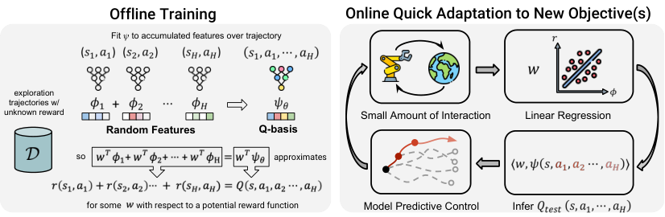
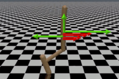
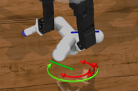
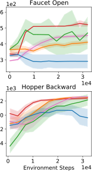
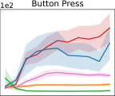
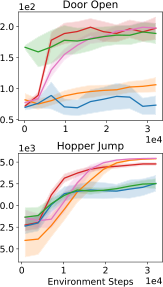
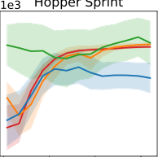
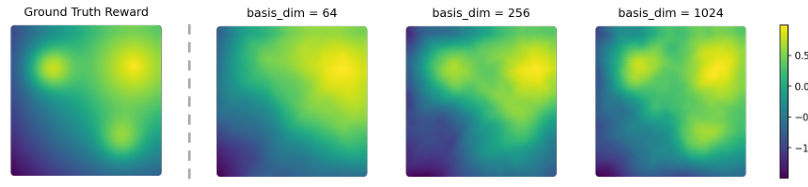
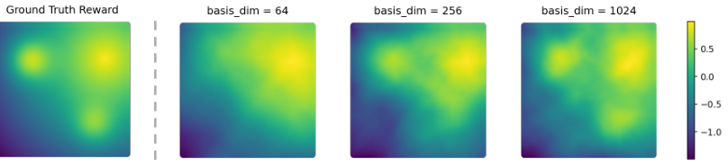

## **Self-Supervised Reinforcement Learning that** **Transfers using Random Features**


**Boyuan Chen** _[∗]_
Massachusetts Institute of Technology
Boston, MA 02139
```
    boyuanc@mit.edu

```


**Chuning Zhu** _[∗]_
University of Washington
Seattle, WA 98105
```
zchuning@cs.washington.edu

```


**Pulkit Agrawal**
Massachusetts Institute of Technology
Boston, MA 02139
```
   pulkitag@mit.edu

```


**Kaiqing Zhang** _[†]_
University of Maryland
College Park, MD 20742
```
 kaiqing@umd.edu

```


**Abhishek Gupta** _[†]_
University of Washington
Seattle, WA 98105
```
abhgupta@cs.washington.edu

```


**Abstract**


Model-free reinforcement learning algorithms have exhibited great potential in
solving single-task sequential decision-making problems with high-dimensional
observations and long horizons, but are known to be hard to _generalize_ across tasks.
Model-based RL, on the other hand, learns task-agnostic models of the world that
naturally enables transfer across different reward functions, but struggles to scale
to complex environments due to the compounding error. To get the best of both
worlds, we propose a self-supervised reinforcement learning method that enables
the transfer of behaviors across tasks with different rewards, while circumventing
the challenges of model-based RL. In particular, we show self-supervised pretraining of model-free reinforcement learning with a number of _random features_ as
rewards allows _implicit_ modeling of long-horizon environment dynamics. Then,
planning techniques like model-predictive control using these implicit models
enable fast adaptation to problems with new reward functions. Our method is
self-supervised in that it can be trained on offline datasets _without_ reward labels,
but can then be quickly deployed on new tasks. We validate that our proposed
method enables transfer across tasks on a variety of manipulation and locomotion
domains in simulation, opening the door to generalist decision-making agents.


**1** **Introduction**


As in most machine learning problems, the ultimate goal of building deployable sequential decisionmaking agents via reinforcement learning (RL) is its broad _generalization_ across tasks in the real
world. While reinforcement learning algorithms have been shown to successfully synthesize complex
behavior in _single-task_ sequential decision-making problems [ 31, 36, 45 ], their performance as
_generalist agents_ across tasks has been less convincing [ 9 ]. In this work, we focus on the problem of
learning generalist agents that are able to transfer across problems where the environment dynamics
are shared, but the reward function is changing. This problem setting is reflective of scenarios


_∗_ Equal contribution.

_†_ Equal advising.


Preprint. Under review.


that may be encountered in real-world settings such as robotics. For instance, in tabletop robotic
manipulation, different tasks like pulling an object, pushing an object, picking it up, and pushing to
different locations, all share the same transition dynamics, but involve different reward functions.
We hence ask the question – _Can we reuse information across tasks in a way that scales to high_
_dimensional, longer horizon problems?_


Figure 1: `RaMP` is a self-supervised reinforcement learning algorithm that pre-training on exploration trajectories
without (or with unknown) reward. It then quickly adapts to new tasks through interaction with the environment.


A natural possibility to tackle this problem is direct policy search [ 54, 44 ]. Typical policy search
algorithms can achieve good performance on a single task. However, the policy is optimized for a
particular reward and may be highly suboptimal in new scenarios. Other model-free RL algorithms
like actor-critic methods [ 23, 15, 13 ] or Q-learning [ 51, 31 ] may exacerbate this issue, with learned
Q-functions entangling dynamics, rewards, and policies. For new scenarios, an ideal algorithm should
be able to disentangle and retain the elements of shared dynamics, allowing for easy substitution of
rewards without having to repeat significant computations. While multi-task policy search techniques
like goal-conditioned RL address this issue to some extent, they are restricted to particular tasks like
goal-reaching and usually require prior knowledge about the tasks one may encounter in testing.


Model-based RL arises as a natural fit for disentangling dynamics and rewards [ 33, 10, 17, 19, 20 ].
These algorithms directly learn a model of transition dynamics and leverage the learned model to
plan control actions [ 35, 17, 10, 8 ]. In particular, the models can be used to _re-plan_ behaviors for
new rewards. However, these learned dynamics models are brittle and suffer from compounding error

[ 25, 3 ] due to their autoregressive nature. States predicted by the model are iteratively used as inputs
for subsequent predictions, leading to compounding approximation errors during planning [ 25 ]. This
makes it challenging to apply them to problems with long horizons and high dimensions.


In this work, we thus ask – _Can we build RL algorithms that disentangle dynamics, rewards,_
_and policies for transfer across problems, while retaining the ability to solve problems with high_
_dimensional observations and long horizons?_ To this end, we propose a self-supervised RL algorithm
that can leverage collected data to _implicitly_ model transition dynamics without ever having to
_generate_ future states, and then use this to quickly transfer to a variety of different new tasks with
varying reward functions that may be encountered at test time.


Our method relies on the following key insight: to prevent tying specific reward functions and
policies to the RL algorithm, one can instead model the long-term evolution of randomly chosen basis
functions of all possible reward functions [ 6 ]. Such basis functions can be generated using random
features [ 39 – 41 ]. The accumulation of such basis functions over time, which we refer to as a Q-basis,
is task-agnostic [ 48 ], and _implicitly_ models the transition dynamics of the problem. We show that
with a _large enough_ number of random features and model-free RL, the value function for _any_ reward
function that may be encountered in testing could be estimated, via a simple linear combination
of these Q-basis functions. This is important since it allows us to obtain the benefits of transfer,
without explicitly learning a dynamics model that may suffer from compounding error. Moreover,
with randomly chosen basis functions that are agnostic of downstream tasks, this is not restricted to
just a certain distribution of tasks, as in most multi-task or goal-conditioned RL [ 49, 2 ]. Finally, we
note that the random features (as well as the corresponding Q-basis functions) can be generated using
datasets that are not necessarily _labeled_ with reward signals. Indeed, these random-feature-based
pseudo rewards can be viewed as self-supervised signals in training, making the approaches based on
them naturally compatible with large (task-agnostic) offline datasets.


Based on the aforementioned insights, we propose a new algorithm _Random Features for Model-Free_
_Planning_ ( `RaMP` ) that allows us to leverage unlabelled offline datasets to learn reward-agnostic Qbases. These can be used to estimate the test-time value functions for new reward functions using
linear regression, enabling quick adaptation to new tasks under the same shared transition dynamics.
We show the efficacy of this method on a number of tasks for robotic manipulation and locomotion in
simulation, and highlight how `RaMP` provides a more general paradigm than typical generalizations of
model-based or model-free RL.


2


**1.1** **Related Work**

Model-based RL is naturally suited for transfer across tasks with shared dynamics, by explicitly
learning a model of the transition dynamics, which is disentangled with the reward functions for
each task [ 17, 35, 10, 16, 8, 47, 27 ]. These models are typically learned via supervised learning
on one-step transitions and then used to extract control actions via planning [ 28, 42 ] or trajectory
optimization [ 46, 59, 38 ]. The key challenge in scaling lies in the fact that they sequentially feed
model predictions back into the model for sampling [ 50, 3, 25 ]. This can often lead to compounding
errors [ 25, 3, 55 ], which grow with the horizon length unfavorably. In contrast, our work does not
require autoregressive sampling, making it easier to scale to longer horizons and higher dimensions.


On the other hand, model-free RL avoids the challenge of compounding error by directly modeling
either policies or Q-values without autoregressive generation [ 54, 43, 44, 30, 31, 15 ]. However, these
approaches entangle rewards, dynamics, and policies, making them hard to transfer. While attempts
have been made to build model-free methods that generalize across rewards, such as goal-conditioned
value functions [ 21, 1, 37, 14 ] or multi-task policies [ 22, 18 ], they only apply to restricted classes
of reward functions and particular training distributions. Our work aims to obtain the best of both
worlds (model-based and model-free RL), learning some representation of dynamics independent of
rewards and policies, while using a model-free algorithm for learning.


Our notion of long-term dynamics is connected to the notion of state-action occupancy measure [ 34,
58 ], often used for off-policy evaluation and importance sampling methods in RL. These methods
often try to directly estimate either densities or density ratios [ 20, 34, 58 ]. Our work simply learns
the long-term accumulation of random features, without requiring any notion of normalized densities.
Perhaps most closely related work to ours is the framework of _successor features_, that considers
transfer from a fixed set of source tasks to new target tasks [ 5, 26, 57, 11 ]. Like our work, the
successor features framework leverages the linearity of rewards to disentangle dynamics from rewards
using model-free RL. However, transfer using successor features is dependent on choosing (or
learning) the right featurization and forces an implicit dependence on the policy. Our work leverages
random features and multi-step Q-functions to alleviate the transfer performance of successor features.


**2** **Preliminaries**


**Model.** We consider the standard Markov decision process (MDP) as characterized by a tuple
_M_ = ( _S, A, T, R, γ, µ_ ), with state space _S_, action space _A_, transition dynamics _T_ : _S×A →_ ∆( _S_ ),
reward function _R_ : _S × A →_ ∆([ _−R_ max _, R_ max ]), discount factor _γ ∈_ [0 _,_ 1), and initial state
distribution _µ ∈_ ∆( _S_ ) . The goal is to learn a policy _π_ : _S →_ ∆( _A_ ), such that it maximizes
_∞_
the expected discounted accumulated rewards, i.e., solves max _π_ E _π_ �� _h_ =1 _[γ]_ _[h][−]_ [1] _[r]_ _[h]_ � with _r_ _h_ :=
_r_ ( _s_ _h_ _, a_ _h_ ) _∼_ _R_ _s_ _h_ _,a_ _h_ = Pr( _· | s_ _h_ _, a_ _h_ ) . Hereafter, we will refer to an MDP and a _task_ interchangeably.
Note that in our problem settings, different MDPs will always share transition dynamics _T_, but will
have varying reward functions _R_ .


**Q-function Estimation.** Given an MDP _M_, one can define the state-action _Q_ -value function under
any policy _π_ as _Q_ _π_ ( _s, a_ ) := E _a_ _h_ _∼π_ ( _· | s_ _h_ ) �� _∞h_ =1 _[γ]_ _[h][−]_ [1] _[r]_ _[h]_ ��� _s_ 1 = _s, a_ 1 = _a_ � which denotes
_s_ _h_ +1 _∼T_ ( _· | s_ _h_ _,a_ _h_ )

the expected accumulated reward under policy _π_, when starting from state-action pair ( _s, a_ ) . By
definition, this _Q_ -function is inherently tied to the particular reward function _R_ and the policy _π_,
making it challenging to transfer for a new reward or policy. Similarly, one can also define the _multi-_
_step (_ _τ_ _-step)_ _Q_ _-function_ _Q_ _π_ ( _s,_ � _a_ 1 _,_ � _a_ 2 _, · · ·,_ � _a_ _τ_ ) = E _a_ _τ_ + _h_ _∼π_ ( _· | s_ _τ_ + _h_ ) �� _∞h_ =1 _[γ]_ _[h][−]_ [1] _[r]_ _[h]_ �� _s_ 1 = _s, a_ 1 =
_s_ _h_ +1 _∼T_ ( _· | s_ _h_ _,a_ _h_ )


� _a_ 1 _, a_ 2 = � _a_ 2 _, · · ·, a_ _τ_ = � _a_ _τ_ .
�


One can estimate the _τ_ -step _Q_ _π_ by Monte-Carlo sampling of the trajectories under _π_, i.e., by solving


2

� _γ_ _[h][−]_ [1] _r_ _h_ _[m,j]_ ��� 2

_h_ =1


(2.1)
2 _[,]_


1
_Q_ min � _∈Q_ _N_


_N_
�

_j_ =1


_Q_ ( _s,_ � _a_ _j_ 1 _[,]_ [ �] _[a]_ _[j]_ 2 _[,][ · · ·][,]_ [ �] _[a]_ _τ_ _[j]_ [)] _[ −]_ [1]
���� _M_


_M_
�


_m_ =1


_∞_
�


where _Q_ is some function class for _Q_ -value estimation, which in practice is some parametric function
class, e.g., neural networks; _r_ _h_ _[m,j]_ _∼_ _R_ _s_ _m,jh_ _,a_ _[m,j]_ _h_ and ( _s_ _[m,j]_ _h_ _, a_ _[m,j]_ _h_ ) come from _MN_ trajectories that


3


are generated by _N_ action sequences _{_ (� _a_ _[j]_ 1 _[,]_ [ �] _[a]_ 2 _[j]_ _[,][ · · ·][,]_ [ �] _[a]_ _τ_ _[j]_ [)] _[}]_ _[N]_ _j_ =1 [and] _[ M]_ [ trajectories following policy] _[ π]_
after each action sequence. A large body of work considers finding this _Q_ -function using dynamic
programming, but for the sake of simplicity, this work will only consider Monte-Carlo estimation.


In practice, the infinite-horizon estimator in (2.1) can be hard to obtain. We hence use a finite-horizon
approximation of _Q_ _π_ (of length _H_ ), denoted by _Q_ _[H]_ _π_ [, in learning. We will treat this finite-horizon]
formula in the main paper for practical simplicity. We also provide a method to deal with the
infinite-horizon case directly by bootstrapping the value function estimate. We defer the details to
Appendix B.1. Note that if one chooses _H_ = _τ_, then the _τ_ -step _Q_ -function defined above becomes

_H_
_Q_ _[H]_ _π_ [(] _[s,]_ [ �] _[a]_ [1] _[,]_ [ �] _[a]_ [2] _[,][ · · ·][,]_ [ �] _[a]_ _[H]_ [) :=][ E] _s_ _h_ +1 _∼T_ ( _· | s_ _h_ _,a_ _h_ ) �� _h_ =1 _[γ]_ _[h][−]_ [1] _[r]_ _[h]_ _[ |][ s]_ [1] [ =] _[ s, a]_ [1] [ =][ �] _[a]_ [1] _[,][ · · ·][, a]_ _[H]_ [ =][ �] _[a]_ _[H]_ � .

Note that in this case, the expected accumulated reward executing the action sequence _Q_ -function is irrelevant of the policy (� _a_ 1 _,_ � _πa_ 2, denoted by _, · · ·,_ � _a_ _H_ ) starting from the state _Q_ _[H]_, and is just the
_s_ . This Q-function can be used to score how “good" a sequence of actions will be, which in turn can
be used for planning.


**Problem setup.** We illustrate our problem setup in Figure 1. Consider a transfer learning
scenario, where we assume access to an offline dataset consisting of several episodes _D_ =
_{_ ( _s_ _[m]_ _h_ _[, a]_ _[m]_ _h_ _[, s]_ _[m]_ _h_ +1 [)] _[}]_ _[h][∈]_ [[] _[H]_ []] _[,m][∈]_ [[] _[M]_ []] [. Here] _[ H]_ [ is the length of the trajectories, which is large enough,]
e.g., of order _O_ (1 _/_ (1 _−_ _γ_ )) to approximate the infinite-horizon setting; _M_ is the total number of
trajectories. This dataset assumes that all transitions are collected under the same transition dynamics
_T_, but otherwise does not require the labels, i.e., rewards, and may even come from different behavior
policies. This is reminiscent of the offline RL problem statement, but offline RL datasets are typically
_labeled_ with rewards and are _task-specific_ . In contrast, in this work, the pre-collected dataset is used
to quickly learn policies for _any_ downstream reward, rather than for one specific reward function. The
goal is to make the best use of the dataset _D_, and generalize the learned experience to improve the
performance on a new task _M_, with the same transition dynamics _T_ but an arbitrary reward function
_R_ . Note that unlike some related work [ 5, 4 ], we make _no_ assumption on the reward functions of the
MDPs that generate _D_ . The goal of the learning problem is to _pre-train_ on the offline dataset such
that we can enable fast (even zero-shot) adaptation to arbitrary new reward functions encountered at
test time.


**3** `RaMP` **: Learning Implicit Models for Cross-Reward Transfer with**
**Self-Supervised Model-Free RL**


We now introduce our algorithm, Random Features for Model-Free Planning ( `RaMP` ), to solve the
problem described in Section 2 – learning a model of long-term dynamics that enables transfer to
tasks labeled with arbitrary new rewards, while making use of the advantages of model-free RL.
Clearly, the problem statement we wish to solve requires us to (1) be able to solve tasks with long
horizons and high-dimensional observations and (2) alleviate policy and reward dependence to be able
to transfer computation across tasks. The success of model-free RL in circumventing compounding
error from autoregressive generation raises the natural question: _Is there a model-free approach that_
_can mitigate the challenges of compounding error and can transfer across tasks painlessly?_ We
answer this in the affirmative in the following section.


**3.1** **Key Idea: Implicit Model Learning with Random Feature Cumulants and Model-Free RL**


The key insight we advocate is that we can avoid task dependence if we directly model the long-term
accumulation of many random functions of states and actions (treating them as the rewards), instead
of modeling the long-term accumulation of one specific reward as in typical Q-value estimation.
Since these random functions of the state and actions are task-agnostic and uninformed of any
specific reward function, they simply capture information about the transition dynamics of the
environment. However, they do so without actually requiring autoregressive generative modeling, as
is commonplace in model-based RL. Doing so can effectively disentangle transition dynamics from
reward, and potentially allow for transfer across tasks, while still being able to make use of model-free
RL methods. Each long-term accumulation of random features is referred to as an element of a
“random” Q-basis, and can be learned with simple modifications to typical model-free RL algorithms.
The key is to replace the Q-estimation of a single _task-specific_ reward function with estimating the
Q-functions of a set of _task-agnostic_ random functions of the state and actions as a random Q-basis.


4


At _training time_, the offline dataset _D_ can be used to learn a set of “random” Q-basis functions for
different random functions of the state and action. This effectively forms an “implicit model”, as it
carries information about how the dynamics propagate, without being tied to any particular reward
function. At _test time_, given a new reward function, we can recombine Q-basis functions to effectively
approximate the true reward-specific Q-function under any policy. This inferred Q-function can then
be used for planning for the new task. As we will show in Section 3.4, this recombination can actually
be done by a linear combination of Q-basis functions for a sufficiently rich class of random features,
reducing the problem of test-time adaptation for new rewards to a simple linear regression problem.
We detail the two phases of our approach in the following subsections.




Figure 2: `RaMP` : Depiction of our proposed method for transferring behavior across tasks by leveraging modelfree learning of random features. At training time, Q-basis functions are trained on accumulated random features.
At test time, adaptation is performed by solving linear regression and recombining basis functions, followed by
online planning with MPC.


**3.2** **Offline Training: Self-Supervised Learning Random Q-functions**


Without any prior knowledge about the downstream test-time rewards, the best that an agent can do is
to model the evolution of the state (i.e., model system dynamics). The key insight we make is that the
evolution of state can be implicitly represented by simply modeling the long-term accumulation of
_random_ features of state to obtain a _set_ of Q-basis functions. Such a generation of random features is
fully self-supervised. These functions can then be combined to infer the task-specific Q-function.


Given the lack of assumptions about the downstream task, the random features being modeled must
be expressive and universal in their coverage. As suggested in [ 39 – 41 ], random features can be
powerful in that most nonlinear functions can be represented as linear combinations of random
features effectively. As we will show in Section 3.4, modeling the long-term accumulation of
random features allows us express the value function for _any_ reward as a **linear** combination of these
accumulations of random features. In particular, in our work, we assume that the random features are
represented as the output of _K_ neural networks _ϕ_ ( _·, ·_ ; _θ_ _k_ ) : _S × A →_ R with weights _θ_ _k_ _∈_ R _[d]_ and
_k ∈_ [ _K_ ], where _θ_ _k_ are _randomly_ sampled i.i.d. from some distribution _p_ . Sampling _K_ such weights
_θ_ _k_ with _k ∈_ [ _K_ ] yields a vector of scalar functions [ _ϕ_ ( _·, ·_ ; _θ_ _k_ )] _k∈_ [ _K_ ] _∈_ R _[K]_ for any ( _s, a_ ), which can
be used as random features. To model the long-term accumulation of each of these random features,
we note that they can be treated as reward functions (as can any function of state and action [ 48 ]) in
model-free RL, and standard model-free policy evaluation to learn Q-functions can be reused to learn
a set of _K_ Q-basis functions, with each of them corresponding to the Q-value of a random feature.


We note that done naively, this definition of a Q-basis function is tied to a particular policy _π_ that
generates the trajectory. However, to transfer behavior one needs to predict the accumulated random
features under new sequences of actions, as policy search for the new task is likely to involve
evaluating a policy that is not the same as the training policy _π_ . To allow the modeling of accumulated
features that is independent of particular policies, we propose to learn _multi-step_ Q-basis functions
for each of the random features (as discussed in Section 2), which is explicitly dependent on an input sequence of actions (� _a_ 1 _,_ � _a_ 2 _, · · ·,_ � _a_ _τ_ ). This can be used to search for optimal actions in new tasks.


To actually learn these Q-basis functions (one for each random feature), we use
Monte-Carlo methods for simplicity. We generate a new dataset _D_ _ϕ_ from _D_,
with _D_ _ϕ_ = _{_ (( _s_ _[m]_ 1 _[, a]_ _[m]_ 1: _H_ [)] _[,]_ � _h∈_ [ _H_ ] _[γ]_ _[h][−]_ [1] _[ϕ]_ [(] _[s]_ _h_ _[m]_ _[, a]_ _[m]_ _h_ [;] _[ θ]_ _[k]_ [))] _[}]_ _[m][∈]_ [[] _[M]_ []] _[,k][∈]_ [[] _[K]_ []] [.] Here we use


5


� _h∈_ [ _H_ ] _[γ]_ _[h][−]_ [1] _[ϕ]_ [(] _[s]_ _h_ _[m]_ _[, a]_ _[m]_ _h_ [;] _[ θ]_ _[k]_ [)] as the accumulated random features for action sequences
_{a_ 1 _, · · ·, a_ _H_ _}_ taken from state _s_ 1 . We then use _K_ function approximators representing
each of the _K_ Q-basis functions, e.g., neural networks _ψ_ ( _·, ·_ ; _ν_ _k_ ) : _S × A_ _[H]_ _→_ R for
_k ∈_ [ _K_ ], to fit the accumulated random features. Specifically, we minimize the following loss


_m∈_ [ _M_ ] _,k∈_ [ _K_ ] � _ψ_ ( _s_ _[m]_ 1 _[, a]_ _[m]_ 1: _H_ [;] _[ ν]_ _[k]_ [)] _[ −]_ [�]


min _{ν_ _k_ _}_ _M_ 1 �


2
_h∈_ [ _H_ ] _[γ]_ _[h][−]_ [1] _[ϕ]_ [(] _[s]_ _h_ _[m]_ _[, a]_ _[m]_ _h_ [;] _[ θ]_ _[k]_ [)] � _._


This objective is a Monte Carlo estimate, but we can also leverage dynamic programming to do so in
an infinite-horizon way, as we show in Appendix B.1.


**3.3** **Online Planning: Inferring Q-functions with Linear Regression and Planning**


Our second phase concerns online planning to transfer to new tasks with arbitrary rewards using
our learned Q-basis functions. For a sufficiently expressive set of random non-linear features, any
non-linear reward function can be expressed as a linear combination of these features. As we outline
below, this combined with linearity of expectation, allows us to express the task-specific Q-function
for any particular reward as a linear combination of learned Q-bases of random functions. Therefore,
we can obtain the test-time Q-function by solving a _simple_ linear regression problem from random
features to instantaneous rewards, and use the _same_ inferred coefficients to recombine Q-bases to
obtain task-specific Q-functions. This inferred Q-function can then be used to plan an optimal
sequence of actions. We describe each of these steps below.


**3.3.1** **Reward Function Fitting with Randomized Features**


We first learn how to express the reward function for the new task as a linear combination of the
random features. This can be done by solving a linear regression problem to find the coefficient
vector _w_ = [ _w_ 1 _, · · ·, w_ _K_ ] _[⊤]_ that approximates the new task’s reward function as a linear combination
of the (non-linear) random features. Specifically, we minimize the following loss


1
_w_ _[∗]_ = argmin
_w_ _MH_


�

_h∈_ [ _H_ ] _,m∈_ [ _M_ ]


2

� _r_ ( _s_ _[m]_ _h_ _[, a]_ _[m]_ _h_ [)] _[ −]_ � _w_ _k_ _ϕ_ ( _s_ _[m]_ _h_ _[, a]_ _[m]_ _h_ [;] _[ θ]_ _[k]_ [)] � + _λ∥w∥_ 2 [2] _[,]_ (3.1)

_k∈_ [ _K_ ]


where _λ ≥_ 0 is the regularization coefficient, and _r_ ( _s_ _[m]_ _h_ _[, a]_ _[m]_ _h_ [)] _[ ∼]_ _[R]_ _[s]_ _[m]_ _h_ _[,a]_ _[m]_ _h_ [. Due to the use of random]
features, Eq. (3.1) is a _ridge regression_ problem, and can be solved efficiently.


Given these weights, it is easy to estimate an approximate multi-step Q-function for the true reward on the new task by linearly combining the Q-basis functions learned in the offline training phase _{ψ_ ( _·, ·_ ; _ν_ _k_ _[∗]_ [)] _[}]_ _[k][∈]_ [[] _[K]_ []] [ according to the] _[ same]_ [ coefficient vector] _[ w]_ _[∗]_ [.] This follows from
the additive nature of reward and linearity of expectation. In particular, if the reward function
_r_ ( _s, a_ ) = [�] _k∈_ [ _K_ ] _[w]_ _k_ _[∗]_ _[ϕ]_ [(] _[s, a]_ [;] _[ θ]_ _[k]_ [)] [ holds approximately, which will be the case for large enough]

_K_ and rich enough _ϕ_, then the approximate Q-function for the true test-time reward under
the sequence _{a_ 1 _, · · ·, a_ _H_ _}_ satisfies _Q_ _[H]_ ( _s_ 1 _, a_ 1: _H_ ) := E _s_ _h_ +1 _∼T_ ( _sh,ah_ ) �� _h∈_ [ _H_ ] _[γ]_ _[h][−]_ [1] _[R]_ _[s]_ _h_ _[,a]_ _h_ � _≈_

� _k∈_ [ _K_ ] _[w]_ _k_ _[∗]_ _[ψ]_ [(] _[s]_ [1] _[, a]_ [1:] _[H]_ [;] _[ ν]_ _k_ _[∗]_ [)] [, where] _[ {][w]_ _k_ _[∗]_ _[}]_ _[k][∈]_ [[] _[K]_ []] [ is the solution to the regression problem (Eq.] [ (3.1)] [)]

and _{ν_ _k_ _[∗]_ _[}]_ _[k][∈]_ [[] _[K]_ []] [ is the solution to the Q-basis fitting problem described in Section 3.2.]


**3.3.2** **Planning with Model Predictive Control**


To obtain the optimal sequence of actions, we can use the inferred approximate Q-function for the
true reward _Q_ _[H]_ ( _s_ 1 _, a_ 1: _H_ ) for online planning at each time _t_ in the new task: at state _s_ _t_, we conduct
standard model-predictive control techniques with random shooting [ 35, 52 ], i.e., randomly generating
_N_ sequences of actions _{a_ _[n]_ 1 _[,][ · · ·][, a]_ _[n]_ _H_ _[}]_ _[n][∈]_ [[] _[N]_ []] [, and find the action sequence with the maximum Q-value]
such that _n_ _[∗]_ _t_ _[∈]_ [argmax] _n∈_ [ _N_ ] � _k∈_ [ _K_ ] _[w]_ _k_ _[∗]_ _[ψ]_ [(] _[s]_ _[t]_ _[, a]_ _t_ _[n]_ : _t_ + _H−_ 1 [;] _[ ν]_ _k_ _[∗]_ [)] _[.]_


We note that this finite-horizon planning is an approximation of the actual infinite-horizon planning,
which may be enhanced by an additional reward-to-go term in the objective. We provide such
an enhancement with details in Appendix B.1, although we found minimal effects on empirical
performance. We then execute _a_ _[n]_ _t_ _t_ _[∗]_ from the sequence _n_ _[∗]_ _t_ [, observe the new state] _[ s]_ _[t]_ [+1] [, and replan. We]
refer readers to Appendix F for a detailed connection of our proposed method to existing work and
Appendix A for pseudocode.


6


**3.4** **Theoretical Justifications**


We now provide some theoretical justifications for the methodology we adopt. To avoid unnecessary
nomenclature of measures and norms in infinite dimensions, we in this section consider the case that
_S_ and _A_ are discrete (but can be enormously large). Due to space limitation, we present an abridged
version of the results below, and defer the detailed versions and proofs in Appendix D. We first state
the following result on the expressiveness of random cumulants.


**Theorem 3.1** ( _Q_ -function approximation; Informal) **.** Under standard coverage and sampling assumptions of offline dataset _D_, and standard assumptions on the boundedness and continuity of random
features _ϕ_ ( _s, a_ ; _θ_ ), it follows that with horizon length _H_ = Θ( [�] [lo][g(] _[R]_ 1 _−_ [max] _γ_ _[/][ϵ]_ [)] ) and _M_ = Θ( [�] (1 _−γ_ 1) [3] _ϵ_ [4] [)]

episodes in dataset _D_, and with _K_ = Ω((1 [�] _−_ _γ_ ) _[−]_ [2] _ϵ_ _[−]_ [2] ) random features, we have that for any given
reward function _R_, and any policy _π_


_∥Q_ [�] _[H]_ _π_ [(] _[w]_ _[∗]_ [)] _[ −]_ _[Q]_ _[π]_ _[∥]_ _[∞]_ _[≤O]_ [(] _[ϵ]_ [) +] _[ O]_

� ��


inf
_f_ _∈H_ _[E]_ [(] _[f]_ [)] ~~�~~


�
with high probability, where _Q_ _[H]_ _π_ [(] _[s, a]_ [;] _[ w]_ _[∗]_ [)] is defined as
_H_
E�� _h_ =1 _[γ]_ _[h][−]_ [1] [ �] _k∈_ [ _K_ ] _[w]_ _k_ _[∗]_ _[ϕ]_ [(] _[s]_ _[h]_ _[, a]_ _[h]_ [;] _[ θ]_ _[k]_ [)] _[ |][ s]_ [1] = _s, a_ 1 = _a_ � for each ( _s, a_ ) and can be esti


E�� _h_ =1 _[γ]_ _[h][−]_ [1] [ �] _k∈_ [ _K_ ] _[w]_ _k_ _[∗]_ _[ϕ]_ [(] _[s]_ _[h]_ _[, a]_ _[h]_ [;] _[ θ]_ _[k]_ [)] _[ |][ s]_ [1] = _s, a_ 1 = _a_ � for each ( _s, a_ ) and can be esti
mated from the offline dataset _D_ ; inf _f_ _∈H_ _E_ ( _f_ ) is the infimum expected risk over the function class
_H_ induced by _ϕ_ .


Theorem 3.1 is an informal statement of the results in Appendix D.2, which specifies the number of
random features, the horizon length per episode, and the number of episodes, in order to approximate
_Q_ _π_ accurately by using the data in _D_, under any given reward function _R_ and policy _π_ . Note that
the number of random features is not excessive and is polynomial in problem parameters. We also
note that the results can be improved under stronger assumptions of the sampling distributions _p_ and
kernel function classes [41, 29].


Next, we justify the use of multi-step _Q_ -functions in planning in a deterministic transition environment, which contains all the environments our empirical results we will evaluate later. Recall that for
any given reward _R_, let _Q_ _π_ denote the _Q_ -function under policy _π_ . Note that with a slight abuse of
notation, _Q_ _π_ can also be the multi-step _Q_ -function (see definition in Section 2), and the meaning
should be clear from the input, i.e., whether it is _Q_ _π_ ( _s, a_ ) or _Q_ _π_ ( _s, a_ 1 _, · · ·, a_ _H_ ).


**Theorem 3.2.** Let Π be some subclass of Markov stationary policies, i.e., for any _π ∈_ Π, _π_ : _S →_
∆( _A_ ) . Suppose the transition dynamics _T_ is deterministic. For any given reward _R_, denote the
_H_ -step policy obtained from _H_ -step policy improvement over Π as _π_ _H_ _[′]_ [:] _[ S →A]_ _[H]_ [, defined as]
_π_ _H_ _[′]_ [(] _[s]_ [)] _[ ∈]_ [argmax] ( _a_ 1 _,···,a_ _H_ ) _∈A_ _[H]_ [ max] _[π][∈]_ [Π] _[ Q]_ _[π]_ [(] _[s, a]_ [1] _[,][ · · ·][, a]_ _[H]_ [)] _[,]_ [ for all] _[ s][ ∈S]_ [. Let] _[ V]_ _[π]_ _H_ _[′]_ [denote the]
value function under the policy _π_ _H_ _[′]_ [(see formal definition in Appendix D.1). Then, we have that for]
all _s ∈S_
_V_ _π_ _H′_ [(] _[s]_ [)] _[ ≥]_ [max] _a_ 1: _H_ [max] _π∈_ Π _[Q]_ _[π]_ [(] _[s, a]_ [1] _[,][ · · ·][, a]_ _[H]_ [)] _[ ≥]_ [max] _a_ max _π∈_ Π _[Q]_ _[π]_ [(] _[s, a]_ [)] _[.]_


The proof of Theorem 3.2 can be found in Appendix D.2. The result can be viewed as a generalization
of the generalized policy iteration result in [ 5 ] to multi-step action-sequence policies. Taking Π to
be the set of policies that generate the data, the result shows that the value function of the greedy
multi-action policy improves over all the possible _H_ -step multi-action policies, with the policy after
step _H_ to be any policy in Π . Moreover, the value function by _π_ _H_ _[′]_ [also improves overall one-step]
policies if the policy after the first step onwards follows any policy in Π . This is due to the fact that Π
(coming from data) might be a much more restricted policy class than any action sequence _a_ 1: _H_ .


**4** **Experimental Evaluation**


In this section, we aim to answer the following research questions: **(1)** Does `RaMP` allow for effective
transfer of behaviors across tasks with varying rewards? **(2)** Does `RaMP` scale to domains with
high-dimensional observation and action spaces and long horizons? **(3)** Which design decisions in
`RaMP` enable better transfer?


**4.1** **Experiment Setup**


Across several domains, we evaluate the ability of `RaMP` to leverage the knowledge of shared dynamics
from an offline dataset to quickly solve new tasks with arbitrary rewards.


7






Figure 3: We evaluate our method on manipulation, locomotion, and high dimensional action space environments. The green arrow in each environment indicates the online objective for policy transfer while the red
arrows are offline objectives used to label rewards for the privileged dataset.











|e offline objectives u 0 1e3 Reach Wall|Col2|
|---|---|
|4<br>6<br>8|4<br>6<br>8|
|0<br>1<br>2<br>3<br>1e<br>2<br>4<br>2<br>0<br>2<br>4<br>6<br>1e3<br>Hopper Stand|0<br>1<br>2<br>3<br>1e<br>2<br>4<br>2<br>0<br>2<br>4<br>6<br>1e3<br>Hopper Stand|
|0<br>1<br><br>|2<br>3<br><br>1|


|2.5|Col2|Col3|
|---|---|---|
|.0<br>.5<br>.0<br>.5|||
|0<br>1<br>2<br>3<br>1e<br>.5<br>0<br>1<br>2<br>3<br><br>1e<br>.0<br>.5<br>.0<br>1e3<br>D'Claw|0<br>1<br>2<br>3<br>1e<br>.5<br>0<br>1<br>2<br>3<br><br>1e<br>.0<br>.5<br>.0<br>1e3<br>D'Claw|0<br>1<br>2<br>3<br>1e<br>.5<br>0<br>1<br>2<br>3<br><br>1e<br>.0<br>.5<br>.0<br>1e3<br>D'Claw|
|0<br>1<br>2<br>3<br>1e<br>.5<br>0<br>1<br>2<br>3<br><br>1e<br>.0<br>.5<br>.0<br>1e3<br>D'Claw|e3<br>|e3<br>|
|0<br>1<br>2<br>3<br>1e<br>.5<br>0<br>1<br>2<br>3<br><br>1e<br>.0<br>.5<br>.0<br>1e3<br>D'Claw|e3<br>|2<br>3<br><br>1e|


Figure 4: Reward transfer results on Metaworld, Hopper and D’Claw environments. `RaMP` adapts to novel
rewards more rapidly than MBPO, Successor Features, and CQL baselines.


**Offline Dataset Construction:** For each domain, we have an offline dataset collected by a behavior
policy as described in Appendix C.2. Typically this behavior policy is a mixture of noisy policies
accomplishing different objectives in each domain. Although `RaMP` and other model-based methods
do not require knowledge of any reward from the offline dataset, other baseline comparisons will
require privileged information. Baseline comparison methods like model-free RL and successor
features require the provision of a set of training objectives, as well as rewards labeled for these
objectives on state actions from the offline dataset. We call such objectives “offline objectives” and a
dataset annotated with these offline objectives and rewards a privileged dataset.


**Test-time adaptation:** At test-time, we select a novel reward function for online adaptation, referred
to as ‘online objective’ below. The online objective may correspond to rewards conditioned on
different goals or even arbitrary rewards, depending on the domain. Importantly, the online objective
need not be drawn from the same distribution as the privileged offline objectives.


Given this problem setup, we compare `RaMP` with a variety of baselines. (1) MBPO [ 19 ] is a modelbased RL method that learns a standard one-step dynamics model and uses actor-critic methods to
plan in the model. We pre-train the dynamics model for MBPO on the offline dataset. (2) PETS [ 8 ] is
a model-based RL method that learns an ensemble of one-step dynamics models and performs MPC.
We pre-train the dynamics model on the offline dataset and use the cross-entropy method (CEM)
to plan. (3) Successor feature (SF) [ 5 ] is a framework for transfer learning in RL as described in
Sec. 1.1. SF typically assumes access to a set of policies towards different goals along with a learned
featurization, so we provide it with the privileged dataset to learn a set of training policies. We also
learn successor features with the privileged dataset. (4) CQL [ 24 ]: As an _oracle_ comparison, we
compare with a goal-conditioned variant of an offline RL algorithm (CQL). CQL is a model-free
offline RL algorithm that learns policies from offline data. While model-free offline RL naturally
struggles to adapt to arbitrarily changing rewards, we provide CQL with information about the goal
at both training and testing time. CQL is trained on the distribution of training goals on the offline
dataset, and finetuned on the new goals at test time. The CQL comparison is assuming access to more
information than `RaMP` . Each method is benchmarked on each domain with 4 seeds.


**4.2** **Transfer to Unseen Rewards**


We first evaluate the ability of `RaMP` to learn from an offline dataset and quickly adapt to unseen
test rewards in 4 robotic manipulation environments from Meta-World [ 56 ]. We consider skills like


8


reaching a target across the wall, opening a door, turning on a faucet, and pressing a button while
avoiding obstacles, which are challenging for typical model-based RL algorithms (Fig. 3). Each
domain features 50 different possible goal configurations, each associated with a different reward but
the same dynamics. The privileged offline objectives consist of 25 goal configurations. The test-time
reward functions are drawn from the remaining 25 “out-of-distribution” reward functions. We refer
the reader to Appendix C.1 for details.


As shown in Fig 4, our method adapts to test reward most quickly across all four meta-world domains.
MBPO slowly catches up with our performance with more samples, since it still needs to learn the Q
function from scratch even with the dynamics branch trained. PETS adapts faster than MBPO but
performs worse than our method as it suffers from compounding error. In multiple environments,
successor features barely transfer to the online objective as it entangles policies that are not close to
those needed for the online objective. Goal-conditioned CQL performs poorly in all tasks as it has a
hard time generalizing to out-of-distribution goals. In comparison, `RaMP` is able to deal with arbitrary
sets of test time rewards, since it does not depend on the reward distribution at training time.


**4.3** **Scaling to Tasks with Longer Horizons and High Dimensions**

We further evaluate the ability of our method to scale to tasks with longer horizons. We consider
locomotion domains such as the Hopper environment from OpenAI Gym [ 7 ]. We chose the offline
objectives to be a mixture of skills such as standing, sprinting, jumping, or running backward
with goals defined as target velocities or heights. The online objectives consist of unseen goal
velocities or heights for standing, sprinting, jumping or running. As shown in Fig. 4, our method
maintains the highest performance when adapting to novel online objectives, as it avoids compounding
errors by directly modeling accumulated random features. MBPO adapts at a slower rate since
higher dimensional observation and longer horizons increase the compounding error of model-based
methods. We note that SF is performing reasonably well, likely because the method also reduces the
compounding error compared to MBPO, and it has privileged information.


To understand whether `RaMP` can scale to higher dimensional state-action spaces, we consider a
dexterous manipulation domain (referred to as the D’Claw domain in Fig 3). This domain has a 9
DoF action space controlling each of the joints of the hand as well as a 16-dimensional state space
including object position. The offline dataset is collected moving the object to different orientations,
and the test-time rewards are tasked with moving the object to new orientations (as described in
Appendix C.1). Fig 4 shows that both Q-estimation and planning with model-predictive control
remain effective when action space is large. In Appendix C.3, we test our method on environments
with even higher dimensional observations such as images.


**4.4** **Ablation of Design Choices**


To understand what design decisions in `RaMP` enable better transfer and scaling, we conduct ablation
studies on various domains, including an analytical 2D point goal-reaching environment and its
variants (described in Appendix C.1), as well as the classic double pendulum environment and
meta-world reaching. We report an extensive set of ablations in Appendix C.5.


**Reduction of compounding error with multi-step Q functions**


We hypothesize that our method does not suffer from
compounding errors in the same way that feedforward
dynamics models do.


In Table 1, we compare the approximation error of truncated Q values computed with (1) multi-step Q functions
obtained as a linear combination of random cumulants
(Ours), and (2) rollouts of a dynamics model (MBRL). We
train the methods on the offline data and evaluate on the
data from a novel task at test time. As shown in Table 1,
our method outperforms feedforward dynamics models.


**5** **Discussion**


Hopper Pendulum


Ours **25.7** _±_ **5.4** **65.1** _±_ **0.4**

MBRL 50.2 _±_ 9.7 395.4 _±_ 5.8


Table 1: Policy evaluation error. Feedforward dynamics model suffers from compounding error that is particularly noticeable
in domains with high action dimensions or
chaotic dynamics. Our method achieves low
approximation error in both domains.


In this work, we introduce `RaMP`, a method that leverages diverse unlabeled offline data to learn
models of long horizon dynamics behavior, while being able to naturally transfer across tasks with
different reward functions. To this end, we propose to learn the long-term evolution of random features


9


under different action sequences, which can be generated in a self-supervised fashion without reward
labels. This way, we are able to disentangle dynamics, rewards, and policies, while without explicitly
learning the dynamic model. We validate our approach across a number of simulated robotics and
control domains, with superior transfer ability than baseline comparisons. There are also limitations
of the current approach we would like to address in the future work: the current Monte-Carlo-based
value function estimation may suffer from high variance, and we hope to incorporate the actor-critic
algorithms [ 23 ] in `RaMP` to mitigate it; current approach is only evaluated on simulated environments,
and we hope to further test it on real robotic platforms.


**Acknowledgments**


We would like to thank Russ Tedrake, Max Simchowitz, Anurag Ajay, Marius Memmel, Terry Suh,
Xavier Puig, Sergey Levine, Seohong Park and many other members of the Improbable AI lab at MIT
and the WEIRD Lab at University of Washington for valuable feedback and discussions.


**References**


[1] M. Andrychowicz, F. Wolski, A. Ray, J. Schneider, R. Fong, P. Welinder, B. McGrew, J. Tobin,
O. P. Abbeel, and W. Zaremba. Hindsight experience replay. In _Advances in Neural Information_
_Processing Systems_, pages 5048–5058, 2017.


[2] M. Andrychowicz, F. Wolski, A. Ray, J. Schneider, R. Fong, P. Welinder, B. McGrew, J. Tobin,
P. Abbeel, and W. Zaremba. Hindsight experience replay. _CoRR_, abs/1707.01495, 2017.


[3] K. Asadi, D. Misra, and M. L. Littman. Lipschitz continuity in model-based reinforcement
learning. In J. G. Dy and A. Krause, editors, _Proceedings of the 35th International Conference_
_on Machine Learning, ICML 2018, Stockholmsmässan, Stockholm, Sweden, July 10-15, 2018_,
volume 80 of _Proceedings of Machine Learning Research_, pages 264–273. PMLR, 2018.


[4] A. Barreto, D. Borsa, J. Quan, T. Schaul, D. Silver, M. Hessel, D. Mankowitz, A. Zidek, and
R. Munos. Transfer in deep reinforcement learning using successor features and generalised
policy improvement. In _International Conference on Machine Learning_, pages 501–510. PMLR,
2018.


[5] A. Barreto, W. Dabney, R. Munos, J. J. Hunt, T. Schaul, H. P. van Hasselt, and D. Silver.
Successor features for transfer in reinforcement learning. _Advances in Neural Information_
_Processing Systems_, 30, 2017.


[6] E. Bingham and H. Mannila. Random projection in dimensionality reduction: applications to
image and text data. In _Knowledge Discovery and Data Mining_, 2001.


[7] G. Brockman, V. Cheung, L. Pettersson, J. Schneider, J. Schulman, J. Tang, and W. Zaremba.
Openai gym. _CoRR_, abs/1606.01540, 2016.


[8] K. Chua, R. Calandra, R. McAllister, and S. Levine. Deep reinforcement learning in a handful
of trials using probabilistic dynamics models. _CoRR_, abs/1805.12114, 2018.


[9] K. Cobbe, O. Klimov, C. Hesse, T. Kim, and J. Schulman. Quantifying generalization in
reinforcement learning. _CoRR_, abs/1812.02341, 2018.


[10] M. P. Deisenroth and C. E. Rasmussen. PILCO: A model-based and data-efficient approach
to policy search. In L. Getoor and T. Scheffer, editors, _Proceedings of the 28th International_
_Conference on Machine Learning, ICML 2011, Bellevue, Washington, USA, June 28 - July 2,_
_2011_, pages 465–472. Omnipress, 2011.


[11] A. Filos, C. Lyle, Y. Gal, S. Levine, N. Jaques, and G. Farquhar. Psiphi-learning: Reinforcement
learning with demonstrations using successor features and inverse temporal difference learning.
In M. Meila and T. Zhang, editors, _Proceedings of the 38th International Conference on Machine_
_Learning, ICML 2021, 18-24 July 2021, Virtual Event_, volume 139 of _Proceedings of Machine_
_Learning Research_, pages 3305–3317. PMLR, 2021.


[12] C. Finn, P. Abbeel, and S. Levine. Model-agnostic meta-learning for fast adaptation of deep
networks, 2017.


10


[13] S. Fujimoto, H. van Hoof, and D. Meger. Addressing function approximation error in actor-critic
methods. In J. G. Dy and A. Krause, editors, _Proceedings of the 35th International Conference_
_on Machine Learning, ICML 2018, Stockholmsmässan, Stockholm, Sweden, July 10-15, 2018_,
volume 80 of _Proceedings of Machine Learning Research_, pages 1582–1591. PMLR, 2018.


[14] D. Ghosh, A. Gupta, A. Reddy, J. Fu, C. M. Devin, B. Eysenbach, and S. Levine. Learning
to reach goals via iterated supervised learning. In _9th International Conference on Learning_
_Representations, ICLR 2021, Virtual Event, Austria, May 3-7, 2021_ . OpenReview.net, 2021.


[15] T. Haarnoja, A. Zhou, P. Abbeel, and S. Levine. Soft actor-critic: Off-policy maximum entropy
deep reinforcement learning with a stochastic actor. _arXiv preprint arXiv:1801.01290_, 2018.


[16] D. Hafner, T. P. Lillicrap, J. Ba, and M. Norouzi. Dream to control: Learning behaviors by
latent imagination. In _8th International Conference on Learning Representations, ICLR 2020,_
_Addis Ababa, Ethiopia, April 26-30, 2020_ . OpenReview.net, 2020.


[17] N. Heess, G. Wayne, D. Silver, T. P. Lillicrap, T. Erez, and Y. Tassa. Learning continuous
control policies by stochastic value gradients. In C. Cortes, N. D. Lawrence, D. D. Lee,
M. Sugiyama, and R. Garnett, editors, _Advances in Neural Information Processing Systems 28:_
_Annual Conference on Neural Information Processing Systems 2015, December 7-12, 2015,_
_Montreal, Quebec, Canada_, pages 2944–2952, 2015.


[18] M. Hessel, H. Soyer, L. Espeholt, W. Czarnecki, S. Schmitt, and H. van Hasselt. Multi-task
deep reinforcement learning with popart. In _The Thirty-Third AAAI Conference on Artificial_
_Intelligence, AAAI 2019, The Thirty-First Innovative Applications of Artificial Intelligence_
_Conference, IAAI 2019, The Ninth AAAI Symposium on Educational Advances in Artificial_
_Intelligence, EAAI 2019, Honolulu, Hawaii, USA, January 27 - February 1, 2019_, pages
3796–3803. AAAI Press, 2019.


[19] M. Janner, J. Fu, M. Zhang, and S. Levine. When to trust your model: Model-based policy
optimization. In H. M. Wallach, H. Larochelle, A. Beygelzimer, F. d’Alché-Buc, E. B. Fox,
and R. Garnett, editors, _Advances in Neural Information Processing Systems 32: Annual_
_Conference on Neural Information Processing Systems 2019, NeurIPS 2019, December 8-14,_
_2019, Vancouver, BC, Canada_, pages 12498–12509, 2019.


[20] M. Janner, I. Mordatch, and S. Levine. Gamma-models: Generative temporal difference learning
for infinite-horizon prediction. In H. Larochelle, M. Ranzato, R. Hadsell, M. Balcan, and H. Lin,
editors, _Advances in Neural Information Processing Systems 33: Annual Conference on Neural_
_Information Processing Systems 2020, NeurIPS 2020, December 6-12, 2020, virtual_, 2020.


[21] L. P. Kaelbling. Learning to achieve goals. In _International Conference on Machine Learning_ .
Citeseer, 1993.


[22] D. Kalashnikov, J. Varley, Y. Chebotar, B. Swanson, R. Jonschkowski, C. Finn, S. Levine, and
K. Hausman. Mt-opt: Continuous multi-task robotic reinforcement learning at scale. _CoRR_,
abs/2104.08212, 2021.


[23] V. R. Konda and J. N. Tsitsiklis. Actor-critic algorithms. In S. A. Solla, T. K. Leen, and
K. Müller, editors, _Advances in Neural Information Processing Systems 12, [NIPS Conference,_
_Denver, Colorado, USA, November 29 - December 4, 1999]_, pages 1008–1014. The MIT Press,
1999.


[24] A. Kumar, A. Zhou, G. Tucker, and S. Levine. Conservative q-learning for offline reinforcement
learning. _CoRR_, abs/2006.04779, 2020.


[25] N. O. Lambert, K. S. J. Pister, and R. Calandra. Investigating compounding prediction errors in
learned dynamics models. _CoRR_, abs/2203.09637, 2022.


[26] L. Lehnert and M. L. Littman. Successor features combine elements of model-free and modelbased reinforcement learning. _J. Mach. Learn. Res._, 21:196:1–196:53, 2020.


[27] S. Levine, C. Finn, T. Darrell, and P. Abbeel. End-to-end training of deep visuomotor policies.
_The Journal of Machine Learning Research_, 17(1):1334–1373, 2016.


11


[28] S. Levine and V. Koltun. Learning complex neural network policies with trajectory optimization.
In _Proceedings of the 31th International Conference on Machine Learning, ICML 2014, Beijing,_
_China, 21-26 June 2014_, volume 32 of _JMLR Workshop and Conference Proceedings_, pages
829–837. JMLR.org, 2014.


[29] Z. Li, J.-F. Ton, D. Oglic, and D. Sejdinovic. Towards a unified analysis of random Fourier
features. In _International Conference on Machine Learning_, pages 3905–3914. PMLR, 2019.


[30] V. Mnih, A. P. Badia, M. Mirza, A. Graves, T. P. Lillicrap, T. Harley, D. Silver, and
K. Kavukcuoglu. Asynchronous methods for deep reinforcement learning. In M. Balcan
and K. Q. Weinberger, editors, _Proceedings of the 33nd International Conference on Ma-_
_chine Learning, ICML 2016, New York City, NY, USA, June 19-24, 2016_, volume 48 of _JMLR_
_Workshop and Conference Proceedings_, pages 1928–1937. JMLR.org, 2016.


[31] V. Mnih, K. Kavukcuoglu, D. Silver, A. Graves, I. Antonoglou, D. Wierstra, and M. Riedmiller.
Playing atari with deep reinforcement learning. _arXiv preprint arXiv:1312.5602_, 2013.


[32] V. Mnih, K. Kavukcuoglu, D. Silver, A. Graves, I. Antonoglou, D. Wierstra, and M. A. Riedmiller. Playing atari with deep reinforcement learning. _CoRR_, abs/1312.5602, 2013.


[33] T. M. Moerland, J. Broekens, and C. M. Jonker. Model-based reinforcement learning: A survey.
_CoRR_, abs/2006.16712, 2020.


[34] O. Nachum, Y. Chow, B. Dai, and L. Li. Dualdice: Behavior-agnostic estimation of discounted
stationary distribution corrections. In H. M. Wallach, H. Larochelle, A. Beygelzimer, F. d’AlchéBuc, E. B. Fox, and R. Garnett, editors, _Advances in Neural Information Processing Systems 32:_
_Annual Conference on Neural Information Processing Systems 2019, NeurIPS 2019, December_
_8-14, 2019, Vancouver, BC, Canada_, pages 2315–2325, 2019.


[35] A. Nagabandi, G. Kahn, R. S. Fearing, and S. Levine. Neural network dynamics for modelbased deep reinforcement learning with model-free fine-tuning. In _2018 IEEE International_
_Conference on Robotics and Automation, ICRA 2018, Brisbane, Australia, May 21-25, 2018_,
pages 7559–7566. IEEE, 2018.


[36] X. B. Peng, P. Abbeel, S. Levine, and M. van de Panne. Deepmimic: example-guided deep
reinforcement learning of physics-based character skills. _ACM Trans. Graph._, 37(4):143, 2018.


[37] V. H. Pong, M. Dalal, S. Lin, A. Nair, S. Bahl, and S. Levine. Skew-fit: State-covering
self-supervised reinforcement learning. _arXiv preprint arXiv:1903.03698_, 2019.


[38] M. Posa and R. Tedrake. Direct trajectory optimization of rigid body dynamical systems through
contact. In E. Frazzoli, T. Lozano-Pérez, N. Roy, and D. Rus, editors, _Algorithmic Foundations_
_of Robotics X - Proceedings of the Tenth Workshop on the Algorithmic Foundations of Robotics,_
_WAFR 2012, MIT, Cambridge, Massachusetts, USA, June 13-15 2012_, volume 86 of _Springer_
_Tracts in Advanced Robotics_, pages 527–542. Springer, 2012.


[39] A. Rahimi and B. Recht. Random features for large-scale kernel machines. _Advances in Neural_
_Information Processing Systems_, 20, 2007.


[40] A. Rahimi and B. Recht. Weighted sums of random kitchen sinks: Replacing minimization with
randomization in learning. _Advances in Neural Information Processing Systems_, 21, 2008.


[41] A. Rudi and L. Rosasco. Generalization properties of learning with random features. _Advances_
_in Neural Information Processing Systems_, 30, 2017.


[42] O. Rybkin, C. Zhu, A. Nagabandi, K. Daniilidis, I. Mordatch, and S. Levine. Model-based
reinforcement learning via latent-space collocation. In M. Meila and T. Zhang, editors, _Proceed-_
_ings of the 38th International Conference on Machine Learning, ICML 2021, 18-24 July 2021,_
_Virtual Event_, volume 139 of _Proceedings of Machine Learning Research_, pages 9190–9201.
PMLR, 2021.


[43] J. Schulman, S. Levine, P. Abbeel, M. I. Jordan, and P. Moritz. Trust region policy optimization.
In _ICML_, 2015.


12


[44] J. Schulman, F. Wolski, P. Dhariwal, A. Radford, and O. Klimov. Proximal policy optimization
algorithms. _CoRR_, abs/1707.06347, 2017.


[45] D. Silver, T. Hubert, J. Schrittwieser, I. Antonoglou, M. Lai, A. Guez, M. Lanctot, L. Sifre,
D. Kumaran, T. Graepel, T. P. Lillicrap, K. Simonyan, and D. Hassabis. Mastering chess and
shogi by self-play with a general reinforcement learning algorithm. _CoRR_, abs/1712.01815,
2017.


[46] H. J. T. Suh, T. Pang, and R. Tedrake. Bundled gradients through contact via randomized
smoothing. _IEEE Robotics Autom. Lett._, 7(2):4000–4007, 2022.


[47] R. S. Sutton. Integrated architectures for learning, planning, and reacting based on approximating dynamic programming. In B. W. Porter and R. J. Mooney, editors, _Machine Learning,_
_Proceedings of the Seventh International Conference on Machine Learning, Austin, Texas, USA,_
_June 21-23, 1990_, pages 216–224. Morgan Kaufmann, 1990.


[48] R. S. Sutton, J. Modayil, M. Delp, T. Degris, P. M. Pilarski, A. White, and D. Precup. Horde: a
scalable real-time architecture for learning knowledge from unsupervised sensorimotor interaction. In L. Sonenberg, P. Stone, K. Tumer, and P. Yolum, editors, _10th International Conference_
_on Autonomous Agents and Multiagent Systems (AAMAS 2011), Taipei, Taiwan, May 2-6, 2011,_
_Volume 1-3_, pages 761–768. IFAAMAS, 2011.


[49] Y. W. Teh, V. Bapst, W. M. Czarnecki, J. Quan, J. Kirkpatrick, R. Hadsell, N. Heess, and
R. Pascanu. Distral: Robust multitask reinforcement learning. _CoRR_, abs/1707.04175, 2017.


[50] A. Venkatraman, M. Hebert, and J. A. Bagnell. Improving multi-step prediction of learned
time series models. In B. Bonet and S. Koenig, editors, _Proceedings of the Twenty-Ninth_
_AAAI Conference on Artificial Intelligence, January 25-30, 2015, Austin, Texas, USA_, pages
3024–3030. AAAI Press, 2015.


[51] C. J. C. H. Watkins and P. Dayan. Q-learning. In _Machine Learning_, pages 279–292, 1992.


[52] G. Williams, A. Aldrich, and E. A. Theodorou. Model predictive path integral control: From
theory to parallel computation. _Journal of Guidance, Control, and Dynamics_, 40(2):344–357,
2017.


[53] G. Williams, P. Drews, B. Goldfain, J. M. Rehg, and E. A. Theodorou. Aggressive driving with
model predictive path integral control. In D. Kragic, A. Bicchi, and A. D. Luca, editors, _2016_
_IEEE International Conference on Robotics and Automation, ICRA 2016, Stockholm, Sweden,_
_May 16-21, 2016_, pages 1433–1440. IEEE, 2016.


[54] R. J. Williams. Simple statistical gradient-following algorithms for connectionist reinforcement
learning. _Mach. Learn._, 8:229–256, 1992.


[55] C. Xiao, Y. Wu, C. Ma, D. Schuurmans, and M. Müller. Learning to combat compounding-error
in model-based reinforcement learning. _CoRR_, abs/1912.11206, 2019.


[56] T. Yu, D. Quillen, Z. He, R. Julian, K. Hausman, C. Finn, and S. Levine. Meta-world: A
benchmark and evaluation for multi-task and meta reinforcement learning. In L. P. Kaelbling,
D. Kragic, and K. Sugiura, editors, _3rd Annual Conference on Robot Learning, CoRL 2019,_
_Osaka, Japan, October 30 - November 1, 2019, Proceedings_, volume 100 of _Proceedings of_
_Machine Learning Research_, pages 1094–1100. PMLR, 2019.


[57] J. Zhang, J. T. Springenberg, J. Boedecker, and W. Burgard. Deep reinforcement learning with
successor features for navigation across similar environments. In _2017 IEEE/RSJ International_
_Conference on Intelligent Robots and Systems, IROS 2017, Vancouver, BC, Canada, September_
_24-28, 2017_, pages 2371–2378. IEEE, 2017.


[58] R. Zhang, B. Dai, L. Li, and D. Schuurmans. Gendice: Generalized offline estimation of
stationary values. In _8th International Conference on Learning Representations, ICLR 2020,_
_Addis Ababa, Ethiopia, April 26-30, 2020_ . OpenReview.net, 2020.


[59] M. Zucker, N. D. Ratliff, A. D. Dragan, M. Pivtoraiko, M. Klingensmith, C. M. Dellin, J. A.
Bagnell, and S. S. Srinivasa. CHOMP: covariant hamiltonian optimization for motion planning.
_Int. J. Robotics Res._, 32(9-10):1164–1193, 2013.


13


### **Supplementary Materials for “Self-Supervised** **Reinforcement Learning that Transfers using Random Features”**

**A** **Algorithm Pseudocode**


**Algorithm 1** Model-Free Transfer with Randomized Cumulants and Model-Predictive Control


1: **Input** : Offline dataset _D_ given in Section 2, distribution _p_ over R _[d]_, number of random features
_K_


2: **Offline Training Phase:**
3: Randomly sample _{θ_ _k_ _}_ _k∈_ [ _K_ ] with _θ_ _k_ _∼_ _p_, and construct dataset


_D_ _ϕ_ = ��( _s_ _[m]_ 1 _[, a]_ _[m]_ 1: _H_ [)] _[,]_ _h_ � _∈_ [ _H_ ] _γ_ _[h][−]_ [1] _ϕ_ ( _s_ _[m]_ _h_ _[, a]_ _[m]_ _h_ [;] _[ θ]_ _[k]_ [)] � [�]


_._

_m∈_ [ _M_ ] _,k∈_ [ _K_ ]


4: Fit random Q-basis functions _ψ_ ( _·, ·, ν_ _k_ ) : _S × A_ _[H]_ _→_ R for _k ∈_ [ _K_ ] by minimizing the loss over
the dataset _D_ _ϕ_,


�

_m∈_ [ _M_ ] _,k∈_ [ _K_ ]


2

� _ψ_ ( _s_ _[m]_ 1 _[, a]_ 1: _[m]_ _H_ [;] _[ ν]_ _[k]_ [)] _[ −]_ � _γ_ _[h][−]_ [1] _ϕ_ ( _s_ _[m]_ _h_ _[, a]_ _[m]_ _h_ [;] _[ θ]_ _[k]_ [)] � _._

_h∈_ [ _H_ ]


� _ν_ _k_ _[∗]_ �


_k∈_ [ _K_ ] _[∈]_ [argmin]
_{ν_ _k_ _}_ _k∈_ [ _K_ ]


1

_M_


5: **Online Planning Phase:**
6: Fit the testing task’s reward function _r_ ( _·, ·_ ) with linear regression on random features:


1
_w_ _[∗]_ _∈_ argmin
_w_ _MH_


�

_h∈_ [ _H_ ] _,m∈_ [ _M_ ]


2

� _r_ ( _s_ _[m]_ _h_ _[, a]_ _[m]_ _h_ [)] _[ −]_ � _w_ _k_ _ϕ_ ( _s_ _[m]_ _h_ _[, a]_ _[m]_ _h_ [;] _[ θ]_ _[k]_ [)] � + _λ∥w∥_ 2 [2]

_k∈_ [ _K_ ]


where _r_ ( _s_ _[m]_ _h_ _[, a]_ _[m]_ _h_ [)] _[ ∼]_ _[R]_ _[s]_ _[m]_ _h_ _[,a]_ _[m]_ _h_ [.]
7: Sample _s_ 1 _∼_ _µ_ 0
8: **for** time index _t_ = 1 _, · · ·_ **do**
9: Randomly generate _N_ sequences of actions _{a_ _[n]_ 1 _[,][ · · ·][, a]_ _[n]_ _H_ _[}]_ _[n][∈]_ [[] _[N]_ []]
10: Find the best sequence such that


_n_ _[∗]_ _t_ _[∈]_ [argmax]
_n∈_ [ _N_ ]


� _w_ _k_ _[∗]_ _[ψ]_ [(] _[s]_ _[t]_ _[, a]_ _t_ _[n]_ : _t_ + _H−_ 1 [;] _[ ν]_ _k_ _[∗]_ [)] _[.]_

_k∈_ [ _K_ ]


Execute _a_ _[n]_ _t_ _t_ _[∗]_ from the sequence _n_ _[∗]_ _t_ [, observe the new state] _[ s]_ _[t]_ [+1] _[∼T]_ [ (] _[s]_ _[t]_ _[, a]_ _[n]_ _t_ _t_ _[∗]_ [)]
11: **end for**


**B** **Implementation Details**


Our implementation contains a few optional components that are omitted from main paper due to
page limit. We note that RaMP’s performance already surpasses the baselines even without them.
These components are introduced for the completeness of our main algorithm and leads to better
sample efficiency in different situations.


**B.1** **Infinite-Horizon** _Q_ **-function Variant**


While our setup in Section 2 uses a finite-horizon _Q_ _[H]_ _π_ [to approximate] _[ Q]_ _[π]_ [, our method can also]
plan with an infinite-horizon _Q_ function during the online phase. In this section, we describe one
compatible way to learn an infinite-horizon _Q_ -function while still enjoying the benefits of RaMP in
the case with _deterministic_ transition dynamics. We find this variant leads to continual improvement
and thus better performance in a few longer-horizon environments.


14


We first notice that an infinite-horizon _Q_ -function _Q_ _π_ can be decomposed into the discounted sum of
an _H_ -step reward and a discounted value function under policy _π_ evaluated at _s_ _t_ + _H_ :


_Q_ _π_ ( _s_ _[′]_ _, a_ _[′]_ ) = E _a_ _t_ _∼π_ ( _· | s_ _t_ ) � _γ_ _[H]_ _V_ _π_ ( _s_ _H_ +1 ) +
_s_ _t_ +1 _∼T_ ( _· | s_ _t_ _,a_ _t_ )


_H_


_′_ _′_

� _γ_ _[t][−]_ [1] _r_ ( _s_ _t_ _, a_ _t_ ) ��� _s_ 1 = _s_ _, a_ 1 = _a_ �

_t_ =1


where _V_ _π_ ( _s_ _[′]_ ) = E _a_ _t_ _∼π_ ( _· | s_ _t_ ) � � _[∞]_ _γ_ _[t][−]_ [1] _r_ ( _s_ _t_ _, a_ _t_ ) ��� _s_ 1 = _s_ _′_ � _._

_t_ =1


Given a policy _π_, value function _V_ _π_ _[θ]_ [parameterized by] _[ θ]_ [ can be learned via gradient descent and]
Monte-Carlo method:


_θ ←_ _θ −_ _α∇_ _θ_ _||V_ _π_ _[θ]_ [(] _[s]_ _[t]_ [)] _[ −]_ [(] _[r]_ _[t]_ [+] _[ γV]_ _π_ _[ θ]_ _[′]_ [(] _[s]_ _[t]_ [+1] [))] _[||]_ [2] 2 [, for sampled][ (] _[s]_ _[t]_ [:] _[t]_ [+1] _[, a]_ _[t]_ _[, r]_ _[t]_ [)] _[ ∼]_ _[τ]_ _[π]_


where _τ_ _π_ is trajectory rollouts collected with current policy _π_ and _θ_ _[′]_ is a target network that gets
updated by _θ_ with momentum.


Now consider our multi-step setup. Our multi-step _Q_ -function can also be written as the sum of our
_H_ step approximation and discounted value function at _s_ _H_ +1 :


_Q_ _π_ ( _s,_ � _a_ 1: _H_ ) = E _a_ _H_ + _t_ _∼π_ ( _· | s_ _H_ + _t_ )
_s_ _t_ +1 _∼T_ ( _· | s_ _t_ _,a_ _t_ )


� � _[∞]_ _γ_ _[t][−]_ [1] _r_ _t_ �� _s_ 1 = _s, a_ 1 = � _a_ 1 _, · · ·, a_ _H_ = � _a_ _H_ �

_t_ =1


=
_Q_ _[H]_ _π_ [(] _[s,]_ [ �] _[a]_ [1:] _[H]_ [) +] _[ γ]_ _[H]_ _[V]_ _[π]_ [(] _[s]_ _[H]_ [+1] [)] _[,]_


where we note that in the last line, there is no expectation over _s_ _H_ +1 since the transition dynamics is
deterministic, and _s_ _H_ +1 is deterministically decided by ( _s_ 1 _, a_ 1: _H_ ).


Vanilla RaMP enables efficient estimation of _Q_ _π_ with novel reward function at the cost of truncating
the second term above with _Q_ _π_ _≈_ _Q_ _[H]_ _π_ [. As we have shown in Section 4, planning with this finite-]
horizon _Q_ -approximation would already lead to reasonable planning in most of the experiments.


We can go a step further and also estimate the second term so we can plan in an infinite-horizon
setting. The main challenge is getting _V_ _π_ ( _s_ _H_ +1 ) in our multi-step setup, as we don’t explicitly predict
_s_ _H_ +1 . This, however, can be addressed easily by reparameterizing _V_ _π_ ( _s_ _H_ +1 ) on an action sequence
that leads to _s_ _H_ +1 just like what we did for _Q_ . We thus define a multi-step value function

_F_ _π_ ( _s,_ � _a_ 1: _H_ ) = E _s_ _H_ +1 � _V_ _π_ ( _s_ _H_ +1 ) �� _s_ 1 = _s, a_ 1 = � _a_ 1 _, · · ·, a_ _H_ = � _a_ _H_ � _._


Then _Q_ _π_ ( _s, a_ 1: _H_ ) = _Q_ _[H]_ _π_ [(] _[s, a]_ [1:] _[H]_ [) +] _[ γ]_ _[H]_ _[ ·][ F]_ _[π]_ [(] _[s, a]_ [1:] _[H]_ [)] [. Under our deterministic transition dynamics,]
_s_ _H_ +1 is fully determined by ( _s_ 1 _,_ � _a_ 1: _H_ ), so we can remove the expectation in the equation. We then
rewrite the training objective _V_ _π_ in terms of _F_ _π_ to learn _F_ _π_ :


_θ ←_ _θ −_ _α∇_ _θ_ _||V_ _π_ _[θ]_ [(] _[s]_ _[t]_ [+] _[H]_ [)] _[ −]_ [(] _[r]_ _[t]_ [+] _[H]_ [+] _[ γV]_ _π_ _[ θ]_ _[′]_ [(] _[s]_ _[t]_ [+] _[H]_ [+1] [))] _[||]_ [2] 2
for sampled ( _s_ _t_ + _H_ : _t_ + _H_ +1 _, a_ _t_ + _H_ _, r_ _t_ + _H_ ) _∼_ _τ_ _π_


becomes


_θ ←_ _θ −_ _α∇_ _θ_ _||F_ _π_ _[θ]_ [(] _[s]_ _[t]_ _[, a]_ _[t]_ [:] _[t]_ [+] _[H][−]_ [1] [)] _[ −]_ [(] _[r]_ _[t]_ [+] _[H]_ [+] _[ γF]_ _π_ _[ θ]_ _[′]_ [(] _[s]_ _[t]_ [+1] _[, a]_ _[t]_ [+1:] _[t]_ [+] _[H]_ [))] _[||]_ [2] 2
for sampled ( _s_ _t_ : _t_ +1 _,a_ _t_ : _t_ + _H_ _, r_ _t_ + _H_ ) _∼_ _τ_ _π_


where we parameterize multi-step value function _F_ _π_ by _F_ _π_ _[θ]_ [. So we can learn] _[ F]_ _[π]_ [with Monte-]
Carlo sampling and gradient descent just like what we do to learn _V_ _π_ in the single-step case above.
Combined with _Q_ _[H]_ _π_ [, we now have an estimation for the infinite-horizon] _[ Q]_ [-function] _[ Q]_ _[π]_ [in a multi-step]

manner.


For planning, we do on policy learning by alternating between policy rollout and _Q_ _π_ learning. As a
policy, MPC planner first uses the infinite-horizon _Q_ _π_ ( _s, a_ 1: _H_ ) = _Q_ _[H]_ _π_ [(] _[s, a]_ [1:] _[H]_ [) +] _[ γ]_ _[H]_ _[ ·][ F]_ _[π]_ [(] _[s, a]_ [1:] _[H]_ [)]
to plan and collect rollouts. Then _F_ _π_ is trained with these on policy rollouts while _Q_ _[H]_ _π_ [is also learned]
like vanilla RaMP via online least square. By incorporating this infinite-horizon variant, our MPC
planner can now plan with an infinite horizon during the online phase.


Infinite-horizon Q-function variant is used in all benchmarks in Figure 4.


15


|1e3 Reach<br>1.0<br>0.8 Return<br>0.6<br>Episode<br>0.4<br>0.2<br>0.00 0.25 0.50 0.75 1.00|e3 Reac|h|
|---|---|---|
|0.00<br>0.25<br>0.50<br>0.75<br>1.00<br><br><br>0.2<br>0.4<br>0.6<br>0.8<br>1.0<br>Episode Return<br>1e3<br>Reach|||


|1e3 Reach Wall<br>1.0<br>0.8<br>0.6<br>0.4<br>0.2<br>0.00 0.25 0.50 0.75 1.00|e3 Reach|Wa|ll|
|---|---|---|---|
|0.00<br>0.25<br>0.50<br>0.75<br>1.00<br><br>0.2<br>0.4<br>0.6<br>0.8<br>1.0<br>1e3<br>Reach Wall||||


|1<br>8<br>6<br>4<br>2<br>0<br>2|e2 D'Cla|w|
|---|---|---|
|2<br>0<br>2<br>4<br>6<br>8<br>1|||
|0.00<br>0.25<br>0.50<br>0.75<br>1.00<br>1.<br><br><br>|0.00<br>0.25<br>0.50<br>0.75<br>1.00<br>1.<br><br><br>|0.00<br>0.25<br>0.50<br>0.75<br>1.00<br>1.<br><br><br>|


Figure 5: Finetuning results on MetaWorld and D’Claw. Our method is able to continuously improve
by finetuning the Q-basis networks during online training.


**B.2** **Online Psi Finetuning**


While we freeze the Q-basis networks during online training in our setup in Section 2, we can also
finetune the Q-basis networks to continuously improve our estimate of the Q-value. After performing
reward regression for a number of steps, we can finetune the Q-basis networks on online trajectories
by fitting the predicted Q-values to the Monte-Carlo Q values and allowing the gradients to flow
through the regression weights. To illustrate the effectiveness of finetuning, we train our algorithm on
a set of environments for 12800 steps, where we freeze the regression weights and begin finetuning
after 6400 environment steps. As shown in Fig. 5, our method sees a noticeable performance increase
with finetuning. We incorporate finetuning in our Hopper and D’Claw experiments, where we finetune
the psi network every 800 steps.


**B.3** **Planning With Uncertainty**


Since the Q-basis networks are trained on an offline dataset, they can provide inaccurate Q estimates
when online planning goes out of distribution. To encourage the agent to stay within distribution, we
train an ensemble of Q-basis networks and augment the online planning objective with a disagreement
penalty. Let _{ψ_ _m_ _}_ _m∈_ [ _M_ ] denote the ensemble of Q-basis networks. The planning objective becomes


�

_m∈_ [ _M_ ]


_m∈_ [ _M_ ]


� _w_ _k_ _[∗]_ _[ψ]_ _[m]_ [(] _[s]_ _[t]_ _[, a]_ _t_ _[n]_ : _t_ + _H−_ 1 [;] _[ v]_ _k_ _[∗]_ [)] _[ −]_ _[β]_ [ Var]

_k∈_ [ _K_ ] ��� _k∈_ [ _K_


�


_w_ _k_ _[∗]_ _[ψ]_ _[m]_ [(] _[s]_ _[t]_ _[, a]_ _t_ _[n]_ : _t_ + _H−_ 1 [;] _[ v]_ _k_ _[∗]_ [)]
_k∈_ [ _K_ ] �


_n_ _[∗]_ _t_ _[∈]_ [argmax]
_n∈_ [ _N_ ]


1

_M_


�


(B.1)


where _β_ is a hyperparameter controlling the weight of the penalty. We use _β_ = 1 for all our
experiments.


**B.4** **Model-Predictive Path Integral (MPPI)**


Our method benefits from more powerful planning algorithms such as model-predictive path integral
(MPPI) [ 53 ]. MPPI is an sampling-based trajectory optimization method which maintains a distribution of action sequence initialized as isotropic standard Gaussian. In each iteration, MPPI draws _n_
action sequences from the current distribution and computes their value using the learned Q-basis
networks and online regression weights. It then updates the action distribution using a weighted mean
and standard deviation of the sampled trajectories, where the weights are computed as the softmax of
the values multiplied by a temperature parameter _γ_ . We use an MPPI planner with _γ_ = 10 for the
D’Claw environment.


**C** **Setup Details and Additional Experiments**


In this section, we provide more details of the experiments, including more detailed setup and
supplementary results.


16


**C.1** **Description of Environments**


We describe the details of all used environments such as observation space, action space, reward,
offline / online objectives, and dataset collection.


**Meta-World** All our Meta-World [ 56 ] domains share the standard Meta-World observation which
includes gripper location, and object locations of all possible objects involved in the Meta-World
benchmark. Although the observation space has 39 dimensions, each domain only uses one or two
objects so only 7 dimensions are changing any each domain we chose. For pixel observation variants
of each domain, we concatenate two 84 _×_ 84 _×_ 3 RGB images from two views, with a resulting
observation dimension of 42336 . Each domain has a 4 dimensional action space, corresponding to
the delta movement of end-effector in the workspace along with the delta movement of the gripper
finger. Metaworld provides a set of 50 goal configurations for each domain. We collect offline
dataset following the procedure described in Sec. C.2. The online objective is chosen to be a novel
configuration that isn’t any of the 50 offline goal configurations. To create the privileged dataset,
we choose 25 of the goal configurations as offline objectives. These chosen configurations are the
furthest 25 goals from the online objective in the Euclidean distance. We evenly annotate the offline
dataset with rewards for each of these goals to form a privileged dataset such that the online objective
is out of the distribution of the offline objectives. For different configurations of the same domain,
since object locations are in observation and the goal configuration isn’t in it, the dynamics is the
same. We now describe the objectives of all used meta-world domains, including those used in the
appendix.


1. **Reach across Wall** The objective is to reach a target across a wall. The location of the target
is randomized for each goal configuration.

2. **Open Door** The objective is to open the door to a certain angle by putting the end-effector
between the door handle and the door surface. For each configuration, the location of the
door is randomized.

3. **Turn on Faucet** The objective is to turn on a faucet by rotating it along an axis. For each
goal configuration, the location of the faucet is randomized.

4. **Press Button** The objective is to press a button horizontally. The location of the button is
randomized for each goal configuration.


**Hopper** Hopper is an environment with a higher dimensional observation of 11 dimensions and
an action space dimension of 3 . Hopper is a locomotion environment that requires long-horizon
reasoning since a wrong action will make it fall down and touch the ground only after some steps. The
objective of the original Hopper enviroment in OpenAI gym is to train it to run forward. To analyze
the performance of CQL and SF on Hopper, we modify the objective to a goal-conditioned variant
such that the agent is trained to follow a certain velocity specified by its goal. Similar modifications
are common in meta reinforcement learning such as in [ 12 ]. We sample a set of 50 goal velocities
between 0 _._ 5 and 0 _._ 75 as offline objectives to collect data in the same way as we did in Metaworld
environment. To ensure good coverage of state-action space, we collect data following a set of 50
_ϵ_ -noised expert policies. For online transfer, we choose four domains with four different online
objectives. All the variant domains of Hopper share the same dynamics.


1. **Hopper Stand** The objective is to stand still and upright. This online objective is on the
boundary of the offline objectives’ range.

2. **Hopper Jump** The objective is to jump to a height of 1 _._ 5, without moving forward or
backward. Such height is typically not achievable when running forward, so this objective is
drastically different from offline objectives.

3. **Hopper Backward** The objective is to run backward at a target speed of 0 _._ 5, which is in the
opposite direction of the offline objective. Falling down to the ground is penalized.

4. **Hopper Sprint** The objective is to run forward at a speed of 1 _._ 5, which is out of the
distribution of offline objectives ranging from 0 to 1 _._ 0 . The reward function remains the
same as that for offline objectives. Only the goal changes.


The 50 _ϵ_ -noised expert policies used to collect data contains 10 policies from Hopper Stand, 10
policies from Hopper Jump, 10 policies from Hopper Backward, 10 policies from Hopper Sprint and


17


10 policies from a another hopper environment whose goal is running at a random velocity between 0
and 1 . We note the 50 policies doesn’t provide any information about their corresponding rewards
because the reward is only computed towards the different set of goal between 0 _._ 5 and 0 _._ 75.


**D’Claw** D’Claw environment is a dexterous manipulation environment with 24 dimensions of
observation space and 9 dimensions of action space. The 9 dimensions correspond to the 9 joints of a
robot hand with 3 fingers and 3 joints on each finger. The objective of the environment is to control
the hand to rotate a tripod to a certain angle. Angular distance to the target angle is used as the offline
objective. To increase the degree of freedom and make the environment more challenging, we allow
the tripod to not only rotate but also translate freely on the 2d plane. The initial rotation and position
of thetripod are randomized upon every episode. We collect the offline dataset in the same way as in
meta-world, training on 50 offline objectives and using _ϵ_ -greedy to collect rollouts. At test time we
choose a new offline objective angle and annotate the rewards of the privileged dataset in the same
way we did for goal conditioned Metaworld environments.


**Point** Point is an analytical 2D goal-reaching environment with linear dynamics. The reward is
defined as the distance to goal minus an action penalty. The offline objectives are negative distances
to the randomly selected goals on the 2D plane. The online objectives are novel goals on the plane.
Since we are not evaluating CQL and SF on this environment, we don’t generate the privileged dataset
for Point.


**Point Perturbed** Point Perturbed shares the same linear dynamics as Point, but features unsafe
regions with negative rewards or local maxima with small positive rewards. These perturbations
represent out-of-distribution test objectives that cannot be well approximated by a low-dimensional
feature vector. Note that the added perturbations make Point Perturbed no longer an instance of the
Point environment with a different goal. Instead, it features online objectives that are completely in a
different class from Point.


**C.2** **Training Details**


For each domain, we first train 50 policies with SAC [ 15 ]. Each policy is trained towards some
offline objective of the domain described in Sec. C.1 for 50000 steps. We then use an _ϵ_ -greedy
version of each trained policy to collect 32000 data points for each domain per offline objective.
We choose _ϵ_ = 0 _._ 5 . Such a procedure ensures the dataset has reasonable coverage of the entire
state-action space. We note training these policies are fully optional, since `RaMP` only trajectories
without rewards. Datasets collected via intrinsic rewards like curiosity would totally suffice. We also
note that the environment used to train expert policies are not necessarily the same as environments
used to collect the data points. They should share the same dynamics yet the only the later provides
reward information to our offline dataset. In particular, all metaworld data are collected via their
original goal conditioned policies while hopper data are collected with a mixture of running and
jumping policies in a different goal-velocity-conditioned environment as decribed in Sec. C.1. We
choose the random feature dimension to be 2048. Each dimension in the random feature is extracted
by feeding the state-action tuple to a randomly initialized MLP with 2 hidden layers of size of 32 .
There are therefore 2048 independent, small random MLPs to extract _ϕ_ . All state-action tuples are
projected to reward basis _ϕ_ with it.


During offline training phase, we ensemble 8 instances of MLP with 2 hidden layers of size 4096
and train _ψ_ network following Sec. 3.2. We train _ψ_ network with a learning rate of 3 _×_ 10 _[−]_ [4] on the
offline dataset for 4 epochs, with a _γ_ decay of 0 _._ 9 and batch size 128 . We choose the horizon _H_ to be
16 for Meta-World and Hopper environments and 10 for D’Claw. During online adaptation phase, we
first do random exploration for 2500 steps to collect enough data points for linear regression. When
doing linear regression, we always concatenate a bias dimension to _ψ_ . Since online least square
makes recomputing _ω_ regression fast, we perform an update of weight vector every single step after
initial random exploration is finished. In each MPC step, we randomly sample 1024 action sequences.
We penalize the predicted rewards with the variance of predictions from all 8 ensembles following
Sec. B.3.


18


|1<br>3<br>2|e2 Pixel D|oor Open|
|---|---|---|
|3<br>1|||
||||


|1e2 Pixel Reach<br>6<br>4<br>2<br>0.0 0.5 1.0<br>Environment Steps 1e4|e2 P|ixe|l Reach|
|---|---|---|---|
|~~0.0~~<br>~~0.5~~<br>~~1.0~~<br>Environment Steps<br>1e4<br>2<br>4<br>6<br>1e2<br>Pixel Reach||||


|1e2 Pixel Faucet Open<br>5.0<br>4.5<br>4.0<br>3.5<br>3.0<br>0.0 0.5 1.0<br>Environment Steps 1e4|e2 Pixe|l Fauce|t Open|
|---|---|---|---|
|~~0.0~~<br>~~0.5~~<br>~~1.0~~<br>Environment Steps<br>1e<br>3.0<br>3.5<br>4.0<br>4.5<br>5.0<br>1e2<br>Pixel Faucet Open||||


Figure 6: Results on Metaworld with high-dimensional pixel observation. `RaMP` achieves comparable
performance to Dreamer on Pixel Reach and Pixel Faucet Open but struggles to perform well on
Pixel Door Open. The performance of `RaMP` on Pixel Faucet Open and Pixel Reach is very similar to
its performance in state observation environments.


**C.3** **Scaling to High-dimensional Pixel Observation**


In Sec.4.3, we evaluate `RaMP` ’s ability to scale to environments with high dimensional observations.
In this section, we go a step further by evaluating `RaMP` on visual domains, effectively increasing
the dimension of the observation space to 42336 as described in Sec. C.1. We use a CNN encoder
following the architecture in [ 32 ] followed by 2 layer MLP as the random feature network. Both
CNN and MLP layers are randomly initialized. Action is projected and concatenated to the first layer
of MLP so the random feature would still be conditioned on both action and observation. We compare
our method against the Dreamer [ 16 ], the state of art model-based learning method optimized for pixel
observations. Similar to MBPO, we pre-train dreamer’s dynamics branch with offline data before
the online phase. As shown in Fig. 6, our method is able to achieve a similar level of performance
as Dreamer in two meta-world environments, Pixel Reach and Pixel Faucet Open. `RaMP` does not
see a significant return drop from the variant of the environment with state observation. Given the
efficacy of Dreamer, the result still shows `RaMP` ’s performance can scale up to pixel observation.
However, Dreamer is able to outperform `RaMP` significantly in an environment like Pixel Door Open.
This is likely because random features capture the change in input space rather than reward space.
Pixel observations can give random features a lot of noise while important semantic features may
not correspond to a big change in pixel space. We note that instead of using random convolution
layers, we can use pre-trained encoders to achieve better semantic feature extraction and significantly
improve the quality of random features. This is beyond the scope of our work and we leave this for
future works.


**C.4** **Additional Results on Hopper Sprint**


Due to page limit, we omitted the plot for Hopper Sprint in Fig.4.
Here we provide additional results of `RaMP` and baselines for it in
Fig. 7. The result is consistent with our analysis in the main paper.
`RaMP` matches or outperforms the baselines just as in other Hopper
variants. One major difference here is that CQL is performing
well for HopperSprint. This is likely because the online objective
of Hopper Sprint is at the boundary of the offline objectives as
described in Sec. C.1. Given that offline objectives are running at
target velocities, the CQL likely learns to not fall down even if the
online objective is out of distribution. By not falling down alone,
CQL is capable of maintaining a good reward as seen in this case.


**C.5** **Additional Ablations**


Our method builds on the assumption that a linear combination of
high dimensional random features can approximate arbitrary reward
functions. In the following ablation experiments, we validate this
assumption both quantitatively and qualitatively.


19


|1e3 Ho|opper Sprin|nt|
|---|---|---|
|e3<br>|||
||||




Figure 7: Results on Hopper
Sprint


|1<br>4<br>2<br>0<br>2|e1|Col3|Poin|t|
|---|---|---|---|---|
|2<br>0<br>2<br>4<br>1|||||
|~~0.0~~<br>~~0.5~~<br>~~1.0~~<br>Environment Steps<br>1e4<br>|~~0.0~~<br>~~0.5~~<br>~~1.0~~<br>Environment Steps<br>1e4<br>|~~0.0~~<br>~~0.5~~<br>~~1.0~~<br>Environment Steps<br>1e4<br>|~~0.0~~<br>~~0.5~~<br>~~1.0~~<br>Environment Steps<br>1e4<br>|~~0.0~~<br>~~0.5~~<br>~~1.0~~<br>Environment Steps<br>1e4<br>|


|1e1 Point Perturbed<br>2<br>0<br>0.0 0.5 1.0<br>Environment Steps 1e4|e1|Col3|Poin|t Per|turbed|
|---|---|---|---|---|---|
|~~0.0~~<br>~~0.5~~<br>~~1.0~~<br>Environment Steps<br>1e4<br>0<br>2<br>1e1<br>Point Perturbed||||||


|1e3 Metaworld Reach<br>1.0<br>0.8<br>0.6<br>0.4<br>0.2<br>0.0 0.5 1.0<br>Environment Steps 1e4|e3 Metawor|ld Reac|h|
|---|---|---|---|
|~~0.0~~<br>~~0.5~~<br>~~1.0~~<br>Environment Steps<br>1e4<br>0.2<br>0.4<br>0.6<br>0.8<br>1.01e3<br>Metaworld Reach||||


Figure 8: Learning curves for different random feature dimensions. Low-dimensional random features
suffer from poor convergence performance, whereas high-dimensional random features experience
slow adaptation.






Figure 9: Visualization of reward approximated with different numbers of random basis. As the
number of random basis increases, the reward approximation becomes more accurate.


**Effect of different types of featurization** We experiment with three choices of projections: random
features parameterized by a deep neural network, random features parameterized by a gaussian
matrix, and polynomial features of state and action up to the second order. We evaluate these choices
on Point and MetaWorld Reach in Table 2. We see that a linear combination of NN-parametrized
random features approximate the true reward well in all tasks. Polynomial features perform well
on environments with simple rewards, but struggle as the reward becomes more complex, while
Gaussian features are rarely expressive enough.


**Effect** **of** **random** **feature** **dimension**
We evaluate our method on Point, Point
Perturbed, and Metaworld Reach using
_{_ 128 _,_ 256 _,_ 512 _,_ 1024 _,_ 2048 _,_ 4096 _}_ random
features. We summarize the final returns in
Table. 3 and plot the learning curves in Fig. 8.
We find that performance degrades as the feature
dimension gets lower because the random features are less capable of approximating the true
reward. On the other hand, higher-dimensional
random features experience slower adaptation.
In addition, we provide visualizations of reward
approximation in Fig. 9.


Point Reach


Random **34.0** _±_ **1.0** **820.8** _±_ **142.0**

Gaussian -3.6 _±_ 7.4 188.6 _±_ 49.2
Polynomial 24.5 _±_ 5.8 162.9 _±_ 36.4


Table 2: Return for different features. Random features are able to approximate the true reward well across
domains. Polynomial features work in simple environments but do not scale to complex rewards. Gaussian
features are unable to express the reward.


**Scaling with state dimension** In Table 4 we evaluate our method on analytical point environments
with 2, 3, and 4 state dimensions. All three environments feature distance-to-goal with an action
penalty as the reward. We compute the return error stemming from linear regression as well as the Q
error stemming from both linear regression and function approximation. We see an increase in both
return error and Q error with higher state dimensions, but overall the approximation errors remain
reasonably low.


**Nonlinear approximation capability** In Fig. 10, we visualize the truncated Q value obtained from a
linear combination of the random cumulants and compare it to the ground truth Q value approximated
by Monte-Carlo sampling. We perform the comparison in Point and Point Perturbed environments.


20


Table 3: Return as a function of random feature dimension. Low dimensional random features
are unable to approximate the true reward with linear regression, leading to degraded convergence
performance.


Point Point Perturbed Metaworld Reach


128 30.46 _±_ 1.62 29.61 _±_ 2.55 765.38 _±_ 129.98

256 31.53 _±_ 1.45 31.09 _±_ 0.04 806.12 _±_ 104.77

512 33.02 _±_ 1.10 **33.13** _±_ **2.09** 824.56 _±_ 121.52

1024 33.36 _±_ 1.10 32.02 _±_ 2.38 **855.14** _±_ **85.23**

2048 **34.01** _±_ **1.04** 31.83 _±_ 1.31 830.84 _±_ 142.02

4096 33.31 _±_ 1.15 32.05 _±_ 1.11 802.45 _±_ 94.47


Table 4: Approximation error with different state dimensions. As state dimension increases, approximation error increases but remains in a reasonable range.


Point 2D Point 3D Point 4D


Return Error 0.42 _±_ 0.20 1.20 _±_ 0.61 1.32 _±_ 0.70
Q Error 0.32 _±_ 0.05 0.51 _±_ 0.10 0.61 _±_ 0.12


Our method provides an accurate estimate of the Q value even in the face of out-of-distribution and
highly nonlinear rewards.


**In-distribution baselines** Finally, we compare the
performance of `RaMP` to baselines on in-distribution
online objectives. Our method is designed to make
no assumptions about test objectives during policy
transfer. As shown in Fig. 4, `RaMP` outperforms CQL
and SF when the online objectives are out of distribution. A natural question to ask is how things will
change when the setting satisfies the assumptions of
offline-online objective correlation. For example, in a
2D reaching environment, the training dataset may be
annotated with either rewards corresponding to only
goals on the right half or goals covering the entire
plane. When the online objective is to reach a goal on
the left half of the plane, it will be out of distribution
for the first case while being in distribution for the

Figure 10: Visualization of true Q value and

second. As shown in Fig. 11, when we curate the

approximated Q value. Our method is able to

labeling process of the privileged dataset to satisfy

approximate the Q value in the face of out-of
the in-distribution assumption, CQL and SF receive a

distribution and highly nonlinear rewards.

significant performance boost, while the performance
of our method and MBPO are unaffected as neither algorithm depends on the offline objectives. This
serves as a foil to the generalization of our method to out-of-distribution online objectives.


Figure 10: Visualization of true Q value and
approximated Q value. Our method is able to
approximate the Q value in the face of out-ofdistribution and highly nonlinear rewards.


**D** **Detailed Theoretical Results**


In this section, we provide the formal statement of the theoretical insights given in §3.4, and
corresponding proofs.


**D.1** **Formal Statement**


**Theorem D.1.** Suppose the offline data in _D_ are generated from some distribution _ρ ∈_ ∆( _S × A_ ),
i.e., ( _s_ _[m]_ _h_ _[, a]_ _[m]_ _h_ [)] _[ ∼]_ _[ρ]_ [(] _[·][,][ ·]_ [)] [ and] _[ s]_ _[m]_ _h_ +1 _[∼T]_ [ for all] [ (] _[m, h]_ [)] _[ ∈]_ [[] _[M]_ []] _[ ×]_ [ [] _[H]_ []] [, and] ( _s,a_ ) inf _∈S×A_ _[ρ]_ [(] _[s, a]_ [) =] _[ρ][ >]_ [ 0] [.]

Suppose _θ_ _k_ _∼_ _p_ ( _·_ ) for all _k ∈_ [ _K_ ], and sup
( _s,a,θ_ ) _∈S×A×_ R _[d]_ _[ |][ϕ]_ [(] _[s, a]_ [;] _[ θ]_ [)] _[| ≤]_ _[κ]_ [ for some] _[ κ >]_ [ 0] [ and]


21


|1e2 Button Press<br>1.5<br>1.0<br>0.5<br>0.0 0.5 1.0<br>Environment Steps 1e4|e2 But|ton Pr|ess|
|---|---|---|---|
|~~0.0~~<br>~~0.5~~<br>~~1.0~~<br>Environment Steps<br>1e4<br>0.5<br>1.0<br>1.5<br>1e2<br>Button Press||||


|1e|e3 Hopper|Col3|
|---|---|---|
|2<br>0<br>2<br>4<br>1|e3<br>||
|2<br>0<br>2<br>4<br>1|||
|~~0.5~~<br>~~1.0~~<br>Environment Steps<br>1e4<br>4|~~0.5~~<br>~~1.0~~<br>Environment Steps<br>1e4<br>4|~~0.5~~<br>~~1.0~~<br>Environment Steps<br>1e4<br>4|


|1e2 D'Claw|e2 D'Cla|aw|
|---|---|---|
|~~0.0~~<br>~~0.5~~<br>~~1.0~~<br>Environment Steps<br>1e4<br>0<br>2<br>4<br>6<br>1e2<br>D'Claw|2<br>||
|~~0.0~~<br>~~0.5~~<br>~~1.0~~<br>Environment Steps<br>1e4<br>0<br>2<br>4<br>6<br>1e2<br>D'Claw|||


Figure 11: In-distribution results for Successor Features and CQL. Note that `RaMP` and MBPO are
unaffected since they do not depend on the distribution of the offline objectives.


_ϕ_ ( _·, ·_ ; _θ_ ) is continuous. For some large enough _n_ := _MH_, letting _λ_ = _n_ _[−]_ [1] _[/]_ [2], we have that if
_K_ = Ω( _[√]_ ~~_n_~~ log( _κ_ [2] _[√]_ ~~_n/_~~ _δ_ )), then with probability at least 1 _−_ _δ_, for any given reward function _R_


� ~~[�]~~


log(1 _/δ_ )
+ _O_
� ~~_√n_~~


1
_∥Q_ [�] _π_ ( _w_ _[∗]_ ) _−_ _Q_ _π_ _∥_ _∞_ _≤_
1 _−_ _γ_


~~�~~
~~�~~
�
�
�
�
�


1

_ρ_


~~�~~


2
� _r −_ _f_ ( _s, a_ )� _dR_ _s,a_ ( _r_ ) _ρ_ ( _s, a_ )
~~�~~


inf
_f_ _∈H_


�

( _s,a_ ) _∈S×A_


~~�~~ ~~��~~ �
_E_ ( _f_ )


for any policy _π_, where _H_ := _{f_ = � _ϕ_ ( _·, ·_ ; _θ_ ) _w_ ( _θ_ ) _dp_ ( _θ_ ) _|_ � _|w_ ( _θ_ ) _|_ [2] _dp_ ( _θ_ ) _< ∞}_, _w_ _[∗]_ is the solution
to (3.1), and


_∞_
�
� _h_ =1


[ �]

_w_ _k_ _[∗]_ _[ϕ]_ [(] _[s]_ _[h]_ _[, a]_ _[h]_ [;] _[ θ]_ _[k]_ [)] _s_ 1 = _s, a_ 1 = _a_
���
_k∈_ [ _K_ ]


�
_Q_ _π_ ( _s, a_ ; _w_ _[∗]_ ) := E


� _γ_ _[h][−]_ [1] [ �]

_h_ =1 _k∈_ _K_


�


_._ (D.1)


The proof of Theorem D.1 can be found in §D.2. It shows that with large enough amount of random
features, the _Q_ -function of any reward function _R_, under any policy _π_, can be approximated accurately
up to some inherent error related to the richness of the function class that the features can represent.
Note that we here only state the results under some mild and basic assumptions from the random
features literature, and are by no means tight. They can be improved in various ways, for example, if
the sampling distribution of _θ_, _p_, can be data-dependent, and some stronger assumptions on the data
and kernel function classes [41, 29].


**Corollary D.2.** Suppose the assumptions in Theorem D.1 hold, and additionally the kernel induced
Θ( function space � [lo][g(] _[R]_ 1 _−_ [max] _γ_ _[/][ϵ]_ [)] ) _H_ and is rich enough such that _M_ = Θ( [�] (1 _−γ_ 1) [3] _ϵ_ [4] [)] [ episodes in dataset] inf _f_ _∈H_ _E_ ( _f_ ) = 0 _[ D]_ [, and with] . Then, with horizon length _[ K]_ [ =][ �][Ω((1] _[ −]_ _[γ]_ [)] _[−]_ _H_ [2] _[ϵ]_ _[−]_ = [2] [)]

random features, we have _∥Q_ [�] _[H]_ _π_ [(] _[w]_ _[∗]_ [)] _[ −]_ _[Q]_ _[π]_ _[∥]_ _[∞]_ _[≤O]_ [(] _[ϵ]_ [)] [ for any] _[ π]_ [, where for each] [ (] _[s, a]_ [)] [,] [ �] _[Q]_ _[H]_ _π_ [(] _[s, a]_ [;] _[ w]_ _[∗]_ [)]
is a _H_ -horizon truncation of (D.1), which can be estimated from the offline dataset _D_ .


The proof of Corollary D.2 can be found in §D.2, which specifies the number of random features, the
horizon length per episode, and the number of episodes, in order to approximate _Q_ _π_ accurately by
using the data in _D_ . Note that the number of random features is not excessive and is polynomial in
problem parameters. Combining Theorem D.1 and Corollary D.2 leads to the informal statement in
Theorem 3.1.


Next, we justify the use of multi-action _Q_ -functions in planning in a deterministic transition environment, which contains all the environments our empirical results we have evaluated. Recall that for
any given reward _R_, let _Q_ _π_ denote the _Q_ -function under policy _π_ . Note that with a slight abuse of
notation, _Q_ _π_ can also be the multi-step _Q_ -function (see definition in §2), and the meaning should be
clear from the input, i.e., whether it is _Q_ _π_ ( _s, a_ ) or _Q_ _π_ ( _s, a_ 1 _, · · ·, a_ _H_ ).


**Theorem D.3.** Let Π be some subclass of Markov stationary policies, i.e., for any _π ∈_ Π, _π_ : _S →_
∆( _A_ ) . Suppose the transition dynamics _T_ is deterministic. For any given reward _R_, denote the
_H_ -step policy obtained from _H_ -step open-loop policy improvement over Π as _π_ _H_ _[′]_ [:] _[ S →A]_ _[H]_ [,]


22


defined as


_π_ _H_ _[′]_ [(] _[s]_ [)] _[ ∈]_ argmax
( _a_ 1 _,···,a_ _H_ ) _∈A_ _[H]_ [ max] _π∈_ Π _[Q]_ _[π]_ [(] _[s, a]_ [1] _[,][ · · ·][, a]_ _[H]_ [)] _[,]_


for all _s ∈S_ . Finally, define the value-function under _π_ _H_ _[′]_ [as] _[ V]_ _[π]_ _H_ _[′]_ [(] _[s]_ [) :=] _[ Q]_ _[π]_ _H_ _[′]_ [(] _[s, π]_ _H_ _[′]_ [(] _[s]_ [))] [, where]
_Q_ _π_ _H_ _[′]_ [(] _[s, a]_ [1:] _[H]_ [)] [ is the fixed-point of the Bellman operator] _[ T]_ _[H,π]_ _H_ _[′]_ [defined in] [ (D.8)] [. Then, we have that]
for all _s ∈S_


_V_ _π_ _H_ _[′]_ [(] _[s]_ [)] _[ ≥]_ [max] _a_ 1: _H_ [max] _π∈_ Π _[Q]_ _[π]_ [(] _[s, a]_ [1] _[,][ · · ·][, a]_ _[H]_ [)] _[ ≥]_ [max] _a_ max _π∈_ Π _[Q]_ _[π]_ [(] _[s, a]_ [)] _[.]_


**D.2** **Deferred Proofs**


**D.2.1** **Proof of Theorem D.1**


The proof relies on the result of generalization guarantees of learning from random features, with
squared loss. Note that one cannot use the results in [ 40 ], which dealt with Lipschitz loss function
of the form _c_ ( _y_ _[′]_ _, y_ ) = _c_ ( _y_ _[′]_ _y_ ) . This does not include the squared loss we used in our experiments.
Instead, we resort to the results in [ 41 ], which also yield a better statistical rate. For the sake of
completeness, we re-state the abridged version of one key result therein, Theorem 1 in [ 41 ], as
follows.


**Lemma D.4.** Suppose that _K_ is a kernel with an integral representation _K_ ( _x, x_ _[′]_ ) =
� Ω _[ψ]_ [(] _[x, w]_ [)] _[ψ]_ [(] _[x]_ _[′]_ _[, w]_ [)] _[dp]_ [(] _[w]_ [)] [, where] [ (Ω] _[, p]_ [)] [ is a probability space and] _[ ψ]_ [ :] _[ X][ ×]_ [ Ω] _[→]_ [R] [, where] _[ X]_

is a separable space. Suppose _ψ_ is continuous and _|ψ_ ( _x, w_ ) _| ≤_ _κ_ with _κ ∈_ [1 _,_ + _∞_ ) almost surely,
and _|y| ≤_ _b_ almost surely. Define the expected risk:


_E_ ( _f_ ) := ( _f_ ( _x_ ) _−_ _y_ ) [2] _dρ_ ( _x, y_ ) _,_
�


where _ρ_ is the distribution where the data samples ( _x_ _i_ _, y_ _i_ ) _[n]_ _i_ =1 [. Define the solution to kernel ridge]
regression with _M_ random features as


_f_ � _λ,M_ ( _x_ ) = _ϕ_ _M_ ( _x_ ) _[⊤]_ _w_ � _λ,M_ _,_ with � _w_ _λ,M_ := ( _S_ [�] _M_ _[⊤]_ _[S]_ [�] _[M]_ [+] _[ λ]_ _**[I]**_ [)] _[−]_ [1] [ �] _[S]_ _M_ _[⊤]_ _[y,]_ [�] (D.2)


where _ϕ_ _M_ ( _x_ ) := � _ψ_ ( _x, w_ 1 ) _, ψ_ ( _x, w_ 2 ) _, · · ·, ψ_ ( _x, w_ _M_ )� _/√M_, _w_ _i_ are drawn i.i.d. from _p_ ( _·_ ), � _y_ :=

( _y_ 1 _, · · ·, y_ _n_ ) _/n_ [1] _[/]_ [2], _S_ [�] _M_ _[⊤]_ [:=] � _ϕ_ _M_ ( _x_ 1 ) _, · · ·, ϕ_ _M_ ( _x_ _n_ )� _/n_ [1] _[/]_ [2] . Then, suppose _n ≥_ _n_ 0, _λ_ = 1 _/n_ [1] _[/]_ [2],
and the number of features _M ≥_ _c_ 0 _√_ ~~_n_~~ log(108 _κ_ 2 _√_ ~~_n/_~~ _δ_ ), we have that with probability at least 1 _−_ _δ_,


_E_ ( _f_ [�] _λ,M_ ) _−_ min _,_
_f_ _∈H_ _[E]_ [(] _[f]_ [)] _[ ≤]_ _[c]_ [1] [ lo][g] ~~_√_~~ [2] [(] ~~_n_~~ [18] _[/][δ]_ [)]


where _n_ 0 _, c_ 0 _, c_ 1 are absolute constants, _H_ is the reproducing kernel Hilbert space corresponding to
the kernel _K_ .


We then apply Lemma D.4, with ( _x, y_ ) in the lemma being replaced by �( _s, a_ ) _, r_ ( _s, a_ )�,
_ρ_ ( _x, y_ ) _, p, x, w, M, λ_ in the lemma being replaced by _ρ_ ( _s, a_ ) _· R_ _s,a_ _, p,_ ( _s, a_ ) _, θ, K, λ_ in our case.
Note that Lemma D.4 requires the space _X_ to be separable, and our finite space _S × A_ satisfies; it requires _|y|_ bounded, and our reward is absolutely bounded by _R_ max, and thus also satisfies. We hence
obtain that with probability at least 1 _−_ _δ_, if the number of random features _K ≥_ Ω( _[√]_ ~~_n_~~ log( _[√]_ ~~_n_~~ ~~)~~ ),
with _n_ := _HM_, then


E ( _s,a_ ) _∼ρ_ ( _·,·_ ) _,r∼R_ _s,a_ ( _·_ )


2
log(1 _/δ_ )

� _r −_ _k_ � _∈_ [ _K_ ] _w_ _k_ _[∗]_ _[ϕ]_ [(] _[s, a]_ [;] _[ θ]_ _[k]_ [)] � _≤_ _f_ inf _∈H_ _[E]_ [(] _[f]_ [) +] _[ O]_ � ~~_√n_~~


(D.3)
�


where we note that _w_ _[∗]_ = ( _w_ 1 _[∗]_ _[,][ · · ·][, w]_ _K_ _[∗]_ [)] [ is the solution to] [ (3.1)] [, and the] _[ E]_ [(] _[f]_ [)] [ here is defined in]
Theorem D.1.


For any policy _π_ for the MDP, let _Q_ _π_ denote the _Q_ -function under policy _π_ and the actual reward
function distribution _R_, and _Q_ [�] _π_ ( _w_ _[∗]_ ) denote the _Q_ -function under the estimated reward using random


23


features:


_∞_
�
� _h_ =1


_,_

�


�
_Q_ _π_ ( _s, a_ ; _w_ _[∗]_ ) := E


�

� _γ_ _[h][−]_ [1] _r_ ( _s_ _h_ _, a_ _h_ ; _w_ _[∗]_ ) ��� _s_ 1 = _s, a_ 1 = _a_

_h_ =1


_,_


where � _r_ ( _s, a_ ; _w_ _[∗]_ ) := � _w_ _k_ _[∗]_ _[ϕ]_ [(] _[s, a]_ [;] _[ θ]_ _[k]_ [)] _[.]_ (D.4)

_k∈_ [ _K_ ]


By Bellman equation, we have that for each ( _s, a_ )


_rdR_ _s,a_ ( _r_ ) + _γ_ � _Q_ _π_ ( _s, a_ ) _T_ ( _s_ _[′]_ _| s, a_ ) _π_ ( _a_ _[′]_ _| s_ _[′]_ )
�

_s_ _[′]_ _,a_ _[′]_


� _∗_
_Q_ _π_ ( _s, a_ ) _−_ _Q_ _π_ ( _s, a_ ; _w_ ) =
��� ���


�����


�

� _Q_ _π_ ( _s, a_ ; _w_ _[∗]_ ) _T_ ( _s_ _[′]_ _| s, a_ ) _π_ ( _a_ _[′]_ _| s_ _[′]_ )

_s_ _[′]_ _,a_ _[′]_


�
_−_ _r_ ( _s, a_ ; _w_ _[∗]_ ) _−_ _γ_ �


�����


_≤_
����


� � _∗_
_rdR_ _s,a_ ( _r_ ) _−_ _r_ ( _s, a_ ; _w_ _[∗]_ ) + _γ ·_ _Q_ _π_ _−_ _Q_ _π_ ( _w_ )
� ���� ��� ��� _∞_ _[.]_


Taking sup over _s, a_ and organizing the terms, we have

� _∗_ 1 �
_Q_ _π_ _−_ _Q_ _π_ ( _w_ ) _rdR_ _s,a_ ( _r_ ) _−_ _r_ ( _s, a_ ; _w_ _[∗]_ )
��� ��� _∞_ _[≤]_ 1 _−_ _γ_ _[·]_ [ sup] _s,a_ ��� � ���


1
_≤_
1 _−_ _γ_ _[·]_


1
_≤_
1 _−_ _γ_ _[·]_


~~�~~
� _s,a_


�


1

_ρ_


2

�
_rdR_ _s,a_ ( _r_ ) _−_ _r_ ( _s, a_ ; _w_ _[∗]_ ) (D.5)
~~�~~ ~~[�]~~ ~~�~~


~~�~~


_s,a_


2

�
_rdR_ _s,a_ ( _r_ ) _−_ _r_ ( _s, a_ ; _w_ _[∗]_ ) _ρ_ ( _s, a_ ) (D.6)
~~�~~ ~~[�]~~ ~~�~~


1

=
(1 _−_ _γ_ ) ~~_[√]_~~ ~~_ρ_~~ _[·]_


�


2
E ( _s,a_ ) _∼ρ_ ( _s,a_ ) ~~�~~ ~~[�]~~ _rdR_ _s,a_ ( _r_ ) _−_ _r_ �( _s, a_ ; _w_ _[∗]_ ) ~~�~~ (D.7)


where (D.5) uses that _∥· ∥_ _∞_ _≤∥· ∥_ 2 for finite-dimensional vectors, (D.6) uses the definition of _ρ_ .
Further, by Jensen’s inequality, for each ( _s, a_ )

� 2 � � 2
� [�] _rdR_ _s,a_ ( _r_ ) _−_ _r_ ( _s, a_ ; _w_ _[∗]_ )� = �E _r∼R_ _s,a_ ( _·_ ) � _r −_ _r_ ( _s, a_ ; _w_ _[∗]_ )� [�] [2] _≤_ E _r∼R_ _s,a_ ( _·_ ) � _r −_ _r_ ( _s, a_ ; _w_ _[∗]_ )� _,_


which, combined with (D.7) and (D.3), gives that


_Q_ _π_ _−_ _Q_ � _π_ ( _w_ _∗_ ) 1
��� ��� _∞_ _[≤]_ (1 _−_ _γ_ ) ~~_[√]_~~ ~~_ρ_~~ _[·]_


2
E ( _s,a_ ) _∼ρ_ ( _s,a_ ) _,r∼R_ _s,a_ ( _·_ ) ~~�~~ ~~[�]~~ _rdR_ _s,a_ ( _r_ ) _−_ _r_ �( _s, a_ ; _w_ _[∗]_ ) ~~�~~

�


1
_≤_
(1 _−_ _γ_ ) ~~_[√]_~~ ~~_ρ_~~ _[·]_


�


log(1 _/δ_ )
inf
_f_ _∈H_ _[E]_ [(] _[f]_ [) +] _[ O]_ ~~�~~ ~~_√n_~~


_,_
~~�~~


which completes the proof.


**D.2.2** **Proof of Corollary D.2**


First, note that with _H_ = Θ( [lo][g(] _[R]_ [max] 1 _−_ _[/]_ [(] _γ_ _[ϵ]_ [(][1] _[−][γ]_ [)))] ) ensures that _∥Q_ [�] _[H]_ _π_ [(] _[w]_ _[∗]_ [)] _[−][Q]_ [�] _[π]_ [(] _[w]_ _[∗]_ [)] _[∥]_ _[∞]_ _[≤O]_ [(] _[ϵ]_ [)] [, which]

can be obtained by the boundedness of _r_ ( _s, a_ ) by _R_ max, and the fact that


_[R]_ [max]
_γ_ _[H]_


_[R]_ [max] 1 _−_ 1 _γ_ _[·][H]_ [(1] _[−][γ]_ [)] _[R]_ [max]

1 _−_ _γ_ [= (1] _[ −]_ [(1] _[ −]_ _[γ]_ [))] 1 _−_ _γ_


_[R]_ [max] 1

1 _−_ _γ_ _[≤]_ � _e_


_e_


log( _R_ max _/_ ( _ϵ_ (1 _−γ_ )))
_R_ max
� 1 _−_ _γ_ [=] _[ ϵ.]_


1
Furthermore, since Theorem D.1 requires _n_ = _HM_ = Θ( [�] (1 _−γ_ ) [4] _ϵ_ [4] [)] [, to make sure] _[ ∥][Q]_ [�] _[π]_ [(] _[w]_ _[∗]_ [)] _[ −]_
_Q_ _π_ _∥_ _∞_ _≤_ _ϵ_ . Combining these facts yields the desired result.


24


**D.2.3** **Proof of Theorem 3.2**


Define
_Q_ [max] _H_ ( _s, a_ 1 _, · · ·, a_ _H_ ) := max
_π∈_ Π _[Q]_ _[π]_ [(] _[s, a]_ [1] _[,][ · · ·][, a]_ _[H]_ [)] _[,]_ [ and] _[ Q]_ [max] [(] _[s, a]_ [) := max] _π∈_ Π _[Q]_ _[π]_ [(] _[s, a]_ [)] _[.]_

We also define the Bellman operator under the open-loop policy _π_ _H_ _[′]_ [as follows: for any] _[ Q][ ∈]_
R _[|S|×|A]_ _[H]_ _[|]_


_T_ _H,π_ _H_ _[′]_ [(] _[Q]_ [)(] _[s, a]_ [1] _[,][ · · ·][, a]_ _[H]_ [) =][ E] �� _h∈_ [ _H_ ] _γ_ _[h][−]_ [1] _r_ ( _s_ _h_ _, a_ _h_ ) + _γ_ _[H]_ _Q_ ( _s_ _H_ +1 _, π_ _H_ _[′]_ [(] _[s]_ _[H]_ [+1] [))] ��� _s_ 1 = _s, a_ 1: _H_


_._
�


(D.8)
Note that _T_ _H,π_ _H_ _[′]_ [is a contracting operator, and we denote the fixed point of the operator as] _[ Q]_ _[H,π]_ _H_ _[′]_ _[∈]_

R _[|S|×|A]_ _[H]_ _[|]_, which is the _Q_ -value function under open-loop policy _π_ _H_ _[′]_ [. By definition, we also know]
that the state-value function under _π_ _H_ _[′]_ [,] _[ V]_ _[H,π]_ _H_ _[′]_ [=] _[ Q]_ _[H,π]_ _H_ _[′]_ [(] _[s, π]_ _H_ _[′]_ [(] _[s]_ [))] [, i.e., by applying the open-loop]
policy _π_ _H_ _[′]_ [to the actions] _[ a]_ [1:] _[H]_ [ in] _[ Q]_ _[H,π]_ _H_ _[′]_ [(] _[s, a]_ [1:] _[H]_ [)][.]


Note that

_T_ _H,π_ _H_ _[′]_ [(] _[Q]_ _H_ [max] )( _s, a_ 1 _, · · ·, a_ _H_ ) = E�� _h∈_ [ _H_ ] _γ_ _[h][−]_ [1] _r_ ( _s_ _h_ _, a_ _h_ ) + _γ_ _[H]_ _Q_ [max] _H_ ( _s_ _H_ +1 _, π_ _H_ _[′]_ [(] _[s]_ _[H]_ [+1] [))] ��� _s_ 1 = _s, a_ 1: _H_


�


= E _γ_ _[h][−]_ [1] _r_ ( _s_ _h_ _, a_ _h_ ) + _γ_ _[H]_ max _H_ ( _s_ _H_ +1 _, a_ _H_ +1:2 _H_ ) _s_ 1 = _s, a_ 1: _H_
�� _h∈_ [ _H_ ] _a_ _H_ +1:2 _H_ _[Q]_ [max] ���


(D.9)
�


_≥_ E _γ_ _[h][−]_ [1] _r_ ( _s_ _h_ _, a_ _h_ ) + _γ_ _[H]_ max _s_ 1 = _s, a_ 1: _H_
�� _h∈_ [ _H_ ] _a_ _H_ +1:2 _H_ _[Q]_ _[π]_ [(] _[s]_ _[H]_ [+1] _[, a]_ _[H]_ [+1:2] _[H]_ [)] ���


(D.10)
�


_≥_ E _γ_ _[h][−]_ [1] _r_ ( _s_ _h_ _, a_ _h_ ) + _γ_ _[H]_ _Q_ _π_ ( _s_ _H_ +1 _, π_ ( _s_ _H_ +1 ) _· · ·, π_ ( _s_ 2 _H_ )) _s_ 1 = _s, a_ 1: _H_
�� _h∈_ [ _H_ ] ���


_,_ (D.11)
�


= _Q_ _π_ ( _s, a_ 1 _, · · ·, a_ _H_ ) _,_ (D.12)
for any _π ∈_ Π, where (D.9) uses the definition of _π_ _H_ _[′]_ [,] [ (D.10)] [ is due to the definition of] _[ Q]_ [max] _H_, and
(D.11) is by the max _a_ _H_ +1:2 _H_, and (D.12) is by definition. Since (D.12) holds for any _π ∈_ Π, by the
monotonicity of _T_ _H,π_ _H_ _[′]_ [, we have]

_Q_ _H,π_ _H_ _[′]_ [(] _[s, a]_ [1:] _[H]_ [) = lim] _k→∞_ [(] _[T]_ _[H,π]_ _H_ _[′]_ [)] _[k]_ [(] _[Q]_ _H_ [max] )( _s, a_ 1: _H_ ) _≥_ _Q_ [max] _H_ ( _s, a_ 1: _H_ ) _≥_ max _π∈_ Π _[Q]_ _[π]_ [(] _[s, a]_ [1:] _[H]_ [)] _[.]_

(D.13)
Notice that for all _s_, by applying _π_ _H_ _[′]_ [(] _[s]_ [)][ on both sides of (D.13),]
_V_ _H,π_ _H_ _[′]_ [(] _[s]_ [) =] _[ Q]_ _[H,π]_ _H_ _[′]_ [(] _[s, π]_ _H_ _[′]_ [(] _[s]_ [))] _[ ≥]_ [max] _π∈_ Π _[Q]_ _[π]_ [(] _[s, π]_ _H_ _[′]_ [(] _[s]_ [)) = max] _a_ 1: _H_ [max] _π∈_ Π _[Q]_ _[π]_ [(] _[s, a]_ [1:] _[H]_ [)] _[.]_ (D.14)

Further, due to the multi-step maximization, we have

max max
_a_ 1: _H_ [max] _π∈_ Π _[Q]_ _[π]_ [(] _[s, a]_ [1] _[,][ · · ·][, a]_ _[H]_ [)] _[ ≥]_ [max] _a_ _π∈_ Π _[Q]_ _[π]_ [(] _[s, a]_ [)] _[,]_

which, combined with (D.14), completes the proof.


**E** **Complexity Analysis**


The space complexity of RaMP is primarily determined by the number of random features that are
needed. As we describe in Corollary D.2, we require _K_ = Ω((1 [�] _−_ _γ_ ) _[−]_ [2] _ϵ_ _[−]_ [2] ) random features to
achieve _ϵ_ -order error between the estimated and true Q-function. As the required approximation error
decreases, the space needed to store all the features grows sublinearly. Note that this result is for _any_
given reward function (including the target one) under _any_ policy _π_, but not tied to a specific one
(under the realizability assumption of the reward function).


On the other hand, the space complexity of the classical successor feature method is relatively _fixed_
in the above sense: the dimension of the feature is fixed and does not change with the accuracy of
approximating the optimal Q-function for the target task. However, the resulting guarantee is also
more restricted: it is only for the optimal Q-function of the specific target reward, and also depends
on the distance between the previously seen and the target reward functions. Hence, the two space
complexities are not necessarily comparable.


25


**F** **Relationship to Existing Work**


We briefly connect our proposed algorithm to prior work.


**Successor features for transfer in RL:** While successor features [ 5, 4 ] have shown the ability to
transfer across problems in RL, the two key differences in our framework are (1) using random features
rather than requiring learned or pre-provided features and (2) training multi-action Q functions rather
than typical _Q_ _π_ . These two changes allow transfer to happen across a broader class of reward
functions and not simply be restricted to the policy cover experienced at training time.


**Model-based RL:** Our work is connected to model based RL in that it disentangles dynamics and
rewards, but is crucially different in that it doesn’t model one-step evolution of state but rather long
term accumulation of random features. This trades off compounding error for generalization error.


**Model-free RL:** Our work is connected to methods for model-free RL in that it also models a set
of Q-functions, but importantly this doesn’t correspond to a particular reward, but rather to random
features of state. By doing so, we are able to adapt to arbitrary rewards at test-time, rather than being
tied to a particular reward function.


26


