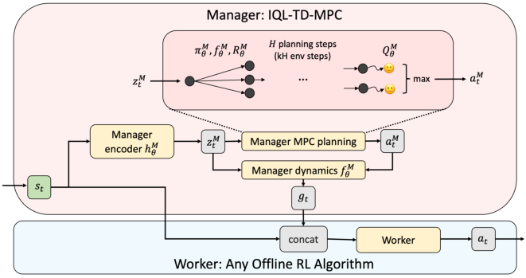
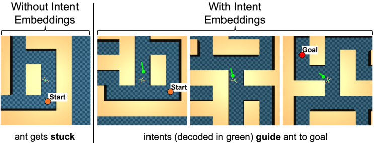

## **IQL-TD-MPC: Implicit Q-Learning for** **Hierarchical Model Predictive Control**


**Rohan Chitnis** _[∗]_

Meta AI

```
ronuchit@meta.com

```


**Yingchen Xu** _[∗]_
Meta AI, FAIR, UCL
```
 ycxu@meta.com

```


**Bobak Hashemi**

Meta AI

```
bobakh@meta.com

```


**Lucas Lehnert**
Meta AI, FAIR

```
lucaslehnert@meta.com

```


**Urun Dogan**
Meta AI

```
urundogan@meta.com

```


**Zheqing Zhu**
Meta AI

```
billzhu@meta.com

```


**Olivier Delalleau**
Meta AI, FAIR
```
olivier.delalleau@gmail.com

```


**Abstract**


Model-based reinforcement learning (RL) has shown great promise due to its sample efficiency, but still struggles with long-horizon sparse-reward tasks, especially
in offline settings where the agent learns from a fixed dataset. We hypothesize that
model-based RL agents struggle in these environments due to a lack of long-term
planning capabilities, and that planning in a temporally abstract model of the environment can alleviate this issue. In this paper, we make two key contributions: 1)
we introduce an offline model-based RL algorithm, IQL-TD-MPC, that extends
the state-of-the-art Temporal Difference Learning for Model Predictive Control
(TD-MPC) with Implicit Q-Learning (IQL); 2) we propose to use IQL-TD-MPC
as a Manager in a hierarchical setting with _any_ off-the-shelf offline RL algorithm
as a Worker. More specifically, we pre-train a temporally abstract IQL-TD-MPC
Manager to predict “intent embeddings”, which roughly correspond to subgoals,
via planning. We empirically show that augmenting state representations with
intent embeddings generated by an IQL-TD-MPC manager significantly improves
off-the-shelf offline RL agents’ performance on some of the most challenging
D4RL benchmark tasks. For instance, the offline RL algorithms AWAC, TD3-BC,
DT, and CQL all get zero or near-zero normalized evaluation scores on the medium
and large antmaze tasks, while our modification gives an average score over 40.


**1** **Introduction**


Model-based reinforcement learning (RL), in which the agent learns a predictive model of the
environment and uses it to plan and/or train policies [Ha and Schmidhuber, 2018, Hafner et al., 2019,
Schrittwieser et al., 2020], has shown great promise due to its sample efficiency compared to its
model-free counterpart [Ye et al., 2021, Micheli et al., 2022]. Most prior work focuses on learning
single-step models of the world, with which planning can be computationally expensive and model
prediction errors may compound over long horizons [Argenson and Dulac-Arnold, 2021, Clavera
et al., 2020]. As a result, model-based RL still struggles with long-horizon sparse-reward tasks,
whereas some evidence suggests that humans are able to combine spatial and temporal abstractions to


_∗_ equal contribution


Preprint. Under review.


plan efficiently over long horizons [Botvinick and Weinstein, 2014]. Modeling the world at a higher
level of abstraction can enable predicting long-term future outcomes more accurately and efficiently.


The challenge of long-horizon sparse-reward tasks is particularly prominent in offline RL, where an
agent must learn from a fixed dataset rather than from exploring an environment [Levine et al., 2020,
Prudencio et al., 2023, Lange et al., 2012, Ernst et al., 2005]. The offline setting is key to training RL
agents safely, but poses unique challenges such as value mis-estimation [Levine et al., 2020].


In this paper, we study offline model-based RL, and hypothesize that planning in a learned temporally
abstract model of the environment can produce significant improvements over “flat” algorithms that
do not use temporal abstraction. Our paper makes two key contributions:


_•_ **Section 3** : We propose IQL-TD-MPC, an offline model-based RL algorithm that combines the
state-of-the-art online RL algorithm Temporal Difference Learning for Model Predictive Control
(TD-MPC) [Hansen et al., 2022] with the popular offline RL algorithm Implicit Q-Learning
(IQL) [Kostrikov et al., 2022]. This combination requires several non-trivial design decisions.

_•_ **Section 4** : We show how to use IQL-TD-MPC as a Manager in a temporally abstr acted hierarchical setting with _any_ off-the-shelf offline RL algorithm as a Worker. To achieve this hierarchy,
we pre-train an IQL-TD-MPC Manager to output “intent embeddings” via MPC planning, then
during Worker training and evaluation, simply concatenate these embeddings to the environment
states. These intent embeddings roughly correspond to subgoals [2] set _k_ steps ahead, thanks to the
coarser timescale used when training the Manager. A benefit of this concatenation strategy is its
simplicity: it does not require modifying Worker training algorithms or losses.


See Fig. 1 for an overview of our framework. Experimentally, we study the popular D4RL benchmark [Fu et al., 2020]. We begin by showing that IQL-TD-MPC is far superior to vanilla TD-MPC
and is on par with several other popular offline RL algorithms. Then, we show the significant benefits
of our proposed hierarchical framework. For instance, the well-established offline RL algorithms
AWAC [Nair et al., 2020], TD3-BC [Fujimoto and Gu, 2021], DT [Chen et al., 2021], and CQL [Kumar et al., 2020] all get zero or near-zero normalized evaluation score on the medium and large
antmaze variants of D4RL, whereas they obtain an average score of over 40 when used as Workers in
our hierarchical framework. Despite the superior performance of our approach on the maze navigation
tasks, our empirical analysis shows that such hierarchical reasoning can be harmful in fine-grained locomotion tasks like the D4RL half-cheetah. Overall, our results suggest that model-based planning in
a temporal abstraction of the environment can be a general-purpose solution to boost the performance
of many different offline RL algorithms, on complex tasks that benefit from higher-level reasoning.
Video results are available at `[https://sites.google.com/view/iql-td-mpc](https://sites.google.com/view/iql-td-mpc)` .


**2** **Preliminaries**


In this section, we briefly recap the offline RL setting, then provide a detailed review of TD-MPC.


**2.1** **Markov Decision Processes and Offline Reinforcement Learning**


We consider the standard infinite-horizon Markov Decision Process (MDP) [Puterman, 1990] setting with continuous states and actions, defined by a tuple ( _S, A, P, R, γ, p_ 0 ) where _S ⊆_ R _[n]_
is the state space, _A ⊆_ R _[m]_ is the action space, _P_ ( _s_ _[′]_ _| s, a_ ) is the transition probability distribution function, _R_ : _S × A �→_ R is the reward function, _γ ∈_ (0 _,_ 1) is the discount factor,
and _p_ 0 ( _s_ ) is the initial state distribution function. The reinforcement learning (RL) objective
is to find a policy _π_ ( _a | s_ ) that maximizes the expected infinite sum of discounted rewards:
E _s_ 0 _∼p_ 0 _,a_ _t_ _∼π_ ( _·|s_ _t_ ) _,s_ _t_ +1 _∼P_ ( _·|s_ _t_ _,a_ _t_ ) [ [�] _[∞]_ _t_ =0 _[γ]_ _[t]_ _[R]_ [(] _[s]_ _[t]_ _[, a]_ _[t]_ [)]][.]


In offline RL [Levine et al., 2020, Prudencio et al., 2023], the agent learns from a fixed dataset rather
than collecting its own data in the environment. One key challenge is dealing with out-of-distribution
actions: if the learned policy samples actions for a given state that were not seen in the training set,
the model may mis-estimate the value of these actions, leading to poor behavior. Imitation learning
methods like Behavioral Cloning (BC) sidestep this issue by mimicking the behavior policy used to
generate the dataset, but may perform sub-optimally with non-expert data [Hussein et al., 2017].


2 We generally do not call the intent embeddings “subgoals” in this paper because the Worker is not explicitly
optimized to achieve them; instead, we are simply concatenating them to environment states.


2




Figure 1: Overview of our hierarchical framework. The Manager is a model-based IQL-TD-MPC
agent (inspired by Kostrikov et al. [2022] and Hansen et al. [2022]) that operates on a coarse timescale
to generate intent embeddings _g_ _t_ . To do so, the Manager performs Model Predictive Control over _H_
planning steps (which is _kH_ environment steps), using a learned policy _π_ _θ_ _[M]_ [, dynamics model] _[ f]_ _θ_ _[ M]_ [,]
reward function _R_ _θ_ _[M]_ [, and critic] _[ Q]_ _[M]_ _θ_ [. Each intent] _[ g]_ _[t]_ [ is concatenated with the state] _[ s]_ _[t]_ [ and given to the]
Worker to output actions _a_ _t_ . This Worker can be any offline RL algorithm.


**2.2** **Temporal Difference Model Predictive Control (TD-MPC)**


Our work builds on TD-MPC [Hansen et al., 2022], an algorithm that combines planning in a latent
space using Model Predictive Control (MPC) with actor-critic Temporal Difference (TD) learning.
The components of TD-MPC (with _θ_ denoting the set of all parameters) are the following:


_•_ An encoder _h_ _θ_ : _S →_ R _[d]_ mapping a state _s_ to its latent representation _z_ = _h_ _θ_ ( _s_ ).

_•_ A forward dynamics model _f_ _θ_ : R _[d]_ _× A →_ R _[d]_, predicting the next latent ˆ _z_ _[′]_ = _f_ _θ_ ( _z, a_ ).

_•_ A reward predictor _R_ _θ_ : R _[d]_ _× A →_ R computing expected rewards ˆ _r_ = _R_ _θ_ ( _z, a_ ).

_•_ A policy _π_ _θ_ : R _[d]_ _× A →_ R [+] used to sample actions _a ∼_ _π_ _θ_ ( _· | z_ ).

_•_ A critic _Q_ _θ_ : R _[d]_ _× A →_ R computing state-action values _Q_ _θ_ ( _z, a_ ) that estimate Q-values under
_π_ _θ_ : _Q_ _θ_ ( _h_ _θ_ ( _s_ ) _, a_ ) _≃_ _Q_ _[π]_ _[θ]_ ( _s, a_ ) ≜ E _π_ _θ_ [ [�] _t≥_ 0 _[γ]_ _[t]_ _[R]_ _[θ]_ [(] _[s]_ _[t]_ _[, a]_ _[t]_ [)] _[ |][ s]_ [0] [ =] _[ s, a]_ [0] [ =] _[ a]_ [)]][.]


The parameters _θ_ of these components are learned by minimizing several losses over sub-trajectories
( _s_ 0 _, a_ 0 _, r_ 1 _, s_ 1 _, a_ 1 _, . . ., r_ _T_ _, s_ _T_ ) sampled from the replay buffer, where _T_ is the horizon:


_•_ A critic loss based on the TD error, _L_ _Q_ = ( _Q_ _θ_ ( ˆ _z_ _t_ _, a_ _t_ ) _−_ [ _r_ _t_ +1 + _γQ_ _θ_ _−_ ( _z_ _t_ +1 _, π_ _θ_ ( _z_ _t_ +1 ))]) [2], where
we denote by _π_ _θ_ ( _z_ ) a sample from _π_ _θ_ ( _· | z_ ) and ˆ _z_ _t_ = _f_ _θ_ (ˆ _z_ _t−_ 1 _, a_ _t−_ 1 ), with ˆ _z_ 0 = _z_ 0 = _h_ _θ_ ( _s_ 0 ).

_•_ A reward prediction loss, _L_ _R_ = ( _R_ _θ_ (ˆ _z_ _t_ _, a_ _t_ ) _−_ _r_ _t_ +1 ) [2] .

_•_ A forward dynamics loss (also called “latent state consistency loss”), _L_ _f_ = _∥f_ _θ_ (ˆ _z_ _t_ _, a_ _t_ ) _−_
_h_ _θ_ _−_ ( _s_ _t_ +1 ) _∥_ [2], where _θ_ _[−]_ are “target” parameters obtained by an exponential moving average of _θ_ .

_•_ A policy improvement loss, _L_ _π_ = _−Q_ _θ_ (ˆ _z_ _t_ _, π_ _θ_ (ˆ _z_ _t_ )), only optimized over the parameters of _π_ _θ_ .


The first three losses are combined through a weighted sum, _L_ = _c_ _f_ _L_ _f_ + _c_ _R_ _L_ _R_ + _c_ _Q_ _L_ _Q_, which trains
_h_ _θ_, _f_ _θ_, _R_ _θ_, and _Q_ _θ_ . The policy _π_ _θ_ is trained independently by minimizing _L_ _π_ without propagating
gradients through either _h_ _θ_ or _Q_ _θ_ .


TD-MPC is online: it alternates training the model by minimizing the losses above, and collecting new
data in the environment. At inference time, TD-MPC plans in the latent space with Model Predictive
Control, which proceeds in three steps: (1) From current state _s_ 0, set the first latent _z_ 0 = _h_ _θ_ ( _s_ 0 ), then
generate _n_ _π_ action sequences by unrolling the policy _π_ _θ_ through the forward model _f_ _θ_ over _T_ steps:
_a_ _t_ _∼_ _π_ _θ_ ( _· | z_ _t_ ) and _z_ _t_ +1 = _f_ _θ_ ( _z_ _t_ _, a_ _t_ ) . (2) Find optimal action sequences using Model Predictive Path
Integral (MPPI) [Williams et al., 2015], which iteratively refines the mean and standard deviation of
a Gaussian with diagonal covariance, starting from the above _n_ _π_ action sequences combined with _n_ _r_
additional random sequences sampled from the current Gaussian. The quality of an action sequence
is obtained by [�] _[T]_ _t_ =0 _[ −]_ [1] _[γ]_ _[t]_ _[R]_ _[θ]_ [(] _[z]_ _[t]_ _[, a]_ _[t]_ [) +] _[ γ]_ _[T]_ _[ Q]_ _[θ]_ [(] _[z]_ _[T]_ _[, a]_ _[T]_ [ )] [, i.e., unrolling the forward dynamics model for]
_T_ steps, using the reward predictor to estimate the sum of rewards, and then bootstrapping with the


3


value estimate of the critic. (3) One of the best _n_ _e_ action sequences sampled in the last iteration of
the previous step is randomly selected, and its first action is taken in the environment.


**3** **Offline Model-Based RL via Implicit Q-Learning (IQL) and TD-MPC**


In this section, we present IQL-TD-MPC, a framework that extends TD-MPC to the offline RL setting
via Implicit Q-Learning (IQL) [Kostrikov et al., 2022]. As we show in our experiments, naively
training a vanilla TD-MPC agent on offline data performs poorly, as the model may suffer from
out-of-distribution generalization errors when the training set has limited coverage. For instance, the
state-action value function _Q_ _θ_ may “hallucinate” very good actions never seen in the training set, and
then the policy _π_ _θ_ would learn to predict these actions. This could steer MPC planning into areas of
the latent representation very far from the training distribution, compounding the error further.


IQL addresses the challenge of out-of-distribution actions by combining two ideas:


_•_ Approximating the optimal value functions _Q_ _[∗]_ and _V_ _[∗]_ with TD-learning using only actions from
the training set _D_ . This is achieved using the following loss on _V_ _θ_ : [3]


_L_ _V,IQL_ = E ( _s,a_ ) _∼D_ [ _L_ _[τ]_ 2 [(] _[Q]_ _θ_ _[−]_ [(] _[s, a]_ [)] _[ −]_ _[V]_ _[θ]_ [(] _[s]_ [))]] _[,]_ (1)


where _L_ _[τ]_ 2 [is the asymmetric squared loss] _[ L]_ _[τ]_ 2 [(] _[u]_ [) =] _[ |][τ][ −]_ [1] _[u<]_ [0] _[|][u]_ [2] [, and] _[ τ][ ∈]_ [(0] _[.]_ [5] _[,]_ [ 1)] [ is a hyper-]
parameter controlling the “optimality” of the learned value functions. The state-action value
function _Q_ _θ_ is optimized through the standard one-step TD loss:


_L_ _Q,IQL_ = E ( _s,a,r,s_ _′_ ) _∼D_ [( _Q_ _θ_ ( _s, a_ ) _−_ ( _r_ + _γV_ _θ_ ( _s_ _[′]_ ))) [2] ] _._ (2)


_•_ Learning a policy using Advantage Weighted Regression [Peng et al., 2019], which minimizes a
weighted behavioral cloning loss whose weights scale exponentially with the advantage:


_L_ _π,IQL_ = _−_ E ( _s,a_ ) _∼D_ [stop_gradient(exp( _βA_ _θ_ ( _s, a_ ))) log _π_ _θ_ ( _a | s_ )] _,_ (3)


with advantage _A_ _θ_ ( _s, a_ ) = _Q_ _θ_ _−_ ( _s, a_ ) _−V_ _θ_ ( _s_ ), and _β >_ 0 an inverse temperature hyper-parameter.


IQL avoids the out-of-distribution actions problem by restricting the policy to mimic actions from the
data, while still outperforming the behavior policy by upweighting the best actions under _Q_ _θ_ and _V_ _θ_ .


To integrate IQL into TD-MPC (refer to Section 2.2), we first replace the TD-MPC policy improvement loss _L_ _π_ with the IQL policy loss _L_ _π,IQL_ (Eq. 3). This necessitates training an additional
component not present in TD-MPC: a state value function _V_ _θ_ to optimize _L_ _V,IQL_ (Eq. 1) and _L_ _Q,IQL_
(Eq. 2). As in TD-MPC (and contrary to IQL), all models are applied on learned latent states _z_ . The
state-action value function _Q_ _θ_ may be trained with either the TD-MPC critic loss _L_ _Q_ or the IQL
critic loss _L_ _Q,IQL_ ; the difference is whether bootstrapping is done using _Q_ _θ_ itself or using _V_ _θ_ . Our
experiments typically use _L_ _Q_ as we found it to give better results in practice.


This is not enough, however, to fully solve the out-of-distribution actions problem. Indeed, the MPC
planning may still prefer actions that lead to high-return states under _R_ _θ_ and _Q_ _θ_, but MPC is actually
exploiting these models’ blind spots and ends up performing poorly. We propose the following
fix: skip the iterative MPPI refinement of actions during planning, instead keeping only the best _n_ _e_
sequences of actions among the _n_ _π_ policy samples. This is a special case of the TD-MPC planning
algorithm discussed in Section 2.2 where the number of random action sequences _n_ _r_ is set to zero.


However, this fix brings in another issue: in the original implementation of TD-MPC, actions are
sampled from the policy _π_ _θ_ by _a ∼N_ ( _µ_ _θ_ ( _z_ ) _, σ_ [2] ), where _µ_ _θ_ is a learned mean and _σ_ decays linearly
towards a fixed hyper-parameter value. If _σ_ is too low, then the policy is effectively deterministic and
all _n_ _π_ samples will be nearly identical, which is problematic in our case because we are using _n_ _r_ = 0 .
If _σ_ is too high, then we again run into the problem of out-of-distribution actions. To avoid having to
carefully tune _σ_, we learn a stochastic policy that outputs both _µ_ _θ_ ( _z_ ) and a state-dependent _σ_ _θ_ ( _z_ ). [4]


With the above changes (using IQL losses, using only samples from the policy for planning, and
learning a stochastic policy), IQL-TD-MPC preserves TD-MPC’s ability to plan efficiently in a
learned latent space, while benefiting from IQL’s robustness to distribution shift in the offline setting.


3
For convenience, when describing the original IQL algorithm, we re-use notations _V_ _θ_, _Q_ _θ_, and _π_ _θ_ even though
they take raw states _s_ as input rather than latent states _z_ .
4 Our policy implementation is based on the Soft Actor-Critic (SAC) code from Yarats and Kostrikov [2020].


4


**4** **IQL-TD-MPC as a Hierarchical Planner**


We now turn to our second contribution, which is a hierarchical framework (Fig. 1) that uses IQLTD-MPC as a Manager with _any_ off-the-shelf offline RL algorithm as a Worker. This hierarchy aims
to endow the agent with the ability to reason at longer time horizons. Indeed, although TD-MPC uses
MPC planning to select actions, its planning horizon is typically short: Hansen et al. [2022] use a
horizon of 5, and found no benefit from increasing it further due to compounding model errors. For
sparse-reward tasks, this makes the planner highly dependent on the quality of the bootstrap estimates
predicted by the critic _Q_ _θ_, which may be challenging to get right under complex dynamics.


We address this challenge by making IQL-TD-MPC operate as a Manager at a coarser timescale
(adding the superscript _M_ ), processing trajectories ( _s_ 0 _, a_ _[M]_ 0 _[, r]_ _k_ _[M]_ _[, s]_ _[k]_ _[, a]_ _[M]_ _k_ _[, . . ., r]_ _kH_ _[M]_ _[, s]_ _[kH]_ [)][ where:]


_• k_ is a hyper-parameter controlling the coarseness of the latent timescale, such that each latent
transition skips over _k_ low-level environment steps.

_• H_ is the planning horizon; therefore, the effective environment-level horizon is _kH_ .

_• r_ _tk_ _[M]_ [=][ �] _[tk]_ _i_ =( _t−_ 1) _k_ +1 _[r]_ _[i]_ [, that is, Manager rewards sum up over the previous] _[ k]_ [ environment steps.]

_• a_ _[M]_ _tk_ [is an abstract action “summarizing” the transition from] _[ s]_ _[tk]_ [ to] _[ s]_ [(] _[t]_ [+1)] _[k]_ [.]


How should these abstract actions be defined [Pertsch et al., 2021, Rosete-Beas et al., 2023]? Prior
work learned an autoencoder that can reconstruct the next latent state [Mandlekar et al., 2020, Li et al.,
2022], and one could define the abstract action as the latent representation of such an autoencoder.
We adopt a similar approach in spirit, but tailored to our TD-MPC setup. Specifically, we train an
“inverse dynamics” model _b_ _[M]_ _θ_ [in the latent space (instead of the raw environment state space):]


_a_ _[M]_ _tk_ [=] _[ b]_ _[M]_ _θ_ [(] _[z]_ _tk_ _[M]_ _[, z]_ ( _[M]_ _t_ +1) _k_ [)] _[,]_ (4)


where _z_ _i_ _[M]_ = _h_ _[M]_ _θ_ [(] _[s]_ _[i]_ [)] [ is the Manager encoding of state] _[ s]_ _[i]_ [.] _[ b]_ _[M]_ _θ_ [is trained implicitly by backpropagating]
through _a_ _t_ the gradient of the total loss. Similar to Director [Hafner et al., 2022], we found discrete
actions to help, and thus modify the policy _π_ _θ_ _[M]_ [to output discrete actions (see Appendix A for details).]


Once trained, the IQL-TD-MPC Manager can be used to generate “intent embeddings” to augment
the state representation of any Worker that acts in the environment. We define the intent embedding
_g_ _t_ _∈_ R _[d]_ at time _t_ as the difference between the predicted next latent state and the current latent state:


_g_ _t_ = _f_ _θ_ _[M]_ [(] _[z]_ _t_ _[M]_ _[, a]_ _[M]_ _t_ [)] _[ −]_ _[z]_ _t_ _[M]_ _[,]_ (5)


where when training the Worker, _a_ _[M]_ _t_ comes from the inverse dynamics model: _a_ _[M]_ _t_ = _b_ _[M]_ _θ_ [(] _[z]_ _t_ _[M]_ _[, z]_ _t_ _[M]_ + _k_ [)] [.]
Note that we apply the intent embedding on _each_ environment step, so Eq. 5 does _not_ index by _k_ .


The Worker can be any policy _π_ . Its states are concatenated with the intent embeddings: _a_ _t_ _∼_ _π_ ( _· |_
CONCAT ( _s_ _t_ _, g_ _t_ )) . Since intent embeddings are in the Manager’s latent space, the Manager may be
trained independently from the Worker. In practice, we pre-train a single Manager for a task and use
it with a range of different Workers (see Section 5.2 for experiments). A benefit of this concatenation
strategy is its simplicity: it does not require modifying Worker training algorithms or losses, only
appending intent embeddings to states during (i) offline dataset loading and (ii) evaluation.


**4.1** **Why are intent embeddings beneficial for offline RL?**


Before turning to experiments, we provide an intuitive explanation for why we believe augmenting
states with intent embeddings can be beneficial. For simplicity, we focus on the well-understood
Behavioral Cloning (BC) algorithm, but we note that many other offline RL algorithms such as
Advantage Weighted Actor-Critic (AWAC) [Nair et al., 2020], Implicit Q-Learning (IQL) [Kostrikov
et al., 2022], and Twin Delayed DDPG Behavioral Cloning (TD3-BC) [Fujimoto and Gu, 2021] use
the BC objective in some way, and thus the intuition may carry over to these algorithms as well.


We first provide an information-theoretic argument to explain why intent embedding should make
the imitation learning objective easier to optimize. One of the primary obstacles in long-horizon
sparse-reward offline RL is the ambiguity surrounding the relationship between each state-action pair
in a dataset and its corresponding long-term objective. By incorporating intent embeddings derived
from MPC planning into state-action pairs, our framework provides offline RL algorithms with a
more well-defined association between each state-action pair and the objective being targeted. For a
BC policy _π_ : _S �→A_, we typically train _π_ to match the state-action pairs in the offline dataset. With


5


|Algorithm<br>Dataset|IQL|TT|TAP|TD-MPC|IQL-TD-MPC|
|---|---|---|---|---|---|
|antmaze-umaze-v2<br>antmaze-umaze-diverse-v2<br>antmaze-medium-play-v2<br>antmaze-medium-diverse-v2<br>antmaze-large-play-v2<br>antmaze-large-diverse-v2<br>antmaze-ultra-play-v0<br>antmaze-ultra-diverse-v0|87_._5_ ±_ 2_._6<br>**66.2**_ ±_ 13_._8<br>71_._5_ ±_ 12_._6<br>70_._0_ ±_ 10_._9<br>40_._8_ ±_ 12_._7<br>47_._5_ ±_ 9_._5<br>9_._2_ ±_ 6_._7<br>**22.5**_ ±_ 8_._3|**100.0**_ ±_ 0_._0<br>21_._5_ ±_ 2_._9<br>**93.3**_ ±_ 6_._4<br>**100.0**_ ±_ 0_._0<br>66_._7_ ±_ 12_._2<br>60_._0_ ±_ 12_._7<br>**20.0**_ ±_ 10_._0<br>**33.3**_ ±_ 12_._2|81_._5_ ±_ 2_._8<br>**68.5**_ ±_ 3_._3<br>78_._0_ ±_ 4_._4<br>85_._0_ ±_ 3_._6<br>**74.0**_ ±_ 4_._4<br>**82.0**_ ±_ 5_._0<br>**22.0**_ ±_ 4_._1<br>**26.0**_ ±_ 4_._4|44_._6_ ±_ 28_._2<br>0_._0_ ±_ 0_._0<br>1_._8_ ±_ 3_._91<br>0_._0_ ±_ 0_._0<br>0_._0_ ±_ 0_._0<br>0_._0_ ±_ 0_._0<br>0_._0_ ±_ 0_._0<br>0_._0_ ±_ 0_._0|52_._0_ ±_ 46_._0<br>**72.6**_ ±_ 26_._6<br>**88.8**_ ±_ 5_._9<br>40_._3_ ±_ 34_._2<br>66_._6_ ±_ 13_._7<br>4_._0_ ±_ 4_._1<br>**20.6**_ ±_ 16_._0<br>3_._6_ ±_ 10_._1|
|maze2d-umaze-v1<br>maze2d-medium-v1<br>maze2d-large-v1|37_._7_ ±_ 2_._0<br>35_._5_ ±_ 1_._0<br>49_._6_ ±_ 22_._0|36_._7_ ±_ 2_._1<br>32_._7_ ±_ 1_._1<br>33_._2_ ±_ 1_._0|**58.6**_ ±_ 1_._4<br>_−_3_._9_ ±_ 0_._3<br>_−_2_._1_ ±_ 0_._1|**76.4**_ ±_ 20_._8<br>85_._3_ ±_ 15_._8<br>**121.6**_ ±_ 27_._0|40_._9_ ±_ 45_._3<br>**161.0**_ ±_ 11_._3<br>**158.9**_ ±_ 77_._1|
|halfcheetah-medium-v2<br>halfcheetah-medium-replay-v2<br>halfcheetah-medium-expert-v2|48_._3_ ±_ 0_._11<br>44_._2_ ±_ 1_._2<br>94_._6_ ±_ 0_._2|46_._9_ ±_ 0_._4<br>41_._9_ ±_ 2_._5<br>**95.0**_ ±_ 0_._2|45_._0_ ±_ 0_._1<br>40_._8_ ±_ 0_._6<br>91_._8_ ±_ 0_._8|45_._7_ ±_ 14_._6<br>45_._7_ ±_ 5_._0<br>_−_1_._0_ ±_ 0_._9|**57.4**_ ±_ 0_._1<br>**49.2**_ ±_ 1_._3<br>44_._8_ ±_ 8_._5|


Table 1: Normalized scores of IQL-TD-MPC, other offline RL algorithms (IQL [Kostrikov et al.,
2022], TT [Janner et al., 2021], TAP [Jiang et al., 2022]) and TD-MPC on D4RL after 1M training
steps. IQL results are from Tarasov et al. [2022]. TT and TAP results are from their papers, except for
antmaze-umaze-diverse and maze2d, which we reproduced with the default hyperparameters because
they were not reported. Each entry shows the mean over 100 episodes and 5 seeds, and the standard
deviation over seeds. Bolded numbers are within one standard deviation of the best result in each row.


intent embeddings, the agent can instead learn _π_ _[′]_ : _S ×_ R _[d]_ _�→A_, which maps a pair of state and
intent random variables ( _S_ _t_ _, G_ _t_ ) to an action random variable _A_ _t_ . Since _A_ _t_ is not independent of _G_ _t_
given _S_ _t_, the mutual information _I_ (( _S_ _t_ _, G_ _t_ ); _A_ _t_ ) _≥_ _I_ ( _S_ _t_ ; _A_ _t_ ), so ( _S_ _t_ _, G_ _t_ ) contains at least as much
information about _A_ _t_ as _S_ _t_ does on its own when learning a BC policy via imitation learning.


The above argument explains why it should be easier to optimize the BC objective when training
the Worker, thanks to the additional information contained in the intent embedding. This can be
particularly beneficial on offline datasets built from a mixture of varied policies [Fu et al., 2020].
In addition to simplifying the task of the BC Worker, the Manager is trained to provide “good”
intent embeddings at inference time. This is achieved through the MPC-based planning procedure
of IQL-TD-MPC, by identifying a sequence of abstract actions ( _a_ _[M]_ _t_ _[, a]_ _[M]_ _t_ + _k_ _[, . . ., a]_ _[M]_ _t_ + _kH_ [)] [ that leads]
to high expected return (according to _R_ _θ_ _[M]_ [and] _[ Q]_ _[M]_ _θ_ [when unrolling] _[ f]_ _θ_ _[ M]_ [). The intent embedding] _[ g]_ _[t]_ [,]
obtained from _a_ _[M]_ _t_ through Eq. 5, is then used to condition the Worker policy, similar to prior work
on goal-conditioned imitation learning [Mandlekar et al., 2020, Lynch et al., 2020].


**5** **Experiments**


Our experiments aim to answer three questions: **(Q1)** How does IQL-TD-MPC perform as an offline
RL algorithm, compared to both the original TD-MPC algorithm and other offline RL algorithms?
**(Q2)** How much benefit do we obtain by using IQL-TD-MPC as a Manager in a hierarchical setting?
**(Q3)** To what extent are the observed benefits actually coming from our IQL-TD-MPC algorithm?


**Experimental Setup.** We focus on continuous control tasks of the D4RL benchmark [Fu et al.,
2020], following the experimental protocol from CORL [Tarasov et al., 2022]: training with a
batch size of 256 and reporting the normalized score (0 is random, 100 is expert) at end of training,
averaged over 100 evaluation episodes. Averages and standard deviations are reported over 5 random
seeds. Each experiment was run on an A100 GPU. Training for a single seed (including both pretraining the Manager and training the Worker) took _∼_ 5 hours on average. See Appendix C for all
hyper-parameters.


**5.1** **(Q1) How does IQL-TD-MPC perform as an offline RL algorithm?**


We begin with a preliminary experiment to verify that IQL-TD-MPC is a viable offline RL algorithm.
For this experiment, we compare IQL-TD-MPC, TD-MPC, and several offline RL algorithms from
the literature on various tasks. See Table 1 for results. There are several key trends we can observe.
First, vanilla TD-MPC does not perform well in general, and completely fails in the more difficult
variants of the antmaze task. This is expected because TD-MPC is not designed to train from offline


6


|Algorithm<br>Dataset|AWAC|BC|DT|IQL|TD3-BC|CQL|
|---|---|---|---|---|---|---|
|antmaze-umaze-v2<br>antmaze-umaze-diverse-v2<br>antmaze-medium-play-v2<br>antmaze-medium-diverse-v2<br>antmaze-large-play-v2<br>antmaze-large-diverse-v2<br>antmaze-ultra-play-v0<br>antmaze-ultra-diverse-v0|51_ →_86<br>53_ →_60<br>0_ →_36<br>0_._8_ →_16<br>0_ →_67<br>0_ →_40<br>0_ →_18<br>0_ →_37|52_ →_78<br>49_ →_48<br>0_ →_52<br>0_._2_ →_20<br>0_ →_50<br>0_ →_38<br>0_ →_18<br>0_ →_35|64_ →_89<br>55_ →_38<br>0_ →_43<br>0_._2_ →_33<br>0_ →_53<br>0_ →_31<br>0_ →_10<br>0_ →_10|44_ →_80<br>60_ →_51<br>70_ →_64<br>63_ →_30<br>54_ →_70<br>31_ →_46<br>9_ →_16<br>22_ →_27|90_ →_82<br>45_ →_53<br>0_._2_ →_60<br>0_._4_ →_21<br>0_ →_46<br>0_ →_29<br>0_ →_20<br>0_ →_29|67_ →_69<br>37_ →_36<br>0_._8_ →_33<br>0_._2_ →_14<br>0_ →_19<br>0_ →_16<br>0_ →_5<br>0_._6_ →_5|
|maze2d-umaze-v1<br>maze2d-medium-v1<br>maze2d-large-v1|77_ →_78<br>43_ →_67<br>193_ →_132|3_ →_64<br>3_ →_70<br>_−_1_ →_94|26_ →_63<br>13_ →_71<br>3_ →_96|41_ →_77<br>32_ →_78<br>42_ →_135|39_ →_77<br>101_ →_47<br>69_ →_126|_−_14_ →_7<br>104_ →_16<br>53_ →_64|
|halfcheetah-medium-v2<br>halfcheetah-medium-replay-v2<br>halfcheetah-medium-expert-v2|49_ →_45<br>45_ →_41<br>95_ →_80|42_ →_45<br>34_ →_40<br>57_ →_84|42_ →_47<br>39_ →_37<br>63_ →_52|47_ →_43<br>44_ →_40<br>92_ →_79|47_ →_44<br>44_ →_39<br>86_ →_76|46_ →_44<br>45_ →_32<br>90_ →_45|


Table 2: Results of our hierarchical framework, where we append IQL-TD-MPC Manager intents
to states in various offline RL algorithms taken from the CORL repository [Tarasov et al., 2022].
Each table entry is of the form “baseline evaluation score _→_ our evaluation score”. In either case, we
report scores after 500K steps of training; in general, we found that all agents plateaued after this
point. For our hierarchical framework, these 500K steps correspond to 300K steps of pre-training the
Manager, followed by 200K steps of training the CORL Worker. All entries report a mean over 5
independent random seeds; see Table 4 in Appendix B for standard deviations. Green entries indicate
statistically significant improvement, while red entries indicate statistically significant degradation.


data. The one exception is the umaze environment in maze2d, where TD-MPC actually outperforms
IQL-TD-MPC by a significant margin. We hypothesize that this is because the dynamics of this
environment are very simple, and the data provides adequate coverage to learn effective TD-MPC
models, while the conservative expectile updates of IQL-TD-MPC cause learning to be slower. The
other trend we see is that IQL-TD-MPC is generally on par with the other offline RL algorithms. This
confirms our hypothesis that IQL-TD-MPC is a viable model-based offline RL algorithm.


**5.2** **(Q2) How much benefit do we obtain by using IQL-TD-MPC as a Manager?**


Now, we turn to the main results of our work, where we demonstrate the benefits of using IQL-TDMPC as a Manager with a range of different non-hierarchical offline RL algorithms as Workers. For
this experiment, we used offline RL algorithms from the CORL repository [Tarasov et al., 2022] as
Workers. We concatenated intent embeddings output by the Manager to the environment states seen
by these Workers during both training and evaluation. Once the boilerplate code was written, the
changes to the CORL algorithms were straightforward, since they typically only required adding two
lines of code to (i) augment states in the offline dataset and (ii) wrap the evaluation environment.


Table 2 shows the results of this experiment, for the following CORL Workers: Advantage Weighted
Actor-Critic (AWAC) [Nair et al., 2020], Behavioral Cloning (BC), Decision Transformer (DT) [Chen
et al., 2021], Implicit Q-Learning (IQL) [Kostrikov et al., 2022], Twin Delayed DDPG Behavioral
Cloning (TD3-BC) [Fujimoto and Gu, 2021], and Conservative Q-Learning (CQL) [Kumar et al.,
2020]. Overall, we observe a dramatic improvement in performance for all these agents compared
to their baseline versions, whose only difference is the lack of intent embeddings concatenated to
state vectors. Interestingly, vanilla AWAC / BC / DT / TD3-BC all get a zero score on the large and
ultra variants of the antmaze task, while with our modification, they are able to learn to solve the task.
This shows that the intent embeddings produced by the Manager are highly useful, and can be used
to compensate for the lack of long-term planning abilities in off-the-shelf RL agents.


Notably, our approach slightly worsens performance on the half-cheetah locomotion tasks. A
likely explanation is that these tasks are more about fine-grained control and thus have less natural
hierarchical structure for our framework to exploit. The intent embeddings are trained by having the
Manager look at states _k_ timesteps ahead, but lookahead may not help on these tasks. We hypothesize
that they may actually hurt as they restrict the pool of candidate actions the Worker is considering.


In Fig. 2, we visualize an episode of the Behavioral Cloning (BC) agent on the antmaze-large-play-v2
task, in order to qualitatively understand the benefits of our framework. On the left, we see that


7




Figure 2: Visualization of an episode of the Behavioral Cloning (BC) agent on the antmaze-largeplay-v2 task. On the left, without intent embeddings, the ant gets stuck close to the start of the maze,
never reaching the goal. On the right, the ant reaches the goal, guided by the intent embeddings whose
decoding is visualized in green. We see that the intent embeddings act as latent-space subgoals.

|Algorithm<br>Dataset|AWAC|BC|IQL|TD3-BC|
|---|---|---|---|---|
|antmaze-medium-play-v2<br>antmaze-medium-diverse-v2<br>antmaze-large-play-v2<br>antmaze-large-diverse-v2|0_ →_0<br>0_._8_ →_0_._2<br>0_ →_0<br>0_ →_0|0_ →_0<br>0_._2_ →_0<br>0_ →_0<br>0_ →_0|70_ →_66<br>63_ →_71<br>54_ →_25<br>31_ →_37|0_._2_ →_0<br>0_._4_ →_0_._2<br>0_ →_0<br>0_ →_0|
|halfcheetah-medium-v2<br>halfcheetah-medium-replay-v2<br>halfcheetah-medium-expert-v2|49_ →_49<br>45_ →_43<br>95_ →_93|42_ →_42<br>34_ →_34<br>57_ →_61|47_ →_47<br>44_ →_43<br>92_ →_90|47_ →_47<br>44_ →_44<br>86_ →_87|


Table 3: Ablation results, where we replace Manager intent embeddings with random vectors. Each
table entry is of the form “baseline evaluation score _→_ ablation evaluation score”. We report scores
after 500K steps of training. All entries report a mean over 5 independent random seeds; see Table 5
in Appendix B for standard deviations. Red entries indicate statistically significant degradation.


without intent embeddings, the ant gets stuck close to the start of the maze, never reaching the goal.
On the right, we see that the ant reaches the goal, guided by the intent embeddings visualized in green.
To generate these green visualizations, we trained a separate decoder alongside the IQL-TD-MPC
Manager that converts the intent embeddings (in the Manager’s latent space) back into the raw
environment state space, which contains the position and velocity of the ant. The green dot shows the
position, and the green line attached to the dot shows the velocity (speed is the length of the line).
This decoder was trained on a reconstruction loss and did not affect the training of the other models.
Overall, this visualization shows that the intent embeddings are effectively acting as latent-space
subgoals that the Worker exploits to learn a more effective policy.


**5.3** **(Q3) To what extent are the observed benefits coming from IQL-TD-MPC?**


One may wonder whether the strong results in Table 2 are simply due to a “regularization” effect, or
whether the intent embeddings simply tie-break the stochasticity of the behavior policy. We conduct
an ablation to address this: we run our framework, but replace the intent embeddings with random
vectors of the same dimensionality, with entries drawn uniformly from (0 _,_ 1) . See Table 3 for results.


Across nearly all tasks and algorithms, we found no statistically significant difference between the
baseline and the ablation. This means that the Workers typically learned to ignore the random vectors.
Comparing against the clear benefits of our proposed method in Table 2, we can conclude that
IQL-TD-MPC was critical; it guides the Workers in a more impactful way than just regularization.


Interestingly, Table 3 shows that the Workers learned to ignore the random vectors in the half-cheetah
tasks (performance is unchanged), while in Table 2, our modification _harmed_ performance. This
confirms that the intent embeddings are correlated with environment states in a way that RL algorithms
do not ignore, which may help or hurt depending on how much hierarchical structure the task has.


8


**6** **Related Work**


**6.1** **Offline Reinforcement Learning**


In offline reinforcement learning [Levine et al., 2020, Prudencio et al., 2023, Lange et al., 2012, Ernst
et al., 2005], the agent learns from a fixed offline dataset. Li et al. [2022] learn a generative model
of potential goals to pursue given the current state, along with a goal-conditioned policy trained by
Conservative Q-Learning (CQL, Kumar et al. 2020), from a combination of the task reward with a
goal-reaching reward. Planning is performed by optimizing goals (with CEM) to maximize those
rewards as estimated by the value function of the policy over the planning horizon. In our work, by
contrast, our intent embeddings are defined in the Manager’s learned latent space, and we can use this
Manager with any offline RL Worker. The recently proposed POR algorithm [Xu et al., 2022] learns
separate “guide” and “execute” policies, where the “guide” policy abstracts out the action space. Our
Manager can also be seen as such a guide that would plan over longer time horizons.


A recent line of work uses Transformers [Vaswani et al., 2017] to model the trajectories in the
offline dataset [Janner et al., 2021, Chen et al., 2021]. Jiang et al. [2022] propose the Trajectory
Autoencoding Planner (TAP), that models a trajectory by a sequence of discrete tokens learned by a
Vector Quantised-Variational AutoEncoder (VQ-VAE, van den Oord et al., 2017), conditioned on the
initial state. This enables efficient search with a Transformer-based trajectory generative model. One
can relate this approach to ours by interpreting the generation of encoded trajectories as the Manager,
and the decoding into actual actions as the Worker. However, this distinction is somewhat artificial
since in contrast to our approach, the Manager provides an intent embedding that encodes an entire
predicted trajectory, rather than a single state. In addition, TAP relies on a Monte-Carlo “return-to-go”
estimator to bootstrap search, while we explicitly learn a temporally abstract Manager value function.


Play-LMP [Lynch et al., 2020] encodes goal-conditioned sub-trajectories in a latent space through a
conditional sequence-to-sequence VAE [Sohn et al., 2015], which can be used to sample latent plans
that are decoded through a goal-conditioned policy. However, there is no notion of optimizing a task
reward here: instead, the desired goal state must be provided as input to the model to solve a task.


**6.2** **Hierarchical Reinforcement Learning**


Though our work focuses on the offline setting, we highlight a few related works in the online setting.
Director [Hafner et al., 2022] trains Manager and Worker policies in imagination, where the Manager
actions are discrete representations of goals for the Worker, learned from the latent representation of a
world model. Although we re-use a similar discrete representation for Manager actions, this approach
differs from our work in several ways: it focuses on the online setting, there is no planning during
inference, and the world model is not temporally abstract. Our work may be related to the literature
on option discovery [Sutton et al., 1999, Bagaria and Konidaris, 2020, Daniel et al., 2016, Brunskill
and Li, 2014]. In our proposed hierarchical framework, the intent embeddings output by our Manager
can be seen as latent skills [Pertsch et al., 2021, Rosete-Beas et al., 2023] that the Worker conditions
on to improve its learning efficiency. Finally, our work can be seen as an instantiation of one piece of
the H-JEPA framework laid out by LeCun [2022]: we learn a Manager world model at a higher level
of temporal abstraction, which works in tandem with a Worker to optimize rewards.


**7** **Limitations and Future Work**


In this paper, we propose a non-trivial extension of TD-MPC to the offline setting based on IQL, and
leverage its superior planning abilities as a temporally extended Manager in a hierarchical architecture.
Our experiments confirm the benefits of this hierarchical framework in guiding offline RL algorithms.


Our algorithm still suffers from a number of limitations that we intend to tackle in future work: (1) Our
method hurts performance on some locomotion tasks (Table 2), which require fine-grained control. It
is unsurprising that hierarchy does not help in such contexts; however, further investigation is required
to confirm our intuition for why the Worker algorithms are unable to simply ignore these harmful
intent embeddings. (2) The Worker agent may also be improved by actively planning toward the
intent embedding set by the Manager. For instance, the Worker itself could be an IQL-TD-MPC agent
modeling the world at the original environment timescale, unlike the temporally abstract Manager.
(3) Our Manager’s timescale is defined by a fixed hyper-parameter _k_ . This could instead be set


9


dynamically by the Manager, and included in the intent embedding concatenated to the environment
state. (4) Similar to the TD-MPC algorithm we build on, our approach is computationally intensive,
both during Manager pre-training and inference, because we need to unroll the Manager’s world
model to obtain the intent embeddings. A potential avenue to speed it up could be to represent the
world model as a Transformer [Vaswani et al., 2017, Micheli et al., 2022], for more efficient rollouts.


**References**


Arthur Argenson and Gabriel Dulac-Arnold. Model-based offline planning, 2021.


Akhil Bagaria and George Konidaris. Option discovery using deep skill chaining. In _International_
_Conference on Learning Representations_, 2020.


Yoshua Bengio, Nicholas Léonard, and Aaron Courville. Estimating or propagating gradients through
stochastic neurons for conditional computation, 2013.


Matthew Botvinick and Ari Weinstein. Model-based hierarchical reinforcement learning and human
action control. _Philos Trans R Soc Lond B Biol Sci_, 369(1655), November 2014.


Emma Brunskill and Lihong Li. Pac-inspired option discovery in lifelong reinforcement learning. In
_International conference on machine learning_, pages 316–324. PMLR, 2014.


Lili Chen, Kevin Lu, Aravind Rajeswaran, Kimin Lee, Aditya Grover, Michael Laskin, Pieter Abbeel,
Aravind Srinivas, and Igor Mordatch. Decision transformer: Reinforcement learning via sequence
modeling. In A. Beygelzimer, Y. Dauphin, P. Liang, and J. Wortman Vaughan, editors, _Advances_
_in Neural Information Processing Systems_, 2021.


Ignasi Clavera, Violet Fu, and Pieter Abbeel. Model-augmented actor-critic: Backpropagating
through paths, 2020.


Christian Daniel, Herke Van Hoof, Jan Peters, and Gerhard Neumann. Probabilistic inference for
determining options in reinforcement learning. _Machine Learning_, 104:337–357, 2016.


Damien Ernst, Pierre Geurts, and Louis Wehenkel. Tree-based batch mode reinforcement learning.
_Journal of Machine Learning Research_, 6, 2005.


Justin Fu, Aviral Kumar, Ofir Nachum, George Tucker, and Sergey Levine. D4rl: Datasets for deep
data-driven reinforcement learning, 2020.


Scott Fujimoto and Shixiang (Shane) Gu. A minimalist approach to offline reinforcement learning. In
M. Ranzato, A. Beygelzimer, Y. Dauphin, P.S. Liang, and J. Wortman Vaughan, editors, _Advances_
_in Neural Information Processing Systems_, volume 34, pages 20132–20145. Curran Associates,
Inc., 2021.


David Ha and Jürgen Schmidhuber. Recurrent world models facilitate policy evolution. In _Proceedings_
_of the 32Nd International Conference on Neural Information Processing Systems_, NeurIPS’18,
pages 2455–2467, 2018.


Danijar Hafner, Timothy Lillicrap, Ian Fischer, Ruben Villegas, David Ha, Honglak Lee, and James
Davidson. Learning latent dynamics for planning from pixels. In Kamalika Chaudhuri and Ruslan
Salakhutdinov, editors, _Proceedings of the 36th International Conference on Machine Learning_,
pages 2555–2565, 2019.


Danijar Hafner, Kuang-Huei Lee, Ian Fischer, and Pieter Abbeel. Deep hierarchical planning from
pixels, 2022. URL `[https://arxiv.org/abs/2206.04114](https://arxiv.org/abs/2206.04114)` .


Nicklas Hansen, Xiaolong Wang, and Hao Su. Temporal difference learning for model predictive
control. _arXiv preprint arXiv:2203.04955_, 2022.


Ahmed Hussein, Mohamed Medhat Gaber, Eyad Elyan, and Chrisina Jayne. Imitation learning: A
survey of learning methods. _ACM Computing Surveys (CSUR)_, 50(2):1–35, 2017.


Michael Janner, Qiyang Li, and Sergey Levine. Offline reinforcement learning as one big sequence
modeling problem. In _Advances in Neural Information Processing Systems_, 2021.


10


Zhengyao Jiang, Tianjun Zhang, Michael Janner, Yueying Li, Tim Rocktäschel, Edward Grefenstette,
and Yuandong Tian. Efficient planning in a compact latent action space, 2022. URL `[https:](https://arxiv.org/abs/2208.10291)`
`[//arxiv.org/abs/2208.10291](https://arxiv.org/abs/2208.10291)` .


Ilya Kostrikov, Ashvin Nair, and Sergey Levine. Offline reinforcement learning with Implicit
Q-Learning. In _International Conference on Learning Representations_, 2022. URL `[https:](https://openreview.net/forum?id=68n2s9ZJWF8)`
`[//openreview.net/forum?id=68n2s9ZJWF8](https://openreview.net/forum?id=68n2s9ZJWF8)` .


Aviral Kumar, Aurick Zhou, George Tucker, and Sergey Levine. Conservative q-learning for offline
reinforcement learning. In H. Larochelle, M. Ranzato, R. Hadsell, M.F. Balcan, and H. Lin,
editors, _Advances in Neural Information Processing Systems_, volume 33, pages 1179–1191. Curran
Associates, Inc., 2020.


Sascha Lange, Thomas Gabel, and Martin A. Riedmiller. Batch reinforcement learning. In _Reinforce-_
_ment Learning_, 2012.


Yann LeCun. A path towards autonomous machine intelligence version 0.9. 2, 2022-06-27. _Open_
_Review_, 62, 2022.


Sergey Levine, Aviral Kumar, George Tucker, and Justin Fu. Offline reinforcement learning: Tutorial,
review, and perspectives on open problems. _arXiv preprint arXiv:2005.01643_, 2020.


Jinning Li, Chen Tang, Masayoshi Tomizuka, and Wei Zhan. Hierarchical planning through goalconditioned offline reinforcement learning. _IEEE Robotics and Automation Letters_, 7(4):10216–
10223, 2022. doi: 10.1109/LRA.2022.3190100.


Corey Lynch, Mohi Khansari, Ted Xiao, Vikash Kumar, Jonathan Tompson, Sergey Levine, and
Pierre Sermanet. Learning latent plans from play. In Leslie Pack Kaelbling, Danica Kragic,
and Komei Sugiura, editors, _Proceedings of the Conference on Robot Learning_, volume 100 of
_Proceedings of Machine Learning Research_, pages 1113–1132. PMLR, 30 Oct–01 Nov 2020.


Ajay Mandlekar, Fabio Ramos, Byron Boots, Silvio Savarese, Li Fei-Fei, Animesh Garg, and Dieter
Fox. IRIS: Implicit reinforcement without interaction at scale for learning control from offline
robot manipulation data, 2020. URL `[https://arxiv.org/abs/1911.05321](https://arxiv.org/abs/1911.05321)` .


Vincent Micheli, Eloi Alonso, and François Fleuret. Transformers are sample efficient world models,
2022. URL `[https://arxiv.org/abs/2209.00588](https://arxiv.org/abs/2209.00588)` .


Ashvin Nair, Abhishek Gupta, Murtaza Dalal, and Sergey Levine. Awac: Accelerating online reinforcement learning with offline datasets, 2020. URL `[https://arxiv.org/abs/2006.09359](https://arxiv.org/abs/2006.09359)` .


Xue Bin Peng, Aviral Kumar, Grace Zhang, and Sergey Levine. Advantage-weighted regression:
Simple and scalable off-policy reinforcement learning, 2019. URL `[https://arxiv.org/abs/](https://arxiv.org/abs/1910.00177)`
`[1910.00177](https://arxiv.org/abs/1910.00177)` .


Karl Pertsch, Youngwoon Lee, and Joseph Lim. Accelerating reinforcement learning with learned
skill priors. In _Conference on robot learning_, pages 188–204. PMLR, 2021.


Rafael Figueiredo Prudencio, Marcos ROA Maximo, and Esther Luna Colombini. A survey on offline
reinforcement learning: Taxonomy, review, and open problems. _IEEE Transactions on Neural_
_Networks and Learning Systems_, 2023.


Martin L Puterman. Markov decision processes. _Handbooks in operations research and management_
_science_, 2:331–434, 1990.


Erick Rosete-Beas, Oier Mees, Gabriel Kalweit, Joschka Boedecker, and Wolfram Burgard. Latent
plans for task-agnostic offline reinforcement learning. In _Conference on Robot Learning_, pages
1838–1849. PMLR, 2023.


Julian Schrittwieser, Ioannis Antonoglou, Thomas Hubert, Karen Simonyan, Laurent Sifre, Simon
Schmitt, Arthur Guez, Edward Lockhart, Demis Hassabis, Thore Graepel, Timothy Lillicrap, and
David Silver. Mastering Atari, Go, Chess and Shogi by planning with a learned model. _Nature_,
588(7839):604–609, Dec 2020. ISSN 1476-4687. doi: 10.1038/s41586-020-03051-4. URL
`[https://doi.org/10.1038/s41586-020-03051-4](https://doi.org/10.1038/s41586-020-03051-4)` .


11


Kihyuk Sohn, Honglak Lee, and Xinchen Yan. Learning structured output representation using deep
conditional generative models. In C. Cortes, N. Lawrence, D. Lee, M. Sugiyama, and R. Garnett,
editors, _Advances in Neural Information Processing Systems_, volume 28. Curran Associates, Inc.,
2015.


Richard S Sutton, Doina Precup, and Satinder Singh. Between mdps and semi-mdps: A framework
for temporal abstraction in reinforcement learning. _Artificial intelligence_, 112(1-2):181–211, 1999.


Denis Tarasov, Alexander Nikulin, Dmitry Akimov, Vladislav Kurenkov, and Sergey Kolesnikov.
CORL: Research-oriented deep offline reinforcement learning library. In _3rd Offline RL Workshop:_
_Offline RL as a ”Launchpad”_, 2022. URL `[https://openreview.net/forum?id=SyAS49bBcv](https://openreview.net/forum?id=SyAS49bBcv)` .


Aaron van den Oord, Oriol Vinyals, and koray kavukcuoglu. Neural discrete representation learning.
In I. Guyon, U. Von Luxburg, S. Bengio, H. Wallach, R. Fergus, S. Vishwanathan, and R. Garnett,
editors, _Advances in Neural Information Processing Systems_, volume 30. Curran Associates, Inc.,
2017.


Ashish Vaswani, Noam Shazeer, Niki Parmar, Jakob Uszkoreit, Llion Jones, Aidan N Gomez, Łukasz
Kaiser, and Illia Polosukhin. Attention is all you need. _Advances in neural information processing_
_systems_, 30, 2017.


Grady Williams, Andrew Aldrich, and Evangelos A. Theodorou. Model predictive path integral
control using covariance variable importance sampling. _CoRR_, abs/1509.01149, 2015. URL
`[http://arxiv.org/abs/1509.01149](http://arxiv.org/abs/1509.01149)` .


Haoran Xu, Li Jiang, Jianxiong Li, and Xianyuan Zhan. A policy-guided imitation approach for
offline reinforcement learning, 2022. URL `[https://arxiv.org/abs/2210.08323](https://arxiv.org/abs/2210.08323)` .


Denis Yarats and Ilya Kostrikov. Soft actor-critic (sac) implementation in pytorch. `[https://github.](https://github.com/denisyarats/pytorch_sac)`
`[com/denisyarats/pytorch_sac](https://github.com/denisyarats/pytorch_sac)`, 2020.


Weirui Ye, Shaohuai Liu, Thanard Kurutach, Pieter Abbeel, and Yang Gao. Mastering atari games
with limited data. In M. Ranzato, A. Beygelzimer, Y. Dauphin, P.S. Liang, and J. Wortman Vaughan,
editors, _Advances in Neural Information Processing Systems_, volume 34, pages 25476–25488.
Curran Associates, Inc., 2021. URL `[https://proceedings.neurips.cc/paper/2021/file/](https://proceedings.neurips.cc/paper/2021/file/d5eca8dc3820cad9fe56a3bafda65ca1-Paper.pdf)`
`[d5eca8dc3820cad9fe56a3bafda65ca1-Paper.pdf](https://proceedings.neurips.cc/paper/2021/file/d5eca8dc3820cad9fe56a3bafda65ca1-Paper.pdf)` .


12


**Appendix**


**A** **Discrete Manager Actions in IQL-TD-MPC**


Similar to Hafner et al. [2022], we define the Manager’s action as a vector of several categorical
variables. The inverse dynamics model _b_ _[M]_ _θ_ [(Eq. 4) takes latent states] _[ z]_ _tk_ _[M]_ [and] _[ z]_ ( _[M]_ _t_ +1) _k_ [as input and]
outputs a matrix of _L × C_ logits, representing _L_ categorical distributions with _C_ categories each. The
model then samples a _C_ -dimensional one-hot vector from each of the _L_ distributions, and flattens the
results into a sparse binary vector of length _L × C_ . See Figure G.1 from Hafner et al. [2022] for a
visualization. This sparse binary vector serves as the “action” chosen by the Manager. The model is
optimized end-to-end together with all other components of IQL-TD-MPC using straight-through
gradients [Bengio et al., 2013]. Unlike Hafner et al. [2022], we did not include a KL-divergence
regularization term in the model objective as we found regularizing the distribution towards some
uniform prior hurts the final performance. In all our experiments, we used _L_ = 8 and _C_ = 10.


As a result of this change, we must also change the Manager policy network _π_ _θ_ _[M]_ [to output discrete]
actions. Hence, we modify _π_ _θ_ _[M]_ [to output] _[ L]_ [ categorical distributions of size] _[ C]_ [ (applying a softmax]
instead of the squashed Normal distribution used for continuous actions in IQL-TD-MPC). The
behavioral cloning term log _π_ _θ_ ( _a | s_ ) in the IQL policy loss (Eq. 3) thus becomes a cross-entropy
loss over the _C_ categories. This loss is summed over the _L_ categorical distributions, which are treated
independently.


**B** **Standard Deviation Tables**


We provide standard deviations accompanying the results in the main text. Table 4 provides standard
deviations for Table 2, and Table 5 provides standard deviations for Table 3.

|Algorithm<br>Dataset|AWAC|BC|DT|IQL|TD3-BC|CQL|
|---|---|---|---|---|---|---|
|antmaze-umaze-v2<br>antmaze-umaze-diverse-v2<br>antmaze-medium-play-v2<br>antmaze-medium-diverse-v2<br>antmaze-large-play-v2<br>antmaze-large-diverse-v2<br>antmaze-ultra-play-v0<br>antmaze-ultra-diverse-v0|9_ →_12<br>10_ →_8<br>0_ →_13<br>1_ →_9<br>0_ →_10<br>0_ →_5<br>0_ →_8<br>0_ →_12|6_ →_2<br>5_ →_7<br>0_ →_8<br>0_._4_ →_8<br>0_ →_3<br>0_ →_5<br>0_ →_4<br>0_ →_8|4_ →_3<br>6_ →_11<br>0_ →_11<br>0_._5_ →_11<br>0_ →_3<br>0_ →_7<br>0_ →_2<br>0_ →_3|4_ →_4<br>7_ →_18<br>5_ →_6<br>6_ →_7<br>9_ →_7<br>11_ →_9<br>6_ →_8<br>8_ →_18|3_ →_3<br>6_ →_3<br>0_._4_ →_4<br>0_._5_ →_1<br>0_ →_8<br>0_ →_1<br>0_ →_6<br>0_ →_7|7_ →_3<br>21_ →_3<br>0_._8_ →_10<br>0_._4_ →_6<br>0_ →_5<br>0_ →_5<br>0_ →_2<br>0_._8_ →_2|
|maze2d-umaze-v1<br>maze2d-medium-v1<br>maze2d-large-v1|38_ →_5<br>21_ →_21<br>20_ →_35|4_ →_9<br>5_ →_7<br>0_._5_ →_8|12_ →_1<br>3_ →_7<br>2_ →_8|1_ →_3<br>7_ →_10<br>21_ →_30|14_ →_2<br>49_ →_8<br>21_ →_66|0_._8_ →_42<br>15_ →_42<br>61_ →_90|
|halfcheetah-medium-v2<br>halfcheetah-medium-replay-v2<br>halfcheetah-medium-expert-v2|0_._2_ →_0_._1<br>0_._1_ →_0_._3<br>0_._8_ →_9|0_._2_ →_0_._2<br>0_._7_ →_0_._7<br>6_ →_4|0_._3_ →_0_._5<br>0_._2_ →_1<br>7_ →_5|0_._3_ →_0_._4<br>0_._3_ →_1<br>0_._9_ →_7|0_._2_ →_0_._3<br>0_._2_ →_1<br>8_ →_5|0_._1_ →_0_._1<br>0_._4_ →_5<br>2_ →_2|


Table 4: Standard deviations accompanying the means reported in Table 2. The table is formatted in
the same way, so all these standard deviations are in the same positions as their corresponding means.

|Algorithm<br>Dataset|AWAC|BC|IQL|TD3-BC|
|---|---|---|---|---|
|antmaze-medium-play-v2<br>antmaze-medium-diverse-v2<br>antmaze-large-play-v2<br>antmaze-large-diverse-v2|0_ →_0<br>1_ →_0_._4<br>0_ →_0<br>0_ →_0|0_ →_0<br>0_._4_ →_0<br>0_ →_0<br>0_ →_0|5_ →_2<br>6_ →_7<br>9_ →_6<br>11_ →_12|0_._4_ →_0<br>0_._5_ →_0_._4<br>0_ →_0<br>0_ →_0|
|halfcheetah-medium-v2<br>halfcheetah-medium-replay-v2<br>halfcheetah-medium-expert-v2|0_._2_ →_0_._3<br>0_._1_ →_0_._4<br>0_._8_ →_2|0_._2_ →_0_._2<br>0_._7_ →_1<br>6_ →_5|0_._3_ →_0_._1<br>0_._3_ →_0_._7<br>0_._9_ →_2|0_._2_ →_0_._4<br>0_._2_ →_0_._4<br>8_ →_5|


Table 5: Standard deviations accompanying the means reported in Table 3. The table is formatted in
the same way, so all these standard deviations are in the same positions as their corresponding means.


13


**C** **Hyper-parameters**


In this section, we list all hyper-parameters used in experiments. Table 6 contains hyper-parameters
that were already present in the original TD-MPC algorithm (or that we added to slightly tweak
its behavior, e.g., the ability to disable Prioritized Experience Replay or to use the policy mean in
the TD target instead of a sample). Changes compared to the original TD-MPC implementation
( `[https://github.com/nicklashansen/tdmpc](https://github.com/nicklashansen/tdmpc)` ) are bolded.


Table 7 lists the hyper-parameters for IQL-TD-MPC, related to integrating the IQL losses and making
the continuous policy _π_ _θ_ stochastic. Table 8 lists the hyper-parameters for using IQL-TD-MPC as a
Manager (using a discrete stochastic policy _π_ _θ_, as discussed in Appendix A).

|hyper-parameter|Value in TD-MPC|Value in IQL-TD-MPC|
|---|---|---|
|_γ_<br>latent dimension<br>planning horizon_ H_<br>CEM population size<br>CEM #policy actions (_nπ_)<br>CEM #random actions (_nr_)<br>CEM elite size (_ne_)<br>CEM iterations<br>CEM momentum coeffcient<br>CEM temperature<br>enable Prioritized Experience Replay<br>learning rate<br>batch size<br>MLP hidden size<br>encoder / decoder hidden size<br>bootstrapping value on last planning state<br>bootstrapping value in TD target<br>reward loss coeffcient (_cR_)<br>critic loss coeffcient (_cQ_)<br>consistency loss coeffcient (_cf_)<br>temporal coeffcient (_ρ_)<br>gradient clipping threshold<br>_θ−_update frequency<br>_θ−_update momentum|0.99<br>50<br>**5**<br>512<br>**25**<br>**487**<br>64<br>6<br>0.1<br>0.5<br>**yes**<br>**10****_−_3**<br>**512**<br>512<br>256<br>**_Qθ_(****_s, πθ_(****_sH_))**<br>**_Qθ_(****_s′, πθ_(****_s′_))**<br>0.5<br>0.1<br>2<br>0.5<br>10<br>2<br>0.01|0.99<br>50<br>**2**<br>512<br>**512**<br>**0**<br>64<br>6<br>0.1<br>0.5<br>**no**<br>**3****_ ·_ 10****_−_4**<br>**256**<br>512<br>256<br>**_Qθ_(****_s,_** E**_a∼πθ_(****_a|sH_)[****_a_]**)<br>**_Qθ_(****_s′,_** E**_a′∼πθ_(****_a′|s′_)[****_a′_]**)<br>0.5<br>0.1<br>2<br>0.5<br>10<br>2<br>0.01|


Table 6: TD-MPC hyper-parameters that we use in our IQL-TD-MPC algorithm. Bolded values
are those that were modified compared to the original TD-MPC implementation from Hansen et al.

[2022]. We found no benefit to increasing the planning horizon beyond 2 in the offline setting. The
motivation for changing _n_ _π_ and _n_ _r_ is described in Section 3. We disabled Prioritized Experience
Replay out of caution in the offline setting, to be sure that the initial arbitrary priority (assigned
to all transitions in the buffer after loading the dataset) would not artificially bias the sampling
distribution (a problem that does not occur in the online setting, where each new transition gets
assigned the maximum priority seen so far). Decreasing the learning rate and using the policy mean
for bootstrapping were found to lead to more stable results for some tasks. Using a smaller batch size
was purely for the purpose of fair comparison with prior results reported in the literature.


14


|hyper-parameter|Value in IQL-TD-MPC|
|---|---|
|IQL_ τ_<br>IQL_ β_<br>exponential advantage threshold<br>loss for critic_ Qθ_<br>critic loss_ LV,IQL_ coeffcient<br>stochastic policy log_ σ_ (std) range<br>stochastic policy action clipping threshold<br>stochastic policy entropy bonus weight|0.9<br>3<br>100<br>_LQ_ (exception:_ LQ,IQL_ for antmaze-{medium,large,ultra}-* tasks)<br>0.1<br>(_−_5_,_ 2)<br>0.99<br>0.1|


Table 7: Hyper-parameters that we introduced specifically for our IQL-TD-MPC algorithm in the
“flat” (non-hierarchical) setting described in Section 3. These hyper-parameters were used to obtain
the results in Table 1. The action clipping threshold clips actions from the offline dataset to avoid
infinite loss _L_ _π,IQL_ (Eq. 3). The entropy bonus weight is the coefficient of an extra term we add to
_L_ _π,IQL_ to maximize entropy so as to prevent policy collapse. This term is approximated as log _π_ _θ_ ( _s_ ),
where _π_ _θ_ ( _s_ ) is a random action sampled from _π_ _θ_ ( _· | s_ ).

|hyper-parameter|Value in IQL-TD-MPC when used as a Manager|
|---|---|
|latent dimension<br>planning horizon_ H_<br>reward scale factor<br>IQL_ τ_<br>IQL_ β_<br>exponential advantage threshold<br>loss for critic_ Qθ_<br>critic loss_ LV,IQL_ coeffcient<br>latent timescale coarseness_ k_<br>discrete policy_ L_ (Appendix A)<br>discrete policy_ C_ (Appendix A)|10<br>4<br>0.1 for maze2d and locomotion tasks, 1.0 for antmaze tasks<br>0.9<br>3_/_reward scale factor<br>100<br>_LQ_ (exception:_ LQ,IQL_ for antmaze-{medium,large,ultra}-* tasks)<br>0.1<br>8<br>8<br>10|


Table 8: Hyper-parameters that were used specifically for our IQL-TD-MPC algorithm in the setting
described in Section 4 where IQL-TD-MPC is a Manager. These hyper-parameters were used to
obtain the results in Table 2 and Table 3. Compared to “flat” IQL-TD-MPC (Table 6 and Table 7),
we decreased the latent dimension as we found no benefit in using higher values, while increasing
the planning horizon for the Manager proved useful. The reward scale factor scales down manager
rewards in tasks where otherwise summing rewards over _k_ timesteps can lead to high Q-values and
an explosion of critic losses. The IQL inverse temperature _β_ is also updated accordingly to “cancel
out” the effect of this rescaling in the advantage weight computation.


15


