Running head: CREDIT ASSIGNMENT IN HUMANS AND AI 1

Credit Assignment: Challenges and Opportunities in Developing Human-like AI Agents

Thuy Ngoc Nguyen, Chase McDonald and Cleotilde Gonzalez*

Dynamic Decision Making Laboratory, Carnegie Mellon University

5000 Forbes Ave., Pittsburgh PA 15213 USA

Author Note

*Corresponding author: Cleotilde Gonzalez, Social and Decision Sciences

Department, Carnegie Mellon University, 5000 Forbes Ave., Pittsburgh, PA, 15213.

USA. E-mail: coty@cmu.edu.

This research was supported by the Defense Advanced Research Projects Agency

and was accomplished under Grant Number W911NF-20-1-0006; and by the AFRL

Award FA8650-20-F-6212 and sub-award number 1990692.

All human and model simulation data, all model code, and all scripts used for the

analyses presented in this manuscript are available in Open Science Framework:

`[https://osf.io/ue4tv/?view_only=28204c18941042cab2555097422706b9](https://osf.io/ue4tv/?view_only=28204c18941042cab2555097422706b9)` .

CREDIT ASSIGNMENT IN HUMANS AND AI 2

Abstract

Temporal credit assignment is the process by which a delayed outcome is associated

with each of the actions in a sequence. This process is essential for learning and skill

development, and it is a learning challenge for natural and artificial intelligence.

Computational approaches propose mechanisms to address delayed feedback; a

prominent example is the temporal difference (TD) method in reinforcement learning

(e.g., Q-learning). However, it is unclear whether these mechanisms are accurate

representations of the way humans handle feedback delays. Cognitive models intend to

represent the mental steps by which humans solve problems and perform a number of

tasks, but limited research in cognitive science has addressed the credit assignment

problem in humans and cognitive models. Our research presents results from various

credit assignment mechanisms implemented into a cognitive model based on a theory of

decisions from experience, Instance-Based Learning Theory (IBLT). We use a

goal-seeking navigation task with feedback delays to represent different levels of decision

complexity. Instance-Based Learning (IBL) models simulate the process of making

sequential choices with different credit assignment mechanisms, including a new

IBL-TD model that combines the IBL decision mechanism with the TD approach.

Results from these models are compared to the outcomes and process measures of

human decisions in two experiments. From these comparisons, we conclude that: (1) An

IBL model that gives equal credit assignment to all decisions is able to match human

performance better than other models, including IBL-TD and Q-learning; (2) IBL-TD

and Q-learning models underperform compared to humans initially, but eventually, they

outperform humans; (3) humans are influenced by decision complexity, while models are

not. Detailed analyses of human and model behavior provide insights into the

challenges ahead for capturing human behavior, and the potential opportunities to use

these models for supporting human activities in future AI systems.

_Keywords:_ temporal credit assignment; cognitive model; instance-based learning

theory; reinforcement learning; human experiments.

CREDIT ASSIGNMENT IN HUMANS AND AI 3

Credit Assignment: Challenges and Opportunities in Developing Human-like AI Agents

**1** **Introduction**

Learning the relationship between actions and outcomes is essential to behavioral adap

tation and decision making in dynamic environments (Gonzalez et al., 2003). A common

and difficult learning challenge occurs when a decision maker has to make a sequence

of decisions without feedback, knowing the outcome only at the end of the sequence.

The canonical example of a game of chess illustrates this well: a player only receives a

definite win or loss at the conclusion of a game, but they must identify how each decision

throughout the game contributes to the final outcome. A value to each individual deci

sion may only be assigned in retrospect, after learning the final result of the game; and

such a learning process is important to improve future decisions. This problem, known as

the _temporal credit assignment_, determines how credit should be assigned to intermediate

actions within a sequence (Minsky, 1961). The gap between when a decision is made and

when the outcome of such a decision is observed is known as “feedback delay” in dynamic

decision making research (Brehmer, 1989) and it is one of the most challenging problems

in learning to improve decisions over time in dynamic situations (Gonzalez et al., 2003,

2017).

Computational sciences have proposed a number of approaches to handle delayed feed

back. One of the most prominent mechanisms to address the credit assignment problem

is the temporal difference (TD) learning mechanism from the reinforcement learning (RL)

literature: (Sutton, 1985; Sutton & Barto, 2018). According to the TD approach, an agent

predicts the value of intermediate states in the absence of final feedback, and uses predic

tion errors over small intervals to update their future predictions. There are a number of

RL algorithms that utilize and build upon TD methods (Van Seijen et al., 2009; Hasselt,

2010; Xu et al., 2018), including several state-of-the-art deep RL algorithms (Mnih et

al., 2015; Van Hasselt et al., 2016; Hessel et al., 2018). Recent improvements of deep RL

algorithms appear to enable Artificial Intelligence (AI) agents to reach a level of human

performance that has not been possible before in a range of complex decision making

tasks (Wong et al., 2021). However, deep RL agents often require extensive training and

CREDIT ASSIGNMENT IN HUMANS AND AI 4

they appear to be less “flexible” (i.e., unable to adapt to novel situations) compared to

humans who are able to learn many different tasks quickly and rapidly generalize knowl

edge from one task to another task (Pouncy et al., 2021). Even though previous work

has shown the ability of RL models to account for human behavior in some dynamic

decision tasks (D. A. Simon & Daw, 2011; Gershman & Daw, 2017), none of the current

models can account for this human ability to adapt rapidly in situations with delayed

feedback, and AI agents are often inadequate to explain and predict adaptation and

learning in complex environments in the way that _humans_ do (Lake et al., 2017; Pouncy

et al., 2021). Therefore, a concern has been raised that the advance in RL algorithms is

mainly centered on solving computational problems efficiently and optimally rather than

on replicating the way humans _actually_ learn (Botvinick et al., 2019; Lake et al., 2017).

Our goal in this paper is to expose challenges and insights in the development of _human-_

_like_ AI agents that adapt and learn in dynamic decision-making situations with delayed

feedback. This research relies on RL agents and cognitive models of decision making that

are constructed based on Instance-Based Learning Theory (IBLT) (Gonzalez et al., 2003)

and on detailed analyses of human actions in the same tasks.

**Background**

Since its origin, AI has aimed at replicating various human behaviors in a computational

form so that the machine behavior would be indistinguishable from that of a human

(Lake et al., 2017; Turing, 1950). Building accurate replications of human decisions (i.e.,

a “cognitive clone” of a human cognitive decision process) is essential to anticipate human

error and to create personalized and dynamic digital assistants, as it is recently shown

in various applications of cognitive models (Somers et al., 2020; Gonzalez et al., 2021).

However, little effort is dedicated to investigating how to build “ _human-like_ ” models

that consider the cognitive plausibility and diversity of human behavior. Particularly,

it is unclear whether existing credit assignment mechanisms (e.g., TD) replicate human

behavior or underperform humans. Thus, a major challenge for research in AI is to

develop systems that can replicate human behavior (Lake et al., 2017).

CREDIT ASSIGNMENT IN HUMANS AND AI 5

Given that cognitive architectures have been developed to represent an integrated view of

the cognitive capacities of the human mind (Anderson et al., 2004; Anderson & Lebiere,

2014), previous research work has addressed the question of how well a model is aligned

with humans in tasks involving feedback delays (Walsh & Anderson, 2011, 2014). Specif

ically, TD credit assignment methods have been incorporated into cognitive architectures

to emulate how humans process feedback delays in sequential decision-making tasks (Fu

& Anderson, 2006). Other cognitive modeling research suggests that people evaluate

intermediate states in terms of future rewards, as predicted by TD learning (Walsh &

Anderson, 2011). However, the primary focus of such studies has been on the similar

ities between neural processes and computational mechanisms, leaving significant room

for the investigation and comparison of observed human behavior and credit assignment

mechanisms in sequential decision making tasks.

Derived from cognitive architectures, cognitive models of decision making have demon

strated that it is possible to represent the cognitive processes of “human-like” decision

making in a wide diversity of tasks, using the common theoretical principles of a theory

of decisions from experience, IBLT (Nguyen et al., 2021). Instance-Based Learning (IBL)

models have been used to emulate human binary choice (Gonzalez & Dutt, 2011) and de

cisions in more complex dynamic resource allocation tasks such as the Internet of Things

(Somers et al., 2020) and cybersecurity (Gonzalez et al., 2020). Through the years, IBLT

has emerged as a comprehensive theory of the cognitive process by which humans make

decisions from experience in dynamic environments (Gonzalez et al., 2003; Gonzalez &

Dutt, 2011; Hertwig, 2015). In IBLT, the question of temporal credit assignment is ad

dressed through a feedback process, but the development and comparison of particular

mechanisms for credit assignment that emulate human behavior in IBLT is still in the

early stages of exploration (Nguyen & Gonzalez, 2020).

**Goals and Research Approach**

In this research, we investigate the credit assignment problem in a goal-seeking gridworld

task involving delayed feedback and various levels of decision complexity. We use an

CREDIT ASSIGNMENT IN HUMANS AND AI 6

IBL model where we implement various credit assignment mechanisms and a RL model

with TD, Q-learning (Watkins & Dayan, 1992; Sutton & Barto, 2018). We analyze the

predictions from these models on human performance under the same gridworld tasks.

We follow a general approach commonly used to validate cognitive models with human

data (Busemeyer & Diederich, 2010; Gonzalez, 2017), illustrated in Fig. 1.

Our goal is to get an in-depth understanding of the ability of these models to pro

duce _human-like_ behavior and to expose challenges and insights into the development

of human-like AI agents. To develop insights into varying methods of temporal credit

assignment, we consider three credit assignment mechanisms implemented in the IBL

model: equal credit, exponential credit, and TD credit using the IBL decision mecha

nism. Data obtained from model simulations and human experiments are compared to

determine how closely the models represent human behavior. In this research, we ran two

human experiments that provided different visual representations of the same gridworld

tasks. The analyses of performance and optimal actions help determine which credit

assignment mechanisms produce behavior similar to humans’ and which result in more

optimal and effective actions than the actions of humans.

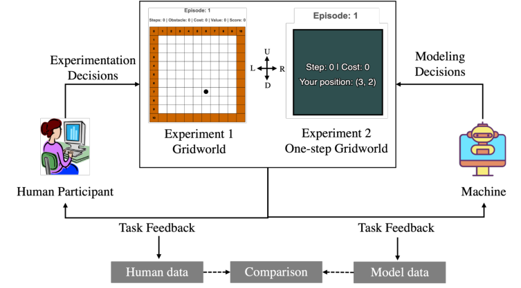

_Figure 1_ . Experimental scenarios.

We analyze the disparities between the models’ and humans’ strategies, which reveal the

nuances of human behavior representations; what these AI agents can and cannot capture,

and the human characteristics that may hinder optimal decisions. On the one hand, we

CREDIT ASSIGNMENT IN HUMANS AND AI 7

learned that humans can create a mental model of the task given the visual representation

provided, and they tend to explore and approach tasks more strategically than these

models do. Our experiments reveal that humans carry concepts and strategies that

influence their behavior, and that such concepts and strategies are beyond the information

equivalence about the task between humans and models. The results also demonstrate

that humans spend much less time exploring the environments than the models do, which

results in long-term suboptimality of humans compared to TD models.

Taken together, this work brings us closer to understanding the general algorithms of

credit assignment that can be used to generate human-like models. It also exposes the

challenges that researchers need to address to capture the initial strategic behavior that

humans might carry from a task to another; as well as potential ways to enhance human

decisions in sequential decision-making tasks with delayed feedback. The findings and

insights will need to be used in future work to develop human-like systems and to use

these models for supporting human activities in future AI systems.

**2** **Credit Assignment in Instance-Based Learning**

IBLT is a cognitive theory of decisions from experience that provides a decision making

algorithm and a set of cognitive mechanisms that can be used to implement computational

models of human dynamic decisions. The algorithm involves the recognition and retrieval

of past experiences (i.e., instances) according to their similarity to a current decision

situation, the generation of expected utility of various decision alternatives, and a choice

rule that generalizes from experience (Gonzalez et al., 2003).

An “instance” in IBLT is a memory unit that results from the potential alternatives

evaluated. These are memory representations consisting of three elements: a situation (a

set of attributes that give a context to the decision, or state _S_ ); a decision (the action

taken corresponding to an alternative in state _S_, or action _A_ ); and a utility (expected

utility or experienced outcome _x_ of the action taken in a state).

An option _k_ = ( _S, A_ ) is defined by taking action _A_ in state _S_ . At time _t_, assume that

there are _n_ _kt_ different generated instances ( _k, x_ _ikt_ ) for _i_ = 1 _, ..., n_ _kt_, corresponding to

CREDIT ASSIGNMENT IN HUMANS AND AI 8

selecting _k_ and achieving outcome _x_ _ikt_ . Each instance _i_ in memory has an _activation_

value, which represents how readily available that information is in memory (Anderson

& Lebiere, 2014), and it is determined by similarity to past situations, recency, frequency

and noise (Anderson & Lebiere, 2014). Here we consider a simplified version of the Acti

vation equation which only captures how recently and frequently instances are activated:

_Act_ _ikt_ = ln

�
� _t_ _[′]_ _∈T_

� ( _t −_ _t_ _[′]_ ) _[−][d]_ + _σ_ ln [1] _[−]_ _ξ_ _ikt_ _[ξ]_ _[ikt]_

_t_ _[′]_ _∈T_ _ikt_ �

_[−]_ _ξ_ _ikt_ _[ikt]_ _[,]_ (1)

where _d_ and _σ_ are the decay and noise parameters, respectively, and _T_ _ikt_ _⊂{_ 0 _, ..., t_ _−_ 1 _}_ is

the set of the previous timestamps in which the instance _i_ was observed. The rightmost

term represents the Gaussian noise for capturing individual variation in activation, and

_ξ_ _ikt_ is a random number drawn from a uniform distribution _U_ (0 _,_ 1) at each time step and

for each instance and option.

Activation of an instance _i_ is used to determine the probability of retrieval of that instance

from memory. The probability of an instance _i_ is a function of its activation _Act_ _ikt_ relative

to the activation of all instances:

_e_ _Act_ _ikt_ _/_ _τ_
_p_ _ikt_ = ~~�~~ ~~_n_~~ _j_ =1 _kt_ _[e]_ _Act_ _jkt_ _/_ _τ_ _,_ (2)

where _τ_ is the Boltzmann constant (i.e., the “temperature”) in the Boltzmann distribu

tion. For simplicity, _τ_ is often defined as a function of the same _σ_ used in the activation

equation _τ_ = _σ√_

2.

The expected utility of option _k_ is calculated based on a mechanism called _blending_ (Lebiere,

1999) as specified in IBLT (Gonzalez et al., 2003), using the past experienced outcomes

stored in each instance. Here we employ the Blending calculation as defined for discrete

choice tasks (Lejarraga et al., 2012; Gonzalez & Dutt, 2011):

_V_ _kt_ = [�] _[n]_ _i_ =1 _[kt]_ _[p]_ _[ikt]_ _[x]_ _[ikt]_ _[.]_ (3)

Essentially, the blending operation (Eq. 3) is the sum of all past experienced outcomes

weighted by their probability of retrieval. The choice rule is to select the option that

corresponds to the maximum blended value, which is stochastic based on the dynamics

of the probability of retrieval of an instance, that changes according to the frequency,

recency, and noise effects on the instances experienced.

CREDIT ASSIGNMENT IN HUMANS AND AI 9

**2.1** **Credit Assignment Mechanisms in IBL models**

IBLT suggests a feedback process that uses the outcome from the environment to update

and refine the expected utility of past decisions so that updated instances are reused in

future decisions (Gonzalez et al., 2003; Nguyen et al., 2021). Initial steps were made in

the early development of IBLT, however, no formalization of a credit assignment mecha

nism was offered by the theory, and most of the tasks that have relied on IBLT included

immediate feedback (Gonzalez & Dutt, 2011). Thus, credit assignment is an underdevel

oped theoretical concept in IBLT.

Here, we introduce three alternative credit assignment mechanisms which are imple

mented in versions of a temporally extended IBL model. These mechanisms are based on

equally- and exponentially weighted utility assignment as well as a novel incorporation

of the TD error from RL models (Sutton & Barto, 2018). We contextualize these mecha

nisms in a goal-seeking gridworld task used in past research (Nguyen & Gonzalez, 2020,

2021).

The goal-seeking task is simulated in a 11 _×_ 11 grid that contains obstacles (black cells) and

four targets, denoted by their distinct coloring (blue, green, orange, and purple) (Fig. 2).

The obstacles are defined between two randomly sampled endpoints, and the number of

obstacles randomly varies from one to three. Each target has an associated value that

ranges from 0 to 1, drawn from a Dirichlet distribution. We refer to the highest value

target as the _preferred target_ and the remaining three as _distractor targets_ . An agent

in this task navigates through the environment by making a sequence of movements,

i.e., up, down, left, right, to find the preferred target while avoiding the obstacles. In

each gridworld configuration, the target values are unique, although it is always the case

that the net reward of reaching the preferred target via the optimal path is greater than

that of any other target. Participants or agents are penalized for each step taken in the

environment (-0.01) and for running into obstacles (-0.05).

A gridworld environment can be formalized as Markov Decision Processes (MDPs). Each

MDP _M_ has a state space _S_, and each ( _x, y_ )-coordinate in the grid represents a state

_S ∈S_ . At each within-episode time step _l ∈{_ 1 _, ..., T_ _}_, an agent observes their state _S_ _l_,

CREDIT ASSIGNMENT IN HUMANS AND AI 10

then takes an action _A_ _l_ from a common action space _A_ (up/down/left/right) to move

into state _S_ _l_ +1 and observes the reward (or cost) _R_ _l_ . By executing a policy _π_ in the

environment _M_, an agent creates a trajectory denoted by _T_ = _{_ ( _S_ _l_ _, A_ _l_ ) _}_ _[T]_ _l_ =1 [.]

We distinguish between the global time _t_ in an (IBL) agent’s memory and the within

episode step count _l ∈{_ 1 _, ..., T_ _}_ . The global IBL timing is updated across episodes; that

is, it maintains a timing index across the entirety of an agent’s experience. On the other

hand, _l_ is reset at the start of each episode to track the sequence of steps within a single

episode.

**2.1.1** **IBL-Equal: Equal Credit.** IBL-Equal is a model based upon a simple notion

of credit assignment: disseminate equal credit amongst all candidate actions in a sequence

at the conclusion of the task. That is, if a target is reached at step _T_, the value of the

target is assigned to each instance in trajectory _T_ = _{_ ( _S_ _l_ _, A_ _l_ ) _}_ _[T]_ _l_ =1 [, i.e.] _[ x]_ _[l]_ [=] _[ R]_ _[T]_ [for all]

( _S_ _l_ _, A_ _l_ ). If a target is not reached, the step-level costs are assigned to each instance.

**2.1.2** **IBL-Exponential: Exponentially Discounted Returns.** We define a sec

ond method, IBL-Exponential, where the outcome is assigned based on discounted future

returns: for all instances in _T_, the _l_ th instance is assigned outcome _x_ _l_ = _γ_ _[T]_ _[−][l]_ _R_ _T_, where

_γ_ is a temporal discount rate. That is, each instance is associated with the discounted

value of the target reached. If no target is reached, step-level costs are associated with

each instance.

**2.1.3** **IBL-TD: A Temporal Difference Mechanism.** IBL-TD is a novel method

that involves the integration of the temporal difference (TD) error in RL into the IBL

model. The IBL-TD method relies on prediction errors between state valuations, in

which an agent iteratively constructs value estimates of states as they are experienced

(Sutton & Barto, 2018), but it also leverages the recognition-based retrieval mechanism

of IBLT (Gonzalez et al., 2003). That is, the IBL-TD model calculates the TD error

based on the blended values (Eq. 3). The TD error in IBL-TD is formally described by:

_δ_ _l_ = _R_ _l_ + _γ_ max _A_ _V_ ( _S_ _l_ +1 _,A_ ) _,t_ _−_ _V_ ( _S_ _l_ _,A_ _l_ ) _,t_ (4)

Using this error, the outcome stored in memory for the _l_ th instance in an episode is given

CREDIT ASSIGNMENT IN HUMANS AND AI 11

by the following equation:

_x_ _l_ _←_ _V_ ( _S_ _l_ _,A_ _l_ ) _,t_ + _αδ_ _l_ (5)

where _α_ is a step-size parameter. The full procedural form of the IBL-TD algorithm is

specified in Algorithm 1.

**Algorithm 1** IBL-TD Algorithm

**Initialize** : default utility _x_ 0 _∈_ R, global counter _t_ = 1, step limit _T_ max _∈_ N [+]

**Loop for each episode:**

Initialize episode step counter _l_ = 1 and state _S_ _l_

**Repeat:**

Choose _A_ _l_ _∈A_ using max _A_ _V_ ( _S_ _l_ _,A_ ) _,t_ (Eq. 3)

Take action _A_ _l_, observe _S_ _l_ +1 and _R_ _l_

_δ_ _l_ _←_ _R_ _l_ + _γ_ max _A_ _V_ ( _S_ _l_ +1 _,A_ ) _,t_ _−_ _V_ ( _S_ _l_ _,A_ _l_ ) _,t_ (Eq. 4)

_x_ _l_ _←_ _V_ ( _S_ _l_ _,A_ _l_ ) _,t_ + _αδ_ _l_ (Eq. 5)

Store instance ( _S_ _l_ _, A_ _l_ _, x_ _l_ )

_l ←_ _l_ + 1 and _t ←_ _t_ + 1

**until** _S_ _l_ is terminal or _l_ = _T_ max + 1

**3** **Human Experiments and Evaluation of Models of Credit Assignment**

We conducted two behavioral experiments based on interactive browser-based gridworld

applications and ran simulations using the IBL and RL models in the same task. The

experiments manipulate the level of decision complexity, which is characterized by the

relative costs and benefits of the highest value target and the closest distractor to the

agent’s initial location (i.e., spawn location) in the gridworld Nguyen & Gonzalez (2020).

Fig. 2 illustrates examples of simple and complex decisions in two grids. Decision com

plexity was measured precisely by the difference between the distance from an agent’s

spawn location to the highest value target ( _d_ ) and to the nearest distractor ( _d_ _[′]_ ), denoted

by ∆ _d_ = _d_ _−_ _d_ _[′]_ . The larger the value of ∆ _d_, the more complex a decision is: higher values

of ∆ _d_ indicate a tension between consuming the highest reward object with a longer dis

CREDIT ASSIGNMENT IN HUMANS AND AI 12

tance _d_ or going for the distractor with the shorter distance _d_ _[′]_ . We considered two levels

of decision complexity: “Simple” gridworlds with ∆ _d_ = 1 and “Complex” gridworlds with

∆ _d_ = 4.

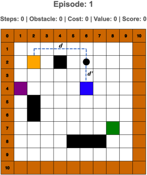

(a) **Simple grid** (b) **Complex grid**

_Figure 2_ . An example of one of 100 different gridworlds used in simple and complex

conditions. In (a), the highest value target is “green” and the distractor is “orange”. In

(b), the highest value target is “orange”, the distractor is “blue”, and there is a block on

the way to the highest-value target.

**3.1** **Human Experiment Design**

The gridworlds presented to human participants were selected randomly from a set of 100

different grids according to the level of decision complexity in each participant’s condition.

Participants are required to navigate a grid in each episode with a step limit ( _T_ max = 31)

to reach the targets and maximize their score. The grid remains unchanged across 40

playing episodes. Their spawn location is fixed in each configuration and determined by

the complexity condition. The episode ends when participants first reach one of the four

targets or when they reach the 31-step limit without any target consumption. Participants

earned points for reaching the target and were penalized for each movement (-0.01) and

for walking into a wall or an obstacle (-0.05). We note that the value was multiplied by

100 to make it easier for participants to interpret their points in the game.

CREDIT ASSIGNMENT IN HUMANS AND AI 13

The two experiments used identical gridworlds in the goal-seeking task, providing par

ticipants with identical underlying environments, i.e., the target and obstacle locations.

In Experiment 1, participants were provided with different information regarding the en

vironment compared to Experiment 2, in which they only received limited information.

The exact instructions are found in the Supplementary materials.

**3.1.1** **Experiment 1: Grid Information.** In Experiment 1, participants viewed an

interface as shown in Fig. 3, and navigated through the grid by making a sequence of

.
decisions (i.e., move up, down, left, or right) to locate the target with the highest value [1]

Participants observed their current position within the grid (i.e., a black dot). After

making a move, the content of the new location (i.e., whether it was an empty cell, an

obstacle, or a target) was revealed.

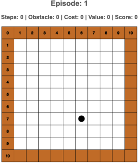

_Figure 3_ . Illustration of the goal-seeking task in the gridworld.

We have 100 gridworlds at the same set of levels. In the end, 64 (out of 100) Simple and

62 (out of 100) Complex configurations were randomly assigned to the participants. The

study is preregistered with Open Science Framework [2] .

_Procedure._ Before starting the task, participants were given a practice episode in a smaller

_×_
grid (size 6 6). During the main game, participants were asked to complete 40 episodes

1 Demo of the game in Experiment 1: `[http://janus.hss.cmu.edu:3001/](http://janus.hss.cmu.edu:3001/)`

2
Pre-registration link: `[https://osf.io/s4prw/?view_only=16d8e425d9644f158c82ed32a5b2a35e](https://osf.io/s4prw/?view_only=16d8e425d9644f158c82ed32a5b2a35e)` .

According to the preregistration, we also collected human data in the third condition called “Random”,

which is essentially a mixed condition of “Simple” and “Complex” gridworlds. We did not observe any

results standing out in this condition, and thus, we did not report them in this work.

CREDIT ASSIGNMENT IN HUMANS AND AI 14

of the same gridworld environment. Finally, participants were asked to recall the targets’

position and their judgment about the highest value target. The study took 15-30 minutes

to complete. Participants were compensated a base payment of $1.50 and earned up to

$3.00 in a bonus payment according to their accumulated score.

_Participants._ A total of 305 participants were recruited from Amazon Mechanical Turk

and completed the study. Of those 102 were assigned to the “Simple” condition (mean

_±_ standard deviation age: 36.5 _±_ 10.3; 34 female) and 104 performed the “Complex”

condition (37.9 _±_ 10.8, 37 female).

**3.1.2** **Experiment 2: Restricted Grid Information.** In Experiment 2, partici

pants were provided with limited information, as shown in Fig. 4. Participants were

presented with only one cell at each step, which informs them about their current ( _x_,

_y_ ) position, the count of steps taken, and the immediate cost or reward of the previous

step [3] . All information of obstacles, the value of the targets, as well as the shape and size

of the grid were concealed. Similar to Experiment 1, participants started at an initial

position determined by the decision complexity, and were tasked with navigating the

gridworld to find the highest value target. The costs and rewards were identical to those

in Experiment 1. Other than the information difference, the task and gridworlds used

were identical to those of Experiment 1.

We considered the same gridworld design and configuration of the decision complexity as

in Experiment 1. The study is preregistered with Open Science Framework [4] .

_Procedure._ As opposed to Experiment 1, participants did not have a practice session.

Instead, after the instructions, they were asked to start the main game, which entails

40 episodes of the same gridworld environment. Finally, participants were asked about

their memory of the targets’ position as well as their judgment about the highest value

target. The study took 15-30 minutes to complete. The same base and bonus payment

were applied to this experiment.

3 Demo of the game in Experiment 2: `[http://janus.hss.cmu.edu:3006/](http://janus.hss.cmu.edu:3006/)`

4
Pre-registration link: `[https://osf.io/m7quh/?view_only=2728f5ccde1f41cdabf256393f3bd6a2](https://osf.io/m7quh/?view_only=2728f5ccde1f41cdabf256393f3bd6a2)` .

Similar to Experiment 1, we did not report the results in the “Random” condition in this work.

CREDIT ASSIGNMENT IN HUMANS AND AI 15

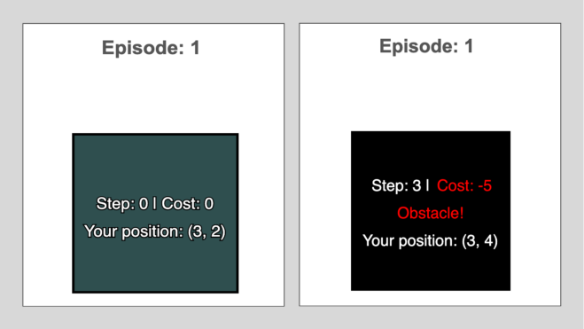

_Figure 4_ . Illustration of the goal-seeking task in the restricted gridworld information

when the game is started (left), and when an obstacle is encountered (right).

_Participants._ A total of 301 participants were recruited from Amazon Mechanical Turk

and completed the study. Of those 99 were assigned to the “Simple” condition (age: 37.7

_±_ 11.8; 40 female) and 95 performed the “Complex” condition (38.2 _±_ 11.3, 30 female).

**3.2** **Model Simulation**

For comparison, we considered Q-learning Watkins & Dayan (1992); Sutton & Barto

(2018), a foundational TD-based algorithm. The Q-learning algorithm maintains esti

mates of optimal state-action pairs using the _Q_ ( _S, A_ ) value that represents the expected

return of taking action _A_ in state _S_ . At each step, the agent selects the action ( _ϵ_ -greedy)

that maximizes the expected return, e.g. max _A_ _Q_ ( _S, A_ ). For estimate updates, the TD

error is given by _δ_ _l_ = _R_ _l_ + _γ_ max _A_ _Q_ ( _S_ _l_ +1 _, A_ ) _−_ _Q_ ( _S_ _l_ _, A_ _l_ ) and the update at each step is

_Q_ ( _S_ _l_ _, A_ _l_ ) _←−_ _Q_ ( _S_ _l_ _, A_ _l_ ) + _αδ_ _l_ .

_**Parameter Selection.**_ We ran simulations on the IBL-Equal, IBL-Exponential, IBL

TD, and Q-learning models to collect synthetic data for each model using its default

parameters. The rationale for using the default parameters rather than fitting the pa

rameters to the data is that such results can represent pure predictions from each model

reflecting their true nature.

It is worth noting that in the case of IBL-TD and Q-learning, they have no parameters

prescribed for the temporal difference mechanism. Indeed, the method was developed for

CREDIT ASSIGNMENT IN HUMANS AND AI 16

_reward maximizing_ agents and thus encourages a search over the parameter space for use.

As such, the default parameters for these models are derived from performing a sweep over

the parameter space, with the best parameter configuration being used as the default. In

particular, this was accomplished via Tune Liaw et al. (2018), where we selected the best

model after 1,000 experimental trials. We select the set of parameters that maximizes

the proportion of episodes wherein the agent reaches the highest value target. Moreover,

all models are instantiated with default utilities or state-action valuations of 0.4. Such a

default was found to increase performance for all models when compared with a default

of 0.0, as it encourages environment exploration. The full set of our parameter selections

is described in Table 1.

Table 1

|Model|σ d γ α ϵ|
|---|---|
|||
|Simple IBL-Equal IBL-Exponential IBL-TD Q-learning|0.25 0.50 — — — 0.250 0.50 0.990 — — 0.049 0.95 0.986 0.824 — — — 0.997 0.839 0.002|
|Complex IBL-Equal IBL-Exponential IBL-TD Q-learning|0.25 0.5 — — — 0.25 0.5 0.990 — — 0.038 0.886 0.999 0.838 — — — 0.977 0.865 0.022|

_Parameters used for each model in the default settings. IBL-TD and Q-learning_

_parameters are fit to maximize accuracy, IBL-Equal and IBL-Exponential utilize the_

_default prescribed in the IBLT literature Gonzalez et al. (2003), with a standard default_

_discount rate for IBL-Exponential (γ_ = 0 _._ 99 _)._

_**Procedure.**_ A total of 378 independent runs (64 Simple and 62 Complex configurations

with three runs on each) for each of the models described above were run to perform the

same gridworld task as human participants. For each level of complexity, we instantiate

the models in the corresponding gridworld configurations from the human experiments:

62 complex and 64 simple gridworld configurations. For each level of complexity and for

each of the gridworld configurations, three runs of each model type were executed from

CREDIT ASSIGNMENT IN HUMANS AND AI 17

scratch for 40 episodes. Equivalent to the human experiment, the agent models were

allotted 31 steps to reach a target. We calculated the same evaluation metrics that are

described in the next section, using the data of 40 episodes from 300 agents per level of

complexity.

**3.3** **Evaluation Metrics**

In both experiments, we compared the performance of each model to that of humans in

terms of two metrics: (i) Proportion of Maximization (i.e., _PMax_ ): the proportion of

episodes wherein the individual (or the agent) obtains the highest value target, and (ii)

Proportion of Optimal choice (i.e., _POptimal_ ): the proportion of episodes wherein the

individual (or the agent) not only reaches the highest value target but also does so by

taking the minimal number of steps possible (i.e., via a shortest path). We also measured

the difference between the average performance of each model and the human data with

respect to the corresponding metrics for each complexity condition.

**4** **Experimental Results**

Here we describe the obtained results through human study as well as simulation, using

the various models described above, to assess which credit assignment mechanism is most

closely aligned with human behavior and which can better achieve optimal performance.

**4.1** **Experiment 1: Grid Information**

Table 2 presents the average PMax, POptimal and difference of the averages for each

model compared to human participants (i.e., Model - Human).

Overall, we see that in both simple and complex environments, IBL-Equal is the best

performer in terms of PMax and IBL-TD is the best in terms of POptimal. Regarding

the similarity of Pmax to humans, the TD models are worse than humans in simple

environments, but all models are better than humans in complex environments. In terms

of POptimal, all models perform worse than humans in simple environments and in

complex environments, except for IBL-TD that on average performs slightly better than

humans. However, clearly, the average behavior is highly uninformative regarding the

CREDIT ASSIGNMENT IN HUMANS AND AI 18

dynamics of learning during the 40 episodes. We, therefore, turn our attention to learning

curves from hereon.

Decision Complexity Simple Complex

POpt.

Diff.

PMax

Avg.

POpt.

Diff.

PMax

Avg.

PMax

Diff.

POpt.

Avg.

PMax

Diff.

POpt.

Avg.

— — — —
Human 0.71 0.66 0.48 0.43

IBL-Equal **0.80** 0.09 0.14 -0.52 **0.73** 0.25 0.37 -0.06

IBL-Exponential 0.79 0.08 0.18 -0.48 0.67 0.19 0.42 -0.01

IBL-TD 0.68 -0.04 **0.49** -0.17 0.62 0.14 **0.44** 0.01

Q-learning 0.67 -0.05 0.46 -0.20 0.61 0.13 0.40 -0.03

Table 2

_**Experiment 1:**_ _Average performance and difference (Model - Human) for each model_

_compared to the human data in each condition. The boldface indicates the best results_

_among the models in terms of average PMax and POptimal. In the simple conditions,_

_the average PMax and POptimal of human data are 0.71 and 0.66, respectively, while in_

_the complex settings, the humans’ average PMax and POptimal are 0.48 and 0.43,_

_accordingly._

We plotted the PMax and POptimal averaged over each episode. The results are shown

in Fig. 5. The figure depicts more clearly the similarities and gaps between average model

performance over episodes compared to that of human participants. By the observation

of these learning curves, it is immediately obvious that humans (red lines) are affected

by decision complexity, while the effect of complexity on the models is minimal. In

particular, the TD models (green lines) appear to be unaffected by decision complexity

(all statistical results are presented in the Supplementary Information).

These figures also expose significant differences between the way models and humans

learn. IBL-Exponential and IBL-Equal (blue lines) capture the shape of the learning

curves for PMax in simple decisions quite well, but they fail to reach comparable levels of

POptimal in simple decisions. In complex decisions, these models outperform the PMax

CREDIT ASSIGNMENT IN HUMANS AND AI 19

_Figure 5_ . **Experiment 1 results:** PMax and POptimal with the default parameters.

of humans but have a closer fit to humans’ POptimal.

We further notice that the POptimal of IBL-Equal and IBL-Exponential agents is higher

in the complex than in the simple condition, which is the reverse pattern observed in

humans’ POptimal. We speculate that such enhancement of the models in complex

settings is due to the environment design. That is, in the complex settings, there is an

obstacle located on the direct path towards the highest value target as exemplified in

Fig 2b. Given that the agents are penalized when hitting an obstacle and such negative

consequence is reinforced in the IBL agents’ memory, they might learn a better way to

find the highest value target by avoiding the obstacle. These results are further elaborated

in Section 5.

The learning paths of IBL-TD and Q-learning (green lines) are particularly interesting.

These models start generally with very poor behavior compared to other models and

humans. However, these models show a sharp learning curve and quickly “catch up”

to human levels of performance in simple condition, and they even surpass the level

of human performance in complex decision environments. It is well-known that TD

approaches learn by bootstrapping, that is, they can perform updates based on current

estimates before the final outcome is revealed. Hence, the TD models require a large

CREDIT ASSIGNMENT IN HUMANS AND AI 20

amount of training to reach the same level of human performance in games (Tsividis et

al., 2021). By contrast, the Equal and Exponential mechanisms adjust the expected value

of all decisions made within each episode after the final outcome of the episode is known,

which can be attributed to matching the initial performance of humans in the task.

In recognizing the differences between the information provided to humans in the experi

ment and the information given to the models, we observe a practical asymmetry. Humans

have access to more information than models do in solving this task. Specifically, partici

pants in our experiment knew about the shape and size of the grid environment, they were

informed of the number of targets, they were able to perceive their own location within

the boundaries of the grid environment, and they were able to visualize the obstacles

after each move and the walls surrounding the environment (Fig. 3). Such informational

advantages given to human participants in the experiment could explain a better initial

performance in the task compared to the TD models in particular. Experiment 2 aims

at addressing this asymmetry of information.

**4.2** **Experiment 2: Restricted Grid Information**

We recall that to address the asymmetry of information, in Experiment 2 we aimed to

provide participants with the same information as it is available to the models. That

is, participants were presented with only one cell at a time, which informed them about

their current (x, y) position, the immediate cost or reward of the previous step, and the

count of steps already taken.

Table 3 reports the average PMax, POptimal, and the difference between the models and

human data (all statistical results are presented in the Supplementary Information). It

is important to note that the model data regarding the average PMax and POptimal

reported in Experiment 2 are identical to those reported in Experiment 1. Simulations

were not run again because the models are the same and the only difference is in the

human data. Thus, in both simple and complex environments, IBL-Equal is the best

performer in terms of Pmax, and IBL-TD is the best performer in terms of POptimal.

Relative to Experiment 1, it is clear that restricting information for humans makes their

CREDIT ASSIGNMENT IN HUMANS AND AI 21

Decision Complexity Simple Complex

POpt.

Diff.

PMax

Avg.

POpt.

Diff.

PMax

Avg.

PMax

Diff.

POpt.

Avg.

PMax.

Diff.

POpt.

Avg.

— — — —
Human 0.63 0.55 0.24 0.17

IBL-Equal **0.80** 0.17 0.14 -0.41 **0.73** 0.49 0.37 0.20

IBL-Exponential 0.79 0.17 0.18 -0.37 0.67 0.43 0.42 0.25

IBL-TD 0.68 0.05 **0.49** -0.06 0.62 0.38 **0.44** 0.27

Q-learning 0.67 0.04 0.46 -0.09 0.61 0.38 0.40 0.23

Table 3

_**Experiment 2:**_ _Average performance and difference (Model - Human) for each model_

_compared to the human data. Bold face indicates the best results among the models in_

_terms of average PMax and POptimal. The average PMax and POptimal of human data_

_in the simple conditions are 0.63 and 0.55 respectively, whereas in the complex settings,_

_the average PMax and POptimal are 0.24 and 0.17, accordingly._

task more difficult. Humans reached the maximum target less often than in Experiment

1, when confronted with simple decisions (PMax of 0.71 in Experiment 1 vs. 0.63 in

Experiment 2) and with complex decisions (PMax of 0.48 in Experiment 1 vs. 0.24 in

Experiment 2). Similarly, humans followed the optimal path less often when restricted

to less information, compared to Experiment 1 in simple decisions (POptimal= 0.66 in

Experiment 1 vs. 0.55 in Experiment 2), and particularly in complex ones (POptimal of

0.43 in Experiment 1 vs. 0.17 in Experiment 2).

Given the difference in human performance, the models’ performance in relation to the

human data changed. In the context of Experiment 2, the models are all better than

the human participants in terms of PMax, in making simple, but particularly in making

complex decisions. In terms of POptimal, the models are all worse than humans in simple

environments, but they are exceedingly better than humans in complex decisions.

In the learning curves presented in Fig. 6 it is possible to observe again, the significant im

pacts of the complexity on human performance. The PMax figures (top panels) illustrate

CREDIT ASSIGNMENT IN HUMANS AND AI 22

how the models no longer compare to humans’ PMax as in Experiment 1, particularly in

the complex condition. Human performance deteriorated significantly in complex com

pared to simple grids when there is restricted information.

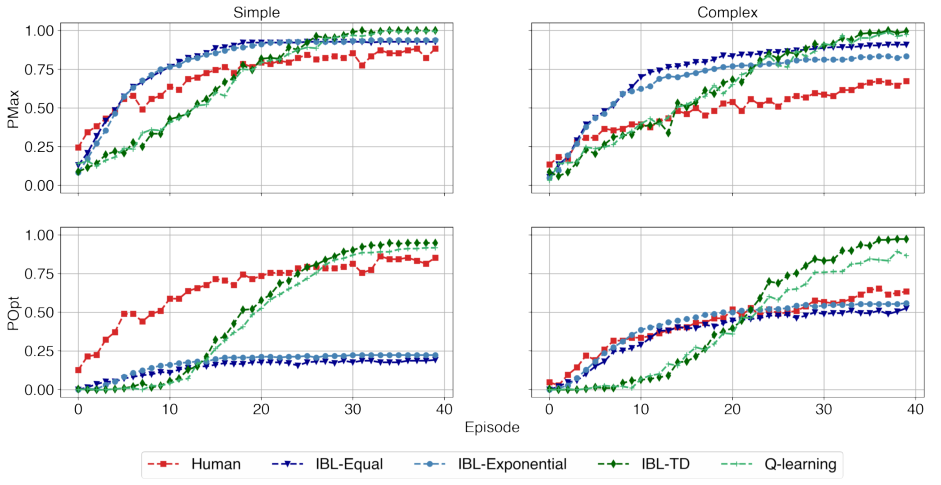

_Figure 6_ . **Experiment 2 results:** PMax and POptimal with the default parameters.

Model results are identical to those in Figure 5.

Importantly, humans did not show an initially slow POptimal as predicted by the IBL

TD and Q-learning models. The initial large gap between human POptimal and IBL-TD

and Q-learning models persists, despite the symmetry of information in the models and

humans. Furthermore, given a lower human POptimal in complex grids, the final gap

between the IBL-TD and Q-learning and human POptimal is significantly larger in this

experiment than in Experiment 1. That is, these models outperform humans in the final

episodes and are robust to decision complexity.

**4.3** **Summary of results so far**

The analyses in the sections above elucidate the major differences between the predictions

of models with three credit assignment mechanisms and human performance. Impor

tantly, the differences are not due to the asymmetry of information provided to humans

compared to the information available to the models. Comparing the results of Experi

CREDIT ASSIGNMENT IN HUMANS AND AI 23

ment 2, where the information available to humans was symmetrical to the information

given to the models, we observed additional challenges for the models: models are unable

to predict the complexity effects that humans confront under restricted information.

A pattern that seems consistent across the two experiments is that, on average, IBL-Equal

obtains the highest PMax regardless of the decision complexity, and IBL-TD achieves

the highest POptimal on average. Neither IBL-Equal nor IBL-Exponential are able to

reach the POptimal that humans achieve. IBL-TD and Q-learning reach and outperform

the level of Poptimal in humans, particularly in complex settings. However, the TD

models are unable to capture the initially high POptimal level of humans. Specifically, in

complex settings wherein humans’ PMax and POptimal are much lower than in simple

settings, the TD credit assignment method surpasses the POptimal of humans. This is

accentuated in situations in which humans have limited information while performing the

task (Experiment 2).

As a reminder, the results presented above are pure predictions from the models. The

models’ parameters were not fit to the human data and human data was not used in any

way to inform the models. Thus, the observed patterns of models’ results are expected

to improve when the models are calibrated to human data. To that end, we performed a

fitting exercise for each of the models on the average PMax. We ran analogous simula

tion experiments after having determined the parameters of the models that best-fitted

humans’ average PMax values. The results presented in the Supplementary material, Sec

tion S-II, showed that indeed the models are able to capture the PMax more closely after

the model parameters are fit to human data; however, some of the challenges regarding

the initial underperformance of the TD models’ compared to human data remained even

after finding the best fitting parameters.

**5** **Challenges and Opportunities for Human-like AI Agents: A behavioral**

**Analysis**

The results above expose the limits and gaps of temporal credit assignment mechanisms

in two well-known approaches: cognitive IBL models and the Q-learning algorithm for

CREDIT ASSIGNMENT IN HUMANS AND AI 24

modeling human decisions in a goal-seeking navigation task with feedback delays. While

the IBL-Equal and IBL-Exponential models emulate the learning curves of the PMax of

participants, we observe a particularity of the learning curves in the TD-based models.

These models produce consistent underperformance compared to humans in the initial

episodes. At the same time, the TD-based models are better than the IBL-Equal and

IBL-Exponential at capturing the POptimal of human participants, and the TD models

often outperform humans in the final episodes.

In this section, we conduct in-depth analyses of humans’ and models’ behavior in both

experiments with the intention of informing the development of human-like AI agents and

the design of systems that can help improve human decisions and learning. We compare

the data obtained from human players to that of the models in terms of various _process_

_metrics_ to shed light on the aspects of human behavior that these models fail to capture

along with the characteristics that hinder humans’ optimal performance.

**5.1** **Challenges for Building Human-like AI Agents**

This section presents different reasons why the models are unable to capture the initial

learning process of humans. We specifically examined different aspects concerning be

havior and decision making processes.

**5.1.1** **Target Consumption by Decision Complexity.** Fig. 7 provides the propor

tion of consuming each of the four targets by their value and the proportion of no target

consumption within each episode over the 40 episodes for simple and complex decisions,

including humans and models in both experiments. Comprehensive statistical analyses

are summarized in the supplementary material (ANOVA Table S3 and S4).

Observations from the figure and statistical results show a significant effect of decision

complexity on the proportion of times that the highest value target is consumed by

humans and models. Humans and models are able to reach the highest value targets

more often in simple than complex decision environments, but the effect of decision

complexity on humans is more significant.

Moreover, posthoc analyses with Tukey HSD corrections confirm that the mean rate of

CREDIT ASSIGNMENT IN HUMANS AND AI 25

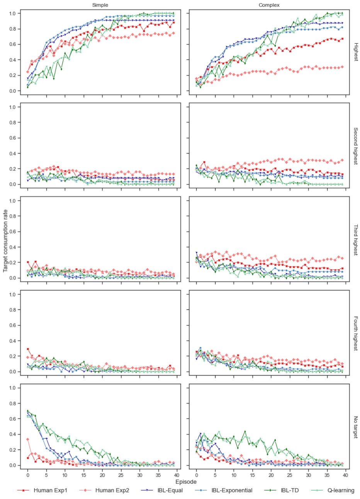

_Figure 7_ . The target consumption distribution of humans and agents over time in the

simple and complex conditions.

CREDIT ASSIGNMENT IN HUMANS AND AI 26

finding the highest value target of humans playing the simple ( _M_ = 0 _._ 63 _, SD_ = 0 _._ 48)

and complex settings ( _M_ = 0 _._ 24 _, SD_ = 0 _._ 42) in Experiment 2 was significantly lower

than that of humans playing the simple ( _M_ = 0 _._ 71 _, SD_ = 0 _._ 45) and complex ( _M_ =

0 _._ 48 _, SD_ = 0 _._ 49) conditions in Experiment 1. The results signify that in addition to

being susceptible to decision complexity, humans are noticeably susceptible to the degree

of information provided in the goal-seeking navigation task (in accordance with findings

in prior research (Marusich et al., 2016)). A similar effect of complexity is observed in

almost all lower value targets (i.e., second, third, and fourth highest, see Supplementary

ANOVA Table S3 for more details).

We additionally observed a distinction in the proportion of times no target was found.

The rates of failure to find a target by the models are significantly higher (especially in

the earlier episodes), than those of humans. Furthermore, the proportion of times the

TD models were not able to find any target is not influenced by decision complexity,

whereas the proportion of times that humans are unable to find a target in an episode is

significantly affected by the decision complexity in Experiment 1 and Experiment 2, as

reported in supplementary material, ANOVA Table S3.

**5.1.2** **Redundancy and Immediate Redundancy.** To understand why the TD

models explored the initial episodes without finding any targets, we examined the redun

dancy of movements made by the agents and humans while navigating the environment.

Redundancy of one’s trajectory is defined by the ratio of the number of revisited locations

to the number of uniquely visited locations. We also measured immediate redundancy,

which is the extent to which agents decide to turn back to the place where they came

from.

Fig. 8 shows the proportion of redundant and immediately redundant visits made by

humans and models by the level of decision complexity. Regarding human redundant ac

tions, we observe that humans in Experiment 1 made almost zero redundant visits from

beginning to end, while they made significantly more redundant visits in Experiment 2,

when information was limited. The statistical tests further support this observation by

indicating that there was no significant effect of the decision complexity on the redun

CREDIT ASSIGNMENT IN HUMANS AND AI 27

dancy rate of humans playing the task in Experiment 1, but with restricted information

in Experiment 2, humans made significantly more redundant visits in complex gridworlds

than in simple ones (see Supplementary ANOVA Table S5).

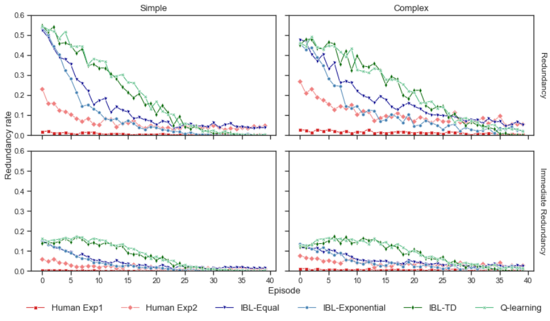

_Figure 8_ . Proportion humans and agents that made redundancy and immediately

redundant steps over time in each condition.

Post-hoc comparisons using Tukey’s test specified that the mean redundancy rate made by

humans with restricted information in the simple ( _M_ = 0 _._ 06 _, SD_ = 0 _._ 15) and complex

settings ( _M_ = 0 _._ 10 _, SD_ = 0 _._ 19) of Experiment 2 was significantly higher than those

playing the simple ( _M_ = 0 _._ 006 _, SD_ = 0 _._ 03) and complex settings ( _M_ = 0 _._ 01 _, SD_ = 0 _._ 06)

of Experiment 1 (see ANOVA Table S6).

These observations also hold true for the immediate redundant actions. The proportion of

immediate visits by humans was not significantly influenced by the decision complexity in

Experiment 1. Conversely, in the limited information context of Experiment 2, we find a

significant effect of decision complexity on the proportion of times they make immediately

redundant movements (see Supplementary Table ANOVA S5).

The results show higher proportions of redundant and immediate redundant decisions

made by the models compared to humans, particularly in the first episodes (Supplemen

CREDIT ASSIGNMENT IN HUMANS AND AI 28

tary Table S7 and Fig. S4 provide descriptive statistics and an average view of the level

of redundancy along with immediate redundancy in the initial and later episodes). From

Fig. 8, it is clear that the TD models have the highest redundancy and immediate re

dundancy rates compared to all the models in approximately the first half of the playing

episodes in both levels of complexity. Furthermore, the rates of taking redundant and

immediately redundant visits by IBL-TD and Q-learning are significantly affected by the

complexity, while it is not the case for the IBL-Equal and IBL-Exponential model or

humans in Experiment 1 (see ANOVA Table S5).

Overall, the results display a main difference in humans’ and models’ behavior with re

spect to redundancy; the models make significantly more redundant actions than humans.

The redundancy of human participants with restricted information in Experiment 2 and

TD models was significantly influenced by the environment decision complexity, as op

posed to that of human players in Experiment 1, IBL-Equal and IBL-Exponential whose

redundancy across complexity levels remained unaffected.

**5.1.3** **Linear Movement Strategy.** Here we analyze the trajectories adopted by

humans and the models to explain why the models made a lot more redundant visits

early on while humans did not.

Through our observation of human participants’ trajectories, we noticed that some par

ticipants tended to go straight in a line of movement from their spawn location, rather

than moving pivoting their trajectories. To look at whether such a strategy was indeed

common in humans, and unlikely in the models, we compared a linear strategy, defined

by making four consecutive steps in the same direction, i.e., either up, down, left, or right

direction from the spawn location.

Fig. 9 shows the proportion of linear movement by humans and models over episodes,

in simple and complex decisions. It is clear from these results that decision complexity

was a major factor in the adoption of a linear movement strategy for the models and

humans. These main effects are confirmed by the statistical analyses reported in the

Supplementary material, Table S8.

The effect of complexity in this case, however, can be explained by the design of complex

CREDIT ASSIGNMENT IN HUMANS AND AI 29

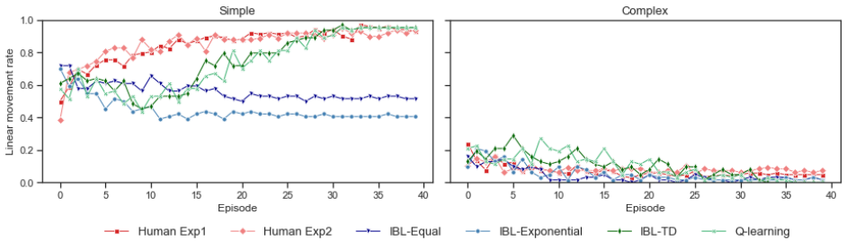

_Figure 9_ . The proportion that humans and agents made linear movement from spawn

location in each condition.

decisions in the gridworlds, exemplified in Fig 2b. In complex decision gridworls, it is less

likely that humans and models could move in a straight line from their spawn position

because we designed these gridworlds so that a blocker would be located on the direct

path towards the highest value target. That is, in complex decisions, agents were forced to

explore more and break the trend of the linear movement strategy. As a result, executing

a linear strategy (i.e., four consecutive movements in a straight line) towards the highest

value target was not possible in most of the cases when making complex decisions, and

consequently the proportion of linear strategies is very low and decreases rapidly (see

Supplementary Table S10 and Fig. S5 for descriptive statistics).

In simple decision environments, humans follow the linear movement strategy from the

initial episodes. By design, it is worth noting that the highest value targets are located in

a linear path from the spawn location in simple decision environments. Although humans

did not know where the highest value target was located, humans increasingly followed a

linear strategy over episodes. This strategy did not differ in Experiment 1 compared to

Experiment 2 (see Supplementary Table S9). There is no statistically significant difference

in the proportion of the linear strategy between humans playing the task in Experiments

1 and 2 in simple or complex conditions. Thus, the linear strategy is not dependent on

the amount of information provided to participants.

Moreover, in simple decision gridworlds, we did not find significant mean differences be

tween human players in Experiment 2 and the TD models (see Supplementary Table S9).

CREDIT ASSIGNMENT IN HUMANS AND AI 30

We further see that although the TD models’ behavior does not reflect the linear strat

egy initially, the TD models are the only ones that can learn to match such behavior of

humans in the last episodes (see Supplementary Fig. S5).

Finally, we see that, in contrast to humans and the TD models, the rate that the IBL

Equal and IBL-Exponential agents make linear movements in simple environments de

creases during episodes and becomes stable in the last episodes. The explanation for this

behavior of the IBL-Equal and IBL-Exponential agents is that they follow a non-linear

path, and if the agents happen to find the highest value target, the path is reinforced.

Consequently, they continue to follow such non-linear path, explaining why these models

cannot account for humans’ POptimal despite their success in doing so in terms of PMax.

In contrast, the IBL-TD and Q-learning agents learn to estimate the value of each action

at each state based on the difference between the expected and observed reward, without

waiting for a final outcome. Over time, the estimate is propagated back and updated to

be more accurate, resulting in the optimal performance (getting the highest value target

with the shortest path) after a sufficient number of samplings (explorations). Thus, they

were able to surpass the POptimal of humans, eventually.

In summary, humans are significantly affected by the level of decision complexity; they

are able to find a target in early episodes, by avoiding redundant decisions, particularly

when given more information about the structure of the task; and they, at the outset,

have a bias towards executing a linear strategy which is effective particularly in simple

environments. By contrast, TD models most often end up reaching no target in the

beginning since they make significantly more redundant visits, even though over time,

they manage to learn the linear strategy, the optimal strategy for getting the highest

value target in simple settings. IBL-Exponential and IBL-Equal are able to find a target

quickly, but these strategies are not optimal.

**5.2** **Opportunities to Enhance Human Learning**

While the TD models might not learn as efficiently as humans do initially, they eventually

surpass humans’ performance in terms of PMax and POptimal as shown in figures Fig. 5

CREDIT ASSIGNMENT IN HUMANS AND AI 31

and Fig. 4. The TD models become significantly more effective than humans, especially

in complex environments and with limited information. How can we explain that despite

all the inefficiencies above, TD agents turn out to be significantly more efficient than

humans? We offer two explanations: excessive initial exploration and temptation avoid

ance, which reflect and are pertinent to human bias of believing that the low-hanging

fruit is the ripest.

**5.2.1** **Initial Exploration and Decision Complexity.** As explained in the previ

ous section, the TD models perform very poorly initially as they often find no targets

in their initial episodes, make highly redundant actions, and do not have any tendency

to follow a linear strategy initially, as humans do. Here we analyze the coverage of the

gridworld space, determined by the ratio of the number of uniquely visited locations to

the total accessible locations. This metric specifies how much one explores the whole

space.

Fig. 10 provides the coverage of humans and models across episodes under the two decision

complexity settings. Detailed statistical analyses can be found in the supplementary

material, Table S11 and S12.

_Figure 10_ . The coverage rate of humans and the agents over time in each condition.

Our first observation is that the initial coverage of IBL-TD and Q-learning models is much

higher than that of humans and other models. Second, the decision complexity affects

models’ coverage, whereas humans’ coverage is not affected by decision complexity. All

the models explore less in complex environments than in simple ones, and more at the

beginning than at the end. ANOVA statistic results corroborate our observation that

CREDIT ASSIGNMENT IN HUMANS AND AI 32

coverage by humans is remarkably similar across decision complexity levels (see ANOVA

Table S11). Human coverage is, however, significantly higher with more information (i.e.,

Experiment 1) than with limited information (i.e., Experiment 2) (see Supplementary

Table S12)

**5.2.2** **Temptation to Get Close Distractors.** In our study, we recall that there is

only one highest value target ( _preferred target_ ) while the other three act as distractors.

One of the distractors is intentionally located close to the spawn location, and the differ

ence in the distance to the closest distractor and the highest value target determines the

complexity of the decision (see Fig. 2).

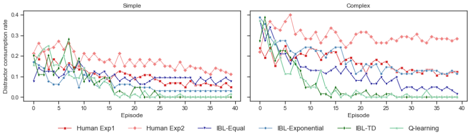

_Figure 11_ . The proportion humans and the agents that consumed the closest distractor

over time in each condition.

Interestingly, we observe above that human exploration is not influenced by the decision

complexity while the models’ exploration is. Our conjecture is that humans cannot resist

the temptation of earning the points of the closest distractor and would prefer to settle

on the closest distractor instead of exploring more to find the highest value target.

To analyze this possibility, we looked at the proportion of times that humans and models

reached the closest distractor during episodes. Fig. 11 depicts these proportions and a

detailed statistical analysis is shown in the Supplementary Table S14 and S15.

The results clearly show that humans consumed the closest distractor more often than

models, in both simple and complex environments. Post-hoc comparisons using the Tukey

HSD test indicate that the mean proportion that humans got the closest distractor under

simple ( _M_ = 0 _._ 11, _SD_ = 0 _._ 31) and complex settings ( _M_ = 0 _._ 17, _SD_ = 0 _._ 38) in Experi

CREDIT ASSIGNMENT IN HUMANS AND AI 33

ment 1, and in Experiment 2 under simple ( _M_ = 0 _._ 18, _SD_ = 0 _._ 38) and complex settings

( _M_ = 0 _._ 30, _SD_ = 0 _._ 45), was significantly higher than the mean proportion IBL-TD

or Q-learning agents consumed the distractor, regardless of the complexity levels (i.e.,

IBL-TD and Q-learning both have _M_ = 0 _._ 06 and _SD_ = 0 _._ 24 in the simple and complex

settings) (see Supplementary Table S15).

The results also show a significant effect of the complexity on the consumption of the

closest distractor for humans in Experiment 2 but not in Experiment 1. Also, humans

in Experiment 2 consumed the closest distractor more often in Experiment 1. In terms

of the models, no significant effect was found for the closest distractor consumption of

IBL-Equal, IBL-TD and Q-learning agents (see ANOVA S14).

In summary, our results show that models tend to explore more than humans initially

and they are able to avoid the temptation of close distractors better than humans do.

These two aspects of the models represent potential opportunities to influence humans

to become wider explorers and to avoid their temptation to handle decision complexity

more effectively.

**6** **Discussion and Conclusions**

Current research in Artificial Intelligence (AI) addresses the temporal credit assignment

in sequential decision making tasks mostly by using the temporal difference (TD) learning

method in reinforcement learning (RL) models (Q-learning). This method has been very

successful in dealing with problems in which feedback is delayed. The TD algorithms

enable AI agents to reach levels of human performance in many complex decision making

tasks (Wong et al., 2021). Although RL models are able to solve computational problems

efficiently and reach high-performance levels, it is unclear how the TD approach is aligned

with the actual human behavior (Botvinick et al., 2019; Lake et al., 2017). In this paper,

we investigated three different mechanisms of credit assignment (Equal, Exponential and

TD) using the cognitive models, constructed based on IBLT (Gonzalez et al., 2003), a

cognitive theory of decisions from experience. Simulation results from IBL models and

a Q-learning model were compared to human data obtained in a goal-seeking navigation

CREDIT ASSIGNMENT IN HUMANS AND AI 34

task equipped with various levels of decision complexity, which is particularly well suited

for studying the temporal credit assignment problem.

Overall, we elucidate the differences in how these models learn with delayed feedback

compared to humans. Furthermore, we also find ways in which the models are able to

outperform humans. Understanding the reasons behind these differences will help to

inform the development of human-like AI agents, and agents that can also successfully

support and help improve human decisions and learning.

We find that Equal and Exponential credit assignment mechanisms can capture initial

human learning and generally, the shape of human learning curves in terms of PMax

(i.e. the ability to find the highest value target). However, these credit assignment

mechanisms show inefficient behavior compared to humans in terms of POptimal (i.e.

the ability to reach the highest value target via the shortest path), especially in simple

decision environments. These results suggest that humans might be initially unable to

predict the value of the immediate states, without having received feedback; rather they

update the value of their initial actions once they have received feedback at the end of

an episode. Furthermore, it is also possible that even after receiving outcome feedback,

humans are initially unable to distinguish how the various decisions made throughout an

episode actually contributed to the final outcome. Thus, crediting all the actions equally

is a simple procedure that humans may be adopting in the initial learning. This interpre

tation is further supported by the fact that the Equal and Exponential mechanisms show

sensitivity to decision complexity, similar to humans, but the TD models are unaffected

by decision complexity.

The TD mechanisms learn much slower than humans early in the tasks but then achieve

the same level of human optimal performance and become more efficient than humans

later in the task. The detailed analyses of the process metrics reveal that the TD mech

anisms lead to more initial exploration of the environment compared to humans. Such

larger exploration leads the TD models to a higher coverage of the environment, and

consequently to a better “understanding” of where obstacles and targets are located. As

the TD models learn more about the environment, they also become more efficient in

CREDIT ASSIGNMENT IN HUMANS AND AI 35

reaching the highest value target in the shortest path, and ultimately they do this better

than humans. In attempting to fully explore the environment, the TD models also made

far more redundant visits initially, compared to humans; which resulted in a greater pro

portion of episodes in which no targets were found by the model, compared to humans

during the initial exploration. The major implication of this result is that we can use

help humans to engage in more initial exploration; which would help humans to learn

faster and to become ultimately more optimal and accurate.

Our results suggest two reasons that prevent humans from exploring more initially and

from being as optimal as the TD models are with extended practice. First, humans

showed a strong tendency to make a linear movement while navigating the environment,

preventing them from further exploration. This is indicative of strategies that humans

might have learned from experience when approaching unknown problems while trying

to be efficient; that is, humans do not learn each task from scratch as models do (Pouncy

et al., 2021; Firestone, 2020). Second, humans have a strong tendency to be tempted to

earn the points offered by the closest distractor instead of exploring to find the highest

value target. To some extent, such characteristic is in alignment with a very well-known

“satisficing” human behavior in a decision making process; where people often select an

option that is good enough, and not necessarily optimal (H. A. Simon, 1956). We plan to

investigate these costs (i.e., distance to the target) and benefits (i.e., values of the target)

tradeoffs in future research.

Ultimately, biases in human behavior present an opportunity for developing AI agents

that can help humans improve their decisions. The implication of our findings highlights

the importance of exploration to make the right decision about the targets. Lacking

adequate exploration, it is more likely that humans make decisions based on imperfect

information about the environment, leading to sub-optimal decisions (i.e. the higher rate

of consuming the closest distractor). Indeed, this is in agreement with research on the

exploration-exploitation tradeoff in humans, where with more experience and exploration

humans learn to improve their decision optimality (Mehlhorn et al., 2015). Presumably,

a TD agent that has learned an effective strategy for a task after sufficient training can

CREDIT ASSIGNMENT IN HUMANS AND AI 36

serve as a “teacher” or human tutor, who advises humans on which actions to take. It is

similarly important to define when is the right time to intervene since over-advising could

disrupt and hamper humans’ learning (Torrey & Taylor, 2013; Da Silva et al., 2020). The

IBL-TD model may be particularly amenable to determine when to provide advice to

humans, given that the IBL model may be able to characterize the “state of mind” by

populating humans’ experience in the model’s memory (Nguyen & Gonzalez, 2021), while

also including the credit assignment power of the TD model. RL research predominantly

focused on AI-AI advisor-advisee or on improving AI through human intervention (Torrey

& Taylor, 2013; Griffith et al., 2013) rather than improving human decisions through AI

interventions. We consider this direction worthy of investigation.

In summary, the findings of this research reveal how little is known regarding human

credit assignment to decisions when feedback is delayed. Initially, in learning a new task,

human decisions are more in agreement with Equal credit assignment, suggesting that

humans might wait until obtaining an outcome after a sequence of actions, and then

assign equal credit to all the actions in the sequence. The widely-used TD approach for

credit assignment does not represent the initial learning of humans in a task. As proposed

by research in model-based RL, this challenge can be alleviated by pre-training a model or

by integrating some rule-based planning approaches that can handle the initial knowledge

carried by humans from experience (Daw et al., 2011; Otto et al., 2013; Pouncy et al.,

2021). These approaches, however, do not address the major question of how humans

handle the credit assignment problem early on when confronting a new task.

Finally, future research should focus on an explicit investigation of the TD credit assign

ment approach and how to compare and help humans adapt in the presence of feedback

delays, rather than inferring the credit assignment mechanism from human behavior and

the comparison to model behavior. Future research should also investigate the use of

cognitive models as humans’ teammates in the context of human-machine teaming since

we anticipate that humans will be able to infer and predict the actions of cognitive IBL

agents better than those of other, non-cognitive models. We leave this demonstration for

future research.

CREDIT ASSIGNMENT IN HUMANS AND AI 37

**7** **Acknowledgements**

This research was supported by the Defense Advanced Research Projects Agency and

was accomplished under Grant Number W911NF-20-1-0006; and by the AFRL Award

FA8650-20-F-6212 and sub-award number 1990692.

CREDIT ASSIGNMENT IN HUMANS AND AI 38

8 References

Anderson, J. R., Bothell, D., Byrne, M. D., Douglass, S., Lebiere, C., & Qin, Y. (2004).

An integrated theory of the mind. _Psychological review_, _111_ (4), 1036.

Anderson, J. R., & Lebiere, C. J. (2014). _The atomic components of thought_ . Psychology

Press.

Botvinick, M., Ritter, S., Wang, J. X., Kurth-Nelson, Z., Blundell, C., & Hassabis, D.

(2019). Reinforcement learning, fast and slow. _Trends in cognitive sciences_ .

Brehmer, B. (1989). Feedback delays and control in complex dynamic systems. In

_Computer-based management of complex systems_ (pp. 189–196). Springer.

Busemeyer, J. R., & Diederich, A. (2010). _Cognitive modeling_ . Sage.

Da Silva, F. L., Hernandez-Leal, P., Kartal, B., & Taylor, M. E. (2020). Uncertainty

aware action advising for deep reinforcement learning agents. In _Proceedings of the_

_aaai conference on artificial intelligence_ (Vol. 34, pp. 5792–5799).

Daw, N. D., Gershman, S. J., Seymour, B., Dayan, P., & Dolan, R. J. (2011). Model

based influences on humans’ choices and striatal prediction errors. _Neuron_, _69_ (6),

1204–1215.

Firestone, C. (2020). Performance vs. competence in human–machine comparisons.

_Proceedings of the National Academy of Sciences_, _117_ (43), 26562–26571.

Fu, W.-T., & Anderson, J. R. (2006). From recurrent choice to skill learning: A

reinforcement-learning model. _Journal of experimental psychology: General_, _135_ (2),

184.

Gershman, S. J., & Daw, N. D. (2017). Reinforcement learning and episodic memory

in humans and animals: an integrative framework. _Annual review of psychology_, _68_,

101–128.

CREDIT ASSIGNMENT IN HUMANS AND AI 39

Gonzalez, C. (2017). Decision-making: a cognitive science perspective. _The Oxford_

_handbook of cognitive science_, _1_, 1–27.

Gonzalez, C., Aggarwal, P., Cranford, E. A., & Lebiere, C. (2021). Adaptive cyberdefense

with deception: A human-ai cognitive approach.

Gonzalez, C., Aggarwal, P., Lebiere, C., & Cranford, E. (2020). Design of dynamic and

personalized deception: A research framework and new insights.

Gonzalez, C., & Dutt, V. (2011). Instance-based learning: Integrating decisions from

experience in sampling and repeated choice paradigms. _Psychological Review_, _118_ (4),

523–51.

Gonzalez, C., Fakhari, P., & Busemeyer, J. (2017). Dynamic decision making: Learning

processes and new research directions. _Human factors_, _59_ (5), 713–721.

Gonzalez, C., Lerch, J. F., & Lebiere, C. (2003). Instance-based learning in dynamic

decision making. _Cognitive Science_, _27_ (4), 591–635.

Griffith, S., Subramanian, K., Scholz, J., Isbell, C. L., & Thomaz, A. L. (2013). Policy

shaping: Integrating human feedback with reinforcement learning..

Hasselt, H. V. (2010). Double q-learning. In _Neurips_ (pp. 2613–2621).

Hertwig, R. (2015). Decisions from experience. _The Wiley Blackwell handbook of judgment_

_and decision making_, _1_, 240–267.

Hessel, M., Modayil, J., Van Hasselt, H., Schaul, T., Ostrovski, G., Dabney, W., . . .

Silver, D. (2018). Rainbow: Combining improvements in deep reinforcement learning.

In _Aaai_ (Vol. 32).

Lake, B. M., Ullman, T. D., Tenenbaum, J. B., & Gershman, S. J. (2017). Building

machines that learn and think like people. _Behavioral and brain sciences_, _40_ .

Lebiere, C. (1999). Blending: An act-r mechanism for aggregate retrievals. In _Proceedings_

_of the sixth annual act-r workshop._

CREDIT ASSIGNMENT IN HUMANS AND AI 40

Lejarraga, T., Dutt, V., & Gonzalez, C. (2012). Instance-based learning: A general model

of repeated binary choice. _Journal of Behavioral Decision Making_, _25_ (2), 143–153.

Liaw, R., Liang, E., Nishihara, R., Moritz, P., Gonzalez, J. E., & Stoica, I. (2018).

Tune: A research platform for distributed model selection and training. _arXiv preprint_

_[arXiv:1807.05118](http://arxiv.org/abs/1807.05118)_ .

Marusich, L. R., Bakdash, J. Z., Onal, E., Yu, M. S., Schaffer, J., O’Donovan, J., . . .

Gonzalez, C. (2016). Effects of information availability on command-and-control de

cision making: performance, trust, and situation awareness. _Human factors_, _58_ (2),

301–321.

Mehlhorn, K., Newell, B. R., Todd, P. M., Lee, M. D., Morgan, K., Braithwaite, V. A.,

. . . Gonzalez, C. (2015). Unpacking the exploration–exploitation tradeoff: A synthesis

of human and animal literatures. _Decision_, _2_ (3), 191.

Minsky, M. (1961). Steps toward artificial intelligence. _Proceedings of the IRE_, _49_ (1),

8–30.

Mnih, V., Kavukcuoglu, K., Silver, D., Rusu, A. A., Veness, J., Bellemare, M. G., . . .

others (2015). Human-level control through deep reinforcement learning. _nature_,

_518_ (7540), 529–533.

Nguyen, T. N., & Gonzalez, C. (2020). Effects of decision complexity in goal-seeking

gridworlds: A comparison of instance-based learning and reinforcement learning agents.

In _Proceedings of the 18th intl. conf. on cognitive modelling._

Nguyen, T. N., & Gonzalez, C. (2021). Theory of mind from observation in cognitive

models and humans. _Topics in Cognitive Science_ .

Nguyen, T. N., Phan, D. N., & Gonzalez, C. (2021). _Speedyibl: A solution to the curse_

_of exponential growth in instance-based learning models of decisions from experience_

(Tech. Rep.). Carnegie Mellon University.

CREDIT ASSIGNMENT IN HUMANS AND AI 41

Otto, A. R., Gershman, S. J., Markman, A. B., & Daw, N. D. (2013). The curse

of planning: dissecting multiple reinforcement-learning systems by taxing the central

executive. _Psychological science_, _24_ (5), 751–761.

Pouncy, T., Tsividis, P., & Gershman, S. J. (2021). What is the model in model-based

planning? _Cognitive Science_, _45_ (1), e12928.

Simon, D. A., & Daw, N. D. (2011). Environmental statistics and the trade-off between

model-based and td learning in humans. In _Neurips_ (pp. 127–135).

Simon, H. A. (1956). Rational choice and the structure of the environment. _Psychological_

_review_, _63_ (2), 129.

Somers, S., Oltramari, A., & Lebiere, C. (2020). Cognitive twin: A cognitive approach to

personalized assistants. In _Aaai spring symposium: Combining machine learning with_

_knowledge engineering (1)._

Sutton, R. S. (1985). Temporal credit assignment in reinforcement learning.

Sutton, R. S., & Barto, A. G. (2018). _Reinforcement learning: An introduction_ . MIT

press.

Torrey, L., & Taylor, M. (2013). Teaching on a budget: Agents advising agents in rein

forcement learning. In _Proceedings of the 2013 international conference on autonomous_

_agents and multi-agent systems_ (pp. 1053–1060).

Tsividis, P. A., Loula, J., Burga, J., Foss, N., Campero, A., Pouncy, T., . . . Tenenbaum,

J. B. (2021). Human-level reinforcement learning through theory-based modeling,

exploration, and planning. _[arXiv preprint arXiv:2107.12544](http://arxiv.org/abs/2107.12544)_ .

Turing, A. (1950). Mind. _Mind_, _59_ (236), 433–460.

Van Hasselt, H., Guez, A., & Silver, D. (2016). Deep reinforcement learning with double

q-learning. In _Proceedings of the aaai conference on artificial intelligence_ (Vol. 30).

CREDIT ASSIGNMENT IN HUMANS AND AI 42

Van Seijen, H., Van Hasselt, H., Whiteson, S., & Wiering, M. (2009). A theoretical

and empirical analysis of expected sarsa. In _2009 ieee symposium on adaptive dynamic_

_programming and reinforcement learning_ (pp. 177–184).

Walsh, M. M., & Anderson, J. R. (2011). Learning from delayed feedback: neural

responses in temporal credit assignment. _Cognitive, Affective, & Behavioral Neuro-_

_science_, _11_ (2), 131–143.

Walsh, M. M., & Anderson, J. R. (2014). Navigating complex decision spaces: Problems

and paradigms in sequential choice. _Psychological bulletin_, _140_ (2), 466.

Watkins, C. J., & Dayan, P. (1992). Q-learning. _Machine learning_, _8_ (3-4), 279–292.

Wong, A., Bäck, T., Kononova, A. V., & Plaat, A. (2021). Multiagent deep reinforcement

learning: Challenges and directions towards human-like approaches. _arXiv preprint_

_[arXiv:2106.15691](http://arxiv.org/abs/2106.15691)_ .

Xu, Z., van Hasselt, H. P., & Silver, D. (2018). Meta-gradient reinforcement learning.

_NeurIPS_, _31_, 2396–2407.

CREDIT ASSIGNMENT IN HUMANS AND AI 1

# **Supplementary Materials**

**S-I** **Instructions**

Fig. S1 and S2 are screenshots for the instruction of the game presented to participants

in Experiment 1 and 2, respectively.

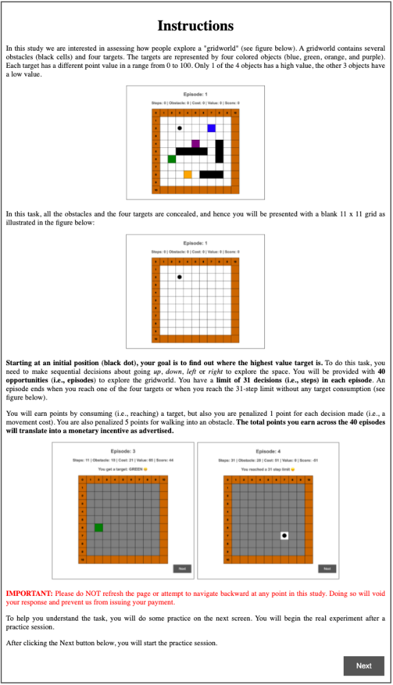

_Figure S1_ . Instructions presented in the Experiment 1.

CREDIT ASSIGNMENT IN HUMANS AND AI 2

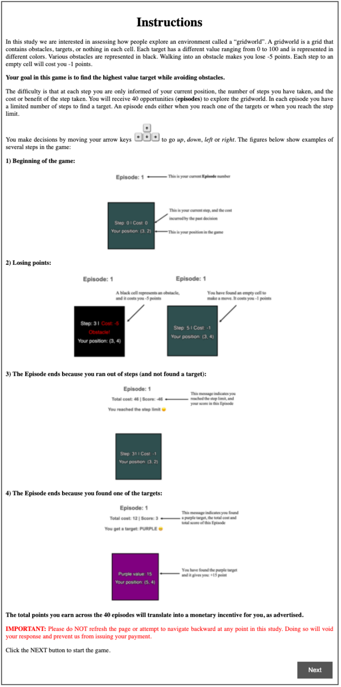

_Figure S2_ . Instructions presented in the Experiment 2.

CREDIT ASSIGNMENT IN HUMANS AND AI 3

**S-II** **Fitting the models’ parameters to behavioral data**

As a quick exercise, to try to assess whether fitting the models’ parameters to human

data would improve the way the main effects observed from pure predictions of the

models, we fit each of the models’ parameters to humans’ average PMax separately in

the two experiments and for each complexity condition. We conducted a search over all

parameters for each model with the goal of minimizing the RMSE between the model’s

PMax and the human PMax at each episode. The search space for all parameters for all

models was (0 _,_ 1). The resulting parameters are summarized in Table S1.

Simple Complex

Model _σ_ _d_ _γ_ _α_ _ϵ_ _σ_ _d_ _γ_ _α_ _ϵ_

IBL-Equal 0.814 0.143 — — — 0.014 0.400 — — —

IBL-Exponential 0.162 0.800 0.998 — — 0.269 0.999 0.980 — —

Experiment 1

IBL-TD 0.065 0.484 0.966 0.898 — 0.034 0.969 0.730 0.878 —

Q-learning — — 0.997 0.839 0.002 — — 0.954 0.714 0.020

IBL-Equal 0.716 0.057 — — — 0.029 0.682 — — —

IBL-Exponential 0.012 0.121 0.943 — — 0.047 0.243 0.865 — —

Experiment 2

IBL-TD 0.014 0.862 0.576 0.971 — 0.909 0.359 0.776 0.494 —

Q-learning — — 0.548 0.978 0.03 — — 0.576 0.722 0.310

Table S1

_Parameters resulting from the calibration of the models to human data in Experiment 1_

_and in Experiment 2._

Table S2 shows the resulting average PMax performance of the models and the difference

to human average Pmax for Experiment 1 and Experiment 2. As expected, calibrating

the models’ parameters to human PMax improves the similarity of the models to human

PMax in both experiments.

Figure S3 shows the resulting PMax per episode, for the models calibrated to human

data in Experiment 1 and Experiment 2. We observe some improvement in capturing

the PMax per episode in some models in both experiments. However, the TD models,

even after fitting their parameters, are unable to capture the initial PMax of human

participants, especially in simple environments.

CREDIT ASSIGNMENT IN HUMANS AND AI 4

Simple Complex
Decision Complexity

PMax

Avg.

PMax

Err.

PMax

Avg.

PMax

Err.

Experiment 1

Experiment 2

Human 0.71 – 0.48 —

IBL-Equal 0.77 0.06 0.60 0.12

IBL-Exponential 0.74 0.03 0.55 0.07

IBL-TD 0.66 -0.05 0.44 -0.04

Q-learning 0.67 -0.04 0.43 -0.05

Human 0.63 — 0.24 —

IBL-Equal 0.62 -0.01 0.47 0.23

IBL-Exponential 0.61 -0.02 0.31 0.07

IBL-TD 0.63 0.00 0.27 0.03

Q-learning 0.60 -0.03 0.25 0.01

Table S2

_Average performance and error for models fit to human data from Experiment 1 and_

_Experiment 2._

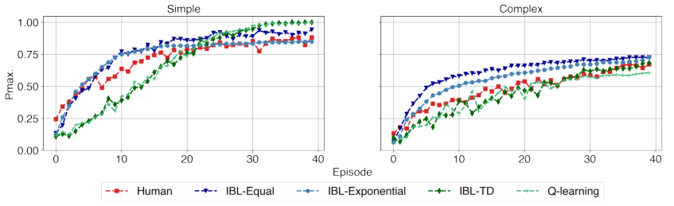

(a) Experiment 1

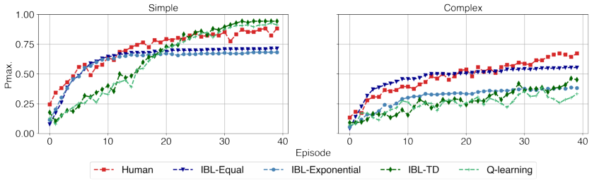

(b) Experiment 2

_Figure S3_ . PMax results with parameters selected to minimize the average difference

between human (a) Experiment 1 and (b) Experiment 2 and model PMax.

CREDIT ASSIGNMENT IN HUMANS AND AI 5

**S-III** **Statistical analysis** [5]

A mixed ANOVA was conducted to compare the main effects of decision complexity levels

(simple and complex) and episodes (40 episodes) as well as the interaction effect between

them, on the behavioral characteristics of humans and the models with regard to each

of the following process metrics. We further conducted an ANOVA test to compare hu

mans’ and models’ behavior in each decision complexity condition, which was performed

separately for each condition. Finally we provide descriptive statistics for the first 10 and

the last 10 playing episodes in terms of the corresponding metrics.

**S-III.1** **Target consumption**

Table S3 reports the ANOVA for the effects on humans’ and the models’ each target and

no target consumption rate. The ANOVA was performed separately for each of them.

1st highest 2nd highest 3rd highest 4th highest No target
Effect DFn DFd

F p F p F p F p F p

complexity 1 204 25.04 **0.000** 3.84 0.052 10.67 **0.001** 4.21 **0.042** 4.81 **0.029**

Human Experiment 1

Human Experiment 2

IBL-Equal

IBL-Exponential

IBL-TD

Q-Learning

episode 39 7956 47.84 **0.000** 3.96 **0.000** 6.53 **0.000** 9.24 **0.000** 8.82 **0.000**

complexity:episode 39 7956 1.19 0.192 1.27 0.122 1.02 0.435 1.19 0.189 0.95 0.568

complexity 1 192 59.98 **0.000** 6.29 **0.013** 17.92 **0.000** 7.12 **0.008** 4.71 **0.031**

episode 39 7488 21.50 **0.000** 0.86 0.720 2.30 **0.000** 4.81 **0.000** 11.63 **0.000**

complexity:episode 39 7488 3.25 **0.000** 3.47 **0.000** 1.01 0.459 0.86 0.710 1.19 0.191

complexity 1 124 3.70 0.056 1.42 0.236 9.91 **0.002** 7.20 **0.008** 9.73 **0.002**

episode 39 4836 93.76 **0.000** 0.85 0.736 6.27 **0.000** 7.78 **0.000** 41.19 **0.000**

complexity:episode 39 4836 1.57 **0.014** 0.71 0.916 3.53 **0.000** 2.08 **0.000** 5.10 **0.000**

complexity 1 124 11.45 **0.001** 4.66 **0.033** 9.7 **0.002** 6.47 **0.012** 14.00 **0.000**

episode 39 4836 97.08 **0.000** 2.45 **0.000** 3.88 **0.000** 7.59 **0.000** 43.02 **0.000**

complexity:episode 39 4836 0.94 0.577 0.38 0.999 0.95 0.564 2.60 **0.000** 6.59 **0.000**

complexity 1 124 7.05 **0.009** 3.49 0.064 25.54 **0.000** 5.72 **0.018** 0.10 0.755

episode 39 4836 101.93 **0.000** 7.38 **0.000** 8.19 **0.000** 9.82 **0.000** 25.10 **0.000**

complexity:episode 39 4836 1.52 **0.021** 1.35 0.0721 2.16 **0.000** 2.66 **0.000** 4.94 **0.000**

complexity 1 124 5.86 **0.017** 4.28 **0.041** 19.64 **0.000** 6.80 **0.010** 0.005 0.944

episode 39 4836 89.13 **0.000** 6.67 **0.000** 6.42 **0.000** 8.06 **0.000** 24.21 **0.000**

complexity:episode 39 4836 1.15 0.246 0.89 0.659 1.53 **0.019** 1.51 **0.022** 3.20 **0.000**

Table S3

_ANOVA for the effect of decision complexity on the humans and models’ target_

_consumption rate._

5 All analyses were performed using R version 3.5.3.

CREDIT ASSIGNMENT IN HUMANS AND AI 6

Table S4 presents the comparison between the mean proportion of times that the highest

value target and no target is consumed by humans and the models.

1st highest value target No target

Simple Complex Simple Complex

Group 1 Group 2 diff p.adj diff p.adj diff p.adj diff p.adj

Human Experiment 2 Human Experiment 1 -0.084 0.000 -0.245 0.000 0.028 0.000 0.036 0.000

IBL-Exponential Human Experiment 1 -0.664 0.000 -0.358 0.000 0.793 0.000 0.597 0.000

IBL-Equal Human Experiment 1 -0.633 0.000 -0.353 0.000 0.754 0.000 0.632 0.000

IBL-TD Human Experiment 1 -0.666 0.000 -0.421 0.000 0.655 0.000 0.571 0.000

Q-learning Human Experiment 1 -0.668 0.000 -0.423 0.000 0.650 0.000 0.572 0.000

IBL-Exponential Human Experiment 2 -0.581 0.000 -0.113 0.000 0.765 0.000 0.561 0.000

IBL-Equal Human Experiment 2 -0.549 0.000 -0.108 0.000 0.726 0.000 0.595 0.000

IBL-TD Human Experiment 2 -0.582 0.000 -0.177 0.000 0.627 0.000 0.535 0.000

Q-learning Human Experiment 2 -0.585 0.000 -0.178 0.000 0.623 0.000 0.536 0.000

IBL-Exponential IBL-Equal -0.032 0.012 -0.005 0.997 0.039 0.000 -0.034 0.006

IBL-TD IBL-Exponential -0.002 1.000 -0.064 0.000 -0.138 0.000 -0.026 0.080

Q-learning IBL-Exponential -0.004 0.999 -0.065 0.000 -0.143 0.000 -0.025 0.099

IBL-TD IBL-Equal -0.033 0.007 -0.069 0.000 -0.098 0.000 -0.060 0.000

Q-learning IBL-Equal -0.036 0.003 -0.070 0.000 -0.103 0.000 -0.060 0.000

Q-learning IBL-TD -0.002 1.000 -0.002 1.000 -0.005 0.993 0.001 1.000

Table S4

_ANOVA with post-hoc Tukey HSD for comparing the mean proportion of times that the_

_**highest value target**_ _and_ _**no target**_ _is obtained by humans and the models._

**S-III.2** **Redundancy and Immediate redundancy**

Table S5 summarizes a mixed ANOVA for the effects of decision complexity on the

redundancy and the immediate redundancy.

Table S6 reports the comparison among humans and the models in terms of the average

proportion of making redundant and immediately redundant visits.

Table S7 and Fig. S4 display the average redundancy and immediate redundancy rate in

the first and last 10 episodes.

CREDIT ASSIGNMENT IN HUMANS AND AI 7

Immediate
Redundancy

Redundancy

Effect DFn DFd F p F p

complexity 1 204 3.28 0.072 3.06 0.082

Human Experiment 1

Human Experiment 2

IBL-Equal

IBL-Exponential

IBL-TD

Q-learning

Table S5

episode 39 7956 3.77 **0.000** 1.56 **0.014**

complexity:episode 39 7956 1.25 0.139 1.06 0.376

complexity 1 192 7.43 **0.007** 5.24 **0.023**

episode 39 7488 23.54 **0.000** 6.56 **0.000**

complexity:episode 39 7488 1.06 0.369 0.76 0.856

complexity 1 124 3.27 0.073 1.75 0.188

episode 39 4836 91.31 **0.000** 47.06 **0.000**

complexity:episode 39.00 4836 1.63 **0.008** 1.38 0.058

complexity 1 124 2.66 0.105 2.93 0.089

episode 39 4836 105.38 **0.000** 58.32 **0.000**

complexity:episode 39 4836 1.37 0.064 1.25 0.141

complexity 1 124 6.32 **0.013** 8.33 **0.005**

episode 39 4836 133.61 **0.000** 90.14 **0.000**

complexity:episode 39 4836 2.66 **0.000** 2.44 **0.000**

complexity 1 124 3.34 **0.049** 6.96 **0.009**

episode 39 4836 132.28 **0.000** 87.47 **0.000**

complexity:episode 39 4836 2.31 **0.000** 1.95 **0.000**

_ANOVA for the effect of decision complexity on the_ _**redundancy**_ _and_ _**immediate**_

_**redundancy**_ _of humans and the models._

CREDIT ASSIGNMENT IN HUMANS AND AI 8

Redundancy Immediate Redundancy

Simple Complex Simple Complex

Group 1 Group 2 diff p.adj diff p.adj diff p.adj diff p.adj

Human Experiment 2 Human Experiment 1 0.058 0.000 0.091 0.000 0.018 0.000 0.031 0.000

IBL-Exponential Human Experiment 1 0.093 0.000 0.108 0.000 0.031 0.000 0.036 0.000

IBL-Equal Human Experiment 1 0.134 0.000 0.161 0.000 0.041 0.000 0.045 0.000

IBL-TD Human Experiment 1 0.186 0.000 0.208 0.000 0.070 0.000 0.079 0.000

Q-learning Human Experiment 1 0.199 0.000 0.213 0.000 0.078 0.000 0.086 0.000

IBL-Exponential Human Experiment 2 0.035 0.000 0.017 0.003 0.013 0.000 0.004 0.241

IBL-Equal Human Experiment 2 0.076 0.000 0.070 0.000 0.023 0.000 0.014 0.000

IBL-TD Human Experiment 2 0.127 0.000 0.116 0.000 0.052 0.000 0.048 0.000

Q-learning Human Experiment 2 0.141 0.000 0.122 0.000 0.059 0.000 0.055 0.000

IBL-Equal IBL-Exponential 0.041 0.000 0.053 0.000 0.010 0.000 0.010 0.000

IBL-TD IBL-Exponential 0.092 0.000 0.100 0.000 0.039 0.000 0.044 0.000

Q-learning IBL-Exponential 0.106 0.000 0.105 0.000 0.047 0.000 0.050 0.000

IBL-TD IBL-Equal 0.051 0.000 0.046 0.000 0.029 0.000 0.034 0.000

Q-learning IBL-Equal 0.065 0.000 0.052 0.000 0.037 0.000 0.041 0.000

Q-learning IBL-TD 0.013 0.015 0.006 0.850 0.008 0.000 0.007 0.034

Table S6

_ANOVA with post-hoc Tukey HSD for comparing the mean_ _**redundancy**_ _and_

_**immediate redundancy**_ _rate among humans and the models._

CREDIT ASSIGNMENT IN HUMANS AND AI 9

Simple Complex
Humans and Models

First 10 episodes Last 10 episodes First 10 episodes Last 10 episodes

Human Experiment 1 0.012 _±_ 0.00 0.002 _±_ 0.00 0.020 _±_ 0.00 0.005 _±_ 0.00

Human Experiment 2 0.119 _±_ 0.05 0.039 _±_ 0.05 0.179 _±_ 0.05 0.066 _±_ 0.05

IBL-Equal 0.348 _±_ 0.12 0.044 _±_ 0.12 0.360 _±_ 0.08 0.064 _±_ 0.08

Redundancy

IBL-Exponential 0.313 _±_ 0.15 0.002 _±_ 0.15 0.311 _±_ 0.12 0.027 _±_ 0.12

IBL-TD 0.451 _±_ 0.07 0.004 _±_ 0.07 0.429 _±_ 0.05 0.025 _±_ 0.05

Q-Learning 0.466 _±_ 0.06 0.007 _±_ 0.06 0.440 _±_ 0.03 0.042 _±_ 0.03

Human Experiment 1 0.003 _±_ 0.00 0.000 _±_ 0.00 0.008 _±_ 0.00 0.003 _±_ 0.00

Human Experiment 2 0.037 _±_ 0.01 0.011 _±_ 0.01 0.058 _±_ 0.01 0.027 _±_ 0.01

Immediate

Redundancy

IBL-Equal 0.098 _±_ 0.03 0.016 _±_ 0.03 0.099 _±_ 0.02 0.024 _±_ 0.02

IBL-Exponential 0.095 _±_ 0.04 0.001 _±_ 0.04 0.096 _±_ 0.03 0.015 _±_ 0.03

IBL-TD 0.148 _±_ 0.01 0.002 _±_ 0.01 0.142 _±_ 0.02 0.011 _±_ 0.02

Q-Learning 0.161 _±_ 0.01 0.004 _±_ 0.01 0.150 _±_ 0.01 0.022 _±_ 0.01

Table S7

_Descriptive statistics (mean ± standard deviation) regarding_ _**redundancy**_ _and_

_**immediate redundancy**_ _during the first 10 episodes and last 10 playing episodes._

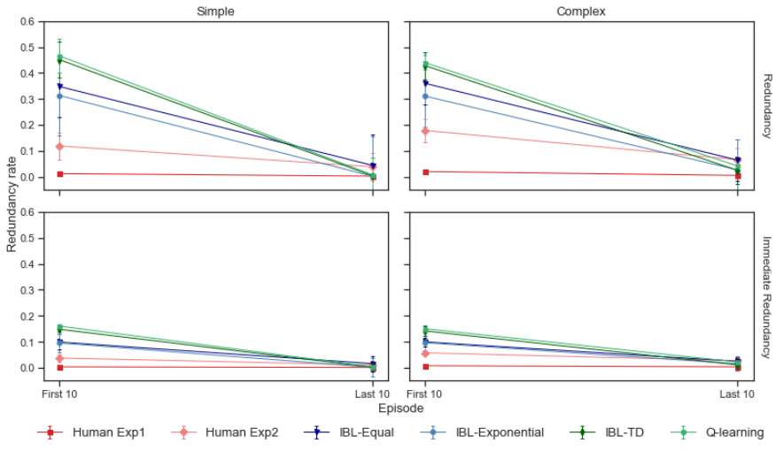

_Figure S4_ . The average **redundancy** and **immediate redundancy** rate in the first 10

and last 10 episodes.

CREDIT ASSIGNMENT IN HUMANS AND AI 10

**S-III.3** **Linear movement strategy**

Table S8 reports the decision complexity effects on executing linear movement strategy.

Table S9 compares the mean proportion of times following linear movement strategy

among humans and the models. Table S10 and Fig. S5 show the average linear movement

rate in the first and last 10 episodes.

Effect DFn DFd F p

complexity 1 204 1139.70 **0.000**

Human Experiment 1

Human Experiment 2

IBL-Equal

IBL-Exponential

IBL-TD

Q-Learning

Table S8

episode 39 7956 4.46 **0.000**

complexity:episode 39 7956 16.80 **0.000**

complexity 1 192 799.49 **0.000**

episode 39 7488 6.70 **0.000**

complexity:episode 39 7488 10.50 **0.000**

complexity 1 124 93.70 **0.000**

episode 39 4836 4.36 **0.000**

complexity:episode 39 4836 0.96 0.549

complexity 1 124 52.78 **0.000**

episode 39 4836 7.24 **0.000**

complexity:episode 39 4836 1.00 0.471

complexity 1 124 827.79 **0.000**

episode 39 4836 4.18 **0.000**

complexity:episode 39 4836 14.87 **0.000**

complexity 1 124 889.60 **0.000**

episode 39 4836 3.33 **0.000**

complexity:episode 39 4836 16.54 **0.000**

_ANOVA for the effect of decision complexity on the_ _**linear movement strategy**_ _of_

_humans and the models._

CREDIT ASSIGNMENT IN HUMANS AND AI 11

Simple Complex

Group 1 Group 2 diff p.adj diff p.adj

Human Experiment 2 Human Experiment 1 0.001 1.000 0.012 0.289

IBL-Equal Human Experiment 1 -0.292 0.000 -0.027 0.000

IBL-Exponential Human Experiment 1 -0.407 0.000 -0.017 0.087

IBL-TD Human Experiment 1 -0.102 0.000 0.028 0.000

Q-learning Human Experiment 1 -0.121 0.000 0.028 0.000

IBL-Equal Human Experiment 2 -0.293 0.000 -0.040 0.000

IBL-Exponential Human Experiment 2 -0.408 0.000 -0.029 0.000

IBL-TD Human Experiment 2 -0.103 0.000 0.016 0.169

Q-learning Human Experiment 2 -0.122 0.000 0.016 0.147

IBL-Exponential IBL-Equal -0.115 0.000 0.010 0.741

IBL-TD IBL-Equal 0.190 0.000 0.055 0.000

Q-learning IBL-Equal 0.171 0.000 0.056 0.000

IBL-TD IBL-Exponential 0.305 0.000 0.045 0.000

Q-learning IBL-Exponential 0.286 0.000 0.046 0.000

Q-learning IBL-TD -0.019 0.550 0.000 1.000

Table S9

_ANOVA with post-hoc Tukey HSD for comparing the mean_ _**linear movement**_ _rate_

_among humans and the models._

Simple Complex
Humans and Models

First 10 episodes Last 10 episodes First 10 episodes Last 10 episodes

Human Experiment 1 0.698 _±_ 0.09 0.938 _±_ 0.09 0.119 _±_ 0.05 0.051 _±_ 0.05

Human Experiment 2 0.733 _±_ 0.14 0.922 _±_ 0.14 0.100 _±_ 0.03 0.076 _±_ 0.03

IBL-Equal 0.623 _±_ 0.05 0.522 _±_ 0.05 0.103 _±_ 0.04 0.024 _±_ 0.04

IBL-Exponential 0.539 _±_ 0.09 0.408 _±_ 0.09 0.114 _±_ 0.06 0.019 _±_ 0.06

IBL-TD 0.594 _±_ 0.07 0.952 _±_ 0.07 0.179 _±_ 0.05 0.015 _±_ 0.05

Q-Learning 0.553 _±_ 0.08 0.947 _±_ 0.08 0.177 _±_ 0.06 0.011 _±_ 0.06

Table S10

_Descriptive statistics (mean ± standard deviation) regarding_ _**linear movement**_

_**strategy**_ _during the first 10 and last 10 playing episodes._

CREDIT ASSIGNMENT IN HUMANS AND AI 12

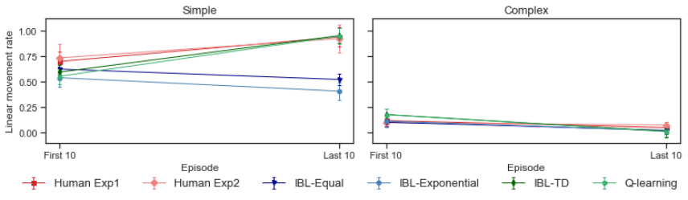

_Figure S5_ . The average **linear movement** rate in the first 10 and last 10 episodes.

**S-III.4** **Coverage**

Table S11 and S12 show the effects on the coverage of humans and the models. Table S13

and Fig. S6 display the mean percent of coverage in the first 10 and last 10 episodes.

Effect DFn DFd F p

complexity 1 204 0.02 0.885

Human Experiment 1

Human Experiment 2

IBL-Equal

IBL-Exponential

IBL-TD

Q-Learning

episode 39 7956 29.68 **0.000**

complexity:episode 39 7956 0.68 0.938

complexity 1 192 0.33 0.568

episode 39.00 7488.00 23.47 **0.000**

complexity:episode 39.00 7488.00 1.53 **0.019**

complexity 1 124 15.51 **0.000**

episode 39 4836 32.19 **0.000**

complexity:episode 39 4836 4.67 **0.000**

complexity 1 124 32.75 **0.000**

episode 39 4836 34.04 **0.000**

complexity:episode 39 4836 1.95 **0.000**

complexity 1 124 5.36 **0.022**

episode 39 4836 64.53 **0.000**

complexity:episode 39 4836 7.81 **0.000**

complexity 1 124 5.85 **0.017**

episode 39 4836 61.17 **0.000**

complexity:episode 39 4836 7.38 **0.000**

Table S11

_ANOVA for the effect of decision complexity on the_ _**coverage**_ _of humans and the_

_models._

CREDIT ASSIGNMENT IN HUMANS AND AI 13

Simple Complex

Group 1 Group 2 diff p.adj diff p.adj

Human Experiment 2 Human Experiment 1 -0.009 0.000 -0.012 0.000

IBL-Equal Human Experiment 1 0.024 0.000 0.006 0.002

IBL-Exponential Human Experiment 1 0.027 0.000 0.000 1.000

IBL-TD Human Experiment 1 0.028 0.000 0.035 0.000

Q-learning Human Experiment 1 0.029 0.000 0.036 0.000

IBL-Equal Human Experiment 2 0.032 0.000 0.018 0.000

IBL-Exponential Human Experiment 2 0.036 0.000 0.012 0.000

IBL-TD Human Experiment 2 0.037 0.000 0.047 0.000

Q-learning Human Experiment 2 0.037 0.000 0.048 0.000

IBL-Exponential IBL-Equal 0.003 0.266 -0.006 0.015

IBL-TD IBL-Equal 0.004 0.075 0.029 0.000

Q-learning IBL-Equal 0.005 0.014 0.030 0.000

IBL-TD IBL-Exponential 0.001 0.993 0.035 0.000

Q-learning IBL-Exponential 0.002 0.873 0.036 0.000

Q-learning IBL-TD 0.001 0.993 0.001 0.993

Table S12

_ANOVA with post-hoc Tukey HSD for comparing the mean_ _**coverage**_ _rate among_

_humans and the models._

Simple Complex
Humans and Models

First 10 episodes Last 10 episodes First 10 episodes Last 10 episodes

Human Experiment 1 0.149 _±_ 0.02 0.092 _±_ 0.02 0.148 _±_ 0.02 0.094 _±_ 0.02

Human Experiment 2 0.126 _±_ 0.03 0.089 _±_ 0.03 0.124 _±_ 0.02 0.088 _±_ 0.02

IBL-Equal 0.169 _±_ 0.02 0.119 _±_ 0.02 0.136 _±_ 0.01 0.109 _±_ 0.01

IBL-Exponential 0.168 _±_ 0.02 0.123 _±_ 0.02 0.133 _±_ 0.02 0.103 _±_ 0.02

IBL-TD 0.199 _±_ 0.00 0.087 _±_ 0.00 0.169 _±_ 0.01 0.107 _±_ 0.01

Q-Learning 0.196 _±_ 0.01 0.088 _±_ 0.01 0.169 _±_ 0.02 0.110 _±_ 0.02

Table S13

_Descriptive statistics (mean ± standard deviation) regarding_ _**coverage**_ _during the first_

_10 and last 10 playing episodes._

CREDIT ASSIGNMENT IN HUMANS AND AI 14

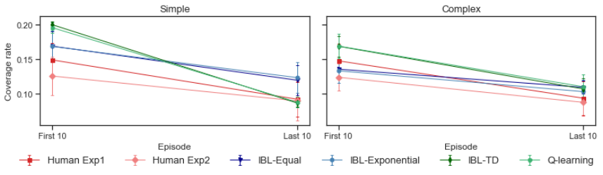

_Figure S6_ . The average percent of **coverage** in the first 10 and last 10 episodes.

**S-III.5** **Closest distractor**

Table S14 and S15 show the effects on the rate of getting the closest distractor. Table S16

and Fig. S7 report the mean distractor consumption in the first and last 10 episodes.

Effect DFn DFd F p

complexity 1 204 3.76 0.054

Human Experiment 1

Human Experiment 2

IBL-Equal

IBL-Exponential

IBL-TD

Q-Learning

episode 39 7956 5.63 **0.000**

complexity:episode 39 7956 0.80 0.807

complexity 1 192 6.44 **0.012**

episode 39 7488 3.09 **0.000**

complexity:episode 39 7488 1.16 0.225

complexity 1 124 0.24 0.625

episode 39 4836 5.97 **0.000**

complexity:episode 39 4836 3.51 **0.000**

complexity 1 124 9.15 **0.003**

episode 39 4836 6.82 **0.000**

complexity:episode 39 4836 1.18 0.211

complexity 1 124 0.02 0.890

episode 39 4836 16.59 **0.000**

complexity:episode 39 4836 3.02 **0.000**

complexity 1 124 0.15 0.699

episode 39 4836 17.88 **0.000**

complexity:episode 39 4836 1.64 **0.007**

Table S14

_ANOVA for the effect of decision complexity on the_ _**closest distractor consumption**_

_of humans and the models._

CREDIT ASSIGNMENT IN HUMANS AND AI 15

Simple Complex

Group 1 Group 2 diff p.adj diff p.adj

Human Experiment 2 Human Experiment 1 0.071 0.000 0.127 0.000

IBL-Equal Human Experiment 1 -0.007 0.947 -0.052 0.000

IBL-Exponential Human Experiment 1 -0.044 0.000 0.015 0.583

IBL-TD Human Experiment 1 -0.047 0.000 -0.109 0.000

Q-learning Human Experiment 1 -0.048 0.000 -0.109 0.000

IBL-Equal Human Experiment 2 -0.078 0.000 -0.179 0.000

IBL-Exponential Human Experiment 2 -0.115 0.000 -0.112 0.000

IBL-TD Human Experiment 2 -0.117 0.000 -0.236 0.000

Q-learning Human Experiment 2 -0.119 0.000 -0.236 0.000

IBL-Exponential IBL-Equal -0.038 0.000 0.067 0.000

IBL-TD IBL-Equal -0.040 0.000 -0.057 0.000

Q-learning IBL-Equal -0.042 0.000 -0.057 0.000

IBL-TD IBL-Exponential -0.002 1.000 -0.124 0.000

Q-learning IBL-Exponential -0.004 0.995 -0.124 0.000

Q-learning IBL-TD -0.002 1.000 0.000 1.000

Table S15

_ANOVA with post-hoc Tukey HSD for comparing the mean_ _**closest distractor**_

_**consumption**_ _rate among humans and the models._

Simple Complex
Humans and Models

First 10 episodes Last 10 episodes First 10 episodes Last 10 episodes

Human Experiment 1 0.169 _±_ 0.03 0.059 _±_ 0.03 0.206 _±_ 0.03 0.122 _±_ 0.03

Human Experiment 2 0.231 _±_ 0.03 0.130 _±_ 0.03 0.326 _±_ 0.05 0.283 _±_ 0.05

IBL-Equal 0.125 _±_ 0.03 0.083 _±_ 0.03 0.234 _±_ 0.08 0.039 _±_ 0.08

IBL-Exponential 0.106 _±_ 0.04 0.031 _±_ 0.04 0.274 _±_ 0.06 0.123 _±_ 0.06

IBL-TD 0.167 _±_ 0.06 0.000 _±_ 0.06 0.208 _±_ 0.09 0.000 _±_ 0.09

Q-Learning 0.166 _±_ 0.06 0.001 _±_ 0.06 0.197 _±_ 0.10 0.003 _±_ 0.10

Table S16

_Descriptive statistics (mean ± standard deviation) regarding_ _**closest distractor**_

_**consumption**_ _during the first 10 and last 10 playing episodes._

CREDIT ASSIGNMENT IN HUMANS AND AI 16

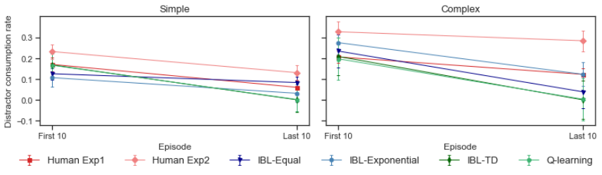

_Figure S7_ . The **closest distractor** consumption rate in the first 10 and last 10

episodes.

