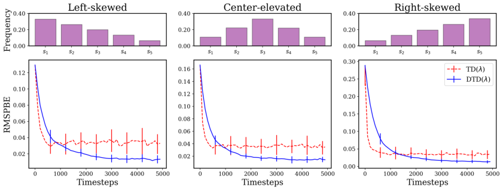
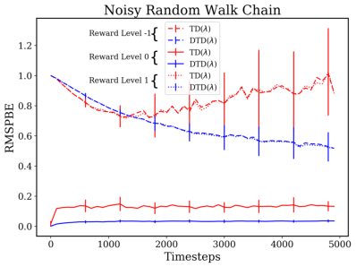

## **Discerning Temporal Difference Learning**

**Jianfei Ma**

Northwestern Polytechnical University
School of Mathematics and Statistics
matrixfeeney@gmail.com

**Abstract**

Temporal difference learning (TD) is a foundational concept
in reinforcement learning (RL), aimed at efficiently assessing a policy’s value function. TD( _λ_ ), a potent variant, incorporates a memory trace to distribute the prediction error
into the historical context. However, this approach often neglects the significance of historical states and the relative importance of propagating the TD error, influenced by challenges such as visitation imbalance or outcome noise. To address this, we propose a novel TD algorithm named discerning TD learning (DTD), which allows flexible emphasis functions—predetermined or adapted during training—to allocate
efforts effectively across states. We establish the convergence
properties of our method within a specific class of emphasis
functions and showcase its promising potential for adaptation to deep RL contexts. Empirical results underscore that
employing a judicious emphasis function not only improves
value estimation but also expedites learning across diverse
scenarios.

**Introduction**

In reinforcement learning, efficiently predicting future rewards based on past experiences is a fundamental challenge.
TD(0) assigns credit using the difference between successive predictions (Sutton 1988), offering online and recursive
capabilities, but its scope is limited to the current observed
state. On the other hand, TD( _λ_ ) (Sutton and Barto 2018),
when combined with the eligibility trace, assigns credit to
all historical states, using a recency heuristic to propagate
credit. However, it lacks consideration for the relative importance of each state, that is, how much emphasis should
be given to each historical state to make better predictions?
Both approaches have found success in modern RL algorithms (Mnih et al. 2013) (Schulman et al. 2017), but they
uniformly weigh states, overlooking the potential benefits of
emphasis-aware credit assignment.
In various circumstances, the emphasis-awareness becomes crucial. The accurate estimation of a value function
often faces inherent challenges, including visitation imbalances and noisy outcomes, particularly in reward-seeking
tasks. Due to variations in initial state distributions or transition models, agents tend to update high-frequency states

Copyright © 2024, Association for the Advancement of Artificial
Intelligence (www.aaai.org). All rights reserved.

more frequently, while less attention is given to less frequent or near-terminating states, such as goal states. This
phenomenon is especially prevalent in episodic tasks with
eligibility traces, where more frequent states are updated
each time a new state is encountered while states close to termination have shorter trace positions, resulting in fewer updates. In such cases, diverging update frequencies can lead to
imbalanced value estimations. Furthermore, the added complexity arising from noisy observations (Chelu et al. 2022)
or rewards (Wang, Liu, and Li 2020) exacerbates the estimation challenge. Injected noise can lead to erroneous predictions, propagating inaccuracies to other states. Moreover, in
reality, the most rewarding states are often rare occurrences,
particularly in situations where most states have sparse rewards. The fundamental idea is to emphasize less frequent
or more valuable states by increasing individual update magnitudes or reducing attention on states with adverse factors,
using a nonnegative emphasis function. While existing approaches (Sutton, Mahmood, and White 2016) (Anand and
Precup 2021) (Chelu et al. 2022) provide some insights, they
either lack a thorough investigation of emphasis functions
in diverse scenarios or overlook the mutual influence of the
emphasis between states.

In this paper, we introduce a novel class of TD learning methods based on a fundamental identity. This identity, when viewed forward, directly incorporates an emphasis function that prioritizes various multi-step return combinations, offering enhanced flexibility. We establish a connection to a computationally efficient backward view that updates online, with its structure revealing the emphasis function’s role. We provide theoretical analysis demonstrating
that for a specific class of emphasis functions, our method
converges to the optimal solution in the sense of an emphasized objective. Illustrative examples are presented to investigate emphasis choices in diverse scenarios. These examples reveal that our proposed approach, DTD, can enhance
value estimation and expedite learning, with particularly noticeable benefits from more compact choices like the absolute expected TD error. Moreover, the newly developed
type of return function holds promise for adaptation to DRL
scenarios, especially where accurate advantage estimation is
crucial (Schulman et al. 2016). Additionally, we establish a
connection to prioritized sampling (Schaul et al. 2016) in
cases where the data is Markovian. Lastly, we initiate a dis

cussion on the design of the emphasis function from various
perspectives.

**Preliminaries**

**Notation**

Let’s denote _∥·∥_ **Λ** the vector norm induced by a positive definite matrix **Λ**, i.e. _∥x∥_ **Λ** = _√x_ _[⊤]_ **Λ** _x_ . And the corresponding

induced matrix norm is _∥_ **A** _∥_ **Λ** = max _∥x∥_ **Λ** =1 _∥_ **A** _x∥_ **Λ** . With
**Λ** = **I**, it comes to the Euclidean-induced norm, for which
we drop the subscript as _∥_ **A** _∥_ . For simplicity, **1** denotes the
all-one vector. We indicate random variables by capital letters (e.g _S_ _t_ _, A_ _t_ ), realization by lowercase letters (e.g _s_ _t_ _, a_ _t_ ).

**Problem Setting**

Consider an infinite-horizon discounted MDP, defined by a
tuple ( _S, A, P, r, ρ_ 0 _, γ_ ), with a finite state space _S_, a finite
action space _A_, a transition kernel _P_ : _S × A × S →_ R, a
reward function _r_ : _S × A →_ R, an initial state distribution
_ρ_ 0 : _S →_ R, and a discount factor _γ ∈_ [0 _,_ 1). Being at a
state _s_ _t_ _∈S_, the agent takes an action _a_ _t_ _∈A_ according to
some policy _π_, which assigns a probability _π_ ( _a_ _t_ _|s_ _t_ ) to the
choice. After the environment receives _a_ _t_, it emits a reward
_r_ _t_, and sends the agent to a new state _s_ _t_ +1 _∼_ _P_ ( _s_ _t_ +1 _|s_ _t_ _, a_ _t_ ).
Repeating this procedure, the discounted return can be ful

_∞_
filled as _G_ _t_ = � _γ_ _[t]_ _R_ _t_ . We denote **P** _π_ _∈_ R _[|S|×|S|]_ the state

_t_ =0

transition matrix and **r** _π_ _∈_ R _[|S|]_ the expected immediate reward vector. And the steady-state distribution is denoted as
**d** _π_ ( _s_ ), which we assume exists and is positive at all states.
Let **D** denote the diagonal matrix with **d** _π_ on its diagonal.
The prediction problem we are interested in is to estimate
the value function:

_v_ _π_ ( _s_ ) = E _π_ [ _G_ _t_ _|S_ _t_ = _s_ ] _._ (1)

When the state space is large or even continuous, it is beneficial to use function approximation ˆ _v_ ( _s,_ _**θ**_ ) to represent _v_ to
generalize across states. In particular, if the feature is expressive, it is convenient to use linear function approximation:

_v_ ˆ( _s,_ _**θ**_ ) = _ϕ_ ( _s_ ) _[⊤]_ _**θ**_ _,_ (2)

where _ϕ_ ( _s_ ) is the feature vector at state _s_ . With each feature
vector of length _K_ being at the row of the matrix **Φ**, we can
compactly represent the value function vector as **V** _**θ**_ = **Φ** _**θ**_ .
For any value function **V**, the most representable solution in
the span of **Φ** corresponds to (Sutton et al. 2009) (Yu and
Bertsekas 2009):

**ΠV** = **Φ** _**θ**_ _[⋆]_ where _**θ**_ _[⋆]_ = arg min _∥_ **Φ** _**θ**_ _−_ **V** _∥_ **D** _,_ (3)
_**θ**_

where **Π** is the projection matrix in the form of:

**Π** = **Φ** ( **Φ** _[⊤]_ **DΦ** ) _[−]_ [1] **Φ** _[⊤]_ **D** _._ (4)

To solve Eq. (3), simulation-based approaches are often utilized. With **V** equal to the one-step TD target, TD(0) performs stochastic gradient descent to minimize the TD error:

_**θ**_ _t_ +1 = _**θ**_ _t_ + _α_ _t_ _δ_ _t_ _ϕ_ _t_ _,_ (5)

where
_δ_ _t_ = _R_ _t_ +1 + _γ_ _**θ**_ _[⊤]_ _t_ _[ϕ]_ _[t]_ [+1] _[−]_ _**[θ]**_ _[⊤]_ _t_ _[ϕ]_ _[t]_ (6)
is the TD error, and _α_ _t_ is the learning rate. The advantage
of this approach is that it incrementally updates the weight
vector at every time step, without requiring waiting until the
end of an episode. However, it only takes effect on the current observed state. TD( _λ_ ), on the other hand, while sustains
the same benefit of the online update, it is able to influence
past experiences. Those past experiences can be viewed as
eligible experiences that receive credit from the latest experience. This results in a more efficient update:

**e** _t_ = _γλ_ **e** _t−_ 1 + _ϕ_ _t_
(7)
_**θ**_ _t_ +1 = _**θ**_ _t_ + _α_ _t_ **e** _t_ _δ_ _t_ _,_

where **e** _t_ is called _eligibility trace_, with **e** _−_ 1 = 0. It is this
temporally extended memory that allows the TD error at the
current time step to be propagated to the states along the path
that leads to the current state.
While the additional parameter _λ ∈_ [0 _,_ 1] is seamlessly
integrated into the trace, it originates from the conventional
forward view that directly interpolates _n_ -step return exponentially forming the _λ_ -return:

_G_ _[λ]_ _t_ [= (1] _[ −]_ _[λ]_ [)]

_∞_
� _λ_ _[n][−]_ [1] _G_ [(] _t_ _[n]_ [)] _,_ (8)

_n_ =1

where

_G_ [(] _t_ _[n]_ [)] =

_n_
� _γ_ _[k][−]_ [1] _R_ _t_ + _k_ + _γ_ _[n]_ _v_ ˆ( _S_ _t_ + _n_ _,_ _**θ**_ ) _,_ (9)

_k_ =1

is the _n_ -step return. The method based on the target _G_ _[λ]_ _t_
is called the _λ_ -return algorithm, which has been proven to
achieve the same weight updates as offline TD( _λ_ ) (Sutton
1988) (Sutton and Barto 2018).

**Discerning Temporal Difference Learning**
The limitation of TD( _λ_ ) is that it fails to account for the importance of each historical state or to consider the relative
significance of propagating the TD error. To address this issue, we derive our new return function that directly incorporates emphasis start based on an important identity. Consider
any function _f_ : _S →_ R, the following identity holds:

_∞_
� _λ_ _[n]_ ( _f_ _t_ + _n_ _−_ _f_ _t_ + _n_ +1 _λ_ ) = _f_ _t_ _,_ (10)

_n_ =0

which generalizes the multiplier 1 _−_ _λ_ in the _λ_ -return. An
interesting property is that the above holds for any realvalued function. However, such a function class would be
too large to accommodate our purpose. We, therefore, constrain it into the bounded positive real-valued function as the
emphasis function, measuring the significance of each state,
with which we can derive a new return function as follows:

**Proposition 1.** _For any f_ : _S →_ R [+] _, it holds that:_

_G_ ¯ _[λ,f]_ _t_ ˙=

_∞_
� _λ_ _[n][−]_ [1] ( _f_ _t_ + _n−_ 1 _−_ _f_ _t_ + _n_ _λ_ ) _G_ [(] _t_ _[n]_ [)] (11)

_n_ =1

ˆ
= _f_ _t_ _v_ ( _S_ _t_ + _n_ _,_ _**θ**_ ) +

_∞_
�( _γλ_ ) _[n]_ _δ_ _t_ + _n_ _f_ _t_ + _n_ _._ (12)

_n_ =0

We defer the precise proof to the Appendix.
Intuitively, as Eq. 12 indicates, each TD error term is
reweighted by the emphasis function so as to control the relative strength of each future state. _G_ [¯] _[λ,f]_ _t_ here nonetheless is
unnormalized unless with a scalar multiplier _f_ [1] _t_ [. Henceforth,]

we will reload the notation as _G_ _[λ,f]_ _t_ ˙= _f_ [1] _t_ _[G]_ [¯] _t_ _[λ,f]_, named as dis
cerning _λ_ -return.
Next, we will formally deliver DTD with a composition
of an emphasized objective and the discerning _λ_ -return as
mentioned above. Denote **F** as a diagonal matrix with _f_ on
its diagonal, furthermore **Λ** = **FDF**, we therefore minimize
an emphasized objective analogous to Eq. 3:

_**θ**_ _[⋆]_ = arg min _∥_ **Φ** _**θ**_ _−_ **V** _∥_ **Λ** _,_ (13)
_**θ**_

which modulates the steady state probability with the square
of the emphasis function. The projection matrix can be expressed as:
**Π** _[f]_ = **Φ** ( **Φ** _[⊤]_ **ΛΦ** ) _[−]_ [1] **Φ** _[⊤]_ **Λ** _._ (14)

Any solution to Eq. 13 will have an orthogonal difference to
the emphasized basis such that:

**V** _−_ **Π** _[f]_ **V** _⊥_ **ΛΦ** _._ (15)

By combining the discerning _λ_ -return as the target **V**, and
manipulating the equivalence to the backward view similar
to the deduction of the TD( _λ_ ), we can derive the DTD( _λ_ )
update:
**e** _t_ = _γλ_ **e** _t−_ 1 + _f_ _t_ _ϕ_ _t_

_**θ**_ _t_ +1 = _**θ**_ _t_ + _α_ _t_ **e** _t_ _δ_ _t_ _f_ _t_ (16)

**e** _−_ 1 = 0 _,_

which distinguishes the historical state as well as regulates
the relative importance of propagating the TD error. The
complete algorithm is outlined in Alg. 1 with a general function approximator.

Algorithm 1: DTD( _λ_ )
**Input** : _π, v_ _**θ**_ _, f, γ, λ_
**Initialize** : _**θ**_ arbitrarily
1: **for** each episode **do**
2: Initialize _S_

3: Initialize **e**

4: **repeat**
5: Take action _A ∼_ _π_ ( _·|S_ ), observe _R, S_ _[′]_

6: **e** _←_ _γλ_ **e** + _f_ ( _S_ ) _∇v_ ˆ( _S,_ _**θ**_ )

ˆ ˆ
7: _δ ←_ _R_ + _γv_ ( _S_ _[′]_ _,_ _**θ**_ ) _−_ _v_ ( _S,_ _**θ**_ )
8: _**θ**_ _←_ _**θ**_ + _α_ _t_ _δ_ **e** _f_ ( _S_ )
9: _S ←_ _S_ _[′]_

10: **until** _S_ is terminal

11: **end for**

12: **return** _**θ**_

**Theoretical Analysis**

We embark on a theoretical exploration of the algorithm’s convergence behavior concerning the emphasis function, offering analyses for both parameter-independent and

parameter-dependent scenarios. To establish the foundation,
we introduce several necessary assumptions:

**Assumption 1.** _The Markov chain {S} is irreducible and_
_aperiodic._

**Assumption 2. Φ** _has linearly independent columns._

**Assumption 3.** _The learning rate {α_ _t_ _} is non-increasing,_
_and satisfies Robbins-Monro conditions:_

_∞_
� _α_ _t_ = _∞_ _and_

_t_ =0

_∞_
� _α_ _t_ [2] _[<][ ∞][.]_ (17)

_t_ =0

**Assumption 4.** _f_ _t_ + _n−_ 1 _−_ _f_ _t_ + _n_ _λ is independent of G_ [(] _t_ _[n]_ [)] _for_
_n ∈_ N [+] _._

Assumptions 1–3 adhere to the standard framework for
analyzing linear TD methods (see, for instance, (Tsitsiklis
and Roy 1997) (Yu 2010)). Assumption 4 is introduced to
facilitate analytical operator analysis.
To characterize the discerning _λ_ -return in its expected behavior, we introduce a notion of the DTD( _λ_ ) operator, which
encapsulates the essence of the forward-view DTD( _λ_ ):

**Definition 1.** _Discerning λ-return operator:_

_∞_
_T_ _[λ,f]_ ( **V** _**θ**_ ) = **F** _[−]_ [1] � _λ_ _[n]_ ( **P** _[n]_ _π_ [(] **[I]** _[ −]_ _[λ]_ **[P]** _[π]_ [)] **[F]** [)] **[1]** _[◦]_

_n_ =0

_n_
� �( _γ_ **P** _π_ ) _[t]_ **r** _π_ + ( _γ_ **P** _π_ ) _[n]_ [+1] **V** _**θ**_ � _,_

_t_ =0

(18)

_where ◦_ _is the Hadamard product between matrices._
Next, we examine the contraction condition about _T_ _[λ,f]_ .

**Theorem 1.** _Let σ_ _min_ ( **F** ) _represent the smallest singular_
_value of matrix_ **F** _. The mapping T_ _[λ,f]_ _is a contraction for_
_the parameter-independent case if it satisfies:_

_σ_ _min_ ( **F** )(1 _−γλ_ )
_i) ∥_ **F** _∥_ **Λ** _<_ _γ∥_ **1** _∥_ **Λ** _∥_ **I** _−λ_ **P** _π_ _∥_ **Λ** _[.]_
_ii) For the parameter-dependent case, if further there ex-_
_ists a Lipschitz constant κ ∈_ �0 _,_ _r_ [(] _max_ [1] _[−]_ _∥_ _[λ]_ **1** [)(] _∥_ **Λ** [1] _[−]_ _∥_ **I** _[γ]_ _−_ [)] _[σ]_ _λ_ _[min]_ **P** _π_ [(] **[F]** _∥_ **Λ** [)] � _such_

_that for any_ **F** 1 ( **V** _**θ**_ 1 ) _,_ **F** 2 ( **V** _**θ**_ 2 ) _:_

_∥_ **F** 1 _−_ **F** 2 _∥_ **Λ** _≤_ _[κ]_

2 _[∥]_ **[V]** _**[θ]**_ [1] _[ −]_ **[V]** _**[θ]**_ [2] _[∥]_ **[Λ]** _[,]_

_then it is a contraction mapping provided that:_
_σ_ _min_ ( **F** )(1 _−γλ_ )
_∥_ **F** _∥_ **Λ** _<_ _γ∥_ **1** _∥_ **Λ** _∥_ **I** _−λ_ **P** _π_ _∥_ **Λ** _[−]_ _γ_ [(] (1 [1] _[−]_ _−_ _[γ]_ _λ_ _[λ]_ )(1 [)] _[r]_ _[max]_ _−γ_ _[κ]_ ) _[,][ ∀]_ _**[θ]**_ _[ ∈]_ **[Θ]** _[,]_

where **Θ** is the parameter space that can be a suitable subset of R _[K]_ .
This property guarantees the uniqueness of the fixed
point. To avoid repetition, we define the function class Ξ as
a set that satisfies either condition _i_ ) or _ii_ ).
**Remark 1.** _Note ∥_ **1** _∥_ **Λ** _is simply the expected value of the_
_squared emphasis function under the steady-state distribu-_
_tion, i.e._ E **d** _π_ [ _f_ [2] ( _S_ )] _. In practice, if we can scale the empha-_
_sis function into a considerably small range (i.e._ [0 _,_ 1] _), we_
_will have a broader spectrum that enhances the contraction._

**Corollary 1. Π** _[f]_ _T_ _[λ,f]_ _is a contraction mapping for any f ∈_
Ξ _._

_Proof._ From Eq. 15 we know that the difference between **V**
and **Π** _[f]_ **V** is orthogonal to the **Φ** in the sense of the _∥· ∥_ **Λ**,
whereas **Π** _[f]_ **V** is a linear combination of **Φ**, therefore **V** _−_
**Π** _[f]_ **V** _⊥_ **ΛΠ** _[f]_ **V** . By Pythagorean theorem, it follows that
**Π** _[f]_ is non-expansive. Since _T_ _[λ,f]_ is a contraction mapping,
thus the composition is also a contraction mapping.

Consider a process _X_ _t_ = _{S_ _t_ _, S_ _t_ +1 _,_ **e** _t_ _}_, which is a finite
Markov process as **e** _t_ is only dependent up to _S_ _t_ . Thereby,
the update in Eq. 16 can be simplified as follows:
_**θ**_ _t_ +1 = _**θ**_ _t_ + _α_ _t_ ( _A_ ( _X_ _t_ ) _**θ**_ _t_ + _b_ ( _X_ _t_ )) _,_ (19)
where _A_ ( _X_ _t_ ) = **e** _t_ ( _γϕ_ ( _S_ _t_ +1 ) _−_ _ϕ_ ( _S_ _t_ )) _[⊤]_ _f_ ( _S_ _t_ ) and _b_ ( _X_ _t_ ) =
**e** _t_ _R_ _t_ _f_ ( _S_ _t_ ). It was shown that this update exhibits asymptotic behavior akin to a deterministic variant in the sense
of the steady state distribution (Benveniste, M´etivier, and
Priouret 1990) (Tsitsiklis and Roy 1997). As a result, we
now delve into the essential quantities required to represent such a variant. Denoting **A** = E **d** _π_ [ _A_ ( _X_ _t_ )] and **b** =
E **d** _π_ [ _b_ ( _X_ _t_ )], they can be succinctly expressed in the matrix
form:
**Lemma 1.** _Denote_ **F** [¯] = lim _t→∞_ **F** _t_ _, which is assumed to_
_exist, then_
**A** = **Φ** _[⊤]_ **FD** [¯] ( **I** _−_ _γλ_ **P** _π_ ) _[−]_ [1] [ ¯] **F** ( _γ_ **P** _π_ _−_ **I** ) **Φ**

(20)
**b** = **Φ** _[⊤]_ **FD** [¯] ( **I** _−_ _γλ_ **P** _π_ ) _[−]_ [1] [ ¯] **Fr** _π_ _._

_In the parameter-independent case,_ **F** _t_ _≡_ **F** _, while in the_
_parameter-dependent case,_ **F** _t_ = **F** ( **V** _**θ**_ _t_ ) _._
Using those quantities, we can express the deterministic
variant as follows:

_**θ**_ _t_ +1 = _**θ**_ _t_ + _α_ _t_ ( **A** _**θ**_ _t_ + **b** ) _._ (21)

To establish a connection with the earlier contraction results,
it can be shown that:
**A** _**θ**_ + **b** = **Φ** _[⊤]_ **Λ** ( _T_ _[λ,f]_ ( **Φ** _**θ**_ ) _−_ **Φ** _**θ**_ ) _._ (22)

Building upon this result and the established contraction
condition, we can derive a fundamental component for the

convergence:
**Lemma 2. A** _is negative definite for any f ∈_ Ξ _._

With the above results, we can now demonstrate the convergence result:
**Theorem 2.** _The updates induced by DTD(λ) converge to a_
_unique fixed point_ _**θ**_ _[⋆]_ _satisfying_ **A** _**θ**_ _[⋆]_ + **b** = 0 _for any f ∈_ Ξ _._

**Experiments**
In this section, we delve into the impact of DTD( _λ_ )’s emphasizing effect, whether the emphasis function is predetermined or adapted during training. We examine scenarios
involving visitation imbalance or noisy outcomes to determine if DTD( _λ_ ) can address these challenges and enhance
overall performance using predetermined emphasis. Regarding adaptive emphasis, we explore a more compact form,
namely the absolute expected TD error, to assess the influence of non-stationary emphasis on the prediction tasks. Our
findings demonstrate that, firstly, the update-rebalancing and
noise-averse effects effectively handle inherent prediction
difficulties; secondly, the promising adaptive emphasis surpasses numerous baselines across diverse tasks.

**Evaluation**

We choose the mean-square projected Bellman error
(MSPBE) (Sutton et al. 2009) as the performance metric, as
it quantifies the deviation from the most representative functions attainable with the given features of _T_ **V** _**θ**_, where _T_ is
the Bellman operator. The MSPBE is defined as follows:

MSPBE( _**θ**_ ) = _∥_ **V** _**θ**_ _−_ **Π** _T_ **V** _**θ**_ _∥_ **D** _._ (23)

The experiments are carried out over 50 independent runs,
each spanning 5000 environment steps. The depicted curves
report the best performance with extensive parameter sweeping. They present the aggregated mean along with error bars
representing the standard deviation. All of the problems are
episodic, undiscounted, and involve only a fixed target policy.

**More or Less**

To illustrate the impact of the emphasis in scenarios with
the visitation imbalance, we examine a 5-state random-walk
problem featuring three distinct initial state distributions. In
each episode, the agent starts deterministically from either
the leftmost, middle, or rightmost state. This selection of the
initial state leads to varying visitation frequencies among the
neighboring states. States near the initial choice are more
frequently visited, while those farther away are less likely to
be encountered. Consequently, these three initial state distributions result in overall state visitation frequencies that exhibit left-skewed, center-elevated, or right-skewed patterns.
The chain includes two terminal states located at opposite
ends, with all transitions uniformly distributed across states.
Rewards are uniformly zero, except when transitioning into
the right terminal state. Tabular features represent the state
characteristics. The challenge with TD( _λ_ ) arises from the
tendency to update more frequently visited states heavily,
while paying less attention to states that are visited infrequently. This discrepancy emerges due to the higher occurrence of more frequent states in the eligibility trace, resulting in more updates from ahead-time steps. This effect can
be even more amplified if these states persist in the trace for
an extended duration. Conversely, states that are infrequent
visitors or have shorter durations in the trace undergo fewer
updates. To rectify these imbalanced updates, our approach,
DTD( _λ_ ), addresses the shortage of total updates by increasing the update magnitude for infrequent states. The emphasis
function we tailor is based on the inverse of the normalized
empirical state visitation counts, which are then scaled to lie
within the range of [0, 1] as recommended by Remark 1. Finally, we take the square root to restore the original quantity.
To demonstrate the efficacy of our method for combatting the noisy outcome in scenarios with the perturbed reward, we consider a larger problem with 10 states where
transitions have a uniform reward level with added noises.
In order to isolate the influence of visitation imbalance, the
initial state is selected uniformly from all available states,
and all transitions are executed uniformly. The noise is symmetric for the transition from a state but varies across states.
We consider the noises as _σ_ = [0 _,_ 1 _,_ 0 _._ 2 _, . . .,_ 1] for states
_s_ 1 _, s_ 2 _, . . ., s_ 10 . Three different reward levels _r_ = [ _−_ 1 _,_ 0 _,_ 1]

Figure 1: Top: State visitation frequency for different states; Bottom: Learning curve of MSPBE for algorithmic comparison.
The three tasks are based on three different initial distributions.

are tested with varying difficulties. The reward that the agent
actually receives is the reward level with an added Gaussian noise _N_ (0 _, σ_ ( _s_ _i_ )) for transition from _s_ _i_ . Incorrect predictions can occur when the agent is unaware of underlying noises, leading it astray from the true value. Moreover,
this can lead to even more severe consequences, as the erroneous TD error may propagate to other states. DTD( _λ_ )
offers greater flexibility in addressing this situation through
the emphasis function, which places resistance on states with
high noise levels while prioritizing those with low noise levels. To that end, we introduce a prior into the design of the
emphasis function, specifically the negative exponential of
the noise levels, denoted as exp( _−σ_ ( _s_ )), to mitigate the influence of unpredictable outcomes. It is also scaled to lie
within the range of [0, 1] and applied the square root.

Figure 2: Learning curve of MSPBE of different reward levels with added noises.

The results depicted in Fig. 1 indicate that regardless of
the skewness of the state visitation frequency, DTD( _λ_ ) effectively rebalances updates to achieve improved overall predictions. While TD( _λ_ ) shows faster progress in the early
stages, the aliasing effect of TD error and the lack of updates
for infrequent states become more pronounced, leading to its
struggle in further reducing the error. In contrast, DTD( _λ_ )

allocates more attention to those infrequent states, resulting
in a more balanced update process. In the case illustrated in
Fig. 2, even at a zero reward level, TD( _λ_ ) results in a larger
prediction error with higher variation, while DTD( _λ_ ) consistently maintains a relatively small prediction error with
less variability. As the reward level becomes non-zero, the
increased complexity involved in predicting the true value
causes TD( _λ_ ) to progressively deviate from its initial prediction. In contrast, DTD( _λ_ ) effectively discerns different noise
levels, leading to a reduction in prediction errors. From the
learning curve, We hypothesize that with an increased computational budget, DTD( _λ_ ) can yield a much lower prediction error.

The idea of allocating attention selectively can be enlightening. In reality, valuable states are often infrequently encountered, and achieving a goal can require substantial effort. By focusing more attention on these crucial outcomes,
we can enhance the influence of pathways leading to them.

**Adaptive Emphasis**

the predetermined emphasis can vary depending on the specific problems, making manual crafting challenging. Is it
possible to devise a compact emphasis that directly aligns
with the nature of the prediction task? In this part, we examine the parameter-dependent emphasis, namely the absolute expected TD error, evaluated using the true dynamics, to showcase the effectiveness of the prediction-oriented
emphasis for accelerating learning. We investigate four additional tasks, three of which share the same setup as the
5-state problem discussed earlier, but the initial state distribution is set to the middle state by default. There involves three representations as introduced in (Sutton et al.
2009): tabular, inverted (inappropriate state generalization),
and dependent (insufficient representation), posing aliasing
and representation challenges that standard methods are difficult to solve. Due to space limits, we refer the reader to
(Sutton et al. 2009) for more detailed descriptions. The last
task is a 13-state Boyan chain with 4 features (Boyan 2002),
which serves as a standard benchmark for evaluating TDstyle algorithms. In addition to comparing DTD( _λ_ ) with

Figure 3: Learning curve of MSPBE on 5-state random walk chain with tabular, inverted, and dependent feature representation
and the 13-state Boyan chain. Baselines are chosen to be emphatic and with selective updating.

TD( _λ_ ), we assess its performance against several baselines
that incorporate varying levels of emphasis. These baselines include an on-policy emphatic variant of ETD( _λ_ ) (Sutton, Mahmood, and White 2016), the preferential approach
PTD (Anand and Precup 2021), and the selective updating

_·_
TD( _λ, w_ ( )) (Chelu et al. 2022).
The results presented in Fig. 3 demonstrate that DTD( _λ_ )
outperforms the other methods across the majority of tasks,
exhibiting both rapid initial learning and minimal variability. Even under challenging representations, it can not only
mitigate incorrect state aliasing where the update from one
state only changes the parameters of other states, but also
manifest the benefit of adaptive updating for limited capacity where the span of the feature space is insufficient to solve
the task exactly. It is worth noting that ETD( _λ_ ) may suffer
from the high variance issue of the follow-on trace, which
could explain its poor performance. On the other hand, PTD
appears to interpolate between TD(0) update and no update,
causing its updates to be centered around TD(0) and possibly missing out on the advantages of combining different
_n_ -step returns. The approach most closely related to ours is

_·_
TD( _λ, w_ ( )), which employs a similar eligibility trace. However, it does not take into account the importance of propa
_·_
gating the TD error. Comparing our approach to TD( _λ, w_ ( ))
is essentially a direct test of the significance of our emphasis
factor multiplied by the TD error. The results clearly show
that removing this emphasis factor significantly degrades the
performance, underscoring its crucial role in amplifying the
propagation of TD error and its relative influence to historical states when combined with the eligibility trace.

**Extendibility for DRL**
In this section, we delve deeper into the aspects of DTD, particularly its connection to advantage estimation and its relevance to prioritized sampling. The former is closely linked
to the concept of discerning _λ_ -returns, which holds the potential for further enhancing variance reduction. The latter
aspect establishes a relationship with non-uniform sampling,
wherein DTD(0) can yield a similar prioritization effect.

**Discerning Advantage Estimator**
In the realm of DRL algorithms, the variance of policy gradients often becomes a bottleneck for overall performance,

Aside from reducing variance with the baseline, DAE incorporates emphasis to reweight the TD error terms. We hypothesize that a well-chosen emphasis function can additionally lower the variance of the advantage estimate, specifically by quantifying the variance of the _n_ -step return.

**Connection to Prioritized Sampling**

Prioritized experience replay (PER) (Schaul et al. 2016)
highlights that the “uniformness” of experience replay
(Mnih et al. 2013) adheres to the same frequency as the
original experiences, yet it fails to account for the significance of individual samples. This method updates the value
function by assigning a priority to each sample, thus giving precedence to samples with higher significance, specifically those proportional to the sampled absolute TD error. This approach, referred to as the “frequency-centric”
approach, emphasizes rolling out these significant samples
more frequently, leading to more updates. On the other hand,
DTD(0) follows a “magnitude-centric” approach, increasing
the magnitude of each update to directly address the imbalanced frequency. The following proposition demonstrates
the connection between DTD(0) and PER:

**Proposition 2.** _For a Markovian dataset D generated from_
_π, of a size N_ _, then:_

ˆ
E _uniform_ _f_ [2] ( _s_ ) ( _v_ _[target]_ _−_ _v_ ( _s,_ _**θ**_ )) [2] [�]
�

(25)

ˆ
= _c ·_ E _q_ ( _v_ _[target]_ _−_ _v_ ( _s,_ _**θ**_ )) [2] [�] _,_
�

particularly in on-policy algorithms (Schulman et al. 2015)
(Schulman et al. 2017). Generalized Advantage Estimator
(GAE) (Schulman et al. 2016) offers an effective approach
to mitigate the high variance stemming from lengthy trajectory estimates. Notably, (Peng et al. 2018) and (Ma 2023)
establish a close connection between GAE and the _λ_ -return,
albeit with a baseline function integrated to reduce the variance. Similarly, we can derive the Discerning Advantage Estimator (DAE), in the context of the discerning _λ_ -return:

**Definition 2.** _Discerning Advantage Estimator:_

ˆ
_A_ _[DAE]_ _t_ [(] _[λ,γ,f]_ [)] = [1]

_f_ _t_

_∞_
�( _γλ_ ) _[n]_ _δ_ _t_ + _n_ _f_ _t_ + _n_ _._ (24)

_n_ =0

_where_

_f_ [2] ( _s_ )
_q_ ( _s_ ) = _c_ =
~~�~~ _f_ [2] ( _s_ _[′]_ )

_s∈D_

� _f_ [2] ( _s_ _[′]_ )

_s∈D_

�

_._ (26)
_N_

(Chelu et al. 2022) proposes a selective eligibility trace for
reweighting historical states, similar to our approach. However, it disregards the consideration of the relative influence
of propagating the TD error.
Emphasizing the significance of certain states is a recurring concept in various domains. (McLeod et al. 2021) addresses the multi-prediction problem with a GVF (Sutton
et al. 2011) by focusing on learning a subset of states for
each prediction, facilitated by an underlying interest function. (Imani, Graves, and White 2018) introduces an extension of emphatic weighting into the domain of control,
resulting in an off-policy emphatic policy gradient that incorporates a state-dependent interest function. However, the
process of adapting or selecting an appropriate interest function can be challenging. In response, (Klissarov et al. 2022)
proposes a meta-gradient to dynamically adjust the interest, highlighting the advantages of identifying crucial states,
thereby enhancing the efficacy of transfer learning across
RL tasks. It is possible to combine our method with these
techniques. The intriguing question, however, is how our approach can be most suitable for control problems. The notion
of selective updating also finds application in option learning, manifesting either through initiation sets (Sutton, Precup, and Singh 1999), or via the utilization of an interest
function (Khetarpal et al. 2020). In model-based RL, (Abbas et al. 2020) combines the learned variance to adjust the
weighting of targets derived from model planning to account
for the limited model capacity, and (Buckman et al. 2018)
leverages a bias-variance trade-off to determine a weighting
scheme.

Regarding the prioritized sampling, PER (Schaul et al.
2016) addresses the initial step of considering the significance of different samples. In terms of the expected gradient
perspective, shows the correlation between an _l_ [1] loss employing a prioritized sampling scheme and the uniformly
sampled MSE loss. Additionally, (Pan et al. 2022) establishes an alternative equivalence between the uniformly
sampled cubic loss and the prioritized MSE loss.

**Conclusions**

In this paper, we introduced an emphasis-aware TD learning
approach that takes into account the importance of historical states and the relative significance of propagating TD
errors. Our method offers enhanced flexibility in selecting
the emphasis. From various angles, we demonstrated its efficacy in challenging scenarios involving visitation imbalance
and outcome noise. It not only restores balance to updates
but also distinguishes between different noise levels, leading to improved predictions. We explored adaptive emphasis and confirmed its effectiveness in accelerating learning.
Theoretical analysis established a contraction condition for
algorithm convergence, offering practical insights into selecting the emphasis function. We also presented insights
into extensions for DRL, including the proposed DAE and
an equivalence between DTD(0) and PER. Additionally, we
discussed potential forms of emphasis, which could be valuable when integrating with function approximations for future work.

What this conveys is that sampling from a priority distribution _q_ ( _s_ ), scaled by a constant factor _c_, is analogous to
uniform sampling with an emphasized objective. It is worth
noting that any priority distribution of interest can be obtained by taking the square root of the corresponding emphasis function. This equivalence between DTD(0) and PER
is compelling, as it directly integrates the emphasis into the
objective to achieve the same prioritization effect.
However, we refrain from specifying a fixed form for
the emphasis function, as it should ideally be tailored to
the specifics of each problem, considering factors like problem complexity and size. In practical applications, employing function approximations to extend the emphasis across
similar states could prove useful. However, delving into the
details of the estimation method for such function approximations lies beyond the scope of this study and presents an
intriguing avenue for future research.

**Discussions on Possible Forms**

In this section, we open a dialogue on designing emphasis
functions that would maximize the effectiveness of our approach.
The emphasis can be future-predicting, such as selecting
the conditional entropy _f_ _t_ + _n_ = _H_ ( _G|A_ _≤t_ + _n−_ 1 _, S_ _≤t_ + _n_ ).
This choice will prioritize the _n_ -step return with maximal
information contained in ( _A_ _t_ + _n−_ 1 _, S_ _t_ + _n_ ) about the return
_G_ . To provide a more intuitive understanding, for _λ_ = 1, the
quantity _f_ _t_ + _n−_ 1 _−_ _f_ _t_ + _n_ equates to the mutual information
_I_ ( _G|A_ _≤t_ + _n−_ 2 _, S_ _≤t_ + _n−_ 1 ; _A_ _t_ + _n−_ 1 _, S_ _t_ + _n_ ).
The emphasis can also be history-summarizing, such as
choosing the negative exponential of variance of _n_ -step return _f_ _t_ + _n_ = exp ( _−_ V[ _G_ [(] _t_ _[n]_ [)] ]). This approach would resemble the experiments involving perturbed rewards, allowing the distinction of various return functions based on
their noise levels. Such an approach could be beneficial
for model-based planning, as the accumulation of errors in
the model can render predictions less reliable (Janner et al.
2019).
It is also intriguing to assess the expected immediate reward for each state, with which it becomes possible to categorize the state space based on higher rewards. This enables
the allocation of more resources towards predicting the value
function of these valuable states, enhancing their utility in
control tasks.

**Related Work**

In the context of TD learning, ETD (Sutton, Mahmood, and
White 2016) employs a follow-on trace coupled with an interest function to address the stability issue in the off-policy
TD learning. PTD (Anand and Precup 2021) introduces a
preference function that is reversely related to _λ_, enabling
interpolation between TD(0) update and no update to han
_·_
dle partial observation challenges. Additionally, TD( _λ, w_ ( ))

**References**

Abbas, Z.; Sokota, S.; Talvitie, E.; and White, M. 2020. Selective Dyna-Style Planning Under Limited Model Capacity.
In _Proceedings of the 37th International Conference on Ma-_
_chine Learning_, volume 119, 1–10.

Anand, N. V.; and Precup, D. 2021. Preferential Temporal
Difference Learning. In _Proceedings of the 38th Interna-_
_tional Conference on Machine Learning_, volume 139, 286–
296.

Benveniste, A.; M´etivier, M.; and Priouret, P. 1990. _Adap-_
_tive Algorithms and Stochastic Approximations_, volume 22.
Springer.

Boyan, J. A. 2002. Technical Update: Least-Squares Temporal Difference Learning. _Mach. Learn._, 49(2-3): 233–246.

Buckman, J.; Hafner, D.; Tucker, G.; Brevdo, E.; and Lee,
H. 2018. Sample-Efficient Reinforcement Learning with
Stochastic Ensemble Value Expansion. In _Advances in Neu-_
_ral Information Processing Systems 31_, 8234–8244.

Chelu, V.; Borsa, D.; Precup, D.; and van Hasselt, H. 2022.
Selective Credit Assignment. _CoRR_, abs/2202.09699.

Fujimoto, S.; Meger, D.; and Precup, D. 2020. An Equivalence between Loss Functions and Non-Uniform Sampling
in Experience Replay. In _Advances in Neural Information_
_Processing Systems 33_ .

Imani, E.; Graves, E.; and White, M. 2018. An Off-policy
Policy Gradient Theorem Using Emphatic Weightings. In
_Advances in Neural Information Processing Systems 31_, 96–
106.

Janner, M.; Fu, J.; Zhang, M.; and Levine, S. 2019. When
to Trust Your Model: Model-Based Policy Optimization.
In _Advances in Neural Information Processing Systems 32_,
12498–12509.

Khetarpal, K.; Klissarov, M.; Chevalier-Boisvert, M.; Bacon, P.; and Precup, D. 2020. Options of Interest: Temporal
Abstraction with Interest Functions. In _The Thirty-Fourth_
_AAAI Conference on Artificial Intelligence_, 4444–4451.

Klissarov, M.; Fakoor, R.; Mueller, J. W.; Asadi, K.; Kim,
T.; and Smola, A. J. 2022. Adaptive Interest for Emphatic
Reinforcement Learning. In _NeurIPS_ .

Ma, J. 2023. Distillation Policy Optimization. _CoRR_,
abs/2302.00533.

McLeod, M.; Lo, C.; Schlegel, M.; Jacobsen, A.; Kumaraswamy, R.; White, M.; and White, A. 2021. Continual
Auxiliary Task Learning. In _Advances in Neural Informa-_
_tion Processing Systems 34_, 12549–12562.

Mnih, V.; Kavukcuoglu, K.; Silver, D.; Graves, A.;
Antonoglou, I.; Wierstra, D.; and Riedmiller, M. A. 2013.
Playing Atari with Deep Reinforcement Learning. _CoRR_,
abs/1312.5602.

Pan, Y.; Mei, J.; Farahmand, A.; White, M.; Yao, H.; Rohani,
M.; and Luo, J. 2022. Understanding and mitigating the limitations of prioritized experience replay. In _Proceedings of_
_the Thirty-Eighth Conference on Uncertainty in Artificial In-_
_telligence_, volume 180, 1561–1571.

Peng, X. B.; Abbeel, P.; Levine, S.; and van de Panne,
M. 2018. DeepMimic: example-guided deep reinforcement
learning of physics-based character skills. _ACM Trans._
_Graph._, 37(4): 143.

Schaul, T.; Quan, J.; Antonoglou, I.; and Silver, D. 2016.
Prioritized Experience Replay. In _4th International Confer-_
_ence on Learning Representations_ .

Schulman, J.; Levine, S.; Abbeel, P.; Jordan, M. I.; and
Moritz, P. 2015. Trust Region Policy Optimization. In _Pro-_
_ceedings of the 32nd International Conference on Machine_
_Learning_, volume 37, 1889–1897.

Schulman, J.; Moritz, P.; Levine, S.; Jordan, M. I.; and
Abbeel, P. 2016. High-Dimensional Continuous Control Using Generalized Advantage Estimation. In _4th International_
_Conference on Learning Representations_ .

Schulman, J.; Wolski, F.; Dhariwal, P.; Radford, A.; and
Klimov, O. 2017. Proximal Policy Optimization Algorithms.
_CoRR_, abs/1707.06347.

Sutton, R. S. 1988. Learning to Predict by the Methods of
Temporal Differences. _Mach. Learn._, 3: 9–44.

Sutton, R. S.; and Barto, A. G. 2018. _Reinforcement Learn-_
_ing: An Introduction_ . The MIT Press, second edition.

Sutton, R. S.; Maei, H. R.; Precup, D.; Bhatnagar, S.; Silver,
D.; Szepesv´ari, C.; and Wiewiora, E. 2009. Fast gradientdescent methods for temporal-difference learning with linear function approximation. In _Proceedings of the 26th An-_
_nual International Conference on Machine Learning_, volume 382, 993–1000.

Sutton, R. S.; Mahmood, A. R.; and White, M. 2016. An
Emphatic Approach to the Problem of Off-policy TemporalDifference Learning. _J. Mach. Learn. Res._, 17: 73:1–73:29.
Sutton, R. S.; Modayil, J.; Delp, M.; Degris, T.; Pilarski,
P. M.; White, A.; and Precup, D. 2011. Horde: a scalable real-time architecture for learning knowledge from unsupervised sensorimotor interaction. In _10th International_
_Conference on Autonomous Agents and Multiagent Systems_,
761–768.

Sutton, R. S.; Precup, D.; and Singh, S. 1999. Between
MDPs and Semi-MDPs: A Framework for Temporal Abstraction in Reinforcement Learning. _Artif. Intell._, 112(1-2):
181–211.

Tsitsiklis, J. N.; and Roy, B. V. 1997. An analysis of
temporal-difference learning with function approximation.
_IEEE Trans. Autom. Control._, 42(5): 674–690.

Wang, J.; Liu, Y.; and Li, B. 2020. Reinforcement Learning
with Perturbed Rewards. In _The Thirty-Fourth AAAI Con-_
_ference on Artificial Intelligence_, 6202–6209.

Yu, H. 2010. Convergence of Least Squares Temporal Difference Methods Under General Conditions. In _Proceedings_
_of the 27th International Conference on Machine Learning_,
1207–1214.

Yu, H.; and Bertsekas, D. P. 2009. Convergence Results
for Some Temporal Difference Methods Based on Least
Squares. _IEEE Trans. Autom. Control._, 54(7): 1515–1531.

