Published as a conference paper at ICLR 2024

## - - DREAMSMOOTH: IMPROVING MODEL BASED REIN

### FORCEMENT LEARNING VIA REWARD SMOOTHING

**Vint Lee, Pieter Abbeel, Youngwoon Lee**
University of California, Berkeley

ABSTRACT

Model-based reinforcement learning (MBRL) has gained much attention for its
ability to learn complex behaviors in a sample-efficient way: planning actions
by generating imaginary trajectories with predicted rewards. Despite its success,
we found that surprisingly, reward prediction is often a bottleneck of MBRL,
especially for sparse rewards that are challenging (or even ambiguous) to predict.
Motivated by the intuition that humans can learn from rough reward estimates, we
propose a simple yet effective reward smoothing approach, _DreamSmooth_, which
learns to predict a temporally-smoothed reward, instead of the exact reward at the
given timestep. We empirically show that DreamSmooth achieves state-of-the-art
performance on long-horizon sparse-reward tasks both in sample efficiency and
final performance without losing performance on common benchmarks, such as
Deepmind Control Suite and Atari benchmarks.

1 INTRODUCTION

Humans often plan actions with a rough
estimate of future rewards, instead of the
exact reward at the exact moment (Fiorillo et al., 2008; Klein-Flugge et al., 2011).¨
A rough reward estimate is mostly sufficient to learn a task, and predicting the exact reward is often challenging since it can
be ambiguous, delayed, or not observable.
Consider for instance the manipulation task
illustrated in Figure 1 (middle) of pushing
a block on a table into a bin, where a large
reward is given only on the timestep when
the block first touches the bin. Using the
same image observations as the agent, it
is challenging even for humans to predict
the correct sequence of rewards. Crucially,
this issue is present in many environments,
where states with no reward are almost indistinguishable from those with rewards.

Figure 1: Predicting the exact sequence of rewards is
extremely difficult. These examples show the sequences
of image observations seen by the agent just before and
after it receives a large reward. There is little to visually
distinguish timesteps with a large reward from those
without, which creates a significant challenge for reward
prediction.

An accurate reward model is vital to model- of image observations seen by the agent just before and
based reinforcement learning (MBRL) – re- after it receives a large reward. There is little to visually
ward estimates that are too high will cause distinguish timesteps with a large reward from those
an agent to choose actions that perform without, which creates a significant challenge for reward
poorly in reality, and estimates that are too prediction.
low will lead an agent to ignore high rewards. Despite its difficulty and importance, the reward prediction problem in MBRL has been
largely overlooked. We find that even for the state-of-the-art MBRL algorithm, DreamerV3 (Hafner
et al., 2023), reward prediction is not only challenging, but is also a performance bottleneck for many
tasks. For instance, DreamerV3 fails to predict any reward for most objectives in the Crafter environment (Hafner, 2022) with similar failure modes observed on variants of the RoboDesk (Kannan et al.,
2021) and Shadow Hand (Plappert et al., 2018) tasks.

1

Published as a conference paper at ICLR 2024

Inspired by the human intuition that only a rough estimate of rewards is sufficient, we propose a
simple yet effective solution, **DreamSmooth**, which learns to predict a temporally-smoothed reward
rather than the exact reward at each timestep. This makes reward prediction much easier – instead of
having to predict rewards exactly, now the model only needs to produce an estimate of when large
rewards are obtained, which is sufficient for policy learning.

Our experiments demonstrate that while extremely simple, this technique significantly improves
performance of different MBRL algorithms on many sparse-reward environments. Specifically, we
find that for DreamerV3 (Hafner et al., 2023), TD-MPC (Hansen et al., 2022), and MBPO (Janner
et al., 2019), our technique is especially beneficial in environments with the following characteristics: sparse rewards, partial observability, and stochastic rewards. Finally, we show that even on
benchmarks where reward prediction is not a significant issue, DreamSmooth does not degrade
performance, which indicates that our technique can be universally applied.

2 RELATED WORK

Model-based reinforcement learning (MBRL) leverages a dynamics model (i.e. world model) of an
environment and a reward model of a desired task to plan a sequence of actions that maximize the
total reward. The dynamics model predicts the future state of the environment after taking a specific
action and the reward model predicts the reward corresponding to the state-action transition. With
the dynamics and reward models, an agent can simulate a large number of candidate behaviors in
imagination instead of in the physical environment, allowing MBRL to tackle many challenging
tasks (Silver et al., 2016; 2017; 2018).

Instead of relying on the given dynamics and reward models, recent advances in MBRL have enabled
learning a world model of high-dimensional observations and complex dynamics (Ha & Schmidhuber,
2018; Schrittwieser et al., 2020; Hafner et al., 2019; 2021; 2023; Hansen et al., 2022), as well as a
temporally-extended world model (Shi et al., 2022). Specifically, DreamerV3 (Hafner et al., 2023)
has achieved the state-of-the-art performance across diverse domains of problems, e.g., both with
pixel and state observations as well as both with discrete and continuous actions.

For realistic imagination, MBRL requires an accurate world model. There have been significant
efforts in learning better world models by leveraging human videos (Mendonca et al., 2023), by
adopting a more performant architecture (Deng et al., 2023), and via representation learning, such
as prototype-based (Deng et al., 2022) and object-centric (Singh et al., 2021) state representations,
contrastive learning (Okada & Taniguchi, 2021), and masked auto-encoding (Seo et al., 2022; 2023).

However, compared to the efforts on learning a better world model, learning an accurate reward
model has been largely overlooked. Babaeizadeh et al. (2020) investigates the effects of various world
model designs and shows that reward prediction is strongly correlated to task performance when
trained on an offline dataset, while limited to dense-reward environments. In this paper, we point out
that accurate reward prediction is crucial for MBRL, especially in sparse-reward tasks and partially
observable environments, and propose a simple method to improve reward prediction in MBRL.

3 APPROACH

The main goal of this paper is to understand how challenging reward prediction is in model-based
reinforcement learning (MBRL) and propose a simple yet effective solution, _reward smoothing_, which
makes reward prediction easier to learn. In this section, we first provide a background about MBRL
in Section 3.1, then present experiments demonstrating the challenge of predicting sparse reward
signals in Section 3.2, and finally explain our approach, DreamSmooth, in Section 3.4.

3.1 BACKGROUND

We formulate a problem as a partially observable Markov decision process (POMDP), which is
defined as tuple ( _O, A, P, R, γ_ ). _O_ is an observation space, _A_ is an action space, _P_ ( _**o**_ _t_ +1 _|_ _**o**_ _≤t,_ _**a**_ _≤t_ )
with timestep _t_ is a transition dynamics, _R_ is a reward function that maps previous observations and
actions to a reward _rt_ = _R_ ( _**o**_ _≤t,_ _**a**_ _≤t_ ), and _γ ∈_ [0 _,_ 1) is a discount factor (Sutton & Barto, 2018). RL
aims to find a policy _π_ ( _**a**_ _t |_ _**o**_ _≤t,_ _**a**_ _<t_ ) that maximizes the expected sum of rewards E _π_ [ [�] _[T]_ _t_ =1 _[γ][t][−]_ [1] _[r][t]_ []][.]

2

Published as a conference paper at ICLR 2024

This paper focuses on MBRL algorithms that learn a world model _Pθ_ ( _**z**_ _t_ +1 _|_ _**z**_ _t,_ _**a**_ _t_ ) and reward model
_Rθ_ ( _rt|_ _**z**_ _t_ ) from agent experience, where _**z**_ _t_ is a learned latent state at timestep _t_ . The learned world
model and reward model can then generate imaginary rollouts _{_ _**z**_ _τ_ _,_ _**a**_ _τ_ _, rτ_ _}_ _[t]_ _τ_ [+] = _[H]_ _t_ _[−]_ [1] of the horizon _H_
starting from any _**z**_ _t_, which can be used for planning (Argenson & Dulac-Arnold, 2021; Hansen et al.,
2022) or policy optimization (Ha & Schmidhuber, 2018; Hafner et al., 2019). Specifically, we use the
state-of-the-art algorithms, DreamerV3 (Hafner et al., 2023) and TD-MPC (Hansen et al., 2022).

DreamerV3 (Hafner et al., 2023) uses the predicted rewards for computing new value targets to train
the critic. For learning a good policy, the reward model plays a vital role since the critic, from which
the actor learns a policy, receives its training signal exclusively through the reward model. Note that
the data collected from the environment is only used for training a world model and reward model.

On the other hand, TD-MPC (Hansen et al., 2022) learns a state-action value function _Q_ ( _**z**_ _t,_ _**a**_ _t_ )
directly from agent experience, not from predicted rewards. However, the reward model is still
important for obtaining a good policy in TD-MPC because the algorithm uses both the reward model
and value function to obtain the policy through online planning.

3.2 REWARD PREDICTION IS DIFFICULT

Reward prediction is surprisingly challenging in many environments. Figure 1 shows sequences of
frames right before and after sparse rewards are received in diverse environments. Even for humans,
it is difficult to determine the exact timestep when the reward is received in all three environments.

We hypothesize that the mean squared error loss E( _**z**_ _,r_ ) _∼D_ [( _Rθ_ ( _**z**_ ) _−_ _r_ ) [2] ], typically used for reward
model training, deteriorates reward prediction accuracy when there exist _sparse rewards_ . This is
because predicting a sparse reward a single step earlier or later results in a higher loss than simply
predicting 0 reward at every step. Thus, instead of trying to predict sparse rewards at the exact
timesteps, a reward model minimizes the loss by entirely omitting sparse rewards from its predictions.

To verify this hypothesis, we plot the ground-truth and DreamerV3’s predicted rewards in Figure 2.
On the four tasks described in Section 4.1, the reward models struggle at predicting exact rewards
and simply ignore sparse rewards unless they are straightforward to predict. This hypothesis also
holds in a deterministic and fully-observable environment, Crafter, which has 24 sources of sparse
rewards. The reward model fails to predict most of these reward sources (Figure 2d).

The difficulty of reward prediction can be further exacerbated by partial observability, ambiguous
rewards, or stochastic dynamics of environments. As an example in the first (third) row in Figure 1,

330

0

−110

2400

0

−800

|0|12|
|---|---|
|(a) RoboDesk||
|||

0 360

(c) Earthmoving

330

0

−110
0 120

(b) Hand

1.2

0.0

−0.4
0 200

(d) Crafter

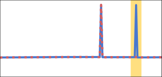

Figure 2: Ground truth rewards and DreamerV3’s predicted rewards over an evaluation episode. The
reward model misses many _sparse_ rewards, which is highlighted in yellow.

3

Published as a conference paper at ICLR 2024

the sparse rewards are given when the block (the rocks in the third example) first contacts the bin (the
dumptruck). The exact moment of contact is not directly observable from the camera viewpoint, and
this makes reward prediction ambiguous. Moreover, stochastic environment dynamics, e.g., contact
between multiple rocks, can make predicting a future state and reward challenging.

3.3 REWARD PREDICTION IS A BOTTLENECK OF MBRL

The preceding section shows that reward prediction is challenging in many environments. More
importantly, this poor reward prediction can be a bottleneck of policy learning, as shown in Figure 3.
In RoboDesk, where the reward model does not reliably detect the completion of the second task
(Figure 2a), the policy gets stuck at solving the first task and fails on subsequent tasks. In Earthmoving,
where the reward model cannot capture rewards for successful dumping (Figure 2c), the policy
frequently drops the rocks outside the dumptruck. These consistent failure modes in reward prediction
and policy learning in DreamerV3 suggest that poor reward prediction can be a bottleneck of MBRL.

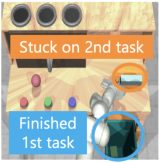

3

2

1

0

0 8 16 24
Environment steps (×10⁶)

(a) RoboDesk

2

1

0

0 4 8 12
Environment steps (×10⁶)

(b) Earthmoving

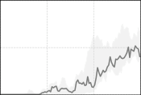

Figure 3: The reward model’s inability to predict sparse rewards for completing tasks leads to poor
task performance. (a) In RoboDesk, the agent gets stuck after learning the first task, and is unable to
learn to perform the subsequent tasks. (b) In Earthmoving, the policy often fails to dump the rocks
accurately into the dumptruck. The learning curves are averaged over 3 seeds.

3.4 DREAMSMOOTH: IMPROVING MBRL VIA REWARD SMOOTHING

To address the reward prediction problem,
we propose a simple yet effective solution,
**DreamSmooth**, which relaxes the requirement for the model to predict sparse rewards
at the exact timesteps by performing temporal smoothing. Allowing the reward model to
predict rewards that are off from the ground
truth by a few timesteps makes learning easier, especially when rewards are ambiguous

or sparse.

1

0

1

0

1

0

|Orginal δ = 3 δ = 7|Col2|Col3|Col4|
|---|---|---|---|
|Orginal δ = 3 δ = 7|Orginal δ = 3 δ = 7|||
|Orginal δ = 3 δ = 7||||

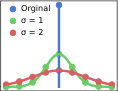

0 2 4 6 8
Timestep

(a) Gaussian

0 2 4 6 8
Timestep

(b) Uniform

0 2 4 6 8
Timestep

(c) EMA

Figure 4: Reward smoothing on sparse reward 1 at
_t_ = 4. _σ_, _δ_, and _α_ are smoothing hyperparameters.

Specifically, DreamSmooth applies temporal smoothing to the rewards upon collecting each new
episode. DreamSmooth can work with any smoothing function _f_ that preserves the sum of rewards:

_L_
� _fi_ = 1 _,_ (1)

_i_ = _−L_

˜
_rt ←_ _f_ ( _rt−L_ : _t_ + _L_ ) =

_L_
� _fi · r_ clip( _t_ + _i,_ 0 _,T_ ) _s.t._

_i_ = _−L_

where _T_ and _L_ denote the episode and smoothing horizons, respectively. For simplicity, we omit the
discount factor in Equation (1); the full equation can be found in Appendix, Equation (6). Episodes
with the smoothed rewards are stored in the replay buffer and used to train the reward model. The
agent learns only from the smoothed rewards, without ever seeing the original rewards. The smoothed
rewards ease reward prediction by allowing the model to predict rewards several timesteps earlier or
later, without incurring large losses. In this paper, we investigate three popular smoothing functions:
Gaussian, uniform, and exponential moving average (EMA) smoothing, as illustrated in Figure 4.

While the main motivation for smoothing is to make it easier to learn reward models, we note that
reward smoothing in some cases preserves optimality – _an optimal policy under smoothed rewards_ ˜ _r_
_is also optimal under the original rewards r_ . In particular, we provide a proof in Appendix A for the

4

Published as a conference paper at ICLR 2024

optimality of EMA smoothing (and any smoothing function where _∀i >_ 0 _, fi_ = 0) by augmenting the
POMDP states with the history of past states. However, when future rewards are used for smoothing
(e.g. Gaussian smoothing), the smoothed rewards are conditioned on policy, and we can no longer
define an equivalent POMDP. In such cases, there is no theoretical guarantee. Even so, we empirically
show that reward models can adapt their predictions alongside the changing policy, and achieve
performance improvements.

The implementation of DreamSmooth is extremely simple, requiring only one additional line of
code to existing MBRL algorithms, as shown in Algorithm 1. The overhead of reward smoothing is
minimal, with time complexity _O_ ( _T · L_ ). More implementation details can be found in Appendix B.

**Algorithm 1** COLLECT ROLLOUT ( _π_ : policy, _D_ : replay buffer) in DREAMSMOOTH

_{_ ( _**o**_ _t,_ _**a**_ _t, rt_ ) _[T]_ _t_ =1 _[} ←]_ [ROLLOUT][(] _[π]_ [)]
_{rt}_ _[T]_ _t_ =1 _[←]_ [GAUSSIAN][(] _[{][r][t][}][T]_ _t_ =1 _[, σ]_ [)][ or][ EMA][(] _[{][r][t][}][T]_ _t_ =1 _[, α]_ [)] _▷_ **only one** line needs to be added.
_D ←D ∪{_ ( _**o**_ _t,_ _**a**_ _t, rt_ ) _[T]_ _t_ =1 _[}]_

4 EXPERIMENTS

In this paper, we propose a simple reward smoothing method, DreamSmooth, which facilitates reward
prediction in model-based reinforcement learning (MBRL) and thus, improves the performance of
existing MBRL methods. Through our experiments, we aim to answer the following questions:
(1) Does reward smoothing improve reward prediction? (2) Does better reward prediction with reward
smoothing lead to better sample efficiency and asymptotic performance of MBRL in sparse-reward
tasks? (3) Does MBRL with reward smoothing also work in common dense-reward tasks?

4.1 TASKS

We evaluate DreamSmooth on four tasks with sparse subtask completion rewards and two common
RL benchmarks. Earthmoving uses two 64 _×_ 64 images as an observation while all other tasks use a
single image. See Appendix C for environment details.

 - **RoboDesk:** We use a modified version of RoboDesk (Kannan et al., 2021), where a sequence of manipulation tasks (flat ~~b~~ lock ~~i~~ n ~~b~~ in, upright ~~b~~ lock ~~o~~ ff ~~t~~ able, push ~~g~~ reen)
need to be completed in order (Figure 5a). We use the original dense rewards together with
a large sparse reward for each task completed.

 - **Hand:** The Hand task (Plappert et al., 2018) requires a Shadow Hand to rotate a block in hand into
a specific orientation. We extend it to achieve a sequence of pre-defined goal orientations in order.
In addition to the original dense rewards, we provide a large sparse reward for each goal.

 - **Earthmoving:** The agent controls a wheel loader to pick up rocks and dump them in the dump
truck (Figure 5c). Sparse rewards are given for picking up and dumping rocks, with dense rewards
for moving rocks towards the dump truck. The environment is simulated using the AGX Dynamics
physics engine (Algoryx, 2020) with the AGX Terrain module (Servin et al., 2021).

 - **Crafter:** Crafter (Hafner, 2022) is a minecraft-like 2D environment, where the agent tries to
collect, place, and craft items in order to survive. There are 22 achievements in the environment

(a) RoboDesk (b) Hand (c) Earthmoving (d) Crafter (e) DMC (f) Atari

Figure 5: We evaluate DreamSmooth on four tasks with sparse subtask completion rewards (a-d). We
also test on two popular benchmarks, (e) DeepMind Control Suite and (f) Atari.

5

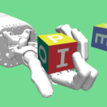

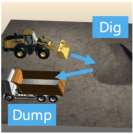

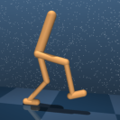

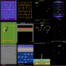

Published as a conference paper at ICLR 2024

0

(c) Earthmoving

−20

0.6

0.0

−0.2

|x-axis: Tim|Col2|Col3|estep y-axis: Re|
|---|---|---|---|
|||||
|||(b|) Hand|
|||||
|||||

0 200

(d) Crafter

|GroundTruth Smoothed 64 0 0 (a)RoboDesk 800 0 −200 0 E h i|Col2|Col3|th|Smoothed|P|
|---|---|---|---|---|---|
|Ground Truth Smoothed 0 **0** 64 (a) RoboDesk 0 −200 0 800  Ehi||||||
|Ground Truth Smoothed 0 **0** 64 (a) RoboDesk 0 −200 0 800  Ehi||||||
|Ground Truth Smoothed 0 **0** 64 (a) RoboDesk 0 −200 0 800  Ehi||||||
|Ground Truth Smoothed 0 **0** 64 (a) RoboDesk 0 −200 0 800  Ehi||||||
|Ground Truth Smoothed 0 **0** 64 (a) RoboDesk 0 −200 0 800  Ehi|||||3|

Figure 6: We visualize the ground truth rewards, smoothed rewards with Gaussian smoothing, and
predicted rewards by DreamerV3 trained on the smoothed rewards over an evaluation episode. In
contrast to Figure 2, the reward models with reward smoothing capture most of sparse rewards.

(e.g. collecting water, mining diamonds) with a sparse reward 1 for obtaining each achievement for
the first time. A small reward is given (or lost) for each health point gained (or lost).

 - **DMC:** We benchmark 7 DeepMind Control Suite continuous control tasks (Tassa et al., 2018).

 - **Atari:** We benchmark 6 Atari tasks (Bellemare et al., 2013) at 100K steps.

4.2 IMPROVED REWARD PREDICTION WITH REWARD SMOOTHING

We first visualize the ground truth rewards,
smoothed rewards (Gaussian smoothing), and reward prediction results of DreamerV3 trained with
DreamSmooth in Figure 6. We observe that reward smoothing leads to a significant improvement in reward prediction: DreamSmooth successfully predicts most of the (smoothed) sparse rewards and no longer omits vital signals for policy
learning or planning.

The improvement is especially notable in Crafter.
In Figure 7, we measure the accuracy of the reward model, (i.e. predicting a reward larger than
half of the original or smoothed reward for DreamerV3 and DreamSmooth respectively) at the exact
timesteps for each subtask. The vanilla DreamerV3’s reward model (baseline) misses most of
the sparse rewards while DreamSmooth predicts
sparse rewards more accurately in 15 _/_ 19 subtasks.

4.3 RESULTS

Baseline (no smoothing) Gaussian

1.0

0.5

0.0

Figure 7: Reward prediction rates for 19 achievements in Crafter. The other 3 tasks have been
never achieved by both methods. With reward
smoothing, the prediction rates are better in
15 _/_ 19 tasks.

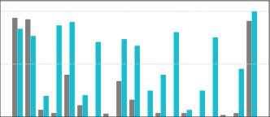

We compare the vanilla DreamerV3 (Hafner et al., 2023) with DreamSmooth, whose backbone is
also DreamerV3. For DreamSmooth, we evaluate Gaussian, uniform, and EMA smoothing. The
hyperparameters for DreamerV3 and smoothing functions can be found in Appendix B. As shown in
Figure 8, DreamSmooth-Gaussian and DreamSmooth-Uniform significantly improve the performance

6

Published as a conference paper at ICLR 2024

DreamSmooth-Gaussian DreamSmooth-Uniform DreamSmooth-EMA DreamerV3

3

2

1

0

0 6 12 18 24
Environment steps (×10⁶)

(a) RoboDesk

16

12

8

4

0

0.0 1.5 3.0 4.5
Environment steps (×10⁶)

(d) Crafter

3

2

1

0

0.8

0.6

0.4

0.2

0.0

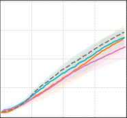

0.00 0.25 0.50 0.75 1.00
Environment steps (×10⁶)

(e) DMC

0 5 10 15 20
Environment steps (×10⁶)

(b) Hand

2

1

0

0 3 6 9 12
Environment steps (×10⁶)

(c) Earthmoving

0.3

0.2

0.1

0.0

0.0 0.1 0.2 0.3 0.4
Environment steps (×10⁶)

(f) Atari

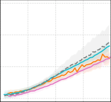

Figure 8: Comparison of learning curves of DreamSmooth (Gaussian, Uniform, EMA) and DreamerV3. The shaded regions in (a-d) show the maximum and minimum over 3 seeds. For DMC (e) and
Atari (f), we aggregate results over 7 and 6 tasks respectively, and display the standard deviation.

as well as the sample efficiency of DreamerV3 on the Robodesk, Hand, and Earthmoving tasks. The
only change between DreamerV3 and ours is the improved reward prediction, as shown in Section 4.2.
This result suggests that _reward prediction is one of major bottlenecks of the MBRL performance_ .

While all smoothing methods lead to improvements over DreamerV3, Gaussian smoothing generally
performs the best, except on Crafter, with uniform smoothing showing comparable performance. The
better performance of Gaussian and uniform smoothing could be because it allows predicting rewards
both earlier and later, whereas EMA smoothing only allows predicting rewards later.

Despite the improved reward prediction accuracy, DreamSmooth-Gaussian and DreamSmoothUniform perform worse than the baseline in Crafter. This could be because the symmetric Gaussian
and Uniform smoothing kernels require the reward models to anticipate future rewards, while EMA
smoothing does not. We believe this leads to more false-positive reward predictions from the former,
leading to poor policy learning in Crafter. More details can be found in Appendix F.

We also observe that on the DMC and Atari benchmarks, where reward prediction is not particularly
challenging, our technique shows comparable performance with the unmodified algorithms (see
Appendix, Figure 17 for full results), suggesting that reward smoothing can be applied generally.

In Figure 9, DreamSmooth also improves
the performance of TD-MPC (Hansen
et al., 2022) and MBPO (Janner et al.,
2019). In the Hand task, the vanilla algorithms are unable to consistently solve the
first task, even with proprioceptive state
observations. However, DreamSmooth
enables both algorithms to complete the
tasks, even learning on pixel observations with TD-MPC. This suggests that
DreamSmooth can be useful in a broad
range of MBRL algorithms that use a reward model. We only demonstrate the

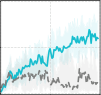

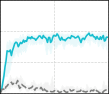

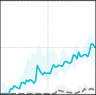

Figure 9: Learning curves (median over 3 seeds) for TDMPC and MBPO, with and without DreamSmooth, on
the Hand task.

7

Gaussian Smoothing

No Smoothing

x-axis: Env steps (×10⁶)

y-axis: Tasks Completed

1.0

0.5

0.0
0.0 0.6 1.2

(a) TD-MPC (Pixel)

3

2

1

0
0 2 4

(b) TD-MPC (State)

1.0

0.5

0.0
0.00 0.02 0.04

(c) MBPO (State)

Published as a conference paper at ICLR 2024

Hand task since TD-MPC and MBPO fail on other sparse-reward tasks, with MBPO requiring
demonstrations to make progress on the Hand task (see Appendix E for details).

4.4 ABLATION STUDIES

**Data Imbalance.** One possible cause of poor reward
predictions is data imbalance – the reward model trains
on few examples of sparse rewards due to their infrequency, potentially leading to poor predictions. To test
this hypothesis, we conducted experiments with oversampling: with probability 0 _._ 5, we sample a sequence
containing sparse rewards; otherwise, we sample uniformly from all sequences in the buffer. As shown
in Figure 10, oversampling performs better than the
baseline, but learns slower than DreamSmooth. This
suggests that while data imbalance contributes to the
difficulty of reward prediction, it is not the only factor hindering performance. Furthermore, this oversampling method requires domain knowledge about
which reward signals are to be oversampled while
DreamSmooth is agnostic to the scale and frequency of
sparse rewards.

3

1

0

0 6 12 18 24
Environment steps (×10⁶)

Figure 10: Oversampling sparse rewards
( _p_ = 0 _._ 5) improves DreamerV3 on RoboDesk, but still performs worse than
DreamSmooth-Gaussian. The lines show
median over 3 seeds, while shaded regions
show maximum and minimum.

**Reward Model Size.** Another hypothesis for
poor reward predictions is that the reward model
does not have enough capacity to capture sparse
rewards. To test this hypothesis, we increase
the size of the reward model from 4 layers of
768 units, which DreamSmooth uses, to 5 layers
of 1024 units and 6 layers of 1280 units, while
keeping the rest of the world model the same.
We observe in Figure 11 that without smoothing,
increasing reward model size has negligible impact, and DreamSmooth outperforms all the reward model sizes tested. This indicates that the
reward prediction problem is not simply caused
by insufficient model capacity.

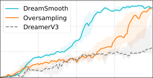

DreamSmooth

DreamerV3-1280

3

2

1

0

0 6 12 18 24
Environment steps (×10⁶)

(a) RoboDesk

DreamerV3-1024

DreamerV3-768

3

2

1

0

0 10 20
Environment steps (×10⁶)

(b) Hand

Figure 11: Simply increasing the reward model
size has negligible impact on performance.
DreamerV3-768, 1024, and 1280 use 4, 5, 6 layers
of 768, 1024, 1280 units, respectively.

**Loss** **Functions.** We verify Gaussian Smoothing x-axis: Env steps (×10⁶)
whether other formulations of No Smoothing y-axis: Tasks Completed

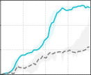

reward regression could solve 3 3 3
the reward prediction problem
in RoboDesk. Following Hafner 2 2 2
et al. (2023), we take symlog of 1 1 1
the prediction target for stable

0 0 0

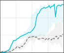

training regardless of the scale 0 6 12 18 24 0 6 12 18 24 0 6 12
of rewards. We find in Figure 12

(a) 2-Hot (b) L1 (c) L2

that reward prediction remains a
challenge when using common Figure 12: Learning curves (median over 3 seeds) of various
loss functions, such as L1 and L2, loss functions for reward modeling on RoboDesk. Note that
with L1 significantly degrading task DreamerV3 and Dreamsmooth use the 2-Hot loss function.
performance on RoboDesk. On the
other hand, applying reward smoothing improves performance for all three loss functions.

Gaussian Smoothing

No Smoothing

x-axis: Env steps (×10⁶)

y-axis: Tasks Completed

3

3

3

2

2

2

1

1

1

0
0 6 12 18 24

0
0 6 12 18 24

0
0 6 12 18 24

(c) L2

(a) 2-Hot

(b) L1

Figure 12: Learning curves (median over 3 seeds) of various
loss functions for reward modeling on RoboDesk. Note that
DreamerV3 and Dreamsmooth use the 2-Hot loss function.

**Smoothing Parameter.** In Figure 13, we analyze the impact of the smoothing parameters _σ_ and
_α_ for Gaussian and EMA, respectively, on RoboDesk and Hand. We observe that DreamSmooth is
insensitive to the smoothing parameters, performing well across a wide range of values.

8

3

2

1

0

3

2

1

0

|ished as a conference paper at ICLR 2024|Col2|
|---|---|
|DreamSmooth-Gaussian  6 12 18 24 Environment steps (×10⁶) (a) Gaussian Smoothing on RoboDesk 0 5  Environmen 0 1 2 3 Tasks Completed (b) Gaussian Smo DreamSmooth-Uniform 0 1 2 3 Tasks Completed|DreamSmooth-Gaussian  6 12 18 24 Environment steps (×10⁶) (a) Gaussian Smoothing on RoboDesk 0 5  Environmen 0 1 2 3 Tasks Completed (b) Gaussian Smo DreamSmooth-Uniform 0 1 2 3 Tasks Completed|
|||
|||
|||

0 6 12 18 24
Environment steps (×10⁶)

(c) Uniform Smoothing on RoboDesk

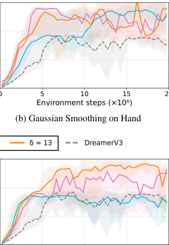

0 5 10 15 20
Environment steps (×10⁶)

(d) Uniform Smoothing on Hand

3

2

1

0

DreamSmooth-EMA ������� �������� ������� ���������

3

2

1

0

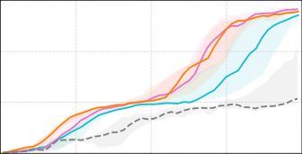

0 6 12 18 24
Environment steps (×10⁶)

(e) EMA Smoothing on RoboDesk

0 5 10 15 20
Environment steps (×10⁶)

(f) EMA Smoothing on Hand

Figure 13: Parameter sweep over smoothing parameters _σ_, _δ_, and _α_ . The lines show median task
performance over 3 seeds, while shaded regions show maximum and minimum.

5 CONCLUSION

In this paper, we identify the reward prediction problem in MBRL and provide a simple yet effective
solution: _reward smoothing_ . Our approach, DreamSmooth, demonstrates superior performance in
sparse reward tasks where reward prediction is not trivial mainly due to the partial observability
or stochasticity of the environments. Moreover, DreamSmooth shows comparable results on the
commonly used benchmarks, DMC and Atari, showing its task-agnostic nature. Although we show
that our simple reward smoothing approach mitigates the difficulty in reward prediction, the improved
reward prediction does not always improve the task performance, e.g., in Crafter. This can be because
more predicted task rewards can also result in more false positives. Further investigation on this
trade-off is a promising direction for future work.

9

Published as a conference paper at ICLR 2024

ACKNOWLEDGMENTS

This work was supported in part by the BAIR Industrial Consortium, an ONR DURIP grant, Komatsu,
and InnoHK Centre for Logistics Robotics. We would like to thank Seohong Park for proofreading
our proof and all members of the Berkeley Robot Learning lab for their insightful feedback.

REFERENCES

[Algoryx. AGX dynamics, 2020. URL https://www.algoryx.se/agx-dynamics/.](https://www.algoryx.se/agx-dynamics/)

Arthur Argenson and Gabriel Dulac-Arnold. Model-based offline planning. In _International Confer-_
_ence on Learning Representations_ [, 2021. URL https://openreview.net/forum?id=](https://openreview.net/forum?id=OMNB1G5xzd4)
[OMNB1G5xzd4.](https://openreview.net/forum?id=OMNB1G5xzd4)

Mohammad Babaeizadeh, Mohammad Taghi Saffar, Danijar Hafner, Harini Kannan, Chelsea Finn,
Sergey Levine, and Dumitru Erhan. Models, pixels, and rewards: Evaluating design trade-offs in
visual model-based reinforcement learning. _arXiv preprint arXiv:2012.04603_, 2020.

M. G. Bellemare, Y. Naddaf, J. Veness, and M. Bowling. The arcade learning environment: An
evaluation platform for general agents. _Journal of Artificial Intelligence Research_, 47:253–279,
jun 2013.

Fei Deng, Ingook Jang, and Sungjin Ahn. Dreamerpro: Reconstruction-free model-based reinforcement learning with prototypical representations. In _International Conference on Machine Learning_,
pp. 4956–4975. PMLR, 2022.

Fei Deng, Junyeong Park, and Sungjin Ahn. Facing off world model backbones: Rnns, transformers,
and s4. _arXiv preprint arXiv:2307.02064_, 2023.

Christopher D Fiorillo, William T Newsome, and Wolfram Schultz. The temporal precision of reward
prediction in dopamine neurons. _Nature neuroscience_, 11(8):966–973, 2008.

David Ha and J¨urgen Schmidhuber. World models. _arXiv preprint arXiv:1803.10122_, 2018.

Danijar Hafner. Benchmarking the spectrum of agent capabilities. In _International Conference on_
_Learning Representations_, 2022.

Danijar Hafner, Timothy Lillicrap, Jimmy Ba, and Mohammad Norouzi. Dream to control: Learning
behaviors by latent imagination. In _International Conference on Learning Representations_, 2019.

Danijar Hafner, Timothy Lillicrap, Mohammad Norouzi, and Jimmy Ba. Mastering atari with discrete
world models. In _International Conference on Learning Representations_, 2021.

Danijar Hafner, Jurgis Pasukonis, Jimmy Ba, and Timothy Lillicrap. Mastering diverse domains
through world models. _arXiv preprint arXiv:2301.04104_, 2023.

Nicklas Hansen, Xiaolong Wang, and Hao Su. Temporal difference learning for model predictive
control. In _International Conference on Machine Learning_, 2022.

Michael Janner, Justin Fu, Marvin Zhang, and Sergey Levine. When to trust your model: Model-based
policy optimization. In _Neural Information Processing Systems_, 2019.

Harini Kannan, Danijar Hafner, Chelsea Finn, and Dumitru Erhan. Robodesk: A multi-task rein[forcement learning benchmark. https://github.com/google-research/robodesk,](https://github.com/google-research/robodesk)
2021.

Miriam C Klein-Flugge, Laurence T Hunt, Dominik R Bach, Raymond J Dolan, and Timothy EJ¨
Behrens. Dissociable reward and timing signals in human midbrain and ventral striatum. _Neuron_,
72(4):654–664, 2011.

Russell Mendonca, Shikhar Bahl, and Deepak Pathak. Structured world models from human videos.
In _Robotics: Science and Systems_, 2023.

10

Published as a conference paper at ICLR 2024

Andrew Y Ng, Daishi Harada, and Stuart Russell. Policy invariance under reward transformations:
Theory and application to reward shaping. In _International Conference on Machine Learning_,
volume 99, pp. 278–287, 1999.

Masashi Okada and Tadahiro Taniguchi. Dreaming: Model-based reinforcement learning by latent
imagination without reconstruction. In _IEEE International Conference on Robotics and Automation_,
pp. 4209–4215, 2021. doi: 10.1109/ICRA48506.2021.9560734.

Matthias Plappert, Marcin Andrychowicz, Alex Ray, Bob McGrew, Bowen Baker, Glenn Powell,
Jonas Schneider, Josh Tobin, Maciek Chociej, Peter Welinder, et al. Multi-goal reinforcement learning: Challenging robotics environments and request for research. _arXiv preprint arXiv:1802.09464_,
2018.

Julian Schrittwieser, Ioannis Antonoglou, Thomas Hubert, Karen Simonyan, Laurent Sifre, Simon
Schmitt, Arthur Guez, Edward Lockhart, Demis Hassabis, Thore Graepel, et al. Mastering atari,
go, chess and shogi by planning with a learned model. _Nature_, 588(7839):604–609, 2020.

Younggyo Seo, Danijar Hafner, Hao Liu, Fangchen Liu, Stephen James, Kimin Lee, and Pieter
Abbeel. Masked world models for visual control. In _Conference on Robot Learning_, 2022.

Younggyo Seo, Junsu Kim, Stephen James, Kimin Lee, Jinwoo Shin, and Pieter Abbeel. Multi-view
masked world models for visual robotic manipulation. In _International Conference on Machine_
_Learning_, 2023.

Martin Servin, Tomas Berglund, and Samuel Nystedt. A multiscale model of terrain dynamics for
real-time earthmoving simulation. _Advanced Modeling and Simulation in Engineering Sciences_, 8
(1):1–35, 2021.

Lucy Xiaoyang Shi, Joseph J. Lim, and Youngwoon Lee. Skill-based model-based reinforcement
learning. In _Conference on Robot Learning_, 2022.

David Silver, Aja Huang, Chris J Maddison, Arthur Guez, Laurent Sifre, George Van Den Driessche,
Julian Schrittwieser, Ioannis Antonoglou, Veda Panneershelvam, Marc Lanctot, et al. Mastering
the game of go with deep neural networks and tree search. _nature_, 529(7587):484–489, 2016.

David Silver, Julian Schrittwieser, Karen Simonyan, Ioannis Antonoglou, Aja Huang, Arthur Guez,
Thomas Hubert, Lucas Baker, Matthew Lai, Adrian Bolton, et al. Mastering the game of go without
human knowledge. _nature_, 550(7676):354–359, 2017.

David Silver, Thomas Hubert, Julian Schrittwieser, Ioannis Antonoglou, Matthew Lai, Arthur Guez,
Marc Lanctot, Laurent Sifre, Dharshan Kumaran, Thore Graepel, et al. A general reinforcement
learning algorithm that masters chess, shogi, and go through self-play. _Science_, 362(6419):
1140–1144, 2018.

Gautam Singh, Skand Peri, Junghyun Kim, Hyunseok Kim, and Sungjin Ahn. Structured world
belief for reinforcement learning in pomdp. In _International Conference on Machine Learning_, pp.
9744–9755. PMLR, 2021.

Richard S Sutton and Andrew G Barto. _Reinforcement learning: An introduction_ . MIT Press, 2018.

Yuval Tassa, Yotam Doron, Alistair Muldal, Tom Erez, Yazhe Li, Diego de Las Casas, David Budden,
Abbas Abdolmaleki, Josh Merel, Andrew Lefrancq, Timothy P. Lillicrap, and Martin A. Riedmiller.
Deepmind control suite. _arXiv preprint arXiv:1801.00690_, 2018.

11

Published as a conference paper at ICLR 2024

A PROOFS

Let _M_ = ( _S, A, P, R, γ_ ) be the given MDP. Without loss of generality, we assume the augmented
form of the MDP _M_, where a state _**s**_ _t_ includes the entire history of states, i.e., _**s**_ _t_ = ( _**s**_ 1 _, . . .,_ _**s**_ _t_ ),
and thus, reward functions _R,_ _R_ [˜] have access to previous states, i.e., _R_ [˜] ( _**s**_ _t_ ) = _R_ [˜] ( _**s**_ 1 _, . . .,_ _**s**_ _t_ ).

**Theorem A.1.** _An optimal policy_ ˜ _π_ _[∗]_ _of the MDP with reward smoothing only with_ _**past**_ _rewards, e.g.,_
_EMA smoothing,_ _M_ [˜] = ( _S, A, P,_ _R, γ_ [˜] ) _is also optimal under the original MDP M, where_

0
� _fi_ = 1 _._ (2)

_i_ = _−L_

˜
_R_ ( _**s**_ _t_ ) =

0
� _fi · γ_ _[i]_ _R_ ( _**s**_ _t_ + _i_ ) _and_

_i_ = _−L_

_Proof._ We will use the theorem of reward shaping that guarantees an optimal policy introduced in Ng
et al. (1999): if a modified reward function can be represented in the form of _R_ ( _**s**_ _t_ )+ _γ_ Φ( _**s**_ _t_ +1) _−_ Φ( _**s**_ _t_ )
with any potential function Φ( _**s**_ _t_ ), the new reward function yields the same optimal policy with the
original reward function _R_ .

Let the potential function for the EMA reward smoothing

_−_ 1
� _γ_ _[i]_ _R_ ( _**s**_ _t_ + _i_ ) +

_i_ = _−L_

0
�

0
� _fj._ (3)

_j_ = _i_ +1

Φ( _**s**_ _t_ ) = _−_

0
� _γ_ _[i]_ _R_ ( _**s**_ _t_ + _i_ ) _·_

_i_ = _−L_

Then, our reward shaping term in _R_ [˜] can be represented as the difference in the potential function
_γ_ Φ( _**s**_ _t_ +1) _−_ Φ( _**s**_ _t_ ) as follows:

_γ_ Φ( _**s**_ _t_ +1) _−_ Φ( _**s**_ _t_ ) = _−R_ ( _**s**_ _t_ ) +

0
� _fi · γ_ _[i]_ _R_ ( _**s**_ _t_ + _i_ ) _._ (4)

_i_ = _−L_

_R_ ( _**s**_ _t_ ) + _γ_ Φ( _**s**_ _t_ +1) _−_ Φ( _**s**_ _t_ ) =

0
� _fi · γ_ _[i]_ _R_ ( _**s**_ _t_ + _i_ ) = _R._ [˜] (5)

_i_ = _−L_

Hence, following Ng et al. (1999), reward shaping with our EMA smoothing guarantees the optimal
policy in the original MDP _M_ .

However, Theorem A.1 does not apply to smoothing functions that require access to future rewards,
e.g., Gaussian smoothing. As in Gaussian smoothing, a smoothed reward function may require future
rewards, which are conditioned on the current policy; so is the reward model. In such cases, there is
no theoretical guarantee; but in our experiments, we empirically show that reward models can adapt
their predictions along the changes in policies and thus, improve MBRL.

Instead, we intuitively explain that an optimal policy under any reward smoothing (even though the
reward function is post hoc and cannot be defined for MDPs) is also optimal under the original reward
function.

**Theorem A.2.** _An optimal policy_ ˜ _π_ _[∗]_ _with the smoothed reward function_ _R_ [˜] _is also optimal under the_
_original reward function R, where_

_L_
� _fi_ = 1 _._ (6)

_i_ = _−L_

˜
_R_ ( _**s**_ _t_ ) =

_L_
� _γ_ _[clip]_ [(] _[i,][−][t,T][ −][t]_ [)] _· fi · R_ ( _**s**_ _clip_ ( _t_ + _i,_ 0 _,T_ )) _and_

_i_ = _−L_

12

Published as a conference paper at ICLR 2024

_Proof._ First, we show that the discounted sum of original rewards [�] _[T]_ _t_ =0 _[γ][t][R]_ [(] _**[s]**_ _[t]_ [)][ and the one of]
smoothed rewards [�] _[T]_ _t_ =0 _[γ][t]_ [ ˜] _[R]_ [(] _**[s]**_ _[t]_ [)][ are the same for any trajectories][ (] _**[s]**_ [0] _[,]_ _**[ s]**_ [1] _[, . . .,]_ _**[ s]**_ _[T]_ [ )][:]

_T_
� _γ_ _[t]_ [ ˜] _R_ ( _**s**_ _t_ ) =

_t_ =0

=

=

_T_ _L_
� _γ_ _[t]_ �

_t_ =0 _i_ = _−_

_T_
�

_T_
� _γ_ _[t]_ _R_ ( _**s**_ _t_ ) _._ from

_t_ =0

� _γ_ [clip][(] _[i,][−][t,T][ −][t]_ [)] _· fi · R_ ( _**s**_ clip( _t_ + _i,_ 0 _,T_ )) from Equation (6) (7)

_i_ = _−L_

_T_
� _γ_ _[t]_ _R_ ( _**s**_ _t_ ) _·_

_t_ =0

_L_
� _fi_ (8)

_i_ = _−L_

_L_
� _fi_ = 1 (9)

_i_ = _−L_

Let an optimal policy under the smoothed rewards _R_ [˜] be ˜ _π_ _[∗]_ . Assume that ˜ _π_ _[∗]_ is not optimal under the
original reward _R_ . Then,

_T_
_∃π_ _[∗]_ _,_ _**s**_ 0 such that E( _**s**_ 0 _,...,_ _**s**_ _T_ ) _∼π∗_ � �

_T_ _T_
� _γ_ _[t]_ _R_ ( _**s**_ _t_ )� _>_ E( _**s**_ 0 _,...,_ _**s**_ _T_ ) _∼π_ ˜ _∗_ � �

_t_ =0 _t_ =0

� _γ_ _[t]_ [ ˜] _R_ ( _**s**_ _t_ )� _._ (10)

_t_ =0

However,

_T_
E( _**s**_ 0 _,...,_ _**s**_ _T_ ) _∼π∗_ � �

_T_ _T_
� _γ_ _[t]_ _R_ ( _**s**_ _t_ )� = E( _**s**_ 0 _,...,_ _**s**_ _T_ ) _∼π∗_ � �

_t_ =0 _t_ =0

� _γ_ _[t]_ [ ˜] _R_ ( _**s**_ _t_ )� by Equation (9) (11)

_t_ =0

_T_
_>_ E( _**s**_ 0 _,...,_ _**s**_ _T_ ) _∼π_ ˜ _∗_ � � _γ_ _[t]_ [ ˜] _R_ ( _**s**_ _t_ )� _,_ by Equation (10) (12)

_t_ =0

which contradicts that ˜ _π_ _[∗]_ is optimal under _R_ [˜] . Therefore, the optimal policy ˜ _π_ _[∗]_ under _R_ [˜] guarantees
its optimality under _R_ .

B IMPLEMENTATION DETAILS

Models are trained on NVIDIA A5000, V100, RTX Titan, RTX 2080, and RTX 6000 GPUs. Each
experiment takes about 72 hours for RoboDesk, 100 hours for Hand, 150 hours for Earthmoving, 96
hours for Crafter, and 6 hours for Atari and DMC tasks.

B.1 SMOOTHING FUNCTIONS IN DREAMSMOOTH

**Gaussian smoothing** follows the Gaussian distribution with _σ_ :

_−i_ [2]

_fi_ = _ke_

2 _σ_ ~~[2]~~ _,_ (13)

where _k_ = 1 _/_ ( [�] _[L]_ _i_ = _−L_ _[e]_

_−i_ [2]

2 _σ_ ~~[2]~~ ) is a normalization constant.

We implement this using

scipy.ndimage.gaussian_filter1d(rewards, sigma, mode="nearest")

**Uniform smoothing** distributes rewards equally across _δ_ consecutive timesteps.

[1] _δ_ _∀i ∈_ � _−_ _[δ][ −]_ 2 [1]

_fi_ = [1]

[1]

_,_ _[δ][ −]_ [1]
2 2

2

_._ (14)
�

We implement this using

scipy.ndimage.convolve(rewards, filter, mode="nearest")

**EMA smoothing** uses the following smoothing function:
_fi_ = _α_ (1 _−_ _α_ ) _[i]_ _∀i ≤_ 0 _,_ (15)

which we implement by performing the following at each timestep:

reward[t] = alpha * reward[t - 1] + (1 - alpha) * reward[t]

13

Published as a conference paper at ICLR 2024

B.2 MODEL-BASED REINFORCEMENT LEARNING BACKBONES

Hyperparameters for DreamerV3, TD-MPC, and MBPO experiments are shown in Table 1, Table 2,
and Table 3, respectively.

Table 1: DreamerV3 hyperparameters. Episode length is measured in environment steps, which is the
number of agent steps multiplied by action repeat. Model sizes are as listed in Hafner et al. (2023),
which we also refer to for all other hyperparameters.

**Environment** **Action Repeat** **Episode Length** **Train Ratio** **Model Size** _σ_ _α_ _δ_

Earthmoving 4 2000 64 L 3 0 _._ 33 9
RoboDesk 8 2400 64 L 3 0 _._ 3 9

Hand 1 300 64 L 3 0 _._ 3 9

Crafter 1 Variable 64 XL 3 0 _._ 3 9

DMC 2 1000 512 S 3 0 _._ 33 9

Atari 4 Variable 1024 S 3 0 _._ 3 9

Table 2: TD-MPC hyperparameters. We refer to Hansen et al. (2022) for all other hyperparameters.

**Environment** **Latent Dimension** **CNN channels** **Planning Iterations** _σ_

Hand-Pixel 128 64 6 3
Hand-Proprio 128 – 12 3

Table 3: MBPO hyperparameters. We refer to Janner et al. (2019) for all other hyperparameters.

**Environment** **Layer Size** **Prediction Head Size** **Demo Pre-Training Steps** _σ_

Hand-Proprio 512 400 30000 3
RoboDesk-Proprio 512 400 30000 3
DMC-Proprio 256 200 0 3

C ENVIRONMENT DETAILS

C.1 ROBODESK ENVIRONMENT

We use a modified version of RoboDesk (Kannan et al., 2021), where a sequence of manipulation tasks
(flat block ~~i~~ n ~~b~~ in, upright ~~b~~ lock ~~o~~ ff ~~t~~ able, push ~~g~~ reen) need to be completed
in order. Figure 14 shows images of an agent successfully completing each of these tasks.

In the original environment, dense rewards are based on Euclidean distances of objects to their targets,
with additional terms to encourage the arm to reach the object. They typically range from 0 to 10
per timestep. We use these dense rewards together with a large sparse reward of 300 for each task
completed.

C.2 HAND ENVIRONMENT

We modified the Shadow Hand environment (Plappert et al., 2018), so that the agent is required to
achieve a sequence of pre-defined goal orientations in order. The first 3 goals are shown in Figure 15,
while the subsequent goals are a repeat of the first 3. The goal orientations are chosen so that the
agent only has to rotate the cube along the z-axis, and we only require the agent to match the cube’s
rotation to the goal, not its position.

In the original environment, dense rewards are computed using _r_ = _−_ (10 _x_ + ∆ _θ_ ), where _x_ is the
Euclidean distance to some fixed position, and ∆ _θ_ is the angular difference to the target orientation.
In addition to these dense rewards, we provide a large sparse reward of 300 for each goal successfully
achieved by the agent.

14

Published as a conference paper at ICLR 2024

(a) Push green block into the bin (b) Push teal block off the table (c) Press the green button

Figure 14: Subtasks for RoboDesk.

(a) Goal 1 (b) Goal 2 (c) Goal 3

Figure 15: Subtasks for Hand.

C.3 AGX EARTHMOVING ENVIRONMENT

The Earthmoving environment consists of a wheel loader, dump
truck, a pile of dirt, with some rocks on top of the pile. The environment is simulated using the realistic AGX Dynamics physics
engine (Algoryx, 2020). The agent controls the wheel loader to pick
up rocks and dump them in the dump truck.

The starting positions of the dirt pile, wheel loader, and dump truck
are all randomized, as are the initial orientations of the dirt pile and
wheel loader.

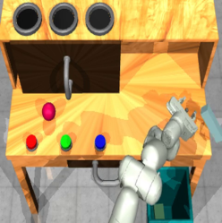

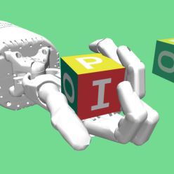

The agent’s observations consist of 3 components: a wide-angle
egocentric RGB camera mounted on the cabin to allow navigation,
an RGB camera mounted on the bucket for observing interactions
with rocks, and proprioceptive observations (positions, velocity,
speed, force of actuators etc.). We use 64 _×_ 64 _×_ 3 images for all
cameras, while the proprioceptive observation has 21 dimensions.

Figure 16: The agent uses one
camera mounted on the cabin
(left) for navigation, and one
mounted on the bucket (right)
for observing interactions with
rocks and terrain.

The action space is 4-dimensional: 2 dimensions for driving and steering the loader, and 2 dimensions
for moving and tilting the bucket.

The reward consists of a large sparse reward for rocks picked up and dumped, and dense rewards
for moving rocks towards the dumptruck. The total reward _r_ _[t]_ at timestep _t_ is computed using
Equation (16).

_r_ _[t]_ = _λ_ dump( _m_ _[t]_ dump _[−]_ _[m][t]_ dump _[−]_ [1] [) +] _[ λ]_ [load][(] _[m]_ load _[t]_ _[−]_ _[m][t]_ load _[−]_ [1][)]
� ~~�~~ � ~~�~~
sparse reward

+ _λ_ move _m_ _[t]_ load [(max (2] _[, d][t]_ [)] _[ −]_ [max (2] _[, d][t][−]_ [1][))]
� ~~��~~ �
dense reward

(16)

Where _m_ dump, _m_ load are rock masses in the dumptruck and the bucket respectively, _d_ is the distance
between the shovel and a point above the dumptruck, and _λ_ are constants.

15

Published as a conference paper at ICLR 2024

D DMC AND ATARI BENCHMARKING RESULTS

DreamSmooth-Gaussian DreamSmooth-Uniform DreamSmooth-EMA DreamerV3

Cartpole Swingup Sparse

1000

500

0

0.0 0.5 1.0
Environment steps (×10⁶)

1000

500

0

Hopper Hop

0.0 0.5 1.0
Environment steps (×10⁶)

Walker Run

1000

500

0

0.0 0.5 1.0
Environment steps (×10⁶)

Cheetah Run

1000

500

0

0.0 0.5 1.0
Environment steps (×10⁶)

Reacher Hard

1000

500

0

0.0 0.5 1.0
Environment steps (×10⁶)

1000

500

0

1000

500

0

Finger Turn Hard

Quadruped Run

0.0 0.5 1.0
Environment steps (×10⁶)

13.00

8.33

3.67

−1.00

Freeway

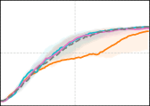

−9.00

−13.33

−17.67

−22.00

Pong

0.0 0.2 0.4
Environment steps (×10⁶)

Assault

601

489

377

265

0.0 0.2 0.4
Environment steps (×10⁶)

0.0 0.5 1.0
Environment steps (×10⁶)

Breakout

12

8

4

0

0.0 0.2 0.4
Environment steps (×10⁶)

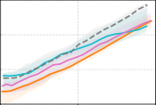

0.0 0.2 0.4
Environment steps (×10⁶)

339

243

147

51

Seaquest

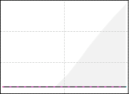

0.0 0.2 0.4
Environment steps (×10⁶)

Hero

8692

5862

3033

203

0.0 0.2 0.4
Environment steps (×10⁶)

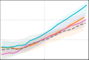

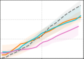

Figure 17: Full learning curves for the DMC and Atari benchmarks.

16

Published as a conference paper at ICLR 2024

E MBPO

In addition to DreamerV3 and TD-MPC, we show the general applicability of our reward
smoothing method with other MBRL algorithms, such as Model-Based Policy Optimization
(MBPO) (Janner et al., 2019).

Similar to the experiments on DreamerV3, Figure 18 demonstrates that reward smoothing does not
affect the performance of MBPO on the _dense-reward_ DMC tasks (Walker Walk, Cheetah Run,
Reacher Easy, Cartpole Swingup), while significantly improving the performance of MBPO on
_sparse-reward_ tasks, especially in the Hand environment. Since MBPO, when trained from scratch,
struggles at solving Hand and RoboDesk, we initialize the replay buffer for these two experiments
using trajectories from the fully-trained DreamerV3 policies (100 and 68 episodes, respectively).
MBPO is then able to learn the first task in Hand with reward smoothing, while failing at both
Hand and RoboDesk without reward smoothing. This indicates that DreamSmooth can also benefit
Markovian models that have no access to neither past nor future states.

DreamSmooth-Gaussian (MBPO) MBPO

Walker Walk

1000

500

0

0.00 0.05 0.10 0.15
Environment steps (×10⁶)

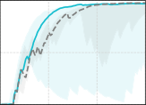

0.00 0.05 0.10 0.15
Environment steps (×10⁶)

Robodesk

1.0

0.5

0.0

0.00 0.08 0.15
Environment steps (×10⁶)

1000

500

0

Reacher Easy

1000

500

0

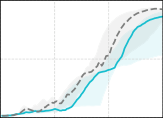

Cartpole Swingup

0.00 0.05 0.10 0.15
Environment steps (×10⁶)

Cheetah Run

1000

500

0

0.00 0.05 0.10 0.15
Environment steps (×10⁶)

Hand

1.0

0.5

0.0

0.00 0.02 0.04
Environment steps (×10⁶)

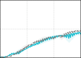

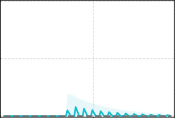

Figure 18: Learning curves for MBPO with DreamSmooth (Gaussian smoothing) on Hand, RoboDesk,
and DMC tasks. For Hand and RoboDesk, MBPO trained from scratch could not achieve any
meaningful reward signal. To ease the exploration problem, we initialize the replay buffers with
demonstrations collected from the fully-trained DreamerV3 policies. The shaded regions show the
minimum and maximum over 3 seeds.

17

Published as a conference paper at ICLR 2024

F CRAFTER

It is surprising that despite improved reward predictions when using Gaussian or uniform smoothing
on the Crafter environment, the task performance significantly deteriorates compared to vanilla
DreamerV3, or even DreamerV3 with EMA reward smoothing, as can be seen in Figure 8d.

One possible cause is the symmetrical structure of the Gaussian and Uniform kernels, which makes
the smoothed rewards dependent on both past and future ground truth rewards. This means that the
reward model has to anticipate future rewards when performing predictions. We suspect that this
leads to a high rate of **false positives** in Crafter, where there are many sources of sparse rewards. The
false positives can make policy learning difficult.

To test this, we introduce 2 asymmetric variants of the uniform smoothing kernel:

Uniform [ _−δ,_ 0], where the smoothed rewards only depend on past ground truth rewards.

1
_fi_ = _∀i ∈_ [ _−δ,_ 0] _._ (17)
_δ_ + 1

Uniform [0 _, δ_ ], where the smoothed rewards only depend on future ground truth rewards.

1
_fi_ = _∀i ∈_ [0 _, δ_ ] _._ (18)
_δ_ + 1

The plots of predicted and ground truth rewards in Figure 20 and Figure 21 show that the reward
models trained with the symmetric uniform smoothing kernel and Uniform [0 _,_ 4] smoothing kernel
have more false positives than those trained with Uniform [ _−_ 4 _,_ 0] and no smoothing, predicting
significant positive rewards even when ground truth reward is 0.

In Figure 19, smoothing kernels that require the model to anticipate future rewards perform worse
than those that do not: Uniform [ _−_ 4 _,_ 0] performs the best, followed by symmetric uniform smoothing,
then Uniform [0 _,_ 4].

Uniform (Symmetric) Uniform [-4, 0] Uniform [0, 4] No Smoothing

16

12

8

4

0

0.0 1.5 3.0 4.5
Environment steps (×10⁶)

Figure 19: Learning curves of DreamSmooth with uniform smoothing variants on Crafter. Performance on Crafter is highly correlated with the need to anticipate future reward.

18

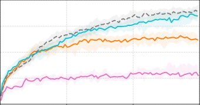

Published as a conference paper at ICLR 2024

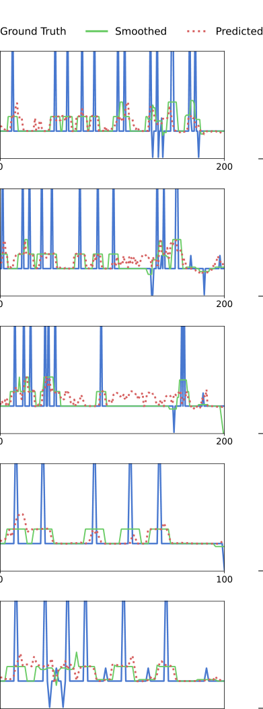

0.6

0.0

−0.2

0.6

0.0

−0.2

0.6

0.0

−0.2

0.6

0.0

−0.2

0.6

0.0

−0.2
0 100

(a) Uniform [ _−_ 4 _,_ 4] (Symmetric) Smoothing

1.2

0.0

−0.4
0 200

1.2

0.0

−0.4
0 400

1.2

0.0

−0.4
0 300

1.2

0.0

−0.4
0 200

1.2

0.0

−0.4
0 300

(b) No Reward Smoothing

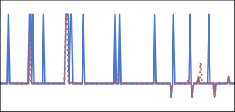

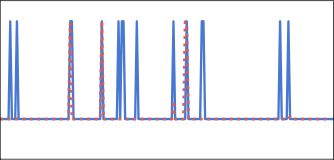

Figure 20: Ground truth rewards and predicted rewards over five evaluation episodes on Crafter.
Similar to Uniform [0 _,_ 4] smoothing, the reward model trained with symmetric uniform smoothing
predicts many false positives. Meanwhile, the reward model trained without smoothing predicts few
false positives but has many false negatives.

19

Published as a conference paper at ICLR 2024

0.6

0.0

−0.2

0.6

0.0

−0.2

0.6

0.0

−0.2

0.6

0.0

−0.2

0.6

0.0

−0.2
0 300

(a) Uniform [ _−_ 4 _,_ 0] Smoothing

0.6

0.0

−0.2

0.6

0.0

−0.2

0.6

0.0

−0.2

0.6

0.0

−0.2

0.6

0.0

−0.2

|x-axis: Timestep|Col2|Col3|y-axis:|
|---|---|---|---|
|||||
|||||
|||||
|||||

0 200

(b) Uniform [0 _,_ 4] Smoothing

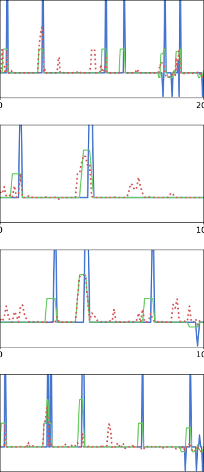

Figure 21: Ground truth rewards and predicted rewards over five evaluation episodes on Crafter. With
Uniform [0 _,_ 4] smoothing, the reward model has to anticipate future rewards, resulting in more false
positives than Uniform [ _−_ 4 _,_ 0], where the smoothed rewards at the current timestep only depend on
past rewards.

20

