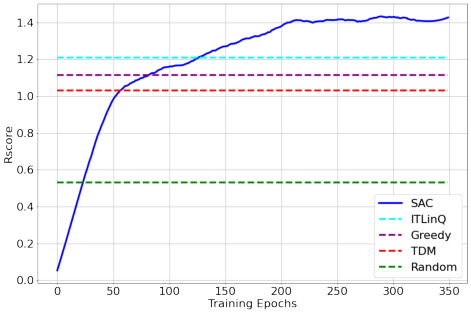
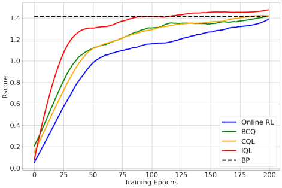
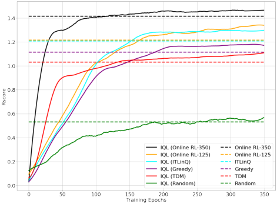
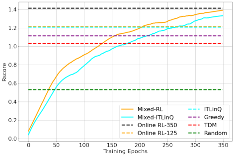

# Offline Reinforcement Learning for Wireless Network Optimization with Mixture Datasets

Kun Yang _[∗]_, Cong Shen _[∗]_, Jing Yang _[†]_, Shu-ping Yeh _[‡]_, Jerry Sydir _[‡]_

_∗_ Department of Electrical and Computer Engineering, University of Virginia, USA

_†_ Department of Electrical Engineering, The Pennsylvania State University, USA

_‡_ Intel Corporation, USA

_**Abstract**_ **—The recent development of reinforcement learning**
**(RL) has boosted the adoption of online RL for wireless radio**
**resource management (RRM). However, online RL algorithms**
**require direct interactions with the environment, which may**
**be undesirable given the potential performance loss due to the**
**unavoidable exploration in RL. In this work, we first investigate**
**the use of** _**offline**_ **RL algorithms in solving the RRM problem. We**
**evaluate several state-of-the-art offline RL algorithms, including**
**behavior constrained Q-learning (BCQ), conservative Q-learning**
**(CQL), and implicit Q-learning (IQL), for a specific RRM**
**problem that aims at maximizing a linear combination of sum**
**and 5-percentile rates via user scheduling. We observe that the**
**performance of offline RL for the RRM problem depends criti-**
**cally on the behavior policy used for data collection, and further**
**propose a novel offline RL solution that leverages heterogeneous**
**datasets collected by different behavior policies. We show that**
**with a proper mixture of the datasets, offline RL can produce a**
**near-optimal RL policy even when all involved behavior policies**
**are highly suboptimal.**
_**Index Terms**_ **—Radio Resource Management, Offline Reinforce-**
**ment Learning, Deep Reinforcement Learning.**

I. I NTRODUCTION

There is a growing interest in applying reinforcement
learning (RL) to solving radio resource management (RRM)
problems in wireless networks. Several unique properties in
wireless RRM are the driving force behind this new trend.
First, many of the RRM operations are sequential in nature,
where a resource allocation decision is made, the network performance is observed, and then fed back to the decision maker
to update the policy. Second, real-world wireless network
optimization problems are often too complex to be modeled
as simple optimization problems, which calls for _model-free_
solutions that can be adaptive to the unknown deployment.
Third, there are well-established control and feedback mechanisms in modern wireless networks, making it easy to observe
system states and collecting performance indicators.
These features have sparked significant efforts in developing
RL solutions for wireless RRM. An overview of related works

is given in Section II. Majority, if not all, of the existing works
utilize _online RL_, where the RL policy gradually improves by
_interacting with the environment_ with no data prior to deployment. The exploration of the originally unknown environment,

The work of KY and CS is partially support by the US National Science
Foundation under awards CNS-2002902, ECCS-2029978, and SII-2132700.
The work of JY is supported in part by US NSF under awards CNS-2003131,
ECCS-2030026, and ECCS-2143559. This is the camera-ready version of the
paper accepted at Asilomar 2023

especially during the early stages where information about the
environment is scarce and RL exploration is almost random, is
an indispensable component for online RL, but is also one of
the major obstacles that prevent state-of-the-art RL algorithms
from being deployed in real-world wireless networks. The lack
of performance guarantee during RL exploration means that
the network users may have to temporarily suffer from poor
Quality of Service (QoS) so that the learning agent can gather
information about the deployment for a potentially better RL
policy. This tradeoff, however, is undesirable for the wireless
network operator compared with model-based or rule-based
solutions, which may not achieve as good a performance
as online RL after it converges, but does not suffer from
potentially significant initial performance degradation.
In this paper, we advocate to adopt _offline reinforcement_
_learning_ [1] for wireless network optimization. Offline RL
aims at training RL agents using accessible datasets collected
_a priori_ and thus completely gets around online interactions.
This paradigm is particularly suitable for wireless RRM,
because in practice wireless operators already have deployed
some policy that controls resource allocation, and there are
mature mechanisms to collect the operational data.
We study the feasibility and performance of offline RL for
wireless RRM by evaluating state-of-the-art offline RL algorithms, including behavior constrained Q-learning (BCQ) [2],
conservative Q-learning (CQL) [3], and implicit Q-learning
(IQL) [4], for a wireless user scheduling problem that aims
at maximizing a linear combination of sum and 5-percentile
rates. The potential of offline RL is demonstrated via extensive
system simulations, and we observe that the performance of offline RL for the user scheduling problem depends critically on
the behavior policy used for data collection – dataset collected
from a bad behavior policy does not lead to a good RL policy.
Towards solving this problem, we propose a novel offline
RL solution that leverages heterogeneous datasets collected
by different behavior policies. Somewhat surprisingly, mixing
datasets collected by different behavior policies allows offline
RL to produce a near-optimal policy, even when all involved
behavior policies are highly suboptimal. We further discuss
the potential reasons for mixture dataset to benefit offline RL,
and present possible future research directions.
The rest of the paper is organized as follows. Related works
are surveyed in Section II. The wireless network model and
figure of merit are presented in Section III. The Markov

Decision Process formulation of the user scheduling problem
and the online RL solution are discussed in Section IV.

Section V presents the basic framework of offline RL for
wireless user scheduling, and reports the initial experiment
results. The new solution of offline RL with mixture datasets is
presented in Section VI, together with the experimental results.
Finally, Section VII concludes the paper.

II. R ELATED W ORKS

**Online RL for RRM.** Existing literature on wireless Radio
Resource Management (RRM) primarily utilizes online RL
methods. For instance, deep Q-networks have been applied to
power allocation problems in a centralized setting [5], [6],
and single-agent deep RL has been used for joint power
and channel allocation [7]. A comprehensive comparison of
various online RL algorithms in wireless network optimization
is detailed in [8]. Additionally, multi-agent reinforcement
learning (MARL) has been implemented for power allocation

[9] and broader resource management and interference mitigation tasks [10].

**Offline RL.** Unlike the online RL algorithms, offline RL
focuses on learning RL policies exclusively from offline
datasets, and has attracted significant interest in RL research

[1]. Because offline RL cannot update policy by interacting
with the environment, most methods choose to be conservative
to mitigate potential distributional shift. Among the algorithms, batch-constrained Q-learning (BCQ) [2], conservative
Q-learning (CQL) [3] and implicit Q-learning (IQL) [4] are the
most state-of-the-art model-free deep offline RL algorithms.
We will adopt these algorithms in our paper. Theoretical
understanding towards optimal offline RL is also an active
research direction, where data coverage [11], [12] and critical
states [13] have been investigated.

III. S YSTEM M ODEL

In this section, we present the wireless environment and
then discuss the figure of merit for the RRM problem.

_A. Wireless Environment_

We study a wireless network with _N_ access points (APs)
and _M_ user equipments (UEs). Time is slotted and each
episode consistes of _T_ time slots. APs are randomly placed
and stationary throughout the Radio Resource Management
(RRM) process, ensuring diverse scenario coverage. UEs are
also randomly positioned at the start of each episode within
a defined area, adhering to minimum distance constraints
from APs and other UEs. The primary focus is on an indoor
environment where UEs move at a slow pace, with a maximum
speed of 1 _m/s_, randomly changing positions in each time
slot. A mirror-back mechanism is employed for UEs reaching
coverage boundaries or violating distance constraints.
UEs are associated with one of the APs at the beginning
of each episode, and we assure that every UE would be
associated with one and only one AP. At each time slot _t_, the
channel between AP _i_ and UE _j_, denoted as _h_ _i,j_ ( _t_ ), follows
the standard 3GPP indoor path-loss model [14], log-normal

shadowing and short-term standard frequency-flat Rayleigh
fading.
The task of our studied RRM problem is _user scheduling_,
i.e., to determine which BS to serve which UE (or to turn
off without serving any UE) for each time slot _t_ . In reality,
user association happens at a much slower time scale than
user scheduling. Thus, we first perform user association at
the beginning of each episode, and keep this association
unchanged throughout the current episode. User scheduling
then happens on a per-time-slot basis.
Under this setting, we model the instantaneous data rate for
user _j_ using Shannon capacity _C_ _j_ ( _t_ ) = log 2 (1 + SINR _j_ ( _t_ )),
where SINR _j_ ( _t_ ) denotes the signal to interference plus noise
ratio (SINR) of user _j_ at time slot _t_ . We further define the
_average user throughput_ for user _j_ as _C_ [¯] _j_ = _T_ [1] � _Tt_ =1 _[C]_ _[j]_ [(] _[t]_ [)] _[.]_

**User association rule.** At the beginning of each episode, a
user pool P _i_ is created for each AP _i_ based on the maximum
reference signal received power (RSRP) of each user. More
specifically, user _j_ will be added to the user pool of AP _i_ if
_i_ = arg max _n_ RSRP _n,j_ _, ∀n ∈{_ 1 _, · · ·, N_ _}_ . An AP is allowed
to only observe and measure users in its own user pool, and
scheduling decisions are limited to these users.

_B. Figure of Merit_

If the figure of merit for wireless RRM is to maximize
the system-level averaged data rate (across all users), then the
solution boils down to always selecting the “best” UEs (in
terms of the SINR) at each time step. This can be formulated
as an optimization problem for each time slot, and there are
extensive works studying different variants of this problem.
However, almost all practical wireless networks must consider
_fairness_ across all UEs when solving the RRM problem. From
the data rate perspective, the overall system figure of merit
must consider both the _sum_ and _tail_ behaviors. This is often
captured by the **sum rate** _C_ sum = [�] _[M]_ _j_ =1 _[C]_ [¯] _[j]_ [, and the] **[ 5-]**
**percentile rate** _C_ 5%, which is the solution of the following
problem:

maximize _C_
subject to _P_ [ _C_ [¯] _j_ _> C_ ] _≥_ 0 _._ 95 _, ∀j ∈{_ 1 _, · · ·, M_ _}._

The main figure of merit of this work is a linear combination
of the sum rate and the 5-percentile rate, parameterized by
( _µ, η_ ) as
_R_ score = _µC_ sum + _ηC_ 5% _._ (1)

We note that this weighted sum allows us to adjust the balance
between sum and tail rates, by varying the parameters _µ_ and
_η_ . However, directly maximizing _R_ score is a non-trivial task
that faces several challenges. Both the sum and 5-percentile
rates are _long-term_ performance measures that depend on the
history of actions in an episode. The time-dependency of
actions implies that we cannot take the optimization-per-slot
approach to find a (near-)optimal solution. Additionally, the
5-percentile rate itself is a complicated measure that does not
have a close-form expression, and the dynamic nature of the
system (channel randomness, user movement, etc) further adds
to the difficulty of optimizing _R_ score .

Another related metric is _proportional fairness (PF)_ . We
define the PF ratio for user _j_ as, PF _j_ ( _t_ ) = _w_ _j_ ( _t_ ) _C_ _j_ ( _t_ ) where

_w_ _j_ ( _t_ ) = 1 _/C_ [˜] _j_ ( _t_ ) _,_ _C_ ˜ _j_ ( _t_ ) = _αC_ _j_ ( _t_ ) + (1 _−_ _α_ ) ˜ _C_ _j_ ( _t −_ 1)

and _C_ [˜] _j_ (0) = _C_ _j_ (0). The PF ratio does not directly translate
to the sum and tail rates, but will be used in the policies to
limit the action space in each time slot. We note that other
metrics such as delay [15], [16] can also be incorporated in
the formulation.

IV. RL FORMULATION

In this section, we show how to solve the wireless RRM
problem using RL. This is accomplished by first formulating
the original system as a Markov Decision Process (MDP), and
then discussing how to train a centralized _online_ RL to control
all the APs in the environment.

_A. MDP Formulation_

An episodic MDP is described by a tuple _M_ =
( _S, A, r, γ, P, T_ ), where _S_ and _A_ stand for the state and action
spaces respectively, _r_ is the reward function mapping a stateaction pair to a reward signal that reflects our design objective,
_P_ is the transition kernel advancing the current state-action
pair to the next state in a random fashion, and _T_ is the length
of the episode. We define the key components of the episodic
MDP for the wireless scheduling problem as follows.

**Observation.** For each AP _i_, we apply a top- _k_ selection of
the UEs in its user pool to collect observations. The criterion
of top- _k_ UEs is by sorting all UEs in the pool based on
the PF-ratio _w_ _i,k_ ( _t_ ) and only keeping the largest _k_ UEs.
We note that this is a common technique in the existing
literature to deal with large amount of UEs [9], [10]. Then,
with the top- _k_ UEs, the AP measures the current SINR for
each UE, and the local observation at AP _i_ is defined as
_o_ _i_ ( _t_ ) = (SINR _i,_ 1 ( _t_ ) _, w_ _i,_ 1 ( _t_ ) _, · · ·,_ SINR _i,k_ ( _t_ ) _, w_ _i,k_ ( _t_ )). Finally,
with all local observations, the learning agent creates the
global observation by stacking the local ones as _O_ ( _t_ ) =
( _o_ 1 ( _t_ ) _, · · ·, o_ _N_ ( _t_ )).

**Action.** For each AP, the possible actions are to either select
one from its top- _k_ users to serve, or to turn itself off and serve
no UE. The action space for each AP thus has size _k_ + 1, and
the global action space is of size ( _k_ + 1) _[N]_ .

**Reward.** The objective _R_ score defined in Eqn. (1) represents
the final performance and cannot be directly decomposed into
reward signals for each step. We thus adopt an existing design
from [10] that has been shown to achieve a balanced tradeoff
between sum and tail rates _r_ ( _t_ ) = [�] _[M]_ _j_ =1 [(] _[w]_ _[j]_ [(] _[t]_ [))] _[λ]_ _[C]_ _[j]_ [(] _[t]_ [)] _[.]_ [ By]
tuning the parameter _λ_, we can achieve the desired tradeoff
between sum rate and 5% rate as detailed in [10].

_B. Online RL_

We present an online reinforcement learning (RL) baseline
for the Radio Resource Management (RRM) problem using
the Soft Actor-Critic (SAC) algorithm [17], known for its
stability and efficient policy optimization. SAC, an off-policy

algorithm, stands out for its faster convergence and employs
policy iteration steps in the actor-critic structure to balance
policy update control and exploration.
Our system-level simulator, aligned with the wireless environment specified in Section III-A, facilitates the online
RL training. In this phase, we interact with a randomly
generated environment over 5000 episodes, each containing
200 time steps, across a maximum of 350 training epochs.
Policy evaluations are conducted in 10 different environments
at the end of each epoch, with results averaged over 20 distinct
training setups.
Other than the online RL policy trained via SAC, we also
evaluate several rule-based baseline methods as follows. We

note that these baseline methods will be used as behavior

policies in the subsequent offline RL study.

_•_ **Random.** At each time step, each AP randomly chooses one
of its top- _k_ users in the user pool to serve.

_•_ **Greedy.** AP always chooses one of its top- _k_ users with the
largest SINR to serve.

_•_ **Time division multiplexing (TDM).** All top- _k_ UEs are
served in a round-robin fashion. In each time slot, only the
scheduled UE and its serving AP are active.

_•_ **ITLinQ. [18]** It is a generalized independent set-based
scheduling algorithm where we select UEs with large PF
ratios while creating small interference.

In our experiment, we set the number of APs to 4 and the
number of UEs ranging from 10 to 24. The results in Fig. 1
indicate that the performance of online reinforcement learning
significantly surpasses that of all rule-based baselines with
sufficient training. However, it is noteworthy that with limited
training, the performance of online RL can be worse than rulebased baselines. This highlights a critical trade-off in online
learning: the necessity of exploration in reinforcement learning
can initially hinder performance when training is inadequate.
Offline RL, on the other hand, works completely on the offline
dataset and does not suffer from these explorations.

Fig. 1. Training the online SAC agent. Results are validated over 10 new
environments and averaged across 10 independent runs.

V. O FFLINE RL

To address the limitations of online RL, we resort to
_offline_ RL for RRM. We first describe how to collect the

offline dataset, and then evaluate the state-of-the-art offline RL
algorithms for the same user scheduling problem as described
before.

_A. Dataset_

Offline RL allows the system to enjoy the advantages of RL
without direct interactions with the environment. This is made

possible by using offline datasets. The most common approach
to have such datasets is through collecting operational data
associated with the existing policies. For example, for the
wireless RRM problem, wireless operators often have existing
solutions that have been deployed in the target environment.
We can rely on the data collected by these existing solutions,
which are called the _behavior policies (BPs)_, to train an offline
RL policy.
In the user scheduling problem, we have deployed four rulebased policies described in Section IV-B as BPs. In addition,
we also include two other BPs that are based on online RL.

These two policies differ in how well they are trained – one is
early stopped at epoch 125 while the other is stopped at epoch
350. Their performances can be identified from the yellow
dash line and black dash line in Fig. 3.
With datasets collected from these BPs, we summarize the
offline RL experiment procedure as follows.
1) Choose a BP _π_ _β_ from all available BPs.
2) Run _π_ _β_ on the environment to collect a dataset _D_ _π_ _β_ .
3) Train policy _π_ _θ_ using an offline RL algorithm (see next
subsection) on the dataset _D_ _π_ _β_ .
We remark that the dataset collected in Step 2) may have
poor quality because the corresponding BP may not achieve
good performance. For example, as we see from Fig. 3, the
four rule-based policies all have significant performance gaps
compared with the well-trained online RL. We are interested
in evaluating whether a “good” RL policy can be trained from
datasets that may come from “bad” BPs.

_B. Offline RL for User Scheduling_

In this study, we focus on the application of three leading model-free offline reinforcement learning algorithms in
addressing the user scheduling problem in wireless communications: Behavior Constrained Q-learning (BCQ) [2],
Conservative Q-learning (CQL) [3], and Implicit Q-learning
(IQL) [4]. Given the limited space of this paper, an exhaustive
exploration of these algorithms is beyond our current purview.
We encourage readers interested in a more detailed analysis
to refer to the respective original papers for in-depth insights.
However, we would like to point out that all three methods
use principle of _conservative exploration_ [19] to address the
distributional shift issue but only differs on the methodologies
instead of neural network architectures.

**High-quality dataset.** Utilizing the best online RL policy
as BP, we gathered one million trajectories for our offline
dataset. In offline RL, each epoch consists of 10,000 minibatch updates with 64 data samples per batch. The results in
Fig. 2, presented alongside the original online RL performance

Fig. 2. Comparing different SOTA offline RL algorithms with an expert
dataset (generated from the best online RL policy). Policies are evaluated
using the same 10 validation environments as the online RL experiments.

for comparison, show that offline RL algorithms converge
faster than online RL without a need for exploration.

**Low-quality dataset.** When investigating the effectiveness
of offline RL with lower quality datasets, we focused only on
IQL as it is the best-performing algorithm in our previous
tests. The results in Fig. 3 suggest that the quality of the
original BP limits the performance of the offline RL policy
– the performance gain of IQL over the BP is very modest
for all policies. This finding has motivated us to propose a
method of combining several low-quality datasets to enhance
offline RL performance, detailed in Section VI.

Fig. 3. Testing offline RL with datasets generated from different behavior
policies. Validation is on the same 10 validation environments.

VI. O FFLINE RL WITH M IXTURE D ATASETS

_A. Mixture Datasets from Multiple BPs_

The previous results demonstrate the potential of offline RL
for the user scheduling problem in wireless RRM, but also
suggest that the gain can be limited by the adopted behavior
policy used to collect the dataset. The key open problem is
the following.

_Can we train a high-performance offline RL policy using_
_datasets from low-performance behavior policies?_

We answer this question positively by developing a novel
offline RL solution. Our key new idea is that although the
dataset generated by a _single_ low-performance BP may not
contain enough information to learn a near-optimal RL policy,
the cumulative dataset from multiple low-performance BPs
may have sufficient diversity to cover the (near-)optimal stateaction pairs, although each BP may cover only a portion of
them.

We evaluate this idea using the same experimental setting
as in Section V, and report the results in Fig. 4. We consider
two different combinations of BPs, both with _L_ = 4:

1) **Mixed-RL:** “bad” online RL (trained with 125 epochs),
Greedy, TDM, and Random.
2) **Mixed-ITLinQ:** ITLinQ, Greedy, TDM, and Random.

To have a consistent comparison, we adopt the same data
allocation [1] for both cases: online RL or ITLinQ (50%), Greedy
(20%), TDM (20%), and Random (10%). The results are
presented in Fig. 4. We can see that although the data samples
are coming from low-performance BPs, leveraging the mixture
dataset leads to significant improvement for offline RL. In
fact, Mixed-RL can almost converge to the optimal online RL
performance as shown in Fig. 4, and Mixed-ITLinQ is only
slightly worse. Both outperform all of the individual BPs by
noticeable margins. These results demonstrate that even with
several low-performance BPs, we can still leverage the offline
datasets to achieve near-optimal RL performance.

Fig. 4. Testing offline RL with a mixture dataset. Results are validated across
the same 10 validation environments as before.

VII. C ONCLUSION

We have introduced offline RL as a promising RL solution
for the wireless RRM problem. Toward this end, we used
a specific wireless user scheduling problem as an example,
and evaluated several state-of-the-art offline RL algorithms in
terms of their long-term performance and convergence rate.
We observed that the performance of offline RL is largely constrained by the quality of the behavior policy that is adopted
to collect the dataset, and further proposed a novel offline
RL solution that leverages heterogeneous datasets collected
by various behavior policies. We showed that this solution

1 Note that online RL-125 and ITLinQ have very similar performances;
hence their allocations are set to be the same.

can produce a near-optimal RL policy even when all involved
behavior policies are highly suboptimal, and provided some
possible explanations. Our work adopted a centralized offline
RL framework to produce the RRM policy, which does not
scale well. It would be interesting to develop a multi-agent
offline RL solution for this problem.

R EFERENCES

[1] S. Levine, A. Kumar, G. Tucker, and J. Fu, “Offline reinforcement
learning: Tutorial, review, and perspectives on open problems,” _arXiv_
_preprint arXiv:2005.01643_, 2020.

[2] S. Fujimoto, D. Meger, and D. Precup, “Off-policy deep reinforcement
learning without exploration,” in _International Conference on Machine_
_Learning_ . PMLR, 2019, pp. 2052–2062.

[3] A. Kumar, A. Zhou, G. Tucker, and S. Levine, “Conservative Q-learning
for offline reinforcement learning,” _Advances in Neural Information_
_Processing Systems_, vol. 33, pp. 1179–1191, 2020.

[4] I. Kostrikov, A. Nair, and S. Levine, “Offline reinforcement learning
with implicit Q-learning,” _arXiv preprint arXiv:2110.06169_, 2021.

[5] K. I. Ahmed and E. Hossain, “A deep Q-learning method for
downlink power allocation in multi-cell networks,” _arXiv preprint_
_arXiv:1904.13032_, 2019.

[6] F. Meng, P. Chen, and L. Wu, “Power allocation in multi-user cellular
networks with deep Q learning approach,” in _IEEE International Con-_
_ference on Communications (ICC)_ . IEEE, 2019, pp. 1–6.

[7] G. Zhao, Y. Li, C. Xu, Z. Han, Y. Xing, and S. Yu, “Joint power
control and channel allocation for interference mitigation based on
reinforcement learning,” _IEEE Access_, vol. 7, pp. 177 254–177 265,
2019.

[8] K. Yang, C. Shen, and T. Liu, “Deep reinforcement learning based wireless network optimization: A comparative study,” in _IEEE INFOCOM_
_Workshop on Data Driven Intelligence for Networks_, Toronto, Canada,
Jul. 2020, pp. 1248–1253.

[9] Y. S. Nasir and D. Guo, “Multi-agent deep reinforcement learning
for dynamic power allocation in wireless networks,” _IEEE Journal on_
_Selected Areas in Communications_, vol. 37, no. 10, pp. 2239–2250,
2019.

[10] N. Naderializadeh, J. J. Sydir, M. Simsek, and H. Nikopour, “Resource
management in wireless networks via multi-agent deep reinforcement
learning,” _IEEE Transactions on Wireless Communications_, vol. 20,
no. 6, pp. 3507–3523, 2021.

[11] P. Rashidinejad, B. Zhu, C. Ma, J. Jiao, and S. Russell, “Bridging offline
reinforcement learning and imitation learning: A tale of pessimism,” _Ad-_
_vances in Neural Information Processing Systems_, vol. 34, pp. 11 702–
11 716, 2021.

[12] T. Xie, N. Jiang, H. Wang, C. Xiong, and Y. Bai, “Policy finetuning:
Bridging sample-efficient offline and online reinforcement learning,” _Ad-_
_vances in Neural Information Processing Systems_, vol. 34, pp. 27 395–
27 407, 2021.

[13] A. Kumar, J. Hong, A. Singh, and S. Levine, “When should we prefer
offline reinforcement learning over behavioral cloning?” _arXiv preprint_
_arXiv:2204.05618_, 2022.

[14] 3GPP, “Simulation assumptions and parameters for FDD HeNB RF
requirements,” Tech. Rep. R4-092042.

[15] N. Mastronarde and M. van der Schaar, “Joint physical-layer and systemlevel power management for delay-sensitive wireless communications,”
_IEEE Transactions on Mobile Computing_, vol. 12, no. 4, pp. 694–709,
2012.

[16] Z. Lin and M. van der Schaar, “Autonomic and distributed joint routing
and power control for delay-sensitive applications in multi-hop wireless
networks,” _IEEE Transactions on Wireless Communications_, vol. 10,
no. 1, pp. 102–113, 2010.

[17] T. Haarnoja, A. Zhou, K. Hartikainen, G. Tucker, S. Ha, J. Tan, V. Kumar, H. Zhu, A. Gupta, P. Abbeel _et al._, “Soft actor-critic algorithms
and applications,” _arXiv preprint arXiv:1812.05905_, 2018.

[18] N. Naderializadeh and A. S. Avestimehr, “ITLinQ: A new approach
for spectrum sharing in device-to-device communication systems,” _IEEE_
_Journal on Selected Areas in Communications_, vol. 32, no. 6, pp. 1139–
1151, 2014.

[19] D. Li, R. Huang, C. Shen, and J. Yang, “Near-optimal conservative
exploration in reinforcement learning under episode-wise constraints,”
in _International Conference on Machine Learning_, Jul. 2023.

