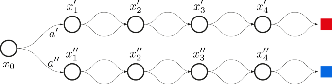
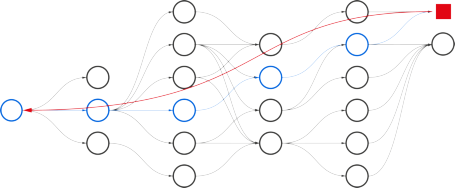
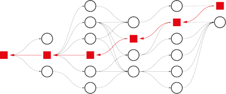
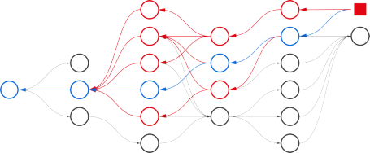

Published in Transactions on Machine Learning Research (04/2024)

## **A Survey of Temporal Credit Assignment** **in Deep Reinforcement Learning**

**Eduardo Pignatelli** _e.pignatelli@ucl.ac.uk_
_University College London_

**Johan Ferret** _jferret@google.com_
_Google DeepMind_

**Hado van Hasselt** _hado@google.com_
_Google DeepMind_

**Matthieu Geist** _mfgeist@google.com_
_Google DeepMind_

**Thomas Mesnard** _mesnard@google.com_
_Google DeepMind_

**Olivier Pietquin** _pietquin@google.com_
_Google DeepMind_

**Laura Toni** _l.toni@ucl.ac.uk_

_University College London_

**Reviewed on OpenReview:** _`[https: // openreview. net/ forum? id= bNtr6SLgZf](https://openreview.net/forum?id=bNtr6SLgZf)`_

**Abstract**

The Credit Assignment Problem (CAP) refers to the longstanding challenge of Reinforcement Learning (RL) agents to associate actions with their long-term consequences. Solving
the CAP is a crucial step towards the successful deployment of RL in the real world since
most decision problems provide feedback that is noisy, delayed, and with little or no information about the causes. These conditions make it hard to distinguish serendipitous outcomes
from those caused by informed decision-making. However, the mathematical nature of credit
and the CAP remains poorly understood and defined. In this survey, we review the state of
the art of Temporal Credit Assignment (CA) in deep RL. We propose a unifying formalism
for credit that enables equitable comparisons of state of the art algorithms and improves
our understanding of the trade-offs between the various methods. We cast the CAP as the
problem of learning the influence of an action over an outcome from a finite amount of
experience. We discuss the challenges posed by _delayed effects_, _transpositions_, and a _lack of_
_action influence_, and analyse how existing methods aim to address them. Finally, we survey the protocols to evaluate a credit assignment method and suggest ways to diagnose the
sources of struggle for different methods. Overall, this survey provides an overview of the
field for new-entry practitioners and researchers, it offers a coherent perspective for scholars
looking to expedite the starting stages of a new study on the CAP, and it suggests potential
directions for future research.

1

Published in Transactions on Machine Learning Research (04/2024)

**1** **Introduction**

RL is poised to impact many real world problems that require sequential decision making, such as strategy
(Silver et al., 2016; 2018; Schrittwieser et al., 2020; Anthony et al., 2020; Vinyals et al., 2019; Perolat
et al., 2022) and arcade video games (Mnih et al., 2013; 2015; Badia et al., 2020; Wurman et al., 2022),
climate control (Wang & Hong, 2020), energy management (Gao, 2014), car driving (Filos et al., 2020)
and stratospheric balloon navigation (Bellemare et al., 2020), designing circuits (Mirhoseini et al., 2020),
cybersecurity (Nguyen & Reddi, 2021), robotics (Kormushev et al., 2013), or physics (Degrave et al., 2022).
One fundamental mechanism allowing RL agents to succeed in these scenarios is their ability to evaluate
the _influence_ of their actions over outcomes – e.g., a win, a loss, a particular event, a payoff. Often, these
outcomes are consequences of isolated decisions taken in a very remote past: actions can have long-term
effects. The problem of learning to associate actions with distant, future outcomes is known as the temporal
CAP: _to distribute the credit of success among the multitude of decisions involved_ (Minsky, 1961). Overall,
the _influence_ that an action has on an outcome represents _knowledge_ in the form of _associations_ between
actions and outcomes (Sutton et al., 2011; Zhang et al., 2020). These associations constitute the scaffolding
that agencies can use to deduce, reason, improve and act to address decision-making problems and ultimately
improve their data efficiency.

Solving the CAP is paramount since most decision problems have two important characteristics: they take a
_long time to complete_, and they seldom provide immediate feedback, but often _with delay_ and little insight as
to which actions caused it. These conditions produce environments where the feedback signal is weak, noisy,
or deceiving, and the ability to separate serendipitous outcomes from those caused by informed decisionmaking becomes a hard challenge. Furthermore, as these environments grow in complexity with the aim
to scale to real-world tasks (Rahmandad et al., 2009; Luoma et al., 2017), the actions taken by an agent
affect an increasingly vanishing part of the outcome. In these conditions, it becomes challenging to learn
value functions that accurately represent the _influence_ of an action and to be able to distinguish and order
the relative long-term values of different actions. In fact, canonical Deep Reinforcement Learning (Deep
RL) solutions to _control_ are often brittle to the hyperparameter choice (Henderson et al., 2018), inelastic
to generalise zero-shot to different tasks (Kirk et al., 2023), prone to overfitting (Behzadan & Hsu, 2019;
Wang et al., 2022), and sample-inefficient (Ye et al., 2021; Kapturowski et al., 2023). Overall, building a
solid foundation of knowledge that can unlock solutions to complex problems beyond those already solved
calls for better CA techniques (Mesnard et al., 2021).

In the current state of RL, _action values_ are a key proxy for _action influence_ . Values _actualise_ a return
by synthesising statistics of the _future_ into properties of the _present_ : they transform a signal dependent on
the future into one dependent only on the present. Recently, the advent of Deep RL (Arulkumaran et al.,
2017) granted access to new avenues to express credit through values, either by using memory (Goyal et al.,
2019; Hung et al., 2019), associative memory (Hung et al., 2019; Ferret et al., 2021a; Raposo et al., 2021),
counterfactuals (Mesnard et al., 2021), planning (Edwards et al., 2018; Goyal et al., 2019; van Hasselt et al.,
2021) or by meta-learning (Xu et al., 2018; Houthooft et al., 2018; Oh et al., 2020; Xu et al., 2020; Zahavy
et al., 2020). The research on CAP is now fervent, and with a rapidly growing corpus of works.

**Motivation.** Despite its central role, there is little discussion on the precise mathematical nature of credit.
While these proxies are sufficient to unlock solutions to complex tasks, it remains unclear where to draw
the line between a generic measure of action influence and _credit_ . Existing works focus on partial aspects
or sub-problems (Hung et al., 2019; Arjona-Medina et al., 2019; Arumugam et al., 2021) and not all works
refer to the CAP explicitly in their text (Andrychowicz et al., 2017; Nota et al., 2021; Goyal et al., 2019),
despite their findings providing relevant contributions to address the problem. The resulting literature is
fragmented and lacks a space to connect recent works and put their efforts in perspective for the future. The
field still holds open questions:

**Q1.** _What_ is the _credit_ of an action? How is it different from an _action value_ ? And what is the CAP?
What in words, and what in mathematics?

**Q2.** _How_ do agents learn to _assign_ credit? What are the main methods in the literature and how can
they be organised?

2

Published in Transactions on Machine Learning Research (04/2024)

**Q3.** How can we _evaluate_ whether a method is improving on a challenge? How can we monitor advancements?

**Goals.** Here, we propose potential answers to these questions and set out to realign the fundamental issue
raised by Minsky (1961) to the Deep RL framework. Our main goal is to provide an overview of the field
to new-entry practitioners and researchers, and, for scholars looking to develop the field further, to put the
heterogeneous set of works into a comprehensive, coherent perspective. Lastly, we aim to reconnect works
whose findings are relevant for CAP, but that do not refer to it directly. To the best of our knowledge,
the work by Ferret (2022, Chapter 4) is the only effort in this direction, and the literature offers no explicit
surveys on the temporal CA problem in Deep RL.

**Scope.** The survey focuses on temporal CA in single-agent Deep RL, and the problems of _(i)_ quantifying
the influence of an action mathematically and formalising a mathematical objective for the CA problem
_(ii)_ defining its challenges, and categorising the existing methods to learn the quantities above, _(iii)_ defining
a suitable evaluation protocol to monitor the advancement of the field. We do not discuss _structural_ CA in
Deep Neural Networks (DNNs), that is, the problem of assigning credit or blame to individual parameters of
a DNN (Schmidhuber, 2015; Balduzzi et al., 2015). We also do not discuss CA in multi-agent RL, that is, to
ascertain which agents are responsible for creating good reinforcement signals (Chang et al., 2003; Foerster
et al., 2018). When credit (assignment) is used without any preceding adjective, we always refer to _temporal_
credit (assignment). In particular, with the adjective _temporal_ we refer to the fact that _“each ultimate success_
_is associated with a vast number of internal decisions”_ (Minsky, 1961) and that these decisions, together
with states and rewards, are arranged to form a _temporal_ sequence.

The survey focuses on Deep RL. In surveying existing formalisms and methods, we only look at the Deep RL
literature, and when proposing new ones, we tailor them to Deep RL theories and applications. We exclude
from the review methods specifically designed to solve decision problems with linear or tabular RL, as they
do not bode well for scaling to complex problems.

**Outline.** We address **Q1.**, **Q2.** and **Q3.** in the three major sections of the manuscript. Respectively:

  - **Section 4** addresses **Q1.**, proposing a definition of credit and the CAP and providing a survey of
action influence measures.

  - **Section 5** and **Section 6** address **Q2.**, discussing the key challenges to solving the CAP and the
existing methods to assign credit, respectively.

  - **Section 7** answers **Q3.**, reviewing the problem setup, the metrics, and the evaluation protocols to
monitor advancements in the field.

  - **Section 8** summarises the main points of the manuscript and provides a critical discussion to
highlight the open challenges.

For each question, we contribute by: _(a)_ systematising _existing works_ into a simpler, coherent space; _(b)_ discussing it, and _(c)_ synthesising our perspective into a unifying formalism. Table 1 outlines the suggested
reading flow according to the type of reader.

Reader type Suggested Flow
Specialised CA scholar 1 _→_ 8 _→_ 4 _→_ 5 _→_ 6 _→_ 7 _→_ 2
RL researcher 1 _→_ 8 _→_ 4 _→_ 5 _→_ 6 _→_ 7

Deep Learning researcher 1 _→_ 3 _→_ 4 _→_ 5 _→_ 6 _→_ 7 _→_ 8
Practitioner (applied researcher) 6 _→_ 4.4 _→_ 3
Proposing a new CA method 8 _→_ 7 _→_ 6 _→_ 2 _→_ 4

Table 1: Suggested flow of reading by type of reader to support the outline in Section 1. Numbers represent
section numbers.

3

Published in Transactions on Machine Learning Research (04/2024)

**2** **Related Work**

Three existing works stand out for proposing a better understanding of the CAP explicitly. Ferret (2022,
Chapter 4) designs a conceptual framework to unify and study credit assignment methods. The chapter
proposes a general formalism for a range of credit assignment functions and discusses their characteristics
and general desiderata. Unlike Ferret (2022, Chapter 4), we survey potential formalisms for a mathematical
definition of credit (Section 4); given the new formalism, we propose an alternative view of the methods to
assign credit (Section 6), and an evaluation protocol to measure future advancements in the field. Arumugam
et al. (2021) analyses the CAP from an information theoretic perspective. The work focuses on the notion of
_information sparsity_ to clarify the role of credit in solving sparse reward problems in RL. Despite the work
questioning what credit is mathematically, it does not survey existing material, and it does not provide a
framework that can unify existing approaches to represent credit under a single formalism. Harutyunyan
et al. (2019) propose a principled method to measure the credit of an action. However, the study does not
aim to survey existing methods to _measure_ credit, the methods to _assign_ credit, and the methods to evaluate
a credit assignment method, and does not aim to organise them into a cohesive synthesis.

The literature also offers surveys on related topics. We discuss them in Appendix A to preserve the fluidity
of the manuscript.

As a result, none of these works position CAP in a single space that enables thorough discussion, assessment
and critique. Instead, we propose a formalism that unifies the existing _quantities_ that represent the influence
of an action (Section 4). Based on this, we can analyse the advantages and limitations of existing measures
of action influence. The resulting framework provides a way to gather the variety of existing _methods_ that
learn these quantities from experience (Section 6), and to monitor the advancements in solving the CAP.

**3** **Notation and Background**

Here we introduce the notation that we will follow in the rest of the paper and the required background.

**Notations.** We use calligraphic characters to denote sets and the corresponding lowercases to denote their
elements, for example, _x ∈X_ . For a measurable space ( _X_ _,_ Σ), we denote the set of probability measures
over _X_ with ∆( _X_ ). We use an uppercase letter _X_ to indicate a random variable, and the notation P _X_ to
denote its distribution over the sample set _X_, for example, P _X_ : _X →_ ∆( _X_ ). When we mention a _random_
_event X_ (for example, a _random action_ ) we refer to a random draw of a specific value _x ∈X_ from its
distribution P _X_ and we write, _X ∼_ P _X_ . When a distribution is clear from the context, we omit it from the
subscript and write P( _X_ ) instead of P _X_ ( _X_ ). We use 1 _Y_ ( _x_ ) for the indicator function that maps an element
_x ∈X_ to 1 if _x ∈Y ⊂X_ and 0 otherwise. We use R to denote the set of real numbers and B = _{_ 0 _,_ 1 _}_ to
denote the Boolean domain. We use _ℓ_ _∞_ ( _x_ ) = _∥x∥_ _∞_ = sup _i_ _|x_ _i_ _|_ to denote the _ℓ_ -infinity norm of a vector _x_
of components _x_ _i_ . We write the Kullback-Leibler divergence between two discrete probability distributions
P _P_ ( _X_ ) and P _Q_ ( _X_ ) with sample space _X_ as: _D_ _KL_ (P _P_ ( _X_ ) _||_ P _Q_ ( _X_ )) = [�] _x∈X_ [[][P] _[P]_ [ (] _[x]_ [) log(][P] _[P]_ [ (] _[x]_ [)] _[/]_ [P] _[Q]_ [(] _[x]_ [))].]

**Reinforcement Learning.** We consider the problem of learning by interacting with an environment. A
program (the _agent_ ) interacts with an _environment_ by making decisions ( _actions_ ). The action is the agent’s
interface with the environment. Before each action, the agent may _observe_ part of the environment and
take suitable actions. The action changes the state of the environment. After each action, the agent may
perceive a feedback signal (the _reward_ ). The goal of the agent is to learn a rule of behaviour (the _policy_ )
that maximises the expected sum of rewards.

**Markov Decision Processes (MDPs).** MDPs formalise decision-making problems. This survey focuses
on the most common MDP settings for Deep RL. Formally, a discounted MDP (Howard, 1960; Puterman,
2014) is defined by a tuple _M_ = ( _S, A, R, µ, γ_ ). _S_ is a finite set of states (the _state space_ ) and _A_ is a finite
set of actions ( _the action space_ ). _R_ : _S × A →_ [ _r_ _min_ _, r_ _max_ ] is a deterministic, bounded reward function that
maps a state-action pair to a scalar reward _r_ . _γ ∈_ [0 _,_ 1] is a discount factor and _µ_ : _S × A →_ ∆( _S_ ) is a
transition kernel, which maps a state-action pair to probabilities over states. We refer to an arbitrary state
_s ∈S_ with _s_, an action _a ∈A_ with _a_ and a reward _r ∈_ [ _r_ _min_ _, r_ _max_ ] with _r_ . Given a state-action tuple

4

Published in Transactions on Machine Learning Research (04/2024)

( _s, a_ ), the probability of the next random state _S_ _t_ +1 being _s_ _[′]_ depends on a _state-transition_ distribution:
P _µ_ ( _S_ _t_ +1 = _s_ _[′]_ _|S_ _t_ = _s, A_ _t_ = _a_ ) = _µ_ ( _s_ _[′]_ _|s, a_ ) _, ∀s, s_ _[′]_ _∈S_ . We refer to _S_ _t_ as the _random state_ at time _t_ . The
probability of the action _a_ depends on the agent’s policy, which is a stationary mapping _π_ : _S →_ ∆( _A_ ), from
a state to a probability distribution over actions.

These settings give rise to a discrete-time, stateless (Markovian), Random Process (RP) with the additional
notions of _actions_ to represent decisions and _rewards_ for a feedback signal. Given an initial state distribution
P _µ_ 0 ( _S_ 0 ), the process begins with a random state _s_ 0 _∼_ P _µ_ 0 . Starting from _s_ 0, at each time _t_ the agent interacts
with the environment by choosing an action _A_ _t_ _∼_ P _π_ ( _·|s_ _t_ ), observing the reward _r_ _t_ _∼_ _R_ _t_ ( _S_ _t_ _, A_ _t_ ) and the
next state _s_ _t_ +1 _∼_ P _µ_ . If a state _s_ _t_ is also an _absorbing_ state ( _s ∈S ⊂S_ ), the MDP transitions to the same
state _s_ _t_ with probability 1 and reward 0, and we say that the episode terminates. We refer to the union of
each temporal _transition_ ( _s_ _t_ _, a_ _t_ _, r_ _t_ _, s_ _t_ +1 ) as a _trajectory_ or _episode d_ = _{s_ _t_ _, a_ _t_ _, r_ _t_ _,_ : 0 _≤_ _t ≤_ _T_ _}_, where _T_ is
the _horizon_ of the episode.

We mostly consider episodic settings where the probability of ending in an absorbing state in finite time is
1, resulting in the random horizon _T_ . We consider discrete action spaces _A_ = _{a_ _i_ : 1 _≤_ _i ≤_ _n}_ only.

A trajectory is also a random variable in the space of all trajectories _D_ = ( _S ×A×R_ ) _[T]_, and its distribution is
the joint of all of its components P _D_ ( _D_ ) = P _A,S,R_ ( _s_ 0 _, a_ 1 _, r_ 1 _, . . ., s_ _T_ ). Given an MDP _M_ = ( _S, A, R, µ, γ_ ) and
fixing a policy _π_ produces a Markov Process (MP) _M_ _[π]_ and induces a distribution over trajectory P _µ,π_ ( _D_ ).

We refer to the _return_ random variable _Z_ _t_ as the sum of discounted rewards from time _t_ to the end of the
episode, _Z_ _t_ = [�] _[T]_ _k_ = _t_ _[γ]_ _[k][−][t]_ _[R]_ [(] _[S]_ _[k]_ _[, A]_ _[k]_ [). The] _[ control]_ [ objective of an RL problem is to find a policy] _[ π]_ _[∗]_ [that]
maximises the expected return,

�

_π_ _[∗]_ _∈_ argmax E _µ,π_

_π_

_T_
�
� _t_ =0

� _γ_ _[t]_ _R_ ( _S_ _t_ _, A_ _t_ )

_t_ =0

= E [ _Z_ 0 ] _._ (1)

**Partially-Observable MDPs (MDPs).** POMDPs are MDPs in which agents do not get to observe
a true state of the environment, but only a transformation of it, and are specified with an additional
tuple _⟨O, µ_ _O_ _⟩_, where _O_ is an observation space, and _µ_ _O_ : _S →_ ∆( _O_ ) is an observation kernel, that maps
the true environment state to observation probabilities. Because transitioning between observations is
not Markovian, policies are a mapping from partial _trajectories_, which we denote as _histories_, to actions.
Histories are sequences of transitions _h_ _t_ = _{O_ 0 _} ∪{A_ _k_ _, R_ _k_ _, O_ _k_ +1 : 0 _< k < t −_ 1 _} ∈_ ( _O × A × R_ ) _[t]_ = _H_ .

**Generalised Policy Iteration (GPI).** We now introduce the concept of value functions. The _state value_
_function_ of a policy _π_ is the expected return of the policy from state _s_ _t_, _v_ _[π]_ ( _s_ ) = E _π,µ_ [ _Z_ _t_ _|S_ _t_ = _s_ ]. The
action-value function (or Q-function) of a policy _π_ is the expected return of the policy from state _s_ _t_ if the
agent takes _a_ _t_, _q_ _[π]_ ( _s, a_ ) = E _π,µ_ [ _Z_ _t_ _|S_ _t_ = _s, A_ _t_ = _a_ ]. Policy Evaluation (PE) is then the process that maps
a policy _π_ to its value function. A canonical PE procedure starts from an arbitrary value function _V_ 0 and
iteratively applies the Bellman operator, _T_, such that:

_v_ ˆ _k_ _[π]_ +1 [(] _[S]_ _[t]_ [) =] _[ T]_ _[ π]_ [[ˆ] _[v]_ _k_ _[π]_ [(] _[S]_ _[t]_ [)] :=][ E] _[π,µ]_ [[] _[R]_ [(] _[S]_ _[t]_ _[, A]_ _[t]_ [) +] _[ γ][v]_ [ˆ] _[k]_ [(] _[S]_ _[t]_ [+1] [)]] _[,]_ (2)

where ˆ _v_ _k_ denotes the value approximation at iteration _k_, _A_ _t_ _∼_ P _π_ ( _·|S_ _t_ ), and _S_ _t_ +1 _∼_ P _µ,π_ ( _·|S_ _t_ _, A_ _t_ ). The
Bellman operator is a _γ_ -contraction in the _ℓ_ _∞_ and the _ℓ_ 2 norms, and its fixed point is the value of the
policy _π_ . Hence, successive applications of the Bellman operator improve the prediction accuracy because
the current value gets closer to the true value of the policy. We refer to the PE as the _prediction_ objective
(Sutton & Barto, 2018). Policy improvement maps a policy _π_ to an improved policy:

_π_ _k_ +1 ( _a|S_ ) = _G_ [ _π_ _k_ _, S_ ] = 1 _{a}_ (argmax [ _R_ ( _S, u_ ) + _γv_ _k_ ( _S_ _[′]_ )]) = 1 _{a}_ (argmax [ _q_ _k_ ( _S, u_ )]) _._ (3)
_u∈A_ _u∈A_

We refer to GPI as a general method to solve the _control_ problem (Sutton & Barto, 2018) deriving from
the composition of PE and Policy Improvement (PI). In particular, we refer to the algorithm that alternates
an arbitrary number _k_ of PE steps and one PI step as Modified Policy Iteration (MPI) (Puterman & Shin,

5

Published in Transactions on Machine Learning Research (04/2024)

Figure 1: A simplified MDP to develop an intuition of credit. The agent starts in _x_ 0, and can choose
between two actions, _a_ _[′]_ and _a_ _[′′]_ in each state; the reward is 1 when reaching the upper, solid red square, and
0 otherwise. The first action determines the outcome alone.

1978; Scherrer et al., 2015). For _k_ = 1, MPI recovers Value Iteration, while for _k →_ + _∞_, it recovers Policy
Iteration. For any value of _k ∈_ [1 _,_ + _∞_ ), and under mild assumptions, MPI converges to an optimal policy
(Puterman, 2014).

In Deep RL we parameterise a policy using a neural network with parameters set _θ_ and denote the distribution
over action as _π_ ( _a|s, θ_ ). We apply the same reasoning for value functions, with parameters set _ϕ_, which leads
to _v_ ( _s, ϕ_ ) and _q_ ( _s, a, ϕ_ ) for the state and action value functions respectively.

**4** **Quantifying action influences**

We start by answering **Q1.**, which aims to address the problem of _what_ to measure, when referring to credit.
Since Minsky (1961) raised the CAP, a multitude of works paraphrased his words:

   - “ _The problem of how to incorporate knowledge_ ” and “ _given an outcome, how relevant were past_
_decisions?_ ” (Harutyunyan et al., 2019),

   - “ _Is concerned with identifying the contribution of past actions on observed future outcomes_ ” (Arumugam et al., 2021),

   - “ _The problem of measuring an action’s influence on future rewards_ ” (Mesnard et al., 2021),

   - “ _An agent must assign credit or blame for the rewards it obtains to past states and actions_ ” (Chelu
et al., 2022),

   - “ _The challenge of matching observed outcomes in the future to decisions made in the past_ ” (Venuto
et al., 2022),

   - “ _Given an observed outcome, how much did previous actions contribute to its realization?_ ” (Ferret,
2022, Chapter 4.1).

These descriptions converge to Minsky’s original question and show agreement in the literature on an informal
notion of credit. In this introduction, we propose to reflect on the different metrics that exist in the literature
to quantify it. We generalise the idea of _action value_, which often only refers to _q_ -values, to that of _action_
_influence_, which describes a broader range of metrics used to quantify the credit of an action. While we do
not provide a definitive answer on what credit _should_ be, we review how different works in the existing RL
literature have characterised it. We now start by developing an intuition of the notion of credit.

Consider Figure 1, inspired to both Figure 1 of Harutyunyan et al. (2019) and to the _umbrella_ problem in
Osband et al. (2020). The action taken at _x_ 0 determines the return of the episode by itself. From the point
of view of _control_, any policy that always takes _a_ _[′]_ in _x_ 0 (i.e., _π_ _[∗]_ _∈_ Π _[∗]_ : _π_ _[∗]_ ( _a_ _[′]_ _|x_ 0 ) = 1), and then any other
action afterwards, is an optimal policy. From the CAP point of view, some optimal actions, namely those
after the first one, do not _actually_ contribute to optimal returns. Indeed, alternative actions still produce
optimal returns and contribute equally to each other to achieve the goal, so their credit is equal. We can see
that, in addition to optimality, credit not only identifies optimal actions but informs them of how _necessary_
they are to achieve an outcome of interest.

6

Published in Transactions on Machine Learning Research (04/2024)

From the example, we can deduce that credit evaluates actions for their potential to influence an outcome.
The resulting CAP is the problem of **estimating the influence** of an action over an outcome from experimental data and describes a pure association between them.

**Why solving the CAP?** Action evaluation is a cornerstone of RL. In fact, solving a control problem often
involves running a GPI scheme. Here, the influence of an action drives learning, for it suggests a possible
direction to improve the policy. For example, the action-value plays that role in Equation (3). It follows
that the quality of the measure of influence fundamentally impacts the quality of the policy improvement.
Low quality evaluations can lead the policy to diverge from the optimal one, hinder learning, and slow down
progress (Sutton & Barto, 2018; van Hasselt et al., 2018). On the contrary, high quality evaluations provide
accurate, robust and reliable signals that foster convergence, sample-efficiency and low variance. While
simple evaluations are enough for specialised experiments, the real world is a complex blend of multiple,
sometimes hierarchical tasks. In these cases, the optimal value changes from one task to another, and these
simple evaluations do not bode well to adapt to general problem solving. Yet, the causal structure that
underlies the real word is shared among all tasks, and the modularity of its causal mechanisms is often a
valuable property to incorporate. In these conditions, learning to assign credit in one environment becomes
a lever to assign credit in another (Ferret et al., 2021a), and ultimately makes learning faster, more accurate
and more efficient. For these reasons, and because an optimal policy only requires discovering one single
optimal trajectory, credit stores knowledge beyond that expressed by optimal behaviours alone, and solving
the control problem is not sufficient to solve the CAP, with the former being an underspecification of the
latter.

**4.1** **Are all** _**action values**_ **,** _**credit**_ **?**

As we stated earlier, most Deep RL algorithms use some form of _action influence_ to evaluate the impacts
of an action on an outcome. This is a fundamental requirement to rank actions and select the optimal one
to solve complex tasks. For example, many model-free methods use the _state-action value_ function _q_ _[π]_ ( _s, a_ )
to evaluate actions (Mnih et al., 2015; van Hasselt et al., 2016), where actions contribute as much as the
expected return they achieve at termination of the episode. Advantage Learning (AL) (Baird, 1999; Mnih
et al., 2016; Wang et al., 2016b, Chapter 5) uses the _advantage_ function _A_ _[π]_ ( _s_ _t_ _, a_ _t_ ) = _q_ _[π]_ ( _s_ _t_ _, a_ _t_ ) _−_ _v_ _[π]_ ( _s_ _t_ ) [1]

to measure credit, while other works study the effects of the _action-gap_ (Farahmand, 2011; Bellemare et al.,
2016; Vieillard et al., 2020b) on it, that is, the relative difference between the expected return of the best
action and that of another action, usually the second best. Action influence is also a key ingredient of
actor-critic and policy gradient methods (Lillicrap et al., 2015; Mnih et al., 2016; Wang et al., 2016a), where
the policy gradient is proportional to E _µ,π_ [ _A_ _[π]_ ( _s, a_ ) _∇_ log _π_ ( _A|s_ )], with _A_ _[π]_ ( _s, a_ ) estimating the influence of
the action _A_ .

These proxies are sufficient to select optimal actions and unlock solutions to complex tasks (Silver et al.,
2018; Wang et al., 2016b; Kapturowski et al., 2019; Badia et al., 2020; Ferret et al., 2021b). However, while
many works explicitly refer to the action influence as a measure of credit, the term is not formally defined
and, it remains unclear where to draw the line between _credit_ and other quantities. Key questions arise:
_What is the difference between these quantities and credit? Do they actually represent credit as originally_
_formulated by Minsky (1961)? If so, under what conditions do they do?_ Without a clear definition of _what_
to measure, we do not have an appropriate quantity to target when designing an algorithm to solve the
CAP. More importantly, we do not have an appropriate quantity to use as a single source of truth and term
of reference to measure the accuracy of other metrics of action influence, and how well they approximate
credit. To fill this gap, we proceed as follows:

   - Section 4.2 formalises what is a _goal_ or an _outcome_ : what we evaluate the action for;

   - Section 4.3 unifies existing functions under a common formalism;

   - Section 4.4 formalises the CAP following this definition;

1 To be consistent with the RL literature we abuse notation and denote the advantage with a capital letter _A_ _π_ despite not
being random and being the same symbol of the action _A_ _t_ .

7

Published in Transactions on Machine Learning Research (04/2024)

   - Section 4.5 analyses how different works interpreted and quantified _action influences_ and reviews
them;

   - Section 4.6 distils the properties that existing measures of action influence exhibit.

We suggest the reader only interested in the final formalism to directly skip to Section 4.4, and to come back
to the next sections to understand the motivation behind it.

**4.2** **What is a** _**goal**_ **?**

Because credit measures the influence of an action upon achieving a certain goal, to define credit formally
we must be able to describe _goals_ formally, and without a clear understanding of what constitutes one, an
agent cannot construct a learning signal to evaluate its actions. _Goal_ is a synonym for _purpose_, which we can
informally describe as a performance to meet or a prescription to follow. Defining a goal rigorously allows
making the relationship between the action and the goal explicit (Ferret, 2022, Chapter 4) and enables the
agent to decompose complex behaviour into elementary ones in a compositional (Sutton et al., 1999; Bacon
et al., 2017), and possibly hierarchical way (Flet-Berliac, 2019; Pateria et al., 2021; Hafner et al., 2022). This
idea is at the foundation of many CA methods (Sutton et al., 1999; 2011; Schaul et al., 2015a; Andrychowicz
et al., 2017; Harutyunyan et al., 2019; Bacon et al., 2017; Smith et al., 2018; Riemer et al., 2018; Bagaria &
Konidaris, 2019; Harutyunyan et al., 2018; Klissarov & Precup, 2021). We proceed with a formal definition
of _goals_ in the next paragraph, and review how these goals are _represented_ in seminal works on CA in the
one after. This will lay the foundation for a unifying notion of credit later in Sections 4.3.

**Defining goals.** To define goals formally, we adopt the _reward hypothesis_, which posits:

_That all of what we mean by goals and purposes can be well thought of as maximization_
_of the expected value of the cumulative sum of a received scalar signal (reward)._ (Sutton,
2004).

Here, the goal is defined as the _behaviour_ that results from the process of maximising the return. The
reward hypothesis has been further advanced by later studies (Abel et al., 2021b; Pitis, 2019; Shakerinava
& Ravanbakhsh, 2022; Bowling et al., 2023). In the following text, we employ the goal definition in Bowling
et al. (2023), which we report hereafter:

**Definition 1** (Goal) **.** _Given a distribution of finite histories_ P( _H_ ) _, ∀H ∈H, we define a_ goal _as a partial_
_ordering over_ P( _H_ ) _, and for all h, h_ _[′]_ _∈H we write h_ ≿ _h_ _[′]_ _to indicate that h is preferred to h_ _[′]_ _or that the_
_two are indifferently preferred._

Here, _H_ is a random history in the set of all histories _H_ as described in Section 3, and P( _H_ ) is an unknown
distribution over histories, different from that induced by the policy and the environment. An agent behaviour
and an environment then induce a new distribution over histories, and we obtain P _µ,π_ ( _H_ ) as described in
Section 3. This in turn allows defining a partial ordering over policies, rather than histories, and we write
analogously _π_ ≿ _π_ _[′]_ to indicate the preference. For the _Markov Reward Theorem_ (Bowling et al., 2023,
Theorem 4.1) and under mild conditions (Bowling et al., 2023), there exists a deterministic, Markov reward
function [2] _R_ : _O × A →_ [0 _,_ 1] such that the maximisation of the expected sum of rewards is consistent with
the preference relation over policies.

**Subjective and objective goals.** The _Markov Reward Theorem_ holds both if the preferences are defined
_internally_ by the agent itself – this is the case of _intrinsic motivation_ (Piaget et al., 1952; Chentanez et al.,
2004; Barto et al., 2004; Singh et al., 2009; Barto, 2013; Colas et al., 2022) – and in case they originate
from an _external_ entity, such as an agent-designer. In the first case, the agent doing the maximisation is the
same as the one holding the ordering over policies, and we refer to the corresponding goal as a _subjective_
_goal_ . In the second case, an _agent designer_ or an unknown, non-observable entity holds the ordering and a

2 We omit the transition dependent discounting for the sake of conciseness and because not relevant to our problem. The
reader can consult Pitis (2019); White (2017) for details.

8

Published in Transactions on Machine Learning Research (04/2024)

separate _learning agent_ is the one pursuing the optimisation process. We refer to a goal as an _objective goal_
in this latter case. These settings usually correspond to the distinction between goals and sub-goals in the
literature (Liu et al., 2022).

**Outcomes.** A particularly interesting use of goals for CA is in hindsight (Andrychowicz et al., 2017). Here
the agent acts with a goal in mind, but it evaluates a trajectory as if _a_ reward function – one different from
the original one – was maximised in the current trajectory. We discuss the benefits of these methods in
Section 6.4. When this is the case, we use the term _outcome_ to indicate a realised goal in hindsight. In
particular, given a history _H ∼_ P _µ,π_ ( _H_ ), there exists a deterministic, Markov reward function _R_ that is
maximal in _H_ . We refer to the corresponding _H_ as an outcome. For example, consider a trajectory _h_ that
ends in a certain state _s_ . There exist a Markov reward function that outputs always 0 and 1 only when the
_s_ is the final state of _h_ . We refer to _h_ as an _outcome_ .

In other words, this way of defining goals or outcomes corresponds to defining a task to solve, which in
turn can be expressed through a reward function with the characteristics described above. Vice-versa, the
reward function can _encode_ a task. When credit is assigned with respect to a particular goal or outcome, it
then evaluates the influence of an action to solving that particular task. As discussed above, this is key to
decomposing and recomposing complex behaviours and the definition aligns with that of other disciplines,
such as psychology where _a goal . . . is a cognitive representation of something that is possible in the future_
(Elliot & Fryer, 2008) or philosophy, where representations do not merely read the world as it is, but they
express _preferences_ over something that is possible in the future (Hoffman, 2016; Prakash et al., 2021; Le Lan
et al., 2022).

**Representing goals and outcomes.** However, expressing the relation between actions and goals explicitly, that is, when the function that returns the credit of an action has a goal as an input, raises the problem
of how to _represent_ a goal for computational purposes. This is important because among the CA methods
that define goals explicitly (Sutton et al., 2011; Schaul et al., 2015a; Andrychowicz et al., 2017; Rauber et al.,
2019; Harutyunyan et al., 2019; Tang & Kucukelbir, 2021; Arulkumaran et al., 2022; Chen et al., 2021), not
many of them use the rigour of a general-purpose definition of goal such as that in Bowling et al. (2023).
In these works, the _goal-representation space_, which we denote as _g ∈G_, is arbitrarily chosen to represent
specific features of a trajectory. It denotes an _object_, rather than a performance or a prescription to meet.
For example, a _goal-representation g_ can be a state (Sutton et al., 2011; Andrychowicz et al., 2017) and
_g ∈G_ = _S_ . It can be a specific observation (Nair et al., 2018) with _g ∈G_ = _O_ . Alternatively, it can be
an abstract features vector (Mesnard et al., 2021) that reports on some characteristics of a history, and we
have _g ∈G_ = R _[d]_, where _d_ is the dimensionality of the vector. Even, a goal can be represented by a natural
language instruction (Luketina et al., 2019) and _g ∈G_ = R _[d]_ is the embedding of that piece of text. A goal
can be represented by a scalar _g ∈G_ = R (Chen et al., 2021) that indicates a specific return to achieve, or
even a full command (Schmidhuber, 2019), that is a return to achieve is a specific window of time.

While these representations are all useful heuristics, they lack formal rigour and leave space for ambiguities.
For example, saying that the goal is a state might mean that _visiting the state at the end of the trajectory_
is the goal or that visiting it in the _middle_ of it is the goal. This is often not formally defined, and what
is the reward function that corresponds to that specific representation of a goal is not always clear. In
the following text, when surveying a method or a metric that specifies a goal, we refer to the specific goal
representation used in the work and make an effort to detail what is the reward function that underpins that
goal representation.

**4.3** **What is an** _**assignment**_ **?**

Having established a formalism for goals and outcomes, we are now ready to describe _credit_ formally and we
proceed with a formalism that unifies the existing measures of action influence. We first describe a generic
function that generalises most CAs, and then proceed to formalise the CAP. Overall, this formulation
provides a term of reference for the quantities described in Section 4.5. We now formalise an _assignment_ :

**Definition 2** (Assignment) **.** _Consider an action a ∈A, a goal g ∈G, and a context c ∈C. We use the term_
assignment function _or simply_ assignment _to denote a function K that maps a context, an action, and an_

9

Published in Transactions on Machine Learning Research (04/2024)

_outcome to a quantity y ∈Y, which we refer to as the_ _**influence**_ _of the action:_

_K_ : _C × A × G →Y._ (4)

Here, a context _c ∈C_ represents some input data and can be arbitrarily chosen depending on the assignment
in question. For example, _c_ can be a state _s_ . A context must hold information about the present, for example,
the current state or the current observation; it may contain information about the past, for example, the
sequence of past decisions that occurred until now for a POMDP; to evaluate the current action, it can
contain information about what future actions will be taken _in-potentia_, for example by specifying a policy
to follow when _a ∈A_ is not taken, or a fixed trajectory, in which case the current action is evaluated in
hindsight (Andrychowicz et al., 2017).

In the general case, the action influence is a random variable _Y ∈Y ⊂_ R _[d]_ . This is the case, for example, of
the action-value distribution (Bellemare et al., 2017) as described in Equation 10, where the action influence
is defined over the full distribution of returns. However, most methods extract some scalar measures of the
full influence distribution, such as expectations (Watkins, 1989), and the action influence becomes a scalar
_y ∈_ R. In the following text, we mostly consider scalar forms of the influence _Y_ = R as these represent the
majority of the existing formulations.

In practice, an _assignment_ provides a single mathematical form to talk about the multitude of ways to
quantify action influence that are used in the literature. It takes an action _a ∈A_, some contextual data _c ∈C_
and a goal _g ∈G_ and maps it to some measure of _action influence_ . While maintaining the same mathematical
form, different assignments can return different values of action influence and steer the improvement in
different directions.

Equation (4) also resembles the General Value Function (GVF) (Sutton et al., 2011), where the influence
_y_ = _q_ _[π]_ ( _s, a, g_ ) is the expected return of the policy _π_ when taking action _a_ in state _s_, with respect a goal _g_ .
However, in GVFs: _(i_ ) _y_ is an _action value_ and does not generalise other forms of action influence; the goal is
an MDP state _g ∈S_ and does not generalise to our notion of goals in Section 4.2; the function only considers
forward predictions and does not generalise to evaluating an action in hindsight (Andrychowicz et al., 2017).
Table 2 at page 11 contains further details on the comparison and further specifies the relationship between
the most common functions and their corresponding assignment.

**4.4** **The credit assignment problem**

The generality of the assignment formalism reflects the great heterogeneity of action influence metrics, which
we review later in Section 4.5. This heterogeneity shows that, even if most studies agree on an intuitive
notion of credit, they diverge in practice on how to quantify credit mathematically. Having unified the
existing assignments in the previous section, we now proceed to formalise the CAP analogously. This allows
us to put the existing methods into a coherent perspective as a guarantee for a fair comparison, and to
maintain the heterogeneity of the existing measures of action influence.

We cast the CAP as the problem of approximating a measure of action influence from experience. We
assume standard model-free, Deep RL settings and consider an assignment represented as a neural network
_k_ : _C × A × G ×_ Φ _→_ R with parameters _ϕ ∈_ Φ = R _[n]_ that can be used to approximate the credit of the
actions. This usually represents the critic or the value function of an RL algorithm. In addition, we admit
a stochastic function to represent the policy, also in the form of a neural network _f_ : _S ×_ Θ _→_ ∆( _A_ ), with
parameters set _θ ∈_ Θ = R _[m]_ . We assume that _n ≪|S| × |A|_ and _m ≪|S| × |A|_ and note that often subsets
of parameters are shared among the two functions.

We further assume that the agent has access to a set of experiences _D_ and that it can sample from it
according to a distribution _D ∼_ P _D_ . This can be a pre-compiled set of external demonstrations, where
P _C_ ( _D_ ) = _U_ ( _D_ ), or an MDP, where P _C_ = P _µ,π_ ( _D_ ), or even a fictitious model of an MDP P _C_ = P _µ,π_ ˜ ( _D_ ),
where � _µ_ is a function internal to the agent, of the same form of _µ_ . These are also mild assumptions as they
correspond to, respectively, offline settings, online settings, and model-based settings where the model is
learned. We detail these settings in Appendix B. We now define the CAP formally.

10

Published in Transactions on Machine Learning Research (04/2024)

Assignment Action influence Context Action Goal
State-action-value _q_ _[π]_ ( _s, a_ ) _s ∈S_ _a ∈A_ _g ∈_ R
Advantage _q_ _[π]_ ( _s, a_ ) _−_ _v_ ( _s_ ) _s ∈S_ _a ∈A_ _g ∈_ R
General _q_ -value function _q_ _[π,R]_ ( _s, a_ ) _s ∈S_ _a ∈A_ _g ∈S_
Distributional action-value _Q_ _[π]_ ( _s, a_ ) _s ∈S_ _a ∈A_ _g ∈{_ 0 _, . . ., n}_
Distributional advantage _D_ _KL_ ( _Q_ _[π]_ ( _s, a_ ) _||V_ _[π]_ ( _s, a_ )) _s ∈S_ _a ∈A_ _g ∈{_ 0 _, . . ., n}_
_π_ ( _A_ _t_ _|s_ )
Hindsight advantage 1 _−_ P _D_ ( _A_ _t_ _|s_ _t_ _,Z_ _t_ ) _[Z]_ _[t]_ _s ∈S, h_ _T_ _∈H_ _a ∈_ _h_ _g ∈_ R
Counterfactual advantage P _D_ ( _A_ _t_ = _a|S_ _t_ = _s, F_ _t_ = _f_ ) _q_ ( _s, a, f_ ) _s ∈S_ _a ∈_ _h_ _g ∈_ R
Posterior value � _Tt_ =0 [P] _[µ,π]_ [(] _[U]_ _[t]_ [ =] _[ u][|][h]_ _[t]_ [)] _[v]_ _[π]_ [(] _[o]_ _[t]_ _[, x]_ _[t]_ [)] _o ∈O, u ∈_ R _[d]_ _, π_ _A ∼_ _π_ _g ∈_ R
Policy-conditioned value _q_ ( _s, a, π_ ) _s ∈S, π ∈_ Π _a ∈A_ _g ∈_ R

Table 2: A list of the most common _action influences_ and their assignment functions in the Deep RL literature
analysed in this survey. For each function, the table specifies the influence, the context representation, the
action, and the goal representation of the corresponding assignment function _K ∈K_ .

**Definition 3** (The credit assignment problem) **.** _Consider an MDP M, a goal g ∈G, and a set of experience_
_DK_ � _. Consider an arbitrary assignment_ : _C × A × G ×_ Φ _→_ R _with parameters set K ∈K ϕ as described in Equation ∈_ Φ _⊂R_ _[n]_ _, we refer to the_ (4) Credit Assignment Problem _. Given a parameterised function as the_
_problem of finding the set of parameters ϕ ∈_ Φ _such that:_

_K_ � ( _c, a, g, ϕ_ ) = _K_ ( _c, a, g_ ) _,_ _∀c ∈C, a ∈A, g ∈G._ (5)

Different choices of action influence have a great impact on the hardness of the problem. In particular, there
is a trade-off between:

_(a)_ how effective the chosen measure of influence is to inform the direction of the policy improvement,

_(b)_ how easy it is to learn that function from experience.

For example, using _causal influence_ (Janzing et al., 2013) as a measure of action influence makes the CAP
hard to solve in practice. In fact, discovering causal mechanisms from associations alone is notoriously
challenging (Pearl, 2009; Bareinboim et al., 2022), and pure causal relationships are rarely observed in nature
(Pearl et al., 2000) but in specific experimental conditions. However, causal knowledge is reliable, robust
to changes in the experience collected and effective, and causal mechanisms can be invariant to changes in
the goal. On the contrary, _q_ -values are easier to learn as they represent a measure of statistical correlation
between state-actions and outcomes, but their knowledge is limited to the bare minimum necessary to solve
a control problem. This makes them more brittle to sudden changes to the environment, for example, in
open-ended settings (Abel et al., 2023). Which quantity to use in each specific instance or each specific
problem is still the subject of investigation in the literature, as we show in the next sections. Ideally, we
seek to use the most general measure of influence that can be learned with the least amount of experience.

**4.5** **Existing assignment functions**

We now survey the most important assignment functions from the literature and their corresponding measure
of action influence. The following list is not exhaustive, but rather it is representative of the limitations of
existing credit formalisms. For brevity, and without loss of generality, we omit functions that do not explicitly
evaluate actions (for example, state-values), but we notice that it is still possible to reinterpret an assignment
to a state as an assignment to a set of actions for it affects all the actions that led to that state.

**State-action values** (Shannon, 1950; Schultz, 1967; Michie, 1963; Watkins, 1989) are a hallmark of RL,
and are described by the following expression:

_q_ _[π]_ ( _s, a_ ) = E _µ,π_ [ _Z_ _t_ _|S_ _t_ = _s, A_ _t_ = _a_ ] _._ (6)

11

Published in Transactions on Machine Learning Research (04/2024)

Here, the context _c_ is a state _s ∈S_ in the case of MDPs or a history _h ∈H_ for a POMDP. The _q_ -function
quantifies the credit of an action by the expected return of the action in the context.

_q_ -values are among the simplest ways to quantify credit and offer a basic mechanism to solve control problems. However, while _q_ -functions offer solid theoretical guarantees in tabular RL, they can be unstable in
Deep RL. When paired with bootstrapping and off-policy learning, q-values are well known to diverge from
the optimal solution (Sutton & Barto, 2018). van Hasselt et al. (2018) provide empirical evidence of the
phenomenon, investigating the relationship between divergence and performance, and how different variables
affect divergence. In particular, the work shows that the Deep Q-Network (DQN) (Mnih et al., 2015) is not
guaranteed to converge to the optimal _q_ -function. The divergence rate on both evaluation and control problems increases depending on specific mechanisms, such as the amount of bootstrapping, or the amount of
prioritisation of updates (Schaul et al., 2015b).

An additional problem arises when employing GPI schemes to solve control problems. While during evaluation the policy is fixed, here the policy continuously changes. It becomes more challenging to track the target
of the update while converging to it, as the change of policy makes the problem appear non-stationary from
the point of view of the value estimation. In fact, even if the policy changes, there is no signal that informs
the policy evaluation about the change. To mitigate the issue, many methods either use a fixed network as
an evaluation target (Mnih et al., 2015), perform Polyak averaging of the target network (Haarnoja et al.,
2018), or clip the gradient update to a maximum cap (Schulman et al., 2017). To further support the idea,
theoretical and empirical evidence (Bellemare et al., 2016) shows that the _q_ -function is _inconsistent_ : for any
suboptimal action _a_, the optimal value function _q_ _[∗]_ ( _s, a_ ) describes the value of a _non-stationary_ policy, which
selects a different action _π_ _[∗]_ ( _s_ ) (rather than _a_ ) at each visit of _s_ .

The non-stationarity of _q_ -values for suboptimal actions has also been shown empirically. Schaul et al. (2022)
measure the per-state _policy change W_ ( _π, π_ _[′]_ _|s_ ) = [�] _a∈A_ _[|][π]_ [(] _[a][|][s]_ [)] _[ −]_ _[π]_ _[′]_ [(] _[a][|][s]_ [)] _[|]_ [ for several Atari 2600 games]

Arcade Learning Environment (ALE) (Bellemare et al., 2013), and show that the action-gap undergoes
brutal changes despite the agent maintaining a constant value of expected returns.

In practice, Deep RL algorithms often use _q_ -targets to approximate the _q_ -value, for example, _n_ -step targets
(Sutton & Barto, 2018, Chapter 7), or _λ_ -returns (Watkins, 1989; Jaakkola et al., 1993; Sutton & Barto,
2018, Chapter 12). However, we consider them as _methods_, rather than quantities to measure credit, since
they all ultimately aim to converge to the _q_ -value. For this reason, we discuss them in Section 6.1.

**Advantage** (Baird, 1999) measures, in a given state, the difference between the q-value of an action and
the value of its state

_A_ _[π]_ ( _s, a_ ) = _q_ _[π]_ ( _s, a_ ) _−_ _v_ _[π]_ ( _s_ ) _._ (7)

Here, the context _c_ is the same as in Equation (6). Because _v_ _[π]_ ( _s_ ) = [�] _a∈A_ _[q]_ [(] _[s, a]_ [)] _[π]_ [(] _[a][|][s]_ [) and] _[ A]_ _[π]_ [(] _[s, a]_ [) =]

_q_ _[π]_ ( _s, a_ ) _−_ E _π_ [ _q_ _[π]_ ( _s, a_ )], the advantage quantifies how much an action is better than average.

As also shown in Bellemare et al. (2016), using the advantage to quantify credit can increase the _action-gap_ .
Empirical evidence has shown the consistent benefits of advantage over q-values (Baird, 1999; Wang et al.,
2016b; Bellemare et al., 2016; Schulman et al., 2016), and the most likely hypothesis is its regularisation
effects (Vieillard et al., 2020b;a; Ferret et al., 2021a). On the other hand, when estimated directly and not
by composing state and state-action values, for example in Pan et al. (2022), the advantage does not permit
bootstrapping. This is because advantage lacks an absolute measure of action influence, and only maintains
one that is relative to the other possible actions.

Overall, in canonical benchmarks for both evaluation (Wang et al., 2016b) and control (Bellemare et al.,
2013), advantage has been shown to improve over _q_ -values (Wang et al., 2016b). In particular, policy
evaluation experiences faster convergence in large action spaces because the state-value _v_ _[π]_ ( _s_ ) can hold
information that is shared between multiple actions. For control, it improves the score over several Atari
2600 games compared to both double _q_ -learning (van Hasselt et al., 2016) and Prioritised Experience Replay
(PER) (Schaul et al., 2015b).

12

Published in Transactions on Machine Learning Research (04/2024)

**GVFs** (Sutton et al., 2011; Schaul et al., 2015a) are a set of q-value functions that predict returns for
multiple reward functions:

�

_q_ _[π,R]_ ( _s, a_ ) = _{_ E _µ,π_

_T_
�
� _t_

_R_ ( _S_ _t_ _, A_ _t_ ) _|S_ _t_ = _s, A_ _t_ = _a_

_t_

: _∀R ∈R},_ (8)

where _R_ is a pseudo-reward function and _R_ is an arbitrary, pre-defined set of reward functions. Notice
that we omit the pseudo-termination and pseudo-discounting terms that appear in their original formulation
(Sutton et al., 2011) to maintain the focus on credit assignment. The context _c_ is the same of _q_ -values and
advantage, and the goal that the pseudo-reward represents is to reach a specific state _g_ = _s ∈S_ .

When first introduced (Sutton et al., 2011), the idea of GVFs stemmed from the observation that canonical
value functions are limited to address only a single task at a time. Solving a new task would require learning
a value function _ex-novo_ . By maintaining multiple assignment functions at the same time, one for each goal,
GVFs can instantly quantify the influence of an action for multiple goals simultaneously. However, while
GVFs maintain multiple assignments, the goal is still not an explicit input of the value function. Instead, it
is left implicit, and each assignment serves the ultimate goal to maximise a different pseudo-reward function
(Sutton et al., 2011).

Universal Value Functions Approximators (UVFAs) (Schaul et al., 2015a) scale GVFs to Deep RL and
advance their idea further by conflating these multiple assignment functions into a single one, represented
as a deep neural network. Here, unlike for state-action values and GVFs, the goal is an explicit input of the
assignment:

_q_ _[π]_ ( _s, a, g_ ) = E _µ,π_ [ _Z_ _t_ _|S_ _t_ = _s, A_ _t_ = _a, G_ _t_ = _g_ ] _._ (9)

The action influence here is measured for a goal explicitly. This allows to leverage the generalisation capacity
of deep neural networks and to generalise not only over the space of states but also over that of goals.

**Distributional values** (Jaquette, 1973; Sobel, 1982; White, 1988; Bellemare et al., 2017) consider the full
return distribution _Z_ _t_ instead of its expected value:

_Q_ _[π]_ ( _s, a_ ) = P _µ,π_ ( _Z_ _t_ _|S_ _t_ = _s, A_ _t_ = _a_ ) _,_ (10)

where P _µ,π_ ( _Z_ _t_ ) is the distribution over returns. Notice that we use uppercase _Q_ to denote the value distribution and the lowercase _q_ for its expectation (Equation (6)).

To translate the idea into a practical algorithm, Bellemare et al. (2017) proposes a discretised version of
the value distribution by projecting P _µ,π_ ( _Z_ _t_ ) on a finite support _C_ = _{_ 0 _≤_ _i ≤_ _C}_ . The discretised value
distribution then becomes _Q_ _[π]_ ( _s, a_ ) = P _C_ ( _Z_ _t_ _|S_ _t_ = _s, A_ _t_ = _a_ ), where P _C_ is a categorical Bernoulli that
describes the probability that a return _c ∈C_ is achieved. Here, the context is the current MDP state and
the goal is the expected return. Notice that while the optimal expected value function _q_ _[∗]_ ( _s, a_ ) is unique, in
general, there are many optimal value distributions since different optimal policies can induce different value
distributions.

Experimental evidence (Bellemare et al., 2017) suggests that distributional values provide a better quantification of the action influence, leading to superior results in well known benchmarks for control (Bellemare
et al., 2013). However, it is yet not clear why distributional values improve over their expected counterparts.
One hypothesis is that predicting for multiple goals works as an auxiliary task (Jaderberg et al., 2017),
which often leads to better performance. Another hypothesis is that the distributional Bellman optimality
operator proposed in Bellemare et al. (2017) produces a smoother optimisation problem, but the evidence
remains weak or inconclusive (Sun et al., 2022).

**Distributional advantage** (Arumugam et al., 2021) proposes a distributional equivalent of the advantage:

_A_ _[π]_ ( _s, a_ ) = _D_ _KL_ ( _Q_ _[π]_ ( _s, a_ ) _||V_ _[π]_ ( _s_ )) _,_ (11)

13

Published in Transactions on Machine Learning Research (04/2024)

and borrows the properties of both distributional values and the expected advantage. Intuitively, Equation (11) shows how much knowing the action changes the value distribution. To do so, it measures the
change of the value distribution, for a given state-action pair, relative to the distribution for the particular
state only. The KL divergence between the two distributions can then be interpreted as the distributional
analogue of Equation (7), where the two quantities appear in their expectation instead. The biggest drawback of this measure of action influence is that it is only treated in theory, and there is no empirical evidence
that supports distributional advantage as a useful proxy for credit in practice. Future works should consider
providing empirical evidence on how this measure of action influence behaves compared to _q_ -values and
distributional values.

**Hindsight advantage** (Harutyunyan et al., 2019) stems from conditioning the action influence on future
states or returns. The return-conditional hindsight advantage function can be written as follows:

P _π_ ( _A_ _t_ = _a|S_ _t_ = _s_ )
_A_ _[π]_ ( _s, a, z_ ) = 1 _−_
� P _µ,π_ ( _A_ _t_ = _a|S_ _t_ = _s, Z_ _t_ = _z_ )

_z._ (12)
�

Here _A_ _[π]_ ( _s, a, z_ ) denotes the return-conditional advantage and P _µ,π_ ( _a_ _t_ _|S_ _t_ = _s, Z_ _t_ = _z_ ) is the returnconditional _hindsight distribution_ and describes the probability that an action _a_ has been taken in _s_, given
that we observed the return _z_ at the end of the episode, after following _π_ . The context is a state, and the
goal is the expected return, which, in this case, corresponds also to the value of the return collected in the
current trajectory.

The idea of _hindsight_ – initially presented in Andrychowicz et al. (2017) – is that even if the trajectory
does not provide useful information for the main goal, it can be revisited as if the goal was the outcome
just achieved. Hindsight advantage brings this idea to the extreme and rather than evaluating only for a
pre-defined set of goals such as in Andrychowicz et al. (2017), it evaluates for every experienced state or
return. Here, the action influence is quantified by that proportion of return determined by the ratio in
Equation (12). To develop an intuition of it, if the action _a_ leads to the return _z_ with probability _>_ 0 such
that P _µ,π_ ( _A_ _t_ = _a|S_ _t_ = _s, Z_ _t_ = _z_ ) _>_ 0, but the behaviour policy _π_ takes _a_ with probability 0, the credit of
the action _a_ is 0. There exists also a state-conditional formulation rather than a return-conditional one, and
we refer to Harutyunyan et al. (2019) for details on it to keep the description concise.

**Future-conditional advantage** (Mesnard et al., 2021) generalises hindsight advantage to use an arbitrary
property of the future:

_A_ _[π]_ ( _s, a, f_ ) = P _µ,π_ ( _A_ _t_ = _a|S_ _t_ = _s, F_ _t_ = _f_ ) _q_ _[π]_ ( _s, a, f_ ) _._ (13)

Here, _F_ : _D_ _[T]_ _→_ R _[n]_ is an _n_ -dimensional feature of a trajectory _d_, and _F_ _t_ is that feature for a trajectory that
starts at time _t_ and ends at the random horizon _T_ . _q_ _[π]_ ( _s, a, f_ ) = E _µ,π_ [ _Z_ _t_ _|S_ _t_ = _s, F_ _t_ = _f, A_ _t_ = _a_ ] denotes
the future-conditioned state-action value function. The context is a tuple of state and feature ( _s, f_ ); the
goal is the expected return observed at the end of the trajectory. Notice that you can derive the hindsight
advantage by setting _F_ = _Z_ .

To develop an intuition, _F_ can represent, for example, whether a day is rainy, and the future-conditional
advantage expresses the probability of an action _a_, given that the day will be rainy.

**Counterfactual advantage** (Mesnard et al., 2021) proposes a specific choice of _F_ such that _F_ is independent of the current action. This produces a future-conditional advantage that factorises the influence
of an action in two components: the contribution deriving from the intervention itself (the action) and the
luck represented by all the components not under the control of the agent at the time _t_, such as fortuitous
outcomes of the state-transition dynamics, exogenous reward noise, or future actions. The form is the same
as that in Equation 13, with the additional condition that the feature _F_ _t_ is independent of the action _A_ _t_ and
we have E _F_ [ _D_ _KL_ (P( _A_ _t_ _|S_ _t_ = _s_ ) _||_ P( _A_ _t_ _|S_ _t_ = _s, F_ _t_ = _f_ )] = 0.

The main intuition behind _counterfactual advantage_ is the following. While to compute counterfactuals
we need access to a model of the environment, in model-free settings we can still compute all the relevant

14

Published in Transactions on Machine Learning Research (04/2024)

Name Explicitness Recursivity Future-dependent Causality
State-action value _◦_ _•_ _◦_ _◦_

Advantage _◦_ _•◦_ _◦_ _◦_

_•_ _•_ _◦_ _◦_
GVFs/UVFAs
Distributional action-value _•◦_ _•_ _◦_ _◦_

Distributional advantage _•◦_ _◦_ _◦_ _•_
Hindsight advantage _•◦_ _◦_ _•◦_ _◦_
Counterfactual advantage _•◦_ _◦_ _•◦_ _•_
Posterior value _◦_ _◦_ _•_ _◦_

Observation-action value _◦_ _◦_ _◦_ _◦_

Policy-conditioned value _◦_ _•_ _•_ _◦_

Table 3: A list of the most common _action influences_ and their assignment functions in the Deep RL
literature analysed in this survey, and the properties they respect. Respectively, empty circles, half circles
and bullets indicate that the property is not respected, that it is only partially respected, and it is fully
respected. See Sections 4.5 and 4.6 for details.

information _F_ _t_ that does not depend on this model. Once learned, a model of _F_ can then represent a valid
baseline to compute counterfactuals in a model-free way. To stay in the scope of this section, we detail how
to learn this quantity in Section 6.4.

**Posterior value functions** (Nota et al., 2021) reflect on partial-observability and propose a characterisation of the hindsight advantage bespoke to POMDPs. The intuition behind Posterior Value Functions
(PVFs) is that the evaluated action only accounts for a small portion of the variance of returns. The majority
of the variance is often due to the part of the trajectory that still has to happen. For this reason, incorporating in the baseline information of the future could have a greater impact in reducing the variance of the
policy gradient estimator. PVFs focus on the variance of a future-conditional baseline (Mesnard et al., 2021)
caused by the partial observability. Nota et al. (2021) factorises a state _s_ into an observable component _o_
and an non-observable one _u_, and formalises the PVF as follows:

_v_ _t_ _[π]_ [(] _[h]_ _[t]_ [) =] � P _µ,π_ ( _U_ _t_ = _u|h_ _t_ ) _v_ _[π]_ ( _o_ _t_ _, u_ _t_ ) _,_ (14)

_u∈U_

where _u ∈U_ is the non-observable component of _s_ _t_ such that _s_ = _{u, o}_ . Notice that this method is
not taking into account actions. However, it is trivial to derive the corresponding Posterior Action-Value
Function (PAVF) as _q_ _[π]_ ( _h_ _t_ _, a_ ) = _R_ ( _s_ _t_ _, a_ _t_ ) + _γv_ _[π]_ ( _h_ _t_ +1 ).

**Policy-conditioned values** (Harb et al., 2020; Faccio et al., 2021) are value functions that include the
policy as an input. For example, a policy-conditioned state-action value has the form:

_q_ ( _s, π, a_ ) = _q_ _[π]_ ( _s, a_ ) _,_ (15)

but a representation of the policy _π_ is used as an explicit input of the influence function. Here, the context
is the union of the current MDP state _s_ and the policy _π_, and the goal is the expected return at termination.

The main difference with state-action values is that, all else being equal, _q_ ( _s, π, a, g_ ) produces different values
_instantly_ when _π_ varies, since _π_ is now an explicit input. For this reason, _q_ ( _s, π, a_ ) can generalise over the
space of policies, while _q_ _[π]_ ( _s, a_ ) cannot. Using the policy as an input raises the problem of _representing_ a
policy in a way that can be fed to a neural network. Harb et al. (2020) and Faccio et al. (2021) propose two
methods to represent a policy. To keep our attention on the CAP, we refer to their works for further details
on possible ways to represent a policy (Harb et al., 2020; Faccio et al., 2021). Here we limit to convey that
the problem of representing a policy has been already raised in the literature.

15

Published in Transactions on Machine Learning Research (04/2024)

**4.6** **Discussion**

The sheer variety of assignment functions described above leads to an equally broad range of metrics to
quantify action influence and what is the best assignment function for a specific problem remains an open
question. While we do not provide a definitive answer to the question of which properties are necessary or
sufficient for an assignment function to output a satisfactory measure of credit, we set out to draw attention
to the problem by abstracting out some of the properties that the metrics above share or lack. We identify
the following properties of an assignment function and summarise our analysis in Table 3.

**Explicitness.** We use the term _explicitness_ when the goal appears as an explicit input of the assignment
and it is not left implicit or inferred from experience. Using the goal as an input allows generalising CA
over the space of goals. The decision problem can then more easily be broken down into subroutines that
are both independent of each other and independently useful to achieve some superior goal _g_ .

Overall, explicitness allows incorporating more knowledge because the assignment spans each goal without
losing information about others, only limited by the capacity of the function approximator. For example,
UVFAs, hindsight advantages, and future conditional advantages are explicit assignments. As discussed in
the previous section, _distributional values_ can also be interpreted as explicitly assigning credit for each atom
of the quantised return distribution, which is why we only partially consider them having this property in
Table 3. Likewise, hindsight and future-conditional advantage, while not conditioning on a goal explicitly,
can be interpreted as conditioning the influence on sub-goals that are states or returns, and future statistics,
respectively. For this reason, we consider them as partially explicit assignments.

**Recursivity.** We use the term _recursivity_ to characterise the ability of an assignment function to support
_bootstrapping_ (Sutton & Barto, 2018). When an assignment is recursive, it respects a relationship of the
type: _K_ ( _c_ _t_ +1 _, a_ _t_ +1 _, g_ ) = _f_ ( _K_ ( _c_ _t_ _, a_ _t_ _, g_ )), where _f_ projects the influence from the time _t_ to _t_ +1. For example,
goal-conditioned _q_ -values can be written as: _q_ _[π]_ ( _s_ _t_ +1 _, a_ _t_ +1 _, g_ ) = _R_ ( _s_ _t_ _, a_ _t_ _, g_ ) + _γq_ _[π]_ ( _s_ _t_ _, a_ _t_ _, g_ ), where _R_ ( _s_ _t_ _, a_ _t_ _, g_ )
is the reward function for the goal _g_ .

Recursivity provides key advantages when _learning_ credit, which we discuss more in detail in Section 6.
In theory, it reduces the variance of the estimation at the cost of a bias (Sutton & Barto, 2018): since
the agent does not complete the trajectory, the return it observes is imprecise but varies less. In practice,
bootstrapping is often necessary in Deep RL when the length of the episode for certain environments makes
full Monte-Carlo estimations intractable due to computational and memory constraints.

When the influence function does not support bootstrapping, the agent must obtain complete episodes
to have unbiased samples of the return. For example, Direct Advantage Estimation (DAE) (Pan et al.,
2022) uses the advantage function as a measure of credit, but it does not decompose the advantage into its
recursive components that support bootstrapping ( _q_ ( _s, a_ ) and _v_ ( _s_ )), and requires full Monte-Carlo returns
to approximate it. This is often ill-advised as it increases the variance of the estimate of the return. For this
reason, we consider the advantage to only partially satisfy recursivity.

**Future-dependent.** We use the term _future-dependent_ for assignments that take as input information
about what actions will be or have been taken _after_ the time _t_ at which the action _A_ _t_ is evaluated. This is
key because the influence of the current action depends also on what happens _after_ the action. For example,
picking up a key is not meaningful if the policy does not lead to opening the door afterwards.

Future actions can be specified _in-potentia_, for example, by specifying a policy to follow after the action.
This is the case of policy-conditioned value function, whose benefit is to explicitly condition on the policy
such that, if the policy changes, but the action remains the same, the influence of the action changes
_instantly_ . They can also be specified _in realisation_ . This is the case, for example, of hindsight evaluations
(Andrychowicz et al., 2017) such as the hindsight advantage, the counterfactual advantage, and the PVF
where the influence is conditioned on some features of the future trajectory.

However, these functions only consider _features_ of the future: the hindsight advantage considers only the
final state or the final return of a trajectory; the counterfactual advantage considers some action-independent

16

Published in Transactions on Machine Learning Research (04/2024)

features of the future; the posterior value function considers only the non-observable components. Because
futures are not considered fully, we consider these functions as only partially specifying the future.

Furthermore, while state-action value functions, the advantage and their distributional counterparts specify
a policy in principle, that information is not an explicit input of the assignment, but only left implicit. In
practice, in Deep RL, if the policy changes, the output of these assignments does not change unless retraining.

**Causality.** We refer to a _causal_ assignment when the influence that it produces is also a measure of causal
influence (Janzing et al., 2013). For example, the counterfactual advantage proposes an interpretation of the
action influence closer to causality, by factorising the influence of an action in two. The first factor includes
only the non-controllable components of the trajectory (e.g., exogenous reward noise, stochasticity of the
state-transition dynamics, stochasticity in the observation kernel), or those not under direct control of the
agent at time _t_, such as future actions. The second factor includes only the effects of the action alone. The
interpretation is that, while the latter is due to causation, the former is only due to fortuitous correlations.
This vicinity to causality theory exists despite the counterfactual advantage not being a satisfactory measure
of causal influence as described in Janzing et al. (2013). Distributional advantage in Equation 11 can also
be interpreted as containing elements of causality. In fact, we have that the expectation of the advantage
over states and actions is the Conditional Mutual Information (CMI) between the policy and the return,
conditioned on the state-transition dynamics: E _µ,π_ [ _D_ _KL_ ( _Q_ _[π]_ ( _s, a_ ) _||V_ _[π]_ ( _s_ ))] = _I_ (P _π_ ( _A|S_ = _s_ ); _Z|_ P _µ_ ( _S_ )). The
CMI (with its limitations (Janzing et al., 2013)) is a known measure of causal influence.

Overall, these properties define some characteristics of an assignment, each one bringing positive and negative
aspects. Explicitness allows maintaining the influence of an action for multiple goals at the same time,
promoting the reuse of information and a compositional onset of behaviour. Recursivity ensures that the
influence can be learned via bootstrapping. Future-dependency separates assignments by whether they
include information about future actions. Finally, causality filters out the spurious correlations evaluating
the effects of the action alone.

**4.7** **Summary**

In this section, we addressed **Q1.** and discussed the problem of how to quantify action influences. In
Section 4.1 we formalised our question: “ _How do different works quantify action influences?_ ” and “ _Are_
_these quantities satisfactory measures of credit?_ ”. We proceeded to answer the questions. In Section 4.2 we
formalised the concept of _outcome_ as some arbitrary function of a given history. In Section 4.3 we defined
the assignment function as a function that returns a measure of action influence. In Section 4.4 we used this
definition to formalise the CAP as the problem of learning a measure of action influence from experience. We
refer to the set of protocols of this learning process as a credit assignment _method_ . In Section 4.5 we surveyed
existing measures of action influence from literature, detailed the intuition behind them, their advantages
and drawbacks. Finally, in Section 4.6 we discussed how these measures of action influence relate to each
other, the properties that they share and those that are rarer in literature, but still promising for future
advancements. In the next sections, we proceed to address **Q2.** . Section 5 describes the obstacles to solving
the CAP and Section 6 surveys the methods to solve the CAP.

**5** **The challenges to assign credit in Deep RL**

Having clarified what measures of action influence are available in the literature, we now look at the obstacles
that arise to learn them and, together with Section 6, answer **Q2.** . We first survey the literature to identify
_known issues_ to assign credit and then systematise the relevant issues into CA challenges. These challenges
provide a perspective to understand the principal directions of development of CA methods and are largely
independent of the choice of action influence. However, using a measure of influence over another can still
impact the prominence of each challenge.

We identify the following issues to assign credit: _(a)_ **delayed rewards** (Raposo et al., 2021; Hung et al.,
2019; Arjona-Medina et al., 2019; Chelu et al., 2022): reward collection happens long after the action that
determined it, causing its influence to be perceived as faint; _(b)_ **sparse rewards** (Arjona-Medina et al., 2019;

17

Published in Transactions on Machine Learning Research (04/2024)

(a) Depth of the MDP. (b) Density of the MDP.

(c) Breadth of the MDP.

Figure 2: Visual intuition of the three challenges to temporal CA and their respective set of solutions, using
the graph analogy. Nodes and arrows represent, respectively, MDP states and actions. Blue nodes and
arrows denote the current episode. Black ones show states that could have potentially been visited, but
have not. Square nodes denote goals. Forward arrows (pointing right) represent environment interactions,
whereas backward arrows (pointing left) denote credit propagation via state-action back-ups. From top left:
**(a)** the temporal distance between the accountable action and the target state requires propagating credit
deep back in time; **(b)** considering any state as a target increases the density of possible associations and
reduces information sparsity; and finally, **(c)** the breadth of possible pathways leading to the target state.

Seo et al., 2019; Chen & Lin, 2020; Chelu et al., 2022): the reward function is zero everywhere, and rarely
spikes, causing uninformative Temporal Difference (TD) errors; _(c)_ **partial observability** (Harutyunyan
et al., 2019): where the agent does not hold perfect information about the current state; _(d)_ **high variance**
(Harutyunyan et al., 2019; Mesnard et al., 2021; van Hasselt et al., 2021) of the optimisation process; _(e)_ the
resort to **time as a heuristic** to determine the credit of an action (Harutyunyan et al., 2019; Raposo et al.,
2021): _(f)_ the lack of **counterfactual** CA (Harutyunyan et al., 2019; Foerster et al., 2018; Mesnard et al.,
2021; Buesing et al., 2019; van Hasselt et al., 2021); _(g)_ **slow convergence** (Arjona-Medina et al., 2019).

While these issues are all very relevant to the CAP, their classification is also tailored to control problems.
Some of these are described by the use of a particular solution, such as _(e)_, or the lack thereof, like _(f)_,
rather than by a characteristic of the decision or of the optimisation problem. Here, we systematise these
issues and transfer them to the CAP. We identify three principal characteristics of MDPs, which we refer to
as _dimensions_ of the MDP: **depth**, **density** and **breadth** (see Figure 2). Challenges to CA emerge when
pathological conditions on depth, density, and breadth produce specific phenomena that mask the learning
signal to be unreliable, inaccurate, or insufficient to correctly reinforce an action. We now detail these three
dimensions and the corresponding challenges that arise.

**5.1** **Delayed effects due to high MDP depth**

We refer to the _depth_ of an MDP as the number of temporal steps that intervene between a highly influential
action and an outcome (Ni et al., 2023). When this happens, we refer to the action as a _remote_ action,
and to the outcome as a _delayed_ outcome. When outcomes are delayed, the increase of temporal distance
often corresponds to a combinatorial increase of possible alternative futures and the paths to get to them.
In these conditions, recognising which action was responsible for the outcome is harder, since the space of

18

Published in Transactions on Machine Learning Research (04/2024)

possible associations is very large. We identify two main reasons for an outcome to be delayed, depending
on whether the decision after the remote action influences the outcome or not.

The first reason for delayed effects is that the success of the action is not immediate but requires a sequence
of actions to be performed _afterwards_, which causes the causal chain leading to success to be long. This
issue originates from the typical hierarchical structure of many MDPs, where the agent must first perform
a sequence of actions to reach a subjective sub-goal, and then perform another sequence to reach another.
The key-to-door task (Hung et al., 2019) is a good example of this phenomenon, where the agent must first
collect a key, to be able to open a door later.

The second reason is _delayed reinforcements_ : outcomes are only _observed_ after a long time horizon, and any
decision taken _after_ the remote action does not influence the outcome significantly. The phenomenon was
first noted in behavioural psychology and is known as the _delayed reinforcement_ problem (Lattal, 2010),

_Reinforcement is delayed whenever there is a period of time between the response producing_
_the reinforcer and its subsequent delivery._ (Lattal, 2010)

The main challenge with _delayed reinforcements_ is in being able to ignore the series of irrelevant decisions
that are encountered between the remote action and the delayed outcome, focus on the actions that are
responsible for the outcome, and assign credit accordingly. This is a key requirement because most CA
methods rely on temporal recency as a heuristic to assign credit (Klopf, 1972; Sutton, 1988; Mahmood et al.,
2015; Sutton et al., 2016; Jiang et al., 2021a). When this is the case, the actions in the proximity of achieving
the goal are reinforced, even if not actually being responsible for the outcome (only the remote action is),
just because they are temporally close to the outcome.

While recent works advance proposals on how to measure the MDP depth, for example, CA length (Ni et al.,
2023), there is currently no formal agreement in the literature on how to diagnose the presence of delayed
effects.

**5.2** **Low action influence due to low MDP density**

If delayed effects are characterised by a large temporal distance between an action and the outcome, MDP
sparsity derives from a _lack of influence_ between them. Even if the literature often confounds _sparse_ and
_delayed_ rewards, there is a substantial difference between them. With delayed effects, actions can cause
outcomes very frequently, except with delay. Here, actions have little or no impact on the outcome, and
outcomes do not vary regardless of the actions taken, but in a few, rare instances. We identify two main

reasons.

The first one is highly stochastic state-transition dynamics, which can be diagnosed by measuring the entropy
of the state-transition distribution _H_ (P _µ_ ) and/or of the reward function _H_ (P( _R_ )). In highly stochastic MDPs,
actions hardly affect the future states of the trajectory, the agent is unable to make predictions with high
confidence, and therefore cannot select actions that are likely to lead to the goal.

The second reason is the low goal density. This is the canonical case of reward sparsity in RL, where the
goal is only achievable in a small subset of the state space, or for a specific sequence of actions. Formally,
we can measure the sparsity of an MDP using the notion of information sparsity (Arumugam et al., 2021).

**Definition 4** (MDP sparsity) **.** _An MDP is ε-information sparse if:_

max (16)
_π∈_ Π [E] _[µ,π]_ [[] _[D]_ _[KL]_ [(] _[P]_ _[µ,π]_ [(] _[Z][|][s, a]_ [)] _[||][P]_ _[µ,π]_ [(] _[Z][|][s]_ [))]] _[ ≤]_ _[ε,]_

where E _µ,π_ denotes the expectation over the stationary distribution induced by the policy and the statetransition dynamics. The information sparsity of an MDP is the maximum information gain that can be
obtained by an agent. When this is low everywhere, and only concentrated in a small subset of decisions,
CA methods often struggle to assign credit, because the probability of behaving optimally is lower (Abel
et al., 2021a), and there is rarely a signal to propagate.

19

Published in Transactions on Machine Learning Research (04/2024)

**5.3** **Low action influence due to high MDP breadth**

We use the term _breadth_ of an MDP to denote the number of alternative histories _h_ that produce the same
outcome _g_ . We then use the term _dilution_ of credit, when many optimal pathways exist, and there is no
_bottleneck_ decision that the agent has to necessarily make to achieve the goal. We formalise the concept
using the notion of the _null space_ of a policy (Schaul et al., 2022):

Null( _π_ ) := _{_ Ω _|v_ _[π]_ ( _s_ ) = _v_ _[π]_ _[′]_ ( _s_ ) _}_ _∀π, π_ _[′]_ _∈_ Ω _⊆_ Π _, ∀s ∈S._ (17)

Null( _π_ ) is the _null space_ of a policy _π_, defined to be the subset of the space of all policies Ω _⊂_ Π such that
two policies _π, π_ _[′]_ _∈_ Ωhave the same expected state-value _v_ _[π]_ ( _s_ ) = _v_ _[π]_ _[′]_ ( _s_ ) in all the states of the MDP _s ∈S_ .

Credit dilution is often not a challenge for control because optimal behaviours are more probable. However,
it can be problematic for CA. Most of the common baselines, such as Advantage Actor Critic (A2C) (Mnih
et al., 2016) or Proximal Policy Optimisation (PPO) (Schulman et al., 2017), stop exploring after a small
subset of optimal histories is found (or after a certain amount of time). Indeed, when diam(Null( _π_ _[∗]_ )) is
large, there are many optimal histories. Yet, most of them are not included in the experience set _C_ since
exploration stopped prematurely, and credit will not be improved for those. This is particularly relevant
for assignments that measure the influence of an action relative to another. For example, the advantage
_A_ _[π]_ ( _s, a_ ) = _q_ _[π]_ ( _s, a_ ) _−_ E _a_ _′_ _∼π_ [ _q_ _[π]_ ( _s, a_ _[′]_ )] is inaccurate if E _[′]_ _a_ [[] _[q]_ _[π]_ [(] _[s, a]_ [)] is inaccurate, which requires taccurately]
evaluating _q, ∀a_ _[′]_ _∈A_ . This often results in a low diversity of behaviours (Parker-Holder et al., 2020), and a
poor robustness to changes in the environment (Eysenbach & Levine, 2022).

**5.4** **Relationship with the exploration problem**

One additional challenge in practical experiments is that it is often hard to disentangle the impacts of CA
from those of exploration. In fact, discerning the effects of the two is often only done qualitatively. Here,
we discuss the connection between the two problems, if they can be studied independently, and whether it
is possible to find a way to diagnose and separate the effect of one from the other.

We use the interpretation of _exploration_ as _the problem of acting in an unknown environment to discover_
_temporal sequences of states, actions and rewards with the purpose of acquiring new information_ (Amin et al.,
2021; Jiang et al., 2023). The acquired experiences then become part of the experience set _C_, which is used
to solve the CAP as described in Equation (5).

To visualise the difference between the exploration problem and the CAP, consider the usual key-to-door
environment, where the agent needs to pick up a key, which opens a door, behind which lies a reward. While
highly improbable (Abel et al., 2021a), this successful event is the result of chance and random behaviour [3] .
Nevertheless, it is the responsibility of _exploration_ to _discover_ for the **first time** an optimal history, and
to keep feeding the set _C_ with useful discoveries. Then, once the successful experience _C_ _[∗]_ is in the set _C_, it
becomes the responsibility of the CA method to consume that experience and extract a measure of influence
from the relationship context-action-outcome (Equation (4)) that supports effective improvements.

This is a key difference because the very same behaviour has a different cause whether it comes from
exploration or from CA. If due to exploration, it happens by chance, making it unlikely to occur again.
If due to accurate CA, it is the result of informed decision-making, and funded on the ability to forecast
(Sutton et al., 2011) the effects of an action. Then, when assignments start to be accurate enough, policy
improvement further increases the probability of visiting optimal trajectories in a virtuous cycle that also
improves CA. Many studies show how common RL baselines often struggle to extract a reliable signal from
a small set of isolated successes. This is the case, for example, of A2C (Oh et al., 2018), DQN (Schaul
et al., 2015b) or PPO (Arjona-Medina et al., 2019). To further support the claim, increasing the sampling
probability of a success, for example through PER (Schaul et al., 2015b) or Self-Imitation Learning (SIL)
(Oh et al., 2018), shows great improvements in CA.

We can draw two conclusions from the arguments above. On one hand, if there is a _minimum_ number of
optimal trajectories _C_ _[∗]_ _⊂C_ in _C_, exploration has done its job and failures can be attributed to poor CA. On

3 Or, rather, by the laws dictated by the exploration algorithm.

20

Published in Transactions on Machine Learning Research (04/2024)

the other hand, a natural question arises: “ _What is the minimum rate of successes G_ _min_ = _|C_ _[∗]_ _|/|C| that a_
_CA method requires to start converging to an optimal policy?_ ”. This is a fundamental open question in the
current literature, and an answer to it can produce a valid tool to evaluate a CA method. All else being
equal, the lowest the ratio _C_ _[∗]_ _/C_, the better the method, because it requires exploration to randomly collect
optimal histories at a lower rate, and can solve harder MDPs (Abel et al., 2021a).

**5.5** **Summary**

In this section, we surveyed the literature and discussed both the obstacles and the current limitations to
solving the CAP. These include delayed rewards, sparse rewards, partial observability, high variance, the
lack of counterfactual CA, and sample efficiency. Then, we systematised these issues into challenges that
emerge from specific properties of the decision problem, which we refer to as dimensions of the MDP: depth,
density, and breadth. Challenges emerge when pathological conditions on these dimensions produce specific
phenomena that mask the learning signal to be unreliable, inaccurate, or insufficient to correctly reinforce
an action: delayed effects, sparsity, and credit dilution. We have provided an intuition of this classification
with the aid of graphs and proceeded to detail each challenge. Finally, we discussed the connection between
the CAP and the exploration problem, suggesting a way to diagnose when a failure is caused by one or the
other, and disentangling exploration from CA.

With these challenges in mind, we now proceed to review the state of the art in CA, and discuss the methods
that have been proposed to address them.

**6** **Methods to assign credit in Deep RL**

Following the definition of CAP in Section 4.4, a _credit assignment method_ is then an algorithm that takes
an initial guess _K_ [�] _[ϕ]_ _∈K_ and a finite set of experience _D_ = ( _S × A × R_ ) _[T]_, and, by sampling and learning
from transitions _D ∼_ _P_ _D_ [4], it recursively produces a better approximation of the true assignment _K_ .

In this section, we present a list of the credit assignment methods focused on Deep RL. Our classification
aims to identify the principal directions of development and to minimise the intersection between each class
of methods. We aim to understand the density around each set of approaches, to locate the branches
suggesting the most promising results, and to draw a trend of the latest findings. This can be helpful to
both the researchers on the CAP who want to have a bigger picture of the current state of the art, to general
RL practitioners and research engineers to identify the most suitable methods to use in their applications,
and to the part of the scientific community that focuses on different problems, but that can benefit from the
insights on CA. We define a CA method according to how it specifies three elements:

_(a)_ The measure of action influence via the assignment function _K_ .

_(b)_ The protocol that the method uses to approximate _K_ from the experience _D_ .

_(c)_ The mechanism _P_ _D_ ( _d_ ) to collect and sample from _d ∈D_ .

This provides consistency with the framework just proposed and allows categorising each method by the
mechanisms that it uses to assign credit. Therefore, for each method, we report the three elements described
above. We identify the following categories:

1. Methods using **time contiguity** as a heuristic (Section 6.1).

2. Those **decomposing returns** into per-timestep utilities (Section 6.2).

3. Those conditioning on **predefined goals** explicitly (Section 6.3).

4. Methods conditioning the present on **future outcomes in hindsight** (Section 6.4).

4 To enhance the flow of the manuscript, we formalise _contextual distributions_ in Appendix B, and since they are intuitive
concepts, we describe them in words when surveying the methods.

21

Published in Transactions on Machine Learning Research (04/2024)

5. Modelling trajectories as **sequences** (Section 6.5).

6. Those **planning or learning backwards** from an outcome (Section 6.6).

7. **Meta-learning** different proxies for credit (Section 6.7).

Note that, we do not claim that this list of methods is exhaustive. Rather, as in Section 4.5, this taxonomy is
representative of the main approaches and a tool to understand the current state of the art in the field. We
are keen to receive feedback on missing methods from the list to improve further revisions of the manuscript.
We now proceed to describe the methods, which we also summarise in Table 4.

Publication Method Class Depth Density Breadth
Baird (1999) AL Time _◦_ _◦_ _•_
Wang et al. (2016b) DDQN Time _◦_ _◦_ _•_
Pan et al. (2022) DAE Time _◦_ _◦_ _•_
Klopf (1972) ET Time _•_ _◦_ _◦_
Sutton et al. (2016) ETD Time _•_ _◦_ _◦_
Bacon et al. (2017) Option-critic Time _•_ _◦_ _◦_
Hung et al. (2019) TVT Return decomposition _•_ _◦_ _◦_
Arjona-Medina et al. (2019) RUDDER Return decomposition _•_ _◦_ _◦_
Ferret et al. (2021a) SECRET Return decomposition _•_ _◦_ _◦_
Ren et al. (2022) RRD Return decomposition _•_ _◦_ _◦_
Raposo et al. (2021) SR Return decomposition _•_ _◦_ _◦_
Sutton et al. (2011) GVF Auxiliary goals _◦_ _•_ _◦_
Schaul et al. (2015a) UVFA Auxiliary goals _◦_ _•_ _◦_
Andrychowicz et al. (2017) HER Future-conditioning _◦_ _•_ _◦_
Rauber et al. (2019) HPG Future-conditioning _◦_ _•_ _◦_
Harutyunyan et al. (2019) HCA Future-conditioning _◦_ _•_ _◦_
Schmidhuber (2019) UDRL Future-conditioning _◦_ _•_ _◦_
Mesnard et al. (2021) CCA Future-conditioning _◦_ _•_ _•_
Nota et al. (2021) PPG Future-conditioning _◦_ _•_ _◦_
Janner et al. (2021) TT Sequence modelling _◦_ _•_ _◦_
Chen et al. (2021) DT Sequence modelling _◦_ _•_ _◦_
Goyal et al. (2019) Recall traces Backward planning _◦_ _•_ _•_
Edwards et al. (2018) FBRL Backward planning _◦_ _•_ _•_
Nair et al. (2020) TRASS Backward planning _◦_ _•_ _•_
van Hasselt et al. (2021) ET( _λ_ ) Learning predecessors _•_ _◦_ _•_
Xu et al. (2018) MG Meta-Learning _•_ _◦_ _◦_
Yin et al. (2023) Distr. MG Meta-Learning _•_ _◦_ _◦_

Table 4: List of the most representative algorithms for CA classified by the CA challenge they aim to address.
For each method, we report the publication that proposed it, the class we assigned to it, and whether it is
designed to address each challenge described in Section 5. Hollow circles mean that the method does not
address the challenge, and the full circle represents the opposite.

**6.1** **Time as a heuristic**

One common way to assign credit is to use time contiguity as a proxy for causality: an action is as influential
as it is temporally close to the outcome. This means that, regardless of the action being an actual cause
of the outcome, if the action and the outcome appear temporally close in the same trajectory, the action is
assigned high credit. At their foundation, there is TD learning (Sutton, 1988), which we describe below.

**TD learning** (Sutton, 1984; 1988; Sutton & Barto, 2018) iteratively updates an initial guess of the value
function according to the difference between expected and observed outcomes. More specifically, the agent

22

Published in Transactions on Machine Learning Research (04/2024)

starts with an initial guess of values, acts in the environment, observes returns, and aligns the current guess
to the observed return. The difference between the expected return and the observed one is the TD error _δ_ _t_ :

_δ_ _t_ = _R_ ( _s_ _t_ _, a_ _t_ ) + _γq_ _[π]_ ( _s_ _t_ +1 _, a_ _t_ +1 ) _−_ _q_ _[π]_ ( _s_ _t_ _, a_ _t_ ) (18)

with _a_ _t_ +1 _∼_ _π_ and _s_ _t_ +1 _∼_ _µ_ .

When the temporal distance between the goal and the action is high – a premise at the base of the CAP
– it is often improbable to observe very far rewards. As time grows, so does the variance of the observed
outcome, due to the intrinsic stochasticity of the environment dynamics, and the policy. To mitigate the
issue, TD methods often replace the theoretical measure of influence with an approximation: the _TD target_ .
In TD learning, the value function is updated to approximate the _target_, and not the theoretical measure
of action influence underneath it. Since policy improvement uses the current approximation of the value
to update the policy, future behaviours are shaped according to it, and the _TD target_ drives the learning

process.

We separate the methods in this category in three subgroups: those specifically designed around the advantage function, those re-weighing updates to stabilise learning, and those assigning credit to subsets of
temporally extended courses of actions.

**6.1.1** **Advantage-based approaches**

The first subset of methods uses the _advantage_ (see Section 4.5) as a measure of action influence, but still
uses time as a heuristic to learn it.

**Actor-Critic (AC)** methods with a baseline function (Sutton & Barto, 2018, Chapter 13) approximate the
action influence using some estimator of the _advantage_ function (Equation 7). In fact, the policy gradient
is proportional to E _µ,π_ [( _Q_ _[π]_ ( _s, a_ ) _−_ _b_ ( _s_ )) _∇_ log _π_ ( _a|s_ )] and if we choose _v_ _[π]_ ( _s_ ) as our baseline _b_ ( _s_ ), we get
E _µ,π_ [( _A_ _[π]_ ( _s, a_ )) _∇_ log _π_ ( _a|s_ )] because _q_ _[π]_ ( _s, a_ ) _−v_ _[π]_ ( _s, a_ ) = _A_ _[π]_ ( _s, a_ ). The use of an action-independent baseline
function usually helps to reduce the variance of the evaluation, and thus of the policy gradients, while
maintaining an unbiased estimate of it (Sutton & Barto, 2018). What function to use as a baseline is the
subject of major studies, and different choices of baselines often yield methods that go beyond using time as
a heuristic (Harutyunyan et al., 2019; Mesnard et al., 2021; Nota et al., 2021; Mesnard et al., 2023).

**AL** Baird (1999) also uses time as a proxy for causality. There are many instances of AL in the Deep RL
literature. The Dueling Deep Q-Network (DDQN) (Wang et al., 2016b) improves on DQN by calculating
the q-value as the sum between the state-value function and a normalised version of the advantage. Even
if this results in using the q-value as a measure of action influence and _K_ ( _s, a_ ) = _v_ _[π]_ ( _s_ ) + ( _A_ _[π]_ ( _s, a_ ) _−_
� _a_ _[A]_ _[π]_ [(] _[s, a]_ _[′]_ [)] _[/][|A|]_ [), approximating the advantage is a necessary step of it.]

DAE (Pan et al., 2022) follows Wang et al. (2016b) with the same specification of the advantage but provides
better connections between the advantage and causality theory. In particular, for fully observable MDPs, the
causal effect of an action _a_ upon a scalar outcome _G_ is defined as E[ _G|s, a_ ] _−_ E[ _G|s_ ]. If we choose the return _Z_
as outcome, this actually corresponds to the advantage E[ _Z|s, a_ ] _−_ E[ _Z|s_ ] = _q_ _[π]_ ( _s, a_ ) _−_ _v_ _[π]_ ( _s_ ), which becomes
an approximate expression for the causal influence of an action upon the random return, as discussed also
in Arumugam et al. (2021). Here, the context is an MDP state, the action is the greedy action with respect
to the current advantage estimation, and the goal is the expected return at termination.

As explained in Section 5.3, advantage can be decomposed in two terms _A_ _[π]_ ( _s, a_ ) = _q_ _[π]_ ( _s, a_ ) _−_ _v_ _[π]_ ( _s, a_ ). Since
_v_ _[π]_ ( _s_ ) = E _π_ [ _q_ _[π]_ ( _s, a_ )], it is clear that the accuracy of the advantage depends on the accuracy of the _q_ -values
of all actions. It has been shown that, because of this, estimating and incorporating the advantage in the
_q_ -value has a regularisation effect (Vieillard et al., 2020a). Another effect is increasing the action-gap (i.e.
the difference in value between the best and second-best action), which facilitates value learning. Because
evaluations are more accurate for a greater portion of the state-action space, AL-based methods contribute
to address MDP breadth, as shown in Table 4.

23

Published in Transactions on Machine Learning Research (04/2024)

**6.1.2** **Re-weighing updates and compound targets**

The second subset of methods in this category re-weighs temporal updates according to some heuristics,
which we detail below. Re-weighing updates can be useful to emphasise or de-emphasise important states
or actions to stabilise learning in Deep RL (van Hasselt et al., 2018).

**Eligibility Traces (ET)** (Klopf, 1972; Singh & Sutton, 1996; Precup, 2000a; Geist et al., 2014; Mousavi
et al., 2017) credit the long-term impact of actions on future rewards by keeping track of the influence of past
actions on the agent’s future reward. Specifically, an eligibility trace (Sutton & Barto, 2018, Chapter 12)
is a function that assigns a weight to each state-action pair, based on the recency of the last visit to it.
A _trace e_ _t_ ( _s_ ) spikes every time a state (or state-action) is visited and decays exponentially over time until
the next visit or until it extinguishes. At each update, the TD error, which determines the magnitude of
the update, is scaled by the value of the trace at that state, and _δ_ _t_ _[ET]_ = _δ_ _t_ _e_ _t_ ( _s_ ). There are several types of
eligibility traces, depending on the law of decay of the trace. For example, with accumulating traces (Klopf,
1972), every visit causes an increment of the trace. Replacing traces (Singh & Sutton, 1996) are capped to
a specific value, instead.

Deep Q( _λ_ )-Networks (DQ( _λ_ )Ns) (Mousavi et al., 2017) implement eligibility traces on top of DQN (Mnih
et al., 2015). Here, the eligibility trace is a vector _e ∈_ R _[d]_ with the same number of components _d_ as the
parameters of the DNN, and the action influence is measured by the _q_ -value with parameters set _θ ∈_ R _[d]_ .
The context is an MDP state, the action is an off-policy action in a transition arbitrarily chosen from the
buffer; the goal is the expected return. The ET information is embedded in the parameters _θ_ since they are
updated according to _θ ←_ _θ_ + _δe_ . Here _e_ is the eligibility trace, incremented at each update by the value
gradient (Sutton & Barto, 2018, Chapter 12): _e ←_ _γλe_ + _∇_ _θ_ _q_ _[π]_ ( _s, a_ ).

Finally, successive works advanced on the idea of ETs, and proposed different updates for the eligibility
vector (Singh & Sutton, 1996; van Hasselt & Sutton, 2015; Precup, 2000a).

**Emphatic Temporal Differences (ETDs)** (Sutton et al., 2016; Mahmood et al., 2015; Jiang et al.,
2021b) continue on the idea of ETs to weigh TD updates with a trace. They aim to address the issue that
canonical ETs may suffer from early divergence when combined with non-linear function approximation and
off-policy learning. The re-weighing in ETD is based on the _emphatic trace_, which encodes the degree of
bootstrapping of a state.

Originating from tabular and linear RL, the intuition behind ETDs is that states with high uncertainty
– the states encountered long after the state-action pair of evaluation – are more reliable, and vice versa.
The main adaptation of the algorithm to Deep RL is by Jiang et al. (2021b), who propose the Windowed
Emphatic TD( _λ_ ) (TD) algorithm. In this approach, ETD is adapted to incorporate update windows of
length _n_, introducing a mixed update scheme where each state in the window is updated with a variable
bootstrapping length, all bootstrapping on the last state in the window. The influence of an action in WETD
is the same as for any other ET, but the trace itself is different and measures the amount of bootstrapping
of the current estimate.

ETDs provide an additional mechanism to re-weigh updates, the interest function _i_ : _S →_ [0 _, ∞_ ). By
emphasising or de-emphasising the interest of a state, the interest function can be a helpful tool to encode
the influence of the actions that had led to that state. Because hand-crafting an interest function requires
human interventions, allowing suboptimal and biased results, Klissarov et al. (2022) proposes a method to
learn and adapt the interest function at each update using meta-gradients. Improvements on both discrete
control, such as ALE, and on continuous control problems, such as MuJoCo (Todorov et al., 2012), suggest
that the interest function can be helpful to assign credit faster and more accurately.

Re-weighing updates includes a set of techniques to adjust the influence of past actions based on their
temporal proximity to the current state. Such methods aim to mitigate the limitations of TD methods
by dynamically adjusting the weight assigned to past actions, thereby emphasizing or de-emphasizing their
contribution to future rewards. For this reason, these methods can be seen as potential solutions to mitigate
the impacts of delayed effects and improve credit assignment in settings with high MDP depth, as shown in
Table 4.

24

Published in Transactions on Machine Learning Research (04/2024)

**6.1.3** **Assigning credit to temporally extended actions**

The third and last subset of methods in this category assigns credit to temporally extended actions rather
than a single, atomic action. This is formalised in the _options framework_ (Sutton et al., 1999; Precup,
2000b).

For the purpose of CA, _options_, also known as _skills_ (Haarnoja et al., 2017; Eysenbach et al., 2018), can be
described as the problem of achieving _sub-goals_, such that an optimal policy can be seen as the composition
of elementary behaviours. For example, in a key-to-door environment, such as MiniGrid (Chevalier-Boisvert
et al., 2018) or MiniHack (Samvelyan et al., 2021) the agent might select the option _pick up the key_, followed
by _open the door_ . Each of this macro-action requires a lower level policy to be executed. For example, _pick up_
_the key_ requires selecting the actions that lead to reach the key before grabbing it. In the option framework,
credit is assigned for each specific subgoal (the macro-action), with the benefits already described for the
_explicitness_ property, from Section 4.6. The idea stems from the intuition that it is easier to assign credit to
macro-actions since a sequence of options is usually shorter than a sequence of atomic actions, reducing the
overall temporal distance to the time of achieving the goal.

However, since the option literature often does not explicitly condition on goals, but uses other devices to
decompose the CA problem, we review works about learning options next, and dedicate a separate section
to auxiliary goal-conditioning in Section 6.3.

**The option-critic architecture** (Bacon et al., 2017) scales options to Deep RL and mirrors the actorcritic architecture but considering options rather than actions. The option-critic architecture allows learning
both how to execute a specific option, and which option to execute at each time simultaneously and online.
The option executes using the _call-and-return_ model. Starting from a state _s_, the agent picks an option _ω_
according to its policy over options _π_ Ω . This option then determines the primitive action selection process
through the intra-policy _π_ _ω_ until the option termination function _β_ signals to stop. Learning options, and
assigning credit to its actions, is then possible using the _intra-option policy gradient_ and the _termination_
_gradient_ theorems (Bacon et al., 2017), which define the gradient (thus the corresponding update) for all
three elements of the learning process: the option _ω ∈_ Ω, their termination function _β_ ( _s_ ) and the policy
over options _π_ Ω . Here, the context is a state _s ∈S_, the actions to assign credit to are both the intra-option
action _a ∈A_ and the option _ω ∈_ Ω, and the goal is to maximise the return.

On the same lines, Riemer et al. (2018) propose _hierarchical option-critics_, which allows learning options at
multiple hierarchical levels of resolution – nested options – but still only on a fixed number of pre-selected
options. Klissarov & Precup (2021) further improve on this method by updating all options with a single
batch of experience.

In the context of the option-critic architecture, CA occurs at multiple levels of the hierarchy. At the
lower, intra-option level, where individual actions are taken, credit assignment involves determining the
contribution of each action to the achievement of sub-goals. This is essential for learning effective policies for
executing primitive actions within each option. At the higher level of the hierarchy, credit assignment involves
attributing credit to options for achieving higher-level goals and involves identifying the contribution of each
option to achieving the overall task objective. The hierarchical structure of the option-critic architecture
facilitates credit assignment by decomposing the learning problem into multiple levels of abstraction. For
their ability to decompose a bigger task into smaller sub-problems, these methods naturally improve credit
assignment when effects are delayed and in settings with high MDP depth (see Table 4).

**6.1.4** **Summary and discussion**

The methods we covered in this section use the temporal distance between the context-action pair and a
reward to measure the action influence. The closer is the action, the higher is its influence and vice versa.
While this could maybe be a reasonable assumption when the policy is optimal, it is not the case for the early
exploratory stages of learning. In fact, as described in Section 5.4, highly influential actions are often taken
long before their rewards are collected while exploring. For example, in our usual key-to-door example, the
agent would pick up the key, perform hundreds of random, unnecessary actions, and the goal-tile only reached
after those. In these cases, the two events are separated by a “ _multitude of_ [random and non-influential]

25

Published in Transactions on Machine Learning Research (04/2024)

_decisions_ ” (Minsky, 1961). Because these non-influential actions are temporally closer to reaching the goaltile than that of picking up the key, these methods mistakenly assign them high influence and, in particular,
a higher influence than to pick up the key.

Today, methods that assign credit only by looking at the temporal distance between the action and the
outcome usually underperform on tasks with delayed effects (Arjona-Medina et al., 2019). Nevertheless,
some of the branches in this category improve assignments in condition of high MDP depth by re-weighing
updates, using advantage or breaking down the task into multiple, composable subtasks.

**6.2** **Decomposing return contributions**

To improve CA in settings with high MDP depth, the line of research we describe next focuses on decomposing
returns into per-timestep contributions. These works interpret the CAP as a _redistribution_ problem: the
return observed at termination is re-distributed to each time-step with an auxiliary mechanism that depends
on each method and complements TD learning.

**TVT** (Hung et al., 2019) uses an external long-term memory system to improve on delayed tasks. The
memory mechanism is based on the Differentiable Neural Computer (DNC) (Grefenstette et al., 2015; Graves
et al., 2016), a neural network then reads events from an external memory matrix, represented as the hidden
state of a Long-Short-Term-Memory (LSTM). The agent decides to read from and write into it. To write,
state-action-reward triples are projected to a lower dimensional space, and processed by the DNC. During
training, this works as a trigger: when a past state-action pair is read from memory, it gets associated with
the current one, transporting the state-action value – credit – from the present to the remote state. To read,
the state-action-reward is reconstructed from the latent code. During inference, this acts as a proxy for
credit. If a past state-action-reward triple is retrieved from the memory, it means that it is correlated with
the current return. This allows to use the retrieval score of a past transition as a measure of the influence
of its action.

**Return Decomposition for Delayer Rewards (RUDDER)** (Arjona-Medina et al., 2019) stems from
the intuition that, if we can construct a reward function that _redistributes_ the rewards collected in a trajectory
such that the expected future reward is zero, we obtain an instantaneous signal that immediately informs
the agent about future rewards. The method proposes to learn a function _f_ : ( _S × A_ ) _[T]_ _→_ R that maps
a sequence of state-action pairs to the sum of discounted rewards, including the past, present and future
rewards. In practice, _f_ is implemented as an LSTM, which is trained to fit a subset of the whole experience
set _D_ _r_ _⊂D_ . _D_ _r_ is constructed to contain only trajectories containing delayed rewards, and experience is
sampled proportionally to the current prediction error. The underlying hypothesis is that, by fitting the
return, the LSTM’s hidden state holds useful information to redistribute the return to the most relevant
transitions in the sequence.

Once _f_ represents a faithful model of the return, at each iteration of the RL algorithm, RUDDER uses the
LSTM to infer the return for each _s_ _t_ _, a_ _t_ _ind ∼_ P _µ,π_ . It then uses the difference between the inferred returns
(i.e., the redistributed returns) at two consecutive time steps as a reward to perform canonical TD learning.
This quantity, represents the credit of a state-action pair:

_K_ ( _s_ _t_ _, a_ _t_ ) = _f_ ( _s_ _t_ +1 _, a_ _t_ +1 ) _−_ _f_ ( _s_ _t_ _, a_ _t_ ) (19)

Here, _f_ ( _s_ _t_ +1 _, a_ _t_ +1 ) _−_ _f_ ( _s_ _t_ _, a_ _t_ ) = _R_ _[∗]_ ( _s_ _t_ _, a_ _t_ ) is the reward function of _M_ _[∗]_ = ( _S, A, R_ _[∗]_ _, µ, γ_ ), an MDP returnequivalent to _M_ = ( _S, A, R, µ, γ_ ): _M_ and _M_ _[∗]_ have the same set of optimal policies, but the reward function
_R_ _[∗]_ of _M_ _[∗]_ is such that the sum of expected future rewards is zero for all states (all the future rewards are
paid in the current state). The context is a history _h_ = _{o_ _t_ _, a_ _t_ _, r_ _t_ : 0 _≤_ _t ≤_ _T_ _}_ from the assigned MDP, the
action is an action from the trajectory _a ∈_ _h_, and the goal is the achieved return.

**SECRET** (Ferret et al., 2021a) uses a causal Transformer-like architecture (Vaswani et al., 2017) with a
self-attention mechanism (Lin et al., 2017) in the standalone supervised task of reconstructing the sequence of
rewards from observations and actions. It then views attention weights over past state-action pairs as credit

26

Published in Transactions on Machine Learning Research (04/2024)

for the generated rewards. This was shown to help in settings of high MDP depth in a way that transfers to
novel tasks when trained over a distribution of tasks. We can write its measure of action influence as follows:

_T_
� _α_ _t←i_ _R_ ( _s_ _i_ _, a_ _i_ ) _._ (20)

_i_ = _t_

_K_ ( _s_ _t_ _, a_ _t_ ) =

_T_
� 1 _{S_ _t_ = _s, A_ _t_ = _a}_

_t_ =1

Here, _α_ _t←i_ is the attention weight on ( _o_ _i_ _, a_ _i_ ) when predicting the reward _r_ _j_ . Also, here the context is a
history _h_, the action is an action from the trajectory _a ∈_ _h_, and the goal is the achieved return.

**SR** (Raposo et al., 2021) assume only one state-action to be responsible for the terminal reward. They
propose a form of state pairs association where the earlier state (the _operant_ ) is a leading indicator of the
reward obtained in the later one (the _reinforcer_ ). The association model is learned with a form of episodic
memory. Each entry in the memory buffer, which holds the states visited in the current episode, is associated
with a reward – the _synthetic_ reward – via supervised learning. At training time, this allows propagating
credit _directly_ from the reinforcer to the operant, bypassing the local temporal difference. When this reward
model is accurately learned, each time the operant is observed, the synthetic reward model spikes, indicating
a creditable state-action pair. Here the synthetic reward acts as a measure of causal influence, and we write:

_K_ ( _s, a_ ) = _q_ _[π]_ ( _s, a_ ) + _f_ ( _s_ ) _._ (21)

Here _f_ ( _s_ ) is the synthetic reward function, and it is trained with value regression on the loss _||r_ _t_ _−_
_u_ ( _s_ _t_ ) [�] _[t]_ _k_ _[−]_ =0 [1] _[f]_ [(] _[s]_ _[t]_ [)] _[ −]_ _[b]_ [(] _[s]_ _[t]_ [)] _[||]_ [2] [, where] _[ h]_ [(] _[s]_ _[t]_ [) and] _[ b]_ [(] _[s]_ _[t]_ [) are auxiliary neural networks optimised together with]
_f_ . As for Arjona-Medina et al. (2019), the context _c_ is a history _h_ from the assigned MDP, the action is an
action from the trajectory _a ∈_ _h_, and the goal is the achieved return. This method is, however, stable only
within a narrow range of hyperparameters and assumes that only one single action is to be credited.

**6.2.1** **Summary and discussion**

The methods in this section assign credit by decomposing returns into per time-step contributions and then
learning values from this new, clearer reward signal. For the purposes of this survey, they mainly differ by
the method used to redistribute the contributions to each context-action pair. TVT uses an external memory
system, RUDDER uses contribution analysis, SECRET exploits the Transformer’s self-attention weights, SR
use a gating function. Their motivation stems from improving on delayed effects, which they often state
as an explicit goal, and for this reason, we report them as improving CA in settings of high MDP depth
(Table 4).

Indeed, the empirical evidence they provide suggests that improvements are consistent, and _redistribution_
methods provide benefits over their TD learning baselines. On the other hand, these methods do not provide
formal guarantees that the assignments improve over TD learning, and there is currently a gap to fill to
justify these improvements also theoretically. This is the case, for example, of other methods (Harutyunyan
et al., 2019; Wang et al., 2016b; Mesnard et al., 2021; van Hasselt et al., 2021) that prove to reduce the
variance of the evaluation, some of which we describe in later sections.

**6.3** **Conditioning on a predefined set of auxiliary goals**

The methods in this category evaluate actions for their ability to achieve multiple goals explicitly. They
do so by conditioning the value function on a goal and then using the resulting value function to evaluate
actions. The intuition behind them is that the agent’s knowledge about the future can be decomposed into
more elementary associations between states and goals. We now describe the two most influential methods
in this category.

**GVFs** (Sutton et al., 2011), described in Section 4.5, stem from the idea that knowledge about the world
can be expressed in the form of predictions. These predictions can then be organised hierarchically to solve
more complex problems. While GVFs carry several modifications to the canonical value, we focus on its
goal-conditioning for the purpose of this review, which is also its foundational idea. GVFs conditions the

27

Published in Transactions on Machine Learning Research (04/2024)

action value on a goal to express the expected return with respect to the reward function that the goal
induces. In their original formulation (Sutton et al., 2011), GVFs are a set of value functions, one for each
goal. The goal is any object in a predefined goal set of MDP states _g ∈S_, and the resulting measure of
action influence is the following:

_K_ ( _s, a, g_ ) = _q_ _[π]_ ( _s, a, g_ ) _,_ (22)

that is the _q_ -function with respect to the goal-conditioned reward function _R_ ( _s, a, g_ ), which is 0 everywhere,
and 1 when a certain state is reached. Because GVFs evaluate an action for what it is going to happen in the
future, GVFs are forward methods, and interpret the CAP as a prediction problem: “What is the expected
return of this action, given that _g_ is the goal?”.

**UVFAs** (Schaul et al., 2015a) scale the idea of GVFs to a large set of goals, by using a single value function
to learn the whole space of goals. One major benefit of UVFAs over GVFs is that they are readily applicable
to Deep RL by simply adding the goal as an input to the value function approximator. This allows the
agent to learn end-to-end with bootstrapping and allows for exploiting a shared prediction structure across
different states and goals. Since they derive from GVFs, UVFA share most of their characteristics. The
context is an MDP state _s ∈S_ ; the goal is still any object in a predefined goal set of states, _g ∈S_, and the
credit of an action is the expected return of the reward function induced by the goal (see Equation (22)).

**6.3.1** **Summary and discussion**

The methods in this category stand out for using an _explicit_ goal to assign credit, as described in Section 4.6.
What distinguishes these methods from those that follow in the next section (which also use goals explicitly)
is their flexibility. While in hindsight methods choose the goal after completing a trajectory, or based on
information acquired during training, these methods do not. Instead, the set of goals of a GVF is predefined
in Sutton et al. (2011). UVFAs, even if they can generalise to new goals in theory, they are designed with
that purpose in mind, and their application is limited. This represents both a strong limitation of these
methods, and a gap to fill in the literature, since it limits both their flexibility and their autonomy to adapt
to different tasks, requiring the human designer to specify the set of goals _ex-ante_ and to provide the set of
goals as an input at the start of training.

Furthermore, their interpretation of credit is still linked to the idea of temporal contiguity described in
Section 6.1. For this reason, they share many drawbacks and limitations with those methods and perform
poorly when the MDP is deep, especially if not accompanied by more advanced techniques. To the best
of our knowledge, there are no examples in the literature that pair these methods with more advanced CA
techniques (e.g., _options_ ), which represents a gap to fill.

On the other hand, by specifying a goal explicitly (GVFs) and by generalising over the goal space (UVFA),
conditioning on a predefined set of goals provides a way to extract signals from the environment even when
the signal is sparse and action influence is low. In fact, even when the main task is complex, the set of
auxiliary goals is designed to provide a useful signal for learning. This is the reason why we consider these
methods improving CA when the MDP is sparse (see Table 4).

**6.4** **Conditioning in hindsight**

The methods in this category are characterised by the idea of re-evaluating the action influence according to
what the agent achieved, rather than what it was supposed to achieve. This means that, given a trajectory
_h_, we can choose some goal _g ∈G_ ( _after_ collecting _h_ ) and evaluate the influence of all the actions in _h_ upon
achieving _g_ .

We separate the methods in this category into three subgroups.

_(i)_ Those that re-label the past experience under a different perspective, such as achieving a different
goal than the one the agent started.

_(ii)_ Those that condition the action evaluation on some properties of the future during training, which
becomes an explicit performance request at inference time.

28

Published in Transactions on Machine Learning Research (04/2024)

_(iii)_ Those that condition on future factors that are independent on the evaluated action, but that still
influence future returns.

**6.4.1** **Relabelling experience**

**Hindsight Experience Replay (HER)** (Andrychowicz et al., 2017) stems from the problem of learning
in sparse rewards environments, which is an example of low action influence in our framework (see Section 5.2.
The method exploits the fact that even if a trajectory is suboptimal for the overall implicit goal to maximise
MDP returns, it can be viewed as optimal if the goal is to achieve its final state.

In practice, HER brings together UVFAs and experience replay (Lin, 1992) to re-examine trajectories. After
collecting a set of trajectories from the environment, the agent stores each transition in a replay buffer,
together with both the state it sought to reach and the one that it actually did reach. This allows optimising _K_ � _[ϕ]_ ( _s, a, g_ ) for both goals. We refer to this process of re-examining a trajectory collected with a prior goal
in mind and evaluating it according to the actually realised outcome as _hindsight conditioning_, which is also
the main innovation that HER brings to the CAP. Notice that the original goal is important because the
trajectory is collected with a policy that aims to maximise the return for that specific goal.

However, in HER, the goal set is still predefined, which requires additional specifications from the agentdesigner and can limit the autonomy of the overall agent, which increases the autonomy of the agent. HER
uses the goal-conditioned _q_ -values described in Section 6.3 to measure action influence:

_K_ ( _s_ _t_ _, a_ _t_ _, s_ _T_ ) = _q_ _[π]_ ( _s_ _t_ _, a_ _t_ _, s_ _T_ ) _._ (23)

Here the context is a history from the MDP, the action is an action from the trajectory _a ∈_ _h_, and the goal
_g_ is to visit a state _s_ _T_ at the end of a trajectory.

Since HER is limited to off-policy learning with experience replay, **HPGs** (Rauber et al., 2019) transfers
the findings of HER to Policy Gradient (PG) methods, and extend it to online settings. Instead of updating
the policy based on the actual reward received, Hindsight Policy Gradient (HPG) updates the policy based
on the hindsight reward, which is calculated based on the new goals that were defined using HER. The
main difference with HER is that in HPGs, both the critic and the actor are conditioned on the additional
goal. This results in a goal-conditioned policy _π_ ( _·|S_ = _s, G_ = _g_ ), describing the probability of taking an
action, given the current state and a realised outcome. The action influence used in HPG is the advantage
formulation of the hindsight policy gradients:

_K_ ( _s, a, g_ ) = _q_ _[π]_ ( _s, a, g_ ) _−_ _v_ _[π]_ ( _s, g_ ) _,_ (24)

where _q_ _[π]_ ( _s, a, g_ ) and _v_ _[π]_ ( _s, g_ ) are the goal-conditioned value functions. Here the context _c_ is a history
_h_ = _{o_ _t_ _, a_ _t_ _, r_ _t_ : 0 _≤_ _t ≤_ _T_ _}_, the goal is arbitrarily sampled from a goal set, _g ∈G_ . Like HER, HPG
is tailored to tasks with low action influence due to low MDP density, and it is shown to be effective in
sparse reward settings. Overall, HER and HPG are the first completed work to talk about _hindsight_ as the
re-examination of outcomes for CA. Their solution is not particularly interesting for the CAP as they do not
cast their problem as a CAP and they do not connect the finding to the CAP explicitly. However, they are
key precursors of the methods that we review next, which instead provide novel and reusable developments
for CAP specifically.

**6.4.2** **Conditioning on the future**

**HCA** Traditional reinforcement learning algorithms often struggle with credit assignment as they rely
solely on foresight: they evaluate actions against a predetermined goal, selected _before_ acting. These methods
operate under the assumption that we lack knowledge of what occurs beyond a given time step, making
accurate credit assignment challenging, especially in tasks with delayed effects. (Harutyunyan et al., 2019),
on the other hand, centres on utilising hindsight information, acknowledging that credit assignment and
learning typically take place after the agent completes its current trajectory. This approach enables us to
leverage this additional data to refine the learning of critical variables necessary for credit assignment.

(Harutyunyan et al., 2019) introduces a new family of algorithms known as HCA. Hindsight Credit Assignment (HCA) algorithms explicitly assign credit to past actions based on the likelihood of those actions

29

Published in Transactions on Machine Learning Research (04/2024)

having been taken, given that a certain outcome has been observed. This is achieved by comparing a learned
_hindsight distribution_ over actions, conditioned by a future state or return, with the policy that generated
the trajectory.

More precisely, the _hindsight distribution_, _h_ ( _a|s_ _t_ _, π, g_ ) is the likelihood of an action _a_, given the outcome _g_
experienced in the trajectory _d ∼_ P _µ,π_ ( _D|S_ 0 = _s, a_ _t_ _∼_ _π_ ). In practice, Harutyunyan et al. (2019) consider two
classes of outcomes: states and returns. We refer to the algorithms that derive from these two classes of goals
as _state-HCA_ and _return-HCA_ . For state-HCA, the context _c_ is the current state _s_ _t_ at time _t_ ; the outcome
is a future state in the trajectory _s_ _t_ _′_ _∈_ _d_ where _t_ _[′]_ _> t_ ; the credit is the ratio between the state-conditional
hindsight distribution and the policy _[h]_ _[t]_ _π_ [(] _[a]_ ( _a_ _[|][s]_ _|s_ _[t]_ _t_ _[,][s]_ ) _t_ _[′]_ [)] [. For return-HCA, the context] _[ c]_ [ is identical; the outcome]
is the observed return _Z_ _t_ ; the credit is the ratio between the return-conditional hindsight distribution and
_π_ ( _a|s_ _t_ )
the policy 1 _−_ _h_ _t_ ( _a|s_ _t_ _,Z_ _t_ ) [. The resulting ratios provide a measure of how crucial a particular action was in]
achieving the outcome. A ratio deviating further from 1 indicates a greater impact (positive or negative) of
that action on the outcome. For example, return-HCA measures the influence of an action with the _hindsight_
_advantage_ described in Section 4:

_π_ ( _a_ _t_ _|S_ _t_ = _s_ _t_ )
_K_ ( _s_ _t_ _, a_ _t_ _, z_ _t_ ) = 1 _−_
� P _µ,π_ ( _a_ _t_ _|S_ _t_ = _s_ _t_ _, Z_ _t_ = _z_ _t_ )

_z_ _t_ _._ (25)
�

To compute the _hindsight distribution_, HCA algorithms employ a technique related to importance sampling.
Importance sampling estimates the expected value of a function under one distribution (the _hindsight distri-_
_bution_ ) using samples from another distribution (the policy distribution). In the context of HCA, importance
sampling weights are determined based on the likelihood of the agent taking each action in the trajectory,
given the hindsight state compared to the likelihood of the policy for that same action. Once the hindsight
distribution is computed, HCA algorithms can be used to update the agent’s policy and value function. One
approach involves using the hindsight distribution to reweight the agent’s experience. This means the agent
will learn more from actions that were more likely to have contributed to the observed outcome.

Besides advancing the idea of hindsight, (Harutyunyan et al., 2019) carries one novelty: the possibility to drop
the typical policy evaluation settings, where the goal is to learn a value function by the repeated application
of the Bellman expectation backup. Instead, action values are defined as a measure of the likelihood that
the action and the outcome appear together in the trajectory, and are a precursor of the sequence modelling
techniques described in the next section (Section 6.5).

**UDRL** (Schmidhuber, 2019; Srivastava et al., 2019; Ashley et al., 2022; Štrupl et al., 2022) is another
implementation of the idea to condition on the future. The intuition behind Upside-Down RL (RL) is that
rather than conditioning returns on actions, which is the case of the methods in Section 6.1, we can invert the
dependency and condition actions on returns instead. This allows using returns as an input and inferring the
action distribution that would achieve that return. The action distribution is approximated using a neural
network, the _behaviour policy_, that is trained via maximum likelihood estimation using trajectories collected
online from the environment. In UDRL the context is a completed trajectory _d_ ; the outcome is a command
that achieves the return _Z_ _k_ in _H_ = _T −_ _k_ time-steps, which we denote as _g_ = ( _Z_ _k_ _, H_ ); the credit of an
action _a_ is its probability according to the behaviour function, _π_ ( _a|s, g_ ). In addition to HCA, UDRL also
conditions the return to be achieved in a specific timespan.

**Posterior Policy Gradients (PPGs)** (Nota et al., 2021) further the idea of hindsight to provide lowervariance, future-conditioned baselines for policy gradient methods. At the base of PPG there is a novel
value estimator, the PVF. The intuition behind PVFs is that in POMDPs the state value is not a valid
baseline because the true state is hidden from the agent, and the observation cannot provide as a sufficient
statistic for the return. However, after a full episode, the agent has more information to calculate a better, _a_
_posteriori_ guess of the state value at earlier states in the trajectory. Nota et al. (2021) refers to the family of
possible _a posteriori_ estimations of the state value as the PVF. Formally, a PVF decomposes a state into its
current observation _o_ _t_, and some hidden state that is not observable and typically unknown _b_ _t_ . The value of a
state can then be written as the expected observation-action value function over the possible non-observable

30

Published in Transactions on Machine Learning Research (04/2024)

components _u_ _T_ _∈U_ = R _[d]_ . The action influence of a PPG is quantified by the expression:

_K_ ( _o_ _t_ ) = E _u∈U_ [[][P][(] _[u]_ _[t]_ [ =] _[ u][|][h]_ _[t]_ [)] _[v]_ [(] _[o]_ _[t]_ _[, u]_ _[t]_ [)]] _[ .]_ (26)

Notice that, as explained in Section 4.5, the PVF does not depend on an action. However, we can derive
the corresponding action-value formulation with _q_ _[π]_ ( _h_ _t_ _, a_ ) = _R_ ( _s_ _t_ _, a_ _t_ ) + _γv_ _[π]_ ( _h_ _t_ +1 ). Here, the context is an
observation, the action is the current action and the goal is the observed return. In practice, PVF advances
HCA by learning which statistics of the trajectory _ψ_ ( _d_ ) are useful to assign credit, rather than specifying it
objectively as a state or a return.

**6.4.3** **Exposing irrelevant factors**

**Counterfactual Credit Assignment (CCA)** For being data efficient, credit assignment methods need
to disentangle the effects of a given action of the agent from the effects of external factors and subsequent
actions. External factors in reinforcement learning are any factors that affect the state of the environment or
the agent’s reward but are outside the agent’s control. This can include things like the actions of other agents
in the environment, changes in the environment state due to natural processes or events. These factors can
make credit assignment difficult because they can obscure the relationship between the agent’s actions and
its rewards.

Mesnard et al. (2021) proposes to get inspiration from the counterfactuals from causality theory to improve
credit assignment in model-free reinforcement learning. The key idea is to condition value functions on future
events, and learn to extract relevant information from a trajectory. Relevant information here corresponds
to all information that is predictive of the return while being independent of the agent’s action at time _t_ .
This allows the agent to separate the effect of its own actions, _the skills_, from the effect of external factors
and subsequent actions, the _luck_, which will enable refined credit assignment and therefore faster and more
stable learning. It shows that these algorithms have provably lower variance than vanilla policy gradient, and
develops valid, practical variants that avoid the potential bias from conditioning on future information. One
variant explicitly tries to remove information from the hindsight conditioning that depends on the current
action while the second variant avoids the potential bias from conditioning on future information thanks to
a technique related to important sampling. The empirical evidence in Mesnard et al. (2021) suggests that
CCA offers great improvements in tasks with delayed effects.

**6.4.4** **Summary and discussion**

The methods in this section bring many independent novelties to CA. The most relevant for our scope is
the idea of hindsight conditioning, which can be summarised as evaluating past actions using additional
information about the future, usually not available at the time the action was taken. They differ from those
in Section 6.3, as they do not act on a pre-defined objective set of goals, but these are chosen _in hindsight_ .

One drawback of these methods is that they must be able to generalise to a large goal space to be effective,
which is not a mild requirement because the ability to generalise often correlates with the size of the network.
This can limit the applicability of the method, especially in cases of low computation and memory budgets.

One of the greatest benefits of these methods is to always have a signal to learn from because, by construction,
there is always a goal that has been achieved in the current trajectory, for example, the final state, or the
terminal return. This, in turn, produces a higher number of context-action-outcome associations, translates
into additional training data that is often beneficial in supervised problems, and results in an overall denser
signal. These improvements in MDPs with low density, which we report in Table 4, are supported by both
empirical evidence and theoretical guarantees to reduce the variance of the evaluations (Harutyunyan et al.,
2019; Wang et al., 2016b; Mesnard et al., 2021; van Hasselt et al., 2021). Incorporating information about
the future (for example, future returns or states), is most likely one major reason why these algorithms
overperform the others. In fact, when this information is designed to express particular features, such as
action-independence or independence to irrelevant factors, such as in Mesnard et al. (2021), the gap increases
even further.

31

Published in Transactions on Machine Learning Research (04/2024)

Finally, some of these methods (Mesnard et al., 2021) also incentivise the discovery of multiple pathways
to the same goal, by identifying decisions that are irrelevant to the outcome, resulting in the fact that any
of them can be taken without affecting the outcome. The only requirement is to employ an actor-critic
algorithm, which we consider a mild assumption, since transitioning from actor-critic to value-based settings
is usually trivially achievable.

**6.5** **Modelling trajectories as sequences**

The methods in this category are based on the observation that RL can be seen as a sequence modelling
problem. Their main idea is to transfer the successes of sequence modelling in Natural Language Processing
(NLP) to improve RL.

On a high level, they all share the same assumption: a sequence in RL is a sequence of transitions ( _s, a, r_ ),
and they differ in either how to model the sequence, the problem they solve, or the specific method they
transfer from NLP.

**Trajectory Transformers (TTs)** (Janner et al., 2021) implements a decoder-only (Radford et al., 2018;
2019) Transformer (Vaswani et al., 2017) to model the sequence of transitions. TTs learn from an observational stream of data, composed of expert demonstrations resulting in an offline RL training protocol. The
main idea of TTs is to model the next token in the sequence, which is composed by the next state, the
next action, and the resulting reward. This enables planning, which TTs exploit to plan via beam search.
Notice that, for any of these paradigms, if the sequence model is autoregressive – the next prediction depends
only on the past history, but since a full episode is available, the future-conditioned probabilities are still
well-defined, and also TTs can condition on the future. In TTs the action influence is the product between
the action probability according to the demonstration dataset and its _q_ -value:

_K_ ( _s_ _t_ _, a_ _t_ _, z_ _t_ ) = P _θ_ ( _A_ _t_ = _a_ _t_ _|Z_ _t_ = _z_ _t_ ) _q_ _[π]_ ( _s_ _t_ _, a_ _t_ ) _._ (27)

Here, the context _c_ is an MDP state _c_ = _s ∈S_, the action is arbitrarily selected, and the goal is the return
distribution P( _Z_ ).

**Decision Transformers (DTs)** (Chen et al., 2021) proceed on the same lines as TTs but ground the
problem in learning, rather than planning. DTs interpret a sequence as a list of ( _s_ _t_ _, a_ _t_ _, Z_ _t_ ) triples, where
_Z_ _t_ is the return-to-go. They then use a Transformer to learn a model of the actor that takes the current
state and the return as input and outputs a distribution over actions. In addition, they optionally learn a
model of the critic as well, which takes the current state and each action in the distribution to output the
value of each action. The sequences are sampled from expert or semi-expert demonstrations, and the model
is trained to maximise the likelihood of the actions taken by the expert. From the perspective of CA, TTs
and DTs are equivalent, and they share the same limitation in that they struggle to assign credit accurately
to experience beyond that of the offline dataset. Furthermore, like HCA (Harutyunyan et al., 2019), DTs
bring more than one novelty to RL. Besides modelling the likelihood of the next token, they also use returns
as input to the model, resulting in a form of future conditioning. However, for CA and this section, we
are only interested in their idea of sequence modelling and we will not discuss the other novelties. There
exist further extensions to DT both to online settings (Zheng et al., 2022) and to model quantities beyond
the return (Furuta et al., 2022). The former allows assigning credit by modelling transition sequences in
online settings. The latter, instead, generalises sequence modelling to transitions with additional arbitrary
information attached – the same way, Future-Conditional Policy Gradient (FC-PG) generalise HCA.

**6.5.1** **Summary and discussion**

Sequence modelling in RL transfers the advances in sequence modelling for NLP to Deep RL setting. The
main idea is to measure credit by estimating the probability of the next action (or the next token), conditioned
on the context and the goal defined in hindsight, according to an offline dataset of expert trajectories (Chen
et al., 2021; Janner et al., 2021).

While some works propose adaptation to online fine-tuning (Lee et al., 2022), these methods mostly learn
from offline datasets and the idea to apply sequence modelling online is underexplored. This represents

32

Published in Transactions on Machine Learning Research (04/2024)

a strong limitation as it limits the generalisation ability of these methods. For example, DT often fail to
generalise to returns outside the training distribution.

The distribution that measures this likelihood P( _a|c, g_ ) can be interpreted as the hindsight distribution
(Harutyunyan et al., 2018) described in Section 6.4. Their development has a similar pattern to that of
hindsight methods and progressively generalises to more complex settings, such as online learning (Zheng
et al., 2022) and more general outcomes (Furuta et al., 2022). In practice, these two trends converge together
to model the likelihood of action, states and rewards, which hindsight methods call the _hindsight distribution_ .
Yet, this set of methods would benefit from a better connection to the RL theory. This has been the case
for hindsight methods, which leverage notions from causality and the policy gradient theorem (Sutton &
Barto, 2018) to achieve better experimental results (Mesnard et al., 2021). For the same reasons explained
for hindsight methods in Section 6.4, these methods improve CA when the MDP has low density and the
action influence is low (see Table 4).

Nevertheless, sequence modelling remains a promising direction for CA, especially for their ability to scale
to large datasets (Reed et al., 2022). It is not clear how these methods position with respect to the CA
challenges described in Section 5, for the lack of experimentation on tasks that explicitly stress the agent’s
ability to assign credit. However, in their vicinity to future-conditioned methods, they bear some of the same
advantages and also share some limitations. In particular, for their ability to define outcomes in hindsight,
regardless of an objective learning signal, they bode well in tasks with low action influence.

**6.6** **Planning and learning backwards**

The methods in this category extend CA to potential predecessor decisions that have not been taken, but
could have led to the same outcome (Chelu et al., 2020). The main intuition is that, in environments with
low action influence, highly influential actions are rare, and when a goal is achieved the agent should use
that event to extract as much information as possible to assign credit to relevant decisions.

We divide the section into two major sub-categories, depending on whether the agent identifies predecessor
states by planning with an inverse model, or by learning relevant statistics without it.

**6.6.1** **Planning backwards**

**Recall traces** (Goyal et al., 2019) combine model-free updates from Section 6.1 with learning a backward
model of the environment. A backward model _µ_ _[−]_ [1] ( _s_ _t−_ 1 _|S_ _t_ = _s, A_ _t−_ 1 = _a_ ) describes the probability of a
state _S_ _t−_ 1 being the predecessor of another state _s_, given that the action _a_ was taken. This backward action
is sampled from a _backward policy_, _π_ _b_ ( _a_ _t−_ 1 _|s_ _t_ ), which predicts the previous action, and a _backward dynamics_ .

By autoregressively sampling from the backward policy and dynamics, the agent can cross the MDP backwards, starting from a final state, _s_ _T_, up until a starting state, _s_ 0 to produce a new trajectory, called _recall_
_trace_ . This allows the agent to collect experience that always leads to a certain state, _s_ _T_, but that does so
from different starting points, discovering multiple pathways to the same goal.

Formally, the agent alternates between steps of GPI via model-free updates and steps of behaviour cloning
on trajectories collected via the backward model. Trajectories are reversed to match the forward arrow of
time before cloning. This is a key step towards solving the CAP as it allows propagating credit to decisions
that have not been taken but could have led to the same outcome without interacting with the environment
directly. Recall-traces measure the influence of an action by its _q_ -value, but differ from any other method
using the same action influence because the contextual data is produced via backward crossing. The goal is
to maximise the expected returns.

The same paradigm has been presented in a concurrent work (Edwards et al., 2018) as Forward-Backward RL
(FBRL). The benefits of a backward model have also been further investigated in other studies. Wang et al.
(2021) investigate the problem in offline settings, and show that backward models enable better generalisation
than forward ones. van Hasselt et al. (2019) provide empirical evidence suggesting that assigning credit from
hypothetical transitions, that is, via planning, improves the overall efficiency in control problems. Chelu et al.

33

Published in Transactions on Machine Learning Research (04/2024)

(2020) and van Hasselt et al. (2019) further show that backward planning provides even greater benefits than
forward planning when the state-transition dynamics are stochastic.

**6.6.2** **Learning predecessors**

**Expected Eligibility Trace (ET(** _λ_ **))** (van Hasselt et al., 2021) provide a model-free alternative to
backward planning that assigns credit to potential predecessors decisions of the outcome: decisions that
have been taken in the past but have not in the last episode. The main idea is to weight the action value by
its expected eligibility trace, that is, the instantaneous trace (see Section 6.1), but in expectation over the
random trajectory, defined by the policy and the state-transition dynamics.

The Deep RL implementation of ET( _λ_ ) considers the expected trace upon the action value representation –
usually the last layer of a neural network value approximator. Like for other ETs algorithms, ET( _λ_ ) measures
action influence using the _q_ -value of the decision and encodes the information of the trace in the parameters
of the function approximator. In this case, the authors interpret the value network as a composition of a
non-linear representation function _ϕ_ ( _s_ ) and a linear value function _v_ ( _s_ _t_ ) = _w_ _[⊤]_ _ϕ_ ( _s_ ). The expected trace
_e_ ( _s_ ) = _Eϕ_ ( _s_ ) is then the result of applying a second linear operator _E_ on the representation. _e_ ( _s_ ) is then
trained to minimise the expected _ℓ_ 2 norm between the current estimation of _e_ ( _s_ ) and the instantaneous

trace.

**6.6.3** **Summary and discussion**

The methods in this section assign credit by considering the effects of decisions that have not been taken, but
could have led to the same outcome. The intuition behind them is that, in tasks where the action influence
is low due to low MDP density, creditable actions are rare findings. When this happens the agent can use
that occurrence to extract as much information as possible from them.

One set of methods does so by learning inverse models of the state-transition dynamics and walking backwards
from the outcome. Chelu et al. (2020); van Hasselt et al. (2019) further analyse the conditions in which
backward planning is beneficial. Another set of methods exploits the idea of eligibility traces and keeps a
measure of the marginal state-action probability to assign credit to actions that could have led to the same
outcome. Overall, these methods are designed to thrive in tasks where the action influence is low. Also,
for their ability to start from a high-value state, backward planning methods can find a higher number of
optimal transpositions, and therefore provide a less biased estimate of the credit of a state-action pair.

**6.7** **Meta-learning proxies for credit**

The methods in this category aim to meta-learn key hyperparameters of canonical TD methods. In fact, RL
methods are often brittle to the choice of hyperparameters, for example, the number of steps to look-ahead
in bootstrapping, what discount factor to use, or meta-parameters specific to the method at hand. How
to select these meta-parameters is an accurate balance that depends on the task, the algorithm, and the
objective of the agent.

For this reason, it is sometimes difficult to analyse them using the usual framework, and we present them
differently, by describing their main idea, and the way they are implemented in Deep RL.

**Meta Gradient (MG) RL** (Xu et al., 2018) remarks how different CA measures of action influence
impact the performance on control problems, and proposes to answer the question: “ _Among the most common_
_TD targets, which one results in the best performance?_ ”. The method interprets the target as a parametric,
differentiable function that can be used and modified by the agent to guide its behaviour to achieve the
highest returns.

In particular, _Meta-Gradients_ consider the _λ_ -return (Sutton, 1988) target, for it can generalise the choice of
many targets (Schulman et al., 2016). It then learns its meta-parameters: the bootstrapping parameter _λ_
and the discount factor _γ_ . The connection between MG and CA is that, different pairs of meta-parameters
evaluate actions differently. For example, changing the discount factor can move the focus of the assignment
from early to late actions with effects on policy improvements (Xu et al., 2018). In fact, adapting and

34

Published in Transactions on Machine Learning Research (04/2024)

learning the meta-parameters online effectively corresponds to meta-learning a measure of action influence,
and profoundly affects credit.

Meta-learning credit assignment strategies has been further extended to distributional (Yin et al., 2023)
and continual (Zheng et al., 2020) settings. Badia et al. (2020) investigated the effects of meta-learning the
discount factor and the exploration rate to balance out short and long-term rewards.

**6.7.1** **Summary and discussion**

Overall, these methods assign credit to actions by applying canonical TD learning algorithms with a
meta-learnt measure of action influence. The goal can come in the form of an update target (Xu et al., 2018;
Zheng et al., 2018; Xu et al., 2020), a full return distribution (Yin et al., 2023), or a reward function (Zheng
et al., 2020). This allows agents to adapt their influence function online, especially improving in conditions
of high MDP depth.

**7** **Evaluating credit**

Like accurate evaluation is fundamental to RL agents to improve their policy, an accurate evaluation of a
CA method is fundamental to CA research to monitor if and how a method is advancing the field. The
aim of this section is to survey the state of the art of the metrics, the tasks, and the evaluation protocols
to evaluate a CA method. We discuss the main components of the evaluation procedure, the performance
metrics, the tasks, and the evaluation protocols.

**7.1** **Metrics**

We categorise existing metrics to evaluate a CA method in two main classes:

_(a)_ The metrics that are already used for control problems. These mostly aim to assess the agent’s
ability to make optimal decisions, but they do not explicitly measure the accuracy of the action
influence.

_(b)_ The metrics that target the quality of an assignment directly, which usually aggregate metrics
throughout the RL training procedure.

We now proceed to describe the two classes of metrics.

**7.1.1** **Metrics borrowed from control**

**Bias, variance and contraction rate.** The first, intuitive, obvious proxy to assess the quality of a
credit assignment method is its theoretical performance in suitable _control_ problems: the bias, variance, and
contraction rate of the policy improvement operator described in Rowland et al. (2020). Notice that these
metrics are not formally defined for all the methods, either because some variables cannot be accessed or
because the operators they act on are not formally defined for the method in question. For the evaluation
operator described in Equation (2), we can specify these quantities as follows.

Γ = sup
_s∈S_

_||T V_ _[π]_ ( _s_ ) _−T V_ _[′][π]_ ( _s_ ) _||_ _∞_

(28)
_||V_ _[π]_ ( _s_ ) _−_ _V_ _[′][π]_ ( _s_ ) _||_ _∞_

is the contraction rate and describes how fast the assignment converges to its fixed point, if it does so, and
thus how efficient it is. Here _V_ _[π]_ ( _s_ ) and _V_ _[′][π]_ ( _s_ ) are two estimates of the state-value, which highlights that
these set of metrics are not suitable to evaluate methods using any measure of action influence.

If _T_ is contractive, then Γ _<_ 1 _∀V_ _[π]_ and _V_ _[′][π]_ _,_ and there exist a fixed-point bias of _T_ given by:

_ξ_ = _||V_ _[π]_ ( _s_ ) _−_ _V_ [ˆ] _[π]_ ( _s_ ) _||_ 2 _,_ (29)

35

Published in Transactions on Machine Learning Research (04/2024)

where _V_ [ˆ] _[π]_ ( _s_ ) is the true, unique fixed point of _T_, whose existence is guaranteed by Γ _<_ 1. For every
evaluation operator _T_, there is an update rule Λ : R _[|S|]_ _× H →_ R that takes as input the current estimation
of the state-value function, and a trajectory and outputs the updated function. Λ has a variance:

_ν_ = E _µ,π_ [ _||_ Λ[ _V_ ( _s_ ) _, D_ ] _−T V_ ( _s_ ) _||_ 2 [2] []] _[.]_ (30)

These three quantities are usually in a trade-off (Rowland et al., 2020). Indeed, many (if not all) studies on
credit assignment (Hung et al., 2019; Mesnard et al., 2021; Ren et al., 2022; Raposo et al., 2021) report the
empirical return and its variance. Because the contraction rate is often harder to calculate, an alternative
metric is the time-to-performance, which evaluates the number of interactions necessary to reach a given
performance. These mostly aim at showing improvement in sample efficiency and/or asymptotic performance.
While useful, this is often not enough to assess the quality of credit assignment, as superior returns can be the
result of better exploration, better optimisation, better representation learning, luck (as per the environment
dynamics’ stochasticity) or of a combination of such factors. Using empirical returns makes the evaluation
method empirically viable for any measure of action influence described in Section 4, even if these metrics are
not formally defined for them. Nonetheless, when the only difference between two RL algorithms lies in how
credit is assigned, and this is not confounded by the aforementioned factors, it is generally safe to attribute
improvements to superior credit, given that the improvements are statistically significant (Henderson et al.,
2018; Agarwal et al., 2021).

**Task completion rate.** A related, but more precise, metric is the success rate. Given a budget of trials,
the success rate measures the frequency of task completion, that is, the number of times the task was
solved over the total number of episodes: _G_ = _|C_ _[∗]_ _|/|C|_ . Here, _C_ _[∗]_ is a set of optimal histories experienced
by the agent, and _C_ is the full set of histories used to train it. Considering success rates instead of bias,
variance, and trade-off is useful as it alleviates another issue of these performance metrics: there is no
distinction between easy-to-optimise rewards and hard-to-optimise rewards. This is evident in the key-todoor task with distractors (Hung et al., 2019), which we describe in detail later in Section 7.2. Due to the
stochasticity from the apple phase (the distractors), it is generally impossible to distinguish performance on
apple picking (easy-to-optimise rewards) and door opening (hard-to-optimise rewards that superior credit
assignment methods usually obtain). Furthermore, the minimum success rate _G_ _min_ could also be an effective
metric to disentangle the effects of exploration from those of CA as discussed in Section 5.4, despite never
being employed for that purpose. However, notice that this clarity in reporting credit comes at a cost. In
fact, even if these kinds of metrics are more precise than performance metrics, they require expert knowledge
of the task. They often suffer from the same confounders as bias, variance, and contraction rate.

**Value error.** As the value function is at the heart of many credit assignment methods, another proxy for
the quality of the credit is the quality of value estimation, which can be estimated from the distribution
of TD errors (Andrychowicz et al., 2017; Rauber et al., 2019; Arjona-Medina et al., 2019). We can then
generalise the value error to one of _influence error_ : E[ _||K_ [�] ( _s, a, g_ ) _−_ _K_ ( _s, a, g_ ) _||_ _i_ ], where _|| · ||_ _i_ denotes the
_i_ _[th]_ norm of a vector, _K_ [�] ( _s, a, g_ ) is the current approximation of influence and _K_ ( _s, a, g_ ) is the true influence.
A drawback of the influence error (and the value error) is that it can be misleading. When an algorithm
does not fully converge, for example, because of high MDP sparsity (see Section _(b)_, it can happen that the
value error is very low. This is because the current policy never visits a state with a return different from
zero, and the value function collapses to always return zero. Nevertheless, this metric is a viable option
to evaluate RL methods that use some form of action influence. It is not applicable, for example, to PG
methods using Monte-Carlo returns to improve a parametric policy via gradient ascent (Sutton & Barto,
2018), or to sequence modelling methods (see Section 6.5 that only approximate the action probabilities of
a predefined set of demonstrations.

**7.1.2** **Bespoke metrics for credit assignments**

We now review metrics that measure the quality of individual credit assignments, that is, how well actions
are mapped to corresponding outcomes, or how well outcomes are redistributed to past actions. Usually,
these metrics are calculated in hindsight, after outcomes have been observed.

36

Published in Transactions on Machine Learning Research (04/2024)

**Using knowledge about the causal structure.** Suppose we have expert knowledge about the causal
structure of the task at hand, i.e. which actions cause which outcomes. This is often the case since as
humans we often have an instinctive understanding of the tasks agents tackle. In such a case, given an
observed outcome from an agent’s trajectory, one can compare credit assignments, which approximate such
cause and effect relationships, to the ground truth represented by our causal model of the task. We give
several examples from the literature. In Delayed Catch, Raposo et al. (2021) assess whether credit is assigned
to the actions that lead to catches or to the end-of-episode reward since they know that these actions are
causing the experienced rewards. They do the same on the Atari game Skiing, which is a more complex
task but that shares the fact that only a subset of the actions of the agent yield rewards. For example, in
Skiing, going between ski poles is the only thing that grants rewards (with delay) at the end of an episode.
Ferret et al. (2021a) adopt a similar approach and look at the influence attributed to actions responsible for
trigger switches in the Triggers environment, which contribute alone to the end-of-episode reward. Similarly,
Arjona-Medina et al. (2019) look at redistributions of RUDDER on several tasks, including the Atari 2600
game Bowling.

**Counterfactual simulation.** A natural approach, which is nonetheless seldom explored in the literature,
is counterfactual simulation. On a high level, it consists in asking what would have happened if actions that
are credited for particular outcomes had been replaced by another action. This is close to the notion of
hindsight advantage.

**Comparing to actual values of the estimated quantity.** This only applies to methods whose credit
assignments are mathematically grounded, in the sense that they are the empirical approximations of welldefined quantities. In general, one can leverage extra compute and the ability to reset a simulator to
arbitrary states to obtain accurate estimations of the underlying quantity, and compare it to the actual,
resource-constrained quantity estimated from experience.

**7.2** **Tasks**

In what follows, we present environments that we think are most relevant to evaluate credit assignment
methods and individual credit assignments. The most significant tasks are those that present all three challenges to assign credit: delayed rewards, transpositions, and sparsity of the influence. This often corresponds
to experiments that have reward delay, high marginal entropy of the reward, and partial observability. To
benchmark explicit credit assignment methods, we additionally need to be able to recover the ground truth
influence of actions w.r.t. given outcomes, or we can use our knowledge of the environment and develop
more subjective measures.

**7.2.1** **Diagnostic tasks**

Diagnostic tasks are useful as sanity checks for RL agents and present the advantage of running rather
quickly, compared to complex environments with visual input that may imply several millions of samples
before agents manage to solve the task at hand. Notice that these tasks may not be representative of the
performance of the method at scale, but provide a useful signal to diagnose the behaviour of the algorithm
in the challenges described in Section 5. Sometimes, the same environment can represent both a diagnostic
task and an experiment at scale, simply by changing the space of the observations or the action space.

We first present chain-like environments, that can be represented graphically by a chain (environments **a** to
**c** ), and then a grid-like environment (environment **d** ), that has more natural grid representations for both
the environment and the state.

**a) Aliasing chain.** The aliasing chain (introduced in Harutyunyan et al. (2019) as Delayed Effect) is an
environment whose outcome depends only on the first action. A series of perceptually aliased and zero-reward
states follow this first action, and an outcome is observed at the end of the chain (+1 or _−_ 1 depending on
the binary first action).

37

Published in Transactions on Machine Learning Research (04/2024)

**b) Discounting chain.** The discounting chain (Osband et al., 2020) is an environment in which a first
action leads to a series of states with inconsequential decisions with a final reward that is either 1 or 1 + _ϵ_,
and a variable length. It highlights issues with the discounting horizon.

**c) Ambiguous bandit.** The ambiguous bandit (Harutyunyan et al., 2019) is a variant of a two-armed
bandit problem. The agent is given two actions: one that transitions to a state with a slightly more
advantageous Gaussian distribution over rewards with probability 1 _−_ _ϵ_, and another that does so with
probability _ϵ_ .

**d) Triggers.** Triggers (Ferret et al., 2021a) is a family of environments and corresponding discrete control
tasks that are suited for the quantitative analysis of the credit assignment abilities of RL algorithms. Each
environment is a bounded square-shaped 2D gridworld where the agent collects rewards that are conditioned
on the previous activation of all the triggers of the map. Collecting all triggers turns the negative value of
rewards into positive and this knowledge can be exploited to assess proper credit assignment: the actions
of collecting triggers appear natural to be credited. The environments are procedurally generated: when
requesting a new environment, a random layout is drawn according to the input specifications.

**7.2.2** **Tasks at scale**

In the following, we present higher-dimension benchmarks for agents equipped with credit assignment capabilities.

**Atari.** The Arcade Learning Environment (Bellemare et al., 2013) (ALE) is an emulator in which RL
agents compete to reach the highest scores on 56 classic Atari games. We list the ones we deem interesting
for temporal credit assignment assessment due to delayed rewards, which were first highlighted by ArjonaMedina et al. (2019). **Bowling** : like in real-life bowling, the agent must throw a bowling ball at pins, while
ideally curving the ball so that it can clear all pins in one throw. The agent experiences rewards with a high
delay, at the end of all rolls (between 2 and 4 depending on the number of strikes achieved). **Venture** : the
agent must enter a room, collect a treasure and shoot monsters. Shooting monsters only give rewards after
the treasure was collected, and there is no in-game reward for collecting it. **Seaquest** : the agent controls
a submarine and must sink enemy submarines. To reach higher scores, the agent has to additionally rescue
divers that only provide reward once the submarine lacks oxygen and surfaces to replenish it. **Solaris** :
the agent controls a spaceship that earns points by hunting enemy spaceships. These shooting phases are
followed by the choice of the next zone to explore on a high-level map, which conditions future rewards.
**Skiing** : the agent controls a skier who has to go between poles while going down the slope. The agent gets
no reward until reaching the bottom of the slope, at which time it receives a reward proportional to the pairs
of poles it went through, which makes for long-term credit assignment.

**VizDoom.** VizDoom (Kempka et al., 2016) is a suite of partially observable 3D tasks based on the classical
Doom video game, a first-person shooter. As mentioned before, it is an interesting sandbox for credit
assignment because it optionally provides high-level information such as labelled game objects, depth as well
as a top-view minimap representation; all of which can be used for approximate optimally efficient credit
assignment algorithms.

**BoxWorld.** BoxWorld (Zambaldi et al., 2018) is a family of environments that shares similarities with
Triggers, while being more challenging. Environments are also procedurally-generated square-shaped 2D
gridworlds with discrete controls. The goal is to reach a gem, which requires going through a series of boxes
protected by locks that can only be opened with keys of the same colour while avoiding distractor boxes.
The relations between keys and locks can be utilised to assess assigned credit since the completion of the
task (as well as intermediate rewards for opening locks) depends on the collection of the right keys.

**Sokoban.** Sokoban (Racanière et al., 2017) is a family of environments that is similar to the two previous
ones. The agent must push boxes to intended positions on the grid while avoiding dead-end situations (for
instance, if a block is stuck against walls on two sides, it cannot be moved anymore). While there is no

38

Published in Transactions on Machine Learning Research (04/2024)

definite criterion to identify decisive actions, actions that lead to dead-ends are known and can be exploited
to assess the quality of credit assignment.

**DeepMind Lab.** DeepMind Lab (Beattie et al., 2016) (DMLab) is a suite of partially observable 3D
tasks with rich visual input. We identify several tasks that might be of interest to assess credit assignment
capabilities, some of which were used in recent work. **Keys-Doors** : the agent navigates to keys that open
doors (identified by their shared colour) so that it can get to an absorbing state represented by a cake. Ferret
et al. (2021a) consider a harder variant of the task where collecting keys is not directly rewarded anymore
and feedback is delayed until opening doors. **Keys-Apples-Doors** : Hung et al. (2019) consider an extended
version of the previous task. The agent still has to collect a key, but after a fixed duration a distractor phase
begins in which it can only collect small rewards from apples, and finally, the agent must find and open a
door with the key it got in the initial phase. To solve the task, the agent has to learn the correlation or
causation link between the key and the door, which is made hard because of the extended temporal distance
between the two events and of the distractor phase. **Deferred Effects** : the agent navigates between two
rooms, the first one of which contains apples that give low rewards, while the other contains cakes that give
high rewards but it is entirely in the dark. The agent can turn the light on by reaching the switch in the
first room, but it gets an immediate negative reward for it. In the end, the most successful policy is to
activate the switch regardless of the immediate cost so that a maximum number of cakes can be collected in
the second room before the time limit.

**7.3** **Protocol**

**Online evaluation.** The most standard approach is to evaluate the quality of credit assignment methods
and individual credit assignments along the RL training procedure. As the policy changes, the credit
assignments change since the effect of actions depends on subsequent actions (which are dictated by the
policy). One can dynamically track the quality of credit assignments and that of the credit assignment
method using the metrics developed in the previous section. For the credit assignment method, since it
requires a dataset of interaction, one can consider using the most trajectories produced by the agent. An
advantage of this approach is that it allows evaluating the evolution of the credit assignment quality along
the RL training, with an evolving policy and resulting dynamics. Also, since the goal of credit assignment is
to help turn feedback into improvements, it makes sense to evaluate it in the context of said improvements.
While natural, online evaluation means one has little control over the data distribution of the evaluation. This
is problematic because it is generally hard to disentangle credit quality from the nature of the trajectories it
is evaluated on. A corollary is that outcomes that necessitate precise exploration (which can be the outcomes
for which agents would benefit most from accurate credit assignment) might not be explored.

**Offline evaluation.** An alternative is to consider offline evaluation. It requires a dataset of interactions,
either collected before or during the RL training. Credit assignments and the credit assignment method then
use the parameters learned during the RL training while being evaluated on the offline data. As the policy in
the offline data is generally not the latest policy from the online training, offline evaluation is better suited for
policy-conditioned credit assignment or (to some extent) trajectory-conditioned credit assignment. Indeed,
other forms of credit assignment are specific to a single policy, and evaluating these on data generated from
another policy would not be accurate. An important advantage of offline evaluation is that it alleviates the
impact of exploration, as one controls the data distribution credit is evaluated on.

**8** **Closing, discussion and open challenges**

The CAP is the problem to approximate the influence of an action from a finite amount of experience,
and it is of critical importance to deploy RL agents into the real world that are effective, general, safe and
interpretable. However, there is a misalignment in the current literature on what credit means in words and
how it is formalised. In this survey, we put the basis to reconcile this gap by reviewing the state of the art
of the temporal CAP in Deep RL, focusing on three major questions.

39

Published in Transactions on Machine Learning Research (04/2024)

**8.1** **Summary**

Overall, we observed three major fronts of development around the CAP.

The first concern is the problem of _how to quantify action influence_ ( **Q1.** ). We addressed **Q1.** in **Section 4**,
and analysed the quantities that existing works use to represent the influence of an action. In **Section 4.1**
we unified these measures of action influence with the _assignment_ definition. In Sections 4.3 and 4.5 we
showed that the existing literature agrees on an intuition of credit as a measure of the influence of an action
over an outcome, but that it does not translate that well into mathematics and none of the current quantities
align with the purpose. As a consequence, we proposed a set of principles that we suggest a measure of
action influence should respect to represent credit.

The second front aims to address the question of _how to learn action influence from experience_ and to
describe the existing _methods_ to assign credit. In **Section 5** we looked at the challenges that arise from
learning these measures of action influence and, together with **Section 6**, answered **Q2.** . We first reviewed
the most common obstacles to learning already identified in the literature and realigned them to our newly
developed formalism. We identified three dimensions of an MDP, depth, breadth, and density and described
pathological conditions on each of them that hinder the CA. In Section 6 we defined a CA method as an
algorithm whose aim is to approximate a measure of action influence from a finite amount of experience.
We categorised methods into those that: _(i)_ use temporal contiguity as a proxy for causal influence; _(ii)_ decompose the total return into smaller per-timestep contributions; _(iii)_ condition the present on information
about the future using the idea of hindsight; _(iv)_ use sequence modelling and represent action influence as
the likelihood of action to follow a state and predict an outcome; _(v)_ learn to imagine backward transitions
that always start at a key state and propagate back to the state that could generate them; _(vi)_ meta-learn
action influence measures.

Finally, the third research front deals with _how to evaluate quantities and methods_ to assign credit and
aims to provide an unbiased estimation of the progress in the field. In **Section 7** we addressed **Q3.** and
analysed how current methods evaluate their performance and how we can monitor future advancements.
We discussed the resources that each benchmark has to offer and their limitations. For example, diagnostic
benchmarks do not isolate the specific CAP challenges identified in Section 5: delayed effects, transpositions,
and sparsity. Benchmarks at scale often cannot disentangle the CAP from the exploration problem, and it
becomes hard to understand whether a method is advancing one problem or another.

**8.2** **Discussion and open challenges**

As this survey suggests, the work in the field is now fervent and the number of studies in a bullish trend, with
many works showing substantial gains in control problems only by – to the best of our current knowledge –
advancing on the CAP alone (Bellemare et al., 2017; van Hasselt et al., 2021; Edwards et al., 2018; Mesnard
et al., 2021; 2023).

We observed that the take-off of CA research in the broader area of RL research is only recent. The most
probable reason for this is to be found in the fact that the tasks considered in earlier Deep RL research were
explicitly designed to be simple from the CA point of view. Using tasks where assigning credit is hard would
have – and probably still does, e.g., Küttler et al. (2020) – obfuscate other problems that it was necessary
to solve before solving the CAP. For example, adding the CAP on the top of scaling RL to high-dimensional
observations (Arulkumaran et al., 2017) or dealing with large action spaces (Dulac-Arnold et al., 2015; van
Hasselt & Wiering, 2009) would have, most likely, concealed any evidence of progress for the underlying
challenges. This is also why CA methods do not usually shine in classical benchmarks (Bellemare et al.,
2013), and peer reviews are often hard on these works. Today, thanks to the advancements in other areas of
RL, the field is in a state where improving on the CAP is a compelling challenge.

Yet, the CAP still holds open questions and there is still much discussion required to consider the problem
solved. In particular, the following observations describe our positions with respect to this survey.

**Aligning future works to a common problem definition.** The lack of a review since its conception
(Minsky, 1961) and the rapid advancements produced a fragmented landscape of definitions for action influ

40

Published in Transactions on Machine Learning Research (04/2024)

ence, an ambiguity in the meaning of _credit assignment_, a misalignment between the general intuition and its
practical quantification, and a general lack of coherence in the principal directions of the works. While this
diversity is beneficial for the diversification of the research, it is also detrimental to comparing the methods.
Future works aiming to propose a new CA method should clarify these preliminary concepts. Answers to
“What is the choice of the measure of action influence? Why the choice? What is the method of learning it
from experience? How is it evaluated?” would be good a starting point.

**Characterising credit.** “ _What is the_ minimum _set of properties that a measure of action influence should_
_respect to inform control? What the more desirable ones?_ ”. This question remains unanswered, with some
ideas in Ferret (2022, Chapter 4), and we still need to understand what characterises a proper measure of
credit.

**Causality.** The relationship between CA and causality is underexplored, but in a small subset of works
(Mesnard et al., 2021; Pitis et al., 2020; Buesing et al., 2019). The literature lacks a clear and complete
formalism that casts the CAP as a problem of causal discovery. Investigating this connection and formalising
a measure of action influence that is also a satisfactory measure of causal influence would help better
understand the effects of choosing a measure of action influence over another. Overall, we need to better
understand the connections between CA and causality: what happens when credit is a strict measure of
causal influence? How do current algorithms perform with respect to this measure? Can we devise an
algorithm that exploits a causal measure of influence?

**Optimal credit.** Many works refer to _optimal credit_ or to _assigning credit optimally_, but it is unclear
what that formally means. “ _When is credit optimal?_ ” remains unanswered.

**Combining benefits from different methods.** Methods conditioning on the future currently show
superior results compared to methods in other categories. These promising methods include hindsight
(Section 6.4), sequence modelling (Section 6.5) and backward learning and planning methods (Section 6.6).
However, while hindsight methods are advancing fast, sequence modelling and backward planning methods
are underinvestigated. We need a better understanding of the connection between these two worlds, which
could potentially lead to even better ways of assigning credit. Could there be a connection between these
methods? What are the effects of combining backward planning methods with more satisfactory measures
of influence, for example, with CCA?

**Benchmarking.** The benchmarks currently used to review a CA method (Chevalier-Boisvert et al., 2018;
Bellemare et al., 2013; Samvelyan et al., 2021) (see Section 7.2) are often borrowed from _control_ problems,
leading to the issues discussed in Section 7 and recalled in the summary above. On a complementary note,
CA methods are often evaluated in actor-critic settings (Harutyunyan et al., 2019; Mesnard et al., 2021),
which adds layers of complexity that are not necessary. This, together with the inclusion of other unnecessary
accessories, can obfuscate the contributions of CA to the overall RL success. As a consequence, the literature
lacks a fair comparison among all the methods, and it is not clear how all the methods in Section 6 behave
with respect to each other against the same set of benchmarks. This lack of understanding of the state of
the art leads to a poor signal to direct future research. We call for a new, community-driven single set of
benchmarks that disentangles the CAP from the exploration problem and isolate the challenges described
in Section 5. How to disentangle the CAP and the exploration problem? How to isolate each challenge?
Shall we evaluate in value-based settings, and would the ranking between the methods be consistent with an
evaluation in actor-critic settings? While we introduced some ideas in Section 5.4, these questions are still
unanswered.

**Reproducibility.** Many works propose open-source code, but experiments are often not reproducible, their
code is hard to read, hard to run and hard to understand. Making code public is not enough, and cannot be
considered open-source if it is not easily usable. Other than public, open-source code should be accessible,
documented, easy to run, and accompanied by continuous support for questions and issues that may arise
from its later usage. We need future research to acquire more rigour in the way to publish, present, and
support the code that accompanies scientific publications. In particular, we need _(i)_ a formalised, shared

41

Published in Transactions on Machine Learning Research (04/2024)

and broadly agreed standard that is not necessarily a _new_ standard; _(ii)_ for new studies to adhere to this
standard, and _(iii)_ for publishers to review the accompanying code at least as thoroughly as when reviewing
scientific manuscripts.

**Monitoring advancements.** The community lacks a database containing comprehensive, curated results
of each baseline. Currently, baselines are often re-run when a new method is proposed. This can potentially lead to comparisons that are unfair both because the baselines could be suboptimal (e.g., in the
hyperparameters choice, training regime) and their reproduction could be not faithful (e.g., in translating
the mathematics into code). When these conditions are not met, it is not clear whether a new method is
advancing the field because it assigns credit better or because of misaligned baselines. We call for a new,
community-driven database holding the latest evaluations of each baseline. The evaluation should be driven
by the authors and the authors be responsible for its results. When such a database will be available, new
publications should be tested against the same benchmarks and not re-run previous baselines, but rather
refer to the curated results stored in the database.

**Peer reviewing CA works.** As a consequence of the issues identified above, and because CA methods do
not usually shine in classical benchmarks (Bellemare et al., 2013), peer reviews often do not have the tools to
capture the novelties of a method and its improvements. On one hand, we need a clear evaluation protocol,
including a shared benchmark and leaderboard to facilitate peer reviews. On the other hand, peer reviews
must steer away from using tools and metrics that would be used for control, and use those appropriate for
the CAP instead.

**Lack of priors and foundation models.** Most of the CA methods start to learn credit from scratch,
without any prior knowledge but the one held by the initialisation pattern of its underlying network. This
represents a main obstacle to making CA efficient because, at each new learning phase, even elementary
associations must be learned from scratch. In contrast, when facing a new task, humans often rely on their
prior knowledge to determine the influence of an action. In the current state of the art, the use of priors
to assign credit more efficiently is overlooked. Vice versa, the relevance of the CAP and the use of more
advanced methods for CA (Mesnard et al., 2021; 2023; Edwards et al., 2018; van Hasselt et al., 2021) is often
underestimated for the development of foundation models in RL.

**8.3** **Conclusions**

To conclude, in this survey, we have set out to formally settle the CAP in Deep RL. The resulting material
does not aim to solve the CAP, but rather proposes a unifying framework that enables a fair comparison
among the methods that assign credit and organises existing material to expedite the starting stages of new
studies. Where the literature lacks answers, we identify the gaps and organise them in a list of challenges. We
kindly encourage the research community to join in solving these challenges in a shared effort, and we hope
that the material collected in this manuscript can be a helpful resource to both inform future advancements
in the field and inspire new applications in the real world.

**References**

David Abel, Cameron Allen, Dilip Arumugam, D Ellis Hershkowitz, Michael L Littman, and Lawson LS Wong. Bad-policy density: A measure of reinforcement learning hardness. _arXiv preprint_
_arXiv:2110.03424_, 2021a.

David Abel, Will Dabney, Anna Harutyunyan, Mark K Ho, Michael Littman, Doina Precup, and Satinder
Singh. On the expressivity of markov reward. In A. Beygelzimer, Y. Dauphin, P. Liang, and J. Wortman
Vaughan (eds.), _Advances in Neural Information Processing Systems_, 2021b.

David Abel, Andre Barreto, Benjamin Van Roy, Doina Precup, Hado van Hasselt, and Satinder Singh.
A definition of continual reinforcement learning. In _Thirty-seventh Conference on Neural Information_
_Processing Systems_, 2023. URL `[https://openreview.net/forum?id=ZZS9WEWYbD](https://openreview.net/forum?id=ZZS9WEWYbD)` .

42

Published in Transactions on Machine Learning Research (04/2024)

Rishabh Agarwal, Max Schwarzer, Pablo Samuel Castro, Aaron C Courville, and Marc Bellemare. Deep
reinforcement learning at the edge of the statistical precipice. _Advances in neural information processing_
_systems_, 34:29304–29320, 2021.

Mostafa Al-Emran. Hierarchical reinforcement learning: a survey. _International journal of computing and_
_digital systems_, 4(02), 2015.

Susan Amin, Maziar Gomrokchi, Harsh Satija, Herke van Hoof, and Doina Precup. A survey of exploration
methods in reinforcement learning. _arXiv preprint arXiv:2109.00157_, 2021.

Marcin Andrychowicz, Filip Wolski, Alex Ray, Jonas Schneider, Rachel Fong, Peter Welinder, Bob McGrew,
Josh Tobin, OpenAI Pieter Abbeel, and Wojciech Zaremba. Hindsight experience replay. In _Advances_
_in neural information processing systems_, volume 30, 2017. URL `[https://proceedings.neurips.cc/](https://proceedings.neurips.cc/paper/2017/file/453fadbd8a1a3af50a9df4df899537b5-Paper.pdf)`
`[paper/2017/file/453fadbd8a1a3af50a9df4df899537b5-Paper.pdf](https://proceedings.neurips.cc/paper/2017/file/453fadbd8a1a3af50a9df4df899537b5-Paper.pdf)` .

Thomas Anthony, Tom Eccles, Andrea Tacchetti, János Kramár, Ian Gemp, Thomas Hudson, Nicolas Porcel,
Marc Lanctot, Julien Pérolat, Richard Everett, et al. Learning to play no-press diplomacy with best
response policy iteration. _Advances in Neural Information Processing Systems_, 33:17987–18003, 2020.

Jose A Arjona-Medina, Michael Gillhofer, Michael Widrich, Thomas Unterthiner, Johannes Brandstetter,
and Sepp Hochreiter. Rudder: Return decomposition for delayed rewards. _Advances in Neural Information_
_Processing Systems_, 32, 2019.

Kai Arulkumaran, Marc Peter Deisenroth, Miles Brundage, and Anil Anthony Bharath. Deep reinforcement
learning: A brief survey. _IEEE Signal Processing Magazine_, 34(6):26–38, 2017.

Kai Arulkumaran, Dylan R Ashley, Jürgen Schmidhuber, and Rupesh K Srivastava. All you need is supervised learning: From imitation learning to meta-rl with upside down rl. _arXiv preprint arXiv:2202.11960_,
2022.

Dilip Arumugam, Peter Henderson, and Pierre-Luc Bacon. An information-theoretic perspective on credit
assignment in reinforcement learning. _CoRR_, abs/2103.06224, 2021. URL `[https://arxiv.org/abs/2103.](https://arxiv.org/abs/2103.06224)`

`[06224](https://arxiv.org/abs/2103.06224)` .

Dylan R Ashley, Kai Arulkumaran, Jürgen Schmidhuber, and Rupesh Kumar Srivastava. Learning relative
return policies with upside-down reinforcement learning. _arXiv preprint arXiv:2202.12742_, 2022.

Pierre-Luc Bacon, Jean Harb, and Doina Precup. The option-critic architecture. In _Proceedings of the AAAI_
_conference on artificial intelligence_, volume 31, 2017.

Adrià Puigdomènech Badia, Bilal Piot, Steven Kapturowski, Pablo Sprechmann, Alex Vitvitskyi, Zhaohan Daniel Guo, and Charles Blundell. Agent57: Outperforming the atari human benchmark. In _Inter-_
_national Conference on Machine Learning_, pp. 507–517. PMLR, 2020.

Akhil Bagaria and George Konidaris. Option discovery using deep skill chaining. In _International Conference_
_on Learning Representations_, 2019.

Leemon C III Baird. _Reinforcement Learning Through Gradient Descent_ . PhD thesis, US Air Force Academy,
1999.

David Balduzzi, Hastagiri Vanchinathan, and Joachim Buhmann. Kickback cuts backprop’s red-tape: Biologically plausible credit assignment in neural networks. In _Proceedings of the AAAI Conference on_
_Artificial Intelligence_, volume 29, 2015.

Elias Bareinboim, Juan D. Correa, Duligur Ibeling, and Thomas Icard. _On Pearl’s Hierarchy and the_
_Foundations of Causal Inference_, pp. 507–556. Association for Computing Machinery, New York, NY,
USA, 1 edition, 2022. ISBN 9781450395861. URL `[https://doi.org/10.1145/3501714.3501743](https://doi.org/10.1145/3501714.3501743)` .

Andrew G Barto. Intrinsic motivation and reinforcement learning. _Intrinsically motivated learning in natural_
_and artificial systems_, pp. 17–47, 2013.

43

Published in Transactions on Machine Learning Research (04/2024)

Andrew G Barto and Sridhar Mahadevan. Recent advances in hierarchical reinforcement learning. _Discrete_
_event dynamic systems_, 13(1):41–77, 2003.

Andrew G Barto, Satinder Singh, Nuttapong Chentanez, et al. Intrinsically motivated learning of hierarchical
collections of skills. In _Proceedings of the 3rd International Conference on Development and Learning_,
volume 112, pp. 19. Citeseer, 2004.

Charles Beattie, Joel Z Leibo, Denis Teplyashin, Tom Ward, Marcus Wainwright, Heinrich Küttler, Andrew
Lefrancq, Simon Green, Víctor Valdés, Amir Sadik, et al. Deepmind lab. _arXiv preprint arXiv:1612.03801_,
2016.

Vahid Behzadan and William Hsu. Adversarial exploitation of policy imitation. _arXiv preprint_
_arXiv:1906.01121_, 2019.

Marc G Bellemare, Yavar Naddaf, Joel Veness, and Michael Bowling. The arcade learning environment: An
evaluation platform for general agents. _Journal of Artificial Intelligence Research_, 47:253–279, 2013.

Marc G Bellemare, Georg Ostrovski, Arthur Guez, Philip Thomas, and Rémi Munos. Increasing the action
gap: New operators for reinforcement learning. In _Proceedings of the AAAI Conference on Artificial_
_Intelligence_, volume 30, 2016.

Marc G Bellemare, Will Dabney, and Rémi Munos. A distributional perspective on reinforcement learning. In
_International Conference on Machine Learning_, pp. 449–458. Proceedings of Machine Learning Research,
2017.

Marc G Bellemare, Salvatore Candido, Pablo Samuel Castro, Jun Gong, Marlos C Machado, Subhodeep
Moitra, Sameera S Ponda, and Ziyu Wang. Autonomous navigation of stratospheric balloons using reinforcement learning. _Nature_, 588(7836):77–82, 2020.

Michael Bowling, John D Martin, David Abel, and Will Dabney. Settling the reward hypothesis. In Andreas
Krause, Emma Brunskill, Kyunghyun Cho, Barbara Engelhardt, Sivan Sabato, and Jonathan Scarlett
(eds.), _Proceedings of the 40th International Conference on Machine Learning_, volume 202 of _Proceedings_
_of Machine Learning Research_, pp. 3003–3020. PMLR, 23–29 Jul 2023. URL `[https://proceedings.mlr.](https://proceedings.mlr.press/v202/bowling23a.html)`
`[press/v202/bowling23a.html](https://proceedings.mlr.press/v202/bowling23a.html)` .

Lars Buesing, Theophane Weber, Yori Zwols, Nicolas Heess, Sebastien Racaniere, Arthur Guez, and JeanBaptiste Lespiau. Woulda, coulda, shoulda: Counterfactually-guided policy search. In _International_
_Conference on Learning Representations_, 2019. URL `[https://openreview.net/forum?id=BJG0voC9YQ](https://openreview.net/forum?id=BJG0voC9YQ)` .

Yu-Han Chang, Tracey Ho, and Leslie Kaelbling. All learning is local: Multi-agent learning in global reward
games. _Advances in neural information processing systems_, 16, 2003.

Veronica Chelu, Doina Precup, and Hado P van Hasselt. Forethought and hindsight in credit assignment. In H. Larochelle, M. Ranzato, R. Hadsell, M.F. Balcan, and H. Lin (eds.), _Advances in Neural_
_Information Processing Systems_, volume 33, pp. 2270–2281. Curran Associates, Inc., 2020. URL `[https:](https://proceedings.neurips.cc/paper/2020/file/18064d61b6f93dab8681a460779b8429-Paper.pdf)`
`[//proceedings.neurips.cc/paper/2020/file/18064d61b6f93dab8681a460779b8429-Paper.pdf](https://proceedings.neurips.cc/paper/2020/file/18064d61b6f93dab8681a460779b8429-Paper.pdf)` .

Veronica Chelu, Diana Borsa, Doina Precup, and Hado van Hasselt. Selective credit assignment. _arXiv_
_preprint arXiv:2202.09699_, 2022.

Lili Chen, Kevin Lu, Aravind Rajeswaran, Kimin Lee, Aditya Grover, Misha Laskin, Pieter Abbeel, Aravind
Srinivas, and Igor Mordatch. Decision transformer: Reinforcement learning via sequence modeling. In
_Advances in Neural Information Processing Systems_, volume 34, pp. 15084–15097, 2021. URL `[https:](https://proceedings.neurips.cc/paper/2021/file/7f489f642a0ddb10272b5c31057f0663-Paper.pdf)`
`[//proceedings.neurips.cc/paper/2021/file/7f489f642a0ddb10272b5c31057f0663-Paper.pdf](https://proceedings.neurips.cc/paper/2021/file/7f489f642a0ddb10272b5c31057f0663-Paper.pdf)` .

Zhixin Chen and Mengxiang Lin. Self-imitation learning in sparse reward settings. _arXiv preprint_
_arXiv:2010.06962_, 2020.

Nuttapong Chentanez, Andrew Barto, and Satinder Singh. Intrinsically motivated reinforcement learning.
_Advances in neural information processing systems_, 17, 2004.

44

Published in Transactions on Machine Learning Research (04/2024)

Maxime Chevalier-Boisvert, Lucas Willems, and Suman Pal. Minimalistic gridworld environment for openai
gym. `[https://github.com/maximecb/gym-minigrid](https://github.com/maximecb/gym-minigrid)`, 2018.

Cédric Colas, Tristan Karch, Olivier Sigaud, and Pierre-Yves Oudeyer. Autotelic agents with intrinsically
motivated goal-conditioned reinforcement learning: a short survey. _Journal of Artificial Intelligence Re-_
_search_, 74:1159–1199, 2022.

Jonas Degrave, Federico Felici, Jonas Buchli, Michael Neunert, Brendan Tracey, Francesco Carpanese, Timo
Ewalds, Roland Hafner, Abbas Abdolmaleki, Diego de Las Casas, et al. Magnetic control of tokamak
plasmas through deep reinforcement learning. _Nature_, 602(7897):414–419, 2022.

Gabriel Dulac-Arnold, Richard Evans, Hado van Hasselt, Peter Sunehag, Timothy Lillicrap, Jonathan Hunt,
Timothy Mann, Theophane Weber, Thomas Degris, and Ben Coppin. Deep reinforcement learning in large
discrete action spaces. _arXiv preprint arXiv:1512.07679_, 2015.

Ashley D Edwards, Laura Downs, and James C Davidson. Forward-backward reinforcement learning. _arXiv_
_preprint arXiv:1803.10227_, 2018.

Andrew J Elliot and James W Fryer. The goal construct in psychology. In _Handbook of motivation science_,
volume 18, pp. 235–250, 2008.

Benjamin Eysenbach and Sergey Levine. Maximum entropy RL (provably) solves some robust RL problems.
In _International Conference on Learning Representations_, 2022.

Benjamin Eysenbach, Abhishek Gupta, Julian Ibarz, and Sergey Levine. Diversity is all you need: Learning
skills without a reward function. In _International Conference on Learning Representations_, 2018.

Francesco Faccio, Louis Kirsch, and Jürgen Schmidhuber. Parameter-based value functions. In _International_
_Conference on Learning Representations_, 2021. URL `[https://openreview.net/forum?id=tV6oBfuyLTQ](https://openreview.net/forum?id=tV6oBfuyLTQ)` .

Amir-massoud Farahmand. Action-gap phenomenon in reinforcement learning. _Advances in Neural Infor-_
_mation Processing Systems_, 24, 2011.

Johan Ferret. _On Actions that Matter: Credit Assignment and Interpretability in Reinforcement Learning_ .
PhD thesis, Université de Lille, 2022.

Johan Ferret, Raphaël Marinier, Matthieu Geist, and Olivier Pietquin. Self-attentional credit assignment
for transfer in reinforcement learning. In _Proceedings of the Twenty-Ninth International Joint Conference_
_on Artificial Intelligence_, IJCAI’20, 2021a. ISBN 9780999241165.

Johan Ferret, Olivier Pietquin, and Matthieu Geist. Self-imitation advantage learning. In _AAMAS 2021-20th_
_International Conference on Autonomous Agents and Multiagent Systems_, 2021b.

Angelos Filos, Panagiotis Tigkas, Rowan McAllister, Nicholas Rhinehart, Sergey Levine, and Yarin Gal. Can
autonomous vehicles identify, recover from, and adapt to distribution shifts? In _International Conference_
_on Machine Learning_, pp. 3145–3153. PMLR, 2020.

Yannis Flet-Berliac. The promise of hierarchical reinforcement learning. _The Gradient_, 9, 2019.

Jakob Foerster, Gregory Farquhar, Triantafyllos Afouras, Nantas Nardelli, and Shimon Whiteson. Counterfactual multi-agent policy gradients. In _Proceedings of the AAAI conference on artificial intelligence_,
volume 32, 2018.

Hiroki Furuta, Yutaka Matsuo, and Shixiang Shane Gu. Generalized decision transformer for offline hindsight
information matching. In _International Conference on Learning Representations_, 2022. URL `[https:](https://openreview.net/forum?id=CAjxVodl_v)`
`[//openreview.net/forum?id=CAjxVodl_v](https://openreview.net/forum?id=CAjxVodl_v)` .

Jim Gao. Machine learning applications for data center optimization, 2014.

45

Published in Transactions on Machine Learning Research (04/2024)

Javier García, Fern, and o Fernández. A comprehensive survey on safe reinforcement learning. _Journal of_
_Machine Learning Research_, 16(42):1437–1480, 2015. URL `[http://jmlr.org/papers/v16/garcia15a.](http://jmlr.org/papers/v16/garcia15a.html)`

`[html](http://jmlr.org/papers/v16/garcia15a.html)` .

Matthieu Geist, Bruno Scherrer, et al. Off-policy learning with eligibility traces: a survey. _J. Mach. Learn._
_Res._, 15(1):289–333, 2014.

Anirudh Goyal, Philemon Brakel, William Fedus, Soumye Singhal, Timothy Lillicrap, Sergey Levine, Hugo
Larochelle, and Yoshua Bengio. Recall traces: Backtracking models for efficient reinforcement learning.
In _International Conference on Learning Representations_, 2019. URL `[https://openreview.net/forum?](https://openreview.net/forum?id=HygsfnR9Ym)`
`[id=HygsfnR9Ym](https://openreview.net/forum?id=HygsfnR9Ym)` .

Alex Graves, Greg Wayne, Malcolm Reynolds, Tim Harley, Ivo Danihelka, Agnieszka Grabska-Barwińska,
Sergio Gómez Colmenarejo, Edward Grefenstette, Tiago Ramalho, John Agapiou, et al. Hybrid computing
using a neural network with dynamic external memory. _Nature_, 538(7626):471–476, 2016.

Edward Grefenstette, Karl Moritz Hermann, Mustafa Suleyman, and Phil Blunsom. Learning to transduce
with unbounded memory. _Advances in neural information processing systems_, 28, 2015.

Nathan Grinsztajn, Johan Ferret, Olivier Pietquin, Matthieu Geist, et al. There is no turning back: A
self-supervised approach for reversibility-aware reinforcement learning. _Advances in Neural Information_
_Processing Systems_, 34:1898–1911, 2021.

Arthur Guez, Fabio Viola, Theophane Weber, Lars Buesing, Steven Kapturowski, Doina Precup, David
Silver, and Nicolas Heess. Value-driven hindsight modelling. _Advances in Neural Information Processing_
_Systems_, 33:12499–12509, 2020.

Tuomas Haarnoja, Haoran Tang, Pieter Abbeel, and Sergey Levine. Reinforcement learning with deep
energy-based policies. In _International conference on machine learning_, pp. 1352–1361. PMLR, 2017.

Tuomas Haarnoja, Aurick Zhou, Pieter Abbeel, and Sergey Levine. Soft actor-critic: Off-policy maximum
entropy deep reinforcement learning with a stochastic actor. In _International Conference on Machine_
_Learning_, pp. 1861–1870. Proceedings of Machine Learning Research, 2018.

Danijar Hafner, Kuang-Huei Lee, Ian Fischer, and Pieter Abbeel. Deep hierarchical planning from pixels.
_Advances in Neural Information Processing Systems_, 35:26091–26104, 2022.

Jean Harb, Tom Schaul, Doina Precup, and Pierre-Luc Bacon. Policy evaluation networks. _arXiv preprint_
_arXiv:2002.11833_, 2020.

Anna Harutyunyan, Peter Vrancx, Pierre-Luc Bacon, Doina Precup, and Ann Nowe. Learning with options
that terminate off-policy. In _Proceedings of the AAAI Conference on Artificial Intelligence_, volume 32,
2018.

Anna Harutyunyan, Will Dabney, Thomas Mesnard, Mohammad Gheshlaghi Azar, Bilal Piot, Nicolas Heess,
Hado P van Hasselt, Gregory Wayne, Satinder Singh, Doina Precup, et al. Hindsight credit assignment.
_Advances in neural information processing systems_, 32, 2019.

Peter Henderson, Riashat Islam, Philip Bachman, Joelle Pineau, Doina Precup, and David Meger. Deep
reinforcement learning that matters. In _Proceedings of the AAAI conference on artificial intelligence_,
volume 32, 2018.

Donald D Hoffman. The interface theory of perception. _Current Directions in Psychological Science_, 25(3):
157–161, 2016.

Rein Houthooft, Yuhua Chen, Phillip Isola, Bradly Stadie, Filip Wolski, OpenAI Jonathan Ho, and Pieter
Abbeel. Evolved policy gradients. _Advances in Neural Information Processing Systems_, 31, 2018.

Ronald A Howard. _Dynamic programming and Markov processes._ John Wiley, 1960.

46

Published in Transactions on Machine Learning Research (04/2024)

Chia-Chun Hung, Timothy Lillicrap, Josh Abramson, Yan Wu, Mehdi Mirza, Federico Carnevale, Arun
Ahuja, and Greg Wayne. Optimizing agent behavior over long time scales by transporting value. _Nature_
_Communications_, 10(1):5223, 2019. ISSN 2041-1723. doi: 10.1038/s41467-019-13073-w. URL `[https:](https://doi.org/10.1038/s41467-019-13073-w)`
`[//doi.org/10.1038/s41467-019-13073-w](https://doi.org/10.1038/s41467-019-13073-w)` .

Tommi Jaakkola, Michael Jordan, and Satinder Singh. Convergence of stochastic iterative dynamic programming algorithms. _Advances in neural information processing systems_, 6, 1993.

Max Jaderberg, Volodymyr Mnih, Wojciech Marian Czarnecki, Tom Schaul, Joel Z Leibo, David Silver,
and Koray Kavukcuoglu. Reinforcement learning with unsupervised auxiliary tasks. In _International_
_Conference on Learning Representations_, 2017. URL `[https://openreview.net/forum?id=SJ6yPD5xg](https://openreview.net/forum?id=SJ6yPD5xg)` .

Michael Janner, Qiyang Li, and Sergey Levine. Offline reinforcement learning as one big sequence modeling
problem. In _Advances in Neural Information Processing Systems_, 2021.

Dominik Janzing, David Balduzzi, Moritz Grosse-Wentrup, and Bernhard Schölkopf. Quantifying causal
influences. _The Annals Of Statistics_, pp. 2324–2358, 2013.

Stratton C Jaquette. Markov decision processes with a new optimality criterion: Discrete time. _The Annals_
_of Statistics_, 1(3):496–505, 1973.

Minqi Jiang, Edward Grefenstette, and Tim Rocktäschel. Prioritized level replay. In _International Conference_
_on Machine Learning_, pp. 4940–4950. Proceedings of Machine Learning Research, 2021a.

Minqi Jiang, Tim Rocktäschel, and Edward Grefenstette. General intelligence requires rethinking exploration. _Royal Society Open Science_, 10(6):230539, 2023.

Ray Jiang, Tom Zahavy, Zhongwen Xu, Adam White, Matteo Hessel, Charles Blundell, and Hado van
Hasselt. Emphatic algorithms for deep reinforcement learning. In Marina Meila and Tong Zhang (eds.),
_Proceedings of the 38th International Conference on Machine Learning_, volume 139 of _Proceedings of_
_Machine Learning Research_, pp. 5023–5033. PMLR, 18–24 Jul 2021b. URL `[https://proceedings.mlr.](https://proceedings.mlr.press/v139/jiang21j.html)`
`[press/v139/jiang21j.html](https://proceedings.mlr.press/v139/jiang21j.html)` .

Steven Kapturowski, Georg Ostrovski, John Quan, Remi Munos, and Will Dabney. Recurrent experience
replay in distributed reinforcement learning. In _International conference on learning representations_, 2019.

Steven Kapturowski, Víctor Campos, Ray Jiang, Nemanja Rakicevic, Hado van Hasselt, Charles Blundell,
and Adria Puigdomenech Badia. Human-level atari 200x faster. In _The Eleventh International Conference_
_on Learning Representations_, 2023. URL `[https://openreview.net/forum?id=JtC6yOHRoJJ](https://openreview.net/forum?id=JtC6yOHRoJJ)` .

Michał Kempka, Marek Wydmuch, Grzegorz Runc, Jakub Toczek, and Wojciech Jaśkowski. Vizdoom: A
doom-based ai research platform for visual reinforcement learning. In _2016 IEEE conference on computa-_
_tional intelligence and games (CIG)_, pp. 1–8. IEEE, 2016.

Robert Kirk, Amy Zhang, Edward Grefenstette, and Tim Rocktäschel. A survey of zero-shot generalisation
in deep reinforcement learning. _Journal of Artificial Intelligence Research_, 76:201–264, 2023.

Martin Klissarov and Doina Precup. Flexible option learning. _Advances in Neural Information Processing_
_Systems_, 34:4632–4646, 2021.

Martin Klissarov, Rasool Fakoor, Jonas Mueller, Kavosh Asadi, Taesup Kim, and Alex Smola. Adaptive
interest for emphatic reinforcement learning. In _Decision Awareness in Reinforcement Learning Workshop_
_at ICML 2022_, 2022. URL `[https://openreview.net/forum?id=ZGi3bDRXkx](https://openreview.net/forum?id=ZGi3bDRXkx)` .

A Harry Klopf. Brain function and adaptive systems: a heterostatic theory. Technical Report 133, Air Force
Cambridge Research Laboratories. Special Reports, Bedford, Massachusets, 1972.

Petar Kormushev, Sylvain Calinon, and Darwin G Caldwell. Reinforcement learning in robotics: Applications
and real-world challenges. _Robotics_, 2(3):122–148, 2013.

47

Published in Transactions on Machine Learning Research (04/2024)

Heinrich Küttler, Nantas Nardelli, Alexander Miller, Roberta Raileanu, Marco Selvatici, Edward Grefenstette, and Tim Rocktäschel. The nethack learning environment. _Advances in Neural Information Pro-_
_cessing Systems_, 33:7671–7684, 2020.

Kennon A Lattal. Delayed reinforcement of operant behavior. _Journal of the Experimental Analysis of_
_Behavior_, 93(1):129–139, 2010.

Charline Le Lan, Stephen Tu, Adam Oberman, Rishabh Agarwal, and Marc G Bellemare. On the generalization of representations in reinforcement learning. In _International Conference on Artificial Intelligence_
_and Statistics_, pp. 4132–4157. PMLR, 2022.

Kuang-Huei Lee, Ofir Nachum, Mengjiao Yang, Lisa Lee, Daniel Freeman, Winnie Xu, Sergio Guadarrama,
Ian Fischer, Eric Jang, Henryk Michalewski, et al. Multi-game decision transformers. _arXiv preprint_
_arXiv:2205.15241_, 2022.

Timothy P Lillicrap, Jonathan J Hunt, Alexander Pritzel, Nicolas Heess, Tom Erez, Yuval Tassa, David
Silver, and Daan Wierstra. Continuous control with deep reinforcement learning. _arXiv preprint_
_arXiv:1509.02971_, 2015.

Long-Ji Lin. Self-improving reactive agents based on reinforcement learning, planning and teaching. _Machine_
_learning_, 8(3):293–321, 1992.

Zhouhan Lin, Minwei Feng, Cicero Nogueira dos Santos, Mo Yu, Bing Xiang, Bowen Zhou, and Yoshua
Bengio. A structured self-attentive sentence embedding. In _International Conference on Learning Repre-_
_sentations_, 2017.

Minghuan Liu, Menghui Zhu, and Weinan Zhang. Goal-conditioned reinforcement learning: Problems and
solutions. _arXiv preprint arXiv:2201.08299_, 2022.

J Luketina, N Nardelli, G Farquhar, J Foerster, J Andreas, E Grefenstette, S Whiteson, and T Rocktäschel.
A survey of reinforcement learning informed by natural language. In _Proceedings of the Twenty-Eighth_
_International Joint Conference on Artificial Intelligence, IJCAI 2019, August 10-16 2019, Macao, China._,
volume 57, pp. 6309–6317. AAAI Press (Association for the Advancement of Artificial Intelligence), 2019.

Jukka Luoma, Sampsa Ruutu, Adelaide Wilcox King, and Henrikki Tikkanen. Time delays, competitive
interdependence, and firm performance. _Strategic Management Journal_, 38(3):506–525, 2017.

A Rupam Mahmood, Huizhen Yu, Martha White, and Richard S Sutton. Emphatic temporal-difference
learning. _arXiv preprint arXiv:1507.01569_, 2015.

Matheus RF Mendonca, Artur Ziviani, and André MS Barreto. Graph-based skill acquisition for reinforcement learning. _ACM Computing Surveys (CSUR)_, 52(1):1–26, 2019.

Thomas Mesnard, Theophane Weber, Fabio Viola, Shantanu Thakoor, Alaa Saade, Anna Harutyunyan,
Will Dabney, Thomas S Stepleton, Nicolas Heess, Arthur Guez, et al. Counterfactual credit assignment
in model-free reinforcement learning. In _International Conference on Machine Learning_, pp. 7654–7664.
Proceedings of Machine Learning Research, 2021.

Thomas Mesnard, Wenqi Chen, Alaa Saade, Yunhao Tang, Mark Rowland, Theophane Weber, Clare Lyle,
Audrunas Gruslys, Michal Valko, Will Dabney, Georg Ostrovski, Eric Moulines, and Remi Munos. Quantile credit assignment. In Andreas Krause, Emma Brunskill, Kyunghyun Cho, Barbara Engelhardt, Sivan
Sabato, and Jonathan Scarlett (eds.), _Proceedings of the 40th International Conference on Machine Learn-_
_ing_, volume 202 of _Proceedings of Machine Learning Research_, pp. 24517–24531. PMLR, 23–29 Jul 2023.
URL `[https://proceedings.mlr.press/v202/mesnard23a.html](https://proceedings.mlr.press/v202/mesnard23a.html)` .

Donald Michie. Experiments on the mechanization of game-learning part i. characterization of the model
and its parameters. _The Computer Journal_, 6(3):232–236, 1963.

Marvin Minsky. Steps toward artificial intelligence. _Proceedings of the IRE_, 49(1):8–30, 1961. ISSN 00968390.
doi: 10.1109/JRPROC.1961.287775.

48

Published in Transactions on Machine Learning Research (04/2024)

Azalia Mirhoseini, Anna Goldie, Mustafa Yazgan, Joe Jiang, Ebrahim Songhori, Shen Wang, Young-Joon
Lee, Eric Johnson, Omkar Pathak, Sungmin Bae, et al. Chip placement with deep reinforcement learning.
_arXiv preprint arXiv:2004.10746_, 2020.

Volodymyr Mnih, Koray Kavukcuoglu, David Silver, Alex Graves, Ioannis Antonoglou, Daan Wierstra, and
Martin Riedmiller. Playing atari with deep reinforcement learning. In _Advances in Neural Information_
_Processing Systems_, Deep Learning Workshop, 2013.

Volodymyr Mnih, Koray Kavukcuoglu, David Silver, Andrei A Rusu, Joel Veness, Marc G Bellemare, Alex
Graves, Martin Riedmiller, Andreas K Fidjeland, Georg Ostrovski, et al. Human-level control through
deep reinforcement learning. _Nature_, 518(7540):529–533, 2015.

Volodymyr Mnih, Adria Puigdomenech Badia, Mehdi Mirza, Alex Graves, Timothy Lillicrap, Tim Harley,
David Silver, and Koray Kavukcuoglu. Asynchronous methods for deep reinforcement learning. In _Inter-_
_national conference on machine learning_, pp. 1928–1937. PMLR, 2016.

Seyed Sajad Mousavi, Michael Schukat, Enda Howley, and Patrick Mannion. Applying q ( _λ_ )-learning in
deep reinforcement learning to play atari games. In _AAMAS Adaptive Learning Agents (ALA) Workshop_,
pp. 1–6, 2017.

Ashvin V Nair, Vitchyr Pong, Murtaza Dalal, Shikhar Bahl, Steven Lin, and Sergey Levine. Visual reinforcement learning with imagined goals. _Advances in neural information processing systems_, 31, 2018.

Suraj Nair, Mohammad Babaeizadeh, Chelsea Finn, Sergey Levine, and Vikash Kumar. Trass: Time reversal
as self-supervision. In _2020 IEEE International Conference on Robotics and Automation (ICRA)_, pp. 115–
121. IEEE, 2020.

Thanh Thi Nguyen and Vijay Janapa Reddi. Deep reinforcement learning for cyber security. _IEEE Trans-_
_actions on Neural Networks and Learning Systems_, 2021.

Tianwei Ni, Michel Ma, Benjamin Eysenbach, and Pierre-Luc Bacon. When do transformers shine in RL? decoupling memory from credit assignment. In _Thirty-seventh Conference on Neural Information Processing_
_Systems_, 2023. URL `[https://openreview.net/forum?id=APGXBNkt6h](https://openreview.net/forum?id=APGXBNkt6h)` .

Chris Nota, Philip Thomas, and Bruno C. Da Silva. Posterior value functions: Hindsight baselines for
policy gradient methods. In Marina Meila and Tong Zhang (eds.), _Proceedings of the 38th International_
_Conference on Machine Learning_, volume 139 of _Proceedings of Machine Learning Research_, pp. 8238–8247.
PMLR, 18–24 Jul 2021. URL `[https://proceedings.mlr.press/v139/nota21a.html](https://proceedings.mlr.press/v139/nota21a.html)` .

Junhyuk Oh, Yijie Guo, Satinder Singh, and Honglak Lee. Self-imitation learning. In _International Confer-_
_ence on Machine Learning_, pp. 3878–3887. PMLR, 2018.

Junhyuk Oh, Matteo Hessel, Wojciech M. Czarnecki, Zhongwen Xu, Hado P van Hasselt, Satinder Singh, and
David Silver. Discovering reinforcement learning algorithms. In H. Larochelle, M. Ranzato, R. Hadsell,
M.F. Balcan, and H. Lin (eds.), _Advances in Neural Information Processing Systems_, volume 33, pp.
1060–1070. Curran Associates, Inc., 2020. URL `[https://proceedings.neurips.cc/paper/2020/file/](https://proceedings.neurips.cc/paper/2020/file/0b96d81f0494fde5428c7aea243c9157-Paper.pdf)`
`[0b96d81f0494fde5428c7aea243c9157-Paper.pdf](https://proceedings.neurips.cc/paper/2020/file/0b96d81f0494fde5428c7aea243c9157-Paper.pdf)` .

Ian Osband, Yotam Doron, Matteo Hessel, John Aslanides, Eren Sezener, Andre Saraiva, Katrina McKinney,
Tor Lattimore, Csaba Szepesvári, Satinder Singh, Benjamin Van Roy, Richard Sutton, David Silver, and
Hado van Hasselt. Behaviour suite for reinforcement learning. In _International Conference on Learning_
_Representations_, 2020. URL `[https://openreview.net/forum?id=rygf-kSYwH](https://openreview.net/forum?id=rygf-kSYwH)` .

Hsiao-Ru Pan, Nico Gürtler, Alexander Neitz, and Bernhard Schölkopf. Direct advantage estimation. _Ad-_
_vances in Neural Information Processing Systems_, 35:11869–11880, 2022.

Jack Parker-Holder, Aldo Pacchiano, Krzysztof M Choromanski, and Stephen J Roberts. Effective diversity
in population based reinforcement learning. _Advances in Neural Information Processing Systems_, 33:
18050–18062, 2020.

49

Published in Transactions on Machine Learning Research (04/2024)

Shubham Pateria, Budhitama Subagdja, Ah-hwee Tan, and Chai Quek. Hierarchical reinforcement learning:
A comprehensive survey. _ACM Computing Surveys (CSUR)_, 54(5):1–35, 2021.

Judea Pearl. Causal inference in statistics: An overview. _Statistics Surveys_, 3:96–146, 2009.

Judea Pearl et al. Models, reasoning and inference. _Cambridge, UK: CambridgeUniversityPress_, 19(2):3,
2000.

Julien Perolat, Bart De Vylder, Daniel Hennes, Eugene Tarassov, Florian Strub, Vincent de Boer, Paul
Muller, Jerome T Connor, Neil Burch, Thomas Anthony, et al. Mastering the game of stratego with
model-free multiagent reinforcement learning. _Science_, 378(6623):990–996, 2022.

Jean Piaget, Margaret Cook, et al. _The origins of intelligence in children_, volume 8. International Universities
Press New York, 1952.

Silviu Pitis. Rethinking the discount factor in reinforcement learning: A decision theoretic approach. In
_Proceedings of the AAAI Conference on Artificial Intelligence_, volume 33, pp. 7949–7956, 2019.

Silviu Pitis, Elliot Creager, and Animesh Garg. Counterfactual data augmentation using locally factored
dynamics. _Advances in Neural Information Processing Systems_, 33:3976–3990, 2020.

Chetan Prakash, Kyle D Stephens, Donald D Hoffman, Manish Singh, and Chris Fields. Fitness beats truth
in the evolution of perception. _Acta Biotheoretica_, 69:319–341, 2021.

Doina Precup. Eligibility traces for off-policy policy evaluation. _Computer Science Department Faculty_
_Publication Series_, pp. 80, 2000a.

Doina Precup. _Temporal abstraction in reinforcement learning_ . PhD thesis, University of Massachusetts
Amherst, 2000b.

Martin L Puterman. _Markov decision processes: discrete stochastic dynamic programming_ . John Wiley &
Sons, 2014.

Martin L Puterman and Moon Chirl Shin. Modified policy iteration algorithms for discounted markov
decision problems. _Management Science_, 24(11):1127–1137, 1978.

Sébastien Racanière, Théophane Weber, David Reichert, Lars Buesing, Arthur Guez, Danilo
Jimenez Rezende, Adrià Puigdomènech Badia, Oriol Vinyals, Nicolas Heess, Yujia Li, et al. Imaginationaugmented agents for deep reinforcement learning. _Advances in neural information processing systems_,
30, 2017.

Alec Radford, Karthik Narasimhan, Tim Salimans, Ilya Sutskever, et al. Improving language understanding
by generative pre-training. _OpenAI blog_, 2018.

Alec Radford, Jeffrey Wu, Rewon Child, David Luan, Dario Amodei, Ilya Sutskever, et al. Language models
are unsupervised multitask learners. _OpenAI blog_, 1(8):9, 2019.

Hazhir Rahmandad, Nelson Repenning, and John Sterman. Effects of feedback delay on learning. _System_
_Dynamics Review_, 25(4):309–338, 2009.

David Raposo, Sam Ritter, Adam Santoro, Greg Wayne, Theophane Weber, Matt Botvinick, Hado van
Hasselt, and Francis Song. Synthetic returns for long-term credit assignment. _CoRR_, 2021.

Paulo Rauber, Avinash Ummadisingu, Filipe Mutz, and Jürgen Schmidhuber. Hindsight policy gradients.
In _International Conference on Learning Representations_, 2019. URL `[https://openreview.net/forum?](https://openreview.net/forum?id=Bkg2viA5FQ)`
`[id=Bkg2viA5FQ](https://openreview.net/forum?id=Bkg2viA5FQ)` .

Scott Reed, Konrad Zolna, Emilio Parisotto, Sergio Gomez Colmenarejo, Alexander Novikov, Gabriel BarthMaron, Mai Gimenez, Yury Sulsky, Jackie Kay, Jost Tobias Springenberg, et al. A generalist agent. _arXiv_
_preprint arXiv:2205.06175_, 2022.

50

Published in Transactions on Machine Learning Research (04/2024)

Zhizhou Ren, Ruihan Guo, Yuan Zhou, and Jian Peng. Learning long-term reward redistribution via randomized return decomposition. In _International Conference on Learning Representations_, 2022. URL
`[https://openreview.net/forum?id=lpkGn3k2YdD](https://openreview.net/forum?id=lpkGn3k2YdD)` .

Matthew Riemer, Miao Liu, and Gerald Tesauro. Learning abstract options. _Advances in neural information_
_processing systems_, 31, 2018.

Mark Rowland, Will Dabney, and Rémi Munos. Adaptive trade-offs in off-policy learning. In _International_
_Conference on Artificial Intelligence and Statistics_, pp. 34–44. PMLR, 2020.

Mikayel Samvelyan, Robert Kirk, Vitaly Kurin, Jack Parker-Holder, Minqi Jiang, Eric Hambro, Fabio
Petroni, Heinrich Kuttler, Edward Grefenstette, and Tim Rocktäschel. Minihack the planet: A sandbox for open-ended reinforcement learning research. In _Thirty-fifth Conference on Neural Information_
_Processing Systems Datasets and Benchmarks Track (Round 1)_, 2021. URL `[https://openreview.net/](https://openreview.net/forum?id=skFwlyefkWJ)`
`[forum?id=skFwlyefkWJ](https://openreview.net/forum?id=skFwlyefkWJ)` .

Tom Schaul, Daniel Horgan, Karol Gregor, and David Silver. Universal value function approximators. In
Francis Bach and David Blei (eds.), _Proceedings of the 32nd International Conference on Machine Learning_,
volume 37 of _Proceedings of Machine Learning Research_, pp. 1312–1320, Lille, France, 07–09 Jul 2015a.
PMLR. URL `[https://proceedings.mlr.press/v37/schaul15.html](https://proceedings.mlr.press/v37/schaul15.html)` .

Tom Schaul, John Quan, Ioannis Antonoglou, and David Silver. Prioritized experience replay. _arXiv preprint_
_arXiv:1511.05952_, 2015b.

Tom Schaul, André Barreto, John Quan, and Georg Ostrovski. The phenomenon of policy churn. _arXiv_
_preprint arXiv:2206.00730_, 2022.

Bruno Scherrer, Mohammad Ghavamzadeh, Victor Gabillon, Boris Lesner, and Matthieu Geist. Approximate
modified policy iteration and its application to the game of tetris. _Journal of Machine Learning Research_,
16(49):1629–1676, 2015.

Juergen Schmidhuber. Reinforcement learning upside down: Don’t predict rewards–just map them to actions.
_arXiv preprint arXiv:1912.02875_, 2019.

Jürgen Schmidhuber. Deep learning in neural networks: An overview. _Neural Networks_, 61:85–117, 2015.

Julian Schrittwieser, Ioannis Antonoglou, Thomas Hubert, Karen Simonyan, Laurent Sifre, Simon Schmitt,
Arthur Guez, Edward Lockhart, Demis Hassabis, Thore Graepel, et al. Mastering atari, go, chess and
shogi by planning with a learned model. _Nature_, 588(7839):604–609, 2020.

John Schulman, Philipp Moritz, Sergey Levine, Michael Jordan, and Pieter Abbeel. High-dimensional
continuous control using generalized advantage estimation. In _Proceedings of the International Conference_
_on Learning Representations (ICLR)_, 2016.

John Schulman, Filip Wolski, Prafulla Dhariwal, Alec Radford, and Oleg Klimov. Proximal policy optimization algorithms. _arXiv preprint arXiv:1707.06347_, 2017.

Donald G Schultz. State functions and linear control systems. _McGraw-Hill Book Company_, 1967.

Minah Seo, Luiz Felipe Vecchietti, Sangkeum Lee, and Dongsoo Har. Rewards prediction-based credit
assignment for reinforcement learning with sparse binary rewards. _IEEE Access_, 7:118776–118791, 2019.

Mehran Shakerinava and Siamak Ravanbakhsh. Utility theory for sequential decision making. In _International_
_Conference on Machine Learning_, pp. 19616–19625. PMLR, 2022.

Claude E Shannon. Programming a computer for playing chess. _The London, Edinburgh, and Dublin_
_Philosophical Magazine and Journal of Science_, 41(314):256–275, 1950.

David Silver, Aja Huang, Chris J Maddison, Arthur Guez, Laurent Sifre, George Van Den Driessche, Julian
Schrittwieser, Ioannis Antonoglou, Veda Panneershelvam, Marc Lanctot, et al. Mastering the game of go
with deep neural networks and tree search. _nature_, 529(7587):484–489, 2016.

51

Published in Transactions on Machine Learning Research (04/2024)

David Silver, Thomas Hubert, Julian Schrittwieser, Ioannis Antonoglou, Matthew Lai, Arthur Guez, Marc
Lanctot, Laurent Sifre, Dharshan Kumaran, Thore Graepel, et al. A general reinforcement learning
algorithm that masters chess, shogi, and go through self-play. _Science_, 362(6419):1140–1144, 2018.

Satinder Singh, Richard L Lewis, and Andrew G Barto. Where do rewards come from. In _Proceedings of the_
_annual conference of the cognitive science society_, pp. 2601–2606. Cognitive Science Society, 2009.

Satinder P Singh and Richard S Sutton. Reinforcement learning with replacing eligibility traces. _Machine_
_learning_, 22(1):123–158, 1996.

Matthew Smith, Herke Hoof, and Joelle Pineau. An inference-based policy gradient method for learning
options. In _International Conference on Machine Learning_, pp. 4703–4712. PMLR, 2018.

Matthew J Sobel. The variance of discounted markov decision processes. _Journal of Applied Probability_, 19
(4):794–802, 1982.

Rupesh Kumar Srivastava, Pranav Shyam, Filipe Mutz, Wojciech Jaskowski, and Jürgen Schmidhuber.
Training agents using upside-down reinforcement learning. _CoRR_, abs/1912.02877, 2019. URL `[http:](http://arxiv.org/abs/1912.02877)`
`[//arxiv.org/abs/1912.02877](http://arxiv.org/abs/1912.02877)` .

Miroslav Štrupl, Francesco Faccio, Dylan R Ashley, Jürgen Schmidhuber, and Rupesh Kumar Srivastava.
Upside-down reinforcement learning can diverge in stochastic environments with episodic resets. _arXiv_
_preprint arXiv:2205.06595_, 2022.

Ke Sun, Bei Jiang, and Linglong Kong. How does value distribution in distributional reinforcement learning
help optimization? _arXiv preprint arXiv:2209.14513_, 2022.

Richard S Sutton. _Temporal credit assignment in reinforcement learning_ . PhD thesis, University of Massachusetts, 1984.

Richard S Sutton. Learning to predict by the methods of temporal differences. _Machine learning_, 3:9–44,
1988.

Richard S. Sutton. The reward hypothesis. `[http://incompleteideas.net/rlai.cs.ualberta.ca/RLAI/](http://incompleteideas.net/rlai.cs.ualberta.ca/RLAI/rewardhypothesis.html)`
`[rewardhypothesis.html](http://incompleteideas.net/rlai.cs.ualberta.ca/RLAI/rewardhypothesis.html)`, 2004.

Richard S Sutton and Andrew G Barto. _Reinforcement Learning: an introduction_ . MIT Press, 2nd edition,
2018. ISBN 9781626239777. URL `[http://incompleteideas.net/book/RLbook2020.pdf](http://incompleteideas.net/book/RLbook2020.pdf)` .

Richard S Sutton, Doina Precup, and Satinder Singh. Between mdps and semi-mdps: A framework for
temporal abstraction in reinforcement learning. _Artificial intelligence_, 112(1-2):181–211, 1999.

Richard S Sutton, Joseph Modayil, Michael Delp, Thomas Degris, Patrick M Pilarski, Adam White, and
Doina Precup. Horde: A scalable real-time architecture for learning knowledge from unsupervised sensorimotor interaction. In _The 10th International Conference on Autonomous Agents and Multiagent Systems-_
_Volume 2_, pp. 761–768, 2011.

Richard S Sutton, A Rupam Mahmood, and Martha White. An emphatic approach to the problem of offpolicy temporal-difference learning. _The Journal of Machine Learning Research_, 17(1):2603–2631, 2016.

Yunhao Tang and Alp Kucukelbir. Hindsight expectation maximization for goal-conditioned reinforcement
learning. In _International Conference on Artificial Intelligence and Statistics_, pp. 2863–2871. PMLR, 2021.

Emanuel Todorov, Tom Erez, and Yuval Tassa. Mujoco: A physics engine for model-based control. In
_International conference on intelligent robots and systems_, pp. 5026–5033. IEEE, 2012.

Hado van Hasselt and Richard S Sutton. Learning to predict independent of span. _arXiv preprint_
_arXiv:1508.04582_, 2015.

Hado van Hasselt and Marco A Wiering. Using continuous action spaces to solve discrete problems. In _2009_
_International Joint Conference on Neural Networks_, pp. 1149–1156. IEEE, 2009.

52

Published in Transactions on Machine Learning Research (04/2024)

Hado van Hasselt, Arthur Guez, and David Silver. Deep reinforcement learning with double q-learning. In
_Proceedings of the AAAI conference on artificial intelligence_, volume 30, 2016.

Hado van Hasselt, Yotam Doron, Florian Strub, Matteo Hessel, Nicolas Sonnerat, and Joseph Modayil. Deep
reinforcement learning and the deadly triad. _arXiv preprint arXiv:1812.02648_, 2018.

Hado van Hasselt, Sephora Madjiheurem, Matteo Hessel, David Silver, André Barreto, and Diana Borsa.
Expected eligibility traces. In _Proceedings of the AAAI Conference on Artificial Intelligence_, volume 35,
pp. 9997–10005, 2021.

Hado P van Hasselt, Matteo Hessel, and John Aslanides. When to use parametric models in reinforcement
learning? _Advances in Neural Information Processing Systems_, 32, 2019.

Ashish Vaswani, Noam Shazeer, Niki Parmar, Jakob Uszkoreit, Llion Jones, Aidan N Gomez, Łukasz Kaiser,
and Illia Polosukhin. Attention is all you need. _Advances in neural information processing systems_, 30,
2017.

David Venuto, Elaine Lau, Doina Precup, and Ofir Nachum. Policy gradients incorporating the future. In
_International Conference on Learning Representations_, 2022. URL `[https://openreview.net/forum?id=](https://openreview.net/forum?id=EHaUTlm2eHg)`
`[EHaUTlm2eHg](https://openreview.net/forum?id=EHaUTlm2eHg)` .

Nino Vieillard, Tadashi Kozuno, Bruno Scherrer, Olivier Pietquin, Rémi Munos, and Matthieu Geist. Leverage the average: an analysis of kl regularization in reinforcement learning. _Advances in Neural Information_
_Processing Systems_, 33:12163–12174, 2020a.

Nino Vieillard, Olivier Pietquin, and Matthieu Geist. Munchausen reinforcement learning. _Advances in_
_Neural Information Processing Systems_, 33:4235–4246, 2020b.

Oriol Vinyals, Igor Babuschkin, Junyoung Chung, Michael Mathieu, Max Jaderberg, Wojtek Czarnecki,
Andrew Dudzik, Aja Huang, Petko Georgiev, Richard Powell, Timo Ewalds, Dan Horgan, Manuel
Kroiss, Ivo Danihelka, John Agapiou, Junhyuk Oh, Valentin Dalibard, David Choi, Laurent Sifre,
Yury Sulsky, Sasha Vezhnevets, James Molloy, Trevor Cai, David Budden, Tom Paine, Caglar Gulcehre, Ziyu Wang, Tobias Pfaff, Toby Pohlen, Dani Yogatama, Julia Cohen, Katrina McKinney, Oliver
Smith, Tom Schaul, Timothy Lillicrap, Chris Apps, Koray Kavukcuoglu, Demis Hassabis, and David Silver. AlphaStar: Mastering the Real-Time Strategy Game StarCraft II. `[https://deepmind.com/blog/](https://deepmind.com/blog/alphastar-mastering-real-time-strategy-game-starcraft-ii/)`
`[alphastar-mastering-real-time-strategy-game-starcraft-ii/](https://deepmind.com/blog/alphastar-mastering-real-time-strategy-game-starcraft-ii/)`, 2019.

Jianhao Wang, Wenzhe Li, Haozhe Jiang, Guangxiang Zhu, Siyuan Li, and Chongjie Zhang. Offline reinforcement learning with reverse model-based imagination. _Advances in Neural Information Processing_
_Systems_, 34:29420–29432, 2021.

Tony Tong Wang, Adam Gleave, Nora Belrose, Tom Tseng, Joseph Miller, Michael D Dennis, Yawen Duan,
Viktor Pogrebniak, Sergey Levine, and Stuart Russell. Adversarial policies beat professional-level go ais.
_arXiv preprint arXiv:2211.00241_, 2022.

Zhe Wang and Tianzhen Hong. Reinforcement learning for building controls: The opportunities and challenges. _Applied Energy_, 269:115036, 2020.

Ziyu Wang, Victor Bapst, Nicolas Heess, Volodymyr Mnih, Remi Munos, Koray Kavukcuoglu, and Nando
de Freitas. Sample efficient actor-critic with experience replay. In _International Conference on Learning_
_Representations_, 2016a.

Ziyu Wang, Tom Schaul, Matteo Hessel, Hado Hasselt, Marc Lanctot, and Nando Freitas. Dueling network
architectures for deep reinforcement learning. In _International conference on machine learning_, pp. 1995–
2003. PMLR, 2016b.

Christopher J C H Watkins. _Learning from delayed rewards_ . PhD thesis, King’s College, Cambridge, United
Kingdom, 1989.

53

Published in Transactions on Machine Learning Research (04/2024)

Douglas J White. Mean, variance, and probabilistic criteria in finite markov decision processes: A review.
_Journal of Optimization Theory and Applications_, 56:1–29, 1988.

Martha White. Unifying task specification in reinforcement learning. In _International Conference on Machine_
_Learning_, pp. 3742–3750. PMLR, 2017.

Peter R Wurman, Samuel Barrett, Kenta Kawamoto, James MacGlashan, Kaushik Subramanian, Thomas J
Walsh, Roberto Capobianco, Alisa Devlic, Franziska Eckert, Florian Fuchs, et al. Outracing champion
gran turismo drivers with deep reinforcement learning. _Nature_, 602(7896):223–228, 2022.

Zhongwen Xu, Hado P van Hasselt, and David Silver. Meta-gradient reinforcement learning. _Advances in_
_neural information processing systems_, 31, 2018.

Zhongwen Xu, Hado P van Hasselt, Matteo Hessel, Junhyuk Oh, Satinder Singh, and David Silver. Metagradient reinforcement learning with an objective discovered online. _Advances in Neural Information_
_Processing Systems_, 33:15254–15264, 2020.

Weirui Ye, Shaohuai Liu, Thanard Kurutach, Pieter Abbeel, and Yang Gao. Mastering atari games with
limited data. _Advances in Neural Information Processing Systems_, 34:25476–25488, 2021.

Haiyan Yin, Shuicheng YAN, and Zhongwen Xu. Distributional meta-gradient reinforcement learning. In
_The Eleventh International Conference on Learning Representations_, 2023. URL `[https://openreview.](https://openreview.net/forum?id=LGkmUauBUL)`
`[net/forum?id=LGkmUauBUL](https://openreview.net/forum?id=LGkmUauBUL)` .

Tom Zahavy, Zhongwen Xu, Vivek Veeriah, Matteo Hessel, Junhyuk Oh, Hado van Hasselt, David Silver,
and Satinder Singh. Self-tuning deep reinforcement learning. _arXiv preprint arXiv:2002.12928_, 2020.

Vinicius Zambaldi, David Raposo, Adam Santoro, Victor Bapst, Yujia Li, Igor Babuschkin, Karl Tuyls,
David Reichert, Timothy Lillicrap, Edward Lockhart, et al. Relational deep reinforcement learning. _arXiv_
_preprint arXiv:1806.01830_, 2018.

Shangtong Zhang, Vivek Veeriah, and Shimon Whiteson. Learning retrospective knowledge with reverse
reinforcement learning. _Advances in Neural Information Processing Systems_, 33:19976–19987, 2020.

Qinqing Zheng, Amy Zhang, and Aditya Grover. Online decision transformer. In Kamalika Chaudhuri,
Stefanie Jegelka, Le Song, Csaba Szepesvari, Gang Niu, and Sivan Sabato (eds.), _Proceedings of the 39th_
_International Conference on Machine Learning_, volume 162 of _Proceedings of Machine Learning Research_,
pp. 27042–27059. PMLR, 17–23 Jul 2022. URL `[https://proceedings.mlr.press/v162/zheng22c.html](https://proceedings.mlr.press/v162/zheng22c.html)` .

Zeyu Zheng, Junhyuk Oh, and Satinder Singh. On learning intrinsic rewards for policy gradient methods.
_Advances in Neural Information Processing Systems_, 31, 2018.

Zeyu Zheng, Junhyuk Oh, Matteo Hessel, Zhongwen Xu, Manuel Kroiss, Hado van Hasselt, David Silver,
and Satinder Singh. What can learned intrinsic rewards capture? In _International Conference on Machine_
_Learning_, pp. 11436–11446. PMLR, 2020.

54

Published in Transactions on Machine Learning Research (04/2024)

**A** **Further related works**

The literature also offers surveys on related topics. Liu et al. (2022) review challenges and solutions of GoalConditioned Reinforcement Learning (GCRL), and Colas et al. (2022) follow to extend GCRL to Intrinsically
Motivated Goal Exploration Process (IMGEP). Both these works are relevant for they generalise RL to
multiple goals, but while goal-conditioning is a key ingredient of further arguments (see Section 4.2), GCRL
does not aim to address CAP directly. Barto & Mahadevan (2003); Al-Emran (2015); Mendonca et al. (2019);
Flet-Berliac (2019); Pateria et al. (2021) survey Hierarchical Reinforcement Learning (HRL). HRL breaks
down a long-term task into a hierarchical set of smaller sub-tasks, where each sub-task can be interpreted
as an independent goal. However, despite sub-tasks providing intermediate, mid-way feedback that reduces
the overall delay of effects that characterises the CAP, these works on HRL are limited to investigate the
CAP only by decomposing the problem into smaller ones. Even in these cases, for example in the case of
temporally abstract actions (Sutton et al., 1999), sub-tasks either are not always well defined, or they require
strong domain knowledge that might hinder generalisation.

**B** **Further details on contexts**

A _contextual distribution_ defines a general mechanism to collect the contextual data _c_ (experience). For
example, it can be a set of predefined demonstration, an MDP to actively query by interaction, or imaginary
rollouts produced by an internal world model. This is a key ingredient of each method, together with its
choice of action influence and the protocol to learn that from experience. Two algorithms can use the
same action influence measure (e.g., (Klopf, 1972) and (Goyal et al., 2019)), but specify different contextual
distributions, resulting in two separate, often very different methods.

Formally, we represent a context as a distribution over some contextual data _C ∼_ P _C_ ( _C_ ), where _C_ is the
context, and P _C_ is the distribution induced by a specific choice of source. Our main reference for the
classification of contextual distributions is the _ladder of causality_ (Pearl, 2009; Bareinboim et al., 2022),
seeing, doing, imagining, and we define our three classes accordingly.

**Observational distributions** are distributions over a predefined set of data, and we denote it with
P _obs_ ( _C_ ). Here, the agent has only access to passive set of experience collection from a (possibly unknown)
environment. It cannot intervene or affect the environment in any way, but it must learn from the data
that is available: it cannot explore. This is the typical case of offline CA methods or methods that learn
from demonstrations (Chen et al., 2021), where the context is a fixed dataset of trajectories. The agent
can sample from P _obs_ uniformly at random or with forms of prioritisation (Schaul et al., 2015b; Jiang et al.,
2021a). Observational distributions allow assigning credit efficiently and safely since they do not require
direct interactions with the environment and can ignore the burden of either waiting for the environment
to respond or getting stuck into irreversible states (Grinsztajn et al., 2021). However, they can be limited
both in the amount of information they can provide and in the overall coverage of the space of associations
between actions and outcomes, often failing to generalise to unobserved associations (Kirk et al., 2023).

**Interactive distributions** are distributions defined by active interactions with an environment, and we
denote them with P _µ,π_ . Here, the agent can actively intervene to control the environment through the policy,
which defines a distribution over trajectories, _D ∼_ P _µ,π_ . This is the typical case of model-free, online CA
methods (Arjona-Medina et al., 2019; Harutyunyan et al., 2019), where the source is the interface of interaction between the agent and the environment. Interactive distributions allow the agent to make informed
decisions about which experience to collect (Amin et al., 2021) because the space of associations between
actions and outcomes is under the direct control of the agent: they allow exploration. One interesting use
of these distributions is to define outcomes in _hindsight_, that is, by unrolling the policy in the environment
with a prior objective and then considering a different goal from the resulting trajectory (Andrychowicz
et al., 2017). Interactive distributions provide greater information than observational ones but may be more
expensive to query, they do not allow to specify all queries, such as starting from a specific state or crossing
the MDP backwards, and they might lead to irreversible outcomes with safety concerns (García et al., 2015).

55

Published in Transactions on Machine Learning Research (04/2024)

**Hypothetical distributions** are distributions defined by functions internal to the agent, and we denote
them with P _µ,π_ ˜, where � _µ_ is the agent’s internal state-transition dynamic function (learned). They represent
potential scenarios, futures or pasts, that do not correspond to actual data collected from the real environment. The agent can query the space of associations surgically and explore a broader space of possible
outcomes for a given action without having to interact with the environment. In short, it can imagine a
hypothetical scenario, and reason about what would have happened if the agent had taken a different action. Hypothetical distributions enable counterfactual reasoning, that is, to reason about what would have
happened if the agent had taken a different action in a given situation. Crucially, they allow navigating the
MDP independently of the arrow of time, and, for example, pause the process of generating a trajectory,
revert to a previous state, and then continue the trajectory from that point. However, they can produce a
paradoxical situation in which the agent explores a region of space with high uncertainty, but relies on a
world model that, because of that uncertainty is not very accurate (Guez et al., 2020).

**B.1** **Representing a context**

Since equation (4) includes a context as an input a natural question arises, “ _How to represent contexts?_ ”.
Recall that the purpose of the context is to two-fold: _a)_ to unambiguously determine the current present as
much as possible, and _b)_ to convey information about the distribution of actions that will be taken _after_ the
action we aim to evaluate. Section 4.3 details the reasons of the choice. In many action influence measures
(see Section 4.5), such as _q_ -values or advantage, the context is only the state of an MDP, or a history if we
are solving a POMDP instead. In this case representing the context is the problem of representing a state,
which is widely discussed in literature. Notice that this is not about _learning_ a state representation, but
rather about specifying the shape of a state when constructing and defining an MDP or an observation and
an action for a POMDP. These portion of the input addresses the first purpose of a context.

To fulfil its second function the context may contain additional objects and here we discuss only the documented cases, rather than proposing a theoretical generalisation. When the additional input is a policy
(Harb et al., 2020; Faccio et al., 2021), then the problem turns to how to represent that specific object. In
the specific case of a policy Harb et al. (2020) and Faccio et al. (2021) propose two different methods of
representing a policy. In other cases, future actions are specified using a full trajectory, or a feature of it,
and in this case the evaluation happens in hindsight. As for policies, the problem turns to representing this
additional portion of the context.

56

